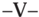
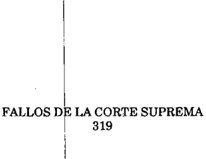

TOMO 319

Volumen 3

1996

2074

ACUERDOS DE LA CORTE SUPREMA

319

Copyright (c) 1998 by Corte Suprema de Justicia de la Nación Queda hecho el depósito que previene la ley 11.723. Impreso en la Argentina Printed in Argentina I.S.B.N.

DE JUSTICIA DE LA NACION

319

2075

## R E P U B L I C A A R G E N T I N A

FALLOS

DE  LA

C O R T E

S U P R E M A

DE

## J USTICIA DE LA N ACION

PUBLICACION A CARGO DE LA SECRETARIA DE JURISPRUDENCIA DEL TRIBUNAL

TOMO 319 - VOLUMEN 3

OCTUBRE - DICIEMBRE

LA LEY S.A.E. e I.

Tucumán 1471 (1050) Buenos Aires 1996

## HOJA COMPLEMENTARIA

Hoja incorporada a los efectos de permitir la búsqueda por página dentro del Volumen.

DE JUSTICIA DE LA NACION

319

2077

## A C U E R D O S   D E   L A   C O R T E   S U P R E M A

## AÑO 1996

## OCTUBRE - DICIEMBRE

## PODER JUDICIAL. RECHAZO DE RECOMENDACIONES EFECTUADAS POR EL SENADO DE LA NACION.

## -N o 59-

En Buenos Aires, a los 10 días del mes de octubre del año mil novecientos noventa y seis reunidos en la Sala de Acuerdos del Tribunal, los señores Ministros que suscriben la presente,

## Consideraron:

- 1 o ) Que esta Corte ha señalado en forma reiterada que dentro del sistema republicano de gobierno establecido por la Constitución Nacional, el accionar de los tres poderes del Estado es armónico y coordinado pues, aunque cada uno de ellos tiene algunas atribuciones exclusivas, deben asistirse, complementarse y controlarse entre sí. De lo contrario, se desequilibraría el sistema constitucional, que no está fundado en la posibilidad de que cada uno de los poderes actúe obstruyendo la función de los otros, sino en que lo haga con el concierto que exige el cumplimiento de los fines del Estado, para lo cual se requiere el respeto de las normas constitucionales.
- 2 o )  Que compete a esta Corte, en virtud de sus poderes implícitos como órgano superior y cabeza de uno de los poderes del Estado, salvaguardar el libre ejercicio y la eficiencia de la función específica que a los jueces atribuye la Constitución Nacional (Fallos 301:205; 305:504, entre otros).
- 3 o ) Que el Sr. Presidente del Honorable Senado de la Nación puso en conocimiento del Tribunal una declaración de aquél cuerpo, por la que 'exhorta a los jueces de la Nación a abstenerse de adoptar cualquier tipo de medida que suponga censura previa y que pretenda condicionar la tarea periodística'.
- 4 o ) Que así como esta Corte ha señalado en diversas oportunidades que no le corresponde formular peticiones o sugerencias dirigidas a otros poderes del Estado cuando éstos ejercen su competencia específica, o que emita opinión respecto de las medidas que éstos adopten en tal ámbito (Fallos 245:219; Acordada 67/90 en Fallos 313:774), tampoco cabe que admita recomendaciones de otros Poderes acerca del modo en que los jueces deben ejercer sus funciones.

5 o ) Que, por lo demás, y en lo que se refiere al contenido de la exhortación de que se trata, debe recordarse que, desde el punto de vista estrictamente jurisdiccional, sólo procede la intervención del Tribunal cuando se habilita su competencia por apelación (art. 117 de la Constitución Nacional), lo cual todavía no ha sucedido. Lo expuesto es independiente, por cierto, del contralor específico que pudieran ejercer los órganos legislativos por mandato constitucional.

Por ello,

Acordaron:

Comunicar al Sr. Presidente del Honorable Senado de la Nación.

Todo lo cual dispusieron y mandaron, ordenando que se comunicase y registrase en el libro correspondiente, por ante mí, que doy fe.- JULIO S. NAZARENO - EDUARDO MOLINÉ O'CONNOR - CARLOS S. FAYT - AUGUSTO CÉSAR BELLUSCIO - ENRIQUE SANTIAGO PETRACCHI - ANTONIO BOGGIANO - GUILLERMO A. F. LÓPEZ - GUSTAVO A. BOSSERT ADOLFO ROBERTO VÁZQUEZ.

INSCRIPCION DE AUXILIARES DE LA JUSTICIA. INVALIDEZ DE LA LEY 24.675.

## -N o 60-

En Buenos Aires, a los 15 días del mes de octubre del año mil novecientos noventa y seis, reunidos en la Sala de Acuerdos del Tribunal, los señores Ministros que suscriben la presente,

## Consideraron:

1) Que la ley 24.675 dispuso la apertura de un registro, en el ámbito del Ministerio de Justicia de la Nación, para la inscripción de aquellas personas que aspiren a desempeñarse como peritos, martilleros u otros auxiliares de la justicia (art. 2), estableciendo que los postulantes serán seleccionados por dicho ministerio en base a la reglamentación que se dicte (art. 4), fijando la obligación de pago de una tasa, cuyo monto y procedimiento será determinado por la reglamentación (art. 10), y facultando al Poder Ejecutivo para fijar por el término de cinco años los aranceles y retribuciones previstas (art. 13).

2) Que, en situaciones como la presente, la intervención de la Corte Suprema de Justicia de la Nación no se encuadra en las facultades de índole judicial previstas en los arts. 116 y 117 de la Constitución Nacional, antes bien, aquélla encuentra sustento en las atribuciones implícitas del Tribunal, que es órgano supremo y cabeza del Poder Judicial de la Nación (art. 108 de la Ley Fundamental), conclusión que hace inaplicables exigencias formales previstas para hipótesis sustancialmente diversas, como la concer-

niente a que se esté frente a un 'caso o controversia' (Fallos: 201:239, 245; 237:29; 256:114; 259:11; 270:85; 306:8; 308:1519 y 314:948).

3) Que, tal como lo ha establecido este Tribunal en Fallos 208:311, los peritos son 'auxiliares de la justicia en el más riguroso sentido' pues 'tienen a su cargo la específica misión de ilustrar técnicamente al juez con una objetividad tan estricta como la que debe tener el propio juez en cuanto concierne al desempeño de su función', razón que ha justificado desde antaño la adopción de todo tipo de previsiones tendientes a asegurar su mayor independencia. Entre esas previsiones se cuentan los arts. 458 del Código Procesal Civil y Comercial y 258 del Código Procesal Penal -no derogados por la ley 24.675- que prescriben que sean designados de oficio por los jueces.

4) Que si bien es cierto que las disposiciones de la mencionada ley se ciñen materialmente a reglamentar el modo en el que los magistrados deben efectuar los nombramientos de peritos -pues determinan quienes pueden integrar las listas-, no es menos cierto que al detraerle a esta Corte la atribución constitucional que le asiste de intervenir  -de  modo mediato o inmediato- en la confección de la reglamentación, y en el control de las listas que en su consecuencia se elaboren, se afecta su autoridad como titular de un Poder del Estado, lo que resulta inadmisible por afectar el principio de separación de los poderes.

Por ello,

Acordaron:

Declarar la invalidez de la ley 24.675.

Todo lo cual dispusieron y mandaron, ordenando que se comunicase y registrase en el libro correspondiente, por ante mí, que doy fe. - JULIO S. NAZARENO - EDUARDO MOLINÉ O'CONNOR - CARLOS S. FAYT - ANTONIO BOGGIANO - ENRIQUE SANTIAGO PETRACCHI - AUGUSTO CÉSAR BELLUSCIO ( según su voto ) - GUILLERMO A. LÓPEZ - GUSTAVO A. BOSSERT - ADOLFO ROBERTO VÁZQUEZ.Javier Leal de Ibarra (Secretario).

VOTO DEL SEÑOR MINISTRO DOCTOR DON AUGUSTO CÉSAR BELLUSCIO

## Considerando:

I) Que la ley 24.675 dispuso la apertura de un registro, en el ámbito del Ministerio de Justicia de la Nación, para la inscripción de aquellos que aspiren a desempeñarse como peritos, martilleros u otros auxiliares de la justicia (art. 2), estableciendo que los postulantes serán seleccionados por dicho ministerio en base a la reglamentación que se dicte (art. 4), fijando la obligación del pago de una tasa, cuyo monto y procedimiento será determinado por la reglamentación (art. 10), y facultando al Poder Ejecutivo para fijar por el término de cinco años los aranceles y retribuciones previstas (art. 13).

II)  Que  esa  normativa alcanza a aquellas personas con aptitud suficiente para llevar a cabo la prueba pericial regulada en los códigos procesales, que tienen la condi-

2080

ción de auxiliares de la justicia, tal como lo ha manifestado este Tribunal en Fallos 208:311.

III) Que, al no modificar el principio establecido por los arts. 458 del Código Procesal Civil y Comercial y 258 del Código Procesal Penal de que los peritos son designados de oficio por los jueces, la mencionada ley constituye únicamente una reglamentación del modo como los magistrados deben efectuar esos nombramientos.

IV) Que, de tal modo, constituye uno de los 'reglamentos necesarios para la eficaz prestación de los servicios de justicia' que el art. 114, inc. 6, de la Constitución Nacional atribuye al Consejo de la Magistratura y que, en tanto ese organismo no sea creado, continúa compitiendo a la Corte Suprema de Justicia sobre la base de la interpretación del art. 96 de la Constitución de 1853/60 que le ha permitido ejercer las facultades reglamentarias de las normas procesales.

V) Que no existe duda acerca de que la Corte debe hacerse cargo de la invalidez de la  ley  cuando  se  trata  de  salvaguardar  '...atribuciones  originarias  del  Tribunal,  en materia sustraída por el Poder Constituyente a la competencia del Poder Legislativo' (Fallos: 238:288; 248:398; 251:455; 308:1519, entre otros), criterio que cabe extender a las atribuciones conferidas por la Constitución al Consejo de la Magistratura y que la Corte debe ejercer hasta que ese organismo sea creado.

Por ello,

Acordaron:

Declarar la invalidez de la ley 24.675 por ser contraria al art. 114, inc. 6, de la Constitución Nacional y a las atribuciones mantenidas por la Corte Suprema hasta la creación del Consejo de la Magistratura en virtud del art. 96 del texto constitucional anterior.

Todo lo cual dispusieron y mandaron, ordenando que se comunicase y registrase en el libro correspondiente, por ante mí, que doy fe.- AUGUSTO CÉSAR BELLUSCIO Javier Leal de Ibarra (Secretario).

JUICIO POLITICO. NEGATIVA DEL JUEZ DE LA CAUSA A PRESTAR DECLARACION TESTIMONIAL.

-N o 61-

En Buenos Aires, a los 23 días del mes de octubre del año mil novecientos noventa y seis reunidos en la Sala de Acuerdos del Tribunal, los señores Ministros que suscriben la presente,

## Consideraron:

- 1 o ) Que esta Corte ha señalado en forma reiterada que dentro del sistema republicano de gobierno establecido por la Constitución Nacional, el accionar de los tres poderes del Estado es armónico y coordinado, y ejerciendo cada uno de ellos atribuciones exclusivas, tiene a su vez relaciones con los otros, a los que asiste, complementa y controla. De lo contrario, se desequilibraría el sistema constitucional, que no está fundado en la posibilidad de que cada uno de los poderes actúe destruyendo la función de los otros, sino en que lo haga con la armonía que exige el cumplimiento de los fines del Estado, para lo cual se requiere el respeto de las normas constitucionales.
- 2 o ) Que compete a esta Corte, en virtud de los poderes implícitos que ostenta como órgano superior y cabeza de uno de los poderes del Estado, salvaguardar el libre ejercicio  y  la  eficiencia  de  la  función  específica  que  a  los  jueces  atribuye  la  Constitución Nacional (Fallos 301:205; 305:504, entre otros).
- 3 o ) Que el Sr. Presidente de la Comisión de Juicio Político de la Honorable Cámara de Diputados de la Nación, puso en conocimiento de este Tribunal la conducta de un juez de la Nación -citado a prestar declaración testimonial-, por considerar que 'su negativa a concurrir invocando su condición de juez de grado en la causa ... obstruye una tarea de investigación' que constitucionalmente corresponde a ese cuerpo.
- 4 o )  Que ese organismo tiene a su cargo la investigación de la conducta del juez Trovato, a los efectos previstos en el art. 53 de la Constitución Nacional, en tanto el juez Elbert integra el tribunal de alzada que conoce en la causa criminal en que resulta imputado aquel magistrado.
- 5 o ) Que, en las circunstancias descriptas, órganos pertenecientes a diferentes poderes del Estado concurren -en sus respectivos ámbitos de actuación- en el examen de cuestiones vinculadas. En el ejercicio de esas funciones específicas cabe admitir un margen de colaboración institucional, mas esta actividad coordinada no puede ir en desmedro de la eficacia con que cada uno de ellos cumple sus objetivos, de modo que los recíprocos requerimientos no pueden importar la exclusión de una competencia propia e irrenunciable.
- 6 o ) Que, en tal sentido, el juez Elbert ha preservado su jurisdicción en la causa, que le veda emitir opiniones fuera de ese ámbito, por lo que su negativa a concurrir -emitida en términos respetuosos y mesurados-, constituye -en el caso- justificación suficiente de su conducta.

## Por ello,

## Acordaron:

Comunicar al Sr. Presidente de la Comisión de Juicio Político de la Honorable Cámara de Diputados de la Nación y al Sr. juez de cámara Dr. Carlos A. Elbert.

Todo lo cual dispusieron y mandaron, ordenando que se comunicase y registrase en el libro correspondiente, por ante mí, que doy fe.- JULIO S. NAZARENO - EDUARDO MOLINÉ O'CONNOR - CARLOS S. FAYT - AUGUSTO CÉSAR BELLUSCIO ( en disidencia )  -ANTONIO BOGGIANO - GUILLERMO A. F. LÓPEZ - GUSTAVO A. BOSSERT - ADOLFO ROBERTO VÁZQUEZ ( por su voto ) -Nicolás Alfredo Reyes (Administrador General)

## ACUERDOS DE LA CORTE SUPREMA

## DISIDENCIA DEL SEÑOR MINISTRO DOCTOR DON AUGUSTO CÉSAR BELLUSCIO

## Consideraron:

Que por nota del 20 de septiembre ppdo. el presidente de la Comisión de Juicio Político de la H. Cámara de Diputados de la Nación hace saber que, citados por dicha comisión los integrantes de la Sala VI de la Cámara Nacional de Apelaciones en lo Criminal y Correccional en el marco de la investigación que realiza respecto de las denuncias contra el titular del Juzgado Criminal N  25, Dr. Francisco Trovato, el Dr. o Carlos Elbert remitió una nota en la cual hace saber su negativa a concurrir invocando su condición de juez de la causa. Considera que dicha negativa obstruye la tarea de investigación que le corresponde en el marco del art. 53 de la Constitución.

Que, a su vez, el día 23 del mismo mes el Dr. Elbert remite copia de las notas intercambiadas con el presidente de la mencionada comisión. De ellas resulta que su negativa se fundó en el hecho de ser juez competente en las actuaciones relacionadas con los hechos imputados al Dr. Trovato y en la disposición del art. 250 del Código Procesal Penal, a lo que añade que su principal deber es preservar la competencia en las actuaciones que se refieren al Dr.Trovato, por notorias razones de objetividad.

Que si bien el art. 250 de la ley procesal exime a los magistrados de la obligación de concurrir a prestar declaración ante los tribunales, tal norma es inaplicable en el caso pues las actuaciones de la Cámara de Diputados en su misión constitucional de cámara acusadora en los juicios políticos se encuentran fuera del ámbito regido por aquella ley.

Que, por otra parte, no se aprecia por qué motivo la calidad de juez de eventuales procesos -cuya posibilidad de tramitación depende, en el caso, de la decisión que adopte el H. Senado como tribunal- pueda ser impedimento para suministrar a la Cámara de Diputados los informes que ésta crea necesarios ni afecte la objetividad de una eventual actuación como juzgador. Bien entendido que la posibilidad de informar o declarar encuentra sus límites en los arts. 156 y 157 del Código Penal.

Que, finalmente, tampoco existe razón para considerar que el requerimiento de la Comisión de Juicio Político afecte la competencia judicial del magistrado requerido, ni cabe afirmar a priori que le serán solicitadas opiniones que, claro está, no podría emitir.

## Por ello,

## Acordaron:

1 o ) Declarar que no existe impedimento constitucional ni legal para que el señor juez de cámara Dr. Carlos A. Elbert preste declaración testifical ante la Comisión de Juicio Político de la H. Cámara de Diputados de la Nación.

2 o ) Comunicar por oficio lo acordado al Dr. Elbert y a la Comisión de Juicio Político.

Todo lo cual dispusieron y mandaron, ordenando se comunicase y registrase en el libro correspondiente, por ante mí, que doy fe.- AUGUSTO CÉSAR BELLUSCIO.

VOTO DEL SEÑOR MINISTRO DOCTOR DON ADOLFO ROBERTO VÁZQUEZ

## Consideraron:

- 1 o ) Que esta Corte ha señalado en forma reiterada que dentro del sistema republicano de gobierno establecido por la Constitución Nacional, el accionar de los tres poderes del Estado es armónico y coordinado, y ejerciendo cada uno de ellos atribuciones exclusivas, tiene a su vez relaciones con los otros, a los que asiste, complementa y controla. De lo contrario, se desequilibraría el sistema constitucional, que no está fundado en la posibilidad de que cada uno de los poderes actúe destruyendo la función de los otros, sino en que lo haga con la armonía que exige el cumplimiento de los fines del Estado, para lo cual se requiere el respeto de las normas constitucionales.
- 2 o ) Que compete a esta Corte, en virtud de los poderes implícitos que ostenta como órgano superior y cabeza de uno de los poderes del Estado, salvaguardar el libre ejercicio  y  la  eficiencia  de  la  función  específica  que  a  los  jueces  atribuye  la  Constitución Nacional (Fallos 301:205; 305:504, entre otros).
- 3 o ) Que el Sr. Presidente de la Comisión de Juicio Político de la Honorable Cámara de Diputados de la Nación, puso en conocimiento de este Tribunal la conducta de un juez de la Nación -citado a prestar declaración testimonial-, por considerar que 'su negativa a concurrir invocando su condición de juez de grado en la causa ... obstruye una tarea de investigación' que constitucionalmente corresponde a ese cuerpo.
- 4 o )  Que ese organismo tiene a su cargo la investigación de la conducta del juez Trovato, a los efectos previstos en el art. 53 de la Constitución Nacional, en tanto el juez Elbert integra el tribunal de alzada que conoce en la causa criminal en que resulta imputado aquel magistrado.
- 5 o ) Que, en las circunstancias descriptas, órganos pertenecientes a diferentes poderes del Estado concurren -en sus respectivos ámbitos de actuación- en el examen de cuestiones vinculadas. En el ejercicio de esas funciones específicas cabe admitir un margen de colaboración institucional, mas esta actividad coordinada no puede ir en desmedro de la eficacia con que cada uno de ellos cumple sus objetivos, de modo que los recíprocos requerimientos no pueden importar la exclusión de una competencia propia e irrenunciable.
- 6 o ) Que, en tal sentido, el juez Elbert ha preservado su jurisdicción en la causa, que le veda emitir opiniones fuera de ese ámbito, por lo que su negativa a concurrir -emitida en términos respetuosos y mesurados-, constituye -en el caso- justificación suficiente de su conducta.
- 7 o ) Que la tramitación del instituto del juicio político es un acto análogo a la denuncia y participa de sus características. En ese sentido la citación de un Magistrado

de la Nación -al igual que otras personas o funcionarios vinculados a los poderes nacionales o provinciales- goza del 'tratamiento especial' que le confiere el Código Procesal Penal de la Nación -ley 23.984- según lo previsto en el artículo 250. El interrogatorio que se le formule en calidad de testigo deberá realizarse en su residencia oficial, o por informe escrito, salvo que expresamente renuncie a ello. Tal criterio, se compadece con lo dispuesto por esta Corte mediante acordada del 20 de diciembre de 1967 -art. 4 -, o publicado en Fallos 269:357, que complementa lo dispuesto el artículo 455 del Código Procesal, Civil y Comercial de la Nación.

Por ello,

Acordaron:

Comunicar la presente al Sr. Presidente de la Comisión de Juicio Político de la Honorable Cámara de Diputados de la Nación y al Sr. Juez de Cámara Dr. Carlos A. Elbert.

Todo lo cual dispusieron y mandaron, ordenando que se comunicase y registrase en el libro correspondiente, por ante mí, que doy fe.- ADOLFO ROBERTO VÁZQUEZ.

## DISTRIBUCION DE ACORDADAS Y RESOLUCIONES.

## -N o 63-

En Buenos Aires, a los 29 días del mes de octubre del año mil novecientos noventa y seis reunidos en la Sala de Acuerdos del Tribunal, el señor Presidente de la Corte Suprema de Justicia de la Nación Dr. Julio Salvador Nazareno y los Ministros que suscriben la presente,

## Consideraron:

Que es necesario profundizar las acciones orientadas a la economía de recursos, aplicando nuevos métodos que la tecnología brinda o adaptando los vigentes.

Que el sistema de comunicaciones en el ámbito de la gestión administrativa, debe ser revisado, eliminando tramitaciones burocráticas que si bien pueden ser de rigor en los  procedimientos jurisdiccionales, para el debido resguardo de los derechos de las partes involucradas en un juicio, carece de útil relevancia en esta última actividad y perjudica la celeridad y economía de los trámites que deben cumplirse.

Por ello,

Acordaron:

Incorporar como Artículo 40 bis en el Reglamento para la Justicia Nacional el siguiente:

'Artículo 40 bis. La distribución de acordadas y resoluciones de la Corte Suprema de Justicia de la Nación, a los tribunales y dependencias administrativas, se efectuará utilizando únicamente el formulario de Remito de Documentación, sin agregar oficio, pase u otra formalidad, utilizándose dicho procedimiento aún para las jerarquías superiores, magistrados y funcionarios.

El envío de acordadas y resoluciones podrá realizarse por medios informáticos o telemáticos, dejándose constancia de la emisión y recepción por funcionario responsable.

El presente artículo rige exclusivamente en los trámites originados en la actividad administrativa interna, no siendo de aplicación en la materia reglamentada por las normas procesales.'

Todo lo cual dispusieron y mandaron, ordenando que se comunicase y registrase en el libro correspondiente, por ante mí, que doy fe.- JULIO S. NAZARENO - EDUARDO MOLINÉ O'CONNOR - CARLOS S. FAYT - AUGUSTO CÉSAR BELLUSCIO - ENRIQUE SANTIAGO PETRACCHI - ANTONIO BOGGIANO - GUILLERMO A. F. LÓPEZ - GUSTAVO A. BOSSERT ADOLFO ROBERTO VÁZQUEZ Nicolás Alfredo Reyes (Administrador General).

ADMINISTRACION GENERAL DE LA CORTE SUPREMA. DESIGNACION DE SECRETARIO.

## -N o 67-

En Buenos Aires, a los cinco días del mes de noviembre de 1996, reunidos en la Sala de Acuerdos del Tribunal, el Señor Presidente de la Corte Suprema de Justicia de la Nación, y los Señores Ministros que suscriben la presente,

## Consideraron:

Que en virtud de lo resuelto por Acordada 62/96, corresponde disponer la creación del cargo presupuestario y proveer a la designación del funcionario que asumirá la Administración General de la Corte Suprema de Justicia de la Nación -tarea que, con anterioridad al dictado de la aludida acordada, se ejerció en los términos de lo resuelto por la Acordada 32/95-.

Por ello,

Se resuelve:

Crear un cargo de Secretario de la Corte Suprema de Justicia de la Nación en la dotación del personal de este Tribunal y autorizar a la Dirección de Administración Financiera el gasto resultante, que quedará totalmente compensado con la supresión del contrato mencionado en la Acordada 32/95.

2086

Designar Secretario de la Corte Suprema de Justicia de la Nación a cargo de la Administración General del Tribunal, al Dr. Nicolás Alfredo Reyes (D.N.I. 6.719.530).

Todo lo cual dispusieron y mandaron, ordenando que se comunicase y se registrase en el libro correspondiente, por ante mi, que doy fe.- JULIO S. NAZARENO - EDUARDO MOLINÉ O'CONNOR - CARLOS S. FAYT - AUGUSTO CÉSAR BELLUSCIO - ENRIQUE SANTIAGO PETRACCHI - ANTONIO BOGGIANO - GUILLERMO A. F. LÓPEZ - GUSTAVO A. BOSSERT ADOLFO ROBERTO VÁZQUEZ.

## HONRAS DISPUESTAS CON MOTIVO DEL FALLECIMIENTO DEL DR. CESAR BLACK.

## -N o 70-

En Buenos Aires, a los 11 días del mes de noviembre del año mil novecientos noventa y seis, reunidos en la Sala de Acuerdos del Tribunal, los señores Ministros que suscriben la presente,

Consideraron:

Que el día 4 del corriente mes ha ocurrido el sensible fallecimiento del Dr. César Black, ex Ministro de la Corte Suprema de Justicia de la Nación.

Que es deber del Tribunal asociarse al duelo que provoca la desaparición del distinguido ex magistrado.

Por ello,

Acordaron:

- 1 o ) Dirigir nota de condolencia a la familia del extinto.
- 2 o ) Incluir el nombre del Dr. César Black en las tablas de honor del Tribunal.

Todo lo cual dispusieron y mandaron, ordenando que se comunicase y registrase en el libro correspondiente, por ante mí, que doy fe.-  JULIO S. NAZARENO - EDUARDO MOLINÉ O'CONNOR - CARLOS S. FAYT - ENRIQUE SANTIAGO PETRACCHI - ANTONIO BOGGIANO - GUILLERMO A. F. LÓPEZ - ADOLFO ROBERTO VÁZQUEZ Nicolás Alfredo Reyes (Administrador General).

## DE JUSTICIA DE LA NACION

## PODER JUDICIAL. REGIMEN DE INTENDENCIAS.

## -N o 74-

En Buenos Aires, a los 26 días del mes de noviembre del año mil novecientos noventa y seis, reunidos en la Sala de Acuerdos del Tribunal, los señores Ministros que suscriben la presente,

## Consideraron:

- 1) Que por resolución N  33/96 se estableció el Régimen de Intendencias del Poder o Judicial de la Nación, con el fin de descentralizar los servicios y atender necesidades en forma directa, rápida y económica, habiéndose previsto un plazo inicial provisorio para su desarrollo.
- 2) Que la experiencia recogida en el funcionamiento del sistema, los informes de la Dirección de Infraestructura Judicial y de la Administración General de la Corte, como las opiniones de algunos magistrados que se expidieron a solicitud de la Administración General sobre las bondades del sistema, concluyen en que el Régimen es adecuado a los requerimientos técnico-funcionales y operativos.

Por ello,

Acordaron:

## Del Régimen de Intendencias

- 1) Establecer con carácter definitivo el Régimen de Intendencias del Poder Judicial de la Nación, que tendrá por finalidad atender los requerimientos básicos, mantenimiento y servicios de la infraestructura edilicia y demás necesidades de funcionamiento de los tribunales y organismos con sede en la Capital Federal e interior del país, en las condiciones que se determinan en esta acordada y en el Reglamento que forma parte como Anexo I de la presente.

## De las Funciones

## 2) Serán funciones de las Intendencias:

- 2.1. Relevar la infraestructura de su área para reunir información de los edificios, instalaciones, servicios y recursos que se dispone, manteniendo actualizada la misma y elevarla a conocimiento de la Dirección de Infraestructura Judicial, según lo dispuesto en el Reglamento.
- 2.2. Proponer todo lo conducente a la preservación, mantenimiento, higiene de los edificios y seguridad de sus instalaciones.
- 2.3. Evaluar las necesidades detectadas para atenderlas por sí o proponer su atención por terceros.

- 2.4. Ejecutar y supervisar las operaciones a su cargo y las que le fueren encomendadas, en las condiciones técnicas que se establecen en el Reglamento, incluso la supervisión y/o inspección de contrataciones con terceros.
- 2.5. Recibir, registrar y administrar los recursos materiales y financieros que se les provean para el cumplimiento de sus funciones, de acuerdo con el régimen aprobado a tales fines.
- 2.6. Colaborar en la instalación y funcionamiento del sistema de comunicaciones internas y externas.
- 2.7. Asesorar y asistir en su materia, al magistrado o funcionario a cargo de la Superintendencia en la jurisdicción de la Intendencia.
- 2.8. Dirigir, coordinar y supervisar todo el personal asignado a las tareas de mantenimiento y maestranza de los edificios que integran la Intendencia.
- 2.9. Controlar el uso y los costos de los servicios públicos.
- 2.10. Informar a la superioridad acerca de las novedades y requerimientos de la infraestructura y los servicios.
- 2.11. Realizar estudios, efectuar propuestas y cumplir todas las demás acciones que se les encomiende para el mejor desarrollo de las actividades.

## Requerimientos profesionales

- 3) Las Intendencias estarán a cargo de un Intendente con el título de Arquitecto o Ingeniero  Civil  o  título  equivalente  en  la  especialidad.  Estará  asistido  por  un Subintendente, para quien se requerirá como mínimo título de Técnico Constructor Nacional, Maestro Mayor de Obras u otro título equivalente.

## Tareas a ejecutar

- 4) Las Intendencias podrán ejecutar directamente las tareas de baja complejidad, entendiéndose por tales aquellas que pueden atender con el personal y medios que se encuentren a su directa e inmediata disponibilidad, incluidas las de higiene de los edificios y seguridad de sus instalaciones, y para las cuales no sea necesaria la intervención previa de la Superintendencia respectiva, según detalle de trabajos del Reglamento.

Las demás obras o tareas que requieran la afectación de otros recursos, la contratación con terceros o la autorización previa de la autoridad superior, deberán solicitarse con intervención de la Superintendencia respectiva a la Dirección de Infraestructura Judicial para la aprobación de la Administración General de la Corte, quien canalizará las propuestas al Alto Tribunal.

En todos los edificios del Poder Judicial se aplicarán los términos de la Resolución C.S.J.N. N  1505/96 del 30 de septiembre de 1996, en materia de modificaciones que o afecten o incidan en la infraestructura respectiva.

## Agrupamiento edilicio

- 5) Agrupar, para el funcionamiento de las respectivas Intendencias, los edificios de la Corte Suprema y de las Cámaras Nacionales de Apelaciones con sede en la Capital Federal, La Plata y San Martín, según el detalle que figura como Anexo II de la presente acordada.
- 6) La Intendencia del Palacio de Justicia se regirá por las normas de la presente acordada y por las disposiciones particulares que, en cuanto a lo dispuesto en el punto 3), a su dependencia y funcionamiento, la Dirección de Infraestructura Judicial proponga en un plazo de 15 días al Administrador General.
- 7) La Intendencia correspondiente a los edificios de Marcelo T. de Alvear 1840/60 y  la  de  los  que  sean  asiento  de  organismos  de  la  Corte  Suprema  de  Justicia  de  la Nación, con excepción del Palacio de Justicia, dependen de la Dirección de Infraestructura Judicial.

## Personal de las Intendencias

- 8) Integra el plantel de las Intendencias el personal afectado por las respectivas Cámaras, conjuntamente con los agentes que transfiera la Presidencia de la Corte Suprema de Justicia de la Nación, con motivo del régimen aprobado por esta acordada, el que pasará a depender del correspondiente fuero.
- 9) El plantel de personal asignado a las Intendencias, no podrá ser modificado sin considerar previamente la adecuada atención y cumplimiento de las funciones encomendadas a la Intendencia.
- 10) El personal que integra las Intendencias mantendrá su actual situación de revista escalafonaria, hasta tanto el desempeño de las funciones y responsabilidades asignadas aconsejen su revisión, evaluándose en cada caso particular, el nivel jerárquico de dichos cargos.

## Dependencia y coordinación

- 11) Las Intendencias incluidas en este Régimen dependerán jerárquicamente del Área de Superintendencia de las respectivas Cámaras, de acuerdo con las modalidades, requisitos y condiciones que establece la presente acordada y salvo lo mencionado en el punto 7) de la presente.
- 12) El asesoramiento, la autorización y coordinación técnica en lo relativo a obras y servicios estará a cargo de la Administración General por intermedio de la Dirección de Infraestructura Judicial, que funcionalmente brindará el apoyo necesario en las cuestiones técnicas que se requieran.

## Disposiciones transitorias.

- 13) Para los casos en los cuales se comparten dependencias en edificios asignados a funciones del Poder Judicial de la Nación y del Ministerio Público, la Dirección de Infraestructura Judicial deberá determinar -sobre la base de los espacios ocupados-

2090

los prorrateos correspondientes a los gastos de mantenimiento, maestranza y funcionamiento de los mismos para la atención proporcional correspondiente.

- 14) La Dirección de Infraestructura Judicial elevará a la Administración General en un plazo de cuarenta y cinco (45) días un informe sobre el funcionamiento y propuesta para las intendencias en el interior del país.
- 15) Todas las demás cuestiones no contempladas en la presente se resolverán por el Presidente del Tribunal, a propuesta del señor Administrador General, quien propondrá los resolutorios necesarios.

Todo lo cual dispusieron y mandaron, ordenando que se comunicase y registrase en el libro correspondiente, por ante mí, que doy fe.- JULIO S. NAZARENO - CARLOS S. FAYT - AUGUSTO CÉSAR BELLUSCIO - ENRIQUE SANTIAGO PETRACCHI - ANTONIO BOGGIANO - GUSTAVO A. BOSSERT - ADOLFO ROBERTO VÁZQUEZ Nicolás Alfredo Reyes (Administrador General).

AUTORIDADES DE FERIA DE ENERO DE 1997.

-N o 76-

En Buenos Aires, a los 2 días del mes de diciembre del año mil novecientos noventa  y  seis,  reunidos  en  la  Sala  de  Acuerdos  del  Tribunal,  los  señores  Ministros  que suscriben la presente,

Acordaron:

Designar como autoridades de feria del mes de enero del año 1997:

- 1 o )  Al  doctor Adolfo Roberto Vázquez -del 1  al 15- y al doctor Guillermo A. F. o López -del 16 al 31-, como jueces de feria.
- 2 o ) Al doctor Jorge Alberto Migliore, como secretario del Tribunal.
- 3 o )  Establecer el horario de atención al público de lunes a viernes, desde las 8 hasta las 12 horas.
- 4 o )  El personal que preste funciones durante la feria judicial deberá acreditarlo mediante certificación otorgada por el señor secretario de feria.

Todo lo cual dispusieron y mandaron, ordenando que se comunicase y registrase en el libro correspondiente, por ante mí, que doy fe.- JULIO S. NAZARENO - EDUARDO MOLINÉ O'CONNOR - CARLOS S. FAYT - ENRIQUE SANTIAGO PETRACCHI - GUSTAVO A. BOSSERT - ADOLFO ROBERTO VÁZQUEZ Nicolás Alfredo Reyes (Administrador General).

## DE JUSTICIA DE LA NACION 319

## OBRA SOCIAL. ESTATUTO.

## -N o 79-

En Buenos Aires, a los 9 días del mes de diciembre del año mil novecientos noventa y seis reunidos en la Sala de Acuerdos del Tribunal, los señores Ministros que suscriben la presente,

## Consideraron:

Que resulta conveniente adecuar las disposiciones del Estatuto de la Obra Social del Poder Judicial al interés de sus afiliados y del Tribunal en pos de mantener en vigencia el aumento y mejora de las prestaciones.

Por ello,

## Acordaron:

Modificar el capítulo titulado 'De los Afiliados', pertenecientes a dicho Estatuto (artículos 5  a 15 ) el cual quedará conformado de la siguiente manera: o o

## De los afiliados:

- Art. 5 )  Habrá dos grupos principales de afiliados: Titulares y Familiares: Son o afiliados titulares aquellos que por sí mismos pueden solicitar su afiliación. Son afiliados familiares quienes, llenando los requisitos especificados en el Art. 6 , incs. d) a o), o pueden ser incorporados a solicitud de un afiliado titular.

Art. 6 ) Cada uno de estos grupos principales estará subdividido en categorías, a o saber:

## Titulares:

- a) Activos: son titulares activos los magistrados, funcionarios, empleados, personal de maestranza, obrero y de servicio, del Poder Judicial de la Nación. Para los magistrados la afiliación es optativa; y obligatoria para los demás agentes en actividad y para el personal contratado, mientras dure su relación contractual.
- b) Jubilados y Pensionados: quienes perciban los correspondientes haberes de pasividad, si se hubieran desempeñado por lo menos cinco (5) años en el Poder Judicial de la Nación, y manifiesten expresamente su voluntad de continuar como afiliados, si lo hubieran sido, por lo menos por el indicado período, cuando se encontraban en actividad. En todos los casos será requisito indispensable para que se conceda la afiliación, el efectivo ingreso de los respectivos aportes por parte del ANSES o de las administradoras de fondos de jubilaciones y pensiones o, en su caso, el pago directo por parte del afiliado de la cuota correspondiente.
- c) Extraordinarios: Aquellas personas que habiendo renunciado al Poder Judicial de la Nación, contaran en esa condición con una antigüedad mayor de cinco (5) años en

él y en la afiliación, y requieran la continuidad de la misma; y los hijos de los afiliados mayores de veintiún (21) años que no puedan permanecer como afiliados familiares en la institución (conf. inc. h) de este artículo), y requieran su continuación como extraordinarios, siempre que satisfagan la cuota especial correspondiente.

## Familiares:

## d) El cónyuge

- e) Los hijos menores de veintiún (21) años. Esta edad podrá ser elevada hasta los veintiséis (26) años si cursaran estudios, o si, al no tener trabajo, continuaran a cargo del titular.
- f) Los hijos, cualquiera sea su edad, que se encuentren incapacitados para el trabajo.

## Familiares adherentes:

- g)  Los  descendientes en línea directa, a cargo del afiliado titular, siempre que fueran menores de edad o estuvieran incapacitados para el trabajo.

h) Los hijos de los afiliados o ex-afiliados con más de cinco (5) años de antigüedad y  más de veintiún (21) años de edad podrán continuar en la categoría de 'familiar adherente' siempre que sea satisfecha la cuota especial.

- i) Los padres, tanto del afiliado titular, como de su cónyuge cuando éste sea también afiliado, que no tengan -ni hayan tenido-, durante los dos (2) años previos a su solicitud de afiliación, la cobertura de ninguna obra social. Deberán satisfacer -previo a su incorporación-, el correspondiente examen médico de salud, a los efectos de determinar enfermedades preexistentes. En estos casos no se cubrirá la preexistencia de enfermedades que requieran neurocirugía, diálisis crónica, cirugía vascular, trasplante de órganos, implantes protésicos y, en general, todo tratamiento o procedimiento de alta complejidad.
- j) Los colaterales por consanguinidad hasta el segundo grado, menores de edad o que estén incapacitados para el trabajo y se encuentren en exclusivo cargo del afiliado que solicite su incorporación.

k) Los menores a cargo del titular por disposición judicial.

l) La persona que conviva con el afiliado titular en relación aparentemente matrimonial durante un lapso no inferior a cinco (5) años. No se requerirá el cumplimiento de ese período si hubiese un hijo del titular y la persona conviviente que haya sido reconocido por ambos.

Las circunstancias tenidas en consideración en este inciso, salvo la existencia de hijo reconocido, se acreditarán mediante información sumaria judicial. Para la afiliación de la persona que convive con el titular deberá pagarse una cuota especial.

- m) Los menores, hijos del cónyuge del titular, siempre que convivan con éste y estén a su cargo; no gocen de prestaciones de otra institución social y satisfagan la cuota especial fijada al efecto.

## Familiares adherentes especiales:

- n) Los familiares por nuevo vínculo de los afiliados jubilados y pensionados, en los casos y condiciones previstas en los incisos precedentes, que soliciten la afiliación como adherentes especiales y satisfagan la cuota especial que se fije.

## Familiares adherentes extraordinarios:

- ñ) En caso de divorcio, el ex cónyuge, podrá permanecer como afiliado satisfaciendo la cuota especial fijada para el familiar adherente extraordinario. Tal circunstancia no impedirá la inscripción de un nuevo cónyuge, o la del afiliado mencionado en el inc. l).
- o) Los padres del ex cónyuge, en caso de divorcio, podrán mantener la afiliación anterior, siempre y cuando continúe afiliado el ex-cónyuge, de acuerdo con las condiciones enunciadas en el inc. ñ). Pagará cada uno la cuota correspondiente a la de familiar adherente extraordinario.
- Art. 7 ) No podrán ser afiliados familiares las personas que reuniendo los requisio tos  especificados en los incs. f), i),  j)  y  l)  del  art.  6 ,  gocen  de  otra  cobertura  social. o Quienes hayan renunciado a una anterior cobertura, no podrán afiliarse hasta dos (2) años después de aceptada la renuncia.
- Art. 8 ) Será requisito indispensable para que puedan ser afiliados, que las persoo nas a que se refieren los incs. f), g), i), j), l), y m) del art. 6 , se encuentren a exclusivo o cargo del titular que solicite su incorporación. Para acreditar tal circunstancia, el afiliado deberá demostrar que cubre exclusivamente todas las necesidades del familiar, tales como techo, comida y vestimenta, no contando para ello con ayuda de otros.
- Art. 9 ) Todos los afiliados deberán contribuir con la cuota que determina la Corte o Suprema de Justicia de la Nación o la que, en su caso y previa aprobación del Tribunal, establezca la propia Obra Social.

Las cuotas correspondientes a cada afiliado titular y a los familiares por él incorporados deberán ser satisfechas por aquél, en la forma que las reglamentaciones pertinentes lo determinen.

La cuota correspondiente al llamado 'grupo familiar primario' -constituido por el cónyuge, y los hijos menores de edad-, consistirá en un porcentaje único cualquiera sea el número de integrantes del grupo.

- Art. 10) Toda afiliación deberá requerirse mediante presentación de una solicitud especial acompañada de la documentación que determine la reglamentación que se dictará al respecto. Esta solicitud revestirá carácter de declaración jurada, quedando su presentante sujeto a las sanciones por falso testimonio en caso de reticencia o falsedad.

Art. 11) Son derechos y obligaciones de los afiliados titulares:

- a) Gozar inmediatamente de los servicios asistenciales y demás beneficios sociales, con sujeción a las normas que reglamenten su prestación. Los magistrados, jubilados y extraordinarios, que opten por pertenecer a la Obra Social del Poder Judicial dentro del mes inmediato posterior a su designación, jubilación o cesación de servicios, según corresponda, gozarán de la cobertura total, sin período de carencia.

Si la opción se realizare con posterioridad al mes inmediato, la cobertura tendrá las siguientes características:

- 1)  Podrán  efectuar  consultas  ambulatorias,  análisis,  radiografías  y  prácticas ambulatorias nomencladas en forma inmediata.
- 2) Tendrán acceso a los beneficios de la farmacia social en forma inmediata.
- 3) Podrán acceder a las internaciones derivadas de emergencias clínicas o quirúrgicas, ocurridas imprevistamente luego de la afiliación en forma inmediata.
- 4) Las internaciones clínicas o quirúrgicas no urgentes, las internaciones y procedimientos de rehabilitación, las internaciones psiquiátricas, la modalidad de hospital psiquiátrico de día, las prácticas especializadas complejas que requieran internación o sean invasivas, los análisis y prácticas no nomencladas de cualquier tipo, tendrá un período de carencia de (10) meses.
- 5) La atención del embarazo, el parto y el puerperio, tendrán un período de carencia de diez meses. El régimen de carencia que se indica en el presente inciso será de aplicación para todos los afiliados no obligatorios, computándose a partir de su efectiva incorporación como afiliados.
- b) Hacer llegar al Director General todas las sugerencias que consideren conducentes a la mejor prestación de los servicios asistenciales y, en general, al desenvolvimiento de la Obra Social.
- c) Satisfacer la retribución que, por los servicios asistenciales fijen los reglamentos y aranceles.
- d) Abonar el aporte de afiliación que corresponda.
- e)  Solicitar  la  incorporación  o  desafiliación  de  los  afiliados  familiares  a  que  se refieren los incs. d) a o) del art. 6 ), y abonar el aporte que corresponda a las distintas o categorías de aquéllos.
- Art. 12 ) Son derechos y obligaciones de los afiliados familiares: o
- a) Gozar de los servicios asistenciales con sujeción a las normas que reglamenten su prestación con excepción de los que estén limitados a los afiliados titulares. Los mencionados en el Art. 6  inc. i), tendrán un período de carencia de diez (10) meses o para la utilización de los beneficios.

- b) Los mencionados en el inc. c) del art. 11.
- c) Solicitar la continuación de su afiliación en los términos a que se hace referencia en el inc. a) del art. 13 . o

## Art. 13 ) La afiliación tendrá fin: o

- a) Por fallecimiento: Si se tratare de la muerte de un afiliado titular, sus afiliados familiares podrán continuar como tales manifestándolo expresamente contribuyendo con una cuota total igual a la que abonaba el titular, con las limitaciones que expresan los incisos b) y c).
- b) Por contraer nuevas nupcias, tratándose de viudos o divorciados de un ex-afiliado titular.
- c)  Por cesación en los servicios que determinaron el carácter de afiliado, con la excepción que surge del artículo 6  incisos b), c) y h). o
- d) Por cesación de la jubilación o pensión y no opten de corresponder por continuar como adherente o extraordinario.
- e) Por haber dejado de estar a cargo del afiliado titular que solicitó su afiliación, o por pedido expreso de aquél en los casos a que se refieren los incisos f), g) e i) a o) del artículo 6 . o
- f) Por renuncia a la misma, cuando dicha afiliación no fuere obligatoria.
- g) Por cese de la condición de afiliado en los supuestos de los arts. 14 y 15.
- Art. 14: Cuando el aporte de afiliación o el pago de una deuda contraída por prestaciones no se satisfaga mediante descuento directo del sueldo, jubilación o pensión, el atraso de dos mensualidades autorizará la suspensión de la prestación de los servicios asistenciales. El atraso de tres o más mensualidades determinará la desafiliación. En todos los casos, la mora se producirá sin necesidad de intimación previa o requerimiento alguno. Iguales sanciones podrán imponerse en el caso de incumplimiento de otras obligaciones.
- Art. 15: Cualquier acto de un afiliado, que se cometiere intencionalmente en perjuicio  de  la  Obra  Social,  autorizará  la  suspensión  de  la  prestación  de  los  servicios asistenciales, o la desafiliación de aquél, según sea la gravedad del hecho.- JULIO S. NAZARENO - EDUARDO MOLINÉ O'CONNOR - CARLOS S. FAYT - AUGUSTO CÉSAR BELLUSCIO - ENRIQUE SANTIAGO PETRACCHI - ANTONIO BOGGIANO - GUSTAVO A. BOSSERT - ADOLFO ROBERTO VÁZQUEZ Nicolás Alfredo Reyes (Administrador General).

2096

## ACUERDOS DE LA CORTE SUPREMA

## AUTORIDADES DE FERIA JUDICIAL DE ENERO DE 1997.

## -N o 81-

En Buenos Aires, a los 10 días del mes de diciembre del año mil novecientos noventa y seis, reunidos en la Sala de Acuerdos del Tribunal, los señores Ministros que suscriben la presente,

## Acordaron:

Ampliar el punto 2  de la Acordada 76/96 y designar a la doctora María Cristina o Alvarez de Magliano como secretaria de feria la segunda quincena de enero de 1997 y aclarar que el doctor Jorge Alberto Migliore permanecerá todo el mes.

Todo lo cual dispusieron y mandaron, ordenando que se comunicase y registrase en el libro correspondiente, por ante mí, que doy fe.- EDUARDO MOLINÉ O'CONNOR CARLOS S. FAYT - ENRIQUE S. PETRACCHI - GUILLERMO A. LÓPEZ - GUSTAVO A. BOSSERT ADOLFO ROBERTO VÁZQUEZ Nicolás Alfredo Reyes (Administrador General).

## FERIADO Y ASUETO JUDICIAL.

## -N o 83-

En Buenos Aires, a los 18 días del mes de diciembre del año mil novecientos noventa y seis reunidos en la Sala de Acuerdos del Tribunal, los señores Ministros que suscriben la presente,

Acordaron:

Decretar feriado judicial el día 24 y asueto judicial a partir de las 12 horas el 31 del corriente mes para los tribunales nacionales y federales con asiento en la capital e interior del país, en las condiciones establecidas en el art. 3  (R.J.N.). o

Todo lo cual dispusieron y mandaron, ordenando que se comunicase y registrase en el libro correspondiente, por ante mí, que doy fe.- JULIO S. NAZARENO - EDUARDO MOLINÉ O'CONNOR - ENRIQUE SANTIAGO PETRACCHI - ANTONIO BOGGIANO - GUILLERMO A. F. LÓPEZ - GUSTAVO A. BOSSERT Nicolás Alfredo Reyes (Administrador General).

## DE JUSTICIA DE LA NACION

319

## COMISION BICAMERAL ESPECIAL DE SEGUIMIENTO DE LA INVESTIGACION DE LOS ATENTADOS A LA EMBAJADA DE ISRAEL Y LA A.M.I.A.

## -N o 84-

En Buenos Aires, a los 26 de días del mes de diciembre del año mil novecientos noventa y seis, reunidos en la Sala de Acuerdos del Tribunal, los señores Ministros que suscriben la presente,

## Consideraron:

- 1 o ) Que el Honorable Senado de la Nación ha remitido una copia del Reglamento interno de la Comisión Bicameral Especial de Seguimiento de la Investigación de los Atentados a la Embajada de Israel y el Edificio de la A.M.I.A., de conformidad con el pedido formulado por este Tribunal. Este requerimiento tuvo su origen en la noticia de la formación de dicha Comisión, comunicada por su Presidente, el Sr. diputado Carlos Ernesto Soria, conforme con la cual las actividades a cumplir 'serán las de seguimiento de las investigaciones iniciadas con motivo de los atentados a la Embajada de Israel y al Edificio de la A.M.I.A. coadyuvando con las investigaciones judiciales para lograr el total esclarecimiento de los hechos. Asimismo desarrollará sus actividades específicas participando con iniciativa en el análisis de los proyectos de leyes tendientes a la prevención y sanción de las actividades ilícitas desplegadas por el crimen organizado'.
- 2 o ) Que, asimismo, ha llegado a conocimiento de este Tribunal la declaración efectuada por dicha Comisión en la cual se expresa que, de acuerdo con lo prescripto en la Constitución Nacional sobre las facultades privativas de cada uno de los poderes y partiendo del principio de su relación armónica, se propone dar cumplimiento a los objetivos del cuerpo sujetándose a las normas vigentes para el normal y correcto funcionamiento de la administración de justicia y los preceptos constitucionales respectivos.
- 3 o ) Que esta Corte ha dicho en forma reiterada que, dentro del sistema republicano de gobierno establecido por la Constitución Nacional, el accionar de los tres poderes del Estado es armónico y coordinado y ejerciendo cada uno de ellos atribuciones exclusivas, tiene a su vez relaciones con los otros, a los que asiste, completa y controla.
- 4 o ) Que, dentro de esa necesaria coincidencia con la Comisión Bicameral del Congreso de la Nación, en la comprensión del funcionamiento del sistema constitucional vigente, este Tribunal, por su calidad de órgano supremo y cabeza del Poder Judicial de la Nación (art. 108, Ley Fundamental), se ve precisado a salvaguardar el libre desarrollo y la función específica que a los jueces atribuye la Constitución Nacional (Fallos 241:50; 256:114, 208; 259:11; 286:17; 301:205; 305:504, entre otros).
- 5 o ) Que, desde tal perspectiva, cabe destacar que los jueces nacionales se encuentran sometidos a un severo régimen de restricciones e incompatibilidades, destinadas a reforzar la independencia del poder que integran y la plenitud del derecho de defensa

de los justiciables. El ejercicio específico de su función jurisdiccional les impone los deberes de 'guardar absoluta reserva con respecto a los asuntos vinculados con las funciones de los respectivos tribunales' y 'no evacuar consultas ni dar asesoramiento en los casos de contienda judicial actual o posible' (Reglamento para la Justicia Nacional, art. 8, inc. b y c). A esas disposiciones se suman las que regulan en forma específica el procedimiento en las causas criminales, donde aseguran la eficacia de la garantía constitucional del debido proceso, como lo ha expresado en forma reiterada este Tribunal.

- 6 o ) Que, por ello, resulta incompatible con el debido ejercicio de las atribuciones constitucionales asignadas al Poder Judicial, que en el Reglamento interno de la Comisión Bicameral Especial se requiera 'a cada uno de los juzgados abocados a la investigación de las causas la realización de una exposición trimestral de carácter reservado, ante la comisión, que versará sobre las actividades realizadas por el mismo'.

En efecto, una exposición de tal índole importaría la transgresión del deber de reserva impuesto a los magistrados nacionales, del cual no pueden ser relevados por pedido de otro poder, por tratarse de una obligación inherente al buen desempeño de la función jurisdiccional que compete a esta Corte preservar. Cabe añadir que los actos jurisdiccionales se traducen en el expediente respectivo, sin que corresponda que los jueces den cuenta de su desempeño fuera del juzgamiento de su responsabilidad política.

- 7 o ) Que, por otra parte, la disposición sub examine debe ser rechazada en cuanto supone la existencia de una relación de subordinación de los jueces hacia una comisión perteneciente a otro poder del Estado, lo que es incompatible con el principio de separación de poderes establecido en la Constitución Nacional y -por ende- con los propósitos de respetar estrictamente ese régimen, expresados por la Comisión Bicameral.
- 8 o ) Que, en mérito a las razones expuestas, esta Corte reitera su disposición para aceptar la asistencia ofrecida por dicha Comisión, que pudiere resultar de la actividad enderezada a legislar en el ámbito de la prevención y sanción de las actividades ilícitas de referencia, en armonía con su declaración del 17 de diciembre de 1996, colaboración que será conducida por los canales que la Constitución Nacional habilita para la relación entre ambos poderes del Estado, como es su aspiración común.

Por ello,

## Acordaron:

Hacer saber lo resuelto a la Comisión Bicameral Especial de Seguimiento de los atentados a la Embajada de Israel y al edificio de la A.M.I.A. y comunicarla a las cámaras nacionales y federales de apelaciones.

Todo lo cual dispusieron y mandaron, ordenando que se comunicase y se registrase en el libro correspondiente, por ante mí, que doy fe.- JULIO S. NAZARENO - EDUARDO MOLINÉ O'CONNOR - CARLOS S. FAYT ( por su voto ) - ENRIQUE SANTIAGO PETRACCHI ( según su voto ) - GUILLERMO A. F. LÓPEZ - GUSTAVO A. BOSSERT ( por su voto ) - ADOLFO ROBERTO VÁZQUEZ Nicolás Alfredo Reyes (Administrador General).

## DE JUSTICIA DE LA NACION

VOTO DEL SEÑOR MINISTRO DOCTOR DON CARLOS S. FAYT

## Consideraron:

1) Que la Cámara de Diputados de la Nación dispuso la creación de una comisión bicameral con el objeto de efectuar el 'seguimiento de las investigaciones que se desarrollen para el esclarecimiento del atentado perpetrado en el edificio de la A.M.I.A. el 18 de julio de 1994' -expediente 1 501-D-95; aprobado el 20-7-95. Ante la invitación que le fue cursada, el Senado de la Nación prestó su conformidad para la creación de una comisión bicameral especial 'destinada a mantener informado al Honorable Congreso de la Nación, sobre el desarrollo de las investigaciones que se lleven a cabo con motivo de los atentados a la Embajada de Israel y al edificio de la A.M.I.A., sin que ello importe desplazamiento de los respectivos órganos naturales a cargo de la investigación' -DR-66/96, aprob. el 27-3-96-.

- 2) Que los legisladores que la integran dispusieron aprobar su reglamento interno 'redactado y votado afirmativamente en el plenario de la Comisión Bicameral Especial de Seguimiento de la Investigación de los atentados a la Embajada de Israel y al Edificio de la A.M.I.A.' -sec. D. 6327- el 30 de octubre de este año. Esa norma prescribe que la comisión podrá adoptar 'medidas, que se enumeran al solo efecto enunciativo' (art. 9). Así como, que 'sin perjuicio de los informes que requiera en el curso de las actividades de seguimiento de los atentados que dispusiera, o bien que solicitara con cualquier otro motivo, la Comisión... se dirigirá a cada uno de los juzgados abocados a las causas, solicitándole el envío de toda documentación que considere necesaria, inclusive la que esté clasificada' (art. 12). Por otra parte, el art. 13 estipula que 'la comisión solicitará a cada uno de los juzgados... la realización de una exposición trimestral de carácter reservado, ante la Comisión, que versará sobre las actividades realizadas por el mismo'.

Lo reglamentado ha tenido al presente ejecución efectiva, en tanto se ha citado al titular del Juzgado Criminal y Correccional Federal N  9 a fin de informar a los inteo grantes de la Comisión Bicameral 'sobre aspectos relacionados con la causa materia de la investigación'. A ello cabe agregar que, con fecha 10 de diciembre del corriente, se ha comunicado a este Tribunal la designación, por parte de la Comisión, de dos diputados para tomar vista de 'todas las actuaciones judiciales que tramitan por ante la Corte Suprema de Justicia relacionadas con el atentado a la Embajada de Israel'.

- 3) Que, en situaciones como la presente, la intervención de la Corte Suprema de Justicia de la Nación no se encuadra en las facultades de índole judicial previstas en los arts. 116 y 117 de la Constitución Nacional, antes bien, aquélla encuentra sustento en las atribuciones implícitas del Tribunal, que es órgano supremo y cabeza del Poder Judicial de la Nación (art. 108 de la Ley Fundamental), conclusión que hace inaplicables exigencias formales previstas para hipótesis sustancialmente diversas, como la concerniente a que se esté frente a un 'caso o controversia' (Fallos: 201:239, 245; 237:29; 256:114; 259:11; 270:85; 306:8; 308:1519; 314:948; Acordada 60/96, del 15 de octubre del corriente año; entre otros).
- 4) Que, tal como enseñaba Duguit 'del derecho de investigación que pertenece a las Cámaras es incontestado e incontestable... deriva de la proposición indiscutible de que cada Cámara debe tener el derecho de informarse sobre todos los puntos sobre los

cuales está llamada a estatuir y de tomar todas las medidas conducentes y permitirle ejercer,  con  perfecto  conocimiento  de  causa,  su  poder  de  control'  (Traité  de  Droit Constitutionnel, Duguit León, t. IV, p. 390).

5) Que lo expuesto significa que la facultad investigativa encuadra precisamente en la doctrina consagrada por la jurisprudencia de esta Corte según la cual, concedido un poder por la Constitución, se consideran implícitos los medios necesarios para ponerlo en práctica y ejecutarlo. Poderes implícitos son aquéllos que se reconocen como indispensables para el ejercicio de las atribuciones expresas, de donde un correcto entendimiento de su extensión no podrá jamás habilitar el uso de facultades conducentes para el cumplimiento de los fines que la Constitución le confiere a otra rama del Estado.

- 6) Que es un atributo inherente a cada cámara por separado, o a las dos a la vez, nombrar comisiones con el objeto de recabar los datos y estudiar los elementos de la realidad que se pretende regular con el dictado de una norma. Legislar, supone conocer las condiciones de hecho en las que habrá de aplicar la regla jurídica y proyectar sus posibles efectos a corto y largo plazo. La existencia de las comisiones se justifica en la necesaria racionalización de la labor parlamentaria, pues resultaría imposible, en el seno de cuerpos colegiados con un vasto número de integrantes, que todos los legisladores  participen con igual grado de injerencia en el tratamiento de los más variados asuntos.

Esto no significa independizar de su teleología el sentido y los alcances que puede tener la investigación, pues este medio no constituye un fin del Congreso de la Nación en sí mismo, sino un elemento para llevar a cabo los objetivos que la Ley Suprema le encomienda de modo expreso, legislar o poner en funcionamiento el sistema de enjuiciamiento político.

- 7) Que, tal como se dijo, entre las tareas que le encomienda la Constitución Nacional al Poder Legislativo -arts. 53 y 59- se encuentra también la iniciación y el trámite del juicio político, lo que podría justificar el ejercicio de funciones de investigación con el objeto de establecer la responsabilidad en la que pudieran haber incurrido los jueces y funcionarios públicos enumerados en el art. 53 antes mencionado, y solo ellos. Esto es así, pues el Congreso no posee un poder general e ilimitado para hacer investigaciones que pudieran rozar los derechos individuales de los ciudadanos o el normal funcionamiento de las instituciones que, por su naturaleza, están llamadas a juzgar la conducta de los  individuos  que  residen  en  nuestro  país.  Para  que  el  ejercicio  de  la  función investigativa no pueda reputarse a extramuros del reparto de competencias constitucional deberá existir una razonable relación entre el poder expreso -en el caso, el enjuiciamiento político- y el poder implícito -las facultades de investigación- que sirve de medio para llevar el primero a la práctica.

8) Que, cuando el reglamento de la comisión aludida, le atribuye a ese organismo la  facultad  de  'solicitar  el  envío  de  toda  la  documentación  que  considere  necesaria, inclusive la que esté clasificada ... a cada uno de los juzgados abocados a las causas' desconoce -en el plano infraconstitucional- el principio sentado por el art. 204 del Código Procesal Penal de la Nación -entre otros- que protege los elementos incorporados al expediente con el objeto de asegurar su eficacia. Por otra parte, la realización de exposiciones trimestrales, aún 'de carácter reservado', acerca de las actividades reali-

zadas por los tribunales intervinientes importa una intromisión en la función jurisdiccional, la cual ha sido rodeada de una serie de garantías por parte del constituyente que resultarían inexorablemente vulneradas. si a ello se suma, aún por vía de hipótesis,  que  el  repertorio  de  las  facultades  enunciadas  no  constituye 'numerus clausus' habrá de quedar evidenciado el carácter omnímodo del reglamento cuyas consecuencias se vislumbran lesivas del sistema republicano de gobierno.

En otros términos, confundir el control funcional de la actividad jurisdiccional con el ejercicio mismo de la jurisdicción -aunque mas no fuera de forma mediata- importa quebrantar el principio de separación de poderes o división de funciones tutelado por esta Corte desde los inicios de la organización nacional (Fallos: 1:32).

- 9) Que, por último, las normas reglamentarias aludidas desconocen el propósito expresado por el Senado de la Nación al prestar su acuerdo a la conformación de la Comisión Bicameral, cuando alertó acerca de que ello no debería importar 'desplazamiento de los respectivos órganos naturales a cargo de la investigación', pues el tipo de atribuciones que se reconoció a sí mismo ese instrumento parlamentario importan desconocer la función jurisdiccional, con lesión al sistema de división de poderes. Si hay algo que ha consagrado la Constitución, no sin fervor, es la limitación del poder del gobierno por imperio de la separación de los órganos en los que fue depositado.

Por ello;

## Acordaron:

Declarar la invalidez del Reglamento Interno de la Comisión Bicamenral Especial de Seguimiento de la Investigación de los atentados a la Embajada de Israel y al Edificio de la A.M.I.A., en los términos de la presente. Comunicar esta acordada a todas las cámaras federales con competencia en materia penal del país para que la notifiquen a su vez, a los titulares de los tribunales de primera instancia.

Todo lo cual dispusieron y mandaron, ordenando que se comunicase y se registrase en el libro correspondiente, por ante mí, que doy fe.- CARLOS S. FAYT Nicolás Alfredo Reyes (Administrador General)

VOTO DEL SEÑOR MINISTRO DOCTOR DON ENRIQUE SANTIAGO PETRACCHI Y DEL SEÑOR MINISTRO DOCTOR DON GUSTAVO A. BOSSERT

## Consideraron:

- 1) Que el Honorable Senado de la Nación ha remitido una copia del Reglamento Interno de la Comisión Bicameral Especial de Seguimiento de la Investigación de los Atentados a la Embajada de Israel y al Edificio de la A.M.I.A.
- 2 o ) Que en el artículo 13 de dicho reglamento se dispone que 'la Comisión solicitará a cada uno de los juzgados abocados a la investigación de las causas, la realización

de una exposición trimestral de carácter reservado, ante la Comisión, que versará sobre las actividades realizadas por el mismo'.

3 o ) Que desde hace tiempo está consolidada la jurisprudencia del Tribunal según la cual éste, como cabeza del Poder Judicial de la Nación, tiene competencia para salvaguardar la jurisdicción de los tribunales nacionales frente a la intromisión que pretendieran concretar órganos pertenecientes a otros poderes del Estado.

Así, en Fallos 241:50 la Corte aludió a 'las facultades implícitas que podrían asistirle para la defensa de la independencia del Poder Judicial frente a los avances de otro Poder...'. Si bien es cierto que en tal ocasión concluyó que '...no ha existido intromisión alguna del Poder Ejecutivo ni del H. Senado', es fácil inferir que -de haber comprobado aquélla- habría actuado en salvaguarda de la función judicial amenazada.

En la decisión de Fallos 256:114 se declaró que 'con arreglo a los precedentes de esta Corte, asisten a ella en su condición de órgano supremo y cabeza del Poder Judicial, las atribuciones necesarias para salvaguardar la investidura de los jueces de la Nación en el ejercicio de sus funciones judiciales y en la medida en que ineludiblemente lo requiera el resguardo de su garantía constitucional, respecto de la alteración activa de ella por obra de otros poderes del gobierno'.

La decisión de Fallos 256:208 reiteró la doctrina y consignó que no se estaba en presencia de un 'impedimento de actividad judicial específica ni [de] positiva y seria agresión a la magistratura por parte de los otros poderes del gobierno en el orden nacional o provincial'.

En el precedente publicado en Fallos 259:11 se volvieron a mencionar 'las facultades implícitas que esta Corte ha declarado asistirle, en su calidad de órgano capital del Poder Judicial de la Nación, a los fines de la preservación de la autonomía de los tribunales que lo integran frente a posibles y excepcionales avances de otros poderes'.

El precedente registrado en Fallos 286:17 reprodujo la doctrina expuesta y señaló que ella juega cuando se trata de tutelar 'prerrogativas judiciales'. En esta línea se inscribe también lo resuelto en Fallos 301:205, cuando se sustentó la decisión en 'los poderes implícitos que, como órgano superior y cabeza de uno de los poderes del Estado, le son connaturales e irrenunciables para salvaguardar el libre ejercicio y la eficiencia de la función específica que a los jueces atribuyen los arts. 67, inc 11 y 100 de la Constitución Nacional'.

- 4 o ) Que a la luz de esas atribuciones le corresponde al Tribunal juzgar sobre los alcances del mencionado artículo 13 del reglamento. En tal sentido se advierte que la 'exposición trimestral' que dicho precepto impone no es más que una suerte de rendición de cuentas periódica que los magistrados judiciales deberían prestar ante los representantes de otro poder sobre actos propios de su competencia exclusiva. Esa pretendida obligación sólo sería concebible en el marco de una relación de subordinación cuya mera posibilidad se revela incompatible con la separación de los poderes, pilar del diseño institucional de la Constitución.

5 o ) Que lo expuesto asume aún mayor claridad si se repara en que el citado artículo 13, bajo su aparente generalidad, se refiere a dos específicas causas judiciales en

trámite y -en consecuencia- a los dos órganos jurisdiccionales ante los que aquéllas tramitan. En otras palabras, la injerencia del Congreso en la esfera exclusiva del Poder Judicial, no es aquí sólo potencia o meramente abstracta, sino efectiva y actual.

6 o )  Que, por consiguiente, corresponde declarar que los órganos jurisdiccionales del Poder Judicial de la Nación no deberán cumplir con lo dispuesto por el mencionado artículo 13 del Reglamento Interno de la Comisión Bicameral Especial de Seguimiento de la Investigación de los Atentados a la Embajada de Israel y al Edificio de la A.M.I.A.

Por ello,

Acordaron:

Hacer saber lo resuelto a la Comisión Bicameral Especial mencionada y a las Cámaras Nacionales y Federales de Apelaciones.

Todo lo cual dispusieron y mandaron, ordenando que se comunicase y se registrase en el libro correspondiente, por ante mí, que doy fe.- ENRIQUE SANTIAGO PETRACCHI - GUSTAVO A. BOSSERT.

## DIAS INHABILES.

## -N o 85-

En Buenos Aires, a los 26 días del mes de diciembre del año mil novecientos noventa y seis, reunidos en la Sala de Acuerdos del Tribunal, los señores Ministros que suscriben la presente,

Consideraron:

Que la forma irregular en que han funcionado los Tribunales Nacionales y Federales del país, en razón de las medidas de fuerza resueltas por la Unión de Empleados de la  Justicia  de  la  Nación  el  día  17  de  diciembre  del  corriente  año,  y  el  paro  general decretado por la C.G.T. para el día de la fecha, requiere tomar medidas que eviten perjuicio a los litigantes.

Por ello,

Acordaron:

Declarar el día 17 de diciembre de 1996, a partir de las 10 horas, y el día 26 de diciembre de 1996, inhábiles para los Tribunales Nacionales y Federales del país, sin perjuicio de la validez de los actos procesales cumplidos que no hubiesen sido actuados en rebeldía.

Todo lo cual dispusieron y mandaron, ordenando que se comunicase y registrase en el libro correspondiente, por ante mí, que doy fe.- JULIO S. NAZARENO - EDUARDO MOLINÉ O'CONNOR - CARLOS S. FAYT - ENRIQUE SANTIAGO PETRACCHI - ANTONIO BOGGIANO - GUSTAVO A. BOSSERT - GUILLERMO A. F. LÓPEZ - ADOLFO ROBERTO VÁZQUEZ Nicolás Alfredo Reyes (Administrador General).

DE JUSTICIA DE LA NACION

319

## FALLOS DE LA CORTE SUPREMA

## OCTUBRE

## INES FRANCISCA CORRAR V. INPS - CAJA NACIONAL DE PREVISION PARA TRABAJADORES AUTONOMOS

## JUBILACION Y PENSION.

Si la apelación de la ley 23.473 fue deducida contra un acto administrativo de la Caja Nacional de Previsión para Trabajadores Autónomos que había denegado la prestación sobre la base de los requisitos de fondo exigidos por el art. 19 de la ley 18.038 y no contra una resolución de la comisión médica central que -con fundamento en los requisitos exigidos por el régimen de la ley 24.241- se hubiera pronunciado respecto de la incapacidad del interesado, la alzada no podía dar intervención a los médicos forenses con fundamento en el deber impuesto por la ley 24.241, salvo que lo hubiera hecho como medida para mejor proveer en el marco del art. 11 de la ley 23.473.

## JUBILACION Y PENSION.

Las medidas para mejor proveer dispuestas en el marco del art. 11 de la ley 23.473, constituyen facultades privativas del juez o tribunal que no encuadran dentro de las peticiones que incumben a las partes, aunque éstas puedan sugerirlas, por lo que la omisión del a quo en disponerlas no es hábil para fundar agravios.

## FALLO DE LA CORTE SUPREMA

Buenos Aires, 10 de octubre de 1996.

Vistos los autos: 'Corrar, Inés Francisca c/ INPS - Caja Nacional de Previsión para Trabajadores Autónomos s/ jubilación por invalidez'.

Considerando:

2105

- 1 o ) Que contra el pronunciamiento de la Sala II de la Cámara Federal de la Seguridad Social que confirmó la resolución administrativa que había denegado la jubilación por invalidez sobre la base de que la actora no reunía el requisito de incapacidad exigido por el artículo 20 de la ley 18.038, la interesada dedujo el recurso ordinario de apelación que fue concedido y fundado, sin que la Administración Nacional de la Seguridad Social haya contestado el traslado respectivo (conf. fs. 90/91, 98/99 y 100).
- 2 o ) Que el recurso interpuesto resulta formalmente procedente toda vez que se trata de una sentencia definitiva dictada por la Cámara Federal de la Seguridad Social y el artículo 19 de la ley 24.463 contempla expresamente la vía intentada respecto de las sentencias emanadas del referido tribunal.
- 3 o ) Que la alzada fundó su fallo en el dictamen elaborado por la Gerencia de Medicina Social del organismo administrativo, al que atribuyó el valor de prueba suficiente en los términos del artículo 476 del Código Procesal Civil y Comercial de la Nación, como también en que la recurrente no había acompañado elementos de juicio que permitieran apartarse de las conclusiones del citado dictamen y en que si bien era cierto que quien padecía una minusvalía se encontraba en desventaja en el mercado de trabajo, tal circunstancia no era suficiente para admitir el beneficio en tanto la invalidez no fuera absoluta -66% de la total obrera- para el desempeño de sus tareas habituales.
- 4 o )  Que los agravios de la actora se fundan en que, al dictar su pronunciamiento con posterioridad a la sanción de las leyes 24.241 y 24.463, el a quo debió haber adecuado la causa al procedimiento establecido por la primera de esas normas para los casos de jubilaciones por invalidez. Sostiene que la cámara debió haber dado intervención al Cuerpo Medico Forense -artículo 49, ley 24.241- a fin de que se expidiera acerca del grado de incapacidad que padecía y que tal omisión resulta violatoria de los artículos 14 bis, 16 y 17 de la Constitución Nacional y del art. 8 de la Convención Americana sobre Derechos Humanos, puesto que ese proceder implicó tanto como prescindir del texto legal sin haber dado una razón plausible alguna.
- 5 o ) Que el artículo 49, inciso 4 , de la ley 24.241, establece las noro mas por las cuales se regirá el procedimiento ante la alzada y prescri-

be que las resoluciones de la comisión médica central serán recurribles por ante la Cámara Nacional de Seguridad Social por las personas indicadas en el punto 3 de dicho artículo -con las modalidades en él establecidas- y que la alzada inmediatamente de recibidas las actuaciones dará vista por diez (10) días al cuerpo médico forense para que dé su opinión sobre el grado de invalidez del afiliado en los términos del inciso a, del artículo 48 y conforme a las normas que se refiere el artículo 52 de dicha norma.

6 o )  Que, en el caso, el recurso de apelación de la ley 23.473 fue deducido contra un acto administrativo de la Caja Nacional de Previsión para Trabajadores Autónomos que había denegado la prestación sobre la base de los requisitos de fondo exigidos por el artículo 19 de la ley 18.038 y no contra una resolución de la comisión médica central que -con fundamento en los requisitos exigidos por el régimen de la ley 24.241- se hubiera pronunciado respecto de la incapacidad del interesado. Mal podía entonces la alzada dar intervención a los médicos forenses con fundamento en el deber impuesto por la ley 24.241 -como alega el apelante- salvo que lo hubiera hecho como medida para mejor proveer en el marco del artículo 11 de la ley 23.473, medida ésta que constituye una facultad privativa del juez o tribunal que no encuadran dentro de las peticiones que incumben a las partes, aunque éstas puedan sugerirlas (Fallos: 249:203; 253:397; 254:311; y 269:159 entre otros), por lo que la omisión del a quo en disponerlas no es hábil para fundar agravios.

7 o ) Que, en tales condiciones, no se advierte que del trámite procesal seguido en la alzada derive violación alguna a las garantías constitucionales invocadas por el recurrente y corresponde confirmar el fallo de la alzada en cuanto ha sido materia de agravio.

Por ello, se declara procedente el recurso ordinario de apelación y se confirma el fallo recurrido. Notifíquese y devuélvase.

JULIO S. NAZARENO - EDUARDO MOLINÉ O'CONNOR - CARLOS S. FAYT AUGUSTO CÉSAR BELLUSCIO - ENRIQUE SANTIAGO PETRACCHI - ANTONIO BOGGIANO - GUILLERMO A. F. LÓPEZ - ADOLFO ROBERTO VÁZQUEZ.

## DOS AMERICAS I.C. Y F. V. GOBIERNO DEL TERRITORIO NACIONAL DE LA TIERRA DEL FUEGO, ANTARTIDA E ISLAS DEL ATLANTICO SUR

RECURSO ORDINARIO DE APELACION: Tercera instancia. Juicios en que la Nación es parte.

Es formalmente procedente el recurso ordinario de apelación deducido contra el pronunciamiento que hizo lugar a la expropiación inversa fundada en el art. 51, inc. c), de la ley 21.499, si se trata de una sentencia definitiva, recaída en una causa en que la Nación es parte, y el valor disputado en último término supera el límite establecido por el art. 24, inc. 6 , ap. a), del decreto-ley 1285/58, ajustao do por resolución 1360/91 de la Corte.

RECURSO ORDINARIO DE APELACION: Tercera instancia. Generalidades.

Debe rechazarse el recurso si los temas que se dicen omitidos en su consideración, fueron objeto de una decisión concreta, que se encuentra firme.

RECURSO ORDINARIO DE APELACION: Tercera instancia. Generalidades.

La competencia de la Corte Suprema está limitada a todo aquello que no fue consentido por la recurrente.

RECURSO ORDINARIO DE APELACION: Tercera instancia. Generalidades.

Deben rechazarse los agravios que no constituyen una crítica concreta y razonada de los fundamentos en los que se sustentó el fallo apelado, ni atienden las circunstancias concretas de la litis.

EXPROPIACION: Expropiación inversa.

La afectación al derecho de propiedad de la actora no puede ser minimizada porque sólo haya consistido en estudios de terreno.

EXPROPIACION: Expropiación inversa.

Si se produce una exclusión absoluta del poseedor, no hay turbación sino despojo.

EXPROPIACION: Expropiación inversa.

La desposesión por parte del Estado por la ocupación material de la cosa, o por la afectación en cualquier grado de su derecho en la posesión, uso o goce de ella

## DE JUSTICIA DE LA NACION 319

en razón del ejercicio del poder de expropiación, faculta al propietario a reclamar la expropiación inversa.

## EXPROPIACION: Expropiación inversa.

La expropiación inversa encuentra su fundamento en el art. 17 de la Constitución Nacional y supone la existencia de una ley de declaración de utilidad pública.

EXPROPIACION: Indemnización. Determinación del valor real. Generalidades.

Salvo supuestos excepcionales, no corresponde reconocer el 'valor llave' en materia expropiatoria.

RECURSO ORDINARIO DE APELACION: Tercera instancia. Generalidades.

Corresponde declarar desierto el recurso ordinario de apelación, si la apelante se limita a efectuar una mera reedición de los agravios expresados ante el a quo , quien los había desestimado por insuficiencia.

EXPROPIACION: Expropiación inversa.

La declaración por el Estado de que un inmueble se halla sujeto a expropiación no crea un derecho activo a favor del propietario del bien, para obligar a aquél a hacerla efectiva (Disidencia de los Dres. Julio S. Nazareno, Augusto César Belluscio y Antonio Boggiano).

EXPROPIACION: Expropiación inversa.

Es el expropiante quien debe elegir el momento de hacer efectiva la expropiación, con arreglo a sus posibilidades económicas y a su prudente arbitrio, salvo que medie ocupación efectiva del inmueble, privación de su uso o restricción esencial al derecho de propiedad del titular (Disidencia de los Dres. Julio S. Nazareno, Augusto César Belluscio y Antonio Boggiano).

EXPROPIACION: Expropiación inversa.

No toda restricción o perturbación al ejercicio de los derechos inherentes al dominio da nacimiento a una acción por expropiación; las acciones e interdictos posesorios, las acciones negatorias y reivindicatoria, así como las acciones por daños y perjuicios son medios eficaces que la ley pone al alcance del agraviado para obtener del Estado respeto y desagravio -arts. 2470, 2478, 2479, 2482, 2495, 2758, 2800 y concordantes del Código Civil- (Disidencia de los Dres. Julio S. Nazareno, Augusto César Belluscio y Antonio Boggiano).

RECURSO ORDINARIO DE APELACION: Tercera instancia. Generalidades.

Los jueces no están obligados a seguir a las partes en todas sus alegaciones, sino sólo en aquellas que estimen conducentes para la correcta solución del litigio (Disidencia de los Dres. Julio S. Nazareno, Augusto César Belluscio y Antonio Boggiano).

## FALLO DE LA CORTE SUPREMA

Buenos Aires, 10 de octubre de 1996.

Vistos los autos: 'Dos Américas I.C. y F. c/ Gob. del Territorio Nacional de la Tierra del Fuego, Antártida e Islas del Atlántico Sur s/ expropiación indirecta'.

## Considerando:

- 1 o ) Que contra la sentencia dictada por la Cámara Federal de Apelaciones de Comodoro Rivadavia, la demandada interpuso recurso ordinario de apelación, que le fue concedido a fs. 1222 vta., y dio origen al memorial de fs. 1234/1258, cuyo traslado fue contestado por la contraria a fs. 1261/1281.
- 2 o ) Que, en principio, el recurso es formalmente procedente, toda vez que se trata de una sentencia definitiva, recaída en una causa en que la Nación es parte, y el valor disputado en último término supera el límite establecido por el art. 24, inc. 6 , apartado a) del decreto-ley o 1285/ 58, ajustado por resolución 1360/91 de esta Corte.
- 3 o ) Que la actora promovió acción de expropiación inversa contra el Territorio Nacional de Tierra del Fuego, Antártida e Islas del Atlántico Sur, solicitando que se transfiera el inmueble en cuestión a nombre de la demandada, previo pago, por parte de esta última, de la indemnización que estimó corresponder.
- 4 o ) Que la jueza de primera instancia, sobre la base de considerar que la situación planteada en autos se encontraba comprendida en las previsiones del art. 51, inc. c, de la ley 21.499, hizo lugar a la demanda (fs. 975/985).

5 o ) Que el a quo , tras descartar las alegaciones de la demandada relativas al carácter pasajero de la ocupación denunciada por la actora, como así también las vinculadas al reconocimiento de un obrar negligente o culposo que sólo daría lugar a indemnizaciones por daños y perjuicios, consideró correcta la apreciación de la prueba que efectuó el juez de grado y coincidió con el encuadramiento legal de la pretensión, de modo tal que confirmó ese aspecto de la sentencia. De igual manera, convalidó lo decidido en la instancia anterior respecto de los rubros 'valor llave', 'costo del traslado', y 'gastos de adquisición de un nuevo terreno', como así también, en lo sustancial, lo resuelto con relación a las costas y los honorarios regulados.

6 o ) Que, en cambio, la cámara revocó lo decidido respecto de dos parcelas en la condena expropiatoria, sobre la base de considerar que se impuso 'al Territorio la adquisición de estas dos fracciones que no estuvieron en la intención de sus órganos de gobierno incorporar al patrimonio público'. Sostuvo el tribunal que lo resuelto sobre el punto 'prescinde de la causa de utilidad pública, calificada por ley' por lo que declaró la improcedencia de la expropiación respecto de tales parcelas y redujo, en consecuencia, el monto indemnizatorio fijado por la sentencia de grado.

7 o ) Que, en primer lugar, el Estado Nacional se agravia contra lo resuelto, pues sostiene que 'pese a la introducción del tema por el señor Procurador Fiscal Federal de Cámara en Comodoro Rivadavia, al expresar agravios contra la sentencia de primera instancia', el fallo no ha considerado que durante la tramitación del proceso fue dictada la  ley  23.775 que dispuso la creación de la Provincia de Tierra del Fuego, Antártida e Islas del Atlántico Sur y también lo fue la Constitución de esa provincia (fs. 1236). Expresa la recurrente que el nacimiento del nuevo Estado provincial debió dar lugar a la competencia originaria y exclusiva de la Corte Suprema de Justicia de la Nación 'en tanto mediase intervención del Estado Nacional y del Estado Provincial en el litigio' (fs. 1241). Agrega que se ha producido una causal de exclusión ex-lege de la legitimación pasiva del Estado Nacional en estos autos, por lo que solicita que esta Corte declare la nulidad de todo lo actuado a partir de la entrada en vigencia de la ley 23.775 y que ordene la comparecencia de la Provincia de Tierra del Fuego, Antártida e Islas del Atlántico Sur, 'a quien eventualmente se transmitirá el dominio del inmueble objeto de autos y quien deberá afrontar el pago de la eventual indemnización expropiatoria' (fs. 1241 vta.).

8 o ) Que la enunciada pretensión de la apelante no puede prosperar, pues las constancias de la causa permiten afirmar que, contrariamente a lo sostenido, los temas que se dicen omitidos en su consideración, fueron objeto de una decisión concreta, que se encuentra firme.

En efecto, a fs. 1090/1102 corre agregada la presentación del Estado Nacional mediante la cual denunció -como hechos sobrevinienteslas cuestiones relacionadas en el considerando anterior. En el mismo escrito, y con invocación del principio procesal de eventualidad, expresó sus agravios contra la sentencia de primera instancia, los que fueron tratados por el a quo en su fallo, según se indicó en los considerandos 5 o y 6  de este pronunciamiento, y cuyo examen se efectuará o infra .

9 o ) Que, sin embargo, resulta sólo aparente la ausencia de consideración de los temas atinentes al nuevo status jurídico del territorio demandado. El a quo dispuso su sustanciación -confr. fs. 1103, 1106/ 1122, 1135- y resolvió la cuestión en la interlocutoria de fs. 1162/1164, que dispuso el rechazo del hecho sobreviniente articulado por el señor fiscal de cámara. Esa decisión fue objeto de un planteo de revocatoria que, a su turno, también resultó desestimado (fs. 1167/1169 y 1185/ 1186).

10) Que de todo lo expuesto se sigue que los agravios que se dirigen contra la sentencia de fs. 1199/1210 y que se vinculan con la ausencia de tratamiento de los temas relativos a la provincialización del territorio, carecen de adecuado sustento en las constancias de la causa. El tópico -más allá del acierto o error de la solución dada en la especie- fue resuelto con anterioridad al dictado del pronunciamiento que se impugnó por la vía del recurso ordinario previsto en el art. 254 del Código Procesal Civil y Comercial de la Nación y ha pasado en autoridad de cosa juzgada. Tal circunstancia se erige, como lógica consecuencia, en valla infranqueable para la revisión de lo decidido, toda vez que la competencia del Tribunal ha quedado limitada a todo aquello que no fue consentido por la recurrente (Fallos: 316:1025).

11) Que las conclusiones apuntadas no impiden, sin embargo, observar que en sus alegaciones iniciales -fs. 1090/1102- la apelante propició la citación del Estado provincial para que éste pueda ser alcanzado en una acción de regreso de la que hizo expresa reserva, sin ocultar su preocupación por una eventual excepción de 'mala defensa' que este último pudiera oponer a su progreso (fs. 1093/1094). Sin embargo, como quedó expresado, la conducta procesal posterior del Esta-

do Nacional condujo a la firmeza de lo decidido sobre el particular. Por otra parte, el memorial en examen prescinde de toda referencia a las diversas actuaciones relacionadas con el punto, pues -mediante una mera reedición de argumentaciones de fondo- se limita a afirmar que la decisión de fs. 1199/1210 omitió pronunciamiento alguno sobre cuestiones esenciales como las propuestas. Y si bien ello es cierto, no lo es menos que al momento del dictado de la sentencia impugnada, la cuestión se encontraba resuelta definitivamente (fs. 1185/1186), por lo que la exigencia de una nueva declaración sobre el punto se exhibe abiertamente superflua y hubiera significado la apertura de un debate cerrado.

12) Que, descartada la cuestión precedente, corresponde examinar los agravios que, de modo subsidiario, expresa el Estado Nacional.

Sostiene la apelante que los estudios de terreno en los que se apoya la cámara para dar por configurado el supuesto de expropiación inversa, en modo alguno importaron la situación de indisponibilidad a que se refiere la doctrina y jurisprudencia al tratar el tema de la expropiación inversa o irregular. Destaca el carácter excepcional y la interpretación restringida de la acción impetrada y manifiesta su discrepancia con el criterio del a quo según el cual los estudios de suelo revelan el propósito de una ocupación ulterior definitiva.

Tal desarrollo argumental no constituye una crítica concreta y razonada de los fundamentos en los que se sustentó el fallo apelado, ni atiende las circunstancias concretas de la litis. En particular, la apelante no refuta adecuadamente la afirmación de la cámara referida al contenido de la nota agregada a fs. 421, de la que surge 'el deliberado propósito del INTEVU de efectuar los estudios del terreno mediante la contratación de un equipo profesional a tal fin'. Al respecto, es relevante considerar que ha llegado firme a esta instancia la conclusión de la cámara según la cual esa nota fue receptada por la actora con posterioridad al comienzo de los actos cuya entidad se evalúa. Ello permite afirmar, cuanto menos, la ausencia de su aceptación expresa en el inicio de dichos actos; y en cuanto a su contenido, más allá de la extensión temporal de los trabajos, se verifica una indebida restricción o limitación de la propiedad, de las que encuadran en el art. 51, inc. c, de la ley de expropiaciones (fs. 400/474; 1201/1201 vta.)

13) Que la afectación al derecho de propiedad de la actora no puede ser minimizado porque sólo haya consistido en estudios de terreno.

Contrariamente a lo afirmado por la demandada a fs. 1255 vta., tales investigaciones no pudieron tener como motivo 'decidir la expropiación', pues al momento de la consecución de los hechos -diciembre de 1983- ya había sido dictada la ley local N  199 -del 16 de marzo de o 1983- que declaró de utilidad pública y sujeto a expropiación el inmueble. Tampoco era necesaria una afectación a la 'integralidad' de derecho de propiedad como aduce el Estado Nacional, pues si se produce una exclusión absoluta de poseedor, no hay turbación sino despojo, y tal hipótesis no ha sido motivo de discusión en autos.

14) Que la desposesión por parte del Estado por la ocupación material de la cosa, o por la afectación en cualquier grado de su derecho en la posesión, uso o goce de ella en razón del ejercicio del poder de expropiación, faculta al propietario a reclamar la expropiación inversa (Fallos: 312: 1725). Ella encuentra su fundamento en el art. 17 de la Constitución Nacional y supone la existencia de ley de declaración de utilidad pública.

Tales extremos se encuentran reunidos en autos, pues es ilevantable la existencia de una ley de utilidad pública específica, como así también la comprobación de hechos apuntados, que significaron una perturbación real y efectiva del derecho de propiedad de la parte actora.

15) Que, en cambio, corresponde acoger la queja relacionada con la procedencia del 'valor llave'. Tal planteo del Estado Nacional no mereció respuesta alguna por parte del a quo , que si bien tuvo en cuenta que se impetraba 'su eliminación', se limitó a desestimar la prueba ofrecida para demostrar -además- su excesiva estimación y a confirmar lo decidido sobre el punto en la sentencia de grado. Corresponde, pues, declarar admisible el agravio que surge de fs. 1256 vta. último párrafo, pues esta Corte tiene dicho en reiterados precedentes (Fallos: 242:254; 259:237; 300:692; 303:1011) que no corresponde reconocer este rubro en materia expropiatoria, ya que en el caso no se presenta un supuesto excepcional como el que justificó apartarse de dicha solución en Fallos: 312:2444, (Fallos: 316:1756).

16) Que, en cambio, corresponde declarar desierto el recurso en cuanto se relaciona con el monto fijado por 'gastos de traslado', ya que la apelante se limita a señalar genéricamente su excesiva cuantía mediante una mera reedición de los agravios expresados ante el a quo , quien los había desestimado por insuficiencia. Máxime si el apelante

no controvierte que aquella fundamentación haya sido inadecuada, lo que sella la suerte del agravio ante este Tribunal (Fallos: 306:121).

17) Que las confusas quejas relativas a los gastos para la adquisición  de  otro  inmueble  se  presentan  como  meramente conjeturales, puesto que la cámara difirió su determinación al momento en que efectivamente se acreditara esa compra (fs. 1206). Ello determina su rechazo, como así también el que postula su reducción, pues se ha prescindido del desarrollo argumental necesario para su acogimiento (fs. 1257 vta.).

18) Que, por último, en lo atinente a la aplicación de las leyes que se invocan a fs. 1257 vta., cabe señalar que la ley 23.928 fue tenida en cuenta en la sentencia de primera instancia sin controversia alguna de las partes (fs. 985, 998, 1057 y 1090/1102). Con relación a las demás leyes citadas, se observa que su aplicación no fue planteada ante los jueces de grado, por lo que no corresponde que la Corte se pronuncie sobre temas que no han sido debatidos en la causa.

Por ello, se confirma parcialmente la sentencia con el alcance indicado, con costas en un 60% a cargo de la demandada y en un 40% a cargo de la actora (art. 71 del Código Procesal Civil y Comercial de la Nación). Desagréguese la queja D.409.XXVI y archívesela. Notifíquese y devuélvase.

JULIO S. NAZARENO ( en disidencia ) - EDUARDO MOLINÉ O'CONNOR - CARLOS S. FAYT - AUGUSTO CÉSAR BELLUSCIO ( en disidencia )  - ANTONIO BOGGIANO ( en  disidencia )  -  GUILLERMO A. F. LÓPEZ - GUSTAVO A. BOSSERT - ADOLFO ROBERTO VÁZQUEZ.

DISIDENCIA DEL SEÑOR PRESIDENTE DOCTOR DON JULIO S. NAZARENO Y DE LOS SEÑORES MINISTROS DOCTORES DON AUGUSTO CÉSAR BELLUSCIO Y DON ANTONIO BOGGIANO

## Considerando:

1 o ) Que la Cámara Federal de Apelaciones de Comodoro Rivadavia -al confirmar parcialmente la sentencia de la instancia anterior- hizo

lugar a la expropiación inversa fundada en el artículo 51, inciso c, de la ley 21.499 respecto del inmueble cuya utilidad pública había declarado la ley 199, del 16 de marzo de 1983.

Contra el pronunciamiento, la demandada interpuso el recurso ordinario de apelación que le fue concedido a fs. 1222/1222 vta. y dio origen al memorial de fs. 1234/1258, cuyo traslado fue contestado por la contraria a fs. 1261/ 1281.

- 2 o ) Que el recurso ordinario de apelación resulta formalmente procedente, toda vez que se trata de una sentencia definitiva dictada en una causa en la que la Nación es parte, y el valor disputado en último término supera el límite establecido por el artículo 24, inciso 6 , aparo tado a), del decreto-ley 1285/58, reajustado por la resolución 1360/91 de esta Corte.
- 3 o ) Que para declarar la procedencia de la expropiación, el a quo sostuvo que los estudios de suelos efectuados en el inmueble de la actora revelan el propósito de una ocupación ulterior definitiva, lo que enerva toda posibilidad de argüir el carácter pasajero de la ocupación. Y que la sola lectura del acta obrante a fs. 400/402 da cuenta de que esa ocupación material del bien importó una típica lesión, descripta por la ley de expropiación, al derecho del titular.
- 4 o ) Que los agravios del Estado Nacional se fundan, esencialmente, en que 'pese a la introducción del tema por el señor Procurador Fiscal Federal de Cámara en Comodoro Rivadavia, al expresar agravios contra la sentencia de primera instancia', el fallo no ha considerado que durante la tramitación del proceso fueron dictadas la ley 23.775, que dispuso la creación de la Provincia de Tierra del Fuego, Antártida e Islas del Atlántico Sur, y la Constitución de la provincia (fs. 1236). Expresa la recurrente que el nacimiento del nuevo estado provincial debió dar lugar a la competencia originaria y exclusiva de la Corte Suprema de Justicia de la Nación 'en tanto mediase intervención del Estado Nacional y del Estado Provincial en el litigio' (fs. 1241). Agrega que se ha producido una causal de exclusión ex-lege de la legitimación pasiva de su parte, por lo que solicita que se declare la nulidad de todo lo actuado a partir de la entrada en vigencia de la ley 23.775 antes citada, y se ordene la comparecencia de la provincia en cuestión.

Y funda también, subsidiariamente, sus agravios en la falta de los presupuestos de hecho que permitan tener por configurado el supuesto de expropiación previsto en el inciso c) del artículo 51 de la ley 21.499, en cuanto requiere la verificación de una indebida restricción o limitación que importe una lesión al derecho de propiedad.

- 5 o )  Que, en primer lugar, debe atenderse a los agravios que, de modo subsidiario, expresa el Estado Nacional. Ello es así, ya que el tratamiento del tema cuya consideración se dice omitida, atinente a la provincialización del Territorio Nacional de Tierra del Fuego, Antártida e Islas del Atlántico Sur, el cual -por otra parte- fue objeto de una decisión expresa (fs. 1162/1164), resulta innecesario e inconducente para la solución de la causa.
- 6 o ) Que es doctrina de este Tribunal que la declaración por el Estado de que un inmueble se halla sujeto a expropiación no crea un derecho activo a favor del propietario del bien, para obligar a aquél a hacerla efectiva. Es el expropiante quien debe elegir ese momento con arreglo a sus posibilidades económicas y a su prudente arbitrio, salvo que medie ocupación efectiva del inmueble, privación de su uso o restricción esencial al derecho de propiedad del titular (Fallos: 187:72; 266:34; 304:985 y sus citas).

Luego, no toda restricción o perturbación al ejercicio de los derechos inherentes al dominio da nacimiento a una acción por expropiación;  las  acciones  e  interdictos  posesorios,  las  acciones  negatoria  y reivindicatoria, así como las acciones por daños y perjuicios son medios eficaces que la ley pone al alcance del agraviado para obtener del Estado respeto y desagravio -arts. 2470, 2478, 2479, 2482, 2490, 2495, 2758, 2800 y concordantes del Código Civil- (Fallos: 191:294, pág. 303).

- 7 o ) Que, en tales condiciones, corresponde examinar las circunstancias expuestas en el hecho nuevo invocado por la actora como constitutivo del acto expropiatorio (fs. 469/474), con prescindencia de los hechos fundantes de la demanda, pues ellos fueron desestimados en la sentencia de primera instancia y a su respecto no hubo agravios.
- 8 o ) Que de la nota aportada por la actora a la causa (fs. 421), emanada del Instituto Territorial de Vivienda y Urbanismo (INTEVU), así como del acta de constatación celebrada a requerimiento de esa parte

(fs.  400/402), surge que se llevaron a cabo -con intervención de un equipo profesional, operarios y maquinaria- estudios geotécnicos en el inmueble sujeto a expropiación.

La ocupación del bien para efectuar tales trabajos -que se revela como pasajera y temporal, toda vez que aquella nota, como único elemento relevante, señala que iba a durar aproximadamente veinte díasen modo alguno importó una situación de indisponibilidad o menoscabo real y efectivo del derecho de propiedad, de los requeridos para hacer procedente la expropiación inversa o irregular. Ello se corrobora con las declaraciones testificales de fs. 533/540, 544/545 vta., y con la inspección ocular de fs. 651/652, de cuyos contenidos se puede inferir, también, ausencia de restricción en el derecho de uso y goce de la cosa.

9 o ) Que, si bien se encuentra firme la conclusión de la cámara según la cual esa nota fue recibida por la actora con posterioridad al comienzo de los actos materiales cuya entidad se evalúa, y aun cuando pueda afirmarse la falta de una aceptación expresa en el comienzo de tales actos, de ello no se sigue, ni surge de constancia alguna, que ellos se hayan realizado con intención de poseer. Y, en ese caso, aunque la actora hubiera sido impedida accidentalmente en la libre disposición de su derecho, la acción correspondiente no era la intentada sino la de daños y perjuicios, los cuales -tampoco- fueron invocados ni probados.

10) Que, al ser lo expuesto suficiente para el rechazo de la demanda, se torna innecesario el tratamiento de los restantes agravios, ya que los jueces no están obligados a seguir a las partes en todas sus alegaciones, sino sólo en aquellas que estimen conducentes para la correcta solución del litigio (Fallos: 287:230; 294:466, entre muchos otros).

Por ello, se declara admisible el recurso ordinario de apelación interpuesto, y se revoca la sentencia de la instancia anterior, con costas a la vencida (art. 68, Código Procesal Civil y Comercial de la Nación). Desagréguese la queja D.409.XXVI y archívesela. Notifíquese y devuélvase.

JULIO S. NAZARENO - AUGUSTO CÉSAR BELLUSCIO - ANTONIO BOGGIANO.

## DE JUSTICIA DE LA NACION

319

## MARIA EDELMIRA LEON V. INPS - CAJA NACIONAL DE PREVISION PARA TRABAJADORES AUTONOMOS

## RECURSO ORDINARIO DE APELACION: Seguridad social.

Resulta procedente el recurso ordinario de apelación si se trata de una sentencia definitiva dictada por la Cámara Federal de la Seguridad Social y el art. 19 de la ley 24.463, contempla expresamente dicha vía respecto de las decisiones emanadas de dicho tribunal.

## JUBILACION Y PENSION.

Corresponde confirmar el pronunciamiento que denegó la jubilación por invalidez si, teniendo en cuenta la avanzada edad de la recurrente al afiliarse y el alto grado de incapacidad física, lo resuelto no carece de razonabilidad y excluye cualquier vicio fundado en la violación del principio de la sana crítica en la ponderación de las pruebas o del principio de congruencia.

## LEY: Interpretación y aplicación.

Si bien en materia de previsión social no debe llegarse al desconocimiento de derechos sino con extrema cautela, ello es así en tanto la norma permita un criterio amplio de interpretación, pues de lo contrario podría llegarse a desvirtuar la finalidad perseguida por el legislador y no corresponde a los jueces sustituirlo, sino aplicar la norma como éste la concibió.

## FALLO DE LA CORTE SUPREMA

Buenos Aires, 10 de octubre de 1996.

Vistos los autos: 'León, María Edelmira c/ INPS - Caja Nacional de Previsión para Trabajadores Autónomos s/ jubilación por invalidez'.

## Considerando:

1 o ) Que contra el pronunciamiento de la Sala II de la Cámara Federal de la Seguridad Social que confirmó la resolución administrativa que había denegado la jubilación por invalidez -artículos 20 de la ley 18.038 y 3 de la ley 20.475- la interesada dedujo el recurso ordina-

rio de apelación que fue concedido y fundado, sin que la demandada haya contestado el traslado respectivo (fs. 76/77, 80, 90, 126, 127, 133/ 135 y 136/137).

- 2 o ) Que el recurso interpuesto resulta procedente toda vez que se trata de una sentencia definitiva dictada por la Cámara Federal de la Seguridad Social y el artículo 19 de la ley 24.463 contempla expresamente la vía intentada respecto de las decisiones emanadas de dicho tribunal.
- 3 o )  Que  la  alzada  requirió  la  intervención  del  Cuerpo  Médico Forense a fin de que se expidiera acerca del grado de incapacidad de la actora al 18 de julio de 1983 y 29 de septiembre de 1989. El dictamen respectivo estableció que la interesada padecía una incapacidad física del 55% de la total obrera a la época de la afiliación y del 70% a la fecha de solicitar el beneficio (fs. 103, 106/115).
- 4 o ) Que sobre esa base, y en la inteligencia de que los porcentajes de incapacidad establecidos por el artículo 20 de la ley 18.038 debían ser valorados conjuntamente con las circunstancias particulares de la peticionaria -60 años y 55% de incapacidad a la fecha de afiliación- el a quo concluyó que al incorporarse al sistema previsional la apelante estaba incapacitada y que esa situación revelaba la intención de captar indebidamente un beneficio, por lo que no correspondía reconocer dicho derecho a quien voluntariamente se había sustraído del régimen jubilatorio ingresando sólo en el momento y oportunidad en que necesitó de su protección.
- 5 o ) Que la apelante sostiene que la alzada prescindió de las normas aplicables al caso y del resultado del peritaje médico; que es dogmática la interpretación que efectuó respecto de la incapacidad a la fecha de la afiliación; que omitió tratar los planteos principales que versaban sobre la procedencia de la prestación con fundamento en el régimen de la ley 18.038 o en el de la ley 20.475, en virtud de haber quedado acreditada la existencia de suficiente capacidad residual entre la afiliación y la solicitud de beneficio para permitirle trabajar en forma independiente.
- 6 o ) Que no se aprecia que la alzada haya resuelto las cuestiones sometidas a su conocimiento al margen de las leyes previsionales aplicables al caso, puesto que el beneficio había sido solicitado al amparo

de las leyes 18.038 o 20.475. Al efecto de establecer el derecho a la jubilación por invalidez, esta última remite a las prescripciones de la primera, razón por la cual la cámara debía evaluar y determinar si la interesada estaba capacitada a la fecha de su afiliación a la Caja de Trabajadores Autónomos, para después ponderar el cumplimiento de los requisitos restantes.

7 o ) Que lo fallado por el a quo respecto de la incapacidad total que padecía la apelante a la época de la afiliación no implicó un apartamiento o falta de valoración del dictamen médico forense, sino que constituye una clara demostración de que ponderó el resultado de ese peritaje en relación con las circunstancias personales de la interesada, razón por la que no se verifica el agravio invocado.

8 o ) Que si se tiene en cuenta la avanzada edad de la actora al afiliarse -que coincide con la edad que fijaba la ley para solicitar la jubilación ordinaria- y el alto grado de incapacidad física -55% de la total obrera- lo resuelto no carece de razonabilidad y excluye cualquier vicio fundado en la violación del principio de la sana crítica en la ponderación de las pruebas o del principio de congruencia.

9 o ) Que, por último, tampoco es hábil el planteo fundado en la existencia de capacidad residual de ganancia como base fáctica para el reconocimiento del derecho, habida cuenta de que quedó determinada prácticamente la incapacidad casi total de la actora a la fecha de su afiliación, aparte de que no es cierto -como argumenta la actora- que tal alegación hubiese quedado acreditada con el reconocimiento de las tareas realizadas entre 1983 y 1989, al no haber sido cuestionadas por el organismo previsional. El ente administrativo no las cuestionó porque no se pronunció sobre la efectiva prestación de esas tareas y se limitó a denegar la prestación sobre la base de falta de capacidad laboral.

10) Que esta Corte tiene resuelto que si bien es cierto que en materia de previsión social no debe llegarse al desconocimiento de derechos sino con extrema cautela, también lo es que ello es así en tanto la norma permita un criterio amplio de interpretación pues de lo contrario podría llegarse a desvirtuar la finalidad perseguida por el legislador y no corresponde a los jueces sustituirlo, sino aplicar la norma como éste la concibió -Fallos: 300:722 y 301:460 entre otros- sin que se advierta lesión alguna de orden constitucional.

Por ello, se declara procedente el recurso ordinario de apelación y se confirma el fallo recurrido. Costas por su orden. Notifíquese y devuélvase.

JULIO S. NAZARENO - EDUARDO MOLINÉ O'CONNOR - CARLOS S. FAYT AUGUSTO CÉSAR BELLUSCIO - ENRIQUE SANTIAGO PETRACCHI - ANTONIO BOGGIANO - GUILLERMO A. F. LÓPEZ - GUSTAVO A. BOSSERT - ADOLFO ROBERTO VÁZQUEZ.

## MUNICIPALIDAD DE GENERAL ROCA V. EMPRESA NACIONAL DE TELECOMUNICACIONES

RECURSO ORDINARIO DE APELACION: Tercera instancia. Sentencia definitiva. Resoluciones anteriores.

La apelación en tercera instancia procede -no obstante tratarse de una ejecución fiscal- contra la sentencia que pone fin a la controversia o impide su continuación, privando al interesado de otros medios legales para la tutela de su derecho, requisito que se cumple en el caso, atento a la limitación contenida en el art. 553, cuarto párrafo, del Código Procesal Civil y Comercial de la Nación.

RECURSO ORDINARIO DE APELACION: Tercera instancia. Generalidades.

Si la sentencia que desconoció el carácter de título ejecutivo de la boleta obrante en la causa -ya que la deuda no sería la expresada en ese documento sino la que surgiese de la prueba que debía producirse en el pleito, lo cual es manifiestamente incompatible con el carácter ejecutivo- fue consentida por las partes, el ulterior trámite del pleito y su decisión final deben ajustarse a lo que resulta de aquélla.

## EJECUCION FISCAL.

Al haberse desvirtuado el carácter ejecutivo del proceso no es posible aplicar la regla contenida en el segundo párrafo, del art 549 del Código Procesal Civil y Comercial de la Nación -pues ella presupone la existencia de un título ejecutivo que sea hábil como expresión de un crédito exigible-.

## EJECUCION FISCAL.

Al haber decidido la cámara que el monto del pleito debía establecerse mediante la  prueba a producirse en él, no resulta coherente que luego ese tribunal se

atenga estrictamente a las normas del Código Procesal Civil y Comercial de la Nación referentes a los procedimientos de ejecución para desestimar los agravios de la demandada.

RECURSO ORDINARIO DE APELACION: Tercera instancia. Generalidades.

Si bien desvirtuado en el pleito el carácter ejecutivo del título en el que fundó su pretensión el municipio, y al no haberse determinado que la deuda de la demandada fuese superior al importe que ésta consintió y abonó, correspondería el rechazo de la demanda; una decisión en esos términos -sin que se agoten todos los medios para procurar la realización de la prueba pendiente- implicaría un rigor formal difícilmente conciliable con la recta inteligencia de la sentencia y con la posición de la demandada.

## FALLO DE LA CORTE SUPREMA

Buenos Aires, 10 de octubre de 1996.

Vistos los autos: 'Municipalidad de General Roca c/ Empresa Nacional de Telecomunicaciones s/ ejecución fiscal'.

## Considerando:

1 o ) Que la Cámara Federal de Apelaciones de Bahía Blanca, Sala I, resolvió no hacer lugar al recurso de apelación interpuesto por la demandada y, en consecuencia, confirmó la sentencia de primera instancia que había mandado llevar adelante la ejecución promovida contra la Empresa Nacional de Telecomunicaciones por el cobro de la tasa de inspección, seguridad e higiene -por períodos comprendidos entre los años 1980 y 1987- reclamada por la Municipalidad de General Roca.

Para así resolver consideró que el recurso deducido contra la sentencia de remate resultaba improcedente, en virtud de lo establecido en el art. 554, inciso 3 , del Código Procesal Civil y Comercial de la o Nación, toda vez que la empresa demandada no produjo la única prueba que el tribunal había ordenado realizar (fs. 182 vta.), la que fracasó al no haber puesto dicha empresa a disposición del perito la documentación contable necesaria para certificar el importe de la facturación del Centro de Telecomunicaciones de General Roca, base imponible del gravamen. Señaló que a ello no obstaba la circunstancia que la

documentación hubiese sido transferida a Telefónica de Argentina, por cuanto la sociedad licenciataria se obligó por el contrato de transferencia a facilitar todas las medidas razonablemente necesarias para posibilitar a los representantes de la empresa nacional la consulta de los documentos pertinentes.

Destacó, además, que la excepción de inhabilidad de título opuesta por la ejecutada no procedía, pues ésta había admitido la existencia de la deuda (fs. 286 vta.).

- 2 o ) Que contra tal pronunciamiento la demandada interpuso recurso ordinario de apelación (fs. 315/317), que fue concedido (fs. 319) y que es procedente, en atención a que se lo dedujo en un juicio en que la Nación es parte y el valor cuestionado, actualizado a la fecha de interposición, supera el mínimo establecido en el art. 24, inc. 6 . ap. a, del o decreto-ley 1285/58 modificado por la ley 21.708, y resolución de la Corte N  1360/91. La admisibilidad del remedio -no obstante tratarse o en el sub lite de una ejecución fiscal- resulta asimismo de la jurisprudencia del Tribunal, conforme a la cual la apelación en tercera instancia procede contra la sentencia que pone fin a la controversia o impide su continuación, privando al interesado de otros medios legales para la tutela de su derecho (Fallos: 305:141; 312:1017, entre otros), requisito que se cumple en el caso, atento a la limitación contenida en el art. 553, cuarto párrafo, del Código Procesal Civil y Comercial de la Nación.
- 3 o ) Que la actora promovió ejecución fiscal contra la Empresa Nacional de Telecomunicaciones por el cobro de la tasa de inspección, seguridad e higiene, ejecución a la que dicha empresa se opuso en virtud de las siguientes razones, a saber: a) el título es inhábil porque expresa una deuda desorbitada e inexistente, extremo que -según afirma- resulta manifiesto de los autos; b) dicho título no contiene una deuda exigible dado que no está precedido por los trámites que para la determinación de tributos exigen las normas de la ordenanza fiscal municipal; c) fue deducido recurso de reconsideración en sede administrativa, cuya decisión se encontraba pendiente; d) existe un grave error en cuanto al monto imponible, pues los ingresos del Centro de Telecomunicaciones de General Roca -durante el período correspondiente a la tasa reclamada- fueron notoriamente inferiores a los que computó la ejecutante. Por tal motivo la demandada acompañó al escrito en el que formuló su defensa una liquidación de tales ingresos, confeccionada por el jefe del Departamento Contable y Financiero de

la Región Sur de la empresa, de la que surge el importe que según su criterio era el que verdaderamente adeudaba -confr. fs. 30 y 38 vta.el que depositó a la orden del juzgado. Sin perjuicio de ello, solicitó la realización de un peritaje contable sobre sus libros y registros a fin de establecer tal extremo.

La Cámara Federal de Bahía Blanca revocó la sentencia de primera instancia que había rechazado la excepción de inhabilidad de título, y ordenó la sustanciación de la prueba tendiente a acreditar los importes facturados por E.N.Tel. (fs. 179/183). Devueltas que fueron las actuaciones a primera instancia, el perito designado en autos informó que la documentación pertinente no le fue exhibida en los lugares denunciados por el representante de la empresa demandada, razón por la cual el juez de primer grado, atento a la prevención que oportunamente había efectuado a esa parte -en el sentido de que cualquier entorpecimiento de la prueba a producir importaría su caducidad (fs. 201)- dictó el auto por el cual tuvo a la ejecutada por desistida del peritaje contable. Posteriormente, el magistrado dictó la sentencia de trance y remate, que fue confirmada por la cámara, según se indicó en el considerando 1 . o

4 o ) Que en su memorial de fs. 341/364 el recurrente sostiene que el tribunal a quo debió necesariamente expedirse sobre la excepción de inhabilidad de título articulada por su parte, sin que obstase a ello que se lo hubiera tenido por desistido de la prueba, ya que ninguno de los documentos agregados por la Municipalidad de General Roca constituía una determinación de deuda ni un título ejecutivo hábil en los términos de los arts. 604 y 605 del Código Procesal Civil y Comercial de la Nación, por no cumplir con los requisitos propios de tales títulos ni con los establecidos por la legislación tributaria local a la que remite la norma citada en primer lugar. En tal sentido, expresa que 'nunca se constató el monto imponible revisando los ingresos obrantes en el Centro de Telecomunicaciones de General Roca'. Afirma que la prueba pericial revestía el carácter de prueba común, y que la ejecutante no consultó ni originariamente ni con posterioridad los libros que se encontraban en aquella oficina, por lo que solicita la revocación de la sentencia apelada. Dice que debe ponderarse que E.N.Tel. negó la existencia de la deuda, salvo por la cantidad que consintió y dio en pago.

Por otra parte, alega que hay contradicción entre las dos sentencias que la cámara dictó en estos autos, pues en la primera -según afirma- se entendió que era necesaria la producción del peritaje como

argumento complementario de la falta en que había incurrido la actora por no haber observado los arts. 17, 22, 28 y 30 de la ordenanza fiscal municipal, a fin de lograr la verdad jurídica objetiva, mientras que en el segundo pronunciamiento se prescindió totalmente de esa consideración, y se incurrió en un exceso ritual manifiesto.

5 o ) Que a fin de apreciar correctamente la materia en litigio corresponde detenerse en el examen del primer pronunciamiento que dictó el tribunal a quo en estos autos (fs. 179/183), ya que tal decisión, más allá de haber dejado sin efecto la sentencia de trance y remate de fs. 91/93 y de ordenar que se sustancie la prueba enderezada a acreditar los importes facturados por E.N.Tel., fijó las pautas sobre las que debe decidirse este pleito.

En efecto, en dicha sentencia se expresa que la demandada se opone a la ejecución por estar mal calculado el crédito en su base y por no estar firme su determinación, y que dicha parte ha procedido a liquidarlo sobre la facturación de sus servicios, depositó en pago la suma que reconoció adeudar y pidió que mediante un peritaje contable se determinasen los ingresos percibidos por servicios en el Centro de Telecomunicaciones de E.N.Tel. de General Roca.

En virtud de ello se dice en el considerando 3  del voto de la mayoo ría  que  'no  parece,  entonces,  que  este  juicio  dé  para  mayores disquisiciones sobre la naturaleza y alcance de -lo que es- una determinación tributaria, sino que -aquí- se requería la realización de un acto de carácter simple como era constatar los importes de facturación mensual de los servicios de ENTel. (en el centro de General Roca) y sobre ellos liquidar la tasa del cuatro por mil; procedimiento simple como el que más, y que la propia empresa estatal pidió que se realizara en autos mediante un informe contable en sus libros, con lo que todo habría concluido, porque se habría aclarado si los ingresos de ENTel eran los detallados a fs. 30 (por esta empresa) o a fs. 86 de autos (por el municipio)'. (fs. 182/182 vta.).

De tal manera, quedó reconocido en la causa que la determinación del monto del crédito cuyo cobro persigue la actora era el punto central del pleito, y que debía ser materia de prueba para establecer, sobre la base de ella, si era correcto el pretendido por el municipio actor, o bien si lo era el que había admitido, y dado en pago, la empresa demandada.

Ello implicó, por una parte, prescindir del planteo de la demandada fundado en que la certificación de deuda que se pretendía ejecutar era inhábil por no haber estado precedido de la determinación de la obligación tributaria, del modo como lo exigen los arts. 21, 28 y 30 de la ordenanza fiscal municipal -conf. arts. 604, última parte, y 605 del Código Procesal Civil y Comercial de la Nación- en razón de que tal cuestión devino insustancial, puesto que el procedimiento de determinación sería llevado a cabo en este expediente, sobre la base de la prueba que se ordenaba producir.

Pero, asimismo, la sentencia a la que se hizo referencia importó desconocer el carácter de título ejecutivo de la boleta obrante a fs. 1/3, ya que la deuda de E.N.Tel. no sería la expresada en ese documento sino la que surgiese de la prueba que debía producirse en el pleito, lo cual es manifiestamente incompatible con el aludido carácter ejecutivo.

- 6 o ) Que cabe poner de relieve que la referida sentencia de fs. 179/183 fue consentida por las partes, por lo que -más allá de su acierto o error- el ulterior trámite del pleito, y en particular su decisión final deben ajustarse a lo que resulta de dicho pronunciamiento.
- 7 o ) Que en tales condiciones, no es correcto el razonamiento de la sentencia apelada -fs. 309/311 vta.- en cuanto ante el fracaso en la realización del peritaje sobre los libros de la demandada mandó llevar adelante la ejecución por la cantidad pretendida por el ejecutante.
- 8 o ) Que tal conclusión sólo sería admisible si se reconociese que el derecho invocado por la actora al cobro de una determinada cantidad contase con respaldo suficiente y que, por lo tanto, la demandada tuviese la carga de probar que la deuda es inferior a esa suma. Empero, según el modo como ha quedado encauzada la litis a partir de la mencionada sentencia de fs. 179/183, esa interpretación resulta insostenible.

En efecto, si el tribunal a quo juzgó que no era necesario dilucidar si hubo una determinación tributaria o si no la hubo, y que, por el contrario, se requería la constatación de los importes de la facturación mensual de la empresa demandada para establecer el importe de la deuda, no cabe sino concluir que -según el recto alcance que corresponde otorgar a ese pronunciamiento-  era la actora  -como acreedo-

ra- quien debía probar la real magnitud de su crédito, es decir, que éste era superior al que había sido reconocido y pagado por el deudor. En otras palabras, al haberse desvirtuado el carácter ejecutivo del proceso no es posible aplicar la regla contenida en el segundo párrafo del art. 549 del Código Procesal Civil y Comercial de la Nación -pues ella presupone la existencia de un título ejecutivo que sea hábil como expresión de un crédito exigible-  sino que debe estarse al principio general precedentemente aludido.

9 o ) Que, además, al haber decidido la cámara en el pronunciamiento de fs. 179/183 que el monto del pleito debía establecerse mediante la prueba a producirse en él, no resulta coherente que luego ese tribunal se atenga estrictamente a las normas del Código Procesal Civil y Comercial de la Nación referentes a los procedimientos de ejecución para desestimar los agravios de la demandada. Sin perjuicio de ello, cabe señalar que tampoco es correcta la aseveración de que en el caso no se desconoció la deuda, en tanto -en lo que supera la cantidad que ha sido consentida y pagada- su existencia fue terminantemente negada por la demandada desde el comienzo del pleito.

10) Que si bien al haber quedado desvirtuado en el pleito el carácter ejecutivo del título en el que fundó su pretensión el municipio, y al no haberse determinado en autos que la deuda de E.N.Tel. por la tasa y períodos en cuestión fuese superior al importe que ésta consintió y abonó, correspondería, en principio, el rechazo de la demanda, no puede dejar de advertirse que una decisión en esos términos -sin que se agoten previamente todos los medios para procurar la realización de la prueba que ha quedado pendiente de producción- implicaría un rigor formal que sería difícilmente conciliable con la recta inteligencia de la sentencia de fs. 179/183 -según ha sido expresado- y, al mismo tiempo, tampoco se adecuaría a la posición que ha adoptado la demandada en este pleito, en tanto sostuvo que la realización del peritaje contable era de interés común a ambas partes y necesaria para la decisión del pleito (confr. fs. 350 vta./357).

11) Por último corresponde señalar que la presentación de fs. 381/ 384 resulta improcedente en razón de lo establecido en el último párrafo del art. 280 del Código Procesal Civil y Comercial de la Nación.

Por ello, se revoca la sentencia apelada y se ordena al tribunal de origen que, por quien corresponda, disponga la totalidad de las medi-

das conducentes para obtener la realización del peritaje al que se ha hecho referencia, y luego dicte nuevo pronunciamiento con arreglo a lo que surja de esa prueba y a lo expresado en este fallo. Costas por su orden atento a las particularidades del caso y al modo como se decide. Notifíquese y remítase.

EDUARDO MOLINÉ O'CONNOR - AUGUSTO CÉSAR BELLUSCIO - ANTONIO BOGGIANO - GUILLERMO A. F. LÓPEZ - GUSTAVO A. BOSSERT.

## SERGIO VICTOR PALMA V. BANCO CENTRAL DE LA REPUBLICA ARGENTINA

RECURSO ORDINARIO DE APELACION: Tercera instancia. Juicios en que la Nación es parte.

Es formalmente procedente el recurso ordinario que se dirige contra la decisión definitiva dictada en una causa en la que la Nación es parte indirectamente y el valor cuestionado en último término supera el mínimo legal previsto por el art. 24, inc. 6 , ap. a, del decreto-ley 1285/58 y resolución de la Corte Suprema o N o 1458/89.

## ENTIDADES FINANCIERAS.

El Banco Central no debe responder de modo automático ante el inversor, sino que su obligación -que encuentra su fuente en la ley- es la de velar por la legitimidad de los reclamos de los ahorristas, evitando un enriquecimiento sin causa de quienes intentan beneficiarse de la situación de irregularidad con que operaba la entidad financiera.

## ENTIDADES FINANCIERAS.

En tanto la ley no presume la simulación, corresponde al Banco Central allegar la prueba de los hechos que, en su caso, pudieran formar convicción sobre la existencia de un negocio simulado, sin perjuicio del deber de colaborar que pesa sobre el depositante en el esclarecimiento de la operación cuyo cobro pretende.

## ENTIDADES FINANCIERAS.

Corresponde revocar la sentencia que hizo lugar a la demanda tendiente a hacer efectiva la garantía del art. 56 de la ley de entidades financieras con respec-

to  a  un  depósito a plazo fijo, si las pruebas permiten concluir que existió un negocio encubierto, celebrado con el evidente propósito de obtener un beneficio indebido en perjuicio del Banco Central, lo que determina su exclusión de dicho régimen.

## ENTIDADES FINANCIERAS.

Las irregularidades de la entidad no pueden ser imputadas sin otras consideraciones a los ahorristas.

## ENTIDADES FINANCIERAS.

Resulta contrario al sentido común aceptar que quien solicitó préstamos personales, lo que significaba el pago de una tasa activa, en forma casi simultánea dispusiera de una suma de dinero para ser depositada en la misma entidad a la que había requerido tales préstamos, y por la que debía percibir una tasa pasiva, que normalmente resulta inferior a aquélla.

## ENTIDADES FINANCIERAS.

El hecho de que en la declaración jurada de impuestos presentada ante la DGI. el actor haya incluido el depósito que reclama, no puede constituir prueba relevante a su favor, en contra de otros elementos probatorios, pues se trata de una manifestación unilateral de su parte, efectuada en fecha muy posterior al vencimiento del certificado y a la liquidación de la entidad, es decir, cuando el conflicto que dio origen al juicio ya se había suscitado.

## ENTIDADES FINANCIERAS.

A los fines del funcionamiento de la garantía del art. 56 de la ley 21.526, la carga de la prueba debe recaer sobre ambas partes, doctrina de la prueba dinámica que establece que quien está en mejor condición de probar debe contribuir a establecer la verdad objetiva más allá de lo dispuesto por el art. 377 del Código Procesal Civil y Comercial de la Nación (Voto del Dr. Adolfo Roberto Vázquez).

## ENTIDADES FINANCIERAS.

A los fines del funcionamiento de la garantía del art. 56 de la ley 21.526, y tratándose de una de las excepciones en que es de aplicación la doctrina de la carga probatoria dinámica, el banco habrá de aportar los elementos que proporcionen indicios serios sobre la simulación que se invoca, además de contar, en su calidad de garante, con el beneficio de excusión, y la parte interesada en defender la validez del negocio, tiene el deber moral de agregar las explicaciones y elementos demostrativos de la honestidad, realidad y seriedad de los actos (Voto del Dr. Adolfo Roberto Vázquez).

## ENTIDADES FINANCIERAS.

La garantía de los depósitos instrumentada por la ley 21.526 se extiende a todas las personas amparadas por el régimen y el único requisito exigible por el Banco Central es la declaración jurada que la ley menciona (Disidencia del Dr. Guillermo A. F. López).

## ENTIDADES FINANCIERAS.

Si bien la obligación que como garante asume el Banco Central no deriva del contrato de depósito sino de la ley, ya que ella ha sido impuesta con fines de regulación económica y no para asegurar el cobro por parte de un acreedor particular, la interpretación de las normas que establecen el régimen de garantía que más se compadece con tal finalidad, es la que asegure a los depositantes la devolución de las imposiciones con más los intereses que establece el art. 56 de la ley 21.526 (Disidencia del Dr. Guillermo A. F. López).

## ENTIDADES FINANCIERAS.

Los fines de índole macroeconómica que pudieran inspirar la sanción del régimen de garantía de depósitos no podrían alcanzarse si dicho régimen no asegurara a los depositantes la real devolución de sus imposiciones sin exigir más condiciones que las que son habitualmente necesarias para obtener el retiro de los depósitos en condiciones normales, salvo las autorizadas expresamente por la ley (Disidencia del Dr. Guillermo A. F. López).

## ENTIDADES FINANCIERAS.

No puede imputarse a los depositantes el obrar irregular de los depositarios (Disidencia del Dr. Guillermo A. F. López).

## ENTIDADES FINANCIERAS.

Resultan inoponibles a los depositantes los defectos y omisiones en que pueda incurrir el depositario, tales como la falta de contabilización de las operaciones, o el hecho de que no se conserven los duplicados de las boletas de depósito (Disidencia del Dr. Guillermo A. F. López).

## ENTIDADES FINANCIERAS.

Teniendo en cuenta la modalidad de las imposiciones, resulta en exceso riguroso exigir al depositante el control de extremos cuyo cumplimiento incumbe al depositario (Disidencia del Dr. Guillermo A. F. López).

## ENTIDADES FINANCIERAS.

La garantía de los depósitos fue impuesta por la ley con fines de regulación económica, ya que asegurar a los depositantes la real devolución de sus imposiciones, con más sus intereses, es la interpretación que más se compadece con los objetivos de índole macroeconómica inspiradores del régimen de garantía (Disidencia del Dr. Mario Osvaldo Boldú).

## ENTIDADES FINANCIERAS.

El  obrar  irregular  de  los  depositarios  -las  entidades  financieras-  no  debe imputarse a los depositantes, salvo connivencia terminantemente probada, resultándoles inoponibles los defectos y omisiones en que pudieran haber incurrido los primeros (Disidencia del Dr. Mario Osvaldo Boldú).

## ENTIDADES FINANCIERAS.

No debe exigirse a los depositantes más condiciones que las habitualmente necesarias para obtener el retiro de sus depósitos en situaciones normales, incluidas la acreditación de la imposición y la formalización del trámite de declaración jurada en los casos que la ley prevé (Disidencia del Dr. Mario Osvaldo Boldú).

## ENTIDADES FINANCIERAS.

Cumplidos por el depositante los requisitos exigidos por la ley, es al Banco Central a quien incumbe demostrar la falsedad de los instrumentos que acreditan los depósitos o la inexistencia de causa (Disidencia del Dr. Mario Osvaldo Boldú).

## ENTIDADES FINANCIERAS.

La garantía de los depósitos no debe considerarse en términos absolutos, ni que opere de manera automática, por lo cual la cuestión deberá dilucidarse a través del análisis fáctico correspondiente a cada caso particular (Disidencia del Dr. Mario Osvaldo Boldú).

## FALLO DE LA CORTE SUPREMA

Buenos Aires, 10 de octubre de 1996.

Vistos los autos: 'Palma, Sergio Víctor c/ Banco Central de la República Argentina s/ ordinario'.

Considerando:

- 1 o ) Que la Sala II de la Cámara Nacional de Apelaciones en lo Contencioso Administrativo Federal, al confirmar lo decidido en la instancia anterior, hizo lugar a la demanda promovida por el actor a fin de hacer efectiva la garantía establecida en el artículo 56 de la ley de entidades financieras con respecto a un depósito a plazo fijo nominativo transferible -certificado N  10.401- que habría sido constituido el 5 o de diciembre de 1983 en la ex Caja de Crédito General Roca Cooperativa Limitada. Contra ese pronunciamiento, el Banco Central de la República Argentina interpuso recurso ordinario de apelación, que fue concedido a fs. 519.
- 2 o ) Que dicho recurso es formalmente procedente pues se dirige contra la decisión definitiva dictada en una causa en la que la Nación es parte indirectamente y el valor cuestionado en último término supera el mínimo legal previsto por el art. 24, inciso 6 , ap. a, del decreo to-ley 1285/58 y resolución del Tribunal N  1458/89. o
- 3 o )  Que para arribar a la decisión favorable a la pretensión del actor, la cámara a quo desestimó en primer lugar por falta de entidad los agravios del ente oficial contra lo resuelto por el juez de la primera instancia respecto del planteo de prejudicialidad. En segundo lugar, el a quo se sustentó en la línea jurisprudencial elaborada por esta Corte según la cual la falta de registración contable de los depósitos y, en general, las irregularidades de las entidades financieras no pueden imputarse a los depositantes que confiaron sus ahorros al sistema y a quienes no es posible exigir más requisitos que la demostración de la realidad de la imposición y la presentación de la declaración jurada que la ley menciona. Finalmente, y sobre la base del material fáctico de la causa, rechazó la existencia de un acto simulado en connivencia entre el depositante y el depositario.
- 4 o ) Que los agravios que fundamentan el recurso ordinario deducido por el banco demandado, apuntan a destruir el carácter genuino del depósito y a demostrar los errores cometidos por el a quo al ponderar las pruebas producidas, de las que resultaría -a juicio del recurrente- un conjunto coherente de presunciones graves y concordantes que descalificarían por falso el certificado en cuestión y revelarían la existencia de un acto de imposición simulado.
- 5 o )  Que de los principios mencionados por el a quo atinentes al funcionamiento de la garantía establecida por el art. 56 de la ley 21.526

no resulta que el Banco Central de la República Argentina deba responder de modo automático ante el inversor, sino que, por el contrario, su obligación -que encuentra su fuente en la ley-  es la de velar por la legitimidad de los reclamos de los ahorristas, evitando un enriquecimiento sin causa de quienes intentan beneficiarse de la situación de irregularidad con que operaba la entidad financiera. Ciertamente, y en tanto la ley no presume la simulación, corresponde al Banco Central allegar la prueba de los hechos que, en su caso, pudieran formar convicción sobre la existencia de un negocio simulado, sin perjuicio del deber de colaborar que pesa sobre el depositante en el esclarecimiento de la operación cuyo cobro pretende.

6 o ) Que surge claramente de autos que el certificado controvertido ha violado la reglamentación del Banco Central de la República Argentina -circular OPASI I- y que no se halla registrado contablemente en los libros de la ex entidad, defectos que por sí solos no serían determinantes habida cuenta de que las irregularidades de la entidad no pueden ser imputadas sin otras consideraciones a los ahorristas. Sin embargo, en el sub judice la  apreciación global de los hechos de la causa genera razonables dudas sobre la legitimidad de la operación denunciada por el actor y justifica la resistencia del demandado a responder bajo el régimen de garantía de los depósitos.

7 o ) Que, en efecto, las conclusiones del perito calígrafo forman convicción sobre la existencia de un certificado falso: no fue tipeado en ninguna de las máquinas de escribir existentes en la ex caja de crédito, el sello de caja utilizado no es el empleado para certificar el ingreso de dinero a la entidad, una de las firmas que aparecen en el reverso del certificado no es atribuible al puño y letra del dependiente autorizado (fs. 376 vta.). Por su parte, las declaraciones del testigo de fs. 306/307 -quien por la función que desempeñaba reviste el carácter de testigo calificado- corroboran lo anterior pues de ellas resulta que el programa computarizado de la entidad arrojaba un cálculo de intereses que difiere del que fue efectuado en el certificado controvertido, que la numeración que lleva este documento no guarda relación con los números emitidos por la ex Caja de Crédito General Roca y que, durante su actuación como gerente -que comprende el período que interesa en esta causa- nunca se produjo el ingreso del monto dinerario que se reclama. Asimismo, el dictamen pericial de fs. 181 y sgtes. informa que, en el período requerido, los certificados emitidos por la entidad no aparecen firmados en forma conjunta por los señores Leboso y Celasco Acuña y que en ninguno de los documentos revisados consta

la inscripción que se lee en el dorso del certificado N  10.401, relativa a o la debida contabilización del depósito en plazo fijo.

- 8 o ) Que, por otra parte, resulta contrario al sentido común aceptar que quien solicitó préstamos personales, lo que significaba el pago de una tasa activa -fs. 10 vta. y 307, respuesta a la posición 9 - en forma o casi simultánea dispusiera de una suma de dinero para ser depositada en la misma entidad a la que le requirió tales préstamos, y por la que debía percibir una tasa pasiva, que normalmente resulta inferior a aquélla.

Además, el hecho de que en la declaración jurada de impuestos presentada ante la Dirección General Impositiva en agosto de 1984 por el ejercicio fiscal del año 1983 -fs. 42- el actor haya incluido el depósito que reclama en estos autos, no puede constituir prueba relevante a favor del demandante, en contra de los elementos probatorios ya descriptos, pues se trata de una manifestación unilateral de su parte, efectuada en fecha muy posterior al vencimiento del certificado y a la liquidación de la entidad, es decir, cuando el conflicto que dio origen al juicio ya se había suscitado.

- 9 o ) Que las probanzas reseñadas permiten concluir que ha existido un negocio encubierto, celebrado con el evidente propósito de obtener un beneficio indebido del sistema de garantía legal de los depósitos en perjuicio del Banco Central de la República Argentina, lo que determina su exclusión de dicho régimen.

Por ello, se revoca la sentencia de fs. 497/500 y se rechaza la demanda. Con costas (art. 68, Código Procesal Civil y Comercial de la Nación). Notifíquese y devuélvase.

JULIO S. NAZARENO - CARLOS S. FAYT - AUGUSTO CÉSAR BELLUSCIO GUILLERMO A. F. LÓPEZ ( en disidencia ) - GUSTAVO A. BOSSERT - ADOLFO ROBERTO VÁZQUEZ ( mi voto ) - MARIO OSVALDO BOLDU ( en disidencia ).

VOTO DEL SEÑOR MINISTRO DOCTOR DON ADOLFO ROBERTO VÁZQUEZ

## Considerando:

1 o ) Que la Sala II de la Cámara Nacional de Apelaciones en lo Contencioso Administrativo Federal, al confirmar lo decidido en la instan-

cia anterior, hizo lugar a la demanda promovida por el actor a fin de hacer efectiva la garantía establecida en el artículo 56 de la ley de entidades financieras con respecto a un depósito a plazo fijo nominativo transferible -certificado N  10.401- que habría sido constituido el 5 o de diciembre de 1983 en la ex Caja de Crédito General Roca Cooperativa Limitada. Contra ese pronunciamiento, el Banco Central de la República Argentina interpuso recurso ordinario de apelación, que fue concedido a fs. 519.

- 2 o ) Que dicho recurso es formalmente procedente pues se dirige contra la decisión definitiva dictada en una causa en la que la Nación es parte indirectamente y el valor cuestionado en último término supera el mínimo legal previsto por el art. 24, inciso 6 , ap. a, del decreo to-ley 1285/58 y resolución del Tribunal N  1458/89. o
- 3 o )  Que para arribar a la decisión favorable a la pretensión del actor, la cámara a quo desestimó en primer lugar por falta de entidad los agravios del ente oficial contra lo resuelto por el juez de la primera instancia respecto del planteo de prejudicialidad. En segundo lugar, el a quo se sustentó en la línea jurisprudencial elaborada por esta Corte según la cual la falta de registración contable de los depósitos y, en general, las irregularidades de las entidades financieras no pueden imputarse a los depositantes que confiaron sus ahorros al sistema y a quienes no es posible exigir más requisitos que la demostración de la realidad de la imposición y la presentación de la declaración jurada que la ley menciona. Finalmente, y sobre la base del material fáctico de la causa, rechazó la existencia de un acto simulado en connivencia entre el depositante y el depositario.
- 4 o ) Que los agravios que fundamentan el recurso ordinario deducido por el banco demandado, apuntan a destruir el carácter genuino del depósito y a demostrar los errores cometidos por el a quo al ponderar las pruebas producidas, de las que resultaría -a juicio del recurrente- un conjunto coherente de presunciones graves y concordantes que descalificarían por falso el certificado en cuestión y revelarían la existencia de un acto de imposición simulado.
- 5 o )  Que de los principios mencionados por el a quo atinentes al funcionamiento de la garantía establecida por el art. 56 de la ley 21.526 no resulta que el Banco Central de la República Argentina deba responder de modo automático ante el invesor, sino que, por el contrario,

su obligación  -que encuentra su fuente en la ley-  es la de velar por la legitimidad de los reclamos de los ahorristas, evitando un enriquecimiento sin causa de quienes intentan beneficiarse de la situación de irregularidad con que operaba la entidad financiera. En este marco, la mejor solución consiste en aceptar que la carga de la prueba debe recaer sobre ambas partes, doctrina de la prueba dinámica que establece que quien está en mejor condición de probar debe contribuir a establecer la verdad objetiva más allá de lo dispuesto por el art. 377 del Código Procesal Civil y Comercial de la Nación. Así el banco habrá de aportar -desde que la prueba directa de la irregularidad del depósito es sumamente difícil- todos los elementos que proporcionen indicios serios sobre la simulación que se invoca, además de contar, en su calidad de garante, con el beneficio de excusión es decir el derecho de probar la colusión entre su garantizado, en autos el deudor o banco original y el acreedor o depositante (vgr. el cobro de un capital falsamente aumentado por esconder sobretasas no autorizadas). Y a su turno la parte interesada en defender la validez del negocio que un tercero aduce simulado, tiene el deber moral de agregar las explicaciones y elementos demostrativos de la honestidad, realidad y seriedad de los actos. Ello así, por tratarse en este caso, de uno de los supuestos de excepción en que, como se dijo, es de aplicación, lo que la doctrina ha dado en llamar la carga probatoria dinámica.

Entonces, no puede aplicarse aquí en forma estricta el principio general (art. 377 ya citado) que consiste en sostener que en casos como el de autos, por no tratarse de un supuesto en el que la ley presume la simulación, sea el ente rector el que deba allegar al proceso en forma exclusiva, la prueba de los hechos en que se funda la simulación. Más bien, ocurre en estos casos que por imperio de las circunstancias de las personas, del tiempo y del lugar (art. 512 del Código Civil), que se vivían por entonces, no cabe descartar apriorísticamente tal posibilidad y los jueces deben extremar los recaudos en aquellas entidades que de público y notorio devinieron con serios problemas operativos.

Esto es así, partiendo de la base de que en la mayoría de los casos (dejando siempre a salvo a las entidades bancarias de funcionamiento regular cuyos certificados de depósito se presumen legítimos, excepto que el Banco Central pruebe lo contrario), los depositantes estaban en condiciones de saber -porque como fue señalado era de conocimiento público- cuales eran los problemas por los que atravesaba la entidad con la cual operaban. Consecuentemente por aplicación del adagio nemo auditur propian turpitudiem allegans , si de todas maneras decidían

correr el riesgo, tentados por pseudos capitales falsamente aumentados por sobretasas no autorizadas, no podían luego beneficiarse con dicha situación.

Es en este marco que se destaca la conveniencia y/o necesidad de traer al juicio a los funcionarios o instituciones interesadas (en los casos como el de autos a las entidades y sus funcionarios, con las cuales los ahora reclamantes operaban) siempre que se deduce acción contra el Estado, porque ello se aprecia como una buena defensa de éste y además permite las acciones regresivas o recursorias que pueden ser intentadas en la parte y proporción que a cada uno le toca, en los términos que establece el Código Civil.

6 o ) Que surge claramente de autos que el certificado controvertido ha violado la reglamentación del Banco Central de la República Argentina -circular OPASI I- y que no se halla registrado contablemente en los libros de la ex entidad, defectos que por sí solos no serían determinantes habida cuenta de que las irregularidades de la entidad no pueden ser imputadas sin otras consideraciones a los ahorristas. Sin embargo, en el sub judice la  apreciación global de los hechos de la causa genera razonables dudas sobre la legitimidad de la operación denunciada por el actor y justifica la resistencia del demandado a responder bajo el régimen de garantía de los depósitos.

7 o ) Que, en efecto, las conclusiones del perito calígrafo forman convicción sobre la existencia de un certificado falso: no fue tipeado en ninguna de las máquinas de escribir existentes en la ex caja de crédito, el sello de caja utilizado no es el empleado para certificar el ingreso de dinero a la entidad, una de las firmas que aparecen en el reverso del certificado no es atribuible al puño y letra del dependiente autorizado (fs. 376 vta.). Por su parte, las declaraciones del testigo de fs. 306/ 307 -quien por la función que desempeñaba reviste el carácter de testigo calificado- corroboran lo anterior pues de ellas resulta que el programa computarizado de la entidad arrojaba un cálculo de intereses que difiere del que fue efectuado en el certificado controvertido, que la numeración que lleva este documento no guarda relación con los números emitidos por la ex Caja de Crédito General Roca y que, durante su actuación como gerente -que comprende el período que interesa en esta causa- nunca se produjo el ingreso del monto dinerario que se reclama. Asimismo, el dictamen pericial de fs. 181 y sgtes. informa que, en el período requerido, los certificados emitidos por la entidad no aparecen firmados en forma conjunta por los señores Leboso y

Celasco Acuña y que en ninguno de los documentos revisados consta la inscripción que se lee en el dorso del certificado N  10.401, relativa a o la debida contabilización del depósito en plazo fijo.

8 o ) Que, por otra parte, resulta contrario al sentido común aceptar que quien solicitó préstamos personales, lo que significaba el pago de una tasa activa -fs. 10 vta. y 307, respuesta a la posición 9 - en forma o casi simultánea dispusiera de una suma de dinero para ser depositada en la misma entidad a la que le requirió tales préstamos, y por la que debía percibir una tasa pasiva, que normalmente resulta inferior a aquélla.

Además, el hecho de que en la declaración jurada de impuestos presentada ante la Dirección General Impositiva en agosto de 1984 por el ejercicio fiscal del año 1983 -fs. 42- el actor haya incluido el depósito que reclama en estos autos, no puede constituir prueba relevante a favor del demandante, en contra de los elementos probatorios ya descriptos, pues se trata de una manifestación unilateral de su parte, efectuada en fecha muy posterior al vencimiento del certificado y a la liquidación de la entidad, es decir, cuando el conflicto que dio origen al juicio ya se había suscitado.

9 o ) Que las probanzas reseñadas permiten concluir que ha existido un negocio encubierto, celebrado con el evidente propósito de obtener un beneficio indebido del sistema de garantía legal de los depósitos en perjuicio del Banco Central de la República Argentina, lo que determina su exclusión de dicho régimen.

Por ello, se revoca la sentencia de fs. 497/500 y se rechaza la demanda. Con costas (art. 68, Código Procesal Civil y Comercial de la Nación). Notifíquese y devuélvase.

ADOLFO ROBERTO VÁZQUEZ.

DISIDENCIA DEL SEÑOR MINISTRO DOCTOR DON GUILLERMO A. F. LÓPEZ

## Considerando:

1 o ) Que la Cámara Nacional de Apelaciones en lo Contencioso Administrativo Federal, Sala II, confirmó la sentencia de primera ins-

tancia que había hecho lugar a la demanda promovida por el actor contra el Banco Central de la República Argentina por cumplimiento de la garantía legal de los depósitos a plazo fijo efectuados en la Caja de Crédito General Roca Cooperativa Limitada y condenó a la demandada a pagar la suma contractualmente pactada en el certificado al momento de su vencimiento, monto que sería actualizado, con más sus intereses. Asimismo, dispuso que las costas fueran soportadas por la vencida.

- 2 o ) Que para así resolver la cámara expuso los siguientes fundamentos: a) que la demandada no había logrado rebatir adecuadamente los argumentos por los que el juez de grado desestimó la cuestión de prejudicialidad planteada por aquella parte; b) que en cuanto hacía al aspecto sustancial de la materia debatida en el pleito, era de aplicación la doctrina establecida reiteradamente por esta Corte, conforme con la cual en casos como el presente correspondía ponderar si el certificado por el que se había instrumentado el depósito cuyo reintegro se perseguía, estaba suscripto por quienes representaban, a tal efecto, a la entidad emisora; c) que las declaraciones del testigo propuesto por la demandada -quien fuera el gerente de la entidad intervenida- no constituían un elemento de juicio ponderable, ya que, además de su carácter aislado, provenían de un agente que tenía relación de dependencia con ella y versaban, primordialmente, sobre aspectos que debieron acreditarse por otros medios probatorios que no habían sido acompañados ni producidos oportunamente; d) que, en cambio, los dichos de los testigos ofrecidos por el actor, resultaban convincentes para tener por acreditado un margen de ingresos que le posibilitaban, con exceso, la realización de la operación cuestionada, en razón del nivel de su actividad profesional y de las coincidencias de sus dichos y e) que, por último, los agravios de la recurrente carecían de viabilidad, por lo cual era de aplicación la doctrina de esta Corte según la cual el obrar irregular de los depositarios no puede imputarse a los depositantes, y que -salvo connivencia terminantemente probada, que no había acontecido, según la cámara, en estos autos- la ley no autorizaba a exigirles conductas más gravosas que las habitualmente exigidas por las entidades financieras a quienes les confiaban sus ahorros.
- 3 o ) Que contra tal sentencia, la demandada interpuso el recurso ordinario de apelación que fue concedido y es admisible, toda vez que se trata de un fallo definitivo recaído en una causa en que la Nación es parte y el valor cuestionado, a la fecha de deducción del recurso, supe-

ra el mínimo que prevé el art. 24, inciso 6 , apartado a, del decreto- ley o 1285/58 y la resolución N  1458/89 de esta Corte. o

- 4 o ) Que en su memorial la demandada sostiene: a) que la sentencia apelada no se ajusta a las constancias de la causa, por haber omitido la consideración de hechos de extrema importancia para la justa, legal y adecuada solución de la litis; b) que, a tenor de la prueba rendida en autos, el certificado de depósito a plazo fijo nominativo transferible N o 10.401 -cuyo pago se persigue en el presente pleito- debía ser calificado  como falso,  simulado  y  por  ende,  nulo;  c)  que,  a  tal  fin,  debía ponderarse la declaración testimonial rendida por el gerente administrativo de la entidad financiera depositaria; d) que, asimismo, debían valorarse las conclusiones a las cuales se había arribado en la pericia caligráfica y contable producida en la causa; e) que el a quo no tuvo en cuenta que en el caso no se habían observado las prescripciones contenidas en la circular OPASI I en lo atinente a la forma de constitución de los depósitos y a los requisitos exigibles para la correcta emisión de certificados de depósitos a plazo fijo; y e) que la demandada había denunciado la irregularidad de la operación bancaria cuestionada.
- 5 o ) Que esta Corte reiteradamente ha dicho que la garantía de los depósitos instrumentada por la ley 21.526 se extiende a todas las personas amparadas por el régimen y, que el único requisito exigible por el Banco Central de la República Argentina es la declaración jurada que la ley menciona (Fallos: 311:2746; 315:2223).
- 6 o ) Que si bien este Tribunal ha sostenido que la obligación que como garante asume el Banco Central no deriva del contrato de depósito sino de la ley, ya que ella ha sido impuesta con fines de regulación económica y no para asegurar el cobro por parte de un acreedor particular (Fallos: 307:534), también ha dicho que la interpretación de las normas que establecen el régimen de garantía que más se compadece con tal finalidad, es la que asegure a los depositantes la devolución de las imposiciones con más los intereses que establece el artículo 56 de la ley 21.526 (Fallos: 310:1950; 311:2063). Y esto es así porque los fines de índole macroeconómica que pudieran inspirar la sanción del régimen de garantía de depósitos no podrían alcanzarse si dicho régimen no asegurara a los depositantes la real devolución de sus imposiciones sin exigir más condiciones que las que son habitualmente necesarias para obtener el retiro de los depósitos en condiciones normales, salvo las autorizadas expresamente por la ley.

- 7 o )  Que así como es comprensible que la ley haya autorizado al Banco Central de la República Argentina a exigir la presentación de una declaración jurada referente a las imposiciones que los depositantes mantengan en las entidades en liquidación, para establecer la responsabilidad de éstos especialmente en caso de detectarse irregularidades en las entidades financieras, también lo es que no pueda imputarse a los depositantes el obrar irregular de los depositarios. Salvo que una connivencia sea terminantemente probada la ley no autoriza a exigir de éstos conductas más gravosas que las que habitualmente exigen las entidades financieras a quienes les confían sus ahorros. En tal sentido ha dicho la Corte que resultan inoponibles a los depositantes los defectos y omisiones en que pueda incurrir el depositario, tales como la falta de contabilización de las operaciones, o el hecho de que éstas no conserven los duplicados de las boletas de depósito (Fallos: 311:2746; 312:238; 315:2877; 317:1869, considerando 6 , o voto concurrente de los jueces López y Boggiano).
- 8 o ) Que, habida cuenta de que la recurrente sostiene que la sentencia omite una adecuada consideración de los hechos y de la prueba aportada se impone examinar la rendida en esta causa. En relación con la declaración testifical obrante a fs. 306/307 es dable resaltar que el recurrente no rebate fundadamente el argumento expuesto por la cámara en el sentido que esa declaración versó sobre hechos que debían haberse efectuado por otros medios probatorios. Al respecto, el a quo da por decaído el derecho de la recurrente a producir la prueba documental que no acompañó al contestar la demanda y que pretende extemporáneamente presentarla en el ofrecimiento de prueba (confr. fs. 279 y 431).

En tal sentido, merece destacarse que en la declaración aludida se consigna que el señor Celasco Acuña -uno de los firmantes del documento- habría renunciado el 30 de noviembre de 1983 según constancias de actas, y esto último no se corrobora con otros elementos a los que la demandada estaba en condiciones de acercar al juicio. Ello sumado a que todas las respuestas las realizó sin tener a la vista documentación respaldatoria, configuran indicios más que suficientes para descalificar el único testimonio ofrecido por la demandada.

- 9 o )  Que, del examen de la prueba pericial contable (fs. 181/182) puede observarse que se omitió contestar un punto decisivo relativo a determinar qué ingresos se verificaron en la entidad por certificados a plazo fijo durante el año 1983 detallados mes a mes. Debe agregarse

que no se pudo corroborar si la computadora de la entidad fue utilizada para el cálculo de intereses por haber sido rematada y que no se aclaró qué documentos se tuvo a la vista ni qué constancias contables fueron utilizadas, lo que revela la vulnerabilidad de las conclusiones del informe que se pretende como una de las pruebas determinantes para rechazar la pretensión del actor.

10) Que, finalmente y respecto del peritaje caligráfico (fs. 372/376) es necesario resaltar que se utilizó como material base del cotejo, los documentos dactilotipeados  que  fueron  verificados  por  el  ente liquidador,  cuando  lo  que  debía  realizarse  -en  base  a  los  puntos periciales- era un estudio comparativo de las tipografías de las máquinas de escribir, máxime ante la existencia de una de las tres máquinas que presentaba similar paso mecánico, de la que se podría haber extraído en forma fehaciente la información requerida (punto a, de fs. 270 vta). Asimismo se desprende que de la evaluación técnica del documento dubitado, éste ofreció un comportamiento idéntico a los genuinos y no se merituó -por no solicitarlo la pericia- la autenticidad de las dos últimas firmas, que son las de quienes certificaron la operación y según el perito contador aparecen suscribiendo en representación de la entidad los certificados de depósitos.

11) Que finalmente, teniendo en cuenta la modalidad de las imposiciones, resulta en exceso riguroso exigir al depositante el control de extremos cuyo cumplimiento incumbe al depositario, por lo que las probanzas arrimadas para dar apoyo a la pretensión de la recurrente no resultan suficientes para sostener la existencia de un negocio simulado y no pueden tener otro alcance que el de traducir la expresión de una mera discrepancia con la valoración de la prueba.

Por ello, se confirma la sentencia apelada en cuanto fue materia de recurso, con costas. Notifíquese y devuélvase.

GUILLERMO A. F. LÓPEZ.

DISIDENCIA DEL SEÑOR CONJUEZ DOCTOR DON MARIO OSVALDO BOLDU

## Considerando:

1 o ) Que la Sala II de la Cámara Nacional de Apelaciones en lo Contencioso Administrativo Federal dictó sentencia (fs. 497/500) en cuya

virtud, al confirmar el pronunciamiento de la instancia anterior (fs. 417/419 vta.), admitió la demanda promovida por el actor con el objeto de hacer efectiva la garantía establecida por el art. 56 de la Ley Nacional de Entidades Financieras N  21.526, con respecto a una operación o de depósito a plazo fijo nominativo transferible efectuada por el demandante, en la Caja de Crédito General Roca Cooperativa Limitada, entidad que fue liquidada por el Banco Central de la República Argentina.

- 2 o ) Que contra el citado pronunciamiento del a quo , la demandada interpuso recurso ordinario de apelación (fs. 515/515 vta.) que una vez concedido por la cámara (fs. 519/519 vta.) fue fundado por la recurrente (fs. 531/538) y respondido por la contraria (fs. 542/562).
- 3 o ) Que el recurso ordinario deducido por la demandada resulta formalmente procedente, toda vez que se interpone contra la sentencia definitiva dictada por el tribunal a quo , en una causa en la que es parte indirectamente la Nación -habida cuenta que lo es de modo directo una entidad autárquica: el Banco Central de la República Argentina- y la suma disputada en último término (confr. fs. 515 vta.) excede el mínimo legal previsto por el art. 24, inc. 6 , ap. a, del decreto-ley o 1285/58, modificado según la ley N  21.708 y resolución C.S.J.N. N o o 1458/89 del 28 de diciembre de 1989, para lo cual se ha computado asimismo la actualización por depreciación monetaria contemplada -en estos casos- por esta Corte (Fallos: 301:535; 304:651 y 919, entre muchos otros).
- 4 o ) Que la cámara a quo basó su pronunciamiento en las siguientes circunstancias: a) que la demandada no logró rebatir adecuadamente los argumentos por los que el juez de primera instancia desestimó la cuestión de prejudicialidad planteada por aquella parte; b) que en cuanto hace al aspecto sustancial de la materia debatida en el pleito, es de aplicación la doctrina establecida reiteradamente por esta Corte, que ha sostenido que en casos como el presente, corresponde ponderar si el certificado por el que se instrumentó el depósito cuyo reintegro se persigue promoviendo esta acción se encuentra suscripto por quienes representaban a tal efecto a la entidad emisora; c) que las declaraciones del testigo propuesto por la demandada no constituían un elemento de juicio relevante, ya que, además de su carácter aislado, provenían de un agente que guardaba relación de dependencia con aquella parte y versaban, primordialmente, sobre aspectos que debieron acreditarse por medios probatorios no acompañados ni producidos oportunamen-

te; d) que, en cambio, los dichos de los testigos ofrecidos por el actor resultaban convincentes para tener por acreditado -respecto de aquélun margen de ingresos que posibilitaba, con exceso, la realización de la operación cuestionada, en razón del nivel de su actividad profesional y de las coincidencias de tales dichos y e) que, por último, los agravios de la recurrente carecían de viabilidad por lo cual era de aplicación la doctrina de esta Corte que citara el a quo anteriormente, según la cual el obrar irregular de los depositarios no puede imputarse a los depositantes y que -salvo connivencia terminantemente probada, que no ha acontecido en autos- la ley no autoriza a exigir de los mencionados en último término conductas más gravosas que las habitualmente exigidas por las entidades financieras a quienes les confían sus ahorros.

5 o ) Que la demandada, al expresar agravios a los fines de fundamentar el recurso ordinario deducido, manifestó: 1) que la sentencia apelada no se ajusta a las constancias de la causa, omitiendo la consideración de hechos que a criterio de la apelante son de extrema importancia para la justa, legal y adecuada solución de la litis; 2) que el certificado de depósito a plazo fijo nominativo transferible N  10.401 o cuyo pago se persigue en el presente pleito debe ser calificado -a tenor de  la  prueba  rendida  en  autos-  de  falso,  simulado  y,  por  ende, considerárselo nulo; 3) que, a tal fin, debe ponderarse la declaración testimonial prestada por el gerente administrativo de la entidad financiera depositaria; 4) que, asimismo, deben valorarse las conclusiones a las cuales se arriba en la pericia caligráfica producida en la causa; 5) que, igualmente, no puede prescindirse de lo dictaminado en la pericia contable también realizada en estas actuaciones; 6) que el a quo no tuvo en cuenta que en el caso no se observaron las prescripciones contenidas en la circular OPASI I en lo atinente tanto a la forma de constitución de los depósitos como a los requisitos exigibles para la correcta emisión de certificados de depósitos a plazo fijo; 7) que, a la luz de las probanzas mencionadas, no puede afirmarse que el depósito sobre el cual versa el sub examine resulte genuino y regular; 8) que las particularidades relatadas puntualizan las omisiones en las que ha incurrido la cámara; 9) que, en el examen y la valoración de la prueba rendida, el a quo ha cometido errores graves y ha desconocido elementos relevantes que permiten calificar esa tarea ponderativa de la cámara como arbitraria y 10) que, por último, la demandada ha denunciado la irregularidad de la operación de depósito de la que aquí se trata, la cual es aún investigada en sede penal.

- 6 o ) Que, de los antecedentes jurisprudenciales citados en las decisiones de los señores jueces preopinantes, tanto respecto de las que propugnan la confirmatoria como de las que se inclinan por la revocatoria de la sentencia en recurso, surge que la doctrina de la Corte en lo referente a la cuestión de análisis hoy puede, en principio, resumirse así:
- a) Que la obligación por cuyo cumplimiento se demanda en autos al Banco Central de la República Argentina fue impuesta por la ley con fines de regulación económica, considerándose que asegurar a los depositantes la real devolución de sus imposiciones, con más sus intereses, es la interpretación que más se compadece con los objetivos de índole macroeconómica inspiradores del régimen de garantía por el que aquí se reclama.
- b) Que el obrar irregular de los depositarios -las entidades financieras- no debe imputarse a los depositantes, salvo connivencia terminantemente probada, resultándoles inoponibles los defectos y omisiones en que pudieran haber incurrido los primeros.
- c) Que no debe exigirse a los depositantes más condiciones que las habitualmente necesarias para obtener el retiro de sus depósitos en situaciones normales, incluidas la acreditación de la imposición y la formalización del trámite de declaración jurada en los casos que la ley prevé.
- d) Que, cumplidos por el depositante los requisitos exigidos por la ley, es al Banco Central de la República Argentina a quien incumbe demostrar la falsedad de los instrumentos que acreditan los depósitos o la inexistencia de causa.
- 7 o ) Que ello es aplicable al caso de autos en atención a lo resuelto por la Corte en Fallos: 318:63.
- 8 o ) Que, empero, dicha garantía no debe considerarse en términos absolutos, ni que opere de manera automática, por lo cual la cuestión deberá dilucidarse a través del análisis fáctico correspondiente al caso particular de que se trata.
- 9 o ) Que el certificado de depósito a plazo fijo nominativo transferible de fs. 1 reúne los requisitos exigidos por el art. 1 de la ley 20.663 y, en tal sentido, debe para el caso reputarse genuino por ser conforme a

la ley, legítimo en los términos en que la acepción correspondiente define al vocablo el diccionario de la Real Academia Española, provisto por el Poder Judicial de la Nación, en tanto ninguna de tales exigencias fue observada en su cumplimiento por la accionada.

- 10) Que, del mismo modo, los reparos de la recurrente referentes a la inobservancia de normas reglamentarias dictadas por ella misma, atinentes tanto a la forma de constitución de los depósitos como a la emisión de los correspondientes certificados, no sólo no son oponibles al actor, sino que cabe agregar que el propio Poder Ejecutivo Nacional consideró insuficiente la previsión a través de tales circulares y normativas y dictó el decreto 2076/93, cuyos alcances ya fueron analizados en el considerando 7 . o
- 11) Que la demandada tampoco ha probado en legal forma que Celasco Acuña, ex presidente de la receptora de los fondos y colibrador del certificado de fs. 1, no estuviera habilitado para suscribirlo a la fecha de su confección, encontrándose en excelentes condiciones para demostrarlo atento a su carácter de custodio de la actividad financiera (amp. testimonial de fs. 306 vta. in fine /307).
- 12) Que dicha testimonial de fs. 306/307, donde el declarante afirma que le comprenden las generales de la ley por ser dependiente de la demandada, denunciándose además a fs. 269 como domicilio del testigo el de Reconquista 266/72, que es el mismo que la accionada constituyó a fs. 40, no prueba tampoco connivencia entre la entidad liquidada y el actor, pues en la única respuesta que podría vincularse con la cuestión el testigo expresa conocer las hechos por dichos de terceros (p. 15, fs. 306 vta.).
- 13) Que, además, es dable observar que las declaraciones de este testigo único pudieron ser reforzadas no sólo con el testimonio de las personas mencionadas en la respuesta a la 15a. pregunta supra citada, sino también con el de los integrantes del equipo de tres inspectores del Banco Central de la República Argentina de que da cuenta la respuesta a la 10a. pregunta (fs. 306 vta.), cosa que la demandada estaba aparentemente en condiciones de realizar, amén de incumbirle su demostración según lo antes expuesto y que, sin embargo, no cumplió.
- 14) Que las pericias de fs. 181/182 y 370/376 no verifican hechos invalidantes de las enunciaciones que necesariamente exige el citado

art. 1 de la ley 20.663 para la instrumentación del depósito realizada a través del certificado de fs. 1. Menos pueden considerarse idóneas para demostrar connivencia terminante entre depositante y depositario, pues con la prueba rendida en autos la acreditación de la imposición de los fondos debe aceptarse con el título de fs. 1, no objetable jurídicamente según lo expuesto e instrumento de una relación cartular originaria, de carácter autónomo, entre libradora y beneficiario, respecto de la cual se otorgó al garante -con sustento en su poder de policía- la oportunidad de demostrar la inexistencia de causa y éste no lo ha logrado; es más, ni siquiera lo ha intentado realizar acabadamente (art. 4, ley 20.663).

15) Que, de tal forma, los medios probatorios que la agraviada afirma que no fueron adecuadamente merituados por el a quo no ayudan a justificar su pretensión de liberarse del pago, conforme lo prescribe el art. 56 de la ley 21.526/22.051.

Por ello, se confirma la sentencia de fs. 497/500. Con costas (art. 68 del Código Procesal Civil y Comercial de la Nación). Notifíquese y devuélvase.

MARIO OSVALDO BOLDU.

## BANCO DE ULTRAMAR S.A.

RECURSO EXTRAORDINARIO: Requisitos propios. Sentencia definitiva. Resoluciones anteriores a la sentencia definitiva. Varias.

La resolución que estableció que el privilegio absoluto establecido en favor de la acreencia del Banco Central cedía ante la preferencia de cobro que tienen los créditos enunciados en el inc. 4  del art. 264 de la Ley de Concursos debe ser o equiparada a una sentencia definitiva, ya que el orden de prioridades para el cobro de créditos no podía ser revisado en otra oportunidad procesal.

RECURSO EXTRAORDINARIO: Requisitos propios. Cuestión federal. Cuestiones federales simples. Interpretación de las leyes federales. Leyes federales en general.

Es admisible el recurso extraordinario si se encuentra controvertida la interpretación de normas federales -como lo son las contenidas en las leyes 21.526 y

22.529- y la sentencia apelada resulta contraria al derecho que el recurrente sustenta en ellas.

## LEY: Interpretación y aplicación.

Interpretar que el art. 54 de la ley 22.529 incluye a los créditos contra el concurso dentro de aquellos propuestos por el privilegio del Banco Central, importaría desvirtuar el tratamiento orgánico dado por la ley 19.551 a las acreencias establecidas por el art. 264 de la citada norma.

## CONCURSOS.

Corresponde confirmar la decisión que declaró oponible la preferencia del art. 264 de la ley 19.551, frente al privilegio del art. 54 de la ley 21.526, aclarando que la orden de que el crédito sea atendido en forma inmediata supone que será pagado con fondos de la quiebra, ya que no cabe imponer a la autoridad monetaria una actuación que le está expresamente vedada por su Carta Orgánica establecida mediante ley 24.144.

## FALLO DE LA CORTE SUPREMA

Buenos Aires, 10 de octubre de 1996.

Vistos los autos: 'Banco de Ultramar S.A. s/ incidente de revisión por Banco Palmares'.

## Considerando:

- 1 o ) Que la Cámara Nacional de Apelaciones en lo Comercial, Sala D, al confirmar la sentencia de la instancia anterior -que había ordenado el pronto pago de los honorarios reclamados, el que supeditó al proyecto de distribución que debía presentar la sindicatura- estableció que el privilegio absoluto establecido en favor de la acreencia del Banco Central por el artículo 54 de la ley 21.526, reformada por ley 22.529, cedía ante la preferencia de cobro que tienen los créditos enunciados en el inciso 4  del artículo 264 de la Ley de Concursos. o
- 2 o )  Que contra dicho pronunciamiento, el Banco Central -en su calidad de síndico del Banco de Ultramar S.A.- interpuso el recurso extraordinario que fue concedido a fs. 1295/1297.

- 3 o ) Que cabe equiparar la resolución apelada a una sentencia definitiva -a los efectos del art. 14 de la ley 48- ya que el orden de prioridades para el cobro de créditos establecido por el a quo no podría ser revisado en otra oportunidad procesal. Además, se encuentra controvertida la interpretación de normas federales -como lo son las contenidas en las leyes 21.526 y 22.529 (Fallos: 310:2200, entre otros)- y la sentencia apelada resulta contraria al derecho que el apelante sustenta en ellas.
- 4 o ) Que esta Corte ha establecido en Fallos: 316:562 -considerandos 8 o y 9 - que interpretar que el artículo 54 de la ley 22.529 incluye a los o créditos contra el concurso dentro de aquéllos pospuestos por el privilegio del Banco Central, importaría desvirtuar el tratamiento orgánico dado por la ley 19.551 a las acreencias establecidas por el artículo 264 de la citada norma.
- 5 o ) Que la ley 24.144 -Carta Orgánica del Banco Central de la República Argentina- establece en su art. 1 , cap. V, art. 19, inc. d, que o queda prohibido a la autoridad monetaria efectuar redescuentos, adelantos u otras operaciones de crédito, excepto en los casos previstos por el art. 17, incs. b y c, o los que pudieran originarse en las operaciones que establece el art. 18 inc. a.
- 6 o ) Que como consecuencia de esa modificación en el régimen legal referente a la actuación del Banco Central, esta entidad se ve impedida de efectuar adelantos para atender los 'gastos' originados en función de lo establecido en el art. 50, inc. c, apartado 1  de la ley 21.526 o -texto según ley 22.529-. Sin perjuicio de ello, mantiene plena vigencia la doctrina establecida en el precedente mencionado supra, en cuanto declara que los créditos contra el concurso no resultan desplazados por los que ostentan el privilegio otorgado por el art. 54 de la ley 21.526. Estos últimos, en la medida en que se hayan originado en la atención de gastos de la liquidación, podrán gozar de la preferencia para el cobro prevista en el art. 264 de la ley 19.551 -actualmente art. 240 de la ley 24.522-.
- 7 o ) Que, en orden a lo expuesto, la decisión recurrida debe ser confirmada en cuanto declara oponible la preferencia del art. 264 de la ley 19.551 frente al privilegio del art. 54 de la ley 21.526.

En tal sentido, corresponde aclarar que la orden de que el crédito sea atendido en forma inmediata supone que será pagado con fondos

de la quiebra, ya que no cabe imponer a la autoridad monetaria una actuación que le está expresamente vedada por su Carta Orgánica establecida mediante ley 24.144.

- 8 o ) Que la forma en que se resuelve el presente recurso, torna abstracta la cuestión relativa a la aplicación del decreto 2075/93, desde que la graduación de los créditos del Banco Central deberá ser efectuada por los jueces de la causa atendiendo al privilegio que les corresponda y a la eventual preferencia para su cobro, sobre los fondos de la quiebra.

Por ello, y con el alcance indicado, se confirma la sentencia recurrida. Costas en el orden causado en atención a los cambios de legislación y de jurisprudencia ponderados por este Tribunal. Notifíquese y devuélvase.

JULIO S. NAZARENO - EDUARDO MOLINÉ O'CONNOR - AUGUSTO CÉSAR BELLUSCIO - ANTONIO BOGGIANO - GUILLERMO A. F. LÓPEZ - ADOLFO ROBERTO VÁZQUEZ.

## MARIA ELENA BARRY V. ANSES

RECURSO ORDINARIO DE APELACION: Seguridad social.

Es admisible el recurso ordinario de apelación (art. 19 de la ley 24.463), si la resolución impugnada impide continuar el proceso de revisión del acto administrativo recurrido para ante la cámara e impone el retroceso del estado de la causa a la instancia administrativa anterior, de modo que debe equipararse a sentencia definitiva susceptible del remedio intentado.

JURISDICCION Y COMPETENCIA: Principios generales.

Si bien las leyes sobre procedimiento y competencia son del orden público y se aplican a las causas pendientes, este principio ha sido limitado a los supuestos en que no se llegue a privar de validez a los actos procesales cumplidos o se deje sin efecto lo actuado de conformidad con las leyes anteriores.

## JUBILACION Y PENSION.

La  aplicación  del  art.  24  de  la  ley  24.463  configuraría  un  caso  claro  de retrogradación del proceso, con manifiesta lesión de los principios de preclusión y adquisición procesal.

## JUBILACION Y PENSION.

La conversión del trámite establecida por el art. 24 de la ley 24.463 implica retrotraer la causa a la instancia administrativa previa, reiniciar el cómputo de plazos de impugnación que se hallaban fenecidos e imponer al jubilado la exigencia de formular una demanda en primera instancia para evitar consentir la resolución que antes había apelado en tiempo y forma legales.

## CONSTITUCION NACIONAL: Derechos y garantías. Defensa en juicio. Procedimiento y sentencia.

Tanto el principio de progresividad como el de preclusión procesal reconocen su fundamento en motivos de seguridad jurídica y en la necesidad de lograr una administración de justicia independiente y razonablemente pronta, evitando así que los procesos se prolonguen indefinidamente con desmedro de la garantía constitucional de la defensa en juicio.

## PRIVACION DE JUSTICIA.

La postergación de la instancia judicial para imponer el replanteo del reclamo ante un tribunal de grado inferior, desbarata una situación consolidada a favor del jubilado y conduce a una privación de justicia respecto de derechos de naturaleza alimentaria que gozan de protección constitucional (art. 14 bis de la Constitución Nacional).

## JUBILACION Y PENSION.

La conversión de la causa al nuevo proceso -art. 24 de la ley 24.463- implica suprimir el recurso judicial interpuesto válidamente, sacar el expediente del conocimiento de los jueces para retrotraer su estado procesal a la época en que se dictó la resolución administrativa y someter al jubilado a la contingencia de ver clausurada la posibilidad de acceder a una decisión sobre el fondo de la cuestión frente a la eventualidad -nada incierta en estos reclamos- de no poder afrontar dentro del plazo de caducidad, por razones biológicas o económicas, la misma carga procesal que antes había cumplido conforme a derecho.

CONSTITUCION NACIONAL: Control de constitucionalidad. Facultades del Poder Judicial.

Las leyes son susceptibles de cuestionamiento constitucional cuando resultan irrazonables, o sea, cuando los medios que arbitran no se adecuan a los fines cuya realización procuran o cuando consagran una manifiesta iniquidad.

CONSTITUCION NACIONAL: Derechos y garantías. Defensa en juicio. Principios generales.

La garantía constitucional de la defensa en juicio y el debido proceso no se agota en el cumplimiento formal de los trámites previstos en las leyes adjetivas sino que se extiende a la necesidad de obtener una rápida y eficaz decisión judicial que ponga fin a los conflictos y situaciones de incertidumbre, evitando, dentro de los límites de lo razonable y conforme a las circunstancias de cada caso, una dispendiosa y eventualmente inútil actividad jurisdiccional; así lo exige, por lo demás, el propósito de 'afianzar la justicia' enunciado en el preámbulo de la Constitución Nacional.

## CONSTITUCION NACIONAL: Derechos y garantías. Seguridad social.

Cuando se trata de créditos de naturaleza previsional, su contenido alimentario exige una consideración particularmente cuidadosa, a fin de que, en los hechos, no se afecten sus caracteres de integrales e irrenunciables, ya que el objetivo de aquéllos es la cobertura de los riesgos de subsistencia y ancianidad, que se hacen manifiestos en los momentos de la vida en que la ayuda es más necesaria, lo que no se compadece con la posibilidad de que las sentencias dilaten sin término la decisión de las cuestiones sometidas a los jueces.

## JURISDICCION Y COMPETENCIA: Principios generales.

Aunque las leyes de reorganización judicial, distribución de competencia o similares, son de orden público, la misma condición tienen los preceptos legales que se hallan dirigidos a lograr la pronta terminación de los procesos cuando no se oponen a ello principios fundamentales que pudieran impedirlo.

CONSTITUCION NACIONAL: Constitucionalidad e inconstitucionalidad. Leyes nacionales.

La conversión dispuesta por el art. 24 de la ley 24.463, lesiona derechos esenciales garantizados por la Ley Suprema y no constituye una reglamentación razonable de las normas superiores en juego (arts. 14 bis, 18 y 28 de la Constitución Nacional); por lo que debe declararse su inconstitucionalidad para el caso.

CONSTITUCION NACIONAL: Control de constitucionalidad. Facultades del Poder Judicial.

Cuando un precepto frustra o desvirtúa los propósitos de la ley en que se encuentra inserto, de modo tal que llegue a ponerse en colisión con enunciados de jerarquía constitucional o su aplicación torne ilusorios derechos por ellos consagrados, le es lícito al juzgador apartarse de tal precepto y dejarlo de aplicar a fin de asegurar la primacía de la Ley Fundamental, como medio de afianzar la justicia que está encargado de administrar.

## JUBILACION Y PENSION.

La facultad del organismo previsional para integrar el debate judicial no depende del reconocimiento que le otorga la ley 24.463 para actuar como contraparte en el proceso, sino que está ínsito en el carácter de las funciones públicas que desarrolla, como ente de aplicación y control de las leyes de la seguridad social y, en esa condición, nada impide su participación en la controversia para actuar en resguardo de los intereses que representa -que son los de la comunidad en general- y en procura de una mejor aplicación por los jueces de la ley o doctrina legal.

## PRIVACION DE JUSTICIA.

La postergación de la decisión judicial para imponer el replanteo de la impugnación  que  se  había  introducido  en  el  recurso  de  apelación  mediante  su reformulación por vía de demanda ante un tribunal de grado inferior, desbarata una situación consolidada a favor del beneficiario y conduce a una privación de justicia respecto de derechos de naturaleza alimentaria que gozan de protección constitucional (art. 14 bis de la Constitución Nacional) (Voto de los Dres. Julio S. Nazareno, Eduardo Moliné O'Connor y Adolfo Roberto Vázquez).

DICTAMEN DEL PROCURADOR GENERAL

## Suprema Corte:

-I-

La titular de estas actuaciones, que goza de un beneficio otorgado por la ex Caja Nacional de Previsión de la Industria, Comercio y Actividades Civiles, se presentó ante dicho organismo solicitando el reajuste de su haber jubilatorio. La desestimación de su pedido, determinó que por vía de lo preceptuado por el artículo 8 , de la ley 23.473, o interpusiera recurso ante la Cámara Federal de la Seguridad Social, cuya Sala II señaló que debía aplicar el artículo 24 de la ley 24.463, que dispone la conversión al procedimiento que prescribe de los expedientes que se encontrasen en estado de dictar sentencia, razón por la cual, en definitiva, dispuso notificar a la beneficiaria la mencionada circunstancia y enviar la causa al ente previsional, a sus efectos.

Notificada de tal decisión, la titular, con arreglo a lo normado por el artículo 19 de la última de las leyes citadas, interpuso recurso ordinario a fs. 52/53, que le fue concedido a fs. 69. Lo fundamenta con los

argumentos que integran el memorial obrante a fs. 75/87, tendientes, todos ellos, a sostener la invalidez, desde el punto de vista constitucional, de varias de las disposiciones de la ley 24.463.

Considero que corresponde analizar, en primer término, las razones que esgrime en contra del artículo 24 de la ley 24.463 que, en síntesis, se dirigen a sostener que resulta violatorio del art. 18 de la Constitución Nacional al vulnerar el principio del juez natural y el debido proceso por alterar la estabilidad jurídica de los actos ya cumplidos, así como de la garantía de la igualdad entre las partes que deriva del art. 16 de la citada Constitución.

La disposición impugnada, vale recordarlo, prescribe que las disposiciones procesales previstas en el Capítulo II de la ley serán de aplicación inmediata a las causas en trámite. Respecto de las que estuviesen radicadas ante la Cámara Federal de la Seguridad Social pero pendientes de sentencia, ordena que sean convertidas al procedimiento que prevé, esto es, un proceso de conocimiento pleno con las reglas del juicio sumario previsto en el Código Procesal Civil y Comercial de la Nación, con las modificaciones que introduce. Añade, también, que la conversión deberá notificarse a los interesados para que adecuen el recurso al nuevo procedimiento que instituye, solicitando lo que en derecho crean les corresponde, y que en dichos casos el organismo previsional a partir de quedar notificado y por única vez, tendrá un plazo de 6 meses para contestar la demanda y ofrecer pruebas.

-II-

En lo que respecta al argumento de que el cambio de la ley procesal en el transcurso del proceso ya incoado vulnera el principio del juez natural, considera que ello no es así desde que tal afirmación no condice con la jurisprudencia que reiteradamente sentó V.E. con relación al tema, sin perjuicio de advertir que la recurrente, en rigor, no trae argumento alguno tendiente a controvertirla.

En efecto, el  Tribunal estableció,  desde  antiguo,  que  las  leyes modificatorias de la jurisdicción y competencia, aun en caso de silencio de ellas, se aplican de inmediato a las causas pendientes (Fallos: 17:22; 24:432; 32:94; 62:130; 68:179; 114:89; 181:288; 215:125; 274:64; 281:92; 295:62; 310:2049).

A su vez estimo que 'la facultad de cambiar las leyes procesales es un derecho que pertenece a la soberanía' (pág. 259, del fallo publicado en el Tomo 163:231), y nadie puede alegar poseer un derecho adquirido a ser juzgado por un determinado sistema adjetivo, pues las leyes sobre procedimiento y jurisdicción son de orden público (Fallos: 193: 192; 275:459; 294:343 entre otros), circunstancia que, también según reiterada doctrina, resulta compatible con la garantía del artículo 18 de la Constitución (Fallos: 17:22; 135:190; 208:30; 212:11).

De ahí se desprende, señaló también esa Corte, que resulta claro que no pueden impugnarse válidamente, desde el punto de vista constitucional, las nuevas normas de competencia cuando su contenido implique cambiar la radicación de causas después de los hechos que les hayan dado origen. Por ello reiteró que, 'la posibilidad de ejecutar reformas debe ser siempre facultad de la legislatura, y crearía una interminable confusión de los procedimientos si cada caso debiera ser solamente sustanciado de acuerdo con las reglas procesales vigentes cuando los hechos ocurrieron y sólo por los tribunales entonces existentes. La legislatura puede abolir tribunales y crear otros nuevos, y puede prescribir reglas totalmente diferentes de procedimiento de acuerdo  a  su  discreción...'  (Cooley  'Treatise  on  Constitutional Limitations', Cap. 9, párrafo 272, que fuera citado por el Procurador General Sebastián Soler en Fallos: 234:482, y por la mayoría de los miembros del Tribunal en Fallos: 310:2845.).

En idéntico sentido, expresó V.E. que la posición contraria vedaría la facultad del legislador de disponer la creación de nuevos tribunales, reformar o suprimir los existentes. Consecuentemente, también desde antiguo (Fallos: 17: 22), sentó el principio de que las garantías imprescindibles para la seguridad individual no sufren menoscabo por la aplicación retroactiva de las normas que legislan sobre la jurisdicción y competencia, ya que un criterio diferente se levantaría como una valla insalvable 'a toda mejora en esta materia, obligando a conservar magistraturas o jurisdicciones dignas de supresión o de reforma'.

Lo hasta aquí expuesto demuestra claramente, a mi juicio, que no afecta la garantía del artículo 18 de la Constitución Nacional, una nueva norma que desplaza la competencia del juez que ya intervenía en el juicio, en virtud de reformas en la organización de la justicia y en la distribución de la competencia, como también se puntualiza en los Fallos: 234:482; 237:673; 305:997, pues, dicha garantía sólo tiende a

impedir la sustracción arbitraria de un caso: los jueces que continúan teniendo jurisdicción en causas semejantes con el fin de atribuir su conocimiento a otros que no lo poseen, es decir, la disposición no sufre menoscabo porque sea uno en vez de otro de los jueces permanentes el que conozca de él con arreglo a la competencia que se estima corresponde (Fallos: 135:190; 138:219; 143:208; 155:286; 186: 41).

-III-

En cuanto a que la reconvención que dispone la norma en debate también afectaría la validez de actos cumplidos, tampoco cabe en el caso que se lo estime así, toda vez que debe observarse que la decisión que se cuestiona, y que se dictó con arreglo al artículo 24 del texto legal controvertido, no vino a perturbar ningún acto cumplido. Por lo pronto, al no haber dictado el a quo acto  de  carácter jurisdiccional alguno (cf. doctrina del voto de la mayoría in re :  Fallos: 318:1001). Asimismo, porque el cambio ritual no invalida el único acto oportunamente efectuado por la beneficiaria, esto es su recurso ante la Cámara, sobre el que sólo pesa la carga de adaptárselo al nuevo procedimiento, circunstancia que, incluso, redobla las posibilidades de salvaguardar la defensa de sus pretensiones.

Sobre este particular debo señalar que también la recurrente intenta demostrar la razón de su aserto sobre la base del criterio que la Corte sentara en Fallos: 200:180, y la posición que asumió al dictar la Acordada N o 6/89.

Con respecto al precedente, cabe apuntar que si en él se arribó a la postura que invoca, ello se debió, como lo expresan los jueces, a que tanto la procedencia de la peritación cuanto el nombramiento de quienes debían realizarla y la proposición de los puntos que debían analizar en el dictamen respectivo, habrán sido objeto de conformidad por ambas partes 'y de la aquiescencia del Tribunal', es decir, en el caso existían actos ya concluidos y actuados de acuerdo a la ley entonces vigente, los que, de aplicarse la nueva ley deberían, al menos en parte, ser dejados sin efecto.

Resulta claro, a mi juicio, que como la mentada circunstancia como vimos no se configura en el caso de especie, su similitud con la causa antes reseñada es sólo aparente, razón por la cual surge nítido

que también este agravio de la recurrente aparece falta de aptitud para acreditar el menoscabo que dice le causa la norma al principio superior que invoca.

Con relación a la Acordada N  6/89  -dictada como consecuencia de o la sanción de la ley 23.473-, por la que V. E. decidió asignar al nuevo fuero de la Seguridad Social las causas que aun no habían sido sorteadas en el fuero laboral, sentando el principio que ellas quedan radicadas en un tribunal cuando son sorteadas, cabe responder que, al contrario de lo que sucedió al sancionar esa norma anterior, en la aquí impugnada el legislador, al ordenar la conversión al nuevo procedimiento de las causas pendientes de sentencia, fijó pautas más precisas, es decir determinó el mismo como debían distribuirse, haciéndole en términos que, por su claridad, impiden salvo tacha de invalidez, que los jueces se aparten de sus propósitos so pretexto de evitar deficiencias reales o presuntas que pudieran resultar de su aplicación, como lo demuestra la posición sostenida por V.E. en el punto 2 , de la o Acordada N o 13, de fecha 11 de abril de 1995.

Por ende como quedó dicho, la mencionada tacha, no puede prosperar.

-IV-

Por último tampoco estimo que el artículo 24, de la ley 24.463, se muestre reñido como lo alega la recurrente, con la garantía de la igualdad, toda vez que es claro que esa norma no establece, entre los que se encuentran en las mismas condiciones, distingo alguno.

A ello cabe agregar que tiene reiteradamente declarado el Tribunal que la aludida garantía no impide que el legislador contemple en forma distinta situaciones que considera diferentes, con tal que la discriminación no sea arbitraria ni importe ilegítima, persecución o indebido privilegio de personas o de grupos de personas, aunque su fundamento sea opinable (Fallos: 295:593; 300:1291; 301:276; 302:705; 307: 493), sino, también, ha dicho que la diferencia existente entre situaciones anteriores y posteriores a la sanción de un nuevo régimen tampoco configura agravio a ella, porque de lo contrario toda modificación legislativa importaría menoscabo (v. Fallos: 295:694; 299:181; 307:493).

Por lo demás, si bien como expresé al principio de este dictamen, el recurso se extiende a la impugnación constitucional de otras disposiciones de fondo de la ley 24.463, creo que no debo pronunciarme sobre ello en razón de que resulta prematuro pues tales planteos deberían serles propuestos, en primer término, al juez de la causa.

Por lo expuesto, y toda vez que no es admisible la pretensión de que se descalifique desde el punto de vista constitucional a una solución legislativa, sobre la sola base del desacuerdo con su mérito o acierto, así como que no se han ensayado otros agravios fuera de los vertidos ante el hecho del cambio en sí mismo, habida cuenta de que la aislada referencia a la supuesta dificultad del nuevo trámite, sin ningún desarrollo argumental, no tiene entidad suficiente para provocar la declaración de inconstitucionalidad de una norma, consecuencia que es siempre considerada la 'ultima-ratio' del orden jurídico, entiende que corresponde rechazar la impugnación a la validez constitucional del artículo 24, de la ley 24.463.

En tales condiciones, estimo que debe confirmarse la sentencia apelada. Buenos Aires, 3 de marzo de 1996. Angel Nicolás Agüero Iturbe .

## FALLO DE LA CORTE SUPREMA

Buenos Aires, 10 de octubre de 1996.

Vistos los autos: 'Barry, María Elena c/ ANSES s/ reajustes por movilidad'.

## Considerando:

1 o ) Que contra el pronunciamiento de la Sala II de la Cámara Federal de la Seguridad Social que dispuso la conversión del trámite de esta causa -radicada y pendiente de sentencia- al nuevo procedimiento establecido por la ley 24.463 y la remisión del expediente a la ANSES, la actora dedujo recursos de apelación ordinario y extraordinario (fs. 50, 52/53 y 54/58). El a quo concedió el primero y postergó la sustan-

ciación del segundo (fs. 68 vta. y 69). El memorial respectivo y su contestación obran a fs. 75/87 y 91/91 vta.

- 2 o )  Que el recurso ordinario de apelación resulta procedente de acuerdo con lo dispuesto por el art. 19 de la referida ley, habida cuenta de que la resolución impugnada impide continuar el proceso de revisión del acto administrativo recurrido para ante la cámara e impone el retroceso del estado de la causa a la instancia administrativa anterior, de modo que debe equipararse a la sentencia definitiva susceptible del remedio intentado (cfr. doctrina de Fallos 314:303; 317:1378 y sus citas).
- 3 o ) Que la titular se agravia de la conversión del proceso ordenada según el art. 24 de la citada ley 24.463 porque, según sostiene, anula la apelación judicial y los actos procesales cumplidos en la cámara hasta que se dictó el pronunciamiento impugnado; retrograda el trámite del expediente -sin respetar el principio de radicación- a una etapa precluida al interponer aquel recurso, y la obliga a iniciar un nuevo pleito sujeto a defensas que no existían en el sistema anterior y a múltiples instancias ordinarias de revisión, lo que se aparta de la regla de celeridad y sencillez en los procedimientos destinados a proteger contingencias sociales amparadas por la Constitución Nacional y equivale a declarar la caducidad de todas las actuaciones producidas desde la resolución administrativa.
- 4 o ) Que, sobre la base de tales argumentos, la apelante plantea la inconstitucionalidad del art. 24 de la ley 24.463 por lesionar las garantías de defensa en juicio, del debido proceso y del 'juez natural' (art. 18 de la Constitución Nacional), los principios de igualdad y supremacía constitucional y los derechos adquiridos bajo la vigencia de la ley anterior, a la vez que objeta la validez constitucional de otras disposiciones de aquel cuerpo legal, ajenas a la conversión del trámite ordenada en la sentencia.
- 5 o ) Que, por su lado, al contestar los agravios la ANSES sostiene que el procedimiento establecido por la ley mencionada se adecua a las normas de la Constitución Nacional; que el plazo de gracia concedido a ese organismo por el art. 24 para contestar las demandas se halla justificado por la gran cantidad de casos en los que deberá intervenir en primera instancia; que la conversión del trámite de la causa no lesiona el principio de preclusión pues el único acto procesal cumplido des-

pués de la apelación fue el sorteo del tribunal que iba a decidir la cuestión, motivo por el cual la aplicación de esa norma sólo afecta dicho sorteo, lo que no resulta lesivo de las garantías superiores invocadas por la actora.

- 6 o ) Que el organismo previsional aduce también que la ley 24.463 se halla dirigida a lograr un mejor funcionamiento del Poder Judicial y a evitar el colapso del sistema previsional que se habría producido de haberse mantenido 'la situación de hecho existente' en la cámara al tiempo de la sanción de la ley; que no menoscaba el principio del 'juez natural' porque abarca a todos los juicios en trámite en el tribunal sin referirse a ninguna causa en particular y que la jubilada no ha demostrado en qué medida la norma tachada de inconstitucional le causa gravamen.
- 7 o )  Que la forma en que han sido planteados los agravios y sus contestaciones justifica advertir que no es del resorte de este Tribunal pronunciarse sobre el mérito, acierto o conveniencia de las reformas introducidas por la ley 24.463, ni es del caso hacerlo en general respecto de la constitucionalidad de las disposiciones contenidas para el trámite del proceso allí establecido o el reajuste de los haberes (Fallos: 308:1631; 311:460, 1565 y 312:122), pues lo que aquí se encuentra en discusión es concretamente el perjuicio invocado por la recurrente derivado de la conversión del trámite de la causa dispuesta por el art. 24, cuya validez constitucional ha sido cuestionada.
- 8 o ) Que, al respecto, importa destacar que la titular solicitó el reajuste  previsional  el  15  de  mayo  de  1992,  sobre  la  base  de  estimar confiscatorio el régimen de movilidad aplicado a su beneficio de acuerdo a la documentación del empleador acompañada como prueba y al criterio jurisprudencial invocado en su petición (fs. 24/30). La ANSES sólo dictó resolución el 18 de abril de 1994 desestimando el reclamo (fs. 35/35 vta.), decisión que motivó que la jubilada dedujera recurso de apelación para ante la Cámara Nacional de Apelaciones de la Seguridad Social con fecha 11 de octubre de 1994, tribunal al que fue elevada la causa por el organismo previsional conforme a las prescripciones de los arts. 8, inc. a, y 10 de la ley 23.473 (fs. 40/48).
- 9 o )  Que después de haber quedado radicado el expediente en la instancia judicial desde el 25 de octubre de 1994 y de haber sido sorteado a la Sala II el 22 de diciembre de ese año, actuaciones que fueron

consentidas por las partes (fs. 48 vta./49), la alzada -transformada en tribunal federal- dispuso aplicar el art. 24 de la ley 24.463 (B.O. 30 de marzo de 1995) que establece la conversión inmediata de los trámites pendientes de sentencia al nuevo procedimiento para impugnar las resoluciones de la ANSES, procedimiento que consiste en una demanda de conocimiento que debe ser interpuesta en primera instancia dentro del plazo de caducidad fijado por el art. 25, inc. a, de la ley 19.549 y contestada por aquélla en el término -instituido como excepción para estos supuestos- de 6 meses (confr. arts. 15, 24 y 33, ley citada). Como consecuencia de ello, la cámara ordenó la devolución del expediente al ámbito administrativo.

10) Que asiste razón a la apelante al sostener que lo decidido lesiona el principio de preclusión pues si bien es cierto que -como lo señala el señor Procurador General- las leyes sobre procedimiento y competencia son de orden público y se aplican a las causas pendientes (Fallos: 181:288; 274: 64; 295:62; 306:1223, 1615 y 2101), también lo es que este principio ha sido limitado a los supuestos en que no se venga a privar de validez a los actos procesales cumplidos ni se deje sin efecto lo actuado de conformidad con las leyes anteriores (Fallos: 98:311; 200:181; 249:343; 275:109; 281: 92; 302:263 y 306:1223, 1615 y 2101 y 314:280).

11) Que esto último es, precisamente, lo que sucedería en el caso si se admitiera la conversión del procedimiento dispuesta por el art. 24 de la ley 24.463 para las causas en trámite, pendientes de sentencia, radicadas en la ex Cámara Nacional de Apelaciones de la Seguridad Social, en la medida en que la recurrente  -como se ha señalado-  dedujo la apelación para ante ese tribunal el 11 de octubre de 1994, de acuerdo con los arts. 8, inc. a, y 10 de la ley 23.473 y dicho recurso importó la iniciación de la etapa judicial tendiente a revisar el acto de la ANSES en la alzada.

12) Que, en esas condiciones, la conversión del procedimiento conduce a negar la existencia y validez del recurso de apelación deducido con arreglo a la legislación en vigor al tiempo en que la actora cumplió con esa carga procesal y le impone la exigencia de iniciar un nuevo juicio, mediante una demanda sumaria ante los juzgados de primera instancia, a fin de impugnar la misma resolución que había apelado para ante la cámara por el trámite de la ley 23.473, lo que equivale a decir  que  la  aplicación  de  esa  norma  configura  un  caso  claro  de

retrogradación del proceso con manifiesta lesión de los principios de preclusión y adquisición procesal.

13) Que al interponerse la apelación antes de que fuera sustituido ese recurso por una demanda contenciosoadministrativa, quedó consumada la facultad prevista en el procedimiento legal para ese acto y no cabe volver, sin afectar gravemente las reglas del debido proceso, a un estadio anterior a esa presentación con el argumento de que la conversión sólo implica 'adaptar' o 'adecuar' dicha apelación al nuevo trámite, lo que mejoraría la situación de la actora en la defensa de sus derechos. Contrariamente a ello, el cambio ritual implica retrotraer el estado procesal de la causa a la instancia administrativa previa y reiniciar el cómputo de plazos de impugnación que se hallaban fenecidos, a la vez que obliga a la jubilada a presentar una demanda judicial para evitar consentir la resolución que -cabe reiterarlo- ya había apelado en tiempo y forma.

14) Que, al respecto, conviene recordar que tanto el principio de progresividad como el de preclusión procesal reconocen su fundamento en motivos de seguridad jurídica y en la necesidad de lograr una administración de justicia independiente y razonablemente pronta, evitando así que los procesos se prolonguen indefinidamente con desmedro de la garantía constitucional de la defensa en juicio. De modo eminente, pues, obedecen al imperativo de satisfacer una exigencia consustancial al respeto debido a la dignidad de la persona (confr. Fallos: 305:913 y 1753; 307:1608; 308:273; 312:2434; 314:1399 y 316:2063), lo que alcanza una significación especial en esta materia en que la postergación de la instancia judicial para imponer el replanteo del reclamo ante un tribunal de grado inferior, desbarata una situación consolidada a favor de la recurrente y conduce a una privación de justicia respecto de derechos de naturaleza alimentaria que gozan de protección constitucional (art. 14 bis de la Constitución Nacional).

15) Que adquiere particular relevancia señalar que aquí no se trata de una mera modificación legal de la competencia de los jueces, cuestión que -con la salvedad antes formulada- en principio no afecta la  garantía  del  art.  18  de  la  Constitución  Nacional  (Fallos:  17:22; 163:231 y 310: 2845). La conversión de esta causa al nuevo proceso importa lisa y llanamente suprimir el recurso judicial interpuesto válidamente, sacar el expediente del conocimiento de los jueces para retrotraer su estado procesal a la época en que se dictó la resolución

administrativa,  y  someter  a  la  titular  a  la  contingencia  de  ver clausurada la posibilidad de acceder a una decisión sobre el fondo de la  cuestión frente a la eventualidad -nada incierta en reclamos de esta naturaleza- de no poder afrontar dentro del plazo de caducidad -por razones biológicas o económicas- la misma carga procesal que antes había cumplido conforme a derecho.

16) Que del mensaje de elevación del proyecto de la ley de solidaridad previsional surge que la reforma se halla orientada a resolver los aspectos del Sistema Integrado de Jubilaciones y Pensiones que continúan generando un déficit estructural y a restablecer la solidaridad en dicho régimen. Para fundar el cambio del procedimiento de revisión judicial de los actos que 'otorguen o denieguen' beneficios o reajustes, se expresa que 'se transfiere la Cámara Nacional de la Seguridad Social al fuero federal, estableciendo un trámite acorde con el derecho de defensa en juicio que el Estado debe tener en las causas a las que sea sometido'. Estas motivaciones sólo aluden a las resoluciones administrativas futuras, esto es, a las dictadas con posterioridad a la ley 24.463, pero no alcanzan para justificar la retrogradación de la causa que había sido recurrida ni para privar de efectos a los actos cumplidos por el tribunal al amparo de la preclusión, ello sin desatender a la situación de desequilibrio financiero que sustentó la ley 24.463, pues no se advierte razón alguna vinculada a esa circunstancia o de solidaridad que autorice a recomenzar el juicio al punto de anular la apelación judicial ya existente.

17) Que es necesario dejar en claro que si se pretende que la conversión del procedimiento -con los efectos antes señalados- constituye  una  medida necesaria para lograr el saneamiento del régimen previsional,  no  por  eso  quedaría  excluida  del  control  de  constitucionalidad que corresponde a los tribunales y en última instancia a esta Corte, a fin de establecer mediante el examen de la razonabilidad si el referido artículo 24 no burla las garantías superiores, examen que debe ser más cuidadoso y estricto cuando la causa que se invoca para aplicar dicha norma lleva a desatender la consideración oportuna de reclamos relativos a contingencias contempladas por el sistema de seguridad social.

18) Que si bien es cierto que la declaración de inconstitucionalidad de una disposición legal es un acto de suma trascendencia institucional y que el acierto o conveniencia de las soluciones legislativas no son

puntos sobre los que quepa pronunciarse al Poder Judicial, no lo es menos que las leyes son susceptibles de cuestionamiento constitucional cuando resultan irrazonables, o sea, cuando los medios que arbitran no se adecuan a los fines cuya realización procuran, o cuando consagran una manifiesta iniquidad (confr. Fallos: 304:972; 305:159; 308:418; 311:395, 460, 1435 y 2478; 307:906 y 318:1256).

19) Que la garantía constitucional de la defensa en juicio y el debido proceso no se agota en el cumplimiento formal de los trámites previstos en las leyes adjetivas, sino que se extiende a la necesidad de obtener una rápida y eficaz decisión judicial que ponga fin a los conflictos y situaciones de incertidumbre, evitando, dentro de los límites de lo  razonable y conforme a las circunstancias de cada caso, una dispendiosa y eventualmente inútil actividad jurisdiccional; así lo exige, por lo demás, el propósito de 'afianzar la justicia' enunciado en el preámbulo de la Constitución Nacional (Fallos: 298:312; 300:1102; 302:299; 311:1644 y voto del juez Fayt en Fallos: 315:1779).

20) Que este Tribunal reitera que al tratarse de créditos de naturaleza previsional, su contenido alimentario exige una consideración particularmente cuidadosa a fin de que, en los hechos, no se afecten sus caracteres de integrales e irrenunciables, ya que las prestaciones correspondientes tienden a la cobertura de los riesgos de subsistencia y ancianidad, que se hacen manifiestos en los momentos de la vida en que la ayuda es más necesaria, lo que no se compadece con la posibilidad de que las sentencias dilaten sin término la decisión de las cuestiones sometidas a los jueces (confr. doctrina de Fallos: 293:304; 294:94; 307:135; 311:1644).

21) Que, por lo demás, no debe olvidarse que las leyes de reorganización judicial, distribución de competencia o similares, tienden a proteger a los justiciables asegurando la mayor eficiencia y celeridad de las decisiones. Aunque las normas respectivas son de orden público, la misma condición tienen los preceptos legales que se hallan dirigidos a lograr la pronta terminación de los procesos cuando no se oponen a ello principios fundamentales que pudieran impedirlo (Fallos: 305:1105; 307:569 y 311:621). Si para obtener ese propósito es indispensable remover los obstáculos que pudieran encontrar los jueces para desempeñar eficazmente sus funciones, tal hecho no lleva como correlato necesario el alterar aquellos fines protectores desplazándolos mediante interpretaciones que sólo conducen a atribuir más importancia a los

medios que se instrumentan para alcanzarlos que a aquéllos en sí mismos (acordada Corte Suprema de la Justicia de la Nación N  15 de o 1987 y Fallos: 311:1644).

22) Que, en ese sentido, deben ponderarse además los innumerables inconvenientes que irrogaría a la jubilada la conversión establecida por el art. 24 cuando, a los 73 años y después de un trámite que lleva más de cuatro años, debería reiniciar un nuevo juicio cuya competencia se ha asignado, actualmente, a los juzgados federales de primera instancia de la seguridad social creados por el art. 1  de la ley o 24.655, situación que ha llevado al Tribunal a dictar la acordada 45/96 por la cual se estableció que la operatividad del art. 7  de la ley meno cionada quedaba supeditada a la instalación y funcionamiento de esos juzgados, como también que hasta tanto no se produjera dicha circunstancia debía continuar el trámite de las causas ante los tribunales en que se hallaran radicadas.

23) Que, en el caso, las razones expresadas bastan para demostrar que la conversión dispuesta por el artículo 24 de la ley 24.463, lesiona derechos esenciales garantizados por la Ley Suprema y no constituye una reglamentación razonable de las normas superiores en juego (arts. 14 bis, 18 y 28 de la Constitución Nacional); en consecuencia, debe declararse su inconstitucionalidad para el caso ya que cuando un precepto frustra o desvirtúa los propósitos de la ley en que se encuentra inserto, de modo tal que llegue a ponerse en colisión con enunciados de jerarquía constitucional o su aplicación torne ilusorios derechos por ellos consagrados, le es lícito al juzgador apartarse de tal precepto y dejarlo de aplicar a fin de asegurar la primacía de la Ley Fundamental, como medio de afianzar la justicia que está encargado de administrar. Esa atribución moderadora constituye uno de los fines supremos del Poder Judicial y una de las mayores garantías con que se ha entendido asegurar los derechos contra los abusos posibles de los poderes públicos (confr. Fallos: 308:857; 311:1937).

24) Que esta conclusión no implica limitación o restricción alguna para que el organismo previsional formule las presentaciones conducentes ante la cámara en defensa de la legitimidad del acto administrativo, pues la facultad de aquél para integrar el debate judicial no depende del reconocimiento que le otorga la ley 24.463 para actuar como contraparte en el proceso, sino que está ínsito en el carácter de las funciones públicas que desarrolla, como ente de aplicación y con-

trol de las leyes de la seguridad social y, en esa condición, nada impide su participación en la controversia para actuar en resguardo de los intereses que representa -que son los de la comunidad en general- y en procura de una mejor aplicación por los jueces de la ley o doctrina legal (confr. doctrina de Fallos: 240:297; 243:398 y sus citas y 313:1417).

25) Que, por último, cabe señalar que resulta prematuro el tratamiento de los restantes agravios desarrollados por la recurrente respecto de otras disposiciones de la ley 24.463, ajenas a la conversión del procedimiento, pues corresponde a la cámara pronunciarse sobre las cuestiones que suscite la continuación del trámite de la causa en esa instancia de conformidad con lo resuelto en esta sentencia.

Por ello, oído el señor Procurador General de la Nación, se revoca la sentencia apelada y se declara la inconstitucionalidad para el caso de la conversión dispuesta por el art. 24 de la ley 24.463. Notifíquese y devuélvase.

JULIO S. NAZARENO ( según su voto ) - EDUARDO MOLINÉ O'CONNOR ( según mi voto )  - CARLOS S. FAYT - AUGUSTO CÉSAR BELLUSCIO - ENRIQUE SANTIAGO PETRACCHI - ANTONIO BOGGIANO - GUILLERMO A. F. LÓPEZ ( según mi voto ) - GUSTAVO A. BOSSERT - ADOLFO ROBERTO VÁZQUEZ ( por mi voto ).

VOTO DEL SEÑOR PRESIDENTE DOCTOR DON JULIO S. NAZARENO, DEL SEÑOR VICEPRESIDENTE DOCTOR DON EDUARDO MOLINÉ O'CONNOR Y DE LOS SEÑORES MINISTROS DOCTORES DON GUILLERMO A. F. LÓPEZ Y DON ADOLFO ROBERTO VÁZQUEZ

## Considerando:

1 o ) Que contra el pronunciamiento de la Sala II de la Cámara Federal de la Seguridad Social que dispuso la conversión del trámite de esta causa -radicada y pendiente de sentencia- al nuevo procedimiento establecido por la ley 24.463 y la remisión del expediente a la ANSES, la actora dedujo recursos de apelación ordinario y extraordinario (fs. 50,  52/53  y  54/68).  El a  quo concedió  el  primero  y  postergó  la sustanciación del segundo (fs. 68 vta./69). El memorial respectivo y su contestación obran a fs. 75/87 y 91/91 vta.

- 2 o )  Que el recurso ordinario de apelación resulta procedente de acuerdo con lo dispuesto por el art. 19 de la referida ley, habida cuenta de que la resolución impugnada impide continuar el proceso de revisión del acto administrativo recurrido para ante la cámara e impone el retroceso del estado de la causa a la instancia administrativa anterior, de modo que debe equipararse a la sentencia definitiva susceptible del remedio intentado (confr. doctrina de Fallos: 314:303; 317:1378 y sus citas).
- 3 o ) Que la titular se agravia de la conversión del proceso ordenada según el art. 24 de la citada ley 24.463 porque, según sostiene, anula la apelación judicial y los actos procesales cumplidos en la cámara hasta que se dictó el pronunciamiento impugnado; retrograda el trámite del expediente -sin respetar el principio de radicación- a una etapa precluida al interponer aquel recurso y la obliga a iniciar un nuevo pleito sujeto a defensas que no existían en el sistema anterior y a múltiples instancias ordinarias de revisión, lo que se aparta de la regla de celeridad y sencillez en los procedimientos destinados a proteger contingencias sociales amparadas por la Constitución Nacional y equivale a declarar la caducidad de todas las actuaciones producidas desde la resolución administrativa.
- 4 o ) Que, sobre la base de tales argumentos, la apelante plantea la inconstitucionalidad del art. 24 de la ley 24.463 por lesionar las garantías de defensa en juicio, del debido proceso y del 'juez natural' (art. 18 de la Constitución Nacional), los principios de igualdad y supremacía constitucional y los derechos adquiridos bajo la vigencia de la ley anterior, a la vez que objeta la validez constitucional de otras disposiciones de aquel cuerpo legal, ajenas a la conversión del trámite ordenada en la sentencia.
- 5 o ) Que, por su lado, al contestar los agravios la ANSES sostiene que el procedimiento establecido por la ley mencionada se adecua a las normas de la Constitución Nacional; que el plazo de gracia concedido a ese organismo por el art. 24 para contestar las demandas se halla justificado por la gran cantidad de casos en los que deberá intervenir en primera instancia; que la conversión del trámite de la causa no lesiona el principio de preclusión pues el único acto procesal cumplido después de la apelación fue el sorteo del tribunal que iba a decidir la cuestión, motivo por el cual la aplicación de esa norma sólo afecta dicho sorteo, lo que no resulta lesivo de las garantías superiores invocadas por la actora.

6 o ) Que el organismo previsional aduce también que la ley 24.463 se halla dirigida a lograr un mejor funcionamiento del Poder Judicial y a evitar el colapso del sistema previsional que se habría producido de haberse mantenido 'la situación de hecho existente' en la cámara al tiempo de la sanción de la ley; que no menoscaba el principio del 'juez natural' porque abarca a todos los juicios en trámite en el tribunal sin referirse a ninguna causa en particular y que la jubilada no ha demostrado en qué medida la norma tachada de inconstitucional le causa gravamen.

- 7 o ) Que la naturaleza y alcance de la cuestión constitucional introducida por el beneficiario, justifican advertir que no es del resorte de este Tribunal pronunciarse sobre el mérito, acierto o conveniencia del nuevo régimen procesal establecido por la ley 24.463 para la impugnación judicial de los actos de la ANSES, pues lo único que se encuentra en discusión es concretamente el perjuicio derivado de la conversión del trámite de la causa dispuesta según el art. 24 de esa norma legal, cuya validez constitucional ha sido cuestionada.

8 o ) Que, al respecto, importa destacar que la titular solicitó el reajuste  previsional  el  15  de  mayo  de  1992,  sobre  la  base  de  estimar confiscatorio el régimen de movilidad aplicado a su beneficio de acuerdo a la documentación del empleador acompañada como prueba y al criterio jurisprudencial invocado en su petición (fs. 24/30). La ANSES sólo dictó resolución el 18 de abril de 1994 desestimando el reclamo (fs. 35/35 vta.), decisión que motivó que la jubilada dedujera recurso de apelación para ante la Cámara Nacional de Apelaciones de la Seguridad Social con fecha 11 de octubre de 1994, tribunal al que fue elevada la causa por el organismo previsional conforme a las prescripciones de los arts. 8 , inc. a, y 10 de la ley 23.473 (fs. 40/48). o

9 o )  Que después de haber quedado radicado el expediente en la instancia judicial desde el 25 de octubre de 1994 y de haber sido sorteado a la Sala II el 22 de diciembre de ese año, actuaciones que fueron consentida por las partes (fs. 48 vta./49), la alzada -transformada en tribunal federal- dispuso aplicar el art. 24 de la ley 24.463 (B.O. 30 de marzo de 1995) que establece la conversión inmediata de los trámites pendientes de sentencia al nuevo procedimiento para impugnar las resoluciones de la ANSES, procedimiento que consiste en una demanda de conocimiento que debe ser interpuesta en primera instancia den-

tro del plazo de caducidad fijado por el art. 25, inc. a, de la ley 19.549 y contestada por aquélla en el término -instituido como excepción para estos supuestos- de 6 meses (confr. arts. 15, 24 y 33, ley citada). Como consecuencia de ello, la cámara ordenó la devolución del expediente al ámbito administrativo.

10) Que asiste razón a la apelante al sostener que lo decidido lesiona el principio de preclusión pues si bien es cierto que -como lo señala el señor Procurador General- las leyes sobre procedimiento y competencia son de orden público y se aplican a las causas pendientes (Fallos: 181:288; 274:64; 295:62; 306:1223, 1615 y 2101), también lo es que este principio ha sido limitado a los supuestos en que no se venga a privar de validez a los actos procesales cumplidos o a que se deje sin efecto lo actuado de conformidad con las leyes anteriores (Fallos: 98:311; 200:180; 249: 343; 275:109; 281:92; 302:263; 306:1223, 1615 y 2101; y 314: 280).

11) Que esto último es, precisamente, lo que sucedería en el caso si se admitiera la conversión del procedimiento dispuesta por el art. 24 de la ley 24.463 para las causas en trámite, pendientes de sentencia, radicadas en la ex Cámara Nacional de Apelaciones de la Seguridad Social, en la medida en que la recurrente -como se ha señalado- dedujo la apelación para ante ese tribunal el 11 de octubre de 1994, de acuerdo con los arts. 8 , inc. a y 10 de la ley 23.473 y dicho recurso o importó la iniciación de la etapa judicial tendiente a revisar el acto de la ANSES en la alzada.

12) Que, en esas condiciones, la conversión del procedimiento conduce a negar la existencia y validez del recurso de apelación deducido con arreglo a la legislación en vigor al tiempo en que la actora cumplió con esa carga procesal y le impone la exigencia de iniciar un nuevo juicio, mediante una demanda sumaria ante los juzgados de primera instancia, a fin de impugnar la misma resolución que había apelado para ante la cámara por el trámite de la ley 23.473, lo que equivale a decir  que  la  aplicación  de  esa  norma  configura  un  caso  claro  de retrogradación del proceso con manifiesta lesión de los principios de preclusión y adquisición procesal.

13) Que al interponerse la apelación antes de que fuera sustituido ese recurso por una demanda contenciosoadministrativa, quedó consumada la facultad prevista en el procedimiento legal para ese acto y

no cabe volver, sin afectar gravemente las reglas del debido proceso, a un estadio anterior a esa presentación con el argumento de que la conversión sólo implica 'adaptar' o 'adecuar' dicha apelación al nuevo trámite, lo que mejoraría la situación de la actora en la defensa de sus derechos. Contrariamente a ello, el cambio ritual implica retrotraer el estado procesal de la causa a la instancia administrativa previa y reiniciar el cómputo de plazos de impugnación que se hallaban fenecidos, a la vez que obliga a la jubilada a presentar una demanda judicial para evitar consentir la resolución que -cabe reiterarlo- ya había apelado en tiempo y forma.

14) Que, al respecto, conviene recordar que tanto el principio de progresividad como el de preclusión procesal reconocen su fundamento en motivos de seguridad jurídica y en la necesidad de lograr una administración de justicia independiente y razonablemente pronta, evitando así que los procesos se prolonguen indefinidamente con desmedro de la garantía constitucional de la defensa en juicio. De modo eminente, pues, obedecen al imperativo de satisfacer una exigencia consustancial al respeto debido a la dignidad de la persona (confr. Fallos: 305:913 y 1753; 307:1608; 308: 273; 312:2434; 314:1399 y 316:2063), lo que alcanza una significación especial en esta materia en que la postergación de la decisión judicial para imponer el replanteo de la impugnación que se había introducido en el recurso de apelación mediante su reformulación por vía de demanda ante un tribunal de grado inferior, desbarata una situación consolidada a favor del beneficiario y conduce a una privación de justicia respecto de derechos de naturaleza alimentaria que gozan de protección constitucional (art. 14 bis de la Constitución Nacional).

15) Que adquiere particular relevancia señalar que aquí no se trata de una mera modificación legal de la competencia de los jueces, cuestión que -con la salvedad antes formulada- en principio no afecta la  garantía  del  art.  18  de  la  Constitución  Nacional  (Fallos:  17:22; 163:231 y 310: 2845). La conversión de esta causa al nuevo proceso importa lisa y llanamente suprimir el recurso judicial interpuesto válidamente, sacar el expediente del conocimiento de los jueces para retrotraer su estado procesal a la época en que se dictó la resolución administrativa y someter a la titular a la contingencia de ver clausurada la posibilidad de acceder a una decisión sobre el fondo de la cuestión frente a la eventualidad -nada incierta en reclamos de esta naturaleza- de no poder afrontar dentro del plazo de caducidad -por razones

biológicas o económicas- la misma carga procesal que antes había cumplido conforme a derecho.

16) Que del mensaje de elevación del proyecto de la ley de solidaridad previsional surge que la reforma se halla orientada a resolver los aspectos del Sistema Integrado de Jubilaciones y Pensiones que continúan generando un déficit estructural y a restablecer la solidaridad en dicho régimen. Para fundar el cambio del procedimiento de revisión judicial de los actos que 'otorguen o denieguen' beneficios o reajustes, se expresa que 'se transfiere la Cámara Nacional de la Seguridad Social al fuero federal, estableciendo un trámite acorde con el derecho de defensa en juicio que el Estado debe tener en las causas a las que sea sometido'. Estas motivaciones sólo aluden a la índole de las resoluciones administrativas cuya impugnación judicial debe efectuarse por el  nuevo  régimen vigente, pero no alcanzan para justificar la retrogradación de la causa que había sido recurrida ni para privar de efectos a los actos cumplidos por el tribunal al amparo de la preclusión, ello sin desatender a la situación de desequilibrio financiero que sustentó la ley 24.463, pues no se advierte razón alguna vinculada a esa circunstancia o de solidaridad que autorice a recomenzar el juicio al punto de anular la apelación judicial ya existente.

17) Que es necesario dejar en claro que si se pretende que la conversión del procedimiento -con los efectos antes señalados- constituye  una  medida necesaria para lograr el saneamiento del régimen previsional,  no  por  eso  quedaría  excluida  del  control  de constitucionalidad que corresponde a los tribunales y en última instancia a esta Corte, a fin de establecer mediante el examen de la razonabilidad si el referido artículo 24 no burla las garantías superiores, examen que debe ser más cuidadoso y estricto cuando la causa que se invoca para aplicar dicha norma lleva a desatender la consideración oportuna de reclamos relativos a contingencias contempladas por el sistema de seguridad social.

18) Que si bien es cierto que la declaración de inconstitucionalidad de una disposición legal es un acto de suma gravedad institucional que debe ser considerado como última ratio del orden jurídico y que el acierto o conveniencia de las soluciones legislativas no son puntos sobre los que quepa pronunciarse al Poder Judicial, no lo es menos que las leyes son susceptibles de cuestionamiento constitucional cuando resultan irrazonables, o sea, cuando los medios que arbitran no se

adecuan a los fines cuya realización procuran, o cuando consagran una manifiesta iniquidad (confr. Fallos: 304:972; 305:159; 307:906; 308:418; 311:395, 460, 1435 y 2478; y 318:1256).

19) Que, en el caso, las razones expresadas bastan para demostrar que la conversión dispuesta por el artículo 24 de la ley 24.463, lesiona derechos esenciales garantizados por la Ley Suprema y no constituye una reglamentación razonable de las normas superiores en juego (arts. 14 bis, 18 y 28 de la Constitución Nacional); en consecuencia, debe declararse su inconstitucionalidad para el caso ya que cuando un precepto frustra o desvirtúa los propósitos de la ley en que se encuentra inserto, de modo tal que llegue a ponerse en colisión con enunciados de jerarquía constitucional o su aplicación torne ilusorios derechos por ellos consagrados, le es lícito al juzgador apartarse de tal precepto y dejarlo de aplicar a fin de asegurar la primacía de la Ley Fundamental, como medio de afianzar la justicia que está encargado de administrar. Esa atribución moderadora constituye uno de los fines supremos del Poder Judicial y una de las mayores garantías con que se ha entendido asegurar los derechos contra los abusos posibles de los poderes públicos (confr. Fallos: 308:857; 311:1937).

20) Que esta conclusión no implica limitación o restricción alguna para que el organismo previsional formule las presentaciones conducentes ante la cámara en defensa de la legitimidad del acto administrativo, pues la facultad de aquél para integrar el debate judicial no depende del reconocimiento que le otorga la ley 24.463 para actuar como contraparte en el proceso, sino que está ínsito en el carácter de las funciones públicas que desarrolla, como ente de aplicación y control de las leyes de la seguridad social y, en esa condición, nada impide su participación en la controversia para actuar en resguardo de los intereses que representa -que son los de la comunidad en general- y en procura de una mejor aplicación por los jueces de la ley o doctrina legal (confr. doctrina de Fallos: 240:297; 243:398 y sus citas y 313:1417).

21) Que, por último, cabe señalar que resulta prematuro el tratamiento de los restantes agravios desarrollados por la recurrente respecto de otras disposiciones de la ley 24.463, ajenas a la conversión del procedimiento, pues corresponde a la cámara pronunciarse sobre las cuestiones que suscite la continuación del trámite de la causa en esa instancia de conformidad con lo resuelto en esta sentencia.

Por ello, oído el señor Procurador General de la Nación, se revoca la sentencia apelada y se declara la inconstitucionalidad para el caso de la conversión dispuesta por el art. 24 de la ley 24.463. Notifíquese y devuélvase.

JULIO S. NAZARENO - EDUARDO MOLINÉ O'CONNOR - GUILLERMO A. F. LÓPEZ - ADOLFO ROBERTO VÁZQUEZ.

## CAJA DE CREDITO DIAZ VELEZ COOP. LTDA. (EN LIQUIDACIÓN) V. BANCO CENTRAL DE LA REPUBLICA ARGENTINA

RECURSO EXTRAORDINARIO: Requisitos propios. Cuestión federal. Cuestiones federales complejas. Inconstitucionalidad de normas y actos nacionales.

Es admisible el recurso extraordinario si se puso en cuestión la interpretación de normas de naturaleza federal -art. 41, inc. 3  de la ley de entidades financieo ras y decreto 3236/78- bajo la argución de resultar inconstitucional su aplicación al caso, y la decisión fue contraria al derecho invocado por el recurrente.

DEPRECIACION MONETARIA: Principios generales.

El reajuste periódico de las multas no importa el agravamiento de la pena prevista para la infracción cometida, ya que esa actualización no hace a la multa más onerosa sino que mantiene el valor económico real de la moneda frente a su progresivo envilecimiento.

CONSTITUCION NACIONAL: Derechos y garantías. Igualdad.

La no actualización de la multa sería violatoria de la igualdad que prescribe el art. 16 de la Constitución Nacional, ya que el sacrificio económico impuesto a quienes hubieran cometido el mismo hecho en igual época, variaría en relación con las oscilaciones del valor de la moneda.

DEPRECIACION MONETARIA: Principios generales.

El real sentido de la actualización de las penas de multa consiste en impedir que quien ha sido condenado como autor de una infracción no reciba sanción alguna por efecto de las distorsiones económicas.

## FALLO DE LA CORTE SUPREMA

Buenos Aires, 10 de octubre de 1996.

Vistos los autos: 'Caja de Crédito Díaz Vélez Coop. Ltda. (en liquidación) c/ Banco Central de la República Argentina s/ apelación resolución 558/91'.

## Considerando:

1 o ) Que contra la sentencia de la Sala III de la Cámara Nacional de Apelaciones en lo Contencioso Administrativo Federal que confirmó las sanciones de multa e inhabilitación impuestas al recurrente en virtud de su actuación en calidad de directivo de una entidad financiera, dedujo el afectado el recurso extraordinario que fue concedido en fs. 1314.

2 o ) Que el a quo concedió el recurso extraordinario por existir cuestión federal al hallarse controvertida la inteligencia del art. 41 de la ley 21.526 y la constitucionalidad de la actualización monetaria de las multas impuestas, y lo rechazó en lo referente a la supuesta arbitrariedad del fallo.

- 3 o ) Que la apelación extraordinaria fue bien concedida, en la medida en que se puso en cuestión la interpretación de normas de naturaleza federal -el art. 41 inc. 3  de la ley de entidades financieras y el o decreto 3236/78- bajo la argución de resultar inconstitucional su aplicación al sub lite , y la decisión fue contraria al derecho invocado por el recurrente.

4 o ) Que la determinación de la multa se efectuó aplicando la actualización monetaria a que autorizan el art. 41 de la ley 21.526 (inc. 3 ) y o el decreto 3236/78, '...ajustando a la actualización vigente a partir del 1/1/91 (v. fs. 1069)'. Sostiene el recurrente que ese monto debió haber sido fijado en el momento en que cesó en su actuación en la entidad financiera (30 de noviembre de 1980) y no en el de finalización del sumario administrativo. Afirma que, aunque el fenómeno de la desvalorización monetaria era conocido cuando cesó en su actuación, su proyección era imprevisible, de modo que no cabe hacerle soportar las consecuencias de una política económica que produjo el agravamiento

de su situación frente a hechos sucedidos con anterioridad. Sostiene que el aumento de la multa importa violación del principio de irretroactividad de las leyes en materia penal, pues equivale a la incriminación de una conducta con posterioridad a la comisión de los hechos.

- 5 o ) Que ha sostenido este Tribunal que el reajuste periódico de las multas no importa el agravamiento de la pena prevista para la infracción cometida, toda vez que esa actualización no hace a la multa más onerosa, sino que mantiene el valor económico real de la moneda frente a su progresivo envilecimiento. Por el contrario, la no actualización de la multa sería violatoria de la igualdad que prescribe el art. 16 de la Constitución, ya que el sacrificio económico impuesto a quienes hubieran cometido el mismo hecho en igual época, variaría en relación con las oscilaciones del valor de la moneda. En otros términos, la actualización monetaria, lejos de agravar la sanción prevista, impide que ésta se  desnaturalice  (Fallos:  315:923;  votos  de  los  jueces  Belluscio  y Petracchi en Fallos: 310:1401).

6 o ) Que tales principios resultan aplicables al sub lite , sin que obste a ello la circunstancia, invocada por el recurrente, de que la actualización monetaria fue considerada más allá de la fecha en que cesó su actuación como directivo de la entidad financiera, y se prolongó hasta la fecha de conclusión del sumario. En efecto, como lo señala el a quo , las normas que establecen la actualización de las multas se encontraban vigentes en el momento en que ocurrieron los hechos que dieron lugar a la sanción. Desde esa perspectiva, y dado que la expresión del monto de la multa en valores actualizados no altera su sustancia ni agrava la sanción, la continuación del procedimiento de reajuste mediante pautas objetivas no altera la situación del recurrente. No se ha producido una modificación, con efecto retroactivo, de la pena prevista en la ley en el momento en que se configuró la conducta sancionada, sino una adecuación de la expresión económica de la multa regulada en las disposiciones legales entonces vigentes, lo que deja sin sustento los agravios formulados.

7 o ) Que cabe señalar, por último, que tampoco ha mediado apartamiento de las normas legales en la aplicación que de ellas efectuó el a quo . La interpretación efectuada en la sentencia de tales disposiciones -que no fueron cuestionadas por el recurrente en lo sustancial, sino en la extensión que se les asignó en el pronunciamiento- traduce el real sentido de la actualización de las penas de multa: impedir que

quien ha sido condenado como autor de una infracción no reciba sanción alguna por efecto de las distorsiones económicas (Fallos: 316:1764).

Por ello, se declara formalmente procedente el recurso extraordinario y se confirma la sentencia recurrida. Con costas. Notifíquese y devuélvase.

JULIO S. NAZARENO - EDUARDO MOLINÉ O'CONNOR - CARLOS S. FAYT AUGUSTO CÉSAR BELLUSCIO - ANTONIO BOGGIANO - GUILLERMO A. F. LÓPEZ - GUSTAVO A. BOSSERT - ADOLFO ROBERTO VÁZQUEZ.

## EDUARDO MAXIMINO CHACA V. INPS - CAJA NACIONAL DE PREVISION PARA EL PERSONAL DEL ESTADO Y SERVICIOS PUBLICOS

RECURSO EXTRAORDINARIO: Resolución. Límites del pronunciamiento.

Si la cámara rechazó el remedio federal respecto de los planteos vinculados con la arbitrariedad del fallo y esa decisión fue consentida por no haberse interpuesto recurso de queja, la jurisdicción de la Corte ha quedado abierta sólo en la medida en que el apelante cuestionó la validez del art. 17, inc. d, de la ley 18.037 por no respetar las garantías establecidas por los arts. 14 bis, 17 y 18 de la Constitución Nacional, sin que el Tribunal pueda conocer respecto de las restantes impugnaciones.

CONSTITUCION NACIONAL: Constitucionalidad e inconstitucionalidad. Leyes nacionales.

El  art.  17,  inc.  d)  de  la  ley  18.037  contradice  el  carácter  de  integrales  e irrenunciables que la Constitución Nacional reconoce a los beneficios de la seguridad social y produce al actor un perjuicio patrimonial irrazonable.

## JUBILACION Y PENSION.

El principio de solidaridad que informa el sistema previsional carece de entidad para sostener la validez de una norma -art. 17, inc. d) de la ley 18.037- que priva al interesado de una prestación lícitamente adquirida.

## JUBILACION Y PENSION.

Las prestaciones previsionales de las fuerzas armadas y de seguridad no están incluidas en el régimen de reciprocidad jubilatorio, motivo por el cual se justifi-

ca admitir la acumulación de los haberes hasta el tope legal establecido, cuando se tiene derecho a un retiro militar y a una jubilación civil en razón de haber acreditado los requisitos exigidos respectivamente por cada uno de los sistemas, como única manera de respetar el enunciado de jerarquía constitucional que ordena resguardar la integridad del haber de pasividad a fin de no lesionar el derecho de propiedad de los interesados.

CONSTITUCION NACIONAL: Constitucionalidad e inconstitucionalidad. Leyes nacionales.

Es inconstitucional el art. 17, inc. d, de la ley 18.037, en cuanto impide el goce de la  jubilación  civil  y  del  retiro  militar,  a  pesar  de  que  el  actor  acreditó  en  su totalidad los requisitos exigidos por ambos regímenes jubilatorios.

CONSTITUCION NACIONAL: Constitucionalidad e inconstitucionalidad. Leyes nacionales.

La limitación de períodos a computar para obtener el retiro militar, con exclusión de los servicios civiles prestados en forma simultánea, no afecta los derechos amparados por los arts. 14 bis, 16 y 17 de la Constitución Nacional, máxime si se considera que la acumulación de servicios era posible cuando los requisitos para obtener ambas prestaciones se acreditaban en forma sucesiva (Disidencia del Dr. Carlos S. Fayt).

## JUBILACION Y PENSION.

Los beneficios previsionales de las fuerzas armadas y de seguridad no están incluidos en el régimen de reciprocidad jubilatoria, motivo por el cual se admite la acumulación de las prestaciones cuando se tiene derecho a un retiro militar y a una jubilación civil, derecho que sólo se adquiere cuando los servicios computables hubiesen sido prestados en forma sucesiva (Disidencia del Dr. Carlos S. Fayt).

## JUBILACION Y PENSION.

La ausencia de coetaneidad de servicios es requisito ineludible para obtener la acumulación de prestaciones, lo que no resulta irrazonable si se atiende al principio general que proscribe la acumulación de beneficios previsionales (Disidencia del Dr. Carlos S. Fayt).

## JUBILACION Y PENSION.

La acumulación de prestaciones previsionales, cualquiera sea su origen, exige autorización legal expresa (Disidencia del Dr. Carlos S. Fayt).

## FUERZAS ARMADAS.

La condición de miembro de las fuerzas armadas, comporta un conjunto de derechos y cargas aceptadas por sus integrantes, que no corresponde a los jueces alterar (Disidencia del Dr. Carlos S. Fayt).

## DICTAMEN DEL PROCURADOR GENERAL

## Suprema Corte:

De las constancias de autos surge que las autoridades de la ex Caja del Estado y Servicios Públicos,  ejerciendo la facultad que le otorga el artículo 48, de la ley 18.037 -t.o. 1976-, resolvieron dejar sin efecto la prestación jubilatoria que, oportunamente, habían concedido al titular, doctor Eduardo Máximo Chaca.

Tal decisión se tomó por entender dichas autoridades que la norma que rige el caso -artículo 17, inciso d), de la citada ley 18.037 -t.o. 1976- prescribe que los servicios civiles prestados por personal de las fuerzas armadas o de seguridad, durante lapsos computados para el retiro militar no pueden ser tenidos en cuenta para obtener jubilación, y que excluidos dichos servicios simultáneos, el peticionante no acreditaba los extremos exigidos para acceder al beneficio.

La postura del ente administrativo fue confirmada por los miembros de la Sala I de la Cámara Nacional de Apelaciones de la Seguridad Social, quienes, sobre la base de las consideraciones que hicieron valer en la sentencia obrante a fs. 77/79, se inclinaron por la validez constitucional del mencionado artículo 17, inciso d), de la ley 18.037.

Contra esta decisión interpuso el solicitante recurso extraordinario a fs. 101/114, que le fue concedido a fs. 119, y que, a mi juicio, es procedente en la medida que cuestiona la validez de la disposición antes citada, como violatoria de diversas normas constitucionales en su aplicación al caso. En cambio, advierto que las quejas relativas al alcance de esa norma versan sobre un punto de derecho no federal (Fallos: 294:430), resuelto con fundamentos de tal naturaleza, que ponen al fallo a cubierto de la tacha de arbitrariedad.

En cuanto al fondo del asunto, como se pone de resalto en la sentencia apelada, es de destacar que la cuestión en debate en esta causa guarda substancial analogía con la planteada en el caso publicado en Fallos: 304:1495, en el que V.E. resolvió que la norma cuya invalidez se persigue no excedía el marco de razonabilidad y que, por ende, era válida la potestad de excluir a los fines jubilatorios la posibilidad de completar los servicios civiles prestados durante lapsos que habían sido computados para el retiro militar.

Con arreglo a la citada doctrina, reiterada -como lo resalta el a quo -, en otros precedentes (B.459, L.XIX 'Bailerón Ramón', S.423, L.XIX. 'Schettini, Mozart Vicente' y S.410, L.XIX 'Schweizer, Héctor Leandro' de fechas 26 de julio y 3 de octubre de 1983 y 5 de junio de 1984, respectivamente), opino que corresponde confirmar la sentencia apelada en lo que fue materia de recurso extraordinario. Buenos Aires, 28 de octubre de 1994. Angel Nicolás Agüero Iturbe .

## FALLO DE LA CORTE SUPREMA

Buenos Aires, 10 de octubre de 1996.

Vistos los autos: 'Chaca, Eduardo Maximino c/ INPS - Caja Nacional de Previsión para el Personal del Estado y Servicios Públicos s/ cargos c/ el beneficio - restitución del beneficio'.

## Considerando:

1 o ) Que contra el pronunciamiento de la Sala I de la ex Cámara Nacional de Apelaciones de la Seguridad Social que confirmó la decisión del ente administrativo que -en uso de las facultades otorgadas por el art. 48 y en virtud de lo prescripto por el art. 17, inc. d, ambos de la ley 18.037- dejó sin efecto la resolución que había otorgado la jubilación ordinaria, a la vez que ordenó la restitución de la totalidad de los haberes percibidos, el actor dedujo el recurso extraordinario de fs. 101/114, que fue concedido parcialmente a fs. 119.

2 o ) Que la cámara rechazó el remedio federal respecto de los planteos vinculados con la arbitrariedad del fallo y esa decisión fue consentida

por no haberse interpuesto recurso de queja. En consecuencia, la jurisdicción de la Corte ha quedado abierta sólo en la medida en que el apelante cuestionó la validez del art. 17, inc. d, de la ley 18.037 por no respetar las garantías establecidas por los arts. 14 bis, 17 y 18 de la Constitución Nacional, sin que el Tribunal pueda conocer respecto de las restantes impugnaciones propuestas (Fallos: 300:130; 313:1202, 1391).

- 3 o ) Que de las constancias de autos surge que el actor -abogado de la Fuerza Aérea- previa autorización del director general de personal (confr. fs. 65) y en virtud de lo dispuesto por el Reglamento del Régimen de Servicios de la F.A.A. Cap. XXXVIII, art. 784, ejerció la actividad docente durante treinta y ocho años y efectuó sus aportes a la ex Caja Nacional de Previsión para Trabajadores del Estado y Servicios Públicos. En el año 1987 se le concedió la jubilación ordinaria y, posteriormente, a raíz de una presentación efectuada por el propio interesado ante el organismo previsional con el propósito de aclarar puntos vinculados con los rubros que integraban la prestación, las autoridades de la caja tomaron conocimiento de su condición de personal militar en actividad y, con apoyo en lo que disponía el aludido art. 17 de la ley de trabajadores en relación de dependencia, dejaron sin efecto la prestación civil.
- 4 o )  Que,  como  destaca  la  sentencia  en  recurso,  en  las  causas: B.459.XIX. 'Bailerón, Ramón s/ jubilación' y S. 423.XIX. 'Schettini, Mozart Vicente s/ jubilación', de fechas 26 de julio y 3 de octubre de 1983, respectivamente, y Fallos: 304:1495; 306:533, la Corte aceptó la validez de la norma cuestionada por entender que la limitación del período a computar para obtener el retiro militar, con exclusión de los servicios civiles prestados en forma simultánea, no afectaba los derechos amparados por los arts. 14 bis, 16 y 17 de la Constitución Nacional, máxime si se consideraba que la acumulación de servicios era posible cuando los requisitos para obtener ambas prestaciones se acreditaban en forma sucesiva.
- 5 o ) Que, por otra parte, también señaló la Corte que no podía sustentarse la invalidez de la disposición en juego en el menoscabo patrimonial sufrido por los interesados respecto de los ingresos de que gozaban en el servicio activo, pues la situación creada era la consecuencia de la condición de miembros de las fuerzas armadas que comportaba un conjunto de derechos y cargas aceptadas por sus integrantes cuyo equilibro no correspondía a los jueces alterar.

- 6 o ) Que al efectuar un nuevo examen del tema planteado, el tribunal considera que la disposición cuestionada contradice el carácter de integrales e irrenunciables que la Constitución Nacional reconoce a los beneficios de la seguridad social y produce al actor un perjuicio patrimonial irrazonable. En efecto, los servicios civiles invocados en sustento de la pretensión, amén de haber sido prestados con autorización expresa de las autoridades militares en virtud de lo establecido por las normas reglamentarias de la institución, se hallaban sujetos al pago obligatorio de aportes a la caja respectiva, por lo que no se advierten fundamentos válidos que justifiquen privarlos de la virtud de generar antigüedad a los fines jubilatorios.
- 7 o ) Que esa esterilización de tareas ejercidas dentro del marco legal aplicable aparece desprovista de causa que la legitime y la disposición que la impone deja de ser un ordenamiento razonable para constituir un acto de pura potestad legislativa, inconciliable con un régimen de derecho y violatoria de los principios y garantías de raigambre constitucional que protegen a la seguridad social y preservan la propiedad de los afiliados.
- 8 o ) Que no constituye óbice a lo expresado el principio de solidaridad que informa el sistema previsional y que ampara la obligatoriedad de los aportes aun cuando no se tenga acceso a la prestación, pues se refiere al supuesto de que dicha privación resulte de circunstancias personales del afiliado, como son -entre otras- la falta de edad o de años de servicios exigibles para tener derecho a la jubilación, pero tal principio carece de entidad para sostener la validez de una norma que priva al interesado de una prestación lícitamente adquirida.
- 9 o )  Que,  por  otra  parte,  cabe  recordar  que  las  prestaciones previsionales de las fuerzas armadas y de seguridad no están incluidas en el régimen de reciprocidad jubilatorio, motivo por el cual se justifica admitir la acumulación de los haberes hasta el tope legal establecido, cuando se tiene derecho a un retiro militar y a una jubilación civil en razón de haber acreditado los requisitos exigidos respectivamente por cada uno de los sistemas, como única manera de respetar el enunciado de jerarquía constitucional que ordena resguardar la integridad del haber de pasividad a fin de no lesionar el derecho de propiedad de los interesados.
- 10) Que, en tales condiciones, se declara la inconstitucionalidad del art. 17, inc. d, de la ley 18.037, en su aplicación al caso, en cuanto

impide el goce de la jubilación civil y del retiro militar, a pesar de que el actor acreditó en su totalidad los requisitos exigidos por ambos regímenes jubilatorios.

Por ello, y oído el señor Procurador General, se declara procedente el recurso extraordinario y se revoca la sentencia apelada. Notifíquese y devuélvase.

JULIO S. NAZARENO - EDUARDO MOLINÉ O'CONNOR - CARLOS S. FAYT ( en disidencia ) - AUGUSTO CÉSAR BELLUSCIO - ENRIQUE SANTIAGO PETRACCHI - ANTONIO BOGGIANO - GUILLERMO A. F. LÓPEZ - ADOLFO ROBERTO VÁZQUEZ.

DISIDENCIA DEL SEÑOR MINISTRO DOCTOR DON CARLOS S. FAYT

## Considerando:

1 o ) Que contra el pronunciamiento de la Sala I de la ex Cámara Nacional de Apelaciones de la Seguridad Social, que confirmó la decisión administrativa que, en virtud de lo establecido por los arts. 48 y 17, inc. d de la ley 18.037 dejó sin efecto la resolución que había otorgado la jubilación ordinaria, a la vez que ordenó la restitución de la totalidad de los haberes percibidos, el actor dedujo el recurso extraordinario de fs. 101/114, que fue concedido parcialmente. En efecto, el a quo rechazó el remedio federal respecto de los planteos vinculados con la arbitrariedad del fallo -decisión que llega firme a esta instancia por no haberse interpuesto recurso de queja- y lo concedió en la medida en que se había cuestionado la validez constitucional de las previsiones específicas del art. 17 de la ley 18.037 (fs. 119).

- 2 o )  Que, en consecuencia, en el sub lite se  ventila  una  cuestión federal que justifica la apertura de la instancia del art. 14 de la ley 48, toda vez que la demandante ha planteado la inconstitucionalidad aludida y la decisión de la cámara ha sido en favor de la validez de ese texto y contraria a los derechos que el recurrente invocó como reconocidos por la Ley Suprema.

3 o ) Que, sentado lo expuesto, la jurisdicción de la Corte ha quedado abierta sólo en la medida en que el apelante cuestionó la validez de

la norma citada, por no respetar las garantías establecidas en los arts. 14 bis, 17 y 18 de la Constitución Nacional, sin que el Tribunal pueda conocer respecto de las restantes impugnaciones propuestas (Fallos: 300:130; 313:1202, 1391).

4 o ) Que en primer lugar, corresponde precisar que el art. 17 de la ley 18.037 -en sus cuatro incisos- determina en forma específica las circunstancias computables como 'tiempo de servicios' a  los  fines jubilatorios. Y proscribe, a esos fines, los servicios civiles prestados por el personal mencionado en la misma norma (los afectados a servicios militares prestados en las fuerzas armadas y los militarizados y policiales cumplidos en las fuerzas de seguridad y defensa) durante lapsos computados para el retiro militar, los que 'no serán considerados para obtener la jubilación' (art. cit., inciso d, segunda parte).

- 5 o ) Que el Tribunal ha aceptado reiteradamente la validez constitucional de la norma aludida, como lo señala la sentencia apelada y admite el propio apelante. Así, se ha establecido que la limitación de períodos a computar para obtener el retiro militar, con exclusión de los servicios civiles prestados en forma simultánea, no afectaba los derechos amparados por los arts. 14 bis, 16 y 17 de la Constitución Nacional, máxime si se consideraba que la acumulación de servicios era posible cuando los requisitos para obtener ambas prestaciones se acreditaban en forma sucesiva (causas B.459. XIX. 'Bailerón, Ramón s/ jubilación' y S.423.XIX. 'Schettini, Mozart Vicente s/ jubilación', del  26  de  julio  y  3  de  octubre  de  1983,  respectivamente,  y  Fallos: 304:1495; 306:533).

6 o ) Que, más recientemente y en su actual integración, esta Corte reiteró el principio según el cual 'los beneficios previsionales de las fuerzas armadas y de seguridad no están incluidos en el régimen de reciprocidad jubilatoria, motivo por el cual se admite la acumulación de las prestaciones cuando se tiene derecho a un retiro militar y a una jubilación civil, derecho que sólo se adquiere cuando los servicios computables hubiesen sido prestados en forma sucesiva (confr. art. 17 de la ley 18.037)' (Fallos: 315: 772).

De tal manera, esa ausencia de coetaneidad de servicios es requisito ineludible para obtener tal acumulación, lo que no resulta irrazonable si se atiende al principio general que proscribe la acumulación de beneficios previsionales (Fallos: 310:293). Al respecto, es del caso recordar que tradicionalmente la Corte ha condicionado a la existen-

cia de autorización legal expresa que se acumulen varias prestaciones previsionales, cualquiera sea su origen (Fallos: 256:457 y 467; 271:389; 283:299 y 290:409, entre otros).

- 7 o )  Que tampoco cabe sustentar la invalidez constitucional articulada en el menoscabo patrimonial que alega el apelante, pues la situación creada es la consecuencia de su condición de miembro de las fuerzas armadas, que comporta un conjunto de derechos y cargas aceptadas por sus integrantes, que no corresponde a los jueces alterar.

Por ello, y de conformidad con lo dictaminado por el señor Procurador General, se confirma la sentencia apelada en cuanto fue materia del recurso. Notifíquese y devuélvase.

CARLOS S. FAYT.

MINISTERIO DE ECONOMIA - SECRETARIA DE INDUSTRIA V. SEVEL ARGENTINA S.A. (FIAT)

RECURSO EXTRAORDINARIO: Requisitos propios. Cuestión federal. Cuestiones federales simples. Interpretación de las leyes federales. Leyes federales en general.

Resulta formalmente admisible el recurso extraordinario, si se ha puesto en cuestión la inteligencia de normas de carácter federal (decreto-ley 8655/63, que instituyó el arancel compensatorio por actos de control e inspección de regímenes de promoción de la industria automotriz) y la decisión ha sido contraria al derecho que el recurrente fundó en ellas.

## PROMOCION INDUSTRIAL.

Si ni en la ley 21.932, ni en su reglamentación, se estableció la tasa que contemplaba el decreto-ley 8655/63, no corresponde aceptar su subsistencia, resultando indiferente al efecto que esta última norma nunca fue objeto de derogación expresa.

## INDUSTRIA AUTOMOTRIZ.

La ley 21.932 y sus decretos reglamentarios importaron una regulación completa de la industria automotriz y reemplazaron los sistemas de promoción hasta

entonces vigentes por uno tendiente a eliminar muchos de los beneficios sectoriales de las empresas nacionales. Esta nueva regulación, por su notable diferencia respecto de aquellas a las que se refería el decreto-ley 8655/63, no puede considerarse razonablemente una continuación de las mismas a los efectos de la aplicación de la tasa.

## LEY: Derogación.

Tratándose de leyes sucesivas, que legislan sobre la misma materia, la omisión en la última, de disposiciones de la primera, importa seguramente dejarlas sin efecto, cuando la nueva ley crea -respecto de la cuestión de que se trata- un sistema completo, más o menos diferente del de la ley antigua.

## PROMOCION INDUSTRIAL.

El intercambio compensado constituye una particular técnica de promoción, de carácter excepcional, respecto del sistema general ideado, por lo que de haberse considerado necesaria una tasa para solventarlo, el legislador debió crearla expresamente.

## TASAS.

Al ser la tasa retributiva de un servicio determinado, su subsistencia resulta manifiestamente incompatible respecto de un servicio diferente.

## INDUSTRIA AUTOMOTRIZ.

El espíritu de la ley 21.932 es ajeno al oneroso reglamentarismo ínsito en los mecanismos de control que habían originado la creación de la tasa establecida en el decreto-ley 8655/63, por lo que no pudo haber querido el legislador cargar sobre las empresas afectadas un nuevo costo que en definitiva redundaría en el precio de los productos, en detrimento de los consumidores, principales beneficiarios del nuevo régimen.

## INDUSTRIA AUTOMOTRIZ.

Existe una clara oposición entre los fines y valoraciones de la ley 21.932 y los sistemas promocionales a los que acompañó la vigencia de la tasa del decretoley 8655/63, que permite sostener la desaparición de esta última por obra de la norma mencionada.

## IMPUESTO: Principios generales.

El Estado debe prescribir claramente los gravámenes y exenciones para que los contribuyentes puedan fácilmente ajustar sus conductas respectivas en materia tributaria.

## DE JUSTICIA DE LA NACION

RECURSO EXTRAORDINARIO: Resolución. Límites del pronunciamiento.

Cuando un agravio no es objeto de rechazo expreso en el auto de concesión del recurso extraordinario, corresponde que el Tribunal lo trate debido a la amplitud de criterio que exige la garantía de la defensa en juicio (Disidencia parcial del Dr. Enrique Santiago Petracchi).

## LEY: Derogación.

Aún en el supuesto de que una ley contenga una cláusula derogatoria, pueden existir circunstancias que justifiquen la conclusión de que dicha ley, por repetir previsiones de la anterior, es una continuación de ésta más que una derogación (Disidencia parcial del Dr. Enrique Santiago Petracchi).

## INDUSTRIA AUTOMOTRIZ.

La ley 21.932 procuró eliminar el régimen promocional de la industria automotriz vigente, en un período de transición cuya extensión el legislador no precisó. Por lo tanto, mientras durara dicho período, subsistiría el régimen excepcional para la industria automotriz y, por consiguiente, la necesidad del control de su cumplimiento (Disidencia parcial del Dr. Enrique Santiago Petracchi y disidencia de los Dres. Julio S. Nazareno, Carlos S. Fayt y Augusto César Belluscio).

## INDUSTRIA AUTOMOTRIZ.

La entrada en vigencia de la ley 21.932 no implicó -por sí- la supresión de la necesidad de control estatal, respecto de aquellas empresas que continuaron gozando de beneficios promocionales (Disidencia parcial del Dr. Enrique Santiago Petracchi y disidencia de los Dres. Julio S. Nazareno, Carlos S. Fayt y Augusto César Belluscio).

## LEY: Derogación.

Las normas generales no derogan las específicas anteriores, salvo expresa derogación o manifiesta incompatibilidad (Disidencia parcial del Dr. Enrique Santiago Petracchi y disidencia de los Dres. Julio S. Nazareno, Carlos S. Fayt y Augusto César Belluscio).

## TASAS.

Es requisito de validez constitucional de toda tasa que su cobro se corresponda siempre con la concreta, efectiva e individualizada prestación de un servicio (Disidencia parcial del Dr. Enrique Santiago Petracchi).

## PROMOCION INDUSTRIAL.

No corresponde el pago del arancel compensatorio por actos de control e inspección de regímenes de promoción de la industria automotriz, instituido por el decreto-ley 8655/63, si no se probó el concreto y efectivo control estatal que demanda la tasa cuestionada (Disidencia parcial del Dr. Enrique Santiago Petracchi).

RECURSO EXTRAORDINARIO: Requisitos propios. Cuestiones no federales. Exclusión de las cuestiones de hecho. Impuestos y tasas.

El agravio relativo a la falta de prestación efectiva del servicio exigido para justificar el cobro de la tasa establecida en el decreto-ley 8655/63 constituye una cuestión de hecho, prueba y derecho procesal -ajena en principio a la vía extraordinaria- máxime si fue resuelta con fundamentos suficientes de igual carácter los que, más allá de su acierto o error, no configuran un caso de arbitrariedad (Disidencia de los Dres. Julio S. Nazareno, Carlos S. Fayt y Augusto César Belluscio).

RECURSO EXTRAORDINARIO: Resolución. Límites del pronunciamiento.

Si  el a quo concedió  el  remedio  federal  por  'controvertirse  la  inteligencia  de normas de ese carácter, y ser lo resuelto adverso a las pretensiones del recurrente; en tanto la tacha de arbitrariedad se funda en la interpretación dada por el fallo recurrido a dichas normas', ello excluye el examen de planteos que no se vinculan con la impugnación del alcance que la cámara le otorgó a las disposiciones en juego (Disidencia de los Dres. Julio S. Nazareno, Carlos S. Fayt y Augusto César Belluscio).

## FALLO DE LA CORTE SUPREMA

Buenos Aires, 10 de octubre de 1996.

Vistos los autos: 'Estado Nacional (Ministerio de Economía - Secretaría de Industria) c/ Sevel Argentina S.A. (FIAT) s/ cobro de pesos'.

## Considerando:

1 o ) Que la Sala III de la Cámara Nacional de Apelaciones en lo Contencioso Administrativo Federal confirmó la sentencia de la ante-

rior instancia, que había hecho lugar a la demanda promovida por el Estado Nacional dirigida al cobro del arancel compensatorio por actos de control e inspección de regímenes de promoción de la industria automotriz, instituido por el decreto-ley 8655/63.

Que, para así decidir, la cámara consideró que la ley 21.932 no hizo desaparecer los sistemas de protección de que gozaba la industria automotriz, sino que sólo los atenuó, pues el régimen de intercambio compensado -previsto en el art. 4, inc. e) de dicha ley y en el decreto 203/79- constituía una típica técnica de promoción aplicable a aquel sector industrial. Sostuvo, asimismo, que del citado cuerpo legal y de sus disposiciones reglamentarias surgía la necesidad de que se efectuaran controles, y que éstos existieron. Desechó el agravio de la demandada fundado en que el decreto-ley 8655/63 había sido tácitamente derogado, por haber desaparecido las circunstancias motivantes de su sanción. Al respecto, consideró que el sistema de ventajas diferenciales de la industria automotriz, aunque modificado, subsistió durante el período por el que se reclamó el pago de la tasa establecida en el citado decreto-ley.

Contra tal pronunciamiento la demandada dedujo recurso extraordinario que fue concedido.

- 2 o ) Que el recurso extraordinario interpuesto resulta formalmente admisible, pues se ha puesto en cuestión la inteligencia de normas de carácter federal y la decisión ha sido contraria al derecho que el recurrente fundó en ellas.

3 o ) Que la adecuada dilucidación de la compleja situación planteada requiere un sucinto recuento de la evolución que sufrió la regulación de la industria automotriz. En el año 1959, se instituyó por decreto 3693 un régimen de promoción por el cual se permitió la importación de autopiezas con un tratamiento arancelario preferencial y respetando un porcentaje de integración nacional en los vehículos terminados. El decreto 6567/61 estableció disposiciones complementarias que no alteraban la sustancia del sistema. Esta normativa, y el contemporáneo nacimiento del sector automotriz, significaron una novedad para la autoridad de aplicación. En efecto, ésta debía verificar el cumplimiento por parte de las empresas de una serie de requisitos condicionantes de los beneficios derivados del régimen promocional (art. 11 del decreto 6567/61). En razón de ello, se dictó el decreto-ley

8655/63 creando una tasa que deberían abonar las empresas acogidas al régimen instituido por los decretos referidos anteriormente, en concepto de compensación de gastos originados por el control del cumplimiento de las disposiciones que regían dicho régimen, incluidas las retribuciones correspondientes a servicios extraordinarios de personal permanente. El monto del gravamen fue establecido en el 3 0/000 del valor de facturación de la producción de la empresa (art. 1 ). En el o año 1965 se dictó el decreto 3642, que sustituyó el sistema de los decretos 3693/59 y 6567/61 estableciendo un nuevo método de cálculo de los porcentajes de integración nacional. No obstante, las notas características de los anteriores regímenes de promoción se mantenían intactas. Ello explica que el artículo 2  del decreto 3642/65 estableciera o que el nuevo régimen se consideraría continuación del anterior a los efectos de la aplicación del decreto-ley 8655/63 y sus reglamentaciones o modificaciones. Años más tarde, en 1971, se sancionó la ley 19.135, de reconversión de la industria automotriz. Este cuerpo normativo significó una nueva regulación integral de la materia. Su artículo 41 dispuso la derogación de 'todas las normas que se opongan a la misma, en especial el decreto 3642/65 y las disposiciones dictadas en su consecuencia'.

- 4 o ) Que de conformidad con la nota que acompañó al proyecto de la ley que luego llevaría el número 19.135, el régimen promocional instituido protegería a la industria nacional renovando la suspensión de las importaciones de vehículos y creando un complejo sistema de controles para la aprobación de las importaciones de autopiezas, que se hallaban sujetas a importantes limitaciones (conf. artículo 24). Si bien la demandada invocó la derogación del decreto-ley 8655/63 por el artículo 41 de la ley 19.135, lo cierto es que siguió ingresando el gravamen hasta el año 1979, fecha que, por otra parte, y como es lógico, constituye el punto de partida temporal de la pretensión del Estado Nacional.
- 5 o ) Que la ley 19.135 fue derogada en 1979 por la ley 21.932, también llamada de reconversión de la industria automotriz. Esta norma y sus decretos reglamentarios importaron un cambio radical tanto respecto de su antecedente inmediato, cuanto de las anteriores regulaciones mencionadas.

Los alcances de esta transformación surgen de la nota al Poder Ejecutivo que acompañó al respectivo proyecto de ley, donde se destaca que 'El análisis del régimen vigente ha llevado a la convicción de

que es imposible su modificación parcial ya que son demasiados los aspectos incompatibles con el objetivo buscado que el mismo contiene' (conf. párrafo 9).

En el sentido indicado, la nueva ley, además de permitir la importación de vehículos terminados previo pago de los aranceles respectivos, eliminó las restricciones a la importación de autopiezas, sin perjuicio de mantener la exigencia de un porcentaje de integración nacional, que disminuiría paulatinamente. A su vez, la normativa del año 1979 se apartó deliberadamente de los regímenes promocionales vigentes entre los años 1959 y 1971 al 'eliminar la exención de derechos arancelarios de que gozan las importaciones de autopartes, comprendidas en los porcentajes de importación permitidos' (del párrafo 28 de la nota aludida; conf. artículo 4  del decreto 201/79). o

De este modo, las empresas del sector perdieron los beneficios promocionales que les acordaban los antiguos regímenes después de ser cumplidas ciertas condiciones. Cabe recordar que la verificación del cumplimiento de estas condiciones había justificado en el año 1963 la creación de la tasa cuyo cobro se persigue en este juicio. Sin embargo, el nuevo régimen legal no requería la realización de la compleja actividad administrativa exigida por aquéllos. Más aún, de acuerdo a los considerandos del decreto 201/79, que reglamentó la ley 21.932, 'la necesidad de adoptar diversas medidas tendientes a posibilitar la competencia externa e interna obliga a revisar el concepto de la máxima integración nacional y de las complejas tramitaciones administrativas involucradas, todo ello con el objetivo de insertar al sector automotriz dentro del esquema general de la actividad económica'. Por consiguiente, en lugar de establecer mecanismos administrativos de aprobación de las importaciones de autopartes, tal como lo hacían los decretos 3693/59 y 3642/65, tan solo se autorizó a la autoridad de aplicación a realizar inspecciones, pericias u otros actos conducentes a la comprobación de infracciones (conf. artículo 8  del decreto 201/79). o

- 6 o )  Que ante los alcances de la modificación que importó la ley 21.932 no cabe admitir la subsistencia implícita de las disposiciones que componían el régimen vigente hasta el dictado de esa norma.

En tal sentido es de advertir que, tal como fue señalado en la nota al Poder Ejecutivo que acompañó a la citada ley, a la cual ya se ha hecho referencia, aun cuando se haya considerado que 'el tránsito desde

(la) situación actual de sobreprotección y rígidos controles hacia un desenvolvimiento más libre...', debería 'ser gradual', expresamente ' se prevé ', a tales fines, ' el dictado de normas ... que tenderán a que esa transición se haga ordenadamente y en un plazo prudencial' (conf. párrafo 11; el subrayado no pertenece al original).

7 o ) Que surge con nitidez de lo transcripto que el nuevo orden de cosas instaurado por la ley en análisis operó la derogación orgánica de todas la normas dictadas como consecuencia del régimen anterior y que si -en virtud del carácter gradual del paso de un sistema a otro, anteriormente aludido- fuese menester reeditar el contenido de alguna de dichas disposiciones, ello sería objeto de un acto expreso de naturaleza normativa.

Para sostener esta conclusión basta con recurrir al artículo 1  de la o ley 21.932, ya que según su texto: 'La producción de automotores por parte de las empresas terminales y la importación de automotores estarán regidas por la presente ley y su reglamentación ' (el subrayado corresponde al Tribunal).

8 o ) Que, en tales condiciones, toda vez que ni en la ley 21.932, ni en su reglamentación, se estableció la tasa que contemplaba el decretoley 8655/63, no corresponde aceptar su subsistencia, resultando indiferente al efecto que esta última norma nunca fue objeto de derogación expresa, máxime cuando el régimen instituido en el año 1979 restó virtualidad al presupuesto de aplicación del gravamen al eliminar las tramitaciones administrativas que en su momento habían motivado su creación. La ley 21.932 y sus decretos reglamentarios importaron una regulación completa de la industria automotriz y reemplazaron los sistemas de promoción hasta entonces vigentes por uno tendiente a eliminar muchos de los beneficios sectoriales de las empresas nacionales. Esta nueva regulación, por su notable diferencia respecto de aquellas a las que se refería el artículo 1  del decreto-ley 8655/63, o no puede considerarse razonablemente una continuación de las mismas a los efectos de la aplicación de la tasa. Ello torna aplicable la doctrina de esta Corte según la cual 'tratándose de leyes sucesivas, que legislan sobre la misma materia, la omisión en la última de disposiciones de la primera, importa seguramente dejarlas sin efecto, cuando la nueva ley crea -respecto de la cuestión de que se trata- un sistema completo, más o menos diferente del de la ley antigua. 'No sería prudente en tales condiciones -dice Demolombe, t. 1 De la publication,

etc., N  128- alterar la economía y la unidad de la ley nueva mezclano do a ella, disposiciones quizá heterogéneas, de la ley anterior, que ella ha reemplazado'' (Fallos: 182:392 y 248:257; Marienhoff, Tratado de Derecho Administrativo, T.I, n. 61).

9 o ) Que no obsta a dicha conclusión la circunstancia de que el decreto 203/79 sí establezca un sistema promocional, denominado 'intercambio compensado'. Pues, independientemente de cuál fuera la real entidad de las tareas de control que dicho sistema requiere, al crear el gravamen del decreto-ley 8655/63 el legislador indudablemente se refería a algo absolutamente distinto. El intercambio compensado constituye una particular técnica de promoción, de carácter excepcional respecto del sistema general ideado, por lo que de haberse considerado necesaria una tasa para solventarlo, el legislador debió crearla expresamente. Tal conclusión es la que indudablemente se sigue del principio de seguridad jurídica, con ajuste a las circunstancias del caso, en las cuales la recurrente ha tenido razonables expectativas para considerar derogada la tasa.

10) Que el análisis de los considerandos del decreto-ley 8655/63 refuerza las conclusiones sentadas precedentemente respecto de su pérdida de vigencia. Allí se explica que la Secretaría de Industria y Minería, 'como consecuencia de distintos actos de Gobierno debe enfrentar el cumplimiento de tareas y responsabilidades que exigen un esfuerzo extraordinario a su actual estructura...resulta necesario asimismo incorporar por períodos prefijados y/o en forma accidental personal, especializado o no, que refuerce las dotaciones permanentes sobre todo en períodos en que como el actual se cumplen etapas decisivas en casi todos los regímenes de promoción'. Al establecerse el régimen del año 1979 no se hizo mención de ninguna de estas circunstancias, lo cual tiene su explicación en el cambio notable que implicó respecto de la actividad administrativa fiscalizadora.

En tal sentido, al ser la tasa retributiva de un servicio determinado, su subsistencia resulta manifiestamente incompatible respecto de un servicio diferente.

11) Que, en otro orden de ideas, la tesis de la derogación orgánica del decreto-ley 8655/63 es la que mejor se compadece con un enfoque finalista de la materia conflictiva. En efecto, siguiendo la pauta según la cual la interpretación de los textos legales debe hacerse respondien-

do a su espíritu (Fallos: 311:2187 y 2751), el de la ley 21.932 es ajeno al oneroso reglamentarismo ínsito en los mecanismos de control que habían originado la creación de la tasa, por lo que menos aún pudo haber querido el legislador cargar sobre las empresas afectadas un nuevo costo que en definitiva redundaría en el precio de los productos, en detrimento de los consumidores, principales beneficiarios del nuevo régimen de acuerdo con su nota de elevación. Existe, entonces, una clara oposición entre los fines y valoraciones de la ley 21.932 y los sistemas promocionales a los que acompañó la vigencia de la tasa en cuestión, que también permiten sostener la desaparición de esta última por obra de la norma mencionada.

12) Que también contribuye a esclarecer la cuestión relativa a la derogación orgánica del decreto-ley 8655/63 por la ley 21.932 la consideración de ciertos hechos acaecidos con posterioridad a la entrada en vigencia de esta última. A partir de esa fecha, la recurrente, al igual que otras empresas automotrices, dejó de ingresar el gravamen correspondiente por considerar que ya no tenía razón de ser. Las dudas generadas en torno a la vigencia de la norma que en el año 1963 lo había creado motivaron sendas actuaciones administrativas que culminaron en una resolución de la autoridad de aplicación (resolución N o 44 del Ministerio de Industria y Minería, del 3 de septiembre de 1981) que suspendió su percepción por un lapso de cuatro meses, durante el cual se estudiaría el tema con audiencia de los interesados. Sin embargo, el expediente administrativo correspondiente fue archivado sin que se dictara resolución definitiva. Con motivo de una observación formulada por el Tribunal de Cuentas de la Nación, el Procurador del Tesoro de la Nación dictaminó en el año 1985 que el decreto-ley 8655/63 se encontraba vigente, lo cual motivó las demandas pertinentes del Estado Nacional, una de las cuales originó las presentes actuaciones. No puede desconocerse, a pesar de ello, toda virtualidad a la determinación del ministro de industria de suspender la percepción del tributo a fines del año 1981, que es indudablemente indiciaria de que el propio Estado reconoció en ese momento el cono de sombra que la sanción de la ley 21.932 había proyectado sobre la vigencia de la tasa. Esta conducta administrativa ha podido suscitar la razonable confianza en la derogación de la tasa; creencia que, apreciada en el contexto examinado, no puede quedar sin tutela jurídica efectiva.

13) Que, por último, la interpretación expuesta se corresponde de manera adecuada con la necesidad de que el Estado prescriba clara-

mente los gravámenes y exenciones para que los contribuyentes puedan fácilmente ajustar sus conductas respectivas en materia tributaria (Fallos: 253:332 y 312:912).

Por ello, se hace lugar al recurso extraordinario y se revoca la sentencia apelada (art. 16, ley 48). Costas por su orden en razón de la complejidad de la materia. Notifíquese y devuélvase.

JULIO S. NAZARENO ( en disidencia )  -  EDUARDO MOLINÉ O'CONNOR CARLOS S. FAYT ( en disidencia ) - AUGUSTO CÉSAR BELLUSCIO ( en disidencia )  -  ENRIQUE  SANTIAGO  PETRACCHI  ( en  disidencia  parcial )  -ANTONIO BOGGIANO - GUILLERMO A. F. LÓPEZ - GUSTAVO A. BOSSERT ADOLFO ROBERTO VÁZQUEZ.

DISIDENCIA PARCIAL DEL SEÑOR MINISTRO DOCTOR DON ENRIQUE SANTIAGO PETRACCHI

## Considerando:

- 1 o ) Que el Estado Nacional demandó a Sevel Argentina S.A. por el cobro de la tasa prevista en el decreto-ley 8655/63, creada con el fin de compensar los gastos originados al actor por el control del cumplimiento de los regímenes de promoción de la industria automotriz. Fundó su pretensión en que dicha tasa estaba vigente en el período reclamado en esta causa y en que el aludido control fue efectivamente realizado.
- 2 o ) Que la Sala III de la Cámara Nacional de Apelaciones en lo Contencioso Administrativo Federal, confirmó la decisión de la instancia anterior que había admitido la demanda. Para así decidir, afirmó que la sanción de la ley 21.932 no modificó las circunstancias que motivaron la creación de la aludida tasa y, consecuentemente, tal norma no derogó el tributo en examen. Fundó tal aseveración en que la ley 21.932 no hizo desaparecer el sistema promocional hasta entonces existente sino que -solamente- lo 'atenuó'. En este sentido, destacó que la mencionada ley estableció 'una típica técnica de promoción', como lo es el régimen de intercambio compensado.

En otro orden de ideas, destacó que la demandada no acreditó que se dejara de prestar el servicio a partir de la sanción de la ley 21.932 y,

además, que la actora acompañó copias que probaban los actos de control estatal.

- 3 o ) Que contra tal pronunciamiento la demandada dedujo recurso extraordinario, que fue concedido por hallarse en juego la interpretación de normas federales, como asimismo, porque 'la tacha de arbitrariedad se funda en la interpretación dada por el fallo recurrido a dichas normas' (fs. 380).
- 4 o ) Que el recurso extraordinario interpuesto resulta formalmente admisible, pues se ha puesto en cuestión la inteligencia de normas de carácter federal y la decisión ha sido contraria al derecho que el recurrente fundó en ellas (art. 14, inc. 3 , ley 48). o

Asimismo, corresponde tratar el agravio que el apelante expone bajo el rótulo de arbitrariedad, en el que afirma que el Estado Nacional no ha prestado el servicio de inspección y control que presupone la exigencia de la tasa aquí en examen. Ello es así pues, según lo ha dicho reiteradamente esta Corte, cuando un agravio no es objeto de rechazo expreso en el auto de concesión del recurso extraordinario, corresponde que el Tribunal lo trate debido a la amplitud de criterio que exige la garantía de la defensa en juicio (confr. Fallos: 314:1202, considerando 4 ; 317:997, considerando 3 ; 317:1413, considerando 3 , o o o entre otros).

- 5 o ) Que los agravios del apelante se centran en los siguientes aspectos: a) que la tasa bajo examen no estuvo vigente en el período reclamado, pues el art. 41 de la ley 19.135 derogó al decreto 3642/65 y a las 'disposiciones dictadas en su consecuencia', entre las que se encontraba dicho gravamen; b) como argumento en subsidio, afirma que la ley 21.932 derogó al tributo aludido puesto que dicha norma eliminó toda promoción de la industria automotriz y, así, toda necesidad de control específico de este sector; c) que en caso de que el gravamen se considere vigente, sostiene que el control estatal que tal tributo presupone no fue prestado en el período reclamado.
- 6 o ) Que la cuestión a dilucidar consiste en determinar si la aludida tasa -creada por el decreto ley 8655/63- estuvo vigente a partir del 1 o de febrero de 1979, fecha en que fue dictada la ley 21.932.
- 7 o ) Que, para ello, resulta imprescindible examinar la evolución del régimen de la industria automotriz desde sus orígenes, puesto que

-en el concepto de la demandada- la tasa había sido derogada con anterioridad a la fecha señalada en el considerando precedente.

En este orden de ideas, cabe destacar que al poco tiempo del nacimiento de aquella industria,  tuvo  su  inicio  un  peculiar  sistema promocional -entre los años 1959 y 1961- que funcionó como sostén del sector automotriz (conf. decretos 3693/59 y 6567/61). En lo sustancial, las fábricas de automotores gozaron de un régimen arancelario de excepción para la importación de bienes de capital y autopiezas condicionado al cumplimiento de múltiples obligaciones.

Entre ellas, la construcción de vehículos -divididos por el régimen en diversas categorías- que serían integrados con un mínimo de autopartes nacionales; la presentación periódica de planes de producción de automóviles; la importación de equipos y maquinarias que se utilizarían en la fabricación de los vehículos bajo determinadas condiciones, etc. (ver una detallada síntesis del sistema descripto en Fallos: 296:672, especialmente, pág. 687 in fine ).

- 8 o ) Que, a principios de la década del sesenta, se creó una tasa del '..tres por diez mil del valor de facturación de su producción...', que debían abonar mensualmente -en cuanto aquí interesa- 'las empresas acogidas a los regímenes de promoción de la industria automotriz (decretos  Nros.  3693/59  y  6567/61)...'  -conf.  art.  1 ,  decreto-ley o 8655/63-.

La finalidad de ese tributo fue recaudar fondos para financiar el control '...del cumplimiento de las disposiciones de los distintos decretos que han implantado regímenes de promoción o de excepción...' (conf. nota del Poder Ejecutivo que acompañó al decreto-ley aludido, primer párrafo).

- 9 o ) Que, entonces, dos cosas resultan claras: la primera, que la tasa desde su inicio quedó enancada en la existencia de un peculiar sistema promocional de la industria automotriz, cuyo cumplimiento requería un múltiple control. La segunda, que dicha tasa solventaría dicho control.

10) Que, a mediados de la década del sesenta, se dictó el decreto 3642/65 -que derogó a los decretos 3693/59 y 6567/61- mediante el cual se creó un nuevo sistema promocional de la industria automotriz

que -con algunas variantes- mantuvo las principales características del anterior.

Es relevante señalar que el decreto 3642/65 expresamente indicó que era continuación de los anteriores '...a los efectos de la aplicación del decreto-ley 8655/63', esto es, de la tasa en cuestión (conf. decreto 3642/65, art. 2 ). o

11) Que, con posterioridad, se dictó la ley 19.135 que sustituyó al régimen anterior por uno llamado de 'Reconversión de la industria automotriz', sin indicar nada expresamente acerca de la tasa bajo examen. Es cierto que el art. 41 de dicha ley dispuso la derogación de 'todas las normas que se opongan a la misma, en especial el decreto 3642/65 y las disposiciones dictadas en su consecuencia'.

12) Que la literalidad de este artículo podría fundar -en una primera lectura- dos razonamientos alternativos:

a) el primero, que si la ley 19.135 dijo derogar a las disposiciones dictadas en consecuencia del decreto 3642/65, debe entenderse bajo esta expresión, que derogó a la tasa prevista por el decreto 8655/63. Basta para rechazar de plano esta tesis con señalar que desde un punto de vista lógico -y gramatical- 'consecuencia' implica una ilación o enlace entre lo consiguiente y su premisa. Parece obvio, entonces, que el decreto 8655/63 nunca pudo ser consecuencia del decreto 3642/65, puesto que aquél fue dictado con anterioridad a éste. La expresión analizada, en cambio, tuvo por objeto aludir a todas las normas dictadas con posterioridad al decreto 3642/65 que '...amplían, modifican o reducen sus alcances' (conf. decreto 2523/70, art. 1 ). o b) el segundo, que si la ley 19.135 dijo derogar a las normas que se le oponían y, mencionó entre ellas al decreto 3642/65, implícitamente derogó a la tasa bajo examen pues ésta se sustentaba en aquél.

Tal argumentación enfrenta insalvables dificultades. En efecto, esta Corte en oportunidad de examinar el alcance de la derogación dispuesta por el art. 41 de la ley 19.135, expresó que teniendo en cuenta la totalidad de los preceptos contenidos en la citada ley y 'los alcances atribuidos a las normas que regulan la industria automotriz', debe considerarse que el artículo mencionado 'derogó el decreto 3642/65 sólo en cuanto se oponga al régimen de reconversión de dicha activi-

dad instituido por aquella ley' (Fallos: 307:983, considerando 8 ). Este o criterio permitió que en tal precedente -no obstante hallarse vigente la ley 19.135- el Tribunal reconociera a la firma actora el derecho a liquidar los recargos de importación al amparo del régimen de promoción previsto por el decreto 3642/65, sobre la base de que éste -en el aspecto entonces analizado- no se oponía al régimen de reconversión creado por la nueva ley.

13) Que, el criterio de la Corte antes esbozado es aplicable al caso. En efecto, la ley 19.135 receptó del decreto 3642/65, -además de lo referido en el considerando anterior- un conjunto de medidas promocionales cuya necesidad de control, precisamente, sustentaba la existencia de la tasa. Quiere decir, entonces, que si dichas medidas no han perdido vigencia, porque no se oponen al nuevo orden creado, mal puede sostenerse la derogación de la tasa que se examina.

En este sentido, es pertinente lo dicho por la Corte norteamericana: Aun en el supuesto de que una ley contenga una cláusula derogatoria, pueden existir circunstancias que justifiquen la conclusión de que dicha ley, por repetir previsiones de la anterior, es una continuación de ésta más que una derogación (' Posadas, Collector of Internal Revenue, v. National City Bank' 296 U.S.497, 505).

La siguiente descripción demostrará acabadamente tal aserto. Tanto el decreto 3642/65 cuanto el nuevo régimen legal, -ambos promocionales- se estructuraron sobre un pilar común: el mismo sistema de derechos preferenciales de importación. Así, la ley 19.135 estableció que la importación de autopiezas, matrices, moldes y dispositivos destinados a la fabricación de carrocerías '...abonará los aranceles vigentes establecidos para la industria automotriz a la fecha de la publicación de la presente ley...' (conf. arts 22 y 23, ley 19.135).

Por su parte, un sinfín de obligaciones (cuyo cumplimiento requería control estatal) fue puesto en cabeza de las empresas beneficiarias por el decreto 3642/65, y reproducido -con el mismo texto- por la ley 19.135. Así, se estableció que: 'El cumplimiento de las normas sobre integración nacional mínima, se entenderá siempre obligatorio por modelo, sin que puedan compensarse o promediarse los excesos de partes importadas en que se hubiera incurrido en la producción de un modelo, con la mayor integración nacional realizada en la fabricación de otro' (conf. art. 18, decreto 3642/65 y art. 26 de la ley 19.135).

Asimismo, la ley citada facultó a las empresas terminales a continuar produciendo aquellos modelos admitidos bajo el régimen anterior (art. 16, ley 19.135), puesto que en ambas regulaciones, la aprobación de los diferentes modelos de vehículos se sometió al control de la autoridad de aplicación (conf. art. 21, decreto 3642/65 y art. 18, ley 19.135). También debió sujetarse al referido control la importación de 'hasta 3 unidades en calidad de 'prototipos'', a los efectos de producir nuevos modelos de automotores (art. 39, decreto 3642/65 y art. 21, ley 19.135).

14) Que, por lo demás, tampoco podría sostenerse la desaparición -en cuanto atañe a la tasa- del régimen del decreto 3642/65, sobre la base de que la ley 19.135 ha venido a instaurar un nuevo orden de cosas.

En efecto, dicha ley no sólo mantuvo en forma idéntica las medidas supra indicadas, sino que también conservó la metodología del decreto anterior relativa a dividir en categorías a los vehículos y a establecer porcentuales mínimos de integración nacional (conf. arts. 14, 25 y 26, ley 19.135). A su vez, lejos de abandonar la política de promoción hasta entonces existente, la afianzó mediante el otorgamiento de reintegros a la exportación de automotores y autopiezas nacionales (art. 29, ley 19.135). Para el cumplimiento de todas estas obligaciones prosiguió con el control por parte de la autoridad de aplicación (art. 36, ley 19.135).

15) Que, por todo lo reseñado, el dictado de la ley 19.135 no implicó la desaparición del régimen del decreto 3642/65, en cuanto a la aplicación de la tasa se refiere.

Avala esa conclusión, por una parte, la autolimitación del Estado que ciñó su pretensión de cobro a partir del dictado de la ley 21.932 y, por la otra, la admisión de la demandada en el sentido de que durante la vigencia de la ley 19.135 '...no eludió el pago del arancel, dado que existían beneficios parciales' (fs. 84 vta.).

16) Que, finalmente, se dictó una nueva ley de 'Reconversión de la industria automotriz' -ley 21.932- que derogó a la ley 19.135, sin expresar en modo alguno que suerte correría la tasa en examen.

17) Que, no fue el objeto de la ley 21.932 producir ipso facto un cambio repentino en el régimen legal de la industria automotriz, que

se caracterizaba por una pesada intervención estatal, sea por los beneficios concedidos, sea por el control que ellos requerían.

Así fue señalado en la nota al Poder Ejecutivo que acompañó a la citada ley, en la que se expresó: 'Dada la importancia del sector automotriz,  se  considera  que  el  tránsito  desde  su  situación  actual  de sobreprotección y rígidos controles hacia un desenvolvimiento más libre... deberá ser gradual '. 'Por ello... se prevé el dictado de normas... que tenderán a que esta transición se haga ordenadamente y en un plazo prudencial'.

Asimismo, se destacó: '...el paso de un sistema rígidamente cerrado y establecido ya por muchos años, a otro de libre competitividad nacional no puede realizarse de inmediato '. 'Por lo tanto la transformación debe ser gradual y racionalmente programada para dar tiempo suficiente a la adecuación necesaria...' de la industria automotriz -conf. nota citada, párrafos 11 y 17; el subrayado no pertenece al original-.

18) Que, surge con nitidez de lo transcripto que, la ley 21.932 procuró eliminar el régimen promocional de la industria automotriz vigente, en un período de transición cuya extensión el legislador no precisó. Por lo tanto -aunque parezca obvio decirlo- mientras durara dicho período, subsistiría el régimen excepcional para la industria automotriz y, por consiguiente, la necesidad del control de su cumplimiento.

19) Que, el texto de la ley 21.932 y sus decretos reglamentarios tampoco permiten arribar a la conclusión de que, por haber desaparecido el régimen de excepción para la industria automotriz, ha sido derogada la tasa.  En efecto, aunque sería un desatino desconocer que el sentido  final  de  este  régimen  fue  instaurar  un  sistema  de  libre competitividad eliminando privilegios sectoriales, lo cierto es que no perdieron vida las medidas promocionales del sector automotriz.

Así, las empresas que se acogieran al sistema de intercambio compensado podían importar autopiezas con -al menos- dos beneficios: a) la eliminación total o parcial de derechos de importación en caso de reunirse ciertos requisitos; b) que tales autopiezas importadas fueran consideradas como de fabricación nacional, lo cual permitía aumentar el contenido importado de los vehículos fabricados.

La aprobación de los planes de intercambio compensado y su ejecución, requería un minucioso seguimiento por parte de la autoridad de aplicación (conf. decreto 203/79; resolución Ec. 1342/79, art. 2  y o art. 5 , de la resolución D.I. 361/79; decreto 1605/82). o

En el mismo orden de ideas, la reglamentación también impuso a dichas empresas beneficiarias de un plan de intercambio compensado, la carga de informar los programas de producción de automotores, como asimismo, su cumplimiento 'con indicación de los valores de aforo de las autopiezas importadas por categoría, las utilizadas en producción y el inventario de existencia al 31 de diciembre...' del año anterior y 'los porcentajes de integración nacional resultantes' (conf. resolución Ec. 71/79; ver, asimismo, resoluciones S.I.M. 276/83 y 383/83).

20) Que, diversas firmas automotrices utilizaron dicho sistema de carácter promocional. Así, la empresa SEVEL S.A. aquí recurrente, pudo importar 'partes y piezas originarias y provenientes' de distintos países, con un derecho de importación reducido, o bien del 0% conf. resoluciones S.I.M.: 118/82; 374/83; 49/85-. Gozaron de idénticos beneficios -entre muchas otras- las empresas Ford Motor Argentina S.A. (conf. resoluciones S.I.M.: 51/80; 42/81; 61/86) y Volkswagen Argentina S.A. (conf. resoluciones S.I.M.: 6/83; 143/83; 45/85).

21) Que, entonces, cabe concluir que la entrada en vigencia de la ley 21.932 no implicó -por sí- la supresión de la necesidad de control estatal, respecto de aquellas empresas que continuaron gozando de los beneficios promocionales referidos en el considerando 19 de la presente. Por ende, la tasa prevista por el decreto-ley 8655/63 no ha perdido -implícitamente- vigencia en el período reclamado en este pleito: 1 o de febrero de 1979 hasta noviembre de 1987, limitación esta última impuesta por la sentencia de primera instancia, que no fue objeto de apelación en este tópico.

Ello es así, máxime si se recuerda que el Tribunal ha sostenido reiteradamente que las normas generales no derogan las específicas anteriores, salvo expresa derogación o manifiesta incompatibilidad (Fallos: 150:150, pág. 158; 178:343; 202:48, pág. 63; 305:887 disidencia del juez Guastavino; 312:1484, pág. 1491; 315:1274 considerando 4 ). o

22) Que, a esta altura, cabe recordar que es requisito de validez constitucional de toda tasa que su cobro se corresponda siempre con la

concreta, efectiva e individualizada prestación de un servicio (Fallos: 312:1575, considerandos 7 y 8 y sus citas). Dicha prestación -en cuanto a la tasa prevista por el decreto 8655/63- consiste en el control estatal del cumplimiento -por parte de las empresas automotrices- del régimen legal de excepción subsistente.

23) Que, en este sentido, es relevante indicar que no ha sido probado en autos el concreto y efectivo control estatal que demanda la tasa prevista por el decreto 8655/63, en los términos de la jurisprudencia referida en el considerando anterior.

En efecto, se exhiben por demás insuficientes a tal fin, las constancias que la actora acompañó a la causa respecto de todo el período objeto de control, es decir, más de ocho años. En especial, si se repara en que no se ha allegado prueba alguna de dicho control en todo el primer año del período mencionado, ni en los cinco últimos -confr. fs. 228/249-.

Por ello, se confirma la sentencia en los aspectos tratados en los considerandos 1  a 21; se la revoca en lo restante y, en uso de las faculo tades que concede el art. 16, segunda parte, de la ley 48, se rechaza la demanda. Costas por su orden, atento lo novedoso y complejo de la cuestión debatida (art. 68, segunda parte, del Código Procesal Civil y Comercial de la Nación). Notifíquese y, oportunamente, devuélvase.

ENRIQUE SANTIAGO PETRACCHI.

DISIDENCIA DEL SEÑOR PRESIDENTE DOCTOR DON JULIO S. NAZARENO Y DE LOS SEÑORES MINISTROS DOCTORES DON CARLOS S. FAYT Y DON AUGUSTO CÉSAR BELLUSCIO

## Considerando:

1 o ) Que el Estado Nacional demandó a Sevel Argentina S.A. por el cobro de la tasa prevista en el decreto-ley 8655/63, creada con el fin de compensar los gastos originados al actor por el control del cumplimiento de los regímenes de promoción de la industria automotriz. Fundó su pretensión en que aquella tasa estaba vigente en el período reclamado en esta causa y en que el aludido control fue efectivamente realizado.

- 2 o ) Que la Sala III de la Cámara Nacional de Apelaciones en lo Contencioso Administrativo Federal confirmó la decisión de la instancia anterior por la que se había admitido la demanda. Para así decidir, expresó que la sanción de la ley 21.932 no había modificado las circunstancias que motivaron la creación de la aludida tasa y, consecuentemente, con aquella norma no se había derogado el tributo en examen. Fundó tal aseveración en que con la ley 21.932 no se hizo desaparecer el sistema promocional hasta entonces existente sino que -solamente- se lo 'atenuó'. En este sentido, determinó que con la mencionada ley se dispuso 'una típica técnica de promoción', como lo es el régimen de intercambio compensado.

En otro orden de ideas, estableció que la demandada no había demostrado que se hubiese dejado de prestar el servicio a partir de la sanción de la ley 21.932 y, además, que la actora había acompañado copias con las que se probaban los actos de control estatal.

- 3 o ) Que contra este pronunciamiento la demandada dedujo recurso extraordinario, que fue concedido sólo con base en el art. 14 inc. 3 , o de la ley 48.
- 4 o ) Que el recurso extraordinario, en cuanto ha sido concedido, resulta formalmente admisible, pues se ha puesto en cuestión la inteligencia de normas de carácter federal y la decisión ha sido contraria al derecho que el recurrente fundó en tales disposiciones.
- 5 o )  Que los agravios del apelante, cuyo examen corresponde, se centran en los siguientes aspectos: a) que la tasa bajo examen no estuvo vigente en el período reclamado, pues el art. 41 de la ley 19.135 derogó al decreto 3642/65 y a las 'disposiciones dictadas en su consecuencia', entre las que se encontraba dicho gravamen; b) como argumento en subsidio, afirma que la ley 21.932 derogó al tributo aludido puesto que dicha norma eliminó toda promoción de la industria automotriz y, así, toda necesidad de control específico de este sector.
- 6 o ) Que la cuestión a dilucidar consiste en determinar si la aludida tasa -creada por el decreto-ley 8655/63- estuvo vigente a partir del 1 o de febrero de 1979, fecha en que fue dictada la ley 21.932.
- 7 o ) Que, para esto, resulta imprescindible examinar la evolución del régimen de la industria automotriz desde sus orígenes, puesto que

-en el concepto de la demandada- la tasa había sido derogada con anterioridad a la fecha señalada en el considerando precedente.

En este orden de ideas, cabe destacar que al poco tiempo del nacimiento de aquella industria,  tuvo  su  inicio  un  peculiar  sistema promocional -entre los años 1959 y 1961- que funcionó como sostén del sector automotriz (conf. decretos 3693/59 y 6567/61). En lo sustancial, las fábricas de automotores gozaron de un régimen arancelario de excepción para la importación de bienes de capital y autopiezas, condicionado al cumplimiento de múltiples obligaciones. Entre éstas, la construcción de vehículos -divididos por el régimen de diversas categorías- que serían integrados con un mínimo de autopartes nacionales; la presentación periódica de planes de producción de automóviles; la importación de equipos y maquinarias que se utilizarían en la fabricación de los vehículos en determinadas condiciones, etc. (ver una detallada síntesis del sistema descripto en Fallos: 296:672, especialmente, pág. 687 in fine ).

- 8 o ) Que, a principios de la década del sesenta, se creó una tasa del '...tres por diez mil del valor de facturación de la producción...', que debían abonar mensualmente -en cuanto aquí interesa- 'las empresas acogidas a los regímenes de promoción de la industria automotriz (decretos Nros. 3693/59 y 6567/61)...' -conf. art. 1 , decreto-ley o 8655/63-.

La finalidad de ese tributo fue recaudar fondos para financiar el control '...del cumplimiento de las disposiciones de los distintos decretos que han implantado regímenes de promoción o de excepción...' (conf. nota del Poder Ejecutivo que acompañó al decreto-ley aludido, primer párrafo).

- 9 o ) Que, de este modo, dos cuestiones resultan claras: la primera, que la tasa desde su inicio quedó afirmada en la existencia de un peculiar sistema promocional de la industria automotriz, cuyo cumplimiento requería un múltiple control. La segunda, que con el pago de esta tasa se solventaría aquel control.
- 10) Que a mediados de la década del sesenta se dictó el decreto 3642/65 -por el que se derogó a los decretos 3693/59 y 6567/61- mediante el cual se creó un nuevo sistema promocional de la industria automotriz que -con algunas variantes- mantuvo las principales características del anterior.

Es relevante señalar que el decreto 3642/65 expresamente indicó que era continuación de los anteriores '...a los efectos de la aplicación del decreto-ley 8655/63', esto es, de la tasa en cuestión (conf. decreto 3642/65, art. 2 ). o

11) Que, con posterioridad, se dictó la ley 19.135 que sustituyó al régimen anterior por uno llamado de 'Reconversión de la industria automotriz', sin disposiciones expresas referentes a la tasa bajo examen. Es cierto que con el art. 41 de aquella ley se dispuso la derogación de 'todas las normas que se opongan a la misma, en especial el decreto 3642/65 y las disposiciones dictadas en su consecuencia'.

12) Que la literalidad de este artículo podría fundar -en una primera lectura- dos razonamientos alternativos:

a) el primero, que si en la ley 19.135 se determinó derogar las disposiciones dictadas en consecuencia del decreto 3642/65, debe entenderse que, con esta expresión, se dejó sin efecto la tasa prevista por el decreto-ley 8655/63. Esta tesis debe descartarse pues, desde un punto de vista lógico -y gramatical-, 'consecuencia' implica una ilación o enlace entre una premisa y la consecuencia de ésta. Parece obvio, entonces, que el decreto-ley 8655/63 nunca pudo ser consecuencia del decreto 3642/65, puesto que aquél fue dictado con anterioridad a éste. La expresión analizada, en cambio, tuvo por objeto aludir a todas las normas dictadas con posterioridad al decreto 3642/65 que '...amplían, modifican o reducen sus alcances' (conf. decreto 2523/70, art. 1 ). o b) el segundo, que si en la ley 19.135 se estableció derogar a las normas que se le oponían y, se mencionó entre éstas al decreto 3642/65, implícitamente se derogó la tasa pues ésta se sustentaba en aquél.

Esta argumentación enfrenta insalvables dificultades. En efecto, en oportunidad de examinar el alcance de la derogación dispuesta por el art. 41 de la ley 19.135, el Tribunal expresó que, si se tiene en cuenta la totalidad de los preceptos contenidos en la citada ley y 'los alcances atribuidos a las normas que regulan la industria automotriz', debe considerarse que el artículo mencionado 'derogó el decreto 3642/65 sólo en cuanto se oponga al régimen de reconversión de dicha actividad instituido por aquella ley' (Fallos: 307:983, considerando 8 ). En o consecuencia, y no obstante hallarse vigente la ley 19.135, se reconoció  a  la  actora  el  derecho  a  liquidar  los  recargos de importación al

amparo del régimen de promoción previsto por el decreto 3642/65, sobre la base de que éste -en el aspecto entonces analizado- no se oponía al régimen de reconversión creado por la nueva ley.

- 13) Que el criterio de esta Corte al que se hace referencia en el considerando anterior es aplicable al caso. En efecto, la ley 19.135 también  receptó,  del  decreto  3642/65,  un  conjunto  de  medidas promocionales cuya necesidad de control fundamentaba, precisamente, la existencia de la tasa. De este modo, si aquellas medidas no han perdido vigencia porque no se oponen al nuevo orden creado, no puede argumentarse que la tasa que se examina ha sido derogada.
- 14) Que, asimismo, tanto el decreto 3642/65 como el nuevo régimen legal -ambos promocionales- se estructuraron sobre un pilar común: el mismo sistema de derechos preferenciales de importación. De este  modo,  en  la  ley  19.135  se  estableció  que  la  importación  de autopiezas, matrices, moldes y dispositivos destinados a la fabricación de carrocerías '...abonará los aranceles vigentes establecidos para la industria automotriz a la fecha de la publicación de la presente ley...' (conf. arts. 22 y 23, ley 19.135).

Por otra parte, un sinfín de obligaciones (cuyo cumplimiento requería control estatal) fue puesto en cabeza de las empresas beneficiarias por el decreto 3642/65 y reproducido -con el mismo texto- por la ley 19.135. Por lo tanto, se estableció que: 'El cumplimiento de las normas sobre integración nacional mínima, se entenderá siempre obligatorio por modelo, sin que puedan compensarse o promediarse los excesos de partes importadas en que se hubiera incurrido en la producción de un modelo, con la mayor integración nacional realizada en la fabricación de otro' (conf. art. 18, decreto 3642/65 y art. 26 de la ley 19.135).

Asimismo, en la ley citada se facultó a las empresas terminales a continuar produciendo aquellos modelos admitidos bajo el régimen anterior (art. 16, ley 19.135), puesto que en ambas regulaciones, la aprobación de los diferentes modelos de vehículos se sometió al control de la autoridad de aplicación (conf. art. 21, decreto 3642/65 y art. 18, ley 19.135). También debió sujetarse, al mencionado control, la importación de 'hasta 3 unidades en calidad de 'prototipos'', a los efectos de producir nuevos modelos de automotores (art. 39, decreto 3642/65 y art. 21, ley 19.135).

15) Que, por lo demás, tampoco podría sostenerse la desaparición -en cuanto atañe a la tasa- del régimen del decreto 3642/65, sobre la base de que la ley 19.135 ha venido a instaurar un nuevo orden de cosas.

En efecto, con esta ley no sólo se mantuvieron en forma idéntica las medidas descriptas en los dos considerandos anteriores, sino que también se conservó la metodología del decreto anterior relativa a dividir en categorías a los vehículos, y a establecer porcentajes mínimos de integración nacional (conf. arts. 14, 25 y 26, ley 19.135).

Asimismo, lejos de abandonarse la política de promoción hasta entonces existente, se la afianzó mediante el otorgamiento de reintegros a la exportación de automotores y autopiezas nacionales (art. 29, ley 19.135).

Para el cumplimiento de todas estas obligaciones se prosiguió con el control por parte de la autoridad de aplicación (art. 36, ley 19.135).

16) Que, por todo lo expresado, la sanción de la ley 19.135 no implicó la desaparición del régimen del decreto 3642/65, en cuanto a la aplicación de la tasa se refiere.

Avala esa conclusión, por una parte, la autolimitación del Estado que redujo su pretensión de cobro a partir del dictado de la ley 21.932; y, por la otra, el reconocimiento de la demandada en el sentido de que durante la vigencia de la ley 19.135 '...no eludió el pago del arancel, dado que existían beneficios parciales' (fs. 84 vta.).

17) Que, finalmente, se dictó una nueva ley de 'Reconversión de la industria automotriz', la 21.932, con la que se derogó a la ley 19.135, pero en la que no se dispuso, en modo alguno, qué suerte correría la tasa en examen.

18) Que la ley 21.932 no tuvo por objeto producir un cambio repentino en el régimen legal de la industria automotriz -que se caracterizaba por una pesada intervención estatal, sea por los beneficios concedidos, sea por el control que ellos requerían-.

Así fue señalado en la nota al Poder Ejecutivo que acompañó a la citada ley, en la que se expresó: 'Dada la importancia del sector auto-

motriz,  se  considera  que  el  tránsito  desde  su  situación  actual  de sobreprotección y rígidos controles hacia un desenvolvimiento más libre, dependiente de las iniciativas individuales y sometido a las generales de la ley, deberá ser gradual'. 'Por ello ...se prevé el dictado de normas, por parte del Poder Ejecutivo Nacional, que tenderán a que esta transición se haga ordenadamente y en un plazo prudencial'.

Asimismo, se destacó que '...el paso de un sistema rígidamente cerrado y establecido ya por muchos años, a otro de libre competitividad nacional, no puede realizarse de inmediato'. 'Por lo tanto la transformación debe ser gradual y racionalmente programada para dar tiempo suficiente a la adecuación necesaria ...' de la industria automotriz -conf. nota citada-.

19) Que surge con nitidez de lo transcripto que con la ley 21.932 se procuró eliminar el régimen promocional de la industria automotriz vigente, en un período de transición cuya extensión el legislador no precisó. Por lo tanto -aunque parezca obvio decirlo- mientras durara dicho período, subsistiría el régimen excepcional para la industria automotriz y, por consiguiente, la necesidad del control de su cumplimiento.

20) Que el texto de la ley 21.932 y sus decretos reglamentarios tampoco permiten arribar a la conclusión que, por haber desaparecido el régimen de excepción para la industria automotriz, la tasa ha sido derogada.

En efecto, aunque no se puede desconocer que el sentido final de este régimen fue instaurar un sistema de libre competencia, y eliminar privilegios sectoriales, lo cierto es que no perdieron vigencia algunas medidas de promoción del sector automotriz.

De esta forma, las empresas que se acogieran al sistema de intercambio compensado podrían importar autopiezas con -al menos- dos beneficios: a) la eliminación total o parcial de derechos de importación en caso de reunirse ciertos requisitos; b) que tales autopiezas importadas fueran consideradas como de fabricación nacional, lo cual permitía aumentar el contenido importado de los vehículos fabricados.

La aprobación de los planes de intercambio compensado y su ejecución requería un minucioso seguimiento por parte de la autoridad

de aplicación (conf. decreto 203/79; resolución Ec. 1342/79; decreto 1605/82).

En el mismo orden de ideas, con la reglamentación también se impuso, a las empresas beneficiarias de un plan de intercambio compensado, la carga de informar los programas de producción de automotores como, asimismo, su cumplimiento 'con indicación de los valores de aforo de las autopiezas importadas por categoría, las utilizadas en producción y el inventario de existencia al 31 de diciembre del año considerado y los porcentajes de integración nacional resultantes' (conf. resolución Ec. 71/79; ver, asimismo, resolución S.I.M. 276/83).

21) Que diversas firmas automotrices utilizaron este sistema de carácter promocional. De esta manera, la recurrente -Sevel S.A.- pudo importar 'partes y piezas originarias y provenientes' de distintos países, con un derecho de importación reducido, o bien del 0% -conf. resoluciones S.I.M. 118/82; 374/83; 49/85-. Gozaron de idéntico beneficio -entre muchas otras- las empresas Ford Motor Argentina S.A. (conf. resoluciones S.I.M. 51/80; 42/81; 61/86) y Volkswagen Argentina S.A. (conf. resoluciones S.I.M. 6/83; 143/83; 45/ 85).

22) Que, por lo tanto, cabe concluir que la entrada en vigencia de la ley 21.932 no implicó -por sí- la supresión de la necesidad de control estatal, con respecto a aquellas empresas que continuaron gozando de los beneficios promocionales descriptos en el considerando 21 de la presente.

En consecuencia, la tasa prevista por el decreto ley 8655/63 no ha perdido -implícitamente- vigencia en el período reclamado en este pleito, o sea, del 1  de febrero de 1979 hasta noviembre de 1987 -fecha o límite, esta última, impuesta por la sentencia de primera instancia, que no fue objeto de apelación en este punto-.

Esto es así máxime porque el Tribunal ha establecido reiteradamente que las normas generales no derogan las específicas anteriores, salvo  expresa  derogación  o  manifiesta  incompatibilidad  (Fallos: 150:150, pág. 158; 178:343; 202: 48, pág. 63; Fallos: 305:887, disidencia del juez Guastavino; 312:1484, pág. 1491; 315:1274, considerando 4 ). o

23) Que, por último, corresponde señalar que el agravio relativo a la falta de prestación efectiva del servicio exigido para justificar el cobro de la tasa constituye una cuestión de hecho, prueba y derecho

procesal -ajena en principio a la vía extraordinaria- resuelta por la cámara con fundamentos suficientes de igual carácter los que, más allá de su acierto o error, no configuran un caso de arbitrariedad (Fallos: 316:956; entre muchos otros).

Sin perjuicio de ello, conviene agregar que el a quo concedió el remedio federal por 'controvertirse la inteligencia de normas de ese carácter, y ser lo resuelto adverso a las pretensiones del recurrente; en tanto la tacha de arbitrariedad se funda en la interpretación dada por el fallo recurrido a dichas normas' (fs. 380), lo que excluye el examen de planteos que, como el referido, no se vinculan con la impugnación del alcance que la cámara le otorgó a las disposiciones en juego (confr. Fallos: 295:1005, ver pág. 1008, considerando 2 , citada en el o auto de concesión).

Por lo tanto, y dado que el apelante no dedujo la queja pertinente por el agravio al que se alude (confr. considerando 3 ), el Tribunal eno cuentra limitada su jurisdicción sin que le corresponda efectuar una declaratoria sobre aquel punto.

Por ello, se declara procedente el recurso extraordinario con el alcance señalado en los considerandos anteriores y se confirma la sentencia apelada. Con costas a la demandada vencida en todas las instancias (art.  68,  Código  Procesal  Civil  y  Comercial  de  la  Nación). Notifíquese y remítase.

JULIO S. NAZARENO - CARLOS S. FAYT - AUGUSTO CÉSAR BELLUSCIO.

EMPRESA DE TRANSPORTE DE PASAJEROS NAVARRO HNOS. S.R.L.

RECURSO EXTRAORDINARIO: Requisitos propios. Cuestiones no federales. Sentencias arbitrarias. Procedencia del recurso. Contradicción.

Es  descalificable  el  pronunciamiento  que  -al  rechazar  la  demanda  de inconstitucionalidad deducida por una empresa de transporte de pasajeros contra la ordenanza municipal que le impone tributar una tasa del diez por ciento (10%) sobre el valor de la tarifa vigente-, si bien descartó la utilidad de la distinción  entre  las  nociones  del  'impuesto'  y  de  'tasa',  al  pronunciarse  sobre  la razonabilidad del gravamen, admitió la necesidad de que, al tratarse de una

'tasa', la recaudación total debía guardar proporcionalidad con el costo del servicio público efectivamente prestado como contrapartida por la comuna.

RECURSO EXTRAORDINARIO: Requisitos propios. Cuestiones no federales. Sentencias arbitrarias. Procedencia del recurso. Excesos u omisiones en el pronunciamiento.

Es  descalificable  el  pronunciamiento  que  -al  rechazar  la  demanda  de inconstitucionalidad deducida por una empresa de transporte de pasajeros contra la ordenanza municipal que les impone tributar una tasa del diez por ciento (10%) sobre el valor de la tarifa vigente- omitió tener en cuenta que tal porcentaje debía aplicarse sobre la totalidad de los boletos correspondientes a un mes esto es, sobre la actividad mensual total de la empresa de transportes - lo cual, por tratarse de una empresa que cumple otros recorridos, no guarda proporción con una prestación comunal que se cumple dentro del ámbito territorial de la municipalidad.

RECURSO EXTRAORDINARIO: Requisitos propios. Cuestiones no federales. Sentencias arbitrarias. Procedencia del recurso. Defectos en la consideración de extremos conducentes.

Es  arbitrario  el  pronunciamiento  que  -al  rechazar  el  planteo  de  inconstitucionalidad de una ordenanza municipal- desconoció la existencia en el orden local una ley -la N  2970- que crea el fondo provincial del transporte y que o establece un gravamen cuyo destino se superpone parcialmente con el correspondiente a los fondos recaudados por aplicación de la ordenanza municipal cuestionada, en clara violación con la Constitución de la Provincia del Chaco.

RECURSO EXTRAORDINARIO: Principios generales.

Es inadmisible (art. 280 del Código Procesal Civil y Comercial de la Nación) el recurso extraordinario deducido contra el pronunciamiento que rechazó el planteo de inconstitucionalidad efectuado por una empresa de transporte de pasajeros, contra la ordenanza municipal que le imponía tributar una tasa del diez por ciento (10%) sobre el valor de la tarifa vigente (Disidencia del Dr. Adolfo Roberto Vázquez).

## FALLO DE LA CORTE SUPREMA

Buenos Aires, 10 de octubre de 1996.

Vistos los autos: 'Empresa de Transporte de Pasajeros Navarro Hnos. S.R.L. s/ acción de inconstitucionalidad contra ordenanza N o 068/90 - Municipalidad de Puerto Tirol'.

Considerando:

1 o ) Que la sentencia del Superior Tribunal de Justicia de la Provincia del Chaco rechazó la demanda de inconstitucionalidad deducida por la empresa de transporte de pasajeros Navarro Hnos. S.R.L. -prestataria de un servicio público interurbano- contra la ordenanza municipal N  68/90 dictada por la comuna de Puerto Tirol. Contra ese o pronunciamiento, la actora interpuso el recurso extraordinario federal (fs. 51/72), que fue concedido mediante el auto de fs. 77/79.

2 o ) Que la ordenanza impugnada dispone en su artículo 1 : 'Las o empresas prestatarias del servicio de transporte urbano, interurbano y/o intermunicipal, con paradas dentro del ejido municipal, tributarán una tasa del diez por ciento (10%) sobre el valor de la tarifa vigente, que serán liquidados sobre la cantidad de boletos retirados y habilitados durante cada mes del año, en concepto de conservación de paradas, espacios de reserva, señalización de los mismos, ordenamiento del recorrido, fiscalización, como asimismo, para gastos de conservación y mantenimiento de las calles pavimentadas y de tierra, dándose prioridad a las arterias que correspondan al recorrido de dicho transporte público' (fs. 4/5).

3 o ) Que el superior tribunal local, tras considerar formalmente habilitada la vía regulada por la ley provincial N  1407, ponderó en prio mer lugar las facultades de la comuna para imponer gravámenes y concluyó que la Municipalidad de Puerto Tirol había ejercido un derecho que le reconocía la ley orgánica de los municipios de la Provincia del Chaco N  1150, la Constitución local -arts. 187 y 188- e incluso la o Constitución Nacional (art. 5 ). En segundo lugar, descartó la imporo tancia de distinguir las diferencias entre la noción de 'impuesto' y de 'tasa', ya que -sostuvo- ambas modalidades de gravámenes debían respetar los principios de legalidad, igualdad y razonabilidad, los que se habían satisfecho en el sub examine . Especialmente, el a quo destacó que no era necesario que el quantum de la tasa guardase una equivalencia estricta con el servicio público al que se destinaba y que, finalmente, era indudable que la comuna prestaba efectivamente ese servicio.

4 o ) Que los agravios de la recurrente suscitan cuestión federal suficiente para habilitar la vía del art. 14 de la ley 48, toda vez que la decisión apelada no responde a la totalidad de las circunstancias de la

causa y que el marco jurídico aplicado por el a quo prescinde de normas que explícitamente regulan la cuestión litigiosa.

5 o ) Que aun cuando el tribunal a quo ha descartado la utilidad de la distinción entre las nociones de 'impuesto' y de 'tasa', al pronunciarse sobre el requisito constitucional de la razonabilidad del gravamen, admite la necesidad de que, al tratarse de una 'tasa', la recaudación total guarde proporcionalidad con el costo del servicio público efectivamente prestado como contrapartida por la comuna. Precisamente, en lo relativo a este punto, el litigio se decidió en contra de la actora, por falta de prueba.

Sin embargo, el a quo ha omitido que de los términos del artículo 1 o de la ordenanza 68/90 resulta que el porcentaje del 10% debe aplicarse sobre la totalidad de los boletos correspondientes a un mes -esto es, sobre la actividad mensual total de la empresa de transportes- lo cual, por tratarse de una empresa que cumple otros recorridos, no guarda proporción con una prestación comunal que se cumple dentro del ámbito territorial de la municipalidad.

Asimismo, es evidente que existe en el orden local la ley N  2970 o que crea el fondo provincial del transporte y que establece un gravamen -el 1% de la tarifa que abona el usuario por cada boleto- cuyo destino se superpone parcialmente con el correspondiente a los fondos recaudados por aplicación de la ordenanza municipal N  68/90 de Puerto o Tirol, en clara violación de la prohibición consagrada en el artículo 57 de la Constitución de la Provincia del Chaco. Adviértase, por lo demás, que la carga de probar el costo del servicio de mantenimiento de calles pavimentadas y de tierra no puede imponerse a la empresa de transportes, pues constituiría una exigencia procesal de imposible cumplimiento que frustraría el derecho sustancial.

6 o ) Que, en tales condiciones, el pronunciamiento del tribunal a quo no constituye una derivación razonada del derecho vigente ajustada a las constancias de la causa, lo cual conlleva su descalificación como acto jurisdiccional según reiterada doctrina sobre la arbitrariedad de sentencias.

Por ello, se declara procedente el recurso extraordinario y se deja sin efecto la sentencia de fs. 35/48. Con costas. Vuelvan los autos al

tribunal de origen a fin de que, por quien corresponda, se dicte un nuevo fallo. Notifíquese y remítase.

JULIO S. NAZARENO - EDUARDO MOLINÉ O'CONNOR - CARLOS S. FAYT AUGUSTO CÉSAR BELLUSCIO - ENRIQUE SANTIAGO PETRACCHI - ANTONIO BOGGIANO - GUILLERMO A. F. LÓPEZ - GUSTAVO A. BOSSERT - ADOLFO ROBERTO VÁZQUEZ ( en disidencia ).

DISIDENCIA DEL SEÑOR MINISTRO DOCTOR DON ADOLFO ROBERTO VÁZQUEZ

Considerando:

Que el recurso extraordinario es inadmisible (art. 280 del Código Procesal Civil y Comercial de la Nación).

Por ello, se declara improcedente el recurso extraordinario, con costas. Notifíquese y remítase.

ADOLFO ROBERTO VÁZQUEZ.

## OTTO HUSSAR V. ANSES

RECURSO EXTRAORDINARIO: Requisitos propios. Cuestión federal. Cuestiones federales simples. Interpretación de las leyes federales. Leyes federales en general.

Es admisible el recurso extraordinario si se ha controvertido la validez constitucional de una norma federal -art. 24 de la ley 24.463- y la decisión impugnada ha sido adversa a las pretensiones de los recurrentes (art. 14, inc, 1  de la ley o 48).

RECURSO EXTRAORDINARIO: Principios generales.

No obsta a la admisibilidad del recurso extraordinario el hecho de no haberse interpuesto apelación ordinaria ante la Corte, habida cuenta que la calidad de interlocutoria de la resolución que declaró la inconstitucionalidad del art. 24 de la ley 24.463 -respecto de la conversión del procedimiento al régimen establecido en dicha ley- y dispuso continuar el trámite regular de la causa, podía llevar

a estimar que no era susceptible del recurso del art. 19 de dicha ley, situación de duda que no puede redundar en perjuicio del recurrente.

RECURSO EXTRAORDINARIO: Requisitos propios. Sentencia definitiva. Concepto y generalidades.

A los efectos del recurso extraordinario, sentencia definitiva no es únicamente la que concluye el pleito, sino también la que produce consecuencias frustratorias del derecho federal invocado por su imposible o tardía reparación ulterior.

RECURSO EXTRAORDINARIO: Requisitos propios. Sentencia definitiva. Resoluciones anteriores a la sentencia definitiva. Varias.

Debe considerarse cumplido el requisito de sentencia definitiva en el caso en que la decisión que declaró la inconstitucionalidad del art. 24 de la ley 24.463 y dispuso continuar el trámite regular de la causa restringe el marco de actuación del organismo previsional -con respecto al previsto en las reglas de conversión de la ley 24.463- y no habría oportunidad en adelante para volver sobre el tema.

## JURISDICCION ADMINISTRATIVA.

El criterio para fijar el alcance del control judicial de las atribuciones jurisdiccionales  de  los  órganos  administrativos  no  depende  de  reglas  generales  u omnicomprensivas sino de las modalidades de cada situación jurídica, pues la medida de la revisión judicial requerida debe resultar de un conjunto de factores y circunstancias variables o contingentes.

CONSTITUCION NACIONAL: Derechos y garantías. Defensa en juicio. Procedimiento y sentencia.

La mera facultad de deducir el recurso extraordinario por inconstitucionalidad o arbitrariedad, no satisface las exigencias del art. 18 de la Constitución Nacional.

CONSTITUCION NACIONAL: Derechos y garantías. Defensa en juicio. Principios generales.

Si bien el art. 18 de la Constitución Nacional no requiere multiplicidad de instancias, impone al menos una instancia judicial.

## JURISDICCION ADMINISTRATIVA.

Toda normativa procesal para revisar los actos de la administración con contenido jurisdiccional se sustenta en la necesidad de garantizar eficazmente la defensa de los derechos de los particulares.

## JURISDICCION ADMINISTRATIVA.

La normativa procesal para revisar los actos de la administración con contenido jurisdiccional constituye un conjunto de reglas destinadas a proteger los intereses de los administrados ante los posibles desvíos o excesos de aquélla en su accionar hacia el cumplimiento de su objetivo específico de satisfacer el interés público.

## JURISDICCION ADMINISTRATIVA.

En el trámite administrativo debe existir un equilibrio entre las prerrogativas del poder estatal -fundadas en los requerimientos del bien común- y el respeto a los derechos individuales frente a esas potestades.

## JUBILACION Y PENSION.

La administración y defensa de los intereses del organismo previsional en la controversia judicial -que son los de los afiliados en su conjunto- no deriva de su calidad de parte demandada, ni depende de que una norma le confiera el derecho a ser oído antes de la sentencia, sino de la conveniencia de su intervención en el debate, que se justifica por el carácter de las funciones públicas que desarrolla y procura una mejor aplicación por los jueces de la ley o doctrina legal.

## JURISDICCION Y COMPETENCIA: Principios generales.

Si bien las leyes sobre procedimiento y competencia son de orden público y se aplican a las causas pendientes, este principio ha sido limitado a los supuestos en que no se llegue a privar de validez a los actos procesales cumplidos o se deje sin efecto lo actuado de conformidad con las leyes anteriores.

## JUBILACION Y PENSION.

La  aplicación  del  art.  24  de  la  ley  24.463  configuraría  un  caso  claro  de retrogradación del proceso, con manifiesta lesión de los principios de preclusión y adquisición procesal.

## JUBILACION Y PENSION.

La conversión del trámite establecida por el art. 24 de la ley 24.463 implica retrotraer la causa a la instancia administrativa previa, reiniciar el cómputo de plazos de impugnación que se hallaban fenecidos e imponer al jubilado la exigencia de formular una demanda en primera instancia para evitar consentir la resolución que antes había apelado en tiempo y forma legales.

## FALLOS DE LA CORTE SUPREMA

CONSTITUCION NACIONAL: Derechos y garantías. Defensa en juicio. Procedimiento y sentencia.

Tanto el principio de progresividad como el de preclusión procesal reconocen su fundamento en motivos de seguridad jurídica y en la necesidad de lograr una administración de justicia independiente y razonablemente pronta, evitando así que los procesos se prolonguen indefinidamente con desmedro de la garantía constitucional de la defensa en juicio.

## PRIVACION DE JUSTICIA.

La postergación de la instancia judicial para imponer el replanteo del reclamo ante un tribunal de grado inferior, desbarata una situación consolidada a favor del jubilado y conduce a una privación de justicia respecto de derechos de naturaleza alimentaria que gozan de protección constitucional (art. 14 bis de la Constitución Nacional).

## JUBILACION Y PENSION.

La conversión de la causa al nuevo proceso -art. 24 de la ley 24.463- implica suprimir el recurso judicial interpuesto válidamente, sacar el expediente del conocimiento de los jueces para retrotraer su estado procesal a la época en que se dictó la resolución administrativa, y someter al jubilado a la contingencia de ver clausurada la posibilidad de acceder a una decisión sobre el fondo de la cuestión frente a la eventualidad -nada incierta en estos reclamos- de no poder afrontar dentro del plazo de caducidad, por razones biológicas o económicas, la misma carga procesal que antes había cumplido conforme a derecho.

CONSTITUCION NACIONAL: Control de constitucionalidad. Facultades del Poder Judicial.

Las leyes son susceptibles de cuestionamiento constitucional cuando resultan irrazonables, o sea, cuando los medios que arbitran no se adecuan a los fines cuya realización procuran, o cuando consagran una manifiesta iniquidad.

CONSTITUCION NACIONAL: Derechos y garantías. Defensa en juicio. Principios generales.

La garantía constitucional de la defensa en juicio y el debido proceso no se agota en el cumplimiento formal de los trámites previstos en las leyes adjetivas, sino que se extiende a la necesidad de obtener una rápida y eficaz decisión judicial que ponga fin a los conflictos y situaciones de incertidumbre, evitando, dentro de los límites de lo razonable y conforme a las circunstancias de cada caso, una dispendiosa y eventualmente inútil actividad jurisdiccional; así lo exige, por lo demás, el propósito de 'afianzar la justicia' enunciado en el preámbulo de la Constitución Nacional.

## DE JUSTICIA DE LA NACION

## CONSTITUCION NACIONAL: Derechos y garantías. Seguridad social.

Cuando se trata de créditos de naturaleza previsional, su contenido alimentario exige una consideración particularmente cuidadosa a fin de que, en los hechos, no se afecten sus caracteres de integrales e irrenunciables, ya que el objetivo de aquéllos es la cobertura de los riesgos de subsistencia y ancianidad, que se hacen manifiestos en los momentos de la vida en que la ayuda es más necesaria, lo que no se compadece con la posibilidad de que las sentencias dilaten sin término la decisión de las cuestiones sometidas a los jueces.

## JURISDICCION Y COMPETENCIA: Principios generales.

Aunque las leyes de reorganización judicial, distribución de competencia o similares, son de orden público, la misma condición tienen los preceptos legales que se hallan dirigidos a lograr la pronta terminación de los procesos cuando no se oponen a ello principios fundamentales que pudieran impedirlo.

CONSTITUCION NACIONAL: Constitucionalidad e inconstitucionalidad. Leyes nacionales.

El art. 24 de la ley 24.463 no constituye una reglamentación razonable de las normas superiores en juego (art. 14 bis, 18 y 28 de la Constitución Nacional).

CONSTITUCION NACIONAL: Control de constitucionalidad. Facultades del Poder Judicial.

Cuando un precepto frustra o desvirtúa los propósitos de la ley en que se encuentra inserto, de modo tal que llegue a ponerse en colisión con enunciados de jerarquía constitucional o su aplicación torne ilusorios derechos por ellos consagrados, le es lícito al juzgador apartarse de tal precepto y dejarlo de aplicar a fin de asegurar la primacía de la Ley Fundamental, como medio de afianzar la justicia que está encargado de administrar.

## JUBILACION Y PENSION.

La facultad del organismo previsional para integrar el debate judicial no depende del reconocimiento que le otorga la ley 24.463 para actuar como contraparte en el proceso, sino que está ínsito en el carácter de las funciones públicas que desarrolla, como ente de aplicación y control de las leyes de seguridad social y, en esa condición, nada impide su participación en la controversia para actuar en resguardo de los intereses que representa -que son los de la comunidad en general- y en procura de una mejor aplicación por los jueces de la ley o doctrina legal.

2220

## FALLOS DE LA CORTE SUPREMA

CONSTITUCION NACIONAL: Derechos y garantías. Defensa en juicio. Procedimiento y sentencia.

Los recursos ordinario y extraordinario no son excluyentes en la medida en que por ambas vías se obtiene -verificados los recaudos que hacen a la admisibilidad de cada recurso- la decisión definitiva de la Corte Suprema, máxime cuando esta interpretación hace efectiva la garantía del art. 18 de la Constitución Nacional (Voto de los Dres. Julio S. Nazareno, Eduardo Moliné O'Connor, Guillermo A. F. López y Adolfo Roberto Vázquez).

## PRIVACION DE JUSTICIA.

La postergación de la decisión judicial para imponer el replanteo de la impugnación  que  se  había  introducido  en  el  recurso  de  apelación  mediante  su reformulación por vía de demanda ante un tribunal de grado inferior, desbarata una situación consolidada a favor del beneficiario y conduce a una privación de justicia respecto de derechos de naturaleza alimentaria que gozan de protección constitucional (art. 14 bis de la Constitución Nacional) (Voto de los Dres. Julio S. Nazareno, Eduardo Moliné O'Connor, Guillermo A. F. López y Adolfo Roberto Vázquez).

## FALLO DE LA CORTE SUPREMA

Buenos Aires, 10 de octubre de 1996.

Vistos los autos: 'Hussar, Otto c/ ANSeS s/ reajustes por movilidad'.

## Considerando:

1 o ) Que contra el pronunciamiento de la Sala II de la Cámara Federal de la Seguridad Social que declaró la inconstitucionalidad del art. 24 de la ley 24.463 -respecto de la conversión del procedimiento al régimen establecido en dicha ley- y dispuso continuar el trámite regular de la causa hasta el dictado de la sentencia definitiva, la Administración Nacional de la Seguridad Social y el titular de la Fiscalía 2 de ese tribunal dedujeron sendos recursos extraordinarios, que fueron concedidos.

2 o ) Que, a tal efecto, el a quo tomó en consideración que el carácter alimentario de la prestación solicitada por el actor, que tenía 75 años

de edad a la fecha del fallo, exigía una valoración particularmente cuidadosa del tema a fin de no afectar sus caracteres de integralidad e irrenunciabilidad; que el objetivo de los créditos previsionales era la cobertura de los riesgos de subsistencia y ancianidad, motivo por el cual en esta materia se acentuaba la necesidad del interesado de obtener una rápida y eficaz decisión y evitar una dispendiosa e inútil actividad jurisdiccional.

- 3 o ) Que el tribunal estimó también que el art. 24 de la ley 24.463 retrogradaba el proceso a una instancia precluida; invadía el espacio de libertad reservado al ciudadano mediante una conducta contradictoria del Estado frente al respeto de las leyes; lesionaba las garantías de defensa en juicio y de la propiedad porque desconocía los efectos de los actos cumplidos al interponerse el recurso de apelación y consolidarse el derecho a la jurisdicción, a la par que obligaba al actor -sin razones valederas- a reproducir su impugnación judicial lesionando la estabilidad de los actos jurídicos firmes, cumplidos al amparo de la ley anterior, todo lo cual implicaba vulnerar la garantía del 'juez natural', el debido proceso, los derechos adquiridos por el apelante y las normas contenidas en los tratados internacionales aplicables.
- 4 o ) Que, por lo tanto, la cámara concluyó que la aplicación al caso -que se hallaba pendiente de sentencia- del procedimiento de la ley 24.463, cuando su titular había impugnado la resolución administrativa con sujeción a las normas contenidas en los arts. 8  y 9  de la ley o o 23.473, vigentes a esa fecha, importaba la extinción de los actos procesales cumplidos legítimamente al amparo de la ley derogada, sin que el legislador hubiera proporcionado razón alguna -fuera de la finalidad económica y fiscal perseguida- que justificara retrotraer el reclamo del actor a un nuevo punto de inicio.
- 5 o ) Que los recurrentes sostienen que al vedar la intervención del organismo administrativo en el proceso contencioso dispuesto por la ley 24.463 para superar la 'injusta normativa' que regía el procedimiento anterior ante la cámara, según la cual debía aceptar las sentencias sin haber podido desplegar las pruebas y argumentaciones necesarias para demostrar la legalidad del acto administrativo, lo decidido lesiona la garantía de defensa en juicio y los principios de legalidad y supremacía constitucional (arts. 18, 19 y 31 de la Constitucional Nacional), circunstancia que configura un supuesto de gravedad institucional porque compromete el patrimonio y subsistencia del Sistema Unico de la Seguridad Social.

- 6 o ) Que el organismo recurrente argumenta que las sentencias dictadas 'en abstracto' por la ex Cámara Nacional de Apelaciones de la Seguridad Social determinaban haberes jubilatorios exorbitantes e incompatibles con los principios de movilidad y solidaridad, lo que ha colocado al régimen previsional al borde del colapso financiero, por lo que la continuación del trámite de la causa con prescindencia del procedimiento sumario contemplado en la ley 24.463, distorsiona una de las principales herramientas previstas por el legislador para superar la grave crisis institucional del sistema anterior.
- 7 o ) Que los apelantes aducen que al permitir la revisión judicial de las cuestiones de hecho y la actuación de la Administración Nacional de la Seguridad Social como parte contraria, la nueva ley garantiza el respeto de las reglas del debido proceso y no lesiona los derechos constitucionales mencionados en el fallo, pues la conversión dispuesta por el art. 24 de la ley 24.463 sólo implica para el actor la 'adaptación' del recurso presentado para ante la cámara -según el artículo 8 de la ley 23.473- a una 'demanda por reajuste de haber'.
- 8 o ) Que los recurrentes afirman la razonabilidad del art. 24 con fundamento en la necesidad de lograr un procedimiento acorde con el derecho de defensa del Estado, lo que ha sido puesto de manifiesto en el mensaje de elevación del proyecto de ley de solidaridad al Honorable Congreso de la Nación y cuestionan las restricciones procesales de la legislación anterior respecto del ente previsional y en cuanto para defenderse de los fallos de la alzada sólo contaban con la vía del recurso extraordinario para ante esta Corte.
- 9 o ) Que los impugnantes niegan que la conversión del procedimiento lesione los principios de preclusión y del juez natural, a cuyo efecto sostienen que en la cámara no se habían cumplido actos procesales que pudieran retrotraerse, y en la medida en que el régimen fijado en la ley 24.463 debe sustanciarse ante tribunales preexistentes a su sanción -juzgados federales en lo contencioso administrativo- no resulta discutible el cambio de competencia dirigido a posibilitar el acceso a un proceso con amplia participación de las partes y respeto del principio de bilateralidad.
- 10) Que el señor Fiscal de Cámara se agravia de que el fallo se sustente en afirmaciones dogmáticas y omita una consideración adecuada del carácter federal y de orden público de la ley 24.463, como asimismo de que se aparte de la jurisprudencia de este Tribunal refe-

rente a la aplicación inmediata de las normas modificatorias de la competencia a las causas en trámite, dado que la facultad de cambiar las leyes procesales es un atributo de la soberanía y no existe derecho adquirido a ser juzgado por un determinado procedimiento.

11) Que dicho funcionario estima que no hay menoscabo al principio de preclusión, pues las etapas desarrolladas en la cámara no han quedado concluidas y la ley 24.463 no afecta los actos cumplidos, toda vez que sólo impone la impugnación del acto administrativo en una nueva instancia judicial mediante la interposición de una demanda que debe tramitar por las reglas del proceso sumario. Tales razones excluyen toda lesión a los derechos del actor pues la causa no estaba definitivamente resuelta al tiempo de su sanción y la situación de 'emergencia' y el déficit estructural del régimen de reparto del Sistema Integrado de Jubilaciones y Pensiones justificaban el dictado de la ley.

12) Que los recursos han sido bien concedidos toda vez que se ha controvertido la validez constitucional de una norma federal y la decisión impugnada ha sido adversa a las pretensiones de los recurrentes (artículo 14, inc. 1 , de la ley 48; art. 10, ley 24.463), sin que resulte o óbice para ello el hecho de no haberse interpuesto apelación ordinaria ante la Corte, habida cuenta de que la calidad de interlocutoria de dicha resolución podía llevar a estimar que no era susceptible del recurso que establece el art. 19 de la ley 24.463 sólo para las sentencias definitivas, situación de duda que no puede sino redundar en beneficio del derecho de defensa y lleva a la consideración del remedio intentado.

13) Que en lo concerniente al carácter final de la decisión recurrida, reiterada doctrina de este Tribunal ha señalado que, a los efectos del recurso extraordinario, sentencia definitiva no es únicamente la que concluye el pleito, sino también la que produce consecuencias frustratorias del derecho federal invocado por su imposible o tardía reparación ulterior (Fallos: 298:50; 300:1273, entre muchos otros); criterio éste aplicable al caso en que lo resuelto restringe el marco de actuación del organismo previsional -con respecto al previsto en las reglas de conversión de la ley 24.463- y no habría oportunidad en adelante para volver sobre el tema (Fallos: 304:660, 950 y 1202; 306: 851 y 1670 y 312:542).

14) Que la forma en que han sido planteados los agravios justifica advertir que no es del resorte de este Tribunal pronunciarse sobre el

mérito,  acierto  o  conveniencia  de  las  reformas  al  procedimiento previsional introducidas por la ley 24.463, ni es del caso hacerlo en general respecto de la constitucionalidad de las disposiciones contenidas para el trámite del proceso allí establecido (véase capítulo II; Fallos: 308:1631; 311:460 y 1565, y 312:122), pues lo que aquí se encuentra en discusión es concretamente la declaración de inconstitucionalidad del artículo 24 decidida por el a quo frente al perjuicio invocado por los recurrentes derivado de la continuación del trámite de la causa en la cámara.

15) Que el planteo relacionado con la violación del art. 18 de la Constitución Nacional hace necesario recordar que desde la sanción del decreto-ley 29.176/44 -ratificado por ley 12.921- que organizó el Instituto Nacional de Previsión Social, las sucesivas normas legales que reglaron la estructura jurídica del régimen nacional de jubilaciones y pensiones establecieron las facultades y deberes de los organismos previsionales como entes de aplicación de ese régimen, a los cuales se los invistió de la facultad de resolver todo lo atinente al otorgamiento de las prestaciones y de actuar en la instancia administrativa previa a la intervención judicial en grado de apelación, como asimismo se le reconoció la representación legal para actuar en juicio en defensa de sus intereses (confr. arts. 53, 67 y 68, decreto-ley citado; arts. 14 y 27, ley 14.236; arts. 1 , 2 , 3 , 6 , 15 y 22 de la ley 23.769; arts. 85 y 101 o o o o decreto 2284/91; art. 1 , decreto 2741/92 y arts. 167 y 49, pto. 4., ley o 24.241).

16) Que este Tribunal ha reconocido desde antiguo las atribuciones jurisdiccionales de los órganos administrativos y -específicamentelas de los entes previsionales destinadas a hacer más efectiva y expedita la tutela de los intereses públicos; empero, ha condicionado la legitimidad de tales atribuciones a la circunstancia de que el pronunciamiento emanado de esos órganos quedara sujeto a un control judicial suficiente, a fin de impedir el ejercicio de un poder absolutamente discrecional  sustraído  a  toda  especie  de  revisión  ulterior  (Fallos: 244:548; 247:344 y 646; 248:501; 253:485; 283:318; 301:1217; 303:1409 y 311:50 entre muchos otros).

17) Que también ha dicho esta Corte que el criterio para fijar el alcance  de  ese  control  no  depende  de  reglas  generales  u omnicomprensivas sino de las modalidades de cada situación jurídica, pues la medida de la revisión judicial requerida debe resultar de un

conjunto de factores y circunstancias variables o contingentes, entre los que pueden mencionarse -a título de ejemplo- la naturaleza del derecho individual invocado, la magnitud de los intereses públicos comprometidos, la complejidad de la organización administrativa creada para garantizarlos y la mayor o menor descentralización del tribunal administrativo, lo que obliga a examinar en cada caso sus aspectos específicos  (Fallos:  244:548;  247:646;  253:485;  256:188;  301:287  y 311:334; 313:433).

18) Que después de tratar la cuestión en numerosos antecedentes, el Tribunal destacó que el control judicial suficiente exigía el reconocimiento a los litigantes del derecho a interponer recursos ante los jueces ordinarios y la negación de la potestad de dictar resoluciones administrativas finales sobre los hechos y el derecho controvertido, a la vez que puso de relieve que la mera facultad de deducir el recurso extraordinario por inconstitucionalidad o arbitrariedad, no satisfacía las exigencias del artículo 18 de la Constitución Nacional pues si bien es cierto que esta disposición no requiere multiplicidad de instancias, impone al menos -según ha sido uniformemente resuelto- una instancia judicial (Fallos: 244:548; 247:646; 305:129 y 310:2159).

19) Que con particular referencia a la revisión de las resoluciones dictadas sobre beneficios jubilatorios por el Instituto Nacional de Previsión Social y el Intendente de la Ciudad de Buenos Aires, los pronunciamientos rechazaron los planteos de inconstitucionalidad del art. 14 de la ley 14.236 basados en el carácter limitado de la apelación prevista por esa norma ante la Cámara Nacional de Apelaciones del Trabajo. A tal efecto, el Tribunal consideró que el alcance de dicho recurso satisfacía el requisito de control judicial suficiente en tanto aseguraba la intervención de los jueces que actuaban como tribunal de derecho y decidían sobre la inaplicabilidad de la ley o de la doctrina, como también que -sin necesidad de un precepto legal expreso que lo autorizara- los magistrados tenían facultad de revisar o anular el pronunciamiento administrativo respecto de los hechos controvertidos frente a supuestos de irrazonabilidad, arbitrariedad o denegación de la defensa en juicio (Fallos: 244:548; 247:344 y 646; 248:501; 308:976).

20) Que al modificarse posteriormente el procedimiento para la impugnación de las resoluciones de los organismos previsionales y crearse el fuero especializado de la seguridad social, la Corte decidió que se había ampliado la competencia de los jueces para garantizar la

revisión de los actos de la administración que no sólo fijaban el derecho -como lo establecía la derogada ley 14.236- sino también los hechos, y aun cuando esa mayor jurisdicción tenía como límite las cuestiones propuestas y tratadas en sede administrativa, el legislador reconoció a la cámara la posibilidad de producir las pruebas no sustanciadas en la instancia anterior y la de dictar medidas para mejor proveer para no tornar ilusorias las garantías que ofrecía la ley con relación al examen de las circunstancias fácticas (Fallos: 315:2685; 317:37).

21) Que las consideraciones que surgen de la reseña formulada ponen en evidencia que toda la normativa procesal para revisar los actos de la administración con contenido jurisdiccional, se sustenta en la necesidad de garantizar eficazmente la defensa de los derechos de los particulares; constituye un conjunto de reglas destinadas a proteger los intereses de los administrados ante los posibles desvíos o excesos de aquélla en su accionar hacia el cumplimiento de su objetivo específico de satisfacer el interés público, pues en el trámite administrativo debe existir un equilibrio entre las prerrogativas del poder estatal -fundadas en los requerimientos del bien común- y el respeto a los derechos individuales frente a esas potestades.

22) Que en el caso importa destacar que, frente a la solicitud de reajuste del haber jubilatorio formulada por el actor el 17 de septiembre de 1993, basada en la confiscatoriedad del régimen de movilidad aplicado a su beneficio, la ANSeS dictó resolución el 28 de septiembre de 1994 desestimando el pedido de acuerdo a los fundamentos dados a fs. 104 y 105, al concluir que el cálculo para la determinación y movilidad del haber practicado por ese organismo se había ajustado a lo dispuesto por las leyes 18.037 y 23.928, decisión que motivó que el jubilado interpusiera recurso de apelación para ante la ex Cámara Nacional de Apelaciones de la Seguridad Social con fecha 28 de noviembre de 1994, según las prescripciones de los arts. 8, inc. a, y 10 de la ley 23.473 (fs. 99/99 vta. y 106/109).

23) Que después de haber quedado radicado el expediente en la instancia judicial para decidir sobre dicho recurso desde el 15 de diciembre de 1994 y ante la entrada en vigor de la ley 24.463 -B.O. del 30 de marzo de 1995-, el actor dedujo la inconstitucionalidad del art. 24 de esa ley por considerar que al imponerle iniciar un nuevo juicio ante juzgados de primera instancia, la conversión del procedimiento allí dispuesta lesionaba el principio de preclusión y las garantías de

propiedad y defensa en juicio (arts. 17 y 18 de la Constitución Nacional) y solicitó que se dictara sentencia sin más trámite, planteo que suscitó el sorteo de la sala y que se corrieran los traslados pertinentes al organismo previsional y al Ministerio Público (fs. 110 vta., 112/130).

24) Que el agravio de la ANSeS referente a las restricciones que tendría para el ejercicio del derecho de defensa resulta infundado, habida cuenta que desde que se deduce un pedido de jubilación o de reajuste de haberes, el organismo previsional tiene ocasión de preservar los derechos que le asisten y producir las pruebas pertinentes en el trámite administrativo, cuya dirección le compete como órgano encargado de la aplicación y control de las leyes de la seguridad social; no se le ha negado o limitado posteriormente su participación en la instancia judicial, de modo que no basta para fundar sus objeciones la alegada circunstancia de que el recurso judicial de la ley 23.473 no le daba oportunidad de actuar como 'parte contraria'.

25) Que aun sin intervenir en estricta calidad de contraparte en los términos que establece la ley 24.463, el organismo previsional tiene legitimación para actuar en defensa de la legalidad del acto administrativo impugnado, como lo pone de manifiesto la participación que ha tomado en la causa, y nada le impide ejercitar ese derecho efectuando las presentaciones conducentes, pues la administración y defensa de sus intereses en la controversia judicial -que son los de los afiliados en su conjunto- no deriva de la calidad de parte demandada de aquel organismo, ni depende de que una norma le confiera el derecho a ser oído antes de la sentencia (confr. Fallos: 243:398 y sus citas), sino de la conveniencia de su intervención en el debate, que se justifica por el carácter de las funciones públicas que desarrolla y procura una mejor aplicación por los jueces de la ley o doctrina legal (Fallos: 240:297; 313:1417).

26) Que, por otro lado, la autoridad previsional sostiene que la violación del derecho de defensa en juicio es consecuencia de que, según la  legislación  procesal  anterior  a  la  ley  24.463,  los  jueces intervinientes se pronunciaban 'en abstracto' respecto de los reclamos de reajuste, sin haber podido desplegar pruebas y argumentaciones. Tal agravio resulta inadmisible porque con anterioridad al acto administrativo el organismo ha contado con amplias facultades para requerir y producir de oficio las pruebas documentales, testificales, periciales y todas las conducentes para el esclarecimiento de los he-

chos controvertidos (Fallos: 313:1417; art. 1 , incs. a y f, ley citada; art. o 1 o , inc. 23 del decreto 9101/72; decreto 6178/54), a pesar de lo cual ha denegado sistemáticamente aquellos reclamos sin hacer uso de las atribuciones que le confería la legislación vigente antes de emitir las resoluciones sobre el tema.

27) Que si a todo lo expresado se suma el hecho de que la ANSeS tenía inequívoca oportunidad de tomar conocimiento de los planteos formulados por el actor en la apelación judicial presentada en sede administrativa (arts. 9, primera parte y 10 de la ley 23.473) y de que sabía de la jurisprudencia en materia de determinación y movilidad del haber, pero se limitaba a elevar el expediente al tribunal sin efectuar presentación alguna en la instancia judicial ni requerir la producción de pruebas, no cabe sino concluir en la ineficacia del agravio que se origina en la propia conducta discrecional del organismo.

28) Que refuerza la idea precedente el hecho de que la ley 24.463 mantenga en lo esencial la competencia de la cámara, transformada en tribunal federal, para conocer en las apelaciones deducidas directamente contra las resoluciones administrativas de la ANSeS respecto de las impugnaciones de deudas determinadas por la Dirección General Impositiva, el régimen de subsidios familiares y los conflictos sobre reciprocidad jubilatoria (art. 26, ley citada), circunstancia que también pone de manifiesto la ineficacia de las lesiones constitucionales invocadas por la mera continuación del trámite del juicio en la órbita de la Cámara Federal de la Seguridad Social.

29) Que, a mayor abundamiento, aparece manifiestamente inhábil e hipotético el agravio fundado en las restricciones que tendría el organismo previsional para recurrir ante la Corte, pues la sentencia definitiva que eventualmente llegara a dictar la Cámara Federal de la Seguridad Social sería susceptible de la apelación ordinaria prevista por el art. 19 de la ley 24.463, sin que la facultad de deducirla se encuentre supeditada a la conversión del procedimiento establecida en el art. 24 de ese cuerpo legal.

30) Que también queda reducida a una mera conjetura el agravio, sin aportar prueba alguna, acerca de la existencia de un supuesto de gravedad institucional. La sentencia objetada nada ha resuelto sobre la pretensión de reajuste articulada en la apelación del jubilado. Derivar del fallo que ordena continuar el trámite regular de la causa un perjuicio económico con alcances de gravedad institucional, no sólo

resulta prematuro en tanto que no es posible anticipar el tenor de esa decisión, sino que pretende condicionar la legalidad y la justicia del pronunciamiento a dictarse (Fallos: 303:926; 304:1069 y 308:1848).

31) Que en cuanto a los agravios deducidos contra la declaración de  inconstitucionalidad  del  art.  24  por  lesionar  el  principio  de preclusión, si bien es cierto que las leyes sobre procedimiento y competencia son de orden público y se aplican a las causas pendientes (Fallos: 181:288; 274:64; 295:62 y 306:1223, 1615 y 2101), también lo es que este principio ha sido limitado a los supuestos en que no se venga a privar de validez a los actos procesales cumplidos o se deje sin efecto lo  actuado de conformidad con las leyes anteriores (Fallos: 98:311; 200:180; 249:343; 275:109; 281:92; 302: 263; 306:1223, 1615, 2101 y 314:280).

32) Que eso último es, precisamente, lo que sucedería en el caso si se admitiera la conversión del procedimiento -dispuesta por el art. 24 de la ley 24.463- para las causas en trámite, pendientes de sentencia, aun cuando estuvieren radicadas en la ex Cámara Nacional de Apelaciones de la Seguridad Social, en la medida en que el recurrente había interpuesto la apelación para ante ese tribunal el 28 de noviembre de 1994, de acuerdo a los arts. 8, inc. a, y 10 de la ley 23.473, vigentes a esa fecha y dicho recurso -como lo ha expresado el a quo y lo reconoce la misma autoridad previsional (fs. 194 in fine )- importó la iniciación de la etapa judicial tendiente a revisar el acto de la ANSeS en la alzada.

33) Que, en esas condiciones, la conversión del procedimiento conduce a negar la existencia y validez del recurso de apelación deducido con arreglo a la legislación en vigor al tiempo en que el actor cumplió con esa carga procesal y le impone la exigencia de iniciar un nuevo juicio, mediante una demanda en la primera instancia, a fin de impugnar la misma resolución que antes había apelado ante la cámara por el trámite de la ley 23.473, lo que equivale a decir que la aplicación de esa norma configuraría un caso claro de retrogradación del proceso, con manifiesta lesión de los principios de preclusión y adquisición procesal.

34) Que, en efecto, al interponerse la apelación antes de que fuera sustituido ese recurso por una demanda contenciosoadministrativa, quedó consumada la facultad prevista en el procedimiento legal para ese acto y no cabe volver, sin afectar gravemente las reglas del debido

proceso, a un estadio anterior a esa presentación con el argumento de que ello mejoraría la situación de ambas partes en la defensa de sus derechos, pues la conversión del trámite del expediente implica retrotraer la causa a la instancia administrativa previa, reiniciar el cómputo de plazos de impugnación que se hallaban fenecidos e imponer al jubilado la exigencia de formular una demanda en primera instancia para evitar consentir la resolución que -cabe reiterarlo- antes había apelado en tiempo y forma legales.

35) Que, al respecto, conviene recordar que tanto el principio de progresividad como el de preclusión procesal reconocen su fundamento en motivos de seguridad jurídica y en la necesidad de lograr una administración de justicia independiente y razonablemente pronta, evitando así que los procesos se prolonguen indefinidamente con desmedro de la garantía constitucional de la defensa en juicio. De modo eminente, pues, obedecen al imperativo de satisfacer una exigencia consustancial al respeto debido a la dignidad de la persona (confr. Fallos: 305:913 y 1753; 307:1608; 308:273; 312: 2434; 314:1399 y 316:2063), lo que alcanza una significación especial en esta materia en que la postergación de la instancia judicial para imponer el replanteo del reclamo ante un tribunal de grado inferior, desbarata una situación consolidada a favor del recurrente y conduce a una privación de justicia respecto de derechos de naturaleza alimentaria que gozan de protección constitucional (art. 14 bis de la Constitución Nacional).

36) Que adquiere particular relevancia señalar que aquí no se trata de una mera modificación legal de la competencia de los jueces, cuestión que -con la salvedad antes formulada- en principio no afecta la  garantía  del  art.  18  de  la  Constitución  Nacional  (Fallos:  17:22; 163:231; 310:2845). La conversión de esta causa al nuevo proceso implica lisa y llanamente suprimir el recurso judicial interpuesto válidamente, sacar el expediente del conocimiento de los jueces para retrotraer su estado procesal a la época en que se dictó la resolución administrativa y someter al jubilado a la contingencia de ver clausurada la posibilidad de acceder a una decisión sobre el fondo de la cuestión frente a la eventualidad -nada incierta en reclamos de esta naturaleza- de no poder afrontar dentro del plazo de caducidad -por razones biológicas o económicas- la misma carga procesal que antes había cumplido conforme a derecho.

37) Que del mensaje de elevación del proyecto de la ley de solidaridad previsional surge que la reforma se halla orientada a resolver los

aspectos del Sistema Integrado de Jubilaciones y Pensiones que continúan generando un déficit estructural y a restablecer la solidaridad en dicho régimen. Para fundar el cambio del procedimiento de revisión judicial de los actos que 'otorguen o denieguen' beneficios o reajustes, se expresa que 'se transfiere la Cámara Nacional de la Seguridad Social al fuero federal, estableciendo un trámite acorde con el derecho de defensa en juicio que el Estado debe tener en las causas a las que sea sometido'. Estas motivaciones sólo aluden a las resoluciones administrativas futuras, esto es, a las dictadas con posterioridad a la ley 24.463, pero no alcanzan para justificar la retrogradación de la causa que había sido recurrida ni para privar de efectos a los actos cumplidos al amparo de la preclusión, ello sin desatender a la situación de desequilibrio financiero que sustentó la ley 24.463, pues no se advierte razón alguna vinculada a esa circunstancia o de solidaridad que autorice a recomenzar el juicio al punto de anular la apelación judicial ya existente.

38) Que es necesario dejar en claro que si se pretende que la conversión del procedimiento -con los efectos antes señalados- constituye  una  medida necesaria para lograr el saneamiento del régimen previsional,  no  por  eso  quedaría  excluida  del  control  de constitucionalidad que corresponde a los tribunales y en última instancia a esta Corte, a fin de establecer mediante el examen de la razonabilidad si el artículo 24 aludido no burla las garantías superiores. Ese examen debe ser más cuidadoso y estricto cuando la causa que se invoca para aplicar dicha norma lleva a desatender la consideración oportuna de reclamos relativos a contingencias contempladas por el sistema de seguridad social e impone la necesidad de iniciar nuevamente la impugnación judicial en una instancia anterior a la que tenía radicación.

39) Que si bien es cierto que la declaración de inconstitucionalidad de una disposición legal es un acto de suma trascendencia institucional y que el acierto o conveniencia de las soluciones legislativas no son puntos sobre los que quepa pronunciarse al Poder Judicial, no lo es menos que las leyes son susceptibles de cuestionamiento constitucional cuando resultan irrazonables, o sea, cuando los medios que arbitran no se adecuan a los fines cuya realización procuran, o cuando consagran una manifiesta iniquidad (Fallos: 304:972; 305:159; 307:906; 308:418; 311:395, 460, 1435 y 2478; 318:1256).

40) Que la garantía constitucional de la defensa en juicio y el debido proceso no se agota en el cumplimiento formal de los trámites pre-

vistos en las leyes adjetivas, si no que se extiende a la necesidad de obtener una rápida y eficaz decisión judicial que ponga fin a los conflictos y situaciones de incertidumbre, evitando, dentro de los límites de lo  razonable y conforme a las circunstancias de cada caso, una dispendiosa y eventualmente inútil actividad jurisdiccional; así lo exige, por lo demás, el propósito de 'afianzar la justicia' enunciado en el preámbulo de la Constitución Nacional (Fallos: 298:312; 300:1102; 302:299; 311: 1644; 315:1779, voto del juez Fayt).

41) Que este Tribunal reitera que al tratarse de créditos de naturaleza previsional, su contenido alimentario exige una consideración particularmente cuidadosa a fin de que, en los hechos, no se afecten sus caracteres de integrales e irrenunciables, ya que el objetivo de aquéllos es la cobertura de los riesgos de subsistencia y ancianidad, que se hacen manifiestos en los momentos de la vida en que la ayuda es más necesaria, lo que no se compadece con la posibilidad de que las sentencias dilaten sin término la decisión de las cuestiones sometidas a  los  jueces  (conf.  doctrina  de  Fallos:  293:304;  294:94;  307:135  y 311:1644).

42) Que, por lo demás, no debe olvidarse que las leyes de reorganización judicial, distribución de competencia o similares, tienden a proteger a los justiciables asegurando la mayor eficiencia y celeridad de las decisiones. Aunque las normas respectivas son de orden público, la misma condición tienen los preceptos legales que se hallan dirigidos a lograr la pronta terminación de los procesos cuando no se oponen a ello principios fundamentales que pudieran impedirlo (Fallos: 305:1105; 307:569; 311:621). Si para obtener ese propósito es indispensable remover los obstáculos que pudieran encontrar los jueces para desempeñar eficazmente sus funciones, tal hecho no lleva como correlato necesario el  alterar  aquellos  fines  protectores  desplazándolos mediante interpretaciones que sólo conducen a atribuir más importancia a los medios que se instrumentan para alcanzarlos que a aquéllos en sí mismos (acordada C.S.J.N. N  15 de 1987 y Fallos: 311:1644). o

43) Que, en ese sentido, deben ponderarse además los inconvenientes de diverso orden que irrogaría al actor la conversión establecida por el art. 24 cuando, a los 75 años y después de un trámite que lleva casi tres años, debería reiniciar un nuevo juicio cuya competencia se ha asignado, actualmente, a los juzgados federales de primera instancia de la Seguridad Social creados por el art. 1  de la ley 24.655, o situación que ha llevado al Tribunal a dictar la acordada 45/96 por la

cual se estableció que la operatividad del art. 7 de la ley mencionada quedaba supeditada a la instalación y funcionamiento de esos juzgados, como también que hasta tanto no se produjera dicha circunstancia debía continuar el trámite de las causas ante los tribunales en que se hallaran radicadas.

44) Que, en el caso, las razones expresadas bastan para demostrar que el artículo 24 de la ley 24.463 no constituye una reglamentación razonable de las normas superiores en juego (arts. 14 bis, 18 y 28 de la Constitución Nacional); en consecuencia, resulta ajustada a derecho la sentencia que declaró la inconstitucionalidad de esa disposición legal ya que cuando un precepto frustra o desvirtúa los propósitos de la ley en que se encuentra inserto, de modo tal que llegue a ponerse en colisión con enunciados de jerarquía constitucional o su aplicación torne ilusorios derechos por ellos consagrados, le es lícito al juzgador apartarse de tal precepto y dejarlo de aplicar a fin de asegurar la primacía de la Ley Fundamental, como medio de afianzar la justicia que está encargado de administrar. Esa atribución moderadora constituye uno de los fines supremos del Poder Judicial y una de las mayores garantías con que se ha entendido asegurar los derechos contra los abusos posibles de los poderes públicos (confr. Fallos: 308:857; 311:1937).

Por ello, corresponde declarar procedentes los recursos extraordinarios y confirmar la sentencia apelada. Notifíquese y remítase.

JULIO S. NAZARENO ( según su voto ) - EDUARDO MOLINÉ O'CONNOR ( por su voto ) - CARLOS S. FAYT - AUGUSTO CÉSAR BELLUSCIO - ENRIQUE SANTIAGO PETRACCHI - ANTONIO BOGGIANO - GUILLERMO A. F. LÓPEZ ( según mi voto ) - GUSTAVO A. BOSSERT - ADOLFO ROBERTO VÁZQUEZ ( por mi voto ).

VOTO DEL SEÑOR PRESIDENTE DOCTOR DON JULIO S. NAZARENO, DEL SEÑOR VICEPRESIDENTE DOCTOR DON EDUARDO MOLINÉ O'CONNOR Y DE LOS SEÑORES MINISTROS DOCTORES DON GUILLERMO A. F. LÓPEZ Y DON ADOLFO ROBERTO VÁZQUEZ

## Considerando:

1 o ) Que contra el pronunciamiento de la Sala II de la Cámara Federal de la Seguridad Social que declaró la inconstitucionalidad del

- art. 24 de la ley 24.463 -respecto de la conversión del procedimiento al régimen establecido en dicha ley- y dispuso continuar el trámite regular de la causa hasta el dictado de la sentencia definitiva, la Administración Nacional de la Seguridad Social y el titular de la Fiscalía 2 de ese tribunal dedujeron sendos recursos extraordinarios, que fueron concedidos.
- 2 o ) Que, a tal efecto, el a quo tomó en consideración que el carácter alimentario de la prestación solicitada por el actor, que tenía 75 años de edad a la fecha del fallo, exigía una valoración particularmente cuidadosa del tema a fin de no afectar sus caracteres de integralidad e irrenunciabilidad; que el objetivo de los créditos previsionales era la cobertura de los riesgos de subsistencia y ancianidad, motivo por el cual en esta materia se acentuaba la necesidad del interesado de obtener una rápida y eficaz decisión y evitar una dispendiosa e inútil actividad jurisdiccional.
- 3 o ) Que el tribunal estimó también que el art. 24 de la ley 24.463 retrogradaba el proceso a una instancia precluida; invadía el espacio de libertad reservado al ciudadano mediante una conducta contradictoria del Estado frente al respeto de las leyes; lesionaba las garantías de defensa en juicio y de la propiedad porque desconocía los efectos de los actos cumplidos al interponerse el recurso de apelación y consolidarse el derecho a la jurisdicción, a la par que obligaba al actor -sin razones valederas- a reproducir su impugnación judicial lesionando la estabilidad de los actos jurídicos firmes, cumplidos al amparo de la ley anterior, todo lo cual implicaba vulnerar la garantía del 'juez natural', el debido proceso, los derechos adquiridos por el apelante y las normas contenidas en los tratados internacionales aplicables.
- 4 o ) Que, por lo tanto, la cámara concluyó que la aplicación al caso -que se hallaba pendiente de sentencia- del procedimiento de la ley 24.463, cuando su titular había impugnado la resolución administrativa con sujeción a las normas contenidas en los arts. 8  y 9  de la ley o o 23.473, vigentes a esa fecha, importaba la extinción de los actos procesales cumplidos legítimamente al amparo de la ley derogada, sin que el legislador hubiera proporcionado razón alguna -fuera de la finalidad económica y fiscal perseguida- que justificara retrotraer el reclamo del actor a un nuevo punto de inicio.
- 5 o ) Que los recurrentes sostienen que al vedar la intervención del organismo administrativo en el proceso contencioso dispuesto por la

- ley 24.463 para superar la 'injusta normativa' que regía el procedimiento anterior ante la cámara, según la cual debía aceptar las sentencias sin haber podido desplegar las pruebas y argumentaciones necesarias para demostrar la legalidad del acto administrativo, lo decidido lesiona la garantía de defensa en juicio y los principios de legalidad y supremacía constitucional (arts. 18, 19 y 31 de la Constitucional Nacional), circunstancia que configura un supuesto de gravedad institucional porque compromete el patrimonio y subsistencia del Sistema Unico de la Seguridad Social.
- 6 o ) Que el organismo recurrente argumenta que las sentencias dictadas 'en abstracto' por la ex Cámara Nacional de Apelaciones de la Seguridad Social determinaban haberes jubilatorios exorbitantes e incompatibles con los principios de movilidad y solidaridad, lo que ha colocado al régimen previsional al borde del colapso financiero, por lo que la continuación del trámite de la causa con prescindencia del procedimiento sumario contemplado en la ley 24.463, distorsiona una de las principales herramientas previstas por el legislador para superar la grave crisis institucional del sistema anterior.
- 7 o ) Que los apelantes aducen que al permitir la revisión judicial de las cuestiones de hecho y la actuación de la Administración Nacional de la Seguridad Social como parte contraria, la nueva ley garantiza el respeto de las reglas del debido proceso y no lesiona los derechos constitucionales mencionados en el fallo, pues la conversión dispuesta por el art. 24 de la ley 24.463 sólo implica para el actor la 'adaptación' del recurso presentado para ante la cámara -según el artículo 8 de la ley 23.473- a una 'demanda por reajuste de haber'.
- 8 o ) Que los recurrentes afirman la razonabilidad del art. 24 con fundamento en la necesidad de lograr un procedimiento acorde con el derecho de defensa del Estado, lo que ha sido puesto de manifiesto en el mensaje de elevación del proyecto de ley de solidaridad al Honorable Congreso de la Nación y cuestionan las restricciones procesales de la legislación anterior respecto del ente previsional y en cuanto para defenderse de los fallos de la alzada sólo contaban con la vía del recurso extraordinario para ante esta Corte.
- 9 o ) Que los impugnantes niegan que la conversión del procedimiento lesione los principios de preclusión y del juez natural, a cuyo efecto sostienen que en la cámara no se habían cumplido actos procesales que pudieran retrotraerse, y en la medida en que el régimen fijado en

la ley 24.463 debe sustanciarse ante tribunales preexistentes a su sanción -juzgados federales en lo contencioso administrativo- no resulta discutible el cambio de competencia dirigido a posibilitar el acceso a un proceso con amplia participación de las partes y respeto del principio de bilateralidad.

10) Que el señor Fiscal de Cámara se agravia de que el fallo se sustente en afirmaciones dogmáticas y omita una consideración adecuada del carácter federal y de orden público de la ley 24.463, como asimismo de que se aparte de la jurisprudencia de este Tribunal referente a la aplicación inmediata de las normas modificatorias de la competencia a las causas en trámite, dado que la facultad de cambiar las leyes procesales es un atributo de la soberanía y no existe derecho adquirido a ser juzgado por un determinado procedimiento.

11) Que dicho funcionario estima que no hay menoscabo al principio de preclusión, pues las etapas desarrolladas en la cámara no han quedado concluidas y la ley 24.463 no afecta los actos cumplidos, toda vez que sólo impone la impugnación del acto administrativo en una nueva instancia judicial mediante la interposición de una demanda que debe tramitar por las reglas del proceso sumario. Tales razones excluyen toda lesión a los derechos del actor pues la causa no estaba definitivamente resuelta al tiempo de su sanción y la situación de 'emergencia' y el déficit estructural del régimen de reparto del Sistema Integrado de Jubilaciones y Pensiones justificaban el dictado de la ley.

12) Que los recursos han sido bien concedidos toda vez que se ha controvertido la validez constitucional de una norma federal y la decisión impugnada ha sido adversa a las pretensiones que los recurrentes sustentaron en el texto cuestionado (art. 14, inc. 1 , ley 48; art. 10, o ley 24.463).

No es óbice para ello la circunstancia de que el pronunciamiento fuera susceptible de ser eficazmente apelado, según lo decidido en la causa B.789.XXXI 'Barry, María Elena s/ ANSeS' -sentencia de la fecha- por la vía del recurso ordinario contemplado en el art. 24, inc. 6 o , ap. a, del decreto-ley 1285/58, pues esta Corte ha resuelto que estas vías no son excluyentes en la medida en que por ambas se obtiene -verificados los recaudos que hacen a la admisibilidad de cada recurso- la decisión definitiva del Tribunal, máxime cuando esta interpretación hace efectiva la garantía del art. 18 de la Constitución Nacional (Fallos: 285:263; 306:1401 y 307:983).

13) Que en lo concerniente al carácter final de la decisión recurrida, reiterada doctrina de este Tribunal ha señalado que, a los efectos del recurso extraordinario, sentencia definitiva no es únicamente la que concluye el pleito, sino también la que produce consecuencias frustratorias del derecho federal invocado por su imposible o tardía reparación ulterior (Fallos: 298:50; 300:1273, entre muchos otros); criterio éste aplicable al caso en que lo resuelto restringe el marco de actuación del organismo previsional -con respecto al previsto en las reglas de conversión de la ley 24.463- y no habría oportunidad en adelante para volver sobre el tema (Fallos: 304:660, 950 y 1202; 306:851 y 1670 y 312:542).

14) Que la naturaleza y alcance de la cuestión constitucional introducida por el beneficiario y decidida por la cámara concordemente con lo peticionado, justifican advertir que no es del resorte de este Tribunal pronunciarse sobre el mérito, acierto o conveniencia del nuevo régimen procesal establecido por la ley 24.463 para la impugnación judicial de los actos de la ANSeS, pues lo único que en el recurso extraordinario  se  encuentra  en  discusión  es  la  concreta  declaración  de inconstitucionalidad del art. 24 de la ley citada decidida por el tribunal a quo , frente al perjuicio invocado por los recurrentes originado por la continuación del trámite de la causa ante la cámara en los términos que contemplaba la ley 23.473.

15) Que el planteo relacionado con la violación del art. 18 de la Constitución Nacional hace necesario recordar que desde la sanción del decreto-ley 29.176/44 -ratificado por ley 12.921- que organizó el Instituto Nacional de Previsión Social, las sucesivas normas legales que reglaron la estructura jurídica del régimen nacional de jubilaciones y pensiones establecieron las facultades y deberes de los organismos previsionales como entes de aplicación de ese régimen, a los cuales se los invistió de la facultad de resolver todo lo atinente al otorgamiento de las prestaciones y de actuar en la instancia administrativa previa a la intervención judicial en grado de apelación, como asimismo se le reconoció la representación legal para actuar en juicio en defensa de sus intereses (confr. arts. 53, 67 y 68, decreto-ley citado; arts. 14 y 27, ley 14.236; arts. 1 , 2 , 3 , 6 , 15 y 22 de la ley 23.769; arts. 85 y 101 o o o o decreto 2284/91; art. 1 , decreto 2741/92 y arts. 167 y 49, pto. 4., ley o 24.241).

16) Que este Tribunal ha reconocido desde antiguo las atribuciones jurisdiccionales de los órganos administrativos y -específicamente-

las de los entes previsionales destinadas a hacer más efectiva y expedita la tutela de los intereses públicos; empero, ha condicionado la legitimidad de tales atribuciones a la circunstancia de que el pronunciamiento emanado de esos órganos quedara sujeto a un control judicial suficiente, a fin de impedir el ejercicio de un poder absolutamente discrecional  sustraído  a  toda  especie  de  revisión  ulterior  (Fallos: 244:548; 247:344 y 646; 248:501; 253:485; 283:318; 301:1217; 303:1409 y 311:50 entre muchos otros).

17) Que también ha dicho esta Corte que el criterio para fijar el alcance  de  ese  control  no  depende  de  reglas  generales  u omnicomprensivas sino de las modalidades de cada situación jurídica, pues la medida de la revisión judicial requerida debe resultar de un conjunto de factores y circunstancias variables o contingentes, entre los que pueden mencionarse -a título de ejemplo- la naturaleza del derecho individual invocado, la magnitud de los intereses públicos comprometidos, la complejidad de la organización administrativa creada para garantizarlos y la mayor o menor descentralización del tribunal administrativo, lo que obliga a examinar en cada caso sus aspectos específicos (Fallos: 244:548; 247:646; 253:485; 256:188; 301:287; 311:334 y 313:433).

18) Que después de tratar la cuestión en numerosos antecedentes, el Tribunal destacó que el control judicial suficiente exigía el reconocimiento a los litigantes del derecho a interponer recursos ante los jueces ordinarios y la negación de la potestad de dictar resoluciones administrativas finales sobre los hechos y el derecho controvertido, a la vez que puso de relieve que la mera facultad de deducir el recurso extraordinario por inconstitucionalidad o arbitrariedad, no satisfacía las exigencias del artículo 18 de la Constitución Nacional pues si bien es cierto que esta disposición no requiere multiplicidad de instancias, impone al menos -según ha sido uniformemente resuelto- una instancia judicial (Fallos: 244:548; 247:646; 305:129 y 310:2159).

19) Que con particular referencia a la revisión de las resoluciones dictadas sobre beneficios jubilatorios por el Instituto Nacional de Previsión Social y el Intendente de la Ciudad de Buenos Aires, los pronunciamientos rechazaron los planteos de inconstitucionalidad del art. 14 de la ley 14.236 basados en el carácter limitado de la apelación prevista por esa norma ante la Cámara Nacional de Apelaciones del Trabajo. A tal efecto, el Tribunal consideró que el alcance de dicho

recurso satisfacía el requisito de control judicial suficiente en tanto aseguraba la intervención de los jueces que actuaban como tribunal de derecho y decidían sobre la inaplicabilidad de la ley o de la doctrina, como también que -sin necesidad de un precepto legal expreso que lo autorizara- los magistrados tenían facultad de revisar o anular el pronunciamiento administrativo respecto de los hechos controvertidos frente a supuestos de irrazonabilidad, arbitrariedad o denegación de la defensa en juicio (Fallos: 244:548; 247:344 y 646; 248:501; 308:976).

20) Que al modificarse posteriormente el procedimiento para la impugnación de las resoluciones de los organismos previsionales y crearse el fuero especializado de la seguridad social, la Corte decidió que se había ampliado la competencia de los jueces para garantizar la revisión de los actos de la administración que no sólo fijaban el derecho -como lo establecía la derogada ley 14.236- sino también los hechos, y aun cuando esa mayor jurisdicción tenía como límite las cuestiones propuestas y tratadas en sede administrativa, el legislador reconoció a la cámara la posibilidad de producir las pruebas no sustanciadas en la instancia anterior y la de dictar medidas para mejor proveer para no tornar ilusorias las garantías que ofrecía la ley con relación al examen de las circunstancias fácticas (Fallos: 315:2685; 317:37).

21) Que las consideraciones que surgen de la reseña formulada ponen en evidencia que toda la normativa procesal para revisar los actos de la administración con contenido jurisdiccional, se sustenta en la necesidad de garantizar eficazmente la defensa de los derechos de los particulares; constituye un conjunto de reglas destinadas a proteger los intereses de los administrados ante los posibles desvíos o excesos de aquélla en su accionar hacia el cumplimiento de su objetivo específico de satisfacer el interés público, pues en el trámite administrativo debe existir un equilibrio entre las prerrogativas del poder estatal -fundadas en los requerimientos del bien común- y el respeto a los derechos individuales frente a esas potestades.

22) Que en el caso importa destacar que, frente a la solicitud de reajuste del haber jubilatorio formulada por el actor el 17 de septiembre de 1993, basada en la confiscatoriedad del régimen de movilidad aplicado a su beneficio, la ANSeS dictó resolución el 28 de septiembre de 1994 desestimando el pedido de acuerdo a los fundamentos dados a fs. 104 y 105, al concluir que el cálculo para la determinación y movilidad del haber practicado por ese organismo se había ajustado a lo dis-

puesto por las leyes 18.037 y 23.928, decisión que motivó que el jubilado interpusiera recurso de apelación para ante la ex Cámara Nacional de Apelaciones de la Seguridad Social con fecha 28 de noviembre de 1994, según las prescripciones de los arts. 8, inc. a, y 10 de la ley 23.473 (fs. 99/99 vta. y 106/109).

23) Que después de haber quedado radicado el expediente en la instancia judicial para decidir sobre dicho recurso desde el 15 de diciembre de 1994 y ante la entrada en vigor de la ley 24.463 -B.O. del 30 de marzo de 1995-, el actor dedujo la inconstitucionalidad del art. 24 de esa ley por considerar que al imponerle iniciar un nuevo juicio ante juzgados de primera instancia, la conversión del procedimiento allí dispuesta lesionaba el principio de preclusión y las garantías de propiedad y defensa en juicio (arts. 17 y 18 de la Constitución Nacional) y solicitó que se dictara sentencia sin más trámite, planteo que suscitó el sorteo de la sala y que se corrieran los traslados pertinentes al organismo previsional y al Ministerio Público (fs. 110 vta., 112/ 130).

24) Que el agravio de la ANSeS referente a las restricciones que tendría para el ejercicio del derecho de defensa resulta infundado, habida cuenta que desde que se deduce un pedido de jubilación o de reajuste de haberes, el organismo previsional tiene ocasión de preservar los derechos que le asisten y producir las pruebas pertinentes en el trámite administrativo, cuya dirección le compete como órgano encargado de la aplicación y control de las leyes de la seguridad social; no se le ha negado o limitado posteriormente su participación en la instancia judicial, de modo que no basta para fundar sus objeciones la alegada circunstancia de que el recurso judicial de la ley 23.473 no le daba oportunidad de actuar como 'parte contraria'.

25) Que aun sin intervenir en estricta calidad de contraparte en los términos que establece la ley 24.463, el organismo previsional tiene legitimación para actuar en defensa de la legalidad del acto administrativo impugnado, como lo pone de manifiesto la participación que ha tomado en la causa, y nada le impide ejercitar ese derecho efectuando las presentaciones conducentes, pues la administración y defensa de sus intereses en la controversia judicial -que son los de los afiliados en su conjunto- no deriva de la calidad de parte demandada de aquel organismo, ni depende de que una norma le confiera el derecho a ser oído antes de la sentencia (confr. Fallos: 243:398 y sus citas), sino de la conveniencia de su intervención en el debate, que se justifi-

ca por el carácter de las funciones públicas que desarrolla y procura una mejor aplicación por los jueces de la ley o doctrina legal (Fallos: 240:297; 313:1417).

26) Que, por otro lado, la autoridad previsional sostiene que la violación del derecho de defensa en juicio es consecuencia de que, según la  legislación  procesal  anterior  a  la  ley  24.463,  los  jueces intervinientes se pronunciaron 'en abstracto' respecto de los reclamos de reajuste, sin haber podido desplegar pruebas y argumentaciones.

El agravio es inadmisible porque, sin abrir juicio sobre las razones consideradas por el legislador para extender a la impugnación judicial de  esta  clase  de  actos  los  principios  que  sostienen  la  acción  contenciosoadministrativa,  la  opción  actual  por  esta  vía  no  puede interpretarse como la única expresión reglamentaria que se adecua a las garantías establecidas por la Constitución Nacional y, desde tal premisa, el repudio del sistema vigente con anterioridad; máxime, cuando éste no sólo ha sido mantenido en la nueva legislación con respecto a otros actos de la ANSeS, sino que es contemplado por diversos textos legales como herramienta eficaz para impugnar en sede judicial decisiones adoptadas por otros organismos del Estado Nacional (leyes 17.811; 18.248; 20.091; 20.321; 22.231; 22.315; 24.144; 24.481; entre otras).

Además y con particular referencia al caso, no se ha verificado el estado de indefensión que se postula, pues las normas regulatorias del procedimiento bajo el cual se tramitaron las actuaciones administrativas dotaban al organismo de amplias facultades para requerir y producir de oficio las pruebas documentales, testificales, periciales y todas las demás necesarias para el esclarecimiento de los hechos controvertidos conducentes (Fallos: 313:1417; art. 1 , incs. a y f, ley citada; o art. 1 , inc. 23, decreto 9101/72; decreto 6178/54), a pesar de lo cual el o reclamo fue denegado sin hacer uso de las atribuciones mencionadas. De igual modo, en oportunidad de resolver el pedido de reajuste la autoridad administrativa contó con plenas facultades para desarrollar las razones de derecho que sustentaban su posición, por lo que no se observa en que modo se ha verificado la afectación de garantías que aducen los apelantes.

27) Que si a todo lo expresado se suma el hecho de que la ANSeS tenía inequívoca oportunidad de tomar conocimiento de los planteos

formulados por el actor en la apelación judicial presentada en sede administrativa (arts. 9, primera parte y 10 de la ley 23.473) y de que sabía de la jurisprudencia en materia de determinación y movilidad del haber, pero se limitaba a elevar el expediente al tribunal sin efectuar presentación alguna en la instancia judicial ni requerir la producción de pruebas, no cabe sino concluir en la ineficacia del agravio que se origina en la propia conducta discrecional del organismo.

28) Que refuerza la idea precedente el hecho de que la ley 24.463 mantenga en lo esencial la competencia de la cámara, transformada en tribunal federal, para conocer en las apelaciones deducidas directamente contra las resoluciones administrativas de la ANSeS respecto de las impugnaciones de deudas determinadas por la Dirección General Impositiva, el régimen de subsidios familiares y los conflictos sobre reciprocidad jubilatoria (art. 26, ley citada), circunstancia que también pone de manifiesto la ineficacia de las lesiones constitucionales invocadas por la mera continuación del trámite del juicio en la órbita de la Cámara Federal de la Seguridad Social.

29) Que, a mayor abundamiento, aparece manifiestamente inhábil e hipotético el agravio fundado en las restricciones que tendría el organismo previsional para recurrir ante la Corte, pues la sentencia definitiva que eventualmente llegara a dictar la Cámara Federal de la Seguridad Social sería susceptible de la apelación ordinaria prevista por el art. 19 de la ley 24.463, sin que la facultad de deducirla se encuentre supeditada a la conversión del procedimiento establecida en el art. 24 de ese cuerpo legal.

30) Que también queda reducida a una mera conjetura el agravio, sin aportar prueba alguna, acerca de la existencia de un supuesto de gravedad institucional. La sentencia objetada nada ha resuelto sobre la pretensión de reajuste articulada en la apelación del jubilado. Derivar del fallo que ordena continuar el trámite regular de la causa un perjuicio económico con alcances de gravedad institucional, no sólo resulta prematuro en tanto que no es posible anticipar el tenor de esa decisión, sino que pretende condicionar la legalidad y la justicia del pronunciamiento a dictarse (Fallos: 303:926; 304:1069 y 308:1848).

31) Que en cuanto a los agravios deducidos contra la declaración de  inconstitucionalidad  del  art.  24  por  lesionar  el  principio  de preclusión, si bien es cierto que las leyes sobre procedimiento y compe-

tencia son de orden público y se aplican a las causas pendientes (Fallos: 181:288; 274:64; 295:62 y 306:1223, 1615 y 2101), también lo es que este principio ha sido limitado a los supuestos en que no se venga a privar de validez a los actos procesales cumplidos o se deje sin efecto lo  actuado de conformidad con las leyes anteriores (Fallos: 98:311; 200:180; 249:343; 275:109; 281:92; 302:263; 306:1223, 1615, 2101 y 314:280).

32) Que eso último es, precisamente, lo que sucedería en el caso si se admitiera la conversión del procedimiento -dispuesta por el art. 24 de la ley 24.463- para las causas en que se hubiera deducido recurso de apelación y se encontraren pendientes de sentencia ante la ex Cámara Nacional de Apelaciones de la Seguridad Social, en la medida en que el beneficiario había interpuesto la apelación para ante ese tribunal el 28 de noviembre de 1994, de acuerdo a los arts. 8, inc. a, y 10 de la ley 23.473, vigentes a esa fecha y dicho recurso -como lo ha expresado el a quo y lo reconoce la misma autoridad previsional (fs. 194 in fine )- importó la iniciación de la etapa judicial tendiente a revisar el acto de la ANSeS en la alzada.

33) Que, en esas condiciones, la conversión del procedimiento conduce a negar la existencia y validez del recurso de apelación deducido con arreglo a la legislación en vigor al tiempo en que el actor cumplió con esa carga procesal y le impone la exigencia de iniciar un nuevo juicio, mediante una demanda en la primera instancia, a fin de impugnar la misma resolución que antes había apelado ante la cámara por el trámite de la ley 23.473, lo que equivale a decir que la aplicación de esa norma configuraría un caso claro de retrogradación del proceso, con manifiesta lesión de los principios de preclusión y adquisición procesal.

34) Que, en efecto, al interponerse la apelación antes de que fuera sustituido ese recurso por una demanda contenciosoadministrativa, quedó consumada la facultad prevista en el procedimiento legal para ese acto y no cabe volver, sin afectar gravemente las reglas del debido proceso, a un estadio anterior a esa presentación con el argumento de que ello mejoraría la situación de ambas partes en la defensa de sus derechos, pues la conversión del trámite del expediente implica retrotraer la causa a la instancia administrativa previa, reiniciar el cómputo de plazos de impugnación que se hallaban fenecidos e imponer al jubilado la exigencia de formular una demanda en primera instancia

para evitar consentir la resolución que -cabe reiterarlo- antes había apelado en tiempo y forma legales.

35) Que, al respecto, conviene recordar que tanto el principio de progresividad como el de preclusión procesal reconocen su fundamento en motivos de seguridad jurídica y en la necesidad de lograr una administración de justicia independiente y razonablemente pronta, evitando así que los procesos se prolonguen indefinidamente con desmedro de la garantía constitucional de la defensa en juicio. De modo eminente, pues, obedecen al imperativo de satisfacer una exigencia consustancial al respeto debido a la dignidad de la persona (confr. Fallos: 305:913 y 1753; 307:1608; 308:273: 312:2434; 314:1399 y 316:2063), lo que alcanza una significación especial en esta materia en que la postergación de la decisión judicial para imponer el replanteo de la impugnación que se había introducido en el recurso de apelación mediante su reformulación por vía de demanda ante un tribunal de grado inferior, desbarata una situación consolidada a favor del beneficiario y conduce a una privación de justicia respecto de derechos de naturaleza alimentaria que gozan de protección constitucional (art. 14 bis de la Constitución Nacional).

36) Que adquiere particular relevancia señalar que aquí no se trata de una mera modificación legal de la competencia de los jueces, cuestión que -con la salvedad antes formulada- en principio no afecta la  garantía  del  art.  18  de  la  Constitución  Nacional  (Fallos:  17:22; 163:231; 310:2845). La conversión de esta causa al nuevo proceso implica lisa y llanamente suprimir el recurso judicial interpuesto válidamente, sacar el expediente del conocimiento de los jueces para retrotraer su estado procesal a la época en que se dictó la resolución administrativa y someter al jubilado a la contingencia de ver clausurada la posibilidad de acceder a una decisión sobre el fondo de la cuestión frente a la eventualidad -nada incierta en reclamos de esta naturaleza- de no poder afrontar dentro del plazo de caducidad -por razones biológicas o económicas- la misma carga procesal que antes había cumplido conforme a derecho.

37) Que del mensaje de elevación del proyecto de la ley de solidaridad previsional surge que la reforma se halla orientada a resolver los aspectos del Sistema Integrado de Jubilaciones y Pensiones que continúan generando un déficit estructural y a restablecer la solidaridad en dicho régimen. Para fundar el cambio del procedimiento de revisión judicial de los actos que 'otorguen o denieguen' beneficios o re-

ajustes, se expresa que 'se transfiere la Cámara Nacional de la Seguridad Social al fuero federal, estableciendo un trámite acorde con el derecho de defensa en juicio que el Estado debe tener en causas a las que sea sometido'. Estas motivaciones sólo aluden a la índole de las resoluciones administrativas cuya impugnación judicial debe efectuarse por el  nuevo  régimen vigente, pero no alcanzan para justificar la retrogradación de la causa que había sido recurrida ni para privar de efectos a los actos cumplidos al amparo de la preclusión, ello sin desatender a la situación de desequilibrio financiero que sustentó la ley 24.463, pues no se advierte razón alguna vinculada a esa circunstancia o de solidaridad que autorice a recomenzar el juicio al punto de anular la apelación judicial ya existente.

38) Que es necesario dejar en claro que si se pretende que la conversión del procedimiento -con los efectos antes señalados- constituye  una  medida necesaria para lograr el saneamiento del régimen previsional,  no  por  eso  quedaría  excluida  del  control  de  constitucionalidad que corresponde a los tribunales y en última instancia a esta Corte, a fin de establecer mediante el examen de la razonabilidad si el artículo 24 aludido no burla las garantías superiores. Ese examen debe ser más cuidadoso y estricto cuando la causa que se invoca para aplicar dicha norma lleva a desatender la consideración oportuna de reclamos relativos a contingencias contempladas por el sistema de seguridad social e impone la necesidad de iniciar nuevamente la impugnación judicial en una instancia anterior a la que tenía radicación.

39) Que si bien es cierto que la declaración de inconstitucionalidad de una disposición legal es un acto de suma trascendencia institucional y que el acierto o conveniencia de las soluciones legislativas no son puntos sobre los que quepa pronunciarse al Poder Judicial, no lo es menos que las leyes son susceptibles de cuestionamiento constitucional cuando resultan irrazonables, o sea, cuando los medios que arbitran no se adecuan a los fines cuya realización procuran, o cuando consagran una manifiesta iniquidad (Fallos: 304:972; 305:159; 307:906; 308:418; 311:395, 460, 1435 y 2478; 318:1256).

40) Que, en el caso, las razones expresadas bastan para demostrar que el artículo 24 de la ley 24.463 no constituye una reglamentación razonable de las normas superiores en juego (arts. 14 bis, 18 y 28 de la Constitución Nacional); en consecuencia, resulta ajustada a derecho la sentencia que declaró la inconstitucionalidad de esa disposición legal ya que cuando un precepto frustra o desvirtúa los propósitos de la ley en que se encuentra inserto, de modo tal que llegue a ponerse en

colisión con enunciados de jerarquía constitucional o su aplicación torne ilusorios derechos por ellos consagrados, le es lícito al juzgador apartarse de tal precepto y dejarlo de aplicar a fin de asegurar la primacía de la Ley Fundamental, como medio de afianzar la justicia que está encargado de administrar. Esa atribución moderadora constituye uno de los fines supremos del Poder Judicial y una de las mayores garantías con que se ha entendido asegurar los derechos contra los abusos posibles de los poderes públicos (confr. Fallos: 308:857; 311: 1937).

Por ello, corresponde declarar procedentes los recursos extraordinarios y confirmar la sentencia apelada. Notifíquese y remítase.

JULIO S. NAZARENO - EDUARDO MOLINÉ O'CONNOR - GUILLERMO A. F. LÓPEZ - ADOLFO ROBERTO VÁZQUEZ.

JORGE ISAAC Y OTROS V. PROVINCIA DE BUENOS AIRES (OBRAS SANITARIAS)

RECURSO EXTRAORDINARIO: Requisitos propios. Cuestiones no federales. Sentencias arbitrarias. Procedencia del recurso. Defectos en la consideración de extremos conducentes.

Es arbitrario el pronunciamiento que sólo encuentra apoyo en una doctrina elaborada con posterioridad a la interposición de la demanda, cuya clara finalidad había sido determinar hacia el futuro las exigencias a que se hallaban supeditados los reclamos judiciales como el planteado en el caso.

## FALLO DE LA CORTE SUPREMA

Buenos Aires, 10 de octubre de 1996.

Vistos los autos: 'Isaac, Jorge y otros c/ Provincia de Buenos Aires (Obras Sanitarias)'.

Considerando:

1 o ) Que la Suprema Corte de Justicia de la Provincia de Buenos Aires, por mayoría, hizo lugar a la excepción de incompetencia y dis-

puso el rechazo de la demanda, pues consideró que los actores no habían agotado la vía recursiva administrativa -al no haber deducido el recurso de revocatoria contra la decisión que denegó sus reclamos salariales- requisito que, a partir del dictado por ese tribunal del precedente 'Lesieux', fue considerado de ineludible cumplimiento para la habilitación de la instancia judicial. Contra tal pronunciamiento, los demandantes dedujeron el recurso extraordinario de fs. 314/318, concedido a fs. 326, mediante el cual atribuyen arbitrariedad a la decisión en tanto se basa en una doctrina no vigente al tiempo en que interpusieron la demanda.

2 o ) Que si bien, en principio, los agravios planteados por los recurrentes conducen al examen de cuestiones de derecho público local, ajenas como regla a esta instancia extraordinaria, existe en el caso cuestión federal bastante para apartarse de dicha doctrina, en tanto la decisión impugnada, incurre en un injustificado rigor formal que la descalifica como acto judicial válido (Fallos: 242:234; 267:293; 299:344; 311:2082, entre muchos otros).

3 o ) Que de las constancias de la causa se desprende -como se señala en el fallo apelado- que los actores, frente a la denegación de sus reclamos articulados por la vía administrativa, no dedujeron el recurso de revocatoria previsto en el ordenamiento adjetivo aplicable sino que impugnaron la decisión directamente en sede judicial mediante la demanda interpuesta el 4 de agosto de 1986 con que se iniciaron estas actuaciones (fs. 149/152 vta). También surge de autos que la excepción de incompetencia opuesta por la demandada -no resuelta como de previo y especial pronunciamiento sino una vez concluida la etapa probatoria, más de nueve años después de formulado el planteo- tuvo por fundamento la falta de agotamiento de la vía administrativa que habilitara la instancia judicial tal como lo exigía la doctrina que el tribunal a quo estableció a partir de la sentencia dictada el 11 de diciembre de 1986 en el caso 'Lesieux' (confr. fs. 180).

4 o ) Que, frente a las circunstancias expuestas, cabe reiterar aquí el examen que este Tribunal tuvo ocasión de efectuar ante una situación similar al pronunciarse en la causa 'SACOAR S.A.I.C. c/ Provincia de Buenos Aires s/ demanda contenciosoadministrativa', que se registra en Fallos: 311:2082. Allí esta Corte advirtió que no puede olvidarse que el tema del agotamiento de la vía administrativa para que sea formalmente procedente la demanda contenciosoadministrativa, en

especial, en lo que hace a la interposición del recurso de revocatoria, ha concitado posiciones encontradas, e inclusive, sucesivos cambios de criterio del mismo tribunal a quo hasta el dictado del ya mencionado caso 'Lesieux' (confr. voto de la mayoría, considerando 7 ). o

En esas condiciones, no puede soslayarse que, al incoar los actores su demanda -tal como lo enfatizan en su remedio federal y lo admite el fallo resistido- la Suprema Corte de Justicia de la Provincia de Buenos Aires no exigía, para situaciones como la presente, la interposición del recurso de revocatoria como paso previo e ineludible sino, por el contrario, había sostenido que acudir a dicho remedio resultaba facultativo. De ahí que resulten también referibles al sub examine las reflexiones que esta Corte formuló en el referido precedente 'SACOAR', en el sentido de que la solución que correspondía dar al caso debió estar revestida de especial prudencia, pues se encontraba en juego la pérdida del derecho material de los litigantes por la imposibilidad absoluta de volver a plantear el caso ante la justicia. Ello conducía a una situación concretamente conculcatoria de su derecho constitucional de defensa a raíz del viraje jurisprudencial operado a partir de la aplicación de la doctrina de la causa 'Lesieux', desvirtuándose así la necesidad -puntualizada en ese fallo- de que el litigante conozca de antemano las 'reglas claras de juego' a las que atenerse, en aras de la seguridad jurídica (confr. considerando 7  citado). o

5 o ) Que, sobre la base de las consideraciones efectuadas, cabe concluir que el rechazo de la pretensión carece de sustento en los precedentes invocados pues la declaración del a quo acerca de su ineptitud para cumplir con el propósito sustancial que dio origen a su actuación -admitida en la etapa inicial de la tramitación de la causa; confr. fs. 165- sólo encuentra apoyo en una doctrina elaborada con posterioridad a la interposición de la demanda, cuya clara finalidad había sido determinar hacia el futuro las exigencias a que se hallaban supeditados los reclamos judiciales como el presente. De tal modo, la solución dada al caso exhibe un injustificado rigorismo formal que conduce a la frustración del derecho de los litigantes a obtener -después de un prolongado proceso- una sentencia fundada en ley, de conformidad con lo prescripto por el art. 18 de la Constitución Nacional.

Por ello, se declara procedente el recurso extraordinario y se deja sin efecto la sentencia. Vuelvan los autos al tribunal de origen para que, por medio de quien corresponda, proceda a dictar un nuevo pro-

nunciamiento con arreglo a la presente. Notifíquese y, oportunamente, remítase.

JULIO S. NAZARENO - EDUARDO MOLINÉ O'CONNOR - AUGUSTO CÉSAR BELLUSCIO - ANTONIO BOGGIANO - GUILLERMO A. F. LÓPEZ.

## PEDRO LORENZI V. NACION ARGENTINA (ESTADO MAYOR GENERAL DE LA FUERZA AEREA)

RECURSO EXTRAORDINARIO: Requisitos propios. Cuestión federal. Cuestiones federales simples. Interpretación de las leyes federales. Leyes federales en general.

Existe cuestión federal suficiente si se halla en juego la interpretación del Estatuto para el Personal Civil de las Fuerzas Armadas, su reglamentación y sucesivas modificaciones, y la resolución fue contraria a la interpretación que formuló el recurrente en sustento de sus derechos.

LEY: Interpretación y aplicación.

La inconsecuencia del legislador no se presume.

LEY: Interpretación y aplicación.

La interpretación armoniosa de los párrafos primero y segundo del art. 4  del o decreto 2043/80, en su redacción al tiempo del pase a disponibilidad del actor, conlleva la exclusión de aquellas retribuciones suplementarias que fuesen compensación de exigencias particulares (excesos horarios o de producción), riesgos o  exposición a daños, sacrificios, etc., que hallan su razón de ser en tanto el agente esté concretamente sometido a la exigencia extraordinaria con motivo del cumplimiento efectivo de la función.

## FALLO DE LA CORTE SUPREMA

Buenos Aires, 10 de octubre de 1996.

Vistos los autos: 'Lorenzi, Pedro c/ Estado Nacional Argentino (Estado Mayor General de la Fuerza Aérea) s/ demanda laboral'.

## Considerando:

1 o ) Que contra la sentencia de la Cámara Federal de Córdoba que, al revocar la decisión de la instancia anterior, hizo lugar a la demanda promovida por Pedro Lorenzi contra el Estado Nacional (Estado Mayor General de la Fuerza Aérea) por cobro de diferencias salariales generadas por la liquidación de sus haberes durante el período de disponibilidad, el representante del demandado interpuso el recurso extraordinario federal, que fue concedido mediante el auto de fs. 87.

2 o ) Que consta en autos que el actor se desempeñó como personal civil de la Fuerza Aérea, legajo 42.307, a partir del 30 de enero de 1950, y que en 1991 revistaba en la categoría 19 (supervisor nivel III; fs. 39). Por resolución 769 pasó a situación de disponibilidad desde el 1 o de octubre de 1991, con motivo de las restricciones en la planta de personal civil de la fuerza a la que pertenecía; poco después dejó de percibir los conceptos identificados en los códigos 027 (suplemento por actividad crítica) y 035 (suplemento por dedicación exclusiva), así como 07 (parte proporcional del sueldo anual complementario), circunstancia que determinó la promoción de este litigio (planillas de fs. 6 y 6 vta.), con fundamento en la reglamentación del estatuto del personal civil de las Fuerzas Armadas, decreto 2355/73, artículo 38, inciso 7 , o apartado c y normas integradoras.

3 o ) Que el tribunal a quo diferenció, en primer lugar, la indemnización por cese de funciones (art. 20, inciso 1 , del decreto 2355/73) y la o retribución debida al agente durante el período de pase a disponibilidad, que constituía el objeto del reclamo del actor en estos autos. Al respecto, la cámara estimó que las normas específicas (decreto 2355/ 73, reglamentario del decreto-ley 20.239) sólo disponían que el agente percibiría la remuneración, retribuciones suplementarias y subsidios que correspondiesen, pero sin precisar concretamente cuáles eran los componentes que debían liquidarse al calcular el 'haber de disponibilidad'. Ese vacío debía integrarse con las normas reglamentarias del art. 47 del Régimen Jurídico Básico de la Función Pública, ley 22.140, de aplicación supletoria a los regímenes especiales. En este orden de ideas, el a quo estimó que el art. 4 del decreto 2043/80 y sus modificaciones posteriores (decretos 821/90 y 1757/90) contemplaban una 'retribución mensual igual al monto de la remuneración normal, habitual, regular y permanente de su nivel escalafonario, incluidos los adicionales particulares que le correspondan de acuerdo a su situación de

- revista'. Puesto que los suplementos  reclamados por el actor debían considerarse como adicionales particulares, a juicio de la cámara correspondía hacer lugar a la demanda e incluirlos en la liquidación de sus haberes durante la etapa en que el actor revistó en disponibilidad.
- 4 o ) Que los agravios del recurrente suscitan cuestión federal suficiente puesto que se halla en juego la interpretación de normas federales, a saber, el Estatuto para el Personal Civil de las Fuerzas Armadas, su reglamentación y sucesivas modificaciones, y la resolución ha sido contraria a la interpretación que ha formulado el apelante en sustento de sus derechos.
- 5 o ) Que la diferencia esencial en la posición del recurrente estriba en la interpretación que adjudica al art. 4 del decreto 2043/80, que entiende -al igual que el tribunal a quo - aplicable supletoriamente para determinar la retribución del agente durante la situación de disponibilidad.

La redacción original del art. 4 del anexo 1 del decreto 2043/80, atinente al haber mensual del agente en disponibilidad, fue la siguiente: 'El personal en disponibilidad, salvo en los casos previstos en el art. 6 , percibirá una retribución en concepto de haber de disponibilio dad que estará integrada por la asignación de la categoría y los adicionales por antigüedad, título y permanencia en categoría, o sus equivalentes  cuando tengan otra denominación. Independientemente del haber de disponibilidad, el agente sólo mantendrá el derecho a percibir las asignaciones familiares y el adicional por zona'.

- 6 o ) Que en el año 1990, el Poder Ejecutivo estimó necesario adecuar esa disposición a la realidad salarial de la administración pública nacional, y dictó el decreto 821 (B.O. 8/5/90) que dispuso en lo que interesa en esta causa: 'art. 4. El personal en disponibilidad, salvo los casos previstos en el art. 6, percibirá en concepto de haber de disponibilidad una retribución mensual igual al monto de la remuneración normal, habitual, regular y permanente de su nivel escalafonario, incluidos los adicionales particulares que le correspondan de acuerdo a su situación de revista. Independientemente del haber de disponibilidad, el agente mantendrá el derecho a percibir las asignaciones familiares y el suplemento por zona'.

Meses más tarde, las necesidades acuciantes del Estado fueron priorizadas en el decreto 1757 (B.O. 6/9/90), que modificó el art. 1  del o

anexo 1 del decreto 2043/80 en cuanto disminuyó el período de disponibilidad según la antigüedad del agente, pero no alteró las pautas para el cálculo de la retribución mensual. En cuanto al decreto 2476 (B.O. 28/11/90), acentuó la necesidad de reducir la planta del personal civil de las fuerzas armadas, incluso la no permanente, pero no introdujo nuevas reglas sobre la liquidación del haber de disponibilidad.

7 o ) Que, en esas condiciones, corresponde interpretar la letra y el espíritu del art. 4 del decreto 2043/80, en su redacción al tiempo del pase a disponibilidad del actor.

Al respecto, las modificaciones provocadas por la grave perturbación económica que atravesaba el país y la necesidad de racionalizar el gasto público, fueron introducidas mediante el decreto 1757 dictado en septiembre de 1990. Por el contrario, la sanción del decreto 821 de mayo de ese año -que alteró la redacción del art. 4 del decreto 2043no parece obedecer a políticas de restricción administrativa sino a la necesidad de adecuar la reglamentación a los conceptos integrantes de la remuneración permanente del agente, que excedían aquellos precisados en el texto de 1980, a saber, 'antigüedad, título y permanencia en categoría'. Considérese que la norma específica, el art. 38, inciso 7 , o apartado c, del decreto 2355/73, incluía a las 'retribuciones suplementarias'  que  correspondiesen, con evidente remisión a los conceptos detallados en el art. 19, inciso 2 , de ese cuerpo reglamentario. Por lo o demás, no puede olvidarse que el segundo párrafo del art. 4 del decreto 2043 mantuvo en 1990 la redacción restrictiva aprobada en 1980, que sólo habilitaba a percibir, además del haber de disponibilidad, las 'asignaciones familiares y el adicional por zona'.

8 o ) Que habida cuenta de que la inconsecuencia del legislador no se presume (doctrina de Fallos: 310:195; 312: 1614 entre otros muchos), corresponde interpretar de forma armoniosa los párrafos primero y segundo del citado art. 4 del decreto 2043/80, en su redacción al tiempo de los hechos. Ello conlleva la exclusión de aquellas retribuciones suplementarias que fuesen compensación de exigencias particulares (excesos horarios o de producción), riesgos o exposición a daños, sacrificios, etc., que hallan su razón de ser en tanto el agente esté concretamente sometido a la exigencia extraordinaria en razón del cumplimiento efectivo de la función. Al perder la condición de personal en servicio efectivo, el agente pierde el derecho a percibir aquella retribución que es contraprestación de la conducta observada en la

función. En similar orden de ideas, y por ser consecuencia natural del cese de la prestación del trabajo, dispone el art. 15 del decreto 2043/80: 'el período durante el cual el agente reviste en disponibilidad, no generará derecho al goce de licencia anual ordinaria'.

9 o ) Que las consideraciones precedentes permiten concluir que, en el sub judice , los suplementos reclamados por el actor, identificados con códigos 027 (suplemento por actividad crítica) y 035 (suplemento por dedicación exclusiva), no estaban incorporados a la remuneración a percibir durante la etapa de disponibilidad.

Por ello, se declara procedente el recurso extraordinario y se revoca la sentencia de fs. 71/75. En uso de las facultades contempladas en el art. 16, segundo párrafo, de la ley 48, se rechaza la demanda; las costas se imponen en el orden causado en atención a la complejidad jurídica del tema litigioso. Notifíquese y, oportunamente, remítase.

JULIO S. NAZARENO - EDUARDO MOLINÉ O'CONNOR - CARLOS S. FAYT AUGUSTO CÉSAR BELLUSCIO - ANTONIO BOGGIANO - GUILLERMO A. F. LÓPEZ - GUSTAVO A. BOSSERT - ADOLFO ROBERTO VÁZQUEZ.

## NUEVO BANCO SANTURCE

RECURSO EXTRAORDINARIO: Requisitos propios. Cuestión federal. Cuestiones federales simples. Interpretación de las leyes federales. Leyes federales en general.

Es formalmente admisible el recurso extraordinario si se halla en tela de juicio la interpretación de normas federales -leyes 21.526 y 22.529, decreto 2075/93que han sido aplicadas en forma contraria a las pretensiones que el apelante sustentó en ellas (art. 14, inc. 3 , ley 48). o

RECURSO EXTRAORDINARIO: Requisitos propios. Cuestión federal. Generalidades.

Cuando se encuentra en discusión el alcance que cabe asignar a una norma de derecho federal, la Corte no se encuentra limitada en su decisión por los argumentos de las partes o del a quo , sino que le incumbe realizar una declaratoria sobre el punto disputado.

## 2254

## CONCURSOS.

El denominado 'privilegio absoluto' reconocido al Banco Central juega respecto de los créditos contra el fallido y no -en cambio- con relación a los créditos contra el concurso, los cuales, en consecuencia, no quedan pospuestos en virtud del art. 54 de la ley 21.526.

## CONCURSOS.

El decreto 2075/93, que califica como gastos del concurso de la entidad financiera a todos los gastos y adelantos efectuados por el Banco Central con posterioridad a la liquidación, no afecta a la decisión que resolvió verificar un crédito por costas impuestas a la autoridad monetaria -en su condición de liquidador-, con el grado del art. 264, inc. 4 , de la ley concursal, pues la incidentista tiene una o acreencia contra el concurso y ella no sufre desplazamiento cualquiera que sea la naturaleza de los créditos del Banco Central que gozan del privilegio absoluto del art. 54 de la ley de entidades financieras.

RECURSO EXTRAORDINARIO: Requisitos propios. Cuestiones no federales. Interpretación de normas y actos comunes.

Las cuestiones atinentes a la oportunidad del pago no constituyen materia federal y deben, pues, ser resueltas por los jueces de la causa en el marco del derecho concursal y de los principios que informan el procedimiento universal de la entidad financiera.

## ENTIDADES FINANCIERAS.

Los gastos generados por la liquidación deben ser pagados por el ente liquidador con fondos provenientes de la liquidación, es decir, en tanto haya disponibilidades en la masa concursal, por cuanto el Banco Central, en virtud de la voluntad del legislador al tiempo del desembolso, no está facultado para efectuar pagos con sus fondos propios.

## CONCURSOS.

El crédito por honorarios que goza de la preferencia del art. 264, inc. 4 , de la ley o 19.551, no resulta pospuesto por el privilegio del art. 54 de la ley 21.526 -según redacción de la ley 22.529-.

RECURSO EXTRAORDINARIO: Requisitos comunes. Subsistencia de los requisitos.

En el caso en que se confirma el fallo apelado en cuanto establece que el crédito por honorarios -que goza de la preferencia del art. 264, inc. 4 , de la ley 19.551o no resulta pospuesto por el privilegio del art. 54 de la ley 21.526 -según ley 22.529- y se lo revoca en cuanto condena al Banco Central a efectuar el pago en forma inmediata, se torna abstracta la cuestión relativa a la aplicación del decreto 2075/93, desde que la graduación de los créditos deberá ser efectuada por

los jueces atendiendo al privilegio que les corresponda y a la eventual preferencia  para  su  cobro,  sobre  los  fondos  de  la  quiebra  (Voto  de  los  Dres.  Eduardo Moliné O'Connor y Guillermo A. F. López).

RECURSO EXTRAORDINARIO: Requisitos propios. Sentencia definitiva. Resoluciones posteriores a la sentencia.

Aun cuando el pronunciamiento que resolvió verificar un crédito por costas impuestas al Banco Central -en su condición de liquidador- con el grado del art. 264, inc. 4 , de la ley concursal, no reviste el carácter de sentencia definitiva, es o equiparable a ella ya que, al considerar a la autoridad monetaria como obligada al  pago  de  los  honorarios  reclamados, se le irroga un agravio de imposible o insuficiente reparación ulterior (Disidencia parcial del Dr. Gustavo A. Bossert).

RECURSO EXTRAORDINARIO: Requisitos comunes. Subsistencia de los requisitos.

Los fallos de la Corte deben atender a las circunstancias existentes al momento de su dictado aunque ellas fueron sobrevinientes (Disidencia parcial del Dr. Gustavo A. Bossert).

## BANCO CENTRAL.

Corresponde revocar la decisión que impuso al Banco Central el inmediato pago de honorarios, ya que exige a la autoridad monetaria una actuación que le está expresamente vedada por su Carta Orgánica, pues para responder a tal pago, la entidad monetaria oficial debería efectuar un 'adelanto' de fondos cuyo recupero debería plantear en el proceso concursal, lo que le está expresamente prohibido por la ley 24.144, art. 19, inc. d) (Disidencia parcial del Dr. Gustavo A. Bossert).

## FALLO DE LA CORTE SUPREMA

Buenos Aires, 10 de octubre de 1996.

Vistos los autos: 'Nuevo Banco Santurce s/ quiebra s/ incidente de verificación y pronto pago por Falcón Eleonora S.'.

## Considerando:

1 o ) Que la sentencia de la Sala D de la Cámara Nacional de Apelaciones en lo Comercial, al confirmar la decisión de la primera instan-

cia, resolvió verificar un crédito por costas impuestas en otra causa a la autoridad monetaria -en su condición de liquidador del Nuevo Banco Santurce- en favor de la doctora Eleonora S. Falcón, con el grado del art. 264, inciso 4 , de la ley concursal, y ordenó su pago inmediato. o Contra ese pronunciamiento el Banco Central de la República Argentina interpuso el recurso extraordinario, que fue concedido.

- 2 o ) Que el recurso federal es formalmente admisible pues se halla en tela de juicio la interpretación de normas federales -leyes 21.526 y 22.529, decreto 2075/93- que han sido aplicadas en forma contraria a las pretensiones que el apelante sustentó en ellas (art. 14, inc. 3 , ley o 48). Cabe recordar que cuando se encuentra en discusión el alcance que cabe asignar a una norma de derecho federal, este Tribunal no se encuentra limitado en su decisión por los argumentos de las partes o del a quo , sino que le incumbe realizar una declaratoria sobre el punto disputado (Fallos: 308:647).
- 3 o ) Que en el precedente de Fallos: 316:562, esta Corte modificó la interpretación que en Fallos: 310:2200 había asignado al art. 54 de la ley 21.526 (texto según la ley 22.529), cuya inteligencia está debatida en autos. Allí sostuvo que el denominado 'privilegio absoluto' reconocido al Banco Central de la República Argentina juega respecto de los créditos contra el fallido y no -en cambio- con relación a los créditos contra el concurso, los cuales, en consecuencia, no quedan pospuestos en virtud del citado art. 54.
- 4 o ) Que el dictado del decreto 2075/93, que califica como gastos del concurso de la entidad financiera a todos los gastos y adelantos de cualquier naturaleza efectuados por el Banco Central de la República Argentina con posterioridad a la liquidación, no afecta la decisión del sub lite . Ello es así pues la incidentista tiene una acreencia contra el concurso y ella no sufre desplazamiento -conforme a 'Manquillán'cualquiera que sea la naturaleza de los créditos del Banco Central créditos contra el concurso o créditos contra el fallido- que gozan del privilegio absoluto del art. 54 de la ley de entidades financieras.
- 5 o ) Que las cuestiones atinentes a la oportunidad del pago no constituyen materia federal y deben, pues, ser resueltas por los jueces de la causa en el marco del derecho concursal y de los principios que informan el procedimiento universal de la entidad financiera.

6 o ) Que, sin embargo, los argumentos por los cuales el tribunal a quo -por remisión a un precedente de la sala dictado in re : 'Caja de Crédito Flores Sud Soc. Coop. Ltda. s/ quiebra'- dispone que el crédito de la abogada Eleonora S. Falcón sea pagado de inmediato por el Banco Central, entraña una franca colisión con el espíritu y la letra de la ley 24.144, nueva Carta Orgánica del Banco Central de la República Argentina, norma que, en su ámbito de aplicación, obliga a ceñir el pronunciamiento de este Tribunal a la voluntad del legislador, sin perjuicio del control de constitucionalidad que pudiera corresponder.

- 7 o ) Que, en este orden de ideas, y aun cuando el art. 8 de la ley 24.144 y sus decretos reglamentarios, prevé que las liquidaciones de entidades financieras dispuestas con anterioridad a su vigencia deben proseguir bajo la normativa de las leyes 21.526 y 22.529, la intención general del legislador ha sido modificar el régimen a fin de hacerlo compatible con la función primordial del Banco Central, a saber, la preservación del valor de la moneda (D. de Ses. Dip., 15/7/92, inserciones al debate de la ley 24.144, pág. 1335/1338). Por ello debe afirmarse que los gastos generados por la liquidación deben ser pagados por el ente liquidador con fondos provenientes de la liquidación, es decir, en tanto haya disponibilidades en la masa concursal, por cuanto el Banco Central, en virtud de la voluntad del legislador al tiempo del desembolso, no está facultado para efectuar pagos con sus fondos propios.
- 8 o ) Que, en efecto, el art. 1 , capítulo V, art. 19, inc. d, de la ley o 24.144  incluye  entre  las  operaciones  prohibidas:  'd)  Efectuar redescuentos, adelantos u otras operaciones de crédito, excepto en los casos previstos por el art. 17, incs. b) y c) o los que eventualmente pudieran técnica y transitoriamente originarse en las operaciones de mercado previstas por el art. 18, inc. a)', situaciones estas últimas de excepción, que no se configuran en el sub lite . Si se entendiera que la autoridad monetaria oficial debe hacer frente a los créditos como el reclamado con fondos que no son de la masa concursal, ello implicaría la imposición de efectuar un 'adelanto' -cuyo recupero debería plantear en el proceso concursal-, lo cual le está expresamente prohibido por su carta orgánica.

Por ello, se declara formalmente admisible el recurso extraordinario, se confirma el fallo apelado en cuanto establece que el crédito de la doctora Falcón -que goza de la preferencia del art. 264, inc. 4 , de la o ley 19.551- no resulta pospuesto por el privilegio del art. 54 de la ley

- 21.526 -según redacción de la ley 22.529-, y se lo revoca en cuanto condena al Banco Central de la República Argentina a efectuar el pago inmediato de tal acreencia en las condiciones citadas. Vuelvan los autos al tribunal de origen a fin de que, por quien corresponda, se dicte un nuevo pronunciamiento. Costas por su orden en razón del cambio de jurisprudencia y de legislación (art. 68, segundo párrafo, Código Procesal Civil y Comercial de la Nación). Notifíquese y remítase.
- JULIO S. NAZARENO - EDUARDO MOLINÉ O'CONNOR ( por su voto ) - AUGUSTO CÉSAR BELLUSCIO - ENRIQUE SANTIAGO PETRACCHI - ANTONIO BOGGIANO - GUILLERMO A. F. LÓPEZ ( por mi voto ) - GUSTAVO A. BOSSERT ( disidencia parcial ) - ADOLFO ROBERTO VÁZQUEZ.

VOTO DEL SEÑOR VICEPRESIDENTE DOCTOR DON EDUARDO MOLINÉ O'CONNOR Y DEL SEÑOR MINISTRO DOCTOR DON GUILLERMO A. F. LÓPEZ

## Considerando:

- 1 o ) Que los considerandos 1  a 3  constituyen la opinión concurreno o te de los jueces que integran la mayoría con los que suscriben este voto.
- 2 o ) Que la ley 24.144 -Carta Orgánica del Banco Central de la República Argentina- establece en su art. 1 , cap. V, art. 19, inc. d, que o queda prohibido a la autoridad monetaria efectuar redescuentos, adelantos u otras operaciones de crédito, excepto en los casos previstos por el art. 17, incs. b) y c), o las que pudieran originarse en las operaciones que establece el art. 18 inc. a).
- 3 o ) Que como consecuencia de esa modificación en el régimen legal referente a la actuación del Banco Central, esta entidad se ve impedida de efectuar adelantos para atender los 'gastos' originados en función de lo establecido en el art. 50 inc. c, apartado 1  de la ley 21.526 o -texto según ley 22.529-, de modo que actualmente carecen de virtualidad las razones expuestas en el considerando 11 de la sentencia dictada en la causa 'Manquillán'.
- 4 o ) Que, sin perjuicio de ello, mantiene plena vigencia la doctrina establecida en el precedente mencionado, en cuanto declara que los

créditos contra el concurso no resultan desplazados por los que ostentan el privilegio otorgado por el art. 54 de la ley 21.526. Estos últimos, en la medida en que se hayan originado en la atención de gastos de la liquidación, podrán gozar de la preferencia para el cobro prevista en el art. 264 de la ley 19.551 -actualmente art. 240 de la ley 24.522-.

- 5 o ) Que, en orden a lo expuesto, la decisión recurrida debe ser confirmada en cuanto declara oponible la preferencia del art. 264 de la ley 19.551 frente al privilegio del art. 54 de la ley 21.526; ello sin perjuicio de la concurrencia sobre los fondos de la quiebra que pudiese corresponder al Banco Central en mérito a los créditos que gocen de igual rango, según el procedimiento regulado en el art. 240 de la ley 24.522.
- 6 o ) Que, sin embargo, los argumentos por los cuales el tribunal a quo -por remisión a un precedente de la sala dictado in re : 'Caja de Crédito Flores Sud Soc. Coop. Ltda. s/ quiebra'- dispone que el crédito de la abogada Eleonora S. Falcón sea pagado de inmediato por el Banco Central, entraña una franca colisión con el espíritu y la letra de la ley 24.144, nueva Carta Orgánica del Banco Central de la República Argentina, norma que, en su ámbito de aplicación, obliga a ceñir el pronunciamiento de este Tribunal a la voluntad del legislador, sin perjuicio del control de constitucionalidad que pudiera corresponder.
- 7 o ) Que, en este orden de ideas, y aun cuando el art. 8 de la ley 24.144 y sus decretos reglamentarios, prevé que las liquidaciones de entidades financieras dispuestas con anterioridad a su vigencia deben proseguir bajo la normativa de las leyes 21.526 y 22.529, la intención general del legislador ha sido modificar el régimen a fin de hacerlo compatible con la función primordial del Banco Central, a saber, la preservación del valor de la moneda (D. de Ses. Dip., 15/7/92, inserciones al debate de la ley 24.144, pág. 1335/1338). Por ello debe afirmarse que los gastos generados por la liquidación deben ser pagados por el ente liquidador con fondos provenientes de la liquidación, es decir, en tanto haya disponibilidades en la masa concursal, por cuanto el Banco Central, en virtud de la voluntad del legislador al tiempo del desembolso, no está facultado para efectuar pagos con sus fondos propios. En consecuencia, la sentencia debe ser revocada en la medida en que la atención del crédito en forma inmediata con fondos propios del Banco Central, impone a esa autoridad monetaria una actuación expresamente vedada por su Carta Orgánica establecida mediante ley 24.144.

- 8 o ) Que la forma en que se resuelve el presente recurso, torna abstracta la cuestión relativa a la aplicación del decreto 2075/93, desde que la graduación de los créditos del Banco Central deberá ser efectuada por los jueces de la causa atendiendo al privilegio que les corresponda y a la eventual preferencia para su cobro, sobre los fondos de la quiebra.

Por ello, se declara formalmente admisible el recurso extraordinario, se confirma el fallo apelado en cuanto establece que el crédito de la doctora Falcón -que goza de la preferencia del art. 264, inc. 4 , de la o ley 19.551- no resulta pospuesto por el privilegio del art. 54 de la ley 21.526 -según redacción de la ley 22.529-, y se lo revoca en cuanto condena al Banco Central de la República Argentina a efectuar el pago inmediato de tal acreencia en las condiciones citadas. Vuelvan los autos al tribunal de origen a fin de que, por quien corresponda, se dicte un nuevo pronunciamiento. Costas por su orden en razón del cambio de jurisprudencia y de legislación (art. 68, segundo párrafo, Código Procesal Civil y Comercial de la Nación). Notifíquese y remítase.

EDUARDO MOLINÉ O'CONNOR - GUILLERMO A. F. LÓPEZ.

DISIDENCIA PARCIAL DEL SEÑOR MINISTRO DOCTOR DON GUSTAVO A. BOSSERT

## Considerando:

- 1 o ) Que contra la sentencia de la Sala D de la Cámara Nacional de Apelaciones en lo Comercial que, al confirmar la de primera instancia, ordenó el inmediato pago de los honorarios reclamados por la doctora Eleonora S. Falcón, el ente oficial interpuso recurso extraordinario concedido a fs. 79/80.
- 2 o ) Que el recurso extraordinario resulta procedente por cuanto los agravios del apelante remiten a la interpretación de normas de carácter federal -leyes 21.526 y 22.529- y la decisión fue adversa al derecho que en ellas funda el apelante.
- 3 o ) Que aun cuando la resolución apelada no reviste el carácter de sentencia definitiva, es equiparable a ella ya que, al considerar al Banco

Central como obligado al pago de los honorarios reclamados, se le irroga un agravio de imposible o insuficiente reparación ulterior.

- 4 o )  Que en reiteradas oportunidades esta Corte ha resuelto que cuando se encuentra en discusión el alcance que cabe asignar a una norma federal, el tribunal no se encuentra limitado en su decisión por los argumentos de las partes o del a quo , sino que le incumbe realizar una declaratoria sobre el punto discutido (Fallos: 308:647).
- 5 o ) Que en lo atinente al fondo de la cuestión planteada, si bien de acuerdo con el precedente sentado in re : (Fallos: 316:562), el crédito cuestionado en autos al haber sido generado por la liquidación, representa uno de los supuestos en que el pago debe ser hecho por la liquidadora, es doctrina de esta Corte que sus fallos deben atender a las circunstancias existentes al momento de su dictado aunque ellas fueren sobrevinientes (Fallos: 311:1680).
- 6 o )  Que conforme a ello corresponde tener en cuenta que la ley 24.144 -Carta Orgánica del Banco Central de la República Argentina- en su art. 1 , cap. V art. 19 inciso d), prohíbe a la autoridad moneo taria efectuar redescuentos, adelantos u otras operaciones de crédito, excepto en los casos previstos por el art. 17 incs. b) y c) o los que pudieran originarse en las operaciones que establece el art. 18 inc. a), supuestos estos últimos, no configurados en esta causa.
- 7 o ) Que, la decisión del tribunal a quo , que impone al Banco Central el inmediato pago de los honorarios de la doctora Eleonora S. Falcón, exige a la autoridad monetaria una actuación que le está expresamente vedada por su Carta Orgánica, ya que para responder al pago de honorarios reclamados la entidad monetaria oficial debería efectuar un 'adelanto' de fondos cuyo recupero debería plantear en el proceso concursal, lo que le está expresamente prohibido por la ley 24.144, art. 19 inc. d).

Por ello, se hace lugar al recurso extraordinario y se revoca el pronunciamiento apelado. Costas por su orden. Notifíquese y devuélvase.

GUSTAVO A. BOSSERT.

## FALLOS DE LA CORTE SUPREMA

## BENITO FRANCISCO PAZ V. EMPRESA FERROCARRILES ARGENTINOS

CONSTITUCION NACIONAL: Derechos y garantías. Defensa en juicio. Procedimiento y sentencia.

La garantía de defensa en juicio no sólo comprende la posibilidad de ofrecer y producir pruebas sino también la de obtener una sentencia que sea derivación razonada del derecho vigente con relación a los hechos demostrados en el proceso.

RECURSO EXTRAORDINARIO: Requisitos propios. Cuestiones no federales. Sentencias arbitrarias. Procedencia del recurso. Defectos en la fundamentación normativa.

La sentencia que estableció el tope legal aplicable a la indemnización por enfermedad accidente con apoyo en una resolución del Consejo Nacional del Salario Mínimo Vital y Móvil que aún no estaba vigente a ese momento, traduce un apartamiento inequívoco de la solución normativa prevista para el caso.

## FALLO DE LA CORTE SUPREMA

Buenos Aires, 10 de octubre de 1996.

Vistos los autos: 'Paz, Benito Francisco c/ E.F.A. s/ accidente - ley 9688'.

## Considerando:

1 o ) Que contra la sentencia de la Sala VIII de la Cámara Nacional de Apelaciones del Trabajo que confirmó, en lo principal, la dictada en primera instancia que había hecho lugar a la demanda de indemnización por enfermedad accidente con sustento en la ley 9688, la demandada -tras el rechazo de la aclaratoria planteada- interpuso el recurso extraordinario que fue concedido a fs. 292.

2 o ) Que en su decisión el a quo consideró, en lo que interesa, que el tope legal aplicable para el cálculo del monto indemnizatorio era el vigente a la fecha de interposición de la demanda (30 de mayo de 1989). En tal sentido, sostuvo que el utilizado por la decisión de origen era el correcto pues la resolución 4/89 del Consejo Nacional del Salario

Mínimo Vital y Móvil fijó el salario para mayo de 1989 en la suma de 4.000.

- 3 o ) Que sobre la base de la doctrina de la arbitrariedad, el recurrente se agravia porque el a quo desestimó la aclaratoria interpuesta tendiente a que se corrija un error material. Manifiesta al respecto, que el monto de condena debería reducirse a la suma de $ 91 toda vez que el Salario Mínimo Vital y Móvil fijado por la resolución 3/89 estableció el módulo salarial en 3.500. Asimismo, sostiene que el cálculo de los intereses posteriores al 1  de abril de 1991 vulnera lo dispuesto o por la ley 23.982 en cuanto establece cual es la tasa aplicable de acuerdo a la opción que efectúe el acreedor (arts. 6 y 12 de la normativa citada).
- 4 o ) Que en relación con el planteo relativo al cálculo de los intereses posteriores al 1  de abril de 1991, el recurso extraordinario resulta o inadmisible (art. 280 del Código Procesal Civil y Comercial de la Nación).
- 5 o ) Que, con respecto a la restante cuestión articulada, aun cuando remita al estudio de aspectos de índole fáctica y de derecho común, ajenos a la instancia extraordinaria, existe cuestión federal bastante que habilita su tratamiento por la vía elegida ya que la garantía de defensa en juicio no sólo comprende la posibilidad de ofrecer y producir pruebas sino también la de obtener una sentencia que sea derivación razonada del derecho vigente con relación a los hechos demostrados en el proceso (Fallos: 296:628), requisito no cumplido por el pronunciamiento resistido.
- 6 o ) Que, en efecto, la resolución que regía a la fecha de interposición de la demanda (30 de mayo de 1989) era la N  3/89 que fijaba un o salario mínimo en la suma de $0,35 ( 3.500). No obstante, el a quo estableció el tope indemnizatorio con apoyo en una resolución (4/89) que aún no estaba vigente a ese momento, lo que traduce un apartamiento inequívoco de la solución normativa prevista para el caso.

En tales condiciones, corresponde descalificar el fallo apelado en este aspecto con arreglo a la doctrina de la arbitrariedad de sentencias, toda vez que media en el caso relación directa e inmediata entre lo debatido y resuelto y las garantías constitucionales que se dicen vulneradas (art. 15 de la ley 48).

Por ello, se declara procedente el recurso extraordinario y se deja sin efecto la sentencia apelada con el alcance indicado. Con costas. Vuelvan los autos al tribunal de origen a fin de que, por quien corresponda, se dicte un nuevo pronunciamiento con arreglo al presente. Notifíquese y remítase.

EDUARDO MOLINÉ O'CONNOR - AUGUSTO CÉSAR BELLUSCIO - ANTONIO BOGGIANO - GUILLERMO A. F. LÓPEZ - ADOLFO ROBERTO VÁZQUEZ.

## JULIO RIVERO V. EMPRESA LINEAS MARITIMAS ARGENTINAS SOCIEDAD ANONIMA (E.L.M.A. S.A.)

RECURSO EXTRAORDINARIO: Resolución. Límites del pronunciamiento.

Ante la ambigüedad del auto de concesión del recurso extraordinario y dada la amplitud que exige la garantía de la defensa en juicio, corresponde que la Corte también trate los agravios referentes a la arbitrariedad del fallo.

RECURSO EXTRAORDINARIO: Resolución. Límites del pronunciamiento.

De las impugnaciones expresadas en el recurso extraordinario -reinvindicación de la validez constitucional del art. 8  de la ley 9688 y falta de fundamentación o del fallo- cabe examinar en primer término las que atribuyen arbitrariedad al pronunciamiento recurrido ya que, de existir ésta, no habría sentencia propiamente dicha.

## SENTENCIA: Principios generales.

La exigencia de que los jueces funden sus sentencias, establecida por ley, no se orienta exclusivamente a contribuir al mantenimiento del prestigio de la magistratura sino que procura, fundamentalmente, la exclusión de decisiones irregulares.

CONSTITUCION NACIONAL: Constitucionalidad e inconstitucionalidad. Leyes nacionales.

La fijación de topes de resarcimiento no es por sí inconstitucional salvo que se demuestre, en cada caso, que la remuneración mínima fijada configura la supre-

sión o desnaturalización del derecho que se pretende asegurar o que el importe del salario mínimo hubiese sido establecido en forma absurda y arbitraria.

RECURSO EXTRAORDINARIO: Requisitos propios. Cuestiones no federales. Sentencias arbitrarias. Procedencia del recurso. Falta de fundamentación suficiente.

Corresponde dejar sin efecto la sentencia que declaró la inconstitucionalidad del tope fijado por el art. 8  de la ley 9688 sobre la base de los fundamentos o dados en un precedente de la misma sala -sin referencia razonada a los hechos de la causa- y del simple cotejo entre la indemnización que al actor le habría correspondido según se aplicase o no el tope impugnado.

## FALLO DE LA CORTE SUPREMA

Buenos Aires, 10 de octubre de 1996.

Vistos los autos: 'Rivero, Julio c/ Empresa Líneas Marítimas Argentinas Sociedad Anónima (E.L.M.A. S.A.) s/ accidente - ley 9688'.

Considerando:

- 1 o ) Que la Sala V de la Cámara Nacional de Apelaciones del Trabajo, al revocar el fallo de la instancia anterior, declaró la inconstitucionalidad del tope fijado por el art. 8  de la ley 9.688 y elevó el monto o indemnizatorio. Contra ese pronunciamiento la demandada interpuso el recurso extraordinario de fs. 199/210 que fue concedido a fs. 216. En razón de la ambigüedad del auto de concesión del recurso y dada la amplitud que exige la garantía de la defensa en juicio corresponde que este Tribunal trate los agravios referentes también a la arbitrariedad del fallo (confr. Fallos: 307:493, entre otros).
- 2 o ) Que de las impugnaciones expresadas en el recurso federal -reivindicación de la validez constitucional del art. 8  de la norma citada y o falta de fundamentación del fallo- cabe examinar en primer término las que atribuyen arbitrariedad al pronunciamiento apelado pues, de existir ésta, no habría sentencia propiamente dicha (Fallos: 312:1034).
- 3 o ) Que en tal orden de consideraciones cabe destacar que los agravios planteados suscitan cuestión federal bastante para habilitar la vía intentada toda vez que es condición de validez de las sentencias

judiciales que éstas sean fundadas y constituyan derivación razonada del derecho vigente con aplicación a las circunstancias comprobadas de las causas (Fallos: 306:391). Requisito que no ha sido cumplido en el pronunciamiento apelado.

- 4 o ) Que en tal sentido esta Corte ha señalado que es claro que a la condición de órganos de aplicación del derecho vigente va entrañablemente unida la obligación que incumbe a sus jueces de fundar sus sentencias. Tal exigencia, establecida por ley, no se orienta exclusivamente a contribuir al mantenimiento del prestigio de la magistratura sino que procura, fundamentalmente, la exclusión de decisiones irregulares (Fallos: 236:27).
- 5 o ) Que en el sub lite la cámara ha ejercido la delicada atribución de declarar la inconstitucionalidad de una ley sobre la base de los fundamentos dados en un precedente de la misma sala -sin referencia razonada a los hechos de la causa- y del simple cotejo entre la indemnización que al actor le habría correspondido, a diciembre de 1988, según se aplicase o no el tope impugnado.
- 6 o ) Que, en efecto, si bien en el precedente citado -al igual que en la causa V.262.XXIV 'Vega', fallada por esta Corte el 16 de diciembre de 1993 (Fallos: 316:3104)- se resolvieron cuestiones fácticas similares a las del sub lite , en aquellas causas se configuraron circunstancias excepcionales en razón del momento en que se había producido el infortunio laboral. En efecto, estaba vigente entonces la resolución 7/89, que establecía un salario mínimo de 20.000, el cual rigió desde julio de 1989 hasta julio de 1990 a pesar de la hiperinflación que se había producido en esa época.
- 7 o ) Que, por otro lado, la comparación a que se refiere el tribunal no autoriza por sí sola a extraer ninguna conclusión acerca de la injusticia o irrazonabilidad del salario mínimo vital y móvil establecido por resolución 4/88  1310-, vigente desde octubre de 1988 hasta diciembre del mismo año, toda vez que la desproporción entre ambos montos indemnizatorios pudo deberse a la magnitud de la remuneración recibida por el actor y no a la supuesta exigüidad del salario mínimo.
- 8 o ) Que, además, en Fallos: 313:850 esta Corte destacó que el módulo del resarcimiento no debe necesariamente ser idéntico al salario

percibido por el actor, y que la fijación de topes no es por sí inconstitucional salvo que se demuestre, en cada caso, que la remuneración mínima fijada configura la supresión o desnaturalización del derecho que se pretende asegurar o que el importe del salario mínimo hubiese sido establecido en forma absurda y arbitraria (Fallos: 306:1311 y 1964).

- 9 o ) Que, en tales condiciones, la sentencia recurrida se sustenta en argumentos aparentes ineficaces para sostener la solución adoptada, por lo que corresponde su descalificación como acto judicial válido con arreglo a la doctrina de esta Corte en materia de arbitrariedad, pues media la relación directa e inmediata entre lo debatido y resuelto y las garantías constitucionales que se dicen vulneradas (art. 15 de la ley 48), sin que ello implique emitir juicio sobre la solución que en definitiva corresponda adoptar sobre el fondo del asunto.

10) Que, en atención al resultado a que se llega, resulta inoficioso el tratamiento de las demás cuestiones sometidas a consideración de este Tribunal.

Por ello, se declara procedente el recurso extraordinario y se deja sin efecto la sentencia, con costas. Vuelvan los autos al tribunal de origen a fin de que, por medio de quien corresponda se dicte nuevo pronunciamiento. Notifíquese y remítase.

EDUARDO MOLINÉ O'CONNOR - CARLOS S. FAYT - AUGUSTO CÉSAR BELLUSCIO - ENRIQUE SANTIAGO PETRACCHI - GUSTAVO A. BOSSERT ADOLFO ROBERTO VÁZQUEZ.

## ALBERTO ASDRUBAL SALLAGO V. ASTRA C.A.P.S.A.

RECURSO EXTRAORDINARIO: Requisitos propios. Cuestión federal. Generalidades.

Es improcedente el recurso extraordinario si las cuestiones federales planteadas, en cuanto se vinculan con la validez constitucional de los decretos de necesidad y urgencia, se han tornado insustanciales frente a la existencia de una clara jurisprudencia, indudablemente aplicable al caso -en que se cuestiona la constitucionalidad del decreto 1772/91- que impide una controversia seria respecto de su solución.

2268

## FALLOS DE LA CORTE SUPREMA 319

RECURSO EXTRAORDINARIO: Requisitos formales. Interposición del recurso. Fundamento.

Es improcedente el recurso extraordinario que plantea cuestiones federales que se han tornado insustanciales, si los agravios expresados no logran poner en tela de juicio la aplicabilidad de los precedentes ni aportan nuevos argumentos que puedan conducir a una modificación de la doctrina establecida.

RECURSO EXTRAORDINARIO: Requisitos propios. Cuestión federal. Generalidades.

Es insustancial la cuestión atinente a la inconstitucionalidad del decreto 1772/91, si el apelante no aporta argumentos que puedan inducir a modificar el criterio adoptado anteriormente por la Corte, ni demuestra que dicha doctrina resulte inaplicable en la especie (Voto de los Dres. Antonio Boggiano y Adolfo Roberto Vázquez).

RECURSO EXTRAORDINARIO: Resolución. Límites del pronunciamiento.

En los casos en que en el recurso extraordinario se cuestiona la inteligencia de disposiciones federales y se formulan agravios que tienen cabida en la doctrina de la arbitrariedad, éste último planteo debe ser considerado en primer término, pues de existir arbitrariedad no habría sentencia propiamente dicha (Disidencia del Dr. Carlos S. Fayt).

RECURSO EXTRAORDINARIO: Requisitos propios. Cuestiones no federales. Sentencias arbitrarias. Procedencia del recurso. Falta de fundamentación suficiente.

Es arbitrario el pronunciamiento que, sin razonamiento autónomo alguno, trasladó al caso una doctrina que contrasta formal y materialmente con la situación concreta planteada (Disidencia del Dr. Carlos S. Fayt).

RECURSO EXTRAORDINARIO: Requisitos propios. Cuestiones no federales. Sentencias arbitrarias. Procedencia del recurso. Falta de fundamentación suficiente.

Es descalificable el pronunciamiento que, para decidir el caso en que se halla en tela de juicio un reglamento de los llamados de necesidad y urgencia (con fundamento en el art. 86, inc. 1 , de la Constitución vigente en 1991), trasladó la o doctrina emitida en un supuesto muy distinto, que se centró en las facultades del Poder Ejecutivo de modificar las relaciones laborales en el ámbito portuario en virtud de una delegación legislativa denominada impropia (Disidencia de los Dres. Carlos S. Fayt, Augusto César Belluscio, Enrique Santiago Petracchi y Gustavo A. Bossert).

## DE JUSTICIA DE LA NACION

RECURSO EXTRAORDINARIO: Requisitos propios. Cuestiones no federales. Sentencias arbitrarias. Procedencia del recurso. Falta de fundamentación suficiente.

Es descalificable el pronunciamiento que, al rechazar el planteo de inconstitucionalidad del decreto 1772/91, no afirmó -como era menester- que los medios arbitrados resultaban adecuados a la finalidad que perseguían, ya que omitió la comprobación del cumplimiento de los requisitos a los que la Corte ha condicionado la justificación de los reglamentos de necesidad y urgencia (Disidencia del Dr. Carlos S. Fayt).

RECURSO EXTRAORDINARIO: Requisitos propios. Cuestiones no federales. Sentencias arbitrarias. Procedencia del recurso. Falta de fundamentación suficiente.

Es descalificable el pronunciamiento que, mediante la mera remisión al criterio sustentado en un precedente de la Corte Suprema, desatendió las puntuales circunstancias de la causa en que se cuestionaba la validez constitucional de un régimen -decreto 1772/91- que altera en profundidad los principios básicos de la Ley de Contrato de Trabajo que regulan el desarrollo y la finalización de la relación laboral (Disidencia del Dr. Carlos S. Fayt).

CONSTITUCION NACIONAL: Control de constitucionalidad. Facultades del Poder Judicial.

Es elemental en nuestra organización constitucional, la atribución que tienen y el deber en que se hallan los tribunales de justicia, de examinar las leyes en los casos concretos que se traen a su decisión, comparándolas con el texto de la Constitución para averiguar si guardan o no conformidad con ésta, y abstenerse de aplicarlas, si las encuentran en oposición con ella, constituyendo esta atribución moderadora, uno de los fines supremos y fundamentales del Poder Judicial Nacional y una de las mayores garantías con que se ha entendido asegurar los derechos consignados en la Constitución, contra los abusos posibles de los poderes públicos (Disidencia del Dr. Carlos S. Fayt).

RECURSO EXTRAORDINARIO: Requisitos propios. Cuestiones no federales. Sentencias arbitrarias. Procedencia del recurso. Defectos en la consideración de extremos conducentes.

Es  descalificable  el  pronunciamiento  que,  al  rechazar  el  planteo  de inconstitucionalidad del decreto 1772/91, no tuvo en cuenta que cobraba especial relevancia para la decisión de la causa lo expresado en actos del Congreso Nacional -cuyo alcance el a quo no pudo dejar de ponderar- en los que se manifestó un inequívoco repudio al decreto cuestionado (Disidencia del Dr. Carlos S. Fayt).

## CONTRATO DE TRABAJO.

Sabiamente ha dispuesto el legislador que 'el contrato de trabajo tiene como principal objeto la actividad productiva y creadora del hombre en si. Sólo des-

pués ha de entenderse que media entre las partes una relación de intercambio y un fin económico' (art. 4  de la Ley de Contrato de Trabajo) (Disidencia del Dr. o Carlos S. Fayt).

RECURSO EXTRAORDINARIO: Requisitos propios. Cuestión federal. Cuestiones federales simples. Interpretación de las leyes federales. Leyes federales en general.

Es formalmente admisible el recurso extraordinario si el apelante impugna la validez constitucional de una disposición federal, el decreto 1772/91, por ser violatoria de los arts. 14 bis, 16, 17 y 31 de la Constitución Nacional, y la decisión ha sido contraria a los derechos que en las citadas garantías sustentó el recurrente (art. 14, inc. 3 , ley 48) (Disidencia del Dr. Augusto César Belluscio). o

## LEY: Vigencia.

Si el decreto 1772/91 fue dictado con anterioridad a la reforma constitucional de 1994 que incorporó la facultad excepcional y limitada del presidente de la Nación de dictar decretos por razones de necesidad y urgencia (art. 99, inciso 3 , o párrafo tercero, de la Ley Fundamental), el control de constitucionalidad debe hacerse según las normas fundamentales vigentes al tiempo de la aplicación de las disposiciones impugnadas (Disidencia del Dr. Augusto César Belluscio).

## INTERPRETACION DE LA CONSTITUCION.

Ni el espíritu ni la letra del texto constitucional argentino vigente con anterioridad a la reforma de 1994 -inspirado en el modelo norteamericano- admitía la validez del dictado por el presidente de la Nación de decreto-leyes que invadieran áreas de competencia legislativa (Disidencias del Dr. Augusto César Belluscio y del Dr. Gustavo A. Bossert).

CONSTITUCION NACIONAL: Constitucionalidad e inconstitucionalidad. Decretos nacionales.

El decreto 1772/91 -dictado con anterioridad a la reforma constitucional de 1994no sólo no recibió ratificación parlamentaria sino que cobra relevancia el proyecto de resolución originado en la Cámara de Diputados, sancionado el 27 de noviembre de 1991, por el cual ese cuerpo solicita al Poder Ejecutivo su derogación (Disidencia del Dr. Augusto César Belluscio).

CONSTITUCION NACIONAL: Constitucionalidad e inconstitucionalidad. Decretos nacionales.

La mera invocación que los considerandos del decreto 1772/91 hacen de la crisis en la marina mercante nacional, no basta para demostrar que ha sido imposible seguir los trámites ordinarios previstos por la Constitución -con posterioridad a la reforma constitucional de 1994- para la sanción de las leyes en materia laboral (Disidencias del Dr. Augusto César Belluscio y del Dr. Gustavo A. Bossert).

## LEYES DE EMERGENCIA.

Ni siquiera una ley en la emergencia -y mucho menos un decreto- tiene supremacía para aniquilar en su sustancia el núcleo de derechos fundamentales que contiene la Constitución Nacional, dentro del cual se encuentran los del art. 14 bis,  tanto  individuales  como  colectivos  (Disidencias  del  Dr.  Augusto  César Belluscio y del Dr. Gustavo A. Bossert).

CONSTITUCION NACIONAL: Constitucionalidad e inconstitucionalidad. Decretos nacionales.

Corresponde declarar la inconstitucionalidad del decreto 1772/91, art. 7 , en o cuanto afecta el derecho del actor a cobrar las indemnizaciones por despido previstas en las leyes laborales (Disidencias del Dr. Augusto César Belluscio y del Dr. Gustavo A. Bossert).

## DECRETO DE NECESIDAD Y URGENCIA.

Carece de toda eficacia el decreto 1772/91 -dictado antes de la reforma constitucional de 1994-, atento a que no recibió la expresa aprobación ulterior del Congreso (Disidencias del Dr. Enrique Santiago Petracchi y del Dr. Gustavo A. Bossert).

## DECRETO DE NECESIDAD Y URGENCIA.

Si, desde una posición amplia, se entendiera que los reglamentos de necesidad y urgencia no requerían para su validez -antes de la reforma constitucional de 1994- de la aprobación expresa del Congreso, no podría sostenerse la validez del decreto 1772/91, por cuanto no ha existido pasividad alguna sino -por el contrario- un específico rechazo del mencionado decreto por parte de la Cámara de Diputados que, el 27 de noviembre de 1991, resolvió pedir al Poder Ejecutivo su derogación, sobre la base del informe de sus comisiones de Transporte y de Industria (Disidencia del Dr. Enrique Santiago Petracchi).

DICTAMEN DEL PROCURADOR GENERAL

## Suprema Corte:

El actor promovió demanda por diferencias salariales contra Astra C.A.P.S.A. ante el Juzgado Nacional del Trabajo N  32 (fs. 4/8). Luego o

la extendió contra Astranave S.A., añadiendo el pedido que se declare inconstitucional el decreto 1772/91 y que, en consecuencia, se condene al pago de la indemnización del artículo 245 L.C.T. (diferencia) y otros rubros emergentes de la relación laboral habida entre las partes (fs. 20/32).

Las demandadas contestaron a fs. 47/52 y en lo referente al decreto N  1772/91 -único punto que interesa, por ser la materia del preseno te recurso- sostuvieron su constitucionalidad, invocando su carácter de necesidad y urgencia, motivo por el que impetraron el rechazo de la demanda.

La sentencia de primera instancia hizo lugar parcialmente al reclamo y declaró la inconstitucionalidad del referido decreto 1772/91, al sostener que dicha norma consagra una derogación lisa y llana del sistema instituido por la normativa laboral común, en violación al principio de irrenunciabilidad establecido por el artículo 12 de la Ley de Contrato de Trabajo y del orden público laboral. Asimismo, alegó que dicha disposición administrativa es contraria a la supremacía que la Constitución Nacional reconoce a las leyes, no pudiendo ser modificadas ni derogadas sino por otra norma de igual jerarquía, situación que no se configuró en el caso en estudio (artículo 31 y 86, inciso 1 y 2 de la Constitución Nacional) (fs. 143/146).

Astra C.A.P.S.A. apeló el fallo e hizo reserva del caso federal (fs. 150/151). Contestados los agravios por la accionante a fs. 153/4, la Cámara Nacional de Apelaciones del Trabajo (Sala VIII), previó dictamen en igual sentido del señor Procurador General del Trabajo, revocó la sentencia de grado, absolviendo a la demandada del pago al actor de los importes diferidos a condena (fs. 207/210).

Ante dicha resolución, la parte actora interpuso recurso extraordinario (fs. 213/220), que fue contestado por la accionada (fs. 224/227) y concedido por el tribunal a quo a fs. 230.

-II-

Tanto el contenido de la sentencia recurrida, como el tenor de los agravios vertidos en su contra, encuadran, en virtud de su índole federal, en el supuesto del artículo 14, inciso 1  de la ley 48; además, dado o que la apelación cumple con los requisitos del artículo 15 de dicha

norma, considero que el recurso extraordinario interpuesto es formalmente admisible.

-III-

En cuanto al fondo del asunto, la recurrente aduce, en primer término, una manifiesta arbitrariedad del fallo en los párrafos 9, 10 y 11 del voto del Dr. Billoch. Sostiene que así debe calificarse la 'aplicación mecánica' del antecedente 'Cocchia c/ Estado Nacional' (Fallos: 316:2624), donde se trató sobre el decreto 817/92, sin distinguir aquél del caso de autos.

Es arbitraria -dice- la aplicación dogmática de una doctrina fijada en otra litis, que habla de los requisitos que deben existir en la génesis de un decreto de necesidad y urgencia, a los fines de su legitimidad. Ello es así por cuanto no se evaluó en la especie la situación de emergencia, cuestión esencial para su dilucidación, por lo que la sentencia carece de fundamento legal concreto. Añade que se decidió en contra de una ley anterior y vigente: la ley de contrato de trabajo.

A continuación, la recurrente reitera la inconstitucionalidad que atribuye al decreto 1772/91, por implicar una sustitución de poderes.

Alega que no se advierte una perturbación o inquietud violenta que hiciera temer un peligro inminente de la paz y el orden público constitucional, con la entidad que tornase factible -al decir de Joaquín V. González- el dictado de la referida norma por el Poder Ejecutivo Nacional. Con cita de Marienhoff afirma que si se agravian derechos que surgen de la Constitución, la norma debe declararse nula. Señala que el Poder Ejecutivo ha asumido facultades que le son propias al Legislativo, apartándose de las previsiones contenidas en el Capítulo V de la Constitución Nacional. Puntualiza la diferencia de los regímenes parlamentarios extranjeros con el nuestro, lo que descalificaría los fallos y la doctrina en justificación de los decretos de necesidad y urgencia. Califica de 'inconstitucionalidad patética', la del artículo 7 o del decreto 1772/91, por que contradice el artículo 14 bis de la Ley Suprema, en cuanto éste proclama que el trabajo, en sus diferentes formas, gozará de la protección de las leyes. La citada norma crea una opción obligatoria y excluyente entre la pérdida del trabajo, determinada por la legislación vigente y la posibilidad de acogerse a una licen-

cia sin goce de haberes por dos años. Esta opción injusta -dice- es lo que debe justificarse para otorgarle andamiento constitucional a la norma.

Afirma, seguidamente, con arreglo a los considerandos del fallo 'Cocchia c/ Estado Nacional' (316:2624), que corresponde indagar si la medida que se cuestiona reconoce una razonable proporción de medio a fin, en la situación bajo análisis. Resalta las diferencias de los temas tratados en ambas causas, explicando que en el sub lite el decreto cuestionado produjo una novación in pejus del régimen laboral básico, que no puede ser admitida, so pena de una gran inequidad. Toda vez que los trabajadores no son la causa de la mentada crisis de la marina mercante nacional, dice, no deben ser las víctimas del sistema que se instrumenta para paliarla, sometiéndolos a un régimen opcional en perjuicio de sus derechos.

Por último, expresa que la norma cuestionada viola también los derechos adquiridos por el accionante, ya que fue contratado bajo la vigencia de la Ley de Contrato de Trabajo, por lo que todas sus prescripciones están incorporadas al plexo contractual laboral que debe regir la relación. Estos derechos son los que protege el artículo 17 de la Constitución Nacional, pues son ya 'propiedad del trabajador' y como tal deben ser respetados. Por ello la Corte deberá examinar la necesidad o no del régimen instituido en el artículo 7  del decreto 1772/91, a o fin de determinar su razonabilidad para alcanzar el fin buscado, sin perjuicio del análisis constitucional del decreto en su totalidad.

Resalta que la existencia de un sinnúmero de casos similares al presente, en trámite por ante los tribunales del trabajo, tornan esta cuestión constitucional de interés comunitario, excediendo el mero de las partes.

Al contestar los agravios expresados por la recurrente, la demandada analiza lo que se llama el régimen de excepción creado por el decreto en cuestión.

Expresa que los considerandos del mismo resaltan la real emergencia existente en la marina mercante nacional, reflejada en la gran solicitud de cese de bandera de buques argentinos, por los altos costos de operación. Enfatiza la necesidad de revertir dicha situación ante la importancia económica y política que reviste para el país la posesión

de una flota mercante propia. Ante el peligro de extinción de la flota mercante nacional -añade-, fue necesario dictar un instrumento acorde con el extremo problema encarado, al que traerá un beneficio inmediato a la economía nacional, al sector armatorial y al comercio exterior, con innegable repercusión en los fletes, medida que tendrá una vigencia de dos años.

Arguye que el Poder Ejecutivo dio acabadas razones de por qué dictaba un régimen excepcional, describiendo la situación de emergencia que lo causaba. No sólo peligraba la existencia misma de la marina mercante nacional, sino también la fuente de trabajo de gran cantidad de trabajadores marítimos, que se hubieran encontrado sin empleo, de producirse la situación que el decreto de necesidad y urgencia buscó evitar.

Luego distingue la naturaleza de los decretos de necesidad y urgencia, según Cassagne y la doctrina de la Corte (Fallos 246:345) y sobre todo lo expresado en el considerando 21 del caso 'Peralta c/ Estado Nacional' (Fallos: 313:1513). Pone de relieve, al respecto, la gravedad de la situación a la fecha del dictado del decreto de marras y que el Congreso Nacional no sólo no adoptó decisiones en contrario, sino que implícitamente refrendó el régimen de emergencia establecido por el decreto de necesidad y urgencia. Ello implicó su ratificación, según el ya citado caso 'Peralta', considerando 25.

Analiza, por último, la razonabilidad de la medida, destacando la doctrina sentada por V.E. en el referido caso, que permite, sin violar ni suprimir las garantías que protegen los derechos patrimoniales, postergar, dentro de límites razonables, el cumplimiento de obligaciones emanadas de derechos adquiridos. De ahí que el decreto 1772/91, ante la grave situación de la marina mercante, y el inminente riesgo de su desaparición, pueda modificar, suspender y/o derogar los efectos de una ley común, máxime cuando la supresión es temporaria, como lo hace el decreto cuestionado.

La doctrina de la Corte sobre los decretos de 'necesidad y urgencia', sentada en el caso 'Peralta, Luis Arcenio c/ Estado Nacional' (Fallos: 313:1513) fue ratificada en autos 'Cocchia, Jorge Daniel c/ Estado

Nacional' (fallos: 316:2624), en un supuesto análogo al presente, ya que el decreto allí cuestionado modificó también disposiciones del Convenio Colectivo de Trabajo de los trabajadores portuarios, afectando los derechos de éstos.

En el sub lite , el decreto 1772/91, cuya inconstitucionalidad aduce la recurrente, establece un régimen de excepción, así calificado en su artículo 1 . En sus considerandos, el Poder Ejecutivo describió detallao damente la situación de emergencia que motivó su dictado, la difícil situación por la que atravesaba la marina mercante nacional, con el tonelaje más bajo de los últimos quince años -con tendencia a la disminución- amén de gran solicitud de cese de bandera. Allí se expresó que la  principal  causa  de  la  crisis  se  encontraba  en  la  falta  de competitividad de los buques argentinos por los altos costos de operación y se enfatizó en la necesidad de revertir la situación ante la importancia económica y política que reviste para la Nación la posesión de una flota mercante propia. Se añadió que otros países afectados por un problema similar han tendido a flexibilizar las condiciones en que se desenvuelven los armadores y que, ante el peligro de una extinción total de la flota mercante argentina, era necesario dictar un instrumento acorde a la gravedad de la coyuntura. No sólo estaba en juego la subsistencia de la marina mercante nacional, peligrando el comercio exterior y el sector armatorial, sino también la fuente de trabajo de muchos trabajadores marítimos que hubieran perdido su empleo, de llegarse al extremo que el decreto de necesidad y urgencia buscó evitar.

Por consiguiente la urgencia del decreto, está dada -a mi entender- en sus propios considerandos glosados, en la medida en que se adujo que la situación de emergencia expresada no admitía dilación alguna (cf. doctrina del caso 'Peralta, Luis c/ Estado Nacional', citado, consid. 29).

Cabe advertir que el Congreso de la Nación, en conocimiento de la norma aquí cuestionada, la refrendó implícitamente, ya que no sancionó su derogación o reforma, no obstante la publicidad que el problema había alcanzado en virtud del tratamiento del decreto en gran cantidad de notas periodísticas (id. considerando 25 del caso 'Peralta').

En cuanto al agravio de la recurrente de que el decreto, cuya legitimidad sostiene el fallo, implica una inadmisible novación in pejus

del régimen laboral, que lo hace inconstitucional al violar un derecho adquirido por el actor, protegido por el artículo 17 de la Constitución Nacional, procede poner de relieve que configura una queja ya considerada en el caso 'Peralta', que trazó la doctrina de la Corte en este tema. En efecto, en él se recordó que, como desde antiguo se sostuvo, el principio de división de los poderes no es absoluto, ni debe ser interpretado en términos que equivalgan al desmembramiento del Estado (considerando 20). Y también que no son inconstitucionales las normas que, por razones de necesidad y urgencia, no privan a los particulares de los beneficios patrimoniales legítimamente reconocidos ni les niega su propiedad, sino que limitan temporalmente la percepción de tales beneficios o restringen el uso que puede hacerse de esa propiedad, a raíz de limitaciones impuestas por la necesidad de atenuar o superar una situación de crisis, (considerandos 38 a 46) (cfr. nota al citado fallo de Alberto B. Bianchi, L.L. 1991-C pág. 141 y sgtes.).

En lo tocante a la excepcionalidad del decreto 1772/91, cabe puntualizar que ella está dada en la limitación temporaria de las medidas en él dispuestas, según lo prescriben sus artículos 2 , 4 , 7  y 10 . Con o o o o ello se cumplió, también en tal aspecto, con uno de los requisitos de la doctrina de V.E. en la materia.

Por último, estimo que no es ocioso referir que luego de la sanción de la reforma de la Constitución Nacional, el actual artículo 99 faculta al Poder Ejecutivo a dictar decretos por razones de necesidad y urgencia más allá de que, como es obvio, los requisitos de dicha norma no pudieron ser estrictamente cumplimentados por el decreto 1772/91.

Por lo expuesto, opino que V.E. debe rechazar el recurso extraordinario y confirmar la sentencia apelada. Buenos Aires, 21 de julio de 1995. Angel Nicolás Agüero Iturbe .

## FALLO DE LA CORTE SUPREMA

Buenos Aires, 10 de octubre de 1996.

Vistos los autos: 'Sallago, Alberto Asdrúbal c/ Astra C.A.P.S.A. s/ despido'.

## Considerando:

Que a juicio de esta Corte las cuestiones federales planteadas por el recurrente, en cuanto se vinculan con la validez constitucional de los decretos de necesidad y urgencia, se han tornado insustanciales frente a la existencia de una clara jurisprudencia, indudablemente aplicable al caso -en que se cuestiona la constitucionalidad del decreto 1772/91- que impide una controversia seria respecto de su solución. Máxime cuando los agravios expresados no logran poner en tela de juicio la aplicabilidad de los precedentes ni aportan nuevos argumentos que puedan conducir a una modificación de la doctrina establecida.

Por ello, oído el señor Procurador General de la Nación, se declara improcedente el recurso extraordinario. Con costas. Notifíquese y remítase.

JULIO S. NAZARENO - EDUARDO MOLINÉ O'CONNOR - CARLOS S. FAYT ( en disidencia ) - AUGUSTO CÉSAR BELLUSCIO ( en disidencia ) - ENRIQUE SANTIAGO  PETRACCHI  ( en  disidencia )  -  ANTONIO  BOGGIANO  ( su  voto )  -GUILLERMO A. F. LÓPEZ - GUSTAVO A. BOSSERT ( en disidencia ) - ADOLFO ROBERTO VÁZQUEZ ( por su voto ).

VOTO DE LOS SEÑORES MINISTROS DOCTORES DON ANTONIO BOGGIANO Y DON ADOLFO ROBERTO VÁZQUEZ

## Considerando:

Que la cuestión atinente a la inconstitucionalidad del decreto 1772/91 es insustancial, habida cuenta de que el apelante no aporta argumentos que puedan inducir a modificar el criterio adoptado en Fallos: 316:2624, ni demuestra que dicha doctrina resulte inaplicable en la especie.

Por ello, oído el señor Procurador General, se declara improcedente el recurso extraordinario. Con costas (art. 68 del Código Procesal Civil y Comercial de la Nación). Notifíquese y remítase.

ANTONIO BOGGIANO - ADOLFO ROBERTO VÁZQUEZ.

## DISIDENCIA DEL SEÑOR MINISTRO DOCTOR DON CARLOS S. FAYT

## Considerando:

- 1 o )  Que la Sala VIII de la Cámara Nacional de Apelaciones del Trabajo, al revocar la decisión de la instancia anterior que había declarado la invalidez constitucional del decreto 1772/91, rechazó la demanda promovida por el actor por cobro de las diferencias que reclamó sobre la base de lo dispuesto por el art. 245 de la Ley de Contrato de Trabajo. Contra ese pronunciamiento, el vencido interpuso el recurso extraordinario federal, que fue concedido.
- 2 o ) Que para decidir de ese modo, el a quo ponderó -con base en doctrina y en antigua jurisprudencia del Tribunal atinente a la doctrina de la emergencia- que 'la validez de la restricción a libertades económicas privadas no es nueva en nuestro derecho'. Destacó, asimismo, la grave responsabilidad del juzgador para evaluar la emergencia, por lo que halló 'razonable y prudente' remitirse 'al criterio sustentado por el más Alto Tribunal en caso análogo', en alusión a lo resuelto por la mayoría de esta Corte en Fallos: 316:2624 (confr. fs. 207/210).
- 3 o ) Que si bien el apelante cuestiona con base constitucional el régimen establecido por el art. 7  del decreto 1772/91 -norma de caráco ter federal- es doctrina de esta Corte que en los casos en que la apelación legislada en el art. 14 de la ley 48 se cuestiona la inteligencia de disposiciones de esa naturaleza y se formulan agravios que tienen cabida en la doctrina de la arbitrariedad, este último planteo debe ser considerado en primer término, pues de existir arbitrariedad no habría sentencia propiamente dicha (Fallos: 312:178, entre otros).
- 4 o ) Que esta situación aparece configurada en autos, ya que sin razonamiento autónomo alguno, el a quo trasladó al caso una doctrina que contrasta formal y materialmente con la situación concreta de autos.

En primer lugar, porque aun cuando se sostuviera la posición mayoritaria en Fallos: 316:2624, aquel debate se centró en las facultades del Poder Ejecutivo de modificar las relaciones laborales en el ámbito portuario en virtud de una delegación legislativa denominada impropia, supuesto bien distinto al de autos, en el que se halla en tela de

juicio un reglamento de los llamados de necesidad y urgencia, con fundamento en el art. 86 inc. 1  de la Constitución vigente en 1991. o

En segundo término, porque la identidad que el a quo predicó entre la situación de crisis descripta en esa oportunidad por la mayoría de la Corte y la que se presentaba en el sub lite , no aparece precedida por el ineludible test de razonabilidad que debió efectuar entre la emergencia y la disposición concreta que en autos -al menos, en su enunciado- pretendía conjurarla. Dicho de otro modo, la cámara no afirmó -como era menester- que los medios arbitrados en la especie resultaban adecuados a la finalidad que perseguían.

En efecto, se omitió en la especie la comprobación del cumplimiento de los requisitos a los que esta Corte, desde antiguo, ha condicionado la justificación de disposiciones como la cuestionada; esto es: 1 ) o que exista una situación de emergencia que imponga al Estado el deber de amparar los intereses vitales de la comunidad; 2 ) que la norma o tenga como finalidad legítima, la de proteger los intereses generales de la sociedad y no a determinados individuos; 3 ) que la moratoria sea o razonable, acordando un alivio justificado por las circunstancias; 4 ) o que su duración sea temporal y limitada al plazo indispensable para que desaparezcan las causas que hicieron necesaria la moratoria.

- 5 o ) Que la sentencia impugnada prescindió por completo de tal comprobación. Particularmente, nada expresó el a quo frente a la delicadísima materia que se debatía en autos, donde se había planteado -en cuanto interesa- que con base en el citado art. 7  del decreto en cueso tión, y ante el silencio del trabajador, el empleador le notificó el despido el 17 de enero de 1992 y -según lo establecido en el decreto- le liquidó la indemnización reducida prevista en el art. 247 de la Ley de Contrato de Trabajo, que el dependiente percibió sin perjuicio de la reserva de sus derechos (fs. 16).

De tal manera, mediante la mera remisión al criterio sustentado por la mayoría del Tribunal en la causa 'Cocchia' -en la que, según quedó expresado, se discutieron las atribuciones del Poder Ejecutivo para limitar la capacidad negociadora de las partes en el marco de las convenciones colectivas- se desatendieron las puntuales circunstancias de la causa. Y en ella se controvirtió ni más ni menos que la validez constitucional de un régimen que altera en profundidad los principios básicos de la Ley de Contrato de Trabajo que regulan el desarrollo y la finalización de la relación laboral.

En tales condiciones, es preciso reiterar una vez más aquello que la Corte ya señaló en Fallos: 33:162 y reiterados precedentes posteriores, en el sentido de que 'es elemental en nuestra organización constitucional, la atribución que tienen y el deber en que se hallan los Tribunales de Justicia, de examinar las leyes en los casos concretos que se traen a su decisión, comparándolas con el texto de la Constitución para averiguar si guardan o no conformidad con ésta, y abstenerse de aplicarlas, si las encuentran en oposición con ella, constituyendo esta atribución moderadora, uno de los fines supremos y fundamentales del poder judicial nacional y una de las mayores garantías con que se ha entendido asegurar los derechos consignados en la Constitución, contra los abusos posibles... de los poderes públicos'.

6 o ) Que, en este orden de ideas, también pasó inadvertido para el a quo que cobraba especial relevancia para la decisión de la causa el proyecto de declaración originado en la Cámara de Diputados de la Nación, y que ha sido sancionado por ese órgano el 27 de noviembre de 1991, en el que se expresaba que dicha cámara vería con agrado que el Poder Ejecutivo, a través de los organismos pertinentes, proceda a disponer la derogación del decreto 1772/91. Asimismo, y como quedó expresado en el voto en disidencia de los jueces Petracchi y Fayt en Fallos: 316:2997, también conducentes resultaban los diversos motivos que avalaban esa conclusión, expuestos en el informe de las comisiones de Transportes y de Industria: 'El decreto olvida una cuestión fundamental: la social. Con inexplicable ligereza -señala el informese juega con el futuro de 10.000 familias argentinas. Los trabajadores marítimos tienen dos claras opciones, o se transforman en extranjeros en su propio país o quedan en la calle' (orden del día N  1918, sesiones o de prórroga 1991, Cámara de Diputados de la Nación, págs. 9407/9410). Todo ello debió ser especialmente tenido en cuenta, porque se ha manifestado en los actos del Congreso Nacional un inequívoco repudio, cuyo alcance el a quo no pudo dejar de ponderar (Fallos: 313:1513, considerando 29, tercer párrafo).

7 o )  Que, por último -conviene reiterarlo- como lo señalaron los jueces Petracchi y Fayt en su apuntado voto, sabiamente ha dispuesto el legislador que 'el contrato de trabajo tiene como principal objeto la actividad productiva y creadora del hombre en sí. Sólo después ha de entenderse que media entre las partes una relación de intercambio y un fin económico' (art. 4  de la Ley de Contrato de Trabajo). o

En autos están en juego las condiciones mínimas que ese mismo legislador erigió como inderogables en la Ley de Contrato de Trabajo

(confr. considerando 5 ). Esta circunstancia imponía una solución paro ticular, que jamás pudo cubrir la extensión indiscriminada del citado caso 'Cocchia'. La más reciente doctrina, al describir las actuales circunstancias sociales a nivel global, propone 'la búsqueda de un enriquecimiento de la noción de derecho social, para encontrar un camino de lo que podría ser un nuevo derecho a la inserción. Por otra parte, más allá de los procedimientos estandarizados tradicionales, es preciso igualmente que el Estado providencia pueda personalizar sus medios, para adaptarse a la especificidad de las situaciones: en materia de desocupación de larga duración y de exclusión, no hay, en efecto, sino situaciones particulares' (Pierre Rosanvallon, 'La nueva cuestión social - Repensar el Estado providencia', Ed. Manantial, 1995, pág. 11).

8 o ) Que, en tales condiciones, atento a los delicados derechos humanos puestos en debate, que cuentan con una inequívoca consagración y tutela por la Constitución Nacional, corresponde concluir que la sentencia impugnada por su ostensible falta de fundamentación, debe ser descalificada como acto judicial (art. 16, primera parte, de la ley 48).

Por ello, oído el señor Procurador General, se declara procedente el recurso extraordinario y se deja sin efecto el pronunciamiento apelado, de manera que el expediente deberá ser devuelto a fin de que, por quien corresponda, se dicte uno nuevo. Con costas. Hágase saber, y, oportunamente, remítase.

CARLOS S. FAYT.

DISIDENCIA DEL SEÑOR MINISTRO DOCTOR DON AUGUSTO CÉSAR BELLUSCIO

## Considerando:

1 o ) Que la Cámara Nacional de Apelaciones del Trabajo, Sala VIII, al revocar la decisión de la instancia anterior que había declarado la inconstitucionalidad del decreto 1772/91, rechazó la demanda promovida por Alberto Asdrúbal Sallago por cobro de las diferencias que reclamó sobre la base del art. 245 de la Ley de Contrato de Trabajo.

Contra ese pronunciamiento, el actor interpuso el recurso extraordinario federal (fs. 213/220) que fue concedido mediante el auto de fs. 230.

- 2 o ) Que el recurso federal es formalmente admisible pues el apelante impugna la validez constitucional de una disposición federal, el decreto 1772/91, por ser violatorio de los artículos 14 bis, 16, 17 y 31 de la Constitución Nacional, y la decisión ha sido contraria a los derechos que en las citadas garantías sustentó el recurrente (art. 14, inc. 3 , o ley 48).
- 3 o ) Que el reproche constitucional se dirige esencialmente a cuestionar el régimen instaurado en el art. 7  del decreto 1772/91, por el o cual el Poder Ejecutivo Nacional, con invocación de las atribuciones otorgadas por el art. 86, inciso 1 , de la Constitución Nacional -anteo rior a la reforma de 1994- y de la necesidad de contar con un instrumento apto para paliar el peligro de total extinción de la flota mercante argentina, reglamentó una opción que alteró la relación laboral de la tripulación de los buques comprendidos en el régimen. En efecto, el citado art. 7  dispuso que el personal podía solicitar licencia sin goce o de haberes por el plazo de dos años -o hasta la reincorporación del buque o artefacto flotante a la matrícula nacional- o podía acogerse al régimen de despido previsto en el art. 247 de la ley 20.744. Precisamente en el sub lite , ante el silencio del trabajador, el empleador le notificó el despido el 17 de enero de 1992 y le liquidó una indemnización mermada según el art. 247 de la ley laboral, que el actor percibió sin perjuicio de la reserva de sus derechos (fs. 16).
- 4 o ) Que el decreto 1772/91 fue dictado con anterioridad a la reforma constitucional de 1994 que incorporó la facultad excepcional y limitada del presidente de la Nación de dictar decretos por razones de necesidad y urgencia (art. 99, inciso 3 , párrafo tercero, de la Ley Funo damental), por lo que el control de constitucionalidad debe hacerse según las normas fundamentales vigentes al tiempo de la aplicación de las disposiciones impugnadas.
- 5 o ) Que, tal como se dijo en Fallos: 318:1154 (voto del juez Belluscio, considerando 11), ni el espíritu ni la letra del texto constitucional argentino vigente con anterioridad a la reforma de 1994 -inspirado en el modelo norteamericano- admitía la validez del dictado por el presidente de la Nación de decretos-leyes que invadieran áreas de compe-

tencia legislativa. Ni las ideas de Joaquín V. González ni las de Rafael Bielsa -citados en los considerandos del decreto 2736/91 y también en los del decreto 1772/91 que se impugna en el sub lite - dan sustento doctrinario a facultades como las que se debaten en esta causa, puesto que aquellos autores exigían la ulterior aprobación por el Congreso para que los decretos dictados en esas condiciones de necesidad tuvieran fuerza de leyes (considerando 13, causa V.103 XXV 'Video Club Dreams' citada, voto del juez Belluscio).

En este orden de ideas, el decreto 1772/91 no sólo no recibió ratificación parlamentaria sino que cobra relevancia el proyecto de resolución originado en la Cámara de Diputados de la Nación, sancionado el 27 de noviembre de 1991, por el cual ese cuerpo solicita al Poder Ejecutivo la derogación del decreto 1772/91 (Cámara de Diputados de la Nación, noviembre 27 de 1991, pág. 4817).

6 o ) Que incluso en el supuesto de que el decreto 1772/91 hubiese sido dictado con posterioridad a la reforma constitucional de 1994, tampoco superaría el reproche constitucional. Ello es así pues la regla es que 'el Poder Ejecutivo no podrá en ningún caso bajo pena de nulidad absoluta e insanable, emitir disposiciones de carácter legislativo' (art. 99, inciso 3 , párrafo segundo, Constitución Nacional), salvo en ciro cunstancias absolutamente excepcionales. En el caso en juzgamiento, la mera invocación que los considerandos del decreto hacen de la crisis en la marina mercante nacional, no basta para demostrar que ha sido imposible seguir los trámites ordinarios previstos por la Constitución para la sanción de las leyes en materia laboral. A este incumplimiento se agrega la no satisfacción -ostensible en virtud de la fecha del dictado del decreto impugnado anterior a la reforma constitucional- del trámite previsto en el cuarto párrafo del inciso 3  del artículo 99 de la o Carta Magna, previsión que refuerza la intención del constituyente de asegurar un tratamiento explícito de estos decretos en el Congreso de la Nación. La falta de esta intervención es un defecto insuperable en el sub lite puesto que ni siquiera una ley en la emergencia -y mucho menos un decreto- tiene supremacía para aniquilar en su sustancia el núcleo de derechos fundamentales que contiene la Constitución Nacional, dentro del cual se encuentran los del artículo 14 bis, tanto individuales como colectivos.

7 o ) Que, finalmente, el precedente de Fallos: 316:2624, no sustenta la constitucionalidad del decreto 1772/91. Aun cuando se sostuviera la

posición mayoritaria, aquel debate versó sobre las facultades del Poder Ejecutivo de modificar las relaciones laborales en el ámbito portuario en virtud de una delegación legislativa llamada impropia, supuesto bien distinto del de autos, en el que se halla en juego un reglamento dictado con invocación de razones de necesidad y urgencia sobre materia laboral, con fundamento en el art. 86, inciso 1 , de la Conso titución vigente en 1991.

Por ello, oído el señor Procurador General, se hace lugar al recurso extraordinario, se revoca la sentencia de fs. 207/210 vta. y se declara la inconstitucionalidad del decreto 1772/91, artículo 7 , en cuanto afeco ta el derecho del actor a cobrar las indemnizaciones por despido previstas en las leyes laborales. Con costas. Vuelvan los autos al tribunal de origen a fin de que, por quien corresponda, se dicte un nuevo pronunciamiento con arreglo a lo resuelto. Notifíquese y oportunamente, remítase.

AUGUSTO CÉSAR BELLUSCIO.

DISIDENCIA DEL SEÑOR MINISTRO DOCTOR DON ENRIQUE SANTIAGO PETRACCHI

## Considerando:

Que los considerandos 1  a 4  constituyen la opinión concurrente o o del juez que suscribe este voto con el del juez Belluscio.

- 5 o ) Que en autos no se discute que el decreto 1772/91, cuya constitucionalidad sostuvo el a quo al revocar la sentencia de primera instancia, es de los denominados 'de necesidad y urgencia'.
- 6 o ) Que esta circunstancia hace inaplicable lo resuelto en Fallos: 316:2624, en el cual no se trató de un reglamento de esta especie sino de otro dictado en virtud de la llamada delegación legislativa impropia.
- 7 o ) Que sea cual fuere la postura que se sostenga respecto de la validez de los decretos 'de necesidad y urgencia' en el sistema consti-

tucional vigentes antes de la reforma de 1994, la conclusión en autos no puede ser sino la de negar validez al decreto 1772/91.

En efecto, si se adhiere a la tesis estricta, según la cual la subsistencia de esa clase de decretos habría siempre dependido -antes de 1994- de la expresa aprobación ulterior del Congreso, resulta evidente que -puesto que el decreto 1772/91 no la recibió-  éste carece de toda eficacia.

Aunque, desde otra posición, se sostuviera que esos reglamentos no requerían para su validez -antes de la reforma- de la aprobación legislativa expresa y que habría bastado, por hipótesis, con la mera 'pasividad' del Congreso, tampoco desde esa perspectiva podría sostenerse la vigencia del decreto 1772/91. Ello es así, por cuanto en la especie no ha existido pasividad alguna sino -por el contrario- un específico rechazo del mencionado decreto por parte de la Cámara de Diputados de la Nación que, el 27 de noviembre de 1991, resolvió pedir al Poder Ejecutivo su derogación, sobre la base del informe de sus comisiones de Transportes y de Industria (confr. considerando 6  de la o disidencia de los jueces Fayt y Petracchi en la sentencia de esta Corte in re : Fallos: 316:2997).

Por ello y oído el señor Procurador General, se hace lugar al recurso extraordinario y se revoca el pronunciamiento apelado. Con costas. Vuelvan los autos a quien corresponda, para que sea dictado un nuevo fallo con arreglo al presente. Notifíquese y, oportunamente, remítase.

ENRIQUE SANTIAGO PETRACCHI.

DISIDENCIA DEL SEÑOR MINISTRO DOCTOR DON GUSTAVO A. BOSSERT

## Considerando:

Que los considerandos 1  a 4  constituyen la opinión concurrente o o del juez que suscribe este voto con el del juez Belluscio.

5 o ) Que, tal como se dijo en Fallos: 318:1154 (votos concurrentes de los jueces Petracchi, Bossert y Belluscio), ni el espíritu ni la letra del

texto constitucional argentino vigente con anterioridad a la reforma de 1994 -inspirado en el modelo norteamericano- admitía la validez del dictado por el presidente de la Nación de decretos-leyes que invadieran áreas de competencia legislativa. Ni las ideas de Joaquín V. González ni las de Rafael Bielsa -citados en los considerandos del decreto 2736/91 y también en los del decreto 1772/91 que se impugna en el sub lite - dan sustento doctrinario a facultades como las que se debaten en esta causa, puesto que aquellos autores exigían la ulterior aprobación por el Congreso para que los decretos dictados en esas condiciones de necesidad tuvieran fuerza de leyes (Fallos: 318:1154 votos concurrentes de los jueces Petracchi, Bossert y Belluscio).

En este orden de ideas, el decreto 1772/91 no sólo no recibió ratificación parlamentaria sino que cobra relevancia el proyecto de resolución originado en la Cámara de Diputados de la Nación, sancionado el 27 de noviembre de 1991, por el cual ese cuerpo solicita al Poder Ejecutivo la derogación del decreto 1772/91 (Cámara de Diputados de la Nación, noviembre 27 de 1991, pág. 4817).

6 o ) Que incluso en el supuesto de que el decreto 1772/91 hubiese sido dictado con posterioridad a la reforma constitucional de 1994, tampoco superaría el reproche constitucional. Ello es así pues la regla es que 'el Poder Ejecutivo no podrá en ningún caso bajo pena de nulidad absoluta e insanable, emitir disposiciones de carácter legislativo' (art. 99, inciso 3 , párrafo segundo, Constitución Nacional), salvo en ciro cunstancias absolutamente excepcionales. En el caso en juzgamiento, la mera invocación que los considerandos del decreto hacen de la crisis en la marina mercante nacional, no basta para demostrar que ha sido imposible seguir los trámites ordinarios previstos por la Constitución para la sanción de las leyes en materia laboral. A este incumplimiento se agrega la no satisfacción -ostensible en virtud de la fecha del dictado del decreto impugnado anterior a la reforma constitucional- del trámite previsto en el cuarto párrafo del inciso 3  del artículo 99 de la o Carta Magna, previsión que refuerza la intención del constituyente de asegurar un tratamiento explícito de estos decretos en el Congreso de la Nación. La falta de esta intervención es un defecto insuperable en el sub lite puesto que ni siquiera una ley en la emergencia -y mucho menos un decreto- tiene supremacía para aniquilar en su sustancia el núcleo de derechos fundamentales que contiene la Constitución Nacional, dentro del cual se encuentran los del artículo 14 bis, tanto individuales como colectivos.

7 o ) Que, finalmente, el precedente de Fallos: 316:2624, no sustenta la constitucionalidad del decreto 1772/ 91. Aun cuando se sostuviera la posición mayoritaria, aquel debate versó sobre las facultades del Poder Ejecutivo de modificar las relaciones laborales en el ámbito portuario en virtud de una delegación legislativa llamada impropia, supuesto bien distinto del de autos, en el que se halla en juego un reglamento dictado con invocación de razones de necesidad y urgencia sobre materia laboral, con fundamento en el art. 86, inciso 1 , de la Conso titución vigente en 1991.

Por ello, oído el señor Procurador General, se hace lugar al recurso extraordinario, se revoca la sentencia de fs. 207/210 vta. y se declara la inconstitucionalidad del decreto 1772/91, artículo 7 , en cuanto afeco ta el derecho del actor a cobrar las indemnizaciones por despido previstas en las leyes laborales. Con costas. Vuelvan los autos al tribunal de origen a fin de que, por quien corresponda, se dicte un nuevo pronunciamiento con arreglo a lo resuelto. Notifíquese y oportunamente, remítase.

GUSTAVO A. BOSSERT.

## HUMBERTO LEONARDO ALEGRE Y OTROS V. CARLOS ALBERTO SOMORROSTRO Y OTRO

RECURSO EXTRAORDINARIO: Principios generales.

Es inadmisible (art. 280 del Código Procesal Civil y Comercial de la Nación) el recurso extraordinario deducido contra el pronunciamiento que declaró la concurrencia de culpabilidad en un accidente de tránsito y redujo el monto de la indemnización.

RECURSO EXTRAORDINARIO: Principios generales.

La desestimación de un recurso extraordinario mediante la aplicación del art. 280 del Código Procesal Civil y Comercial de la Nación no importa confirmar ni afirmar la justicia o el acierto de la decisión recurrida. En rigor, la conclusión que cabe extraer de un pronunciamiento fundado en la citada norma, es que el recurso deducido no ha superado el examen del Tribunal encaminado a seleccio-

nar los casos en los que entenderá, según las pautas establecidas en ese precepto  del  Código  Procesal  Civil  y  Comercial  de  la  Nación  (Voto  del  Dr.  Antonio Boggiano).

RECURSO EXTRAORDINARIO: Requisitos propios. Cuestiones no federales. Interpretación de normas y actos comunes.

Si bien los agravios dirigidos contra la sentencia que declaró la concurrencia de culpabilidad en un accidente de tránsito y redujo el monto de la indemnización, se refieren a cuestiones de hecho, prueba y derecho común y público local, ajenas -como regla y por su naturaleza- a la instancia del art. 14 de la ley 48, ello no impide la apertura del recurso cuando lo decidido desatiende aspectos fácticos y una pauta legal de primordial importancia para decidir la cuestión atinente a la responsabilidad, lo que redunda en menoscabo de garantías constitucionales (Disidencia de los Dres. Eduardo Moliné O'Connor y Guillermo A. F. López).

RECURSO EXTRAORDINARIO: Requisitos propios. Cuestiones no federales. Sentencias arbitrarias. Procedencia del recurso. Excesos u omisiones en el pronunciamiento.

Es descalificable el pronunciamiento que declaró la concurrencia de culpabilidad en un accidente de tránsito, ya que, ante el reconocimiento del demandado de que el hecho había ocurrido frente a un colegio y en el horario de salida, como también de que había muchos chicos en la calle, se imponía acatar las normas específicas que regulan la circulación y eventualmente marchar a una velocidad que pudiera prever las contingencias propias de la zona, sin que se encuentre debidamente justificado establecer un criterio igualitario de culpabilidad con relación al menor que ha contribuido en un porcentaje que no puede ser equiparado si se atiende a las circunstancias de personas, tiempo y lugar en que sucedieron los hechos (Disidencia de los Dres. Eduardo Moliné O'Connor y Guillermo A. F. López).

RECURSO EXTRAORDINARIO: Requisitos propios. Cuestiones no federales. Sentencias  arbitrarias.  Procedencia  del  recurso.  Valoración  de  circunstancias  de  hecho  y prueba.

Es descalificable lo decidido si la cuantía de la incapacidad sobreviniente y del agravio moral ha sido fijada en sumas que convierten en inoperantes las normas aplicables y desatienden el principio de la reparación integral, lo que redunda en menoscabo de los derechos de defensa en juicio y propiedad (arts. 17 y 18 de la Constitución Nacional) (Disidencia de los Dres. Eduardo Moliné O'Connor y Guillermo A. F. López).

RECURSO EXTRAORDINARIO: Requisitos propios. Cuestiones no federales. Sentencias arbitrarias. Procedencia del recurso. Falta de fundamentación suficiente.

Es arbitraria la sentencia que englobó con las sumas establecidas por los daños a  los  intereses,  sin  que  pueda  discriminarse  en  debida  forma  cuál  es  la  que

2290

corresponde a cada aspecto del menoscabo y a los frutos civiles, hecho que dificulta la verificación del proceso lógico seguido por el a quo para establecer la cuantía de los diversos items (Disidencia de los Dres. Eduardo Moliné O'Connor y Guillermo A. F. López).

## FALLO DE LA CORTE SUPREMA

Buenos Aires, 10 de octubre de 1996.

Vistos  los  autos:  'Recurso  de  hecho  deducido  por  Humberto Leonardo Alegre e Hilaria Ríos y en representación de su hijo menor David Abraham Alegre en la causa Alegre, Humberto Leonardo y otros c/ Somorrostro, Carlos Alberto y otro', para decidir sobre su procedencia.

## Considerando:

Que el recurso extraordinario cuya denegación origina la presente queja, es inadmisible (art. 280 del Código Procesal Civil y Comercial de la Nación).

Por ello,  se  desestima  esta  presentación  directa.  Notifíquese  y archívese, previa devolución de los autos principales.

JULIO S. NAZARENO - EDUARDO MOLINÉ O'CONNOR ( en disidencia )  -AUGUSTO CÉSAR BELLUSCIO - ENRIQUE SANTIAGO PETRACCHI - ANTONIO BOGGIANO ( su voto ) - GUILLERMO A. F. LÓPEZ ( en disidencia ) - ADOLFO ROBERTO VÁZQUEZ.

VOTO DEL SEÑOR MINISTRO DOCTOR DON ANTONIO BOGGIANO

## Considerando:

Que el recurso extraordinario, cuya denegación origina la presente queja, es inadmisible (art. 280 del Código Procesal Civil y Comercial de la Nación).

Que no obstante tal conclusión, es conveniente que esta Corte ponga de relieve -a fin de evitar interpretaciones erróneas acerca del alcance de sus fallos- que la desestimación de un recurso extraordinario mediante la aplicación de dicha norma no importa confirmar ni afirmar la justicia o el acierto de la decisión recurrida. En rigor, la conclusión que cabe extraer de un pronunciamiento fundado en el citado artículo 280, es que el recurso deducido no ha superado el examen de este Tribunal encaminado a seleccionar los casos en los que entenderá, según las pautas establecidas en ese precepto del Código Procesal Civil y Comercial de la Nación (disidencia del juez Boggiano en Fallos: 316:2824).

Por ello,  se  desestima  esta  presentación  directa.  Notifíquese  y archívese, previa devolución de los autos principales.

ANTONIO BOGGIANO.

DISIDENCIA DEL SEÑOR VICEPRESIDENTE DOCTOR DON EDUARDO MOLINÉ O'CONNOR Y DEL SEÑOR MINISTRO DOCTOR DON GUILLERMO A. F. LÓPEZ

## Considerando:

- 1 o ) Que contra el pronunciamiento de la Sala D de la Cámara Nacional de Apelaciones en lo Comercial que, al modificar parcialmente el fallo de primera instancia, declaró la concurrencia de culpabilidad en el accidente de tránsito y redujo el monto de la indemnización, la actora interpuso el recurso extraordinario cuyo rechazo origina esta presentación directa.

2 o ) Que los agravios de la apelante suscitan cuestión federal para su consideración en la vía intentada, habida cuenta de que no obstante referirse a cuestiones de hecho, prueba y derecho común y público local, ajenas -como regla y por su naturaleza- a la instancia del art. 14 de la ley 48, tal circunstancia no impide la apertura del recurso cuando lo decidido desatiende aspectos fácticos y una pauta legal de primordial importancia para decidir la cuestión atinente a la responsabilidad, lo que redunda en menoscabo de las garantías constitucionales invocadas.

- 3 o ) Que ello es así pues aunque el a quo aceptó que el hecho se había producido en las proximidades de una escuela y en circunstancias en que el demandado circulaba a velocidad imprudente y sin tener el total dominio del rodado, no ha ponderado en debida forma que aquél reconoció que 'en ese momento había muchos chicos en la calle' 'que salían del colegio' (confr. fs. 59/60 de la causa penal, agregada por cuerda), lo cual revela de su parte una grave imprudencia que lo hace culpable principal del hecho, más allá de que la actitud del menor haya obrado como factor concausal en la producción del accidente por no haber cruzado la calzada en legal forma.
- 4 o ) Que la gravedad de la falta del conductor surge a poco de que se tenga en cuenta que la ley de tránsito local -vigente al tiempo del suceso- imponía 'precauciones especiales' a quien tuviera que atravesar una zona en donde hubiera una escuela, las cuales se sustentan en que dichos lugares son singularmente peligrosos por la actitud que observan los menores, al punto de que la ley exige 'extremar tal precaución y aun detener por completo el movimiento cada vez que su vehículo, en razón de las circunstancias o de la disposición del lugar, pueda ser causa de accidente...' (art. 86, ley 5800 y sus modificatorias).
- 5 o ) Que, por lo tanto, ante el reconocimiento del demandado de que el hecho ocurrió frente al colegio y en el horario de salida, como también de que había muchos chicos en la calle (fs. 6/6 vta., 59 y 60, causa penal citada), se imponía a su respecto acatar las normas específicas que regulan la circulación y eventualmente marchar a una velocidad que pudiera prever las contingencias propias de la zona, sin que se encuentre debidamente justificado establecer un criterio igualitario de culpabilidad con relación al menor que ha contribuido en un porcentaje que no puede ser equiparado si se atiende a las circunstancias de personas, tiempo y lugar en que sucedieron los hechos.
- 6 o ) Que, justifican la apertura del remedio federal los planteos referentes al monto de la indemnización otorgada por los conceptos de incapacidad sobreviniente y agravio moral, toda vez que la cuantía de esos perjuicios ha sido fijada en sumas que convierten en inoperantes las normas aplicables y desatienden el principio de la reparación integral, lo que redunda en menoscabo de los derechos de defensa en juicio y propiedad (arts. 17 y 18 de la Constitución Nacional).
- 7 o ) Que, en efecto, ello es así con particular referencia al monto fijado para reparar la incapacidad parcial y permanente de la víctima, determinada por el peritaje y aceptada por el tribunal en aproximada-

mente el 20% de la total obrera, pues aun cuando pudieran existir dificultades para evaluar y mensurar este perjuicio, la suma establecida en $ 10.000 resulta con evidencia inapropiada para cubrir el desmedro económico sufrido por el menor y no aparece como aplicación razonada de lo dispuesto por el art. 165 del Código Procesal Civil y Comercial de la Nación (Fallos: 313: 944).

- 8 o ) Que, del mismo modo, el monto fijado en concepto de indemnización del daño moral es insuficiente a ese fin. Si se acepta -como lo hace el a quo - que el daño psíquico sin proyección patrimonial no es más que parte de aquel daño, conclusión opinable pero exenta de censura en la instancia federal, se aprecia que la suma de $ 15.000 establecida por la alzada es pasible de igual objeción que la anterior, pues ha sido fijada en términos que se desentienden del dictamen de los médicos forenses de fs. 231/236 y que virtualmente convierten en inoperante la indemnización prevista por el art. 1078 del Código Civil (Fallos: 314:78 y 315:119 y 2135, y 316:124).
- 9 o ) Que, en consecuencia, aceptado el carácter insuficiente de las sumas que corresponden a los daños examinados, la cuestión se acentúa si se tiene en cuenta que la cámara englobó con dichas sumas a los intereses, sin que pueda discriminarse en debida forma cuál es la que corresponde a cada aspecto del menoscabo y a los frutos civiles, hecho que dificulta la verificación del proceso lógico seguido por el a quo para establecer la cuantía de los diversos ítems y que justifica también invalidar lo resuelto (Fallos: 308:358 y 310:860).
- 10) Que, en tales condiciones, corresponde admitir el remedio federal en la medida que resulta de las consideraciones precedentes, toda vez que sólo en esa medida se aprecia nexo directo e inmediato entre lo resuelto y las garantías constitucionales que se invocan como vulneradas (art. 15, ley 48).

Por ello, se declara procedente el recurso extraordinario y se deja sin efecto la sentencia apelada. Con costas. Vuelvan los autos al tribunal de origen a fin de que, por medio de quien corresponda, proceda a dictar nuevo fallo con arreglo a lo expresado. Agréguese la queja al principal. Notifíquese y remítase.

EDUARDO MOLINÉ O'CONNOR - GUILLERMO A. F. LÓPEZ.

## FALLOS DE LA CORTE SUPREMA 319

## ELIDA BEATRIZ ACUÑA V. MARCOP S.R.L. Y OTRO

RECURSO EXTRAORDINARIO: Requisitos formales. Interposición del recurso. Fundamento.

Corresponde desestimar la queja si el recurso extraordinario, cuya denegación dio origen a la misma, no cumple con el requisito de fundamentación autónoma.

RECURSO EXTRAORDINARIO: Requisitos formales. Interposición del recurso. Fundamento.

El cumplimiento del recaudo de fundamentación autónoma es particularmente exigible en casos en que el recurso extraordinario se basa exclusivamente en agravios sobre arbitrariedad, ya que en esta clase de pleitos se encuentra a cargo del recurrente la demostración de que, no obstante la aparente existencia de fundamentos no federales en la sentencia del superior tribunal de la causa, sus planteos se vinculan con el desconocimiento de derechos o garantías previstos en la Constitución Nacional (Voto de los Dres. Enrique Santiago Petracchi, Carlos S. Fayt y Adolfo Roberto Vázquez).

RECURSO EXTRAORDINARIO: Requisitos propios. Cuestiones no federales. Sentencias arbitrarias. Procedencia del recurso. Exceso ritual manifiesto.

La sentencia que rechazó las indemnizaciones por muerte restando valor probatorio a la prueba de testigos mediante la cual se intentó probar la convivencia entre la recurrente y el causante omitió valorar que la demandada, al no comparecer a la audiencia, había desaprovechado la posibilidad de controlar la regularidad del acto cuya celebración le había sido comunicada con suficiente antelación (Disidencia del Dr. Guillermo A. F. López).

## FALLO DE LA CORTE SUPREMA

Buenos Aires, 10 de octubre de 1996.

Vistos los autos: 'Recurso de hecho deducido por la actora en la causa Acuña, Elida Beatriz c/ Marcop S.R.L. y otro', para decidir sobre su procedencia.

## Considerando:

Que el recurso extraordinario, cuya denegación motivó la queja en examen, no cumple con el requisito de fundamentación autónoma.

Por ello, se desestima la queja. Hágase saber y, oportunamente, archívese, previa devolución de los autos principales.

JULIO S. NAZARENO - CARLOS S. FAYT ( por su voto ) - AUGUSTO CÉSAR BELLUSCIO - ENRIQUE SANTIAGO PETRACCHI ( según mi voto ) - ANTONIO BOGGIANO - GUILLERMO A. F. LÓPEZ ( en disidencia ) - GUSTAVO A. BOSSERT - ADOLFO ROBERTO VÁZQUEZ ( su voto ).

VOTO DE LOS SEÑORES MINISTROS DOCTORES DON ENRIQUE SANTIAGO PETRACCHI, DON CARLOS S. FAYT Y DON ADOLFO ROBERTO VÁZQUEZ

## Considerando:

1 o ) Que el texto del recurso extraordinario interpuesto en autos no permite comprender este caso. Porque en él no se relatan cuáles fueron los hechos que originaron este pleito; ni cuál es la pretensión que se articuló en la demanda.

Es claro, entonces, que dicho recurso carece de 'fundamentación autónoma' en los términos de la jurisprudencia de esta Corte (caso 'Alvarez', Fallos: 230:27 -año 1954-; caso 'Sierra', Fallos: 276:303 año 1970-; considerando 1  del caso 'Tow' 278:175 -año 1970-; caso o 'Oliva Day', Fallos: 284:13 -año 1972-; caso 'Estrabou', Fallos: 288:448 -año 1974-; caso 'Ciccopiedi', Fallos: 291:449 -año 1975-; caso 'Navarro de Cosla', Fallos: 295:691 -año 1976-; considerando 1  del caso o 'Banco Central', Fallos: 296:639 -año 1976-; considerando 4  del caso o 'S.A. Penn Controls', Fallos: 302:795 -año 1980-; caso 'S.A. Arenera Puerto Nuevo', Fallos: 302:1171 -año 1980-; considerando 3  del caso o 'Viller', Fallos: 302:1564 -año 1980-; caso 'Samardich' Fallos: 306:885 -año 1984-; caso 'Cardellini de Locatelli', Fallos: 307:669 -año 1985-; considerando 1  y sus citas del caso 'Unzué Díaz de Luynes', Fallos: o 307:885 -año 1985-, entre muchos otros).

2 o ) Que debe señalarse, además, que el cumplimiento del recaudo de fundamentación autónoma es particularmente exigible en casos -como el de autos- en el que el recurso extraordinario se basa exclusivamente en agravios sobre arbitrariedad. Pues en esta clase de pleitos se encuentra a cargo del apelante la demostración de que, no obstante

la aparente existencia de fundamentos no federales en la sentencia del superior tribunal de la causa, sus planteos se vinculan con el desconocimiento de derechos o garantías previstos en la Constitución Nacional (caso 'Alarcón', Fallos: 306: 1004 -año 1984-, entre otros).

- 3 o ) Que en consecuencia el recurso extraordinario deducido en el sub lite -cuya denegación originó el recurso de queja interpuesto ante esta Corte- es formalmente inadmisible (confr. considerando 2  del o precedente 'Chamorro', registrado en Fallos: 298:793 -año 1977- entre muchos otros).

Por ello, se rechaza el recurso de queja. Notifíquese, devuélvase el expediente agregado y archívese.

CARLOS S. FAYT - ENRIQUE SANTIAGO PETRACCHI - ADOLFO ROBERTO VÁZQUEZ.

DISIDENCIA DEL SEÑOR MINISTRO DOCTOR DON GUILLERMO A. F. LÓPEZ

## Considerando:

- 1 o ) Que contra la sentencia de la Sala II de la Cámara Nacional de Apelaciones del Trabajo que, al revocar la dictada en primera instancia, rechazó las indemnizaciones por muerte, reclamadas con fundamento en la ley 9688 y en el art. 248 de la Ley de Contrato de Trabajo, la actora dedujo la apelación extraordinaria cuya denegación dio origen a esta queja.
- 2 o ) Que, como sustento de su decisión, el a quo señaló que la demandante no había conseguido demostrar la unión de hecho con el causante que invocó como presupuesto de su legitimación para demandar en los términos en que lo hizo. Al respecto advirtió que las declaraciones testificales, recibidas en extraña jurisdicción, carecían de validez en razón de que en ninguna de ellas se había efectuado el correspondiente juramento o promesa de decir la verdad.
- 3 o ) Que la apelante atribuye arbitrariedad al fallo pues considera que incurre en un excesivo rigor formal en la ponderación de la prueba testifical y ha omitido valorar otros elementos esenciales.

- 4 o ) Que los agravios expresados suscitan cuestión federal bastante que habilita su tratamiento por la vía elegida pues, si bien remiten al estudio de cuestiones de índole procesal que, como regla y por su naturaleza, son regularmente extrañas al recurso extraordinario, cabe hacer excepción a ese principio cuando la decisión, sobre la base de un injustificado rigorismo, se desentiende de la verdad objetiva lo cual la descalifica como acto jurisdiccional válido.
- 5 o ) Que ello es así pues la cámara restó valor probatorio a la prueba de testigos -mediante la cual se intentó probar la convivencia entre la actora y el causante- por la sola circunstancia de que no se había requerido a los deponentes el correspondiente juramento o promesa de decir verdad, sin examinar la concordancia y precisión de las declaraciones ni si éstas se hallaban corroboradas por otros elementos incorporados al proceso. Al proceder de ese modo omitió valorar que la demandada, al no comparecer a la audiencia, había desaprovechado la posibilidad de controlar la regularidad del acto cuya celebración le había sido comunicada con suficiente antelación (fs. 84/84 vta. de los autos principales) por lo que las objeciones que planteó con posterioridad resultaron tardías.
- 6 o )  Que, en tales condiciones, la utilización por el a quo de  tan severo criterio en la apreciación de la prueba testifical que -en razón de las deficiencias formales que presentaba- lo condujo al extremo de desecharla por completo, importó conceder una irrazonable prioridad a la invocación de reglas de orden procesal sobre la necesidad de no desnaturalizar los fines que inspiran las normas de fondo en que se sustentó la pretensión (Fallos: 290:288; 292:367; 303:857, entre muchos otros).

En consecuencia y dado que, por la índole del tema controvertido se imponía a los jueces de la causa proceder con extrema cautela en el reconocimiento o rechazo de los beneficios sociales reclamados, corresponde la descalificación del fallo pues los agravios ponen de manifiesto la relación directa e inmediata entre lo debatido y resuelto y las garantías constitucionales que se dicen vulneradas (art. 15 de la ley 48).

Por ello, se hace lugar a la queja, se declara procedente el recurso extraordinario y se deja sin efecto la sentencia apelada, con costas. Vuelvan los autos al tribunal de origen para que, por quien correspon-

2298

da se dicte un nuevo fallo con arreglo al presente. Glósese la queja al principal, notifíquese y, oportunamente, remítase.

GUILLERMO A. F. LÓPEZ.

## SELVA ROMANA BARBIERI V. CAJA NACIONAL DE PREVISION DE LA INDUSTRIA, COMERCIO Y ACTIVIDADES CIVILES

RECURSO EXTRAORDINARIO: Requisitos propios. Cuestiones no federales. Sentencias arbitrarias. Procedencia del recurso. Apartamiento de constancias de la causa.

Corresponde dejar sin efecto el pronunciamiento que denegó la pensión -ley 23.570- sobre la base de que la interesada no había acreditado los servicios dependientes que había denunciado como prestados por el causante, si omitió valorar el resultado de la verificación domiciliaria ordenada de oficio por el ente previsional al empleador, cuyo resultado daba cuenta de la existencia de recibos de sueldo confeccionados como lo ordena la ley por la totalidad del período sujeto a reconocimiento.

## FALLO DE LA CORTE SUPREMA

Buenos Aires, 10 de octubre de 1996.

Vistos los autos: 'Recurso de hecho deducido por la actora en la causa Barbieri, Selva Romana c/ Caja Nacional de Previsión de la Industria, Comercio y Actividades Civiles', para decidir sobre su procedencia.

## Considerando:

1 o ) Que contra el pronunciamiento de la Sala II de la Cámara Nacional de Apelaciones de la Seguridad Social que confirmó la resolución administrativa que había denegado la pensión -ley 23.570- sobre

la base de que la interesada no había acreditado los servicios dependientes que había denunciado como prestados por el causante durante el período comprendido entre el 1  de septiembre de 1983 y el 28 de o diciembre de 1984, la actora dedujo el recurso extraordinario cuya desestimación dio origen a la presente queja.

- 2 o ) Que aun cuando los agravios propuestos se vinculan con cuestiones de hecho, prueba y derecho común, temas ajenos -como regla y por su naturaleza- al remedio del artículo 14 de la ley 48, ello no resulta óbice para habilitar la vía de excepción cuando la sentencia no es derivación razonada del derecho vigente con aplicación a las circunstancias comprobadas de la causa y conduce a la pérdida de derechos que cuentan con amparo constitucional.
- 3 o ) Que, en efecto, al dictar su pronunciamiento la alzada omitió valorar el resultado de la verificación domiciliaria ordenada de oficio por el ente previsional al empleador Benito Gigi, cuyo resultado daba cuenta de la existencia de recibos de sueldo confeccionados como lo ordena la ley por los servicios prestados -como cortador de peleteríapor la totalidad del período sujeto a reconocimiento -fs. 15 del expediente principal y 16 del expediente administrativo N  73600589455o pese a que en el recurso de la ley 23.473 ese punto había sido debidamente enunciado por la interesada.
- 4 o ) Que tal circunstancia resulta particularmente relevante si se considera que la actora sólo debía demostrar la existencia de la relación de dependencia entre el causante y el empleador antes mencionado a fin de obtener la pensión, por lo que la falta de valoración de una constancia que, además de haber sido producida por el ente administrativo, podría haber variado la solución dada al caso, constituye una violación a la garantía de derecho de defensa en juicio -artículo 18 de la Constitución Nacional- y descalifica al fallo como acto jurisdiccional.
- 5 o ) Que en tales condiciones, corresponde declarar procedente el recurso extraordinario, pues los agravios formulados ponen de manifiesto el nexo directo e inmediato entre lo decidido y las garantías constitucionales que se invocan como vulneradas.

Por ello, se declara procedente el recurso extraordinario y se deja sin efecto la sentencia apelada. Vuelvan los autos al tribunal de origen

para que, por medio de quien corresponda, se dicte un nuevo fallo de acuerdo a lo expresado. Agréguese la queja al principal. Notifíquese y remítase.

JULIO S. NAZARENO - EDUARDO MOLINÉ O'CONNOR - AUGUSTO CÉSAR BELLUSCIO - ENRIQUE SANTIAGO PETRACCHI - ANTONIO BOGGIANO GUILLERMO A. F. LÓPEZ - GUSTAVO A. BOSSERT - ADOLFO ROBERTO VÁZQUEZ.

## FRANCISCO EDUARDO CERRO V. BANCO CENTRAL DE LA REPUBLICA ARGENTINA

RECURSO EXTRAORDINARIO: Requisitos propios. Cuestiones no federales. Interpretación de normas locales de procedimientos. Doble instancia y recursos.

Si bien, en principio, no resultan revisables por la vía del recurso extraordinario las decisiones que declaran la inadmisibilidad de los recursos interpuestos ante los tribunales de la causa, cabe hacer excepción a dicho principio cuando lo decidido, no obstante vincularse con aspectos de índole procesal, violenta la garantía de defensa en juicio de los derechos (art. 18 de la Constitución Nacional).

CONSTITUCION NACIONAL: Derechos y garantías. Defensa en juicio. Procedimiento y sentencia.

Las formas a que deben ajustarse los procesos han de ser sopesadas en relación con el fin último al que éstos se enderezan, el que consiste en la efectiva realización del derecho, y para ello debe atenderse antes que a un criterio formalista, a la vigencia de los principios que ampara la Constitución Nacional.

RECURSO EXTRAORDINARIO: Requisitos propios. Cuestiones no federales. Sentencias arbitrarias. Procedencia del recurso. Varias.

Si en los casos en que se impugnan liquidaciones judiciales sobre la base de que conducirían a resultados manifiestamente irrazonables, prescindentes de la realidad económica, tales objeciones no pueden ser desatendidas so color de un supuesto respeto al principio de la cosa juzgada, con mayor razón aún, no resulta admisible que se rechace la apelación contra el auto que desestimó un planteo de aquella naturaleza cuando dicho recurso había sido deducido en tiempo oportuno.

319

RECURSO EXTRAORDINARIO: Requisitos propios. Cuestiones no federales. Sentencias arbitrarias. Procedencia del recurso. Exceso ritual manifiesto.

Incurre en un exceso de rigor formal la decisión que aplica los plazos previstos en el art. 15 de la ley de amparo respecto de los recursos interpuestos por el Banco Central ante la cámara, ya que dicha norma sólo se refiere a la apelación de la sentencia definitiva, del auto que desestime in limine el amparo y de las resoluciones que dispongan medidas cautelares.

## FALLO DE LA CORTE SUPREMA

Buenos Aires, 10 de octubre de 1996.

Vistos los autos: 'Recurso de hecho deducido por la demandada en la causa Cerro, Francisco Eduardo c/ Banco Central de la República Argentina', para decidir sobre su procedencia.

## Considerando:

- 1 o ) Que la Cámara Federal de Apelaciones de Tucumán rechazó por extemporánea la queja planteada por el Banco Central a raíz de la desestimación de los recursos de apelación interpuestos -en forma subsidiaria- contra la resolución de la instancia anterior -del 2 de marzo de 1994- que no admitió el planteo que formuló dicho organismo respecto de la aplicación de la ley 24.283 y tuvo por consentida y firme la decisión del 16 de febrero de 1994 por la que se había intimado al ente oficial a abonar en el término de cinco días U$S 508.098,79 en Bonex, serie 89.

Para decidir en el sentido indicado el a quo juzgó que resultaban de aplicación respecto de tal recurso -así como para la queja deducida ante esa alzada- los plazos establecidos en la ley 16.986.

- 2 o ) Que contra lo así resuelto la demandada interpuso recurso extraordinario, cuya denegación a fs. 79 dio motivo a la presentación directa en examen.
- 3 o ) Que la apelante solicitó la apertura de la instancia extraordinaria sobre la base de los siguientes agravios: a) el rechazo del recurso de queja interpuesto -en razón de su intempestividad a la luz de lo esta-

blecido por el artículo 15 de la ley 16.986- resulta conculcatorio de la garantía de defensa en juicio y debido proceso y, asimismo, importa la aplicación de los plazos establecidos por dicha norma en un supuesto ajeno a los contemplados en ella, lo que configura un claro caso de arbitrariedad; b) la ley 16.986 no establece trámites específicos para obtener el cumplimiento de la sentencia sino que remite expresamente a disposiciones del Código Procesal Civil y Comercial de la Nación; c) la ley 24.283 determina que el momento de pago es el límite temporal para deducir la pretensión; d) el planteo introducido por su parte está enderezado a obtener la aplicación al caso de lo dispuesto por dicha ley para que se deje sin efecto una liquidación a la que califica de aberrante y absurda en cuanto -según dice- aplica índices de actualización sobre Bonex y ha mantenido la tasa de interés del 879,64% anual, que había sido pactada en un período de hiperinflación.

- 4 o ) Que la resolución impugnada resulta equiparable a sentencia definitiva, a los fines del art. 14 de la ley 48, pues lo decidido causa al recurrente un agravio de imposible o insuficiente reparación ulterior.
- 5 o ) Que si bien, en principio, no resultan revisables por la vía del remedio federal las decisiones que declaran la inadmisibilidad de los recursos interpuestos ante los tribunales de la causa cabe hacer excepción a dicho principio cuando, como en el caso, lo decidido no obstante vincularse con aspectos de índole procesal, violenta la garantía de defensa en juicio de los derechos (art. 18 de la Constitución Nacional) (confr. Fallos: 312:623 y sus citas).
- 6 o ) Que la aplicación de los plazos previstos en el artículo 15 de la ley de amparo respecto de los recursos interpuestos por el Banco Central ante la cámara, no se ajusta a lo establecido por dicha norma, pues ésta sólo se refiere a la apelación de la sentencia definitiva, del auto que desestime in limine el amparo, y de las resoluciones que dispongan medidas cautelares. En virtud de ello -y habida cuenta de que la cámara no puso en tela de juicio el carácter de apelable de la resolución del 2 de marzo de 1994, sino que se limitó a objetar la oportunidad en que el recurso fue deducido- cabe estar a lo dispuesto por el art. 17 de la citada ley 16.986 que asigna carácter supletorio a 'las disposiciones procesales en vigor'.
- 7 o ) Que, en relación con ello cabe recordar que las formas a que deben ajustarse los procesos han de ser sopesadas en relación con el

fin último al que éstos se enderezan, el que consiste en la efectiva realización del derecho (Fallos: 312:623) y que para ello debe atenderse antes que a un criterio formalista, a la vigencia de los principios que ampara la Constitución Nacional (Fallos: 303:1535).

- 8 o )  Que, teniendo en consideración análogos principios rectores, ha establecido el Tribunal que en los casos en que se impugnan liquidaciones judiciales sobre la base de que conducirían a resultados manifiestamente irrazonables, prescindentes de la realidad económica como consecuencia de la distorsión de los distintos precios del mercado que ocasionan los fenómenos hiperinflacionarios- tales objeciones no pueden ser desatendidas so color de un supuesto respeto al principio de la cosa juzgada (doctrina de Fallos: 318:1345). Consecuentemente, con mayor razón aún, no resulta admisible que se rechace la apelación contra el auto que desestimó un planteo de aquella naturaleza -formulado con fundamento en la ley 24.283- cuando dicho recurso había sido deducido en tiempo oportuno, con arreglo a las disposiciones procesales pertinentes.
- 9 o ) Que, en consecuencia, la decisión apelada, en cuanto ha aplicado indebidamente los plazos establecidos por el art. 15 de la ley 16.986 y ha incurrido en un exceso de rigor formal -inconciliable con los principios precedentemente enunciados- vulnera en forma directa e inmediata garantías constitucionales y resulta descalificable como acto judicial válido.

Por ello, se hace lugar a la queja, se declara procedente el recurso extraordinario y se deja sin efecto la resolución apelada. Con costas (art. 68 del Código Procesal Civil y Comercial de la Nación). Vuelvan los autos al tribunal de origen a fin de que, por medio de quien corresponda, dicte un nuevo fallo con arreglo a lo expresado. Agréguese la queja al principal. Notifíquese y, oportunamente, remítase.

JULIO S. NAZARENO - EDUARDO MOLINÉ O'CONNOR - AUGUSTO CÉSAR BELLUSCIO - GUILLERMO A. F. LÓPEZ - GUSTAVO A. BOSSERT - ADOLFO ROBERTO VÁZQUEZ.

## FALLOS DE LA CORTE SUPREMA 319

## CONSORCIO DE PROPIETARIOS DEL EDIFICIO CALLE ESMERALDA 1249/1259 V. CONSORCIO DE PROPIETARIOS DEL EDIFICIO CALLE ESMERALDA 1261/1265 Y OTRO

RECURSO EXTRAORDINARIO: Requisitos propios. Sentencia definitiva. Resoluciones posteriores a la sentencia.

El recurso extraordinario contra un pronunciamiento dictado en la etapa de ejecución de sentencia no se dirige contra una sentencia definitiva ni equiparable a tal.

RECURSO EXTRAORDINARIO: Requisitos propios. Cuestiones no federales. Interpretación de normas locales de procedimientos. Cosa juzgada.

Si bien lo atinente a la existencia o inexistencia de cosa juzgada es, en principio, una cuestión de hecho y de derecho procesal extraña a la vía del art. 14 de la ley 48, tal regla debe dejarse de lado cuando la solución importa un apartamiento palmario de lo decidido con anterioridad con autoridad de cosa juzgada (Disidencia de los Dres. Augusto César Belluscio, Guillermo A. F. López, Gustavo A. Bossert y Adolfo Roberto Vázquez).

## COSA JUZGADA.

La cosa juzgada configura uno de los pilares sobre los que se asienta la seguridad jurídica y un valor de primer orden que no puede ser desconocido con invocación de argumentos insustanciales y con la pretensión de suplir omisiones, pues ataca las bases mismas del sistema procesal y afecta la garantía del debido proceso, cuyo respeto es uno de los pilares del imperio del derecho (Disidencia de los Dres. Augusto César Belluscio, Guillermo A. F. López, Gustavo A. Bossert y Adolfo Roberto Vázquez).

## COSA JUZGADA.

El apartarse de lo resuelto por una sentencia firme, a efectos de arbitrar una solución que se estima más equitativa, puede significar, más allá de tan elevado propósito, un modo de sentar precedentes que en su oportunidad se vuelvan contra los ocasionales beneficiarios de hoy, los que también reciben las ventajas permanentes de la seguridad jurídica (Disidencia de los Dres. Augusto César Belluscio, Guillermo A. F. López, Gustavo A. Bossert y Adolfo Roberto Vázquez).

RECURSO EXTRAORDINARIO: Requisitos propios. Cuestiones no federales. Sentencias arbitrarias. Procedencia del recurso. Varias.

Lo decidido en la etapa de ejecución de sentencia importó un apartamiento y desconocimiento del alcance que la sentencia definitiva y firme le había otorgado a la condena si las tareas realizadas por el propietario del inmueble no importaron volver las cosas al estado anterior -obturando completamente las aber-

turas- sino que por el contrario éstas se mantuvieron aunque en condiciones distintas de las existentes con anterioridad (Disidencia de los Dres. Augusto César Belluscio, Guillermo A. F. López, Gustavo A. Bossert y Adolfo Roberto Vázquez).

## FALLO DE LA CORTE SUPREMA

Buenos Aires, 10 de octubre de 1996.

Vistos los autos: 'Recurso de hecho deducido por la actora en la causa Consorcio de Propietarios del edificio calle Esmeralda 1249/1259 c/ Consorcio de Propietarios del edificio calle Esmeralda 1261/1265 y otro', para decidir sobre su procedencia.

Considerando:

Que el recurso extraordinario, cuya denegación motiva esta queja, no se dirige contra una sentencia definitiva ni equiparable a tal.

Por ello, se desestima la queja. Dase por perdido el depósito (fs. 101). Hágase saber y, oportunamente, archívese, previa devolución de los autos principales.

JULIO S. NAZARENO - EDUARDO MOLINÉ O'CONNOR - CARLOS S. FAYT AUGUSTO CÉSAR BELLUSCIO ( en disidencia ) - ENRIQUE SANTIAGO PETRACCHI - ANTONIO BOGGIANO - GUILLERMO A. F. LÓPEZ ( en disidencia ) - GUSTAVO A. BOSSERT ( en disidencia ) - ADOLFO ROBERTO VÁZQUEZ ( en disidencia ).

DISIDENCIA DE LOS SEÑORES MINISTROS DOCTORES DON AUGUSTO CÉSAR BELLUSCIO, DON GUILLERMO A. F. LÓPEZ, DON GUSTAVO A. BOSSERT Y DON ADOLFO ROBERTO VÁZQUEZ

## Considerando:

1 o ) Que contra el pronunciamiento de la Sala I de la Cámara Nacional de Apelaciones en lo Civil, que -al revocar el fallo de la instancia anterior- resolvió que los demandados habían dado estricto cumplimiento a lo ordenado en la sentencia definitiva, el consorcio actor

interpuso el recurso extraordinario que al ser desestimado motivó la presente queja.

- 2 o ) Que los agravios del apelante suscitan cuestión federal para su consideración por la vía intentada, pues si bien lo atinente a la existencia o inexistencia de cosa juzgada es, en principio, una cuestión de hecho y derecho procesal extraña a la vía del art. 14 de la ley 48, tal regla debe dejarse de lado cuando la solución del a quo importa un apartamiento palmario de lo decidido con anterioridad con autoridad de cosa juzgada. Circunstancia que traduce -de una manera definitiva- una lesión constitucional con entidad suficiente para su tratamiento en la instancia federal.
- 3 o ) Que, en efecto, en el sub lite el consorcio actor demandó que se ordenara la obturación completa de las aberturas construidas en la pared medianera del consorcio demandado, destacando que su pretensión debía consistir en volver las cosas al estado anterior. Por su parte, los codemandados negaron la existencia de medianería, a la par que sostuvieron que las aberturas no afectaban el régimen de luces y vistas. La sentencia de primera instancia -en lo que al caso interesacondenó a los demandados a 'la obturación completa de las tres aberturas construidas en la pared medianera..., volviendo las cosas a su estado anterior' (fs. 548 vta.), y la de la cámara la confirmó con la única salvedad de la correspondiente al aparato de aire acondicionado (fs. 602 vta.).
- 4 o )  Que, en tales condiciones, se advierte que lo decidido por la alzada -en la etapa de ejecución de sentencia- ha importado un apartamiento y desconocimiento del alcance que la sentencia definitiva y firme le había otorgado a la condena, toda vez que las tareas realizadas por el propietario del inmueble -según surge del acta de constatación- no han importado volver las cosas al estado anterior, es decir, obturar completamente las aberturas, sino que por el contrario éstas se han mantenido, aunque en condiciones distintas de las existentes con anterioridad -en forma fija y con vidrios opalizados-. De tal modo, el a quo ha afectado el principio de intangibilidad de la cosa juzgada.
- 5 o )  Que, en tal sentido, este Tribunal ha resuelto en reiteradas oportunidades que la cosa juzgada configura uno de los pilares sobre los que se asienta la seguridad jurídica y un valor de primer orden que no puede ser desconocido con invocación de argumentos insustanciales y con la pretensión de suplir omisiones, pues ataca las bases mismas del sistema procesal y afecta la garantía del debido proceso, cuyo res-

peto es uno de los pilares del imperio del derecho (Fallos: 306:2173, entre otros). Ha decidido, también, que el apartarse de lo resuelto por una sentencia firme, a efectos de arbitrar una solución que se estima más equitativa, puede significar, más allá de tan elevado propósito, un modo de sentar precedentes que en su oportunidad se vuelvan contra los ocasionales beneficiarios de hoy, los que también reciben las ventajas permanentes de la seguridad jurídica (Fallos: 315:2406).

7 o ) Que, en tales condiciones, corresponde hacer lugar al recurso extraordinario, pues media relación directa e inmediata entre lo decidido y las garantías constitucionales que se dicen vulneradas (art. 15, ley 48).

Por ello, se declara procedente el recurso extraordinario y se deja sin efecto la sentencia. Con costas. Vuelvan los autos al tribunal de origen a fin de que, por medio de quien corresponda, se dicte nuevo fallo con arreglo a lo expresado. Agréguese la queja al principal y devuélvase el depósito. Notifíquese y oportunamente remítase.

AUGUSTO CÉSAR BELLUSCIO - GUILLERMO A. F. LÓPEZ - GUSTAVO A. BOSSERT - ADOLFO ROBERTO VÁZQUEZ.

CARLOS DIEZ IBANCO V. EMPRESA LINEAS MARITIMAS ARGENTINAS S.A.

RECURSO EXTRAORDINARIO: Requisitos propios. Cuestiones no federales. Interpretación de normas locales de procedimientos. Doble instancia y recursos.

Si bien las decisiones que declaran la improcedencia de los recursos deducidos por ante los tribunales de la causa no son revisables -como regla- mediante el remedio del art. 14 de la ley 48, cabe hacer excepción a ese principio cuando la decisión frustra la vía utilizada por el justiciable sin fundamentación idónea o suficiente, lo que traduce una violación a la garantía del debido proceso adjetivo.

RECURSO EXTRAORDINARIO: Requisitos propios. Cuestiones no federales. Sentencias arbitrarias. Procedencia del recurso. Defectos en la consideración de extremos conducentes.

Es descalificable la sentencia que rechazó la aplicación al caso de la ley 24.283 y el decreto 794/94 si la alzada, con apoyo en consideraciones formales ajenas a la

## 2308

etapa del proceso en que fue efectuada la solicitud, negó toda eficacia a claros planteos sobre el punto llevados a su conocimiento por la demandada, y reprochó falta de fundamento numérico sin advertir que aún no había sido practicada la liquidación con cuya base de cálculo fuera posible comparar el valor 'actual' aludido en el art. 6 , del mencionado decreto. o

## DEPRECIACION MONETARIA: Desindexación.

No  estableciendo  la  ley  24.283  un  procedimiento  específico  para  su implementación, lo que los jueces pudieran resolver sobre el particular importa el resultado de una interpretación posible de las condiciones exigibles para que opere la norma, lo cual descarta la existencia de arbitrariedad siempre que el cumplimiento de los recaudos se requiera en una etapa procesal en que sean asequibles para el interesado, a fin de no frustrar el derecho fundado en la citada ley (Disidencia parcial del Dr. Adolfo Roberto Vázquez).

## DEPRECIACION MONETARIA: Desindexación.

La etapa procesal idónea para formalizar el planteo revisor de la ley 24.283, se abre con el dictado de sentencia definitiva que manda a pagar una cantidad líquida y determinada o con el traslado de la liquidación aludida por el art. 503 del Código Procesal Civil y Comercial de la Nación, ya que recién a partir de entonces la cuestión deja de ser meramente conjetural para el vencido, teniendo a su alcance la posibilidad cierta de establecer por comparación si el pronunciamiento de condena manda o no a pagar una suma superior al valor actual y real de la cosa, bien o prestación al que se refirió el objeto del juicio (Disidencia parcial del Dr. Adolfo Roberto Vázquez).

## DEPRECIACION MONETARIA: Desindexación.

La mera invocación de la ley 24.283 realizada por la demandada en su expresión de agravios, autoriza al juez para declarar prematuro el planteo y, eventualmente, indicar las pautas a que debía someterse para ser proponible (arg. art. 34, inc. 5, ap. b), del Código Procesal Civil y Comercial de la Nación), pero no para rechazarlo (Disidencia parcial del Dr. Adolfo Roberto Vázquez).

## FALLO DE LA CORTE SUPREMA

Buenos Aires, 10 de octubre de 1996.

Vistos los autos: 'Recurso de hecho deducido por la demandada en la causa Diez Ibanco, Carlos c/ Empresa Líneas Marítimas Argentinas S.A.', para decidir sobre su procedencia.

Considerando:

1 o )  Que la Sala VIII de la Cámara Nacional de Apelaciones del Trabajo, al rechazar el pedido de aplicación al caso de la ley 24.283 y el decreto 794/94, dejó firme la sentencia de primera instancia en cuanto fijó el capital de condena en una suma nominal actualizable entre octubre de 1988 y abril de 1991. Tal pronunciamiento motivó el recurso extraordinario cuya denegación dio origen a la queja en examen.

2 o ) Que los agravios de la demandada recurrente suscitan cuestión federal que justifica su consideración en esta instancia, pues si bien es cierto que las decisiones que declaran la improcedencia de los recursos deducidos por ante los tribunales de la causa no son revisables -como regla- mediante el remedio del art. 14 de la ley 48, cabe hacer excepción a ese principio cuando la decisión frustra la vía utilizada por el justiciable sin fundamentación idónea o suficiente, lo que traduce una violación a la garantía del debido proceso adjetivo consagrada por el art. 18 de la Constitución Nacional (doctrina de Fallos: 313:1223).

3 o ) Que tal situación se ha configurado en el sub lite pues la alzada, con apoyo en consideraciones formales ajenas a la etapa del proceso en que fue solicitada en autos la aplicación de la ley 24.283, negó toda eficacia a claros planteos sobre el punto llevados a su conocimiento por la demandada. Asimismo, reprochó que 'no se alegó con fundamento numérico' y que se había invocado la ley 'sin argumentar... que al 1-491 el crédito del actor era inferior al que surgía de la liquidación', sin advertir que aún no había sido practicada la liquidación con cuya base de cálculo fuera posible comparar el valor 'actual' aludido en el art. 6 o del decreto 794/94. En tales condiciones, el pronunciamiento exhibe graves defectos de fundamentación que afectan en forma directa e inmediata las garantías constitucionales que se dicen vulneradas (art. 15 de la ley 48).

Por ello, se hace lugar a la queja, se declara procedente el recurso extraordinario y se deja sin efecto la sentencia apelada con el alcance indicado. Con costas (art. 68 del Código Procesal Civil y Comercial de la Nación). Vuelvan los autos al tribunal de origen para que, por quien corresponda, se dicte nuevo fallo con arreglo al presente. Glósese la queja al principal. Reintégrese el depósito de fs. 88. Notifíquese y, oportunamente, remítase.

EDUARDO MOLINÉ O'CONNOR - AUGUSTO CÉSAR BELLUSCIO - ANTONIO BOGGIANO - GUILLERMO A. F. LÓPEZ - GUSTAVO A. BOSSERT - ADOLFO ROBERTO VÁZQUEZ ( en disidencia parcial ).

## DISIDENCIA PARCIAL DEL SEÑOR MINISTRO DOCTOR DON ADOLFO ROBERTO VÁZQUEZ

## Considerando:

- 1 o )  Que la Sala VIII de la Cámara Nacional de Apelaciones del Trabajo rechazó el pedido formulado por la demandada en su expresión de agravios relativo a la aplicación al caso de la ley 24.283 y su decreto reglamentario 794/94 y, con ello, dejó firme la sentencia de primera instancia en cuanto había fijado el capital de condena en una suma nominal actualizable entre octubre de 1988 y abril de 1991.

Que contra tal pronunciamiento, la vencida dedujo recurso extraordinario por arbitrariedad, con arreglo a la doctrina de esta Corte sentada en tal materia. La denegación del dictado recurso, originó la articulación de la presente queja.

- 2 o ) Que los agravios de la recurrente se refieren a la interpretación que el a quo realizó acerca de los recaudos a cuyo previo cumplimiento entendió está sometida la admisibilidad de la pretensión fundada en la aplicación de la ley 24.283; recaudos que, según sostuvo la cámara, se encuentran en la esencia misma de la apuntada norma y que son necesarios para aventar defensas dilatorias, pero que la demandada entiende como no previstos por la ley, a la vez que insusceptibles de ser exigidos con anterioridad al momento en que se encuentre liquidado el crédito que reconozca la sentencia de condena en favor del actor.
- 3 o ) Que si bien lo atinente a la interpretación y alcances de la ley 24.283 es materia ajena -por su carácter de norma de derecho comúnal remedio del art. 14 de la ley 48, cabe hacer excepción a ello cuando, como en el caso ocurre, se ha frustrado su aplicación mediante la invocación del no cumplimiento de recaudos que si bien no cabe reputar intrínsecamente inapropiados, resultan no obstante de imposible cumplimiento en la etapa procesal en que se los ha exigido, lo que traduce una violación a la garantía del debido proceso adjetivo consagrada por el art. 18 de la Constitución Nacional.
- 4 o ) Que la ley 24.283 no autoriza una revisión indiscriminada de todos los créditos reconocidos por sentencias en cuya determinación hubiera incidido algún mecanismo de actualización, pues no ha sido ese su propósito, sino el de corregir casos individuales. Ello es así, porque como lo tiene señalado esta Corte, la aplicación de la ley 24.283

no es un procedimiento puramente mecánico sino que, como todo juzgamiento, corresponde aplicar el derecho vigente en las particulares circunstancias de la causa ( in re : Fallos: 318:1610, considerando 11 in fine ).

Que consecuentemente, la aplicación circunstanciada a cada caso que reclama la ley 24.283 y su carácter de norma regulatoria de situaciones que deben considerarse excepcionales, obliga a realizar una interpretación restrictiva de ella, en función de la cual no parece irrazonable aceptar que, a fin de que la pretensión 'desindexatoria' tenga algún sesgo de seriedad y no se constituya, por sí misma, en causa de dilación del juicio, los jueces estén habilitados para exigir a quien la deduzca, que explique siquiera indiciariamente cómo se produce la significativa e injustificada alteración o diferencia de valor a cuya corrección apunta la aplicación de la citada ley. Ello es así, por lo demás, porque es claro que ninguna norma de excepción como la aquí considerada puede hacerse jugar con la mera invocación de su existencia, sino que debe ser evidenciada su adecuación y pertinencia al caso concreto, y esto último en el momento de introducir la cuestión en la litis. Del mismo modo, la seriedad del planteo exige que no se sugieran pautas a seguir notoriamente inapropiadas, o se expongan en él generalizaciones sobre la materia sin aclarar su específica vinculación con la situación fáctica que plantea la causa. Se trata, en suma, de exigir en la etapa introductoria del planteo -y sin perjuicio de lo que en definitiva se decida sobre su admisibilidad- la concurrencia de requisitos comunes que hacen a la determinación de su causa, fundamento o título, lo cual constituye una exigencia propia de toda pretensión contenciosa, aun de naturaleza incidental, como lo es la vinculada a la aplicación de la ley 24.283 (arg. arts. 179, 330, inc. 4  y 337 del Código Procesal o Civil y Comercial de la Nación).

5 o ) Que, desde el punto de vista anteriormente expuesto, puede ser advertido que, en abstracto, no resulta inapropiado exigir que el planteo fundado en la ley 24.283 reúna inicialmente ciertos recaudos mínimos que hacen a su proponibilidad, vgr. que exista algún fundamento numérico demostrativo de la distorsión que la ley 24.283 pretende corregir; una explicación sucinta de las causas de tal distorsión, etc. Y, en ese sentido, cabe observar que no estableciendo la ley 24.283 un procedimiento específico para su implementación, lo que los jueces pudieran resolver sobre el particular importa, a todo evento, el resultado de una interpretación posible de las condiciones exigibles para que opere la norma, lo cual descarta la existencia de arbitrariedad.

6 o ) Que, empero, lo anterior es válido en la medida que el cumplimiento de los apuntados recaudos se exija en una etapa procesal en que sean asequibles para el interesado, pues lo contrario conduce a frustrar el derecho fundado en la ley 24.283 sin razones idóneas o suficientes.

Que, en ese orden de ideas, la etapa procesal idónea para formalizar -en las condiciones antes apuntadas- el planteo revisor de la ley 24.283, se abre recién con el dictado de sentencia definitiva que manda a pagar una cantidad líquida y determinada o, en su caso, con el traslado de la liquidación aludida por el art. 503 del Código Procesal Civil y Comercial de la Nación, si la sentencia hubiera condenado al pago de una cantidad ilíquida, toda vez que recién a partir de entonces la cuestión deja de ser meramente conjetural para el vencido, teniendo a su alcance la posibilidad cierta de establecer por comparación si el pronunciamiento de condena manda o no a pagar una suma superior al valor actual y real de la cosa, bien o prestación al que se refirió el objeto del juicio. Concluir de otro modo, implicaría obligar a la parte a que se expida sobre el posible contenido económico de una sentencia que todavía no ha sido determinado, lo que es claramente inadmisible.

- 7 o ) Que, en las condiciones expuestas, la mera invocación de la ley 24.283 realizada por la demandada en su expresión de agravios, autorizaba al a quo para declarar prematuro el planteo y, eventualmente, indicar las pautas a que debía someterse para ser proponible (arg. art. 34, inc. 5, apartado b, del Código Procesal Civil y Comercial de la Nación), pero no para rechazarlo. Sobre tal base, corresponde concluir que el pronunciamiento exhibe graves defectos de fundamentación que afectan en forma directa e inmediata las garantías constitucionales que dicen vulneradas (art. 15 de la ley 48).

Por ello, se hace lugar a la queja, se declara procedente el recurso extraordinario y se deja sin efecto la sentencia apelada en el aspecto indicado. Con costas por su orden, en atención a las particularidades de la materia tratada (art. 68, segunda parte, del Código Procesal Civil y Comercial de la Nación). Vuelvan los autos al tribunal de origen para que, por quien corresponda, se dicte nuevo fallo con arreglo al presente. Glósese la queja al principal. devuélvase el depósito de fs. 88. Notifíquese y, oportunamente, remítase.

ADOLFO ROBERTO VÁZQUEZ.

## DE JUSTICIA DE LA NACION

## CARLOS ALBERTO DISTEFANO V. OBRAS SANITARIAS DE LA NACION

RECURSO EXTRAORDINARIO: Requisitos propios. Cuestiones no federales. Sentencias arbitrarias. Procedencia del recurso. Falta de fundamentación suficiente.

Es arbitraria la sentencia que, con apoyo en consideraciones formales y aun advirtiendo la existencia de supuestos de excepción a la regla de la irrecurribilidad prevista en el art. 109 de la ley 18.345, se limitó a señalar dogmáticamente que éstos no se daban pese a que en primera instancia se había resuelto con claro desconocimiento de lo dispuesto en el art. 2  del decreto 794/94, que reglamenta o la aplicación de la ley 24.283 en el ámbito del sector público.

## RECURSO EXTRAORDINARIO: Principios generales.

Es inadmisible (art. 280 del Código Procesal Civil y Comercial de la Nación) el recurso extraordinario deducido contra el pronunciamiento que desestimó la queja por apelación denegada interpuesta contra la resolución que había rechazado el pedido de aplicación de la ley 24.283 (Disidencia del Dr. Julio S. Nazareno).

## RECURSO EXTRAORDINARIO: Principios generales.

La desestimación de un recurso extraordinario mediante la aplicación del art. 280 del Código Procesal Civil y Comercial de la Nación no importa confirmar ni afirmar la justicia o el acierto de la decisión recurrida. En rigor, la conclusión que cabe extraer de un pronunciamiento fundado en el citado artículo, es que el recurso deducido no ha superado el examen del Tribunal encaminado a seleccionar los casos en los que entenderá, según las pautas establecidas en ese precepto del mencionado Código (Disidencia del Dr. Antonio Boggiano).

## FALLO DE LA CORTE SUPREMA

Buenos Aires, 10 de octubre de 1996.

Vistos los autos: 'Recurso de hecho deducido por la demandada en la causa Distéfano, Carlos Alberto c/ Obras Sanitarias de la Nación', para decidir sobre su procedencia.

## Considerando:

- 1 o ) Que la Sala I de la Cámara Nacional de Apelaciones del Trabajo, al desestimar la queja por apelación denegada interpuesta por la

parte demandada contra la resolución que había rechazado el pedido de aplicación al caso de la ley 24.283, dejó firme la liquidación del monto de condena practicada en la instancia anterior. Tal decisión motivó el recurso extraordinario cuya denegación dio origen a la queja en examen.

2 o ) Que los agravios del recurrente suscitan una cuestión federal que justifica su consideración en esta instancia, pues si bien es cierto que las decisiones que declaran la improcedencia de los recursos deducidos por ante los tribunales de la causa no son revisables -como regla- mediante el remedio del art. 14 de la ley 48, cabe hacer excepción a  ese  principio  cuando  la  decisión  frustra  la  vía  utilizada  por  el justiciable sin fundamentación idónea o suficiente, lo que traduce una violación a la garantía del debido proceso adjetivo consagrada por el art. 18 de la Constitución Nacional (doctrina de Fallos: 313:1223).

3 o ) Que tal situación se ha configurado en el sub lite pues la alzada, con apoyo en consideraciones formales y aun advirtiendo la existencia de supuestos -legales y reconocidos 'por vía pretoriana'- de excepción a la regla de la irrecurribilidad prevista en el artículo 109 de la ley 18.345, se limitó a señalar dogmáticamente que éstos no se daban pese a que en primera instancia se había resuelto con claro desconocimiento de lo dispuesto en el art. 2  del decreto 794/94 que reglamenta la o aplicación de la ley 24.283 en el ámbito del sector público. En tales condiciones, el fallo exhibe defectos graves de fundamentación que afectan en forma directa e inmediata las garantías constitucionales que se dicen vulneradas (art. 15 de la ley 48).

Por ello, se hace lugar a la queja, se declara procedente el recurso extraordinario y se deja sin efecto la sentencia apelada. Con costas (art. 68 del Código Procesal Civil y Comercial de la Nación). Vuelvan los autos al tribunal de origen para que, por quien corresponda, se dicte nuevo fallo con arreglo al presente. Reintégrese el depósito de fs. 1. Glósese la queja al principal. Notifíquese y, oportunamente, remítase.

JULIO S. NAZARENO ( en disidencia ) - EDUARDO MOLINÉ O'CONNOR - AUGUSTO CÉSAR BELLUSCIO - ENRIQUE SANTIAGO PETRACCHI - ANTONIO BOGGIANO ( en disidencia ) - GUILLERMO A. F. LÓPEZ - ADOLFO ROBERTO VÁZQUEZ.

DISIDENCIA DEL SEÑOR PRESIDENTE DOCTOR DON JULIO S. NAZARENO

## Considerando:

Que el recurso extraordinario, cuya denegación origina esta presentación directa, es inadmisible (art. 280 del Código Procesal Civil y Comercial de la Nación).

Por ello, se desestima la queja. Declárase perdido el depósito de fs. 1. Notifíquese y, oportunamente, archívese, previa devolución de los autos principales.

JULIO S. NAZARENO.

DISIDENCIA DEL SEÑOR MINISTRO DOCTOR DON ANTONIO BOGGIANO

## Considerando:

Que el recurso extraordinario, cuya denegación origina la presente queja, es inadmisible (art. 280 del Código Procesal Civil y Comercial de la Nación).

Que no obstante tal conclusión, es conveniente que esta Corte ponga de relieve -a fin de evitar interpretaciones erróneas acerca del alcance de sus fallos- que la desestimación de un recurso extraordinario mediante la aplicación de dicha norma no importa confirmar ni afirmar la justicia o el acierto de la decisión recurrida. En rigor, la conclusión que cabe extraer de un pronunciamiento fundado en el citado artículo 280, es que el recurso deducido no ha superado el examen de este Tribunal encaminado a seleccionar los casos en los que entenderá, según las pautas establecidas en ese precepto del Código Procesal Civil y Comercial de la Nación.

Por ello, se desestima esta presentación directa. Declárase perdido el depósito de fs. 1. Notifíquese y archívese, previa devolución de los autos principales.

ANTONIO BOGGIANO.

## FALLOS DE LA CORTE SUPREMA 319

## DEUTSCHE BANK AG V. ZAPATER DIAZ INDUSTRIAL COMERCIAL S.A.

RECURSO EXTRAORDINARIO: Principios generales.

Es inadmisible (art. 280 del Código Procesal Civil y Comercial de la Nación) el recurso extraordinario deducido contra el pronunciamiento que desestimó la excepción de inhabilidad de título y mandó llevar adelante el juicio hasta hacer íntegro pago al acreedor del capital reclamado.

## RECURSO EXTRAORDINARIO: Principios generales.

La desestimación de un recurso extraordinario mediante la aplicación del art. 280 del Código Procesal Civil y Comercial de la Nación no importa confirmar ni afirmar la justicia o el acierto de la decisión recurrida. En rigor, la conclusión que cabe extraer de un pronunciamiento fundado en el citado artículo, es que el recurso deducido no ha superado el examen del Tribunal encaminado a seleccionar los casos en los que entenderá, según las pautas establecidas en ese precepto  del  Código  Procesal  Civil  y  Comercial  de  la  Nación  (Voto  del  Dr.  Antonio Boggiano).

RECURSO EXTRAORDINARIO: Requisitos propios. Cuestiones no federales. Interpretación de normas y actos comunes.

Aunque las decisiones recaídas en los juicios ejecutivos no son, en principio, susceptibles de recurso extraordinario, corresponde hacer excepción a esta regla cuando lo decidido conduce a que progrese la acción ejecutiva faltando uno de los recaudos básicos, como lo es la existencia de deuda exigible (Disidencia de los  Dres.  Eduardo Moliné O'Connor, Guillermo A. F. López y del Dr. Adolfo Roberto Vázquez).

RECURSO EXTRAORDINARIO: Requisitos propios. Cuestiones no federales. Sentencias arbitrarias. Procedencia del recurso. Defectos en la fundamentación normativa.

Es arbitrario el pronunciamiento que para fundamentar su conclusión de que existía en autos título que habilitaba a la actora a proceder ejecutivamente, se fundó en lo dispuesto por el art. 753 del Código Civil, efectuando una interpretación inadecuada de su texto al omitir integrarlo con lo establecido en las normas previstas en el ordenamiento concursal que debió aplicar (Disidencia de los Dres. Eduardo Moliné O'Connor, Guillermo A. F. López).

RECURSO EXTRAORDINARIO: Requisitos propios. Cuestiones no federales. Sentencias arbitrarias. Procedencia del recurso. Defectos en la consideración de extremos conducentes.

Es descalificable el pronunciamiento que no evaluó la incidencia que en la falta de pago pudo haber tenido la actitud del acreedor al desatender los deberes

necesarios de colaboración para el cobro de la prestación, y atribuyó a la demandada las consecuencias del incumplimiento sin analizar si se mantenían los presupuestos de su responsabilidad, lo que hubiera impuesto al sentenciante dilucidar si ésta se encontraba o no obligada a consignar las cuotas, único modo a través del cual hubiera podido pagar frente a un acreedor que pretendía el cobro íntegro del mutuo hipotecario (Disidencia de los Dres. Eduardo Moliné O'Connor, Guillermo A. F. López).

## LEY: Interpretación y aplicación.

La interpretación de las leyes debe practicarse teniendo en cuenta el contexto general y los fines que las informan, a cuyo efecto la labor del intérprete debe ajustarse a un examen atento y profundo de sus términos que consulte la racionalidad del precepto y la voluntad del legislador, extremos que no deben ser obviados por las posibles imperfecciones técnicas de la instrumentación legal, precisamente para evitar la frustración de los objetivos de la norma (Disidencia del Dr. Adolfo Roberto Vázquez).

RECURSO EXTRAORDINARIO: Requisitos propios. Cuestiones no federales. Sentencias arbitrarias. Procedencia del recurso. Defectos en la fundamentación normativa.

Una asimilación irrestricta entre las situaciones del deudor que forma concurso de acreedores (art. 753 del Código Civil) y de aquel que presenta su concurso preventivo, para concluir en la aplicación indiscriminada del principio de la caducidad de los plazos, distorsiona el régimen integral establecido y provoca un desenlace evidentemente no querido por el legislador, al colocar al deudor en una situación aún más apremiante de la que se hallaba antes del pedido voluntario de apertura de tal concurso (Disidencia del Dr. Adolfo Roberto Vázquez).

## CONCURSOS.

Uno de los objetivos prioritarios del concurso preventivo es el mantenimiento del giro de los negocios de la empresa o persona física que ha requerido su apertura para lograr, mediante la armonización de un sistema de quitas y esperas de las deudas, la satisfacción del interés de los acreedores y la subsistencia -con ciertas restricciones- de la sociedad concursada (Disidencia del Dr. Adolfo Roberto Vázquez).

RECURSO EXTRAORDINARIO: Requisitos propios. Cuestiones no federales. Sentencias arbitrarias. Procedencia del recurso. Defectos en la consideración de extremos conducentes.

Es descalificable el pronunciamiento que no examinó en forma concreta el alcance de los agravios planteados y prescindió de un examen circunstanciado de los antecedentes para la aplicación del art. 753 del Código Civil (Disidencia del Dr. Adolfo Roberto Vázquez).

## FALLO DE LA CORTE SUPREMA

Buenos Aires, 10 de octubre de 1996.

Vistos los autos: 'Recurso de hecho deducido por la demandada en la causa Deutsche Bank AG c/ Zapater Díaz Industrial Comercial S.A.', para decidir sobre su procedencia.

## Considerando:

Que el recurso extraordinario, cuya denegación origina la presente queja, es inadmisible (art. 280 del Código Procesal Civil y Comercial de la Nación).

Por ello, se desestima esta presentación directa y se da por perdido el  depósito. Notifíquese y archívese, previa devolución de los autos principales.

JULIO S. NAZARENO - EDUARDO MOLINÉ O'CONNOR ( en disidencia ) - CARLOS S. FAYT - AUGUSTO CÉSAR BELLUSCIO - ENRIQUE SANTIAGO PETRACCHI - ANTONIO BOGGIANO ( su voto ) - GUILLERMO A. F. LÓPEZ ( en disidencia ) - GUSTAVO A. BOSSERT - ADOLFO ROBERTO VÁZQUEZ ( en disidencia ).

VOTO DEL SEÑOR MINISTRO DOCTOR DON ANTONIO BOGGIANO

## Considerando:

Que el recurso extraordinario, cuya denegación dio origen a esta presentación directa, es inadmisible (art. 280 del Código Procesal Civil y Comercial de la Nación).

Que no obstante tal conclusión, es conveniente que esta Corte ponga de relieve -a fin de evitar interpretaciones erróneas acerca del alcance de sus fallos- que la desestimación de un recurso extraordinario mediante la aplicación de dicha norma no importa confirmar ni afirmar la justicia o el acierto de la decisión recurrida. En rigor, la conclusión que cabe extraer de un pronunciamiento fundado en el citado

artículo 280, es que el recurso deducido no ha superado el examen de este Tribunal encaminado a seleccionar los casos en los que entenderá, según las pautas establecidas en ese precepto del Código Procesal Civil y Comercial de la Nación.

Por ello,  se  desestima  la  queja.  Declárase  perdido  el  depósito. Notifíquese y, previa devolución de los autos principales, archívese.

ANTONIO BOGGIANO.

DISIDENCIA DEL SEÑOR VICEPRESIDENTE DOCTOR DON EDUARDO MOLINÉ O'CONNOR Y DEL SEÑOR MINISTRO DOCTOR DON GUILLERMO A. F. LÓPEZ

## Considerando:

- 1 o ) Que contra la sentencia dictada por la Sala A de la Cámara Nacional de Apelaciones en lo Civil que, al revocar la de primera instancia, desestimó la defensa articulada por la demandada, ésta interpuso recurso extraordinario cuyo rechazo originó la presente queja.
- 2 o ) Que al iniciar la presente ejecución hipotecaria, el banco actor invocó el incumplimiento de la primera de las cuotas correspondientes al crédito demandado. La ejecutada opuso excepción de inhabilidad de título con el fundamento de que dicha cuota se hallaba cancelada y su parte no se encontraba en mora.
- 3 o ) Que, para decidir el rechazo de la defensa, la cámara consideró que, si bien esta última había demostrado la inexistencia del incumplimiento invocado en el escrito inicial, el crédito era igualmente exigible en su totalidad. Ello, en razón de dos argumentos sustanciales: por un lado que, al haberse aquélla presentado en concurso preventivo, se había producido la caducidad automática de los plazos pactados en la obligación (art. 753 del Código Civil); y por el otro, que no habían sido cumplidas las cuotas vencidas con posterioridad al inicio de la ejecución.
- 4 o ) Que los agravios de la apelante suscitan cuestión federal para su consideración en la vía intentada, pues aunque las decisiones recaí-

das en los juicios ejecutivos no son, en principio, susceptibles de recurso extraordinario, corresponde hacer excepción a esta regla cuando lo decidido conduce a que progrese la acción ejecutiva faltando uno de sus recaudos básicos, como lo es la existencia de deuda exigible (Fallos: 317:176).

- 5 o ) Que ello ocurre en el presente caso, toda vez que, para fundamentar su conclusión de que existía en autos título que habilitaba a la actora a proceder ejecutivamente, el sentenciante se fundó en lo dispuesto por el art. 753 del Código Civil, efectuando una interpretación inadecuada de su texto al omitir integrarlo con lo establecido en las normas previstas en el ordenamiento concursal que debió aplicar.
- 6 o ) Que en tal sentido no pudo el a quo considerar sobre aquella base que la presentación concursal de la deudora había producido la caducidad de los plazos pactados, sin antes indagar los alcances de la prohibición contenida en el entonces vigente art. 192 de la ley 19.551 y, en su caso, desestimar fundadamente la procedencia de su aplicación analógica al concurso preventivo.
- 7 o ) Que tal carencia de adecuada fundamentación normativa no encuentra sustento en los elementos fácticos ponderados por el a quo para justificar su decisión, toda vez que, al argumentar la existencia de  cuotas  impagas  posteriores  a  la  invocada  en  la  demanda,  el sentenciante omitió merituar el contexto dentro del cual dicho incumplimiento pudo eventualmente haberse producido.
- 8 o ) Que ello es así por cuanto, al efectuar ese razonamiento, el Tribunal no evaluó la incidencia que en esa falta de pago pudo haber tenido la actitud del acreedor al desatender los deberes necesarios de colaboración para el cobro de la prestación. De tal modo, atribuyó a la demandada las consecuencias de aquel incumplimiento sin analizar si se mantenían los presupuestos de su responsabilidad, lo que hubiera impuesto al sentenciante dilucidar si ésta se encontraba o no obligada a consignar aquellas cuotas, único modo a través del cual hubiera podido pagar frente a un acreedor que pretendía el cobro íntegro del mutuo hipotecario pactado.
- 9 o ) Que tales defectos de la sentencia hacen procedente el recurso, toda vez que, en desmedro de una adecuada hermenéutica de las normas en juego y de las circunstancias acreditadas en el sub lite , el a quo

ha sustentado su decisión en argumentos sólo aparentes con serio menoscabo de las garantías invocadas por la recurrente.

Por ello, se hace lugar a la queja, se declara procedente el recurso extraordinario y se deja sin efecto la sentencia apelada, con costas. Vuelvan los autos al tribunal de origen a fin de que, por medio de quien corresponda, proceda a dictar un nuevo pronunciamiento de conformidad con lo aquí resuelto. Reintégrese el depósito y agréguese la queja al principal. Notifíquese y remítase.

EDUARDO MOLINÉ O'CONNOR - GUILLERMO A. F. LÓPEZ.

DISIDENCIA DEL SEÑOR MINISTRO DOCTOR DON ADOLFO ROBERTO VÁZQUEZ

## Considerando:

- 1 o ) Que el Deutsche Bank A.G. promovió ejecución hipotecaria y obtuvo en la alzada sentencia de trance y remate que -al revocar la decisión de primera instancia que había hecho lugar a una excepción de inhabilidad de título- mandó llevar adelante el juicio hasta hacer íntegro pago al acreedor del capital reclamado.
- 2 o )  Que, a tal efecto, el a quo consideró que -a pesar de que la demandada había demostrado haber satisfecho la cuota por intereses exigida por el ejecutante- correspondía admitir la procedencia de la ejecución, toda vez que el pedido de apertura del concurso preventivo había provocado la caducidad automática de los plazos pactados en la obligación (conf. art. 753 del Código Civil), aparte de que la deudora había incumplido con el pago de las cuotas posteriores a la exigida al promoverse la ejecución hipotecaria.
- 3 o ) Que contra esa decisión la ejecutada dedujo recurso extraordinario con sustento en que la sentencia de la alzada había efectuado una interpretación errónea de la citada norma cuyo fin exclusivo era regir la caducidad de los plazos en los supuestos de quiebra o concurso civil, sin que pudiera hacerse extensiva al caso del concurso preventivo que no pudo haber sido considerado a la fecha de la sanción del Código Civil.

- 4 o ) Que los agravios de la apelante suscitan cuestión federal para su consideración en la vía intentada, pues aunque las decisiones recaídas en los juicios ejecutivos no son, en principio, susceptibles de recurso extraordinario, corresponde hacer excepción a esta regla cuando lo decidido conduce a que progrese la acción ejecutiva faltando uno de sus recaudos básicos, como lo es la existencia de deuda exigible y ello resulta manifiesto en autos (Fallos: 317:176).
- 5 o ) Que, al respecto, cabe señalar que el argumento principal del fallo -consistente en que no era posible soslayar que la apertura del concurso preventivo había producido la caída de los plazos de la obligación- desatiende el principio según el cual la interpretación de las leyes debe practicarse teniendo en cuenta el contexto general y los fines que las informan (Fallos: 285:322), a cuyo efecto la labor del intérprete debe ajustarse a un examen atento y profundo de sus términos que consulte la racionalidad del precepto y la voluntad del legislador, extremos que no deben ser obviados por las posibles imperfecciones técnicas de la instrumentación legal, precisamente para evitar la frustración de los objetivos de la norma (Fallos: 290:56; 302:973 y 310:1390).
- 6 o ) Que dicho criterio permite inferir que el legislador no pudo haber contemplado el instituto del concurso preventivo cuando estableció -como principio- el régimen de caducidad de los plazos por la insolvencia del deudor y la formación de concurso de acreedores (conf. arts. 572 -según ley N  1196- y 753 del Código Civil), pues aquel instituto o como remedio para superar la situación de crisis patrimonial- era desconocido a la fecha de la sanción del Código Civil y sólo se implantó en nuestro país -por influjo de la entonces reciente legislación europea finisecular- a partir de la sanción de la ley 4156 del año 1902, por lo que la mencionada caducidad de los plazos no resulta inequívocamente aplicable.
- 7 o ) Que tal interpretación se ve ratificada por los antecedentes parlamentarios que precedieron a la sanción de la segunda ley de fe de erratas N  1196, de los que resulta que el estado legal de insolvencia a o que se refiere el art. 572 del Código Civil, no importaba referencia al deudor retrasado solamente en el cumplimiento de sus obligaciones o que atravesaba dificultades, sino que remitía estrictamente a aquel que declaraba a su acreedor no poder pagar y hacía cesión de bienes, como también a las personas no comerciantes que no estaban inclui-

das en el concepto mercantil de quiebra (ver discurso del senador Cortés en Cámara de Senadores de la Nación Argentina, 'Discusión de la Fe de Erratas y Correcciones al Código Civil', Buenos Aires, Imprenta de Obras La Nación, 1879, pág. 366).

- 8 o )  Que, por consiguiente, la cámara debió haber examinado en concreto si resultaba admisible tener por vencidos los plazos previstos en el mutuo hipotecario para el pago de la deuda reclamada a fin de evitar, con una interpretación literal y desapegada de las consecuencias previstas en la norma respectiva, el desbaratamiento del móvil substancial del concurso preventivo que tiende a la vez a lograr la satisfacción de las deudas y la conservación de la empresa.
- 9 o ) Que, en efecto, corresponde al intérprete considerar que el surgimiento de nuevos modelos normativos obliga a efectuar una evaluación específica de los preceptos anteriores con el objeto de no frustrar, mediante razonamientos forzados que desatienden la finalidad de las instituciones jurídicas surgidas del proceso histórico, los medios creados para proteger, facilitar y mantener la actividad económica a través del comercio.
- 10) Que, en particular, el Tribunal considera que una asimilación irrestricta entre las situaciones del deudor que forma concurso de acreedores (conf. art. 753 del Código Civil) y de aquel que presenta su concurso preventivo, para concluir en la aplicación indiscriminada del principio de la caducidad de los plazos establecidos en la norma referida, distorsiona el régimen integral establecido y provoca en el caso un desenlace evidentemente no querido por el legislador, al colocar al deudor en una situación aún más apremiante de la que se hallaba antes del pedido voluntario de apertura de tal concurso.
- 11) Que, en efecto, uno de los objetivos prioritarios del concurso preventivo es el mantenimiento del giro de los negocios de la empresa o persona física que ha requerido su apertura para lograr, mediante la armonización de un sistema de quitas y esperas de las deudas, la satisfacción del interés de los acreedores y la subsistencia -con ciertas restricciones- de la sociedad concursada.
- 12) Que ese objetivo se vería evidentemente frustrado de admitirse la aplicación extensiva del citado principio del decaimiento irrestricto de los plazos de las obligaciones, ya que tal sanción para el deudor

incumplidor sólo se encontraba originariamente prevista para contemplar la posición del quebrado o insolvente y en protección de los derechos de los acreedores, no así con relación al instituto del concurso preventivo que aún no había considerado la legislación nacional y que empezaba a dar sus primeros pasos en la normativa europea.

13) Que la consideración de tales extremos debió haberse efectuado también a la luz de las distintas repercusiones que tenía el régimen del  concurso preventivo respecto de acreedores quirografarios y en relación a los acreedores hipotecarios que se hallaban facultados a continuar con el trámite de la ejecución privilegiada con garantía real (conf. art. 22 de la entonces vigente ley 19.551).

14) Que tal conclusión se ve confirmada por la circunstancia de que el artículo 132 de la ex ley 19.551 disponía expresamente la caducidad de los plazos en las quiebras y la deducción de los intereses legales -a fin de no afectar la condición igualitaria de los diversos acreedores- por el crédito pagado total o parcialmente antes del plazo fijado según el título, disposición que carecía de correlación similar respecto al título II dedicado a reglar el trámite del concurso preventivo.

15) Que, por otra parte, la vigencia del art. 21 de la anterior ley concursal no resulta óbice para concluir en la improcedencia de la interpretación dada en la sentencia, pues tal norma se refiere exclusivamente a aquellos contratos en curso de ejecución cuando existieran prestaciones recíprocas pendientes, situación que no se ha configurado en el caso en que sólo había quedado pendiente de cumplimiento la devolución -a plazo- del mutuo concedido a la ejecutada.

16) Que el argumento de la cámara respecto a la falta de pago de las cuotas posteriores carece de relevancia a los fines de considerar morosa a la demandada, toda vez que dicha parte no estaba obligada a consignar las prestaciones respectivas frente a un acreedor que había exigido al deudor una suma que -según su propia documentación- se encontraba abonada a la fecha de promoción del juicio.

17) Que esa actitud de la ejecutante -aunada al pretendido cobro íntegro del mutuo hipotecario con sustento en el art. 753 del Código Civil- importó una falta a los deberes necesarios de colaboración para el cobro de la prestación y colocó a la acreedora en la calidad de morosa en el cumplimiento de las obligaciones a su cargo.

18) Que, por ser ello así, la situación de mora del acreedor contrarrestó los efectos moratorios automáticos correspondientes a los sucesivos vencimientos de los plazos ciertos fijados en la convención, toda vez que el deudor no estaba obligado a consignar las sumas debidas cuando el demandante había hecho expresa su voluntad de cobrar íntegramente la prestación con sustento en un fundamento legal inadmisible.

19) Que, por consiguiente, al no examinar en forma concreta el alcance de los agravios planteados y prescindir de un examen circunstanciado de los antecedentes para la aplicación del art. 753 del Código Civil, resulta atendible el recurso de los apelantes contra el fallo apelado, pues muestra que la decisión contiene defectos de fundamentación que ponen de manifiesto que las garantías constitucionales que se dicen vulneradas guardan relación directa e inmediata con lo resuelto.

Por ello, se declara procedente el recurso extraordinario y se deja sin efecto la sentencia de fs. 184/186. Con costas. Vuelvan los autos al tribunal de origen a fin de que, por medio de quien corresponda, proceda a dictar nuevo fallo con arreglo a lo expresado. Agréguese la queja al principal. Reintégrese el depósito. Notifíquese y remítase.

ADOLFO ROBERTO VÁZQUEZ.

## NICOLAS VILA Y OTROS

RECURSO EXTRAORDINARIO: Requisitos propios. Sentencia definitiva. Resoluciones anteriores a la sentencia definitiva. Medidas precautorias.

Si bien las resoluciones sobre medidas cautelares, sea que las ordenen, modifiquen o levanten, no revisten carácter de sentencia definitiva en los términos del art. 14 de la ley 48, dicha doctrina cede en los supuestos en que aquéllas causen un agravio que, por su magnitud y las circunstancias de hecho, pueda ser de tardía, insuficiente o imposible reparación ulterior.

RECURSO EXTRAORDINARIO: Requisitos propios. Sentencia definitiva. Resoluciones anteriores a la sentencia definitiva. Medidas precautorias.

La decisión de ordenar levantar alambrados en plena Cordillera de los Andes que pone límite a un fundo dedicado a la explotación ganadera puede producir un agravio de insuficiente o dificultosa reparación ulterior.

## FALLOS DE LA CORTE SUPREMA

RECURSO EXTRAORDINARIO: Requisitos propios. Cuestiones no federales. Sentencias arbitrarias. Procedencia del recurso. Excesos u omisiones en el pronunciamiento.

Corresponde dejar sin efecto la sentencia que no dio respuesta a lo sostenido por el imputado en el sentido de que la medida innovativa impuesta en su contra importaba graves perjuicios económicos y que, en razón de la conducta remisa del Estado Nacional, no surgía una necesidad imperiosa de volver las cosas a su estado anterior, si tales defensas prima facie resultaban relevantes para la adecuada solución de la cuestión controvertida.

## MEDIDAS CAUTELARES.

En razón del respeto a la libertad individual y a la libre disposición de los bienes de quien goza de una presunción de inocencia por no haberse dictado sentencia condenatoria, las atribuciones de carácter coercitivo cautelar personal o real que se otorgan al juez de instrucción deben adoptarse con la mayor mesura que el caso exija, respetándose fundamentalmente el carácter provisional de la medida y observando que su imposición sea indispensable y necesaria para satisfacer -con sacrificio provisorio del interés individual- el interés público impuesto para evitar que el presunto delito siga produciendo sus efectos dañosos.

## PRESUNCION DE INOCENCIA.

Las restricciones de los derechos individuales impuestas durante el proceso y antes de la sentencia definitiva son de interpretación y aplicación restrictiva, a fin de no desnaturalizar la garantía del art. 18 de la Constitución Nacional según la cual todas las personas gozan de la presunción de inocencia hasta tanto una sentencia final dictada con anterioridad de cosa juzgada no la destruya declarando su responsabilidad penal (Voto del Dr. Gustavo A. Bossert).

## PRESUNCION DE INOCENCIA.

El auto de procesamiento o llamado a prestar declaración indagatoria, y el dictado de prisión cautelar, de ningún modo pueden afectar la presunción de inocencia que garantiza el art. 18 de la Constitución Nacional (Voto del Dr. Gustavo A. Bossert).

## CONSTITUCION NACIONAL: Derechos y garantías. Derecho de propiedad.

La decisión de disponer, con carácter de medida innovativa, levantar cincuenta kilómetros de alambrados extendidos en zona de montaña, antes del dictado de una sentencia que, con carácter de cosa juzgada, se pronuncie sobre la supuesta culpabilidad del recurrente traduce una restricción indebida al derecho de propiedad que podría, incluso colocarlo en estado de falencia y que desvirtúa el principio constitucional de inocencia (Voto del Dr. Gustavo A. Bossert).

## DE JUSTICIA DE LA NACION

CONSTITUCION NACIONAL: Derechos y garantías. Derecho de propiedad.

Las sospechas vehementes de culpabilidad acreditadas mediante el auto de prisión preventiva dictado en un proceso por el delito de usurpación, tornan incierto el derecho de propiedad que reclama el procesado sobre los terrenos en litigio (Disidencia del Dr. Adolfo Roberto Vázquez).

## MEDIDAS CAUTELARES.

La restitución del inmueble usurpado deviene ajustada a derecho en salvaguarda del interés de la víctima del delito para asegurar su posesión con el consiguiente disfrute del bien en el caso en que se trata de un terreno del Estado Nacional próximo a la frontera con un país vecino, donde se ejercen actos de control y seguridad propios de la fuerza, en custodia de intereses (Disidencia del Dr. Adolfo Roberto Vázquez).

## FALLO DE LA CORTE SUPREMA

Buenos Aires, 10 de octubre de 1996.

Vistos los autos: 'Recurso de hecho deducido por Nicolás Vila en la causa Fiscal c/ Vila, Nicolás y otros', para decidir sobre su procedencia.

## Considerando:

1 o ) Que la Sala B de la Cámara Federal de Mendoza -al confirmar el  fallo  de  la  instancia  anterior- hizo lugar a una medida cautelar innovativa a fin de evitar que se siguieran produciendo los efectos del delito de usurpación, a consecuencia de haberse dictado el procesamiento y la prisión preventiva contra el imputado. Contra ese pronunciamiento el procesado interpuso el recurso extraordinario cuya desestimación motivó la presente queja.

- 2 o ) Que el recurrente se agravia porque el a quo ordenó levantar cincuenta kilómetros de alambrados extendidos en zona de montaña con el único fundamento de haberse dictado la prisión preventiva, sin considerar las defensas esgrimidas por aquél referentes a la entidad de  los  daños  irreversibles  que  ocasionaría  la  medida  dispuesta, conculcándose de ese modo la garantía constitucional de la propiedad y la presunción de inocencia.

- 3 o ) Que, de conformidad con conocida jurisprudencia de este Tribunal, las resoluciones sobre medidas cautelares, sea que las ordenen, modifiquen o levanten, no revisten -en principio- carácter de sentencias definitivas en los términos del art. 14 de la ley 48 para la procedencia del recurso extraordinario (confr. Fallos: 238:434; 244:530; 286:240 y 307:1132). Sin embargo, tal doctrina cede en los supuestos en que aquéllas causen un agravio que, por su magnitud y las circunstancias de hecho, pueda ser de tardía, insuficiente o imposible reparación ulterior (confr. Fallos: 308:90, entre otros). Situación que se ha configurado en el sub lite habida cuenta de que la decisión de ordenar levantar alambrados en plena Cordillera de los Andes que pone límite a un fundo dedicado a la explotación ganadera, puede producir un agravio de insuficiente o dificultosa reparación ulterior.
- 4 o ) Que, en cuanto al fondo del asunto, los agravios del recurrente suscitan cuestión federal suficiente para su examen en la instancia extraordinaria federal, toda vez que, más allá de la índole procesal de la cuestión a resolver, el tribunal ha omitido considerar planteos conducentes para la solución del pleito con menoscabo de las garantías constitucionales del debido proceso legal y de la propiedad.
- 5 o ) Que en el sub lite , al expresar agravios contra la sentencia de primera instancia, el imputado sostuvo que la medida innovativa impuesta en su contra importaba graves perjuicios económicos toda vez que ello ponía en peligro su actividad de ganadero; por otro lado, manifestó que en razón de la conducta remisa del Estado Nacional para hacer valer sus derechos -dejó transcurrir varios años para reclamar la propiedad que pretende que ha sido usurpada- no surgía de autos una necesidad imperiosa de volver las cosas a su estado anterior. Tales defensas, que prima facie resultaban relevantes para la adecuada solución de la cuestión controvertida, no merecieron respuesta alguna en la sentencia, por lo que corresponde su descalificación con arreglo a la doctrina de este Tribunal en materia de arbitrariedad.
- 6 o ) Que, en lo que al caso respecta, interesa señalar que en razón del respeto a la libertad individual y a la libre disposición de los bienes de quien goza de una presunción de inocencia por no haberse dictado sentencia condenatoria, las atribuciones de carácter coercitivo cautelar personal o real que se otorgan al juez de instrucción deben adoptarse con la mayor mesura que el caso exija, respetándose fundamental-

mente el carácter provisional de la medida y observando que su imposición  sea  indispensable y necesaria para satisfacer -con sacrificio provisorio del interés individual- el interés público impuesto para evitar -en ciertos casos- que el presunto delito siga produciendo sus efectos dañosos.

- 7 o ) Que, frente a las particularidades del caso, al encontrarse el juez de instrucción ante la encrucijada de tener que sacrificar un interés individual para satisfacer un interés público, debió tener en cuenta que los planteos del imputado destacaban aspectos esenciales, cuyo debido análisis lo habría advertido de la necesidad de determinar la indispensabilidad de la medida impuesta en relación a las concretas circunstancias de la causa, como así también valorar si tal medida revestía -en cuanto a sus efectos y alcances- el carácter de provisoria.
- 8 o ) Que, en tales condiciones, corresponde admitir el recurso extraordinario, pues la falta de fundamentación del fallo pone de manifiesto que los agravios del apelante guardan relación directa e inmediata con las garantías constitucionales invocadas.

Por ello, se declara procedente el recurso extraordinario y se deja sin efecto la sentencia apelada. Con costas. Vuelvan los autos al tribunal de origen para que, por quien corresponda se dicte un nuevo pronunciamiento, con el alcance expresado. Agréguese la queja al principal y devuélvase el depósito de fs. 1. Notifíquese y remítase.

- JULIO S. NAZARENO - EDUARDO MOLINÉ O'CONNOR - CARLOS S. FAYT AUGUSTO CÉSAR BELLUSCIO - ENRIQUE SANTIAGO PETRACCHI - ANTONIO BOGGIANO - GUILLERMO A. F. LÓPEZ - GUSTAVO A. BOSSERT ( por su voto ) - ADOLFO ROBERTO VÁZQUEZ ( en disidencia ).

VOTO DEL SEÑOR MINISTRO DOCTOR DON GUSTAVO A. BOSSERT

## Considerando:

- 1 o ) Que contra la decisión de la Cámara Federal de Mendoza, que en lo que aquí interesa ordenó a Nicolás Aníbal Vila retirar algunos alambrados y correr otros ubicados en los predios que dieron origen a

estas actuaciones, aquél interpuso recurso extraordinario cuya denegación dio origen a la presente queja.

- 2 o ) Que el apelante se agravia por cuanto el a quo ordenó levantar cincuenta kilómetros de alambrados extendidos en zona de montaña, con el único fundamento de haberse dictado la prisión preventiva, sin siquiera considerar las defensas esgrimidas por aquél referentes a la entidad de los daños irreversibles que ocasionaría la medida dispuesta, el respaldo que la ubicación del alambrado hallaría en los planos aprobados por la Dirección General de Catastro obrantes en la causa, la posibilidad cierta de que haya prescripto la acción penal atento a que el alambrado fue colocado hace más de veinte años, y la circunstancia de que, en definitiva, se estaría en presencia de una cuestión de mensura y deslinde ajena a la materia penal, conculcándose de este modo las garantías constitucionales de propiedad y presunción de inocencia.
- 3 o ) Que la resolución impugnada es equiparable a una sentencia definitiva, por cuanto la decisión de ordenar levantar cincuenta kilómetros de alambrado en plena Cordillera de Los Andes, que pone límite a un fundo dedicado a la explotación ganadera, puede ocasionar un agravio de insuficiente o dificultosa reparación ulterior (Fallos: 249:683, entre otros).
- 4 o ) Que, por otra parte, si bien las cuestiones remiten al examen de temas de hecho, prueba y derecho común, materia ajena -como regla y por su naturaleza- al remedio federal del art. 14 de la ley 48, tal circunstancia no constituye óbice decisivo para invalidar lo resuelto cuando media cuestión federal suficiente.
- 5 o ) Que las restricciones de los derechos individuales impuestas durante el proceso y antes de la sentencia definitiva, son de interpretación y aplicación restrictiva, a fin de no desnaturalizar la garantía del art. 18 de la Constitución Nacional según la cual todas las personas gozan de la presunción de inocencia hasta tanto una sentencia final dictada con autoridad de cosa juzgada no la destruya declarando su responsabilidad penal. Por ello esta Corte tiene dicho que el auto de procesamiento o llamado a prestar declaración indagatoria, y el dictado de prisión cautelar, de ningún modo pueden afectar la presunción de inocencia que garantiza el art. 18 de la Constitución Nacional (Fa-

llos: 314: 1091 y disidencias de los jueces Belluscio y Petracchi en el mismo precedente, pags. 1118 y 1122, respectivamente).

6 o ) Que, en tal sentido, la decisión del a quo de disponer con carácter de medida innovativa levantar cincuenta kilómetros de alambrados extendidos en zona de montaña, antes del dictado de una sentencia que, con carácter de cosa juzgada, se pronuncie sobre la supuesta culpabilidad del apelante, traduce una restricción indebida al derecho de propiedad que podría, incluso, colocarlo en estado de falencia, atento a la magnitud del costo económico que implicaría el retiro o destrucción del alambrado, y a la imposibilidad que, en la práctica, ello podría significarle al recurrente para la continuación de su trabajo de ganadero, lo que desvirtúa el principio constitucional de inocencia, conforme a las pautas reseñadas en el considerando anterior.

En tales condiciones, los agravios del apelante guardan relación directa e inmediata con las garantías constitucionales invocadas, que descalifican al pronunciamiento como acto jurisdiccional válido.

Por ello, se hace lugar a la queja, se declara procedente el recurso extraordinario y se revoca la sentencia de fs. 264/265. Con costas. Vuelvan los autos al tribunal de origen para que, por quien corresponda se dicte un nuevo pronunciamiento, con el alcance expresado. Agréguese la queja al principal. Reintégrese el depósito. Notifíquese y remítanse.

GUSTAVO A. BOSSERT.

DISIDENCIA DEL SEÑOR MINISTRO DOCTOR DON ADOLFO ROBERTO VÁZQUEZ

## Considerando:

1 o ) Que la Sala B de la Cámara Federal de Apelaciones de la Provincia de Mendoza confirmó la decisión del Juzgado Federal de Primera Instancia número 3 de la ciudad con igual nombre, que hizo lugar a la medida cautelar solicitada por la parte querellante con el objeto de hacer cesar los efectos del delito de usurpación. Que contra ello, el procesado en autos, Nicolás Aníbal Vila interpuso recurso extraordinario que denegado, dio origen a la presente queja.

- 2 o ) Que el recurrente se agravia en cuanto ve vulnerado el derecho de propiedad al disponerse que corra la alambrada que constituye el límite Norte del Estado Nacional, 400 metros hacia el norte, lo que conlleva un perjuicio económico de magnitud por el costo de retirar 50 kilómetros de alambrados y la privación de la explotación ganadera que provocaría la pérdida o desaparición de una empresa en zona de frontera que incide directamente en los intereses de la Nación.

Que además estaríamos en presencia de un caso de gravedad institucional en cuanto se comprometen seriamente las instituciones básicas de la Nación, dado que resultan el basamento sobre el que se asienta la sociedad.

- 3 o ) Que la cuestión materia de estudio tiene su origen en una medida cautelar, circunstancia esta que conforme la jurisprudencia del Tribunal no reviste el carácter de sentencia definitiva en los términos del art. 14 de la ley 48 (confr. Fallos: 301:947; 304:1396), principio que reconoce excepción cuando la medida dispuesta causa un agravio que, por su magnitud y circunstancias de hecho, pudiera ser irreparable (confr. Fallos: 313:116), supuesto de excepción que en la especie no se acredita.
- 4 o ) Que si bien por esa sola circunstancia cabría desestimar el recurso,  la  invocación  de  gravedad  institucional  que  manifiesta  el presentante requiere un mayor análisis de la cuestión.
- 5 o ) Que la medida cautelar fue decretada con posterioridad al dictado del auto de prisión preventiva para hacer cesar los efectos del delito -de usurpación- en el que se vio damnificado el Ejército Argentino, dado que el imputado había extendido los límites de su terreno.
- 6 o ) Que las sospechas vehementes de culpabilidad acreditadas mediante el auto de prisión preventiva, tornan incierto el derecho de propiedad que reclama el recurrente sobre los terrenos en litigio.
- 7 o ) Que la restitución del inmueble usurpado deviene ajustada a derecho en salvaguarda del interés de la víctima del delito para asegurar su posesión con el consiguiente disfrute del bien. En el caso se trata de un terreno del Estado Nacional, próximo a la frontera con un país vecino, donde se ejercen actos de control y seguridad propios de la fuerza, en custodia de intereses nacionales.

8 o ) Que por otra parte, los límites extendidos sobre propiedad del Estado Nacional importa también un perjuicio a la fauna de la zona, que se ve impedida de transitar libremente por terrenos abiertos, sin obstáculos, reservados naturalmente para el desarrollo de su vida en libertad.

Por ello, se desestima la queja y se declara perdido el depósito. Notifíquese y archívese, previa devolución de los autos principales.

ADOLFO ROBERTO VÁZQUEZ.

## ABEL EDMUNDO GIMENEZ V. MINISTERIO DE DEFENSA

RECURSO EXTRAORDINARIO: Requisitos propios. Cuestiones no federales. Interpretación de normas locales de procedimientos. Doble instancia y recursos.

Si bien es cierto que las resoluciones que declaran la improcedencia de los recursos deducidos ante los tribunales de la causa son ajenas, en principio, a la instancia de excepción, tal doctrina no puede aplicarse de manera irrestricta cuando el escrito contiene argumentos mínimos sobre el tema que pretende someter a conocimiento de la alzada, en los que se encuentran contenidas las exigencias legales para sustentar la apelación.

RECURSO EXTRAORDINARIO: Requisitos propios. Cuestiones no federales. Sentencias arbitrarias. Procedencia del recurso. Contradicción.

Incurrió en una evidente contradicción la sentencia que expresó, por un lado, cuáles eran los hechos relevantes de la causa que permitían declarar prescripta la acción y, por el otro, desestimó la defensa con argumentos formales relativos a que fue opuesta en forma lacónica y que la decisión de grado no fue suficientemente criticada.

RECURSO EXTRAORDINARIO: Requisitos propios. Cuestiones no federales. Sentencias arbitrarias. Procedencia del recurso. Exceso ritual manifiesto.

Desconocer las circunstancias relevantes de la causa, haciendo mérito de una deficiente introducción de la cuestión, equivale tanto como a una renuncia de la verdad jurídica objetiva, incompatible con el servicio de justicia.

## FALLO DE LA CORTE SUPREMA

Buenos Aires, 10 de octubre de 1996.

Vistos los autos: 'Recurso de hecho deducido por la demandada en la causa Giménez, Abel Edmundo c/ Estado Nacional (Ministerio de Defensa)', para decidir sobre su procedencia.

## Considerando:

1 o ) Que contra la sentencia de la Sala IV de la Cámara Nacional de Apelaciones del Trabajo que, al declarar desierta -en los términos del art. 116 de la ley 18.345- la apelación de la demandada, dejó firme el acogimiento del reclamo de indemnización basado en la ley de accidentes de trabajo (según la modificación de la ley 18.913, que la extendió a los sufridos en el cumplimiento de un servicio con el carácter de carga pública), la vencida dedujo el recurso extraordinario federal cuya denegación motivó la presente queja.

Para así decidir, la cámara sostuvo -en lo que interesa- que 'parece un despropósito que en este juicio no pueda declararse prescripta la acción fundada en la ley 9688 planteada por medio de una demanda presentada el 4 de mayo de 1989, con relación a un accidente que el actor sufrió el 14 de julio de 1956, cuando se hallaba incorporado como soldado conscripto y que le dió un beneficio previsional militar que, inclusive, fue mejorado por medio de un proceso que...tramitó ante el fuero contencioso administrativo'. No obstante, consideró que a la apelante le incumbía -y no había cumplido- la carga procesal de demostrar el error de la sentencia de primera instancia que había desestimado la excepción por haberse omitido 'su fundamento fáctico' (confr. fs. 162/163 de los autos principales, a cuya foliatura se aludirá en lo sucesivo).

2 o ) Que la demandada se agravia de tal decisión, con arreglo a la doctrina de la arbitrariedad, y afirma que el tribunal omitió considerar los concretos argumentos llevados a su conocimiento en cuanto a que el juez de primera instancia no había aplicado la norma invocada como fundamento de la excepción (art. 19 de la ley 9688) a las circunstancias comprobadas de la causa, ni tenido en cuenta que el estado militar del demandante impedía la reparación por la vía pretendida.

Estima que ello condujo a un grave menoscabo de las garantías constitucionales del debido proceso, de la defensa en juicio y de propiedad.

- 3 o ) Que, respecto de la primera de las cuestiones planteadas, corresponde considerar que, si bien es cierto que las resoluciones que declaran la improcedencia de los recursos deducidos ante los tribunales de la causa, por vincularse con cuestiones de naturaleza común y procesal, son ajenas, en principio, a la instancia de excepción, tal doctrina no puede aplicarse de manera irrestricta cuando el escrito contiene argumentos mínimos sobre el tema que pretende someter a conocimiento de la alzada, en los que se encuentran contenidas las exigencias legales para sustentar la apelación. En el caso, la negativa del a quo a  atender los planteos expuestos por la apelante se presenta revestida de un injustificado rigor formal, incompatible con el derecho de defensa (Fallos: 288:439; 291:245; 299:268; 300;436; 307:1067).
- 4 o )  Que, en efecto, al resolver como lo hizo, el a quo no tuvo en cuenta que en la apelación la recurrente sostuvo: que el reclamo se hallaba prescripto 'conforme el derecho alegado en la demanda, atento la fecha de promoción de la misma y los hechos acontecidos'; y que el juez había omitido aplicar la norma invocada como fundamento de la excepción (confr. fs. 148 vta.). Máxime cuando el artículo 19 de la ley 9688, citado en la contestación de la demanda (confr. fs. 29 vta.), inequívocamente alude a la liberación del deudor cuando el damnificado deja transcurrir dos años sin efectuar reclamos.

Además, el tribunal incurrió en una evidente contradicción al expresar, por un lado, cuales eran los hechos relevantes de la causa que permitían declarar prescripta la acción, y, por el otro, desestimar la defensa con argumentos formales relativos a que fue opuesta en forma lacónica y que la decisión de grado no fue suficientemente criticada.

Reiteradamente esta Corte ha declarado que desconocer las circunstancias relevantes de la causa, haciendo mérito de una deficiente introducción de la cuestión, equivale tanto como a una renuncia de la verdad jurídica objetiva, incompatible con el servicio de la justicia (Fallos: 302:358; 303:1646; 304:1698).

- 5 o ) Que, en tales condiciones, corresponde la descalificación de la sentencia como acto jurisdiccional válido con arreglo a la doctrina citada en el considerando tercero, pues media en el caso la relación directa

e inmediata entre lo debatido y resuelto y las garantías constitucionales que se dicen vulneradas (art. 15 de la ley 48).

- 6 o ) Que la conclusión a la que se arriba torna innecesario expedirse sobre los restantes agravios.

Por ello, se hace lugar a la queja, se declara procedente el recurso extraordinario deducido y se deja sin efecto la sentencia con el alcance indicado. Con costas (art. 68 del Código Procesal Civil y Comercial de la Nación). Vuelvan los autos al tribunal de origen a fin de que, por quien corresponda, se dicte un nuevo fallo con arreglo al presente. Exímese a la demandada de integrar el depósito, cuyo pago se encuentra diferido (fs. 60). Agréguese la queja al principal, hágase saber, y, oportunamente, remítase.

EDUARDO MOLINÉ O'CONNOR - AUGUSTO CÉSAR BELLUSCIO - ANTONIO BOGGIANO - GUILLERMO A. F. LÓPEZ - GUSTAVO A. BOSSERT.

## GRACIELA MARTA MINERVINO DE CALDENTEY V. ALFREDO HECTOR CUEVAS Y OTRO

RECURSO EXTRAORDINARIO: Requisitos propios. Cuestiones no federales. Interpretación de normas y actos comunes.

Si bien los agravios deducidos contra la sentencia que rechazó la demanda de daños y perjuicios derivados de un accidente de tránsito remiten al examen de cuestiones de hecho, prueba y derecho común, materia ajena -como regla y por su naturaleza- a la instancia del art. 14 de la ley 48, ello no resulta óbice para abrir el recurso cuando el tribunal ha asignado a los términos empleados en la sentencia absolutoria un alcance inadecuado y no ha ponderado debidamente la incidencia de la conducta del demandado en la producción del accidente.

## ACCIDENTES DE TRANSITO.

Si bien la creencia del conductor respecto a que circulaba por la mano que le correspondía pudo ser eficaz en sede penal para exonerarlo de culpabilidad por el delito que se le imputaba, ello no impide que el juez civil califique los hechos de una manera diversa y estime que la infracción haya contribuido a la producción del accidente, pues no se trata de desconocer hechos que fueron admitidos

## DE JUSTICIA DE LA NACION

por el juez penal como realmente sucedidos, sino de calificarlos desde una perspectiva diferente.

## JUICIO CIVIL.

La autoridad de cosa juzgada reconocida por el art. 1103 del Código Civil a la sentencia penal absolutoria queda limitada a la materialidad de los hechos y a la autoría, sin comprender las valoraciones subjetivas que hacen a la apreciación de la culpa.

## JUICIO CIVIL.

Llevada la cuestión -ya resuelta en sede penal- a los estrados de la justicia civil puede indagarse -en la medida en que la culpa civil es distinta en grado y naturaleza de la penal- si no ha mediado de parte del procesado una falta o culpa civil que lo responsabilice pecuniariamente.

RECURSO EXTRAORDINARIO: Requisitos propios. Cuestiones no federales. Sentencias  arbitrarias.  Procedencia  del  recurso.  Valoración  de  circunstancias  de  hecho  y prueba.

Es arbitrario el pronunciamiento que estableció que el conductor del colectivo tenía preferencia de paso al presentarse por la derecha de los vehículos que circulaban por la avenida, si no se discutía que circulaba de contramano y la norma que establece la prioridad de paso parte de la base de que los vehículos circulan por la mano que les corresponde.

DAÑOS Y PERJUICIOS: Culpa. Generalidades.

La responsabilidad sólo puede surgir de la adecuada valoración del reproche de las conductas en orden a la previsibilidad de sus consecuencias (arts. 512 y 902 del Código Civil).

## FALLO DE LA CORTE SUPREMA

Buenos Aires, 10 de octubre de 1996.

Vistos los autos: 'Recurso de hecho deducido por la actora en la causa Minervino de Caldentey, Graciela Marta c/ Cuevas, Alfredo Héctor y otro', para decidir sobre su procedencia.

## Considerando:

- 1 o ) Que contra el pronunciamiento de la Sala A de la Cámara Nacional de Apelaciones en lo Civil que, al revocar el de primera instancia, rechazó la demanda de daños y perjuicios derivados de un accidente de tránsito en el que perdió la vida una persona, la demandante -actuando por derecho propio y en representación de su hijo menor de edad- dedujo el recurso extraordinario cuya desestimación dio motivo a la presente queja.
- 2 o ) Que, al respecto, la alzada sostuvo que las circunstancias de hecho esenciales empleadas por el juez penal para la fundamentación de la sentencia absolutoria tenían fuerza de cosa juzgada en sede civil, según lo dispuesto por el art. 1103 del Código Civil, y conducían a tener por demostrado que el chofer del colectivo desconocía que circulaba de contramano por una calle transversal, como también que hubiera tenido posibilidad normal de conocer dicha circunstancia.
- 3 o ) Que, por idénticos motivos, se debía tener por probado que al haber ingresado a la avenida por la izquierda para tomar la mano que le correspondía, dicho conductor tenía un campo visual de 50 metros, espacio más que suficiente para intentar trasponer esa mano de circulación porque los conductores que provenían de aquel lado debían cederle el paso a la luz de lo normado por el art. 71, inc. 2 , de la ley 5800. o
- 4 o ) Que, a mayor abundamiento, la alzada expresó que el vehículo guiado por la víctima circulaba a una velocidad superior a la permitida en ese lugar -60 u 80 kilómetros por hora- y que el análisis de sangre perteneciente a Caldentey presentaba un elevado grado de alcohol (1,3 gramos por litro de muestra), circunstancias que demostraban que el accidente se había producido por culpa exclusiva del conductor del Fiat Regatta al no haber podido superar una contingencia previsible de la circulación.
- 5 o ) Que los agravios de la recurrente suscitan cuestión federal para su consideración en la vía intentada, pues aunque remiten al examen de cuestiones de hecho, prueba y derecho común, materia ajena -como regla y por su naturaleza- a la instancia del art. 14 de la ley 48, ello no resulta óbice para abrir el recurso cuando el tribunal ha asignado a los términos empleados en la sentencia absolutoria un alcance inadecuado y no ha ponderado debidamente la incidencia de la conducta del

demandado Cuevas en la producción del accidente, todo lo cual redunda en menoscabo de las garantías constitucionales invocadas.

- 6 o ) Que, en efecto, la creencia del conductor del colectivo respecto a que circulaba por la mano que le correspondía pudo ser eficaz en sede penal para exonerarlo de culpabilidad por el delito que se le imputaba, mas tal circunstancia no impide que el juez civil califique los hechos de una manera diversa y estime que la infracción aludida -ingresar en una avenida por una calle que no correspondía- haya contribuido a la producción del accidente, pues no se trata de desconocer hechos que fueron admitidos por el juez penal como realmente sucedidos, sino de calificarlos desde una perspectiva diferente.

Ello es así, pues este Tribunal ha decidido que la autoridad de cosa juzgada reconocida por el art. 1103 del Código Civil a la sentencia penal absolutoria queda limitada a la materialidad de los hechos y a la autoría, sin comprender las valoraciones subjetivas que hacen a la apreciación de la culpa (Fallos: 315:727; 316:2824), por lo que llevada la cuestión a los estrados de la justicia civil puede indagarse -en la medida en que la culpa civil es distinta en grado y naturaleza de la penal- si no ha mediado de parte del procesado una falta o culpa civil que lo responsabilice pecuniariamente (Fallos: 315:1324 y sus citas).

- 7 o ) Que, por otra parte, resulta objetable el argumento empleado por los jueces de la causa referente a que el conductor del colectivo tenía preferencia de paso al presentarse por la derecha de los vehículos que circulaban por la avenida, cuando no se discute en el juicio que aquél circulaba de contramano y la norma que establece la prioridad de paso aludida parte de la base de que los vehículos circulan por la mano que les corresponde.
- 8 o ) Que los aspectos señalados no impiden aceptar que la víctima haya sido también imprudente al conducir en la forma referida, pero es menester precisar en qué medida las circunstancias que determinaron el accidente pudieron ser evitadas si se hubiese observado la conducta apropiada, pues la responsabilidad sólo puede surgir de la adecuada  valoración  del  reproche  de  las  conductas  en  orden  a  la previsibilidad de sus consecuencias (arts. 512 y 902 del Código Civil, Fallos: 311:1227 y 317:768).
- 9 o ) Que, en tales condiciones, la decisión de la alzada no constituye una derivación razonada del derecho vigente con arreglo a las circuns-

tancias del caso, por lo que al afectar en forma directa e inmediata las garantías constitucionales invocadas, corresponde admitir el recurso y descalificar el fallo (art. 15 de la ley 48).

Por ello, con el alcance indicado, se declara procedente el recurso extraordinario y se deja sin efecto la sentencia apelada. Con costas (art. 68 del Código Procesal Civil y Comercial de la Nación). Vuelvan los autos al tribunal de origen a fin de que, por medio de quien corresponda, proceda a dictar un nuevo fallo con arreglo a lo expresado. Agréguese la queja al principal. Notifíquese y remítase.

JULIO S. NAZARENO - EDUARDO MOLINÉ O'CONNOR ( según su voto )  -AUGUSTO CÉSAR BELLUSCIO ( según su voto ) - GUILLERMO A. F. LÓPEZ GUSTAVO A. BOSSERT ( según su voto ) - ADOLFO ROBERTO VÁZQUEZ.

VOTO DEL SEÑOR VICEPRESIDENTE DOCTOR DON EDUARDO MOLINÉ O'CONNOR Y DE LOS SEÑORES MINISTROS DOCTORES DON AUGUSTO CÉSAR BELLUSCIO Y DON GUSTAVO A. BOSSERT

## Considerando:

- 1 o ) Que contra el pronunciamiento de la Sala A de la Cámara Nacional de Apelaciones en lo Civil que, al revocar el de primera instancia, rechazó la demanda de daños y perjuicios derivados de un accidente de tránsito en el que perdió la vida una persona, la demandante -actuando por derecho propio y en representación de su hijo menor de edad- dedujo el recurso extraordinario cuya desestimación dio motivo a la presente queja.
- 2 o ) Que, al respecto, la alzada sostuvo que las circunstancias de hecho esenciales empleadas por el juez penal para la fundamentación de la sentencia absolutoria tenían fuerza de cosa juzgada en sede civil, según lo dispuesto por el art. 1103 del Código Civil, y conducían a tener por demostrado que el chofer del colectivo desconocía que circulaba de contramano por una calle transversal, como también que hubiera tenido posibilidad normal de conocer dicha circunstancia.
- 3 o ) Que, por idénticos motivos, se debía tener por probado que al haber ingresado a la avenida por la izquierda para tomar la mano que

le correspondía, dicho conductor tenía un campo visual un tanto reducido debido a que un acoplado estaba estacionado a unos cincuenta metros de la bocacalle, empero dicho espacio resultaba más que suficiente para intentar trasponer esa mano de circulación porque los conductores que provenían de aquel lado debían cederle el paso a la luz de lo normado por el art. 71, inc. 2 , de la ley 5800. o

- 4 o ) Que, a mayor abundamiento, la alzada expresó que el vehículo guiado por la víctima circulaba a una velocidad superior a la permitida en ese lugar -60 u 80 kilómetros por hora- y que el análisis de sangre perteneciente a Caldentey presentaba un elevado grado de alcohol (1,3 gramos por litro de muestra), circunstancias que demostraban que el accidente se había producido por culpa exclusiva del conductor del Fiat Regatta al no haber podido superar una contingencia previsible de la circulación.
- 5 o ) Que los agravios de la recurrente suscitan cuestión federal para su consideración en la vía intentada, pues aunque remiten al examen de cuestiones de hecho, prueba y derecho común, materia ajena -como regla y por su naturaleza- a la instancia del art. 14 de la ley 48, ello no resulta óbice para abrir el recurso cuando el tribunal ha asignado a los términos empleados en la sentencia absolutoria un alcance inadecuado y no ha ponderado debidamente la incidencia de la conducta del demandado Cuevas en la producción del accidente, todo lo cual redunda en menoscabo de las garantías constitucionales invocadas.
- 6 o ) Que, en efecto, la creencia del conductor del colectivo respecto a que circulaba por la mano que le correspondía pudo ser eficaz en sede penal para exonerarlo de culpabilidad por el delito que se le imputaba, mas tal circunstancia no impide que el juez civil califique los hechos de una manera diversa y estime que la infracción aludida -ingresar en una avenida por una calle que no correspondía- haya contribuido a la producción del accidente, pues no se trata de desconocer hechos que fueron admitidos por el juez penal como realmente sucedidos, sino de calificarlos desde una perspectiva diferente.
- 7 o ) Que, por otra parte, resulta objetable el argumento empleado por los jueces de la causa referente a que el conductor del colectivo tenía preferencia de paso al presentarse por la derecha de los vehículos que circulaban por la avenida, cuando no se discute en el juicio que aquél circulaba de contramano y la norma que establece la prioridad

de paso aludida parte de la base de que los vehículos circulan por la mano que les corresponde.

- 8 o ) Que los aspectos señalados no impiden aceptar que la víctima haya sido también imprudente al conducir en la forma referida, pero es menester precisar en qué medida las circunstancias que determinaron el accidente pudieron ser evitadas si se hubiese observado la conducta apropiada, pues la responsabilidad sólo puede surgir de la adecuada  valoración  del  reproche  de  las  conductas  en  orden  a  la previsibilidad de sus consecuencias (arts. 512 y 902 del Código Civil, Fallos: 311:1227 y 317:768).
- 9 o ) Que, en tales condiciones, la decisión de la alzada no constituye una derivación razonada del derecho vigente con arreglo a las circunstancias del caso, por lo que al afectar en forma directa e inmediata las garantías constitucionales invocadas, corresponde admitir el recurso y descalificar el fallo (art. 15 de la ley 48).

Por ello, con el alcance indicado, se declara procedente el recurso extraordinario y se deja sin efecto la sentencia apelada. Con costas (art. 68 del Código Procesal Civil y Comercial de la Nación). Vuelvan los autos al tribunal de origen a fin de que, por medio de quien corresponda, proceda a dictar un nuevo fallo con arreglo a lo expresado. Agréguese la queja al principal. Notifíquese y remítase.

EDUARDO MOLINÉ O'CONNOR - AUGUSTO CÉSAR BELLUSCIO - GUSTAVO A. BOSSERT.

## ALICIA ZULMA SAYOS Y OTROS

RECURSO EXTRAORDINARIO: Requisitos propios. Sentencia definitiva. Resoluciones anteriores a la sentencia definitiva. Medidas precautorias.

Si bien, en principio, el auto de prisión preventiva no constituye sentencia definitiva a los efectos del art. 14 de la ley 48, cabe apartarse de dicha regla cuando, como consecuencia del pronunciamiento, se vulnera el ejercicio de los derechos constitucionales de trabajar, comerciar y ejercer industria lícita, y la índole absoluta de la restricción exige una tutela inmediata.

## DE JUSTICIA DE LA NACION

RECURSO EXTRAORDINARIO: Requisitos propios. Cuestiones no federales. Sentencias arbitrarias. Procedencia del recurso. Falta de fundamentación suficiente.

Carece de la debida fundamentación el pronunciamiento que estableció que la prisión preventiva tenía sustento en la circunstancia de que la ayuda posterior -que había prestado el notario al otorgar las escrituras- es punible cuando obedece a una promesa anterior, si ello aparece como una afirmación meramente dogmática en la medida en que la sentencia ha omitido toda consideración de los elementos reunidos en la causa que acreditarían la real existencia de tal promesa.

RECURSO EXTRAORDINARIO: Requisitos propios. Cuestiones no federales. Sentencias arbitrarias. Procedencia del recurso. Falta de fundamentación suficiente.

Si el sobreseimiento decretado en primera instancia se fundó en que los poderes fueron otorgados con posterioridad a la consumación del delito y que carecían de valor indiciario del dolo de colaborar en el delito, resulta infundado el pronunciamiento que tuvo por acreditada por semiplena prueba la existencia de la previa concertación dolosa.

RECURSO EXTRAORDINARIO: Requisitos propios. Cuestiones no federales. Sentencias arbitrarias. Procedencia del recurso. Contradicción.

Es contradictoria la conclusión referida a que 'la cooperación posterior se torna punible cuando responde a una promesa anterior' si el a quo había señalado que la mención de reuniones previas no estaba del todo constatada en la causa.

RECURSO EXTRAORDINARIO: Requisitos propios. Sentencia definitiva. Resoluciones anteriores a la sentencia definitiva. Medidas precautorias.

El auto de prisión preventiva no constituye una sentencia definitiva o equiparable a tal (art. 14 de la ley 48) (Disidencia de los Dres. Carlos S. Fayt, Augusto César Belluscio, Enrique Santiago Petracchi y Gustavo A. Bossert).

## FALLO DE LA CORTE SUPREMA

Buenos Aires, 10 de octubre de 1996.

Vistos los autos: 'Recurso de hecho deducido por la defensa de Carlos Patricio David Magrane en la causa Sayos, Alicia Zulma y otros s/ contrabando (causa N  9102)', para decidir sobre su procedencia. o

## Considerando:

- 1 o ) Que la Sala A de la Cámara Nacional de Apelaciones en lo Penal Económico, al revocar la sentencia recurrida, dejó sin efecto el sobreseimiento definitivo que había dictado el juez de primera instancia con respecto a Carlos Patricio Magrane y, en consecuencia, mantuvo la prisión preventiva que afecta al nombrado desde la resolución del 5 de junio de 1991, bajo el cargo de partícipe necesario del delito contrabando, calificado por el número de personas (fs. 173/178).
- 2 o ) Que, al respecto, no obstante que la cámara comenzó por reprochar a este procesado el otorgamiento de diversos poderes -en el entendimiento de que encubrirían negocios simulados- para la venta de ciertos automotores ingresados al amparo del régimen instaurado por la ley 19.279, cuando concretó el examen sobre la situación del escribano con relación a los hechos que configurarían el posible delito de contrabando que se investiga en la causa, la alzada afirmó que la circunstancia de que las escrituras aparezcan otorgadas después de hecha la importación -con la que habría quedado consumado el engaño al servicio aduanero- no excluye la responsabilidad por la cooperación en el hecho presuntamente delictivo, ya que el art. 46 del Código Penal -del mismo modo en que lo hace el art. 886 del Código Aduanero'castiga la ayuda posterior cuando responde a una promesa anterior' (fs. 903 vta.).
- 3 o ) Que contra dicha resolución la defensa interpuso el recurso extraordinario cuya denegación origina la presente queja.
- 4 o ) Que si bien, en principio, el auto de prisión preventiva no constituye sentencia definitiva a los efectos del art. 14 de la ley 48, esta Corte ha decidido -en una causa que guarda substancial analogía con el sub lite - que cabe apartarse de dicha regla y reconocer la presencia de un agravio susceptible de ser considerado por la vía del recurso extraordinario, cuando como consecuencia del pronunciamiento se vulnera el ejercicio de los derechos constitucionales de trabajar, comerciar y ejercer industria lícita, y la índole absoluta de la restricción exige una tutela inmediata (Fallos: 316:942).
- 5 o ) Que los agravios del recurrente suscitan una cuestión federal que justifica su consideración en la instancia planteada, pues no obstante que remiten al examen de cuestiones de hecho y de derecho común y procesal que son regularmente extrañas a la jurisdicción ex-

traordinaria del Tribunal, ello no es óbice para invalidar lo decidido cuando el pronunciamiento carece de fundamentación suficiente y esta deficiencia afecta las garantías constitucionales invocadas (arts. 14 y 18 de la Constitución Nacional).

- 6 o ) Que, en efecto, no satisface el recaudo constitucional de debida fundamentación la referencia efectuada en el fallo en cuanto a que la prisión preventiva tiene sustento en la circunstancia de que la ayuda posterior -que habría prestado el notario al otorgar las escrituras- es punible cuando obedece a una promesa anterior, pues aparece como una afirmación meramente dogmática en la medida en que la sentencia ha omitido toda consideración de los elementos reunidos en la causa que acreditarían la real existencia de una promesa de tal naturaleza.
- 7 o ) Que la decisiva falta de fundamentación en que incurrió la cámara para dilucidar tal aspecto -es decir la acreditación por semiplena prueba de la existencia de la previa concertación dolosa- adquiere una especial  relevancia  en  el  caso  de  autos  pues,  precisamente,  el sobreseimiento que había decretado el juez de primera instancia respecto del escribano Magrane tuvo por fundamento que los poderes fueron otorgados con posterioridad a la consumación del delito de contrabando, y que carecían 'de valor indiciario del dolo de colaborar en el delito mencionado' (fs. 863).
- 8 o ) Que, en este orden de ideas, es relevante señalar con referencia al extremo mencionado, que -por un lado- en la anterior resolución que había dictado la cámara el 12 de noviembre de 1991 para confirmar la prisión preventiva que -por entonces- había decretado el juez de grado respecto del escribano Magrane, se había afirmado, sin embargo, 'que la mención de reuniones previas hecha por el señor juez a quo en su providencia no está del todo constatada en autos' (fs. 463); asimismo, cabe destacar que con posterioridad a dicho pronunciamiento, los elementos de juicio aportados a la causa desvirtuaron los indicios que pudieron haber al respecto (confr. lo manifestado por Alicia Zulma Sayos a fs. 554, y la rectificación de Mario Rubén Sokolovicz en el careo de fs. 572/572 vta.). De ahí, pues, que no puede ser aceptada la aseveración efectuada por la cámara -en la resolución objeto del recurso extraordinario- de que la cooperación posterior se torna punible 'cuando responde a una promesa anterior', pues esta conclusión encierra una evidente contradicción con las consideraciones que había efectuado el tribunal a quo en su resolución anterior y, con un no me-

nor grado de relevancia, un inequívoco apartamiento de las constancias probatorias incorporadas a la causa.

- 9 o ) Que, en tales condiciones, la decisión apelada presenta una decisiva carencia de fundamentos que viola en forma directa e inmediata las garantías constitucionales invocadas, por lo que debe ser dejada sin efecto con arreglo a la doctrina de la Corte en materia de arbitrariedad (Fallos: 313:491; 314:1459; 315:1668, entre muchos otros).

Por ello, se hace lugar a la queja, se declara procedente el recurso extraordinario y se deja sin efecto la resolución apelada. Notifíquese, reintégrese el depósito, agréguese la queja al principal y remítase al tribunal de origen a fin de que, por quien corresponda, se dicte un nuevo pronunciamiento con arreglo al presente.

JULIO S. NAZARENO - EDUARDO MOLINÉ O'CONNOR - CARLOS S. FAYT ( en disidencia )  -  AUGUSTO CÉSAR BELLUSCIO ( en disidencia )  -  ENRIQUE SANTIAGO PETRACCHI ( en disidencia ) - ANTONIO BOGGIANO - GUILLERMO A. F. LÓPEZ - GUSTAVO A. BOSSERT ( en disidencia ) - ADOLFO ROBERTO VÁZQUEZ.

DISIDENCIA DE LOS SEÑORES MINISTROS DOCTORES DON CARLOS S. FAYT, DON AUGUSTO CÉSAR BELLUSCIO, DON ENRIQUE SANTIAGO PETRACCHI Y DON GUSTAVO A. BOSSERT

## Considerando:

Que el recurso extraordinario cuya denegación origina esta queja no se dirige contra una sentencia definitiva o equiparable a tal (art. 14 de la ley 48).

Por ello, se desestima la queja. Dése por perdido el depósito de fs. 60. Hágase saber y archívese, previa devolución de los autos principales.

CARLOS S. FAYT - AUGUSTO CÉSAR BELLUSCIO - ENRIQUE SANTIAGO PETRACCHI - GUSTAVO A. BOSSERT.

## DE JUSTICIA DE LA NACION

319

## MARIA ALBA SUFFIOTTI V. ADMINSITRACION NACIONAL DE LA SEGURIDAD SOCIAL

RECURSO EXTRAORDINARIO: Requisitos propios. Cuestiones no federales. Sentencias arbitrarias. Procedencia del recurso. Defectos en la consideración de extremos conducentes.

Es arbitrario el pronunciamiento que denegó el reconocimiento de servicios por entender que no se había probado debidamente el desempeño de las tareas declaradas, ya que no ponderó que la actora había efectuado aportes durante casi todo el período y había abonado la deuda correspondiente y tampoco consideró la prueba testifical que se refería a su desempeño como profesora por todo el lapso a reconocer.

## FALLO DE LA CORTE SUPREMA

Buenos Aires, 10 de octubre de 1996.

Vistos los autos: 'Recurso de hecho deducido por la actora en la causa Suffiotti, María Alba c/ Administración Nacional de la Seguridad Social', para decidir sobre su procedencia.

Considerando:

- 1 o ) Que contra la sentencia de la Sala III de la Cámara Nacional de Apelaciones de la Seguridad Social que confirmó la decisión administrativa que había denegado el reconocimiento de servicios solicitado por el período comprendido entre el 7 de enero de 1980 y el 31 de mayo de 1983, la actora dedujo el recurso extraordinario cuya denegación originó la presente queja.
- 2 o ) Que aun cuando los planteos de la recurrente remiten al examen de cuestiones de hecho y prueba, ajenas -como regla y por su naturaleza- al remedio del art. 14 de la ley 48, ello no es óbice para la apertura de la vía intentada cuando la alzada, con menoscabo del derecho de defensa en juicio, ha omitido valorar pruebas incorporadas a la causa que resultarían conducentes para la solución del caso.

- 3 o ) Que, a tal efecto, interesa señalar que el a quo fundó su decisión en que en el lapso en cuestión la interesada había denunciado tareas de maestra particular de contabilidad, en tanto los testigos ofrecidos sólo daban cuenta de servicios prestados como profesora de mecanografía, aparte de considerar también que el título habilitante acompañado resultaba insuficiente por sí solo para probar el desempeño de las tareas declaradas.
- 4 o ) Que la cámara no tuvo en cuenta que la actora había efectuado aportes en forma ininterrumpida y contemporánea durante casi todo el período denunciado (fs. 7/45) y había abonado la deuda correspondiente (fs.  46/48),  según  determinación realizada por el organismo previsional al iniciar el trámite.
- 5 o ) Que la alzada no ponderó otras constancias agregadas a la causa, tales como que al ingresar al sistema la interesada había declarado tareas de maestra particular sin determinar especialidad (fs. 3) y que por tal actividad había aportado entre enero de 1980 y octubre de 1983, sin que hubiera ponderado tampoco la prueba testifical obrante a fs. 85/86, no obstante referirse al desempeño de aquélla como profesora de mecanografía por todo el lapso a reconocer.
- 6 o ) Que, en tales condiciones, corresponde declarar procedente el recurso extraordinario, pues los agravios formulados ponen de manifiesto el nexo directo e inmediato entre lo decidido y las garantías que se invocan como vulneradas.

Por ello, se declara procedente el recurso extraordinario y se deja sin efecto la sentencia apelada. Vuelvan los autos al tribunal de origen para que, por medio de quien corresponda, se dicte un nuevo fallo de acuerdo a lo expresado. Agréguese la queja al principal. Notifíquese y remítase.

JULIO S. NAZARENO - EDUARDO MOLINÉ O'CONNOR - CARLOS S. FAYT AUGUSTO CÉSAR BELLUSCIO - ENRIQUE SANTIAGO PETRACCHI - GUILLERMO A. F. LÓPEZ - GUSTAVO A. BOSSERT - ADOLFO ROBERTO VÁZQUEZ.

## DE JUSTICIA DE LA NACION

319

## TROPICOM S.A. V. BODEGAS EDMUNDO J. NAVARRO CORREAS S.A.

RECURSO EXTRAORDINARIO: Requisitos propios. Sentencia definitiva. Resoluciones posteriores a la sentencia.

Si bien las resoluciones recaídas en los procesos de ejecución de sentencia no son susceptibles de apelación extraordinaria, cabe hacer excepción a esta regla cuando la solución traduce un apartamiento inequívoco de lo resuelto en ella, con el consiguiente menoscabo de las garantías de defensa en juicio y de propiedad.

RECURSO EXTRAORDINARIO: Requisitos propios. Cuestiones no federales. Sentencias arbitrarias. Procedencia del recurso. Excesos u omisiones en el pronunciamiento.

Es arbitrario el pronunciamiento que -al confirmar parcialmente el de primera instancia- dispuso el desalojo de la demandada, si ello importó un apartamiento inequívoco de lo decidido en la sentencia definitiva dictada en el juicio de desalojo, proceso en el que nada podía haberse dispuesto respecto al derecho de aquélla a permanecer como poseedora a título de condómina en la propiedad cuya mitad indivisa había adquirido en el curso del proceso.

## FALLO DE LA CORTE SUPREMA

Buenos Aires, 10 de octubre de 1996.

Vistos los autos: 'Recurso de hecho deducido por la demandada en la causa Tropicom S.A. c/ Bodegas Edmundo J. Navarro Correas S.A.', para decidir sobre su procedencia.

## Considerando:

- 1 o ) Que contra la resolución de la Sala J de la Cámara Nacional de Apelaciones en lo Civil que -al confirmar parcialmente la de primera instancia- dispuso el desalojo de la demandada de un inmueble que ocupaba en el carácter de locataria, la vencida dedujo el recurso extraordinario cuya denegación motiva la presente queja.
- 2 o ) Que si bien es cierto que, en principio, las resoluciones recaídas en los procesos de ejecución de sentencia no son susceptibles de apelación extraordinaria, cabe hacer excepción a la regla mencionada cuando la solución traduce un apartamiento inequívoco de lo resuelto en

ella,  con el consiguiente menoscabo de las garantías de defensa en juicio y de propiedad (Fallos: 310:428 y 316:3054).

- 3 o ) Que, en efecto, la sentencia definitiva de la cámara sólo modificó parcialmente el fallo del juez de grado que había rechazado la demanda de desalojo y fue suficientemente clara al hacer lugar a la pretensión y declarar extinguida la relación locativa y, con ello, el derecho de la demandada -que había comprado la mitad indivisa del inmueble antes del dictado de aquella sentencia- a mantenerse en el goce exclusivo de la cosa.
- 4 o ) Que, por consiguiente, al emitir la sentencia definitiva el a quo optó por limitar el alcance de la condena respecto de la demandada que solamente vio cercenado su derecho a ejercer exclusivamente el disfrute del inmueble, de modo que el tribunal no juzgó apropiado en ese momento considerar que cabía su desahucio del bien que era ocupado en el carácter de copropietario.
- 5 o ) Que, por ser ello así, la posterior resolución de fs. 189, que confirmó la resolución del juez de grado que había dispuesto el desalojo total del inmueble por la demandada, importó un apartamiento inequívoco de lo que se había decidido en la sentencia definitiva dictada en el juicio de desalojo, proceso en el que nada podía haberse dispuesto respecto al derecho de aquélla a permanecer como poseedora a título de condómina en la propiedad cuya mitad indivisa había adquirido en el curso del proceso.
- 6 o ) Que, en tales condiciones, las garantías constitucionales que se invocan como vulneradas guardan relación directa e inmediata con lo resuelto (art. 15 de la ley 48), por lo que corresponde descalificar la sentencia y mandar que se dicte una nueva con arreglo a lo expresado.

Por ello, se declara procedente el recurso extraordinario y se deja sin efecto la decisión apelada. Con costas. Vuelvan los autos al tribunal de origen a fin de que, por medio de quien corresponda, proceda a dictar un nuevo fallo con arreglo a lo expresado. Reintégrese el depósito. Agréguese la queja al principal. Notifíquese y remítase.

JULIO S. NAZARENO - EDUARDO MOLINÉ O'CONNOR - CARLOS S. FAYT AUGUSTO CÉSAR BELLUSCIO - ENRIQUE SANTIAGO PETRACCHI - ANTONIO BOGGIANO - GUILLERMO A. F. LÓPEZ - ADOLFO ROBERTO VÁZQUEZ.

## DE JUSTICIA DE LA NACION

319

## ANTONIO VLASIC V. CAJA NACIONAL DE PREVISION DE LA INDUSTRIA, COMERCIO Y ACTIVIDADES CIVILES

RECURSO EXTRAORDINARIO: Requisitos propios. Cuestiones no federales. Interpretación de normas locales de procedimientos. Doble instancia y recursos.

Si bien es cierto que las resoluciones que declaran la improcedencia de los recursos interpuestos para ante los tribunales de la causa son ajenas a la instancia del art. 14 de la ley 48, tal doctrina no puede aplicarse de manera irrestricta cuando el escrito contiene argumentos suficientes, concretos y razonados sobre el tema que pretende someter a conocimiento de la alzada, en los que se encuentran contenidas las exigencias legales para sustentar la apelación.

RECURSO EXTRAORDINARIO: Requisitos propios. Cuestiones no federales. Sentencias arbitrarias. Procedencia del recurso. Exceso ritual manifiesto.

Corresponde dejar sin efecto la sentencia que, sin dar tratamiento a los planteos relativos al ingreso regular y contemporáneo de los aportes al sistema previsional a lo largo de casi cuatro décadas, se limitó a desestimar la apelación de la ley 23.473 sobre la base de que carecía de una crítica concreta y razonada de la resolución administrativa y de que el hecho de que el ente administrativo hubiera inspeccionado y consentido el ingreso erróneo de los aportes no podía entenderse como la convalidación de tal proceder.

## JUBILACION Y PENSION.

La naturaleza alimentaria del beneficio jubilatorio impone a los jueces actuar con suma cautela a fin de que no se vuelvan ilusorios los preceptos constitucionales que ampara la materia en debate.

RECURSO EXTRAORDINARIO: Principios generales.

El recurso extraordinario contra el pronunciamiento que declaró desierto el recurso de la ley 23.473 es inadmisible (art. 280 del Código Procesal Civil y Comercial de la Nación) (Disidencia de los Dres. Julio S. Nazareno y Adolfo Roberto Vázquez).

## FALLO DE LA CORTE SUPREMA

Buenos Aires, 10 de octubre de 1996.

Vistos los autos: 'Recurso de hecho deducido por Antonio Vlasic en la causa Vlasic, Antonio c/ Caja Nacional de Previsión de la In-

dustria, Comercio y Actividades Civiles', para decidir sobre su procedencia.

## Considerando:

- 1 o )  Que contra el pronunciamiento de la Sala III de la Cámara Nacional de Apelaciones de la Seguridad Social que declaró desierto el recurso de la ley 23.473 sobre la base de que no contenía una crítica concreta y razonada de las partes de la resolución administrativa que le causaban gravamen, el actor dedujo el recurso extraordinario cuya desestimación dio origen a la presente queja.
- 2 o ) Que si bien es cierto que las resoluciones que declaran la improcedencia de los recursos interpuestos para ante los tribunales de la causa, por vincularse con cuestiones de índole fáctica y procesal, son ajenos -como regla y por su naturaleza- a la instancia del artículo 14 de la ley 48 -Fallos: 308:436, entre otros- también lo es que tal doctrina no puede aplicarse de manera irrestricta cuando el escrito contiene argumentos suficientes, concretos y razonados sobre el tema que pretende someter a conocimiento de la alzada, en los que se encuentran contenidas las exigencias legales para sustentar la apelación.
- 3 o ) Que el recurrente solicitó jubilación ordinaria para lo cual declaró haber prestado servicios para la Flota de la Marina Mercante del Estado desde el 7 de octubre de 1943 hasta el 31 de diciembre de 1944; Sieburger Hnos. desde el 1  de enero de 1945 hasta el 31 de marzo de o 1947; Astillero y Varadero Sánchez desde el 16 de mayo de 1947 hasta el 31 de diciembre de 1948 y trabajado como tornero mecánico desde el 9 de junio de 1953 hasta el 30 de junio de 1990, para cuya demostración ofreció abundante prueba documental y testifical (fs. 12/16, 24/25 y 26/77 del expediente principal).
- 4 o ) Que teniendo en cuenta el resultado negativo de un informe elaborado por la Unidad Básica de Datos respecto de la inexistencia del peticionario en dichos registros, el organismo previsional desestimó el reconocimiento de los servicios denunciados como prestados entre los años 1953/ 1990, señaló que no había elementos que permitieran verificar el ejercicio de la opción del artículo 4  de la ley 14.397 y o denegó la jubilación ordinaria.
- 5 o ) Que el actor fundó los agravios del recurso de la ley 23.473 en que el ente previsional había omitido valorar la totalidad de las pruebas ofrecidas que revelaban una situación previsional diferente, omi-

sión que afectaba la garantía del artículo 18 de la Constitución Nacional.

- 6 o ) Que la alzada, sin dar tratamiento a los planteos de la actora respecto del ingreso regular y contemporáneo de los aportes al sistema previsional a lo largo de casi cuatro décadas -boletas de depósito de fs. 26/77- afiliación y permanencia en sistema previsional -fs. 12, 13 y 16- declaraciones testificales y prueba documental -habilitación municipal de fs. 17- que daban cuenta del real desempeño de la actividad laboral del peticionario y de cómo dichos extremos podrían haber variado la solución del caso, se limitó a desestimar la apelación de la ley 23.473 sobre la base de que carecía de una crítica concreta y razonada de la resolución administrativa y de que el hecho de que el ente administrativo hubiera inspeccionado y consentido el ingreso erróneo de los aportes no podía entenderse como la convalidación de tal proceder.
- 7 o ) Que, en consecuencia, la negativa del a quo a atender los planteos expuestos se presenta revestida de un rigor formal, incompatible con el derecho de defensa, conclusión particularmente válida si se atiende al hecho de que la naturaleza alimentaria del beneficio en debate impone a los jueces actuar con suma cautela a fin de que no se vuelvan ilusorios los preceptos constitucionales que ampara la materia en debate (Fallos: 288:439; 291:245; 294:94, causa M. 343.XXIII 'Montes de Victores, Vilma Edith c/ Caja Nacional de Previsión para el Personal del Estado y Servicios Públicos', Fallos: 314:648, fallada con fecha 26 de junio de 1991 y Fallos: 315:563).
- 8 o ) Que, en tales condiciones, corresponde hacer lugar a los agravios propuestos, pues ponen de manifiesto que media relación directa e inmediata entre lo resuelto por la alzada y las garantías constitucionales que se dicen vulneradas.

Por ello, se declara procedente el recurso extraordinario y se deja sin efecto la sentencia apelada. Vuelvan los autos al tribunal de origen a fin de que por medio de quien corresponda se dicte un nuevo pronunciamiento con arreglo a lo expresado. Agréguese la queja al principal. Notifíquese y remítase.

JULIO S. NAZARENO ( en disidencia )  -  EDUARDO MOLINÉ O'CONNOR AUGUSTO CÉSAR BELLUSCIO - ANTONIO BOGGIANO - GUILLERMO A. F. LÓPEZ - GUSTAVO A. BOSSERT - ADOLFO ROBERTO VÁZQUEZ ( en disidencia ).

DISIDENCIA DEL SEÑOR PRESIDENTE DOCTOR DON JULIO S. NAZARENO Y DEL SEÑOR MINISTRO DOCTOR DON ADOLFO ROBERTO VÁZQUEZ

## Considerando:

Que el recurso extraordinario, cuya denegación origina esta presentación directa, es inadmisible (art. 280 del Código Procesal Civil y Comercial de la Nación).

Por ello,  se  desestima  la  queja.  Notifíquese  y,  oportunamente, archívese, previa devolución de los autos principales.

JULIO S. NAZARENO - ADOLFO ROBERTO VÁZQUEZ.

MATIAS ALFONSO VALENTIN V. FERROCARRILES METROPOLITANOS S.A.

RECURSO EXTRAORDINARIO: Principios generales.

Es inadmisible (art. 280 del Código Procesal Civil y Comercial de la Nación) el recurso extraordinario deducido contra el pronunciamiento que hizo lugar al planteo de nulidad de la demandada y ordenó que se notificase la demanda en el domicilio constituido al promoverse el incidente.

RECURSO EXTRAORDINARIO: Requisitos propios. Sentencia definitiva. Resoluciones anteriores a la sentencia definitiva. Varias.

El pronunciamiento que hizo lugar al planteo de nulidad de la demandada y ordenó que se notificase la demanda en el domicilio constituido al promoverse el incidente no constituye una sentencia definitiva o equiparable a tal (Voto de los Dres. Augusto César Belluscio y Antonio Boggiano).

RECURSO EXTRAORDINARIO: Requisitos propios. Cuestiones no federales. Interpretación de normas locales de procedimientos. Casos varios.

Si bien lo relativo a la forma de efectuar las notificaciones es materia ajena al recurso extraordinario, cabe hacer excepción a ello cuando la forma notificatoria ordenada por los jueces resulta diversa de aquélla respecto de la cual las partes

estaban contestes en que se llevase a cabo el acto (Disidencia de los Dres. Guillermo A. F. López y Adolfo Roberto Vázquez).

RECURSO EXTRAORDINARIO: Requisitos propios. Cuestiones no federales. Sentencias arbitrarias. Procedencia del recurso. Excesos u omisiones en el pronunciamiento.

Es arbitrario el pronunciamiento que -haciendo lugar al planteo de nulidad efectuado por la demandada- ordenó que se notificase la demanda en el domicilio  constituido  al  promoverse el incidente, sin tener en cuenta que la actora había aceptado expresamente que se ordenara un nuevo traslado de la demanda al domicilio real de la demandada, tal como ésta pretendía (Disidencia de los Dres. Guillermo A. F. López y Adolfo Roberto Vázquez).

## PRINCIPIO DE CONGRUENCIA.

El principio de congruencia procesal veda el pronunciamiento sobre peticiones o defensas no postuladas por las partes (Disidencia de los Dres. Guillermo A. F. López y Adolfo Roberto Vázquez).

## FALLO DE LA CORTE SUPREMA

Buenos Aires, 10 de octubre de 1996.

Vistos los autos: 'Recurso de hecho deducido por la demandada en la causa Valentín, Matías Alfonso c/ Ferrocarriles Metropolitanos S.A.', para decidir sobre su procedencia.

## Considerando:

Que el recurso extraordinario, cuya denegación origina esta presentación directa, es inadmisible (art. 280 del Código Procesal Civil y Comercial de la Nación).

Por ello, se desestima la queja. Notifíquese, devuélvanse los autos principales y resérvese la causa en Mesa de Entradas a los efectos del cumplimiento de lo consignado a fs. 16.

JULIO S. NAZARENO - EDUARDO MOLINÉ O'CONNOR - CARLOS S. FAYT AUGUSTO CÉSAR BELLUSCIO ( según su voto ) - ENRIQUE SANTIAGO PETRACCHI - ANTONIO BOGGIANO ( su voto ) - GUILLERMO A. F. LÓPEZ ( en disidencia ) - GUSTAVO A. BOSSERT - ADOLFO ROBERTO VÁZQUEZ ( en disidencia ).

VOTO DE LOS SEÑORES MINISTROS DOCTORES DON AUGUSTO CÉSAR BELLUSCIO Y DON ANTONIO BOGGIANO

## Considerando:

Que el recurso extraordinario, cuya denegación origina la presente queja, no se dirige contra una sentencia definitiva o equiparable a tal (art. 14 de la ley 48).

Por ello, se desestima la queja. Notifíquese, devuélvanse los autos principales y resérvese la causa en Mesa de Entradas a los efectos del cumplimiento de lo consignado a fs. 16.

AUGUSTO CÉSAR BELLUSCIO - ANTONIO BOGGIANO.

DISIDENCIA DE LOS SEÑORES MINISTROS DOCTORES DON GUILLERMO A. F.

LÓPEZ Y DON ADOLFO ROBERTO VÁZQUEZ

## Considerando:

- 1 o ) Que contra la decisión de la Sala Primera de la Cámara Federal de Apelaciones de La Plata que, al confirmar la de primera instancia, mantuvo -en el trámite de un recurso de revocatoria con apelación en subsidio- la sentencia interlocutoria que, haciendo lugar a un planteo de nulidad de la demandada, ordenó se notificase la demanda en el domicilio constituido en oportunidad de promoverse tal incidente, dicha parte dedujo el recurso extraordinario, cuya denegación dio origen a esta queja.
- 2 o ) Que si bien lo relativo a la forma de efectuar las notificaciones en juicio es materia ajena, por su naturaleza procesal, al recurso previsto por el art. 14 de la ley 48 (Fallos: 296:52, entre otros), cabe hacer excepción a ello cuando -como en el caso ocurre- la forma notificatoria ordenada por los jueces de la causa resulta diversa de aquélla respecto de la cual las partes estaban contestes en que se llevase a cabo el acto de transmisión pertinente, lo cual importa un inadecuado tratamiento del planteo propuesto que, al estar viciado de incongruencia extra petita ,

redunda en menoscabo del derecho de defensa invocado, máxime si el fallo impugnado resulta equiparable a sentencia definitiva, en la medida que ocasiona un agravio de imposible reparación ulterior, al estar en juego la posibilidad efectiva de contestar demanda y ofrecer prueba en término en un juicio sumario.

- 3 o ) Que, en efecto, al responder la reposición intentada por su contraria respecto del auto de fs. 194 que ordenó notificar la demanda en el domicilio constituido a fs. 192 (conf. fs. 174, punto I), la actora aceptó expresamente que el magistrado interviniente ordenara un nuevo traslado de la demanda al domicilio real de la demandada, tal como esta última lo pretendía (conf. escrito de fs. 203, cuyos términos, en lo que aquí interesa, no fueron modificados por el de fs. 209).

En tales condiciones, existiendo consenso entre las partes en orden al lugar en donde debía ser cumplida la diligencia notificatoria (domicilio real de la demandada), mal podría el a quo validar una solución diversa (notificación en el domicilio constituido), ya que se lo impedía el principio de congruencia procesal al que debía ajustarse inexcusablemente (Fallos: 301:213; 306:2054), y que, como lo ha señalado esta Corte, veda el pronunciamiento sobre peticiones o defensas no postuladas por las partes (Fallos: 315: 2468).

- 4 o ) Que, de acuerdo a lo expuesto, corresponde dejar sin efecto el pronunciamiento apelado, pues existe relación directa e inmediata entre los agravios de la recurrente y las garantías constitucionales invocadas.

Por ello, se declara procedente la queja y el recurso extraordinario interpuestos, y se deja sin efecto la sentencia. Vuelvan los autos al tribunal de origen para que, por intermedio de quien corresponda, se dicte nuevo pronunciamiento. Las costas se imponen por su orden, habida cuenta de las particularidades que exhibe el sub lite . Declárase no exigible el depósito previsto por el art. 286 del Código Procesal Civil y Comercial de la Nación y, en consecuencia, déjase sin efecto la providencia de fs. 16 que difirió su ingreso. Agréguese la queja al principal, notifíquese y remítase.

GUILLERMO A. F. LÓPEZ - ADOLFO ROBERTO VÁZQUEZ.

## FALLOS DE LA CORTE SUPREMA 319

## JUAN PEDRO WAROQUIERS Y OTROS V. DOLORES QUINTANILLA DE MADANES Y OTROS

RECURSO EXTRAORDINARIO: Requisitos propios. Sentencia definitiva. Resoluciones anteriores a la sentencia definitiva. Medidas precautorias.

Si  bien  las  resoluciones  adoptadas en materia de medidas cautelares no son susceptibles de revisión por la vía del recurso extraordinario, tal principio cede cuando la decisión produce un agravio de insuficiente, tardía o dificultosa reparación ulterior o cuando la alteración de la situación de hecho o de derecho pudiera influir en la sentencia o convirtiera su ejecución en ineficaz o imposible.

RECURSO EXTRAORDINARIO: Requisitos propios. Cuestiones no federales. Sentencias arbitrarias. Procedencia del recurso. Excesos u omisiones en el pronunciamiento.

Es arbitraria la sentencia que omitió ponderar si resultaba o no indiferente a la calidad y al valor de las acciones emitidas por una sociedad la pérdida de su carácter de controlante indirecta de otra, máxime cuando la discusión fundamental gira en torno de un derecho de preferencia que importaría modificar los porcentajes accionarios en cuanto a la formación de la voluntad societaria.

RECURSO EXTRAORDINARIO: Requisitos formales. Introducción de la cuestión federal. Oportunidad. Generalidades.

Corresponde desestimar la queja si la cuestión federal alegada en el recurso extraordinario no ha sido introducida oportunamente en el proceso (Disidencia de los Dres. Julio S. Nazareno, Carlos S. Fayt y Augusto César Belluscio).

## FALLO DE LA CORTE SUPREMA

Buenos Aires, 10 de octubre de 1996.

Vistos los autos: 'Recurso de hecho deducido por la actora en la causa Waroquiers, Juan Pedro y otros c/ Quintanilla de Madanes, Dolores y otros', para decidir sobre su procedencia.

Considerando:

1 o ) Que la Sala A de la Cámara Nacional de Apelaciones en lo Comercial revocó lo resuelto en la instancia anterior y, en consecuencia,

dejó sin efecto la prohibición de innovar dictada a solicitud de los actores -socios de Pecerré S.A.- con el objeto de impedir la modificación de los porcentajes en las participaciones accionarias que Pecerré S.C.A conserva en Cipal S.A (57,33%) y esta última en Aluar S.A. (52,05%). Contra este pronunciamiento, los incidentistas dedujeron el recurso extraordinario cuya denegación dio origen a la presente queja.

- 2 o ) Que el remedio federal interpuesto es procedente, pues si bien las resoluciones adoptadas en materia de medidas cautelares no son susceptibles de revisión por la vía del recurso extraordinario en tanto no constituyen sentencias definitivas, tal principio cede cuando la decisión produce un agravio de insuficiente, tardía o dificultosa reparación ulterior o cuando la alteración de la situación de hecho o de derecho pudiera influir en la sentencia o convirtiera su ejecución en ineficaz o imposible (Fallos: 251:162; 257:301; 301:941; 302:516, entre muchos). Además, no constituye óbice decisivo para la apertura del recurso que las cuestiones traídas resulten por su índole no federal, ajenas a esta instancia, pues cabe hacer excepción a dicha regla, cuando en la sentencia se ha omitido examinar cuestiones oportunamente introducidas y no se ha dado un adecuado tratamiento a la controversia con arreglo a lo alegado y probado por las partes y las constancias del caso (Fallos: 311:512; 313:1222, entre otros).
- 3 o )  Que  tal  situación  se  configura  en  el sub lite .  En  efecto,  los incidentistas argumentaron -en cuanto al requisito de verosimilitud en el derecho- que el tribunal de alzada en un pronunciamiento anterior había dispuesto respecto de los demandados -socios de Pecerré S.C.A.- la prohibición absoluta de contratar y realizar actos de disposición por cualquier título que importen modificar la titularidad de las acciones nominativas en litigio (ver fs. 34/52 de los autos principales, cuya foliatura se citará en lo sucesivo). Todo ello fundado en que -a juicio del a quo - aparecía acreditada la supuesta existencia y vigencia de un convenio -cuyo alcance es objeto de discusión en el expediente principal- que habría establecido preferencias tanto operativas como relacionadas con la disponibilidad de las acciones.
- 4 o ) Que con apoyo en el pronunciamiento antes mencionado, los recurrentes alegaron que la decisión de Cipal S.A. -mediante el voto decisivo de Pecerré S.C.A.- de otorgar un dividendo en especie mediante la entrega de acciones emitidas por Aluar S.A., alteraba el valor de los títulos de la segunda sociedad, en cuanto a su calidad de

controlante indirecta -no controvertida por los demandados- modificando la intangibilidad del capital, lo cual configuraba una violación de lo ya decidido por el tribunal a quo (ver fs. 62/67, 432/436, 446/461, 463/471, 473/476).

- 5 o ) Que tales argumentaciones, pese a que aparecen prima facie convincentes para demostrar que la decisión asamblearia respecto de la cual se solicitó la nueva cautela alteraba la situación fáctica que se procuró conjurar mediante la primera medida -argumento de la decisión de primera instancia y dictamen del Asesor de Menores de Cámara (ver fs. 72/76 y 480/484, respectivamente)- no han sido valoradas suficientemente por el a quo .
- 6 o ) Que en tal sentido la decisión de alzada omitió ponderar si resultaba o no indiferente a la calidad y al valor de las acciones emitidas por Pecerré S.C.A. la pérdida de su carácter de controlante indirecta de Aluar S.A., máxime cuando la discusión fundamental gira en torno de un derecho de preferencia que importaría modificar los porcentajes accionarios en cuanto a la formación de la voluntad societaria, cuyos derechos políticos y económicos están ejerciendo los demandados, pero sujetos a las resultas de lo que se decida en el juicio principal.

En tales condiciones, corresponde descalificar la decisión apelada con arreglo a la doctrina de esta Corte en materia de arbitrariedad pues media en el caso el nexo directo e inmediato entre lo debatido y resuelto y las garantías constitucionales que se dicen vulneradas (art. 15 de la ley 48).

Por ello, se hace lugar a la queja, se declara procedente el recurso extraordinario y se deja sin efecto la sentencia apelada con el alcance indicado. Con costas. Vuelvan los autos al tribunal de origen a fin de que, por medio de quien corresponda, se proceda a dictar un nuevo fallo con arreglo a lo expresado. Glósese la queja al principal, reintégrese el depósito de fs. 1. Hágase saber y, oportunamente, remítase.

JULIO S. NAZARENO ( en disidencia )  -  EDUARDO MOLINÉ O'CONNOR CARLOS S. FAYT ( en disidencia ) - AUGUSTO CÉSAR BELLUSCIO ( en disidencia )  -  ENRIQUE  SANTIAGO  PETRACCHI  -  ANTONIO  BOGGIANO  GUILLERMO A. F. LÓPEZ - GUSTAVO A. BOSSERT - ADOLFO ROBERTO VÁZQUEZ.

## DISIDENCIA DEL SEÑOR PRESIDENTE DOCTOR DON JULIO S. NAZARENO Y DE LOS SEÑORES MINISTROS DOCTORES DON CARLOS S. FAYT Y DON AUGUSTO CÉSAR BELLUSCIO

## Considerando:

Que la cuestión federal alegada en el recurso extraordinario, cuya denegación origina esta queja, no ha sido introducida oportunamente en el proceso.

Por ello, se desestima la queja. Declárase perdido el depósito de fs. 1. Notifíquese y, oportunamente, archívese, previa devolución de los autos principales.

JULIO S. NAZARENO - CARLOS S. FAYT - AUGUSTO CÉSAR BELLUSCIO.

## ROBERTO A. PUNTE V. PROVINCIA DEL NEUQUEN

## COSTAS: Principios generales.

En materia de imposición de costas, en supuestos en los que sobrevengan hechos constitutivos, modificativos o extintivos, debe estarse a la fundabilidad de la pretensión al tiempo en que los actos procesales se cumplieron.

## ACUMULACION DE PROCESOS.

El examen de la configuración de los requisitos estrictamente procesales que hacen a la procedencia de la acumulación, queda sujeto a la exclusiva decisión de la Corte Suprema, en su carácter de juez de la causa, por lo que no corresponde la remisión al Procurador General.

## ACUMULACION DE PROCESOS.

No procede la acumulación si no se configura en el caso ninguno de los requisitos contemplados en los incs. 1 , 2  y 3  del art. 188 del Código Procesal Civil y o o o Comercial de la Nación.

## FALLO DE LA CORTE SUPREMA

Buenos Aires, 10 de octubre de 1996.

## Autos y Vistos; Considerando:

1 o ) Que a fs. 320 y siguientes el señor fiscal de Estado de la Provincia del Neuquén requiere, por los diversos argumentos que expone en esa presentación, que en atención a lo previsto en los artículos 188 y siguientes del Código Procesal Civil y Comercial de la Nación se disponga la acumulación de las presentes actuaciones a la causa N  Bo 125.270/92 'Unión Cívica Radical c/ Provincia del Neuquén s/ acción de inconstitucionalidad' en trámite ante el Tribunal Superior de Justicia de ese Estado provincial. Asimismo a fs. 437 y siguientes denuncia la existencia de hechos nuevos que considera vinculados con el pedido y solicita que se le dé una nueva intervención en estas actuaciones al señor Procurador General.

Por su parte el actor, en sus presentaciones de fs. 391/407 y 456/ 469 formula su oposición a cada uno de los planteos referidos.

A fs. 550 se pone en conocimiento del Tribunal que el proceso radicado ante el Superior Tribunal de Justicia de Neuquén habría llegado a su fin y el Estado provincial, por su parte, hace saber que la sentencia  no  se  encuentra  firme  en  virtud  de  que  los  señores  jueces intervinientes han concedido el recurso extraordinario interpuesto contra aquel pronunciamiento.

Con posterioridad, a fs. 631 y 733, ambas partes denuncian la existencia de hechos nuevos y solicitan que sean considerados por el Tribunal en la oportunidad procesal correspondiente.

2 o ) Que resulta ineludible como cuestión previa expedirse sobre el hecho nuevo denunciado a fs. 437 sobre la base de lo dispuesto en el artículo 365 del Código Procesal Civil y Comercial de la Nación.

Al proponerlo, la demandada sostuvo que la citación ordenada por el Tribunal Superior de Justicia de Neuquén a fin de que el aquí actor compareciera en el proceso radicado en aquella jurisdicción en la calidad prevista en el artículo 90 de la ley adjetiva, tenía vinculación directa con el pedido de acumulación en tanto y en cuanto el tribunal referido integraba a dicho proceso al aquí actor 'confirmando la facti-

bilidad de sentencias contradictorias o con efecto recíproco de cosa juzgada' (ver fs. 438).

- 3 o ) Que como consecuencia de la denuncia formulada por el actor a fs. 456 y admitida por la provincia en su presentación de fs. 476/478, corresponde concluir que el Tribunal no debe pronunciarse sobre la gravitación que pudo haber tenido en este proceso la citación ordenada en el radicado en la Provincia del Neuquén, pues, en la medida en que los mismos jueces que la ordenaron han declarado su nulidad, la cuestión ha devenido abstracta (ver fs. 449/450 y 476).

En efecto, las sentencias deben atender a la situación existente al momento de la decisión (Fallos: 216:147; 243:146; 244:298; 259:76; 267:499; 308:1087), lo que torna inoficioso su tratamiento, pues la pretensión carece de objeto actual (arg. Fallos: 231:288; 253:346; 307:2061).

- 4 o )  Que, sin embargo, esta Corte debe expedirse con relación al pedido de imposición de costas vinculado con la denuncia del hecho nuevo que dio lugar al trabajo de que da cuenta la presentación de fs. 456/469.
- 5 o ) Que en materia de imposición de costas, en supuestos en los que como en el caso sobrevengan hechos constitutivos, modificativos o extintivos (arg. artículo 163 inciso 6 , Código Procesal Civil y Comero cial de la Nación), debe estarse a la fundabilidad de la pretensión al tiempo en que los actos procesales se cumplieron (Fallos: 316:1175) y este Tribunal considera que, en dicha instancia procesal, la provincia pudo considerarse con razón fundada para efectuar el planteo.

En efecto, bien pudo valorar que la nueva circunstancia fáctica denunciada podía tener trascendencia en el pedido de acumulación pendiente, pues, si bien en una calidad especial como es la prevista en el artículo 90 de la ley de rito, estaba vinculada con la determinación de los sujetos intervinientes en ambos procesos.

- 6 o )  Que no puede ser atendido el pedido de que se le corra una nueva vista al señor Procurador General en forma previa a resolver la acumulación pedida.

En efecto, dicho funcionario ya se ha expedido sobre la competencia de este Tribunal para entender en estas actuaciones y es del caso resaltar que en esta etapa procesal no cabe resolver una cuestión de

competencia ya precluida sino la procedencia del incidente planteado en los términos del artículo 188 del código citado.

- 7 o ) Que tal situación obsta a la remisión, pues, como lo ha sostenido el Ministerio Público en diversas oportunidades, el examen de la configuración de los requisitos estrictamente procesales que hacen a la procedencia de la acumulación queda sujeta a la exclusiva decisión de este Tribunal en su carácter de juez de la causa (ver dictámenes del 9 de abril de 1991 y del 16 de septiembre del mismo año emitidos, respectivamente, en las causas D.80 XX 'Durrieu Vidal y Compañía Sociedad de Responsabilidad Limitada c/ Buenos Aires, Provincia de s/ indemnización por daños y perjuicios' y B.21 XXIV 'Bellomo, Julio Andrés c/ Cedrón, Armando Vicente s/ nulidad de acto jurídico').
- 8 o ) Que la acumulación de esta causa a la indicada en el considerando 1  no resulta procedente, ya que no se configura en el caso nino guno de los requisitos contemplados en los incisos 1 , 2  y 3  del artícuo o o lo 188, toda vez que los procesos no tramitan en la misma instancia, el presente corresponde a la competencia exclusiva y excluyente de esta Corte (artículo 117 de la Constitución Nacional) y los expedientes no pueden sustanciarse por los mismos trámites.
- 9 o )  Que si bien la acumulación puede resultar en algunos casos procedente por razones de conexidad, cuando se configura la identidad de sujetos, objeto y causa, estos extremos tampoco se presentan en la especie, ya que, además de ser distintas las partes intervinientes, en el proceso radicado en sede provincial la Unión Cívica Radical y la provincia y en el presente un particular y el mismo Estado provincial, el objeto inmediato perseguido en uno y en otro es también diverso.

En efecto, en aquél la declaración de inconstitucionalidad del decreto aprobatorio del Poder Ejecutivo de la Provincia del Neuquén, en éste una cuestión eminentemente civil cual es el cumplimiento del contrato que unió a las partes, naturaleza que no cabe considerar alterada por la impugnación referida.

- 10) Que no se evidencia tampoco la posibilidad de que se dicten sentencias contradictorias toda vez que resulta notoria la diferencia de los diversos objetos procesales de uno y otro expediente. En su caso y si cualquier duda se abriga al respecto, ella se soslaya con requerir en su oportunidad, en el caso de considerárselo necesario, fotocopias de las piezas que se estimen conducentes para evitar que se incurra en la situación apuntada.

- 11) Que el artículo 365 del Código Procesal Civil y Comercial de la Nación autoriza a las partes a denunciar hechos nuevos que consideren que tienen relación con el tema litigioso, en la medida en que sean alegados hasta cinco días después de notificada la apertura a prueba.
- 12) Que en la especie, a fs. 631 y 733, ambas partes han hecho uso de la facultad procesal en examen en tiempo oportuno, por lo que no se advierte objeción formal que se pueda formular al planteo. En consecuencia, y al margen de la gravitación que aquéllos puedan tener en el proceso, extremo que será valorado en el momento de dictar sentencia, cabe admitirlos.
- 13) Que los pedidos de imposición de sanciones vinculados con los planteos procesales efectuados por el Estado provincial serán valorados por el Tribunal en el momento de dictar sentencia definitiva.

Por ello se resuelve: I.- Declarar inoficioso el pronunciamiento vinculado con el hecho nuevo denunciado a fs. 437. Costas por su orden (artículos 68 segundo párrafo y 69 del Código Procesal Civil y Comercial de la Nación); II.- Denegar el pedido de dar una nueva intervención al señor Procurador General; III.- No hacer lugar a la acumulación pretendida por la demandada. Con costas (artículos 68 y 69, del código citado) y IV.- Admitir la alegación de los hechos nuevos denunciados por las partes a fs. 631/654 y 733/742 y la prueba ofrecida. Notifíquese con copia íntegra de esta resolución.

EDUARDO MOLINÉ O'CONNOR - CARLOS S. FAYT - AUGUSTO CÉSAR BELLUSCIO - ENRIQUE SANTIAGO PETRACCHI - ANTONIO BOGGIANO GUILLERMO A. F. LÓPEZ - ADOLFO ROBERTO VÁZQUEZ.

## ANTONIA BARILA

PODER.

El poder irrevocable queda resuelto, después de la muerte del mandatario, si los herederos fuesen menores o hubiese otra incapacidad.

JURISDICCION Y COMPETENCIA: Competencia ordinaria. Por la materia. Cuestiones penales. Delitos en particular. Estafa.

Corresponde investigar el presunto delito de estafa -consistente en la venta sin poder suficiente, de un inmueble en perjuicio de dos condóminos, uno de ellos menor de edad- a la Justicia Nacional de Instrucción, toda vez que las escrituras públicas en las que éste se presentó, fueron otorgadas en la Capital Federal.

## DICTAMEN DEL PROCURADOR GENERAL

## Suprema Corte:

Entre los jueces a cargo del Juzgado en lo Criminal y Correccional Nro. 4 del departamento judicial de San Isidro, provincia de Buenos Aires, y del Juzgado en lo Criminal de Instrucción Nro. 32, se suscitó la presente contienda negativa de competencia, en la causa instruida con motivo de la denuncia de Antonia Barilá.

En ella manifestó que su cuñado Antonio Lomele hizo insertar en instrumentos públicos declaraciones falsas, toda vez que valiéndose de un poder que le habría dado su esposo, supuestamente apócrifo, vendió con posterioridad a su muerte, dos inmuebles de los que eran condóminos. De ese modo habría perjudicado tanto a ella como a su hija menor de edad (fs. 9).

El juez local se declaró incompetente en favor de la justicia capitalina pues entendió que el hecho, en caso de constituir delito, se habría configurado  en  esa  ciudad  pues  allí  se  realizaron  las  escrituras traslativas de dominio (fs. 30).

El juez nacional, por su parte, no aceptó la competencia atribuida. Sostuvo que si bien asiste razón al magistrado declinante en punto a que las escrituras aparecen celebradas en la Capital, resultaría prematuro dividir la pesquisa cuando debe investigarse una doble actividad, la falsificación del poder y su posterior uso (fs. 1).

El magistrado provincial insistió en su incompetencia y, en esta oportunidad, argumentó que atento que el imputado celebró las escrituras el día 6 de junio de 1991 en la Capital Federal, dos meses después del fallecimiento de su hermano y poderdante, y que conforme a lo prescripto en el artículo 1963, inciso 3 , del Código Civil, el mandato o finaliza por el fallecimiento del mandante, éste celebró la compraven-

ta aludida sin poder válido en perjuicio de los herederos de su hermano, consumándose allí el delito (fs. 3).

Así quedó formalmente trabada la contienda.

De las constancias de autos surge que en esa fecha el incriminado se vendió a sí mismo las partes indivisas pertenecientes a su hermano, fallecido el 7 de abril de 1991, para ello, hizo valer un poder especial irrevocable por diez años, que éste le habría otorgado en su favor el 20 de septiembre de 1989. Estas ventas, que habrían perjudicado a la cónyuge supérstite y a la hija menor de edad, se realizaron por escrituras públicas en la Capital Federal.

Conforme lo prescribe el artículo 1981 del Código Civil el poder irrevocable queda resuelto, después de la muerte del mandatario, si los herederos fuesen menores o hubiese otra incapacidad.

Habida cuenta que Karina Antonela Lomele, hija de Víctor Antonio, es menor de edad (ver fs. 16), el poder, más allá de su legitimidad, carecía ya de eficacia, por lo que su presentación podría haber constituido el ardid para la disposición patrimonial, constitutiva del perjuicio.

Por ello, pudiendo encuadrar prima facie el hecho denunciado en el delito de estafa, previsto y reprimido por el artículo 172 del Código Penal, en virtud de que las escrituras públicas donde éste se presentó, fueron otorgadas en esta ciudad (ver fs. 21 y 25), de acuerdo al criterio establecido por V.E. en Fallos: 305:90; 305:569 y 306:259, corresponde que continúe con la investigación de la presente el Juzgado de Instrucción Nro. 32. Buenos Aires, 23 de agosto de 1996. Angel Nicolás Agüero Iturbe .

## FALLO DE LA CORTE SUPREMA

Buenos Aires, 10 de octubre de 1996.

## Autos y Vistos:

Por los fundamentos y conclusiones del dictamen del señor Procurador General, a los que cabe remitirse en razón de brevedad, se declara que deberá entender en la causa en la que se originó este incidente

el Juzgado Nacional en lo Criminal de Instrucción N  32, al que se le o remitirá. Hágase saber al Juzgado en lo Criminal y Correccional N  4 o del Departamento Judicial de San Isidro, Provincia de Buenos Aires.

EDUARDO MOLINÉ O'CONNOR - AUGUSTO CÉSAR BELLUSCIO - ENRIQUE SANTIAGO PETRACCHI - GUSTAVO A. BOSSERT - ADOLFO ROBERTO VÁZQUEZ.

## LEONARDO ALBERTO GUTIERREZ

JURISDICCION Y COMPETENCIA: Competencia ordinaria. Por la materia. Cuestiones penales. Delitos en particular. Tenencia de estupefacientes.

Corresponde a la justicia local continuar con el trámite de las actuaciones en las que se investiga la intoxicación de tres menores provocada por la ingestión de droga y alcohol, si del análisis efectuado surge que las sustancias químicas halladas en la orina de los mismos -si bien provienen de especialidades medicinales que necesitan receta médica para su comercialización- no están incluidas en la lista del decreto 722/91 y, por lo tanto no pueden ser consideradas 'estupefacientes' en los términos del art. 77, último párrafo del Código Penal, según reforma de la ley 23.737.

DICTAMEN DEL PROCURADOR GENERAL

## Suprema Corte:

La presente contienda negativa de competencia finalmente trabada entre la Cámara de Apelaciones en lo Penal de Rafaela, provincia de Santa Fe, y el titular del Juzgado Federal N  1 con asiento en Santa o Fe, se suscitó en la causa iniciada con motivo de la denuncia formulada por Mirta Eufemia Quiroga, madre de un menor que, en compañía de otros dos, debieron ser asistidos en el hospital local porque presentaban síntomas de intoxicación por efectos de droga y alcohol.

De los antecedentes obrantes en el sumario surge que Leonardo Alberto Gutiérrez les habría proporcionado a los menores, que se en-

contraban en una plaza bebiendo distintas bebidas alcohólicas, una pastilla, probablemente de Rohypnol, que disolvieron en la botella de una de esas bebidas cuya ingestión les habría producido los síntomas mencionados.

El titular del Juzgado Penal de Instrucción, Correccional y Faltas de la ciudad de Tostado dictó el procesamiento a Gutiérrez por el delito de tráfico de medicamentos o mercaderías peligrosas para la salud -artículo 201 del Código Penal- con fundamento en el informe de la Facultad de Bioquímica de la Universidad Nacional del Litoral, que habría detectado en la orina de uno de los menores internados la presencia de benzodiacepina y flunitrazepan (fs. 104/106).

Esta resolución fue apelada por la defensa del imputado y la alzada, al entender que el 'flunitrazepan' constituye una droga psicotrópica, recalificó la conducta a investigar como la prevista en el artículo 5 , o inciso a), de la ley 23.737. Por ello, declaró la incompetencia material de los tribunales ordinarios para conocer en la causa, y la consiguiente nulidad del auto de procesamiento dictado por el juez local (fs. 70/73).

Por su parte, el tribunal federal rechazó la competencia atribuida al considerar que tanto la benzodiacepina como el flunitrazepan no forman parte del anexo del decreto 722/91, que contiene los estupefacientes alcanzados por la ley 23.737 (fs. 114).

Con la elevación del incidente al Tribunal, por parte de la justicia provincial, quedó trabada esta contienda (fs. 116).

En mi opinión, asiste razón al magistrado federal en el sentido de que las sustancias halladas en la orina de los menores, aunque están mencionadas en la lista IV de especialidades medicinales que necesitan recete médica para su comercialización -ley 19.303-, no están incluidas en la lista del decreto 722/91 y, por lo tanto, no deben ser consideradas 'estupefacientes' en los términos del artículo 77, último párrafo, del Código Penal, según reforma de la ley 23.737.

Habida cuenta que la conducta a investigar no encuadraría en las previsiones de la ley 23.737, entiendo que corresponde a la justicia local continuar con el trámite de la causa. Buenos Aires, 19 de julio de 1996. Angel Nicolás Agüero Iturbe .

## FALLOS DE LA CORTE SUPREMA 319

## FALLO DE LA CORTE SUPREMA

Buenos Aires, 10 de octubre de 1996.

## Autos y Vistos:

Por los fundamentos y conclusiones del dictamen del señor Procurador General, a los que cabe remitirse en razón de brevedad, se declara que deberá entender en la causa en la que se originó este incidente el Juzgado en lo Penal de Instrucción, Correccional y Faltas de la ciudad de Tostado, Provincia de Santa Fe, al que se le remitirá. Hágase saber al Juzgado Federal N  1 con asiento en la ciudad de Santa Fe. o

EDUARDO MOLINÉ O'CONNOR - AUGUSTO CÉSAR BELLUSCIO - ENRIQUE SANTIAGO PETRACCHI - GUSTAVO A. BOSSERT - ADOLFO ROBERTO VÁZQUEZ.

## COLEGIO DE ESCRIBANOS

JURISDICCION Y COMPETENCIA: Competencia federal. Causas penales. Delitos que obstruyen el normal funcionamiento de las instituciones nacionales.

Corresponde intervenir a la justicia federal en las causas en las que se investiga la  falsificación  de  formularios  de  transferencia  de  inscripción  de  dominio  de automotores, cuando éstos hayan sido presentados ante el Registro Nacional de la Propiedad del Automotor, porque con ello se entorpece el buen servicio de los empleados de la Nación.

JURISDICCION Y COMPETENCIA: Competencia ordinaria. Por la materia. Cuestiones penales. Delitos en particular. Falsificación de documentos.

Sin perjuicio de lo que resulte posteriormente, corresponde a la justicia penal intervenir en la causa en la que se investiga la presunta falsificación del formulario de transferencia de dominio de un automóvil, si la firma y el sello cuestionados no fueron presentados ante el Registro Nacional de la Propiedad del Automotor, para obtener la transferencia irregular del dominio sobre el vehículo.

## DE JUSTICIA DE LA NACION 319

## DICTAMEN DEL PROCURADOR GENERAL

## Suprema Corte:

A fs. 14, el señor Juez a cargo del Juzgado en lo Criminal y Correccional N  16 de la ciudad de La Plata declinó su competencia en favor o del titular del Juzgado Federal N  1 de la misma ciudad, para conocer o en la causa en la que se investiga la presunta falsificación del formulario de transferencia del dominio de un automotor, consistente en la adulteración de la firma y sello del escribano actuante y de sus correspondientes folios de actuación notarial y certificación de firmas e impresiones digitales.

Sostuvo para ello, que el formulario '08', cuya firma y sello del escribano aparecerían falsificados, es un instrumento nacional expedido por el Registro Nacional de Propiedad del Automotor, resultando en consecuencia de competencia federal (fs. 14/5).

A fs. 16, el magistrado nacional no aceptó la competencia atribuida, al considerar que el documento adulterado fue presentado ante la Delegación La Plata del Colegio de Escribanos y no ante el Registro de Propiedad del Automotor, por lo que entendió que no se habría entorpecido el buen servicio de los empleados de la Nación (fs. 16).

Con la insistencia a fs. 18 quedó trabada la contienda.

V.E. tiene establecido que corresponde entender a la justicia federal en las causas donde se investiga la presunta falsificación de formularios de transferencia de inscripción de dominio de automotores, cuando éstos hayan sido presentados ante el Registro Nacional de la Propiedad del Automotor, porque con ello se entorpece el buen servicio de los empleados de la Nación (Fallos: 302:358; y sus citas y 315:275).

De la denuncia de fs. 10 y las demás constancias obrantes en el incidente (fs. 1/7), resultaría que la falsificación recaería sobre la firma y sello de un escribano público con asiento en la ciudad de La Plata.

Ahora bien, toda vez que el formulario en el que se habrían estampado la firma y el sello cuestionados, no fue presentado ante el Regis-

tro de Propiedad del Automotor, para obtener la transferencia irregular del dominio sobre ese vehículo, opino que corresponde continuar entendiendo al magistrado local en las presentes actuaciones, sin perjuicio de lo que resulte posteriormente. Buenos Aires, 4 de julio de 1996. Angel Nicolás Agüero Iturbe .

## FALLO DE LA CORTE SUPREMA

Buenos Aires, 10 de octubre de 1996.

## Autos y Vistos:

Por los fundamentos y conclusiones del dictamen del señor Procurador General, a los que cabe remitirse en razón de brevedad, se declara que deberá entender en la causa en la que se originó este incidente el Juzgado en lo Criminal y Correccional N  16 del Departamento Juo dicial de La Plata, Provincia de Buenos Aires, al que se le remitirá. Hágase saber al Juzgado Federal N  1 con asiento en la mencionada o ciudad.

EDUARDO MOLINÉ O'CONNOR - AUGUSTO CÉSAR BELLUSCIO - ENRIQUE SANTIAGO PETRACCHI - GUSTAVO A. BOSSERT - ADOLFO ROBERTO VÁZQUEZ.

## BERNARDO CANE

JURISDICCION Y COMPETENCIA: Competencia federal. Por la materia. Causas regidas por normas federales.

Corresponde a la justicia federal conocer en las demandas de amparo que tienen por objeto examinar la validez de actos emanados del gobierno nacional. Así ocurre con el planteo efectuado por un frigorífico contra el Servicio Nacional de Sanidad Animal, la Secretaría de Estado de Agricultura, Ganadería y Pesca de la Nación y la Dirección General Impositiva, para cuestionar la validez de las resoluciones emanadas de dichos organismos.

## DE JUSTICIA DE LA NACION 319

## DICTAMEN DEL PROCURADOR GENERAL

## Suprema Corte:

Entre los titulares del Juzgado en lo Criminal y Correccional Federal N  1 con asiento en San Martín, provincia de Buenos Aires, y del o Juzgado en lo Criminal y Correccional N  4 de la ciudad de Campana, o se suscitó la presente contienda positiva de competencia en relación al recurso de amparo planteado por el frigorífico REDAL S.A. contra el Servicio Nacional de Sanidad Animal, la Secretaría de Estado de Agricultura,  Ganadería  y  Pesca  de  la  Nación  y  la  Dirección  General Impositiva.

De la lectura del expediente surge que el magistrado provincial declaró la procedencia de la acción intentada e hizo lugar a la medida de 'no innovar', ordenando al SENASA y a la SAGYP abstenerse de clausurar o aplicar cualquier tipo de sanción o medida que restrinja el normal funcionamiento del establecimiento, como así también a la DGI para que se abstenga de reclamarle las retenciones decenales del IVA, previas al faenamiento (fs. 90/92 del expediente de amparo).

El tribunal federal, que investigaba a la firma nombrada por presuntas infracciones a la ley 24.051 y el artículo 6  de la ley 23.771, o solicitó a la justicia local que se inhibiera de seguir entendiendo en el recurso de amparo. Fundó su decisión en la circunstancia de que el juez local carecería de competencia ratione materiae para dictar una medida cautelar que afecta la percepción de tributos nacionales, en razón de lo dispuesto por los artículos 18 de la ley penal tributaria, y 4 o de la Constitución Nacional.

Por lo demás, entendió que el domicilio denunciado por la empresa para instar la competencia del fuero provincial sería ficticio, en la medida en que la administración del frigorífico tendría su sede en el mismo establecimiento faenador ubicado dentro de la jurisdicción del juzgado federal, lugar donde, además, se habría verificado la supuesta lesión o restricción de los derechos que motivaron el recurso (fs. 217/ 219).

Por su parte, la justicia provincial rechazó ese criterio, con base en los argumentos expuestos al rechazar la anterior inhibitoria plantea-

da por el SENASA (fs. 336 del expediente de amparo). El magistrado consideró que el artículo 22, de la ley de amparo de la provincia de Buenos Aires -ley 7166, reformada por la 7261- dispone que en este tipo de proceso no podrán articularse cuestiones previas, demandas, reconvenciones, ni incidentes, en razón de la celeridad que supone este recurso procesal. En apoyo de esta postura invocó, también, el artículo 16 de la ley 16.986 y el precedente de la cámara departamental, registrado bajo el N  161, folio 156, que resolvió que el recurso de amparo o no admite cuestiones incidentales ni de competencia.

Por último, toda vez que el presunto cambio de domicilio de la recurrente podría importar la comisión de un delito de acción pública, el juez local ordenó extraer las fotocopias pertinentes y formar una causa por separado (fs. 474/476).

El fuero federal insistió en su competencia y, en esta oportunidad, observó que habiendo transcurrido más de ocho meses desde la iniciación del amparo hasta el decisorio mencionado en el párrafo anterior, la acción intentada se habría visto desnaturalizada por haberse desbordado los plazos perentorios fijados en la ley 7166 (fs. 482/484).

Con la elevación del incidente a la Corte, quedó trabada esta contienda.

Al resultar de los términos de la presentación de fs. 1/11, que la acción de amparo intentada por REDAL S.A. tendría por objeto cuestionar la validez de resoluciones emanadas del Servicio Nacional de Sanidad Animal, de la Secretaría de Estado de Agricultura Ganadería y Pesca de la Nación, y de la Dirección General Impositiva, en virtud de una compleja normativa de naturaleza federal que regula las facultades de esos organismos (voto de los doctores Belluscio y Boggiano, in re Fallos: 317:655, considerando 5 ), considero que resulta de aplio cación al caso la doctrina de V.E. que asigna competencia a la justicia federal para conocer acerca de las demandas de amparo que tienen por objeto examinar la validez de actos emanados del gobierno nacional (Fallos: 270:89 y, en lo aplicable al respecto, el citado anteriormente).

Sobre la base de estas consideraciones, y habida cuenta que la sede comercial y administrativa de la accionante se encontraría en la planta faenadora de la localidad de Loma Hermosa (ver acta fs. 189 y de-

claración fs. 193), opino que corresponde declarar la competencia del Juzgado Federal de San Martín para conocer en la causa. Buenos Aires, 19 de julio de 1996. Angel Nicolás Agüero Iturbe .

## FALLO DE LA CORTE SUPREMA

Buenos Aires, 10 de octubre de 1996.

Autos y Vistos:

Por los fundamentos y conclusiones del dictamen del señor Procurador General, a los que cabe remitirse en razón de brevedad, se declara que deberá entender en la causa en la que se originó este incidente el Juzgado en lo Criminal y Correccional Federal N  1 de San Martín, o Provincia de Buenos Aires, al que se le remitirá. Hágase saber al Juzgado en lo Criminal y Correccional N  4 del Departamento Judicial de o Zárate-Campana.

EDUARDO MOLINÉ O'CONNOR - AUGUSTO CÉSAR BELLUSCIO - ENRIQUE SANTIAGO PETRACCHI - GUSTAVO A. BOSSERT - ADOLFO ROBERTO VÁZQUEZ.

## ZULEMA JAKUBOWICZ DE GUZMAN

JURISDICCION Y COMPETENCIA: Competencia ordinaria. Por la materia. Cuestiones penales. Pluralidad de delitos.

Corresponde a la Justicia provincial conocer en la causa iniciada a raíz de una denuncia motivada por la sustracción de una chequera, hecho que se habría producido en la Capital Federal, pues en el delito de estafa o tentativa, perpetrado mediante el uso de cheques extraviados o sustraídos, cabe atenerse -a fin de determinar el tribunal competente- al lugar donde los documentos fueron entregados que, en el caso, fueron presentados al cobro en una sucursal del Banco de la Provincia de Buenos Aires.

## FALLOS DE LA CORTE SUPREMA

## DICTAMEN DEL PROCURADOR GENERAL

## Suprema Corte:

Entre los titulares del Juzgado Nacional en lo Criminal de Instrucción Nro. 8 y del Juzgado en lo Criminal y Correccional Nro. 1 del Departamento Judicial de Campana, provincia de Buenos Aires, se suscitó la presente contienda negativa de competencia, instruida con motivo de robo del que resultara víctima Zulema Jakubowich, quien fue desapoderada de su cartera mientras caminaba por la calle José Ingenieros de esta Capital. Dicha cartera contenía dinero en efectivo y una serie de cheques uno de los cuales fue posteriormente presentado para su cobro y rechazado por orden judicial de no pagar.

El juez nacional se declaró parcialmente incompetente en lo que respecta al cheque Nro. 71005188 del Banco Provincia de Buenos Aires, en virtud de que el cartular fue presentado para su cobro, y rechazado por orden judicial de no pagar, en la localidad Capilla del Señor, provincia de Buenos Aires, por lo que entendió que el delito de estafa se habría cometido en esa ciudad y que sólo le correspondía continuar investigando con respecto al robo (fs. 43/4 y 47).

Por su parte, el magistrado local no aceptó la competencia atribuida por considerar que existe una conexidad objetiva entre los ilícitos a investigar por lo que corresponde que continúe el juzgado de origen por razones de economía procesal (fs. 52).

Con la elevación de fs. 96 quedó formalmente trabada la contienda.

En primer lugar asiste razón al magistrado nacional en el sentido de que las reglas procesales de acumulación por conexidad sólo pueden invocarse en conflictos protagonizados por Tribunales Nacionales.

Ahora bien, V.E. ha dicho que la sustracción de los cheques constituye un hecho distinto del uso ilícito que posteriormente se realiza con ellos (Competencia N  143.XXVIII o in re 'Fernández Madero, Fernando s/ denuncia' resuelta el 23 de febrero de 1995) y que a fin de determinar en el delito de estafa o su tentativa, perpetrado mediante el uso de cheques extraviados o sustraídos, cabe atenerse a fin de determi-

nar la jurisdicción competente al lugar donde los documentos fueron entregados (Competencia N  805.XXIII o in re 'Sánchez, Elvia s/ denuncia de hurto y estafa' y N  120.XXVII o in re 'Pentecoste, Angel s/ tentativa de estafa' resueltas el 10 de marzo de 1992 y el 23 de agosto de 1994, respectivamente).

Toda vez que la 'entrega' del documento pudo haber sido anterior al depósito y a mi entender, a esta altura de la investigación, por ahora no puede considerarse como tal el lugar en el cual fue depositado para su cobro, corresponde al juzgado preventor profundizar la investigación en punto a determinar dónde, cuándo, en qué concepto y en qué circunstancia el cartular fue entregado.

Por ello, opino que corresponde al magistrado nacional continuar con la investigación de este hecho. Buenos Aires, 19 de julio de 1996. Angel Nicolás Agüero Iturbe .

## FALLO DE LA CORTE SUPREMA

Buenos Aires, 10 de octubre de 1996.

Autos y Vistos; Considerando:

1 o ) Que la presente contienda negativa de competencia se entabló entre el Juzgado Nacional en lo Criminal de Instrucción N  8 y el Juzo gado en lo Criminal y Correccional N  1 del Departamento Judicial de o Campana -Provincia de Buenos Aires- en la causa iniciada a raíz de la denuncia que Zulema Jakubowicz de Guzmán formuló con motivo de la sustracción de su chequera junto con otras pertenencias personales, que había tenido lugar en Capital Federal.

2 o ) Que a raíz de la tentativa de estafa verificada al presentarse al cobro uno de los cheques en el Banco de la Provincia de Buenos Aires -sucursal Capilla del Señor- el juez nacional declaró su incompetencia parcial, al entender que este hecho se había perpetrado en jurisdicción provincial.

- 3 o ) Que el magistrado local no aceptó la competencia atribuida por considerar que existía una conexidad objetiva entre los delitos investigados, razón por la cual correspondía, por razones de economía procesal, su conocimiento al juzgado de origen (fs. 52).
- 4 o ) Que la sustracción de cheques constituye un hecho distinto del uso ilícito que posteriormente se realiza con ellos (Competencia N o 569.XXII. 'Demarco, Eduardo Rubén s/ denuncia', resuelta el 27 de julio de 1989). Respecto de esta última cuestión, esta Corte tiene dicho que en el delito de estafa o su tentativa, perpetrado mediante el uso de cheques extraviados o sustraídos, cabe atenerse -a fin de determinar el tribunal competente- al lugar donde los documentos fueron entregados (Competencia N  120.XXVII 'Pentecoste, Angel Oscar s/ tentatio va de estafa', resuelta el 23 de agosto de 1994).

Por ello, habiendo dictaminado el señor Procurador General, se declara que corresponde entender en la investigación del delito de estafa al Juzgado en lo Criminal y Correccional N  1 del Departamento o Judicial de Campana, Provincia de Buenos Aires, al que se remitirá el incidente. Hágase saber al Juzgado Nacional en lo Criminal de Instrucción N  8. o

EDUARDO MOLINÉ O'CONNOR - AUGUSTO CÉSAR BELLUSCIO - ENRIQUE SANTIAGO PETRACCHI - GUSTAVO A. BOSSERT - ADOLFO ROBERTO VÁZQUEZ.

## JUAN CARLOS CAVAZZA Y OTROS

JURISDICCION Y COMPETENCIA: Competencia federal. Causas penales. Delitos contra el orden público, seguridad de la Nación, poderes públicos y orden constitucional.

Corresponde a la Justicia provincial continuar con la investigación de la causa, que por la comisión de distintos delitos, se sigue contra los integrantes del grupo denominado 'Los niños de Dios / La familia', toda vez que no se han acreditado conductas que ofendan la soberanía y seguridad de la Nación, obstruyan o corrompan el buen servicio de sus empleados o afecten a las instituciones federales.

## DE JUSTICIA DE LA NACION 319

## DICTAMEN DEL PROCURADOR GENERAL

## Suprema Corte:

Entre los titulares de la Cámara Federal de Apelaciones de San Martín, provincia de Buenos Aires y del Juzgado Criminal y Correccional N  3 del departamento judicial de San Isidro, de la misma proo vincia, se ha suscitado la presente contienda negativa de competencia, en orden a la investigación que por distintos delitos se ventila contra los integrantes del grupo denominado 'Los Niños de Dios/La Familia'.

A fs. 1236 del presente incidente, la Cámara Federal de Apelaciones de San Martín, por el voto de la mayoría, declaró la incompetencia del Juzgado Federal de San Isidro, para seguir entendiendo en estas actuaciones. Fundó ello, en la falta de sustento exhibido en el auto por el juez de grado en orden a la efectiva materialización de los actos incriminatorios, que no hay indicios de que las acciones que se hayan desplegado fueran encaminadas a obstruir o a corromper el buen servicio de los empleados nacionales o, de otro modo, que se hubiera afectado la seguridad de la Nación, sus instituciones o la tranquilidad pública.

Contra dicha resolución el fiscal federal ante la Cámara de San Martín interpuso recurso extraordinario. Sostuvo el recurrente, que en la decisión ut supra mencionada, se limitó la validez de la ley 48 y que las conductas imputadas a los miembros del denominado 'Los Niños de Dios/La Familia', ofenden la soberanía y seguridad de la Nación, obstruyen o corrompen el buen servicio de sus empleados y afectan las instituciones (Fs. 39/58).

Concedido que le fue el recurso al Fiscal Federal, V.E., de conformidad con lo dictaminado por el suscripto, tuvo por desistido el mismo (Fs. 71).

Por su parte, el juez provincial rechazó la incompetencia y devolvió las actuaciones. Motivó tal postura, en que el artículo 33 del Código Procesal Penal de la Nación, fija la competencia de la justicia de excepción para conocer en el delito que prevé el artículo 142 bis del Código Penal, por el que fueran indagados los encartados, a lo que

debe sumarse la imputación dirigida en los términos del artículo 3  de o la ley contra la discriminación racial y religiosa 23.592 (Fs. 73/79).

Finalmente, con la insistencia de la Cámara Federal de San Martín, quedó trabada la contienda planteada (Fs. 86/88).

Toda vez que, al dictaminar en oportunidad de la vista conferida a esta Procuración General en el recurso extraordinario interpuesto por el Fiscal de Cámara (Fs. 67/70), adelante opinión sobre el fondo y, teniendo en cuenta que de las constancias que surgen en el presente incidente, no se advierte que haya variado la situación en análisis, me remito en honor a la brevedad a la opinión ya vertida en el último párrafo del punto IV.

En tal sentido, entiendo que corresponde a la justicia provincial, continuar con la investigación de la causa. Buenos Aires, 19 de julio de 1996. Angel Nicolás Agüero Iturbe .

## FALLO DE LA CORTE SUPREMA

Buenos Aires, 10 de octubre de 1996.

Autos y Vistos:

Por los fundamentos y conclusiones del dictamen del señor Procurador General, a los que cabe remitirse en razón de brevedad, se declara que deberá entender en la causa en la que se originó este incidente el Juzgado en lo Criminal y Correccional N  3 del Departamento Judio cial de San Isidro, Provincia de Buenos Aires, al que se le remitirá. Hágase saber al Juzgado Federal N  1 con asiento en la mencionada o localidad y a la Cámara Federal de Apelaciones de San Martín, Provincia de Buenos Aires.

EDUARDO MOLINÉ O'CONNOR - AUGUSTO CÉSAR BELLUSCIO - ENRIQUE SANTIAGO PETRACCHI - GUSTAVO A. BOSSERT - ADOLFO ROBERTO VÁZQUEZ.

## DE JUSTICIA DE LA NACION 319

## JORGE DANTE CUIÑAS

JURISDICCION Y COMPETENCIA: Competencia federal. Causas penales. Delitos en perjuicio de los bienes y rentas de la Nación y de sus entidades autárquicas.

Corresponde a la Justicia local continuar con la investigación de la causa iniciada a raíz de la denuncia efectuada por unos colonos, ante la supuesta usurpación de las parcelas que les fueran entregadas en concesión por la Corporación Interestadual Pulmari para la explotación de microemprendimientos, pues si bien la concesión fue otorgada por un ente interestadual, de los elementos de convicción arrimados al incidente no surge perjuicio alguno que directamente afecte al Estado Nacional.

DICTAMEN DEL PROCURADOR GENERAL

## Suprema Corte:

Entre los titulares del Juzgado Federal de Zapala, provincia del Neuquén y del Juzgado de Instrucción en lo Criminal y Correccional, de la misma localidad, se ha suscitado la presente contienda negativa de competencia, con motivo de las sucesivas denuncias formuladas por usurpación de tierras, que fueran acumuladas.

En ellas dan cuenta, los distintos colonos, de la supuesta usurpación de las parcelas que les fueran otorgadas en concesión por la Corporación Interestadual Pulmari, para la explotación de microemprendimientos productivos. Todos ellos, se han visto perjudicados en sus predios, a raíz de la usurpación y los daños producidos supuestamente por un grupo indígena de mapuches (fs. 4, 35, 57, 67, 75, 83, 117 y 125).

El magistrado federal, en diferentes resoluciones, referidas a cada una de las denuncias acumuladas, se declaró incompetente y remitió las actuaciones a la justicia provincial. Motivó las mismas, en que los hechos analizados, no afectan los intereses del Estado Nacional, en virtud de que el bien está cedido, por contrato, a un particular, para su explotación (fs. 28, 51, 69, 109 y 141).

El juez local, rechazó la incompetencia de su colega nacional y devolvió el expediente. Sostuvo para ello, que atento la calidad de concesionarios de los colonos, si bien se ven dañados, en realidad el perjuicio es para el Estado Nacional (fs. 144/145).

Con la insistencia del titular federal, quedó trabada la contienda (fs. 146).

Si bien la concesión fue otorgada por un ente interestadual, como lo es el C.I.P., para la explotación de particulares, toda vez, que de los elementos de convicción arrimados en el incidente, no surge perjuicio alguno que directamente afecte al Estado Nacional, entiendo que los hechos del sub lite no habilitan la intervención del fuero de excepción.

En razón de lo expuesto, opino que corresponde a la justicia local continuar con la investigación de la causa. Buenos Aires, 19 de julio de 1996. Angel Nicolás Agüero Iturbe .

## FALLO DE LA CORTE SUPREMA

Buenos Aires, 10 de octubre de 1996.

## Autos y Vistos:

Por los fundamentos y conclusiones del dictamen del señor Procurador General, a los que cabe remitirse en razón de brevedad, se declara que deberá entender en la causa en la que se originó este incidente el Juzgado de Instrucción, Criminal, Correccional y Leyes Especiales de Zapala, Provincia del Neuquén, al que se le remitirá. Hágase saber al juzgado federal con asiento en la mencionada ciudad.

EDUARDO MOLINÉ O'CONNOR - AUGUSTO CÉSAR BELLUSCIO - ENRIQUE SANTIAGO PETRACCHI - GUSTAVO A. BOSSERT - ADOLFO ROBERTO VÁZQUEZ.

## DE JUSTICIA DE LA NACION 319

## FLORENCIO HILARIO GUZMAN Y OTRO

JURISDICCION Y COMPETENCIA: Competencia federal. Por la materia. Causas regidas por normas federales.

Si se investiga si las emanaciones aparentemente tóxicas producidas por una fábrica, son peligrosas y, por ende, si ha existido un hecho punible en los términos previstos en la ley 24.051, en virtud del art. 58 de dicho texto legal, corresponde la competencia del fuero federal.

DICTAMEN DEL PROCURADOR GENERAL

## Suprema Corte:

Entre los titulares del Juzgado de Instrucción N  6 de la sexta noo minación de Resistencia, provincia del Chaco y del Juzgado Federal del mismo lugar, se suscitó la presente contienda negativa de competencia, con motivo de las denuncias formuladas por Florencio Hilario Guzmán y José Rodolfo Núñez.

En ellas, manifestaron haber sido víctimas de una emanación en forma de llovizna, aparentemente tóxica, producidas por una fábrica de tanino de nombre 'UNITAN', ubicada en el Departamento de Libertad, de la provincia del Chaco (fs. 1 y 3).

El magistrado provincial, se declaró incompetente para conocer en los hechos y remitió la causa a la justicia Federal de la provincia. Fundó su decisión, en que se trataría de una infracción a la ley 24.051 (residuos tóxicos), cuya competencia corresponde al fuero de excepción (fs. 9).

A su turno, el juez federal rechazó tal pronunciamiento y devolvió las actuaciones. Sostuvo para ello, que no se ha establecido hasta el momento en autos, que los probables residuos tóxicos que manifestaran los denunciantes y algunos vecinos, emanados de la fábrica en cuestión, sean de tal magnitud que puedan dañar a personas o al medio ambiente, más allá de la frontera de la provincia, como para habilitar esa jurisdicción. Asimismo, hizo mención a la ley provincial 3946

del año 1993, que en su capítulo IX, artículo 52, establece expresamente que los hechos como el de marras, serán conocidos por la justicia provincial (fs. 10/11).

Con la insistencia del juez provincial, en la que quedó trabada la cuestión, el mismo amplió sus fundamentos en base a lo dictaminado por el fiscal interviniente. Así sostuvo, que la ley 3946, fue sancionada el 24 de noviembre de 1993, con lo cual, la misma no se encontraba vigente al momento de la denuncia (12-11-93) y, que si en cambio lo estaba la 3768, también provincial, que adhería a la 24.051, que prevé para el caso la actuación de la justicia federal (fs. 14/16).

Al resultar de las constancias de fs. 3, 4, 5, 6, 7 y 8, que el objeto de la denuncia es determinar si las emanaciones de la fábrica en cuestión son peligrosas y, por ende, si ha existido un hecho punible de los previstos en la ley 24.051, opino que, en virtud de lo establecido en el artículo 58 de la citada norma, corresponde a la justicia federal investigar en la presente causa (Fallos: 318:244). Buenos Aires, 19 de julio de 1996. Angel Nicolás Agüero Iturbe .

## FALLO DE LA CORTE SUPREMA

Buenos Aires, 10 de octubre de 1996.

## Autos y Vistos:

Por los fundamentos y conclusiones del dictamen del señor Procurador General, a los que cabe remitirse en razón de brevedad, se declara que deberá entender en la causa en la que se originó este incidente el Juzgado Federal de Resistencia, al que se le remitirá. Hágase saber al Juzgado de Instrucción de la Sexta Nominación de Resistencia, Provincia del Chaco.

EDUARDO MOLINÉ O'CONNOR - AUGUSTO CÉSAR BELLUSCIO - ENRIQUE SANTIAGO PETRACCHI - GUSTAVO A. BOSSERT - ADOLFO ROBERTO VÁZQUEZ.

## DE JUSTICIA DE LA NACION 319

## OSVALDO ANGEL BOYLER

JURISDICCION Y COMPETENCIA: Cuestiones de competencia. Intervención de la Corte Suprema.

Si la contienda de competencia no se halla precedida por la investigación suficiente, la Corte no puede ejercer las facultades que le confiere el art. 24, inc. 7 o del decreto ley 1285/58.

JURISDICCION Y COMPETENCIA: Competencia ordinaria. Por la materia. Cuestiones penales. Delitos en particular. Sustracción de menores.

Sin perjuicio de lo que resulte de una posterior investigación, corresponde que continúe interviniendo el Juzgado Nacional de Menores que previno, en la causa iniciada a raíz de la denuncia efectuada por el padre de una menor tendiente a lograr la restitución de su hija, quien aparentemente había sido entregada por los  abuelos  maternos ante el fallecimiento de la madre, a la ex pareja de la misma, pues de las escasas constancias reunidas no surgen elementos de juicio suficientes que permitan determinar el lugar del que la menor había sido removida de la custodia del padre.

DICTAMEN DEL PROCURADOR GENERAL

## Suprema Corte:

Entre los titulares del Juzgado Nacional de Menores N  6 y del o Juzgado en lo Criminal y Correccional N  4 de La Plata, provincia de o Buenos Aires, se suscitó la presente contienda negativa de competencia en la causa instruida con motivo de la denuncia formulada por Osvaldo Angel Boyler, por los delitos reprimidos en los artículos 146 y 147 del Código Penal.

Refiere en ella que de su unión con María Gabriela Firpo nació Victoria Estefanía Boyler, en el año 1993. Que después de convivir durante aproximadamente un año, se separó de su pareja, y la madre con la niña se trasladaron a la ciudad de Victoria, provincia de Entre Ríos, al domicilio de los padres de María Gabriela, hecho a partir del cual le negaron al denunciante la posibilidad de ver a su hija y de pasarle alimentos. Que por dichos de terceros, se enteró que en el mes de junio de 1995 falleció la madre de la menor, circunstancia ésta que le habría sido ocultada por los abuelos maternos, quienes, además, habrían entregado la niña a Mario Héctor Uguet, anterior pareja de la

fallecida. Que el nombrado, a su vez, habría dado en custodia la menor a su hermana, cuyo domicilio desconoce.

La magistrada nacional, con base en la declaración del padre de la menor en el sentido de que ésta estaría viviendo con la hermana de Uguet en la ciudad de La Plata, declinó la competencia en favor de la justicia provincial (fs. 21).

Por su parte, el tribunal local rechazó tal atribución por prematura al entender que no se habría realizado diligencia alguna a los efectos de determinar el paradero de la niña (fs. 25).

Con la insistencia de la justicia nacional, quedó formalmente trabada la contienda (fs. 28).

Según mi parecer, la presente contienda no se halla precedida de la investigación suficiente como para que V.E. pueda ejercer las facultades que le confiere el artículo 24, inciso 7 , del decreto ley 1285/58. o

De las escasas constancias reunidas hasta el presente no surgen los elementos de juicio suficientes que permitan determinar el lugar del que la menor habría sido removida de la custodia del padre (Fallos 308:1721 y 318:1831), toda vez que no se ha practicado pesquisa alguna tendiente a brindar mayor precisión a la denuncia de fs. 11/13, y su ratificación de fs. 16/18.

Sobre la base de estas consideraciones, opino que corresponde a la titular del Juzgado Nacional de Menores, que previno, seguir conociendo en la causa, sin perjuicio de lo que resulte del trámite ulterior. Buenos Aires, 19 de julio de 1996. Angel Nicolás Agüero Iturbe .

## FALLO DE LA CORTE SUPREMA

Buenos Aires, 10 de octubre de 1996.

Autos y Vistos:

Por los fundamentos y conclusiones del dictamen del señor Procurador General, a cuyos términos cabe remitirse en razón de brevedad,

se declara que debe conocer en la causa en la que se originó este incidente, el Juzgado Nacional de Menores N  6, al que se le remitirá. o Hágase saber al Juzgado en lo Criminal y Correccional N  11 del Deo partamento Judicial de La Plata, Provincia de Buenos Aires.

EDUARDO MOLINÉ O'CONNOR - AUGUSTO CÉSAR BELLUSCIO - ENRIQUE SANTIAGO PETRACCHI - GUSTAVO A. BOSSERT - ADOLFO ROBERTO VÁZQUEZ.

## ADOLFO FEDERICO CURIN

JURISDICCION Y COMPETENCIA: Competencia federal. Aeronavegación.

Corresponde a la justicia federal el conocimiento y la decisión de las causas en las  que se investigan delitos que puedan afectar la navegación y el comercio aéreo en general.

JURISDICCION Y COMPETENCIA: Competencia federal. Aeronavegación.

Corresponde al juzgado de instrucción provincial entender en la causa en la que se investiga la sustracción de una serie de elementos del bolso de un particular durante un vuelo interprovincial a bordo de un avión de línea, pues no se encuentra directamente afectada ni la navegación ni el comercio aéreo en general.

DICTAMEN DEL PROCURADOR GENERAL

## Suprema Corte:

Entre los titulares del Juzgado de Instrucción, Correccional de la IV Circunscripción Judicial de la Provincia de Neuquén y del Juzgado Federal de Zapala, de la misma provincia, se suscitó la presente contienda negativa de competencia, en la causa instruida con motivo de la denuncia formulada por Adolfo F. Curin.

En ella refiere que en el vuelo de Austral Buenos Aires-Chapelco del 5 de noviembre de 1995, le habrían sustraído una serie de objetos personales de un bolso que había despachado.

El juez provincial se declaró incompetente debido a que el delito denunciado -hurto de efectos transportados en vuelo- afecta la marcha de un servicio fiscalizado por autoridad federal (fs. 24).

Por su parte, el magistrado federal no aceptó la competencia atribuida. Entendió que, toda vez que el ilícito investigado no causó perjuicio para el estado nacional ni ha vulnerado intereses nacionales, no corresponde que el proceso se sustancie en ese fuero de excepción.

A fs. 96, el juez local insistió en su postura y sostuvo que el robo de efectos transportados en vuelo afecta la seguridad del comercio aéreo vulnerándose así un interés federal. Con ello quedó formalmente trabada la contienda.

Según surge del artículo 198 del Código Aeronáutico, corresponderá a la justicia federal el conocimiento y la decisión de las causas en las que se investiguen delitos que puedan afectar la navegación aérea y el comercio aéreo en general. Tal ha sido la postura de V.E. en Fallos: 303:2287; 312:1918; entre otros.

Por ello, y habida cuenta que la presente se instruye con motivo de la sustracción de una serie de elementos de un bolso de un particular, entiendo que no se encuentran directamente afectadas ni la navegación ni el comercio aéreo, correspondiendo a la justicia provincial continuar con la investigación de la causa. Buenos Aires, 11 de julio de 1996. Angel Nicolás Agüero Iturbe .

## FALLO DE LA CORTE SUPREMA

Buenos Aires, 10 de octubre de 1996.

## Autos y Vistos:

Por los fundamentos y conclusiones del dictamen del señor Procurador General, a los que cabe remitirse en razón de brevedad, se declara que deberá entender en la causa en la que se originó este incidente el Juzgado de Primera Instancia de Instrucción, de la IV Circunscrip-

ción Judicial de la Provincia del Neuquén, al que se le remitirá. Hágase saber al Juzgado Federal de Zapala.

EDUARDO MOLINÉ O'CONNOR - ENRIQUE SANTIAGO PETRACCHI - GUILLERMO A. F. LÓPEZ - GUSTAVO A. BOSSERT - ADOLFO ROBERTO VÁZQUEZ.

## JACINTO ENRIQUE SIMON BOTTA Y OTROS

JURISDICCION Y COMPETENCIA: Competencia federal. Causas penales. Delitos contra el orden público, la seguridad de la Nación, poderes públicos y orden constitucional.

Si bien las causas en las que se investiga la comisión de alguno de los delitos previstos y reprimidos en el art. 3 , inc. 5 , de la ley 48 -según leyes 20.661 y o o 23.817- deben tramitar ante la justicia federal, la competencia ordinaria surge en aquellos casos en que lo actuado revela inequívoca y fehacientemente que los hechos tienen estricta motivación particular y que no existe posibilidad de que resulte afectada directa o indirectamente la seguridad del Estado Nacional o de alguna de sus instituciones.

JURISDICCION Y COMPETENCIA: Competencia ordinaria. Por la materia. Cuestiones penales. Delitos en particular. Privación ilegal de la libertad.

Corresponde a la justicia provincial el conocimiento de la causa seguida por privación ilegal de la libertad cometida contra los guardiacárceles de una unidad penitenciaria con la finalidad de obtener determinadas concesiones por parte de las autoridades provinciales, ya que ello respondió a motivaciones estrictamente particulares.

DICTAMEN DEL PROCURADOR GENERAL

## Suprema Corte:

Entre los titulares del Juzgado en lo Criminal y Correccional N  6 o del departamento judicial de Bahía Blanca, provincia de Buenos Aires, y del Juzgado Federal N  1 de la misma ciudad, se suscitó la preo sente contienda negativa de competencia con motivo del motín ocurrido en la unidad carcelaria N  4 de Villa Floresta de esa ciudad, en la o

que tomaron como rehenes a varios guardiacárceles y se constataron daños materiales.

A fs. 18 la señora juez provincial, al entender que el delito tipificado en el artículo 142 bis del Código Penal es de exclusiva competencia federal -según lo normado por la ley 23.817- y en atención a lo dispuesto por la Corte Provincial (S.C.B.A. P.46.511 'Fasciolo, P.D.' del 14 de diciembre de 1993), declinó su competencia en favor del Juzgado Federal.

Este último, no aceptó la competencia atribuida al sostener que el hecho motivo de las actuaciones son de estricta motivación particular por lo que no se encuentra afectada la seguridad del Estado Nacional o alguna de sus instituciones (fs. 20).

Con la insistencia por parte del magistrado local quedó trabada la contienda (fs. 24).

Del incidente surge que en momentos en que personal penitenciario realizaba una requisa en el pabellón N  3, de la Unidad N  4 del o o Servicio Penitenciario de Villa Floresta, algunos internos tomaron como rehenes a personal de la unidad con la finalidad de obtener determinadas concesiones por parte de las autoridades provinciales.

V.E. tiene establecido que si bien las causas en las que se investiga la comisión de alguno de los delitos previstos y reprimidos en el artículo 3 , inciso 5 , de la ley 48 -según leyes 20.661 y 23.817- deben tramio o tar ante la justicia federal, la competencia ordinaria surge en aquellos casos en que lo actuado revele inequívoca y fehacientemente que los hechos tienen estricta motivación particular y que, además, no existe posibilidad de que resulte afectada directa o indirectamente, la seguridad del Estado Nacional o de alguna de sus instituciones (Fallos 305:2054; 306:434 y Competencia N  190, L.XXV o in  re 'Martínez Frugoni, Marcelo y otro s/ denuncia' del 16 de noviembre de 1993).

Pienso que tal es el caso de autos, pues, de las constancias del expediente resulta que la privación ilegal de la libertad ejercida por los procesados respondió a motivaciones estrictamente particulares, que tuvieron por finalidad obtener determinadas concesiones por parte de las autoridades provinciales. Por ello opino que deberá seguir entendiendo el magistrado provincial en la causa. Buenos Aires, 19 de julio de 1996. Angel Nicolás Agüero Iturbe .

## DE JUSTICIA DE LA NACION

## FALLO DE LA CORTE SUPREMA

Buenos Aires, 10 de octubre de 1996.

## Autos y Vistos:

Por los fundamentos y conclusiones del dictamen del señor Procurador General, a los que cabe remitirse en razón de brevedad, se declara que deberá entender en la causa en la que se originó este incidente el Juzgado en lo Criminal y Correccional N  5 del Departamento Judio cial de Bahía Blanca, Provincia de Buenos Aires, al que se le remitirá. Hágase saber al Juzgado Federal N  1 con asiento en la mencionada o ciudad.

EDUARDO MOLINÉ O'CONNOR - AUGUSTO CÉSAR BELLUSCIO - ENRIQUE SANTIAGO PETRACCHI - GUSTAVO A. BOSSERT - ADOLFO ROBERTO VÁZQUEZ.

## EDUARDO MASJUAN

JURISDICCION Y COMPETENCIA: Competencia federal. Por la materia. Causas excluidas de la competencia federal.

El hecho de que, por imperio del art. 2  de la ley 22.285, los servicios de radiodio fusión estén sujetos a la jurisdicción nacional, no habilita por sí la competencia del fuero de excepción en materia criminal ya que dicha norma y las disposiciones que le suceden aluden a las relaciones derivadas de la prestación del servicio y de manera alguna asignan a las autoridades judiciales federales el juzgamiento de los delitos que se cometan a través de los medios de radiodifusión.

DICTAMEN DEL PROCURADOR GENERAL

## Suprema Corte:

A fs. 4 el magistrado a cargo del Juzgado en lo Criminal y Correccional N  6 de la localidad de San Martín, Provincia de Buenos Aires, o declinó su competencia en favor del titular del Juzgado en lo Criminal y Correccional Federal N  1 de igual jurisdicción para conocer de la o

causa iniciada por Eduardo Masjuan quien, en su carácter de Gerente General de la Empresa Multicanal, da cuenta del uso ilegítimo, por parte de los habitantes del inmueble sito en la Calle 158 de José León Suárez, de la señal de cable perteneciente a su empresa.

Tal resolución tuvo como fundamento lo normado en el artículo 2 o y 4  de la ley 22.285 y su modificatoria N  24.232 en cuanto señalan o o que, los servicios de radiodifusión, estarán sujetos a la jurisdicción nacional y serán declarados de interés público.

Por su parte, la justicia federal sobre la base que la ley 22.285 no establece tipos penales especiales como así tampoco impone a priori la intervención de la justicia de excepción en hechos delictivos vinculados a la actividad de televisión por cable, no aceptó la competencia atribuida (fs.6).

Con la insistencia, a fs. 8, por parte de la justicia local quedó planteada esta contienda.

Toda vez que V.E. tiene establecido que el hecho de que, por imperio del artículo 2  de la ley 22.285 los servicios de radiodifusión, entre o los  cuales  expresamente  se  encuentra  comprendida  la  emisión televisiva, estén sujetos a la jurisdicción nacional no habilita por sí la competencia del fuero de excepción en materia criminal pues esa norma y las disposiciones que le suceden, aluden a las relaciones derivadas de la prestación del servicio y de manera alguna asignan a las autoridades judiciales federales el juzgamiento de los delitos que se cometan a través de los medios de radiodifusión (conforme Fallos: 315:2859) entiendo corresponde a la justicia local continuar con la sustanciación de la causa. Buenos Aires, 19 de Julio de 1996. Angel Nicolás Agüero Iturbe .

## FALLO DE LA CORTE SUPREMA

Buenos Aires, 10 de octubre de 1996.

## Autos y Vistos:

Por los fundamentos y conclusiones del dictamen del señor Procurador General, a los que cabe remitirse en razón de brevedad, se declara que deberá entender en la causa que dio origen a este incidente el

Juzgado en lo Criminal y Correccional N  6 del Departamento Judicial o de San Martín, al que se le remitirá. Hágase saber al Juzgado Federal N o 1 con asiento en la mencionada ciudad.

EDUARDO MOLINÉ O'CONNOR - AUGUSTO CÉSAR BELLUSCIO - ENRIQUE SANTIAGO PETRACCHI - GUSTAVO A. BOSSERT - ADOLFO ROBERTO VÁZQUEZ.

ASOCIACION SINDICAL DE EMPRESA OBREROS MENSUALIZADOS DEL CONSORCIO PATAGONIA U.T.E. OBRA PICHI PICUN LEUFU

JURISDICCION Y COMPETENCIA: Cuestiones de competencia. Generalidades.

Las reglas de conexidad sólo son aplicables a la distribución de competencia entre jueces nacionales.

JURISDICCION Y COMPETENCIA: Competencia federal. Causas penales. Delitos que obstruyen el normal funcionamiento de las instituciones nacionales.

Corresponde al fuero federal conocer de la falsificación de planillas de afiliación que fueron presentadas ante la delegación Neuquén del Ministerio de Trabajo de la Nación, al que le corresponde otorgar la personería gremial, ya que tal accionar podría entorpecer u obstruir el buen servicio que tiene a su cargo un organismo nacional.

JURISDICCION Y COMPETENCIA: Competencia federal. Causas penales. Delitos en perjuico de los bienes y rentas de la Nación y de sus entidades autárquicas.

La justicia local debe entender de la estafa consistente en la adulteración de las autorizaciones de débitos de los haberes de obreros a favor de los representantes de un sindicato que carecía de personería, ya que de ello no resulta un perjuicio para las rentas de la Nación, ni para alguna de sus instituciones.

DICTAMEN DEL PROCURADOR GENERAL

Suprema Corte:

La presente contienda negativa de competencia finalmente trabada entre los titulares del Juzgado Federal N  2 con asiento en Neuquén, o

y del Juez de Instrucción de Junín de los Andes, se suscitó con motivo de la denuncia formulada por la apoderada de la comisión que tiene a su cargo la formación de la Asociación Sindical de Empresas de Obreros Mensualizados del Consorcio Patagonia UTE.

Refiere en ella que se habrían falsificado fichas de afiliación a la Unión de Empleados de Grandes Obras y Conexas (U.D.E.G.O.C.), como así también autorizaciones de los obreros por las que éstos cedían el dos por ciento de sus haberes a favor de los representantes de ese sindicato, que carecía de personería.

El magistrado federal de Neuquén, con fundamento en que el delito se habría perpetrado en Pichi Picún Leufú, lugar donde se realiza la obra, declinó la competencia en favor del titular del Juzgado Federal de Zapala (fs. 30), quien, a su turno, la rechazó.

Este último entendió que la conducta a investigar se habría consumado con la presentación de las solicitudes adulteradas en la delegación del Ministerio de Trabajo de la ciudad de Neuquén (fs. 36).

Devueltas las actuaciones al tribunal federal neuquino, su titular declinó, esta vez, la competencia en favor del Juzgado de Instrucción de Junín de los Andes al considerar que el hecho denunciado no afectaría ningún interés federal, ni obstruiría el buen servicio de los empleados de la Nación. Por lo demás, invocó razones de conexidad entre este sumario y el que tramita en aquella sede (fs. 50).

Por su parte, la justicia provincial rechazó ese criterio. El magistrado entendió que con la presentación de las fichas al Ministerio de Trabajo de la Nación, que es la autoridad competente para resolver acerca del encuadramiento sindical, el accionar delictivo tendería a obstruir el ejercicio de poderes reservado por la ley a organismos federales (fs. 81).

Con la insistencia de la justicia nacional, quedó formalmente trabada la contienda (fs. 85).

Según mi parecer, toda vez que las reglas de conexidad sólo son aplicables a la distribución de competencia entre jueces nacionales (Fallos: 303:532; 305:707 y 954, entre otros), opino que existen dos hipótesis delictivas a considerar.

En lo que se refiere a la falsificación de las planillas de afiliación, de las constancias reunidas en el incidente (ver denuncia de fs. 3/4 e informe de fs. 27) surge que éstas habrían sido presentadas ante la delegación Neuquén del Ministerio de Trabajo de la Nación, organismo al que corresponde otorgar la personería gremial de conformidad con las previsiones de la ley 23.551.

Habida cuenta que el accionar denunciado podría entorpecer u obstruir el buen servicio que tiene a su cargo un organismo nacional (Fallos: 307:2418; 311:2335 y Competencia N  326, XXXI, o in re 'Klor, Salvador y otros s/ estafa', resuelta el 27 de febrero del corriente año), entiendo que corresponde al fuero federal conocer de este hecho.

Finalmente, en cuanto a la estafa de la que habrían sido objeto los obreros mediante la adulteración de las autorizaciones de débitos de sus haberes a favor de U.D.E.G.O.C., al no advertir que haya resultado un perjuicio para las rentas de la Nación, ni para alguna de sus instituciones, opino que es la justicia local la que deberá entender a su respecto. Buenos Aires, 19 de julio de 1996. Angel Nicolás Agüero Iturbe .

## FALLO DE LA CORTE SUPREMA

Buenos Aires, 10 de octubre de 1996.

## Autos y Vistos:

Por los fundamentos y conclusiones del dictamen del señor Procurador General, a los que cabe remitirse en razón de brevedad, se declara que deberá enviarse el presente incidente al Juzgado Federal N  2 o de Neuquén, con el fin de que continúe entendiendo respecto del delito de falsificación de instrumento privado y su posterior uso. Asimismo ese tribunal deberá enviar copia de todas aquellas actuaciones que considere necesarias para que el Juzgado de Instrucción de Junín de los Andes, Provincia del Neuquén, entienda respecto del delito de estafa.

EDUARDO MOLINÉ O'CONNOR - AUGUSTO CÉSAR BELLUSCIO - ENRIQUE SANTIAGO PETRACCHI - GUSTAVO A. BOSSERT - ADOLFO ROBERTO VÁZQUEZ.

## FALLOS DE LA CORTE SUPREMA 319

## JORGE GABRIEL RODRIGUEZ

JURISDICCION Y COMPETENCIA: Competencia ordinaria. Por la materia. Cuestiones penales. Delitos en particular. Cheque sin fondos.

En los casos en que el cheque -que constituye la contraprestación de la entrega de la mercadería- resulta posdatado, la acción del imputado no debe ser encuadrada en el delito del art. 172 del Código Penal sino en el art. 302, por lo que no corresponde declarar competente al juez del lugar en que se realice la operación sino al magistrado con jurisdicción sobre el domicilio del banco girado.

JURISDICCION Y COMPETENCIA: Cuestiones de competencia. Intervención de la Corte Suprema.

Para que la Corte pueda ejercer las facultades que le confiere el art. 24, inc. 7 , o del decreto-ley 1285/58 la contienda de competencia debe hallarse precedida de suficiente investigación (Disidencia de los Dres. Julio S. Nazareno, Eduardo Moliné O'Connor, Augusto César Belluscio y Antonio Boggiano).

DICTAMEN DEL PROCURADOR GENERAL

## Suprema Corte:

Entre los titulares del Juzgado Nacional en lo Penal Económico N o 1 y del Juzgado en lo Criminal y Correccional N  2 del departamento o judicial de Morón, provincia de Buenos Aires, se suscitó la presente contienda negativa de competencia con motivo de la denuncia formulada por Elías David Spiguel contra Jorge Gabriel Rodríguez, quien, en representación de Distribuidora Basano, le compró ciento cuarenta cajas de bebidas entregándole en contraprestación un cheque posdatado de su cuenta del Banco de Quilmes, sucursal Ramos Mejía, que al ser presentado al cobro resultó rechazado por 'cuenta cerrada por orden del Banco Central'.

El magistrado nacional, al entender que el hecho a investigar estaría configurado en las previsiones del artículo 302 del Código Penal, declinó su competencia en favor del tribunal con jurisdicción sobre el domicilio del banco girado (fs. 23).

La justicia local, por su parte, rechazó tal atribución por prematura, y consideró que la conducta denunciada podría constituir el delito

de defraudación. En consecuencia, devolvió las actuaciones al preventor para que prosiguiera con la investigación (fs. 26/27).

Con la insistencia del tribunal en lo penal económico quedó formalmente trabada la contienda (fs. 30).

Según mi parecer, la presente contienda no se halla precedida de la investigación suficiente como para que V.E. pueda ejercer las facultades que le confiere el artículo 24, inciso 7 , del decreto-ley 1285/58. o

De las escasas constancias reunidas hasta el momento no surgen los elementos de juicio suficientes que permitan calificar prima facie los hechos denunciados en alguna figura determinada -estafa o libramiento de cheque sin fondo- toda vez que no se ha practicado pesquisa alguna tendiente a brindar mayor precisión a la denuncia de fs. 1/2. A ello, cabe agregar que tampoco ha sido incorporado a este incidente la copia del cheque mencionado en las sucesivas declinatorias.

En tales condiciones, y de acuerdo al criterio establecido en Fallos: 306:1272 y 1997, entre muchos otros, opino que corresponde a la justicia nacional en lo penal económico, que previno, seguir conociendo en la causa, sin perjuicio de lo que resulte de una posterior investigación. Buenos Aires, 21 de febrero de 1996. Angel Nicolás Agüero Iturbe .

## FALLO DE LA CORTE SUPREMA

Buenos Aires, 10 de octubre de 1996.

## Autos y Vistos; Considerando:

1 o ) Que la presente contienda negativa de competencia se trabó entre el Juzgado Nacional en lo Penal Económico N  1 y el Juzgado en o lo Criminal y Correccional N  2 del Departamento Judicial de Morón, o Provincia de Buenos Aires, en la causa iniciada con motivo de la denuncia formulada por Elías D. Spiguel.

De la presentación del nombrado (fs. 1/2) surge que Jorge Gabriel Rodríguez, en su carácter de representante de Distribuidora Basano,

adquirió ciento cuarenta cajas de bebidas a la empresa de aquél, sita en la Capital Federal, y le entregó en pago con un cheque posdatado librado contra su cuenta del Banco de Quilmes, sucursal Ramos Mejía, que al ser presentado al cobro resultó rechazado por cuenta cerrada (fs. 12 vta.).

- 2 o ) Que el magistrado nacional declinó su competencia por entender que el accionar denunciado constituyó el delito de libramiento de cheques sin provisión de fondos, por lo que remitió las actuaciones al juez con jurisdicción en el domicilio del banco girado (fs. 7/7 vta.).
- 3 o ) Que, por su parte, la juez local no coincidió con el criterio antes expuesto ya que, sostuvo, la maniobra ilícita podría configurar el delito de estafa por lo que resultaba necesario que el magistrado remitente continúe la investigación a fin de determinar con certeza la calificación del hecho en examen (fs. 8/9).

Al insistir en su planteo, el juez nacional agregó que las distintas fechas que ostentan tanto las facturas como la del cartular en cuestión, permiten descartar el posible encuadramiento en la figura de la defraudación, por lo que dio por trabada la contienda en los términos del art. 24, inc. 7 , del decreto-ley 1285/58 (fs. 10/11 vta.). o

- 4 o ) Que esta Corte ha establecido, al resolver un conflicto de competencia similar al presente, que en los supuestos en que el cheque -que era la contraprestación de la entrega de la mercadería- resultaba posdatado, debía resolverse que la acción del imputado no debía ser encuadrada prima facie en el delito del art. 172 del Código Penal sino en el art. 302 de ese cuerpo de leyes y que, en consecuencia, no correspondía declarar competente al juez del lugar en que se había realizado la operación sino al magistrado con jurisdicción sobre el domicilio del banco girado (confr. Fallos: 316:2505, 2529; 317:194, entre otros).
- 5 o ) Que si se advierte que, según constancias de la causa que se encuentran fotocopiadas en el presente incidente, el cheque que dio lugar a la investigación sería de fecha futura, corresponde -por aplicación de la doctrina reseñada en el considerando anterior- atribuir el conocimiento de la causa al magistrado con jurisdicción sobre el domicilio del banco girado.

Por ello, habiendo dictaminado el señor Procurador General, se declara que deberá entender en la causa que dio origen al presente incidente el Juzgado en lo Criminal y Correccional N  2 del Departao

mento Judicial de Morón, Provincia de Buenos Aires, al que se le remitirá. Hágase saber al Juzgado Nacional en lo Penal Económico N  1. o

JULIO S. NAZARENO ( en disidencia ) - EDUARDO MOLINÉ O'CONNOR ( en disidencia ) - CARLOS S. FAYT - AUGUSTO CÉSAR BELLUSCIO ( en disidencia ) -ENRIQUE SANTIAGO PETRACCHI - ANTONIO BOGGIANO ( en disidencia )  -GUILLERMO A. F. LÓPEZ - GUSTAVO A. BOSSERT - ADOLFO ROBERTO VÁZQUEZ.

DISIDENCIA DEL SEÑOR PRESIDENTE DOCTOR DON JULIO S. NAZARENO, DEL SEÑOR VICEPRESIDENTE DOCTOR DON EDUARDO MOLINÉ O'CONNOR Y DE LOS SEÑORES MINISTROS DOCTORES DON AUGUSTO CÉSAR BELLUSCIO Y DON ANTONIO BOGGIANO

## Considerando:

Que, como lo señala el señor Procurador General en el dictamen que antecede, la presente contienda no se halla precedida de la investigación suficiente para que esta Corte pueda ejercer las facultades que le confiere el art. 24, inc. 7 , del decreto-ley 1285/58. o

Por ello, se declara que debe seguir conociendo en la causa el Juzgado Nacional en lo Penal Económico N  1, que previno, al cual se le o remitirá, sin perjuicio de lo que resulte de la posterior investigación. Hágase saber al Juzgado en lo Criminal y Correccional N  2 del Deparo tamento Judicial de Morón, Provincia de Buenos Aires.

JULIO S. NAZARENO - EDUARDO MOLINÉ O'CONNOR - AUGUSTO CÉSAR BELLUSCIO - ANTONIO BOGGIANO.

UNION OBRERA METALURGICA DE LA REPUBLICA ARGENTINA V. MINISTERIO DE SALUD Y ACCION SOCIAL Y OTROS

RECURSO EXTRAORDINARIO: Requisitos formales. Interposición del recurso. Fundamento.

Presenta serias deficiencias el escrito de expresión de agravios que reitera afirmaciones que fueron desestimadas en las instancias anteriores y cuyos argu-

mentos no constituyen una crítica concreta y razonada de los fundamentos de hecho y de derecho desarrollados para llegar a la solución impugnada.

RECURSO EXTRAORDINARIO: Requisitos formales. Interposición del recurso. Fundamento.

Las razones expuestas en el memorial deben ser suficientes para refutar los argumentos de hecho y de derecho dados para arribar a la solución impugnada.

## ASOCIACIONES PROFESIONALES.

La recta inteligencia de la ley 24.070 impone la conclusión según la cual el Estado Nacional, ex lege , asume mediante subrogaciones o, en su caso, reintegros, los pasivos previstos en sus disposiciones (Voto del Dr. Carlos S. Fayt).

## ASOCIACIONES PROFESIONALES.

Los derechos emergentes de las normas de la ley 24.070 no pueden ser limitados, en principio, sino en virtud de las condiciones que impone la propia norma y su reglamentación (decretos 863/92 y 1723/92) los que en modo alguno pueden ser descartados ab initio por un motivo ajeno a sus disposiciones (Voto del Dr. Carlos S. Fayt).

PRESCRIPCION: Principios generales.

Es incontestable que la prescripción constituye, en principio, una sanción para el  negligente,  o  para  quien  permanece inactivo; empero, tal circunstancia no puede conducir a la desmesura de extender sus consecuencias a un ámbito que reconoce una naturaleza esencialmente diversa a la que tuvo en miras la actora al demandar (Voto del Dr. Carlos S. Fayt).

## FALLO DE LA CORTE SUPREMA

Buenos Aires, 15 de octubre de 1996.

Vistos los autos: 'Unión Obrera Metalúrgica de la República Argentina c/ Estado Nacional -Ministerio de Salud y Acción Social- y otros s/ juicio de conocimiento'.

Considerando:

- 1 o ) Que la Sala II de la Cámara Nacional de Apelaciones en lo Contencioso Administrativo Federal confirmó la sentencia de primera instancia que había declarado prescripta la acción promovida por la Unión Obrera Metalúrgica de la República Argentina contra el Estado Nacional -Ministerio de Salud y Acción Social- y el Banco Hipotecario Nacional. Contra ese pronunciamiento, la actora dedujo el recurso ordinario de apelación, que fue concedido a fs. 2337/2337 vta. El memorial de la recurrente consta a fs. 2399/2406, y fue contestado por el Banco Hipotecario Nacional a fs. 2414/2421 vta. y por el Estado Nacional a fs. 2424/2426 vta.
- 2 o )  Que, para así resolver, la cámara coincidió con el juez de la primera instancia en que correspondía aplicar el plazo bienal de prescripción previsto en el art. 4037 del Código Civil. Aun cuando consideró admisible el impedimento alegado por la actora para ejercer sus derechos durante la intervención estatal -que finalizó en diciembre de 1984-, estimó que la U.O.M debió demandar dentro de los tres meses posteriores al restablecimiento de las autoridades estatutarias. En consecuencia, juzgó que el plazo para deducir la acción había vencido en marzo de 1985 y que, al tiempo de promover esta demanda -el 19 de septiembre de 1986- la acción se hallaba prescripta. Rechazó, asimismo, la pretensión que la actora fundó en la ley 24.070, a la que negó el carácter de reconocimiento de deuda con aptitud para tener efectos interruptivos en una prescripción ya cumplida.
- 3 o ) Que la apelación ordinaria es formalmente admisible pues impugna una sentencia definitiva, dictada en una causa en que la Nación reviste el carácter de parte, y el valor disputado en último término supera el mínimo legal establecido en el art. 24, inciso 6 , apartado o a, del decreto-ley 1285/58, ajustado por resolución de esta Corte.
- 4 o ) Que el escrito de expresión de agravios presenta serias deficiencias pues la actora reitera afirmaciones que fueron desestimadas en las instancias anteriores y sus argumentos no constituyen una crítica concreta y razonada de los fundamentos de hecho y de derecho desarrollados por el a quo para arribar a la solución impugnada, lo cual conlleva la deserción del recurso (Fallos: 289:329; 305:1667; 310: 2914 y muchos otros).
- 5 o ) Que, en efecto, la apelante insiste en reclamar la aplicación de la prescripción decenal sobre la base de atribuir naturaleza contrac-

tual a la compleja relación que tuvo origen en los llamados 'convenios' suscriptos en abril y diciembre de 1974. Sin embargo, omite refutar las categóricas razones desarrolladas por los jueces de la causa para negar tal calificación, con sustento en jurisprudencia que no fue controvertida por la recurrente. La misma insuficiencia revela el intento de justificar el hecho de que la actora no fue parte de los citados compromisos celebrados entre el entonces Ministerio de Bienestar Social, la Confederación General del Trabajo y el Banco Hipotecario Nacional.

6 o )  Que también resultan ineficaces a los fines perseguidos, las consideraciones que formula la actora en torno de los efectos que el dictado de la ley 24.070 habría tenido sobre la prescripción ya cumplida. La genérica afirmación de que ha mediado un reconocimiento o una remisión de deuda, no logra alterar la circunstancia -debidamente ponderada en la primera instancia (fs. 2215/2215 vta.) con fundamentos que no fueron rebatidos ni en la expresión de agravios ante la cámara ni en el memorial sometido a consideración de este Tribunal-, de que la sumisión de un caso al régimen de la ley 24.070 requiere la intervención de las autoridades designadas para su aplicación y el cumplimiento de condiciones establecidas en el decreto reglamentario 1723/ 92, ajenas a este procedimiento judicial.

Por ello, se declara desierto el recurso ordinario concedido (art. 280, segundo párrafo, del Código Procesal Civil y Comercial de la Nación). Con costas. Notifíquese y devuélvase.

JULIO S. NAZARENO - EDUARDO MOLINÉ O'CONNOR - CARLOS S. FAYT ( por su voto ) - AUGUSTO CÉSAR BELLUSCIO - ANTONIO BOGGIANO - GUSTAVO A. BOSSERT - ADOLFO ROBERTO VÁZQUEZ.

VOTO DEL SEÑOR MINISTRO DOCTOR DON CARLOS S. FAYT

## Considerando:

1 o ) Que la Sala II de la Cámara Nacional de Apelaciones en lo Contencioso Administrativo Federal confirmó la sentencia de primera instancia que había declarado prescripta la acción intentada por la Unión

Obrera Metalúrgica de la República Argentina contra el Estado Nacional -Ministerio de Salud y Acción Social- y el Banco Hipotecario Nacional.

- 2 o )  Que contra tal pronunciamiento, la actora dedujo el recurso ordinario de apelación que, en principio, es formalmente viable, en cuanto fue articulado contra una sentencia definitiva, en un proceso en que la Nación es parte y el valor disputado en último término supera el límite establecido por el art. 24, inc. 6 , apartado a, del decretoo ley 1285/58, ajustado por la resolución 767/90 de esta Corte Suprema.
- 3 o ) Que para arribar a aquella conclusión, el a quo , tras adelantar que existían sólo dos agravios a considerar, desarrolló en consecuencia, una doble línea argumental.

En primer lugar, expresó que la cuestión relativa a la naturaleza jurídica de los acuerdos celebrados entre el Ministerio de Bienestar Social, el Banco Hipotecario Nacional y la Confederación General del Trabajo 'ha sido analizada por tribunales de los fueros civil y comercial federal y contencioso administrativo federal, los que se han pronunciado en el sentido de que los convenios celebrados el 30 de abril de 1974 y su complemento, de fecha 4 de diciembre de 1974, en modo alguno configuran contratos generadores de obligaciones para las partes que los otorgaron -la U.O.M. no fue parte en los convenios- tratándose de instrumentos que anudaron nada más que compromisos de naturaleza político social...'. De tal modo, sobre la base de lo dictaminado por el señor fiscal de cámara, y con apoyo en los antecedentes jurisprudenciales invocados, concluyó que '...resulta correcto el criterio seguido por la sentenciante de grado al aplicar al sub lite el plazo bienal de prescripción previsto en el art. 4037 del Código Civil. Agregó la alzada que 'la acción intentada por la U.O.M. el 19 de septiembre de 1986 había prescripto en marzo de 1985, pues aunque se considere viable el impedimento sufrido para ejercer sus derechos (art. 3980 del C. Civil) en tanto que ella estuvo intervenida desde el 31 de marzo de 1976 ( vide fs. 368/370 y 2088/91) hasta noviembre de 1984 (confr. inf. fs. 368/370), la entidad gremial debió demandar dentro de los tres meses posteriores de serle devuelta la conducción a la autoridades elegidas estatutariamente'.

- 4 o ) Que, tras descartar mediante la fundamentación transcripta supra el primer agravio de la actora, el a quo se refirió al segundo,

'relativo al efecto de la ley 24.070 sobre la prescripción'. Sobre este aspecto, destacó que 'la ley no ha efectuado reconocimiento alguno, sino que puso a cargo del Estado ciertas deudas, teniendo en cuenta el efecto que produciría sobre el patrimonio de los gremios las erogaciones que debían afrontar por haberse demandado los honorarios por los trabajos profesionales...originados en las operatorias '17 de octubre' y '25 de mayo' del Banco Hipotecario Nacional'. Puntualizó que la subrogación y el reintegro establecidos por dicha ley constituyen liberalidades del Estado que, desde el punto de vista financiero, no son más que subsidios no reintegrables, cuya finalidad fue asegurar la continuidad de las prestaciones que brindaban las obras sociales de las entidades gremiales, por lo cual, recalcó el a quo , 'no corresponde asignar al término 'subrogación' y 'reintegro', el significado de 'reconocimiento' de los rubros reclamados 'en estos autos', a lo que agregó que la mencionada ley ningún efecto produjo, ni pudo producir, respecto de una prescripción ya cumplida'. Además, expresó la alzada que no correspondía el tratamiento de las consideraciones de la actora relativas a 'la existencia de un mandato en beneficio de terceros', pues el tema no había sido planteado en la demanda, 'recién se esbozó en el alegato y se desarrolló en la expresión de agravios, a los efectos de forzar la aplicación de la prescripción decenal' (fs. 2318/2323 vta).

5 o ) Que la recurrente se agravia, en primer lugar, porque se le ha negado carácter contractual a los convenios celebrados entre el Estado Nacional, la C.G.T. y el Banco Hipotecario Nacional. Expresa, al respecto, que la 'economía argumental' desplegada en el fallo le asigna 'notoria precariedad'. Señala que para arribar a aquella conclusión 'se ha debido segregar conceptualmente el acto original del convenio de la sucesión concatenada de actos jurídicos que muestran el carácter integral de la gestión encomendada en términos que hemos caracterizado como un mandato en beneficio de terceros'. Califica de 'antojadiza' la aplicación de la prescripción bienal, con invocación de la regla según la cual en caso de duda debe estarse por la solución más favorable a la subsistencia de la acción. Acepta que 'hay ingredientes de carácter político en el convenio', pero expresa que se trata de uno de cooperación 'con rasgos propios de los contratos de asociación que normatizan la conducta futura de las partes'. Postula, además, que la 'U.O.M. ha sido parte por estar representada por la C.G.T. y por tener asignado un cupo de viviendas a ejecutar (delegación de mandato)'. Con relación a este tópico, expresa que el a quo se apartó de las constancias de autos, pues 'los hechos no se han alterado y se han introdu-

cido adecuadamente en la demanda', con lo cual califica de 'pretexto' suponer que la naturaleza jurídica de los mismos 'recién se ha introducido en el alegato'. Por último, resalta que al aplicar el plazo bienal previsto por el art. 4037 del Código Civil, el a quo ha  cambiado la naturaleza de la acción interpuesta, puesto que 'no ha accionado por responsabilidad extracontractual'. Por último, postula su interpretación respecto de los términos de la ley 24.070, y solicita que, según sus disposiciones, se haga lugar a su reclamo.

6 o ) Que, según se observa, para la recta determinación del plazo prescriptivo aplicable, se presentaba como cuestión decisiva la calificación del carácter contractual o extracontractual de los convenios que dieron base al reclamo inicial.

Sin embargo, la propia apelante impide a esta Corte tal indagación, pues no obstante la admisibilidad formal señalada supra , el recurso interpuesto debe ser desestimado por otro motivo, ya que en su escrito de expresión de agravios no formula -como es imprescindibleuna crítica concreta y razonada de los fundamentos desarrollados por el a quo , circunstancia que conduce a declarar la deserción del recurso (Fallos: 310:2914; 312:1819; 313:396), desde que las razones expuestas en el memorial respectivo deben ser suficientes para refutar los argumentos de hecho y de derecho dados para arribar a la solución impugnada (Fallos: 310:2929, entre otros).

7 o )  Que tales defectos de fundamentación se advierten en tanto que los argumentos recursivos sólo constituyen una mera reedición de las objeciones ya formuladas en las instancias anteriores, o, en el mejor de los casos, simples discrepancias con el criterio del sentenciante, pero distan de contener un crítica concreta y razonada de los fundamentos que informan el fallo apelado. En este sentido, el recurrente insiste en atribuirle naturaleza contractual a la relación -cuya complejidad quedó expuesta- a los efectos de que se compute en autos el plazo prescriptivo decenal. Sin embargo, ese planteo soslaya las categóricas y concretas razones desarrolladas por el a quo para negar esa postulación.

En efecto, la alzada descartó la alegada índole contractual de los convenios que dieron base al reclamo, a los que calificó como 'instrumentos que anudaron nada más que compromisos de naturaleza político social', sobre la base de la jurisprudencia citada en el dictamen

del fiscal de cámara, que no fue aludida y menos aun controvertida en el memorial de apelación.

8 o ) Que idéntica insuficiencia revela el recurso ante la aserción del a quo según la cual la actora no fue parte en los convenios. Esa afirmación, que fluye del instrumento de fs. 145 y del reconocimiento de la misma actora al expresar en su demanda que 'firmaron el convenio el Ministro de Bienestar Social, José López Rega, el Secretario General de la C.G.T., Adelino Romero y el Secretario de Estado de Vivienda y Urbanismo y Presidente del B.H.N., Juan Carlos Basile', sólo mereció por parte de la actora la invocación de 'estar representada por la C.G.T.' y 'tener asignado un cupo de viviendas a ejecutar (delegación del mandato)'.

Siendo incontestable, pues, que la U.O.M. no suscribió los instrumentos a los que asigna naturaleza contractual y aptitud generadora de derechos a su favor, se imponía a la actora un adecuado desarrollo argumental que lograra demostrar acabadamente que, a pesar de no haber concurrido a la declaración de voluntades, le eran extensivos sus efectos. Ello no puede sostenerse, seriamente, con aquellas mínimas aserciones, que no aportan nuevos elementos de convicción.

9 o ) Que los agravios vinculados con la tardía invocación de un mandato a favor de terceros resultan igualmente ineficaces, a poco que se repare en las piezas que aludió el a quo -la demanda por un lado, y el alegato y la expresión de agravios ante la cámara por el otro- que contrastan abiertamente entre sí. En efecto, resultan por demás genéricas las afirmaciones de fs. 2402/2402 vta., en las que la actora no efectúa la más elemental demostración de la concordancia que predica.

De tal modo, corresponde declarar desierto el recurso en todo lo relativo a la naturaleza contractual de la relación y, consecuentemente, en la postulación de la prescripción decenal.

10) Que, finalmente, tampoco es viable el recurso con respecto a la aplicación de la ley 24.070. En efecto, el a quo expresó que la materia del agravio estaba constituida por el 'efecto de la ley 24.070 sobre la prescripción'. Sobre esa base, evaluó el alcance de 'reconocimiento de deuda' que consagraría la norma en debate, según la tesis de la actora (fs. 2272 vta. y sgtes.).

En ese nivel de reflexión, la alzada estimó 'correcta la interpretación expuesta en el fallo apelado'; seguidamente estableció el alcance y los propósitos de la ley, para descartar -finalmente- la propuesta de la demandada, 'toda vez que la mencionada ley ningún efecto produjo, ni pudo producir, respecto de una prescripción ya cumplida' (fs. 2323/ 2323 vta.).

11) Que la recta inteligencia de la ley 24.070 impone la conclusión según la cual el Estado Nacional ex lege - asume mediante subrogaciones o, en su caso, reintegros, los pasivos previstos en sus disposiciones. Ello significa que los derechos emergentes de sus normas no pueden ser limitados, en principio, sino en virtud de las condiciones que impone la propia norma y su reglamentación (decretos 863/92 y 1723/ 92), y que de modo alguno pueden ser descartados ab initio , por un motivo ajeno a sus disposiciones. En efecto, es incontestable que la prescripción constituye, por principio, una sanción para el negligente, o para quien permanece inactivo. Empero, tal circunstancia no puede conducir a la desmesura de extender sus consecuencias a un ámbito que reconoce una naturaleza esencialmente diversa a la que tuvo en mira la actora al demandar.

12) Que, sin embargo, los serios reparos que merece el fallo en el aspecto examinado no logran alterar su conclusión, pues se observa que la reglamentación de la ley establece condiciones y requisitos para que las subrogaciones y reintregros en ella consagrados puedan concretarse en cada caso (confr. decretos citados). Esa consideración, que había sido fundamento de la sentencia de primera instancia y que reviste especial trascendencia, no fue motivo de cuestionamiento en el memorial presentado por la actora ante la cámara. Igualmente, no mereció la más elemental reflexión en la expresión de agravios sometida a consideración de este Tribunal (confr. fs. 2215, 2273 y 2402 vta./ 2406).

13) Que la voluntad legislativa, consideró 'la afligente situación que atraviesan muchísimas asociaciones gremiales, tanto de primero como de segundo grado a raíz de los reclamos judiciales que se les han efectuado por profesionales de la ingeniería y de la arquitectura debido a la paralización de los trabajos de dichas obras como consecuencia directa de la cancelación de las operatorias por parte del Banco Hipotecario Nacional...'. (Diario de Sesiones de la Cámara de Diputados de la Nación del 9 de octubre de 1991, págs. 3601 y sgtes.). Se agregó a

ello que 'la respuesta actual del Poder Ejecutivo Nacional a nuestra inquietud parlamentaria no hace sino reconocer en el presente la existencia de un grave problema de orden social y habitacional y la justicia de la solución propuesta, que hoy puede ser incorporada con mayor razón al contexto global de consolidación de la deuda pública' (diario y págs. cit.).

14) Que el decreto 1723/92 establece un procedimiento administrativo ante el Ministerio de Trabajo y Seguridad Social de la Nación, que exige el cumplimiento de determinados recaudos por parte de los beneficiarios. La inobservancia de los requisitos que contempla la norma, determina que 'no se dará curso' a las solicitudes de subrogación o reintegro (art. 5 ). Luego de la tramitación establecida en sus dispoo siciones, establece que se devolverán 'las actuaciones al Ministerio de origen'...'que resolverá en definitiva sobre la solicitud de reintegro o subrogación, dentro de los ciento veinte (120) días de recibidas las actuaciones' (art. 8 ). o

Tampoco sustentan la posición del recurrente las disposiciones del decreto 863/92, toda vez que ellas sólo facultan a los jueces para incluir a las asociaciones sindicales, junto con otros entes enumerados en la norma, en el ámbito de la ley de consolidación 23.982. Fácil es entonces advertir que el mencionado decreto ninguna vinculación guarda con la materia debatida en el sub judice.

En consecuencia, las normas reglamentarias condicionan la aplicación de la ley de modo tal que resulta inconcebible su operatividad en autos del modo en que la propone la parte actora. De allí que la genérica hipótesis de un 'reconocimiento de deuda' o la postulación de un 'allanamiento' por parte del Estado Nacional, carezcan de asidero en las concretas disposiciones aplicables al caso (fs. 2145 vta. y 2402 vta./2406).

15) Que, en síntesis, más allá del desacierto en el que incurrió el a quo al extrapolar el instituto de la prescripción del ámbito que le era propio, la ley sobreviniente a la traba de la litis no podría ser aplicada derechamente por los jueces sin incurrir en desconocimiento de las normas reglamentarias, a las que la propia ley 24.070 delegó el establecimiento de 'condiciones y requisitos' para que sus beneficios puedan hacerse efectivos válidamente (art. 1 , párrafos 4  y 5 , ley 24.070). o o o Ello importaría, ni más ni menos, que hacer abrasión del principio de

separación de poderes o división de funciones resguardado por esta Corte desde los inicios de la organización nacional (confr. Fallos: 1:32).

Por ello, se declara desierto el recurso ordinario concedido (art. 280 del Código Procesal Civil y Comercial de la Nación). Con costas. Notifíquese y devuélvase.

CARLOS S. FAYT.

## NELIDA ESTHER GARCIA V. MUNICIPALIDAD DE LA CIUDAD DE BUENOS AIRES

RECURSO EXTRAORDINARIO: Trámite.

Si el auto de concesión del recurso extraordinario incurrió en un error material al citar la ley cuya inconstitucionalidad declaró, el respeto que se debe prestar a lo sustancial de la decisión impone que la Corte interprete esa providencia como si aludiera correctamente a la ley en cuestión.

RECURSO EXTRAORDINARIO: Requisitos propios. Resolución contraria.

No existe resolución contraria en los términos del art. 14, inc. 2 , de la ley 48, si o se declaró la inconstitucionalidad de la ley 23.982 en un juicio de expropiación inversa contra la Municipalidad de la Ciudad de Buenos Aires.

## FALLO DE LA CORTE SUPREMA

Buenos Aires, 15 de octubre de 1996.

Vistos los autos: 'García, Nélida Esther c/ M.C.B.A. s/ expropiación inversa'.

## Considerando:

1 o ) Que la Cámara Nacional de Apelaciones en lo Civil (Sala C) confirmó la sentencia de primera instancia y, al hacerlo, declaró 'la

inconstitucionalidad de la ley 23.982 en los casos de indemnización por expropiación, sea directa o inversa' (fs. 419/426).

- 2 o ) Que contra dicho pronunciamiento el representante de la demandada -Municipalidad de la Ciudad de Buenos Aires- interpuso recurso extraordinario (fs. 432/445), que fue concedido por el a quo '...de  acuerdo con lo dispuesto por el art. 14 inc. 1  de la ley 48' y o 'teniendo  en  cuenta  que  en  autos  se  ha  puesto  en  cuestión  la constitucionalidad de la ley 23.928...y la sentencia de fs. 419/426 ha declarado la inconstitucionalidad de dicha ley' (fs. 454).
- 3 o ) Que resulta evidente que el auto de concesión ha incurrido en un error material al citar la ley en cuestión, pues debió referirse a la de consolidación de deudas (la N  23.982) -cuya inconstitucionalidad o la cámara había decretado- y no a la ley 23.928 (de convertibilidad).

En consecuencia, el respeto que se debe prestar a lo sustancial de la decisión del a quo impone a esta Corte interpretar la mencionada providencia como si aludiera a la ley de consolidación (23.982).

- 4 o )  Que,  desde  esta  perspectiva,  el  tenor  del  auto  de  concesión -interpretado a la luz de la fundamentación en él explicitada- excluye que el recurso haya sido concedido por otros agravios, como los desarrollados a fs. 442/444, que no versan sobre la inconstitucionalidad de la citada ley 23.982.
- 5 o ) Que, con relación a este último punto, debe señalarse que en el caso no media resolución contraria en los términos del art. 14, inc. 2 , o de la ley 48 (confr. Fallos: 318:1357 y sus citas).

Por ello, se declara inadmisible el recurso extraordinario deducido por la demandada. Con costas. Notifíquese y, oportunamente, devuélvase.

- JULIO S. NAZARENO - EDUARDO MOLINÉ O'CONNOR - AUGUSTO CÉSAR BELLUSCIO - ENRIQUE SANTIAGO PETRACCHI - ANTONIO BOGGIANO GUILLERMO A. F. LÓPEZ - GUSTAVO A. BOSSERT - ADOLFO ROBERTO VÁZQUEZ.

## DE JUSTICIA DE LA NACION

## RIOPAR S.R.L. V. TRANSPORTES FLUVIALES ARGENRIO S.A.

RECURSO EXTRAORDINARIO: Requisitos propios. Sentencia definitiva. Resoluciones anteriores a la sentencia definitiva. Varias.

Debe equipararse a sentencia definitiva la resolución que entraña la negativa al cumplimiento de la rogatoria cursada por un juez extranjero, pues irroga un perjuicio de difícil  reparación ulterior y constituye un supuesto de gravedad institucional.

## RECURSO EXTRAORDINARIO: Gravedad institucional.

Constituye un supuesto de gravedad institucional la decisión que compromete el cumplimiento por el Estado Nacional de sus obligaciones internacionales.

RECURSO EXTRAORDINARIO: Requisitos propios. Cuestión federal. Cuestiones federales simples. Interpretación de los tratados.

Es admisible el recurso extraordinario si se halla en juego la interpretación y aplicación de dos tratados internacionales y la decisión ha sido contraria al derecho que el apelante fundó en ellos.

CONSTITUCION NACIONAL: Derechos y garantías. Defensa en juicio. Procedimiento y sentencia.

El principio del debido proceso adjetivo integra el orden público internacional argentino, y a él debe conformarse todo procedimiento que concluya en la sentencia o resolución dictada por autoridad judicial extranjera con efectos extraterritoriales en la República Argentina.

## HIPOTECA NAVAL.

No debe accederse a la solicitud del juez de la República del Paraguay de que se libre oficio al Registro Nacional de Buques para cancelar la hipoteca naval que grava un buque, si el acreedor hipotecario no tomó conocimiento de la sentencia de remate en tiempo útil para organizar y presentar la defensa de sus derechos con anterioridad a la subasta.

## FALLO DE LA CORTE SUPREMA

Buenos Aires, 15 de octubre de 1996.

Vistos los autos: 'Riopar S.R.L. c/ Transportes Fluviales Argenrío S.A. s/ exhorto'.

## Considerando:

- 1 o ) Que contra la sentencia de la Sala 3 de la Cámara Nacional de Apelaciones en lo Civil y Comercial Federal que, al confirmar lo resuelto en la instancia anterior, negó librar oficio al Registro Nacional de Buques para la cancelación de la hipoteca naval que grava las embarcaciones subastadas por orden judicial en la República del Paraguay, la firma Riopar S.R.L. -adjudicataria de los bienes en aquel remate- interpuso el recurso extraordinario federal, que fue concedido con el alcance que se expresa a fs. 669.
- 2 o ) Que si bien la decisión del a quo no reviste el carácter de sentencia definitiva, debe ser equiparada a tal a los fines de la apelación extraordinaria pues entraña la negativa al cumplimiento de la rogatoria cursada por el juez extranjero y ello, por una parte, irroga un perjuicio de difícil reparación posterior y, por la otra, constituye un supuesto de gravedad institucional en tanto compromete el cumplimiento por el Estado Nacional de sus obligaciones internacionales.
- 3 o ) Que el recurso extraordinario es formalmente admisible, en la medida de la jurisdicción abierta por el a quo , por cuanto se halla en juego la interpretación y aplicación del Tratado de Derecho Procesal Internacional de Montevideo de 1940 y la Convención Interamericana sobre eficacia extraterritorial de las sentencias y laudos arbitrales extranjeros, y la decisión ha sido contraria al derecho que el apelante fundó en tales convenios (art. 14, inciso 3 , ley 48). o
- 4 o ) Que la eficacia extraterritorial en la República Argentina de una resolución judicial dictada en la República del Paraguay, está condicionada a la satisfacción de ciertos requisitos contenidos en los tratados que unen a ambos Estados, algunos de los cuales pueden ser verificados de oficio por el juez requerido, entre ellos, la compatibilidad de lo actuado y resuelto con los principios y leyes de orden público del Estado en que se pida el reconocimiento o la ejecución (art. 2 , o inciso h, de la Convención cuya ratificación fue aprobada por ley 22.921; art.  5 ,  inciso  d,  del  Tratado  de  Derecho  Procesal  Internacional  de o Montevideo de 1940).
- 5 o ) Que el principio del debido proceso adjetivo está consagrado en el art. 18 de la Constitución Nacional, integra el orden público internacional argentino y a él debe conformarse no sólo todo procedimiento jurisdiccional que se lleve a cabo en jurisdicción argentina, sino también todo procedimiento que concluya en la sentencia o resolución dic-

tada por autoridad judicial extranjera con efectos extraterritoriales en la República Argentina. A él alude expresamente el art. 2 , inciso f, o de la Convención Interamericana sobre eficacia extraterritorial de las sentencias y laudos arbitrales extranjeros cuando señala, como condición del reconocimiento de eficacia: 'que se haya asegurado la defensa de las partes'.

6 o ) Que no puede aceptarse que el acreedor hipotecario, notificado por oficio según la constancia de fs. 195, haya tomado conocimiento de la sentencia de remate dictada en jurisdicción extranjera en los autos 'Riopar S.R.L. c/ Transportes Fluviales Argenrío S.A. s/ cobro de guaraníes (facturas conformadas)' en tiempo útil como para organizar y presentar la defensa de sus derechos con anterioridad a la subasta pública que tuvo lugar el 19 de enero de 1993. Aun cuando los tratados que se hallan en juego no han previsto plazos procesales -pues ello corresponde al derecho interno del estado donde tiene lugar el procedimiento-, sabido es que las formas procesales deben cumplirse de manera que no se frustre su finalidad esencial y que, ante el silencio y falta  de  intervención del acreedor hipotecario en el juicio ejecutivo llevado a cabo en el extranjero, corresponde al juez del estado requerido ponderar si, en la especie concreta, la citación fue regular y dio posibilidad real de asegurar la defensa de la parte (art. 2 , inc. f, de la o Convención Interamericana citada), sin que ello implique incurrir en una revisión de fondo.

7 o )  Que, en tales condiciones, la orden judicial de extinguir, sin debate, la hipoteca naval regularmente constituida y registrada en el Estado de la bandera que el buque y las barcazas tenían al tiempo de los hechos, coloca en indefensión a la parte beneficiada por la garantía real y afecta principios constitucionales que integran el orden público internacional argentino (arts. 17 y 18 de la Constitución Nacional), lo cual obsta al cumplimiento de la rogatoria.

Por ello, se declara formalmente admisible el recurso extraordinario y se confirma la sentencia apelada en cuanto ha sido materia de recurso. Sin costas, por no mediar contradictorio. Notifíquese y, oportunamente, devuélvanse los autos.

JULIO S. NAZARENO - EDUARDO MOLINÉ O'CONNOR - CARLOS S. FAYT AUGUSTO CÉSAR BELLUSCIO - ENRIQUE SANTIAGO PETRACCHI - ANTONIO BOGGIANO - GUILLERMO A. F. LÓPEZ.

## FALLOS DE LA CORTE SUPREMA 319

## VICENTE VERDUN V. ENCOTEL

RECURSO EXTRAORDINARIO: Requisitos propios. Cuestiones no federales. Sentencias arbitrarias. Procedencia del recurso. Excesos u omisiones en el pronunciamiento.

Es arbitraria la sentencia que no se pronunció sobre la inconstitucionalidad de la ley 21.476 y el decreto 3591/77, que resultaba ineludible para la adecuada solución del litigio.

## FALLO DE LA CORTE SUPREMA

Buenos Aires, 15 de octubre de 1996.

Vistos los autos: 'Verdun, Vicente c/ ENCOTEL s/ cobro de trienio'.

## Considerando.

- 1 o ) Que contra la sentencia de la Cámara Federal de Apelaciones de Mar del Plata que desestimó la excepción de cosa juzgada opuesta por la demandada y rechazó el reclamo del beneficio denominado 'trienio' sustentado en las disposiciones del convenio colectivo de trabajo N o 32/75, el actor dedujo el recurso extraordinario de fs. 168/175, que fue concedido a fs. 179.
- 2 o )  Que en su decisión el a quo examinó, en primer término, la apelación concedida con efecto diferido respecto de la resolución que había rechazado la aplicación a la demandada del apercibimiento contenido en el art. 71 de la ley 18.345 en razón de que dicha parte, aunque no compareció a la audiencia señalada a los fines conciliatorios, había presentado por Secretaría su escrito de contestación de demanda. El tribunal confirmó lo resuelto, entre otras razones, pues entendió que ignorar la contestación anticipada de la demanda habría implicado vedar a la demandada la posibilidad de ejercitar su defensa, máxime teniendo en cuenta su carácter de empresa estatal. Seguidamente la cámara, tras advertir que el juez de grado había tomado en consideración una fecha de cese laboral errada, juzgó que al momento de la desvinculación (1982) se hallaban vigentes las disposiciones de

la ley 21.476 y del decreto 3591/77, modificatorias del convenio colectivo aplicable, que exigían como condición para la percepción del beneficio  reclamado  una  antigüedad mínima de 35 años al servicio del empleador (en lugar de 30 como originalmente se disponía), requisito no cumplido por el agente. Agregó que, de conformidad con la doctrina de esta Corte, el derecho a jubilación se rige por la ley vigente a la fecha del cese de servicios y concluyó desestimando la excepción de cosa juzgada opuesta en el responde.

Ambos aspectos del pronunciamiento del a quo son objeto de agravios que el apelante sustenta en la doctrina de la arbitrariedad de sentencias.

- 3 o ) Que las impugnaciones vertidas respecto de la decisión apelada, en cuanto confirmó la resolución que denegó el pedido tendiente a que se hiciera efectiva la sanción prevista por el art. 71 de la ley 18.345, remiten al examen de cuestiones de hecho y derecho procesal, propias de los jueces de la causa y ajenas a esta instancia extraordinaria, sin que se advierta en el caso un supuesto de arbitrariedad que justifique su tratamiento.
- 4 o ) Que, por el contrario, los restantes agravios expresados suscitan cuestión federal bastante que habilita su consideración por la vía elegida pues es descalificable, con base en la doctrina de esta Corte en materia de arbitrariedad, la sentencia que no se pronunció sobre el punto constitucional propuesto por la apelante -inconstitucionalidad de la ley 21.476 y del decreto 3591/77- que resultaba ineludible para una adecuada solución del litigio, con grave menoscabo del derecho de defensa en juicio tutelado por la Constitución Nacional (Fallos: 312:451, entre muchos otros).
- 5 o ) Que, según se desprende de las constancias de la causa, el punto central de la controversia consistía en determinar la virtualidad de las modificaciones introducidas en el convenio colectivo de trabajo N o 32/75 -sobre cuya base se demandó- mediante la ley 21.476 y el decreto 3591/ 77. En ese contexto, resultaba indispensable el tratamiento de la tacha de inconstitucionalidad de dichas normas que el actor articuló en su demanda y mantuvo en las sucesivas etapas del proceso (fs. 6/11, 136/140 y 151/157). Pese a ello, tan relevante cuestión quedó finalmente sin respuesta toda vez que la decisión del a quo solo se limitó a declarar aplicables al caso las disposiciones impugnadas con

apoyo en argumentaciones que en modo alguno justifican la total prescindencia de los planteos constitucionales formulados.

En tales condiciones corresponde descalificar el pronunciamiento apelado pues media en el caso el nexo directo e inmediato entre lo debatido y resuelto y las garantías constitucionales que se dicen vulneradas (art. 15 de la ley 48).

Por ello, se declara procedente el recurso extraordinario y se deja sin efecto la sentencia con los alcances expresados. Con costas (art. 68 del Código Procesal Civil y Comercial de la Nación). Vuelvan los autos al tribunal de origen para que, por quien corresponda, se dicte un nuevo fallo con arreglo al presente. Notifíquese y, oportunamente, remítase.

EDUARDO MOLINÉ O'CONNOR - AUGUSTO CÉSAR BELLUSCIO - ANTONIO BOGGIANO - GUILLERMO A. F. LÓPEZ - GUSTAVO A. BOSSERT.

## JAIME ENRIQUE CASTELLANOS V. CAJA NACIONAL DE PREVISION PARA EL PERSONAL DEL ESTADO Y SERVICIOS PUBLICOS

RECURSO EXTRAORDINARIO: Requisitos propios. Cuestiones no federales. Interpretación de normas y actos comunes.

Es admisible el recurso extraordinario respecto de cuestiones de hecho, prueba y  derecho común y procesal, cuando el fallo revela una fundamentación sólo aparente y omite tratar agravios basados en la garantía del derecho de defensa en juicio y en el principio del debido proceso adjetivo, que fueron oportunamente propuestos, suficientemente fundados y resultaban conducentes para la resolución de la causa.

## JUBILACION Y PENSION.

En los supuestos de nulidad absoluta, la autoridad administrativa cuenta con atribuciones para suspender, revocar o modificar resoluciones que otorguen beneficios jubilatorios, aunque la prestación se hallare en vías de cumplimiento, a condición  de  que  los  hechos  o  actos  que  las  determinen  resultaren 'fehacientemente probados' y que los organismos previsionales actúen con extrema cautela.

## RECURSO EXTRAORDINARIO: Principios generales.

Es inadmisible el recurso extraordinario contra la sentencia que revocó por contrario  imperio el  otorgamiento de una jubilación por invalidez: (art. 280 del Código Procesal Civil y Comercial de la Nación) (Disidencia de los Dres. Julio S. Nazareno, Carlos S. Fayt y Adolfo Roberto Vázquez).

## RECURSO EXTRAORDINARIO: Principios generales.

La desestimación de un recurso extraordinario mediante la aplicación del art. 280 del Código Procesal Civil y Comercial de la Nación) no importa confirmar ni afirmar la justicia o el acierto de la decisión recurrida; sólo cabe concluir que el recurso no ha superado el examen del tribunal encaminado a seleccionar los casos en los cuales entenderá, según las pautas establecidas en ese precepto (Disidencia de los Dres. Antonio Boggiano y Adolfo Roberto Vázquez).

## FALLO DE LA CORTE SUPREMA

Buenos Aires, 15 de octubre de 1996.

Vistos los autos: 'Recurso de hecho deducido por la actora en la causa Castellanos, Jaime Enrique c/ Caja Nacional de Previsión para el Personal del Estado y Servicios Públicos', para decidir sobre su procedencia.

## Considerando:

- 1 o ) Que el actor obtuvo el reconocimiento de su derecho a jubilación por invalidez mediante el dictado del acto administrativo del 4 de septiembre de 1992, sobre la base de las pruebas médicas ofrecidas en el expediente administrativo y del dictamen elaborado por la asesoría médica de la delegación previsional Santiago del Estero que le habían asignado un 70% de la incapacidad total y permanente (fs. 14/18 y 20).
- 2 o ) Que el 5 de octubre de 1993, con fundamento en los artículos 33, 36 y 48 de la ley 18.037 y en un nuevo dictamen de la Gerencia de Medicina Social -que sólo había asignado a las patologías del interesado un 20% de incapacidad- la Administración Nacional de la Seguridad Social dictó una nueva resolución administrativa revocando por contrario imperio el acto que había otorgado la prestación.

- 3 o ) Que al deducir el recurso de la ley 23.473 la actora planteó que si bien era cierto que el ente previsional tenía competencia para revocar sus propias resoluciones, aun cuando estuvieran cumpliéndose o en vías de cumplimiento, no lo era menos que el irregular procedimiento con que se había ejercido dicha facultad había importado una violación a los principios procesales de la ley 19.549 y a la garantía del artículo 18 de la Constitución Nacional, atento a que no se había dado oportunidad alguna de impugnar, ampliar u ofrecer nuevas pruebas y sólo había tomado conocimiento de dichos hechos al serle notificada la revocación de la prestación.
- 4 o ) Que la parte puntualizó también que la conclusión del primer peritaje médico encontraba suficiente sustento científico en los distintos elementos probatorios producidos en la causa, circunstancia que no se daba respecto del segundo puesto que no se había agregado al expediente estudio alguno que avalara dichas conclusiones, a la vez que dio particular relevancia a la notable diferencia que en grado de incapacidad habían determinado aquellos informes -70% el primero y 20% el segundo- cuando ambos habían sido elaborados por profesionales del mismo ente previsional.
- 5 o ) Que aun cuando los planteos del recurrente remiten al examen de cuestiones de hecho, prueba y derecho común y procesal, temas ajenos -como regla y por su naturaleza- al remedio del artículo 14 de la ley 48, ello no es óbice para la procedencia de la vía intentada cuando el fallo revela una fundamentación sólo aparente y omite tratar agravios basados en la garantía de derecho de defensa en juicio y en el principio del debido proceso adjetivo que fueron oportunamente propuestos, suficientemente fundados y resultaban conducentes para la resolución de la causa.
- 6 o ) Que, en efecto, la alzada justificó su pronunciamiento en que las consideraciones genéricas contenidas en la apelación no llegaban a conmover los fundamentos y conclusiones del informe médico que había servido de base a la resolución denegatoria de la prestación, empero, además de haber omitido expresar en qué radicaba tal generalidad -aspecto que determina que tal aseveración aparezca como dogmática y carente de fundamentación- prescindió de tratar -sin dar una razón plausible- planteos que habían sido oportunamente propuestos y que podrían haber variado la solución dada al caso.
- 7 o ) Que esta Corte ha expresado que si bien es cierto que en los supuestos de nulidad absoluta, la autoridad administrativa cuenta con

atribuciones para suspender, revocar o modificar resoluciones que otorguen beneficios jubilatorios, aunque la prestación se hallare en vías de cumplimiento, también lo es que ello es a condición de que los hechos o actos que las determinan resultaren 'fehacientemente probados' y que los organismos previsionales actúen con extrema cautela, atendiendo las necesidades que tales beneficios satisfacen, la edad y eventuales consecuencias personales en los beneficiarios a los que debe dárseles adecuada participación en los procedimientos, permitiéndoles alegar y probar sobre los aspectos cuestionados (Fallos: 305:307).

8 o ) Que, en tales condiciones, los agravios ponen de manifiesto el nexo directo e inmediato entre lo decidido y las garantías constitucionales que se invocan como vulneradas, por lo que corresponde el acogimiento de la vía intentada.

Por ello, se declara procedente la queja y se deja sin efecto la sentencia. Vuelvan los autos al tribunal de origen a fin de que, por medio de quien corresponda, proceda a dictar un nuevo fallo con arreglo a lo expresado. Reintégrese el depósito de fs. 1. Agréguese la queja al principal. Notifíquese y remítase.

JULIO S. NAZARENO ( en disidencia )  -  EDUARDO MOLINÉ O'CONNOR CARLOS S. FAYT ( en disidencia ) - AUGUSTO CÉSAR BELLUSCIO - ENRIQUE SANTIAGO PETRACCHI - ANTONIO BOGGIANO ( en disidencia ) - GUILLERMO A. F. LÓPEZ - GUSTAVO A. BOSSERT - ADOLFO ROBERTO VÁZQUEZ ( en disidencia ).

DISIDENCIA DEL SEÑOR PRESIDENTE DOCTOR DON JULIO S. NAZARENO Y DEL SEÑOR MINISTRO DOCTOR DON CARLOS S. FAYT

## Considerando:

Que el recurso extraordinario, cuya denegación origina esta presentación directa, es inadmisible (art. 280 del Código Procesal Civil y Comercial de la Nación).

Por ello,  se  desestima  la  queja.  Notifíquese  y,  oportunamente, archívese, previa devolución de los autos principales.

JULIO S. NAZARENO - CARLOS S. FAYT.

## DISIDENCIA DE LOS SEÑORES MINISTROS DOCTORES DON ANTONIO BOGGIANO Y DON ADOLFO ROBERTO VÁZQUEZ

## Considerando:

Que el recurso extraordinario, cuya denegación origina esta presentación directa, es inadmisible (art. 280 del Código Procesal Civil y Comercial de la Nación).

Que no obstante tal conclusión, es conveniente que esta Corte ponga de relieve -a fin de evitar interpretaciones erróneas acerca del alcance de sus fallos- que la desestimación de un recurso extraordinario mediante la aplicación de dicha norma no importa confirmar ni afirmar la justicia o el acierto de la decisión recurrida. En rigor, la conclusión que cabe extraer de un pronunciamiento fundado en el citado artículo 280, es que el recurso deducido no ha superado el examen de este Tribunal encaminado a seleccionar los casos en los que entenderá, según las pautas establecidas en ese precepto del Código Procesal Civil y Comercial de la Nación (confr. disidencia del juez Boggiano en Fallos: 316:2824).

Por ello,  se  desestima  esta  presentación  directa.  Notifíquese  y archívese, previa devolución de los autos principales.

ANTONIO BOGGIANO - ADOLFO ROBERTO VÁZQUEZ.

ALBERTO ARMANDO ESCOBAR V. DIRECCION NACIONAL DE VIALIDAD

RECURSO EXTRAORDINARIO: Requisitos propios. Cuestiones no federales. Exclusión de las cuestiones de hecho. Expropiación.

Es admisible el recurso extraordinario respecto de cuestiones de índole fáctica y procesal, cuando, con menoscabo del derecho de propiedad, el tribunal ha fundado la decisión de modo insuficiente, sin reparar en que el resultado económico al que arriba no se corresponde en forma objetiva y razonable con los valores en juego, y se ha desentendido de las consecuencias patrimoniales de su fallo.

## DEPRECIACION MONETARIA: Indices oficiales.

Cuando la aplicación de los mecanismos destinados a superar los cambiantes efectos de la economía sobre la expresión monetaria de una deuda lleva a resultados que pueden ser calificados de absurdos, la realidad debe prevalecer sobre abstractas fórmulas matemáticas.

EXPROPIACION: Indemnización. Determinación del valor real. Depreciación monetaria.

Si no se procede al reajuste homogéneo del valor del inmueble y del correspondiente pago parcial, alterando la relación original del depósito respecto del total de la condena, ello conduce a una solución notoriamente injusta, en tanto lleva a una quita substancial del crédito del expropiado garantizado por el art. 17 de la Constitución Nacional.

RECURSO EXTRAORDINARIO: Principios generales.

Es inadmisible el recurso extraordinario contra la sentencia que dispuso que se descontara de la condena el monto actualizado de lo depositado en concepto de indemnización expropiatoria (art. 280 del Código Procesal Civil y Comercial de la Nación) (Disidencia de los Dres. Carlos S. Fayt y Adolfo Roberto Vázquez).

## FALLO DE LA CORTE SUPREMA

Buenos Aires, 15 de octubre de 1996.

Vistos los autos: 'Recurso de hecho deducido por la actora en la causa Escobar, Alberto Armando c/ Dirección Nacional de Vialidad', para decidir sobre su procedencia.

Considerando:

1 o ) Que contra el pronunciamiento de la Sala II de la Cámara Federal de San Martín que, en lo pertinente, dispuso que se descontara de la condena el monto actualizado de lo depositado en concepto de indemnización expropiatoria, la actora interpuso el recurso extraordinario cuya denegación motiva esta queja.

- 2 o ) Que, en su anterior intervención en autos (causa P.221.XXIII, 'Palcich, José c/ Dirección Nacional de Vialidad y otros', del 16 de junio de 1994), esta Corte había considerado -por remisión a Fallos: 317:377- que, a los fines de resguardar la exigencia constitucional de la justa indemnización, correspondía que se dictara un nuevo pronunciamiento que tomara en cuenta el valor actual del inmueble , desde que el mecanismo de recomposición contemplado en la sentencia no resultaba eficaz para apreciar las modificaciones en el valor de la propiedad.
- 3 o ) Que, de conformidad con lo allí resuelto, el a quo requirió el previo dictamen del Tribunal de Tasaciones de la Nación, a cuya estimación se atuvo a los fines de determinar el valor del inmueble expropiado, a la vez que dispuso que debería descontarse de la suma correspondiente 'los montos percibidos en concepto de indemnización debidamente actualizados de acuerdo a lo dispuesto por la ley 23.928'.
- 4 o ) Que, según el recurrente, a las resultas de dicho mecanismo de actualización percibiría una suma que le impediría adquirir un inmueble análogo al expropiado, con el consiguiente enriquecimiento sin causa para la demandada. Afirma que la hiperinflación desatada en 1989 trajo aparejada una distorsión de todas las variables económicas, de modo que el cálculo aritmético que resultaría de la aplicación de los índices oficiales sobre los importes percibidos conduciría a una suma meramente ilusoria, que no toma en consideración la realidad económica y que frustraría su derecho a una indemnización justa, integral y plenamente resarcitoria.
- 5 o ) Que si bien es cierto que los agravios de la actora remiten al examen de cuestiones de índole fáctica y procesal, ajenas -como regla y por su naturaleza- al recurso extraordinario, este principio no constituye óbice para invalidar lo resuelto cuando, con menoscabo del derecho de propiedad, el tribunal ha fundado la decisión de modo insuficiente, sin reparar en que el resultado económico al que arriba no se corresponde en forma objetiva y razonable con los valores en juego, y se ha desentendido de las consecuencias patrimoniales de su fallo (Fallos: 316:1972; 317:989; y causa: A.114.XXXI, 'Arasa S.A. c/ Yacimientos Petrolíferos Fiscales Sociedad del Estado s/ cobro de pesos', del 2 de abril de 1996).
- 6 o ) Que, en este orden de ideas, este Tribunal ha resuelto en reiteradas oportunidades que los mecanismos destinados a superar los cam-

biantes efectos de la economía sobre la expresión monetaria de una deuda, sólo constituyen arbitrios tendientes a obtener una ponderación objetiva de esa realidad; mas cuando por el método de su aplicación -quizás correcto para otras hipótesis- se llega a resultados que pueden ser calificados de absurdos frente a esa misma realidad, es ésta la que debe prevalecer sobre abstractas fórmulas matemáticas (Fallos: 317:836; 318:1501 y causa A.114.XXXI, ya citada; entre otras).

- 7 o ) Que tal es lo que acaece en el sub examine donde, en tanto se resolvió una nueva tasación para determinar el actual valor venal del inmueble expropiado, se dispuso el reajuste monetario del pago -parcial- percibido por el demandante en pleno proceso hiperinflacionario (4 de mayo de 1989, fs. 113), sin reparar que el procedimiento genérico de repotenciación aplicado conducía -en el período en cuestión- a distorsionar la relación existente entre el depósito originario y el valor del inmueble a expropiar, lo que implica perder de vista la realidad económica ponderada por este Tribunal para fundamentar su anterior intervención.
- 8 o ) Que, en efecto, si se examina -como en el precedente B.256.XXIII ya citado, considerando 6 - la relación existente entre el capital depoo sitado en mayo de 1989 y el valor de la propiedad según la sentencia -ponderada en dólares norteamericanos- se observa que el primero equivalía a U$S 10.339 mientras que el segundo ascendía a U$S 26.052, lo que traducía un saldo de deuda en favor del expropiado aproximadamente del 60% del total de la condena (fs. 178).

Por su lado, de la liquidación efectuada por la Dirección Nacional de Vialidad (fs. 349) se desprende que la deducción del importe percibido -reajustado conforme a las pautas de la sentencia- reduce el saldo adeudado por la demandada a un 8,56% del valor real del inmueble según la tasación efectuada al 18 de abril de 1995, resultado que altera sustancialmente la relación de valores que se tuvo en mira preservar en la sentencia y revela la existencia del gravamen actual que se irroga al expropiado.

- 9 o ) Que la indemnización expropiatoria es recaudo constitucionalmente impuesto para la privación de la propiedad por causa de utilidad pública, y debe constituir un cabal resarcimiento, resultado que no se logra si el daño o el perjuicio subsisten en cualquier medida; por

eso, debe ser integral: el valor objetivo del bien no debe sufrir disminución o desmedro alguno, ni debe el propietario experimentar lesión en su patrimonio que no sea cumplida y oportunamente reparada (Fallos: 295:157; 301:332). Según lo expresado ut supra , tal compensación no sería plena para el recurrente en autos, a quien no se le restituiría -en términos reales- el mismo valor económico de que se lo priva, ello al margen de las arbitrarias expresiones numéricas que pueden resultar en virtud de los habituales mecanismos de actualización.

10) Que, según ha dicho esta Corte, a fin de determinar la justa indemnización corresponde computar la desvalorización monetaria sobre el valor del inmueble del expropiado y también, en igual medida, sobre la parte de la indemnización ya pagada en virtud del depósito, disponibilidad y consiguiente retiro de los fondos, para que sea descontada de la suma total correspondiente (Fallos: 294:209; 296:197; 300:131). Ello se imponía para mantener intangible la fuerza liberatoria del pago parcial realizado frente al valor del bien expropiado, mas no podía alterarse la estricta proporción satisfecha por el mismo (Fallos: 295:194; 298: 550), pues cualquier alteración de dicho porcentaje significa reducir o ampliar indebidamente la parte proporcional del valor del bien correspondiente a ese pago y su fuerza cancelatoria, al tiempo de consagrar un enriquecimiento sin causa de una parte en desmedro de la contraria (confr. arg. Fallos: 298:550).

11) Que, al no proceder el a quo al reajuste homogéneo del valor del inmueble y del correspondiente al pago parcial, se vio alterada la relación original del depósito respecto del total de la condena, circunstancia que conducía a una solución notoriamente injusta en tanto lleva a una quita sustancial del crédito del expropiado, garantizado por el  artículo  17  de  la  Constitución  Nacional  (confr.  Fallos:  313:1173; 315:1840).

12) Que, en tales condiciones, lo resuelto afecta en forma directa e inmediata las garantías constitucionales invocadas, por lo que corresponde admitir el recurso y descalificar el fallo con fundamento en la doctrina de esta Corte en materia de arbitrariedad.

Por ello, se hace lugar al recurso de queja, se declara procedente el recurso extraordinario y se deja sin efecto la sentencia apelada con el alcance indicado. Con costas. Vuelvan los autos al tribunal de origen a

fin de que, por medio de quien corresponda, proceda a dictar un nuevo pronunciamiento ajustándose a lo expresado. Agréguese la queja al principal. Notifíquese y devuélvase.

JULIO S. NAZARENO - EDUARDO MOLINÉ O'CONNOR - CARLOS S. FAYT ( en disidencia )  -  AUGUSTO  CÉSAR  BELLUSCIO  -  ANTONIO  BOGGIANO  GUILLERMO A. F. LÓPEZ - GUSTAVO A. BOSSERT - ADOLFO ROBERTO VÁZQUEZ ( en disidencia ).

DISIDENCIA DE LOS SEÑORES MINISTROS DOCTORES DON CARLOS S. FAYT Y DON ADOLFO ROBERTO VÁZQUEZ

## Considerando:

Que el recurso extraordinario, cuya denegación origina esta presentación directa, es inadmisible (art. 280 del Código Procesal Civil y Comercial de la Nación).

Por ello,  se  desestima  la  queja.  Notifíquese  y,  oportunamente, archívese, previa devolución de los autos principales.

CARLOS S. FAYT - ADOLFO ROBERTO VÁZQUEZ.

LINSER S.A.I.C. Y DE SERVICIOS V. BANCO DE LA CIUDAD DE BUENOS AIRES

RECURSO EXTRAORDINARIO: Requisitos propios. Cuestiones no federales. Interpretación de normas y actos comunes.

Es admisible el recurso extraordinario respecto de cuestiones de derecho común y local cuando el pronunciamiento no constituye derivación razonada del derecho vigente con arreglo a las circunstancias comprobadas de la causa.

RECURSO EXTRAORDINARIO: Requisitos propios. Cuestiones no federales. Sentencias arbitrarias. Procedencia del recurso. Varias.

Es arbitraria la sentencia que no obstante que la rescisión del contrato de la demandada era atribuible a la culpa aplicó estipulaciones contractuales que reglaban supuestos de rescisión ajenos a la responsabilidad de ésta.

## FALLO DE LA CORTE SUPREMA

Buenos Aires, 15 de octubre de 1996.

Vistos los autos: 'Recurso de hecho deducido por la actora en la causa Linser S.A.I.C. y de Servicios c/ Banco de la Ciudad de Buenos Aires', para decidir sobre su procedencia.

## Considerando:

1 o ) Que la Sala A de la Cámara Nacional de Apelaciones en lo Comercial, al admitir parcialmente el recurso deducido por el banco demandado, limitó el resarcimiento del lucro cesante establecido en favor de la actora -a raíz de la rescisión unilateral del contrato relativo a la limpieza de una serie de inmuebles dispuesta por aquél- a la cantidad equivalente a un mes de beneficios frustrados. Asimismo, al desestimar el recurso de apelación interpuesto por la empresa actora, confirmó lo resuelto en la primera instancia en cuanto al rechazo de la indemnización correspondiente a la pérdida de la 'chance' derivada de la suspensión del registro de proveedores que le había impuesto el banco, como penalidad, al rescindir el contrato. Contra lo así decidido, la actora interpuso el recurso extraordinario cuya denegación dio lugar a esta queja.

2 o ) Que, para resolver como lo hizo, el tribunal de alzada expresó en primer lugar que la rescisión había sido ilegítima, ya que se había fundado en diversos incumplimientos contractuales atribuidos a la empresa que, según fue demostrado en el curso del pleito, eran irrelevantes o no imputables a ella. Agregó que, no obstante, la rescisión debía producir los mismos efectos previstos en la cláusula cuarta del pliego de condiciones generales y en el art. 107 del reglamento de contrataciones, adquisiciones y suministros del banco, que respectivamente

contemplaban los supuestos de rescisión dispuesta por la entidad con motivo  de  circunstancias  especiales  que  a  su  solo  juicio  así  lo aconsejaren y por causas no previstas en dicho reglamento y no imputables al adjudicatario. Razonó que si tales estipulaciones otorgaban a la demandada el derecho de extinguir el vínculo a su juicio exclusivo, sin responder por el lucro cesante, los mismos efectos debía suscitar la extinción dispuesta por el banco bajo la invocación de causas que, a la postre, se revelasen infundadas pues, aun en este caso, la rescisión ponía de manifiesto la voluntad del banco de desistir del contrato.

- 3 o ) Que en la especie cabe hacer excepción a la regla según la cual las cuestiones de derecho común y local resultan ajenas a la instancia extraordinaria, toda vez que el pronunciamiento no constituye derivación razonada del derecho vigente, con arreglo a las circunstancias comprobadas de la causa.
- 4 o ) Que en tal sentido es menester poner de relieve que el pronunciamiento impugnado admitió que la rescisión dispuesta por el banco con fundamento en la culpa de la empresa actora devino, pleito mediante, en rescisión por culpa de la entidad bancaria, razón por la cual no cabía la subsunción del caso en las estipulaciones contractuales mencionadas, que reglaban supuestos de rescisión ajenos a la responsabilidad de esta última.
- 5 o ) Que lo resuelto en tales condiciones afecta de modo directo e inmediato las garantías constitucionales invocadas por lo cual -sin abrir juicio sobre el monto de la indemnización pretendida- cabe descalificar la decisión apelada, de conformidad con la doctrina de este Tribunal en materia de arbitrariedad de sentencias, pues la arbitraria subsunción del caso en la cláusula contractual equivale a la alteración de los vínculos del contrato en contra de la voluntad de las partes.

Por ello, se resuelve: hacer lugar a la queja, declarar procedente el recurso extraordinario y dejar sin efecto el fallo apelado. Con costas. Vuelvan los autos al tribunal de origen a fin de que, por medio de quien corresponda, se dicte un nuevo pronunciamiento. Devuélvase el depósito de fs. 1. Notifíquese, agréguese la queja al principal, y remítanse.

- JULIO S. NAZARENO - EDUARDO MOLINÉ O'CONNOR - AUGUSTO CÉSAR BELLUSCIO - ANTONIO BOGGIANO - GUILLERMO A. F. LÓPEZ - ADOLFO ROBERTO VÁZQUEZ ( en disidencia ).

DISIDENCIA DEL SEÑOR MINISTRO DOCTOR DON ADOLFO ROBERTO VÁZQUEZ

## Considerando:

Que el recurso extraordinario, cuya denegación origina esta presentación directa, es inadmisible (art. 280 del Código Procesal Civil y Comercial de la Nación).

Por ello, se desestima la queja. Declárase perdido el depósito de fs. 1.  Notifíquese, devuélvanse los autos principales y, oportunamente archívese.

ADOLFO ROBERTO VÁZQUEZ.

FREDEOBINDA MAIDANA V. CAJA NACIONAL DE PREVISION DE LA INDUSTRIA, COMERCIO Y ACTIVIDADES CIVILES

RECURSO EXTRAORDINARIO: Requisitos propios. Cuestiones no federales. Exclusión de las cuestiones de hecho. Reglas generales.

Es admisible el recurso extraordinario respecto de cuestiones de hecho, prueba y derecho común cuando, con menoscabo del derecho de defensa en juicio, la sentencia omitió expresamente tratar planteos oportunamente propuestos y se fundó en aspectos que no formaban parte de la litis ni habían sido objeto de decisión y debate en sede administrativa, todo lo cual condujo a la frustración de derechos que cuentan con amparo constitucional.

RECURSO EXTRAORDINARIO: Requisitos propios. Cuestiones no federales. Sentencias arbitrarias. Procedencia del recurso. Excesos u omisiones en el pronunciamiento.

Es arbitraria la sentencia que denegó el reconocimiento de los servicios autónomos denunciados, si los argumentos dados implicaron no sólo la omisión de tratamiento de los planteos sometidos a su decisión, sino la violación del principio de congruencia, puesto que se basó en aspectos que no formaban parte de la discusión ni habían sido utilizados por el ente administrativo para denegar dichos servicios y sobre los cuales el interesado no había tenido oportunidad de alegar defensa alguna.

## RECURSO EXTRAORDINARIO: Principios generales.

Es inadmisible el recurso extraordinario contra la sentencia que denegó el reconocimiento de los servicios autónomos denunciados (art. 280 del Código Procesal Civil y Comercial de la Nación) (Disidencias del Dr. Julio S. Nazareno, y de los Dres. Antonio Boggiano y Adolfo Roberto Vázquez).

## RECURSO EXTRAORDINARIO: Principios generales.

La desestimación de un recurso extraordinario mediante la aplicación del art. 280 del Código Procesal Civil y Comercial de la Nación no importa confirmar ni afirmar la justicia o el acierto de la decisión recurrida; sólo cabe concluir que el recurso no ha superado el examen del tribunal encaminado a seleccionar los casos en los que entenderá, según las pautas establecidas en ese precepto (Disidencias de los Dres. Antonio Boggiano y Adolfo Roberto Vázquez).

## FALLO DE LA CORTE SUPREMA

Buenos Aires, 15 de octubre de 1996.

Vistos los autos: 'Recurso de hecho deducido por la actora en la causa Maidana, Fredeobinda c/ Caja Nacional de Previsión de la Industria, Comercio y Actividades Civiles', para decidir sobre su procedencia.

## Considerando:

- 1 o )  Que contra el pronunciamiento de la Sala III de la Cámara Nacional de Apelaciones de la Seguridad Social que confirmó la resolución administrativa que había denegado el reconocimiento de los servicios autónomos que la interesada había denunciado como prestados, la actora dedujo el recurso extraordinario cuya desestimación dio origen a la presente queja.
- 2 o ) Que aun cuando los planteos de la recurrente remiten al examen de cuestiones de hecho, prueba y derecho común, temas ajenos -como regla y por su naturaleza- al remedio del artículo 14 de la ley 48, ello no es óbice para la procedencia de la vía intentada cuando, con menoscabo del derecho de defensa en juicio -artículo 18 de la Constitución Nacional- el a quo omitió expresamente tratar planteos opor-

tunamente propuestos y fundó su fallo en aspectos que no formaban parte de la litis ni habían sido objeto de decisión y debate en sede administrativa, todo lo cual condujo a la frustración de derechos que cuentan con amparo constitucional.

- 3 o )  Que la interesada solicitó a la caja de industria el reconocimiento de su derecho a jubilación ordinaria, para lo cual -entre otras tareas- invocó el reconocimiento de servicios que contemporáneamente había iniciado ante la caja de trabajadores autónomos en la que había denunciado como trabajados en carácter de costurera los períodos transcurridos entre el 1  de noviembre de 1977 y 30 de septiembre de 1984 o y entre el 1  de junio de 1986 y 30 de septiembre de 1988. o
- 4 o ) Que a fin de obtener tal reconocimiento la peticionaria acompañó los recibos de pago de aportes previsionales correspondientes a los años  1986,  1987  y  1988,  requirió  que  se  determinara  la  deuda previsional que pudiere mantener con el sistema y efectuada dicha liquidación realizó el depósito del monto determinado por la caja (fs. 2/ 26, 32/33 y 34 del expediente administrativo N  998-9201094-003). o
- 5 o ) Que el organismo previsional reconoció los servicios autónomos trabajados entre el 9 de febrero de 1980 y el 30 de septiembre de 1984 y entre el 1  de junio de 1986 y el 30 de septiembre de 1988, pero o desestimó el reconocimiento del período comprendido entre el 1  de o noviembre de 1977 y el 8 de febrero de 1980 sobre la base de que resultaba aplicable para dicho lapso la resolución 2569/81 (fs. 37 del expediente administrativo N  998-9201094-003). o
- 6 o ) Que contra aquella decisión la peticionaria dedujo el recurso de la ley 23.473 en el que impugnó la constitucionalidad de la resolución administrativa 2569/81 de la caja de trabajadores autónomos por entender que resultaba violatoria de los artículos 14 bis, 16, 17, 28, 31, 67 inciso 11, 86 inciso 2 y 95 de la Constitución Nacional (texto anterior), a la vez que alegó la inaplicabilidad de dicha reglamentación al caso en la inteligencia de que sus prescripciones sólo alcanzaban a los reconocimientos de servicios que se solicitaran con el objeto de hacerlos valer en el marco del decreto-ley 9316/46 -régimen de reciprocidad jubilatoria- situación distinta a la de la causa en la que se habían solicitado para hacerlos valer ante la caja de industria.
- 7 o ) Que, sin tratar los planteos que la interesada había articulado, la alzada se limitó a señalar que más allá de la validez o invalidez de la

resolución invocada por el ente previsional, el interesado no había ofrecido ni producido prueba testifical o documental en virtud de la cual pudieran tenerse por acreditados dichos servicios, por lo que correspondía confirmar el acto administrativo recurrido.

- 8 o ) Que los argumentos dados por el a quo para fundar su pronunciamiento implicaron no sólo la omisión de tratamiento de los planteos sometidos a su decisión, sino la violación del principio de congruencia, puesto que se basó en aspectos que no formaban parte de la discusión ni habían sido utilizados por el ente administrativo para denegar dichos servicios y sobre los cuales el interesado no había tenido oportunidad de alegar defensa alguna, hecho que resulta suficiente para descalificar al fallo como acto jurisdiccional.
- 9 o ) Que tales deficiencias en la fundamentación del fallo cobran particular relevancia si se atiende a que el actor reunía el requisito de edad exigido por la norma de fondo y tenía reconocidos 27 años y 9 meses de servicios -dependientes y autónomos- como también a que la resolución impugnada no sólo había sido reiteradamente declarada inconstitucional por dicha alzada y la Cámara Nacional de Apelaciones del Trabajo en razón de resultar repugnante al artículo 31 de la Constitución Nacional -al imponer requisitos no exigidos por la ley previsional para el reconocimiento de servicios- sino que además había sido dejada sin efecto por la autoridad previsional mediante la resolución 4629/89, lo que exigía del tribunal de la causa la máxima prudencia al decidir cuestiones que podían conducir a la pérdida de beneficios previsionales (Fallos: 303:857 y 306:1312 entre otros).

10) Que, por lo tanto, corresponde declarar procedente el recurso extraordinario y dejar sin efecto el fallo apelado puesto que los agravios planteados ponen de manifiesto el nexo directo entre lo decidido y las garantías constitucionales que se invocan como vulneradas.

Por ello, se declara procedente el recurso extraordinario y se deja sin efecto la sentencia. Vuelvan los autos al tribunal de origen a fin de que, por quien corresponda, proceda a dictar un nuevo fallo con arreglo a lo expresado. Agréguese la queja al principal. Notifíquese y remítase.

JULIO S. NAZARENO ( en disidencia )  -  EDUARDO MOLINÉ O'CONNOR AUGUSTO CÉSAR BELLUSCIO - ENRIQUE SANTIAGO PETRACCHI - ANTONIO BOGGIANO ( en  disidencia )  -  GUILLERMO A. F. LÓPEZ - GUSTAVO A. BOSSERT - ADOLFO ROBERTO VÁZQUEZ ( en disidencia ).

DISIDENCIA DEL SEÑOR PRESIDENTE DOCTOR DON JULIO S. NAZARENO

## Considerando:

Que el recurso extraordinario, cuya denegación origina esta presentación directa, es inadmisible (art. 280 del Código Procesal Civil y Comercial de la Nación).

Por ello,  se  desestima  la  queja.  Notifíquese  y,  oportunamente, archívese, previa devolución de los autos principales.

JULIO S. NAZARENO.

DISIDENCIA DEL SEÑOR MINISTRO DOCTOR DON ADOLFO ROBERTO VÁZQUEZ Y DEL SEÑOR MINISTRO DOCTOR DON ANTONIO BOGGIANO

## Considerando:

Que el recurso extraordinario, cuya denegación origina la presente queja, es inadmisible (art. 280 del Código Procesal Civil y Comercial de la Nación).

Que no obstante tal conclusión, es conveniente que esta Corte ponga de relieve -a fin de evitar interpretaciones erróneas acerca del alcance de sus fallos- que la desestimación de un recurso extraordinario mediante la aplicación de dicha norma no importa confirmar ni afirmar la justicia o el acierto de la decisión recurrida. En rigor, la conclusión que cabe extraer de un pronunciamiento fundado en el citado artículo 280, es que el recurso deducido no ha superado el examen de este Tribunal encaminado a seleccionar los casos en los que entenderá, según las pautas establecidas en ese precepto del Código Procesal Civil y Comercial de la Nación (confr. disidencia del juez Boggiano en Fallos: 316:2824).

Por ello,  se  desestima  esta  presentación directa. Notifíquese, y archívese, previa devolución de los autos principales.

ANTONIO BOGGIANO - ADOLFO ROBERTO VÁZQUEZ.

## DE JUSTICIA DE LA NACION

319

## CADIPSA CÍA. ARG. PARA EL DESARROLLO DE LA INDUSTRIA DEL PETROLEO Y OTRO V. YACIMIENTOS PETROLIFEROS FISCALES

## CONTRATOS ADMINISTRATIVOS.

Si  la  cláusula  referida  al  precio  internacional  del  petróleo  tuvo  por  finalidad impedir que YPF. pagara por el extraído en territorio argentino más de lo que le hubiera costado si lo importara, para convertirlo en moneda argentina se debe aplicar el tipo de cambio previsto para la importación de petróleo crudo, y no el correspondiente a las importaciones de mercaderías que nada tienen que ver con el objeto del contrato.

## FALLO DE LA CORTE SUPREMA

Buenos Aires, 22 de octubre de 1996.

Vistos los autos: 'CADIPSA Cía. Arg. p/ el desarrollo de la industria del petróleo y otro c/ Y.P.F. s/ contrato administrativo'.

## Considerando:

- 1 o ) Que la Sala III de la Cámara Nacional de Apelaciones en lo Contencioso Administrativo Federal confirmó el fallo de primera instancia que había rechazado la demanda de CADIPSA Cía. Arg. tendiente a obtener la -a su juicio- correcta aplicación de una cláusula del contrato sobre extracción de petróleo celebrado con YPF y a que, en consecuencia, se le abonaran las diferencias de las facturaciones canceladas y quedara fijado judicialmente el mecanismo correcto para las liquidaciones posteriores. Contra dicho pronunciamiento, la actora interpuso el recurso ordinario de apelación de fs. 1028/1029, que fue concedido (fs. 1036) y fundado (fs. 1048/1057). A fs. 1061/1065 la demandada contestó el traslado conferido.
- 2 o )  Que el recurso interpuesto es formalmente procedente, toda vez que se trata de una sentencia definitiva, recaída en una causa en que la Nación es indirectamente parte y en la cual el valor cuestionado, actualizado a la fecha de interposición del recurso, supera el mínimo previsto por el art. 24, inc. 6  apartado a) del decreto-ley 1285/58, o ajustado por la resolución 1360/91 de esta Corte Suprema.

3 o ) Que la actora firmó un contrato con Yacimientos Petrolíferos Fiscales (en adelante YPF) con fecha 20 julio de 1982, mediante el cual esta última le encomendó la explotación del área denominada 'Cerro Wenceslao'. El contrato fue modificado en lo referente al precio en tres oportunidades: 21 de abril de 1983, 18 de diciembre de 1985 y 20 de mayo de 1986.

En 1983 se agregó la Cláusula Adicional N  1 por la que, en el o artículo 11.3 del contrato, se dispuso que 'En ningún caso el precio a abonar por metro cúbico promedio ponderado de Petróleo Crudo (monto facturado en concepto de precios según 11.1.1. a) y b) dividido por el total de metros cúbicos producidos) podrá superar el 70% del precio Internacional CIF La Plata de la misma unidad del petróleo denominado 'Arab Heavy 27  API', convertido a moneda argentina según la o cotización tipo vendedor del dólar estadounidense... Si existieran diversos tipos de cambio se adoptará aquel que corresponda aplicar a operaciones de importación conforme a disposiciones vigentes o las que en el futuro emita el Banco Central de la República Argentina. Si existieran diversos tipos de cambio para tales operaciones, las Partes acordarán el tipo de cambio a aplicar... Al valor CIF así obtenido no se le adicionará suma alguna por las características físico- químicas del petróleo extraído ni en concepto de alije, transporte por oleoducto ni por cualquier otro concepto no establecido en el presente'.

Este tope no existía en el pliego de licitación ni se incluyó en el contrato original, sino que fue una condición exigida por el Poder Ejecutivo Nacional mediante el decreto 836/82, para evitar pagar por el petróleo nacional un precio mayor que el correspondiente a otro similar de origen extranjero.

Se dejó constancia de que se fijaba 70%, en lugar de 60% como establecía el decreto 836, debido a la marginalidad del área en cuestión y de las escasas posibilidades de recuperación de la inversión. En 1985, cuando suscribieron la cláusula adicional N  2 se elevó el tope o del precio a un 80%.

- 4 o ) Que la actora sostuvo en su demanda que, en la cláusula que limitó el precio se fijó el petróleo de calidad 'Arab Heavy 27  API' con o la intención de vincular el que se extrajera del área 'Cerro Wenceslao' con uno de similares características. Pero en la práctica se comprobó que el extraído en el área de explotación poseía mayor densidad y menor

contenido de azufre, resultando de aproximadamente 30  API, y por lo o tanto de menor valor. En consecuencia, solicitó que se cambie el tipo de petróleo crudo elegido como referencia y se elija uno similar al producido en Cerro Wenceslao.

Asimismo, ante el desdoblamiento del mercado de cambios producido en 1987 y la disposición de la circular del BCRA A-1231 con relación a que todas las operaciones de importación debían ser liquidadas por el mercado libre de cambios, salvo las importaciones de los productos incluidos en el capítulo 27 de la NADI -entre los que figura el petróleo crudo- que se cotizarían al dólar oficial, sostuvo la actora que la cláusula del contrato debe interpretarse en el sentido que las partes acordarían el tipo de cambio a aplicar si existieran diversos tipos de cambio 'en general' para las operaciones de importación, aunque esté expresamente previsto -por las disposiciones que regulan el mercado cambiario- un valor de cambio para las importaciones de crudo.

5 o ) Que la cámara afirmó que, si bien en las gestiones previas a la renegociación del contrato se habría aludido al crudo de similares características, en el momento de celebración del contrato se dejó de lado, como surge de la cláusula 11.3, del dictamen del consultor técnico de la demandada expresamente invocado por la actora en su expresión de agravios, y del informe de la perito técnico designada de oficio.

También recalcó que de las constancias obrantes en autos, en especial del dictamen de la perito ingeniero químico y en petróleo (fs. 630/660) se desprende que la actora conocía la calidad del petróleo extraído como consecuencia de los 32 ensayos de control efectuados con anterioridad a la fecha en que se introdujo la cláusula adicional N o 2.

En consecuencia, sostuvo que el planteo de la actora debía ser rechazado, pues no llegó a acreditar el desconocimiento que invoca ni el error esencial a que alude.

Con relación al agravio sobre el tipo de cambio utilizado afirmó que del texto de la cláusula se desprende que se refiere a las operaciones de importación del petróleo crudo y que la actora debió acreditar que resultaba materialmente imposible la existencia de diversos tipos de cambio para operaciones de importación del petróleo crudo, lo que no fue acreditado en el pleito.

6 o ) Que con respecto a la primera cuestión, la actora sostiene que la interpretación hecha por el a quo contradice constancias fehacientes de autos, desvirtuando la finalidad del contrato.

Sostiene que constan en la causa declaraciones de funcionarios de la demandada, concomitantes o posteriores al momento en que se firmó la cláusula que incorporó el tope, que no fueron evaluados por la cámara en su correcta secuencia y que permiten comprobar que se quería hacer referencia al precio internacional de petróleo de similares características. Sostiene que esto resultaría aún más claro si se pudieran consultar los antecedentes administrativos, lo que es imposible porque YPF los destruyó a pesar de que había admitido tenerlos al comienzo del proceso. Afirma que la cláusula del tope respondía a una directiva del Poder Ejecutivo de la Nación, que claramente alude a la vinculación entre el petróleo extraído con el valor internacional del 'petróleo importado equivalente'.

Con relación al tipo de cambio afirmó que el contrato señala el que corresponda a 'operaciones de importación' y la cámara agregó sin ningún fundamento 'operaciones de importación del petróleo crudo'. Un mismo producto no puede tener dos posiciones arancelarias o cambiarias diferentes, con lo que no puede haber más de un tipo de cambio para operaciones de importación de petróleo crudo.

7 o ) Que con relación al primer planteo, si bien el decreto 836 se refiere al 'petróleo importado equivalente' y en las gestiones previas a la renegociación del contrato se había aludido al crudo de similares características, este criterio parece haberse dejado de lado en el momento de firma de la cláusula adicional N  1 y lo fue al suscribirse la o N o 2 en diciembre de 1985. Esta conclusión se desprende del último párrafo del art. 11.3 en cuanto establece que las características físicoquímicas del petróleo extraído (entre las que se encuentran la acidez y el contenido de azufre) no permitirán variar el valor fijado como tope y de las constancias de la causa que certifican que CADIPSA ya conocía con certeza en esta última oportunidad la calidad del petróleo extraído.

8 o ) Que esta última afirmación fue objetada por la actora, que sostuvo que la cámara basó su afirmación del conocimiento que presuntamente tenía CADIPSA sobre la calidad del petróleo extraído en documentos que eran sólo copias sin autenticar, entregadas a un perito por una de las partes y de cuya existencia y autenticidad no había sido consultada.

Más aún, afirmó que 'la demanda podría ser improcedente si se demostrara, por ejemplo, que antes de firmar la cláusula adicional N o 2 (18-12-1985) CADIPSA hubiera conocido la calidad del petróleo que se estaba extrayendo, porque en ese caso habría convalidado la elección del crudo de referencia, aunque no fuese equivalente' (fs. 1053/ 1053 vta.).

9 o ) Que la falta de veracidad de las afirmaciones de la actora se desprende del hecho que las copias de los treinta y dos ensayos de control efectuados por CADIPSA e YPF conjuntamente, entre el 15 de marzo y el 11 de abril de 1985, obrantes a fs. 805/820 -en las que se basó la cámara y que fueron objetadas por la actora- son las mismas que figuran agregadas a la Sección B, Anexo 1 del Cuaderno de Prueba de la Actora (fs. 432/447). Por lo tanto, resulta evidente que dichos ensayos se habían realizado con la participación de CADIPSA que, en consecuencia, conocía la calidad del petróleo que se estaba extrayendo con anterioridad a firmar la cláusula adicional N  2. o

10) Que en cuanto a la segunda cuestión, el sentido indudable del art. 11.3 fue impedir que YPF pagara por el petróleo extraído en territorio argentino más de lo que le hubiera costado si lo importara. El tope puesto en dicha cláusula constituyó un límite -no el monto que se debía pagar- que cobra especial importancia al momento de considerar el tipo de cambio, particularmente cuando se daba la circunstancia de que el Banco Central había determinado un tipo de cambio diferente para la importación del petróleo crudo. En consecuencia, éste es el que debe ser aplicado en el contrato de explotación de hidrocarburos y no aquel previsto para importaciones de mercaderías que nada tienen que ver con el objeto del contrato de autos.

Por ello, se confirma la sentencia apelada. Con costas (art. 68 Código Procesal Civil y Comercial de la Nación). Notifíquese y devuélvase.

JULIO S. NAZARENO - EDUARDO MOLINÉ O'CONNOR - CARLOS S. FAYT AUGUSTO CÉSAR BELLUSCIO - ANTONIO BOGGIANO - GUILLERMO A. F. LÓPEZ - GUSTAVO A. BOSSERT - ADOLFO ROBERTO VÁZQUEZ.

## OLGA BEATRIZ GONZALEZ DE HORISBERGER Y OTROS V. MINISTERIO DE DEFENSA - PREFECTURA NAVAL ARGENTINA

RECURSO EXTRAORDINARIO: Requisitos propios. Cuestión federal. Cuestiones federales simples. Interpretación de las leyes federales. Leyes federales en general.

Las leyes 20.281 y 23.028, que establecen el régimen de retiros y pensiones para el personal de la Prefectura Naval Argentina, son normas de carácter federal.

DAÑOS Y PERJUICIOS: Responsabilidad del Estado. Casos varios.

No existe óbice para otorgar una indemnización fundada en normas de derecho común a un integrante de las fuerzas armadas o de seguridad, cuando las normas específicas que rigen a las citadas instituciones no prevén una indemnización sino un haber de retiro de naturaleza previsional.

DAÑOS Y PERJUICIOS: Responsabilidad del Estado. Casos varios.

No existe óbice para otorgar una indemnización fundada en normas de derecho común a un suboficial de la Prefectura Naval Argentina, toda vez que la ley 20.281 no prevé un régimen autónomo de resarcimiento, sino que fija un haber de retiro.

DAÑOS Y PERJUICIOS: Responsabilidad del Estado. Casos varios.

No existe óbice para accionar contra el Estado por la vía del derecho común en la hipótesis de siniestros que no sean consecuencia directa del riesgo propio de la actividad militar o de seguridad, sino que responden a un agravamiento culposo o doloso de dicho riesgo originado en una conducta imputable a un miembro del arma o bien a un abuso en el cometido encomendado (Voto del Dr. Adolfo Roberto Vázquez).

## FALLO DE LA CORTE SUPREMA

Buenos Aires, 22 de octubre de 1996.

Vistos los autos: 'González de Horisberger, Olga Beatriz y otros c/ Estado Nacional - Ministerio de Defensa - Prefectura Naval Argentina s/ accidente de trabajo art. 1113 C.C.'.

Considerando:

- 1 o ) Que, según los hechos que han sido probados en la presente causa, el 19 de julio de 1988 se produjo una explosión en el guardacostas 'Golfo San Matías', de la Prefectura Naval Argentina, en oportunidad en que se procedía a vaciar el tanque de combustible de dicha embarcación que estaba ubicada en el dique seco del puerto de Mar del Plata.

Como consecuencia de dicha explosión, el 26 de julio de 1988 falleció el cabo primero Jorge Horisberger.

- A fs. 9/17, la esposa y los hijos menores de la víctima iniciaron demanda de daños y perjuicios contra la Prefectura Naval Argentina, fundada en normas de derecho civil.
- 2 o ) Que contra la sentencia de la Sala II de la Cámara Nacional de Apelaciones en lo Civil y Comercial Federal que, al revocar el pronunciamiento de la instancia anterior, hizo lugar a la demanda, la demandada dedujo el recurso extraordinario que fue concedido.

Para así resolver sostuvo el a quo que las leyes militares y del personal de seguridad sólo comprenden los siniestros que sean consecuencia directa del riesgo propio de la actividad, pero no aquéllos otros que no reconocen su causa directa en la especial naturaleza de esas actividades sino que obedecen a un injustificado y culposo agravamiento del riesgo originado en una conducta imputable a un dependiente del Estado por la que éste debe responder.

- 3 o ) Que el recurso es procedente en tanto se ha puesto en tela de juicio la inteligencia de normas de carácter federal -leyes 20.281 y 23.028 que establecen el régimen de retiros y pensiones para el personal de la Prefectura Naval Argentina- y la decisión definitiva es contraria al derecho que en ellas funda la recurrente (art. 14, inc. 3  de la o ley 48).
- 4 o ) Que este Tribunal ha establecido que no existe óbice para otorgar una indemnización fundada en normas del derecho común a un integrante de las fuerzas armadas o de seguridad -ya sea que su incorporación haya sido voluntaria o consecuencia de las disposiciones sobre el servicio militar obligatorio- cuando las normas específicas que

rigen a las citadas instituciones no prevén una indemnización sino un haber de retiro de naturaleza previsional (confr. sentencia dictada en Fallos: 318:1959).

- 5 o ) Que la doctrina citada es claramente aplicable al presente caso, toda vez que la ley 20.281 no prevé un régimen autónomo de resarcimiento para supuestos como el de autos. Por el contrario, dicha norma fija un haber de retiro, que, de acuerdo a la doctrina del citado caso 'Mengual', es perfectamente compatible con la percepción de una indemnización fundada en normas del derecho común.
- 6 o ) Que la conclusión a la que llega la cámara -ciertamente a través de otra línea argumental- se ajusta a los principios de este criterio, dado que el a quo ha considerado que las disposiciones de la ley 20.281 no constituyen obstáculo para la obtención de una indemnización fundada en normas del derecho común, por lo cual corresponde su confirmación.

Por ello se declara procedente el recurso extraordinario interpuesto y se confirma la sentencia apelada. Costas por su orden. Notifíquese y devuélvase -con copia del precedente citado-.

JULIO S. NAZARENO - EDUARDO MOLINÉ O'CONNOR ( en disidencia )  -CARLOS S. FAYT ( en disidencia ) - AUGUSTO CÉSAR BELLUSCIO - ANTONIO BOGGIANO - GUILLERMO A. F. LÓPEZ - GUSTAVO A. BOSSERT - ADOLFO ROBERTO VÁZQUEZ ( por mi voto ).

VOTO DEL SEÑOR MINISTRO DOCTOR DON ADOLFO ROBERTO VÁZQUEZ

## Considerando:

- 1 o ) Que, según los hechos que han sido probados en la presente causa, el 19 de julio de 1988 se produjo una explosión en el guardacostas 'Golfo San Matías' de la Prefectura Naval Argentina, en oportunidad en que se procedía a vaciar el tanque de combustible de dicha embarcación que estaba ubicada en el dique seco del puerto de Mar del Plata.

Como consecuencia de dicha explosión, el 26 de julio de 1988 falleció el cabo primero Jorge Horisberger.

- A fs. 9/17, la esposa y los hijos menores de la víctima iniciaron demanda de daños y perjuicios contra la Prefectura Naval Argentina fundada en normas de derecho civil.
- 2 o ) Que contra la sentencia de la Sala II de la Cámara Nacional de Apelaciones en lo Civil y Comercial Federal que, al revocar el pronunciamiento de la instancia anterior, hizo lugar a la demanda, la demandada dedujo el recurso extraordinario que fue concedido.

Para así resolver sostuvo el a quo que las leyes militares y del personal de seguridad sólo comprenden los siniestros que sean consecuencia directa del riesgo propio de la actividad, pero no aquéllos otros que no reconocen su causa directa en la especial naturaleza de esas actividades sino que obedecen a un injustificado y culposo agravamiento del riesgo originado en una conducta imputable a un dependiente del Estado por la que éste debe responder.

- 3 o ) Que el recurso es procedente en tanto se ha puesto en tela de juicio la inteligencia de normas de carácter federal -leyes 20.281 y 23.028 que establecen el régimen de retiros y pensiones para el personal de la Prefectura Naval Argentina- y la decisión definitiva es contraria al derecho que en ellas funda la recurrente (art. 14, inc. 3 , de la o ley 48).
- 4 o ) Que este Tribunal tiene decidido que quienes forman las fuerzas armadas o de seguridad no pueden reclamar la indemnización de daños sufridos en actos de servicio por vía del derecho común, ya que las contingencias incapacitantes sufridas por tales individuos se encuentran cubiertas integralmente por los beneficios que prevén las leyes especiales respectivas (causa L.230.XXXI 'Lapegna, Mario Daniel c/ Ministerio de Defensa de la Nación - Prefectura Naval Argentina y otro s/ accidente-ley 9688' sentencia del 20 de agosto de 1996, disidencia del juez Vázquez).

Que ello es igualmente aplicable respecto de los deudos de los miembros de las fuerzas armadas y de seguridad que fallecen en actos de servicio, siempre que tengan derecho a pensión según la legislación especial (causa L.769. XXXI 'López de Ledesma, Zulma L. c/ Montecino,

Roberto Oscar y otro s/ cobro de australes por indemnización daños y perjuicios' resuelta el 8 de agosto de 1996, disidencia del juez Vázquez).

- 5 o ) Que, empero, la doctrina precedentemente expuesta tiene algunas limitaciones, una de las cuales es la puesta de relieve en el sub lite por el tribunal a quo , en el sentido de que ningún óbice existe para accionar por la vía del derecho común en la hipótesis de siniestros que no sean consecuencia directa del riesgo propio de la actividad militar o de seguridad, es decir, que no reconocen causa en la especial naturaleza de la actividad de que se trata y de las condiciones de tiempo, modo y lugar según las cuales se desarrolla, sino que responden a un agravamiento culposo o doloso de dicho riesgo originado en una conducta imputable a un miembro del arma -es decir, a un dependiente del Estado; arts. 43, 1112 y 1113 del Código Civil- o bien a un abuso en el cometido encomendado. En este caso, y sin perjuicio de la eventual corresponsabilidad solidaria del autor de la falta personal, la responsabilidad de la Nación puede ser juzgada según los principios del derecho común, porque los beneficios especiales acordados por la ley militar sólo se vinculan a lesiones que reconocen normalmente un origen típicamente accidental y que se han producido en el cumplimiento de los actos de servicio que no superen el alea propia del riesgo militar (confr. considerando N  11 de la disidencia del juez Vázquez en la cauo sa, ya citada, in re 'Lapegna, Mario Daniel').

Que, en tales condiciones, cabe concluir que la sentencia apelada no ha desconocido el derecho federal invocado.

- 6 o ) Que además, por remitir al examen de cuestiones de hecho y prueba ajenas a la vía del art. 14 de la ley 48, el recurso extraordinario articulado es inadmisible en cuanto se refiere a lo concluido por el tribunal a quo con relación a que el suceso que provocó la muerte del cabo primero Jorge Norberto Horisberger fue 'accidental previsible' y que medió en la especie 'grave negligencia de las autoridades de la demandada' (confr. fs. 292/292 vta), extremos estos últimos cuya concurrencia en el caso permitieron, precisamente, que jugase el criterio excepcional descripto en el considerando anterior.

Por ello, con la salvedad precedentemente expuesta, se declara procedente el recurso extraordinario interpuesto y se confirma la sentencia apelada. Costas por su orden. Notifíquese y devuélvase.

ADOLFO ROBERTO VÁZQUEZ.

## DE JUSTICIA DE LA NACION 319

## DISIDENCIA DEL SEÑOR VICEPRESIDENTE DOCTOR DON EDUARDO MOLINÉ O'CONNOR

## Considerando:

Que los agravios de la demandada remiten a la consideración de cuestiones sustancialmente análogas a las examinadas y decididas por esta Corte en Fallos: 315:1731, voto del juez Moliné O'Connor, a cuyos fundamentos cabe remitirse por razones de brevedad.

Por ello, se hace lugar al recurso extraordinario y se deja sin efecto la sentencia apelada. Vuelvan los autos al tribunal de origen a fin de que, por quien corresponda se dicte un nuevo fallo con arreglo a lo que aquí se decide. Notifíquese y remítase.

EDUARDO MOLINÉ O'CONNOR.

DISIDENCIA DEL SEÑOR MINISTRO DOCTOR DON CARLOS S. FAYT

## Considerando:

Que los agravios de la demandada remiten a la consideración de cuestiones sustancialmente análogas a las examinadas y decididas por esta Corte en Fallos: 315: 1731, voto de la mayoría, a cuyos fundamentos cabe remitirse por razones de brevedad.

Por ello, se hace lugar al recurso extraordinario y se deja sin efecto la sentencia apelada. Vuelvan los autos al tribunal de origen a fin de que por quien corresponda, se dicte un nuevo fallo con arreglo a lo que aquí se decide. Notifíquese y remítase.

CARLOS S. FAYT.

## DOMINGO GABRIEL BELTRAN V. CAJA NACIONAL DE PREVISION DE LA INDUSTRIA, COMERCIO Y ACTIVIDADES CIVILES

RECURSO EXTRAORDINARIO: Requisitos propios. Cuestiones no federales. Interpretación de normas y actos comunes.

Es admisible el recurso extraordinario contra la sentencia que denegó la jubilación, si realizó una ponderación parcial del resultado del peritaje médico y condujo a la pérdida de derechos y que cuentan con amparo constitucional.

RECURSO EXTRAORDINARIO: Requisitos propios. Cuestiones no federales. Sentencias arbitrarias. Procedencia del recurso. Apartamiento de constancias de la causa.

Corresponde dejar sin efecto la sentencia que denegó la jubilación, tomando en cuenta sólo el informe que valoraba las patologías de origen psíquico, siendo que el dictamen médico daba cuenta de que el grado de invalidez del actor se componía de patologías de origen físico y psíquico.

## FALLO DE LA CORTE SUPREMA

Buenos Aires, 22 de octubre de 1996.

Vistos los autos: 'Recurso de hecho deducido por Gabriel Domingo Beltrán en la causa Beltrán, Domingo Gabriel c/ Caja Nacional de Previsión de la Industria, Comercio y Actividades Civiles', para decidir sobre su procedencia.

## Considerando:

1 o ) Que contra el pronunciamiento de la Sala II de la Cámara Nacional de Apelaciones de la Seguridad Social que confirmó la resolución administrativa que había denegado la jubilación en razón de que el interesado no había acreditado a la fecha de cese de actividades el grado de invalidez exigido por el artículo 33 de la ley 18.037, sin perjuicio de ordenar a la demandada que se pronunciara sobre la procedencia de la prestación, previa verificación del cumplimiento de los requisitos exigidos por el 43 de dicha ley, el actor dedujo el recurso extraordinario cuya desestimación dio origen a la presente queja.

- 2 o ) Que atento al fallecimiento del actor y la existencia de hijos menores, según surge de la copia certificada de la declaratoria de herederos dictada por el Juzgado de Primera Instancia en lo Civil y Comercial N  14 de La Plata, se dio intervención al señor Defensor Ofio cial, quien a fs. 40/44 asumió la representación promiscua de dichos menores.
- 3 o ) Que aun cuando los planteos del recurrente remiten al examen de cuestiones de hecho, prueba y derecho común, temas ajenos -como regla y por su naturaleza- al remedio del artículo 14 de la ley 48, ello no es óbice para la procedencia de la vía intentada cuando para fundar su fallo el a quo realizó una ponderación parcial del resultado del peritaje médico que había ordenado -como medida para mejor proveer- y condujo a la pérdida de derechos que cuentan con amparo constitucional (artículos 14 bis, 17 y 18 de la Constitución Nacional).
- 4 o ) Que ello es así puesto que el resultado del dictamen médico de fs. 131/133 daba cuenta de que el grado de invalidez del actor se componía de patologías de origen físico y psíquico que, en conjunto, acreditaban una incapacidad del 66% y del 70% de la total obrera al 31 de noviembre de 1991 -cese de actividades- y al 7 de junio de 1994, respectivamente, pero para fundar su decisión la alzada solo tomó en cuenta el informe que valoraba las patologías de origen psíquico por las que, según había informado el profesional interviniente, era imposible aseverar con certeza y rigor científico que el actor al cese de actividad se encontrara incapacitado.
- 5 o ) Que tal vicio en la valoración del resultado del peritaje médico cobra particular relevancia si se tiene en cuenta que la fecha en la que se había determinado la invalidez sería la época a partir de la cual se liquidaría la prestación -haber y retroactivos- por ser el momento en que se perfeccionaban los requisitos exigidos por el artículo 33 de la ley 18.037, a la vez que para el caso determinaba la inaplicabilidad del artículo 43 de aquella norma por haber reunido el de cujus los extremos previstos por la ley de fondo al cesar en la actividad en el año 1991.
- 6 o ) Que no incide en menoscabo del derecho del apelante el hecho de que el organismo previsional haya reconocido con posterioridad al fallo la procedencia de la prestación por invalidez, ya que los planteos

del interesado se circunscriben a la determinación de la fecha inicial de pago y a partir de cuándo debe ser reconocido el derecho invocado.

7 o ) Que, en consecuencia, al haberse probado la incapacidad al año 1991, acreditado en el sub examine los requisitos previstos por el artículo 33 de la ley 18.037 para acceder a la jubilación por invalidez y teniendo en cuenta que los legitimados que han continuado el trámite son menores, atento a las facultades conferidas por el artículo 16, segunda parte, de la ley 48, corresponde admitir el recurso extraordinario, revocar la sentencia apelada y reconocer la incapacidad total del causante al año 1991.

Por ello, se declara procedente el recurso extraordinario, se revoca la sentencia y, con el alcance indicado, se declara el derecho del actor a la jubilación por invalidez solicitada. Agréguese la queja al principal. Notifíquese y remítase.

JULIO S. NAZARENO - EDUARDO MOLINÉ O'CONNOR - CARLOS S. FAYT AUGUSTO CÉSAR BELLUSCIO - ENRIQUE SANTIAGO PETRACCHI - ANTONIO BOGGIANO - GUILLERMO A. F. LÓPEZ - ADOLFO ROBERTO VÁZQUEZ.

## ENRIQUE MARIANO NICASIO DUARTE MEIRA V. DIRECCION GENERAL IMPOSITIVA

RECURSO DE QUEJA: Plazo.

Corresponde rechazar la presentación directa presentada cinco minutos después de vencido el plazo de gracia previsto en el art. 124 del Código Procesal.

RECURSO DE QUEJA: Plazo.

Corresponde considerar presentada en término la queja, si resultan atendibles las razones por las cuales el escrito se presentó cinco minutos después de vencido el plazo de gracia previsto en el art. 124 del Código Procesal (Disidencia de los Dres. Eduardo Moliné O'Connor y Carlos S. Fayt).

## FALLO DE LA CORTE SUPREMA

Buenos Aires, 22 de octubre de 1996.

Vistos los autos: 'Recurso de hecho deducido por Enrique Mariano Nicasio Duarte Meira en la causa Duarte Meira, Enrique Mariano Nicasio c/ Dirección General Impositiva', para decidir sobre su procedencia.

## Considerando:

Que el Tribunal considera que las razones invocadas por el recurrente no justifican la interrupción o suspensión de los términos.

Que, por lo tanto, frente al carácter perentorio que tienen los plazos procesales, corresponde rechazar la presentación directa por haber sido deducida en forma extemporánea (arts. 156, 282 y 285 del Código Procesal Civil y Comercial de la Nación).

Por ello, se desestiman las peticiones formuladas a fs. 75/75 vta, 76/77 vta. y 97/98 vta., y se rechaza la queja. Notifíquese y, oportunamente, archívese.

JULIO S. NAZARENO - EDUARDO MOLINÉ O'CONNOR ( en disidencia )  -CARLOS S. FAYT ( en disidencia ) - AUGUSTO CÉSAR BELLUSCIO - ENRIQUE SANTIAGO PETRACCHI - ANTONIO BOGGIANO - GUILLERMO A. F. LÓPEZ ADOLFO ROBERTO VÁZQUEZ.

DISIDENCIA DEL SEÑOR VICEPRESIDENTE DOCTOR DON EDUARDO MOLINÉ O'CONNOR Y DEL SEÑOR MINISTRO DOCTOR DON CARLOS S. FAYT

## Considerando:

1 o )  Que la Sala IV de la Cámara Nacional de Apelaciones en lo Contencioso Administrativo Federal confirmó el pronunciamiento del juez de primera instancia que rechazó la demanda promovida por Enrique Duarte Meira contra la D.G.I., en la que reclamaba el cobro de

diferencias en la liquidación del sueldo anual complementario durante el período 1954-1977, en el que se desempeñó como cobrador fiscal del organismo demandado. Contra esa decisión, se interpuso el recurso extraordinario cuya denegación dio origen a la presente queja.

- 2 o ) Que el escrito de interposición del recurso (fs. 70/74) fue presentado una vez vencido el plazo de gracia previsto en el artículo 124 del Código Procesal Civil y Comercial de la Nación. En efecto, el auto denegatorio del recurso extraordinario fue notificado el 9 de junio de 1995 (fs. 69) y el recurso directo fue presentado en este Tribunal con fecha 20 de junio a las 9:35 hs., es decir, cinco minutos después del vencimiento referido.
- 3 o ) Que en ese mismo acto, al constatar el exceso horario, el actor presentó un escrito en el que solicitaba al Tribunal se tuviera por presentado en término el recurso, invocando razones de fuerza mayor que justificaban la demora (fs. 75/75 vta.). En un segundo escrito, ofreció la prueba pertinente (fs. 76/77 vta.). En último término, presentó fotocopia de su historia clínica general, certificada por el director de prestaciones médicas del Hospital Británico de Buenos Aires, complementada por dos informes de los profesionales que lo asisten habitualmente (fs. 79/98 vta.).
- 4 o )  Que, deben ser valoradas las razones expuestas por el actor para justificar la demora de 5 minutos en que incurriera en la presentación del recurso, para concluir si la misma resulta o no justificada. Se trata de un profesional de edad avanzada (78 años), con casi 50 años de ejercicio, a quien se le debió extirpar su riñón izquierdo, que sufre la enfermedad de Parkinson, se encuentra medicado y sus reacciones son lentas (conf. certificado médico acompañado). Asimismo, sufrió un trastorno cardiológico, como consecuencia de hipertensión arterial, razón por la cual también se encuentra actualmente bajo tratamiento.
- 5 o ) Que, el día del vencimiento el actor, en el trayecto hacia el palacio, sufrió una caída que le impidió continuar caminando 'por el estado de mareo o descontrol' (confr. fs. 76 vta.). Como consecuencia de ello, se le 'desparramaron todos los papeles' y 'no alcanzó a calcular bien el tiempo que pasaba', de allí su llegada cinco minutos tarde.
- 6 o ) Que el recurrente, luego de su recuperación, con la ayuda de varios transeúntes, procedió a recoger los papeles y continuar su cir-

cuito hacia el Tribunal. A mérito de ello, debe tenerse presente el tiempo transcurrido entre la caída y su presentación, lapso durante el cual debió transitar 3 cuadras hacia el palacio, subir las escalinatas, aguardar el ascensor y completar el trayecto hacia la Mesa de Entradas, donde debió verificar el orden de los papeles antes de efectivizarla. No debe incurrirse en un 'error de cálculo', toda vez que esta situación excepcional debió llevarle más de cinco minutos, que es el exceso del plazo obrante en el cargo de fs. 74.

Resulta aplicable al sub lite la doctrina expuesta por el Tribunal en  Fallos:  303:1532,  que  revocando  su  propia  resolución,  estimó atendibles las razones expuestas por la recurrente para justificar el retardo de un minuto en la presentación del recurso directo, aplicando lo dispuesto por el art. 157 del Código Procesal Civil y Comercial de la Nación, pues de lo contrario se frustraría, por un exceso ritual, una vía eventualmente apta para obtener el reconocimiento del derecho invocado.

Por otra parte, pese a tener el recurrente patrocinio letrado, actuando en causa propia, tomó a su cargo la responsabilidad de presentar el escrito de interposición del recurso, habiéndose suscitado durante el trayecto al palacio una situación de carácter excepcional e imprevisible que le impidiera llegar en término.

- 7 o ) Que de conformidad con lo dispuesto por el art. 157, inc. 3  del o citado código, los jueces y tribunales tienen la facultad de declarar la suspensión o la interrupción de un plazo, cuando circunstancias de fuerza mayor o causas graves hicieren imposible la realización del acto, razón por la cual para tornar aplicable este precepto, debe precisarse el alcance que cabe asignar al término 'fuerza mayor' como causal de 'suspensión de términos'.
- 8 o ) Que evidentes razones de justicia y equidad hacen que no deba incurrirse en un exceso ritual manifiesto, con directa violación del derecho de defensa, frustrando una justa expectativa del litigante, en desmedro de la verdad objetiva, frente a la exigüidad de la demora en la presentación del recurso ante este Tribunal, haciendo excepción, dadas las particulares circunstancias de la causa, a los principios de perentoriedad de los plazos procesales (art. 155 del Código Procesal Civil y Comercial de la Nación) y de extemporaneidad.

Por ello, habida cuenta de los motivos expresados por la parte y la persuasión del Tribunal de no lesionar el principio de seguridad jurí-

dica, frente a la circunstancia de fuerza mayor acreditada en autos, debe hacerse lugar a la excepción y considerarse presentado en término el escrito de interposición del recurso en análisis. Notifíquese y sigan los autos según su estado.

EDUARDO MOLINÉ O'CONNOR - CARLOS S. FAYT.

## ROSA GALVAN V. MINISTERIO DE DEFENSA -  PREFECTURA NAVAL ARGENTINA

RECURSO EXTRAORDINARIO: Requisitos propios. Cuestión federal. Cuestiones federales simples. Interpretación de las leyes federales. Leyes federales en general.

La ley 20.281, que establece el régimen de retiros y pensiones para el personal de la Prefectura Naval Argentina, es una norma de carácter federal.

DAÑOS Y PERJUICIOS: Responsabilidad del Estado. Casos varios.

No existe óbice para otorgar una indemnización fundada en normas de derecho común a los deudos de un integrante de las fuerzas armadas o de seguridad cuando las normas específicas que rigen a las citadas instituciones no prevean para aquéllos una indemnización sino un haber de pensión.

## FALLO DE LA CORTE SUPREMA

Buenos Aires, 22 de octubre de 1996.

Vistos los autos: 'Recurso de hecho deducido por la demandada en la causa Galván, Rosa c/ Gobierno Nacional (Ministerio de Defensa Prefectura Naval Argentina)', para decidir sobre su procedencia.

Considerando:

1 o ) Que, según los hechos que han sido probados en la causa, el día 19 de julio de 1988 se produjo una explosión en el buque 'Golfo San

Matías', que pertenecía a la Prefectura Naval Argentina, mientras se encontraba en el dique seco del Puerto de Mar del Plata. La explosión produjo lesiones al suboficial de dicha repartición, Carlos Alberto Domínguez, quien se encontraba prestando servicios en dicha embarcación.

Como consecuencia de la explosión, el nombrado Domínguez falleció el 15 de diciembre de 1989.

- A fs. 40/57, Rosa Galván, madre de la víctima, inició una demanda de daños y perjuicios, fundada en normas del derecho civil, contra la Prefectura Naval Argentina.
- 2 o ) Que el señor juez a cargo del Juzgado Nacional en lo Civil y Comercial Federal N  9 rechazó la demanda con base en lo resuelto o por la mayoría de la Corte Suprema en Fallos: 315:1731.

Apelado dicho fallo por la actora, la Cámara Nacional de Apelaciones en lo Civil y Comercial Federal (Sala I) modificó el pronunciamiento de primera instancia y estableció en favor de Rosa Galván una indemnización de $ 80.000 en concepto de daño moral pues consideró que el precedente 'Valenzuela' sólo era aplicable a los daños materiales pero no a los morales.

En dicho precedente, esta Corte resolvió que los integrantes de las Fuerzas Armadas que se han incorporado voluntariamente a éstas, no pueden reclamar la indemnización de daños sufridos en actos de servicios por la vía del derecho civil. Contra el fallo de cámara, los representantes de la demandada interpusieron recurso extraordinario, cuya denegación origina la presente queja.

- 3 o ) Que el recurso extraordinario, en el que se alega que la cámara se apartó del precedente 'Valenzuela', es formalmente admisible pues los argumentos del apelante involucran la inteligencia de la ley federal 20.281, que establece el régimen de retiros y pensiones para el personal de la Prefectura Naval Argentina (art. 14, inc. 3 , ley 48). o
- 4 o ) Que en cuanto al fondo del asunto el Tribunal considera que no resulta necesario resolver en autos la cuestión de si la cámara ha hecho una aplicación correcta de 'Valenzuela', toda vez que la doctrina de dicho precedente ha sido dejada de lado por el Tribunal en Fallos: 318:1959.

- 5 o ) Que en este precedente se ha establecido que no existe óbice para otorgar una indemnización fundada en normas de derecho común a los deudos de un integrante de las fuerzas armadas o de seguridad -ya sea que la incorporación de este último haya sido voluntaria o consecuencia de las disposiciones sobre el servicio militar obligatoriocuando las normas específicas que rigen a las citadas instituciones no prevean para aquéllos una indemnización sino un haber de pensión.
- 6 o ) Que la doctrina reseñada es aplicable al caso toda vez que la actora tendría, eventualmente, derecho a una pensión conforme las disposiciones de la ley 20.281 (arts. 12 y 13).
- 7 o ) Que la conclusión a la que llega el fallo de cámara -ciertamente a través de otra línea argumental- se ajusta a los principios de esta jurisprudencia toda vez que el a quo ha considerado que las disposiciones de la ley 20.281 no constituían un obstáculo para la obtención de una indemnización fundada en normas del Código Civil, por lo cual corresponde su confirmación.
- 8 o ) Que, por último, cabe señalar que no es revisable por esta Corte la decisión de la cámara de excluir a los daños materiales del derecho a la indemnización toda vez que la parte actora no recurrió el fallo de la instancia anterior.

Por ello, se hace lugar a la queja, se declara formalmente admisible el recurso interpuesto y se confirma la sentencia apelada. Reintégrese el depósito de fs. 65. Con costas por su orden. Agréguese la queja al principal. Notifíquese y devuélvase, con copia del fallo dictado en la causa 'Mengual'.

JULIO S. NAZARENO - EDUARDO MOLINÉ O'CONNOR ( en disidencia )  -CARLOS S. FAYT ( en disidencia ) - AUGUSTO CÉSAR BELLUSCIO - ENRIQUE SANTIAGO PETRACCHI - ANTONIO BOGGIANO - GUILLERMO A. F. LÓPEZ GUSTAVO A. BOSSERT - ADOLFO ROBERTO VÁZQUEZ ( en disidencia ).

DISIDENCIA DEL SEÑOR VICEPRESIDENTE DOCTOR DON EDUARDO MOLINÉ O'CONNOR

## Considerando:

Que los agravios de la demandada remiten a la consideración de cuestiones sustancialmente análogas a las examinadas y decididas por

esta Corte en Fallos: 315:1731, voto del juez Moliné O'Connor, a cuyos fundamentos cabe remitirse por razón de brevedad.

Por ello, se hace lugar a la queja, se declara formalmente admisible el recurso extraordinario y se deja sin efecto la sentencia apelada. Vuelvan los autos al tribunal de origen a fin de que, por quien corresponda, se dicte un nuevo fallo con arreglo a lo que aquí se decide. Agréguese la queja al principal. Notifíquese y remítase.

EDUARDO MOLINÉ O'CONNOR.

DISIDENCIA DEL SEÑOR MINISTRO DOCTOR DON CARLOS S. FAYT

## Considerando:

Que los agravios de la demandada remiten a la consideración de cuestiones sustancialmente análogas a las examinadas y decididas por esta Corte en Fallos: 315:1731, voto de la mayoría, a cuyos fundamentos cabe remitirse por razón de brevedad.

Por ello, se hace lugar al recurso extraordinario y se deja sin efecto la sentencia apelada. Vuelvan los autos al tribunal de origen a fin de que, por quien corresponda, se dicte un nuevo fallo con arreglo a lo que aquí se decide. Agréguese la queja al principal. Notifíquese y remítase.

CARLOS S. FAYT.

DISIDENCIA DEL SEÑOR MINISTRO DOCTOR DON ADOLFO ROBERTO VÁZQUEZ

## Considerando:

Que los agravios de la demandada remiten a la consideración de cuestiones sustancialmente análogas a las examinadas y decididas por esta Corte, mediante las disidencias del juez Vázquez, en las causas

L.769.XXXI 'López de Ledesma, Zulma L. c/ Montecino, Roberto Oscar y otro s/ cobro de autrales por indemnización daños y perjuicios' y L.230.XXXI 'Lapegna, Mario Daniel c/ Ministerio de Defensa de la Nación - Prefectura Naval Argentina y otro s/ accidente-ley 9688' sentencias del 8 y 20 de agosto de 1996, respectivamente, a cuyos respectivos fundamentos cabe remitirse por razón de brevedad.

Por ello, se declara procedente la queja y el recurso extraordinario y se deja sin efecto la sentencia apelada. Vuelvan los autos al tribunal de origen a fin de que, por quien corresponda, se dicte nuevo fallo con arreglo  a  lo  que  aquí  se  decide.  Agréguese  la  queja  al  principal. Notifíquese y remítase.

ADOLFO ROBERTO VÁZQUEZ.

## CARLOS A. GALLELLI Y OTRO V. BANCO CENTRAL DE LA REPUBLICA ARGENTINA

RECURSO EXTRAORDINARIO: Requisitos propios. Cuestión federal. Cuestiones federales simples. Interpretación de las leyes federales. Leyes federales en general.

Procede el recurso extraordinario si los agravios remiten a la interpretación de normas de carácter federal -leyes 21.526 y 22.529- y la decisión fue adversa al derecho que en ellas funda el apelante.

RECURSO EXTRAORDINARIO: Requisitos propios. Sentencia definitiva. Resoluciones anteriores a la sentencia definitiva. Varias.

Aun cuando el pronunciamiento que declaró la legitimación pasiva del Banco Central respecto del reclamo de honorarios por la tarea desempeñada en la tramitación de embargos encomendada por la autoridad monetaria en su condición de liquidador de un banco, no reviste el carácter de sentencia definitiva, cabe dar por cumplido dicho recaudo pues, al tener al Banco Central como obligado al pago de los honorarios reclamados, se le irrogó un agravio de imposible o insuficiente reparación ulterior.

RECURSO EXTRAORDINARIO: Requisitos propios. Cuestión federal. Generalidades.

En la tarea de esclarecer la inteligencia de las normas federales, la Corte Suprema no se encuentra limitada por las posiciones del a quo ni del recurrente, sino

que le incumbe realizar una declaratoria sobre el punto disputado según la interpretación que rectamente le otorga.

## ENTIDADES FINANCIERAS.

Los honorarios del profesional por la tarea encomendada por el Banco Central -en los términos del art. 50, inc. c, ap. 1  de la ley 21.526- deben considerarse o como un 'gasto' realizado por esta entidad, sin perjuicio de que sea cargado, en último término, a la liquidación, bajo el amparo del privilegio absoluto del art. 54 de la ley 21.526.

## LEY: Interpretación y aplicación.

Es regla de interpretación de las leyes dar pleno efecto a la intención del legislador, computando la totalidad de sus preceptos de manera que armonicen con el ordenamiento jurídico restante y con los principios y garantías de la Constitución Nacional.

## BANCO CENTRAL.

Cabe distinguir entre la función de liquidador asignada al Banco Central, de carácter gratuito e indelegable, incompatible con la percepción de honorarios por sí o por sus mandatarios, y la facultad de contratar al personal necesario con cargo a la liquidación, erogación que si es afrontada por el Banco Central, constituye un gasto recuperable con la preferencia de cobro establecida por el art. 54 de la ley 21.526.

## ENTIDADES FINANCIERAS.

La imposibilidad de que el Banco Central efectúe adelantos destinados a atender los gastos contraídos en uso de las facultades otorgadas por el art. 50, inc. c, ap. 1 , de la ley 21.526 (modificada por la ley 22.529), no obsta a que la preteno sión sea dirigida contra la quiebra, en la medida en que se trate de un gasto causado directamente por la liquidación.

## FALLO DE LA CORTE SUPREMA

Buenos Aires, 22 de octubre de 1996.

Vistos los autos: 'Recurso de hecho deducido por la demandada en la causa Gallelli, Carlos A. y otro c/ Banco Central de la República Argentina', para decidir sobre su procedencia.

## Considerando:

- 1 o ) Que contra la sentencia de la Cámara Nacional de Apelaciones en lo Comercial de la Capital Federal, Sala A, que -haciendo suyos los fundamentos dados por el fiscal de cámara en su dictamen- confirmó la sentencia de primera instancia que había declarado la legitimación pasiva del Banco Central de la República Argentina respecto del reclamo por honorarios de los doctores Gallelli y Schiaffino -por la tarea desempeñada en la tramitación de embargos encomendada por la autoridad monetaria en su condición de liquidador del Banco Patagónico S.A.- el ente oficial interpuso recurso extraordinario, cuya denegación originó la presente queja.
- 2 o ) Que el recurso extraordinario resulta procedente por cuanto los agravios del apelante remiten a la interpretación de normas de carácter federal -leyes 21.526 y 22.529- y la decisión fue adversa al derecho que en ellas funda el apelante.
- 3 o ) Que, aun cuando la resolución apelada no reviste el carácter de sentencia definitiva, cabe dar por cumplido dicho recaudo pues, al tener al Banco Central de la República Argentina como obligado al pago de los honorarios reclamados, se le irrogó un agravio de imposible o insuficiente reparación ulterior.

Ello es así no obstante que el pronunciamiento se limitó a ordenar la notificación a la autoridad monetaria, ya que, en virtud del alcance atribuido a la controversia, ello importaba el reconocimiento de la legitimación pasiva de la institución frente al reclamo de los citados profesionales.

- 4 o ) Que cabe recordar que en la tarea de esclarecer la inteligencia de las normas federales, el Tribunal no se encuentra limitado por las posiciones del a quo ni del recurrente, sino que le incumbe realizar una declaratoria sobre el punto disputado según la interpretación que rectamente le otorga (confr. Fallos: 316:2845, entre muchas otras).
- 5 o ) Que, en lo que hace al fondo de la cuestión planteada, esta Corte  ha dicho en cuanto a los honorarios del profesional por la tarea encomendada por el Banco Central -en los términos del art. 50, inc. c, apartado 1 - que éstos deben considerarse como un 'gasto' realizado o por esta entidad, sin perjuicio de que sea cargado, en último término,

a la liquidación, bajo el amparo del privilegio absoluto del art. 54 de la ley 21.526 (Fallos: 312:2134).

- 6 o ) Que, por otra parte, la ley 24.144 -Carta Orgánica del Banco Central de la República Argentina- establece en su art. 1 , Cap. V, art. o 19, inciso d, que queda prohibido a la autoridad monetaria efectuar redescuentos, adelantos u otras operaciones de crédito, excepto en los casos previstos por el art. 17, incs. b y c, o las que pudieran originarse en las operaciones que establece el art. 18, inc. a.
- 7 o ) Que esta Corte tiene dicho que es regla de interpretación de las leyes dar pleno efecto a la intención del legislador, computando la totalidad de sus preceptos de manera que armonicen con el ordenamiento jurídico restante y con los principios y garantías de la Constitución Nacional (Fallos: 314:1717, entre muchos otros).
- 8 o ) Que en este orden de ideas, la decisión del tribunal a quo de tener por legitimado pasivamente al Banco Central de la República Argentina a los efectos del requerimiento de pago de honorarios significaría imponer a la autoridad monetaria una actuación que le está expresamente vedada por su Carta Orgánica establecida mediante ley 24.144.

En efecto, la circunstancia de que la entidad monetaria oficial deba responder por un 'gasto' originado en función de lo establecido por el art. 50, inciso c, apartado 1 , presupone que ésta deba efectuar un 'adeo lanto' de fondos para satisfacer el reclamo pretendido -cuyo recupero debería plantear en el proceso concursal- lo cual le está expresamente prohibido por la ley 24.144.

- 9 o ) Que, por otra parte, la decisión apelada se funda en la imposibilidad de que el Banco Central de la República Argentina perciba honorarios por su gestión, de lo que concluye el a quo que los contratos celebrados por dicha entidad con terceros para que lo asistan en sus tareas específicas, son res inter alios acta para la masa falencial y ajena a la quiebra, salvo en la medida de lo dispuesto por el art. 54 de la ley 21.526.

Ese aspecto de la decisión recurrida no se ajusta a la doctrina de este Tribunal establecida en Fallos: 308:565 y en 'Ragno, Angel c/ Banco

Central de la República Argentina', del 7 de noviembre de 1989 -dictamen del señor Procurador General al cual remitió esta Corte en razón de brevedad- (Fallos: 312:2134), en tanto cabe distinguir entre la función de liquidador asignada al Banco Central, de carácter gratuito e indelegable, incompatible con la percepción de honorarios por sí o por sus mandatarios, y la facultad de contratar al personal necesario con cargo a la liquidación, erogación que si es afrontada por el Banco Central, constituye un gasto recuperable con la preferencia de cobro establecida por el art. 54 de la ley 21.526.

10) Que, en tales condiciones, la imposibilidad de que el Banco Central de la República Argentina efectúe adelantos destinados a atender los gastos contraídos en uso de las facultades otorgadas por el art. 50, inc. c, apartado 1  de la ley 21.526 (modificada por la ley 22.529), o no obsta a que la pretensión sea dirigida contra la quiebra, en la medida en que se trate de un gasto causado directamente por la liquidación, lo que deberá ser ponderado por los tribunales de la causa.

Por ello, se hace lugar a la queja, se declara procedente el recurso interpuesto y se revoca el pronunciamiento apelado. Costas en el orden causado en mérito al cambio de legislación que ha sido ponderado por este Tribunal para arribar a la presente decisión. Reintégrese el depósito de fs. 68. Agréguese la queja al principal, notifíquese y devuélvase.

JULIO S. NAZARENO - EDUARDO MOLINÉ O'CONNOR - AUGUSTO CÉSAR BELLUSCIO - ANTONIO BOGGIANO - GUILLERMO A. F. LÓPEZ - ADOLFO ROBERTO VÁZQUEZ.

YACIMIENTOS PETROLIFEROS FISCALES V. PROVINCIA DE MENDOZA

## ESTABLECIMIENTO DE UTILIDAD NACIONAL.

Al ser facultad inherente al legislador nacional determinar la existencia de un fin, así como los medios y modos de satisfacerlo, resulta igualmente procedente que consienta la imposición local a empresas o actividades que contribuyan al logro del interés nacional o, en su defecto, las libere de esa carga.

## DE JUSTICIA DE LA NACION 319

## DICTAMEN DE LA PROCURADORA FISCAL

## Suprema Corte:

I

Yacimientos Petrolíferos Fiscales Sociedad del Estado acciona, por intermedio de su apoderada, contra la Provincia de Mendoza, a fin de repetir el pago hecho bajo protesto en concepto de impuesto de sellos que la Dirección Provincial de Rentas aplicó al contrato suscripto entre la actora y el consorcio formado por Techint Compañía Técnica Internacional S.A.C.I. y The Lumus CO., para llevar adelante el 'Proyecto de Conversión en la Destilería Luján de Cuyo Provincia de Mendoza'.

Relata que las empresas de referencia suscribieron, el 27 de octubre de 1982, el contrato N  22.523 cuyo objeto era la realización de una o obra que posibilitaría convertir derivados del petróleo de bajo valor comercial en productos de refinería escasos y de mayor precio y que, por dicho acuerdo, en razón de haberse celebrado dentro del perímetro de la Destilería Luján de Cuyo, la accionante abonó el impuesto de sellos correspondiente a esa jurisdicción el día 7 de diciembre de 1982 en la Delegación Capital Federal de la Dirección de Rentas de la Provincia de Mendoza.

Señala que, según prevé la ley 17.319 en su artículo 2 , '... las actio vidades relativas a la exploración, explotación, industrialización, transporte y comercialización (de los hidrocarburos) estarán a cargo de empresas estatales, empresas privadas o mixtas, conforme a las disposiciones de esta ley y las reglamentaciones que dicte el Poder Ejecutivo' y que, el artículo 3  de la ley citada, dispone que el Poder Ejecutio vo Nacional fijará la política nacional con respecto a tales actividades. Añade que, por otra parte, la ley 13.660 de Seguridad de las Instalaciones de elaboración, transformación y almacenamiento de combustibles sólidos minerales, líquidos o gaseosos determina que ellas '...deberán ajustarse, en todo el territorio de la Nación, a las normas y requisitos que establezca el Poder Ejecutivo para satisfacer la seguridad y salubridad de las poblaciones, la de las instalaciones mencionadas, el abastecimiento normal de los servicios públicos y privados y las necesidades de la defensa nacional' (art. 1 ). o

Concluye, de este modo, que la Destilería Luján de Cuyo, en cuanto atiende al desarrollo de actividades comprendidas en el régimen de la ley 17.319, reviste el carácter de establecimiento de utilidad nacional, resultándole aplicable la previsión del artículo 67, inc. 27 de la Constitución Nacional, en cuanto somete a tales lugares y a las actividades que en ellos se llevan a cabo, a la legislación exclusiva del Congreso de la Nación. En consecuencia, -agrega- le está vedado a las provincias aplicar gravámenes a los medios o instrumentos de que se vale el gobierno nacional para el desempeño de sus funciones.

En este  orden  de  ideas,  plantea  la  inaplicabilidad  e  inconstitucionalidad de las leyes 22.006 y 22.016. La primera, que admite que puedan gravarse con impuestos de sellos y sobre los ingresos brutos las actividades cumplidas en lugares de interés público o utilidad nacional, 'en tanto la imposición no interfiera con ese interés o utilidad', resulta -a su juicio- contraria a la previsión del art. 67, inc. 27 de la Constitución Nacional, toda vez que, si la Ley Fundamental asegura que sobre los lugares de interés nacional ejercerá el poder central una jurisdicción exclusiva, no puede éste abdicar del derecho que le han otorgado los constituyentes, transfiriendo sus facultades a las legislaturas provinciales. Remite, en apoyo de su postura, a la doctrina del fallo citado por el Tribunal in  re 'De  Luna,  Rosa y otros c/ International Air Catering, Aeropuerto Ezeiza y otros', de fecha 29 de diciembre  de  1971,  (Fallos:  281:407),  en  el  que  V.E.  declaró  la inconstitucionalidad de los arts. 2  y 3  de la ley 18.310, en cuanto o o reconocen jurisdicción a las provincias en los establecimientos de utilidad nacional.

Aclara, no obstante, que la ley que impugna no podría aplicársele y, en tal caso, no le causaría gravamen, toda vez que el impuesto que pretende repetir interfiere con las actividades que desarrolla en el establecimiento de utilidad nacional, tal como argumenta más adelante.

También considera inaplicable al caso la ley 22.016, ya que en su texto no se refiere a los establecimientos de utilidad nacional, por lo que la posibilidad de que las provincias puedan aplicarles gravámenes no constituye una consecuencia razonable y menos aún ineludible de esa disposición normativa. La ley 22.016 -destaca- en nada pretende afectar el 'status' jurídico de los establecimientos del artículo 67, inc. 27 de la Constitución Nacional, por cuanto sólo deroga las exenciones subjetivas de las que gozaban las empresas estatales. Sin embargo,

atento la interpretación dada por la Corte a la norma, en la causa 'B.J. Service Argentina S.A.P.C. e I. v. Provincia del Neuquén', fallada el 15 de septiembre de 1983 (Fallos: 305:1381), la impugna como inconstitucional por violación de la cláusula citada.

Con fundamento en antecedentes jurisprudenciales de V.E. (Fallos: 299:442; 296:432; 302:1223, entre otros) arguye que, si bien en la doctrina del Tribunal se hace referencia a los poderes concurrentes de la Nación y las provincias, en todos los fallos existe un común denominador: la afirmación de que la jurisdicción provincial en ningún caso es procedente cuando interfiera directa o indirectamente con el fin de los establecimientos de utilidad nacional y destaca que, en el presente caso, la aplicación del impuesto cuya repetición se persigue obstaculiza el logro de aquéllos, por cuanto los combustibles, de acuerdo a lo previsto por la ley 17.597, tienen precio oficial de venta establecido por la Secretaría de Energía de la Nación, en el que los impuestos provinciales no son tenidos en cuenta como integrantes de la estructura de costos del producto, por expresa prohibición dispuesta por el Decreto-ley N  505/58 (artículo 29, inc. c). Ello implica, en el presente o caso, que el impuesto de sellos cuya repetición se demanda deba ser inexorablemente soportado por la actora, que ve afectado por ello el normal desenvolvimiento de las operaciones que realiza con las empresas comercializadoras de combustibles.

En base a este último argumento, plantea la ilegitimidad del tributo en cuestión con fundamento en lo dispuesto en el art. 9, inc. b), párrafo 2  de la ley 20.221 (texto según ley 22.006), por lo que solicita o se aplique al caso la doctrina del fallo 'Aerolíneas Argentinas c/ Provincia de Buenos Aires s/ repetición'.

II

A su turno la Provincia de Mendoza contesta la demanda (fs. 52/ 57) y pide su rechazo, en base a las siguientes defensas:

a) Se opone al progreso de la acción de repetición, con fundamento en la ilegitimidad del impuesto local de sellos por presunta violación del régimen de coparticipación federal, toda vez que la actora no ha formulado el reclamo administrativo previo exigido por los arts. 78 del Código Fiscal de Mendoza y 12, inc. 'd' y 15 de la ley 20.221 (doctrina de Fallos: 308:2156, considerandos 3  y 4 ). o o

b) Subsidiariamente, en cuanto al planteo de inconstitucionalidad del impuesto, señala que la pretensión de la actora carece de todo fundamento. Ello es así -afirma- habida cuenta de que en la actual jurisprudencia de V.E., para que decaiga la potestad impositiva local sobre los establecimientos de utilidad nacional debe invocarse y acreditarse una efectiva, real y concreta incompatibilidad entre su ejercicio y la satisfacción del fin de utilidad nacional, circunstancia que la demandante no prueba ni ofrece hacerlo. Tal ha sido -a su juicio- la interpretación auténtica del legislador, que recogió en el artículo 2 , inc. b), o apartado II de la ley 22.006, la opinión doctrinal y jurisprudencial predominante cuando reguló concretamente el impuesto de sellos a aplicarse a las actividades cumplidas en los citados lugares de utilidad nacional.

Pone de resalto que la teoría de la mera incidencia, que campea en los fallos que cita la accionante, ha sido abandonada por V.E., toda vez que  la  misma  resentía  un  interés  federal  más  alto  que  el contingentemente encomendado a un establecimiento de utilidad nacional: la plena vigencia de las autonomías provinciales, en que se halla interesada la misma forma de gobierno adoptada por la República (arts. 1, 5, 6, 104, 105 y cc. de la Constitución).

c) Señala, dentro del marco interpretativo de la compatibilidad de los poderes impositivos locales con los fines específicos de los establecimientos de utilidad nacional, que en el sub lite no se dan los supuestos que enervan la procedencia de los gravámenes locales. Ello así, pues la invocada afectación del fin de utilidad nacional de la Destilería Luján de Cuyo, no guarda vinculación alguna con el precio fijo de los combustibles, y que la jurisprudencia a la que recurre en apoyo de su planteo resulta totalmente extraña al caso, ya que no se trata -como en el precedente de Fallos: 308:2153- de un impuesto local que, por la imposibilidad de su traslación, pueda superponerse con otro nacional coparticipado. Para que se configurara tal extremo, la actora debería haber hecho frente al impuesto nacional de sellos, único susceptible de superponerse con el que se intenta repetir; situación no alegada ni probada en autos.

A mayor abundamiento, advierte que el impuesto local de sellos está excluido expresamente del impedimento de la doble imposición (art. 9, inc. b., párrafo 4 ). o

## III

Producida la prueba y clausurado el período a ella destinado, las partes presentaron sus alegatos, llegando los autos a esta Procuración General para contestar la vista conferida a fs. 240.

## IV

Con tales antecedentes advierto que, según los términos en que ha sido deducida la acción, el planteo de inconstitucionalidad federal que funda la pretensión de la actora con base en la alegada violación del art. 67, inciso 27 de la Constitución Nacional, confluye con el de ilegalidad que, con fundamento en lo resuelto por V.E. en la causa 'Aerolíneas Argentinas Sociedad del Estado v. Provincia de Buenos Aires' (Fallos: 308:2153), le atribuye al acto emanado de la autoridad local, en cuanto al pretender gravar -con el impuesto de sellos provincial- el contrato suscripto por la accionante para la construcción de obras en la Destilería Luján de Cuyo, estaría desconociendo lo dispuesto por el art. 9 , inciso 'b', segundo párrafo de la Ley de Coparticipación Fedeo ral (Ley 20.221, con las reformas introducidas por la ley 22.006), que obliga a los Estados adheridos al régimen respetar el principio que veda la doble imposición.

Sentado lo cual, no escapa a la suscripta que, al emitir opinión -este Ministerio Público- con anterioridad en el presente juicio (fs. 21), el ex Procurador General doctor Andrés D'Alessio se pronunció en favor de la competencia originaria de ese Tribunal, para conocer del reclamo de autos, dado el carácter federal que se asignó, en el limitado marco cognocitivo propio de la cuestión a resolver en esa oportunidad, a la materia del juicio y por ser demandada una provincia.

Empero, no se aplicó el mismo criterio, con posterioridad, en las causas A.576.XXII, Juicio Originario, 'Austral Líneas Aéreas S.A. c/ Mendoza, Provincia de s/ inconstitucionalidad' y S.205.XXII, Juicio Originario, 'Satecna Costa Afuera S.A. c/ Buenos Aires, Provincia de s/ cláusula comercial', donde  concurrían circunstancias sustancialmente análogas a las del sub lite (conf. dictámenes del 21 de noviembre de 1990 y del 14 de diciembre de 1990, acápites V a VII), aconsejándose la declaración de incompetencia de V.E. para hipótesis como las de autos.

Igual solución propició este organismo en las causas C.190.XXIII, 'Cervecería  Bieckert  S.A.  c/  Buenos  Aires,  Pcia  de  s/  inconstitucionalidad'; C.192.XXIII, 'Casa Blanco S.A. c/ Buenos Aires, Pcia de s/ inconstitucionalidad'; J. 15.XXIII, 'Joaquín Mateo e Hijos S.A. c/ Buenos Aires, Pcia de s/ inconstitucionalidad; J.18.XXIII, 'Juan H. Marechal S.R.L. c/ Buenos Aires, Pcia. de s/ inconstitucionalidad'; M. 146.XXIII, 'Materia Hnos. S.A.C.I.E. c/ Buenos Aires, Pcia de s/ inconstitucionalidad'; T.151.XXIII, J.O., 'Transportes Automotores Chevallier  S.A.  c/  Buenos  Aires,  Pcia  de  s/  acción  declarativa'; T.213.XXIII, 'Transportes Atlántida S.A. C. c/ Buenos Aires, Pcia de s/ acción declarativa'; C.193. XXIII, 'Camal S.A. c/ Buenos Aires, Pcia de s/ inconstitucionalidad'; S.36.XXIV, 'Sociedad Anónima Expreso Sudoeste c/ Buenos Aires, Pcia de s/ acción declarativa'; E.48.XXIV, 'El Puente S.A. de Transporte c/ Buenos Aires Pcia de s/ acción declarativa'; L.90.XXIV, 'La Internacional Empresa de Transportes de Pasajeros S.A.C.I.I.F. c/ Salta, Pcia de s/ acción declarativa'; T.153.XXIV, 'Transportes Automotores La Estrella S.A. c/ Río Negro, Pcia de s/ acción declarativa'; E.88. XXIV 'Expreso Cañuelas S.A. c/ Buenos Aires, Pcia de s/ acción declarativa' y L.251.XXIV, 'La Internacional Empresa de Transportes  de  Pasajeros  S.A.C.I.F.  c/  Jujuy  Pcia.  de  s/  acción declarativa'.

Sostuvo así, sintéticamente, en estas últimas oportunidades que, al igual que en el sub examine , si bien la actora ha invocado conjuntamente con el planteo de inconstitucionalidad el de ilegalidad del tributo provincial con referencia exclusivamente a la Ley de Coparticipación Federal, en realidad, al haberse adherido a esta última la Provincia de Mendoza, mediante el dictado de la ley N  4379, dicho planteo o debe entenderse también referido a la ley local de adhesión.

Por ella, Mendoza asumió expresamente las obligaciones que le impone el artículo 9  de la ley nacional que, a su vez, establece las o condiciones a que deberán estar sujetas las adhesiones de los distintos Estados locales, a fin de encontrarse comprendidos en el régimen de coparticipación sancionado, aceptando sin limitaciones ni reservas las obligaciones que impone la ley nacional (inciso 'a').

Esto importó receptar, a través de su propia legislación, normas de derecho intrafederal que, si bien hacen parte del derecho local, gozan de preeminencia sobre las leyes provinciales, las que no pueden desconocerlas ni violarlas (conf. dictamen de la suscripta del 29 de

diciembre de 1989, en la causa T.21.XXII 'Transportes Automotores Chevallier S.A. c/ Resolución del Plenario de la Comisión Federal de Impuestos').

Así lo reconoció V.E. al pronunciarse, el 20 de agosto de 1991, en la causa T.151.XXIII. Originario, 'Transportes Automotores Chevallier S.A. c/ Buenos Aires, Pcia de s/ acción declarativa', antes citada, al asignarle carácter de norma de derecho intrafederal a la Ley de Coparticipación Federal y sostener que las leyes-convenios hacen parte también -aunque con diversa jerarquía- del derecho local y que 'esa condición asume en el campo del derecho público provincial la ley de coparticipación por lo que su alegada violación no habilita la instancia originaria, lo que no es óbice para que, oportunamente, se someta el caso al conocimiento de V.E. por las vías pertinentes...' (párrafo 4 ). o

Habida cuenta que los agravios que dan sustento a la impugnación de la actora surgen de los actos emanados de la autoridad pública provincial y no de la ley misma, su cuestionamiento por ilegalidad, lo es, en primer término, respecto de la ley provincial N  4.379 que contiene o idénticos preceptos que la federal de coparticipación y, transitivamente, con relación a esta última. De ahí que, por aplicación de la doctrina consagrada ya en el precedente de Fallos: 176:315 y recordada, más recientemente, en la causa S. 98.XXII, Originario, 'Solbingo S.A. c/ Pcia de Buenos Aires s/ inconstitucionalidad decreto 690/88', resuelta por V.E. el 23 de agosto de 1988 (Fallos: 311:1588, cons 6 ), correspono de privar de carácter exclusivamente federal a la materia del pleito.

Y, siendo que la tacha de ilegalidad se revela como de aquellas cuestiones reservadas a la competencia originaria y específica de la Comisión Federal de Impuestos, opino que no es sino en su seno donde debe ventilarse dicho agravio (conf. sentencia del 27 de septiembre de 1984 en la causa A.628.XVIII, Originario, 'Austral Líneas Aéreas S.A. c/ Mendoza, Pcia de s/ repetición'), por lo que corresponde que V.E. se declare incompetente para conocer en esta instancia.

No encuentra obstáculo, la solución que propicio, en el principio de que incumbe exclusivamente a los tribunales de justicia declarar la inconstitucionalidad de las leyes, como así también anular actos dictados en su consecuencia (Fallos: 311:460, entre muchos otros), cuando como en el sub examine se plantea, a la vez, la ilegalidad del tributo que se cuestiona con base en su inconstitucionalidad.

Ello es así, por aplicación del criterio que V.E. sentó en Fallos: 298:511, in re 'Provincia de Mendoza v. Nación Argentina'; criterio que -como ya recordé en mi dictamen del 21 de noviembre de 1990, en la ya citada causa A. 576.XXII- coincide con la doctrina del 'factor de argumento exclusivo' de la jurisprudencia norteamericana, en el sentido de que no es necesario pronunciarse acerca de la inconstitucionalidad de una ley o reglamento, cuando el caso puede ser resuelto satisfactoriamente con otros argumentos; porque, de lo contrario, se obligaría al tribunal judicial a pronunciarse sobre el planteo de inconstitucionalidad cuando la solución podría encontrarse en otros motivos -también alegados por la accionante- que tornarían inoficioso aquél (conf. voto del Justice Burger, siendo presidente del Tribunal Supremo de los Estados Unidos, en el caso 'Moore v. City of Each Cleveland, Ohio', 431 U.S. 494 - 1977).

En resumen: en el sub lite la actora ha argumentado que el tributo que pretende repetir viola el art. 9 , inc. 'b', segundo párrafo de la Ley o de Coparticipación Federal, sin que se verifiquen los supuestos de exclusión previstos en su cuarto párrafo. El derecho que ella invoca está así sujeto a los límites fijados por el propio régimen convencional de coparticipación impositiva y debe hacerse valer ante el organismo específico del sistema.

El resultado de esa instancia obligatoria estatuida en el sistema legal puede tornar inoficioso el pronunciamiento de inconstitucionalidad que pretende la accionante, ultima ratio del orden jurídico, al que sólo cabe acudir -ha declarado V.E.- cuando no existe otro modo de salvaguardar algún derecho o garantía amparado por la Constitución, si no es a costa de remover el obstáculo que representan normas de inferior jerarquía (Fallos: 312:2315, y sus citas).

V

Para el supuesto de que V.E. no comparta la solución que propicio en el acápite anterior y decida -como lo hizo en la causa A.628.XVIII, Originario, 'Austral Líneas Aéreas S.A. v. Provincia de Mendoza s/ inconstitucionalidad', sentencia del 27 de septiembre de 1984- rechazar el planteo de ilegalidad por considerarlo del resorte de la Comisión Federal de Impuestos y seguir adelante con el trámite de la causa, con sustento en el de inconstitucionalidad, paso a evacuar la vista y a considerar este último agravio.

## VI

En cuanto a la cuestión constitucional traída por la actora, como fundamento de su acción de repetición, cabe advertir que en el sub examine concurren circunstancias sustancialmente análogas a las de la causa D.297.XXI, 'Dirección Provincial de Rentas de la Provincia de Santa Cruz c. Yacimientos Petrolíferos Fiscales', en la que dictaminé con fecha 8 de febrero de 1990 y que V.E. falló el 17 de diciembre de 1991, rechazando la inconstitucionalidad articulada por Yacimientos Petrolíferos Fiscales, por lo que me remito a las consideraciones allí expuestas para aconsejar igual solución.

Dijo el Tribunal, en la causa citada, que '...la legislación nacional no consideró contrario a la calificación de utilidad nacional el reconocimiento expreso de facultades impositivas locales desde que derogó las exenciones de que gozaba la actora (ley 22.016) y expresamente dispuso que tal calificación no inhibe la aplicación del impuesto a los sellos (ley 20.221, ref. por ley 22.006, art. 9 , inc. b, aparts. I y II). Cabe o concluir, entonces, que no existe incompatibilidad entre la facultad provincial de percibir el gravamen y la existencia del establecimiento, solución que se corrobora si se tiene en cuenta su carácter extrínseco o periférico (conf. voto del juez Frías, en Fallos: 301:1122, consid. 2 ). o Por lo demás, el impuesto no menoscaba ni impide las obras de que se trata y ni siquiera las grava (conf. disidencia de los jueces Masnatta y Corvalán Nanclares en Fallos: 292:26)' (considerando 6 ). o

Si bien es cierto que, en la causa a la que me remito, la actora no había planteado la inconstitucionalidad de la ley 22.016, en la interpretación que le ha dado V.E. a partir de Fallos: 305:1381, impugnación que en cambio deduce concretamente en el sub-lite , cabe señalar que no trae -en esta oportunidad- nuevos argumentos para rebatir los que sirvieron de fundamentación a ese decisorio, por lo que su planteo no resulta ser más que una discrepancia con las conclusiones a las que arribara el Tribunal.

En efecto, la accionante sostiene que la ley 22.016 sólo deroga las exenciones subjetivas de las que gozaban las empresas estatales, pero en nada afecta el status jurídico de los establecimientos de utilidad nacional, sujetos a la jurisdicción exclusiva del Congreso Nacional por imperio del art. 67, inciso 27 de la Ley Fundamental.

Pero es obvio que la impugnante no se ha hecho cargo de los argumentos  en  los  que  la  Corte  ha  fundado,  reiteradamente,  la constitucionalidad  de  la  ley  22.016  (Fallos:  305:1381;  306:1883; 310:1567), esto es, que siendo facultad inherente al legislador nacional la de determinar la existencia de un fin nacional, así como los medios y modos de satisfacerlo, también resulta procedente que la autoridad federal libere, a ciertas entidades o actividades siempre que lo estime adecuado al mejor desempeño y funcionamiento de un servicio de tal naturaleza, o, por el contrario, consienta la imposición local a empresas que contribuyan al logro del interés nacional. Tales decisiones constituyen ejercicio concreto de las atribuciones que la Constitución confiere al Congreso (art. 67, incisos 16 y 27) para promover la prosperidad y el bienestar general.

Por ello, ha concluido el Tribunal que 'la ley 22.016 ha discernido sobre un instrumento tendiente a amparar el sobredicho interés sin menoscabo de las potestades previstas en el texto constitucional y de la distribución de competencias entre las provincias y el gobierno central'. (Fallos: 305:1381, 1387 consid. 12 ; Fallos: 310:1567, 1573, consid. 8 ). o o

En consecuencia, es mi parecer que la cuestión constitucional traída por la actora se apoya sobre bases que ya fueron reiteradamente rechazadas por la Corte, en los precedentes citados, sin que se haya hecho cargo de la doctrina del Tribunal en esa materia, ni obviamente aportado argumentos que pongan en tela de juicio su subsistencia. En tales condiciones, sus agravios resultan insustanciales.

## VII

Por lo expuesto, si V.E. no se declarara incompetente para conocer de la causa en forma originaria, tal como se propicia en el acápite IV del dictamen, estimo que corresponde rechazar la presente demanda de repetición. Buenos Aires, 1  de abril de 1993. o María Graciela Reiriz .

## FALLO DE LA CORTE SUPREMA

Buenos Aires, 22 de octubre de 1996.

Vistos los autos: 'Yacimientos Petrolíferos Fiscales c/ Mendoza, Provincia de s/ repetición', de los que:

## Resulta:

I) A fs. 12/20 se presenta Yacimientos Petrolíferos Fiscales Sociedad del Estado e inicia demanda contra la Provincia de Mendoza a fin de que se disponga la repetición del pago efectuado bajo protesta en concepto de impuesto de sellos que gravó el contrato suscripto por la actora y un consorcio de empresas particulares para llevar adelante el denominado 'Proyecto de Conversión en la Destilería Luján de Cuyo Provincia de Mendoza'.

Dice que, según lo dispone el art. 2  de la ley 17.319, las actividao des relativas a la exploración, explotación, industrialización, transporte y comercialización de los hidrocarburos quedan a cargo de empresas estatales, empresas privadas o mixtas, conforme a la disposición que contiene ese texto legal. A su vez, el art. 3  dispone que será el o Poder Ejecutivo Nacional el que fije la política nacional con respecto a esas actividades, y que es igualmente competente para entender en todo lo concerniente a la aplicación de la ley 13.660 de seguridad en las instalaciones de elaboración.

Sobre tales bases, sostiene que la destilería Luján de Cuyo, en cuanto atiende al desarrollo de actividades comprendidas en el régimen de la ley 17.319, reviste el carácter de un establecimiento de utilidad nacional sometido a las prescripciones del art. 67 inc. 27 de la Constitución Nacional (texto anterior) y, por lo tanto, a la legislación exclusiva del Congreso Nacional. En consecuencia está vedado a las provincias aplicar gravámenes a los medios o instrumentos de que se vale el gobierno nacional para cumplir sus funciones.

Plantea, asimismo, la inaplicabilidad e inconstitucionalidad de las leyes 22.006 y 22.016. La primera, que admite que puedan gravarse con impuestos de sellos y sobre los ingresos brutos las actividades cumplidas en lugares de interés público o utilidad nacional 'en tanto la imposición no interfiera con ese interés o utilidad' resulta, según lo expresa, contraria a la norma constitucional citada por cuanto si la Constitución asegura que sobre los lugares de interés nacional el poder central tiene jurisdicción única, no puede éste abdicar de esa potestad. Cita jurisprudencia que considera aplicable. No obstante -sostiene- toda vez que el impuesto cuya repetición pretende interfiere en su actividad, la prescripción legal no le causaría gravamen.

En lo que respecta a la ley 22.016 también la considera inaplicable ya que su texto no se refiere a los establecimientos de utilidad nacional y no puede, por lo tanto, afectar su 'status' jurídico, ya que sólo deroga las exenciones subjetivas de las que gozaban empresas estatales.  Empero, dada la interpretación otorgada por el Tribunal a esa norma en el caso registrado en Fallos: 305:1381, la impugna por inconstitucional.

Agrega que si bien en la doctrina de la Corte se hace referencia a los poderes concurrentes de la Nación y las provincias, los fallos coinciden en afirmar que la jurisdicción provincial en ningún caso es procedente cuando interfiere directa o indirectamente con el fin de los establecimientos de utilidad nacional, y destaca que la aplicación del impuesto en el presente caso produce ese efecto porque los combustibles tienen un precio oficial de venta en el que no se considera como elemento del costo a esos tributos. De tal manera, el impuesto de sellos recae inexorablemente sobre la actora, que ve así afectado el desarrollo de sus actividades. Por esta razón, plantea su ilegitimidad con fundamento en el art. 9  inc. b, párrafo 2  de la ley 20.221 (texto según o o la ley 22.006) y pide que se aplique la doctrina del caso 'Aerolíneas Argentinas c/ Provincia de Buenos Aires s/ repetición'.

II) A fs. 52/57 se presenta la Provincia de Mendoza. En primer lugar se opone al progreso de la acción de repetición con fundamento en la ilegitimidad atribuida al tributo por presunta violación del régimen de coparticipación federal toda vez que no se ha formulado el reclamo previo exigido por el Código Fiscal de Mendoza y los arts. 12, inc. d y 15 de la ley 20.221 y cita la doctrina del caso de Fallos: 308:2153.

También niega entidad a la inconstitucionalidad pretendida ya que, según lo exige la jurisprudencia actual de la Corte, para que las provincias deban resignar su potestad impositiva es necesaria la acreditación de una efectiva, real y concreta incompatibilidad entre su ejercicio y la satisfacción del fin nacional lo que la reclamante ni siquiera intenta.

Señala, asimismo, dentro del marco interpretativo de la compatibilidad de los poderes impositivos locales con los fines específicos de los establecimientos de utilidad nacional, que no se configura en la especie ningún supuesto que invalidaría la procedencia de la aplicación de aquéllos. En efecto, la invocada afectación del fin nacional que

persigue la destilería Luján de Cuyo no guarda relación alguna con el precio de los combustibles y señala que la jurisprudencia invocada fijada en el precedente de Fallos: 308:2153 es inaplicable al caso ya que no se trata de un impuesto local que por la imposibilidad de su traslación pueda superponerse con otro nacional coparticipado. Para que tal extremo tuviera lugar, la demandante debió haber afrontado el pago del impuesto nacional de sellos, que es el único que puede superponerse con el que persigue su repetición en este juicio. Por otro lado, señala que ese tributo local está excluido expresamente del impedimento de la doble imposición por mandato del art. 9 , inc. b, párrafo 4  de la ley o o 20.221.

## Considerando:

- 1 o )  Que la presente causa es de la competencia originaria de la Corte Suprema (arts. 116 y 117 de la Constitución Nacional).
- 2 o ) Que la actora funda su pretensión en la inconstitucionalidad del impuesto de sellos por resultar violatorio del art. 67, inc. 27 (hoy art. 75, inc. 30) de la Constitución Nacional y su ilegalidad por contrariar lo dispuesto en el art. 9  inc. b, párrafo 2  de la ley 20.221 (texto o o según la ley 22.006).
- 3 o ) Que nada obsta a que el Tribunal entienda íntegramente en las cuestiones suscitadas, tal como ya se decidió en Fallos: 308:2153, 314:1796 y causa S.205 XXII 'Satecna Costa Afuera S.A. c/ Buenos Aires, Provincia de', sentencia del 30 de septiembre de 1993. En efecto, en el sub judice la demanda tiene sustento principal en la incompatibilidad de la pretensión impositiva local con los preceptos constitucionales y razones de economía procesal vinculadas con la pronta terminación del proceso así lo aconsejan.
- 4 o ) Que las cuestiones relativas a la inconstitucionalidad del tributo son sustancialmente análogas a las resueltas por esta Corte en Fallos: 314:1796, donde desestimó esos planteos con fundamentos a los que corresponde remitir por razones de brevedad sin perjuicio de destacar aquellos que resultan más relevantes para la solución del litigio.

Se dijo en esa oportunidad que el legislador nacional no consideró incompatible con los fines de utilidad nacional el reconocimiento expreso de facultades impositivas provinciales 'desde que derogó las exen-

ciones de que gozaba la actora (ley 22.016) y expresamente dispuso que tal calificación no inhibe la aplicación del impuesto a los sellos (ley 20.221, reformada por la ley 22.006, art. 9  inc. b, apartados I y II)'. o 'Cabe concluir' -continuaba el fallo- 'que no existe incompatibilidad entre la facultad provincial de percibir el gravamen y la existencia del establecimiento, solución que se corrobora si se tiene en cuenta su carácter  extrínseco  o  periférico  (conf.  voto  del  juez  Frías,  en  Fallos: 301:1122, considerando segundo). Por lo demás, el impuesto no menoscaba ni impide la realización de las obras de que se trata y ni siquiera las grava (conf. disidencia de los jueces Masnatta y Corvalán Nanclares en Fallos: 292:26)'.

No obsta a la aplicación de esta doctrina el ahora renovado planteo de inconstitucionalidad de la ley 22.016 en la interpretación admitida a partir del caso de Fallos: 305: 1381 en el sentido de que esa norma sólo deroga las exenciones subjetivas de las que gozaban las empresas estatales sin afectar por ello el régimen jurídico de los establecimientos de utilidad nacional.

5 o ) Que en efecto, esa postura no aporta nuevos argumentos que sirvan para refutar el criterio allí sentado ni se ha hecho cargo de los fundamentos utilizados para convalidar la constitucionalidad de la ley, esto es, que al ser facultad inherente al legislador nacional determinar la existencia de un fin, así como los medios y modos de satisfacerlo, resulta igualmente procedente que consienta la imposición local a empresas o actividades que contribuyan al logro del interés nacional o, en su defecto, las libere de esa carga. Esas decisiones constituyen el ejercicio concreto de las atribuciones que la Constitución confiere al Congreso Nacional en el marco de los incs. 16 y 27 del art. 67 del texto constitucional entonces vigente. Es en ese entendimiento que el tribunal afirmó que 'la ley 22.016 ha discernido sobre un instrumento tendiente a amparar el sobredicho interés sin menoscabo de las potestades previstas en el texto constitucional y de la distribución de competencias entre las provincias y el gobierno central (Fallos: 305:1381, considerando 12; Fallos: 310:1567, considerando 8 ). o

Resulta oportuno señalar que estos conceptos encuentran hoy recepción en el inc. 30 del art. 75 de la Constitución reformada, que reconoce el poder de imposición provincial sobre los establecimientos de utilidad nacional en tanto no interfiera con el cumplimiento de sus fines.

6 o ) Que, por último, en lo atinente a la pretendida ilegitimidad del tributo cabe estar a lo resuelto en Fallos: 314:1796, considerando 8  y o más recientemente en la causa seguida contra la aquí actora por la Provincia de La Pampa (L.23 XXII, sentencia del 30 de mayo de 1995).

Por ello y lo dictaminado por la señora Procuradora Fiscal, se rechaza la demanda. Con Costas (art. 68 Código Procesal Civil y Comercial de la Nación).

Teniendo en cuenta la labor desarrollada en el principal y de conformidad con lo dispuesto por los arts. 6  incs. a, b, c, y d; 7 , 9 , 22, 37 o o o y 38 de la ley 21.839, se regulan los honorarios de los doctores César A. Mosso Giannini en la suma de setenta y un mil pesos ($ 71.000); Efraín I. Quevedo Mendoza en la de cuarenta y cinco mil trescientos pesos ($ 45.300); Antonio J. T. Mille en la de cuatro mil pesos ($ 4.000) y Tomás Antonio Catapano Copia en la de quinientos pesos ($ 500).

Asimismo, se fija la retribución de los peritos: contador Pedro Daniel Ocamica en la suma de veintiocho mil setecientos pesos ($ 28.700) (art. 3  del decreto-ley 16.638/ 57) y traductora pública Graciela Miryam o Demonty en la de siete mil doscientos pesos ($ 7.200) (arts. 29 y concs. de la ley 20.305). Notifíquese y, oportunamente, archívese.

JULIO S. NAZARENO - EDUARDO MOLINÉ O'CONNOR - CARLOS S. FAYT AUGUSTO CÉSAR BELLUSCIO - ENRIQUE SANTIAGO PETRACCHI.

## MATILDE PIA GONZALEZ POMMEZ V. ADMINISTRACION NACIONAL DE SEGURIDAD SOCIAL

JURISDICCION Y COMPETENCIA: Cuestiones previsionales.

La justicia federal de primera instancia de la seguridad social resulta competente para conocer en la ejecución de una sentencia dictada por la Cámara Nacional de Apelaciones de la Seguridad Social.

## FALLOS DE LA CORTE SUPREMA

## DICTAMEN DEL PROCURADOR GENERAL

## Suprema Corte:

El señor Juez a cargo del Juzgado Nacional del Trabajo N  42 y la o Sala II de la Cámara Nacional de Apelaciones de la Seguridad Social se declararon incompetentes para entender en la ejecución de una sentencia dictada por este último tribunal (v. fojas 12/14). En tales condiciones, quedó trabada una contienda que corresponde dirimir a V.E. en los términos del artículo 24 inciso 7  del decreto/ley 1285/58. o

Si bien en reiteradas oportunidades esta Corte declaró que los tribunales de primera instancia del trabajo son competentes para entender en tal tipo de juicios (v. entre otros Fallos 314:235), lo cierto es que, con la vigencia de ley 24463 -que reformó el procedimiento judicial de la seguridad social (v. Capítulo II del referido cuerpo legal)- tal pauta jurisprudencial,  a  mi  juicio,  y  como  trataré  de  demostrarlo  debe modificarse para que el Tribunal, salvo su elevado criterio, fije una nueva.

Adelanto que la aplicación de tal norma deviene obligatoriamente impuesta no sólo porque V.E. ha establecido reiteradamente que, las leyes modificatorias de la jurisdicción y la competencia, por ser de orden público, se aplican de inmediato a las causas pendientes (v. sobre el particular Fallos 295:62; 303:330; 310:2049; 310:2184; 312:251 entre muchos otros), sino también pues tal criterio se consagra en la primera parte de su artículo 24 cuya aplicabilidad a procesos en trámite sostuvo el Tribunal en Fallos: 318:2378. Además, según se verá, no aparecen configurados en autos ninguno de los supuestos que pudieran obstar a tal criterio.

Ello sentado observo que la ley dispone que compete a la Justicia Federal en lo Contenciosoadministrativo de la Capital y a los juzgados federales con asiento en las provincias, conocer en los procesos en que se impugnan resoluciones emanadas de la Administración Nacional de la Seguridad Social (art. 15).

Si bien se refiere a los procesos 'pendientes de sentencia', y, en este juicio, ya se ha dictado pronunciamiento definitivo haciendo lugar al amparo incoado, lo cierto es que - tal como indica la accionante-

la Administración Nacional de la Seguridad Social no dictó el acto administrativo según se lo ordenaran. Esta circunstancia demuestra que corresponde al juez competente dilucidar si la demandada cumplió efectivamente, en tiempo propio, con la obligación de hacer que le impuso la sentencia de fojas 3, y en ese marco, si le resultan aplicables y hasta cuándo, las medidas coercitivas allí fijadas -multa diaria- y, en su caso, el importe total en cantidad líquida, cuestiones todas propias del trámite de ejecución.

Considero que, en el nuevo marco legal, tales causas resultan de competencia en la Capital Federal de la Justicia en lo Contencioso Administrativo, dado que el ya citado artículo 15 de la ley 24.463, en la medida que atribuye jurisdicción a los mencionados tribunales para entender en los procesos en que se impugnan resoluciones de la Administración Nacional de la Seguridad Social, es indicativo por extensión y analogía, de una especialización que el nuevo ordenamiento viene a reconocerles a partir de su vigencia, para entender en casos -no legislados en forma expresa- en los cuales el reclamo se dirige contra el mencionado organismo, con fundamento en el incumplimiento de actos propios impuestos por fallos judiciales.

Cabe indicar que, como dije, en esta causa, la aplicación del nuevo precepto no afecta la validez de actos cumplidos ni deja sin efecto, en desmedro del principio de radicación y estabilidad, lo actuado por jueces de la anterior instancia. Además, desde que éstos no tuvieron intervención anterior en el juicio, lo aquí decidido no importa apartarlos de la ejecución de sus propias sentencias en violación de lo dispuesto por el artículo 6 , inciso 1, o in fine del Código Procesal Civil y Comercial de la Nación.

Es más, la solución que propongo, otorga una mayor coherencia, uniformidad y certeza -aspectos ínsitos en el principio de economía procesal- respecto de las pautas para la distribución de este tipo de procesos, desde que a partir de la sanción de la mencionada ley 24.463, la ahora Cámara Federal de la Seguridad Social se constituye en alzada de los juzgados contenciosoadministrativos en la ya referida materia -v. art. 18- y por ende, a ellos corresponde la ejecución de las sentencias que aquélla dicte -v. el referido art. 6 inciso 1 , del C.P.C.N.-. o

Tampoco obsta a lo expresado la circunstancia que la Justicia Nacional en lo Contenciosoadministrativo no haya intervenido en el caso,

desde que es facultad de la Corte Suprema otorgar el conocimiento de las causas a los jueces realmente competentes para entender en ellas, aunque no hubieran participado en el conflicto.

Por ello, soy de opinión, que corresponde dirimir la presente contienda disponiendo que compete a la Justicia Nacional de Primera Instancia en lo Contenciosoadministrativo de la Capital Federal seguir conociendo en el juicio. Buenos Aires, 14 de febrero de 1996. Angel Nicolás Agüero Iturbe .

## FALLO DE LA CORTE SUPREMA

Buenos Aires, 22 de octubre de 1996.

Autos y Vistos:

Atento el dictado de la ley 24.655, posterior al dictamen del señor Procurador General, declárase que la justicia federal de primera instancia de la seguridad social resulta competente para el conocimiento de las presentes actuaciones. Remítase a la Cámara Federal de Apelaciones de la Seguridad Social a los efectos que correspondan.

JULIO S. NAZARENO - EDUARDO MOLINÉ O'CONNOR - CARLOS S. FAYT AUGUSTO CÉSAR BELLUSCIO - ANTONIO BOGGIANO - GUILLERMO A. F. LÓPEZ - ADOLFO ROBERTO VÁZQUEZ.

ENRIQUE DONNARUMMA V. CAJA DE JUBILACIONES, SUBSIDIOS Y PENSIONES DEL PERSONAL DEL BANCO DE LA PROVINCIA DE BUENOS AIRES

RECURSO EXTRAORDINARIO: Requisitos propios. Cuestiones no federales. Sentencias arbitrarias. Principios generales.

Es arbitraria la sentencia que efectúa una interpretación de la disposición legal específica que rige la cuestión, de modo tal, que la desvirtúa y torna inoperante, privando al fallo del adecuado sustento para su validez.

LEY: Interpretación y aplicación.

Si bien los jueces deben desentrañar la significación jurídica de las leyes y ello los obliga a superar las 'rígidas pautas gramaticales' que pudieran existir, también tienen la obligación de abstenerse de toda inteligencia que equivalga a prescindir de la norma aplicable, especialmente cuando en asuntos de previsión o asistencia social, surge con certidumbre la voluntad de excluir de los beneficios que no están comprendidos en los términos de la ley.

RECURSO EXTRAORDINARIO: Requisitos propios. Cuestiones no federales. Sentencias arbitrarias. Procedencia del recurso. Defectos en la consideración de extremos conducentes.

Es descalificable la sentencia de la corte local que había hecho lugar al reclamo del  jubilado  -de  incluir  en  el  cómputo  del  haber  jubilatorio  un  'adicional  no remunerativo por gastos de representación', sobre el que no se efectuaron aportes  y  contribuciones,  creado  en  favor  de  ciertos  funcionarios  del  Banco  de  la Provincia de Buenos Aires- sin tener en cuenta la exigencia de aportes del art. 40 de la ley local 5678 para posibilitar el cómputo del suplemento en el haber de pasividad.

RECURSO EXTRAORDINARIO: Requisitos propios. Cuestiones no federales. Interpretación de normas y actos locales en general.

Es improcedente el recurso extraordinario contra la sentencia que reconoció al actor -sobre la base de lo dispuesto por los arts. 40 y 6, incs. b y c de la ley 5678 de la Provincia de Buenos Aires- el derecho a computar en su haber jubilatorio las sumas resultantes de la 'asignación no remunerativa para gastos de representación', instituida por el Banco Provincia para los funcionarios en actividad, ya que la doctrina de la arbitrariedad no autoriza a sustituir a los magistrados de la causa en la decisión de cuestiones que le son privativas y el apelante no ha demostrado que la sentencia contenga una interpretación irrazonable del derecho local o que sea contraria a los derechos y garantías constitucionales invocados (Disidencia de los Dres. Augusto César Belluscio, Enrique Santiago Petracchi, Gustavo A. Bossert y Guillermo A.F. López).

## FALLO DE LA CORTE SUPREMA

Buenos Aires, 29 de octubre de 1996.

Vistos los autos: 'Donnarumma, Enrique c/ Caja de Jubilaciones, Subsidios y Pensiones del Personal del Banco de la Provincia de Buenos Aires s/ demanda contenciosoadministrativa'.

## Considerando:

1 o ) Que contra la sentencia de la Suprema Corte de la Provincia de Buenos Aires que hizo lugar parcialmente a la demanda contenciosoadministrativa deducida contra la Caja de Jubilaciones, Subsidios y Pensiones del Personal del Banco de la Provincia de Buenos Aires, ésta dedujo la apelación federal, que fue concedida.

2 o ) Que mediante diversos fundamentos, el pronunciamiento impugnado dio favorable trato a la pretensión de la demanda según la cual la 'asignación no remunerativa para gastos de representación', -luego llamada 'distinción no remunerativa'- debía ser computada en el haber jubilatorio del actor. En ese sentido, el tribunal puso de relieve que de los fundamentos del acto por el cual ese suplemento fue creado surge como prioritario la necesidad de reestructurar el nivel de ingresos de los funcionarios a los que se les han asignado funciones de relevante importancia para obtener un marco permanente de rentabilidad y la expansión de la actividad comercial (fs. 18, exp. adm.). Agregó el a quo que las resoluciones que las sustituyeron (fs. 181 y 182 de la causa) cambiaron un aspecto de la operatoria referido a su instrumentación, pero ello no desmintió los objetivos perseguidos (fs. 367).

3 o ) Que, asimismo, el tribunal expresó que ninguna de las resoluciones en juego contiene disposición expresa con relación a los aportes, analizadas tanto las partes resolutivas como sus fundamentos. Concluyó que 'a falta de ellas y atento a lo dispuesto por el art. 6 inc. a) de la ley 5678, debe entenderse que integran el concepto de remuneración'. Sostuvo que 'el haber jubilatorio se calcula según la norma aplicable, sobre la base de la remuneración sujeta a aportes de toda suma que se abone al agente, cualquiera fuera su denominación, salvo que por disposición expresa se encuentre exenta de descuentos (arts. 6 y 40, ley citada, confr. fs. 367/368). Por otro lado, la sentencia impugnada ponderó que 'la circunstancia de hecho de no realizarse aportes no implica que no se trate de remuneraciones sobre las que los mismos deben efectuarse, pues las resoluciones que determinaron el carácter no remunerativo no son gubernamentales en el sentido de la ley' (fs. 370/370 vta.).

4 o ) Que los planteos de la apelante que dieron lugar a la concesión del recurso extraordinario federal -confr. fs. 461/462- están dirigidos a demostrar que se ha prescindido de la aplicación del art. 40 de la ley

5678. Postula el recurrente que 'solamente deben computarse para la jubilación aquellos salarios o sueldos que hayan sido objeto de aportes a la Caja', y que esa disposición legal 'que es clave en todo el tema debatido en estos autos, señala que la jubilación ordinaria será acordada a todo afiliado que compute treinta años de servicios como mínimo y cincuenta años de edad'. Expresa que 'esa edad de cincuenta años', es 'otra de las tipicidades de la ley, totalmente ajena en estas características al sistema general nacional, e inclusive a otros sistemas previsionales'. Postula que 'cuando el mismo art. 40 señala que el afiliado tendrá derecho a jubilación equivalente al 82% móvil de la remuneración con aportes, correspondiente a la mayor categoría que hubiera alcanzado por escalafón, da a esta jubilación ordinaria una característica' que, sostiene, 'explicita una tipicidad indudable, en el sentido que sólo pueden computarse a la jubilación aquellas remuneraciones que hayan significado aporte a la Caja' (fs. 386 vta. y 392 vta.). Enfatiza el apelante: 'Por este motivo, la limitación en todos los cómputos para la jubilación, a aquellas sumas que hayan sido motivo de aporte, está en la esencia de la ecuación económica financiera de la Caja' ...que ' no está respaldada por el presupuesto de la Provincia de Buenos Aires'. 'Esto es, la Caja existe en función de los aportes, y esos aportes son la esencia de la Caja' (confr. fs. 386 vta; 391 vta. y 392).

5 o ) Que aun cuando los agravios reseñados se vinculan con la aplicación e interpretación de normas de derecho público local, ajenas -como regla y por su naturaleza- a la vía del art. 14 de la ley 48, dicha circunstancia no resulta obstáculo para habilitarla cuando lo decidido se sustenta en una interpretación de la disposición legal específica que rige la cuestión que la desvirtúa y vuelve inoperante, motivo por el cual el fallo carece de adecuado sustento para su validez y queda comprendido en la doctrina de la arbitrariedad de sentencias. Sobre este punto, interesa recordar que si bien los jueces deben desentrañar la significación jurídica de las leyes y ello los obliga a superar las 'rígidas pautas gramaticales' que pudieran existir (Fallos: 265:242; 291:181) siempre ha de recordarse que, asimismo, tienen la obligación de abstenerse de toda inteligencia que equivalga a prescindir de la norma aplicable, especialmente cuando, en asuntos de previsión o de asistencia social, surge con certidumbre la voluntad de excluir de los beneficios que no están comprendidos en los términos de la ley (Fallos: 240:174).

6 o ) Que, en efecto, si bien es incontestable que la resolución del Banco de la Provincia de Buenos Aires que creó el suplemento en cues-

tión nada expresó en forma concreta con relación a 'los aportes' (fs. 18 del expediente administrativo y 181 y 182 de la causa), no lo es menos que lo calificó de 'no remunerativo', y que en esa inteligencia el banco no efectuó contribución alguna a la caja relacionada con ese adicional -por vía de aportes- para la formación de los recursos con los que aquélla cuenta para el cumplimiento de sus obligaciones. Este extremo no fue objeto de discusión en autos; más aún, fue expresamente admitido por el actor al demandar (fs. 19 y 363).

De tal modo, si la ley 5678 establece con toda precisión que 'el afiliado tendrá derecho a una jubilación equivalente al 82% móvil de la remuneración con aportes correspondiente a la categoría que hubiere alcanzado por escalafón' (art. 40), sólo un razonamiento dogmático como el impugnado pudo ignorar ese categórico precepto legal. En efecto, la definición ensayada por el a quo a fs. 367 vta. -que pretende elaborar la modalidad del cálculo 'del haber jubilatorio'- resulta superflua para la cuestión a decidir, puesto que el texto legal transcripto resuelve sin dificultades la cuestión. Por otro lado, es por demás forzada, puesto se basa en el enunciado legal de los recursos con los que la caja concretamente cuenta para hacer frente a sus obligaciones (art. 6, ley 5678) para concluir, en abstracto, que el adicional -en rigor, extraño a cuanto se relacione con aportes- 'integra el concepto de remuneración'. Contrariamente a esa desacertada motivación, y como lo había expresado el apelante mediante conducentes argumentaciones ante el a quo -fs. 65/91 y 351/360- la caja no se nutrió de tales recursos, puesto que el directorio del Banco de la Provincia de Buenos Aires, mediante la calificación antedicha, lo privó de naturaleza salarial.

7 o ) Que análogo reproche merece la apreciación del máximo tribunal provincial según la cual 'la circunstancia de hecho de no realizarse aportes no implica que no se trate de remuneraciones sobre las que los mismos deben efectuarse', pues se omitió indagar -con el esmero que la complejidad del caso requería- las facultades que asisten a ese banco para establecer la remuneración de su personal de acuerdo a su carta orgánica.

En tal orden de ideas, es necesario recordar que el citado art. 6 de la ley 5678, al enunciar los recursos de la caja y establecer que 'no estarán sujetas a aportes... cualesquiera otra suma expresamente liberada de aportes por disposición gubernamental' exigía examinar el alcance de las atribuciones de la mencionada entidad bancaria en su carácter de institución autárquica de derecho público para dictar reso-

luciones referentes a las retribuciones de su personal. De tal modo, la sola convicción subjetiva expresada por el a quo , según la cual las resoluciones examinadas 'no son gubernamentales en el sentido de la ley' queda invertebrada, pues prescinde del más elemental razonamiento que abone esa conclusión.

No cabe prescindir en la consideración de este caso que el presupuesto fáctico del aporte cuya procedencia está en juego, es que el adicional configure 'remuneración' en sentido estricto; para juzgar lo cual cabe atender que el cupo mensual autorizado como gasto de representación  disponible  mediante  el  uso  de  tarjeta  de  crédito  no  es acumulativo, esto es, se pierde si no se consume dentro del mes (art. 4 o de la Resolución de Directorio 2594/89 del Banco de la Provincia, fs. 19 del expte. administrativo).

8 o ) Que, según lo hasta aquí expresado, las omisiones apuntadas condicionaron una inteligencia de las disposiciones legales en cuestión, que alteró en profundidad el equilibrio del conjunto en el que se encuentran insertas. Una exégesis armónica imponía considerar que ese conjunto representaba un sistema especialmente beneficioso que, por su contraste con el contexto del sistema previsional general que no se aviene con las reglas amplias de interpretación reservadas para el régimen jubilatorio ordinario. Por otra parte, si bien es cierto que esta Corte, en numerosos pronunciamientos, hizo hincapié en que debía privilegiarse el carácter sustitutivo del haber de pasividad respecto de las remuneraciones en actividad (Fallos: 292:447; 300:84; 305:868), no lo es menos que en otros tantos sostuvo que los jueces, al interpretar las disposiciones legales con el objeto de decidir el concreto contenido de las prestaciones previsionales, debían ponderar las posibilidades financieras de los entes de previsión social (Fallos: 312:1706 y sus citas).

9 o ) Que, de acuerdo con lo expuesto en los considerandos anteriores, corresponde dejar sin efecto la decisión apelada, pues en desmedro de una adecuada hermenéutica de las normas en juego y de la debida respuesta a los planteos de la apelante, lo resuelto tiene relación directa e inmediata con las garantías constitucionales que se consideran vulneradas -arts. 17 y 18 de la Constitución Nacional- en los términos y con los alcances del art. 15 de la ley 48.

Por ello, se declara bien concedido el recurso extraordinario y se deja sin efecto la sentencia. Costas por su orden, atento a la naturale-

za de la cuestión debatida (art. 68, párrafo 2 , del Código Procesal Cio vil y Comercial de la Nación). Notifíquese y devuélvase al tribunal de origen a fin de que, por quien corresponda, se dicte una nueva sentencia con arreglo a la presente.

JULIO S. NAZARENO - EDUARDO MOLINÉ O'CONNOR - CARLOS S. FAYT AUGUSTO CÉSAR BELLUSCIO ( en disidencia ) - ENRIQUE SANTIAGO PETRACCHI ( en disidencia ) - ANTONIO BOGGIANO - GUILLERMO A. F. LÓPEZ ( en disidencia )  -  GUSTAVO  A.  BOSSERT  ( en  disidencia )  -  ADOLFO  ROBERTO VÁZQUEZ.

DISIDENCIA DE LOS SEÑORES MINISTROS DOCTORES DON AUGUSTO CÉSAR BELLUSCIO, DON ENRIQUE SANTIAGO PETRACCHI, DON GUILLERMO A. F. LÓPEZ Y DON GUSTAVO A. BOSSERT

## Considerando:

1 o ) Que contra la sentencia de la Suprema Corte de Justicia de la Provincia de Buenos Aires que hizo lugar parcialmente a la demanda contenciosoadministrativa deducida contra la Caja de Jubilaciones, Subsidios y Pensiones del Personal del Banco de la Provincia de Buenos Aires, el citado organismo dedujo recurso extraordinario que fue concedido en cuanto al agravio de arbitrariedad relativo a la aplicación del art. 40 de la ley local 5678.

- 2 o ) Que después de reseñar los hechos de la causa y fijar los criterios que cabía considerar para establecer el concepto de remuneración, el tribunal reconoció -sobre la base de lo dispuesto por los arts. 40, y 6, incs. b, y c, de la ley citada- el derecho del actor a computar en su haber jubilatorio las sumas resultantes de la 'asignación no remunerativa para gastos de representación', instituida por el banco para los funcionarios en actividad mediante la resolución 2594/89 (fs. 362/ 368).
- 3 o ) Que para ello el a quo señaló que de los fundamentos expresados en la resolución mencionada, surgía como prioritaria la necesidad de reestructurar el nivel de ingresos de los funcionarios que tenían asignadas tareas de relevancia 'para obtener un marco permanente

de rentabilidad' y 'la expansión de la actividad comercial (fs. 18, exp. adm.)', circunstancia que ponía de manifiesto el carácter de retribución de las mayores responsabilidades otorgadas y que dicha asignación no se había reconocido exclusivamente en mérito al comportamiento del agente, sino también por los trabajos que se realizaban (fs. 367/367 vta.).

- 4 o ) Que, asimismo, el tribunal expresó que ninguna de las resoluciones del banco que reglamentaron el complemento contenía disposición expresa que lo eximiera de efectuar los descuentos previsionales por los aportes -y contribuciones- a la caja, motivo por el cual las sumas liquidadas 'cualquiera fuera su denominación', integraban el concepto de 'remuneración sujeta a aportes' en los términos de los artículos 6 y 40 aludidos y, en consecuencia, debían ser tomadas como base para calcular el haber jubilatorio del actor (fs. 367 vta.).
- 5 o ) Que el a quo puso de relieve también la diferencia de tratamiento que había conferido el banco al regular esta asignación con respecto a otro adicional -de igual fecha- creado por resolución 2595/89, ya que este último beneficio había sido excluido en forma expresa de los aportes jubilatorios, extremo que la institución no satisfizo al tiempo de regular el suplemento 'para gastos de representación', a pesar de que lo había declarado 'no remunerativo' como aquél (fs. 367/368 de la causa judicial y fs. 17 del expte. adm.).
- 6 o ) Que los planteos del apelante que dieron lugar a la concesión del recurso extraordinario -confr. fs. 461/462- se hallan dirigidos a demostrar que la corte local ha omitido considerar la exigencia de aportes impuesta por el art. 40 de la ley 5678 para calcular las sumas pretendidas por el actor sobre el monto del haber. Argumenta que 'solamente debe computarse para la jubilación aquellos salarios o sueldos que hayan sido objeto de aportes a la Caja' y que si bien es cierto que las resoluciones del Banco de la Provincia de Buenos Aires que dieron lugar al reclamo de reajuste no dispusieron 'específicamente' que las sumas resultantes del suplemento quedaban exentas de esa obligación, también lo es que los pagos fueron calificados por la institución como 'no remunerativos' y que esa cualidad importaba eximirlos de la imposición, pues -según aduce- 'es de la esencia de una asignación denominada no remunerativa, el que sea sin aporte', de modo que al no haber sido objeto de cotizaciones previsionales no correspondía computarla (fs. 384 vta./385, 386 vta. y sgtes., 404 vta./405).

- 7 o ) Que los planteos formulados no constituyen una cuestión federal susceptible de habilitar la instancia intentada, pues se vinculan con la aplicación e interpretación de normas de derecho público local, materia propia del tribunal de la causa y ajena -como regla y por su naturaleza- al recurso del art. 14 de la ley 48 y ha sido resuelta con argumentos suficientes de igual carácter que, más allá de su acierto o error, le confieren sustento como acto jurisdiccional válido.
- 8 o ) Que ello es así pues cuando el agravio remite a la interpretación de normas de derecho no federal, la jurisdicción extraordinaria de esta Corte -con apoyo en la doctrina de la arbitrariedad- queda reservada a los supuestos en que la decisión se base en una inteligencia de las normas en juego que prescinda de éstas o que las desvirtúe y vuelva inoperantes (Fallos: 294:363; 301:108 y 865; 303:1151 y 1708; 304:150 y 638; 306:1421; 307:1983, entre otros). Tales vicios no se han verificado en el caso toda vez que los términos del recurso sólo revelan las discrepancias del apelante con el examen del art. 40 de la ley 5678 efectuado por el tribunal, amén de que los fundamentos del fallo revelan una razonable hermenéutica de las normas previsionales aplicables que basta para excluir la tacha invocada.
- 9 o ) Que carece de sustento el planteo referente a que el a quo ha prescindido del requisito de aportes contenido en el art. 40 citado, ya que después de reconocer la naturaleza salarial de los pagos efectuados por el banco, en razón de haber sido habituales, periódicos y retributivos de servicios -cuestión no alcanzada por la concesión del recurso extraordinario y que no originó recurso directo ante esta Corte- el tribunal se pronunció explícitamente sobre aquella exigencia señalando -en síntesis- que el beneficio instituido en favor del personal en actividad estaba sujeto a los descuentos previsionales establecidos por los arts. 6 y 40 de la ley 5678, conclusión que fundó en la inexistencia de norma alguna que lo excluyera en forma expresa de su obligación de aportar a la caja.

10) Que, por tales razones, resultaba irrelevante examinar si el Banco de la Provincia de Buenos Aires tenía facultades para dictar disposiciones de carácter 'gubernamental' que lo eximieran de efectuar aportes a la caja, según lo disponía el art. 6, inc. b, de la ley 5678, pues -sin abrir juicio sobre el alcance de tales atribuciones- la corte hizo mérito de la circunstancia de que al instituir el complemento, la entidad bancaria no había dispuesto en forma expresa -como lo exigía la ley local- ninguna exención para el pago de las contribuciones previsionales correspondientes (confr. fs. 367 vta./368).

11) Que, en consecuencia, debe declararse improcedente el recurso extraordinario, habida cuenta de que la doctrina de la arbitrariedad no autoriza a sustituir a los magistrados de la causa en la decisión de cuestiones que le son privativas y el apelante no ha demostrado que la sentencia contenga una interpretación irrazonable del derecho local o que sea contraria a los derechos y garantías constitucionales invocados.

Por ello, se declara improcedente el recurso extraordinario. Notifíquese y devuélvase.

AUGUSTO CÉSAR BELLUSCIO - ENRIQUE SANTIAGO PETRACCHI - GUILLERMO A. F. LÓPEZ - GUSTAVO A. BOSSERT.

JUAN CARLOS HUARRIZ V. SECRETARIA DE HACIENDA (MRIO. DE ECONOMIA, OBRAS Y SERVICIOS PUBLICOS)  - MUNICIPALIDAD DE BUENOS AIRES

RECURSO EXTRAORDINARIO: Requisitos comunes. Subsistencia de los requisitos.

Las sentencias de la Corte Suprema han de ceñirse a las circunstancias dadas cuando se dictan, aunque sean sobrevinientes al recurso extraordinario.

RECURSO EXTRAORDINARIO: Requisitos comunes. Gravamen.

Si la municipalidad, en forma espontánea, devolvió a la viuda del actor -fallecido poco después de la sentencia impugnada- las sumas que había retenido, sin hacer reserva de continuar con el trámite de la apelación, ello importa una renuncia o desistimiento tácito del recurso respectivo que torna inoficioso un pronunciamiento de la Corte al respecto.

## FALLO DE LA CORTE SUPREMA

Buenos Aires, 29 de octubre de 1996.

Vistos los autos: 'Huarriz, Juan Carlos c/ E.N. Secretaría de Hacienda - Mrio. de Economía, Obras y Servicios Públicos - Municipalidad de Buenos Aires s/ amparo ley 16.986'.

## Considerando:

1 o ) Que la Sala V de la Cámara Nacional de Apelaciones en lo Contencioso Administrativo Federal, al confirmar la sentencia de primera instancia, hizo lugar a la demanda de amparo y condenó a la Municipalidad de la Ciudad de Buenos Aires a abstenerse de aplicar la reducción de haberes ordenada por el decreto 290/95 del Poder Ejecutivo Nacional y la resolución municipal 983/95 y, asimismo, a restituir las sumas que retuvo en razón de lo dispuesto por tales normas declaradas ilegítimas. Contra dicho pronunciamiento el Estado Nacional y la comuna interpusieron sendos recursos extraordinarios, que fueron concedidos parcialmente.

- 2 o ) Que las sentencias de la Corte Suprema han de ceñirse a las circunstancias dadas cuando se dictan, aunque sean sobrevinientes al recurso extraordinario (Fallos: 315: 466 y su cita).
- 3 o ) Que el municipio, en forma espontánea devolvió a la viuda del actor -fallecido poco tiempo después de la sentencia impugnada- las sumas que había retenido, sin hacer reserva de continuar el trámite de la apelación (fs. 318), lo que importa una renuncia o desistimiento tácito del recurso respectivo (Fallos: 297:40; 302:559, 806, 949, 1264; 312:631; 315:2580).
- 4 o ) Que, en tales condiciones, se advierte con claridad que el Estado Nacional carece de gravamen que sustente su apelación extraordinaria,  pues  no  fue  condenado  a  restituir  y  las  circunstancias sobrevinientes tornan inoficiosa la decisión sobre la legitimidad de las disposiciones cuestionadas en la especie.

Por ello, se desestiman los recursos extraordinarios. Con costas (art. 68 del Código Procesal Civil y Comercial de la Nación). Notifíquese y, oportunamente, remítanse.

- JULIO S. NAZARENO - EDUARDO MOLINÉ O'CONNOR - AUGUSTO CÉSAR BELLUSCIO - ANTONIO BOGGIANO - GUSTAVO A. BOSSERT - ADOLFO ROBERTO VÁZQUEZ.

## DE JUSTICIA DE LA NACION 319

## MARIA EMILIA PAIXAO

RECURSO EXTRAORDINARIO: Principios generales.

Es inadmisible (art. 280 del Código Procesal Civil y Comercial de la Nación) el recurso extraordinario deducido contra el pronunciamiento que condenó al editor de un diario por el delito de injurias.

RECURSO EXTRAORDINARIO: Resolución. Límites del pronunciamiento.

Si el a quo nada dijo sobre la alegada arbitrariedad y el recurrente consintió tal decisión judicial al no deducir la respectiva queja, la jurisdicción de la Corte Suprema queda abierta en la medida en que la ha otorgado la alzada (Voto de los Dres. Julio S. Nazareno y Guillermo A. F. López).

RECURSO EXTRAORDINARIO: Requisitos propios. Relación directa. Normas extrañas al juicio. Disposiciones constitucionales. Art. 32.

Si los agravios, sustancialmente, apuntan al examen de la prueba producida para demostrar el factor subjetivo que se invoca como inherente al tipo penal en juego, no guardan relación directa con las cláusulas constitucionales que resguardan las garantías de la libertad de prensa y el debido proceso (Voto de los Dres. Julio S. Nazareno y Guillermo A. F. López).

RECURSO EXTRAORDINARIO: Requisitos propios. Relación directa. Concepto.

La sola mención de preceptos constitucionales no basta para demostrar su relación directa a los fines del recurso extraordinario (Voto de los Dres. Julio S. Nazareno y Guillermo A. F. López).

RECURSO EXTRAORDINARIO: Requisitos propios. Relación directa. Concepto.

La relación directa que la ley 48 exige existe sólo cuando la solución de la causa requiere necesariamente de la interpretación del precepto constitucional aducido, ya que de otro modo, la jurisdicción de la Corte sería indebidamente privada de todo límite, pues no hay derecho que en definitiva no tenga raíz y fundamento en la Constitución Nacional, aunque esté directa e inmediatamente regido por el derecho no federal (Voto de los Dres. Julio S. Nazareno y Guillermo A. F. López).

RECURSO EXTRAORDINARIO: Requisitos propios. Cuestiones no federales. Interpretación de normas y actos comunes.

Si  la  sentencia  sustentó  la  condena  de  injurias  en  el  carácter  ofensivo  de  la publicación, que tanto objetiva como subjetivamente atribuyó al imputado, en

los términos de los arts. 110 y 113 del Código Penal, es ajeno al recurso extraordinario el examen sobre si se encuentra probado que el querellado conocía la falsedad y el carácter ofensivo de la información, ya que remite a cuestiones de hecho, prueba y derecho común (Voto de los Dres. Julio S. Nazareno y Guillermo A. F. López).

## RESPONSABILIDAD PENAL.

Es requisito ineludible de la responsabilidad penal la positiva comprobación de que la  acción  ilícita  puede  ser  atribuida  al  procesado  tanto  objetiva  como subjetivamente (Disidencia de los Dres. Carlos S. Fayt y Antonio Boggiano).

## INJURIAS.

Corresponde dejar sin efecto la sentencia que condenó al editor de un diario por el delito de injurias fundando la existencia del dolo sólo en 'su falta de respuesta a la carta del querellante' y en la circunstancia de que la noticia en cuestión 'con seguridad llamó la atención del querellado', ya que para dar cumplimiento con el principio constitucional del art. 18 de la Constitución Nacional, el dolo debió haberse basado en la acreditación de su conocimiento acerca del carácter falso de la noticia (Disidencia de los Dres. Carlos S. Fayt y Antonio Boggiano).

## FALLO DE LA CORTE SUPREMA

Buenos Aires, 29 de octubre de 1996.

Vistos los autos: 'Paixao, María Emilia s/ querella por calumnias e injurias'.

## Considerando:

Que el recurso extraordinario es inadmisible (art. 280 del Código Procesal Civil y Comercial de la Nación).

Por ello, se declara improcedente el recurso extraordinario concedido a fs. 346. Notifíquese y devuélvase.

JULIO S. NAZARENO ( por su voto )  -  EDUARDO MOLINÉ O'CONNOR CARLOS S. FAYT ( en disidencia ) - AUGUSTO CÉSAR BELLUSCIO - ANTONIO BOGGIANO ( en disidencia )  -  GUILLERMO A. F. LÓPEZ ( por su voto )  -ADOLFO ROBERTO VÁZQUEZ.

VOTO DEL SEÑOR PRESIDENTE DOCTOR DON JULIO S. NAZARENO Y DEL SEÑOR MINISTRO DOCTOR DON GUILLERMO A. F. LÓPEZ

## Considerando:

- 1 o ) Que la Sala II de la Cámara Nacional de Apelaciones en lo Criminal y Correccional Federal condenó a José Orlando Barone por considerarlo autor del delito de injurias, a la pena de quinientos pesos ($ 500) en concepto de multa, al pago de las costas en ambas instancias y a indemnizar a la parte querellante, dentro del plazo de diez días de notificada  la  sentencia,  con  el  pago  de  la  suma  de  diez  mil  pesos ($ 10.000).

Asimismo, dispuso que Barone, en su condición de editor responsable del matutino 'El Cronista' haga publicar, a su costa, un extracto de la sentencia con características espaciales y tipográficas similares a la nota cuestionada, en la misma página que la que se publicó, y que dio origen a estas actuaciones.

- 2 o ) Que contra dicho pronunciamiento el defensor de Barone interpuso recurso extraordinario (fs. 316/334) con apoyo en la doctrina de la arbitrariedad, aduciendo, en lo sustancial, que la sentencia había desconocido el principio por el cual es necesario que el reproductor haya tenido pleno y personal conocimiento de la falsedad de la información publicada, lo que no habría ocurrido en el presente caso, ello a más de alegar violación de la garantía del debido proceso.
- 3 o ) Que la cámara (fs. 346) concedió el recurso sólo en lo que respecta al art. 14, inc. 3 , de la ley 48, por entender que estaba en juego o la inteligencia de las cláusulas constitucionales de libertad de prensa y debido proceso legal y por ser la decisión de la cámara contraria al derecho fundado por el recurrente.
- 4 o ) Que, por ello y habida cuenta que el tribunal a quo nada dijo sobre la alegada arbitrariedad y el recurrente consintió tal decisión judicial al no deducir la respectiva queja, la jurisdicción de esta Corte ha quedado abierta, en principio, en la medida en que la ha otorgado la alzada (Fallos: 300:130; 314:225, entre otros)
- 5 o ) Que la concesión del recurso extraordinario por el a quo con respecto a la interpretación de las normas constitucionales de la liber-

tad de prensa y el debido proceso legal, no aparece debidamente relacionada con los agravios expresados por el recurrente, pues estos substancialmente apuntan al examen de la prueba producida para demostrar el factor subjetivo que se invoca como inherente al tipo penal en juego, por lo que no guarda relación directa con las cláusulas de la ley suprema que resguardan aquellas garantías (art. 15, ley 48 y doctrina de Fallos: 310:2306; 314: 1517, voto de los jueces Nazareno y Boggiano).

- 6 o ) Que esto es especialmente así en tales circunstancias, pues la sola mención de preceptos constitucionales no basta para aquel fin (doctrina de Fallos: 165:62; 181: 290; 266:135; 310:2306; y muchos otros); la relación directa que la ley citada exige existe sólo cuando la solución de la causa requiere necesariamente de la interpretación del precepto constitucional aducido (Fallos: 187:624; 248:129, 828; 268:247). De otro modo, la jurisdicción de la Corte Suprema sería indebidamente privada de todo límite, pues no hay derecho que en definitiva no tenga raíz y fundamento en la Constitución Nacional, aunque esté directa e inmediatamente regido por el derecho no federal (Fallos: 238:488; 295: 335).

7 o ) Que, en efecto, la decisión de la cámara no implicó un desconocimiento de los alcances de la libertad de prensa y del derecho a la información, en la medida en que sustentó la condena en el carácter ofensivo de la publicación que tanto objetiva como subjetivamente atribuyó al querellante, en los términos de los arts. 110 y 113 del Código Penal.

8 o ) Que, con tal comprensión, el examen sobre si se encuentra probado en autos que el querellado conocía la falsedad y el carácter ofensivo de la publicación que motivó la condena remite a la consideración de cuestiones de hecho, prueba y derecho común que son propias de los jueces de la causa y ajenas, en principio, a la instancia extraordinaria (Fallos: 310:1909, entre muchos otros), máxime cuando el pronunciamiento cuenta con fundamentos no federales que revelan una suficiente comprensión del caso que excluye la tacha de arbitrariedad que se introduce.

Por ello, se declara inadmisible el recurso extraordinario. Notifíquese y devuélvase.

JULIO S. NAZARENO - GUILLERMO A. F. LÓPEZ.

## DISIDENCIA DE LOS SEÑORES MINISTROS DOCTORES DON CARLOS S. FAYT Y DON ANTONIO BOGGIANO

## Considerando:

1 o )  Que en su edición del 21 de agosto de 1991 el matutino 'El Cronista' publicó, sin firma, un artículo titulado 'Los Espías del Yomagate', que estaba redactado en los siguientes términos: 'La declaración de Rita Auterial (sic), ex secretaria de la jueza Servini de Cubría , dio la pista para saber de dónde provenía la filtración de las actuaciones en el 'Yomagate' a los diarios. Auterial declaró que la hija del ex secretario de Justicia de Raúl Alfonsín, Enrique Paixao, le presentó a los periodistas de un matutino para que le hicieran un reportaje. La hija se desempeña, además, como secretaria de Tribunales. Fue ella quien después, de acuerdo con la declaración testimonial, la llevó a la Comisión de Juicio Político de la Cámara de Diputados. La hija de Paixao trabajaría en forma directa con el ex fiscal Julio César Strassera, que ahora es asesor de Simón Lázara. Actualmente se está investigando el acceso que Strassera y la hija de Paixao tienen a los expedientes de Tribunales, ya que se sospecha que son responsables de las filtraciones a la prensa' (fs. 2, en negrita en el original).

2 o ) Que María Emilia Paixao, aludida en la citada publicación, presentó una querella por calumnias e injurias contra el editor responsable y el director del diario 'El Cronista', José Orlando Barone y Jorge Juan Castro Morgan, respectivamente, en razón de considerar que la noticia transcripta contenía afirmaciones 'falsas y temerarias' (fs. 7 vta.).

En su oportunidad, la defensa de Barone sostuvo, entre otros argumentos, que el delito de injurias requiere el dolo y que dicho elemento no estaba configurado en el sub lite . En tal sentido, señaló que el único límite que debía reconocer aquel que ejerce la libertad de expresión, garantizada por los artículos 14 y 32 de la Constitución Nacional, era '...el dolo, la intención puesta de manifiesto, la malicia, el pleno y directo conocimiento de la falsedad y maguer ello, obra a sabiendas de la substancia contumeliosa. No siendo sobrepasado, no hay delito...' (fs. 59/59 vta.).

3 o ) Que el juez a cargo del Juzgado Federal Criminal y Correccional N  4 impuso a Barone y a Castro Morgan la pena de quinientos o

pesos de multa ($ 500) como autores responsables del delito de injurias (art. 110 del Código Penal); también los condenó a pagar a la parte querellante la suma de diez mil pesos ($ 10.000) en concepto de reparación civil.

Para llegar a esa conclusión el magistrado consideró, en primer lugar, que la noticia publicada por los querellados era falsa. Si bien descartó en el caso la existencia del delito de calumnia, sostuvo que se configuraba el de injurias basado en que: a) mediante la publicación, se había 'disminuido o quitado la reputación de una persona, como también se ha[bía] despreciado y escarnecido a la misma...' (fs. 207 vta.); y b) que los querellados habían actuado con dolo pues, por un lado, dicho elemento se configuraba con el solo conocimiento del daño que se pudiera causar aunque no existiese la intención de originarlo y, por el otro, tampoco era relevante que el resultado dañoso se produjera efectivamente (id.). Descartó, a su vez, la existencia de un animus narrandi que excluyera el animus injuriandi pues la intención de los querellados no había sido la de informar a la opinión pública sino la de '...desacreditar y deshonrar a la persona de la señorita Paixao...' (fs. 208 vta.). Para lo que al caso interesa, este pronunciamiento fue apelado por Barone y Castro Morgan.

- 4 o )  Que en su expresión de agravios el abogado defensor de los querellados sostuvo, entre otras defensas, que el simple hecho de publicar una información no verdadera no era bastante para fundar la responsabilidad penal pues era necesario, además, que el informador hubiera tenido pleno y personal conocimiento de dicha condición (fs. 242 vta.).
- 5 o ) Que la Cámara Nacional de Apelaciones en lo Criminal y Correccional Federal (Sala II) confirmó por mayoría la sentencia apelada en lo que respecta al procesado Barone, y la revocó por unanimidad respecto de Castro Morgan, al que absolvió libremente.

El magistrado que llevó la voz en el acuerdo sostuvo, en lo relacionado con la condena, que el título de la noticia periodística y su contenido eran aptos para lesionar el honor de la querellante en los términos exigidos por el art. 110 del Código Penal. Consideró, así, que la expresión 'Los espías del Yomagate' y la mención de que la querellante habría 'filtrado' información al periodismo, poseían una evidente entidad desacreditante. Por otra parte, señaló que la falsedad de la

noticia surgía 'claramente' del testimonio de Rita Auterial, a quien la nota indicaba como fuente de la información. En tal sentido, el a quo se remitió a la declaración de la nombrada (confr. fs. 128), en cuanto afirmó que no había sido la querellante la que la había llevado a la Comisión de Juicio Político de la Cámara de Diputados.

En lo que respecta al dolo del sancionado, el a quo resolvió que dicho elemento quedaba acreditado por la falta de respuesta de aquél a la carta documento enviada por la querellante pocos días después de la publicación, en la que explicaba cómo habían ocurrido los hechos y solicitaba su divulgación pública. En opinión del juzgador, '...el silencio ante la carta documento,...demuestra la desaprensiva actitud de los responsables del diario y su representación sobre la eventual lesión al honor de María Emilia Paixao...' (fs. 296). Por otra parte, agregó que '...la información que nos ocupa no constituye lo que comúnmente se conoce como 'noticia de último momento' que por su propia índole puede escapar al control estricto del responsable de la edición. Aquí nos encontramos con una información, destacada por su título, que con seguridad llamó la atención del ejecutivo a cargo de supervisar la edición y quien prestó su conformidad...' (fs. 296/296 vta.).

- 6 o ) Que contra el pronunciamiento sintetizado, el abogado defensor de Barone interpuso recurso extraordinario, que fue concedido 'por estar en juego la inteligencia de las cláusulas constitucionales de la libertad de prensa y debido proceso legal' (fs. 346).

El apelante alega, entre otros agravios, que la sentencia ha desconocido el principio según el cual es necesario que el reproductor haya tenido pleno y personal conocimiento de la falsedad de la información publicada, lo que no habría ocurrido en el caso con Barone (fs. 319 vta.).

- 7 o ) Que una conocida jurisprudencia del Tribunal ha establecido, con fundamento en el art. 18 de la Constitución Nacional, el principio relativo a que es requisito ineludible de la responsabilidad penal la positiva comprobación de que la acción ilícita pueda ser atribuida al procesado tanto objetiva como subjetivamente (Fallos: 310:2094 y sus citas).

8 o ) Que si se parte de la base de que la cámara fundó la existencia del tipo objetivo del delito de injurias -al menos parcialmente- en la

circunstancia de que la noticia difundida por Barone era falsa (confr. considerando 5 o supra ), resulta evidente que, para dar cumplimiento con el principio constitucional mencionado en el considerando anterior, el dolo del nombrado debió haberse basado en la acreditación de su conocimiento acerca de dicho carácter falso (confr. Fallos: 316:2548, voto de los jueces Boggiano, Petracchi y Cavagna Martínez y voto de los jueces Barra, Fayt y Moliné O'Connor).

- 9 o )  Que, empero, en la sentencia apelada no se ha satisfecho el mentado requisito constitucional pues, de acuerdo con la reseña efectuada, la cámara fundó la existencia del dolo por parte de Barone sólo en 'su falta de respuesta a la carta de la querellante' y en la circunstancia de que la noticia en cuestión 'con seguridad llamó la atención del querellado' (confr. considerando 5 o supra ).

Por ello, se declara admisible el recurso interpuesto y se deja sin efecto el pronunciamiento de fs. 291/301 en lo que ha sido materia de recurso. Con costas. Notifíquese y devuélvase a fin de que, por quien corresponda, se dicte un nuevo pronunciamiento conforme a lo resuelto en la presente.

CARLOS S. FAYT - ANTONIO BOGGIANO.

BANCO DE LA NACION ARGENTINA V. EDUARDO ANTONIO FIGUEROA

RECURSO EXTRAORDINARIO: Requisitos propios. Sentencia definitiva. Resoluciones anteriores a la sentencia definitiva. Juicios de apremio y ejecutivo.

El recurso extraordinario contra el pronunciamiento que, tras declarar inaplicable lo dispuesto por la ley 24.283, mandó seguir adelante la ejecución hipotecaria no se dirige contra una sentencia definitiva o equiparable a tal (art. 14 de la ley 48).

RECURSO EXTRAORDINARIO: Requisitos propios. Sentencia definitiva. Resoluciones anteriores a la sentencia definitiva. Juicios de apremio y ejecutivo.

Si, al declarar inaplicable lo dispuesto por la ley 24.283 y mandar seguir adelante la ejecución hipotecaria se dejó a salvo la posibilidad de revisar las tasas de

interés pactadas a efectos de mantener incólume el principio rector establecido en el art. 953 del Código Civil, no se configura para el recurrente agravio definitivo  que  habilite  la  vía  extraordinaria  (Voto  de  los  Dres.  Eduardo  Moliné O'Connor, Augusto César Belluscio y Gustavo A. Bossert).

RECURSO EXTRAORDINARIO: Requisitos propios. Sentencia definitiva. Resoluciones anteriores a la sentencia definitiva. Juicios de apremio y ejecutivo.

Si bien, como principio, los pronunciamientos dictados en juicios ejecutivos no son revisables por la vía del recurso extraordinario, cabe hacer excepción a ello cuando las defensas opuestas por el ejecutado se resuelven de modo definitivo, impidiendo una nueva controversia ulterior en el propio proceso de ejecución o en los términos del art. 553 del Código Procesal Civil y Comercial de la Nación (Disidencia del Dr. Adolfo Roberto Vázquez).

RECURSO EXTRAORDINARIO: Requisitos propios. Sentencia definitiva. Resoluciones anteriores a la sentencia definitiva. Juicios de apremio y ejecutivo.

La desestimación del planteo vinculado a la aplicación de la ley 24.283 con fundamento en que la misma no juega cuando el abultamiento del crédito no es fruto de un sistema de reajuste por índices de precios sino la consecuencia del régimen de intereses pactados, brindó una interpretación jurídica insusceptible de ulterior discusión que confiere a la sentencia el carácter de 'definitivo' del art. 14 de la ley 48 (Disidencia del Dr. Adolfo Roberto Vázquez).

RECURSO EXTRAORDINARIO: Requisitos propios. Sentencia definitiva. Resoluciones anteriores a la sentencia definitiva. Juicios de apremio y ejecutivo.

El carácter 'definitivo' del pronunciamiento no queda desplazado por el hecho de que hubiera dejado a salvo la posibilidad de revisión del pacto de intereses con sustento en lo dispuesto por el art. 953 del Código Civil, ya que este último constituye un aspecto de la litis diverso del concerniente a la aplicación o no de la ley 24.283, que origina una cuestión litigiosa que tiene sus propios y distintos presupuestos de decisión (Disidencia del Dr. Adolfo Roberto Vázquez).

DEPRECIACION MONETARIA. Desindexación.

El fin perseguido con la sanción de la ley 24.283 fue restituir en aquellas situaciones generadas por la aplicación de sistemas destinados originariamente a corregir la alteración de la equivalencia de prestaciones -la proporcionalidad entre  el  crédito  y  la  obligación-,  pero  para  nada  resolver  alteraciones  del sinalagma contractual que tienen sus propios remedios en el derecho común, vgr.  abuso del derecho, teoría de la imprevisibilidad, etc. (Disidencia del Dr. Adolfo Roberto Vázquez).

## FALLOS DE LA CORTE SUPREMA 319

## RECURSO EXTRAORDINARIO: Gravedad institucional.

Si bien lo atinente a la interpretación y alcances de la ley 24.283 es materia ajena, por su carácter de norma de derecho común, al recurso extraordinario, cabe hacer excepción a ello cuando la decisión remite al examen de cuestiones de indudable gravitación en el sistema bancario argentino ya que está en juego, en última instancia, un aspecto vinculado a las condiciones en que las entidades pueden recuperar los fondos dados en mutuo, con el impacto que ello puede provocar en el sector, lo que excede el mero interés de las partes y afecta al de la colectividad (Disidencia del Dr. Adolfo Roberto Vázquez).

## DEPRECIACION MONETARIA. Desindexación.

Cuando el art. 1  de la ley 24.283 alude a 'otro mecanismo establecido por acuero dos' indudablemente aprehende a los pactos de intereses establecidos en contratos en los que, por referir a tasas activas de cartera general, el cómputo de los accesorios asume, además de su función propia como contraprestación por el uso de capitales ajenos, una función tendiente a la recomposición del dinero, en cuanto captan -en una porción de la tasa- la incidencia de la inflación monetaria (Disidencia del Dr. Adolfo Roberto Vázquez).

RECURSO EXTRAORDINARIO: Requisitos propios. Cuestiones no federales. Sentencias arbitrarias. Procedencia del recurso. Defectos en la fundamentación normativa.

La decisión que excluyó la aplicación de la ley 24.283 con sustento en la afirmación de que ella no juega en el supuesto en que el abultamiento del crédito no es fruto de un sistema de reajuste por índices de precios sino la consecuencia del régimen de intereses pactados, constituyó una interpretación inadecuada de la ley (Disidencia del Dr. Adolfo Roberto Vázquez).

## DEPRECIACION MONETARIA. Desindexación.

La ley 24.283 no autoriza una revisión indiscriminada de todos los créditos reconocidos por sentencias en cuya determinación hubiera incidido algún mecanismo de actualización, ya que no fue ese su propósito, sino el de corregir casos individuales (Disidencia del Dr. Adolfo Roberto Vázquez).

## DEPRECIACION MONETARIA. Desindexación.

La aplicación de la ley 24.283 no es un procedimiento puramente mecánico sino que, como todo juzgamiento, corresponde aplicar el derecho vigente en las particulares circunstancias de la causa (Disidencia del Dr. Adolfo Roberto Vázquez).

## DEPRECIACION MONETARIA. Desindexación.

En casos en que el dinero es la 'prestación' referida por el art. 1  de la ley o 24.283, lo que el mutuario debe demostrar es que al 1  de abril de 1991 el poder o

de compra de la cantidad que debe conforme a las pautas de ajuste del contrato resulta superior al poder de compra que dicha cantidad tenía en su origen y que la diferencia en más obedece, precisamente a una distorsión provocada por la utilización de los especiales mecanismos de ajuste previstos en el mutuo (Disidencia del Dr. Adolfo Roberto Vázquez).

## FALLO DE LA CORTE SUPREMA

Buenos Aires, 29 de octubre de 1996.

Vistos los autos: 'Recurso de hecho deducido por Eduardo Antonio Figueroa en la causa Banco de la Nación Argentina c/ Figueroa, Eduardo Antonio', para decidir sobre su procedencia.

## Considerando:

Que el recurso extraordinario, cuya denegación origina esta queja, no se dirige contra una sentencia definitiva o equiparable a tal (art. 14 de la ley 48).

Por ello, se desestima la queja. Declárase perdido el depósito de fs. 1. Notifíquese y, oportunamente, archívese, previa devolución de los autos principales.

JULIO  S.  NAZARENO  -  EDUARDO  MOLINÉ  O'CONNOR ( por  su  voto )  -AUGUSTO CÉSAR BELLUSCIO ( por su voto ) - ENRIQUE SANTIAGO PETRACCHI - ANTONIO BOGGIANO - GUILLERMO A. F. LÓPEZ - GUSTAVO A. BOSSERT ( por su voto ) - ADOLFO ROBERTO VÁZQUEZ ( en disidencia ).

VOTO DEL SEÑOR VICEPRESIDENTE DOCTOR DON EDUARDO MOLINÉ O'CONNOR Y DE LOS SEÑORES MINISTROS DOCTORES DON AUGUSTO CÉSAR BELLUSCIO Y DON GUSTAVO A. BOSSERT

## Considerando:

Que el tribunal a quo dejó a salvo la posibilidad de revisar las tasas de interés pactadas, a efectos de mantener incólume el principio

rector establecido en el art. 953 del Código Civil, por lo que, en este estado, no se configura para el recurrente agravio definitivo que habilite la vía extraordinaria.

En consecuencia, y sin perjuicio del eventual replanteo de la cuestión  (Fallos:  244:279;  298:113,  causa  L.456  XXII  'Lewin,  Norberto Daniel c/ Fiszbein, Arón y otros', fallada el 20 de marzo de 1990, entre otros), el recurso extraordinario será desestimado, por no dirigirse contra una sentencia definitiva o equiparable a tal (art. 14 de la ley 48).

Por ello, se desestima la queja. Declárase perdido el depósito de fs. 1. Notifíquese, devuélvanse los autos principales y, oportunamente, archívese.

EDUARDO MOLINÉ O'CONNOR - AUGUSTO CÉSAR BELLUSCIO - GUSTAVO A. BOSSERT.

DISIDENCIA DEL SEÑOR MINISTRO DOCTOR DON ADOLFO ROBERTO VÁZQUEZ

## Considerando:

1 o ) Que la Sala II de la Cámara Nacional de Apelaciones en lo Civil y Comercial Federal confirmó, bien que por otros fundamentos, la sentencia del juez de primera instancia que, tras declarar inaplicable al caso lo dispuesto por la ley 24.283, mandó seguir adelante contra el demandado la presente ejecución hipotecaria iniciada por el Banco de la Nación Argentina.

- 2 o ) Que contra ese pronunciamiento el ejecutado interpuso el recurso extraordinario previsto por el art. 14 de la ley 48, cuya denegación origina la presente queja.
- 3 o ) Que si bien, como principio, los pronunciamientos dictados en juicio ejecutivo no son revisables por la vía del recurso extraordinario (Fallos: 306:121; 307:137; 308:62; 311:1724), cabe hacer excepción a ello cuando las defensas opuestas por el ejecutado se resuelven de modo definitivo, impidiendo una nueva controversia ulterior en el propio proceso de ejecución o en los términos del art. 553 del Código Procesal Civil y Comercial de la Nación.

Que esto último es lo que ocurre en el sub lite en relación al planteo del demandado vinculado a la aplicación al caso de la ley 24.283, pues al desestimarlo la cámara con fundamento en que dicha ley no juega cuando el abultamiento del crédito no es fruto de un sistema de reajuste por índices de precios sino la consecuencia del régimen de intereses pactados brindó una interpretación jurídica insusceptible de ulterior discusión (Fallos: 307:642) que, por tanto, confirió -en este aspecto- a la sentencia dictada, el carácter 'definitivo' previsto por el art. 14 de la ley 48 como condición de admisibilidad del recurso extraordinario federal.

Que, por lo demás, ese carácter 'definitivo' no queda desplazado por el hecho de que el tribunal a quo hubiera dejado a salvo la posibilidad de revisión del pacto de intereses -en oportunidad de encontrarse liquidada la deuda- con sustento en lo dispuesto por el art. 953 del Código Civil, toda vez que este último constituye un aspecto de la litis diverso del concerniente a la aplicación o no de la ley 24.283, que origina una cuestión litigiosa que tiene sus propios y distintos presupuestos de decisión, siendo claro, en este sentido, que el fin perseguido con la sanción de la referida ley fue restituir -en aquellas situaciones generadas por la aplicación de sistemas destinados originariamente a corregir la alteración de la equivalencia de prestaciones- la proporcionalidad entre el crédito y la obligación (Fallos: 318:1012, considerando 4 o ),  pero para nada resolver alteraciones del sinalagma contractual que tienen sus propios remedios en el derecho común, vgr. abuso del derecho, teoría de la imprevisibilidad, etc. En otras palabras, independientemente de lo dispuesto por la ley 24.283, el deudor conserva la facultad de impugnar la cuantía de los intereses, sea moratorios o punitorios, si se los ha pactado. De ahí que, al no poder ser confundidas ambas cosas, lo decidido por el tribunal a quo en lo concerniente a la ley 24.283 es definitivo e insusceptible de revisión ulterior, tal como se dijo.

4 o ) Que, por otra parte, si bien lo atinente a la interpretación y alcances de la ley 24.283 es materia ajena, por su carácter de norma de derecho común, al recurso del art. 14 de la ley 48, cabe hacer excepción a ello cuando -como ocurre en el caso- la decisión remite al examen de cuestiones de indudable gravitación en el sistema bancario argentino, desde que está en juego, en última instancia, un aspecto vinculado a las condiciones en que las entidades pueden recuperar los fondos dados en mutuo, con el impacto que ello puede provocar en el

sector, lo que excede el mero interés de las partes y afecta al de la colectividad, incumbiendo a esta Corte dictar el pronunciamiento que estime adecuado al caso (art. 16 de la ley citada).

- 5 o ) Que el artículo 1  -único- de la ley 24.283 dispone que 'cuando o deba actualizarse el valor de una cosa o bien o cualquier otra prestación, aplicándose índices, estadísticas u otro mecanismo establecidos por acuerdos, normas o sentencias, la liquidación judicial o extrajudicial resultante no podrá establecer un valor superior al real y actual de dicha cosa o bien o prestación, al momento del pago...'.

Que cuando la norma transcripta alude a 'otro mecanismo establecidos por acuerdos', indudablemente aprehende a los pactos de intereses establecidos en contratos en los que, como en el caso acontece (conf. cláusula sexta de fs. 16/17), por referir a tasas activas de cartera general, el cómputo de los accesorios asume, además de su función propia como contraprestación por el uso de capitales ajenos, una función tendiente a la recomposición del dinero, en cuanto captan -en una porción de la tasa- la incidencia de la inflación monetaria.

- 6 o ) Que, desde tal punto de vista, la decisión del tribunal a quo en cuanto excluyó la aplicación de la ley 24.283 con sustento en la afirmación de que ella no juega en el supuesto en que el abultamiento del crédito no es fruto de un sistema de reajuste por índices de precios sino la consecuencia del régimen de intereses pactados, constituyó, en relación a las circunstancias de la causa, una interpretación inadecuada de la ley.
- 7 o ) Que, no obstante, son otras las razones que llevan a declarar inaplicable en la especie la ley 24.283; razones esas que conducirán, en definitiva, a la desestimación sustancial de la queja y del recurso extraordinario.
- 8 o ) Que esta Corte ha señalado que la ley 24.283 no autoriza una revisión indiscriminada de todos los créditos reconocidos por sentencias en cuya determinación hubiera incidido algún mecanismo de actualización, pues no ha sido ese su propósito, sino el de corregir casos individuales. Ello es así, porque la aplicación de la ley 24.283 no es un procedimiento puramente mecánico sino que, como todo juzgamiento, corresponde aplicar el derecho vigente en las particulares circunstancias de la causa ( in re Fallos: 318:1610, considerando 11 in fine ).

Que, consecuentemente, la aplicación circunstanciada a cada caso que reclama la ley 24.283 y su carácter de norma regulatoria de situaciones que deben considerarse individualmente, obliga a realizar una interpretación especial de ella en cada caso concreto, en función de la cual no parece irrazonable aceptar que, a fin de que la pretensión 'desindexatoria' tenga algún sesgo de seriedad y no se constituya, por sí misma, en causa de dilación del juicio, se exija a quien la deduzca que explique y demuestre cómo se produce la significativa e injustificada alteración o diferencia de valor a cuya corrección apunta la aplicación de la citada ley. Ello es así, por lo demás, porque es claro que ninguna norma de excepción como la aquí considerada puede hacerse jugar con la mera invocación de su existencia, sino que debe ser evidenciada su adecuación y pertinencia al caso concreto. Del mismo modo, la seriedad del planteo exige que no se sugieran pautas a seguir notoriamente inapropiadas, o se expongan en él generalizaciones sobre la materia sin aclarar su específica vinculación con la situación fáctica que plantea la causa (D.239.XXXI 'Diez Ibanco, Carlos c/ Empresa Líneas Marítimas Argentinas S.A.', disidencia parcial del juez Vázquez, pronunciamiento del 10 de octubre de 1996).

9 o ) Que, indudablemente, y de conformidad con lo dispuesto por el art. 2252 del Código Civil, la obligación de pago que pesa sobre la ejecutada nacida del mutuo que acordó con la actora y que se garantizó con un derecho real de hipoteca, es de naturaleza 'dineraria', ya que desde su origen tuvo por objeto la entrega -restitución- de una cantidad de moneda, representada en la especie por el total de las cuotas de amortización del préstamo y los respectivos intereses.

10) Que partiendo de la base, entonces, de que en casos como el sub lite ,  el  dinero es la 'prestación' referida por el art. 1  de la ley o 24.283, cuyo valor 'real y actual' debe ser establecido, y que lo que la referida ley pretende es, en definitiva, mantener la 'equivalencia' a través del tiempo del poder adquisitivo o de compra de la cantidad de moneda debida, evitando las distorsiones que en esa 'equivalencia' pudiera haber provocado la aplicación de mecanismos de reajustes monetarios (sean éstos de origen contractual o judiciales, referidos a índices de precios, tasas de interés de plaza, etc.), lo que el mutuario debe demostrar es que al 1  de abril de 1991 el poder de compra de la o cantidad que debe conforme a las pautas de ajuste del contrato, resulta superior al poder de compra que dicha cantidad tenía en su origen, o sea, al tiempo de contraerse la obligación, y que la diferencia en más

obedece, precisamente, a una distorsión provocada por la utilización de los especiales mecanismos de ajuste previstos en el mutuo.

Que, sólo así, podría lograr la reducción del quantum de la obligación a su cargo en los términos de la ley 24.283, no siendo ocioso señalar, en este sentido, que la pertinencia de la comparación precedentemente propuesta se asienta en la idea de que cuando se trata de la devolución de lo prestado, rige como regla típica de justicia conmutativa aquélla según la cual hay que 'igualar objeto a objeto', o sea, hay que dar igual a lo que se recibió (conf. Busso, E. 'Código Civil Anotado', t. IV, págs. 225/226, N  128). o

11) Que a los efectos de llevar a cabo la evaluación indicada precedentemente, y teniendo en cuenta las características de una contratación tal como la realizada por las partes en el presente (en la cual se pactó para el caso de mora de la tomadora del préstamo que el saldo se ajustaría mediante tasas compensatorias de la cartera activa, con más punitorios calculados en hasta un cincuenta por ciento o el porcentaje que establezca el Banco Central de la República Argentina; conf. cláusula sexta de fs. 16/17), basta al mutuario comparar el resultado que se obtiene aplicando al monto nominal prestado el mecanismo de reajuste acordado por las partes en el mutuo, frente al resultado que surge de actualizar ese mismo monto nominal desde su origen hasta el 1 o de abril de 1991.

Que, obviamente, la comparación anterior será válida sólo si del primer resultado se detraen previamente los elementos integrativos de la tasa pactada que no se corresponden con la porción de ella destinada a corregir la incidencia de la depreciación monetaria, único aspecto frente al cual cobra virtualidad la ley 24.283. En otras palabras, la comparación aludida requiere que al resultado indicado en primer término se le resten, por una parte, aquellos elementos que las entidades bancarias cargan en el monto de las tasas a fin de responder a diversos  costos  operativos,  y  cuyo  pago  debe  ser  asumido  por  el mutuario para evitar un quebranto del acreedor financiero y un correlativo enriquecimiento suyo (vgr. prima de seguridad, el costo impositivo y financiero; etc.); y por otra parte, la porción de dicho monto que corresponde al interés compensatorio neto -lucrativo 'puro'- a que el mutuante tiene derecho por el uso del dinero que prestó, así como la porción correspondiente al resarcimiento que, en su caso, le deparan los intereses punitorios, ya que tales conceptos no pueden ser conside-

rados a los fines de la comparación de que se trata, desde que mediante ella lo único que se intenta es dilucidar si las pautas de ajuste del contrato provocan un cambio en el poder adquisitivo de la moneda que la ejecutada recibió en relación con la que debe restituir, cuestión que nada tiene que ver con el derecho que sobre tales aspectos de la deuda tiene el mutuante o prestamista como retribución necesaria, legítima e indispensable del comercio y de su actividad.

12) Que, en el sub lite , tal comparación -o, siquiera, alguna otra similar- no ha sido realizada por la ejecutada, quien con notorio error intentó una comparación del monto de lo debido con el valor actual de los bienes que integran la garantía real -hipotecaria- del mutuo, lo que no tiene ningún sentido porque hace primar lo accesorio sobre lo principal, que es el crédito concedido, siendo claro, además, que la mayor o menor onerosidad de la prestación dineraria no depende del valor de los bienes que la garantizan.

Que, en suma, el planteo fundado en la ley 24.283 no ha reunido los recaudos de adecuada fundamentación que se refirieron en el considerando 8 , sin que quepa otorgar otra oportunidad para subsanar el o defecto.

Por ello, se declara formalmente admisible el recurso extraordinario y se confirma la sentencia apelada. Con costas a la demandada. Agréguese la queja al principal y declárase perdido el depósito de fs. 1. Notifíquese y, oportunamente, remítase.

ADOLFO ROBERTO VÁZQUEZ.

CESAR AGUSTIN BERON Y OTRA V.  HOSPITAL MILITAR CENTRAL Y OTROS

RECURSO EXTRAORDINARIO: Principios generales.

Es inadmisible (art. 280 del Código Procesal Civil y Comercial de la Nación) el recurso extraordinario deducido contra el pronunciamiento que hizo lugar a la defensa de prescripción en un juicio por indemnización de daños y perjuicios.

## FALLOS DE LA CORTE SUPREMA

RECURSO EXTRAORDINARIO: Requisitos propios. Cuestiones no federales. Interpretación de normas y actos comunes.

Si  bien  los  agravios  dirigidos  contra  el  pronunciamiento  que  hizo  lugar  a  la defensa de prescripción en un juicio por indemnización de daños y perjuicios remiten al examen de temas fácticos y de derecho común y procesal, ello no obsta a la procedencia del recurso cuando el pronunciamiento apelado se abstuvo de tratar y resolver cuestiones oportunamente planteadas y conducentes para la solución del litigio (Disidencia de los Dres. Julio S. Nazareno, Eduardo Moliné O'Connor, Guillermo A. F. López y Gustavo A. Bossert).

RECURSO EXTRAORDINARIO: Requisitos propios. Cuestiones no federales. Sentencias arbitrarias. Procedencia del recurso. Defectos en la consideración de extremos conducentes.

Es arbitraria la sentencia que aplicó el plazo de prescripción bienal al reclamo -efectuado por los padres del menor fallecido- por incumplimiento por parte de la obra social de las obligaciones médicas asumidas en el contrato de adhesión, si lo decidido se sustenta en que se había reclamado por la vía de la responsabilidad extracontractual y el tema de la afiliación a la obra social resultaba irrelevante para el correcto encuadramiento jurídico de la acción (Disidencia de los Dres. Julio S. Nazareno, Eduardo Moliné O'Connor, Guillermo A. F. López y Gustavo A. Bossert).

RECURSO EXTRAORDINARIO: Requisitos propios. Cuestiones no federales. Sentencias arbitrarias. Procedencia del recurso. Defectos en la consideración de extremos conducentes.

Es arbitrario el pronunciamiento que ha prescindido sin justificación suficiente del encuadramiento dado por los actores a la pretensión resarcitoria derivada de la muerte de su hijo, la cual estaba dirigida a demostrar su legítimo interés surgido de un concreto incumplimiento contractual y no de la existencia de supuesto alguno de responsabilidad aquiliana (Disidencia de los Dres. Julio S. Nazareno, Eduardo Moliné O'Connor, Guillermo A. F. López  y Gustavo A. Bossert).

## FALLO DE LA CORTE SUPREMA

Buenos Aires, 29 de octubre de 1996.

Vistos los autos: Recurso de hecho deducido por los actores en la causa Berón, César Agustín y otra c/ Estado Nacional - Hospital Militar Central y otros', para decidir sobre su procedencia.

## Considerando:

Que el recurso extraordinario cuya denegación origina la presente queja, es inadmisible (art. 280 del Código Procesal Civil y Comercial de la Nación).

Por ello,  se  desestima  esta  presentación  directa.  Notifíquese  y archívese, previa devolución de los autos principales.

JULIO S. NAZARENO ( en disidencia )  - EDUARDO MOLINÉ O'CONNOR ( en disidencia ) - CARLOS S. FAYT - AUGUSTO CÉSAR BELLUSCIO - ENRIQUE SANTIAGO PETRACCHI - ANTONIO BOGGIANO - GUILLERMO A. F. LÓPEZ ( en disidencia ) - GUSTAVO A. BOSSERT ( en disidencia ) - ADOLFO ROBERTO VÁZQUEZ.

DISIDENCIA DEL SEÑOR PRESIDENTE DOCTOR DON JULIO S. NAZARENO DEL SEÑOR VICEPRESIDENTE DOCTOR DON EDUARDO MOLINÉ O'CONNOR Y DE LOS SEÑORES MINISTROS DOCTORES DON GUILLERMO A. F. LÓPEZ Y DON GUSTAVO A. BOSSERT

## Considerando:

- 1 o ) Que contra la sentencia de la Sala A de la Cámara Nacional de Apelaciones en lo Civil que -al confirmar la de primera instanciahizo lugar a la defensa de prescripción en un juicio por indemnización de daños y perjuicios, los actores interpusieron el recurso extraordinario cuya denegación origina la presente queja.
- 2 o ) Que los agravios de los apelantes suscitan cuestión federal para su consideración en la vía intentada, pues aunque remiten al examen de temas fácticos y de derecho común y procesal, ello no obsta a la procedencia del recurso cuando -como ocurre en la especie- el pronunciamiento apelado se abstuvo de tratar y resolver cuestiones oportunamente planteadas y conducentes para la solución del litigio (Fallos: 310:1932 y 315:49).
- 3 o ) Que, en efecto, los apelantes habían fundado su pretensión en el incumplimiento por parte del Instituto Obra Social del Ejército de las obligaciones médicas que había asumido en el contrato de adhe-

sión del servicio de salud en favor del hijo menor de uno de los actores, que era afiliado y aportante a esa entidad como integrante del Ejército Argentino.

- 4 o )  Que la cámara soslayó el tratamiento de esa pretensión por considerar que se había reclamado por la vía de la responsabilidad extracontractual y que era aplicable el plazo de prescripción bienal, pues el tema de la afiliación al I.O.S.E. resultaba irrelevante para el correcto encuadramiento jurídico de la acción, toda vez que ésta se había fundado en las consecuencias que los actores atribuían a la atención recibida por su hijo menor de edad y no involucraban prestaciones médicas cumplidas a favor de aquéllos.
- 5 o ) Que los recurrentes habían señalado que el padre del menor fallecido era afiliado del I.O.S.E. y que su hijo revestía el carácter de adherente de la misma institución y destacaron que en virtud de tal relación se había establecido un contrato a favor de tercero -el eventual hospitalizado- que hacía aplicables las reglas de la responsabilidad contractual tanto entre las partes estipulantes como respecto del beneficiario de la estipulación por otro en cuyo favor debían ser prestados los servicios (ver fs. 4 y 199 de los autos principales).
- 6 o ) Que, por consiguiente, el fallo apelado no ha examinado en forma concreta los agravios planteados contra la resolución de primera instancia y ha prescindido sin justificación suficiente del encuadramiento dado por los actores a la pretensión resarcitoria derivada de la muerte de su hijo, la cual estaba dirigida a demostrar su legítimo interés surgido de un concreto incumplimiento contractual y no de la existencia de supuesto alguno de responsabilidad aquiliana (ver al respecto fs. 3 vta./4 vta. de los autos principales).
- 7 o ) Que distinta suerte deben correr, en cambio, los restantes agravios de los apelantes pues no se advierten los defectos imputados en el remedio federal a la resolución recurrida respecto al examen de los efectos de la caducidad decretada en las medidas preparatorias a la luz de lo dispuesto por el artículo 3987 del Código Civil.
- 8 o ) Que, en tales condiciones, las garantías constitucionales que se invocan como vulneradas guardan relación directa e inmediata con lo resuelto (art. 15 de la ley 48), por lo que corresponde descalificar la sentencia y mandar que se dicte una nueva con arreglo a lo expresado.

Por ello, se declara procedente el recurso extraordinario y se deja sin efecto la sentencia de fs. 215. Con costas. Vuelvan los autos al tribunal de origen a fin de que, por medio de quien corresponda, proceda a dictar nuevo fallo con arreglo a lo expresado. Agréguese la queja al principal. Notifíquese y remítase.

JULIO S. NAZARENO - EDUARDO MOLINÉ O'CONNOR - GUILLERMO A. F. LÓPEZ - GUSTAVO A. BOSSERT.

## ALBERTO A. CUNEO Y OTRO V. HONORABLE SENADO DE LA PROVINCIA Y ESTADO DE LA PROVINCIA DE CORRIENTES

RECURSO EXTRAORDINARIO: Requisitos propios. Cuestiones no federales. Sentencias arbitrarias. Procedencia del recurso. Falta de fundamentación suficiente.

Corresponde dejar sin efecto la sentencia que reconoció a los agentes el pago de los haberes dejados de percibir desde la fecha de la baja hasta su efectiva reincorporación, si carece de todo fundamento -de orden jurídico y fáctico- ya que se limita a una mera afirmación dogmática de quienes la suscriben.

EMPLEADOS PUBLICOS: Nombramiento y cesación. Cesantía. Indemnización.

No procede el pago de sueldos por funciones no desempeñadas a los agentes públicos dados ilegítimamente de baja, salvo disposición expresa y específica.

## FALLO DE LA CORTE SUPREMA

Buenos Aires, 29 de octubre de 1996.

Vistos los autos: 'Recurso de hecho deducido por la demandada en la causa Cúneo, Alberto A. y Fagetti, Carlos H. c/ Honorable Senado de la Provincia y Estado de la Provincia de Corrientes', para decidir sobre su procedencia.

Considerando:

1 o )  Que el Superior Tribunal de Justicia de la Provincia de Corrientes dejó sin efecto la cesantía de los agentes Cúneo y Fagetti,

dispuso su reincorporación y condenó al Estado de la Provincia de Corrientes a abonarles la totalidad de los salarios devengados desde la fecha de la baja hasta su efectiva reincorporación. Contra este último aspecto del pronunciamiento la vencida interpuso el recurso extraordinario cuya denegación origina la presente queja.

- 2 o ) Que, en el caso, corresponde admitir el reparo de la recurrente acerca del reconocimiento a los actores del pago de los haberes dejados de percibir desde la fecha de la baja hasta su efectiva reincorporación, pues en este punto la sentencia recurrida carece de todo fundamento -de orden jurídico y fáctico- ya que se limita a una mera afirmación dogmática de quienes la suscriben (Fallos: 313:62).
- 3 o ) Que en razón de lo expuesto, y por aplicación de la reiterada doctrina de esta Corte -invocada por la apelante- según la cual no procede el pago de sueldos por funciones no desempeñadas a los agentes públicos dados ilegítimamente de baja, salvo disposición expresa y específica (Fallos: 304:199; 308:732 y 316:2922), corresponde revocar el fallo apelado.

Por ello, se hace lugar a la queja, se declara procedente el recurso extraordinario y se deja sin efecto la sentencia. Vuelvan los autos al tribunal de origen a fin de que se dicte un nuevo fallo. Exímese a la recurrente de efectuar el depósito, cuyo pago se encuentra diferido de acuerdo con lo prescripto en la acordada 47/91 (confr. fs. 57 vta.). Notifíquese, agréguese la queja al principal y remítase.

JULIO S. NAZARENO - EDUARDO MOLINÉ O'CONNOR - CARLOS S. FAYT AUGUSTO CÉSAR BELLUSCIO - ENRIQUE SANTIAGO PETRACCHI - ANTONIO BOGGIANO - GUILLERMO A. F. LÓPEZ - GUSTAVO A. BOSSERT - ADOLFO ROBERTO VÁZQUEZ.

## DANIEL A. GUZMAN V. FRAGO S.A.

RECURSO EXTRAORDINARIO: Requisitos propios. Sentencia definitiva. Resoluciones posteriores a la sentencia.

Si bien las cuestiones suscitadas en la etapa de ejecución de sentencia no configuran, en principio, la sentencia definitiva requerida por el art. 14 de la ley 48,

tal circunstancia no constituye óbice decisivo para invalidar lo resuelto cuando el tribunal, al no haber dado respuesta adecuada al planteo relacionado con las astreintes, causó un daño de insusceptible reparación ulterior.

RECURSO EXTRAORDINARIO: Requisitos propios. Cuestiones no federales. Sentencias arbitrarias. Procedencia del recurso. Excesos u omisiones en el pronunciamiento.

Corresponde dejar sin efecto la sentencia que se limitó a tratar lo atinente al lapso durante el cual estimó que las sanciones debían extenderse, omitiendo toda consideración acerca del pedido fundado en el art. 666 bis del Código Civil, en el que aparecía involucrado el carácter eminentemente provisional de las sanciones conminatorias así como la justificación del incumplimiento y la desproporción de la suma pretendida.

## FALLO DE LA CORTE SUPREMA

Buenos Aires, 29 de octubre de 1996.

Vistos los autos: 'Recurso de hecho deducido por la demandada en la causa Guzmán, Daniel A. c/ Frago S.A.', para decidir sobre su procedencia.

## Considerando:

1 o ) Que la sentencia de primera instancia hizo lugar parcialmente a la demanda y condenó a 'agregar en autos dentro del quinto día los certificados que establece el art. 80 del RCT bajo apercibimiento de una multa del 1% diario del capital reclamado actualizado al momento del cumplimiento de la medida' (fs. 154/155 de los autos principales, cuya foliatura será citada en lo sucesivo). Casi un año después (8 de octubre de 1993), ya saldada la deuda principal, la actora solicitó que se hiciera efectivo aquel apercibimiento y practicó liquidación, que finalmente fue notificada seis meses más tarde. Al oponerse la demandada a la procedencia de las astreintes pues nunca se había decidido la aplicación efectiva de sanciones, el magistrado resolvió la cuestión entendiendo que la multa no podía correr en tanto no existiese petición expresa de la actora en tal sentido, circunstancia esta última verificada sólo con la presentación de esa parte. En consecuencia fijó el comienzo del plazo a partir del 8 de octubre de 1993, resolución apelada por las dos partes.

- 2 o ) Que la Sala III de la Cámara Nacional de Apelaciones del Trabajo revocó la decisión y determinó que 'las sanciones conminatorias' abarcaban 'el período corriente entre el 6 de noviembre de 1992 y el momento del cumplimiento de la obligación que las originara', pues era 'indudable que a fs. 154/155 el sentenciante estableció un plazo (no objetado y firme) para que la accionada cumpliera su obligación de entrega y cuantificó una multa por el incumplimiento sin establecer cláusula o accionar alguno como resorte previo para su aplicabilidad'.

Contra esa sentencia la demandada dedujo el recurso extraordinario cuya denegación dio origen a la queja en examen, que es procedente habida cuenta de que, aunque los agravios remiten al examen de cuestiones suscitadas en la etapa de ejecución de sentencia, las que -en principio- no configuran la sentencia definitiva requerida por el art. 14 de la ley 48, tal circunstancia no constituye óbice decisivo para invalidar lo resuelto cuando el tribunal, al no haber dado respuesta adecuada a la controversia que se planteó en relación con las 'astreintes', ha causado un daño insusceptible de reparación ulterior (Fallos: 311:1722).

- 3 o ) Que, en efecto, la cámara se limitó a tratar lo atinente al lapso durante el cual estimó que las sanciones debían extenderse, omitiendo toda consideración acerca del pedido de la demandada fundado en el art. 666 bis del Código Civil, en el que aparecía involucrado el carácter eminentemente provisional de las sanciones conminatorias así como la justificación del incumplimiento y la desproporción de la suma pretendida por el actor. Según se desprende de fs. 194, esa suma había sido calculada con claro apartamiento de lo dispuesto en los arts. 8, 13 y concordantes de la ley 23.928, y superaba en más de quince veces al monto de condena (confr. fs. 185).

Además, antes de resolver como lo hizo, el tribunal advirtió 'la complicación resultante de la inclusión en la sentencia de primera instancia de sanciones para el supuesto de su incumplimiento' en lugar de limitarse tal sentencia 'a poner en claro los derechos y obligaciones de las partes, para introducir las conminaciones una vez incumplidas estas últimas' (confr. fs. 278). Esta advertencia reforzaba la necesidad de aquel examen pero, inexplicablemente, se omitió su consideración y, por ende, el tratamiento de una cuestión conducente.

4 o ) Que, en tales condiciones, el pronunciamiento en recurso sólo satisface en forma aparente la exigencia de constituir una derivación

razonada del derecho aplicable con adecuada referencia a los hechos comprobados de la causa y, por ello, debe ser descalificado como acto jurisdiccional válido, toda vez que media en el caso la relación directa e inmediata entre lo debatido y resuelto y las garantías constitucionales que se dicen vulneradas (art. 15 de la ley 48).

Por ello, se hace lugar a la queja, se declara procedente el recurso extraordinario y se deja sin efecto la sentencia con el alcance indicado. Con costas (art. 68 del Código Procesal Civil y Comercial de la Nación). Vuelvan los autos al tribunal de origen a fin de que, por quien corresponda, proceda a dictar un nuevo pronunciamiento con arreglo al presente. Glósese la queja al principal. Reintégrese el depósito de fs. 55 del recurso de hecho. Notifíquese y, oportunamente, remítase.

EDUARDO MOLINÉ O'CONNOR - AUGUSTO CÉSAR BELLUSCIO - ANTONIO BOGGIANO - GUILLERMO A. F. LÓPEZ - ADOLFO ROBERTO VÁZQUEZ.

## PABLO MARTIN GIMENEZ Y OTROS V. EDUARDO SCHUARTS

RECURSO EXTRAORDINARIO: Requisitos propios. Cuestiones no federales. Interpretación de normas y actos comunes.

Los agravios deducidos contra la sentencia que rechazó la demanda por indemnización de los daños y perjuicios causados por un accidente de tránsito suscitan cuestión federal que justifica la apertura del recurso extraordinario, pues aunque remiten a la consideración de materias de hecho y de derecho común, ello no es óbice para invalidar lo resuelto cuando la decisión exhibe defectos graves de fundamentación y de razonamiento, que redundan en menoscabo de garantías constitucionales.

RECURSO EXTRAORDINARIO: Requisitos propios. Cuestiones no federales. Sentencias arbitrarias. Procedencia del recurso. Apartamiento de constancias de la causa.

Es descalificable la sentencia que -al rechazar la demanda de daños y perjuicios causados por un accidente de tránsito- fundó su conclusión sobre la licitud de la conducta del demandado con prescindencia de las circunstancias comprobadas de la causa y con apartamiento de los textos legales inequívocamente aplicables al caso, pues soslayó que aquél había reconocido - en su declaración informativa prestada en el proceso penal-, que circulaba a contramano.

RECURSO EXTRAORDINARIO: Requisitos propios. Cuestiones no federales. Sentencias arbitrarias. Procedencia del recurso. Defectos en la fundamentación normativa.

El art. 48 de la ley 13.893 no contempla el derecho prioritario del conductor que encuentra impedida la marcha sino, por el contrario, el deber de éste de ceder siempre el paso, por lo que es errónea la sentencia que así lo afirmó.

RECURSO EXTRAORDINARIO: Requisitos propios. Cuestiones no federales. Sentencias arbitrarias. Procedencia del recurso. Contradicción.

Es contradictorio el pronunciamiento que -por un lado- consideró que el demandado no pudo prever la aparición del ciclomotor por la contramano de la calle transversal y -por el otro- calificó dogmáticamente como culpable la conducta de la víctima, sin explicar la razón por la cual a ésta no le resultaba trasladable igual grado de previsibilidad en torno a la presencia de un automotor circulando de contramano por la avenida a cuyo tránsito acaba de incorporarse.

## DAÑOS Y PERJUICIOS: Culpa. Generalidades.

El hecho de la víctima con aptitud para interrumpir el nexo de causalidad entre el riesgo de la cosa y el perjuicio a que alude el art. 1113 del Código Civil, debe aparecer como la única causa del daño con las características de imprevisibilidad e inevitabilidad propias del caso fortuito o fuerza mayor.

## DAÑOS Y PERJUICIOS: Culpa. Generalidades.

La responsabilidad sólo puede surgir de la adecuada valoración del reproche de las conductas en orden a la previsibilidad de las consecuencias (arts. 512 y 902 del Código Civil).

## RECURSO EXTRAORDINARIO: Principios generales.

Es inadmisible (art. 280 del Código Procesal Civil y Comercial de la Nación) el recurso extraordinario deducido contra el pronunciamiento que rechazó la demanda por indemnización de los daños y perjuicios causados por un accidente de tránsito (Disidencia de los Dres. Augusto César Belluscio, Enrique Santiago Petracchi y Gustavo A. Bossert).

## RECURSO EXTRAORDINARIO: Principios generales.

La desestimación de un recurso extraordinario mediante la aplicación del art. 280 del Código Procesal Civil y Comercial de la Nación no importa confirmar ni afirmar la justicia o el acierto de la decisión recurrida, ya que la conclusión que cabe extraer de un pronunciamiento fundado en la citada norma, es que el re-

curso deducido no ha superado el examen de la Corte Suprema encaminado a seleccionar los casos en los que entenderá según las pautas establecidas en ese precepto del Código Procesal Civil y Comercial de la Nación (Disidencia del Dr. Antonio Boggiano).

## FALLO DE LA CORTE SUPREMA

Buenos Aires, 29 de octubre de 1996.

Vistos los autos: 'Recurso de hecho deducido por la actora en la causa Giménez, Pablo Martín y otros c/ Schuarts, Eduardo', para decidir sobre su procedencia.

## Considerando:

- 1 o ) Que contra la sentencia de la Sala G de la Cámara Nacional de Apelaciones en lo Civil que, al revocar el pronunciamiento de primera instancia, rechazó la demanda por indemnización de los daños y perjuicios causados por un accidente de tránsito, la vencida interpuso el recurso extraordinario cuya denegación origina la presente queja.
- 2 o ) Que, al respecto, la alzada se apartó parcialmente de las conclusiones del dictamen realizado en la causa por el perito ingeniero, para lo cual sostuvo que -dada la índole y localización del vestigio del impacto que se observaba en el guardabarros delantero del automotor conducido por el demandado- no podía considerarse que dicho rodado hubiera embestido al ciclomotor guiado por el damnificado, además de que los deterioros que había sufrido este rodado llevaban a la conclusión de que la colisión se había producido con su parte frontal, según lo afirmado en el informe técnico mencionado.
- 3 o ) Que, por otro lado, en la sentencia se juzgó que no bastaba para sostener la responsabilidad alegada la circunstancia de que el vehículo guiado por el demandado haya circulado -en el momento de producirse la colisión- por la mano contraria de la avenida, pues dicha maniobra era lícita en la medida en que estuvo justificada por la obstrucción del tránsito que se presentaba -originada por la detención de camiones- en el sentido de circulación por el cual aquél se desplazaba; máxime, cuando el art. 48 de la ley 13.893 indica el derecho de quien

circula por su mano y el deber de ceder el paso a quien encuentra un obstáculo en la suya.

- 4 o ) Que, por último, el tribunal a quo destacó que el actor incurrió en un proceder arriesgado que configura la culpa de la víctima contemplada como eximente por el art. 1113 del Código Civil, pues aquél había reconocido en la causa penal que empujaba su moto de contramano por la calle transversal hacia la avenida en la que se produjo el accidente y que al ingresar a ésta arrancó el motor, circunstancia que llevaba a suponer que se trató de un avance repentino que puede explicar que chocara contra el flanco izquierdo del automóvil del demandado, que no pudo prever la presencia del ciclomotor desde la contramano de la aludida calle transversal.
- 5 o ) Que los agravios de la recurrente suscitan una cuestión federal que justifica la apertura del recurso extraordinario, pues aunque remiten a la consideración de materias de hecho y de derecho común que son regularmente extrañas a la instancia del art. 14 de la ley 48, ello no es óbice para invalidar lo resuelto cuando la decisión exhibe defectos graves de fundamentación y de razonamiento, que redundan en menoscabo de las garantías constitucionales de defensa en juicio y de propiedad (Fallos: 315:801; 318:230).
- 6 o ) Que, en efecto, el tribunal a quo fundó su conclusión sobre la licitud de la conducta del demandado con prescindencia de las circunstancias comprobadas de la causa y en apartamiento de los textos legales inequívocamente aplicables al caso, pues -por un lado- soslayó que aquél había reconocido en su declaración informativa prestada en el proceso penal que al llegar a la intersección circulaba por la contramano de la avenida para pasar a varios camiones que se desplazaban a muy lenta velocidad (fs. 34, expte. agregado).

De ahí, que frente a la expresa calificación que -como infracción grave a la seguridad de la personas- efectúa el art. 47 de la ley 13.893 con respecto a la maniobra de adelantarse a otro vehículo en las bocacalles o encrucijadas, es objetable la afirmación de la cámara sobre la licitud de la maniobra realizada por el demandado; máxime, cuando aun de considerarse que tal situación representaba un obstáculo, el art. 48 del texto en juego no contempla -como erróneamente se afirmó en la sentencia- el derecho prioritario del conductor que encuentra impedida la marcha sino, por el contrario, el deber de éste de ceder siempre el paso.

7 o ) Que, en igual sentido y con referencia al grado de diligencia y previsión que debía exigirse a los conductores en función de las circunstancias del caso, la cámara juzgó la conducta de los partícipes sobre la base de criterios diversos que encierran un discurso contradictorio, pues -por un lado- consideró que el demandado no pudo prever la aparición del ciclomotor por la contramano de la calle transversal y -por el otro- calificó dogmáticamente como culpable la conducta de la víctima, sin explicar la razón por la cual a ésta no le resultaba trasladable igual grado de previsibilidad en torno a la presencia de un automotor circulando de contramano por la avenida a cuyo tránsito acaba de incorporarse.

8 o ) Que, por último, lo afirmado en la sentencia con referencia al repentino avance del ciclomotor carece de todo respaldo probatorio y no pasa de ser una apreciación conjetural que en modo alguno sustenta la conclusión adoptada sobre la conducta culposa del damnificado, pues el hecho de la víctima con aptitud para interrumpir el nexo de causalidad entre el riesgo de la cosa y el perjuicio a que alude el art. 1113 del Código Civil, invocado por la cámara, debe aparecer como la única causa del daño con las características de imprevisibilidad e inevitabilidad propias del caso fortuito o fuerza mayor (Fallos: 310:2103; 316:912).

9 o ) Que, con esta comprensión y aun cuando pueda aceptarse que la víctima haya sido imprudente, la sentencia impugnada no satisface el recaudo constitucional de fundamentación suficiente, por lo que la situación deberá ser examinada en un nuevo pronunciamiento que precise en qué medida las circunstancias que determinaron el accidente pudieron ser evitadas si se hubiese observado la conducta apropiada, ya que la responsabilidad sólo puede surgir de la adecuada valoración del reproche de las conductas en orden a la previsibilidad de las consecuencias (arts. 512 y 902 del Código Civil; Fallos: 311:1227; 317:768).

10) Que, en las condiciones expresadas, el pronunciamiento recurrido afecta de manera directa e inmediata las garantías constitucionales invocadas (ley 48, art. 15), por lo que corresponde descalificarlo con arreglo a la doctrina de este Tribunal en materia de arbitrariedad.

Por ello, se hace lugar a la queja, se declara procedente el recurso extraordinario y se deja sin efecto la sentencia. Con costas (art. 68 del

Código Procesal Civil y Comercial de la Nación). Vuelvan los autos al tribunal de origen a fin de que, por medio de quien corresponda, se proceda a dictar un nuevo fallo con arreglo a lo resuelto. Agréguese la queja al principal. Notifíquese y remítase.

JULIO S. NAZARENO - EDUARDO MOLINÉ O'CONNOR - CARLOS S. FAYT AUGUSTO CÉSAR BELLUSCIO ( en disidencia ) - ENRIQUE SANTIAGO PETRACCHI ( en disidencia ) - ANTONIO BOGGIANO ( en disidencia ) - GUILLERMO A. F. LÓPEZ - GUSTAVO A. BOSSERT ( en disidencia ) - ADOLFO ROBERTO VÁZQUEZ.

DISIDENCIA DE LOS SEÑORES MINISTROS DOCTORES DON AUGUSTO CÉSAR BELLUSCIO, DON ENRIQUE SANTIAGO PETRACCHI Y DON GUSTAVO A. BOSSERT

## Considerando:

Que el recurso extraordinario, cuya denegación origina la presente queja, es inadmisible (art. 280 del Código Procesal Civil y Comercial de la Nación).

Por ello, se desestima la presente queja. Notifíquese y archívese, previa devolución de los autos principales.

AUGUSTO CÉSAR BELLUSCIO - ENRIQUE SANTIAGO PETRACCHI - GUSTAVO A. BOSSERT.

DISIDENCIA DEL SEÑOR MINISTRO DOCTOR DON ANTONIO BOGGIANO

## Considerando:

Que el recurso extraordinario, cuya denegación origina la presente queja, es inadmisible (art. 280 del Código Procesal Civil y Comercial de la Nación).

Que no obstante tal conclusión, es conveniente que esta Corte ponga de relieve -a fin de evitar interpretaciones erróneas acerca del alcance de sus fallos- que la desestimación de un recurso extraordinario

mediante la aplicación de dicha norma no importa confirmar ni afirmar la justicia o el acierto de la decisión recurrida. En rigor, la conclusión que cabe extraer de un pronunciamiento fundado en el citado artículo 280, es que el recurso deducido no ha superado el examen de este Tribunal encaminado a seleccionar los casos en los que entenderá, según las pautas establecidas en ese precepto del Código Procesal Civil y Comercial de la Nación.

Por ello, se desestima la presentación directa. Notifíquese y, oportunamente archívese, previa devolución de los autos principales.

ANTONIO BOGGIANO.

## LIDIA MASSONE V. CAJA NACIONAL DE PREVISION DE LA INDUSTRIA, COMERCIO Y ACTIVIDADES CIVILES

RECURSO EXTRAORDINARIO: Requisitos propios. Cuestiones no federales. Sentencias arbitrarias. Procedencia del recurso. Defectos en la consideración de extremos conducentes.

Corresponde dejar sin efecto el pronunciamiento que denegó el beneficio de pensión valorando sólo el aspecto médico, sin entrar a considerar las constancias del expediente dirigidas a demostrar que la recurrente había cesado en sus actividades laborales para obtener su jubilación y que carecía de posibilidades reales de reiniciar las tareas remuneradas tras la muerte de su hermana, a los 64 años de edad, en condiciones de disminución física.

RECURSO EXTRAORDINARIO: Principios generales.

El recurso extraordinario contra el pronunciamiento que denegó el beneficio de pensión es inadmisible (art. 280 del Código Procesal Civil y Comercial de la Nación) (Disidencias de los Dres. Julio S. Nazareno y Carlos S. Fayt y de los Dres. Antonio Boggiano y Adolfo Roberto Vázquez).

RECURSO EXTRAORDINARIO: Principios generales.

La desestimación de un recurso extraordinario mediante la aplicación del art. 280 del Código Procesal Civil y Comercial de la Nación no importa confirmar ni afirmar la justicia o el acierto de la decisión recurrida, sino que el recurso no ha

superado el examen de la Corte Suprema encaminado a seleccionar los casos en los que entenderá, según las pautas establecidas en ese precepto (Disidencia de los Dres. Antonio Boggiano y Adolfo Roberto Vázquez).

## FALLO DE LA CORTE SUPREMA

Buenos Aires, 29 de octubre de 1996.

Vistos los autos: 'Recurso de hecho deducido por Lidia Massone en la causa Massone, Lidia c/ Caja Nacional de Previsión de la Industria, Comercio y Actividades Civiles', para decidir sobre su procedencia.

Considerando:

- 1 o ) Que contra el pronunciamiento de la Sala I de la Cámara Nacional de Apelaciones de la Seguridad Social que confirmó la resolución administrativa que había denegado el beneficio de pensión, la actora dedujo el recurso extraordinario cuya desestimación dio origen a la presente queja.
- 2 o ) Que aun cuando los agravios de la apelante remiten al examen de cuestiones de hecho, prueba y derecho común, ajenas -como regla y por su naturaleza- al remedio del art. 14 de la ley 48, ello no impide la apertura de la vía intentada cuando al omitir pronunciarse sobre un planteo conducente para la solución del caso, el fallo conduce a la frustración de derechos que cuentan con amparo constitucional.
- 3 o ) Que el a quo desestimó el pedido de pensión sobre la base del dictamen médico que había atribuido a la actora sólo un treinta por ciento de minusvalía para trabajar, porcentaje éste derivado de las afecciones patológicas detectadas, sin advertir que al fundar su apelación ante la cámara aquélla no había invocado únicamente la incapacidad física, sino que el derecho a la pensión por fallecimiento de la hermana derivaba de la incapacidad de ganancia o económico-social producida por dicha contingencia, como expresión de una imposibilidad general para reinsertarse en el mercado de trabajo y proveer a su propio sustento dada su avanzada edad y las exigencias laborales del medio en que debía desarrollarse.

- 4 o ) Que el a quo tampoco tuvo en cuenta los argumentos de la misma índole expresados al contestar el traslado del peritaje en el que insistió en su incapacidad operacional, en el hecho de haberse hallado a cargo de la causante y en el grave desequilibrio económico que le había producido el deceso, circunstancias que, sumadas a las enfermedades comprobadas -síndrome lumbálgico, secuelas de una intervención quirúrgica por cáncer de endometrio e hipertensión arterial- configuraban un estado de necesidad y desamparo económico que justificaban el otorgamiento del beneficio para sustituir la falta de ingresos derivada de la muerte de su hermana.
- 5 o ) Que a pesar de que al ordenar dicho peritaje el tribunal había dispuesto que el informe médico debía establecer la posibilidad de sustituir la actividad habitual de la interesada con otra compatible con sus aptitudes profesionales de acuerdo con su edad, especialización y jerarquía alcanzada -fs. 56- el fallo soslayó estimar en forma circunstanciada la incidencia de estos factores en la determinación del grado de incapacidad exigido a los fines previsionales.
- 6 o ) Que las omisiones señaladas privan a la sentencia de sustento válido y lesionan el derecho de defensa en juicio -art. 18 de la Constitución Nacional- pues la alzada sólo valoró el aspecto médico de la cuestión sin entrar a considerar las constancias del expediente dirigidas a demostrar los extremos alegados, que la recurrente había cesado en sus actividades laborales para obtener su jubilación -de monto mínimo- y que carecía de posibilidades reales de reiniciar las tareas remuneradas tras la muerte de su hermana, a los 64 años de edad, en las condiciones de disminución física acreditadas (fs. 4, 18, 20/34 y 37).
- 7 o ) Que, por ser ello así, los agravios propuestos en el recurso extraordinario ponen de manifiesto la relación directa e inmediata entre lo decidido y las garantías constitucionales que se invocan como vulneradas, toda vez que los planteos cuyo tratamiento ha omitido la cámara resultaban conducentes para la solución del caso a la luz de las disposiciones aplicables -arts. 33, párrafo tercero; 38, inc. 5  y 39 de la o ley 18.037- y las pautas de hermenéutica que esta Corte ha sustentado reiteradamente acerca de la comprensión de las leyes de la materia (confr. Fallos: 286:93; 306:1650; 307:559; 314:250 y causa A.157.XXVIII 'Aguayo Melek, Susana c/ Instituto Municipal de Previsión Social', sentencia del 4 de mayo de 1995, entre otras).

Por ello, se declara procedente el recurso extraordinario y se deja sin efecto la sentencia. Vuelvan los autos al tribunal de origen a fin de que, por medio de quien corresponda, proceda a dictar nuevo fallo con arreglo a lo expresado. Agréguese la queja al principal. Notifíquese y remítase.

JULIO S. NAZARENO ( en disidencia )  -  EDUARDO MOLINÉ O'CONNOR CARLOS S. FAYT ( en disidencia ) - AUGUSTO CÉSAR BELLUSCIO - ENRIQUE SANTIAGO PETRACCHI - ANTONIO BOGGIANO ( en disidencia ) - GUILLERMO A. F. LÓPEZ - GUSTAVO A. BOSSERT - ADOLFO ROBERTO VÁZQUEZ ( en disidencia ).

DISIDENCIA DEL SEÑOR PRESIDENTE DOCTOR DON JULIO S. NAZARENO Y DEL SEÑOR MINISTRO DOCTOR DON CARLOS S. FAYT

## Considerando:

Que el recurso extraordinario, cuya denegación origina la presente queja, es inadmisible (art. 280 del Código Procesal Civil y Comercial de la Nación).

Por ello,  se  desestima  esta  presentación  directa.  Notifíquese  y archívese, previa devolución de los autos principales.

JULIO S. NAZARENO - CARLOS S. FAYT.

DISIDENCIA DE LOS SEÑORES MINISTROS DOCTORES DON ANTONIO BOGGIANO Y DON ADOLFO ROBERTO VÁZQUEZ

## Considerando:

Que el recurso extraordinario, cuya denegación origina esta presentación directa, es inadmisible (art. 280 del Código Procesal Civil y Comercial de la Nación).

Que no obstante tal conclusión, es conveniente que esta Corte ponga de relieve -a fin de evitar interpretaciones erróneas acerca del alcance de sus fallos- que la desestimación de un recurso extraordinario mediante la aplicación de dicha norma no importa confirmar ni afirmar la justicia o el acierto de la decisión recurrida. En rigor, la conclusión que cabe extraer de un pronunciamiento fundado en el citado artículo 280, es que el recurso deducido no ha superado el examen de este Tribunal encaminado a seleccionar los casos en los que entenderá, según las pautas establecidas en ese precepto del Código Procesal Civil y Comercial de la Nación.

Por ello,  se  desestima  la  queja.  Notifíquese,  y  oportunamente, archívese, previa devolución de los autos principales.

ANTONIO BOGGIANO - ADOLFO ROBERTO VÁZQUEZ.

HECTOR MARTIN OZUNA Y OTRO V. PROPIETARIO CIRCO DALLAS Y OTRO

RECURSO EXTRAORDINARIO: Requisitos formales. Introducción de la cuestión federal. Oportunidad. Generalidades.

No procede el recurso extraordinario, si la cuestión federal alegada no ha sido introducida oportunamente en el proceso.

RECURSO EXTRAORDINARIO: Requisitos formales. Introducción de la cuestión federal. Oportunidad. Introducción de la cuestión federal por la sentencia.

Aún cuando la cuestión federal no haya sido deducida en la primera oportunidad que la recurrente tuvo para plantearla, es de carácter federal la cuestión que configura un caso de arbitrariedad de sentencia (Disidencia del Dr. Adolfo R. Vázquez).

RECURSO EXTRAORDINARIO: Requisitos propios. Cuestiones no federales. Interpretación de normas locales de procedimientos. Doble instancia y recursos.

Aunque el tratamiento de la cuestión remita al análisis de circunstancias de hecho y prueba que, en principio, son materia de los jueces de la causa y ajenas, por naturaleza, a la instancia de excepción (art. 14 de la ley 48), el recurso es

atendible si se pone en tela de juicio la observancia de la garantía de propiedad y debido proceso legal consagradas en los arts. 17 y 18 de la Constitución Nacional (Disidencia del Dr. Adolfo R. Vázquez).

## PODER DE POLICIA.

Tratándose de casos en los que se encuentra en tela de juicio el poder de policía, es decir, el ejercicio de las funciones estatales atinentes al resguardo de la vida, la salud, la tranquilidad y el bienestar de los habitantes, debe estarse al principio de actualización que consiste en observar las circunstancias de tiempo, modo y lugar (Disidencia del Dr. Adolfo R. Vázquez).

## PODER DE POLICIA.

No parece razonable que el ejercicio del poder de policía de seguridad pueda llegar a involucrar la responsabilidad del Estado en las consecuencias dañosas que se produzcan con motivo de hechos extraños a su intervención directa (Disidencia del Dr. Adolfo R. Vázquez).

DAÑOS Y PERJUICIOS: Responsabilidad del Estado. Generalidades.

Si bien el Estado tiene el deber de velar por la seguridad de los ciudadanos, dicha obligación cede, cuando las personas se exponen voluntariamente a situaciones de riesgo, que ponen en peligro su integridad física (Disidencia del Dr. Adolfo R. Vázquez).

## PODER DE POLICIA.

El poder de policía municipal, consistente en el caso, en otorgar habilitación al circo para funcionar y eventualmente disponer la inspección de aquél tendiente a verificar si los animales se encuentran enjaulados y en condiciones de evitar daños a la comunidad, no puede extenderse a límites tales que lleve a un órgano estatal a responsabilizarse de una conducta que entraña riesgo en sí misma, como es la de colocar un tigre siberiano atado a un poste en la vía pública, de la que sólo puede responder el dueño o guardián de aquella cosa riesgosa (art. 1113 del Código Civil (Disidencia del Dr. Adolfo R. Vázquez).

## PODER DE POLICIA.

Sería absurdo pretender que el poder de policía es una herramienta legal en virtud de la cual se puede demandar al Estado por los daños que ocasionan los particulares que incumplen aquellas normas básicas tendientes a preservar la seguridad común (Disidencia del Dr. Adolfo R. Vázquez).

DAÑOS Y PERJUICIOS: Culpa. Generalidades.

Lo obrado por un menor -presumiblemente sin discernimiento- compromete la responsabilidad paterna que reposa en la idea de que los progenitores son responsables por su culpa en la falta de vigilancia o de educación (Disidencia del Dr. Adolfo R. Vázquez).

## FALLO DE LA CORTE SUPREMA

Buenos Aires, 29 de octubre de 1996.

Vistos los autos: 'Recurso de hecho deducido por la Municipalidad de la Matanza en la causa Ozuna, Héctor Martín y otro c/ Propietario Circo Dallas y otro', para decidir sobre su procedencia.

Considerando:

Que la cuestión federal alegada en el recurso extraordinario, cuya denegación origina esta queja, no ha sido introducida oportunamente en el proceso.

Por ello, se desestima la queja. Declárase perdido el depósito de fs. 30. Notifíquese y, oportunamente, archívese.

JULIO S. NAZARENO - EDUARDO MOLINÉ O'CONNOR - CARLOS S. FAYT AUGUSTO CÉSAR BELLUSCIO - ENRIQUE SANTIAGO PETRACCHI - ANTONIO BOGGIANO - GUILLERMO A. F. LÓPEZ - GUSTAVO A. BOSSERT - ADOLFO ROBERTO VÁZQUEZ ( en disidencia ).

DISIDENCIA DEL SEÑOR MINISTRO DOCTOR DON ADOLFO ROBERTO VÁZQUEZ

## Considerando:

1 o ) Que en la litis el señor Ozuna y su esposa demandan al propietario del Circo Dallas, señor Ribeiro Soares y posteriormente a la Municipalidad de la Matanza, persiguiendo el resarcimiento de los daños

sufridos por el hijo menor de ambos, Walter, quien en oportunidad de alejarse de su madre cuando aguardaban el colectivo al regresar del colegio, se acercó al sitio donde se estaba instalando el circo mencionado y fue atacado por un cachorro de tigre siberiano, que se encontraba atado a un poste.

- 2 o ) Que el primer magistrado interviniente, haciendo mérito de la causa penal y dejando a salvo que la codemandada municipalidad, no había planteado como defensa la circunstancia de que el accidente no tuvo lugar dentro de su jurisdicción sino en Capital Federal, -lo que surge del informe de la División de Planimetría de la Policía Federal obrante en la causa penal- entendió que correspondía liberarla de toda responsabilidad; no así al señor Soares que resultaba el único responsable de los hechos.
- 3 o )  Que la Cámara Nacional de Apelaciones en lo Civil, Sala G revocó parcialmente aquel pronunciamiento y en consecuencia condenó también a la municipalidad accionada a indemnizar los daños reclamados.
- 4 o ) Que para así decidir, sostuvo que la Municipalidad de la Matanza en tiempo alguno mencionó que el episodio hubiera tenido lugar fuera de su territorio y que la inobservancia de dicho extremo acarreaba la nulidad del fallo. Por lo demás, dicha codemandada debía responsabilizarse por inobservancia del poder de policía, al haber permitido que una empresa que entraña riesgo no sea controlada y se le exija su retiro, siendo que no se cumplieron los trámites de habilitación correspondientes. Contra dicho pronunciamiento el municipio interpuso el recurso extraordinario que, rechazado, dio lugar a la presente queja.
- 5 o ) Que aun cuando la cuestión federal traída a conocimiento de este Alto Tribunal, no haya sido deducida en la primera oportunidad procesal que la recurrente tuvo para plantearla, no es menos cierto que esta Corte tiene reiteradamente dicho que es de carácter federal la cuestión que configura un caso de arbitrariedad de sentencia (Fallos: 311:1231). Por lo demás, si bien el tratamiento del asunto, remite al análisis de circunstancias de hecho y prueba que en principio son materia de los jueces de la causa y ajenas por su naturaleza a esta instancia de excepción (art. 14 de la ley 48), el recurso es atendible siempre que se pone en tela de juicio la observancia de la garantía de

propiedad y debido proceso legal consagradas en los arts. 17 y 18 de la Constitución Nacional.

6 o ) Que en primer lugar es del caso puntualizar, que la jurisdicción en la cual los hechos tuvieron lugar, como también si el trámite de habilitación municipal para la instalación del circo se encontraba concluido o no; sin dejar de ser importantes para resolver no son los únicos elementos excluyentes de la responsabilidad, sino que existen otras cuestiones que hacen a la falta de servicio, así como al hecho de terceros por los que no debe responder, cuyo análisis es más determinante. En virtud de ello el Estado, en este caso la Municipalidad de la Matanza, no puede ser responsabilizada por los sucesos de autos, por las circunstancias que seguidamente se analizarán.

7 o ) Que en primer lugar, tratándose de casos en los que se encuentra en tela de juicio el poder de policía, es decir el ejercicio de las funciones estatales atinentes al resguardo de la vida, la salud, la tranquilidad y el bienestar de los habitantes, debe estarse al principio de actualización que consiste en observar las circunstancias de persona, tiempo y lugar (art. 512 del Código Civil).

Sobre tales bases cabe recordar, que según criterio de esta Corte, no es razonable que el ejercicio del poder de policía de seguridad, pueda llegar a involucrar la responsabilidad estatal en el sub lite del gobierno municipal, en un evento en el cual ninguno de sus órganos o dependencias haya podido tomar parte, toda vez que no es apropiado pretender que su responsabilidad general, en orden a la prevención de delitos, pueda alcanzarlo en las consecuencias dañosas que se produzcan con motivo de hechos extraños a su intervención directa (Fallos: 312:2138; 315:1480). Así se advierte en el sub examine , que tanto la conducta del propietario del circo, como así también de la propia víctima y de su progenitora, que tiene el deber de vigilancia sobre el menor, han cortado el nexo causal entre el órgano estatal demandado y el daño sufrido.

Ello es así, pues el ejercicio del poder de policía municipal, en el caso consistente en otorgar habilitación al circo para funcionar y eventualmente disponer la inspección de aquél tendiente a verificar si los animales se encuentran enjaulados y en condiciones tales de evitar daños a la comunidad, no puede extenderse a límites tales que lleve a un órgano estatal a responsabilizarse de una conducta que entraña

riesgo en sí misma, como es la de colocar un tigre siberiano atado a un poste en la vía pública, de la que sólo puede responder el dueño o guardián de aquella cosa riesgosa (art. 1113 del Código Civil). Cualquier otra solución llevaría al absurdo de pretender que el poder de policía es una herramienta legal en virtud de la cual se puede demandar al Estado por los daños que ocasionan los particulares que incumplen aquellas normas básicas tendientes a preservar la seguridad común.

8 o ) Que una última consideración cabe efectuar y está referida al análisis de las conductas de la víctima. Partiendo siempre de la base de que el Estado tiene el deber de velar por la seguridad de los ciudadanos, como quedó puesto de manifiesto, se advierte que dicha obligación cede, cuando las personas se exponen voluntariamente a situaciones de riesgo, que ponen en peligro su integridad física.

En el caso de la litis por tratarse de un menor, que ha obrado presumiblemente sin discernimiento, compromete la responsabilidad paterna (art. 1114 del Código Civil), que reposa en la idea de que los progenitores son responsables por su culpa en la falta de vigilancia o de educación. Ello es así, porque la madre de cuyo lado se apartó el niño para acercarse al tigre, estaba en condiciones de advertir el riesgo que ello entrañaba y omitió su deber de custodia. Es así que por aplicación de las mencionadas circunstancias de persona, tiempo y lugar se advierte que, miles de accidentes ocurren en la vida diaria en los hogares, de los cuales resultan víctimas los niños, por omisión del deber de vigilancia de sus progenitores, sin que ello genere, demanda civil alguna por responsabilidad de los padres. En este sentido entonces, tampoco puede justificarse responsabilizar al Estado por los daños sufridos por un niño en la vía pública si éste estaba bajo la custodia de su madre que omitió sus deberes de cuidado y siendo que además hay un responsable directo de los hechos.

Por ello, se declara procedente el recurso extraordinario y se deja sin efecto la resolución. Con costas. Vuelvan los autos al tribunal de origen a fin de que, por quien corresponda, se proceda a dictar nuevo fallo con arreglo a lo expresado. Reintégrese el depósito y notifíquese.

ADOLFO ROBERTO VÁZQUEZ.

## DE JUSTICIA DE LA NACION 319

## ALBERTO JOSE EGÜES V. PROVINCIA DE BUENOS AIRES

EXCEPCIONES: Clases. Falta de legitimación para obrar.

La carencia de legitimación sustancial se configura cuando alguna de las partes no es la titular de la relación jurídica en que se sustenta la pretensión, con prescindencia de que ésta tenga o no fundamento.

## EXCEPCIONES: Clases. Falta de legitimación para obrar.

Corresponde rechazar la excepción de falta de legitimación activa si es al actor, en tanto adquirente del inmueble y deudor del saldo de precio que se mandó actualizar por sentencia firme, a quien cabe reconocer legitimación para efectuar el reclamo.

## COSA JUZGADA.

La cosa juzgada busca amparar más que el texto formal del fallo la solución real prevista por el juzgador.

## COSA JUZGADA.

Corresponde conferir jerarquía constitucional a la cosa juzgada ya que la inalterabilidad de los derechos definitivamente adquiridos por sentencia firme reconoce fundamento en los derechos de propiedad y defensa en juicio.

## COSA JUZGADA.

Pretender que el Tribunal, por vía de su instancia originaria, revise si los jueces intervinientes incurrieron en errores de hecho y de derecho y que, como consecuencia de ello, condene al estado provincial a pagarle al actor una suma igual a la que él debe pagar en otras actuaciones, importaría virtualmente desconocer los efectos directos que producen las decisiones jurisdiccionales firmes.

## DAÑOS Y PERJUICIOS: Responsabilidad del Estado. Generalidades.

Sólo cabe reconocer la posibilidad de responsabilizar al Estado por error judicial en la medida en que el acto jurisdiccional que origina el daño sea declarado ilegítimo y dejado sin efecto, pues antes de ese momento el carácter de verdad legal que ostenta la sentencia pasada en autoridad de cosa juzgada impide, en tanto se mantenga, juzgar que hay error.

## COSA JUZGADA.

No es óbice para el reconocimiento de la facultad de ejercer una acción autónoma declarativa invalidatoria de la cosa juzgada que se considera írrita la falta

de un procedimiento ritual expresamente previsto, ya que esta circunstancia no puede resultar un obstáculo para que los tribunales tengan la facultad de comprobar, en un proceso de conocimiento de amplio debate y prueba, los defectos de las sentencias pasadas en autoridad de cosa juzgada que se impugnan.

JURISDICCION Y COMPETENCIA: Competencia federal. Competencia originaria de la Corte Suprema. Causas en que es parte una provincia. Causas civiles. Causas regidas por el derecho común.

Si bien cabe atribuir carácter de causa civil a las acciones de daños y perjuicios derivadas de la presunta falta de servicio de un órgano del Poder Judicial de la provincia demandada, tal doctrina es aplicable en la medida en que la consideración de las cuestiones planteadas no exija revisar sentencias locales, sino sólo apreciar su incidencia en la causa civil.

## EXCEPCIONES: Clases. Cosa juzgada.

Si el planteo apunta a demostrar que el proceso constituye una vía oblicua por la cual el demandante intenta alterar resoluciones judiciales firmes, el Tribunal examinará si el estado de cosa juzgada de las resoluciones que son tachadas de erróneas configura un obstáculo insalvable o no para la procedencia del derecho a resarcimiento cuando deba pronunciarse sobre los presupuestos de la responsabilidad civil (Disidencia parcial del Dr. Julio S. Nazareno).

## EXCEPCIONES: Clases. Defecto legal.

Corresponde hacer lugar a la excepción de defecto legal si la demandada pudo razonablemente ver afectado su derecho de defensa en tanto la ausencia total del  monto obstaculiza la elección de alternativas para el responde y para el ofrecimiento de prueba, quedando sujeta en ese aspecto a intentar una mera observación de las que produzca la contraparte (Disidencia parcial del Dr. Julio S. Nazareno).

## FALLO DE LA CORTE SUPREMA

Buenos Aires, 29 de octubre de 1996.

Autos y Vistos: Considerando:

1 o ) Que Alberto José Egües por derecho propio interpone demanda contra la Provincia de Buenos Aires, a fin de que se la condene a repa-

rar los daños y perjuicios que le ocasionó -según sostiene- el actuar del Poder Judicial de ese Estado provincial.

Relata que en la subasta llevada a cabo el 7 de noviembre de 1987, dispuesta por el Juzgado en lo Civil y Comercial N  1 del Departameno to Judicial de San Isidro, resultó comprador del inmueble sito en la calle General Urquiza 748/54 de la localidad de Acasusso. Que, no obstante ello, no sólo no se le ha entregado la posesión del inmueble adquirido sino que ha sido condenado a pagar una suma indeterminada de dinero que lo priva de la propiedad sin indemnización y que puede comprender la totalidad de su patrimonio.

- 2 o ) Que la situación referida encontraría su antecedente en los errores en que habría incurrido el juzgado interviniente, los que justificaron que se demorase el pago del saldo de precio adeudado. A pesar de serle imputable a la provincia la demora en cuestión, fue condenado por los jueces provinciales a pagar el valor actualizado de la deuda, en virtud de que entendieron que el saldo no guardaba proporción alguna con el valor real del inmueble adquirido mediante subasta pública.
- 3 o ) Que, según expone, dicha afirmación, por la que se acogió la pretensión de actualización esgrimida por los herederos vendedores del bien subastado, además de no compadecerse con la realidad del mercado inmobiliario, no estaba fundada en pauta objetiva alguna existente en el proceso. El Tribunal imaginó 'el Valor Real del inmueble como Mayor al precio abonado en la subasta' (ver fs. 84) y al hacerlo sustentó su pronunciamiento en un error de hecho que le causa los daños y perjuicios que reclama.
- 4 o ) Que la demanda persigue, además de la reparación del daño moral que le habría causado al actor la privación de la posesión de lo adquirido, la indemnización correspondiente al daño material estimado en la suma que en definitiva deba abonar en las actuaciones judiciales en las que resultó adquirente del inmueble subastado.
- 5 o ) Que, a fin de resolver las diversas cuestiones propuestas por las partes según seguidamente se expondrá, es dable resaltar que en su escrito inicial el actor no deja de advertir las dificultades que puede presentar la demanda interpuesta y al efecto señala que no comparte la postura doctrinal según la cual la autoridad de cosa juzgada que reviste la sentencia firme que impuso la condena dañosa resulta un

obstáculo insuperable para la procedencia de la presente acción. Por el contrario arguye, con el apoyo del autor que cita, que el reconocimiento y reparación del error no puede depender del hecho de que la decisión sobre la base de la cual se reclama haya sido dejada sin efecto, sino de la posibilidad de probar adecuadamente la existencia manifiesta de la equivocación (fs. 85).

- 6 o )  Que en dicho orden de ideas argumenta que al no prever el ordenamiento interno algún procedimiento que permita la 'revisión' de la sentencia civil firme fundada en un error judicial, tal como sucede en el ámbito penal, nada impide que la comprobación y eventual reconocimiento de la existencia del error sea hecha por el Tribunal que debe expedirse sobre el resarcimiento. Cita en apoyo de su tesitura las sentencias de esta Corte de Fallos: 306:2031; 307: 821; 307:1668; 308:2494.

La adopción por parte de este Tribunal de un criterio distinto al recordado en segundo término en el considerando 5  precedente imo portaría que el Estado incumpliese el 'Pacto de San José de Costa Rica', en tanto éste reconoce el derecho de toda persona a ser indemnizada conforme a la ley en el caso de haber sido condenada por sentencia firme por error judicial.

- 7 o ) Que a fs. 140/163 la Provincia de Buenos Aires opone excepciones de incompetencia, falta de legitimación activa, cosa juzgada, prescripción y defecto legal, y subsidiariamente contesta demanda.
- 8 o ) Que la excepción de incompetencia no puede ser atendida. En efecto, contrariamente a lo sostenido por el Estado provincial, no se trata en el caso de la denuncia por violación prevista en el art. 44 del Pacto de San José de Costa Rica, lo cual si bien se realiza ante la Comisión Interamericana, requiere el previo agotamiento de los recursos internos de cada Estado (art. 46); sino que el actor intenta, sobre la base de lo establecido en los arts 1  y 10 de dicho pacto, que el Estado o garantice el derecho previsto en esta última norma.
- 9 o ) Que tampoco puede ser acogida por el Tribunal la excepción de falta de legitimación activa. En efecto, la carencia de legitimación sustancial se configura cuando alguna de las partes no es el titular de la relación jurídica en que se sustenta la pretensión, con prescindencia de que ésta tenga o no fundamento (Fallos: 310:2943; 311:2725; M.330

XXII 'Morales, María Beatriz c/ Buenos Aires, Provincia de y otros s/ daños y perjuicios' del 4 de abril de 1989); y, en el caso, es al actor, en tanto adquirente del inmueble y deudor del saldo de precio que se ha mandado actualizar por sentencia firme, a quien cabe reconocer legitimación para efectuar el reclamo.

10) Que, sentado lo expuesto, corresponde resolver la defensa de cosa juzgada. El punto relacionado con su existencia exige el examen de las contiendas a efectos de determinar si la sentencia firme ha decidido ya lo que forma parte de la pretensión deducida en estos autos, para lo cual es oportuno recordar que este Tribunal ha señalado que la cosa juzgada busca amparar más que el texto formal del fallo la solución real prevista por el juzgador (Fallos: 297:383; 298:673; 308:1150; 311:1458).

11) Que, según las constancias obrantes en autos, en la causa en trámite ante los tribunales de San Isidro, caratulada 'Cazes, Emilio Esteban y Cazes, Alfredo s/ sucesiones', el juez de primera instancia y los integrantes de la sala de la cámara de apelaciones correspondiente, condenaron al aquí actor a pagar el saldo de precio adeudado en forma actualizada según las pautas fijadas en los respectivos pronunciamientos (ver fs. 29/37 de este proceso).

Al efecto los jueces intervinientes tuvieron en cuenta que 'aunque se trate de una venta voluntaria y que existe una negligente actuación de los herederos vendedores en los pasos previos cumplidos con anterioridad al remate, ello no es razón que justifique obligarlos a recibir por la venta del inmueble una suma que en la actualidad, representa aproximadamente la cuarta parte del valor actualizado del precio obtenido en la subasta... pues el monto que pretende abonarse en concepto de saldo de precio no guarda ya proporción alguna con el valor real del inmueble adquirido mediante subasta pública' (ver considerando II del pronunciamiento del que da cuenta el instrumento obrante a fs. 29/32).

12) Que en idéntico sentido se pronunció la Suprema Corte de Justicia de la Provincia de Buenos Aires, la que, al expedirse con relación a los recursos extraordinarios de nulidad e inaplicabilidad de ley interpuestos por el aquí actor, sostuvo que 'la mora o culpa en que haya incurrido el vendedor, si bien debe ser tenida en cuenta para ciertos aspectos del pronunciamiento a dictar, no justifica que aquél se vea

despojado o gravemente perjudicado para ventaja o lucro del comprador, respecto al saldo de precio que se ha depreciado más allá de lo previsible por efecto del proceso inflacionario...' (ver fs. 38/40).

- 13) Que dicha aserción constituyó la finalización de un proceso de conocimiento y la definición de una cuestión sustancial que adquirió el carácter de cosa juzgada. Importó el rechazo de la pretensión del deudor y entrañó un pronunciamiento adverso que no puede ser revisado por la vía intentada, sin riesgo de afectar la seguridad jurídica (arg. Fallos: 289:151; 308:1150 ya citado).

En efecto, conocida jurisprudencia de este Tribunal ha conferido jerarquía constitucional a la cosa juzgada (Fallos: 224:657; 250:435; 252:370; 259:289), en razón de que la inalterabilidad de los derechos definitivamente adquiridos por sentencia firme reconoce fundamento en los derechos de propiedad y defensa en juicio (Fallos: 199:466; 258:220; 281:421) y que la estabilidad de las decisiones jurisdiccionales constituye un presupuesto ineludible de la seguridad señalada (Fallos: 253:171).

- 14) Que en esas condiciones mal puede pretender el adquirente que se dé curso a esta acción contra la Provincia de Buenos Aires a fin de que se la condene a indemnizar el daño que le causa pagar el 'monto que en definitiva resulte y se determine en los autos Cazes, Emilio Esteban s/ sucesión', tal como se lo impuso la sentencia firme (ver fs. 81 vta.).

Esta pretensión implica la revisión de un pronunciamiento pasado en autoridad de cosa juzgada por un procedimiento que no es el adecuado. Pretender que el Tribunal, por vía de su instancia originaria, revise si los jueces intervinientes incurrieron en errores de hecho y de derecho, y que, como consecuencia de ello, condene al Estado provincial a pagarle al actor una suma igual a la que él debe pagar en las actuaciones ya referidas, importaría virtualmente desconocer los efectos directos que producen las decisiones jurisdiccionales firmes.

15) Que, tal como lo ha resuelto este Tribunal en la causa de que da cuenta el precedente de Fallos: 311:1007, sólo cabe reconocer la posibilidad de responsabilizar 'al Estado por error judicial en la medida en que el acto jurisdiccional que origina el daño sea declarado ilegítimo y dejado sin efecto, pues antes de ese momento el carácter de

verdad legal que ostenta la sentencia pasada en autoridad de cosa juzgada impide, en tanto se mantenga, juzgar que hay error. Lo contrario importaría un atentado contra el orden social y la seguridad jurídica, pues la acción de daños y perjuicios constituiría un recurso contra el pronunciamiento firme, no previsto ni admitido por la ley'.

Antes del dictado del fallo que declare la ilegitimidad sólo le asiste al demandante un derecho eventual susceptible de nacer en la medida en que se dicte una sentencia revisora, ya que ésta es el elemento esencial constitutivo del derecho a ser indemnizado, que de no existir obsta a la procedencia del reclamo (arg. considerando 7  del precedeno te citado).

- 16) Que si bien el pronunciamiento de esta Corte recordado en el considerando anterior recayó en un proceso penal, nada impide hacer extensiva su doctrina al ámbito civil.
- 17) Que no es un óbice a lo expuesto que las normas procesales y de fondo aplicables en esta materia no prevean 'expresamente' la posibilidad de revisión que contemplan las normas penales, toda vez que el paso previo de declaración de ilegitimidad no puede ser soslayado. Contrariamente a lo sostenido por el letrado actor, existen vías aptas para dicha declaración.

En efecto, este Tribunal ha reconocido la facultad de ejercer una acción autónoma declarativa invalidatoria de la cosa juzgada que se considera írrita, sin que sea óbice para ello la falta de un procedimiento ritual expresamente previsto, ya que esta circunstancia no puede resultar un obstáculo para que los tribunales tengan la facultad de comprobar, en un proceso de conocimiento de amplio debate y prueba, los defectos de las sentencias pasadas en autoridad de cosa juzgada que se impugnan (Fallos: 279:54).

- 18) Que, por lo demás, la situación en examen es distinta a la valorada en los precedentes de Fallos: 306: 2031; 307:821 y 308:2494, ya que en esos casos no se trataba de revisar sentencias definitivas pasadas en autoridad de cosa juzgada, sino sólo de apreciar la gravitación de errores procesales manifiestos en la solución de una causa civil.
- 19) Que tampoco puede ser atendida la propuesta de que sea esta Corte, por vía de su instancia originaria y en este proceso, la que de-

clare la existencia del error en la misma oportunidad en que reconozca su resarcimiento (ver fs. 86), pues ello es ajeno a la competencia prevista en la Constitución Nacional.

Si bien cabe atribuir carácter de causa civil a las acciones de daños y perjuicios derivadas de la presunta falta de servicio de un órgano del Poder Judicial de la provincia demandada, tal doctrina es aplicable en la medida en que la consideración de las cuestiones planteadas no exija revisar sentencias locales, sino sólo apreciar su incidencia en la causa civil (confr. Fallos: 315:2309).

Por ello se resuelve: I.- Rechazar las excepciones de incompetencia y falta de legitimación; II.- Hacer lugar a la excepción de cosa juzgada opuesta por la Provincia de Buenos Aires; III.- Imponer las costas en el orden causado (artículo 71, Código Procesal Civil y Comercial de la Nación). Notifíquese.

JULIO S. NAZARENO ( en disidencia parcial ) - EDUARDO MOLINÉ O'CONNOR ( por su voto ) - AUGUSTO CÉSAR BELLUSCIO - ENRIQUE SANTIAGO PETRACCHI - ANTONIO BOGGIANO - GUILLERMO A. F. LÓPEZ - GUSTAVO A. BOSSERT - ADOLFO ROBERTO VÁZQUEZ.

VOTO DEL SEÑOR VICEPRESIDENTE DOCTOR DON EDUARDO MOLINÉ O'CONNOR

## Considerando:

Que los considerandos 1  a 13 constituyen la opinión concurrente o del voto de la mayoría con la del juez que suscribe el presente.

14) Que en esas condiciones mal puede pretender el adquirente que se dé curso a esta acción contra la Provincia de Buenos Aires a fin de que se la condene a indemnizar el daño que le causa pagar el 'monto que en definitiva resulte y se determine en los autos Cazes, Emilio Esteban s/ sucesión', tal como se lo impuso la sentencia firme (ver fs. 81 vta.).

Esta pretensión implica la revisión de un pronunciamiento pasado en autoridad de cosa juzgada por un procedimiento que no es el adecuado. Pretender que el Tribunal, por vía de su instancia originaria,

revise si los jueces intervinientes incurrieron en errores de hecho y de derecho, y que, como consecuencia de ello, condene al Estado provincial a pagarle al actor una suma igual a la que él debe pagar en las actuaciones ya referidas, importaría virtualmente desconocer los efectos directos que producen las decisiones jurisdiccionales firmes.

Pero es más, aun si ese obstáculo pudiese ser superado y -por vía de hipótesis- se arribase al dictado de una condena en favor del actor en los términos antes indicados, tampoco podría considerarse la cuestión definitivamente resuelta pues, por imperio del criterio cuya aplicación pretende en el sub examine , aquella parte quedaría inexorablemente expuesta a un nuevo reclamo, esta vez efectuado por la provincia, tendiente a obtener que, previa revisión de lo actuado por los magistrados que tomaron dicha decisión, se ordene la pertinente devolución de lo pagado.

Notorias exigencias tanto de la estabilidad de los negocios jurídicos como del orden justo de la coexistencia (Fallos: 287:258 y sus citas) y la paz social, conducen a rechazar toda pretensión que pueda conducir a la producción de ese resultado.

15) Que, tal como lo ha resuelto este Tribunal en la causa de que da cuenta el precedente de Fallos: 311:1007, sólo cabe reconocer la posibilidad de responsabilizar 'al Estado por error judicial en la medida en que el acto jurisdiccional que origina el daño sea declarado ilegítimo y dejado sin efecto, pues antes de ese momento el carácter de verdad legal que ostenta la sentencia pasada en autoridad de cosa juzgada impide, en tanto se mantenga, juzgar que hay error. Lo contrario importaría un atentado contra el orden social y la seguridad jurídica, pues la acción de daños y perjuicios constituiría un recurso contra el pronunciamiento firme, no previsto ni admitido por la ley'.

Antes del dictado del fallo que declare la ilegitimidad sólo le asiste al demandante un derecho eventual susceptible de nacer en la medida en que se dicte una sentencia revisora, ya que ésta es el elemento esencial constitutivo del derecho a ser indemnizado, que de no existir obsta a la procedencia del reclamo (arg. considerando 7  del precedeno te citado).

16) Que si bien el pronunciamiento de esta Corte recordado en el considerando anterior recayó en un proceso penal, nada impide hacer extensiva su doctrina al ámbito civil.

17) Que no es un óbice a lo expuesto que las normas procesales y de fondo aplicables en esta materia no prevean 'expresamente' la posibilidad de revisión que contemplan las normas penales, toda vez que el paso previo de declaración de ilegitimidad no puede ser soslayado. Contrariamente a lo sostenido por el letrado actor, existen vías aptas para dicha declaración.

En efecto, este Tribunal ha reconocido la facultad de ejercer una acción autónoma declarativa invalidatoria de la cosa juzgada que se considera írrita, sin que sea óbice para ello la falta de un procedimiento ritual expresamente previsto, ya que esta circunstancia no puede resultar un obstáculo para que los tribunales tengan la facultad de comprobar, en un proceso de conocimiento de amplio debate y prueba, los defectos de las sentencias pasadas en autoridad de cosa juzgada que se impugnan (Fallos: 279:54).

18) Que, por lo demás, la situación en examen es distinta a la valorada en los precedentes de Fallos: 306: 2031; 307:821 y 308:2494, ya que en esos casos no se trataba de revisar sentencias definitivas pasadas en autoridad de cosa juzgada, sino sólo de apreciar la gravitación de errores procesales manifiestos en la solución de una causa civil.

19) Que tampoco puede ser atendida la propuesta de que sea esta Corte, por vía de su instancia originaria y en este proceso, la que declare la existencia del error en la misma oportunidad en que reconozca su resarcimiento (ver fs. 86), pues ello es ajeno a la competencia prevista en la Constitución Nacional.

Si bien cabe atribuir carácter de causa civil a las acciones de daños y perjuicios derivadas de la presunta falta de servicio de un órgano del Poder Judicial de la provincia demandada, tal doctrina es aplicable en la medida en que la consideración de las cuestiones planteadas no exija revisar sentencias locales, sino sólo apreciar su incidencia en la causa civil (confr. Fallos: 315:2309).

Por ello se resuelve: I.- Rechazar las excepciones de incompetencia y falta de legitimación; II.- Hacer lugar a la excepción de cosa juzgada opuesta por la Provincia de Buenos Aires; III.- Imponer las costas en el orden causado (artículo 71, Código Procesal Civil y Comercial de la Nación). Notifíquese.

EDUARDO MOLINÉ O'CONNOR.

DISIDENCIA PARCIAL DEL SEÑOR PRESIDENTE DOCTOR DON JULIO S. NAZARENO

## Considerando:

Que los considerandos 1  a 12 constituyen la opinión concurrente o del voto mayoritario con la del juez que suscribe el presente.

- 13) Que más allá de los esfuerzos realizados por la demandada para demostrar que esta defensa queda comprendida dentro del marco conceptual de la excepción previa de cosa juzgada, en el caso no se verifica la triple identidad que -por su naturaleza- exige el ordenamiento procesal para declarar procedente la mencionada defensa preliminar, con los efectos perentorios que le son inherentes, de los cuales resultaría la extinción de la litis.

En efecto, en el sub lite el demandante pretende que la Provincia de Buenos Aires indemnice, con fundamento en la falta de servicio, el daño material y moral que invoca haber sufrido como consecuencia de resoluciones judiciales que califica como erróneas. En cambio, en los autos 'Cazes, Emilio Esteban s/ sucesión' se ventiló entre los herederos y el aquí actor -en su condición de comprador de un inmueble rematado en dicho proceso- una cuestión sobre la actualización monetaria  del  saldo  de  precio,  que  concluyó  desfavorablemente  para  el adquirente con los pronunciamientos judiciales que sostienen la pretensión resarcitoria deducida ante esta Corte.

- 14) Que, frente a estos antecedentes, no se verifica la insoslayable coincidencia de sujetos, objeto y causa que exige esta defensa para extinguir el nuevo proceso promovido, en la actual etapa -previa a la sentencia definitiva- en que se encuentra, según el modo en que la cuestión ha sido introducida por la demandada.

Ello es así, pues el planteo fundado en la cosa juzgada apunta -más allá del nomen juris de la vía por la cual ha optado la excepcionante- a demostrar que este proceso constituye una vía oblicua por la cual el demandante intenta alterar resoluciones judiciales firmes y, por ende, que el error invocado por la actora no da lugar a la acción indemnizatoria entablada cuando la sentencia supuestamente portadora de tal defecto está amparada por el atributo invocado, antes que a acreditar la identidad intrínseca de ambas contiendas.

De ahí, pues, que la inadmisibilidad de la vía intentada no obsta, por cierto, para que cuando este Tribunal deba pronunciarse sobre la concurrencia de los presupuestos que hacen al particular capítulo de la responsabilidad civil que las partes controvierten en autos, examine si el estado de cosa juzgada de las resoluciones que el demandante tacha de erróneas configura un obstáculo insalvable, o no, para la procedencia substancial del derecho a resarcimiento ventilado en el sub lite.

Con tal comprensión, debe desestimarse el tratamiento previo que se pretende de la cuestión concerniente a la cosa juzgada, difiriéndose la consideración de esta defensa substancial para el momento en que se dicte sentencia definitiva.

15) Que en lo que concierne a la excepción de defecto legal, el Tribunal ha decidido en un caso análogo que la demandada puede, razonablemente, ver afectado su derecho de defensa, en tanto la ausencia total de monto obstaculiza la elección de alternativas para el responde y para el ofrecimiento de prueba, por lo que quedaría sujeta, en definitiva y en este aspecto, a intentar una mera observación de las que produzca la contraparte (Fallos: 310:1004).

Por lo demás, no concurren en el caso los supuestos de excepción que releven a la demandante de precisar la cuantía de los daños cuya reparación persigue, pues -por un lado- la estimación pecuniaria del daño moral está sometida a la discrecionalidad de quien dice ser damnificado y éste no ha invocado, siquiera, impedimento alguno para llevar a cabo dicha valuación (fs. 80 y 178); de igual modo, tampoco se presenta para el actor un impedimento para determinar -al menos provisoriamente- el monto del daño material invocado, pues la resolución que le impuso la condena que cuestiona como errónea, establece las bases necesarias para liquidar el monto del saldo de precio adeudado, el cual configura la entidad de este detrimento según lo expresado en el escrito de demanda (fs. 44/47 y 81 vta.).

Por ello se resuelve: I. Rechazar las excepciones de incompetencia y de falta de legitimación activa. II. Desestimar el tratamiento como excepción previa de la defensa de cosa juzgada, difiriendo la consideración de dicho planteo para el momento de dictar sentencia definitiva. III. Hacer lugar a la excepción de defecto legal y, en consecuencia, fijar el plazo de diez días para que el actor determine el monto recla-

mado, bajo el apercibimiento contemplado en el art. 354 del Código Procesal Civil y Comercial de la Nación. IV. Imponer las costas en el orden causado (art. 71 del código citado). Notifíquese.

JULIO S. NAZARENO.

## RAFAEL BASURTO LARA

JURISDICCION Y COMPETENCIA: Principios generales.

Para decidir sobre la competencia se ha de atender a las circunstancias de hecho de las actuaciones con prescindencia de las tipificaciones intentadas.

JURISDICCION Y COMPETENCIA: Competencia ordinaria. Por el territorio. Lugar del delito.

El lugar de comisión de la estafa es aquél donde ocurre el acto de disposición patrimonial constitutivo del perjuicio.

JURISDICCION Y COMPETENCIA: Competencia federal. Causas penales. Violación de normas federales.

Si los principales actos constitutivos del delito previsto en el art. 31, inc. 'd', de la ley 22.362 -ofrecimiento y firma del contrato de actuación sin autorización del titular de la marca- se desarrollaron en la Ciudad de Buenos Aires, corresponde a la justicia federal en lo criminal y correccional conocer al respecto, aunque no haya sido parte en la contienda (art. 33, de la ley 22.362).

DICTAMEN DEL PROCURADOR GENERAL

## Suprema Corte:

Entre los titulares del Juzgado de Primera Instancia en lo Criminal y Correccional N  2 de la ciudad de Junín, provincia de Buenos o Aires y del Juzgado Nacional de Primera Instancia en lo Criminal de Instrucción N  21 de la Capital Federal, se suscitó la presente contieno da negativa de competencia en la causa instruida con motivo de la

denuncia formulada por Rafael Basurto Lara, en orden a la presunta comisión de los delitos de estafa e infracción a la ley 11.723.

A fojas 1/2 sostiene el presentante que los responsables del diario 'La Verdad', 'L.T. 20 Radio Junín' y la 'Sociedad de Comercio e Industria' todos de la ciudad de Junín, a efectos de publicitar un espectáculo por el que se anunciaba la presencia de María Marta Serra Lima y el 'Trío los Panchos', utilizaron fotografías de su persona y de otro integrante de dicho grupo -fallecido- sin su autorización -a la sazón único responsable y director del mentado grupo musical-.

A fojas 75 el magistrado provincial se inhibió de seguir entendiendo en estas actuaciones, por considerar que los derechos de propiedad intelectual del denunciante se habrían vulnerado en la ciudad de Buenos Aires.

A su turno, el juez de la Capital Federal no aceptó la competencia atribuida, por entender que la totalidad de las maniobras relacionadas con el hecho objeto de investigación se habrían llevado a cabo en la ciudad de Junín (fojas 79/80).

Con la insistencia del señor juez provincial quedó trabada la contienda de competencia (fojas 83).

Tiene dicho V.E. que para decidir sobre la competencia se ha de atender a las circunstancias de hecho de las actuaciones con prescindencia de las tipificaciones intentadas (Fallos: 227:81; 242:529; 255:303; 315:1697, entre otros).

Opino, pues, que en base a las constancias de autos, en especial las declaraciones testimoniales de fojas 68/69 y 72, y documental glosada por la prevención a fojas 7/46, 50, 51/52 y 70, el hecho investigado podría constituir los delitos de estafa e infracción al artículo 31 inciso 'd', de la ley 22.362, prima facie cometidos en perjuicio de Abelardo Scorcetti y Rafael Basurto Lara, respectivamente.

Pienso que ello es así, pues del plexo probatorio se desprende, prima facie , que el 16 de agosto de 1995 en la ciudad de Buenos Aires, el presidente de la firma 'H.P.U. Producciones', representante exclusivo de María Marta Serra Lima, habría ofrecido a Abelardo Scorcetti la actuación junto a esa artista del conjunto denominado 'Trío Los

Panchos', el que no habría estado formado por sus verdaderos integrantes, en la suma de doce mil dólares estadounidenses, lo que motivó que éste último, promoviera el espectáculo en ese sentido.

En esa hipótesis, tiene dicho V.E. que el lugar de comisión de la estafa es aquel donde ocurre el acto de disposición patrimonial constitutivo del perjuicio (Fallos: 267: 516; 306:419; 307:452, entre otros), razón por la cual opino que, en lo que a este delito concierne, resulta competente para seguir entendiendo el magistrado nacional, por haber sido en la ciudad de Buenos Aires, donde se verificó el extremo fáctico aludido.

En lo que concierne a la segunda hipótesis delictiva, conforme lo dicho en párrafos precedentes, ha sido en esta ciudad, donde se han desarrollado los principales actos constitutivos del supuesto delito denunciado, esto es, el ofrecimiento y la firma del contrato de actuación sin autorización del titular de la marca, razón por la cual, en atención a lo dispuesto por el art. 33 de la ley 22.362, corresponde a la justicia federal de la ciudad de Buenos Aires seguir conociendo al respecto, aunque no haya sido parte en la contienda suscitada (Fallos: 280:36; 281:374; 301:728; 307: 1523).

Sobre la base de estas consideraciones, opino que corresponde al Juzgado Nacional en lo Criminal de Instrucción N  21 de la Capital o Federal proseguir con la investigación en relación al delito de estafa en perjuicio de Abelardo Scorcetti; y a la justicia federal en lo criminal y correccional de la Capital Federal entender respecto del delito previsto y reprimido por el artículo 31, inciso 'd', de la ley 22.362, presuntamente cometido en perjuicio de Rafael Basurto Lara. Buenos Aires, 6 de setiembre de 1996. Angel Nicolás Agüero Iturbe .

## FALLO DE LA CORTE SUPREMA

Buenos Aires, 29 de octubre de 1996.

Autos y Vistos:

Por los fundamentos y conclusiones del dictamen del señor Procurador General, a cuyos términos cabe remitirse en razón de brevedad,

se declara que debe conocer en la causa en la que se originó este incidente, el Juzgado Nacional en lo Criminal de Instrucción N  21, reso pecto del delito de estafa. Asimismo, ese tribunal deberá extraer copias de aquellas actuaciones que considere necesarias para que la justicia federal investigue respecto del delito previsto y reprimido en el art. 31, inc. d, de la ley 22.362; a tal fin, deberá enviarlas a la Cámara Federal en lo Criminal y Correccional para que proceda a desinsacular el juzgado competente. Hágase saber al Juzgado en lo Criminal y Correccional N  2 del Departamento Judicial de Junín, Provincia de Bueo nos Aires.

EDUARDO MOLINÉ O'CONNOR - AUGUSTO CÉSAR BELLUSCIO - ENRIQUE SANTIAGO PETRACCHI - GUSTAVO A. BOSSERT - ADOLFO ROBERTO VÁZQUEZ.

## CLAUDIO ALEJANDRO NUÑEZ

JURISDICCION Y COMPETENCIA: Competencia federal. Causas penales. Casos varios.

No es de competencia federal la causa en la que se investiga el robo de correspondencia del que fue víctima un empleado de una firma permisionaria del servicio público postal, pues es un delito común que sólo perjudica la distribución de correspondencia que efectúa una sociedad privada.

DICTAMEN DEL PROCURADOR GENERAL

## Suprema Corte:

Entre los titulares del Juzgado Federal en lo Criminal y Correccional N o 1 de la Ciudad de San Martín y el Juzgado en lo Criminal y Correccional N  9 del Departamento Judicial de San Martín, ambos de o la provincia de Buenos Aires, se suscitó la presente contienda negativa de competencia, con motivo del robo de un bolso de la empresa OCA S.A. que contenía correspondencia varia, según fuera denunciado por Claudio Alejandro Núñez, empleado de dicha firma.

A fojas 23 el magistrado provincial se inhibió de seguir entendiendo en estas actuaciones ratione  materiae .  Fundó  su  postura  en  lo normado por el artículo 3 , apartado 3), de la ley 48. o

A su turno el titular del juzgado federal rechazó tal atribución al entender que el hecho denunciado es de naturaleza común que sólo perjudica la distribución de correspondencia que efectúa una empresa de carácter privado (fojas 26/27).

Con la insistencia del titular del juzgado provincial quedó trabada formalmente la presente contienda de competencia (fojas 28/29).

V.E. ha establecido que el desapoderamiento del que fue víctima un empleado de la firma permisionaria de ENCOTEL, en cuyo poder se hallaban las cartas, es un delito común que sólo perjudica la distribución de correspondencia que efectúa una sociedad privada (Fallos: 315:84).

Pienso, por ello, que en el caso resulta competente la justicia provincial de la ciudad de San Martín. Buenos Aires, 5 de septiembre de 1996. Angel Nicolás Agüero Iturbe .

## FALLO DE LA CORTE SUPREMA

Buenos Aires, 29 de octubre de 1996.

## Autos y Vistos:

Por los fundamentos y conclusiones del dictamen del señor Procurador General, a los que cabe remitirse en razón de brevedad, se declara que deberá entender en la causa en la que se originó este incidente el Juzgado en lo Criminal y Correccional N  9 del Departamento Judio cial de San Martín, Provincia de Buenos Aires, al que se le remitirá. Hágase saber al Juzgado Federal N  1 con asiento en la mencionada o localidad.

EDUARDO MOLINÉ O'CONNOR - AUGUSTO CÉSAR BELLUSCIO - ENRIQUE SANTIAGO PETRACCHI - GUSTAVO A. BOSSERT - ADOLFO ROBERTO VÁZQUEZ.

## HOJA COMPLEMENTARIA

Hoja incorporada a los efectos de permitir la búsqueda por página dentro del Volumen.

## NOVIEMBRE

## JUAN CARLOSGARCIAGUZMAN

## RECURSO ORDINARIO DE APELACION: Tercera instancia. Generalidades.

No corresponde a la Corte el examen de los agravios no mantenidos expresamente en el memorial. .

## RECURSO ORDINARIO DE APELACION: Tercera instancia. Generalidades.

No corresponde a la Corte el examen de los agravios que no constituyan una crítica concreta y razonada de las partes del fallo que el apelante considera equivocadas.

RECURSO ORDINARIO DE APELACION: Tercera instancia. Generalidades.

La falta de una crítica concreta y razonada de las partes del fallo que el apelante considera equivocadas, no puede suplirse con la mera remisión a lo manifestado en escritos presentados en las instancias anteriores.

EXTRADICION: Extradición con países extranjeros. Generalidades.

No cabe reconocer el carácter político (art. 23 del Tratado de Montevideo de 1889) a hechos particularmente graves y odiosos por su bárbara naturaleza.

EXTRADICION: Extradición con países extranjeros. Generalidades.

- Ante crímenes graves desde el punto de vista de la moral y del derecho común, ni la alegación de propósitos políticos, ni de las supuestas necesidades militares, puede ser admitida como fundamento para negar la extradición por tratarse de hechos delictivos claramente contrarios al común sentir de los pueblos civilizados dada su específica crueldad e inmoralidad.

## DICTAMEN DEL PROCURADOR GENERAL

Suprema Corte:

-1-

V.E. ha corrido vista a esta Procuración General respecto de la apelación ordinaria interpuesta a fs. 364 por Ju:;tn Carlos García Guzmán contra la sentencia dictada por la Sala 1de la Cámara Criminal y Correccional Federal de esta ciudad a fs. 347/355. Esa impugnación fue concedida por el a qua en él punto 1 del interlocutorio de fs. 366.

A través del pronunciamiento recurrido, el mencionado tribunal confirmó la sentencia de primera instancia por la cual se hizo lugar a la extradición de García Guzmán solicitada por la República de Bolivia. Se mencionó que se la concedía a los fines exclusivos de dar cumplimiento a la sentencia firme de la Corte Suprema de Justicia de ese país, dictada el21 de abril de 1993, que condenó al nombrado a la pena única de treinta años de presidio sin derecho a indulto, en razón de los delitos consignados en la parte resolutiva octava de ese fallo, esto es, tercer grupo de delitos -genocidio de la calle Harrington-, y segundo grupo de delitos -asalto a la Central Obrera Boliviana-, con excepción del delito de alzamiento armado.

En oportunidad de expresar ante V.E. los agravios que la sentencia apelada genera a su asistido, el señor Defensor Oficial, además de adherir y dar por reproducido lo manifestado en la anterior instancia (fs. 317/29), en su escrito de fs. 371182 indicó, sintéticamente, los que a continuación se enuncian:

A)Nulidad absoluta de la sentencia condenatoria pronunciada por el Superior Tribunal de Justicia de Bolivia, por haber sido dictada hallándose rebelde García' Guzmán, en violación de los principios que rigen la inviolabilidad del derecho de defensa enjuicio y el debido proceso (artículo 18 de la Constitución Nacional). .

B) Carácter político de la globalidad de los delitos imputados al requerido, calificación que ünpide su extrañamiento de acuerdo al artículo 23 del Tratado de Derecho Penal de Montevideo de 1889.

C) Contradiccion entre el pedido de detención preventiva con fines extraditorios y la subsiguiente solicitud de extradición.

D) Prescripción de la acción.

E) Deficiencias formales en orden a la documentación remitida por las autoridades diplomáticas bolivianas acreditadas en la República Argentina.

Si bien se trata de agravios que no prosperaron en las anteriores instancias, el carácter amplio del recurso previsto en el artículo 24, inciso 6, apartado B,del Decreto Ley 1285/58,habilita aquí su tratamiento.

-II-

Respecto del primero de esos cuestionamientos, cabe adelantar que, tal comoviene res~elto por el a quo, la sentencia dictada por el tribunal extranjero resulta plenamente válida pues no se advierte la invocada afectación al derecho de defensa enjuicio que consagra el artículo 18 de nuestra Constitución Naciona!.

En efecto,aun cuando de la sentencia remitida smja la condición de rebelde y contumaz que a la fecha de dictarse -21 de abril de 1993- pesaba sobre Juan Carlos García Guzmán (ver fs. 7 del falloen el anexo 1 de la documentación acompañada), no es posible desconocer que durante el trámite de ese proceso penal el requerido estuvo a derecho.

Esa relevante circttnstancia surge con total claridad del anexo 19, donde luce la extensa "declaración confesoria" prestada por García Guzmán -entonces detenidoante el tribunal interviniente, entre el 18 y 23 de marzo de 1987.

Es importante dejar sentado, quede la documentación disponible surge que el reclamado se sustrajo de la acCiónde la justicia boliviana en dos oportunidades. La primera rebeldía fue declarada por auto del 11de marzo de 1987, ante su inasistencia a prestar declaración dentro del término de su citación (ver copia legalizada en el anexo 6) y la segunda lo fue por auto del 10 de marzo de 1989, ante su inconcurrencia a la audiencia de debate (ver certificación en el anexo 17, que a la vez pone de relieve el evidente error material deslizado al consignarse esa fecha al comienzo de la foja 7 de la sentencia). Asiinismo, de ambas I

constancias surge que el tribunal designó para su asistencia a la Defensora Oficial doctora María Luisa Torres Berna!. ..

Cabe recordar que la resolución del H. Congreso Nacional por la cual García Guzmán fue acusado ante la Corte Suprema de Justicia, lleva fecha 25 de febrero de 1986 (ver anexo 18).Por su parte, la cercanía temporal de la primera resolución de rebeldía con el inicio de la declaración "confesoria", permitiría inferir que fue ~etenido en el país requirente casi de inmediato, aunque durante esa audiencia manifestó "...yome presenté aquí voluntariamente y he venido a decir la verdad, no a decir mentiras ... " (ver fs. 1610 del anexo 19).

Pero más allá de las fechas, lo relevante en punto al agravio planteado es que en modo alguno puede afirmarse que García Guzmán haya visto afectado su derecho de defensa enjuicio. Si bien la ley procesal penal de la República de Bolivia admite en sus.artículos 227, 228 y 250 a 260 el "Juicio en Contumacia" (ver anexo 27), situación que en abstracto podría vedar el extrañamiento solicitado (Fallos: 158:250, 217:340, 228:640 y 291:154), en el presente caso:existen suficientes elementos para sostener lo contrario. ,.

Ello es así por cuanto de la lectura de la aludida declaración, surge que el nombrado fue expresamente intimado de cada uno de los hechos imputados (ver fs. 1547/8 y 1607/8 del anexo 19) y que tuvo oportunidad de exponer ampliamente cuanto considerÓ conveniente a su defensa, negando en ambos casos su responsabilidad. Además, a lo largo de esa audiencia contó con la asistencia de la defensora oficial anteriormente designada -que tuvo un activo rol durante su desarrollo-, y si bien pudo haber propuesto un letrado particular, no lo hizo, ratificando así esa intervención.

Por otra parte, con el pedido formulado p~r las autoridades del país hermano se han acompañado constancias que acreditan que la doctora Torres Bernal, en su carácter de defensora del requerido, articu161a cuestión previa de prescripción, que fue resuelta por el tribunal el 19 de diciembre de 1988 (ver fs. 2648 del anexo 16), y que en el alegato final ~e enero de 1993- impugnó el requerimiento del Ministerio Público y reclamó, en base a la prueba prdducida, la inocencia de García Guzmán (ver anexo 20).

He creído conveniente formular el precedente detalle de esos extremos fácticos del proceso extranjero, a fin de.dejar claramente plas-

mado que durante su transcurso no se ha verificado -en concretola esgrimida afectación a las garantías de defensa en juicio y del debido proceso. En efecto, resulta claro que lo afirmado por la asistencia técnica en punto a la imposibilidad de defenderse, no se compadece con el cuadro narrado Plles además de la intervención personal y directa que tuvo García Guzmán, luego de su ausencia la defensa de oficio continuó el ejercicio de su ministerio.

Merece resilltarse que, así como voluntaria fue esa comparecencia al juicio, también lo fue la posterior inasistencia a la audiencia de debate del proceso en su contra, sobre cuya existencia tenía plena noticia. De esa conducta deliberada, causante del estado de contumacia en que ahora se pretende amparo, no puede derivarse afectación alguna a la garantía de defensa enjuicio (conf.doctrina de Fallos: 215:407). '.

Desde antañó V.E. ha considerado que esa garantía requiere indispensablemente -en cualquier clase de juicioque se oiga al acusado y además que se le d.éalguna oportunidad para producir la prueba de descargo de que quiera valerse (Fallos: 127:374, 243:201, 246:357, 247:419,248:85,272:188,298:308, entre muchos otros). Tal fue el caso de autos.

Asimismo, las razones de peligro para su vida alegadas a fs. 319 no han sido acreditadas en autos en modo alguno. Por otra parte ese argumento resulta irrelevante desde que, tal como quedó expuesto, su incomparecencia no importó, en el caso, menoscabo algqno para su defensa.

En cuanto a la invocada afectación del debido proceso legal, opi~ no que también se trata de un gravamen ausente en el sub examine pues, tal comoV.E. ha sostenido, esa garantía se encuentra satisfecha cuando -comoe~ el casoel individuo ha sido notificado de la existencia del procedimiento que se le.sigue o ha seguido, y cuando además, se le ha dado la oportunidad de ser oído y. de probar de algún modo los hechos que creyere conducentes a su descargo (Fallos: 63:102,100:408,182:502,187:627,191:85 y 312:2040 y 540, entre muchos otros).

Las consideraciones hasta aquí expuestas, ratifican la validez de la sentencia condenatoria dictada por la Corte Suprema de Bolivia y fundamentan el rechazo de la nulidad planteada.

Con respecto al segundo de los agravios expresados por la defensa oficial, esto es el carácter político"dela globalidad de los delitos por los que resultó condenado García Guzmán, es menester consignar que el a qua ya le ha brindado parcial acogida al negar la extradición en relación al delito de alzamiento armado, por considerar, con arreglo a lo previsto en el artículo 23 del Tratado de Derecho Penal de Montevideo de 1889, que se trata de una figura de carácter político.

En ocasión de expedirme en el Recurso de Hecho G.334.XXXI,me opuse a esa exclusión por entender que esa clasificación no se compadecía con la naturaleza común que para nuestro CódigoPenal revisten las figuras acuñadas en sus artículos 214, 215 y 226, en las cuales venía subsumido aquel delito. Mediante sentencia del 11de abril próximopasado, V.E. resolvió desestimar esa queja, con fundamento en que a la luz de la penas previstas y aplicadas respecto de cada uno de los delitos cuyo concurso se le atribuye al requerido en la sentencia extranjera y el régimen de unificación de penas impuesto por la normativa del país requirente, no se había demostrado que esa exclusión tenga incidencia en el resultado del trámite extraditorio o en el cumplimiento de la condena dictada, de modo que ocasione un gravamen actual.

Así planteadas las cosas, por el principio de la reformatio in pejus habrá de ceñirse el análisis de este agravio a las restantes figuras por las que viene concedida la extradición, que fueron consideradas delitos comunes en la sentencia recurrida, temperamento compartido por este Ministerio Público.

Aesta altura, es conveniente recordar que la pretendida clasificación de delitos políticos se refiere al "asalto a hi Central Obrera Boliviana" (segundo grupo de delitos) y al "genocidio y masacre sangrienta en la calle Harrington" (tercer grupo de delitos).

Tal como surge del pronunciamiento extranjero, para la ley boliviana el primero de esos hechos comprende las figuras de asesinato (artículo 17 de la Constitución Política del Estado), el excluido alzamiento armado (artículo 121, segunda parte, del Código Penal) y asociación delictuosa (artículo 132 ídem); mientras que el segundo ha sido subsumido en el delito de genocidio (artículo 138 ídem), verfs. 99/100 del anexo 1.

Es decir que la invocada clasificación se circunscribe a hechos que indiscutiblemente encuadran en delitos comunes previstos en nuestro CódigoPenal que, a fin de cumplir con el recaudo de la doble incriminación, vienen subsumidos -sin cuestionamiento del recurrenteen las figuras de homicidio agravado (artículo 80) y asociación ilícita (artículo 210). El fundamento de lo alegado -esto es, la contemporaneidad de los hechos con el cambio de gobierno del 17 dejulio de 1980no permite incluirlos en el excepcional concepto de delito político.

Cabe resaltar, ante las circunstancias aducidas por la defensa a fs. 381/vta., que la enumeración de "Resoluciones contrarias a la Constitución y a las Leyes" etcétera, contenida a fs. 21/2 del anexo 1,corresponde al denominado "Grupo Nº 1. Delitos contra la Constitución" -ver fs. 9 ídem-, por el cual no fue juzgado el requerido García Guzmán, tratándose de materia extraña a este proceso extraditorio.

Almargen de ello,aún sin necesidad de incursionar en la compleja definición de delito político, aspecto esbozado tanto en la sentencia recurrida (ver fs. 352/3) como en el dictamen del Fiscal de Cámara (ver fs. 340/3), lo cierto es que siguiendo el pacífico criterio jurisprudencial, que excluye ef?ecarácter en hechos particularmente graves y odiosos por su bárbara naturaleza (Fallos: 21:121, 54:464, 115:312, 265:219 y reseña de Fallos: 310:1162), se arriba sin ambages a la respuesta negativa a la clasificación postulada por la defensa oficial. Recuérdese que en el "asalto a la Central Obrera Boliviana", ocurrido el 17 dejulio de 1980, fueron alevosamente asesinados el líder del Partido Socialista 1Marcelo Quiroga Santa Cruz, el diputado nacional Carlos Flores Bedregal y el dirigente de la Federación Sindical de Trabajadores Mineros de Bolivia Gualberto VegaYapura, en las condiciones narradas a fs. 44/54 del anexo 1, que encuadran nítidamente en aquella descripción.

Pasando ahora al delito de genocidio,comparto lo afirmado a fs. 353 por el tribunal sentenciante en cuanto a que, a los fines de satisfacer el principio de identidad de la norma, debe ser analizado desde la óptica de la "Convención para la Prevención y la Sanción del Delito de Genocidio"y no desde la de nuestro Código Penal (artículos 79 y 80). Ello ante la jerarquía constitucional que en nuestro derecho interno reviste ese tratado, cuyo artículo II -que define el concepto de genocidiocoincide con el artículo 138del CódigoPenal Boliviano, en el cual se ha fundado la condena (ver anexo 26). Como consecuencia de lo anterior, y toda vez que el artículo VII de la citada Convención prevé que a los

2552

efectos de la extradición el genocidio no será considerado como delito político, debe concluirse en el rechazo del agravio traído por la defensa, también respecto de esta figura.

Al margen de lo expuesto, es conveniente consignar que durante los hechos ocurridos el 15de enero de 1981 en la calle Harrington de la ciudad de La Paz (sin contemporaneidad alguna con el cambio de gobierno) resultaron "bárbaramente ejecutados" ocho dirigentes del Movimiento de la Izquierda Revolucionaria" (M.I.R.)-ver fs. 55 de la sentencia extranjera-, circunstancia que, con sustento en la hermenéutica supra citada, también permite descartar su inclusión como delito político. A la vez, no es ociosoapuntar aquí frente al cuestionamiento que de ese encuadre ha formulado la defensa, que la figura comprende actos de destrucción total oparcial de un grupode personas (en el caso se trató de ocho).

Asimismo, es oportuno destacar que este criterio también juega en cuanto a la renunciada condición de asilado (ver fs. 97 y 117 del expediente Nº 60.582 de la Dirección Nacional de Migraciones, que corre por cuerda) invocada en el anterior memorial al que se remitió el señor Defensor Oficial, pues de acuerdo a lo normado por el artículo 16 del tratado multilateral aplicable, esa calidad sólo obtura el extrañamiento de "perseguidos políticos", sin que existan impedimentos para la procedencia de la entrega en casos comunes, comoel sub lite (artículo 15 ídem).

Lo afirmado autoriza a descartar la naturaleza política o conexa de los delitos por los que viene concedida la extradición de Juan Carlos García Guzmán, y el reclamo formulado en ese sentido.

-IV-

El tercero de los agravios ha de merecer un sucinto tratamiento pues, a mi juicio, ya ha sido sobradamente respondido en las anteriores instancias sin que, por su entidad, sea menester profundizar aquí el análisis para concluir su rechazo.

Conviene sí reseñar que la solicitud de detención preventiva se fundó en la existencia del "Auto Supremo de fecha 21 de abril de 1993, en el que se responsabiliza al citado reo como autor del delito de genocidio de 8 dirigentes nacionales del Movimiento de Izquierda Revolu-

,

cionaria, con una pena de 20 años de presidio y 500 días de multa ... ", mientras que en el posterior pedido de extradición se aludió al propósito de que García Guzmán cumpla la sentencia condenatoria por 30 años de presidio sin derecho a indulto, dictada por la Corte Suprema del país requirente.

No cabe siquiera presumir que la limitada discrepancia entre la finalidad enunciada en el pedido de arresto preventivo de fs. 24 y aquélla indicada en el formal pedido de extradición de fs. 76/8 pueda generar agravio alguno al recurrente; tampoco puede seriamente sostenerse que existan "contradicciones", pues es ostensible que se trata de la misma sentencia condenatoria dictada por la Corte Suprema de Justicia de la República de Bolivia. La suspicacia que pudiera existir se despeja ante los claros términos del segundo párrafo del apartado 8 de la sentencia acompañada, donde se especifica que por la relación concursal existente entre los dos delitos comprendidos en la condena, debe cumplir la pena mayor, que es la de treinta años de presidio (ver fs. 100/1 del anexo 1).

Respecto de la fecha de ingreso en la Cancillería de la segunda de esas notas (MRA 210-046-94) obrante a fs. 76 (donde se acompañan las de fs. 77/8), extremo también cuestionado por la defensa, habida cuenta que se encuentra fechada en Buenos Aires el 20 de abril de 1994y que por nota del mismo día fue elevada al juez interviniente por la Dirección General de Asuntos Jurídicos de ese Ministerio (ver fs. 81); es evidente que fue recibida ese mismo día, dentro del plazo que fija el artículo 45 del tratado vigente.

-v-

En punto al agravio referido a la prescripción de la acción, la defensa lo ha fundado a partir de su planteo de nulidad del proceso, del pronunciamiento y de la pena aplicada por lajusticia boliviana, postura que he abordado y descartado por los argumentos expresados en: el apartado II de este dictamen. Cabe recordar que se. trata de una cuestión que también fue introducida por la defensa interviniente en: el juicio seguido en la República de Bolivia (ver fs. 2648 en el anexo 16).

No obstante ello, tal como lo prevé el artículo 19,inciso 4º, del con~ venio aplicable, es requisito para la procedencia de la extradición que "el delito no esté prescripto con arreglo a la ley del país reclamante".

2554

En tal sentido, en el anexo 14 luce el certificado expedido el día 26 de abril de 1994 por la Corte Suprema de Justicia del vecino país, de donde surge el cumplimiento de ese recaudo. Toda vez que no ha sido objetada la validez de ese documento (confr.Fallos: 316:1812 y sus citas), procede, sin más, el rechazo del planteo.

-Vl-

Resta referirse al cuestionamiento sobre las presuntas deficiencias formales de la documentación remitida por las autoridades diplomáticas. La simple lectura del apartado VII del escrito de fs. 317/29, al cual se ha hecho expresa remisión en el memorial de fs. 371/82, permite concluir que se trata de un agravio insustancial y carente de trascendencia, pues se sustenta en reparos nimios que en. modo alguno afectan la validez del pedido de extradición. Tal ha sido, además, la respuesta brindada en la sentencia recurrida, en coincidencia con lo postulado por el Ministerio Público.

Considero que las certifj.caciones asentadas en la Constitución Política del Estado, en el Código Penal y en el Código de Procedimiento Penal (anexos 25, 26 Y27), cubren los recaudos legales aun cuando no esté firmada osellada cada hoja de sus textos. Asimismo, los documen'tos contenidos en los anexos 2, 3, 7, 19 Y20, se encuentran debidamente certificados en sus partes finales por la autoridad diplomática.

. Por ello, habiéndose observado fielmente las previsiones de los ar'tículos 19 y 30 del Tratado dé Derecho Penal firmado en Montevideo de 1889, a las que debe sujetarse la presente solicitud, corresponde desechar la protesta articulada sobre este tópico.

- VlI-

Finalmente, ante la presentación efectuada el 3 de julio pasado por Juan Carlos García Guzmán a través de su defensa, remitida por V.E. a esta Procuración General para su agregación a la causa, parece oportuno recordar que en materia de extradición, no compete a la justicia nacional analizar el fondo del asunto ni pronunciarse sobre si está ono probada la comisión del delito o la culpabilidad del acusado (Fallos: 236:306, 262:409, 263:448, 265:219, entre muchos otros).

Portodo lo expuesto, solicito a V E. que confirme la sentencia recurrida, en cuanto hace lugar a la extradición solicitada por la Corte Suprema de Justicia de la República de Bolivia respecto de Juan Carlos García Guzmán. Buenos Aires, 19 de julio de 1996. Angel Nicolás Agüero ¡turbe.

## FALLODE LACORTE SUPREMA

Buenos Aires, 5 de noviembre de 1996.

- Vistos los autos: "García Guzmán, Juan Carlos s/ extradición (solicitud C.s.J. de Bolivia)".

Considerando:

- 1º) Que la Sala 1 de la Cámara N~cional de Apelaciones en lo Criminal y Correccional Federal hizo lugar a la extradición de Juan Carlos García Guzmán solicitada por la RepÓ.blicade Bolivia para el cumplimiento de una pena única de treinta años de presidio sin derecho a indulto en orden al delito de genocidio de ocho dirigentes nacionales del Movimiento de Izquierd~ Revolucionaria ocúrridoel 15de eneró de 1981 y asesinato y asocüi.cióndelictiva por el asalto a la Cent~al Obrera Boliviana perpetrado el 17 de julio de 1980. . ... ,
- 2º) Que contra ese pronunciamiento el requerido dedujo recurso ordinario de apelación (artículo 24, inc. 6º, apartado b, del decreto~i~y 1285/58) que fue concedido (fs. 366).
- 3º) Que en esta instancia la defensa planteó la improcedencia de la entrega de su pupilo y el Procurador General, en ejercicio del control que le compete del fiel cumplimiento de las leyes y reglas del procedimiento, solicitó la confirmación dela sentencia.
- 4º) Que no corresponde al Tribunal el examen de los agravios.¡'no mantenidos expresamente en el memorial de fs.371/382 o que no constituyan una crítica concreta y razonada de las partes del fa:lloque el apelante considera equivocadas, ya que ese defecto en la fundamenta~ ciónno puede suplirse co~la mera remisión a lo manifestado en es.critos presentados en las instancias anteriores.

5º) Que, en este sentido, la crítica referente a las deficiencias formales del pedido aducidas por la defensa carecen de fundamentación suficiente ya que constituyen una mera reiteración del planteo efectuado ante el a qua y que ha sido resuelto en el sentido de que no sólo la legalización que registra la documentación cuestionada por el requerido es suficiente para tener por acreditada su autenticidad sino que además satisface ese recaudo la presentada con intervención de las autoridades del Estado requirente y del Ministerio de Relaciones Exteriores de nuestro país al darles curso (Fallos: 296:600; 298:126; 312:2324,entre otros).

6º) Que, del mismo modo, es infundado el planteo vinculado con el carácter contumacial de la condena cuya ejecución motiva el requerimiento ya que el apelante no ha rebatido los argumentos del tribunal de grado concernientes a que la declaración de rebeldía y contumacia efectuada por el tribunal extranjero, que intervino en la causa, se había transformado en un mero acto declarativo a partir del momento en que Juan Carlos García Guzmán se había presentado a derecho; y que no medió violación de su defensa en juicio ya que el nombrado no sólo había conocidolos hechos que se le imputaban sino que además había sido ampliamente interrogado sobre ellos; se lo había puesto en conocimiento del contenido de la acusación en su contra; había tenido oportunidad de producir su defensa y ofrecer prueba e interponer excepciones, al contar a esos fines con asistencia letrada durante el proceso.

7º) Que, por otra parte, no existe mérito para considerar que los delitos en que se basa el requerimiento importen infracciones de carácter político oconexas conellas y por tanto estén comprendidos en el artículo 23 del Tratado de Montevideo de 1889,pues -como lo sostuvo el a qua con criterio concordante con la jurisprudencia de este Tribunalno cabe reconocer ese carácter a hechos particularmente graves y odiosospor su bárbara naturaleza (Fallos:21:121;54:432,considerando 3º; 115:312).

Alrespecto, esta Corte ha dichoque ante crímenes graves desde el punto de vista de la moral y del derecho común, ni la alegación de propósitos políticos, ni la de supuestas necesidades militares, puede ser admitida comofundamento para negar la extradición por tratarse de hechos delictivos claramente contrarios al común sentir de los pueblos civilizados dada su específica crueldad e inmoralidad (Fallos: 265:219).

Por ello,habiendo dictaminado el señor Proéurador General se confirma la resolución apelada. Notifíquese y devuélvase.

JULIO S. NAZARENO -EDUARDO MOLINÉ O'CONNOR -CARLOS S. FAYTAUGUSTO CÉSAR BELLUSCIO -.:....ANTONIO BOGGIANO -GUILLERMO' A. F. LÓPEZ -GUSTAVO A. BOSSERT ~ ADOLFO ROBERTO V ÁZQUEi.

## PIETRO ANTONIONARDELLI

EXTRADICION: Extradición con países extranjeros. Generalidades.

El agravio basado en que el requerido no se encontraba en el país que lo requiere al tiempo de la comisión de los delitos imputados, constituye una defensa de fondo que sólo puede discutirse ante los tribunales' del país requirente, por vincularse co.nla determinación de su responsabilidad.

## EXTRADICION: Extradición con países extranjeros. Generalidades.

!"¡

Tratándose de un condenado in absentia, corresponde condicionar la dec"(sión de entrega a que se ofrezcan garantías suficientes de que el requerido será sometido a nuevo juicio en su presencia.

## TRATADOS INTERNACIONALES.

El derecho a estar presente en la. audiencia, aunque nO,esté mencionado en términos expr'esos en el art, 8.1. del Pacto de San José de Costa Rica, es en materia penal un elemento esencial del proceso justo, ya que en un procedimiento penal el abogado defensor nunca sustituye totalmente al acusado.

## TRATADOS INTERNACIONALES,

Procede acudir a la jurisprudencia del Tribunal Europeo de D~rechos Humanos para determ'inar la inteligencia de la garantía contenida en el arto 8.1. del Pacto de San José de Costa Rica (Voto de los Dres. Carlos S. Fayt, Enrique Santiago Petracchi y Gustavo A. Bossert).

2558

## TRATADOS INTERNACIONALES.

El arto 46 de la Convención de Viena sobre el Derecho de los Tratados alcanza la nulidad de un tratado celebrado por un país en violación manifiesta a una norma de importancia fundamental en su derecho interno (Votode los Dres. Carlos S. Fayt, Enrique Santiago Petracchi y Gustavo A. Bossert).

## EXTRADICION: Extradición con,países extranjeros. Generalidades.

Los jueces no tienen la posibilidad de indagar 'acerca de la culpabilidad del requerido y su decisión es "final", sin 'que de ella pueda apartarse el Poder Ejecutivo: arts. 655, inc. 2 2 y 659 del Código de Procedimientos en Materia Penal, ley 2372 (Votode los Dres. Carlos S. Fayt, Enrique Santiago Petracchi y Gustavo A. Bossert).

## EXTRADICION: Extradición con países extranjeros. Generalidades.

Interpretar la Convención de Extradición entre la República Argentina y la República Italiana (ley 23.719) como excluyente del condenado in absentia a menos que se le garantice un nuevo juicio, no puede válidamente objetarse a la luz de lo prescripto por el arto 53 de la Convención de Viena sobre el Derecho de los Tratados, desde que no se opone a una norma imperativa de derecho internacional general (ius cogensJ que imponga la obligación de extraditar en tal supuesto (Voto de los Dres. Carlos S. Fayt, Enrique Santiago Petracchi y Gustavo A. Bossert). '

## 'EXTRADICION: Extradicíón con países extranjeros. Gener~lidades.

",

El estado actual del desarrollo progresivo de la materia en el ámbito internacional obliga o, en su caso, faculta, a los estados a denegar la entrega en las hipótesis de condenas dictadas en rebeldía del requerido si la parte requirente no diese la seguridad del derecho a un, nuevo proceso que' salvaguarde los derechos de defensa (Voto de los Dres. Carlos S. Fayt, Enrique Santiago Petracchi y Gustavo A. Bossert).

## TRATADOS INTERNACIONALES.

La jurisprudencia de los órganos instituidos en el ámbito internacional con competencia para la aplicación e interpretación de los instrl.lmentos internacionales que regulan los derechos humanos, debe servir de guía para la interpretación de los preceptos convencionales (Voto de los Dres. Carlos S. Fayt, Enrique Santiago Petracchi y Gustavo A. Bossert).,

## EXTRADICION: Extradición con países extranjeros. Generalidades.

No parece suficiente protección para la 'extradición de un condenado in absentia, la existencia de mecanismos de tutela supranacional a los que

el país requirente se encuentra sometido (Voto de los Dres. Carlos S. Fayt, Enrique Santiago Petracchi y Gustavo A.Bossert) ..

## DERECHOS HUMANOS.

La Corte, en su elevada misión de administrar justicia, debe seguir velando por la vigencia efectiva de los derechos fundamentales (Voto de los Dres. Carlos S. Fayt, Enrique Santiago Petracchi y Gustavo A. Bossert).

## DICTAMEN DEL PROCURADOR GENERAL

Suprema Corte:

-1-

Llegan estas actuaciones a conocimiento de V.E. en virtud de los recursos ordinarios de apelación deducidos por Pietro Antonio Nardelli y su defensor, contra la sentencia dictada por la Sala II de la Cámara Criminal y Correccional Federal de esta ciudad a fs. 344/351, que confirmó la del juez federal de primera instan~ia por la.cual se hizo lugar al pedido de extradición formulado respecto del nombrado por el Tribunal NQ 2 de Milán, República de Italia (fs.355).

Los agravios puestos de manifiesto por la defensa en el memorial de fs. 361/377, insisten en algunos planteos que, ya introducidos en las instancias anteriores, no han obtenido hasta ahora resultado favorable, a la vez que expresa los que le genera el fallo del a quo. Sintéticamente, consisten en:

- 1)La contradicción en que se incurre acerca del carácter firme ono de la sentencia dictada en el país requirente y sobre la condición de rebelde ono de Nardelli en ese proceso~
- 2) La invalidez de la condena en ausencia allí dictada, por importar la violación de las garantías del debido proceso y de defensa en juicio, ante la imposibilidad de un nuevo juzgamiento con intervención personal del imputado al haber pasado el fallo en autoridad de cosajuzgada.

2560

- 3) Falta de envío de las normas legales italianas aplicables.
- 4) Omisión de analizar la existencia del recaudo de la "doble incriminación" .
- 5) Prescripción de la acción.
- 6) La ausencia de los elementos justificativos del proceso, que no fueron aportados en esta causa por el estado requirente.

-II-

La estrecha relación existente entre los dos primeros agravios, autoriza su tratamiento conjunto, pues se advierte que comprenden una misma cuestión: la situación de Nardelli frente a la condena dictada en el proceso judicial italiano en cuya virtud se lo reclama.

En primer lugar, debe señalarse que mediante la Nota Yerbal Nº 1092 de la Embajada de Italia en Buenos Aires, se remitió a la cancillería argentina para su posterior giro a la justicia a los fines de extradición, la sentencia dictada el 9 de febrero de 1993, legalizada y traducida, por la cual el Tribunal Penal de Milán condenó a Pietro Antonio Nardelli a cuatro años y seis meses de reclusión, ''habiendo el interesado apelado el veredicto ante la Cámara Penal de dicha ciudad". En esa misma nota, se subraya que "la concesión de dicha extradición recaería en beneficio del mismo interesado, al permitirle una mejor defensa en el lugar tanto en el juicio de apelación cuanto en el cáso de un eventual recurso en Casación" (ver Anexo con testimonios de la causa seguida ante el Tribunal de Milán, que corre por cuerda).

Formulada en esos términos la solicitud de extradición, al no hallarse cuestionada formalmente la validez de la aludida Nota Yerbal, corresponde que el presente juicio se ciña a lo expresado en aquella petición inicial, más allá de cuanto pueda proveerse en su momento a las. restantes solicitudes incorporadas con posterioridad, las cuales -ademáshan merecido puntual tratamiento por el tribunal a qua en el apartado dispositivo V.de su pronunciamiento (fs. 350 vta.).

Corno corolario de lo anterior, es preciso destacar que no existen reparos que efectuar a la allí invocada condición de condenado por sentencia no firme que reviste Nardelli, ni a la evidente finalidad que

en su beneficio persigue lo peticionado por la justicia italiana, desde que así podrá ejercer en su país su derecho de defensa en el trámite del juicio de apelación cuanto en el eventual recurso de casación.

Sentadas tales premisas, es posible afirmar que el agravio enderezado a sostener que el requerido fue condenado en rebeldía y que se lo reclama para cumplir pena, carece de todo fundamento pues, a mi entender, debe estarse a la etapa procesal vigente al momento en que la justicia italiana introdujo su solicitud.

Respecto a si Nardelli se encontraba a derecho, como se infiere de la expresión "...habiendo el interesado apelado ..." (confr.Nota Verbal Nº 1092), no resultan, a mi vista, suficientes -además de su impertinencialas probanzas que arrima su defensor para debilitar tan categórica afirmación.

Digode su falta de pertinencia, toda vez que so capa de un pretendido análisis de la situación procesal que aquél revestía en el juicio extranjero, el planteo importa introducirse indebidamente en cuestiones ajenas al limitado ámbito de conocimiento que reconoce un proceso de las características del presente. Al respecto, esa Corte Suprema de Justicia ha fijado criterio en cuanto a que "la apreciación de la prueba relativa a si el requerido se encontró o no fuera del país que lo reclama, en la época en que se dice cometido el delito que se le imputa, corresponde al fondo del proceso y debe este punto ser resuelto por los tribunales del país requirente" (Fallos: 113:364).

No obstante ello, frente a lo expresado por la defensa en su memorial (fs. 364/vta.) es oportuno señalar que la prueba incorporada para intentar demostrar que Nardelli se encontraba en la República Argentina al tiempo de los hechos (ver declaraciones testimoniales de fs. 206/208), en el mejor de los casos -y sin atender al posible grado de inhabilidad por parentesco de los deponentes (conf.regla del artículo 241 del Código Procesal Penal de la Nación)acreditaría sólo su presencia en nuestro país en determinados días de los meses de noviembre y diciembre de 1987,pero no que la misma haya tenido carácter de permanente. Más aún, adviértase que esa presunta ausencia de Italia, de resultar relevante, lo detraería únicamente de algunos de los hechos que se le imputan.

Sin embargo, es ilustrativo observar que ello no permite descartar, tal como se afirmó en otro pronunciamiento a su respecto referido a

hechos similares (ver fojas 200 de la causa que corre por cuerda), que durante ese breve traslado al exterior -en este caso, a la República Argentinasus consortes de causa continuaran operando, modalidad que se compadecería con la permanencia que conlleva toda asociación ilícita, uno de los delitos por los que se lo reclama (ver fs. 23 de la traducción de la sentencia del Tribunal de Milán, donde se alude expresamente a esta característica).

Es del caso destacar, que de fs. 25 de ese instrumento surge que una coimputada -Giovanna Bittauhizo referencia a que "Nardelli y su mujer con el niño, antes de Navidad del 87 fueron a América del Sur ... ", dato que si bien coincidiría con lo que intenta acreditar aquí la defensa -a mi modo de ver, en ámbito inadecuado, conforme la cita de Fallos: 113:364-, no puede ser valorado sin tenerse en cuenta que se trata de una época del año propicia para visitar parientes -como consta que el requerido tiene en la Argentinay que el mismo fallo también alude a otro viaje del nombrado, esta vez a Canadá -en fecha cercana al anterior(ver fs. 26 y 33 ídem), extremo que además de reforzar la hipótesis esbozada en el párrafo precedente, permite columbrar tanto una habitualidad en sus traslados, como su carácter de no permanentes.

En efecto, aún admitiendo esas salidas de Italia, ellas per se no reflejan más que la facultad de un imputado de'viajar (conf. Fallos: 316:1812, Considerando 5º). Recuérdese que Nardelli había recuperado su libertad anticipadamente el 23 de setiembre de 1987 en el proceso que se le seguía ante el Tribunal de Lecce, es decir poco antes de la ocurrencia de los delitos comprendidos en esta requisitoria internacional (ver fs,. 219/224 del expediente acollarado).

Por ello, nada impide aseverar el regreso a su país dentro del período de los hechos objeto del actual proceso.

Así las cosas y coherentemente con el panorama descripto, considero que más allá de las imprecisiones de la sentencia apelada cuando alude a la firmeza o no del fallo del Tribunal de Milán y a la condición de rebeldé o no del requerido, su cabal interpretación no lleva a equívocos en cq.anto afirma que aquella condena no afecta la garantía del artículo 18 de nuestra Constitución Nacional y que en ese juicio se ha resguardado el derecho de defensa de Nardelli (ver Considerando IV-b a fs. 346/7).

No está de más recordar, ante la invocación que del principio in dubio pro reo formula la defensa a fs. 365 y el silencio que sobre el

punto guarda el tratado bilateral, que el Alto Tribunal ha resuelto que "no es inaplicación dentro de un procedimiento como el presente la doctrina legal que manda estar a lo más favorable al procesado, regla que debe observarse para regir el criterio de los magistrados que han de juzgar el fondo de las causas criminales; en las actuaciones sobre extradición tendientes a perseguir el juzgamiento de los criminales o presuntos criminales, por lostribunales del país en que han delinquido, el criterio judicial debe ser favorable a aquel propósito de beneficio universal y que por tal concepto no admite otros reparos que los derivados de la soberanía de la nación requerida y de las condiciones fundamentales escritas en las leyes o en los tratados" (Fallos: 156:169).

Por otra parte, el carácter no firme del fallo adverso dictado trasluce de modo incuestionable que Nardelli no reviste calidad de condenado y; por lo tanto, mal puede interpretarse que ese pronunciamiento importe el cumplimiento de pena -como sugiere la defensa a fs. 366/vta.sino, como se expresa en la Nota Verbal Nº 1092, se trata que el nombrado intervenga en la faz recursiva en trámite.

Ese estado procesal habilita claramente el extrañamiento de Nardelli, por cuanto se trata de un supuesto en el cual, como ha expresado esa Corte Suprema, la condena (no firme) en rebeldía no obsta a la extradición pues se reconoce el derecho del requerido para hacer valer sus defensas y excepciones ante los jueces del país que lo reclama (Fallos: 291:154, 228:640, 217:340 y 158:250). Este criterio ha sido implícitamente mantenido por V.E. en su actual composición en caso "Reve110", ya citado.

Por lo demás y sin menoscabo de lo que ha venido considerándose; este o cualquier otro reparo que pudiera merecerle al apelante la tramitación del proceso principal que motiva este pedido, corresponde lo haga valer ante sus jueces naturales y/o ante las instancias supranacionales a las que el país requirente se encuentra sometido, en la inteligencia de que ellas han sido erigidas con competencia para que, dentro del sistema de protección de los derechos humanos y libertades fundamentales creado por el Convenio Europeo, velen porque las Altas Partes Contratantes, entre las que está incluida la República de Italia, no desconozcan los derechos y libertades allí consagrados según el compromiso asumido en el correspondiente instrumento de creación.

En tal sentido se pronunció la Corte Suprema de Justicia de la República de Costa Rica al decidir los recursos de hábeas corpus inter-

puestos por Sheid Kadir Sahib Tajudeen, con motivo del pedido de extradición formulado por la República de Francia a su respecto ante los tribunales costarricenses.

En efecto, al decidir ese tribunal el 4 de agosto de 1989 el recurso Nº 147-89,rebatió la argumentación de la defensa en el sentido de que la sentencia condenatoria se encontraba firme por haber transcurrido el plazo correspondiente para su impugnación a pesar de tratarse de un proceso en ausencia, por contumacia o rebeldía.

Así, sostuvo que "...del estudio que se ha hecho de este asunto no queda claro que tal situación se haya producido ..."y que "En todo caso, queda abierta la posibilidad de interponer el recurso extraordinario de revisión contra la sentencia que aquí se ha cuestionado, con base en el artículo 622 inciso 4º del CódigoProcesal Penal Francés aludido, así comorecurrir a los instrumentos del Derecho Internacional Europeo relativos a la protección de los derechos humanos que eventualmente se estimaren lesionados (por ejemplo el artículo 6º de la Convención Europea de Derechos Humanos, referido al derecho a un juicio equitativo e imparcial). Todolo anterior puede y debe ser discutido y resuelto en el Estado que reclamó la extradición del señor Tajudeen".

- Igual fundamentación reconoce el informe Nº 2/92 de la Comisión Interamericana de Derechos Humanos, al desestimar el reclamo del extraditado en ese caso, el Nº 10.289. Sostuvo, en la ocasión, que ".. .las acciones y decisiones de las autoridades judiciales y administrativas c,o~tarricenses... a raíz del pedido de extradición del Gobierno de Fran&lt;:i:;t,o configuran n violación de los derechos humanos reconocidos por hl Convención Americana sobre Derechos Humanos ..." para lo cual hizo mérito del pronunciamiento recién citado, del superior tribunal del país requerido, en el que" ...se describen los recursos que el peticionante posee ante la justicia francesa y eventualmente ante el sistema europeo de defensa de los derechos humanos que eventualmente se estimaren lesionados por la gestión judicial en sede francesa" (conf. informe citado, del 4 de febrero de 1992,parágrafo 17,punto "f","InformeAnual de la Comisión Interamericana de Derechos Humanos 1991", fs. 77/84, Secretaría General, Organización de los Estados Americanos, Washington nc., 1992).
- Lo descripto, cobra particular virtualidad frente a la cita quela propia defensa efectúa a fs. 365 vta. del artículo 24 de la Constitución Nacional Italiana, en cuanto consagra el derecho individual a la re-

paración de los errores judiciales en las condiciones y modo que la ley determina (con£ G.Balladore Pallieri "Diritto Costituzionale (Secando la Nuova Costituzione)", Dott.A. Giuffre-Editore, Milano 1949, página 283).

De allí que los reparos presentados en torno a este aspecto del pronunciamiento no habrán de prosperar, pues no se ha acreditado afectación a las garantías fundamentales involucradas en la materia.

Nose me olvida que de fs. 25 de la traducción de la sentencia italiana surge que Nardelli "...nunca fue interrogado sobre los hechos de los que se le acusa por ser contumaz ...";y que a fs. 2de ese Anexo se consigna que se hallaba "libre en rebeldía ...".

Cierto es que tales circunstancias presentan directa relación con los agravios que vienen analizándose, pero considero que en modo alguno permiten enervar la conclusión favorable al extrañamiento pues no obstante ello, en virtud de los expresos términos en que la autoridad italiana ha solicitado la extradición (con£ Nota Verbal NQ1092), todo hipotético reparo ha de resultar subsanable al hallarse Nardelli a derecho en la etapa procesal aludida en ese requerimiento. No otra interpretación cabe formular cuando allí se afirma que" ...la concesión de dicha extradición recaería en beneficio del mismo interesado, al permitirle una mejor defensa en el lugar tanto en el juicio de apela~ ción cuanto en el caso de un eventual recurso en Casación".

Interpretar lo contrario importaría desconocer el compromiso in~ ternacional que en los términos del convenio vigente (ley 23.719) seha asumido recíprocamente con la República de Italia; y desatender ei ya aludido principio jurisprudencial que enseña que en las actuaciones de extradición el criterio judicial debe ser favorable al propósito de beneficio universal que inspira a dicha institución (Fallos: 216:285, 174:325, entre muchos otros).

-III-

Conrespecto a los agravios individualizados en los puntos 3)y 6) del apartado I de este dictamen, no es posible ignorar la estrecha relación existente entre estas actuaciones (NQ 365 del Juzgado Federal NQ 9, Secretaría NQ17)y las que bajo NQ17.554 tramitaron por ante el Juzgado NQ2 de ese fuero. Tal ha sido el motivo por el cual el a qua dispuso,

sin perjuicio de lo resuelto sobre la contienda de conexidad planteada al inicio de esta causa (ver fs. 20), que ese otro proceso -ya concluidocorriera por cuerda al presente (ver punto dispositivo VI de la sentencia), decisión que, de adverso a lo afirmado por la defensa a fs. 376 vta., no afecta el principio del juez natural.

Lo anterior es consecuencia de la ineludible vinculación probatoria que siempre ha comunicado ambas causas, extremo que no sólo se verifica en punto a los elementos cuya supuesta ausencia generaría gravamen a la recurrente, sino también respecto de otros que, de signo opuesto y tambien obrantes en aquel expediente, han sido esgrimidos sin ambages por la defensa en su beneficio (ver fs. 203/209 de estos autos).

Aesta altura y en abono de lo expuesto, debe destacarse que efectivamente parte del material correspondiente al presente juicio de extradición ha quedado incorporado al legajo acollarado. Concretamente, las órdenes de captura nacional e internacional, la descripción de los hechos por los cuales se reclama a Nardelli y las normas legales italianas aplicables al caso, lucen, tanto en su idioma original como traducidas, a fs. 136/179 de la causa que corre por cuerda. Adviértase que la transcripción de fs. 156/179 -referida a este pedidocuenta con una foliatura original al pie correlativa (1 a 24) y que a partir de la foja 180 luce la transcripción de otra documentación relacionada con la condena aplicada por el Tribunal de Lecce (referida a ese expediente), que posee nueva foliatura original al pie.

. Sin necesidad de analizar las razones que hayan llevado a esa situación, a mi criterio ello resulta incapaz de causar agravio alguno al impugnante desde que, no sólo se trata de actuaciones que hoy día acompañan al presente, sino que, además, la parte las conoció,pudo compulsadas e intervino desde su inicio. No obstante, me permito señalar que la comunidad existente entre los dos pedidos se retrotrae ya al inicio del que corre por cuerda, pues en el radiograma de Interpol de su fs. 4/5 se alude a las órdenes de captura de las dos causas que involucraban a Nardelli ante la justicia italiana, que finalmente originaran estos dos procesos.

Prueba de ello resultan los testimonios que a pedido de la defensa se incorporaran a fs. 206/208 de estos autos, los cambios que en ambos expedientes se produjeran contemporáneamente en la asistencia técnica de Nardelli, ejercida por los mismos letrados, así como su desig-

nación antes de la mencionada contienda por conexidad (ver fs. 8 de esta causa). Recuérdese también que en ese otro juicio se reclamaba la extradición del nombrado, pero en virtud de otra sentencia dictada a su respecto por los tribunales italianos, similitud que abona el paralelismo que viene trazándose.

Más aún: si tanto en la oportunidad contemplada en el arto 656 del Códigode Procedimientos en Materia Penal-ley 2372(fs. 43/46 de estos autos) como al tiempo de alegar a fs. 225/228 sobre la prueba producida (art. 492 ídem), la defensa omitió ponderar las constancias relevantes a su derecho que obraran en la causa hoy acollarada, no es admisible a esta altura, luego del sólido contexto supra desarrollado, el agravio referido a la supuesta ausencia de los elementosjustificativos del pedido de extradición (apartado VI del escrito de fs. 3611377).

En estas condiciones,no puede sostenerse que el Estado requirente no haya acompañado los recaudos que exige el arto 12 del tratado, pues se cuenta con el texto completo traducido del fallo recurrido (ver Anexo acollarado), la orden de arresto internacional librada, la relación de cada uno de los hechos imputados a Nardelli, su encuadre legal, y la transcripción de las normas aplicables, incluidas las referidas a la prescripción (ver fs. 136/179del expediente que corre por cuerda). Por último, en cuanto a la identidad del requerido, amén de la ficha personal acompañada, no existe cuestionamiento alguno (ver fs. 32 ídem).

Ingresando ahora al análisis del agravio fundado en la presunta omisión de analizar la existencia de la "dobleincriminación" (fs.369 vta. y 371/4), la sola lectura de la sentencia apelada permite su rechazo de plano. En efecto, allí se invocaron las normas del Código Penal Argentino en las que encuadran los hechos por los que Nardelli es reclamado (ver fs. 347 vta.), dándose así cumplimiento a la regla de identidad de la norma y también a la singular exigencia de motivación que conlleva todo acto jurisdiccional de estas características, aun cuando ésta no haya satisfecho al apelante (ver punto V de su memorial, a fs. 370 vta.).

Sobre esto último, no está de más recordar que "el procedimiento de la extradición no es un proceso, pues nada resuelve respecto de la inocencia oculpabilidad del requerido" (Fallos: 11:137),particularidad

.

que distingue la motivación de las sentencias de estos juicios de la de los procesos penales comunes, donde sí corresponde -como parece pretender la recurrenteel acabado análisis de los hechos probados y su significación legal (art. 495, reglas segunda y cuarta, del Código de Procedimientos en Materia Penal-ley 2372-).

-v-

Resta considerar el agravio referido a la presunta prescripción de la acción,el cual ya fuera objetó de análisis y respuesta en el punto IV-c de los Considerando s del pronunciamiento impugnado.

En mi opinión, no se presenta en el sub examine el obstáculo que en tal sentido prevé el artículo 7º, inciso B, del convenio con Italia, pues desde la fecha de ocurrencia de los hechos imputados (2 de noviembre de 1987 a 17 de junio de 1988)hasta el presente, no ha transcurrido el plazo de diez años que contempla para la prescripción de la acción el artículo 157, apartado 3, del CódigoPenal Italiano (ver fs. 171/2 del expediente que corre por cuerda).

Cabe destacar en tal sentido que -de adverso a lo que invoca la defensa a fs. 370 vta.dicha norma regula ese plazo al tratar los supuestos de delitos para los que la ley establece pena de reclusión no inferior a los cincoaños (comoel caso de autos), mientras que el inciso 4º fija un plazo de prescripción de cinco años para los delitos que tienen prevista pena inferior a cinco añoso multa.

En efecto, a la luz de la sentencia no firme remitida, la conducta de Nardelli -en lo sustancial...:..a h sido catalogada en los siguientes artículos del Código Penal Italiano:

- A)Asociaciónpara delinquir (art. 416),para el cual se prevé reclusión de tres a siete años para los promotores,jefes u organizadores, y de uno a cincoaños para los otros integrantes (ver fs. 175de la causa Nº 17.554).
- B) Falsificación de sellos públicos (art. 468), que tiene prevista reclusión de uno a cinco años y multa (ver fs. 176 ídem).
- C) Receptación de objetos procedentes de un delito (art. 648), que se cástiga con pena de reclusión de dos a ocho años y multa (ver fs. 178 ibídem).

Es así que, sin necesidad de ingresar al análisis de la repercusión de las secuelas interruptivas del curso de la prescripción de la acción penal previstas en el artículo 160 de aquel cuerpo legal (ver fs. 174 del expediente que viene citándose), algunas de las cuales necesariamente han debido existir para arribarse al fallo del 9 de febrero de 1993, resulta claro que desde la óptica de la ley italiana la acción no se ha extinguido.

Ahora bien: en atención a lo previsto por el artículo 7º, inciso B,del tratado, también es necesario evaluar la prescripción de acuerdo a la legislación de la parte requerida.

Alno haber objetado la apelante la doble incriminación formulada por el tribunal sentenciante a fs. 347 vta., cabe analizar la cuestión a partir de ese encuadre, aun cuando no se hayan efectuado precisiones en cuanto a la forma en que concurren esas figuras.

Partiendo de la fecha de los hechos, corresponde asignar carácter de secuela de juicio a los siguientes actos procesales:

A) La orden de captura librada -a nivel localpor el juez instructor italiano, doctor Matteo Mazziotti, el 22 de diciembre de 1988 (ver fs. 139/140,traducida a fs. 161/167 del expediente Nº 17.554).Ello toda vez que, aun cuando tal libramiento no presenta en rigor esa cualidad, supone la existencia previa de un estado de sospecha análogo al contemplado por el artículo 294 del Código Procesal Penal-ley 23.984-, situación que sí ha sido pacíficamente admitida por nuestros tribunales como interruptiva de la prescripción (conf.arto 67, párrafo cuarto, del Código Penal).

B) El "reenvío a juicio" formulado por el Ministerio Público Italia~ no respecto de Nardelli, por ser la etapa procesal ineludible donde se concreta la imputación y se fija objetiva y subjetivamente la persecución. Si bien es cierto que no se cuenta en autos con la fecha de ese acto, existen elementos que permiten válidamente inferir, al menos, entre qué fechas ocurrió y así considerarlo "secuela dejuicio" pertinente a los efectos del planteo articulado.

De la lectura de la sentencia no firme del 9 de febrero de 1993 -capítulo "Motivosde la Decisión"- surge que eljuez de instrucción actuó, al menos, hasta el 4 de abril de 1990,pues en esa fecha interrogó a Luciano Marello, otro de los imputados (ver fs. 23 y 24 de la traducción).

Asimismo,confecha 25 de junio de 1991,el Presidente de la IV Sección Penal del Tribunal Civily Penal de Milán, doctor GiorgioCaimmi, ordenó la "búsqueda en campo internacional" de Nardelli (ver fs. 136/8 y traducción a fs. 156/160,ambas de la causa que corre por cuerda):

Nodesconozcoque esta ampliación de la anterior orden de captura puede carecer de aptitud interruptiva de la prescripción; pero lo que sí es posible tener por acreditado con ello, es que, entre el 4 de abril de 1990y el25 dejunio de 1991,la causa italiana fue elevada a juicio por el juez instructor, tomando intervención la aludida IV Sección Penal. Se trata de la etapa que, análoga ala prevista por el artículo 346;1 siguientes de nuestro actual Código Procesal Penal, contemplan los artículos 405, inciso 2º, 416, 417 Y429 del Código de Procedimiento Penal Italiano (conf traducción de Fabio Espitia Garzón, Editorial Temis, Bogotá 1991).

Formuladas estas aclaraciones imprescindibles, debe obserVarse entonces que la prescripción de la acción penal se vio interrumpida durante ese lapso por el acto procesal que viene analizándose, que también configura "secuela de juicio".

- C) La sentencia condenatoria no firme dictada el 9 de febrero de 1993 por el mencionado tribunal italiano, que constituye una etapa ineludible para el avance del proceso en tanto implica un juicio de certeza y la consecuente culminación de la actividad persecutoria.
- D) La comisión del delito de falsificación de documento destinado a acreditar la identidad, verificada al momento de ser detenido en nuestro país el 11 de agosto de 1993, que mereció la condena que le aplicó el Tribunal Oral en lo Criminal Federal Nº 3 (ver fs. 236 vta. de estos autos, y fS.19 vta. de la causa que corre por cuerda).

E) La solicitud de extradición formulada por la República de Italia mediante Nota Verbal Nº 1092 del 5 de noviembre de 1993 (ver Anexo acollarado) .

Así las cosas, toda vez que entre ninguno de los enunciados actos constitutivos de "secuela dejuicio",ni entre el último de ellos y la actualidad, ha transcurrido el plazo de tres años que requiere el artículo 277 de nuestro Código Penal para la extinción de la acción (conf arto 62, inciso 2º, ídem), es posible concluir que para el Estado requerido la acción penal también se encuentra vigente.

Finalmente, corresponde aclarar que entre las normas penales sobre las cuales viene formulada la "doble incriminación", se ha limitado la evaluación a esa sola figura (encubrimiento) pues se trata de la que tiene prevista menor pena, por lo que la conclusión enunciada también comprenderá a las restantes más severamente penadas (arts. 164, 210 Y292).Ello, sin dejar de advertir -aun cuando me halle limitado por el principio de la reformatio in pejus y la ausencia de recursoque con los antecedentes del caso bien podría haberse efectuado la identidad normativa del artículo 648 del Código Penal Italiano .conel tipo agravado delinciso 3º in fine del artículo 277 de nuestro catálogo sustantivo, cuyo máximo se eleva a seis años y disipa toda controversia sobre el punto hasta aquí examinado.

En razón de todo lo expuesto, opino que V E. debe confirmar la sentencia de fs. 344/351 en cuanto concede la extradición de Pietro Antonio Nardelli solicitada por las autoridades italianas, la cual se efectivizará una vez que agote la pena impuesta por la justicia argentina (art. 10 de la ley 23.719). Buenos Aires, 9 de noviembre de 1995. Angel Nicolás Agüero Iturbe.

## FALLODE LACORTE SUPREMA

Buenos Aires, 5 de noviembre de 1996.

Vistos los autos; "Nardelli, Pietro Antonio sI extradición".

Considerando:

1º) Que la Sala II de la Cámara Nacional de Apelaciones en lo Criminal y Correccional Federal concedió el recurso ordinario de apela~ ción interpuesto por Pietro Antonio Nardelli contra la sentencia que, al confirmar la dictada en la instancia anterior, hizo lugar a la extradición del nombrado sobcitada por la República de Italia mediante nota verbal Nº 992 del 30 de septiembre de 1993 (fs. 239/240 del expediente Nº 17.554 que corre por cuerda), con fundamento en la orden de captura Nº 763/88 R.G. librada el 22 de diciembre de 1988 por el juez instructor de Milán por la comisión de hechos delictivos consumados en-. tre el 6 de noviembre de 1987 y el 25 de enero de 1988 y calificados

comoasociación para delinquir conla finalidad de recepción y hurto de automóviles, supresión y falsificación de las respectivas placas y de los documentos de circulación y falsificación de actas públicas (fs. 139/142 del mencionado expediente).

- 2º) Que durante la sustanciación del trámite el país requirente presentó, el 5 de noviembre de 1993, la nota verbal Nº 1092 acompañando como"documentación adjuntiva" al pedido de extradición la condena a cuatro años y seis meses de reclusión dictada en ese proceso contra Nardelli por el II Tribunal Civil y Penal de Milán, IV Sección Penal, el 9 de febrero de 1992. En esa misma oportunidad hizo saber que el nombrado había apelado -sin aclarar si lo había hecho personalmente o por intermedio de su abogado de confianza o su defensor oficialante la Cámara Penal de la citada ciudad y que se reservaba la facultad de remitir oportunamente un formal pedido de extensión de las causales de extradición destacando que la concesión" ...recaería en beneficio del mismo interesado, al permitirle una mejor defensa en el lugar tanto en el juicio de apelación cuanto en el caso de un eventual recurso de casación" (conf.fs. 273 y 376/417 de las mencionadas actuaciones).
- 3º) Que después de ser dictada la resolución de entrega, el juez interviniente recibió la nota verbal Nº 676 del 18 de julio de 1994 mediante la cual la Embajada de Italia adjuntó una nueva solicitud en sustitución de la anterior con el fin de obtener la extensión de las causales de extradición y señaló, a pedido del Ministerio de Gracia y Justicia de ese país, que el nuevo requerimiento se fundaba en el pase a cosa juzgada ~el 20 de septiembre de 1993- de la sentencia antes mencionada del II Tribunal Civil y Penal de Milán, IV Sección Penal, incluida ahora en la pena única impuesta a Nardelli de 10 años, 2 meses y 25 días, de acuerdo con la disposición Nº 2663/93 R.E. de ejecución de penas concurrentes dictada el 23 de febrero de 1994 (fs. 241 y 249/254 de los autos principales).
- 4º) Que en esta instancia, la defensa presentó la memoria correspondiente solicitando el rechazo del pedido de extradición (fs.361/377) y el señor Procurador General, en ejercicio del control que le compete del fiel cumplimiento de las leyes y reglas del procedimiento pidió la confirmación de la entrega (fs. 379/389).
- 5º) Que en lo concerniente al desconocimiento del principio de doble incriminación en que a juicio del recurrente habría incurrido el

a quo, cabe destacar que esa queja carece de fundamento suficiente, pues no contiene una crítica concreta y razonada acerca de los motivos tenidos en cuenta por el tribunal apelado para calificar los hechos contenidos en el requerimiento como contemplados en los artículos 164,210,277 incisos 2º y 3º Y292, párrafos 1º Y2º del Código Penal (conf. considerando IV, apartado c in fine de la resolución de fs. 344/351).

6º) Que en la medida en que Nardelli no niega ser la perso~a cuya extradición se solicita sino que sólo afirma que no se encontraba en la República de Italia al tiempo de la co.nisión de los delitos imputados, el agravio que introduce sobre esa base constituye una defensa de fondo y como tal sólo puede discutirse ante los tribunales del país requirente por vincularse con la determinación de su responsabilidad (conf.Fallos: 49:22; 99:290; 113:364;216:285; 232:577).

7º)Que en el sub lite no se advierte violacióna la garantía del debido procesoya que el requerido pudo oponer -en lo que constituye materia de agravio en la instancia-las defensas que hubiera tenido en cuanto a la procedencia del requerimiento (conf.Fallos: 311:1925,cons. 12).

En efecto, pese al desgaste jurisdiccional en que incurrieron los jueces intervinientes en las instancias anteriores al escindir el trámite sustanciado con motivo del pedido de extradición formulado por la República de Italia, debe señalarse que al cumplirse en la causa que corre por cuerda conla vista establecida por el artículo 656 del Código de Procedimientos en Materia Penal -ley 2372- obraban ya, respecto de los hechos incluidos en la entrega aquí apelada, los recaudos formales exigidos por el artículo 12, inciso c, del respectivo tratado, sin que hayan merecido reparos por parte del requerido (fs. 168/179y 250/266 de esa causa). Por lo demás, la vista dispuesta a fs. 26 de este trámite versó sobre esos mismos hechos y ambos actos de defensa fueron valorados por el juez al resolver en autos.

8º) Que a diferencia de las circunstancias fácticas que esta Corte tuvo en cuenta para resolver en Fallos: 316:1812,los antecedentes aquí, acompañados revelan que Nardelli no estuvo presente en el juicio y que fue condenado in absentia.

Eso es lo que surge del acta del debate llevado a cabo el 9 de febrero de 1992 ante el tribunal italiano, de la que se desprende que el requerido se encontraba a esa fecha en situación de libero contumace¡

(conf.fs. 376/417 antes citadas en la causa Nº 17.554). Además, que "son elementos peculiares los que presenta la posición de Nardelli, que nunca ha sido interrogado sobre los hechos de los que se le acusa, por ser contumaz" [latitante en el texto italiano] (con£ fs. 291), que para Navidad de 1987 se habría trasladado a América del Sur con su familia (con£interrogatorio del coimputado Calopresti ante el juez de instrucción en fecha 29 de noviembre de 1988 según referencias recién citadas) y además que había anunciado un viaje a Canadá para diciembre del mismo año (fs.401 y 408/409).

- 9º) Que a ello cabe agregar que ya al momento de introducirse el presente pedido de extradición la sentencia condenatoria había adquirido carácter de irrevocable según surge de lo expuesto precedentemente, y así lo hizo saber el país requirente al acompañar la nota verbal Nº 676 antes citada, con lo que se introdujo en la causa un hecho nuevo cuya consideración no puede ser obviada de conformidad con la doctrina de Fallos: 217:340.

10) Que con arreglo a pacífica y constante jurisprudencia de esta Corte en materia de cooperación internacional a los fines de la extradición, la entrega de condenados juzgados en contumacia en la República de Italia fue admitida siempre y cuando los antecedentes con que se acompañaban las respectivas solicitudes acreditaran que el régimen procesal italiano autorizaba a los así condenados a ser sometidos a un nuevo juicio con su presencia (Fallos: 53:84; 71:182; 75:20, 76 y 447; 82:99; 90:337 y 409; 99:290; 102:334; 106:39; 109:214; 110:412; 114:265,271,387 y 395; 120:123; 129:34; 148:328; 153:343; 157:116; 158:250; 164:330 y 429; 166:23; 174:325; 178:81; 181:51; 217:340 y P52.XII, "Pellacani, Enzo Pablo sI extradición solicitada por autoridades italianas" del 13 de mayo de 1954 -Fallos: 228:640-).

Así lo aceptó la República de Italia hasta el año 1930, oportunidad en que reformó su sistema procesal penal y, comoconsecuencia de ello, el procedimiento en rebeldía quedó sujeto a las mismas reglas que el ordinario, al suprimirse para todos los casos los recursos especiales que con anterioridad se consagraban en favor del condenado en esa situación y, por ese motivo, imposibilitada la sustanciación de un nuevojuicio con intervención personal del requerido (conf.Fallos: 217:340 ya citado, en especial página 346).

11) Que si bien este criterio jurisprudencial se adoptó por primera vez en un caso regido por la reciprocidad y la práctica uniforme de

las naciones en el marco de lo prescripto por el arto 651, inciso 1 Q , del Código de Procedimientos en Materia Penal -ley 2372-, luego fue invariablemente aplicado a todos los supuestos alcanzados por el Tratado de Extradición firmado con el país requirente y aprobado por la ley 3035.

12)Que, en principio, corresponde señalar que esa práctica bilateral, aceptada tanto por la República Argentina comopor la de Italia, autoriza a concluir en que el alcance que las partes han querido asignarle al compromiso de entrega recíproca de condenados (artículo 31.3.b. de la Convención de Viena sobre el Derecho de los Tratados) excluye a quien ha sido condenado en contumacia a menos que se le otorgue nuevo juicio en su presencia; máxime si se advierte que al renegociarse ese tratado de extradición y sustituirse por el actualmente vigente que rigió este trámite -aprobado por ley 23.719las partes contratantes no han plasmado su voluntad en sentido contrario.

13) Que la interpretación constante de este Tribunal en el sentido de que el tratado de extradición conItalia, al referirse al "condenado" o "persona buscada para la ejecución de una pena", no contempla al condenado in absentia en la medida en que en el país requirente no se le ofrezcan garantías bastantes para un nuevo juicio en su presencia, se ajusta a los principios de derecho público establecidos en la Constitución Nacional (art. 27) que comprenden actualmente los principios consagrados en los tratados de derechos humanos que gozan dejerarquía constitucional (art. 75, inciso 22).

14) Que el Pacto Internacional de Derechos Civiles y Políticos establece expresamente el derecho de toda persona acusada de un delito a "hallarse presente en el proceso" (art. 14.3.d). Por su parte la Convención Americana de Derechos Humanos incluye entre las garantías judiciales un principio aparentemente de menor exigencia, puesto que según el arto8.1.:"Todapersona tiene derecho a ser oída...". Sin embargo, al resolver un caso que involucraba precisamente a Italia, el Tribunal Europeo de Derechos Humanos ("ColozzaV. Italia" del 12 de febrero de 1985, 7 E.H.R.R. 516), interpretó el artículo 6 Q del ConvenioEuropeo para la Salvaguarda de Derechosy Libertades Fundamentales, de igual redacción al artículo 8.1. del Pacto de San José de Costa Rica, en el sentido de que el derecho de estar presente en la audiencia -aunque no esté mencionado en términos expresoses en materia penal un elemento esencial del proceso justo, ya que en un

procedimiento penal el abogado defensor nunca sustituye totalmente al acusado.

15) Que la Comisión Interamericana de Derechos Humanos resolvió el4 de febrero de 1992, en el caso "Tajudeen", que no era violatoria del Pacto de San José la entrega dispuesta por Costa Rica con motivo de un pedido formulado por la República de Francia para el cumplimiento de una condena dictada en ausencia del requerido. Para así concluir valoró que el hecho de que la extradición se basara en una sentencia dictada en rebeldía, no implicaba de por sí un atentado a las garantías del debido proceso ya que el gobierno de Francia había aceptado y se había comprometido a realizar un nuevo juicio en caso de que el requerido hiciera oposición al anterior (Informe 2/92 caso 10.289 Costa Rica, del 4 de febrero de 1992,publicado en Informe Anual de la Comisión Interamericana de Derechos Humanos 1991, págs. 77/84, Secretaría General, Organización de los Estados Americanos,Washington D.C., 1992).

16) Que ninguna constancia de este trámite permite dar por satisfechas las condiciones exigidas por la jurisprudencia de esta Corte. En efecto,de los antecedentes que se acompañaron no resulta que Nardelli haya tenido la efectiva posibilidad de ejercer su derecho a ser oído en tiempo y forma oportunos, puesto que se ha inferido su conocimiento del proceso de su condición de "latitante". Sin embargo, consta que para diciembre de 1988 el requerido no podía ser encontrado en el país requirente, lo cual motivó que en 1991 se hiciera extensiva su búsqueda en el plano internacional, y no se han presentado otras constancias que demuestren de qué manera Pietro Antonio Nardelli pudo haber tenido conocimiento de los 'cargos en su contra para poder ejercer su derecho a ser oído. Por lo demás, ni la República de Italia ni el señor Procurador General han demostrado o alegado que el régimen procesal que ha de aplicarse a Nardelli en el supuesto de ser entregado, se ajuste -por vía legal ojurisprudenciala la condiciónde sometimiento a un nuevo juicio con garantías de ejercer su defensa, con el alcance que surge de la práctica bilateral de ambos estados.

17) Que lo expuesto conduce a que este Tribunal mantenga su línea jurisprudencial, ya que el orden público internacional argentino, enriquecido a la luz de los principios contenidos en los tratados de derechos humanos que gozan de jerarquía constitucional, continúa reaccionando frente a una condena criminal extranjera dictada in absentia cuando, comoen el sub examine, resulta que el requerido

no gozóde la posibilidad de tener efectivo conocimiento del proceso en su contra en forma oportuna a fin de poder ejercer su derecho a estar presente y ser oído.

18) Que la solución adoptada, lejos de atentar contra el principio de colaboración entre estados que es el criterio rector en los trámites de extradición, lo reafirma ya que la realización de los altos fines de la justicia penal instituida en todos los países civilizados para garantía de sus habitantes se vería frustrada si el Tribunal acudiera a razones extralegales como son las atinentes a la conveniencia universal del enjuiciamiento y castigo de todos los delitos, para apartarse de su inveterada jurisprudencia consagrada en salvaguarda del derecho humano a la defensa en juicio.

Porloexpuesto y habiendo dictaminado el señor Procurador General, el Tribunal resuelve: Modificar parcialmente la resolución de fs. 344/351 y condicionar la decisión de entrega a que el país requirente ofrezca garantías suficientes de que el requerido será sometido a nuevo juicio en su presencia, a cuyo fin deberá hacerse saber a la República de Italia, en el marco de lo dispuesto por el artículo 13 del acuerdo de voluntades aprobado por ley 23.719, que de subsistir su interés en la entrega acompañe en el plazo de 45 días información complementaria que ajuste el pedido a la condición impuesta. Así también para que en igual plazo y de mantener los términos de la nota verbal Nº 676 del 18 dejulio de 1994, mediante la cual extendió las causales de extradición a la ejecución de la orden de penas concurrentes Nº 2663/93R.E. de la Fiscalía de la República ante el Tribunal Ordinario de Milán (fs.241), agregue los documentos justificativos de ese nuevo pedido con respecto a cada una de las restantes condenas que allí concurren a los efectosde que se imprima el trámite de ley como fue resuelto en el punto dispositivoV de la resolución de fs. 344/351.

Notifíquese y devuélvase para que se dé cumplimiento a lo dispuesto en el párrafo anterior y se prosiga con el trámite de la causa según lo aquí resuelto, con la observación de que los jueces intervinientes deberán evitar postergaciones que dilaten sin término la decisión relativa al caso controvertido.

CARLOS S. F AYT (por su voto) -AUGUSTO CÉSAR BELLUSCIO -ENRIQUE SANTIAGO PETRACCHI (por su voto) ANTONIO BOGGIANO GUILLERMO A. F. LÓPEZ -GUSTAVO A. BOSSERT (según su voto) -ADOLFO ROBERTO VÁZQUEZ.

VOTO DE LOS SEÑORES MINISTROS DOCTORES DON CARLOS S. FAYT, DON ENRIQUE SANTIAGO PETRACCHI y DON GUSTAVO A. BOSSERT

## Considerando:

1º) Que la Sala II de la Cámara Nacional de Apelaciones en lo Criminal y Correccional Federal concedió el recurso ordinario de apelación interpuesto por Pietro Antonio Nardelli contra la sentencia que, al confirmar la dictada en la instancia anterior, hizo lugar a la extradición del nombrado solicitada por la República de Italia mediante nota verbal Nº 992 del 30 de septiembre de 1993 (fs. 239/240 del expediente Nº 17.554 que corre por cuerda). Tal decisión se adoptó con fundamento en la orden de captura Nº 763/88 R.G.librada el 22 de diciembre de 1988 por el juez instructor de Milán por la comisión de hechos delictivos consumados entre el 6 de noviembre de 1987 y el 25 de enero de 1988 y calificados como asociación para delinquir con la finalidad de recepción y hurto de automóviles, supresión y falsificación dejas relativas placas y de los documentos de circulación y falsificación de actas públicas (fs. 139/142 del mencionado expediente);

- 2º) Que durante la sustanciación del trámite el país requirente presentó, e15 de noviembre de 1993, la nota verbal Nº 1092, acompañando como "documentación adjuntiva" al pedido de extradición la condena a cuatro años y seis meses de reclusión dictada en ese proceso contra Nardelli por el II Tribunal Civil y Penal de Milán, IV Sección Penal, el 9 de febrero de 1992. En esa misma oportunidad hizo saber que el nombrado había apelado -sin aclarar si lo había hecho personalmente o por intermedio de su abogado de confianza o su defensor oficialante la cámara penal de la citada ciudad y que se reservaba la facultad de remitir oportunamente un formal pedido de extensión de las causales de extradición, destacando que la concesión" ... recaería en beneficio del mismo interesado, al permitirle una mejor defensa en el lugar tanto en el juicio de apelación cuanto en el caso de un eventual recurso de casación" (confr. fs. 273 y 376/417 de las mencionadas actuaciones).

3º) Que, luego de dictada la resolución de entrega, el juez interviniente recibió la nota verbal Nº 676, del 18 de julio de 1994, mediante la cual la Embajada de Italia adjuntó una nueva solicitud en sustitución de la anterior con el fin de obtener la extensión de las causales de extradición y señaló, a pedido del Ministerio de Gracia y Justicia de

ese país, que el nuevo requerimiento se fundaba en el pase a cosajuzgada -el 20 de septiembre de 1993- de la sentencia antes mencionada del II Tribunal Civil y Penal de Milán, IV Sección Penal, incluida ahora en la pena única impuesta a Nardelli de 10 años, 2 meses y 25 días, de acuerdo con la disposición Nº 2663/93 R.E. de ejecución de penas concurrentes dictada el 23 de febrero de 1994 (fs. 241 y 249/254 de los autos principales).

- 4º) Que, en esta instancia, la defensl:ipresentó la memoria correspondiente solicitando el rechazo del pedido de extradición (fs. 361/377) y el señor Procurador General, en ejercicio del control que le compete del fiel cumplimiento de las leyes y reglas del procedimiento, pidió la confirmación de la entrega (fs. 379/389).
- 5º) Que en lo concerniente al desconocimiento del principio de doble incriminación en que a juicio del recurrente habría incurrido el a qua, cabe destacar que esa queja carece de fundamento suficiente, pues no contiene una crítica concreta y razonada acerca de los motivos tenidos en cuenta por el tribunal apelado para calificar los hechos contenidos en el requerimiento comoaquéllos contemplados en los artículos 164, 210, 277 incisos 2º y 3º y 292,párrafos 1º y 2º del CódigoPenal (confr.considerando IV; apartado e, in fine de la resolución de fs. 344/351).
- 6º) Que en la medida en que Nardelli no niega ser la persona cuya extradición se solicita sino que sólo afirma que no se encontraba en la República de Italia al tiempo de la comisión de los delitos imputados, el agravio que introduce sobre esa base constituye una defensa de fondo y como tal sólo puede discutirse ante los tribunales del país requirente por vincularse con la determinación de su responsabilidad (confr. Fallos: 49:22; 99:290; 113:364; 216:285; 232:577).
- 7º) Que en el sub lite no se advierte violación a la garantía del debido proceso ya que el requerido pudo oponer, en lo que constituye materia de agravio en la instancia, las defensas que hubiera tenido en cuanto a la procedencia del requerimiento (confr.Fallos: 311:1925, cons. 12).

En efecto, pese al desgaste jurisdiccional en que incurrieron los jueces intervinientes en las instancias anteriores, al escindir el trámite sustanciado con motivo del pedido de extradición formulado por la República de Italia, debe señalarse que al cumplirse en la causa -que corre por cuerdacon la vista establecida por el artículo 656 del Código de Procedimientos en Materia Penal-ley 2372- obraban ya, respec-

to de los hechos incluidos en la entrega aquí apelada, los recaudosformales exigidospor el artículo 12,inciso c del respectivo tratado, sin que hayan merecido reparos por parte del requerido (fs. 168/179y 250/266 de esa causa). Por lo demás, la vista dispuesta a fs. 26 de este trámite versó sobre esos mismos hechos y ambos actos de defensa fueron valorados por el juez al resolver en autos.

- 8º) Que a diferencia de las circunstancias fácticas que esta Corte tuvo en cuenta para resolver en Fallos: 316:1812,los antecedentes aquí acompañados revelan que Nardelli no estuvo presente en el juicio y que fue condenado in absentia.

Tallo que surge del acta del debate llevado a cabo el 9 de febrero de 1992 ante el tribunal italiano, de la que se desprende que el requerido se encontraba a esa fecha en situación de libero contumace (confr. fs. 376/417 antes citadas de la causa Nº 17.554).Además, que "son elementos peculiares los que presenta la posición de Nardelli, que nunca ha sido interrogado sobre los hechos de los que se le acusa, por ser contumaz" [latitante en el texto italiano] (confr.fs. 291) y que para Navidad de 1987 se habría trasladado a América del Sur con su familia (confr.interrogatorio del coimputado Calopresti ante eljuez de instrucción en fecha 29 de noviembre de 1988 según referencias recién citadas) y además que había anunciado un viaje a Canadá para diciembredel mismo año (fs.401 y 408/409).

- 9º) Que a ello cabe agregar que ya al momento de introducirse el presente pedido de extradición la sentencia condenatoria había adquirido carácter de irrevocable, según surge de lo expuesto precedentemente y así lo hizo saber el país requirente al acompañar la nota verbal Nº 676 antes citada, con lo que se introdujo en la causa un hecho nuevo cuya consideración no puede ser obviada de conformidad con la doctrina de Fallos: 217:340.
- 10) Que con arreglo a pacífica y constante jurisprudencia de esta Corte en materia de cooperación internacional a los fines de la extradición, la entrega de condenados juzgados en contumacia en la República de Italia fue admitida siempre y cuando los antecedentes conque se acompañaban las respectivas solicitudes acreditaran que el régimen procesal italiano autorizaba a los así condenados a ser sometidos a un nuevo juicio con su presencia (Fallos: 53:84; 71:182; 75:20, 76 y 447; 82:99; 90:337 y 409; 99:290; 102:334; 106:39; 109:214; 110:412; 114:265,271,387 y 395; 120:123; 129:34; 148:328; 153:343; 157:116;

158:250; 164:330 y 429; 166:23; 174:325; 178:81; 181:51; 217:340 y P.52.X1I."Pellacani, Enzo Pablo si extradición solicitada por autoridades italianas" del 13 de mayo de 1954 -Fallos: 228:640-).

Así lo aceptó la República de Italia hasta el año 1930, oportunidad en que reformó su sistema procesal penal y comoconsecuencia de ello el procedimiento en rebeldía quedó sujeto a las mismas reglas que el ordinario, al suprimirse para todos los casos los recursos especiales que con anterioridad se consagraban en favor del condenado en esa situación y, por ese motivo, imposibilitada la sustanciación de un nuevojuicio con intervención personal del requerido (confr.Fallos: 217:340 ya citado, en especial página 346).

11) Que si bien este criterio jurisprudencial se adoptó por primera vez en un caso regido por la reciprocidad y la práctica uniforme de las naciones en el marco de lo prescripto por el artículo 651, inciso 1 Q , del Códigode Procedimientos en Materia Penal-ley 2372-, luego fue invariablemente aplicado a todos los supuestos alcanzados por elTratado de Extradición finnado con el país requirente y aprobado por la ley 3035.

12) Que, en principio, corresponde señalar que esa práctica bilateral, aceptada tanto por la República Argentina comopor la de Italia, autoriza a concluir que el alcance que las partes han querido asignar al compromiso de entrega recíproca de condenados (artículo 31.3.b. de la Convención de Viena sobre el Derecho de los Tratados) excluye a quien ha sido condenado en contumacia, a menos que se le otorgue nuevo juicio en su presencia; máxime si se advierte que al renegociarse ese tratado de extradición y sustituirse por el actualmente vigente que rigió este trámite -aprobado por ley 23.719-las partes contratantes no han plasmado su voluntad en sentido contrario.

13) Que este criterio coincide con las normas y principios de derecho penal internacional que rigen a la República Argentina en sus relaciones con los otros países (doctrina de Fallos: 145:402) de acuerdo a las previsiones contenidas en los tratados de extradición vigentes con el Reino Unido de la Gran Bretaña e Irlanda (artículo 8º in fine, ley 3043); con la República Federativa del Brasil (artículo II, párrafo único, ley 17.272) Y,más recientemente, los firmados con el Reino de España (artículo 12 de la ley 23.708) y Australia (artículo 6 Q de la ley 23.729). A ello cabe añadir que igual temperamento fue adoptado por esta Corte Suprema frente a pedidos de extradición formulados -en similares supuestos al de autospor la República de Francia

(Fallos: 167:50) y por la República Federativa del Brasil (Fallos: 291:154).

14) Que el fundamento de la condición a "nuevo juicio" en tales hipótesis reconoció como base el derecho del acusado a ser juzgado en su presencia comointegrante de la garantía del debido proceso consagrada en el artículo 18de la Constitución Nacional. Así en Fallos: 51:205 esta Corte sostuvo que no puede aplicarse ninguna pena sin previa audiencia del interesado y más tarde reafirmó ese concepto al expresar que media violación del derecho de defensa en juicio cuando se priva al imputado de una personal intervención, con lo cual se comprometen principios que interesan al orden público de la Nación (Fallos: 158:250; 167:50; 217:340 y 291:154 antes citados). Consecuencia de ello es que al reglamentar esa garantía en la ley procesal el legisladar no ha admitido la sustanciación del juicio penal en rebeldía tanto sea en el orden nacional (artículos 288 a 292 del Código Procesal Penal de la Nación -ley 23.984-. En igual sentido artículos 148 a 154 del código anterior -ley 2372-) comoen el provincial.

15) Que el Pacto Internacional de Derechos Civiles y Políticos incorporado a nuestra Ley Fundamental (artículo 75, inciso 22), establece expresamente el derecho de toda persona acusada de un delito a "hallarse presente en el proceso" (artículo 14.3.d.), y si bien la Convención Americana de Derechos Humanos, no regula explícitamente el punto, al limitarse en su artículo 8 Q , primera parte, a señalar que "toda persona tiene derecho a ser oída ...", el silencio del pacto no obsta a que -como lo hizo en varias ocasiones la Corte Interamericana de Derechos Humanosse acuda a la jurisprudencia del Tribunal Europeo de Derechos Humanos para determinar la inteligencia de la citada garantía.

En ese sentido este último organismo, a partir del caso Colozza v. Italia del 12 de febrero de 1985 (7 European Human Rights Report -en adelante: E.H.R.R.516), al interpretar el alcance de las garantías del proceso penal contenidas en el párrafo primero del artículo 6 Q del Convenio Europeo para la Salvaguarda de Derechos y Libertades Fundamentales -de similar redacción a la del artículo 8.1 del Pacto de San José de Costa Rica-, consideró que aunque la facultad para el acusado de tomar parte en la audiencia no esté mencionada en términos expresos, su reconocimiento se desprende del objeto y fin de las garantías del debido proceso ya que ellas no se conciben sin su presencia (apartado 27).

Cabe destacar que en el dictamen de la Comisión Europea de Derechos Humanos, emitido en el precedente antes citado, se afirmó que el derecho de estar presente en la audiencia es, singularmente en materia penal, un elemento esencial de la noción de proceso justo, ya que en un procedimiento penal el abogado defensor nunca sustituye totalmente al acusado. La asistencia a un acusado no se concibe, en efecto, sin una posibilidad de contactos entre el acusado y el abogado defensor.A lo que se agregó que las circunstancias de la comisión de la infracción y el contenido de los testimonios, así como también la personalidad del acusado, revisten una importancia decisiva en relación con la apreciación de la culpabilidad y su grado, cuando, singularmente, lo que está en juego viene determinado por la eventualidad de que el tribunal pueda infligir graves penas privativas de la libertad (párrafo 116).

- 16) Que, en tales condiciones, la interpretación de que el tratado de extradición con Italia, al referirse al "condenado" o "persona buscada para la ejecución de una pena", no contempla al condenado in absentia en la medida en que no se le garantice un nuevo juicio en su presencia, se ajusta a los principios de derecho público establecidos en la Constitución Nacional (artículo 27) y a lo preceptuado por el artículo 46 de la Convención de Viena sobre el Derecho de los Tratados, si se entiende que ese precepto alcanza la nulidad de un tratado celebrado por un país en violación manifiesta a una norma de importancia fundamental de su derecho intemo.
- 17) Que la cláusula de "orden público" fue así adoptada por esta Corte Suprema comomodalidad para proteger los derechos humanos en trámites de extradición, tal como era de práctica a fines del siglo pasado según señala Pascuale Fiore ("Tratado de Derecho Penal Internacional y de la Extradición", págs. 333/334, Imprenta de la Revista de Legislación, Madrid, 1880).Y ello fue así porque de acuerdo con el sistema de organización constitucional y legal argentino, a diferencia de otros regímenes, los jueces no tienen la posibilidad de indagar acerca de la culpabilidad del requerido y su decisión es "fmal" sin que de ella pueda apartarse el Poder Ejecutivo (artículos 655, inciso 2º y 659 del Código de Procedimientos en Materia Penal-ley 2372-).

18) Que la inteligencia asignada al tratado como excluyente del condenado in absentia a menos que se le garantice un nuevo juicio tampoco puede válidamente objetarse a la luz de lo prescripto por el artículo 53 de la Convención de Viena sobre el Derecho de los Tratados, desde que no se opone a una norma imperativa de derecho inter-

nacional general (jus cogens) que imponga la obligación de extraditar en supuestos como el de autos.

19) Que, sobre el punto, el estado actual del desarrollo progresivo de la materia en el ámbito internacional obliga o, en su caso, faculta a los estados a denegar la entrega en hipótesis de condenas dictadas en rebeldía del requerido si la parte requirente no diese la seguridad del derecho a un nuevo proceso que salvaguarde los derechos de defensa (confr. artículo 30 del Tratado de Derecho Internacional de Montevideo de 1940; artículo 3º del Título III del Segundo Protocolo Adjunto al Convenio Europeo de Extradición y artículo 3º, apartados "f" y "g", del Tratado Modelo de Extradición aprobado por el Octavo Congreso sobre el Delito organizado por Naciones Unidas y celebrado en La Habana entre el 27 de agosto y el 7 de septiembre de 1990).

Asimismo, el Convenio Europeo en lo atinente a la validez internacional de condenas penales (European Treaty Series, Nº 70) prevé la posibilidad de que el condenado in absentia -quien no estuvo presente en la audienciadeduzca una "oposición" que habilite un nuevo juicio en el estado requerido o requirente (artículos 21 a 30).

20) Que un examen del tratamiento de la cuestión en el derecho comparado también permite concluir, en principio, en que similar solución a la adoptada por la jurisprudencia de esta Corte Suprema ha sido consagrada por diversos estados en salvaguarda de los derechos humanos del sujeto requerido en trámites de extradic:ión, de acuerdo al sistema de organización constitucional vigente en cada uno de ellos y al régimen establecido por su legislación interna en materia de colaboración internacional.

Algunos países han incorporado cláusulas específicas regulativas de las condenas in absentia ya sea en sus compromisos de colaboración internacional con otros estados o a nivel nacional en sus respectivos regímenes de extradición y/o colaboración internacional. Otros han abordado el tema desde perspectivas legislativas más amplias, al sujetar o prohibir la entrega a la circunstancia de que el proceso principal se ajustase a los criterios vigentes en materia de derechos humanos, de acuerdo a los instrumentos de tutela supranacionales y al alcance que a ellos le asignen los órganos creados en ese ámbito para su interpretación y aplicación. Otros estados, por víajurisprudencial olegal, lo han tratado por remisión a los principios que integran el orden público interno cuyo contenido es, en algunos casos, comprensivo de los princi-

pios constitutivos del orden público intemacional y, en otros, paralelo a él. Por último, en aquellas naciones que poseen sistemas mixtos, la decisión de entrega queda deferida a las autoridades políticas las que resuelven según criterios que, en materia de condenas in absentia, contemplan la salvaguarda de los derechos humanos del requerido.

21) Que dentro de los estados que han adoptado el sistema del common law, la práctica es la de concebir que el concepto de condena in absentia no puede incluir el supuesto en que la ausencia proviene de una conducta del acusado que voluntariamente renuncia al derecho de estar presente en el juicio.

En el precedente inglés in re: Coppin (1866) (ALR2 Ch App 47) se resolvió que una sentencia pasada en ausencia no debe ser estimada comouna condena, pero una persona así requerida puede ser tratada como acusada en la medida en que sea admisible su sometimiento a nuevo juicio inmediatamente después de extraditada. En el caso de condenas in absentia que no admiten esta última posibilidad, se consideró que concieme al secretario de Estado -en ejercicio de facultades propiasevaluar si autoriza o no la extradición en estas condiciones (confr.precedentes Regina v. Governor of Brixton Prison; Ex parte Caborn-Waterfield [1960]2 QB 498,Athanassiadis v.Government ofGreeee [1971] AC 282 (en 295), Royal Government of Greeee v. Governor df Brixton Prison [1971] AC 250, Atkinson v. United Sta tes of Ameriea Government [1971]AC 197 y R v. Governor of Pentonville Prison; 'Ex parte Zezza [1983] 1AC 46). .

El Acta de Extradición inglesa de 1870 (sección 26) recogió este criterio que, mantenido en la actual de 1989, consagra comopauta de interpretación de ese cuerpo legal que una "condena" o"condenado" no incluye a una condena que, conforme a la ley extranjera, sea una condena en contumacia; pero, la expresión "persona acusada" incluye a la persona condenada en contumacia (Schedule 1, c.20). Y respecto de condenas in absentia finales, permite denegar el pedido si la autoridad competente considera que no será en interés de la justicia hacer lugar a la entrega (artículo 6.2).

Las consecuencias que genera esta distinción entre condenas finales y no finales, que termina por favorecer a aquél a quien el sistema jurídico del estado requirente impone obligatoriamente una nueva audiencia penal en su presencia, han sido morigeradas. Así, por ejemplo, en Australia, cuyos tribunales asignaron un alcance amplio a la cláu-

sula de su derecho interno -el arto4.3. del Acta de Extradición de 1966al hacer extensiva la situación procesal del condenado in absentia (sea o no final la sentencia) a la del imputado al solo efecto del trámite de extradición. Este criterio fue legislativamente consagrado en la Extradition (Foreign 8tates) Amendment Bill de 1985 (confr.evolución de la cuestión en el pronunciamiento de la Corte Federal de Australia Weist v. Director of Public Prosecutions and Others -198886 ALR 464).

22) Que análoga práctica adoptan los Estados Unidos de Norteamérica. En estos casos, si de los antecedentes surge "causa probable" de que el hecho fue cometido por el acusado, se lo entrega en tal carácter para que sea juzgado de novo. Si la persona estuvo presente y huyó antes de que los procedimientos concluyesen, una consiguiente condena no es generalmente reconocida como in absentia y, entonces, puede ser entregada como condenada.

El tratado de extradición vigente entre ese país y la República de Italia establece que "si la persona requerida fue condenada en ausencia o en contumacia, todas las cuestiones relativas a este aspecto del pedido serán decididas por el Poder Ejecutivo de los Estados Unidos de Norteamérica olas autoridades competentes de Italia. En este caso, el Estado requirente acompañará la documentación necesaria tanto para acusados comopara condenados y una declaración concerniente a los procedimientos, si los hubiere, que estén al alcance de la persona requerida en caso de que fuera extraditada" (artículo 10.5.).

En el informe presentado ante el Senado norteamericano para la aprobación del tratado, el miembro informante del Comité de Relaciones Exteriores explicó que el artículo contempla la condena in absentia (quien nunca compareció en conexión con el procedimiento) o en contumacia (habiendo comparecido, voluntariamente se ausentó con posterioridad). Aclaró que ha sido la política del Secretario de Estado permitir la extradición en estos casos sólo cuando la persona requerida tenga o haya tenido la oportunidad de ser oída sobre los cargos en su contra en el estado requirente o a sabiendas no haya tomado ventaja de esta posibilidad (confr. Kavass and Sprudzs, "Extradition Laws and Treaties-United States", Tomo 1).

23) Que en el Acta de Extradición de los Países Bajos de 1967, si bien dictada en un contexto histórico en que las limitaciones a la extradición no eran a la sazón aceptadas comolo son en la actualidad, ya se preveía en su artículo 5º, parágrafo 3º, la negativa de la extradición

con el propósito de ejecutar una condena in absentia, si la persona requerida no había estado en condiciones de estar presente en eljuicio ni hubiese tenido la oportunidad de tener el caso reeditado en su presencia.

24) Que en el Reino de España, la Ley de Extradición Pasiva 4/1985 prevé que si la solicitud de extradición se basa en sentencia dictada en rebeldía del reclamado, en la que éste haya sido condenado a pE)naque con arreglo a la legislación española no puede ser impuesta a quien no haya estado presente en eljuicio oral, se concederá la extradición condicionándola a que el país requirente, en el plazo que se le exija, ofrezca garantías suficientes de que el reclamado será sometido a nuevo juicio en el que deberá estar presente y debidamente defendido (artículo 2º, párrafo 3º).

25) Que entre los países que, al resolver en trámites de extradición, remiten a los criterios vigentes en el derecho internacional de los derechos humanos, se encuentra la República de Portugal cuya Acta de Extradición (artículo 3º, parágrafo 1º), así como sus reservas a la Convención Europea de Extradición (artículo 1.b de la reserva portu~ guesa del 12 de febrero de 1990), prohíbe la entrega si el juicio no cumple con los principios y garantías internacionalmente aceptados por la Convención Europea de Derechos Humanos.

En igual sentido se pronuncia la Loi fédérale sur l'entraide internationale en matiáe pénale de Suiza (artículo 2.a.) y la Ley de Extradición y Mutua Asistencia austríaca (Sección 19,números 1y 2 YSección 51, número 1) (confr. Revue Internationale de Droit Pénal de la Association Internationale de Droit Pénal, 65a. année, 1y 2 trimestre de 1994, páginas 109/114,151/156,409/426 Y447/475, Editions Éres, France, 1994).

26) Que asimismo el Código de Procedimientos Penal italiano, con las reformas introducidas en el año 1988, admite limitaciones a la extradición fundadas en la "violación de uno de los derechos fundamentales de la persona", según surge de sus artículos 698, párrafo 1 in fine y705.

Con anterioridad a esa reforma, en el año 1988, la Corte de Casación italiana admitió, al resolver el caso Drivas, a raíz del pedido de extradición formulado por el Reino de Grecia de un condenado en contumacia, que un título ejecutivo de condena puede ser examinado en el

marco del Segundo Protocolo Adicional a la Convención Europea de Extradición a los fines de determinar si "il procedimento del giudizio reso in contumacia si sio svolto in violazione dei 'diritti minimi della difesa riconosciuti ad ogni persona accusata di una infrazione'", entendidos estos "diritti minimi" comolos contenidos en la Resolución Nº 11 del año 1975 del Consejo de Europa sobre los criterios a seguir en caso de ausencia del requerido (confr. Revue Internationale ... antes citada, págs. 567/568 Ytexto del fallo con comentario de Giuseppe Di Chiara Note minime in tema di estradizione passiva: verso un nuovo indirizzo giurisprudenziale en 28 Cassazione Penale JI -1988págs. 1882/1887).

En este contexto, entre los compromisos bilaterales asumidos por el estado requirente, regulativos del criterio a seguir en materia de pedidos de extradición vinculados a condenas en ausencia, existen cláusulas que requieren un nuevo procedimiento contradictorio o que no admiten que la extradición pueda fundarse en una sentencia in contumacia, de acuerdo con lo estipulado por el primer tratado de extradición entre Gran Bretaña e Italia celebrado el 5 de febrero de 1873 que preveía en su artículo 9º que "El juicio por contumacia no puede, por sí solo, servir de fundamento a una demanda de extradición"(confr.Marchetti, María Riccarda"L'Estradizione: Profili Processuali e Principio di Specialitá", páginas 156/160, Casa Editrice Dott. Antonio Milani, Padova, 1990).

27) Que la República de Francia elaboró jurisprudencialmente la excepción para preservar los derechos humanos en decisiones de extradición, a partir de considerar que el Convenio Europeo de Salvaguarda de Derechos del Hombre y Libertades Fundamentales integraba el orden jurídico interno y que, en consecuencia, la violación de un derecho allí reconocido con motivo de la entrega dispuesta por el gobierno francés sería contraría "a l'ordre public francais" (confr.Conseil d'Etat, 27 février 1987,Arret Fidan en Recueil Dalloz Sirey, 1987,Nº 21, 28 de mayo de 1987, págs. 305/310).

En ese precedente, el Consejo de Estado hizo referencia a que, con apoyo en la regla de orden público, se habían denegado extradiciones por considerarse contrario a la defensa en juicio el hecho de que el reclamado hubiese sido condenado par défaut y su causa no pudiera ser reeditada. Asimismo, subrayó que frente a las divergencias que existían sobre el punto entre las cortes de apelación francesas, la práctica de su gobierno había sido la de denegar la extradi-

ción en estos casos por considerarla contraria al orden público francés, conforme lo resuelto en el caso Pétalas, en que el nombrado había sido condenado en Grecia par défaut y la condena era irrevocable, a pesar de que había una decisión favorable de la Corte de Apelaciones de París.

28) Que en la República Federal de Alemania el Tribunal Constitucional sostuvo que si bien las cortes alemanas básicamente no están habilitadas para examinar la legalidad de la condena criminal extranjera para cuya ejecución se requiere al extradido, ello no las veda del análisis acerca de si la extradición y los actos que le dan sustento son compatibles con el artículo 25 de la Constitución Alemana que impone la observancia de los estándares mínimos vinculantes del derecho internacional -"die volkerrechtlich verbindlichen Mindeststandards"como así también con el parágrafo 73 del Estatuto Alemán sobre Asistencia Legal Internacional en Materia Criminal, del 23 de diciembre de 1982 -Gesetz über die Internationale Reehtshilfe in Strafsaehenque prohíbe la asistencia en asuntos criminales si con ella se violentan los principios esenciales del orden público alemán.

Sobre el particular, expresó ese máximo tribunal judicial extranjero que las bases esenciales sobre las que se asientan tanto el orden público alemán comolos mínimos principios bajo la ley pública internacional (BVerfGE59, 280,283 s.s.), incluyen la garantía de ser oído ya que una persona no puede ser mero objeto de los procedimientos estatales conducidos contra él y su dignidad humana sería violada por semejante acción estatal (BVerfGE 7,53,57-58; BVerf GE 9, 89,95; BVerfGE 39, 156, 168; BVerfGE 46, 202, 210; BVerfGE 55, 1, 5-6).Y que, particularmente en los procedimientos criminales, que pueden conducir a las interferencias más severas en la libertad personal del individuo, es aplicable el precepto según el cual un acusado, dentro del marco de reglas de procedimiento apropiadas, debe tener la posibilidad de poder efectivamente influir en los procedimientos, de comentar personalmente respecto de la acusación dirigida en su contra, de presentar circunstancias exculpantes y de obtener una revisión que comprenda todos estos aspectos (confr.BVerfGE41,246,249; BVerfGE46, 202,210; BVerfGE54, 100, 116).

Por todo ello este Tribunal concluyó en que la extradición para ejecutar una condena criminal extranjera dictada en ausencia origina, por aplicación de estos principios, reservas constitucionales cuan-

do el requerido no fue informado del hecho de que el juicio iba a sustanciarse ni fue provisto con una efectiva oportunidad de obtener una nueva audiencia luego de tomar conocimiento de estas circunstancias para defenderse efectivamente (confr. texto de las sentencias en Neue Juristische Wochenschrift 35. Jahrgang 1982, 1214 Y36. Jahrgang 1983, 1726, respectivamente. Asimismo, Oehler, Dietrich "Internationales Strafrecht", págs. 465 y 591/592, Ed. Carl Heymanns Verlag KG, Kohln, 1983; Lagodny, Otto en "Die Rechtsstellung des Auszuliefernden in der Bundesrepublik Deutschland", página 245 y sus citas, Freiburg in Breisgau, 1987 y Harmen G. van der Wilt Apres Soering: The relationship between extradition and human rights inthe legal practice ofGermany, the Netherlands and the United States en Netherlands International Law Review, XLII, páginas 53-80,1995).

A ello cabe agregar, que los tratados celebrados por ese país en la materia contienen cláusulas opcionales en el sentido de que frente a condenas in absentia la extradición sólo deviene obligatoria si el estadorequirente garantiza un nuevo juicio sobre los puntos de hecho y de derecho (confr.Theo Vogler, The Protection of Human Rights in International Cooperation in Criminal Proceedings en Revue Internationale ... antes citada, págs. 311/334).

29) Que los órganos instituidos en el ámbito internacional con competencia para la aplicación e interpretación de los instrumentos internacionales que regulan los derechos humanos y cuya jurisprudencia debe servir de guía para la interpretación de los preceptos convencionales (confr. Fallos: 318:514, cons. 11), han examinado la cuestión referente a la tensión que se produce, para los estados miembros de la comunidad internacional, entre las obligaciones para ellos emergentes de los tratados sobre derechos humanosy los demás compromisos jurídicos asumidos, incluidos los previstos en materia de extradición.

Así, se ha sostenido que un estado parte de un pacto de derechos humanos tiene la obligación de asegurar que cumple sus demás compromisos jurídicos de una forma compatible con ese pacto y que, en consecuencia, su responsabilidad internacional podría verse comprometida si la decisión de entrega sometiera al sujeto requerido al sufrimiento o al riesgo de sufrir, en el proceso penal extranjero, una flagrante denegación de justicia o un riesgo efectivo (consecuencia necesaria y previsible) de que sus derechos humanos fundamentales

sean violados en jurisdicción del país requirente (confr. decisiones del Tribunal Europeo de Derechos Humanos en los casos Soering el 7 de julio de 1989 -E.H.R.R. Serie A, v.161y Drozd and Janowsek v. France and Spain el 26 de junio de 1992 -14 E.H.R.R. 745, Serie A Nº 240Yobservaciones formuladas por el Comité de Derechos Humanos de las Naciones Unidas en la Comunicación Nº 486/1992 caso Kindler, C. contra el Canadá, el 29 de julio de 1992 y en la Comunicación Nº 469/1991, Charles Chitat Ng c. el Canadá el5 de noviembre de 1993).

En este contexto, la Comisión Interamericana de Derechos Humanos resolvió, el 4 de febrero de 1992, en el caso Tajudeen, que no era violatoria del Pacto de San José de Costa Rica la entrega dispuesta por ese estado con motivo de un pedido formulado por la República de Fran..¡ cia para el cumplimiento de una condena dictada en ausencia del requerido. Para ello valoró que el hecho de que la extradición se basara en una sentencia dictada en rebeldía, en un país no miembro de la Organización de los Estados Americanos, no implicaba de por sí un atentado a las garantías del debido proceso ya que el gobierno de Francia había aceptado y se había comprometido a realizar un nuevo juicio en caso de que el requerido hiciera oposición al anterior (Informe Nº 2/92 Caso 10.289 Costa Rica, del 4 de febrero de 1992, publicado en Informe Anual de la Comisión 1nteramericana de Derechos Humanos 1991, páginas 77/84, Secretaría General, Organización de los Estados Americanos, Washington D.C., 1992).

30) Que establecido el alcance del compromiso bilateral asumido por las partes contratantes, como excluyente del condenado en ausencia cuando el país requirente no ofrezca garantías bastantes para un nuevo juicio, y luego de haber examinado el estado de la cuestión en el marco del derecho internacional, corresponde considerar las circunstancias de hecho que concurren en autos a la luz de los principios antes expuestos.

31) Que, en tal sentido, los antecedentes que se acompañaron a este trámite se revelan insuficientes para considerar cumplida la condición a nuevo juicio exigida por la jurisprudencia del Tribunal, ya que ni la República de Italia, ni el señor Procurador General, han demostrado o alegado que el régimen procesal aplicable a Nardelli se ajuste -por vía legal o jurisprudenciala esa condición, con el alcance que surge de la práctica bilateral de ambos estados.

32) Que, por lo demás, tampoco se desprende de esos instrumentos que Nardelli haya tenido la efectiva posibilidad de ejercer su derecho a ser oído en tiempo y forma oportunos, toda vez que los documentos agregados sólo permiten conocer que de su condición de latitante -tal comoquedó reseñado en el considerando 8º- se infirió su conocimiento del proceso en su contra.

Sin embargo.;esa simple presrlnción no está suficientemente basada e~ la restante documentación adjunta al pedido, de la que surge que, para diciembre de 1988 el requerido no podía ser encontrado en el país requirente, lo cual motivó que en 1991 se hiciera extensiva su búsqueda al campo internacional, y no se desprende de las demás constancias de la causa de qué modo, pese a no ser habido, Pietro Antonio Nardelli pudo haber tenido aquel conocimiento para así ejercer su derecho a ser oído (fs.45 y 206/208; fs. 161y 255 de la causa que corre por cuerda).

33) Que lo expuesto determina a este Tribunal a mantener su jurisprudencia en casos como el presente ya que no existe una norma convencional o deljus cogens (artículos 27 y53 de la Convención de Viena sobre el Derecho de los Tratados) que lo habilite a resignar la in~ocación del orden público interno comomedida del sacrificio neceSário para satisfacer el propósito de colaboración que como criterio rector rige en trámites de extradición .

. 34) Que la solución aquí adoptada, lejos de atentar contra ese prinei~io de colaboración, lo reafirma, ya que la realización de los altos fines de la justicia penal, instituida en todos los países civilizados para garantía de sus habitantes (Fallos: 154:157,pág. 162;154:333,pág. 336; 156:169,pág. 180; 166:173,pág. 177),se vería frustrada y aquéllos privados de contenido, si so pretexto de aquel principio el Tribunal acudiera a razones extralegales genéricas, como son las atinentes a la conveniencia universal del enjuiciamiento y castigo de todos los delitos y al interés y a la seguridad de las sociedades humanas (Fallos: 261:94 y 311:1925 antes citado, consid. 11),para apartarse de su inveterada jurisprudencia consagrada en salvaguarda del derecho humano a la defensa en juicio.

35) Que la existencia de mecanismos de tutela supranacional a los que el país requirente se encuentra sometido, no parece suficiente protección para que el Tribunal adopte una decisión favorable a la extradición, ya que en supuestos comoel de autos es precisamente la

entrega lo que habilitaría la ejecución de la condena in absentia, exponiendo al sujeto requerido al riesgo de una violación de uno de sus derechos fundamentales. Peligro que el derecho internacional actual tiende a prevenir, y no precisamente a inducir, y por cuya vigencia efectiva debe seguir velando el Tribunal en ejercicio de su elevada misión de administrar justicia (Fallos: 317:1881, considerando s 10 y 12 del voto de la mayoría, considerando 9 Q del voto de los jueces Belluscio y Petracchi y considerando 18 del voto del juez Fayt), con la contribución que ello también importa a la realización del interés superior de la comunidad internacional.

Por lo expuesto y habiendo dictaminado el señor Procurador General, el Tribunal resuelve: Modificar parcialmente la resolución de fs. 344/351 y condicionar la decisión de entrega a que el país requirente ofrezca garantías suficientes de que el requerido será sometido a nuevo juicio en su presencia, a cuyo fin, deberá hacerse saber a la República de Italia, en el marco de lo dispuesto por el artículo 13 del acuerdo de voluntades aprobado por ley 23.719, que d.esubsistir su interés en la entrega, acompañe en el plazo de 45 días información complementaria que ajuste el pedido a la condición impuesta. Así también, para que en igual plazo y de mantener los términos de la nota verbal NQ676 del 18 de julio de 1994, mediante la cual extendió las causales de extradición a la ejecución de la orden de penas concurrentes NQ2663/93 R.E. de la Fiscalía de la República ante el Tribunal Ordinario de Milán (fs. 241), agregue los documentos justificativos de ese nuevo pedido con respecto a cada una de las restantes condenas que allí concurren a los efectos de que se imprima el trámite de ley conforme fue resuelto en el punto dispositivo V de la resolución de fS.344/351.

Notifíquese y devuélvase para que se dé cumplimiento a lo dispuesto en el párrafo anterior y se prosiga con el trámite de la causa según lo aquí resuelto, con la observación de que los jueces intervinientes deberán evitar postergaciones que dilaten sin término la deci" sión referente al caso controvertido.

CARLOS S. F AYT ENRIQUE SANTIAGO PETRACCHI -GUSTAVO A. BOSSERT.

## BIGMA S.R.L. V.E.N.TEL.

RECURSO EXTRAORDINARIO: Requisitos propios. Cuestión federal. Generalidades.

En la tarea de esclarecer normas federales la Corte no se encuentra limitada por las posiciones de la cámara ni del recurrente, sino que le incumbe realizar una declaratoria sobre el punto disputado según la interpretación que rectamente le otorga.

## CONSOLIDACION.

La voluntad estatal de disponer la atención de las deudas por medios ajenos a los previstos en el régimen general regulado por la ley 23.982 ha de manifestarse por actos expresos, dirigidos a satisfacer esa finalidad yemanados de los órganos competentes para decidir en la materia.

## CONSOLIDACION.

- La voluntad del legislador que sancionó la ley 23.982 fue la de abarcar un "... amplio universo de deudas ...".

## LEY: Interpretación y aplicación.

- En la tarea de interpretar las leyes, además de dar pleno efecto a la intención del legislador, no debe prescindirse de las consecuencias que derivan de cada criterio, pues ellas constituyen uno de los índices mas seguros para verificar su razonabilidad y su coherencia con el sistema en que está engarzada la norma.

## CONSOLIDACION.

No puede ser aceptada una pauta que quiebre la unidad del sistema y otorgue a un acreedor comercial del Estado una situación de privilegio frente a otros acreedores respecto de cuyas obligaciones la legislación ha tratado de brindar un trato preferente dentro del sistema de consolidación en razón de su particular naturaleza (art. 7º, ley 23.982), máxime cuando el arto 23 de la citada norma estableció la derogación de "toda disposición que se opongaa lo resuelto en la presente ley".

## LEY: Derogación.

Si bien es principio reconocido que la ley general no deroga a la ley especial anterior, ello es así siempre y cuando no medie expresa abrogación o manifiesta incompatibilidad entre ellas.

DE JUSTICIA DE LA NACION 319

## FALLO DE LA CORTE SUPREMA

Buenos Aires, 5 de noviembre de 1996.

Vistos los autos: "Bigma S.R.L. cl E.N.Tel. sI contrato administrativo".

Considerando:

1 º) Que contra la sentencia de la Sala II de la Cámara Nacional de Apelaciones en lo Contencioso Administrativo Federal que, al confirmar la de primera instan(:ia, decidió que el crédito reconocido en favor de la actora resultaba alcanzado por el régimen de consolidación establecido por la ley 23.982, esta parte interpuso el recurso extraordinario, que fue c&lt;?ncedido.

- 2º) Que, para así decidir, el a quo expresó -en síntesis y en lo que interesaque la obligación a cargo de la demandada, por consistir en dar sumas de dinero, y al estar a cargo de una empresa del Estado, debía someterse al régimen de consolidación de la deuda pública, de conformidad con lo establecido por los arts. 1º y 2º de la ley 23.982. Indicó, asimismo, que ello implicaba la novación de la obligación original y, en consecuencia, la extinción de los efectos derivados de la imposibilidad de su cumplimiento (art. 17 ley aludida), además de que el mencionado ré~men resultaba incompatible .con la excepción que la actora intentaba hacer valer sobre la base del arto 15 del decreto 62/90, ya que el arto 23 de la ley citada establece la derogación de toda disposición que se oponga a sus preceptos. Por último -haciendo referencia a dos precedentes de este Tribunalafirmó que la ley en cuestión no priva a los particulares de los beneficios declarados por sentencia firme, sino que sólo restringe temporariamente su percepción.
- 3º) Que la recurrente sostiene que en la sentencia impugnada se ha afirmado de manera dogmática la aplicación al caso de la ley citada, omitiendo el examen de planteos debidamente articulados y decisivos para la recta solución de la causa. Entre ellos, considera que re~ sulta aplicable al sub lite el arto 15 del decreto 62/90, en cuanto establece que el producido del concurso realizado para privatizar la prestación del servicio público de telecomunicaciones se afectaría al pago de las deudas externa e interna de E.N.Tel., pues invoca el principio en virtud del cual una norma especial no puede ser derogada por una de

alcance general. Sin perjuicio de ello, alega que la sentencia apelada implica la afectación de derechos amparados por el arto 17 de la Constitución Nacional y sostiene, asimismo, que el crédito en su favor resulta exceptuado de la aplicación del régimen de consolidación, al haberse dispuesto su cancelación por "otros medios" ajenos a dicho régimen, en alusión al arto 15 del decreto 62/90.

- 4º) Que los agravios del apelante suscitan cuestión federal suficiente para su tratamiento por la vía elegida, pues se halla en tela de juicio la interpretación y validez de normas de contenido federal y la decisión recaída en el sub lite ha sido adversa a las pretensiones que el recurrente fundó en ellas. Asimismo, cabe recordar la doctrina que sostiene que, en la tarea de esclarecer normas del carácter señalado, este Tribunal no se encuentra limitado por las posiciones de la cámara ni del recurrente, sino que le incumbe realizar una declaratoria sobre el punto disputado según la interpretación que rectamente le otorga (Fallos: 307:1457).
- , 5º) Que a fm de realizar un adecuado examen de la controversia planteada, es preciso establecer comoaspecto inicial -dada la interrelación existente entre las normas que, en el marco de la emergencia ~conómica, dispusieron la suspensión de causas judiciales o administr~tivas que involucraban al Estado Nacional y la que consolidó el pasivo de aquél-, si la obligación a cargo de E.N.Tel. estuvo alcanzada por "suspensiones dispuestas por leyes o decretos dictados con fundamento en los poderes de emergencia del Estado" (confr. arto 1 º, inc. b, ley 23.982).
- . .~6º) Que, dilucidada afirmativamente la aplicación a esta clase de pl:l1igacionesde lo dispuesto por los decretos 34/91 y 53/91, en virtud d,elos cuales se resolvió oportunamente suspender la tramitación del sub examine (fs. 476 vta.), cabe señalar que dicha circunstancia lleva a considerarlas igualmente comprendidas en el marco del régimen de consolidación del pasivo estatal, cuando su atención no haya sido dispuesta en especial por otros medios establecidos en normas de alcance general o instrumentadas en títulos públicos (art. 1º, inc. b, ley 23.982 y arto 4º, inc. a, decreto 2140/91).
- 7º) Que, en el caso, no cabe tener por. configurada la excepción mencionada, pues esta Corte ha sostenido -en forma adversa a los planteas de la recurrenteque la voluntad estatal de disponer la atención de las deudas por medios ajenos a los previstos en el régimen

general regulado por la ley 23.982, ha de manifestarse por actos expresos, dirigidos a satisfacer esa finalidad y emanados de los órganos competentes para decidir en la materia.

8º) Que, en un afín orden de ideas, corresponde agregar que una interpretación sistemática e integradora de las disposiciones dictadas en el marco de la emergencia económica y de la consolidación sólo admite una conclusión con el alcance señalado, pues la voluntad del legislador que sancionó la ley 23.982 ha sido abarcar un "...amplio universo de deudas ..." (Diario de Sesiones de la Cámara de Senadores de la Nación, reunión 21 del 20 y 21 de agosto de 1991, pág. 1995).

Concordemente, cabe señalar que en la tarea de interpretar las leyes, además de dar pleno efecto a la intención del legislador, no debe prescindirse de las consecuencias que derivan de cada criterio, pues ellas constituyen uno de los índices más seguros para verificar su razonabilidad y su coherencia con el sistema en que está engarzada la norma (Fallos: 303:917; 307:1018 y 2200). Por ello, no puede ser aceptada una pauta que quiebre la unidad del sistema y otorgue a un acreedor comercial del Estado una situación de privilegio frente a otros acreedores respecto de cuyas obligaciones la legislación ha tratado de brindar un trato preferente dentro del sistema de consolidación en razón de su particular naturaleza (art. 7º, ley 23.982), máxime cuando -como lo señaló ela quoel arto 23 de la citada norma ha establecido la derogación de "toda disposición que se oponga a lo resuelto en la presente ley". Al respecto, este Tribunal ya ha establecido que si bien es principio reconocido que la ley general no deroga a la ley especial anterior, ello es así siempre y cuando no medie expresa abrogación o manifiesta incompatibilidad entre ellas. Y en armonía con ello, la ley en examen ha dispuesto mediante su arto 16, segunda parte, que "no se aplicarán a las obligaciones consolidadas ili a sus accesorios las disposiciones contenidas en leyes especiales en tanto se contrapongan con lo normado en la presente ley".

9º) Que con respecto a la tacha de inconstitucionalidad que se atribuye a la legislación en estudio, tal planteo ha sido realizado en términos escuetos y genéricos, sin precisar ni demostrar en concreto el modo en que el régimen de consolidación producía la lesión alegada. En tales condiciones, la insuficiencia aludida obsta al ejercicio de la función que esta Corte ha calificado como la más delicada que se le ha encomendado (Fallos: 264:364; 301:905; y 302:355), máxime cuando no se han aportado argumentos novedosos que desvirtúen la tradicional

doctrina de este Tribunal en materia de legislación de emergencia (conft: Fallos: 243:467; 313:1638; 316:779, 3176, entre otros), frente a lo cual esta cuestión resulta insustancial (art. 280 del Código de Procedimientos Civil y Comercial de la Nación).

Por ello, se declara procedente el recurso extraordinario y se confirma la sentencia apelada. Costas en el orden causado en razón de la naturaleza y complejidad de la cuestión debatida. Notifíquese y remítase.

JULIO S. NAZARENO -EDUARDO MOLINÉ O'CONNOR -AUGUSTO CÉSAR BELLUSCIO -ANTONIO BOGGIANO -GUILLERMO A. F. LÓPEZ -ADOLFO ROBERTO V ÁZQUEZ.

## CíA.FINANCIERA CORFARS.A.

## ENTIDADES FINANCIERAS.

Solamente los créditos contra el fallido son desplazados por el "privilegio absoluto" del Banco Central: arto 54 de la ley 21.526 modificado por la ley 22.529.

## ENTIDADES FINANCIERAS.

Los créditos del Banco Central que gozan del "privilegio absoluto" (art. 54 de la ley 21.526 modificado por la ley 22.529) son, en algunos casos, contra el fallido y en otros contra el concurso.

## "ENTIDADES FINANCIERAS.

Los gastos que haya efectuado el Banco Central en función de lo establecido en el arto 50, inc. c), apartado primero de la ley 21.526 modificada por la ley 22.529, podrán gozar de la preferencia establecida en el arto 240 de la ley 24.522 en concurrencia, sobre los fondos de la quiebra, con los demás acreedores de igual rango (Voto de los Dres. Eduardo Moliné O'Connor y Guillermo A. F. López).

## DE JUSTICIA DE LA NACION 319

## FALLO DE LACORTE SUPREMA

Buenos Aires, 5 de noviembre de 1996.

Vistos los autos: "Cía. Financiera Corfar S.A. si quiebra -incidente pronto pago de honorarios solicitado por Raúl Héctor Scoppa".

Considerando:

- 1 Q) Que Raúl Héctor Scoppa promovió incidente de pronto pago de sus honorarios ante el juez de la quiebra de la Compañía Financiera Corfar S.A., aduciendo que el Banco Central de la República Argentina -en su condición de síndico liquidador de la fallidahabía promovido su designación, y posterior actuación, como perito contador en el juicio ejecutivo deducido contra Halmen S.A. (fs. 31/34).
- 2Q ) Que los representantes del Banco Central reconocieron, en lo que interesa, "carácter de acreedor del concurso al insinuante, perito contador Raúl Scoppa, por su actuación en los autos 'Cía. Financiera Corfar S.A. (en liquidación por el RC.R.A.) cl Halmen S.A. si ejecutivo'" (fs. 45).
- 3Q ) Que en primera instancia, aunque se admitió que no estaba "... en tela de juicio el carácter de acreedor del concurso que ostenta el perito Scoppa ...", se rechazó su pretensión con base en el privilegio absoluto otorgado a los créditos del Banco Central por el arto 54 de la ley 21.526, texto según la ley 22.529 (fs. 51/56).

Apelada la decisión, ésta fue -en ese puntoconfirmada por la Sala E de la Cámara Nacional de Apelaciones en lo Comercial. El a quo fundó su criterio -que estimó coincidente con el de esta Corte en el caso "Llaver" (Fallos: 310:2200)en que el crédito de autos no pertenecía a la categoría de los preferidos respecto de los del Banco Central en los términos del arto 53 de la ley 21.526, que -aclaróa partir de la vigencia de la ley 24.144 reguló en forma similar las materias antes abordadas por el artículo 54, con la sola adición de ciertos "créditos provenientes de los depósitos en moneda local" (art. 53 cit., inciso c).

Al mantener la decisión de primera instancia, la cámara dejó a salvo que ello no importaba" ... diferir necesariamente el eventual pago a las oportunidades del (sic.) L.C. 214, 215, 219 Ycctes., una vez desin-

teresada la apelada de sus créditos amparados por la ley, atento el rango con el que fue incluido en el pasivo el crédito ... Le. 264" (fs. 83).

- 4º) Que el contador Scoppa interpuso recurso extraordinario contra la reseñada sentencia de segunda instancia, que ha sido bien concedido por el a quo, quien sostuvo que, cuestionada la inteligencia de normas federales -"art. 54 de la ley 21.526, modificado por la ley 22.529", según la cámara, fs. 115la resolución definitiva ha sido adversa al derecho que el recurrente había fundado en ellas (art. 14, inciso 3º, de la ley 48).

5º) Que, con posterioridad a la providencia de autos, se dictó e18 de octubre de 1993 el decreto Nº 2075/93, reglamentario del arto 54 de la ley 21.526, del cual el Tribunal dio vista a las partes, lo que motivó las presentaciones de fs. 139 (incidentista) y 153/154 (Banco Central).

- 6º) Que, a partir del fallo recaído in re: Fallos: 316:562, esta Corte modificó la interpretación que había asignado al arto 54 de la ley 21.526 (texto según la ley 22.529), cuya inteligencia está debatida en autos (confr. supra considerando 4º).

En efecto, en el precedente "Llaver" (Fallos: 310:2200, considerando 8º), el Tribunal afirmó -en primer términoque el mencionado arto 54 abarca en el denominado "privilegio absoluto" a créditos del Banco Central que, desde el punto de vista de su naturaleza jurídica, son asimilables, en algunos casos, a deudas del concurso y,en otros, a deudas del fallido.

Seguidamente, sostuvo que aquel privilegio no juega en el ámbito reducido a una prioridad establecida sobre los acreedores del fallido, sino que también tiene virtualidad en el caso del arto 264, inc. 4º, de la ley de concursos,en el cual se está en presencia de acreedores del concurso.

Posteriormente, en el fallo recaído in re: "Manquillán", revisó su criterio y,por las razones allí explicitadas, resolvió que el denominado "privilegio absoluto" reconocido a los créditos del B.C.R.A.según el mencionado arto 54, sólojuega respecto de los créditos contra el fallido y no-en cambiocon relación a los créditos contra el concurso, que, en consecuencia, no quedan pospuestos por el "privilegio absoluto" del arto 54.

Por lo dicho, la revisión consagrada en la sentencia "Manquillán" sólo opera en cuanto al punto relativo a qué créditos son desplazados por el privilegio del arto54: sólo los créditos contra el fallido. En cambio,

queda incólume la afinnación de "Llaver" consignada supra, párrafo segundo: los créditos del Banco Central que gozan del privilegio del arto 54 son, en algunos casos, contra el fallido, en otros, contra el concurso.

- 7º) Que, desde esta perspectiva, es irrelevante en el sub examine el decreto 2075/93, que persigue encuadrar como créditos contra el concurso a todos los gastos y adelantos efectuados por el RC.R.A. con posterioridad a la liquidación. En efecto,el incidentista Scoppa es "acreedor del concurso" y, por lo tanto, no sufre desplazamiento -conforme a "Manquillán"cualquiera que sea la naturaleza (contra el fallido, 'o contra el concurso) de los créditos del RC.R.A. que gozan del "privilegio absoluto" del arto 54, que -se reiterasólo juega respecto de los acreedores del fallido.

8º) Que, en consecuencia, corresponde, una vez efectuada la inteligen~ cia de la norma federal en cuestión, dejar sin efectola resolución del a quo que la interpretaba conforme al criterio sentado en el caso "Llaver".

Por ello, se' declara admisible el recurso extraordinario deducido por el incidentista y se revoca la sentencia apelada, en atención a los fundamentos expuestos en el presente. Costas en el orden causado, en mérito al cambio de criterio consagrado a partir del precedente "Manquillán" (art. 68, párrafo segundo, del Código Procesal Civil y Comer~ cial de la Nación). Vuelvan los autos al tribunal de origen a fin de qu'f:\;, por quien corresponda, se dicte nuevo pronunciamiento con arreglo a lo resuelto. Notifíquese. ' '"

JULIO S. NAZARENO -EDUARDO MOLINÉ O'CONNOR (según su voto) AUGUSTO CÉSAR BELLUSCIO -ENRIQUE SANTIAGO PETRACCHI -ANTONIO BOGGIANO GUILLERMO A. F. LÓPEZ (según su voto) ADOLFO ROBERTO VÁZQUEZ. " o',

VOTO DEL SEÑOR VICEPRESIDENTE DOCTOR DON EDUARDO MOLINÉ O'CONNOR y DEL SEÑOR MINISTRO DOCTOR DON GUILLERMO A. J;1'. LÓPEZ

## Considerando:

Que los considerandos 1º a 6º constituyen la opiniÓnconcurrente de los jueces que suscriben este voto con la de los que integran la mayoría.

7º) Que, desde esa perspectiva, los gastos que haya efectuado el Banco Central en función de lo establecido en el arto 50, inc. c, apartado 1º de la ley 21.526 -texto según ley 22.529podrán gozar de la preferencia establecida en el arto 264 de la ley 19.551 -actualmente arto 240 de la ley 24.522en concurrencia, sobre los fondos de la quiebra, con los demás acreedores de igual rango.

8º) Que la forma en que se resuelve el presente recurso, toma abstracta la cuestión relativa a la aplicación del decreto 2075/93, desde que la graduación de los créditos del Banco Central deberá ser efectuada por losjueces de la causa atendiendo al privilegio que les corresponda y a la eventual preferencia para su cobro, sobre los fondos pertenecientes a la quiebra.

Por ello, se declara procedente el recurso extraordinario deducido y se revoca lo resuelto, con el alcance indicado. Costas en el orden causado en atención a los cambios de legislación y de jurisprudencia ponderados por este Tribunal. Vuelvan los autos al tribunal de origen a fin de que por quien corresponda, se dicte nuevo pronunciamiento con arreglo a lo resuelto. Notifíquese.

EDUARDO MOLINÉ O'CONNOR -GUILLERMO A. F. LóPEZ.

ESTABLECIMIENTOS METALURGICOS S. BECCIU E HIJOS S.A. v. ENTE NACIONAL REGULADOR DEL GAS -RESOL. MJ ENARGAS 12/93-

RECURSO EXTRAORDINARIO: Requisitos propios. Cuestión federal. Cuestiones federales simples. Interpretación de las leyes federales. Leyes federales en general.

Habilita la instancia extraordinaria el agravio que involucra la inteligencia del arto 88 de la ley federal 24.076.

## CONCESION.

- La mención del arL.88 de la ley 24.076 de los "usuarios de los servicios prestados por Gas del Estado" incluye a los consumidores finales del servicio.

## CONCESION

El régimen tarifario resultante de los contratos anteriores configura una de las "condiciones resultantes" de aquéllos, que los transportistas o distribuidores deben respetar durante dos años, según el arto 88 de la ley 24.076.

## CONCESION

La obligación de la empresa concesionaria de seguir prestando al usuario el servicio es una carga que está Ínsita en la prestación de un servicio público.

## CONCESION

La prestación de un servicio público no está regida por las reglas del derecho privado en cuanto a la libre elección del cocontratante.

RECURSO EXTRAORDINARIO: Requisitos formales. Introducción de la cuestión federal. Oportunidad. Generalidades.

Es extemporáneo el recurso extraordinario, si los agravios formulados ante la cámara no tuvieron la entidad suficiente para considerar que la cuestión federal fue introducida oportunamente.

## FALLO DE LA CORTE SUPREMA

Buenos Aires, 5 de noviembre de 1996.

Vistos los autos: "Establecllnientos Metalúrgicos S.Becciú e Hijos S.A. el Ente Nacional Regulador del Gas -resol. MJ ENARGAS 12/93-".

## Considerando:

1 º) Que la empresa "Establecimientos Metalúrgicos S. Becciú e Hijos S.A." se presentó -según lo autoriza el arto 66 de la ley 24.076ante el Ente Nacional Regulador del Gas (ENARGAS) a fin de que este organismo resolviera la controversia entre dicho establecimiento industrial y la empresa "Gas Natural BAN,S.A."que -conforme al plan de privatización de la sociedad Gas del Estadoera la nueva responsa-

ble de la distribución de gas canalizado en la zona de Buenos Aires Norte, donde se encontraba situada Establecimientos Becciú.

La presentante requirió al ENARGAS que reconociera la plena eficacia del contrato que aquélla había celebrado con Gas del Estado el 26 de abril de 1988 y su oponibilidad frente a "Gas Natural BAN"y que, en consecuencia, ordenara a la empresa concesionaria aplicar la tarifa que surgía del citado contrato y no aquella que -a partir de enero de 1993había facturado y cobrado la nueva empresa distribuidora.

"Establecimientos Becciú" sostuvo que "Gas Natural BAN,S.A." debía restituirle la suma de $ 21.696,65 como consecuencia de las diferencias que existían entre el régimen tarifario pactado originariamente con Gas del Estado y el pretendido por la empresa distribuidora (conf. fs. 67/69 vta.). El monto del reclamo fue ampliado a fs. 122/122 vta.

- La empresa usuaria del serviciofundó su pretensión, primeramente, en que "...No hay ley alguna, ni decreto, ni resolución, ni acto jurídico unilateral que pueda menoscabar los derechos nacidos de un contrato o'ponerles fin... " (fs. 64 vta.).
- Por otra parte, sostuvo que la permanencia del contrato celebrado con Gas del Estado estaba prevista en el arto 88 de la ley 24.076 (B.O.12/6/92)que estableció el marco regulatorio del transporte y distribución del gas natural.

El citado arto 88 establece lo siguiente: "Quienes a la fecha de entrada en vigencia de una concesión otorgada de conformidad con las disposiciones de la ley 17.319 [Leyde Hidrocarburos] o de una habilitación otorgada de conformidad con las disposiciones de la presente ley,sean usuarios de los servicios prestados por Gas del Estado Sociedad del Estado, tendrán derecho a ingresar a la capacidad de transporte del transportista o distribuidor que suceda a Gas del Estado en dichas funciones. En esos casos los transportistas o distribuidores estarán obligados a continuar prestando servicios a dichos usuarios en las mismas condiciones resultantes de los contratos existentes durante un período de dos (2) años contados a partir de la fecha de entrada en vigencia de esta ley o cualquier otro período menor que las partes puedan convenir.

"Lostitulares de los contratos y las concesionesde explotación aprobadas por el Poder Ejecutivo Nacional con anterioridad a la fecha de la presente ley,en virtud de lo cual existan compromisos de capacidad de transporte o de recepción de gas contractualmente comprometidos, mantendrán sus derechos de ingresar a la capacidad de transporte y distribución por un plazo máximo de cuatro (4) años contados a partir de la fmalización del período de transición establecido en el arto 83 de esta ley.

"En todos estos casos las tarifas que se apliquen a dicha extensión de tales servicios serán determinadas de acuerdo con las disposiciones de la presente ley".

2º) Que, de acuerdo al contrato celebrado entre Gas del Estado y "Establecimientos Becciú", la tarifa aplicable era la correspondiente al "consumo industrial", no pudiendo el usuario consumir más de 200.000 m 3 de gas mensuales ni más de 500 m 3 /hora sin previo consentimiento escrito de la empresa. Dichocontrato no preveía -debe destacárseloun consumo mínimo de gas que debiera ser pagado aun en los supuestos en que no se lo hubiera consumido realmente (fs. 11). De acuerdo al sistema tarifario elaborado por la nueva empresa concesionaria, la tarifa equivalente a la suscripta entre "Establecimientos Béc~ ciú"y Gas del Estado sería la "ID",cuyas características son" ...suministro interrumpible conectado a la Distribuidora o al Sistema del Transportista respectivamente. Debe contratarse un mínimo de 3.000.000 m3/año. Debe existir disponibilidad del Servicio. No requü~ren cargo por m3/día reservado ..."(fs. 3).

En cambio, la nueva empresa concesionaria aplicó a "Establecimientos Becciú" el "cuadro tarifario" "P" que estaba destinado "para usos domésticos", en el que se prevé el pago de un importe mínimo con independencia de la cantidad consumida (fs. 3). El nuevo encuadramiento tarifario se basó en la circunstancia de que "Establecimientos Becciú" no alcanzaba el consumo promedio mínimo previsto para los establecimientos industriales (ver infra considerando 3º).

3º) Que al dársele traslado de la presentación del usuario a la empresa distribuidora de gas, ésta solicitó su rechazo pues sostuvo que el régimen tarifario exigido por ella se fundaba en las facultades que'le otorgaba la resolución 168/92(B.O.8 de enero de 1993),dictada por la Secretaría de Energía.

Esta resolución dispone en su arto 1º que" ...las licenciatarias del servicio de distribución deberán ofrecer a sus usuarios, con las limitaciones impuestas por las condiciones especiales de cada servicio (Decreto 2255/92 -Anexo "B",Subanexo ID la contratación de los mismos bajo las modalidades y tarifas indicadas en el segundo considerando, y disponer los medios necesarios para considerar las solicitudes que sus usuarios les formulen para contratar estos servicios". Por su parte, el arto 3º establece que, a partir del 1º de enero de 1993 y hasta tanto no se cumpla con la obligación de suscribir los contratos pertinentes, los usuarios no residenciales del servicio de gas por redes a quienes Gas del Estado hubiera entregado rr.enos ele3 millones de m 3 durante los doce meses anteriores a noviembre de 1992, serán servidos con la tarifa y modalidad del servicio general "P"y, los que en dicho período hubieran consumido más de aquella cantidad, con la tarifa y modalidad del servicio venta interrumpible "ID".

El análisis de estas normas y la circunstancia -conforme los datos proporcionados por la empresa distribuidora (fs. 95)de que el establecimiento industrial había consumido la cantidad de 1.255.505 m3 en el período transcurrido entre noviembre de 1991 y noviembre 1992, llevó a concluir al representante de la empresa distribuidora que" ...resulta inobjetable la actitud de Gas Natural BANS.A.de (i) ofrecer a la accionante la contratación de los servicios que se encuentran a su disposición por el tipo de consumo del establecimiento y, (ii) facturar a la tarifa 'P' de acuerdo a las cantidades consumidas históricamente por Establecimientos Metalúrgicos S. Becciú S.A...." (fs.90/91).

Agregó que era evidente, a la luz de las consideraciones precedentes, que" .. .la pretensión de la accionante de reclamar el reconocimiento de la plena eficacia de un Pliego de Condiciones que regía la prestación del servicio efectuado por Gas del Estado S.E. resulta incompatible con el nuevo régimen dispuesto en el marco de la Ley 24.076 a partir de la privatización de esa Sociedad..."(fs. 91).

Sostuvo asimismo que" ...las Condiciones de Serviciodispuestas por el Reglamento del Servicio (AnexoJI del Decreto 2460/92, [B.O.12/1/93] arto 3. b) son reglas de alcance general, rigen para todas las tarifas y forman parte de todos los Contratos de Servicio para el suministro de gas. Pretender, comolohace la accionante, la aplicación de un régimen diferencial redundaría en una discriminación infundada y expresamente prohibida por la ley 24.076 ..." (fs. 91).

Señaló, por último, que" ...La situación de la reclamante, por no tratarse de un prestador de servicios sino de un usuario, tampoco tiene cabida en el arto88 de la ley 24.076 que, comorégimen transitorio, se limita a garantizar el accesoa la capacidaddetransporte odistribución deun Transportista o Distribuidor, en las mismas condicionescontractuales existentes conGas del Estado, de quienes a la fecha de entrada en vigencia de una concesiónotorgada en los términos de la ley 17.319o de una habilitación de la ley 24.076 gozaban de dicha capacidad..."(fs.93).

4º) Que a fs. 127/132, el directorio del ENARGAS dictó la resolución 12/93 mediante la cual declaró la inoponibilidad del contrato celebrado entre Establecimientos Becciú y Gas del Estado respecto de la distribuidora de gas Gas Natural BAN.Además, ratificó la plena vigencia de las previsiones de la citada resolución 168/92 en lo que respecta a la relación de suministro existente entre las partes.

Para llegar a esa conclusión, el organismo regulador sostuvo, en primer lugar, que el régimen tarifario aplicado por la empresa distribuidora era compatible con las categorías de servicios previstas en el reglamento del servicio de distribución de gas (anexo "B", subanexo II al decreto 2255/92, B.O. 12/1/93,pág. 10)Yque la modificación de dicho régimen para un caso individual no resultaba ".. .inocua, por cuanto puede producir una serie de conflictos y desajustes en el sistema general de prestación del servicio público, cuya recepción debe hacerse en condiciones de igualdad y con aplicación de igual tarifa para todas las situaciones que la ley categoriza ..." (fs. 130).

Consideró, además, que el citado arto 88 de la ley 24.076 resultaba ".. .inaplicable a la cuestión en tratamiento por no constituir Establecimientos Metalúrgicos Becciú e Hijos S.A.uno de los sujetos identificados en el mismo, al revestir la calidad de usuario, y en consecuencia no resulta beneficiario de la continuidad de los contratos celebrados con anterioridad a la vigencia de la ley 24.076 ... " (fs. 131).

Apelada esta decisión por la peticionaria ante la Cámara Nacional de Apelaciones en lo Contencioso Administrativo Federal (Sala IV), el tribunal la confirmó.

5º) Que el a quo sostuvo, en primer lugar, que la recurrente" ... no cuenta con un derecho adquirido al mantenimiento de una determinada modalidad de prestación del servicio de gas. Ella sólo tiene un derecho adquirido en cuanto a la prestación del servicio, es decir sólo pue-

de exigir que el servicio funcione en su beneficio en las condiciones legales y reglamentarias ... " (fs. 171 vta.). Citó en apoyo de su posición el arto 95 de la ley 24.076 que dispone que dicha leyes de orden público y que ninguna persona puede alegar en su contra derechos irrevocablemente adquiridos con excepción de los convenios preexistentes entre Gas del Estado y las provincias.

Por otra parte, la cámara señaló que el arto88 de la ley 24.076 no era óbicepara esa solución pues" ...a la recurrente en ningún momento se le ha negado el suministro del fluido,el que se le sigue prestando de acuerdo a las reglamentaciones generales vigentes, a las que resultaba obligado segúnlas condicionesdelmismo'contrato'queinvoca..."(fs.172vta.).Contra este pronunciamiento la representante de Establecimientos Becciú interPuso recurso extraordinario que fue concedido (fs. 213).

- 6º) Que la recurrente formula los siguientes agravios:
- A) Contrariamente a lo resuelto por la cámara, el arto 88 de la ley 24.076 impide a la empresa concesionaria modificar el sistema de tarifas convenido entre su representada y Gas del Estado.
- B)Agregó que, dado que el mismo arto 88 ponía un límite a la oponibilidad del contrato -dos añoscorrespondía impugnar dicha limitación temporal comocontraria al derecho de propiedad reconocido en el arto 17 de la Constitución Nacional.

Concluyó la recurrente que "... Es pues por dos vías que las presentes actuaciones alcanzan la cuestión federal propia del presente recurso: por la de la omitida aplicación del arto 88 de la ley federal 24.076, y por la de la omitida cuestión constitucional que yace tras esa norma, justificando su disposición principal, pero a la vez invalidando el incongruente plazo puesto a su eficacia ..." (fs. 197/197 vta.).

- 7º)Queelagravioindividualizadoconla letra "N' resulta apto para habilitar la instancia extraordinaria pues involucra la inteligencia del arto88 de la leyfederal 24.076y la decisiónha sido contraria al derecho invocado por la recurrente conbase en esa disposición(art. 14,inc. 3º, ley 48).
- 8º) Que, en cuanto al fondo del asunto, corresponde señalar, en primer término, que se ajusta a derecho lo resuelto por la cámara en tanto consideró que el arto 88 de la ley 24.076 resultaba aplicable a la empresa recurrente.

Ello es así pues la amplia y genérica mención que en dicha norma se hace de aquellos que hubieran sido "usuarios de los servicios prestados por Gas del Estado" debe entenderse -al no existir constancia de que el congreso haya querido otorgar un alcance más restringido a dicho término- con arreglo al significado ordinario de aquél, esto es, comoinclusivodelos consumidores finales del servicio de distribución de gas entre los que se encuentra, precisamente, "Establecimientos Becciú".

9º) Que,en cambio,elTribunal no coincideconloresuelto por el a qua en lo que respecta a la cuestión de si resulta oponible a la nueva empresa concesionaria el contrato suscripto entre la recurrente y Gas del Estado.

En efecto, esta Corte considera que le asiste razón a la apelante en ese punto toda vez que conforme al significado ordinario -del cual tampocoexiste en este punto razón alguna para apartarsede lo expresadopor el arto 88 de la ley 24.076 ("...los transportistas o distribuidores estarán obligados a continuar prestando servicios a dichos usuarios en las mismas condiciones resultantes de los contratos existentes durante un período de dos (2) años ..."),corresponde concluir que el régimen tarifario resultante de los contratos anteriores configura, precisamente, una de las "condiciones resultantes" de aquéllos.

Así, no es posible entender -como lo sostiene el a quoque el párrafo transcripto del arto88 se limite exclusivamente a la obligación de la empresa concesionaria a seguir prestando al usuario el servicio correspondiente. Ello es así porque dicha obligación ya surge claramente del arto 26 de la ley 24.076 ("Los transportistas y distribuidores están obligados a permitir el acceso indiscriminado de terceros a la capacidad de transporte y distribución de sus respectivos sistemas que no esté comprometida para abastecer la demanda contratada ... ") y, además, aquélla es una carga que está ínsita en la prestación de un servi~ cio público, el cual no está regido por las mismas reglas del derecho privado en cuanto a la libre elección del cocontratante. Una interpretación contraria significaría otorgar a la citada norma un significado obvio y redundante, que lo vaciaría de todo contenido.

10) Que no obsta a esta conclusión el argumento de la empresa concesionaria al contestar el recurso extraordinario -fs. 211que se funda en el párrafo final del citado arto 88: "En todos estos casos las tarifas que apliquen a dicha extensión de tales servicios serán determinadas de acuerdo con las disposiciones de la presente ley", pues dicho párrafo debe entenderse como referido al "precio" de la tarifa

-cuya modificabilidad no ha sido cuestionada por la recurrentey no al régimen tarifario, el cual, por las razones señaladas anteriormente, debe considerarse como un aspecto esencial de las condiciones contractuales a que se refiere el arto 88.

Esta solución lleva necesariamente a concluir que toda interpretación de las normas infralegales, invocadas en autos, que se oponga a la presente deba ser dejada de lado en razón del principio jerárquico establecido en el arto 31 de la Constitución Nacional.

11) Que, por último, no corresponde habilitar por extemporáneo el r~curso .extraordinario en tanto en él se impugna comoinconstitucional el plazo de dos años previsto en el arto 88 (agravio "B"). En tal sentido, no es posible considerar que los agravios formulados por la recurrente ante la cámara acerca de ese punto -confr. fS.144/144 vta.tuvieran la entidad suficiente para considerar que dicha cuestión federal hubiera sido introdl,lcida oportunamente.

Por ello, se declara formalmente admisible el recurso respecto del agravio "N', se declara inadmisible respecto del restante y se deja sin efecto la sentencia apelada con el alcance señalado en la presente. Con cóstas. Notifíquese y devuélvase a fin de que, por quien corresponda, se dicte un nuevo pronunciamiento en el cual se determinarán las sumas que "Gas Natural BAN,S.A."debe restituir a "Establecimientos Metalúrgicos S. Becciú e Hijos S.A.".

JULIO S. NAZARENO EDUARDO MOLINÉ Q'CONNOR -CARLOS S. F AYTAUGUSTO CÉSAR BELLUSCIO -ENRIQUE SANTIAGO PETRACCHI -ANTONIO BOGGIANO GUILLERMO A. F LÓPEZ.

MARTA DE ECHEGARAY V. CAJA DE RETIRO, JUBILACIONES y PENSIONES DE LA POLICIA FEDERAL

## JUBILACION y PENSION

Si la viuda consintió la sentencia que dispuso que debía compartir la pensión con la mujer que convivió de hecho con el causante, el Estado no está legitimado para agraviarse, pues la defensa de los derechos de los terceros sólo a ellos corresponde.

## JUBILACION y PENSION.

El goce de la pensión por la mujer que convivió con el causante en concurrencia con la viuda separada de hecho, deriva. de una razonable interpretación de la ley 23.570; la inclusión de un beneficiario que no desplaza al anterior con beneficio acordado, sino en el porcentaje legal, resulta justa y coherente con el principio de solidaridad social y la finalidad de protección integral de la familia del arto 14 bis de la Constitución Nacional, sin mengua de derechos adquiridos.

## LEY: Interpretación y aplicación.

La interpretación de la ley debe practicarse computando la totalidad de sus preceptos, de manera que armonice con todas las normas del ordenamiento jurídico vigente y del modo en que mejor concuerde con los principios y garantías de la Constitución Nacional (Votodel Dr.AdolfoRoberto Vázquez).

## CONSTITUCION NACIONAL: Derechos y garantías. Protección integral de la familia.

Dentro del marco del arto 14 bis de la Constitución Nacional y de los criterios legislativos de la seguridad social la protección integral de la familia no se limita sólo a la surgida del matrimonio porque, a la altura contemporánea del constitucionalismo social, sería inicuo desamparar núcleos familiares no surgidos de dicho vínculo (Voto del Dr. Adolfo Roberto Vázquez).

## CONSTITUCION NACIONAL: Derechos y garantías. Protección integral de la familia.

Si el matrimonio es la base de la organización familiar, no lo es con carácter excluyente, pues las relaciones de familia se reconocen tanto cuando el grupo tiene como causa legal las nupcias, como cuando emana de una unión extramatrimonial (Voto del Dr. Adolfo Roberto Vázquez).

## JUBILACION Y PENSION.

El reconocimiento del derecho a pensión en favor de la conviviente, por vía legislativa, responde a la evolución de conceptos en materia de solidaridad social, evolución que tiene una clara proyección en el ámbito laboral y previsional, al punto de haberla puesto, la ley, en paridad de condiciones con la viuda (Voto del Dr. Adolfo Roberto Vázquez).

## CONSTITUCION NACIONAL: Derechos y garantías. Derecho de propiedad.

La modificación de leyes por otras posteriores no da lugar, en principio, a cuestión constitucional alguna pues nadie tiene un derecho adquirido al mantenimiento de leyes o reglamentos ni a la inalterabilidad de ellos (Voto del Dr. Adolfo Roberto Vázquez).

## JUBILACION y PENSION.

La inclusión de la concubina del causante, que no desplaza a la viuda a quien el beneficio le había sido acordado con anterioridad sino en el porcentaje legal, resulta justa y coherente con el principio de seguridad social y la finalidad de protección integral de la familia que establece el arto 14 bis de la Constitución Nacional, sin que pueda considerarse lesionado el derecho reconocido a.la cónyuge supérstite (Voto del Dr. Adolfo Roberto Vázquez).

## RECURSO EXTRAORDINARIO: Principios ge';'erales.

- El recurso extraordinario contra la sentencia que declaró que no correspondía reconocer derecho a pensión a la concubina del cónyuge de la áctora es inadmisible (art. 280 del Código Procesal Civil y Comercial de la Nación) (Disidencia delos Dres. Julio S. Nazareno, Eduardo Moliné O'Connor, Antonio Boggiano y Guillermo A. F. López.

## FALLODE LACORTE SUPREMA

Buenos Aires, 5 de noviembre de 1996.

Vistos los autos: "Echegaray, Marta de cl Caja de Retiro, Jubilaciones y Pensiones de la Policía Federal sI pensión policial".

- . " Considerando:
- Que los agravios de la recurrente remiten al examen de cuestiones substancialmente análogas a las resueltas por esta Corte en Fallos: 316:427 (disidencia de los jueces Fayt y Petracchi), a cuyos fundamentos cabe remitir por razones de brevedad.

Por ello, se declara procedente el recurso extraor~inario y se deja sin efecto la sentencia apelada. Vuelvan los autos al tribunal de origen a fin de que, por medio de quien corresponda, proceda a dictar un nuevo fallo. Notifíquese y remítase con copia del precedente citado.

JULIO S. NAZARENO (en disidencia) -EDUARDO MOLINÉ O'CONNOR (en disidenCia) -CARLOS S. F AYT AUGUSTO CÉSAR BELLUSCIO -ENRIQUE SANTIAGO PETRACCHI -AmONIO BOGGIANO (en disidencia) -GUILLERMO A. F. LÓPEZ (en disidencia) -GUSTAVO A. BOSSERT (según su voto) ADOLFO ROBERTO V ÁZQUEZ (por mi voto).

VOTO DEL SEÑOR MINISTRO DOCTOR DON GUSTAVO A. BOSSERT

## Considerando:

Que la cuestión planteada en autos resulta sustancialmente análoga a las tratadas y resueltas por esta Corte en la causa A.369.XXrv. '~dam, María Esther el Caja Nacional de Previsión para Trabajadores Autónomos", fallada el 9 de junio de 1994, a cuyos fundamentos y conclusiones cabe remitirse en razón de brevedad.

Por ello, se declara procedente el recurso extraordinario y se deja sin efecto la sentencia apelada. Vuelvan los autos al tribunal de origen a fin de que, por medio de quien corresponda, proceda a dictar un nuevo fallo. Notifíquese y remítase, con copia del precedente citado.

GUSTAVO A. BOSSERT.

VOTO DEL SEÑOR MINISTRO DOCTOR DON ADOLFO ROBERTO V ÁZQUEZ

## Considerando:

- 1º) Que la Sala II de la Cámara Nacional de Apelaciones en lo Contencioso Administrativo Federal, al revocar la decisión de la Caja de Retiro, Jubilaciones y Pensiones de la Policía Federal, declaró que no correspondía reconocer derecho a pensión a la concubina del cónyuge. de la actora, quien revestía el grado de sargento en la institución policial al momento de su fallecimiento. Contra este pronunciamiento, el organismo previsional dedujo el recurso extraordinario, que fue concedido a fs. 339, .
- 2º) Que la VÍa intentada resulta formalmente admisible, toda vez que en el pleito se ha cuestionado la inteligencia de normas de carácter federal y la decisión final ha sido contraria al derecho que en ellas funda el apelante (artículo 14, inc. 3º,ley 48 y Fallos: 308:283, entre otros). .
- 3º) Que, para decidir como lo hizo, el a quo sostuvo que la decisión administrativa impugnada no se ajustaba a la ley 23.570 -aplicable al casoy que alteraba de manera sustancial el derecho a pensión y, por ende, el patrimonio de la cónyuge supérstite. Afirmó que los artículos 3º, 4º y 6ºde la ley citada no sólo establecían la protección de los derechos adquiridos bajo su régimen -salvo nulidad oextinción de ellos-

sino que contemplaban, respecto del derecho de acrecer, el privilegio del titular sobre los nuevos beneficiarios en caso de extinción del derecho a pensión de alguno de los copartícipes.

- 4º) Que, en virtud de la doctrina emergente del fallo plenario "Ceriani" del fuero, el tribunal afirmó que no correspondía otorgar a la conviviente de hecho el beneficio en cuestión en los términos del artículo 6º citado en supuestos en que tal concesión provocara, por la concurrencia establecida, una reducción del haber pensionario de quien gozaba de ese derecho por haberlo adquirido al amparo de una legislación anterior.

Por otra parte, aseveró que dicho haber podía hacerse efectivo si concurrían las circunstancias a las que se condicionaba su goce, según la normativa en análisis y la interpretación dada por este Tribunal (confr. considerando 17 del voto de la mayoría in re: :F'allos:316:427).

- 5º) Que los agravios del recurrente, que se avienen a lo expuesto por la minoría en el citado fallo "Ceriani", se circunscriben a sostener la violación del principio de concurrencia en materia previsional; que la inclusión de un beneficio que no desplaza a otro acordado con anterioridad sino en la proporción que establece la ley, resulta acorde con el principio de solidaridad, base del sistema de la seguridad social, sin que el derecho a pensión se vea afectado; y que la vigencia de este principio no menoscaba la extensión que legítimamente corresponde otorgar a la noción de derechos adquiridos, a efectos de evitar su contraposición con los fines tuitivos perseguidos por el Poder Legislativo en la materia.
- 6º) Que, en primer término, resulta conveniente recordar que la interpretación de la ley debe practicarse computando la totalidad de sus preceptos, de manera que armonice con todas las normas del ordenamiento jurídico vigente y del modo en que mejor concuerde con los principios y garantías de la Constitución Naciona!.

En este orden de ideas, cabe tener presente que las leyes previsionales -como el instituto de la pensión para los distintos deudostienen comofin último el amparo del núcleo constituido por los diversos integrantes de una familia. Y ello, de conformidad con el objetivo constitucionalmente consagrado de atender a su "protección integral", mediante un sistema de seguridad social dotado del mismo carácter (confr.Fallos: 307:804).

7º)Que dentro del marco del artículo 14 bis de la Constitución Nacional y de los criterios legislativos de la seguridad social, dicha protec-

ciónintegral de la familia no se limita sólo a la surgida del matrimonio, porque, a la altura contemporánea del constitucionalismo social, sería inicuo desamparar núcleos familiares no surgidos de dicho vínculo.

En este sentido, si el matrimonio es la base de la organización familiar, no lo es con carácter excluyente, pues las relaciones de familia se reconocen tanto cuando el grupo tiene comocausa legal las nupcias, comocuando emana de una unión extramatrimonial (confr.causa "Juarros, Rugo J. el Perazzo, María 1. sI división de condominio", sentencia del juez Vázquez como titular del Juzgado Nacional de Primera Instancia en lo Civil Nº 33, del 11 de noviembre de 1985).

Así, es menester evocar que el reconocimiento del derecho a pensión en favor de la conviviente, por vía legislativa, responde a la evolución de conceptos en materia de la citada solidaridad social, evolución que tiene una clara proyección en el ámbito laboral y previsional, al punto de haberla puesto, la ley,en paridad de condiciones con la viuda.

8º) Que, en concordancia con lo sostenido por este Tribunal en la causa "Gay"citada -disidencia de losjueces Petracchi y Fayt-la viabilidad del beneficio otorgado a la concubina en concurrencia con la viuda, deriva de una razonable interpretación de la ley 23.570 y de los hechos comprobados en la causa. Máxime teniendo en cuenta que la convivencia en aparente matrimonio con el causante se extendió durante 22 años (confr.fs. 207), estado del que indudablemente emergen consecuencias previsionales.

Máxime, si se observa que la causa final de derechos como el otorgado a la concubina es cubrir riesgos de subsistencia y ancianidad (Fallos: 310:576), por lo que no debe llegarse a su desconocimiento sino con suma cautela (confr.Fallos: 310:1465 entre otros).

9º) Que, finalmente, conviene recordar que la modificación de leyes por otras posteriores no da lugar, en principio, a cuestión constitucional alguna, pues nadie tiene un derecho adquirido al mantenimiento de leyes oreglamentos ni a la inalterabilidad de ellos (confr.Fallos:310:2845; 311:1880, entre otros).

Ello es así pues la genuina noción de derecho adquirido se endereza hacia el respeto de la situación creada por la ley,no a que el haber que ella estipula siga siendo determinado por las mismas reglas vigentes al tiempo de concederse el beneficio (confr.Fallos: 311:1213).

- 10) Que la inclusión de la concubina del causante, que no desplaza a la viuda a quien el beneficio le había sido acordado con anterioridad sino en el porcentaje legal, resulta justa y coherente con el principio de seguridad social y la finalidad de protección integral de la familia que establece el artículo 14 bis de la Constitución Nacional, sin que pueda considerarse lesionado el derecho reconocido a la cónyuge supérstite.
- Y;en lo que respecta al caso sub examine, la participación en dicho porcentaje por parte de la concubina reafirma lo precedentemente expuesto, teniendo en cuenta que la cónyuge compartió el beneficio otorgado con los hijos naturales del causante mientras duró su minoría de edad. Participación que no fue requerida por aquélla hasta el momento en que su derecho obtuvo consagración legislativa a través de la ley 23.570. Consecuencia directa de lo expuesto es que no se advierte una disminución patrimonial excesiva de la alícuota que le corresponde a la cónyuge que implique una virtual eliminación del derecho consagrado a su favor.
- Por ello, se declara procedente el recurso extraordinario y se deja sin efecto la sentencia apelada. Vuelvan los autos al tribunal de origen a fin de que, por medio de quien corresponda, proceda a dictar un nuevo fallo. Notifíquese y remítase.

ADOLFO ROBERTO V ÁZQUEZ.

DISIDENCIA DEL SEÑOR PRESIDENTE DOCTOR DON JULIO S. NAZARENO, DEL SEÑOR VICEPRESIDENTE DOCTOR DON. EDUARDO MOLINÉ O'CONNOR y DE LOS SEÑORES MINISTROS DOCTORES DON ANTONIO BOGGIANO y DON GUILLERMO A. F. LÓPEZ

Considerando:

Que el recurso extraordinario es inadmisible (art. 280 del Código Procesal Civil y Comercial de la NaCÍón).

Por ello,se desestima el recursointerpUE.~sto.Notifíquese y devuélvase.

JULIO S. NAZARENO -EDUARDO MOLINÉ O'CONNOR .,-ANTONIO BOGGIANO ~ GUILLERMO A. F. LÓPEZ.

## -DE JUSTICIA DE LA NACION 319

## VICTORROBERTOMONTEROy OTROS v.SUPERIOR GOBIERNO DE LA PROVINCIADE TUCUMAN

## LEY: Interpretación y aplicación.

La primera fuente de exégesis de la leyes su letra y cuando ésta no exige esfuerzo de interpretación debe ser aplicada directamente, con prescindencia de consideraciones que excedan las circunstancias del caso expresamente contempladas en -aquélla.-

## LEY: Interpretación y aplicación.

No es admisible una inteligencia que equivalga a prescindir del texto legal si no media debate y declaración de inconstitucionalidad.

## LEY: Interpretación y aplicación.

El precepto contenido en el arto 1º de la ley 5391 de la Provincia de Tucumán contempla en su ámbito de aplicación a la totalidad de los supuestos en que la Provincia pulida ser deudora de sus agentes en concepto de "hao:eres atrasados" sin que del texto se desprendan distingos o excepciones vin~ culadas con el origen de la deuda o la índole de la instancia -administrativa o judicialen que fue formalmente reconocida.

## LEY: Interpretación y aplicación.

Si bien la exposición de motivos de las normas legales constituye un valioso criterio interpretativo acerca de la intención de sus autores, tales propósitos -para ser relevantesdeben traducirse de algún modo en el texto explícito de la ley.

## JUECES.

El ingente papel que en la elaboración del derecho incumbe a los jueces no llega hasta la facultad de instituir la ley misma, por cuanto los jueces no deben atribuirse el rol de legislador sino aplicar la norma tal como éste la concibió, guardando acatamiento tanto asu letra como a su espíritu.

## RECURSO EXTRAORDINARIO: Principios generales.

El recurso extraordinario contra la decisión que dispuso que las diferencias salariales adeudadas por la provincia debían ser actualizadas según el ín~. dice de precios de bienes y servicios al consumidor es inadmisible (art. 280 del Código Procesal Civil y Comercial de la Nación) (Disidencia de los Dres. Augusto César BelIuscio, Enrique Santiago Petracchi y Gustavo A.Bossert).

## FALLO DE LA CORTE SUPREMA

Buenos Aires, 5 de noviembre de 1996.

Vistos los autos: "Montero, Víctor Roberto y otros cl Superior Gobierno de la Provincia de Tucumán sI acción contenciosoadministrativa".

## Considerando:

1 º) Que la Sala Laboral y Contencioso Administrativo de la Corte Suprema de Justicia de la Provincia de Tucumán, al desestimar el recurso de casación dejó firme el fallo de la anterior instancia, que había dispuesto que las diferencias salariales adeudadas a los demandantes -funcionarios y empleados judicialesserían actualizadas desde que cada suma fuese debida, según el índice de precios de bienes y servicios al consumidor para San Miguel de Tucumán, hasta el 31 de marzo de 1991. Contra este pronunciamiento, el Gobierno de la Provincia de Tucumán interpuso el recurso extraordinario que fue concedido a fs.110/111.

2º) Que los agravios del apelante suscitan cuestión federal pues si bien es cierto que se vinculan con la aplicación e interpretación de normas de derecho público local, ello no resulta óbice para habilitar la vía extraordinaria cuando el tribunal ha efectuado una interpretación que equivale a prescindir de la norma inequívocamente aplicable al caso (confr. Fallos: 318:1378).

- 3º) Que, en efecto, el a quo -por decisión de la mayoría de sus miembrossostuvo que el ámbito de vigenCia de la ley provincial 5391 debía interpretarse a la luz de su "ExposiciÓn de Motivos" que acompañó el proyecto de ley, de cuyo texto se desprendería que la norma en examen establecía un régimen para actualizar los montos que deba abonar la provincia por deudas provenientes de "reconocimientos de servicios de mayor categoría presupuestaria a los agentes administrativos que efectuaren dichos reclamos", agregándose a continuación que con el citado régimen se. solucionaría el problema legal existente con motivo de la carencia de una ley que "reconozca en sede administrativa los reclamos de actualización que se formulá.n:..". Por tal motivo, concluyó que la ley citada no era de aplicación al crédito sub examine, en tanto no teníá su origen en el "reconoci-

miento de servicios de mayor categoría presupuestaria" y había sido reconocido en una instancia judicial.

4 Q ) Que, a los fines hermenéuticos, conviene recordar que la primera fuente de exégesis de la leyes su letra (confr. Fallos: 315:790; 316:1319), y que cuando ésta no exige esfuerzo de interpretación debe ser aplicada directamente, con prescindencia de consideraciones que excedan las circunstancias del caso expresamente contempladas en aquélla (confr. Fallos: 316:1247). Por ello, no es admisible una inteligencia que equivalga a prescindir del texto legal si no media debate y declaración de inconstitucionalidad (confr.Fallos: 316:42; 318:950).

5 Q ) Que la ley provincial 5391 prevé en su artículo 1 que "en todos los Q casos en que la Provincia deba abonar haberes atrasados, por razones no imputables al agente, los mismos se harán efectivos por los montos vigentes al momento de su efectivopago, de conformidad a la categoría que correspondiere", precepto que contempla en su ámbito de aplicación a la totalidad de los supuestos en que la Provincia pueda ser deudora de sus agentes en concepto de "haberes atrasados" -del que no cabe excluir al objeto de esta demandasin que del texto se desprendan distingos,o excepciones vinculadas con el origen de la deuda o la índole de la instan~ cia -administrativa ojudicialen que fue formalmente reconocida.

6 Q ) Que si bien es cierto que, como regla, la exposición de motivos de las normas legales constituye un valioso criterio interpretativo acerca de la intención de sus autores (confr. Fallos: 316:1718), también lo es que tales propósitos -para ser relevantesdeben traducirse de algún modo en el texto explícito de la ley De no ser así, tales antecedentes no pueden conducir al extremo de desvirtuar el alcance inequívoco del texto legal expresamente sancionado.

En este sentido, se ha dicho que el ingente papel que en la elaboración del derecho incumbe a los jueces -en tanto que órganos propios de interpretación y aplicación de las normas jurídicasno llega hasta la facultad de instituir la ley misma (Fallos: 316:2732), por cuanto los jueces no deben atribuirse el rol de legislador, sino aplicar la norma tal comoéste la concibió (Fallos: 315:790), guardando acatamiento tanto a su letra como a su espíritu.

7 Q ) Que, en tales condiciones, media relación directa e inmediaJa entre lo decidido y las garantías constitucionales que se dicen vulneJ;~'~ das (art. 15, ley 48).

FALLOS DE LA CORTE SUPREMA

.

Por ello, se hace lugar al recurso extraordinario y se deja sin efecto la sentencia apelada. Con costas. Vuelvan los autos al tribunal de origen a fin de que, por medio de quien corresponda, proceda a dictar nuevo fallo con arreglo a lo expresado. Notifíquese y remítase.

JULIO S. NAZARENO -EDUARDO MOLINÉ O'CONNOR -AUGUSTO CÉSAR BELLUSCIO (en disidencia) -ENRIQUE SANTIAGO PETRACCHI (en disidencia) -ANTONIO BOGGIANO -GUILLERMO A. F. LÓPEZ ~ GUSTAVO A. BOSSERT (disidencia) -ADOLFO ROBERTO V ÁZQUEZ.

DISIDENCIA DE LOS SEÑORES MINISTROS DOCTORES DON AUGUSTO CÉSAR BELLUSCIO, DON ENRIQUE SANTIAGO PETRACCHI y DON GUSTAVO A. BOSSERT

Considerando:

Que el recurso extraordinario es inadmisible (art. 280 del Código Procesal Civil y Comercial de la Nación).

Por ello, se desestima el recurso extraordinario. Notifiquese y remítase.

AUGUSTO CÉSAR BELLUSCIO -ENRIQUE SANTIAGO PETRACCHI -GUSTAVO A. BOSSERT.

OMAR CEFERINO PICARD v. NACION ARGENTINA

DAÑOS Y PERJUICIOS: Responsabilidad del Estado. Generalidades.

Es evidente que la norma del arto 76, {nc.3º, ap. c), de la ley 19.101, texto según la ley 22.511, busca establecer un resarcimiento y no un haber de carácter previsional ya que la palabra "indemnización" figura no menos de cuatro veces en su texto, lo que se compadece con lo expresado en la nota de elevación del proyecto de la ley 22.511.

## DAÑOS Y PERJUICIOS: Responsabilidad del Estado. Generalidades.

La norma del arto 76, inc. 3º, ap..c), de la ley 19.101, texto según la ley 22.511, fija un régimen indemnizatorio específico para los conscriptos que, como consecuencia de actos desenricio, presenten una disminución menor del sesenta y seis por ciento para el trabajo en la vida civil que, al no ser cuestionado constitucionalmente por el actor, obsta a la aplicación de las reglas que rigen la responsabilidad genérica.

## DAÑOS Y PERJUICIOS: Resp'onsabilidad del Estado. Generalidades:

La norma del arto 76, inc. 3º, ap. c), de la ley 19.101, texto según la ley 22.511, fija un régimen indemnizatorio específico para los conscriptos que, como consecuencia de actos de servicio, presenten una disminución menor de sesenta y seis por ciento para el trabajo en la vida civil que obsta a la aplicación de las reglas que rigen la responsabilidad genérica (Votode los Dres. Augusto César Belluscio y Antonio Boggiano).

## DAÑOS Y PERJUICIOS: Responsabilidad del Estado. Generalidades.

Los integrantes de las fuerzas armadas -sea formando parte de su cuerpo permanente o de la denominada "reserva incorporada"no pueden reclamar la indemnización de daños sufridos en actos de servicio por la vía del derecho civil (Voto del Dr. Carlos S. Fayt).

## DAÑOS Y PERJUICIOS: Responsabilidad del Estado. Generalidades.

Una inteligencia que sostuviera la insuficiencia de las reparaciones previs'tas en la ley 19.101 y que ambicionara, aplicar disposiciones extraídas del derecho común no tendría en cuenta el plexo normativo aplicable, en el que ocupa un lugar capital el arto 21 de la Constitución Nacional que impone a los ciudadanos concretas obligaciones (Voto del Dr. Carlos S. Fayt). ~

## CONSTITUCION NACIONAL: Principios generales.

La hermenéutica de la Constítución Nacional no debe efectuarse jamás de modo tal que queden frente a frente los derechos y deberes por ella enumerados para que se destruyan recíprocamente, sino que debe procurarse su armonía dentro del espíritu que les dio vida; cada una de sus partes ha de entenderse a la luz de todas sus disposiciones, de modo de respetar su unidad lógica y sistemática (Votodel Dr, Carlos S. Fayt). . .

## SERVICIO MILITAR.

Si bien es claro que para cada ciudadano el contribuir a la defensa de la Patria no es una mera carga, sin'o que constituye un motivo de honra, de

## 2622

este principio de patriotismo no cabe extraer que el arto 21 de la Constitución Nacional en su esencia jurídica no imponga sino una "obligación", como su texto literalmente lo dice, ya que en modo alguno se consagra un derecho que, por sobre el marco ordenado del ejercicio de los poderes públicos, tengan los ciudadanos y que pueden ejercer libremente (Votodel Dr. Carlos S. Fayt).

## DAÑOS Y PERJUICIOS: Responsabilidad del Estado. Generalidades.

La intención del constituyente, al establecer el texto del arto 21 de la Constitución Nacional, fue anteponer la defensa de la patria a requerimientos de índole económica, por lo que cabe concluir que la decisión del legislador -que en ejercicio de las facultades conferidas por los arts. 21 y 67, inc. 23 de la Constitución Nacional hasta el presente no fijó otras pautas que las de la ley 19.101fue la de excluir exigencias materiales como las' derivadas de reclamaciones indemnizatorias de daños sufridos én actos de servicio por la vía del derecho civil (Votodel Dr. Carlos S. Fayt).

## DAÑOS Y PERJUICIOS: Responsabilidad del Estado. Generalidades.

En el supuesto de soldados bajo bandera que a raíz de lesiones sufridas durante la prestación del servicio se acogen o están potencialmente en condiciones de acogerse a los beneficios otorgados por la ley militar respectiva, dicho beneficio se aplica en forma exclusiva y excluyente de cualquier otra compensación, quedando desplazada toda posible indemnización fundada en normas del derecho común (Disidencia parCial dEiIDr.Adolfo Roberto Vázquez).

## SERVICIO MILITAR.

Los Ciudadanos convocados para cumplir la carga pública del servicio milital" obligatorio quedan regidos -desde su presentación, momento en que adquieren estado militarpor las normas que regulan las relaciones espeCiales entre el personal militar y el Estado, las cuales desenvuelven sus principios propios en la órbita del derecho público, constitucional y administrativo (Disidencia parcial del Dr. Adolfo Roberto Vázquez).

## FUERZAS ARMADAS.

Las relaciones de quienes integran las filas militares, entre sí y con la Nación, se gobiernan por las respectivas normas que al efecto -previsto por el arto 75, iric: 27, de la Constitución Nacionalse dicten por el Congreso y' en la medida y extensión que se establezca (Disidencia parcial del Dr. Adolfo Roberto Vázquez).

## DAÑOS Y PERJUICIOS: Responsabilidad del Estado. Generalidades.

r,'-:

- . ') Cuando la ley militar no concede un amparo específico al conscripto accidentado durante el cumplimiento del servicio militar, la posibilidad de ob-

tener una indemnización del derecho común queda indudablemente abierta (Disidencia parcial del Dr. Adolfo Rober~o Vázquez).

## DAÑOS Y PERJUICIOS: Responsabilidad del Estado. Generalid~des.

La responsabilidad de la Nación puede ser juzgada según los principios del derecho común cuando se trate de siniestros que no sean consecuencia directa del riesgo propio de la actividad militar sino que respondan a un agravamiento culposo o doloso de dicho riesgo originado en una conducta imputable a un miembro del arma o bien a un abuso en el cometido encomendado (Disidencia parcial del Dr. Adolfo Roberto Vázquez).

## DAÑOS Y PERJUICIOS: Responsabilidad del Estado. Generalidades.

- En el caso del daño personal sufrido por el ciudadano bajo bandera en una acción bélica, como mera consecuencia del cumplimiento de misiones específicas del servicio público de defensa, se releva al Estado de toda. obligación indemnizatoria fundada en el derecho común (Disidencia parcial del Dr. Adolfo Roberto Vázquez).

## DAÑOS Y PERJUICIOS: Responsabilidad del Estado. Generalidades .

- . El ejercicio por parte del gobierno de sus poderes de guerra no puede ser fuente de derecho a indemnización alguna en la órbita del derecho común, máxime en la hipótesis de daño causado en acciones de guerra, ya que .. e.1 acto bélico enemigo constituye un supuesto de caso fortuito o fuerza may;;r, que excluye la'responsabilidad del Estado Nacional (Disidencia parcial del Dr. Adolfo Roberto Vázquez).

## DAÑOS Y PERJUICIOS: Responsabilidad del Estado. Generalidades.

Los benefi~ios acordados por regíme~es tales como el de la ley del personal militar 19.101 y su modificatoria 22.511 tiene, carácter polivalente -previsional yresarcitorio al mismo tiempolo que es fruto de la especialidad de tales regulaciones (Disidencia parci~1 del Dr. Adolfo Roberto Vázquez). '

## DAÑOS Y PERJUICIOS: Responsabilidad del Estado. Generalidades.

Que la ley militar conceda -en el supuesto previsto en el arto 76, inc..3º, ap. c, de la ley 19.101 y su modificatoria 22.511una "indemnización" y -en el previsto en el arto 78, inc. 39un "haber", no significa otra cosa que la utilización por el legislador de expresiones diversas que responden a las distintas modalidades que la compensación asume, sin que de ello pueda derivarse una distinción en lo referente a la naturaleza de una u otra (Disidencia parcial del Dr. Adolfo Roberto Vázquez).

2624

## DAÑOS Y PERJUICIOS: Responsabilidad del Estado. Generalidades.

Una conclusión interpretativa que autorizara a sumar a la reparación que concede la ley militar una compensación pecuniaria fundada en las normas del derecho civil conduce a acumular dos beneficios que responden a una misma finalidad, lo que es inadmisible en el esquema de un adecuado sistema de reparación de daños (D~sidencia parcial del Dr. Adolfo Roberto Vázquez).

DAÑOS Y PERJUICIOS: Responsabilidad del Estado. Generalidades.'

Cualquiera sea el grado de incapacidad sufrido por el soldado conscripto en el cumplimiento de los actos de servicio, no puede reclamar del Estado otro beneficio que no sea el que resulta de la ley militar (Disidencia parcial del Dr. Adolfo Roberto Vázquez).

## FALLODE LACORTE SUPREMA

Buenos Aires, 5 de noviembre de 1996.

Vistos los autos: "Picard, Ornar Ceferino cl Estado Nacional sI in,d~mJ;lización daños y perjuicios (sumario)".

Considerando:

Que la Cámara Federal de Apelaciones de Rosario (Sala B Civil) confirmó el pronunciamiento de primera instancia que hizo lugar a la demanda instaurada por Ornar Ceferino Picard contra el Estado Na~ional y, .en consecuencia, condenó a este último-con fundamento en normas del derecho comúnal pago de una indemnización de diez mil pesos ($ 10.000) con más los intereses.

Conforme a los hechos que han sido acreditados en la causa, el nombrado Picard -mientras cumplía el servicio militar obligatoriosufrió un accidente relacionado con actos de servicio que le produjo una incapacidad del veinticinco por Ciento(25 %) de la total obrera.

- 1~\_~

: Contra dicho pronunciamiento el representante, de la demandada interpuso recurso extraordinario que fue concedido.

DE JUSTICIA

DE LA NACION

319

Que las cuestiones debatidas en la presente causa son sustancialmente idénticas a las resueltas en Fallos: 315:2207, por lo cual corresponde remitirse a sus fundamentos y conclusiones a fin de hacer lugar a los planteos de la recurrente. .

Por ello, se declara formalmente admisible el recurso interpuesto, se revoca la sentencia apelada y se rechaza la demanda de fs. 13/16. Con costas. Notifíquese y devuélvase.

EDUARDO MOLINt O'CONNOR -CARLOS S. FAYT (por su voto) AUGUSTO CÉSAR BELLUSCIO (según su voto) .--,-ENRIQUE SANTIAGO PETRACCHI -ANTONIO BOGGIANO (su voto) -GUILLERMO A. F. LÓPEZ -ADOLFO ROBERTO V ÁZQUEZ (disidencia parcial).

VOTO DE LOS SEÑORES MINISTROS DOCTORES DON AUGUSTO CÉSAR BELLUSCIO y DON ANTONIO BOGGIANO

## Considerando:

Que la Cámara Federal de Apelaciones de Rosario (Sala B Civil) confirmó el pronunciamiento de primera instancia que hizo lugar a la demanda instaurada por Omar Ceferino Picard contra el Estado Nacional y, en consecuencia, condenó a este último -con fundamento en normas del derecho comúnal pago de una indemnización de diez mil pesos ($ 10.000) con más los intereses.

Conforme a los hechos que han sido acreditados en la causa, el nombrado Picard -mientras cumplía el servicio militar obligatoriosufrió un accidente relacionado con actos de servicio que le produjo una incapacidad del veinticinco por ciento (25 %) de latotal obrera.

Contra dicho pronunciamiento el representante de la demandada interpuso recurso extraordinario que fue concedido.

Que las cuestiones debatidas en la presente causa son sustancialmente idénticas a las resueltas en Fallos: 315:2207, voto de los jueces Belluscio y Boggiano, por lo cual corresponde remitirse a sus funda-

2626

mentos y conclusiones a fin de hacer lugar a los planteas de la recurrente.

Por ello, se declara formalmente admisible el recurso interpuesto, se revoca la sentencia apelada y se rechaza la demanda de fs. 13/16. Con costas. Notifíquese y devuélvase.

AUGUSTO CÉSAR BELLUSCIO -ANTONIO BOGGIANO.

VOTO DEL SEÑOR MINISTRO DOCTOR DON CARLOS S.FAYT

## Considerando:

- Que la Cámara Federal de Apelaciones de Rosario (Sala B Civil) confirmó el pronunciamiento de primera instancia que hizo lugar a la demanda instaurada por Ornar Ceferino Picard contra el Estado Nacional y, en consecuencia, condenó a este último -con fundamento en normas del derecho comúnal pago de una indemnización de diez mil pesos ($ 10.000) con más los intereses.
- Conforme a los hechos que han sido acreditados en la causa, el nombrado Picard -mientras cumplía el servicio militar obligatoriosufrió un accidente relacionado con actos de servicio que le produjo una incapacidad del veinticinco por ciento (25 %) de la total obrera.

Contra dicho pronunciamiento el representante de la demandada ipterpuso recurso extraordinario que fue concedido.

Que las cuestiones debatidas en la presente causa son sustancialmente idénticas a las resueltas en Fallos: 315:2207, voto de los jueces Barra y Fayt, por lo cual corresponde remitirse a sus fundamentos y conclusiones a fin de hacer lugar a los planteos de la recurrente.

Por ello, se declara formalmente admisible el recurso interpuesto, ~e revoca la sentencia apelada y se rechaza la demanda de fs. 13/16. ~Rncostas. Notifíquese y devuélvase.

CARLOS S. FAYT.

(

## DISIDENCIA PARCIAL DEL SEÑOR MINISTRO DOCTOR DON ADOLFO ROBERTO V ÁZQUEZ

## Considerando:

1 º) Que la Sala B de la Cámara Federal de Apelaciones de Rosario confirmó la sentencia de primera instancia que, con fundamento en normas de derecho común; condenó al Estado Nacional a pagar al actor una indemnización por los daños y peIjuicios derivados de las lesiones que sufriera en ocasión de prestar el servicio militar obligatorio en el Liceo Militar General Belgrano, dependiente del Ejército Argentino; lesiones que, según la autoridad militar, le provocaron una incapacidad estimada en el 25 % de la total obrera, y que fueron calificadas comoproducidas en el cumplimiento de los actos del servicio.

- 2º) Que contra ese pronunciamiento el Estado Nacional interpuso el recurso extraordinario del arto 14 de la ley 48, que el tribunal a quo concedió.

Que el recurrente impugna el fallo de la Cámara Federal por entender que, tratándose de lesiones sufridas en el cumplimiento de los actos del servicio por quien tenía estado militar, resultan inaplicables las normas del derecho común para responzabilizar al Estado Nacional, ya que la cuestión está regida en forma especial por la legislación militar (en este caso, la ley 19.101, texto según ley 22.511) que excluye otra reparación que no sea la que ella misma prevé según fuesen los casos.

- 3º) Que el recurso extraordinario es admisible habida cuenta de que se ha puesto en tela de juicio la inteligencia de una ley de naturaleza federal, y la decisión ha sido contraria al derecho fundado en ella (art. 14, inc. 1º de la ley 48).
- 4º) Que en orden a las personas llamadas a cumplir el servicio militar obligatorio con carácter de carga pública, cabe formular una inicial distinción entre: a) aquellos soldados bajo bandera que a raíz de lesiones sufridas durante la prestación del servicio se acogen o están potencialmente en condiciones de acogerse a los beneficios otorgados por la ley militar respectiva; y b) aquellos otros que no reciben ningiín amparo fundado en el régimen militar específico.

- 5Q ) Que, en el primer caso, el beneficio que contempla la ley militar pertinente como reparación específica se aplica en forma exclusiva y excluyente de cualquier otra compensación, quedando desplazada, por tanto, toda posible indemnización fundada en normas del derecho común.

Que, ello es así, por cuanto los ciudadanos convocados para cumplir la carga pública del servicio militar obligatorio, quedan regidos -desde su presentación, momento en que adquieren estado militarpor las normas que regulan las relaciones especiales entre el personal militar y el Estado, las cuales desenvuelven sus principios propios en la órbita del derecho público, constitucional y administrativo. Y,en tal sentido, las relaciones de quienes integran las filas militares, entre sí y con la Nación, se gobiernan por las respectivas normas que al efecto -:-previstopor el arto 75, inc. 27, de la Constitución Nacionalse dicten por el Congreso y en la medida y extensión que se establezca. Sobre esta base, quienes forman las fuerzas armadas no pueden reclamar la indemnización de daños sufridos en actos de servicio por vía del derecho civil, siendo del caso recordar que, como se señaló en el precedente registrado en Fallos: 184:378, en lo que permiten, vedan o conceden tales leyes militares, son irrenunciables. Tal ha sido la doctrina de esta Corte mantenida en diversos precedentes (confr. Fallos: 184:378 cit.; 204:428; 207:176; 291:280, y muchos otros).

- 6Q ) Que, en el segundo caso, esto es, cuando la ley militar no concede un amparo específico al conscripto accidentado durante el cumplimiento del servicio militar (vgr.porque a pesar del daño ocurrido en el cumplimiento de los actos del servicio, no se otorgó el beneficio establecido por la ley especiaD, la posibilidad de obtener una indemnización del derecho común queda indudablemente abierta. Bien entendido que ello sujeto a la comprobación de que concurren los extremos que hacen jugar la responsabilidad civil del Estado.

7Q ) Que, independientemente de lo anterior, como situaciones que merecen consideraciones especiales se encuentran:

A) Aquellas vinculadas a siniestros que no sean consecuencia directa del riesgo propio de la actividad militar, es decir, que no reconocen causa en la especial naturaleza de la tarea de que se trata y de las condiciones de tiempo, modo y lugar según las cuales se desarrolla, sino que responden a un agravamiento culposo o doloso de dicho riesgo originado en una conducta imputable a un miembro del arma

-es decir,a un dependiente del Estado; arts. 43, 1112 Y1113 del Código Civilo bien a un abuso en el cometido encomendado. En este caso, y sin perjuicio de la corresponsabilidad solidaria del autor de la falta personal, la responsabilidad de la Nación puede ser juzgada según los principios del derecho común, porque los beneficios especiales acordados por la ley militar sólo se vinculan a lesiones que normalmente reconocen un origen típicamente accidental y que se han producido en el cumplimiento de los actos del servicio que no superen el álea propia del riesgo militar.

B) También, un afín pero diverso orden de ideas, es decir, como situación especial, pero, en este caso, con una solución distinta de la anterior, ya que se releva al Estado de toda obligación indemnizatoria fundada en el derecho común, se ubica el daño personal sufrido por el ciudadano bajo bandera en una acción bélica, esto es, que es mera consecuencia del cumplimiento de misiones específicas del servicio público de defensa (doctrina de Fallos: 312:989, voto concurrente del juez Petracchi, in re: Fallos: 318:1959, voto de los jueces Nazareno, Petracchi y Bossert). Ello es así, por aplicación del principio de que el ejercicio por parte del gobierno de sus poderes de guerra no puede ser fuente de derecho a indemnización alguna en la órbita del derecho común (doctrina de Fallos: 245:146), máxime en la hipótesis de daño causado en acciones de guerra, ya que el acto bélico enemigo constituye un supuesto de caso fortuito o fuerza mayor, que excluye la responsabilidad del Estado Nacional (confr.Miguel S. Marienhoff, "Tratado de Derecho Administrativo", T.IV,pág. 781, Bs. As., 1980).

- 8º) Que, aclarados los conceptos anteriores, corresponde señalar que el sub lite encuadra en la situación examinada en el considerando 5º del presente pronunciamiento, ya que la ley militar reconoció a favor del actor una compensación determinada, que es la única a la cual tiene derecho.

En efecto, el artículo 76 de la ley 19.101, texto según ley 22.511, en lo que aquí interesa señala que "... el personal militar superior, subalternos, de alumnos y conscriptos tendrá derecho a percibir por única vez una indemnización en la forma y condiciones que determine la reglamentación de esta ley, en los siguientes casos: ...c) El personal de alumnos y conscriptos que al ser dado de baja y que como consecuencia de actos de servicio presente una disminución menor del sesenta y seis por ciento para el trabajo en la vida civiL." (in~ ciso 3º, apartado c).

Que la citada norma federal es aplicable en el caso, pues el actor presenta, precisamente, una incapacidad menor al sesenta y seis por ciento de la total obrera, reconociendo ella origen en lesiones recibidas en el cumplimiento de los actos del servicio. No hay, entonces, posibilidad legal de que el señor Omar Ceferino Picard obtenga una reparación pecuniaria fundada en el derecho común a cargo del Estado Nacional, máxime ponderando que la demandada ya le ha otorgado la indemnización prevista por el aludido arto 76, inc. 3º, apartado c, de la ley 19.101, texto según ley 22.511, conforme se desprende de las constancias de autos que, en este punto, no han sido cuestionadas (confr. fs. 76 vta. y 97 in fine).

9º) Que esta Corte llegó en casos anteriores a igual conclusión que la expuesta, ordenando el rechazo de demandas promovidas por soldados conscriptos en situaciones análogas a la de autos, es decir, incapacitados en el cumplimiento de actos de servicios, con una minusvalía inferior al 66 %.

Que el Tribunal, sin embargo, se valió en tales ocasiones de argumentos que no cabe compartir.

Al respecto, conviene recordar que en los precedentes a los que se alude, la Corte interpretó que la compensación establecida por el arto76, inc. 3º, apartado c, de la ley 19.101 (texto según ley 22.511) tenía, a diferencia de otros beneficios previstos en esa ley, el carácter de una verdadera "indemnización" que sustituye a cualquier otra fundada en normas del derecho común y agota, por tanto, las obligaciones a cargo del Estado (Fallos: 315:2207; 317:1908; 318:1621).

Que, al así decidir, distinguió el Tribunal, de un modo implícito pero claro, la situación de los soldados conscriptos incapacitados en actos de servicio con un grado menor al 66 % (hipótesis en la que, como se dijo, negó la pertinencia de una indemnización del derecho civil, según la interpretación que brindó del arto 76, inc. 3º, apartado c, de la ley 19.101 -texto según ley 22.511-), de la situación de aquellos miembros de la reserva incorporada cuya minusvalía superase ese porcentaje, respecto de los cuales, en cambio, resultaba aplicable la doctrina del caso "Gunther" (Fallos: 308:1118) que autorizaba la obtención de una reparación indemnizatoria según las normas del derecho común, además de la que por ley militar se reconocía y que estaba dada por un "haber mensual"" ... correspondiente al grado más bajo de jerarquía de suboficial con dos años de servicios simples mi-

litares" (art. 78, inc. 3º, de la,ley 19.101, texto según ley 22.511); "haber mensual" este último que, a pesar de su carácter también indemnizatorio, se lo pretendió diferenciar, en cuanto a su naturaleza, de la indemnización (ontológicamente equivalente) establecida por el citado arto 76, inc. 3º, apartado c, señalándose para ello que no era un "resarcimiento" propiamente dicho, sino una prestación de carácter asistencial y previsional que, por tanto, no excluía el funcionamiento de las normas propias de la responsabilidad extracontractual del Estado.

Que la apuntada distinción -valga recordarlotrascendió en Fallos: 317:281, en el cual esta Corte, con anterior integración, dejó sin efecto-con remisión al citado precedente registrado en Fallos:308:1118 ("Gunther")-la sentencia dictada por la Sala II de la Cámara Nacional de Apelaciones en lo Civil y Comercial Federal que había rechazadola demanda fundada en las normas del Derecho Civil, de un soldado conscripto que, en actos del servicio, había contraído una enfermedad que le significaba, a juicio del tribunal a qua, una incapacidad superior al 66 % de la total obrera.

10) Que, según se anticipó, la distinción que resulta de los antecedentes reseñados precedentemente no puede ser compartida, especialmente en cuanto, por su mérito, conduce a admitir que los soldados conscriptos incapacitados en el cumplimiento de actos del servicio en más del sesenta y seis por ciento, se encuentran habilitados para reclamar contra el Estado por vía del derecho común, independientemente de la obtención del beneficio que le acuerda específicamente la ley militar.

Que es bien cierto que la ley 19.101 y su modificatoria 22.511 alude, por un lado, en el arto 76, inc. 3º, apartado c, a una "indemnización" en favor de los conscriptos que al ser dados de baja presenten una disminución de su capacidad menor del sesenta y seis por ciento, y por otro, en el arto 78, inc. 3º, a un "haber mensual" como beneficio propio de los conscriptos que, comoconsecuencias de actos del servicio, resulten con una minusvalía para el trabajo en la vida civil mayor al sesenta y seis por ciento. Pero lo concreto es que ambas compensaciones tienen una misma finalidad.

Que, esto último es así, porque los beneficios acordados por regímenes tales comoel de la ley del personal militar 19.101 y su modificatoria 22.511, tienen carácter polivalente -previsional y resarcitorio al

2632

mismo tiempo-loque es fruto de la especialidad de tales regulaciones. "¥, en tal sentido, que la ley militar conceda, en un caso, una "indemnización" y, en otro, un "haber", no significa otra cosa que la utilización por el legislador de expresiones diversas que responden a las distintas modalidades que la compensación asume (así, comola reparación que otorga el arto 76, inc. 3º, ap. c, de la ley 19.101 se da por única vez, se la llama "indemnización"; en cambio, como la reparación que concede el arto 78, inc. 3º, de la misma ley se otorga en forma de renta mensual, se la denomina "haber"), sin que de ello pueda derivarse, empero, una distinción en 10 referente a la naturaleza de una u otra. Antes bien, ambas compensaciones responden a una misma finalidad, que es brindar un amparo -exclusivo y excluyente de otroal soldado conscripto incapacitado en acto de servicio, habiendo optado el legislador por llenar tal finalidad concediendo en un caso una única indemnización, y otorgando en el otro una reparación en forma de renta o haber mensual.

Que una conclusión interpretativa diversa, que autorizara a suIílar a la reparación que concede la ley militar una compensación pecuniaria fundada en las normas del derecho civil (extremo que esta Corte, en anterior integración, autorizó en Fallos: 308:1118 y en el caso "Balcazar"), conduce a acumular dos beneficios que responden a una misma finalidad, lo que es inadmisible en el esquema de un adecuado sistema de reparación de daños (doctrina de Fallos: 291:280, considerando 12).

En síntesis, cualquiera sea el grado de incapacidad sufrido por el soldado conscripto en el cumplimiento de los actos del servicio, no puede reclamar del Estado otro beneficio que no sea el que resulta de la ley militar.

11) Que, sólo a mayor abundamiento, cabe señalar que la formulaciónde distiIiciones conceptuales comola reseñada en el considerando 9º lleva a resultados disvaliosos.

En efecto, de ser aceptada ella, el personal del cuadro permanente del ejército que, en actos de servicio, se incapacita en cualquier grado, estaría en mejores condiciones que el soldado conscripto al que se refiere el arto 76, inc. 3º, apartado c, de la ley 19.101 -texto según ley 22.511pues a tal personal del cuadro permanente se le otorga un haber mensual (art. 76, inc. 2º de la ley citada) que, en el concepto de quienes postulan su naturaleza asistencial y previsional, no excluye el

otorgamiento de una indemnización basada en el derecho común (conclusión a la cual llegó esta Corte, con otra integración, en las causas "Luján" -Fallos: 308:1109y M.41. y M.29.XXVII "Mengual" citado precedentemente), en tanto que al soldado bajo bandera de que se trata -es decir, incapacitado hastael sesenta y seis por ciento o menostal posibilidad le es negada~

Que la precedente circunstancia pone en evidencia cuáles son los resultados a los que da lugar una distinción como la desarrollada en Fallos: 308:1118, al señalarse allí que, en el contexto de la ley 19.101 y su modificatoria, la concesión de un "haber" -al que se asignó una no" tona resonancia previsionalno excluye la aplicación de las normas sobre responsabilidad civil. En efecto, la distinción conduce en el caso examinado a generar una desigualdad entre sujetos sometidos a idénticascontingencias incapacitantes, lo que, obviamente, por su falta de razonabilidad, no puede constituir la verdadera voluntad del legislador,mucho menos si se pondera que el resultado es, en definitiva, colocar en peor posición a quien ingresa a las filas del ejército en cumplimiento de una carga pública, que a quien lo hizo por propia y volunta,. na decisión.

)

12) Que de acuerdo al desarrollo del presente pronunciamiento, corresponde dejar sin efecto el fallo apelado y rechazar la demanda, habida cuenta de que al actor le corresponde como única compensación la prevista por el arto 76, inc. 3º, apartado c de la ley 19.101 (texto según ley 22.511), sin que ello signifique abrir juicio acerca de si el monto de ella cumple, a la luz de los principios que dimanaJ.?de la Constitución Nacional (art. 17), cún los fines que le dan su razón de ser.

Por ello, se declara fQrmalmente admisible el recurso interpuesto, se revoca la sentencia apelada y se rechaza la demanda (art. 16, segunda parte, de la ley 48). Con costas por su orden en raZón de que el actor pudo haberse creído con derecho para formular su pretensión. Notifíquese y devuélvase.

ADOLFO ROBERTO VÁZQUEZ.

## FALLOS DE LA CORTE SUPREMA 319

## FLORENTINOROJAS v.EJERCITO ARGENTINO

## RECURSO EXTRAORDINARIO: Principios generales.

El recurso extraordinario contra la sentencia que rechazó la demanda tendiente a percibir una pensión militar es inadmisible (art. 280 del Código Procesal Civil y Comercial de la Nación).

## LEY: Interpretación y aplicación.

En la aplicación de las leyes que regulan el otorgamiento de haberes previsionales de las personas que cumplieron con el servicio militar obligatorio y que se incapacitaron en servicio es necesario realizar una hermenéutica que se conforme a los fines propios del aspecto legal concerniente a la protección merecida por quien, prestando servicio obligatorio de las armas, por acto de mismo servicio, resulta disminuido para el trabajo en la vida civil (Disidencia de los Dres. Eduardo Moliné O'Connor, Enrique Santiago Petracchi, Guillermo A. F. López y Gustavo A. Bossert).

## RETIRO MILITAR.

El criterio de máxima prudencia cuando se trata de leyes que regulan el otorgamiento de haberes previsionales de personas que cumplieron con el servicio militar obligatorio y que se incapacitaron en servicio también debe aplicarse al ámbito de la valoración de la prueba, pues también en ese campo corresponde elaborar una inteligencia que proteja los intereses de los ex conscriptos (Disidencia de los Dres. Eduardo Moliné O'Connor, Enrique Santiago Petracchi, Guillermo A. F. López y Gustavo A. Bossert).

RECURSO EXTRAORDINARIO: Requisitos propios. Cuestiones no federales. Sentencias arbitrarias. Procedencia del recurso. Valoración de circunstancias de hecho y prueba.

Corresponde dejar sin efecto la sentencia que rechazó la demanda tendiente a percibir una pensión militar si, al resolver que el recurrente no había justificado la existencia de circunstancias no habituales en el viaje a su .domicilio, no tuvo en cuenta las dificultades que enfrentan los conscriptos para trasladarse desde sus unidades militares hasta sus domicilios en razón de la considerable distancia que suele existir entre ambos y los escasos medios económicos que aquéllos poseen (Disidencia de los Dres. Eduardo Moliné O'Connor, Enrique Santiago Petracchi, Guillermo A. F. López y Gustavo A. Bossert).

DE JUSTICIA DE LA NACION

319

## FALLO DE LA CORTE SUPREMA

Buenos Aires, 5 de noviembre de 1996.

Vistos los autos: "Rojas, Florentino cl Estado Nacional (Ejército Argentino) sI retiro militar y fuerzas de seguridad (A)".

## Considerando:

Que el recurso extraordinario es inadmisible (art. 280 del Código Procesal Civil y Comercial de la Nación).

Por ello, se declara improcedente el recurso extraordinario. Con costas. Notifíquese y remítase.

JULIO S. NAZARENO -EDUARDO MOLINÉ O'CONNOR (en disidencia) -CARLOS S. FAYT -AUGUSTO CÉSAR BELLUSCIO -ENRIQUÉSANTIAGO PETRACCHI (en disidencia) -ANTONIO BOGGIANO -GUILLERMO A. F. LÓPEZ (en disidencia) -GUSTAVO A. BOSSERT (en disidencia) -ADOLFO ROBERTO V ÁZQUEZ.

DISIDENCIA DEL SEÑOR VICEPRESIDENTE DOCTOR DON EDUARDO MOLINÉ O'CONNOR y DE LOS SEÑORES MINISTROS DOCTORES DON ENRIQUE SANTIAGO . . PETRACCHI, DON GUILLERMO A. F. LÓPEZ y DON GUSTAVO A. BOSSERT

## Considera,:ldo:

1 º) .Que la Cámara Naciona! de Apelaciones en lo Contencioso Ad~ ministrativo Federal (Sala III) revocó la sentencia de primera instancia y, en consecuencia, rechazó la demanda presentada por el ex conscripto Florentino Rojas con el objeto de percibir una pensión militar, fundada en la pretensión de haber sufrido un accidente in itinere que le provocó una incapacidad del 85 % para el trabajo en la vida civil.

2º) Que, para llegar a esa conclusión, la cámara consideró que no era posible aceptar que en el caso se hubiese configurado un accidente in itinere. En tal sentido el a qua señaló que, al encontrarse probado

que el actor había sido autorizado para salir del cuartel el día 5 de julio de 1973 y que el accidente se había producido el 7 de jülio, correspondía concluir que "...al momento del accidente el actor llevaba más de dos días de franco, tiempo que -al no haber demostrado el interesado que fuera justificadoparece excesivo e irrazonable aun teniendo en cuenta un viaje de 400 km., distancia que debía recorrer hasta su domicilio, máxime si no se han justificado en autos circunstancias no habituales oimprevistas ... " (fs. 180 vta./181). Contra dicho pronunciamiento el actor interpuso recurso extraordinario que fue concedido.

- 3º) Que, entre otros argumentos, el apelante sostiene que la cámara omitió aplicar la doctrina elaborada por la Córte Suprema según la cual, en los casos de demandas promovidas por coriscriptos con base en lesiones sufridas en el servicio, correspondía inclinarse por la solución que sea más favorable para el actor. Para el recurrente, "... El fallo en recurso dice que 'por las circunstancias de hecho' no aplica la doctrina citada, pero no explica qué doctrina utiliza para apreciar. la prueba que le revela esas 'circunstancias de hecho' a las que se refiere ...La arbitrariedad en este caso es no definir con precisión cuáles son esas circunstancias de hecho (fundamento aparente) ya que el análisis posterior que la sentencia efectúa es sobre pruebas de la causa, las que -si fueran analizadas en el marco doctrinal citado-llevarían a la convicción del Tribunal las circunstancias de hecho ..." (fs. 187 vta./188).
- 4º) Que en el caso "Levenbuk" (Fallos: 302:404), la Corte Suprema resolvió que, en la aplicación de las leyes que regulan el otorgamiento de haberes previsionales de las personas que cumplieron con el servicio militar obligatorio y que se habían incapacitado en servicio, era necesario realizar "... una hermenéutica que se conforme a los fines propios del aspecto legal concerniente a la protección merecida por quien prestando servicio obligatorio de las armas, por acto del mismo servicio, resulta disminuido para el trabajo en la vida civil. Este concepto, lejos de resultar novedoso, ha sido mantenido invariablemente por la jurisprudencia de esta Corte, al sostener que la interpretación requiere una máxima prudencia, en especial cuando se trata de leyes de previsión social y la inteligencia que se les asigna puede llevar a la pérdida de un derecho o su retaceo ..." (considerando 6º y sus citas).
- 5º) Que, si se parte del hecho que la doctrina reseñada también debe aplicarse al ámbito de la valoración de la prueba -pues también en este campo corresponde elaborar una inteligencia que proteja los intereses de los ex conscriptosresulta claro que la cámara no ha sa-

tisfecho los requisitos enunciados en aquélla. En efecto, en la sentencia apelada no se llevó a cabo una interpretación de las constancias Qe la causa conforme a un criterio de "máxima prudencia" teIldiente a impedir "la pérdida de un derecho".

6º) Que ello es así pues, más allá de la controvertida cuestión fáctica de si el actor salió de franco el6 de julio (como él lo pretende) o el5 deju~io(como sostiene la demandada y se dio por probado en la causa), parece evidente que la cámara -al resolver que el actor no habíajustificado la existencia de circunstancias no habituales o imprevistas en el viaje a su domiciliono tuvo en cuenta las dificultades (señaladas por el apelante) que enfrentan los conscriptos para trasladarse'desde sus unidades militares hasta sus domicilios en razón de la considerable distancia.que suele existir entre ambos y los escasos medios econó~ micos que aquéllos poseen. .

En consecuencia, la decisión de la cámara es arbitraria al omitir, sin razones, la valoración de las circunstancias fácticas que podrían determinar la aplicación al caso de la doctrina enunciada en el consi~ derando 4º, lo cual supone su descalificación como acto judicial.

Por ello, se declara formalmente admisible el recurso extraordinario y se deja sin efecto la sentencia de fs. 179/181. Notifiquese y devuél~ vase a fin de que, por quien corresponda, se dicte un nuevo pronunciamiento conforme lo resuelto en la presente.

EDUARDO MOLINÉ O'CONNOR -ENRIQUE SANTIAGO PETRACCHI GUILLERMO A. F. LÓPEZ GUSTAVO A. BOSSERT.

-

## LUCIANO SANGUINERI y ÜTRA

RECURSO EXTRAORDINARIO: Requisitos propios, Cuestiones no federales, Exclusión de las cuestiones de hecho. Varias.

Es admisible el recurse extraerdinario no obstante que los agravios del recurrente conducen al examen de cuestiones de hecho, pruebay derecho procesal y común, si la decisión se aparta notablemente de las constancias de la causa, con menoscabo del derecho de defensa del justiciable.

2638

RECURSO EXTRAORDINARIO: Requisitos propios. Cuestiones no federales. Sentencias arbitrarias. Procedencia del recurso. Apartamiento de constancias de la causa.

Es descalificable la sentencia que asigna al contenido de un acta el sentido de una transacción, lo que no surge de sus propios términos ni de la presunta intención de las partes, que, por tratarse de la renuncia al ejercicio de un derecho, debió juzgarse restrictivamente.

## FALLODE LACORTESUPREMA.

Buenos Aires, 5 de noviembre de 1996.

- Vistos los autos: "Recurso de hecho deducido por Textil Platea S.A. en la causa Sanguineri, Luciano y otra sI derechospersonalísimos", para decidir sobre su procedencia.

## Considerando:

- 1 º) Que la Sala K de la Cámara Nacional de Apelaciones' en lo Civil confirmó la sentencia de primera instancia en cuanto rechazó la demanda interpuesta por el asesor de menores e incapaces, por considerar que la exhibición del film "Kindergarten" en la denominada "versión final" no afectaba el derecho de intimidad de los niños que intervenían en él. En los considerandos del fallo recurrido sostuvo, asimismo, que los propietarios de los derechos sobre la película habían renunciado en forma permanente a difundir la llamada "versión original" y les hizo saber a éstos que debían abstenerse de cualquier intención en el sentido de darla a publicidad. Finalmente, modificó lo resuelto en la instancia anterior, distribuyendo las costas por su orden.
- 2º) Que contra los dos últimos puntos señalados en el considerando anterior, la codemandada Textil Platea S.A. interpuso el recurso extraordinario cuya denegación origina la presente queja.
- 3º) Que los agravios de la apelante se fundamentan en que el a quo habría interpretado arbitrariamente el acta de fs. 447 comouna tran-

sacción en la que se habría renunciado a exhibir la "versión original" de la película, cuando su texto no permite esa conclusión y tal acto no podría haberse llevado a cabo con el representante del ministerio pupilar, que no puede hacer transacciones (art. 841 del Código Civil).Afirma, asimismo, que el pronunciamiento vulnera el derecho a la libertad de expresión comprensivo de las expresiones vertidas por la técnica cinematográfica y; finalmente, solicita que se impongan las costas en todas las instancias a la parte actora.

- 4º) Que aun cuando los agravios de la recurrente conduzcan al examen de cuestiones de hecho, prueba, derecho procesal y común ajenas -como reglaa la instancia del arto 14 de la ley 48, tal principio reconoce excepción cuando la decisión respectiva se aparta notablemente de las constancias de la causa, con menoscabo del derecho de defensa del justiciable garantizado por el arto 18 de la Constitución Nacional (Fallos: 317:1538).

5º) Que la conclusión del a quo en cuanto a que, en la audiencia de la que da cuenta el acta de fs. 447, las partes efectuaron "una transacción en cuya virtud: a) la accionada abandonaba en forma definitiva su intento por dar a publicidad la versión originaria de la obra; b) la parte. actora consintió en no insistir en su demanda contra la versión originaria del film", no se compadece ni con el texto del acta ni con la actitud posterior de las partes.

En la mencionada acta las partes se limitaron a expresar que la única prueba requerida para resolver el pleito era la exhibición de la película, que ya se había cumplido, por lo que consentían en que la cuestión fuese declarada de puro derecho. Vale decir que no existe en este texto referencia alguna a transacción orenuncia de derechos con relación a la exhibición de la denominada versión original de la película.

La ausencia de transacción orenuncia se encuentra corroborada, a su vez, por la posterior actitud de las partes, que constituye base cierta para dilucidar su existencia (Fallos: 318:1755).

En este sentido, el mismo ministerio pupilar -eventual beneficiario de esa renunciaal contestar el traslado corrido después de la declaración de puro derecho, solicitó que se dictara sentencia con respecto tanto a la versión "preliminar" comoa la "definitiva" (fs.497 vta./499) y apeló el fallo -entre otros motivospor no existir pronunciamiento

'

2640

sobre el contenido de esa versión originaria (fs. 603, 607 vta., 609). La demandada, por su parte, al contestar el traslado de esa fundamentación sostuvo que el film, en cualquiera de sus versiones, en especial las dos exhibidas en el tribunal, constituía el objeto de este proceso (fs. 617 vta.).

Asimismo, en la audiencia celebrada en segunda instancia (acta de fs. 593) las partes expresamente solicitaron al tribunal que se pronunciara sobre si las escenas excluidas de la versión "final" en caso de ser integradas al film afectarían los derechos de los menores, lo que revela que no entendían que había existido una renuncia a exhibir la versión original del film.

6º) Que, en estas condiciones, el a qua ha asignado al acta de fs. 447 un sentido que no surge de sus propios términos ni de la presunta intención de las partes que, en el caso, por tratarse de la renuncia al ejercicio de un derecho, debió juzgarse restrictivamente. Se sigue de aquí, que el pronunciamiento apelado no constituye derivación razonada del derecho vigente con arreglo a las circunstancias de la causa, por lo que al afectar en forma directa e inmediata las garantías constitucionales invocadas, corresponde admitir el recurso y descalificar el fallo.

7º) Que, según el modo en que se resuelve la cuestión principal, no cabe que el Tribunal se pronuncie con referencia a los agravios vinculados a la imposición de costas.

Por ello, se hace lugar a la queja, se declara procedente el recurso extraordinario interpuesto y se deja sin efecto la sentencia apelada. Con costas (art. 68 del CódigoProcesal Civil y Comercial de la Nación). Vuelvan los autos al tribunal de origen a fin de que, por quien corresponda, dicte un nuevo pronunciamiento con arreglo a la presente. Reintégrese el depósito de fs. 1 y agréguese la queja al principal. Notifíquese.

JULIO S. NAZARENO EDUARDO MOLINÉ O'CONNOR -CARLOS S. FAYT AUGUSTO CÉSAR BELLUSCIO -ANTONIO BOGGIANO -GUILLERMO A. F. LÓPEZ GUSTAVO A. BOSSERT ADOLFO ROBERTO V ÁZQUEZ.

## DE JUSTICIA DE LA NACION 319

## CARLOSERNESTO SORIA

## DIVISION DE LOS PODERES.

Dentro del sistema republicano de gobierno establecido por la Constitución Nacional el accionar de los tres poderes del Estado es armónico y coordinado ya que, aunque cada uno de ellos tiene algunas atribuciones exclusivas, deben asistirse, complementarse y controlarse entre sí.

## DIVISION DE LOS PODERES.

El sistema republicano de gobierno no está fundado en la posibilidad de que cada uno de los tres poderes actúe obstruyendo la función de los otros, sino en que lo haga con el concierto que exige el cumplimiento de los fines del Estado, para lo éual se requiere el respeto de las normas constitucionales.

JURISDICCION y COMPETENCIA: Competencia federal. Competencia originaria de la Corte Suprema. Generalidades.

Teniendo en cuenta que en las actuaciones labradas con motivo del atentado a la Embajada de Israel en Buenos Aires la,Corte ejerce su competencia originaria y exclusiva (art. 117 de la Constitución Nacional) correspÓnde hacer saber a los legisladores que el Tribunal agradece la colaboración que puedan brindar en cuanto a la aportación de pruebas en aquella causa, a lo que debe limitarse .,..porimperio constitucionalla asistencia ofrecida.

## FALLO DE LA CORTESUPREMA

## Buenos Aires, 5 de noviembre de 1996.

Vista la nota elevada con fecha 22 de octubre de 1996 por el señor Diputado de la Nación, Carlos Ernesto Soria, en su carácter de Presidente de la Comisión Bicameral Especial de Seguimiento de los Atentados a la Embajada de Israel y al Edificio,de la A.M.LA., creada el 26 de septiembre del corriente:

## Consideraron:

1 º) Que esta Corte ha señalado en forma reiterada que dentro del sistema republicano de gobierno establecido por la Constitución Na-

cional, el accionar de los tres poderes del Estado es armónico y coordinado pues, aunque cada uno de ellos tiene algunas atribuciones exclusivas, deben asistirse, complementarse y controlarse entre sí. De lo contrario, se descompensaría el sistema constitucional, que no está fundado en la posibilidad de que cada uno de dichos poderes actúe obstruyendo la función de los otros, sino en que lo haga con el concierto que exige el cumplimiento de los fines del Estado, para lo cual se requiere el respeto de las normas constitucionales.

- 2º) Que en razón de lo expuesto, y dado que en las actuaciones labradas con motivo del atentado a la Embajada de Israel en Buenos Aires, esta Corte ejerce su competencia originaria y exclusiva (art. 117 de la Constitución Nacional), se hace saber a los señores legisladores que el Tribunal agradece la colaboración que puedan brindar en cuanto a la aportación de pruebas en aquella causa, a lo que debe limitarse -por imperio constitucional-la asistencia ofrecida.
- Por ello, se resuelve comunicar la presente a la Comisión Bicameral Especial de Seguimiento de los Atentados a la Embajada de Israel y al Edificio de la AM.LA

JULIO S. NAZARENO -EDUARDO MOLINÉ O'CONNon -CARLOS S. FAYTENRIQUE SANTIAGO PETRACCHI -ANTONIO BOGGIANO -GUILLERMO A F. LóPEZ -ADOLFO ROBERTO V ÁZQUEZ.

## ETZEL H. M. DE BERNARDI v. PROVINCIA DE BUENOS AIRES

## ACCION DECLARATIVA.

La circunstancia de que la radicación del proceso haya de materializarse ante la Corte (art. 117 de la Constitución Nacional) no importa un pronunciamiento sobre la admisibilidad de la acción intentada, a cuyo efecto es necesario considerar, además, si la demanda cumple con los requisitos que el arto 322 del Código Procesal Civil y Comercial de la Nación establece . como condicionante de la posibilidad de entablar acciones meramente declarativas.

## ACCION DECLARATNA.

Para la procedencia de las acciones declarativas el arto 322 del Código Procesal Civil y Comercial de la Nación exige que la falta de certeza sobre la existencia, alcance' o modalidades de una relación jurídica pueda producir un perjuicio o lesión actual al demandante.

## ACCION DECLARATNA.

Corresponde rechazar la demanda sustentada en el arto 322 del Código Procesal Civil y Comercial de la Nación si el actor pretende que se le autorice a ejercer su profesión de abogado dentro del territorio de la provincia dec mandada de manera genérica, sin invocar ningún acto.o resolución concretos que impidieran u obstaculizaran su actividad.

## ACCION DECLARATNA.

Para la procedencia de las acciones declarativas se requiere que la declaración de certeza responda a un "caso", que busque precaver los efectos de un acto en ciernes al que se atribuye ilegitimidad y lesión al régimen constitucional federal (Votodel Dr.Antonio Boggiano).

JURISDICCION y COMPETENCIA: Competencia federal. Competencia originaria de la Corte Suprema. Causas en que es parte una provincia. Generalidades.

No existe "causa" en los términos de la Ley Fundamental si el acto que podría causar perjuicio al actor -al excluirlo de la matrícula profesional de abogadoemanó, no de la provincia demandada sino del Colegio de Abogados de San Isidro, persona jurídica de derecho público distinta de aquella (art. 18 de la ley 5177 de la Provincia de Buenos Aires, modificada por la ley 5445) (Votodel Dr. Antonio Boggiano).

## DICTAMEN DEL PROCURADOR GENERAL

Suprema Corte:

-1-

Etzel H. M. De Bernardi, quien invoca estar matriculado en el Colegio Público de Abogados de la Capital Federal a los efectos del ejercicio de su profesión en todo el país, interpone esta acción declarativa

-en los términos del arto 322 del Código Procesal Civil y Comercial de la Nacióncontra la Provincia de Buenos Aires, a fin de que se pronuncie ordenándole a dicho Estado provincial que aplique en su jurisdicción el decreto 2293/92 dictado por el Poder Ejecutivo Nacional que está en vigencia desde el 7 de diciembre de 1992.

nicho decreto "...faculta a los profesionales, universitarios o no, que posean un título con validez nacional, a ejercer su actividad u oficio, en todo el territorio de la República Argentina, sin otro requisito que su inscripción en el colegio, asociación o registro qué corresponda al de su domicilio real. ..".Ello, sin sujeción al cumplimiento de exigencias administrativas y económicas que ~om(i se señala en sus considerandosimportan verdaderas aduanas interiores.

Promueve esta pretensión ante la decisión del Colegio de Abogados de San Isidro, Provincia de Buenos Aires ~según indicade haberlo excluido de la matrícula provincial para ejercer la profesión en el ámbito local por falta de pago de las anualidades respectivas desde el año 1992 (v.fs. 2, Resolución del 23 de mayo de 1995).

Funda su demanda en los artículos 7º, 14, 14 bis y 17 de la Constitución Nacional, en los decretos nacionales 2284/91-ratificado por la ley 24.307 (art. 29)y 2293/92.

En este contexto, V.E. me corre vista a fs. 9 vta. para que dictamine si se da en el caso alguno de los supuestos que habilitan su competen~ cia originaria.

-II-

A mi modo de ver, toda vez que en el sub lite concurren circunstancias sustancialmente análogas a las de Fallos: 317:581 y causa A.102, L.XXv. "Antonini Modet, Martiniano E. cl Buenos Aires, Provincia de' sI acción declarativa", pronunciamiento del 9 de junio de 1994, en los que V.E. se remitió, en cuanto a la competencia, a los dictámenes de este Ministerio Público del 8 dejulio de 1993, me remito a las consideraciones allí expuestas, que doy por reproducidas brevitatis causae.

Por ello, opino que el caso debe tramitar ante los estrados del Tribunal, en instancia originaria. Buenos Aires, 28 de diciembre de 1995. Angel Nicolás Agüero [turbe.

## DE JUSTICIA DE LA NACION 319

## FALLODE LACORTE SUPREMA

## Buenos Aires, 5 de noviembre de 1996.

Autos y Vistos; Considerando:

1º)Que el abogado Etzel H. M. De Bernardi interpone la presente demanda contra la Provincia de Buenos Aires, con sustento en el artículo 322 del Código Procesal Civil y Comercial de la Nación, a fin de que se condene a la demandada a aplicar en su territorio el decreto 2293/92 del Poder Ejecutivo Nacional, en cuanto faculta a los profesionales a ejercer su actividad en todo el país "con una única inscripción en el colegio...que corresponda al de su domicilio real" ..

Afirma que tanto su estudio profesional como su domicilio se encuentran en la Capital Federal, ante cuyos tribunales ejerce su actividad primordial.

Puntualiza que está inscripto en el Colegio Público de Abogados de esta ciudad, y que también tuvo necesidad de matricularse en el Colegio de Abogados de San Isidro, donde ejerce su profesión en forma accidental y esporádica.

Dice que al sancionarse el decreto antes mencionado dejó de abonar la matriculación anual del colegiolocal, con sustento en esa norma y en las previsiones del artículo 7º de la Constitución Naciona!. La falta de pago motivó que el Colegio lo excluyera del ejercicio de la matrícula, decisión que considera arbitraria e ilegal, por ser contraria a lo dispuesto en los decretos 2284/91 y 2293/92 y los artículos 7º, 14, 14 bis y 17 dé la Ley Fundamental.

Añade que la falta de aplicación de estas disposiciones "en el ámbi~ to de la Provincia de Buenos Aires y sus instituciones intermedias", crean un estado de incertidumbre que afecta el libre ejerCicio de lá profesión.

Finalmente, solicita que como medida cautelar se ordene que el actor pueda ejercer su profesión en todo el territorio de la República, sin limitaciones de ninguna naturaleza y sin que le sea exigible el pago de tributos, gravámenes, contribuciones o matrículas.

2º) Que toda vez que la materia discutida en autos es de naturaleza federal y la demandada una provincia, resulta aplicable al sub lite la doctrina de este Tribunal, según la cual la circunstancia de que la radicación del proceso haya de materializarse ante esta Corte (artículo 117 de la Constitución Naciana!) no importa un pronunciamiento sobre la admisibilidad de la acción intentada, a cuyo efecto es necesario considerar, además, si la demanda cumple con los requisitos que el artículo 322 del código citado establece comocondicionante de la posibilidad de entablar acciones meramente declarativas (Fallos: 304:310 y su cita).

3º) Que para la procedencia de este tipo de acciones, la mencionada norma procesal exige -entre otros elementosque la falta de certeza sobre la existencia, alcance o modalidades de una relación jurídica pueda producir un perjuicio o lesión actual al demandante.

Esa lesión actual no se presenta en el sub lite. En efecto, el actor pretende que se le autorice a ejercer su profesión dentro del territorio de la provincia demandada de manera genérica, sin invocar ningún acto o resolución concretos que impidieran u obstaculizaran su actividad. De tal modo, no se alegan razones objetivas que sustenten su petición basada tan solo en "fundados temores" (fs. 8 vta.), sin que la elegida sea la vía adecuada para prevenir daños eventuales.

Por ello, y oído el Señor Procurador General, se resuelve: rechazar in limine la demanda (art. 337 del código citado). Notifíquese.

JULIO S. NAZARENO -EDUARDO MOLINÉ O'CONNOR -AUGUSTO CÉSAR BELLUSCIO ENRIQUE SANTIAGO PETRAccm -ANToNIO BOGGIANO (suvoto)GUILLERMO A. F. LÓPEZ.

VOTO DEL SEÑOR MINISTRO DOCTOR DON ANTONIO BOGGIANO

## Considerando:

1 º) Que el abogado Etzel H. M. De Bernardi inició acción meramente declarativa contra la Provincia de Buenos Aires -en los términos del artículo 322 del Código Procesal Civil y Comercial de la Na-

cióna fin de que se ordene la aplicación del decreto 2293/92 en el territorio provincial.

Señaló que tiene su domicilio real y su estudio profesional en la Capital Federal, donde se halla inscripto en el Colegio Público de Abogados y desempeña, principalmente, su actividad, y que también se hallaba matriculado en el Colegio de Abogados de San Isidro.

Sostiene que, al sancionarse el decreto 2293/92, dejó de abonar la matrícula anual en la Provincia de Buenos Aires y que el Colegio de Abogados de San Isidro le remitió una carta certificada, comunicándole que, a partir de mayo de 1995, el Consejo Directivo lo excluyó en el ejercicio de la matrícula, haciéndole saber, asimismo, lo dispuesto en el artículo 247 del Código Penal.

- 2º) Que toda vez que la materia discutida en autos es de naturaleza federal y la demandada una provincia, resulta aplicable al sub lite la doctrina de este Tribunal, según la cual la circunstancia de que la radicación del proceso haya de materializarse ante esta Corte (art. 117 de la Constitución Nacional) no importa un pronunciamiento sobre la admisibilidad de la acción intentada, a cuyo efecto es necesario considerar, además, si la demanda cumple con los requisitos que el artículo 322 del código citado establece como condicionantes de la posibilidad de entablar acciones meramente declarativas (Fallos: 304:310 y su cita).
- 3º) Que, en este sentido, para la procedencia de este tipo de acciones se requiere que la declaración de certeza responda a un "caso", que busque precaver los efectos de un acto en ciernes al que se atribuye ilegitimidad y lesión al régimen constitucional federal (Fallos: 310:606, 977 y 2812; 311:421 y 1835; 312:1003; 318:30, 2374).
- 4º) Que en tales condiciones, no constituye "causa" en los términos de la Ley Fundamental, la planteada en esta litis, toda vez que el acto que podría causar peIjuicio al actor emanó -tal como se señalóno de la provincia demandada sino del Colegio de Abogados de San Isidro, persona jurídica de derecho público distinta de aquélla (art. 18 de la ley provincial 5177, modificada por la ley 5445).

Por ello, y oído el señor Procurador General, se rechaza in limine la demanda (art. 337 del Código Procesal Civil y Comercial de la Nación). Notifíquese y oportunamente archívese.

ANTONIO BOGGIANo.

2648

## FALLOS DE LA CORTE SUPREMA 319

## PROVINCIA DE FORMOSA v. NACION ARGENTINA

PRESCRIPCION: Tiemp~iie' la prescripción. Materia civil.

En materia de prescripción de honorarios debe distinguirse entre el derecho a cobrarlos, cuando ya han sido regulados, y el derecho a que se regulen, dado que mientras en el primer supuesto se aplica la prescripción decenal, en el segundo rige la bienal (arts. 4023 y 4032, inc. 1 º, respectivamente, del Código Civil).

## PRESCRIPCION: Comienzo.

El plazo de prescripción de la acción por cobro de honorarios comienza con la sentencia que impuso las costas a la vencida.

PRESCRIPCION: Tiempo de la prescripción. Materia .civil.

La prescripción bienal se limita a la acción por cobro de honorarios del profesional contra su cliente -respecto de quien cabe la posibilidad de solicitar regulaciones provisoriaspero no es aplicable a supuestos donde se persigue el cobro de la parte vencida en costas, ya que su imposición determina no sólo el nacimiento del crédito sino también la intervención del plazo, en tanto se impone el propio de la actio judicati (Disidencia del Dr. Eduardo Moliné O'Connor).

## FALLODE LACORTE SUPREMA

Buenos Aires, 5 de noviembre de 1996.

Autos y Vistos; Considerando:

- 12) Que a fs.136, 142 y 145 los doctores Silvia Rigonatto y Héctor Abel García solicitan la regulación de los emolumentos correspondientes a suactuacióri profesional, cumplida en representación de la actora.

- 2º) Que a fs. 148/149 la demandada pide que se declare prescripta la pretensión y, subsidiariamente, formula consideraciones acerca de las pautas para su fijación.A fs. 201/206 vta.los letrados mencionados solicitan el rechazo del planteo.
- 3º) Que, contrariamente a lo sostenido a fs. 204 vta.l205 vta., la defensa opuesta por la demandada es oportuna, pues fue deducida con anterioridad a la regulación de honorarios. No obsta a esa conclusión el lapso transcurrido desde la recepción de los oficioscuyas copias obran a fs. 146/146 bis, pues ellos no contienen ninguna intimación o apercibimiento que hiciera nacer la carga de expedirse por parte de la demandada.
- 4º) Que es doctrina de esta Corte que en materia de prescripción de honorarios debe distinguirse entre el derecho a cobrarlos, cuando ya han sido regulados, y el derecho a que se regulen, dado que mientras en el primer supuesto se aplica la prescripción decenal, en el segundo rige la bienal (arts. 4023 y 4032, inc. 1º, respectivamente, del CódigoCivil;Fallos: 270:91;314:1503;causa p.494XrX "Patricio, Juan Carlos cl Buenos Aires, Provincia de si daños y peIjuicios", pronunciamiento del 5 de octubre de 1995).

En consecuencia, la defensa de prescripción debe admitirse, pues la sentencia de fs. 114/117 -que impuso las costas a la vencida, oportunidad desde la que debe computarse el plazo correspondiente (Fallos: 314:1503 antes citado, considerando 5º)fue dictada el 24 de agosto de 1989. Desde esa fecha y hasta que se efectuaron las presentaciones de fs. 136 y 142 -28 de junio y 12 de julio de 1995, respectivamenteha transcurrido el plazo de dos años contemplado en la norma referida.

Por ello, se resuelve: Admitir la defensa de prescripción opuesta, con costas en el orden causado, toda vez que el pronunciamiento de esta Corte en Fallos: 318:879 pudo dar lugar a que los letrados resistieran fundadamente la citada defensa (arts. 68, segunda parte, y 69 del Código Procesal Civil y Comercial de la Nación). Notifíquese.

EDUARDO MOLINÉ O'CONNOR (en disidencia) -CARLOS S. F AYT AUGUSTO CÉSAR BELLUSCIO -ENRIQUE SANTIAGO PETRACCHI -ANTONIO BOGGIANOGUILLERMO A. F. LÓPEZ -ADOLFO ROBERTO VAzQUEZ.

2650

## FALLOS DE LA CORTE SUPREMA 319

## DISIDENCIA DEL SEÑOR VICEPRESIDENTE DOCTOR DON EDUARDO MOLINÉ O'CONNOR

- 1º) Que a fs. 136, 142 Y 145 los doctores Silvia Rigonatto y Héctor Abel García solicitan la regulación de los emolumentos correspondientes a su actuación profesional, cumplida en representación de la actora.
- 2º)Que a fs. 148/149 la demandada pide que se declare prescripta la pretensión y, subsidiariamente, formula consideraciones acerca de las pautas para su fijación. Afs. 201/206 vta.los letrados mencionados solicitan el rechazo del planteo.
- 3º) Que, contrariamente a lo sostenido a fs.204 vta./205 vta., la defensa opuesta por la demandada es oportuna, pues fue deducida con anterioridad a la regulación de honorarios. Noobsta a esa conclusión el lapso transcurrido desde la recepción de los oficios cuyas copias obran a fs. 146/146 bis, pues ellos no contienen ninguna intimación o apercibimiento que hiciera nacer la carga de expedirse por parte de la demandada.
- 4º) Que la prescripción bienal a que alude la demandada se limita precisamente a la acción del profesional contra su cliente -respecto de quien cabe la posibilidad de solicitar regulaciones provisorias:-, pero no es aplicable a supuestos como el sub lite, donde se persigue el cobro de la parte vencida en costas, ya que su imposición determina no sólo el nacimiento del crédito sino también la intervención del plazo, en tanto se impone el propio de laactiojudicati (confr.Fallos: 318:879), es decir el previsto en el artículo 4023 del Código Civil. En consecuencia, la defensa de prescripción no puede prosperar, pues la sentencia de fs. 114/117 -que impuso las costas a la vencidafue dictada el 24 de agosto de 1989 y desde esa oportunidad hasta las fechas en que se efectuaron las presentaciones de fs. 136 y 142 -28 de junio y 12 de julio de 1995, respectivamenteno ha transcurrido el plazo de diez años contemplado en la norma referida.

Por ello se resuelve: 1.Desestimar la defensa de prescripción, con costas (artículos 68 y 69 del Código Procesal Civil y Comercial de la Nación).

Teniendo en cuenta la labor desarrollada en el principal y de conformidad con lo dispuesto por los arts. 6º, incs. a, b, c y d; 7º, 9º, 22, 37 y 38 de la ley 21.839, se regulan los honorarios del doctor Héctor Abel García en la suma de ochocientos mil pesos ($ 800.000) y los de la doctora Silvia Rigonatto en la de treinta mil pesos ($ 30.000).

Asimismo, por la tarea cumplida en el incidertte que se resuelve, se fija la retribución de la doctora Silvia Rigonatto enJa suma de tres mil quinientos pesos ($ 3.500) (arts. 33, 39 Yeones. de la ley citada). Notifiquese.

## EDUARDO MOLINÉ O'CONNOR.

## FISCAL NACIONAL DE INVESTIGACIONESADMINISTRATIVAS

## PODER JUDICIAL.

La modificación introducida por la ley 24.463 al arto 34 de la ley 24.241 en lo que concierne a la compatibilidad de la percepción del haber previsional con el reingreso del beneficiario a la actividad remunerada, carece de toda influencia para alterar lo resuelto en la resolución 245/95.

## PODER JUDICIAL.

La resolución 245/95 es aplicable a los magistrados actualmente en actividad que obtuvieron el beneficio previsional por servicios no prestados en el Poder Judicial de la Nación.

## FISCALIA NACIONAL DE INVESTIGACIONES ADMINISTRATIVAS.

Todo lo concerniente a la retribución del Fiscal Nacional de Investigaciones Administrativas correspondiente al año 1996 debe ser decidida por el Procurador General de la N ación.

## RESOLUCION DE LA CORTE SUPREMA

Buenos Aires, 5 de noviembre de 1996.

## Visto el expediente Nº 431/87, y

## Considerando:

1º) Que en la resolución Nº 245/95 esta Corte consideró necesario precisar la situación de las personas que, jubiladas con arreglo a las

leyes 18.464, 19.841, 20.572, 20.954 y complementarias, reingresaron en el Poder Judicial para ocupar cargos de magistrados y funcionarios y, a la vez, optaron por la franquicia prevista en el arto 2 Q de la ley 21.120.

Al respecto y con apoyo en los fundamentos desarrollados en dicha resolución, el Tribunal dispuso que quienes, en las condiciones señaladas, renunciaron a su remuneración para continuar percibiendo su haber jubilatorio, no les sean computados -a partir del 1 Q de abril de 1995los rubros sueldo básico, suplemento remunerativo acordada 71/93, compensación jerárquica y compensación funcional, debiendo considerarse la permanencia en la categoría y la bonificación por antigüedad exclusivamente a partir del momento de su reintegro.

- 2Q ) Que, frente a un nuevo examen de la materia motivado por las impugnaciones deducidas por diversos magistrados que consideran afectados sus derechos por la resolución aludida, no se verifican razones que justifiquen abandonar los criterios que dieron lugar al régimen en vigencia.
- 3Q ) Que, comopremisa, cabe puntualizar que la modificación introducida por la ley 24.463 al arto 34 de la ley 24.241, en lo que concieme a la compatibilidad de la percepción del haber previsional con el reingreso del beneficiario a la actividad remunerada, carece de toda influencia para alterar lo resuelto. .

Ello es así, por un lado, pues esta situación fue suficientemente contemplada por el Tribunal en oportunidad de ser dictada la resolución 245/95, en la medida en que para ese momento estaba en vigencia la ley 24.367 que -con un alcance semejante a la ley 24.463ya había modificadoel sistema de incompatibilidades establecido por la ley 24.241, de modo que la legislación que, como de vigencia ulterior, invo~an los presentantes, no representa una circunstancia que no haya sido examinada ni, por ende, conmueve las consideraciones que sostuvieron la decisión cuestionada.

Por lo demás, y esencialmente, es de relevancia destacar que ante la sanción del decreto 78/94 y la consecuente extensión al ámbito del Poder Judicial de la Nación del Sistema Integrado de Jubilaciones y Pensiones establecido por la ley 24.241, esta Corte decidió no innovar respecto del sistema de aportes y contribuciones del régimen de la ley 24.018 (resoluCiones 112,421 Y616, dictadas ellO de febrero, 4

de mayo y 16 de junio de 1994, respectivamente), medida que fue reiterada con relación a la improcedencia de efectuar las reducciones de los haberes previsionales establecida por la ley 24.463, con relación a los magistrados y funcionarios en pasividad (resolución 723 del 29 de junio de 1995,aclarada mediante resolución 899/95). De ahí, pues, que esta Corte debe atenerse a lo concordemente resuelto sobre el tema, antes y después de la resolución cuestionada, por lo que no puede'reconacer a los peticionarios un derecho que, según la postura que sostienen, tiene su apoyo en una disposición que integra un régimen que ha sido, provisionalmente, declarado inaplicable para los magistrados y funcionarios -activos y pasivosdel Poder Judicial de la Nación y que, con mayor significación, ha sido tachado de inconstitucional en sede jurisdiccional por varios de los presentantes.

- 4º) Que con particular referencia a la situación de los magistrados actualmente en actividad que obtuvieron el beneficio previsional por servicios no prestados en el Poder Judicial de la Nación, si bien es cierto que, ateniéndose a una versión literal de la parte dispositiva de la resolución impugnada, éstos no han "reingresado" al Poder Judicial, no se presentan dudas de que están comprendidos por el régimen del que pretenden quedar excluidos.

5º) Que, en,efecto, el considerando 1º de la resolución 245/95 fue suficientemente explícito en cuanto a que el ámbito subjetivo a considerar estaba dado por la "...situación de las personas jubiladas que han reingresado en el Poder Judicial para ocupar cargos de magistrados y funcionarios", vale decir las situaciones contempladas tenían un amplio alcance que inequívocamente comprendía a todos los magistrados y funcionarios en actividad que continuaban percibiendo su haber jubilatorio al amparo de un régimen especial, independientemente de la función o cargo que habían desempeñado -con anterioridadpara hacer nacer el beneficio previsional.

En este sentido, es decisivo enfatizar que los fundamentos que sostuvieron la resolución cuestionada y los efectos perniciosos que buscó evitar (cons. 4º), son exactamente iguales para todos los magistrados en actividad que -jubilados al amparo decrialquiera de los regímenes especiales mencionados por la ley 21.120optaron por seguir percibiendo su haber de pasividad.

- 6º) Que, en otro orden de ideas, no debe soslayarse que el vocablo "reingresar" mencionado en la resolución encuentra su raíz en el arto 2º

de la ley 21.120, pues este texto utiliza también dicha expresión para contemplar la situación de quienes se incorporan a la administración, pública siendo jubilados del Poder Judicial o del Poder Legislativo (art. 1º, ley 18.464 y arto 1º, ley 20.562), cuando es indudable que -de estarse a la línea interpretativa propuesta por los interesadosel texto legal carecería de toda aplicación, en tanto jamás se podría sostener para esos casos que se ha reingresado a donde nunca se perteneció.

Por ello, si cuando los otros poderes del Estado aplican la ley 21.120 no diferencian la función que dio lugar al status de jubilado del "reingresante", debe concluirse que igual criterio debe ser seguido en el Poder Judicial; máxime, cuando las razones que fundaron la resolución son enteramente extensivas a estos jubilados y cuando, de adoptarse una solución distinta con apoyo en la imperfección que se postula del texto de la resolución, se entronizaría a estos magistrados en una situación de privilegio inadmisible y altamente irritativa, desde que obtendrían un significativo beneficio patrimonial que no puede ser alcanzado -en ningún caso- por losjubilados del Poder Judicial, ni por los pasivos de los otros poderes -con el mismo status que los peticionariosque reingresaron a la función pública en un poder que no sea el que gobierna esta Corte.

De igual modo, la solución que propician los presentantes afecta directamente el principio de razonabilidad que estructura todo el sistema de compensaciones del Poder Judicial, pues como surge de las planillas agregadas a fs. 98/99 y 113, se desquicia el régimen en vigencia cuando se arriba al inicuo resultado de que un magistrado reingresante percibe un ingreso total que es superior al doble del que recibe un juez de igual grado que no obtuvo una jubilación anterior al amparo de un régimen especial; o como en el caso de un funcionario que cumple tareas en una dependencia administrativa de esta Corte, que goza de una situación de pasividad en los términos señalados y que percibe ingresos totales que exceden a los que corresponden a varios de los señores jueces de este Tribunal.

7º) Que todavía podría agregarse a lo expresado, que si los peticionarim¡ han aceptado en todo momento que su situación estaba comprendida por el régimen que resultaba de la ley 21.120 y de la resolución 112/90 dictada por esta Corte, no pueden actualmente sostener que la resolución 245/95 no los comprende, cuando esta última se limitó a modificar a la citada disposición del Tribunal que voluntariamente acataron, y que es tan reglamentaria de la ley comolo fue el texto al

cual -cuando los beneficiabase sometieron sin objeciones como las que tardíamente postulan en cuanto a su alcance subjetivo.

8º) Por último y más allá de que los fundamentos señalados bastan para determinar todos los planteas examinados, la solución que se adopta encuentra un decisivo, cuanto excluyente, apoyo en la resolución 154/84 de la Secretaría de Seguridad Social.

El texto normativo mencionado es reglamentario de la ley 21.120 en lo que atañe al alcance de la expresión "reingresar a la administración pública", aclarando que debe entenderse el reingreso a cualquiera dI;) los tres poderes del Estado Nacional. Con este marco reglamentario, queda definitivamente esclarecido que cualquiera que hubiese sido la función cumplida por el jubilado que ingresa al Poder Judicial o del pasivo de este Departamento que ingresa a otro, la ley 21.120 es aplicable para regular la determinación de su remuneración, conclusión que lleva inexorablemente a la operatividad en todos los supuestos del régimen establecido por la resolución 245/95.

9º) Que, por otro lado, se presenta la situación del actual titular de la Fiscalía Nacional de Investigaciones Administrativas, que se jubiló como magistrado del Poder Judicial de la Nación y sostiene que la determinación de su remuneración escapa a la competencia de este Tribunal.

Si bien este funcionario no integra funcionalmente el Departamen~ to del Gobierno Federal cuya titularidad corresponde a esta Corte por mandato constitucional, es decisiva la circunstancia de que, en el momento de dictarse la resolución que considera inaplicable, el cargo que desempeña el interesado estaba presupuestariamente alcanzado por el régimen de autarquía y mientras esta situación no fue alterada, todo lo concerniente a las remuneraciones de los funcionarios que integran dicho organismo, correspondía en forma excluyente a esta Corte.

Con particular referencia al organismo mencionado, el arto 17 de la ley 21.383 incluye los gastos de su funcionamiento en el presupuesto del Poder Judicial, por lo que sólo corresponde a esta Corte determinar lo concerniente a las compensaciones de los integrantes de aquél (art. 7º, ley 23.853), situación que nítidamente se presentó con la ley de presupuesto correspondiente al año 1995, en cuyo programacorrespondiente a la administración dejusticia en última instancia (Nº 16), ejecutado por esta Corte, se inCluyó dentro de los recursos humanos y como

personal permanente del Poder Judicial, la asignación de los recursos correspondientes al cargo de Fiscal General de la Fiscalía Nacional de Investigaciones Administrativas.

Por lo demás, ninguna otra podría haber sido la solución, pues de ser aceptada la postura de este funcionario se arribaría a la absurda, e inequitativa, consecuencia de que dicho organismo se encontraba al margen de todo el marco legal que rige sobre la materia, pues ninguno de los Poderes del Estado podría haber aplicado la ley 21.120 en la medida en que aquél no tiene dependencia funcional de ninguno de éstos.

10) Que, en cambio, a partir de la vigencia de la ley 24.624 correspondiente al presupuesto de 1996, se ha incorporado como Jurisdicción Nº 10 al Ministerio Público de la Nación (art. 29), incluyéndose en ella las asignaciones correspondientes a los cargos pertenecientes a la Fiscalía Nacional de Investigaciones Administrativas, de manera que la competencia de esta Corte para decidir todo lo concerniente a la retribución del presentante ha cesado desde el 1º de enero de 1996; por ello, nada cabe decidir al respecto y, en consecuencia, deberán remitirse las actuaciones al Señor Procurador General de la Nación.

11) Que, por último, resta considerar el caso del magistrado en situación de retiro que ha reingresado al Poder Judicial. Al respecto, el régimen aprobado por la ley 22.940, al cual se acogió oportunamente el presentante, dispone claramente la suspensión del cobro del haber de retiro en casos de reingreso a la actividad. Y esto es procedente, porque el citado haber se considera remuneración a los fines jubilatorios y se computa comotiempo de servicios (art. 17, in fine), de manera que de no suspenderse el pago del haber de retiro, se estaría liquidando una doble retribución.

Por ello

Se resuelve:

Desestimar todos los recursos deducidos contra la resolución Nº 245 del 15 de marzo de 1995, con la salvedad de que la situación del señor Fiscal Nacional de Investigaciones Administrativas por sus remuneraciones correspondientes al año 1996 deberá ser decidida por el señor Procurador General de la Nación. Notifíquese y re-

mítanse las actuaCiones correspondientes al Ministerio Público de la Nación.

Regístrese, hágase saber y archívese.

JULIO S. NAZARENO -". CARLOS S. FAYT ~ AUGUSTO CÉSAR BELLUSCIO -.:.. ANTONIO BOGGIANO '-GUSTAVO A. BOSSERT.

DISIDENCIA DE LOS SEÑORES MINISTROS DOCTORES EDUARDO MOLINÉ O'CONNOR y GUILLERMO A. F. LóPEZ.

Considerando:

- 1º) Que en atención a las razones expuestas en el considerando 4º de la Resolución Nº 245/95 del 15 de marzo de 1995, dictada en el presente expediente -voto del Doctor Moliné O'Connor-, corresponde hacer lugar a los recursos deducidos.
- 2º) Que en cuanto a los alcances de la decisión respecto. al señor Fiscal Nacional de Investigaciones Administrativas, estése a lo expuesto en los considerandos 9º) y 10) del voto de la mayoría.

Por ello

Se resuelve:

Hacer lugar a los recursos deducidos contra la resolución Nº 245/95 del 15 de marzo de 1995, con la salvedad de que la situaCión del señor Fiscal Nacional de Investigaciones Administrativas por sus remuneraCiones correspondientes al año 1996 deberá ser deCidida por el señor Procurador General de la N ación.

Regístrese, hágase saber y archívese.

EDUARDO MOLINÉ O'CONNOR -GUILLERMO A. F. LóPEZ.

2658

## FALLOS DE LA CORTE SUPREMA 319

## COLUMBIA S.A. DE AHORRO y PRESTAMO PARA LA VIVIENDA v. BANCO CENTRAL DE LA REPUBLICAARGENTINA

## BANCO CENTRAL.

El Banco Central tiene atribuciones exclusivas e indelegables en lo atinente a política monetaria y crediticia.

## ENTIDADES FINANCIERAS.

La propia Constitución (art. 75, incs. 6º, 18 Y32) da la base normativa a las razones de bien público que se concretan en la legislación financiera y cambiaria.

## ENTIDADES FINANCIERAS.

La actividad bancaria tiene una naturaleza peculiar que la diferencia de otras de esencia comercial y se caracteriza especialmente por la necesidad de ajustarse a las disposiciones y al control del Banco Central.

## ENTIDADES FINANCIERAS.

La actividad bancaria se halla sometida a un régimen jurídico que establece un margen de actuación particularmente limitado, que faculta al ente rector del sistema a dictar normas que aseguren el mantenimiento de un adecuado grado de solvencia y liquidez de los intermediarios financieros y a establecer obligaciones a las que deberán ajustarse en relación a aspectos vinculados con su funcionamiento.

## ENTIDADES FINANCIERAS.

Las relaciones jurídicas entre el Banco'Central y las entidades sometidas a su fiscalización se desenvuelven en el marco del derecho administrativo y esa situación particular es diversa al vínculo que liga a todos los habitantes del territorio con el Estado. '

## ENTIDADES FINANCIERAS.

El dictado de la comunicación "A"144 del Banco Central encontró fundamento en la necesidad de poner ,un límite adecuado a la divergente evolución de los índices de ajuste de los préstamos con relación al nivel de la actividad económica y de los ingresos, lo cual, paralelamente, redundaba en un beneficio para las entidades de crédito al facilitar la recuperación de sus acreencias, afectadas 'por quebrantos por su incobrabilidad.

.

## DAÑOS Y PERJUICIOS: Responsabilidad del Estado. Generalidades.

Para que resulte aplicable la doctrina de la responsabilidad del Estado por . su actuar legítimo, es menester que éste haya producido una lesión a una situación jurídicamente protegida.

## ACTOS ADMINISTRATIVOS.

Es particularmente severa la aplicación de los principios del derecho administrativo que hacen a las consecuencias patrimoniales de la revocación por la administración de un acto de alcance general y a la responsabilidad por actos estatales normativos.

## DAÑOS Y PERJUICIOS: Responsabilidad del Estado. Generalidades.

La lesión de derechos particulares susceptible de indemnización en virtud de la doctrina de la responsabilidad del Estado por su actuar legítimo no comprende a los daños que sean consecuencias normales y necesarias de la actividad lícita desarrollada.

## ENTIDADES FINANCIERAS.

La sustitución del índice de corrección establecido por las comunicaciones RF 687 Y 202 del Banco Central, por el de la comunicación ")l' 144 no ha superado lo que es razonable admitir. .

## FALLO DE LA CORTE SUPREMA

Buenos Aires, 12 de noviembre de 1996.

Vistos los autos: "Columbia S.A.de Ahorro y Préstamo parala Vivienda el B.C.R.A. sI daños y perjuicios".

Considerando:

1 º) Que la Sala III de la Cámara Nacional de Apelaciones en lo Contencioso Administrativo Federal -cuya intervención en la causa fue motivada por la anterior sentencia de esta Corte de fecha 19 de mayo de 1992, por la que se revocó el fallo previamente dictado por la Sala II de aquella cámararechazó la demanda entablada por Colum-

bia S.A. de Ahorró y Préstamo para la Vivienda contra el Banco Central tendiente a obtener la indemnización del daño que habría sufrido -durante los meses de julio y agosto de 1982- con motivo del reemplazo de los índices de corrección que establecían las circulares RF 202 Y 687 para los préstamos de capitales ajustables, por la tasa máxima impuesta por la comunicación "N' 144, a partir del 1º de julio de 1982.

Contra esta decisión, la actora interpuso el recurso ordinario de apelación (fs. 703/703 vta.) que fue concedido a fs. 704. El memorial de agravios obra a fs. 738/748, y su contestación lo hace a fs. 752/755 vta.

- 2º) Que dicho recurso resulta formalmente procedente toda vez que se dirige contra una sentencia definitiva, dictada en una causa en que la Nación es parte, y el valor cuestionado en último término supera el mínimoprevisto por el arto24, mc. 6º, ap. a del decreto-ley 1285/58,modificado por ley 21.708 y resolución de esta Corte Nº 1360/91.
- 3º) Que esta Corte ha establecido que el Banco Central tiene atribuciones exclusivas e indelegables en lo atinente a política monetaria y crediticia (Fallos: 310:203). En este contexto, es la propia Constitución Nacional (art. 75, incs. 6º, 18y 32) la que da la base normativa a las razones de bien público que se concretan en la legislación financiera y cambiaria (doctrina de Fallos: 256:241).

En forma específica, la regulación del crédito y los medios de pago a fin de mantener un desarrollo económico ordenado y creciente con sentido social constituía -junto con otrosel objeto mismo del ente de control, según la carta orgánica vigente al momento en que fue dictada la comunicación "p.;' 144 (art. 3º, ley 20.539).

- 4º) Que la actividad bancaria tiene una naturaleza peculiar que la diferencia de otras de esencia comercial y se caracteriza especialmente por la necesidad de ajustarse a las .disposicionesy al control del Banco Central (Fallos: 275:265, considerando 10);ello implica el sometimiento a un régimen jurídico que establece un margen de actuación particularmente limitado que faculta al ente rector del sistema a dictar normas que aseguren el mantenimiento de un adecuado grado de solvencia y liquidez de los intermediarios financieros y a establecer obligaciones a las que deberán sujetarse en relación a aspectos vinculados con su funcionamiento (doctrina de Fallos: 310:203). De tal modo,-como lo señaló esta Corte en su anterior pronunciamiento de fs. 682/691 vta.-las relaciones jurídicas entre el Banco Central y las entidades sometidas a su

fiscalización se desenvuelven en el marco del derecho administrativo y esa situación particular es diversa al vínculo que liga a todos los habitantes del territorio con el Estado.

Sobre estas bases, la l~gislación específica estableció que las entidades comprendidas en la ley de.entidades financieras deben ajustarse a las normas que se dicten sobre los límites a la expansión del crédito tanto en forma global comopara los distintos tipos de préstamo y de otras operaciones de inversión (art. 30 de la ley 21.526).

5º) Que las directivas generales en materia crediticia (circular RF 7 y comunicación "A"49; circular OPRAC 1,punto 1.4, del 16 de mayo de 1977 y 24 dejulio de 1981, respectivamente) establecidas por el Banco Central con anterioridad a la reforma introducida por la comunicación "A"144, preveían -en el primer casola derogación de normas que implicaran una restricción para el otorgamiento del crédito a lainversión, la producción, comercialización y consumo de bienes y servicios y, asimismo, encomendaban a las entidades financieras el mantener una distribución adecuada de sus préstamos de modo de evitar desequilibrios en la asignación del crédito a los distintos sectores de la actiVIdad económica. Se destacó en ellas, expresamente, que el ente de control seguiría la evolución del crédito a fin de determinar si mediaban desvíos que redundaran en el favorecimiento de algunos sectores en perjuicio de otros. Tales previsiones ponían en evidencia que en el futuro esta política podía cambiar si se alteraba el equilibrio contemplado por la norma.

6º) Que, precisamente, -según lo expresó esta Corte en su sentencia obrante a fs. 682/691 vta.el dictado de la comunicación "1\'144 del Banco Central encontró fundamento en la necesidad de poner un límite adecuado a la divergente evolución de los índices de ajuste de los préstamos con relación al nivel de la actividad económica y de los ingresos, lo cual, paralelamente, redundaba en un beneficio para las entidades de crédito al facilitar la recuperación de sus acreencias, afectada por quebrantos por su incobrabilidad.

7º) Que, en tal contexto, el agravio de la actora tendiente a desvirtuar el fundamento de la sentencia impugnada -relativo a que el peritaje contable no acreditaba debidamente el perjuicio, pues sólo recogía el consignado por la actora con ajuste al razonamiento que ella formuló- resulta ineficaz. En efecto, la conclusión afirmativa a que se arribó en el peritaje aludido (fs. 293/299) en relación al quebranto sufrido por

la financiera, se sustentó en la comparación entre lo devengado según la comunicación "B" 384 Y"B" 425 con lo que hubiera resultado de la aplicación del índice establecido por la circular RF 687, comunicación "B" 364 Y"B"423, supeditado a que el "costo financiero" de Columbia S.A.fuera igual al fijado por el Banco Central a tasa regulada; de ello se deduce que el informe pericial da por sentada la subsistencia de la normativa crediticia, cuando esta continuidad no constituye, en sí misma, una situación jurídicamente tutelada.

La convalidación de tal razonamiento para establecer la existencia de un daño indemnizable importaría lisa y llanamente reconocer a la recurrente un derecho adquirido al mantenimiento de leyes y reglamentaciones, lo que expresamente se contrapone con la doctrina de este Tribunal expuesta en Fallos: 268:228; 272:229, entre otros.

8º) Que en orden a ello cabe recordar que esta Corte estableció que para que resulte aplicable la doctrina de la responsabilidad del Estado por su actuar legítimo, es menester que éste haya producido una lesión a una situación jurídicamente protegida (Fallos: 318:1531, considerando 8º del voto de la mayoría y 9º del voto de los jueces Petracchi y Boggiano) y que -según se dijo en el mismo precedentees particularmente severa la aplicación de los principios del derecho administrativo que hacen a las consecuencias patrimoniales de la revocación por la administración de un acto de alcance general y a la responsabilidad por actos estatales normativos.

9º) Que, por otra parte, la lesión de derechos particulares susceptible de indemnización en virtud de la doctrina analizada, no comprende a los daños que sean consecuencias normales y necesarias de la actividad lícita desarrollada, puesto que las normas que legitiman la actividad estatal productora de tales daños importan limitaciones de carácter general al ejercicio de todos los derechos individuales singularmente afectados por dicha actividad (Fallos: 317:1233, considerando 13)y, en el caso, la sustitución del índice establecido por las comunicaciones RF 687 Y202 por el de la comunicación "K' 144 no ha superado lo que es razonable admitir. Ello así se concluye si se considera, por un lado, que el régimen de refinanciación de pasivos no se circunscribió a una línea de crédito -destinada a atender la construcción, refacción, adquisición o ampliación de la vivienda única de uso propio y permanente o cancelación de otro préstamo contraído anteriormente conigual destino (comunicaciones "K' 144 y "N' 200, punto 3.1 del 10 de agosto de 1982)- sino que fue comprensivo de las operaciones de todos

los clientes con deudas vigentes al 2 de julio de 1982y,por otro, que la actora ni alegó ni probó que la rebaja de la tasa dispuesta por aquella comunicación hubiera superado los límites de razonabilidad.

- 10) Que en virtud de lo expuesto, resulta inoficioso pronunciarse sobre los restantes agravios expresados por el recurrente.

Por ello, se confirma la sentencia apelada. Con costas. Notifíquese y devuélvase.

JULIO S. NAZARENO -EDUARDO MOLINÉ O'CONNOR (según mi voto) -CARLOS S. FAYT ANTONIO BOGGIANO (su voto) GUILLERMO A. F. LÓPEZ (por mi vo~o)ADOLFO ROBERTO V ÁZQUEZ.

VOTO DEL SEÑOR VICEPRESIDENTE DOCTOR DON EDUARDO MOLINÉ O'CONNOR y DE LOS SEÑORES MINISTROS DOCTORES DON ANTONIO BOGGIANO y DON GUILLERMO A. F. LÓPEZ

## Considerando:

1 Q) Que la Sala III de la Cámara Nacional de Apelaciones en lo Contencioso Administrativo Federal -cuya intervención en la causa fue motivada por la anterior sentencia de esta Corte de fecha 19 de mayo de 1992,por la que se revocó el fallo previamente dictado por la Sala II de aquella cámararechazó la demanda entablada por Columbia S.A de Ahorro y Préstamo para la Vivienda contra el Banco Central tendiente a obtener la indemnización del daño que habría sufrido -durante los meses dejulio y agosto de 1982- con motivo del reemplazode los índices de corrección que establecían las circulares RF 202 y 687 para los préstamos de capitales ajustables, por la tasa máxima impuesta por la comunicación "pt 144, a partir del 1 Q dejulio de 1982.

Contra esta decisión, la actora interpuso el recurso ordinario de apelación (fs. 703/703 vta.) que fue concedido a fs. 704. El memorial de agravios obra a fs. 738/748,y su contestación lo hace a fs. 752/755 vta.

- 2Q ) Que dicho recurso resulta formalmente procedente toda vez que se dirige contra una sentencia definitiva, dictada en una causa en

que la Nación es parte, y el valor cuestionado en último término supera el mínimo previsto por el arto 24, inc. 6º, ap. a del decreto-ley 1285/58, modificado por ley 21.708 y resolución de esta Corte Nº 1360/91.

- 3º) Que esta Corte ha establecido que el Banco Central tiene atribuciones exclusivas e indelegables en lo atinente a política monetaria y crediticia (Fallos: 310:203). En este contexto, es la propia Constitución Nacional (art. 75, incs. 6º, 18 y 32) la que da la base normativa a las razones de bien público que se concretan en la legislación financiera y cambiaria (doctrina de Fallos: 256:241).

En forma específica, la regulación del crédito y los medios de pago a firi de mantener un desarrollo económico ordenado y creciente con sentido social constituía -junto con otrosel objeto mismo del ente de control, según la carta orgánica vigente al momento en que fue dictada la comunicación "A" 144 (art. 3º, ley 20.539).

- 4º) Que la actividad bancaria tiene una naturaleza peculiar que la diferencia de otras de esencia comercial y se caracteriza especialmente por la necesidad de ajustarse a las disposiciones y al control del Banco Central (Fallos: 275:265, considerando 10);ello implica el sometimiento a un régimen jurídico que establece un margen de actuación particularmente limitado que faculta al ente rector del sistema a dictar normas que aseguren el mantenimiento de un adecuado grado de solvencia y liquidez de los intermediarios financieros y a establecer obligaciones a las que deberán sujetarse en relación a aspectos vinculados con su funcionamiento (doctrina de Fallos: 310:203). De tal modo,-como lo señaló esta Corte en su anterior pronunciamiento de fs. 682/691 vta.las relaciones jurídicas entre el Banco Central y las entidades sometidas a su fiscalización se desenvuelven en el marco del derecho administrativo y esa situación particular es diversa al vínculo que liga a todos los habitantes del territorio con el Estado.

Sobre estas bases, la legislación específica estableció que las entidades comprendidas en la ley de entidades financieras deben ajustarse a las normas que se dicten sobre los límites a la expansión del crédito tanto en forma global comopara los distintos tipos de préstamo y de otras operaciones de inversión (art. 30 de la ley 21.526).

- 5º) Que las directivas generales en materia crediticia (circular RF 7 y comunicación "pt 49; circular OPRAC 1, punto 1.4, del 16 de mayo de 1977 y 24 de julio de 1981, respectivamente) establecidas por el Banco

Central con anterioridad ala reforma introducida por la comunicación "N' 144, preveían -en el primer casola derogación de normas que implicaran una restricción para el otorgamiento del crédito a la inversión, la producción, comercialización y consumo de bienes y servicios y, asimismo, encomendaban a las entidades financieras el mantener una distribución adecuada de sus préstamos de modo de evitar desequilibrios en la asignación del crédito a los distintos sectores de la actividad económica. Se destacó en ellas, expresamente, que el ente de control seguiría la evolución del crédito a fin de determinar si mediaban desvíos que redundaran en el favorecimiento de algunos sectores en perjuicio de otros. Tales previsiones ponían en evidencia que en el futuro esta política podía cambiar si se alteraba el equilibrio contemplado por la norma.

6Q ) Que, precisamente, -según lo expresó esta Corte en su sentencia obrante a fs. 682/691 vta.el dictado de la comunicación"p(' 144 del Banco Central encontró fundamento en la necesidad de poner un límite adecuado a la divergente evolución de los índices de ajuste de los préstamos con relación al nivel de la actividad económica y de los ingresos, lo cual, paralelamente, redundaba en un beneficio para las entidades de crédito al facilitar la recuperación de sus acreencias, afectada por quebrantos por su incobrabilidad.

7Q ) Que, en tal contexto, el agravio de la actora tendiente a desvirtuar el fundamento de la sentencia impugnada -relativo a que el peritaje contable no acreditaba debidamente el perjuicio, pues sólo recogía el consignado por la actora con ajuste al razonamiento que ella formu16- resulta ineficaz. En efecto, la conclusión afirmativa a que se arribó en el peritaje aludido (fs. 293/299) en relación al quebranto sufrido por la financiera, se sustentó en la comparación entre lo devengado según la comunicación "B" 384 Y"B" 425 con lo que hubiera resultado de la aplicación del índice establecido por la circular RF 687, comunicación "B" 364 Y"B" 423, supeditado a que el "costo financiero" de Columbia S.A. fuera igual al fijado por el Banco Central a tasa regulada; de ello se deduce que el informe pericial da por sentada la subsistencia de la normativa crediticia, cuando esta continuidad no constituye, en sí misma, una situación jurídicamente tutelada.

La convalidación de tal razonamiento para establecer la existencia de un daño indemnizable importaría lisa y llanamente reconocer a la recurrente un derecho adquirido al mantenimiento de leyes y reglamentaciones, lo que expresamente se contrapone con la doctrina de este Tribunal expuesta en Fallos: 268:228; 272:229, entre otros.

2666

## FALLOS DE LA CORTE SUPREMA 319

- 8º) Que en virtud de lo expuesto, resulta inoficioso pronunciarse sobre los restantes agravios expresados por el recurrente.

Por ello, se confirma la sentencia apelada. Con costas. Notifíquese y devuélvase.

EDUARDO MOLINÉ O'CONNOR -ANTONIO BOGGIANO -GUILLERMO A. F. LóPEZ.

## TECNOBETON S.A.v.ADMINISTRACION NACIONALDEADUANASy OTRO

## DAÑOS Y PERJUICIOS: Responsabilidad del Estado. Generalidades.

Si bien quien contrae la obligación de prestar un servicio lo debe realizar en condiciones adecuadas para llenar el fin para el que ha sido establecido, y es responsable de los perjuicios que causare su incumplimiento o ejecución irregular, es dable requerir un mínimo de diligencia por parte de los administrados, utilizando los recursos que las normas legales vigentes ponen a su disposición.

## ADUANA: Importación. En general.

Dado que la declaración del importador debe incluir aquellas circunstancias o elementos necesarios para permitir la correcta clasificación arancelaria de la mercadería, no cabe apriorísticamente negarles atribuciones a los funcionarios aduaneros para exigir la indicación de determinados datos que pudieran resultar conducentes a tal fin.

## AMPARO POR MORA DE LA ADMINISTRACION.

- El recurso de amparo previsto po'r los arts. 1160 y 1161 del Código Aduanero no requiere para su procedencia que no existan otras vías aptas para la reparación del daño.

## AMPARO POR MORA DE LA ADMINISTRACION.

El recurso de amparo previsto en los arts. 1160 y 1161 del Código Aduanero otorga al Tribunal Fiscal de la Nación facultades más amplias de las que

dimanan para los jueces del arto 28 de la ley 19.549, en tanto lo autoriza a "resolver lo que corresponda para garantizar el ejercicio del derecho afectado ordenando en su caso la realización del trámite administrativo o liberando de él al particular mediante el requerimiento de la garantía que estimare suficiente".

## DAÑOS Y PERJUICIOS: Responsabilidad del Estado. Casos varios.

Si la actora no hizo uso de los remedios legales puestos en sus manos, su actitud consintió el procedimiento del servicio aduanero para el despacho a plaza de la mercadería importada, así como la resolución general en que se sustentó, y no satisfizo el mínimo de diligencia exigible, resultando infundado el reclamo de reparación de daños y perjuicios.

## DAÑOS Y PERJUICIOS: Responsabilidad del Estado. Generalidades.

El reconocimiento de la responsabilidad estatal por su actividad lícita exige para su procedencia el cumplimiento de ciertos requisitos imprescindibles, esto es, la existencia de un daño cierto, la relación de causalidad entre el accionar del Estado y el perjuicio y, obviamente, la posibilidad de.imputar jurídicamente esos daños a la demandada.

## FALLO DE LA CORTE SUPREMA

Buenos Aires, 12 de noviembre de 1996.

Vistos los autos: "Tecnobeton S.A el Estado Nacional (AN.A y Mrio. de Economía) sI cobro de pesos".

Considerando:

1 Q) Que la Sala III de la Cámara Nacional de Apelaciones en lo Contencioso Administrativo Federal, al confirmar el pronunciamiento de la instancia anterior, rechazó la demanda que Tecnobetoll S.A entabló contra el Estado Nacional -Administración Nacional de Aduanas y Ministerio de Economíatendiente al cobro de los daños y perjuicios derivados de la retención por parte del organismo aduanero de máquinas impresoras para computación importadas por aquella sociedad.

2Q ) Que contra tal pronunciamiento la actora dedujo el recurso ordinario de apelación que fue concedido a fs. 1155, y es formalmente

procedente toda vez que ha sido interpuesto respecto de una sentencia definitiva, recaída en una causa en que la Nación es parte y el valor cuestionado, con su correspondiente actualización, supera el mínimo establecido en el arto 24,inc. 6º, apartado a, del decreto-ley 1285/58, modificado por la ley 21.708 y resolución de esta Corte 1360/91. El memorial de expresión de agravios y su contestación fueron agregados a fs. 1213/1230 y 1238/1245, respectivamente.

3º) Que en la demanda que interpuso a fs. 5/7 y amplió a fs. 13/35 vta. la actora sostiene que como consecuencia de la equivocada y arbitraria interpretación y aplicación qué los funcionarios aduaneros hicieron de la resolución de la Administración Nacional deAduanas 4106/84, permanecieron indebidamente retenidas por dicho organismo, entre los meses de enero y noviembre de 1985, la cantidad de 681 máquinas impresoras para computación importadas por su parte. Manifiesta que ello le produjo una serie de daños, tales como gastos improductivos, activo fijo inmovilizado, lucro cesante -rubro en el que incluye, entre otros conceptos, el originado en impresoras que dejó de importar como consecuencia de la situación existente en la Aduanadaño fmanciero derivado del costo del dinero que debió obtener en la plaza bancaria, desvalorización de los créditos del impuesto al valor agregado que abonó con motivo de las importaciones detenidas, gastos de publicidad y deterioro de la imagen de la empresa. Funda su derecho a la reparación de tales daños en la culpa y negligencia que le atribuye al Estado Nacional, a raíz de la considerable demora en que incurrió para autorizar el despacho de las mercaderías, cuando había reconocido desde un principio que las medidas restrictivas a las importaciones no eran de aplicación a quienes las efectuasen con carácter de mayoristas, como es el caso de Tecnobeton S.A. Sin perjuicio de ello plantea asimismo la responsabilidad de la demandada derivada de su actividad lícita, con arreglo a doctrina y jurisprudencia que cita.

Sostiene que la mencionada resolución 4106 ningún perjuicio debió haberle ocasionado a su parte, toda vez que de conformidad con el régimen general de importaciones entonces vigente, las máquinas impresoras que ella comercializaba debían clasificarse por la posición arancelaria NADI 84.53.05.99.00, respecto de la cual no regía ninguna restricción directa.

Afirma que el servicio aduanero retuvo los despachos de importación de impresoras requiriendo que aquéllos se ajustaran a los términos de la citada resolución 4106/84, mediante la indicación de los siste-

mas digitales a los que se incorporarían esas máquinas. Tal exigencia no podía ser cumplida por su parte puesto que, dado.su carácter de mayorista, ignoraba quiénes iban a adquirir los bienes, así como el destino que les darían a ellos. El referido requerimiento -a su enten~ derfue más allá del texto de dicha resolución, e implicó una prohibición transitoria a la importación de impresoras, sin norma legal que lo justificara.

Agrega que posteriormente la Administración Nacional de Aduanas -mediante la resolución 558/85- estableció un procedimiento sencillo que posibilitaba la importación elemáquinas impresoras para su reventa a través de la partida arancelaria que específicamente lescorrespondía. Empero, la autoridad aduanera supeditó dicho procedimiento a la aprobación de su superior, la cual sólo se produjo varios meses más tarde, por conducto de la resolución del Ministerio de Economía 980/85, en cuya virtud se restableció la normal importación de las referidas mercaderías.

4º) Que el tribunal a qua, para decidir como lo hizo, consideró que no había existido error, ni una incorrecta interpretación por parte del organismo aduanero respecto de las resoluciones 4106/84 (A.NA.), 558/85 (A.N.A.) y 980/85 (M.E.), en cuanto aquél condicionó el despacho de la mercadería por aplicación del criterio establecido en la primera de ellas. Entendió que la resolución 558/85 no desautorizó la actuación anterior de los funcionarios aduaneros que detuvieron los despachos, y que no surgía de aquélla que tales detenciones fueran arbitrarias, pues se trató asimismo, por medio de esta última, de evitar que se burlara la prohibición de importar mercadería de la partida 84.53 a que se refiere el decreto 4070/84, mediante el armado de sistemas para el tratamiento de la información, de importación prohibida, con unidades centrales o periféricas de importación permitida.

Ponderó asimismo que no era ilegítimo que la Administración Nacional de Aduanas hubiera supeditado la eficacia y la publicación de la citada resolución 558/85 a la aprobación de su superior, pues aquélla se relacionaba con el eficaz cumplimiento de una restricción de carácter económico,para cuyo establecimiento mediaba una delegación de facultades en el Ministerio de Economía.

Desde otro punto de vista, consideró que la actora no había actuado con la diligencia debida para que la demora de la administración

.

obligara a indemnizar los daños derivados de ella, y que no correspondía responsabilizar al Estado por su actividad lícita, pues uno de los requisitos que deben cumplirse a tal efecto es la falta de culpa de la víctima. Señaló, además, que no existía en el ordenamiento jurídico una norma aplicable al caso que estableciera dicha responsabilidad. Añadió a ello que no había elementos dejuicio suficientes para entender que la dilación del trámite hubiera colocado a la actora en una situación de daño diferenciado del que se deriva de los inconvenientes normales que puedan padecer los importadores de bienes en casos de posible aplicación de restricciones aduaneras.

5º) Que la actora, en el memorial en el que funda el recurso en examen, sostiene que la resolución 558/85 descartó que impresoras comolas comercializadas por ella estuvieran alcanzadas por restricciones a la importación, y restituyó el tratamiento aduanero de aquellos artículos a su estado original, con la única exigencia. de que se colocara una leyenda de advertencia en las facturas de venta; manifiesta que fue innecesaria la aprobación que requirió la Administración Nacional de Aduanas respecto de la citada resolución.

Asimismo sostiene que la ausencia de recursos contra las resoluciones 4106/84,558/85 y 980/85 no puede considerarse comouna negligencia de su parte, porque aquéllas no le ocasionaban perjuicio, ni cercenaban su derecho. Califica de auto contradictoria a la argumentación de la cámara en tanto la responsabiliza y le imputa negligencia por no haber recurrido contra una decisión que previamente había considerado legítima e inobjetable; puntualiza que la falta de diligencia -de acuerdo con el precedente de Fallos: 304:651se relaciona con la responsabilidad del Estado por actos ilícitos, pero no es aplicable en lo relativo a su actividad lícita.

Por otra parte, niega que sólo pueda responsabilizarse al Estado cuando medie norma legal específica que consagre su responsabilidad en relación directa al casojuzgado. Tacha de dogmática y arbitraria la aseveración del a qua acerca de que no hay en la causa elementos de juicio suficientes respecto de que se haya colocadoa la empresa en una situación de daño que sea diferente de los inconvenientes normales que padecen los importadores de bienes sujetos a restricciones aduaneras, puesto que los daños sufridos por su parte fueron exorbitantes y el pronunciamiento impugnado no los examinó ni evaluó; asimismo le imputa haber omitido eljuzgamiento de la responsabilidad que se atribuyó en la demanda al Ministerio de Economía.

6º) Que, como se desprende de los antecedentes reseñados, y de los agravios que con ellos se vinculan, las cuestiones traídas a conocimiento de esta Corte giran en torno de la determinación de las condiciones que resultan exigibles para que se genere la responsabilidad del Estado, la que el apelante pretende hacer valer, tanto en el supuesto de que la actividad de aquél se considere irregular, como también en la hipótesis de que se la juzgue lícita.

7º) Que al respecto este Tribunal ha señalado que quien contrae la obligación de prestar un servicio lo debe realizar en condiciones adecuadas para llenar el fm para el que ha sido establecido, y es responsable de los peIjuicios que causare su incumplimiento o ejecución irregular (confr. entre otros, Fallos: 306:2030 y 307:821). Empero, cabe poner de relieve que también ha establecido esta Corte que es dable requerir un mínimo de diligencia por parte de los administrados, utilizando los recursos que las normas legales vigentes ponen a su disposición (confr. Fallos: 304:651).

- 8º) Que la importación para consumo, en los supuestos de mercadería regularmente arribada al territorio aduanero nacional, se lleva a cabo a través del procedimiento legislado en los arts. 233 a 249 del Código Aduanero, que se inicia con la respectiva solicitud que quien tuviere derecho a disponer de la mercadería formula ante el servicio aduanero, y que culmina -después de efectuados los pertinentes trámitescon el acto del funcionario administrativo por el que se autoriza el retiro de la mercadería objeto del despacho (confr. arts. 231 y 248 del citado código).
- 9º) Que en la solicitud que origina el referido procedimiento el interesado debe mencionar -además de la destinación requerida"la posición de la mercadería en la nomenclatura arancelaria aplicable así como la naturaleza, especie, calidad, estado, peso, cantidad, precio, origen, procedencia, y toda otra circunstancia o elemento necesario para permitir la correcta clasificación arancelaria ... de la mercadería de que se tratare por parte del servicio aduanero" (conf. arto 234, apartado 2º, del Código Aduanero).

10) Que la detención de la mercadería importada por la actor a no puede en rigor ser atribuida a una demora del servicio aduanero -en el sentido de haber omitido éste expedirse sobre la petición del administrado en un plazo fijado normativamentesino que se produjo como consecuencia de la imposibilidad que manifestó aquella parte de cum-

plir los requisitos que la autoridad aduanera entendió que resultaban necesarios para el despacho a plaza de los bienes por la posición arancelaria NADI 84.53.05.99.00, tal como habían sido documentados en las respectivas solicitudes de destinación. Comose señaló precedentemente, la declaración del importador debe incluir aquellas circunstancias o elementos necesarios para permitir la correcta clasificación arancelaria de la mercadería, de manera que no cabe apriorísticamente negarles atribuciones a los funcionarios aduaneros para exigir la indicación de determinados datos que pudieran resultar conducentes a tal fm. Al respecto cabe asimismo señalar que la actora, al manifestar en los despachos que desconocía las circunstancias atinentes a la información adicional requerida, no reclamó a la aduana que diera curso al trámite de la importación sobre la base de la innecesariedad de ese requerimiento para ubicar la mercadería en la nomenclatura vigente, ni tampoco efectuó la solicitud de pronto despacho a que se refiere el arto 10 de la ley 19.549, cuyas disposiciones son aplicables supletoriamente en los procedimientos cumplidos ante el servicio aduanero, conforme a lo que establece el arto 1017, apartado 1º, de la ley 22.415.

11) Que la exigencia del organismo aduanero precedentemente referida -consistente en que se indicaran los sistemas de computación a los que se incorporarían las impresorasfue formulada comoconsecuencia de lo establecido por el administrador nacional de aduanas en la resolución 4106 -de fecha 8 de diciembre de 1984-cuya finalidad fue la de evitar que pudiera soslayarse la prohibición de importación entonces vigente respecto de la mercadería comprendida en la posición arancelaria NADI 84.53.06.01.00, mediante la documentación a consumo de las distintas unidades que constituyen un "sistema digital completo" por sus propias posiciones arancelarias y su posterior interconexión. Con tal propósito dispuso el titular del organismo aduanero: "Por aplicación de la Regla General 2 a) para la Interpretación de la Nomenclatura y su Complementaria Nacional, los sistemas para el tratamiento de la información de la partida84.53 de la NCCA se clasificarán comotales aun cuando sus unidades constitutivas se importen en sucesivos envíos" (confr. fs. 89/96). Dicha resolución se dictó invocando el arto 23, inc. i de la ley 22.415, norma que le otorga facultades a la Administración Nacional de Aduanas para "impartir normas generales para la interpretación y aplicación de las leyes y reglamentos de la materia".

12) Que la conducta del servicio aduanero, que se tradujo en la exigencia antes mencionada, deriva de la elección de un procedimien-

to, dentro de los que razonablemente podían adoptar los funcionarios aduaneros, para encauzar el trámite de los despachos de máquinas impresoras en función de la norma reglamentaria dictada por el titular del organismo. Debe ponderarse al respecto que el claro propósito de la citada resolución 4106/84 se orientó a dar preeminencia, a los fines de la clasificación de mercadería perteneciente a la partida 84.53 de la nomenclatura del Consejo de Cooperación Aduanera, a la posición 84.53.06.01.00, concerniente a determinados sistemas digitales completos, por sobre la que pudiere corresponder a las distintas unidades que lo integren. Ello es así conprescindencia de que tal criterio clasificatorio fuese técnicamente correcto -es decir ajustado a las normas de rango superior relativas a la ubicación de la mercadería en la respectiva nomenclaturao que no lo fuese, y, en su caso, de que pudiera existir un procedimiento más adecuado para clasificar a las mercaderías importadas en el ítem que les correspondía por sus características específicas.

13) Que, por lo tanto, a fin de determinar el origen de los perjuicios invocados por el accionante, no cabe escindir a la mentada resolución de la aplicación que de ella hicieron los funcionarios aduaneros, como lo sostiene la citada parte en la presente causa con el evidente propósito de justificar la omisión de haber interpuesto contra aquélla el re" curso que prevé el arto 26 del Código Aduanero. Cabe añadir que la posición de Tecnobeton S.A a la que se hizo referencia, se encuentra en oposición con la que asumió al interponer una acción de amparo -en la que impugnó la resolución (AN.A) 4106/84- que fue rechazada, precisamente, por la existencia de otros medios legales para alcanzar el resultado allí pretendido, y en virtud de que no fue demostrada la imposibilidad de la oportuna utilización del recurso previsto en el cita, do precepto del CódigoAduanero (confr.fs. 1074/1074 vta. y 1075).

14) Que, sin perjuicio del aludido recurso que autoriza el arto26 del CódigoAduanero, cabe poner de relieve que si se considerara -como lo afirma la actora en su demandaque la conducta del servicio aduanero implicó la aplicación de una prohibición transitoria de importar máquinas impresoras sin una norma legal que lo justificara, hubiese resultado pertinente la impugnación a que se refieren los arts. 1053 y siguientes del Código Aduanero, especialmente en virtud de lo establecido en el inciso c del citado precepto, a cuyo respecto se le asignó competencia recursiva al Tribunal Fiscal de la Nación, al que es lícito acudir, incluso, por el retardo de la autoridad aduanera en dictar resolución en el plazo legalmente previsto (arts. 1025 -apartado 19 , inc. dy 1132 -apartado 29 del referido ordenamiento legal).

15) Que desde otro punto de vista, y sin perjuicio de lo anteriormente expuesto, si se centrara el origen de los perjuicios que invoca el apelante en una demora excesiva de los empleados administrativos en realizar trámites o diligencias a cargo del servicio aduanero, dicha parte pudo haber interpuesto ante el Tribunal Fiscal de la Nación el recurso de amparo previsto en los arts. 1160y 1161del Código Aduanero, remedio que, a diferencia del legislado en la ley 16.986, no requiere para su procedencia que no existan otras vías aptas para la reparación del daño, y al mismo tiempo otorga al citado tribunal administrativo facultades más amplias que las que dimanan para los jueces del arto 28 de la ley 19.549, en tanto lo autoriza a "resolver lo que corresponda para garantizar el ejercicio del derecho afectado ordenando en su caso la realización del trámite administrativo o liberando de él al particular mediante el requerimiento de la garantía que estimare suficiente".

16) Que, al no haber hecho uso la actor a de los remedios legales que el ordenamiento jurídico ponía en sus manos, cabe concluir que consu actitud consintió el procedimiento seguido por el servicio aduanero para el despacho a plaza de la mercadería importada, así comola resolución general en que se sustentó. Tal actitud no satisfizo el mínimo de diligencia que es dable exigir en casos como el sub examine (confr. Fallos: 304:651). Resulta, en consecuencia irrazonable el pedido de reparación de daños y perjuicios que ahora reclama con fundamento en una situación tácitamente aceptada (arts. 902, 903 y 1111 del Código Civil y doctrina establecida en el citado precedente).

17)Que atendiendo a otro orden de fundamentos para la responsabilidad atribuida al demandado, cabe señalar que el reconocimiento de la responsabilidad estatal por su actividad lícita exige para su procedencia el cumplimiento de ciertos requisitos imprescindibles, esto es, la existencia de un daño cierto, la relación de causalidad entre el accionar del Estado y el perjuicio, y obviamente, la posibilidad de imputar jurídicamente esósdaños a la demandada (confr.Fallos:312:343y 1656). En función de dichos recaudos de admisibilidad y de la conclusión arribada ut supra (considerando 16) -que puso de relieve la falta de diligencia evidenciada en la especie por la actorano cabe admitir el resarcimiento impetrado, toda vez que es a la conducta del administrado a la que cabe imputar la producción del perjuicio, conclusión esta ya formulada por el a qua y que no fuera debidamente rebatida en la expresión de agravios.

18) Que por otra parte, en el análisis de otro aspecto del pleito, procede señalar que en tanto Tecnobeton S.A.no dedujo el correspondiente recurso contra la resolución 4106/84, ni cuestionó por las pertinentes vías que el ordenamiento legal le otorgaba la aplicación que de ella hicieron los funcionarios aduaneros, la demora que le imputa al Ministerio de Economía en el dictado de la resolución 980/85,no puede generar la responsabilidad del Estado por los daños que habría irrogadola permanencia del criterio establecido por aquélla durante ese tiempo, pues ello importaría tanto comoadmitir que .el Estado tuviese la obligación de dejar sin efecto la aplicación de un reglamento que la mencionada sociedad había tácitamente aceptado, comose estableció en el considerando 16. Tal conclusión igualmente se impone -y con mayor claridad aúnen el supuesto de considerarse que dicho reglamento fuese ajustado a derecho.

19) Que iguales razones resultan aplicables para desestimar los agravios fundados en el condicionamiento que el administrador nacional de aduanas impuso a la vigencia de la resolución 558/85. Cabe señalar al respecto que hasta tanto el régimen instituido por ésta fue aprobado (en lo sustancial) por el Ministerio de Economía, las importaciones de mercadería de la partida 84.53 continuaron regidas por la citada resolución 4106/84, lo cual se evidencia parla circunstancia de que se dio curso a los despachos en los que la actora integró su declaración con las especificaciones requeridas por el servicio aduanero en virtud de tal resolución (confr. fs. 221, 227, 244, 251 y 276).

20) Que, en orden a lo expuesto, procede señalar que, en todo caso, el daño que invoca la actora no guarda una relación directa e inmediata de causalidad -exigible con arreglo a la doctrina de Fallos: 312:1656 y otrosconla demora que se le atribuye al Ministerio de Economía, ni con el condicionamiento que la Administración Nacional de Aduanas impuso a la vigencia del procedimiento establecido en la resolución 558/85, toda vez que los aducidosperjuicios se originaron en la resolución 4106/84, y en la aplicación que de ella efectuó el servicio aduanero. Tal circunstancia. obsta a que en este aspecto de la litis resulte procedente la reparación con fundamento en la doctrina de la responsabilidad del Estado por su actividad lícita.

21) Que, por último, cabe significar que el reconocimiento que hizo la repartición aduanera con respecto a que la demora en el trá-

mite de los despachos no fue imputable a la interesada -reconocimiento que fue realizado al único efecto. de que la respectiva constancia fuera presentada ante la empresa administradora del dep6sito fiscalno tiene incidencia en la resoluci6n de la presente causa, pues ello s610 revela que la autoridad administrativa consider6 insoslayable que las declaraciones comprometidas en los despachos se ajustaran a los requisitos establecidos como consecuencia de la resoluci6n 4106/84 y,en todo caso, que el no haberlo hecho no puede agravar la situaci6n del importador en orden a la tasa de almacenaje.

Por ello, se confirma la sentencia apelada. Con costas en esta instanda. Notifíquese y devuélvase.

JULIO S. NAZARENO -EDUARDO MOLINÉ O'CONNOR -AUGUSTO CÉSAR BELLUSCIO -ANTONIO BOGGIANO -GUILLERMO A. F. LÓPEZ -ADOLFO ROBERTO V ÁZQUEZ.

GLORIA ARGENTINA AQUINO v. E.N.Ca.TEL.

RECURSO EXTRAORDINARIO: Requisitos propios. Cuestiones no federales. Sentencias arbitrarias. Principios generales.

La aplicación inadecuada de una norma, que la desvirtúa y la vuelve inoperante, equivale a decidir en contra o con prescindencia de sus términos, lo que constituye una causa definida de arbitrariedad. .

RECURSO EXTRAORDINARIO: Requisitos propios. Cuestiones no federales. Sentencias arbitrarias. Procedencia del recurso. Defectos en la fundamentación normativa.

Resulta arbitraria y no constituye derivación razonada del derecho aplicable la sentencia que.fundó el rechazo del beneficio pretendido en el supuesto incumplimiento de un requisito de antigüedad no exigido por la . norma.

## FALLO DE LACORTE SUPREMA

Buenos Aires, 12 de noviembre de 1996.

Vistos los autos: "Aquino, Gloria Argentina cl E.N.Co.Te!. sI laboral".

Considerando:

- 1º) Que contra la sentencia de la Cámara Federal de Apelaciones de Mar del Plata que, al confirmar la dictada en primera instancia, rechazó la demanda tendiente a obtener el beneficio establecido por el arto 23 del convenio colectivo de trabajo Nº 32/75, la actor a dedujo el recurso extraordinario que fue concedido a fs. 218 vta, '
- 2º) Que en su decisión el a quo consideró que la apelante no se encontraba comprendida en la mencionada norma convencional, pues ésta establecía que el pago del beneficio se reconocería a aquellos agentes que tuvieran una antigüedad mínima de 30 años y la apelante sólo contaba con 10 años y 10 meses de trabajo.
- 3º) Que, sobre la base de la doctrina de la arbitrariedad, la recurrente sostiene que el fallo ha interpretado equivocadamente lo dispuesto por la convención colectiva toda vez que su texto equipataaJos trabajadores que se jubilen por invalidez con los que contaban con 30 años de servicio, independientemente de la antigüedad en el empleo. '
- 4º) Que aun cuando la cuestión planteada remita al examen de aspectos de índole fáctica yde derecho común ajenos a la instancia extraordinaria corresponde, en el caso, hacer lugar al agravio planteado toda vez que la aplicación inadecuada de una norma, que la desvirtúa y la vuelve inoperante, equivale a decidir en contra o con prescindencia de sus términos lo que constituye una causa definida de arbitrariedad.
- 5º) Que el arto 23 de la convención colectiva Nº 32/75, tras establecer los requisitos generales para la percepción del beneficio que instituye, dü;;poneen su último párrafo que: ''A los efectos del cómputo de años de servicio para el pago del beneficio que establece este artículo

se reconocerá a los jubilados por invalidez una antigüedad mínima de 30 años". Como se advierte, la simple lectura de la disposición transcripta despeja todo margen de dudas acerca de que en los supuestos de jubilación por invalidez -situación en que se encontraba la actorano se exige antigüedad alguna para la percepción del beneficio. De ahí que resulte arbitraria y no constituya derivación razonada del derecho aplicable la sentencia que fundó el rechazo del beneficio pretendido en el supuesto incumplimiento de un requisito de antigüedad no exigido por la norma.

6º) Que, en tales condiciones, corresponde descalificar el fallo apelado con arreglo a la doctrina de esta Corte sobre arbitrariedad de sentencias, toda vez que media en el caso la relación directa e inmediata entre lo debatido y resuelto y las garantías constitucionales que se dicen vulneradas (art. 15 de la ley 48).

Por ello, se declara procedente el recurso extraordinario y se deja sin efecto la sentencia apelada con el alcance indicado. Vuelvan los autos al tribunal de origen a fin de que, por quien corresponda, se dicte un nuevo pronunciamiento con arreglo al presente. Notifíquese y remítase.

JULIO S. NAZARENO -EDUARDO MOLINÉ O'CONNOR -AUGUSTO CÉSAR BELLUSCIO -ENRIQUE SANTIAGO PETRACCHI -ANTONIO BOGGIANO -GUILLERMO A. F. LÓPEZ ADOLFO ROBERTO VÁZQUEZ.

## CARLOS HORACIO LASTENES COLOMBRES CASADO v. MINISTERIO DEL INTERIOR

RECURSO EXTRAORDINARIO: Requisitos propios. Cuestión federal. Generalidades.

En la tarea de interpretar y aplicar disposiciones de naturaleza federal la Corte no se encuentra limitada por los argumentos de las partes ni por aquéllos aportados por la cámara, sino que le incumbe efectuar una declaración del punto en disputa de acuerdo a la inteligencia que rectamente le otorgue.

## LEY. Interpretación y aplicación.

No es siempre método recomendable para la interpretación, el atenerse estrictamente a las palabras, ya que el espíritu que informa las disposiciones es lo que debe determinarse en procura de su aplicación racional, que a la vez que elimine el riesgo de un formalismo paralizante, permita a los jueces superar las posibles imperfecciones técnicas de la instrumentación legal y dar pleno efecto a la intención del legislador.

## LEY: Interpretación y aplicación.

Tratándose de una cuestión previsional, se deben interpretar las disposiciones en juego conforme con la finalidad esencial que con ellas se persigue, cual es la de cubrir los riesgos de la subsistencia.

## JUBILACION y PENSION

Dado su carácter general, el suplemento por dedicación exclusiva previsto para el personal del Ministerio del Interior por el decreto 2844/83 "S" y la resolución 1836 "R", debe computarse para la determinación del haber de retiro desde la fecha de entrada en vigencia de dicho decreto, en las condiciones previstas por los arts. 96 y 101 de la ley 21.965.

## ,JUBILACION Y PENSION.

El decreto 145/86 no p:uede-modific~r.ni desconocer lo establecido por una norma de superior jerárquía, como es la ley 21.965, que establece el derecho de los retirados al incremento de sus haberes: arto 101, inc. c).

## FALLO DE LA CORTE SUPREMA

Buenos Aires, 12 de noviembre de 1996.

Vistos los autos: "Colambres Casado, Carlos Horacio Lastenes el Ministerio del Interior sI apel. res. Nº 525/89".

## Considerando:

1º) Que la Sala IV de la Cámara Nacional de Apelaciones en lo Contencioso Administrativo Federal confirmó la resolución del Minis-

terio del Interior que había rechazado el recurso de alzada interpuesto contra el pronunciamiento de la Caja de Retiros, Jubilaciones y Pensiones de la Policía Federal, por el cual se desestimó el reclamo de la actora tendiente a que se le abone junto con su haber jubilatorio el suplemento por dedicación exclusiva previsto para el personal del Ministerio del Interior por el decreto 2844 "8" Yla resolución ministerial 1836 "R",ambos dictados e131 de octubre de 1983.

- 2Q ) Que según consta en autos, al momento de resolver el a quo, aquel reclamo se redujo al pago retroactivo del adicional por el período comprendido entre e131 de octubre de 1983 y el1 Q de febrero de 1986. Ello, porque a partir de la última fecha citada la entidad ptevisional incluyó ese concepto en los haberesjubilatorios del demandante (fs.370) debido a que, ante las dudas que la aplicación del decreto 2844/83 trajo aparejadas, el Poder Ejecutivo dictó el decreto 145/86 por el cual se agregó al texto del primero un párrafo en el que se dispuso que los suplementos en cuestión debían ser considerados de carácter general a los efectos del cálculo de los haberes del personal en situación de pasividad, en cuanto sean liquidados a los agentes en actividad de igual jerarquía y función.
- 3Q ) Que contra la sentencia del a quo se dirige el recurso extraordinario de fs. 368/377 que, previo traslado, fue parcialmente concedido a fs. 406 por estar cuestionado el alcance de normas de naturaleza federal y denegado en lo relativo a la tacha de arbitrariedad, aspecto que motivó la interposición de la presentación directa que dio origen a las actuaciones C.682 xxv: Dado que en ambos recursos se desarrollan idénticos agravios resulta apropiado su tratamiento conjunto en este pronunciamiento.
- 4Q ) Que la recurrente sostiene, en síntesis, que la cámara prescindió de la aplicación de la ley 21.965 (arts. 96 y 101, inc. c) que prevé el principio de movilidad del haber previsional, y del decreto 2844/83, que establece el suplemento por dedicación exclusiva con carácter general para todo el personal del Ministerio del Interior. Agrega que la exigencia de acreditar que mientras estaba en actividad las tareas que desempeñaba requerían un grado de dedicación tal que lo hubieran hecho acreedor del adicional en cuestión, implicó desconocer que el decreto 145/86 había reconocido el carácter general del suplemento creado en el año 1983. Finalmente, señala que se lesiona la garantía de la igualdad, al no considerarse los casos invocados en los que se dispuso el pago requerido.

5º) Que el recurso extraordinario es admisible pues se halla en tela de juicio la interpretación y aplicación de normas federales y la decisión de la cámara ha sido contraria al derecho que en aquéllas fundó el apelante (art. 14, inc. 3º, ley 48).

6º) Que en la tarea de interpretar y aplicar disposiciones de naturaleza federal el Tribunal no se encuentra limitado por los argumentos de las partes ni por aquellos aportados por la cámara, sino que le incumbe efectuar una declaración del punto en disputa de acuerdo a la inteligencia que él rectamente le otorgue (Fallos: 307:1457 y 308:647, entre otros).

7º) Que de acuerdo a lo dispuesto en el arto 96 de la ley 21.965 "el haber de retiro se calculará sobre el cien por ciento (100 %) de la suma de los conceptos de sueldo y suplementos generales, o por otros conceptos que se establezcan expresamente en el futuro para el personal en servicio efectivo del mismo grado y antigüedad y según la escala de porcentajes proporcionales al tiempo de servicio".

En cambio, se excluyen a ese fin -además de las asignaciones familiares establecidas por la legislación nacionallos suplementos particulares por actividad arriesgada y aquellos otros que el Poder Ejecutivo pudiere crear con alcance particular "en razón de las exigencias a que se vea sometido el personal, como consecuencia de la evolución técnica de los medios que equipan a la institución, o de las zonas, ambientes o situaciones especiales en que deba actuar", por un lado; y las compensaciones que, en la forma y condiciones determine la reglamentación, se otorgarán al personal que en cumplimiento de actividades propias del servicio debe realizar gastos extraordinarios.

Por su parte, el arto 101, inc. c determina que el haber de retiro se mantendrá perinanentemente actualizado aplicando los porcentajes del arto 100 sobre el total del sueldo y suplementos generales del personal en servicio del mismo grado y antigüedad.

8º) Que el Poder Ejecutivo dispuso por el arto1º del decreto 2844/83 incluir "al personal que presta servicios en el Ministerio del Interior -Servicio Administrativo 325- en el régimen establecido por el decreto Nº 2558 del 18 de octubre de 1976", el cual prevé, entre otros, el suplemento por dedicación exclusiva para los agentes de la Presidencia de la Nación.

De conformidad con lo establecido en el arto 2º de la norma primero citada, mediante la resolución 1836/83 el Ministerio del Interior resolvió otorgar al personal dependiente de ese departamento estatal, a partir del 1 º de noviembre de ese año, los suplementos por dedicación exclusiva, destino especial y mayor dedicación.

- 9º) Que la interpretación de las disposiciones citadas exige reiterar que no es siempre método recomendable para ese cometido, el atenerse estrictamente a sus palabras, ya que el espíritu que las informa es lo que debe determinarse en procura de su aplicación racional, que a la vez que elimine el riesgo de un formalismo paralizante, permita a los jueces superar las posibles imperfecciones técnicas de la instrumentación legal y dar pleno efecto a la intención del legislador (Fallos:306:940, 1059, 1462).
- 10) Que, por tratarse la presente de una cuestión previsional, se impone asimismo interpretar las disposiciones en juego conforme con la finalidad esencial que con ellas se persigue, cual es la de cubrir los riesgos de la subsistencia (Fallos: 306:1312,1650 y 1801, entre otros).
- 11) Que, ello sentado y habida cuenta del carácter general con que fue otorgado el suplemento por dedicación exclusiva a todo el personal en actividad del Ministerio del Interior -tal como se desprende de los considerandos del decreto 145/86, cuando se expresa que aquel personal fue excluido de los aumentos salariales establecidos por los decretos 2262/84 y 3747/84 en razón de percibir los suplementos de referenciano resulta dudosa su naturaleza salarial, motivo por el cual debió ser computado para la determinación del haber de retiro desde la fecha de entrada en vigencia del decreto que lo estableció, en las condiciones previstas por los arts. 96 y 101 de la ley 21.965.

Noempece a esta conclusión lo dispuesto en el citado decreto 145/86 en el sentido de que el reajuste del haber de retiro por el cómputo del suplemento debía realizarse desde la fecha de su dictado, esto es, el 30 de enero de 1986, toda vez que un decreto, por su naturaleza, no puede modificar ni desconocer lo establecido por una norma de superior jerarquía, comoes la ley 21.965, que establece el derecho de los retirados al incremento de sus haberes (art. 101, inc. c).

- 12) Que, con tal comprensión, en el caso es de aplicación lo decidido por este Tribunal en los precedentes registrados en Fallos: 312:787 y 802, y 318:403, en los cuales se debatieron cuestiones sustancialmente análogas a la materia ventilada en el sub lite, como eran los reclamos

de militares retirados que habían solicitado la inclusión en su haber previsional de suplementos asignados a la totalidad del personal de las Fuerzas Armadas en actividad. En dicha ocasión esta Corte precisó el criterio que debe ser utilizado para la interpretación de disposiciones de un alcance como el que tienen las que motivan el presente.y resolvió que, dada la naturaleza general de dichas compensaciones, debían ser computadas para la determinación del haber de retiro.

Por ello se declara procedente el recurso extraordinario deducido y se deja sin efecto el pronunciamiento apelado. Costas por su orden por tratarse de una cuestión jurídica dudosa (art. 68 del Código Procesal Civil y Comercial de la Nación). Agréguese la queja al principal. Vuelvan los autos al tribunal de origen para que, por medio de quien corresponda, proceda a dictar un nuevo fallo con arreglo a lo aquí resuelto. Notifiquese.

JULIOS. NAZARENO -EDUARDO MOLINÉO'CONNOR -AUGUSTO CÉSAR BELLUSCIO -ANTONIO BOGGIANO -GUILLERMO. F. LÓPEZA ADOLFO ROBERTOÁZQUEZ. V

## ANGEL LORENZO DOMINGO DELOVO v. MINISTERIO DE ECONOMIA y/u OTRO

CONCURSOS.

Ninguna disposición de las leyes 22.229 y 22.334 permite concluir que el Estado Nacional haya asumido el pasivo postconcursal.

## FALLO DE LA CORTE SUPREMA

Buenos Aires, 12 de noviembre de 1996.

- Vistos los autos: "Delovo, Angel Lorenzo Domingo cl Ministerio de Economía de la Nación y/oViñedos Argentinos S.A. si demanda laboral".

## Considerando:

- 1 º) Que, contra la sentencia de la Cámara Federal de Apelaciones de la Provincia del Chaco, revocatoria de la dictada en primera instancia, que rechazó las pretensiones del actor de cobrar del Ministerio de Economía las indemnizaciones y demás rubros especificados en fs. 72, el accionante dedujo el recurso extraordinario que fue concedido.
- 2º) Que el recurso extraordinario es procedente por haber sido controvertida la interpretación de las normas de carácter federal (22.229 y 22.334), siendo la sentencia recaída contraria a las pretensiones del recurrente.
- 3º) Que del texto de las leyes en cuestión resulta que la política legislativa sólo tuvo como finalidad la "reordenación" administrativa de las empresas integrantes del conjunto económico nucleado a través del Banco de los Andes, evaluar su situación económico-financiera y disponer las medidas necesarias, entre ellas, la solicitud de quiebra.
- 4º) Que no hay apropiación patrimonial por parte del Estado, pues se trata sólo de una medida de policía económica que no altera la naturaleza y alcances subjetivos de las relaciones jurídicas establecidas entre la empresa intervenida y los terceros.
- 5º) Que la caducidad de los órganos societarios dispuesta en el arto 3º de la ley 22.229 fue el medio concebido por el legislador para sustituir las autoridades naturales de la sociedad por la intervención -temporariaque fue dispuesta por la misma ley,pero no implicó ni la extinción de tal estructura orgánica ni la disolución de la sociedad. Viñedos Argentinos S.A.fue incluida en el anexo II de la ley 22.334, es decir, entre aquellas sociedades que serían declaradas en quiebra, pero con el régimen de continuación de la explotación en los términos de los artículos 182 a 192 de la ley 19.551. En ese contexto, el interventor fue reemplazado por la sindicatura del concurso (art. 4º in fine, ley 22.334), que representaba a la masa y que, en estas funciones, remitió el telegrama de despido que consta a fs. 2.
- 6º) Que la relación laboral en que el actor fundó su reclam'o -y que no se discutió en el sub lite pues la cuestión se declaró de puro derecho (fs. 64)continuó después de la quiebra de la empresa empleadora. El conflicto surgió durante la etapa de continuación de la explotación, es decir, se trataría de un crédito a cargo del concurso. Ninguna disposi-

ción de las leyes 22.229 y 22.334 permite concluir que el Estado Nacional, autoridad de aplicación por intermedio del Ministerio de Economía de tales leyes, haya asumido en forma personal el pasivo postconcursa!. Por el contrario, las instrucciones contenidas en el anexo II de la ley 22.229 -anterior a la declaración de quiebra de Viñedos Argentinos S.A.- no desvirtúan la previsión de que las erogaciones resultaJi: tes del cumplimiento de la ley serían imputadas al pasivo de las soCié7 dades (art. 11 de la ley 22.229).

- 7º) Que, en tales condiciones, las normas federales invocadas no justifican la legitimación pasiva del Estado Nacional, Ministerio de Economía, para responder por el crédito reclamado por el actor. ' .

Por ello, se declara formalmente procedente el recurso extraordinario y se confirma la sentencia apelada. Atento a que el recurrente pudo haberse considerado con derecho a redamar, se imponen las costas por su orden. Notifíquese y devuélvase.

JULIO S. NAZARENO -EDUARDO MOLINÉ O'CONNOR -CARLOS S. F AYT AUGUSTO CÉSAR BELLUSCIO -ENRIQUE SANTIAGO PETRACCHI -GUILLERMO A. F. LÓPEZ -ADOLFO ROBERTO V ÁZQUEZ.

## GANADEROS DEL OESTE S.A.

RECURSO EXTRAORDINARIO: Requisitos propios. Sentencid definitiva. Resoluciones anteriores a la sentencia definitiva. Varias.

La sentencia haciendo lugar a un amparo ocasiona un agravio de imposible oinsuficiente reparación ulterior si afecta el ejercicio del poder de policía referente a la comercialización de alimentos y puede perturbar la oportuna percepción de la renta pública. .

RECURSO EXTRAORDINARIO: Requisitos propios. Cuestiones no federales. Sentencias arbitrarias. Procedencia del recurso. Apartamiento de constancias de la causa.

Se aparta de las circunstancias de la causa la sentencia que dispuso que organismos nacionales debían abstenerse de suspender a la actora en su

matriculación para la faena y comercialización de ganado, siendo que la única matrícula habilitante con que contaba la actOra le fue otorgada por una provincia.

ACCJON DE AMPARO: Actos u omisiones de autoridades públicas. Principios generales.

No puede ventilarse por la vía sumarísima del amparo, lo referente a los requisitos que deben cumplirse para operar en el mercado de carnes, las caracte.r:ísticas de la operatoria comercial de la actora, el modo de cumplimiento de sus obligaciones fiscales y la correcta interpretación de la compleja normativa de naturaleza federal que regula las facultades de la Dirección General Impositiva y del Servicio Nacional de Sanidad Animal.

## FALLODE LACORTE SUPREMA

Buenos Aires, 12 de noviembre de 1996.

. Vistos los autos: "Ganaderos del Oeste S.A. sI acción de amparo".

Considerando:

- 1 Q) Que ia Sala A de la Cámara Nacional de Apelaciones en lo Penal Económicoconfirmó la sentencia de primera instancia en cuanto hizo lugar al amparo deducido por Ganaderos del Oeste S.A.respecto del Servicio Nacional de Sanidad Ailimal y la Secretaría de Agricultura, Ganadería y Pesca de la Nación, con la aclaración de que se lo disponía "con carácter preventivo a fin de que las autoridades nacionales mencionadas se abstengan de suspender a la demandante en su matriculacrión para la faena y comercialización de ganado, sin sumario previo y oportunidad de ejercer el derecho de defensa" (fs. 181 vta.).
- 2Q ) Que contra dicho pronunciamiento los representantes de la Secretaría de Agricultura, Ganadería y Pesca de la Nación y del Servicio Nacional de Sanidad Animal dedujeron el recurso extraordinario que fue concedido a fs. 226.

3º) Que si bien la sentencia apelada ha sido dictada en un proceso de amparo, lo decidido ocasiona a los recurrentes un agravio de imposible o insuficiente reparación ulterior pues afecta el ejercicio del poder de policía referente a la comercialización de alimentos (Fallos: 267:432, disidencia del doctor Roberto E. Chute, y 307:1994), y puede perturbar la oportuna percepción de la renta pública (Fallos: 312:1010; 313:1420). Además, el caso suscita cuestión federal suficiente para su tratamiento por la vía intentada pues la sentencia apelada satisface sólo de modo aparente la exigencia de constituir una derivación razonada del derecho vigente con aplicación a las circunstancias de la causa (Fallos: 314:1459, entre muchos otros) y ha hecho lugar a la acción de amparo pese a existir óbices decisivos a su procedencia.

4º)Que, a efectos de una mejor comprensión del pleito, cabe precisar que la demanda tuvo por objetoobtener que no fuese aplicable respecto de la actora lo dispuesto en las resoluciones conjuntas 917 (SAGYF)y 966 (SENASA),y 3/92 (DGI)y 2/92(SENASA),y que "en consecuencia" se autorizase a aquélla a continuar ejerciendo su actividad de faena y comercialización de carne bovina "que viene desarrollando conforme a la habilitación que posee" (fs. 2).

La habilitación a la que se hace referencia en la demanda es la que le fue otorgada a la empresa actora por la Provincia de Buenos Aires (confr.fs. 26 y 121). En dicho escrito no se afirma que la empresa hubiese obtenido la matrícula habilitante emanada de autoridades nacionales ni que haya formulado el pedido para obtenerla. Por lo demás, la contestación del recurso extraordinario corrobora tal extremo pues allí la actora manifiesta expresamente que no estaba matriculada en el orden nacional.

Es conveniente agregar a lo anteriormente expresado que, al iniciar el pleito, la demandante hizo referencia al acuerdo que suscribieron el 23 de marzo de 1995 el Secretario de Agricultura Ganadería y Pesca de la Nación y el titular del Ministerio de la Producción de la Provincia de Buenos Aires, por el cual este último reconoció faculta.des de control de los organismos nacionales en el territorio bonaerense, y se comprometió a "revisar en los términos acordados, las habilitaciones de aquellas firmas del registro provincial que están hoy operando en plantas deudoras en los términos de las resoluciones conjuntas Nº 917/93 Y 966/93, según información que, en este caso, provea el SENASN (confr.fS.23).

- , 5º) Que cabe precisar asimismo que, si bien el amparo fue deducido contra la Secretaría de Agricultura Ganadería y Pesca de la Nación, el Servicio Nacional de Sanidad Animal, la Dirección General Impositiva y la Dirección de Ganadería de la Provincia de Buenos Aires (confr, fs, 1 vta.), el a quo sólo hizo lugar a la pretensión en lo referente a las dos reparticiones nacionales citadas en primer término.
- 6º) Que, en tales condiciones, la decisión de la cámara, al disponer que esos organismos "se abstengan de suspender a la demandante en su matriculación para la faena y comercialización de ganado" (fs. 181 vta.) no se ajusta a las circunstancias de la causa, pues como se señaló, la única matrícula habilitante con que contaba la actora era la otorgada por la Provincia de Buenos Aires, sin que los confusos términos del informe de fs. 68/76 puedan justificar la decisión adoptada.
- 7º) Que si bien ello podría poner en duda los efectos prácticos de la sentencia apelada, la latitud de sus fundamentos determina que resulten atendibles los agravios de los recurrentes en cuanto expresan que "la sentencia pretende cubrir a la demandante de una supuesta amenaza de suspensión, sin tener en cuenta que la firma está operando irregularmente, toda vez que no cuenta con inscripción ante el SENASA y que en definitiva estaría operando en sustitución de la firma Fripar S.A.,la que se encuentra con deudas millonarias al Fisco y sin posibilidad de seguir operando" (fs. 194 vta.).
- 8º) Que, habida cuenta de lo anteriormente expresado, cabe poner de relieve que un pronunciamiento favorable a la demanda de amparo deducida contra los organismos recurrentes necesariamente equivale a admitir que la empresa actora puede desarrollar su actividad como "matadero y frigorífico", pese a carecer de la inscripción prevista en las normas federales que regulan dicha actividad, y valiéndose únicamente de la otorgada por la Provincia de Buenos Aires.
- 9º) Que, al margen de que el a quo no ha siquiera considerado dicha cuestión, lo cierto es que todo pronunciamiento sobre tal extremo, así como sobre la eventual ilegalidad de la conducta de los organismos nacionales demandados, supondría emitir juicio respecto de los requisitos que deben cumplirse para poder operar en el mercado de carnes, las características de la operatoria comercial de la actora, el modo de cumplimiento de las obligaciones fiscales por parte de ella, y la correcta interpretación de la compleja normativa de naturaleza

federal que regulaJas facultades de la Dirección General Impositiva y del Servicio Nacional de Sanidad Animal. Resulta evidente que tales materias no pueden ventilarse por la vía sumarísima del amparo, pues su adecuada consideración requiere de un proceso en el que sea mayor el marco de debate y prueba (confr. Fallos: 270:69; 312:2103, entre otros).

Por ello, se declara procedente el recurso extraordinario, se revoca la sentencia recurrida y se rechaza la acción de amparo deducida (art. 16, segunda parte, de la ley 48). Con costas. Notifíquese y de~ vuélvase.

EDUARDO MOLINÉ O'CONNOR -CARLOS S. FAYT AUGUSTO CÉSAR BELLUSCIO -ANTONIO BOGGIANü -GUILLERMO A. F. LÓPEZ -GUSTAVO A. BOSSERT -ADOLFO ROBERTO V ÁZQUEZ.

## CARLOS ALBERTO RAFAELE v. MINISTERIO DE DEFENSA ESTADO MAYOR GENERAL DEL EJERCITO

## FUERZAS ARMADAS.

No existe óbice alguno para otorgar una indemnización basada en normas de derecho común a un integrante de las Fuerzas Armadas, ya sea que su incorporación haya sido voluntaria o consecuencia de las disposiciones sobre el servicio militar obligatorio, cuando las normas específicas que rigen a las citadas instituciones no prevén una indemnización sino un haber de retiro de naturaleza previsional.

## FUERZAS ARMADAS.

No corresponde otorgar a un soldado conscripto que ha sufrido lesiones como consecuencia de la realización de actos de servicio, una indemniza" ción del derecho común cuando dichas lesiones le hubiesen causado "una disminución menor del sesenta y seis por ciento para el trabajo en la vida civil", esto es, cuando la ley militar no prevé un haber de retiro sino un régimen indemnizatorio específico que desplaza el sistema resarcitorio del derecho común.

## FALLOS DE LA CORTE SUPREMA

## FALLODE LACORTE SUPREMA

Buenos Aires, 12 de noviembre de 1996.

Vistos los autos: "Rafaele, Carlos Alberto el Estado Nacional-Ministerio de DefensaEstado Mayor General del Ejército sI accidente en el ámbito militar y f. seguridad".

## Considerando:

- 12 ) Que la Cámara Nacional deApelaciones en lo Civil y Comercial Federal (Sala JI) revocó la sentencia de primera instancia y declaró -con base en normas de derecho comúnque el Estado Nacional debía indemnizar al señor Carlos Alberto Rafaele mediante el pago de cuarenta mil pesos ($ 40.000) por las lesiones sufridas por el nombrado mientras realizaba el servicio militar obligatorio, que le habían ocasionado una minusvalía del 24 %. Contra dicho pronunciamiento la representante de la demandada -Ejército Argentinointerpuso recurso extraordinario que fue concedido.
- 22 ) Que, para fundar su decisión, la cámara consideró que la doctrina elaborada por la Corte en el caso "Bertinotti" (Fallos: 315:2207), que en su opinión constituía un obstáculo para el progreso de la demanda, había sido dejada de lado en Fallos: 317:281.
- 32 ) Que la recurrente sostiene, con cita de precedentes de la Corte Suprema, que los conflictos que se producen entre la Nación y el personal militar deben regirse exclusivamente por las leyes y reglamentos militares. Por tal razón, considera que es equivocada la decisión del a quo de conceder una indemnización a Rafaele con fundamento en normas del derecho común.
- 4 2 ) Que, recientemente, el Tribunal ha ratificado, al interpretar la ley 19.101, modificada por la ley 22.511, la doctrina elaborada en el caso "Gunther" (Fallos: 308:1118) en el sentido de que no existe óbice alguno para otorgar una indemnización basada en normas de derecho común a un integrante de las fuerzas armadas -ya sea que su incorporación haya sido voluntaria o consecuencia de las disposiciones sobre el servicio militar obligatoriocuando las normas específicas que rigen a las citadas instituciones no prevén una in-

demnización sino un haber de retiro de naturaleza previsional (Fallos: 318:1959).

- 5º) Que, por el mismo fundamento, la Corte también ha resuelto que no corresponde otorgar a un conscripto, que ha sufrido lesiones comoconsecuencia de la realización de actos de servicio, una indemnización del derecho común cuando dichas lesiones le hubiesen causado "una disminución menor del sesenta y seis por ciento para el trabajo en la vida civil", esto es, cuando la ley militar no prevé un haber de retiro sino un régimen indemnizatorio específico que desplaza al sistema resarcitorio del derecho común (confr. causa "Bertinotti", cit.).
- 6º) Que, contrariamente a lo sostenido por el a quo, esta doctrina en nada se opone a lo resuelto posteriormente por el Tribunal en la causa "Balcazar" toda vez que en dicha oportunidad la Corte tuvo en cuenta, al considerar admisible la indemnización del derecho común, que el actor -a diferencia de lo que ocurría en "Bertinotti"había sufrido una incapacidad mayor al 66 %, lo cual permitía la aplicación al caso del precedente "Gunther".
- 7º) Que, al haber sufrido Rafaele una incapacidad menor al 66 % (ver considerando 1º supra), corresponde resolver, conforme a la doctrina que surge de los casos "Bertinotti" y "Balcazar", que el nombrado no se encuentra facultado para demandar una indemnización basada en normas de derecho común en razón de que el arto 76, inc. 3º, apartado c, de la ley 19.101, texto según la ley 22.511, establece el pago de una verdadera indemnización que obsta a la procedencia de las reglas que rigen la responsabilidad genérica y,en consecuencia, hace inaplicable al sub lite la doctrina del precedente "Gunther". En consecuencia, corresponde descalificar el fallo apelado.

Por ello,se declara formalmente admisible el recurso interpuesto, se revoca la sentencia apelada y se rechaza la demanda de fs. 8/11 (art. 16, 2a. parte, ley 48). Costas por su orden en razón de que el actor pudo haberse creído con derecho para formular su pretensión. Notifíquese y devuélvase con copia del fallo en la citada causa "Mengual".

JULIO S. NAZARENO (por su voto) AUGUSTO CÉSAR BELLUSCIO -ENRIQUE SANTIAGO PETRACCHI -ANTONIO BOGGIANO GUILLERMO A. F. L6PEZ -ADOLFO ROBERTO VÁZQUEZ (su voto).

VOTO DEL SEÑOR PRESIDENTE DOCTOR DON JULIO S. NAZARENO

## Considerando:

- 1 º) Que la Cámara Nacional de Apelaciones en lo Civil y Comercial Federal (Sala Il) revocó la sentencia de primera instancia y declaró -con base en normas de derecho común-oque el Estado Nacional debía indemnizar al señor Carlos Alberto Rafaele mediante el pago de cuarenta mil pesos ($ 40.000) por las lesiones sufridas por el nombrado mientras realizaba el servicio militar obligatorio, que le habían ocasionado una minusvalía del 24 %. Contra dicho pronunciamiento la representante de la demandada -Ejército Argentinointerpuso recurso extraordinario que fue concedido.
- 2º) Que, para fundar su decisión, la cámara consideró que la doctrina elaborada por la Corte en el caso "Bertinotti" (Fallos: 315:2207), que en su opinión constituía un obstáculo para el progreso de la demanda, había sido dejada de lado en Fallos: 317:281.
- 3º) Que la recurrente sostiene, con cita de precedentes de la Corte Suprema, que los conflictos que se producen entre la Nación y el personal militar deben regirse exclusivamente por las leyes y reglamentos militares. Por tal razón, considera que es equivocada la decisión del a qua de conceder una indemnización a Rafaele con fundamento en normas del derecho común.
- 4º) Que, recientemente, el Tribunal modificando su anterior criterio ha resuelto que no existe óbice alguno para otorgar una indemnización basada en normas de derecho común a un integrante de las fuerzas armadas -ya sea que su incorporación haya sido voluntaria o consecuencia de las disposiciones sobre el servicio militar obligatoriocuando las normas específicas que rigen a las citadas instituciones no prevén una indemnización sino un haber de retiro de naturaleza previsional (Fallos: 318:1959).
- 5º) Que, por el mismo fundamento, la Corte también ha decidido que no corresponde otorgar a un conscripto, que ha sufrido lesiones comoconsecuencia de la realización de actos de servicio, una indemnización del derecho común cuando dichas lesiones le hubiesen causado "una disminución menor del sesenta y seis por ciento para el trabajo en la vida civil", porque para tales supuestos la ley militar no prevé un

haber de retiro sino que establece un régimen indemnizatorio especial que desplaza al sistema resarcitorio del derecho común (confr. causa "Bertinotti", cit.).

6º) Que, contrariamente a lo que sostuvo el a quo, esta doctrina en nada se opone a lo resuelto posteriormente por el Tribunal en la causa "Balcazar" toda vez que en dicha oportunidad la Corte tuvo en cuenta, al considerar admisible la indemnización del derecho común, que el actor -a diferencia de lo que ocurría en "Bertinotti" - había sufrido uná incapacidad mayor al 66 %, lo cual permitía la aplicación al caso del precedente "Gunther" (Fallos: 308:1118).

7º) Que, al haber sufrido Rafaele una incapacidad menor al 66 % (ver considerando 1º supra), corresponde resolver, conforme a la docc trina que surge delos casos "Bertinotti" y "Balcazar", que.el nombrado no se encuentra facultado para demandar una indemnización basada en normas de derecho común en razón de que el arto 76,inc. 3º, apartado c, de la ley 19.101, texto según la ley 22.511, establece el pago de una verdadera indemnización que obsta a la procedencia de las reglas que rigen la responsabilidad genérica. En consecuencia, cabe descalificar el fallo apelado.

Por ello, se declara formalmente admisible el recurso interpuesto, se revoca la sentencia apelada y se rechaza la demanda de fs. 8/11 (art. 16, 2a. parte, ley.48). Costas por su orden en razón de que el actor pudo haberse .creído con derecho para formular su pretensión. Notifíquese y devuélvase con copia del fallo en la citada causa "Mengua!".

JULIO S. NAZARENO.

VOTO DEL SEÑOR MINISTRO DOCTOR DON ADOLFO ROBERTO V ÁZQUEZ

Considerando:

Que los agravios de la demandada remiten a la consideración de cuestiones sustancialmente análogas a las examinadas y decididas por esta Corte en la causa P.326.XXXI."Picard, Ornar Ceferino cl Estado Naciona! sI indemnización daños y perjuicios (sumario)", sentencia del

5 de noviembre de 1996, disidencia parcial del juez Vázquez, a cuyos fundamentos cabe remitir por razones de brevedad.

Por ello, se declara formalmente admisible el recurso interpuesto, se revoca la sentencia apelada y se rechaza la demanda (art. 16, segunda parte, de la ley 48). Con costas por su orden en razón de que el actor pudo haberse creído con derecho para formular su pretensión. Notifíquese y devuélvase con copia de la sentencia citada precedentemente.

ADOLFO ROBERTO VAzQUEZ.

## SEDAMILSALC. v.ADMINISTRACIONNACIONALDEADUANAS

RECURSO EXTRAORDINARIO: Requisitos propios. Cuestión federal. Cuestiones federales simples. Interpretación de las leyes federales. Leyes federales en general.

Son normas de carácter federal las contenidas en las leyes 19.640 y 23.664.

## ADUANA: Principios generales.

El Código Aduanero no modificó la ley 19.640 ni incorporó a su texto las disposiciones de aquélla.

## ADUANA: Principios generales.

Del arto 600 del Código Aduanero sólo surge que el nivel de las tasas retributivas de servicios que pudieran ser aplicables en los territorios aduaneros especiales, en relación con el que rigiese en el territorio aduanero general, no es una pauta para justificar la existencia de un área de tal naturaleza, en orden a las definiciones que sobre los distintos ámbitos especiales aduaneros contiene el arto 2º del citado ordenamiento legal.

ADUANA: Principios generales.

La tasa de estadística es uno de los tributos cuyo pago dispensa el arto 20, inc. c) de la ley 19.640.

## IMPUESTO: Interpretación de normas impositivas.

Las normas impositivas, incluso las que estatuyen beneficios de carácter fiscal, no deben entenderse con el alcance más restringido que su texto admita, sino en forma tal que el propósito de la ley se cumpla de acuerdo con los principios de una razonable y discreta interpretación.

IMPUESTO: Interpretación de normas impositivas.

Las exenciones tributarias pueden resultar del indudable propósito de la norma y de su necesaria implicancia.

## ADUANA: Principios generales.

El sentido de la última parte del arto 2º de la ley 23.664 es impedir que exenciones tributarias que fueron otorgadas en términos genéricos, sin tener especialmente en consideración los distintos gravámenes aduaneros aplicables a determinadas operaciones de importación o exportación, puedan conducir a dispensar el pago de la tasa de estadística.

## IMPUESTO: Principios generales.

El principio de legalidad (arts. 4º, 17y 75, inc. 1º de la Constitución Nacional) veda la posibilidad de que se excluyan de la norma que concede una exención situaciones que tienen .cabida en ella con arreglo a los términos del respectivo precepto.

## FALLODE LACORTE SUPREMA

Buenos Aires, 12 de noviembre de 1996.

Vistos los autos: "Sedamil S.ALC. cl Estado Nacional (AN.A) sI aduana".

## Considerando:

1 Q) Que la Sala IV de la Cámara Nacional de Apelaciones en lo Contencioso Administrativo Federal confirmó la sentencia de la instancia anterior que había hecho lugar a la demanda promovida por la

actora y declarado -en consecuenciaque las exportaciones realizadas por ella a la Isla Grande de la Tierra del Fuego se encontraban exentas de la tasa de estadística establecida por la ley 23.664.

Para decidir en el sentido indicado sostuvo que el arto 20, inc. c, de la ley 19.640"constituye una disposición especial de la cual resulta en forma clara, implícitamente, la exención de la tasa de estadística en los casos de exportaciones del territorio continental nacional al área aduanera especial" (fs. 677 vta.). Entendió que el legislador, al aclarar tal norma incluyendo a determinados impuestos en la exención general de tributos por ella establecida, y excluyendo la tasa por servicios aduaneros extraordinarios, evidenció "su inequívoca intención de que no se excluya de tal exención a la tasa de estadística" (fs. 677 vta.).

- Consideró -sobre la base de tal conclusión- que, incluso en la hipótesis de que se admitiese que la ley 19.640 no integra ni reglamenta al CódigoAduanero, correspondería reconocer el derecho deja actora a la exención ya que de una norma especial resultaba que no cabía excluir a la tasa de estadística de le exención general de tributos.
- 2º) Que contra tal sentencia el apoderado de la Administración Nacional de Aduanas dedujo el recurso extraordinario que fue concedido mediante el auto de fs. 698/698 vta., excepto en lo referente a la tacha de arbitrariedad formulada.

Conlos alcances conlos que ha sido admitido por el a quo, el recursointerpuesto resulta formalmente procedente pues se encuentra controvertida la inteligencia de normas de carácter federal -como lo son las contenidas en las leyes 19.640 y 23.664Yla sentencia defInitiva del superior tribunal de la causa es adversa al derecho que el recurrente sustenta en ellas (att. 14, inc. 3º, de la ley 48).

- 3º) Que los fundamentos del recurso extraordinario pueden resumirse del siguiente modo:a) el CódigoAduanero -ley 22.415- no deroga ni a él se incorporan las normas de los regímenes -como el de la ley 19.640establecidos con anterioridad a su entrada en vigencia; b) la ley 23.664 -en su arto 2ºdetermina que las exenciones generales de tributos previstas en normas que no integran el citado código o su reglamento no comprenden la tasa de estadística, salvo disposición expresa en contrario; c)el arto20 de la ley 19.640 no dice que las operaciones de exportación con destino al área aduanera especial se encuentren exentas de aquella tasa, y la exención tampoco surge de la inten-

ción del legislador ni de la implicancia de esa norma;d) tal como lo dispone el arto 600 del Código Aduanero, los beneficios tributarios establecidos para el área especial no alcanzan a las tasas retributivas de servicios, como lo es la de estadística; e) invoca en favor de la posición sostenida por su parte lo dispuesto en la resolución 1509/89 de la Administración Nacional de Aduanas.

4º) Que la ley 19.640 contiene un conjunto de normas que -según se expresa en la nota que acompañó al respectivo proyectoestablecen "un régimen especial fiscal y aduanero para el Territorio Nacional de la Tierra del Fuego, Antártida e Islas del Atlántico Sud, en reemplazo de aquel del cual gozara anteriormente y que resultara derogado en virtud de la sanción de la ley 18.588". El CódigoAduanero no modificó dicha ley ni incorporó a su texto las disposiciones de aquélla. En tal sentido, en la exposición de motivos se expresa que las normas contenidas en el capítulo segundo de la sección VII "tienen por finalidad constituir el estatuto de las áreas francas, estableciendo los principios generales aplicables y una regulación de base. En consecuencia, no tienen por efecto derogar o afectar los regímenes aduaneros especiales que se hubieren sancionado (por ejemplo el creado por la ley 19.640) ni implica una restricción para la creación de otros que eventualmente decidieren dictarse". Es evidente que tales expresiones son también aplicables respecto de las "áreas aduaneras especiales" o "territorios aduaneros especiales", a los que se refiere el capítulo tercero de la misma sección.

Por otra parte, tampoco puede calificarse a la ley 19.640 como reglamentaria de un cuerpo normativo de igual jerarquía -como lo es el Código Aduaneroque fue sancionado nueve años más tarde.

5º) Que, por lo tanto, cabe admitir que asiste razón al recurrente en el primero de los argumentos anteriormente enunciados. Si bien esta conclusión no conduce a alterar el sentido de la decisión de la sentencia apelada -que incluso la admitió comouna hipótesises útil sin embargo para precisar que la posible restricción del beneficio que se discute en el pleito habrá de ser examinada a la luz de lo establecido por el segundo párrafo del arto 2º de la ley 23.664 -que se refiere al supuesto de exenciones previstas en normas que no integrasen el CódigoAduanero o su reglamentacióny no sobre la base de lo dispuesto en la primera parte de ese artículo. Además, aquella conclusión demuestra que resulta insustancial el argumento expuesto por el recurrente -en franca contradicción con la postura por él adoptada en lo

referente al punto precedentemente examinadosobre la base de lo establecido en el arto 600 del mencionado código.Sin perjuicio de ello, cabe señalar que tal norma dista de tener el significado que se le atribuye en el recurso extraordinario, pues sólo surge de ella que el nivel de las tasas retributivas de servicios que pudieren ser aplicables en los territorios aduaneros especiales -en relación con el que rigiese en el territorio aduanero generalno es una pauta para justificar la existencia de un área de tal naturaleza, en orden a las definiciones que sobre los dist~ntos ámbitos espaciales aduaneros contiene el arto 2º del citado ordenamiento legal.

- 6º) Que, sentado lo que antecede, corresponde precisar el alcance de los beneficios tributarios otorgados por el art. 20 de la ley 19.640 a las exportaciones efectuadas desde el territorio nacional continental al área aduanera especial creada por dicha ley,y en su caso, la restricción que pudiere resultar de lo dispuesto por el arto 2º -segundo párrafo- de la ley 23.664.
- 7º) Que aun cuando el citado arto 20, en su inciso c), no menciona expresamente a la tasa de estadística comouno de los tributos cuyo pago dispensa por tales exportaciones, surge claramente de la norma que el beneficio allí dispuesto comprende a dicho gravamen. Ello es así no sólopor cuanto tal precepto establece una "exención total de tributos a, o con motivo de la exportación", sino también en razón de que -según el texto legalúnicamente resulta excluida la tasa por servicios aduaneros extraordinarios.
- 8º) Que al respecto cabe recordar que, conforme a conocida jurisprudencia de esta Corte, las normas impositivas -incluso las que estatuyen beneficios de carácter fiscalno deben entenderse con el alcance más restringido que su texto admita sino en forma tal que el propósito de la ley se cumpla de acuerdo con los principios de una razonable y discreta interpretación (Fallos: 303:763; 307:871), lo que equivale a admitir que las exenciones tributarias pueden resultar del indudable propósito de la norma y de su necesaria implicancia (Fallos: 315:257; 316:1115).
- 9º) Que de acuerdo con lo precedentemente expuesto corresponde examinar el agravio de la demandada, consistente en que la exención resulta improcedente en virtud de lo dispuesto en la última parte del arto2º de la ley 23.664. Tal norma dispone que "salvo disposición especial en contrario, se considerará que las exenciones generales de tribu-

tos previstas en normas que no integraren el Código Aduanero o su reglamentación, no comprenden a la tasa de estadística".

10) Que el sentido de la norma antes transcripta -máxime si se la examina de manera armónica con lo dispuesto en las restantes disposiciones de la ley que integrano puede ser otro que el de impedir que exenciones tributarias que fueron otorgadas en términos genéricos, sin tener especialmente en consideración los distintos gravámenes aduaneros aplicables a determinadas operaciones de importación o exportación, puedan conducir a dispensar el pago de la tasa de estadística. No es ésta la situación en examen pues el arto 20 de la ley 19.640 -como se señal~ regula específicamente el tratamiento fiscal y aduanero de las exportaciones realizadas desde el territorio argentino continental hacia el área aduanera especial. El hecho de que haya establecido a su respecto una "exención total de tributos" no altera la conclusión expuesta pues el texto legal no se limita a esa mera enunciación,sino que ha precisado sus alcances incluyendo explícitamente en el beneficio ciertos impuestos -sobre los que podía caber alguna duday excluyendo expresamente a la "tasa por servicios aduaneros extraordinarios". En otras palabras, si bien la norma no menciona a todos y cada uno de los tributos alcanzados por la dispensa, tiene un grado de precisión suficiente comopara no ser considerada una mera "exención general de tributos", a los efectos aquí examinados, en particular, si se considera que regula específicamente una particular operación aduanera, perfectamente definida, comolo es la exportación de mercaderías del territorio aduanero general al área especial de la Isla Grande de la Tierra del Fuego.

11) Que en relación al argumento del recurrente fundado en lo dispuesto en la resolución de la Administración Nacional de Aduanas 1509/89, corresponde poner de relieve que -según lo ha establecido el Tribunal en la citada causa "Multicambio""del mismo modo que el principio de legalidad que rige en la materia -confr. arts. 4º, 17y 67, inc. 2º, de la Constitución Nacional (en el caso y de acuerdo al nuevo texto de la Ley Fundamental: arto 75, inc. 1 º)impide que se exija un tributo en supuestos que no estén contemplados por la ley, también veda la posibilidad de que se excluyan de la norma que concede una exención situaciones que tienen cabida en ella con arreglo a los términos del respectivo precepto". En virtud de tal principio liminar, el argumento examinado resulta inatendible, pues tal resolución administrativa -más allá de que su texto (punto 1.6 del anexo II) no otorga una solución inequívoca a cuestiones comolas examinadas en

el sub liteno podría desconocer válidamente la exención otorgada por la ley.

- 12) Que, por último, no puede dejar de señalarse que aun en la hipótesis de que no se compartiera el criterio interpretativo seguido en los anteriores considerandos, y se propiciase -en cambio- una exégesis meramente literal y restrictiva de las normas en juego, tampoco en esta hipótesis podría sostenerse que por las exportaciones en cuestión deba abonarse la tasa de estadística, pues aunque se aceptase que tal exégesis lleve a concluir que la exención resulta improcedente, con ese mismo criterio debería reconocerse también -yen un orden lógico con carácter previo a elloque en rigor se trataría de un supuesto de no sujeción al tributo, ya que el arto 1 º de la ley 23.664 sólo menciona -como alcanzadas por la tasaa operaciones efectuadas bajo regímenes previstos en el CódigoAduanero, ante lo cual la conclusión expresada en el considerando 4º habría sellado -en el marco de la aludida hipótesisla suerte del organismo aduanero.

Por ello, se declara formalmente procedente el recurso extraordinario, conlos alcances consignados en el considerando 2º y se confirma la sentencia apelada. Con costas. Notifíqu~se j devuélvase.

EDUARDO MOLINÉ O'CONNOR -AUGUSTO CÉsAR BELLUSCIO -ANTONIO BOGGIANO GUILLERMO A. F. LÓPEZ -GUSTAVO A. BOSSERT.

## ANDRESADALBERTOANER

## RECURSO EXTRAORDINARIO: Principios generales.

- Es inadmisible el recurso extraordinario contra la sentencia que no hizo lugar al reclamo contra la expulsión de un afiliado a un partido político: arto 280 del Código Procesal Civil y Comercial de la Nación.

## RECURSO EXTRAORDINARIO: Principios generales.

- La desestimación de un recurso extraordinario mediante Ía aplicación del arto 280 del Código Procesal Civil y Comercial de la Nación no importa

## DE JUSTICIA DE LA NACION 319

confirmar ni afirmar la justicia o el acierto de la decisión recurrida (Votode los Dres. Antonio Boggiano y Adolfo Roberto Vázquez).

## RECURSO EXTRAORDINARIO: Principios generales.

La conclusión que cabe extraer de un pronunciamiento fundado en el arto 280 del Código Procesal Civil y Comercial de la Nación es que el recurso deducido no ha superado el examen de la Corte encaminado a seleccionar los casos en los que entenderá, según las pautas establecidas en ese precepto (Voto de los Dres. Antonio Boggiano y Adolfo Roberto Vázquez). .

## PARTIDO$ POLITICOS.

Los partidos políticos revisten la condición de auxiliares del Estado, y son organizaciones de derecho público no estatal necesarias para el desenvolvimiento de la democracia y por lo tanto, instrumento de gobierno (Disidencia del Dr. CarIos S. Fayt). .

## PARTIDOS POLITICOS.

Los partidos políticos condicionan los aspectos más íntimos de la vida política nacional e, incluso, la acción de los poderes gubernamentales. En consecuencia, al reglamentarIos, el Estado cuida una de las piezas p~incipales y más sensibles de su complejo mecanismo vital (Disidencia del Dr. Carlos S. Fayt).

## PARTIDOS POLITICOS.

En virtud de la misión que compete a los partidos políticos como mediadores entre la sociedad y el Estado, se requiere que su constitución y el funcionamiento de sus cuerpos orgánicos sean transparentes (Disidencia del Dr. Carlos S. Fayt).

## PARTIDOS POLITICOS.

Es función natural del Poder Judicial velar por la transparente constitución y funcionamiento de los cuerpos orgánicos de los partido políticos, que incluye también las interrelaciones de éstos (Disidencia del Dr. Carlos S. Fayt).

## PARTIDOS POLITICOS.

El principio de regularidad funcional exige que los órganos jurisdiccionales sean especialmente prudentes al intervenir en el ámbito de reserva de las

2702

## FALLOS DE LA CORTE SUPREMA

agrupaciones politicas, de modo de no lesionar su régimen de funcionamiento y en consecuencia dañar el substrato de representatividad de sus dirigentes (Disidencia del Dr. Carlos S. Fayt).

## PARTIDOS POLITICOS.

La expulsión de un afiliado, que además desempeñaba cargos electivos, es un acto de suma gravedad, que debe adoptarse exclusivamente por los órganos que a ese fin prevean las disposiciones de la carta orgánica (Disidencia del Dr. Carlos S. Fayt).

## PARTIDOS POLITICOS.

En principio, no compete a la Corte sino un control de legalidad respecto a la expulsión de un afiliado, siendo irrevisable la valoración de los extremos que justifican la adopción de la sanción (Disidencia del Dr. Carlos S. Fayt).

## PARTIDOS POLITICOS.

El control de legalidad debe ser especialmente riguroso cuando se está frente a una sanción adoptada comoconsecuencia de la actuación del afiliado como representante del pueblo (Disidencia del Dr. Carlos S. Fayt).

## PARTIDOS POLITICOS.

Los poderes del Estado, entre ellos el Judicial, tienen limites para evaluar las decisiones de los partidos políticos, cuyo ámbito de reserva ampara las opciones de eminente contenido politico y encuentra una de sus formulaciones más claras en los arts. 1º y 21 de la ley 23.298 (Disidencia del Dr. Carlos' S. Fayt).

## PARTIDOS POLITICOS.

La valoración de la causa de la sanción aplicada por un partido politico a un afiliado se encuentra, en principio, excluida del conocimiento de los tribunales de justicia, salvo manifiesta irrazonabilidad de lo decidido (Disidencia del Dr. Carlos S. Fayt).

## PARTIDOS POLITICOS.

No puede escapar al control judicial la cuestión atinente a la competencia del órgano partidario que ha aplicado la sanción,a.un afiliado (Disidencia del Dr. Carlos S. Fayt).

## SUFRAGIO.

El sufragio es la base de la organización del poder; y el derecho que tienen los ciudadanos de formar parte del cuerpo electoral y, a través de éste, constituir directa o indirectamente a las autoridades de la Nación (Disidencia del Dr. Carlos S. Fayt).

## PARTIDOS POLITICOS.

Los partidos existen por y para el régimen representativo, y no éste por y para aquéllos (Disidencia del Dr. Carlos S. Fayt).

## PARTIDOS POLITICOS.

La defensa jurisdicéional del régimen representativo exige que los partidos no excedan su normalidad funcional (Disidencia del Dr. Carlos S. Fayt).

## PARTIDOS POLITICOS.

El cuerpo electoral no elige como representantes a partidos, sino a los candidatos postulados por ellos, sea ésto de modo uninominal o plurinominal (Disidencia del Dr. Carlos S. Fayt).

## PARTIDOS POLITICOS.

Es dificilmente compatible un sistema de férrea disciplina que se traduzca en la imposición de sanciones de suma gravedad a los afiliados en orden a su actuación como representantes populares, con la existencia misma de una minoría dentro de ese partido (Disidencia del Dr. Carlos S. Fayt).

## FALLO DE LA CORTE SUPREMA

Buenos Aires, 12 de noviembre de 1996.

Vistos los autos: "Recurso de hecho deducido por Andrés Adalberto Aner en la causa Aner, Andrés Adalberto sI deduce acción de amparo -solicita medida cautelar (Unión Cívica Radical)", para decidir sobre su procedencia.

## Considerando:

Que el recurso extraordinario, cuya denegación origina esta presentación directa, es inadmisible (art.280 del Código Procesal Civil y Comercial de la Nación).

Por ello, se desestima la queja. Notifíquese y, oportunamente, archívese, previa devolución de los autos principales.

JULIO S. NAZARENO -EDUARDO MOLINÉ O'CONNOR -CARLOS S. F AYT (en disidencia) -AUGUSTO CÉSAR BELLUSCIO -ENRIQUE SANTIAGO PETRACCHI -ANTONIO BOGGIANO (su voto) GUILLERMO A. F. LÓPEZ -GUSTAVO A. BOSSERT -ADOLFO ROBERTO V ÁZQUEZ (su voto).

VOTO DE LOS SEÑORES MINISTROS DOCTORES DON ANTONIO BOGGIANO y DON ADOLFO RoBERTO V ÁZQUEZ

## Considerando:

Que el recurso extraordinario, cuya denegación origina esta presentación directa, es inadmisible (art. 280 del Código Procesal Civil y Comercial de la Nación).

Que no obstante tal conclusión, es conveniente que esta Corte ponga de relieve -a fi.nde evitar interpretaciones erróneas acerca del alcan. ce de sus fallosque la desestimación de un recurso extraordinario mediante la aplicación de dicha norma no importa confirmar ni afirmar la justicia o el acierto de la decisión recurrida. En rigor, la conclusión que cabe extraer de un pronunciamiento fundado en el citado artículo 280, es que el recurso deducido no ha superado el examen de este Tribunal encaminado a seleccionar los casos en los que entenderá, segÓ.nlas pautas establecidas en ese precepto del Código Procesal Civil y Comercial de la Nación (confr. disidencia del juez Boggiano en Fallos: 316:2824).

Por ello, se desestima la queja. Notifíquese, devuélvanse los autos principales y, oportunamente, archívese.

ANTONIO BOGGIANO -ADOLFO ROBERTO V ÁZQUEZ.

## DISIDENCIA DEL SEÑOR MINISTRO DOCTOR DON CARLOS S. FAYT

## Considerando:

- 1º) Que contra la sentencia de la Cámara Nacional Electoral que -al revocar la de primera instanciarechazó el reclamo deducido por Andrés Adalberto Aner contra el Comité Provincia de Buenos Aires de la Unión Cívica Radical, aquél dedujo recurso extraordinario que, denegado, da origen a la presente queja.
- 2º) Que en las presentes actuaciones, el ahora apelante cuestionó la sanción de expulsión dictada por el Plenario del comité provincial del partido antes citado con sustento en razones de tres órdenes diversos. En primer término, porque entendió que ese órgano era incompetente para disponer la sanción en virtud de que de acuerdo a la previsión del arto 58, inc. 12 de la carta orgánica partidaria, tal atribución sólo le correspondía en caso de inacción de los comités de partido, y esta situación no se había configurado. En segundo lugar, porque alegó que existían diversos vicios en el procedimiento que permitió arribar a la sanción cuestionada, desde que con argumentos sólo aparentes, en la misma resolución que lo sancionó se rechazaron las pruebas que ofreció como así también la recusación por la causal de prejuzgamiento respecto de uno de los integrantes del citado comité. 'Y, finalmente, porque a sujuicio no se había configurado falta disciplinaria alguna que autorizara a adoptar la medida de expulsión, en tanto su actitud se limitó a presentar un proyecto que no contrariaba la voluntad partidaria y sólo sometía la determinación del punto a la voluntad popular.
- 3º) Que la decisión apelada desecha la existencia de los dos primeros órdenes de defectos reseñados y sostiene, por otra parte, que la evaluación de la conducta del recurrente compete exclusivamente al partido, siendo irrevisable en sede judicial.
- 4º) Que para resolver la cuestión traída a conocimiento de esta Corte no puede prescindirse de considerar ciertos principios liminares en materia de partidos políticos, a la luz de los cuales debe juzgarse el caso.
- 5 Q ) Que, en primer lugar, cabe recordar que esta Corte ha establecido que los partidos políticos revisten la condición de auxiliares del Estado, y son organizaciones de derecho público no estatal, necesarias para el desenvolvimiento de la democracia y, por lo tanto, instrumen-

tos de gobierno. Estas agrupaciones condicionan los aspectos mas íntimos de la vida política nacional e, incluso, la acción de los poderes gubernamentales. En consecuencia, al reglamentarIos, el Estado cuida una de las piezas principales y más sensibles de su complejo mecanismo vital (Fallos: 312:2192).

- 6 Q ) Que en virtud de la misión que compete a los partidos políticos como mediadores entre la sociedad y el Estado, se requiere que su constitución y el funcionamiento de sus cuerpos orgánicos, sean transparentes. Esta exigencia no es más que la expresión de lo que se ha dado en llamar el principio de regularidad funcional, que tiene por objeto preservar la existencia del sistema de partidos y el cumplimiento de los fines de éstos. Consecuentemente, es función natural del Poder Judicial velar por aquella transparente expresión, que incluye tanto el funcionamiento de los órganos partidarios, comoel de las interrelaciones de éstos (Fallos: 310:456 y 311:1630).
- 7Q ) Que el aludido principio de regularidad funcional, al que Sáenz Peña otorgó singular importancia al presentar el proyecto de ley que se conoce con su nombre (RoqueSáenz Peña, "Escritos y discursos", Buenos Aires, 1914, T. 2, pág. 104) y que delineó Nicolás Matienzo al decir que "había que organizar republicanamente los partidos para organizar republicanamente la Nación"(Lecciones de Derecho Constitucional, Buenos Aires, 1926, pág. 126),le exige a los órganos jurisdiccionales ser especialmente prudentes al intervenir en el ámbito de reserva de las agrupaciones políticas, de modo de no lesionar su régimen de funcionamiento y en consecuencia dañar el substrato de representatividad de sus dirigentes. Ello es así, pues sólo podrá asegurársele esa base de representación a los que surjan de sus filas por medio de la vigencia plena de las normas que regulan los partidos y por la legitimidad de las instituciones que de ellas se desprenden.
- 8Q ) Que, desde esta perspectiva, la expulsión de un afiliado -que además desempeñaba cargos electivoses un acto de suma gravedad, que debe adoptarse exclusivamente por los órganos que a ese fin prevean las disposiciones de la carta orgánica.
- 9Q) Que ello es particularmente así en el caso de autos, a poco que se repare en la naturaleza de la actuación que ha dado origen a la sanción impugnada. Si bien es cierto que -en principiono compete a esta Corte sino un control de legalidad respecto de la sanción cuestionada, siendo en cambio irrevisable la valoración de los extremos que

justifican su adopción, ese control de legalidad debe ser especialmente riguroso cuando se está frente a una sanción adoptada como consecuencia de la actuación del afiliado como representante del pueblo.

En este orden de ideas, debe recordarse que los poderes del Estado -entre ellos el judicialtienen límites para evaluar las decisiones de los partidos políticos, cuyo ámbito de reserva ampara las opciones de eminente contenido político y encuentra una de sus formulaciones más claras en los arts. 1Q y 21 de la ley 23.298 (Fallos: 316:1673). Es así que la valoración de la causa de la sanción se encuentra -en principioexcluida del conocimiento de los tribunales de justicia, salvo manifiesta irrazonabilidad de lo decidido.

Noobstante, no puede escapar al control judicial la cuestión atinente a la competencia del órgano partidario que ha adoptado la decisión,asunto bien diverso a la valoración de la medida recurrida. Aquella competencia resulta en la especie de la carta orgánica partidaria y dicho instrumento -que constituye la ley fundamental del partidoregula los poderes, derechos y obligaciones partidarias, a la cual tanto autoridades comoafiliados deben ajustar obligatoriamente su actuación (art. 21 ley 23.298 antes citado). Lo contrario importaría reconocer validez a decisiones adoptadas en violación de la normalidad funcional de los partidos que la propia Constitución garante en desmedro de los derechos políticos del afectado por tal medida, conclusión que no puede admitirse.

10) Que subyace en el caso un tema que no es novedoso. Se trata del carácter de la representación popular y su correlación el sistema de partidos políticos, ambos de raigambre constitucional. Ello es así porque la grave sanción de expulsión se ha dispuesto por haber considerado que constituía falta la actuación del recurrente como convencional constituyente, en cuanto se apartaba del mandato expreso del máximo organismo partidario provincial.

11) Que, tal comose sostuvo en Fallos: 312:2192, en la forma representativa de gobierno consagrada por los arts. 1 Y22 de la Ley FundaQ mental, el pueblo, como entidad política, es la fuente originaria de la soberanía. El modo de ponerla en ejercicio es la elección de los representantes por el cuerpo electoral sobre la base de la representación libre. De este modo, el sufragio es la base de la organización del poder; y el derecho que tienen los ciudadanos de formar parte del cuerpo electoral y, a través de éste, constituir directa o indirectamente a las autoridades de la Nación (Fallos: 168:130).

El carácter representativo de las autoridades depende de que su designación haya tenido o no origen en las elecciones. La función electoral del sufragio se cUIll,ple mediante las elecciones, que son procedimientos a través de los cuales el pueblo elige a sus autoridades. Se realiza así la relación entre quienes aspiran a ser designados y quienes con su voto realizan la designación. El primero es, individualmente considerado, el candidato; el segundo, se denomina elector y en su conjunto forman el cuerpo electoral.

12) Que el régimen representativo dio origen a la existencia de los partidos políticos organizados, los que virtualmente se convirtieron en órganos indispensables para el funcionamiento del sistema al punto de haber sido incorporados por la reciente reforma en una específica previsión constitucional (art. 38) que los define -en un todo de acuerdo con la interpretación que al punto asignaba con anterioridad este Tribunal (Fallos: 310:819)como instituciones fundamentales del sistema democrático, libres en su creación y en el ejercicio de sus actividades, y cuya organización, funcionamiento democrático, y competencia para la postulación de candidatos a cargos públicos electivos -entre otros extremos-la propia Constitución garante.

13) Que ello no obstante, el hecho de que los sistemas electorales estén relacionados con el régimen de partidos políticos y que éstos sean órganos intermedios entre gobernantes y gobernados y pieza clave para la existencia del régimen representativo, no significa sino reconocer que los partidos existen por y para el régimen representativo y no éste por y para aquéllos. Y esto exige establecer claramente las funciones y límites de los partidos políticos y defender el régimen representativo en todo cuanto tienda a debilitarlo, desnaturalizarlo o destruirlo, teniendo en cuenta que la Nación -como antes se recordóadoptó para su gobierno la forma representativa y que el pueblo no delibera ni gobierna sino por medio de sus representantes (arls. 1 2 Y 22 de la Constitución Nacional; Fallos: 312:2192 antes citado).

14) Que la defensa jurisdiccional del régimen representativo exige que los partidos no excedan su normalidad funcional. Es decir, que se limiten a proveer la dirección política y la alta jerarquía del Estado, formular los planes para la realización de la política nacional, seleccionar lo mejor de su dirigencia para la nominación de candidatos a ocupar cargos públicos electivos (arts. 38 Constitución Nacional y 2 2 de la ley 23.298); canalizar la voluntad popular y la opinión mediante una constante labor de información política al pueblo. A estas tareas se le

suman comoimplícitas la de preparar al ciudadano para el buen uso de la herramienta de trabajo cívico que es el voto, respetar los marcos del sistema político y cumplir su función de órganos intermediarios entre el cuerpo electoral y el elegido, entre el gobierno y los gobernantes.

15)Que, por ello y como se recordó en el citado precedente de Fallos: 312:2192, esta Corte ha reconocido a los partidos políticos la condición de auxiliares del Estado, organizaciones de derecho público no estatal, necesarias para el desenvolvimiento de la democracia y, por tanto, instrumentos de gobierno cuya institucionalización genera vínculos yefectos jurídicos entre los miembros del partido, entre éstos y el partido en su relación con el cuerpo electoral y la estructura del Estado.

16) Que si bien la actividad de los partidos influye en el proceso político y en el gubernamental, y ha producido cambios en los procesos electorales y aun en la teoría de la representación, esas transformaciones -incluida la nueva previsión constitucional del arto 38no importan, tal como se recordó en Fallos: 312:2192, una modificación de tanta magnitud como para admitir o consagrar que el cuerpo electoral elige como sus representantes a partidos y no a los candidatos postulados por ellos, sea esto de modo uninominal o plurinominal.

17) Que conviene recordar que como se sostuvo en aquel precedente, el principio de normalidad funcional preserva la existencia del sistema de partidos y el cumplimiento de sus fines, operando así como garantía de que su inserción en el régimen representativo no producirá indebidos avances en espacios de poder, incompatibles con su condición de instrumentos para la designación de candidatos y la formulación y realización de la política nacional. Según el Preámbulo de la Constitución Nacional, los "representantes" son "del pueblo de la NaciónArgentina", y es deber de los partidos evitar la partidocracia, enriquecer con su acción al régimen"representativo y fortalecer en el elector la mentalidad democrática. La espina dorsal de todo sistema electoral y de todo sistema político es el ciudadano elector, que forma en conjunto el cuerpo electoral, constituido por hombres y mujeres comunes que tiene el derecho de sufragar y que poseen discernimiento como para elegir a sus representantes.

18) Que a ello se suma que la propia Constitución Nacional garante dentro de los partidos políticos, la representación de las minorías, lo que refuerza las conclusiones antes expuestas, toda vez que es difícilmente compatible un sistema de férrea disciplina que se traduzca en

la imposición de sanciones de suma gravedad a los afiliados en orden a su actuación comorepresentantes populares, con la existencia misma de una minoría dentro de ese partido.

- 19) Que, en consecuencia, corresponde detenerse en el estudio de la carta orgánica partidaria, en cuanto establece respecto del órgano competente para adoptar sanciones disciplinarias.
- 20) Que comose indica en la sentencia apelada, el arto58, inc.12 de esa carta orgánica supedita la atribución del comité de la provincia para juzgar y sancionar a los afiliados, a la existencia de inacción por parte de los comités de partido. A estos últimos se les otorga la facultad dejuzgar a los afiliados del partido que violen las disposiciones de la carta orgánica y las decisiones de los organismos competentes, los supuestos de inconducta, y se les confiere la consecuente atribución de aplicar sanciones (art. 68 incs. 11y 12).La cuestión consiste, entonces, en determinar qué debe entenderse por inacción de los comités de partido, extremo que determina el nacimiento de la competencia del órgano provincial.
- 21) Que a ese fin, no puede compartirse la tesis que ensaya el pronunciamiento recurrido.

Sostiene el a quo que la inacción consiste no sólo en la mera actitud pasiva de los comités de partido, sino también cualquier otra que importe la ausencia de acciones positivas en pos del resguardo de los intereses de la agrupación política que resultan de las determinaciones adoptadas por los órganos superiores partidarios.

Tal interpretación soslaya que, de acuerdo a las normas antes indicadas, es justamente a los comités de partido a los que les compete juzgar si la actitud de los afiliados viola o no las decisiones de los organismos competentes y en caso de así entenderlo, aplicar la sanción correspondiente. Si dichos comités valoran concretamente la conducta del afiliado -extremo que en autos se encuentra fuera del debatey no aplican sanción alguna, no puede considerarse por ello que hayan incurrido en inacción. Tal temperamento importa tanto como sostener que cualquier actuación del comité local que no se traduzca en la aplicación de una sanción constituye inacción en los términos del arto 58 de la carta orgánica y hace nacer, por tanto, la facultad sancionatoria del comité provincial, conclusión que no puede admitirse.

22) Que no es óbice para ello que el hecho que da lugar a la sanción, en la especie, derive del apartamiento del recurrente de una directiva política de orden provincial. En efecto, las normas antes transcriptas no circunscriben la actuación de los comités locales a los temas de ese mismo carácter. Una suerte de bifurcación semejante no es extraña a nuestro propio sistema constitucional, que confía al Congreso Nacional el dictado de la legislación común y a las autoridades provinciales su aplicación -más concretamente, a los jueces provinciales, el juzgamiento de las causas regidas por aquella legislación común-o

23) Que esta conclusión no importa dejar inerme a la agrupación frente a las transgresiones de las políticas partidarias por parte de los comités locales, toda vez que la potestad disciplinaria del partido no es la única herramienta que la propia carta orgánica suministra a ese fin.

Por ello, se hace lugar al recurso de queja, se declara procedente el remedio federal y se deja sin efecto la sentencia apelada. Vuelvan los autos al tribunal de origen para que, por quien corresponda, se dicte nuevo fallo con arreglo al presente. Notifíquese y remítase.

CARLOS S. FAYT.

## SERGIOABELCZERNIZERv. SPATAFORAyBETATTIS S.R.L.y OTRO

## RECURSO EXTRAORDINARIO: Principios generales.

Es inadmisible el recurso extraorclinario contra fa sentencia que no hizo lugar a la aplicación de la ley 24.283:art. 280 del Código Procesal Civil y Comercial de la Nación.

## RECURSO EXTRAORDINARIO: Gravedad institucional.

Si bien la ley 24.283 es una norma de derecho común, es admisible el recurso extraordinario si la decisión remite al examen de cuestiones de indudable gravitación en el mercado asegurador argentino, habida cuenta del sinnúmero de decisiones judiciales en las que se halla en juego idéntica materia, con el impacto que ello puede provocar en el sector, lo que excede el mero interés de las partes y afecta al de la colectividad (Disidencia del Dr. Adolfo Roberto Vázquez).

2712

## SEGURO.

Es una deuda de dinero el crédito del asegurador que pagó a su asegurado y acciona contra el responsable del daño: arto 80 de la ley 17.418 (Disidencia del Dr. Adolfo Roberto Vázquez).

## DEPRECIACION MONETARIA: Principios generales.

Tratándose del reclamo de la aseguradora que pagó a su asegurado y acciona contra el responsable del daño (art. 80 de la ley 17.418) a los fines de la aplicación de la ley 24.283 el demandado debe demostrar que al 1º de abril de 1991 el poder de compra del importe del pago subrogatorio resulta superior al poder de compra que dicho importe tenía al tiempo del pago de la aseguradora al asegurado, y que la diferencia en más obedece a la aplicación de mecanismos de ajuste (Disidencia del Dr. Adolfo Roberto Vázquez).

## DEPRECIACION MONETARIA: Principios generales.

La ley 24.283 no autoriza una revisión indiscriminada de todos los créditos reconocidos por sentencias en cuya determinación hubiera incidido algún mecanismo de actualiz~ción, pues no ha sido ese su propósito, sino el de corregir casos individuales (Disidencia del Dr. Adolfo Roberto Vázquez).

## DEPRECIACION MONETARIA: Principios generales.

La aplicación de la ley 24.283 no es un procedimiento puramente mecánico sino que, como todo juzgamiento, corresponde aplicar el derecho vigente en las particulares circunstancias de la causa (Disidencia del Dr. Adolfo Roberto Vázquez).

## DEPRECIACION MONETARIA: Principios generales.

La aplicación circunstanciada a cada caso que reclama la ley 24.283 y su carácter de norma regulatoria de situaciones que deben considerarse excepcionales, obliga a realizar una interpretación restrictiva de ella, máxime cuando pretende aplicarse a una obligación de origen estrictamente dinerario (Disidencia del Dr. Adolfo Roberto Vázquez).

## DEPRECIACION MONETARIA: Principios generales.

La ley 24.283 no deroga, como regla, el principio de integridad del pago de las deudas dinerarias: arts. 673 y 742 del Código Civil (Disidencia del Dr. Adolfo Roberto Vázquez).

## DE JUSTICIA DE LA NACION

## FALLO DE LACORTE SUPREMA

Buenos Aires, 12 de noviembre de 1996.

Vistos los autos: "Recurso de hecho deducido por Spatafora y Betattis S.R.L. en la causa Czernizer, Sergio Abel cl Spatafora y Betattis S.R.L.y otro", para decidir sobre su procedencia.

## Considerando:

Que el recurso extraordinario, cuya denegación origina esta queja, no cumple con el requisito de fundamentación autónoma.

Por ello, se la desestima. Declárase perdido el depósito de fs. 1. Notifíquese y,oportunamente, archívese.

JULIO S. NAZARENO -EDUARDO MOLINÉ O'CONNOR -CARLOS S. FAYTAUGUSTO CÉSAR BELLUSCIO -ENRIQUE SANTIAGO PETRACCHI -ANTONIO BOGGIANO -GUSTAVO A. BOSSERT -ADOLFO ROBERTO V ÁZQUEZ (en disidencia).

DISIDENCIA DEL SEÑOR MINISTRO DOCTOR DON ADOLFO ROBERTO V ÁZQUEZ

## Considerando:

1º) Que Galicia y Río de la Plata Cía. de Seguros S.A.indemnizó a su asegurado por el robo de un automotor de su propiedad ocurrido en instalaciones comerciales de la demandada y, subrogándose en sus derechos, demandó a esta última por repetición del abono. Posteriormente, el señor Sergio Abel Czernizer desinteresó a la citada aseguradora y continuó -como nuevo subroganteel juicio contra la demandada, obteniendo sentencia en contra de ella que dictó la Sala B de la Cámara Nacional de Apelaciones en lo Comercial. El fallo ordenó el pago del monto originariamente abonado por la compañía aseguradora a su asegurado, actualizado mediante el índice de precios mayoristas -nivel generalhasta e11º de abril de 1991,interesesy costas.

Que en la etapa de ejecución de sentencia, y frente a la liquidación de la deuda practicada por el actor, la demandada solicitó la aplicación de la ley 24.283, señalando que el monto de la condena en ningún caso podía superar -al momento de su pagoel valor real y actual del automotor robado (un vehículo modelo 1984), por lo que procedía su limitación.

Que, aunque con diversos argumentos, la pretensión fue desestimada en primera y en segunda instancia. Contra la última de las decisiones la demandada interpuso el recurso extraordinario, cuya denegación origina la presente queja.

2º) Que si bien lo atinente a la interpretación y alcances de la ley 24.283 es materia ajena, por su carácter de norma de derecho común, al recurso del arto 14 de la ley 48, cabe hacer excepción a ello cuando -&lt;:omo en el caso ocurrela decisión remite al examen de cuestiones de indudable gravitación en el mercado asegurador argentino, habida cuenta del sinnúmero de decisiones judiciales en las que se halla en juego idéntica materia, con el impacto que ello puede provocar en el sector, lo que excede el mero interés de las partes y afecta al de la colectividad.

3º) Que el crédito del asegurador que ha satisfecho la reparación de los daños contra el culpable de su ocurrencia, participa de la naturaleza del que constituye una deuda de dinero.

Que ello es así, entre otras razones, porque:

a) cada vez que una aseguradora paga un siniestro, los fondos son tomados de la masa de primas que administra, y la acción de recuperación (art. 80, ley 17.418) no tiene otro sentido que el de reponer en esa masa la suma pagada. En este orden de ideas, el pago de un siniestro es sólo el desembolso estadísticamente previsto que la masa de primas debe cubrir, y la acción subrogatoria no está destinada a resarcir el valor de un daño -que sería correcto si el demandante fuese el damnificado mismosino recuperar una porción de dinero, por lo que el crédito de la compañía aseguradora es así un crédito dinerario y no de valor.

b) el asegurador no paga la deuda de un tercero sino la suya propia resultante del contrato de seguro, y lo que se le transmite en los términos del arto 80 de la ley 17.418 son, en rigor," .. .los derechos, acciones y garantías del antiguo acreedor ... "(art. 771 del Código Civil), pero no lo sustituye en la titularidad o en el dominio del crédito, sino solamente para que pueda lograr la recuperación de las sumas pagadas "y hasta la concurrencia"

de lo que ha desembolsado. De ahí que la causa del derecho recursivo del pagador con subrogación no sea la misma que la causa del crédito en que se subroga; y de ahí que la calificaciónde crédito de valor que corresponde al asegurado-damnificado, no se traslade al asegurador-subrogante.

c)La aseguradora nunca adquiere el carácter de damnificado, pues éste pertenece intransmisiblemente al asegurado. En este orden de ideas, con respecto a la aseguradora, el origen de su obligación está en el contrato de seguro y no en el daño producido, el cual es condición de hecho que, de darse, recién hace surgir su obligación de indemnizar según los términos de la cobertura. Así, se aprecia que la aseguradora es deudora de una suma de determinada especie de moneda, y no de una deuda de valor.

d) la consideración de que el crédito de la aseguradora subrogada es "de valor", nació como una creaciónjurisprudencial en épocas inflacionarias, con el objeto de evitar la consecuencia (obviamente no querida) a la que llevaba la idea de que si continuaba siendo considerada como "deuda de dinero" y sujeta, comotal, al principio nominalista acuñado en el Código Civil por el codificador,se desembocaba en la imposibilidad de acceder a su "indexación". Dicho con otras palabras, nació como una creación de tipo pretoriana, a los fines de posibilitar su ajuste mediante los índices oficiales de precios que medían el proceso inflacionario.

Sin embargo, el estado de cosas que dio lugar a esa jurisprudencia, no existe en la actualidad en función de lo dispuesto por la ley 23.928 de convertibilidad, cuyos efectos, como es bien sabido, consisten -en sustanciaen un retorno al nominalismo ideado por Vélez Sársfield, por lo que nada justifica calificar a la deuda de que se trata como"de valor", cuando por su naturaleza es claramente "dineraria".

e) que el crédito del asegurador subrogado es "dinerario" lo confirma inclusive el propio texto del arto 80 de la ley 17.418 al aludir a un tope que está determinado por el "monto de la indemnización abonada", siendo claro que la expresión "monto" responde al principio nominalista propio de las deudas de ese carácter.

f) que el pago del seguro opera una novación del objeto de la obligación a cargo del responsable del daño, ya que dicho pago causa una extinción defmitiva del objeto de la prestación original a la que dicho responsable se había comprometido frente al damnificado-asegurado, y da lugar al nacimiento de otra deuda a su cargo, cuyo acreedor es

ahora el asegurador, la cual tendrá ahora un nuevo objeto representado por la restitución de una suma de dinero.

4º) Que, en síntesis, el crédito de la aseguradora que pagó a su asegurado y acciona contra el responsable del daño, se independiza del valor real y actual del bien objeto del acto jurídico que dio nacimiento al crédito subrogado. Se convierte en una deuda de dinero. Y siendo ello de tal manera, es decir, no estando frente a una deuda de valor, la comparación que propone la aplicación de la ley 24.283, no puede llevarse entre el resultado que arroje la "indexación" del pago subrogatorio (según la liquidación que se hubiera practicado) y el valor "real" y"actual" de la cosa afectada por el siniestro previsto en el seguro. Para estos casos (obligaciones dinerarias) y partiendo de la base de que el dinero es la "prestación" referida por el arto 1º de la ley 24.283, cuyo valor "real y actual" debe ser establecido, y que lo que la referida ley pretende es, en definitiva, mantener la "equivalencia" a través del tiempo del poder adquisitivo ode compra de la cantidad de moneda debida, evitando las distorsiones que en esa "equivalencia" pudiera haber provocado la aplicación de mecanismos de reajuste monetarios (sean éstos de origen contractual o judiciales, referidos a índices de precios, tasas de interés de plaza, etc.), lo que el responsable del daño tiene que demostrar es que al1 º de abril de 1991 el poder de compra del importe al que ascendió el pago subrogatorio, resulta superior al poder de compra que dicho importe tenía en su origen, o sea, al tiempo de ser efectuado por la aseguradora al asegurado, y que la diferencia en más obedece, precisamente, a una distorsión provocada por la utilización de los mecanismos de ajuste que se hubieran elegido para actualizar esa obligación. Sólo así, podría lograr la reducción del quantum de la obligación a su cargo en los términos de la ley 24.283.

5º) Que, sentado lo anterior, debe señalarse que la ley 24.283 no autoriza una revisión indiscriminada de todos los créditos reconocidos por sentencias en cuya determinación hubiera incidido algún mecanismo de actualización, pues no ha sido ese su propósito, sino el de corregir casos individuales. Ello es así, porque comolo tiene señalado esta Corte, la aplicación de la ley 24.283 no es un procedimiento puramente mecánico sino que, comotodo juzgamiento, corresponde aplicar el derecho vigente en las particulares circunstancias de la causa (Fallos: 318:1610, considerando 11 in fine).

Que, consecuentemente, la aplicación circunstanciada a cada caso que reclama la ley 24.283 y su carácter de norma regulatoria de situa-

ciones que deben considerarse excepcionales, obliga a realizar una interpretación restrictiva de ella, máxime cuando pretende aplicarse a una obligación de origen estrictamente dineraria, es decir, que desde el nacimiento de la obligación se debe una suma de dinero, ya que esa norma no deroga, comoregla, el principio de integridad del pago de las deudas dinerarias (arts. 673 y 742 del Código Civil). En estos casos, quien solicita la revisión contemplada en la ley, debe demostrar de manera fehaciente y concreta que el procedimiento de reajuste no es el adecuado, demostración que debe llevarse a cabo del modo descripto en el considerando anterior.

Que, en el sub lite, la demandada no ha acreditado que la suma resultante de la liquidación presentada por su contraria contenga una distorsión del tipo y magnitud explicitados. Es decir, su "pretensión desindexatoria" en autos no fue propuesta adecuadamente, por lo cual es improcedente (confr.doctrina de la causa D.239.x:XXI"Diez, Ibanco Carlos cl Empresa Líneas Marítimas Argentinas S.A.",sentencia del 10 de octubre de 1996, disidencia parcial del juez Vázquez).

Por ello, se declara formalmente admisible el recurso extraordinario y la queja, y se confirma la decisión apelada en cuanto rechazó el planteo formulado por la demandada con sustento en la ley 24.283. Costas por su orden en atención a la naturaleza y carácter de la cuestión decidida. Notifíquese y,oportunamente, remítase para su agregación a los autos principales.

ADOLFO ROBERTO V ÁZQUEZ.

NILDA MARTA ESTELA FORMOSO v. PARKING CORRIENTES S.R.L.

RECURSO EXTRAORDINARIO: Requisitos propios. Cuestiones no federales. Exclusión de las cuestiones de hecho. Varias.

Es admisible el recurso extraordinario contra la sentencia que desestimó la aplicación de la ley 24.283, omitiendo examinar cuestiones conducentes para la solución del litigio, e imponiendo un requisito que no resulta de la ley.

## DEPRECIACION MONETARIA: Principios generales.

Del arto 1º de la ley 24.283 no resulta que para que sea admisible la objeción contra el monto reclamado por la acreedora, el deudor debe abonar la suma "desindexada".

## FALLODE LA CORTE SUPREMA

Buenos Aires, 12 de noviembre de 1996.

Vistos los autos: "Recurso de hecho deducido por la demandada en la causa Formoso, Nilda Marta Estela cl Parking Corrientes S.R.L.", para decidir sobre su procedencia.

## Considerando:

- 1 º) Que contra la sentencia de la Sala D de la Cámara Nacional de Apelaciones en lo Civil que -al confirmar la de primera instanciadesestimó la aplicación de la ley 24.283 en un proceso por indemnización de daños y perjuicios causados por la sustracción de un automóvil de un garaje, la demandada interpuso el recurso extraordinario cuya denegación origina la presente queja.
- 2º) Que aun cuando las cuestiones traídas a conocimiento de esta Corte son de hecho, prueba y de derecho común, ajenas -en principioa la instancia del artículo 14 de la ley 48, en el caso corresponde habilitar la vía intentada porque la resolución impugnada ha omitido el examinar cuestiones conducentes para la solución del litigio y ha impuesto un requisito de procedencia que no resulta de la ley aplicable, todo lo cual redunda en menoscabo de las garantías constitucionales invocadas (Fallos: 313:1074 y 315:1247).
- 3º) Que, en efecto,la cámara consideró que la ley 24.283 imponía la comparación entre el valor real y el que surgía de la liquidación respectiva al momento del pago y de esa afirmación concluyó que ello

suponía lógica y necesariamente la existencia orealización de ese acto de pago por el deudor que debía abonar la suma "desindexada" para considerar admisible la objecióncontra el monto reclamado por la acreedora.

- 4º) Que dicha interpretación revela que se ha impuesto un recaudo que no surge prescripto por el legislador, ya que el arto1 º de la ley 24.283 sólo alude al momento del pago como pauta temporal para establecer un punto específico de ponderación entre la suma que pretende percibir el acreedor resultante de su liquidación y la que emana del valor actual de la .cosao prestación.
- 5º) Que, por otra parte, tampoco tiene sustento legal el argumento del a quo referente a que -en defecto del pago citadono se había dado una explicación atendible a la omisión de cumplimiento de lo supuestamente adeudado, toda vez que la parte explicó y ofreció prueba para demostrar que la liquidación por la falta de uso por quince días de un rodado y por los deterioros causados, equivalía a la compra de cuatro automóviles de la misma marca -y de modelo más modernodel vehículo de propiedad de la actora.
- 6º) Que, en tales condiciones, las garantías constitucionales que se invocap. como vulneradas guardan relación directa e inmediata con lo resuelto (art. 15 de la ley 48), por lo que corresponde descalificar la sentencia y mandar que se dicte una nueva con arreglo a lo expresado.

Por ello, se declara procedente el recurso extraordinario y se deja sin efecto la sentencia apelada. Con costas (art. 68 del Código Procesal Civil y Comercial de la Nación). Vuelvan los autos al tribunal de origen a fin de que, por medio de quien corresponda, proceda a dictar un nuevo fallo con arreglo a lo expresado. Agréguese la queja al principal. Reintégrese el depósito. Notifíquese y remítase.

EDUARDO MOLINÉ O'CONNOR -AUGUSTO CÉSAR BELLUSCIO -ENRIQUE SANTIAGO PETRACCHI -GUILLERMO A. F. LóPEZ -GUSTAVO A. BOSSERT -ADOLFO ROBERTO VÁZQUEZ.

## ENRIQUE GORRIARANMERLOy OTROS

RECURSO EXTRAORDINARIO: Requisitos propios. Sentencia definitiva. Resoluciones anteriores a la sentencia definitiva. Varias.

Si las razones que da el apelante, vinculadas con el interés institucional de la cuestión y relacionadas con principios derivados del debido proceso legal, permiten equiparar el inter1ocutorio impugnado a pronunciamiento definitivo, cabe prescindir del principio según el cual las resoluciones en materia de competencia no habilitan la instancia si no media denegación del fuero federal o un efectivo conflicto de competencia.

JURISDICCIONY COMPETENCIA: Competencia ordinaria. Por la materia. Cuestiones penales. Principios generales.

Existen razones de economía procesal derivadas de su efectiva intervención en la causa, que determinan la conveniencia de que sea el mismo tribunal que intervino definiendo la situación de la mayoría de los procesados, el que juzgue a dos imputados que en la actualidad se hallan a derecho, sí dos de los jueces que continúan desempeñándose en el tribunal, fueron quienes dispusieron y receptaron la prueba y en lo esencial, juzgaron a la casi totalidad de los procesados.

CONSTITUCION NACIONAL: Derechos y garantías. Defensa en juicio. Procedimiento y senténcia.

Ha de reputarse incluido en la garantía de la defensa en juicio (art. 18 de la Constitución Nacional) el derecho de todo imputado a obtener un pronunciamiento que definiendo su posición frente a la ley y a la sociedad, ponga término, del modo más rápido posible, a la situación de incertidumbre y de innegable restricción de la libertad que comporta el enjuiciamiento penal.

JURISDICCIONY COMPETENCIA: Competencia ordinaria. Por la materia. Cuestiones penales. Principios generales.

Razones de celeridad y economía procesal y sustancial identidad del juzgador, tornan necesario hacer excepción al criterio según el cual la asignación de competencia que el arto 32 del nuevo Código Procesal Penal estatuye a favor de los tribunales orales implica la sustitución del arto 15 de la ley 23.077.

## DICTAMEN DEL PROCURADOR GENERAL

Suprema Corte:

-1-

La Sala 1 de la Cámara Federal de Apelaciones de San Martín, Provincia de Buenos Aires, con fecha 7 de mayo de 1996, declaró su incompetencia para conocer en la causa en la que fueron acusados Enrique Haroldo Gorriarán Merlo y Ana María Sívori, con motivo de su presunta participación en los hechos acontencidos el 23 de enero de 1989, en el Regimiento de Infantería III de La Tablada.

Sucintamente, para arribar a ese temperamento se basó en lo resuelto por V E., en Fallos: 317:1108, para concluir que el juicio debía llevarse a cabo por el tribunal oral federal que por sorteo correspondiere, de acuerdo conel nuevo régimen procesal instaurado por la ley 23.984 (fs.1/4).

Por su parte, al resultar desinsaculado el Tribunal Oral en lo Criminal Federal Nº 2, de San Martín, sus integrantes aceptaron la competencia atribuida (fs. 10.495, del principal) y, en lo que aquí interesa, rechazaron el recurso extraordinario oportunamente interpuesto por el señor fiscal de cámara contra la resolución detallada en el párrafo anterior (fs. 23), lo que motivó la articulación de la presente queja:

-II-

En su presentación de fojas 5/22, el representante del Ministerio Público considera que la declinatoria resuelta por la Cámara Federal de Apelaciones de San Martín -que originariamente entendió en la causa de marras yjuzgó a otros imputados por el mismo hechoatenta contra la buena administración de justicia, afectándose, de esa forma, las garantías de la defensa en juicio y del juez natural consa,gra.das en el artículo 18 de la Constitución Naciona!.

En consecuencia, agrega, al remitir la cuestión suscitada a la consideración de aspectos regidos por disposiciones constitucionales, no resulta aplicable al caso la jurisprudencia en virtud de la cual las reso-

luciones en materia de competencia no habilitan la vía extraordinaria si no media denegación del fuero federal.

El recurrente invocala aplicacióndelodispuesto en el artículo 15de la ley23.077,para justificar la intervención del mencionadotribunal de alzada. Sostiene que ellono implica desconocerla doctrina sentada porV.E. en el citado precedente "De Sagastizábal, Raúl y otros si inf arts. 142 C.P''', en el que se establecióque aquella norma fue sustituida por el artículo 32, inciso2º, de la ley 23.984,que otorgócompetencia para eljuzgamiento de los delitos allí previstos a los tribunales orales federales.

Por el contrario, sostuvo que es el principio en el que se inspiró la jurisprudencia allí sentada -en virtud del cual las leyes modificatorias de la jurisdicción y competencia son de orden público y se aplican inmediatamente a las causas pendientes, siempre que no dejen sin efecto lo actuado de conformidad con las leyes anterioresel que debe ceder, en su opinión, ante otras cuestiones que, de ser obviadas, afectarían también a la buena administración de justicia.

Esas circunstancias de excepción, que entiende presentes en el subjudice, consisten:

a) En la radicación definitiva del proceso en la Sala 1de la Cámara Federal de Apelaciones de San Martín, al momento de entrar en vigencia el nuevo ordenamiento procesal. En este sentido alega que desde mayo de 1989,en que se citó a las partes en los términos del artículo 36 de la ley 23.077, dicho tribunal llevó a cabo diversos actos jurisdiccionales -recepción de prueba, sustanciación del juicio, sentenciaque corroboran esa circunstancia.

b) En la magnitud y complejidad de los hechos investigados, aspecto que adquiere relevancia en la medida que la intervención de un tribunal distinto al que ya actuó y juzgó implicaría una excesiva demora en la conclusión del proceso. De esa forma, se vería afectada la garantía constitucional de la defensa en juicio, que incluye no sólo el derecho de todo imputado a obtener un pronunciamiento que ponga término, del modo más rápido posible, a la situación de incertidumbre y de innegable restricción de la libertad que importa todo proceso penal, sino también, el interés de la sociedad que, de igual forma, exige la necesidad de determinar a lós responsables de hechos delictivos tan trascendentes y, en su caso, de establecer la adecuada respuesta punitiva que les corresponda.

- c)Otra circunstancia que para el apelante importaría una demora en la sustanciación deljuicio en detrimento de losjusticiables, es el cúmulo de tareas que pesa sobre losTribunales Orales Federales de San Martín.
- d) También el recurrente encuentra relacionado con esa demora injustificable, el ocioso desgaste jurisdiccional que traería aparejada la necesidad de que un nuevo tribunal tuviera que valorar conjuntamente las pruebas ya producidas con otras que pudieran derivarse ante la hipotética aparición de nuevos hechos.

Por lo expuesto, agrega, ante la concreta posibilidad no sólo del dictado de procedimientos y sentencias contradictorias respecto de un mismo hecho investigado, sino también de afectar el equilibrio que debe reunir la imposición de penas, razones de economía procesal aconsejan que sea el tribunal que ya intervino en el juzgamiento de los demás coautores o partícipes de los mismos delitos, el que continúe entendiendo en el proceso.

- e) Por último, considera que la intervención de un nuevo tribunal afectaría el principio procesal de inmediación que debe predominar en todo juicio oral, el cual quedaría a salvo de mantenerse la competencia de la Cámara Federal de Apelaciones de San Martín, en la medida que dos de sus integrantes participaron en la recepción de pruebas ofrecidas por las partes, así como también dispusieron otras de oficio que fueron adquiridas en forma directa.

El recurrente advierte, incluso, que estas cuestiones fueron motivo de consideración por V.E., tanto en la mencionada causa "De Sagastizábal" como en Fallos: 316:2695. Sin embargo, la diferencia en la situación fáctica que exhiben esos precedentes con relación al presente caso, impide aplicar el temperamento allí adoptado.

En apoyo del criterio que invoca en el remedio federal, sostiene, además, que siendo de aplicación supletoria las disposiciones del Código de Procedimientos en Materia Penal (ley 2372) y al no contener la ley 23.077 norma alguna que regule el tema de la competencia en casos de conexidad, adquiere vigencia la regla establecida en el artículo 37, inciso "e",del mencionado código ritual, que otorga al juez federal que intervino en el sumario de fecha de iniciación más antigua y aun cuando éste hubiere finalizado, el conocimiento en los demás que se inicien con posterioridad, cuando los mismos hechos, aunque por distintos motivos, fueren materia de otra investigación.

Para concluir, refiere que contrariamente a lo sustentado por la Cámara Federal, Enrique H. GorriaránMerlo fue vinculado al proceso con anterioridad a la vigencia de la ley 23.984, al disponerse su procesamiento y captura. El recurrente destaca esa circunstancia, sin dejar de aclarar que para establecer el juez natural (art. 18 C.N.) ella resulta, a su juicio, irrelevante.

En su opinión, tampoco importa instaurar una especie de fuero especial-como se invoca en el pronunciamiento impugnadoel hecho de que la Cámara Federal continúe interviniendo, toda vez que sus integrantes, al igual que los que componen los Tribunales Orales Federales, poseen igual jerarquía y tienen las mismas atribuciones conferidas por la ley.Señala a tal efecto, que la propia Corte Suprema de Justicia de la Nación, por Acordada 75/92, dispuso que el citado tribunal de alzada integrara provisoriamente un tribunal oral en San Martín, para sustanciar juicios con arreglo a la ley 23.984, situación que se prorrogó, incluso, una vez que ya estaban funcionando algunos de los tribunales orales creados en la jurisdicció~

## - III-

Comparto los fundamentos invocados por el recurrente para sostener tanto la procedencia formal del remedio federal deducido, así como también la solución que postula.

En cuanto al primer aspecto, entiendo que median en el caso razones suficientes que permiten equiparar el pronunciamiento apelado a una sentencia definitiva, en la medida que los agravios que causa, por su magnitud y circunstancias de hecho, pueden ser de tardía, insuficiente o imposible reparación ulterior (Fallos: 308:90 y 144). En este sentido, cabe resaltar la particular circunstancia que implica hallarse ante un proceso seguido contra numerosas personas que, salvo los dos implicados por los que se origina la presente cuestión, ya fueron juzgados y condenados por el tribunal que, ahora, pretende declinar su competencia en el mismo hecho.

Precisamente, es a partir de la situación descripta -que no se advierte en el precedente citado en la resolución apeladay de las consecuencias que podrían derivarse -suscintamente detalladas en el apartado que antecedeque el representante del Ministerio Público dirige su crítica, principalmente, sobre la base de la irreparable violación de

elementales principios vinculados a la cláusula constitucional de la defensa en juicio (art 18 C.N.). Por tal motivo, encuentro aplicable al sub judice la doctrina elaborada por V.E. según la cual en materia de competencia, las resoluciones que diriman el punto, en cuanto envuelvan cuestión federal suficiente, son equiparables a decisiones definitivas, por razón de los trastornos que ocasionaría su mantenimiento hasta la decisión final del pleito (Fallos: 217:48 y sus citas).

Creo oportuno recordar que en este último precedente donde,reitero, se estableció un criterio de excepción a la regla según la cual las resoluciones en materia de competencia no habilitan la vía extraordinaria si no media denegatoria del fuero federal (Fallos:191:471;310:169; 311:75; 312:290, entre muchos otros), V.E. tuvo en consideración que se trataba de un sumario seguido a gran número de personas y a raíz de hechos de notoria gravedad, tanto por su cantidad comopor su importancia económica en detrimento del erario público.

La singular similitud que esos extremos guardan con el caso que nos ocupa, resulta evidente si se repara no sólo en la trascendencia pública que adquirieron los hechos investigados, sino principalmente en su singular gravedad que va más allá, incluso, del perjuicio patrimonial, al comprometer seriamente, ante la presunta finalidad perse" guida por sus autores, intereses públicos de magnitud y afectar instituciones básicas y fundamentales de la Nación.

Por ello, pienso que lo resuelto suscita, de todos modos y más allá de la naturaleza procesal de la cuestión debatida, un interés institucional suficiente como para obviar posibles objeciones formales que puedan condicionar la procedencia del recurso extraordinario, con miras a la debida preservación de la Constitución Nacional y de la buena administración de justicia (conf.Fallos: 279:291 y sus citas).

-IV-

En cuanto al fondo del asunto, sin que implique desconocer el principio reiteradamente establecido por la Corte, en el sentido que las leyes sobre jurisdicción y competencia son de orden público y se aplican inmediatamente a las causas pendientes (Fallos: 193:197;306:1223, 1615 y 2101; 310:2049), estimo conveniente efectuar, respecto de las circunstancias de excepción a esa regla que prolijamente se detallan en el recurso extraordinario, ciertas consideraciones con relación a dos

de ellas -puntos a) y e) del apartado IIque no hacen más que avalar el criterio invocado por el apelante para demostrar la inaplicablidad al caso de la solución adoptada por la Corte en los autos "De Sagastizábal, Raúl E. y otros", en el que se sustenta el fallo.

La primera de esas situaciones está íntimamente relacionada con aquella jurisprudencia que impide la aplicación de la nueva legislación sobre competencia en aquellos supuestos en que la causa se encuentre definitivamente radicada (Fallos: 249:343; 258:237; 267:19).

Precisamente, es con relación a este extremo donde se aprecia una sustancial diferencia con el citado precedente. En efecto, mientras en este último, al momento de originarse el conflicto de competencia que suscitó la intervención de V.E., ni siquiera se había celebrado el debate de acuerdo con el procedimiento establecido en la ley 23.077, en el sub lite la Cámara Federal de Apelaciones de San Martín superó esa instancia e, incluso, emitió sentencia condenatoria contra la mayor parte de los imputados en el episodio ocurrido el 23 y 24 de enero de 1989 en el Regimiento de Infantería Mecanizada Nº 3, de La Tablada.

Entiendo que el distingo entre una y otra situación no puede pasar inadvertido para V.E., en la medida que no cabe ninguna duda que el mencionado tribunal de alzada llevó a cabo actos típicamente jurisdiccionales respecto de los mismos hechos que se le reprochan a Enrique Gorriarán Merlo y a Ana María Sívori, aspecto que adquiere trascendencia si se repara en las consecuencias dañosas invocadas por el recurrente que provocaría la intervención, en estas condiciones, de otro tribunal, todo ello, en detrimento de un mejor y eficaz servicio de justicia.

Estrechamente vinculado con la preservación de este principio y con las garantías constitucionales invocadas por el apelante, se encuentra la segunda nota distintiva, concerniente a la integración del tribunal que postula la declinatoria.

En este sentido, adviértase que a diferencia de lo que aconteció en la causa de referencia y en los autos "Segovia, Miguel Angel y otros", dos de los tres magistrados que originariamente intervinieron en el proceso que nos ocupa, aún continúan integrando la Cámara Federal de Apelaciones de San Martín.

Por tal motivo, a la relevancia que V.E.le atribuye a esta cuestión en los citados antecedentes -de acuerdo con lo afirmado por el impugnante en su recurso extraordinariocabe agregar la incidencia que tiene en la preservación del principio de inmediación, base central de la oralidad.

Por otra parte, cabe destacar que al fundarse la decisión en lo resuelto por la Corte en un caso que no guarda similitud con el presente, resulta evidente, además que el pronunciamiento recurrido no se muestra como una derivación razonada del derecho vigente con arreglo a las circunstancias comprobadas en la causa; lo cual, impone su descalificación como acto jurisdiccional válido (Fallos: 274:249; 284:119; 292:254; 302:235, entre muchos otros).

-V-

Por todo ello y demás fundamentos vertidos por el señor Fiscal de Cámara, mantengo la presente queja. Buenos Aires, 18 de julio de 1996. Angel Nicolás Agüero [turbe.

## FALLO DE LA CORTE SUPREMA

Buenos Aires, 12 de noviembre de 1996.

Vistos los autos: Recurso de hecho deducido por Pablo Hernán Quiroga (fiscal ante la Cámara Federal de Apelaciones de San Martín) en la causa Gorriarán Merlo, Enrique y otros sI incompetencia en causa Nº 499/96 -investigación de los hechos acaecidos el 23 y 24 de enero de 1989 en el Regimiento de Infantería 3 de La Tablada-, para decidir sobre su procedencia.

## Considerando:

1 º) Que a raíz del requerimiento fiscal de elevación ajuicio relacionado con el hecho que tuvo lugar el 23 de enero de 1989 en el Regimiento de Infantería de La Tablada, la Cámara Federal de Apelaciones de San Martín se declaró incompetente para conocer en el juzgamiento de los hechos atribuidos a los procesados Enrique Gorriarán Merlo y Ana María Sívori, previstos en el arto 210 bis del Código Penal

yen las normas del título Xdel Libro Segundo del código citado, según el procedimiento establecido por la ley 23.077.

- 2º) Que no obstante que la Cámara Federal de San Martín dictó sentencia e15de octubre de 1989en relación a 20 procesados por la respectiva participación en el mencionado hecho y e111 dejunio de 1990juzgó a otro de los imputados, se declaró incompetente para resolver la situación de los dos restantes acusados, sobre la base de lo decidido por esta Corte en Fallos:317:1108,en la que se resolvió que no correspondía a la Cámara Federal de la Capital Federal sino al Tribunal Oral de la misma localidad el juzgamiento de un hecho de características similares al presente.
- 3º) Que en el recurso sometido a consideración del Tribunal cabe prescindir del principio según el cual las resoluciones en materia de competencia no habilitan la instancia extraordinaria si no media denegación del fuero federal oun efectivo conflicto de competencia, dado que las razones que da el apelante vinculadas con el interés institucional de la cuestión y relacionadas con principios derivados del debido proceso legal, permiten equiparar el interlocutorio impugnado a pronunciamiento definitivo (doctrina de Fallos: 302:1626; 311:1644 y 315:66).
- 4º) Que en la presente existen razones de economía procesal derivadas de su efectiva intervención en la causa que determinan la conveniencia de que sea el mismo tribunal que intervino definiendo la situación de la mayoría de los procesados, el que juzgue a dos imputados que en la actualidad se hallan a derecho. Ello es así puesto que dos de los jueces que continúan desempeñándose en la Sala 1de la Cámara Federal de San Martín fueron quienes dispusieron y receptaron la prueba y en lo esencial, juzgaron a la casi totalidad de los procesados según el procedimiento previsto por la ley 23.077.
- 5º) Que a la luz de esta determinante circunstancia, este Tribunal considera decisivo para resolver la cuestión planteada, ese anterior juzgamiento de la causa por la Cámara Federal, órgano jurisdiccional que se halla así en inmejorable condición para definir la situación de los dos procesados que aún no han sido juzgados, más aún al tratarse de una causa de singular trascendencia, cuyo objeto procesal compromete intereses públicos de magnitud y afecta instituciones fundamentales y básicas de la Nación.
- 6º) Que al tratarse de un tema de competencia se debe tender a una mayor celeridad y eficacia de las decisiones sin producir el efecto

contrario, debiendo destacarse que en las particulares circunstancias del caso un cambio del tribunal vulneraría no sólo el principio de identidad física del juzgador, sino esencialmente el derecho de los procesados que se hallan en la actualidad sometidos a proceso, de definir su situación en el menor tiempo posible.

- 7º) Que en relación a lo expresado en el considerando anterior debe destacarse que ha de reputarse incluido en la garantía de la defensa enjuicio consagrada por el arto 18 de la Constitución Nacional el derecho de todo imputado a obtener un pronunciamiento que definiendo su posición frente a la ley y a la sociedad ponga término, del modo más rápido posible, a la situación de incertidumbre y de innegable restricción de la libertad que comporta el enjuiciamiento penal (Fallos: 272:188).
- 8º) Que tal derecho a un juicio razonablemente rápido se vería frustrado si se aceptara que el tribunal que juzgó a la mayoría de los procesados en relación con el mismo objeto procesal, se negase a resolver la situación de los dos restantes, pues ello configuraría una dispendiosa y eventualmente inútil actividad jurisdiccional de otro tribunal.

Loexpuesto se relaciona con la exigencia del propósito de afianzar la justicia enunciado en el Preámbulo de la Constitución Nacional (doctrina de Fallos: 311:1644) y se vincula con la efectiva aplicación del orden jurídico, a fin de que las sentencias judiciales sean soluciones oportunas, criterio que debe aplicarse con mayor rigor al tratarse de un caso vinculado con la seguridad institucional del Estado.

9º) Que las particulares circunstancias de la causa expuestas en los considerando s anteriores, vinculadas con razones de celeridad, economía procesal y sustancial identidad deljuzgador, toman necesario hacer excepción al criterio establecido por esta Corte en Fallos: 317:1108.

Por ello, se hace lugar a la queja, se declara procedente el recurso extraordinario y que en el caso corresponde entender a la Sala 1de la Cámara Federal de San Martín, tribunal al que se le remitirá. Hágase saber al Tribunal Oral Federal Nº 2 de esa jurisdicción. Agréguese la queja al principal. Notifíquese.

EDUARDO MOLINÉ O'CONNOR -CARLOS S. F AYT (por su voto) -ENRIQUE SANTIAGO PETRACCHI (según mi voto) -ANTONIO BOGGIANO -GUILLERMO A. F. LÓPEZ -ADOLFO ROBERTO VÁZQUEZ (su voto).

## FALLOS DE LA CORTE SUPREMA 319

## VOTO DEL SEÑOR MINISTRO DOCTOR DON CARLOS S. F AYT

## Considerando:

Que si bien las cuestiones de competencia en las que no media denegatoria del fuero federal son, en principio, ajenas a la instancia extraordinaria, este Tribunal sostiene el criterio de que ellas tienden a proteger a los litigantes a fin de asegurar la mayor eficiencia y celeridad de las decisiones judiciales (Fallos: 311:2004). Ese criterio debe aplicarse al sub lite, en la medida en qué se halla en juego la vigencia de los principios mencionados y la debida inmediación de los jueces, caracteres del proceso que a esta Corte le corresponde salvaguardar.

Que la cuestión debatida en la presente contienda de competencia es análoga a la resuelta en Fallos: 317:1108 y sus citas -disidencia de los jueces Fayt, Belluscio y Petracchia cuyos términos y conclusiones cabe remitirse en razón de brevedad.

Por ello, y lo dictaminado por el señor Procurador General, se hace lugar a la queja, se declara procedente el recurso extraordinario y que corresponde proseguir el trámite de la causa a la Sala 1de la Cámara Federal de Apelaciones de San Martín, a la que se la remitirá. Hágase saber lo resuelto al Tribunal Oral en lo Criminal Federal Nº 2 de esa jurisdicción. Agréguese la queja al principal. Notifíquese.

## CARLOS S. FAYT.

VOTO DEL SEÑOR MINISTRO DOCTOR DON ENRIQUE SANTIAGO PETRACCHI

## Considerando:

Que la cuestión debatida en la presente contienda de competencia es análoga a la resuelta en Fallos: 317:1108 y sus citas -disidencia de losjueces Fayt, Belluscio y Petracchia cuyos términos y conclusiones cabe remitirse en razón de brevedad.

Por ello, y lo dictaminado por el señor Procurador General se hace lugar a la queja, se declara procedente el recurso extraordinario y que

corresponde proseguir el trámite de la causa a la Sala 1de la Cámara Federal de Apelaciones de San Martín, a la que se remitirá. Hágase saber lo resuelto al Tribunal Oral en lo Criminal Federal Nº 2 de esa jurisdicción. Agréguese la queja al principal. Notifíquese.

## ENRIQUE SANTIAGO PETRACCHI.

VOTO DEL SEÑOR MINISTRO DOCTOR DON ADOLFO ROBERTO VÁZQUEZ

## Considerando:

- 1º) Que a raíz del requerimiento fiscal de elevación ajuicio relacionado con el hecho que tuvo lugar el 23 de enero de 1989 en el Regimiento de Infantería de La Tablada, la Cámara Federal de Apelaciones de San Martín se declaró incompetente para conocer en el juzgamiento de los hechos atribuidos a los procesados Enrique Gorriarán Merlo y Ana María Sívori, previstos en el arto210 bis del Código Penal yen las normas del título X del Libro Segundo del códigocitado, según el procedimiento establecido por la ley 23.077.
- 2º) Que en el recurso sometido a consideración del Tribunal cabe prescindir del principio según el cual las resoluciones en materia de competencia no habilitan la instancia extraordinaria si no media denegación del fuero federal o un efectivo conflicto de competencia, dado que las razones que da el apelante vinculadas con el interés institucional de la cuestión y relacionadas con principios derivados del debido proceso legal, permiten equiparar el interlocutorio impugnado a pronunciamiento definitivo (doctrina de Fallos: 302:1626; 311:1644 y 315:66).
- 3º) Que en la presente existen razones de economía procesal derivadas de su efectiva intervención en la causa que determinan la conveniencia de que sea el mismo tribunal que intervino definiendo la situación de la mayoría de los procesados, el que juzgue a dos imputados que en la actualidad se hallan a derecho. Ello es así puesto que dos de los jueces que continúan desempeñándose en la Sala 1de la Cámara Federal de San Martín fueron quienes dispusieron y receptaron la

2732

prueba y en lo esencial, juzgJpn a la casi totalidad de los procesados según el procedimiento previsto por la ley 23.077. . 1

- 4º) Que a la luz de esta det~rminante circunstancia, este Tribunal considera decisivo para resol~er la cuestión planteada, ese anterior juzgamiento de la causa por l~ICámara Federal, órgano jurisdiccional que se halla así en inmejorable condición para definir la situación de I los dos procesados que aún no han sido juzgados, más aún al tratarse de una causa de singular trasckndencia, cuyo objeto procesal compromete intereses públicos de madnitud y afecta instituciones fundamentales y básicas de la Nación. I
- 5º) Que al tratarse de un Jema de competencia se debe tender a una mayor celeridad y eficacialde las decisiones sin producir el efecto contrario, debiendo destacárSe1que en las particulares circunstancias del caso un cambio del tribunal vulneraría no sólo el principio de identidad física del juzgador, sino e. encialmente el derecho de los procesados que se hallan en la actualildad sometidos a proceso, de definir su situación en el menor tiempo P1osible.
- 6º) Que en relación a lo exp~esado en el considerando anterior debe destacarse que ha de reputarse incluido en la garantía de la defensa enjuicio consagrada por el arto :18 de la Constitución Nacional el derecho de todo imputado a obtener un pronunciamiento que defmiendo su posición frente a la ley y a lalsociedad ponga término, del modo más rápido posible, a la situación de incertidumbre y de innegable restricción de la libertad que compbrta el enjuiciamiento penal (Fallos: 272:188). I
- 7º) Que tal derecho a un juicio razonablemente rápido se vería frustrado si se aceptara que el ¡tribunal que juzgó a la mayoría de los procesados en relación con el Iflismo objeto procesal, se negase a resolver la situación de los dos \restantes, pues ello configuraría una dispendiosa y eventualmente tnútil actividad jurisdiccional de otro tribuna\ I .

Lo expuesto se relaciona cOlillaexigencia del propósito de afianzar la justicia enunciado en el Preá$bulo de la Constitución Nacional (doctrina de Fallos: 311:1644) y selvincula con la efectiva aplicación del orden jurídico, a fin de que las sentencias judiciales sean soluciones oportunas, criterio que debe a~licarse con mayor rigor al tratarse de un caso vinculado con la seguritlad institucional del Estado.

Por ello, se hace lugar a la queja, se declara procedente el recurso extraordinario y que en el caso corresponde entender a la Sala 1de la Cámara Federal de San Martín, tribunal al que se le remitirá. Hágase saber al Tribunal Oral Federal Nº 2 de esa jurisdicción. Agréguese la queja al principal. Notifíquese.

## ADOLFO ROBERTO V ÁZQUEZ.

## ENRIQUE HAROLDOGORRIARÁNMERLOy OTROS

RECURSO EXTRAORDINARIO: Requisitos formales. Interposición del recurso. Ante quién debe interponerse.

El recurso extraordinario debe interponerse ante el tribunal que dictó la resolución que lo motivó, órgano al cual corresponde expedirse sobre su procedencia o no.

## RECURSO EXTRAORDINARIO: Trámite.

Es nula la decisión de un tribunal oral que denegó el remedio federal deducido contra una decisión de una cámara federal.

## RECURSO EXTRAORDINARIO: Trámite.

No obstante declararse la nulidad de la decisión sobre la admisibilidad del recurso, resulta conveniente, a los fines de evitar una excesiva dilación del proceso y lograr una buena administración de justicia, que la Corte decida sobre dicha admisibilidad.

RECURSO EXTRAORDINARIO: Requisitos propios. Sentencia definitiva. Resoluciones posteriores a la sentencia.

Cuando la cuestión debatida ante los jueces de la causa es objeto de consideración y decisión por via de otro recurso, la resolución que al respecto recaiga constituye pronunciamiento definitivo, que queda firme si no es, a su vez, objeto de una apelación extraordinaria, resultando improcedente la interpuesta contra la resolución definitiva (Votode los Dres. Eduardo Moliné O'Connor y Guillermo A. F. López).

## DICTAMEN DEL PROCURADOR GENERAL

Suprema Corte:

-1-

La Sala 1 de la Cámara Federal de Apelaciones de San Martín, Provincia de Buenos Aires, por las razones que ya he reseñado al dictaminar, en la fecha, en el recurso de queja que corre por cuerda separada, declinó su competencia para continuar conociendo en este proceso seguido contra Enrique H. Gorriarán Merlo y Ana María Sívori, en favor del Tribunal Oral Federal Nº 2 de la misma jurisdicción.

La defensa de los nombrados interpuso recurso de reposición contra ese pronunciamiento (fs. 617),solicitando se declare la "inoperabilidad y/o nulidad" de la acusación fiscal, toda vez que la incompetencia declarada necesariamente debía abarcar a todos los actos cumplidos en la etapa intermedia contemplados en el título II, capítulo III, de la ley 23.077.

El mencionado tribunal de alzada rechazó dicha impugnación (fs. 8/9), sobre la base de dos razones. La primera, alude a la validez de las diligencias -como la requisitoria fiscalcumplidas con anterioridad a la declinatoria resuelta.

La restante, se sustenta en lo establecido en el precedente citado en Fallos: 317:1108, en el que se dejó expresamente sentado que lo único que se había alterado de la referida ley 23.077 ante la vigencia del nuevo ordenamiento procesal, era el órgano encargado de administrar justicia en los supuestos previstos en su artículo 15, pues el procedimiento seguirá intangible (considerando 11).

Afojas 11/13, la asistencia técnica de los encausados interpuso recurso extraordinario contra la resolución del 7 de mayo pasado, por la que se declinó la competencia en favor del mencionado Tribunal Oral Federal Nº 2, de San Martín. Su denegatoria a fojas 14/15, dio lugar a la articulación de la presente queja.

Suscintamente, en aquella presentación se tacha de arbitraria la aplicación al caso de la ley 23.077 y,consecuentemente, el razonamien-

to de la cámara sustentado en dicho cuerpo legal, reiterando su crítica en ese sentido al cuestionar la calificación legal atribuida a los hechos investigados.

Considero que el recurso extraordinario resulta manifiestamente improcedente, de acuerdo con los fundamentos invocados por el señor Fiscal ante el citado Tribunal Oral Federal Nº 2, en su dictamen de fojas 10.521/10.522 de los autos principales. Por tal motivo, en mérito a la brevedad, doy por reproducidos en el presente las razones allí vertidas.

Sin perjuicio de insistir en la ostensible carencia de fundamentación de que adolece la apelación federal de acuerdo con el requisito que exige el artículo 15 de la ley 48, al no contener una crítica concreta y razonada de todos y cada uno de los argumentos en que la decisión se apoya (Fallos: 303:620; 304:635; 305:171; 306:1401; 307:142; 311:1695, entre muchos otros), la circunstancia de dirigirse aquella contra la decisión del 7 de mayo último y no contra la que resolvió la reposición oportunamente articulada, constituye un óbice insoslayable para habilitar la intervención de la Corte.

Ello es así pues, cuando la cuestión debatida ante los jueces de la causa es objeto de consideración y decisión por vía de otro recurso, la resolución que al respecto recaiga constituye pronunciamiento definitivo, que queda firme si no es, a su vez, objeto de una apelación extraordinaria, resultando improcedente la interpuesta contra la resolución primitiva. Ante esa limitación formal, V.E. no puede considerar aquellos agravios que -en el casodeben reputarse tardíos e ineficaces para habilitar la instancia de excepción (conf. Fallos: 297:515).

En consecuencia, soy de la opinión que V. E. debe desestimar la presente queja. Buenos Aires, 18 de julio de 1996. Angel Nicolás Agüero Iturbe.

## FALLO DE LA CORTE SUPREMA

Buenos Aires, 12 de noviembre de 1996.

Vistos los autos: "Recurso de hecho deducido por la defensa de Ana María Sívori y Enrique Haroldo Gorriarán Merlo en la causa Gorriarán Merlo, Enrique Haroldo y otros si investigación de los hechos acaecidos el 23 y 24 de enero de 1989 en el Regimiento de Infantería Nº 3 de La Tablada (causa Nº 499/96)", para decidir sobre su procedencia.

## Considerando:

1º) Que de conformidad con lo dispuesto por el arto 257 del Código Procesal Civil y Comercial de la Nación, el recurso extraordinario debe interponerse ante el tribunal que dictó la resolución que lo motivó, órgano al cual corresponde expedirse sobre su procedencia ono (confr. doctrina de Fallos: 301:459). En ese sentido, debe declararse la nulidad de la decisión del Tribunal Oral en lo Criminal Federal Nº 2 de San Martín, Provincia de Buenos Aires, por la que denegó el remedio federal deducido contra la decisión de incompetencia de la Cámara Federal de Apelaciones de San Martín.

- 2º) Que, sin peIjuicio de lo señalado precedentemente, resulta conveniente a los fines de evitar una excesiva dilación del proceso y lograr una buena administración de justicia, decidir sobre el cumplimiento del requisito de admisibilidad del recurso intentado.

3º) Que, en ese sentido, el recurso extraordinario, cuya denegación dio origen a esta queja, no se dirige contra una sentencia definitiva ni equiparable a tal.

Por ello, y de conformidad con lo dictaminado por el señor Procurador General, se desestima la queja. Intímese a los recurrentes a que dentro del quinto día, efectúen el depósito que dispone el arto 286 del Código Procesal Civil y Comercial de la Nación, en el Banco de la Ciudad de Buenos Aires, a la orden de esta Corte y bajo apercibimiento de ejecución. Hágase saber y archívese.

EDUARDO MOLINÉ O'CONNOR (por mi voto) -CARLOS S. F AYT ENRIQUE SANTIAGO PETRACCHI -ANTONIO BOGGIANO -GUILLERMO A. F. LÓPEZ (por mi voto) ADOLFO ROBERTO V ÁZQUEZ.

## DE JUSTICIA DE LA NACION

VOTO DEL SEÑOR VICEPRESIDENTE DOCTOR DON EDUARDO MOLINÉ O'CONNOR y DEL SEÑOR MINISTRO DOCTOR DON GUILLERMO A. F. LÓPEZ

## Considerando:

Que de conformidad a los fundamentos y conclusiones del dictamen del señor Procurador General, se resuelve desestimar la queja. Intímese a los recurrentes a que dentro del quinto día, efectúen el depósito que dispone el arto 286 del Código Procesal Civil y Comercial de la Nación, en el Banco de la Ciudad de Buenos Aires, a la orden de esta Corte y bajo apercibimiento de ejecución. Hágase saber y archívese.

EDUARDO MOLINÉ O'CONNOR -GUILLERMO A. F. LóPEZ.

## MUNICIPALIDADDE LA CIUDADDE BUENOS AIRES v. EDUARDOADRIANNICKLER y OTROS

RECURSO EXTRAORDINARIO: Requisitos formales. Introducción de la cuestión federal. Oportunidad. Generalidades.

Es inadmisible el recurso extraordinario si la cuestión federal no ha sido introducida oportunamente en el proceso.

RECURSO EXTRAORDINARIO: Requisitos formales. Introducción de la cuestión federal. Oportunidad. Introducción de la cuestión federal por la sentencia.

Si bien la recurrente no hizo reserva de la cuestión federal en su oportunidad, sino en el momento de deducir el recurso, la Corte tiene reiteradamente dicho que es de carácter federal la cuestión que configura un caso de arbitrariedad de sentencia (Disidencia del Dr. Adolfo Roberto Vázquez).

RECURSO EXTRAORDINARIO: Requisitos propios. Cuestiones no federales. Sentencias arbitrarias. Procedencia del recurso. Apartamiento de constancias de la causa.

Corresponde dejar sin efecto la resolución que al decidir sobre el plazo de prescripción aplicable a la acción de daños y perjuicios, no tuvo en cuenta las circunstancias de la causa y por ende, tampoco procedió a aplicar el derecho vigente (Disidencia del Dr. Adolfo Roberto Vázquez).

## PRESCRIPCION: Principios generales.

El instituto de la prescripción debe ser aplicado con suma prudencia y de modo restrictivo, debiendo desechárselo cuando exista la duda acerca de si ella se encuentra o no cumplida, ya que aquélla trae como consecuencia la extinción de la acción, lo que sólo corresponde admitir con extrema cautela (Disidencia del Dr. Adolfo Roberto Vázquez).

PRESCRIPCION: Tiempo de la prescripción. Materia civil.

Si el evento se produjo cuando la damnificada ya había descendido del colectivo en el que viajaba y se encontraba en la calzada, la responsabilidad de la empresa en la que aquella ya había viajado es de tipo extracontractual y rige el arto 4037 del Código Civil (Disidencia del Dr.Adolfo Roberto Vázquez).

## FALLODE LACORTE SUPREMA

Buenos Aires, 12 de noviembre de 1996.

Vistos los autos: "Recurso de hecho deducido por la actora en la causa Municipalidad de la Ciudad de Buenos Aires el Nickler, Eduardo Adrián y otros", para decidir sobre su procedencia.

## Considerando:

Que la cuestión federal alegada en el recurso extraordinario, cuya denegación origina esta queja, no ha sido introducida oportunamente en el proceso.

Por ello, se desestima esta presentación directa. Atento a que la recurrente ha solicitado -en los términos de la acordada 66/90 dictada por esta Cortela partida presupuestaria necesaria para atender el depósito previsto por el arto 286 del Código Procesal Civil y Comercial de la Nación, corresponde intimar a la actora para que una vez que se haya asignado dicha partida haga efectivo el referido depósito, bajo apercibimiento de ejecución. Notifíquese y resérvese en la Mesa de Entradas, previa devolución de los autos principales.

JULIO S. NAZARENO EDUARDO MOLINÉ O'CONNOR -CARLOS S. F AYTAUGUSTO CÉSAR BELLUSCIO -ENRIQUE SANTIAGO PETRACCHI -ANTONIO BOGGIANO -GUILLERMO A. F. LÓPEZ -GUSTAVO A. BOSSERT -ADOLFO ROBERTO V ÁZQUEZ (en disidencia).

DISIDENCIA DEL SEÑOR MINISTRO DOCTOR DON ADOLFO ROBERTO V ÁZQUEZ

1 º) Considerando: Que en la litis la Municipalidad de la Ciudad de Buenos Aires acciona contra Eduardo Adrián Nickler, Jorge Carlos Ramos, la Empresa de Transportes Pompeya C.LS.A.y la Empresa de Transportes Microómnibus 47, por cobro de pesos. Su pretensión tiene sustento en el accidente in itinere presuntamente provocado por los aquí demandados, propietarios y choferes de transporte y que sufriera la agente municipal de la Dirección General de Cementerios Adelma Isabel Vilar, en oportunidad de concurrir a su lugar de trabajo y cuando al descender del transporte en que viajaba, en medio de la calzada, fue atropellada por otro colectivo. Ello originó el correspondiente goce de licencia médica y el consiguiente pago de salarios que configuran el monto del reclamo que aquí se persigue.

- 2º) Que por su parte, corrido el pertinente traslado de la acción, la codemandada Empresa de Transportes Pompeya C.LS.A. opuso la excepción de prescripción, fundada en que si la actora se ha subrogado en los derechos de su empleada frente a la empresa de transporte en la cual ésta viajó, la relación jurídica no puede sino considerarse desde la óptica de la responsabilidad contractual porque ha habido contrato de transporte y por lo tanto le es aplicable el arto 855 del Código de Comercio, que para el caso establece la prescripción anual, que se encontraría cumplida.
- 3º) Que la Cámara Nacional en lo Civil al revocar el fallo de primera instancia, sostuvo que la prescripción había sido deducida por la Empresa de Transportes contra el pasajero, motivo por el cual resultaba de aplicación el fallo plenario dictado por aquel tribunal en la causa "Corsetti de Patrignani, Irene cl Martínez Regino y otros" del 26 de octubre de 1993, por lo que dicho reclamo debía ser encuadrada en el ámbito de la responsabilidad contractual, regido por el arto 855, inc. 1º del Código de Comercio, que fija el plazo de un año para que se opere la prescripción de las acciones emergentes del contrato de transporte y que en consecuencia cabía hacer lugar a dicha defensa.
- 4º) Que contra la mencionada decisión, la actora interpuso el recuso extraordinario por arbitrariedad, que denegado dio lugar a la presente queja.
- 5º) Que si bien es cierto que la aquí recurrente no ha hecho reserva de la cuestión federal en su oportunidad, sino en el momento dededu-

cir el presente remedio, no lo es menos que esta Corte tiene reiteradamente dicho, que es de carácter federal la cuestión que configura un caso de arbitrariedad de sentencia (Fallos: 311:1231). Asimismo que corresponde la intervención de la Corte Suprema con arreglo a la doctrina de la arbitrariedad si el fallo impugnado propone una exégesis irrazonable de la norma aplicada, que la desvirtúa y conduce a un apartamiento inequívoco de la finalidad perseguida por su sanción (Fallos: 310:799). Ello sin perjuicio de que se deban valorar circunstancias fácticas, especialmente si la decisión que hizo lugar a la prescripción opuesta, ha prescindido de efectuar un tratamiento adecuado de la causa y del derecho que le es aplicable (in re: Fallos: 314:375).

6º) Que por tales motivos y los que seguidamente se expondrán, corresponde dejar sin efecto la resolución, que al decidir sobre el plazo de prescripción -aplicable a la acción de daños y perjuicios que la Municipalidad de la Ciudad de Buenos Aires intentó por subrogación en los derechos de su empleadano tuvo en cuenta, como debió hacerlo, las circunstancias de la causa y por ende, tampoco procedió a aplicar el derecho vigente.

Que, en primer lugar, cabe señalar que el instituto de la prescripción debe ser aplicado con suma prudencia y de modo restrictivo, debiendo desechárselo cuando existe la duda acerca de si ella se encuentra o no cumplida, ya que aquélla trae como consecuencia la extinción de la acción, lo que sólocorresponde admitir conextrema cautela (Fallos: 315:2625, disidencia del juez Fayt y 316:132, disidencia del juez Moliné ü'Connor).

7º) Que ello así entonces, si bien es cierto que la aquí recurrente Municipalidad de la Ciudad de Buenos Aires se ha subrogado en los derechos de quien ha resultado la verdadera víctima del evento dañoso, a fin de requerirle a los deudores, empresas de transportes y sus conductores, el pertinente reintegro de lo abonado y que en consecuencia por efecto de dicho principio, ha adquirido los derechos de aquélla (art. 767 del CódigoCivil), no lo es menos que del relato de las circunstancias de hecho desarrollado en cada uno de los escritos, tanto de demanda comode contestación de los codemandados, puede inferirse a priori, que no hay en autos suficiente certeza acerca de la mecánica del accidente, lo que deberá ser materia de prueba.

Ello interesa, va de suyo, a los efectos de determinar la naturaleza. jurídica de la responsabilidad que sustenta el reclamo. Es decir que si se trata de aquella que se configura cuando se celebra un contrato de

transporte estaremos en presencia de una responsabilidad contractual, mientras que si habiendo existido la relación, ésta había cesado al momento del daño, su reparación habrá de tener lugar en el ámbito de la responsabilidad extracontractual o aquiliana, con la implicancia lógica, que trae aparejado a los efectos de establecer el plazo de prescripción que le es aplicable.

Así pues, si el evento se produjo, -conforme las partes están contestes en relatarlocuando la damnificada ya había descendido del colectivo en el que viajaba y se encontraba en la calzada, oportunidad en la que fue atropellada por otro colectivo, para quien el primero presumiblemente habría configurado un obstáculo al tránsito, pues entonces (sin perjuicio de la responsabilidad que pudo caberle a cada uno de los partícipes en los hechos), ella es de tipo extracontractual, tanto entre la víctima y quien la atropelló, comotambién respecto de la empresa en la que ya había viajado. En consecuencia, respecto de la prescripción, rige el arto 4037 del Código Civil, que en la materia determina el plazo de dos años, el cual por efecto de la subrogación resulta de aplicación a la acción iniciada por el tercero que aquí persigue resarcirse de lo pagado, por lo que aquélla no prescribió.

Por ello, se declara procedente el recurso extraordinario y se deja sin efecto la resolución. Con costas. Agréguese la queja al principal y vuelvan los autos al tribunal de origen a fm de que, por quien corresponda, se proceda a dictar nuevo fallo con arreglo a lo expresado. Notifíquese.

ADOLFO ROBERTO V ÁZQUEZ.

JOAQUIN MIGUEL MORALES SOLA

RECURSO EXTRAORDINARIO: Requisitos propios. Resolución contraria.

Si la inteligencia asignada por la defensa a la garantía constitucional de la libertad de prensa no ha sido distinta de la efectuada por el a quo en su fallo, no procede el recurso extraordinario (art. 14, inc. 1º de la ley 48).

## CONSTITUCION NACIONAL: Derechos y garantias. Libertad de prensa.

La verdadera esencia del derecho a la libertad de imprenta radica fundamentalmente en el reconocimiento de que todos los hombres gozan de la facultad de publicar sus ideas por medio de la prensa sin censura previa, o sea sin previo control de la autoridad sobre lo que se va a decir, pero no en la subsiguiente impunidad de quien utiliza la prensa como un medio para cometer delitos comunes previstos en el Código Penal.

CONSTITUCION NACIONAL: Derechos y garantías. Libertad de prensa.

El derecho a la libre expresión e información no es absoluto en cuanto a las responsabilidades que el legislador puede determinar a raíz de los abusos producidos mediante su ejercicio, sea por la comisión de delitos penales o actos ilícitos civiles.

CONSTITUCION NACIONAL: Derechos y garantías. Libertad de prensa.

En el régimen rep\lblicano la libertad de expresión tiene un lugar eminente que obliga a particular cautela en cuanto se trata de deducir responsabilidades por su desenvolvimiento, sin embargo ello no se traduce en el propósito de asegurar la impunidad de la prensa.

RECURSO EXTRAORDINARIO: Requisitos propios. Cuestiones no federales. Sentencias arbitrarias. Procedencia del recurso. Falta de fundamentación suficiente.

Es descalificable la sentencia que partiendo de una afirmación dogmática de quienes la suscriben, satisface sólo en apariencia la exigencia de ser derivación razonada del derecho vigente con aplicación a las circunstancias de la causa.

CONSTITUCION NACIONAL: Derechos y garantías. Defensa en juicio. Procedimiento y sentencia.

Viola la defensa en juicio la sentencia que, afectando el principio de inocencia, invierte la carga de la prueba.

RECURSO EXTRAORDINARIO: Requisitos propios. Cuestión federal. Cuestiones federales simples. Interpretación de la Constitución Nacional.

Existe cuestión federal bastante para su tratamiento por la vía extraordinaria si el a quo decidió en forma contraria a las pretensiones del recurrente la cuestión constitucional fundada en los arts. 14 y 32 de la Constitución Nacional (art. 14, inc. 3º, ley 48) (Votosde los Dres. Augusto César Belluscio,

Antonio Boggiano, Adolfo Roberto Vázquez y disidencias parciales de los Dres. Carlos S. Fayt y Enrique Santiago Petracchi).

## CONSTITUCION NACIONAL: Derechos y garantías. Generalidades.

En el tratamiento de cuestiones constitucionales la Corte no se encuentra limitada por las argumentaciones de las partes ni por las del a quo (Votos de los Dres. Augusto César Belluscio y Antonio Boggiano).

## CONSTITUCION NACIONAL: Derechos y garantías. Libertad de prensa.

El ejercicio del derecho a la libertad de expresión e información no es absoluto, debe guardar armonía con los restantes derechos constitucionales, como la integridad moral y el honor de las personas (Voto del Dr. Augusto César Belluscio).

## INJURIAS.

La apreciación de las circunstancias que hacen a la tipificación del delito de injurias debe hacerse a la luz de la doctrina de la Corte sobre el alcance y la protección de la libertad de prensa, a fin de evitar que un énfasis excesivo en la prueba de la falsedad objetiva de la noticia, o una equivocada ponderación del dolo, o un olvido del standard atenuado de responsabilidad en el caso de funcionarios públicos, lleve a una inhibición de los medios y a constituir una obstrucción en el desempeño de las funciones esenciales que la prensa cumple en una república (Votodel Dr. Augusto César Belluscio).

RECURSO EXTRAORDINARIO: Requisitos propios. Cuestiones no federales. Sentencias arbitrarias. Procedencia del recurso. Valoración de circunstancias de hecho y prueba.

Es descalificable el pronunciamiento que condenó al imputado por considerarlo responsable del delito de injurias, si no se advierte la configuración de los elementos que constituyen el corpus del delito, es decir, una conducta que, con arreglo a las circunstancias de persona, tiempo y lugar, tenga capacidad para lesionar la honra o el crédito ajeno (Voto del Dr. Augusto César Belluscio y disidencia parcial del Dr. Carlos S. Fayt).

## CONSTITUCION NACIONAL: Derechos y garantías. Libertad de prensa.

Son incompatibles con los principios constitucionales en materia de libertad de expresión, las afirmaciones concernientes al dolo, que prescinden -al condenar a un periodista por el delito de injuriasde la disposición subjetiva con la cual actuó el agente respecto de la información (Voto del Dr. Augusto César Belluscio).

RECURSO EXTRAORDINARIO: Requisitos propios. Cuestiones no federales. Sentencias arbitrarias. Procedencia del recurso. Valoración de circunstancias de hecho y prueba.

Es arbitraria la sentencia que, efectuando un examen parcial y aislado de los elementos de juicio obran tes en la causa, atribuye responsabilidad penal al imputado por el delito de injurias, constituyendo una restricción inaceptable a la libertad de prensa (Votos de los Dres. Augusto César Belluscio y Antonio Boggiano).

## CONSTITUCION NACIONAL: Derechos y garantías. Libertad de prensa.

La doctrina de la real malicia se resume en la exculpación de los periodistas acusados criminalmente o procesados civilmente por daños y perjuicios causados por informaciones falsas, poniéndose a cargo de los querellantes o demandantes la prueba de que las informaciones falsas lo fueron con conocimiento de que lo eran o con imprudente y notoria despreocupación sobre su veracidad (Votosde los Dres. Antonio Boggiano y Adolfo Roberto Vázquez).

## CONSTITUCION NACIONAL: Derechos y garantías. Libertad de prensa.

El derecho de prensa ampara a la prensa cuando la información se refiere a cuestiones públicas, a funcionarios, figuras públicas o particulares involucrados en ella, aún si la noticia tuviera expresiones falsas o inexactas, en cuyo caso los que se consideran afectados deben demostrar que el periodista conocía la falsedad de la noticia y obró con real malicia con el propósito de injuriar o calumniar (Votodel Dr. Antonio Boggiano).

## CONSTITUCION NACIONAL: Derechos y garantías. Libertad de prensa.

La configuración de la "real malicia" presupone la demostración de que ha existido culpa en concreto (conf. arto 512 del Código Civil), la que se verifica ante la comprobación del actuar desaprensivo y, en el caso de la injuria, debe acreditarse que se incurrió en una conducta que, con arreglo a las circunstancias de persona, tiempo y lugar tenga capacidad para lesionar la honra o el crédito ajeno (Voto del Dr. Antonio Boggiano).

RECURSO EXTRAORDINARIO: Requisitos propios. Cuestiones no federales. Sentencias arbitrarias. Procedencia del recurso. Valoración de circunstancias de hecho y prueba.

Es descalificable el pronunciamiento que, colocando al imputado en una situación de indefensión, condenó a un periodista por el delito de injurias, ya que la prueba de que no había habido desaprensión -intentada por el imputadoresultó de imposible cumplimiento ante la muerte de quien fuera la fuente de la información agraviante (Voto del Dr. Antonio Boggiano).

## CONSTITUCION NACIONAL: Derechos y garantías. Libertad de prensa.

La libertad de prensa no abarca sólo el derecho de difundir hechos y opiniones sino además el derecho de la sociedad a ser informada sobre acontecimientos considerados de interés público, a través de cualquier medio técnico de comunicación social (Voto del Dr. Adolfo Roberto Vázquez).

## CONSTITUCION NACIONAL: Derechos y garantías. Libertad de prensa.

La prensa desempeña un importante rol de discusión de los asuntos públicos y cumple un papel esencial para la subsistencia del sistema democrático y, ello es tan aSÍ, que en los Estados no democráticos el derecho a la información es mínimo o no existe, pues los gobiernos despóticos apuntan antes que nada a suprimirlo. (Voto del Dr. Adolfo Roberto Vázquez).

## CONSTITUCION NACIONAL: Derechos y garantías. Libertad de prensa.

El derecho de integridad moral y el honor de las personas no supone condicionar el derecho de informar por la prensa a la verificación en cada supuesto de la exactitud de la noticia, sino a la adecuación de la información a los datos suministrados por la propia realidad, máxime cuando se trata de noticias con evidente potencialidad calumniosa o difamatoria, y en todo caso el deber de difundir el informe atribuyendo directamente su contenido a la fuente, utilizando un tiempo de verbo potencial o guardando reserva sobre la identidad de los implicados en el hecho ilícito (Votodel Dr. Adolfo Roberto Vázquez).

## CONSTITUCION NACIONAL: Derechos y garantías. Libertad de prensa.

Cuando la información suministrada tiene un fin lícito y se ajusta a la verdad, podrá estarse a ella, cuya protección se encuentra al amparo de la Constitución (Voto del Dr. Adolfo Roberto Vázquez).

## DELIr;OS CONTRA EL HONOR.

No toda conducta considerada comodeshonrante o desacreditante, es tal pues la ofensa deberá analizarse dentro de los valores relativos tenidos en cuenta para una comunidad dada, en circunstancias de tiempo, modo,lugar y personas a las que son dirigidas, dentro del contexto general en que se dan, pues palabras o frases que para una persona o en determinado lugar o tiempo histórico resultan injuriosas, en otros no lo son (Votodel Dr.AdolfoRoberto Vázquez).

## CONSTITUCION NACIONAL. Derechos y garantías. Libertad de prensa.

En cuestiones relativas a la libertad de prensa, la protección del honor de personas públicas debe ser atenuada cuando se discuten temas de interés

2746

público, en comparación con la que se brinda a los simples particulares (Voto del Dr. Adolfo Roberto Vázquez y disidencia parcial del Dr. Enrique Santiago Petracchi).

## CONSTITUCION NACIONAL. Derechos y garantías. Libertad de prensa.

La doctrina de la real malicia exige que la condena al periodista se funde en la prueba, a cargo del querellante, de que las informaciones falsas lo fueron con conocimiento de que eran falsas o con imprudente y notoria despreocupación sobre si eran o no falsas (Disidencia parcial del Dr. Carlos S. Fayt).

## CONSTITUCION NACIONAL. Derechos y garantías. Libertad de prensa.

La tutela constitucional de la libertad de expresión no puede limitarse a las afirmaciones que -con posterioridad al hechoson declaradas verdaderas por los tribunales, excluyendo de aquella protección a las que, aún no siendo verdad han sido emitidas -ex anteen la creencia de serlo (Disidencia parcial del Dr. Petracchi).

CONSTITUCION NACIONAL. Derechos y garantías. Libertad de prensa.

La libertad de expresión no se agota en las meras afirmaciones "verdaderas" (Disidencia parcial del Dr. Enrique Santiago Petracchi).

RECURSO EXTRAORDINARIO: Requisitos propios. Cuestiones no federales. Interpretación de normas y actos comunes.

No corresponde a la Corte pronunciarse -por ser materia propia de los jueces de la causaacerca de las modalidades que el régimen de injurias exhibe en el plano infraconstitucional, dada la naturaleza común de las normas que la informan (arts. 14 y 15 de la ley 48) (Disidencia del Dr. Gustavo A. Bossert).

RECURSO EXTRAORDINARIO: Requisitos propios. Cuestiones no federales. Sentencias arbitrarias. Procedencia del recurso. Valoración de circunstancias de hecho y prueba.

Es descalificable el pronunciamiento que, al condenar a un periodista por el delito de injurias, decidió que había actuado con real malicia, atribuyéndole el conocimiento de la falsedad de la noticia, despreocupación para indagar acerca de la verdad de lo expresado e imprudencia temeraria en la forma de buscar la noticia, mediante afirmaciones dogmáticas y razonamientos que implican la inversión de la carga de la prueba en perjuicio del querellado, frustrando de manera directa e inmediata concretas garantías constitucionales (Disidencia parcial del Dr. Bossert).

## DE JUSTICIA DE LA NACION 319

## FALLO DE LA CORTE SUPREMA

Buenos Aires, 12 de noviembre de 1996.

Vistos los autos: "Recurso de hecho deducido por Joaquín Miguel Morales Solá en la causa Morales Solá, Joaquín Miguel si injurias -causa Nº 9648-", para decidir sobre su procedencia.

## Considerando:

1º) Que la Cámara Nacional de Apelaciones en lo Criminal y Correccional (Sala I) revocó la sentencia de primera instancia que había absuelto de culpa y cargo a Joaquín Morales Solá, y lo condenó a la pena de tres meses de prisión, en suspenso, por considerarlo penalmente responsable del delito de injurias (art. 110 del Código Penal). Además impuso al condenado las costas de ambas instancias y ordenó la publicación del fallo, a su costa, en los diarios Clarín y La Nación. Contra este pronunciamiento, el querellado interpuso el recurso extraordinario cuya denegación motiva la presente queja.

2º) Que Dante Ariel Giadone promovió querella por el delito de injurias contra Joaquín Miguel Morales Solá, por entender que su honor había sido lesionado a raíz de que el querellado había narrado el siguiente episodio, en la página 143 de un libro de su autoría (Asalto a la ilusión, editorial Planeta, Buenos Aires, 1990):"Los días inaugurales de la democracia fueron testigos de disparates notables entre los civiles que llegaban al poder. Por ejemplo, un viejo amigo de Alfonsín, el abogado Dante Giadone, que se había retirado como suboficial del Ejército, propuso al Presidente sacarle el uniforme al regimiento de Granaderos (tradicional custodia de mandatarios) y vestirlos de civil. Alfonsín levantó la mirada y le suplicó: Por favor,piensen en lo que dicen antes de hacerme perder el tiempo. Pero la fiesta parecía interminable y se suponía que había espacio para cualquier algarada".

3º) Que el querellado reclamó la apertura del recurso extraordinario federal sobre la base de una doble línea de argumentación. Por una parte, la condena sería contraria al derecho tutelado por los artículos 14 y 32 de la Constitución Nacional y constituiría una indebida restricción a la libertad de dar y recibir información sobre asuntos vinculados con la cosa pública. Por la otra, el pronunciamiento violaría el principio de inocencia al invertir la carga de la prueba en contra del

acusado; y estaría viciado de arbitrariedad, por incurrir en una parcialización de la prueba y omitir la consideración de indicios relevantes.

4º) Que la inteligencia asignada por la defensa a la garantía constitucional de la libertad de prensa no ha sido distinta de la que efectuó el a qua en su fallo, de modo que el recurso deducido no resulta procedente ante la ausencia de una decisión contraria en tal sentido (art. 14, inc. 1º, de la ley 48; Fallos: 318:825). En efecto, el recurrente postula la aplicación del criterio sentado por la doctrina judicial norteamericana -in re: ''New YorkTimes Ca. vs. Sullivan" (373, U.S. 254, 271)-, con arreglo al cual la protección constitucional se extiende a las expresiones inexactas ofalsas, cuando las mismas se refieren a funcionarios públicos respecto de temas de relevancia institucional, salvo que se probare que el periodista hubiera tenido conciencia de la falsedad de la noticia.

En este sentido, no fue otra la doctrina aplicada por el a qua como fundamento de su decisión, al sostener que se había probado el conocimiento de la falsedad o inexactitud de la imputación por parte del autor del hecho, y la despreocupación para indagar acerca de la falsedad, inexactitud o veracidad de la manifestación pública, cuando sin duda se disponía de los medios para tal fin (fs. 200 vta.), conclusión que no aparece como resultante de una interpretación constitucional contraria a los derechos del recurrente, ya que tratarías e -al margen de los defectos de fundamentación que presenta el decisoriode un juicio naturalmente vinculado con los extremos fácticos y probatorios de la causa.

5º) Que por otra parte, las demás expresiones de la cámara sobre el punto no son sino reflejo de una reiterada jurisprudencia de esta Corte, según la cual la verdadera esencia del derecho a la libertad de imprenta radica fundamentalmente en el reconocimiento de que todos los hombres gozan de la facultad de publicar sus ideas por medio de la prensa sin censura previa, esto es, sin previo control de la autoridad sobre lo que se va a decir; pero no en la subsiguiente impunidad de quien utiliza la prensa como un medio para cometer delitos comunes previstos en el CódigoPenal (Fallos: 269:189 y 195;312:1114; 315:632).

En términos análogos, éste Tribunal ha señalado que el aludido derecho a la libre expresión e información no es absoluto en cuanto a las responsabilidades que el legislador puede determinar a raíz de los abusos producidos mediante su ejercicio, sea por la comisión de delitos

penales o actos ilícitos civiles pues, si bien en el régimen republicano la libertad de expresión tiene un lugar eminente que obliga a particular cautela en cuanto se trata de deducir responsabilidades por su desenvolvimiento, puede afirmarse sin vacilación que ello no se traduce en el propósito de asegurar la impunidad de la prensa (Fallos: 308:789 y 310:508).

6º) Que, sin perjuicio de ello, los agravios sustentados en la doctrina de la arbitrariedad de las sentencias suscitan cuestión federal bastante para su tratamiento por la vía intentada, pues si bien es cierto que se relacionan con cuestiones ajenas -como regla y por su naturalezaal remedio contemplado en el arto 14 de la ley 48, no lo es menos que cabe hacer excepción a ese principio cuando el pronunciamiento parte de una afirmación dogmática de quienes lo suscriben, dando satisfacción sólo aparente a la exigencia de ser derivación razonada del derecho vigente con adecuada referencia a los hechos de la causa, lo que impone su descalificación comoactojudicial válido (Fallos:311:609).

7º) Que en este sentido, la alzada afirmó que no hay duda que Morales Bolásabía lo que decía, y es más, conocía el carácter disvalioso de la imputación que hacía, tal comoel mismo lo ha reconocido y más aún debía tener serias dudas, comomínimo, sobre la verdad de la afirmación, expresión de marcado dogmatismo que no se compadece con las constancias de autos ni brinda uná adecuada respuesta a los argumentos que, en ejercicio del derecho de defensa, formuló el afectado (Fallos: 310:1589).

Ello es así pues el tribunal omitió ponderar que la misma noticia había sido publicada por Morales Bolá cinco años antes en el diario Clarín, sin que el ahora querellante hubiera efectuado impugnaciones .sobre su veracidad o planteos sobre su honor, lo que permite formar convicción acerca de la disposición subjetiva del querellado respecto de la veracidad de la información vertida en su libro Asalto a la ilusión.

Por otro lado, al soslayar los descargos del imputado -que había manifestado que no tenía por qué dudar de la veracidad de las expresiones del ex Ministro de Defensa Raúl Borrás-, el tribunal anterior en grado invirtió la carga de la prueba en su perjuicio (Fallos: 292:561; 311:444) y resolvió la cuestión en flagrante violación al principio de inocencia, al hacer redundar en su detrimento la fortuita circunstancia de la desaparición de la fuente periodística.

Por ello, se hace lugar a la queja, se declara procedente el recurso extraordinario, se deja sin efecto el pronunciamiento de fs. 198/206 y, en uso de las facultades conferidas por el arto 16, segunda parte, de la ley 48, se absuelve al imputado, declarándose que el proceso no afecta el buen nombre y honor de que hubiere gozado. Costas en todas las instancias al querellante. Agréguese la queja al principal. Notifíquese y devuélvase.

JULIO S. NAZARENO -EDUARDO MOLINÉ O'CONNOR -CARLOS S. FAYT (en disidencia parcial) -AUGUSTO CÉSAR BELLUSCIO (por su voto) -ENRIQUE SANTIAGO PETRACCHI (en disidencia parcial) -ANTONIO BOGGIANO (por su voto) GUILLERMO A. F. LÓPEZ -GUSTAVO A. BOSSERT (en disidencia parcial) -ADOLFO ROBERTO V ÁZQUEZ. (por su voto).

VOTO DEL SEÑOR MINISTRO DOCTOR DON AUGUSTO CÉSAR BELLUSCIO

## Considerando:

1 º) Que la Cámara Nacional de Apelaciones en lo Criminal y Correccional (Sala 1)revocó la sentencia de primera instancia que había absuelto de culpa y cargo a Joaquín Miguel Morales Solá y lo condenó a la pena de tres meses de prisión, en suspenso, por considerarlo penalmente responsable del delito de injurias (art. 110 del Código Penal). Además impuso al condenado las costas de ambas instancias y ordenó la publicación del fallo, a su costa, en los diarios Clarín y La Nación. Contra ese pronunciamiento, el querellado interpuso el recurso extraordinario que, denegado mediante el auto de fs. 239, dio origen a la presente queja.

2º) Que Dante Ariel Giadone promovió querella por el delito de injurias contra Joaquín Miguel Morales Solá, por entender que su honor había sido lesionado a raíz de que el querellado había narrado el siguiente episodio, en la página 143 de un libro de su autoría ('~alto a la ilusión", editorial Planeta, Buenos Aires, 1990):"Los días inaugurales de la democracia fueron testigos de disparates notables entre los civiles que llegaban al poder. Por ejemplo, un viejo amigo de Alfonsín, el abogado Dante Giadone, que se había retirado como suboficial del Ejército, propuso al presidente sacarle el uniforme al regimiento de

Granaderos (tradicional custodia de mandatarios) y vestirlos de civil. Alfonsín levantó la mirada y le suplicó: Por favor, piensen en lo que dicen antes de hacerme perder el tiempo. Pero la fiesta par~cía interminable y se suponía que había espacio para cualquier algarada" (fs. 1/1vta.).

3º) Que el querellado reclamó la apertura del recurso extraordinario federal sobre la base de una doble línea de argumentación. Por una parte, la condena sería contraria al derecho tutelado por los artículos 14 y 32 de la Constitución Nacional y constituiría una indebida restricción a la libertad de dar y recibir información sobre asuntos vinculados a la cosa pública. Por la otra, el pronunciamiento estaría viciado de arbitrariedad, por evaluar irrazonablemente el material fáctico relativo a la tipificación del delito regulado en el arto 110 del Código Penal y por tener por demostrado el conocimiento por parte del imputado de la falsedad del episodio que narró en su libro, con violación del principio constitucional de la inocencia del acusado.

- 4º) Que en autos existe cuestión federal bastante para su tratamiento por la vía intentada, pues el a quo decidió en forma contraria a las pretensiones del recurrente la cuestión constitucional fundada en los artículos 14 y 32 de la Constitución Nacional (art. 14, inciso 3, ley 48).

5º) Que el tema esencial consiste en saber si en el sub lite la condena impuesta al querellado constituye una restricción razonable a la libertad de expresión e información -pues no otra cosa implica el deducir responsabilidades por su desenvolvimiento-, esto es, una limitación compatible con el lugar eminente que esa libertad tiene en el régimen republicano. Cabe recordar que en el tratamiento de esta cuestión constitucional, esta Corte no se encuentra limitada por las argumentaciones de las partes ni por las del a quo.

- 6º) Que es doctrina de este Tribunal que el ejercicio del derecho a la libertad de expresión e información no es absoluto puesto que no puede extenderse en detrimento de la necesaria armonía que debe guardar con los restantes derechos constitucionales, entre los que se encuentra el de la integridad moral y el honor de las personas (Fallos: 306:1892; 308:789). Es por ello que el especial reconocimiento constitucional de que goza esta libertad de buscar, dar, recibir y difundir información e ideas de toda índole, no elimina la responsabilidad ante la justicia por los delitos y daños cometidos en su ejercicio habida cuenta de que no existe el propósito de asegurar la impunidad de la prensa (Fallos:308:789; 310:508; 315:632 considerando 4º).

7º) Que en atención a que en el sub lite la injuria se habría cometido por un medio indirecto de comunicación, cual es el texto de un libro publicado, la apreciación de las circunstancias que hacen a la tipificación del delito, propia de los jueces de la causa, debe hacerse a la luz de la doctrina de esta Corte sobre el alcance y la protección de la libertad de prensa -comprensiva de la libertad de información y de expresión de ideasen nuestro sistema constitucional, a fin de evitar que un énfasis excesivo en la prueba de la falsedad objetiva de la noticia, o una equivocada ponderación del dolo del sujeto activo, o un olvido del "standard" atenuado de responsabilidad que corresponde cuando el sujeto pasivo de la deshonra es un funcionario público (doctrina de Fallos: 310:508, considerando s 10 a 13), lleve a un a inhibición de los medios y a constituir una obstrucción en el desempeño de las funciones esenciales que la prensa cumple en una república.

8º) Que en primer lugar no se advierte la configuración de los elementos que constituyen el corpus de la injuria, es decir, una conducta que, con arreglo a las circunstancias de persona, tiempo y lugar, tenga capacidad para lesionar la honra o el crédito ajeno. En este sentido el texto que habría provocado la deshonra del querellante debe apreciarse en el contexto de la narración, atinente al clima anti militarista propio de los primeros tiempos del restablecimiento de las autoridades constitucionales, una vez desplazados los militares del gobierno. Hubo y hay un evidente interés público en conocer las dificultades y los excesos de esa etapa histórica, que más que provocar el descrédito de sus protagonistas, revelan las tensiones a las que estuvieron sometidos y el temple de que debieron disponer para superarlas. En esos tiempos, las ideas de la comunidad -por ejemplo, sobre el rol de los militares en la vida nacionalno respondían a los patrones de los tiempos de regularidad democrática. En su contexto, el episodio narrado, sea que responda a la realidad o no, es de una notable intrascendencia. En el caso, y por las valoraciones de la sociedad en aquel tiempo, no todo lo que el ofendido aprecia comoofensa a sus cualidades constituye una injuria por deshonra.

9º) Que particularmente incompatibles con los principios constitucionales en materia de libertad de expresión, son las afirmaciones del tribunal a quo concernientes al dolo (fs. 199 a 202 del fallo apelado), que prescinden de la disposición subjetiva con la cual actuó el agente respecto de la información. En efecto, atribuir a Morales Solá el conocimiento de la falsedad de sus afirmaciones (fs. 200 vta.) descalifica el fallo de cámara por apartamiento de las constancias comprobadas de la causa, de las que resultan indicios serios que sustentan la conclu-

sión contraria. Aun cuando no pudo demostrarse si el periodista había recibido la información de la fuente confiable que citó -un ex ministro de Defensa de la Nación-, e incluso en el supuesto de que esta información se revelase comoobjetivamente no veraz, era relevante ponderar la creencia del querellado, de buena fe, en la adecuación de la información a la realidad. Máxime cuando se ha comprobado el hecho de que la noticia había sido publicada años antes en el diario Clarín, sin que Dante Giadone hubiera efectuado impugnaciones sobre su veracidad o planteos sobre su honor, lo cual coadyuva a formar convicción sobre la disposición subjetiva del querellado y sobre el desenvolvimiento de su función periodística de modo prudente y compatible con el resguardo de la dignidad individual de las figuras públicas.

10) Que, en tales condiciones, la responsabilidad penal que la sentencia apelada -teñida de arbitrariedad por efectuar un examen parcial y aislado de los elementos de juicio obrantes en la causa (doctrina de Fallos: 297:100; 303:2080)atribuye a Joaquín Miguel Morales Solá, constituye una restricción inaceptable a la libertad de prensa, que desalienta el debate público de los temas de interés general, lo cual justifica la intervención de esta Corte a los fmes de anular lo resuelto.

Por ello, se hace lugar a la queja, se declara procedente el recurso extraordinario, se deja sin efecto el pronunciamiento de fs. 198/206 y, en uso de las facultades conferidas por el arto 16, segunda parte, de la ley 48, se absuelve al imputado, declarándose que el proceso no afecta el buen nombre y honor de que hubiera gozado. Costas de todas las instancias al querellante. Agréguese la queja al principal. Notifiquese y devuélvase.

AUGUSTO CÉSAR BELLUSCIO.

VOTO DEL SEÑOR MINISTRO DOCTOR DON ANTONIO BOGGIANO

## Considerando:

1 º) Que la Cámara Nacional de Apelaciones en lo Criminal y Correccional (Sala 1)revocó la sentencia de primera instancia que había absuelto de culpa y cargo a Joaquín Morales Solá y lo condenó a la

pena de prisión, en suspenso, por considerarlo penalmente responsable del delito de injurias (art. no del CódigoPenal). Además impuso al condenado las costas de ambas instancias y ordenó la publicación del fallo, a su costa, en los diarios "Clarín" y "La Nación". Contra ese pronunciamiento, el querellado interpuso el recurso extraordinario que, denegado mediante el auto de fs. 239, dio origen a la presente queja.

2Q ) Que Dante Ariel Giadone promovió querella por el delito de injurias contra Joaquín Morales Solá, por entender que su honor había sido lesionado a raíz de que el querellado había narrado el siguiente episodio, en la página 143de un libro de su autoría ("Asalto a la ilusión", editorial Planeta, Buenos Aires, 1990): "Los días inaugurales de la democracia fueron testigos de disparates notables entre los civiles que llegaban al poder. Por ejemplo, un viejo amigo de Alfonsín, el abogado Dante Giadone, que se había retirado comosuboficial del Ejército, propuso al Presidente sacarle el uniforme al regimiento de Granaderos (tradicional custodia de mandatarios) y vestirlo de civil. Alfonsín levantó la mirada y le suplicó: 'Por favor, piensen en lo que dicen antes de hacerme perder el tiempo'. Pero la fiesta parecía interminable y se suponía que había espacio para cualquier algarada" (fs. 1/1 vta.).

3Q ) Que el querellado expresó los siguientes agravios: a) La condena sería contraria al derecho tutelado por los artículos 14 y 32 de la Constitución Nacional y constituiría una indebida restricción a la libertad de dar y recibir información sobre asuntos vinculados a la cosa pública; b) el pronunciamiento estaría viciado de arbitrariedad, por evaluar irrazonablemente el material fáctico relativo a la tipificación del delito regulado en el arto no del Código Penal y por tener por demostrado el conocimiento por parte del imputado de la falsedad del episodio que narró en su libro, con violación del principio constitucional de la inocencia del acusado.

4Q ) Queen autos existe cuestión federal bastante para su tratamiento por la vía intentada, pues el a qua decidió en forma contraria a las pretensiones del recurrente la cuestión constitucional fundada en los artículos 14y 32 de la Constitución Nacional. Resulta procedente tratar esta cuestión en forma conjunta con los agravios relativos a la arbitrariedad de la sentencia recurrida, ya que ambos aspectos guardan entre sí estrecha conexidad. Cabe también recordar que en el tratamiento de la cuestión constitucional propuesta, esta Corte no se encuentra limitada por las argumentaciones de las partes ni por las del a quo.

5º)Que esta Corte adoptó, a partir del precedente de Fallos:314:1517, el "standard" jurisprudencial creado por la Suprema Corte de los Estados Unidos en el caso"NewYorkTimes vs. Sullivan" (376 U.S.255; 1964), que se ha dado en llamar la doctrina de la "real malicia" y cuyo objetivo es procurar un equilibrio razonable entre la función de la prensa y los derechos individuales que hubieran sido afectados por comentarios lesivos a funcionarios públicos, figuras públicas y aun particulares que hubieran intervenido en cuestiones de interés público objeto de la información o de la crónica.

6º) Que esa doctrina se resume en la exculpación de los periodistas acusados criminalmente o procesados civilmente por daños y perjuicios causados por informaciones falsas, poniendo a cargo de los querellantes o demandantes la prueba de que las informaciones falsas lo fueron con conocimiento de que lo eran o con imprudente y notoria despreocupación sobre su veracidad. El derecho de prensa no ampara los agravios, la injuria, la calumnia, la difamación. No protege la falsedad ni la mentira, ni la inexactitud cuando es fruto de la total y absoluta despreocupación por verificar la realidad de la información. Ampara, sí, a la prensa, cuando la información se refiere a cuestiones públicas, a funcionarios, figuras públicas o particulares involucrados en ella, aun si la noticia tuviera expresiones falsas o inexactas, en cuyo caso los que se consideran afectados deben demostrar que el periodista conocía la falsedad de la noticia y obró con real malicia con el propósito de injuriar o calumniar. .

7º) Que, en el derecho argentino, la configuración de la "real malicia" presupone la demostración de que ha existido culpa en concreto (coní arto 512 del Código Civil), la que se verifica ante la comprobación del actuar desaprensivo ("reckless disregard") a que hace referencia la jurisprudencia citada. En el caso de la injuria, debe acreditarse que se incurrió en una conducta que, con arreglo a las circunstancias de persona, tiempo y lugar, tenga capacidad para lesionar la honra o el crédito ajeno. Si bien el "standard" atenuado de responsabilidad que corresponde en los casos en que el sujeto pasivo de la deshonra es un funcionario público (doctrina de Fallos: 310:508, considerandos 10 a 13),pone a cargo de quien inicia una demanda o querella la prueba conducente a esos fines, ello no obsta a que se permita al demandado o al querellado probar que de su parte no ha habido esa desaprensión.

8º) Que, en el caso sub examine, dicha prueba -intentada por el periodistaresultó de imposible cumplimiento ante la muerte del

ex ministro de Defensa de la Nación, doctor Raúl Borrás, a quien el recurrente consignó comofuente de la información sobre la que se basó el párrafo del libro que el querellante consideró agraviante para su honor. De ello se deriva que pretender que el periodista debiera -ante esas circunstanciasdemostrar que había recibido efectivamente la información de la fuente citada, implicaría colocarlo en una situación de indefensión, con grave violación del derecho de defensa en juicio consagrado en el arto 18 de la Constitución Naciona!.

9º) Que, asimismo, son particularmente incompatibles con los principios constitucionales en materia de libertad de expresión, las afirmaciones del tribunal a quo concernientes al dolo (fs. 199 a 202 del fallo apelado), que prescinden de la disposición subjetiva con la cual actuó el agente respecto de la información. En efecto, atribuir a Morales Solá el "conocimiento de la falsedad de sus afirmaciones" (fs. 200 vta.) descalifica el fallo de cámara por apartamiento de las constancias comprobadas de la causa, de las que resultan indicios serios que sustentan la conclusión contraria. Aun cuando no pudo demostrarse si el periodista había recibido la información de la fuente confiable que citó -por las razones expuestas ut supraera relevante ponderar la creencia del querellado, de buena fe, en la adecuación de la información a la realidad. Máxime cuando se ha comprobado el hecho de que la noticia había sido publicada años antes en el diario "Clarín", sin que Dante Giadone hubiera efectuado impugnaciones sobre su veracidad o planteos sobre su honor, lo cual coadyuva a formar convicción sobre la disposición subjetiva del querellado y sobre el desenvolvimiento de su función periodística de modo prudente y compatible con el resguardo de la dignidad individual de las figuras públicas.

10) Que, en tales condiciones, la responsabilidad penal que la sentencia -teñida de arbitrariedad por efectuar un examen parcial y aislado de-los elementos de juicio obrantes en la causa (doctrina de Fallos: 297:100;303:2080)- atribuye a Joaquín Miguel Morales Solá, constituye una restricción inaceptable a la libertad de prensa, que desalienta el debate público de los temas de interés general, lo cual justifica la intervención de esta Corte a los fines de anular lo resuelto.

Por ello, se hace lugar a la queja, se declara procedente el recurso extraordinario, se deja sin efecto el pronunciamiento de fs. 198/206 y, en uso de las facultades conferidas por el arto 16, segunda parte, de la ley 48 se absuelve al imputado, declarándose que el proceso no afecta el buen nombre y honor de que hubiera gozado. Costas de todas las

instancias al querellante. Agréguese la queja al principal. Notifíquese y devuélvase.

ANTONIO BOGGIANO.

VOTO DEL SEÑOR MINISTRO DOCTOR DON ADOLFO ROBERTO VÁZQUEZ

## Considerando:

1 º) Que la Cámara Nacional de Apelaciones en lo Criminal y Correccional revocó la sentencia de primera instancia que había absuelto de culpa y cargo a Joaquín Miguel Morales Solá, y lo condenó a la pena de tres meses de prisión, en suspenso, por considerarlo penalmente responsable del delito de injurias (art. 110 del Código Penal). Además impuso al condenado las costas de ambas instancias y ordenó la publicación del fallo, a su costa, en lo diarios Clarín y La Nación. Contra este pronunciamiento, el querellado interpuso el recurso extraordinario cuya denegación motiva la presente queja.

2º) Que Dante Ariel Giadone promovió querella por el delito de injurias contra Joaquín Miguel Morales Solá, por entender que su honor había sido lesionado a raíz de que el querellado había narrado el siguiente episodio, en la página 143 de un libro de su autoría ("Asalto a la ilusión", editorial Planeta, Buenos Aires, 1990):"Los días inaugurales de la democracia fueron testigos de disparates notables entre los civiles que llegaban al poder. Por ejemplo, un viejo amigo de Alfonsín, el abogado Dante Giadone, que se había retirado como suboficial del Ejército, propuso al presidente sacarle el uniforme al Regimiento de Granaderos (tradicional custodia de mandatarios) y vestirlos de civil. AlfoDsín levantó la mirada y le suplicó: 'Por favor, piensen en lo que dicen antes de hacerme perder el tiempo'. Pero la fiesta parecía interminable y se suponía que había espacio para cualquier algarada" (fs. 1/1 vta.).

3º) Que el recurso extraordinario interpuesto por el querellado se basó en tres agravios: a) violación del principio de inocencia al afirmar el Tribunal a quo que si bien Morales Solá sostiene que su fuente de información era un ex Ministro del gobierno, tampoco puede corroborar ese dato, debido al fallecimiento del Dr. Borrás, que ocupaba dicho cargo, en aquel momento, lo que asu juicio importa una inversión del

onus probandi; b) violación al derecho de libertad de expresión, garantizado por los arts. 14 y 32 de la Constitución Nacional, que incluye el derecho a dar y recibir información, especialmente, sobre asuntos vinculados a la cosa pública al interpretar erróneamente el a quo la doctrina de la real malicia en tanto no se habría probado el conocimiento de la falsedad de la información por parte del acusado; c) arbitrariedad de la sentencia basada en la errónea valoración de los elementos -objetivo y subjetivodel tipo penal de injurias y la parcialización de la prueba y omisión de considerar indicios relevantes.

- 4º) Que el magistrado de primera instancia, sobre la base de que no surge con la certeza necesaria el dolo requerido para la tipificación de injurias, al que estimó integrado con el elemento subjetivo del animus injuriandi, absolvió al querellado. Agregó que para adecuar la figura delictiva no basta la mera virtualidad externamente ofensiva que pudiera tener la expresión, debiéndose tener en cuenta que en los delitos contra el honor el dolo intención implementa el hecho materia, formando un todo indisoluble con él, y no existe injuria si ese hecho no revela ostensiblemente la intención de menospreciar (fs. 167 vta.).

5º) Que el a quo, al revocar la decisión de la anterior instancia, entendió que no hay duda en sostener que la imputación aparece faltante a la verdad y que en consecuencia debe analizarse si se dan los elementos del tipo objetivo, esto es, si las palabras, además de no ajustarse a la realidad, tienen el carácter de ofensivas al honor. Entiende que el tipo subjetivo de la injuria es doloso -esto es, conocer y tener la voluntad de realización del tipo objetivo, que en el caso, no es otra cosa que saber que la imputación que se hace a la persona, es descalificante para su honra-o Sostiene que la sentencia apelada acude a los llamados elementos subjetivos del tipo, que el legislador no ha incorporado y que con ello se introduce una causal de atipicidad no prevista que torna incorrecto el razonamiento. Se da en el caso, lo que se ha dado en llamar la doctrina de la "real malicia", ya que se ha probado la falsedad de la imputación, el conocimiento por parte del autor del hecho de esa falsedad o inexactitud, y la despreocupación para indagar acerca de la falsedad, inexactitud o veracidad de la manifestación pública, cuando sin duda se disponía de los medios para tal fin.

6º) Que los agravios planteados son aptos para habilitar la instancia extraordinaria al estar en juego el alcance de la cláusula constitucional de la libertad de prensa y resultar la decisión contraria al derecho fundado en aquélla ( arto 14, inc. 3º, de la ley 48).

- 7º) Que nuestra Constitución Nacional otorga a la libertad de prensa, entendida como el ejercicio de la libertad de expresión de manera pública, un amplio reconocimiento comotambién una amplia tipificación de sus contenidos, reconocida a todos los habitantes del país, que no abarca sólo el derecho de difundir hechos y opiniones sino además el derecho dela sociedad a ser informada sobre acontecimientos considerados de interés público, a través de cualquier medio técnico de comunicación social.
- 8º) Que los medios de comunicación sin duda alientan el espíritu democrático de una sociedad cuando cumplen conla obligación de brindar información ajustada a las exigencias del lugar, como formadora de opinión y presa de pautas éticas propias de la actividad social que debe cumplir. La prensa desempeña un importante rol de discusión de los asuntos públicos y cumple un papel esencial para la subsistencia del sistema democrático y, ello es tan así, que en los estados no democráticos el derecho a la información es mínimo o no existe, pues los gobiernos despóticos apuntan antes que nada a suprimirlo.
- 9º) Que la historia ha demostrado que el ejercicio de esta libertad de información evita el engaño a la sociedad por parte de la clase gobernante, cuando es ejercida libremente y cumple con la obligación de brindar objetiva información, seria y segura. Ello no obstante la libre expresión de ideas, que no se ajusta a tales exigencias propias de la información.
- 10)Que ella no garantiza el irresponsable ejercicio del mentado derecho, como tampoco existen derechos absolutos en mengua de otros también reconocidos y de igual jerarquía, pues su exceso no puede aislar la armonía que asegura la convivencia en sociedad. La verdadera esencia de este derecho radica fundamentalmente en el reconocimiento de que todos los hombres gozan de la facultad de publicar sus ideas por la prensa sin censura previa, esto es, sin el previo contralor de la autoridad sobre lo que se va a decir; pero no en la subsiguiente impunidad de quien utiliza la prensa como un medio para cometer delitos comunes previstos en el CódigoPenal (Fallos: 269:195 considerando 5º).
- 11) Que nuestra Constituéión Nacional ha reconocido éste y otros derechos que deben conjugarse armónicamente para la convivencia en una sociedad democrática. Entre aquéllos encontramos el de integridad moral y el honor de las personas, que no supone condicionar el derecho de informar por la prensa a la verificación, en cada supuesto,

de la exactitud de una noticia, sino a la adecuación de la información a los datos suministrados por la propia realidad, máxime cuando se trata de noticias con evidente potencialidad calumniosa o difamatoria, y en todo caso el deber de difundir ~linforme atribuyendo directamente su contenido a la fuente, utilizando un tiempo de verbo potencial o guardando reserva sobre la identidad de los implicados en el hecho ilícito (Fallos: 315:632).

12) Que en el sub lite reviste especial interés establecer si la información dada en el libro publicado, tiene capacidad lesiva suficiente, para la honra del querellante. Que no se trata simplemente de analizar la prueba y los hechos -que, salvo excepción, resultan ajenos a esta instancia, confr. Fallos: 303:135, entre otrossino la violación a la libertad de prensa enfrentada a la afectación de la honra privada. Este último derecho entendido como la valoración que de manera íntegra realiza un sujeto de sí mismo, o la que hacen los demás de él, inserto en un contexto social, que varía en el tiempo conforme la época en que se vive. Si ambos derechos se enfrentan es necesario encontrar un punto de equilibrio, en salvaguarda del honor afectado cuando así 'ocurre; pero cuando la información suministrada tiene un fin lícito y se ajusta a la verdad, podrá estarse a ella, cuya protección se encuentra al amparo de la Constitución.

13) Que los delitos contra el honor son de aquellos denominados formales; donde frente a la violación de la conducta típica penal, no interesa el resultado obtenido, sino la expresión voluntaria -dolosaque importa un desprecio, una ofensa o un ataque serio a la honra o crédito ajeno. La actividad dolosa -sea de manera directa, indirecta o eventualresulta del conocimiento del significado injurioso de su conducta, que no debe ser condicionado por el llamado animus injuriandi, no incluido como uno de los elementos de la figura penal. La introducción de este ánimo especial eximiría de pena a situaciones en que concurra algún otro animus -sea por ejemplo, nocendi, narrandi, jocandidado que el ofendido debería probar el carácter ofensivo de la expresión.

14) Que formulado el aspecto subjetivo del tipo, como doloso, en cuanto al conocimiento que se tiene del carácter ofensivo de la conducta desplegada, es necesario analizar si dicho quehacer se da en el sub lite; siempre teniendo en cuenta que no toda conducta considerada como deshonrante o desacreditante, es tal, pues la ofensa deberá analizarse dentro de los valores relativos tenidos en cuenta para una comunidad

dada, en circunstancias de tiempo, modo, lugar y personas a las que son dirigidas, dentro del contexto general en que se dan, pues palabras o frases que para una persona o en determinado lugar o tiempo histórico resultan injuriosas, en otros no.lo son.

15) Que el relato involucra a personas de evidente calidad pública como el ex presidente de la Nación y otras vinculadas a su entorno público como el querellante, sus ministros y las fuerzas de seguridad, que trasciende el mero aspecto privado de sus vidas, para incertarlas en el contexto general del país y el sentir nacional una vez vuelto el estado democrático. Tales aspectos de la narración debE:ninterpretarse como un crítico análisis de la sociedad argentina para la época en que ocurre el hecho.

16) Que, en casos como el presente, cuando existe un conflicto entre la libertad de expresión y lo atinente al derecho de la personalidad (comoel honor, integridad moral, intimidad, imagen, prestigio, recato patrimonial, etc.) perteneciente a un individuo con dimensión pública, sea por el cargo que ocupa, la función que realiza o la actividad por la que se lo conoce, esta Corte ha adoptado -en línea hermenéutica semejante a la utilizada por otros tribunales constitucionalesel standardjurisprudencial creado por la Corte Suprema de los Estados Unidos en el caso "New York Times Co. v. Sullivan" -376 U.S. 254, 1964 (confr.Fallos: 310:508, considerando 11 y siguientes).

17) Que dicho "standard" nació comoforma de quebrar la inmunidad de la expresión crítica referida a personas que ocupan cargos públicos, por su actividad pública y que se resume en la exculpación de los periodistas acusados criminalmente o responsabilizados civilmente por daños y perjuicios frente a informaciones falsas, debiendo los querellantes o demandantes probar que las informaciones falsas lo fueron con conocimiento de que lo eran o que actuaron con imprudencia o con notoria despreocupación.

18) Que el autor sabía lo que decía, pero no por ello debe asignarse a sus palabras un contenido lesivo para la honra del querellante. Los párrafos por los que se siente injuriado han sido traídos fuera del contexto general de la publicación que los reproduce, apartados del todo y sin el sentido amplio que da el escritor al conjunto de sus palabras. Es que no resulta posible tal escisión para una perfecta evaluación del momento histórico del relato y de las personas que lo alientan. Del análisis íntegro de la publicación, no se advierte la existencia del ele-

mento subjetivo de la figura, ello es, el dolo. El relato, enmarcado en una época crítica para el sentir nacional, no puede ser considerado injurioso en tanto refleja un confuso y exitista estado general de la comunidad.

19) Que la circunstancia de no haber podido contar el querellado con quien manifestó era su fuente de información, por el hecho de haber fallecido, no importa per se un conocimiento de la falsedad de ella comose le adjudicó, máxime cuando la noticia años antes había tenido difusión pública en un matutino como lo es el diario Clarín, del cual ninguna impugnación se formuló sobre su veracidad, lo que torna imposible abrir juicio de reproche sobre lo publicado, como se hizo. Sin embargo, no resulta posible pasar por alto el esfuerzo hecho por el querellado quien a lo largo del legajo acreditó que las circunstancias del relato provenían de una fuente directa de información, cual era un ministro en ejercicio, al momento de ocurrencia de los hechos que describió en su libro; como también que los términos utilizados no hacen otra cosa que reflejar la realidad de la época, prueba directamente vinculada al precepto injurioso, que lo exime de responsabilidad. Que ello se ve corroborado con los dichos del ex presidente Raúl Ricardo Alfonsín quien en el cuaderno de prueba -fs. 67manifestó que la confusión proviene del hecho de que el doctor Giadone le aconsejó, que el oficial de servicio que vestía de uniforme diario, lo hiciera también con uniforme de granadero; comoasí se ordenó posteriormente ... ".

20) Que, siguiendo el lineamiento impuesto por el Código Penal, corresponde destacar que no cualquier prueba ha de ser posible arrimar al proceso sino aquélla que se vincule directamente al precepto injurioso y que lo libere de responsabilidad, sea demostrando su inculpabilidad, la inexistencia de la imputación u otra eximente de pena, pero lo que no podrá probar es la veracidad del texto injurioso pues la ley desautoriza toda indagación al respecto trayendo al proceso constancias conexas. Nose trata de trasladar el onus probandi al querellado-conforme lo aceptan las nuevas teorías sobre el desplazamiento de la carga probatoria al demandado civil; solidarizando las partes en el aporte de pruebaspara que demuestre que resulta inocente, pues ello se presume, sino acreditar aquellos elementos de juicio que lo eximan de pena en caso de probarse la verdad de las imputaciones; y así lo ha hecho el querellado según ha quedado establecido en el considerando anterior. Para nuestra concepción ambas partes deben coadyuvar a desentrañar la verdad objetiva, aoompañando aquellos elementos de prueba que sean necesarios para acreditar la responsabilidad o

la eximente de pena. Desde este punto de vista, guardaría cierta similitud en algunos aspectos con el proceso civil, que también demanda la necesidad de que sean las partes quienes impulsen la acción.

21) Que la decisión del Tribunal de la anterior instancia resulta incompatible con la línea jurisprudencial de esta Corte en cuestiones relativas a la libertad de prensa, donde la protección del honor de personas públicas debe ser atenuada cuando se discuten temas de interés público, en comparación con la que se brinda a los simples particulares. La atribución del conocimiento de la falsedad de la información al querellado, basada en cuestiones dogmáticas, ajena a las constancias sumariales y fundada en una apreciación parcializada de la prueba, provoca una restricción a ese derecho, negando la posibilidad de brindar información sobre temas de interés público, lo que descalifica el fallo apelado.

Por ello, se hace lugar a la queja, se declara procedente el recurso extraordinario, se deja sin efecto el pronunciamiento de fs. 196/206 y, en uso de las facultades conferidas por el arto 16, segunda parte, de la ley 48, se absuelve al imputado, declarándose que el proceso no afecta el buen nombre y honor de que hubiese gozado. Costas de todas las instancias al querellante. Agréguese la queja al principal. Notifiquese y devuélvase. \

ADOLFO ROBERTO V ÁZQUEZ.

DISIDENCIA PARCIAL DEL SEÑOR MINISTRO DOCTOR DON CARLOS S. FAYT

## Considerando:

1 º) Que la Cámara Nacional de Apelaciones en lo Criminal y Correccional (Sala 1)revocó la sentencia de primera instancia que había absuelto de culpa y cargo a Joaquín Miguel Morales Solá y lo condenó a la pena de tres meses de prisión, en suspenso, por considerarlo penalmente responsable del delito de injurias (art. 110 del Código Penal). Además impuso al condenado las costas de ambas instancias y ordenó la publicación del fallo, a su costa, en los diarios "Clarín" y "La Nación". Contra ese pronunciamiento, el querellado interpuso el

recurso extraordinario que, denegado mediante el auto de fs. 239, dio origen a la presente queja.

2º) Que Dante Ariel Giadone promovió querella por el delito de injurias contra Joaquín Miguel Morales Solá, por entender que su honor había sido lesionado a raíz de que el querellado había narrado el siguiente episodio, en la página 143 de un libro de su autoría (Asalto a la ilusión, editorial planeta, Buenos Aires, 1990):"Los días inaugurales de la democracia fueron testigos de disparates notables entre los civiles que llegaban al poder. Por ejemplo, un viejo amigo de Alfonsín, el abogado Dante Giadone, que se había retirado como suboficial del Ejército, propuso al presidente sacarle el uniforme al regimiento de Granaderos (tradicional custodia de mandatarios) y vestirlos de civil. Alfonsín levantó la mirada y le suplicó: 'Por favor, piensen en lo que dicen antes de hacerme perder el tiempo'. Pero la fiesta parecía interminable y se suponía que había espacio para cualquier algarada" (fs. 1/1 vta.).

- 3º) Que el querellado reclamó la apertura del recurso extraordinario federal sobre la base de una doble línea de argumentación. Por una parte, la condena sería contraria al derecho tutelado por los artículos 14 y 32 de la Constitución Nacional y constituiría una indebida restricción a la libertad de dar y recibir información sobre asuntos vinculados a la cosa pública. Por la otra, el pronunciamiento estaría viciado de arbitrariedad, por evaluar irrazonablemente el material fáctico relativo a la tipificación del delito regulado en el arto 110 del Código Penal y por tener por demostrado el conocimiento por parte del imputado de la falsedad del episodio que narró en su libro, con violación del principio constitucional de la inocencia del acusado.
- 4º) Que en autos existe cuestión federal bastante para su tratamiento por la vía intentada, pues el a quo decidió en forma contraria a las pretensiones del recurrente la cuestión constitucional fundada en los artículos 14 y 32 de la Constitución Nacional (art. 14, inciso 3, ley 48).

5º) Que la inteligencia que predica la sentencia recurrida respecto de la garantía constitucional de la libertad de prensa no difiere de la interpretación que esta Corte le ha asignado (Fallos: 314:1517; causa R.198 XXIII Ramos, Julio Alfredo del 16 de noviembre de 1993).

No obstante, la valoración de las circunstancias de hecho que el a quo formula es claramente contraria a esa doctrina, pues entiende configurada "la real malicia" a partir de una conclusión que -más allá

de carecer de todo respaldo probatorioes abiertamente insuficiente a ese fin, esto es, las serias dudas que el recurrente debía tener sobre la verdad de la afirmación.

Ello es así porque, por un lado, tal doctrina exige que la condena al periodista se funde en la prueba a cargo del querellante de que las informaciones falsas lo fueron con conocimiento de que eran falsas o con imprudente y notoria despreocupación sobre si eran o no falsas (Fallos: 314:1517 antes citado), extremos claramente diversos de las serias dudas que sobre el punto pudiera tener el periodista.

Por otra parte, el a quo ha omitido ponderar que la misma noticia había sido publicada por Morales Solá cinco años antes en el diario Clarín, sin que el ahora querellante hubiera efectuado impugnaciones sobre su veracidad o planteos sobre su honor, lo que permitiría formar la convicción opuesta acerca de la disposición subjetiva del querellado respecto de la veracidad de la información vertida en su libro "Asalto a la ilusión".

En el mismo orden de ideas, la cámara hizo pesar sobre el imputado la imposibilidad de demostrar que la información provenía de una fuente seria, extremo éste que más allá de importar un claro apartamiento de la doctrina que dijo aplicar, se traduce en una inadmisible violación del principio de inocencia, suficiente para descalificar el pronunciamiento recurrido.

6º) Que, por otra parte, el a quo no ha tenido en cuenta a la hora de evaluar la configuración de los elementos que constituyen el corpus de la injuria, es decir, una conducta que -con arreglo a las circunstancias de persona, tiempo y lugartenga capacidad para lesionar la honra o el crédito ajeno, que el texto que habría provocado la deshonra del querellante debiera apreciarse en el contexto de la narración, que se refiere a un época particular de nuestra historia como lo fue la del restablecimiento de autoridades constitucionales luego de desplazados los militares del gobierno. Igualmente, debió tener en cuenta el interés público en conocer las dificultades de esa etapa histórica, tarea en la cual el periodismo cumple un rol fundamental. Nopudo tampoco soslayar que, más que provocar el descrédito de los protagonistas, aquella tarea revela las tensiones a que estuvieron sometidos y el temple de que debieron disponer para superarlas. En la lectura de los relatos de los episodios de esos tiempos, no pudo prescindir de considerar que las ideas de la comunidad sobre la función de las Fuerzas Armadas en

esa época, difieren claramente de los patrones vigentes en los tiempos de normalidad institucional consolidada. Todo ello le hubiera permitido relativizar el episodio que da origen a este proceso y advertir que -más allá de que responda o no a la realidadresulta de una notable intrascendencia, extremo que debió considerar al juzgar su aptitud y suficiencia para constituir una ofensa al querellante.

Por ello, se hace lugar a la queja, se declara procedente el recurso extraordinario, y se deja sin efecto la sentencia apelada, con costas. Agréguese la queja al principal, notifíquese y devuélvase a fin de que -por quien correspondase dicte nuevo fallo con arreglo al presente.

## CARLOS S. FAYT .

## .DISIDEiNCIA PARCIAL DEL SEÑOR MINISTRO DOCTOR DON ENRIQUE SANTIAGO PETRACCHI

## Considerando:

1 º) Que la Cámara Nacional de Apelaciones en lo Criminal y Correccional (Sala 1)revocó la sentencia de primera instancia que había absuelto de culpa y cargo a Joaquín Morales Solá y lo condenó a la pena de tres meses de prisión, en suspenso, por considerarlo penalmente responsable del delito de injurias (art. 110 del Código Penal). Además le impuso al condenado las costas de ambas instancias yordenó la publicación del fallo, a costa de aquél, en los diarios Clarín y La Nación.

2º) Que Dante Giadone promovió querella criminal por el delito de injurias contra Joaquín Miguel Morales Solá, porque se sentía afectado en su honor a raíz de que el querellado consignó en la página 143 de un libro de su autoría (Asalto a la ilusión, editorial Planeta, Buenos Aires, 1990), el siguiente texto: "Los días inaugurales de la democracia fueron testigos de disparates notables entre los civiles que llegaban al poder. Por ejemplo, unviejo amigo de Alfonsín, el abogado Dante Giadone, que se había retirado como suboficial del Ejército, propuso al Presidente sacarle el uniforme al regimiento de Granaderos (tradicio-

nal custodia de mandatarios) y vestirlo de civil. Alfonsín levantó la mirada y le suplicó: 'Por favor, piensen en lo que dicen antes de hacerme perder el tiempo'. Pero la fiesta parecía interminable y se suponía que había espacio para cualquier algarada" (fs. 1/1 vta.).

- 3º) Que el juez de primera instancia sostuvo, para absolver a Morales Solá, que no encontraba "... acreditada en tal publicación un animus injuriandi, comopara que se tipifique el delito de injurias, ya que éste se integra necesariamente con el elemento subjetivo del animus injuriandi, cuya comprobación debe quedar explícita para adecuar la conducta investigada [al] tipo delictivo del arto 110 del Código de Fondo..."(fs. 165/169).
- 4º) Que el fallo de la cámara que revocó el pronunciamiento y condenó a Morales Solá se integra con un primer y segundo voto -que se examinan infraa los que adhirió el tercer integrante del tribunal (fs. 198/206).

Contra esa sentencia el querellado interpuso el recurso extraordinario (fs. 211/224) que, al ser denegado por el a qua, motivó la queja sub examine.

El apelante formuló los siguientes agravios:

- a) La sentencia sería violatoria del principio constitucional de presunción de inocencia al invertir la carga de la prueba en peIjuicio del querellado.
- b)También sería contraria al derecho tutelado por los arts. 14y 32 de la Constitución Nacional de dar y recibir información sobre asuntos vinculados a la cosa pública. Sostuvo que en el caso resultaba aplicable la doctrina de la "real malicia" reconocida por la jurisprudencia estadounidense.
- c) El fallo sería arbitrario por contener una interpretación irrazonable del arto 110 del Código Penal y por evaluar de la misma manera la prueba rendida en autos.
- 5º) Que el recurso de hecho es formalmente admisible por estar en juego la inteligencia de la cláusula constitucional de libertad de prensa y ser la decisión contraria al derecho fundado en aquélla (art. 14, inc. 3º de la ley 48).

6º) Que el pronunciamiento del a qua adolece de serias deficiencias, en cuanto a la comprensión de la naturaleza y alcance de la libertad de expresión en nuestro sistema constitucional, que lo descalifican como acto judicial.

En dicho pronunciamiento se parte de la base -no impugnada por el apelantede que los hechos descriptos por Morales Solá en su libro no se ajustan a la verdad.

A partir de allí, el camarista que vota en primer término oscila entre dos conceptos de dolo que son incompatibles entre sí. Uno, consistiría en la conciencia, por parte del autor, de que lo dicho no es verdadero. Otro, se configuraría con el solo conocimiento del carácter ofensivo de lo dicho (con prescindencia de su verdad o falsedad).

7º) Que respecto de la primera clase de dolo -el que implica conocimiento de la falsedadel camarista mencionado afirma: "Se da en el caso, lo que se ha dado en llamar la doctrina de la real malicia, que ha seguido la Corte de los Estados Unidos, ya que se ha probado la falsedad de la imputación, el conocimiento por parte del autor del hecho de esa falsedad o inexactitud, y la despreocupación para indagar acerca de la falsedad, inexactitud o veracidad de la manifestación pública, cuando sin duda se disponía de los medios para tal fin...." (fs. 200/200 vta.).

Este aspecto del voto no se sostiene, en cuanto afirma "que se ha probado" el conocimiento de la falsedad "y""la despreocupación para indagar acerca de ella". Ello por dos razones:

A) Del mero enunciado surge que conocimiento de la falsedad y la despreocupación por indagar se excluyen recíprocamente, por lo que no resulta posible predicar simultánea y contemporáneamente ambos estados subjetivos en un mismo sujeto.

B) La mentada prueba -relativa a la actitud de Morales Solá frente al hechoes inexistente.

En tal sentido corresponde destacar, tal como lo afirmó el juez de primera instancia, que las declaraciones testimoniales de fs. 60/61 (Ugarte y Estevez)" ... fuera de servir para ilustrar sobre la trayectoria y personalidad del aquí querellante Dante Ariel Giadone, no explicitan y aclaran la situación de duda en cuanto al accionar doloso o no del aquí cuestionado Morales Solá" (fs. 168).

Sólo queda, entonces, el testimonio del ex presidente Dr.Alfonsín (fs. 67) que -según el propio voto reseñadoexplica cuál ha sido el motivo de confusión, esto es el consejo de Giadone que el Oficial de servicio, también usara uniforme de Granadero (fs. 198 vta.). De ese conciso testimonio -del que se extrae un consejo de Giadone al ex presidente distinto del consignado por Morales Solá en su librosólo puede extraerse, en lo relativo a la actitud subjetiva del querellado, la suposición del declarante en torno a que hubo una "confusión", cosa bien distinta de lo que el a quo endilga al querellado.

En lo atinente a la invocación de Morales Solá de que la fuente de su información fue el fallecido ex ministro de defensa Dr. Borrás, en el mentado voto se reconoce el planteo, y ninguna cuestión se hace respecto de su legitimidad o de los propósitos que lo inspiran. Sólo se limita a constatar que, por el aludido deceso, "tampoco puede corroborar ese dato" (fs. 199). En esto puede advertirse cualquier cosa, menos un reproche. A no ser que quepa reprochar al querellado la mala suerte de que haya muerto aquél a quien invoca comofuente de sus dichos.

Por fm, tampoco se pondera en el voto sub examine la importante circunstancia -puesta sí de relieve por el juez de la anterior instancia y señalada por el recurrente a fs. 219 vta.de que el relato de Morales Solá ya había figurado en una nota publicada, años antes del libro, en el diario "Clarín" (fs. 3, 17 vta. y 167 vta.), sin que -en esa oportunidadel querellante Giadone hiciera ningún planteo como el que le suscitó posteriormente "Asalto a la ilusión".

Loexpuesto revela que, a partir de las constancias reseñadas, atribuir a Morales Solá "conocimiento de la falsedad" de sus afirmaciones, resulta gratuito, dogmático y sin apoyo probatorio alguno.

8º) Que, comoya se ha advertido en el considerando 6 in fine supra, el voto en cuestión también adopta -en otros párrafosun concepto de dolo que es distinto al que se acaba de examinar. Este segundo concepto no requiere "conciencia de falsedad" sino, tan sólo,conciencia de que lo que se dice es "desacreditante" o"deshonroso" (con prescindencia de que sea verdadero o falso).

Así, el camarista señala que" ... Basta pues, en el delito de injuria, con que el autor actúe con dolo, esto es, conocer y tener la voluntad de realización del tipo objetivo, que en el caso, no es otra cosa que saber que la imputación que se hace a la persona, es descalifican te para su

honor. Yen este sentido, no hay duda que Morales Solá sabía lo que decía, y es más, conocía el carácter disvalioso de la imputación que hacía, tal comoel mismo lo ha reconocido,y más aún debía tener serias dudas, comomínimo, sobre la verdad de la afirmación" (fs.200/200 vta., énfasis agregado).

92 ) Que si se entendiera que este último concepto de dolo es el que da fundamento a la condena del querellado, resultan constitucionalmente inaceptables las afirmaciones contenidas en el voto sub examine cuando -para excluir la existencia de una causa de justificación en favor del acusadose sostiene que la "libertad de prensa, reconocida por nuestra ley fundamental, permite que la idea se diga sin censura previa, pero de ninguna manera que lo dicho no traiga consecuencias a la persona, si su afirmación es inexacta y toca el honor de terceros" (fs. 200 vta.) y cuando afirma que: "De allí que no exista protección constitucional para contar hechos que no han pasado, y para más, con ellos ofender el honor de terceros, y además pretender que no se castigue el delito así cometido" (fs. 201 vta./202).

La incompatibilidad de esta posición con los principios constitucionales en materia de libertad de expresión radica en que, si se acepta un concepto de dolo típico que se satisface con la mera conciencia del carácter ofensivo de los dichos (con independencia de que sean verdaderos ono), se torna entonces imperioso examinar -en el ámbito de las causas de justificaciónla disposición subjetiva con la cual el agente actuó respecto de la información que luego se acreditó objetivamente no veraz.

Esto es así, pues la tutela constitucional de la libertad de expresión no puede limitarse a las afirmaciones que -con posterioridad al hechoson declaradas "verdaderas" por un órgano jurisdiccional, excluyendo de aquella protección a las que, aun no siendo ajustadas a la verdad, han sido emitidas -ex anteen la creencia de serlo.

Esta comprensión restrictiva no sería compatible con la doctrina de esta Corte y de otras importantes jurisdicciones constitucionales, que, en los sectores donde lo "público" es prioritario -por la naturaleza de los temas expuestos y de las personas involucradasprivilegian decididamente el debate libre y desinhibido, comomodo de garantizar un elemento esencial en el sistema republicano democrático. Y,justamente por ello, determinan que -en ese ámbitola libertad de expresión no se agota en las meras afirmaciones "verdaderas".

Así la Corte norteamericana señaló que "Las afirmaciones erróneas son inevitables en un debate libre, y éste debe ser protegido si la libertad de expresión ha de tener el espacio que ella necesita para sobrevivir" (New York Times V.Sullivan, 373 V.S. 254, 271). La importancia de esta doctrina se funda en la necesidad de evitar la autocensura. Si sólo los eventuales críticos de la conducta oficial pudieran evitar su condena con la prueba de la verdad de los hechos afirmados, aquéllos" ...podrían verse disuadidos de expresar sus críticas aun cuando crean que lo afirmado es cierto y aun cuando ello sea efectivamente cierto, debido a la duda de poder probarlo en los tribunales opor miedo al gasto necesario para hacerlo. Tenderían a formular exclusivamente declaraciones que, 'se mantengan bien apartadas de la zona de lo ilícito'.Así, la regla desalentaría el vigor y limitaría la variedad del debate público. Ello es inconsistente con la Primera y la Decimocuarta Enmiendas ("The New YorkTimes" cit. pág. 279).

En "Gertz" ese mismo tribunal afirmó que "La Primera Enmienda requiere que protejamos algunas falsedades a efectos de tutelar el discurso que tiene importancia" (418 US 323, 340).

En la Corte argentina se ha afirmado, coincidentemente, que: "Con relación a la información objetiva y verídica, corresponde destacar las dificultades que ofrece a la teoría del conocimiento la posibilidad de llegar a la realidad de las cosas. De ahí que si la información deseable sea la objetiva, la posible es la información que tiende a esa verdad objetiva. Esta limitación subyace comoherencia de la condición humana que la formula y marca, con el signo del acierto o del error, la distancia, que siempre existe, entre el hecho y su relato ...No se trata de la verdad absoluta, sino de buscar leal y honradamente lo verdadero, lo cierto, lo más imparcialmente posible y de buena fe" (caso "Vago", Fallos: 314:1517, 1522).

Asu vez, el Tribunal Constitucional español sostuvo, en su sentencia 6/1988, que" ... Las afirmaciones erróneas son inevitables en un debate libre, de tal forma que de imponerse la 'verdad' comocondición para el reconocimiento del derecho [de expresarse libremente], la única garantía de la seguridad jurídica sería el silencio ... " (Jurisprudencia Constitucional. T.XX;pág. 57).

La noticia que la Constitución protege -se dijo en la citada sentencia del Tribunal Constitucional españoles la que transmite información "veraz", pero de ello no se sigue que quede extramuros del ámbito

garantizado la información cuya plena adecuación a los hechos no se ha evidenciado en el proceso. "Cuando la Constitución requiere que sea 'veraz', no está tanto privando de protección a las informaciones que puedan resultar erróneas -o sencillamente no probadas enjuiciocuanto estableciendo un específico deber de diligencia sobre el informador" (op. y lococit.).

En forma parecida se ha expresado el Tribunal Constitucional Alemán: en el caso "Büll" dicho tribunal sostuvo que "un énfasis excesivo en la obligación de probar la verdad y las graves sanciones que son su consecuencia, podrían llevar a una restricción y a una inhibición de los medios; éstos ya no podrían cumplir con sus tareas, especialmente aquellas que consisten en el control público, si se los sometiera a un riesgo [de sanción) desproporcionado" (BverfGe 54, 208, trascripto por Martín Kriele en "Esj Grundrechte", Munich 1986, pág. 425).

- 10) Que, en resumen, el voto sub examine presenta las siguientes falencias:
- A) Oscila entre dos nociones de dolo incompatibles entre sí:
- 1) Dolo como"conciencia de la falsedad" de lo que se dice;
- 2) Dolo como mera conciencia del carácter "desacreditante" o"deshonroso" de los dichos.
- B) En los tramos en que adopta el concepto de dolo sub 1), carece de total sustento probatorio para tener por configurada esa actitud subjetiva del agente (confr. considerando 7).
- C) En las partes en que parece inclinarse al concepto sub 2), realiza consideraciones acerca del alcance de la libertad de expresión como causa dejustificación que son totalmente incompatibles con la Constitución Nacional (confr. considerando 9º).
- 11) Que, por último, del voto del segundo camarista cabe destacar -más allá de las coincidencias que puede registrar con algunos de los aspectos reseñados del primer voto y que, por lotanto, son pasibles de los mismos reproches que este último merece (confr. supra)el párrafo en el que afirma: "Yno se diga que estamos ante la libertad crítica a los funcionarios públicos por medio de la prensa y en razón de los actos gubernamentales, reconocida como manifestación esencial de la libertad de

prensa ... [cita de Fallos de esta Corte]. Aquel episodio comentado por Morales Solá en 'Asalto a la ilusión' carece de significación política, carecede actualidad, y no tiene el menor relieve institucional ... "(fs.204 vta.).

El votante parece aceptar la doctrina del Tribunal según la cual "... La protección del honor de personalidades públicas ...debe ser atenu&amp;da cuando se discuten temas de interés público, en comparación con la que se brinda a los simples particulares ... Este principio ... se funda, en primer lugar, en que las personalidades públicas tienen un mayor acceso a los medios periodísticos para replicar las falsas imputaciones y que aquéllas se han expuesto voluntariamente a un mayor riesgo de sufrir perjuicio por noticias difamatorias ... Por otra parte, este criterio responde al prioritario valor constitucional, según el cual debe resguardarse especialmente el más amplio debate respecto de las cuestiones que involucran a este tipo de personas, comogarantía esencial del sistema republicano-democrático" (Fallos: 316:2416).

Sin embargo, resulta totalmente injustificado que se desconozca que tales circunstancias se dan en el caso, cuando el relato del querellado involucra a un ex presidente argentino y a un ex subsecretario general de la Presidencia de la Nación -ambos vivos, por supuesto(confr.fs. 1 vta.), se ubica en un tiempo muy cercano al actual y pretende mostrar supuestas actitudes de quienes accedían a los niveles supremos del poder después de años de oscura dictadura militar. Salvo que el camarista opine que el "standard" de ''protección atenuada" que refleja -entre otrosel caso "Triacca", desaparece automáticamente por el solo hecho de que las personalidades públicas no desempeñen sus cargos al momento de los dichos que las afectan, postura que -debe destacárselono encuentra el menor respaldo en la doctrina de esta Corte y en la de aquellos tribunales constitucionales que han adoptado criterios parecidos.

12) Que, por todo lo expuesto, corresponde dejar sin efecto el pronunciamiento apelado, por no ajustarse a la doctrina de esta Corte en punto a la libertad de expresión y sus alcances.

Por ello, se hace lugar a la queja, se declara formalmente admisible el recurso extraordinario y se deja sin efecto el pronunciamiento de fs. 198/206. Con costas. Agréguese la queja al principal. Notifíquese y devuélvase a fm de que, por quien corresponda, se dicte nuevo fallo con arreglo a lo decidido.

ENRIQUE SANTIAGO PETRACCHI.

DISIDENCIA PARCIAL DEL SEÑOR MINISTRO DOCTOR DON GUSTAVO A. BOSSERT

## Considerando:

1º) Que contra la sentencia de la Sala 1de la Cámara Nacional de Apelaciones en lo Criminal y Correccional que condenó a Joaquín Miguel Morales Solá a la pena de tres meses de prisión de ejecución condicional, como autor del delito de injurias (art. 110 del Código PenaD, interpuso el querellado recurso extraordinario, cuya denegación dio lugar a la presente queja.

2º) Que Dante Ariel Giadone promovió querella contra Joaquín Miguel Morales Solá a raíz de las expresiones publicadas en el libro "Asalto a la ilusión" en el que el imputado narró diversos acontecimientos ocurridos en el gobierno constitucional de 1983, entre ellos el siguiente: "Los días inaugurales dela democracia fueron testigos de disparates notables entre los civiles que llegaban al poder. Por ejemplo, un viejo amigo de Alfonsín, el abogado Dante Giadone, que se había retirado comosuboficial del Ejército, propuso al Presidente sacarle el uniforme al Regimiento de Granaderos (tradicional custodia de los mandatarios) y vestirlo de civil. Alfonsín levantó la mirada y le suplicó: 'Por favor, piensen lo que dicen antes de hacerme perder el tiempo'. Pero la fiesta parecía interminable y se suponía que había espacio para cualquier algarada ...".

El magistrado de primera instancia absolvió al querellado por la falta de acreditación del dolo requerido para la tipificación del delito de injurias, el que estimó integrado con el elemento subjetivo del animus injuriandi.

3º) Que la cámara revocó la sentencia absolutoria y condenó al querellado por el delito de injurias. Estimó que en el tipo penal del arto 110 del Código Penal los animus o elementos subjetivos del tipo no se hallan ni siquiera mencionados en la figura legal citada. En este aspecto expresó que "basta pues, en el delito de injurias, con que el autor actúe con dolo, esto es, conocer y tener la voluntad de realización del tipo objetivo, que en el caso, no es otra cosa que saber que la imputación que se hace a la persona es descalificable para su honor. Y en este sentido, no hay duda [del que Morales Solá sabía lo que decía, y es más, conocía el carácter disvalioso de la imputación que hacía, tal como él mismo lo ha reconocido y más aún debía tener serias dudas, como mínimo, sobre la verdad de la afirmación".

Refirió que no existe protección constitucional para contar hechos que no han pasado.

Consideró aplicable al caso la doctrina de la real malicia de la Suprema Corte de los Estados Unidos de Norteamérica, por haberse probado la falsedad de la imputación, el conocimiento por parte del autor de la falsedad o inexactitud de la información y la despreocupación para indagar acerca de la veracidad o falsedad de aquélla. Destacó la existencia de la llamada "imprudencia temeraria" en la forma de buscar la noticia.

Por último expresó que no se trata en el caso de "la libre crítica de los funcionarios públicos por medio de la prensa en razón de actos gubernamentales", por carecer el episodio narrado de actualidad y de relevancia institucional.

4º) Que el querellado dedujo recurso extraordinario basado en tres agravios: a) violaciónde la garantía constitucional de la libertad de prensa al desconocer el a quo la presunción de licitud que ampara a la prensa cuando cumple con el deber de informar sobre asuntos vinculados a la cosa pública y especialmente al interpretar erróneamente la doctrina de la falsedad de la información por parte del acusado, b) violación del principio de inocencia que se habría configurado el expresar la cámara que si bien Morales Solá sostiene que su fuente de información era un ex ministro de gobierno, tampoco puede corroborar ese dato, debido al fallecimiento del Dr. Borrás, que ocupaba dicho cargo, en aquel momento, c) arbitrariedad de la sentencia basada en la errónea valoración de los elementos del tipo penal de injurias, y respecto a la interpretación del carácter de interés público de la información que motivó la litis.

5º) Que la inteligencia asignada por la defensa a la garantía constitucional de la libertad de prensa no ha sido distinta de la que efectuó el a quo en su fallo, de modo que el recurso deducido no resulta procedente ante la ausencia de una decisión contraria en tal sentido (art. 14, inc. 1º, de la ley 48; Fallos: 318:825). En efecto, el recurrente postula la aplicación del criterio sentado por la doctrina judicial norteamericana -in re: NewYork Times Co.vs. Sullivan (373, US. 254,271)con arreglo al cual la protección constitucional se extiende a las expresiones inexactas ofalsas, cuando las mismas se refieren a funcionarios públicosrespecto de temas de relevancia institucional, salvo que se probare que el periodista hubiera tenido conciencia de la falsedad de la noticia,

oimprudente onotoria despreocupación por indagar sobre si eran ono falsas.

En este sentido, no fue otra la doctrina aplicada por el a quo como fundamento de su decisión, al sostener que se había probado el conocimiento de la falsedad o inexactitud de la imputación por parte del autor del hecho, "y la despreocupación por indagar acerca de la falsedad, inexactitud o veracidad de la manifestación pública, cuando sin duda se disponía de los medios para tal fin" (fs. 200 vta.), conclusión que no parece como resultante de una interpretación constitucional contraria a los derechos del recurrente, ya que se trataría de un juicio naturalmente vinculado con los extremos fácticos y probatorios de la causa.

Que tampoco corresponde a esta Corte pronunciarse acerca de las modalidades que el régimen de injurias exhibe en el plano infraconstitucional, dada la naturaleza común de las normas que la informan (arts. 14 y 15 de la ley 48), materia propia de los jueces de la causa.

6º) Que sin perjuicio de lo expresado, atento a los términos de los votos "que se refieren a que basta en el delito de injurias con que el autor actúe con dolo",esto es conocer y tener voluntad de realización del tipo objetivo con prescindencia de la veracidad o falsedad de la afirmación -a pesar de que luego resuelve la cuestión a la luz de la teoría de la "real malicia"corresponde señalar que esta Corte coincide con lo expresado por varias jurisdicciones constitucionales en el sentido de que la libertad de expresión no comprende tan sólo la tutela de las afirmaciones "verdaderas", sino que se extiende a aquellas que, aun no correspondiéndose con la realidad, han sido emitidas de una forma tal que no merece un juicio de reproche suficiente; en tal sentido resultan invocabIes los conceptos expuestos por la Corte Norteamericana en "N ewYork Times vs. Sullivan", 373 US. 254, 271, que han sido extendidos al área penal en Garrison vs. Lousiana 379 US. 64, 74-1974;"Gertz" en 418 US. 323, 340; del Tribunal Constitucional español, sentencia 6/1988, Jurisprudencia Constitucional, tomo XX,pág. 57;y del Tribunal Constitucional Alemán en el caso "Ball" (BVerfGE 54, 208, transcripto por Martín Kriele en "ESJ Grundrechte", Munich, 1986,pág. 425).

7º) Que a igual conclusión cabe arribar respecto a la doctrina establecida por esta Corte, referente a la protección más atenuada al honor que tienen los funcionarios y figuras públicas conforme a la Constitución Nacional (Fallos: 310:508, considerandos 10 a 14), puesto que

si bien el a qua en sus consideraciones ha dejado traslucir ciertos reparos respecto de la mencionada doctrina, lo cierto es que evaluó el caso a la luz del mencionado precedente, para, luego de interpretar las circunstancias fácticas, concluir que la información "disparatada" del querellado carecía de toda relevancia política e institucional. Sin perjuicio de ello, estas últimas afirmaciones fueron impugnadas a la luz de la doctrina de arbitrariedad de sentencias.

8º) Que por el contrario, existe cuestión federal suficiente respecto a los siguientes agravios: violación al principio de inocencia al invertir el a qua la carga de la prueba; al atribuir a Morales Solá el conocimiento de la falsedad de la noticia, y finalmente al afirmar el tribunal que la noticia suministrada por el periodista carecía de interés público.

Si bien los agravios señalados remiten al examen de cuestiones de hecho y prueba ajenas como regla a la vía prevista en el arto 14 de la ley 48, cabe hacer excepción cuando las mismas guardan relación directa con garantías constitucionales.

9º) Que respecto a los descargos del imputado en cuanto manifiesta, que no tenía por qué dudar de la veracidad de lo afirmado por el doctor Borrás, el tribunal anterior en grado invierte la carga de la prueba en perjuicio del imputado (Fallos: 292:561; 311:444) y resuelve la cuestión con flagrante violación al principio de inocencia, al decir: "Si bien Morales Solá sostiene que su fuente de información era un exministro del gobiemo, tampoco puede corroborrar ese dato debido al fallecimiento del Dr. Borrás, que ocupaba dicho cargo, en dicho momento".

10) Que, con referencia a la actitud subjetiva del querellado, la cámara realiza una afirmación dogmática al expresar "no hay duda [del que Morales Solá sabía lo que decía, y es más, conocía el carácter disvalioso de la imputación que hacía, tal comoél mismo lo ha reconocidoy más aún debía tener serias dudas, comomínimo, sobre la verdad de la afirmación".

En efecto, la mencionada afirmación carece de razonabilidad, dado que no dice el a qua por qué el imputado debía tener dudas sobre la verdad de la afirmación, y ello más aún ante la referencia efectuada por el doctor Alfonsín (fs. 67) al explicar "cuál ha sido el motivo de confusión, esto es el consejo de Giadone que el Oficial de servicio, también usara uniforme de Granadero" (fs. 198).

Asimismo la cámara omite ponderar que el relato de Morales Solá ya había figurado en una nota publicada, años antes del libro, en el diario "Clarín" (fs. 3, 17 vta. y 167 vta.), sin que -en esa oporlunidadel querellante Giadone hiciera ningún planteo como el que le suscitó posteriormente "Asalto a la ilusión".

11) Que también corresponde descalificar la sentencia en cuanto expresa que" ...no se diga que estamos ante la libre crítica a los funcionarios públicos por medio de la prensa y en razón de los actos gubernamentales, reconocida como manifestación esencial de la libertad de prensa ... Aquel episodio comentado por Morales Solá en 'Asalto a la ilusión' carece de significación política, carece de actualidad, y no tiene el menor relieve institucional ...".

No cabe duda de que la alusión que el querellado efectúa en el mencionado libro respecto del hecho supuestamente protagonizado por el querellante -subsecretario general de la Presidencia de la Nación desde fines de 1983 hasta comienzos de 1986- reviste interés actual, por cuanto el texto que habría provocado la deshonra del querellante debe apreciarse en el contexto de la narración, atinente al clima anti militarista propio de los primeros tiempos del restablecimiento de las autoridades democráticas, una vez desplazados los militares del gobierno, de manera que había un interés público en conocer las dificultades y los excesos de esa etapa histórica. Además de tratarse de un hecho referente al Regimiento de Granaderos a Caballo, que interesa a la comunidad, más aún cuando el destinatario de la absurda recomendación habría sido el presidente de la Nación.

12) Que, puesto que la sentencia impugnada ha decidido que el imputado ha actuado con "real malicia", atribuyéndole el conocimiento de la falsedad de la noticia, despreocupación para indagar acerca de la verdad de lo expresado e "imprudencia temeraria" en la forma de buscar la noticia, todo ello mediante afirmaciones dogmáticas y razonamientos que implican la inversión de la carga de la prueba en peIjuicio del querellado, no cabe duda de que,tal comohan sidoexpuestos, han frustrado de manera directa e inmediata concretas garantía;&gt;constitucionales.

Que las razones expuestas determinan que la decisión recurrida sea dejada sin efecto como acto jurisdiccional válido.

Por ello, se hace lugar a la queja, se declara procedente el recurso extraordinario, se deja sin efecto el PFonunciamiento de fs. 198/206, a

fm de que se dicte nueva sentencia sobre la base de las consideraciones expuestas. Concostas. Agréguese la queja al principal. Notifíquese y devuélvase.

## GUSTAVO A. BOSSERT.

## JORGE VICENTE SOLÁ

## SUCESION

Tiene legitimación para promover el juicio sucesorio la mujer que contrajo matrimonio con el causante en la República del Paraguay sin que se hubiera disuelto el que éste celebró anteriormente en nuestro país: arto 3545 del Código Civil y arto 699 del Código Procesal Civil y Comercial de la Nación.

RECURSO EXTRAORDINARIO: Requisitos propios. Cuestión federal. Generalidades.

La interpretación de tratados internacionales suscita cuestión federal de trascendencia: arto 14, inc. 32 de la ley 48 y arto 280 del Código Procesal Civil y Comercial de la Nación.

## TRATADOS INTERNACIONALES.

El Tratado de Montevideo de Derecho Civil Internacional de 1940 no impone la obligación internacional de desconocer validez al matrimonio celebrado en otro país contratante con impedimento de ligamen, sino que deja librado al orden público internacional del estado requerido la decisión sobre la reacción que más convenga al espíritu de su legislación.

## DERECHO INTERNACIONAL PRIVADO.

En virtud de la modificación de los principios que informan la legislación matrimonial argentina por la ley 23.515 y del criterio de actualidad del orden público internacional, el orden jurídico argentino carece de interés actual en reaccionar frente a un matrimonio celebrado en el extranjero con impedimento de ligamen y que es invocado en virtud de los derechos sucesorios de la cónyuge supérstite.

## FALLOS DE LA CORTE SUPREMA 319

## FALLODE LACORTE SUPREMA

Buenos Aires, 12 de noviembre de 1996.

Vistos los autos: "Recurso de hecho deducido por María Cristina Ferrari en la causa Solá, Jorge Vicente si sucesión ab intestato", para decidir sobre su procedencia.

## Considerando:

1º) Que contra el pronunciamiento de la Sala Gde la Cámara Nacional de Apelaciones en lo Civil que confirmó la resolución de primera instancia que había denegado legitimación para promover el juicio sucesorio del causante a la mujer que contrajo matrimonio con éste en la República del Paraguay sin que se hubiera disuelto el celebrado anteriormente en nuestro país, dicha parte dedujo el recurso extraordinario, cuya denegación origina la presente queja.

2º) Que el recurso extraordinario es formalmente procedente, pues los agravios conducen a la interpretación de tratados internacionales -ley suprema de la Nación (art. 31 de la Constitución Nacional)lo que suscita cuestión federal de trascendencia a los efectos de la habilitación de esta vía (art. 14, inc. 3º de la ley 48 y arto 280 del Código Procesal Civil y Comercial de la Nación; confr.lo resuelto por la mayoría del Tribunal en Fallos: 315:1848 y 318:2639).

3º) Que, en efecto, la legitimación de la viuda para iniciar la sucesión depende de la celebración válida de su matrimonio con el causante y ésta, a su vez, se supedita a la disolución válida del primer matrimonio contraído por aquél en la República Argentina.

En tales condiciones, resulta de aplicación el Tratado de Derecho Civil Intemacional de Montevideo de 1940, aprobado por el decretoley 7771/56 -en el que las Repúblicas del Paraguay y Argentina son partes contratantesque, en su arto 13 sujeta la validez del matrimonio a la ley del lugar en donde se celebre, y a su vez, faculta a los estados signatarios a no reconocer el matrimonio que se hubiere celebrado en uno de ellos cuando se halle viciado de alguno de los impedimentos allí enumerados, entre ellos, el matrimonio anterior no disueltolegalmente (inc. e).

4º) Que al tiempo de la celebración en Paraguay del matrimonio de Jorge Vicente Solá con María Cristina Ferrari (3 de julio de 1980) la autoridad judicial argentina había dictado el divorcio del primer matrimonio del causante, en los términos del arto 67 bis de la ley 2393. Ello significa que el derecho del domicilio conyugal no había disuelto el vínculo al tiempo de la celebración de la segunda unión. De la partida del segundo matrimonio acompañada en estos autos no surge si el señor Solá se declaró soltero o divorciado ante la autoridad habilitada para la celebración de los matrimonios en el Paraguay. Sea que en el país vecino se haya considerado, equivocadamente, que el llamado divorciopor la ley 2393 permitía recuperar la aptitud nupcial o,lo que es más probable, se haya ignorado, por ocultamiento del contrayente, la existencia de un vínculo anterior no disuelto legalmente, lo cierto es que Paraguay tampoco admite la bigamia. Sin embargo, la validez de ese segundo matrimonio celebrado en el Paraguay no fue atacada en vida del causante y, probablemente, se ha consolidado pues el derecho interno en cuyo seno se ha constituido esa situación jurídica no admite -al igual que el derecho interno argentinola acción de nulidad sino con limitaciones (art. 188 del Código Civil paraguayo).

5º) Que en el sub lite lo que se trata de verificar según el derecho internacional privado argentino es la satisfacción de los recaudos de validez de una situación creada en el extranjero y que es llamada a desplegar efectos en el foro. Este examen debe efectuarse según las disposiciones del Tratado de Montevideo de Derecho Civil Internacional de 1940 que, en el caso de matrimonio celebrado en otro país contratante con impedimento de ligamen, no impone a los otros países contratantes la obligación internacional de desconocerle validez sino que deja librado al orden público internacional del Estado requerido la decisión sobre la reacción que más convenga al espíritu de su legislación.

- 6º) Que el arto 4º del Protocolo adicional al tratado establece que: Las leyes de los demás Estados jamás serán aplicadas contra las instituciones políticas, las leyes de orden público o las buenas costumbres del lugar del proceso. Ello significa que la Argentina puede desconocer o reconocer validez a la segunda unión, según los imperativos del orden público internacional del foro, y en ambos supuestos actuará en fiel cumplimiento del Tratado.
- 7º) Que en este orden de ideas, cabe señalar que el orden público internacional no es un concepto inmutable y defmitivo sino esencialmente variable, pues expresa los principios esenciales que sustentan

la organización jurídica de una comunidad dada, y su contenido depende en gran medida de las opiniones y creencias que prevalecen en cada momento en un estado determinado. De allí que la confrontación debe hacerse con un criterio de actualidad, noción que es ampliamente recibida en el derecho comparado (confr. Batiffol-Lagarde, Droit International Privé, Tomo 1,8a Ed., L.G.D.J. 1993, París, Nº 364, págs. 585/586 y nota 7).

- 8º) Que el principio de la disolubilidad del matrimonio civil por divorcio fue introducido jurisprudencialmente en Fallos: 308:2268 y fue recogido por la reforma que la ley 23.515 introdujo en el derecho matrimonial positivo argentino. La citada ley adoptó nuevos criterios de valoración sustancial al admitir la disolución del vínculo por divorcio para los matrimonios, los procesos en trámite e incluso para las sentencias de separación pasadas en autoridad de cosa juzgada extranjeras y nacionales que puedan transformarse en sentencias de divorcio.
- 9º) Que esta modificación de los principios que informan la legislación matrimonial argentina es relevante para lo que se discute en autos pues, en virtud del criterio de actualidad del orden público internacional, el orden jurídico argentino carece de interés actual en reaccionar frente a un matrimonio celebrado en el extranjero que es invocado en el foro en virtud de los derechos sucesorios reclamados por la cónyuge supérstite. .
- 10) Que, en virtud de las consideraciones precedentes, cabe reconocer a la recurrente legitimación para iniciar la sucesión del causanté (arts. 3545 del Código Civil y 699 del CódigoProcesal Civil y Comercial de la Nación).

Por todo lo expuesto, se declara admisible la queja, procedente el recurso extraordinario interpuesto, se revoca la resolución apelada y se declara que la recurrente tiene legitimación para iniciar la sucesión del causante. Costas por su orden en todas las instancias, atento a la naturaleza de la cuestión debatida (art. 68, segundo párrafo del código procesal citado). Agréguese la queja al principal, notifíquese y vuelvan los autos al tribunal de origen para que sigan según su estado.

EDUARDO MOLINÉ O'CONNOR -CARLOS S. FAYT -AUGUSTO CÉSAR BELLUSCIO -ANTONIO BOGGIANO -GUILLERMO A. F. LÓPEZ -GUSTAVO A. BOSSERT -ADOLFO ROBERTO V ÁZQUEZ.

## MARIAARGENTINATRAMAv.CAJANACIONALDE PREVISION DE LA INDUSTRIA, COMERCIOy ACTIVIDADESCIVILES

RECURSO EXTRAORDINARIO: Requisitos propios. Cuestiones no federales. Exclusión de las cuestiones de hecho. Varias.

Es admisible el recurso extraordinario contra la sentencia que consideró que el organismo administrativo estaba facultado para revocar la resolución otorgante del beneficio previsional y confirmó la decisión que lo denegó, apartándose de los hechos comprobados en el caso y formulando una apreciación parcial de las circunstancias sometidas a su conocimiento con menoscabo del derecho de defensa en juicio y de las reglas del debido proceso adjetivo.

RECURSO EXTRAORDINARIO: Requisitos propios. Cuestiones no federales. Sentencias arbitrarias. Procedencia del recurso. Excesos u omisiones en el pronunciamiento.

Debe descalificarse la sentencia que dio por acreditada la existen&lt;fa de un supuesto de nulidad absoluta por error esencial en el reconocimiE!nto':tl~ beneficio jubilatorio que la propia administración no había invocado.

## JUBILACION y PENSION.

El organismo previsional cuenta con atribuciones para suspender, revocar o modificar las resoluciones que otorgan beneficios jubilatorios (arts. 48 de la ley 18.037 y 15 de la ley 24.241) cuando la nulidad absoluta resulte de hechos o actos "fehacientemente probados" y presupone que se haya dado a los interesados participación adecuada en los procedimientos, permitiéndoles alegar y probar sobre los aspectos cuestionados en resguardo de la garantía de defensa en juicio: arto 18 de la Constitución Nacional y arto 1º, inc. f) de la ley 19.549.

## RECURSO EXTRAORDINARIO: Principios generales.

Es inadmisible el recurso extraordinario contra la sentencia que consideró que el organismo administrativo estaba facultado para revocar la resolución otorgante del beneficio jubilatorio y confirmó la resolución que lo denegó: arto 280 del Código Procesal Civil y Comercial de la Nación (Disidencia de los Dres. Julio S. Nazareno, Carlos S. Fayt y Adolfo Roberto Vázquez y del Dr. Antonio Boggiano).

## RECURSO EXTRAORDINARIO: Principios generales.

La desestimación de un recurso extraordinario mediante la aplicación del arto 280 del Código Procesal Civil y Comercial de la Nación no importa

~

\

'-

2784

## FALLOS DE LA CORTE SUPREMA 319

confirmar ni afirmar la justicia o el acierto de la decisión recurrida (Disidencia del Dr. Antonio Boggiano).

## RECURSO EXTRAORDINARIO: Principios generales.

La conclusión que cabe extraer de un pronunciamiento fundado en el arto 280 del Código Procesal Civil y Comercial de la Nación es que el recurso deducido no ha superado el examen de la Corte encaminado a seleccionar los casos en que entenderá, según las pautas establecidas en ese precepto (Disidencia del Dr. Antonio Boggiano).

## FALLODE LACORTE SUPREMA

Buenos Aires, 12 de noviembre de 1996.

Vistos los autos: "Recurso de hecho deducido por la actora en la cau~a 'l'rama, María Argentina el Caja Naciona! de Previsión de la Industria, Comercio y Actividades Civiles", para decidir sobre su procedencia.

## Considerando:

1 º) Que contra el pronunciamiento de la Sala II de la Cámara Nacional de Apelaciones de la Seguridad Social que, al aplicar lo establecido por el artículo 48 de la ley 18.037, consideró que el organismo administrativo estaba facultado para revocar la resolución otorgante del beneficio previsional y confirmó la decisión posterior de la caja que había denegado el pedido de jubilación ordinaria, la interesada dedujo el recurso extraordinario cuyo rechazo dio origen a la presente queja.

2º) Que aun cuando los agravios de la apelante remiten al examen de cuestiones de hecho, prueba y de derecho común y procesal, propias de los jueces de la causa y ajenas -como regla y por su naturalezaal recurso del arto 14 de la ley 48, las particulares circunstancias de esta causa permiten hacer excepción a ese principio, dado que lo decidido se aparta de los hechos comprobados en el caso y formula una apreciación parcial de las circunstancias sometidas a su conocimiento, con

menoscabo del derecho de defensa en juicio y de las reglas del debido proceso adjetivo.

- 3º) Que mediante resolución formal y expresa de la Caja Nacional de Previsión de la Industria, Comercio y Actividades Civiles se otorgó el beneficio de jubilación ordinaria a la actora, a partir del 30 de junio de 1985, sobre la base de que con la prueba documental-constancia de afiliación y planillas remitidas por la empleadoray testifical producida en el expediente, se acreditaba en su totalidad el período de servicios en relación de dependencia prestado para un mismo empleador desde el 12 de mayo de 1941 al31 de enero de 1958 (confr.fs. 8, 14/21, 23/29 y 30 del expte. principal).
- 4º) Que, a pesar de ello,y sin haberse modificado la resolución adoptada mediante otro acto administrativo de alcance similar, el organismoprevisional practicó una nueva verificación de esos servicios -en la empresa que continuó a la empleadoray frente a la falta de inclusión de la afiliada en los libros exhibidos respecto de algunos de los lapsos comprendidos en el período cuestionado, dictó un nuevo pronunciamiento sobre el tema que, al reconocer en forma parcial y fraccionada las tareas invocadas, denegó la solicitud de jubilación ordinaria. Este trámite, que sólo en los hechos pudo importar una reconsiderilción de la resolución anterior, fue realizado con prescindencia de la actor a ya que se omitió conferirle toda intervención en el expediente hasta el dictado de la última decisión aludida, que fue impugnada por aquélla (fs. 36/38,41/45 y 48/61).
- 5º) Que al tratar dicha impugnación, la alzada administrativa consideró que la resolución originariamente aprobada carecía de eficacia en los términos de lo dispuesto por el arto 11 de la ley 19.549, desde que no surgía de la causa que se la hubiera notificado a la apelante, lo que suscitó que la actora presentara la apelación judicial con las constancias que fueron agregadas a fs. 93/98, a fin de demostrar que tal notificación había sido practicada y que el procedimiento seguido después de ese acto lesionaba el principio de la "cosajuzgada administrativa" y su derecho de defensa en juicio.
- 6º) Que, en tales condiciones, resulta objetable la decisión de la cámara que mantuvo lo resuelto en la instancia anterior sobre la base de lo dispuesto por el arto 48 de la ley 18.037, pues introdujo una argumentación que no había sido planteada por el organismo previsional respecto a la facultad conferida por esa disposición legal para revocar

en el ámbito administrativo la resolución otorgante de la prestación -aunque se hallase en vías de cumplimientoy dio por acreditada la existencia de un supuesto de nulidad absoluta, por error esencial en el reconocimiento del beneficio, que la propia administración no había invocado,habida cuenta de que sólo se hallaba cuestionada la eficacia del acto a raíz de su presunta falta de notificación.

7º) Que, por lo demás, si bien es cierto que frente a un caso de nulidad absoluta el organismo previsional cuenta con atribuciones para suspender, revocar o modificar las resoluciones que otorgan beneficios jubilatorios -arto 48, ley 18.037 y 15 de la ley 24.241ello es a condición de que dicha nulidad resulte de hechos o actos "fehacientemente probados" y presupone que se haya dado a los interesados participación adecuada en los procedimientos, permitiéndoles alegar y probar sobre los aspectos cuestionados, en resguardo de la garantía de defensa en juicio (art. 18 de la Constitución Nacional; arto 1 º, inc. f,ley 19.549; Fallos: 305:307), extremo este último que, a la luz de los antecedentes reseñados, no puede estimarse cumplido en el caso.

- 8º) Que la conclusión del a quo referente a que la afiliada había prestado servicios por un tiempo inferior al reconocido anteriormente por la caja, tampoco constituye una derivación razonada del derecho vigente con aplicación a las circunstancias comprobadas de la causa, dado que tal fundamento se basó en la sola consideración de la inspección realizada en los libros de la empresa empleadora -que ya no funcionaba a la fecha de la verificaciónlo que revela que el fallo ha formulado una consideración parcial y aislada de la prueba documental y testifical producida en el expediente, sin expresar razón suficiente para apartarse de las constancias que antes habían sido estimadas hábiles para acreditar la totalidad. de los servicios (fs. 3/4, 7/8, 19/21 y 23/30).

9º) Que,en tales condiciones,resultan procedentes los agravios planteados con sustento en la doctrina de la arbitrariedad, pues el fallo carece de fundamento válido como acto jurisdiccional y ha quedado demostrado que existe nexo directo entre lo decidido y las garantías superiores que se alegan comovulneradas (Fallos: 301:676; 303:1295; 307:2146).

Por ello, se hace lugar a la queja, se declara procedente el recurso extraordinario y se deja sin efecto la sentencia apelada. Vuelvan los

autos al tribunal de origen para que, por quien corresponda, se dicte nuevo pronunciamiento de acuerdo a lo expresado. Agréguese la queja a los autos principales. Notifíquese y, oportunamente, remítase.

JULIO S. NAZARENO (en disidencia) -EDUARDO MOLINÉ O'CONNOR -CARLOS S. F AYT (en disidencia) -AUGUSTO CÉSAR BELLUSCIO -ENRIQUE SANTIAGO PETRACCHI -ANTONIO BOGGIANO (en disidencia) -GUILLERMO A. F. LÓPEZ -GUSTAVO A. BOSSERT -ADOLFO ROBERTO V ÁZQUEZ (en disidencia).

DISIDENCIA DEL SEÑOR PRESIDENTE DOCTOR DON JULIO S. NAZARENO y DE LOS SEÑORES MINISTROS DOCTORES DON CARLOS S. F AYT Y DON ADOLFO ROBERTO V ÁZQUEZ

## Considerando:

Que el recurso extraordinario, cuya denegación origina esta presentación directa, es inadmisible (art. 280 del Código Procesal Civil y Comercial de la Nación).

Por ello, se desestima la queja. Notifíquese y, oportunamente, archívese, previa devolución de los autos principales.

JULIO S. NAZARENO -CARLOS S. FAYT ADOLFO ROBERTO VÁZQUEZ.

DISIDENCIA DEL SEÑOR MINISTRO DOCTOR DON ANTONIO BOGGIANO

## Considerando:

Que el recurso extraordinario, cuya denegación origina la presente queja, es inadmisible (art. 280 del Código Procesal Civil y Comercial de la Nación).

Que no obstante tal conclusión, es conveniente que esta Corte ponga de relieve -a fin de evitar interpretaciones erróneas acerca del alcance de sus fallosque la desestimación de un recurso extraordinario mediante la aplicación de dicha norma no importa confirmar ni afirmar la justicia o el acierto de la decisión recurrida. En rigor, la conclusión que cabe extraer de un pronunciamiento fundado en el citado artículo 280, es que el recurso deducido no ha superado el examen de este Tribunal encaminado a seleccionar los casos en los que entenderá, según las pautas establecidas en ese precepto del Código Procesal Civil y Comercial de la Nación.

Por ello, se desestima esta presentación directa. Notifíquese y, previa devolución de los autos principales, archívese.

ANTONIO BOGGIANo.

## ENTIDAD BINACIONAL YACYRETAv. PROVINCIA DE MISIONES

€,98

INTERESES: Liquidación. Tipo de intereses.

Los intereses posteriores al 31 de marzo de 1991 deben liquidarse de acuerdo a la tasa que percibe el Banco de la Nación Argentina en sus operaciones de descuento.

## FALLODE LACORTE SUPREMA

Buenos Aires, 12 de noviembre de 1996.

Autos y Vistos: Para resolver la cuestión planteada a fs. 214, cuyo traslado se contesta a fs. 215.

Considerando:

Que la Entidad Binacional Yacyretá impugna la liquidación practicada a fs.212 por la Provincia de Misiones por considerar que incurre en un

excesoal tomar, comobase para el cálculo de los intereses, la tasa de descuento del Banco de la NaciónArgentina, y solicita que se aplique el crite¿" rio establecido en los autos E.269.XXII"Entidad Binacional Yacyretá Jo¡ Misiones,Provincia de si expropiación"y E.279.xXII de igual carátula. '1 ,

- 2º) Que si bien es cierto que en las sentencias dictadas en los citados expedientes el Tribunal, en su anterior composición, dispuso la)' aplicación de la tasa pasiva promedio, a partir de Fallos: 317:1921, tramitado por vía originaria, la Corte estableció que los intereses pos-: teriores a131 d~ marzo de 1991 se deben liquidar de acuerdo a la tasa que percibe el Banco de la Nación Argentina en sus operaciones de descuento, criterio que reiteró en los autos E.17.xXIII y E.29.XXIII seguidos por las mismas partes que actúan en el presente.

.

I

..

"

Por ello, se resuelve: 1) Rechazar la impugnación planteada a fs. 214. 2) Aprobar, en cuanto hubiere lugar por derecho, la liquidación practicada a fs. 212. Con costas (arts. 68 y 69, Código Procesal Civil y Comercial de la Nación). Notifíquese. '

EDUARDO MOLINÉ O'CONNOR -AUGUSTO CÉSAR BELLUSCIO -ENRIQUE SANTIAGO PETRACCHI -GUILLERMO A. F. LóPEZ -GUSTAVO A. BOSSERT -ADOLFO ROBERTO VÁZQUEZ.

ORLANDO OMAR LUQUEZ y OTRA v. PROVINCIA DE BUENOS AIRES

JURISDICCION y COMPETENCIA: Competencia federal. Competencia originaria de la Corte Suprema. Causas en que es parte una provincia. Causas civiles. Distinta vecindad.

La causa no es de la competencia originaria y exclusiva de la Corte, si la provincia es demandada por quien invoca ser vecino de su propio territorio.

JURISDICCION y COMPETENCIA: Competencia federal. Competencia originaria de la Corte Suprema. Causas en que es parte una provincia. Generalidades.

Si el tercero citado en garantía es una sociedad comercial de derecho privado regida por los arts. 163 a 307 de la Ley 19.550 no es aplicable la doctrina que impone la competencia originaria de la Corte cuando aparecen convocados a juicio una entidad estatal y una provincia.

.

,

'

## FALLOS DE LA CORTE SUPREMA

## FALLO DE LA CORTE SUPREMA

Buenos Aires, 12 de noviembre de 1996.

Autos y Vistos; Considerando:

1º) Que en la causa sub examine, adecuadamente reseñada por el señor Procurador General, se ha. demandado a la Provincia de Buenos Aires, al Ministerio de Educación de la Provincia de Buenos Aires, a la Escuela Especial Nº 503 Ya la cooperadora de dicho establecimiento educativo, habiéndose pedido la citación en garantía de la Caja de Ahorro y Seguros S.A.,en una demanda por indemnización de daños y perjuicios derivados de una accidente ocurrido en la mencionada escuela.

- 2º) Que la competencia originaria y exclusiva de este Tribunal en las causas civiles en las que se demanda a una provincia -que en estos casos lo es rationae personaesurge a condición de que la parte contraria tenga distinta vecindad. En consecuencia si, como ocurre en el sub lite, el Estado provincial es demandado por quien invoca ser vecino de su propio territorio, se encuentra ausente un requisito esencial para la procedencia de la tramitación de la causa en la instancia prevista en el artículo 117 de la Constitución Nacional (Fallos: 313:1019, 1221 y 319:241).
- 3º) Que no es óbice a lo expuesto que en el sub lite se hubiera requerido la citación de la Caja de Ahorro y Seguro Sociedad Anónima, habida cuenta de que, por ser esa entidad una sociedad comercial de derecho privado regida por los arts. 163 a 307 de la ley 19.550 (conf. arto 1º del respectivo estatuto aprobado por el decreto 2715/93), no podría aplicarse al caso la doctrina de este Tribunal referente a que la competencia originaria de la Corte se impone en aquellos supuestos en que aparezcan convocados al juicio una entidad estatal y una provincia, a fin de conciliar, en tal caso, el derecho de la primera al fuero federal y el de la segunda a la jurisdicción del arto 117 de la Constitución Nacional.

Por ello, se resuelve: Declarar que la causa sub examine es ajena a la competencia originaria de este Tribunal. Notifíquese.

EDUARDO MOLINÉ O'CONNOR -AUGUSTO CÉSAR BELLUSCIO -ANTONIO BOGGIANO GUSTAVO A. BOSSERT -ADOLFO ROBERTO VÁZQUEZ.

## DE JUSTICIA DE LA NACION 319

## SARA MADERO UNZUE DE DEMARIASALA y OTROS V. PROVINCIA DE BUENOS AIRES

## HONORARIOS DE ABOGADOS Y PROCURADORES.

Corresponde regular los honorarios aplicando las normas de.la ley 21.839.

## HONORARIOS DE ABOGADOS Y PROCURADORES.

La ley 24.432 es de aplicación inmediata a todos los asuntos o procesos pendientes (Disidencia del Dr. Carlos S. Fayt).

## FALLO DE LA CORTE SUPREMA

Buenos Aires, 12 de noviembre de 1996.

## Autos y Vistos:

En atención a lo solicitado a fs. 2064, teniendo en cuenta la labor desarrollada en el principal y de conformidad con lo dispuesto por los arts. 6º, incs. a, b, c y d; 7º, 9º, 22, 37 Y 38 de la ley 21.839, se regulan los honorarios del doctor Diego Joaquín Ibarbia en la suma de treinta y un mil cien pesos ($ 31.100); los del doctor Jorge Alberto Grimoldi en la de setenta y siete mil ochocientos pesos ($ 77.800); los del doctor Alejandro J. Fernández Llanos en la de treinta y seis mil trescientos pesos ($ 36.300); los de la doctora Luisa Margarita Petcoff en la de treinta y seis mil trescientos pesos ($ 36.300); los del doctor Pedro Mario Zubillaga en la de siete mil ochocientos pesos ($ 7.800); los del doctor Gerardo Amadeo Conte Grand en la de diecinueve mil quinientos pesos ($ 19.500); los del doctor Fernando J. Conte Grand en la de veintisiete mil trescientos pesos ($ 27.300); los del doctor Jorge O.Jaimovich en la de nueve mil novecientos pesos ($ 9.900); los del doctor Juan Manuel Juárez Torres en la de nueve mil novecientos pesos ($ 9.900); los del doctor Ricardo Yofre en la de trece mil cuatrocientos pesos ($ 13.400); los de la doctora Francisca C. Bravo en la de cuatro mil cuatrocientos pesos ($ 4.·00) y los del doctor Tomás Hutchinson 4 en la de veintiún mil seiscientos pesos ($ 21.600).

Asimismo, se regulan los honorarios de los peritos: ingeniero hidráulico Mario Nelson Ferdkin en la suma de treinta y dos mil cuatrocientos pesos ($ 32.400); los de la ingeniera agrónoma Silvia EIsa Valtorta en la de treinta y dos mil cuatrocientos pesos ($ 32.400) Ylos del licenciado Fernando Máximo Díaz en la de treinta y dos mil cuatrocientos pesos ($ 32.400). Dichas retribuciones deberán ser abonadas en el plazo de treinta días. Notifíquese.

JULIO S. NAZARENO -CARLOS \S. FAYT (en disidencia) -AUGUSTO CÉSAR BELLUSCIO -ENRIQUE SANTIAGO PETRACCHI -GUSTAVO A. BOSSERT -ADOLFO ROBERTO VÁZQUEZ.

DISIDENCIA DEL SEÑOR MINISTRO DOCTOR DON CARLOS S. F AYT

Considerando:

1 º) Que en atención al pedido de fs. 2064 corresponde regular honorarios.

- 2º) Que a ese fin deberán tenerse en cuenta las reformas introducidas por la ley 24.432 (arts. 10 y 12), sin que sea obstáculo para ello la fecha en que las tareas han sido cumplidas.
- 3º) Que, en efecto, es doctrina de esta Corte que las normas que organizan los procedimientos son de inmediato aplicables a los juicios en trámite .en tanto no invaliden actuaciones cumplidas con arreglo a las leyes anteriores, carácter que revisten las relativas a honorarios devengados enjuicio y aún no definitivamente fijados (Fallos: 211:589). Es de destacar que en el caso recién citado de Fallos: 211:589 se trataba de determinar si se aplicaba o no el nuevo régimen arancelario para escribanos resultante del decreto 30.440/44, que no contenía norma alguna de derecho transitorio. Este extremo es de la mayor importancia, por cuanto la doctrina que resulta de ese precedente importa entonces consagrar los alcances del principio del efecto inmediato del nuevo arancel-aplicable a todos los honorarios judiciales aún no definitivamente fijadosprincipio que, obvio es decirlo, abarca un universo mayor que el problema relativo a la validez de disposiciones pretendidamente retroactivas.

Esta doctrina fue reiteradamente aplicada por el Tribunal (Fallos: 220:30; 241:365; 243:190; 244:31; 249:538, 541; 252:367).

Tal solución, esto es, la aplicación inmediata de la nueva ley a todos los asuntos en que no hubiera recaído regulación de honorarios al tiempo de la modificación legislativa, fue expresamente sostenida por el Tribunal -bien que con sustento en la norma expresa del arto 63 de la ley 21.839(Fallos: 302:1452, considerando 14). Pero es obvio que tal temperamento excede la interpretación de la disposición en cuestión, a poco que se repare que de considerarse que de ella resultara afectación a algún derecho nacido al amparo de la ley anterior, la disposición debiera haberse considerado inconstitucioI'.al, lo que el Tribunal no hizo como resulta del precedente citado y del pronunciamiento publicado en Fallos: 301:148.

Por lo demás, en Fallos: 308:982 el Tribunal descalificó la decisión recurrida por no haberse hecho en ella aplicación del arto63 de la citada ley 21.839 que disponía su aplicación inmediata en los casos en que -como en la especieno hubiera recaído resolución firme regulatoria al momento de su publicación, con remisión al citado precedente de Fallos: 302:1452.

- 4Q ) Que, por otra parte, en los casos de Fallos: 227:518,229:202 y 244:31 esta Corte entendió que las modificaciones introducidas en el arancel de la ley 12.997 por la ley 14.170, eran de aplicación inmediata en virtud de lo dispuesto por el arto 50 del primero, principio que en el caso conduce a la aplicación inmediata de la ley 24.432, en atención a la previsión del mencionado arto 63 de la ley 21.839 y del arto 812 del Código Procesal Civil y Comercial de la Nación.

En efecto, en los citados precedentes, la Corte entendió aplicable la escala de la ley 14.170 a fin de regular honorarios por trabajos cumplidos durante la vigencia del arancel anterior (decreto-ley 30.439, ratificado por la ley 12.997), en virtud de la norma de derecho transitorio de la ley modificada. Es así que para juzgar la aplicación en el tiempo de la ley 14.170, modificatoria del decreto-ley 30.349 ratificado por la ley 12.997, el Tribunal se atuvo a la norma de derecho transitorio de la ley modificada -esto es, el arto 50 del citado decreto-ley-o

Este temperamento, en la especie, conduce a recurrir los arts. 63 de la ley 21.839 y 812 del Código Procesal Civil y Comercial de la Nación y, en consecuencia, a que la reforma introducida por la ley 24.432

sea de aplicación "a todos los asuntos oprocesos pendientes en los cuales no hubiere recaído resolución firme regulando honorarios, al tiempo de su entrada en vigencia".

5º) Que no puede extraerse una doctrina diversa de los precedentes de Fallos: 268:561 y 305:899.

En el primero de esos casos, la Corte dejó sin efecto la regulación de honorarios de un perito que tasó inmuebles por valor de m$n 58.000.000, enla suma de m$n 4.000, esto es, los honorarios apelados se fijaron en el 0,0068965 % del monto a ponderar (considerando 2º). El Tribunal, tras recordar que la Constitución Nacional garante el derecho a la justa retribución de los servicios, señaló que esas garantías resultan afectadas cuando -como en el casola regulación debe ceñirse -en virtud de una ley posterior a la tareaal monto del pleito y a la retribución de otros profesionales, con independencia de que el resultado que así se obtenga no guarde relación con la importancia y el valor del trabajo. Agregó que ninguna doctrina ointerpretación autoriza a invalidar el principio constitucional antes indicado que obliga a mantener una relación razonable entre la retribución que se fija y la tarea cumplida. Concretamente, y con relación a la alegada aplicación retroactiva del arancel por trabajos realizados con anterioridad sostuvo -con cita de Fallos: 252:367que no podría privarse al perito de un derecho constitucional adquirido al amparo de la anterior legislación. No obstante, en el caso citado de Fallos: 252:367, reconoció la validez constitucional de la aplicación inmediata de la nueva ley (considerando tercero). En consecuencia, puede sostenerse que -más allá de la referencia al problema de la retroactividadesta Corte dejó sin efecto la regulación cuestionada porque el monto fijado no guardaba relación con la entidad de la tarea y,de ese modo,violentaba el derecho constitucional a la justa retribución, con total independencia de la legislación en la que la solución recurrida se basara.

Respecto del segundo -Fallos: 305:899cabe señalar que las particulares circunstancias de ese caso revelan que la Corte descalificó la solución de aplicar inmediatamente el nuevo arancel local, entre otras razones, porque al momento de entrar éste en vigencia, "la actividad razonablemente exigible a efectos de obtener la regulación de los honorarios" -y no la actuación a remunerar"había sido agotada por los profesionales intervinientes, y que todo trámite posterior resultaba ajeno a ellos" (dictamen del Procurador, ap. III, al que remite el pronunciamiento del Tribunal). En cambio, no se pronunció sobre

el tema que aquí interesa, esto es, si debe aplicarse la ley vigente al momento de cumplirse la tarea profesional que los honorarios retribuyen.

6º) Que, en consecuencia, corresponde concluir en que la reforma introducida por la ley 24.432 en cuanto al caso interesa, es de aplicación inmediata solución que, por lo demás, guarda congruencia con la norma de derecho transitorio contenida en los arts. 63 de la ley 21.839 y 812 del Código Procesal Civil y Comercial de la Nación, que la nueva ley modifica, mas no en este aspecto.

La disposición reCién referida no es, por otra parte, novedosa pues se encuentra contenida en varios aranceles profesionales (decreto-ley 20.305/73, arto 36, correspondiente a los traductores; decretoley 11.486/57, arto 10, y ley 20.243, arto 35, referido a los peritos calígrafos; arto 61 del decreto-ley 8904/77, que corresponde al arancel de abogados de la Provincia de Buenos Aires, entre otros).

Por ello, se resuelve: 1.Aclarar el pronunciamiento de fs. 2051/2054, e imponer las costas ocasionadas por la intervención de las provincias de La Pampa y Córdoba en el orden causado. n. En atención a lo dispuesto por los arts. 6º, 7º, 9º, 22, 37 y 38 de la ley 21.839, y 478 del Código Procesal Civil y Comercial de la Nación, con las modificaciones introducidas por la ley 24.432, se regulan los honorarios del doctor Diego Joaquín Ibarbia en la suma de veintiún mil quinientos pesos ($ 21.500); los del doctor Jorge Alberto Grimoldi en la de setenta y un mil quinientos pesos ($ 71.500); los del doctor Alejandro J. Fernández Llanos en la de veintinueve mil quinientos pesos ($ 29.500) y los de la doctora Luisa Margarita Petcoff en la de veintinueve mil quinientos pesos ($ 29.500)

Asimismo, se regulan los honorarios de los peritos: ingeniero hidráulico Mario Nelson Ferdkin en la suma de trece mil pesos ($ 13.000); los de la ingeniera agrónoma Silvia EIsa Valtorta en la de trece mil pesos ($ 13.000) y los del licenciado Fernando Máximo Díaz en la de trece mil pesos ($ 13.000). Dichas retribuciones deberán ser abonadas en el plazo de treinta días. Notifíquese.

CARLOS S. FAYT.

## FALLOS DE LA CORTE SUPREMA 319

## COMPAÑIAARGENTINADE CONSTRUCCIONES SAC.LF.E.I. y FUNDACION GENETICA

RECURSO EXTRAORDINARIO: Principios generales.

Es inadmisible el recurso extraordinario contra la decisión que desestimó una queja por recurso de casación denegado: arto 280 del Código Procesal Civil y Comercial de la Nación.

RECURSO EXTRAORDINARIO: Requisitos propios. Cuestiones no federales. Sentencias arbitrarias. Procedencia del recurso. Exceso ritual manifiesto.

La condición necesaria de que las circunstancias de hecho sean objeto de comprobación ante los jueces, no excusa la indiferencia de éstos respecto de su objetiva verdad (Disidencia de los Dres. Antonio Boggiano, Guillermo A. F. López y Gustavo A. Bossert).

RECURSO EXTRAORDINARIO: Requisitos propios. Cuestiones no federales. Sentencias arbitrarias. Procedencia del recurso. Exceso ritual manifiesto.

La renuncia consciente a la verdad jurídica objetiva es incompatible con el servicio de justicia (Disidencia de los Dres. Antonio Boggiano, Guillermo A. F. López y Gustavo A. Bossert).

RECURSO EXTRAORDINARIO: Requisitos propios. Cuestiones no federales. Sentencias arbitrarias. Procedencia del recurso. Exceso ritual manifiesto.

Es descalificable la sentencia, si el tribunal, mediante un exceso de rigor formal, ha dictado un pronunciamiento fundado en una interpretación abstracta y restrictiva de sus facultades legales, con argumentos sólo aparentes, desprovistos de sustento fáctico y basados en la mera voluntad de los jueces (Disidencia de los Dres. Antonio Boggiano, Guillermo A. F. López y Gustavo A. Bossert).

## FALLO DE LA CORTE SUPREMA

Buenos Aires, 12 de noviembre de 1996.

Vistos los autos: "Recurso de hecho deducido por la Dirección General Impositiva en la causa Compañía Argentina de Construcciones

S.A.C.I.F.E.I. y Fundación Genética si infracción ley 23.771", para decidir sobre su procedencia.

## Considerando:

Que el recurso extraordinario, cuya denegación motiva la presente queja, es inadmisible (art. 280 del Código Procesal Civil y Comercial de la Nación).

Por ello, se desestima la queja. Intímese a la parte recurrente a que, dentro del quinto día, efectúe el depósito que dispone el arto 286 del Código Procesal Civil y Comercial de la Nación, en el Banco de la Ciudad de Buenos Aires, a la orden de esta Corte y bajo apercibimiento de ejecución. Hágase saber y archívese, previa devolución de los autos principales.

JULIO S. NAZARENO -EDUARDO MOLINÉ O'CONNOR -CARLOS S. FAYTENRIQUE SANTIAGO PETRACCHI -ANTONIO BOGGIANO (en disidencia) -GUILLERMO A. F. LÓPEZ (en disidencia) -GUSTAVO A. BOSSERT (en disidencia) -ADOLFO ROBERTO V ÁZQUEZ.

DISIDENCIA DE LOS SEÑORES MINISTROS DOCTORES DON ANTONIO BOGGIANO, DON GUILLERMO A. F. LÓPEZ y DON GUSTAVO A. BOSSERT

## Considerando:

1 º) Que contra la resolución de la Sala 1de la Cámara Nacional de Casación Penal que desestimó la queja por recurso de casación denegado, la Dirección General Impositiva, en su calidad de parte querellante, interpuso el recurso extraordinario cuya denegación dio origen a esta presentación directa.

2º) Que para resolver comolohizo el a quo sostuvo que el recurrente se había limitado a discutir cuestiones atinentes a la producción y valoración de la prueba, sin que se observasen vicios o excesos que justificasen su intervención y que esos agravios habían tenido adecuada respuesta en la resolución de la cámara. Asimismo afirmó que el recurso carecía de sustento ya que no se había indicado cuáles eran las

normas procesales infringidas ni detallado los hechos vinculados con el defecto atribuido al fallo, lo que resentía inexorablemente su fundamentación autónoma, requisito exigible cuando el planteo se basa en la doctrina de la arbitrariedad.

- 3º) Que en el recurso extraordinario federal se alegó la arbitrariedad del rechazo de la queja tanto porque en ella se habían señalado los vicios que determinaban la nulidad del fallo de la instancia anterior -su autocontradicción y falta de fundamentacióncomopor el exceso de rigor formal lesivo de la defensa en juicio, en la medida en que se aludía a las insuficientes referencias a la prueba cuando el agravio central había consistido en que en ninguna de las instancias se había admitido el peritaje contable -único medio idóneo para probar el delito denunciadoy sobre esa base se tenía por razonable la invocación del beneficio de la duda.
- 4º) Que esta Corte ha sostenido que la condición necesaria de que las circunstancias de hecho sean objeto de comprobación ante los jueces, no excusa la indiferencia de éstos respecto de su objetiva verdad. Es exacto que, por lo regular, a fm de juzgar sobre un hecho, no cabe prescindir de la comprobación de su existencia. En caso contrario la sentencia no sería aplicación de la ley a los hechos del caso, sino precisamente la frustración ritual de la aplicación del derecho, y no existen consideraciones bastantes para excluir de la solución a dar al sub lite su visible fundamento de hecho, porque la renuncia consciente a la verdad jurídica objetiva es incompatible con el servicio de justicia (Fallos: 238:550).
- 5º) Que esa situación se verifica en autos pues el a quo mediante un exceso de rigor formal, ha dictado un pronunciamiento fundado en una interpretación abstracta y restrictiva de sus facultades legales, con argumentos sólo aparentes, desprovistos de sustento fáctico y basados en la mera voluntad de los jueces, del que sólo es dable inferir la imposibilidad de cualquier tipo de revisión de la decisión de un juez de instrucción.
- 6º) Que, por lo demás, al tachar de infundada la queja, omitió considerar que en ella se citaron las normas violadas referentes a la misión de la instrucción y fundamentación de las decisiones judiciales, lo cual prestaba apoyo bastante al recurso y era menester considerar en virtud de que de su leal acatamiento dependía el esclarecimiento de la verdad jurídica objetiva.

7º) Que en esas condiciones las garantías constitucionales guardan relación directa e inmediata con lo decidido, por lo que el pronunciamiento debe ser descalificado como acto jurisdiccional válido.

Por ello, se hace lugar a la queja, se declara procedente el recurso extraordinario y se deja sin efecto la sentencia apelada. Agréguese a los autos principales y devuélvanse a la Cámara Nacional de Casación Penal para que, por quien corresponda, se dicte nuevo pronunciamiento. Hágase saber.

ANTONIO BOGGIANO -GUILLERMO A. F. LÓPEZ -GUSTAVO A. BOSSERT.

## ADMINISTRACION NACIONAL DE ADUANAS

RECURSO EXTRAORDINARIO: Requisitos propios. Tribunal superior.

La Cámara Nacional de Casación Penal es el tribunal superior de la causa para conocer en el planteo de un miembro del ministerio público fundado en la inmunidad funcional consagrada por el arto 120 de la Constitución Nacional.

DICTAMEN DEL PROCURADOR GENERAL

Suprema Corte:

-1-

Con motivo de la denuncia formulada por la Administración Nacional de Aduanas a través de su representante legal, el titular del Juzgado Federal de San Rafael, Provincia de Mendoza, ordenó citar al señor Fiscal Federal de dicha jurisdicción, doctor Jorge Alberto Carrión, para recibirle declaración indagatoria -artículo 294, del Código Penalen orden a los delitos previstos y reprimidos en los artículos 246, inciso 3º, y 288, último párrafo, ambos del Código Penal (fs. 13/14).

Contra esa resolución el citado fiscal interpuso recursos de nulidad y apelación en subsidio, al entender que como miembro del Ministerio Público gozaba de la inmunidad funcional consagrada en el artículo 120 de la Constitución Nacional, razón por la cual debía cumplirse con el procedimiento estatuido en el artículo 189 del código ritual (fs. 29).

Ante el rechazo de la nulidad articulada (fs. 33/38), confirmado por la Cámara Federal de Apelaciones de Mendoza por las razones que lucen a fojas 58/62, el mencionado funcionario dedujo recurso extraordinario, que fue concedido a fojas 80.

-II-

El planteo del recurrente remite nuevamente al análisis de los alcances y límites de aquellos privilegios o prerrogativas que la Norma Fundamental reconoce a un órgano del poder para defender su independencia y la de sus integrantes, comofactor decisivamente necesario para que ejerzan y cumplan las funciones que se les han encomendado, toda vez que fundamenta su recurso en el alcance que pretende asignarle al artículo 120de la Constitución Nacional,luegode su última reforma, en la medida que otorga inmunidad funcional a losintegrantes del Ministerio Público.

Sin embargo, advierto en el sub judice un defecto insubsanable que impide a V.E. conocer acerca de la controversia suscitada en autos. En este sentido, estimo oportuno recordar que, en numerosas ocasiones, la Corte se ha pronunciado, aún antes de la sentencia definitiva, acerca del alcance de las inmunidades constitucionales, no sólo en razón de la índole federal de la cuestión debatida, sino también porque, atento su naturaleza, el agravio que causaba al recurrente el fallo apelado -tal como acontece en esta causaresultaba de imposible reparación ulterior (Fallos: 14:223; 135:250; 139:67; 244:280; 278:245; 284:359; 308:2091).

Si bien este criterio fue mantenido recientemente por la Corte el 30 de abril pasado, en los autos A.329, XXVII in re: "Alvarez, Carlos Alberto y otro s/ injurias -causa Nº 52", en los que se discutía el alcance de las inmunidades derivadas de los artículos 68, 69 Y70 de la Constitución Nacional y la aplicación, en su caso, del mencionado artículo 189 del código ritual, en esa ocasión V.E. también consideró, con fundamento en Fallos: 318:514, que la Cámara Nacional de Casación Penal constituía el "órgano judicial intermedio" para conocer en materias como las aquí planteadas (considerando 59).

Cabe poner de resalto que en este último precedente se concluyó que la solución allí adoptada, desde el punto de vista de las garantías del proceso penal, "... salvaguarda la inserción institucional de la Cámara Nacional de Casación Penal en el ámbito de la justicia federal y respeta el sentido del establecimiento de órganos judiciales "intermedios" en esa esfera, creados para cimentar las condiciones necesarias. para que el Tribunal satisfaga el alto ministerio que le ha sido confiado, sea porque ante ellos pueden encontrar las partes la reparación de los peJ:juiciosirrogados en instancias anteriores, sin necesidad de recurrir ante la Corte Suprema, sea porque el objeto a revisar por ésta ya sería un producto seguramente más elaborado ..."(considerando 13).

Por lo tanto, siendo esa doctrina anterior a la notificación de la sentencia impugnada en el presente caso (v.fs. 61 vta.), al no haber satisfecho el apelante el requisito exigido en el artículo 14 de la ley 48 con respecto al tribunal del cual debe provenir la sentencia definitiva, resulta inadmisible el remedio federal intentado (con£ Fallos: 313:206 y causa F.409, XXV"Fuster, Roberto A.y otro si robo en grado de tentativa", sentencia del 13 de junio de 1995).

-III -

En consecuencia, opino que V.E. debe declarar improcedente el recurso extraordinario concedido a fs. 80. Buenos Aires, 28 de octubre de 1996. Angel Nicolás Agüero ¡turbe.

## FALLO DE LA CORTE SUPREMA

Buenos Aires, 15 de noviembre de 1996.

Vistos los autos: "Administración Nacional de Aduanas -formula denuncia".

## Considerando:

Que el recurso extraordinario no se dirige contra una resolución dictada por el tribunal superior de la causa.

Por ello, concordemente con lo dictaminado por el señor Procurador General, se lo declara mal concedido. Hágase saber y devuélvase.

CARLOS S. FAYT AUGUSTO CÉSAR BELLUSCIO -ANTONIO BOGGIANO -GUSTAVO A. BOSSERT -ADOLFO ROBERTO V ÁZQUEZ.

## ANTONIOBARONVIANA

RECURSO EXTRAORDINARIO: Requisitos propios. Sentencia definitiva. Resoluciones anteriores a la sentencia definitiva. Varias.

El recurso extraordinario contra el pronunciamiento que rechazó la demanda de amparo tendiente a que se ordenara a la Entidad Binacional Yacyretá se abstuviera de producir todo.acto que condujera al llenado del vaso de la represa hasta su máxima cota no se dirige contra una sentencia definitiva o equiparable a tal (art. 14 de la ley 48).

ACCION DE AMPARO: Actos u omisiones de autoridades públicas. Requisitos. Inexistencia de otras vías.

La viabilidad de la acción de amparo requiere circunstancias muy particulares caracterizadas, entre otros aspectos, por la existencia de un daño concreto y grave que sólo puede eventualmente ser reparado acudiendo a su acción urgente y expeditiva (Voto del Dr. Adolfo Roberto Vázquez).

RECURSO EXTRAORDINARIO: Requisitos propios. Sentencia definitiva. Concepto y generalidades.

En los juicios de amparo resulta particularmente necesario que, al interponer el recurso extraordinario, el recurrente demuestre que el pronunciamiento impugnado posee carácter definitivo, en el sentido de que el agravio alegado es de insuficiente o tardía reparación ulterior porque no habría posibilidad en adelante -o ésta sería inoportunapara volver sobre lo resuelto (Voto del Dr. Adolfo Roberto Vázquez).

RECURSO EXTRAORDINARIO: Requisitos propios. Sentencia definitiva. Resoluciones anteriores a la sentencia definitiva. Varias:

Es improcedente el recurso extraordinario interpuesto en una acción de amparo si el recurrente no señala las razones por las que ~ntiende que la

tutela de los derechos invocados no encontraría adecuado cauce por la correspondiente vía ordinaria, para la cual la legislación procesal prevé el dictado de medidas orientadas a preservar el cumplimiento de una sentencia favorable (Voto del Dr. Adolfo Roberto Vázquez).

## FALLO DE LACORTE SUPREMA

Buenos Aires, 26 de noviembre de 1996.

Vistos los autos: "Viana, Antonio Barón sI acción de amparo".

Considerando:

Que el recurso extraordinario no se dirige contra una sentencia definitiva o equiparable a tal (art. 14 de la ley 48).

Por ello, se declara mal concedido el recurso extraordinario. Con costas. Notifiquese y devuélvase.

JULIO S. NAZARENO -AUGUSTO CÉSAR BELLUSCIO -ENRIQUE SANTIAGO PETRACCHI -ANTONIO BOGGIANO -GUSTAVO A. BOSSERT -ADOLFO ROBERTO VÁZQUEZ (su voto).

VOTO DEL SEÑOR MINISTRO DOCTOR DON ADOLFO ROBERTO V ÁZQUEZ

## Considerando:

1 º) Que la Cámara Federal de Apelaciones de Posadas, Provincia de Misiones, al revocar la sentencia dictada en la instancia anterior, rechazó la demanda de amparo intentada por el intendente municipal de la ciudad de Posadas, en representación del municipio a su cargo, tendiente a que se ordene a la Entidad Binacional Yacyretá se abstenga de producir todo acto que conduzca al llenado del vaso de la represa

Yacyretá hasta su máxima cota, hasta tanto no sean ejecutadas la totalidad de las obras complementarias previstas para esa localidad en el denominado Plan General de Relocalización y Medio Ambiente.

Que para así decidir, el tribunal a quo ponderó, en lo que aquí interesa, que las cuestiones implicadas en la litis requerían para su resolución un marco de mayor amplitud de debate y prueba, el cual no brinda la acción de amparo intentada. En ese orden de ideas, señaló la cámara la posibilidad que le asistía a la actora de iniciar un proceso de conocimiento pleno en el que tales cuestiones puedan ser discutidas, acreditadas y resueltas.

- 2º) Que contra ese pronunciamiento el actual intendente de la Municipalidad de la Ciudad de Posadas articuló, en representación del municipio, el recurso previsto por el arto 14 de la ley 48, el que fue concedido.
- 3º) Que esta Corte ha señalado en diversas ocasiones la índole excepcional del amparo, en tanto es un proceso reservado para aquellas situaciones extremas en las que la carencia de otras vías legales aptas para zanjarlas puedan afectar derechos constitucionales. Su viabilidad requiere, por consiguiente, circunstancias muy particulares caracterizadas, entre otros aspectos, por la existencia de un daño concreto y grave que sólo puede eventualmente ser reparado acudiendo a la acción urgente y expeditiva del amparo (Fallos: 308:2632, considerando 4º y sus citas; 312:263 y 357).
- 4º) Que, al ser ello así, resulta particularmente necesario en esta clase de juicios que, al interponer el recurso extraordinario, el apelante demuestre la existencia de un requisito indispensable para su procedencia, es decir, que el pronunciamiento impugnado posee carácter definitivo, en el sentido de que el agravio alegado es de insuficiente o tardía reparación ulterior, precisamente porque no habría posibilidad en adelante -o ésta sería inoportunapara volver sobre lo resuelto (Fallos: 308:2632, considerando 5º y sus citas; 312:263 y 357).
- 5º) Que dicho recaudo no aparece cumplido en el caso toda vez que el recurrente no señala las razones por las que entiende que la tutela de los derechos invocados no encontraría, de ser ella necesaria, adecuado cauce por la correspondiente vía ordinaria, para la cual la legislación procesal prevé el dictado de medidas orientadas a preservar el cumplimiento de una sentencia favorablé.

6º) Que, por lo demás, los perjuicios que se invocan a los efectos de señalar la necesidad y urgencia de una decisión, no pueden en el sub lite servir de fundamento para soslayar el carácter no definitivo del pronunciamiento apelado, habida cuenta de que ellos se muestran, por el momento, como meramente conjeturales pues obra en la causa un informe, no cuestionado oportunamente, según el cual existe decisión tomada por las autoridades competentes en orden a que la Entidad Binacional Yacyretá no elevará el nivel del embalse a la siguiente etapa -cota 78antes de la terminación de las obras de relocalización e infraestructuras necesarias para liberar las áreas que serán inundadas (fs. 170).

Por ello, se declara improcedente el recurso extraordinario interpuesto. Con costas. Notifíquese y, oportunamente, remítase.

ADOLFO ROBERTO VAzQUEZ.

## RECTOR MARONO v. VERONICA D. ALLOIS

RECURSO EXTRAORDINARIO: Requisitos propios. Sentencia definitiva. Resoluciones anteriores a la sentencia definitiva. Varias.

El recurso extraordinario contra el pronunciamiento que concedió un segundo incidente sobre beneficio de litigar sin gastos pero entendió que el recurrente debía reponer la tasa de justicia no se dirige contra una sentencia definitiva o equiparable a tal (art. 14, ley 48).

RECURSO EXTRAORDINARIO: Requisitos propios. Cuestiones no federales. Interpretación de normas locales de procedimientos. Casos varios.

Si bien lo atinente al punto de partida de los efectos que provoca el otorgamiento de un beneficio de litigar sin gastos suscita una cuestión ajena a la vía del arto 14, ley 48, cabe hacer excepción cuando lo decidido es el resultado de la automática aplicación de cierta doctrina jurisprudencial que no concernía a la materia tratada en la litis, habiendo resultado de ello un agravio al derecho constitucional de defensa en juicio del recurrente (Disidencia del Dr. Adolfo Roberto Vázquez).

## BENEFICIO DE LITIGAR SIN GASTOS.

No es posible otorgar al beneficio de litigar sin gastos efectos retroactivos al día de su interposición en cuanto se refiera a la posibilidad de eximirse del pago de las cóstas devengadas desde la promoción de la demanda principal hasta la iniciación de dicho incidente (Disidencia del Dr. Adolfo Roberto Vázquez).

## BENEFICIO DE LITIGAR SIN GASTOS.

El principio de retroactividad del beneficio de litigar sin gastos no juega cuando existió un pedido anterior con ese mismo objeto que concluyó por caducidad de la instancia, ya que no corresponde reconocer al pronunciamiento que declaró tal perención la virtualidad de negar la situación de pobreza real que en el respectivo incidente ya había quedado demostrada mediante efectivas constancias judiciales (Disidencia del Dr. Adolfo Roberto Vázquez).

## CONSTITUCION NACIONAL: Derechos y garantías. Generalidades.

Cuando la Constitución Nacional reconoce una serie de derechos individuales esenciales e instrumenta diversas garantías como medios a través de los cuales poder reclamar el respeto de tales derechos si son lesionados o desconocidos, lo hace en la inteligencia de que se trata de derechos operativos que pueden ser ejercidos por el individuo con la sola invocación y sin dependencia del cumplimento de requisito previo alguno (Disidencia del Dr. Adolfo Roberto Vázquez).

CONSTITUCION NACIONAL: Derechos y garantías. Derecho al acceso a la justicia.

El derecho al acceso a la justicia es un derecho operativo que es natural derivación del derecho de defensa enjuicio y que encierra uria potestad que se desarrolla en varios y sucesivos momentos: derecho a acceder al órgano judicial; de deducir las pretensiones; de producir pruebas; de obtener un pronunciamiento justo y de recurrir aquel que no lo sea ante instancias superiores, de solicitar la ejecución de la decisión cuando se encuentre firme, etc. (Disidencia del Dr. Adolfo Roberto Vázquez).

CONSTITUCION NACIONAL: Derechos y garantías. Derecho al acceso a la justicia.

La operatividad y efectividad del derecho al acceso a la justicia sufre en el momento de acceder al órgano judicial y, eventualmente, en ulteriores, severas restricciones, derivadas básicamente de la existencia de distintos arancelamientos que se yerguen 'como verdaderos obstáculos al libre acceso al servicio de justicia (Disidencia del Dr. Adolfo Roberto Vázquez).

## CONSTITUCION NACIONAL: Derechos y garantías. Derecho al acceso a la justicia.

La legislación que se dicte para reglamentar todo lo atinente al servicio de justicia no puede estar en contradicción con los principios constitucionales que enmarcan la cuestión (art. 31 de la Constitución Nacional) (Disidencia del Dr. Adolfo Roberto Vázquez).

CONSTITUCION NACIONAL: Derechos y garantías. Derecho al acceso a la justicia.

Del propósito de "afianzar la justicia" que se encuentra incorporado al Preámbulo de la Carta Magna, resulta la consecuencia de que el servicio de justicia debe ser irrestricto, por lo que a tal carácter "irrestricto" las leyes de fondoy de forma deben ajustarse (Disidencia del Dr. Adolfo Roberto Vázquez).

CONSTITUCION NACIONAL: Derechos y garantías. Derecho al acceso a la justicia.

El mandato constitucional concerniente a "afianzar la Justicia" tiene una connotación que debe ser entendida en el sentido más amplio del valor justicia, como comprensivo de la justicia conmutativa, distributiva y aún social, así como de consecuencias lógicas de lo anterior, tales como la garantía de la creación de un órgano judicial imparcial e independiente que se ocupe de administrar justicia y de la facultad irrestricta de los individuos de recurrir a ella en base a un plexo normativo que le brinde suficiente apoyatura (Disidencia del Dr. Adolfo Roberto Vázquez).

CONSTITUCION NACIONAL: Derechos y garantías. Derecho al acceso a la justicia.

El medio más propicio para asegurar que el servicio de justicia sea irrestricto para cualquier persona sólo se logra mediante su gratuidad, la cual debe existir, por lo menos, hasta el momento en que los jueces se expidan definitivamente en la causa, dando a cada uno lo suyo (Disidencia del Dr. Adolfo Roberto Vázquez).

## CONSTITUCION NACIONAL: Derechos y garantías. Derecho al acceso a la justicia.

El principio de la gratuidad de la justicia tiene raigambre constitucional porque tiende a asegurar el acceso de todos los ciudadanos a los estrados de los tribunales y, en consecuencia, a un amparo igual para todos en el ejercicio del derecho (Disidencia del Dr. Adolfo Roberto Vázquez).

CONSTITUCION NACIONAL: Derechos y garantías. Defensa en juicio. Principios generales.

Existe desconocimiento de la inviolabilidad de la defensa en juicio de la persona que consagra el arto 18 de la Constitución Nacional si la misma se

2808

condiciona al previo pago de sumas, cualquiera sea el fundamento con que ellas son exigidas (Disidencia del Dr. Adolfo Roberto Vázquez).

CONSTITUCION NACIONAL: Derechos y garantías. Derecho al acceso a lajusticIa.

Resulta un contrasentido que sea el mismo Estado, que debe facilitar -o, más bien, asegurarque el proceso judicial sea el vehículo natural para la resolución de controversias de las más distintas índoles, el que trabe el desarrollo de tan importante medio de cohesión y paz social a partir de imposiciones pecuniarias tales como la tasa de justicia (Disidencia del Dr. Adolfo Roberto Vázquez).

CONSTITUCION NACIONAL: Derechos y garantías. Derecho al acceso a la justicia.

Si el derecho al acceso a la justicia es uno de aquellos que resultan operativos con su sola invocación e irrestricto en su ejercicio, cualquier condicionamiento del trámite judicial de carácter previo -como el vinculado al pago de la tasa de justiciao ulterior -como el derivado del abono de depósitos para acceder a instancias superiores de revisión jurisdiccionalno sólo resulta violatorio de lo establecido en el arto 31 de la Constitución Nacional, sino que tampoco se compadece con la naturaleza propia de ese derecho constitucional (Disidencia del Dr. Adolfo Roberto Vázquez).

CONSTITUCION NACIONAL: Derechos y garantías. Derecho al acceso a la justicIa.

El beneficio de litigar sin gastos no hace más que poner en evidencia el trato desigual y discriminatorio que las personas reciben cuando recurren en busca de solución a sus conflictos, no sólo desde la posición relativa de los más carenciados, que sólo a partir de un artilugio íntrínsecamente Írrito a su dignidad pueden terminar litigando sino también para aquellos que poseyendo medios económicos suficientes encuentran que el servicio de justicia es tan oneroso que, en los hechos, el acceso a la justicia se torna lírico o aun ruinoso (Disidencia del Dr. Adolfo Roberto Vázquez).

CONSTITUCION NACIONAL: Derechos y garantías. Derecho al acceso a lajusticIa.

Sí se quiere ver en el proceso judicial un hecho imponible, la manifestación de ese hecho no debe ubicarse en el inicio del pleito sino con el dictado de la sentencia, momento en el cual el Estado podrá hacer efectivo el gravamen de quien correspondiere, según la imposición de costas (Disidencia del Dr. Adolfo Roberto Vázquez).

## FALLO DE LA CORTE SUPREMA

Buenos Aires, 26 de noviembre de 1996.

Vistos los autos: "Recurso de hecho deducido por la actora en la causa Marono, Héctor cl Allois,Verónica D.",para decidir sobre su procedencia.

## Considerando:

Que el recurso extraordinario, cuya denegación origina la presente queja, no se dirige contra una sentencia definitiva o equiparable a tal (art. 14 de la ley 48).

Por ello, se desestima esta presentación directa. Notifíquese y archívese, previa devolución de los autos principales.

JULIO S. NAZARENO -CARLOS S. FAYT AUGUSTO CÉSAR BELLUSCIOENRIQUE SANTIAGO PETRACCHI -ANTONIO BOGGIANO -GUSTAVO A. BOSSERT -ADOLFO ROBERTO V ÁZQUEZ (en disidencia).

DISIDENCIA DEL SEÑOR MINISTRO DOCTOR DON ADOLFO ROBERTO V ÁZQUEZ

## Considerando:

1º) Que el actor inició un incidente sobre beneficio de litigar sin gastos que concluyó por caducidad de la instancia.

Que, posteriormente, promovió otro incidente con iguales fines, el cual fue concedido. Pero como este último se dedujo con ulterioridad a la demanda principal, entendió el juez de primera instancia que el actor debía reponer la tasa dejusticia pues, de acuerdo al dictamen del señor representante del Fisco al cual el magistrado remitió, el nuevo beneficio de litigar sin gastos, al no tener efectos retroactivos, no servía para eximirlo del pago del tributo.

Que ese pronunciamiento fue confirmado por la Sala G de la Cámara Nacional de Apelaciones en lo Civil. Contra tal decisión el actor

interpuso el recurso extraordinario previsto por el arto 14 de la ley 48, cuya denegatoria origina la presente queja.

- 2Q ) Que si bien, como regla, lo atinente al punto de partida de los efectos que provoca el otorgamiento de un beneficio de litigar sin gastos suscita una cuestión que, por remitir a aspectos regidos por el derecho procesal, resulta ajena a la vía del artículo 14 de la ley 48, cabe hacer excepción a ello cuando -como en el caso ocurrelo decidido es el resultado de la automática aplicación de cierta doctrina jurisprudencial que, en rigor, no concernía a la materia tratada en la litis, habiendo resultado de ello un agravio al derecho constitucional de defensa enjuicio del apelante (doctrina de Fallos: 270:225; 300:88).
- 3Q ) Que la doctrina de esta Corte que resulta del precedente registrado en Fallos: 314:145, según la cual no es posible otorgar al beneficio de litigar sin gastos efectos retroactivos al día de su interposición (doctrina que el tribunal a qua citó expresamente en su decisión), debe ser analizada desde dos puntos de vista. En primer lugar, en cuanto esa irretroactividad concierna a una pretendida dispensa del pago de las costas -vgr. honorariosque se hubieran devengado desde la promoción de la demanda principal hasta la del incidente sobre beneficio de litigar sin gastos en fecha posterior. y, en segundo lugar, en lo relativo al pago de la tasa dejusticia prevista por la ley 23.898. Son dos aspectos distintos, que tienen cada uno sus propios carriles de resolución.
- 4Q ) Que, en cuanto se refiera a la posibilidad de eximirse del pago de las costas devengadas con anterioridad a la iniciación del beneficio de litigar sin gastos, el criterio a seguir será, en la generalidad de los supuestos, el que resulta del precedente citado. Es decir, los efectos del beneficio de litigar sin gastos no operan sino a partir de su promoción.
- 5Q ) Que, empero, en el presente caso cabe hacer excepción a lo anterior, pues el sub lite exhibe una situación fáctica particular que impide decidir la cuestión con sujeción a la doctrina de Fallos: 314:145. En otras palabras, se presenta en autos una especialísima situación frentea la cual, como excepción, corresponde acordar efectos retroactivos al beneficio de litigar sin gastos iniciado con posterioridad a la demanda principal.

Que, ello es así, en efecto, porque tal como lo ha señalado este Tribunal en la causa P.417.XXIII "Pérez, María Elisa y otra cl San Luis, Provincia de y otro si daños y perjuicios", sentencia del 4 de octubre de

1994, el principio de irretroactividad del beneficio de litigar sin gastos nojuega cuando -como en el caso ha ocurridoexistió un pedido anterior con ese mismo objeto que concluyó por caducidad de la instancia, desde que no corresponde reconocer al pronunciamiento que declaró tal perención, la virtualidad de negar la situación de pobreza real que en el respectivo incidente ya había quedado demostrada mediante efectivas constancias judiciales generadas con tal propósito (con£ testimonios de fs. 10/11 del incidente perimido); siendo claro, en ese sentido, que un criterio distinto resultaría ajeno a la realidad, ya que, a pesar de haberse interpuesto un requerimiento similar anterior al actual y encontrarse claramente comprobada en él la imposibilidad de hacer frente a los gastos causídicos (a punto tal que han sido los referidos testimonios los que permitieron la concesiónde la franquicia en el nuevo incidente), se partiría de una presunción de solvencia.que está claramente desvirtuada.

6 Q ) Que, desde la perspectiva precedentemente expuesta, la decisión apelada debe ser descalificada con arreglo a la doctrina sobre arbitrariedad de sentencias, pues -como se adelantóella tuvo un fundamento meramente aparente al apoyarse en antecedentes jurisprudenciales que no respondían básicamente al problema debatido en los autos.

7 Q ) Que, conforme se adelantó en el considerando 3 Q del presente pronunciamiento, la cuestión referida a la irretroactividad del beneficio de litigar sin gastos debe ser analizada separadamente en cuanto concierne a la tasa de justicia establecida por la ley 23.898.

y ello es así, no porque las razones hasta aquí desarrolladas no sean igualmente aplicables al mencionado tributo, ya que obviamente también lo son, sino porque, antes bien, el aludido tema entronca con uno de mayor amplitud, vinculado al análisis de si es compatible con el derecho constitucional del acceso a la justicia la imposición -en la etapa inicial del pleito, o en cualquiera ulteriorde tasas tal comola establecida por la ley 23.898; planteo que, bien se advierte, no deja de ser de la mayor trascendencia frente a situaciones de pobreza como las que exhibe la presente causa, pues es claro que la mera circunstancia de que el actor deba pagar la tasa judicial, resulta constitutivo, sin duda, de una restricción o limitación al referido derecho.

Que, en consecuencia, y aunque lo que se diga de aquí en más sobre el particular exceda, en alguna medida, las necesidades propias de

resolución del presente caso, esta Corte se ve en el imperioso deber ético e institucional, comocustodio último de los derechos y garantías consagrados por la Constitución Nacional, de señalar cuál es su posición respecto de materia tan fundamental, precisando -aunque más no sea someramente-las desventajas de la legislación existente, indicando puntos de partida para soluciones posibles, y advirtiendo, como ya lo ha hecho respecto de otras cuestiones en diversas circunstancias (conf.acordada 44/89), sobre la improcedencia que, en un régimen constitucional de derecho, tendría la aprobación de un proyecto de modificación a la ley 23.898 tal como el elevado al Honorable Congreso de la Nación por el Poder Ejecutivo mediante mensaje Nº 1973/94, particularmente en cuanto por él se prevé que "la falta de pago de la tasa de justicia importará la paralización del trámite judicial, con excepción del de las medidas cautelares y sin perjuicio de la ejecución de la deuda por tal concepto ...".

8º) Que cuando la Constitución Nacional reconoce una serie de derechos individuales esenciales (ya sea en forma expresa oimplícita) para nosotros, para nuestra posteridad y para todos los hombres del mundo que quieran habitar en el suelo argentino, e instrumenta al propio tiempo diversas garantías como medios a través de los cuales poder reclamar el respeto de tales derechos si son lesionados o desconocidos, lo hace en la inteligencia de que se trata de derechos operativos que, por tanto, pueden ser ejercidos por el individuo con su sola invocación y sin dependencia del cumplimiento de requisito previo alguno. Con esa inteligencia es que, precisamente, al resolver los precedentes "Siri, Angel" (Fallos: 239:459) y "Samuel Kot S.R.L."(Fallos: 241:291), esta Corte ha sostenido que "las garantías individuales existen y protegen a los individuos por el solo hecho de estar consagradas en la Constitución, e independientemente de las leyes reglamentarias ... ".

9º) Que uno de esos derechos "operativos" es el relativo al acceso a la justicia, que es una natural derivación del derecho de defensa en juicio, y que encierra una potestad que se desarrolla en varios y sucesivos momentos, a saber, derecho de acceder al órgano judicial; de deducir las pretensiones; de producir pruebas; de obtener un pronunciamiento justo y, por ello, de recurrir aquel que no lo sea ante instancias superiores; de solicitarla ejecución de la decisión cuando se encuentre firme; etc.

10) Que, sin embargo, la operatividad y, por tanto, efectividad de tal derecho constitucional, sufre en el primero de los citados momen-

tos -sin el cual los otros no podrían ser concebidosy, eventualmente, en ulteriores (por ejemplo, para acceder a ciertas instancias de revisiónjurisdiccional), severas restricciones, derivadas básicamente de la exir-tencia de distintos arancelamientos que se yerguen comoverdaderos obstáculos al libre acceso al servicio de justicia (tasas, depósitos previos, etc.).

11) Que, en este punto del análisis, no es ocioso advertir que la legislación que se dicte para reglamentar todo lo atinente al servicio dejusticia, no puede estar en contradicción con los principios constitucionales que enmarcan la cuestión (art. 31 de la Constitución Nacional), y, en tal sentido, del propósito de "afianzar la justicia" que se encuentra incorporado al Preámbulo de la Carta Magna, resulta la consecuencia de que el aludido servicio debe ser irrestricto, por donde a tal carácter "irrestricto" las leyes de fondo y de forma deben ajustarse.

En efecto, el mandato constitucional concerniente a "afianzar la justicia" tiene una connotación que debe ser entendida en el sentido más amplio del valor justicia, es decir, como comprensivo de la justicia conmutativa, distributiva y aún social, así como de consecuencias lógicas de lo anterior, tales como la garantía de la creación de un órgano judicial imparcial e independiente que se ocupe de administrar justicia y de la facultad irrestricta de los individuos de recurrir a ella en base a un plexo normativo que le brinde suficiente apoyatura.

12) Que el medio más propicio para asegurar que el servicio de justicia sea irrestricto para cualquier persona, sólose logra mediante su gratuidad; la cual debe existir, por lo menos, hasta el momento en que los jueces se expidan definitivamente en la causa, dando a cada uno lo suyo.

Que, en tal sentido, el principio de la gratuidad de la justicia tiene raigambre constitucional porque tiende a asegurar el acceso de todos los ciudadanoS a los estrados de los tribunales y, en consecuencia, a un amparo igual para todos en el ejercicio del derecho (conf. Rocco, H. "IJlnterpretazione delle leggi processuali", pág. 46, Roma, 1906, citado por Eduardo Couture, "Protección constitucional de la justicia gratuita en caso de pobreza", reg. en Estudio de Derecho Procesal Civil, t. 1, "La Constitución y el proceso civil", pág. 113, Nº 3, texto y nota Nº 3, Bs.As. 1948).

13) Que, por lo demás, lo anterior es la conclusión que necesariamente se desprende de una interpretación finalista de la garantía de

la inviolabilidad de la defensa en juicio de la persona que consagra el arto 18 de la Constitución Nacional, pues es claro que hay desconocimiento de esa inviolabilidad si la defensa en juicio se condiciona al previo pago de sumas, cualquiera sea el fundamento con que ellas son exigidas.

Asimismo, el constitucionalismo argentino moderno tiene expresiones concretas de lo que se viene hablando, que resultan, sin duda, derivaciones necesarias de lo que es la realidad de las cosas, y de cuyo examen fácil es advertir que ciertos sectores carenciados de la población se encuentran en situación de desigualdad frente a otros de mayores recursos cuando de ocurrir al órgano judicial se trata. En este sentido, por citar algunos ejemplos, ubícase el arto 49 de la Constitución de la Provincia de Córdoba, que declara que en ningún caso puede resultar limitado el acceso a la justicia por razones económicas; el arto 29 de la Constitución de la Provincia de La Rioja, que asegura a los indigentes los medios para actuar o defenderse en cualquier jurisdicción o fuero; etc.

14) Que, no obstante los claros principios constitucionales que rigen la cuestión, a lo largo de nuestra historia diversas leyes han visto al proceso judicial comounhecho imponible en sí mismo y,por ello, lo han gravado de diferentes modos y con diversas intensidades, pero siempre, en todos los casos, con menoscabo del derecho irrestricto de acceso a la justicia que la Carta Magna consagra.

Que esas leyes fiscales han perdido de vista que todo proceso judicial cumple una función institucional y social que, lejos de beneficiar exclusivamente a quienes son partes en él, se proyecta a la comunidad toda. Su virtualidad, en efecto, trasciende el interés personal de los litigantes, para convertirse más bien en un instrumento de paz, de ámbito civilizado de resolución de conflictos, que incide en las conductas del organismo social, porque -y es hasta obvio decirloen él y por él se restablece el equilibrio jurídico perdido, se reparan las violaciones a la ley,y se percibe nítidamente la autoridad del Estado.

Que, siendo ello así, es un contrasentido que sea el mismo Estado, que debe facilitar -o, más bien, asegurarque el proceso judicial sea el vehículo natural para la resolución de controversias de las más distintas índoles, el que trabe el desarrollo de tan importante medio de cohesión y paz social a partir de imposiciones pecuniarias tales como la tasa de justicia.

Todoello, indudablemente, no se compadece con el recordado propósito que enuncia el Preámbulo de la Constitución de "afianzar la justicia" y,desde otro punto de vista, encierra una concepción privatística del proceso judicial insostenible jurídicamente.

- 15) Que, en el orden de ideas expuesto, nada más apropiado que recordar las siguientes palabras de Piero Calamandrei:
- "...Parece extraño y peligroso que el Estado se niegue a juzgar y a cumplir aquel que es su oficiomás antiguo y más exclusivo, sólo porque una de las partes o ambas sean responsables de una transgresión a disposiciones tributarias. Ningún delito, ni el más grave, lleva consigo,comosanción esta especie de exiliojudiciario ...ni siquiera el ladrón o el homicida pierden, comoen cambio lo pierde el transgresor a la ley fiscal, el derecho de llamar a juicio al propio deudor y de obtener del juez una sentencia que lo condene a pagar. Todoesto parece anormal y me atrevería a decir que casi monstruoso a quien tenga presentes aquellos que son los fines de la función jurisdiccional: dado que también el proceso civil sirve al objeto eminentemente público de actuar la ley y, por consiguiente, de confirmar en los casos concretos la autoridad del Estado, parece ilógico que el Estado pueda subordinar a un interés puramente pecuniario la satisfacción de sus fines esenciales y supremos. Querer que el proceso sirva a la justicia sólo si al mismo tiempo sirve al fisco, cerrar la puerta de la justicia si el fisco no está satisfecho, todo esto, considero que desnaturaliza y disminuye la importancia de la función judicial. Es como si en las operaciones quirúrgicas estuviese prohibido a los operadores servirse de instrumentos que no estuvieran previamente sellados por la hacienda; frente a una prohibición tan absurda, el buen sentido general objetaría que las operaciones quirúrgicas se hacen para salvar al enfermo, no para aumentar los ingresos del erario; pues una objeción semejante se puede repetir también para nuestro caso, dado que los institutos judiciales están hechos no para favorecer a la hacienda en su lucha contra el contribuyente, sino para dar la razón a quien la tiene ...".

y agrega el eminente maestro italiano:" ...Todavía más repugnantes a los supremos fines de la justicia parecen todas aquellas disposiciones fiscales las cuales, directa oindirectamente, pueden ...destruir en el proceso civil la igualdad de las partes ..."(conf Piero Calamandrei, "El proceso civil bajo el peso del fisco", aparecido en la Rivista di diritto processuale civile,año 1931,t. 1, págs. 50/76, y en sus "Estudios sobre el proceso civil",pág. 311 y sgtes., espec.págs. 339/340,Bs.As. 1961.Análo-

gas ideas expuso el mismo autor en su obra "Proceso y Democracia", pág. 185, Bs. As. 1960).

16) Que, a partir de las premisas e ideas desarrolladas si, como ha sido señalado, el derecho de acceso a la justicia es uno de aquellos que resultan operativos con su sola invocación e irrestricto en su ejercicio, debiendo conformarse la legislación a tales características, necesariamente cabe concluir que cualquier condicionamiento del trámitejudicial de carácter previo -tal como el vinculado al pago de la tasa de justiciao ulterior -como el derivado del abono de depósitos para acceder a instancias superiores de revisión jurisdiccionalno sólo resulta violatorio de lo establecido en el arto 31 de la Constitución Nacional, sino que tampoco se compadece con la naturaleza propia de ese derecho constitucional.

17) Que lo expuesto es así, no obstante tener en cuenta que las leyes procesales tienen previsto el instituto del beneficio de litigar sin gastos, cuya existencia radica, conforme la idea generalizada, en que con él se garantiza el acceso a la jurisdicción o, si se quiere, el derecho de defensa enjuicio de quienes se encuentran en inferioridad de posibilidades económicas, a fin de que el pago de los referidos aranceles previos o ulteriores no resulten un obstáculo a la prestación del servicio de justicia, manteniéndose de tal modo la igualdad de las partes.

Que, en efecto, el beneficio de litigar sin gastos no hace más que poner en evidencia el trato desigual y discriminatorio que las personas reciben cuando recurren en busca de solución a sus conflictos. Ello no sólo desde la posición relativa de los más carenciados, que sólo a partir de un artilugio intrínsecamente írrito a su dignidad, pueden terminar litigando sin estar obligados a pago de arancel alguno, sino también para aquellos que poseyendo medios económicos suficientes encuentran que el servicio de justicia es, no obstante, tan oneroso que, en los hechos, el acceso a la justicia se torna lírico o aun ruinoso.

En este sentido, la práctica judicial diaria muestra los defectos del sistema de forma tan notoria que es innecesario brindar ejemplos.

18) Que el deber del Estado no es remediar la desigualdad de que se viene hablando mediante la vía indirecta que propone el instituto del beneficio de litigar sin gastos, sino asegurar firmemente la igualdad estableciendo el libre acceso a la jurisdicción a cualquier individuo.

y ello sólo se logra no exigiendo la tasa judicial hasta tanto el servicio de justicia se haya concretado, o sea, hasta tanto no se obtenga sentencia.

Que otra solución, además de proponer una indisimulable restricción al acceso a la justicia, violenta lo dispuesto por el arto 16 de la Constitución Nacional, porque más allá de que la garantía de igualdad -y particularmente la de la igualdad fiscalpueda ser interpretada en un sentido relativo, es decir, que la igualdad no impone que la legislación sea uniforme para todas las situaciones, sino que radica en consagrar un trato legal igualitario a quienes se hallan en igualdad de circunstancias según su capacidad contributiva, en el caso del pago de la tasa judicial no hay manera cierta de asegurar tal igualdad, porque el proceso no es en sí mismo un hecho revelador de una capacidad contributiva determinada. En efecto, quien demanda una suma de dinero no está en posesión de esa suma, sino que sólo la reclama. Y siendo ello así, cabe interrogar cuál es el justificativo que hay para obligar a alguien a pagar un gravamen que se calcula sobre una riqueza que no tiene actualmente. La respuesta es: ninguno.

Que, en tales condiciones, la conclusión lógica que se extrae de lo dicho es que, si se quiere ver en el proceso judicial un hecho imponible -sobre lo cual el legislador es soberano-la manifestación de ese hecho no debe ubicarse en el inicio del pleito (criterio este último, por lo demás, inaceptable si se tiene en cuenta que el servicio de justicia no se reduce a un hecho o acto aislado, sino que se brinda en todo proceso en una sucesión de actos encadenados, siendo la demanda sólo el iniciaD, sino con el dictado de la sentencia, momento en el cual el Estado podrá hacer efectivo el gravamen de quien correspondiere, según la imposición de costas.

19) Que lo desarrollado no es sino la necesaria inferencia del único sentido que el derecho de acceso a la justicia tiene en la Constitución Nacional, tal como lo idearon los constituyentes de 1853, y que fue mantenido en iguales términos en las sucesivas reformas constitucionales, es decir, como un derecho ejercible con prescindencia de restricciones de tipo monetario, sino operativo por sí mismo, y ello con el elevado fin de que la seguridad jurídica y el estado de derecho no se conviertan en ilusorios.

Como decía Alberdi, "donde la justicia es cara, nadie la busca, y todo se entrega al dominio de la iniquidad. Entre la injusticia barata y

la justicia cara, no hay término para elegir ..."(autor cit., "Bases y puntosde partida para la organización política de la República Argentina", cap. 16).

20) Que, como se advirtió en el considerando 7º, las consideraciones expuestas en el presente pronunciamiento probablemente exceden las necesidades que demanda la resolución del caso. Sin embargo, nada de lo dicho podía ser callado por esta Corte, pues -lejos de caer en un silencioso letargoincumbe a este Tribunal, en su tarea institucional más eminente que es la de dar justicia, mostrar los defectos del sistema actual en cuanto a la garantía del acceso a lajusticia y marcar posibles rumbos alternativos de solución. Y es que, como lo ha señalado un distinguido profesor de la Universidad de Florencia, el acceso a la justicia adquiere, en los tiempos que corren, un sentido -cada vez más decididamente, y para multitudes cada vez más vastasde petición de igualdad, no sólo formal, sino real yefectiva igualdad de posibilidades de desarrollo de la persona e igual dignidad del hombre, lo que debe darse bajo dos aspectos principales: por un lado, como efectividad de los derechos, que no tienen que quedar a nivel de declaraciones meramente teóricas sino que deben efectivamente influir en la situación económico-social de los miembros de la sociedad; y por otra parte, inclusive comobúsqueda de formas y métodos, a menudo nuevos y alternativos a los tradicionales, por la racionalización y el control de tal aparato, y por consiguiente para la protección contra los abusos a que el mismo puede dar lugar, directa o indirectamente (conf.Mauro Cappelletti, "Accesoa la Justicia Programa de acción reformadora y nuevo método de pensamiento", Boletín Mexicano de Derecho Comparado, Nº 48, págs. 799/800, año 1983).

21) Que, para concluir, y en orden a la finalidad que tiene el presente pronunciamiento de poner de relieve el punto de vista de este Tribunal en la materia tratada, cabe señalar que so pretexto de asegurar su independencia, con la sanción de diversas normas se descargaron sobre el Poder Judicial un conjunto de responsabilidades -formal y materialmente ejecutivas y legislativasque la Constitución había asignado a los otros poderes, pretendiendo que -sin desmedro de su función de juzgarse autoadministrase y constituyese en un ente recaudador de tasas conlas que se retribuía el servicio de justicia, conlo que se situaba en un segundo plano a su condición de Poder del Estado originado en la Constitución, encargado -junto con los otros poderesde concretar los propósitos que enuncia el Preámbulo.

Que, en ese sentido, lo logrado no es ni más ni menos que una subalternización de las altas funciones que competen al Poder Judicial, con el agravante de que se lo constituyó en sujeto recaudador y beneficiario al mismo tiempo de las tasas judiciales, siendo además el que debe decidir sobre las cuestiones que la implementación de tal tributo pudieran generar. Tal confusión de roles es inadmisible, tanto desde un punto de vista institucional y funcional, comoporque impide que la resolución de los conflictos vinculados a la tasa de justicia sea asumida por un tercero absolutamente desvinculado de la disputa, lo que es propio de cualquier sistema judicial democrático.

Por todo lo expuesto, se admite la queja y el recurso extraordinario, y se deja sin efecto la sentencia apelada. Vuelvan los autos al tribunal de origen para que, por quien corresponda, se dicte nuevo pronunciamiento con arreglo al presente. Agréguese la queja al principal. Notifíquese.

ADOLFO. ROBERTO V ÁZQUEZ.

&lt;.

## HOJA COMPLEMENTARIA

Hoja incorporada a los efectos de permitir la búsqueda por página dentro del Volumen.

## DICIEMBRE

## GLADYS MASTELLONE DE MARINO v. HUBER JOSE MASTELLONE y OTRos

RECURSO DE QUEJA: Depósito previo.

Si la Corte examinó la queja porque el letrado de la recurrente anticipó, de su propio peculio, el depósito previosin renunciar a los procedimientos entablados en la instancia ordinaria para obtener el beneficio de litigar sin gastos, corresponde disponer la devolución de dicho depósito una vez obtenida la resolución del beneficio aludido con los alcances previstos en el arto 84 del Código Procesal Civil y Comercial de la Nación.

## FALLO DE LA CORTE SUPREMA

Buenos Aires, 3 de diciembre de 1996.

## Autos y Vistos; Considerando:

- 1 º) Que la recurrente solicita la devolución del depósito previsto por el arto 286 del Código Procesal Civil y Comercial de la Nación que se había dado por perdido a fs. 88 en razón de haber obtenido sentencia de cámara concediéndole el beneficio de litigar sin gastos.
- 2º) Que en la referida resolución el Tribunal examinó la queja porque el letrado de la apelante anticipó, de su propio peculio, el depósito respectivo sin renunciar a los procedimientos entablados en la instancia ordinaria para obtener el beneficio aludido (conf. escrito de fs. 86).
- 3º) Que, por consiguiente, la causa en que se fundó la declaración de pérdida del depósito ha cesado, toda vez que la recurrente obtuvo la

resolución del beneficio de litigar sin gastos con los alcances previstos en el arto 84 del ordenamiento procesal, por lo que procede acoger el reclamo frente a lo dispuesto por el arto 793 del Código Civil.

Por ello, se resuelve: Admitir lo solicitado a fs. 94 y disponer la devolución del depósito obrante a fs. 85 en favor del doctor Faustino Ornar Palacio. A tal fin, líbrese oficio al Banco de la Nación Argentina. Notifíquese.

EDUARDO MOLINÉ O'CONNOR -CARLOS S. F AYT AUGUSTO CÉSAR BELLUSCIO -ENRIQUE SANTIAGO PETRACCHI -ADOLFO ROBERTO V ÁZQUEZ.

## EDUARDO FERNANDO VALDÉS y OTRAv. NELIDA FERNANDA VALDÉS DE AIELLO y OTRO

RECURSO EXTRAORDINARIO: Requisitos propios. Sentencia definitiva. Concepto y generalidades.

Si la situación pudiera encuadrarse, a los efectos de la prescripción, en lo dispuesto por el arto 3987 del Código Civil, el caso es de aquellos en que puede ocasionarse un agravio de imposible o insuficiente reparación ulterior ya que el recurrente perdería la posibilidad de reiterar eficazmente su reclamo en las instancias ordinarias.

RECURSO EXTRAORDINARIO: Requisitos propios. Cuestiones no federales. Sentencias arbitrarias. Procedencia del recurso. Falta de fundamentación suficiente.

Corresponde dejar sin efecto la sentencia que sostuvo que la elevación del expediente a la alzada con motivo de una apelación deducida en un incidente de medidas cautelares no configuraba un supuesto de suspensión del plazo. de caducidad si en ese lapso los recurrentes estaban impedidos de instar el curso del proceso, aparte de que no parece razonable exigir a la parte que realice periódicos pedidos de devolución cuando los mismos estaban destinados al fracaso.

## DE JUSTICIA DE LA NACION

## FALLO DE LA CORTE SUPREMA

Buenos Aires, 3 de diciembre de 1996.

Vistos los autos: "Recurso de hecho deducido por la actora en la causa Valdés, Eduardo Fernando y otra cl Valdés de Aiello, Nélida Fernanda y otro", para decidir sobre su procedencia.

## Considerando:

- 1 º) Que contra el pronunciamiento de la Sala H de la Cámara Nacional de Apelaciones en lo Civil que, al confirmar el de primera instancia, declaró la caducidad de la instancia en las presentes actuaciones, los actores dedujeron el recurso extraordinario cuya desestimación dio motivo a la presente queja.
- 2º) Que el caso en examen es de aquellos en que puede ocasionarse un agravio de imposible o insuficiente reparación ulterior, pues la situación podría encuadrarse, a los efectos de la prescripción, en lo dispuesto por el arto 3987 del Código Civil, con lo cual la recurrente perdería la posibilidad de reiterar eficazmente su reclamo en las instancias ordinarias (Fallos: 306:851).
- 3º) Que, en cuanto al fondo del asunto, los agravios de los recurrentes suscitan cuestión federal para su consideración en la vía intentada, pues aunque remiten al examen de cuestiones fácticas y de derecho procesal, tal circunstancia no resulta óbice decisivo para abrir el recurso cuando lo resuelto satisface sólo de manera aparente la exigencia de constituir una derivación razonada del derecho vigente con aplicación a los hechos de la causa y se proyecta en menoscabo de las garantías que tutelan los arts. 17 y 18 de la Constitución Naciona!.
- 4º) Que ello es así pues, sin tener en cuenta que en materia de caducidad de la instancia la interpretación de los actos correspondientes debe ser restrictiva, el a quo sostuvo que la elevación del expediente a la alzada -circunstancia que no constaba en autoscon motivo de una apelación deducida en un incidente de medidas cautelares no configuraba un supuesto de suspensión del plazo de caducidad, pues las diligencias tendientes a obtener la traba de medidas precautorias no tenían esa virtualidad.
- 5º) Que el argumento empleado por el a qua resulta objetable, pues mientras el expediente principal estuvo en la alzada -de acuer-

do con la nota de elevación obrante a fs. 15 y manifestación obrante a fs. 17, tercer párrafo, del incidente de medidas cautelares-los actores estaban impedidos de instar el curso del proceso, aparte de que no parece razonable exigir a la parte que realice periódicos pedidos de devolución al solo efecto de demostrar su intención de mantener vivo el procedimiento, cuando dichos pedidos estaban destinados al fracaso debido a que los autos principales habían sido enviados a la cámara para posibilitar el dictado de una resolución en una causa conexa.

- 6º) Que, en cambio, las restantes cuestiones propuestas -referentes al desistimiento tácito del planteo de caducidadno suscitan cuestión federal para su consideración por esta Corte, pues resultan ajenas al remedio intentado y no se advierten defectos graves de fundamentación o de razonamiento que justifiquen la intervención del Tribunal en los términos requeridos.
- 7º) Que, en consecuencia y con el alcance indicado, existe relación directa e inmediata entre lo resuelto y las garantías constitucionales que se dicen vulneradas, por lo que la sentencia debe ser descalificada como acto jurisdiccional.

Por ello, con el alcance indicado, se declara procedente el recurso extraordinario yse deja sin efecto la decisión apelada. Con costas. Vuelvan los autos al tribunal de origen a fin de que, por medio de quien corresponda, proceda a dictar un nuevo fallo con arreglo a lo expresado.Agréguese la queja al principal. Reintégrese el depósito. Notifíquese y remítase.

JULIO S. NAZARENO -EDUARDO MOLINÉ O'CONNOR -CARLOS S. FAYTAUGUSTO CÉSAR BELLUSCIO -ENRIQUE SANTIAGO PETRACCHI -ANTONIO BOGGIANO -ADOLFO ROBERTO VÁZQUEZ.

ASOCIACION MUTUAL LATINOAMERICANA v. PROVINCIA DE MISIONES

DAÑOS Y PERJUICIOS: Dolo.

La sola existencia de un fallo judicial que disponga la absolución o el sobreseimiento del imputado no hace procedente, sin. más, la acción de da-

ños y perjuicios derivados de la denuncia, ya que resulta indispensable que a su autor pueda imputársele dolo, culpa o negligencia (art. 1067 del Código Civil).

## DAÑOS Y PERJUICIOS: Dolo.

No se puede imputar al denunciante la comisión de un delito ni aun de derecho civil por el hecho de la promoción de un proceso criminal, porque no hay delito en la concepción de la ley civil sino cuando el acto ilícito se ejecuta a sabiendas y con intención de dañar a la persona o los derechos de otros.

## DAÑOS Y PERJUICIOS: Dolo.

No se configuró un supuesto de acusaClOn negligente que permita responsabilizar al Instituto Provincial de Desarrollo Habitacional de la Provincia de Misiones sobre la base de las previsiones del arto 1109 del Código Civil si de las circunstancias debidamente probadas en la causa cabe razonablemente inferir que sus funcionarios tuvieron motivos para sospechar la existencia de una posible maniobra delictiva.

## DAÑOS Y PERJUICIOS: Responsabilidad del Estado. Generalidades.

La pretensión de ser indemnizado sobre la base de la supuesta actuación ilegítima de funcionarios policiales y judiciales requiere dar cumplimientó, a la carga procesal de individualizar del modo más claro y concreto que las circunstancias del caso hicieran posible cuál habría sido la actividad que específicamente se reputa como irregular.

## DAÑOS Y PERJUICIOS: Responsabilidad del Estado. Generalidades.

Para atribuir responsabilidad a la provincia por el actuar antijurídico de funcionarios policiales y judiciales no basta con hacer referencia a una secuencia genérica de hechos y actos sin calificarlos singularmente tanto desde la perspectiva de su idoneidad como factor causal en la producción de los perjuicios, como en punto a su falta de legitimidad.

## DAÑOS Y PERJUICIOS: Responsabilidad del Estado. Generalidades.

La mera revocación o anulación de resoluciones judiciales no otorga el derecho de solicitar indemnización ya que, a dicho propósito, sólo cabe considerar como error judicial a aquel que ha sido provocado de modo irreparable por una decisión de los órganos de la administración de justicia, cuyas consecuencias perjudiciales no lograron hacerse cesar por efecto de los medios procesales ordinariamente previstos a ese fin en el ordenamiento.

2826

## DAÑOS Y PERJUICIOS: Responsabilidad del Estado. Generalidades.

La existencia de error judicial debe ser declarada por un nuevo pronunciamiento judicial recaído en los casos en que resulta posible intentar válidamente la revisión de sentencia y mediante el cual se determinen la naturaleza y gravedad del yerro.

## FALLO DE LA CORTE SUPREMA

Buenos Aires, 3 de diciembre de 1996.

Vistos los autos: "Asociación Mutual Latinoamericana cl Misiones, Provincia de si daños y perjuicios", de los que

Resulta:

I) A fs. 5/18 se presenta la Asociación Mutual Latinoamericana de Vivienda, Bienes, Consumo y Afines (de aquí en más: AML) e inicia demanda contra la Provincia de Misiones y el Instituto Provincial de Desarrollo Habitacional de esa provincia (en adelante: IPRODHA). Reclama los daños y perjuicios ocasionados por el accionar antijurídico de funcionarios de dicho estado provincial. Con relación a la responsabilidad del instituto, también extiende la acción contra la provincia, pues considera que ésta debe responder subsidiariamente por aquel organismo autárquico.

Dice que en el año 1988 la asociación realizó una presentación formal ante el instituto para la realización de un conjunto habitacional de 1112viviendas en la localidad de Garupá, del Departamento Capital de aquella provincia. La actora suscribió un contrato de locación de servicios con la empresa Construcciones Almario S.A., por el cual se encomendó a ésta la adquisición del predio para la construcción del complejo y la elaboración de diversos estudios, anteproyectos y proyectos.

Afirma que desde los más altos niveles del Ministerio de Obras y Servicios Públicos provincial-del cual depende el instituto mencionadose hizo saber a los directivos de la asociación, todos de nacionalidad paraguaya, que el gobierno local no admitiría que el emprendímiento fuera realizado por una mutual ajena a la provincia y menos aún dirigido por ciudadanos extranjeros. Este anuncio se tradujo en un infundado informe del Dr. Enrique Guglielmi, Director de Asuntos

Jurídicos del IPRODHA, quien aconsejó efectuar una denuncia criminal contra los responsables de la entidad mutual, lo cual fue aprobado por el directorio.

La denuncia -continúa diciendodio origen a un devastador y arbitrario accionar policial y judicial. Puntualiza que existió un actuar antijurídico del estado provincial, integrado por los siguientes hechos: 1) la acusación calumniosa de la que fueron autores los directores del IPRODHA y el Dr.Guglielmi; 2) la arbitraria conducta de los funcionarios policiales encargados de la instrucción y la actitud indolente del juez de la causa, que sin exigir fundamentación alguna autorizó el allanamiento de las instalaciones solicitado por la policía, secuestró toda la documentación de la mutual y ordenó la captura de sus directivos.

Expresa que, pese a que finalmente un nuevo juez dictó un sobreseimiento definitivo, el juicio arrojó sobre la actora un descrédito, tanto en el ámbito de la Provincia de Misiones como en la Capital Federal, donde tiene constituido su domicilio legal, que la obligó a paralizar sus actividades con el consecuente perjuicio.

Aduce que la actuación de los órganos y funcionarios de la provincia le ocasionó los siguientes daños: la imposibilidad de obtener nuevos emprendimientos y de continuar los que tenía en trámite; la imposibilidad de cumplir los compromisos contraídos con Akuario S.A.; la pérdida de los beneficios que la realización del conjunto habitacional le habría originado; los gastos que ocasionó el emprendimiento trunco y el perjuicio en el honor de la entidad.

Estima el valor de los daños en treinta y tres mil millones de australes, con más la actualización monetaria e intereses. Funda su derecho en diversas normas del Código Civil y pide que se condene solidariamente a las demandadas, tanto al pago de aquella suma, como así también a la publicación de la sentencia que se dicte en esta causa y de la que dispuso el sobreseimiento penal.

II) A fs. 56/57 vta. la actora amplía la demanda en cuanto a los hechos. Así, aduce que la acusación calumniosa antes referida no se produjo ante las dependencias correspondientes sino en la Unidad Regional 1de la Ciudad de Posadas, a cargo del comisario Félix Valiente, quien a la vez es presidente de la Federación de Mutuales provincial. Añade que tanto el nombrado como la entidad que representa tenían un interés directo en la adjudicación de planes de vivienda.

Asimismo, sostiene que el mismo juez que había intervenido originariamente en la tramitación de la causa penal mencionada, participó luego como integrante del tribunal de alzada en la denegación de un recurso de queja por retardo dejusticia presentado por los acusados, lo que reafirmaría la presunción de que existía una persecución judicial contra la asociación.

III) A fs. 91/106 el Instituto Provincial de Desarrollo Habitacional opone la excepción de falta de acción como defensa de fondo y contesta la demanda.

Expresa que del examen de la denuncia formulada y de las constancias del expediente penal surge que el obrar de su parte fue legítimo. Dice que la denuncia no puede ser considerada ilícita por cuanto ese acto no se encuentra expresamente prohibido y su parte obró en cumplimiento de una obligación legal (art. 1071 del Cód. Civil).

Sostiene que los términos de la denuncia son distintos de los afirmados en la demanda y que de ellos no surge ninguna imputación concreta contra la AML, sino un pedido de investigación sobre hechos que realmente ocurrieron.

Afirma que los actos cumplidos por los representantes de la actora en la Provincia de Misiones constituyen claras violaciones a las normas que rigen a las asociaciones mutuales. Aquéllos realizaron promociones, como así también lograron adherentes en la provincia, sin tener habilitada delegación alguna en ella y anunciando que estaban construyendo un complejo habitacional inexistente. Basaban su propaganda en promesas falsas de viviendas, que supuestamente estarían garantizadas por el Fondo Nacional de la Vivienda (FONAVI)y con la intervención del IPRODHA, cuando en realidad nada existía al respecto. Ni siquiera habían cumplido los requisitos necesarios para poder actuar en la provincia como entidad mutual ni, mucho menos aún, los recaudos exigidos por la ley 21.581 y diversas resoluciones reglamentarias para que el FONAVI financiara la supuesta obra.

Explica que al tiempo en que la AML realizó sus presentaciones ante el IPRODHA y comenzó a funcionar comodelegación incorporando socios y adherentes y logrando así el pago de sumas considerables, no se encontraba autorizada para actuar. Tampoco disponía de reglamentos del servicio de vivienda y, por ello, tenía la expresa obligación -según la resolución Nº 48176 del Instituto Nacional de Acción Mu-

tualde abstenerse de percibir suma alguna y, en flagrante violación de dicha norma, ha asociado y percibido sumas de dinero con la promesa de prestar aquel servicio.

Señala que la AML tenía graves dificultades económicas, por lo que le resultaba imposible adquirir un terreno como el que se necesitaba para ejecutar la obra. Añade que el complejo no tenía siquiera un proyecto aprobado ..

Puntualiza que bajo la promesa de hechos inexistentes se inscribió a más de cien personas, las cuales pagaban normalmente sus cuotas de inscripción comosocios y las correspondientes al terreno y vivienda por servicios que nunca se les prestarían.

Agrega que la AML no se encontraba autorizada ni por sus propios órganos ni por las autoridades administrativas competentes para abrir una delegación en Misiones, y que la autorización del INAM es previa a todo actuar de una entidad de ese tipo. Particularmente no podía prestar ninguno de los servicios que prometía y menos aún el de vivienda, ya que no contaba con autorización del INAM para la construcción de complejos habitacionales, pues no tenía aprobado el reglamento respectivo.

Afirma que durante la tramitación de la causa penal los damnificados formularon numerosas denuncias, lo que también demuestra la legitimidad de la actuación del IPRODHA al solicitar una investigación, y que existió un obrar ilícito de la AML que provocó una lesión patrimonial a sus asociados, lo cual justificó plenamente la actitud asumida por aquél.

Formula diversas consideraciones acerca de la inexistencia de daños y de la improcedencia de la indemnización pretendida. Asimismo, niega los hechos invocados en la demanda e impugna los montos reclamados.

IV)A fs. 192/210 la Provincia de Misiones opone como defensas de fondo las excepciones de falta de legitimación pasiva y de prescripción.

En relación con la primera defensa sostiene que la denuncia penal fue realizada por el IPRODHA -que es una entidad autárquicaen ejercicio de la actividad que le es propia y privativa. En consecuencia,

sería este organismo el obligado a responder por las eventuales consecuencias de dicho acto y el único legitimado para ser demandado.

Con respecto a la prescripción afirma que, cualquiera que sea la fecha que se tome como punto de partida ':""esecir, la d de la denuncia penal, la de su toma de conocimiento o la del allanamiento e incautación de documentación-la actora dejó transcurrir el plazo de dos años previsto en el artículo 4037 del Código Civil sin promover la demanda.

En forma subsidiaria, contesta la demanda. Se adhiere expresamente a los términos de la contestación formulada por el IPRODHA y manifiesta que la conducta de la actora surge del simple examen del expediente Nº 862 del INAM.

Explica que de tales actuaciones administrativas se desprende que a la fecha en que la actora inició sus actividades en la provincia, tenía comoradio de acción exclusivo la Capital Federal y la expresa prohibición de actuar en el área de vivienda y de operar en Misiones. Añade que la AML no tenía reglamento de vivienda aprobado ni delegación en la provincia, lo que demuestra el obrar ilícito de aquélla, como así también la plena legitimidad de la denuncia efectuada por el IPRODHA y de los actos -policiales y judicialescumplidos con motivo de tal denuncia.

Añade que en la causa penal se cumplió estrictamente el procedimiento fijado por el código ritual, sin que exista irregularidad alguna y sin que las medidas cumplidas hayan sido cuestionadas por la actora durante la tramitación del expediente. Destaca que los directivos de la AMLnunca fueron detenidos.

Puntualiza también que existieron razones fundadas para efectuar la denuncia y que la actora atraía a particulares con la falsa promesa de adjudicarles viviendas de un barrio para cuya construcción no se habían cumplido los requisitos legales mínimos. Por ello, la actora no puede invocar su propia torpeza para crearse un título de crédito.

## Considerando:

1º) Que este juicio es de la competencia originaria de la Corte Suprema (artículos 116 y 117 de la Constitución Nacional).

- 2 2 )Que corresponde comprobar si en el presente casose ha operado la prescripción que, con sustento en el arto 4037 del Código Civil, plantea la provincia demandada.

Al respecto cabe señalar que, en el caso de corresponder resarcimiento por la denuncia supuestamente calumniosa y los. actos que derivaron de ella; la acción únicamente habría podido quedar abierta a partir del momento en que quedó firme el sobreseimiento de los imputados (doctrina de Fallos: 318:1990, consid. 4 2 ).En el sub lite, el sobreseimiento fue resuelto el 22 de marzo de 1989 (confr.fs. 592 de la causa 680/88, "González, Darío Angel y otros sI estafa", cuya copia certificada se encuentra reservada en secretaría) y toda vez que esta demanda se inició el 22 de marzo de 1991, corresponde concluir en que el plazo fijado en la antes mencionada disposición legal no estaba cumplido.

- 32)Que, por tanto, cabe examinar si procede resarcir los supuestos daños que habría sufrido la actor a como consecuencia de los distintos actos mencionados en su demanda, para lo cual resulta conveniente -en primer términoreseñar lo ocurrido en el proceso criminal.
- 4 2 )Que de sus constancias surge que el 12 de abril de 1988 la AML presentó una nota ante el IPRODHA solicitando financiación para un conjunto habitacional de 1.112 viviendas, en los términos de la resolución N2 110 del FONAVI (fs. 10/12).

Ello motivó un dictamen del Director de Asuntos Jurídicos del instituto, en el cual se adujo que la presentación no reunía los requisitos mínimos de admisibilidad. También se dijo allí que mal podía ofrecerse un predio que aún no había sido adquirido y que la mutual se excedía respecto del número de viviendas permitido para su financiación por la Secretaría de Vivienda. Asimismo se hizo mención a una presentación efectuada por otra entidad mutual y a la "sospechosa conexión" que existiría entre ella y la A.M.L., y se señaló que el instituto no podía favorecer una connivencia que tendría comofinalidad defraudar a terceros, a quienes se les cobrarían cuotas de viviendas que nunca se construirían. Finalmente, el dictamen aconsejaba formalizar una denuncia policial por el presunto concurso de diversos delitos (fs. 71172de la causa penal). La propuesta fue aprobada por el directorio del IPRODHA (fs. 73) y el 16 de mayo de 1988 se realizó la denuncia ante la Unidad Regional 1de la Policía de Misiones.

52)Que en esa presentación (confr.fs. 1 de la causa penaD, el instituto manifestó que la AML anunciaba la construcción de mil cien viviendas con la financiación de la Secretaría de Vivienda de la Nación a través del IPRODHA, lo que no se ajustaba a la verdad por cuando no existía cesión de dominio del lugar donde se ejecutarían las obras y no se habían presentado los proyectos respectivos ni la nómina de asociados postulantes para ser adjudicatarios. Añadió que no podía ofrecerse un predio que no había sido adquirido por la mutual y pedía una investigación "a los efectos de no defraudar al pueblo con proyectos que no han sido aún aprobados ni autorizados" por el instituto. Asimismo puntualizó que la AML había hecho una presentación en la que solicitaba el financiamiento de la obra, pero con una documentación totalmente deficiente.

6 2 ) Quetal denuncia motivó la instrucción de un sumario a cargo de la mencionada unidad policial, con intervención del Juzgado Penal N2 1 de Posadas. En dicho sumario, se produjo -entre otras medidasel allanamiento de la sede de la Delegación Posadas de la AML, oportunidad en la que se secuestraron diversos documentos (confr.fs. 193 y 217/219). Asimismo, el 23 de setiembre de 1988 la instrucción dispuso la detención de tres directivos de la entidad mutual por considerar que existían "elementos suficientes para considerar la existencia de un ilícito y, por ende, semiplena prueba de culpabilidad" por parte de aquéllos (fs. 292). El sumario fue elevado al juzgado mencionado con fecha 19 de octubre de 1988 (fs. 341) y allí se recibió la declaración indagatoria de los imputados (fs. 568/576). Estos interpusieron luego un recurso de quej a por retardo de justicia, que fue desestimado por la cámara (fs. 589/590) y, finalmente, se dictó el auto de sobreseimiento total y definitivo antes mencionado, donde se dispuso también la devolución de la documentación secuestrada (fs. 592).

7 2 )Que, tal como lo admite la propia demandante, la sola existencia de un fallo judicial que disponga la absolución o el sobreseimiento del imputado no hace procedente, sin más, la acción de daños y perjuiciosderivados de la denuncia, pues resulta indispensable que a su autor pueda imputársele dolo,culpa o negligencia (conf. art.1067 del Código Civil).

8 2 )Que, en el caso, nada revela que los funcionarios del IPRODHA hayan obrado con intención de dañar a la asociación mutual o a sus directivos. Antes bien, de los términos de la denuncia policial y de las actuaciones administrativas que le dieron origen, se desprende que

los funcionarios del instituto creyeron razonablemente advertir la existencia de presuntos delitos de acción pública.

En tales condiciones, resulta aplicable la doctrina de esta Corte, según la cual no se puede imputar al denunciante la comisión de un delito, ni aun de derecho civil, por el hecho de la promoción de un proceso criminal, porque no hay delito en la concepción de la ley civil sino cuando el acto ilícito se ejecuta a sabiendas y con intención de dañar la persona o los derechos de otros (Fallos: 87:269).

- 9º) Que en virtud de lo expuesto en el considerando anterior, la demanda no puede tener sustento en el artículo 1090 del Código Civil, por lo que cabe examinar ahora si la conducta del denunciante pudo configurar un cuasidelito en los términos del artículo 1109 del mismo cuerpo legal, como también se alega -en forma subsidiariaen el escrito inicial.
- 10) Que el examen de la denuncia y de las actuaciones que la precedieron revelan la existencia de antecedentes que justificaron el proceder del IPRODHA.

En efecto, al solicitar la financiación del conjunto habitacional, la actora acompañó un boleto de compraventa mediante el cual el Aero Club Posadas transfería dos irimuebles -ubicados en el Paraje Villalonga de Posadasa la Srta. Rosalba B. González, quien los adquiría "en comisión para una entidad intermedia a designar" (confr. fs. 66/68 de la causa penal). En consecuencia, la mutualidad aún no había adquirido el dominio de los terrenos donde proyectaba construir el complejo habitacional "Ñu Porá", pues no se había firmado todavía el correspondiente instrumento público de enajenación (conf. arts. 1184, inc. 1º y 2609 del Código Civil). Dicho instrumento sólo se firmó el 25 de julio de 1988 (ver fs. 546/551 de la causa penal y fs. 615/618 de los autos principales), es decir más de dos meses después de la fecha de la denuncia.

- 11) Que al no tener la propiedad de aquellos inmuebles, mal podía la peticionaria satisfacer uno de los requisitos necesarios para obtener el financiamiento del programa habitacional, que consistía precisamente en "la cesión del dominio del terreno en que se ejecutarán las obras" (conf. arto 2º, inc. a, de la resolución reglamentaria del FONAVI Nº 110). '

Además -como se desprende del examen de las constancias de fs. 6172de la causa penalla actora omitió acompañar junto con su pedido los restantes recaudos exigidos por la misma reglamentación, es decir "el proyecto correspondiente a las obras previstas" y ''la nómina de asociados a la entidad que se postulan para ser adjudicatarios de las unidades que se construyan" (art. 2º, incisos b y c, de la resolución citada).

Respecto de este último requisito, la entidad mutual se limitó a manifestar que "el predio está siendo adquirido con el aporte mensual de 1112 socios activos y además la asociación cuenta con una lista de aspirantes a viviendas de 1500 familias que están a la espera de cubrir cualquier vacante que se produzca" (confr.fs. 12 de la causa penal y copia de la nota 1632-A-88reservada en secretaría; énfasis agregados). Sin embargo, no se incluyó la nómina de esos 1112 socios;lo cual, en rigor, habría sido imposible, puesto que la mutualidad no tenía semejante cantidad de afiliados en la ciudad de Posadas.

En efecto, en una presentación efectuada ante el INAM el 25 de abril de 1988, la AML comunicó que "la delegación cuenta en la actualidad con 75 socios"(confr.fs. 90 y 95/98 del exp. CF 682; fs. 199/202 de la causa penal). Es más: al practicarse el allanamiento de la sede de la delegación -en el mes de setiembre de 1988la mutual ni siquiera superaba el centenar de asociados, según surge del inventario que obra a fs. 218/219 de la causa penal. Es evidente, entonces, que laAML faltó a la verdad en su presentación ante el IPRODHA.

12) Que, por otra parte, en las actuaciones que precedieron a la denuncia policial, se agregó una copia de un folleto de propaganda del "conjunto habitacional Jardín Ñu Porá", donde se alude a "un crédito oficial" (conf. fs. 69 y 541/542 de la causa penal). Ahora bien, la posibilidad de concreción de este crédito era incierta pues, más allá del señalado incumplimiento de los requisitos impuestos por la citada resolución Nº 110, la cantidad de viviendas anunciada -1112excedía ampliamente la "escala máxima financiable" que era de 500 viviendas (conf. arto 2 de la resolución reglamentaria del FONAVI Nº 100).

Por lo demás, algunas declaraciones testificales prestadas ante la instrucción policial arrojan dudas acerca de la conducta de la mutual en lo referente a la promoción del plan de viviendas. Así, la Sra. Ofelia Rivas de Almeida, quien trabajó como promotora en la "Delegación

Posadas", dijo haber recibido instrucciones de "un ciudadano de apellido Rojas, integrante de la mutual" para explicar a los interesados que la construcción "estaba amparada por el FONAVIquien ya había otorgado el crédito correspondiente y solamente faltaban reunir la cantidad de mil cien socios" (conf. fs. 230/230 vta. de la causa penal). En sentido concordante, la Sra. María del Carmen Paniagua declaró que "según los dichos de la persona que la atendió la construcción estaba financiada por el FONAVI y un banco..." (fs. 263 vta.). Algo similar sostuvo el Sr. Reinaldo A. Sánchez de León, a quien "le informaron que la construcción de esas viviendas estaba siendo respaldada por el FONAVI"(fs. 293 vta.). Otro testigo afirmó que, después de enterarse por medio de la televisión de que el FONAVI no otorgaría créditos para la construcción de viviendas, se dirigió a la mutual, "donde le informaron que en el transcurso de ese año ellos no recibirían el crédito, pero para el año siguiente era seguro ..." (fs. 300). Cabe señalar que, si bien otros testigos han dado una versión distinta de la que surge de las declaraciones transcriptas, éstas permiten otorgar verosimilitud a la afirmación del denunciante acerca de que la AML había lanzado a publicidad la construcción de viviendas invocando la financiación de la Secretaría de Vivienda de la Nación.

13) Que a las circunstancias señaladas en los considerando s anteriores debe sumarse el hecho de que la AML era -según las constancias acompañadas por ésta juntamente con el pedido de financiaciónuna entidad recientemente autorizada para funcionar y con una matrícula de la Capital Federal -es decir, que se trataba de una entidad "extraña al medio" donde pretendía actuar, como se puntualiza en el dictamen del Dr. Guglielmi-.

Si se atiende, asimismo, a la considerable magnitud del emprendimiento anunciado, el cual, reitérase, incluía una cantidad de viviendas superior a la "escala máxima financiable" antes mencionada, cabe razonablemente inferir que los funcionarios del IPRODHA tuvieron motivos para sospechar la existencia de una posible maniobra delictiva.

14) Que además debe ponderarse, en el caso, el deber legal que pesaba sobre los agentes del instituto, de denunciar los presuntos delitos de que tomaran conocimiento (conf.arto 164 del Códigode Procedimientos en Materia Penal de Misiones, vigente a la época de los hechos examinados). La presencia de una obligación de este tipo impone una mayor severidad en el juicio sobre la culpabilidad del denunciante,

pues debe valorarse el riesgo que corre el agente público en el caso de omitir la noticia del presunto delito.

Sobre esa base y en las condiciones expuestas en los considerando s anteriores, debe concluirse en que los antecedentes del caso hacían justificable un pedido de investigación comoel que se hizo a raíz de la denuncia policial. Consecuentemente, no se ha configurado un supuesto de "acusación negligente" que permita responsabilizar al IPRODHA sobre la base de las previsiones del artículo 1109 del Código Civil.

15)Que la solución a la que se arriba respecto de esta codemandada torna inoficioso cualquier pronunciamiento acerca de la responsabilidad subsidiaria que la actora pretende atribuir a la Provincia de Misiones por los actos de aquella entidad autárquica. Por ende, se ha vuelto abstracto el examen de la defensa de falta de legitimación pasiva que al respecto opone el Estado provincial.

16) Que resta ahora determinar si existe una responsabilidad propia de la provincia por el alegado actuar antijurídico de los funcionarios policiales y judiciales que intervinieron en la instrucción del proceso penal.

17) Que la pretensión de ser indemnizado sobre la base de esa supuesta actuación ilegítima requiere dar cumplimiento a la carga procesal de individualizar del modo más claro y concreto que las circunstancias del caso hicieran posible cuál habría sido la actividad que específicamente se reputa comoirregular, vale decir, describir de manera objetiva en qué ha consistido la irregularidad que da sustento al reclamo, sin que baste al efecto con hacer referencia a una secuencia genérica de hechos y actos, sin calificarlos singularmente tanto desde la perspectiva de su idoneidad comofactor causal en la producción de los perjuicios, como en punto a su falta de legitimidad (conf. Fallos: 317:1233).

En el caso, la actora sólo ha individualizado tres actos producidos durante el curso del proceso -el allanamiento de la delegación de la entidad mutual, el secuestro de su documentación y la orden de captura de sus directivosque habrían concurrido como factores causales de los daños que alega .

. 18) Que el allanamiento contó con una orden previa del juez competente, la cual no aparece comoincuestionablemente infundada o ar-

bitraria, en tanto estaba orientada a "secuestrar documentación que tenga relación con la presente causa" (confr.fs. 193 de la causa penal).

Conviene señalar que el Código de Procedimientos en Materia Penal de la provincia permitía a los jueces practicar pesquisas o investigaciones en cualquier lugar, "cuando existan indicios suficientes para presumir que allí ...puedan hallarse objetos útiles para el descubrimiento y comprobación de la verdad" (art. 399). El mismo cuerpo legal preveía también que el funcionario que practicara el registro debía recoger "los instrumentos ... papeles y cualquier otra cosa que hubiere encontrado, si esto fuere necesario para el resultado del sumario" (art.409).

Por otra parte, en tanto el aludido secuestro constituyó una diligencia procesal de carácter esencialmente provisional y accesoria del procedimiento que le sirvió de antecedente, no cabe interpretar que su levantamiento dispuesto en ocasión del sobreseimiento definitivo en la causa tuviese por sentido declararla por contrario imperio ilegítima; sino disponer meramente el cese de sus efectos futuros por haber devenido improcedente una vez concluida la investigación y en vista de los resultados que surgieron de ella. Por lo demás, la mera revocación o anulación de resoluciones judiciales no otorga el derecho de solicitar indemnización pues, a dicho propósito, sólocabe considerar como error judicial a aquel que ha sido provocado de modo irreparable por una decisión de los órganos de la administración de justicia, cuyas consecuencias peIjudiciales no han logrado hacerse cesar por efecto de los medios procesales ordinariamente previstos a ese fin en el ordenamiento (confr. Fallos: 308:2095). Su existencia debe ser declarada por un nuevo pronunciamiento judicial recaído en los casos en que resulta posible intentar válidamente la revisión de sentencia (confr. Fallos: 311:1007) y mediante el cual se determinen la naturaleza y gravedad del yerro (causa R.89.XXIV,citada precedentemente).

19)Que la actora hizo alusión en la demanda a la orden de captura dispuesta en el proceso penal, pero no alegó que se hubiera producido la efectiva detención de los directivos de la mutual. Tampoco existe constancia alguna en el proceso penal que revele la captura de los imputados. Antes bien, al finalizar la declaración indagatoria de dos de ellos -Darío A. González y Mario A. Rivas Mirandase les hizo saber que continuaban en libertad con eximición de prisión (confr. fs. 571 vta. y 576 vta. de la causa 680/88). En cuanto al tercer imputado -Atilio R. Ferreira Rojas-, éste sostuvo al declarar comotestigo en el

sub lite que había sido detenido en el año 1992 -es decir, con posterioridad a la promoción de la demandaen la terminal de ómnibus de Retiro y que "tras unas horas" pudo demostrar que estaba sobreseído en la causa y fue liberado (fs. 314 vta.).

En tales condiciones, la mera emisión de una orden de captura no aparece comoun factor causal idóneo para la producción de los diversos daños invocados en la demanda, máxime cuando ninguno de los otros testigos que declararon a propuesta de la actora hizo alusión alguna respecto de dicha orden (conf.fs. 305/311).

- 20) Que en la ampliación de la demanda también se hace mención a otro acto procesal: la supuesta intervención del juez Martín Errecaborde en el fallo del tribunal de alzada que denegó el recurso deducido por los imputados en el proceso criminal.

Ahora bien, del examen de las copias certificadas del expediente penal surge con claridad que aquel magistrado, si bien aparece mencionado en el pronunciamiento, no suscribió la decisión (confr.fs. 589/ 590), circunstancia que parece haber sido inadvertida, tanto por las partes de este pleito como por aquellos que intervinieron en aquel proceso.

De todos modos, la actora no invoca ningún perjuicio derivado de tal resolución. Tampoco se advierte su existencia, pues la cámara se limitó a denegar una queja por retardo dejusticia y, ochodías después de esa decisión, lajuez de primera instancia decretó el sobreseimiento antes mencionado.

- 21) Que si bien lo expresado en los considerandos anteriores es suficiente para decidir el rechazo de la demanda, cabe formular -sólo a mayor abundamientoalgunas consideraciones acerca de ciertos rubros que integran el reclamo de indemnización.

22) Así, en el capítulo titulado "Los daños", la actora dice que "no pudo cumplir los compromisos contractuales asumidos con Almario S.A. en el convenio mencionado, equivalentes al 10 % del valor total del proyecto" (fs. 9 vta.) e indica que ello le ha originado una responsabilidad por incumplimiento contractual.

Sin perjuicio de señalar que la firma mencionada no ha formulado ningún reclamo judicial-o al menos ello no ha sido invocado ni proba-

do en la causa-, el perito ingeniero ha establecido que el porcentaje pactado "es sensiblemente superior al que, con criterio bastante uniforme, fijan los Aranceles Profesionales, tanto nacional comoprovinciales" (conf. fs. 693). Esta circunstancia reviste especial significación, si se atiende a que la propia resolución Nº 110 del FONAVI -sobre cuya base laactora solicitó la financiación del emprendimientoestablece que "los honorarios del proyecto serán los mínimos que establezcan las normas arancelarias vigentes en la jurisdicción" (art. 4º).

Por otra parte, parece apresurada la conducta de la actora al asumir compromisos relacionados con la construcción de un complejo habitacional en la Provincia de Misiones, cuando aún no tenía aprobado su reglamento de vivienda ni contaba con autorización del INAM para la instalación de una filial en dicha provincia (conf. fs. 198 y 208/209vta. de la causa penal; fs. 774/775 del principal). Al respecto, es conveniente señalar que la resolución 48/76 del INAM dispone que "las asociaciones mutuales que presten servicios de vivienda ... deberán contar, previo a la percepción de suma alguna destinada al mismo, con la aprobación ... del respectivo reglamento operativo ..." (art. 1;ver fs. 210 de la causa penal). A su vez, la resolución 430/77 del INAM establece que "la constitución e instalación de filiales, seccionales o cualquier otro tipo de delegación de las mutuales, deberá contar con la previa autorización del Instituto Nacional de AcciónMutual" (art. 1º; confr.fs. 825/828).

23) Que otro de los.supuestos daños radicaría en la supuesta frustración del emprendimiento denominado "Casa Amarilla". Sin embargo,respecto de este proyecto no se ha demostrado la existencia de ningún perjuicio vinculado con el proceso penal.

En efecto, la actora alude en la demanda a una decisión de la Comisión Municipal de la Vivienda de la Ciudad de Buenos Aires de retirar la financiación para dicha obra, y atribuye esa actitud al descrédito que habría sufrido la entidad mutual. Ahora bien, ésta no aportó ningún elemento de juicio que permita vincular esa decisión con el alegado descrédito. Por el contrario, de la lectura del expediente 9881/CMV/88 -reservado en secretaríasurge que aquel organismo sostuvo, mediante una resolución del 3 de julio de 1990, que no era factible la incorporación de una obra como aquélla en el cronograma correspondiente al período 1990/1992, "atento que de

acuerdo a las instrucciones de la S.V.O.A.[Secretaría de Vivienda y Ordenamiento Ambiental] no se encararán operatorias de este tipo" (conf.fs. 135/137).

Tal decisión no fue objeto de impugnación alguna en el expediente administrativo aludido y tampoco se ha cuestionado concretamente en esta causa la veracidad de los motivos alegados por la comisión. Pues, poco antes de esa decisión, el presidente de la AML había informado en una reunión del consejo directivo que "el Estado Nacional no tiene en plan concretamente y en forma inmediata el inicio de nuevas construcciones de viviendas y con características semejantes a nuestro proyecto como así también la Comisión Municipal de la Vivienda de la Ciudad de Buenos Aires está estancada en sus propios programas" (fs. 501). En sentido concordante, el tesorero informó que la Comisión "tendría programado para el período 91/92 construir únicamente viviendas del tipo 'T.M. -terminación mínima-'" y que en dicha repartición "no existe posibilidad alguna ni intención inmediata de promover la construcción de viviendas para entidades intermedias por la operatoria 110 ajustadas por la operatoria 121 como es el caso del proyecto 'Casa Amarilla'''. En la misma ocasión el tesorero sostuvo también que no existía partida prevista para la construcción de viviendas en la Capital Federal por parte de la S.V.O.A.(fs. 502).

24) Por lo demás, conviene señalar que la mencionada resolución de la Comisión Nacional de la Vivienda no importó la paralización del proyecto del complejo "Casa Amarilla". En efecto, una vez notificada tal decisión, la actora presentó a la comisión una nota donde aceptaba construir en el predio viviendas del tipo "terminación mínima" (confr.fs. 505 vta.l506). También surge de la prueba acompañada que la mutual autorizó a la empresa mandataria (Almario S.A.) a desarrollar un nuevo proyecto a fin de posibilitar la financiación privada de la obra (ver fs. 509 vta.l510). Asimismo existen constancias de la presencia de tratativas con inversores interesados en el proyecto (fs. 510 vta.).

25) Que además de los hechos mencionados en el considerando anterior, existen otros producidos durante la sustanciación del pleito y debidamente probados, que deben ser considerados por el Tribunal, pues confirman la continuidad del plan de viviendas "Casa Amarilla" (con£'arto 163,inciso 6 Q , párrafo 2Q del Código Procesal Civil y Comercial de la Nación).

Así, resulta ilustrativa la lectura de la "Memoria general del ejercicio 1990", que fue aprobada en una asamblea realizada poco tiempo después de la presentación de la presente demanda, el día 5 de mayo de 1991.Allí se indica que "se continúa desarrollando el proyecto del Conjunto Habitacional Casa Amarilla, el cual cuenta con la participación de numerosos asociados". También se puntualiza que el Consejo Directivo se encuentra "abocado a la gestión tendiente a la obtención del crédito que nos permita iniciar esta importante obra" (confr.fs. 276 del expediente CF 862).

En la misma asamblea del 5 de mayo de 1991 se aprobó también un nuevo plan para el complejo mencionado (ver fs. 596/596 vta. del expediente principal y fs. 288 del referido expediente CF 862).

Un año después, el2 de mayo de 1992,se celebró otra asamblea en la cual se aprobó la "Memoria general del ejercicio 1991".En este informe nuevamente se explica que "se continúa desarrollando el proyecto de Casa Amarilla" (confr.fs, 305 y 315/317 del expediente CF 862).

En la asamblea siguiente, celebrada en el mes de setiembre de 1992, el presidente de la mutual afirmó que "...habiéndose superado dificultades, estamos próximos al inicio de ejecución de obra". Añadió en ese mismo acto que el plan de vivienda de "Casa Amarilla" permitió "...que hasta la fecha ningún socio se haya perjudicado por los sucesivos cambios realizados en el plan" (conf.fs. 321/325).

Finalmente, cabe señalar que a la fecha en que el perito técnico practicó un reconocimiento sobre el terreno ubicado en la Av.Almirante Brown NQ 235/285 de esta ciudad (el 29 de diciembre de 1994), el experto verificó que allí se estaba construyendo el Conjunto Habitacional Casa Amarilla. Asimismo, puntualizó que la titularidad de la obra correspondía a la demandante (confr. fotografía de fs. 672 y lo informado a fs. 695/696).

26) Que también cabe destacar -siempre a mayor abundamientoque resultan manifiestamente inexactas las aseveraciones vertidas en la demanda en orden a que la mutual habría perdido "toda posibilidad de obtener nuevos emprendimientos y de continuar los que tenía en trámite". Ello es así, pues la actora -después de finalizado el proceso penalno sólo continuó con el emprendimiento del complejo "Casa Amarilla" (comoya se ha indicado en los considerando s 23 a 25), sino que inició otros.

En efecto, de las actas del consejo directivo y de la asamblea de la mutual, surge que en el mes de diciembre de 1989 se aprobó la adquisición de un predio ubicado entre las avenidas Castañares y Luis Piedrabuena de esta ciudad; que en el mes de marzo de 1990 la mutual fue designada como"custodio" del citado inmueble, que sería "objeto del proyecto para el conjunto habitacional denominado 'Castañares' ..."; y que la entidad suscribió un convenio con la empresa que se encargaría de llevar adelante el proyecto (ver fs. 497/500, 585/586 y 590). En el mes de diciembre de 1991 el tesorero de la mutual manifestó que el citado proyecto "Castañares" se encontraba "en marcha" (confr. fs. 599). Asimismo existen referencias a este plan en las actas correspondientes a las asambleas realizadas en setiembre de 1992 y mayo de 1993, como así también en la "Memoria general del ejercicio 1992"(confr.fs. 321/325, 331 y 343/345 del expediente CF 862). Igualmente, en el ya mencionado expediente 9881/CMV/88 está agregada una copia certificada de una presentación efectuada por la mutual -en enero de 1990para solicitar la financiación del conjunto habitacional "Castañares" (fs. 103).

De algunas actas surge también que en el mes de enero de 1990 se decidió gestionar la compra de otro predio ubicado en la avenida San Martín y Salcedo del Partido de La Matanza, con vistas a la construcción de un complejo denominado "Villa Insuperable" (ver fs. 498 y 590).

Finalmente, no parece ocioso señalar que en una asamblea realizada en el mes de abril de 1990 -vale decir, aproximadamente un año después de haberse dictado el sobreseimiento en el proceso penal mencionadoel presidente de la mutual aludió a "...las óptimas condiciones de desarrollo de la entidad, por los importantes y diferentes emprendimientos llevados adelante por el consejo directivo, las posibilidades ciertas de la concreción de estos proyectos y la envergadura de los mismos ..." (ver fs. 590 vta.).

Por ello, se decide: rechazar la demanda. Con costas (art. 68 del Código Procesal Civil y Comercial de la Nación).

Teniendo en cuenta la labor desarrollada en el principal y de conformidad con lo dispuesto por los arts. 6º, incs. a, b, c y d; 7º, 9º, 11,22, 37 y 38 de la ley 21.839, se regulan los honorarios de los Dres. Luis Femando Acosta Aquino y Jorge Daniel Ausina, en conjunto, en la suma

de setenta y cincomil quinientos pesos ($ 75.500);los de los Dres. Alvaro Cayetano Caamaño, Héctor Antonio Núñez, Angela Paula Souza Alexandre y Angel Ramón Gauto, en conjunto, por la dirección letrada y representación de la Provincia de Misiones en la de doscientos cuatro mil pesos ($ 204.000) Ylos de los Dres. Daniel Urbano Vignolles y Angela Paula Souza Alexandre, en conjunto, por la dirección letrada y representación del Instituto Provincial de Desarrollo Habitacional de Misiones en la de doscientos cuatro mil pesos ($ 204.000).

También debe ser fijada, con carácter definitiva, la retribución que le corresponde al Dr. Rolando Hugo Falke, quien resultó beneficiario de la regulación provisoria practicada por este Tribunal el 25 de agosto de 1992. En el caso de que dichos emolumentos hayan sido percibidos por el interesado deberán ser deducidos de la siguiente regulación, que se establece en la suma de ciento siete mil ochocientos pesos ($ 107.800).

Por la tarea cumplida en el incidente resuelto a fs. 318, se regulan los honorarios de los Dres. Luis Fernando Acosta Aquino y Jorge Daniel Ausina, en conjunto, en la suma de cuarenta y seis mil doscientos pesos ($ 46.200) Ylos de los Dres. Alvaro Cayetano Caamaño, Héctor Antonio Núñez, Angel Paula Souza Alexandre y Angel Ramón Gauto, en conjunto en la de veinticinco mil quinientos pesos ($ 25.500) (arts. 33, 39 y eones. de la ley citada).

Asimismo, considerando los trabajos realizados con posterioridad a la sanción de la ley 24.432, se regulan los siguientes honorarios: los de los Dres. Luis Fernando Acosta Aquino y Jorge Daniel Ausina, en conjunto, en la suma de sesenta y ochomjl setecientos pesos ($ 68.700); los de los Dres. Alvaro Cayetano Caamaño, Héctor Antonio Núñez, Angela Paula Souza Alexandre y Angel Ramón Gauto, en conjunto, por la dirección letrada y representación de la Provincia de Misiones en la de setenta y seis mil cuatrocientos pesos ($ 76.400) Ylos de los Dres. Daniel Urbano Vignolles y Angela Paula Souza Alexandre, en conjunto, por la dirección letrada y representación del Instituto Provincial de Desarrollo Habitacional de Misiones en la de setenta y seis mil cuatrocientos pesos ($ 76.400).

Finalmente, se fijan los emolumentos de los peritos: contador Rodolfo Federico Borda en la suma de sesenta y cuatro mil seiscientos pesos ($ 64.600) e ingeniero Mario Roberto Salomone en la de

2844

sesenta y cuatro mil seiscientos ($ 64.600) Ylos del consultor técnico de la actora Alejandro Gustavo Caviglia en la de treinta y dos mil trescientos ($ 32.300). Notifiquese y, oportunamente, archívese.

JULIO S. NAZARENO -EDUARDO MOLINÉ O'CONNOR -CARLOS S. FAYTAUGUSTO CÉSAR BELLUSCIO -ENRIQUE SANTIAGO PETRACCHI -ANTONIO BOGGIANO -ADOLFO ROBERTO V ÁZQUEZ.

## ALEJANDROGUILLÉNv.ESTRELLA DE MARy OTROS

## LEY: Vigencia.

Al haber sido vetado el arto 290 de la ley 24.522 y, consecuentemente, carecer el texto legal que se promulgó de una disposición que regule la fecha de su entrada en vigencia resulta imprescindible recurrir a lo dispuesto en los arts. 2º y 3º del Código Civil.

## LEY: Vigencia.

De acuerdo a lo establecido en el Código Civil (arts. 2º y 3 Q ) corresponde la aplicación de las disposiciones referidas al fuero de atracción de la nueva ley de concursos 24.522 si la situación jurídica era existente al tiempo del dictado de la misma, máxime tratándose de una norma de procedimiento.

## LEY: Vigencia.

Las normas de procedimiento resultan aplicables a las causas en trámite.

## CONCURSOS.

El procedimiento verifica torio regulado procesalmente en la ley de concursos de rango nacional solamente es sustituido por la aplicación de normas procesales locales en aquello que no estuviere dispuesto expresamente y siempre y cuando sean compatibles con la rapidez y economía del trámite concursal (art. 278 de la ley 24.522).

## DICTAMEN DEL PROCURADOR GENERAL

Suprema Corte:

-1-

El Juzgado de Primera Instancia Nº 1 en lo Civil y Comercial del Departamento Judicial de Mar del Plata, Provincia de Buenos Aires y el Federal de Primera Instancia Nº 2, de la citada jurisdicción, discrepan en torno a la radicación definitiva del presente juicio.

La causa iniciada ante el juzgado Federal fue remitida al Provincial, donde se halla radicada la quiebra de "Estrella de Mar S.A.",por aplicación del principio del fuero de atracción establecido en el artículo 132 de la ley 24.522.

Alegó para ello, la naturaleza de orden público de la ley, su actual vigencia a partir de la promulgación parcial por el Poder Ejecutivo, y que no existen objeciones constitucionales al decreto que además veta parcialmente la ley, en tanto ha seguido el trámite previsto en el artículo 99, inciso 3º de la Constitución Nacional y porque en todo caso, analizar la facultad de un poder del Estado para el dictado de las normas que habiliten la creación de comisiones como es la Bicameral Permanente, de control del decreto, es materia política nojusticiable; agregó finalmente, que de la aplicación de la norma no se deriva violación al principio del juez natural.

Por su lado, el Juez Provincial, se opuso a la remisión al entender que la norma actual no era de aplicación al sub lite, por cuanto el Poder Ejecutivo, en los considerando s del decreto 267/95, expresó que era necesario establecer la vigencia de la ley,con los alcances previstos en los artículos 2º y 3º del Código Civil y de su interpretación deviene que la nueva ley no tiene efecto retroactivo, por lo que no sería aplicable a las causas en trámite, es decir no afectaría los actos jurídicamente consumados y consolidados; agregó asimismo, que el decreto de veto que afectó al artículo 290 de la ley,sólo tuvo la pretensión de observar el plazo de entrada en vigencia de la misma.

Invocó, también, la violación a garantías que surgen de los artículos 14, 17 Y 18 de la Constitución Nacional y que amparan los hechos

jurídicos que son causas de un derecho creado, pleno, y no de mera expectativa, así comola especialidad del proceso laboral amparado por normas provinciales de tal carácter y de rango constitucional local, que no podían verse afectadas.

Afirmó que al declararse la incompetencia y remitirse la causa al juzgado del juicio universal, se imposibilita la continuación del proceso, se obliga a una verificación no prevista y se impide el ejercicio en algunos casos de vías procesales como la revisión, cuando se hallan vencidos los plazos fijados en la ley concursal.

Finalmente, destacó que con motivo de la remisión, se varía una situación procesal existente, dejándola sin efecto, con la consiguiente violación de derechos constitucionales, obligándose a un trámite diverso, que se riñe con el procedimiento laboral, con etapa cognoscitiva más reducida, en el que no tienen cabida los principios del derecho laboral, comoel "in dubio pro operari", oralidad, inversión de la carga de la prueba, tribunal colegiado, etc., que resultan necesarios atento el carácter de las cuestiones de hecho sometidas a debate que carecen en muchos casos de la documental respaldatoria.

En tales condiciones se suscita un conflicto jurisdiccional, que corresponde resolver a VE., de conformidad con lo dispuesto por el artículo 24, inciso 7º, del decreto-ley 1285/58, texto según ley 21.708.

-II-

Cabe poner de relieve, en primer término, que si bien el señor Juez Provincial alude a la posible invalidez de la norma legal aplicable en el caso porque violaría a principios, derechos y garantías constitucionales, no habiéndose planteado por las partes en el proceso la inconstitucionalidad de dichas normas, y no siendo factible su declaración oficiosa por los jueces, conforme a reiterada doctrina del Alto Tribunal, no fue procedente que se expidiera sobre el punto.

No obstante ello, toda vez que de la nueva normativa se desprende una solución distinta a la prevista por la ley 19.551 y se trata de una causa en trámite bajo el amparo de la anterior legislación, corresponde que me expida fundamentalmente respecto de la aplicación de la norma reciente al sub lite.

## -III-

Cabe señalar, en principio, que el proyecto legislativo de la ley 24.522 dispuso, en su artículo 290, que su entrada en vigencia se produciría a los 90 días de su publicación en el Boletín Oficial y que se aplicará solamente a los concursos presentados o quiebras declaradas con posterioridad a esa fecha, con excepción de los supuestos de aquellos trámites concursales en los cuales no se hubiera promovido incidente de calificación de conducta o éstos no tuvieran sentencia firme, los que caducarán de pleno derecho y les será aplicable el régimen de inhabilitación de la nueva ley.

Ahora bien, esa ley sancionada por el Congreso de la Nación, fue vetada parcialmente en su artículo 290, por decreto 267/95 del Poder Ejecutivo, quién a su vez promulgó, con excepción de aquél precepto, la totalidad del cuerpo normativo.

Corresponde recordar que la cuestión que se suscita en el sub lite, tiene su origen en un conflicto de competencia oficioso entre tribunales, que aluden a la ultraactividad de la anterior ley 19.551 en un caso ya la vigencia de la ley 24.522 en otro.

Con la promulgación de la ley 24.522, se ha producido un cambio en las disposiciones referidas al fuero de atracción, en tanto el artículo 132, tercer párrafo, remite a lo dispuesto en el artículo 21 inciso 5º de la nueva ley en lo que se refiere a los juicios laborales, estableciendo de manera expresa que las acciones de tal naturaleza, deben radicarse ante eljuzgado donde tramita el concurso, acumulándose al pedido de verificación de créditos.

Ante la referida situación, corresponde analizar si las nuevas normas en materia de fuero de atracción son aplicables en el caso, al tratarse de una causa en trámite y en orden al principio de irretroactividad de la ley.

Alrespecto, cabe señalar, que al haber sido vetado el artículo 290 y, consecuentemente, carecer el texto legal que se promulgó de una disposición que regule la fecha de su entrada en vigencia ya cuáles situaciones se aplica, deviene imprescindible recurrir a lo dispuesto en los artículos 2º y 3º del Código Civil.

Valga precisar que el artículo 2º del Código Civil, prevé que las leyes serán obligatorias sólo después de su publicación y si no desig-

nan tiempo a los ocho días de su publicación oficial, y que, por su lado el artículo 3º, determina que a partir de su entrada en vigencia las leyes se aplican aún a las consecuencias de las relaciones y situaciones jurídicas existentes.

Si bien en la ley sancionada por el Congreso de la Nación, dicho tiempo estaba previsto, al ser vetada la norma que lo incluía, y producirse su promulgación parcial, se habilita la disposición del Código Civil para su aplicación en el caso particular, al tratarse de una situación jurídica existente al tiempo del dictado de la nueva ley, máxime por tratarse de una norma de carácter procesal que, comolo tiene reiteradamente dicho "Y.E., resulta aplicable a las causas en trámite (confr. Fallos: 306:1223; 1615,2101).

Sin perjuicio de ello, cabe poner de resalto que la nueva ley 24.522, sólo ha venido a alterar, en relación a la ley 19.551, la oportunidad de la remisión de la causa al juzgado de la quiebra, en tanto la norma del artículo 136 de la ley derogada, preveía que no se atraían juicios como el presente, cuando estuvieran en etapa de conocimiento y ello no sucede en el caso, de donde se desprende que ha recaído acuerdo transaccional que da fin al pleito.

Finalmente, corresponde poner de relieve que el procedimiento verificatorio regulado procesalmente en la ley de concursos de rango nacional, solamente es sustituido por la aplicación de normas procesales locales, en aquello que no estuviere dispuesto expresamente y siempre y cuando sean compatibles con la rapidez y economía del trámite concursal (art. 278).

Así también, es preciso aclarar, que toda conjetura referida a la posible limitación de la defensa en juicio, por alteración del procedimiento laboral común, se aventa con las amplias facultades de dirección del proceso que posee eljuez de la causa, quien puede dictar todas las medidas de investigación que resulten necesarias y disponer inclusive la comparecencia de las partes en el proceso a los fines de la determinación de los créditos (conf. artículos 17, 102 y 274).

Por todo ello, opino que resultan de aplicación al caso las disposiciones referidas al fuero de atracción, de la nueva ley de concursos 24.522, por lo que la causa laboral, deberá quedar radicada ante el Juzgado Civil y Comercial Nº 1, del Departamento Judicial de Mar del

Plata, donde tramita el concurso de la demandada en autos. Buenos Aires, 18 de julio de 1996. Angel Nicolás Agüero ¡turbe.

## FALLO DE LA CORTE SUPREMA

Buenos Aires, 3 de diciembre de 1996.

## Autos y Vistos:

De conformidad con lo dictaminado por el señor Procurador General, declárase que el Juzgado de Primera Instancia en lo Civil y Comercial Nº 1 del Departamento Judicial de Mar del Plata, Provincia de Buenos Aires, resulta competente para seguir conociendo en la causa, la que se le remitirá. Hágase saber al Juzgado Federal de Primera Instancia Nº 2 de Mar del Plata.

EDUARDO MOLINÉ O'CONNOR -CARLOS S. F AYT AUGUSTO CÉSAR BELLUSCIO -ENRIQUE SANTIAGO PETRACCHI -ADOLFO ROBERTO VÁZQUEZ.

ISABELAYALA DE GAMARRAv.ADOLFOAGUILAR y OTRO

## LEY: Vigencia.

Al haber sido vetado el art 290 de la ley 24.522 y, consecuentemente, carecer el texto legal que se promulgó de una disposición que regule la fecha de su entrada en vigencia resulta imprescindible recurrir a lo dispuesto en los arts. 2º y 3ºdel Código Civil.

## LEY: Vigencia.

De acuerdo a lo establecido en el Código Civil (arts. 2º y 3º) corresponde la aplicación del arto 133 de la ley 24.522 para resolver la cuestión ,de competencia si la situación jurídica era existente al tiempo del dictado de la misma, máxime tratándose de una norma de procedimiento.

2850

LEY: Vigencia.

Las normas de procedimiento resultan aplicables a las causas en trámite.

DICTAMEN DEL PROCURADOR GENERAL

Suprema Corte:

-1-

El Juzgado Nacional de Primera Instancia en lo Comercial Nº 20, Y el de Primera Instancia Nº 10, en lo Civil y Comercial del Departamento Judicial de Mercedes, Provincia de Buenos Aires, discrepan en torno a la radicación definitiva del presente juicio.

La causa iniciada ante el juzgado local fue remitida al nacional, donde se halla radicada la liquidación de la aseguradora citada en garantía, por aplicación del principio del fuero de atracción establecido en el artículo 136 de la ley 19.551.

Dichas actuaciones quedaron radicadas ante el tribunal del concurso, donde se continuó el trámite del proceso, hasta que su titular, advertido de la sanción de la ley 24.522, alegó la vigencia de la misma y lo dispuesto en su artículo 133, que establece que, si la entidad aseguradora hubiera sido citada en garantía y se hubiese dispuesto su liquidación de conformidad con lo establecido en la ley 20.091, el proceso continuará ante el tribunal originario, con intervención del liquidador de la entidad ode un apoderado designado al efecto, motivo por el cual devolvió los autos al juzgado de origen.

El titular deljuzgado provincial, rechazó la devolución al entender que la norma actual no era de aplicación al caso, por cuanto el Poder Ejecutivo en su decreto de veto, sólo observó el.tiempo de su entrada en vigencia, pero no alcanzó al total de la norma, pues ello hubiera . implicado una demasía legislativa no contemplada en las previsiones constitucionales y habría afectado todo el régimen del derecho transitorio que habilita la aplicación de la antigua ley a los concursos en trámite.

Agregó asimismo que la radicación se hallaba preclusa, no pudiendo la nueva ley remover situaciones consolidadas al amparo de la an-

tigua, por cuanto ello importaría la aplicación retroactiva de la ley, alterando el principio consagrado en el artículo 3º del Código Civil.

En tales condiciones se suscita un conflicto jurisdiccional, que corresponde resolver a V.E., de conformidad con lo dispuesto por el artículo 24, inciso 7º, del decreto-ley 1285/58, texto según ley 21.708.

-11-

Cabe poner de relieve en primer término, que si bien el señor Juez Provincial alude al alcance y posible invalidez del decreto 267/95 del Poder Ejecutivo que vetó el artículo 290 y promulgó parcialmente la ley, no habiéndose planteado por las partes en el proceso la inconstitucionalidad de dicha norma, y no siendo factible su declaración oficiosa por los jueces, conforme a reiterada doctrina del Alto Tribunal, no fue procedente que se expidiera sobre el punto.

Noobstante ello, toda vez que de la nueva normativa se desprende una solución diversa a la opinión que sustentara en numerosos precedentes con arreglo a lo que era admitido pacíficamente por la doctrina de v.E. desde tiempo atrás, corresponde que me expida fundamentalmente respecto de la aplicación de la norma reciente al sub lite en las causas en trámite.

-111-

Cabe señalar, en primer lugar, que el proyecto legislativo de la ley 24.522 dispuso, en su artículo 290, que su entrada en vigencia se produciría a los 90 días de su publicación en el Boletín Oficial y que se aplicará solamente a los concursos presentados o quiebras declaradas con posterioridad a esa fecha, con excepción de los supuestos de aquellos trámites concursales en los cuales no se hubiera promovidoincidente de calificación de conducta o éstos no tuvieran sentencia firme, los que caducarán de pleno derecho y les será aplicable el régimen de inhabilitación de la nueva ley.

Ahora bien, esa ley sancionada por el Congreso de la Nación, fue vetada parcialmente en su artículo 290, por decreto 267/95 del Poder Ejecutivo, quien a su vez prom,ulgó,con excepción de aquél precepto, la totalidad del cuerpo normativo.

Corresponde recordar que la cuestión que se suscita en el sub lite, tienen su origen en un conflicto de competencia oficiosoentre tribunales, que aluden a la vigencia de la anterior ley 19.551 en un caso y a la ley 24.522 en otro.

Que la solución aconsejada por esta Procuración General para casos similares, se ajustaba a doctrina deVE., que reiteradamente venía sustentando desde los precedentes "Alaniz", ''Arcadia" y "Wagner de Prada", mediante una interpretación ajustada de las normas procesales y sustanciales enjuego, que se generaba, en situaciones comola de autos, un litisconsorcio pasivo necesario y que cabía evitar el posible dictado de sentencias contradictorias, aplicando, en consonancia con ello, la disposición del artículo 137 de la ley 19.551.

Con la promulgación de la ley 24.522, tal situación ha producido un cambio sustancial, en tanto el artículo 133, tercer párrafo, de la misma, dispone de manera expresa que en las acciones de la naturaleza de la presente, no opera la radicación de las causas ante el juzgado donde tramita la liquidación de la aseguradora, sino que el proceso debe continuar ante el juzgado originario con intervención del liquidador de la entidad o su apoderado.

Ante la referida situación, corresponde analizar si las nuevas normas en materia de fuero de atracción son aplicables en el caso, al tratarse de un causa en trámite yen orden al principio de irretroactividad de la ley.

Al respecto, cabe señalar, que al haber sido vetado el artículo 290 y, consecuentemente, carecer el texto legal que se promulgó de una disposición que regule la fecha de su entrada en vigencia, deviene imprescindible recurrir a lo dispuesto en los artículos 2Q y 3 Q del Código Civil.

Valga precisar que el artículo 2 Q del Código Civil, prevé que las leyes serán obligatorias sólo después de su publicación y si no designan tiempo a los ocho días de su publicación oficial, y que, por su lado el artículo 3Q , determina que a partir de su entrada en vigencia las leyes se aplican aún a las consecuencias de las relaciones y situaciones jurídicas existentes.

Si bien en la ley sancionada por el Congreso de la Nación, dicho tiémpo estaba previsto, al ser vetada la norma que lo incluía, y produ-

cirse su promulgación parcial, se habilita la disposición del Código Civil para su aplicación en el caso particular, al tratarse de una situación jurídica existente al tiempo del dictado de la nueva ley, máxime por tratarse de una norma de procedimiento que como lo tiene reiteradamente dicho VE. resulta aplicable a las causas en trámite (conf.Fallos 306:1223,1615,2101).

Por todo ello, opino que, en principio, la sanción, promulgación y publicación de la ley 24.522, afecta el criterio adoptado por el suscripto en anterior oportunidad y por ende, corresponderá que la demanda de daños y perjuicios continúe su trámite ante el Juzgado de origen, con intervención de la sindicatura en orden a lo dispuesto en el artículo 133 de aquélla, sin perjuicio de que esa Corte pondere, en el marco de su potestad jurisdiccional, la particular situación de la causa, que ha tenido actuación del tribunal del concurso en el dictado de varios actos jurisdiccionales, que con arreglo a los alcances que VE. le asigne a su doctrina acerca del principio de radicación, decidirán la suerte definitiva respecto al juez que deberá entender en el subjudice. Buenos Aires, 10 de julio de 1996. Angel Nicolás Agüero ¡turbe.

## FALLO DE LA CORTE SUPREMA

Buenos Aires, 3 de diciembre de 1996.

Autos y Vistos; Considerando:

Que esta Corte comparte los fundamentos y conclusiones del dictamen del señor Procurador General con respecto a la atribución de competencia, a los que se remite en razón de brevedad.

Que, por otra parte, y atento a lo que se señala a fS.1S1 vta. in fine, no se advierte que la solución del conflicto en la forma ut supra señalada, menoscabe la estabilidad de los actos procesales ya cumplidos, ni lesione derechos adquiridos al amparo de la ley anterior.

Por ello, y lo concordemente dictaminado por el señor Procurador General, se declara que el Juzgado de Primera Instancia en lo Civil y Comercial Nº 10 del Departamento Judicial de Mercedes, Provincia de Buenos Aires, resulta competente para seguir conociendo en las pre-

2854

sentes actuaciones, las que se le remitirán. Hágase saber al Juzgado Nacional de Primera Instancia en lo Comercial NQ20.

JULIO S. NAZARENO -EDUARDO MOLINÉ O'CONNOR -CARLOS S. FAYTAUGUSTO CÉSAR BELLUSCIO -ENRIQUE SANTIAGO PETRACCHI -ADOLFO ROBERTO V ÁZQUEZ.

MEGAVISIONPRODUCCIONESS.A.v.ASOCIACIONARGENTINA DE ACTORES

JURISDICCION y COMPETENCIA: Cuestiones de competencia. Generalidades.

Razones de economía procesal aconsejan prescindir de los reparos procedimentales relativos a .la forma en que se trabó el conflicto si a tres años de iniciada la demanda no se resolvió aún su radicación.

JURISDICCION y COMPETENCIA: Principios generales.

A los fines de dilucidar la competencia corresponde atender al tenor del fondo de la materia contenida en la demanda.

JURISDICCIONY COMPETENCIA: Competencia ordinaria. Por la materia. Cuestiones laborales.

Resulta competente la justicia del trabajo para conocer en la acción declarativa iniciada contra la Asociación Argentina de Actores si la discusión en torno a la caracterización como "estreno" o "repetición" de las emisiones de una telenovela no se plantea en abstracto sino en un contexto de relaciones típicamente laborales, ya que la distinción -contemplada por el arto 26 del CCT NQ322/75posee un fundamento conceptual determinado por la diferente retribución correspondiente en cada caso.

DICTAMEN DEL PROCURADOR GENERAL

Suprema Corte:

-1-

Surge de las actuaciones que Megavisión Producciones S.A. promovió acción declarativa contra la Asociación Argentina de Actores,

con el objeto de precisar el alcance y la modalidad de la relaciónjurídica que los vincula, respecto de la categoría de "estreno" que reviste la emisión de cada capítulo de una telenovela y las demás exhibiciones que de ellos se verifica durante las 24 horas por circuitos cerrados de cable de la Capital Federal.

Peticionó también, el dictado de una medida de no innovar a fin de evitar que la accionada reclame a dichos canales un eventual canon actoral, vinculado con la materia en litigio (fs. 88/105 vta.).

-II-

Incoada la pretensión por ante el Juzgado Comercial Nº 20, éste se inhibió de entender con sustento en que, al no mediar acto ni relación de comercio, su juzgamiento corresponde a la justicia civil (fs. 116), temperamento confirmado por la Alzada, que destacó la naturaleza intelectual del objeto controvertido (fs. 143).

Remitida la causa a dicha jurisdicción -Juzgado Nº 47-, la accionada alegó su incompetencia, basada en que la relación establecida entre las partes compromete aspectos inherentes al derecho colectivo de trabajo (fs. 190/195). Dicho criterio, fue desechado por el tribunal actuante, quien ratificó su aptitud jurisdiccional fundado en la inexistencia de relación laboral (fs. 227).

Apelado el decisorio, la Cámara en lo Civil se pronunció en favor de la justicia de trabajo, amparada en que la contienda involucra derechos laborales y sindicales de los actores, cuya resolución exige considerar negocios colectivos de los enumerados en el arto 20 de la ley del fuero (fs. 254/255 vta.).

Recibida la causa por el Juzgado Laboral NQ45, éste se inhibió de entender fundado en que declarar la naturaleza jurídica de emisiones y exhibiciones realizadas por canales-cable -único contenido de la petición actoracorresponde a la justicia civil, habida cuenta la naturaleza intelectual de la pretensión y el hecho de no encontrarse comprometido en la controversia dispositivo laboral alguno (fs. 280/285).

Recurrido el decisorio, la Alzada estimó configurado un conflicto negativo de competencia entre la Cámara Civil y el Juzgado Laboral, por lo que tras declarar mal concedida la apelación, remitió los autos a

v.E., de conformidad con el establecido por el arto 24 inc. 7 Q del decreto-ley 1285/58, texto según ley 21.708 (fs.314/315).

## -III-

V.E.tiene reiteradamente dicho que para el correcto planteamiento de un contienda de competencia, resulta necesario que eljuez que la promovió conozca de las razones que informan lo decidido por el otro magistrado interviniente, para que declare si mantiene o no su anterior posición (Fallos: 300:640 y 306:728). Si bien ello no acaece en el sub examine, en tanto no hubo comunicación que posibilitara a la Sala Civil insistir o desistir de la cuestión, razones de economía procesal aconsejan prescindir de los reparos procedimentales relativos a la forma en que se trabó el conflicto (Fallos: 294:400 y 307:1842), toda vez que a tres años de iniciada la demanda no se ha resuelto aún su radicación.

Frente a ello, y en el marco de la doctrina que a los fines de dilucidar la competencia, manda atender al tenor del fondo de la materia contenida en la demanda (Fallos: 306:1056; 307:505; 1242; 312:1625), anticipo mi opinión favorable a la jurisdicción del trabajo.

Ello es así, en virtud de que la discusión suscitada en tomo a la caracterización como"estreno" o"repetición" de las emisiones y/o exhibiciones de un telenovela, no se plantea en abstracto, .sino -como bien lo destaca la Sala Civil en su pronunciamiento de fs. 254/255 vta.en un contexto de relaciones típicamente laborales, en cuyo marco, tal distinción -contemplada por el arto 26 del CCT NQ322/75posee un fundamento conceptual determinado por el propósito de diferenciar la retribución inherente al trabajo originario ejecutado por los protagonistas de un programa televisivo,de aquella que compensa salarialmente el dejado de prestar como consecuencia de la reiteración de capítulos ya emitidos.

Más allá de la eventual vigencia de dicho criterio en el ámbito del novedoso sistema de la televisión por cable -cuestión atinente a la contienda de fondo-, es en este marco de las relaciones de trabajo en el que se inscribe la disputa y, por ende, el que le confiere su fisonomía jurisdiccional.

Abona dicha conclusión, el antecedente que obra agregado a la demanda (fs. 15, 28/29), en que frente a una controversia similar,

Megavisión Producciones y la Asociación Argentina de Actores, actuaron en sede administrativa laboral, como"parte empresarial" y "parte sindical", respectivamente.

Por ello y en virtud de lo dispuesto por los arts. 20 y 21 de la ley 18.345, opino que la justicia del trabajo es competente para entender en estas actuaciones. Buenos Aires, 31 de octubre de 1996. Angel Nicolás Agüero ¡turbe.

## FALLO DE LA CORTE SUPREMA

Buenos Aires, 3 de diciembre de 1996.

## Autos y Vistos:

De conformidad con lo dictaminado por el señor Procurador General, declárase que el Juzgado Nacional de Primera Instancia del Trabajo Nº 45 resulta competente para conocer en las actuaciones, las que se le remitirán. Hágase saber al Juzgado Nacional de Primera Instancia en lo Comercial Nº 20, al Juzgado Nacional de Primera Instancia en lo Civil Nº 47, a la Sala VII de la Cámara Nacional de Apelaciones del Trabajo, a la Sala A de la Cámara Nacional de Apelaciones en lo Civil y a la Sala Cde la Cámara Nacional de Apelaciones en lo Comercial.

EDUARDO MOLINÉ O'CONNOR -CARLOS S. F AYT AUGUSTO CÉSAR BELLUSCIO -ENRIQUE SANTIAGO PETRACCHI -ADOLFO ROBERTO'VÁZQUEZ.

## IVER ANIBAL TOLEDO y OTROv. METROGAS S.A.

JURISDICCION y COMPETENCIA: Competencia federal. Principios generales.

La competencia de los tribunales federales prevista en el arto 116 de la Constitución Nacional es, por su naturaleza, restrictiva y de excepción, y no puede ser ampliada ni modificada mediante normas legales.

2858

JURISDICCION y. COMPETENCIA: Competencia federal. Por la materia. Causas excluidas de la competencia federal.

Corresponde a la justicia provincial entender en el reclamo formulado contra Metrogas Sociedad Anónima atribuyéndole responsabilidad extracontractual por los daños y perjuicios derivados de un accidente si el pedido no halla sustento en el régimen específico de la ley federal 24.076 -que regula la industria del gas naturalsino que se funda en normas de derecho común como son los arts. 512, 902, 1109 y 1113 del Código Civil.

JURISDICCION y. COMPETENCIA: Competencia federal. Principios generales.

Quien invoca el fuero federal debe demostrar los extremos necesarios para hacerlo surtir.

JURISDICCION y. COMPETENCIA: Competencia federal. Por las personas. Distinta vecindad. .

Tratándose de sociedades anónimas, la instalación de un establecimiento o sucursal en otra jurisdicción para desarrollar su actividad, implica "ipso iure" avecindarse en ese lugar para el cumplimiento de las obligaciones allí contraídas.

JURISDICCION y. COMPETENCIA: Competencia federal. Por las personas. Distinta vecindad.

Una sucursal o establecimiento de una sociedad anónima se halla en las mismas condiciones normales en que puede encontrase un vecino de la misma provincia, ya que la actuación constante en la localidad, el conocimiento de las circunstancias personales y especiales del lugar, la ponderación de los intereses próximos en debate, son los elementos de juicio que conforman el arraigo suficiente en sede local y que tornan inútil su amparo ante el fuero federal.

DICTAMEN DEL PROCURADOR GENERAL

Suprema Corte:

-1-

Iver Aníbal Toledo y José Carlos Rodríguez Moraes -ambos con domicilio en la Provincia de Buenos Airesdeducen la presente demanda por daños y perjuicios contra Metrogas S.A., con domicilio en

la Capital Federal, con fundamento en los artículos 512,902, 1109 Y 1113 del Código Civil, a fin de obtener una indemnización por las gravísimas lesiones que dicen haber sufrido con motivo de un accidente ocurrido mientras trabajaban en una cámara subterránea de Telefónica de Argentina en la localidad de Adrogué, a las órdenes de una contratista de esa empresa -Constructel S.A.-, por una explosión producida al encender una herramienta eléctrica y a raíz de la pérdida de gas de una cañería cercana al lugar.

Afs. 117, la señora jueza a cargo del Juzgado de Primera Instancia en lo Civil y Comercial Nº 7 de Lomas de Zamora, Provincia de Buenos Aires, ante el pedido efectuado por el señor juez Federal de Primera Instancia en lo Civil, Comercial y Contencioso Administrativo Nº 3 de ese Departamento judicial (v. fs. 40 del expediente agregado por cuerda), resolvió inhibirse de seguir entendiendo en la causa en razón de la materia, por estar la cuestión vinculada, a su entender, con la aplicación de normas federales relativas a la prestación del servicio público de distribución de gas natural.

Apelada tal decisión por los actores, la Sala I de la Cámara de Apelaciones en lo Civil y Comercial de Lomas de Zamora decidió a fs. 150, revocar la decisión del a quo y declarar la competencia de la justicia provincial para continuar con las actuaciones.

En tales condiciones se ha suscitado una cuestión de competencia que corresponde a V.E. dirimir, de conformidad con el artículo 24, inciso 7º del decreto-ley 1285/58, al no existir un tribunal superior común a ambos órganos en conflicto que pueda resolverla.

-II-

La competencia de los tribunales federales, prevista en el artículo 116 de la Constitución Nacional es, por su naturaleza, restrictiva y de excepción, y no puede ser ampliada ni modificada mediante normas legales (Fallos: 310:1930; 312:1220; 313:1218, entre otros).

De conformidad con ello, es mi parecer que asiste razón a los jueces locales integrantes de la Cámara en lo Civil y Comercial de Lomas de Zamora en cuanto consideran, que la presente demanda corresponde "ratione materiae" a la justicia provincial y no a la federal, como sostiene la demandada.

En efecto, un examen de la exposición de los hechos y del derecho que los actores invocan en su demanda como fundamento de su pretensión -a los que corresponde atender de modo principal para determinar la competencia, según el artículo 4º del Código Procesal Civil y Comercial de la Nación y doctrina de Fallos: 308:229, 1239 y 2230, entre muchos otrospermite concluir que el reclamo que aquí se formula contra Metrogas Sociedad Anónima no halla sustento en el régimen específico de la ley federal 24.076 -que regula la industria del gas naturalsino que, por el contrario, se funda en normas de derecho común, comoson los artículos del Código Civil ut supra citados, atribuyéndose responsabilidad extracontractual a dicha empresa por los daños y perjuicios derivados del accidente en cuestión.

Por otra parte, sabido es que quien invoca el fuero federal debe demostrar los extremos necesarios para hacerlo surtir (Fallos: 135:431; 259:227; 293:21 y 311:1900); sin embargo, ello no ha ocurrido en el sub lite toda vez que no se ha acreditado que el suceso descripto haya podido afectar, de modo directo, el servicio público que presta la demandada; o suscite alguna controversia entre un usuario y la empresa; ni que en autos se encuentre comprometido un interés nacional. En síntesis, entiendo que la pretensión sustentada no excede el marco de una relación jurídica regida por el derecho privado y acaecida dentro del territorio provincial.

## -IlI-

De otro lado, no empece a la solución que propicio la circunstancia de que pudiera proceder el fuero federal ratione personae en atención a la aparente distinta vecindad de las partes, toda vez que Metrogas es una sociedad anónima que actúa en la Provincia de Buenos Aires y cabe recordar que VE. ha señalado, respecto a este tipo de sociedades, que la instalación de un establecimiento o sucursal en otra jurisdicción para desarrollar su actividad, implica "ipso iure" avecindarse en ese lugar para el cumplimiento de las obligaciones allí contraídas. Ello es así, en virtud de que se halla en las mismas condiciones normales en que puede encontrarse un vecino de la misma provincia, ya que la actuación constante en la localidad, el conocimiento de las circunstancias personales y especiales del lugar, la ponderación de los intereses próximos en debate, son los elementos dejuicio que conforman el arraigo suficiente en sede local, que tornan inútil su amparo ante el fuero federal (confr. doctrina de Fallos: 310:2131).

En tales condiciones, dado que la solución del pleito importa esencialmente la interpretación y aplicación de normas de derecho común -como es la legislación atribuída al Congreso por el artículo 75 inciso 12, de la Constitución Nacional-, opino que corresponde dirimir la contienda desestimando la inhibitoria planteada por el señor juez federal de Lomas de Zamora y disponer que continúe entendiendo en el juicio el señor juez a cargo del Juzgado en lo Civil y Comercial Nº 7 de Lomas de Zamora, Provincia de Buenos Aires. Buenos Aires, 22 de octubre de 1996. Angel Nicolás Agüero [turbe.

## FALLO DE LA CORTE SUPREMA

Buenos Aires, 3 de diciembre de 1996.

## Autos y Vistos:

De conformidad con lo dictaminado por el señor Procurador General, declárase que el Juzgado de Primera Instancia en lo Civil y Comercial Nº 7 de Lomas de Zamora, Provincia de Buenos Aires, resulta competente para seguir conociendo en las actuaciones, las que se le remitirán. Hágase saber a la Sala I de la Cámara de Apelación en lo Civil y Comercial de Lomas de Zamora, Provincia de Buenos Aires y al Juzgado Federal Nº 3 de Lomas de Zamora.

EDUARDO MOLINÉ O'CONNOR -CARLOS S. F AYT -AUGUSTO CÉSAR BELLUSCIO -ENRIQUE SANTIAGO PETRACCHI -ADoLFO ROBERTO V ÁZQUEZ.

## ANTONIO ARAMOUNI v. CAJA DE SEGURIDAD SOCIAL PARA PROFESIONALES DE CIENCIAS ECONOMICAS

## JUBlLACION DE PROFESIONALES.

La provincia no puede, a través del condicionamiento del goce del beneficio jubilatorio por ella otorgado, incidir en el ejerCicio de la actividad profesional cumplida en ajena jurisdicción.

## JUBILACION DE PROFESIONALES.

La sentencia que, mediante la aplicación del arto 56 del decreto-ley 9963 de la Provincia de Buenos Aires, rechazó la demanda por la que un doctor en ciencias económicas solicitó que se le hiciera efectivo el beneficio jubilatorio sin cancelar sus inscripciones en las matrículas de todas las jurisdicciones ajenas a la provincia, viene a reconocer, en cierto modo, competencia extraterritorial al legislador local, con lo que se involucra en la regulación de la seguridad social de la profesión sin hallarse legitimado a tal objeto.

## JUBILACION DE PROFESIONALES.

El arto 56 del decreto-ley 9963 de la Provincia de Buenos Aires en tanto dispone comorequisito para la percepción del beneficio jubilatorio la cancelación de las matrículas del profesional en todas las jurisdicciones del país, resulta contradictorio con el principio contenido en el arto 56 de la ley 18.038 que dispone que los regímenes jubilatorios provinciales deberán adecuarse a los principios establecidos en ella, entre los que se encuentra el que permite al titular de un beneficio jubilatorio continuar o reingresar en la actividad autónoma (art. 46, inc a, de la ley 18.038, concordante con el arto 34 de la ley 24.241, modificado por la ley 24.463) (Votodel Dr. Gustavo A. Bossert)

## SUPREMACIA DE LA CONSTITUCION NACIONAL y LEYES NACIONALES.

Cuando una aplicación de un poder deferido choque con una aplicación de un poder conservado, deberá prevalecer el ejercicio del poder deferido, por ser ley de la Nación dictada en consecuencia de la Constitución por el Congreso y tener entonces el carácter de ley suprema que le confiere el arto 31 de dicho estatuto, al que están obligadas a conformarse las autoridades locales, no obstante cualquier disposición en contrario que contengan las leyes y constituciones respectivas (Voto del Dr. Gustavo A. Bossert).

RECURSO EXTRAORDINARIO; Requisitos propios. Cuestiones no federales. Interpretación de normas y actos locales en general.

Es ajeno al ámbito cognoscitivo de la Corte todo lo relativo. a la interpretación del arto 56 del decreto-ley 9963 de la Provincia de Buenos Aires, debiendo aceptarse -en principiola que han dado los tribunales locales en uso de sus facultades propias y exclusivas, por lo que corresponde únicamente decidir si tal hermenéutica se halla o no en conflicto con las disposiciones constitucionales que sirven de base al recurso (Disidencia de los Dres. Eduardo Moliné O'Connor y Augusto César Belluscio).

## PREVISION SOCIAL.

Las provincias han podido crear organismos con fines de previsión y seguridad social en los que queden comprendidas determinadas categorías de personas, en

razón de la actividad profesional que desarrollan, comoocurre, vgr.: con la Caja de Previsión Social para Abogados de la Provincia de Buenos Aires (Disidencia de los Dres. Eduardo Moliné O'Connor y Augusto César Belluscio).

## PREVISION SOCIAL.

La facultad de las provincias de crear organismos con fines de previsión y seguridad social tiene dos limitaciones: una, el ámbito' propio de la autonomía provincial, y la otra, más específica, la materia sobre la que se ejerce, que la Constitución Nacional ha conferido al Congreso al disponer que dentro de su competencia funcional se encuentra el dictado del Código de Trabajo y Seguridad Social, como legislación de fondo aplicable en todo el territorio del país: arto 67, inc. 11 (Disidencia de los Dres. Eduardo Moliné O'Connor y Augusto César Belluscio).

## JUBILACION DE PROFESIONALES.

La exigencia impuesta por el arto 56 del decreto-ley 9963 de la Provincia de Buenos Aires a un doctor en ciencias económicas de cancelar sus inscripciones en las respectivas matrículas de todas las jurisdicciones en que estuviese inscripto, inclusive las de fuera de la provincia, para la percepción de la jubilación provincial ya otorgada no traduce una vulneración de los límites de las facultades de las provincias en la materia, ni viola el derecho constitucional de trabajar (Disidencia de los Dres. Eduardo Moliné O'Connor y Augusto César Belluscio).

## JUBILACION DE PROFESIONALES.

La exigencia impuesta por el arto 56 del decreto-ley 9963 de la Provincia de Buenos Aires a los profesionales en ciencias económicas de cancelar las matrículas en las restantes provincias o en el ámbito nacional, sólo tiene la naturaleza de una condición o requisito impuesto por el legislador para que accedan al goce de la jubilación quienes se hallan sometidos a su jurisdicción por haber cumplido o desempeñado su actividad profesional en el ámbito territorial de aplicación de la norma: la Provincia de Buenos Aires (Disidencia de los Dres. Eduardo Moliné O'Connor y Augusto César Belluscio).

## FALLO DE LA CORTE SUPREMA

Buenos Aires, 10 de diciembre de 1996.

Vistos los autos: ''Aramouni, Antonio el Caja de Seguridad Social para Profesionales de Ciencias Económicas sI inconstitucionalidad decreto-ley 9963".

Considerando:

- 1º) Que el doctor en ciencias económicas Antonio Aramouni promovió demanda contenciosoadministrativa contra la Caja de Seguridad Social para Profesionales en Ciencias Económicas de la Provincia de Buenos Aires, pretendiendo la anulación de las resoluciones dictadas por dicho organismo por las cuales se supeditó, con fundamento en el arto 56 del decreto-ley 9963, el goce de la jubilación ya concedida a la cancelación de la matrícula profesional en todas las jurisdicciones ajenas al ámbito de la Provincia de Buenos Aires.
- 2º) Que contra la sentencia de la suprema corte provincial que rechazóla demanda, el actor interpuso el recurso extraordinario de fs. 65/75, que fue contestado a fs. 78/83 y concedido por el tribunal a quo a fs. 85.
- 3º) Que los agravios del recurrente remiten al examen de una cuestión que es sustancialmente análoga a la que ha sido resuelta en reiterados pronunciamientos del Tribunal en sentido adverso a lo decidido por la corte provincial (confr. Fallos: 316:221, y los precedentes allí citados), inclusive en un caso que, como en el sub lite, se trataba de un profesional en ciencias económicas (causa R.326.xXIII "Ruozi, Edmundo Pedro s/ inconstitucionalidad decreto-ley 9963/83", sentencia del 19 de diciembre de 1991).

Por ello, se declara procedente el recurso extraordinario y se deja sin efecto la sentencia apelada. Con costas (art. 68 del Código Procesal Civil y Comercial de la Nación). Vuelvan los autos al tribunal de origen a fin de que, por medio de quien corresponda, se dicte un nuevo fallo con arreglo al presente. Glósese copia de los precedentes a que se hace referencia. Notifíquese y devuélvase.

JULIO S. NAZARENO -EDUARDO MOLINÉ O'CONNOR (en disidencia) -CARLOS S. F AYT AUGUSTO CÉSAR BELLUSCIO (en disidencia) -ENRIQUE SANTIAGO PETRACCHI -ANTONIO BOGGIANO -GUILLERMO A. F. LÓPEZ -GUSTAVO A. BOSSERT (por su voto) -ADOLFO ROBERTO V ÁZQUEZ.

VOTO DEL SEÑOR MINISTRO DOCTOR DON GUSTAVO A. BOSSERT

## Considerando:

1º) Que contra la sentencia de la Suprema Corte de Justicia de la Provincia de Buenos Aires, que rechazó la demanda originaria de

incostitucionalidad promovida a fin de impugnar el arto 56 del decreto-ley 9963 que impone como requisito para' la percepción de su haber jubilatorio la cancelación de la matrícula profesional en todo el país, el actor interpuso recurso extraordinario que fue concedido a fs. 85.

- 2º) Que para así decidir el tribunal a quo sostuvo que en materia de seguridad social no existe un poder deferido a la Nación, sino que concurren facultades de la Nación y de las provincias, por lo que -remitiéndose al voto minoritario de Fallos: 310:2039convalidó el rechazo del beneficio de jubilación ordinaria solicitado por el actor resuelto por la caja provincial, por no dar cumplimiento a lo establecido en el arto 56 del decreto-ley 9963/83.
- 3º) Que el recurrente considera que el requisito que impone la ley provincial para el goce del beneficio jubilatorio resulta violatorio de los arts. 14,14 bis, 17,33,67 inc. 11,104 y 108 de la Constitución Nacional (texto anterior) y arts. 16,46 y 56 de la ley nacional 18.038.
- 4º) Que los agravios del apelante suscitan cuestión federal suficiente en cuanto se ha puesto en tela de juicio la validez del arto 56 del decreto-ley 9963 bajo la pretensión de ser repugnante a la Constitución Nacional, y la decisión ha sido favorable a la validez de las normas locales (art. 14,mc. 2º, de la ley 48).
- 5º) Que el arto 56 de la ley 18.038 dispone que los regímenes jubilatorios provinciales para los profesionales deberán adecuarse a los principios establecidos en ella, entre los que se encuentra el que permite al titular de un beneficio jubilatorio continuar oreingresar en la actividad autónoma (art. 46, mc. a, de la ley 18.038, concordante con el arto 34 de la ley 24.241, modificado por la ley 24.463).

El arto 56 del decreto-ley 9963 en tanto dispone comorequisito para la percepción del beneficio jubilatorio la cancelación de las matrículas del profesional en todas las jurisdicciones del país, resulta contradictorio con el principio de la legislación nacional precedentemente señalado.

- 6º) Que de esta manera la legislación provincial se aparta de la nacional en una materia que, de acuerdo al arto 75, inc. 12, de la Constitución Nacional, ha sido delegada al gobierno federal.

Cuando una aplicación de un poder deferido choque con una aplicación de un poder conservado, deberá prevalecer el ejercicio del poder deferido, por ser ley de la Nación dictada en consecuencia de la Constitución por el Congreso y tener entonces el carácter de ley suprema que le confiere el arto 31 de dicho estatuto, al que están obligadas a conformarse las autoridades locales, no obstante cualquier disposición en contrario que contengan las leyes y constituciones respectivas (Fallos: 307:293).

7º) Que, por otra parte, el régimen vigente que admite la continuación en la actividad del titular del derecho jubilatorio se funda en la ley 24.463, que expresamente establece su carácter federal (art. 10), por lo que la solución adoptada por la norma local se halla en colisión con lo dispuesto en la materia para todo el territorio nacional.

Por ello, se declara procedente el recurso extraordinario y se deja sin efecto la sentencia apelada. Vuelvan los autos al tribunal de origen a fin de que, por medio de quien corresponda, se dicte un nuevo fallo con arreglo al presente. Notifíquese.

GUSTAVO A. BOSSERT.

DISIDENCIA DEL SEÑOR VICEPRESIDENTE DOCTOR DON EDUARDO MOLINÉ O'CONNOR y DEL SEÑOR MINISTRO DOCTOR DON AUGUSTO CÉSAR BELLUSCIO

## Considerando:

- 1 º) Que el doctor en ciencias económicas Antonio Aramouni promovió demanda contenclosoadministrativa contra la Caja de Seguridad Social para Profesionales en Ciencias Económicas de la Provincia de Buenos Aires, pretendiendo la anulación de las resoluciones dictadas por dicho organismo por las cuales se supeditó, con fundamento en el arto 56 del decreto-ley 9963, el goce de la jubilación ya concedida a la cancelación de la matrícula profesional en todas las jurisdicciones ajenas al ámbito de la Provincia de Buenos Aires.
- 2º) Que contra la sentencia de la suprema corte provincial que rechazó la demanda, el actor interpuso el recurso extraordinario de fs. 65/75, que fue contestado a fs. 78/83 y concedido por el tribunal a quo a fs. 85.

32 ) Que los agravios del recurrente remiten al examen de una cuestión que es sustancialmente análoga a la que ha sido resuelta en reiterados pronunciamientos del Tribunal en sentido adverso a lo decidido por la corte provincial (confr. Fallos: 316:221, disidencia de los jueces Barra, Belluscio y Moliné O'Connor, y los precedentes allí citados), inclusive en un caso que, como en el sub lite, se trataba de un profesional en ciencias económicas (causa R.326.XXIII "Ruozi, Edmundo Pedro sI inconstitucionalidad decreto-ley 9963/83", disidencia de los jueces Belluscio y Moliné O'Connor, sentencia del 19 de diciembre de 1991).

Por ello, se declara admisible el recurso extraordinario y se confirma la sentencia apelada. Costas por su orden. Notifíquese y devuélvase con copia de los precedentes citados.

EDUARDO MOLINÉ O'CONNOR -AUGUSTO CÉSAR BELLUSCIO.

## ANTONIO DOMINGO ANTEDORO v. INSTITUTO NACIONAL DE PREVISION SOCIAL

RECURSO EXTRAORDINARIO: Requisitos propios. Cuestión federal. Cuestiones federales simples. Interpretación de las leyes federales. Leyes federales en general.

El arto 4º de la ley 24.130 es una norma federal, pues al modificar parcialmente la ley 23.982 participa de su misma naturaleza.

RECURSO EXTRAORDINARIO: Requisitos propios. Cuestión federal. Generalidades.

Cuando se encuentra en discusión el alcance que corresponde asignar a normas de derecho federal, la Corte no se halla constreñida por los argumentos de las partes o del a quo, sino que le incumbe realizar una declaratoria sobre el punto controvertido según la interpretación que rectamente le otorga.

## EMERGENCIA ECONOMICA.

El régimen de consolidación de deudas sancionado con invocación del estado de emergencia (ley 23.982) no priva a los particulares de los beneficios patrimoniales declarados por sentencia firme, sino-que sólo suspende temporalmente la percepción íntegra de las sumas adeudadas.

2868

## JUBILACION y PENSION.

El arto 4º de la ley 24.130, no es inconstitucional, pues extiende la consolidación de las obligaciones en materia previsional a un tiempo que, en principio no parece irrazonable.

CONSTITUCION NACIONAL: Control de constitucionalidad. Facultades del Poder Judicial.

Los jueces están facultados a declarar de oficio la inconstitucionalidad de las leyes (Voto del Dr. Carlos S. Fayt).

## LEY: Interpretación y aplicación.

La interpretación de la norma y su aplicación al caso debe ser favorable a su validez, privilegiando la solución que mejor respete la respuesta dada a la emergencia por el legislador, "siempre que tal interpretación y aplicación no resulte contradictoria con la Constitución (Voto del Dr. Carlos S. Fayt).

## JUBILACION Y PENSION.

El propósito de la ley 24.130 fue propender a la concreción de un haber de pasividad que cumpla con el requisito de suficiencia, esto es, una adecuada proporción entre el ingreso del sector pasivo y el de actividad, y atender a la crisis subsistente en el sector, que impedía el logro de ese objetivo (Voto del Dr. Carlos S. Fayt).

## EMERGENCIA.

No es función de la Corte pronunciarse sobre la eficacia o el acierto de la respuesta legislativa que intentó conjurar la emergencia; sólo le cabe constatar su necesidad y razonabilidad (Voto del Dr. Carlos S. Fayt).

RECURSO EXTRAORDINARIO: Requisitos comunes. Subsistencia de los requisitos.

Los fallos de"la Corte deben atender a las circunstancias existentes al momento de su dictado, aunque ellas fueren sobrevinientes a la interposición del recurso extraordinario (Voto del Dr. Carlos S. Fayt).

## EMERGENCIA ECONOMICA.

Si bien la obligación de afrontar las consecuencias de la crisis posibilita ampliar, siempre dentro del marco constitucional, las facultades normativas al punto de la dilación en el pago de créditos y retroactividades pueda diferirse razonablemente, no es razonable que sea la clase pasiva la que soporte, con el mayor rigor, tales limitaciones (Voto del Dr. Carlos S. Fayt).

## JUBlLACION y PENSION.

Son inconstitucionales los arts. 32 y 4 2 del decreto 2443/93 y sus correlativos números 195/95, 236/95 Y 1059/95, pues alteraron el delicadísimo equilibrio logrado entre la postergación de la fecha de corte y el Acuerdo Interjurisdiccional del 12 de agosto de 1992, colocando al crédito previsional en una situación más gravosa que las acreencias consolidadas, con menoscabo de las garantías de igualdad y de propiedad consagradas en el arto 16 de la Constitución Nacional (Votodel Dr. Carlos S. Fayt).

## DICTAMEN DEL PROCURADOR GENERAL

## Suprema Corte:

Las constancias de estas actuaciones, informan que los miembros de la Sala VII de la Cámara Nacional de Apelaciones del Trabajo, en este proceso en que un beneficiario pretende ejecutar la sentencia que le reconoció el reajuste de sus haberes jubilatorios, declararon de oficiola inconstitucionalidad del artículo 4º, de la ley 24.130, ley esta que, vale señalarlo, ratificó el Acuerdo entre el Gobierno Nacional y los Gobiernos Provinciales respecto de la coparticipación impositiva.

Por su parte, la disposición declarada inconstitucional prorrogó la llamada "fecha de corte" respecto de las deudas previsionales hasta el 31 de agosto de 1992, es decir, modificó la que, en su momento, había establecido el artículo 1º, de la Ley de Consolidación Nº 23.982 cual era, el1 de abril de 1991.

Contra lo así resuelto, interpuso el apoderado de la Administración Nacional de Seguridad Social recurso extraordinario a fs. 36/38, alegando la constitucionalidad de la norma invalidada e impugnando la sentencia bajo la pretensión de resultar violatoria de los artículos 14nuevo, 16,18 Y31 de la Constitución Nacional. Considero, entonces que el mencionado recurso fue bien concedido por el a qua, por tratarse de uno de los supuestos contemplados en el artículo 14, de la ley 48, razón por la cual, a mi juicio, el remedio federal intentado resulta admisible en su aspecto formal.

En cuanto al fondo del asunto, no resultando de autos que el titular haya puesto en tela dejuicio la validez de la disposición cuestionada, ni, si así se interpretase, la de la Ley de Consolidación Nº 23.982

(v.párrafo 3º, del escrito obrante a fs. 20/20 vta.), el a quo carecía de atribuciones para sustituir el silencio de la parte interesada, habida cuenta de la jurisprudencia del Tribunal que no admite la declaración de oficio de la inconstitucionalidad de las leyes.

En efecto, desde antiguo se sostuvo que es condición esencial de la organización del Poder Judicial, que no le sea posible controlar por propia iniciativa los actos legislativos, ni aun los administrativos, habiéndose señalado en relación con ello, que para mantener la supremacía de la constitución y de las leyes sin provocar el desequilibrio de los tres poderes, es indispensable que exista en pleito una cuestión que proporcione a los componentes del Poder Judicial la oportunidad de examinar, a pedido de alguno de los litigantes, si la ley o el acto conforman sus disposiciones a los principios y garantías de la Ley Fundamental (Fallos: 190:142, 199 y 466; 204:671; 234:335; 251:279; 254:201), no siendo dable, si los textos respectivos no han sido tachados de invalidez por el eventual afectado, expedirse de oficio al respecto (Fallos: 289:89 y 177; 305:2046; 306:303; 310:1090 y 1401; entre otros), salvo cuando, como también se agregó, se excedan los límites constitucionales de las atribuciones jurisdiccionales de esta Corte Suprema (Fallos: 238:288 y sus citas y 310:1410, antes mencionados).

Opino, por lo expuesto, que corresponde dejar sin efecto la sentencia apelada. Buenos Aires, 20 de mayo de 1994. Osear Luján Fappiano.

## FALLO DE LA CORTE SUPREMA

Buenos Aires, 10 de diciembre de 1996.

Vistos los autos: ''Antedoro,Antonio Domingo cl Instituto Nacional de Previsión Social sI ejecución previsional".

Considerando:

1 º) Que la Sala VI de la Cámara Nacional de Apelaciones del Trabajo declaró la inconstitucionalidad del artículo 4º de la ley 24.130, que dispuso -respecto de las deudas previsionalesla prórroga de la fecha de corte establecida en el artículo 1º de la ley 23.982. Contra ese pronunciamiento la demandada dedujo el recurso extraordinario federal-fs. 36/38que fue concedido a fs. 43.

2º) Que, en lo que al caso interesa, la cámara fundamentó la inconstitucionalidad en la lesión que el precepto comporta a las garantías constitucionales consagradas en los artículos 14bis y 17 de la Constitución Nacional. En ese sentido, resaltó que la norma invalidada, "sin brindar ninguna explicación que lo justifique", postergó al 31 de agosto de 1992 la fecha de corte que había establecido la ley 23.982, con indudable afectación al titular, quien había reclamado las diferencias de haberes jubilatorios devengadas conposterioridad al1 º de abril de 1991.Puso de relieve que el actor debía "resignar el cobro efectivo e inmediato de lo adeudado durante un período que abarca diecisiete meses, sin que hasta la fecha haya obtenido el pago de ninguna suma retroactiva ni el reajuste de su haber previsional".

Agregó a ello que "también se ha violentado en el caso el principio de cosa juzgada", y que de la convalidación de esa disposición podría derivar el dictado de sucesivas normas de idéntica índole, con el consiguiente diferimiento indefinido del cumplimiento del fallo que se pretendía ejecutar.

3º) Que los agravios d~l apelante suscibi.n cuestión federal bastante para su tratamiento en la vía elegida, toda vez que el caso encuadra en las previsiones del artículo 14 de la ley 48 en cuanto conduce a determinar el alcance de normas federales -el artículo 4º de la ley 24.130 lo es, pues al modificar parcialmente la ley 23.982 participa de su misma naturalezay, en tales condiciones, este Tribunal no se encuentra constreñido por los argumentos de las partes o del a qua, sino que le incumbe realizar una declaratoria sobre el punto controvertido según la interpretación que rectamente le otorga (Fallos: 307:1457).

4º) Que, sentado lo expuesto, el conflicto exige establecer con absoluta nitidez los alcances del punto disputado. En efecto, la aplicación de la ley 23.982 -bien que en su texto originalfue expresamente aceptada por la actora para los períodos anteriores a la fecha de corte concebida en origen por la ley de consolidación. Y lo atinente a la aplicación del sistema previsto en el artículo 22 de ese ordenamiento, respecto de la deuda posterior a aquella fecha -4ldependientemente de su punto de partidaes un aspecto firme de la decisión impugnada, dada la ausencia de agravio en la apelación federal, pues la demandada se limitó -en ellaa sostener la constitucionalidad del artículo 4º de la ley 24.130.

5º) Que, delimitado así el ámbito de conocimiento del Tribunal, corresponde señalar que la normativa cuestionada se presenta como un instrumento inescindible y complementario de la ley 23.982 de consolidación del pasivo estatal.

La validez constitucional de este ordenamiento -cabe recordarha sido reconocida por esta Corte, en Fallos: 318:805, cuando por aplicación de la doctrina del conocidocaso "Russo"(Fallos: 243:467) entendió que esa ley cumple con las tres exigencias requeridas para que sea posible una interpretación que la haga compatible con la garantía de los artículos 17y 18 de la Ley Fundamental. y, en lo que es de interés para el sub lite, que dicho régimen de consolidación de deudas, sancionado con invocación del estado de emergencia, no priva a los particulares de los beneficios patrimoniales declarados por sentencia firme, sino que sólo suspende temporalmente la percepción íntegra de las sumas adeudadas.

Los fundamentos y conclusiones del precedente citado -a los que cabe remitir en razón del idéntico sustrato de las leyes examinadasimponen constatar la necesidad y la razonabilidad de la prórroga de la fecha de corte fijada por el precepto invalidado por el a quo, dentro de las pautas de interpretación que la jurisprudencia constante de este Tribunal ha establecido en supuestos de confrontación de leyes de emergencia con la Constitución Nacional.

6º) Que el propósito de la ley 24.130 -según surge del texto del acuerdo, en materia impositiva, suscripto entre el gobierno nacional y los gobiernos provinciales, que por ella se ratificaes el de acordar acciones concurrentes a la consecución de diversos objetivos, en cuyo orden de prelación se ubicó la asistencia a "las necesidades sociales básicas, especialmente aquellas vinculadas al sector pasivo", en razón de la situación de emergencia previsional -de que da cuenta el debate parlamentario que precedió a su sanciónque persistía a ese momento.

La necesidad de extender el plazo, para considerar consolidadas -en atención a la situación de emergencia imperantelas deudas de que se trata, de causa o título anterior a la nueva fecha prevista, surge evidente, pues los criterios de distribución de recursos disponibles resultaron insuficientes y superados por la crisis, a punto tal que fue imprescindible el esfuerzo de las provincias signatarias del acuerdo para atender el pago de créditos prioritarios, como son los del sub examine.

En cuanto a la razonabilidad de la extensión, su apreciación depende de que los medios que se arbitren no resulten desmedidos en relación a la finalidad que persiguen. Al respecto, la propuesta efectuada durante el debate en la Cámara de Diputados -la que fue aceptada y que se convirtió en el artículo 4º de la ley 24.130tuvo en consideración que, durante el período comprendido entre el1 º de abril de 1991 y el 31 de agosto de 1992, "se siguió devengando deuda por lo que hay que emitir nuevos bonos para poder cancelarla" (Diario de Sesiones de la Cámara de Diputados de la Nación, 19 y 20 de agosto de 1992, pág. 2123).

En las condiciones descriptas, la disposición impugnada extiende la consolidación de las obligaciones, en materia previsional, a un tiempo que -en principiono parece irrazonable, en tanto que -atendiendo a la subsistencia de la crisis en el sectorse ajustó al plazo consignado para hacer frente -del modo señaladoal pasivo consolidado.

Por ello, y oído el señor Procurador General, se declara procedente el recurso extraordinario, se revoca la sentencia apelada y se establece la constitucionalidad del artículo 4 de la ley 24.130, en su aplicación al caso (art. 16, segunda parte, ley 48). Costas por su orden, en atención a la naturaleza de la cuestión debatida (art. 68, segundo párrafo, del Código Procesal Civil y Comercial de la Nación). Notifíquese y remítase.

JULIO S. NAZARENO -EDUARDO MOLINÉ O'CONNOR -CARLOS S. FAYT (por su voto) AUGUSTO CÉSAR BELLUSCIO -ENRIQUE SANTIAGO PETRACCHI -ANTONIO BOGGIANO -GUILLERMO A. F. LÓPEZ -GUSTAVO A. BOSSERT -ADOLFO ROBERTO VÁZQUEZ.

VOTO DEL SEÑOR MINISTRO DOCTOR DON CARLOS S. F AYT

## Considerando:

1º) Que la Sala VI de la Cámara Nacional de Apelaciones del Trabajo, declaró la invalidez constitucional del arto 4º de la ley 24.130, norma que dispuso la prórroga de la fecha de corte establecida en el arto 1º de la ley 23.982 respecto de las deudas previsionales, consolidando las obligaciones del Estado Nacional que reconocieran ese origen y cuyo vencimiento, causa o título, fuera anterior al 31 de agosto

de 1992. Contra dicho pronunciamiento, la demandada dedujo el recurso extraordinario federal, que fue concedido.

- 2Q ) Que la alzada, en primer lugar, rechazó los agravios de la Administración Nacional de la Seguridad Social, que postulaban la consolidación de la deuda posterior al l Q de abril de 1991 sobre la base de considerar que obligación encontraba su "causa" o "título" en el reclamo administrativo previo del que derivó la sentencia de ejecución. Señaló el a qua que las deudas que se tornaron exigibles con posterioridad a esa fecha, no están consolidadas ni se rigen por lo dispuesto en el arto 5 Q de dicha ley, pues las obligaciones de tracto sucesivo, se debe considerar como fecha de origen "el día que hubiese debido cobrar su crédito el acreedor, de habérsele reconocido y pagado en su momento" (fs. 31/31 vta.).
- 3Q ) Que, en segundo término, la cámara fundamentó la declaración de inconstitucionalidad en la lesión que el arto 4 Q de la ley 24.130 comportaría a las garantías establecidas en los arts. 14 bis y 17 de la Constitución Nacional.

En ese sentido, resaltó que la norma invalidada, "sin brindar ninguna explicación que lojustifique", postergó al31 de agosto de 1992 la fecha de corte que había establecido la ley 23.982, con indudable afectación al titular, que había reclamado las diferencias de haberes jubilatorios devengadas con posterioridad all Q de abril de 1991. Puso de relieve que el actor debía "resignar el cobro efectivo e inmediato de lo adeudado durante un período que abarca 17 meses, sin que hasta la fecha haya obtenido el pago de ninguna suma retroactiva ni el reajuste de su haber previsional". Agregó a ello que "también se ha violentado en el caso el principio de cosa juzgada" y que de la convalidación de esa disposición podría derivar el dictado de sucesivas normas de idéntica índole, con el consiguiente diferimiento indefinido del cumplimiento del fallo que se pretendía ejecutar. Por último, explicó que tal declaración encontraba fundamento en la facultad y el deber de los jueces de examinar las leyes en los casos traídos a su decisión, comparándolas con el texto de la Carta Magna para indagar si son o no compatibles con ella y de abstenerse de aplicarlas en el último supuesto (fs. 31 vta./32).

- 4Q ) Que en el caso existe cuestión federal que habilita la instancia extraordinaria de la Corte, toda vez que encuadra de manera indudable en las previsiones del arto 14 de la ley 48. Por lo demás, el planteo del apelante conduce a determinar el alcance de normas federales -el

arto 4º de la ley 24.130 lo es, pues al modificar parcialmente la ley 23.982, participa de su misma naturalezay, en tales condiciones, el Tribunal no se encuentra constreñido por los argumentos de las partes o del a qua, sino que le incumbe realizar una declaratoria sobre el punto controvertido.

5º) Que, en forma preliminar al examen de la cuestión de fondo, corresponde señalar que en autos concurren circunstancias que avalan la recta interpretación -basada en la Carta Magnasegún la cual el a qua, formalmente, se encontraba habilitado para pronunciarse acerca de la incompatibilidad constitucional que se impugna.

En efecto, esta Corte tiene establecido que los jueces están facultados a declarar de oficiola inconstitucionalidad de las leyes, pues si bien los tribunales judiciales no pueden efectuar tales declaraciones en abstracto, es decir, fuera de una causa concreta en la cual deban o puedan aplicarse las normas supuestamente en pugna con la Constitución, de ello no se sigue la necesidad de petición expresa de la parte interesada. Ello es así, pues comoel control de constitucionalidad versa sobre una cuestión de derecho y no de hecho, la potestad de los jueces de suplir el derecho que las partes no invocan o invocan erradamente -trasuntado en el antiguo adagio iura navit curiaincluye el deber de mantener la supremacía de la Constitución (art. 31 de la Carta Magna) aplicando, en caso de colisión de normas, la de mayor rango, vale decir, la constitucional, y desechando la de rango inferior.

De dicha norma constitucional deriva la facultad de los jueces de cualquier fuero, jurisdicción y jerarquía, nacionales o provinciales, de examinar las leyes en los casos concretos que se presentan a su decisión, comparándolas con el texto y la significación de la Constitución para averiguar si guardan conformidad a ella, absteniéndose de aplicarlas si las encuentran en oposición;facultad que por estar involucrada en el deber de aplicar el derecho vigente, no puede supeditarse al requerimiento de las partes (voto de los jueces Belluscio y Fayt en la causa publicada en Fallos: 306:303;disidencia en Fallos: 310:1090;voto del juez Belluscio y disidencia del juez Fayt en Fallos: 310:1401 y sus citas, entre otros).

6º) Que, sentado lo expuesto, el conflicto exige establecer con absoluta nitidez los alcances del punto disputado. Las constancias de la causa revelan que la actora, al demandar, admitió la aplicación del

régimen de la ley 23.982 con relación a los créditos anteriores al1 º de abril de 1991. Posteriormente, consintió la sentencia de primera instancia, en cuanto dispuso que las deudas posteriores a esa fecha, debían sujetarse al procedimiento previsto en el arto 22 de dicha ley (fs. 6/ 7,20 y 22).

La demandada, por su parte, apeló el fallo en ese aspecto, por entender que sus obligaciones posteriores al1º de abril de 1991 debían regirse por lo dispuesto en el arto 1º de esa ley y no por la previsión contenida en el arto 22 citado. Finalmente, en su apelación federal, se limitó a sostener la constitucionalidad de la ley invalidada (fs. 23/24 y 36/38).

De tal modo,lo atinente a la aplicación del sistema establecido por el arto 22 de la ley 23.982 para la deuda posterior a la fecha de corte -independientemente de su punto de partidaes un aspecto firme de la sentencia apelada, dada la inexistencia de agravio en la apelación federal sobre ese aspecto de la decisión impugnada. Asimismo -se reitera-la aplicación de la ley 23.982 -bien que en su texto originalfue expresamente aceptada por la actora para los períodos anteriores a la fecha de corte concebida en origen por la ley de consolidación.

7º) Que, delimitado así el ámbito de conocimiento del Tribunal, corresponde señalar que la norma cuestionada se presenta como un instrumento inescindible y complementario de la ley 23.982, norma cuya interpretación y aplicación -de acuerdo a lo expresado precedentementese encuentra fuera de debate en esta instancia extraordinaria. No obstante ello, cabe recordar que en Fallos: 318:805, esta Corte dejó sin efecto un pronunciamiento que había declarado la invalidez constitucional de esa ley en una causa previsional, sobre la base de considerar "absurdos" los plazos establecidos para hacer frente al pasivo consolidado al 1º de abril de 1991.

Los fundamentos y conclusiones de ese precedente -a los que corresponde remitir, en razón del idéntico substrato de las leyes examinadasimponen constatar la necesidad y razonabilidad de la prórroga invalidada en el sub lite, dentro de las pautas de interpretación que la jurisprudencia constante de esta Corte ha establecido en supuestos de confrontación de leyes de emergencia con la Constitución Nacional.

8º) Que las motivaciones de la norma impugnada no sólo surgen .del debate parlamentario que precedió su sanción, sino también de su

propio texto, que incorpora un anexo consistente en el acuerdo suscripto entre el gobierno nacional y los gobiernos provinciales en materia impositiva (art. 5, ley 24.130).

Esa ley ratifica el convenio mencionado, estableciendo la instrumentación del financiamiento del sistema previsional mediante la distribución de los fondos coparticipables. Esta primera aproximación al tema, deja al descubierto lo superficial de la apreciación del a qua según la cual la prórroga se estableció "sin ninguna explicación que la justifique", a la vez que evidencia una valoración de la norma que prescinde abiertamente de su íntegro contexto (fs.31 vta.). La complejidad de la regulación legal en juego, imponía una adecuada comprobación del predicado conflicto entre lo dispuesto por la Carta Magna y la norma cuestionada, exigencia cuya omisión -por otra partese muestra comouna desatención del conocidoprincipio según el cual la interpretación de la norma y su aplicación al caso debe ser favorable a su validez, privilegiando la solución que mejor respete la respuesta dada a la emergencia por el legislador, siempre que tal interpretación o aplicación no resulte contradictoria con la Constitución (Fallos: 313:1513 y 1638 y sus numerosas citas, a cuyos argumentos y conclusiones -que constituyen parte integrante, en lo pertinente, de esta decisión judicialcorresponde remitir para evitar repeticiones innecesarias).

9º) Que las disposiciones del mencionado acuerdo expresan claramente la finalidad de las partes que lo suscribieron, "de acordar la realización de acciones concurrentes" a la consecución de diversos objetivos, en cuyo orden de prelación se ubicó en primer lugar la asistencia a "las necesidades sociales básicas, especialmente aquellas vinculadas con el sector pasivo". Y,en forma consecuente con esa voluntad, al acordar concretamente el modo e importe de las retenciones sobre aquellos fondos, se dispuso que el 15 % de su totalidad se destinaría al "pago de las obligaciones previsionales nacionales y de otros gastos operativos que resulten necesarios" (cláusula primera, inc. a, del Anexo I).

10) Que, por otra parte, los términos del debate parlamentario que precedió a la sanción de la ley 24.130, ilustran elocuentemente acerca de situación de emergencia previsional que persistía a ese momento, y que se intentó conjurar mediante las referidas retenciones de la masa de impuestos coparticipables. En efecto, el diputado Puricelli afirmó que el acuerdo "... es un verdadero pacto federal que reivindica las funciones de los gobiernos provinciales, que no son meros administradores

de recursos sino que están dispuestos a asumir las responsabilidades de la historia. También debemos reivindicar a todos los gobernadores que lo han suscrito y que por ello se hacen solidarios con la solución que se propone al problema del sector pasivo" (Diario de Sesiones de la Cámara de Diputados de la Nación, 19 y 20 de agosto de 1992, págs. 2058 y 2059). Y también "...Más allá de que discutamos acerca del 82 % con respecto a las leyes 18.037 y 18.038, no podemos dejar de reconocer que mediante este acuerdo se incrementa el fondo previsional aproximadamente en un tercio de lo que venía disponiendo el Tesoro nacional para el sector pasivo". Y,en síntesis, "El proyecto de ley en tratamiento es el anticipo de lo que tendremos que hacer en torno de la reforma previsional a fin de dejar definitivamente saldada la deuda con el sector pasivo. A ello apunta la reforma y transformación de Yacimientos Petrolíferos Fiscales, la valorización de los bonos de consolidación de deudas previsionales, y ahora, la obtención de los recursos necesarios para llegar al anhelado 82 por ciento para el sector pasivo" (Diario cit., pág. 2059).

11) Que de lo anteriormente expuesto se sigue que el propósito de la ley fue propender a la concreción de un haber de pasividad que cumpla con el requisito de suficiencia, esto es, una adecuada proporción entre el ingreso del sector pasivo y el de actividad. Lofue también atender a la crisis subsistente en el sector, que impedía el logro de ese objetivo -según admitieron diputados de distintas bancadas citando un informe del Secretario de Seguridad Social-, que exigía a ese momento una recaudación de entre 235.000.000 y 240.000.000 millones de pesos (Diario cit., Diputados, págs. 2066 y 2073).

No es función del Tribunal pronunciarse sobre la eficacia o el desacierto de la respuesta legislativa que intentó conjurar la emergencia; sólo le cabe constatar su necesidad y razonabilidad. La primera es evidente, pues los criterios de distribución de recursos disponibles -según lo expresadoresultaron insuficientes y superados por la crisis a punto tal que fue imprescindible el esfuerzo de las provincias signatarias para atender el pago de créditos prioritarios, comoson los del sub lite. La segunda surge de la circunstancia de que los medios arbitrados no resulten desmedidos en relación a la finalidad que persiguen.Al respecto, cabe señalar que la propuesta efectuada por el diputado Lamberto -que fue aceptada por la cámara y que se convirtió en el arto 4º de la ley 24.130, invalidado por el a quotuvo en consideración que durante el período comprendido entre el 1º de abril de 1991 y el 31 de agosto de 1992 "se siguió devengando deuda, por lo que hay

que emitir nuevos bonos para poder cancelarla". De tal modo, fue admitido que no bastaba la premencionada acción conjunta de los gobiernos firmantes, sino que era imprescindible complementarla con el diferimiento que establece la norma impugnada.

12) Que con posterioridad al dictado de la ley 24.130, fueron dictadas otras normas que, según se verá, gravitaron significativamente en el mantenimiento del equilibrio descripto.

En efecto, un año después del acuerdo mencionado, es decir el 12 de agosto de 1993, tuvo lugar el denominado "Pacto Federal para el Empleo, la Producción y el Crecimiento" (Anexo I del decreto 1807 del 27 de agosto de 1993, B.O.del 2 de septiembre de 1993). Poco después, con fecha 22 de noviembre de 1993, el Poder Ejecutivo Nacional dictó el decreto 2443/93, que mereció el concreto repudio de la Comisión Federal de Impuestos, mediante la resolución interpretativa Nº 17/94.

y en virtud de aquel cuestionado decreto se dictaron los Nros. 195/95, 236/95 y 1059/95; y,posteriormente, fueron sancionadas las leyes 24.699 y 24.671, normas todas cuya incidencia en la cuestión a decidir se expondrá infra. Ha de resaltarse, al respecto, que cobra especial aplicación en el caso la reiterada doctrina de la Corte según la cual sus fallos deben atender a las circunstancias existentes al momento de su dictado, aunque ellas fueren sobrevinientes en la interposición del recurso extraordinario (Fallos: 303:2020, entre muchísimos otros).

13) Que, en efecto, según el arto 3º del decreto 2443/93 y tal como lo puso de relieve la resolución general interpretativa 17/94 de la Comisión Federal de Impuestos, de aquel 15 % de la masa coparticipable "se deducirá lo que falte para cubrir la garantía de las provincias, los gastos de su movimiento bancario y el financiamiento de la Dirección General Impositiva, en el porcentaje fijado en el Régimen de coparticipación federal a los estados provinciales, o sea el 56,66 %, y sólo el saldo remanente será lo que se transfiera a la Administración Nacional de la Seguridad Social".

14) Que la mencionada norma interpretativa concluyó que "de esta manera: a) a la Administración Nacional de Seguridad Social no le llegará el 15 % de la masa sino menos; b) la garantía de las provincias no la pagará la masa y en su faltante el Estado Nacional sino solamente la masa, o en su caso el Sistema Nacional de Seguridad Social; y c) se cubren dos conceptos que no estaban previstos, al menos de manera

expresa e indubitada, como son el movimiento de la cuenta bancaria y el fmanciamiento de la Dirección General Impositiva".

Estas circunstancias llevaron a la mencionada Comisión a interpretar "que el Decreto Nº 2443/93 en sus arts. 3º y 4º, en tanto intenta reglamentar uililateralmente el Acuerdo intergubernamental del 12 de agosto de 1992, resulta jurídicamente improcedente, ya que tal curso de acción de por sí no es factible, mucho menos por una sola de las jurisdicciones que lo han suscripto, apartándose palmariamente de la inteligencia manifiesta que cabe asignarle a las distintas estipulaciones del Acuerdo suscripto el 12 de agosto de 1992".

15) Que, por otro lado, cabe recordar que el 12 de agosto de 1993, tuvo lugar el "Pacto Federal para el Empleo, la Producción y el Crecimiento", citado en el considerando 12. Mediante este nuevo acuerdo, los estados provinciales -entre otras cosasse comprometían a adoptar diversas medidas de restricción impositiva, con el objeto de concertar "políticas uniformes que posibiliten y armonicen ei logro de la finalidad común de crecimiento de la economía nacional y de reactivación de las economías regionales". Yen lo que interesa a la presente causa, el Gobierno Nacional resolvió cubrir la eventual pérdida de recaudación de las provincias asegurando que la garantía por él asumida en el acuerdo celebrado un año antes, sería efectivamente incrementada en su monto (punto segundo de la declaración, apartado 8 y tercera cláusula del acuerdo del 12 de agosto de 1992).

Vale decir, en síntesis, que en el primer acuerdo ratificado por la ley tachada de inconstitucional, y ante el "esfuerzo realizado por los Estados provinciales y con el objeto de evitar que tan elevada actitud derive en desequilibrios fiscales involuntarios" el Gobierno Nacional les aseguró un ingreso mensual, dinerario y concreto. En el segundo acuerdo, y frente a la eventual pérdida de recaudación derivada del nuevo compromiso asumido por los estados locales, quedó establecido que aquella garantía del Gobierno Nacional sería progresivamente incrementada.

16) Que, de tal modo y en este conjunto de circunstancias, el Poder Ejecutivo dictó el decreto 2443/93 examinado en el considerando 14, que mereció la virtual reprobación de la Comisión Federal de Impuestos, también allí examinada. Posteriormente, y sobre las bases de ese decreto, dictó los Nros. 195/95, el 236/95, 1059/95 y el Congreso Nacional, la ley 24.671, normas estas que instrumentaron, básicamente, las modalidades relacionadas con la garantía a los estados provinciales.

Finalmente, el 25 de septiembre de 1996 fue sancionada la ley 24.699 (B.O.27 de septiembre de 1996),la cual, tras prorrogar hasta el 31 de diciembre de 1998 el plazo para el cumplimiento de las cláusulas del Pacto Federal de 1993, asignó al "financiamiento del Sistema Integrado de Jubilaciones y Pensiones" hasta el 31 de diciembre de 1998, un porcentaje de la recaudación por la aplicación de gravámenes espe, cíficos a naftas y demás elementos consignados en el arto 2º de la ley y destinó -también a ese financiamientouna detracción del producido del impuesto a las ganancias de $ 120.000.000 anuales (confr. arts. 2º y 5º de la ley).

Esto significa que -en este contexto-, sólo la ley 24.699 consideró por primera vez en un lapso de cuatro años la situación de la pasividad, privilegiada en origen por el acuerdo intergubemamental que, junto con la norma en cuestión, mantenía un delicadísimo equilibrio.

17) Que la situación descripta, comose ha expresado, impone una visión renovada del tema a decidir.

Aquella prórroga de la "fecha de corte" para los créditos de jubilados y pensionados, discutida en autos, aparece justificada sólo si se mantiene la contrapartida de un flujo especial de fondos para atender la siempre postergada deuda previsional (confr. considerandos 8º a 11).

En efecto, como derivación de las sucesivas modificaciones a esa ecuación, sólo quedó en pie el diferimiento en el cobro de los créditos de esa naturaleza. La atención prioritaria de otros fines -sobre cuya importancia institucional ninguna duda cabedesdibujó la atención de la deuda del Estado con la clase pasiva, primer objetivo del acuerdo del 12 de agosto de 1992. Conviene resaltar que el denominado "Pacto Fiscal" suscripto un año después, no modificó aquellos propósitos; sólo estableció otros, cuya consagración práctica requería de auxilio financiero para las provincias comprometidas.

Fue entonces la alteración del orden primigenio que jerarquizaba la deuda previsional -confr. los sucesivos decretos citadosel medio para prevenir los posibles desequilibrios derivados de la concreción de los propósitos de "empleo, producción y crecimiento".

18) Que, sentado lo expuesto, ha de concluirse que los decretos 2443/93, 195/95, 236/95 y 1059/95 pulverizaron la compensación logra-

da entre la norma de restricción y el anhelado aumento de fondos para enjugar las obligaciones previsionales.

En efecto,más allá de la cuestión formal relacionada conla competencia del Poder Ejecutivo para reglamentar acuerdos interjurisdiccionales y de la valoración sobre su razonabilidad o desmesura, lo cierto es que la desigualdad en que se ha colocadoal crédito previsional respecto de los demás créditos, -sin un alivio concreto que mitigue un diferimiento más gravoso para jubilados y pensionados-, altera en sustancia los principios que hacen a la materia, que constituyen un indiscutible progreso de nuestro ordenamiento jurídico y organización social.

El descuido patentizado es inadmisible, si se recuerda que el objetivo de créditos como el que nos ocupa es la cobertura de los riesgos de subsistencia y ancianidad, y que sus titulares son ciudadanos y habitantes que al concluir su vida laboral supeditan su sustento, en principio absolutamente, a la efectiva percepción de esas prestaciones (Fallos: 311:1644 y sus citas). Precisamente, estos principios inhibían -razonablementela aplicación de criterios gravosos como los verificados, puesto que por más plausibles que resulten los objetivos de "empleo, crecimiento y producción", su instrumentación no puede hacerse a costa de quienes, en el ocaso de su existencia y de una vida laboral cumplida, tienen derecho a no ver diluido en el tiempo su crédito previsional.

Es cierto que en épocas de emergencia, restricciones de naturaleza comola invalidada, se justifican en aras de encauzarla y de encontrar soluciones posibles a los hechos que la determinaron, pues la obligación de afrontar las consecuencias de las crisis posibilita ampliar -siempre dentro del marco constitucional-las facultades normativas al punto que la dilación en el pago de créditos y retroactividades pueda diferirse razonablemente. Sin embargo, y como quedó expresado, no es razonable que sea la clase pasiva la que soporte -con un mayor rigortales limitaciones, puesto que ello importaría echar por tierra la más consolidada doctrina de esta Corte según la cual la especial naturaleza de créditos comolos de la especie, impone la aplicación de criterios amplios y nunca restrictivos.

En consecuencia -contrariamente a lo resuelto por el a quano es la postergación en sí misma inconstitucional, sino la desnaturalización

de su inherente contrapartida, que fue consagrada por los decretos reseñados. La constitucionalidad de la norma que contiene la cuestionada "prórroga de la fecha de corte" lo es a condición del restablecimiento del esquema financiero organizado por la misma ley que la contiene.

De tal modo, corresponde declarar en esta instancia la invalidez constitucional de los arts. 3º y 4º del decreto 2443/93 y sus correlativos Nros. 195/95,236/95 y 1059/95, puesto que sus disposiciones alteraron el delicadísimo equilibrio logrado entre la postergación de la fecha de corte examinada y el Acuerdo interjurisdiccional del 12 de agosto de 1992, colocando al crédito previsional en una situación más gravosa que las acreencias consolidadas, con menoscabo de las garantías de igualdad y de propiedad consagradas en el arto 16 de la Constitución Naciona!.

Por ello, y oído el señor Procurador General, se declara la inconstitucionalidad de los decretos mencionados en el considerando anterior y, por los fundamentos que anteceden, se deja sin efecto la sentencia apelada (art. 16,segunda parte, ley 48). Costas por su orden. Notifíquese y devuélvase.

CARLOS S. FAYT.

RAQUEL M. C. BENETRIX DE BRUNETTI v. MINISTERIO DE DEFENSA

RECURSO EXTRAORDINARIO: Requisitos comunes. Gravamen.

Resulta inadmisible el recurso extraordinario si el agravio pudo haber sido atendido por la nueva sentencia de la cámara si el recurrente hubiese utilizado de modo adecuado la vía recursiva que, según sus propios dichos, resultaba potencialmente apta e idónea para dar una debida respuesta a su impugnación.

RECURSO EXTRAORDINARIO: Requisitos propios. Cuestiones no federales. Sen. tencias arbitrarias. Procedencia del recurso. Exceso ritual manifiesto.

Es inadmisible el recurso extraordinario si, al haber tenido el recurrente la posibilidad de ejercer debidamente su derecho de defensa en juicio, no lo hizo en forma adecuada, ya que al omitir utilizar la vía procesal apta para el reconocimiento de su derecho, no puede pretender que forma tardía se subsane aquella conducta omisiva ni aun bajo el pretexto de un excesivo rigor formal, ya que esta pautajurisprudencial sólo es idónea para la interpretación de las normas procesales y no para salvar la conducta negligente de las partes.

## FALLO DE LA CORTE SUPREMA

Buenos Aires, 10 de diciembre de 1996.

Vistos los autos: "Benetrix de Brunetti, Raquel M. C. cl Estado Nacional (Mº de Defensa) sI ordinario".

Considerando:

1º) Que contra el pronunciamiento de la Sala III de la Cámara Nacional de Apelaciones en lo Contencioso Administrativo Federal que, al confirmar el fallo de la instancia anterior, reconoció el derecho de la actora a ser rehabilitada en el goce de la pensión por viudez -a pesar de haber contraído nuevas nupciasy al cobro de los haberes atrasados desde la fecha de su solicitud en la medida en que no excedieran el límite establecido por el arto 2º de la ley 22.611 -modificado por ley 23.570-, aquella parte interpuso simultáneamente el recurso de inaplicabilidad de ley previsto en el arto 288 del Código Procesal Civil y Comercial de la Nación -fs. 83/87y el extraordinario federal de fs. 88/98, que fue concedido después de haber sido resuelto el primero.

2º) Que, conforme a la doctrina del fallo plenario dictado a fs.177/181 y en la medida de lo que había sido materia de recurso, la Sala IV dispuso que no se debía aplicar la limitación que establecía la ley 22.611. La demandada realizó el pago de los haberes, pero desde el 11 de junio de 1982, por entender que de la sentencia definitiva no surgía la no aplicación del límite temporal. Ello dio motivo a que la actora pidiera nueva liquidación y pago de haberes desde octubre de 1966, ya que, por el contrario, el plenario había establecido que su derecho no estaba sujeto a ninguna limitación.

- 3º) Que la cámara consideró que al haber llevado la demandante a conocimiento del tribunal en pleno solamente lo relativo al límite cuantitativo, y aun cuando la sala se hubiese expedido acerca de ambos límites, en el nuevo pronunciamiento que se dictó conforme con el arto 303 del Código Procesal, se compatibilizó la doctrina plenaria con los límites que el recurso de inaplicabilidad de ley había impuesto a las facultades revisoras de la alzada. El actor interpuso un recurso extraordinario, que le fue denegado, y no dedujo la respectiva queja.
- 4º) Que la cámara concedió el recurso extraordinario federal de fs. 88/98 -que había sido deducido simultáneamente con el de inaplicabilidad de ley-, en el que el impugnante se agravió por la aplicación de los límites cuantitativo y temporal previstos por los arts. 2º y 3º de la ley 22.611 a sus haberes de pensión.
- 5º) Que de lo expuesto en los considerandos precedentes surge que mientras el agravio referente al límite cuantitativo se ha vuelto abstracto en razón de que la segunda sentencia de cámara -que aplicó el plenario-le reconoció a la actora el derecho de recibir el monto íntegro de la pensión, el cual fue abonado por la demandada, en cambio la impugnación referente a la aplicación del límite temporal, en principio, habría quedado deferida a lo que esta Corte resolviera.
- 6º) Que el agravio que el recurrente pretende que se subsane por esta vía excepcional, pudo haber sido atendido por la nueva sentencia de la cámara si aquél hubiese utilizado de modo adecuado la vía recursiva que según sus propios dichos resultaba potencialmente apta e idónea para dar una debida respuesta a su impugnación (conf. doctrina que surge de Fallos: 302:67, 1337 y 306:356).
- 7º) Que, en efecto, en su escrito de recurso de inaplicabilidad de ley, el apelante limitó la materia a resolver por la alzada al límite cuantitativo impuesto por la ley 22.611, en tanto que el otro aspecto -límite temporalque también cumplía con los requisitos del arto 288 del código procesal, lo excluyó de esa vía recursiva sin que al respecto diera fundamento alguno.
- 8º) Que lo expuesto está corroborado no sólo por la amplitud con la que, en definitiva, se dictó el fallo plenario, sino también por los argumentos que la actora planteó en esta etapa final del proceso, en contraposición con sus propios actos, a fin de que se le abonen los haberes

atrasados desde octubre de 1966, los que fueron rechazados por sentencia que se encuentra firme.

- 9º) Que, en tales condiciones, el recurso extraordinario resulta inadmisible toda vez que al haber tenido el recurrente la posibilidad de ejercer debidamente su derecho de defensa en juicio, no lo hizo en forma adecuada, pues al omitir utilizar la vía procesal apta para el reconocimiento de su derecho, no puede pretender que en forma tardía se subsane aquella conducta omisiva ni aun bajo pretexto de un excesivo rigor formal, dado que esta pauta jurisprudencial sólo es idónea para la interpretación de las normas procesales y no para salvar la conducta negligente de las partes.

Por ello, se declara inadmisible el recurso interpuesto. Con costas. Notifíquese y devuélvase.

EDUARDO MOLINÉ O'CONNOR -CARLOS S. F AYT -AUGUSTO CÉSAR BELLUSCIO -ENRIQUE SANTIAGO PETRACCHI -ANTONIO BOGGIANO -GUILLERMO A. F. LÓPEZ -GUSTAVO A. BOSSERT -ADOLFO ROBERTO VÁZQUEZ.

## ADRIANOC.BRUNICARDIv.BANCOCENTRAL DE LA REPUBLICA ARGENTINA

RECURSO EXTRAORDINARIO: Requisitos propios. Cuestión federal. Cuestiones federales complejas. Inconstitucionalidad de normas y actos nacionales.

Es admisible el recurso extraordinario si se impugnó los decretos 772/86, 1379/87 Y resoluciones 450/86 y 65/87 del Ministerio de Economía como violatorios de la Constitución Nacional y la decisión ha sido favorable a su validez y contraria a los derechos que el recurrente fundó directamente en la Constitución Nacional.

RECURSO EXTRAORDINARIO: Requisitos propios. Cuestión federal. Generalidades.

Cuando se encuentra en discusión el alcance que corresponde asignar a normas de derecho federal, la Corte no se halla limitada por las argumentos de las partes ni el a qua, sino que le incumbe realizar una declaratoria sobre el punto disputado.

## EMPRESTITD.

El acto mediante el cual el Estado Nacional transformó la deuda financiera externa privada en deuda externa pública y difirió su pago a períodos futuros, constituyó una emanación de la soberanía nacional.

## EMPRESTITO.

El decreto 1334/82, constituyó una modalidad de empréstito que es emanación del Estado soberano y que se halla comprendido en el concepto genérico de fondos del Tesoro Nacional: arto 4º de la Constitución Nacional.

## EMPRESTITO.

Son atribuciones del Congreso, la de decretar y contraer empréstitos que integrarán la deuda pública, y la de decidir la financiación, refinanciación y el rescate de tal deuda.

## EMPRESTITD.

El régimen instaurado por el decreto 1334/82 comportó, a la vez, una asunción de deuda por el Estado -acto cuyo mérito no constituye materia justiciabley una conversión de la deuda en condiciones financieras que sustituyeron coactivamente las condiciones pactadas por los acreedores extranjeros con sus deudores originales; la relación que se estableció con los tenedores extranjeros de los títulos fue de derecho público, debiendo descartarse el enfoque privatista.

## EMPRESTITD.

Quien tiene facultades para endeudar a la Nación, dispone de facultades para financiar esa deuda o refinanciarla.

## EMPRESTITO.

Dado que el Congreso de la Nación aprobó la cuenta general correspondiente al año 1984 (ley 23.855) que incluía el servicio público de la deuda externa con vencimiento en 1984, debe concluirse que hubo una continuidad en la vigencia de los actos de las autoridades de facto relativos a la refinanciación de la deuda externa del sector público.

## EMPRESTITD.

La modificaciónpor el Poder Ejecutivo constitucional mediante el decreto 772/86 de los compromisos asumidos frente a los acreedores extranjeros en 1982, con vencimiento en el ejercicio 1986 y en el futuro, tuvo el valor de una ratificación implícita pues comportó un reconocimiento de la vigencia de aquellos compromisos, los que debieron expresamente ser modificados o prorrogados.

## EMPRESTITo.

El decreto 772/86 que dispuso la prórroga de los pagos de las amortizaciones de capital correspondientes a los títulos creados por decretos 1334, 1336 Y1603 del año 1982, la comunicación al Banco Central ".N'251 Yla resolución 450/86 del Ministerio de Economía no son inconstitucionales en razón del órgano que los dictó.

## EMPRESTITO.

- Existe un principio del derecho de gentes que permite excepcionar al Estado de responsabilidad internacional por suspensión o modificación en todo o en parte del servicio de la deuda externa, en caso de que sea forzado a ello por razones de necesidad financiera impostergable.

## EMPRESTITo.

La reprogramación unilateral de los vencimientos de los bonos nominativos emitidos en virtud del decreto 1334/82, dispuesta por el decreto 772/86, fue un acto de soberanía.

## EMPRESTITo.

La aplicación del decreto 772/86 es ineludible en jurisdicción argentina, cualquiera que fuese el lugar de pago del empréstito y la ley a la que se hubiese sometido el mutuo internacional originario.

## EMPRESTITo.

La naturaleza jurídica del empréstito público no significa la exclusión de toda responsabilidad de orden patrimonial por la modificación unilateral de las obligaciones, en caso de conducta arbitraria o de lesión a derechos individuales dignos de protección.

## EMPRESTITo.

El decreto 772/86 y los actos administrativos dictados en su consecuencia, implementaron un aceptable aplazamiento temporal de los vencimientos, con equiparación de la situación de los acreedores externos en similares condiciones, que no comportaron actos confiscatorios o que condujesen a .una privación de la propiedad o degradación sustancial del crédito.

## DE JUSTICIA DE LA NACION

## DICTAMEN DEL PROCURADOR GENERAL

## Suprema Corte:

-1-

El actor inició esta demanda contra el Estado Nacional (Banco Central de la República Argentina) por cobro de pesos en concepto de pago de cupones vencidos y los intereses compensatorios correspondientes a los bonos nominativos en dólares estadounidenses -''bonods"creados por el decreto 1334/82 del P.E.N. (conforme con lo preceptuado por el arto 33 de la ley 11.672 según el texto sustituido por la ley 16.911).

Consideró que no era lícito el incumplimiento dispuesto por el decreto 772/86 y las Resoluciones 450/86 y 65/87, normas que calificó de inválidas y nulas, por haber sido dictadas en transgresión a expresas prescripciones de la ley específicamente aplicable (ley 11.672) y del decreto 1334/82, que estipuló las condiciones de emisión de los títulos a los que se refiere la demanda.

-II-

El Juez de Primera Instancia a fs. 513, hizo lugar a la demanda al destacar, sustancialmente, que no se ha dictado ley alguna que estableciera la prórroga de los pagos y la modificación de las cláusulas originales de los "bonods", cuando el único autorizado por la Constitución Nacional a modificar el régimen de los bonos es el Congreso Nacional, que es el órgano facultado para disponer el endeudamiento del Estado Naciona!.

Por dicho motivo declaró que las sucesivas normas dictadas por el P.E.N. -Dtos. 772/86 y 1379/87, Res. 450/86 y 65/87 del Ministerio de Economía, y Comunicaciones "N' 956 BCRA y "pt 1122 BCRA-, que modificaron el régimen de los bonos, son ilegítimas.

-III-

La Sala III de la Cámara en lo Contenciosoadministrativo Federal, a fs. 577, rechazó la demanda, tras revocar la sentencia del Juez

de Primera Instancia. Puso de relieve que, si bien es cierto que el Congreso es el único competente para autorizar al Estado Nacional a contraer obligaciones de dinero bajo el crédito de la Nación (art. 67, inc. 3 C.N.), como así también arreglar su deuda interna y externa (art. 67, inc. 6 C.N.), no debe dejar de advertirse que la ley 22.749 -Bono Nacional de Consolidación de Deudaha otorgado una autorización expresa al P.E.N. (art. 7º, in fine) para fijar la forma de pago de los servicios financieros y de amortización de los títulos de la deuda pública. Esta delegación legislativa -dijoal ser mencionada en un párrafo perfectamente diferenciado, no puede entenderse que se refiera únicamente al bono por ella creado, sino a todo el sistema de creación de empréstitos.

En estas condiciones -concluyóel decreto del P.E.N. cuestionado, Nº 772/86 y las demás normas, fueron dictadas en ejercicio de dicha facultad delegada mediante la ley 22.749 por el Congreso Nacional, razón por la que no adolecen del vicio de incompetencia que erróneamente se les atribuyó.

-IV-

Afs. 583, el recurrente interpone recurso extraordinario pues insiste en considerar que los decretos del p.E. N., las resoluciones ministeriales y las comunicaciones del B.C.R.A., por las que se ha instrumentado el incumplimiento de una obligación contraída por el Estado Nacional a favor de acreedores externos, fueron dictadas en menoscabo del principio republicano de gobierno. Entiende, a diferencia de lo sostenido por la Cámara, que no hubo tal delegación de facultades del Congreso Nacional al P.E.N., pues la ley 22.749, sólo consagra una delegación exclusivamente referida a los bonos de Consolidación de Deuda por ella creados, y no, como sostuvo el a qua, a todo el sistema de creación de empréstitos.

y aún si se reconociese -diceque la delegación abarcase al sistema global de empréstitos, no cabe concluir que tal disposición habilitaría al P.E.N. a disponer por sí el incumplimiento de las obligaciones contraídas por el Estado Nacional, que garantizó su cumplimiento, pues tal extremo implicaría confundir la eventual facultad dada al P.E.N. de renegociar empréstitos, con la excepcional y privativa facultad del Congreso, de limitar o suspender temporariamente el cumplimiento de las obligaciones ya contraídas por el Estado en esa materia.

Remarca que del análisis del decreto 772/86, no surge que el Presidente de la República hubiese pretendido ejercer facultades extraordinarias, como es el caso de los decretos de necesidad y urgencia, sino que se dictó sobre la base del artículo 86 inciso 1 Q de la Constitución Nacional; y además, -añadeno dio cuenta en ningún momento al Congreso.

De tal suerte -concluye-- se ha frustrado la garantía constitucional del derecho de propiedad, al privarse a su mandante de cobrar sus títulos en un plazo medianamente razonable.

-v-

En primer término, corresponde declarar la procedencia formal del recurso en examen, toda vez que los agravios introducidos por el apelante suscitan cuestión federal bastante para habilitar la vía intentada, desde que se ha cuestionado la interpretación y alcance de normas de carácter federal.

A mi juicio, la cuestión que plantea el accionante debe abordarse desde dos planos principales, a saber: el primero, el correspondiente al derecho intemo aplicable y el segundo, el que atañe a la práctica internacional adoptada para dar solución al endeudamiento extemo de los Estados. Esto último, en razón de tratarse el insinuado en autos de un crédito extemo y ser, los principios del derecho de gentes, de necesaria aplicación en virtud de lo preceptuado por el artículo 21 de la ley 48 (íd. artículo 102 de la Constitución Nacional en lo que respecta a los juicios criminales).

-VI-

Con relación al primero, pienso que la propia tesis sustentada por el actor no lo favorece si la llevamos a su total desarrollo dialéctico, ya que ha olvidado un dato que quiebra su lógica interna cual es el origen constitucionalmente inválido de su crédito al haber sido contraído por un gobiemo de facto (ousurpador, según la clásica concepción de Albert Constatineau; cf."Tratado de la Doctrina de facto";Edit. Depalma, 1945; Tomo 1, Cap. II, pgs. 42 y sgts.).

Es decir que, si de acuerdo con la tesis del actor, es el Congreso Argentino quien puede contraer empréstitos válidos, resulta claro que el que está en la base de su pretensión, no lo ha sido.

o sea, la fuente de esas invocadas obligaciones no provenía de una ley del Congreso de la Nación -lo que era necesario según acuerda el propio interesadosino de un acto de poder de un gobierno de facto, que tanto los denominaba leyes o decretos con arreglo a criterios que no es del caso explorar desde que siempre resultan inconstitucionales por el origen igualmente inconstitucional de aquél. Toda vez que, como lo sostuve en oportunidad de la discusión parlamentaria de la ley 23.062; -cuyo artículo 1 º, de aplicación al caso en examen, establece que "carecen de validez jurídica las normas y los actos administrativos, emanados de las autoridades de facto surgidas por un acto de rebelión ...""... en la Argentina sólo se accede a los cargos públicos por medio de sufragio directo o indirecto, y no por vía de los golpes de Estado ...", pues, como lo enfatizaba, la Constitución no es un sistema de normas tan defectuoso que cae a la primera revolución", razón por la que debemos mantener inalterable e incólume "-decía-" el orden jurídico constitucionaL.". Recordábamos, entonces, la línea de pensamiento del maestro Gemma, para quien un gobierno de hecho "no es de derecho, porque está fuera o contra el derecho ...; porque carece de título jurídico...;y porque si un Estado se ha dado una Constitución, todo lo que de ella se sale es ilegal" (Cf. Diario de Sesiones de la Cámara de Diputados de la Nación, mayo 17 y 18 de 1984, págs. 743 y 744).

Ese fue, además, el criterio sustentado por los Padres de la Patria, al sancionar -el 29 de septiembre de 1859la ley 224 que dice: "La Confederación Argentina desde la instalación de su Gobierno constitucional, no reconoce derecho a indemnización en favor de nacionales o extranjeros, sino por perjuicios causados por empleados de las autoridades legítimas del país".

Postura que se robustece en la actualidad con la concepción moderna del principio de autodeterminación de los pueblos, que le ha hecho decir al profesor de la Universidad de Yale, Michael Reisman, que hoy el caso "Tinoco"tendría otro pronunciamiento. Textualmente dijo dicho autor: "El dictamen sobre Tinoco fue consistente con el derecho de esa época. De ser aplicado ahora estrictamente, sería un anacronismo porque está en contradicción absoluta con el nuevo concepto constitutivo de la soberanía popular fundado en los derechos humanos"(Ver su opúsculo "Soberanía y Derechos Humanos en el Derecho

Intemacional Contemporáneo", impreso por The American Joumal of Intemational Law,Vol.84, Nº 4, octubre de 1990). Tras lo que procede recordar que, precisamente, el arto 1º, recién citado, de la aludida ley 23.062 comienza por decir que el régimen que instaura y por el que se dispone que carecen de validez las normas y los actos de facto, se estatuye "En defensa del orden constitucional republicano basado en el principio de la soberanía popular ...".

Es más: la gestión financiera de dicho gobiemo ilegítimo fue rechazada expresamente por el Congreso de la Nación mediante ley Nº 23.854, cuya constitucionalidad no fue impugnada por el accionante, por la cual se rechazaron las cuentas de inversión presentadas por el Poder Ejecutivo Nacional, correspondientes a los ejercicios de los años 1976 a 1983, motivo por el que vienen a perder sustento el decreto' 1334/82 y la ley 22.749.

Estimo que lo expuesto precedentemente resulta decisivo, ahorrando de mayores comentarios sobre el particular. Sin embargo, no parece ocioso añadir que el criterio que prevaleció en definitiva en el Congreso de la Nación acerca de sus atribuciones en materia de crédito público, a partir de su reinstalación en 1983, coadyuva con igual peso decisorio para definir el rechazo de las cuestiones planteadas por el actor. Ello es así porque el referido criterio ha sido considerar lo actuado por el Poder Ejecutivo en ocasión de tratar el presupuesto general de la Nación y la cuenta general del ejercicio o cuenta de inversión (conforme lo explicara el Diputado Nacional de la bancada mayoritaria, doctor Jorge Reinaldo Vanossi, en su discurso transcripto el H.C.D. Diario de Sesiones, Reunión 27, del 26 y 27/9/84, págs. 4527/28 y artículo "La legislación constitucionaL.", publicado en el diario "La Nación" del 26 de mayo de 1985), con arreglo a la ley de contabilidad (D.L. 23.354/56) vigente por aquella época, que preceptuaba en lo pertinente que "El presupuesto general se dividirá en dos secciones, a saber: 1) Presupuesto de gastos, que comprenderá ... b) los servicios de la deuda pública correspondiente al período ..." (art. 3º) y que "La cuenta general del ejercicio... estará formada por los siguientes estados ... 11) la deuda pública al comienzo y al final del ejercicio..."(art. 37 según D.L.3453/58). Para, finalmente, disponer que "Corresponderá al Tribunal de Cuentas ... e) informar la cuenta general del ejercicio...".Todo ello, sin perjuicio de que los actos que hagan a la administración financiera del Estado observados por el Tribunal de Cuentas e insistidos por el Poder Ejecutivo, debían ser remitidos al Congreso para su consideración definitiva. Valga recordar, asimismo, que ambos menesteres la referida

ley de contabilidad -arts. 39, 40 Y87-10s adjudicaba a una Comisión Bicameral Revisora de Cuentas, organizada por ley 14.179.

De consiguiente, según esta inteligencia de sus propias atribuciones constitucionales, el Congreso estimó que era el Poder Ejecutivo quien negociaba o renegociaba, las condiciones de pago de la deuda pública, y su gestión era analizada, luego, al considerar el presupuesto y la cuenta de inversión. La precedente tesis se continúa hoy con la ley 24.156. Efectivamente, su arto 56, preceptúa que "...se entenderá por crédito público la capacidad que tiene el estado de endeudarse con el objeto de captar medios de financiamiento para ... refinanciar sus pasivos, incluyendo los intereses respectivos ...". A su vez, su arto 57, establece que la deuda pública puede originarse en "... D la conversión, consolidación y renegociación de otras deudas ...".A su turno, el arto 60 de la misma ley dispone que "Las entidades de la administración nacional no podrán formalizar ninguna operación de crédito público que no esté contemplada en la ley de presupuesto general del año respectivo o en una ley específica" y que "si las operaciones de crédito público de.la administración nacional no estuvieran autorizadas en la ley de presupuesto general del año respectivo, requerirán de una ley que las autorice expresamente". Para, a su vez, el arto 65 establecer que "El poder ejecutivo podrá realizar operaciones de crédito público para reestructurar la deuda pública mediante su consolidación, conversión o renegociación ...". Finalmente, el arto 66 estatuye que ''las operaciones de crédito público realizadas en contravención a las normas dispuestas en la presente ley son nulas y sin efecto, sin perjuicio de la responsabilidad personal de quienes la realicen. Las obligaciones que se derivan de las mismas no serán oponibles a la administración central ni a cualquier otra entidad contratante del sector público nacional".

y es dable advertir que si esto es así con respecto a gobiernos constitucionales, con mayor razón lo será con relación a los que no lo son. Si bien esto no es necesario que lo diga acerca de gobiernos de facto pues ello surge nítido de la correcta interpretación y aplicación de nuestros textos fundamentales.

Vade suyo que los sucesivos presupuestos sancionados a partir de 1984 siguieron esta tesitura, otorgando crédito para atender los servicios de la deuda y facultando al Ejecutivo a consolidarla, entre otras gestiones, y que las respectivas cuentas de inversión fueron aprobadas mediante las leyes 23.855; 24.002; 24.086; 24.221 y 24.238 respectivamente.

Por otro lado, el segundo párrafo del arto 1º de la ley 23.854, no afecta lo dichoprecedentemente ya que, si se anula el contrato, contemporáneamente nace una relación nueva, de naturaleza extracontractual, que se resuelve mediante la aplicación de las reglas del enriquecimiento sin causa o del empleo útil. El dispositivo responde, entonces, al módulo de la buena fe que habilita al Poder Ejecutivo constitucional a proponer nuevas condiciones de pago a sus acreedores. En oportunidad de dictaminar, como Fiscal de Estado de Formosa, el 23 de febrero de 1976 en actuaciones administrativas en que el H. Tribunal de Cuentas local había observado una contratación, dije que: "La puesta en ejecución del decreto observado, sin que medie insistencia, crea una original situación cuyo encuadre jurídico debe buscarse en la responsabilidad del Estado y resolverse conforme los principios rectores del enriquecimiento sin causa o empleo útil toda vez que no se tratan ya de los defectos de la relación contractual, dada su invalidez. En consecuencia, sólo debe reconocerse el crédito en la medida del beneficio efectivamente proporcionado a la Administración (V dictámenes Nros. 1106175y 1108175).Y siempre que en el trámite de la contratación no se haya establecido, o se presuma, la existencia de dolo en su perjuicio" (Ver Revista Argentina de Derecho Administrativo, Año 1976, Nº 12).

No resulta ocioso hacer notar que el criterio minoritario en el Parlamento tampoco favorecía al actor; antes al contrario, incidía más negativamente aún en la legitimidad de su crédito, pues dicha tesitura sostenía la "legitimación" de la deuda pública por parte del Congreso Argentino; esto es, que todo crédito contra el Estado contraído durante el período de facto debía pasar por el Parlamento y éste declararlo de legítimo abono tal comolo preceptuaba la ley 79 de organización del crédito público, para las deudas anteriores a la organización nacional y lo corroboran las sucesivas leyes dictadas en consecuencia (v. gr. ley 83) (V Diario de Sesiones citado, págs. 4325/27, discurso del suscripto).

## -VII-

En lo atinente al segundo de los planos en que estimé necesario encarar el análisis de la cuestión, esto es el que se vincula a la responsabilidad internacional financiera de los estados, parece cierto que ya no puede acudirse a la tesis de los tribunales ingleses que declinaron, en 1877, su competencia para conocer de una demanda contra Perú

por falta de pago de los bonos de su deuda, al señalar que "...estos bonos no son otra cosa que compromisos de honor... y los contratos respectivos no pueden ejecutarse ante los tribunales de un país extranjero o aún ante aquéllos del país que emitió los bonos, al menos que sea con el consentimiento de este último país ..." ("TWycross v. Dreyfuss" 5ch.D.605, 616 (CA, 1877). Mas desde la primera mitad de este siglo, la práctica de las Naciones evidencia la aplicación de una regla de conducta uniforme y reiterada de parte de los Estados (opinio juris) con arreglo a la cual un país incurre en responsabilidad internacional si desconoce, repudia, anula, suspende o modifica el servicio de su deuda mediante acto legislativo o decreto ejecutivo si no justifica estas medidas en razones de necesidad financiera o de interés público. Efectivamente, hacia fines de los años veinte, el Secretario del Tesoro de los Estados Unidos de América, Andrew Mellon, proclamaba que "...La insistencia en el cumplimiento de un convenio que supere la capacidad de pago de una Nación, le serviría dejustificación para negarse a cualquier arreglo. Nadie puede hacer lo imposible ...".Por su parte, Walich señalaba que el principio de la santidad e inmutabilidad de los contratos "pasó a ser un lujo que ya nadie podía darse" (H. Walich: "The future of Latin American Dollar Bonds", en "The American EconomicReview",junio de 1943,pág. 322).En tanto que Adams afirmaba que "aun cuando deba preservarse el principio de la integridad de las obligaciones internacionales, es incontrovertible que no se puede exigir a un país que pague a otros gobiernos sumas que exceden de su capacidad de pago...Tampoco requiere la adopción del principio de la capacidad de pago que el deudor extranjero pague hasta el límite de su capacidad actual ofutura ..." (Phelps Havilland Adams: "Strictly Bussiness", en NorthAmerican Rewiew,sept. 1931, Nº 232, págs. 196/209).

Consecuentemente con ello,las suspensiones del servicio de la deuda que los gobiernos han efectuado invocando razones de necesidad financiera o de interés público han sido aceptadas por la comunidad internacional. Tal el caso de la "incapacidad de pago" planteada por los Aliados europeos en la primera postguerra, la que Alemania adujera frente a esos mismos Aliados y la que América Latina invocara frente a los tenedores de sus bonos en la década de los treintas (las palabras de Mellon, antes transcriptas, fueron pronunciadas en la oportunidad de suscribir 15 acuerdos de renegociación de las deudas que los Estados europeos mantenían con Norteamérica).

En sentido concordante con lo anterior, cabe colacionar los antecedentes reunidos a partir de 1925 por la ex-Sociedad de las Naciones y

## DE JUSTICIA DE LA NACION 319

por la Comisión de Derecho Internacional de Naciones Unidas, requerida al efecto por la Asamblea General en 1953 para la codificación en materia de responsabilidad de los estados ("League ofNations Official Journal",jun. 1925, Doc.C.275, 1925,Vy Resolución 799 (VIII) del 7 de diciembre de 1953, respectivamente).

En efecto, ya en la solicitud dirigida a los Estados por el Comité Preparatorio de la Sociedad de las Naciones para la Codificación de Derecho Internacional de La Haya, se planteó la cuestión de si el Estado incurría en responsabilidad internacional, o no, en el caso en que, mediante un acto del poder legislativo o del ejecutivo, repudiara una deuda contraída con extranjeros.

El gobierno de Sudáfrica formuló la opinión siguiente "Si, a causa de circunstancias adversas que escapan a su control, un Estado se encuentra realmente en tal situación que no puede cumplir todos sus compromisos y obligaciones, está virtualmente en una situación de necesidad. Tendrá que establecer entonces una prelación entre sus obligaciones y atender primero a las que sean de más vital interés. Por ejemplo, no puede esperarse de un Estado que cierre sus escuelas y universidades y sus tribunales, que licencie a su policía y que descuide sus servicios públicos en tal medida que exponga al caos y la anarquía a su comunidad simplemente para disponer así del dinero para pagar a sus prestamistas, extranjeros onacionales. Hay límites a lo que puede esperarse razonablemente de un Estado, del mismo modo que los hay para un individuo" (conf. Documentos Oficiales de Naciones Unidas, Informe de la Comisión a la Asamblea General sobre la labor realizada en su trigésimo segundo período de sesiones, Anuario de la Comisión de Derecho Internacional, 1980, Volumen II, Segunda parte, pág. 35).

Teniendo en cuenta las respuestas recibidas, el Comité Preparatorio distinguió, en las bases de discusión preparadas para la Conferencia, los casos de repudiación de las deudas del caso de suspensión o modificación de su servicio. Sobre este último punto determinó que "El Estado incurre en responsabilidad si, aún sin desconocer una deuda, mediante una disposición legislativa suspende o modifica su servicio en todo o parte, salvo que se vea forzado a ello por necesidades fmancieras (base de discusión NQ4, párr. 2). En la base NQ9 recogió análogo principio cuando el Poder Ejecutivo "...sin desconocer una deuda del Estado, deja de cumplir las obligaciones que de ella nacen, a menos que se vea forzado a ello por necesidades financieras" (Publicación de

la Sociedad de las Naciones, V.Legal, 1929, V.3, dcto. C.75, M.69, 1929, V.pág. 33 et seq.).

Con posterioridad el punto fue incluido en el Anteproyecto revisado que, en materia de responsabilidad del Estado, el relator especial Dr.F.V.GarcíaAmador presentó, en 1961, ante la Comisión de Derecho Internacional. Establecía, como regla en materia de "Deudas Públicas", en análogos términos a los del artículo 8 del anteproyecto original (Documentos Oficiales de Naciones Unidas A. CN.4/4/106,Anuario de la Comisión de Derecho Internacional, 1957, Volumen 11, pág. 126); que "El Estado es responsable cuando desconoce o da por anulada sus deudas públicas, si la medida no se justifica por razones de interés público ose discrimina entre nacionales y extranjeros en perjuicio de los segundos" (artículo 11).Al par que consagró, en materia de obligaciones estipuladas en un contrato -en forma coincidente con el contenido del artículo 7.2 del anteproyecto originaligual solución "...cuando el incumplimiento no se justifique por razones de interés público o de necesidad económica del estado ..." (artículo 10. Conf. Documentos Oficiales de Naciones Unidas, AlCN.4/134 y adición, Anuario C.D.L, 1961, Vol. 11, pág. 52).

El tema de la deuda pública quedó, finalmente, incluido como circunstancia excluyente de ilicitud en el derecho internacional, en el proyecto del Relator Especial RobertoAgo, elaborado teniendo en cuenta el documento preparado por la División de Codificación de la Oficina de Asuntos Jurídicos de las Naciones Unidas en el marco de las investigaciones realizadas de la práctica de los estados, la jurisprudencia internacional y la doctrina relativa a las diversas circunstancias provisionalmente seleccionadas para la elaboración de ese informe como excluyentes de ilicitud en el derecho internacional: la fuerza mayor, el caso fortuito y el estado de necesidad, entre otros (Documentos Oficiales, AlCNA/315, Anuario C.D.!. 1978, Volumen 11, primera parte, págs. 65 y ss.).

En su trigésimo período de sesiones, la Comisión aprobó la primer lectura del proyecto Ago e informó tal circunstancia a la Asamblea General dando cuenta que, al discutirse el artículo 33 de ese proyecto regulatorio del "Estado de Necesidad", algunos miembros de la Comisión expresaron reservas sobre la posibilidad de invocar casos de incumplimiento de obligaciones de índole financiera como ejemplos que pudieran dar fundamento a su noción de estado de necesidad, pero la mayoría de los demás miembros reconocieron la importancia que tie-

nen para ese fin los casos en que, por razones de necesidad, los Estados han adoptado un comportamiento no conforme a obligaciones "de hacer" en materia de repudiación o suspensión del pago de deudas internacionales".

La mayoría de los miembros de la Comisión también consideró pertinente la posibilidad de que la invocación de ese principio se aplicara a propósito de las deudas contraídas por el Estado no directamente respecto de otro Estado sino respecto de bancos ode otras sociedades financieras extranjeras. Ypuso de manifiesto la controversia existente en el campo del derecho internacional en cuanto a la existencia de una obligación internacional de derecho consuetudinario de respetar las deudas contraídas por el Estado respecto de "particulares" extranjeros (conf. Anuario C.D.!. 1980,Volumen JI, Segunda parte, pág. 35, párr. 8).

Asimismo, en el Informe de la Comisión a la Asamblea General sobre la labor realizada en su trigésimo primer período de sesiones, aquélla aprobó el texto del artículo 31: Fuerza mayor y caso fortuito. Oportunidad en la cual recordó que "La fuerza mayor como circunstancia que excluye la ilicitud de un hecho del Estado que no esté en conformidad con las disposiciones de una obligación internacional que le incumbe ha sido tomada en consideración a menudo en relación con la falta de pago de una deuda de Estado, tanto con ocasión de conferencias para la celebración de grandes convenciones multilaterales como con motivo de litigios concretos ...", en los que el Estado deudor ha alegado de manera expresa esa circunstancia justificativa de su comportamiento. Aun cuando un examen a fondo de estos casos llevó a la Comisión a concluir que "...en muchas ocasiones se trataba en realidad de situaciones relacionadas más con el 'estado de necesidad' que con el de imposibilidad material de ejecución"(conf.Anuario C.D.!.1979, Volumen JI, Segunda Parte, pág. 153, párrs. 21/22).

Así, en el Asunto de la indemnización rusa, la Corte Permanente de Arbitraje de La Haya declaró en su fallo del 11 de noviembre de 1912 que: ''hay fuerza mayor siempre que el pago de la deuda pueda hacer peligrar la existencia del Estado, aunque ese peligro no sea grave, o que el pago pueda comprometer gravemente su situación interior o exterior". Este laudo, a pesar de que rechazó la defensa invocada por el Gobierno otomano porque juzgó que la suma debida era demasiado reducida para que su pago pudiese poner en peligro la existencia del Imperio o comprometer su situación, mereció la aprobación de la doctrina, incluidos Jeze y Alfred Van Verdross. Este último, en su obra

Volkerrecht, edición de 1937, consideró los dichos de la Corte de Arbitraje como la expresión del principio de autoconservación en virtud del cual "...los deberes internacionales no deben conducir hasta la destrucción de sí mismo" (Documento AlCN.4/315 antes citado, pág. 143).

También, los fallos de la Corte Permanente de Justicia Internacional en el Asunto concerniente al pago de diversos empréstitos servios emitidos en Francia y en el Asunto concerniente al pago en oro de los empréstitos brasileños emitidos en Francia constituyen precedentes en los cuales la Corte hizo referencia a la fuerza mayor como principio general válido en cualquier sistema jurídico y no como principio definido en un orden jurídico interno determinado. Siendo que, como puntualizó la Comisión, en esas oportunidades se puso en tela de juicio "...una obligación de derecho público interno más que una obligación internacional propiamente dicha, pero la falta de pago debido dio origen a un litigio internacional y el Estado nacional de los acreedores intervino asumiendo la protección diplomática de sus nacionales" (confr. nota 647 en pág. 153, Documento recién citado).

Sin embargo la propia Comisión calificó, en su Informe a la Asamblea, que de las controversias sometidas a tribunales internacionales, el Asunto de la Societe commerciale de Belgique era el más interesante en la materia. Dos laudos arbitrales habían resuelto que el Gobierno griego estaba obligado a abonar a la sociedad belga una suma determinada a título de reembolso de una deuda contraída con esa sociedad. Como ese Gobierno tardaba en ejecutar los laudos, el Gobierno belga pidió a la Corte Permanente de Justicia Internacional que declarara que el Gobierno griego, al negarse a ejecutar los laudos arbitrales, había violado sus obligaciones internacionales. El gobierno griego adujo, en su defensa, que ello no se debía en lo más mínimo a mala voluntad, sino a la grave situación presupuestaria y monetaria del país (Anuario C.D.!. 1980 cit., Volumen n, Segunda parte, página 36, párrafo 10).

Comoya había señalado la Comisión, en su informe del período de sesiones anterior al aludir al artículo 31 antes citado, "...el Gobierno griego, aunque refiriéndose a veces a la 'fuerza mayor' y a la 'imposibilidad' de observar el comportamiento exigido por la obligación, no pensaba en una 'imposibilidad material' sino más bien en una imposibilidad de hacer efectiva la cantidad exigida sin lesionar con ello un interés fundamental del Estado, es decir, una situación que puede quedar incluida en el supuesto de 'estado de necesidad"'(confr. íd. Anuario C.D.!. cit., pág. 36, nota 124).

La Comisión recordó, al citar este precedente internacional, la tesis del Gobierno griego en su respuesta del 14 de septiembre de 1938 y su dúplica del 13 de diciembre del mismo año, al par que trajo a colación la exposición oral de los días 16y 17 de mayo de 1939 en la cual el abogado del gobierno helénico, tras reafirmar el principio de que los compromisos contractuales y los fallos deben ejecutarse de buena fe, dijo:

"Sin embargo, se presentan a veces circunstancias externas ajenas a la voluntad humana que colocan a los gobiernos en la imposibilidad de cumplir sus obligaciones hacia los acreedores y sus deberes ante el pueblo; los recursos del país resultan insuficientes para cumplir a la vez los dos deberes. No es posible pagar totalmente la deuda y,a la vez, asegurar al pueblo una administración apropiada, garantizarle las condiciones indispensables para su desarrollo moral, social y económico. Se plantea el penoso problema de elegir entre los dos deberes: uno de ellos debe ceder en cierta medida ¿cuál?".

Luego de lo cual trajo a colación doctrina y jurisprudencia referidas al punto según surge de los antecedentes recopilados en el Documento A/CNA/315 antes citado (Anuario C.D.!. 1978, Volumen II, Primera Parte). Así, incluyó varias citas del profesor Gastón Jeze. Entre ellas la del Journal des Finances del 2 de agosto de 1927 donde afirmó que: "Constituye, en efecto, una norma indiscutible del derecho internacional financiero el que un Estado está facultado legítimamente para suspender el servicio de su deuda pública en la medida en que el servicio íntegro de ella comprometería el buen funcionamiento de sus servicios públicos esenciales. En efecto, es evidente que, para pagar íntegramente a sus acreedores, un gobierno no va a paralizar los servicios de la defensa nacional, de la policía y de la justicia"; la de la "Revue de sciencie et de législation financiere" (octubre-diciembre 1929, pág. 764) donde agregó que: "Es una norma de derecho internacional positivo el que un Estado se encuentra autorizado para dar prioridad al funcionamiento de sus servicios públicos esenciales sobre el pago de su deuda"; y, por último, en 1935, en un curso en la Academia de Derecho Internacional (Recueil, t. 53, pág. 391) donde, al tratar el mismo tema, dijo que "...se justificaría que un gobierno suspendiese o redujese el servicio de su deuda pública cada vez que se hubiesen de comprometer o descuidar los servicios públicos esenciales para asegurar el servicio de la deuda".

El consejero griego también citó a los profesores de La Pradelle y Politis quienes, comentando en el "Recueil des arbitrages interna-

tionaux" (t. n. pág. 5476) dos laudos dictados el1 Q y el 8 de octubre de 1869 respecto de Gran Bretaña y Venezuela, expusieron lo siguiente: "Dela circunstancia de que la deuda sea cierta y no controvertida no se concluye que el deudor deba satisfacerla en su totalidad; se precisa, además, que el estado de sus finanzas se lo permita. Por tentados que nos sintamos a hacer abstracción de las particularidades de un empréstito público para someterlo al régimen de las obligaciones ordinarias, no cabe tratar al Estado que no puede pagar sus deudas más rigurosamente que a los particulares que quiebran ose arruinan" (Anuario C.D.!.1978,Vol. n, Primera parte, pág. 142).

Es de hacer notar que en lo tocante a la composición de la "deuda pública", cabe distinguir entre las obligaciones que el Estado contrae voluntariamente con una persona privada determinada ("obligación contractual") y los empréstitos públicos contraídos mediante la emisión de bonos o títulos al portador que las personas privadas adquieren libremente en el mercado financiero o bursátil y así también se transfieren; consecuentemente, en estas últimas la persona del acreedor no está identificada sino que constituye una multitud dispersa de personas, incierta y variable, que se disemina por diversos países.

Esta distinción quedó establecida, v. gr., en la nI Conferencia Internacional Americana (Río de Janeiro, 1906) y en la n Conferencia de la Paz (La Haya, 1907. La propuesta "Porter"hablaba de "obligaciones contractuales" solamente, en tanto que la reserva hecha por Argentina y apoyada por otros países del hemisferio, añadía a aquéllas las "deudas públicas con emisión de títulos"). Diferenciación que admitió la doctrina (conf. Borchard, Edwin M., "The Diplomatic Protection of Citizens Abroad on the Law of International Claims", New York, The Banks Law Publishing Co., 1915, pág. 282).

Igualmente, a petición de la Conferencia de Buenos Aires (1936), Accioly sometió a consideración de la Comisión de Expertos para la Codificación del Derecho Internacional un memorandum indicando explícitamente las razones que justifican una distinción de esa naturaleza. Es "conveniente establecer una distinción entre el no pago de las deudas públicas y la ruptura de obligaciones contractuales ordinarias. En el primer caso, el no cumplimiento de la obligación podrá justificarse por una real y honesta incapacidad financiera, que deberá merecer la consideración de los acreedores, no sólo porque el Gobierno extranjero, al contraer su empréstito, no entró en relaciones directas con ellos, sino también especialmente, porque ellos, cuando adquirie-

ron los títulos de tal empréstito, debían conocer los riesgos consiguientes de tal negocio. Evidentemente, la justificación no será procedente en la hipótesis de fraude o mala fe del Gobierno deudor. El caso de obligaciones contractuales ordinarias es diferente, en el sentido de que el Gobierno, como si fuese un particular, entró en relaciones directas con personas ciertas, conocidas y éstas confiaron en la palabra empeñada" (Informes y Proyectos sometidos por la Comisión de Expertos, Washington, D.C.,Unión Panamericana, págs. 84-85. Cita extraída de Documentos de Naciones Unidas, Anuario de la Comisión de Derecho Internacional, 1957,Volumen Ir, Documento NCNA/l06 antes citado, pág. 129).

Respecto de las deudas públicas, se ha dicho que el Estado ejerce un acto de poder público (jure imperii) y, además, porque dada la versatilidad de la persona del acreedor pondría a los Estados a merced de las personas que circunstancialmente lograsen acaparar los títulos; consideración por la cual, básicamente, en el Asunto de la Compañía Francesa de Ferrocarriles Venezolanos, sometido a la Comisión Mixta de Reclamaciones Franco-Venezolana creada por el protocolo del 19 de febrero de 1902 ésta rechazó, en el caso "Ballistini", la parte de la reclamación que se refería a falta de pago de empréstitos públicos (v.Ralston, Jackson R.: "Venezuela Arbitration of 1902", Washington, 1904, págs. 505/6 y Anuario C.D.!. 1980, Vol. JI, segunda parte, pág. 37, nota 132).

## -VIII-

Precisadas las normas jurídicas, los principios correlativos y las doctrinas aplicables al caso, entiendo conveniente complementar este dictamen con la exposición sucinta de los aspectos de hecho y de naturaleza económica financiera que permiten atribuir carácter de regularidad, razonabilidad, mérito y oportunidad al decreto del Poder Ejecutivo cuya constitucionalidad discute la demandante, más allá de que los dos últimos aspectos escapan al control jurisdiccional. Señalo, así que es admisible la vía escogida por el Gobierno, en su rama ejecutiva, para prorrogar los pagos y modificar algunas cláusulas de las condiciones de emisión de los llamados "bonods",determinadas por el decreto Nº 1334/82 del gobierno de facto que cesó al instalarse las autoridades constitucionales en diciembre de 1983. La situación financiera del país al momento de disponerse, comomedida de prudente administración, esa prórroga y las correlativas modificaciones, justificó que se dictara el decreto 772/86 y sus normas complementarias.

No corresponde a esta Procuración General expedirse sobre cuanto no es judiciable; esto es, lo que entra en las facultades privativas del Poder Legislativo y/o del Tribunal de Cuentas existente en aquel momento, respecto deljuzgamiento de la llamada cuenta del ejercicio por la ley de contabilidad también vigente entonces. Sobre esas cuentas el único Poder del Estado que tiene atribución constitucional para aprobarlas o desecharlas es el Legislativo. Sólo podría aceptarse un reproche judicial a cuanto haya decidido este Poder si su aprobación merecería calificarse comoinconstitucional. Esto no lo ha planteado el demandante, ni puedo yo, ahora, traerlo aquí.

Empero, al margen de ello,siempre en el ámbito fáctico, debo señalar que no fue arbitraria la conducta que inspiró el decreto de marras: los datos extraídos de las cuentas públicas de 1985; 1986 y 1987 permiten aseverar que haber prorrogado los pagos hasta tanto ellos pudieran hacerse efectivos, constituye un elemento esencial, como concreta manifestación de "necesidad financiera". Estas cuentas, como,también, las pertinentes informaciones suministradas por las autoridades económicas y financieras del país, manifiestan la efectiva y real imposibilidad de pago que justifica la norma de administración emanada del Poder Ejecutivo que la demandante tacha de inconstitucional.

En 1985, el desequilibrio de esas cuentas alcanzó a representar un 5 % del PBI; en 1986 un importante 4,3 % del PBI; y en 1987 un 6,9 % del PBI. Tales coeficientes indican la real imposibilidad de destinar recursos para atender las obligaciones que se difirieron. Otro aspecto de la cuestión que no debe olvidarse se refiere al origen de los dos decretos que la demandante encuentra en colisión. Tanto uno como otro no fueron dictados comomedidas aisladas o autónomas, sino como integrantes de un conjunto de normas específicamente dedicadas a instrumentar o preparar sendos programas de refinanciación, renegociación o reescalonamiento de la deuda externa, devenida en el más grave problema de nuestra economía. El decreto 1334 del 26/11/82 dictado simultáneamente con los decretos 1335 y 1336 sigue a la comunicación "p,;' 251, del Banco Central de la República Argentina, hecha el 17 de noviembre de ese año, mediante la cual se hizo saber que dicho Banco tomaba a su cargo atender por cuenta del Gobierno Nacional y previo pago en pesos del importe correspondiente, las obligaciones emergentes de los seguros de cambio concertados en virtud de las Comunicaciones ''A''31; 54; 61 y 76. Los pagos del Banco debían efectuarse a partir del 25-5-86, siendo instrumentados los compromisos pendientes mediante obligaciones de Gobierno Nacional, nomina-

tivas en dólares estadounidenses o Bonos del Gobierno Nacional, nominativos, en dólares estadounidenses.

Ello indica que el decreto en que funda su pretensión la demandante no dispuso emitir títulos de la deuda pública externa, sino tan sólo ratificó lo resuelto por el Banco Central respecto de la asunción por el Estado de compromisos externos del sector privado, conforme con un plan que significó aliviar a éste de sus deudas con el exterior, transfiriéndolas al Estado.

El decreto 1603,del 21 de diciembre de 1982,y la llamada ley 22.749, sancionada dos meses después (Boletín Oficial del 21 de febrero de 1983)para ratificar los actos administrativos dictados dentro del régimen de seguros de cambio que se habían instrumentado según las comunicaciones del Banco Central "N' 31, 54, 61 y 76, manifiestan, también, que los problemas del endeudamiento externo en 1982 obligan a adoptar métodos de excepción conforme con lo requerido por la renegociación de esa deuda, iniciada en septiembre de ese año, por el régimen de facto.

No se trata, entonces, de la lisa y llana emisión de un empréstito público externo, sino de un procedimiento reclamado por la penuria que se verificaba en aquel momento.

Desde esa perspectiva, el decreto que la demandante tacha de inconstitucional no es más que la expresión, en 1986, de un problema similar al de 1982. Si la accionante adquiere su crédito como consecuencia de un programa de refinanciación de la deuda, no hay duda que el mantenimiento o, incluso, el acrecentamiento de dificultades para el financiamiento de los servicios del endeudamiento, ha hecho legítimo y prudente el remedio usado por el Poder Ejecutivo mediante su decreto Nº 772, al operarse el vencimiento de la prórroga que había dispuesto el que tal demandante entiende legítimo -Nº 1334/82-, dictado 42 meses antes de ese vencimiento. No puede, al respecto, olvidarse que el propio gobierno de facto que había dictado ese decreto, tuvo que reconocer la necesidad de concederse tal período de gracia de 42 meses a partir de la fecha de emisión de los "bonos" -el 26 de noviembre de 1982- para cancelar la deuda así diferida en un plazo de cinco años desde esta data. La comunicación del Banco Central "N.' 278, del 26 de enero de 1983, por la cual se informa sobre la instrumentación de la primera serie de esos bonos, así lo determina. Es más, se incluyó en tal comunicación otro procedimiento de transformación

en deuda pública de la deuda privada asegurada, según la comunicación "pt 272, del 11 de enero de 1983.

Es evidente que la norma reputada comolegítima por la demandante para justificar su pretensión fue un acto requerido por el "crítico nivel de reservas disponibles", como lo dice, textualmente, la Memoria del Banco Central de 1982 (pág. 83). Ese nivel justifica, también, el decreto 772/86 y las resoluciones del Ministerio de Economía dictadas en su consecuencia, Nros. 450/86 y 65/87. El comunicado Nº 6489, del 28 de mayo de 1986, emanado del Banco Central, en efecto, menciona las instrucciones dadas por el Ministerio de Economía en la primera de esas resoluciones, dictada "en el ejercicio de sus responsabilidades soberanas por la República Argentina" con el propósito de "asegurar un tratamiento pari passu a los acreedores" y, también, para permitir la ejecución de un programa monetario apto para "asignar las divisas disponibles". La mención de ese "programa monetario" indica que no se trató de un acto arbitrario o injustificado ni, tampoco, aislado. La prórroga por 180 días del vencimiento de obligaciones instrumentadas con los títulos públicos conocidos como "promissory notes" y "bonods" -provenientes ambos del régimen de seguros de cambio que convirtió en deuda pública una deuda originariamente privadaque afectó al período comprendido entre el 1º de mayo y el 30 de septiembre de 1986,fue, de tal modo, un acto administrativo de naturaleza, características y condiciones que no difieren de la medida, también administrativa, que dispuso aquella emisión en noviembre de 1982.

La comunicación "B" 2096, del 2 de junio de 1986, instruyó a las entidades financieras, dentro del nuevo programa financiero exigido por la situación, sobre el tratamiento que debían dar a los vencimientos de capital producidos también entre mayo y septiembre de aquel año por deudas de capital contraídas antes del 9 de diciembre de 1982 por entidades públicas o empresas privadas. Lo cual, desde luego, no hace más que reconocer la existencia de dificultades e impedimentos insuperables sin acudir a la postergación o diferimiento de los pagos. Pocos días después, el 9 de junio de 1986, otra vez el Banco Central, por su comunicación ");' 895, estableció las disposiciones para la liquidación y regularización de deudas externas del sector privado, cubiertas con seguros de cambio, para los vencimientos operados entre el 1º de enero y el 30 de septiembre de 1986. Esto es, ratificó la persistencia de problemas críticos de orden financiero para atender los pagos. Todoello,no hace más que confirmar la subsistencia de graves proble-

mas en las existencias de divisas, ya anunciados en 1985. La comunicación "¡;.¡' 697, del Banco Central, del 1º de julio de ese año, había informado sobre la emisión de las llamadas "promissory notes" (obligaciones en dólares estadounidenses) para cancelar deudas cubiertas con seguro de cambio, con vencimiento entre el1 º de enero de 1984 y e131 de diciembre de 1985. Tres años de gracia y quince cuotas semestrales advierten sobre la gravedad de la situación.

El panorama expuesto por esas reiteradas comunicaciones desecha, de plano, que el decreto impugnado apareciera como acto viciado por ilegitimidad. Es evidente que respondió a la imperiosa necesidad que se advertía en todo aquel período. Desde setiembre de 1982 la cesación de pagos se cernía sobre el país, justificándose todas y cada una de las medidas que procuraban diferirla. Los mensajes presidenciales del 1º de mayo de 1986 y de 1987 al Congreso de la Nación, como también las memorias anexas del Ministerio de Economía, reconocen la necesidad de la renegociación en curso.

Es decisorio, además, recordar que el llamado "Comité de bancos internacionales" habría prorrogado por 180 días los vencimientos de 1986 y también los del primer trimestre de 1987, con inclusión en la prórroga de los vencimientos operados o por operar en los "bonods" y en las "promissory notes". Ese acuerdo con los bancos acreedores excluye toda posibilidad de imputar ilegitimidad a dicho decreto.

Aunque pueda no ser necesario para sustentar mi opinión, aporto, muy brevemente, referencias a la inserción de la medida tachada por la demandante dentro de la renegociación iniciada en septiembre de 1982. Es sabido que por entonces se iniciaron tratativas con el Fondo Monetario Internacional, el Banco de Pagos Internacionales, los BancoCentrales de algunos países acreedores y algunas instituciones privadas, para procurar solucionar dificultades surgidas de atrasos en pagos al exterior. Las gestiones se concretaron en un programa financiero, que posteriormente tuvo que modificarse en razón de problemas internos y externos para ejecutarlo, particularmente originados por la penuria de divisas.

Los atrasos subsistieron en 1983, pese a haberse concretado tales gestiones a partir de los primeros meses de ese año. Debió diferirse el servicio de la deuda por sucesivos períodos trimestrales, hasta llegar al 10 de diciembre de 1983, en que asumieron las autoridades constitucionales.

Después de un replanteo durante 1984 de la posición del país ante los organismos internacionales y los acreedores, se llega, en 1985, a materializar importantes acuerdos para refinanciar la deuda externa. Ellos tienen como marco de referencia el Plan Financiero Argentino 1984/85 convenido en 1984 con un comité de bancos acreedores. Ese plan prorroga vencimientos y, en lo que concierne a la cuestión objeto de este dictamen, informa la decisión de las autoridades económicas del país que procura solucionar bilateralmente los problemas derivados del excesivo endeudamiento anterior a 1983. Dentro del cual entran las obligaciones que el demandante reclama en estos autos.

Todo esto surge de la objetiva lectura de las Memorias del Banco Central de los tres años antes mencionados, comotambién de la rendida al Congreso Nacional por el Ministerio de Economía en Anexo a los mensajes presidenciales del1 Q de mayo de 1986; 1987 Y1988. E, igualmente de los informes de los organismos internacionales de cooperación económica y de la llamada "Comunidad Financiera Internacional".

Examinada esa documentación oficial-no discutida por la demandante y, además, de veracidad y autenticidad sustantiva en tanto el Poder Legislativo no la desechó(art. 86, inc. 11 C.N. que somete a la consideración del Congreso las medidas que juzgue necesarias y convenientes sobre el estado de la Nación) resulta coherente y responde al principio de congruencia que se hayan diferido pagos imposibles de efectuar. Habrá que recordar que en aquél tiempo el Gobierno estaba empeñado en una política económica que el Congreso Nacional compartió, dentro de la cual la refinanciación y la renegociación de la deuda externa era su piedra angular.

Esa información oficial, consiguientemente, describe las circunstancias de hecho que dan causa al decreto y demás actos que se discuten.

La adopción, en junio de 1985, del denominado "Plan Austral", con el cambio de moneda dispuesto por el decreto 1096, dictado el 14-6-85, ratificado posteriormente por la ley de presupuesto, conforma una visión que escapa a lojusticiable. Si el Gobierno de entonces escogió una determinada política, no hay duda que ella sólo puede ser modificada, comoprincipio, por acción del Poder Legislativo.

Desde el punto de vista económico financiero, que aquí considero, no existe otra alternativa: o se pagaba a los acreedores resultantes de

la aplicación del decreto de facto 1334/82, o se evitaba perjudicar la negociación y refinanciamiento de la deuda externa que se había com;tituido en protagonista de una situación financiera con grave penuria y susceptible de llevar al país a la cesación de pagos externos. Si no se hubiera dictado el decreto impugnado, los pagos por el concepto que reclama la accionante hubieran obstruido seriamente -sino impedido absolutamente por la ejecución judicial de la totalidad de la acreenciala perspectiva de negociaciones con los organismos internacionales de crédito y con la banca privada acreedora entonces en curso; comotambién las tratativas con gobiernos extranjeros que se nucleaban en el denominado "Club de París".

El Poder Ejecutivo, más allá de las facultades que pueda ono delegarle el Congreso en la materia objeto de la litis, tiene poderes suficientes para administrar según su visión de la realidad. Y si ésta expone, como es público y notorio, una circunstancia concreta que hizo imposible pagar, es evidente que hace al mérito de las decisiones administrativas adecuarse al interés público primario.

No es válido impedirle al Poder Ejecutivo que proteja u obre conforme con ese interés general según su propia apreciación de la realidad imperante.

La militancia política en sectores de la oposición al Poder Ejecutivo de entonces, no puede oscurecer cuanto constituye un dato de la realidad. En esto no fincaba la discrepancia, sino en las políticas a adoptar para superarla.

Hacia 1986 era imposible efectuar los pagos que reclama el demandante. Si la solución adoptada fue la mejor o no, es materia que entra en el juicio valorativo inherente a 10 político, vale decir, a cuanto es atribución del Poder Legislativo, que se ha pronunciado por la aprobación de esa política, en el aspecto contable, financiero, administrativo y económico que involucra la pretensión de la demandante.

La aprobación de las cuentas públicas de 1986 hace innecesario acudir al tratamiento de la ausencia de intervención legislativa antes de dictarse el decreto 772/86, aún en el caso que no se comparta que ese acto entra en las potestades constitucionales del Poder Ejecutivo, y la aprobación de los presupuestos públicos posteriores vuelve académica la discusión sobre si hubo exceso o desviación de poder al tomarse la decisión que impugna la demandante.

Al llegar a este punto del razonamiento, se confirma que la condición de actos reglados que asumen todos los que se producen en la hacienda pública, según lo reconoce de antiguo la Contabilidad Pública, origina serias dificultades para distinguir los aspectos intrínsecos de esos actos -de obvia naturaleza económico-financieray los que conforman su encuadre jurídico o normativo. Tales dificultades, sin embargo, no me impiden reconocer que en el decreto tachado de inconstitucional por la demandante lejos de advertirse arbitrariedad o irrazonabilidad, se encuentra una concreta manifestación de la honesta conducta del deudor que propone a sus acreedores un plazo para pagar, bajo las nuevas condiciones, cuanto le es imposible en ese momento.

En esta cuestión, además, no puede olvidarse que gran parte de los impedimentos que padecían las finanzas públicas en 1986 fue por una consecuencia inevitable de los actos y las políticas de endeudamiento externo anteriores a 1983. El propio decreto 1334/82, que el accionante entiende vulnerado, no es más que el reconocimiento expreso por el régimen de facto, de la existencia, ya antes de transferir el poder al gobierno de la Constitución, de serias dificultades para atender los pagos externos.

El accionante es cesionario de un crédito impago a su respectivo vencimiento a causa de la impotencia financiera del Estado y que por ello se difiere su atención documentándolo en un bono consolidado.

Es contradictorio, entonces, que la demandante pretenda que en 1986 se pague una deuda nacida de un acto que se acepta comolegítimo en 1982: reescalonar los pagos, en la medida de lo posible, fue el objeto de la disposición del gobierno de facto y ello lo es también de la que aquí se discute.

Con la decisiva salvedad que no pudo ignorar la demandante, al hacer su reclamación, el agravamiento de la penuria financiera entre esos años, como inevitable derivación de la presión ejercida por un endeudamiento externo excesivo durante el tiempo en que actuó el gobierno de facto que emitió los "bonods".

Llego así, a la conclusión que me permite dictaminar que el decreto 772/86 y las resoluciones 450/86 y 65/87 no contienen vicio o tacha alguna que los haga inconstitucionales, tanto por lo que se refiere a los aspectos jurídicos institucionales vertidos precedentemente comopor

cuanto informa su vinculación con la realidad existente en el momento que se dictaron.

En tales condiciones, el reclamo del recurrente en cuanto pretende el cobro de una deuda externa de modo unilateral -con el erróneo apoyo exclusivo en normas de derecho privado en un típico caso de derechopúblico- intenta sustraerse de los principios básicos del derecho y la práctica internacionales, en virtud de los cuales la ejecución forzada es impracticable en atención a la naturaleza pública del ente prestatario y a que, en tales condiciones, el principio de la preservación de las obligaciones financieras internacionales tiene como límite la capacidad de pago del deudor respectivo y porque cuando el deudor de una obligación de esta naturaleza es el Estado, el acreedor no puede pretender que el incumplimiento quede sujeto de manera exclusiva a las normas de derecho privado.

Ello es, en esencia, cuanto sustentaba Luis María Drago en su histórica carta a nuestro representante diplomático en Estados Unidos de América. Es que la "doctrina Drago" no fue una disquisición escolástica elaborada por un académico en el silencio de su despacho, sino la respuesta jurídica a una realidad concreta y la importancia de los principios que comporta fueron, en cierta medida, aceptados por la comunidad internacional.

Prueba de ello es que en 1931 la cesación en el pago de la deuda externa de prácticamente la totalidad de los Estados latinoamericanos no produjo conflicto internacional alguno, como los que le dieron origen. Así es como el presidente Roosevelt, allá por 1935, afirmó que "no sería prudente que el gobierno se ocupe directamente del arreglo de las deudas privadas"; motivo por el cual los prestamistas organizaron el "Bondholders Council" que fue quien llevó adelante las negociaciones con los Estados prestatarios tendientes a darle solución; entidad cuya creación fue el método posible de conciliar los principios antes enunciados con la amplia dispersión numérica y geográfica de los acreedores (otenedores de bonos) y su falta de representación e individualización al producirse la cesación de pagos.

Alpar que la negociación global de la deuda tiene por objeto asegurar un tratamiento parí passu entre la totalidad de los acreedores extranjeros pues establecer diferencias entre ellos en el servicio de la

deuda externa haría que el Estado incurriera en discriminación, lo cual contraviene los principios del derecho internacional generalmente reconocidos (ver Sexto Informe del Relator Especial, Dr. García Amador, presentado a la Comisión en 1961, artículo 11. Documento Al CN.4/134y Adición,Anuario de la Comisión de Derecho Internacional, 1961,Vol.11,pág. 52).

Es en el marco de los principios expuestos que el gobierno helénico pudo invocar, en el Asunto antes citado de la sociedad comercial belga, el compromiso que tenía con sus demás acreedores; como consecuencia de lo cual "...todo pago más favorable del crédito de la Sociedad belga causaría el hundimiento del régimen establecido para el arreglo de la deuda pública". Por tal razón, sin desconocer su obligación, se declaró "...dispuesto a negociar e indica que sus arreglos con los acreedores podrían servir de base para la discusión".

Propuesta frente a la cual el Consejero belga hizo la declaración de que la "...deuda subsiste enteramente en espera de mejor fortuna. Lo que puede pagar, debe pagar" y que llevó a la Corte Permanente a sostener que "...ambos gobiernos han convenido, en principio, en examinar la posibilidad de celebrar negociaciones con miras a un arreglo amistoso, en el cual se tendría en cuenta, entre otras cosas, la capacidad de pago de Grecia. Un arreglo de esa naturaleza es sumamente conveniente" (Anuario C.D.!. 1978, Volumen 11, primera parte, pág. 144). Por tanto, la pretensión de pago de la actor a interfiere negativamente en las negociaciones.multilaterales que el gobierno mantenía con sus acreedores extranjeros erigiéndose en un planteo incompatible con los esquemas tradicionales de arreglo internacional de la deuda externa.

-x-

Corresponde, por último, hacer la salvedad de que si VE. no resolviera de conformidad con lo dictaminado, de todos modos el caso sub examine quedaría alcanzado por las prescripciones de la ley de consolidación de las deudas del pasivo público, Nº 23.982, con las consecuencias previstas en el arto 3º del referido texto legal, en cuanto establece que las sentencias judiciales" ...tendrán carácter meramente declarativo ..."y que ''la única vía para su cumplimiento es la establecida en la presente ley".

Opino,pues, que el recurso extrabrdinario es improcedente y que, por las argumentaciones sustentadas, debe confirmarse la sentencia en recurso. Por último, que a todo evento, deberán aplicarse en el sub lite las previsiones de la ley 23.982. Buenos Aires, 6 de julio de 1994. Osear Luján Fappiano.

## FALLO DE LA CORTE SUPREMA

## Buenos Aires, 10 de diciembre de 1996.

Vistos los autos: "Brunicardi, Adriano C. cl Estado Nacional (RC.R.A.) si cobro".

## Considerando:

1º) Que la sentencia de la Sala JII de la Cámara Nacional de Apelaciones en lo Contencioso Administrativo Federal, al revocar lo resuelto en la instancia anterior, decidió rechazar la demanda que el actor, tenedor de dos títulos de la deuda pública externa -bonos nominativos en dólares estadounidenses Nº 0053128 YNº 0052828- había promovido contra el Estado Nacional (Ministerio de Economía) y el Banco Central de la República Argentina, por cobro de las amortizaciones de capital y servicio financiero en las condiciones de la emisión. Contra ese pronunciamiento, la parte actora interpuso el recurso extraordinario (fs. 583/591), que fue concedido mediante el auto de fS.600.

2º) Que el recurso extraordinario es formalmente procedente pues se halla en tela dejuicio la inteligencia y aplicación de normas federales -decreto 772/86, decreto 1379/87, resoluciones ministeriales 450186 y 65187 y concordantesque fueron impugnadas comoviolatorias de la Constitución Nacional, y la decisión ha sido favorable a su validez y contraria a los derechos que el recurrente fundó directamente en la Ley Fundamental. Cabe recordar que cuando se encuentra en discusión el alcance que corresponde asignar a normas de derecho federal, el Tribunal no se halla limitado por los argumentos de las partes ni del a quo, sino que le incumbe realizar una declaratoria sobre el punto disputado (Fallos: 308:647 entre muchos otros).

3º) Que el actor demandó por invalidez constitucional del decreto 772/86 y de las resoluciones ministeriales y comunicaciones del Banco Central de la República Argentina que se dictaron en consecuencia y que modificaron las condiciones de financiación y amortización de los bonos nominativos en dólares estadounidenses -BONODS- y por pago del crédito a su favor según las condiciones originales de emisión de tales títulos (decretos 1334/82 y 1603/82).No se impugnó en el sub lite el régimen de cancelación de los contratos originales de mutuo internacional mediante la emisión de títulos públicos. En este proceso, el actor destacó que no cuestionaba la validez del decreto 1334/82 -de creación de los BONODSsino la modificación dispuesta en el año 1986 por el Poder Ejecutivo Nacional que había alterado unilateralmente las condiciones del empréstito público.

- 4º) Que a los fines de dilucidar la naturaleza de esta alteración y los efectos que pueden reconocérsele en jurisdicción argentina, corresponde ponderar en primer lugar si las normas impugnadas han emanado de la autoridad competente osi han violentado los preceptos constitucionales relativos al órgano dotado de facultades para la asunción, financiación y refinanciación de la deuda pública extema.

5º) Que las partes están contestes en que, ante la imposibilidad de hacer frente a los seguros de cambio contratados por deudores privados con el Banco Central de la República Argentina para cumplir con las obligaciones emergentes de préstamos financieros con acreedores externos -régimen de las comunicaciones "N' 31; "N' 54; "A:' 61; "A:' 76 y "A:' 137- el Poder Ejecutivo Nacional autorizó al Banco Central a emitir bonos nominativos en dólares estadounidenses, en las condiciones establecidas en el decreto 1334 del 26 de noviembre de 1982 (B.O. del 3-12-82). Esta decisión comportó, en lo esencial, la cancelación del crédito original y la creación sustitutiva de un empréstito público a cargo del Estado Nacional, pagadero en el extranjero, transmisible por cesión con las limitaciones expresamente contenidas en el decreto de creación. Con el propósito de mejorar el perfil de la deuda financiera externa privada, el Estado Nacionalla transformó en deuda externa pública y difirió su pago a períodos futuros. Este acto constituyó una emanación de la soberanía nacional, más allá de los términos con que fue anunciado a los acreedores extranjeros, a quienes se les impuso sin que su consentimiento jugara un papel relevante. No obsta a esta conclusión la ambigua redacción de la comunicación "Pi' 251 del Banco Central de la República Argentina del 17 de noviembre de 1982 puesto que la opción del

acreedor se limitó a elegir la forma de instrumentación de la sustitución que se disponía (promissory notes o BONODS).

6º) Que no obstante la falta de impugnación del decreto 1334/82, es relevante dilucidar su naturaleza a los fines de poder juzgar la constitucionalidad de las normas por las cuales el Poder Ejecutivo dispuso en los años 1986 y 1987 la modificación del régimen que imperativamente había impuesto a los acreedores extranjeros en 1982.

En este orden de ideas cabe afirmar que se trató de una modalidad de empréstito que es emanación del Estado soberano y que se halla comprendido en el concepto genérico de fondos del Tesoro Nacional, a saber: "los empréstitos y operaciones de crédito que decrete el mismo Congreso para urgencias de la Nación, o para empresas de utilidad nacional" (art. 4º de la Constitución Nacional). Decía Joaquín V. González: ''la deuda pública o el empréstito se funda en la perpetuidad de la Nación, en la repartición del impuesto entre las generaciones presentes y venideras, pero también en que el uso del crédito debe destinarse a salvar el país de peligros graves o a empresas que comporten su engrandecimiento" (Manual de la Constitución Argentina, 1897, 3a. ed. reformada 1971, pág. 438). Tan delicada misión fue adjudicada expresamente por los constituyentes al Poder Legislativo: "...contraer empréstitos sobre el crédito de la Nación"... "arreglar el pago de la deuda interior y exterior de la Nación" (artículo 75, incisos 4º y 7º de la Constitución Nacional). En palabras de Joaquín V.González, se han querido comprender dos aspectos: el de reconocer las deudas preexistentes y el de crear una facultad permanente del Congreso para el futuro (ob.cit. pág. 437)."...la leyes la única que crea los recursos del Tesoro, (pero a la vez) ella es también la que cada año determina cómo, con qué objetos, en qué cantidad deben ser gastados los recursos por ella atesorados" (Alberdi, Juan Bautista, Organización de la Confederación Argentina, tomo 2, pág. 355).

En suma, son atribuciones del Congreso, la de decretar y contraer empréstitos que integrarán la deuda pública, y la de decidir la financiación, refinanciación y el rescate de tal deuda.

7º) Que el régimen instaurado por decreto 1334/82 comportó, a la vez, una asunción de deuda por el Estado -acto cuyo mérito no constituye materia justiciabley una conversión de la deuda, en condiciones financieras que sustituyeron coactivamente las condiciones pactadas por los acreedores extranjeros con sus deudores originales. Si bien se

emitieron valores nominativos, los títulos fueron puestos en el mercado en determinadas condiciones de cesión y adquirieron individualidad propia. Como se ha sostenido precedentemente, cabe descartar el enfoque privatista y concebir la relación que se estableció con los tenedores extranjeros como de derecho público.

- 8Q ) Que el decreto 1334/82, así como los decretos 1336/82 y 1603/82, fueron ratificados por las leyes 22.749 y 22.910 durante el gobierno de facto. Si bien estas normas no han sido impugnadas en el sub examine, es relevante esclarecer su vigencia constitucional pues quien tiene facultades para endeudar a la Nación, dispone de facultades para financiar esa deuda o refinanciarla.
- 9Q ) Que cabe advertir que el gobierno constitucional rechazó las cuentas de inversión correspondientes -en lo que interesa en la presente causaa los años 1981, 1982 y 1983 (ley 23.854). Aclaró, sin embargo, que esa decisión no tenía per se efectos sobre los actos o vinculaciones jurídicas de ninguna especie. Por su parte, respecto del primer ejercicio fiscal de las autoridades constitucionales -que presentaron el "mejor presupuesto que hemos podido estructurar para la Nación en la emergencia nacional que estamos atravesando" (Diario de Sesiones Diputados 24 y 25 de septiembre de 1984, pág. 4302)es significativo que el Congreso de la Nación haya aprobado la cuenta general correspondiente al año 1984 (ley 23.855), que incluía el servicio público de la deuda externa con vencimiento en 1984. Esta circunstancia, así como el debate que tuvo lugar en el Parlamento con motivo de la discusión y sanción de la ley del presupuesto general de la Nación correspondiente al ejercicio 1984, permiten una primera conclusión, y es que hubo una continuidad en la vigencia de los actos de las autoridades de facto relativos a la refinanciación de la deuda externa del sector público. La modificación por parte del Poder Ejecutivo constitucional, mediante el dictado del decreto 772 del 23 de mayo de 1986 (B.O.del 2-6-86), de los términos de los compromisos asumidos frente a los acreedores extranjeros en 1982, con vencimiento en el ejercicio 1986 y en el futuro, tuvo el valor de una ratificación implícita pues comportó un reconocimiento de la vigencia de aquellos compromisos, los que debieron expresamente ser modificados o prorrogados.

10) Que el debate parlamentario que precedió a la sanción de la ley del presupuesto general de la Nación para el ejercicio 1984 (Diario de Sesiones Diputados 26 y 27-9-84, pág. 4531) permitió conocer la opinión de las autoridades constitucionales frente al cumplimiento de la

deuda externa argentina y frente a las facultades que en la práctica habían sido ejercidas por el órgano ejecutivo y,una vez repuestas las instituciones, sometidas a la aprobación del Parlamento en ocasión del debate de la ley presupuestaria.

Los representantes de la minoría ~uestionaron en aquel momento el sistema de "autorizaciones anticipadas" al Poder Ejecutivo para "afrontar los compromisos de la deuda pública externa", que se incluían en la ley de presupuesto -y que, por lo demás, se discutían casi al finalizar el ejercicioy propusieron incorporar en el texto explícitas precisiones relativas a la intervención directa del Congreso para "arreglar el pago", conforme a su competencia (propuesta del señor diputado Fappiano, Diario de Sesiones Diputados 26 y 27-9-84, pág. 4525). Estas modificaciones no fueron aprobadas, lo cual significó que el Congreso de la Nación aceptaba la regularidad de su intervención en oportunidad del tratamiento de la ley anual del presupuesto.

11) Que a juicio de la parte demandada, las facultades del Poder Ejecutivo para financiar y refinanciar la deuda externa del sector público, se sustentarían en la delegación contenida en el arto 48 de la ley 16.432, que sería una norma de vigencia general incorporada a la ley permanente de presupuesto 11.672 (con la modificación introducida por el arto 7º de la ley 20.548). Estas normas autorizan al órgano ejecutivo para contraer préstamos con organismos internacionales económico financieros a los que pertenezca comomiembro la República Argentina o con agencias o entidades de otros gobiernos y para comprometer la garantía de la Nación en operaciones de esas características. En este último supuesto la citada ley admite dar garantía en obligaciones asumidas por entidades públicas o privadas. Aun cuando esta. norma entrañaría una delegación impropia de facultades del Poder Legislativo en el Poder Ejecutivo parala materia determinada que contempla, en atención a que en el sub lite no se trata de una operación concertada con un organismo financiero internacional sino con un acreedor externo privado, parece más convincente sustentar la legitimidad de lo actuado por el Poder Ejecutivo en la ratificación dada por el Congreso en ocasión de la aprobación del presupuesto anual y de la cuenta de inversión.

12) Que en este orden de ideas cabe señalar que el decreto 772/86 impugnado en autos, dispuso la prórroga de los pagos de las amortizaciones de capital que se produjesen a partir del 26 de mayo de 1986 y correspondieran a los títulos creados por decretos 1334, 1336 Y1603

del año 1982 y la comunicación del Banco Central de la República Argentina "A"251 del 17 de noviembre de 1982. Como consecuencia de tal decisión, se dictó la resolución ministerial 450/86 (fs. 473/476) que ordenó la instrumentación de la prórroga mediante la emisión de documentación provisoria y dispuso que a partir del plazo prorrogado las obligaciones quedasen comprendidas en el programa general de refinanciación de la República Argentina y en las condiciones de dicho programa; asimismo se dictó la resolución 65/87 (fs. 477/481), que amplió los alcances de la anterior e incluyó entre los pagos a prorrogar a aquellos que vencieran entre el 30 de septiembre de 1986 y el 31 de marzo de 1987. De especial importancia es la comunicación ");' 1122 del Banco Central de la República Argentina del 13 de noviembre de 1987 (fs. 126/130), que dispuso nuevas pautas para la amortización y la refinanciación de estas obligaciones, según criterios ajustados al contrato de crédito a plazo de 1987, anexo B, suscripto con la Comunidad Financiera Internacional (fs. 126). Estas actuaciones del Poder Ejecutivo quedaron convalidadas por el Congreso Nacional al proceder a la aprobación del presupuesto general para el ejercicio 1986 (ley 23.410, especialmente artículos 13y 15)y de su similar correspondiente al ejercicio 1987 (ley 23.526, artículos 13 y 15).

13)Que no puede afirmarse que el Poder Legislativo haya transferido una competencia propia sino que, en la práctica del funcionamiento de las instituciones en la última década, la ha ejercido en la oportunidad del debate y aprobación de la ley anual de presupuesto general. Más próxima a una delegación se halla la autorización anticipada que, en forma genérica, el Congreso ha otorgado en la Ley de Ministerios al Ministro de Economía del Poder Ejecutivo de la Nación, para intervenir en operaciones de empréstito externo, operaciones financieras de ese carácter y en las negociaciones internacionales de naturaleza económica, monetaria, comercial y financiera (artículo 20, incisos 13 y 25 de la Ley de Ministerios según el texto ordenado por el decreto 132 del 10 de diciembre de 1983, vigente al tiempo de los hechos que se discuten en autos). Se trataría de una delegación impropia en materia determinada de administración, cuyas bases estarían dadas en la ley general del presupuesto anual de la Nación (art. 76 de la Constitución Nacional).

14) Que la ley 24.156 -que constituye un todo orgánico regulador de la administración financiera y de los sistemas de control del sector público nacionalsi bien resulta inaplicable como norma habilitante de los actos administrativos cuestionados, revela la voluntad actual del órgano legislador de continuar ejerciendo la competencia que se

discute en el sub lite, en oportunidad de la aprobación de la ley de presupuesto general del año respectivo, sin perjuicio de reservar la posibilidad de dictar una ley específica para aquellas operaciones de crédito público que no estuvieran contempladas en la ley de presupuesto general y delegar facultades en el Poder Ejecutivo en cuanto a las operaciones de crédito con los organismos financieros internacionales de los que la Nación forma parte (art. 60 de ese cuerpo legal), delegación que ciertamente deberá respetar el marco constitucional (art. 76 de la Constitución Nacional).

15)Que las consideraciones precedentes permiten arribar a la conclusión de que el decreto 772/86, así como los demás actos administrativos dictados en consecuencia y que han sido impugnados en este litigio, no son inconstitucionales en razón del órgano que los dictó.

16) Que antes de tratar la compatibilidad constitucional de la materia regulada por los decretos impugnados, cabe destacar la conclusión a la que arriba el fundado dictamen del señor Procurador General -que este Tribunal comparte en lo pertinenteen cuanto a la existencia de un principio de derecho de gentes que permitiría excepcionar al Estado de responsabilidad internacional por suspensión o modificación en todo o en parte del servicio de la deudll externa, en caso de que sea forzado a ello por razones de necesidad financiera impostetgable.

17) Que la República Argentina implementó una reprogramación unilateral de los vencimientos que la obligaban según las condiciones de emisión de los bonos nominativos en dólares estadounidenses. Así como se ha calificado el acto original -decreto 1334/82comoun acto de soberanía, también la modificación de su régimen participó de tal naturaleza, pues fue un acto unilateral del Estado destinado a proteger las reservas en divisas extranjeras de la Nación ante razones de necesidad. Corrobora tal conclusión el dictado de la comunicación "pt 1122 (fs. 1261130), que, con fundamento en dar un tratamiento igualitario a todos los acreedores, incluye coactivamente a las obligaciones sub examine en las pautas del plan de refmanciación general para el año 1987 (tal comolo había anunciado el arto 4º de la resolución ministeriaI450/86).

En tales condiciones, la aplicación de estas normas es ineludible en jurisdicción argentina, cualquiera que fuese el lugar de pago del empréstito -adviértase que en el decreto de creación se previeron las plazas de Nueva York, Francfort, Londres o Zurich, a elección del titu-

lary la ley a la qué se hubiese sometido el mutuo internacional originario. Considérese que los tribunales locales se hallan inmediatamente obligados por las normas imperativas que emanan de la voluntad soberana del Estado del que reciben lajurisdictio, circunstancia que no exime, no obstante, a los jueces de efectuar el control de constitucionalidad propio de su función.

- 18) Que al tiempo del dictado del decreto 772/86, la República Argentina pasaba una situación financiera de grave penuria con riesgo de incurrir en cesación de pagos externos y consiguiente aislamiento respecto de la comunidad internacional. Por lo demás, el decreto en cuestión no repudió la deuda externa del sector público sino que difirió su cumplimiento para satisfacerlo en plazos y condiciones que el poder público estimó compatibles con el interés de la comunidad total. En atención a las particularidades del empréstito público, se ha descartado en autos el tratamiento del Estado deudor según el régimen de las obligaciones ordinarias. Tampoco los acreedores son pasibles de un enfoque iusprivatista; ellos adquieren el título en un mercado internacional, en condiciones que presuponen el riesgo inherente a un negocio comprendido en el endeudamiento exterior de un Estado soberano.

19) Que la naturaleza jurídica del empréstito público no significa la exclusión de toda responsabilidad de orden patrimonial por la modificación unilateral de las obligaciones, en caso de conducta arbitraria o de lesión a derechos individuales dignos de protección. Al respecto, en el sub examine no se ha demostrado que el Estado Nacional, al efectuar el "arreglo de la deuda" (art. 75, inciso 72 de la Constitución NacionaD, en el contexto de emergencia financiera que atravesó el país en los años que siguieron al restablecimiento del orden constitucional, haya impuesto condiciones que comportasen actos confiscatorios oque condujesen a una privación de la propiedad o degradación sustancial del crédito. Por el contrario, el conjunto de actos administrativos cuestionados implementó un aceptable aplazamiento temporal de los vencimientos, con equiparación de la situación de los acreedores externos en similares condiciones.

Párrafo aparte merece la posibilidad que se ofrece en la comunicación ''A'' 1122 del Banco Central de la República Argentina (apartado 5.6. in fine), según la cual no se contemplaría la amortización de capital alguno. Esta condición no fue objeto de agravio concreto del actor y,por lo demás y fundamentalmente, no le fue impuesta inexorablemente al acreedor sino que se le ofreció como opción frente al régimen coactivo.

20) Que, en suma, cabe concluir que se han verificado las condiciones que, según conocida jurisprudencia del Tribunal,justifican la suspensión de los derechos personales como recurso dei poder de policía (confr. votos coincidentes en Fallos: 313:1638 y 316:779). En consecuencia, el decreto 7'72/86, las resoluciones ministe~iales 450/86, 65/87, el decreto 1379/87 y demás actos administrativos dictados en consecuencia e impugnados en el sub lite, no son pasibles de objeción constitucional.

Por ello, y por los argumentos coincidentes del señor Procurador General, se declara formalmente admisible el recurso extraordinario de fs. 583/591 y se confirma el fallo de fs. 577/578. Las costas de esta instancia se distribuyen por su orden en atención a la dificultadjurídica de la cuestión debatida. Notifíquese y, oportunamente, devuélvase.

JULIO S. NAZARENO -EDUARDO MOLINÉ O'CONNOR -CARLOS S. FAYTAUGUSTO CÉSAR BELLUSCIO -ANTONIO BOGGIANO -GUILLERMO A. F. LÓPEZ -GUSTAVO A. BOSSERT -ADOLFO ROBERTO VAzQUEZ.

## PABLOCARMELOCOSOLETOv.O.S.P.L.A.D.

RECURSO EXTRAORDINARIO: Requisitos propios. Cuestión federal. Generalidades.

La Corte, en la tarea de esclarecer la inteligencia de normas federales que le asigna el inc. 3º de la ley 48, no se encuentra limitada por las posiciones del tribunal apelado ni del recurrente, sino que le incumbe realizar una declaratoria sobre el punto disputado según la interpretación que rectamente le otorga (art. 16, ley 48).

## CONSOLIDACION

Las obligaciones de OSPLAD. -ente que agrupa trabajadores estatales y no estatalesse encuentran eximidas del régimen de consolidación previsto por la ley 23.982 ya que sus beneficiarios no provienen con exclusividad del sector público (art. 1º, inc. a), resolución 761/94, del Ministerio de Economía y Obras y Servicios Públicos), tal como se desprende del estatuto que la organiza (art. 3º, ley 19.655).

2922

## CONSOLIDACION.

La O.S.P.L.A.D.encuadra en el ámbito subjetivo de aplicación del régimen de consolidación de deudas del Estado ya que, conforme al arto 1º de la ley 19.655 reviste ca~ácter de entidad autárquica, a lo que no obsta que la misma no encuadre en los términos de la resolución 761/94 del Ministerio de Economía y Obras y Servicios Públicos, que define las características que deben reunir las "obras sociales del sector público" mencionadas en el arto 2º de la ley 23.982 (Disidencia de los Ores. Antonio Boggiano y Adolfo Roberto Vázquez).

## FALLO DE LA CORTE SUPREMA

Buenos Aires, 10 de diciembre de 1996.

Vistos los autos: "Cosoleto, Pablo Carmelo cl O.S.P.L.A.D. sI juicios de conocimientos".

## Considerando:

1 º) Que contra la sentencia de la Sala IV de la Cámara Nacional de Apelaciones en lo Contencioso Administrativo Federal que, al confirmar la de primera instancia, excluyó el crédito reconocido al actor de las disposiciones de la ley 23.982, la demandada interpuso el recurso extraordinario (fs. 429/434) que fue concedido (fs. 437 y 441).

2º) Que los agravios del recurrente suscitan cuestión federal suficiente para su tratamiento por la vía elegida, pues se halla en tela de juicio la interpretación de normas de carácter federal-la ley 23.982 y la resolución 761/94 del Ministerio de Economía y Obras y Servicios Públicosy la decisión recaída en el sub lite ha sido adversa a las pretensiones que la apelante fundó en ellas.

3º) Que inicialmente corresponde señalar que esta Corte, en la tarea de esclarecer la inteligencia de normas federales que le asigna el inciso 3º de la ley 48, no se encuentra limitada por las posiciones del tribunal apelado ni del recurrente, sino que le incumbe "realizar una declaratoria sobre el punto disputado" (art. 16, ley 48) según la interpretación que rectamente le otorga (Fallos: 307:1457, 313:1714, entre otros).

- 4º) Que el artículo 2º de la ley 23.982 establece que la consolidación dispuesta en el anterior, comprende -entre otros supuestoslas obligaciones de las "obras sociales del sector público". A su tumo, el artículo 36 del decreto 2140/91-reglamentario de aquéllaencomienda al Ministerio de Economía y Obras y Servicios Públicos "resolver las cuestiones específicas que genere su puesta en práctica y, a la vez, dictar las normas aclaratorias, interpretativas o complementarias que requiera esta reglamentación".
- 5º) Que, en ejercicio de tales facultades, dicho ministerio dictó la resolución 761/94 determinando que las obras sociales a que se refiere el citado artículo 2º serán aquellas que reúnan las características que enuncia. Así -y éste constituye el dato de relevancia para la solución del pleitoexige que sus beneficiarios sean exclusivamente trabajadores del sector público (art. 1º inc. a).
- 6º) Que la ley 19.655 que creó comoorganismo autárquico la "Obra Social para la Actividad Docente" considera afiliados al "personal docente, administrativo, técnico profesional, obrero, de maestranza y servicios de los organismos que integran la estructura del Ministerio de Cultura y Educación". Y añade: "quedan también obligatoriamente incorporados como beneficiarios el personal de los establecimientos privados adscriptos a la enseñanza oficial y el personal de la Obra Social" (artículo 3º).
- 7º) Que en estas condiciones no cabe sino concluir que las obligaciones de la demandada -ente que, como se advierte, agrupa trabajadores estatales y no estatalesse encuentran excluidas del régimen de consolidación previsto por la ley 23.982 pues sus beneficiarios no provienen con exclusividad del sector público (art. 1º inc. a, resolución 761/94 citada), tal como se desprende del estatuto que la organiza (art. 3º, ley 19.655).

Por ello, se declara procedente el recurso extraordinario interpuesto y se confirma la sentencia apelada. Costas por su orden en virtud de que el apelante pudo considerarse con derecho a recurrir (artículo 68, segunda parte, del Código Procesal Civil y Comercial de la Nación). Notifíquese y devuélvase.

JULIO S. NAZARENO -EDUARDO MOLINÉ O'CONNOR -CARLOS S. FAYTAUGUSTO CÉSAR BELLUSCIO -ANTONIO BOGGIANO (en disidencia) -GUSTAVO A. BOSSERT -ADOLFO ROBERTO VÁZQUEZ (en disidencia).

## DISIDENCIA DE LOS SEÑORES MINISTROS DOCTORES DON ANTONIO BOGGIANO y DON ADOLFO ROBERTO V ÁZQUEZ

## Considerando:

- 1º) Que contra la sentencia de la Sala IV de la Cámara Nacional de Apelaciones en lo Contencioso Administrativo Federal que, al confirmar la de primera instancia, excluyó el crédito reconocido al actor de las disposiciones de la ley 23.982, la demandada interpuso el recurso extraordinario (fs. 429/434), que fue concedido (fs. 437 y 441).
- 2º) Que los agravios del recurrente suscitan cuestión federal suficiente para su tratamiento por la vía elegida, pues se halla en tela de juicio la interpretación de normas de carácter federal-la ley 23.982 y la resolución 761/94 del Ministerio de Economía y Obras y Servicios Públicosy la decisión recaída en el sub lite ha sido adversa a las pretensiones que la apelante fundó en ellas.
- 3º) Que inicialmente corresponde señalar que esta Corte, en la tarea de esclarecer la inteligencia de normas federales que le asigna el inciso 3º de la ley 48, no se encuentra limitada por las posiciones del tribunal apelado ni del recurrente, sino que le incumbe "realizar una declaratoria sobre el punto disputado" (art. 16, ley 48) según la interpretación que rectamente le otorga (Fallos: 307:1457,313:1741, entre otros).
- 4º) Que, en el caso, el Tribunal debe decidir si el crédito del actor -a cargo de la Obra Social para la Actividad Docente (O.S.P.L.A.D.)está comprendido o no en el régimen de consolidación de deudas.
- 5º) Que el crédito del actor, quien demandó por el pago de diferencias salariales devengadas con anterioridad al 1º de abril de 1991, se halla comprendido en las disposiciones de la ley de consolidación de deudas del Estado (confr. arto 1º, inc. a y 2º de la ley 23.982).
- 6º) Que, en efecto, en el esquema organizado por el arto 1º de la ley, tal crédito resulta afectado si constituye una obligación vencida o de causa otítulo anterior al1 º de abril de 1991, que consista o se resuelva en el pago de sumas de dinero y siempre que encuadre en alguno de los supuestos que la norma prevé.

7 Q ) Que, por su parte, la O.S.P.L.A.D.encuadra en el ámbito subjetivo de aplicación del régimen de consolidación de deudas del Estado, ya que, conforme al artículo 1Qde la ley 19.655, reviste carácter de entidad autárquica, a lo que no obsta que la citada entidad no encuadre en los términos de la resolución 761/94 del Ministerio de Economía y Obras y Servicios Públicos, que define las características que deben reunir las "obras sociales del sector público" mencionadas en el artículo 2 Q de la ley 23.982 y, por ende, no pueda ser calificada como tal.

8Q) Que, en este contexto, además, es incuestionable atender la regla interpretativa prevista en el arto 3 Q ,último párrafo, del decreto 2140/91-reglamentario de la leysegún la cual en caso de duda deberá resolverse en favor de la consolidación.

Por ello, se declara procedente el recurso extraordinario y se revoca la resolución apelada. Costas por su orden en todas las instancias, en atención a que lo novedoso de la cuestión planteada pudo hacer creer al actor que se encontraba asistido de mejor derecho para recurrir. Notifíquese y devuélvase.

ANTONIO BOGGIANO -ADOLFO ROBERTO V ÁZQUEZ.

JORGE ERIC DAHLGREN V. RAUL EDGARDO CACERES y/o A.T.E.CH.

RECURSO EXTRAORDINARIO: Requisitos propios. Cuestiones no federales. Interpretación de normas locales de procedimientos. Casos varios.

Es admisible el recurso extraordinario contra la sentencia que anuló lo actuado respecto a la pretensión penal por injurias y a la acción por daños y perjuicios, considerando que al querellado lo amparaba la inmunidad gremial establecida por la ley 1272 de la Provincia del Chaco, pues sólo satisface en apariencia la exigencia constitucional de adecuada fundamentación y trasunta un injustificado rigor formal en la apreciación de las constancias de la causa, con agravio de imposible reparación ulterior y con evidente menoscabo de la garantía del debido proceso.

RECURSO EXTRAORDINARIO: Requisitos propios. Cuestiones no federales. Sentencias arbitrarias. Procedencia del recurso. Defectos en la fundamentación normativa.

Corresponde dejar sin efecto la sentencia que anuló lo actuado respecto a la pretensión penal por injurias y a la acción por daños y perjuicios, considerando que al querellado lo amparaba la inmunidad gremial establecida por la ley 1272 de la Provincia del Chaco, no obstante que la consideró inconstitucional, pues al sobredimensionar el interés tutelado por el arto 9º de la Constitución de la Provincia, y soslayar otros intereses de igual jerarquía, permitió que por una ley local, que aplicó de oficio y que está en contradicción con la ley nacional 23.551 y por lo tanto viola los arts. 31, 75, inc. 12 y 126 de la Constitución Nacional, se consagre una detracción de su función jurisdiccional.

CONSTITUCION NACIONAL: Derechos y garantías. Defensa en juicio. Procedimiento y sentencia.

La garantía constitucional de la defensa en juicio exige que las normas procesales locales que organizan la correcta sustanciación de las causas y la éompetencia de los tribunales provinciales, sean interpretadas de modo de evitar que los particulares queden fuera de la protección jurisdiccional, en situación de indefensión, y que las formas instrumentales faciliten el esclarecimiento de los hechos y el logro de la verdad jurídica y no sirvan y se utilicen como obstáculo a la defensa de la libertad y el honor.

CONSTITUCION NACIONAL: Derechos y garantías. Defensa en juicio. Procedimiento y sentencia.

El derecho a la jurisdicción, consagrado implícitamente en el arto 18 de la Constitución Nacional y expresamente en el arto 8 de la Convención Americana sobre Derechos Humanos, importa la posibilidad de ocurrir ante algún órgano jurisdiccional y obtener de ellos sentencia útil relativa a los derechos de los litigantes.

## JUSTICIA PROVINCIAL.

El fundamento último de la atribución otorgada a los magistrados provinciales por el arto 31 de la Constitución Nacional, de aplicar en su integridad la totalidad del orden jurídico del Estado, se halla en la obligación de las provincias de asegurar su administración de justicia, objetivo que reclama con carácter de necesidad que sus jueces no estén cegados al principio de supremacía constitucional para que tal administración de justicia sea plena y cabalmente eficaz.

## CODIGO PENAL.

La aplicación de la ley penal -cuyo dictado con carácter uniforme para toda la Nación el arto 75, inc. 12 de la Constitución Nacional atribuye al Congresosólo puede ser limitada con referencia a las personas, consagrando con carácter permanente un supuesto de irresponsabilidad penal, con el mismo carácter de uniformidad para todo el país.

## LEGISLATURA PROVINCIAL.

Entre las facultades reservadas a las legislaturas provinciales no está la atribución de establecer soluciones diferentes según el lugar del país donde los hechos supuestamente ilícitos hayan sido cometidos.

## RECURSO EXTRAORDINARIO: Principios generales.

Es inadmisible el recurso extraordinario contra la sentencia que anuló lo actuado respecto a la pretensión penal por injurias y a la acción por daños y perjuicios, considerando que al querellado lo amparaba la inmunidad gremial establecida por la ley 1272 de la Provincia del Chaco: arto 280 del Código Procesal Civil y Comercial de la Nación (Disidencia de los Dres. Julio S. Nazareno, Eduardo Moliné O'Connor y Enrique Santiago Petracchi).

## FALLO DE LA CORTE SUPREMA

Buenos Aires, 10 de diciembre de 1996.

Vistos los autos: "Dahlgren, Jorge Eric el Cáceres, Raúl Edgardo y/o A.T.E.CH. s/ querella".

## Considerando:

- 1 º) Que la Sala Segunda en lo Criminal y Correccional del Superior Tribunal de Justicia del Chaco resolvió anular todo lo actuado y decidido en la causa con respecto a la pretensión penal por injurias y a la acción civil por daños y perjuicios, y archivarla. Contra ese pronunciamiento el querellante interpuso el recurso extraordinario de fs. 245/250, que fue concedido a fs. 256/262.
- 2º) Que para así decidir el tribunal consideró que al haberse acreditado que las expresiones injuriosas habían sido vertidas por el querellado comoresultado de su actividad gremial y en su carácter de secretario de Prensa, Difusión y Cultura de A.T.E.CH.,se debía anular

todo lo actuado pues, al estar aquél bajo el amparo de la ley 1272, modificada por ley 1296 -que prevé una inmunidad penal absoluta de opinión de los dirigentes gremialesno debieron ejercitarse válidamente ni el poder de acción ni el de jurisdicción.

El a quo agregó que aun cuando aquella ley local establece una inmunidad gremial penal con categoría parlamentaria -y, en consecuencia, constitucionalmente inválidano podía dejar de aplicarla en razón de la limitación impuesta por el arto 9º de la constitución provincial, en cuanto determina la imposibilidad de invadir de oficio facultades propias de otro poder, y de la inactividad de la parte querellante.

- 3º) Que los agravios del apelante suscitan cuestión federal para su consideración en la vía intentada, pues aunque remiten al examen de cuestiones de hecho y derecho procesal, materia ajena -como regla y por su naturalezaal remedio del arto 14 de la ley 48, tal circunstancia no constituye óbice decisivo para invalidar lo resuelto cuando la decisión sólo satisface en apariencia la exigencia constitucional de adecuada fundamentación y trasunta un injustificado rigor formal en la apreciación de las constancias de la causa, con agravio de imposible reparación ulterior y con evidente menoscabo de la garantía del debido proceso (art. 18 de la Constitución Naciona!).
- 4º) Que, en efecto, al sobredimensionar el interés tutelado por el arto 9º de la constitución provincial -aplicable a los supuestos de acción de inconstitucionalidad con efecto erga omnesy soslayar otros intereses de igual jerarquía, el tribunal permitió que por una ley local -que aplicó de oficio y que está en contradicción con la ley nacional 23.551 y, por lo tanto, viola los arts. 31, 75, inc. 12, y 126 de la Ley Supremase consagre una detracción de su función jurisdiccional, no obstante su obligación, por ser cabeza del Poder Judicial provincial, de afirmar y mantener su inviolabilidad y pese a las amplias atribuciones conferidas por el arto 151 de la constitución local para preservar su propia función y su independencia.

5º) Que al haber estructurado su razonamiento sobre la base de aquella premisa irrazonable e impregnada de un excesivo rigor formal en la interpretación del arto 9º citado y del arto 451, inc. 1º, del Código Procesal Penal de la provincia, el a quo concluyó -con fundamentos en una norma que reputó inconstitucionalen abdicar del ejercicio de su función de juzgar la comisión de un supuesto delito. De tal manera, negó al querellante el acceso a la jurisdicción, impidiéndole obtener

una decisión final que determine la existencia o inexistencia de injurias, lo que trajo aparejada la violación del debido proceso penal.

- 6º) Que esta Corte ha resuelto en reiteradas oportunidades que la garantía constitucional de la defensa en juicio exige que las normas procesales locales que organizan la correcta sustanciación de las causas y la competencia de los tribunales provinciales, sean interpretadas de modo de evitar que los particulares queden fuera de la protección jurisdiccional, en situación de indefensión (Fallos: 315:308), y que las formas instrumentales faciliten el esclarecimiento de los hechos y el logro de la verdad jurídica y no sirvan y se utilicen comoobstáculo a la defensa de la libertad y el honor (Fallos: 315:2984).Asimismo se ha decidido que el derecho a la jurisdicción, consagrado implícitamente en el arto 18 de la Carta Magna y expresamente en el arto 8 de la Convención Americana sobre Derechos Humanos, importa la posibilidad de ocurrir ante algún órgano jurisdiccional y obtener de ellos sentencia útil relativa a los derechos de los litigantes (Fallos: 199:617;305:2150,entre otros).
- 7º) Que, en tales condiciones, frente a los diversos intereses enjuego que surgen de las normas a aplicarse en el sub lite, el a quo debió interpretarlas de modo coherente a fin de que armonicen entre ellas y no que, enfrentadas, se destruyan recíprocamente, y de que, además, no traben el eficaz y justo desempeño de los poderes atribuidos al Estado para el cumplimiento de sus fines del modo más beneficioso para la comunidad y los individuos que la forman (confr. doctrina de Fallos: 315:1922). En efecto, la inteligencia que el tribunal ha dado al arto 9º de la constitución provincial, en desmedro de otras normas constitucionales provinciales y nacionales, lo ha llevado a la pérdida de su propia función jurisdiccional y del derecho del querellante a que se administre justicia.
- 8º) Que, por otro lado, del arto 31 de la Constitución Nacional surge que los magistrados provinciales deben considerar y aplicar en su integridad la totalidad del orden jurídico del Estado, en cuya cúspide se encuentra la Constitución Nacional, las leyes de la Nación y los tratados con las potencias extranjeras, no obstante cualquier disposición en contrario que contengan sus constituciones o leyes locales. El fundamento último de esa atribución se halla precisamente en la obligación de las provincias de asegurar su administración de justicia, objetivo que reclama con carácter de necesidad que sus jueces no estén cegados al principio de supremacía constitucional para que tal administración dejusticia sea plena y cabalmente eficaz (confr.doctrina Fallos: 308:490 y 311:2478, entre otros).

- 9º) Que, finalmente, sin necesidad de pronunciarse sobre la validez constitucional de la inmunidad gremial si ella fuese establecida por una ley nacional, resta destacar que la aplicación de la ley penal -cuyo dictado con carácter uniforme para toda la Nación el arto 75, inc. 12, de la Constitución atribuye al Co~gresosólo puede ser limitada con referencia a las personas, consagrando con carácter permanente un supuesto de irresponsabilidad penal, con el mismo carácter de uniformidad para todo el país. De tal modo, entre las facultades reservadas a las legislaturas provinciales no está la atribución de establecer soluciones diferentes según el lugar del país donde los hechos supuestamente ilícitos hayan sido cometidos.
- 10) Que, en tales condiciones, corresponde descalificar lo decidido con arreglo a la doctrina de esta Corte sob:r:e arbitrariedad de sentencias, toda vez que en desmedro de una adecuada hermenéutica de las normas en juego y un exceso ritual manifiesto en su interpretación, el a quo ha sustentado su fallo en argumentos sólo aparentes con serio menoscabo de las garantías aseguradas por la Constitución Nacional.

Por ello, se declara procedente el recurso extraordinario y se deja sin efecto la sentencia. Con costas. Vuelvan los autos al tribunal de origen a fin de que, por medio de quien corresponda, proceda a dictar un nuevo fallo con arreglo a lo expresado. Notifíquese y remítase.

JULIO S. NAZARENO (en disidencia) -EDUARDO MOLINÉ O'CONNOR (en disidencia) -CARLOS S. FAYT AUGUSTO CÉSAR BELLUSCIO -ENRIQUE SANTIAGO PETRACCHI (en disidencia) -ANTONIO BOGGIANO -GUILLERMO A. F. LÓPEZ -ADOLFO ROBERTO VÁZQUEZ.

DISIDENCIA DEL SEÑOR PRESIDENTE DOCTOR DON JULIO S. NAZARENO, DEL SEÑOR VICEPRESIDENTE DOCTOR DON EDUARDO, MOLINÉ O'CONNOR y DEL SEÑOR MINISTRO DOCTOR DON ENRIQUE SANTIAGO PETRACCHI

## Considerando:

,

Que el recurso extraordinario es inadmisible (art. 280 del Código Procesal Civil y Comercial de la Nación).

Por ello se lo declara improcedente. Háglflsesaber y devuélvase.

JULIO S. NAZARENO -EDUARDO MOLINÉ O'COr-jNOR -ENRIQUE SANTIAGO PETRACCHI.

## DIRECCIONGENERALIMPOSITIVAv.TUPUNGATOS.A.C.I.F.I.A.

RECURSO EXTRAORDINARIO: Requisitos propios. Cuestión federal. Cuestiones federales simples. Interpretación de las leyes federales. Leyes federales en general.

Existe cuestión federal si se halla en tela de juicio la interpretación de normas de carácter federal -aplicación del decreto 1639/93y la decisión fue adversa a las pretensiones que la recurrente fundó en ellas.

RECURSO EXTRAORDINARIO: Requisitos propios. Cuestión federal. Generalidades.

En la tarea de esclarecer la inteligencia de las normas federales la Corte no se encuentra limitada por las posiciones de la cámar'a ni del recurrente, sino que le incumbe realizar una declaratoria sobre el punto disputado, según la interpretación que rectamente le otorga.

## CONSOLIDACION.

Conforme lo establece el arto 1º de la ley 23.982, }¡isobligaciones comprendidas en su ámbito se consolidan después del reconocimiento firme, en sede judicial o administrativa, de la deuda y como consecuencia de ello se produce, en ese momento, la novación de la obligación original y de cualquiera de sus accesorios (art. 17 de la ley citada). '

## CONSOLIDACION.

La cancelación de las obligaciones con cualquiera de los bonos de consolidación creados por la misma ley hace que ellas queden extinguidas definitivamente, lo cual significa que quien reciba los bonos en pago no podrá reclamar por su obligación original en el caso en que el Estado no redima las obligaciones consignadas en los títulos.

## CONSOLIDACION.

Corresponde dejar sin efecto la sentencia que mantuvo el embargo trabado sobre bienes de la DGI. y la decisión de llevar adelante la ejecución de los honorarios regulados si para el requerimiento de pago correspondía ajustar el procedimiento a las previsiones del arto 4º del decreto 1639/93 -anterior al mandato que ordenó trabar embargosegún el texto del arto 2º, del decreto 483/95 y cuya aplicación resulta inexcusable en atención al carácter de orden público que revisten las normas de la ley de consolidación (art. 16).

## FALLO DE LA CORTE SUPREMA

Buenos Aires, 10 de diciembre de 1996.

Vistos los autos: "D.G.1.clTupungato S.A.C.I.F.I.A. si ejecución fiscal".

Considerando:

- 1 º) Que la Sala A de la Cámara Federal de Apelaciones de Mendoza -al confirmar el fallo de la instancia anteriormantuvo el embargo trabado sobre bienes de la D.G.1.y la decisión de llevar adelante la ejecución de los honorarios regulados a favor de los letrados de la demandada. Contra este pronunciamiento la actora interpuso el recurso extraordinario federal que fue concedido a fs. 378/379.
- 2º) Que los agravios de la apelante suscitan cuestión federal bastante para su tratamiento por la vía elegida, pues se halla en tela de juicio la interpretación de normas de carácter federal-en particular la aplicación del decreto 1639/93y la decisión recaída en el sub lite ha sido adversa a las pretensiones que la recurrente fundó en ellas. Cabe recordar la doctrina que sostiene que, en la tarea de esclarecer la inteligencia de las normas del carácter señalado, esta Corte no se encuentra limitada por las posiciones de la cámara ni del apelante, sino que le incumbe realizar una declaratoria sobre el punto disputado, según la interpretación que rectamente le otorga (Fallos: 307:1457).
- 3º) Que, conforme lo establece el artículo 1º de la ley 23.982, las obligaciones comprendidas en su ámbito se consolidan después del reconocimiento firme, en sede judicial o administrativa, de la deuda. Y, como consecuencia de ello, se produce -en ese momentola novación de la obligación original y de cualquiera de sus accesorios (conf.arto 17, ley citada).
- 4º) Que, en tales condiciones, sólo subsisten para los acreedores los derechos derivados de la consolidación que la misma ley establece, esto es: exigir el pago en efectivo, en los plazos fijados por ella, o la entrega de los bonos que correspondan.

Ejercida la opción, la cancelación de las obligaciones con cualquiera de los bonos de consolidación creados por la misma ley hace que ellas

queden extinguidas definitivamente; lo cual significa que quien reciba los bonos en pago no podrá reclamar por su obligación original en el caso que el Estado no redima las obligaciones consignadas en los títulos.

5º) Que aquella circunstancia impone que los interesados se sometan a las disposiciones de la ley y a los mecanismos administrativos previstos por ella, a fin de percibir los créditos que les son reconocidos. y, en lo que al sub examine interesa, ajustar el procedimiento, para el requerimiento de pago, a las previsiones del arto 4º del decreto 1639/93 -que es anterior al mandato que ordenó trabar embargosegún el texto del arto 2º del decreto 483/95, y cuya aplicación resulta inexcusable en atención al carácter de orden público que revisten las normas de la ley de consolidación -arto 16lo que trae aparejadas la irrenunciabilidad e imperatividild de esas disposiciones.

Por ello, se declara procedente el recurso extraordinario interpuesto y se revoca la sentencia apelada. Vuelvan los autos al tribunal de origen a fin de que, por donde corresponda, se dicte un nuevo fallo con arreglo a lo expresado. Costas por su orden, en esta instancia, en razón de la dificultad jurídica de la cuestión (artículo 68, segundo párrafo del Código Procesal Civil y Comercial de la Nación). Notifíquese y, oportunamente, remítase.

EDUARDO MOLINÉ O'CONNOR -AUGUSTO CÉSAR BELLUSCIO -ENRIQUE SANTIAGO PETRACCHI -ANTONIO BOGGIANO -GUILLERMO A. F. LÓPEZ -GUSTAVO A. BOSSERT -ADOLFO ROBERTO VÁZQUEZ.

MONICA YANET HOURCADE AYALAy OTRO v. HERNAN MARIA MENENDEZ

RECURSO EXTRAORDINARIO: Requisitos propios. Cuestiones no feáerales. Sentencias arbitrarias. Procedencia del recurso. Excesos u omisiones en el pronunciamiento.

Es arbitraria la sentencia que dejó sin efecto la indemnización por daño moral derivado de la falta de reconocimiento paterno si la actor a sólo había deducido recurso de apelación con el objeto de que se elevara el monto del resarcimiento.

RECURSO EXTRAORDINARio: Requisitos propios. Cuestiones no federales. Sentencias arbitrarias. Procedencia del recurso. Excesos u omisiones en el pronunciamiento.

El arto 277 del Código Procesal Civil y Comercial de la Nación atribuye al tribunal de segunda instancia la jurisdicción que resulta de los recursos deducidos ante ella, limitación ésta que tiene jerarquía constitucional.

RECURSO EXTRAORDINARIO: Requisitos propios. Cuestiones no federales. Sentencias arbitrarias. Procedencia del recurso. Excesos u omisiones en el pronunciamiento.

Incurre en una indebida reformatio in pejus la sentencia que coloca al único apelante en peor situación que la resultante del pronunciamiento recurrido, lo que constituye violación directa e inmediata de las garantías de la defensa en juicio y de propiedad.

## FALLO DE LA CORTE SUPREMA

Buenos Aires, 10 de diciembre de 1996.

Vistos los autos: "Hourcade Ayala, MónicaYanet y otro cl Menéndez, Hernán María sI daños y perjuicios -sumario".

Considerando:

1 º) Que contra el pronunciamiento de la Sala B de la Cámara Nacional de Apelaciones en lo Civil, que revocó la sentencia de primera instancia que había hecho lugar a la indemnización por daño moral derivado de la falta de reconocimiento paterno, la actora y el asesor de menores de cámara dedujeron sendos recursos extraordinarios, los que fueron concedidos a fs. 104 y 102 respectivamente.

2º) Que los agravios de las apelantes suscitan cuestión federal para su consideración en la vía intentada, pues aunque remiten al examen de materias de índole procesal que son -como regla y por su naturalezaajenas a la instancia del arto 14 de la ley 48, ello no es óbice para invalidar lo resuelto cuando la alzada ha excedido el límite de su competencia apelada con menoscabo de garantías constitucionales (Fallos: 311:2687; 313:528).

- 3º) Que, en efecto, no obstante que la actora sólo había deducido recurso de apelación con el objeto de que se elevara el monto del resarcimiento fijado en el pronunciamiento de grado, el a quo dejó sin efecto aquella indemnización, apartándose así de los límites de su competencia, toda vez que el arto 277 del Código Procesal Civil y Comercial de la Nación atribuye al tribunal de segunda instancia la jurisdicción que resulta de los recursos deducidos ante ella, limitación ésta que tiene jerarquía constitucional (Fallos: 229:953; 230:478; 307:948; 315:127).
- 4º) Que el tribunal a quo incurrió en una indebida reformatio in pejus al colocar al único apelante -ya que el demandado había desistido de su recursoen peor situación que la resultante del pronunciamiento recurrido, 10 que constituye violación directa e inmediata de las garantías de defensa en juicio y de propiedad (Fallos: 258:220, 268:323, 312:1985), extremo que hace descalificable 10 decidido con arreglo a la doctrina de esta Corte sobre arbitrariedad.

Por ello, se declaran procedentes los recursos extraordinarios y se deja sin efecto la sentencia. Sin costas. Vuelvan los autos al tribunal de origen a fin de que, por medio de quien corresponda, proceda a dictar un nuevo fallo con arreglo a 10 expresado. Notifíquese y remítase.

JULIO S. NAZARENO (en disidencia) -EDUARDO MOLINÉ O'CONNOR -CARLOS S. FAYTAUGUSTO CÉSAR BELLUSCIO (en disidencia) -ANTONIO BOGGIANO -GUSTAVO A. BOSSERT -ADOLFO ROBERTO VÁZQUEZ.

DISIDENCIA PARCIAL DEL SEÑOR PRESIDENTE DOCTOR DON JULIO S. NAZARENO Y DEL SEÑOR MINISTRO DOCTOR DON AUGUSTO CÉSAR BELLUSCIO

## Considerando:

- 1 º) Que contra el pronunciamiento de la Sala B de la Cámara Nacional de Apelaciones en 10 Civil, que revocó la sentencia de primera instancia que había hecho lugar a la indemnización por daño moral derivado de la falta de reconocimiento paterno, la actora y el asesor de menores de cámara dedujeron sendos recursos extraordinarios, los que fueron concedidos a fs. 104 y 102 respectivamente.
- 2º) Que los agravios de las apelantes suscitan cuestión federal para su consideración en la vía intentada, pues aunque remiten al examen

de materias de índole procesal que son -como regla y por su naturalezaajenas a la instancia del arto 14 de la ley 48, ello no es óbice para invalidar lo resuelto cuando la alzada ha excedido el límite de su competencia apelada conmenoscabo de garantías constitucionales (Fallos: 311:2687; 313:528).

- 3º) Que, en efecto, no obstante que la actora sólo había deducido recurso de apelación con el objeto de que se elevara el monto del resarcimiento fijado en el pronunciamiento de grado, el a quo dejó sin efecto aquella indemnización, apartándose así de los límites de su competencia, toda vez que el arto 277 del Código Procesal Civil y Comercial de la Nación atribuye al tribunal de segunda instancia la jurisdicción que resulta de los recursos deducidos ante ella, limitación ésta que tiene jerarquía constitucional (Fallos: 229:953; 230:478; 307:948; 315:127).
- 4º) Que el tribunal a quo incurrió en una indebida reformatio in pejus al colocar al único apelante -ya que el demandado había desistido de su recursoen peor situación que la resultante del pronunciamiento recurrido, lo que constituye violación directa e inmediata de las garantías de defensa en juicio y de propiedad (Fallos: 258:220, 268:323, 312:1985), extremo que hace descalificable lo decidido con arreglo a la doctrina de esta Corte sobre arbitrariedad.

Por ello, se declaran procedentes los recursos extraordinarios y se deja sin efecto la sentencia. Con costas. Vuelvan los autos al tribunal de origen a fin de que, por medio de quien corresponda, proceda a dictar un nuevo fallo con arreglo a lo expresado. Notifíquese y remítase.

JULIO S. NAZARENO -AUGUSTO CÉSAR BELLUSCIO.

MARGARITA JUANA HARVEY v. MINISTERIO DE DEFENSA -ESTADO MAYOR DEL EJERCITO-

RECURSO EXTRAORDINARIO: Resolución. Limites del pronunciamiento.

Si la apelación federal fue concedida sólo en cuanto se hallaba en tela de juicio la interpretación de normas federales sin que el recurrente hubiese deducido queja en lo que fue desestimado, la jurisdicción de la Corte quedó abierta en la medida en que fue otorgada por la alzada.

RECURSO EXTRAORDINARIO: Requisitos propios. Cuestión federal. Cuestiones federales simples. Interpretación de las leyes federales. Leyes federales en general.

Es formalmente procedente el recurso extraordinario si se encuentra en juego la interpretación que debe darse a las normas que integran el sistema de retiros y pensiones de las fuerzas armadas, de seguridad y policiales, y la decisión fue adversa a la pretensión que la recurrente sustentó en ella.

RECURSO EXTRAORDINARIO: Requisitos propios. Cuestión federal. Generali. dades.

En la tarea de establecer,la inteligencia de las normas federales la Corte no se encuentra limitada por las posiciones del tribunal apelado ni por los argumentos del recurrente, sino que le incumbe realizar una declaratoria sobre el punto disputado (art. 16, ley 48), según la interpretación que rectamente le otorgue.

## LEY: Interpretación y aplicación.

Las leyes jubilatorias deben ser interpretadas conforme a la finalidad que en ellas se persigue.

## LEY: Interpretación y aplicación.

Si al aplicarse la ley al caso concreto surge una agraviante desigualdad entre situaciones personales semejantes, debe prescindirse de su rigorismo ode las posibles imperfecciones técnicas de otras disposiciones legales, para atender el fin tuitivo de la ley.

## LEY, Interpretación y aplicación.

El fin tenido en cuenta por el legislador para el dictado de la ley 22.611 fue el de alentar la realización de uniones matrimoniales y eliminar o modificar las normas que directa o indirectamente conspiren contra ese objetivo esencial.

## JUBILACION Y PENSION.

El arto 3º de la ley 22.611, que permite solicitar la rehabilitación de la pensión, alcanza a las viudas de los militares que hayan contraído nuevas nupcias, sin que constituya obstáculo a ello el régimen específico de retiros y pensiones militares, ya que no existen razones para discriminar a aquellas viudas con respecto a las restantes pensionistas que se encuentran en la misma situación.

## JUBILACION y PENSION

Al regular la ley 23.570 el derecho pensionario de quien vivió en matrimonio aparente con el muerto, se estableció que ello se debía aplicar también al régimen previsional de la ley 19.101, a fin de evitar desigualdades que se reputen arbitrarias y contrarias al principio de universalidad que rige la seguridad social.

## JUBILACION y PENSION

Al modificar la ley 23.570 las normas de la ley 22.611 no se consideró necesario incluir una disposición que extendiese a las viudas de los militares el beneficio de la continuidad de la pensión después de un nuevo matrimonio porque esa regla ya estaba incorporada al régimen de la ley 19.101 en virtud de la referencia a las "disposiciones legales similares" y se mantiene en el nuevo arto 3º de la ley 22.611, sustituido por el arto 9º, de la ley 23.570.

## JUBILACION y PENSION

La rehabilitación de la pensión en general a las viudas vueltas a casar debe tener los límites que surgen de la ley que la restableció, ya que no sería válido desarticular la norma para ejercer ese derecho por sobre la medida en que fue otorgado, particularmente cuando ello importaría vulnerar el espíritu de la ley 22.611, modificada por ley 23.570.

## JUBILACION y PENSION

Si se reconociera a las viudas de los militares la rehabilitación de la pensión pero sin los límites impuestos por la ley so.color de igualar, se estaría desigualando en peIjuicio de las demás pensionistas que se encuentran en situación similar a ellas.

## JUBILACION y PENSION

La limitación al derecho a pensión se funda, de acuerdo a la nota de elevación de la ley 22.611, en el hecho de que la ley tiende a contemplar situaciones de necesidad dignas de protección por la seguridad social, y esta restricción o acotamiento resulta aplicable tanto a la situación de las viudas del régimen general comoa las del régimen militar (Votodel Dr. Gustavo A. Bossert).

## RECURSO EXTRAORDINARIO: Requisitos propios. Relación directa. Concepto.

Para que sea admisible el recurso extraordinario es menester no sólo el planteo de una cuestión federal, sino que ésta guarde una relación directa e inmediata con el contenido de la resolución impugnada, de modo que la

## DE JUSTICIA DE LA NACION 319

solución de la causa depende de la interpretación o alcance que quepa atribuir a la disposición federal (Disidencia del Dr. Eduardo Moliné O'Connor).

RECURSO EXTRAORDINARIO: Requisitos propios. Relación directa. Sentencias con fundamentos no federales o federales consentidos.

El recaudo de relación directa exigido por el arto 15 de la ley 48 no concurre si el pronunciamiento se sustenta normativamente en la interpretación y aplicación del derecho común -ley 22.611lo que lo coloca fuera del alcance de la revisión en instancia extraordinaria (Disidencia del Dr. Eduardo Moliné O'Connor).

## FALLO DE LA CORTE SUPREMA

Buenos Aires, 10 de diciembre de 1996.

Vistos los autos: "Harvey,Margarita Juana cl Estado Nacional Mrio. de Defensa -Estado Mayor del Ejército sI juicio de conocimiento".

Considerando:

- 1 º) Que contra la sentencia de la Sala IV de la Cámara Nacional de Apelaciones en lo Contencioso Administrativo Federal que, al confirmar el fallo de la instancia anterior, hizo lugar a la pretensión de la actora de rehabilitar la pensión sin sujeción a límite alguno conforme a la doctrina plenaria establecida en la causa "Benetrix de Brunetti, Raquel M. C. cl Estado Nacional, Ministerio de Defensa" del 3 de julio de 1990, el demandado interpuso el recurso extraordinario que fue parcialmente concedido a fs. 86.
- 2º) Que, al haber sido concedida la apelación federal sólo en cuanto se hallaba en tela de juicio la interpretación de normas federales sin que el recurrente hubiese deducido queja en lo que fue desestimado, la jurisdicción de esta Corte ha quedado abierta enda en que fue otorgada por la alzada (doctrina de Fallos: 300:130).
- 3º) Que, con tal alcance, el recurso es formalmente procedente en razón de encontrarse en juego la interpretación que debe darse a las normas que integran el sistema de retiros y pensiones de las fuerzas armadas, de seguridad y policiales, y de que la decisión de la cámara

ha sido adversa a la pretensión que la recurrente sustentó en ellas (confr.Fallos: 308:252; 311:130 y 312:615, entre otros).

- 4º) Que en la tarea de establecer la inteligencia de las normas federales, cabe recordar que esta Corte no se encuentra limitada por las posiciones del tribunal apelado ni por los argumentos del recurrente, sino que le incumbe realizar una declaratoria sobre el punto disputado (art. 16 de la ley 48), según la interpretación que rectamente le otorgue (Fallos: 307:1457, entre otros).
- 5º) Que en Fallos: 312:615 y 2427 este Tribunal estableció que las disposiciones de la ley 22.611 de carácter previsional general son aplicables a los regímenes policiales y militares, pese a las previsiones de las normas que regían tales sistemas especiales y, en consecuencia, reconoció a las viudas de militares el derecho de solicitar la rehabilitación de la pensión cuando hubiesen contraído nuevas nupcias.
- 6º) Que en el sub lite se cuestiona el alcance con que aquella ley previsional general debe ser aplicada cuando se trata de viudas de militares que han contraído nuevo matrimonio. Para resolver tal planteo es necesario precisar adecuadamente los fundamentos por los cuales se les reconoció el derecho a la rehabilitación de la pensión, ya que el arto 85, mc. 1º, de la ley 19.101 no lo admitía.
- 7º) Que esta Corte ha resuelto en reiteradas oportunidades que las leyes jubilatorias deben ser interpretadas conforme a la finalidad que en ellas se persigue (Fallos: 280:75 y 290:288), y que se debe dar pleno efecto a la intención del legislador, computando la totalidad de sus preceptos de manera que armonicen con el ordenamiento jurídico restante y con los principios y garantías de la Constitución Nacional (Fallos: 304:794 y 314:107). Además, resolvió que si, al aplicarse la ley al caso concreto, surge una agraviante desigualdad entre situaciones personales semejantes, debe prescindirse de su rigorismo o de las posibles imperfecciones técnicas de otras disposiciones legales, para atender el fm tuitivo de la ley (Fallos: 294:140 y 311:1937).
- 8º) Que sobre la base de tales pautas interpretativas y a los fines que tuvo en cuenta el legislador para el dictado de la ley 22.611 -alentar la realización de uniones matrimoniales y eliminar o modificar las normas que directa oindirectamente conspiren contra ese objetivo esencialse puede concluir que el arto 3º de dicha ley -al hacer referencia a que '10s cónyuges supérstites cuyo derecho a pensión se

hubiera extinguido por aplicación del arto 1º de la ley 21.388 o disposiciones legales similares vigentes con anterioridad, podrán solicitar la rehabilitación de la prestación ... "-alcanza, entre otros supuestos, a las viudas de los militares que hayan contraído nuevas nupcias, sin que constituya obstáculo a ello el régimen específico de retiros y pensiones militares dado que no existen razones para discriminar a aquellas viudas con respecto a las restantes pensionistas que se encuentran en la misma situación.

9º) Que la exégesis realizada precedentemente ha sido corroborada con la sanción de la ley 23.570, toda vez que al regular el derecho pensionario de quien vivió en matrimonio aparente con el muerto, se estableció que ello se debía aplicar también al régimen previsional de la ley 19.101, a fin de evitar desigualdades que se reputen arbitrarias (fundamentos del proyecto de los diputados Martínez Márquez, Young y otros, en Diario de Sesiones de la Cámara de Diputados, año 1988, págs. 857/858) y contrarias al principio de universalidad que rige la seguridad social (diario citado, pág. 894). En cambio, al modificar esta ley también las normas de la ley 22.611, no se consideró necesario incluir una disposición que extendiese a las viudas de los militares el beneficio de la continuidad de la pensión después de un nuevo matrimonio porque esa regla ya estaba incorporada al régimen de la ley 19.101 en virtud de la referencia a las "disposiciones legales similares" y se mantiene en el nuevo arto 3º de la ley 22.611, sustituido por el arto 9º de la ley 23.570.

10)Que, comoderivación lógica de lo expuesto en los considerandos 7º y 8º, la rehabilitación de la pensión en general a las viudas vueltas a casar debe tener los límites que surgen de la ley que la restableció, toda vez que no sería válido desarticular la norma para ejercer ese derecho por sobre la medida en que fue otorgado (Fallos:208:486;259:15 y 292:404), particularmente cuando ello importaría vulnerar el espíritu de la ley 22.611 -modo por ley 23.570de cuyo mensaje surgen los fundamentos por los cuales aquél se instituyó en modo limitado. De ahí que, si se reconociera a las viudas de los militares tal rehabilitación pero sin los límites impuestos por la ley so color de igualar, se estaría desigualando y esta vez en perjuicio de las demás pensionistas que se encuentran en situación similar a ellas.

Por ello, se declara procedente el recurso extraordinario y se deja sin efecto la sentencia recurrida, con costas en el orden causado en virtud de existir motivos que pudieron llevar a que la actora se opusie-

ra a la pretensión del recurrente. Vuelvan los autos al tribunal de origen a fin de que, por medio de quien corresponda, proceda a dictar un nuevo pronunciamiento conforme a los fundamentos expuestos en el presente fallo. Notifíquese y oportunamente devuélvase.

JULIO S. NAZARENO -EDUARDO MOLINÉ O'CONNOR (en disidencia) -CARLOS S. F AYT AUGUSTO CÉSAR BELLUSCIO -ENRIQUE SANTIAGO PETRACCHI -AmONIO BOGGIANO -GUILLERMO A. F. LÓPEZ (según su voto) GUSTAVO A. BOSSERT (por su voto) ADOLFO ROBERTO V ÁZQUEZ.

VOTO DEL SEÑOR MINISTRO DOCTOR DON GUILLERMO A. F. LÓPEZ

## Considerando:

1 Q) Que contra la sentencia de la Sala IV de la Cámara Nacional de Apelaciones en lo Contencioso Administrativo Federal, por la que se confirmó la decisión del juez de grado que había hecho lugar a la demanda, la vencida dedujo recurso extraordinario que fue parcialmente concedido a fs. 86, en virtud de estar en juego la interpretación de normas de naturaleza federal, mas no en cuanto a la causal de arbitrariedad invocada.

- 2Q ) Que, para arribar a dicha decisión confirmatoria, se tuvo en cuenta la doctrina plenaria del fuero, establecida en el fallo del 3 de julio de 1990 recaído en la causa "Benetrix de Brunetti, Raquel M. C. el Estado Nacional, Ministerio de Defensa", de acuerdo a la cual el reclamo de las viudas del personal militar vueltas a casar, a quienes se les ha rehabilitado el derecho a pensión, no está limitado por las disposiciones de los artículos 2Q y 3 Q de la ley 22.611.

En tal sentido, cabe destacar que el artículo 2 Q de dicha ley, según el texto modificado por el artículo 9 Q de la ley 23.570, dispuso que el haber máximo a que tenga derecho el cónyuge supérstite que contrajere matrimonio o que hiciere vida marital de hecho será el equivalente a tres veces el haber mínimo de jubilación que se abone a los beneficiarios del régimen nacional de jubilaciones y pensiones para trabajadores en relación de dependencia.

Por su lado, el artículo 3Q de la ley 22.611 -también conforme al artículo 9 Q de la ley 23.570estableció que podían solicitar la rehabilitación de la pensión los cónyuges supérstites cuyo derecho a pensión

se hubiera extinguido por aplicación del artículo 1Q de la ley 21.388 o disposiciones similares vigentes con anterioridad.

- 3 Q ) Que la demandada sostuvo que la doctrina del plenario creaba una desigualdad al colocar el régimen previsional de la ley 19.101-en lo que constituía la materia discutidaen una situación privilegiada, sin que existiera para ello justificativo legal alguno.

En tal sentido, entendió que al remitir el artículo 3º de la ley 22.611 -en su texto actuala disposiciones legales similares y anteriores al artículo 1 de la ley 21.388, incluía Q los casos encuadrables en el artículo 85, inciso 1 Q, de la ley 19.101, que establece la caducidad del derecho a pensión del cónyuge supérstite a partir del momento que contrajere nuevas nupcias.

- 4 Q ) Que el remedio deducido es formalmente procedente en razón de encontrarse en juego la interpretación y alcance que debe darse a normas de carácter federal como son las que regulan el régimen previsional de las fuerzas armadas, de seguridad y policiales (doctrina de Fallos: 308:252; 311:130; 312:615 y causa L.142.XXII"LópezMoresi de Alvarez, Marta S. cl Estado Nacional (Mrio. de Defensa) sI ordinario", sentencia del 2 de mayo de 1989).

Además, por la trascendencia que reviste la cuestión, resulta oportuno que esta Corte resuelva sobre el fondo del asunto, en uso de las facultades que le confiere el artículo 16, segunda parte, de la ley 48.

- 5Q ) Que el Tribunal en las ya citadas causas de Fallos: 312:615 y "López Moresi de Alvarez" extendió los beneficios estatuidos por la ley 22.611 a las viudas del personal perteneciente a las fuerzas armadas, de seguridad o policiales, conforme a los fundamentos dados por el Procurador Fiscal, que el Tribunal hizo suyos.

Dicha doctrina es extensible al caso, toda vez que concurren las mismas razones para sostener que así como los cónyuges supérstites del personal militar están alcanzados por el derecho de rehabilitación de la pensión perdida por nuevas nupcias, del mismo modo los comprenden las limitaciones establecidas en la ley 22.611, con las modificaciones introducidas por la ley 23.570.

- 6 Q ) Que la conclusión a la que se llega por el presente fallo no implica negar la posibilidad de que en cada caso en particular y en la

medida que se acredite la irrazonabilidad de tales límites la parte interesada haga valer la inconstitucionalidad de los arts. 2º y 3º de la ley citada; situación ésta que no se ha configurado en el sub lite.

Por ello, se hace lugar al recurso extraordinario, se revoca la sentencia apelada y se declara que los montos máximos de la rehabilitación del derecho a pensión de las viudas del personal militar están regidos por los límites establecidos en los artículos 2º y 3º de la ley 22.611. Costas en el orden causado en virtud de existir motivos que pudieron llevar a que la actora se considerara con derecho a demandar. Notifíquese y devuélvase.

GUILLERMO A. F. LÓPEZ.

VOTO DEL SEÑOR MINISTRO DOCTOR DON GUSTAVO A. BOSSERT

Considerando:

Que los considerando s 1º a 5º constituyen la opinión concurrente del juez que suscribe este voto con la de los que integran la mayoría.

- 6º) Que el arto 3º de la citada ley 22.611 que permite solicitar la mencionada rehabilitación establece que ésta "se liquidará a partir de la fecha de dicha solicitud, con sujeción al haber máximo de acumulación establecido en el arto 2º", es decir, el "equivalente a tres veces el haber mínimo de jubilación que se abone a los beneficiarios del régimen nacional de jubilaciones y pensiones para trabajadores en relación de dependencia".
- 7º) Que la rehabilitación de la pensión en general a las viudas de militares vueltas a casar debe tener los límites que surgen de la ley que la restableció, toda vez que no sería admisible desarticular la norma para valerse de ella en tanto otorga el derecho previsional y controvertir a la par su validez en cuanto le pone límites a ese derecho (Fallos: 311:162). Este fue concebido con los límites establecidos en el citado arto 3º.
- 8º) Que así como se ha reparado en los fundamentos de la rehabilitación que surgen de la nota de elevación de la ley -alentar la realización de uniones matrimoniales y eliminar o modificar las normas que directa o indirectamente conspiren contra ese objetivo esencialpara

hacer extensiva su aplicación a las viudas de militares, también deben ser tenidos en cuenta para decidir el alcance con el cual la ley previsional general les debe ser aplicada.

La limitación al derecho a pensión se funda, de acuerdo a lo expresado por la mencionada nota de elevación, en el hecho de que la ley tiende "a contemplar situaciones de necesidad dignas de protección por la seguridad social", y esta restricción o acotamientoresulta aplicable tanto a la situación de las viudas del régimen general comoa la de las del régimen militar. De lo contrario se vulneraría el espíritu de la ley 22.611, introduciendo distinciones que la norma no efectúa ni circunstancia alguna avala.

9º) Que la conclusión a la que se llega por el presente fallo no implica negar la posibilidad de que en cada caso en particular y en la medida en que se demuestre la irrazonabilidad de tales límites la parte interesada haga valer la inconstitucionalidad de los arts. 2º y 3º de la ley citada; situación ésta que no se ha configurado en el sub lite.

Por ello, se declara procedente el recurso extraordinario y se deja sin efecto la sentencia recurrida, con costas en el orden causado en virtud de existir motivos que pudieron llevar a que la actora se opusiera a la pretensión del recurrente. Vuelvan los autos al tribunal de origen a fin de que, por medio de quien corresponda, proceda a dictar un nuevo pronunciamiento conforme a los fundamentos expuestos en el presente fallo. Notifíquese y remítase.

GUSTAVO A. BOSSERT.

## DISIDENCIA DEL SEÑOR VICEPRESIDENTE DOCTOR DON EDUARDO MOLINÉ O'CONNOR

## Considerando:

1 º) Que la Sala IV de la Cámara Nacional de Apelaciones en lo Contencioso Administrativo Federal confirmó la sentencia de anterior instancia que había admitido la demanda por rehabilitación del derecho de pensión militar y el cobro de los haberes adeudados. Contra este pronunciamiento el Estado Naciona! interpuso el recurso extraordinario de fs. 78/81, remedio que fue denegado en cuanto invocaba la

arbitrariedad del fallo y se concedió sólo en lo atinente a la interpretación de normas de naturaleza federal (fs. 86).

2º) Que para que sea admisible el recurso extraordinario es menester no sólo el planteo de una cuestión federal, sino que ésta guarde una relación directa e inmediata con el contenido de la resolución impugnada (Fallos: 300:711), de modo que la solución de la causa dependa de la interpretación o alcance que quepa atribuir a la disposición federal.

3º) Que dicho recaudo exigido por el arto 15 de laley 48 no concurre en el sub examine, toda vez que el pronunciamiento se sustenta normativamente en la interpretación y aplicación del derecho común -ley 22.611-10 que lo colocafuera del alcance de la revisión en instancia extraordinaria (Fallos:301:318),máxime cuando, ante la denegatoria del recurso fundado en la tacha de arbitrariedad, el apelante no dedujo queja alguna, con lo cual la jurisdicción de esta Corte ha quedado abierta sólo en la medida que la ha otorgado el tribunal a quo (Fallos: 313:1202 y 1391).

Por ello, se desestima el recurso extraordinario. Notifíquese y devuélvase.

EDUARDO MOLINÉ Ü'CONNOR.

## MOLINOS RIO DE LA PLATA v. DIRECCION GENERAL IMPOSITIVA

RECURSO EXTRAORDINARIO: Principios generales.

El recurso extraordinario contra la sentencia que rechazó la acción de repetición es inadmisible (art. 280 del Código Procesal Civil y Comercial de la Nación).

## DEPRECIACION MONETARIA: Indices oficiales.

El aumento del monto nominal en función de los índices oficiales de precios al consumidor no hace la deuda más onerosa en su origen sino que sólo mantiene el valor económico real frente al paulatino envilecimiento de la moneda (Disidencia de los Dres. Augusto César Belluscio y Antonio Boggiano).

## DEPRECIACION MONETARIA: Principios generales.

Corresponde prescindir de la situación de mora para determinar la procedencia de la actualización de un crédito en materia fiscal ya que la pretensión de la actualización no difiere de la de cobrar el crédito mismo (Disidencia de los Dres. Augusto César Belluscio y Antonio Boggiano).

## DEPRECIACION MONETARIA: Principios generales.

La doctrina según la cual el reconocimiento del reajuste monetario deriva de la variación del valor de la moneda y se da con independencia de la mora, se funda en la inviolabilidad de la propiedad garantizada por el arto 17 de la Constitución Nacional (Disidencia de los Dres. Augusto César Belluscio y Antonio Boggiano).

## DEPRECIACION MONETARIA: Principios generales.

Al declarar la naturaleza de la actualización y reformar la ley 23.314 el arto 115 de la ley 11.683, el legislador no crea un instituto a partir de la nada, sino que se limita a dar un rango legal a una realidad que dimana de la misma Constitución Nacional, cual es la incolumidad del crédito frente a los efectos de la inflación (Disidencia de los Dres. Augusto César Belluscio y Antonio Boggiano).

## LEY. Vigencia.

Si bien la ley 23.905 restringe expresamente el ámbito temporal de aplicación de la reforma del arto 129 de la ley 11.683 a los créditos originados a partir de su vigencia (art. 28), corresponde extender la solución aportada por dicha regla al caso que queda fuera de su ámbito temporal de vigencia con sustento en la adecuada caracterización constitucional de la actualización por depreciación monetaria (Disidencia de los Dres. Augusto César Belluscio y Antonio Boggiano).

## FALLO DE LA CORTE SUPREMA

Buenos Aires, 10 de diciembre de 1996.

Vistos los autos: "Molinos Río de la Plata e/Fisco Nacional (DGI) sI repetición (ley 11.683)".

## Considerando:

Que el recurso extraordinario es inadmisible (art. 280 del Código Procesal Civil y Comercial de la Nación).

Por ello, se desestima el recurso planteado. Con costas. Notifíquese y devuélvase.

JULIO S. NAZARENO -EDUARDO MOLINÉ O'CONNOR -CARLOS S. FAYT AUGUSTO CÉSAR BELLUSCIO (en disidencia) -ANTONIO BOGGIANO (en disidencia) -GUILLERMO A. F. LÓPEZ -GUSTAVO A. BOSSERT -ADOLFO ROBERTO V ÁZQUEZ.

DISIDENCIA DE LOS SEÑORES MINISTROS DOCTORES DON AUGUSTO CÉSAR BELLUSCIO y DON ANTONIO BOGGIANO

Considerando:

- 1 º) Que la Sala IV de la Cámara Nacional de Apelaciones en lo Contencioso Administrativo Federal, al revocar la sentencia de la instancia inferior, rechazó la acción de repetición iniciada por la actora a fin de que la Dirección General Impositiva le abonara la suma correspondiente a la actualización monetaria del saldo técnico a su favor -emergente de la declaración jurada del impuesto al valor agregado, correspondiente al ejercicio 1986devengada desde la fecha de cierre del ejercicio hasta la entrada en vigencia de las resoluciones de la Secretaría de Comercio Interior nros. 445 y 468, ambas de 1986, dictadas en uso de las atribuciones conferidas por los artículos 2º, inc. e), de la ley 20.680y 2º del decreto 3/85.
- 2º) Que, para así decidir, el a quo consideró ;-en primer lugarque, en materia impositiva, no hay actualización sin ley que la autorice; que no cabía el reconocimiento de la actualización sino desde la presentación en sede administrativa de la actor a, solicitando su repetición, y que no existía derecho adquirido alguno incorporado al patrimonio de aquélla para reclamar la devolución de la suma en cuestión, actualizada desde el vencimiento del ejercicio. Contra ese pronunciamiento, la actora interpuso el recurso extraordinario, el que fue concedido en cuanto se encuentra en tela de juicio la interpretación y aplicación de normas federales, y denegado en lo relativo a la arbitrariedad (fs. 125).
- 3º) Que el recurso extraordinario resulta procedente, pues se controvierte la inteligencia y aplicación de normas de naturaleza federal, y lo decidido por el a quo es contrario al derecho que el apelante funda en ellas (art. 14, inc. 3º, de la ley 48).

- 4º) Que la actora presentó la declaración jurada del impuesto al valor agregado correspondiente al ejercicio que cerró el 30 de junio de 1986, del que surgió un saldo técnico a su favor, que aquélla imputó a futuras obligaciones emergentes del mismo tributo, aplicándose entonces, respecto de dicho monto, el artículo 129,inciso a, de la ley 11.683, que establecía la actualización automática de los referidos saldos, desde el mes de cierre del ejercicio en que se determinaran y hasta el mes al que correspondieran las operaciones que generaran los débitos fiscales que las absorbieran, de acuerdo con lo que indicara la tabla que elaboraría mensualmente la D.G.l.
- 5º) Que, posteriormente, mediante las resoluciones 445 y 468, de 1986, la Secretaría de Comercio Interior modificó el tratamiento fiscal de diversos productos comercializados por la empresa, declarándolos exeritos del tributo. En atención al cambio normativo producido, aquélla reclamó a la Dirección General Impositiva la devolución del monto derivado del saldo técnico a su favor, más la actualización desde el cierre de su ejercicio comercial (30 de junio de 1986, fecha de origen del saldo) hasta la de entrada en vigencia de las modificaciones introducidas por las resoluciones administrativas citadas (31 de octubre de 1986), en que fueron publicadas.
- 6º) Que dicha solicitud fue denegada por el organismo fiscal, que entendió que sólo correspondía la actualización a partir de la fecha en que la actora solicitó la devolución, de acuerdo con lo establecido en el artículo 129, inciso b, de la ley citada, conforme al cual los montos por los que los contribuyentes solicitaren devolución, repetición, pidieren reintegro o compensación se actualizarían desde la fecha de interposición del pedido de devolución, del reclamo administrativo o compensación según correspondiera.
- 7º) Que para determinar el punto de partida de la actualización de los créditos cuyo reconocimiento solicitó la actora, es necesario establecer cuándo nacieron ellos, ya que, de conformidad con la jurisprudencia del Tribunal, la procedencia de aquélla no se halla condicionada por la existencia de mora del deudor, a diferencia de lo que ocurre con lo atinente a los intereses.
- 8º) Que, en efecto, la Corte sostuvo en Fallos: 294:434, y lo reiteró en Fallos: 310:750, entre otros, que el aumento del monto nominal en función de los índices oficiales de precios al consumidor no hace la

deuda más onerosa en su origen; sólo mantiene el valor económico real frente al paulatino envilecimiento de la moneda.

9º) Que ello importa tanto como afirmar que la actualización por depreciación monetaria participa de la misma naturaleza del crédito a que corresponda. Lo cual, a su vez, significa prescindir de la situación de mora para determinar la procedencia de la actualización de un crédito en materia fiscal, pues la pretensión de la actualización no difiere de la de cobrar el crédito mismo. Como se afirmó en Fallos: 307:1264, la doctrina según la cual el reconocimiento del reajuste monetario deriva de la variación del valor de la moneda y se da con independencia de la mora, se funda en la inviolabilidad de la propiedad garantizada por el artículo 17 de la Constitución Naciona!.

10) Que dicha doctrina cuenta actualmente con sanción legal-conf. artículo 115de la ley 11.683-. Pero la ley 23.314, que reformó el artículo 115 de la ley 11.683 y reconoció que la actualización forma parte del crédito, no es aplicable al caso en razón de su ámbito temporal de vigencia. No obstante, al declarar la naturaleza de la actualización el legislador no crea un instituto a partir de la nada, sino que se limita a dar rango legal a una realidad que dimana de la misma Constitución Nacional, cual es la incolumidad del crédito frente a los efectos de la inflación.

11) Que comológica consecuencia de la reforma del artículo 115 de la ley 11.683, años más tarde el legislador también modificó el artículo 129 del mismo ordenamiento. En su anterior redacción la norma exigía para la procedencia de la actualización por depreciación monetaria en los casos de repetición o reintegro de tributos la existencia de un reclamo administrativo, de demanda judicial o de un pedido de devolución o reintegro por parte del contribuyente. Ello resultaba incoherente con la naturaleza que la ley 23.314 había reconocido a la actualización. La incoherencia fue removida por la reforma introducida al artículo 129 de la ley 11.683 por la ley 23.905, que establece la actualización de los montos indebidamente percibidos "desde la fecha de pago o presentación de la declaración jurada que dio origen al crédito a favor de los contribuyéntes o responsables".

12) Que, no obstante, la ley 23.905 restringe expresamente el ámbito temporal de aplicación de la reforma del artículo 129 de la ley 11.683 a los créditos a favor del contribuyente o responsable originados a partir de su vigencia (conf.arto 28 de la ley 23.905). Pero este

límite temporal luce incompatible, por las razones expuestas, con el sistema legal instituido y los consiguientes derechos individuales que surgen de él. Por ello, es necesario extender al caso la solución aportada por la regla, no ya con apoyo en ella, pues su ámbito temporal de vigencia lo impide, sino con sustento en la adecuada caracterización constitucional de la actualización por depreciación monetaria, que fue el mecanismo elegidopor el legislador para salvaguardar la incolumidad del crédito. Una solución contraria importaría la tolerancia de la violación de derechos que cuentan con amplio respaldo constitucional, ya que se devolvería al contribuyente una suma muchas veces insignificante a causa de los devastadores efectos de la inflación sobre el crédito durante el período pertinente. Ello implica el abandono de la jurisprudencia de Fallos: 303:600 y 1328; 305:2182 y 306:1963, entre otros, y una extensión al ámbito tributario de lo resuelto en Fallos: 307:753 y 310:1706 entre muchos otros.

- 13) Que, en tales condiciones, asiste razón a la actora cuando sostiene que el crédito de impuesto nació en la fecha de cierre del ejercicio, y que la actualización desde esa fecha procede a los efectos de un crédito ya existente.
- 14) Que, por lo tanto, debe dejarse sin efecto la decisión de la cámara en cuanto entendió que sólo correspondía la revalorización desde la fecha del pedido en sede administrativa a fin de que se reconociera la actualización y, de conformidad con l~ expuesto en los considerandos precedentes, el punto de partida de la actualización de estos créditos es la fecha de cierre del ejercicio, es decir, el 30 de junio de 1986.

Por ello,se declara procedente el recurso extraordinario y se deja sin efectola sentencia apelada conel alcance establecido en la presente. Vuelvan los autos al tribunal de origen para que, por quien corresponda, se dicte un nuevo pronunciamiento. Costas por su orden en atención a la complejidad de la cuestión (art. 68, segunda parte, del Código Procesal Civil y Comercial de la Nación). Notifiquese y remítase.

AUGUSTO CÉSAR BELLUSCIO -ANTONIO BOGGIANo.

## LUIS MARIA OROQUIETA y OTRos v. JUAN MARTIN APELEJG y OTROS

RECURSO EXTRAORDINARIO: Requisitos propios. Cuestiones no federales. Sentencias arbitrarias. Procedencia del recurso. Falta de fundamentación suficiente.

La extensión de la condena al síndico societario carece de la debida fundamentación si su conducta debía ser juzgada específicamente a la luz de las atribuciones asignadas por la ley de sociedades (arts. 294 a 296) -entre las que no se encuentra la de solicitar la apertura del concurso en tiempo y formaponderándose además si el daño generado por la gestión de la administración no se hubiera producido en caso de que el síndico hubiera actuado de conformidad con lo establecido en la ley, estatuto, reglamento o decisiones asamblearias (art. 297 de la ley de sociedades).

RECURSO EXTRAORDINARIO: Requisitos propios. Cuestiones no federales. Sentencias arbitrarias. Procedencia del recurso. Defectos en la consideración de extremos conducentes.

Corresponde dejar sin efecto la sentencia que atribuyó responsabilidad al síndico sin considerar que éste había cesado en sus funciones a la fecha de celebración de los contratos y la asamblea había designado uno nuevo, no siendo óbice para exonerar su responsabilidad la circunstancia de que di. cha decisión no hubiera sido inscripta, ya que se le imputaba una responsabilidad subjetiva que supone por su naturaleza la actuación personal y efectiva en el cargo societario.

## RECURSO EXTRAORDINARIO: Principios generales.

Los recursos extraordinarios contra la sentencia que condenó a abonar daños y perjuicios a los directores y síndico de una sociedad por sus conductas en contrataciones celebradas por ventas de lana son inadmisíbles (art. 280 del Código Procesal Civil y Comercial de la Nación) (Disidencia parcial del Dr. Gustavo A. Bossert).

## FALLO DE LA CORTE SUPREMA

Buenos Aires, 10 de diciembre de 1996.

Vistos los autos: "Oroquieta, Luis María y otros cl Apelejg, Juan Martín y otros si daños y perjuicios".

Considerando:

1 º) Que contra el pronunciamiento del Superior Tribunal de Justicia de la Provincia del Chubut que, al admitir el recurso de casación

deducido por la actora, confirmó parcialmente la decisión de primera instancia y condenó a los demandados -directores y síndico titular de Benap S.A.- a abonar los daños y perjuicios provocados por sus conductas en las contrataciones celebradas por ventas de lana con la actora, todas las partes interpusieron sendos recursos extraordinarios, que fueron concedidos a fs. 1427/1428.

- 2º) Que, para así resolver, la mayoría del tribunal consideró que era arbitrario desvincular la conducta del fallido respecto del conjunto de sus acreedores y de la conducta de los responsables de Benap S.A. vinculada específicamente con los contratos que motivaron la presente, los que se suscribieron con la actora sólo once días antes de la fecha de cesación de pagos y con actos de ejecución posteriores a esa fecha. Aclaró que si bien la celebración de esos contratos fue anterior, el retiro de la cosa comprada que los perfeccionó fue posterior a la oportunidad prevista por la ley para solicitar el concurso y evitar así el perjuicio de los acreedores.

Concluyó, entonces, que se presentaba en la causa una doble arbitrariedad: normativa, por violación de la ley al no aplicarse el arto 10 de la ley 19.551 -entonces vigenteen concordancia con el arto 1074 del Código Civil; y fáctica, por cuanto este hecho, de por sí atributivo de responsabilidad, fue estimado ineficiente con respecto a la situación de autos.

- 3º) Que por su parte, el vocal que votó en último término -y defmió la mayoríapuntualizó que la inacción del señor síndico y demás miembros del directorio de Benap S.A., al no haber peticionado el concurso durante los tres días posteriores al estado de cesación de pagos en que había incurrido la empresa, posibilitaron e hicieron factible el retiro de las cosechas de lana de propiedad de los actores. Ese deber de presentación "implicaba la necesidad de prevenir los graves daños que el estado de cesación de pagos ocasionaría, y esta omisión ha incidido como causante del daño ocurrido a los actores y reclamados por éstos, extremo éste, imputable exclusivamente al señor síndico y demás miembros del directorio de conformidad con lo prescripto en el arto 10 de la ley 19.551 y en el arto 1074 del Código Civil, en función de la rebeldía de los demandados al no contestar la demanda y la ausencia de probanzas que lo desvirtúen" (fs. 1270).
- 4º) Que los agravios planteados por la actora (fs. 1301/1310, 1383/1385) y por los codemandados Apelejg (fs. 1324/1339), Tytgat y

Cosentino (fs. 1346/1380), no pueden prosperar porque remiten al examen de cuestiones de hecho, prueba y derecho común, propias de los jueces de la causa y no revisables por la vía del remedio federal, máxime cuando el fallo cuenta -en dichos aspectoscon fundamentos suficientes que, más allá de su acierto o error, sirven para excluir la tacha de arbitrariedad.

- 5º) Que, en cambio, el recurso del cademandado Angel Nazareno Politi -síndico titular de Benap S.A.- suscita cuestión federal para su examen en esta instancia extraordinaria, ya que si bien remite al examen de cuestiones fácticas y de derecho común, cabe hacer excepción al principio antes sentado cuando --comoen el caso-lo resuelto se apoya en afirmaciones dogmáticas, que le dan un fundamento sólo aparente y que no encuentran respaldo en las constancias comprobadas de la causa (Fallos: 318:2299).
- 6º) Que, en efecto, la extensión de la condena al síndico societario carece de la debida fundamentación exigible a las decisiones judiciales, toda vez que la conducta del órgano de fiscalización debía ser juzgada específicamente a la luz de las atribuciones asignadas por la ley de sociedades (arts. 294 a 296) -entre las que no se encuentra la de solicitar la apertura del concurso en tiempo y formaponderándose además si el daño generado por la gestión de la administración no se hubiera producido en caso de que el síndico hubiere actuado "de conformidad con lo establecido en la ley,estatuto, reglamento o decisiones asamblearias" (art. 297, L.8.), lo que implica la existencia de una relación de causalidad entre el obrar negligente y los perjuicios que se atribuyen a su desempeño.
- 7º) Que, por lo demás, el a qua prescindió de la consideración de circunstancias relevantes y conducentes para la correcta solución del litigio, toda vez que el síndico Politi había cesado en sus funciones a la fecha de celebración de los contratos motivo del sub lite -la asamblea había designado un nuevo síndico el 27 de mayo de 1983 (acta Nº 178, fs. 659/660; informe del síndico de la quiebra, fs. 664)no siendo óbice para exonerar su responsabilidad la circunstancia de que la decisión asamblearia no hubiera sido inscripta en el registro pertinente (fs. 761/762), toda vez que se le imputaba una responsabilidad subjetiva que supone por su naturaleza la actuación personal y efectiva en el cargo societario.

8º) Que, en tales condiciones, la sentencia no satisface sino en forma aparente la necesidad de ser derivación razonada del derecho vi-

gente con adecuada referencia a los hechos de la causa, por lo cual media relación directa e inmediata con las garantías constitucionales que se dicen vulneradas (art. 15 de la ley 48).

Por ello, se desestiman los recursos extraordinarios de fs. 13011 1310, 1324/1339 y 1346/1380. Con costas (art. 68 del Código Procesal Civil y Comercial de la Nación); se declara procedente el recurso extraordinario de fs. 1313/1321 y, con el alcance indicado, se deja sin efecto la sentencia apelada. Con costas (art. 68 del código citado). Vuelvan los autos al tribunal de origen a fin de que, por medio de quien corresponda, proceda a dictar un nuevo fallo con arreglo a lo resuelto. Notifíquese y remítase.

JULIO S. NAZARENO -EDUARDO MOLINÉ O'CONNOR -CARLOS S. FAYTGUILLERMO A. F. LÓPEZ -GUSTAVO A. BOSSERT (disidencia parcial) -ADOLFO ROBERTO VAzQUEZ.

DISIDENCIA PARCIAL DEL SEÑOR MINISTRO DOCTOR DON GUSTAVO A. BOSSERT

Considerando:

Que los recursos extraordinarios de fs. 1301/1310,1313/1321,1324/ 1339 Y1346/1380 son inadmisibles (art. 280 del Código Procesal Civil y Comercial de la Nación).

Por ello, así se declaran. Con costas. Notifíquese y devuélvanse.

GUSTAVO A. BOSSERT.

## SERVOTRON S.A.C.I.F.I. V. METROVIAS S.A. y OTROS

RECURSO EXTRAORDINARIO: Requisitos propios. Cuestión federal. Generalidades.

Hay cuestión federal suficiente si, existiendo óbices a la procedencia de la demanda de amparo derivados de lo dispuesto por el arto 43 de la Constitución Nacional y 1º de la ley 16.986, la cámara impuso a las demandadas una obligación cuyo cumplimiento podría llegar a comprometer la regularidad en la prestación del servicio público a su cargo.

2956

ACCION DE AMPARO: Actos u omisiones de autoridades públicas. Requisitos. Ilegalidad o arbitrariedad manifiestas.

La acción de amparo es inadmisible cuando no media arbitrariedad o ilegalidad manifiesta y la determinación de la eventual invalidez del acto requiere una mayor amplitud de debate y prueba (arts. 12 y 2 2 , inc. d), de la ley 16.986).

ACCION DE AMPARO: Actos u omisiones de autoridades públicas. Requisitos. Ilegalidad o arbitrariedad manifiestas.

La inadmisibilidad de la acción de amparo cuando no media arbitrariedad o ilegalidad manifiesta no varió con la sanción de nuevo arto 43 de la Constitución Nacional, que reproduce el arto 1 º de la ley 16.986, imponiendo idénticos requisitos para su procedencia.

ACCION DE AMPARO: Actos u omisiones de autoridades públicas. Requisitos. Ilegalidad o arbitrariedad manifiestas.

Corresponde reclamar la acción de amparo si la falta de invitación para participar en un concurso privado de precios organizado por una de las empresas demandadas encuentra fundamento bastante en el arto 23 de la ley 23.697, que ninguna otra disposición, posterior y de idéntica jerarquía, modificó de forma expresa.

## FALLO DE LA CORTE SUPREMA

Buenos Aires, 10 de diciembre de 1996.

Vistos los autos: "Servotron S.A.C.I.F.I. el Metrovías S.A.y otros sI amparo -ley 16.986".

Considerando:

1 º) Que contra la sentencia de la Sala 111 de la Cámara Nacional de Apelaciones. en lo Contencioso Administrativo Federal que, al revocar la de primera instancia, hizo lugar a la acción de amparo promovida por la actora, las demandadas interpusieron los recursos extraordinarios de fs. 312/336 y 337/356 que fueron concedidos a fs. 406. No obstante, una de ellas también dedujo recurso de queja pues, a su juicio, el auto de fs. 406 resultaba ambiguo en cuanto al alcance que correspondía atribuirle.

- 2º) Que la empresa Servotron S.A.C.I.F.I.demandó, por la vía indicada, a Metrovías S.A.y a las secretarías de Transporte y de Industria de la Nación a fin de que cesase la omisión en aplicar lo establecido por el decreto-ley 5340/63, la ley 18.875, el arto 23 de la ley 23.697 y su decreto reglamentario 1224/89.

Expresó que estas disposiciones imponían que en el concurso privado efectuado por Metrovías S.A.para adjudicar la realización de las obras de señalización de los subterráneos de esta ciudad, se la convocase. La resistencia en hacerlo -concluyóvulnera en forma ilegítima y arbitraria su derecho a trabajar y ejercer industria lícita reconocido por la Constitución Nacional.

- 3º) Que los agravios de los apelantes suscitan cuestión federal suficiente para la instancia del arto 14 de la ley 48 pues, existiendo óbices a la procedencia de la demanda de amparo derivados de lo dispuesto por el arto 43 de la Constitución Nacional y 1º de la ley 16.986, la cámara ha impuesto a las demandadas una obligación cuyo cumplimiento podría llegar a comprometer la regularidad en la prestación del serviciopúblico a su cargo (Fallos: 307:178, considerando 4º y 1953, considerando 3º).
- 4º) Que esta Corte ha resuelto reiteradamente que la acción de amparo es inadmisible cuando no media arbitrariedad o ilegalidad manifiesta y la determinación de la eventual invalidez del acto requiere una mayor amplitud de debate y prueba (arts. 1º Y2º, mc. d, de la ley 16.986), requisitos cuya demostración es imprescindible para la procedencia de aquélla (Fallos: 275:320; 296:527:302:1440; 305:1878 y 306:788). Este criterio no ha variado con la sanción del nuevo arto 43 de la Constitución Nacional pues reproduce -en lo que aquí importael citado arto 1º de la ley reglamentaria, imponiendo idénticos requisitos para su procedencia.
- 5º) Que el decreto-ley 5340/63, la ley 18.875 y su decreto reglamentario 2930170,establecieron el sistema conocidocomo"compre argentino". Mediante éste la administración pública nacional, las dependencias, reparticiones o entidades autárquicas, autónomas o descentralizadas, las empresas concesionarias de servicios públicos y las empresas del Estado quedaban obligadas a "adquirir exclusivamente materiales, mercaderías y productos de origen n~cional siempre que el precio sea razonable" y a "contratar con empresas constructoras locales o proveedoras de obras y servicios locales".

- 6º) Que el arto 23 de la ley 23.697 suspendió -pero sin determinar el plazo por el que lo hacía"los regímenes establecidos por el dec.-ley 5340/63 y la ley 18.875 y por toda otra norma que establezca regímenes asimilables". Dispuso también que el "Poder Ejecutivo Nacional, dentro de los ciento ochenta (180) días de vigencia de esta ley remitirá al Congreso de la Nación un proyecto de ley sustitutivo del régimen suspendido". Sin embargo, agotado en exceso dicho plazo, no fue sancionado un nuevo estatuto.
- 7º) Que, vigente la suspensión aludida, el Poder Ejecutivo, al reglamentar el citado arto 23 mediante el decreto 1224/89, fijó las condiciones en que se otorgará preferencia a las ofertas de productos nacionales sobre las que no lo son y puso en conocimiento del Congreso de la Nación las medidas dispuestas. Por último, el arto 21 del decreto 2284/91, ratificado por la ley 24.307, derogó algunas de las preferencias adicionales consagradas por los arts. 3º y 11 del decreto 1224/89.
- 8º) Que el singular tratamiento legislativo dado al régimen del "compre argentino", cuya trayectoria ha quedado reseñada en los considerandos anteriores, no autoriza a concluir -como lo ha hecho el a quoque la omisión que se le imputa a la demandada adolezca de ilegalidad o arbitrariedad manifiesta en los términos del arto 43 de la Constitución Nacional y 1º de la ley 16.986 que, como expresó esta Corte en Fallos: 299:352, constituyen requisitos sine qua non de la admisibilidad de la vía escogida.
- 9º) Que esto es así pues la conducta cuya constitucionalidad se cuestiona -la falta de invitación para participar en un concurso privado de precios organizado por una de las demandadasencuentra fundamento bastante en el arto 23 de la ley 23.697 que ninguna otra disposición, posterior y de idéntica jerarquía, ha modificado de forma expresa. Ello es suficiente para excluir la tacha que la actora le dirige, cualquiera que sea la inteligencia que pretenda atribuirse a los numerosos decretos que siguieron a la sanción de aquél.
- 10) Que la precedente conclusión no importa abrir juicio sobre la legitimidad de la pretensión sustancial de la demandante en orden a la defensa de los derechos que entiende que le asisten y que, si lo estima, podrá hacer valer en !a forma y por las vías pertinentes.
- 11) Que en estas condiciones corresponde revocar la sentencia apelada y, siendo innecesaria mayor sustanciación, rechazar la demanda

(arts. 43 de la Constitución Nacional; 16, segunda parte, de la ley 48 y 1 2 de la ley 16.986). Costas por su orden, pues la actora pudo creerse con derecho a demandar como lo hizo (art. 68, segunda parte, del Código Procesal Civil y Comercial de la Nación).

12) Que, fmalmente y de acuerdo al modo en que ha quedado decidida la causa, no corresponde dictar pronunciamiento en el recurso de queja articulado por la empresa Metrovías S.A.

Por ello: 1) Se declaran procedentes los recursos extraordinarios de fs. 312/336 y 337/356, se revoca la sentencia y se rechaza la demanda. Costas por su orden. 2) Se declara que no corresponde emitir pronunciamiento en el recurso de hecho interpuesto. Reintégrese el depósito de fs. 128 yarchívese la queja. Notifíquese y remítase.

JULIO S. NAZARENO EDUARDO MOLINÉ O'CONNOR -CARLOS S. FAYTAUGUSTO CÉSAR BELLUSCIO -ANTONIO BOGGIANO -GUILLERMO A. F. LóPEZ -ADOLFO ROBERTO V ÁZQUEZ.

## CARLOSMANUELRAMONACUÑA

RECURSO EXTRAORDINARIO: Requisitos propios. Cuestiones no federales. Exclusión de las cuestiones de hecho. Reglas generales.

Con base en la doctrina de la arbitrariedad resulta admisible el recurso extraordinario no obstante tratarse de cuestiones de hecho, derecho común y procesal.

RECURSO EXTRAORDINARIO: Requisitos propios. Cuestiones no federales. Sentencias arbitrarias. Principios generales.

Con la doctrina de la arbitrariedad se tiende a resguardar la garantía de la defensa en juicio y el debido proceso, exigiendo que las sentencias de los jueces sean fundadas y constituyan una derivación razonada del derecho vigente con aplicación a las circunstancias comprobadas de la causa.

2960

## FALLOSDELACORTESUPRE~~ 319

## SENTENCIA: Materia penal.

Si bien en orden a la justicia penal, el deber de los magistrados, cualesquiera que fuesen las peticiones de la acusación y la defensa o las calificaciones que ellas mismas hayan formulado con carácter provisional, consiste en precisar las figuras delictivas que juzgan, con plena libertad y exclusiva subordinación a la ley; ese deber encuentra su límite en el ajuste del pronunciamiento a los hechos que constituyen la materia del juicio.

RECURSO EXTRAORDINARIO: Requisitos propios. Cuestiones no federales. Sentencias arbitrarias. Procedencia del recurso. Varias.

Es descalificable la sentencia que condenó por el delito de publicación de injurias inferidas por otro (art. 113 del Código Penal) siendo que en la acusación se imputó haber calumniado directamente.

## PRINCIPIO DE CONGRUENCIA.

Viola el principio de congruencia la sentencia que condenó por el delito de publicación de injurias inferidas por otro (art. 113 del Código Penal) siendo que en la acusación se imputó haber calumniado directamente al responsabilizar por una conducta respecto de la que no se formuló acusación, ni se concretó en ese aspecto la defensa técnica.

CONSTITUCION NACIONAL: Derechos y garantías. Defensa en juicio. Procedi. miento y sentencia.

El cambio de calificación será conforme al arto 18 de la Constitución Nacional a condición de que dicho cambio no haya desbaratado la estrategia defensiva del acusado, impidiéndole formular sus descargos (Votode los Dres. Enrique Santiago Petracchi y Gustavo A. Bossert).

## RECURSO EXTRAORDINARIO: Principios generales.

Es inadmisible el recurso extraordinario contra la sentencia que condenó por el delito de publicación de injurias inferidas por otro: (art. 280 del Código Procesal Civil y Comercial de la Nación) (Disidencia del Dr. Adolfo Roberto Vázquez).

## DE JUSTICIA DE LA NACION 319

## FALLO DE LA CORTE SUPREMA

Buenos Aires, 10 de diciembre de 1996.

Vistos los autos: "Recurso de hecho deducido por la defensa en la causa Acuña, Carlos Manuel Ramón sI delitos de injurias y calumnias -Causa Nº 25.787-", para decidir sobre su procedencia.

Considerando:

1º) Que contra la sentencia de la Sala VI de la Cámara Nacional de Apelaciones en lo Criminal y Correccional de la Capital Federal por la que condenó a Carlos Manuel Ramón Acuña a la pena de ocho meses de prisión de ejecución condicional, por considerarlo autor responsable del delito de publicación de injurias inferidas por otro (art. 113 del Código Pena!), dedujo la defensa recurso extraordinario, cuya denegación dio origen a la presente queja.

2º) Que la acusadora particular promovió querella por calumnias e injurias contra Carlos Manuel Acuña -'periodista del diario "La Prensa"a raíz de las expresiones proferidas por aquél en la nota publicada en el diario mencionado el 11 de agosto de 1988 en la que habría atribuido a la querellante los delitos de contrabando y extorsión. Señaló diferencias entre la conducta del director del periódico -a quien acusó por el delito de publicación de calumnias e injurias vertidas por otroy la del querellado, a quien consideró autor de los delitos de calumnias e injurias. Al respecto expresó que "el querellado Acuña sólo debió limitarse a señalar que el supuesto anónimo estaba dirigido a obstaculizar la investigación del hecho del seccionamiento de las manos del Gral. Perón que se realizaba en sede judicial; pero prefirió deshonrarme y calumniarme involucrándome dolosamente en el tema".

Por su parte la defensa, al contestar el traslado de la acusación manifestó que el artículo periodístico no fue escrito y publicado con el propósito de ofender a la querellante.

En primera instancia el querellado fue absuelto por no haber sido. acusado por la conducta qüe -según el magistradodebía responder.

- 3º) Que la cámara revocó la sentencia y condenó al querellado respecto del delito tipificado por el arto 113 del Código Penal, sobre la base

de que la calificación efectuada por el acusador no era obligatoria para el juez. En relación a este aspecto manifestó que "no creo que sea desincriminante una diferente apreciación legal de la participación en los hechos del imputado, más aún hasta parece discutible la norma a aplicar atento que la doctrina ha asimilado al autor de la publicación con el autor del anónimo ... Creo que Acuña debe responder también en orden al arto 113 del CódigoPenal comoautor de la nota que reproduce un anónimo cuya publicación autoriza de Gainza ..."

- 4º) Que el recurrente interpuso recurso extraordinario basado en la doctrina de esta Corte sobre arbitrariedad por violación de las garantías constitucionales de defensa enjuicio y debido proceso, al haber sido sustentado el fallo condenatorio en una conducta distinta de la atribuida por la querella en la acusación respectiva.

5º) Que los planteos de la parte apelante suscitan cuestión federal bastante. Ello es así puesto que si bien se refieren a cuestiones de hecho, derecho común y procesal, ajenas, comoregla, a la vía del arto 14 de la ley 48, ello no es óbice para que la Corte pueda conocer en los casos cuyas particularidades hacen excepción al principio, con base en la doctrina de la arbitrariedad, toda vez que con ésta se tiende a resguardar la garantía de la defensa enjuicio y el debido proceso, exigiendo que las sentencias de los jueces sean fundadas y constituyan una derivación razonada del derecho vigente con aplicación a las circunstancias comprobadas de la causa (Fallos: 312:888).

- 6º) Que en efecto, los magistrados que suscribieron la condena se apartaron de las constancias comprobadas de la causa concernientes a su justa decisión e incurrieron en omisiones y falencias respecto del examen de la responsabilidad penal del querellado, todo lo cual otorga al fallo un sustento sólo aparente. Ello es así porque la correlación entre el hecho que fue objeto de acusación y el que fue considerado en la sentencia -correlación que es natural corolario del principio de congruenciano se ha respetado en el caso. En efecto, esta Corte tiene decidido desde antiguo que si bien en orden a la justicia penal, el deber de los magistrados, cualesquiera que fuesen las peticiones de la acusación y la defensa o las calificaciones que ellas mismas hayan formulado con carácter provisional, consiste en precisar las figuras delictivas que juzgan, con plena libertad y exclusiva subordinación a la ley, ese deber encuentra su límite en el ajuste del pronunciamiento a los hechos que constituyen la materia del juicio (Fallos: 314:333).

7º) Que, de la reseña de los hechos efectuada en el considerando segundo no surge que la querellante le haya atribuido a Acuña la reproducción opublicación de las ofensas vertidas por otro -hecho que sí le imputó al director del periódicosino que consideró que aquél la había calumniado directamente al incluirla en la nota escrita por el querellado, atribuyéndole falsamente la comisión de los delitos de contrabando y extorsión. En verdad, no se trata de un caso de diferente calificación legal, sino de la violación del principio de congruencia, al haber sido responsabilizado por una conducta respecto de la que no se formuló acusación, ni se concretó en ese aspecto la defensa técnica, anomalía que ha proyectado obviamente su negativo efecto sobre el juicio decisorio (doctrina de la causa "Fiscal v.Juan Carlos Piffaretti y otro", Fallos: 315:2969), vicio que resulta aún más evidente al tratarse de delitos de acción privada, en los que la actividad jurisdiccional halla su necesaria limitación en la voluntad del damnificado.

Es por ello que la sentencia apelada debe ser dejada sin efecto, debiéndose dictar nuevo pronunciamiento en relación a la conducta por la que ha sido acusado.

Por ello, se hace lugar a la queja y al recurso extraordinario y se deja sin efecto la sentencia recurrida en lo que se refiere al querellado Acuña. Agréguese la presente al principal. Hágase saber y devuélvase a fin de que, por quien corresponda, se dicte un nuevo pronunciamiento de conformidad con lo resuelto (art. 16, primera parte de la ley 48).

EDUARDO MOLINÉ O'CONNOR -CARLOS S. F AYT -AUGUSTO CÉSAR BELLUSCIO -ENRIQUE SANTIAGO PETRACCHI (según mi voto) -ANTONIO BOGGIANO -GUSTAVO A. BOSSERT (por su voto) ADOLFO ROBERTO V ÁZQUEZ (en disidencia).

VOTO DE LOS SEÑORES MINISTROS DOCTORES DON ENRIQUE SANTIAGO PETRACCHI y DON GUSTAVO A. BOSSERT

## Autos y Vistos:

Coincidimos con la solución contenida en el voto de la mayoría en tanto allí se sostiene que en la sentencia de cámara se ha violado el

principio de congruencia que se encuentra tutelado por el artículo 18 de la Constitución Nacional.

En tal sentido, consideramos que en el caso de autos no resulta aplicable lajurisprudencia del Tribunal conforme a la cual las cuestiones relativas a la calificación de los hechos son ajenas, en principio, al recurso extraordinario (confr.,entre muchas otras, la sentencia dictada en Fallos: 316:2609).

En efecto, la afirmación contenida en la sentencia de cámara -coincidente con el principio general reseñadode que "...Nunca la calificación dada por el querellante, ni aún la del Fiscal en los delitos de acción pública, pueden obligar al Magistrado, ya que éste es el sumo intérprete del derecho y a quien corresponde aplicar la norma que se ajusta a los hechos que conforman el objeto del proceso penaL." (fs. 351 de los autos principales agregados por cuerda), no puede ser aceptada sin cortapisa, comosurge de la propia jurisprudencia de esta Corte. Así, el cambio de calificación adoptado por el Tribunal será conforme al arto 18 de la Constitución Nacional, a condición de que dicho cambio no haya desbaratado la estrategia defensiva del acusado, impidiéndole "formular sus descargos" (doctrina de Fallos: 242:234; entre otros).

Esta última circunstancia es -precisamentela que se configura en autos. En efecto, el encuadre jurídico que de la conducta del imputado formuló la querellante, con base en los arts. 109 y 110 del Código Penal -relativos a las calumnias e injurias emitidas como propiasfrustró completamente la posibilidad que aquél invocara la defensa de que la transcripción literal por parte del periodista de una "fuente" agregada a uÍl expediente judicial lo libera de responsablidad penal, en tanto la noticia no se da comopropia, si no emanante de la "fuente". Precisamente, esa fue la defensa que exitosamente formuló el coimputado de Gainza en la causa A.200.XXXIresuelta en la fecha, que corre conjuntamente.

Por todo lo expuesto, se hace lugar a la queja y al recurso extraordinario y corresponde dejar sin efecto la sentencia apelada y devolver los autos a la instancia anterior para que se dicte un nuevo pronunciamiento conforme a lo resuelto en la presente. Agréguese la queja al principal. Notifíquese y remítase.

ENRIQUE SANTIAGO PETRACCHI -GUSTAVO A. BOSSERT.

## DE JUSTICIA DE LA NACION 319

## DISIDENCIA DEL SEÑOR MINISTRO DOCTOR DON ADOLFO ROBERTO V ÁZQUEZ

## Considerando:

Que el recurso extraordinario, cuya denegación dio origen a esta queja, es inadmisible (art. 280 del Código Procesal Civil y Comercial de la Nación).

Por ello, se la desestima. Intímese a la parte recurrente a que dentro del quinto día de notificada, efectúe el depósito que dispone el arto 286 del Código Procesal Civil y Comercial de la Nación, en el Banco de la Ciudad de Buenos Aires, a la orden de esta Corte y bajo apercibimiento de ejecución. Hágase saber, devuélvanse los autos principales y archívese.

ADOLFO ROBERTO VÁZQUEZ.

## CARLOSMANUELRAMONACUÑA

RECURSO EXTRAORDINARIO: Requisitos propios. Cuestión federal. Cuestiones federales simples. Interpretación de la Constitución Nacional.

Habilita la instancia extraordinaria el agravio que involucra la inteligencia de los arts. 14 y 32 de la Constitución Nacional.

CONSTITUCION NACIONAL: Derechos y garantías. Libertad de prensa.

La reproducción de una carta anónima encuadra en la doctrina según la cual el diario no responde por la información que pueda contener falsedades difamatorias si la atribuyó a una fuente identificable y la transcribió fielmente.

CONSTITUCION NACIONAL: Derechos y garantías. Libertad de prensa.

Es aplicable en una querella criminal la doctrina según la cual el diario no responde por la información que pueda contener falsedades difamatorias si la atribuyó a una fuente identificable y la transcribió fielmente.

i

",,-.

2966

## FALLOS DE LA CORTE SUPREMA 319

## CONSTITUCION NACIONAL: Derechos y garantías. Libertad de prensa.

No obsta a la aplicación de la doctrina según la cual el diario no responde por la información que pueda contener falsedades difamatorias si la atribuyó a una fuente identificable y la transcribió fielmente, la circunstancia de que ésta fuera una carta anónima agregada a una causa judicial que aún se encontraba en trámite, si no se ha demostrado que el periodista obtuvo la información a partir de la revisación de la causa violando el arto 63 del Reglamento para la Justicia Nacional.

## FALLO DE LA CORTE SUPREMA

## Buenos Aires, 10 de diciembre de 1996.

Vistos los autos: "Recurso de hecho deducido por la defensa de Máximo Ezequiel de Gainza en la causa Acuña, Carlos Manuel Ramón sI arts. 109 y 110 del C.P.-Causa Nº 25.787-", para decidir sobre su procedencia.

## Considerando:

1º) Que el 11 de agosto de 1988 el matutino "La Prensa", cuyo director era en ese momento el imputado Máximo Ezequiel de Gainza, publicó una nota firmada por Carlos Manuel Acuña, titulada "Muerte del sereno y tarea de los agentes de inteligencia". Dicha nota era la última de una serie de tres que, con el título "El robo de las manos de Juan Domingo Perón", se habían publicado en el mismo diario, los días lunes 8, martes 9 y jueves 11 de agosto de 1988.

En la parte de la nota que dio lugar a la presente querella se afirmaba que el entonces diputado nacional Herminio Iglesias había recibido un sobre con un anónimo que había sido incorporado a fojas 564 en la causa Nº 54.248, que tramitaba ante el Juzgado de Instrucción 27, Secretaría 106. A continuación, Acuña transcribió en su nota el anónimo que estaba redactado en los términos siguientes: "En los sótanos del Instituto de Restauración y Embalsamadores, en la calle [Chile] 324, primer piso, capital, vi cuando el dueño Domingo Telechea, borracho, mostraba un frasco con los genitales de la querida compañera Evita. Su concubina, Graciela Mazi,a,que hace contrabando en ómnibus al Brasil se reía y decía 'de ésto vamos a sacar por los menos 1.000.000 de dólares a su debido tiempo'" (fs. 120 de los autos principales agregados por cuerda).

2º) Que a fs. 1/12 Graciela Masia promovió querella contra Carlos Manuel Ramón Acuña, por infracción a los arts. 109 y 110 del Código Penal, y contra Máximo Ezequiel de Gainza como autor del delito previsto en el arto 113 del mismo código.

Respecto de Acuña, Masia consideró que en la nota redactada por el nombrado se le imputaba falsamente la comisión de los delitos de contrabando y extorsión, lo cual configuraba la comisión por parte del periodista del delito de calumnia.

Al fundar la responsabilidad de Gainza, la querellante sostuvo que "...Acuña no era mero colaborador o redactor, sino que tenía una columna en la sección de opinión y editoriales, la cual está destinada solo a algunos periodistas que se hacen acreedores a tener figuración en esas especiales páginas en virtud de su supuesto prestigio o desarrollo profesional. Por esa misma razón, por difícil que pudiera resultar el control de la publicación del matutino, el hecho de que la columna de Acuñase incluyera en la sección citada es el elemento fundamental que define el conocimiento previo de Gainza de los términos de la nota y su acuerdo y voluntad para publicarla ..." (fs. 10).

3º) Que la Cámara Nacional de Apelaciones en lo Criminal y Correccional de la Capital (Sala VI) confirmó, en lo que a este punto interesa, la sentencia de primera instancia que había condenado a de Gainza a la pena única de dos años y dos meses de prisión, cuyo cumplimiento se dejó en suspenso, y ordenado la publicación de la sentencia en el diario "La Prensa".

Para fundar la responsabilidad del imputado, el juez de cámara que llevó la voz en el acuerdo sostuvo, en primer lugar, que "...El reconocimiento del imputado de su función y del conocimiento de la nota que se publicó y con la cual se produce el agravio a la demandante me exime de las prevenciones que la defensa de la libertad de prensa me impone ..." (fs. 349 vta.). También señaló que "...El Sr. de Gainza tuvo el control y eligió expedir el mensaje; ya no son solamente palabras, palabras, palabras, sino un hecho ilícito y por tal motivo pasible de sanción penal. La excusa intentada de la información, del interés público y del expediente penal se desmerece al enfrentarla con la gratuidad de la imputación formulada en el escrito publicado. El autor del anónimo, que con ligereza se reproduce, tuvo la capacidad de involucrar a quien se le ocurrió sin responsabilidad. Ahora bien, quien lo publica tiene semejante potestad de señalar lo que le parece o le importa, si imputa

a alguien se asemeja al autor, con la diferencia que lo hace con una resonancia mayor, lo patentiza y lo potencia, es decir se coloca o asemeja al autor, y es por ello que debe responder ..." (fs. 349 vta./350). Contra dicho pronunciamiento el abogado defensor de Gainza interpuso recurso extraordinario, cuya denegación origina la presente queja.

- 4Q ) Que, entre otros agravios, el apelante sostiene, al reiterar un planteo formulado al expresar agravios ante la cámara, que la conducta de su cliente no podía ser objeto de reproche penal en razón que la noticia publicada por "La Prensa" era la transcripción de una fuente incorporada a un expediente judicial. Citó en apoyo de ese argumento, entre otros, el precedente de la Corte Suprema en el caso "Campillay" (Fallos: 308:789).
- 5Q ) Que el citado agravio es idóneo para habilitar la instancia extraordinaria pues involucra la inteligencia de los artículos 14 y 32 de la Constitución que tutelan el ejercicio de la libertad de expresión (art. 14, inc. 3 Q , ley 48).
- 6Q ) Que en el mencionado caso "Campillay" la Corte resolvió que un órgano periodístico que difunde una información que podría tener entidad difamatoria para un tercero, no responde civilmente por ella en los supuestos en que omita la identidad de los presuntamente implicados, o utilice un tiempo de verbo potencial, o por fin, propale la información atribuyendo directamente su contenido a la fuente pertinente (considerando 7Q ).
- 7Q ) Que esta doctrina fue reiterada, entre otras, en Fallos: 316:2416, en la cual el Tribunal resolvió que un diario no debía responder civilmente por una información que podía contener falsedades difamatorias para el actor dado que el órgano periodístico había atribuido la información a una fuente identificable y había transcripto fielmente lo manifestado por aquélla (considerando 11, voto de la mayoría y voto concurrente de losjueces Fayt, Belluscio y Petracchi). La "fuente" en el caso eran las declaraciones testimoniales de un tercero que se encontraban incorporadas a un expediente judicial.
- 8Q ) Que el examen del.fallo apelado indica claramente que la cámara ha desconocido la doctrina constitucional reseñada en el considerando anterior pues la aplicación de esta última al caso de autos debe llevar a concluir que la conducta del imputado no resulta antijurídica.

9º) Que, en efecto, resulta evidente la sustancial identidad entre las circunstancias fácticas del caso "Triacca" y el presente: en autos, el querellado publicó una noticia en la que se transcribía fielmente, citándose la fuente, las manifestaciones contenidas en una carta que se encontraba incorporada a un expediente judicial (confr.fs. 265 en donde se transcribe el texto de la citada misiva incorporada al expediente Nº 54.248 del Juzgado de Instrucción Nº 27).

Por lo demás, no resulta un obstáculo para la aplicación al caso de la doctrina de "Triacca" la circunstancia que en el citado precedente la fuente consistiera en la declaración de una persona física identificable y en el sub lite se trate, en cambio, de la reproducción de una carta anónima. Ello es así pues uno de los objetivos que subyace a la exigencia de citar la fuente, contenida en la jurisprudencia de la Corte, consiste en que el informador, al precisar aquélla, deje en claro el origen de las noticias y permita a los lectores atribuírlas no al medio a través del cual las han recibido, sino a la causa específica que las ha generado (conf.caso "Triacca", considerando 10,voto de la mayoría y voto concurrente de los jueces Fayt, Belluscio y Petracchi).

Tal objetivo quedó ampliamente satisfecho en el caso en el cual la expresa mención que se hizo en el artículo mencionado acerca del carácter anónimo de la misiva permitió seguramente a los lectores de aquél formarse un juicio certero acerca del grado de credibilidad que merecían las imputaciones que allí se hacían respecto de la querellante. (:-"

10) Que, por otra parte, tampoco es óbice para aplicar la doctrina en cuestión al sub lite la circunstancia que aquélla haya sido desarrollada en el ámbito de demandas civiles por responsabilidad extracontractual en tanto que en el presente proceso se trata de una querella criminal con base en el arto 113 del Código Penal.

En efecto, la doctrina elaborada por la Corte no puede ser considerada de naturaleza "civil"o "penal": ella debe ser aplicada a cualquier tipo de proceso pues está destinada a establecer un ámbito lo suficientemente generoso para el ejercicio del derecho constitucional de la libertad de expresión. La invocación de una fuente y la transcripción sustancialmente fiel de la noticia emanada de ella priva de antijuricidad a la conducta, razón por la cual el principio juega tanto en el ámbito de responsabilidad civil como en el penal.

11) Que, fmalmente, tampoco cabe aceptar el argumento formulado por la querellante en el sentido de que la doctrina de la "fuente" no resultaría aplicable al caso porque aquélla habría sido obtenida ilegítimamente por el autor de la nota. Conforme a ese argumento -de suyo aceptabledicha ilegitimidad se fundaría en la violación en el sub lite del arto63 del Reglamento para la Justicia Nacional que autoriza a los periodistas la revisación de los expedientes con motivo del fallo definitivo de la causa, circunstancia ésta que no estaba configurada respecto del expediente en el que estaba agregada la carta anónima ya que éste se encontraba en trámite al momento de la publicación.

Cabe señalar, al respecto, que en forma alguna se ha probado en autos que la información que obtuvo el periodista Acuña acerca de dicha misiva (y que de Gainza publicó) hubiera sido obtenida a partir de la revisación -en forma contraria a lo dispuesto en el citado arto 63por parte de Acuña del expediente en cuestión. Sólo esta última circunstancia hubiera determinado el carácter antijurídico de la obtención de la "fuente" por parte de Gainza y la imposibilidad de que el nombrado pudiera invocar la doctrina elaborada en los casos "Campillay" y "Triacca".

12) Que, por todo lo expuesto, cabe concluir que la conducta del imputado de Gainza se encuentra amparada por los arts. 14 y 32 de la Constitución Nacional, por locual deviene'necesario descalificar en este punto el fallo apelado resolviendo, al mismo tiempo, el fondo del asunto.

Por ello, se hace lugar a la queja, se revoca la sentencia apelada con el alcance señalado y se absuelve libremente a Máximo Ezequiel de Gainza (art. 16, 2da. parte, ley 48).Agréguese la queja al principal. Reintégrese el depósito de fs. 33. Notifíquese y devuélvase.

EDUARDO MOLINÉ O'CONNOR -CARLOS S. F AYT AUGUSTO CÉSAR BELLUSCIO -ENRIQUE SANTIAGO PETRACCHI -ANTONIO BOGGIANO -GUSTAVO A. BOSSERT -ADOLFO ROBERTO VÁZQUEZ (en disidencia).

DISIDENCIA DEL SEÑOR MINISTRO DOCTOR DON ADOLFO ROBERTO V ÁZQUEZ

## Considerando:

Que el recurso extraordinario, cuya denegación dio origen a esta queja, es inadmisible (art. 280 del Código Procesal Civil y Comercial de la Nación).

Por ello, se la desestima. Declárase perdido el depósito de fs. 33. Hágase saber, devuélvanse los autos principales y archívese.

ADOLFO ROBERTO V ÁZQUEZ.

## ALFONSO MARIABALBUENAAPONTE DE LOPEZ v. DIRECCION NACIONAL DE VIALIDADy OTRA

RECURSO EXTRAORDINARIO: Requisitos propios. Cuestiones no federales. Sentencias arbitrarias. Procedencia del recurso. Valoración de circunstancias de hecho y prueba.

Los agravios relativos a la determinación de la responsabilidad derivada de un accidente de tránsito son ajenos al recurso extraordinario, ya que remiten a la consideración de aspectos fácticos y probatorios que fueron resueltos con argumentos suficientes de igual carácter, lo cual descarta la hipótesis de arbitrariedad.

RECURSO EXTRAORDINARIO: Requisitos propios. Cuestiones no federales. Sentencias arbitrarias. Procedencia del recurso. Excesos u omisiones en el pronunciamiento.

Corresponde dejar sin efecto la sentencia que rechazó las alegaciones con fundamento en que no habrían sido introducidas en el escrito de contestación de demanda si, de acuerdo al contenido de dicho escrito y la cita de la foja que hace el a quo, es evidente que aquél confundió la contestación de dicha parte con la realizada por otra demandada, privando así a la recurrente injustificadamente de la consideración de dichas defensas, lo cual vulnera la garantía de defensa en juicio (art. 18, Constitución Nacional).

RECURSO EXTRAORDINARIO: Requisitos propios. Cuestiones no federales. Sentencias arbitrarias. Procedencia del recurso. Apartamiento de constancias de la causa.

Corresponde dejar sin efecto la sentencia que atribuyó responsabilidad en partes iguales al conductor del vehículo y a las demandadas afirmando que el conductor ingresó en un puente sin ninguna señalización y con ripio suelto, si de las constancias de la causa resulta que el vehículo nunca ingresó en el puente sino que el accidente se produjo cuando embistió la punta de la baranda del mismo (Disidencia de los Dres. Eduardo Moliné O'Connor y Guillermo A.F. López).

## FALLO DE LA CORTE SUPREMA

Buenos Aires, 10 de diciembre de 1996.

Vistos los autos: "Recurso de hecho deducido por la Compañía Misionera de Construcciones S.A. en la causa Aponte de López, Alfonso María Balbuena cl Dirección Nacional de Vialidad y otra", para decidir sobre su procedencia.

Considerando:

- 1 º) Que la demandada interpuso recurso extraordinario, cuya denegación origina esta queja, contra el fallo de la Sala Cde la Cámara Nacional de Apelaciones en lo Civil que modificó el de la instancia anterior, y consideró que aquella parte era responsable, en un 50 %, del daño material y moral invocado por la actora, con motivo del accidente de tránsito en el que perdió la vida su esposo.
- 2º) Que los agravios relativos a la determinación de la responsabilidad son ajenos a la apelación federal deducida, pues remiten a la consideración de aspectos fácticos y probatorios que han sido resueltos con argumentos suficientes de igual carácter, lo cual descarta la hipótesis de arbitrariedad conarreglo a conocidadoctrina de esta Corte.
- 3º) Que, por el contrario, es atendible la impugnación restante. En efecto, la demandada planteó ante la alzada las defensas basadas en que la actora, por un .lado, se encontraba separada de hecho de su cónyuge para la época del accidente, y, por el otro, que con motivo del deceso de éste habría comenzado a percibir el beneficio de pensión. El a quo rechazó ambas alegaciones con arreglo a que no habrían sido introducidas en el escrito de contestación de demanda de la apelante. Empero, atento el contenido del mencionado escrito y la cita de la foja que hace el a quo ("fs. 57"), es evidente que aquél confundió la contestación de dicha parte, con la realizada por otra demandada.
- 4º) Que el error señalado ha conducido a que la recurrente se viese privada injustificadamente de la consideración de las aludidas defensas, lo cual vulnera la garantía de defensa en juicio (art. 18, Constitución NacionaD, al paso que descalifica la sentencia así dictada.

.

e

Por ello, se hace lugar parcialmente a la queja y al recursO extraordinario, y se deja sin efecto la sentencia apelada con los alcances indicados, de manera que el expediente deberá ser devuelto a fin de que, por quien corresponda, se dicte una nueva que considere los agravios señalados en el considerando 3º. Costas por su orden (art. 71 del Código Procesal Civil y Comercial de la Nación). Hágase saber, acumúlese la queja al principal, devuélvase el depósito y, oportunamente, remítase.

JULIO S. NAZARENO -EDUARDO MOLINÉ O'CONNOR (en disidencia) -AUGUSTO CÉSAR BELLUSCIO -ENRIQUE SANTIAGO PETRACCHI -ANTONIO BOGGIANO -GUILLERMO A. F. LÓPEZ (en disidencia) -GUSTAVO A. BOSSERT -ADOLFO ROBERTO V ÁZQUEZ.

DISIDENCIA DEL SEÑOR VICEPRESIDENTE DOCTOR DON EDUARDO MOLINÉ O'CONNOR y DEL SEÑOR MINISTRO DOCTOR DON GUILLERMO A. F. LÓPEZ

## Considerando:

1 º) Que la demandada interpuso recurso extraordinario, cuya denegación origina esta queja, contra el fallo de la Sala Cde la Cámara Nacional de Apelaciones en lo Civil que modificó el de la instancia anterior, y consideró que aquella parte era responsable, en un 50 %, del daño material y moral invocado por la actora, con motivo del accidente de tránsito en el que perdió la vida su esposo.

- 2º) Que la recurrente afirma que su responsabilidad se vio incrementada en función de un razonamiento del a quo que no encuentra apoyo en las constancias de la causa. Sostiene, asimismo, que el tribunal prescindió de la consideración de defensas oportunamente introducidas por su parte, al haber incurrido en error en la individualización de la contestación de demanda, que confundió con la de la restante codemandada. Por ello, solicita la descalificación del fallo mediante la aplicación de la conocida doctrina de esta Corte en materia de arbitrariedad de sentencias.
- 3º) Que si bien el recurso remite al examen de cuestiones fácticas y de derecho común -las circunstancias que condicionan la atribución de la culpa en la producción del accidenteajenas, comoprincipio, a la vía extraordinaria, cabe hacer excepción a tal principio cuando el pro-

nunciamiento apelado se funda en afirmaciones dogmáticas, que no se compadecen con las constancias de la causa, ni brindan adecuada respuesta a los argumentos que, en ejercicio del derecho de defensa, formuló el afectado (Fallos: 310:1589).

- 4º) Que el tribunal a quo atribuyó responsabilidad en partes iguales al conductor del vehículo y a las demandadas en la producción del accidente, sobre la base de considerar que todos ellos habían incurrido en conductas negligentes oimprudentes. Así, tuvo en cuenta el reconocimiento del conductor, en el momento en que se produjo el hecho, de que "en un descuido que no se explicaba embistió la punta del puente" (fs. 9 vta.), la presunción de un perito mecánico de que habría habido "falla del conductor" y la excesiva velocidad de circulación (80 ó 90 km por hora en un tramo en construcción en cuyos extremos se advertía que la velocidad máxima era de 20 km).
- 5º) Que, asimismo, juzgó la cámara de apelaciones que existía culpa concurrente de las demandadas, en razón de que el conductor "...ingresó en un puente sin ninguna señalización, con ripio suelto y con una abertura no muy profunda sobre el medio..." (fs. 289 vta.).
- 6º) Que esa afirmación no se ajusta a las constancias de la causa, de las que resulta -sin que hubiese mediado controversia sobre el puntoque el vehículo nunca ingresó en el puente, sino que el accidente se produjo cuando embistió la punta de la baranda de cemento de dicho puente (v.fs. 9 -donde se indica que el automóvil fue encontrado "atravesado sobre la punta inicial del puente, lado derecho"íd. fs. 12, 13, etc.).
- 7º) Que el defecto que presenta el pronunciamiento en el aspecto indicado no resulta superado por la ponderación de otros factores de incidencia en la producción del accidente, que habían sido considerados en la sentencia de la anterior instancia de modo que condujo a una diferente distribución de la responsabilidad atribuible a las partes. Por ello, existiendo relación directa entre lo resuelto y las garantías constitucionales que se dicen vulneradas (arts. 17 y 18 de la Constitución NacionaD, el recurso extraordinario debe ser admitido en el aspecto sub examine.
- 8º) Que, de igual modo,resulta atendible la restante impugnación formulada por la recurrente. En efecto, la codemandada planteó ante la alzada las defensas -introducidas al contestar la demandabasa-

das en que la actora se encontraba separada de hecho de su cónyuge cuando se produjo el accidente y que, con motivo del deceso de éste, habría comenzado a percibir el beneficio de pensión. El a quo rechazó ambas alegaciones por considerar que no habrían sido introducidas en forma oportuna, pero el contenido del escrito de contestación de demanda y la cita de la foja efectuada por el a quo ("fs. 57", cit. en fs. 290/ 290 vta.), revelan de modo evidente que confundió la contestación de dicha parte con la realizada por la otra demandada.

9º) Que el error señalado ha conducido a que la recurrente se viese injustificadamente privada de la consideración de las aludidas defensas, lo cual vulnera la garantía de defensa enjuicio (art. 18 de la Constitución Nacional), e impone la descalificación de la sentencia.

Por ello, se hace lugar a la queja, se admite el recurso extraordinario deducido y se deja sin efecto el fallo. Agréguese la queja al principal. Reintégrese el depósito. Vuelvan los autos al tribunal de origen a fm de que, por quien corresponda, se dicte nuevo pronunciamiento con arreglo a lo resuelto. Las costas se distribuyen en el orden causado, en atención a los motivos por los que prospera el presente recurso. Notifíquese y remítase.

EDUARDO MOLINÉ O'CONNOR -GUILLERMO A. F. LÓPEZ.

## MATILDE YOLANDA ASTIER v. CAJA NACIONAL DE PREVISION DE LA INDUSTRIA, COMERCIO y ACTIVIDADES CIVILES

RECURSO DE QUEJA: Plazo.

Si el auto denegatorio del recurso extraordinario fue notificado mediante la devolución de las actuaciones al órgano previsional y éste no opuso reparo alguno, pese a no hallarse prevista esta modalidad de notificación en el ordenamiento procesal (arts. 48, inc. m, 50 y 58 a 60 de la ley 18.345, aplicable según el arto 14 de la ley 23.473) corresponde darle plena eficacia (arts. 50, segundo párrafo de la ley 18.345 y 134 del Código Procesal Civil y Comercial de la Nación) y desestimar el recurso de queja deducido extemporáneamente (art. 282 del Código Procesal Civil y Comercial de la Nación).

I

I

2976

## RECURSO DE QUEJA: Plazo.

No obsta a la declaración de extemporaneidad del recurso de queja el hecho de que la cámara haya remitido una nómina de los recursos extraordinarios que habían sido denegados, ya que tal diligencia no tuvo por objeto notificar resolución alguna del expediente ni subsanar un posible vicio de trámite que se hallaba consentido.

## RECURSO DE QUEJA: Plazo.

La notificación del auto denegatorio del recurso extraordinario mediante la devolución de las actuaciones al organismo previsional no se adecua a las disposiciones del arto 48, inc. m., de la ley 18.345, aplicable según el arto 14 de la ley 23.473 y tampoco cabe la aplicación del régimen de notificación tácita, si no consta la intervención de los representantes legales del organismo previsional para tener por acreditado un conocimiento inequívocamente eficaz de la resolución de cámara (Disidencia de los Dres. Julio S. Nazareno y Eduardo Moliné O'Connor).

## RECURSO DE QUEJA: Plazo.

La lista de los expedientes en los cuales se había denegado el recurso extraordinario interpuesto, que la sala actuante envió al organismo administrativo y cuya copia la recurrente acompañó con la queja, configura un modo de comunicación más acorde con las disposiciones del ordenamiento procesal, en tanto no sólo contiene los recaudos intrínsecos de una cédula sino que proporciona a la recurrente la oportunidad de ejercer sus defensas con la amplitud que exige el debido proceso (Disidencia de los Dres. Julio S. Nazareno y Eduardo Moliné O'Connor).

## FALLO DE LA CORTE SUPREMA

Buenos Aires, 10 de diciembre de 1996.

Vistos los autos: "Recurso de hecho deducido por la demandada en la causa Astier, Matilde Yolanda el Caja Naciona! de Previsión de la Industria, Comercio y Actividades Civiles", para decidir sobre su procedencia.

## Considerando:

1 º) Que la Sala II de la Cámara Nacional de Apelaciones de lá Seguridad Social rechazó el recurso extraordinario deducido por la de-

mandada y dispuso que se notificara el auto denegatorio mediante la devolución de las actuaciones al organismo previsional, hecho que se verificó -según surge de las constancias de recepción de la ANSeS obrantes en el expediente principalel4 de marzo de 1993 (fs.61/61 vta).

- 2º) Que la demandada no ha opuesto reparo alguno respecto de la modalidad de notificación empleada, pese a no hallarse prevista en el ordenamiento procesal (arts. 48, inc. m, 50 y 58 a 60 de la ley 18.345, aplicable según el arto 14 de la ley 23.473), por lo que cabe acordarle plena eficacia (arts. 50, segundo párrafo de la ley 18.345 y 134 del Código Procesal Civil y Comercial de la Nación).

3º) Que, en consecuencia, el recurso de queja deducido con fecha 19 de abril de 1993 ha sido interpuesto extemporáneamente (art. 282 del CódigoProcesal Civil y Comercial de la Nación), sin que obste a ello el hecho de que la Cámara haya remitido posteriormente una nómina de los recursos extraordinarios que habían sido denegados, entre los que se encontraba el correspondiente a la presente causa (fs. 5/6), habida cuenta de que tal diligencia no tuvo por objeto notificar resolución alguna del expediente ni subsanar un posible vicio de trámite que se hallaba consentido.

Por ello, se desestima la queja. Notifíquese, devuélvanse las actuaciones principales y archívese.

JULIO S. NAZARENO (en disidencia) -EDUARDO MOLINÉ O'CONNOR (en disidencia) -CARLOS S. F AYT (según su voto) -AUGUSTO CÉSAR BELLUSCIO -ENRIQUE SANTIAGO PETRACCHI -ANTONIO BOGGIANO -GUILLERMO A. F. LóPEZ (según su voto) GUSTAVO A. BOSSERT -ADOLFO ROBERTO V ÁZQUEZ (su voto).

VOTO DE LOS SEÑORES MINISTROS DOCTORES DON CARLOS S. FAYT, DON GUILLERMO A. F. LÓPEZ y DON ADOLFO ROBERTO V ÁZQUEZ

## Considerando:

1º) Que la Sala II de la Cámara Nacional de Apelaciones de la Seguridad Social rechazó el recurso extraordinario deducido por la Administración Nacional de la Seguridad Social-ANSeSy dispuso que el auto denegatorio le fuera notificado mediante la devolución de las

actuaciones, hecho que aconteció -según surge de la constancia de recepciónobrante en el expediente principalel4 de marzo de 1993 (confr. fs. 61 vta).

- 2º) Que, al proceder de esta manera, el a qua prescindió de la norma que contempla específicamente el supuesto, la cual dispone que la denegación del remedio federal debe notificarse personalmente o por cédula (conf. arts. 48, inciso m y 50, 1er. párrafo, de la ley 18.345 -según lo dispuesto por el artículo 14 de la ley 23.473-). Dichas normas conjugan abiertamente conlo dispuesto en el inciso 14 del artículo 135 y en el primer párrafo del arto 149 del Código Procesal Civil y Comercial de la Nación -de aplicación supletoria, en virtud de lo dispuesto por el arto 14 de la ley 23.473 citada-o
- 3º) Que sin perjuicio de lo expuesto, no corresponde privar de efectos al modo de notificación elegido. Ello, en virtud de que tanto en un régimen comoen el otro se contemplan otros supuestos de notificación (art. 50, segundo párrafo, ley 18.345;y arts. 134,primer párrafo y 149, segundo párrafo, del código procesal citado), que presumen conocidas por las partes todas las providencias y resoluciones dictadas en la causa si, de manera fehaciente, así resulta de la recepción del expediente, lo que acontece en el sub lite.
- 4º) Que si bien respecto de dichos supuestos, y en caso de duda, debe prevalecer un criterio de interpretación restrictivo, no pueden tolerarse desconocimientos fietos cuando la realidad hace suponer que la parte conoció o ha debido conocer la resolución judicial que se intentó comunicar. En efecto, la presunción legal en examen tiene como fundamento -además de los principios de celeridad procesal y lealtad entre las partesla convicción de que quien tiene en su poder el expediente, con la posibilidad de examinarlo prolijamente, adquiere un conocimiento directo de todos los actos en él cumplidos. Criterio éste que la jurisprudencia -ya con anterioridad a la sanción de la ley 17.454viene sosteniendo casi de manera unánime, con las salvedades que estima indispensables según las circunstancias del caso.
- 5º) Que no obsta a lo expuesto que no se trate de alguna de las hipótesis enunciadas en el arto 127 del Código Procesal Civil y Comercial de la Nación, al que remite el arto 134 en estudio. Y esto es así, pues si bien en aquella norma se regulan taxativa y restrictivamente los casos en que el expediente puede ser facilitado y a quiénes, ello no

es obstáculo para que se extiendan las consecuencias legales de este tipo de notificación a otros supuestos no contemplados legalmente pero dispuestos de manera especial por los tribunales, en los que resulte comprobado de manera fehaciente el conocimiento de la causa por la parte,. como cuando ésta se encuentra en su poder. Ello así, sin que importe determinar si lo ha sido de forma expresa otácita, pues lo que aquí realmente interesa es que no se vea afectado el derecho constitucionalmente consagrado de legítima defensa.

- 6º) Que no conmueve lo afirmado que, para el caso, haya sido prevista la notificación personal o por cédula, pues de las constancias de recepción existentes en el sub examine (confr. fs. 61 vta. cit.) surge inequívocamente el conocimiento al que se hizo referencia en el considerando anterior, lo que suple las formalidades establecidas y permite tener por acaecida la notificación, en virtud de encontrarse cumplida la finalidad asignada a ella por la ley.

En este sentido, cabe recordar que las formas procesales no poseen un fin en sí mismas, sino que se caracterizan por ser medios destinados a asegurar la justa actuación del derecho sustancial.

- 7º) Que, de conformidad con lo expuesto, no puede considerarse inválido el modo de notificación ordenado, máxime cuando el arto 149 del código procesal citado -remedo del artículo 40 del antiguo Código de Procedimientos de la Capital Federalen su segundo párrafo, avala las conclusiones expuestas, al otorgar efectos a la notificación desde el momento en que la parte haya tenido conocimiento de la resolución que la motivó. Y este aserto se funda en que por este hecho no sólo se destruye la presunción de que aquélla no había llegado a su noticia, sino que se da a entender que se consiente la notificación a pesar de los defectos con que se la ha practicado pues, al haberse establecido las formalidades que aquélla inviste, en general, en favor de la parte notificada, puede ésta renunciar a ellas.
- 8º) Que, de la recepción de las actuaciones por parte del organismo previsional sin haber efectuado objeción alguna (art. 59, ley 18.345), se desprende, de manera cierta, que éste ha tomado conocimiento del auto a notificar, y ha convalidado el modo de notificación ordenado, el que, al haber cumplido con su finalidad, no puede considerarse inválido en virtud del principio de instrumentalidad de las formas consagrado, en materia de nulidades, por el arto 169,último párrafo, del Código Procesal Civil y Comercial de la Nación.

9Q ) Que, consecuencia de todo lo expuesto, es que el recurso de hecho intentado deviene extemporáneo, pues fue deducido con fecha 19 de abril de 1993, es decir, treinta y un días desde la notificación de la denegatoria del recurso extraordinario (conf.arto282 del código adjetivo citado). Ello, sin que obste el hecho de que la Cámara haya remitido posteriormente una nómina de los recursos extraordinarios que habían sido denegados, entre los que se encontraba el correspondiente a la presente causa (fs. 5/6), habida cuenta de que tal diligencia no tuvo por objeto notificar resolución alguna del expediente ni subsanar un posible vicio de trámite que se hallaba consentido.

Por ello, se desestima la queja. Notifíquese, devuélvanse los autos principales, y archívese.

CARLOS S. FAYT GUILLERMO A. F. LÓPEZ -ADOLFO ROBERTO VÁZQUEZ.

DISIDENCIA-DEL SEÑOR PRESIDENTE DOCTOR DON JULIO S. NAZARENO y'DEL SEÑOR VICEPRESIDENTE DOCTOR DON EDUARDO MOLINÉ O'CONNOR

## Considerando:

- 1 Q) Que la Sala II de la Cámara Nacional de Apelaciones de la Seguridad Social rechazó el recurso extraordinario deducido por la demandada y dispuso que se notificara el auto denegatorio mediante la devolución de las actuaciones al organismo previsional.
- 2Q ) Que el modo de notificación ordenado por la sala no se adecua a las disposiciones del arto 48, inc. m, de la ley 18.345, aplicable según el arto 14 de la ley 23.473, y tampoco cabe la aplicación al caso del régimen de notificación tácita, ya que al no constar la intervención de los representantes legales del organismo previsional no puede tenerse por acreditado un conocimiento inequívocamente eficaz de la resolución de la cámara.
- 3Q ) Que, por otra parte, la sala actuante envió al organismo administrativo una lista de los expedientes en los cuales se había denegado el recurso extraordinario interpuesto -cuya copia la demandada acompañó con la quejael cual configura un modo de comunicación más acorde con las disposiciones del ordenamiento procesal en tanto no sólo contiene los recaudos intrínsecos de una cédula sino que propor-

ciona a la demandada la oportunidad de ejercer sus defensas con la amplitud que exige el debido proceso.

Por ello,corresponde efectuar el cómputo del plazo para deducir el recurso de hecho a partir del momento en que se recibió el listado referido anteriormente. Sigan los autos según su estado. Notifíquese.

JULIO S. NAZARENO -EDUARDO MOLINÉ Ü'CONNOR.

CARLOSJ. A BOAGLIOv.MUNICIPALIDADDE LA CIUDADDE BUENOS AIRES

RECURSO EXTRAORDINARIO: Requisitos formales. Interposición del recurso. Fundamento.

No satisface el requisito de suficiente fundamentación el recurso extraordinario que circunscribió sus objeciones a defender la validez del decreto alegando que la cita del arto 9º del estatuto aprobado por la ordenanza 33.640 satisfacía la exigencia de fundamentación en sede administrativa, sin advertir qúe, a mayor abundamiento, el tribunal había señalado la existencia de un vicio en la finalidad del acto que también justificaba su anulación.

RECURSO EXTRAORDINARIO: Requisitos propios. Cuestiones no federales. Interpretación de normas y actos locales en general.

Los agravios dirigidos a objetar el fallo en cuanto declaró la nulidad del decreto municipal por carecer éste de suficiente motivación, no justifican la apertura de la instancia extraordinaria, ya que remiten al examen de cuestiones de hecho y de derecho público local, resueltas con fundamentos bastantes de igual naturaleza, que descartan .la tacha de arbitrariedad (Voto del Dr. Eduardo Moliné O'Connor).

RECURSO EXTRAORDINARIO: Requisitos formales. Interposición del recurso. Fundamento.

Corresponde tener por suficientemente fundado el recurso extraordinario que, si bien no refuta todos y cada uno de los fundamentos de la sentencia apelada, omite aquellos que carecen de la envergadura suficiente comopara impedir su tratamiento (Disidencia del Dr. Adolfo Roberto Vázquez).

2982

## EMPLEADOS MUNICIPALES.

Cuando el arto 9 Q ,de la ordenanza NQ33.640, éstablece que los agentes municipales tienen estabilidad en el grupo o categoría de revista alcanzado pero no en el ejercicio de las funciones de conducción que se les asignen, debe entenderse que persigue otorgar amplias atribuciones a la administración para reestructurar y renovar sus cuadros directivos por razones de oportunidad, mérito y conveniencia, lo que como regla no es revisable en sede judicial (Disidencia del Dr. Adolfo Roberto Vázquez).

## EMPLEADOS MUNICIPALES.

Es válido el acto por el cual se hace cesar a los agentes de la comuna en la función de conducción, aunque carezca de un detallado orden de razones fácticas y normativas frente a las amplias facultades de superintendencia concedidas al intendente de la Ciudad de Buenos Aires y a la reglamentación de la estabilidad prevista en la ordenanza 33.640 (Disidencia del Dr. Adolfo Roberto Vázquez).

RECURSO EXTRAORDINARIO: Requisitos propios. Cuestiones no federales. Sentencias arbitrarias. Procedencia del recurso. Exceso ritual manifiesto.

Requerir del intendente la expresa motivación del acto como requisito de validez, en función de lo dispuesto por el arto 7 Q , inc. c), de la ley 19.549, constituye un ritualismo descalificante de lo resuelto, ya que importa desconocer que la invocación de la norma reglamentaria de la estabilidad en los cargos de conducción revela inequívocamente el ejercicio de la función discrecional conferida por las razones que justifican el dictado del arto 9 Q , de la ordenanza 33.640 (Disidencia del Dr. Adolfo Roberto Vázquez).

## ADMINISTRACION PUBLICA.

Si bien en un estado de derecho no es posible convalidar la existencia de una potestad administrativa ilimitada, que conlleva al dictado de actos que resulten arbitrarios para los administrados, tampoco puede autorizarse una revisión judicial generalizada de aquéllos, que conduzca a desnaturalizar el ejercicio de las facultades discrecionales, que han sido dadas para la concreción del bien común (Disidencia del Dr. Adolfo Roberto Vázquez).

## ADMINISTRACION PUBLICA.

El mayor o menor acierto o error, mérito o conveniencia de la solución adoptada por la autoridad administrativa constituyen puntos sobre los que no cabe al Poder Judicial pronunciarse, en la medida en que el ejercicio de dichas facultades discrecionales no se compruebe como irrazonable, inicuo o arbitrario (Disidencia del Dr. Adolfo Roberto Vázquez).

## FALLO DE LA CORTE SUPREMA

Buenos Aires, 10 de diciembre de 1996.

Vistos los autos: "Recurso de hecho deducido por la demandada en la causa Boaglio, Carlos J. A. cl Municipalidad de la Ciudad de Buenos Aires", para decidir sobre su procedencia.

## Considerando:

- 1 º) Que la Cámara Nacional de Apelaciones en lo Civil, reunida en acuerdo plenario, resolvió mantener vigente la doctrina establecida en fallo dictado en la causa "González Vilar, Carmen cl Municipalidad de la Ciudad de Buenos Aires" -del 20 de agosto de 1987- segúilla cual es susceptible de declararse la nulidad de un decreto municipal por el que se reescalafona a un agente de la comuna, privándolo de la función de conducción que desempeña, si en aquél no se indican los motivos determinantes de la decisión pero se citan las normas legales en que se funda.
- 2º) Que la Sala H de la cámara, con sustento en dicha doctrina, declaró la nulidad del decreto 1140/80 y condenó a la Municipalidad de la Ciudad de Buenos Aires a resarcir al actor por el daño material y moral como consecuencia de la limitación en la función de conducción que le había sido asignada. Sostuvo, además, que en el caso se configuraba un supuesto de desviación de poder pues la limitación "aparece como consecuencia inmediata de una sanción anterior que ha sido dejada sin efecto por dicha autoridad, por falta de responsabilidad del funcionario en la cuestión"; aludiendo de ese modo al fundamento desarrollado en primera instancia, mediante el cual se había señalado que existían elementos de convicción suficientes para considerar que la verdadera causa de la medida impugnada en autos se relacionaba con la conducta del actor en un episodio que motivó una sanción disciplinaria, dictada unos días antes del decreto 1140/80 y dejada sin efecto posteriormente. Contra ese pronunciamiento, la demandada interpuso el recurso extraordinario cuya denegación dio origen a la presente queja.
- 3º) Que si bien es cierto, como afirma la recurrente, que la sentencia apelada se sustenta en un pronunciamiento plenario que, en lo esencial, no agrega nuevos fundamentos a los expuestos por la misma

cámara en la causa "González Vilar" -lo que conduciría a su descalificación en los términos del precedente de esta Corte publicado en Fallos: 311:1206también lo es que aquella sentencia contiene un argumento autónomo, distinto del vinculado con la invalidez formal del acto de limitación, que al no haber sido objeto de agravios en el remedio federal impide la apertura de la instancia del arto 14 de la ley 48 (confr. Fallos: 305:194; 307:642). Ello es así, pues la apelante circunscribió sus objeciones a defender la validez del acto alegando que la cita del arto 9º del estatuto aprobado por la ordenanza 33.640 -vigente al tiempo de la limitaciónsatisfacía la exigencia de fundamentación en sede administrativa, sin advertir que a mayor abundamiento el tribunal había señalado la existencia de un vicio en la finalidad del acto que -a su entendertambién justificaba su anulación.

- 4º) Que, en tales condiciones, la apelación federal no satisface el requisito de suficiente fundamentación que exige el arto 15 de la ley 48 y la jurisprudencia de esta Corte.

Por ello, se desestima la queja. Se condena a la Municipalidad de la Ciudad de Buenos Aires a hacer efectivo el depósito correspondiente cuyopago se encuentra diferido de acuerdo con lo prescripto en la acordada 47/91 (confr.fs. 193).Notifíquese, devuélvanse los autos principales y, oportunamente, archívese.

JULIO S. NAZARENO -EDUARDO MOLINÉ O'CONNOR (según mi voto) -CARLOS S. F AYT AUGUSTO CESAR BELLUSCIO -ENRIQUE SANTIAGO PETRACCHI -AmONIO BOGGIANO -GUILLERMO A. F. LÓPEZ -ADOLFO ROBERTO VÁZQUEZ (en disidencia).

VOTO DEL SEÑOR VICEPRESIDENTE DOCTOR DON EDUARDO MOLINÉ O'CONNOR

Considerando:

Que el recurso extraordinario cuya denegación origina la presente queja no refuta todos y cada uno de los fundamentos de la sentencia.

Que, sin perjuicio de lo expuesto, cabe señalar que los agravios dirigidos a objetar el fallo en cuanto declaró la nulidad del decre-

to 1140/80 por carecer éste de suficiente motivación, no justifican la apertura de la instancia del arto 14 de la ley 48 pues remiten al examen de cuestiones de hecho y de derecho público local, resueltas con fundamentos bastantes de igual naturaleza que descartan la tacha de arbitrariedad (confr. Fallos: 314:625, disidencia de los jueces Eduardo Moliné O'Connor y Ricardo Levene [h.]).

Por ello, se desestima la queja. Se condena a la Municipalidad de la Ciudad de Buenos Aires a hacer efectivo el depósito correspondiente cuyopago se encuentra diferido de acuerdo con lo prescripto en la acordada 47/91 (confr.fS.193). Notifíquese, devuélvanse los autos principales y,oportunamente, archívese.

EDUARDO MOLINÉ O'CONNOR.

DISIDENCIA DEL SEÑOR MINISTRO DOCTOR DON ADOLFO ROBERTO V ÁZQUEZ

## Considerando:

1º) Que la sentencia de la Sala H de la Cámara Nacional de Apelaciones en lo Civil, confirmó en lo principal lo resuelto en primera instancia y en consecuencia hizo lugar a la demanda deducida contra la Municipalidad de la Ciudad de Buenos Aires, al declarar la nulidad por falta de motivación del decreto 1140/80 que dispuso la cesación en las funciones de conducción que desempeñaba el agente Boaglio Carlos J. A. como director "B"judicial de la citada repartición.

2º) Que para así resolver, empleó como fundamento lo decidido en el Acuerdo Plenario de la Cámara Nacional Civil del 6 de diciembre de 1993 celebrado para esta causa y en virtud del cual se dispuso que debía seguir vigente -a pesar del criterio contrario sustentado por esta Corte Suprema (in re: "Piaggio de Valero, María Elena cl Municipalidad de la Ciudad de Buenos Aires sI daños y perjuicios" del 7 de julio de 1988-lajurisprudencia también plenaria de autos: "González Vilar, Carmen el Municipalidad de la Ciudad de Buenos Aires sI daños y perjuicios" del 20 de agosto de 1987, que establece que corresponde declarar la nulidad de un decreto municipal por el cual se reescalafona a un agente de la comuna, privándolo de la función de conducción que desempeñaba, si no se indican en dicho acto los motivos determinantes de la decisión pero se citan las normas legales en que se funda.

- 3º) Que contra dicho pronunciamiento la demandada interpuso el recurso extraordinario por arbitrariedad de sentencia, cuya denegación dio origen a la presente queja.
- 4º) Que aun cuando el examen de la cuestión, remite al análisis de antecedentes de hecho y derecho público local, materia ajena en principio a la vía del recurso extraordinario del arto 14 de la ley 48, los agravios de la apelante suscitan cuestión federal bastante para habilitar la vía intentada y la circunstancia no impide abrir el recurso cuando como ocurre en el caso la solución de la cámara incurre en un excesivo rigor formal, incompatible con las reglas del debido proceso y el adecuado servicio de justicia, máxime si el criterio que se ha seguido para aplicar la legislación local, conduce a un apartamiento de su contenido y finalidad (causas: C.712.XX."Cepeda de Peñalba,Alicia T. d Peñalba, Orlando" del 6 de marzo de 1986, Fallos: 308:235; 316:2927; 318:1695).

Que por lo demás si bien es cierto que el recurso extraordinario, cuya denegación origina la presente queja, no refuta todos y cada uno de los fundamentos de la sentencia apelada, aquellos que omite carecen de la envergadura suficiente comopara impedir el tratamiento de esta presentación, como corresponde hacerlo teniéndola por suficientemente fundada en los términos del arto 15 de la ley 48.

- 5º) Que cabe señalar en primer lugar, tal como lo dijo esta Corte Suprema de Justicia de la Nación, in re: "Piaggio de Valero, María Elena el Municipalidad de la Ciudad de Buenos Aires", Fallos: 311:1206 -aplicable al casoque cuando el artículo 9 de la ordenanza 33.640, establece que los agentes municipales tienen estabilidad en el grupo o categoría de revista alcanzado, pero no en el ejercicio de las funciones de conducción que se les asignen, debe entenderse que persigue otorgar amplias atribuciones a la administración, para reestructurar y renovar sus cuadros directivos por razones de oportunidad, mérito y conveniencia, lo que como regla no es revisable en sede judicial. Así también, que es válido el acto por el cual se hace cesar a los agentes de la comuna en la función de conducción, aunque carezca de un detallado orden de razones fácticas y normativas frente a las amplias facultades de superintendencia concedidas al intendente de la Ciudad de Buenos Aires y a la reglamentación de la estabilidad prevista en la ordenanza 33.640 (Fallos: 318:896).

Asimismo que sobre tales bases, requerir del intendente la expresa motivación del acto como requisito de validez, en función de lo dis-

puesto por el arto 7º, inc. e, de la ley 19.549, constituye un ritualismo descalificante de lo resuelto, pues importa desconocer que la invocación de la norma reglamentaria de la estabilidad en los cargos de conducción revela inequívocamente el ejercicio de la función discrecional conferida por las razones que justifican el dictado del aludido arto 9º.

6º) Que ello es así, porque si bien en un estado de derecho, no es posible convalidar la existencia de una potestad administrativa ilimitada, que conlleve al dictado de actos que resulten arbitrarios para los administrados, tampoco puede autorizarse una revisión judicial generalizada de aquéllos, que conduzca a desnaturalizar el ejercicio de las facultades discrecionales, que han sido dadas para la concreción del bien común. En estos términos se ha sostenido (in re: Fallos: 316:2044, que el mayor o menor acierto o error, mérito o conveniencia de la solución adoptada por la autoridad administrativa, constituyen puntos sobre los que no cabe al Poder Judicial pronunciarse, en la medida en que el ejercicio de dichas facultades discrecionales no se compruebe comoirrazonable, inicuo o arbitrario.

Que, va de suyo que ello es así, siempre que las decisiones que se tomen en el marco de la denominada zona de reserva de la administración, respeten de manera especial el principio de razonabilidad, que consiste en que los actos se encuentren motivados, de manera tal de poner de manifiesto su juridicidad. Como ocurre en el caso de autos, ello se cumple con la sola invocación de la norma que le da sustento, tal es, el ya citado arto9º por las atribuciones que en sí misma encierra y sin la necesidad de indagar en los antecedentes fácticos habidos entre las partes en su relación laboral anterior, comoun modo de pretender interpretar la verdadera razón que determinó a la administración a decidir en algún sentido.

Vale decir pues que, verificada la razonabilidad, del modo que ha quedado expresado en el párrafo anterior, se advierte que cualquier otra solución conduciría a acotar facultades que en principio siempre que se las ejerza en la esfera de potestades constitucionales, por su naturaleza, comoya se expresó resultan irrevisables ante la instancia judicial.

Por ello, se hace lugar a la queja, se declara procedente el recurso extraordinario y se deja sin efecto la sentencia. En atención a la naturaleza de las cuestiones debatidas se declaran costas por su orden. Notifíquese, agréguese la queja al principal y, remítase. Vuelvan los

2988

autos al tribunal de origen a fin de que, por quien corresponda, se dicte un nuevo pronunciamiento.

ADOLFO ROBERTO VÁZQUEZ.

## GLADISMARTACORIAv. CAJANACIONALDE PREVISION DE LA INDUSTRIA, COMERCIOy ACTIVIDADESCIVILES

RECURSO EXTRAORDINARIO: Requisitos propios. Cuestiones no federales. Sentencias arbitrarias. Procedencia del recurso. Excesos u omisiones en el pronunciamiento.

Corresponde dejar sin efecto la sentencia que denegó la pensión fundándose en el resultado del dictamen médico que determinó la incapacidad psicofísica si omitió tratar el planteo acerca de la aplicación de la doctrina de la incapacidad de ganancia que, en atención a las circunstancias fácticas de la recurrente, resultaba conducente para la correcta ponderación del grado de incapacidad laboral.

## JUBILACION y PENSION

El concepto de incapacidad laboral no es esencialmente asimilable al de invalidez física, ya que resulta posible que en determinados supuestos ella no se presente en forma de una invalidez o dolencia sino como un producto de un estado de precariedad o desamparo nacido de determinadas circunstancias económico-sociales.

RECURSO EXTRAORDINARIO: Principios generales.

El recurso extraordinario contra el pronunciamiento que confirmó la resolución administrativa que había denegado la pensión es inadmisible (art. 280 del Código Procesal Civil y Comercial de la Nación) (Disidencia de los Dres. Julio S.Nazareno, Carlos S. Fayt y Adolfo Roberto Vázquez).

## FALLO DE LA CORTE SUPREMA

Buenos Aires, 10 de diciembre de 1996.

Vistos los autos: "Recurso de hecho deducido por Gladis Marta Coria en la causa Coria, Gladis Marta cl Caja Nacional de Previsión de la

Industria, Comercio y Actividades Civiles", para decidir sobre su procedencia.

## Considerando:

- 1 º) Que contra el pronunciamiento de la sala III de la Cámara Nacional de Apelaciones de la Seguridad Social que confirmó la resolución administrativa que había denegado la pensión, la actora dedujo el recurso extraordinario cuya desestimación dio origen a la presente queja.
- 2º) Que aun cuando los agravios de la apelante remiten al examen de cuestiones de hecho, prueba y derecho común, temas ajenos -como regla y por su naturalezaal remedio del artículo 14 de la ley 48, ello no es óbice para la procedencia de la vía intentada cuando, con menoscabo de la garantía de defensa enjuicio, el a quo omitió tratar planteas oportunamente propuestos y conducentes para la resolución de la causa, lo que ha conducido a la pérdida de derechos que cuentan con amparo constitucional (artículos 14 bis y 18 de la Constitución Nacional).
- 3º) Que, en efecto, la alzada fundó su fallo en el resultado del dictamen elaborado por el Centro Nacional de Reconocimientos Médicos de la Ciudad de La Plata -fs. 78- que había determinado que la peticionaria padecía a la fecha de la muerte de su madre -21 de febrero de 1988- una incapacidad psicofísica equivalente al 60 % y del 66 % de la total obrera al 15 de octubre de 1993, pero omitió tratar los planteas de la actora acerca de la aplicación al caso de la doctrina de la incapacidad de ganancia.
- 4º) Que dicho planteo, en atención a las circunstancias fácticas de la actora -edad, sexo, falta de preparación profesional y presunto estado a cargo de la causanteresultaba conducente para la correcta ponderación del grado de incapacidad laboral de la interesada, ya que ese concepto no es esencialmente asimilable al de invalidez física, puesto que resulta posible que en determinados supuestos ella no se presente en forma de una invalidez o dolencia sino como producto de un estado de precariedad o desamparo nacido de determinadas circunstancias económico-sociales (Fallos: 314:250).
- 5º) Que, en tales condiciones y sin que lo resuelto implique el reconocimiento de la prestación, derecho que deberá declarar el tribunal de la causa si la apelante demuestra reunir la totalidad de los requisitos exigidos por el artículo 38, inciso 1º, apartado c, de la ley 18.037,

corresponde hacer lugar a los agravios propuestos por la actora pues ponen de manifiesto la relación directa e inmediata entre lo decidido y las garantías constitucionales que se invocan comovulneradas.

Por ello, con el alcance indicado, se declara procedente el recurso extraordinario y se deja sin efecto la sentencia apelada. Vuelvan los autos al tribunal de origen a fm de que, por la sala que corresponda, proceda a dictar un nuevo pronunciamiento. Agréguese la queja al principal. Notifíquese y remítase.

JULIO S. NAZARENO (en disidencia) -EDUARDO MOLINÉ O'CONNOR -CARLOS S. F AYT (en disidencia) -AUGUSTO CÉSAR BELLUSCIO -ENRIQUE SANTIAGO PETRACCHI -GUILLERMO A. F. LÓPEZ -GUSTAVO A. BOSSERT -ADOLFO ROBERTO VÁZQUEZ (en disidencia).

DISIDENCIA DEL SEÑOR PRESIDENTE DOCTOR DON JULIO S. NAZARENO y DE LOS SEÑORES MINISTROS DOCTORES DON CARLOS S. F AYT Y DON ADOLFO ROBERTO V ÁZQUEZ

Considerando:

Que el recurso extraordinario cuya denegación origina la presente queja, es inadmisible (art. 280 del Código Procesal Civil y Comercial de la Nación).

Por ello, se desestima esta presentación directa. Notifíquese y,previa devolución de los autos principales, archívese.

JULIO S. NAZARENO -CARLOS S. FAYT ADOLFO ROBERTO V ÁZQUEZ.

EARBRICA S.A. v. BANCO CENTRAL DE LA REPUBLICA ARGENTINA

RECURSO EXTRAORDINARIO: Requisitos propios. Cuestión federal. Cuestiones federales simples. Interpretación de las leyes federales. Leyes federales en general.

Es admisible el recurso extraordinario si se controvierte la inteligencia del arto 56 de la ley 21.526 -que reviste carácter federaly la decisión resulta adversa al derecho que la recurrente sustenta en ella.

## RECURSO EXTRAORDINARIO: Requisitos propios. Cuestión federal. Generalidades.

En la tarea de interpretar y aplicar disposiciones de carácter federal, la Corte no se encuentra limitada por los argumentos de las partes ni por los aportados por la cámara, sino que le incumbe realizar una declaración sobre el punto disputado según la interpretación que rectamente le otorga.

## ENTIDADES FINANCIERAS.

Para hacer efectiva la garantía establecida por el arto 56 de la ley 21.526 -texto según ley 22.051el Banco Central puede exigir las condiciones que son habitualmente necesarias para obtener el retiro de los depósitos en situaciones normales.

## ENTIDADES FINANCIERAS.

Si bien la falta de endoso en el certificado no fue óbice para la verificación de su crédito en la quiebra, dicha deficiencia sella la suerte del reclamo planteado al Banco Central, ya que el régimen de garantía establecido por el arto 56 de la ley 21.526, no puede operar en un supuesto en el que, en el marco de la relaciónjurídica propia de los depósitos bancarios, el certificado no habría podido ser reembolsado sin transgredir la legislación específica.

## ENTIDADES FINANCIERAS.

Si bien las sentencias de verificación de crédito producen los efectos de cosa juzgada en sentido formal y material, lo resuelto en relación al crédito de la sociedad en el marco del proceso concursal no puede alcanzar al Banco Central en el pleito en que se pretende hacer efectiva su responsabilidad como garante legal de los depósitos debido a la falta de identidad entre el objeto de ambos reclamos.

## RECURSO EXTRAORDINARIO: Principios generales.

El recurso extraordinario contra la sentencia que condenó al Banco Central al pago del importe correspondiente a un certificado de depósito a plazo fijo es inadmisible (art. 280 del CódigoProcesal Civil y Comercial de la Nación) (Disidencia del Dr. Eduardo Moliné O'Connor).

## FALLO DE LA CORTE SUPREMA

Buenos Aires, 10 de diciembre de 1996.

Vistos los autos: "Recurso de hecho deducido por la demandada en la causa Earbrica S.A. cl Banco Central de la República Argentina", para decidir sobre su procedencia.

Considerando:

1Q) Que la Sala 1de la Cámara Nacional de Apelaciones en lo Contencioso Administrativo Federal, al confirmar la sentencia de la instancia anterior, condenó al Banco Central-en el marco del régimen de garantía de los depósitos establecido en la ley 21.526, texto según ley 22.051al pago del importe correspondiente al certificado de depósito a plazo fijo, transferible, NQ00352, emitido por Crédito Alberdi Sociedad de Crédito para Consumo.

2 Q ) Que a los fines de una adecuada comprensión del pleito resulta conveniente señalar que dicho certificado fue emitido a nombre de Marfinco S.A. y luego fue endosado a favor de Química Hoechst S.A. Earbrica S.A. demanda al Banco Central en este pleito por la efectivización de la garantía establecida por el artículo 56 de la ley 21.526 e invoca -a efectos de suplir la ausencia de un endoso en el título a su favor-. que el crédito derivado del documento fue verificado en el proceso concursal de Marfmco S.A., sin que en dicho proceso el ente oficial -en su condición de acreedorhubiese formulado impugnación alguna al respecto.

- 3Q)Que la cámara, para decidir en el sentido indicado, afirmó que no resultaba imaginable que el Banco Central ignorase -dada su condición de acreedorque la falta de impugnación del crédito de Earbrica S.A. en ese proceso falencial traería aparejado el derecho de aquélla a la garantía legal establecida en la ley 21.526.

Juzgó que no resultaba dudoso considerar a la actor a como portadora legitimada del título, desde que ésta había justificado -a su entender-la causa de dicha tenencia. En tal sentido, puso de relieve que del peritaje contable practicado y de las declaraciones testificales prestadas en autos surgía la operación celebrada entre Marfinco S.A. y Earbrica S.A. Consideró asimismo que la autenticidad del certificado quedó acreditada por la conclusión a la que -en el sentido expuestose arribó en el peritaje caligráfico, y que la última endosataria del título -Química Hoechst S.A.- expresó que careCÍa de derecho alguno sobre el documento. Sobre esta base, entendió que resultaba injustificada la resistencia del Banco Central al pago de la garantía y agregó que esta conclusión había sido aceptada por la demandada en sede administrativa.

- 4 2 ) Que contra dicha decisión el Banco Central interpuso el recurso extraordinario, cuya denegación (fs.551/551 vta.) dio motivo al planteamiento de la queja en examen.
- 52) Que el remedio federal interpuesto resulta admisible pues se controvierte en autos la inteligencia del artículo 56 de laley 21.526 -que reviste carácter federaly la decisión dictada por el tribunal superior de la causa resulta adversa al derecho que la recurrente sustenta en ella.
- 6 2 ) Que tiene dicho esta Corte que en la tarea de interpretar y aplicar disposiciones de carácter federal, el Tribunal no se encuentra limitado por los argumentos de las partes ni por los aportados por la cámara, sino que le incumbe realizar una declaración sobre el punto disputado según la interpretación que rectamente le otorga (Fallos: 318:74, entre otras).
- 72 ) Quela ley 20.663, además de establecer la invalidez de los endosos al portador o en blanco insertos en certificados de depósito a plazo fijo (art. 2 2 ), pone a cargo de la entidad depositaria la verificación de la regular continuidad de los endosos, y la obligación de identificar al beneficiario del reembolso (art. 32 párrafo segundo). Las infracciones a tales disposiciones son sancionadas de acuerdo con lo previsto en el Título VI, arts. 35 y 36 del decreto-ley 18.061/69,modificadopor la ley 20.574 (confr. arto 82 de la ley antes citada), y en los arts. 41 Y42 de la ley 21.526, atento a lo dispuesto en su artículo 64. Asimismo, la ley 20.663 prevé que resultarán de aplicación supletoria al documento las disposiciones del Código de Comercio sobre letra de cambio (artículo 42 ).
- 8 2 ) Que para hacer efectiva la garantía establecida por el arto 56 de la ley 21.526 -texto según ley 22.051el Banco Central puede exigir las condiciones que son habitualmente necesarias para obtener el retiro de los depósitos en situaciones normales (confr. doctrina de Fallos: 312:320, entre otros). En relación con ello -y habida cuenta de lo expresado en el considerando anteriorresulta decisiva la ausencia de una regular cadena de endosos que legitime al actor comoportador del título, pues ello impide el legítimo reembolso de los fondos depositados en la entidad emisora del documento.

Sobre tales bases, la interpretación efectuada por el a quo importa situar al ente de control en un supuesto de transgresión normativa e imponerle la satisfacción de una obligación que no le resulta exigible.

- 9º) Que si bien la falta de endoso en el certificado en favor de la actora no fue óbice para la verificación de su crédito en la quiebra de Marfillco S.A.-pues para ello lo relevante era, entre otros extremos, la acreditación de la causa de la relación jurídica que vinculó a dichas firmas (fs. 410,335, respuesta cuarta, 337, respuesta segunda, 348 respuesta segunda, 349, respuesta segunda y 364)esa deficiencia sella la suerte del reclamo planteado al Banco Central en estos autos, pues el régimen de garantía establecido por la norma antes citada no puede operar en un supuesto en el que, en el marco de la relación jurídica propia de los depósitos bancarios, el certificado no habría podido ser reembolsado sin transgredir la legislación específica.
- 10) Que sin perjuicio de que, conforme a la doctrina de esta Corte, las sentencias de verificación de crédito producen los efectos de cosa juzgada en sentido formal y material (Fallos: 313:1095 y 1266), lo cierto es que lo resuelto en relación al crédito de la sociedad aquí actora en el marco del proceso concursal de Martinco S.A.no puede alcanzar al Banco Central en el presente pleito, en el que se pretende hacer efectiva su responsabilidad comogarante legal de los depósitos, pues la falta de identidad entre el objeto de aquel reclamo y el planteado en estas actuaciones impide entender que la relación jurídica que podría suscitar el amparo del citado régimen haya sido materia de consideración y decisión en el proceso falencia!'
- 11) Que, por ello, la verificación del crédito de la actora en la quiebra de Martinco S.A. no obsta a que el banco oficial exija el cumplimiento de todos los recaudos a cuya observancia se encuentra supeditada la efectivización de la garantía; en el caso, la existencia de una regular cadena de endosos.
- 12) Que, por otra parte, la consideración que efectuó la cámara de las manifestaciones de la endosataria resulta incompleta y fragmentaria porque si bien aquélla sostuvo en la carta obrante, en copia, a fs. 95, que carecía de derechos sobre el documento, también expresó que no tenía título para otorgar la conformidad para su pago como se le requería. Por lo demás, esta circunstancia relativiza los alcances de la opinión vertida en sede administrativa que el a quo tuvo en cuenta para abonar su decisión.

13) Que atento al modo como se decide deviene inoficioso expedirse acerca de la aplicación al sub lite del decreto 2076/93, como se peticiona a fs. 43.

Por ello, se hace lugar a la queja, se declara procedente el recurso extraordinario, se revoca la sentencia apelada y se rechaza la demanda (art. 16, segunda parte, de la ley 48). Las costas de todas las instancias se imponen a la vencida. Reintégrese el depósito de fs. 38.Agréguese la queja al principal, notifíquese y devuélvase.

JULIO S. NAZARENO -EDUARDO MOLINÉ O'CONNOR (en disidencia) ---.: CARLOS S. FAYTAUGUSTO CÉSAR BELLUSCIO -ANTONIO BOGGIANO -GUSTAVO A. BOSSERTADOLFO ROBERTO VÁZQUEZ.

DISIDENCIA DEL SEÑOR VICEPRESIDENTE DOCTOR DON EDUARDO MOLINÉ O'CONNOR

Considerando:

Que el recurso extraordinario, cuya denegación origina esta queja, es inadmisible (art. 280 del Código Procesal Civil y Comercial de la Nación).

Por ello, se desestima el recurso planteado. Declárase perdido el depósito de fs. 38. Notifíquese y archívese, previa devolución de los autos principales.

EDUARDO MOLINÉ O'CONNOR.

ISAAC DANIEL FRYLINSZTEIN v. ARCADIA COMPAÑIA ARGENTINA DE SEGUROS S.A.

RECURSO EXTRAORDINARIO: Requisitos propios. Cuestiones no federales. Sentencias arbitrarias. Procedencia del recurso. Defectos en la consideración de extremos conducentes.

Corresponde dejar sin efecto la sentencia que circunscribió la argumentación tendiente a acreditar el robo a la mención de la causa penal que no pudo analizar, sin expresar la razón por la cual le atribuía eficacia probatoria y sin hacerse cargo de la afirmación del recurrente en cuanto a que en dicha causa sólo obraba la denuncia del actor.

2996

RECURSO EXTRAORDINARIO: Requisitos propios. Cuestiones no federales. Sentencias arbitrarias. Procedencia del recurso. Excesos u omisiones en el pronunciamiento ..

Es arbitraria la sentencia que consideró acreditado el siniestro con la mención a la causa penal si prescindió de examinar la idoneidad de los elementos aportados por el recurrente a fin de acreditar que el robo no había tenido lugar en el local asegurado sino en otro local del actor.

## FALLO DE LA CORTE SUPREMA

Buenos Aires, 10 de diciembre de 1996.

Vistos los autos: "Recurso de hecho deducido por la demandada en la causa Frylinsztein, Isaac Daniel cl Arcadia Compañía Argentina de Seguros S.A.",para decidir sobre su procedencia;

Considerando:

1 º) Que contra la sentencia de la Sala Cde la Cámara Nacianal de Apelaciones en lo Comercial que, al revocar la dictada en primera instancia, hizo lugar a la demanda por cumplimiento del contrato de seguro celebrado por las partes, la demandada interpuso recurso extraordinario cuyo rechazo motiva la presente queja.

- 2º) Que la recurrente solicita la descalificación del pronunciamiento por aplicación de la doctrina de esta Corte en materia de arbitrariedad de sentencias, pues sostiene que el fallo recurrido no constituye derivación razonada del derecho vigente de conformidad con las constancias de la causa y que, en consecuencia, vulnera las garantías consagradas en los arts. 17y 18 de la Constitución Nacional, al prescindir de considerar prueba decisiva para la solución del litigio.

3º) Que la crítica así ensayada resulta eficaz para habilitar la vía intentada pues si bien es verdad que los agravios reseñados remiten al examen de cuestiones de hecho, prueba y derecho común, ajenas en principio al remedio del arto 14 de la ley 48, tal circunstancia no resulta óbice para que esta Corte pueda conocer en un planteo de esa naturaleza cuando, como en el caso, el a quo prescinde de

dar un tratamiento adecuado a la controversia de acuerdo con las constancias de la causa y la normativa aplicable (Fallos: 310:927, 2114; 311:1171, entre otros), y formula una consideración fragmentaria de los elementos conducentes para la decisión del litigio (Fallos: 311:608, 621, 880).

- 4º) Que para decidir del modo en que lo hizo, el a qua consideró acreditado el robo invocado por el actor, sin expresar argumentos válidos para fundar esa conclusión. En tal sentido, y pese a no haber podido analizar la causa penal cuya existencia mencionó, circunscribió su argumentación a esa mención, sin expresar la razón por la cual le atribuía eficacia probatoria del siniestro y sin hacerse cargo de la afirmación del demandado en cuanto a que en dicha causa -que fue extraviadasólo obraba la denuncia del actor, sin que hubiera sido ella objeto de comprobación.
- 5º) Que, por otro lado, y al limitarse a invocar esa única circunstancia para tener por acreditado el siniestro, el sentenciante omitió ponderar la restante prueba producida en la causa conducente a su solución, habida cuenta de que prescindió de examinar la idoneidad de los elementos aportados por el demandado a fin de acreditar que el robo en cuestión no había tenido lugar en el local asegurado (v.testimonio de fs. 209 y sgtes.).
- 6º) Que, en tal sentido, el fragmentario análisis que efectuó del testimonio de fs. 209, lo llevó a omitir considerar lo afirmado por la testigo en torno a que el robo se había producido en otro local del actor y a que, contrariamente a lo expresado en la demanda, éste no se encontraba en el lugar el día del siniestro (v.respuestas a las preguntas segunda, octava y undécima, fs. 209 vta.).
- 7º) Que, en mérito de ello, el recurso extraordinario deducido ha de prosperar por haber omitido el tribunal efectuar un tratamiento adecuado de la controversia, de conformidad con la normativa aplicable y las constancias de la causa, lo que impone la descalificación del fallo por aplicación de la conocida doctrina de esta Corte en materia de arbitrariedad de sentencias (Fallos: 310:927; 2114; 311:1171; 312:1234, entre otros).

Por ello, se declara procedente el recurso extraordinario y se deja sin efecto la sentencia recurrida. Con costas. Vuelvan los autos al tribunal de origen a fin de que, por quien corresponda, proceda a dictar

2998

un nuevo pronunciamiento con arreglo a lo aquí resuelto. Reintégrese el depósito de fs. 1. Notifíquese.

EDUARDO MOLINÉ O'CONNOR -CARLOS S. F AYT AUGUSTO CÉSAR BELLUSCIO ANTONIO BOGGIANO -GUILLERMO A. F. LÓPEz -GUSTAVO A. BOSSERT ADOLFO ROBERTO V ÁZQUEZ.

## FRIGORIFICO REGIONAL ANDINO

RECURSO EXTRAORDINARIO: Requisitos propios. Cuestiones no federales. Sentencias arbitrarias. Procedencia del recurso. Excesos u omisiones en el pronunciamiento.

Si lo atinente a los porcentajes que debían tomarse en cuenta para calcular las remuneraciones profesionales no fue objeto de pronunciamiento por parte de la cámara en la sentencia que motivó los recursos extraordinarios locales, dicha cuestión se encontraba firme y pasada en autoridad de cosa juzgada y no constituía materia sometida a la jurisdicción del tribunal de instancia superior.

## RECURSO EXTRAORDINARIO: Principios generales.

El recurso extraordinario contra la sentencia que rechazó los recursos de inconstitucionalidad e hizo lugar parcialmente a los de casación es inadmisible (art. 280 del Código Procesal Civil y Comercial de la Nación) (Disidencia del Dr. Julio S. Nazareno).

## FALLO DE LA CORTE SUPREMA

Buenos Aires, 10 de diciembre de 1996.

Vistos los autos: "Recurso de hecho deducido por Roberto Esteso, Valentín Barros y César Fracchia en la causa Frigorífico Regional Andino cl Concurso Comercial Preventivo", para decidir sobre su procedencia.

## Considerando:

1 º) Que la Sala Primera de la Suprema Corte de Justicia de la Provincia de Mendoza rechazó los recursos de inconstitucionalidad e hizo lugar parcialmente a los de casación, deducidos contra el fallo de la instancia anterior que había disminuido las regulaciones de honorarios practicadas a los letrados patrocinantes del síndico y del concursado (fs. 322/329 y 382/387). Contra ambos pronunciamientos, los profesionales interesados interpusieron sendos recursos extraordinarios, los que fueron denegados por el auto de fs. 464/465 y dieron motivo a la presente queja.

2º) Que, según resulta de las constancias de la causa, la Cámara Primera de Apelaciones en lo Civil, Comercial y Minas de Paz y Tributario dispuso -en virtud de la apelación deducida por el letrado del síndico contra la regulación efectuada en la causa a su favorque los honorarios correspondientes al trámite del recurso de revisión de verificación de crédito debían fijarse aplicando la escala del artículo 2º de la ley arancelaria y los del incidente de caducidad por el cual habían culminado las actuaciones, sobre la base de lo dispuesto en el artículo 14 de ese mismo cuerpo legal (fs. 112/113). Esta decisión fue consentida.

3º) Que con posterioridad el juez de primera instancia fijó las remuneraciones del patrocinante del síndico -doctor Estesoy de los letrados de la parte concursada -doctores Fracchia y Barrosaplicando los principios sentados por la cámara, a los que añadió la escala del artículo 12 de la ley de arancel (fs. 147/148 vta. y 151, respectivamente). Estas regulaciones fueron recurridas por la incidentista condenada en costas -ex Dirección Nacional de Recaudación Previsional, actual ANSeS- agraviándose exclusivamente de que se hubiera incluido en la base regulatoria la desvalorización monetaria y los intereses del crédito insinuado, de una supuesta existencia de anatocismo en el procedimiento de determinación de la referida base y de que se hubiese regulado "por separado" al letrado del síndico y a los patrocinantes del concursado (fs. 189/193). La alzada, a efectos de aclarar que se encontraba habilitada para expedirse acerca de estas quejas, destacó que en su anterior resolución de fs. 112/113 se había limitado a señalar que la regulación debía ajustarse a los arts. 2º y 14 de la ley arancelaria "sin que el tema de la actualización de la base regulatoria fuera siquiera rozado" (fs. 211/214).

- 4º) Que este último pronunciamiento de la cámara -en el que se hizo lugar a todos los cuestionamientos de la apelantedio origen a los recursos extraordinarios locales de inconstitucionalidad y de casación deducidos por los profesionales afectados y resueltos en las sentencias de fs. 322/329 y 382/387, las cuales fueron, a su vez, impugnadas mediante los remedios federales denegados por la Suprema Corte Provincial.
- 5º) Que, en tales condiciones, la decisión de la Suprema Corte de Justicia de la Provincia de Mendoza que, al hacer lugar parcialmente a los recursos de casación deducidos, reguló los honorarios de los mencionados profesionales con arreglo a la ley 24.432, interpretando que dicha norma prevé para los procesos de revisión de verificaciones de créditos los porcentajes del artículo 14 de la ley arancelaria y añadió -asimismouna reducción de un 30 % proveniente de la doctrina que surge de su precedente "Alguacil", suscita cuestión federal bastante para justificar la apertura del recurso extraordinario pues, aun cuando se halla comprometida una materia de derecho común y procesal, el a quo se pronunció sobre temas firmes y pasados en autoridad de cosa juzgada, excediendo los límites de su jurisdicción, con agravio a las garantías constitucionales de la defensa en juicio y de la propiedad (Fallos: 302:674 y 310:999, entre otros).
- 6º) Que, en efecto, en la sentencia de fs. 112/113, la cámara de apelaciones ya había resuelto que las regulaciones de honorarios a efectuarse en la causa por las tareas en el incidente de revisión debían ajustarse al artículo 2º de la ley arancelaria -sin la disminución del artículo 14en virtud de que aquél era un procedimiento de conocimiento pleno; y que las correspondientes al incidente de caducidad debían practicarse de conformidad con lo previsto en el artículo 14 de dicha norma. Asimismo, al apelar la incidentista las regulaciones de honorarios practicadas en primera instancia de acuerdo con estos principios y también, cabe recordar, con el que surge del artículo 12 de la ley de arancel, se limitó a objetar ciertos puntos relacionados con la base regulatoria y a invocar la existencia de un único patrocinio. Por su parte la alzada, en oportunidad de tratar esta apelación, excluyó del ámbito de su conocimiento la ya decidida cuestión vinculada con las normas de los artículos 2º y 14 (confr.fs. 211, considerando 3º).
- 7º) Que, puede advertirse, lo atinente a los porcentajes que debían tomarse en cuenta para calcular las remuneraciones profesionales en la causa no fue objeto de pronunciamiento por parte de la cámara en la sentencia que motivó los recursos extraordinarios locales. Lo referen-

te al artículo 12 de la ley de arancel, por no haber sido apelado y, por tal razón, estar consentido, y lo relativo a los artículos 2º y 14, en virtud de que ya estaba expresamente resuelto en su anterior decisión de fs. 112/113. En consecuencia, en la medida en que tal cuestión se encontraba firme y pasada en autoridad de cosa juzgada, no constituía materia sometida a la jurisdicción del tribunal de instancia superior.

- 8º) Que cabe concluir en que lo resuelto por el superior tribunal redunda en menoscabo de las garantías constitucionales que invocan los recurrentes, lo cual justifica invalidar la sentencia de fs. 382/387 con fundamento en la conocida doctrina de esta Corte sobre arbitrariedad.
- 9º) Que en lo concerniente a los restantes agravios formulados por lOE¡ recurrentes, los recursos extraordinarios que, denegados, motivaron la presente queja, son inadmisibles (art. 280 del Código Procesal Civil y Comercial de la Nación).

Por ello, se hace lugar a la queja y se declaran procedentes los recursos extraordinarios deducidos a fs. 410/421 y 422/433 con el alcance establecido en los considerandos 5º, 6º y 7º. Se deja sin efecto la sentencia de fs. 382/387. Con costas. Vuelvan los autos al tribunal de origen a fin de que, por quien corresponda, se dicte un nuevo fallo con arreglo a la presente. Reintégrese el depósito de fs. 1 y declárase perdido el de fs. 64. Notifíquese, agréguese la queja a los autos principales y remítanse.

- JULIO S. NAZARENO (en disidencia) -EDUARDO MOLINÉ O'CONNOR -AUGUSTO CÉSAR BELLUSCIO -ANTONIO BOGGIANO -GUILLERMO A. F. LóPEZ -ADOLFO ROBERTO V ÁZQuEZ.

DISIDENCIA DEL SEÑOR PRESIDENTE DOCTOR DON JULIO S. NAZARENO

## Considerando:

- Que el recurso extraordinario, cuya denegación origina esta presentación directa, es inadmisible (art ..280 del Código Procesal Civil y Comercial de la Nación).
- Por ello, se desestima la queja. Declárase perdido el depósito de fs. 1. Notifíquese y, oportunamente, archívese previa devolución de los autos principales.

JULIO S. NAZARENO.

3002

## FALLOS DE LA CORTE SUPREMA 319

## HORACIO A. D'ANNUNZIO y ASOCIADOS PUBLICIDAD S.A. v. PARTIDO JUSTICIALISTA DE LA PROVINCIA DE BUENOS AIRES

RECURSO EXTRAORDINARIO: Principios generales.

El recurso extraordinario contra la sentencia que hizo lugar a la demanda sustentada en la celebración de un contrato de publicidad es inadmisible (art. 280 del Código Procesal Civil y Comercial de la Nación)

RECURSO EXTRAORDINARIO: Requisitos propios. Cuestiones no federales. Sentencias arbitrarias. Procedencia del recurso. Valoración de circunstancias de hecho y prueba.

Corresponde dejar sin efecto el pronunciamiento que convalidó la existencia del contrato de publicidad mediante una valoración irrazonable de los elementos de prueba, al no tener en cuenta que la carta dirigida al Comfer no pudo ser corroborada y no valorar que la empresa encargada de controlar la publicidad llevada a cabo en los medios de comunicación no sustentó su informe con el debido respaldo documental (Disidencia del Dr. Guillermo A. F. López).

RECURSO EXTRAORDINARIO: Requisitos propios. Cuestiones no federales. Sentencias arbitrarias. Procedencia del recurso. Valoración de circunstancias de hecho y prueba.

Es arbitraria la sentencia que convalidó la existencia del contrato de publicidad al considerar a la confesión ficta por incomparencia del demandado a absolver posiciones como un principio de prueba por escrito, otorgándole un excesivo alcance a dicho extremo, que debía apreciarse en función de las demás circunstancias de la causa (Disidencia del Dr. Guillermo A. F. López).

## FALLO DE LA CORTE SUPREMA

Buenos Aires, 10 de diciembre de 1996.

Vistos los autos: "Recurso de hecho deducido por la demandada en la causa Horacio A. D'Annunzio y Asociados Publicidad S.A. cl Partido Justicialista de la Provincia de Buenos Aires", para decidir sobre su procedencia.

## Considerando:

Que el recurso extraordinario, cuya denegación origina la presente queja, es inadmisible (art. 280 del Código Procesal Civil y Comercial de la Nación).

Por ello, se desestima esta presentación directa y se da por perdido el depósito. Notifíquese y archívese, previa devolución de los autos principales.

CARLOS S. FAYT AUGUSTO CÉSAR BELLUSCIO -ANTONIO BOGGIANO -GUILLERMO A. F. LóPEZ (en disidencia) -GUSTAVO A. BOSSERT -ADOLFO ROBERTO V ÁZQUEZ.

DISIDENCIA DEL SEÑOR MINISTRO DOCTOR DON GUILLERMO A. F. LÓPEZ

## Considerando:

1 º) Que la Sala B de la Cámara Nacional de Apelaciones en lo Comercial confirmó la decisión dictada en origen y,en consecuencia, hizo lugar a la demanda promovida por Horacio A. D'Annunzio Publicidad S.A. -en quiebracontra el Partido Justicialista de la Provincia de Buenos Aires por cobro de australes nueve mil ochocientos cuarenta y seis con veinte centavos (A9.846,20). Todo ello con sustento en la celebración de un contrato de publicidad en virtud del cual la actora se habría comprometido a difundir -por cuenta y orden del demandadola campaña electoral del año 1983. Contra tal pronunciamiento, el demandado interpuso el recurso extraordinario de fs. 471/489, que denegado dio origen a la presente queja.

2º) Que para decidir comolo hizo el tribunal de alzada sostuvo que el contrato de publicidad es una locación de obra que no requiere para su existencia de formalidades especiales pues nace con el acuerdo de partes y puede ser probado por distintos medios. Señaló que el deman~ dado se habría limitado a desconocer y negar la documentación acompañada y no red arguyó de falsedad los elementos probatorios certificados por escribano público ni el informe de auditores sobre la documentación reservada, como así tampoco probó que la firma inserta en la autorización dirigida al Comfer era falsa. Atribuyó -por aplicación del arto 417 del Código Procesal Civil y Comercial de la Nacióna la incomparencia del demandado a absolver posiciones el carácter de prin-

cipio de prueba por escrito. Entendió que el silencio o manifestación de "no recordar", como así también la ausencia de impugnación de las facturas recibidas, por quién era la figura utilizada durante la campaña y la única facultada para encomendar una tarea publicitaria, debía entenderse comoaceptación de la existencia del contrato publicitario. Finalmente, y con sustento en los artículos 474 Y63 tercer párrafo del Código de Comercio concluyó con la afirmación de que la campaña publicitaria existió y fue encomendada a la actora quién envió las facturas, que fueron recibidas y conformadas.

3º) Que aun cuando las impugnaciones deducidas remiten al examen de cuestiones de hecho, prueba y derecho común y procesal, ajenas -como regla y por su naturalezaa la instancia del arto 14 de la ley 48, cabe hacer excepción a ese principio cuando, comoocurre en el caso, las razones dadas por el a qua para resolver en determinado sentido sólo confieren fundamento aparente, a la vez que se traduce en una inadecuada ponderación de la prueba producida en la causa.

4º) Que tal situación se configura en el sub lite, pues el pronunciamiento apelado convalidó la existencia del contrato de publicidad mediante una valoración irrazonable de los elementos de prueba incorporados a la causa. En efecto, el a qua no tuvo en cuenta -como lo puso de relieve el recurrenteque la carta dirigida al Comfer -principal documento presentado en fotocopia con el que la actor a pretendió demostrar la celebración del contratono pudo ser corroborada, pues del informe de dicho organismo se desprende que "en el legajo... no se encuentra incorporada la nota" y que al no obrar el original no puede expedirse acerca de si el Partido Justicialista autorizó la realización de la publicidad que se reclama (confr.fs. 19 y 121 de los autos principales, cuya foliatura se citará en lo sucesivo). Tampoco valoró que la empresa Auditores Publicitarios S.A.-encargada de controlar a pedido de la actora la publicidad llevada a cabo en los medios de comunicaciónno sustentó su informe con el debido respaldo documental, circunstancia que fue impugnada por el demandado con apoyo en el arto 403 del Código Procesal Civil y Comercial de la Nación (confr. fs. 258,279,280/281,294 Y296).

5º) Que en el mismo orden de consideraciones, cabe destacar que el tribunal consideró a la confesión ficta por incomparencia del demandado a absolver posiciones como un principio de prueba por escrito, otorgándole un excesivo alcance a dicho extremo que debía apreciarse en función de las demás circunstancias de la causa. En este sentido

/

-como lo manifestó el recurrenteno fueron suficientemente apreciadas las declaraciones del por entonces presidente del Partido Justicialista provincial, quien declaró encargarse personalmente de su campaña no teniendo noticias de que haya sido designada otra persona. Máxime cuando el letrado de la parte actora desistió de la segunda posición en la ampliación del interrogatorio, frente a la oposición de la demandada en orden a que un documento en fotocopia no era susceptible de reconocimiento de firma (confr.fs. 224/225), lo que descartaba la posibilidad de redargüir de falsedad toda la documentación acompañada en fotocopia.

6º) Que, por lo demás, tampoco ponderó razonablemente la declaración de los testigos presentados comolos representantes del partido ante la empresa para el manejo y control de la campaña publicitaria, que permitirían desvirtuar los hechos reconocidos por la confesión ficta y que debieron valorarse en debida forma, pues su examen resultaba conducente para la eficaz solución del caso. En efecto, el testigo Agosto sostuvo que no hubo una designación explícita, definiendo su intervención como colaboración, a la vez que declaró no constarle el contenido de las facturas que se le exhibieron. A su vez el declarante De Stéfano negó haber ejercido dicha representación y entregado al actor una nota similar a la autorización cuestionada (ver fs. 112/113,291/292).

- 7º) Que, por lo demás, la decisión exhibe un deficiente sustento en cuanto atribuye al "silencio circunstanciado" del presidente del partido el alcance de una manifestación tácita de voluntad y cuando aplica analógicamente en relación con las facturas -acompañadas en fotocopia-los arts. 474 y 63 del Código de Comercio, omitiendo valorar los informes negativos de las instituciones bancarias oficiadas (fs. 70 y 122 vta.).

En tales condiciones, la decisión no ha efectuado un examen circunstanciado, de acuerdo a las reglas de la sana crítica, de los hechos y de la prueba tendiente a demostrar la existencia del contrato de publicidad, extremo que autoriza su descalificación con apoyo en la doctrina de esta Corte en materia de arbitrariedad de sentencias, pues media en el caso el nexo directo e inmediato entre lo debatido y resuelto y las garantías constitucionales que se dicen vulneradas (art. 15 de la ley 48).

Por ello, se hace lugar a la queja, se declara procedente el recurso extraordinario y se deja sin efecto la sentencia con el alcance indicado.

3006

Con costas. Vuelvan los autos al tribunal de origen para que, por quien corresponda, se dicte un nuevo fallo con arreglo al presente. Glósese la queja al principal, reintégrese el depósito de fs. 90. Notifíquese y, oportunamente, remítase.

GUILLERMO A. F. LÓPEZ.

## INGEBORG KNODLER DE BESTENE y OTRO

RECURSO DE QUEJA: Fundamentación.

Corresponde desestimar la queja que no refuta todos y cada uno de los fundamentos del pronunciamiento denegatorio del recurso extraordinario.

RECURSO EXTRAORDINARIO: Requisitos propios. Cuestiones no federales. Interpretación de normas locales de procedimientos. Doble instancia y recursos.

Si bien lo atinente a las facultades de los tribunales provinciales, al alcance de su jurisdicción y la forma en que ejercen su ministerio, regulado por las constituciones y leyes locales es, como regla, materia irrevisable en la instancia extraordinaria, corresponde hacer excepción a dicho principio cuando la decisión cuestionada no satisface la exigencia de ser derivación razonada del derecho vigente con aplicación a las circunstancias comprobadas de la causa (Disidencia del Dr. Carlos S. Fayt).

RECURSO EXTRAORDINARIO: Requisitos propios. Cuestiones no federales. Sentencias arbitrarias. Procedencia del recurso. Excesos u omisiones en el pronunciamiento.

La sentencia que, mediante la remisión efectuada a distintas disposiciones del Código Procesal Penal, soslayó la consideración del agravio esencial, clara y definidamente planteado referido a que la omisión del acta del debate afectaba la validez de la sentencia privó a los interesados de hacer valer la prueba producida en la audiencia oral y pública y frustró el acceso a una instancia judicial de revisión, lo que lesiona irremediablemente la garantía de la defensa (Disidencia del Dr. Carlos S. Fayt).

## JUICIO CRIMINAL.

El proceso penal se integra con una serie de etapas a través de las cuales, y en forma progresiva, se tiende a poner al juez en condiciones de pronunciar un veredicto de absolución o condena y, por ello, cada una de esas etapas constituye el presupuesto necesario de la que le subsigue, en forma tal que no es posible eliminar una de ellas sin afectar la validez de las que le suceden (Disidencia del Dr. Carlos S. Fayt).

CONSTITUCION NACIONAL: Derechos y garantías. Defensa en juicio. Principios generales.

El respeto de la garantía de la defensa en juicio consiste en la observancia de las formas sustanciales relativas a la acusación, defensa, prueba y sentencia (Disidencia del Dr. Carlos S. Fayt).

## FALLO DE LA CORTE SUPREMA

Buenos Aires, 10 de diciembre de 1996.

Vistos los autos: "Recurso de hecho deducido por el defensor en la causa Knodler de Bestene, Ingeborg y Bestene, Ricardo Armando sI querella", para decidir sobre su procedencia.

## Considerando:

Que el presente recurso de hecho no refuta todos y cada uno de los fundamentos del pronunciamiento denegatorio del recurso extraordinario.

Por ello, se desestima la queja. Declárase perdido el depósito de fs. 3. Hágase saber y archívese, previa devolución de los autos principales.

JULIO S. NAZARENO -EDUARDO MOLINÉ O'CONNOR -CARLOS S. FAYT (en disidencia) -AUGUSTO CÉSAR BELLUSCIO -ENRIQUE SANTIAGO PETRACCHI -ANTONIO BOGGIANO GUILLERMO A. F. LÓPEZ -GUSTAVO A. BOSSERT -ADOLFO ROBERTO VÁZQUEZ.

3008

## FALLOS DE LA CORTE SUPREMA 319

DISIDENCIA DEL SEÑOR MINISTRO DOCTOR CARLOS S. FAYT

Considerando:

1º) Que contra la sentencia del Superior Tribunal de Justicia de la Provincia del Chubut que, al rechazar el recurso de queja interpuesto por la defensa, condenó a Ingeborg Knodler de Bestene y a Ricardo Armando Bestene por el delito de calumnias e injurias a las penas, respectivamente, de uno y dos años de prisión en suspenso, aquélla dedujo el recurso extraordinario cuya denegación dio lugar a esta presentación directa.

2º) Que para así decidir el a quo, en lo que aquí importa, juzgó que los agravios fundados en las irregularidades del acta del debate eran improcedentes. Sostuvo que la casación necesita que el recurrente reclame oportunamente la subsanación del defecto o haga protesta de recurrir. Añadió, con cita de los artículos 151,152, 153y 353 del Código Procesal Penal, que el apelante no demostró que no haya concurrido a causar la nulidad que reclama, que no la haya consentido expresa o tácitamente y,finalmente, que no obstante su irregularidad, el trámite no hubiera conseguido su fin.

3º) Que si bien lo atinente a las facultades de los tribunales provinciales, al alcance de su jurisdicción y la forma en que ejercen su ministerio, regulado por las constituciones y leyes locales es, como regla, materia irrevisable en la instancia del arto 14 de la ley 48, en virtud del debido respeto a las atribuciones de las provincias en darse sus propias instituciones y regirse por ellas (Fallos: 306:1111; 307:1100; 311:100), corresponde hacer excepción a dicho principio cuando, como en el caso, la decisión cuestionada no satisface la exigencia de ser derivación razonada del derecho vigente con aplicación a las circunstancias comprobadas de la causa.

4º) Que surge de las constancias de autos que el 2 de marzo de 1995 el juez de primera instancia dictó sentencia condenatoria (fs. 654/660). El día 17 de marzo, la defensa compareció ante la sede del tribunal con un escribano, labrando un acta de constatación de la que se desprende que "en ningún lugar del expediente" obra "el Acta del Debate realizado los días 17 y 27 de Febrero de 1995"(fs. 671/672). El día 20 de marzo interpuso recurso de casación (fs. 6801700)y el 22 del mismo mes, el magistrado dispuso intimar a la defensa para que suscribiese el acta respectiva (fs. 701), de lo que fue notificado el día 23

- (fs. 703) Ya lo cual se negó (fs. 706). Este mismo día le fue denegado el recurso de casación que interpuso contra la sentencia (fs. 702) y uno después, le fue notificada esta decisión (fs. 704).
- 5º) Que en esta última presentación sostuvo que el procedimiento sustanciado y la sentencia dictada en consecuencia, afectaban de modo palmario la garantía de la defensa en juicio. Expresó que el juez dictó pronunciamiento condenatorio sin efectuar el acta de debate en la que constan las defensas desplegadas en la audiencia. Añadió que ello limita su derecho a recurrir, "a confeccionar y fundar debidamente el presente recurso casatorio". Solicitó entonces, que se dejase sin efecto la sentencia y se declarase la nulidad del procedimiento por inexistencia del debate.
- 6º) Que, sin embargo, el a qua mediante la remisión efectuada a distintas disposiciones del Código Procesal Penal soslayó la consideración de este agravio esencial, clara y definidamente planteado, esto es, que la omisión del acta del debate afectaba la validez de la sentencia. Esta circunstancia, que se mantuvo hasta el momento mismo de la interposición del recurso extraordinario local, privó a los interesados de hacer valer la prueba producida en la audiencia oral y pública y frustró el acceso a una instancia judicial de revisión, lo cual lesiona irremediablemente la garantía de la defensa.
- 7º) Que, además, conviene señalar que esta Corte tiene reiteradamente decidido que el proceso penal se integra con una serie de etapas a través de las cuales y en forma progresiva se tiende a poner al juez en condiciones de pronunciar un veredicto de absolución o condena, y, por ello, cada una de esas etapas constituye el presupuesto necesario de la que le subsigue, en forma tal que no es posible eliminar una de ellas sin afectar la validez de las que le suceden (Fallos: 305:1701; 306:1705, entre otros). En tal sentido, ha sostenido el Tribunal que el respeto de la garantía de la defensa en juicio consiste en la observancia de las formas sustanciales, relativas a la acusación, defensa, prueba y sentencia (Fallos: 295:906; 305:1071; 306:1705; 308:1557, entre muchos).
- 8º) Que la marcha irregular de la causa -brevemente referida en el considerando 4ºque se traduce, en lo que aquí interesa, en la agregación del acta del debate con posterioridad al dictado de la sentencia, fue debidamente planteada por la defensa en la primera oportunidad posible para ello y mantenida en las instancias ulteriores. En este

marco, reconocer la validez constitucional de un proceso penal conducido en forma tal, contraría los principios básicos a que antes se hizo referencia.

92) Que, en estas condiciones, las razones de orden procesal dadas por el Superior Tribunal de Justicia no constituyen sino un fundamento aparente, motivo por el cual corresponde descalificar lo resuelto a la luz de la conocida doctrina de esta Corte en materia de arbitrariedad.

Por ello, se hace lugar a la queja, se declara procedente el recurso extraordinario y se deja sin efecto la sentencia apelada. Vuelvan los autos a la instancia de origen a fin de que, por quien corresponda, proceda a dictar un nuevo pronunciamiento con arreglo a lo aquí dispuesto. Agréguese la queja al principal. Reintégrese el depósito de fs. 3. Notifíquese y,oportunamente, remítase.

CARLOS S. FAYT.

## ROSANELIDA MORALES

RECURSO EXTRAORDINARIO: Principios generales.

El recurso extraordinario contra el pronunciamiento que rechazó el recurso de hecho deducido por la denegatoria del recurso extraordinario de nulidad es inadmisible (art. 280 del Código Procesal Civil y Comercial de la Nación).

RECURSO EXTRAORDINARIO: Requisitos propios. Cuestiones no federales. Interpretación de normas locales de procedimientos. Doble instancia y recursos.

Si bien, como regla, las decisiones que declaran la improcedencia de los recursos planteados ante los tribunales locales no justifican el otorgamiento de la apelación extraordinaria, cabe hacer excepción a ese principio cuando la sentencia frustra la vía utilizada por el recurrente sin fundamento idóneo suficiente, lo que se traduce en una violación de la garantía del debido proceso consagrado en el arto 14 de la Constitución Nacional (Disidencia de los Dres. Eduardo Moliné O'Connor y Antonio Boggiano).

## DE JUSTICIA DE LA NACION 319

RECURSO EXTRAORDINARIO: Requisitos propios. Cuestiones no federales. Sentencias arbitrarias. Procedencia del recurso. Excesos u omisiones en el pronunciamiento.

Corresponde revocar el pronunciamiento que desestimó el recurso extraordinario de nulidad por no hallarse reunidos los requisitos establecidos por el arto 357 del Código de Procedimientos Penal de la Provincia de Buenos Aires debido al carácter no definitivo de la resolución impugnada, si no se hizo cargo del agravio referente a que la decisión impedía la prosecución o la eventual reapertura de la causa afectando la garantía de la defensa en juicio de modo irreparable, ya que alcanzaba pruebas que no podían reproducirse y que acreditaban el cuerpo del delito (Disidencia de los Ores. Eduardo Moliné O'Connor y Antonio Boggiano).

## DICTAMEN DEL PROCURADOR GENERAL

Suprema Corte:

-1-

En el juicio oral llevado a cabo contra Rosa Nélida Morales por el delito de aborto, la Sala Tercera de la Cámara de Apelaciones en lo Criminal y Correccional de Mercedes, Provincia de Buenos Aires, por el voto mayoritario de sus integrantes, resolvió declarar la nulidad de todo lo actuado y disponer el archivo de las actuaciones (fs. 22/27).

Sucintamente, para arribar a ese temperamento, sostuvo que la noticia del hecho con la que se inició el proceso judicial, brindada por los médicos del Hospital Nacional Posadas donde fue atendida la nombrada Morales, importó una flagrante violación del secreto profesional, motivo por el cual le restó toda entidad incriminante.

Contra esta decisión, el señor Fiscal de Cámara, doctor Ricardo G. Dncal, interpuso el recurso extraordinario local de nulidad (fs. 30/41), que fue rechazado por considerar el mencionado tribunal que la resolución apelada no tenía carácter definitivo, ni terminaba la causa, ni hacía imposible su prosecución (fs. 42).

Por su parte, la Suprema Corte provincial, con similares argumentos a los expuestos en el párrafo que antecede, desestimó la queja oportunamente deducida por el representante del Ministerio Público (fs. 43/55 y 58/59).

Ante ello, el citado funcionario interpuso recurso extraordinario, cuya denegatoria a fojas 15/16, dio lugar a la articulación de esta pres~ntación directa.

-Il-

En su escrito de fojas 2/14, el apelante tacha de arbitraria la resolución impugnada pues, a su juicio, el fallo adolece de una deficiente fundamentación al invocar únicamente una determinada norma -artículo 357, del Código de Procedimiento Penal de la Provincia de Buenos Airespara declarar su falta dejurisdicción, sin expresar las razones de su adecuación al caso, ni atender sus argumentos tendientes a demostrar, precisamente, la definitividad de la nulidad declarada. Asimismo, intenta justificar la gravedad institucional que, a su criterio, suscita el caso.

-IlI-

Es reiterada la jurisprudencia de VE. en cuanto a que la arbitrariedad es particularmente restringida respecto de pronunciamientos de superiores tribunales de provincia cuando deciden recursos extraordinarios de orden local (Fallos: 302:418; 305:515; 306:477; 307:1100, entre otros).

Tampocopaso por alto que lo vinculado con los requisitos que debe reunir la apelación ante los tribunales de la causa es una cuestión, por regla, ajena a la instancia extraordinaria federal (Fallos: 276:130; 297:227; 302:1134; 311:926; 312:1186).

Sin embargo, encuentro aplicable al sub judice la excepción a tal principio, que determina que aquélla resulte procedente cuando media un apartamiento de las constancias del juicio o cuando el examen de aquellos requisitos se efectúa coninjustificado rigor formal que afecta la garantía de la defensa en juicio (Fallos: 298:638; 301:1149, entre otros).

En efecto, más allá de la escueta fundamentación que contiene el remedio federal, lo cierto es que las razones que el Fiscal de Cámara mantiene desde la interposición de la queja contra el auto que denegó el recurso extraordinario local,justifican, a mijuicio, equiparar el fallo de la cámara a una sentencia definitiva por sus efectos. Ellos es así pues, sin perjuicio de lo que se resuelva sobre el fondo del asunto, me-

dia en el caso un agravio que, por su magnitud y por las circunstancias de hecho que lo condicionan -imposibilidad de reabrir oproseguir con el proceso al no poder reproducir los análisis y las pruebas obtenidas en tiempo concomitante a las maniobras abortivas para acreditar el cuerpo del delito reprochado a Moralespodría resultar un serio menoscabo a los derechos constitucionales que invoca el apelante, de manera tal, que la presente oportunidad, aparece como la única en que puede examinarse el presunto desconocimiento de tales derechos.

Nocabe duda que este argumento, soslayado en el pronunciamiento impugnado, adquiere relevancia, en la medida en que el único fundamento en el que se apoya el Superior Tribunal bonaerense para demostrar su imposibilidad de abordar el tratamiento de los agravios deducidos contra la nulidad resuelta por la cámara, no aparace suficientemente razonado con las especiales características que encierra el caso, sino más bien comoproducto de una mera afirmación dogmática sustentada en la sola voluntad de los jueces.

Esta defectuosa fundamentación que contiene la decisión apelada autoriza, en mi opinión, a sostener su descalificación comoactojudicial, toda vez que conduce, insisto, a una restricción sustancial de la vía utilizada por el apelante -no obstante haber transitado las instancias localescon menoscabo de la garantía consagrada en el artículo 18 de la Constitución Nacional (Fallos: 295:834; 297:68; 300:927; 312:426).

-IV-

En consecuencia, soy de la opinión que VE. debe hacer lugar a la queja, declarar procedente el recurso extraordinario interpuesto y dejar sin efecto la sentencia apelada para que, por intermedio de quien corresponda, se dicte una nueva conforme a derecho, sin que ello importe, comoya lo adelanté, abrir juicio sobre el fondo de la cuestión planteada. Buenos Aires, 24 de agosto de 1995. Angel Nicolás Agüero ¡turbe.

## FALLO DE LA CORTE SUPREMA

Buenos Aires, 10 de diciembre de 1996.

Vistos los autos: "Recurso de hecho deducido por Ricardo G. Uncal (fiscal de cámara del Departamento Judicial de Mercedes, Provincia

/de Buenos Aires) en la causa Morales, Rosa Nélida sI aborto en Moreno -causa Nº 2785-", para decidir sobre su procedencia.

## Considerando:

Que el recurso extraordinario, cuya denegación dio origen a la presente queja, es inadmisible (art. 280 del Código Procesal Civil y Comercial).

Por ello, oído el señor Procurador General, se la desestima. Hágase saber, devuélvanse los autos principales y archívese.

EDUARDO MOLINÉ O'CONNOR (en disidencia) -CARLOS S. F AYT AUGUSTO CÉSAR BELLUSCIO -ENRIQUE SANTIAGO PETRACCHI -ANTONIO BOGGIANO (en disidencia) -GUSTAVO A. BOSSERT -ADOLFO ROBERTO V ÁZQUEZ.

DISIDENCIA DEL SEÑOR VICEPRESIDENTE DOCTOR DON EDUARDO MOLINÉ O'CONNOR y DEL SEÑOR MINISTRO DOCTOR DON ANTONIO BOGGIANO

## Considerando:

1º) Que contra el pronunciamiento de la Suprema Corte de Justicia de la Provincia de Buenos Aires que al rechazar el recurso de hecho deducido por la denegatoria del recurso extraordinario de nulidad, dejó firme la resolución de la Sala III de la Cámara de Apelaciones en lo Criminal y Correccional del Departamento Judicial de Mercedes en cuanto declaraba la nulidad de todo lo actuado y disponía el archivo de las actuaciones, el señor fiscal de cámara interpuso recurso extraordinario cuya denegación dio origen a la presente queja.

2º) Que si bien, comoregla, las decisiones que declaran la improcedencia de los recursos planteados por ante los tribunales locales no justifican el otorgamiento de la apelación extraordinaria -en virtud del carácter fáctico y procesal de las cuestiones que suscitancabe hacer excepción a ese principio cuando la sentencia frustra la vía utilizada por el apelante sin fundamento idóneo suficiente, lo que se traduce en una violación de la garantía del debido proceso consagrado en el arto 14 de la Constitución Nacional.

3º) Que tal situación se ha configurado en el caso sometido a estudio del Tribunal, dado que el superior tribunal desestimó el recurso

extraordinario de nulidad sobre la base de no hallarse reunidos los requisitos establecidos por el arto 357 del Código de Procedimientos Penal de la Provincia de Buenos Aires debido al carácter no definitivo de la resolución impugnada, sin hacerse cargo del agravio del recurrente referente a que la decisión impedía la prosecución o la eventual re apertura de la causa afectando la garantía de la defensa enjuicio de modo irreparable, debido a que alcanzaba pruebas que no podían re-. producirse y que acreditaban el cuerpo del delito, tales comolos análisis e informes periciales que daban cuenta de la existencia de un embarazo en curso y de la realización de maniobras abortivas. Al ser ello así corresponde declarar que el recurso local ha sido mal denegado, pues el a quo no trató la cuestión de índole federal mencionada.

- 4Q ) Que, en tales condiciones el recurso extraordinario resulta procedente y cabe revocar la decisión apelada, pues media relación directa e inmediata entre lo decidido y las garantías constitucionales que se dicen vulneradas (art. 15 de la ley 48).

Por ello, y lo dictaminado por el señor Procurador General, se hace lugar a la queja, se declara procedente el recurso extraordinario y se revoca el fallo recurrido. Agréguese la queja al principal. Hágase saber y devuélvase para que, por quien corresponda, se dicte un nuevo pronunciamiento de conformidad con lo resuelto en la presente.

EDUARDO MOLINÉ O'CONNOR ~ ANTONIO BOGGIANo.

MARIA TERESA SANTA COLOMA y OTRASv. JORGE SANTIAGO ARAOZ y OTROS

RECURSO EXTRAORDINARIO: Requisitos propios. Sentencia definitiva. Resoluciones anteriores a la sentencia definitiva. Varias.

El recurso extraordinario contra el pronunciamiento que revocó la decisión que había eximido a la recurrente del pago de la tasa de justicia no se dirige contra una sentencia definitiva o equiparable a tal.

RECURSO EXTRAORDINARIO: Requisitos propios. Cuestiones no federales. Interpretación de normas locales de procedimientos. Costas y honorarios.

Si bien las controversias suscitadas en torno a la aplicación de la ley de tasas judiciales en procesos sustanciados ante los tribunales ordinarios de la Capital Federal son ajenas, como regla, al ámbito del recurso extraordinario, cabe hacer excepción a tal principio cuando la decisión recurrida pone de manifiesto una comprensión ritual de las normas involucradas, arribando a una solución notoriamente injusta que redunda en un menoscabo de los derechos constitucionales de defensa y propiedad (Disidencia de los Dres. Eduardo Moliné O'Connor, Carlos S. Fayt y Guillermo A. F. López).

## RECURSO EXTRAORDINARIO: Requisitos propios. Sentencia definitiva. Concepto y generalidades.

Debe considerarse definitivo el pronunciamiento cuando origina agravios cuya enmienda en la oportunidad procesal en que se los invoca exhiben prima facie entidad bastante y, de ser mantenidos, generarían consecuencias de insuficiente o imposible reparación ulterior (Disidencia de los Dres. Eduardo Moliné O'Connor, Carlos S. Fayt y Guillermo A. F. López).

## TASA DE JUSTICIA.

El pronunciamiento que consideró que el beneficio de litigar sin gastos promovido catorce días después de iniciada la demanda principal no alcanza para eximir al interesado del pago de la tasa de justicia devengada con anterioridad, aplicó mecánicamente un principio procesal fuera del ámbito que le es propio sin ponderar adecuadamente que, al no haberse notificado la demanda al momento de la promoción del beneficio, no podía considerarse agotado el acto de inicio procesal en tanto ia pretensión era aún susceptible de transformarse en sus elementos objetivos (art. 331 del Código Procesal Civil y Comercial de la Nación) (Disidencia de los Dres. Eduardo Moliné O'Connor, Carlos S. Fayt y Guillermo A. F. López).

## TASA DE JUSTICIA.

La preclusión impide que en un proceso se retrograden etapas y actos para discutir algo ya superado, o que se reabran plazos procesales transcurridos, o que se rehabiliten facultades procesales después de vencidos los límites legales para su ejercicio, lo cual no es óbice para que -por expresa previsión legalpueda alterarse unilateralmente el objeto litigioso, inclusive el "monto de la pretensión", base para la determinación de la tasa judicial (art. 4º, inc. a), ley 23.898), antes de que la demanda sea notificada (art. 331, primera parte, del Código Procesal Civil y Comercial de la Nación) (Disidencia de los Dres. Eduardo Moliné O'Connor, Carlos S. Fayt y Guillermo A. F. López).

## TASA DE JUSTICIA.

El "acto de iniciación de las actuaciones" -oportunidad para abonar la tasa judicial conforme al arto 9º, inc. a), de la ley 23.898no puede ser entendido gramaticalmente como el escrito inicial sino en su sentido jurídico como acto procesal, que sólo deviene inmutable con la notificación del traslado de la demanda (Disidencia de los Dres. Eduardo Moliné O'Connor, Carlos S. Fayt y Guillermo A. F. López).

## TASA DE JUSTICIA.

La tasa de justicia no se devenga en forma instantánea con la presentación de un escrito -interposición de la demandasino recién cuando se opera la preclusión de la facultad de modificar sus términos (Disidencia de los Dres. Eduardo Moliné O'Connor, Carlos S. Fayt y Guillermo A. F. López).

CONSTITUCION NACIONAL: Derechos y garantías. Derecho al acceso a la justicia.

La decisión que consideró que el otorgamiento de un beneficio de litigar sin gastos iniciado con posterioridad a la promoción de la demanda principal no alcanzaba para eximir al interesado del pago de la tasa de justicia devengada con anterioridad, genera una severa restricción a la garantía de acceso a la jurisdicción que la Corte está obligada a restituir en plenitud, más allá de cualquier ápice formal frustratorio, por ser el custodio último de los derechos y garantías consagrados por la Constitución Nacional (Disidencia del Dr. Adolfo Roberto Vázquez).

## TASA DE JUSTICIA.

Si el incidente de beneficio de litigar sin gastos fue iniciado catorce días después de la promoción de la demanda y antes de que ésta fuera notificada, corresponde declarar la inexigibilidad de la tasa de justicia hasta que el proceso concluya de un modo normal o anormal, momento en el que deberá ser afrontada por quien resulte responsable del pago de las costas (Disidencia del Dr. Adolfo Roberto Vázquez).

## FALLO DE LA CORTE SUPREMA

## Buenos Aires, 10 de diciembre de 1996.

Vistos los autos: "Recurso de hecho deducido por los actores en la causa Santa Coloma, María Teresa y otras cl Aráoz, Jorge Santiago y otros", para decidir sobre su procedencia.

## Considerando:

Que el recurso extraordinario, cuya denegación origina la presente queja, no se dirige contra una sentencia defmitiva o equiparable a tal (art. 14 de la ley 48; en el mismo sentido causas G.313XXIX"Gómez, José el Caja Nacional de Ahorro y Seguro sI cobro de seguro" y F.671 XXXI"Fiorentino, Susana Teresa cl Videmari, Norberto y otros", del 4 de mayo de 1995 y 23 de abril de 1996, respectivamente).

Por ello, se desestima esta presentación directa. Notifíquese y archívese, previa devolución de los autos principales.

JULIO S. NAZARENO -EDUARDO MOLINÉ O'CONNOR (en disidencia) -CARLOS S. F AYT (en disidencia) -AUGUSTO CÉSAR BELLUSCIO -ENRIQUE SANTIAGO PETRACCHI -ANTONIO BOGGIANO -GUILLERMO A. F. LÓPEZ (en disidencia) -GUSTAVO A. BOSSERT -ADOLFO ROBERTO V ÁZQUEZ (en disidencia).

DISIDENCIA DEL SEÑOR VICEPRESIDENTE DOCTOR DON EDUARDO MOLINÉ O'CONNOR y DE LOS SEÑORES MINISTROS DOCTORES DON CARLOS S. F AYT Y DON GUILLERMO A. F. LÓPEZ

## Considerando:

1º) Que contra el pronunciamiento de la Sala F de la Cámara Nacional de Apelaciones en lo Civil que dispuso revocar la decisión de la anterior instancia que había eximido a la parte actora del pago de la tasa de justicia, la demandante interpuso el recurso extraordinario cuya denegación motiva la presente queja.

2º) Que si bien las controversias suscitadas en torno a la aplicación de la ley de tasas judiciales en procesos sustanciados ante los tribunales ordinarios de la Capital Federal son ajenas, como regla, al ámbito del recurso extraordinario (confr.Fallos: 303:1898;306:726; entre otros), cabe hacer excepción a tal principio cuando -como en el caso-la decisión recurrida pone de manifiesto una comprensión ritual de las normas involucradas, arribando a una solución notoriamente injusta (Fallos: 313:748 y 1173) que redunda en menoscabo de los derechos constitucionales de defensa y propiedad.

)

3º) Que, por otra parte, aun cuando la tasa de justicia integra las costas del juicio y deberá, en definitiva, seguir la suerte de su imposición (art. 10,primera parte, ley 23.898) de modo que, si el pago resultara indebido, nada obstaría a que pudiera reclamarse oportunamente su repetición (Fallos: 302:1679), corresponde apartarse de dicha regla cuando lo resuelto puede equipararse -por sus efectoscon la sentencia definitiva exigida por el arto 14 de la ley 48.

En este sentido, ha de reputarse definitivo el pronunciamiento cuando origina agravios cuya enmienda en la oportunidad procesal en que se los invoca, exhiben prima facie entidad bastante y de ser mantenidos generarían consecuencias de insuficiente o imposible reparación ulterior (confr. argo Fallos: 310:276 y 937). Tal es la situación de las demandantes -esposa y cuatro hijas menores que pretenden el resarcimiento por la muerte de quien fuera su cónyuge y padrepara quienes afrontar el pago inmediato de la tasa dejusticia -$ 24.450importaría un sacrificio patrimonial incompatible con la situación económica sobreviniente al hecho motivo de la litis, que determinó la imposibilidad de asumir las erogaciones que demandaba el proceso. En tales condiciones, el pago -sujeto a una futura y eventual repeticiónimplicaría una exigencia insuperable porque, precisamente, el objeto del incidente previsto en el arto 79 del Código Procesal Civil y Comercial de la Nación es demostrar la carencia de recursos -que no puede presumirse sobreviniente a la demandapara solventar en forma adelantada los gastos causídicos. De modo que la intimación cursada frustraría indirectamente el acceso a la jurisdicción por parte de las damnificadas, derecho que ostenta expresa tutela constitucional (art. 75, inc. 22, de la Constitución Nacional; arto XVIII, Declaración Americana de los Derechos y Deberes del Hombre; arto 25, Convención Americana sobre Derechos Humanos).

4º) Que, en cuanto al fondo de la cuestión, el a quo sostuvo que, cuando el beneficio de litigar sin gastos se solicita durante el proceso en trámite, la resolución que lo otorga no alcanza a los gastos de justicia devengados con anterioridad a dicha solicitud ya que, al no haberse observado el orden señalado por la ley para el ejercicio de una facultad procesal, ésta no puede volverse a ejercer cuando se ha consumado, operándose la preclusión procesal a su respecto. Concluyó que tal situación se planteaba en el caso, por cuanto el beneficio previsto en el arto 78 del Código Procesal Civil y Comercial de la Nación se promovió catorce días después de iniciada la demanda principal mientras que -en virtud de lo dispuesto por el arto 9, inc. a, de la ley 23.898el hecho

imponible se había verificado con el acto de interposición de la demanda.

5 Q ) Que, al resolver de tal modo, el tribunal aplicó mecánicamente un principio procesal fuera del ámbito que le es propio, sin ponderar adecuadamente la circunstancia de que, al no haberse notificado la demanda al momento de la promoción del beneficio, no podía considerarse agotado el acto de inicio procesal en tanto la pretensión era aún susceptible de transformarse en sus elementos objetivos (confr. arto 331 del Código Procesal Civil y Comercial de la Nación).

6 Q ) Que, comoes sabido, la preclusión impide que en un proceso se retrograden etapas y actos para discutir algo ya superado, o que se reabran plazos procesales transcurridos, o que se rehabiliten facultades procesales después de vencidos los límites legales para su ejercicio (confr.Fallos: 307:966), lo cual no es óbice para que -por expresa previsión legalpueda alterarse unilateralmente el objeto litigioso, inclusive el "monto de la pretensión", base para la determinación de la tasa judicial (art. 4 Q , inc. a, ley 23.898), antes de que la demanda sea notificada (art. 331, primera parte, del Código Procesal Civil y Comercial de la Nación).

7 Q ) Que de ello se infiere que el "acto de iniciación de las actuaciones" -oportunidad para abonar la tasa conforme al arto 9 Q , inc. a, de la ley citadano puede ser entendido gramaticalmente como el escrito inicial, sino en su sentido jurídico comoacto procesal, que sólo deviene inmutable con la notificación del traslado de la demanda. Hasta entonces cabe pues considerar oportuna la promoción del beneficio de litigar sin gastos, sin que ello implique atribuirle un efecto retroactivo que esta Corte expresamente ha desconocido (Fallos: 314:145). Antes bien, se trata sólo de considerar que la tasa no se ha devengado en forma instantánea con la presentación de un escrito -interposición de la demandasino recién cuando se opera la preclusión de la facultad de modificar sus términos.

8 Q ) Que, en las condiciones señaladas, media relación directa e inmediata entre lo resuelto y las garantías constitucionales que se invocan comovulneradas (art. 15 de la ley 48).

Por ello, se hace lugar al recurso extraordinario y se deja sin efecto la sentencia apelada. Costas por su orden atento a la dificultadjurídica de la cuestión (art. 68, segunda parte, Código Procesal Civil y Co-

mercial de la Nación). Vuelvan los autos al tribunal de origen a fin de que, por medio de quien corresponda, proceda a dictar un nuevo pronunciamiento con arreglo al presente. Agréguese la queja al principal. Notifíquese y remítase.

EDUARDO MOLINÉ O'CONNOR -CARLOS S. FAYT -GUILLERMO A. F. LÓPEZ.

DISIDENCIA DEL SEÑOR MINISTRO DOCTOR DON ADOLFO ROBERTO V ÁZQUEZ

## Considerando:

- 1 º) Que la Sala F de la Cámara Nacional de Apelaciones en lo Civil dispuso revocar la decisión de la anterior instancia que había eximido a la parte aetora del pago de la tasa de justicia. Para así decidir, el tribunal a quo hizo mérito del principio según el cual el otorgamiento de un beneficio de litigar iniciado con posterioridad a la promoción de la demanda principal, no alcanza -por carecer de efectos retroactivospara eximir al interesado del pago de la tasa dejusticia devengada con anterioridad.

Que contra ese pronunciamiento la parte aetora interpuso el recurso extraordinario, cuya denegación motiva la presente queja.

- 2º) Que si bien, como regla, lo atinente al punto de partida de los efectos que provoca el otorgamiento de un beneficio de litigar sin gastos suscita una cuestión que, por remitir a aspectos regidos por el derecho procesal, resulta ajena a la vía del artículo 14 de la ley 48, cabe hacer excepción a ello cuando -'Comoen el caso ocurrelo decidido tuvo por efecto provocar el desconocimiento de una garantía constitucional.
- 3º) Que, en efecto, la solución propiciada por el tribunal a quo, genera una severa restricción a la garantía de acceso a la jurisdicción que le asiste a la parte aetora, y que este Tribunal está obligado a restituir en plenitud, más allá de cualquier ápice formal frustratorio, en razón de ser el custodio último de los derechos y garantías consagrados por la Constitución Nacional. Corresponderá, en consecuencia, declarar la inexigibilidad de la tasa de justicia hasta tanto concluya el proceso de un modo normal o anormal, momento en el cual deberá ser afrontada por quien resulte responsable del pago de las costas. :-

Que ello es así en función de las razones brindadas por esta Corte, en lo pertinente, en la causa M.1603 XXXI"Marono, Héctor cl Allois, Verónica D.", sentencia del de 23 de noviembre de 1996, voto en disidencia del juez Vázquez, a cuyos fundamentos corresponde remitir en razón de brevedad.

Por ello, se declara admisible la queja y el recurso extraordinario, se deja sin efecto la sentencia apelada y, en los términos del arto 16 de la ley 48, se declara inexigible la tasa dejusticia correspondiente a las presentes actuaciones hasta tanto el proceso concluya de un modo normalo anormal, momento en el cual deberá ser afrontada por quien resulte responsable del pago de las costas. Costas por su orden en atención al modo en que se resuelve (art. 68, segunda parte, del Código Procesal Civil y Comercial de la Nación). Agréguese la queja al principal, notifíquese y devuélvase.

ADOLFO ROBERTO VÁZQUEZ.

## LIDIA SCATTOLINI v. CAJA NACIONAL DE PREVISION DE LA INDUSTRIA, COMERCIO y ACTNIDADES CIVILES

RECURSO EXTRAORDINARIO: Requisitos propios. Cuestiones no federales. Sentencias arbitrarias. Procedencia del recurso. Contradicción.

Resulta contradictorio el pronunciamiento que, por un lado, afirma que la recurrente había acompañado en la instancia administrativa fotocopias simples de las declaraciones juradas anuales que la empleadora había prestado y, al ponderar la prueba testifical utiliza pautas de valoración establecidas en precedentes anteriores para aquellos casos en que no se hubiera ofrecido prueba documental.

RECURSO EXTRAORDINARIO: Requisitos propios. Cuestiones no federales. Sentencias arbitrarias. Procedencia del recurso. Defectos en la consideración de extremos conducentes.

Corresponde dejar sin efecto la sentencia que denegó la jubilación si omitió ponderar que la empleadora había pagado, nueve años antes de que la in-

teresada dedujera la solicitud del beneficio, la totalidad de la deuda actualizada por causa de aportes y contribuciones previsionales por los servicios prestados por el lapso cuestionado, lo que no sólo incide en la efectiva prestación de esos servicios sino que despeja cualquier hipótesis de connivencia entre las partes involucradas en la relación de trabajo.

RECURSO EXTRAORDINARIO: Requisitos propios. Cuestiones no federales. Sentencias arbitrarias. Procedencia del recurso. Valoración de circunstancias de hecho y prueba.

Es arbitraria la sentencia en la cual la interpretación de la prueba se limita a un análisis parcial y aislado de los elementos de juicio obrantes en la causa, pero no los integra ni armoniza debidamente en su conjunto, defecto que lleva a desvirtuar la eficacia que, según las reglas de la sana crítica, corresponde a los distintos medios probatorios.

## RECURSO EXTRAORDINARIO: Principios generales.

El recurso extraordinario contra el pronunciamiento que denegó la jubilación es inadmisible (art. 280 del Código Procesal Civil y Comercial de la Nación) (Disidencia del Dr. Julio S. Nazareno).

## FALLO DE LA CORTE SUPREMA

Buenos Aires, 10 de diciembre de 1996.

Vistos los autos: "Recurso de hecho deducido por Lidia Scattolini en la causa Scattolini, Lidia cl Caja Nacional de Previsión de la Industria, Comercio y Actividades Civiles", para decidir sobre su procedencia.

## Considerando:

1 º) Que contra el pronunciamiento de la Sala II de la Cámara Nacional de Apelaciones de la Seguridad Social que confirmó la resolución administrativa que había denegado la jubilación ordinaria solicitada por la peticionaria en virtud de que no se habían acreditado los servicios dependientes que la interesada había denunciado comopres-

tados durante el período transcurrido entre el 20 de enero de 1956 y el 31 de diciembre de 1974, la actora dedujo el recurso extraordinario cuya desestimación dio origen a la presente queja.

- 2Q ) Que aun cuando los agravios de la apelante remiten al examen de cuestiones de hecho, prueba y derecho común, temas ajenos -como regla y por su naturalezaal remedio del artículo 14 de la ley 48, ello no es óbice para la procedencia de la vía intentada cuando lo resuelto por la alzada, con menoscabo del derecho de defensa enjuicio, condujo a la pérdida de derechos que cuentan con amparo constitucional.
- 3Q ) Que ello es así pues el fallo aparece contradictorio en la valoración de los elementos de prueba ofrecidos por la apelante para demostrar la existencia de la relación laboral sujeta a reconocimiento ya que, por un lado, afirmó que la actora había acompañado en la instancia administrativa fotocopias simples de las declaraciones juradas anuales que la empleadora había prestado y luego, al ponderar la prueba testifical, utilizó pautas de valoración establecidas en precedentes anteriores para aquellos casos en que no se hubiera ofrecido prueba documental.
- 4Q ) Que, por otra parte, omitió ponderar que la empleadora había pagado, 9 años antes de que la interesada dedujera la solicitud de beneficio, la totalidad de la deuda actualizada por causa de aportes y contribuciones previsionales impagos que mantenía con el ente administrativo por los servicios prestados por la titular como empleada doméstica durante el lapso transcurrido entre los años 1956 y 1974 -fs. 23aspecto que no sólo incide en la efectiva prestación de esos servicios, sino que despeja cualquier hipótesis de connivencia entre las partes involucradas en dicha relación de trabajo para lograr el reconocimiento de servicios.
- 5Q ) Que el artículo 24 de la ley 18.037 establece que aunque el empleador no ingresare en la oportunidad debida los aportes retenidos y las contribuciones a su cargo, el afiliado conservará el derecho al cómputo de los servicios y remuneraciones respectivos, norma que, de haber sido ponderada conjuntamente conlos extremos fácticos ofrecidos en el sub examine, habría conducido a una solución diferente.
- 6Q ) Que esta Corte tiene decidido que es arbitraria la sentencia en la cual la interpretación de la prueba se limita a un análisis parcial y aislado de los elementos de juicio obrantes en la causa, pero no

los integra ni armoniza debidamente en su conjunto, defecto que lleva a desvirtuar la eficacia que, según las reglas de la sana crítica, corresponde a los distintos medios probatorios (Fallos: 308:640 y 311:948).

7º) Que, en tales condiciones, corresponde declarar procedente el recurso extraordinario y dejar sin efecto la sentencia apelada, dado que los agravios ponen de manifiesto el nexo directo e inmediato entre lo decidido y las garantías constitucionales que se invocan como vulneradas.

Por ello, se declara procedente el recurso extraordinario y se deja sin efecto la sentencia: Vuelvan los autos al tribunal de origen a fin de que, por medio de quien corresponda, proceda a dictar un nuevo fallo con arreglo a lo expresado. Agréguese la queja al principal. Notifíquese yremítase.

JULIO S. NAZARENO (en disidencia) -EDUARDO MOLINÉ O'CONNOR -AUGUSTO CÉSAR BELLUSCIO -ENRIQUE SANTIAGO PETRACCHI -GUILLERMO A. F. LóPEZ -GUSTAVO A. BOSSERT -ADOLFO ROBERTO VÁZQUEZ.

DISIDENCIA DEL SEÑOR PRESIDENTE DOCTOR DON JULIO S. NAZARENO

## Considerando:

Que el recurso extraordinario, cuya denegación origina esta presentación directa, es inadmisible (art. 280 del Código Procesal Civil y Comercial de la Nación).

Por ello, se desestima la queja. Notifíquese y, oportunamente, archívese, previa devolución de los autos principales.

JULIO S. NAZARENO.

3026

## FALLOS DE LA CORTE SUPREMA 319

## CARLOS ALBERTO RAMOS y OTROS

RECURSO EXTRAORDINARIO: Requisitos propios. Cuestión federal. Cuestiones federales simples. Interpretación de la Constitución Nacional.

Existe cuestión federal que habilita la instancia extraordinaria si se ha cuestionado la inteligencia de una norma de la Constitución Nacional-art. 69- y la decisión impugnada es contraria al derecho que el recurrente pretende sustentar en aquella.

RECURSO EXTRAORDINARIO: Requisitos propios. Sentencia definitiva. Resoluciones anteriores a la sentencia definitiva. Medidas precautorias.

Es equiparable a sentencia definitiva a los fines del arto 14,.de la ley 48, el pronunciamiento que confirmó la prisión preventiva dictada respecto de un senador electo, que se resolvió no efectivizar hasta que se produjera el desafuero parlamentario, ya que su mero dictado configura un agravio de imposible reparación posterior.

## INMUNIDADES PARLAMENTARIAS.

La prerrogativa del arto 69 de la Constitución Nacional no impide que se promuevan acciones criminales que no tengan origen en sus opiniones como legisladores, ni que se les adelanten los procedimientos de los respectivos juicios, mientras no se afecte su libertad personal, o sea, mientras no se dicte orden de arresto o prisión, ya sea ésta preventiva o de carácter definitivo.

## INMUNIDADES PARLAMENTARIAS.

La Constitución Nacional ha otorgado a los miembros del Congreso una inmunidad que no tiene por objeto su protección personal, sino que se inspira en un claro objetivo institucional.

## INMUNIDADES PARLAMENTARIAS.

La inmunidad de los miembros del Congreso es esencial para asegurar no sólo la independencia de los poderes públicos entre sí, sino la existencia misma de las autoridades creadas por la Constitución.

## INMUNIDADES PARLAMENTARIAS.

Es exigencia ineludible para que se vulnere la inmunidad de arresto prevista por el arto 69 de la Constitución Nacional, la circunstancia de que en el proceso respectivo se produzca algún acto que concretamente coarte la libertad personal del legislador de manera que obstaculice sus funciones específicas.

## INMUNIDADES PARLAMENTARIAS.

Es violatoria de la inmunidad de arresto prevista por el arto 69 de la Constitución Nacional, la decisión que dictó la prisión preventiva de un senador electo -si bien se resolvió no efectivizarla hasta que se produjera el desafuero parlamentario-, ya que se trata de una medida cautelar que restringe la libertad personal y que implica una valoración semiplena de que el procesado es prima facie responsable del hecho.

## INMUNIDADES PARLAMENTARIAS.

La prisión preventiva de uno de los depositarios del poder público es un acto susceptible de producir graves consecuencias políticas, ya que teniendo en cuenta que vulnera la inmunidad de arresto, debe necesariamente supeditarse su procedencia al previo desafuero, pues el criterio contrario implicaría una vulneración a la separación de poderes, al perturbar la actuación del cuerpo legislativo.

## INMUNIDADES PARLAMENTARIAS.

No menoscaba la inmunidad prevista en el arto 69 de la Constitución Nacional el auto de prisión preventiva que no tiene más sentido que el de una resolución sobre el mérito de la prueba producida hasta ese momento, ya que la aclaración acerca de que la medida dictada no se hará efectiva respecto del senador electo, niega de modo rotundo el efecto coercitivo propio de la prisión cautelar (Disidencia del Dr. Enrique Santiago Petracchi).

RECURSO EXTRAORDINARIO: Requisitos propios. Sentencia definitiva. Resoluciones anteriores a la sentencia definitiva. Medidas precautorias.

No cabe equiparar a sentencia definitiva al pronunciamiento que dictó prisión preventiva respecto de un senador electo, ya que no ha existido medida concreta alguna de coerción personal, pues la mera denominación "prisión preventiva" no asigna tal efecto coercitivo a un acto que, por expresa disposición del magistrado que lo dictó -al resolver que no se efectivizara hasta que se produjera el desafuero parlamentario-, no lo tiene (Disidencia del Dr. Enrique Santiago Petracchi).

3028

FALLOS DE LA CORTE SUPREMA 319

## FALLO DE LA CORTE SUPREMA

Buenos Aires, 13 de diciembre de 1996.

Vistos los autos: "Recurso de hecho deducido por los defensores de Horacio Massaccesi en la causa Ramos, Carlos Alberto y otros s/ presunta infracción arto 248/261 C.P.-causa 227/91-", para decidir sobre su procedencia.

## Considerando:

- 1º) Que el recurso extraordinario cuya denegación dio origen a esta queja se interpuso contra la resolución de la Cámara Federal de Apelaciones de General Roca que confirmó la prisión preventiva dictada respecto de Horacio Massaccesi.

## 2º) Que de las constancias de autos resulta:

a) que la Cámara Federal de General Roca revocó la decisión de fs. 957 que disponía la detención del recurrente a los efectos de recibirle declaración indagatoria. Para así decidir expresó que "teniendo en cuenta que desde el momento de la elección que lo consagró como tercer senador nacional titular por el distrito Río Negro...Horacio Massaccesi se encuentra alcanzado por la prerrogativa prevista en el ya mencionado arto 69 de la Constitución Nacional, corresponde hacer lugar a la apelación interpuesta" (fs. 1081).

b) que con posterioridad a haberse requerido el desafuero, el apelante solicitó declarar, con la aclaración de que "a ese solo efecto declinará los fueros e inmunidades que le han sido reconocidos por la alzada posibilitando de esa manera el andamiento de la causa" (fs. 1218). La declaración indagatoria se recibió a fs. 1220 y 1229, teniéndose presente la renuncia a los fueros para aquel acto, ello sin perjuicio de la solicitud de desafuero que se cursara oportunamente ante el Senado de la Nación y que habrá de continuar con su trámite estándose a lo que allí se resuelva (fs. 1227).

- c) que a fs. 1235/1256 se dictó la prisión preventiva -entre otrosde Horacio Massaccesi, disponiéndose no hacerla efectiva ''hasta que sea otorgado el respectivo desafuero ...".

- 3º) Que la Cámara Federal confirmó la prisión preventiva. Si bien estimó que aquélla es violatoria de la inmunidad de arresto prevista en el arto 69 de la Constitución Nacional y arto 128 de la Constitución de la Provincia de Río Negro, consideró que no existía agravio de naturaleza federal, debido a que la efectivización de la medida cautelar se hallaba supeditada al desafuero oportunamente solicitado.
- 4º) Que al deducir el remedio federal el apelante impugna la medida cautelar decretada por considerarla violatoria de la inmunidad de arresto prevista para los legisladores nacionales electos (art. 69 de la Constitución Nacional). En ese sentido expresa que el proceso debió suspenderse después de la declaración indagatoria -recibida a pedido del recurrente a los efectos de ejercer su defensa-o Alega la existencia de un caso de gravedad institucional debido a que la resolución "impide la asunción plena del cargo de Senador Naciona!..."
- 5º) Que en el caso de autos existe cuestión federal que habilita la instancia extraordinaria toda vez que se ha cuestionado la inteligencia de una norma de la Constitución Nacional y la decisión impugnada es contraria al derecho que el recurrente pretende sustentar en aquélla, a lo que cabe agregar que dicho pronunciamiento es equiparable a sentencia definitiva a los fines del art.14 de la ley 48 ya que su mero dictado configura un agravio de imposible reparación posterior.
- 6º) Que dado que los agravios del recurrente se relacionan con la prisión preventiva, la cuestión se limita a decidir si la medida cautelar dictada en relación a un senador nacional, la que se resuelve no efectivizar hasta que se produzca el desafuero parlamentario, es violatoria de la inmunidad de arresto prevista por el artículo 69 de la Constitución Naciona!.
- 7º) Que esta Corte en Fallos: 14:223; 135:250; 139:67; 185:360; 190:397; 205:544; 261:33; 308:2091 ha establecido que la prerrogativa del arto 69 de la Constitución Nacional no impide que se promuevan acciones criminales que no tengan origen en sus opiniones comolegisladores, ni que se les adelanten los procedimientos de los respectivos juicios, mientras no se afecte su libertad personal, o sea, mientras no se dicte orden de arresto oprisión, ya sea ésta preventiva ode carácter definitivo.
- 8º) Que la Constitución Nacional ha otorgado a los miembros del Congreso una inmunidad que no tiene por objeto su protección perso-

nal, sino que se inspira en un claro objetivo institucional; y"si ha considerado esencial esa inmunidad es precisamente para asegurar no sólo la independencia de los poderes públicos entre sí, sino la existencia misma de las autoridades creadas por la Constitución" (Fallos: 54:432).

La vigencia de este principio tiene su fundamento en evitar, en la máxima medida, que se coarte la presencia efectiva de la representación popular que hace a la esencia de nuestro sistema representativo republicano (art. 22 de la Constitución Nacional), y configura uno de los factores del delicado equilibrio organizado por los constituyentes en las relaciones que vinculan a los tres poderes del Estado, para evitar que el ejercicio abusivo de sus respectivas atribuciones conspire contra su funcionamiento armonioso, en contra de las finalidades para las cuales ha sido instituido.

9º) Que es exigencia ineludible para que se vulnere la inmunidad de arresto prevista por el arto 69 de la Constitución Nacional, la circunstancia de que en el proceso respectivo se produzca algún acto que concretamente coarte la libertad personal del legislador de manera que obstaculice sus funciones específicas (confr. doctrina de Fallos: 308:2091), lo que ocurre en el caso sometido a estudio del Tribunal en que se ha dictado la prisión preventiva del recurrente, resolución sin duda violatoria de la citada garantía, al tratarse de una medida cautelar que restringe la libertad personal y que implica una valoración semiplena de que el procesado es prima facie responsable del hecho.

10) Que al ser ello así, el gravamen no queda subsanado por la circunstancia de que se haya dispuesto no hacerse "efectiva" la prisión preventiva hasta que se produzca el desafuero, dado que la Constitución Nacional prevé la suspensión de funciones del legislador como condición previa para que se dicte orden de arresto oprisión. Sostener lo contrario implicaría un condicionamiento para otro poder del Estado en la adopción de una decisión en la que es soberano y que ha sido establecida en amparo de elevados objetivos institucionales, puesto que la idea subyacente en el arto 69 de la Constitución Nacional consiste en poner fuera del alcance de los jueces, salvo la hipótesis de flagrancia, la facultad de extinguir, o al menos suspender, el mandato político de los legisladores.

11) Que en tanto que la prisión preventiva de uno de los depositarios del poder público es un acto susceptible de producir graves conse-

cuencias políticas en tanto que vulnera la inmunidad de arresto, debe necesariamente supeditarse su procedencia al previo desafuero, pues el criterio contrario implicaría una vulneración a la separación de poderes, al perturbar la actuación del cuerpo legislativo.

Cabe señalar finalmente, que el giro utilizado por el tribunal a quo para soslayar el dispositivo constitucional resulta inaceptable como fundamento de su decisión. Ello es así puesto que una prisión preventiva cuya ejecución se suspende por la prohibición constitucional, configura una interpretación irrazonable de la citada inmunidad, que proporciona por sí misma, las razones de su indispensable anulación.

Por ello, se hace lugar a la queja, se declara procedente el recurso extraordinario y se deja sin efecto la resolución apelada en lo que respecta al recurrente. Reintégrese el depósito de fs. 1. Hágase saber, acumúlese al principal y devuélvase a su origen para que, por quien corresponda, se dicte nuevo pronunciamiento de conformidad con lo aquí ordenado.

JULIO S. NAZARENO -EDUARDO MOLINÉ O'CONNOR -CARLOS S. FAYTAUGUSTO CÉSAR BELLUSCIO -ENRIQUE SANTIAGO PETRACCHI (en disidencia) -ANTONIO BOGGIANO -GUILLERMO A. F LÓPEZ -GUSTAVO A. BOSSERT -ADOLFO ROBERTO V ÁZQUEZ.

## DISIDENCIA DEL SEÑOR MINISTRO DOCTOR DON ENRIQUE SANTIAGO PETRACCHI

## Considerando:

Que los considerandos 1º a 4º constituyen la opinión concurrente del juez que suscribe este voto con la de los que integran la mayoría.

- 5º) Que corresponde examinar si el pronunciamiento apelado es equiparable a sentencia definitiva en los términos del arto 14 de la ley 48, en tanto el recurrente postula la vulneración de la inmunidad de arresto -dispuesta por el arto 69 de la Constitución Nacional~ por parte de la resolución impugnada. Tal lesión implicaría -según afirmaun "...daño definitivo e irreparable que autorizan de un modo razonable a abrir el presente recurso ..." (fs. 174).

Empero, sólo cabe realizar una equiparación como la pretendida, en la medida en que los agravios del apelante exhiban, a ese respecto y prima facie, entidad bastante para conducir a un resultado diverso del juicio (confr. doctrina de Fallos: 306:1312, consid. 3º).

6º) Que el Tribunal tiene establecido desde antiguo que la inmunidad invocada no impide la instrucción de un sumario criminal para investigar la conducta de los legisladores -excepto en el caso del arto 68 de la Constitución Nacionalen tanto no se afecte su libertad personal por orden de arresto o prisión, provisional o definitiva (Fallos: 14:223; 135:250; 139:67; 185:360; 190:271; 261:33; 308:2091). También ha sostenido que el mencionado privilegio no contempla a las personas, sino que es una garantía del libre ejercicio de la función legislativa que tiene por fin mantener la integridad de los poderes del Estado (Fallos: 169:76; 217:122; 248:462; 252:184).

7º) Que, en tal sentido, es exigencia ineludible para que esa inmunidad opere, la circunstancia de que en el proceso respectivo se produzca algún acto que concretamente coarte la libertad personal del legislador de manera que obstaculice sus funciones específicas (Fallos: 308:2091, cons. 3º). Tal extremo no se verifica en el presente caso.

En efecto, el auto de prisión preventiva en cuestión, en cuanto al apelante se refiere, no tiene más sentido que el de una resolución sobre el mérito de la prueba producida hasta ese momento. En otros términos, la aclaración acerca de que la prisión preventiva dictada no se hará efectiva respecto de Horacio Massaccesi (vid. supra, cons. 2º, c) niega de modo rotundo el efecto coercitivo propio de la prisión cautelar.

Por tanto, no ha existido en el sub examine medida concreta alguna de coerción personal con el alcance antes indicado. La mera denominación "prisión preventiva" no asigna tal efecto coercitivo a un acto que, por expresa disposición del magistrado que lo dictó, no lo tiene.

- 8º) Que, por lo dicho, sólo cabe concluir que la proposición del recurrente acerca de la existencia, en el caso, de un menoscabo de la inmunidad prevista en el arto 69 de la Constitución Nacional, carece de todo sustento. Basta para ello recordar las palabras que desde Fallos: 14:223 han guiado la doctrina de esta Corte en el punto disputado: "El juez puede, pues, y debe adelantar el sumario cuanto le sea posible, con tal que no arreste al Senador acusado, hasta averiguar la verdad del caso; y si lo consigue debe pedir necesariamente el desafuero de este Sena-

dor... el juez debe adelantar el sumario, comosi se tratara de un individuo particular, con la única escepción [sic] de la prisión, que no puede ejecutar sin consentimiento del Senado" (págs. 232 y 233).

- 9º) Que, según los términos de los considerandos anteriores, no se advierte, en el caso, la presencia de un agravio que permita una equiparación de la resolución impugnada con las sentencias defmitivas a las que se refiere el arto 14 de la ley 48.

Por ello, se desestima la queja. Declárase perdido el depósito de fs. 1. Hágase saber y, oportunamente, archívese, previa devolución de los autos principales.

ENRIQUE SANTIAGO PETRACCHI.

BANCOREGIONALDEL NORTEARGENTINO S.A.(EN LIQUIDACIÓN)

CONSTITUCION NACIONAL: Derechos y garantías. Defensa en juicio. Procedimiento y sentencia.

Resulta perfectamente compatible con la Ley Fundamental la creación de órganos y procedimientos especiales -de índole administrativadestinados a hacer más efectiva y expedita la protección de intereses públicos, lo que no debe entenderse comomenoscabo de la garantía del debido proceso cuando -aun sin haber tenido plenitud de audiencia en sede administrativaaparece asegurada la posibilidad de ocurrir ante un órgano jurisdiccional que efectúe un control suficiente.

CONSTITUCION NACIONAL: Derechos y garantías. Defensa en juicio. Procedimiento y sentencia.

La competencia recursiva de la Cámara Nacional de Apelaciones en lo Contencioso Administrativo Federal prevista por los arts. 42 y 46 de la ley 21.526 determina que, al margen de lo actuado en el procedimiento administrativo, el recurrente tuvo ocasión de ejercer en plenitud el derecho que dice conculcado en el proceso judicial posterior.

3034

## SANCIONES DISCIPLINARIAS.

La circunstancia de que el acto administrativo emanado del Banco Central por el que se había dispuesto la liquidación de la entidad haya sido dejado sin efecto en virtud de una sentencia confirmada por la Corte no puede quitar antijuridicidada los hechos en que se fundaron las sanciones, ya que la norma no exige que las infracciones conduzcan a un resultado determinado para que resulten aplicables las sanciones establecidas en los inc. 3º y 5º del arto 41 de la ley 21.526.

RECURSO EXTRAORDINARIO: Requisitos propios. Cuestiones no federales. Sentencias arbitrarias. Procedencia del recurso. Defectos en la consideración de extremos conducentes.

Las alegaciones de los recurrentes -respaldadas por prueba documentalen el sentido de que detectaron y advirtieron a las autoridades del banco acerca de irregularidades observadas respecto de ciertos créditos, requerían del a qua un detenido examen para determinar si tal conducta importaba o no un adecuado cumplimiento de los deberes inherentes a la comisión fiscalizadora, o sea, si hubo o no negligencia atribuible a ésta.

## BANCO CENTRAL.

Independientemente de la naturaleza o alcances que corresponda asignar a la responsabilidad a la que alude el arto 41 de la ley 21.526, la existencia de aquélla es un requisito necesario para que puedan aplicarse válidamente las sanciones que la ley establece, por lo que no puede prescindirse del examen circunstanciado de los planteo s de los que puede derivarse la exculpación del imputado.

## FALLO DE LA CORTE SUPREMA

Buenos Aires, 17 de diciembre de 1996.

Vistos los autos: "Banco Regional del Norte Argentino S.A. (en liquidación) sI apelación resolución Nº 287 del Banco Central de la República Argentina".

## Considerando:

1 º) Que la Sala II de la Cámara Nacional de Apelaciones en lo Contencioso Administrativo Federal confirmó la resolución 287/90 del Banco Central de la República Argentina por la que -con base en lo establecido en los incisos 3 y 5 del arto 41 de la ley 21.526se dispuso, en lo que

al caso interesa, la aplicación de las siguientes sanciones: al señor Diego Carlos Carvallo Quintana, multa de A 380 e inhabilitación permanente; al señor Santiago Iván Martínez Autin, multa deA 150 e inhabilitación por quince años; y a los señores Ricardo Luis Biondi y Homero Braessas, a cada uno, multa de A 125 e inhabilitación por diez años. El primero de los nombrados se desempeñó como presidente del Banco Regional del Norte Argentino S.A., el segundo comovicepresidente, y los restantes lo hicieron como miembros titulares de su comisión fiscalizadora.

La resolución administrativa condenatoria fue dictada en un sumario instruido con el objeto de investigar las posibles infracciones a lo establecido en los arts. 30 -incisos a, d y e31, 35 Y 36 -párrafo primerode la ley 21.526, y en las circulares R.F. 4, 25 -penúltimo párrafo16 -punto 1.1 del anexo-, 643 -puntos 2.2 y 2.3 del anexo-, 343 -punto 8.1.2. del anexo-, 358 -punto 3.2.1. del anexo-, B.1298, primer apartado, B.165 y B.490 -arto 6º- y la "nota múltiple" 505 SA 5, del 21 de enero de 1975. Los cargos formulados consistieron en la concentración de cartera, caracterizada no sólo por la magnitud de los porcentajes, sino por la circunstancia de haber quedado limitada a un grupo económico que, a su vez, estaba conformado por empresas y firmas vinculadas a los directivos de aquella entidad bancaria; incumplimiento de disposiciones sobre operaciones crediticias con personas físicas ojurídicas vinculadas; falta de fiscalización del cumplimiento de disposiciones de carácter legal y reglamentario; registraciones contables que no reflejaban la real situación económica, patrimonial y financiera de la entidad; incumplimiento de las relaciones técnicas y de las disposiciones referentes al régimen de efectivo mínimo.

2º) Que contra la aludida sentencia interpusieron sendos recursos extraordinarios: a) Diego Carlos Carvallo Quintana (fs. 2585/2619); b) Ricardo Luis Biondi y Homero Braessas (fs. 2534/2549), y c) Santiago Iván Martínez Autin (fs. 2695/2730). Dichos recursos fueron concedidos "respecto de los agravios que cuestionan la inteligencia y aplicación de las normas de la ley 21.526". En cambio, fueron denegados "en cuanto remiten al examen de cuestiones de hecho y prueba, y tachan de arbitrario el fallo" (fs. 2780/2781). La denegación parcial motivó la interposición de quejas por parte de los recurrentes Carvallo Quintana, Biondi y Braessas, las que obran agregadas por cuerda.

3º) Que los agravios del recurrente Carvallo Quintana fundados en la doctrina de la arbitrariedad, se centran en la lesión de su derecho

de defensa que se habría originado en la invalidez de las notificaciones cursadas durante la sustanciación del sumario administrativo, lo cual le habría impedido tener una adecuada participación en las actuaciones.

Al respecto cabe recordar que, según jurisprudencia de esta Corte, es perfectamente compatible con la Ley Fundamental la creación de órganos y procedimientos especiales -de índole administrativadestinados a hacer más efectiva y expedita la protección de intereses públicos, lo que no debe entenderse como menoscabo de la garantía del debido proceso entre los particulares cuando -aun sin haber tenido plenitud de audiencia en sede administrativa (Fallos: 205:549)aparece asegurada la posibilidad de ocurrir ante un órgano jurisdiccional que efectúe un control suficiente de lo actuado en aquel ámbito para el debido resguardo de los derechos supuestamente lesionados.

Tal posibilidad se encuentra dada por la competencia recursiva de la Cámara Nacional de Apelaciones en lo Contencioso Administrativo Federal, prevista por los arts. 42 y 46 de la ley 21.526.

Ello determina que, al margen de lo actuado en el procedimiento administrativo, el recurrente tuvo ocasión de ejercer en plenitud el derecho que dice conculcado en el proceso judicial posterior (Fallos: 273:134; 297:233 y 310:360).

Tal revisión fue efectuada por el tribunal a quo -y con ello,resguardada la garantía de defensa en juicio del recurrentedesde que en la sentencia apelada no sólo fueron considerados los argumentos fundados en la nulidad de las notificaciones cursadas al sumariado en sede administrativa -planteados en el incidente de nulidad (fs. 1882/ 1892)sino que fueron asimismo examinadas y resueltas las impugnaciones referentes a las cuestiones de fondo.A ello cabe agregar que en el examen de tales cuestiones, que remiten al estudio de extremos fácticos, por principio excluidos del ámbito del recurso extraordinario, no se advierte que el a quo haya incurrido en arbitrariedad.

Finalmente, tampoco puede invalidar lo decidido la circunstancia de que el acto administrativo emanado del Banco Central, por el que se había dispuesto la liquidación de la entidad, haya sido dejado sin efecto en virtud de una sentencia del tribunal a quo confirmada por esta Corte, puesto que resulta claro que tal circunstancia no puede quitar antijuridicidad a los hechos en que se fundan las sanciones aplicadas en el sumario que origina esta causa. Ello es así ya que la norma

no exige que las infracciones conduzcan a un resultado determinado para que resulten aplicables las sanciones establecidas en los incisos 3º y 5º del arto 41 de la ley 21.526.

- 4º) Que si bien en su recurso extraordinario el señor Carvallo Quintana aduce también la existencia de una cuestión interpretativa referente al régimen sancionatorio contenido en la ley 21.526, tal planteo no guarda una relación directa e inmediata con la materia en litigio, conclusión que determina que, también en este aspecto, el recurso sea inadmisible.

En tal sentido cabe señalar, en orden a los agravios de mayor relevancia expuestos sobre dicha base, que el señor Carvallo Quintana se desempeñó comopresidente en el tiempo en que ocurrieron las irregularidades verificadas en la entidad financiera, y a la vez integró el "comité de créditos", sin que se encuentre controvertida su directa participación en los actos que fueron considerados ilegítimos. Por lo tanto, resultan inatendibles sus alegaciones tendientes a obtener su exculpación por tales hechos.

Por otra parte, también carece de asidero su planteo enderezado a obtener que se aplique el régimen de prescripción del Código Penal, puesto que el arto 42 in fine de la ley 21.526 regula específicamente esa materia, en lo referente a las infracciones a las que alude dicha norma.

5º) Que en el remedio federal planteado por los apelantes Biondi y Braessas se tacha de arbitraria la sentencia impugnada por entender que se omitió efectuar en ella un análisis concreto de las defensas que habían planteado frente a las imputaciones formuladas por el Banco Central.

En este orden de ideas, destacan la ausencia en el pronunciamiento de toda evaluación respecto de las pruebas allegadas a la causa, y sostienen que aquél se fundó exclusivamente en afirmaciones genéricas y dogmáticas acerca de la responsabilidad de los síndicos.

Sostienen que la alegada arbitrariedad afecta las garantías constitucionales al debido proceso y defensa en juicio, así como el derecho a ejercer el comercio e industria lícita.

6º) Que el recurso extraordinario deducido por los integrantes de la comisión fiscalizadora del ente financiero -señores Biondi y

Braessasresulta procedente toda vez que el fallo impugnado sólo satisface en forma aparente la necesidad de ser derivación razonada del derecho vigente con adecuada referencia a los hechos de la causa.

En efecto,las defensas planteadas por los recurrentes en su apelación contienen argumentos que no fueron objeto de debido tratamiento en el fallo cuestionado. Ello es así por cuanto las alegaciones de los recurrentes -respaldadas por prueba documentalen el sentido de que detectaron y advirtieron a las autoridades del banco acerca de irregularidades observadas respecto de ciertos créditos, requería del a qua un detenido examen para determinar si tal conducta importaba o no un adecuado cumplimiento de los deberes inherentes a la comisión fiscalizadora, es decir, si hubo o no negligencia atribuible a ésta. En tal sentido, la omisión de convocar a asamblea extraordinaria -argumento que para el a qua resultó decisivo para mantener la sanciónno puede de por sí conducir a sostener que la conducta resultó negligente, puesto que para arribar a tal conclusión no puede dejar de ponderarse el escaso tiempo que transcurrió entre que las irregularidades fueron detectadas y la cesación de los recurrentes en sus cargos. Tal circunstancia autoriza a sostener que fue razonable, comoprimera medida, poner los hechos en conocimiento de los directores del banco, a fm de procurar que se corrigiesen por esa vía las irregularidades, dada la innegable repercusión -por cierto negativaque habría tenido para la marcha de la entidad bancaria la inmediata convocatoria a aquella asamblea.

Por otra parte, las defensas articuladas ante el a qua, referentes a los restantes cargos (conf. fs. 1745/1750), no fueron consideradas de modo suficiente por la sentencia apelada, la que se presenta, en este aspecto, sustentada en afirmaciones dogmáticas.

Tales deficiencias determinan que, en lo atinente a los recurrentes señores Biondi y Braessas, el pronunciamiento impugnado deba ser descalificado como acto jurisdiccional válido (confr.doctrina de Fallos: 312:1150; 314:740, entre otros).

7Q ) Que en su recurso extraordinario el señor Martínez Autin sostiene que la sentencia apelada no sólo ha considerado comode carácter objetivo a la responsabilidad que emana de los arts. 41 y 42 de la ley 21.526, sino que ha ido más allá, puesto que la consideró desligada de un accionar concreto, efectuando así una interpretación contraria a principios constitucionales. Expresa que ello es así por cuanto le ha

imputado a él los resultados dañosos de la actividad del banco, sin tener en consideración cuál ha sido su actuación en la entidad.

Afirma, en tal sentido, que no ha realizado acciones -ni incurrido en omisionesque condujesen a aquel resultado, sino que, al contrario, su conducta como director de la entidad procuró impedir o corregir los desvíos del banco y, finalmente, dado que no pudo conseguirlo por encontrarse en franca minoría, renunció a su cargo. Sostiene que la cámara omitió tratar las alegaciones que efectuó en tal sentido en razón de que de acuerdo con la interpretación que ese tribunal dio a las normas en juego, se convertía en abstracta su consideración. Por ello, dice que no debe verse en sus agravios el clásico defecto de la omisión de tratamiento -que sin embargo invocó a mayor abundamientosino la consecuencia lógica de una interpretación de la ley federal y de la Constitución Nacional que su parte impugna.

El recurso extraordinario es admisible, ya que se ha puesto en tela de juicio la inteligencia de una norma de carácter federal, y la sentencia definitiva del superior tribunal de la causa es contraria al derecho que el recurrente funda en ella.

- 9º) Que el párrafo tercero del arto 41 dela ley 21.526 establece que las sanciones previstas en ese artículo serán aplicables "a las personas o entidades o a ambas a la vez que sean responsables de las infracciones" allí enunciadas.
- 10) Que independientemente de la naturaleza o alcances que corresponda asignar a la responsabilidad a la que alude dicha norma, lo cierto que la existencia de aquélla es un requisito necesario para que puedan aplicarse válidamente las sanciones que la ley establece, por lo que no puede prescindirse del examen circunstanciado de los planteos de los que puede derivarse la excuipación del imputado.
- 11) Que por lo tanto, y toda vez que la sentencia apelada omitió considerar en forma concreta los serios argumentos defensivos expuestos por Martínez Autin en el sentido de que fue ajeno a los actos de la entidad financiera reprochados por el Banco Central, cabe concluir que la decisión del a quo resulta incompatible con la recta inteligencia que corresponde atribuir al artículo 41 antes citado.

Por ello, se declara formalmente improcedente el recurso extraordinario interpuesto por Diego Carlos Carvallo Quintana, con costas, y

se desestima la queja deducida por éste, la que deberá archivarse. Se hace lugar a la presentación directa deducida por Ricardo Luis Biondi y Homero Braessas -debiendo restituirse el depósito y agregarse la queja al principaly se declara admisible el recurso extraordinario deducido por ellos, así como el articulado por Santiago Iván Martínez Autin, revocándose la sentencia apelada con el alcance que resulta de la presente, con costas. Vuelvan los autos al tribunal de origen para que, por quien corresponda, se dicte un nuevo pronunciamiento con arreglo a lo decidido. Agréguese copia de la presente en el recurso B.868.XXVNotifíquese y remítase.

JULIO S. NAZARENO -EDUARDO MOLINÉ O'CONNOR -CARLOS S. FAYT -AUGUSTO CÉSAR BELLUSCIO -ANTONIO BOGGIANo.

## B., R. E. v.POLlCIA FEDERALARGENTINA

RECURSO EXTRAORDINARIO: Requisitos propios. Cuestión federal. Cuestiones federales simples. Interpretación de las leyes federales. Leyes federales en general.

Procede el recurso extraordinario si se puso en tela de juicio la inteligencia y aplicación de normas de naturaleza federal -leyes 21.965 y 23.798 y decreto 1866/83y la decisión fue contraria a los derechos que la recurrente fundó en ellas (art. 14, inc. 3º de la ley 48).

RECURSO EXTRAORDINARIO: Requisitos propios. Cuestión federal. Generalidades.

En la tarea de interpretar y aplicar disposiciones de carácter federal, la Corte no se encuentra limitada por los argumentos de las partes ni por aquéllos-aportados por la Cámara, sino que le incumbe efectuar una declaración sobre el punto en disputa de acuerdo a la inteligencia que ella rectamente le otorgue.

## ADMINISTRACION PUBLICA.

Para ocupar empleos o cargos públicos la Constitución Nacional impone la condición de "idoneidad" (art. 16, primer párrafo), es decir, exige que la persona que pretenda ingresar a la administración tenga las aptitudes físicas y técnicas necesarias para desempeñar las tareas que se le asignen.

## POLICIA FEDERAL.

Los exámenes o análisis clínicos que la Policía Federal efectúe para constatar la buena salud del personal a fin de decidir su ascenso, involucran el ejercicio de una actividad discrecional que, en principio, no admite revisión judicial.

## POLICIA FEDERAL.

La ley 23.798 -que declara de interés nacional la lucha contra el SIDAno restringe en modo alguno el marco de razonable discrecionalidad con que cuenta la Policía Federal para evaluar la salud física de sus dependientes.

## LEY: Interpretación y aplicación.

El propósito preeminente que inspiró el dictado de la ley 23.798 no fue el resguardo del derecho a la intimidad de las personas -lo que queda corroborado por las medidas dispue;!.tas en los arts. 52, 7º y 9º de la mismasino la protección de la salud71íca.

## POLICIA FEDERAL.

No cabe inferir que los casos en los que la ley 23.798 prevé la detección obligatoria del virus (arts. 5, 7 y 9) prescindiendo del consentimiento individual configuren una enumeración de carácter taxativo que le impida a la Policía Federal imponer aquella medida respecto de su personal con fundamento en los principios y normas que rigen el empleo público.

## PODER DE POLICIA.

La ley de lucha contra el SIDA fue dictada en ejercicio del poder de policía del Estado (art. 67, incs. 16 y 28 de la Constitución anterior, actualmente, arto 75, incs. 18 y 32) el cual se manifiesta en forma de restricciones a los derechos y garantías constitucionales y se impone con prescindencia de la voluntad de los particulares.

## LEY: Intetpiéfación y aplicación.-

",//

Al fijar el alcance de las' disposiciones que reglamentan la ley de lucha contra el SIDA de!&gt;en'descartarse aquellos criterios hermenéuticos notoriamente ajenos' a la naturaleza del poder que instrumenta la norma y a la intención del legislador y es preciso inclinarse por aquel sentido que las concilie a todas ellas entre sí y las armonice con el resto del ordenamiento jurídico.

3042

## PODER DE POLICIA.

El arto 6º del anexo 1 del decreto 1244/91 -reglamentario de la ley 23.798no condiciona el poder de policía estatal (arts. 5, 7 y 9 de la ley) ni implica una restricción a la facultad que tiene la Policía Federal de ponderar la salud de sus agentes (art. 312 inc. c, del decreto 1866/83) sino que delimita el ámbito de actuación del médico en la relación particular que éste mantiene con su paciente.

## CONSTITUCION NACIONAL: Derechos y garantías. Derecho a la intimidad.

El resguardo de la intimidad de las personas exigido por la ley 23.798 (art. 2 inc. d) debe interpretarse como un mandato tendiente a impedir la divulgación indebida de información (art. 2º, inc. c) del anexo 1 del decreto 1244/91) y las intrusiones arbitrarias, o sea, aquellas que no se vinculen con la protección de la salud pública ni con el cumplimiento de normas reglamentarias.

## POLICIA FEDERAL.

La ley 23.798 no constituye óbice para que la Policía Federal someta a su personal a la detección obligatoria del virus que causa el SIDA.

## POLICIA FEDERAL.

La incorporación a la carrera policial supone el sometimiento voluntario a las normas que rigen la institución, y quien ingresa o desea ser promovido acepta -espontáneamenteque la Policía Federal acceda a su privacidad en la medida necesaria para evaluar sus aptitudes.

## CONSTITUCION NACIONAL: Derechos y garantías. Derecho a la intimidad.

La relación de sujeción especial que mantienen los agentes con la Policía Federal implica algunas restricciones al derecho a la intimidad de aquéllos en beneficio de los fines propios de la institución (arts. 535, incs. p) y u), entre otros, del decreto 1866/83), ya que a raíz de ese tipo de vínculo los agentes no gozan de un ámbito de privacidad equiparable en su extensión al que tiene cualquier particular.

## POLICIA FEDERAL.

Resulta admisible que al llevar a cabo la evaluación del estado de salud de los agentes, la Policía Federal indague sobre aquellas patologías que puedan comprometer, de un modo cierto y ponderable, el desempeño de la función.

## CONSTITUCION NACIONAL: Derechos y garantías. Derecho a la intimidad.

El sometimiento a la detección obligatoria del virus que causa el SIDA no configura una intrusión irrazonable al ámbito de privacidad del personal policial porque está motivada por un interés superior al individual-el cumplimiento adecuado de la funcióny es proporcionada a sus fines.

## POLICIA FEDERAL.

Si la Policía Federal Argentina decidió someter a su personal a la detección obligatoria del virus que causa el SIDA en la oportunidad prevista en el arto 312 del decreto 1866/83, la circunstancia de que se prescindiera del consentimiento del agente al efectuarle la reacción de Western-Blot no acarrea, por sí sola, la invalidez del pase a retiro obligatorio del actor.

## POLICIA FEDERAL.

El acto administrativo que dispuso el pase a situación de retiro del agente policial al que se le detectó el virus HIV resulta ilegítimo al no contener una ponderación de los efectos reales de la deficiencia inmunitaria sobre su aptitud laboral, máxime teniendo en cuenta el carácter de portador asintomático del mismo.

## SIDA.

Toda restricción o limitación al derecho del trabajo en aquellos casos en que las consecuencias de la infección del virus HIV no afecten concretamente las aptitudes laborales -o no se hayan agotado las posibles asignaciones de tareas acordes a la aptitud del agenteni comprometan la salud de terceros, constituye una conducta discriminatoria que el orden jurídico debe hacer cesar por medios idóneos.

## BIENCOMUN.

Es erróneo plantear el problema de la persona y del bien común en términos de oposiciónya que no hace falta una inteligencia muy elaborada para darse cuenta de que ninguna cadena es más fuerte que su eslabón más débil, aunque aquélla no sea reductible a éste (Disidencia parcial del Dr. Carlos S. Fayt).

CONSTITUCION NACIONAL: Derechos y garantías. Derecho a la intimidad.

Aceptar que la relación de sujeción especial que mantienen los agentes con la Policía Federal supone algunas limitaciones al derecho a la intimidad en beneficio de los fines propios de la institución no autoriza a cohonestar la pulverización de ese derecho (Disidencia parcial del Dr. Carlos S. Fayt).

## CONSTITUCION NACIONAL: Derechos y garantías. Generalidades.

Los derechos individuales, especialmente aquellos que sólo exigen una abstención de los poderes públicos y no la realización de conductas positivas por parte de aquéllos deben ser hechos valer en forma obligatoria por los jueces en los casos concretos, sin importar que se encuentren incorporados o no a la legislación (Disidencia parcial del Dr. Carlos S. Fayt).

## LEY: Interpretación y aplicación.

La ley de lucha contra el SIDA, en tanto establece la detección obligatoria del virus en determinados supuestos (arts. 5, 7 y 9) autoriza a concluir que, como regla, es imprescindible el consentimiento previo de la persona para que -legalmentesea posible determinar si ella es portadora del virus HIV (Disidencia parcial del Dr. Carlos S. Fayt).

## POLICIA FEDERAL.

Si la realidad viviente al momento del dictado de las normas policiales no exigió al legislador restricción alguna para la indagación de la salud del agente, la realidad sobreviniente a la aparición del SIDA impuso el dictado de la ley 23:798, cuyas normas exigen una armónica coordinación con aquéllas (Disidencia parcial del Dr. Carlos S. Fayt).

## POLICIA FEDERAL.

Al disponerse la detección del virus HIV sin el consentimiento del actor se desconoció la existencia misma de la ley 23.798-como regla general y objetivaentronizándose la voluntad subjetiva de la Policía Federal, quien en la elección de los medios que consideró adecuados pasó por alto las normas específicas que protegían la libertad individual del agente contra toda imposición arbitraria y, por tanto ilegítima (Disidencia parcial del Dr. Carlos S. Fayt).

CONSTITUCION NACIONAL: Derechos y garantías. Derecho a la intimidad.

El derecho a la privacidad resulta uno de los mayores valores del respeto a la dignidad del ser humano y un rango esencial de diferenciación entre el estado de derecho y las formas autoritarias de gobierno (Disidencia parcial del Dr. Carlos S. Fayt).

## POLICIA FEDERAL.

Del impreciso resguardo del bien común, acorde con la calificación del SIDA comouna enfermedad de carácter irreversible que incapacita al agente en for-

ma definitiva para el desempeño de la función policial, derivó una decisión irrazonable de la Policía Federal, al omitir valorar la incidencia real de la afección en su aptitud laboral y su posible asignación a un destino acorde a sus condiciones psicofisicas concretas (Disidencia parcial del Dr. Carlos S. Fayt).

## CONSTITUCION NACIONAL: Derechos y garantías. Derecho de trabajar.

La decisión que, a la absoluta desaprensión por lo establecido en la ley 23.798, suma una comprensión de la ley 21.965 sólo dirigida a disponer el retiro del agente policial al que se detectó HIV afecta el mandato constitucional según el cual el trabajo ha de gozar "de la protección de las leyes" (art. 14 bis), proceder que supone tanto como empujarlo a la segregación y que es manifiestamente contrario a los arts. 5, 11 y 24 de la Convención aprobada por la ley 23.054, de jerarquía constitucional (Disidencia parcial del Dr. Carlos S. Fayt).

## POLICIA FEDERAL.

Resulta reprochable que la Policía Federal haya dejado transcurrir casi un año entre el momento de la detección del virus de HIV al agente y la decisión de otorgarle licencias, otorgamiento que no dio satisfacción a lo establecido por las normas pertinentes en punto al deber de información de la afección y sus características a quien la padece (leyes 15.465, 23.798 y su decreto reglamentario) (Disidencia parcial del Dr. Carlos S. Fayt).

## CONSTITUCION NACIONAL: Control de constitucionalidad. Interés para impugnar la constitucionalidad.

El Estado Nacional no está legitimado para plantear la inconstitucionalidad de normas que él mismo dicta (Disidencia parcial del Dr. Enrique Santiago Petracchi).

## LEY: Interpretaci6n y aplicaci6n.

La estructura de la ley 23.798 permite inferir que el propósito de quienes la redactaron fue el de establecer, como regla general, que es necesario el consentimiento previo de una persona para que sea legalmente posible determinar si ésta es portadora del virus HIV, ya que se determinó en qué supuestos no es necesario dicho consentimiento (arts. 5, 7 Y 9) (Disidencia parcial del Dr. Enrique Santiago Petracchi).

## LEY: Interpretaci6n y aplicaci6n.

Si la necesidad del consentimiento previo antes de ser sometidas al test del HIV rige en el caso particular de las personas que forman parte de los "gru-

3046

pos en riesgo" de acuerdo al arto 6º del decreto 1244/91, que reglamenta la ley 23.798, con más razón debe regir respecto de aquellas personas que no integran tales grupos (Disidencia parcial del Dr. Enrique Santiago Petracchi).

## POLICIA FEDERAL.

La ley 23.798 impide que la Policía Federal Argentina someta la sangre de un agente al test de HIV,salvo que éste lo consienta previamente (Disidencia parcial del Dr. Enrique Santiago Petracchi).

## SIDA.

La ley 23.798 establece que la persona a ser sometida al test de HIV debe consentirlo de modo expreso, es decir que, por regla general, no es válido el consentimiento implícito a ser sometido al mismo (Disidencia parcial del Dr. Enrique Santiago Petracchi).

## POLICIA FEDERAL.

Sólo si por la índole de la tarea que desarrolla el policía que se negara a ser sometido al test de HIV existieran serios riesgos de transmisión del virus a terceros en la hipótesis de que éste fuera portador y si la salud de los aludidos terceros no pudiera ser resguardada sino por el pase a retiro obligatorio de tal integrante, el derecho a trabajar del mismo cedería y la Policía Federal podría pasarlo a retiro obligatorio (Disidencia parcial del Dr. Enrique Santiago Petracchi).

## FALLO DE LA CORTE SUPREMA

## Buenos Aires, 17 de diciembre de 1996.

Vistos los autos: "B., R. E. cl Policía Federal Argentina si amparo".

## Considerando:

- 1 º) Que la Cámara Nacional de Apelaciones en lo Contencioso Administrativo Federal, Sala n, confirmó la sentencia de primera instancia que había hecho lugar al amparo promovido por R. E. B. Ydejado sin efecto el acto administrativo dictado el 4 de octubre de 1993 por el que se había dispuesto el pase del actor a retiro obligatorio. Asimismo, el a qua dispuso la convocatoria de una nueva junta médica a fin de

que se evaluara -en las condiciones que fijó el falloel cumplimiento de los requisitos previstos en el arto 312, inc. c, del decreto 1866/83. Contra ese pronunciamiento, la Policía Federal Argentina interpuso el recurso extraordinario (fs. 162/175), que le fue concedido (fs. 190).

- 2º) Que el demandante, subcomisario de la Policía Federal Argentina, fundó su pretensión en la ilegalidad y arbitrariedad manifiesta del acto administrativo impugnado; en tal sentido arguyó que la decisión se sustentaba en una circunstancia relativa a su persona -esto es, el padecimiento del síndrome de inmunodeficiencia adquiridaque no se había verificado, pues no presentaba ningún síntoma de la enfermedad ni había prestado su consentimiento para que se le efectuaran los análisis tendientes a la detección del mal. Pidió que se lo ubicara nuevamente en el "servicio efectivo" de la Policía, en los términos del arto 47 y concordantes de la ley 21.965.
- 3º) Que para decidir del modo en que lo hizo, la cámara tuvo en cuenta que el actor había sido sometido -sin su consentimientoa la reacción de Western Elot, lo que -a juicio del a quoconstituía una violación del derecho constitucional al respeto de la privacidad y una transgresión a la ley 23.798; desde esta premisa, entendió que los resultados del examen obtenido de esa manera no podían constituir fundamento legítimo del acto administrativo impugnado; añadió, por último,que las medidas adoptadas por la PolicíaFederal respecto del agente en lo relativo al otorgamiento de la licencia por enfermedad, a la disponibilidad y ulterior pase a retiro obligatorio, constituían actos discriminatorios que conducían a su marginación laboral con claro menoscabo de su dignidad.
- 4º) Que el recurrente postula, en primer lugar, la inadmisibilidad formal del amparo por no haber agotado el demandante todas las instancias jerárquicas en sede administrativa y además no haber intentado la vía judicial ordinaria para el reconocimiento de la pretensión deducida, sobre todo teniendo en cuenta la naturaleza de la materia debatida que, por el estado de los avances científicos, requería una mayor amplitud de debate y prueba. En cuanto al fondo del asunto, la demandada defendió la legitimidad de la decisión de pasar al actor a retiro -la cual, agregó, no implicaba ningún reproche laboral ni marginaciónpor cuanto conciliaba las disposiciones reglamentarias pertinentes (ley 21.965 y decreto 1866/83) con la necesidad de prevenir riesgos para terceros. Se agravió asimismo en cuanto entendió que la cámara -al interpretar la norma específica aplicable al caso

(art. 312 del decreto 1866/83)- había dado preeminencia al interés individual por sobre el bien común.

- 5 Q ) Que los agravios relativos al examen de la admisibilidad formal del amparo no suscitan cuestión federal en la medida en que sólo remiten al estudio de aspectos fácticos y procesales -tales comola existencia de otras vías ordinarias para la tutela de los derechos debatidos, el agotamiento de trámites previos a la instancia judicial y a la mayor amplitud de debate y prueba del thema decidendum -ajenos, en principio, al recurso extraordinario (Fallos: 293:459; 303:1217, entre otros).
- 6Q ) Que, en cambio, el remedio federal es procedente en cuanto se ha puesto en tela de juicio la inteligencia y aplicación de normas de naturaleza federal-leyes 21.965 y 23.798 y decreto 1866/83- y la decisión ha sido contraria a los derechos que la recurrente fundó en ellas (art. 14, inc. 3 Q , de la ley 48).
- 7Q ) Que en la tarea de interpretar y aplicar disposiciones de carácter federal, esta Corte no se encuentra limitada por los argumentos de las partes ni por aquéllos aportados por la cámara, sino que le incumbe efectuar una declaración sobre el punto en disputa de acuerdo a la inteligencia que ella rectamente le otorgue (Fallos: 308:647; 311:2688 y 312:2254, entre otros).
- 8 Q ) Que ante todo corresponde establecer si existe algún reparo legal o constitucional que le impida a la Policía Federal Argentina someter a su personal a la detección obligatoria del virus que causa el SIDA.A tal fin es preciso examinar las normas federales en juego teniendo en cuenta, por un lado, los principios que rigen el empleo público y, por el otro, el derecho a la intimidad que reconoce nuestra Ley Fundamental.
- 9 Q ) Que para ocupar empleos o cargos públicos la Constitución Nacional impone la condición de "idoneidad" (art. 16, primer párrafo), es decir, exige que la persona que pretenda ingresar a la administración tenga las aptitudes físicas y técnicas necesarias para desempeñar las tareas que se le asignen.

Concordemente con la exigencia enunciada, el arto 141, inc. d, del decreto 1866/83 -que reglamenta la ley 21.965establece comorequisito de ingreso a la Policía Federal "Poseer buena salud, comprobada

por los servicios dependientes de la Dirección General de Sanidad Policial". Además, el arto 312 del citado decreto prescribe que -a los fines de ser ascendidoel personal debe reunir "las condiciones profesionales y de aptitud psicofísica" y "ser calificado apto para el ascenso por la Junta de Calificaciones" (incs. c y e), lo que implica que también para ser promovido el agente debe cumplir con aquel requisito.

Losexámenes o análisis clínicos que la Policía Federal efectúe para constatar la buena salud del personal a fin de decidir su ascenso, involucran el ejercicio de una actividad discrecional que, en principio, no admite revisión judicial (Fallos: 250:393; 261:12; 267:325; 272:99, considerando 11; mitre otros).

Con respecto a la extensión con que la demandada puede indagar sobre las aptitudes de sus dependientes, la reglamentación autoriza a las Juntas de Calificaciones a valorar "todo otro antecedente que sirva para evaluar las condiciones generales del calificado" (art. 316) y a la Superintendencia de Personal a remitir "Toda otra información que pueda interesar a las Juntas" (art. 325, inc. d).

10) Que la ley 23.798 -que declara de interés nacional la lucha contra el SIDAno restringe en modo alguno el marco de razonable discrecionalidad con que cuenta la Policía Federal para evaluar la salud física de sus dependientes.

Ello se explica en razón de que el propósito preeminente que inspiró el dictado de esa ley no fue el resguardo del derecho a la intimidad de las personas -lo que queda corroborado, además, por las medidas dispuestas en los arts. 5º, 7º Y9º del citado cuerpo legalsino la protección de la salud pública. En efecto,la intención del legislador fue claramente manifestada en ocasión del debate parlamentario (doctrina de Fallos: 182:486; 296:253; 306:1047); se dijo entonces: "No existen aún vacunas ni otros elementos curativos. Así el crecimiento del número de casos en relación al tiempo, parece señalar para la Argentina el establecimiento de una epidemia de características similares a la de los países del hemisferio norte. Dadas las propiedades del virus, agente causal de la enfermedad, su largo período de incubación, y la gran cantidad de mutaciones a las cuales está sujeto, se hace difícil prever a corto plazo el desarrollo de sistemas de prevención adecuados. Por ello deben adoptarse medidas profilácticas tendientes a controlar la expansión del mal en nuestro medio" (Diario de Sesiones de la Cámara de Senadores, 1º de junio de 1988, pág. 861).

Alos fines indicados, la norma en examen prevé -entre otras cosas (art. 1º)-la detección obligatoria del virus en determinados casos (vgr. arts. 5º, 7ºy 9º), lo que supone, evidentemente, prescindir del consentimiento individual. Ahora bien, dado que la inteligencia de las leyes debe efectuarse procurando no sólo la armonización de sus preceptos sino también su conexión con las demás normas que integran el ordenamiento jurídico (Fallos: 287:79; 288:416 y 308:1118), no cabe inferir que los casos aludidos configuren una enumeración de carácter taxativo que le impida a la demandada imponer aquella medida respecto de su personal con fundamento en los principios y normas que rigen el empleo público (Fallos: 181:290, ver pág. 296).

11) Que la ley de lucha contra el SIDA fue dictada en ejercicio del poder de policía del Estado (art. 67, incisos 16 y 28 de la Constitución Nacional, texto anterior, actualmente, arto 75, incisos 18y 32) el cual se manifiesta en forma de restricciones a los derechos y garantías constitucionales y se impone con prescindencia de la voluntad de los particulares (Fallos: 199:483 y 295:394, en particular, pág. 397); por ende, al fijar el alcance de las disposiciones que la reglamentan deben descartarse aquellos criterios hermenéuticos notoriamente ajenos a la naturaleza del poder que instrumenta la norma y a la intención del legisladoroEs preciso inclinarse, en cambio, por aquel sentido que las concilie a todas ellas entre sí y las armonice con el resto del ordenamiento jurídico (Fallos: 289:185; 291:359; 292:211; 297:142; 300:1080).

Con apoyo en tales principios, debe entenderse que el arto 6º del anexo I del decreto 1244/91-reglamentario de la ley 23.798que establece que "El profesional médico tratante determinará las medidas de diagnóstico a que deberá someterse el paciente, previo consentimiento de éste ..." no condiciona el poder de policía estatal (arts. 5º, 7º y 9º de la ley) ni implica una restricción a la facultad que tiene la demandada de ponderar la salud de sus agentes (art. 312, inciso c, del decreto 1866/83) sino que delimita el ámbito de actuación del médico en la relación particular que éste mantiene con su paciente. Ello concuerda con la obligación genérica que la ley 17.132 -relativa al ejercicio de la medicinaimpone a los profesionales en punto a "Respetar la voluntad del paciente en cuanto sea negativa a tratarse o internarse" (art. 19, inc. 3º).

En lo atinente al resguardo de la intimidad'de las personas exigido por la ley (art. 2º, inc. d), tampoco supone una cortapisa al ejercicio de los poderes y facultades referidos, pues debe interpretarse como un mandato tendiente a impedir la divulgación indebida de información

(con£ arto 2º, inc. c del anexo I del decreto 1244/91) y las intrusiones arbitrarias, es decir, aquellas que no se vinculen conla protección de la salud pública ni con el cumplimiento de normas reglamentarias (con£ arto 312, inciso c, del decreto 1866/83).

12) Que en virtud de lo expuesto, la ley 23.798 no constituye óbice para que la demandada someta a su personal a la detección obligatoria del virus que causa el SIDA. Resta dilucidar si tal medida suscita reparos constitucionales vinculados con el derecho a la intimidad.

Para ello es preciso tener en cuenta, en primer término, que la incorporación a la carrera policial supone el sometimiento voluntario a las normas que rigen la institución (Fallos: 261:12 y 303:559); es decir, que quien ingresa o desea ser promovido acepta -espontáneamenteque la demandada acceda a su privacidad en la medida necesaria para evaluar sus aptitudes. Cabe agregar que la relación de sujeción especial que mantienen los agentes con la Policía Federal implica algunas restricciones al derecho a la intimidad de aquéllos en beneficio de los fines propios de la institución [vgr.arts. 535, incisos p) y u), entre otros, del decreto 1866/83]. En suma, a raíz de ese tipo de vínculo los agentes no gozan de un ámbito de privacidad equiparable en su extensión al que tiene cualquier particular.

Por otro lado, conviene destacar que la demandada debe organizar racionalmente los medios de que dispone a fin de cumplir en forma adecuada con la función que le es propia (doctrina de Fallos: 306:2030 y 312:1656). La evaluación del estado de salud de los agentes prevista reglamentariamente no constituye un mero recaudo formal desvinculado del logro de ese propósito, pues en la medida en que se lleve a cabo eficientemente, permite seleccionar y promover al personal apto (arts. 141, inc. d y 312 del decreto 1866/83), disponer en forma oportuna los reemplazos en los supuestos de enfermedad (art. 210, dec. citado), reasignar funciones ante la disminución de la capacidad laboral del agente (art. 208, dec. citado) y, en su caso, adoptar las medidas profilácticas tendientes al resguardo de la salud del personal en el ámbito laboral.

Desde esta perspectiva, es admisible que al llevar a cabo dicha evaluación, la Policía Federal indague sobre aquellas patologías que puedan comprometer, de un modo cierto y ponderable, el desempeño de la función (doctrina de Fallos: 313:1333, considerando 11).Con particular referencia al SIDA, no existen dudas sobre la secuela que pro-

duce el virus en un alto porcentaje de infectados (conf."AIDS and the Law", Wiley Law Publications, Editorial Staff Editors, segunda edición, año 1992, pág. 199 Ysgtes.), lo que se traduce, tarde o temprano, en la imposibilidad de que el portador que padezca manifestaciones del síndrome cumpla con su trabajo.

En atención a ello, no se advierte que la medida en cuestión configure una intrusión irrazonable al ámbito de privacidad del personal policial porque está motivada por un interés superior al individual -esto es, el cumplimiento adecuado de la funcióny es proporcionada a sus fines.

Esta conclusión no queda desvirtuada por el trato discriminatorio que eventualmente puedan padecer los agentes parladores del virus. En efecto, más allá de que ese tipo de conducta encuentra adecuada respuesta en la aplicación de las normas antidiscriminatorias que efectúen los tribunales competentes, no justifica que esta Corte la sopese para fundar su decisión porque es ajena a la cuestión que se examina. Por lo demás, al trato discriminatorio no se lo combate mediante el ocultamiento de la característica personal que lo suscita sino por la superación cultural del prejuicio que lo motiva.

13) Que sobre la base de las consideraciones precedentes y de que la Policía Federal Argentina decidió someter a su personal a la detección obligatoria del virus en la oportunidad prevista en el arto 312 del decreto 1866/83 (fs.31/31 vta. y fs. 3 del expte. número 10157230, agregado al principal), la circunstancia de que la demandada prescindiera del consentimiento del agente al efectuarle a éste la reacción de Western-Blot (fs. 25 y 26 del reclamo administrativo y fs. 3 del expediente mencionado) no acarrea, por sí sola, la invalidez del acto administrativo impugnado.

Por el modo en que se resuelve este aspecto de la cuestión, es improcedente la convocatoria a una nueva junta médica dispuesta por el juez de primera instancia (conf.punto 1, apartado b, de la sentencia de fs. 114/119) y confirmada por el a quo (fs. 140/144).

14) Que sin perjuicio de la conclusión a la que se arriba en el considerando anterior, el acto administrativo que aprobó la licencia otorgada al actor y dispuso su pase a situación de retiro teniendo por cumplidos los extremos legales para ello es, de todas maneras, ilegítimo por no contener una ponderación de los efectos reales de la deficiencia

inmunitaria sobre la aptitud laboral del agente, máxime, teniendo en cuenta el carácter de portador asintomático de éste. Ello significa que la aplicación que ha efectuado la Policía Federal Argentina de los artículos 47, inciso c; 48, inciso c;49, inciso b; 71 inciso d y 92, inciso b de la ley 21.965, desvirtúa la finalidad de las normas, y evidencia el propósito de separar al oficial B. del servicio efectivo sin motivo que lojustifique.

En este aspecto, cabe señalar que toda restricción o limitación al derecho del trabajo en aquellos casos en que las consecuencias de la infección del virus H.I.V no afecten concretamente las aptitudes laborales -o no se hayan agotado las posibles asignaciones de tareas acordes a la aptitud del agenteni comprometan la salud de terceros constituye una conducta discriminatoria que el orden jurídico debe hacer cesar por medios idóneos.

En tales condiciones el acto referido lesionó los derechos del demandante a la protección de las normas legales y reglamentarias en condiciones de igualdad, sin discriminación alguna (arts. 1 y 24 de la Convención aprobada por la ley 23.054, de jerarquía constitucional).

Por ello, se confirma la sentencia de fs. 140/144 vta. en cuanto ha sido materia de agravio y se deja sin efecto la convocatoria a una nueva junta médica ordenada en el punto 1, apartado b, de la sentencia de fs. 114/119 y confirmada por el a quo (fs. 140/144). Costas a la demandada vencida (art. 68 del Código Procesal Civil y Comercial de la Nación).Téstese el nombre del actor en las copias de este fallo que se den a publicidad, ello, con fundamento en el arto 164 in fine del Código Procesal Civil y Comercial de la Nación. Hágase saber al Ministerio del Interior a cuyo fin líbrese oficio.Notifíquese y devuélvase.

JULIO S. NAZARENO -EDUARDO MOLINÉ O'CONNOR -CARLOS S. FAYT (disidencia parcial) -AUGUSTO CÉSAR BELLUSCIO -ENRIQUE SANTIAGO PETRACCHI (en disidencia parcial) -ANTONIO BOGGIANO -GUILLERMO A. F. LÓPEZ -GUSTAVO A. BOSSERT -ADOLFO ROBERTO V ÁZQUEZ.

DISIDENCIA PARCIAL DEL SEÑOR MINISTRO DOCTOR DON CARLOS S. F AYT

Considerando:

1 Q) Que contra la sentencia de la Sala II de la Cámara Nacional de Apelaciones en lo Contencioso Administrativo Federal que confirmó la

de primera instancia que había hecho lugar a la demanda de amparo deducida contra la Policía Federal Argentina y,además, dispuso a cargo de esta última el cumplimiento de diversas medidas, la vencida interpuso el recurso extraordinario federal, que fue concedido.

- 2º) Que, al decidir de ese modo, el a quo estimó que el actor -pasado a situación de retiro por la demandada mediante el acto administrativo impugnadohabía sido sometido sin su consentimiento al test de Western-Blot y que los resultados de ese examen, tomado en violación del derecho constitucional al respeto de la privacidad y en transgresión a la ley 23.798, no podían constituir fundamento legítimo de aquel acto. Resaltó, además, que la demandada no invocó ni probó que los profesionales médicos de la institución hubiesen dado cumplimiento a lo dispuesto por el arto 8º del decreto 1244, en tanto requiere del médico que detecta el virus la notificación fehaciente al portador, quien devolverá una copia firmada del informe pertinente, como constancia de cumplimiento de lo requerido por la norma. También señaló el tribunal que las medidas adoptadas por la demandada respecto del agente en lo relativo al otorgamiento de la licencia por enfermedad, a la disponibilidad y ult~rior pase a retiro obligatorio, constituían actos discriminatorios que conducían a su marginación laboral, con claro menoscabo de su dignidad.
- 3º) Que, en primer lugar, la apelante controvierte la admisibilidad formal del amparo, por no haber agotado el actor todas las instancias jerárquicas en sede administrativa y, además, no haber intentado la vía judicial ordinaria para el reconocimiento de la pretensión deducida. En cuanto al fondo, la demandada sostiene la legitimidad de la decisión de pasar al actor a retiro, por cuanto concilia las disposiciones reglamentarias pertinentes -ley 21.965 y decreto 1866/83con la necesidad de prevenir riesgos para terceros. Asimismo, se agravia de que el a quo no haya evaluado la norma específica que rige el caso -el arto 312 del decreto 1866/83y haya dado preeminencia al interés individual sobre el bien común.
- 4º) Que carecen de fundamento los agravios que intentan controvertir la procedencia de la acción de amparo. Esta Corte ha tenido oportunidad de señalar que si bien esa acción no está destinada a reemplazar los medios ordinarios instituidos para la solución de controversias, su exclusión por la existencia de otros recursos administrativos y judiciales no puede fundarse en una apreciación meramente ritual, toda vez que la institución tiene por objeto una efectiva protec-

ción de derechos antes que una ordenación o resguardo de competencias. Máxime de darse, como en el caso, el fundado peligro de que la demora ocasione un agravio insalvable al derecho invocado (Fallos: 241:291;267:215;299:358; 305:307,entre otros). Basta señalar, al respecto, que de concretarse el pase a retiro, el acto impugnado habría desplegado consecuencias irreversibles en cuanto a la marginación del actor.

La aceptación de la propuesta de la demandada atinente a la existencia de otras vías ordinarias que ofrecen mayor amplitud del debate y pruebaimportaría la desnaturalización de tan potente garantía. Sin lugar a dudas, pertenece a la vocación del amparo el paradigma de autos, en el que se halla en tela de juicio -nada más ni nada menosque la afectación de delicados derechos personalísimos contemplados en la Constitución Naciona!.

Por lo demás, la recurrente no puso de manifiesto, sino genéricamente, los fundamentos que invoca en apoyo de su postura y que justificarían la necesidad de una mayor amplitud de debate y prueba. Por el contrario, las razones aportadas por ella son demostrativas de la innecesariedad de un marco procesal más amplio, toda vez que en definitiva, se trata de establecer si la demandada contaba o no con atribuciones suficientes para indagar, comolo hizo, la existencia del virus HIV en la sangre del actor, y si -admitido elloel acto por el que se dispuso el pase a retiro cumple con los requisitos legales exigibles. Todo ello se conecta exclusivamente con la interpretación de normas legales, y por lo tanto no se advierte la necesidad de producir un debate más amplio.

- 5º) Que, en cambio, el remedio federal es procedente en cuanto se ha cuestionado la inteligencia y aplicación de normas de naturaleza federal -tal carácter revisten las leyes 21.965 y 23.798 Yel decreto 1866/83- y la decisión ha sido contraria a los derechos que la recurrente fundó en ellas (art. 14, inc. 3º de la ley 48).
- 6º) Que, según lo expuesto, corresponde evaluar si la demandada, en uso de las prerrogativas establecidas por la ley 21.965 y su decreto reglamentario 1866/83, estaba facultada para efectuar los tests que determinan la afección o no del virus del HIV en el actor. Dicho de otro modo,se trata de determinar con toda precisión si el examen psicofísico previsto en esas normas para acceder a un ascenso, puede abarcar -sin condicionamiento alguno-los que detectan la existencia de aquel virus en la sangre humana.

7º) Que la Constitución Nacional en su arto 19 afirma claramente los límites del Estado frente a la autonomía individual, reconociendo una esfera sólo reservada a la intimidad, en la que aquél no debe intervenir.

Paralelamente y no con menor claridad, ha establecido en el Preámbulo como uno de sus propósitos, el de promover el bienestar general. y -obvio es decirloentre quienes tienen comoobjetivo tal función del Estado, se encuentra la Policía Federal Argentina.

Sin embargo, es erróneo plantear el problema de la persona y del bien común en términos de oposición. Como tuvo oportunidad de expresar esta Corte, no hace falta una inteligencia muy elaborada para darse cuenta de que ninguna cadena es más fuerte que su eslabón más débil, aunque aquélla no sea reductible a éste (Fallos: 312:496).

Sólo se requiere una razonable ponderación de los valores en juego,que supone aceptar que las libertades consagradas en aquella norma constitucional requieren un ejercicio efectivo para no quedar reducidas a simples declaraciones de deseos. Esa indagación también implica admitir que la demandada debe organizar racionalmente los medios de que dispone a fin de cumplir en forma adecuada con la función pública que le es propia y que el particular régimen de la institución en punto a la aptitud del personal para la conservación del cargo, el pase a retiro o la obtención de un ascenso, según doctrina del Tribunal, se muestra razonable (Fallos: 307:1821 y sus citas).

Sin embargo, aceptar que la relación de sujeción especial que mantienen los agentes con la Policía Federal, supone algunas limitaciones al derecho a la intimidad en beneficio de los fmes propios de la institución, no autoriza a cohonestar la pulverización de ese derecho. Nopudo pasar inadvertido para la demandada que las consecuencias de su indagación podían exceder de aquellos objetivos, máxime frente a la existencia de normas legales como las que más adelante se reseñarán.

Todo ello conduce a considerar que la comprobación inconsultade la existencia del mal que afecta al actor, cuya gravedad, a esta altura del conocimiento científico, no ha podido ser mitigada en sustancia, constituye un acto intrusivo que desconoce los límites del Estado frente a la autonomía individual. Alo que cabe agregar -lamentablementeque gran parte de la sociedad, conbase sóloemocional, suele estigmatizar y segregar a quienes se encuentran infectados por el virus del HIv.

La regulación normativa indicada -que no es sino una reglamentación del arto 19 de la Constitución Nacionalreconoce una esfera de inmunidad de coacción en la que el Estado no debe intervenir. Ytambién proscribe la discriminación arbitraria, por lo que el acto impugnado -según se verá-, fruto de la violencia estatal al fuero íntimo del actor y determinante de su marginación infundada del servicio activo, se erige en la síntesis más acabada de aquellos desaciertos.

Desde esa óptica, han de examinarse los agravios de la demandada.

8º) Que los derechos individuales, especialmente aquellos que sólo exigen una abstención de los poderes públicos y no la realización de conductas positivas por parte de aquéllosdeben ser hechos valer en forma obligatoria por los jueces en los casos concretos, sin importar que se encuentren incorporados o no a la legislación (Fallos: 241:291; entre otros; González, Joaquín v., "Manual de la Constitución Argentina", Ed. Estrada, Bs. As., 1959, Nº 82, págs. 102/103).

En la especie, existiendo normas concretas que regulaban las enunciadas garantías constitucionales, la demandada obró con abstracción de todas ellas. Y es incontrastable que según las previsiones específicas de la ley 23.798 y el decreto reglamentario 1244/91, la Policía Federal Argentina no se encontraba habilitada para actuar como lo hizo.

En efecto, el diseño legal de la ley que regula la "Lucha contra el Síndrome de Inmunodeficiencia Adquirida", en tanto establece la detección obligatoria del virus en determinados supuestos que no prevén el del actor (en el caso de transfusiones, en el de uso terapéutico, en el de donantes de órganos, en el de inmigrantes y en el de poblaciones de instituciones cerradas, confr. arts. 5º, 7º Y 9º de la ley), autoriza a concluir que, comoregla, es imprescindible el consentimiento previo de la persona, para que -legalmentesea posible determinar si ella es portadora del virus HIV.Se descarta, asimismo, toda aplicación extensiva de aquellos casos, toda vez que la analogía no resulta hermenéutica apropiada cuando el término de comparación que tiene reconocimiento legal, importa una solución de excepción.

Por lo demás, la propia ley establece que sus disposiciones, como así las que contengan las normas reglamentarias pertinentes, "se interpretarán teniendo presente que en ningún caso pueda: a) afectar la dignidad de la persona; b) producir cualquier efecto de marginación, estigmatización, degradación o humillación ... d) incursionar en el

ámbito de la privacidad de cualquier habitante del Nación Argentina" (art. 2º, ley 23.798). El decreto 1244/91 indica que "para la aplicación de la ley y de la presente reglamentación deberán respetarse las disposiciones de la Convención Americana sobre Derechos Humanos, llamada Pacto de San José de Costa Rica, aprobada por ley 23.054 y de la ley antidiscriminatoria, 23.592".

9º) Que, de consuno con las marcadas premisas, es esta interpretación judicial integrativa y no otra, la que garantiza el respeto de los derechos fundamentales de las personas. Comose señaló supra, no se trata de restringir oimpedir el cumplimiento del deber que se le impone a la institución policial en los casos en que debe verificar y ponderar el estado de salud de sus agentes.

Es amplia la discrecionalidad que otorgan las normas en juego para la consecución de tales objetivos; empero, como ya ha sido dicho, esas prerrogativas no autorizan -de modo algunoa la claudicación de las instituciones. Admitir la marcada esfera de discrecionalidad que los entes administrativos suelen detentar no implica aceptar que éstos actúen desvinculados del orden jurídico. Y si la realidad viviente al momento del dictado de las normas policiales no exigió al legisladar restricción alguna para la indagación de la salud del agente, la realidad sobreviniente a la aparición del SIDA impuso el dictado de la ley 23.798, cuyas normas exigían una armónica coordinación con aquéllas.

Antes bien, se ha desconocido la existencia misma de esta última ley -como regla general y objetivaentronizándose la voluntad subjetiva de la demandada, quien en la elección de los medios que consideró adecuados, pasó por alto las normas específicas que protegían la libertad individual del agente contra toda imposición arbitraria, y, por tanto, ilegítima.

10) Que, conforme a lo hasta aquí expuesto, la demandada ha transgredido principios elementales que se le imponían de un modo especiaL Ha hecho tabla rasa de los postulados básicos de un estado de derecho que importan la sujeción del Estado al bloque de legalidad, que implica aceptar que el derecho preexiste a la actuación del Estado y que la actividad de éste se subordina al ordenamiento jurídico.

Empero, más allá de la inobservancia de las disposiciones enjuego, lo cual -de suyocomporta agravio constitucional y basta para consi-

derar ilegítimo el acto administrativo, las particularidades de la causa comprometen al Tribunal, en su específica misión de velar por la vigencia real y efectiva de los fundamentales derechos en juego, a insistir en la protección que merece el ámbito de privacidad. Este resulta uno de los mayores valores del respeto a la dignidad del ser humano y un rasgo esencial de diferenciación entre el estado de derecho y las formas autoritarias de gobiemo (Fallos: 314:1531, voto en disidencia del juez Fayt).

11) Que, sentado ello, corresponde ponderar lo argüido por la Policía Federal Argentina al intentar justificar el pase del actor a la situación de retiro. Así, puso el acento en la necesidad de preservar el bien común, al que caracteriza como "el derecho de los demás"; sobre el punto, sintetizó su postura al señalar que "todo policía está en contacto permanente con terceros a quienes debe proteger en sus bienes y personas y no constituir un riesgo, pues cualquier accidente puede poner en peligro a los mismos" (fs. 166/166 vta.). Con anterioridad, había caracterizado su decisión comouna "medida preservativa de riesgos para el interesado y la comunidad)" (fs. 32 vta.).

De ese impreciso resguardo, acorde con la calificación del SIDA como "una enfermedad de carácter irreversible que lo incapacita en forma definitiva para el normal desempeño de la función policial"(confr. el acto administrativo impugnado, fs. 7/8 del expte. 10157230) derivó una decisión irrazonable, que omitió valorar la incidencia real de la afección en la aptitud laboral del agente, y su posible asignación a un destino acorde a sus condiciones psicofísicas concretas.

De tal modo, a la absoluta desaprensión por lo establecido en la ley 23.798, se suma una comprensión de la ley 21.965 sólo dirigida a disponer el retiro del actor, con afectación del mandato constitucional según el cual el trabajo, en sus diversas formas, ha de gozar "de la protección de las leyes" (art. 14 bis). Y ese proceder, que supone tanto comoempujar al actor a la segregación, es manifiestamente contrario a los arts. 5, 11 y 24 de la Convención aprobada por la ley 23.054, de jerarquía constitucional. Corresponde, pues, dejar establecido con todo énfasis que toda restricción olimitación al derecho del trabajo en aquellos casos en que las consecuencias de la infección del virus H.r:Y. no afecten concretamente las aptitudes para el trabajo -o no se hayan agotado las posibles asignaciones de tareas acordes a la aptitud del agenteimporta una conducta irracional y discriminatoria que el orden jurídico debe hacer cesar por medios idóneos.

12) Que, por último, es reprochable que la demandada haya dejado transcurrir casi un año entre el momento de la detección del virus, esto es, el 26 de octubre de 1992 (fs. 26, expte. 384-02-000015-93) y la decisión de otorgar licencias al actor, que se concretó a partir del 23 de septiembre de 1993 (fs. 3 y 7, expte. 10157230). Ese otorgamiento genérico de licencias -de la forma en que surge de autosno da satisfacción a lo establecido por las normas pertinentes en punto al deber de información de la afección y sus características a quien la padece. También en este aspecto, se han pasado por alto las diversas disposiciones que establecen de manera minuciosa el modo en que aquélla debe ser suministrada (leyes 15.465,23.798 y su decreto reglamentario). Y lo reglado sobre el punto -obvio es decirlomerecía especial atención, dado su íntimo correlato con el espíritu de la ley,que declara de interés nacional la prevención y la adopción de medidas tendientes a evitar la propagación de la enfermedad (art. 1º, ley 23.798).

Del tal manera, la prédica del resguardo de la salud de terceros y del propio afectado queda vacía de contenido, ya que es de una total inconsecuencia con el acto impugnado que durante aquel período de silencio el agente haya resultado apto para la función, y su afección, inofensiva para sí mismo y los terceros. Ello supone una desaprensión ética y legal particularmente reprobable, porque en la especie se encuentra en juego -nada más ni nada menosque el derecho a la vida, preexistente a toda legislación positiva y que, obviamente, resulta reconocido y garantizado por la Constitución Naciona!.

Por ello, se confirma la sentencia, con costas. Notifíquese y devuélvase.

CARLOS S. FAYT.

## DISIDENCIA PARCIAL DEL SEÑOR MINISTRO DOCTOR DON ENRIQUE SANTIAGO PETRACCHI

## Considerando:

1º) Que R. B.,subcomisario de la Policía Federal Argentina, peticionó por vía de amparo que se deje sin efecto el acto administrativo que había ordenado iniciar el trámite de su retiro obligatorio de dicha institución. El actor también pidió que se lo ubicara nuevamente en el

.

"servicio efectivo" de la policía, en los términos del artículo 47 Y concordante s de la ley 21.965 ("Ley para el personal de la Policía Federal Argentina").

El acto administrativo aludido fue fundado en el hecho de que el actor, a raíz de ser portador del virus de inmunodeficiencia adquirida, padecía una "[...] enfermedad de carácter irreversible que lo incapacita en forma defmitiva para el normal desempeño dela función policial" (fs. 7 del expediente administrativo Nº 10157230, que se acompaña por cuerda).

Dicho acto administrativo subsumió el hecho indicado en el párrafo anterior, en el inciso b) del artículo 92 de la ley 21.965. Esta norma dispone que "El personal l... ] pasará a situación de retiro l... ] por persistir las situaciones que determina el arto 49 l...]". A su vez, el artículo 49 establece que el personal "l..,] revistará en servicio pasivo cuando se encuentre en la situación señalada en el artículo 48 inc. c) [es decir, con "licencia por enfermedad"]' desde los seis (6) meses hasta los dos (2) años comomáximo en que la Junta Médica resolverá si debe reintegrarse al servicio; caso contrario pasará a retiro".

- 2º) Que el actor impugnó la decisión administrativa en examen, con fundamento en los siguientes argumentos:
- a) que se había violado la ley 23.798 (ley que regula la "Lucha contra el Síndrome de Inmunodeficiencia Adquirida"), a raíz de que el demandante había sido sometido -sin su previo consentimientoa un test que determina la portación, o no, del virus de inmunodeficiencia adquirida (en adelante, ''virus HIV");
- . b) que se había violado su derecho constitucional a trabajar. Ello es así, pues aún en el supuesto de que fuera portador del virus HIV;no tenía ningún síntoma de tal afección. Consecuentemente, poseía "total capacidad psicofísica para el desempeño de la tarea policial" (fs. 22).
- Por otro lado, afirmó que el trabajo que realizaba en la policía no aumentaba el riesgo de transmisión del virus HIV a terceros, según lo establece el actual conocimiento científico.
- 3º) Que el juez de primera instancia hizo lugar a la pretensión del actor, y,por ello, dejó sin efecto la decisión que ordenaba iniciar el trámite del retiro obligatorio del demandante.

Asimismo, dicho juez dispuso dos cosas. Primero, que la Junta Médica de la Policía Federal Argentina emita un nuevo dictamen -sin considerar el resultado del test de HIV al que había sido sometido el actorcon el fin de determinar si éste posee "aptitud pscicofísica" para ser ascendido de grado, en los términos del artículo 312 inc. c) del decreto 1866/83.

- Y, en segundo lugar, ordenó que la Junta de Calificaciones de la Policía Federal Argentina produzca un nuevo dictamen -sobre la base del informe médico ordenado en el párrafo anteriora lo fines de considerar si el demandante se encuentra en condiciones de ser ascendido de grado.

Esta sentencia fue confirmada por la Sala 11de la Cámara Nacional en lo Contencioso Administrativo Federal.

Al respecto, el a quo afirmó que era inválido el acto administrativo en examen, porque se fundaba en un dato -que el actor era portador de virus HIV- obtenido ilegítimamente. Esta ilegitimidad se había originado, argumentó la cámara, en el hecho de que la sangre del demandante había sido sometida a un test de HIV, sin su previo consentimiento, violándose así dos normas. Por un lado, el artículo 19 de la Constitución Nacional, en cuanto prevé el derecho a la intimidad y privacidad y, por el otro, la ley 23.798 que establece -a juicio del a quoque ninguna persona puede ser obligada a efectuarse un test de HIV sin su consentimiento previo.

- 4º) Que contra esta sentencia, la Policía Federal Argentina (en adelante, "la PFA") interpuso recurso extraórdinario, que fue concedido sobre la base del inciso 3º, del artículo 14 de la ley 48 (fs. 162/175 y 190/190 vta., respectivamente).

Los agravios de la recurrente son, básicamente, los siguientes:

- a) que el amparo interpuesto en la causa es inadmisible porque:
- a.1) se configura en autos la hipótesis prevista en el artículo 2º, inciso a) de la ley 16.986 (ley que regula la '~cción de amparo"). Ello es así, pues las vías ordinarias existentes le hubieran permitido al actor proteger los derechos que ha invocado en este pleito;
- a.2) se configura en la causa el supuesto establecido en el artículo 2º, inciso d) de la ley 16.986, dado que el asunto debatido en autos

"merece un mayor debate y prueba que el propio del proceso de amparo" (fs. 172);

b) en cuanto al fondo del asunto, sostuvo que el actor había implícitamente prestado su consentimiento a ser sometido al test de HIV Ello es así, pues cuando el demandante ingresó a la PFA, adhirió voluntariamente a su régimen legal. Régimen que prevé la realización de exámenes para determinar la "aptitud psicofísica"de cada integrante de la policía, entre los que se encuentra implícitamente incluido el test de HIV.

Por esta razón, el acto administrativo en examen no violó ni la ley 23.798 -en cuanto exige el consentimiento previo al test de HIVni el arto 19 de la Constitución Nacional (fs. 173).

5º) Que el recurso extraordinario interpuesto es formalmente admisible, pues se ha puesto en tela de juicio la inteligencia de normas de carácter federal-leyes 23.798, 21.965 y decreto 1866/83- y la decisión ha sido contraria a los derechos invocados por la recurrente (art. 14, inciso 3º, ley 48).

6º) Que, en primer término, resulta conveniente precisar los hechos de esta causa, tal comohan sido determinados en las instancias ordinarias, y que no han sido impugnados ante esta Corte por arbitrariedad.

El 26 de octubre de 1992 una muestra de sangre del actor fue sometida -sin su previo consentimientoa un test de HIV denominado Westem Blot. Este análisis estableció que el demandante era portador del virus de inmunodeficiencia adquirida (HIV positivo). No se probó en autos si el actor fue informado, en ese entonces, del resultado de dicho test.

Meses después, la Junta Permanente de Reconocimientos Médicos de la PFA, al examinar la historia clínica del demandante -con el fin de determinar si éste tenía "aptitud psicofísica" para ser ascendido de grado [(en los términos del artículo 312 inciso c), del decreto-ley 1866/83)]advirtió el resultado del test mencionado en el párrafo precedente.

El 24 de septiembre de 1993, el actor fue notificado de que la junta aludida le había concedido ''licencia médica hasta que la superioridad

disponga", sin que se le informaran, en ese entonces, los motivos de esta licencia (fs. 114).

El4 de octubre de 1993 el jefe de la PFA dictó un acto administra~ tivo (cuya impugnación dio origen a esta causa) que ordenaba iniciar el trámite del retiro obligatorio del demandante; y que establecía, además, que tal retiro debía producirse el 23 de marzo de 1994. Los fundamentos de este acto administrativo están esbozados en el considerando 1º, al que se remite.

El 21 de octubre de 1993 el actor impugnó en sede administrativa el acto indicado en el párrafo.anterior (fs. 6/13). Esta impugnación originó que la Junta Superior de Reconocimientos Médicos de la PFA convocara al actor, con el fm de confirmar si éste era portador del virus HIY.El demandante se negó a ser sometido a este examen, con fundamento en que sólo"se presta a realizar los exámenes psicofísicos necesarios para la aptitud que son comunes a la evaluación normal para acceder al servicio ordinario" (fs. 84 y 90).

El21 de marzo de 1994 el actor interpuso acción de amparo ante el Juez de Primera Instancia en lo Contencioso Administrativo Federal. Los pronunciamientos dictados por este juez y por el a qua se encuentran reseñados en el considerando 3º, al que se remite.

Cabe asimismo indicar que el actor -subcomisario de la división "delitos interjurisdiccionales" del escalafón "seguridad" de la PFAdesarrolló regularmente sus tareas habituales en el período (de más de diez meses) comprendido entre la fecha en que su sangre fue sometida al test Western Blot y la fecha en que se le concedió licencia médica.

Finalmente debe subrayarse que ha sido probado en autos que el actor es portador asintomático del virus HIV,pues no "presenta síntomas o manifestaciones de [esta] enfermedad L..]" (confr. sentencia del a qua a fs. 142, segundó párrafo).

7º) Que corresponge ahora examinar los agravios de la apelante concernientes a la admisibilidad de la acción de amparo interpuesta en la causa.

En este sentido, debe indicarse que el planteo reseñado en el apartado "a.1" del considerando 4º no puede prosperar.

En efecto,jurisprudencia firme de esta Corte prevé que -en principiola decisión atinente a si existen, o no, vías ordinarias eficaces para la tutela de los derechos invocados por medio de amparo, no puede ser revisada en la instancia extraordinaria. Ello es así, excepto que se configure un supuesto de arbitrariedad o violación de derechos o garantías constitucionales.

Este principio jurisprudencial se funda en que la decisión aludida en el párrafo anterior, involucra cuestiones procesales o de hecho que, por regla general, deben ser evaluadas por los tribunales de grado (Fallos: 287:160; 293:459; 303:1217; voto de losjueces Petracchi y Bossert in re: Fallos: 318:1154).

En consecuencia, el agravio "a.1" aludido debe ser desestimado, porque -por un ladoel recurso extraordinario en examen no ha sido concedido con base en la arbitrariedad (confr. fs. 190/190 vta.), ni la apelante ha interpuesto recurso de queja con tal base; y -por el otrola recurrente ni siquiera ha alegado que la decisión impugnada en autos viole derechos o garantías constitucionales.

También debe rechazarse el agravio indicado en el apartado "a.2" del considerando 4Q ·

En efecto, el argumento fundado en que el tema debatido en autos requiere una mayor amplitud de debate y prueba, sólo es una mera aserción genérica de la recurrente; un argumento postulado en abstracto.

En razón de que la apelante no planteó este agravio con referencia a las circunstancias concretas de esta causa, no puede ser admitido (Fallos: 266:271).

- 8 Q ) Que, a raíz de lo resuelto en el considerando anterior, corresponde ahora abordar el fondo de esta causa.

Está probado en autos que la sangre del actor fue sometida al test de HIV, sin que se le solicitara su consentimiento previo. Sobre esta base fáctica, es claro que tres son los problemas que esta Corte Suprema debe resolver en este pleito:

- a) si la Policía Federal Argentina está legalmente obligada, o no, a solicitar el consentimiento del actor antes de que su sangre sea sometida al test de HIV;

b) si la Policía Federal estuviera obligada a solicitar dicho consentimiento, debe determinarse -a la luz de la ley 23.798si tal consentimiento puede prestarse de manera implícita por la persona a ser sometida al test HIV.O si, por el contrario, tal consentimiento debe ser expreso;

- c) cuáles son las consecuencias jurídicas -en el marco de la Policía Federal Argentinaoriginadas por el hecho de que un integrante de esta institución se niegue a ser sometido al test de HIV.
- 9º) Que se abordará a continuación el problema "a" esbozado en el considerando anterior.

Con tal fin, es necesario interpretar la ley federal 23.798 que regula la "Lucha contra el Síndrome de Inmunodeficiencia adquirida". Esto hace aplicable al caso la líneajurisprudencial que prevé que cuando se encuentra en discusión el alcance que cabe asignarle a normas de derecho federal, esta Corte Suprema no se encuentra limitada en su decisión por los argumentos de las partes odel a quo, sino que le incumbe realizar una declaratoria sobre el punto disputado (Fallos 308:647, consid. 5º y sus citas).

También cabe subrayar que esta Corte Suprema no puede examinar en este pleito si la ley 23.798 es constitucionalmente válida. Ello es así porque la recurrente no realizó tal planteo de inconstitucionalidad; el cual, por lo demás, tampoco pudo haber sido realizado por la apelante pues el Estado Nacional no está legitimado para plantear la inconstitucionalidad de normas que él mismo dicta (Fallos: 134:37; 284:218; 296:723, consid. 4º; 303:1039; 307:630, consid. 5º; 311:1237).

- 10) Que diversos artículos de la ley 23.798 establecen en qué casos no es necesario el previo consentimiento de una persona, para que sea legalmente posible determinar si ésta es portadora, ono,del virus HIV Estos supuestos son los siguientes:
- a') Es "L..] obligatoria la detección del virus [HIV] y de sus anticuerpos en la sangre humana destinada a transfusión, elaboración de plasma u otros de los derivados sanguíneos de origen humano para cualquier uso terapéutico (art. 7,primera parte). También es "[...] obligatoria [...]la mencionada investigación en los donantes de órganos para transplante [...]" (art. 7, in fine);

- b') "Se incorporará a los controles actualmente en vigencia para inmigrantes que soliciten su radicación definitiva en el país, la realización de pruebas de rastreo que determine la autoridad de aplicación para la detección del HIV" (art. 9Q );
- c') "El Poder Ejecutivo establecerá [...] las medidas a observar en relación a la población de instituciones cerradas o semicerradas, dictando las normas de bioseguridad destinadas a la detección de infectados [...]"(art. 5)."Las autoridades de cada una de las instituciones [cerradas] proveerán lo necesario para dar cumplimiento a las disposiciones de [la ley 23.798]" (art. 5Q del decreto 1244/91, que reglamenta la ley 23.798).
- 11) Que la esbozada estructura de la ley 23.798 -consistente en determinar en qué supuestos no es necesario el consentimiento previo aludidopermite inferir la siguiente conclusión: que el propósito de quienes redactaron dicha ley fue el de establecer, comoregla general, que es necesario el consentimiento previo de una persona, para que sea legalmente posible determinar si ésta es portadora del virus HIV

En efecto, sería un sinsentido que la ley 23.798 precisara en qué casos no exige el consentimiento previo, si la regla general de la ley fuera que tal consentimiento no es exigible.

Esta tesis se ve confirmada por la norma que expresamente exige que debe solicitarse el consentimiento a las personas que integran "grupos en riesgo", antes de que éstas sean sometidas al test de HIV (conf. arto 6 Q , del decreto 1244/91, que reglamenta la ley 23.798). Efectivamente, si este principio rige en el caso particular de las personas que forman parte de los "grupos en riesgo", con más razón debe regir respecto de aquellas personas que no integran tales grupos.

12) Que, por otro lado, también parece claro que el principio general de la ley 23.798 (indicado en el primer párrafo del considerando anterior) es aplicable al caso de autos. Ello es así, pues el sub lite no puede ser subsumido en ninguna de las tres hipótesis de excepción -en las que no es legalmente necesario el consenti~iento previoseñaladas en el considerando 10.

En efecto, el supuesto "a" es impertinente en el caso, porque la sangre del actor -que fue sometida al test de HIV- no estaba destinada ni a la transfusión, ni a la elaboración de plasma, ni otros derivados

3068

sanguíneos para algún uso terapéutico. Tampoco se trata el caso en examen de un supuesto de donación de órganos para transplante.

De igual modo, no es aplicable a este pleito el supuesto "b" supra indicado, pues el actor no es un inmigrante que haya solicitado su radicación definitiva en el país.

Finalmente, debe también descartarse el supuesto "e"aludido, porque nada hay en el texto legal, ni en la nota que acompañó al proyecto de ley, que permita sostener que la Policía Federal Argentina es una "institución cerrada", en los términos de la norma transcripta.

Por las razones expuestas, corresponde concluir que la ley 23.798 impide que la Policía Federal Argentina someta la sangre del demandante al test de HIV,salvo que éste lo consienta previamente.

13) Que debe abordarse ahora el agravio esbozado en el apartado ''b)'' del considerando 8º.

La ley 23.798 prevé que debe ser interpretada "teniendo presente que en ningún casopueda:"[ ...l afectar la dignidad de las personas [...l, [nil incursionar en el ámbito de privacidad de cualquier habitante de la Nación Argentina [...l" (conf. arto 2, ley 23.798).

Del lenguaje de estas normas se desprende que uno de los propósitos de quienes redactaron esta ley,fue el de proteger los derechos señalados en el párrafo precedente. Propósito que se logra, entre otros medios, por vía del requisito del consentimiento previo mencionado supra.

En efecto, no se advierte qué sentido tendría el requisito del consentimiento previo, si no fuera el de dar protección a tales derechos.

Dentro de este marco, parece claro que si se admitiera la validez del consentimiento previo implícito, se frustraría notablemente el aludido propósito del legislador. Efectivamente, es fácil imaginar los graves problemas probatorios y los equívocos que podrían originarse si se admitiera que el consentimiento implícito fuera legalmente válido. Nadie podría estar seguro si alguna vez, de algún modo, en algún lugar, consintió implícitamente ser sometido al test de HIV.

Por estas razones, debe concluirse que la ley 23.798 establece que la persona a ser sometida al test de HIV debe consentirlo de modo

expreso. Es decir que, por regla general, no es válido el consentimiento implícito a ser sometido a dicho test. Y;por ello, debe rechazarse el agravio de la apelante reseñado en el considerando 4º, apartado "b".

## 14)Que corresponde examinar ahora el asunto esbozado en el apartado "c"del considerando 10.

Este problema se aborda en autos porque de los hechos probados en las instancias ordinarias, se infiere que existen probabilidades ciertas de que el actor se negará a ser sometido a un nuevo test de HIV (ver consid. 6º, sexto párrafo). De este modo, si no se resolviera en el sub lite el problema de cuáles son las consecuencias jurídicas de tal negativa, un nuevo pleito probablemente se originará inmediatamente después de concluida la presente causa. Con el fin de procurar evitar dicho pleito, y teniendo en cuenta la relevancia de los derechos en juego, esta Corte considera necesario abordar la cuestión señalada en el apartado "c"del considerando 10.

Sobre este punto, debe indicarse que -en principio-la negativa de un integrante de la Policía Federal Argentina a ser sometido al test de HIV no origina consecuencia jurídica alguna.

Ello es así, porque, en el estado actual del conocimiento científico, el riesgo de transmisión del virus HIV en la mayoría de los empleos es marcadamente bajo (con£ Charles D. Duran, "Mandatory testing of public employer for the human immunodeficiency virus: the fourth amendment and medical reasonableness", pág. 721, primer párrafo, Columbia Law Review, abril 1990, vol. 90, Nº 3,1990). Esto se debe a que el virus HIV no se transmite por el contacto que habitualmente se produce en la mayoría de los trabajos (conf Doyle, Sean c., "HIVPositive, equal protection negative", The Georgetown Law Journal,pág. 384, segundo párrafo, vol. 81, núm. 2, diciembre de 1992).

Sin embargo, la regla indicada en el párrafo tercero de este considerando, puede reconocer excepciones. Tal sería, por ejemplo, el supuesto en que la Policía Federal Argentina demuestre que se configuran -simultáneamente-los siguientes dos requisitos:

- a) que por la índole de la tarea que desarrolla el policía que se niega a ser sometido al test de HIV; existen serios riesgos de transmisión del virus HIV a terceros, en la hipótesis de que éste fuera portador del dicho virus.

Este requisito "a" se considerará cumplido si la Policía Federal Argentina describe, con precisión, qué tipo de tareas realiza dicho integrante. Y, además, explica por qué tal tarea, en el supuesto de que dicha persona sea portadora del virus HIV; origina serios riesgos de transmisión del virus a terceros.

b) que la salud de los aludidos terceros no puede ser resguardada sino por el pase a retiro obligatorio de tal integrante.

Este requisito "b" se funda en el criterio de que determinadas restricciones a derechos fundamentales -como el derecho a trabajar aquí en juegono deben extenderse más allá de lo estrictamente necesario para la obtención del fin que aquéllas persiguen (voto de los jueces Fayt, Petracchi y Boggiano in re: Fallos: 318:1894); ver, en análogo sentido, la jurisprudencia de la Corte norteamericana in re:Central Hudson Gas &amp; Electric Corp. v.Public Service Commission ofNew York 447 US 557, sgtes. 569 a 571 -1980Posadas de Puerto RicoAssociates, 478 US 328,340 -1986entre otros).

Si se cumplieran simultáneamente los dos requisitos indicados en este considerando, el derecho a trabajar del aludido integrante de la policía cedería frente al riesgo de contagio del virus HIV a terceros. Y, por ello, la Policía Federal Argentina podría pasar a dicho integrante a retiro obligatorio .

. Por lo expuesto, se confirma la sentencia de fs. 140/144 vta. en cuanto ha sido materia de agravios, con la aclaración de que, si la Policía Federal decidiera practicar un nuevo test de HIV al actor, deberá atenerse a las pautas indicadas en este pronunciamiento. Costas a la demandada vencida (art. 68 del Código Procesal Civil y Comercial de la Nación). Téstese el nombre del actor en las copias de este fallo que se den a publicidad, con base en lo dispuesto en el artículo 164 in fine del Código Procesal Civil y Comercial de la Nación. Notifíquese y devuélvase.

ENRIQUE SANTIAGO PETRACCHI.

(

## DE JUSTICIA DE LA NACION 319

## NILDA DI TULLIO

## PRIVATIZACION.

Si bien con el dictado de la ley 23.696 y su decreto reglamentario 1105/89 el objetivo del legislador ha sido impulsar un programa de privatizaciones tendiente a superar la grave crisis financiera del Estado, y a tal efecto le ha otorgado amplias facultades al Poder Ejecutivo, también ha querido el legislador -y así lo dispuso claramente en el texto legalque en la ejecución de ese programa los trabajadores no dejen de estar amparados por las instituciones del derecho del trabajo (art. 42, ley 23.696), entre las que cobra una particular relevancia la que tutela el crédito laboral en el caso de transferencia de establecimientos.

## PRIVATIZACION.

En razón de lo dispuesto en el arto 42 de la ley 23.696, el Poder Ejecutivo no puede válidamente desconocer la aplicación en los procesos de privatización de lo dispuesto en los arts. 225 a 228 de la Ley de Contrato de Trabajo -como lo ha hecho implícitamente en el último párrafo del arto 44 del decreto 1105/89 y, en forma expresa en el decreto 1803/92pues ello implica transgredir el marco legislativo que el Congreso ha impuesto a la ejecución de la política de reforma del Estado y, por ende, importa quebrar el principio constitucional de la subordinación del reglamento a la ley.

## PRIV ATIZACION.

El hecho de que la ley faculte el Poder Ejecutivo a disponer que el Estado asuma el pasivo de la empresa a privatizar (art. 15, inc. 12, de la ley 23.696) no puede traducirse, sin más, en la liberación de la responsabilidad de quien sucede a ella como titular de un patrimonio especial -que engloba activos y pasivos-; en cuanto el deudor primitivo sólo puede ser liberado a través de una declaración expresa del acreedor en tal sentido, conforme al principio general establecido en el arto 814 del Código Civil, pues los efectos de la norma citada en primer término son asimilables, en principio, a los que resultan de una delegación imperfecta.

## PRIV ATIZACION.

Resulta aplicable al caso en que se reclama una deuda de índole laboral, devengada con anterioridad a que se privatizara el servicio de telecomunicaciones, la tutela que la Ley de Contrato de Trabajo otorga a los créditos laborales en ocasión de la transferencia de establecimientos (arts. 225 y 228), imponiendo respecto de las obligaciones correspondientes a aquéllos la solidaridad entre el transmitente y el adquirente.

3072

## FALLOS DE LA CORTE SUPREMA 319

## PRlV ATIZACION.

La ley 23.696 contempla la vigencia de las instituciones del derecho laboral que tutelan al trabajador en los procesos de privatizaciones.

RECURSO EXTRAORDINARIO: Requisitos formales. Introducción de la cuestión federal. Mantenimiento.

Debe rechazarse el agravio referente a la aplicación de la ley 23.982, si el planteo acerca de ese régimen legal fue formulado en la primera instancia del pleito y no fue mantenido ante el tribunal a quo.

## REFORMA DEL ESTADO.

La ley 23.696 expresa un verdadero sistema destinado a enfrentar la emergencia a través de un proceso de transformación del Estado y su Administración Pública, donde se destaca como elemento singular, la política de privatizaciones decidida y desarrollada por el legislador (Disidencia de los Dres. Eduardo Moliné O'Connor y Guillermo A. F. López).

## REFORMA DEL ESTADO.

La ley 23.696 se presenta como un estatuto para las privatizaciones -con el fin de reubicar al Estado en el lugar que le reserva su competencia subsidiariaestableciendo, para llevar a cabo tal política de privatizaciones, el procedimiento decisorio y el control de su ejecución, donde resalta la íntima colaboración y responsabilidad compartida entre las ramas ejecutiva y legislativa del gobierno (Disidencia de los Dres. Eduardo Moliné O'Connor y Guillermo A. F. López).

## PRlVATIZACION.

Ninguna empresa o actividad puede ser privatizada si no media la previa declaración de "sujeta a privatización" por ley del Congreso, es decir por decisión de los representantes del pueblo (arts. 8º y 9º), pero una vez establecida esta calificación legal, le corresponde al Ejecutivo su implementación concreta, con una amplia atribución de competencias (Disidencia de los Dres. Eduardo Moliné O'Connor y Guillermo A. F. López).

## PRIVATIZACION.

El sistema jurídico integrado por el arto 15, inc. 12 de la ley 23.696, el arto 44 del decreto 1105/89 y los decretos 62/90 y 2332/91, en cuanto consagra específicamente la absoluta irresponsabilidad de la adjudicataria por las deudas laborales contraídas por ENTel con anterioridad a la privatización,

debe prevalecer tanto sobre lo dispuesto en.los arts. 225 a 228 de la Ley de Contrato de Trabajo como sobre lo establecido en cualquier otro precepto de alcance general; máxime cuando por mandato del propio legislador, todo conflicto normativo relativo a la aplicación de la ley 23.696 debe resolverse en beneficio de ésta (art. 69) (Disidencia de los Dres. Eduardo Moliné O'Connor y Guillermo A. F. López).

## LEY: Interpretación y aplicación.

La inconsecuencia o falta de previsión del legislador no se supone, por lo que la interpretación debe evitar asignar a la ley un sentido que ponga en pugna sus disposiciones, destruyendo las unas por las otras, correspondiendo adoptar como verdadero -en cambioel criterio que las concilie y suponga la integral armonización de sus preceptos (Disidencia de los Dres. Eduardo Moliné O'Connor y Guillermo A. F. López).

## PRIVATIZACION

La invocación de los eventuales perjuicios que, de manera directa e inmediata, podrían irrogarse al trabajador como consecuencia de la liberación de responsabilidad al adquirente por las deudas laborales generadas con anterioridad a la privatización, aun cuando pudiera no ser suficiente para fundar la procedencia del reclamo, resultaría en todo caso necesaria cuando, a la par de dicha exención, se garantiza la subsistencia de la obligación en cabeza de quien -en definitivala contrajo originalmente, esto es, el propio Estado Nacional (Disidencia de los Dres. Eduardo Moliné O'Connor y Guillermo A. F. López).

## FALLO DE LA CORTE SUPREMA

## Buenos Aires, 17 de diciembre de 1996.

Vistos los autos: "DiTullio, Nilda en autos: 'González, Carlos Ser@o y otros cl E.N.Tel. sI cobro de australes -expte. 29.542 sI incidente dé ejecución de sentencia'".

## Considerando:

1 º) Que la Sala 11de la Cámara Federal de Apelaciones de Bahía Blanca revocó el pronunciamiento de la anterior instancia por el que se había dispuesto levantar el embargo trabado sobre un bien de propiedad de Telefónica de Argentina S.A. y, en consecuencia mantuvo aquella medida, que había sido solicitada por la ejecutante de un cré-

,

dito de naturaleza laboral devengado -y reconocido judicialmentecontra la Empresa Nacional de Telecomunicaciones. Respecto de tal decisión Telefónica de Argentina S.A.dedujo el recurso extraordinario que fue concedido a fs. 179/179 vta.

2º) Que para decidir en el sentido indicado el tribunal a quo consideró -en lo esencialque lo estipulado en el contrato celebrado entre el Estado Nacional y E.N.Tel. con el grupo económico que se adjudicó el paquete mayoritario de acciones de la "Sociedad Licenciataria Sur S.A."carece de validez normativa frente a terceros y no puede ser opuesto a éstos, aun cuando haya sido aprobado mediante un decreto, pues tal aprobación sólo tiene efectos intemos en la administración, y no modifica la naturaleza contractual de lo acordado. Entendió que resulta de aplicación el principio res inter alios acta establecido por el Código Civil y, por ende, concluyó que debía mantenerse el embargo en razón de lo prescripto en los arts. 225 y 228 de la Ley de Contrato de Trabajo. Citó en apoyo de tal conclusión, lo dispuesto en el arto 42 de la ley 23.696.

3º) Que la apelante se agravia porque, según su criterio, el tribunal a quo al haber decidido el caso sobre la base de normas de derecho privado, desconoció lo dispuesto por los arts. 8, 11 y 15 incisos 2, 12 Y 13 de la ley 23.696; por el arto 44 del decreto 1105/89 y por los decretos 731/89, 59/90, 60/90, 61/90, 62/90 y 2332/90, disposiciones éstas de carácter federal y de orden público. Extrae de tales normas que lo actuado con relación a la privatización de ENTel produce efectos jurídicos hacia terceros. Afirma que se trata en el caso de un "contrato de la Administración", cuyo objeto se rige por el derecho público y puede ser opuesto a aquéllos, en tanto se funda en el beneficio e interés público que guía a la actividad de la administración.

También se agravia por cuanto entiende que los artículos 225 y 228 de la Ley de Contrato de Trabajo no son aplicables al caso, en razón de la existencia de expresas disposiciones de la ley 23.696 y de los decretos dictados en su consecuencia, que prevalecen sobre aquellas previsiones de la ley laboral, dado su carácter de normas especiales posteriores. Dice, en tal sentido, que la propia ley 23.696 -arto 69determina que deberá resolverse en beneficio de ella todo conflicto normativo relativo a su aplicación.

Además, niega que su parte revista el carácter de "continuadora" de E.N.Tel. por el hecho de haber adquirido parte de sus bienes me-

diante un proceso licitatorio. Sostiene al respecto que en el punto 7.5 del pliego de bases y condiciones -aprobado por el decreto 62/90se sentó el principio de que las sociedades licenciatarias no sustituyen a E.N.Te!. ni a título universal ni particular en sus deudas, obligaciones y responsabilidades, y que en materia laboral fueron excluidas de las obligaciones que debía asumir Telefónica, las derivadas de juicios en curso y las devengadas a la fecha de toma de posesión.

Sostiene que el arto 42 de la ley 23.696 no otorga fundamento apto a la conclusión de que el caso se rige por los arts. 225 y 228 antes citados, en razón de los restringidos alcances que asigna a aquella norma, la cual sólo debe aplicarse según su criterioen el lapso comprendido entre el comienzo y el final del proceso de privatización.

Afirma, por otra parte, que es aplicable al caso la ley 23.982, cuya consideración ha sido omitida por el tribunal a quo.

- 4º) Que el recurso extraordinario es admisible puesto que el fallo apelado -además de ocasionar un gravamen de imposible reparación ulterior, en tanto emerge de lo resuelto en él la atribución de responsabilidad a Telefónica de Argentina por la deuda que se pretende ejecutarcontiene implícitamente una resolución contraria a las normas de derecho federal en las que el recurrente funda su derecho (Fallos: 308:647; 310:1065; 311:95, entre otros), y que fueron invocados oportunamente por dicha parte.
- 5º) Que surge de la causa que el embargo que se halla en discusión fue trabado para ejecutar una deuda de índole laboral de la Empresa Nacional de Telecomunicaciones, devengada con anterioridad a que se privatizara el respectivo servicio.
- 6º) Que la ley 23.696 declaró en estado de emergencia a la prestación de los servicios públicos, a la ejecución de los contratos a cargo del sector público, a la situación económico financiera de la administraciónpública centralizada y descentralizada, a las entidades autárquicas, a las empresas del Estado, y a otros entes en los que aquél tuviese participación (confr. arto 1º). El legislador concibió como remedio para superar tal emergencia -además de otros mecanismos-la privatización de ciertas empresas que hasta entonces pertenecían en forma total o parcial al Estado Nacional (art. 8º) entre las que incluyó a E.N.Te!. (anexo 1 de la ley citada). La ley facultó al Poder Ejecutivo a proceder a la privatización de aquéllas y dispuso que "en el decreto de ejecución

de esta facultad se establecerán, en cada caso, las alternativas, los procedimientos y modalidades que se seguirán" (art. 11). El legislador, al referirse a tales "alternativas de procedimiento", tendientes a cumplir los "objetivos y fines de esta ley" (art. 15),facultó al Poder Ejecutivo a disponer que "el Estado Nacional asuma el pasivo total o parcial de la empresa a privatizar, a efectos de facilitar omejorar las condiciones de la contratación" (inciso 12), y asimismo lo autorizó a "llevar a cabo cualquier tipo de acto jurídico o procedimiento necesario o conveniente" para cumplir con aquellos objetivos (inciso 13).

Por su parte el Poder Ejecutivo, al reglamentar esa ley mediante el decreto 1105/89, estableció que en ningún caso sería responsable el ente privatizado por los incumplimientos laborales o previsionales anteriores a la privatización, "los que estarán a cargo del Estado Nacional" (art. 44, último párrafo). En la privatización del servicio de telecomunicaciones que culminó con la adjudicación de una de sus áreas a la empresa apelante fue seguida esa regla, según surge del pliego de bases y condiciones (puntos 7.5 y 7.5.3) y del contrato de transferencia (punto 9.2; confr.fs. 73).A ello cabe añadir que, con posterioridad a la interposición del recurso extraordinario, se dictó el decreto 1803/92, cuya consideración no puede obviarse pues las sentencias de la Corte deben atender a la situación existente al momento de decidir. Dicho decreto "estableció y aclaró" que en los procesos de privatización concretados o a concretar no serían de aplicación la ley 11.867 ni los arts. 225 a 229 de la Ley de Contrato de Trabajo.

7º) Que, sin embargo cabe poner de relieve que la citada ley 23.696 contiene un capítulo -el IVdestinado a "la protección del trabajador" en el cual -en cuanto tiene relevancia en el caso-- se establece que durante el proceso de privatización ejecutado por cualquiera de las modalidades y de los procedimientos previstos en los arto 17 y 18 de dicha ley "el trabajador seguirá amparado por todas las instituciones legales, convencionales y administrativas del derecho del trabajo" (art.42).

8º) Que surge de las normas legales a las que se ha hecho referencia que el objetivo del legislador ha sido impulsar un programa de privatizaciones tendiente a superar la grave crisis financiera del Estado,y a tal efecto le ha otorgado amplias facultades al Poder Ejecutivo. Pero también ha querido el legislador -y así lo dispuso claramente en el texto legalque en la ejecución de ese programa los trabajadores no dejen de estar amparados por las instituciones del derecho del trabajo

(art. 42, ley 23.696). Entre éstas cobra una particular relevancia la que tutela el crédito laboral en el caso de transferencia de establecimientos, ya que se trata de una previsión legislativa que tiene una directa relación con el hecho que se verifica con el traspaso del patrimonio del ente estatal a las sociedades licenciatarias.

Por lo tanto cabe concluir que, en razón de lo dispuesto en el arto 42 de la ley 23.696, el Poder Ejecutivo no puede válidamente desconocer la aplicación en los procesos de privatización de lo dispuesto en los arts. 225 a 228 de la Ley de Contrato de Trabajo -como lo ha hecho implícitamente en el último párrafo del arto44 del decreto 1105/ 89 Y, en forma expresa en el decreto 1803/92- pues ello implica transgredir el marco legislativo que el Congreso ha impuesto a la ejecución de la política de reforma del Estado y, por ende, importa quebrar el principio constitucional de la subordinación del reglamento a la ley.

No obsta a tal conclusión el hecho de que el Poder Ejecutivo, al referirse a sus facultades para dictar el decreto 1803/92 haya invocado -además de las conferidas por los incisos 1º y 2º del arto 86 de la Constitución Nacional y de las emergentes de la ley 23.696"razones de necesidad y urgencia" que lo autorizarían -según lo expresado en los considerandos de ese decretoa ejercer facultades legislativas. Ello es así puesto que encierra una evidente contradicción que el Poder Ejecutivo, so color de la "necesidad y urgencia" de llevar adelante el proceso de privatizaciones previsto en aquella ley, transgreda el marco normativo fijado a tal efecto por el legislador en el mismo texto legal puesto que tiene inequívocamente esa implicancia establecer y declarar, como lo hace el arto 1º del citado decreto, la inaplicabilidad en aquellos procesos de los arts. 225 a 229 del régimen de contrato de trabajo aprobado por la ley 20.744 frente a lo dispuesto por el arto 42 de la ley 23.696.

En tal sentido es conveniente precisar que el caso en examen se encuentra claramente al margen de los supuestos contemplados en la segunda parte del arto 10 de la ley 23.696 -en los que se faculta al Poder Ejecutivo a dejar de lado disposiciones legales, ya que los citados preceptos de la Ley de Contrato de Trabajo no e.stablecen una situación de privilegio pues son normas contenidas en el ordenamiento general y ordinario del derecho laboraly ninguna semejanza tienen con las "cláusulas monopólicas" ni con las "prohibiciones discriminatorias" aludidas en el referido arto 10.

Por otro lado, la conclusión antes expuesta se corrobora si se advierte que el hecho de que la ley faculte al Poder Ejecutivo a disponer que el Estado asuma el pasivo de la empresa a privatizar (confr.inc.12 del arto 15) no puede traducirse, sin más, en la liberación de la responsabilidad de quien sucede a ella comotitular de un patrimonio especial -que engloba activos y pasivos-; en cuanto al deudor primitivo sólo puede ser liberado a través de una declaración expresa del acreedor en tal sentido, conforme al principio general establecido en el arto 814 del Código Civil, pues los efectos de la norma citada en primer término son asimilables, en principio, a los que resultan de una delegación imperfecta.

9º) Que en el caso ha mediado, en efecto, la "transferencia de un establecimiento", en los términos de los arts. 225 y concordantes de la Ley de Contrato de Trabajo, ya que el procedimiento seguido para concretar la privatización consistió en la constitución --comolicenciatariasde sociedades anónimas, cuyo único objeto social sería la "prestación de servicios públicos de telecomunicaciones" (decreto 60/90) a las que se transfirieron "todos los derechos de E.N.Tel. y del Estado Nacional sobre la totalidad de los activos afectados al servicio", según las distintas áreas en las que éste fue dividido (confr.arto 8º del decreto 731/89, modificado por el decreto 59/90, y punto 7.1.1 del contrato de transferencia). Los "paquetes accionarios" de tales sociedades se adjudicaron mediante concurso público internacional (decreto 62/90). De manera tal que Telefónica de Argentina constituyó su patrimonio con una universalidad de hecho escindida de la que antes había pertenecido al ente estatal y sucedió a éste -en la región que le fue asignadaen la prestación del servicio público de telecomunicaciones. Este hecho objetivo es el que debe considerarse para la aplicación de los principios a que alude el arto 42 de la ley 23.696.

10) Que en tales condiciones cabe concluir que resulta aplicable al caso --comoacertadamente lo expresó el tribunal a quala tutela que la Ley de Contrato de Trabajo otorga a los créditos laborales en ocasión de la transferencia de establecimientos (arts. 225 y 228), imponiendo respecto de las obligaciones correspondientes a aquéllos la solidaridad entre el transmitente y el adquirente.

11) Que en razón de ello, lo establecido en el pliego de bases y condiciones punto 7.5-en el sentido de que las sociedades licenciatarias no sustituyen a E.N.Tel. en sus obligaciones y responsabilidades yen el punto 9.2 del contrato de transferencia en el que se aplica esa pau-

tano puede tener otro alcance que el de otorgar a la sociedad licenciataria el derecho a una acción de regreso contra el Estado Nacional. Tal conclusión se impone puesto que el objeto de los contratos públicos debe adecuarse a lo establecido en las leyes dictadas por el Congreso; es conveniente recordar que el Estado se halla sometido al principio de legalidad, que se vería vulnerado si se desconociese la existencia de la solidaridad a la que anteriormente se hizo mención.

12) Que el arto 69 de la ley 23.696 no puede conducir a una conclusión distinta porque en el caso no media, en rigor, un conflicto normativo entre la aplicación de dicha ley o de disposiciones de otro ordenamiento. Ello es así puesto que, la vigencia en los procesos de privatizaciones, de las instituciones del derecho laboral que tutelan al trabajador, está contemplada en la propia ley 23.696.

13) Que en el sub lite se encuentra en juego¡~l mantenimiento del amparo del trabajador frente a la privatización misma, en tanto ella implica la enajenación de los bienes que constitrían el patrimonio del ente estatal en el que aquél prestaba sus servicios. Por lo tanto, es clara la inclusión del caso en la norma del citado arto42. En tal sentido cabe concluir que, más allá de la limitación en el tiempo que emerge de su texto, es evidente que no pueden sustraerse del amparo establecido en dicho precepto los perjucios cuya causa es inescindible de la privatización efectuada.

14) Que en lo que concierne al agravio referente a la aplicación al caso de la ley 23.982, el recurso extraordinario es inadmisible, pues el planteo acerca de ese régimen legal fue formulado por E.N.Tel. -y no por la sociedad aquí apelanteen la primera instancia de este pleito y no fue mantenido ante el tribunal a quo.

Por ello, se declara admisible el recurso extraordinario, salvo en lo atinente al agravio aludido en el considerando 14, y se confirma la sentencia apelada. Sin costas, atento a la ausencia de actividad. procesal de la ejecutante en esta instancia. Notifíquese y devuélvase.

JULIO S. NAZARENO -EDUARDO MOLINÉ O'CONNOR (en disidencia) -CARLOS S. FAYT -AUGUSTO CÉSAR BELLUSCIO -ANTONIO BOGGIANO -GUILLERMO A. F. LóPEZ (en disidencia) -GUSTAVO A. BOSSERT -ADOLFO ROBERTO V ÁZQUEZ.

/

~

\o.

DISIDENCIA DEL VICEPRESIDENTE DOCTOR DON EDUARDO MOLINÉ O'CONNOR y DEL SEÑOR MINISTRO DOCTOR DON GUILLERMO A. F. LÓPEZ.

## Considerando:

- 1 º) Que la Sala II de la Cámara Federal de Apelaciones de Bahía Blanca revocóel pronunciamiento de la anterior instancia que había dispuesto el levantamiento del embargo trabado sobre un bien de propiedad de Telefónica de Argentina S.A. en el trámite de ejecución de un crédito de naturaleza laboral seguido contra la Empresa Nacional de Telecomunicaciones. Frente a esa decisión, Telefónica de Argentina S.A.interpuso el recurso extraordinario (fs. 151/171 vta.), que fue concedido (fs. 179/179 vta.).
- 2º) Que, para así decidir, el tribunal a quo consideró, en lo esencial, que lo estipulado en el contrato celebrado entre el Estado Nacional y E.N.Tel. con el grupo económico que se adjudicó el paquete mayoritario de acciones de la "Sociedad Licenciataria Sur S.A."carece de validez normativa frente a terceros y no puede ser opuesto a éstos, aun cuando haya sido aprobado mediante un decreto, pues tal aprobación sólo tiene efectos intemos en la administración y no modifica la naturaleza contractual de lo acordado. Entendió la cámara que resulta de aplicación el principio res inter alios acta establecido por el Código Civil y, por ende, concluyó que debía mantenerse el embargo en razón de lo prescripto en los arts. 225 y 228 de la Ley de Contrato de Trabajo. En apoyo de tal conclusión, invocó la disposición contenida en el arto 42 de la ley 23.696.
- 3º) Que el recurso extraordinario, en cuanto fue concedido, es admisible puesto que el fallo apelado -además de ocasionar un gravamen de imposible reparación ulterior, en tanto emerge de lo resuelto en él la atribución de responsabilidad a Telefónica de Argentina por la deuda que se pretende ejecutar-, contiene implícitamente una resolución contraria a las normas de derecho federal en las que el recurrente funda su derecho (Fallos: 308:647; 310:1065; 311:95, entre otros).
- 4º) Que surge de la causa que el embargo que se halla en discusión fue trabado para ejecutar una deuda de índole laboral de la Empresa Nacional de Telecomunicaciones, devengada con anterioridad a que se privatizara el respectivo servicio.

5º) Que la ley 23.696 declaró "en estado de emergencia" la prestación de los servicios públicos, la ejecución de los contratos a cargo del sector público y la situación económico-financiera de la administración pública centralizada y descentralizada, entidades autárquicas, empresas del Estado y otros entes, en los cuales, aquél tuviese cualquier tipo de participación (art. 1 º). El legislador concibió como remedio para superar tal emergencia -además de otros mecanismos-, la privatización de ciertas empresas que hasta entonces pertenecían en forma total o parcial al Estado Nacional (art. 8º), entre las cuales incluyó a la Empresa Nacional de Telecomunicaciones (anexo 1de la citada disposición). La ley facultó al Poder Ejecutivo a proceder a la privatización de aquéllas y dispuso que "en el decreto de ejecución de esta facultad se establecerán, en cada caso, las alternativas, los procedimientos y modalidades que se seguirán" (art. 11).

De manera particular, al referirse a tales "alternativas de procedimiento", tendientes a cumplir "los objetivos y fines de la ley" (art. 15), ellegislador facultó expresamente al Poder Ejecutivo a disponer que "el Estado Nacional asuma el pasivo total o parcial de la empresa a privatizar, a efectos de facilitar o mejorar las condiciones de la contratación" (inc. 12), y asimismo lo autorizó a ''llevar a cabo cualquier tipo de acto jurídico o procedimiento necesario o conveniente" para cumplir con aquellos objetivos (inc. 13). .

6º) Que, como ya lo ha sostenido esta Corte, la ley 23.696 expresa, pues, un verdadero sistema destinado a enfrentar la emergencia a través de un proceso de transformación del Estado y su Administración Pública, donde se destaca como elemento singular, la política de privatizaciones decidida y desarrollada por el legislador. La ley citada se presenta así como un estatuto para las privatizaciones -con el fin de reubicar al Estado en el lugar que le reserva su competencia subsidiariaestableciendo, para llevar a cabo tal política de privatizaciones, el procedimiento decisorio y el control de su ejecución, donde resalta, entre otras características particulares, la íntima colaboración y responsabilidad compartida entre las ramas ejecutiva y legislativa del gobierno. En este sentido, se advierte que en la estructura central del sistema prevalece la común participación de los Poderes Legislativo y Ejecutivo. Ninguna empresa o actividad puede ser privatizada si no media la previa declaración de "sujeta a privatización" por ley del Congreso, es decir por decisión de los representantes del pueblo (arts. 8º y 9º), pero una vez establecida esta calificación legal, le corresponde al Ejecutivo su implementación concreta, con ~ma amplia atribución de

competencias (conf.Fallos: 316:2624, considerando 11, voto de losjueces Nazareno, Moliné O'Connor, Barra y Cavagna Martínez).

7º) Que, en ese sentido, al reglamentar esa ley mediante el decreto 1105/89, el Poder Ejecutivo estableció que "en las condiciones de privatización podrá convenirse que el Estado Nacional se hará cargo, total o parcialmente, de aquellas obligaciones cuyas causas se originen antes de la privatización, aunque se exterioricen con posterioridad a ella ...", a lo cual añadió que "en ningún caso será responsable el ente privatizado por los incumplimientos laborales o previsionales anteriores a la privatización, los que estarán a cargo del Estado Nacional" (art. 44, párrafos primero y tercero del anexo 1).

8º) Que, a su vez, en particular, para la privatización del servicio de telecomunicaciones que culminó conla adjudicación de una de sus áreas a la empresa apelante se dictó el decreto 731/89 el cual, en cuanto aquí interesa, dispuso que, para facilitar el proceso de que se trata, "el Poder Ejecutivo Nacional decidirá, en oportunidad de aprobar los pliegos respectivos y previa opinión del Ministerio de Economía, sobre la asunción de los pasivos de la empresa" (art. 6º). Posteriormente, por medio del decreto 62/90 se llamó a un "concurso público internacional" y se aprobó "el pliego de bases y condiciones", en cuyas disposiciones se sentó, como principio en materia de pasivos, que "las sociedades licenciatarias no sustituyen a E.N.Tel. ni a título universal ni particular, en sus deudas, obligaciones y responsabilidades contingentes" (punto 7.5). En el punto 7.5.3 se estableció que las obligaciones a cargo del empleador derivadas del régimen laboral, previsional y de seguros constituirán una salvedad a tal principio, "excepto: a) los juicios en curso; b) las obligaciones de pagar sumas de dinero por los conceptos antedichos que estén devengados a la fecha de la toma de posesión".

9º) Que así se llega al decreto 2332/90 que aprueba los contratos de transferencia suscript'os entre el Estado Nacional, E.N.Tel. y los adjudicatarios. Es de advertir que en sus considerandos se deja expresa constancia de los diversos actos cumplidos, partiendo del dictado del decreto 731/89, "en ejecución de la ley 23.696". Nuevamente en cuanto aquí importa, allí se dispone que "todas las contribuciones laborales y las deudas devengadas de E.N.Tel. con el personal hasta la toma de posesión estarán a cargo de E.N.Tel." (punto 9.2; con£ fs. 73).

10) Que, por último, cabe añadir que con posterioridad a la interposición del recurso extraordinario se dictó el decreto 1803/92 en el

cual se "establece y aclara" que en los procesos de privatización concretados o a concretarse en cumplimiento de la ley 23.696 sus normas complementarias y sus reglamentaciones, no serán aplicables, a ningún efecto, la ley 11.867 ni los arts. 225 a 229 del régimen de contrato de trabajo aprobado por la ley 20.744.

- 11) Que, de acuerdo con la reseña efectuada, se presenta ante el juzgador un sistema jurídico integrado por las normas citadas -en especial el arto 15, inc. 12 de la ley 23.696; el arto 44 del decreto 1105/89 y los decretos 62/ 90 y 2332/91-, cuya conformidad con la Constitución no fue cuestionada por la ejecutante en aspecto alguno. Tampoco invocósiquiera esta parte que el aludido punto 9.2 del contrato de transferencia, en cuanto atribuye a E.N.Tel.la responsabilidad por las contribuciones laborales y las deudas devengadas hasta la toma de posesión de la nueva titular, resulte contrario a alguna de aquellas disposiciones.
- 12) Que, en esas particulares condiciones, no puede sino reconocerse que las normas antes indicadas, en cuanto consagran específicamente la absoluta irresponsabilidad de la adjudicataria por las deudas laborales contraídas por E.N.Tel. con anterioridad a la privatización, deben prevalecer tanto sobre lo dispuesto en los artículos 225 a 228 de la Ley de Contrato de Trabajo comosobre lo establecido en cualquier otro precepto de alcance general; máxime cuando por mandato del propio legislador, todo conflicto normativo relativo a la aplicación de la ley 23.696 debe resolverse en beneficio de ésta (art. 69).
- 13) Que el criterio que se alcanza no encuentra obstáculo en la disposición contenida en el arto 42 de la citada ley 23.696, donde se establece que durante el proceso de privatización ejecutado por cualquiera de las modalidades y procedimientos previstos en los arts. 17 Y 18"el trabajador seguirá amparado por todas las instituciones legales, convencionales y administrativas del Derecho del Trabajo".

En efecto, si bien en abstracto correspondería ubicar entre aquéllas a la tutela que la Ley de Contrato de Trabajo otorga a los créditos laborales en ocasión de la transferencia de establecimientos, imponiendo respecto a tales obligaciones la solidaridad entre el transmitente y adquirente (arts. 225 a 228 cit.), corresponde sostener que -en la inteligencia de la ley de emergencia económica-, la norma comentada (art. 42) no se refiere a esta institución; de lo contrario, carecerían de

sentido las específicas previsiones de los artículos 15, inc. 12, de ese mismo ordenamiento y 44 del decreto Nº 1105/89, que -como se ha vistoexpresan de manera inequívoca la voluntad del legislador de permitir que el Estado Nacional asuma el pasivo total o parcial de la empresa a privatizar y, en particular, la de eximir absolutamente de responsabilidad al ente privatizado por los incumplimientos laborales o previsionales anteriores a la privatización.

En ese sentido, debe ponderarse que la inconsecuencia o falta de previsión del legislador no se suponen, por lo que la interpretación debe evitar asignar a la ley un sentido que ponga en pugna sus disposiciones, destruyendo las unas por las otras, correspondiendo adoptar comoverdadero -en cambioel criterio que las concilie y suponga la integral armonización de sus preceptos (Fallos:306:721; 307:518 y 993, entre otros).

14) Que, sin perjuicio de ello, atendiendo a la clara finalidad protectoria del recordado arto 42 de la ley 23.696, debe señalarse que ni en la sentencia apelada ni en las presentaciones de la actora en las instancias anteriores -adviértase que esta parte no contestó el traslado del recurso extraordinariose expone razón alguna demostrativa de los eventuales perjuicios que, de manera directa e inmediata, podrían irrogarse al trabajador como consecuencia de la liberación de responsabilidad al adquirente por las deudas laborales generadas con anterioridad a la privatización. Tal invocación, aun cuando pudiera no ser suficiente para fundar la procedencia del reclamo, resultaría en todo caso necesaria cuando, a la par de dicha exención, se garantiza la subsistencia de la obligación en cabeza de quien -en definitivala contrajo originalmente, esto es, el propio Estado Nacional.

15) Que, en consecuencia, corresponde revocar el fallo recurrido pues al haber dejado sin efecto el a qua el levantamiento del embargo trabado sobre un bien de propiedad de Telefónica de Argentina, ha atribuido en el caso, de manera implícita, responsabilidad a esa parte; decisión que no se compadece con la recta inteligencia que corresponde atribuir a las normas federales en juego, las cuales -cabe reiterarno fueron tachadas de inconstitucionales por la apelada. Aese respecto, con relación al decreto 1803/92, aun cuando el temperamento alcanzado se apoya en otros fundamentos, corresponde puntualizar que la recurrida ni siquiera intentó expresar su punto de vista contrario a la validez constitucional de esa disposición.

Por ello, sin que sea necesario tratar los restantes agravios de la. apelante en mérito al alcance y proyección de lo decidido, se hace lugar al recurso extraordinario y se revoca la sentencia apelada. Con costas. Notifíquese y devuélvase.

EDUARDO MOLINÉ O'CONNOR -GUILLERMO A. F. LÓPEZ.

## DORAMARIANAGESUALDIv.COOPERATIVAPERIODISTAS INDEPENDIENTES LIMITADAy OTROS

RECURSO EXTRAORDINARIO: Requisitos propios. Relación directa. Concepto.

Si bien el recurso menciona cuestiones federales relacionadas con los alcances de la libertad de prensa y cita fallos que establecieron estándares constitucionales concernientes a responsabilidades de tipo subjetivo, nada hay en el pronunciamiento recurrido que establezca una responsabilidad objetiva o -ni siquierauna fundada en culpas nimias, lo que evidencia la falta de relación directa e inmediata entre las cuestiones federales invocadas y lo decidido en el pleito (Votoen disidencia de los Dres. Julio S. Nazareno, Eduardo Moliné O'Connor, Enrique S. Petracchi y Jorge Barral).

RECURSO EXTRAORDINARIO: Requisitos propios. Cuestión federal. Cuestiones federales simples. Interpretación de la Constitución Nacional.

Si bien se trata de un caso de responsabilidad civil resuelto en normas de derecho común, existe cuestión federal bastante en los términos del arto 14, inc. 3º, de la ley 48 si se decidió en forma contraria a las pretensiones de los recurrentes la cuestión constitucional materia del litigio referida a la restricción indebida de la libertad de expresión e información y que los apelantes fundaron en el arto 14 de la Constitución Nacional (Voto del Dr. Carlos S. Fayt).

RECURSO EXTRAORDINARIO: Requisitos propios. Cuestión federal. Cuestiones federales simples. Interpretación de la Constitución Nacional.

Si bien se trata de un caso de responsabilidad civil resuelto en normas de derecho común, existe cuestión federal bastante en los términos del arto 14,

3086

## FALLOS DE LA CORTE SUPREMA 319

inc. 3º, de la ley 48 si se decidió en forma contraria a las pretensiones de los recurrentes la cuestión constitucional materia del litigio referida a la restricción indebida de la libertad de expresión e información y que los apelantes fundaron en los arto 14 de la Constitución Nacional, 13 de la Convención Americana de Derechos Humanos y normas concordantes de otros convenios internacionales de jerarquía constitucional (Voto de los Dres. Augusto César Belluscio y Guillermo A. F. López, del Dr. Antonio Boggiano y del Dr. Adolfo Roberto Vázquez).

## CONSTITUCION NACIONAL: Derechos y garantías. Libertad de prensa.

La prensa es condición necesaria para la existencia de un gobierno libre y el medio de información más apto y eficiente para orientar y aun formar una opinión pública vigorosa atenta a la actividad del gobierno y de la administración (Votos del Dr. Carlos S. Fayt y Adolfo Roberto Vázquez).

## CONSTITUCION NACIONAL: Derechos y garantías. Libertad de prensa.

La prensa tiene por función política, mediante la información, transmitir la voluntad de los ciudadanos a los gobernantes, permitir el control de los órganos del sistema republicano, defender los derechos individuales y hacer posible que cualquier ciudadano participe en la acción de gobierno (Votos del Dr. Carlos S. Fayt y Adolfo Roberto Vázquez).

## CONSTITUCION NACIONAL: Derechos y garantías. Libertad de prensa.

La garantía de la libertad de prensa, como ninguna otra, no es absoluta, ni debe interpretarse de modo que anule o contradiga otros derechos ya que no es admisible sostener que entre los valores que enuncia la Constitución exista una jerarquía que conduzca a reconocerle prioridad a algunos de ellos (Voto del Dr. Carlos S. Fayt).

## DAÑOS Y PERJUICIOS: Principios generales.

El derecho de informar no escapa al sistema general de responsabilidad por los daños que su ejercicio pueda causar a terceros ya que no existe en el ordenamiento legal de nuestro país un sistema excepcional de responsabilidad para aplicar a la actividad supuestamente riesgosa de la prensa (Voto del Dr. Carlos S. Fayt).

..

"

## CONSTITUCIQN NACIONAL: Derechos y garant(as. Libertad de prensa.

Si en la publicación que origina la controversia se hace mención en una sola op!&gt;rtunidad a la actora, identificándola como titular de un juzgado, y se imputa' exclusivamente a un grupo de personas un accionar ilícito, el

a qua no valoró debidamente dichas afirmaciones al sostener su antijuridicidad sin que haya sido demostrada una relación causal entre el hecho cuya autoría corresponde a los recurrentes y el daño que invoca la actor a (Voto del Dr. Carlos S. Fayt).

## CONSTITUCION NACIONAL: Derechos y garantías. Libertad de prensa.

Entre las libertades que la Constitución Nacional consagra, la de prensa es una de las que poseen mayor entidad, al extremo de que sin su debido resguardo existiría tan sólo una democracia desmedrada o puramente nominal (Voto de los Dres. Jorge Barral y Guillermo A. F. López).

## CONSTITUCION NACIONAL: Derechos y garantías. Libertad de prensa.

Aun cuando el arto 14 enuncie derechos meramente individuales, está claro que la Constitución al legislar sobre libertad de prensa, protege fundamentalmente su propia esencia democrática contra toda posible desviación (Voto de los Dres. Jorge Barral y Guillermo A. F. López).

## CONSTITUCION NACIONAL: Derechos y garantías. Libertad de expresión.

El ejercicio del derecho a la libertad de expresión e información no es absoluto ya que no puede extenderse en detrimento de la necesaria armonía que debe guardar con los restantes derechos constitucionales, entre los que se encuentran el de la integridad moral y el honor de las personas (Voto de los Dres. Jorge Barral y Gustavo A. F. López, del Dr. Antonio Boggiano y del Dr. Adolfo Roberto Vázquez).

## CONSTITUCION NACIONAL: Derechos y garantías. Libertad de prensa.

El especial reconocimiento constitucional de que goza la libertad de buscar, dar, recibir y difundir información e ideas de toda índole, no elimina la responsabilidad ante la justicia por los delitos y daños cometidos en su ejercicio habida cuenta de que no existe el propósito de asegurar la impunidad de la prensa (Voto de los Dres. Jorge Barral y Guillermo A. F. López y del Dr. Adolfo Roberto Vázquez).

## CONSTITUCION NACIONAL: Derechos y garantías. Libertad de prensa.

La responsabilidad civil de la prensa se halla sujeta al régimen de la ley común y tiene su fuente sea en la comisión de un delito penal o de un acto ilícito civil (art. 114 del Código Penal, arts. 1066 y 1109 del Código Civil), sea en el ejercicio abusivo del derecho (art. 1071 Código c'ivil) (Voto de los Dres. Jorge Barral y Guillermo A. F. López).

3088

## CONSTITUCION NACIONAL: Derechos y garantías. Libertad de prensa.

Si no se configuró un supuesto que satisfaga las exigencias legales propias del resarcimiento civil, la indemnización ordenada -así como la orden de publicar la sentenciaconstituye una restricción no prevista por la ley a la libertad de expresión e información y debe dejarse sin efecto por violación a la garantía constitucional de rango eminente que tutela el desenvolvimiento de la prensa libre (art. 14 de la Constitución Nacional, arto 13 de la Convención Americana sobre Derechos Humanos, arto 19 del Pacto Internacional de Derechos Civiles y Políticos) (Voto de los Dres. Jorge Barral y Guillermo A. F. López).

## CONSTITUCION NACIONAL: Derechos y garantías. Libertad de prensa.

La libertad que la Constitución Nacional otorga a la prensa, al tener un sentido más amplio que la mera exclusión de la censura previa, ha de imponer un manejo especialmente cuidadoso de las normas y circunstancias relevantes que impida la obstrucción o el entorpecimiento de su función (Voto del Dr. Antonio Boggiano).

## CONSTITUCION NACIONAL: Derechos y garantías. Libertad de prensa.

La Constitución Nacional confiere al derecho a dar y recibir información una especial relevancia que se hace aún más evidente para con la difusión de asuntos atinentes a la cosa pública o que tengan trascendencia para el interés general (Voto del Dr. Antonio Boggiano).

## CONSTITUCION NACIONAL: Derechos y garantías. Libertad de prensa.

La doctrina de la "real malicia" tiene como objetivo procurar un equilibrio razonable entre la función de la prensa y los derechos individuales que hubieran sido afectados por comentarios lesivos a funcionarios públicos, figuras públicas y aun particulares que hubieran intervenido en cuestiones de interés público objeto de la información o de la crónica (Voto del Dr. Antonio Boggiano).

## CONSTITUCION NACIONAL: Derechos y garantías. Libertad de prensa.

La doctrina de la "real malicia" se resume en la exculpación de los periodistas acusados criminalmente o procesados civilmente por daños y perjuicios causados por informaciones falsas, poniendo a cargo de los querellantes o demandantes la prueba de que las informaciones falsas lo fueron con conocimiento de que eran falsas o con imprudente y notoria despreocupación sobre si eran o no falsas (Voto del Dr. Antonio Boggiano).

## CONSTITUCION NACIONAL: Derechos y garantías. Libertad de prensa.

El derecho de prensa no protege la falsedad ni la mentira, ni la inexactitud cuando es fruto de la total y absoluta despreocupación por verificar la realidad de la información; sí ampara cuando la información se refiere a cuestiones públicas, a funcionarios', figuras públicas o particulares involucrados en ella, aun si la noticia tuviera expresiones falsas o inexactas, en cuyo caso los que se consideran afectados deben demostrar que el periodista conocía la falsedad de la noticia y obró con "real malicia" con el propósito de injuriar o calumniar (Voto del Dr. Antonio Boggiano).

## CONSTITUCION NACIONAL: Derechos y garantías. Libertad de prensa.

Se encuentran reunidos los extremos imprescindibles para determinar la responsabilidad del medio de prensa si quedó acreditada la falsedad objetiva de la información -se demostró que el expediente supuestamente desaparecido nunca salió del juzgado del cual era titular la actoray también el conocimiento de dicha circunstancia por los codemandados, que manifestaron un absoluto desinterés por la verdad al publicar la noticia (Votos del Dr. Antonio Boggiano y del Dr. Adolfo Roberto Vázquez).

## DAÑOS Y PERJUICIOS: Determinación de la indemnización. Daño moral.

Resulta clara la configuración del agravio moral ocasionado a quien se citó en un artículo como titular del juzgado del que supuestamente había desaparecido un expediente de divorcio,imputación agravada teniendo en cuenta la especial protección que se otorga a los expedientes referentes a cuestiones de derecho de familia y hallándose el expediente citado, además, reservado (Voto del Dr. Antonio Boggiano).

## CONSTITUCION NACIONAL: Derechos y garantías. Libertad de prensa.

En estas épocas en las cuales el fenómeno de la corrupción no es ya propio de los países periféricos sino que abraza también a los países centrales, la prensa tiene una responsabilidad "histórica" que cumplir, que de ningún modo puede ser coartada y, antes bien, debe ser facilitada por el Estado y especialmente por el Poder Judicial en el ámbito de su incumbencia (Voto del Dr. Adolfo Roberto Vázquez).

## CONSTITUCION NACIONAL: Derechos y garantías. Libertad de prensa.

El derecho a la información opera comovínculo permanente entre las libertades públicas y el principio democrático ya que es de toda evidencia que no hay verdadera democracia ni verdaderas libertades dentro de ella, sin libertad de expresión y prensa libre (Votodel Dr. Adolfo Roberto Vázquez).

3090

## FALLOS DE LA CORTE SUPREMA 319

## CONSTITUCION NACIONAL: Derechos y garantías. Libertad de prensa.

La libertad de prensa no es un valor preeminente en sí mismo, sino que su prevalencia es reconocida sólo cuando ella cumple acabadamente las finalidades para la cual la Constitución le brinda una especial protección (Voto del Dr. Adolfo Roberto Vázquez).

## CONSTITUCION NACIONAL: Derechos y garantías. Libertad de prensa.

Las desviaciones de la libertad de prensa no están amparadas por la Carta Magna ni existe en tales casos preeminencia alguna de la prensa sobre otros derechos (Voto del Dr. Adolfo Roberto Vázquez).

## CONSTITUCION NACIONAL: Derechos y garantías. Libertad de prensa.

En los casos concretos de conflictos que se suscitan entre la libertad de expresión y otros derechos protegidos se produce una "tensión" cuyo equilibrio debe ser buscado sin preconceptos ni fórmulas rígidas, con la prudencia propia que debe caracterizar a la labor judicial, pero siempre obrando con valentía y temple, de modo de proteger a las personas cuando su honor, su intimidad, su imagen, etc, fue objeto de agravio injusto e ilícito por parte de la prensa, pero también, sin dubitaciones de privilegiar a la prensa cuando la información que ha suministrado tenga un fin lícito y se ajuste a la verdad, moleste a quien sea (Votodel Dr. Adolfo Roberto Vázquez).

## CONSTITUCION NACIONAL: Derechos y garantías. Libertad de prensa.

El "fin lícito" y la "verdad" de la información son los puntos que dividen las aguas entre lo que resulta protegido por la Constitución y lo que, por no estarlo, genera responsabilidades o, en su caso, habilita otras medidas (Voto del Dr. Adolfo Roberto Vázquez).

## CONSTITUCION NACIONAL: Derechos y garantías. Libertad de prensa.

La preeminencia que la Constitución otorga a la libertad de prensa está signada por la necesidad de la existencia de una conducta diligente en la obtención de la información, susceptible de ser corroborada con elementos de juicio objetivos, así como por una reproducción fidedigna de la información obtenida en tales condiciones, sin perjuicio de recurrir, llegado el caso de una dificultad práctica en verificar la exactitud de la noticia, a la mención de la fuente de información, a la utilización en tiempo potencial de los verbos, o a la reserva de la identidad de las personas implicadas (Voto del Dr. Adolfo Roberto Vázquez).

## CONSTITUCION NACIONAL: Derechos y garantías. Libertad de prensa.

Si la noticia inexacta involucra a figuras particulares en cuestiones particulares no juega la doctrina de la "real malicia", funcionado en su reemplazo los principios generales sobre responsabilidad civil y lo mismo ocurre si se trata de personas de dimensión pública pero en aspectos concernientes a su vida privada que de ningún modo ofendan a la moral y las buenas costumbres (art. 19 de la Constitución Nacional) (Voto del Dr. Adolfo Roberto Vázquez).

## CONSTITUCION NACIONAL: Derechos y garantías. Libertad de prensa.

La aplicación de la doctrina de la "real malicia" es una consecuencia necesaria del valor preponderante de la libertad de prensa en un sistema democrático, sin que deba verse en ello un desplazamiento irrazonable de los principios generales que gobiernan la responsabilidad civil, sino la adecuación de estos últimos a fines superiores que interesan a la colectividad toda (Voto del Dr. Adolfo Roberto Vázquez).

## CONSTITUCION NACIONAL: Derechos y garantías. Libertad de prensa.

Las consecuencias que en el ámbito del onus probandi tiene la adopción de la doctrina de la "real malicia" no se identifican necesariamente con una inversión de la carga de la prueba sino con un agravamiento (Voto del Dr. Adolfo Roberto Vázquez).

CONSTITUCION NACIONAL: Derechos. y garantías. Libertad de prensa.

La "real malicia" que ingresa al panorama nacional lo hace en función de regla o como principio, pero no para juzgar en forma absoluta y con aplicación maquinal (Votodel Dr. Adolfo Roberto Vázquez).

## CONSTITUCION NACIONAL: Derechos y garantías. Libertad de prensa.

Debe buscarse un adecuado equilibrio que, sin restar efectos a la doctrina de la "real malicia" como útil herramienta para contribuir al sostenimiento de una prensa libre, tampoco deje en indefensión al individuo frente a una injusta agresión periodística, extremo que se logra colocándo también en cabeza del órgano de prensa la carga de aportar "solidariamente" la prueba de signo contrario indicada, máxime ponderando que es dicho medio quien, precisamente, está en mejores condiciones profesionales, técnicas y fácticas de hacerlo (Voto del Dr. Adolfo Roberto Vázquez).

3092

DAÑOS Y PERJUICIOS: Determinación de la indemnización. Daño moral.

Resulta evidente la configuración del perjuicio moral ocasionado a quien se citó en el artículo en su condición de titular del juzgado del que supuestamente había desaparecido un expediente y sobre la cual se arrojó un manto de duda acerca de un eventual incumplimiento suyo a deberes fundamentales propios del cargo (Voto del Dr. Adolfo Roberto Vázquez).

## FALLO DE LA CORTE SUPREMA

Buenos Aires, 17 de diciembre de 1996.

- y Vistos los autos G.088 L.XXXI"Gesualdi, Dora cl Cooperativa Periodistas Independientes Limitada y otros sI cumplimiento ley 23.073" para dictar sentencia:

El Tribunal planteó las siguientes cuestiones:

Primera: ¿es formalmente admisible el recurso extraordinario interpuesto?

Segunda: ¿Admitida la existencia de cuestión federal, corresponde confirmar o revocar la sentencia apelada?

VOTO DEL SEÑOR PRESIDENTE DOCTOR DON JULIO A. NAZARENO y DEL SEÑOR VICEPRESIDENTE DOCTOR DON EDUARDO MOLINÉ O'CONNOR y DEL SEÑOR MINISTRO DOCTOR DON ENRIQUE S. PETRACCHI, y DEL CONJUEZ DOCTOR DON JORGE BARRAL

## Considerando:

- 1º) Que contra la sentencia de la Sala "C"de la Cámara Nacional de Apelaciones en lo Civil que confirmó el fallo de primera instancia que hacía lugar a la demanda por daño moral -con publicación de la sentencia en el mismo medio en el que había aparecido la noticialos demandados interpusieron el recurso extraordinario de fs. 403/421, que fue concedido a fs. 445.
- 2º) Que la nota que dio origen al reclamo de la actora fue publicada por la revista "El Porteño" en julio de 1990 y su texto fue el siguiente: "Cuando en 1985el matrimonio Menem recurrió a la justicia solicitando el divorcio, el trámite fue radicado en el juzgado civil número 5, de

Talcahuano 490, 2º piso, a cargo de la jueza Dora Marina Gesualdi ... Algunos sostienen que esta segunda etapa del divorcio presidencial se puede resolver fácilmente reactivando aquel expediente iniciado en 1985. Sin embargo, los letrados no encontrarán rastros de aquel trámite de separación, aunque se supone que aún está en el juzgado. En mayo de 1989,después de consagrarse presidente, Menem recibió comoregalo de un grupo de amigos el expediente de divorcioiniciado en 1985.'Tomá,ya no lo vas a necesitar', le dijeron mientras le entregaban comotrofeo por la victoria la carpeta que contenía la demanda de los esposos". (fs. 6).

3º) Que si bien es cierto que los apelantes mencionan en su recurso cuestiones federales relacionadas con los alcances de la libertad de prensa, ellas no guardan relación directa e inmediata con lo que ha sido materia del pronunciamiento recurrido, lo que impone la desestimación del remedio federal intentado.

- 4º) Que en efecto, el recurso sostiene, con relación a las noticias, que "(e)n autos la actora no pudo probar que la actividad periodística de mis representados fue realizada 'con conocimiento de que eran falsas o con imprudente o notoria despreocupación sobre si eran falsas o no falsas". (fs. 415 vta.). También que el fallo apelado "...adhirió al principio de la responsabilidad objetiva (y) confundió el posible error con culpa maliciosa ..." (fs. 417 vta).

Sin embargo, en el mismo recurso se sostiene que "según los sentenciantes" la noticia "es inexacta" y ''los periodistas han actuado con culpa por 'la falta real de preocupación de probar la realidad de los hechos'" (fs. 415).

- 5º) Que, en consecuencia, los propios términos del recurso desmienten que la decisión apelada se haya fundado en un concepto de responsabilidad objetiva o sin culpa.

Esto se corrobora por la simple lectura de las sentencias de primera y segunda instancia. En la primera, el juez concluyó que "la noticia es falsa, no es exacta" (entre otros elementos, tuvo a la vista el expediente objeto del supuesto "regalo", fs. 337 vta.). Y, además, dijo que "está probada la falta de real preocupación por verificar la autenticidad de los hechos que la generaron (a la noticia)" (fs. 340 vta.).

La cámara, a su vez, señaló que la conclusión de primera instancia sobre la mentada "despreocupación" del informador por la verdad o

falsedad de lo dicho, era un "punto sobre el que los recurrentes no formulan crítica alguna" (fs. 399 vta.). Esta aseveración del a quo no ha merecido agravio en el recurso extraordinario.

6º) Que, por consiguiente, con independencia de que los recurrentes citen fallos que han establecido estándares constitucionales concernientes a responsabilidades de tipo subjetivo -como por ejemplo el dictado en "New YorkTimes vs. Sullivan" -lo cierto es que, como surge de lo reseñado y del recurso, nada hay en el pronunciamiento apelado que establezca una responsabilidad objetiva o -ni siquierauna fundada en culpas nimias. Ello evidencia la falta de relación directa e inmediata -aludida en el considerando 3º supraentre las cuestiones federales invocadas y lo decidido en el pleito.

Lo mismo sucede con la invocación de la Opinión Consultiva 5/85 de la Corte Interamericana de Derechos Humanos, cuya relación con el sub examine los apelantes no intentan demostrar.

7º) Que, por [m, la conclusión a la que arriba la sentencia del a quo -en cuanto a la "despreocupación" por la verdad que revelaría la conducta de los demandadosno se manifiesta arbitraria.

Tampoco lo es la evaluación del a quo relativa a que los términos de la nota de la revista ''bastan para que el honor y la fama de la actora quedaran involucrados", pues "obien aparece comopúblicamente burlada su autoridad o como magistrada complaciente" (fs. 397).

Todo ello concierne a cuestiones de hecho, prueba y derecho común, ajenas -por su naturalezaal ámbito del recurso extraordinario y que -se reiterahan sido resueltas sin arbitrariedad.

VOTO DEL SEÑOR MINISTRO DOCTOR DON CARLOS S. FAYT

## Considerando:

1 º) Que la Cámara Nacional de Apelaciones en lo Civil -Sala Cconfirmó el fallo de la instancia anterior y en consecuencia admitió la responsabilidad civil de los codemandados y los condenó a abonar a la actora un resarcimiento en concepto de daño moral y a la publicación de la sentencia en el mismo medio en donde había aparecido la infor-

mación considerada lesiva al honor y reputación de la actora. Contra ese pronunciamiento, los demandados interpusieron el recurso extraordinario, que fue concedido a fs. 445.

2º) Que enjulio de 1990, la revista "El Porteño" publicó una nota en la que se sostenía que: "Cuando en 1985 el matrimonio Menem recurrió a la justicia solicitando el divorcio, el trámite fue radicado en el juzgado civil número 5, de Talcahuano 490, 2º piso, a cargo de lajueza Dora Marina Gesualdi ... Algunos sostienen que esta segunda etapa del divorciopresidencial se puede resolver fácilmente reactivando aquel expediente iniciado en 1985. Sin embargo, los letrados no encontrarán rastros de aquel trámite de separación, aunque se supone que aún está en eljuzgado. En mayo de 1989,después de consagrarse presidente, Menem recibió como regalo de un grupo de amigos el expediente de divorcio iniciado en 1985. 'Tomá, ya no lo vas a necesitar', le dijeron mientras le entregaban comotrofeo por la victoria la carpeta que contenía la demanda de los esposos." (fs. 6).

El a qua, al fundar la responsabilidad civil de los demandados, destacó que la juez había sufrido menoscabo en su honor puesto que había quedado involucrada en la forma irregular en que se había dispuesto en un expediente original reservado, y que ello se había debido a una conducta culpable o desaprensiva de los demandados con relación a una información errónea. La cámara estimó que se había cometido un acto ilícito civil y que ello generaba la obligación de resarcir el daño.

3º) Que en autos existe cuestión federal bastante, en los términos del arto 14, inc 3º, de la ley 48, ya que si bien se trata de un caso de responsabilidad civil resuelto con sustento en normas de derecho común, el tribunal a qua decidió en forma contraria a las pretensiones de los apelantes la cuestión constitucional que ha sido materia del litigio, a saber, la restricción indebida de la libertad de expresión e información, y que los recurrentes fundaron en el arto 14 de la Constitución Nacional.

4º) Que ante todo, corresponde recordar que la prensa sigue siendo condición necesaria para la existencia de un gobierno libre y el medio de información más apto y eficiente para orientar y aun formar una opinión pública vigorosa atenta a la actividad del gobierno y de la administración. Tiene por función política, mediante la información, transmitir la voluntad de los ciudadanos a los gobernantes; permitir el control de los órganos del sistema republicano, defender los derechos indi-

viduales y hacer posible que cualquier ciudadano participe en la acción de gobierno (Fallos: 312:916 disidencia del juez Fayt). Al decir de Tocqueville, la acción de la prensa debe ser valorada en consideración a los males que impide, mas que a los bienes que realiza. En ciertas naciones que se pretenden libres -agregabacada uno de los agentes del poder puede impunemente violar la ley,sin que la constitución del país dé a los oprimidos el derecho a quejarse ante la justicia. En esos pueblos la independencia de la prensa no es una garantía más, sino la única garantía que queda de la libertad y de la igualdad de los ciudadanos (Alexis de Tocqueville, "La democracia en América" -Traducción de Luis R. Cuéllar, F.C.E. México, 1957, pág. 202 Ysgtes-). Las aludidas funciones que le han sido encomendadas por el constituyente, le imponen al Poder Judicial en su calidad de interprete de la Constitución Nacional y a este Tribunal en particular, comosu último intérprete, el cargo de asegurar el permanente resguardo de un área incoercible de libertad para el cumplimiento de sus fines.

- 5º) Que lo dicho hasta aquí, no implica desconocer que la garantía de la libertad de prensa, como ninguna otra, no es absoluta, ni debe interpretarse de modo que anule o contradiga otros derechos (Fallos: 306:1892; 308:789) pues, no es admisible sostener que entre los valores que enuncia la Constitución exista una jerarquía que conduzca a reconocerle prioridad a algunos de ellos.
- 6º) Que, como se ha expresado en reiteradas oportunidades, el derecho de informar no escapa al sistema general de responsabilidad por los daños que su ejercicio pueda causar a terceros (Fallos: 316:1623, entre otros). En efecto, no existe en el ordenamiento legal de nuestro país un sistema excepcional de responsabilidad para aplicar a la actividad supuestamente riesgos a de la prensa. Por otra parte, si una legislación se enrolase en esa concepción comprometería al juez en la infructuosa búsqueda de la verdad absoluta. Infructuosa -decimospues la objetividad pura no existe cuando se trata de opiniones, ni puede existir, en tanto la objetividad esperable no está en las cosas sino en la actitud espiritual del observador.
- 7º) Que, en el sub lite, el a quo no ha valorado debidamente las afirmaciones contenidas en la publicación que da origen a la demanda al sostener su antijuridicidad, sin que haya sido demostrada una relación causal entre el hecho cuya autoría corresponde a los recurrentes yel daño que invoca la doctora Gesualdi. Ello es así, pues si se observa que en la publicación que origina esta controversia se hace mención en

una sola oportunidad a la actora -circunstancia en la que se la identifica como la titular del Juzgado en lo Civil Nº 5 de la Capitaly se imputa exclusivamente a un grupo de personas a quienes se alude como "los amigos del Presidente" un accionar ilícito, no se verifica la existencia del perjuicio concreto al honor que funda la demanda.

8º) Que por último, y si bien ha quedado demostrada en autos la falta de diligencia de los demandados al no haber arbitrado todos los medios a su alcance para verificar la exactitud de la información que estaban emitiendo en tomo del destino del expediente de divorcio del matrimonio Menem, el incumplimiento de esa exigencia alcanza sus afirmaciones en los dos últimos párrafos del artículo, pero no en el concemiente a la actora.

## VOTO DE LOS SEÑORES MINISTROS DOCTORES DON AUGUSTO CÉSAR BELLUSCIO y DON GUILLERMO A. F. LÓPEZ

## Considerando:

1º) Que la Cámara Nacional de Apelaciones en lo Civil, por su Sala C, al confirmar el fallo de la instancia anterior, admitió la responsabilidad civil de los codemandados y los condenó a abonar a la actora un resarcimiento en concepto de daño moral y a la publicación de la sentencia en el mismo medio en donde había aparecido la información considerada lesiva al honor y a la reputación de la actora. Contra ese pronunciamiento, los demandados interpusieron el recurso extraordinario, que fue concedido a fs. 445.

2º) Que enjulio de 1990 la revista "El Porteño"publicó la siguiente nota en la sección llamada "The Posta Post":"Cuando en 1985 el matrimonio Menem recurrió a la Justicia solicitando el divorcio, el trámite fue radicado en eljuzgado civil número 5, de Talcahuano 490, 2º piso, a cargo de lajueza Dora Marina Gesualdi. En aquel entonces el abogado defensor del Presidente era Eduardo Zannoni, autor de varios libros de Derecho y profesor universitario, considerado una eminencia. Algunos sostienen que esta segunda etapa del divorcio presidencial se puede resolver fácilmente reactivando aquel expediente iniciado en 1985. Sin embargo, los letrados no encontrarán rastros de aquel trámite de separación, aunque se supone que aún está en el juzgado. En mayo de 1989, después de consagrarse presidente, Menem recibió comoregalo de un grupo de amigos el expediente de divorcioiniciado en 1985.'Tomá,

ya no lo vas a necesitar', le dijeron mientras le entregaban comotrofeo por la victoria la carpeta que contenía la demanda de los esposos."(fs.6).

El tribunal a quo, al fundar la responsabilidad civil de los codemandados, destacó que la juez había sufrido menoscabo en su honor puesto que había quedado involucrada en la forma irregular en que se había dispuesto de un expediente original reservado, y que ello se había debido a una conducta culpable o desaprensiva de los demandados con relación a una información errónea. La cámara estimó, con apoyo en precedentes de esta Corte, que se había cometido un acto ilícito civil y que ello generaba la obligación de resarcir el daño.

- 3º) Que en autos existe cuestión federal bastante, en los términos del artículo 14, inciso 3º, de la ley 48, ya que si bien se trata de un caso de responsabilidad civil resuelto con sustento en normas de derecho común, el tribunal a quo decidió en forma contraria a las pretensiones de los apelantes la cuestión constitucional que ha sido materia del litigio, a saber, la restricción indebida de la libertad de expresión e información, y que los recurrentes fundaron en los artículos 14 de la Constitución Nacional, 13 de la Convención Americana de Derechos Humanos y normas concordantes de otros convenios internacionales de jerarquía constitucional.
- 4º) Que el tema esencial que reclama el control de constitucionalidad propio de este Tribunal es saber si en el sub lite se ha impuesto una restricción razonable a la libertad de expresión e información -pues no otra cosa implica el deducir responsabilidades por su desenvolvimientoesto es, una limitación compatible con el lugar eminente que esa libertad tiene en un régimen republicano. Ha dicho esta Corte que "entre las libertades que la Constitución Nacional consagra, la de prensa es una de las que poseen mayor entidad, al extremo de que sin su debido resguardo existiría tan sólo una democracia desmedrada o puramente nominal. Incluso no sería aventurado afirmar que, aun cuando el arto 14 enuncie derechos meramente individuales, está claro que la Constitución al legislar sobre libertad de prensa, protege fundamentalmente su propia esencia democrática contra toda posible desviación ..." (Fallos: 248:291, considerando 25). Cabe recordar que en el tratamiento de esta cuestión constitucional, esta Corte no se encuentra limitada por las argumentaciones de las partes ni por las del a quo.

5º) Que es asimismo doctrina de este Tribunal que el ejercicio del derecho a la libertad de expresión e información no es absoluto puesto

que no puede extenderse en detrimento de la necesaria armonía que debe guardar conlos restantes derechos constitucionales, entre los que se encuentran el de la integridad moral y el honor de las personas (Fallos: 306:1892; 308:789). Es por ello que el especial reconocimiento constitucional de que goza esta libertad de buscar, dar, recibir y difundir información e ideas de toda índole, no elimina la responsabilidad ante la justicia por los delitos y daños cometidos en su ejercicio habida cuenta de que no existe el propósito de asegurar la impunidad de la prensa (Fallos: 308:789; 310:508).

6º) Que la responsabilidad civil se halla sujeta al régimen de la ley común y tiene su fuente sea en la comisión de un delito penal o de un acto ilícito civil (art. 114 del CódigoPenal; arts. 1066y 1109 del Código Civil), sea en el ejercicio abusivo del derecho (art. 1071 Código Civil). Ello significa que no existen remedios reparadores fuera de las previsiones de la ley y que, incluso en este caso, deben ser estrictamente necesarios para asegurar una adecuada medida de protección a los otros derechos en tensión: al honor, a la dignidad y a la intimidad de las personas, al mantenimiento de la paz y de la seguridad general (art. 13.2 de la Convención Americana sobre Derechos Humanos). La ligereza en la ponderación de los presupuestos de la responsabilidad conspiraría contra la formación de una prensa vigorosa -en razón de la fuerza paralizadora y disuasiva de la obligación de resarciry ello entorpecería el desenvolvimiento de la función esencial de control de la cosa pública que lleva a cabo la prensa en una república.

7º) Que el análisis de las circunstancias relevantes que exige la aplicación de los principios constitucionales señalados, revela que en el sub lite falta un elemento esencial de Ja responsabilidad civil, cual es la antijuricidad de la conducta, lo cual entraña la inexistencia de una relación causal entre el hecho cuya autoría corresponde a los demandados y el daño que invoca la actora.

8º) Que, en efecto, el primer párrafo de la noticia publicada en la revista "El Porteño" dejulio de 1990-transcripta en el considerando 2ºcontiene un dato objetivo de la realidad en modo alguno agraviante, cual es que la juez Dora Mariana Gesualdi es la titular del Juzgado Civil Nº 5, con sede en Talcahuano 490, 2º piso. Ninguna otra frase del texto menciona acción u omisión atribuida a la actora que permita establecer un lazo lógicoentre su conducta y los hechos que se relatan de manera asertiva en los últimos dos párrafos de la información. Si bien existen imputaciones sobre actos ilícitos -el regalo al presidente de un expe-

diente judicial, la entrega de una carpeta que contenía una demandaello involucra a sujetos que el texto no identifica ("los amigos del Presidente"). La latitud de la noticia hace al nivel periodístico de la información, que está fuera de todo juzgamiento que no sea el del público que la recibe y forma su opinión no sólo sobre los hombres públicos sino sobre la seriedad del medio de información. Pero no afecta el honor o la reputación de que goza la actora pues hace falta un salto lógicopara concluir que del contexto de la crónica surge una imputación contra la señora magistrada por mal desempeño de sus funciones.

Desde esta óptica de ausencia de antijuricidad debe ponderarse la negativa a atribuir el valor de una "retractación" a la aclaración aparecida en la sección "The Posta Post" del número 107 del mes de noviembre de 1990 (fs. 50).

9º) Que si bien es cierto que en autos se ha demostrado la falta de una conducta prudente y diligente por parte de los demandados en la verificación de la exactitud de la información que se transmitió -constancias de fs. 273/ 274ello sólo se puede predicar respecto de las ideas que se expresaron en los últimos dos párrafos de la publicación, pero no en el primer párrafo concerniente a la actora y a su carácter de titular del Juzgado Civil Nº 5. Por lo demás -y sin perjuicio de que la cuestión no está en juzgamiento en esta causaincluso en ese supuesto el texto ha dejado en reserva la identidad de los implicados.

10) Que cabe concluir que en el sub examine no se ha configurado un supuesto que satisfaga las exigencias legales propias del resarcimiento civil y, en tales condiciones, la indemnización ordenada -así como la orden de publicar la sentenciSl- constituye una restricción no prevista por la ley a la libertad de expresión e información y debe dejarse sin efecto por violación a la garantía constitucional de rango eminente que tutela el desenvolvimiento de la prensa libre (art. 14 de la Constitución Nacional; arto 13 de la Convención Americana sobre Derechos Humanos; art.19 del Pacto Internacional de Derechos Civiles y Políticos).

VOTO DEL SEÑOR MINISTRO DOCTOR DON ANTONIO BOGGIANO

## Considerando:

1º) Que la Cámara Nacional de Apelaciones en lo Civil, por su Sala C, al confirmar el fallo de la instancia anterior, admitió la responsabi-

lidad civil de los codemandados y los condenó a abonar a la actora un resarcimiento en concepto de daño moral y a la publicación de la sentencia en el mismo medio en donde había aparecido la información considerada lesiva al honor y a la reputación de aquélla. Contra ese pronunciamiento, los demandados interpusieron el recurso extraordinario, que fue concedido a fs. 445.

2º) Que en julio de 1990 la revista "El Porteño" publicó la siguiente nota en la sección llamada "The Posta Post": "Cuando en 1985 el matrimonio Menem recurrió a la Justicia solicitando el divorcio, el trámite fue radicado en el juzgado civil número 5, de Talcahuano 490, 2º piso, a cargo de la juez a Dora Marina Gesualdi. En aquel entonces el abogado defensor del presidente era Eduardo Zannoni, autor de varios libros de Derecho y profesor universitario, considerado una eminencia. Algunos sostienen que esta segunda etapa del divorcio presidencial se puede resolver fácilmente reactivando aquel expediente iniciado en 1985... En mayo de 1989, después de consagrarse presidente, Menem recibió como regalo de un grupo de amigos el expediente de divorcio iniciado en 1985. 'Tomá, ya no lo vas a necesitar', le dijeron mientras le entregaban como trofeo por la victoria la carpeta que contenía la demanda de los esposos" (fs. 6).

3º) Que el tribunal a qua, al fundar la responsabilidad civil de los codemandados -editores responsables de la sección en la que apareció la noticiadestacó que la juez había sufrido menoscabo en su honor puesto que había quedado involucrada en la forma irregular en que se había dispuesto de un expediente original reservado, y que ello se había debido a una conducta culpable o desaprensiva de los demandados con relación a una información errónea. La cámara estimó -con apoyo en precedentes de esta Corteque se había cometido un acto ilícito civil y que ello generaba la obligación de resarcir el daño.

4º) Que en autos existe cuestión federal bastante, en los términos del arto 14, inc. 3º, de la ley 48, ya que si bien se trata de un caso de responsabilidad civil resuelto con sustento en normas de derecho común, el tribunal a qua decidió en forma contraria a las pretensiones de los apelantes la cuestión constitucional que ha sido materia del litigio, a saber, la restricción indebida de la libertad de expresión e información, y que los recurrentes fundaron en los artículos 14 de la Constitución Nacional, 13 de la Convención Americana de Derechos Humanos y normas concordantes de otros convenios intemacionales de jerarquía constitucional.

5Q ) Que ha dicho esta Corte que la libertad que la Constitución Nacional otorga a la prensa, al tener un sentido más amplio que la mera exclusión de la censura previa, ha de imponer un manejo especialmente cuidadoso de las normas y circunstancias relevantes que impida la obstrucción o el entorpecimiento de su función (Fallos: 257:308). En tal sentido, es preciso remarcar comonota esencial dentro de las previsiones de la Ley Suprema, que ésta confiere al derecho a dar y recibir información una especial relevancia que se hace aún más evidente para con la difusión de asuntos atinentes a la cosa pública o que tengan trascendencia para el interés general (Fallos: 316:1623).

6Q ) Que la función de la prensa en una república democrática persigue como su fin principal, el informar tan objetiva y verídicamente al lector como sea posible, de modo de contribuir en forma sincera a la elaboración de la voluntad popular, pero el ejercicio del derecho de informar no puede entenderse en detrimento de la necesaria armonía con los restantes derechos constitucionales, entre los que se encuentran el de integridad moral y el honor de las personas (Fallos: 308:789).

Si se excediesen los límites que son propios de aquel derecho y se produjese, incausadamente, perjuicio a los derechos individuales de otros, se generaría la responsabilidad civil o penal por el ejercicio abusivo del derecho citado, en cuyo caso será necesario evaluar dicha violación teniendo en vista el cargo que la Constitución le ha impuesto a la prensa y las garantías que para su cumplimiento le asegura, condicionamientos que obligan a los órganos jurisdiccionales a examinar cuidadosamente si se ha excedido o no de las fronteras del ejercicio lícito del derecho de información.

7Q ) Que esta Corte adoptó, a partir del precedente de Fallos: 314:1517, el standardjurisprudencial creado por la Suprema Corte de los Estados Unidos en el caso New York Times vs. Sullivan (376 US. 255; 1964) -y sus complementarios, los precedentes Curtis vs. Butts (388 US. 130; 1967); Resenbloom vs. Metromedia (403 US. 29; 1971) y Gertz vs. Welch (418 US. 323; 1974)- que se ha dado en llamar la doctrina de la "real malicia" y cuyo objetivo es procurar un equilibrio razonable entre la función de la prensa y los derechos individuales que hubieran sido afectados por comentarios lesivos a funcionarios públicos, figuras públicas y aun particulares que hubieran intervenido en cuestiones de interés público objeto de la información o de la crónica.

8º) Que esa doctrina se resume en la exculpación de los periodistas acusados criminalmente o procesados civilmente por daños y perjuicios causados por informaciones falsas, poniendo a cargo de los querellantes odemandantes la prueba de que las informaciones falsas lo fueron con conocimiento de que eran falsas o con imprudente y notoria despreocupación sobre si eran ono falsas. El punto de partida está en el valor absoluto que debe tener la noticia en sí, esto es su relación directa con un interés público y su trascendencia para la vida social, política o institucional. Se suma la misión de la prensa, su deber de informar a la opinión pública proporcionando el conocimiento de qué y cómo actúan sus representantes y administradores; si han cometido hechos que deben ser investigados o incurren en abusos, desviaciones o excesos y si en esos hechos han intervenido funcionarios o figuras públicas, incluso particulares -que han adquirido notoriedad suficiente para encontrarse involucrados voluntariamente en la cuestión pública de que trata la informaciónsu situación los obliga a demostrar la falsedad de la noticia, el doloola inexcusable negligencia de la prensa. En consecuencia, el derecho de prensa no ampara los agravios, la injuria, la calumnia, la difamación. No protege la falsedad ni la mentira, ni la inexactitud cuando es fruto de la total y absoluta despreocupación por verificar la realidad de la información. Ampara, sí, a la prensa, cuando la información se refiere a cuestiones públicas, a funcionarios, figuras públicas o particulares involucrados en ella, aun si la noticia tuviera expresiones falsas o inexactas, en cuyo caso los que se consideran afectados deben demostrar que el periodista conocía la falsedad de la noticia y obró con real malicia con el propósito de injuriar o calumniar (Fallos: 314:1517).

9º) Que en el caso "New York Times" la Suprema Corte estableció que, ante la publicación de datos agraviantes u ofensivos para un funcionario público, la responsabilidad del medio de prensa está condicionada a la fehaciente acreditación de: 1) la inexactitud de la información; 2) el dolo o conocimiento previo del emisor sobre la inexactitud de los datos publicados, o la absoluta despreocupación por verificar la exactitud o inexactitud de aquellos datos cuando ello es fácilmente constatable.

10) Que en el caso se encuentran presentes los extremos imprescindibles para la aplicación de la aludida doctrina. En efecto, no se halla cuestionado el carácter "público"de la personalidad de la demandante, ha quedado evidenciado el interés que para la comunidad reporta el esclarecimiento de una maniobra ilícita; al igual que la in-

exactitud de la información publicada, circunstancia que se desprende de los dichos del propio recurrente, así comode las pruebas producidas y valoradas por el a qua.

11) Que la falsédad objetiva de la información quedó acreditada en autos, ya que la actora demostró que el expediente de divorcio nunca salió de su juzgado en el que, por lo demás, se hallaba debidamente reservado en la caja de seguridad (con£ actas de fs. 3 y 8 y declaraciones testimoniales de fs. 188 vta./189, 190, 191 y 192).

12) Que también se ha probado el conocimiento de aquella circunstancia por parte de los codemandados (conf.declaración testimonial de fs. 273). En efecto, de la prueba resulta que de la única diligencia que realizaron los demandados para constatar la veracidad de la noticia, surgió su falsedad, y que no insistieron en la averiguación sino que, por el contrario, manifestando un absoluto desinterés por la verdad, no vacilaron en publicar la noticia de la cual la actora sufrió el perjuicio que es fundamento de su pretensión.

13) Que resulta, pues, clara la configuración del agravio moral ocasionado a la actora, a quien se citó en el artículo mencionado en su condición de titular del juzgado del que supuestamente había desaparecido el expediente de divorcio, imputación agravada habida cuenta de la especial protección que se otorga a los expedientes referentes a cuestiones de derecho de familia que, en el caso del nombrado se hallaba, además, reservado (arg. arts. 63, y 64 incs. a y b, del Reglamento para la Justicia Nacional, acordada de la Corte Suprema de Justicia de la Nación del 17 de diciembre de 1952).

En efecto, aun cuando en la publicación se haya hecho referencia a la entrega del expediente por los "amigos" del presidente, en la hipótesis de que aquélla hubiera sucedido, sólohabría sido posible mediando connivencia o al menos negligencia de la actora, en un proceder configurativo, además, de mal desempeño en el ejercicio de sus funciones.

De lo expuesto se deriva la inequívoca relación entre la referencia que en la noticia se hace a la actora y la supuesta entrega del expediente a los "amigos" del presidente; máxime teniendo en cuenta que, tratándose de un juicio de las características del mencionado, es razonable entender que aquél se hallaba bajo la directa y personal vigilancia de la juez.

14) Que, por último, cabe señalar que no se advierte la relación directa e inmediata -invocada por los recurrentesentre lo dispuesto en el arto 13.2 de la Convención Americana sobre Derechos Humanos y lo resuelto por el a qua. Dicho artículo consagra la libertad de pensamiento y de expresión, cuyo ejercicio no puede estar sujeto a previa censura sino a responsabilidades ulteriores, las que deben estar expresamente fijadas por la ley y ser necesarias para asegurar, entre otras condiciones, el respeto a los derechos o a la reputación de los demás (inc. a), que es justamente lo que se intenta proteger por la demanda de autos -la debida responsabilidad de los órganos de prensa que han causado un injusto agravio al derecho de la actorapor lo que en manera alguna se viola la libertad consagrada por la norma del tratado. Tampoco han acreditado dicha relación con respecto a la opinión consultiva 5/85 de la Corte Interamericana de Derechos Humanos, referida a la colegiación obligatoria de periodistas, ni su incidencia en la resolución de este caso, por lo que corresponde desechar los agravios fundados sobre aquélla.

VOTO DEL SEÑOR MINISTRO DOCTOR DON ADOLFO RoBERTO V ÁZQUEZ

## Considerando:

1 º) Que la Sala C de la Cámara Nacional deApelaciones en lo Civil, al confirmar el fallo de primera instancia, admitió la responsabilidad civil de los codemandados y los condenó a abonar a la actora un resarcimiento en concepto de daño moral y a la publicación de la sentencia en el mismo medio en donde había aparecido la información considerada lesiva al honor y reputación de la actora. Contra ese pronunciamiento, los demandados interpusieron el recurso extraordinario, que fue concedido a fs. 445.

2º) Que enjulio de 1990 la revista "El Porteño" publicó la siguiente nota: "...Cuando en 1985 el matrimonio Menem recurrió a la Justicia solicitando el divorcio, el trámite fue radicado en el juzgado civil número 5, de Talcahuano 490, 2º piso, a cargo de la juez Dora Marina Gesualdi. En aquel entonces el abogado defensor del presidente era Eduardo Zannoni, autor de varios libros de Derecho y profesor universitario, considerado una eminencia. Algunos sostienen que esta segunda etapa del divorcio presidencial se puede resolver fácilmente reactivando aquel expediente iniciado en 1985. Sin embargo, los letra-

dos no encontrarán rastros de aquel trámite de separación, aunque se supone que aún está en el juzgado. En mayo de 1989, después de consagrarse presidente, Menem recibió comoregalo de un grupo de amigos el expediente de divorcio iniciado en 1985. 'Tomá, ya no lo vas a necesitar', le dijeron mientras le entregaban comotrofeo por la victoria la carpeta que contenía la demanda de los esposos..."(fs. 6).

Que el tribunal a quo, al fundar la responsabilidad civil de los codemandados, destacó que la juez había sufrido menoscabo en su honor puesto que había quedado involucrada en la forma irregular en que se había dispuesto de un expediente original reservado, y que ello se había debido a una conducta culpable o desaprensiva de los demandados en relación a una información errónea. La cámara estimó, con apoyo en precedentes de esta Corte, que se había cometido un acto ilícito civil y que ello generaba la obligación de resarcir el daño.

- 3º) Que en autos existe cuestión federal bastante, en los términos del arto 14, inciso 3º, de la ley 48, ya que si bien se trata de un caso de responsabilidad civil resuelto con sustento en normas de derecho común, el tribunal a quo decidió en forma contraria a lo pretendido por los apelantes la cuestión constitucional que ha sido materia del litigio, a saber, la restricción indebida de la libertad de expresión e información, que fundaron en los artículos 14de la Constitución Nacional y 13 de la Convención Americana sobre Derechos Humanos, y normas concordantes de otros convenios internacionales de jerarquía constitucional.
- 4º) Que el tema esencial que reclama el control de constitucionalidad propio de este tribunal es saber si en el sub lite se ha impuesto una restricción razonable a la libertad de expresión e información, pues no otra cosa implica el deducir responsabilidades de su desenvolvimiento.
- 5º) Que "en una nación de gobierno republicano y democrático -decía Joaquín V.González, recogiendo ideas de Cooley-la importancia de la prensa es tanta como la de la libertad misma. Ella no solamente contribuye a instruir y educar al pueblo por la vulgarización de todas las ideas, sino que lo prepara y uniforma sus sentimientos oimpulsos en determinados sentidos para la vida política, facilitando los propósitos de la Constitución y de la nacionalidad, organizada para la común prosperidad y defensa de los derechos. Pero de un punto de

vista más constitucional, su principal importancia está en que permite al ciudadano llamar a toda persona que inviste autoridad, a toda corporación o repartición pública, y al gobiemo mismo en todos sus departamentos, al tribunal de la opinión pública, y compelerlos a un análisis y crítica de su conducta, procedimientos y propósitos, a la faz del mundo, con el fin de corregir o evitar errores o desastres; y también para someter a los que pretenden posiciones públicas a la misma crítica con los mismos fines ..." (coní "Manual de la Constitución Argentina", Nº 158, pág. 167, Buenos Aires, 1897).

6º) Que, en el contexto indicado, el derecho a la libertad de expresión -que supone el dar y recibir informacióny más específicamente el de libertad de prensa, lejos de agotar su virtualidad en la prohibición de la censura previa, se presentan, por una parte, como derechos provistos de una dimensión institucional de libertad, que tiende a realizar, en el plano de la información, el pluralismo político, que es un valor fundamental y requisito de funcionamiento y ordenamiento del estado democrático de derecho; y por otra parte, como derechos públicos subjetivos, en el sentido de derechos de libertad de los individuos frente al poder público a fin de evitar cualquier intromisión de este último que no tenga apoyo legal.

7º) Que a través de la prensa puede el pueblo conocer los abusos, la mala administración, la infracción de las normas de honestidad y honradez políticas, los arcana imperii del proceso de adopción de decisiones absolutamente rechazables y condenables y,en consecuencia, puede el pueblo retirar su confianza y remover de los cargos públicos a los políticos y,llegado el caso, emprender una campaña de desobediencia pasiva, que es la forma más civilizada de ejercer un derecho de raigambre constitucional: el derecho de resistencia (coní Santiago Sánchez González, "La libertad de expresión", pág. 78, Madrid, 1992).

Como lo ha destacado esta Corte, la prensa es condición necesaria para la existencia de un gobiemo libre y el medio de información más apto y eficiente para orientar y aun formar una opinión pública vigorosa atenta a la actividad del gobiemo y de la administración. Tiene por función política, mediante la información, transmitir la voluntad de los ciudadanos a los gobernantes; permitir a los ciudadanos vigilar el funcionamiento del gobiemo; servir de escudo a los derechos individuales contra los excesos de los funcionarios y hacer posible a cualquier ciudadano colaborar con la acción del gobiemo (Fallos: 312:916, considerando 6º de la disidencia del juez Fayt).

8º) Que, de esas preciosas funciones que tiene la prensa libre, no es inapropiado insistir, por la actualidad del tema, acerca de aquella que la vincula a una forma de control de la corrupción en el ámbito público.

Que, en ese sentido, el papel de los medios de comunicación es fundamental para dar luz a un fenómeno que, evidentemente, se mueve en las sombras y a espaldas del ciudadano común, que sólo soporta sus nefastas consecuencias. En muchos casos, en efecto, el Poder Judicial actúa bajo el estímulo de la denuncia periodística sobre la existencia de hechos de corrupción; la persistencia y reiteración de la noticia por los medios impide que tal denuncia caiga en el olvido, y sirve de acicate para aquellos que tienen una responsabilidad en orden a la buena marcha del proceso judicial que se origine en consecuencia; a la vez, la prensa, cuando es seria y responsable, controla el desenvolvimiento de los procedimientos y explica, en forma llana y simple, sin los tecnicismos propios de abogados y jueces, los pasos procesales cumplidos en las causas, todo lo cual brinda la necesaria transparencia que cuestión tan seria impone.

Que, al respecto, en estas épocas en las cuales el fenómeno de la corrupción no es ya propio de los países periféricos, sino que abraza también a los países centrales, la prensa tiene una responsabilidad "histórica" que cumplir, que de ningún modo puede ser coartada y,antes bien, debe ser facilitada por el Estado y especialmente por el Poder Judicial en el ámbito de su incumbencia.

9º) Que, casi huelga señalarlo, en función de todo lo anterior, la prensa merece la máxima protección jurisdiccional respecto de aquello que se relacione con su finalidad de servir leal y honradamente a la información, a la formación de la opinión pública y al control de los actos de gobierno y de sus funcionarios.

y es que, en definitiva, el derecho a la información opera como vínculo permanente entre las libertades públicas y el principio democrático (conf A.Fernández Miranda y Campoamor, "Art.20:libertad de expresión y derecho de la información", reg. en "Comentarios a las Leyes Políticas -Constitución española de 1978", vol. JI, pág. 502, Madrid, 1984), pues es de toda evidencia que no hay verdadera democracia, ni verdaderas libertades dentro de ella, sin libertad de expresión y prensa libre.

Así las cosas, bien se advierte que, en última instancia, el propósito principal de la garantía de la libertad de expresión y de prensa es "político" en su sentido más puro (conf.Francis Canavan, "Freedom of Expression Purpose as Limit", págs. 2/3, Durham, Carolina Academic Press, 1984).

10)Que la Constitución Nacional, no obstante reconocer ese papel fundamental a la libertad de prensa, y colocarla por ello en una posición preferente, cuando se la debe compatibilizar con otros derechos también de rango constitucional tales como la intimidad, el honor, la propia imagen -tanto privada comopública-la propiedad, etc.,no puede ser interpretada de modo tal de relegar indiscriminadamente a los últimos cuando entran en conflicto con aquélla, por motivo o en ocasión de la propalación de una información cuyo contenido injustamente los agravia o desconoce.

Que ello es así, por cuanto la libertad de prensa no es un valor preeminente en sí mismo, sino que su prevalencia es reconocida sólo cuando ella cumple acabadamente las finalidades -señaladas anteriormentepara la cual la Constitución le brinda una especial protección.

Que las desviaciones de esa libertad no están amparadas por la Carta Magna, ni existe en tales casos preeminencia alguna de la prensa sobre otros derechos.

Locontrario significaría impunidad y privilegio, lo que claramente es ajeno al sentir constitucional.

11) Que, en ese orden de ideas, Domingo Faustino Sarmiento ya en su época recuerda la práctica norteamericana sobre la materia, transcribiendo la acusación fiscal en la causa seguida por el pueblo de Nueva York contra Jorge Wilkes, fallada el17 de marzo de 1851, y que terminó con la condena del acusado.

El fiscal en ese caso señalaba: "...Cuál es, pues, la libertad de la prensa que es garantida por la Constitución y sancionada por la ley? Parece que muchos presumen, y sobre todo aquellos que tienen conexión con los diarios, que la libertad de prensa envuelve la prerrogativa de discutir el carácter público y privado de los individuos, sin límite alguno. Pero esta versión es inadmisible bajo todos los aspectos. Los conductores de la prensa periódica no tienen a este respecto mayores

privilegios que otro ciudadano cualquiera. Un editor no tiene en su papel más derecho para denigrar a sus conciudadanos que cualquiera otra persona de imputar un crimen a su vecino por medio de una falsedad. Ambos son igualmente responsables del agravio. El ultraje impreso, sin embargo, es más pernicioso y merece el más severo castigo en razón de ser más deliberadamente publicado, y circulado más extensamente. La ley,por tanto, en adición a la acción por daños y perjuicios, admite una acusación por libelo... El conductor de una prensa pública, tiene indudablemente el derecho de publicar hechos sobre los asuntos de público interés. El puede, sin inconveniente, exponer ante el público los procedimientos de la Legislatura, del Gobierno, de nuestras Cortes, o cualquiera de nuestros cuerpos, y por mucho que tales procedimientos puedan reflejar sobre la conducta o carácter de los actores en aquellas escenas, a ninguna responsabilidad queda ligado el editor, mientras él adhiera sustancialmente a la verdad; también le es permitido avanzar comentarios y opiniones sobre todos los asuntos que no salgan de los límites de la verdad y en sus comentarios no salir de una clara y legítima inducción; mas no le es permitido mojar la pluma en hiel, y lanzar día por día sobre el espíritu público los amargos desahogos de una malevolente disposición o de un corazón dañado. No ha de destinar las columnas de su periódico a asaltar a los individuos ni denigrar su carácter, ni con el fin de satisfacer su malicia o descargar los golpes de su venganza ola de otro sobre sus víctimas. No está autorizado a denigrar a los otros, ya sea con cargos directos, ya por medio de expresiones encapotadas o por alusiones malignas. Todo esto no es libertad, es licencia. Es bajo y cobarde, y lo que interesa a nuestro objeto es ilegal y punible ..." (conf.Sarmiento, Domingo F.,"Comentarios de la Constitución", reg. en "Obras Escogidas", t. lII, págs. 381/382, corresp. al t. 8º de las Obras Completas, Buenos Aires, 1917).

12) Que, a la luz de tal línea de pensamiento, la doctrina de este Tribunal ha señalado reiteradamente que el ejercicio del derecho de libertad de expresión e información no es, pues, absoluto en cuanto a las responsabilidades que el legislador pueda determinar a raíz de los abusos producidos mediante su ejercicio, sea por la comisión de delitos penales o actos ilícitos civiles. Y en este sentido, ha precisado también que si bien en el régimen republicano de gobierno la libertad de expresión tiene un lugar eminente que obliga a particular cautela en cuanto se trata de deducir responsabilidades por su desenvolvimiento, puede afirmarse sin vacilación que ello no se traduce en el propósito de asegurar la impunidad de la prensa (Fallos: 119:231; 155:57; 167:121; 269:189, considerando 4º; 269:195, considerando 5º; 308:789, conside-

rando 5º). La función primordial que en toda sociedad modema cumple el periodismo supone que ha de actuar con la más amplia libertad, pero el ejercicio del derecho de informar no puede extenderse en detrimento de la necesaria armonía con los restantes derechos constitucionales, entre los que se encuentran el de la integridad moral y el honor de las personas (Fallos: 306:1892; 308:789). Es por ello que el especial reconocimiento constitucional de que goza esta libertad de buscar, dar, recibir y difundir información e ideas de toda índole, no elimina la responsabilidad ante la justicia por los delitos y daños cometidos en su ejercicio (Fallos: 308:789; 310:508).

13) Que lo anterior se asienta en la idea basal de que no existen derechos ilimitados, no siendo una excepción el reconocido en el art. 14 de la Constitución Nacional referido a la posibilidad de publicar las ideas por medio de la prensa sin censura previa, ya que la limitación de tal derecho surge de forma implícita -pero no por ello de modo menos directo e inmediatode la propia Carta Fundamental por la necesidad de preservar otros derechos obienes también jurídicamente protegidos mediante ella, tales comola integridad moral, el honor, la propia imagen -sea privada o públicala intimidad, el derecho a estar a solas o de que se respete los distintos ámbitos de la privacidad, entre los que se encuentra, por ejemplo, el correspondiente a la determinación de los propios hábitos sexuales, a la libertad de elección política o ideológica, al mantenimiento del silencio y recato sobre las relaciones patrimoniales y bienes propios -sin perjuicio de las causas legales de investigaciónetc. (arg. arts. 14, 15, 16, 18 Y 19). Por su parte, ello resulta de manera expresa del texto de algunas de las convenciones intemacionales mencionadas en el art. 75, inc. 22, de la Ley Suprema, que cuentan conjerarquía constitucional, en cuanto aluden al derecho que tiene toda persona a la protección de la ley contra los ataques o injerencias a su honra, a su reputación, a su vida privada y familiar, al reconocimiento de su dignidad, etc. (art. 12 de la Declaración Universal de Derechos Humanos, aprobada por la Asamblea General de la O.N.U.ellO de diciembre de 1948; art. V de la Declaración Americana de los Derechos del Hombre, Bogotá 1948; art. 11 de la Convención Americana sobre Derechos Humanos, Pacto de San José de Costa Rica, aprobada por ley 23.054; art. 17 del Pacto Intemacional de Derechos Civiles y Políticos, adoptado por la Asamblea General de la O.N.U.el 16 de diciembre de 1966, aprobado por ley 23.313).

14) Que en los casos concretos de conflictos que se suscitan entre la libertad de expresión -o el derecho a la informacióny otros dere-

chos protegidos tales comolos de la personalidad anteriormente mencionados, se produce una "tensión" cuyo equilibrio debe ser buscado sin preconceptos ni fórmulas rígidas, con la prudencia propia que debe caracterizar a la labor judicial, pero siempre, cualquiera sea el caso, obrando con valentía y temple, de modo de proteger a las personas cuando su honor, su intimidad, su imagen, etc. ha sido objeto de agravio injusto e ilícito por parte de la prensa (y aunque la sentencia que así lo declare pueda naturalmente ser objeto de resistencia y crítica por parte de los medios periodísticos), pero también, sin dubitaciones, de privilegiar a la prensa cuando la información que ha suministrado tenga un fin lícito y se ajuste a la verdad, moleste a quien sea.

15) Que el "fin lícito" y la "verdad" de la información son, pues, los puntos que dividen las aguas entre lo que resulta protegido por la Constitución y lo que, por no estarlo, genera responsabilidades o,en su caso, habilita otras medidas.

Como recordó la Corte de los Estados Unidos, citando el célebre pensamiento de Alexander Hamilton hace ya casi doscientos años en el caso "People vs. Croswell" (3 Johnson 337, 1804): "...la libertad de prensa es el derecho de publicar con impunidad la verdad, con buenos motivos y finesjusti[icables, aunque se reproche al gobierno, magistrados o individuos ...". Tales palabras fueron recordadas por esta Corte en Fallos: 310:508, considerando 18.

Que, consecuentemente, la veracidad y el fin lícito de la información son un mandato constitucional.

Pero ello, valga aclararlo, con el siguiente sentido:

a) veracidad no en un sentido absoluto, sino en cuanto a información obtenida con diligencia y contrastada, previamente, con datos objetivos y verificables. Porque si el mandato se entendiera en forma absoluta, es decir, que la veracidad únicamente existe cuando hay total correspondencia entre lo difundido y la realidad de lo acontecido, el resultado sería el silencio del medio periodístico ante la posibilidad de difundir una información errónea, siendo evidente que en el debate libre que supone una democracia las afirmaciones erróneas son inevitables. En otras palabras, la preeminencia -y, por tanto, impunidadque la Constitución otorga a la libertad de prensa está signada por la necesidad de la existencia de una conducta diligente en la ob-

tención de la información, susceptible de ser corroborada con elementos de juicio objetivos, así como por una reproducción fidedigna de la información obtenida en tales condiciones, sin perjuicio de recurrir, llegado el caso de una dificultad práctica en verificar la exactitud de la noticia, a la mención de la fuente de información, a la utilización en tiempo potencial de los verbos, o a la reserva de la indentidad de las personas implicadas, tal como lo indicó esta Corte en Fallos: 308:789, considerando 7º.

b) fm lícito, en cuanto a que la información tenga por objetivo ilustrar, enriquecer, generar el debate de ideas, excitar el intercambio de opiniones y de propuestas sobre la cosa pública o de interés general, entretener y distraer sanamente, difundir valores democráticos, etc. Es decir, que no se propale con el designio de causar un perjuicio, de crear un ridículo o de exponer a la persona recatada en una posición pública molesta sin que ello tenga algún sentido, o que de cualquier forma vulnere su intimidad, su decoro, su honor, su patrimonio -exponiéndolo, por ejemplo, a la posibilidad de un robo, un secuestroetc. Fin lícito, además, en cuanto a que la información no persiga atentar contra el Estado como cuerpo social, que propicie la disgregación, o que convierta al individuo en un objeto, pues es claro que no hay libertad de prensa para atentar, por ejemplo, contra la institución de la familia; para incitar el consumo de drogas; para generar el odio racial; para hacer burla oescarnio de los que sufren alguna discapacidad o que, por su avanzada edad o escasos recursos intelectuales -y sin su consentimientono están en condiciones de defenderse de prácticas periodísticas sensacionalistas o de pretendido entretenimiento; para poner en peligro la seguridad de la Nación divulgando, por ejemplo, secretos militares o información de inteligencia; para intentar abrogar los derechos fundamentales de la persona; para incitar a la supresión del orden constitucional o la vida democrática; etc.

Que, concurriendo tales extremos -veracidad y fin lícitoningún reproche es posible, ya sea en el ámbito penal o en el civil. Así, si el autor ha actuado del modo descripto, aunque la noticia resulte posteriormente falsa, quedará cubierto por el ejercicio legítimo de la libertad de expresión. Mas para nada esa preeminencia e impunidad de la prensa se extiende y sirve de protección a conductas profesionales negligentes, a las deformaciones intencionadas de la realidad, a los simples rumores, a las insinuaciones insidiosas y, mucho menos, a la injuria o a las expresiones insultantes. Para esto último nada hay en la Constitución y en las leyes que no sea castigo.

16) Que, teniendo comonorte tal premisa, cuando -como en el caso ocurrese presenta un conflicto entre la libertad de expresión y algún aspecto del derecho de la personalidad (honor, integridad moral, intimidad, imagen, prestigio, recato patrimonial, etc.) perteneciente a un individuo con dimensión pública, sea por el cargo que ocupa, la función que realiza ola actividad por la que se lo conoce, esta Corte ha adoptado -en línea hermenéutica semejante a la utilizada por otros tribunales constitucionalesel standard jurisprudencial creado por la Corte Suprema de los Estados Unidos en el caso "New York Times Co. v. Sullivan" -376 US. 254,1964(conf. Fallos: 310:508, considerando 11 y sgtes.).

Que dicho standard nació como forma de quebrar la inmunidad de la expresión crítica referida a personas que ocupan cargos públicos, por su actividad pública. Para ello, según el precedente, el funcionario público que reclama en juicio contra el responsable de la divulgación de una noticia que, a su entender, lo difama injustamente, debe demostrar la real malicia ("actual malice") del medio periodístico, esto es, que ella fue difundida con conocimiento de que era falsa, o sin considerar en absoluto si era o no cierta.

Que si bien el citado tribunal foráneo extendió posteriormente esa doctrina -con fundamentos cuyo acierto no cabe aquí considerar a otras situaciones diversas de las que involucra a funcionarios públicos (vgr. a personas públicas distintas de los funcionarios, pero con responsabilidad o control notables sobre la dirección de los asuntos de gobierno -caso "Rosenblatt v. Baer", 338 US. 85,1966-; personas públicas que, sin tener injerencia en los asuntos del gobierno, tienen no obstante acceso a los medios de difusión y una mayor capacidad de réplica que el ciudadano común frente a los ataques que pudiera sufrir -caso "Curtís Publishing Co.v.Butts and The Associated Press", 388 US. 130, 1967-; personas no famosas si la cuestión versa sobre asuntos de interés público o general -caso "Rosenbloom v. Metromedia Inc.", 403 US. 29, 1971-), en lo que al sub lite interesa fue mantenida por la Suprema Corte de los Estados Unidos en el año 1974 en el caso "Gerz v.Robert Welch"-418 US. 345en cuanto a la necesidad de demostración, por parte del funcionario público, de la citada real malicia del órgano periodístico.

17) Que en su desnuda formulación, la aceptación de tal doctrina lleva a las siguientes dos consecuencias.

En primer lugar, introduce un factor de atribución subjetivo de responsabilidad de carácter específico, distinto y cualificado respecto del general contemplado en las normas vigentes de la legislación de fondo, para la cual basta la simple culpa a fin de hacer jugar la responsabilidad del agente causante del daño y no necesariamente que se actuó con conocimiento de que dicha noticia era falsa (dolo) o con temerario desinterés acerca de si era falsa o no (culpa grave o casi dolosa).

En segundo lugar, esa doctrina provoca un "agravamiento" de la carga probatoria que incumbe al funcionario público, pues si bien el medio periodístico -en función del régimen de las cargas probatorias dinámicasno queda eximido de probar lo que es propio (aspecto último que se desarrollará en el considerando 20), queda en cabeza de dicho funcionario la necesidad de acreditar no sólola inexactitud de la información difundida, sino también, muy especialmente, que el órgano de prensa obró del modo descripto, es decir, con real malicia, situación que lo distingue de la que concierne a otras personas afectadas por noticias vinculadas a su vida privada, a quienes les basta probar la inexactitud del hecho que se ha difundido, deduciéndose de ello la existencia de, por lo menos, culpa.

18) Que, bien se advierte, las particularidades anteriormente expuestas importan ciertos condicionamientos procesales y sustanciales para el funcionario que demanda a un medio periodístico por divulgación de noticias inexactas relativas !l su actuación pública. Condicionamientos estos que, empero, referidos a tal especial situación, son totalmente razonables. No así, en cambio, si la noticia inexacta involucrara a figuras particulares en cuestiones particulares, hipótesis en la que el excepcional standard del caso "New York Times v. Sullivan" no juega, funcionando en su reemplazo los principios generales de nuestro ordenamiento legal sobre responsabilidad civil. Y no así, tampoco, si la noticia involucra a personas de dimensión pública, pero en aspectos concernientes a su vida privada que de ningún modo ofendan a la moral O' las buenas costumbres (art. 19 de la Constitución Naciona!), situación en la que, comoregla, juegan también las normas generales de la responsabilidad civil, salvo que exista causa orazón de interés público que justifique una solución contraria, pues es evidente que un tratamiento distinto debe recibir aquella divulgación de aspectos de la esfera íntima o privada de los funcionarios, que ponga en entredicho su credibilidad moral, social, profesional o política en conexión con asuntos que sean de interés general por las materias a que

se refieran y por las personas que en ellos intervengan, correspondiendo al órgano jurisdiccional determinar si existe o no esta conexión.

Mas cuando de funcionarios públicos se trata, y por asuntos de interés colectivo inherentes a su función, plenamente se justifica la exigencia de un factor de atribución de responsabilidad específico del medio periodístico (dolo o negligencia casi dolosa), así como el apuntado "agravamiento" de la carga probatoria (que, insístese, no excluye la que le compete, según las circunstancias del caso, al medio periodístico, conforme se verá en el considerando 20), en razón de la necesidad de preservar la participación de la prensa en las cuestiones de interés colectivo y activar el debate público, así como contribuir a la formación de la opinión ciudadana, lo cual constituye una meta que pareciera no lograrse si para hacer jugar la responsabilidad del informador bastase con acreditar la inexactitud o error de la noticia, reveladora de mera culpa, o si se le impone, frente a una demanda judicial en su contra, la carga de probar la veracidad de lo divulgado, su fm lícito, o de que no tenía conciencia de la falsedad de la noticia, ya que ello indirectamente contribuiría a generalizar actitudes de autocensura en los medios periodísticos para aventar, precisamente, el riesgo de ser demandados.

19) Que lo anterior es una consecuencia necesaria del valor preponderante de la libertad de prensa en un sistema democrático, sin que deba verse en ello un desplazamiento irrazonable de los principios generales que gobiernan la responsabilidad civil, sino la adecuación de estos últimos a fines superiores que interesan a la colectividad toda.

Que, en este orden de ideas, resultan ilustrativas las siguientes palabras del Tribunal Constitucional Alemán:

- "...A partir de la importancia fundamental que tiene la libertad de expresión para el Estado democrático liberal, surge que no sería consecuente, desde el punto de vista de este sistema constitucional, dejar en manos de la ley común (y así forzosamente, en manos de la jurisprudencia que interpreta dicha legislación) toda relativización de este derecho fundamental. Antes bien, aquí también rige el principio, que ya se ha mencionado antes, acerca de la relación entre los derechos fundamentales con el ordenamiento del derecho privado: las leyes generales deben ser vistas e interpretadas, en tanto tienen como efecto restringir derechos fundamentales, a la luz del significado de estos derechos, de tal manera que quede en todos los casos salvaguardado el contenido axiológico fundamental de este derecho, del que se deriva

una presunción fundamental para la libertad de expresión en todos los ámbitos, pero especialmente en la vida pública ..."(Tribunal Constitucional Alemán, BVerfGE, t. 7, págs. 198,208).

20) Que, a esta altura, cabe precisar que las consecuencias que en el ámbito del onus probandi tiene la adopción del standard del precedente "The New York Times", no se identifican necesariamente con una inversión de la carga de la prueba sino, como se dijo, con un "agravamiento". Y si bien alguna doctrina interpretativa y diversos fallos han visto, antes bien, una decidida inversión de la carga de la prueba, cabe observar que la "real malicia" que ingresa al panorama nacional lo hace en función de regla o como principio, pero no para jugar en forma absoluta y con aplicación maquinal (conf.Morello, A. M. "Libertad de prensa y responsabilidad civil-legitimación de quien es figura pública y la prueba de la malicia real", reg. en rev. Jurisprudencia Argentina t. 1992-1,pág. 565, especialmente 567).

Yes que, aun en el ámbito de la real malicia, tal comolo señaló el justice Kennedy al votar con la mayoría en el caso "Jeffrey M. Masson el New Yorker Magazine", sentencia del 20 de junio de 1991 (501 U.S. 115 L. Ed. 2da. 447, 111 S. Ct.) losjueces al resolver deberán "...sopesar que a mayor gravedad de la imputación vertida, mayor será la diligencia que habrá que exigir a quien la formula amparado en la libertad de información y publicar ideas por la prensa, y que en tanto que elementos subjetivos, grandes serán las dificultades de los afectados para probar, de manera fehaciente, el conocimiento por el imputado de la falsedad de la información propalada o su temeraria despreocupación por averiguar el grado de su certeza, lo que amplía eljuego de la actividad probatoria de ambas partes y el grado de aprovechamiento judicial de la prueba indiciaria ..." (citado por esta Corte en Fallos: 315:1699, disidencia del juez Barra).

Así pues: ninguna inversión rigurosa de la carga de la prueba, o desplazamiento hacia una sola de las partes del onus probandi. Por el contrario, y sin perjuicio de lo que especialmente le compete probar al funcionario demandante, el medio periodístico no está eximido de allegar, por su lado, los elementos de juicio necesarios para acreditar la improcedencia de la demanda aunque, por cierto, sin llegar al extremo de la prueba de la veracidad de lo divulgado, de su fin lícito, o de que no se tenía conciencia de la falsedad de la noticia (ya que ello indirectamente contribuiría, comose dijo en el considerando 18, a generalizar actitudes de autocensura en los medios periodísticos para aventar, pre-

cisamente, el riesgo de ser demandados), pero sí, en cambio, incumbiéndole la demostración de que actuó responsablemente y con diligencia en la obtención de la noticia.

y es que, admitir comohipótesis que exclusivamente pesa sobre el demandante la carga de la prueba de la concurrencia de los presupuestos propios de la especial responsabilidad de que se trata, conduce indefectiblemente a condicionar de modo negativo el éxito de las demandas contra los medios periodísticos, pues es evidente la dificultad fáctica -no imposibilidadque existe para acreditar el dolo o la grave negligencia en los términos de la doctrina de la real malicia, habida cuenta de que para lograr ello se debería tener acceso a los archivos del periodista u órgano de prensa demandado, a las constancias relativas a entrevistas, investigaciones previas, conferencias, correspondencia, etc., encontrándose el actor en muchos casos con el valladar que significa el mantenimiento del secreto de las fuentes de información (arg. arto 43 de la Constitución Nacional).

Ante tal estado de cosas, debe buscarse un adecuado equilibrio, que sin restar efectos a la doctrina de la real malicia como útil herramienta para contribuir al sostenimiento de una prensa libre, tampoco deje en indefensión al individuo frente a una injusta agresión periodística, extremo este que se logra, en el aspecto aquí tratado, colocando también en cabeza del órgano de prensa la carga de aportar "solidariamente" la prueba de signo contrario indicada, máxime ponderando que es dicho medio quien, precisamente, está en mejores condiciones profesionales, técnicas y fácticas de hacerlo.

21) Que, en el caso, se encuentran presentes los extremos imprescindibles para la aplicación de la doctrina de la real malicia, en los términos y sin exceder las condiciones anteriormente desarrolladas.

En efecto, no se halla cuestionado el carácter "público" de la personalidad de la demandante (juez de la Nación), comotampoco que ante la sensibilidad pública actual, todo lo que afecte a un magistrado extiende su manto de sombra al Poder Judicial e incluso al valor ''justicia" en general; también es indudable la resonancia pública de la noticia difundida por los demandados (referida a la suerte material del juicio de separación del señor presidente de la República y de su esposa), como evidente es también que el hecho allí relatado involucraba, con lenguaje elíptico, encapotado, pero de modo suficientemente indicativo, un aspecto propio de las funciones de la actora, en tanto se

daba por entendida la sustracción de un expediente del juzgado a su cargo.

Que también debe considerarse que tal noticia no tenía un fin lícito en si mismo, máxime que se ha comprobado la ausencia de su veracidad, pues la actora demostró que el expediente referido nunca salió de su juzgado, en el que, por lo demás, se hallaba debidamente reservado en la caja fuerte (conf.actas de fs. 3 y 8, Ydeclaraciones testimoniales de fs. 188 vta.l189, 190, 191 Y192).

Que, por lo demás, se ha demostrado el desinterés de los demandados por la veracidad o no de la información. En efecto, de la prueba agregada a la causa resulta que la única diligencia que se realizó para constatar tal veracidad, no alcanzó para confirmar la especie informada (coní testimonio de fs. 273/274); no obstante lo cual, sin contar concorroboración mínima alguna, el medio periodístico la publicó igualmente, dando a entender que el expediente judicial en cuestión había desaparecido del juzgado a cargo de la actora, lo que permite inferir que en la ocasión se obró sin consideración o con absoluto desprecio de la falsedad o acierto de la noticia, y con un manifiesto designio ilícito.

22) Que, en las condiciones expuestas, resulta evidente la configuración del perjuicio moral ocasionado a la actora, a quien se citó en el artículo mencionado en su condición de titular del juzgado del que supuestamente había desaparecido el expediente, y sobre la cual -de un modo velado pero claro para quienes reflexionaran la noticiase arrojó un manto de duda acerca de un eventual incumplimiento suyo a deberes fundamentales propios del cargo. En efecto, aun cuando en la publicación se haya hecho referencia a la entrega del expediente por "amigos" del presidente, en la hipótesis de que aquélla hubiera sucedido, sólo habría sido posible mediando connivencia o al menos negligencia de la actora, en un proceder configurativo, además, de mal desempeño en el ejercicio de sus funciones.

23) Que, a partir de tales conclusiones, ninguna incidencia tiene en el caso establecer si el tribunal a quo realizó, tal como lo creen los demandados, una interpretación restrictiva de la doctrina de la real malicia (fs. 416), pues cualquiera sea la respuesta, existen suficientes elementos de juicio como para hacer efectiva su responsabilidad frente a la actora a la luz de tal doctrina y de la falta de un fin lícito o siquiera remotamente útil de lo divulgado.

24) Que, por último, cabe señalar que no se advierte la relación directa e inmediata -invocada por los recurrentesentre lo dispuesto en el arto 13.2 de la Convención Americana sobre Derechos Humanos y lo resuelto por el a quo. Dicho artículo consagra la libertad de pensamiento y de expresión, cuyo ejercicio no puede estar sujeto a previa censura sino a responsabilidades ulteriores, las que deben estar expresamente fijadas por la ley y ser necesarias para asegurar, entre otras condiciones, el respeto a los derechos o a la reputación de los demás (inc. a), que es justamente lo que se intenta proteger por la demanda de autos, por lo que en manera alguna se viola la libertad consagrada por la norma del tratado. Por otra parte, tampoco se ha establecido dicha relación con respecto a la opinión consultiva 5/85 de la Corte Interamericana de Derechos Humanos, referida a la colegiación obligatoria de periodistas, ni su incidencia en la resolución del caso, por lo que corresponde desechar los agravios fundados sobre aquélla.

Comoresultado de la votación que antecede:

Ala primera cuestión.

Que, según los precedentes votos de los Dres. Fayt, Belluscio, Boggiano, López yVázquez, corresponde declarar admisible el recurso extraordinario.

Que los Sres. jueces Nazareno, Moliné O'Connor, Petracchi y el conjuez Barral votaron en disidencia por la falta de relación directa e inmediata de lo decidido con lo que es materia del pronunciamiento apelado.

Ala segunda cuestión.

Que según los precedentes votos de los Dres. Nazareno, Moliné O'Connor, Petracchi y del conjuez Barral, y de los Dres. Boggiano y Vázquez corresponde confirmar la sentencia apelada e imponer las costas a la demandada. Que según el voto del Dr. Fayt corresponde dejar sin efecto el fallo apelado.

Que según el voto d.elos Dres. Belluscio y López corresponde revocar la sentencia apelada y, en ejercicio de las facultades contempladas

en el arto 16, segundo párrafo, de la ley 48, rechazar la demanda, con costas a la actora.

Como consecuencia de la deliberación que antecede el Tribunal

Resuelve:

1 º) Declarar admisible el recurso extraordinario.

2º) Confirmar la sentencia apelada, con costas.

Notifíquese y devuélvase.

JULIO S. NAZARENO -EDUARDO MOLINÉ O'CONNOR -CARLOS S. FAYT (en disidencia con el punto 2º) -AUGUSTO CÉSAR BELLUSCIO (en disidencia con el punto 2º) -ENRIQUE SANTIAGO PETRACCHI -ANTONIO BOGGIANO -GUILLERMO A. F. LóPEZ (en disidencia con el punto 2º) -ADOLFO ROBERTO VÁZQUEZ JORGE BARRAL.

## MARCELO RAMON LASCANO v. UNIVERSIDAD DE BUENOS AIRES

RECURSO EXTRAORDINARIO: Requisitos propios. Cuestiones no federales. Sentencias arbitrarias. Procedencia del recurso. Excesos u omisiones en el pronunciamiento.

Es descalificable el pronunciamiento que rechazó la demanda tendiente a que se declarara la nulidad de las resoluciones que dispusieron el llamado a concurso para proveer cargos de profesores, por considerarse abstracta la cuestión en razón de haber transcurrido el plazo de siete años del arto 24 de la ley 22.207, en tanto el a qua omitió pronunciarse acerca de la validez de los actos y normas impugnados, ya que la aplicación al caso del arto 45 del estatuto de la Universidad de Buenos Aires -cuya vigencia fue restablecida por el arto 2º de la ley 23.'068-, no era más que una consecuencia de las pretensiones del actor, y,por ello, no resulta razonable afirmar que su planteo fue tardío, pues la citada norma integraba el marco jurídico aplicable.

RECURSO EXTRAORDINARIO: Requisitos propios. Cuestiones no federales. Sentencias arbitrarias. Improcedencia del recurso.

Es improcedente el recurso extraordinario deducido contra la sentencia que rechazó la demanda, por considerarse abstracta la cuestión, en razón de haber transcurrido el plazo de siete años de la designación como profesor (art. 24 de la ley 22.207), ya que si bien a la fecha de interposición de la demanda, no había vencido dicho plazo, el recurrente pidió que se corriera traslado de la demanda cuando ya habían transcurrido más de dos años desde tal vencimiento, por lo que el actor debió -y no lo hizomodificar los término de su demanda antes de que ésta fuera notificada, incorporando a la litis los derecho por los cuales -según luego adujotenía un interés actual y concreto para sostener su petición de fondo (art. 331 del Código Procesal Civil y Comercial de la Nación) (Disidencia de los Dres. Carlos S. Fayt. y Augusto César Belluscio).

RECURSO EXTRAORDINARIO: Requisitos propios. Cuestiones no federales. Sentencias arbitrarias. Improcedencia del recurso.

Es improcedente el recurso extraordinario si la cuestión cuya oportuna introducción se discute no fue opuesta ante la primera noticia que tuvo el apelante de que la universidad consideraba inoficioso emitir un pronunciamiento, sino al contestar el nuevo traslado corrido en los términos del arto 359 del Código Procesal Civil y Comercial de la Nación (Disidencia de los Dres. Carlos S. Fayt. y Augusto César Belluscio).

## FALLO DE LA CORTE SUPREMA

Buenos Aires, 17 de diciembre de 1996.

Vistos los autos: "Lascano, Marcelo Ramón el Universidad de Buenos Aires sI empleo público".

Considerando:

1 º) Que el doctor Marcelo Ramón Lascano interpuso demanda contra la Universidad de Buenos Aires, a fin de que se declarara la nulidad de las resoluciones del Consejo Superior Provisorio 306/84 y 1052/85 Yde los actos consecuentes que dispusieron el llamado a concurso para proveer cargos de profesor titular ordinario de Política Económica Argentina, emanados de la Facultad de Derecho y Ciencias Sociales. Asimismo, planteó la inconstitucionalidad del arto 9º de la ley 23.068 y la

nulidad e inconstitucionalidad de la resolución del Consejo Superior 474/86.

- 2 Q ) Que la Sala III de la Cámara Nacional de Apelaciones en lo Contencioso Administrativo Federal confirmó la sentencia de primera instancia mediante la que se había rechazado la demanda del actor, por considerarse abstracta la cuestión, en razón de haber transcurrido el plazo de siete años de su designación.

Contra dicho pronunciamiento, el actor interpuso recurso extraordinario, que fue concedido en los amplios términos de que da cuenta la resolución de fs. 197.

- 3 Q ) Que el recurrente sostiene que en los precedentes citados por la cámara no se invocó el agravio que formuló su parte, referente a la aplicación del arto 45 del estatuto de la Universidad de Buenos Aires, y que sus planteas al respecto no fueron tardíos.
- 4Q ) Que el actor fue designado -por resolución C.S. 1260/82profesor titular ordinario de Política Económica Argentina, comoconsecuencia del llamado a concurso dispuesto por resolución C.S. 81/82. Mediante la resolución 1052/85, se dejó sin efecto aquél y se dispuso que el doctor Lascano continuara desempeñándose en el cargo con carácter interino, hasta tanto se completara la sustanciación del nuevo llamado a concurso.
- 5 Q ) Que resultan fundados los agravios del recurrente, dirigidos a rebatir la sentencia del a quo, que consideró abstracta la cuestión pro~ puesta. En efecto, la aplicación al caso del artículo 45 del estatuto de la Universidad de Buenos Aires -cuya vigencia fue reestablecida por el arto 2 Q de la ley 23.068en cuanto establece que, en el trámite de los concursos "...Los profesores cuya designaciÓn caduca serán nombrados nuevamente por el Consejo Superior a propuesta de las facultades, si cuentan con el voto de la mayoría absoluta de los miembros de su Consejo Directivo cuando el candidato fuera propuesto por el jurado o si cuenta con dos tercios de votos cuando el dictamen del jurado fuera negativo. La nueva designación se hará por el término de siete años y en la misma categoría o en una superior cuando correspondiere ... En caso de que exista un aspirante de méritos equivalentes o superiores al profesor cuya designación caduca, será designado también profesor regular en un nuevo cargo, o en el existente si se justificase, de acuerdo con lo establecido en los artículos 42, 43 y 44, en las limitaciones del

artículo 46 Yen la reglamentación del Consejo Superior", no era más que una consecuencia de las pretensiones del actor, y,por ello, no resulta razonable afirmar que su planteo fue tardío, ya que la citada norma integraba el marco jurídico aplicable a la situación de aquél.

Que, en consecuencia, el a qua debió pronunciarse acerca de la validez de los actos y normas impugnados -aun cuando hubiera transcurrido el plazo dispuesto en el arto 24 de la ley 22.207a fin de determinar si el doctor Lascano podía prevalerse, en un futuro concurso, de los derechos otorgados en la disposición estatutaria citada, por lo que la omisión de tratamiento de las cuestiones planteadas suscita arbitrariedad en la sentencia recurrida, lo que motiva su descalificación como acto jurisdiccional válido.

Por lo expuesto, se declara admisible el recurso extraordinario y se dej a sin efecto la sentencia. Notifíquese y vuelvan los autos al tribunal de origen a fin de que, por quien corresponda, se dicte una nueva sentencia con arreglo a lo resuelto.

JULIO S. NAZARENO -EDUARDO MOLINÉ O'CONNOR -CARLOS S. FAYT (en disidencia) -AUGUSTO CÉSAR BELLUSCIO (en disidencia) -ANTONIO BOGGIANO -GUILLERMO A. F. LÓPEZ -ADOLFO ROBERTO V ÁZQUEZ.

DISIDENCIA DE LOS SEÑORES MINISTROS DOCTORES DON CARLOS S. F AYT Y DON AUGUSTO CÉSAR BELLUSCIO

## Considerando:

1 º) Que el doctor Marcelo Ramón Lascano promovió demanda contra la Universidad de Buenos Aires con el objeto de que se declarara la nulidad de las resoluciones dictadas por el Consejo Superior Provisorio de dicha universidad mediante las cuales se dispuso -en cuanto aquí interesaaprobar la reglamentación referente a la revisión de concursos efectuados bajo el régimen de la ley 22.207 y dejar sin efecto el concurso en virtud del cual el actor había sido designado profesor ordinario titular de Política Económica Argentina en la Facultad de Derecho y Ciencias Sociales (resoluciones Nros. 306/84 y 1052/85). También peticionó la nulidad de todos los actos consecuentes que dispusieron el llamado a un nuevo concurso, la constitucionalidad del arto 9º de la

ley 23.068 y la nulidad e inconstitucionalidad de la resolución Nº 474/ 86, del mencionado Consejo Superior.

- 2º) Que la Sala III de la Cámara Nacional de Apelaciones en lo Contencioso Administrativo Federal -al confirmar la sentencia apelada que había rechazado la demandasostuvo: a) que lo resuelto por el fallo de primera instancia, en el sentido de considerar que no mediaba un interés o agravio actual del recurrente porque su designación había sido por un lapso de siete años y éste ya se hallaba vencido, coincidía con precedentes de esa sala y con el de esta Corte in re: "Bidart", del 5 de diciembre de 1989; b) que los planteos llevados a conocimiento de la cámara para sustentar que no se trataba de una cuestión abstracta eran incongruentes con la petición de inconstitucionalidad de la ley 23.068, pues con aquel objeto el actor pretendía ampararse en las disposiciones de dicha ley; c)que esos planteos eran, además, producto de una reflexión tardía por no haber sido introducidos en la demanda.
- 3º) Que contra el pronunciamiento referido el actor interpuso recurso extraordinario a fs. 171/191, que fue concedido con la amplitud que traduce el auto de fs. 197.
- 4º) Que de la totalidad de los reparos esgrimidos en el remedio federal se reseñarán y abordarán, en primer lugar, aquéllos consistentes en que el a quo no pudo considerar que era inoficioso emitir un pronunciamiento en la presente causa, pues de su suerte dependerá la necesidad de tratamiento de los restantes agravios.

En este sentido, el apelante endilga arbitrariedad a la sentencia porque:

- a) consideró tardíamente introducido en el pleito un planteo que -en el criterio del recurrenteha sido traído a la causa tempestivamente. El actor alude a su defensa en el sentido de que, si bien se hallaba vencido el plazo de siete años por el cual fue designado profesor ordinario titular, de todos modos tendría derechos subjetivos que lo habilitarían para sostener su pretensión de.fondo. El recurrente sostiene que ese planteo no fue inoportuno porque lo opuso en contestación al pedido que formuló la universidad para que la cuestión se declarara abstracta y, porque, al momento de iniciar la demanda no correspondía alegar derechos respecto de una situación -vencimiento del plazo de siete añosque aún no se había producido (fs. 184 vta. y 185).

b) estimó aplicable al casojurisprudencia impertinente para resolverlo. Al respecto, el apelante expresa que en los precedentes de esta Corte "Bidart" y "Damonte", era razonable que se "...decidiera que la cuestión se tornó abstracta, porque [los actores] no plantearon como pretensión ningún derecho reconocido por la legislación positiva, ni intereses con contenido patrimonial". Acota: "Todos los agravios giraron en torno a cuestiones de entidad ética o moral, pero no a situaciones protegidas expresamente por el derecho" (fs. 179), ni "...existió en ninguno de estos casos un planteo concreto de derechos subjetivos emergentes de una norma, como el que hizo mi representado" (fs. 178 vta.). En consecuencia, "...es falsa la afirmación de la Excma. Cámara ...[en el sentido de] que en el caso de autos lo resuelto por eljuez de primera instancia coincide con la doctrina de la Corte Suprema de Justicia de la Nación citada" (fs. 179).

Los derechos subjetivos que el actor dice haber invocado oportunamente son los que derivarían del arto 45 del Estatuto de la Universidad de Buenos Aires, norma en virtud de la cual-bajo ciertas circunstanciaslos profesores ordinarios titulares cuya designación caduca al vencer el plazo por el cual han sido nombrados, tendrían derecho a continuar en la cátedra o-de no ser asía percibir una indemnización en la forma que reglamente el Consejo Superior.

5º) Que no puede tildarse de "falsedad e irrazonabilidad absolutas" la conclusión del a qua en el sentido de que el planteo reseñado en el apartado b), párrafo segundo, del considerando anterior, era producto de una reflexión tardía. En efecto, si bien en la fecha en que se interpuso el escrito de demanda aún no había vencido el plazo de siete años por el cual el actor fue designado profesor (fs. 33 vta., éste pidió que se corriera traslado de la demanda cuando ya habían transcurrido más de dos años desde el vencimiento de ese plazo (fs. 89). En consecuencia, era posible colegir que el actor debió -y no lo hizomodificar los términos de su demanda antes de que ésta fuera notificada, incorporando a la litis los derechos por los cuales -según luego adujotenía un interés actual y concreto para sostener su petición de fondo (art. 331 del Código Procesal Civil y Comercial de la Nación).

En especial, no resulta irrazonable lo decidido por la cámara si se repara en la ocasión con que contó el actor, pues -aunque con relación a otro tópico propuesto en la demandala Procuradora Fiscal ordenó que se le corriera vista a aquél en "...tanto podría [ser pertinente]. .. la modificación de los términos de su demanda" (fs. 87).

Por lo demás, tampoco correspondería endilgar al a qua un apartamiento de las constancias de la causa pues la cuestión cuya oportuna introducción se discute no fue opuesta ante la primera noticia que tuvo el apelante de que la universidad consideraba inoficioso emitir un pronunciamiento (fs. 126 a 127 vta.) sino al contestar el nuevo traslado corrido en los términos del arto 359 del Código Procesal Civil y Comercial de la Nación (fs. 130 y 135/138).

6 2 )Que, por lo tanto, al analizar los actos procesales cumplidos por las partes y las normas de idéntica naturaleza que los rigen, el a qua no ha incurrido en un supuesto de arbitrariedad que descalifique a la sentencia como acto jurisdiccional, en los términos de la doctrina de esta Corte.

7 2 ) Que, lo expuesto precedentemente, impide considerar que la cámara ha errado al afirmar que era aplicable al caso el precedente "Bidart" de esta Corte.

En efecto, en dicho pronunciamiento -como en muchos otros posterioresel Tribunal consideró que si había "...vencido el término por el que el actor fue designado, resulta inoficioso analizar la resolución que dejó sin efecto aquel nombramiento, por falta de un interés o agravio concreto" (confr. B.609.XXII. "Bidart, Juan Bautista el UB.A. s/ordinario y medida de no innovar", del 5 de diciembre de 1989;B.649.XXII. "Becker, José cl Universidad de Buenos Aires", del 27 de febrero de 1990; D.17.XXIII. "Damonte, Jorge Carlos cl Universidad Nacional de Buenos Aires sI nulidad de resolución", del 25 de setiembre de 1990; "Driollet Laspiur", del 3 de diciembre de 1991, Fallos: 314:1692. Por cierto, no se trata de una regla de aplicación automática -como lo pone de relieve el análisis hecho en el último de los precedentes citadospues el principio enunciado bien podría ceder -en un caso concretosi el apelante demuestra la subsistencia de su interés en modificar la decisión impugnada.

Sin embargo, si -como quedó dicholas razones que habilitarían al actor a sostener que en el caso existe dicho interés fueron consideradas tardíamente incorporadas a la litis, descartándose en dicha afirmación un supuesto de arbitrariedad (confr. considerandos 52y 6 2 ),es el actor quien no consiguió establecer excepción alguna al principio sentado por los precedentes antes mencionados.

.

8º) Que lo hasta aquí expuesto hace innecesario el tratamiento de los restantes cuestionamientos traídos a conocimiento de este Tribunal.

Por ello, se declara improcedente el recurso extraordinario. Con costas. Notifiquese y devuélvase.

CARLOS S. FAYT -AUGUSTO CÉSAR BELLUSCIO.

LUIS HECTORANELLO v. MUNICIPALIDAD DE LA CIUDAD DE BUENOS AIRES

RECURSO EXTRAORDINARIO: Requisitos propios. Cuestiones no federales. Interpretación de normas y actos locales en general.

Aun cuando lo atinente a la designación, remoción y reincorporación de empleados y funcionarios municipales no suscita -como reglacuestión federal que habilite la vía extraordinaria, tal principio no impide que la Corte se avoque al conocimiento de esa materia cuando el a quo ha incurrid!&gt; en un ritualismo excesivo y omitido extremos relevantes para la decisión en desmedro de garantías constitucionales.

RECURSO EXTRAORDINARIO: Requisitos propios. Cuestiones no federales. Sentencias arbitrarias. Procedencia del recurso. Exceso ritual manifiesto.

Si no hay controversia respecto a que la ordenanza 39.735 es aplicable al actor, ni existe duda alguna sobre el derecho de aquél a ser reincorporado comojuez de faltas, es descalificable el pronunciamiento que -con sustento en la doctrina de los propios actosentendió que el actor había prestado conformidad a la reincorporación a otro cargo sin formular reserva alguna, ya que el nombramiento dispuesto ulteriormente no cumplió con la condición de guardar relación con la jerarquía y el nivel presupuestario correspondiente al de juez de faltas.

RECURSO EXTRAORDINARIO: Requisitos propios. Cuestiones no federales. Sentencias arbitrarias. Procedencia del recurso. Excesos u omisiones en el pronunciamiento.

Es descalificable el pronunciamiento que, al rechazar la demanda, omitió considerar que, frustrada la solución alternativa aceptada por el deman-

dante por el incumplimiento de la condición a la que se hallaba sujeta, aquél estaba legitimado para exigir su designación comojuez municipal sin que ello importara contradicción con sus actos anteriores.

## FALLO DE LA CORTE SUPREMA

Buenos Aires, 17 de diciembre de 1996.

Vistos los autos: "Recurso de hecho deducido por Luis Héctor Anello en la causa Anello, Luis Héctor el Municipalidad de la Ciudad de Buenos Aires", para decidir sobre su procedencia.

## Considerando:

1 º) Que la Cámara Nacional de Apelaciones en lo Civil, Sala I, revocóla sentencia de la instancia inferior y rechazó la demanda. Contra tal pronunciamiento el demandante dedujo el recurso extraordinario federal que, denegado, motivó la presente queja.

2º) Que el actor fue designado juez del Tribunal Municipal de Faltas mediante el decreto 7447/74 Yprevio acuerdo de la Honorable Sala de Representantes de la Municipalidad de la Ciudad de Buenos Aires; posteriormente, durante el último gobierno de facto, fue ordenada su cesantía por el decreto 3250/76, lo que determinó que el 13 de diciembre de 1983 efectuara el reclamo administrativo tendiente a su reincorporación.

Después de haber asumido las autoridades constitucionales fue sancionada la ordenanza municipal 39.735, promulgada por el decreto 185 del 29 de diciembre de 1983, en virtud de la cual se dispuso la reincorporación de los agentes municipales que hubieran sido prescindidos o cesanteados por causas gremiales, políticas y/o ideológicas durante el período transcurrido entre el 24 de marzo de 1976 y el 9 de diciembre de 1983. El demandante se acogió a esa norma y obtuvo resolución favorable por decreto 1727 del Intendente Municipal, del 17 de julio de 1992, el cual dispuso -debido a que no existían vacantes de juezla reincorporación a un cargo jerárquico y presupuestario equivalente al pretendido.

El 6 de agosto de 1992 el actor reiteró, en sede administrativa, el pedido de que se le asignara el cargo de juez en razón de que el que ocupaba difería jerárquica y presupuestariamente de aquél y porque, además, había desaparecido el obstáculo mencionado en el decreto, ya que se había producido la vacante en el Juzgado Municipal de Faltas Nº 7. Ante el silencio de la administración municipal promovió la demanda de autos reiterando aquella pretensión y el pago diferencial de haberes.

- 3º) Que para rechazar la demanda la cámara juzgó que la asignación del cargo efectuada por el decreto 1727 no era provisional y que de las actuaciones administrativas surgía que el actor había prestado conformidad a la reincorporación en los términos de dicha norma sin formular reserva alguna. Agregó que aunque se admitiera que la pretensión deducida en la causa importaba la impugnación del citado decreto y no su cumplimiento efectivo, correspondía rechazarla con arreglo a la doctrina de los propios actos, la cual impedía compatibilizar la conformidad prestada por el demandante a la designación dispuesta por el decreto 1727 con el ulterior cuestionamiento de esta norma.
- 4º) Que aun cuando lo atinente a la designación, remoción y reincorporación de empleados y funcionarios municipales no suscita -como reglacuestión federal que habilite la vía extraordinaria (doctrina de Fallos: 237:681 y 307:139), tal principio no impide que este Tribunal se avoque al conocimiento de esa materia cuando -como sucede en autosel a quo ha incurrido en un ritualismo excesivo y omitido extremos relevantes para la decisión, ello en desmedro de las garantías constitucionales invocadas por el apelante.
- 5º) Que de acuerdo a las constancias de la causa, no hay controversia respecto a que la ordenanza 39.735 es aplicable al actor (confr. fs. 10, 19,20,25,26,27 y 28 del expediente 96.415/83, agregado como anexo 1),ni existe duda alguna sobre el derecho de aquél a ser reincorporado comojuez de faltas (confr. considerando 5º del decreto 1727, cuya co:piaautenticada obra a fs. 49 del anexo 1y fs. 154,primer párrafo, del principal).

Cabe agregar que antes de que fuera dictado el decreto aludido y a raíz del dictamen del Procurador General municipal, el demandante consintió en que "se le conceda una reincorporación que, a nivel presupuestario y jerárquico, suponga una compensación al perjuicio provocado por la cesantía encubierta" (fs. 28 del anexo cit.); empero, el nom-

bramiento dispuesto ulteriormente no cumplió con esta condición (fs.156).

6º) Que resulta evidente que al prestar la conformidad en los términos transcriptos precedentemente (fs. 27 y 28 del expte. administrativo) el actor no renunció al derecho de ser reintegrado al cargo que ocupaba al tiempo de su cesantía (art. 874 del Código Civil y doctrina de Fallos: 295:162, 420, 451 Y 973) sino que -ante la inexistencia de vacantes invocada por la demandada (conf. dictamen del procurador general cit.)admitió una solución alternativa, siempre que, claro está, el cargo que se le ofreciera luego, guardase relación con la jerarquía y el nivel presupuestario correspondientes al de juez de faltas.

En atención a ello y a que el nombramiento dispuesto posteriormente -de acuerdo a las expresiones de la propia demandada (ver fs. 156 del principal, párrafos segundo, tercero y quinto)no cumplió con la condición a la que el actor había subordinado su conformidad, se advierte que el a quo incurrió en un excesivo rigor formal al atribuirle a aquella manifestación de voluntad un sentido que contraría los propósitos que la motivaron y que, por lo demás, no se corresponde con el informalismo que rige el procedimiento administrativo (Fallos:300:1292 y 303:2059).

En este orden de ideas, conviene reiterar que el actor prestó su conformidad antes del dictado del decreto municipal 1727, sin referirse a ningún cargo en particular, por lo que no se concibe que mediante tal declaración haya podido consentir un acto -la designación dispuesta en aquella normaque aún no se había verificado.

7º) Que, sentado lo anterior, la cámara omitió considerar que, frustrada la solución alternativa aceptada por el demandante por el incumplimiento de la condición a la que se hallaba sujeta, aquél estaba legitimado para exigir su designación comojuez municipal sin que ello importara contradicción con sus actos anteriores; tampoco tuvo en cuenta que -dado el reconocimiento del derecho del actor efectuado en el decreto 1727 (considerando quinto)-la falta de vacantes para dicho cargo invocada por la comuna, además de haber sido desvirtuada por la designación de ochojueces a pocode iniciado el presente pleito (conf. decreto 2104 del 22 de diciembre de 1993 cuya copia obra a fs. 125),no constituía, por sí sola, una circunstancia apta para impedir que la demandada cumpliera, en la oportunidad pertinente, con el trámite tendiente a hacer efectiva la reincorporación pretendida.

En este aspecto, el a qua tampoco valoró que el acogimiento a la ordenanza 39.735 y el acto administrativo dictado en su consecuencia importaron la virtual derogación de la cesantía dispuesta por el gobierno de facto, lo cual imponía examinar, a su vez, el planteo introducido por el demandante relativo a la vigencia del acuerdo prestado por el Concejo Deliberante en 1974 (fs. 2 vta., 195 vta. y 231, último párrafo).

- 8º) Que tanto el ritualismo en el que se incurre como las omisiones señaladas, configuran vicios que autorizan a descalificar la sentencia apelada con apoyo en la doctrina que en materia de arbitrariedad de sentencias ha elaborado el Tribunal (Fallos: 288:55; 292:615; 294:236; 296:251 y 650, entre muchos otros).

Por ello, se hace lugar a la queja, se declara procedente el recurso extraordinario y se deja sin efecto el fallo impugnado. Con costas (art. 68, primera parte, del Código Procesal Civil y Comercial de la Nación). Agréguese la queja al principal. Vuelvan los autos al tribunal de origen para que se dicte un nuevo pronunciamiento con arreglo a lo resuelto. Notifíquese y, oportunamente, remítase.

JULIO S. NAZARENO -EDUARDO MOLINÉ O'CONNOR -AUGUSTO CÉSAR BELLUSCIO -GUILLERMO A. F. LÓPEZ -GUSTAVO A. BOSSERT -ADOLFO ROBERTO V ÁZQUEZ.

ASERRADERO DON ADRIANO S.R.L. v. DIRECCION GENERAL IMPOSITIVA

RECURSO EXTRAORDINARIO: Requisitos propios. Sentencia definitiva. Resoluciones anteriores a la sentencia definitiva. Juicios de apremio y ejecutivo.

Si bien el pronunciamiento que mantuvo la medida de no innovar en virtud de la cual se ordenó a la D.G.!. que se abstuviese -con relación a la actor ade iniciar acciones de ejecución fiscal o de modificar la situación existente respecto de obligaciones de carácter previsional, no reviste el carácter de sentencia definitiva que haga viable el recurso extraordinario, se configura un supuesto de excepción, en tanto lo resuelto excede el interés individual de las partes y atañe también a la comunidad en razón de su aptitud para perturbar la oportuna percepción de los recursos públicos.

## DE JUSTICIA DE LA NACION

## EJECUCION FISCAL.

La medida de no innovar en virtud de la cual se ordenó a la D.G.l. que se abstuviese -con relación a la actorade iniciar acciones de ejecución fiscal o de modificar la situación existente respecto de obligaciones de carácter previsional, importa prescindir de lo establecido por los arts. 12 y concordante s de la ley 18.820 (y sus modif.), normas que específicamente regulan la materia y que permiten al organismo estatal perseguir el cobro de los importes correspondientes mediante un proceso de ejecución fiscal.

## ACCION DECLARATIVA.

La acción de certeza está destinada, por su índole, a agotarse en la declaración del derecho, limitación que en principio obsta a que pueda configurarse el recaudo del peligro en la demora, exigido por el arto 230 del Código Procesal Civil y Comercial de la Nación para la procedencia de las medidas cautelares.

## IMPUESTO: Principios generales.

La percepción de las rentas públicas en el tiempo y modo dispuestos por la leyes condición indispensable para el funcionamiento regular del Estado.

## FALLO DE LA CORTE SUPREMA

Buenos Aires, 17 de diciembre de 1996.

Vistos los autos: "Recurso de hecho deducido por la demandada en la causa Aserradero Don Adriano S.R.L. cl Dirección General Impositiva", para decidir sobre su procedencia.

## Considerando:

1 º) Que la Cámara Federal de Apelaciones de la ciudad de Paraná mantuvo la medida de no innovar dispuesta por el juez de la anterior instancia, en virtud de la cual se ordenó a la Dirección General Impositiva que se abstuviese -con relación a la actorade iniciar acciones de ejecución fiscal o de modificar, de cualquier modo, la situación de hecho o de derecho existente respecto de obligaciones de carácter previsional.

- 2º) Que contra tal decisión, la demandada interpuso el recurso extraordinario cuya denegación dio origen a la queja en examen.
- 3º) Que la medida cautelar a la que se hizo referencia fue adoptada en el marco de una acción meramente declarativa, iniciada como consecuencia de la disconformidad de la actora con la resolución de la Dirección General Impositiva que desestimó el recurso que aquélla había planteado respecto de ciertos actos administrativos que determinaron sus obligaciones previsionales. En el escrito de demanda dice la actora que no utilizó el régimen recursivo para ante la entonces Cámara Nacional de Apelaciones de la Seguridad Social-contemplado por los arts. 8 y 9 de la ley 23.473para impugnar esos actos, en razón de que, por esa vía, se habría visto obligada a depositar los montos determinados por la administración (confr.fs. 52).
- 4º) Que aun cuando lo decidido en la causa no reviste, en principio, el carácter de sentencia definitiva que haga viable el remedio federal interpuesto (Fallos: 300:1036; 308:2006; 312:553, entre otros), en el sub lite se configura un supuesto de excepción, tal comolo ha establecido el Tribunal en conocidos precedentes (Fallos: 312:1010; 313:1420, entre otros), pues lo resuelto por el a qua excede el interés individual de las partes y atañe también a la comunidad en razón de su aptitud para perturbar la oportuna percepción de los recursos públicos. Esta circunstancia, a la que se suma la existencia de graves defectos de fundamentación en el pronunciamiento apelado, justifica la intervención de la Corte por la vía intentada.
- 5º) Que la medida precautoria apelada, en tanto conlleva la suspensión de la exigibilidad de la deuda previsional de la actora, importa prescindir de lo establecido por los arts. 12 y concordantes de la ley 18.820 (y sus modiO, normas que específicamente regulan la materia y que, en las circunstancias antes descriptas, permiten al organismo estatal perseguir el cobro de los importes correspondientes mediante un proceso de ejecución fiscal.
- 6º) Que, sin perjuicio de ello, cabe poner de relieve, con abstracción de todo juicio respecto de la procedencia de la acción de certeza promovida en estos autos, que si el contribuyente encauza su pretensión por esa vía, no puede desconocer que ella está destinada, por su índole, a agotarse en la declaración del derecho, limitación que en principio obsta a que pueda configurarse el recaudo del peligro en la demora, exigido por el arto 230 del Código Procesal Civil y Comercial de la Nación

para la procedencia de las medidas cautelares (confr.Fallos: 307:1804 y causa E.121 XXVII "Electrometalúrgica Andina S.ALC. cl Estado NacionalDirección General Impositiva", fallada ellO de agosto de 1995).A ello se suma que, en el caso, la actora no ha demostrado -más allá de expresiones genéricasel grado de perturbación que le ocasionaría, en su concreta situación económica, hacer frente a los importes determinados por el organismo recaudador.

7º) Que, por lo demás, la resolución apelada incurrió en un grave defecto de fundamentación al haber omitido considerar que la percepción de las rentas públicas en el tiempo y modo dispuestos por la leyes condición indispensable para el funcionamiento regular del Estado (confr. Fallos: 312:1010 y sus citas), y que el régimen de medidas cautelares que conlleven su postergación debe ser examinado con particular estrictez (Fallos: 313:1420).

Por ello, se declara admisible la queja, procedente el recurso extraordinario, y se revoca el pronunciamiento apelado. Con costas. Agréguese la queja al principal, notifíquese y devuélvase.

JULIO S. NAZARENO -EDUARDO MOLINÉ O'CONNOR -CARLOS S. FAYTAUGUSTO CÉSAR BELLUSCIO -ANTONIO BOGGIANO -GUILLERMO AF. LóPEZ -GUSTAVO A BOSSERT -ADOLFO ROBERTO V ÁZQUEZ.

## CELULOSAARGENTINAS.A.

RECURSO EXTRAORDINARIO: Requisitos propios, Cuestiones no federales. Interpretación de normas locales de procedimientos. Costas y honorarios.

Es materia ajena a la jurisdicción extraordinaria de la Corte lo atinente a la regulación de honorarios devengados en instancias ordinarias de un Estado provincial.

RECURSO EXTRAORDINARIO: Requisitos propios. Resolución contraria.

Si la decisión recurrida resuelve en favor de la ley nacional 19.551, contra la ley 6767 de la Provincia de Santa Fe, no existe conflicto de normas previsto en el arto 14 de la ley 48.

3136

## HONORARIOS: Regulación.

Al no estar regulada la cuestión por la ley de concursos, corresponde aplicar para los trabajos posteriores a la homologación del acuerdo preventivo, la ley nacional 19.551, y no la ley arancelaria 6767 de la Provincia de Santa Fe.

RECURSO EXTRAORDINARIO: Requisitos propios. Cuestiones no federales. Interpretación de normas y actos comunes.

Mientras no se desconozca su validez constitucional ni se haga privar sobre ella alguna norma local, la interpretación de la ley de quiebras no constituye cuestión federal susceptible de venir a conocimiento de la Corte Suprema por la vía del arto 14 de la ley 48.

RECURSO EXTRAORDINARIO: Requisitos propios. Cuestiones no federales. Interpretación de normas locales de procedimientos. Costas y honorarios.

Los agravios relativos a la prescripción de los honorarios de los profesionales intervinientes no justifican la intervención de la Corte en materias ajenas a su competencia.

## RECURSO EXTRAORDINARIO: Principios generales.

Es inadmisible (art. 280 del Código Procesal Civil y Comercial de la Nación) el recurso extraordinario deducido contra el pronunciamiento que, al no estar regulada la cuestión en la ley de concursos, decidió aplicar para los trabajos posteriores a la homologación del acuerdo preventivo, la ley nacionaI19.551, y no la ley arancelaria 6767 de la Provincia de Santa Fe (Voto de los Dres. Eduardo Moliné O'Connor y Augusto César Belluscio).

## RECURSO EXTRAORDINARIO: Principios generales.

- Es inadmisible (art. 280 del Código Procesal Civil y Comercial de la Nación) el recurso extraordinario deducido contra el pronunciamiento que admitió la excepción de prescripción deducida por la concursada (Disidencia de los Dres. Julio S. Nazareno, Guillermo A. F. López, Adolfo Roberto Vázquez y Raúl David Mender). -

RECURSO EXTRAORDINARIO: Requisitos propios. Cuestiones no federales. Sentencias arbitrarias. Procedencia del recurso. Defectos en la fundamentación normativa.

- Es arbitrario el pronunciamiento que aplicó analógicamente el arto 291, inc. 1º, de la ley 19.551, ya que en esta norma sólo se prevé el modo de regular honorarios a funcionarios del concurso específica y excluyente mente determinados -el síndico y el controladorclaramente distintos del apelan-

te -abogado de la concursadasin que quepa extender las reglas dirigidas a los primeros al segundo, habida cuenta del diferente rol procesal que incumbe a unos y a otro y la diversa naturaleza de las tareas respectivas (Disidencia de los Dres. Julio S. Nazareno, Guillermo A. F. López, Adolfo Roberto Vázquez y Raúl David Mender).

RECURSO EXTRAORDINARIO: Requisitos propios. Cuestiones no federales. Sentencias arbitrarias. Procedencia del recurso. Falta de fundamentación suficiente.

Es descalificable el pronunciamiento que exhorbitó, sin fundamento atendible, los límites nítidamente definidos del arto 291, inc. 1º, de la ley 19.551, creando un modo de retribuir al letrado de la fallida por los trabajos posteriores a la homologación del acuerdo preventivo,. ...ue q no surge ni puede inferirse de la disposición mencionada y desplazando, sin fundamento, la ley arancelaria local (Disidencia de los Dres. JulioS. Nazareno, Guillermo A. F. López, Adolfo Roberto Vázquez y Raúl David Mender).

## FALLO DE LA CORTE SUPREMA

Buenos Aires, 17 de diciembre de 1996.

Vistos los autos: "Recurso de hecho deducido por Emesto Galante -por sí y como cesionario de los doctores José Ignacio Casiello, Lorenzo Antonio Gardella e Isaac Hugo Golberen la causa Celulosa Argentina S.A. sI concurso preventivo sI solicitud de regulación de honorarios sI queja", para decidir sobre su procedencia.

- 1 º) Que en este concurso, el letrado patrocinante y apoderado de la fallida solicitó regulación de honorarios por trabajos realizados con posterioridad a la homologación del acuerdo preventivo, pedido que lo hizo extensivo, en su carácter de cesionario de los doctores Casiello y Gardella, respecto de los que pudieran corresponderles por sus trabajos profesionales, desde el acuerdo hasta su desvinculación de la causa.
- 2º) Que al no estar regulada la cuestión por la ley de concursos, correspondía decidir si se aplicaba para los trabajos posteriores a la homologación del acuerdo preventivo, la ley nacional 19.551, o la ley arancelaria 6767 de la Provincia de Santa Fe. El recurrente, a lo largo de las tres instancias locales que dictaron sentencia rechazando su pretensión, sostuvo que no obstante haber delegado las provincias en

la Nación la facultad de legislar sobre bancarrotas, toda labor profesional posterior a la homologación del acuerdo preventivo debía regirse por la ley 6767, porque las provincias retienen el poder no delegado en el gobierno federal. Fundando su interpretación, el recurrente hizo un análisis de la ley nacional 19.551 con relación a los honorarios, según el cual los artículos 289,290 y 291, incs. 2º y 3º, comprenden a los enumerados en el artículo 264, inc. 1º, y los artículos 291, inc. 1º, 292 y 293, al síndico, el controlador y coadministrador. Este criterio lo condujo a considerar que los honorarios del letrado de la concursada fueron deliberadamente excluidos del ámbito del artículo 291, inc. 1º, de la ley 19.551 y a elaborar una tipología entramada con las fases del proceso concursal. La etapa anterior al acuerdo (art. 289), la quiebra liquidada (art. 290), el pago total (arts. 290 y 291, inc. 2º), la falta de activo o de acreedores (art. 291, inc. 3º), incluirían al letrado del deudor.La etapa posterior al acuerdo (art. 291, inc.1 º) y la continuación de la empresa (arts. 292 y 293), excluirían al letrado del deudor. Según el recurrente, en esta etapa del proceso concursal serían de aplicación las leyes locales y no la ley nacional 19.551.

3º) Que los tribunales de la provincia de Santa Fe, en sentencias que guardan conexión de sentido con el sistema cerrado del proceso falencial, a los fines de la protección jurisdiccional tanto de los derechos de la masa de acreedores cuanto de la actividad de los funcionarios y empleados de los concursos, como asimismo de la regulacÍón de honorarios de los distintos profesionales, luego de examinar los diversos argumentos expuestos por el recurrente, el mérito de los trabajos profesionales posteriores a la homologación y el informe del síndico al respecto, decidieron que la ley arancelaria local debía subordinarse a la ley concursal nacional y, en consecuencia, limitaron los honorarios totales a un máximo que no podría exceder de los aceptados por la ley 19.551. Así, la sentencia de primera instancia, luego del examen y valoración de los argumentos expuestos por las partes, teniendo en cuenta que ni la ley 19.551 ni la 6767 consideran el supuesto debatido en autos, entendió que para cubrir la laguna legal debía merituarse el valor de las distintas tendencias, en función de los principios generales que rigen el régimen de los concursos y quiebras. En consecuencia, estimó decisivos el pronunciamiento plenario de la Cámara de Apelaciones en lo Comercial de la Capital Federal, los antecedentes legislativos, los criterios de Mario Bonfanti y José Garrone, Saúl A.Argeri y, en particular, el de Adolfo A. N. Rouillon, a los fines de la aplicación analógica del arto 291, inc. 1º de la ley nacional 19.551, que regula los honorarios del síndico y del controlador "por el período posterior a la

homologación y hasta su cumplimiento" asegurando, de este modo, ''la necesaria proporción que sus honorarios deben guardar con los que corresponden a la Sindicatura".

4º) Que la Sala Segunda de la Cámara de Apelaciones Civil y Comercial de Rosario, Provincia de Santa Fe, resolvió, el 8 de febrero de 1991, con el voto mayoritario de los jueces José Humberto Donati y José María Serralunga y disidencia de Julio Chiappini, desestimar el recurso de apelación interpuesto y confirmar la sentencia de primera instancia, a la que consideró correcta, entendiendo que no resultaba aceptable la pretensión del beneficiario de los honorarios, de que la situación de éstos debía estar reglada por la ley arancelaria local, ante la falta de previsión de la ley de concursos. "Desde un punto de vista jurídico -dijo la Sala-, sopesando los argumentos de las partes, la solución debe inclinarse por la aplicación analógica de la ley de concursos que es la que resulta técnicamente más correcta. La aplicación de la ley arancelaria local aparece como forzada, y sobre todo como violentando la finalidad de la ley concursal sin razón que lo justifique. Por otra parte, aquélla se muestra como la solución más razonable desde el punto de vista de la justicia, ya que no se advierten motivos para adjudicar al letrado de la deudora un honorario superior al que la propia ley de concursos, prevé como máximo para el Síndico y controlador del acuerdo en la misma etapa concursa!.

"Nopuede perderse de vista en la cuestión que la ley de concursos es una ley de fondo y de forma, y que dentro de estas últimas se incluyen además de las formas procesales propiamente dichas, las referidas a honorarios de profesionales y funcionarios, atendiendo a los caracteres propios de la ley (argumento de la exposición de motivos que acompañara oportunamente el proyecto de ley,en el punto 131 e), E.D. T.42, p. 1068), lo que determina la expresa exclusión de las disposiciones arancelarias de las leyes locales (art. 294 L.C.). La circunstancia de que la ley concursal no prevea todas las situaciones posibles que pudieran presentarse en materia de honorarios, comoes la que aquí se analiza, no puede entenderse como que no han sido queridas como comprendidas en ella, por lo que la solución debe ser buscada atendiendo al propósito perseguido por la ley al incluir normas sobre honorarios, ya señalado, y al tratamiento que da a situaciones similares.

"Que así se advierte que, por ser que el proceso concursal preventivo, -como es el de 'Celulosa Argentina S.A.'-, concluye recién con el cumplimiento del acuerdo logrado (art. 70 L.C.), la ley de concursos

contempla la forma de regular los honorarios de quienes deben intervenir necesariamente en esa etapa del concurso, el síndico y controlador del acuerdo, estableciendo un tope del 2 por ciento sobre el monto de lo pagado a los acreedores comprendidos en el acuerdo, como total remunerativo para ambos (art. 291 L.C.).

"De tal forma, sin que ello signifique no realizar una valoración efectiva de la labor profesional que pudiere haber desarrollado el abogado de la concursada en esa misma parte del concurso, consideramos que debe ser retribuida en forma similar a la de aquellos funcionarios, esto es, en un porcentual que no superando al que les corresponde a los mismos, tenga en cuenta la extensión, magnitud e importancia del tra~ bajo realizado".

5º) Que el recurrente interpuso contra esa sentencia recurso de inconstitucionalidad de la ley 7055, invocando violación de las garantías constitucionales de la propiedad, de la igualdad, del debido proceso, de la defensa en juicio, y del reparto constitucional de competencias, como asimismo, la gravedad institucional del caso. La Sala Segunda de la Cámara de Apelaciones en lo Civil y Comercial de Rosario rechazó los recursos, en razón de no advertir "la existencia de una cuestión constitucional en trance, ya que los temas decididos, tanto la prescripción como el quantum de los honorarios, son de derecho común, y por ello excluidos de la vía extraordinaria intentada". Agregó en su resolución, que la Corte Suprema de la Provincia declaró la improcedencia del recurso de inconstitucionalidad en los casos de aplicación de las normas de derecho común (J.32, 203), y "en cuanto a la referencia que hacen los recurrentes a la gravedad institucional como supuesto de procedencia del recurso, es deber puntualizar que, entre las causales que la ley 7055 tipifica en su artículo 1º no se encuentra contemplada la que se ha dado en llamar 'gravedad o interés institucional', creación pretoriana de la Corte Suprema de Justicia de la Nación, lo que hace inadmisible la apertura del recurso por dicha causal. Que no obstante, y en un plano de mera hipótesis, si se entendiese posible tal planteamiento, no se advierte que en el caso resuelto, se dé una situación que exceda del interés individual de las partes y trascienda a organizaciones fundamentales del Estado, la Nación o la sociedad que constituyen el basamento sobre el que se asienta la misma, que se vean afectadas o perturbadas en él".

6º) Que la denegatoria de la cámara hizo que el recurrente interpusiera recurso de queja por ante la Corte Suprema de Justicia de

Santa Fe. El4 de noviembre de 1992, ésta por unanimidad lo rechazó. En su fallo, compendia las objeciones del recurrente y desestima los agravios. En primer lugar, los relacionados con la prescripción de los honorarios de los doctores Casiello y Gardella, en razón de no demostrar la configuración de cuestión constitucional, no expresando otra cosa que una disconformidad con el criterio sustentado por el tribunal en cuanto a la solución de la cuestión en base a la norma legal aplicable, lo que no autoriza -al margen del grado de acierto o de errorsu revisión extraordinaria (A.y S.,T.76, p. 75/78;A. Y S.,T.81, p. 245/248, entre muchos otros). Por otra parte, el recurrente no logró acreditar que el decisorio que confirmó el acogimiento de la excepción de prescripción careciera de la debida fundamentación, que autorice a descalificarlo como acto jurisdiccional, ni que losjueces hubieran excedido el margen de sus facultades, ni que la solución fuera absurda o irracional.

En cuanto a la controversia sobre la ley que rige la regulación de honorarios del abogado de la concursada por su actuación posterior a la homologación del acuerdo preventivo, a partir del reconocimiento del recurrente en el sentido que la ley 6767 no trae precepto expreso que contemple la situación de autos, se aprecia -según la Corte Suprema de Santa Fe- "que, disconforme con el encuadramiento jurídico del caso que efectuó el Tribunal en ejercicio de funciones propias -dentro de un marco de razonabilidad que no logra demostrar no haya acontecido-, se empeña en oponer su propio enfoque, por el que estima aplicable la ley provincial". "La discrepancia en torno a la interpretación respecto de cuál norma debía aplicarse, no constituye cuestión susceptible de habilitar el medio impugnatorio por la causal prevista en el arto 1º inc. 3º de la ley 7055, pues, independientemente del acierto o error de esa interpretación, materia que escapa a esta instancia extraordinaria, la sentencia cuestionada no resulta incompatible con un adecuado servicio de justicia.

''Yase ha dicho, desde la perspectiva constitucional que nos ocupa, que los jueces tiene margen propio para motivar sus decisiones. En ese amplio registro, empero, la elección de la norma aplicable al caso podría significar fractura constitucional si el resultado no fuera acorde con el fin del proceso, en el sub judice, en cambio, no se ha demostrado que ello haya acontecido, pues el a qua -con criterio que podrá compartirse o nojuzgó en armonía a lo que entendió que globalmente, con pretensión no lograda de autosuficiencia, requería la ley 19.551.

"El juez de primera instancia, en trance de decidir acerca de la norma legal aplicable a los honorarios profesionales de los letrados del deudor en la etapa post homologatoria del concurso preventivo -19.551 o 6767-, escudriñó el sentido y alcance de las disposiciones de la ley provincial, analizó los argumentos del plenario de la Cámara de Apelaciones en lo Comercial de la Capital Federal durante la vigencia de la ley 11.719 (L.L. 111-337),indagó la ratio legis, apoyó su postura en autorizada doctrina (García Martínez, Paz, Bonfanti y Garrone, Argeri, Amadeo) deteniéndose en Rouillón en el sentido que ante una situación no prevista debe acudirse a la aplicación analógica de otra norma concursal y sólo en último término ha de echarse mano a las leyes procesales del lugar del juicio. Consideró aplicable por analogía, en suma, la disposición del artículo 291, inciso 1 de la ley 19.551.

"Ese criterio fue compartido en la sentencia de la Sala, luego de sopesar los argumentos de las partes.

"La Sala, además, valoró la justicia de la aplicación de una u otra normativa, ponderó argumentos de la exposición de motivos que acompañara oportunamente al proyecto de ley,consideró que la circunstancia que la ley concursal no prevé todas las situaciones posibles que pudieran presentarse en materia de honorarios no puede entenderse comoque no han sido queridas comocomprendidas en ella.

"Ello así, el recurrente no persuade en su intento por demostrar que el decisorio impugnado no contiene fundamentación suficiente en relación a no haber aplicado el dispositivo de la ley 6767. No existe, pues, en este aspecto, reproche constitucional alguno. La analogía buscada no fue caprichosa porque se la hace reposar en la razón misma del proceso concursa!. El entendimiento fue claro y la respuesta también, de allí que los vicios que como estimuladores de una instancia extraordinaria se vierten respecto del decisorio impugnado, sólo trasuntan la disconformidad del recurrente con el criterio mayoritario de la Cámara, pero no entrañan cuestión constitucional que autorice la apertura de esta instancia".

7º) Que los restantes argumentos del recurrente son considerados inadmisibles por el Supremo Tribunal provincial, que reconoce mérito a losjueces que intervinieron en las instancias anteriores que "ponderaron con criterio totalizador el conjunto de las argumentaciones del recurrente concluyendo en la inaplicabilidad de la normativa de la ley 6767". "Frente a ello -dice el tribunalno aparece demostrado que

se haya soslayado tratar el reparto de competencias entre Nación y Provincias a la luz de los artículos 67 inciso 11, 101 y 102 de la Constitución Nacional, que el fallo recurrido haya prescindido de atender la especificidad de la ley 19.551 yel estado crítico que supone el concurso; y que el pronunciamiento haya dejado de indagar el sentido y alcance de las leyes en trance de aplicación". Otro tanto ocurre con los agravios subsidiarios, comoel porcentaje de remuneración atribuida a sus labores o el índice de corrección monetaria, que sólo expresan "disconformidad con lo resuelto por el tribunal, pero no demuestran que lo decidido carezca de la debida fundamentación que autorice a descalificarlo como acto jurisdiccional, como así tampoco que los juzgadores hayan excedido el margen de sus facultades".

En lo atinente a la gravedad institucional, no concurre ninguna de las razones de carácter institucional o de interés colectivo, que exceden el interés individual de las partes para afectar el de la comunidad, circunstancia que no se encuentra configurada en la especie. Concluye el Supremo Tribunal de la Provincia de Santa Fe que: "Ala luz de tales principios, no se vislumbra la gravedad institucional que, como aflojamiento de las exigencias de esta impugnación extraordinaria, no opera frente a casos como el presente donde las cuestiones en debate no exceden el mero interés de la parte".

8º) Que el recurrente interpuso recurso extraordinario contra la sentencia de la Corte Suprema de Santa Fe,por considerarla violatoria de las garantías constitucionales de propiedad, igualdad, debido proceso, defensa en juicio y justa retribución del trabajo, así como del reparto de competencias que establece la Constitución Nacional. Agrega la causal de arbitrariedad por entender que la sentencia presenta deficiencias que la descalifican comoacto jurisdiccional válido. En ejercicio de su potestad de resolver acerca de la concesión del remedio intentado, el Superior Tribunal de Santa Fe examinó, ''los vicios de fundamentación del recurso" y ''la falta de exposición de un planteo dejerarquía constitucional", por lo que el 27 de abril de 1993 denegó el recurso. Las razones en las que funda su decisión tienen sustento constitucional. Así, cuando señala que, en un caso como el de autos, "sólo el supuesto de invasión de competencias nacionales por parte de las provincias puede habilitar el mecanismo de control y no a la inversa; ya que son los poderes constituidos de los Estados provinciales (en el caso, a través de su Corte Suprema de Justicia) a quienes les está encomendada la tarea de tutelar dentro de su jurisdicción, las competencias que las provincias se han reservado. Por ello, la aplicación de una nor-

ma de derecho común nacional en detrimento de una de orden local no constituye una hipótesis que pueda subsumirse en el inciso 3º del artículo 14 de la ley 48, por ausencia de resolución contraria". En cuanto a la tacha de arbitrariedad, "la lectura de los fundamentos en que sustenta la impugnación en este aspecto, trasluce su mera disconformidad con el criterio sostenido por este tribunal en el ejercicio de funciones propias". La resolución destaca que el recurrente no funda con eficacia los vicios de arbitrariedad que le atribuye al fallo, señalando que la parquedad de un pronunciamiento no importa falta de fundamentación. Con razones válidas demuestra que "los planteos del impugnante, toda vez que atañen a la interpretación de normas de derecho común, carecen de entidad para habilitar la apertura de la instancia extraordinaria". En definitiva, que el caso en cuestión se reduce a una mera discrepancia interpretativa en temas de derecho común que, comoprincipio, "resulta materia inidónea para operar la apertura de la vía del artículo 14 de la ley 48".

9º) Que el criterio seguido en las instancias locales, armoniza con una sólida y reiterada tendencia jurisprudencial que, acompañada por una no menos prestigiosa elaboración doctrinaria, propician la aplicación analógica de la ley concursal del modo en que lo han hecho las tres sentencias pronunciadas por los tribunales de la Provincia de Santa Fe.

- 10) Que ello pone en evidencia que la cuestión central en discusión constituye materia ajena a la jurisdicción extraordinaria de esta Corte. En efecto, no sólo se trata de regulación de honorarios devengados en instancias ordinarias de un Estado provincial, sino que el recurrente pretende introducir, como cuestión constitucional de singular trascendencia, un conflicto de normas no previsto en el arto 14 de la ley 48, toda vez que la decisión recurrida resuelve en favor de la ley nacional 19.551, contra la ley 6767 del propio Estado provincial. Es decir, que la cuestión constitucional que se plantea viene decidida en favor de la ley nacional 19.551,comprensiva de disposiciones sustantivas y adjetivas, que gobierna todo el trámite excepcional que instituye, cuya jerarquía no admite su afectación mediante la aplicación de aranceles locales para regular la retribución de profesionales que actuaron en la fase post homologación de un concordato.
- 11) Que esta causa no tiene ninguna dimensión constitucional porque no se cuestiona la prevalencia del complejo normativo que contiene la ley nacional 19.551, dictada por el Congreso por imperio del arto 75 de la Constitución Nacional, que confiere esa facultad al gobierno

federal y expresamente prohíbe a las provincias, en su arto 126. Esta Corte ha dicho que la interpretación de la ley de quiebras no constituye cuestión federal susceptible de venir a su conocimiento por la vía del arto 14 de la ley 48; pero sólo es así "mientras no se desconozca su validez constitucional ni se haga privar sobre ella alguna norma local" (Fallos: 189:307).Y esto no acontece en el sub lite. Este Tribunal entraría en contradicción con su naturaleza y fines si descalificara sentencias que precisamente reconocen la validez constitucional de la ley de quiebras, subordinando una ley local a sus disposiciones; y que de ningún modo comprometen principios e instituciones de la Nación que el recurso extraordinario está destinado a tutelar (Fallos: 1:340; 149:122; 248:189; 258:286).

12) Que, en consecuencia, y con relación hasta lo aquí expuesto, no hay en autos cuestión federal para abrir la instancia del arto 14 de la ley 48, ni tampoco se advierte que los agravios relativos a la prescripción de los honorarios de los profesionales intervinientes justifiquen la intervención de esta Corte en materias ajenas a su competencia. Por ello se desestima la queja. Declárase perdido el depósito de fs. 1.Notifíquese, devuélvanse los autos principales y,oportunamente, archívese.

JULIO S. NAZARENO (en disidencia) -EDUARDO MOLINÉ O'CONNOR (según mi voto) CARLOS S. FAYT-AUGUSTO CÉSAR BELLUSCIO (según mi voto) -RAUL DAVID MENDER (en disidencia) -MIRTA DELIA TYDEN DE SKANATA -GUILLERMO A. F. LÓPEZ (en disidencia) -HEBE LILIA CORCHUELO DE HUBERMAN -ADOLFO ROBERTO VÁZQUEZ (en disidencia) .

VOTO DEL SEÑOR VICEPRESIDENTE DOCTOR DON EDUARDO MOLINÉ O'CONNOR y DEL SEÑOR MINISTRO DOCTOR DON AUGUSTO CÉSAR BELLUSCIO

## Considerando:

Que el recurso extraordinario, cuya denegación origina esta queja, es inadmisible (art. 280 del Código Procesal Civil y Comercial de la Nación).

Por ello, se desestima la queja. Declárase perdido el depósito de fs. 1. Notifíquese y, oportunamente, archívese, previa devolución de los autos principales.

EDUARDO MOLINÉ O'CONNOR -AUGUSTO CÉSAR BELLUSCIO.

DISIDENCIA DEL SEÑOR PRESIDENTE DOCTOR DON JULIO S. NAZARENO, DE LOS SEÑORES MINISTROS DOCTORES DON GUILLERMO A. F. LÓPEZ y DON ADOLFO ROBERTO V ÁZQUEZ y DEL SEÑOR CONJUEZ DOCTOR DON RAÚL DAVID MENDER

## Considerando:

- 1 º) Que contra la sentencia de la Corte Suprema de Justicia de la Provincia de Santa Fe, por la que se desestimó la queja interpuesta contra la denegación del recurso de inconstitucionalidad local, el letrado de la concursada interpuso el recurso extraordinario federal, cuya denegación originó esta presentación directa.
- 2º) Que, al resolver de ese modo, el a qua expresó -en síntesis y en cuanto aquí interesaque no existía cuestión constitucional, ni con respecto a la admisión de la excepción de prescripción que había deducido la concursada, ni con referencia al modo en que la cámara local había resuelto la aplicación de las normas arancelarias a los trabajos post concursales del interesado. Por lo tanto, en lo concerniente a esta segunda cuestión, al decidirse comose hizo se convalidó lo establecido en la segunda instancia provincial, en el sentido que las tareas profesionales postconcursales del recurrente debían retribuirse aplicando determinadas disposiciones de la ley 19.551, y no las normas arancelarias locales.

3º) Que con respecto a lo decidido en punto a la excepción de prescripción, el recurso extraordinario es inadmisible (art. 280 del Código Procesal Civil y Comercial de la Nación).

- 4º) Que, por el contrario, en lo atinente a lo resuelto acerca de las normas arancelarias aplicables para decidir la retribución de los trabajos profesionales del apelante, posteriores a la homologación del concordato, cabe concluir que existe cuestión federal suficiente para su examen por la vía elegida, pues el pronunciamiento impugnado convalidó una resolución basada exclusivamente en pautas deexcesiva latitud, que no constituyen una derivación razonada del derecho vigente con particular aplicación a las circunstancias de la causa.
- 5º) Que cabe señalar, en primer término, que el agravio del apelante se advierte sin esfuerzo, en tanto se somete la determinación de su estipendio a la ley 19.551 y se lo priva del acceso a la retribución que

podría corresponderle de conformidad con las reglas locales que rigen la materia (ley santafesina 6767 y sus modificatorias).

6º) Que, con referencia concreta a la cuestión reseñada en el considerando 4º, el a quo no tuvo en cuenta que, en el caso, no cabía la aplicación analógica -efectuada por la cámaradel arto 291, inc. 1 º, de la ley 19.551, ya que en esta norma sólo se prevé el modo de regular honorarios a funcionarios del concurso específica y excluyentemente determinados -el síndico y el controladorclaramente distintos del apelante -abogado de la concursadasin que quepa extender las reglas dirigidas a los primeros al segundo, habida cuenta del diferente rol procesal que incumbe a unos y a otro, diferencia que se advierte con la misma claridad al examinar la diversa naturaleza e índole de las tareas respectivas que, asimismo, puede surgir según quien resultara beneficiario de tales trabajos (la masa de acreedores o la concursada).

7º) Que, por lo tanto, al fallarse como se hizo, se convalidó una resolución por la que los jueces intervinientes exorbitaron, sin fundamento atendible, los límites nítidamente definidos de la norma citada en el considerando anterior -cuya aplicación establecieron aquellos magistradoscreando un modo de retribuir al recurrente que no surge ni puede inferirse de la disposición mencionada y desplazando, al mismo tiempo, sin fundamento la ley arancelaria local. De esa manera, se ha incurrido en una inteligencia que desnaturaliza y torna inaplicables las reglas que razonablemente deben regir el caso (confr. Fallos: 308:941, entre otros).

8º) Que, como consecuencia de lo expuesto y sin que esta decisión implique abrir juicio sobre el monto que corresponda fijar comoretribución, la sentencia recurrida debe ser dejada sin efecto en cuanto al criterio adoptado para regular los honorarios del apelante por sus trabajos postconcursales, cuya determinación no puede quedar vinculada en modo alguno a las reglas concursales ni a la entidad patrimonial del concurso, por lo que los tribunales de la causa deberán considerar, a los fines señaladps, exclusivamente la concreta importancia de esos trabajos respecto de la parte en cuyo beneficio fueron ejecutados. A tal fin, queda al apelante la facultad de solicitar la regulación de sus honorarios por la vía pertinente y ante quien corresponda.

Por ello, se declaran procedentes la queja y el recurso extraordinario, se revoca parcialmente -con el alcance de las consideraciones an-

teriores-la sentencia apelada, se deja sin efecto la regulación practicada al apelante por la cámara local, convalidada por medio del pronunciamiento revocado, y se dejan a salvo los derechos del interesado, en-los términos del considerando 8º de la presente. Las costas en todas las instancias se imponen en un 30 % al recurrente y en un 70 % a la recurrida, en atención a los resultados obtenidos (art. 71, del Código Procesal Civil y Comercial de la Nación). Reintégrese el depósito de fs. 1.Agréguese la queja al principal, notifíquese y remítase.

JULIO S. NAZARENO -GUILLERMO A. F. LÓPEZ -ADOLFO ROBERTO VAZQUEZ -RAÚL DAVID MENDER.

## ANALIA M. MONGES v. UNIVERSIDAD DE BUENOS AIRES

RECURSO EXTRAORDINARIO: Requisitos propios. Cuestión federal. Cuestiones federales simples. Interpretación de las leyes federales. Leyes federales en general.

Existe cuestión federal suficiente para su tratamiento por el recurso extraordinario si se ha cuestionado la validez del arto 50 de la Ley Federal de Educación -ley 24.521bajo la pretensión de ser contraria a la Constitución Nacional -arto 75, inc. 19y la decisión del superior tribunal de la causa es favorable a la validez de la norma legal (art. 14, inc. 2º, de la ley 48).

CONSTITUCION NACIONAL: Control de constitucionalidad. Principios generales.

La declaración de inconstitucionalidad de una disposición legal es acto de suma gravedad institucional y una de las más delicadas funciones susceptibles de encomendarse a un tribunal de justicia y, por ello, debe ser considerada como ultima ratio del orden jurídico.

CONSTITUCION NACIONAL: Control de constitucionalidad. Principios generales.

La declaración de inconstitucionalidad de una disposición legal sólo debe ejercerse cuando la repugnancia con la cláusula constitucional es manifiesta y la incompatibilidad inconciliable.

## UNIVERSIDAD.

Nada obsta a que el Congreso establezca un régimen de acceso a la enseñanza superior, pues según el arto 13, inc. 2º, c) del Pacto Internacional de Derechos Económic"os,Sociales y Culturales, con jerarquía constitucional, son los Estados los que tienen el poder y la obligación de garantizar el acceso según la capacidad a la enseñanza superior.

## RECURSO EXTRAORDINARIO: Gravedad institucional.

Reviste gravedad institucional la posibilidad de que se origine la responsabilidad del Estado por el incumplimiento de sus obligaciones internacionales.

## TRATADOS INTERNACIONALES.

Los poderes constituidos no pueden desconocer o contradecir el juicio de comprobación efectuado por los constituyentes según el cual los tratados a los que se otorgó jerarquía constitucional no derogan artículo alguno de la primera parte de la Constitución y deben entenderse complementarios de los derechos y garantías por ella reconocidos: arto 75, inc. 22), de la Constitución Naciona!.

## TRATADOS INTERNACIONALES.

Los tratados con jerarquía constitucional complementan las disposiciones contenidas en la parte orgánica de la Constitución Nacional, aunque el constituyente no haya hecho expresa alusión a ella.

## TRATADOS INTERNACIONALES.

Las cláusulas constitucionales y las de los tratados con jerarquía constitucional tienen la misma jerarquía, son complementarias y, por lo tanto, no pueden desplazarse o destruirse recíprocamente.

## UNIVERSIDAD.

El arto 50 in fine de la ley 24.521 mediante el cual el legislador delegó el ejercicio de su competencia para fijar planes de admisión que garanticen la capacidad de los aspirantes, en las facultades pertenecientes a universidades con más de cincuenta mil estudiantes, no desconoce sino que afirma la autonomía de las universidades, ya que el Congreso lo atribuyó a órganos integrantes de aquéllas.

3150

## UNIVERSIDAD.

El mero hecho de que el arto 50 in fine de la ley 24.521 haya reglado un caso determinado de un modo especial no hace de ella un acto legislativo arbitrario e inconstitucional.

## UNIVERSIDAD.

La eficacia del medio elegido por el arto 50 in fine de la ley 24.521, en cuanto privilegia el principio de desconcentración en las universidades de más de cincuenta mil alumnos, es ajeno al control de los jueces.

## CONSTITUCION NACIONAL: Control de constitucionalidad. Principios generales.

No incumbe a los tribunales el examen de la conveniencia o el acierto del criterio adoptado por el legislador en el ámbito propio de sus atribuciones, ya que aquéllos deben limitarse al examen de la compatibilidad que las normas impugnadas observen con las disposiciones de la Constitución Nacional.

## UNIVERSIDAD.

La autoridad de la sentencia que declaró la nulidad de la resolución de la Universidad de Buenos Aires, por la que se había dejado sin efecto la resolución de la Facultad de Medicina que creó el curso preuniversitario de ingreso, rige para el futuro, y cada estudiante puede proseguir hasta su conclusión el régimen por el que hubiera optado: curso preuniversitario de ingreso o ciclo básico común.

## RECURSO EXTRAORDINARIO: Requisitos propios. Cuestión federal. Generalidades.

La Corte, en la tarea de esclarecer la inteligencia de normas federales que le asigna el inc. 3º de la ley 48, no se encuentra limitada por las posiciones del tribunal apelado ni del recurrente, sino que le incumbe realizar una "declaratoria sobre el punto disputado" (art. 16, ley 48), según la interpretación que rectamente le otorga (Votodel Dr. Adolfo Roberto Vázquez).

## CONSTITUCION NACIONAL: Control de constitucionalidad. Principios generales.

No incumbe a los jueces el examen-de la conveniencia o acierto del criterio adoptado por el legislador en el ámbito propio de sus atribuciones y no corresponde sustituirlo, sino aplicar la norma tal como éste la concibió, ya que está vedado a los magistrados el juicio sobre el mero acierto o conveniencia de las disposiciones adoptadas por los otros poderes en ejercicio de sus propias facultades (Votodel Dr. Adolfo Roberto Vázquez).

## UNIVERSIDAD.

El objetivo de la autonomía es desvincular a la universidad de su dependencia del Poder Ejecutivo, mas no de la potestad regulatoria del Legislativo, en la medida en que ella.se enmarque en las pautas que fijó el constituyente emanadas de la Constitución Nacional (Votodel Dr.Adolfo Roberto Vázquez).

## UNIVERSIDAD.

El arto 50 in fine de la ley 24.521, en cuanto habilita a las facultades a decidir temas relativos al modo en que se obtiene y mantiene la condición'de estudiante universitario, ha pretendido establecer una delegación inconstitucional en favor de un órgano dependiente de las universidades, lo cual excede las competencias del Poder Legislativo y puede ser exclusivamente dispuesto por el órgano supremode la estructura universitaria (Disidencia del Dr. Carlos S. Fayt).

## SISTEMA REPUBLICANO.

La esencia de nuestro sistema de gobierno radica en la limitación de los poderes de los distintos órganos y en la supremacía de la Constitución. Ningún departamento del gobierno puede ejercer lícitamente otras facultades que las que le han sido acordadas (Disidencia del Dr. Carlos S. Fayt).

## UNIVERSIDAD.

El arto 50 in fine de la ley 24.521, en cuanto dispone que en las universidades con más de cincuenta mil estudiantes el régimen de admisión, permanencia y promoción será definido a nivel de cada facultad o unidad académica equivalente, concreta una delegación en favor de un órgano dependiente de las universidades que es inconstitucional por cuanto limita sustancialmente una atribución que, por mandato del poder constituyente, corresponde a la universidad como centro unitario (Disidencia del Dr. Augusto César Belluscio).

## LEY: Interpretación y aplicación.

Si el texto de las normas constitucionales fuera equívoco, es válido que se acuda a lo expresado por el miembró' informante cuando explicó su significado ante el plenario de la convención nacional constituyente en la que dicho texto fue aprobado (Disidencia del Dr. Enrique Santiago Petracchi).

## UNIVERSIDAD.

El arto 50, in fine de la ley 24.521 viola el tercer párrafo del inc. 19 del arto 75 de la Constitución Nacional porque regula un asunto que se encuentra dentro de la autonomía de las universidades nacionales (Disidencia del Dr. Enrique Santiago Petracchi).

## UNIVERSIDAD.

El arto 50, in fine de la ley 24.521, en cuanto habilita a las facultades a decidir temas relativos al modo en que se obtiene y mantiene la condición de estudiante universitario, ha pretendido establecer una delegación inconstitucional en favor de un órgano dependiente de las universidades, lo cual excede las competencias del Poder Legislativo y puede ser exclusivamente dispuesto por el órgano supremo de la estructura universitaria (Disidencia del Dr. Gustavo A. Bossert).

## FALLO DE LA CORTE SUPREMA

Buenos Aires, 26 de diciembre de 1996..

Vistos los autos: "Monges, Analía M. cl u.B.A. -resol. 2314/95-".

Considerando:

1 º) Que la Sala 1de la Cámara Nacional en lo Contencioso Administrativo Federal declaró la nulidad de la resolución 2314/95 del Consejo Superior de la Universidad de Buenos Aires, que a su vez había dispuesto dejar sin efecto la resolución 1219/95 dictada por el Consejo Directivo de la Facultad de Medicina, por la que se creó el denominado "curso preuniversitario de ingreso". Contra tal pronunciamiento, el rector de la Universidad de Buenos Aires interpuso el recurso extraordinario, que fue concedido a fs. 223.

2º) Que, en lo sustancial, el a quo sostuvo que el arto 75, inc. 18, de la Constitución Nacionalle encomienda al Congreso el dictado de "planes de instrucción general y universitaria" referentes a todos los niveles y ciclos educativos. Señaló que, por medio del arto 50 de la Ley de Educación Superior, el Congreso cumplió con esa misión sin que se observen disposiciones irrazonables en !a norma sancionada, desde que atiende a la necesidad de programar las pautas de admisión, permanencia y promoción de los estudiantes, con un adecuado respeto al marco participativo y democrático de cada facultad ounidad académica. Agregó que, si el constituyente reformador hubiera querido establecer un régimen de autonomía como el que pretenden las autoridades de la Universidad de Buenos Aires, carecería de sentido la expresa evoca-

ción del concepto de autarquía que hace el arto 75, inc. 19, de la Constitución Nacional.

- 3 Q ) Que, en el recurso extraordinario, el rector de la Universidad de Buenos Aires se agravia por entender que la decisión recurrida priva al concepto de autonomía universitaria de su recto alcance, y por ende, de sus contenidos esenciales, al afectar la potestad de la casa de estudios de establecer normas que determinen las condiciones de acceso, permanencia y egreso de los alumnos. Manifiesta que el fallo impugnado consiente el quebranto de los principios jurídicos y políticos que dan basamento a la autonomía comovalor constitucional.

Señala, asimismo, que la sentencia apelada se basa en fundamentos aparentes que justifican su descalificación comoacto jurisdiccional válido. Entre esos fundamentos, aquél según el cual el constituyente habría considerado relevante corroborar las atribuciones que ya tenía asignadas el Congreso Nacional en materia de educación universitaria. En el mismo sentido, tacha de autocontradictorio el fallo en tanto reafirma los principios de auto gobierno y libertad académica, al tiempo que legitima una disposición -el arto 50 de la ley 24.521que implica interferir en una materia comola del acceso a las carreras universitarias y a la estructura de las currículas, que es propia de la regulación estatutaria, comolo ha venido siendo "paradójicamente", antes de que la autonomía fuese por vez primera en nuestra historia institucional, erigida en una garantía constitucional. Cuestiona el pronunciamiento de la cámara, pues aduce que el examen del arto 50 de la Ley de Educación Superior se efectuó a través de un criterio de razonabilidad y no de constitucionalidad como se le requería. Señala que la cámara no consideró que con el régimen individualmente establecido para la Facultad de Medicina se interfiere y frustra un sistema implementado por la Universidad para todas las facultades que incluye tres ciclos, entre los que está el Ciclo Básico Común.

- 4 Q ) Que los agravios del apelante suscitan cuestión federal suficiente para su tratamiento por la vía intentada pues se ha cuestionado la validez de la Ley Federal de Educación -arto 50 in finebajo la pretensión de ser contraria a la Constitución Nacional-art. 75 inc. 19y la decisión del superior tribunal de la causa es favorable a la validez de la norma legal (art. 14, inc. 2 Q de la ley 48).
- 5Q ) Que se discute en autos si el arto 50 in fine de la ley 24.521, en cuanto determina que "En las universidades con más de cincuenta mil

(50.000) estudiantes, el régimen de admisión, permanencia y promoción de los estudiantes será definido a nivel de cada facultad o unidad académica equivalente", vulnera la autonomía reconocida a las universidades en el arto 75, inc. 19 de la Constitución Nacional.

De la solución a que se acceda dependerá la validez de la resolución 2314/95 del Consejo Superior de la Universidad de Buenos Aires -impugnada en autosq1.ledejó sin efecto la resolución 1219/95 del Consejo Directivo de la Facultad de Medicina, que creó el "Curso preuniversitario de ingreso", sobre la base de lo dispuesto en el citado arto 50 in fine.

6º) Que, en primer lugar, ha de recordarse la reiterada doctrina de esta Corte en el sentido de que la declaración de inconstitucionalidad de una disposición legal es acto de suma gravedad institucional y una de las más delicadas funciones susceptibles de encomendarse a un tribunal de justicia y,por ello, debe ser considerada como ultima ratio del orden jurídico (Fallos: 288:325; 290:83; 292:190; 294:383; 298:511; 300:241 y 1087; 302:457, 484 y 1149; 311:394; 312:122 y 435, entre muchos otros), y sólo debe ejercerse cuando la repugnancia con la cláusula constitucional es manifiesta y la incompatibilidad inconciliable (Fallos: 285:322).

7º) Que, con anterioridad a la reforma constitucional, la legislación universitaria tuvo su marco específico en el arto 67 inc. 16, según el cual era atribución del Congreso dictar "planes de instrucción general y universitaria", norma que fue reproducida en el nuevo texto en el arto 75, inc. 18.

8º) Que el Congreso, en uso de las atribuciones conferidas por la Constitución Nacional, consideró conveniente delegar parte de esa competencia en las propias universidades. Desde este punto de vista la llamada "autonomía universitaria" no era sino una consecuencia de la delegación legislativa que, como tal, no sólo podía ser retomada en cualquier momento por el órgano delegante sino que debía, además, someterse a los límites y condiciones impuestas por éste.

9º) Que mediante la reciente reforma constitucional se encomendó al Congreso "sancionar leyes de organización y de base de la educación... que garanticen ... la autonomía y autarquía de las universidades nacionales" (art. 75, inc. 19, 3º párrafo).

10) Que, en el debate de la Convención Constituyente, el miembro informante por la mayoría, convencional Rodríguez, al invocar la autoridad de Carlos Sánchez Viamonte, expresó que la autonomía universitaria "consiste en que cada universidad nacional se dé su propio estatuto, es decir, sus propias instituciones internas o locales y se rija por ellas, elija sus autoridades, designe a los profesores, fije el sistema de nombramientos y disciplina interna ... Todo esto sin interferencia alguna de los poderes constituidos que forman el gobierno del orden político, es decir, del legislativo y el ejecutivo. No es posible decir lo mismo del Poder Judicial, porque no escapa a su jurisdicción ninguno de los problemas jurídico-institucionales que se puedan suscitar en la universidad. La autonomía universitaria es el medio necesario para que la Universidad cuente con la libertad suficiente que le permita el cumplimiento de su finalidad específica, la creación mediante la investigación y la distribución del conocimiento en todas las ramas mediante la docencia y la extensión" (Diario de Sesiones de la Convención Nacional Constituyente, págs. 3183, 3184).

11) Que, por su parte, en ejercicio de la competencia atribuida por el arto 75 inc. 19 de la Constitución Nacional, el Congreso dictó la ley 24.521, según la cual la educación superior tiene por finalidad proporcionar formación científica, profesional, humanística y técnica en el más alto nivel (art. 3º), y debe garantizar crecientes niveles de calidad y excelencia en todas las opciones institucionales del sistema (art. 4º, inc. d).

12) Que cabe recordar que originariamente la Universidad fue un studium generale no en el sentido de un lugar donde todos los conocimientos o materias eran estudiados, sino de un lugar donde eran recibidos estudiantes de todas partes. El studium generale implicaba esta apertura a estudiantes de todas partes y no sólo de un determinado país o región, junto al concepto de educación superior, esto era que al menos alguno de los altos estudios -teología, derecho, medicinase enseñaba allí y que tales conocimientos eran impartidos al menos por una pluralidad de maestros. El primer rasgo era fundamental. En el siglo XIII había tres studia de prestigio único: París en teología y artes, Bolonia en derecho y Salerno en medicina. Un maestro admitido en alguno de ellos podía enseñar en cualquier otro studia. Así, un studium generale adquirió gradualmente validez ecuménica y universal por la maestría que otorgaba. Con el tiempo, este privilegio especial o ius ubique docendi fue objeto de creación papal o imperial. Aun las más viejas y arquetípicas universidades de Bolonia y París fueron

investidas formalmente con este privilegio por las Bulas de Nicolás IV en 1291 y 1292. Otras prestigiosas universidades fueron más tarde consideradas por los juristas del siglo XIV como studia generalia ex consuetudine. En cambio, las universidades creadas por soberanos locales fueron tenidas por studia generalia respecta regni.

En el siglo XV los términos studium generale y universitas se hicieron sinónimos. La universidad de París, además, jugó el rol de una potencia europea en la reforma de la Iglesia. Sus embajadores viajaban por toda Europa, tan lejos comoEscocia, con misiones ante emperadores, el Papa, reyes, príncipes, prelados y universidades a fin de establecer un concierto europeo, que fue concebido en los concilios de Pisa, Constanza y Basilea, por obra de esa diplomacia universitaria que dio los fundamentos teóricos de una nueva política eclesiástica. Pudo así ser considerada comouna institución internacional en el sentido que la doctrina medieval acordaba al Papado y al Imperio (el esquema histórico ha sido adoptado de la obra de Hastings Rashdall, "The Universities of Europe in the Middle Ages", A new edition by F. M. Powicke and A. B. Emden, 3 vols., Oxford University Press, 1958, vol. I, págs. 2/17 y 571 y ss.).

13) Que, como resulta evidente, la Universidad ha nacido y se ha desarrollado sobre el fundamento de una capacitación del más alto grado; trascendente por naturaleza a las limitaciones locales, pues la capacidad conferida ha de poder ejercerse, en principio, en todo lugar. Ello ha sido y ha de ser así particularmente en ciertas ramas del saber, comola medicina, en la cual, la Universidad de Buenos Aires ha descollado por su reconocida excelencia en todo el mundo. Naturalmente este cénit que nuestra Universidad ha sabido alcanzar sigue brillando sobre el firmamento de nuestro común ideario político.

14) Que si bien es verdad que en el pasado y hasta la mitad del siglo XXlas universidades se guiaron por el modelo de enseñanza que Guillermo von Humboldt inspiró para la Universidad de Berlín, fundada en 1810, con un número reducido de estudiantes, como centros de ciencia pura, investigación y enseñanza sin fines utilitarios, este modelo paulatinamente dejó de corresponder a las exigencias de la moderna sociedad industrial. Y más decisivamente aún, las tendencias generales de la política educativa han cambiado. Hoy ha germinado el cambio hacia la apertura de la educación superior a todos. Hoy se reconoce el derecho humano de acceder a los más altos grados

del saber. Puede juzgarse sin hesitación que este derecho humano alcanza hoy su reconocimiento por el derecho internacional universal.

15) Que el estado se ha empeñado en responder a esta exigencia mediante la creación y recreación de universidades, la incorporación de más personal docente y el aumento de los recursos financieros. Empero, el aumento del número de estudiantes ha producido una sobrecarga de ciertas universidades parecida a la que se ha operado en toda la administración, también de la justicia, la economía, y,en general, la masificación de las actividades humanas. En la universidad, esta sobrecarga repercute en detrimento de la enseñanza. Sería imprudente desconsiderar esta realidad, pues impediría mejorar el rendimiento de los centros de enseñanza superior que no pueden limitarse a las urgencias docentes y abandonar la investigación propia de esta clase de universidad abierta a nacionales y extranjeros, sobre todo teniendo en cuenta la creciente movilidad internacional, por ejemplo, en el ámbito del Mercosur.

16) Que si bien es verdad que la reforma constitucional de 1994 -tal como se señalóha incorporado a nuestra Ley Fundamental el principio de autonomía universitaria, no lo es menos que también otorgó jerarquía constitucional al Pacto Internacional de Derechos Económicos, Sociales y Culturales -en las condiciones de su vigencia(art. 75, inc. 22 de la Constitución Naciona!), cuyo artículo 13 establece que "la enseñanza superior debe hacerse igualmente accesible a todos, sobre la base de la capacidad de cada uno, por cuantos medios sean apropiados..." (inc. 2, c).

- 17) Que el acceso a la enseñanza superior es para "todos sobre la base de la capacidad de cada uno, por cuantos medios sean apropiados...". La autonomía y autarquía universitarias tienen el mismo rango ojerarquía constitucional que el acceso sobre la base de la capacidad. La autonomía no puede estar reñida con el principio de acceso por capacidad. Por lo tanto este último principio no queda subsumido en la autonomía. En consecuencia, nada obsta a que el Congreso Nacional establezca un régimen de acceso a la enseñanza superior pues según la norma del tratado internacional con jerarquía constitucional, son los Estados los que tienen el poder y la obligación de garantizar el acceso según la capacidad a la enseñanza superior.

18)Que resulta a todas luces razonable que ello sea así pues, como lo hajuzgado recientemente esta Corte, reviste gravedad institucional

la posibilidad de que se origine la responsabilidad del Estado por el incumplimiento de sus obligaciones internacionales (causa R.165.XXXII.,"Riopar S.R.L. c/Transportes Fluviales Argenrio S.A.", sentencia del 15 de octubre de 1996). Es, pues, el Estado Nacional el que ha de velar porque las normas internas no contradigan la norma del tratado internacional conjerarquía constitucional.

19) Que es de advertir, además, que en armonía con la norma del Pacto citado, la Declaración Universal de Derechos Humanos, que goza también de jerarquía constitucional, establece que "...el acceso a los estudios superiores será igual para todos en función de los méritos respectivos" (art. 26, párrafo 1º).

Tampocodebe olvidarse que el artículo 26 de la Convención Americana sobre Derechos Humanos establece que "Los Estados partes se comprometen a adoptar providencias, tanto a nivel interno como mediante la cooperación internacional, especialmente económica y técnica, para lograr progresivamente la plena efectividad de los derechos que se derivan de las normas económicas, sociales y sobre educación, ciencia y cultura, contenidas en la Carta de la Organización de los Estados Americanos, reformada por el Protocolo de Buenos Aires, en la medida de los recursos disponibles, por vía legislativa u otros medios apropiados". La citada Carta determina en el artículo 47 que "Los Estados miembros llevarán a cabo los mayores esfuerzos para asegurar, de acuerdo con sus normas constitucionales, el ejercicio efectivo del derecho a la educación, sobre las siguientes bases: ...c) la educación superior estará abierta a todos, siempre que, para mantener su alto nivel, se cumplan las normas reglamentarias o académicas correspondientes".

20) Que el arto75, inc. 22, mediante el que se otorgójerarquía constitucional a los tratadós cuyas dispósiciones se pan transcripto, establece, en su última-:parte,-que aquéllos "no derogan artículo alguno de la primera parte de esta Constitución y deben entenderse complementarios de los derechos y garantías por ella reconocidos".

Ello indica que los constituyentes han efectuado un juicio de comprobación, en virtud del cual han cotejado los t,ratados y los artículos constitucionales y han ve~cado que no se produce derogación alguna, juicioque no pueden los poderes constituidos desconocer o contradecir.

21) Que de ello se desprende que'la armonía o con~ordancia entre los tratados y la Constitución es un juicio constituyente. En efecto, así lo han juzgado al hacer la referencia a los tratados que fueron dOÚldos dejerarquía constitucional y,por consiguiente, no pueden ni han'podido derogar la Constitución pues esto sería un contrasentido insusceptible de ser atribuido al constituyente, cuya imprevisión no cabe presumir.

22) Que, de tal modo,los tratados complementan las normas constitucionales sobre derechos y garantías; y lo mismo cabe predicar respecto de las disposiciones contenidás en la parte orgánica de la Constitución -entre ellas, el inc. 19 del arto 75...::'áunque el constituyente no haya hecho expresa alusión a aqu'élla, pues no cabe sostener que las normas contenidas,en los tr'atados s~líallen por éncima de la segunda parte de la Constitución. r

Por el contrario, debe interpretarse que las cláusulas constitucionales y las de los tratados tienen la misma jerarquía, son complementarias y, por lo tanto, no puedeh- desplazarse o destruirse recíprocaf mente. /. ---.

23) Que, dé~cuerdo a lo expuesto, aun con posterioridad a la reforma constitucional, al Congreso Nacional le incumbe hacer cumplir en el orden interno la obligación internacional asumida y por lo tanto ostenta la competencia para establecer los medios apropiados para garantizar el acceso a la universidad sobre la base de la capacidad de los aspirantes.

24) Que, por ello, la norma impugnada, mediante la cual el legislador delegó el ejercicio de su competencia para fijar planes de admisión que garanticen la capacidad de los aspirantes, en las facultades pertenecientes a universidades con más de cincuenta mil estudiantes, no desconoce sino que afirma la autonomía de las universidades ya que el Congreso lo atribuyó a órganos integrantes de aquéllas.

25) Que el arto 29 de la ley 24.521 define, en general, la autonomía académica e institucional de las universidades expresando que comprende, entre otras atribuciones, la de establecer el régimen de acceso (inc.j). Por su parte, el arto 50 in fine prescribe -como se expresó precedentementeque en las universidades con más de cincuenta mil estudiantes, el aludido régimen será definido por cada facultad o unidad académica equivalente.

26) Que mediante una norma especial-el arto 50 in (ineel legislador confirió cierta autoridad a las facultades pertenecientes a universidades de aquellas características, para regular el sistema de admisión. No debe verse en ello contradicción alguna con lo dispuesto en el artículo 29 -norma que, en el aspecto señalado, también implica una delegación legislativapuesto que el Congreso ha procedido a reglar en forma distinta situaciones que estimó diferentes, mediante una disposición especial que, dentro del ámbito amplio de un precepto general, introdujo una distinción derivada de la naturaleza particular de ciertas universidades.

27) Que tampoco se afecta con ello el principio de la autonomía universitaria, ya que el legislador no determinó los contenidos de los planes de admisión, sino que sólo introdujo una distinción, por motivos instrumentales, y el mero hecho de que la ley haya reglado un caso determinado de un modo especial no hace de ella un acto legislativo arbitrario e inconstitucional, máxime teniendo en cuenta que ello no obsta a que los órganos directivos de las Universidades con más de cincuenta mil estudiantes, en ejercicio de las prerrogativas derivadas de lajerarquía que ostentan sobre sus órganos, decidan fundadamente, controlar el ejercicio de las atribuciones de las facultades, en el supuesto de que aquéllas las ejerzan en forma irrazonable o deficiente.

28) Que, en el ámbito de las restantes Universidades, en quienes se ha delegado la competencia para dictar por sí mismas los aludidos planes, el cumplimiento de los objetivos de la educación superior se asegura mediante el control que, en su caso, ejercerán los jueces mediante el recurso previsto en el artículo 34 de la ley 24.521, que tiende a asegurar la compatibilidad de los estatutos universitarios y, con ellos, de las normas dictadas en su consecuencia -en el caso, las resoluciones universitarias referentes a los planes de admisióna la ley de educación superior, para evitar que, por vía indirecta, se vulnere la adecuación a las normas de jerarquía superior a cuyo resguardo apunta la disposición citada.

29) Que la arbitrariedad de la distinción legislativa sólo podría provenir de la sinrazón de la particularidad de la norma la que, en el caso, no se configura en atención a que la diversidad de circunstancias justifica la diversidad del tratamiento legal. En efecto, el sistema adoptado encuentra sustento en que tratándose de grandes instituciones universitarias, integradas por numerosas facultades, resulta más ade-

cuado que sean sus diferentes unidades académicas las que regulen el sistema conforme a sus necesidades y exigencias.

30) Que la razonabilidad de la norma se funda, además, en las circunstancias descriptas en el considerando 15 y en la complejidad que progresivamente han ido adquiriendo las distintas ramas del conocimiento, que se imparten en un numero mayor de facultades, lo que justifica que sean los órganos más especializados, es decir los que gobiernan cada unidad académica, quienes se hallen mejor capacitados para discernir y decidir los contenidos de los estudios que deben reali. zar los aspirantes a ingresar.

31) Que se infiere entonces la inexistencia de obstáculo para que, en el marco de los principios de organización, y en ejercicio de la competencia que surge de los tratados internacionales incorporados a la Constitución, el legislador haya adoptado un sistema de desconcentración que se adecue a las características propias de ciertas universidades y sus unidades académicas, a las que les ha otorgado la potestad de definir por las circunstancias señaladas, su régimen de admisión.

32) Que la finalidad de esa atribución consiste en garantizar que se incluyan en los aludidos planes los conocimientos específicos adecuados a la rama científica que se estudia en cada una de las diversas carreras, exigencia sin la cual la autonomía universitaria se convertiría en una potestad meramente nominal y frustránea de las finalidades esenciales de excelencia académica que ha de inspirarla, expresadas en la ley de educación superior.

33) Que, por lo demás, la eficacia del medio elegido por la norma legal-en cuanto privilegia el principio de desconcentración en las universidades de más de cincuenta mil alumnoses ajeno al control de los jueces pues comoha dicho reiteradamente esta Corte no incumbe a los tribunales el examen de la conveniencia o el acierto del criterio adoptado por el legislador en el ámbito propio de sus atribuciones, ya que aquéllos deben limitarse al examen de la compatibilidad que las normas impugnadas observen con las disposiciones de la Ley Fundamental (Fallos: 312:435).

34) Que, sin perjuicio de la solución a la que aquí se arriba, dada la naturaleza de la materia de que se trata, corresponde declarar que la autoridad de esta sentencia deberá comenzar a regir para el futuro, a

fin de evitar perjuicios a los aspirantes a ingresar a la Facultad de Medicina quienes, aun cuando se hallaban ajenos al conflicto suscitado, ante la razonable duda generada por éste, asistieron y eventualmente aprobaron el denominado "CicloBásico Común" de la Universidad Nacional de Buenos Aires o,en su caso, el "Curso Preuniversitario de Ingreso" creado por el Consejo Directivo de la Facultad de Medicina. En tal sentido, cada estudiante podrá proseguir hasta su conclusión el régimen por el que hubiera optado, con los efectos para cada uno previstos.

Por ello, se declara procedente el recurso extraordinario interpuesto y se confirma la sentencia apelada, sin perjuicio de lo dispuesto en el considerando 34. Costas por su orden, en razón de la naturaleza de la cuestión debatida. Notifíquese y remítase.

JULIO S. NAZARENO -EDUARDO MOLINÉ O'CONNOR -CARLOS S. FAYT (en disidencia) -AUGUSTO CÉSAR BELLUSCIO (en disidencia) -ENRIQUE SANTIAGO PETRACCHI (en disidencia) -ANTONIO BOGGIANO -GUILLERMO A. F. LÓPEZ -GUSTAVO A. BOSSERT (en disidencia) -ADOLFO ROBERTO V ÁZQUEZ (por mi voto).

VOTO DEL SEÑOR MINISTRO DOCTOR DON ADOLFO ROBERTO V ÁZQUEZ

Considerando:

1 º) Que la Sala I de la Cámara Nacional de Apelaciones en lo Contencioso Administrativo Federal hizo lugar al recurso de apelación interpuesto por la actora en virtud del arto 32 de la ley 24.521 y, en consecuencia, declaró la nulidad de la resolución 2314/95, dictada por el Consejo Superior de la Universidad de Buenos Aires, que dispuso dejar sin efecto la resolución 1219/95 emanada del Consejo Directivo de la Facultad de Medicina, por la que se creó el denominado "Curso Preuniversitario de Ingreso". Contra tal pronunciamiento, el rector de la Universidad de Buenos Aires, doctor Osear Shuberoff interpuso el recurso extraordinario que fue concedido en cuanto se controvierte la inteligencia de normas federales.

2º) Que la actora en el escrito de inicio sostuvo que el arto 50 in fine de la ley 24.521 otorgó a las facultades con más de cincuenta mil alumnos la competencia para definIr el régimen de admisión, permanencia y promoción de los estudiantes y, en consecuencia, el Consejo Superior

de la Universidad Nacional de Buenos Aires perdió esa prerrogativa. Sustentó su postura en el arto 79 de la mencionada ley que derogó las partes del Estatuto Universitario vigente -ley 23.068que estuvieran en contradicción con ella y otorgó a la Universidad un plazo de 180 días para adecuarlos, por lo que la resolución impugnada adolece de los vicios de incompetencia y falsa causa, a la vez que se basa en disposiciones derogadas y de rango inferior.

3 Q ) Que el rector de la Universidad de Buenos Aires, al contestar el traslado conferido, alegó que el arto 50 in fine de la Ley de Educación Superior es inconstitucional pues afecta el principio de autonomía universitaria consagrado por el arto 75 inc. 19 de la Constitución Nacional. Manifestó que la facultad del Congreso de dictar "planes de instrucción universitaria" reconoce en el inciso 18 condicionamientos inherentes a dicha autonomía. Sostuvo además, que interfiere en una atribución propia de la Universidad cual es la de fijar el régimen de ingreso y admisión establecido por la resolución NQ3421/88, que comporta un acto de gobierno y de autorregulación sustraído a las atribuciones del Congreso, por lo que con el dictado de la ley 24.521 éste asumió facultades propias establecidas en el Estatuto. Subsidiariamente planteó la falta de operatividad del arto 50 in fine, el que cobraría efectiva vigencia una vez que se haya verificado la adecuación del Estatuto Universitario a la nueva ley.

4 Q ) Que el tribunal de alzada, mediante el voto de uno de sus integrantes, manifestó que el arto 75 inc. 18 de la Constitución Nacional encomendó al Congreso el dictado de "planes de instrucción general y universitaria" -atribución ya existente en el texto anterior a la reforma- referidos a los lineamientos y estructura de la educación en todos los niveles y ciclos.Consideró que el vocablo "planes" debía entenderse referido a su sentido político pedagógico y, a tal fin, el constituyente corroboró las atribuciones que ya tenía asignadas el Poder Legislativo, pero le impuso un orden de directivas, dados por los incisos 18 y 19 del texto constitucional. Entendió que la autonomía universitaria tiene comouna de sus notas primordiales la sustracción a los designios políticos del Poder Ejecutivo y el inc. 19 del arto 75 no incorporó una nueva categoría sino recogió la experiencia de la doctrina y de los precedentes jurisprudenciales. Concluyó que con el dictado del arto 50 in fine de la Ley de Educación Superior, se intentó -bajo determinadas circunstancias cuya valoración excede el marco de la apreciación judicialun mayor grado de concreción y concentración con el objeto de alcanzar las metas propuestas. La norma -añadiócarece de notas de

irrazonabilidad, desde que atiende a la necesidad de programar las pautas de admisión, permanencia y promoción mediante mecanismos y resortes específicos que responden a las necesidades diseñadas a través de decisiones que respeten el marco participativo y democrático de cada facultad o unidad académica; lo que conduce a admitir el criterio del legislador en tanto decide sobre los aspectos señalados en la norma, priorizando el conocimiento y las necesidades específicas de la rama universitaria.

5º) Que el segundo voto amplió los fundamentos reseñados. Sostuvo que a la luz del nuevo texto constitucional no puede considerarse vigente la doctrina establecida por este Tribunal en Fallos: 314:570. No obstante ello, entendió que tanto de los votos concurrentes vertidos en dicho pronunciamiento comode su disidencia, podían extraerse conceptos válidos como expresión de las pautas coincidentes en torno del concepto de la autonomía universitaria y que si el constituyente hubiera querido significar una autonomía comola pretendida por la Universidad Nacional de Buenos Aires carecería de sentido la mención de la autarquía. Como resultado de ello no se advierte que el legislador haya excedido el margen de razonabilidad al dictar el arto 50 in fine de la Ley de Educación Superior, sin perjuicio de la opinión que pueda merecer su acierto o conveniencia, cuestión que escapa al Poder Judicial, por lo que concluyó con la declaración de nulidad de la resolución del Consejo Superior de la Universidad de Buenos Aires por falta de competencia.

6º) Que, en el remedio federal, el rector de la Universidad de Buenos Aires se agravia por entender que la decisión del tribunal de alzada priva al concepto de autonomía universitaria de sus contenidos esenciales, al afectar la potestad básica y principal de la casa de estudios de establecer normas que determinen las condiciones de acceso, permanencia y egreso de sus estudiantes. Manifiesta que con fundamentos solo aparentes y utilizando un criterio de razonabilidad -que a su entender no fue el motivo central de la controversiadecidió que la atribución del Congreso emanada del arto 75 inc. 18 de la Constitución Nacional lo habilitó para imponer directivas obligatorias para el ingreso a las facultades, al margen de la establecida por las universidades. Alega que el régimen de acceso está regulado en el Estatuto Universitario por normas vigentes antes de que la autonomía universitaria adquiriera jerarquía constitucional y que esa potestad debe quedar en manos de la universidad y no librado a la imposición autoritaria del legislador y discrecional de cada facultad, pues de tal manera se reco-

noce a éstas últimas una subjetividad jurídica incompatible con la autonomía, sobre la que predica efectos constitutivos.

7º) Que los agravios del apelante suscitan cuestión federal suficiente para su tratamiento por la vía elegida pues se ha cuestionado la validez de la Ley Federal de Educación -arto 50 in finebajo la pretensión de ser contraria a la Constitución Nacional-art. 75 inc. 19y la decisión del superior tribunal de la causa es favorable a la validez de la norma legal (art. 14, inciso 2º, ley 48).

8º) Que inicialmente corresponde señalar que esta Corte, en la tarea de esclarecer la inteligencia de normas federales que le asigna el inciso 3 de la ley 48, no se encuentra limitada por las posiciones del tribunal apelado ni del recurrente, sino que le incumbe "realizar una declaratoria sobre el punto disputado" (art. 16 de la ley 48) según la interpretación que rectamente le otorga (Fallos: 307:1457,313:1714, entre otros). Cabe señalar, también, que el Tribunal ha sostenido -reiterando principios elaborados desde antiguoque no incumbe a los jueces el examen de la conveniencia o acierto del criterio adoptado por el legislador en el ámbito propio de sus atribuciones y que no corresponde sustituirlo, sino aplicar la norma tal como éste la concibió, ya que está vedado a los magistrados el juicio sobre el mero acierto o conveniencia de las disposiciones adoptadas por los otros poderes en ejercicio de sus propias facultades (Fallos: 312:72).

9º) Que en tanto se discute el alcance de la autonomía universitaria consagrada en el texto de la Constitución Nacional actualmente vigente y la lesión que para tal principio resultaría del arto 50 in fine de la Ley de Educación Superior, se impone en primer lugar desentrañar el sentido del vocablo "autonomía".

Con tal finalidad cabe reparar en su significado jurídico o técnico. En esa tarea, Paul Laband, jurista alemán, después de advertir que "autonomía" no debe ser confundida con soberanía, expresa: "La autonomía, concepto jurídico, supone pues un poder de derecho público no soberano, que puede, en virtud de un derecho propio y no sólo de una delegación, establecer reglas de derecho obligatorias. En sentido jurídico,la autonomía apareja siempre un poder legislativo (Laband, Paul, Le Droit Public de l'Empire Allemand, T. 1,pág. 178, París 1900).

Con ese alcance, un ente es autónomo cuando tiene un poder propio y originario para darse su propia ley y regirse por ella, no conferido

por una autoridad superior. En este orden de ideas no es posible confundir "autonomía" con "autarquía", aún cuando ésta esté dotada de una amplísima competencia funcional. La diferencia radica en el "origen" de las respectivas potestades, y en modo alguno en la extensión de éstas. En la autonomía dichas potestades son inherentes al órgano, propias y originarias de él, nacidas concomitantemente con éste. El ente autónomo nace al mundo jurídico con ese carácter. En la autarquía, en cambio, las potestades o atribuciones que posee el órgano autárquico no fueron ni son originarias y propias de él, provienen de una adjudicación de competencia, de una imputación de funciones, efectuada a su favor por un órgano o entidad extraño o superior.

10) Que si bien el significado técnico reseñado en el considerando anterior es relevante para discernir su alcailce, el conflicto suscitado en esta causa conduce a examinar cuáles son los contenidos básicos del concepto de autonomía universitaria, tarea que ha sido objeto de discusiones doctrinales yjudiciales desde antiguo.

En este último aspecto resulta apropiado reiterar los conceptos vertidos por este Tribunal en la causa "Universidad de Buenos Aires el Estado Nacional (PEN) sI inconstitucionalidad del decreto" -si bien bajo la vigencia de la ley 23.068en donde se expresó que: "De modo que la expresión "autonomía universitaria" --expresión no receptada en el régimen vigentedebe ser entendida no en su sentido técnico, sino como un propósito compartido de que en el cumplimiento de sus altos fines de promoción, difusión y preservación de la ciencia y cultura, alcancen la mayor libertad de acción compatible con la Constitución y las leyes a las que deben acatamiento (considerando 4º del voto de la mayoría) ... La expresión "autonomía universitaria" debe ser interpretada más allá de su sentido técnico, como expresión que trasciende el marco meramente jurídico para manifestar una aspiración o ideal de independencia: la plasmada no sólo en la alta apreciación que nuestra comunidad tiene por las entidades a las que confía la promoción, difusión y preservación de la cultura superior, sino además la creencia ampliamente compartida de que es bueno y deseable que en el cumplimiento de las delicadas tareas a su cargo y en el manejo de sus propios asuntos, las universidades gocen de la mayor libertad de acción compatible con el régimen constitucional al que deben, por cierto, pleno acatamiento" (voto concurrente de los doctores Belluscio y Petracchi). De igual modo:"(l)a decisión política del Congreso, al margen de cuestiones de términos ha sido asegurar a las Universidades el gobierno por sus propios estamentos, al margen de la urgencia de los

Poderes políticos. Este es un punto central de la decisión tomada por aquél, ejerciendo una potestad propia fundada en la Constitución Nacional... (E)sto no implica en modo alguno colocar a las universidades nacionales por encima del imperio de las leyes, sino precisamente adecuar su funcionamiento a las previsiones de ellas. Del acatamiento a la ley no puede resultar una "independencia" tal que tenga por consecuencia que estos entes puedan obrar conforme su solo arbitrio sin el control que constitucionalmente corresponda, que será el que la Constitución Nacional encomienda al Poder Judicial, así como el que establezca el propio Congreso NacionaL." (considerandos 12 y 13 de la disidencia del doctor Fayt).

11) Que la autonomía universitaria hay que vincularla pues, con su "contenido esencial", cual es el cumplimiento de una función crítica. La universidad, como entidad de cultura y enseñanza requiere, para ser eficiente, la libertad académica o de organización y la libertad doctrinal o de cátedra. La primera se refiere a su estructura y a su gobierno; la segunda, al órgano docente que tiene en ella una función protagónica. Yesas libertades requieren necesariamente que sea considerada -con ese alcancecomo autónoma. De manera tal que la autonomía universitaria, en primer término, significa libertad de los docentes para poner en cuestión la ciencia recibida, para investigar versiones propias de la ciencia, reproductivas de versiones establecidas, es libertad de ciencia e incorporación de esa libertad en el proceso formativo, lo que hace una referencia inicial a la autonomía científica, crítica y enseñante del docente (García de Enterría, Eduardo, "La autonomía universitaria", Revista de Administración Pública (R.A.P.), Madrid, Nº 117, pág. 12).

Desde otro punto de vista, la autonomía traduce una idea de indefinidos contornos, como un instrumento de defensa de la institución universitaria frente a los poderes políticos. Este último concepto hace que se tienda a una universidad comouna organización independiente, con personalidad jurídica propia y pueda expresarse en una capacidad de autoorganización y de autodecisión. Resulta claro que el objetivo final-ya expresadode asegurar la condición crítica de launiversidad, resulta favorecido si no se la concibe como una simple dependencia de una organización más general. Es aquí donde se suscitan las divergencias, en cuanto se intentan precisar los elementos básicos ya aludidos, el substrato real de esa independencia y el contenido material de sus atribuciones regulativas. Sin embargo, la autonomía de la universidad no implica su aislamiento respecto del entramado

institucional; está inmersa en el universo de las instituciones públicas, es afectada por aquéllas y debe responder a los contralores institucionales, propios del Estado de derecho.

12) Que el debate en el seno de la Convención Nacional Constituyente proporciona elementos de significativa importancia en orden a esos contenidos esenciales. Así observamos que el convencional J. Rodríguez, quién invocó la autoridad de Carlos Sánchez Viamonte, dijo refiriéndose a la autonomía universitaria que: "...consiste en que cada universidad nacional se dé su propio estatuto, es decir, sus propias instituciones internas olocales y se rija por ellas, elija sus autoridades, designe a los profesores, fije el sistema de nombramientos y disciplina interna ... Todo esto sin interferencia alguna de los poderes constituidos que forman el gobierno del orden político, es decir, del legislativo y el ejecutivo. No es posible decir lo mismo del Poder Judicial, porque no escapa a su jurisdicción ninguno de los problemas jurídicoinstitucionales que se puedan suscitar en la universidad. La autonomía universitaria es el medio necesario para que la Universidad cuente con la libertad suficiente que le permita el cumplimiento de su finalidad específica, la creación mediante la investigación y la distribución del conocimiento en todas las ramas mediante la docencia y la extensión" (Diario de Sesiones de la Convención Nacional Constituyente, pág. 3183, 3184).

A su turno H. Quiroga Lavié -miembro de la comisión redactoramanifestó: "El texto habla de la autonomía y utiliza esa sola palabra, que se puede desagregar, por supuesto. Se puede hacer referencia a la autonomía institucional, a la económica, a la financiera, a la administrativa, a la académica. Pero si aquí se menciona solamente la autonomía, cada vez que el gobierno de la Nación quiera desconocerla, al menos yo voy a sostener que está desconociendo cualquiera de esos niveles de autonomía citados, porque en esta palabra estarán incluidas las autonomías institucional, académica, económica y financiera. Nopuede ser de otra forma. La autonomía institucional también, pero no le voy a negar al Congreso la posibilidad de que dicte una ley universitaria y de base. Eso sería comonegar la historia de las atribuciones federativas de la República" (Diario de Sesiones, pág. 3263).

El convencional H.A. Herrera, por su parte, dijo:"...con esta reforma se consagra también la autonomía y autarquía universitaria; bandera de lucha de varias generaciones dejóvenes idealistas y botín preciado de las dictaduras. El fin primordial de la universidad es el de

crear y transmitir el pensamiento en forma autónoma, comprometido con la verdad y sustentado en el rigor científico. De esta misión devienen las demás funciones que la caracterizan: la libertad de cátedra, la de formar profesionales, la de elegir sus propias autoridades, la de darse sus propios estatutos, la de crear sus propias carreras, planes de estudio e institutos de investigaciones y otras libertades y obligaciones, cuyo único límite debe ser la responsabilidad social que tiene como institución para integrarse y solidarizarse con las demandas sociales y los objetivos generales de la Nación" (pág, 3285).

Finalmente, el convencional López de Zavalía manifestó: "...Siempre se ha hablado mucho de la autonomía universitaria, pero se la ha utilizado en un sentido atécnico (sic), porque se ha dicho que las provincias son las autónomas ... Me parece que las universidades, con toda la independencia que le queramos conceder, siempre estarán sujetas a las leyes del Congreso" (pág. 3541).

13) Que en la inteligencia antes mencionada, la autonomía es la sustancia misma del concepto de libertad, definida esta como autodeterminación. De este modo, la autonomía es un género y la autarquía y la libertad individual son manifestaciones de aquélla, en el entendimiento de que no hay autonomía absoluta.

Ello es así, puesto que en el orden institucional argentino cada ente o persona jurídica ejerce su autonomía en el marco de la Constitución, de la ley y del ordenamiento jurídico al cual se refiere su desenvolvimiento. De manera. tal que debe ser entendida como la plena capacidad de estas para determinar sus propios órganos de gobiemo, elegir a sus autoridades, ejercer las funciones de docencia, investigación y de gestión que en su consecuencia se desarrollen; sin ninguna clase de intervención u obstrucción del Poder Ejecutivo y solamente revisable, en caso de arbitrariedad, por el Poder Judicial.

14) Que sobre la base de estos principios el objetivo de la autonomía es desvincular a la Universidad de su dependencia del Poder Ejecutivo, más no de la potestad regulatoria del Legislativo, en la medida en que ella se enmarque en las pautas que fijó el constituyente emanadas de la Constitución Nacional. Antes o después de la reforma de la Carta Magna la Universidad debe necesariamente estar condicionada por normas que fijen los principios básicos que reglen su actuación. Tales son los que emanan del arto 75, incs. 18 y 19 de la Constitución Nacional (art. 67, inc. 16, de su anterior redacción) mediante los cuales

se le otorga la competencia al Congreso para dictar planes de instrucción general y universitaria y "sancionar leyes de organización y de base de la educación que consoliden la unidad nacionaL.; que aseguren la responsabilidad indelegable del Estado ... y que garanticen los principios de gratuidad y equidad de la educación pública estatal y la autonomía y autarquía de las universidades nacionales".

15) Que dentro de este marco que define y limita las atribuciones del legislador, la ley 24.521 en su arto 29 estableció que las universidades tendrán autonomía académica e institucional. Ello en concordancia con los lineamientos fijados por la Constitución y con el alcance que los constituyentes atribuyeron al concepto de autonomía. Asimismocumple con el principio rector de independizarla del Poder Ejecutivo, como lo plasma en los arts. 30, 31, 32, 33 y 34. .

Detal modo,la competencia reconocida por la ley a las facultades de más de cincuenta mil alumnos de establecer el régimen de admisión de sus estudiantes, no puede entenderse comouna restricción al principio consagrado constitucionalmente, pues la autonomía se concreta cuando las unidades académicas son las destinatarias de las atribuciones que reflejen ese principio. Se infiere entonces la inexistencia de obstáculo para que, en el marco de los principios de organización, se pueda optar por el sistema de centralización, descentralización o cualquier otro intermedio, que se determine en función de las características propias de las unidades académicas (aquí las que superan los 50.000 alumnos), a las que se le otorga la potestad de definir por sus características su régimen de admisión, permanencia y promoción de sus educandos.

16) Que la atribución conferida por el referido arto 50 in fine no vulnera el principio de autoregulación estatutaria, toda vez que no impone contenidos o elementos obligatorios -materia de los estatutossino sólo proporciona una facultad perfectamente compatible con la subordinación de éstos a la ley que les sirve de marco, en garantía del mandato constitucional de planificar y organizar las bases de los planes de instrucción. Ello es así por cuanto la potestad normativa de las universidades, plasmada en sus estatutos, debe necesariamente tener como límite la ley universitaria dictada por el Congreso y adecuarse a ella, lo cual deriva precisamente de su carácter autónomo, que -como se reseñara en los considerandos anterioresno significa un poder originario o preexistente, ya que las decisiones adoptadas en el ámbito universitario no escapan al ámbito de aplicación de las leyes de la Nación ni confieren privilegios a los integrantes de sus claustros

(Fallos: 269:293). De ahí se sigue que no se invade dicha potestad si la ley regula sólo la posibilidad de organizar ciertos aspectos -régimen de admisiónque reafirman la libertad científica y académica, teniendo en cuenta las distintas particularidades de las unidades que la componen.

17) Que, por el contrario, esa atribución otorgada a las facultades se vincula estrictamente con el principio de autonomía, pues no sujeta dicha decisión a los designios del poder administrador ni debe entenderse comouna delegación ni comouna sustracción por parte del Congreso de potestades propias de las universidades, sino comouna manifestación del mandato constitucional de definir los lineamientos básicos de la educación. Y con ese alcance, se deja librado -en este caso a las facultades con determinadas característicaslos contenidos básicosde materias académicas. Así lo consideró el Consejo Directivo de la Facultad de Medicina al dictar la resolución que fue dejada sin efecto, en tanto se limitó a establecer un régimen de ingreso que, por lo expuesto, no puede ser considerado violatorio del ordenamiento constitucional y legal vigente ni de la autonomía universitaria consagrada en el arto 75 inc. 19.

Habida cuenta del modo que se decide deviene insustancial el tratamiento de las restantes impugnaciones deducidas.

18) Que, sin peIjuicio de la solución a la que aquí se arriba, dada la naturaleza de la materia de que se trata, corresponde declarar que la autoridad de esta sentencia deberá comenzar a regir para el futuro, a fin de evitar peIjuicios a los aspirantes a ingresar a la Facultad de Medicina quienes, aun cuando se hallaban ajenos al conflicto suscitado, ante la razonable duda generada por éste, asistieron y eventualmente aprobaron el denominado "CicloBásico Común" de la Universidad Nacional de Buenos Aires o, en su caso, el "Curso Preuniversitario de Ingreso" creado por el Consejo Directivo de la Facultad de Medicina. En tal sentido, cada estudiante podrá proseguir hasta su conclusión el régimen por el que hubiera optado, con los efectos para cada uno previstos.

Por ello, se declara procedente el recurso extraordinario y se confirma la sentencia apelada sin peIjuicio de lo dispuesto en el considerando 18. Costas por su orden en razón de la naturaleza de la cuestión debatida. Notifíquese y, oportunamente, remítase.

ADOLFO ROBERTO VÁZQUEZ.

## DISIDENCIA DEL SEÑOR MINISTRO DOCTOR DON CARLOS S. FAYT

## Considerando:

1 º) Que, contra la sentencia de la Cámara Nacional de Apelaciones en lo Contencioso Administrativo Federal que declaró la nulidad de la resolución 2314/95 del Consejo Superior de la Universidad de Buenos Aires, que a su vez había dispuesto dejar sin efecto la resolución 12191 95 dictada por el Consejo Directivo de la Facultad de Medicina por la que se creo el denominado "curso preuniversitario de ingreso", el rector de la Universidad de Buenos Aires interpuso el recurso extraordinario de fs. 175/191 vta. que fue concedido a fs. 223.

2º) Que, en sustancia, el a quo sostuvo que el arto 75, inc. 18, de la Constitución Nacionalle encomienda al Congreso el dictado de "planes de instrucción general y universitaria" referidos a todos los niveles y ciclos educativos. Expuso, que por medio del arto 50 de la Ley de Educación Superior, el Congreso cumplió con esa misión sin que se observen disposiciones irrazonables en la norma sancionada, desde que atiende a la necesidad de programar las pautas de admisión, permanencia y promoción de los estudiantes, con un adecuado respeto al marco participativo y democrático de cada facultad ounidad académica.Agregó que, si el constituyente reformador hubiera querido establecer un régimen de autonomía como el que pretenden las autoridades de la Universidad de Buenos Aires, carecería de sentido la expresa evocación del concepto de autarquía que hace el arto 75, inc. 19, de la Constitución Nacional.

3º) Que, las autoridades de la Universidad de Buenos Aires sostienen que la decisión recurrida priva al concepto de autonomía universitaria de su recto alcance, y por ende, de sus contenidos esenciales, al afectar la potestad de la casa de estudios de establecer normas que determinen las condiciones de acceso,permanencia y egreso de los alumnos. Manifiestan que el fallo impugnado consiente el quebranto de los principios jurídicos y políticos que dan basamento a la autonomía como valor constitucional.

También expresan que la sentencia apelada se basa en fundamentos aparentes que justifican su descalificación comoacto jurisdiccional válido. Entre esos fundamentos, aquél según el cual el constituyente habría considerado relevante corroborar las atribuciones que ya tenía asignadas el Congreso Nacional en materia de educación universita-

ria. En el mismo sentido, tachan de autocontradictorio el fallo, en tanto reafirma los principios de autogobierno y libertad académica, al tiempo que legitima una disposición -el arto 50 de la ley 24.521que implica interferir en una materia comola del acceso a las carreras universitarias y a la estructura de las currículas, que es propia de la regulación estatutaria, comolo ha venido siendo "paradójicamente", antes de que la autonomía fuese por vez primera en nuestra historia institucional, erigida en una garantía constitucional. Cuestionan el pronunciamiento de la cámara, pues aducen que el examen del arto 50 de la Ley de Educación Superior se efectuó a través de un criterio de razonabilidad y no de constitucionalidad comose le requería. Señalan que la cámara no consideró que con el régimen individualmente establecido para la facultad de medicina se interfiere y frustra un sistema implementado por la Universidad para todas las facultades que incluye tres ciclos, entre los que está el Ciclo Básico Común.

- 4º) Que, toda vez que los agravios deducidos por el apelante suscitan cuestión federal suficiente para su tratamiento por la vía intentada -en tanto se halla en tela de juicio la interpretación de normas de carácter federal y la decisión recaída ha sido adversa a las pretensiones del recurrentecorresponde pronunciarse acerca de los agravios formulados por las autoridades de la Universidad de Buenos Aires.
- 5º) Que resulta imprescindible discernir en primer lugar si existe en el sub-examine un caso contencioso en los términos del artículo 116 de la Constitución Nacional que habilite la intervención del Tribunal en el caso.

Al respecto, esta Corte considera satisfecho el requisito constitucional mencionado puesto que, por una parte, la resolución impugnada entraña un conflicto de atribuciones de distintos órganos del gobierno universitario -uno de los cuales ha entendido que el arto 50 de la Ley de Educación Superior lo habilita a dictar la resolución 1219/95(confr. P.800.XXXI"Poder Ejecutivo Nacional cl Universidad de Buenos Aires" del 30 de abril de 1996) y por otra parte, la Universidad de Buenos Aires es responsable por voluntad de la Constitución Nacional de implementar, dentro del marco de su autonomía, las políticas generales en materia universitaria y no cuenta con otra vía para controvertir la constitucionalidad de la ley,que no sea la intentada.

6º) Que la expresión "autonomía universitaria" se ha prestado a un sinnúmero de acepciones, como lo demuestra la diversidad de re-

\_

gímenes que, con el fin declamado de asegurarla, imperaron en nuestro país desde la sanción de la ley 1597 -conocida como"Ley Avellaneda"-.

En efecto, en junio del año 1885, esa norma estableció los requisitos básicos dentro de los cuales las Universidades de Córdoba y Buenos Aires -únicas existentes en la épocadebían dictar sus estatutos. Mediante ella se determinaba la existencia de "autoridades universitarias" y se les confería la potestad para ejercer el poder de policía dentro de sus establecimientos. Dicha ley mantuvo su vigencia durante largo tiempo, debido al profundo consenso que sus previsiones generaron. Prueba de ello, fue el hecho de que los movimientos reformistas de principios de la segunda década de este siglo propugnaron su operatividad. Recién en 1947 se dictó la ley 13.031, que significó una orientación diferente en lo que hacía a la independencia de la educación terciaria con relación al poder político. La ley 14.297 derogó expresamente la anterior. Su artículo 6º prescribía que ''las Universidades cuentan con autonomía docente y científica y gozan de la autarquía que en el orden administrativo les confiere la presente ley". Más adelante, en octubre de 1955 fue dictado el decreto 477 que al derogar las leyes 13.031 y 14.297 otorgaba nuevamente vigencia a la ley 1597. Pocos meses mas tarde se promulgó el decreto 6403 que pretendió dar plena autonomía a la Universidad Argentina y fue, tal vez, con el que se hicieron tangibles los objetivos básicos de la reforma de 1918 en lo que respecta a su contenido.

En 1956 por decreto 10.775, se creó el Consejo de Universidades Nacionales. Este organismo, como se expresó en los considerando s de esa norma, tendría las facultades que "hasta ahora habían sido privativas del Poder Ejecutivo". En 1967 fue sancionada la ley 17.245, denominada "Ley Orgánica de las Universidades Nacionales", en su artículo 5º preveía un sistema de "autonomía académica" y "autarquía financiera" y "administrativa"; el artículo 7º delimitaba los poderes de las autoridades universitarias y las administrativas en estos términos "...la autonomía y autarquía reconocidas por esta ley no se entenderán nunca como obstáculo para el ejercicio de las atribuciones y deberes que competen a las autoridades nacionales, respecto al mantenimiento del orden público y al imperio de la legislación común en el ámbito universitario". Más cerca de nuestros días, rigieron la vida de las casas de estudio la ley 20.654, la ley 22.207 y la ley 23.068 que buscó la normalización de las universidades y restableció la vigencia de las previsiones de la ley 17.245.

7º) Que, como se desprende de los muchos alcances que se le reconocieron a la expresión "autonomía universitaria" en la evolución histórica descripta -que culmina con la sanción de la ley 24.521y más allá de lo ritual de una cuestión semántica, el uso general en el lenguaje corriente implica no sólo la aspiración de concretar un ámbito que asegure la libertad académica y de cátedra en las universidades nacionales, sino también la potestad que se les concede de redactar por sí mismas sus estatutos, determinando el modo en que se gobernarán, designarán sus autoridades, su claustro docente y su personal administrativo.

8º) Que, el tema excede en mucho los márgenes de la doctrina elaborada por algunos autores, en tanto es claro que con prescindencia de la caracterización que se haya confeccionado en torno del concepto de "autonomía", la expresión "autonomía universitaria" evoca inconfundiblemente cuestiones largamente debatidas por la sociedad toda, que por otra parte poseen orígenes seculares, en el peculiar status que se les reconoció a las universidades en la historia de occidente, y más próximamente, a partir del movimiento de la "reforma universitaria", que nació en nuestro país y alcanzó amplia trascendencia en otros (disidencia del juez Fayt en Fallos: 314:570). Por lo demás, la cuestión a decidir en esta causa exime de una mayor evocación, de modo tal que una disquisición sobreabundante con relación a puntos no involucrados directamente en la controversia -como la del alcance del concepto de autarquía que se pretenda fundar en ramas infraconstitucionales del derechotendría connotaciones puramente académicas sobre las cuales una sentencia no puede válidamente reposar.

9º) Que, para concretar los objetivos de la libertad de enseñanza y de investigación, se requiere de un marco jurídico institucional inquebrantable que la haga posible, y que ha quedado configurado con la nueva redacción del arto 75 inciso 19 de la Constitución Nacional.

Así lo reclamó Carlos Sánchez Viamonte cuando sostuvo que la autonomía universitaria consistía "en que cada Universidad Nacional se de su propio Estatuto, es decir sus propias instituciones internas o locales, y se rija por ellas, elija sus autoridades, designe a los profesores, fije el sistema de nombramiento y de disciplina interna, etc. Todo esto sin interferencia alguna de los poderes constituidos que forman el gobierno ordinario en el orden político, es decir, el Legislativo y el Ejecutivo. No es posible decir lo mismo, respecto del Poder Judicial, porque no escapa a su jurisdicción ninguno de los problemas jurídico-

institucionales que se puedan suscitar en la Universidad" (Revista de Derecho y Ciencias Sociales, Año VI, Nº 7-8, pág. 42).

10) Que, el texto constitucional vigente detrajo al Congreso de la Nación la potestad de regular el estatuto de las Universidades Nacionales, atribución que éste había materialmente delegado con la sanción de normas que tendían a asegurar la autonomía universitaria. Es necesario reconocer, que a la postre de la reforma constitucional, ya no se trata de una simple delegación, siempre discrecional para el órgano delegante -y por su naturaleza transitoriasino de una verdadera asignación de competencias en favor de las Universidades.

11) Que, el aparente espíritu libertario que trasunta la norma impugnada, conspira contra el concepto básico de autonomía universitaria tal como ha quedado plasmado en la Constitución Naciona!. El arto 50 in fine de la ley 24.521 no encuentra sustento en los propósitos del constituyente, pues estos no proyectaron la creación de una "confederación" de facultades, sino la existencia de una institución vigorosa, independiente y a la vez polifacética, con vocación de fundar su fuerza en el debate que debe plantear la actividad académica. Esto resulta evidente, si se observa que del texto sancionado surge que es la Universidad -y sólo ellaquien detenta ese poder autonómico. Por ese motivo, la previsión cuestionada lleva implícito un exceso en las facultades reglamentarias del Congreso Nacional al conferir a las facultades las atribuciones que le incumben incuestionablemente a !a Universidad. En efecto, no es detalle ni un aspecto intrascendente, el modo en el que se ha de regular el ingreso a los diferentes claustros universitarios. Potestad, que por otra parte, fue ejercida hasta hoy por el Consejo Superior de la Universidad de Buenos Aires, al dictar -entre otras-las resoluciones Nº 232/84, 2128/87 y 3421/ 88,3961/89, que determinaron que el Ciclo Básico Común constituye la primer etapa curricular de las carreras de la Universidad, que su duraci6n es de un año, que consta de una serie de materias y que es requisito para el ingreso al segundo ciclo universitario.

12) Que, el mencionado artículo 50, en cuanto habilita a las facultades a decidir temas relativos al modo en que se obtiene y mantiene la condición de estudiante universitario, ha pretendido establecer una delegación inconstitucional en favor de un órgano dependiente de las universidades, lo cual excede las competencias del poder legislativo y puede ser exclusivamente dispuesto por el órgano supremo de la estructura universitaria.

13)Que, cuando el texto constitucional le impone al legislador como un mandato "Sancionar leyes ... que garanticen ... la autonomía y autarquía de las universidades nacionales" (art. 75 inc. 19), ha dejado fuera de la arena política la discusión acerca del modelo de planificación básica de la educación superior, esquema que no puede ser desconocido por el poder constituido so pretexto de reglamentación. La esencia de nuestro sistema de gobierno radica en la limitación de los poderes de los distintos órganos y en la supremacía de la Constitución. Ningún depart~mento del Gobierno puede ejercer lícitamente otras facultades que las que le han sido acordadas (Fallos: 316:2940).

14) Que, lo expuesto hasta aquí, no equivale a sostener un postulado según el cual las Universidades pueden ejercer facultades legislativas en un sentido material amplio. En efecto, la sustracción de competencias a la que antes se aludió, se limita al plano de la norma estatutaria y,obvio es decirlo, a la faz académica de esas disposiciones estatutarias, como lo son, entre otros, el ingreso y permanencia de los estudiantes en su seno. El límite de la competencia del Congreso está dado por la circunstancia de que del ejercicio que se haga de ella, no resulte afección a la teleología de la autonomía universitaria. En esta línea de razonamiento y no en otra, se les reconoce significación congruente y armoniosa -según conocida regla de interpretacióna las previsiones de los incisos 18 y 19 del arto 75 de la Constitución Nacional.

15) Que, por lo demás, las universidades argentinas no son meras estructuras pedagógicas, sino la base del entramado democrático de la Nación. Si bien en ellas la vocación y las capacidades se orientan al logro de determinadas especialidades, armonizando la investigación con los avances científicos, han favorecido en todo tiempo la formación y definición de la dirigencia estatal, en correspondencia con las necesidades y los cambios operados en la sociedad en su conjunto. Su historia y sus tradiciones las singularizan, tanto de la Universidad de San Marcos de Lima comode la Universidad Autónoma de México,de Santiago de Chile, Colombia, la Sorbona, Oxford, Cambridge, Bolonia, Salamanca o Jerusalén.

La Reforma, que se inició en la de Córdoba en 1918, les dió un vigoroso sello de innovación y creación. El núcleo de esa tradición fue su autonomía, comofactor unitivo, con un centro de decisión articulado con la más amplia participación de los claustros. Las diversas facultades, escuelas o institutos, siempre encuadraron su actividad a las

normas emanadas de ese centro unitario de decisión. Cuando en 1994 se modificó la Constitución Nacional y se consagró la autonomía como una garantía de las universidades, explícitamente se vedó al Congreso toda legislación que pudiera restringir, limitar o acortar sus alcances. De ahí que la resección que contiene el artículo 50 de la Ley de Educación Superior, que limita el circuito de decisión de las Universidades de Buenos Aires, en este caso, provocara tensiones, inquietud y confusión, al afectar el sistema autonómico que la Constitución Nacionalles reconoce. La inserción de esa limitación tenía el efecto de un abrasivo apto para corroer, y aún destruir, la autonomía mediante el arbitrio que la lógica rechaza, de dividir lo indivisible y separar lo inseparable.

16) Que, en última instancia, las universidades tienen por destino ser la conciencia intelectual de la sociedad. De ahí la necesidad de garantizar su absoluta autonomía y esto tanto porque así lo dispone la Constitución Nacional, cuanto en razón de los profundos cambios históricos que caracterizan nuestro tiempo y que imponen, comouna condición esencial, que las propias universidades autoregulen sus fines, su organización, así como el ingreso y egreso de sus educandos y desplieguen su existencia, consagradas a la enseñanza, a la investigación, a la transmisión de la verdad, abiertas a todos los avances científicos, tecnológicos y culturales. Su autonomía, es decir su entero dominio, es condición esencial para su funcionamiento y la realización de sus fines, y esto para que la Nación cuente con universidades dignas de ese nombre, al servicio del desarrollo, en justicia y libertad, de la república democrática.

17)Que, no puede dejar de tenerse presente que la Nación viene de la clausura de la autonomía universitaria. Los gobiernos militares, durante décadas, mantuvieron intervenidas a las universidades nacionales, designaron sus interventores, suprimieron sus cuerpos colegiados, modificaron sus estatutos, removieron a sus autoridades y docentes, cambiaron sus planes y programas de estudio, es decir, eliminaron la función social de las universidades. Apartir de 1984, se inició una intensa labor de restablecimiento de la autonomía y la autarquía universitarias, y cada universidad puso en vigencia su estatuto. La normalización de las universidades, significó una empresa de proporciones que culminó conla integración del cuerpo docente, que diotransparencia a las reincorporaciones y los concursos. El Consejo Interuniversitario Nacional, tuvo a su cargo la coordinación de las actividades de las universidades nacionales. La estructura y el método democrático, dieron legitimidad a la toma de decisiones en todos los

niveles del gobierno universitario. A partir de 1990, surgió una concepción opuesta, a la que dio jerarquía internacional y ennobleció la labor de las universidades argentinas. Basada en los mecanismos del mercado, esta nueva concepción procura desligar al Estado de la educación pública, con universidades preferentemente privadas, como es el caso de Chile, jerarquizadas y segmentadas, con limitaciones del ingreso, orientadas al desarrollo del aparato productivo, en correspondencia con las nuevas tecnologías. Fue así como, en 1993, se creó en el Ministerio de Cultura y Educación, la Secretaría de Políticas Universitarias, según resulta de los decretos y resoluciones cuyo contenido se incorporó al Proyecto de Ley de Educación Superior, así como las políticas sobre su financiamiento, de las que trata la ley 24.521. Esa línea de acción, adquirió vigencia a través de los decretos números 556/93; 1075/93;1610/93;2282/93;2330/93;2477/93;256/94;529/94y ley 24.156, que se integran con las Resoluciones Nº 1069/93 YNº 1618/93, mediante las cuales se reconstruyó el sistema de estadísticas universitarias y se creó el Consejo de Planificación universitaria regional. En cuanto al nivel de enseñanza y la investigación, se recibieron 25 millones del B.I.D, con destino a educación superior técnica y del B.I.R.D.F.-Banco Mundial, 150 millones para solventar planes estratégicos en universidades medias y pequeñas. Pero los grandes temas se focalizaron en la autonomía, el cogobierno, el arancelamiento y los cupos.

18) Que, la ley 24.521, en su artículo 50, estableció limitaciones a la autonomía universitaria en transgresión a lo dispuesto en el artículo 75, inc. 19 de la Constitución Nacional. Luego de definir en su artículo 29 los alcances y las garantías de la autonomía universitaIja y señalar como básica la atribución de "establecer el régimen de admisión, permanencia y promoción de los estudiantes, así comoel régimen de equivalencias", en su artículo 50 -in fineprocedió a su abducción, disponiendo, con un alto grado de ambigüedad que: "en las universidades con más de cincuenta mil (50.000) estudiantes, el régimen de admisión, permanencia y promoción de los estudiantes, será definido a nivel de cada facultad de unidad académica equivalente", con lo cual segmentó, y en definitiva limitó, la autonomía universitaria. La propia Secretaría de Políticas Universitarias del Ministerio de Cultura y Educación, en su Boletín Informativo correspondiente al primer semestre de 1994, en su página 72, reconoce que este "nuevo tipo de regulaciones", "implican algunas limitaciones a la autonomía universitaria", por más que señala que las razones que pretenden justificar esas regulaciones y el modo que se propone ejercerlas, "parecerían una invitación a repensar el concepto de autonomía, que es ciertamente esencial para

la vida universitaria y para la construcción de una sociedad democrática ... ".

19) Que, resulta esclarecedor el examen de los Documentos del Banco Mundial, en los que la entidad trata y formula criterios sobre la educación superior en los países en vías de desarrollo y que marcan, de modo explícito, su tránsito de las prioridades en materia de fInanciamiento, al diseño de reformas académicas. En su Documento 7471 AR.,titulado: ''Argentina. Reasignación de recursos para el mejoramiento de la educación. Memorándum Sectorial", publicado en Washington en 1988, se refIere al volumen de la población universitaria y a la gratuidad de la enseñanza, en los siguientes términos: "Se admitió a más de 300.000 nuevos estudiantes al sistema de educación superior entre 1970 y 1975 Yotro aumento de proporciones semejantes ocurrió entre 1983 y 1986. Ello sucedió sin un cambio proporcional correspondiente en el fInanciamiento subsectorial. Más aún, las universidades públicas son gratuitas y eliminaron los requisitos de ingreso antes de los dos períodos de gran expansión sin tener en cuenta los efectos económicos del aumento de la matrícula" ... "Los elementos generales de las políticas de educación superior son insufIcientes para detener el deterioro. Las universidades mantienen modalidades de organización tradicionales, con facultades separadas ... Hay numerosos problemas administrativos en tanto que los niveles de efIciencia son bajos. Estas cuestiones se amplifIcan en la Universidad de Buenos Aires (U.B.A.), la más grande del país ...".

En un Documento posterior, titulado "La educación superior en América Latina. Cuestiones sobre efIciencia y equidad", publicado también en Washington, esta vez en 1994, el Banco Mundial propuso estrategias para reformar la educación universitaria, teniendo en cuenta experiencias que considera exitosas en países como Chile, Corea, Colombia, Botswana, Ghana y Jordania, así como en el Sudeste asiático y en la Universidad del PacífIco Sur. El punto de partida de ese mapeo estratégico, es la responsabilidad que atribuye a la educación superior, de la capacitación "con conocimientos avanzados, requeridos para las posiciones de responsabilidad en el gobierno, en los negocios y las profesiones". Considera que la educación superior se encuentra sumida en crisis por su dependencia económica de los gobiernos, el crecimiento de la matrícula, la masifIcación, la caída del nivel académico y el deterioro de la calidad de enseñanza. Señala comoposible, "el mejoramiento de la calidad y expansión de las inscripciones en educación superior ... con un mínimo o ningún incremento en los gastos pú-

blicos". A ese fin, propone: a) redefinir el rol del gobierno en el tema de la educación superior; b) no aumentar los costos por estudiante; c) enfrentar la gran diferenciación de instituciones, incluyendo el desarrollo de instituciones privadas; d) diversificar los recursos de financiamiento, incluyendo costos compartidos con los estudiantes; e) dar prioridad a los objetivos de calidad y equidad. Aconseja a los gobiernos motivar un gran financiamiento privado, con destino a las universidades y mostrar eficiencia en la utilización de los recursos públicos para "reducir en un 30 % el financiamiento de los gastos corrientes, con recursos no gubernamentales", entre ellos, fijar aranceles, suprimir gastos de alimentación y vivienda, promover el aporte económico de las empresas y los alumnos. Asimismo, obtener recursos de cursos cortos, seminarios e investigaciones para industrias. Por último, el Banco Mundial enumera los programas a los que dará apoyo técnico y financiero, destacándose, en el sector de las reformas políticas, el "controlar el acceso a la educación pública, sobre la base de criterios de selección equitativos y eficientes ...". Estas recetas, por bien intencionadas que sean, no constituyen un decálogo de valor apodíctico.Tampoco pretenden serlo. Las raíces históricas de la autonomía de las universidades argentinas, que hoy garantiza la Constitución Nacional, convierten en inviable toda limitación efectuada por el Congreso de la Nación.

Por ello, en ejercicio de las facultades conferidas por el arto 16, segunda parte, del la ley 48 se revoca la sentencia apelada, se declara inconstitucional el artículo 50 in fine de la ley 24.521 y se deja sin efecto la resolución Nº 1219/95 del Consejo Directivo de la Facultad de Medicina de la Universidad de Buenos Aires. Costas por su orden en razón de la naturaleza de la cuestión debatida. Hágase saber y remítase.

CARLOS S. FAYT.

DISIDENCIA DEL SEÑOR MINISTRO DOCTOR DON AUGUSTO CÉSAR BELLUSCIO

## Considerando:

1º) Que la sentencia de la Cámara Nacional de Apelaciones en lo Contencioso Administrativo Federal, Sala 1, declaró la nulidad de la resolución 2314/95 dictada por el Consejo Superior de la Universidad de Buenos Aires, que dispuso dejar sin efecto la resolución 1219/95 emanada del Consejo Directivo de la Facultad de Medicina por la que

se creó el denominado "Curso Preuniversitario de Ingreso". Contra ese pronunciamiento, el rector de la Universidad de Buenos Aires interpuso el recurso extraordinario, que fue concedido en cuanto se halla en tela de juicio la interpretación de normas federales y rechazado en cuanto a la impugnación de arbitrariedad, lo que dio origen al recurso de hecho que tramita por expediente M.381.

- 2º) Que la Universidad de Buenos Aires reclama la apertura del recurso federal y la revocación de la sentencia apelada, por cuanto: a) la competencia que la llamada "cláusula de progreso" de la Constitución Nacional (art. 75, inciso 18) otorga al Congreso, no comprende la facultad de regular la admisión, permanencia y promoción de los estudiantes, pues este asunto es inherente a la autonomía universitaria consagrada en el inciso 19 del arto 75, lo cual determina la inconstitucionalidad del arto 50, último párrafo, de la ley 24.521; b) la cámara -afirma la actora en subsidioha emitido una sentencia arbitraria pues, por una parte, se ha pronunciado nor una cuestión no planteada, cual es la irrazonabilidad del citado arto 50, y,por la otra, ha incurrido en contradicción puesto que afirma los principios de autogobierno y de libertad académica pero, a la vez, consiente una interferencia inconstitucional en la regulación estatutaria; c) subsidiariamente, para el supuesto en que se resolviera la validez constitucional de la norma impugnada, la actora plantea que es errónea la interpretación que da el a qua al arto 50, pues se trata de una norma programática, que no resulta directamente aplicable y que, por lo demás, ha dado lugar a una reglamentación excesiva por parte de la Facultad de Medicina, que ha interferido en el contenido de la carrera médica y ha frustrado el régimen de estudios implementado por la universidad en tres ciclos.
- 3º) Que los agravios presentados por el apelante suscitan cuestión federal suficiente para la admisibilidad del recurso extraordinario por cuanto se halla en tela de juicio la interpretación de normas de carácter federal -arto 50 de la ley 24.521 y arto 75, incisos 18 y 19 de la Constitución Nacionaly la decisión recaída en la causa ha sido adversa a las pretensiones del recurrente.
- 4º) Que la decisión del caso sub examine entraña dilucidar si la competencia del Congreso federal, establecida en la "cláusula de progreso" (art. 75, inc. 18 de la Constitución Nacional), le permite delegar en una facultad ounidad académica equivalente la función de dictar el régimen de admisión, permanencia y promoción de los estudiantes,

históricamente comprendido -tal comolorecepta el arto 29, incisoj, de la ley 24.521en los atributos de la autonomía universitaria.

5º) Que el sistema constitucional de nuestro país -con anterioridad a la reforma de la Constitución en 1994-, otorgó el control de los aspectos académicos de la materia universitaria al Congreso de la Nación: "art. 67. Corresponde al Congreso:... 16) Proveer lo conducente a la prosperidad del país, al adelanto y bienestar de todas las provincias, y al progreso de la ilustración, dictando planes de instrucción general y universitaria ... ". El dictado de planes universitarios era, pues, una facultad que la Constitución atribuía al Congreso y que éste, incluso antes de dictar una ley general de organización de las universidades nacionales, delegó en estas casas de estudios.

6º) Que, en efecto, el arto 1º de la ley 1597 estableció: "El Poder Ejecutivo ordenará que los Consejos superiores de las universidades de Córdoba y de Buenos Aires dicten sus estatutos en cada una de estas universidades, subordinándose a las reglas siguientes ...". De los antecedentes de esta ley resulta el propósito de dictar una ley de pequeñas proporciones, con los principios fundamentales para dar vida permanente y legal a las universidades en sus relaciones con los poderes públicos, dejando lo demás a la acción del propio desarrollo universitario. El autor del proyecto, senador Avellaneda, agregó tras el informe de la Comisión de Legislación: "Sería inútil negarlo y debo confesarlo desde el primer momento. Este proyecto tiende a constituir bajo cierta autonomía al régimen de nuestras universidades" (D.ses. Sen., 1883, pago150/151).

El debate que tuvo lugar en la Cámara de Diputados revela que los representantes entendían que el dictado de los estatutos universitarios era una facultad propia del Congreso pero que convenía su delegación en cada universidad. El diputado Demaría, por la Comisión de Culto e Instrucción Pública informante, expuso que era conveniente que el Congreso presentara bases generales, para que después cada una de las universidades, "con la competencia que da la práctica y la dedicación a estos estudios, pudiera formar sus respectivos reglamentos" "...habría, tal vez, inconveniente en que el Congreso dictara los estatutos de esas universidades, porque, teniendo que contener ellos una parte propiamente reglamentaria sería muy posible que, una vez en vigencia esos reglamentos, la práctica mostrara deficiencias en esa parte reglamentaria que obstaculizasen el mejor desarrollo de la instrucción universitaria, inconveniente que no podría salvarse sino por

otra ley, que, es muy posible, no se dictaría sino después de mucho tiempo" (D. ses. Dip., 1884, t. 1, pago 120/121). Concluyó el miembro informante: "Todos estos inconvenientes se evitan por el medio que propone la Comisión, que es, precisamente, como lo acabo de decir, lo que exige la Constitución: dictar un plan general sobre el cual deba basarse la instrucción que se dé en las universidades" (D.ses. Dip. cit. pag.122).

7º) Que ello significa que desde fin del siglo pasado, cuando la Nación se hizo cargo de las dos universidades existentes en esa época, la de Córdoba y la de Buenos Aires, la facultad de las universidades de dictar sus respectivos estatutos y de proyectar, sancionar o modificar sus planes de estudio, fue producto de una delegación legislativa válida que efectuó el Congreso de la Nación (confr. Fallos: 166:264), en razón de la conveniencia de que la universidad desarrollara su ciencia y su función crítica en un ámbito de autonomía. Pese a la ambigüedad del término, siempre hubo consenso en reconocer a la universidad una libertad académica, relativa a la organización y gobierno de los claustros, y una libertad doctrinal o de cátedra, que posibilite a los docentes poner en cuestión la ciencia recibida e investigar nuevas fronteras de lo cognoscible. Esas libertades han hecho de la universidad un instrumento de defensa de la comunidad frente al avance de los poderes políticos.

8º) Que las leyes de base que rigieron la vida universitaria durante los períodos de vigencia de las instituciones constitucionales de la república, procuraron plasmar la autonomía universitaria comoun ideal de independencia, con el propósito de satisfacer la creencia ampliamente compartida de que es bueno y deseable que, en el delicado cumplimiento de las tareas a su cargo y en el manejo de sus propios asuntos, las universidades gocen de la mayor libertad de acción compatible con el régimen constitucional, al que deben, por cierto, pleno acatamiento (Fallos: 314:570, considerando 10º del voto de losjueces Belluscio y Petracchi).

9º) Que el arto 3º de la ley 20.654 de 1974 sostenía: "Las universidades nacionales son personas jurídicas de derecho público, organizadas dentro del régimen de autonomía académica y docente y de autarquía administrativa, económica financiera que les confiere la presente ley". Dentro de la competencia de las universidades, se comprendía: "art. 4:... b) Elaborar y reformar sus estatutos dentro de lo establecido por la presente ley". Por su parte, de los debates que precedieron la san-

ción de la ley 23.068 de 1984, sobre el régimen provisorio de normalización de las universidades nacionales, se desprende la intención de fortalecer la autonomía de las universidades y de avanzar en las facultades que corresponden a estas casas de estudio (D. ses. Dip., 13 y 14 de junio 1984, informe de la Comisión de Educación, p. 1529). Al Consejo Superior Provisorio de la Universidad competía: "art. 6: a) Establecer las modificaciones que se consideran necesarias a los estatutos universitarios puestos en vigencia (los que regían las universidades nacionales al 29 de julio de 1966, arto 2º de la ley 23.068)", los que, sin embargo, debían ser elevados a los fines de su aprobación al Ministerio de Educación y Justicia.

10) Que de las consideraciones precedentes puede concluirse que, con anterioridad a la reforma de la Constitución Nacional en el año 1994, la llamada autonomía universitaria fue en realidad una autonomía imperfecta, producto de la delegación por ley de ciertos aspectos comprendidos en la facultad del Congreso de dictar los planes de instrucción universitaria, facultad que no sólopodía ser retomada en cualquier momento por el órgano delegante sino que debía, además, someterse a los límites que constitucionalmente se imponían a éste (Fallos: 314:570, considerando 14º del voto de los jueces Belluscio y Petracchi).

11) Que tras la reforma de la Constitución Nacional, el texto vigente mantiene como competencia del Congreso proveer lo conducente a la prosperidad del país y al progreso de la ilustración "dictando planes de instrucción general y universitaria" (art. 75, inc. 18). El inciso siguiente complementa el mandato de dictar leyes de base de la educación, que garanticen "...la autonomía ... de las universidades nacionales" (inc. 19, párrafo tercero, in fine). El convencional Rodríguez explicócon estas palabras el concepto de autonomía: "...consiste en que cada universidad nacional se dé su propio estatuto, es decir, sus propias instituciones internas olocales y se rija por ellas, elija sus autoridades, designe a los profesores, fije el sistema de nombramiento y de disciplina interna ..." (Convención Nacional Constituyente, 24a. reunión, 3a sesión ordinaria, 4 de agosto de 1994, p. 3183). Ello no significa negar la posibilidad de que el Congreso dicte una ley universitaria de organización de base, sino afirmar que esa ley deberá garantizar esa cualidad que el poder constituyente ha establecido como esencial para las universidades nacionales, que es la autonomía. No se trata, pues, de un atributo de base legal sino constitucional, que tradicionalmente comprende la facultad de dictar y reformar los estatutos, de establecer los planes de estudio y el régimen de admisión y promoción de los

estudiantes, facultades que no podrían ser actualmente ejercidas por el Congreso.

12) Que cabe concluir que el Congreso federal, al dictar la ley de educación superior 24.521, no puede cercenar la autonomía de la universidad, desmembrando una competencia comprendida en el ejercicio de la facultad de emitir las normas que regulan la vida académica universitaria. El arto 50, in fine, de la ley 24.521, en cuanto dispone que en las universidades con más de cincuenta mil (50.000) estudiantes, el régimen de admisión, permanencia y promoción de los estudiantes será definido a nivel de cada facultad ounidad académica equivalente, concreta una delegación -en favor de un órgano dependiente de las universidadesque es inconstitucional por cuanto limita sustancialmente un atributo que, por mandato del poder constituyente, corresponde a la universidad comocentro unitario. Dicho en otros términos: la autonomía de las universidades nacionales argentinas, que resistió los embates de los gobiernos anticonstitucionales, se ha consagrado con jerarquía constitucional y puede ser garantizada pero no limitada sustancialmente por normas que emita el Congreso federal.

Por ello, se revoca la sentencia apelada, se declara inconstitucional el artículo 50, in fine, de la ley 24.521 impugnado en este litigio, y se deja sin efecto la resolución 1219 del Consejo Directivo de la Facultad de Medicina de la Universidad de Buenos Aires. Esta decisión torna inoficioso pronunciarse sobre la queja articulada por el recurrente a la cual se le agregará copia de la presente; reintégrese el depósito. Notifíquese y,oportunamente, remítase.

AUGUSTO CÉSAR BELLUSCIO.

DISIDENCIA DEL SEÑOR MINISTRO DOCTOR DON ENRIQUE SANTIAGO PETRACCHI

Considerando:

1 Q) Que en el caso sub examine se plantea un problema que, en sustancia, consiste en lo siguiente: ¿Es posible -a la luz de la "autonomía" de las universidades nacionales, prevista en el inciso 19 del artículo 75 de la Constitución Nacionalque el Congreso federal regule el sistema de admisión, permanencia y promoción de los estudiantes de una universidad nacional?

La respuesta a este interrogante es, por las razones que se desarrollarán, negativa. Y los párrafos que siguen tienen el propósito de justificar esta tesis.

- 2º) Que el Congreso de la Nación dictó la "Ley de Educación Superior" Nº 24.521 (en adelante, ''la LES"); la que prevé, ínter alía, lo siguiente:
- "l... ] En las universidades con más de cincuenta mil (50.000) estudiantes, el régimen de admisión, permanencia y promoción de los estudiantes será definido a nivel de cada facultad ounidad académica equivalente"(l).
- 3º) Que el Consejo Directivo de la Facultad de Medicina de la Universidad de Buenos Aires decidió, con fundamento en la citada norma nacional, establecer el régimen de admisión a esa facultad; pues "[...] la Universidad de Buenos Aires cuenta con más de 50.000 alumnos l. .. ]". y denominó a tal régimen "Curso Preuniversitario de ingreso para la Facultad de medicina" (en adelante, "el CPI") (2).
- 4º) Que el Consejo Superior de la Universidad de Buenos Aires (en adelante, "la UBA")invalidó la aludida resolución de la facultad de medicina que había creado al CPI; porque consideró que, entre otros motivos, se había fundado en una norma del Congreso que viola la Constitución Nacional (3).
- 5º) Que Analía M. Monges, en su rol de aspirante a ingresar a la Facultad de Medicina de la Universidad de Buenos Aires, atacó, ante la Cámara de Apelaciones en lo Contencioso Administrativo Federal, la esbozada resolución de la UBA (4); pues sostuvo que es válido, por

1) Conf. artículo 50 in fine de la ley N° 24.521.

- 2) Conf. resolución N° 1219 del Concejo Directivo de la Facultad de Medicina de la Universidad de Buenos Aires; que fue emitido el 2 de agosto de 1995; y que se encuentra archivado a partir de la fs. 7 del expediente de autos (las fojas que se citan infra son las del aludido expediente).
- 3) Conf. resolución N° 2314 del Consejo Superior de la Universidad de Buenos Aires que fue emitida el 23 de agosto de 1995. Fs. 4/5.
- , 4) El fundamento normativo del recurso deducido por la actora es el artículo 32 de la LSE, que prevé lo siguiente: "Contra las resoluciones definitivas de las instituciones universitarias nacionales impugnadas con fundamento en la interpretación de las leyes de la Nación, los estatutos y demás normas internas, sólo podrá interponerse recurso de apelación ante la Cámara Federal de Apelaciones con competencia en el lugar donde tiene su sede principal la institución universitaria".

imperio de la Constitución Nacional, que la facultad de medicina haya establecido el sistema de admisión a esa casa de estudios.

- 6º) Que el a quo hizo lugar a la pretensión de la actora, y, por ello, declaró nula la resolución del Consejo Superior de la UBA que había invalidado al CPI.

La Cámara fundó su decisión en los siguientes argumentos:

ael artículo 50 de la LSEno viola la "autonomía" de las universidades nacionales, en los términos del inciso 19 del artículo 75 de la Constitución Nacional (5); porque el Congreso tiene competencia -a la luz de la "Cláusula del Progreso"- para dictar la norma examinada en autos (G);

- b"L..] el artículo 50 carece de notas de irrazonabilidad desde que atiende a la necesidad de programar las pautas de admisión, permanencia y promoción mediante mecanismos y resortes específicos que respondan a las necesidades propias de cada rama del conocimiento L..]";
- c- que el artículo 50 de la LES es de carácter operativo; pues cuando esta sentencia fue dictada por el a quo, ya había vencido el plazo previsto por el artículo 79 de la LES, dentro del cual la UBA debió haber adecuado sus estatutos a las disposiciones de esta ley (7).
- 7º) Que la Universidad de Buenos Aires interpuso recurso extraordinario federal contra la sentencia de cámara reseñada en el considerando anterior. En él plantea los siguientes agravios, a saber:
- aLa competencia del Congreso federal de dictar "l. .. ] planes de instrucción general y universitaria [...]" (establecida en la "Cláusula del Progreso"), no le permite regular el sistema de admisión, perma-

5) El texto del inciso 19 del artículo 75 de la Constitución Nacional se transcribe infra en el considerando 100.

6) La Cláusula del Progreso prevé, inter alia, que: "Corresponde al Congreso L.] proveer lo conducente a la prosperidad del país [...] al progreso de la ilustración, dictando planes de instrucción general y universitaria [...]" (conf. inciso 18 del artículo 75 de la Constitución Nacional).

7) El artículo 79 de la LSE establece: "Las instituciones universitarias nacionales adecuarán sus estatutos a las disposiciones de la presente ley,dentro del plazo de ciento ochenta (180) días contados a partir de la promulgación de ésta".

nencia y promoción de estudiantes de las universidades nacionales; pues este asunto integra la "autonomía" de dichas universidades, que se encuentra prevista en el inciso 19 del artículo 75 de la Constitución Nacional. En consecuencia, el artículo 50 de la ley 24.521 viola -a raíz de regular el aludido sistemael citado inciso 19 del artículo 75 de la Constitución Nacional (fs. 180 y vta.; quinto párrafo de fs. 183 vta.);

ben subsidio del argumento anterior, el apelante sostiene que es errónea la interpretación que el a quo ha realizado del artículo 50; pues esta norma es de carácter programático, tal como lo establece el artículo 79 de la LES (8); y mantiene que este será operativo "l... ] una vez que se haya verificado la adecuación de los estatutos [universitarios] contemplada en la ley" (fs. 188);

c- en subsidio de los dos argumentos precedentes, la apelante afirma que la Facultad de Medicina de la UBAha excedidola competencia que le otorga el artículo 50 sub examine; porque la resolución Nº 1219/95 de la facultad de medicina no se ha limitado a establecer el régimen de admisión, permanencia y promoción de los estudiantes de esa facultad, comolo prevé dicha ley,sino que, además, ha regulado el contenido de la carrera médica; punto éste que se encuentra dentro de la competencia exclusiva del Consejo Superior de la UBA,por imperio de su autonomía prevista en la citada norma de la Constitución Nacional (fs. 189 vta.);

- dsostiene, finalmente, que el fallo de cámara incurre en arbitrariedad, pues ha basado su decisión en una cuestión no planteada: el examen de razonabilidad del transcripto artículo 50.
- 8º) Que la cámara rechazó el agravio de arbitrariedad del recurrente; y concedió el resto de los planteas, con base en el inciso 3º del artículo 14 de la ley 48 (fs. 223). Ello motivó que el apelante articulara recurso de queja ante este Tribunal.
- 9º) Que el primer agravio del recurrente -que fue bien concedido por el a quoplantea el problema que fue formulado al comienzo de esta sentencia, esto es:
- ¿Es posible -a la luz de la "autonomía" de las universidades nacionales, prevista en el inciso 19 del artículo 75 de la Constitución Nacio-

8) El artículo 79 de la LES ha sido transcripto supra en la nota de pie de página Nº7.

nalque el Congreso federal regule el sistema de admisión, permanencia y promoción de los estudiantes de una universidad nacional?

- 10) Que el tercer párrafo del inciso 19 del artículo 75 de la Constitución Nacional prevé, en lo que interesa, lo siguiente:

"Corresponde al Congreso [...] sancionar leyes de organización y de base de la educación l...] que garanticen l...] la autonomía y autarquía de las universidades nacionales L..]".

- 11) Que para resolver el interrogante planteado en el considerando 9º, es ineludible establecer cuál es el significado de la palabra "autonomía", en los términos del inciso 19 del artículo 75 de la Constitución Nacional.

12) Que con tal fin, es pertinente en autos el principio, acuñado por una larga línea de precedentes de esta Corte, que establece que el texto de las normas constitucionales es la primera fuente que debe estudiar el intérprete para determinar el alcance de dichas normas.

Si el aludido texto fuera equívoco, es válido que se acuda a lo expresado por el miembro informante, cuando explicó su significado ante el plenario de la convención nacional constituyente en la que dicho texto fue aprobado (9).

13º) Que el principio de interpretación constitucional esbozado en el considerando anterior se funda en, al menos, dos razones.

Por un lado, en la presunción de que los dictámenes de los miembros informantes son el resultado de un minucioso y detenido estudio

9) En los siguientes casos la Corte determinó el alcance de normas constitucionales, sobre la base de lo sostenido por el miembro informante, a raíz de que el texto de dichas normas fue considerado equÍvocopor este Tribunal: caso "Aguilera", Fallos 33:228 -año 1888-, ver el último párrafo de la página 248 y la página 249; caso "Fidel Sala", Fallos 100:51 -año 1904-, ver el último párrafo de la página 62 y el primer párrafo de la página 63; caso "Diario La Época", Fallos 100:337 -año 1904-, ver las páginas 340 y 341; caso "José Arbelaiz", Fallos 220:689 -año 1951-, ver el primer párrafo de la página 696. Sobre este tema ver a William N. Eskridge, Jr. y Philip P. Frickey, "Cases and Materials an Legislatian. Statutes and the ereatian af Publie Poliey", páginas 709 y 710, American Casebook Series, West Publishing Co., 1988.

de los asuntos que despachan (10). Y,por el otro, en la presunción de que tales miembros representan a la voluntad de los constituyentes que aprobaron tales normas; los que, a su vez, se conjetura que representan a la mayoría de los electores de la república.

- 14) Que la Constitución Nacional emplea no menos de ocho veces el término "autonomía"; en efecto, prevé que:
- a"[...]la ley establecerá: el seguro social obligatorio, que estará a cargo de entidades nacionales o provinciales con autonom£a financiera y económica l...] (11); bCorresponde al Congreso sancionar leyes que garanticen [...] la autonom£a l...] de las universidades nacionales (12); c"l...] las partes [de proyectos de ley] no observadas [por el Poder Ejecutivo Nacional] solamente podrán ser promulgadas si tienen autonom£a normativa [...]" (13); dLa Auditoría General de la Nación es un "l...] organismo de asistencia técnica del Congreso, con autonom£a funcional [...] (14)"; e"El Defensor del Pueblo es un órgano in-

10) En materia de interpretación de las leyes esta Corte ha desarrollado una justificación similar a la expuesta en el considerando 13° de esta sentencia. En efecto, ha mantenido: "[...] que debiendo suponerse que las comisiones parlamentarias estudian minuciosa y detenidamente, en su fondo y en su forma, los asuntos que despachan, sus informes orales o escritos tienen más valor que los debates en general del Congreso, o las opiniones individuales de los legisladores (caso "Florencio Lara", fallos 77, pág. 319 -año 1899-,141 U.S. 268; 166 US. 290) y constituyen una fuente legítima de interpretación (fallos, tomo 33, pág. 228 -año 1888-; tomo 100,pág. 51-año 1904- y pág. 337 -año 1904-; tomo 114, pág. 298 -año 1905-; tomo 115, pág. 186 -1906-; Sutherland y Lewis, "Statutes and Statutory Construction", párrafo 470, segunda edición, 1904, y fallos 143 US. 457 y 192 US. 470)" coní caso "Mortola", Fallos 120:372 -año 1915-, tercer párrafo de la página 402.

Con similar sentido esta Corte afirmó "[...] que si bien es cierto que las palabras o conceptos vertidos en el seno del Congreso con motivo de la discusión de una ley,son en general simples manifestaciones de opinión individual de las personas que las pronuncian (fallos, tomo 77 pág. 319). También lo es que no puede decirse lo mismo de las explicaciones o aclaraciones hechas por los miembros informantes de los proyectos ó en los informes de las respectivas comisiones encargadas de su estudio, pues tales explicaciones é informes constituyen, según la doctrina y la jurisprudencia, una fuente propia de interpretación (fallos, tomo 33 pág. 228; tomo 100 pág. 51 y 337)", coní caso "Municipalidad de Córdoba", Fallos 114:298 -año 1901-, 3° párrafo de la página 304; ver, además, caso "Don Ambrosio Neto", Fallos 141:254 -año 1924-, último párrafo de la págína 269 y 1°párrafo de la página 270.

- 11) Conf. tercer párrafo del artículo 14 bis de la Constitución Nacional (en adelante "la CN"); énfasis agregado.
- 12) Conf. párrafo 3° del inciso 19° del artículo 75 de la CN; énfasis agregado.
- 13) Coní arto 80 de la CN; énfasis agregado.
- 14) Conf. tercer párrafo del artículo 85 de la CN; énfasis agregado.

dependiente instituido en el ámbito del Congreso de la Nación, que actuará con plena autonom(a funcional [...]" (15); f"El Ministerio PÚblico es un órgano independiente con autonom(a funcional l. ..]" (16); g- "Cada provincia dicta su propia constitución, conforme a lo dispuesto por el artículo 5º [de la Constitución Nacional] asegurando la autonom(a municipal l. .. ]" (17); h"La ciudad de Buenos Aires tendrá un régimen de gobierno autónomo [...] (18)".

- 15) Que, a juicio de esta Corte, lo expuesto en el considerando anterior demuestra que la palabra "autonomía" es vaga y ambigua; ello es así pues la Constitución Nacional la emplea en varias oportunida~ des con significados no unívocos.

Cabe concluir, en consecuencia, que el texto del tercer párrafo del inciso 19 del artículo 75 de la Ley Fundamental, no permite resolver el problema planteado supra en el considerando 9º.

Por esta razón -y por imperio del principio de interpretación constitucional ya esbozado (19L es válido que esta Corte estudie lo expresado por el miembro informante del inciso 19 del artículo 75 de la Constitución Nacional, cuando precisó el alcance de la expresión "autonomía" universitaria.

- 16) Que el miembro informante de la cláusula sub examine fue el señor Rodríguez, quien inter alía expresó lo siguiente (20):
- "[oo.] Apartir de este momento, la Constitución de la Nación Argentina -cuando se sancione el dictamen en consideraciónestablecerá la autonomía y autarquía de las universidades nacionales.

15) Con£.primer párrafo del artíctllo 86 de la CN; énfasis agregado.

16) Con£.primer párrafo del artículo 120 de la CN; énfasis agregado.

17) Conf. artículo 123 de la CN; énfasis agregado.

18) Conf. arto 126 de la CN; énfasis agregado.

19) Ver consid. 12°.

20) Es claro que el señor Rodríguez fue miembro informante del dictamen de la mayoría del proyecto que se convirtió en el tercer párrafo del inciso 19 del artículo 75 de la Constitución Nacional. Y ello es claro pues así lo estableció el presidente de la 3° Sesión Ordinaria (continuación) realizada el 4 de agosto de 1994 (ver página 3137 y 3182 de la versión taquigráfica oficial de la Convención Nacional Constituyente, 24° Reunión, 3° sesión Ordinaria (continuación), 4 de agosto de 1994; presidida por los doctores Eduardo Menem, Ramón Bautista Mestre y María Crístina Guzmán).

"Para que quede claro a qué estoy haciendo referencia cuando hablo de autonomía tomo las palabras de Carlos Sánchez Viamonte, cuando dice: '...consiste en que cada universidad nacional se dé su propio estatuto, es decir, sus propias instituciones internas o locales y se rija por ellas, elija sus autoridades, designe a los profesores, fije el sistema de nombramiento y de disciplina interna ...'. 'Todo esto sin interferencia alguna de los poderes constituidos que forman el gobierno en el orden político, es decir, el Legislativo y el Ejecutivo. No es posible decir lo mismo respecto del Poder Judicial, porque no escapa a su jurisdicción ninguno de los problemas jurídicos-institucionales que se puedan suscitar en la universidad'[ ...] (21)".

17) Que de lo transcripto en el párrafo anterior surge que el miembro informante enumeró varias materias que se encuentran dentro de la autonomía de las universidades nacionales; y entre ellas se advierte la competencia de darse "[...] su propio estatuto [...] (22)".

18) Que los estatutos de la mayoría de las universidades nacionales han expresamente previsto -ya sea en períodos de gobiernos de {acto comode iureel régimen de admisión, permanencia y promoción de sus estudiantes.

Así, por ejemplo, el artículo 57 del estatuto de la Universidad Nacional de Tucumán, que comenzó a regir en el año 1924 (ver página 648 de "Estudios e Investigaciones. Universidades Nacionales", editado por el Congreso de la Nación, Dirección de Información Parlamentaria,julio de 1985); el artículo 80 del estatuto de la Universidad Nacional del Litoral, cuya vigencia comenzó en el año 1922 (ver página 670, ibidem); el inciso 1 º del artículo 20 del estatuto de la Universidad Nacional de Tucumán (3a. columna de la página 4 del Boletín Oficial del 23 de septiembre de 1982); el arto 118 del estatuto de la Universidad Nacional del Sur (4a. columna de la página 10 del Boletín Oficial del 23 de septiembre de 1982);el artículo 28 del estatuto de la Universidad Nacional de Rosario (la. columna de la página 9 del Boletín oficial del 20 de agosto de 1982); el artículo 87 del estatuto de la Universidad Nacional de Cuyo (3a. columna del Boletín Oficial del 17 dejunio de 1983); el artículo 50 del estatuto de la Universidad Nacional de Entre Ríos (2a. columna del Boletín Oficial del 29 de junio de 1983); el

21) Con£.pág. 3184 de la obra citada supra en la nota de pie de página N° 19.

22)

Ibídem.

artículo 64 del estatuto de la Universidad Nacional de Catamarca (lº columna de la página 3 del Boletín Oficial del 6 de julio de 1983).

- 19) Que, en suma, es fácil inferir que el significado corriente de la expresión "estatuto" universitario alude -al menos al momento en que se produjo la reforma constitucional del año 1994- a un cuerpo normativo en el que, entre otros puntos, se regula el sistema de admisión, permanencia y promoción de los estudiantes de las universidades nacionales.
- 20) Que del hecho señalado en el considerando anterior se desprende que, cuando el miembro informante Rodríguez sostuvo que la autonomía "[...] consiste en que cada universidad nacional se dé su propio estatuto [...]", inequívocamente afirmó que éstas tienen competencia para establecer el sistema de admisión, permanencia y promoción de los. alumnos. Y ello es así pues el significado habitual de la expresión "estatuto" universitario incluye el poder de regular esta materia.
- 21) Que, a mayor abundamiento, es ilustrativo señalar que este alcance de la expresión "estatuto" universitario era conocida por el Congreso de la Nación cuando dictó la ley impugnada en el sub lite.
- En efecto, el Poder Legislativo Nacional después de regular -en el artículo 50 de la ley 24.521el sistema de admisión, permanencia y promoción de los estudiantes de las universidades, ordenó que éstas "l...] adecuarán sus estatutos a las disposiciones de la presente ley [...]" (énfasis agregado) (23) ·
- . 22) Que por las razones expuestas, es claro que las universidades nacionales tienen competencia -por imperio de la autonomía prevista en el inciso 19 del artículo 75 de la Constitución Nacionalpara establecer el sistema de admisión, permanencia y promoción de sus estudiantes.
- 23) Que, por otro lado, el Congreso de la Nación no puede regular la materia indicada en el considerando precedente; pues tal competencia debe ser ejercida por las universidades nacionales -tal comolo aseveró el miembro informante de la cláusula sub examine-"[...] sin in-

terferencia alguna de los poderes constituidos que forman el gobierno en el orden político, es decir, el Legislativo y el Ejecutivo [...]" (24).

En consecuencia, el artículo 50 de la ley 24.521, en la parte transcripta en el considerando 2º de esta sentencia, viola el tercer párrafo del inciso 19 del artículo 75 de la Constitución Nacional; porque regula un asunto que se encuentra dentro de la autonomía de las universidades nacionales.

24) Que por el modo en que se resuelve este caso, es innecesario que esta Corte aborde el resto de los agravios del apelante.

Por ello, se declara formalmente admisible el recurso extraordinario interpuesto en autos; se revoca la sentencia apelada, se declara inconstitucional el artículo 50 de la ley 24.521 en la parte transcripta en el considerando 2º de esta sentencia; y se deja sin efecto la resolución Nº 1219/95 del Consejo Directivo de la Facultad de Medicina de la Universidad de Buenos Aires. Es inoficioso que esta Corte se pronuncie en la queja articulada en el sub lite; reintégrese el depósito de fs. 45. Agréguese copia de la presente en el recurso de hecho M.381.XXXII. Hágase saber y remítase.

ENRIQUE SANTIAGO PETRACCHI.

DISIDENCIA DEL SEÑOR MINISTRO DOCTOR DON GUSTAVO A. BOSSERT

## Considerando:

1º) Que, contra la sentencia de la Cámara Nacional de Apelaciones en lo Contencioso Administrativo Federal que declaró la nulidad de la

24) Conf. pág. 3184 de la obra citada supra en la nota de pie de página N° 19. Es relevante señalar que la interpretación originalista del tercer párrafo del inciso 19 del artículo 75 de la Ley Fundamental-a cuya luz fue resuelto este casoes especialmente aplicable en supuestos como el de autos; esto es, cuando sólo han transcurrido menos de tres años desde que fue aprobada la citada norma constitucional (ver sobre el alcance y los límites del método de interpretación originalista en materia constitucional, a Richard S. Kay, "Adherence to the original intentions in constitutional adjudications: three objections and responses", publicado desde la página 73 en "Modern Constitutional Theory: a reader", segunda edición, compilado por John H. Garvey y T. Alexander Alenikoff, West Publishing Co., 1991.

resolución Nº 2314/95 del Consejo Superior de la Universidad de Buenos Aires, que a su vez había dispuesto dejar sin efecto la resolución Nº 1219/95 dictada por el Consejo Directivo de la Facultad de Medicina por la que se creó el denominado "curso preuniversitario de ingreso", el rector de la Universidad de Buenos Aires interpuso el recurso extraordinario de fs. 175/191 vta. que fue concedido a fs. 223.

2º) Que, en sustancia, el a qua sostuvo que el arto 75, inc. 18, de la Constitución Nacional le encomienda al Congreso el dictado de "planes de instrucción general y universitaria" referidos a todos los niveles y ciclos educativos. Expuso, que por medio del arto 50 de la Ley de Educación Superior, el Congreso cumplió con esa misión sin que se observen disposiciones irrazonables en la norma sancionada, desde que atiende a la necesidad de programar las pautas de admisión, permanencia y promoción de los estudiantes, conun adecuado respeto al marco participativo y democrático de cada facultad ounidad académica. Agregó que, si el constituyente reformador hubiera querido establecer un régimen de autonomía como el que pretenden las autoridades de la Universidad de Buenos Aires, carecería de sentido la expresa evocación del concepto de autarquía que hace el arto 75 inc. 19 de la Constitución Nacional.

3º) Que, las autoridades de la Universidad de Buenos Aires sostienen que la decisión recurrida priva al concepto de autonomía universitaria de su recto alcance, y por ende, de sus contenidos esenciales, al afectar la potestad de la casa de estudios de establecer normas que determinen las condiciones de acceso,permanencia y egreso de los alumnos. Manifiestan que el fallo impugnado consiente el quebranto de los principios jurídicos y políticos que dan basamento a la autonomía como valor constitucional.

También expresan que la sentencia apelada se basa en fundamentos aparentes que justifican su descalificación comoacto jurisdiccional válido. Entre esos fundamentos, aquél según el cual el constituyente habría considerado relevante corroborar las atribuciones que ya tenía asignadas el Congreso Nacional en materia de educación universitaria. En el mismo sentido, tachan de autocontradictorio el fallo, en tanto reafirma los principios de autogobierno y libertad académica, al tiempo que legitima una disposición -el arto 50 de la ley 24.521que implica interferir en una materia comola del acceso a las carreras universitarias y a la estructura de las currículas, que es propia de la regulación estatutaria, comolo ha venido siendo "paradójicamente", antes de que

la autonomía fuese por vez primera en nuestra historia institucional, erigida en una garantía constitucional. Cuestionan el pronunciamiento de la cámara, pues aducen que el examen del arto 50 de la Ley de Educación Superior se efectuó a través de un criterio de razonabilidad y no de constitucionalidad comose le requería. Señalan que la cámara no consideró que con el régimen individualmente establecido para la facultad de medicina se interfiere y frustra un sistema implementado por la Universidad para todas las facultades que incluye tres ciclos, entre los que está el Ciclo Básico Común.

4º) Que, toda vez que los agravios deducidos por el apelante suscitan cuestión federal suficiente para su tratamiento por la vía intentada -en tanto se halla en tela de juicio la interpretación de normas de carácter federal y la decisión recaída ha sido adversa a las pretensiones del recurrentecorresponde pronunciarse acerca de los agravios formulados por las autoridades de la Universidad de Buenos Aires.

5º) Que resulta imprescindible discernir en primer lugar si existe en el sub examine un caso contencioso en los términos del artículo 116 de la Constitución Nacional que habilite la intervención del Tribunal en el caso.

Al respecto, esta Corte considera satisfecho el requisito constitucional mencionado puesto que, por una parte, la resolución impugnada entraña un conflicto de atribuciones de distintos órganos del gobierno universitario -uno de los cuales ha entendido que el arto 50 de la Ley de Educación Superior lohabilita a dictar la resolución 1219/95(confr. P.800.XXXI"Poder Ejecutivo Nacional cl Universidad de Buenos Aires" del 30 de abril de 1996)y por otra parte, la Universidad de Buenos Aires es responsable por voluntad de la Constitución Nacional de implementar, dentro del marco de su autonomía, las políticas generales en materia universitaria y no cuenta con otra vía para controvertir la constitucionalidad de la ley,que no sea la intentada.

6º) Que la expresión "autonomía universitaria" se ha prestado a un sinnúmero de acepciones, como lo demuestra la diversidad de regímenes que, con el fin declamado de asegurarla, imperaron en nuestro país desde la sanción de la ley 1597 -conocida como"LeyAvellaneda"-.

En efecto, en junio del año 1885, esa norma estableció los requisitos básicos dentro de los cuales las Universidades de Córdoba y Buenos Aires -únicas existentes en la épocadebían dictar sus estatutos.

Mediante ella se determinaba la existencia de "autoridades universitarias" y se les confería la potestad para ejercer el poder de policía dentro de sus establecimientos. Dicha ley mantuvo su vigencia durante largo tiempo, debido al profundo consenso que sus previsiones generaron. Prueba de ello, fue el hecho de que los movimientos reformistas de principios de la segunda década de este siglo propugnaron su operatividad. Recién en 1947 se dictó la ley 13.031, que significó una orientación diferente en lo que hacía a la independencia de la educación terciaria con relación al poder político. La ley 14.294 derogó expresamente la anterior. Su artículo 6º prescribía que "las Universidades cuentan con autonomía docente y científica y gozan con la autarquía en el orden administrativo que les confiere la presente ley". Más adelante, en octubre de 1955 fue dictado el decreto 477 que al derogar las leyes 13.031 y 14.297 otorgaba nuevamente vigencia a la ley 1597. Pocos meses mas tarde se promulgó el decreto 6403 que pretendió dar plena autonomía a la Universidad Argentina y fue, tal vez, con el que se hicieron tangibles los objetivos básicos de la Reforma de 1918 en lo que respecta a su contenido.

En 1956 por decreto 10.775, se creó el Consejo de Universidades Nacionales. Este organismo, como se expresó en los considerando s de esa norma, tendría las facultades que ''hasta ahora habían sido privativas del Poder Ejecutivo". En 1967 fue sancionada la ley 17.245, denominada "Ley Orgánica de las Universidades Nacionales", en su artículo 5º preveía un sistema de "autonomía académica" y "autarquía financiera" y "administrativa"; el artículo 7º delimitaba los poderes de las autoridades universitarias y las administrativas en estos términos "... la autonomía y autarquía reconocidas por esta ley no se entenderán nunca comoobstáculo para el ejercicio de las atribuciones y deberes que competen a las autoridades nacionales, respecto al mantenimiento del orden público y al imperio de la legislación común en el ámbito universitario". Más cerca de nuestros días, rigieron la vida de las casas de estudio la ley 20.654, la ley 22.207 y la ley 23.068 que buscó la normalización de las universidades y restableció la vigencia de las previsiones de la ley 17.245.

7º) Que, como se desprende de los muchos alcances que se le reconocieron a la expresión "autonomía universitaria" en la evolución histórica descripta -que culmina con la sanción de la ley 24.521y más allá de lo ritual de una cuestión semántica, el uso general en el lenguaje corriente implica no sólo la aspiración de concretar un ámbito que asegure la libertad académica y de cátedra en las universidades nacio-

nales, sino también la potestad que se les concede de redactar por sí mismas sus estatutos, determinando el modo en que se gobernarán, designarán sus autoridades, su claustro docente y su personal administrativo.

8 2 )Que, para concretar los objetivos de la libertad' de enseñanza y de investigación, se requiere de un marco jurídico institucional inquebrantable que la haga posible, y que ha quedado configurado con la nueva redacción del arto 75 inciso 19 de la Constitución Nacional.

9 2 ) Que, el texto constitucional vigente detrajo al Congreso de la Nación la potestad de regular el estatuto de las Universidades Nacionales, atribución que éste había materialmente delegado con la sanción de normas que tendían a asegurar la autonomía universitaria. Tras la reforma constitucional, ya no se trata de una simple delegación, siempre discrecional para el órgano delegante -y por su naturaleza transitoriasino de una verdadera asignación de competencias en favor de las Universidades.

10) Que, el aparente espíritu libertario que trasunta la norma impugnada, conspira contra el concepto básico de autonomía universitaria tal comoha quedado plasmado en la Constitución Nacional. El arto 50 in fine de la ley 24.521 no encuentra sustento en los propósitos del constituyente, pues éstos no proyectaron la creación de una "confederación" de facultades, sino la existencia de una institución vigorosa, independiente y a la vez polifacética, con vocación de fundar su fuerza en el debate que debe plantear la actividad académica. Esto resulta evidente, si se observa que del texto sancionado surge que es la Universidad -y sólo ellaquien detenta ese poder autonómico. Por ese motivo, la previsión cuestionada lleva implícito un exceso en las facultades reglamentarias del Congreso Nacional al conferir a las facultades las atribuciones que le incumben incuestionablemente a la Universidad. En efecto, no es detalle ni un aspecto intrascendente, el modo en el que se ha de regular el ingreso a los diferentes claustros universitarios. Potestad, que por otra parte, fue ejercida hasta hoy por el Consejo Superior de la Universidad de Buenos Aires, al dictar -entre otras-las resoluciones N2232/84, 2128/87, 3421/88, y 3961/89, que determinaron que el Ciclo Básico Común constituye la primer etapa curricular de las carreras de la Universidad, que su duración es de un año, que consta de una serie de materias y que es requisito para el ingreso al segundo ciclo universitario.

11) Que, el mencionado artículo 50, en cuanto habilita a las facultades a decidir temas relativos al modo en que se obtiene y mantiene la condición de estudiante universitario, ha pretendido establecer una delegación inconstitucional en favor de un órgano dependiente de las universidades, lo cual excede las competencias del poder legislativo y puede ser exclusivamente dispuesto por el órgano supremo de la estructura universitaria.

12)Que, cuando el texto constitucional le impone al legislador como un mandato "Sancionar leyes ... que garanticen ... la autonomía y autarquía de las universidades nacionales" (art. 75 inc. 19), ha dejado fuera de la arena política la discusión acerca del modelo de planificación básica de la educación superior, esquema que no puede ser desconocido por el poder constituido so pretexto de reglamentación. La esencia de nuestro sistema de gobierno radica en la limitación de los poderes de los distintos órganos y en la supremacía de la Constitución. Ningún departamento del Gobierno puede ejercer lícitamente otras facultades que las que le han sido acordadas (Fallos: 316:2940).

13) Que, lo expuesto hasta aquí, no equivale a sostener un postulado según el cual las Universidades pueden ejercer facultades legislativas en un sentido material amplio. En efecto, la sustracción de competencias a la que antes se aludió, se limita al plano de la norma estatutaria y, obvio es decirlo, a la faz académica de esas disposiciones estatutarias, como lo son, entre otros, el ingreso y permanencia de los estudiantes en su seno. El límite de la competencia del Congreso está dado por la circunstancia de que del ejercicio que se haga de ella, no resulte afección a la teleología de la autonomía universitaria. En esta línea de razonamiento y no en otra, se les reconoce significación congruente y armoniosa -según conocida regla de interpretacióna las previsiones que los incisos 18 y 19 del arto 75 de la Constitución Nacional.

14)Que, no puede dejar de tenerse presente que la Nación viene de la clausura de la autonomía universitaria. Los gobiernos militares, durante décadas, mantuvieron intervenidas a las universidades nacionales, designaron sus interventores, suprimieron sus cuerpos colegiados, modificaron sus estatutos, removieron a sus autoridades y docentes, cambiaron sus planes y programas de estudio, es decir, eliminaron la función social de las universidades. Apartir de 1984, se inició una intensa labor de restablecimiento de la autonomía y la autarquía

universitarias, y cada universidad puso en vigencia su estatuto. La normalización de las universidades, significó una empresa de proporciones que culminó conla integración del cuerpo docente, que dio transparencia a las reincorporaciones y los concursos. El Consejo Interuniversitario Nacional, tuvo a su cargo la coordinación de las actividades de las universidades nacionales. La estructura y el método democrático, dieron legitimidad a la toma de decisiones en todos los niveles del gobierno universitario.

15) Que, la ley 24.521, en su artículo 50, estableció limitaciones a la autonomía universitaria en transgresión a lo dispuesto en el artículo 75, inc. 19 de la Constitución Nacional. Luego de definir en su artículo 29 los alcances y las garantías de la autonomía universitaria y señalar como básica la atribución de "establecer el régimen de admic sión, permanencia y promoción de los estudiantes, así comoel régimen de equivalencias", en su artículo 50 in fine contradice tal objetivo al disponer "en las universidades conmás de cincuenta mil (50.000) estudiantes, el régimen de admisión, permanencia y promoción de los estudiantes, será definido a nivel de cada facultad de unidad académica equivalente", con lo cual segmentó, y en definitiva limitó, la autonomía universitaria. La propia Secretaría de Políticas Universitarias del Ministerio de Cultura y Educación, en su Boletín Informativo correspondiente al primer semestre de 1994, en su página 72, reconoce que este "nuevo tipo de regulaciones", "implican algunas limitaciones a la autonomía universitaria", por más que señala que las razones que pretenden justificar esas regulaciones y el modo que se propone ejercerlas, "parecerían una invitación a repensar el concepto de autonomía, que es ciertamente esencial para la vida universitaria y para la construcción de una sociedad democrática ...".

16) Que, sólo para más abundar, debe señalarse que, desde una perspectiva institucional, desprendida de inadmisibles motivaciones de otra índole, no se advierte la razón por la cual la norma cuestionada incurre en la discriminación consistente en respetar la autonomía de las universidades, con excepción de las que excedan los 50.000 estudiantes, lo que en la práctica concretamente se traduce en la violación de la autonomía de la Universidad Nacional de Buenos Aires, única que cuenta con tal población estudiantil.

Por ello, en ejercicio de las facultades conferidas por el arto 16, segunda parte, de la ley 48 se revoca la sentencia apelada, se declara

inconstitucional el artículo 50 in fine de la ley 24.521 y se deja sin efecto la resolución Nº 1219/95 del Consejo Directivo de la Facultad de Medicina de la Universidad de Buenos Aires. Costas por su orden en razón de la naturaleza de la cuestión debatida. Hágase saber y remítase.

GUSTAVO A. BOSSERT.

## BANCODECATAMARCA

JURISDICCION y COMPETENCIA: Cuestiones de competencia. Inhibitoria; planteamiento y trámite.

Aun cuando el planteo de inhibitoria no haya cumplido debidamente con ciertos recaudos formales, cabe prescindir de reparos de tal naturaleza y resolver el tema de fondo sin más trámite, por razones de economía procesal y de mejor administración de justicia.

JURISDICCION y COMPETENCIA: Competencia federal. Por la materia. Causas excluidas de la competencia federal.

El presunto destino irregular de los fondos depositados en el Banco de la Provincia de Catamarca por parte de funcionarios de la ANSSAL es materia que corresponde al conocimiento de la justicia provincial, toda vez que no sólo se trata de investigar la conducta de funcionarios públicos provinciales sino también de tutelar a la mencionada provincia, quien sería directamente perjudicada por ese presunto delito.

JURISDICCION y COMPETENCIA: Competencia federal. Causas penales. Violación de normas federales.

Los presuntos hechos delictivos cometidos por los funcionarios de la ANSSAL, por contravención de las disposiciones de la ley 23.661, deben ser investigados por la jurisdicción federal.

## DE JUSTICIA DE LA NACION 319

## DICTAMEN DEL PROCURADOR GENERAL

## Suprema Corte:

Afs. 400, el titular del Juzgado de Instrucción en lo Penal Nº 1 de San Fernando del Valle de Catamarca solicitó al señor Juez Federal, de la misma ciudad, que se inhiba de seguir entendiendo en los autos Letra G. Nº 006/96 caratulados "Gine, Raúl Esteban y De La Orden, Miguel sI incumplimiento de los deberes de funcionario público", en los que se investiga la conducta de los funcionarios del Banco de la Provincia de Catamarca, con motivo de operaciones intercambiarias denominadas "Call Money" por un valor cercano a los $ 6.000.000. Estas operaciones se habrían realizado en los Bancos Extrader y Feigin, los cuales casi inmediatamente fueron suspendidos, y en el caso del Extrader el Banco Central revocó su autorización para funcionar.

El magistrado local entendió para ello que había arribado a esa decisión por considerar que los imputados son funcionarios provinciales y que el dinero de las operaciones realizadas pertenecen a la provincia.

Afs. 405, rectificó la carátula y le comunicó al magistrado federal que se trataba de los autos ''Víctor Manuel Pinto formula denuncia por supuesto encubrimiento defraudación y malversación de fondos en perjuicio del ANSSAL".

El juez de excepción, al entender que en el exhorto fechado el 5 de junio de 1996 como en su rectificatoria obrante a fs. 405 se le solicitaba la inhibición en una causa que no tenía registrada, y habiendo asimismo concluido que aquélla no se trataba de la causa en la que él estaba interviniendo, consideró que no existe conflicto de competencia, por lo que rechazó el planteo de inhibitoria del juez local (fs. 407).

De lo arriba circunstanciado se desprende que el magistrado provincial sólo envió a la justicia federal un oficiorectificatorio de la carátula (fs. 405), sin describir los hechos que dan motivo al incidente.

En atención a que el debate entre los magistrados que participan en el presente conflicto carece de congruencia, entiendo que VE. debe declarar mal planteada la cuestión y devolver las actuaciones al juzgado provincial a fin de que subsane ese defecto (Competencia Nº 75,

L.XXIX"Politi, Antonio R. sI hurto" del 4 de mayo de 1995). Buenos Aires, 20 de setiembre de 1996. Angel Nicolás Agüero Iturbe.

## FALLO DE LA CORTE SUPREMA

Buenos Aires, 26 de diciembre de 1996.

Autos y Vistos; Considerando:

- 1º) Que la presente contienda positiva de competencia se trabó entre el Juzgado Federal de Catamarca y el Juzgado de Instrucción Nº 1de esa provincia, en razón de que este último planteó la irihibitoria del juez federal a fin de que se declare incompetente y le remita la causa Nº 4275 "Dr.Víctor Manuel Pinto: formula denuncia p.S. encubrimiento, defraudación, malversación de fondos en perjuicio de ANSSAL".El juez de excepción rechazó tal cuestión.
- 2º) Que aun cuando el planteo de inhibitoria no ha cumplido debidamente con ciertos recaudos formales, en diversas oportunidades este Tribunal ha resuelto prescindir de reparos de tal naturaleza y resolver el tema de fondo sin más trámite, por razones de economía procesal y de mejor administración de justicia (Fallos: 318:1834 y Comp. Nº 276. XXXI."Zambianchi Carlos' sI denuncia", fallada el 26 de marzo de 1996).
- 3º) Que ante el Juzgado de Instrucción Nº 1 de Catamarca el señor Moisés Mansur Bufé realizó la denuncia -el 12 de abril de 1995- de los presuntos delitos de incumplimiento de los deberes de funcionario público y malversación de fondos por parte del interventor del Banco de Catamarca, Raúl Esteban Giné, y del gerente general de esa institución, Miguel de la Orden (fs. 2/4). La denuncia se fundó en el hecho de que el banco provincial habría realizado operaciones de call-money y plazos fijos en mesa de dinero por valor cercano a los $ 6.000.000, en los bancos Extrader y Feigin S.A., los cuales fueron suspendidos casi inmediatamente en sus operaciones. En el caso del Extrader, el Banco Central revocó su autorización para funcionar.

Afs. 396/398, el fiscal penal de instrucción Nº 1inició requerimiento sobre la base del arto 248 del Código Penal por el delito de incumplimiento de los deberes de funcionario público, por estimar que los im-

putados son funcionarios provinciales y que el dinero involucrado en las operaciones pertenece a la provincia. Afs. 400/401 el juez provincial se declaró competente y planteó cuestión de competencia por inhibitoria (artículos 5, 36, 40 del Código Procesal Penal de la provincia) respecto del titular del Juzgado Federal de la Provincia de Catamarca, en la causa "Dr. Víctor Manuel Pinto: Formula denuncia p.s. encubrimiento, defraudación, malversación de fondos en perjuicio deANSSAL".

4 2 ) Que el doctor Víctor Manuel Pinto realizó el 12 de enero de 1996 (fs. 8/10) una denuncia penal ante el Juzgado Federal de la Provincia de Catamarca en contra de funcionarios públicos nacionales y provinciales por los delitos de encubrimiento, defraudación, malversación de fondos e incumplimiento de los deberes de funcionarios públicos.Alegó que las maniobras realizadas por los funcionarios del banco provincial afectaron al patrimonio del Estado Nacional, dado que los fondos transferidos en depósitos irregulares pertenecían a la Administración Nacional del Seguro de Salud. Estos hechos perjudicaban totalmente a la ANSSAL y en consecuencia a la Nación, además del perjuicio provocado a la Provincia de Catamarca, que debía reintegrar los fondos.

La denuncia dejó traslucir, asimismo, la imputación a un alto funcionario provincial.

Afs. 15/15 vta. el fiscal federal realizó el respectivo requerimiento con sustento en los artículos 172 y 174, inc. 52,del Código Penal.

Afs. 23/25 del incidente de competencia, el juez federal rechazó el planteo de inhibitoria pues consideró que, por razón de la materia y de la persona pública perjudicada, la cuestión debatida era de competencia federal, dado que el arto 33, inciso e, del Código Procesal Penal de la Nación atribuye competencia federal por los delitos que disminuyen o tienden a disminuir las rentas de la Nación. Por lo demás, la ley 23.661, artículo 38, atribuye expresamente la competencia al juez federal.Agregó, asimismo, que en el sub lite no se había planteado ningún conflicto de competencia y bastaba con cotejar ambas carátulas para concluir que no se trataba de la misma causa.

52)Que ante tales circunstancias, el titular del Juzgado de Instrucción en lo Penal N2 1 de Catamarca remitió los autos a esta Corte Suprema de Justicia de la Nación, y exhortó al juez federal de

Catamarca para que hiciera lo mismo. Esta Corte debe intervenir pues se ha trabado un conflicto entre dos tribunales penales de distinta jurisdicción -provincial y federalque reclaman para sí la competencia sin que cuenten con un superior jerárquico común (art. 24, inc. 7, decreto-ley 1285/58).

- 6º) Que en el sub lite corresponde examinar que el titular del Juzgado Federal de Catamarca declaró su competencia en razón de que la perjudicada es una persona pública nacional -ANSSALy de que los delitos denunciados afectan a las rentas nacionales. Por su parte, el juez provincial resolvió su competencia en razón del carácter de funcionarios públicos de los sujetos denunciados y en virtud de que el dinero afectado pertenece a la provincia.
- 7º) Que resulta procedente reconocer -en principio-Ia competencia del juez de excepción para juzgar si los funcionarios de laANSSAL actuaron irregularmente al realizar los depósitos en el Banco de Catamarca por medio de su sucursal en la ciudad de Buenos Aires, con sustento en lo que disponen las leyes 23.660 y 23.661. Pero no le corresponde el conocimiento de cuestiones que son de clara competencia de la justicia provincial-destino irregular de los fondospues entre la ANSSAL y el banco provincial ha mediado un contrato de cuenta corriente, lo cual determina -por asimilarse a un depósito irregularque el banco pueda disponer de ese dinero del modo que juzgue oportuno, sin perjuicio de su obligación de devolver, cuando corresponda, igual suma a la recibida en depósito.
- 8º) Que de ello se concluye que deben distinguirse dos presuntos hechos ilícitos, totalmente escindibles, en razón de los vinculos existentes; por una parte, la relación entre la ANSSAL y sus funcionarios; y, por la otra, la relación entre el depositario y sus funcionarios por el presunto destino irregular de los fondos que pertenecían al banco. Se debe tener en cuenta que una vez realizado el depósito, la utilización de los fondos por los funcionarios de la entidad bancaria podrá resultar eventualmente perjudicial para el banco o para la Provincia de Catamarca, pero no afectará a la ANSSAL, pues ante este organismo nacional debe responder el banco provincial.
- 9º) Que en tales condiciones, el juez federal se ha extralimitado en su investigación pues abarcó un tramo de conductas y de hechos sobre los que no tiene competencia legal. En efecto, el presunto destino irregular de los fondos depositados en el banco provincÚil por parte de los

funcionarios de aquella entidad es materia que corresponde al conocimiento de la justicia provincial toda vez que no sólo se trata de investigar la conducta de funcionarios públicos provinciales sino también de tutelar a quien sería directamente perjudicada por ese presunto delito, esto es, la Provincia de Catamarca.

10)Que,por el contrario, los presuntos hechos delictivos cometidos por los funcionarios de la ANSSAL, por contravención de las disposiciones de la ley 23.661, deben ser investigados por la jurisdicción federal.

Cabe considerar, en razón de la competencia por el territorio, dónde se habrían cometido los presuntos delitos de incumplimiento de los deberes de los funcionarios públicos. De las constancias de la causa surge, de modo evidente, que las imposiciones financieras se realizaron en la sucursal del Banco de Catamarca de la ciudad de Buenos Aires. Ello determina que, de acuerdo con los términos del artículo 37 del Código Procesal Penal de la Nación, resulta competente el juez federal del lugar de la comisión del presunto delito. Por ello, corresponde remitir la causa iniciada ante el juez federal de Catamarca, al juez de excepción en tumo de la Capital Federal.

- 11) Que no obsta a lo expuesto el hecho de que el juez federal de la Capital Federal no haya intervenido en la presente contienda de competencia, pues en diversas oportunidades este Tribunal ha resuelto que tiene facultad para determinar la competencia del juez que realmente la tiene, aunque no haya intervenido en el conflicto (Fallos: 310:94,1555; 311:1329).

12) Que, en consecuencia, corresponde ordenar al juez federal de Catamarca que deje de conocer en la investigación penal realizada en los autos "Dr.Víctor Manuel Pinto: formula denuncia p.s. encubrimiento, defraudación, malversación de fondos en perjuicio de ANSSAL"y remita todos los antecedentes a la Cámara Nacional de Apelaciones en lo Criminal y Correccional Federal de esta Capital, a fin de que se proceda al sorteo de ley.

Por ello y habiendo dictaminado el señor Procurador General, se declara que deberá entender en los autos 4275 "Dr.Víctor Manuel Pinto formula denuncia p.s. encubrimiento, defraudación, en perjuicio de ANSSAL",eljuez penal federal de tumo de la Capital Federal. A tales fines, remítase tal causa a la Cámara Nacional de Apelaciones en lo

Criminal y Correccional Federal para que proceda al sorteo de la presente. Hágase saber al juez federal de Catamarca y al juez provincial. Remítase la causa G/006/96 "Giné Raúl Esteban y De la Orden Miguel p.ss.aa Incumplimiento de los deberes de funcionario público" al juzgado de origen -de Instrucción Nº 1 de Catamarcaa fm de que siga conociendo en ella. Notifiquese.

JULIO S. NAZARENO -CARLOS S. FAYT -AUGUSTO CÉSAR BELLUSCIOENRIQUE SANTIAGO PETRACCHI -AmONIO BOGGIANO -GUILLERMO A. F. LóPEZ -GUSTAVO A. BOSSERT -ADOLFO RoBERTO VÁZQUEZ.

## AUTOLATINAARGENTINA S.A. (T.F. 12463-1) v. DIRECCION GENERAL IMPOSITIVA

RECURSO ORDINARIO DE APELACION: Tercera instancia. Juicios en que la Naci6n es parte.

Es formalmente procedente el recurso -ordinario de apelación deducido contra el pronunciamiento que, al revocar lo decidido por el Tribunal Fiscal de la Nación, dejó sin efecto la resolución de la DG!. por la que se determinó el saldo a favor respecto del impuesto al valor agregado en un importe menor al resultante de la declaración jurada, puesto que la Nación es parte en el juicio y el monto discutido, sin sus accesorios, supera el mínimo establecido por el arto 24, inc. 6 2 ), ap. a, del decreto-ley 1285/58 y la resolución 1360/91 de la Corte.

RECURSO ORDINARIO DE APELACION: Tercera instancia. Juicios en que la Nación es parte.

Son inatendibles los agravios formulados ante la Corte tendientes a descalificar la facturación efectuada por la actora por el hecho de estar dirigida a los concesionarios -y no a los suscriptores de los planes de ahorro a quienes eran adjudicados los automóvilesasí como las objeciones -derivadas de dicha circunstanciarespecto de la operatoria comercial de aquélla, pues constituyen argumentos distintos de los que motivaron la resolución del organismo recaudador, cuya revisión es el objeto de la causa.

RECURSO .ORDINARIO DE APELACION: Tercera instancia. Juicios en que la Nación es parte.

No cabe considerar en la tercera instancia ordinaria ante la Corte cuestiones no sometidas a la decisión de los tribunales inferiores.

RECURSO ORDINARIO DE APELACION: Tercera instancia. Juicios en que la Nación es parte.

Corresponde rechazar el agravio referido a que la factura que se emitía al entregarse el vehículo en el marco del plan de ahorro previo no consignaba el precio definitivo, por considerar que las cuotas que el ahorrista debía abonar serían ajustadas según las modificaciones de los precios de mercado, si las operaciones realizadas fueron calificadas por los peritos como"al contado anticipado", y los precios respectivos no fueron objeto de reajustes.

## IMPUESTO AL VALOR AGREGADO

La circunstancia de que la ley 20.631 se limite a mencionar "el valor corriente en plaza" -sin precisar a qué tiempodebe ser interpretada con referencia al valor corriente al momento que la operación fue concertada pues sólo de este modo podría determinarse si el precio reflejado en la factura se adecua al monto por el que el negocio fue realizado.

## IMPUESTO: Principios generales.

Las consideraciones apoyadas en razones de orden técnico financiero no pueden conducir a modificar la cuantía de las obligaciones fiscales que resulta de las normas legales aplicables, toda vez que respecto de aquéllas rige el principio de reserva o legalidad (arts. 4, 17 y 75, inc. 2 9 , de la Constitución Nacional).

## CONSTITUCION NACIONAL: Constitucionalidad e inconstitucionalidad. Decretos nacionales.

Son inconstitucionales los reglamentos fiscales que pretendieron adecuar las obligaciones: de los contribuyentes al fenómeno inflacionario apartándose de la base de cálculo prevista por la ley.

## IMPUESTO: Principios generales.

No cabe confundir el "hecho imponible" con la base o medida de la imposición, pues el primero determina y da origen a la obligación tributaria, mientras que la segunda no es más que el elemento a tener en cuenta para cuantificar el monto de dicha obligación.

## IMPUESTO: Interpretación de normas impositivas.

Sin desconocer la significativa importancia que tiene en materia tributaria el principio de la "realidad econ6mica n , su aplicación no puede conducir a desvirtuar lo establecido específicamente por las normas legales, ya que lo contrario afectaría el principio de reserva o legalidad y supondría paralelamente un serio menoscabo de la seguridad jurídica.

## IMPUESTO: Principios generales.

El Estado debe prescribir claramente los gravámenes y exenciones para que los contribuyentes puedan fácilmente ajustar sus conductas respectivas en materia tributaria.

## IMPUESTO: Interpretación de normas impositivas.

En materia impositiva toda interpretación debe realizarse atendiendo esencialmente a la realidad económica de que se trate (Disidencia del Dr. Carlos S. Fayt).

## IMPUESTO: Interpretación de normas impositivas.

Para configurar la cabal intención del contribuyente, se debe atribuir preeminencia a la situación económica real con prescindencia de las estructu. ras jurídicas utilizadas, que pueden ser inadecuadas o no responder a esa realidad económica, de modo tal que el propósito de la ley se cumpla de acuerdo con los principios de una razonable y discreta interpretación (Disidencia del Dr. Carlos S. Fayt).

## IMPUESTa AL VALaR AGREGADO.

Para atender a la caracterización del impuesto al valor agregado, la base decálculo del débito fiscal debe expresar el valor real del bien en el momento en que se perfecciona el hecho imponible, pues si se computase el precio recibido por el vendedor con anterioridad a la entrega de la cosa en su expresión nominal, en épocas de alta inflación, es evidente que el importe que así se determinase no tendría relación con el valor que la empresa agregó al producto, lo cual supondría alterar la esencia misma del tributo (Disidencia del Dr. Carlos S. Fayt).

## IMPUESTO: Interpretación de normas impositivas.

Existen casos en los que es posible y además necesario reconocer trascendencia jurídica a los efectos económicos de los impuestos para arribar a una solución que resulte armón.ica con los derechos y garantías que esta-

## DE JUSTICIA DE LA NACION 319

blece la Constitución Nacional y con el ordenamiento jurídico vigente (Disidencia del Dr. Carlos S. Fayt).

## IMPUESTO AL VALOR AGREGADO.

Cuando el arto 6º de la ley 20.631 alude al "valor corriente en plaza", está haciendo referencia al valor corriente en el momento en el que se perfecciona el hecho imponible (Disidencia del Dr. Carlos S. Fayt).

IMPUESTO: Interpretación de normas impositivas.

El alcance de las leyes impositivas debe determinarse computando la totalidad de las normas que la integran, para que el propósito de la ley se cum~ pla de acuerdo con las reglas de una razonable y discreta interpretación (Disidencias de los Dres. Carlos S. Fayt y Enrique Santiago Petracchi).

## IMPUESTO: Principios generales.

No cabe presumir renuncias por parte de la administración fiscal en su derecho-obligación de cobrar las cargas impositivas (Disidencia del Dr. Carlos S. Fayt).

RECURSO ORDINARIO DE APELACION: Tercera instancia. Juicios en que la Nación es parte.

Si tanto el Fisco Nacional como la empresa aetora niegan efectos retroacti. vos a las disposiciones de la ley 23.765 -que comenzaron a regir el 1º de febrero de 1990 (art. 32 de dicha ley y decreto 53/90)-, resulta inoficioso el examen de aquéllas (Disidencias de los Dres. Carlos S. Fayt y Enrique Santiago Petracchi).

LEY: Interpretación y aplicación.

El texto de las leyes es la primera fuente que debe estudiar el intérprete para determinar su significado (Disidencia del Dr. Enrique Santiago Petracchi).

LEY' Interpretación y aplicación.

Si el texto de la ley fuera equívoco,es válido que se acuda a lo expresado por el miembro informante, cuando explicó su sentido ante la cámara legislativa en la que fue aprobado (Disidencia del Dr. Enrique Santiago Petracchi).

## IMPUESTO. AL VALo.R AGREGADO.

Cuando el arto 6 2 , de la ley 20.631, alude al "valor corriente en plaza", esta haciendo referencia al valor corriente en el momento del "nacimiento del hecho imponible", en los términos del arto 5 12 de dicha ley; es decir, el valor vigente en el instante en que la empresa entregó los vehículos a las concesionarias (Disidencia del Dr. Enrique Santiago Petracchi).

## FALLO DE LA CORTE SUPREMA

Buenos Aires, 27 de diciembre de 1996.

Vistos los autos: "AutolatinaArgentina S.A.(T.F.12463-1)cl Dirección General Impositiva".

Considerando:

1 Q) Que la Sala V de la Cámara Nacional de Apelaciones en lo Contencioso Administrativo Federal, al revocar lo decidido por el Tribunal Fiscal de la Nación, dejó sin efecto la resolución de la Dirección General Impositiva por la que, en el marco del procedimiento establecido por los arts. 23 a 25 de la ley 11.683, se determinó el saldo a favor de Autolatina Argentina S.A. ~omo sucesora de Ford Motor Argentina S.A.- respecto del impuesto al valor agregado -período fiscal 1984en .in importe menor al resultante de la declaración jurada que habia efectuado la empresa.

- 2 Q ) Que la resolución del organismo recaudador se fundó, esencialmenté, en la consideración de que resultaba incorrecta la base sobre la eual4a actora calculaba el débito fiscal en las ventas de automotores realizadas mediante el sistema de "ahorro previo", ya que a tales efec- . tos -según su criteriono correspondía tomar el importe recibido por aquélla de la empresa administradora de dicho sistema al momento de la adjudicación de cada unidad, sino el valor corriente de plaza vigente cuando ésta era entregada y facturada.
- 3Q ) Que la cámara, para decidir en el sentido indicado, tras enunciar los hechos que tuvo por comprobados, y reseñar las normas que se encontraban en vigor en el año 1984, afirmó que, al haber la actora emitido facturas por el precio concertado ~oincidente con el valor normal de plaza al momento en que tal concertación tuvo lugary al ha-

ber sido aquél íntegramente cancelado en oportunidad de la adjudicación de cada unidad, el débito fiscal debía liquidarse sobre ese precio. Sostuvo que en el caso no concurría ningún supuesto en el que cupiese adoptar una solución distinta. En tal sentido, puso de relieve que el precio concertado no podía ser calificado como anormal o simulado, pues fue fijado "por el montante de los fondos remitidos por la sociedad administradora coincidentes con los de las listas de precios vigentes a ese momento (el de la concertación)" (fs. 439 vta.).

Consideró asimismo que la interpretación de la ley del impuesto al valor agregado que conducía a la conclusión iJidicada era coincidente con el criterio expresado en ciertos dictámenes o instrucciones de la Dirección General Impositiva, a los que asignó carácter vinculante. Por otra parte, juzgó que resultaba inaplicable al caso lo dispuesto por la ley 23.765.

4º) Que contra la referida sentencia la Dirección General Impositiva dedujo el recurso ordinario de apelación, que fue concedido a fs. 450 y que resulta formalmente procedente puesto que la Nación es parte en el juicio y el monto discutido, sin sus accesorios, supera el mínimo establecido por el arto 24, inc. 6º, apartado a, del decreto-ley 1285/58 y la resolución 1360/91 de esta Corte. El memorial de agravios obra a fs. 460/506 y su contestación lo hace a fs. 509/521 vta.

5º) Que el recurrente sostiene que la sentencia apelada tiene por probados hechos que no se encuentran acreditados en autos y que se contradicen con las conclusiones del peritaje contable. Aduce que la cámara no ha advertido que los precios de lista a los que hace referencia son los "precios de lista a los concesionarios"; que éstos no intervienen como adquirentes en las operaciones cuyo tratamiento fiscal se discute, y que, además, tampoco coincide el importe de los fondos remitidos por la sociedad administradora a la empresa actora con los precios a los que esta última facturó sus ventas. En tal sentido, destaca que a los fines del impuesto al valor agregado las facturas debían reflejar los precios de venta al público y los importes efectivamente percibidos por la terminal. Afirma que hubo un artificioso desdoblamiento de la facturación -de la terminal a los concesionarios y de éstos a los adquirentesque no corresponde a la realidad de los hechos ni a las instrucciones de la Inspección General de Personas Jurídicas, toda vez que es la empresa terminal quien transfiere la propiedad del automotor al adquirente, mientras que el concesionario sólo actúa en cumplimiento de un mandato de aquélla. Dice también que la cámara ha

omitido examinar la vinculación jurídica existente entre Autolatina y la sociedad administradora, quienes -según el recurrenteconstituyen una unidad económica y empresarial que integra el "núcleo vendedor". Esta línea de argumentos lleva a la representación fiscal a calificar con duros términos a la conducta de la actora; así, alude a una "dolosa actitud de la contribuyente" (fs. 473 vta.); a un "sistema ideológicamente falso en la exposición de los valores involucrados en la operación" (fs. 475 vta.);y a la "implementación del negocio en fraude a la ley fiscal que habían organizado las fábricas automotrices" (fs.476 vta.).

Por otra parte, aduce que no puede tomarse en consideración la factura que se emite al entregarse el vehículo en el marco del plan de ahorro previo, ya que tal documento no consigna el precio definitivo a cargo del ahorrista, pues las cuotas que éste debe abonar son ajustadas según las modificaciones que experimentan los precios de mercado durante el tiempo de su integración.

Asimismo se agravia de la interpretación que el a qua asignó al arto6º de la ley 20.631. Al respecto afirma que el impuesto al valor agregado, en tanto recae sobre las transacciones, exige que exista "contemporaneidad" entre el hecho imponible y la base de cálculo, pues de lo contrario se vulneraria "el principio de intangibilidad de las rentas fiscales" (fs. 478 vta.) , sin que pueda presumirse que el legislador haya incurrido en la imprevisión de descomponer el hecho imponible de la base de tributación. En este orden de ideas, manifiesta que ambos deben actuar de consuno -junto con la tasa del gravamenpara expresar coherentemente la capacidad contributiva de los sujetos y su obligación de pago. Invoca en apoyo de su tesis el principio de la realidad económica, previsto en los arts. 11Y12de la ley 11.683.Por otra parte, niega que los dictámenes oinstrucciones internas del organismo recaudador puedan constituir fuentes del derecho. Además, entiende que es equivocado el alcance que el a qua asignó a las opiniones vertidas en ellos.

Expresa que la ley 23.765 tiene el carácter de norma interpretativa pues siempre rigió el principio del valor de plaza a la fecha de consumación del hecho imponible para establecer el quantum de la base. Destaca en tal sentido que la determinación de oficio que dio origen a esta causa se funda en las normas vigentes en el año 1984 (art. 6º, primer párrafo in fine de la ley 20.631-t.o. en 1977 y sus modificaciones-) y que, según su criterio, de las distintas formulaciones que ha tenido la ley del impuesto resulta, en el punto en examen, una inteligencia única y coherente.

6º) Que cabe precisar, en primer término, que según las constancias obrantes en las actuaciones administrativas, en el "informe de inspección" se tomó como valor corriente en plaza al resultante de las listas de precios de Ford Motor Argentina, "menos el descuento que se consignaba para todos los concesionarios, informado en la referida lista de precios" (fs. 67, actoadm.). Y que asimismo, para determinar las diferencias en la base de cálculo del débito fiscal fueron confrontadas las facturas de venta emitidas en el año 1984 con "las listas de precios vigentes durante el período antes mencionado, a efectos de determinar el precio al concesionario, sin impuestos, al día de emisión de cada una de las facturas" (fs. 67, actoadm.). En concordancia con dicho informe, en el formulario acompañado al correrse la vista establecida por el arto 24 de la ley 11.683, se expresa claramente que la observación que motiva el comienzo del procedimiento de determinación de oficio consistía en que se había comprobado que Ford Motor Argentina recibía por los automóviles adjudicados por sorteo o licitación el precio total de la unidad vigente al momento de la concertación; que tales unidades no eran entregadas en forma simultánea a la recepción de los fondos sino con posterioridad y, al momento de su entrega, eran facturadas "al precio vigente al día de la concertación, el que -en la mayoría de los casosno era coincidente con los valores según lista de precios que regía al momento de la facturación y entrega de la unidad". Estos últimos valores que -según el criterio del ente fiscal expresado en la indicada oportunidad procesaleran los que debían ser computados como "precio de mercado ...para una unidad cero kilómetro", por constituir el "valor corriente en plaza", en los términos del primer párrafo, in {ine, del arto 6. de la ley 20.631, eran los indicados en las listas de precios elaboradas por la empresa automotriz "menos el descuento que se consignaba para todos los concesionarios" en esas mismas listas (fs. 77 vta., actoadm.).

Asimismo es útil señalar que en la resolución del organismo recaudador apelada ante el Tribunal Fiscal se expresa que de lo actuado por el personal fiscalizador surgía que la empresa había realizado "ventas de automotores a concesionarios mediante el sistema de ahorro previo"(fs. 156 actoadm.),y que -con excepción de un punto que ha quedado al margen de la controversia"sólo cabe confirmar el criterio expuesto en la vista corrida" (fs. 165 actoadm.).

Por lo demás, dicha resolución ningún reproche ha formulado a la actora por haber facturado sus ventas a los concesionarios. Tampoco la sentencia del Tribunal Fiscal introdujo tal cuestión sino que, por el

contrario, al definir la materia en litigio afirmó -acertadamenteque la pretensión del organismo recaudador partía de "considerar como valor corriente en plaza el de la lista de precios de Ford Motor Argentina S.A.neto de descuentos a concesionarios vigente al tiempo de la entrega de los vehículos" (fs. 358/358 vta.). En el mismo sentido expresó ese tribunal que "para efectuar el ajuste el órgano fiscal examinó las facturas de ventas del año 1984...las que fueron cotejadas con los registros contables y las listas de precios vigentes durante dicho período, confeccionando planillas de las que resultan las diferencias entre el precio vigente al momento de la facturación y entrega según lista de precios a concesionarios y el valor consignado en las referidas facturas de venta que...correspondía a los montos percibidos de la sociedad Plan Ovalo"(fs. 358 vta.).

Cabe poner de relieve que el representante del Fisco Nacional, al contestar el memorial de agravios que su contraria presentó ante la cámara, ningún planteo formuló respecto del modo como el tribunal administrativo había definido la materia en litigio ni le imputó haber omitido el tratamiento de temas relevantes.

7º) Que en virtud de lo expresado corresponde concluir que los agravios formulados ante esta Corte tendientes a descalificar la facturación efectuada por la actora por el hecho de estar dirigida a los concesionarios -y no a los suscriptores de los planes de ahorro a quienes eran adjudicados los automóvilesasí comolas objeciones -derivadas de dicha circunstanciarespecto de la operatoria comercial de aquélla, resultan manifiestamente inatendibles pues constituyen argumentos distintos de los que motivaron la resolución del organismo recaudador, cuya revisión es el objeto de esta causa. Además, deviene aplicable al caso, en el aspecto indicado, la jurisprudencia de la Corte según la cual no cabe considerar en esta instancia cuestiones no sometidas a la decisión de los tribunales inferiores (confr. Fallos: 316:1979, entre muchos otros).

8º) Que sin peIjuicio de ello, a fin de demostrar la improcedencia de los agravios del Fisco Nacional referentes a la valoración que hizo el a quo de los extremos fácticos de la causa, resulta conveniente detenerse en ciertas conclusiones del peritaje contable obrante a fs. 315/323 vta. En tal dictamen -que no mereció objeciones de la mencionada partese afirma que la sociedad administradora de los planes de ahorro (Plan Ovalo S.A.) constituía grupos cerrados de ahorro integrados por adherentes que se comprometían a aportar cuotas que mensualmente

conformaban el "valor móvil" de dos vehículos, los que eran adjudicados por sorteo o licitación entre los componentes de cada grupo. Los fondos eran remitidos a Autolatina S.A.(ex Ford Motor Argentina) "concertándose en ese momento" la adquisición de las unidades. En dicho informe se expresa que "la facturación de esas unidades era efectuada por Ford Motor Argentina S.A.al concesionario con el cual el adherente había suscripto el Plan, aplicando los precios de las unidades adjudicadas que regían según las listas de precios al concesionario vigentes a las fechas de concertación y que...coincidían con los de la fecha de remisión de fondos a la actora" (punto 3 del peritaje, fs. 316 vtal317). Este extremo es ratificado en el punto 4 del informe: "en el período que abarca el análisis efectuado, los importes percibidos y facturados por Autolatina Argentina S.A. (ex Ford Motor Argentina S.A.) se corresponden y coinciden con los valores o precios consignados en las respectivas listas de precios al tiempo de concertarse las operaciones realizadas por el Sistema de Ahorro" (fs. 318).

9º) Que, por otra parte, en el peritaje se expresa que "la sociedad administradora concretaba las compras que realizaban los grupos de adherentes del Sistema de Ahorro, al contado anticipado y mensualmente" (punto 5, fs. 318), y que la actora "no ha reajustado el precio total, convenido y percibido, correspondiente a las operaciones realizadas mediante el Sistema de Ahorro",salvo en los casos en que el adquirente decidía incorporar equipos opcionales al vehículo o cambiar el modelo elegido, supuestos irrelevantes para el sub lite.

10) Que, frente a las conclusiones del peritaje contable, pierden consistencia los argumentos del recurrente reseñados en el segundo párrafo del considerando quinto, pues carece de relevancia que las cuotas a cargo de los adherentes a los planes de ahorro hayan continuado ajustándose, inclusive después de la adjudicación y de la entrega del automóvil, ya que lo relevante es que cada grupo cerrado de ahorristas reunía mensualmente el dinero necesario para adquirir dos automóviles, yesos fondos, a través de la sociedad administradora, eran girados a la actora. Las operaciones así realizadas, cabe reiterarlo, han sido calificadas por los peritos como"al contado anticipado", y los precios respectivos -en lo que al caso interesano fueron objeto de reajustes.

11) Que, sobre la base de las mencionadas circunstancias de hecho, corresponde examinar los agravios del recurrente fundados en la interpretación que éste asigna a las normas de la ley del impuesto al valor agregado.

12) Que el arto 5., inc. a, del ordenamiento legal vigente en el año 19S4 -ley 20.631, texto ordenado en 1977, con las modificaciones introducidas por las leyes 21.911, 22.031, 22.294, 22.774 y 22.S17establecía, en cuanto guarda relación con el sub examine, que el impuesto era adeudado, "en el caso de ventas, desde el momento de la entrega del bien o acto equivalente ...".

Por su parte, el arto 6. -primer párrafoestablecía: "El precio neto de la venta ...será el que resulte de la factura o documento equivalente extendido por los obligados al ingreso del impuesto, neto de descuentos y similares efectuados de acuerdo con las costumbres de plaza. En caso de efectuarse descuentos posteriores, éstos serán considerados según lo dispuesto en el arto S·. Cuando no exista factura o documento equivalente, o ellos no expresen el valor corriente en plaza, se presumirá que éste es el valor computable, salvo prueba en contrario."

Los importes así obtenidos constituían la base para determinar el débito fiscal mediante la aplicación de las alícuotas correspondientes, en los términos establecidos por el arto 7. de la citada ley.

13) Que el mencionado ordenamiento legal asigna preeminencia al precio de la concertación expresado en la factura, en tanto éste pueda considerarse sincero y representativo de los términos en los que efectivamente fue realizada la venta. En efecto, el citado arto 6. preveía el cómputo del "valor corriente en plaza" -cuando no existiese factura o documento equivalente o ellos no expresasen aquel valorpero admitía la prueba en contrario, que evidentemente debería estar enderezada a demostrar que el precio concertado en condiciones normales, pese a resultar menor al corriente, era aquel por el cual verdaderamente había sido realizada la operación.

En este orden de ideas, la circunstancia de que la ley se limite a mencionar "el valor corriente en plaza" -sin precisar a qué tiempodebe ser interpretada en referencia al valor corriente al momento que la operación fue concertada pues sólo de este modo podría determinarse si el precio reflejado en la factura se adecua al monto por el que el negocio fue realizado.

14) Que, en otros términos, no podría sostenerse que lo establecido en la última parte del primer párrafo del citado articulo 6. consagrase una regla general que permitiese prescindir del precio convenido -y consignado en el documento pertinentecuando éste fuese menor al

vigente en plaza al momento de la entrega de los bienes si -como en el casoel importe expresado en la factura representa el precio genuino de la venta, realizada en condiciones normales, al momento de la concertación del negocio y cancelación del precio.

- 15) Que, además, corresponde poner de relieve que el régimen legal en examen no 'preveía que debiera computarse a valores actualizados el precio abonado con antelación a la entrega de la cosa.
- 16) Que, con tal comprensión, resulta evidente que la ley 23.765, en cuanto sustituyó el texto del arto 99 de la ley 23.349 -equivalente, en lo que al caso interesa, al arto 69 de la ley 20.631no ha hecho explícita una regla que con anterioridad pudiese entenderse contenida en el ordenamiento legal-eomo lo aduce el Fisco Nacionalpuesto que ha alterado significativamente el sentido de la regulación de la base de cálculo del débito, al prever la adición de las actualizaciones de las "señas o anticipos a cuenta que congelen precio, con anterioridad al momento en el cual, de acuerdo al arto 59 debe considerarse perfeccionado el hecho imponible" y su comparación con el "precio de plaza vigente al aludido momento de perfeccionamiento del hecho imponible", a fin de computar al mayor de tales valores.
- 17) Que toda vez que el Fisco Nacional no fundó su derecho en la aplicación retroactiva de las disposiciones de laley 23.765, lo expresado precedentemente basta para desestimar el agravio formulado sobre el punto. En efecto, tales disposiciones han sido invocadas por el organismo recaudador sólo como aclaratorias de la conclusión que -según su criterioestaba ínsita en la ley del impuesto al valor agregado desde la instauración de ese tributo. Descartada esa premisa, el razonamiento del recurrente queda desprovisto de todo sustento.
- 18) Que los agravios del Fisco Nacional referentes a que el hecho imponible debe apreciarse de consuno con la base de tributación no resultan decisivos, pues tal orden de consideraciones -apoyadas en razones de orden técnico financierono pueden conducir a modificar la cuantía de las obligaciones fiscales que resulta de las normas legales aplicables, toda vez que respecto de aquéllas rige el principio de reserva o legalidad (arts. 4, 17 Y75, inc. 29 , de la Constitución Nacional; confr.-entre muchos otros precedentes-los distintos votos concurrentes en Fallos: 318:1154). En este orden de ideas cabe poner de relieve que esta Corte asimismo se ha pronunciado por la invalidez constitucional de reglamentos fiscales que pretendieron adecuar las obli-

gaciones de los contribuyentes al fenómeno inflacionario apartándose de la base de cálculo prevista por la ley (Fallos: 305:134, 1088).

- 19) Que, además, es útil señalar que esta Corte ha puntualizado que "no cabe confundir el 'hecho imponible' con la base o medida de la imposición pues el primero determina y da origen a la obligación tributaria, mientras que la segunda no es más que el elemento a tener en cuenta para cuantificar el monto de dicha obligación"(Fallos:286:301, considerando 11 y sus citas). Esa diferencia puede advertirse asimismo implícita pero inequívocamente en los fundamentos de Fallos 317:295.
- 20) Que tampoco resultan atendibles los agravios fundados en las pautas interpretativas consagradas en los arts. 11y 12 de la ley 11.683. Ello es así pues, sin desconocer la significativa importancia que tiene en esta materia el principio de la "realidad económica", su aplicación no puede conducir a desvirtuar lo establecido específicamente por las normas legales que regulan concretamente la relación tributaria. Una conclusión contraria afectaría el principio de reserva olegalidad -al que ya se ha hecho referencia-, supondría paralelamente un serio menoscabo de la seguridad jurídica, valor al que este Tribunal ha reconocido asimismo jerarquía constitucional (confr. Fallos: 220:5; 243:465; 251:78; 253:47;254:62;316:3231; 317:218),e importaria prescindir de "la necesidad de que el Estado prescriba claramente los gravámenes y exenciones para que los contribuyentes puedan fácilmente ajustar sus conductas respectivas en materia tributaria" (Fallos: 253:332; 315:820; 316:1115).
- 21) Que, por último, cabe destacar que en el precedente registrado en Fallos: 314:745 -invocado a su favor por el Fisco Nacionalel Tribunal consideró una situación que difiere de la planteada en estos autos, por lo que las conclusiones allí alcanzadas no resultan aplicables en la especie. En efecto, en esa oportunidad se debatía si el cómputo de créditos fiscales por compras de mercaderías efectuadas a una empresa beneficiada con un régimen de promoción que la eximía de ingresar el impuesto al valor agregado debía ser efectuado en el período que se emitieron las facturas o en el que las mercaderías fueron efectivamente recibidas por el adquirente; ello con la particularidad de que no había sido demostrado que los bienes existiesen al momento de la facturación, extremo éste que el Tribunal juzgó decisivo.

22) Que las conclusiones expresadas tornan inoficiosa la consideración de los restantes agravios del recurrente.

## DE JUSTICIA DE LA NACION 319

Por ello, se confirma la sentencia apelada, con costas. Notifíquese y devuélvase.

JULIO S. NAZARENO -EDUARDO MOLINÉ O'CONNOR -CARLOS S. FAYT (en disidencia) -ENRIQUE SANTIAGO PETRACCHI (en disidencia) -ANTONIO BOGGIANO -GUILLERMO A. F. LÓPEZ -ADOLFO ROBERTO VÁZQUEZ.

DISIDENCIA DEL SEÑOR MINISTRO DOCTOR DON CARLOS S. FAYT

Considerando:

1 º) Que la Sala V de la Cámara Nacional de Apelaciones en lo Contencioso Administrativo Federal, al revocar lo decidido por el Tribunal Fiscal de la Nación, dejó sin efecto la resolución de la Dirección General Impositiva por la que, en el marco del procedimiento establecido por los arts. 23 a 25 de la ley 11.683, se determinó el saldo a favor de Autolatina Argentina S.A. -como sucesora de Ford Motor Argentina S.A.- respecto del impuesto al valor agregado -periodo fiscal 1984en un importe menor al resultante de la declaración jurada que había efectuado la empresa.

2º) Que la resolución del organismo recaudador se fundó, esencialmente, en la consideración de que resultaba incorrecta la base sobre la cual la actora calculaba el débito fiscal en las ventas de automotores realizadas mediante el sistema de "ahorro previo", ya que a tales efectos -según su criteriono correspondía tomar el importe recibido por aquélla de la empresa administradora de dicho sistema al momento de la adjudicación de cada unidad, sino el valor corriente de plaza vigente cuando ésta era entregada y facturada.

3º) Que la cámara, para decidir en el sentido indicado, tras enunciar los hechos que tuvo por comprobados, y reseñar las normas que se encontraban en vigor en el año 1984, afirmó que, al haber la actora emitido facturas por el precio concertado -coincidente con el valor normal de plaza al momento en que tal concertación tuvo lugary al haber sido aquél íntegramente cancelado en oportunidad de la adjudicación de cada unidad, el débito fiscal debía liquidarse sobre ese precio. Sostuvo que en el caso no concurria ningún supuesto en el que cupiese adoptar una solución distinta. En tal sentido, puso de relieve que el precio concertado no podía ser calificado como anormal o simulado, pues fue fijado "por el montante de los fondos remitidos por la socie-

dad administradora coincidentes con los de las listas de precios vigentes a ese momento (el de la concertación)" (fs. 439 vta.).

Consideró asimismo que la interpretación de la ley del impuesto al valor agregado que conducía a la conclusión indicada era coincidente con el criterio expresado en ciertos dictámenes o instrucciones de la Dirección General Impositiva, a los que asignó carácter vinculante. Por otra parte,juzgó que resultaba inaplicable al caso lo dispuesto por la ley 23.765.

4 2 ) Que contra la referida sentencia la Dirección Genera! Impositiva dedujo el recurso ordinario de apelación, que fue concedido a fs. 450 y que resulta formalmente procedente puesto que la Nación es parte en el juicio y el monto discutido, sin sus accesorios, supera el mínimo establecido por el arto 24, inc. 6 Q , apartado a, del decreto-ley 1285/58 y la resolución 1360/91 de esta Corte. El memorial de agravios obra a fs. 460/506 y su contestación lo hace a fs. 509/521 vta.

5 Q ) Que el recurrente sostiene que la sentencia apelada tiene por probados hechos que no se encuentran acreditados en autos y que se contradicen con las conclusiones del peritaje contable. Aduce que la cámara no ha advertido que los precios de lista a los que hace referencia son los "precios de lista a los concesionarios"; que éstos no intervienen como adquirentes en las operaciones cuyo tratamiento fiscal se discute, y que, además, tampoco coincide el importe de los fondos remitidos por la sociedad administradora a la empresa actora con los precios a los que ésta última facturó sus ventas. En tal sentido, destaca que a los fines del impuesto a! valor agregado las facturas debían reflejar los precios de venta al público y los importes efectivamente percibidos por la terminal. Afirma que hubo un artificioso desdoblamiento de la facturación --de la terminal a los concesionarios y de éstos a los adquirentesque no corresponde a la realidad de los hechos ni a las instrucciones de la Inspección General de Personas Jurídicas, toda vez que es la empresa termina! quien transfiere la propiedad del automotor al adquirente, mientras que el concesionario sólo actúa en cumplimiento de un mandato de aquélla. Dice también que la cámara ha omitido examinar la vinculación jurídica existente entre Autolatina y la sociedad administradora, quienes -según el recurrenteconstituyen una unidad económica y empresarial que integra el "núcleo vendedor". Esta línea de argumentos lleva a la representación fisca! a calificar con duros términos a la conducta de la actora; aSÍ, alude a una "dolosa actitud de la contribuyente" (fs. 473 vta.); a un "sistema ideoló-

gicamente falso en la exposición de los valores involucrados en la operación" (fs. 475 vta.); y a la "implementación del negocio en fraude a la ley fiscal que habían organizado las fábricas automotrices" (fs.476 vta.).

Por otra parte, aduce que no puede tomarse en consideración la factura que se emite al entregarse el vehículo en el marco del plan de ahorro previo, ya que tal documento no consigna el precio definitivo a cargo del ahorrista, pues las cuotas que éste debe abonar son ajustadas según las modificaciones que experimentan los precios de mercado durante el tiempo de su integración.

Asimismo se agravia de la interpretación que el a qua asignó al arto 6" de la ley 20.631. Al respecto afirma que el impuesto al valor agregado, en tanto recae sobre las transacciones, exige que exista "contemporaneidad" entre el hecho imponible y la base de cálculo, pues de lo contrario se vulneraría "el principio de intangibilidad de las rentas fiscales" (fs.478 vta.) ,sin que pueda presumirse que el legislador haya incurrido en la imprevisión de descomponer el hecho imponible de la base de tributación. En este orden de ideas, manifiesta que ambos deben actuar de consuno -junto con la tasa del gravamenpara expresar coherentemente la capacidad contributiva de los sujetos y su obligación de pago. Invoca en apoyo de su tesis el principio de la realidad económica, previsto en los arts. 11y 12 de la ley 11.683. Por otra parte, niega que los dictámenes o instrucciones intemas del organismo recaudador puedan constituir fuentes del derecho. Además, entiende que es equivocado el alcance que el a qua asignó a las opiniones vertidas en ellos.

Expresa que la ley 23.765 tiene el carácter de norma interpretativa pues siempre rigió el principio del valor de plaza a la fecha de consumación del hecho imponible para establecer el quantum de la base. Destaca en tal sentido que la determinación de oficioque dio origen a esta causa se funda en las normas vigentes en el año 1984 (art. 6", primer párrafo in fine de la ley 20.631 -t.O. en 1977 y sus modificaciones-) y que, según su criterio, de las distintas formulaciones que ha tenido la ley del impuesto resulta, en el punto en examen, una inteligencia única y coherente.

6") Que cabe precisar, en primer término, que según las constancias obrantes en las actuaciones administrativas, en el "informe de inspección" se tomó como valor corriente en plaza al resultante de las listas de precios de Ford Motor Argentina, "menos el descuento que se

consignaba para todos los concesionarios, informado en la referida lista de precios" (fs. 67, actoadm.). Y que asimismo, para determinar las diferencias en la base de cálculo del débito fiscal fueron confrontadas las facturas de venta emitidas en el año 1984 con "las listas de precios vigentes durante el período antes mencionado, a efectos de determinar el precio al concesionario, sin impuestos, al día de emisión de cada una de las facturas" (fs. 67, actoadm.). En concordancia con dicho informe, en el formularío acompañado al correrse la vista establecida por el arto 24 de la ley 11.683, se expresa claramente que la observación que motiva el comienzo del procedimiento de determinación de oficio consistía en que se había comprobado que Ford Motor Argentina recibía por los automóviles adjudicados por sorteo o licitación el precio total de la unidad vigente al momento de la concertación; que tales unidades no eran entregadas en forma simultánea a la recepción de los fondos sino con posterioridad y, al momento de su entrega, eran facturadas "al precio vigente al día de la concertación, el que -en la mayoría de los casosno era coincidente con los valores según lista de precios que regía al momento de la facturación y entrega de la unidad". Estos últimos valores que -según el criterio del ente fiscal expresado en la indicada oportunidad procesaleran los que debían ser computados como "precio de mercado ... para una unidad cero kilómetro", por constituir el "valor corriente en plaza", en los términos del primer párrafo, In fine, del arto 6º de la ley 20.631, eran los indicados en las listas de precios elaboradas por la empresa automotriz "menos el descuento que se consignaba para todos los concesionarios" en esas mismas listas (fs. 77 vta., actoadm.).

Asimismo es útil señalar que en la resolución del organismo recaudador apelada ante el Tribunal Fiscal se expresa que de 10 actuado por el personal fiscalizador surgía que la empresa había realizado "ventas de automotores a concesionarios mediante el sistema de ahorro previo"(fs. 156 actoadm.), y que -con excepción de un punto que ha quedado al margen de la controversia"sólo cabe confirmar el criterio expuesto en la vista corrida" (fs. 165 actoadm.).

Por lo demás, dicha resolución ningún reproche ha formulado a la actora por haber facturado sus ventas a los concesionarios. Tampoco la sentencia del Tribunal Fiscal introdujo tal cuestión sino que, por el contrario, al definir la materia en litigío afirmó -acertadamenteque la pretensión del organismo recaudador partía de "considerar como valor corriente en plaza el de la lista de precios de Ford Motor Argentina S.A. neto de descuentos a concesionarios vigente al tiempo de la

entrega de los vehículos" (fs. 358/358 vta.). En el mismo sentido expresó ese tribunal que "para efectuar el ajuste el órgano fiscal examinó las facturas de ventas del año 1984 ...las que fueron cotejadas con los registros contables y las listas de precios vigentes durante dicho período, confeccionando planillas de las que resultan las diferencias entre el precio vigente al momento de la facturación y entrega según lista de precios a concesionarios y el valor consignado en las referidas facturas de venta que ...correspondía a los montos percibidos de la sociedad Plan Ovalo" (fs. 358 vta.).

Cabe poner de relieve que el representante del Fisco Nacional, al contestar el memorial de agravios que su contraria presentó ante la cámara, ningún planteo formuló respecto del modo como el tribunal administrativo había definido la materia en litigio ni le imputó haber omitido el tratamiento de temas relevantes.

7 9 ) Que en virtud de lo expresado corresponde concluir que los agravios formulados ante esta Corte tendientes a descalificar la facturación efectuada por la actora por el hecho de estar dirigida a los concesionarios -y no a los suscriptores de los planes de ahorro a quienes eran adjudicados los automóvilesasí como las objeciones -derivadas de dicha circunstanciarespecto de la operatoria comercial de aquélla, resultan manifiestamente inatendibles pues constituyen argumentos distintos de los que motivaron la resolución del organismo recaudador,cuya revisión es el objeto de esta causa. Además, deviene aplicable al caso, en el aspecto indicado, la jurisprudencia de la Corte según la cual no cabe considerar en esta instancia cuestiones no sometidas a la decisión de los tribunales inferiores (confr. Fallos: 316:1979, entre muchas otras).

8 9 ) Que sin peIjuicio de ello, a fin de demostrar la improcedencia de los agravios del Fisco Nacional referentes a la valoración que hizo el a qua de los extremos fácticos de la causa, resulta conveniente detenerse en ciertas conclusiones del peritaje contable obrante a fs. 315/ 323 vta. En tal dictamen -que no mereció objeciones de la mencionada partese afirma que la sociedad administradora de los planes de ahorro (Plan Ovalo S.A.) constituía grupos cerrados de ahorro integrados por adherentes que se comprometían a aportar cuotas que mensualmente conformaban el "valor móvil" de dos vehículos, los que eran adjudicados por sorteo o licitación entre los componentes de cada grupo. Los fondos eran remitidos aAutolatina S.A. (ex Ford Motor Argentina) "concertándose en ese momento" la adquisición de las llllidades. En

dicho informe se expresa que "la facturación de esas unidades era efectuada por Ford Motor Argentina S.A. al concesionario con el cual el adherente había suscripto el Plan, aplicando los precios de las unidades adjudicadas que regían según las listas de precios al concesionario vigentes a las fechas de concertación y que...coincidían con los de la fecha de remisión de fondos a la actora" (punto 3 del peritaje, fs. 316 vta/317). Este extremo es ratificado en el punto 4 del informe: "en el período que abarca el análisis efectuado, los importes percibidos y facturados por Autolatina Argentina S.A.(ex Ford Motor Argentina S.A.) se corresponden y coinciden con los valores o precios consignados en las respectivas listas de precios al tiempo de concertarse las operaciones realizadas por el Sistema de Ahorro" (fs. 318).

- 9º) Que, por otra parte, en el peritaje se expresa que "la sociedad administradora concretaba las compras que realizaban los grupos de adherentes del Sistema de Ahorro, al contado anticipado y mensualmente" (punto 5, fs. 318), y que la actora "no ha reajustado el precio total, convenido y percibido, correspondiente a las operaciones realizadas mediante el Sistema de Ahorro",salvo en los casos en que el adquirente decidía incorporar equipos opcionales al vehículo o cambiar el modelo elegído, supuestos irrelevantes para el sub lite.
- 10) Que, frente a las conclusiones del peritaje contable, pierden consistencia los argumentos del recurrente reseñados en el segundo párrafo del considerando quinto, pues carece de relevancia que las cuotas a cargo de los adherentes a los planes de ahorro hayan continuado ajustándose, inclusive después de la adjudicación y de la entrega del automóvil, ya que lo relevante es que cada grupo cerrado de ahorristas reunía mensualmente el dinero necesario para adquirir dos automóviles, yesos fondos, a través de la sociedad administradora, eran gírados a la actora. Las operaciones así realizadas, cabe reiterarlo, han sido calificadas por los peritos como "al contado anticipado", y los precios respectivos -en lo que al caso interesano fueron objeto de reajustes.

11) Que, sobre la base de las mencionadas circunstancias de hecho, corresponde examinar los agravios del recurrente fundados en la interpretación que éste asigna a las normas de la ley del impuesto al valor agregado.

12) Que el arto 5º, inc. a, del ordenamiento legal vigente en el año 1984 -ley 20.631, texto ordenado en 1977, con las modificaciones introducidas por las leyes 21.911, 22.031, 22.294, 22.774 Y22.817esta-

hlecía, en cuanto guarda relación con el sub examine, que el impuesto era adeudado, "en el caso de ventas, desde el momento de la entrega del bien o acto equivalente ...".

Por su parte, el arto 6 9 -primer párrafoestablecía: "El precio neto de la venta ...será el que resulte de la factura o documento equivalente extendido por los obligados al ingreso del impuesto, neto de descuentos y similares efectuados de acuerdo con las costumbres de plaza. En caso de efectuarse descuentos posteriores, éstos serán considerados según lo dispuesto en el arto 89. Cuando no exista factura o documento equivalente, o ellos no expresen el valor corriente en plaza, se presumirá que éste es el valor computable, salvo prueba en contrario."

Los importes así obtenidos constituían la base para determinar el débito fiscal mediante la aplicación de las alícuotas correspondientes, en los términos establecidos por el arto 7º de la citada ley.

13) Que en materia impositiva toda interpretación debe realizarse atendiendo esencialmente a la realidad económica de que se trate. Tal ha sido la intención del propio legislador cuando en los arts. 11y 12 de la ley 11.683 estableció que la determinación de la verdadera naturaleza del hecho imponible debe hacerse atendiendo a los actos, situaciones y relaciones económicas que efectivamente realicen, persigan o establezcan los contribuyentes; y ésta ha sido también la doctrina del Tribunal cuando reiteradamente ha señalado que para configurar la cabal intención del contribuyente, se debe atribuir preeminencia a la situación económica real con prescindencia de las estructuras jurídicas utilizadas, que pueden ser inadecuadas o no responder a esa realidad económica (Fallos: 237:246; 249:256; 251:379; 283:258 y 307:118), de modo tal que el propósito de la ley se cumpla de acuerdo con los principios de una razonable y discreta interpretación (Fallos: 302:661).

14)Que en relación a ello,resulta conveniente destacar que el miembro informante de la Cámara de Diputados -en oportunidad de la consideración del proyecto de la ley 20.631definió al tributo como "un impuesto que, recayendo en definitiva sobre el consumidor final que lo paga a través del precio de lo que consume, ha sido ingresado al fisco por cada uno de los intervinientes en el proceso de producción, distribución y comercialización en proporción al valor que cada uno de ellos incorpora al producto"(confr."Diario de Sesiones", Cámara de Diputados de la Nación, año 1973, pág. 4781). En concordancia con ello, el mensaje que el Poder Ejecutivo había remitido al Congreso, indicaba

el propósito de crear un impuesto "que recaerá en cada una de las etapas del ciclo económico, pero solamente sobre el valor agregado por cada una de ellas" (op. cit., pág. 2741).

15) Que para atender a tal caracterización del impuesto, la base de cálculo del débito fiscal debe expresar el valor real del bien en el momento en que se perfecciona el hecho imponible, pues si se computase el precio recibido por el vendedor con anterioridad a la entrega de la cosa en su expresión nominal, en épocas de alta inflación, es evidente que el importe que así se determinase no tendría relación con el valor que la empresa agregó al producto, lo cual supondría alterar la esencia misma del tributo.

16) Que, además, ello equivaldría a admitir una injustificada asimetría entre la carga tributaria soportada por el comprador al abonar el precio y el cómputo del respectivo débito por parte del responsable, en razón del proceso de envilecimiento que experimentó el signo monetario nacional en el período considerado.

Al respecto, es .pertinente recordar que esta Corte ha establecido que existen casos en los que es posible y además necesario reconocer trascendencia jurídica a los efectos económicos de los impuestos para arribar a una solución que resulte armónica con los derechos y garantías que establece la Constitución Nacional y con el ordenamiento jurídico vigente (Fallos: 316:1533, considerando 6º). .

17) Que sobre la base de tales consideraciones, cabe entender que cuando el arto 6" de la ley 20.631 alude al "valor corriente en plaza", está haciendo referencia al valor corriente en el momento en el que se perfecciona el hecho imponible. Ello es así porque ante la ausencia de precisiones en la norma que permitan afirmar con certeza que la intención del legislador ha sido relacionar aquella expresión con el momento en que se concertó el negocio y abonó el precio, corresponde adoptar el criterio que mejor se compadece con los principios interpretativos anteriormente mencionados.

18) Que si bien es cierto que teóricamente el "hecho imponible" puede ser diferenciado de la base o medida de la imposición (confr. Fallos: 286:301), cabe poner de relieve que al examinar concretamente las disposiciones de la ley del impuesto al valor agregado, esta Corte expresó que "el punto de partida en tomo del cual deberá girar todo el esquema interpretativo en esta materia está constituido por dos cir-

cunstancias esenciales que han sido contempladas por el legislador: a) el nacimiento del hecho imponible (Título 1, arto 5°) y b) la liquidación del tributo (Título II)"; y afirmó que "debe cuidarse el mantenimiento de la simetria y preservación de dichas circunstancias" (Fallos: 314:746). Agregó el Tribunal en aquel precedente -en concordancia con el criterio que se sigue en este casoque "sólo así podrá realizarse plenamente el principio hermenéutico sentado firmemente por la Corte desde antigua data y con arreglo al cual el alcance de las leyes impositivas debe determinarse computando la totalidad de las normas que la integran, para que el propósito de la ley se cumpla de acuerdo con las reglas de una razonable y discreta interpretación".

19) Que, por otra parte, resulta equivocada la conclusión que el a qua extrajo de diversos dictámenes e"instrucciones" publicados en el boletín del organismo recaudador. Ello es así porque -sin perjuicio de otras consideraciones que podrían formularse sobre el punto-las opiniones vertidas en ellos se refieren a supuestos específicos que difieren del planteado en estos autos, sin que por vía de inferencias pueda colegirse la preexistencia de un determinado criterio fiscal respecto del tema que se debate en el sub lite.

Así, por ejemplo, la opinión que guardaría mayor proximidad con el caso en examen es la vertida en la instrucción 369 -del 30 de diciembre de 1982- emanada de la Dirección de Asuntos Técnicos y Jurídicos, cuyo título es "Venta de Construcción sobre inmueble propio precio corriente en plaza" (Boletín D.G.!. N° 350, pág. 217). Si bien es verdad que ella -más allá de estar dirigida al ámbito ínterno de la administracióncomienza enunciando una determinada interpretación del art. 6 de la ley del impuesto -que favorecería a la actora en el caso de autoslas soluciones que en la práctica adopta relativizan los alcances de aquella interpretación.

20) Que, en relación con ello, es conveniente destacar que, según jurisprudencia de esta Corte, no cabe presumir renuncias por parte de la administración fiscal en su derecho-obligación de cobrar las cargas impositivas (Fallos: 308:1799; 316:2832).

- 21) Que de las consideraciones precedentes surge que la pretensión del Fisco Nacional cuenta con suficiente respaldo legal en las normas de la ley 20.631-t.o. en 1977 y sus modif.que regian en el período fiscal involucrado en la causa.

En consecuencia, toda vez que tanto el Fisco Nacional como la empresa actora niegan efectos retroactivos a las disposiciones de la ley 23.765 -que comenzaron a regir el 1º de febrero de 1990 (art. 3º de dicha ley y decreto 53/90)-, resulta inoficioso el examen de aquéllas.

22) Que sin perjuicio de ello, se estima conveniente aclarar que la reglamentación que realizó la Dirección General Impositiva con el fin de aplicar la actualización dispuesta por el arto 9º, párrafo séptimo, de la ley 23.349 -modificada por la ley 23.765ninguna relación guarda con el caso de autos. Ello es así pues si bien es verdad que ese reglamento (resolución general 3210) no previó la actualízación de operaciones realizadas con anterioridad al mes de marzo de 1990, también lo es que la determinación de oficio impugnada en esta causa no ha indexado los precios consignados en las facturas emitidas por la actora ,sino que ha dejado de lado tales importes para atender al valor de los bienes al momento en que ellos fueron entregados .

. Por ello, se revoca la sentencia apelada, y se confirma la resolución administrativa impugnada por la actora. Con costas. Notifíquese y devuélvase.

CARLOS S. FAYT.

## DISIDENCIA.DEL SEÑOR MINISTRO DOCTOR DON ENRIQUE SANTIAGO PETRACCHI

## Considerando:

1 º) Que comparto lo desarrollado en el voto de la mayoría desde el considerando 1º al 11 (ambos inclusive); a los que remito por razones de brevedad.

- 2º) Que es conveniente esbozar cómofunciona el sistema de ahorro previo examinado en autos, con el propósito de facilitar la comprensión del principal problema que se plantea en el sub lite (1).

1) La cuestión principal que debe ser resuelta en este expediente se esboza infra en el considerando 3°.

El sistema de ahorro para fines. determinados se encuentra regulado por el decreto del Poder Ejecutivo Nacional NQ142.277/43, las resoluciones 8/82 y 1/85 de la Inspec~ ci6n de Personas Jurídicas y normas concordantes.

Una empresa, llamada "Plan Ovalo", cumplía el rol de sociedad administradora de los planes de ahorro. Entre sus objetivos centrales se encontraba el de crear grupos de personas (en adelante, "adherentes" o "miembros"). Éstas se comprometían a aportar mensualmente cuotas cuyo monto por regla permitía reunir, cada treinta días, fondos equivalentes al valor de dos vehículos.

Una vez que la sociedad administradora reunía ese dinero, lo entregaba a Autolatina (una firma que fabrica automóvíles) y, de ese modo, se "concertaba" la compra de dichos vehículos, los que se adjudicaban por sorteo o licitación entre los miembros.

Tiempo después de tal concertación, Autolatina facturaba y entregaba esas unidades al concesionario con el que el adherente había suscripto el plan de ahorro. Esta facturación se realizaba sobre la base de las listas de precios al concesionario vigentes al momento de la concertación.

Después de ese hecho, el concesionario facturaba los vehículos, al valor de lista al público,y los entregaba a los dos adquirentes a los que, tiempo antes, les habían sido adjudicadas las unidades (2).

3 9 ) Que la principal cuestión que plantea el caso en examen es la siguiente: ¿Es posible -a la luz de la ley 20.631 tal comofue modificada por la ley 22.294que Autolatina haya liquidado el impuesto alvalor agregado, originado por la venta de vehículos a través del "sistema de ahorro prevía para fines determinados", del modo en que lo hízo en el período fiscal del año 1984; es decir, en función de considerar que la base imponible de tal gravamen, era el ''valor corriente en plaza" de los automóvíles en el momento en que la sociedad administradora de dicho plan le remitía los fondos al concertar cada operación de venta?

- 4 9 ) Que la normativa pertinente en autos prevé: "El [impuesto al valor agregado] es adeudado: a) en el caso de ventas, desde el momento de la entrega del bien o acto equivalente [...]" (3); "El precio neto de la venta, de la locación o de la prestación de servícios -entendiéndose que la tasa revíste tal carácterserá el que resulte de la factura o documento equivalente extendido por los obligados al ingreso del impuesto, neto de descuentos y similares efectuados de acuerdo a las

2) Coní pericia contable, en especial fs. 316/317.

3) Conf. arto 52 de la ley 20.631, según modificación realizada por la'ley 22.294.

costumbres de plaza. Cuando no exista factura o documento equivalente, o ellos no expresen el valor corriente enplaza, se presumirá que éste es el valor computable, salvo prueba en contrario" (4).

- 5º) Que, como se advertirá, el problema reseñado en el considerando 3º de este voto puede ser dilucidado si se determina cuál es el significado de la frase "valor corriente en plaza", en las palabras del transcripto articulo 6º (en adelante, "VCP").Ello es asi, pues la validez de la base imponible utilizada por la actora para liquidar el rVA., está condicionada a que el precio por el cual facturó los vehiculos, haya expresado el aludido "valor corriente en plaza".

Sobre este punto existen, al menos, dos interpretaciones alternativas, a saber:

- a) que el VCP alude al precio de plaza (del vehículo) vigente en el momento de la concertación (esto es, el pago) realizado por la sociedad administradora a Autolatina (tesis del contribuyente);

b) que el VCP se refiere al precio de plaza (del vehículo) que estuvo vigente en el instante en que Autolatina lo entregó al adquirente a través del concesionario; pues es éste el momento en que nace la obligación tributaria en concepto de r.VA. tal como lo establece el citado artículo 5º de la ley 20.631 (tesis fiscal) .

- . 6º) Que con el fin de precisar el alcance de la frase "valor corriente en plaza", es pertinente el principio -acuñado por una larga línea de precedentes de esta Corte-, que establece que el texto de las leyes es la primera fuente que debe estudiar el intérprete para determinar el significado de dichas leyes.

Si el aludido texto fuera equívoco, es válido que se acuda a lo expresado por el miembro informante, cuando explicó su sentido ante la cámara legislativa en la que fue aprobado (5).

4) Con£.artículo 62 de la ley 20.631, se-gún la modificación realizada por la ley 22.294 (énfasis agregado).

5) En los siguientes casos la Corte determinó el alcance de leyes sobre la base de 10sostenido por el miembro informante, a raíz de que el texto de dichas normas fue considerado equívoco: segundo párrafo de la página 168 del caso "Municipalidad de Tucumán", Fallos: 113:165 -año 1910-; último párrafo de la página 187 y página 188 del caso "Ferrocarril B.A. al Pacífico", Fallos: 115:186 -año 1906-; caso "La Mortola", Fallos: 120:372 -año 1915-; en este precedente se afirmó que "l...] No debe acudirse a

Este principio de interpretación se funda en, al menos, dos razones. Por un lado, en la presunción de que los dictámenes de los miembros informantes son el resultado de un minucioso y detenido estudio de los asuntos que despachan (6); y,por el otro, en la suposición de que tales miembros representan a la voluntad de los legisladores que aprobaron tales normas.

Nada hay en el texto de la ley 20.631, ni en las leyes que la modificaron, que permita inferir cuál es el significado que el Congreso quiso atribuir a la frase en estudio. En efecto, la sola lectura de tales normas no permite precisar si el VCP alude a 10 defendido por la actora opor el fisco.

Por esta razón es posible acudir a 10 expresado por el miembro informante de dicha ley, cuando explicó el propósito del impuesto al valor agregado.

los antecedentes parlamentarios de la discusión de una ley para fijar el alcance de sus disposiciones, cuando éstas son claras" (coní. segundo párrafo de la página 398 del caso "La Mortola", cito supra); y también esta Corte expresó "l...] Es regla de interpretación de las leyes la de que los jueces deben atenerse al texto de las mismas, cuando es claro y no da lugar a dudas l...]" (caso citado, segundo párrafo de la página 399); caso "Ferrocarril Central Argentino", Fallos: 127:189 -año 1918-, segundo párrafo de la página 218.

6) Sobre este punto el Tribunal ha expresado lo que sigue: "l...) que debiendo suponerse que las comisiones parlamentarias estudian minuciosa y detenidamente, en su fondo y en su forma, los asuntos que despachan, sus informes orales o escritos tienen más valor que los debates en general del Congreso, o las opiniones individuales de los legisladores (caso "Florencio Lara", Fallos: tomo 77, página 319 -año 1899-,141 US. 268; 166 US. 290) y constituyen una fuente legítima de interpretación (Fallos, tomo 33, página 228 -año 1888-; tomo 100, pág. 51 -año 1904y página 337 -año 1904-; tomo 114, página 298 -año 1905-; tomo 115, página 186-1906-; Sutherland y Lewis,8tatutes and Statutory Construction, párrafo 470, segunda edición, 1904, y Fallos 143 US. 457 y 192 US. 470)" conf. caso "La Mortola", Fallos 120:372 -año 1915-, tercer párrafo de la página 402.

Con similar sentido esta Corte afirmó "[...] que si bien es cierto que las palabras o conceptos vertidos en el seno del Congreso con motivo de la discusión de una ley;son en general simples manifestaciones de opinión individual de las personas que las pronuo M cian (Fallos, tomo 77, página 319). También lo es que no puede decirse lo mismo de las explicaciones o aclaraciones hechas por los miembros informantes de los proyectos ó en los informes de las respectivas comisiones encargadas de su estudio, pues tales explicaciones é informes constituyen, según la doctrina y la jurisprudencia, una fuente propia de interpretación (Fallos: tomo 33, página 228; tomo 100 páginas 51 y 337)", coní caso "Municipalidad de Córdoba", Fallos: 114:298 -año 1901-, 3º párrafo de la página 304; ver, además, caso "Don Ambrosio Neto", Fallos: 141:254 -año 1924-, último párrafo de la página 269 y primer párrafo de la página 270.

Al respecto, este diputado definió al tributo en examen -al presentar el proyecto de lo que luego sería la ley.20.631como"un impuesto que, recayendo en definitiva sobre el consumidor final que lo paga a través del precio de lo que consume, ha sido ingresado al fisco por cada uno de los intervinientes en el proceso de producción, distribución y comercialización en proporción al valor que cada uno de ellos incorpora al producto" (7).

En similar sentido, el mensaje que en esa oportunidad el Poder Ejecutivo había remitido al Congreso, indicaba el propósito de crear un impuesto "querecaerá en cada una de las etapas del ciclo económico, pero solamente sobre el valor agregado por cada una de ellas" (8).

Por otro lado, la expuesta noción del rVA. es coincidente con la que aporta el derecho comparado en esta materia (9).

7") Que para atender a tal caracterización del impuesto, parece ineludible sostener que cuando el arto 6" de la ley 20.631 alude al ''valor corriente en plaza", está haciendo referencia al valor corriente en el momento del "nacimiento del hecho imponible", en los términos del artículo 5º de dicha ley; es decir, el valor vigente en el instante en que Autolatina entregó los vehículos a las concesionarias.

La tesis expuesta en el párrafo anterior se funda en varias razones, entre las que cabe destacar las siguientes: si se interpretara que es posible computar como base imponible del LVA. el precio recibido por el vendedor antes de la entrega de la cosa, es evidente que -en épocas de alta inflaciónel importe que así se determinara no tendría relación con el valor que el vendedor ha agregado al producto; y ello violaría el propósito de quienes dictaron la ley en estudio, que ha sido expuesto en el considerando precedente.

Por otro lado, ante la ausencia de precisiones expresas en la norma sub examine que permitan afirmar que la intención del Congreso ha

7) Confr. Diario de Sesiones de la Cámara de Diputados de la Nación, año 1973, página 4781; énfasis agregado.

S) .Obra citada, página 2741; énfasis agregado.

- 9) Ver a AIan Tait, "ValueAdded Tax. International Practice and problems", pág. 4, International Monetary Fund, Washington n.e.198B; Carl S. Shoup, "'Choosingamong types of VATs", pago 3, publicado en "'ValueAdded Taxation in Developing Countries", editado por Malcorn Gillis, Carl S. Shoup y Gerardo P.Sicat, The World Bank, Washing. ton D.C., 1990.

sido relacionar la expresión "valor corriente en plaza" con el momento en que se concertó el negocio y abonó el precio, corresponde adoptar el criterio señalado en el primer párrafo de este considerando; porque, de lo contrario, se admitiría una injustificada asimetría entre la carga tributaria soportada por el comprador al abonar el precio y el cómputo del respectivo débito por parte del responsable, en razón del proceso de desvalorización que experimentó el signo monetario nacional en el período estudiado en el sub lite.

8") Que si bien es cierto que teóricamente el"hechoimponible" puede ser diferenciado de la base o medida de la imposición (confr. Fallos: 286:301), cabe poner de relieve, que al examinar concretamente las disposiciones de la ley del impuesto al valor agregado esta Corte expresó que "el punto de partida en tomo del cual debe girar todo el esquema interpretativo en esta materia está constituido por dos circunstancias esenciales que han sido contempladas por el legislador: a) el nacimiento del hecho imponible (Título 1,arto 5°) y b) la liquidación del tributo (Título II)"; y afirmó que "debe cuidarse el mantenimiento de la simetría y preservación de dichas circunstancias" (caso "Radio Serra", Fallos: 314:746 -año 1991-). Agregó el Tribunal en aquel precedente -en concordancia con el criterio que se sigue en este caser- que "sólo así podrá realizarse plenamente el principio hermenéutico sentado firmemente por la Corte desde antigua data y con arreglo al cual el alcance de las leyes impositivas debe determinarse computando la totalidad de las normas que la integran, para que el propósito de la ley se cumpla de acuerdo con las reglas de una razonable y discreta interpretación" .

9°) Que, por otra parte, resulta equivocada la conclusión que el a qua extrajo de diversos dictámenes e "instrucciones" publicados en el boletín del organismo recaudador. Ello es así porque -sin perjuicio de otras consideraciones que podrían formularse sobre el punto-las opiniones vertidas en ellos se refieren a supuestos de hecho que claramente difieren del planteado en estos autos; sin que por vía de inferencias pueda colegirse la existencia de un determinado criterio fiscal respecto del tema que se debate en el sub lite.

Así, por ejemplo, la opinión que guarda mayor proximidad con el caso en examen es la vertida en la instrucción 369 -del 30 de diciembre de 1982- emanada de la Dirección de Asuntos Técnicos y Jurídicos, cuyo título es "Venta de Construcción sobre inmueble propio precio corriente en plaza" (Boletin D.G.1.N° 350, pág. 317).

- 10)Que de las consideraciones precedentes surge que la pretensión del Fisco Nacional cuenta con suficiente respaldo legal en las normas de la ley 20.631-t.o. en 1977 y sus modificacionesque regían en el período fiscal de que se trata en la causa.

Por ello, y toda vez que tanto el Fisco Nacional como la empresa actora niegan efectos retroactivos a las disposiciones de la ley 23.765 -que comenzaron a regir el 1 2 de febrero de 1990 (art. 3 2 de dicha ley y decreto 53/90)-, resulta inoficioso el examen de aquéllas.

- 11) Que, por último, se estima conveniente aclarar que la reglamentación que realizó la Dirección General Impositiva con el fin de aplicar la actualización dispuesta por el arto 92 , párrafo séptimo, de la ley 23.349 -modificada por la ley 23.765ninguna relación guarda con el caso de autos.

Ello es asi pues si bien es verdad que ese reglamento (resolución general 3210) no previó la actualización de operaciones realizadas con anterioridad al mes de marzo de 1990 -&lt;:omola abordada en autos-, también lo es que la determinación de oficioimpugnada en esta causa no ha indexado los precios consignados en las facturas emitidas por la actora, sino que ha dejado de lado tales importes para atender al "valor corriente en plaza" de los vehículos al momento en que ellos fueron entregados por la demandante.

Por ello, se revoca la sentencia apelada, y se confirma la resolución administrativa impugnada por la actora. Con costas. Notifíquese y devuélvase.

ENRIQUE SANTIAGO PETRACCHI.

ARTE GRAFICO EDITORIAL ARGENTINO S.A.

RECURSO EXTRAORDINARIO: Requisitos propios. Cuestión federal. Cuestiones federales simples. Interpretación de las leyes federales. Leyes federales en general.

- Es formalmente procedente el recurso extraordinario deducido contra el pronunciamiento que admitió la repetición respecto de importes abonados

en concepto del impue'sto sobre los capitales, toda vez que está controvertida la inteligencia y aplicación de normas de carácter federal -arto 14 del decreto 1692/76, reglamentario de la ley de impuesto sobre los capitales-, y la sentencia definitiva del superior tribunal de la causa es contraria a las pretensiones que la recurrente sustenta en ellas.

## RECURSO EXTRAORDINARIO., Requisitos propios. Cuestión federal. Generali. dades.

Cuando se encuentra en discusión el alcance que cabe asignar a disposiciones federales, la Corte Suprema no ,se encuentra limitada en su decisión por los argumentos de las partes o del a quo, sino que le incumbe realizar una declaratoria sobre el punto disputado.

## IMPUESTO A LOS CAPITALES.

Atento lo dispuesto por el arto 5 12 , inc. f.), de la ley 21.287, los títulos públicos cotizados en bolsa debían ser valuados en el activo -a los fines del impuesto sobre capitalesde acuerdo con el último valor de cotización a la fecha de cierre del ejercicio, y los que no se cotizasen en bolsa o mercados, por su costo, por lo que la única interpretación que cabe asignar al arto 14 del decreto 1692/76 -a fin de que dicho precepto se ajuste a la leyconsiste en entender que él solo se refiere a títulos emitidos en rooneda extranjera que no coticen en bolsa.

## FALLO DE LA CORTE SUPREMA

Buenos Aires, 27 de diciembre de 1996.

Vistos los autos: "Arte Gráfico Editorial Argentino S.A. sI demanda de repetición - capitales".

Considerando:

1 º) Que la Sala 1de la Cámara Nacional de Apelaciones en lo Contencioso Administrativo Federal confirmó la decisión de la instancia anterior, que había admitido la demanda de repetición formulada por la actora respecto de importes abonados en concepto del impuesto sobre los capitales -período fiscal 1982-, con fundamento en considerar que la valuación de los bonos externos que poseía debía efectuarse por su costo, y no por el valor de su última cotización al cierre del ejercicio, como lo sostenía el Fisco Naciana!.

- 2º) Que el a quo fundó su decisión en el arto 14 del decreto 1692/76 -reglamentario de la ley del impuesto sobre los capitales-, norma que dispuso que los títulos públicos emitidos en moneda extranjera "se valuarán por su costo". Consideró para ello que tal disposición reglamentaria continuó en vigencia aun después de que mediante las leyes 21.749 y 22.330 se autorizó la cotización de los BONEX en bolsas y mercados de valores, y que admitir la tesis del organismo fiscal importaría "descartar lisa y llanamente el precepto reglamentario que, específicamente, establece el tratamiento fiscal aplicable" a aquellos títulos. Por otra parte -con apoyo en un precedente de la Sala III de la misma cámaraafirmó que el hecho de que se hubiese autorizado la cotización de los bonos no tornaba manifiestamente incompatible al citado arto 14 con el texto legal, habida cuenta de que la consideración del costo a los fines de la valuación estaba prevista en la ley para otros bienes (inciso g del arto 5º). Agregó a ello que si el Poder Ejecutivo estaba habilitado -por el arto 3º de la ley del tributopara eximir del gravamen a los títulos públicos, resultaba coherente una norma que aceptase ese sistema de valuación, aunque aquéllos cotizasen en bolsas.
- 3º) Que contra dicho pronunciamíento el Fisco Nacional interpuso el recurso extraordinario que fue concedído a fs. 155, y que resulta formalmente procedente, toda vez que está controvertida la inteligencia y aplicación de normas de carácter federal, y la sentencia definitiva del superior tribunal de la causa es contraria a las pretensíones que la recurrente sustenta en ellas.
- 4º) Que cuando se encuentra en discusión el alcance que cabe asignar a disposiciones de tal naturaleza, el Tribunal no se encuentra limítado en su decisión por los argumentos de las partes o del a quo, sino que le incumbe realizar una declaratoria sobre el punto disputado (Fallos: 308:647, entre muchos otros).
- 5º) Que el arto 5º, inc. f, de la ley del impuesto sobre los capitales vigente en el año 1982 (ley 21.287 -texto ordenado en 1977- modificada por las leyes 21.894, 21.911 Y22.438) establecía, en cuanto al caso interesa, que los bienes del activo debían valuarse del siguiente modo: "los títulos públicos, acciones y demás títulos valores que se coticen en bolsas o mercados: al último valor de cotización a la fecha de cierre del ejercicio. Los que no se coticen en bolsa se valuarán por su costo".

Por su parte, el decreto 1692/76 -reglamentario del ordenamiento legal citadodisponía en su arto 14 in fine lo siguiente: "Los títulos

públicos emitidos en moneda extranjera por la nación, las provincias o los municipios se valuarán por su costo".

- 6º) Que cuando se sancionó el citado decreto los BONEX no se negociaban en bolsas y mercados de valores, pues regía la prohibición establecida por el arto 5º de la ley 19.686.

Luego dicha situación se vio alterada cuando -por haberlo autorizado sucesivas leyes (21.749 y 22.330)dichos títulos comenzaron a negociarse en los aludidos ámbitos.

Sin embargo, tal circunstancia no puede hacer perder de vista que la disposición reglamentaria citada se dictó con relación a títulos en moneda extranjera que no se cotizaban en bolsa, y que en rigor ella no podría ser aplicada a otros supuestos sin afectar las previsiones de la ley del tributo. En efecto, sostener lo contrario -&lt;lS decir, que el citado arto 14 estableció una regla para la valuación de los títulos emitidos en divisas, con abstracción de que tuviesen cotización en mercados bursátiles o que no la tuviesensupone prescindir de la elemental consideración de que las normas reglamentarias deben ser interpretadas conforme a los alcances de la ley reglamentada (confr. causa "Camarero", Fallos: 315:257), a la que debe otorgarse preeminencia para respetar lo establecido por el arto 31 de la Constitución Nacional, en cuanto establece el orden jerárquico de las distintas disposiciones del ordenamiento jurídico, y por el arto 99 inc. 2º de aquélla en lo atinente a la imposibilidad de que se altere el espíritu de las leyes con excepciones reglamentarias (conf. dictamen del Procurador Fiscal, al que se remitió el Tribunal, en Fallos: 307:1083).

7º) Que, en orden a ello, resulta claro del texto del arto 5º, inc. f, de la ley 21.287 que los títulos públicos cotizados en bolsas debían ser valuados en el activo -a los fines del impuesto sobre los capitalesde acuerdo con el último valor de cotización a la fecha de cierre del ejercicio, y los que no se cotizasen en bolsas o mercados, por su costo. Carece de todo sustento afirmar que dicha regla sólo se refería a los títulos emitidos en moneda nacional, y que para los expresados en moneda de otros países pudiese adoptarse una solución distinta, sin que la circunstancia de que con posterioridad al período fiscal sobre el que trata esta causa la ley 23.296 haya modificado el texto de la ley del impuesto sobre los capitales -incluyendo una expresa referencia a los títulos emitidos en moneda extranjerapueda alterar el sentido inequívoco que cabe atribuir a la ley aplicable en el sub examine.

- 8º) Que, por lo tanto, la única interpretación que cabe asignar al arto 14 in fine del decreto -a fin de que dicho precepto se ajuste a la leyconsiste en entender que él sólo se refiere a títulos emitidos en moneda extranjera que no coticen en bolsas, por lo que no resulta aplicable en el sub lite.
- 9º) Que, al ser ello así, carece de relevancia que dicha norma reglamentaria no haya sido derogada hasta el año 1986, pese a que con anterioridad había sido autorizada la negociación de los BONEX en bolsas, pues lo decisivo en el sub lite es lo establecido por el arto 5º inc. f de la ley del tributo, norma que otorga sustento suficiente a la posición defendida por el Fisco Nacional.
- 10) Que tampoco resulta conducente la invocación de lo dispuesto' en el incíso g del arto 5º de la ley del tributo para justificar. que los BONEX se computen por su valor de costo, pues dicha previsión tiene un carácter residual que obsta a su aplicación a un supuesto expresamente contemplado en el anterior inciso del mismo artículo. .
- 11) Que del mismo modo,la circunstancia de que la ley 21.287 haya autorizado al Poder Ejecutivo a eximir del impuesto sobre los capitales a "los títulos, letras, bonos y demás títulos valores emitidos hasta la fecha y que se emitan en el futuro por la nación, las provincias y las municipalidades" (art. 3º), no resulta decisiva en el caso porque es evidente que mediante el arto 14 del decreto 1692/76 el Poder Ejecutivo no ha hecho uso de tal atribución sino de sus facultades reglamentarias respecto de las normas de valuación.

Por ello, se declara procedente el recurso extraordinario y se revoca la sentencia apelada. Con costas de todas las instancias a la aetora vencida. Notifiquese y devuélvase.

JULIO S. NAZARENO -EDUARDO MOLINÉ O'CONNOR -AUGUSTO CÉSAR BELLUSCIO -AmONIO BOGGIANO GUILLERMO A. F. LÓPEZ -GUSTAVO A. BOSSERT -ADOLFO ROBERTO VÁZQUEZ.

## DE JUSTICIA DE LA NACION 319

## SIXTO CELESTINO CHOCOBAR v. CAJA NACIONAL DE PREVISION PARA EL PERSONAL DEL ESTADO y SERVICIOS PUBLICOS

## RECURSO EXTRAORDINARIO: Requisitos comunes. Gravamen.

Justifican que la Corte examine los agravios relativos a la declaración de .inconstitucionalidad del sistema de movilidad por coeficientes elaborados al amparo del arto 53, de la ley 18.037, el contenido de diversas previsiones de hlley 23.928 y de sus decretos reglamentarios en torno a la prohibición de los mecanismos de actualización de prestaciones dinerarias y la situación de emergencia derivada del quebranto del patrimonio estatal.

RECURSO EXTRAORDINARIO: Requisitos propios. Cuestión federal. Cuestiones federales simples. Interpretación de las leyes federales. Leyes federales en ge. . neral.

- Las -disposiciones de la ley 23.928, en tanto establecen el valor de la moneo da y'prohíben el cómputo de la actualización monetaria, tienen un indudable carácter federal que habilita el recurso extraordinario, desde que han sido dictadas por el Congreso en uso de las atribuciones previstas en el arto 75, inc. 11 de la Constitución NacionaL

## RECURSO EXTRAORDINARIO: Requisitos comunes. Gravamen.

No obsta a la admisibilidad del recurso la circunstancia de que con posterioridad al pronunciamiento apelado y a la sustanciación del recurso extraordinario haya entrado en vigencia la ley 24.463, cuyas disposiciones son susceptibl~s de modificar sustancialmente las cuestiones planteadas, pues en el caso la nueva legislación tiene una relación inescindible con las cuestiones introducidas en el recurso extraordinario, a lo que cabe agregar diversas circunstancias de eminente trascendencia que exigen un pronun. ciamiento de la Corte sobre el fondo del asunto .

.RECURSO EXTRAORDINARIO: Requisitos éomunes. Subsistencia de los requisitos.

Las sentencias de la Corte han de cefiirse a las circunstancias dadas cuando se dictan, aunque fueran sobrevinientes al recurso extraordinario.

RECURSO EXTRAORDINARIO: Requ~sitos\_comunes. Subsistencia de l~s requisitos.

La Corte debe verificar, de oficio, la subsistencia de los requisitos que hacen a su jurisdicción, en la medida en que la extinción de ellos importa la de poder juzgar. .

## FALLOS DE LA CORTE SUPREMA 319

## RECURSO EXTRAORDINARIO: Requisitos comunes. Gravamen.

El allanamiento al agravio planteado en la apelación constituye una renuncia incondicionada y explícita al derecho cuyo reconocimiento fue impugnado en el recurso extraordinario, por 10que, al no existir impedimento para la eficacia jurídica de aquel sometimiento, no queda cuestión alguna para decidir, en tanto la ausencia de interés económico convierte en abstracto el pronunciamiento requerido a la Corte.

## CONSTITUCION NACIONAL: Derechos y garant(as. Seguridad social.

El régimen de la ley 18.037 constituye una reglamentación razonable de la garantía de movilidad de las prestaciones previsionales establecida por el arto 14 bis de la Constitución Nacional.

## CONSTITUCION NACIONAL: Derechos y garantías. Seguridad social.

El arto 14 bis de la Constitución Nacional, que garantiza la movilidad de las prestaciones previsionales, no especifica el procedimiento a seguir para el logro del objetivo propuesto en cuanto a la evolución del haber, dejando librado el punto al criterio legislativo.

## CONSTITUCION NACIONAL: Derechos y garantías. Seguridad social.

El arto 22 de la Declaración Universal de Derechos Humanos y el arto 26 de la Convención Americana sobre Derechos Humanos, que vinculan los beneficios sociales a las concretas posibilidades de cada Estado, constituyen una directriz adecuada para determinar el contenido económico de la movilidad "jubilatoria aludida en el arto 14 bis de la Constitución Nacional, en el momento de juzgar sobre el reajuste de las prestaciones o de su satisfacción.

## CONSTITUCION NACIONAL: Principios generales.

La Constitución debe ser analizada como un conjunto armónico, dentro del cual cada una de sus disposiciones ha de interpretarse de acuerdo con el contenido de las demás. .

## TRATADOS INTERNACIONALES.

En el arto 75, inc. 22 de la Constitución Nacional, que otorgó jerarquía constitucional a tratados internacionales, los constituyentes han efectuado un juicio de comprobación en virtud del cual han cotejado los tratados y los artículos constitucionales y han verificado que no se produce derogación alguna, juicio que no pueden los poderes constituidos desconocer o contradecir.

## TRATADOS INTERNACIONALES.

Los tratados que fueron dotados de jerarquía constitucional no pueden ni han podido derogar la Constitución, pues esto sería un contrasentido insusceptible de ser atribuido al constituyente, cuya imprevisión no cabe presumir.

## CONSTITUCION NACIONAL: Derechos y garantías. Seguridad social.

El alcance y contenido de la garantía constitucional de movilidad de las prestaciones previsionales no son conceptos lineales y unívocos que dan lugar a una exégesis única, reglamentaria e inmodificable sino, opuestamente, susceptibles de ser moldeados y adaptados a la evolución que resulte de las concepciones políticas, jurídicas, sociales y económicas dominantes que imperan en la comunidad en un momento dado.

## CONSTITUCION NACIONAL: Principios generales.

La obra genuina de los intérpretes, y en particular de los jueces, es permi~ tir el avance de los principios constitucionales, que es de natural desarrollo y no de contradicción, consagrando la inteligencia que mejor asegure los grandes objetivos para que fue dictada la Constitución Naciana!.

## CONSTITUCION NACIONAL: Derechos y garantías. Seguridad social.

- Se debe reconocer al Poder Legislativo la atribución para sopesar la influencia de las concepciones políticas, jurídicas, sociales y económicas dominantes que imperan en la comunidad en un momento dado y las diferentes situaciones por las que atraviesa la sociedad, proyectan sobre la oportunidad, el mérito y la conveniencia para dotar de una determinada exten. sión y cualidad a todo el sistema de la seguridad social del que forma parte la cláusula constitucional de movilidad de las prestaciones, ratificando, reformulando o modificando íntegramente si se lo considera necesario, a aquél que en un momento anterior y ante distintas circunstancias se había considerado razonable poner en vigencia.

## PODER LEGISLATIVO.

Todo lo que es necesario y esencial para la existencia, seguridad y bienes. tar nacional, está comprendido dentro de los poderes de reglamentación atribuidos al Congreso, que tienen en.vista los altos propósitos y elevadas miras enunciados en el Preámbulo de la Constitución, en el sentido de pro. mover el bienestar general y asegurar los beneficios de la libertad.

## GOBIERNO NACIONAL.

La interpretación de los poderes y derechos del gobierno instituido por la Constituci6n no debe ser estricta ni restringida, pues los medios de satisfacer las necesidades del país, de evitar los peligros y de aumentar la prosperidad nacional son tan variados y complejos, que debe dejarse una gran latitud para la elección y empleo de esos medios, de lo que deriva la necesidad y conveniencia de interpretar ampliamente los poderes constitucionales.

## PODER LEGISLATIVO.

La Corte debe respetar al Congreso en su interpretación de los poderes atribuidos por la Constitución. Los jueces deberán revisar la legislación federal solamente para verificar si se encuentra razonablemente relacionada con una de las facultades expresamente concedidas por la Constitución y, en la medida en que ello haya sido así debe mantenerse la validez de la ley, a menos que el poder del Congreso se encuentre limitado por derechos o garantías constitucionales u otras restricciones específicas.

## CONSTITUCION NACIONAL: Principios generales.

La regla que los tribunales aplican, no es sólo su propio juicio de constitucionalidad, sino el que es admisible para otras ramas del gobierno a las que la Constitúción ha otorgado competencia sobre la materia.

## PODER LEGISLATIVO.

La Constitución a menudo admite variadas interpretaciones, para las que hay un margen de elección y criterio; en estos casos la Ley Fundamental no impone a la legislatura una opinión específica, sino que deja abierto su ámbito de acción, en el que cualquier opción racional es constitucional.

## CONSTITUCION NACIONAL: Derechos y garantías. Seguridad social.

Los constituyentes dejaron un amplio margen librado a la sabiduría, discreción y acierto del legislador para definir, según las diferentes circunstancias que se configuraron en el futuro, el contenido concreto de la garantía constitucional que instituían en el arto 14 bis de la Constitución Nacional.

## CONSTITUCION NACIONAL: Derechos y garantías. Generalidades.

Al Congreso le corresponde mantener el equilibrio entre las garantías individuales y las conveniencias generales, como encargado del control y resguardo del interés público comprometido en la instrumentación de las políticas sociales y no incumbe a los jueces, en el ejercicio regular de sus atribuciones, sustituirse a los otros poderes del Estado en las funciones que les son propias.

## CONSTITUCION NACIONAL: Derechos y garantías. Seguridad social.

No cabe elevar los criterios de la "razonable adaptación", de la "necesaria relación de proporcionalidad" y del carácter "sustitutivo" del haber jubilatorio, a la categoría de principios cardinales o axiomáticos amalga~ mados a la cláusula constitucional de movilidad de las prestaciones previsionales, convirtiéndolos en una valla infranqueable para la razonable discreción del Congreso de la Nación.

## MONEDA.

La ley 23.928 constituye una decisiGnclara y terminante del Congreso Nacional de ejercer las funciones que le encomienda el arto 75, inc. 11 de la Constitución Nacional de "Hacer sellar moneda, fijar sú valor y el de las extranjeras", a cuyo efecto el arto 7 2 prescribe que en ningún caso se admi. tirá la actualización monetaria, indexación por precios, variaciones de costos o repotenciación, cualquiera fuere su causa, haya o no mora del deudor, con posterioridad allº de abril de 1991.

## MONEDA.

La voluntad del legislador al sancionar la ley 23.928, fue dar un paso audaz para superar la crisis prolongada que abatía al país e implementar un me~ canismo de desindexación de la economía que eliminara un fenómeno considerado perverso, comolo era trasladar al mes siguiente, de manera automática, la suba de precios del mes anterior.

## MONEDA.

La ley 23.928, ha sido sancionada dentro de una situación declarada como de emergencia, en la euaIlos derechos patrimoniales pueden ser suspendidos o limitados de manera razonable, en aras del bien general de la comunidad, en tanto no se altere su sustancia.

## JUBlLACION y PENSION.

El método establecido por la ley 18.037 para llevar a cabo la movilidad de los haberes ha sido derogado por los arts. 7,10 y 13 de la ley 23.928.

## REGLAMENTACION DE LA LEY.

Las facultades de reglamentación que confiere el arto 99, inc. 2° de la Cons~ tituci6n Nacional habilitan, en los 'casos en que los lineamientos de la "po~ lítica legislativa" aparecen suficientemente determinados por la ley, para establecer condiciones o requisitos, limitaciones o distinciones cuando, aun-

que no hayan sido contempladas por el legislador de manera expresa, se ajusten al espíritu de la norma reglamentada o sirvan razonablemente a la finalidad esencial que ella persigue. Y tales decretos son parte integrante de la ley reglamentada y tienen la misma validez y eficacia que la propia ley.

## LEY: Interpretación y aplicación.

La inteligencia de las leyes debe practicarse teniendo en cuenta el contexto general y los .fines que la informan y a ese objeto la labor del intérprete debe ajustarse a un examen atento y profundo de sus términos, que consulte la racionalidad del precepto y la voluntad del legislador, extremos que no deben ser obviados por las posibles imperfecciones técnicas de la instrumentación legal, precisamente para evitar la frustración de los objetivos de la norma.

## LEY: Interpretación y aplicación.

La inconsecuencia o falta de previsión jamás se suponen en el legislador y por ello se reconoce como principio inconcuso que la interpretación de las leyes debe hacerse siempre evitando darles un sentido que ponga en pugna sus disposiciones destruyendo las unas por las otras y adoptando comoverdadero el que las concilie y deje a todas con valor y efecto.

## JUBlLACION y PENSION.

El arto 160 de la ley 24.241 no ha reconocido la vigencia del mecanismo de movilidad dispuesto por la ley 18.037 con posterioridad al 1º de abril de 1991.

## JUBlLACION y PENSION.

- La movilidad reconocida por el arto 160 de la ley 24.241 debe ser interpreta. da como únicamente dirigida a las prestaciones que no estaban comprendidas en el régimen general de jubilaciones y pensiones (leyes 18.037 y 18.038) y por ende, sujetas a estatutos especiales que implementaban un sistema especial y distinto para la movilidad de los haberes.

## DECRETO REGLAMENTARIO.

Los decretos que se ajustan al espíritu de la norma reglamentada y sirven razonablemente a la finalidad que ella persigue, forman parte de la ley y tienen la misma validez y eficacia.

## CONSTITUCION NACIONAL: Derechos y garantías. Seguridad social.

El fenómeno inflacionario que durante muchos años condicionó la economía nacional, constituyó la principal referencia que tuvieron en cuenta los constituyentes de 1957 para introducir la movilidad de las prestaciones previsionales comouna garantía constitucional, aunque evitaron consignar esa circunstancia en el texto aprobado en la reforma, dejando de tal modo la posibilidad de que, ante un cambio en las condiciones económicas, el Congreso de la Nación fijara el concepto legal, en función de otras pautas que permitiesen mantener incólume dicha garantía.

## JUBlLACION y PENSION.

Con la sanción de la ley 23.928 y la consiguiente exclusión de la actualización monetaria como pauta para expresar el valor de todo tipo de deudas, perdió virtualidad el sistema establecido por las leyes 18.037 y 21.451 para medir la movilidad de las prestaciones previsionales en relación al aumento que experimentaban los salarios por causa de la inflación.

## JUBlLACION y PENSION

Si bien ninguna ley podría hacer caducar beneficios jubilatorios concedidos, dicha protección no alcanza en igual grado a la cuantía de los haberes, pues estos pueden limitarse en lo sucesivo de acuerdo con exigencias superiores de una política salvadora de su propia subsistencia, de su desenvolvimiento regular o por razones de interés colectivo que hacen al bienestar general, siempre que no resulten sustancial y arbitrariamente alterados.

## JUBlLACION y PENSION

Los derechos reconocidos en el ámbito de la seguridad social no deben ser asimilados a los créditos nacidos al amparo de una relación obligatoria de fuente contractual regulada por el derecho privado, pues la índole y finalidad marcadamente opuesta de ambas clases de relaciones impiden cualquier tipo de confusión.

## JUBlLACION y PENSION

Las relaciones jurídicas provenientes de leyes jubilatorias no son contractuales ni privadas, sino de derecho públicú y de manifiesto carácter asistenciaL

## JUBlLACION y PENSION

No es forzoso que exista una estricta proporcionalidad entre los aportes recibidos y las prestaciones acordadas por las cajas.

## JUBlLACION y PENSION

La decisión del Congreso de la Nación, adoptada en el marco de una situación de emergencia, de eliminar el mecanismo de movilidad sustentado en una cláusula de ajuste que discrecionalmente había establecido con ante~ rioridad, y de sustituirlo mediante las leyes 24.241 y 24.463, por un siste~ roa de distinta naturaleza, no irroga, por sí misma considerada, agravio constitucional alguno .

.cONSTITUCION NACIONAL: Derechos y garantías. Derecho de propiedad.

No existe un derecho adquirido al mantenimiento de leyes o reglamentaciones.

CONSTITUCION NACIONAL: Control de constitucionalidad. Principios generales.

La impugnación de inconstitucionalidad no es pertinente cuando el fin con que se la persigue no es la inaplicabilidad del texto objetado, siI10el resta~. blecimiento de un régimen normativo derogado, 10cual es de incumbencia .dellegislador.

## JUBlLACION y PENSION.

El alcance del arto 7Q , de la ley 24.463, no colisiona con lo establecido en el arto 10 de la misma ley.

## COSA JUZGADA.

El respeto de la cosa juzgada es uno de los pilares fundamentales sobre los que se asienta nuestro régimen constitucional y, por ello, no es susceptible de alteración ni aún por invocación de leyes de orden público, toda vez que la estabilidad de las sentencias, en la medida en que constituye un presupuesto ineludible de la seguridad jurídica, es también exigencia del orden público con jerarquía superior.

CONSTITUCION NACIONAL: Derechos y garantías. Defensa en juicio. Procedimiento y sentencia.

El carácter intangible de los pronunciamientos judiciales firmes no es ajeno a la inviolabilidad de la defensa en juicio de la persona y de los derechos (art. 18 de la Constitución Naciona1) pues la sentencia dictada de modo regular integra el debido proceso que dicha cláusula asegura a todos los habitantes del país.

CONSTITUCION NACIONAL: Derechos y garantías. Derecho de propiedad.

Los derechos reconocidos por una sentencia pasada en autoridad de cosa juzgada quedan incorporados al patrimonio de los interesados y protegidos por el arto 17 de la Ley Superior, de modo que no pueden ser privados de ellos sin que se viole el mencionado precepto constitucional.

## EMERGENCIA ECONOMICA.

La alteración de los derechos adquiridos que las leyes puedan llegar a disponer para asegurar el bien común, no puede alcanzar a la inmutabilidad de la cosa juzgada.

CONSTITUCION NACIONAL: Control de constitucionalidad. Principios generales.

Corresponde declarar la inconstitucionalidad de normas que, aunque no ostensiblemente incorrectas en su inicio, devienen indefendibles desde el punto de vista constitucional.

CONSTITUCION NACIONAL: Control de constitucionalidad. Principios generales.

El principio de razonabilidad exige que deba cuidarse especialmente que los preceptos legales mantengan coherencia con las reglas constitucionales durante su vigencia en el tiempo, de suerte que su aplicación concreta no resulte contradictoria con lo establecido en la Carta Magna.

## JUBILACION y PENSION.

Corresponde declarar la invalidez constitucional del arto 7º, apartado I ll ), inc. b) de la ley 24.463, pues en una adecuada integración de dicha norma con las resoluciones encargadas de llevar a cabo la movilidad reconocida en el texto legal, se verifica una nítida frustración del propósito enunciado, que afecta en forma directa e inmediata la cláusula constitucional que se intentó reglamentar, por el lapso transcurrido desde el III de abril de 1991 hasta la aplicación del sistema contemplado por los arts. 32 y 160, párrafo 1º, de la ley 24.241.

## JUBILACION y PENSION.

Declarada la invalidez constitucional del arto 7º, apartado I ll , inc. b) de la ley 24.463, y a los efectos de preservar satisfactoriamente la garantía de orden superior vulnerada, corresponde ordenar que por el período transcurrido desde ellº de abril de 1991 hasta el 31 de marzo de 1994, deberá ser

aplicada, por cada año, una movilidad del 3,28 %, por ser esta variación de igual extensión cuantitativa que la experimentada por el Aporte Medio Previsional Obligatorio (AMPO) estimado por las resoluciones de la Secretaría de Seguridad Social Nros. 9/94, 26/94 Y 171/94, hasta que comenzó a regir el nuevo régimen instituido por el arto 7'1, ine. 2º, de la ley 24.463.

## JUBlLACION y PENSION.

No es inconstitucional el sistema de topes a la movilidad previsto en el arto 55 de la ley 18.037.

## COSA JUZGADA.

La cosa juzgada configura uno de los pilares sobre los que se asienta nuestro régimen jurídico y un derecho adquirido que goza de la protección reconocida del derecho de propiedad por el arto 17 de la Constitución Nacional (Voto del Dr. Antonio Boggiano y disidencia de los Ores. Augusto César BeHuacio, Enrique Santiago Petracchi y Gustavo A. Bossert).

## RECURSO EXTRAORDINARIO: Requisitos comunes. Gravamen.

No obsta a la admisibilidad del recurso la circunstancia de que con posterioridad al pronunciamiento apelado y a la sustanciación del recurso extraordinario haya entrado en vigencia la ley 24.463, si la índole de la materia en examen, la gran cantidad de causas apeladas, el lapso transcurrido entre el fallo y las nuevas disposiciones legales, exigen una consideración particularmente cuidadosa de la situación a fin de evitar que se dilate irrazonablemente el dictado de la sentencia (Voto del Dr.Antonio Boggiano y disidencia de los Dres. Augusto César Belluscio, Enrique Santiago Petracchi y Gustavo A. Bossert).

## CONSTITUCION NACIONAL: Derechos y garantías. Seguridad social.

El arto 14 bis de la Constitución Nacional reconoce el derecho a la movili. dad de las jubilaciones sin fijar pauta alguna al efecto, lo cual significa que ha dejado librado a la prudencia del legislador establecer las condiciones en que aquél se hará efectivo, pero tal derecho no puede ser desvirtuado ni alterado por las normas regulatorias pertinentes, pues está en juego el cumplimiento de una disposición constitucional en función de una normativa que debe ser razonable y que no puede desconocer el derecho reglamentado (Voto del Dr. Antonio Boggiano).

## CONSTITUCION NACIONAL: Derechos y garantfas. Seguridad social.

El contenido de la garantía del arto 14 bis de la Constitución Nacional no se aviene con disposiciones que establecen la inmovilidad absoluta de los be. neficios por un término incierto (Voto del Dr. Antonio Boggiano).

## JUBILACION y PENSION.

El monto de los haberes debe ser acorde con el carácter sustitutivo que deben mantener las prestaciones, pero esta adecuación no puede prescindir de las concretas posibilidades financieras del sistema (Voto del Dr. Antonio Boggiano).

## JUBILACION y PENSION.

El arto 53 de la ley 18.037 ha sido derogado por el arto 7 2 , inc. 1'2, ap.,b) de la ley 24.463 (Voto del Dr. Antonio Boggiano).

## RETROACTIVIDAD.

El principio de irretroactividad no es -en tesis generalde la Constitución sino de la ley. Es una norma de interpretación que deberá ser tenida en cuenta por los jueces en la aplicación de las leyes, pero no obliga al Poder Legislativo, que puede derogarla en los casos en que el interés general lo exija (Voto del Dr.Antonio Boggiano).

## RETROACTIVIDAD.

El arto 3 2 del Código Civil no rige tratándose de la aplicación de leyes de previsión social, que por sus fines, por los propósitos que las inspiran, por las obligaciones que traen aparejadas, y por sus beneficios, reúnen todos los requisitos necesarios para clasificarlas comoleyes de orden público (Voto del Dr. Antonio Boggiano).

## JUBILACION y PENSION.

La finalidad del arto 7º, inc. 1º, ap. b) de la ley 24.463 ha sido unificar, para el período comprendido entre el 1 2 de abril de 1991y la fecha de promulgación de la norma, el sistema de movilidad de las prestaciones correspondientes a todos los regímenes jubilatorios mediante un procedimiento de delegación al Ministerio de Trabajo y Seguridad Social de la Nación (Voto del Dr. Antonio Boggiano).

CONSTITUCION NACIONAL: Control de constitucionalidad. Principios generales.

La declaración de inconstitucionalidad no puede tener simplemente carácter consultivo, sino 'que el interesado debe sostener y demostrar que esa contradicción con la Constitución Nacional le ocasiona un gravamen en el caso concreto (Voto del Dr. Antonio Boggiano y disidencia de los Dres. Au. gusto César Belluscio, Enrique Santiago Petracchi y Gustavo A. Bossert).

3252

## FALLOS DE LA CORTE SUPREMA 319

## CONSTITUCION NACIONAL: Derechos y garantías. Seguridad social.

El arto 14 bis de la Constitución Nacional es un enunciado puramente programático, que requiere para su funcionamiento del dictado de disposiciones concretas por parte del legislador quien, consecuentemente, está habilitado para fijar sus alcances y modalidades (Votodel Dr.AdolfoRoberto Vázquez).

CONSTITUCION NACIONAL: Derechos y garantías. Seguridad social.

No existe una versión única de la garantía de la movilidad de las jubilacio. oes y pensiones. Puede adoptarse un régimen de movilidad ti otro, más amplio o más restringido, menos o más flexible. La selección de la fórmula que se elija para asegurar la referida garantía es cuestión librada a la pru. dencia del Poder Legislativo, quien actuará conforme a las posibilidades y condiciones imperantes en el momento histórico de que se trate (Voto del Dr. Adolfo Roberto Vázquez).

CONSTITUCION NACIONAL: Derechos y garantías. Seguridad social.

El cambio de un régimen de movilidad por otro no contraría el arto 14 bis de la Constitución Nacional (Voto del Dr. Adolfo Roberto Vázquez).

## PODER LEGISLATIVO.

El arto 78, inc. 32 de la Constitución Nacional, que faculta al Congreso para hacer todas las leyes y reglamentos que sean convenientes para poner en ejercicio los poderes atribuidos al Gobierno de la Nación, no puede ser interpretado sino de modo flexible, pues los medios de satisfacer las necesidades del país, de evitar los peligros y de aumentar la prosperidad nacional son tan variados y complejos, que debe dejarse una gran latitud para la elección y el empleo de esos medios, de lo que se deriva la necesidad y con. veniencia de interpretar ampliamente los poderes constitucionales (Voto del Dr. Adolfo Roberto Vázquez).

## DEPRECIACION MONETARIA: Principios generales.

A partir de la vigencia de la ley 23.928 deben ser revisadas las soluciones de origen pretoriano que admitían el ajuste por depreciación, en cuanto se fundaron en la falta de decisiones legislativas destinadas a enfrentar el fenómeno de la inflación (Voto del Dr. Adolfo Roberto Vázquez).

CONSTITUCION NACIONAL: Derechos y garantías. Seguridad social.

El arto 14 bis de la Constitución Nacional, al aludir a la movilidad de las jubilaciones y pensiones, apunta a preservar la integridad de los beneficios,

lo que no implica una mayor cobertura como respuesta ante nuevas contingencias (cuyo número es creciente) sino una adecuada atención de las que existen (Voto del Dr. Adolfo Roberto Vázquez).

CONSTITUCION NACIONAL: Derechos y garantías. Seguridad social.

La movilidad que los constituyentes consagraron en"el art. 14 bis de la Constitución Nacional no tiene por qué estar necesariamente relacionada con la actualización de la moneda (Voto del Dr. Adolfo Roberto Vázquez).

## JUBlLACION y PENSION.

El incumplimiento de las obligaciones a cargo de la autoridad de aplicación, al no disponer movilidad alguna de los haberes por un período mayor a tres años, torna al arto 7º, inc. l Q , apartado b), de la ley 24.463 inconstitucional por omisivo (Voto del Dr. Adolfo Roberto Vázquez).

CONSTITUCION NACIONAL: Control de constitucionalidad. Principios generales.

La omisión de la autoridad pública en el dictado de normas, especialmente cuando se trata de aquellas que deben hacer efectivas garantías programáticas de la Constitución Nacional, no escapa al control judicial de constitucionalidad (Voto del Dr. Adolfo Roberto Vázquez).

## JUBlLACION y PENSION.

El fin protector de las prestaciones comprometidas en el procedimiento previsional justifica adoptar el criterio que más convenga a la celeridad del juicio, siempre y cuando las partes hayan tenido la oportunidad de ser oídas con arreglo a las reglas del debido proceso (Disidencia de los Ores. Augusto César Belluscio, Enrique Santiago Petracchi y Gustavo A. Bossert).

## JUBlLACION y PENSION.

Lasjubilaciones y pensiones no constituyen una gracia o un favor concedido por el Estado, sino que son consecuencia de la remuneración que percibían como contraprestación laboral y con referencia a la cual efectuaron sus aportes y como débito de la comunidad por dichos servicios, por lo que una vez acordadas configuran derechos incorporados al patrimonio y nin~ guna ley posterior podría abrogarlos más allá de 10razonable, pues encuentran como valla infranqueable expresas garantías de orden constitucional (Disidencia de los Ores. Augusto César Belluscio, Enrique Santiago Petracchi y Gustavo A. Bossert).

## FALLOS DE LA CORTE SUPREMA

## CONSTITUCION NACIONAL: Derechos y garantías. Seguridad social.

La movilidad de las jubilaciones no es el mero reajuste por inflación medido con relación a un índice periódico que se vincula con alguna de las variables económicas, sino que es una previsión de orden constitucional que tiene un profundo contenido humanitario y social que debe ser acatada por los tres poderes del Estado (Disidencia de los Dres. Augusto César Belluscio, Enrique Santiago Petracchi y Gustavo A. Bossert).

## JUBlLACION y PENSION

El arto 7 9 , ine. 1º, ap. b) de la ley 24.463 no armoniza con lo establecido por la ley 24.241 en lo relativo a la movilidad por el período no alcanzado por la derogación del arto 160 de la ley 24.241, ,a la vez que se opone a las demás prescripciones del mismo cuerpo legal: arts. 10 y 11, inc. 12 (Disidencia de los Dres. Augusto César Belluscio, Enrique Santiago Petracchi y Gustavo A. Bossert).

## JUBlLACION y PENSION

Dado que a partir de la sanción de la ley 24.241 únicamente se ha reconoci w do un incremento de haberes previsionales inferior al 4 %, ello justifica aplicar la pauta que mejor se avenga con la movilidad de las prestaciones consagrada por el art. 14 bis de la Constitución Nacional, dando preferen w cia a lo dispuesto por los arts. 10 y 11 de la ley 24.463 (Disidencia de los Dres. Augusto César Belluscio, Enrique Santiago Petracchi y Gustavo A. Bossert).

## JUBlLACION y PENSION

El art. 10 de la ley 24.463 es coherente con las disposiciones establecidas con anterioridad por la ley 24.241 y con la derogación de su art. 160 para el futuro, lo que permite concluir que por el lapso desde el1º de abril de 1991 hasta el 31 de marzo de 1994 la pauta prevista por el art. 53 de la ley 18.037 mantiene su vigencia (Disidencia de los Dres. Augusto César Belluscio, Enrique Santiago Petracchi y Gustavo A. Bossert).

## JUBlLACION y PENSION

No podría admitirse que el art. 7º de la ley 24.463 haya podido legitimar a posteriori el incumplimiento de las normas en materia de movilidad de ha w beres por parte de la autoridad respectiva, pues al estar en juego derechos que se han ido gestando y adquiriendo con anterioridad en función de la ley :t:eglamentaria del derecho constitucional, no podrían ser abrogados de manera confiscatoria o arbitrariamente desproporcionada por una disposición ulterior, ya que en tal caso el precepto entraría en colisión con enun-

ciados de mayor jerarquía y permitiría al juzgador dejarlo de aplicar al fin de asegurar la primacía de la Ley Fundamental (Disidencia de los Ores. Augusto César Belluscio, Enrique Santiago Petracchi y Gustavo A. Bossert).

## CONSTITUCION NACIONAL: Derechos y garantías. Seguridad social.

La ley 23.928 no ha tenido en vista suprimir la reglamentación del derecho reconocido por el arto 14 bis de la Constitución Nacional ni establecer pauta alguna sobre el tema (Disidencia de los Dres. Augusto César Belluscio, Enrique Santiago Petracchi y Gustavo A. Bossert).

## JUBlLACION y PENSION.

La movilidad de los haberes previsionales prevista por el arto 53 de la ley 18.037, mediante la utilización de un índice oficial que mide las variaciones salariales producidas efectivamente desde ellº de abril de 1991, no constituye una forma de "indexación" por desvalorización monetaria prohibida por la ley 23.928, supuesto que sólo podría haberse configurado si la pauta de movilidad hubiese estado vinculada con un índice de precios que, con independencia de la realidad de los salarios, llevara a un reajuste de haberes de manera automática (Disidencia de los Ores. Augusto César Belluscio, Enrique Santiago Petracchi y Gustavo A. Bossert).

## JUBlLACION y PENSION.

El régimen establecido por el arto 53 de la ley 18.037 no fue derogado por la ley 23.928 (Disidencia de los Dres. Augusto César Belluscio, Enrique Santiago Petracchi y Gustavo A. Bossert).

## JUBILACION y PENSION.

Si se admitiera por vía de hipótesis la existencia de alguna duda sobre si la ley 23.928 hubiera derogado la movilidad de los haberes reglamentada por el arto 53 de la ley 18.037, correspondería resolver la cuestión negativamente por aplicación del principio in dubio pro justitia socialis, al cual la Corte le ha reconocido rango constitucional (Disidencia de los Ores. Augusto César Belluscio, Enrique Santiago Petracchi y Gustavo A. Bossert).

## JUBlLACION y PENSION.

Si se admitiera que la ley 23.928 derogó el arto 53 de la ley 18.037. al haberse dejado sin efecto la norma reglamentaria del derecho constitucional a la movilidad sin establecer una regulación sustitutiva, la situación resulta equivalente al supuesto en que se modifica un régimen jubilatorio por otro

que es declarado inconstitucional, caso en que la Corte ha considerado razonable aplicar aquél en cuyo amparo se obtuvo el beneficio (Disidencia de los Dres. Augusto César Bel1uscio, Enrique Santiago Petracchi y Gustavo A. Bossert).

## JUBlLACION y PENSION.

La vuelta al sistema del arto 53 de la ley 18.037 no puede ser pensada sino en función del exacto cumplimiento de la ley y no de lo actuado por la autoridad respectiva, pues de lo contrario se convalidaría, de hecho, un congelamiento absoluto del haber por más de tres años y se llegaría a convalidar también la solución que establece el arto 7º, ine. 1), ap. b), de la ley 24.463 en cuanto restringe el derecho constitucional a los ajustes aprobados por el Ministerio de Trabajo y Seguridad Social (Disidencia de los Dres. Augusto César Belluscio, Enrique Santiago Petracchi y Gustavo A. Bossert).

## JUBlLACION y PENSION.

Los haberes previsionales reajustados nunca pueden exceder los porcentajes establecidos en las leyes de fondo (Disidencia de los Dres. Augusto Cé~ sar Belluscio, Enrique Santiago Petracchi y Gustavo A. Bossert).

## JUBILACION y PENSION.

Si bien son legítimos los topes que fija el art. 55 de la ley 18.037, debe quedar a salvo el derecho del beneficiario de la jubilación cuando su resul~ tado llevara aparejado consigo la confiscatoriedad de los haberes (Disidencia de los Dres. Augusto César Belluscio, Enrique Santiago Petracchi y Gustavo A. Bossert).

CONSTITUCION NACIONAL: Derechos y garantías. Seguridad social.

Por imperio de la Constitución Nacional en nuestro país el sistema previsional se articula sobre la base de la protección estatal, la movilidad de las prestaciones y la tutela de los derechos adquiridos, Ante su desconocimiento, es deber ineludible del Poder Judicial restablecer el pleno impe~ rio de los principios orgánicos de la República; particularmente si la trans~ gresión emana de los poderes del Estado y se arbitran en nombre del bien público panaceas elaboradas al margen de las instituciones (Disidencia del Dr, Carlos S. Fayt).

CONSTITUCION NACIONAL: Derechos y garantías, Seguridad social.

Es deber ineludible del Poder Judicial resguardar la observancia de la Cons~ titución Nacional y la garantía de la movilidad de las jubilaciones y pensio-

nes. La Corte no puede suplir las facultades que en esa materia son propias de la competencia funcional del Congreso de la Nación, investido del poder de reglamentar los derechos y garantías reconocidos por la Ley Fundamental con el fin de hacer realidad el bienestar general (Disidencia del Dr. Carlos S. Fayt).

## JUBlLACION y PENSION.

La jubilación constituye una consecuencia de la remuneración que percibía el beneficiario como contraprestación de su actividad laboral una vez cesa. da ésta y como débito de la comunidad por dichos servicios, lo que' privilegia comoprincipio el de la necesaria proporcionalidad entre el haber de pasividad y el de actividad (Disidencia del Dr. Carlos S. Fayt).

CONSTITUCION NACIONAL: Derechos y garantías. Seguridad social.

Debe cumplirse estrictamente con el mandato del arto 14 bis de la Constitución Nacional, porque aún los más altos fines de saneamiento económico y social, incluso los vinculados al loable empeño de combatir los que se consideren males de una comunidad, no autorizan al quebrantamiento de la Constitución, que no cede ante nada ni nadie (Disidencia del Dr. Carlos S. Fayt).

## JUBlLACION y PENSION.

Es del todo flagrante la inconstitucionalidad del arto 79, inc. 1",ap. b), de la ley 24.463, ya que además de avanzar en su regulación sobre períodos abarcados por una norma que, indubitablemente, por lo establecido en su mismo articulado, regía en plenitud, establece un dispositivo de movilidad sin contenido concreto, ya que no ha sido regularmente cumplido mediante el oportuno dictado de disposiciones por las autoridades correspondientes (Disidencia del Dr. Carlos S. Fayt).

## JUBlLACION y PENSION.

El sistema de la ley 18.037 -el nivel general de las remuneracioneses el que ha de regular la movilidad entre e11º de abril de 1991 y el dictado de la ley 24.241, pues es evidente la incoherencia entre la realidad económica ponderada y los alcances de la movilidad de haberes reconocidos por la autoridad de aplicación (Disidencia del Dr. Carlos S. Fayt).

## JUBlLACION y PENSION.

La ley 23.928 no ha pretendido suprimir la reglamentación establecida en el arto 53 de la ley 18.037, ni vedar a la clase pasiva de una garantía cons-

3258

## FALLOS DE LA CORTE SUPREMA 319

titucional incuestionable que se concreta en una cierta relación que debe existir entre las remuneraciones de los activos y pasivos y en el respeto de los derechos adquiridos (Disidencia del Dr. Carlos S. Fayt).

## JUBlLACION y PENSION

La previsibilidad de las erogaciones máximas constituye valor inherente a la eficiencia del sistema previsional instaurado, circunstancia que torna razonable entender incluida la movilidad dentro de los máximos que, con criterio a él reservado, establezca el Poder Legislativo para los haberes jubilatorios (Disidencia del Dr. Carlos S. Fayt).

CONSTITUCION NACIONAL: Derechos y garantías. Seguridad social.

El arto 14 bis de la Constitución Nacional no establece ningún sistema o técnica especial de movilidad. Lo que exige la Constitución es que las jubi. laciones y pensiones sean móviles (Disidencia del Dr. Carlos S. Fayt).

CONSTITUCION NACIONAL: Derechos y garantías. Seguridad social.

Lo establecido por el arto 7º, inc. 2 Q , apartado segundo de la ley 24.463, en el sentido de que en ningún caso la movilidad que establezca la ley de presupuesto "podrá consistir en una determinada proporción entre el haber de retiro y la remuneración de los activos", significa que el Congreso se ha fijado para sí una directiva a cumplir sobre el modo de reglar el derecho constitucional respectivo. Pero ello no representa un perjuicio concreto y actual que suscite la intervención de la Corte (Disidencia del Dr. Carlos S. Fayt).

DICTAMEN DEL PROCURADOR GENERAL

## Suprema Corte:

Las cuestiones materia de recurso en estos autos, son similares a las que tuvo ocasión de examinar el Señor Procurador General de la Nación, Dr.Angel Nicolás Agüero Iturbe, al emitir dictamen, con fecha 2 del corriente, en la causa A.915 L.XXIX,''Acosta, Rosendo Alfredo sI jubilación".

En consecuencia, cabe extender al presente las consideraciones expuestas en esa oportunidad y, por ende, devolver las actuaciones al tribunal de origen a los fines explicitados en el último párrafo del men-

cionado dictamen. Buenos Aires, 16 de mayo de 1996. Felipe Daniel Obarrio.

## FALLO DE LA CORTE SUPREMA

Buenos Aires, 27 de diciembre de 1996.

Vistos los autos: "Chocobar, Sixto Celestino el Caja Nacional de Previsión para el Personal del Estado y Servicios Públicos si reajustes por movilidad".

Considerando:

1º) Que la Sala III de la Cámara Nacional de Apelaciones de la Seguridad Social -sobre la base de considerar inconstitucional el sistema de movilidad regulado por los artículos 49, 53 y 55 de la ley 18.037 (t.o. 1976)- ordenó que se practicara una nueva determinación del haber inicial dejubilación, y fijó nuevas pautas de movilidad según las variaciones de los índices del salario básico de convenio de la industria y la construcción, siempre que el haber resultante de aplicar los arts. 53 Y 55 de la ley 18.037 determinara un perjuicio al jubilado superior al 10 % con respecto al método establecido en la sentencia, caso en el que deberían liquidarse las diferencias respectivas mientras se mantuviera vigente ese sistema legal.

- 2º) Que, en lo que hace a la liquidación de las retroactividades que debieran abonarse con posterioridad al 1º de abril de 1991, la alzada consideró aplicables las previsiones de la ley 23.928.Asimismo, declaró que la ley 23.928 no afectaba la vigencia de las pautas establecidas por la ley 18.037 para la determinación de los haberes mensuales y ratificó la inconstitucionalidad de aquéllas -en lo pertinente al caso-, aun con posterioridad al1 º de abril de 1991. Por último, dispuso que en el período posterior al juzgado y mientras rija el sistema descalificado se proceda de conformidad con esa sentencia.
- 3º) Que contra dicho pronunciamiento el organismo estatal interpuso recurso extraordinario, en el cual sostiene que lo decidido por la cámara con respecto al reajuste del haber con posterioridad al 1º de abril de 1991 contradice abiertamente la ley 23.928, además de que los intereses fijados se apartan de la solución adoptada por esta Corte en

el precedente que invoca, en el cual se había concluido que debe aplicarse la tasa pasiva promedio publicada por el Banco Central de la República Argentina.

- 4.) Que en lo que concierne a la tasa de interés establecida en la sentencia, el actor renunció a ella al contestar el recurso extraordinario, aviniéndose a la pretensión de la ANSeS introducida en el remedio federal.

Frente a esta situación, cabe puntualizar que este Tribunal ha señalado reiteradamente que sus sentencias han de ceñirse a las circunstancias dadas cuando se dictan, aunque fueran sobrevinientes al recurso extraordinario, por lo que debe verificar -de oficio- la subsistencia de los requisitos que hacen a su jurisdicción, en la medida en que la extinción de ellos importa la del poder de juzgar.

En las condiciones señaladas, el allanamiento efectuado por el peticionario al agravio planteado en la apelación constituye una renuncia incondicionada y explícita al derecho cuyo reconocimiento fue impugnado en el recurso extraordinario, por lo que, al no existir impedimentos para la eficacia jurídica de aquel sometimiento, no queda cuestión alguna para decidir que impida la conclusión indicada, en tanto la ausencia de interés económico convierte en abstracto el pronunciamiento requerido a este Tribunal (Fallos: 316:310, y sus citas).

- 5.) Que en cuanto al agravio concerniente a lo decidido por la cámara con respecto a la declaración de inconstitucionalidad de los arts. 53 y 55 de la ley 18.037, y la consecuente actualización del haber con posterioridad al 1. de abril de 1991, cabe destacar que a partir del conocidoprecedente sentado en la sentencia dictada en la causa "Rolón Zappa, Víctor Francisco sI jubilación" (Fallos: 308:1848), esta Corte ha declarado insustanciales las cuestiones federales que resultaban de la declaración de inconstitucionalidad del sistema de movilidad por coeficientes elaborados al amparo del arto 53 de la ley 18.037, cuando la aplicación de éstos conducía a una desproporcionada reducción de los haberes previsionales, pues el Tribunal consideró que los habituales planteas que efectuaban los entes previsionales no ofrecían argumentos válidos ni novedosos que justificasen una modificación del criterio reiteradamente aplicado (Fallos: 310:2212).

6º) Que dicha circunstancia condicionante se presenta en el caso y torna admisible -en el aspecto indicadoel recurso deducido a

fs. 47/50 Yconcedido por el tribunal a quo, pues el nuevo régimen monetario de convertibilidad vigente a partir de la ley 23.928, el contenido de diversas previsiones de este texto y de sus decretos reglamentarios en tomo a la prohibición de los mecanismos de actualización de prestaciones dinerarias, la situación de emergencia derivada del quebranto del patrimonio estatal según lo establecido por sucesivas y concordes disposiciones de carácter general, justifican suficientemente que esta Corte examine los agravios invocados por el recurrente en la medida en que, frente a la nítida diversidad de los marcos fácticos y normativos que sirvieron de soporte a aquéllos y que yacen al sub lite, el pronunciamiento necesariamente deberá atender a las circunstancias particulares del caso comoha sido enfatizado por el Tribunal con particular referencia a la movilidad del haber jubilatorio (Fallos: 305:2083).

En el sentido indicado y aun en situaciones que, a diferencia de la ventilada en el sub lite, estaban reguladas por el derecho privado, esta Corte ha decidido que las disposiciones de la ley 23.928, en tanto establecen el valor de la moneda y prohíben el cómputo de la actualización monetaria, tienen un indudable carácter federal que habilita el recurso extraordinario, desde que han sido dictadas por el Congreso en uso de las atribuciones previstas en el arto 75, inc. 11, de la Constitución Nacional (Fallos: 316:2604; 317:585, 605).

7º) Que no obsta a la admisibilidad del recurso la circunstancia de que con posterioridad al pronunciamiento apelado y a la sustanciación del recurso extraordinario haya entrado en vigencia la ley 240463 de Solidaridad Previsional -de carácter federal comolo decidió esta Corte en la causa HAO.XXXII"Hussar, Otto el ANSeS", fallada ellO de octubre de 1996-, cuyas disposiciones atinentes a la movilidad y los topes de los haberes son susceptibles de modificar sustancialmente las cuestiones planteadas en autos.

Ello es así, pues si bien es cierto que con motivo de la entrada en vigencia de nuevas normas cuya aplicación podría incidir en la decisión de causas que se hallaban ante sus estrados, esta Corte dispuso remitir los expedientes al tribunal de origen a fin de que se expidiera sobre los puntos en litigio según la nueva legislación, también lo es que las circunstancias en que se suscitaron dichos pronunciamientos difieren sustancialmente de las que corresponden al presente caso,pues mientras en aquéllos la normativa posterior exigía el estudio de aspectos ajenos a la via del remedio federal que podrían incidir en la solución y aun tornar abstractos los agravios propuestos (causas: F17.XX

"Fisco Nacional (D.G.L) c/ Carbocomet S.A.LC.L y F. s/ cobro de impuestos de ganancias-ejecución fiscal"; A.492.xXIX "Angel Ciminello s/ solicita se declare argentino nativo a Michael Angel Ciminello" y V.245.xXIX''Vaz de Castro, José s/ excepción al servicio militar", falladas el 24 de julio, 11 de octubre y 18 de diciembre de 1994, respectivamente), en el caso la nueva legislación tiene una relación inescindible con las cuestiones introducidas en el recurso extraordinario.

A ello cabe agregar diversas circunstancias de eminente trascendencia que exigen un pronunciamiento del Tribunal sobre el fondo del asunto, comolo son la índole alimentaria de los derechos comprometídos y la inusitada cantidad de causas que, en varias decenas de miles, han arribado ante el Tribunal para obtener una decisión que se pronuncie definitivamente sobre una cuestión que, como lo es la movilidad de los haberes jubilatorios, compromete directamente la inteligencia de una cláusula constitucional y la adecuación a ella de los sucesivos textos legales que se han sancionado para reglamentarIa.

89 ) Que, ciertamente, el examen de la controversia que subyace a este proceso no se reduce a una mera interpretación de normas infraconstitucionales que, con apoyo en consideraciones de igual naturaleza, permita dar una fundada decisión a una nueva controversia suscitada entre un beneficiario de una prestación previsional y el Estado Nacional con motivo de la afectación que se invoca de la integridj}ddel haber.

Bien por el contrario, este Tribunal se enfrenta con un conflicto que exigió su primer pronunciamiento el 15 de diciembre de 1933 (Fallos: 170:12), en el cual debió examinar la constitucionalidad de una ley que disponía la rebaja del monto de una pensión acordada, asunto que inmediatamente originó reiteradas intervenciones en las cuales comenzó a elaborar su conocida doctrina en torno al alcance de los derechos adquiridos y la distinción elaborada entre el status dejubilado y la cuantía de las prestaciones por los jubilados (Fallos: 173:5, entre otros).

La ingente tarea de la Corte se vio profundizada a partir de las garantías introducidas en la reforma de 1957 en el arto 14 nuevo de la Ley Superior y, con particular referencia a la movilidad previsional, con los sucesivos estatutos destinados a reglamentarIa que se dictaron conposterioridad (decretos leyes 1049/58y 5567/58;leyes 14.473, 14.499, 15.719), con las leyes de emergencia que congelaron haberes (decretos-ley 17.310/67), que suspendieron la promoción de acciones judicia-

les y paralizaron las pendientes (ley 16.921), que consolidaron el pasivo disponiendo el pago en ocho o diez ejercicios presupuestarios (leyes 17.583 y 17.616).

De igual modo, los orígenes' más cercanos se encuentran en una época prácticamente inmediata a la sanción -en 1968- de la ley 18.037, que a pesar del razonable sistema que pretendió implantar dio lugar con su aplicación a graves y conocidas afectaciones tanto de los derechos de los beneficiarios comodel presupuesto de las cajas destinado a afrontar las erogaciones correspondientes, las cuales llevaron a que los poderes políticos gobernantes desde entonces -sin distinción del origen del mandato ni del partido político al cual representabanefectuaran el intento de solucionarlas con sucesivas modificaciones legislativas y reglamentarias de la más diversa índole. Tales intentos irremediablemente fracasaron, al extremo de que, para absorber la mayor litigiosidad generada, fue creado un tribunal de alzada -integrado por tres salasespecializado en la materia (ley 23.473), el cual también fue prontamente superado en su capacidad y llevó al legislador a establecer diez juzgados de primera instancia con igual competencia (ley 24.655).

La marcada trascendencia de la cuestión involucrada en el sub lite queda sencillamente demostrada converificar las estadísticas del Tribunal, de las que surge que más de 70.000 causas análogas aguardan que se pronuncie una decisión definitiva sobre la aguda tensión mantenida entre una cantidad significativa de beneficiarios y el Estado Nacional.

De ahí, pues, que la conclusión que se obtenga debe partir ineludiblemente de una interpretación dinámica e integradora de diversas cláusulas de la Constitución Nacional, como lo son las concernientes al alcance de la garantía en debate consagrada por dicha Ley Fundamental, así comode aquellas que contemplan las facultades -de igual fuenteque asisten al Congreso Nacional para cumplir con las insustituibles funciones encomendadas; y teniendo presente -en todo momentouna cabal comprensión de las responsabilidades derivadas del rol institucional que es de la esencia de esta Corte Suprema, en tanto titular de uno de los Departamentos del Gobierno Federal (art. 108 de la Constitución Nacional).

99 ) Que con relación a la garantía de movilidad de las prestaciones previsionales establecida por el arto 14bis de la Constitución Nacional,

esta Corte decidió desde el primer momento en que fue instada su jurisdicción para resolver los planteos que introdujeron los beneficiarios a poco de entrar en vigencia la ley 18.037 -con fundamento en que el cambio de legislación afectaba sus derechos adquiridos-, que los agravios constitucionales que se invocaban no podían acogerse en la medida en que dicho régimen constituía, en principio, una reglamentación razonable de la garantía consagrada por el arto 14bis de la Constitución Nacional (Fallos: 297:146; 300:195), pues esta cláusula no especifica el procedimiento a seguir para el logro del objetivo propuesto en cuanto a la evolución del haber, dejando librado el punto al criterio legislativo (Fallos: 269:174; 293:551;295:674y 694; 300:194; 303:1155; 305:1213; 307:2366).

10) Que aquella conclusión surge inequívocamente del debate realizado en la convención constituyente que introdujo el arto 14 bis a la Constitución de 1853 (2º sesión extraordinaria; 21º reunión, celebrada el21 de octubre de 1957), en el que -al tratarse el carácter móvil de las prestacionesel convencional Martella únicamente expresó que "Se da la norma de que el beneficio será como el salario móvil. Deseamos una jubilación móvil para mantener a las personas jubiladas opensionadas con una asignación que les suponga siempre el mismo standard de vida" (Diario de Sesiones, T. I1, pág. 1249).

La ausencia de una determinación precisa en el contenido de esta garantía queda confirmada por la exposición del convencional Riva (2º sesión extraordinaria; 23º reunión, celebrada el 23 de octubre de 1957; op. cit., pág. 1371), al afirmar que "...el problema de los jubilados fue aglutinado con el de todos los empleados y obreros que estaban en actividad oretirados de ella, que sólo cuentan para la subsistencia con ingresos fijos que pierden valor adquisitivo a medida que se va agravando el proceso inflacionista. El mejoramiento de las jubilaciones quedó enervado por el alza en el costo de la vida, y así se repite cíclicamente la situación crítica. El despacho de la mayoría consagra como solución jubilaciones y pensiones móviles. Esto, en mi criterio, no puede consagrarse como solución definitiva, pues deja su regulación en manos del poder administrador. Creo que ya que se va a resolver constitucionalmente la magra situación que el proceso inflacionista de estos tiempos, no contenido, les crea a losjubilados y pensionados, como consecuencia de contar con menos defensas que los trabajadores en actividad, debe establecerse comoyolo sostengo en mi proyecto la equiparación de sus asignaciones a los emolumentos de los funcionarios y/o agentes en actividad".

Por otra parte, el convencional Arigós destacaba (sesión del 24 de octubre de 1957, 242 reunión) que la reforma propuesta estaba destinada a "incorporaruna gran institución a las jubilaciones y pensiones a fin de que ellas sigan el ritmo del costo de la vida, para que los jubilados y pensionados no pasen las necesidades que actualmente atraviesan como consecuencia de que, a raíz de la desvalorización de la moneda, al poco tiempo de haberse acogido al retiro, su jubilación no les alcanza para vivir y se ven obligados a competir con el trabajador activo" (Diario de Sesiones, t. JI, pág. 1481).

Estas precisiones acerca del contenido de la garantía que se incorporaba al texto constitucional, alentadas en despachos minoritarios, no lograron prevalecer en el recinto. Se observa, pues, que la ausencia de un mayor debate sobre el particular y la sanción, en definitiva, del texto propuesto por el despacho mayoritario sin aceptar la equiparación postulada con respecto a los salarios de las personas en actividad y sin inclinarse por la adopción de pauta o referencia concreta vinculada con la depreciación de la moneda, configuró una nítida reserva para que el legislador reglamentara la movilidad sin imponerle una versión uniforme del alcance de la garantía declarada, reconociéndose al Congreso de la Nación plenas facultades para el dictado de normas infraconstitucionales que respondan al mérito que realizase sobre la conveniencia y posibilidad del sistema que correspondería implementar como razonable tutela de la cláusula introducida en la Carta Magna.

11) Que, por lo demás, a los fines de una correcta interpretación de la Ley Suprema, no debe olvidarse que la reforma constitucional de 1994 ha incorporado conjerarquía constitucional, comocomplementarios de los derechos y garantías reconocidos en la primera parte de nuestra Carta Magna, los derechos consagrados en ciertos tratados internacionales (confr. causa G.423.XXVJI, "Gabrielli, Mario Carlos c/ Estado Nacional s/ contenciosoadministrativo", sentencia del 5 de julio de 1996). En lo que aquí respecta, la Declaración Universal de Derechos Humanos establece que "toda persona, como miembro de la sociedad, tiene derecho a la seguridad social,...habida cuenta de la organización y los recursos de cada Estado" (art. 22). En análogo sentido, la Convención Americana sobre Derechos Humanos (Pacto de San José de Costa Rica) dispone que "losEstados partes se comprometen a adoptar providencias ...para lograr progresivamente la plena efectividad de los derechos que se derivan de las normas económicas, sociales y sobre educación ...en la medida de los recursos disponibles" (art. 26).

Tales referencias -que vinculan los beneficios sociales a las concretas posibilidades de cada Estadoresultan idóneas para interpretar el alcance de la movilidad aludida en el arto 14 bis de la Constitución Nacional toda vez que ésta debe ser analizada comoun conjunto armónico, dentro del cual cada una de sus disposiciones ha de interpretarse de acuerdo con el contenido de las demás. De allí se desprende que la atención a los recursos "disponibles" del sistema pueda constituir una directriz adecuada a los fines de determinar el contenido económicode la movilidad jubilatoria, en el momento de juzgar sobre el reajuste de las prestaciones o de su satisfacción.

12) Que el arto 75 inc. 22 de la Constitución Nacional, mediante el que se otorgó jerarquía constitucional a los tratados cuyas disposiciones se han transcripto, establece, en su última parte, que aquéllos "no derogan artículo alguno de la primera parte de esta Constitución y deben entenderse complementarios de los derechos y garantías por ella reconocidos".

Ello indica que los constituyentes han efectuado un juicio de comprobación en virtud del cual han cotejado los tratados y los artículos constitucionales y han verificado que no se produce derogación alguna, juicio que no pueden los poderes constituidos desconocer o contradecir.

- 13) Que de ello se desprende que la armonía o concordancia entre los tratados y la Constitución es un juicio del constituyente. En efecto, así lo han juzgado al hacer la referencia a los tratados que fueron dotados de jerarquía constitucional y, por consiguiente, no pueden ni han podido derogar la Constitución pues esto sería un contrasentido insusceptible de ser atribuido al constituyente, cuya imprevisión no cabe presumir.
- 14) Que conviene recordar aquí, por su incuestionable actualidad, los principios establecidos por esta Corte en fallos señeros que integran la base misma de su elevada doctrina constitucional, concemientes al modo y a la finalidad en que ha de llevar a cabo su atribución constitucional de intérprete de la Ley Suprema y de sus textos reglamentarios.

En la causa "Avico cl De la Pesa", sentencia del 7 de diciembre de 1934 publicada en Fallos: 172:29, el Tribunal consideró -€n oportunidad de pronunciarse sobre la constitucionalidad de una ley de emer-

gencia que prorrogaba el vencimiento de las obligaciones garantizadas con hipotecas y limitaba los intereses convenidosque con carácter previo al examen de la cuestión planteada era "...interesante y de la mayor importancia el advertir ..." los postulados desarrollados por relevantes juristas con respecto a la interpretación de las leyes. Se afirmó entonces, siguiendo a BallotBaupré, que muchos jueces habían sabido no solamente aplicar la ley cuando era oscura, sino completarla cuando era deficiente, suplirla cuando les parecía muda, y adaptar el texto, literal y humanamente, a las realidades y exigencias de la vida moderna, sin rezagarse a buscar obstinadamente cuál había sido, hace cien años, el pensamiento de los autores del código al redactar talo cual artículo. En sentido análogo, se recordó en la sentencia las expresiones de Paul Deschanel, en el sentido de que la introducción de las ciencias sociales y económicas en el conjunto de los estudios juridicos, ha renovado toda la técnica. No sólo la inspiración legislativa, sino la interpretación de las leyes por la doctrina y la jurisprudencia, no pueden permanecer fuera de las corrientes profundas de la vida social. No hay un jurista moderno que no se preocupe de poner su interpretación en armonía con las necesidades actuales y con las ideas ambientes ocircundantes. Asimismo, destacó el Tribunal que el mismo concepto era sostenido por Ihering, al afirmar que no son los hechos los que deben seguir al derecho, sino que es el derecho el que debe seguir a los hechos. Por último, se transcribió el pensamiento concorde de Boutroux, que enseñaba que son los conceptos los que deben adaptarse a la vida y no la vida ceder lugar a los conceptos.

De igual modo, en el conocido fallo dictado en "Kot, Samuel S.R.L." el5 de septiembre de 1958 (Fallos: 241:291), esta Corte profundizó la piedra de toque sentada en el precedente mencionado, aunque sin citarlo, afirmando que las leyes no pueden ser interpretadas sólo históricamente, sin consideración a las nuevas condiciones y necesidades de la comunidad, porque toda ley, por su naturaleza, tiene una visión de futuro, está predestinada a recoger y regir hechos posteriores a su sanción. Con mayor fundamento -se agregá-Ia Constitución, que es la ley de las leyes y se halla en el cimiento de todo el orden jurídico positivo, tiene la virtualidad necesaria para poder gobernar las relaciones jurídicas nacidas en circunstancias sociales diferentes a las que existían en tiempos de su sanción.

Nunca debemos olvidar -nos decía Marshallque "es una constitución lo que estamos interpretando: una constitución está concebida para proyectarse hacia el porvenir, y, en consecuencia, para adaptarse

a las distintas crisis de los asuntos humanos" (Mc Culloch vs. Maryland, 17 US. 316, 1819).

Concordemente, en la causa "Poder Ejecutivo Nacional cl Buenos Aires, la Provincia", fallada el 30 de septiembre de 1963 y publicada en Fallos; 256;588, esta Corte ratificó los postulados adoptados hacía casi tres décadas, puntualizando que no es adecuada una exégesis estática, referida a las circunstancias de la oportunidad de la sanción de la ley, particularmente en el ámbito de la interpretación constitucional y de las leyes de su inmediata reglamentación; pues, se agregó reiterando lo expresado en el precedente de Fallos; 172;29, "...nadie ignora después de Marshall, que se trata de normas destinadas a perdurar regulando la evolución de la vida nacional, a la que han de acompañar en la discreta y razonable intención de sus creadores. Las consecuencias contrarias genéricas más evidentes de este tipo de interpretaciónjuridica importarian la paralización de la acción gubernativa y del progreso de la República, comprometiendo la insatisfacción de las necesidades más ineludibles, incluso la defensa de la Nación. Tal intención no puede atribuirse a los constituyentes ni a los legisladores inmediatos porque no cabe imputarles, en la práctica de la interpretación judicial, imprevisión, como no cabe atribuirles injusticia, según lo ha señalado la jurisprudencia de esta Corte ...".

Por último en autos "Fernández Orquin, José María cl Ripoll, Francisco", sentencia del 31 de mayo de 1966 registrada en Fallos; 264;416, el Tribunal reiteró la inconveniencia de una interpretación estática de la Constitución Nacional, pues dificultaba la ordenada marcha y el adecuado progreso de la comunidad nacional que debe acompañar y promover la Ley Fundamental, recordando, en obvia vinculación con aquel principio, "...que el excesivo apego al tradicionalismo jurídico ha sido catalogado como uno de los más serios obstáculos al éxito de la promoción de la expansión económica y de la justicia social".

15) Que los principios señalados confluyen, como ha sido puntualizado, en reconocer -por un ladoque el alcance y contenido de la garantía constitucional de movilidad de las prestaciones previsionales no son conceptos lineales y unívocos que dan lugar a una exégesis única, reglamentaria e inmodificable sino, opuestamente, susceptibles de ser moldeados y adaptados a la evolución que resulte de las concepciones políticas, jurídicas, sociales y económicas dominantes que imperan en la comunidad en un momento dado. Por ello, la obra genuina de los intérpretes, y en particular de los jueces, es permitir el avance de

los principios constitucionales, que es de natural desarrollo y no de contradicción, consagrando la inteligencia que mejor asegure los grandes objetivos para que fue dictada la Constitución Nacional (Fallos: 241:291).

- 16) Que la restante conclusión que se impone destacar, es la que reconoce al Poder Legislativo la atribución para sopesar la influencia que las concepciones referidas y las diferentes situaciones por las que atraviesa la sociedad, proyectan sobre la oportunidad, el mérito y la conveniencia para dotar de una determinada extensión y cualidad a todo el sistema de la seguridad social, del que forma parte la cláusula constitucional de movilidad de las prestaciones, ratificando, reformulando o modificando íntegramente si se lo considera necesario, a aquél que en un momento anterior y ante distintas circunstancias se había considerado razonable poner en vigencia.
- 17) Que el fundamento de la afirmación efectuada yace en el arto 75, inc. 32, de la Constitución Nacional, al facultar al Congreso para hacer todas las leyes y reglamentos que sean convenientes para poner en ejercicio los poderes atribuidos al Gobierno de la Nación.Todo lo que es necesario y esencial para la existencia, seguridad y bienestar nacional, está comprendido denko de los poderes de reglamentación atribuidos al Congreso, que tienen en vista los altos propósitos yelevadas miras enunciados en el Preámbulo de la Constitución, en el sentido de promover el bienestar general y asegurar los beneficios de la libertad.

Es regla doctrinaria que la interpretación de los poderes y derechos del gobierno instituido por la Constitución no debe ser estricta ni restringida, pues los medios de satisfacer las necesidades del país, de evitar los peligros y de aumentar la prosperidad nacional son tan variados y complejos, que debe dejarse una gran latitud para la elección y empleo de esos medios, de lo que deriva la necesidad y la conveniencia de interpretar ampliamente los poderes constitucionales.

18) Que en tal sentido, sostuvo el juez Marshall en Mc Culloch V. Maryland (17 US. 316) que debe permitirse al Congreso mantener una amplia esfera de acciónen el ejerciciode su autoridad para implementar tales poderes, pudiendo seleccionar cualquier medio razonable para lograr sus fines. En teoría, al menos, ese accionar se funda en una atribución de poderes efectuada por la Constitución; en la práctica, la Corte debe respetar al Congreso en su interpretación de esos poderes.

Losjueces deberán revisar la legislación federal solamente para verificar si se encuentra razonablemente relacionada con una de las facultades expresamente concedidas por la Constitución y -en la medida en que ello haya sido asídebe mantenerse la validez de la ley, a menos que el poder del Congreso se encuentre limitado por derechos o garantías constitucionales u otras restricciones específicas.

Es por ello que se ha sostenido que la regla que los tribunales aplican, no es sólo su propio juicio de constitucionalidad, sino el que es admisible para otras ramas del gobiemo a las que la Constitución ha otorgado competencia sobre la materia. La Constitución a menudo admite variadas interpretaciones, para las que hay un margen de elección y criterio; en estos casos la Ley Fundamental no impone a la legislatura una opinión específica sino que deja abierto su ámbito de acción, en el que cualquier opción racional es constitucional (James B. Thayer, "The Origin and Scope of the American Doctrine of Constitutional Law", 7. Harvard Law Review 129, 1893).

Desde tal perspectiva, y atendiendo a que el debate que precedió a la sanción del nuevo arto 14 bis en la Convención de 1957 acredita que los constituyentes dejaron un amplio margen librado a la sabiduría, discreción y acierto del legislador para definir -según las diferentes circunstancias que se configuraran en el futuroel contenido concreto de la garantía constitucional que instituían, no puede decirse que el accionar del Congreso haya excedido ese marco en el caso sub exam~ne.

19) Que lo precedentemente expuesto no implica afirmar la omnipotencia del Congreso ni colocar a éste fuera del control de los tribunales de justicia, que -como surgirá de este pronunciamientoestán encargados en todo momento de controlar la sujeción de las leyes a los principios constitucionales, sino de mantener el imperio de las facultades legislativas que son indispensables para armonizar las garantías individuales con las conveniencias generales. Es al Congreso al que corresponde mantener ese equilibrio comoencargado del control y resguardo del interés público comprometido en la instrumentación de las políticas sociales, y no incumbe a los jueces -en el ejercicio regular de sus atribucionessustituirse a los otros poderes del estado en las funciones que le son propias. Si así lo hicieran, desplazarían a los poderes políticos y se convertirían en una "superlegislatura" como alguna vez se dijo en la Corte Suprema de los Estados Unidos (voto concurrente en el caso "Dennis vs. US.", 341, US 494; Fallos: 313:1333; 316:2624).

Tal comolo ha sostenido el Procurador General de la Nación en el dictamen que obra en Fallos: 172:30 y 31, quejarse de que el Congreso, en tanto representación nacional a la que compete el poder de sancionar las leyes, ejerza una discreción liberal al legislar para la Nación, es virtualmente quejarse de que el pueblo la ejerza.

20) Que con tal comprensión y antes de abordar la extensión de las reformas introducidas por la ley 23.928, es de suma importancia-para esclarecer el núcleo conceptual de esta sentenciarealizar un examen retrospectivo de los pronunciamientos del Tribunal sobre la materia, que permita verificar los fundamentos que sostuvieron la elaboración de ciertos principios que, por su continua reiteración, adquirieron una condición que se ha denominado de "axiomática", así como -por último y esencialmentesi ellos deben ser mantenidos en las actuales circunstancias.

21) Que en el fallo -citado anteriormentedictado en la causa "Rolón Zappa, Víctor Francisco" (Fallos: 308:1848, cons. 2"),cuando se encontraba en vigencia la ley 18.037 y para fundar el carácter insustancial de las cuestiones federales introducidas por el organismo previsional, el Tribunal recordó que el criterio interpretativo parajuzgar en qué situaciones se producía una desproporcionada reducción de los haberes previsionales que afectaba las garantías consagradas en los arts. 14bis y 17 de la Constitución Nacional, ha sido mantenido de modo prácticamente invariable a partir del precedente de Fallos: 255:306.

En efecto, en la sentencia dictada el 13 de mayo de 1963 en los autos "Panza, Alfredo BIas G. sI jubilación", el Tribunal utilizó por vez primera el concepto de proporcionalidad al afirmar que "...las exigencias de una conveniente adaptación de la prestaciónjubilatoria han de considerarse cumplidas, en principio, cuando a través de su haber actualizado el jubilado conserva una situación patrimonial proporcionada a la que le correspondería de haber continuado en actividad". La anunciada finalidad de la "conveniente adaptación" fue reiterada y profundizada en la causa "Barreiro, Eduardo Casimiro" (Fallos: 265:256), al sostenerse, que entre la jubilación y los haberes de actividad existía un principio de "relación necesaria" (cons. 6"). Por último, en la causa "Esther Lucía Ballester Piterson deTavella"(Fallos:279:389, cons. 8Q ), se unifican los criterios enunciados, afirmándose que uno de los "principios básicos" que sustentan el sistema previsional argentino es de la "necesaria proporcionalidad" entre los haberes, asignándole al

de pasividad naturaleza "sustitutiva" y agregándose que el "conveniente nivel" se alcanza con una situación patrimonial proporcionada.

Ciertamente, dicha regla fue reiterada con posterioridad en forma constante en las decisiones del Tribunal, hasta dar lugar a lo que el Procurador Fiscal de la Nación denominó como"principio de obligada vigencia" que reviste un carácter "axiomático" (dictamen en Fallos: 308:1851).

22) Que es relevante puntualizar que el origen del postulado sentado por el Tribunal no tuvo su razón de ser en un asunto en que haya estado en controversia la hermenéutica de la garantía en estudio consagrada por la Constitución Nacional, pues en dicha causa -registrada en Fallos: 255:306-únicamente se encontraba en tela dejuicio el sistema de movilidad establecido por el arto 2º de la ley 14.499, que claramente disponía que "el haber de movilidad de la jubilación ordinaria será equivalente al 82 % móvil de la remuneración asignada al cargo, oficio o función de que fuere titular el afiliado ....", agregando que "...la actualización de las prestaciones se efectuará anualmente mediante la aplicación de los coeficientes en razón del índice de costo de vida, obtenido por la Dirección Nacional de Estadística y Censos". La sentencia del Tribunal es elocuente, pues -por un ladoen ninguno de sus considerandos se menciona la supuesta afectación de la garantía en debate, al extremo de que no se hace referencia alguna a la Ley Superior, además de que claramente se puntualiza que sólo se está interpretando la ley 14.499 y que el principio que sienta tiene su razón de ser en "la adecuación que la norma establece" (cons. 3º). Idéntica conclusión se hace extensiva al precedente de Fallos: 265:256, que utilizó la expresión de la relación necesaria entre la jubilación y los haberes de actividad, pues en dicho asunto el Tribunaljamás consideró ni mencionó la cláusula constitucional en examen, limitándose a resolver una cuestión de servicios simultáneos sobre la exclusiva base de conciliar la citada ley 14.499 con su decreto reglamentario 11.732/60.Finalmente, iguales consideraciones son aplicables a la sentencia de Fallos: 279:389 que, unificando ambos enunciados, subrayó la naturaleza "sustitutiva" del haber, en tanto en dicho litigio no se comprometía la Constitución Nacional, sino un conflicto infraconstitucional también suscitado por la aplicación de la ley 14.499 -cuyo régimen de movilidad fue señaladoa los docentes que contaban con un sistema previsional especial.

23) Que, en este orden de ideas, la reiteración del "standard" que se examina resultó justificada con la vigencia de la ley 18.037, pues del

mensaje de elevación del proyecto respectivo al Poder Ejecutivo, surge que el sistema de movilidad estructurado tenía por finalidad, como el régimen derogado, otorgar al trabajador una prestación relacionada con las remuneraciones percibidas durante un determinado período de su vida activa, garantizándole un nivel acorde con el que disfrutaba en los últimos años de su relación laboral, y con particular referencia a la movilidad ulterior, se implementó un procedimiento "...con el cual se asegura al sector pasivo un incremento de haberes similar al obtenido por los trabajadores en actividad".

24) Que los antecedentes relacionados evidencian con sobrada nitidez que los criterios de la "razonable adaptación", de la "necesaria relación de proporcionalidad" y del carácter "sustitutivo" del haber jubilatorio, fueron enunciados por el Tribunal sólo a partir de la inteligencia de textos legales que reglamentaron la garantía constitucional de movilidad de las prestaciones, sobre la base de las circunstancias y condiciones que fueron consideradas -en su épocapor el legislador, dando lugar a un sistema que juzgó como razonable y apropiado al propósito buscado.

De ahí, pues, que no cabe elevar a dichos criterios interpretativos sentados a partir de meros textos legales a la categoría de principios cardinales oaxiomáticos, amalgamados a la cláusula constitucional de movilidad y,por ende, convirtiéndolos en una valla infranqueable para la razonable discreción del Congreso de la Nación, en cada oportunidad en que los representantes del pueblo intenten cumplir con su atribución constitucional de reglamentar los beneficios de la seguridad social, promover el bienestar nacional y hacer todas las leyes convenientes para poner en ejercicio los poderes que le han sido conferidos.

Aquellas consideraciones que, en un momento dado y al amparo de un régimen legal de otro orden, fueron de utilidad para resolver un conflicto interpretativo meramente infraconstitucional, dieron lugar a un fundado principio hermenéutico que, prontamente, fue sacado de cauce y situado comoúnica conclusión aceptada del texto constitucional.

A propósito de la seriedad y prudencia con las cuales los jueces deben afrontar el examen de esta clase de principios y sopesar las consecuencias que de ello se derivan, cabe recordar ciertas expresiones del voto disidente del Justice S. C.Jackson de la Corte Suprema de EE.UU., cuando sostuvo" ...Después, el principio permanece allí, como

un arma cargada a disposición de la mano de una autoridad cualquiera que pueda presentar un reclamo plausible referido a una necesidad urgente. Cada repetición incrusta más profundamente ese principio en nuestro derecho y nuestro pensamiento, y lo amplía para aplicarlo a nuevos fines. Todos los que observan la labor de los tribunales están familiarizados con lo que el juez Cardozo describió como'la tendencia de un principio a expandirse hasta el límite de su lógica...'"(323 US. 214,246; 1944).

25) Que, por lo demás, el aludido "standard" reiterado por el Tribunal ha sido en cierto modo errático, en la medida en que no parece adecuarse enteramente con otros principios o con ciertas conclusiones aceptadas en algunas decisiones.

En efecto, la armonización que resulta de mayor dificultad está dada con referencia a aquel principio -establecido y reiterado en los precedentes invocados en el cons. 9 2 que sostiene que la Carta Magna no definió el contenido de la movilidad dejando deferida dicha atribución al Congreso de la Nación, pues resulta problemático establecer cuales son las facultades reglamentarias con que cuentan los representantes del pueblo, en la medida en que por un lado se le reconocen plenamente y, por el otro, se definen ciertos postulados de -pretendida fuente constitucionalque no pueden ser alterados por el Departamento del Gobierno Federal al que le fue asignada la función institucional de legislar sobre la materia.

Asimismo, sin ahondar ni establecer pauta alguna con respecto al modo en que debería llevarse a cabo la compatibilización que se recomendaba adoptar a los tribunales inferiores, esta Corte enfatizó que las sentencias que decidieran cuestiones concernientes a la movilidad de los haberes, debían tratar de que la actualización de los haberes se realice de modo tal que le permita mantener el nivel de vida alcanzado durante su actividad laboral, sin perjuicio del análisis que, en orden a pautas concretas y demostradas, se efectúe respecto al estado financiero de los entes previsionales (Fallos: 305:2083 y 312:1706).

Por último, la extensión del principio quedó una vez más comprometida en el precedente de Fallos: 312:1153, pues a pesar de que el beneficiario sostenía -para demostrar la reducción confiscatoria de su haberque se lo cotejara con el salario que percibía un agente activo de igual actividad, el Tribunal desestimó la pretensión sin atender a la aplicación en el caso de los principios "axiomáticos" enunciados, con el

argumento de que el sistema de movilidad establecido por la ley 18.037 no contempla la evolución de los sueldos de los activos.

26) Que la ley 23.928 constituye una decisión clara y terminante del Congreso Nacional de ejercer las funciones que le encomienda el arto 75, inc. 11, de la Constitución Nacional, de "Hacer sellar moneda, fijar su valor y el de las extranjeras" -concordemente con la atribución de disponer la emisión de billetes a través del Banco Nacional (art. 75, inc. 6Q o de autorizar a hacerlo a instituciones provinciales, arto 126)-, a cuyo efecto el arto 7 Q prescribe que en ningún caso se admitirá la actualización monetaria, indexación por precios, variaciones de costos o repotenciación, cualquiera fuere su causa, haya o no mora del deudor, con posterioridad al1 Q de abril de 1991.

Reafirmando dicha norma prohibitiva, el arto 10 reitera el concepto enunciado y deroga a partir de la fecha indicada todas las normas legales o reglamentarias que establecen la indexación por precios, actualización monetaria, variaciones de costos o cualquier otra forma de repotenciación de deudas, impuestos, precios o tarifas de bienes, obras o servicios, sin admitir la invocación de cláusula legal o reglamentaria alguna comocausa de reajuste. En el mismo sentido, el arto 8 Q deja sin efecto los procedimientos de ajuste que se hayan establecido en las sentencias judiciales y, por último, el arto13 incurre en una nueva reiteración al derogar toda disposición que se oponga a lo ordenado por las reglas precedentes.

27) Que con referencia al texto vigente a partir del 1Q de abril de 1991, esta Corte ha sentado dos conclusiones que son de una relevancia decisiva para fundar este pronunciamiento.

Por un lado, se ha afirmado que la voluntad del legislador al sancionar la ley 23.928 fue dar un paso audaz para superar la crisis prolongada que abatía al país e implementar un mecanismo de desindexación de la economía que eliminara un fenómeno considerado perverso, comolo era trasladar al mes siguiente, de manera automática, la suba de precios del mes anterior (confr. causa S.779.xXVIII, "Steiman, Santiago el Sarrible, Pedro José", fallada el 20 de agosto de 1996, cons. 6Q ; voto concurrente de los jueces Nazareno, Fayt y Vázquez, cons. 9 Q a 12 Q ).

Por el otro, que la mencionada ley ha sido sancionada dentro de una situación declarada como de emergencia, en la cual los derechos patrimoniales pueden ser suspendidos o limitados de manera razona-

ble, en aras del bien general de la comunidad, en tanto no se altere su sustancia (cons. 7º del voto de la mayoría, causa citada).

28) Que en lo que concierne al repudio de la indexación como instrumento generalizado dentro de la economía y el consecuente propósito de eliminar todo mecanismo de actualización o reajuste, esta Corte había podido constatar en variados ámbitos de su accionar, que los resultados más disparatados pueden resultar de la aplicación mecánica de índices de las distintas variables económicas, por lo que observó que si bien éstos podían ser un medio apto para obtener un resultado que se acerque, en la mayor medida posible, a una realidad económica dada, cuando tal procedimiento determinaba resultados injustos o absurdos frente a esa realidad, ella debía privar sobre abstractas y genéricas fórmulas matemáticas, establecidas por leyes o por sentencias (Fallos: 313:95, 478 y 896).

En un sentido de parejo alcance, este Tribunal ha verificado recientemente que la continuidad del procedimiento de reajuste con posterioridad al 1º de abril de 1991 en el ámbito de las prestaciones previsionales, ha llevado -de similar modo al destacado precedentementea un resultado que se apartaba notoriamente de la realidad que se debía ponderar,pues el monto obtenido del haber -{;on el porcentaje con el cual se haMa jubilado el titularexcedía, en determinados períodos, al total de la remuneración que habría percibido el beneficiario de haber continuado en actividad, situación que llevó a dejar de lado la aplicación de aquel método y a precisar que las diferencias a abonarse en favor del interesado no podían exceder, en ningún caso, los porcentajes establecidos por las leyes de fondo (causas V.30.XXII ''Villanustre, Raul Félix; M.373.xXVI "Mela, Damián Nicolás" y L.3 y L.85.XXI"LLanos, Carmen", falladas el 17 de diciembre de 1991, 25 de febrero de 1992 y 3 de marzo de 1992, respectivamente).

29) Que el método establecido por la ley 18.037 para llevar a cabo la movilidad de los haberes indisimulablemente configura una de las distintas alternativas -de fuente legalpara llevar a cabo la actualización de créditos con fundamento en la depreciación de la moneda, que al igual que todas las restantes ha quedado comprendida dentro de las disposiciones que, con énfasis y reiteración, han sido derogadas por los arts. 7, 10 y 13 de la ley 23.928.

En efecto, si bien es cierto que en la redacción originaria de aquel texto se reguló la movilidad utilizando la expresión "coeficiente", que

se determinaría en función de las variaciones del nivel general de remuneraciones (art. 52, según texto ordenado 807/74 S.s.), la reforma introducida por ley 21.118 a la disposición mencionada esclarece la cuestión, pues concretamente refiere que la movilidad se efectuará "en la misma proporción" de la modificación de las remuneraciones de los activos,finalmente, las modificaciones introducidas por la ley 21.451 disipan cualquier tipo de divergencia con respecto a la naturaleza del procedimiento contemplado, al establecer que la Secretaría de Seguridad Social dispondrá el "reajuste" de los haberes de las prestaciones en un "porcentaje equivalente a esa variación", delegando en la mencionada dependencia la facultad de establecer "el índice de corrección" a aplicar para la determinación del haber de las prestaciones.

El reconocimiento de que se trata de un mecanismo de reajuste que opera a través de un porcentaje determinado en su extensión por un índice, tipifica el supuesto contemplado por la ley 23.928, que a fin de obtener el declarado propósito desindexatorio, prohibe la aplicación de toda cláusula legal que se pretenda invocar comocausa de ajuste de la suma dineraria que se deba pagar (art. 10). En este sentido y con particular referencia a un crédito de naturaleza alimentaria como el que motiva esta clase de asuntos y cuya actualización había sido convenida por los interesados, esta Corte decidió que del arto 7º de la ley surge con claridad que fue voluntad del legislador derogar todos los mecanismos existentes de actualización por índices, así como que el régimen no admite excepciones de ninguna índole como lo expresa el texto legal indicado, cuando prescribe que "En ningún caso se admitirá la actualización monetaria ...cualquiera que fuere su causa con posterioridad al1º de abril de 1991"(Fallos: 316:2604).

30) Que, además, la interpretación que se efectúa es corroborada por el arto 4º, 2º párrafo, del decreto 529/ 91, que al reglamentar el arto 9º de la ley 23.928, dispone que el mecanismo desindexatorio contemplado no alcanzará a las obligaciones dinerarias derivadas de las relaciones laborales, alimentarias o previsionales.

Esta disposición, que exime a ciertos créditos de un supuesto específicoregulado por la ley de convertibilidad, demuestra con evidencia manifiesta que todo el resto del ordenamiento les es inmediatamente aplicable, pues una conclusión diversa llevaría a una inaceptable inconsecuencia del legislador, en la medida en que habría consagrado una excepción determinada para la vigencia de un régimen normativo

que, con franca incoherencia, en ninguna de sus disposiciones alcanzaría al supuesto que se pretendió excluir.

Al respecto, cabe recordar la antigua doctrina de esta Corte, expresada con relación a variadas materias, de que las facultades de reglamentación que confiere el arto 99, inc. 2", de la Constitución Nacional, habilitan -en los casos en que los lineamientos de la "política legislativa" aparecen suficientemente determinados por la leypara establecer condiciones o requisitos, limitaciones o distinciones cuando, aunque no hayan sido contempladas por el legislador de manera expresa, se ajusten al espíritu de la norma reglamentada o sírvan razonablemente a la finalidad esencial que ella persigue (Fallos: 148:430; 200:194; 220:136; 232:287; 246:346; 270:42; 280:25; 298:609). y tales decretos son parte integrante de la ley reglamentada y tienen la misma validez y eficacia que la propia ley (Fallos: 316:1239 y precedentes citados).

31) Que para concluir con el aspecto examinado, no obsta a la conclusión alcanzada el reconocimiento efectuado por el arto 160 de la ley 24.241, al prescribir que la movilidad de los haberes de las prestaciones otorgadas o a otorgar por aplicación de leyes anteriores que tengan una fórmula de movilidad distinta a la del Sistema Integrado de Jubilaciones y Pensiones, continuará practicándose de conformidad con las disposiciones vigentes a la fecha de entrar en vigor la pre~ente ley.

32) Que ello es así, pues configura un principio de hermenéutica sentado por este Tribunal en reiterados pronunciamientos que la inteligencia de las leyes debe practicarse teniendo en cuenta el contexto general y los fines que las informan y a ese objeto la labor del intérprete debe ajustarse a un examen atento y profundo de sus términos, que consulte la racionalidad del precepto y la voluntad del legislador, extremos que no deben ser obviados por las posibles imperfecciones técnicas de la instrumentación legal, precisamente, para evitar la frustración de los objetivos de la norma (Fallos: 308:2246; 310:572 y 1390; 311:2751; 312; 1484). En este sentido, debe recordarse que la inconsecuencia ofalta de previsión jamás se supone en el legislador y por ello se reconoce comoprincipio inconcuso que la interpretación de las leyes debe hacerse siempre evitando darle un sentido que ponga en pugna sus disposiciones, destruyendo las unas por las otras y adoptando como verdadero el que las concilie y deje a todas con valor y efecto (Fallos: 310:195; 312:1614).

Sobre la base de los principios señalados, es objetable concluir que el texto en juego hubiera reconocido la vigencia del mecanismo de movilidad dispuesto por la ley 18.037 con posterioridad al1º de abril de 1991, pues la referencia efectuada a la operatividad de las leyes que tengan una fórmula de movilidad distinta a la del Sistema Integrado de Jubilaciones y Pensiones admite comoúnica comprensión posible el reenvío a los diversos estatutos que contemplaran un método distinto al del régímen general dejubilaciones sancionado por las leyes 18.037 y 18.038. De no ser así, se arribaría a la irracional conclusión de que todas las leyes anteriores continuarían en vigencia aun con posterioridad a la vigencia de la ley 24.241, en la medida en que el régímen de movilidad previsto en su arto 32 en función de la evolución del AMPO es absolutamente novedoso y no estaba previsto en leyes anteriores, vaciando de este modo de todo contenido al primer párrafo del arto 160, en cuanto prescribe que la movilidad de las prestaciones se debe efectuar -a partir de la entrada en vigenciaen la forma indicada en el aludido arto 32.

Por ello, la movilidad reconocida por el texto en cuestión debe ser interpretada comoúnicamente dirigída.a las prestaciones que no estaban comprendidas en el régímen general de jubilaciones y pensiones y, por ende, sujetas a estatutos especiales que implementaban un sistema especial y distinto para la movilidad de los haberes.

Esta conclusión, por otro lado, es reafirmada por el decreto 2433/93 dictado para reglamentar la ley 24.241, al prescribir con respecto al arto 160 que se mantienen en vigencia las movilidades establecidas por .las leyes 21.121, 21.124, 22.731, 22.929, 22.940, 22.955, 23.682, 23.895, 24.016, 24.018 Y24.019 Y"...cualquier otra ley anterior que contemplara una fórmula de movilidad distinta a la de la ley 18.037", La consulta de los textos cuya vigencia se mantiene, permite verificar que todos ellos son regímenes especiales que coinciden en adoptar un sistema de movilidad diferente del establecido por la ley 18.037, pues aquélla no consiste en un reajuste efectuado en función de la variación del índice general de remuneraciones, sino -por el contrarioatendiendo a la retribución del personal en actividad correspondiente a la categoría con la cual se obtuvo el beneficio.

Cabe reiterar, al respecto, el principio de hermenéutica constitucional desarrollado en el considerando 30, según el cual los decretos que, como en el caso del examinado, se ajustan al espíritu de la norma

reglamentada y sirven razonablemente a la finalidad que ella persigue, forman parte de la ley y tienen su misma validez y eficacia.

33) Que el fenómeno inflacionario que durante muchos años condicionó la economía nacional, constituyó la principal referencia que tuvieron en cuenta los constituyentes de 1957 para introducir la movilidad de las prestaciones previsionales como una garantía constitucional, aunque -como se señaló supraevitaron consignar esa circunstancia en el texto aprobado en la reforma, dejando de tal modo la posibilidad de que, ante un cambio de las condiciones económicas, el Congreso de la Nación fijara el concepto legal, en función de otras pautas que permitiesen mantener incólume dicha garantía. En la nota del Poder Ejecutivo que acompañó al proyecto de la ley 21.451, se señaló que debía abandonarse el sistema de movilidad anual previsto en la ley 18.037 "que por su rigidez obligó,frente a las repetidas y crecientes variaciones de las remuneraciones de los activos, a acordar a los jubilados y pensionados anticipos a cuenta, que en definitiva nunca alcanzaban a cubrir el deterioro producido por la inflación" (párrafo 14º, in fine). El criterio adoptado por dicha norma -consistente en referir la movilidad a un índice que mide el promedio de incremento de la generalidad de los salariosrefleja el mantenimiento de la misma situación económica vigente en el momento de la sanción del arto 14 bis de la Constitución Nacional y de la ley 18.037.

34) Que con la sanción de la ley 23.928 en el año 1991 y la consiguiente exclusión de la actualización monetaria comopauta para expresar el valor de todo tipo de deudas, perdió virtualidad el sistema establecido por las leyes 18.037 y 21.451 para medir la movilidad de las prestaciones previsionales en relación al aumento que experimentaran los salarios por causa de la inflación. En efecto, más allá de la expresión numérica que arrojase el indice contemplado en la ley 21.451, las retribuciones dejaron de modificarse sistemáticamente como consecuencia de la variación del valor de la moneda, lo cual deja sin sustento el régimen legal que -bajo otra situación económicadefinió la movilidad previsional en orden a tales pautas.

35) Que en esas circunstancias, y dado que la ley 23.928 tuvo como efecto impedir el cómputo de la depreciación monetaria comofactor de medición, desapareció el presupuesto del sistema de movilidad previsional instrumentado para resguardar el contenido de las prestaciones de la erosión constante del signo monetario. Ausente el objetivo que justificó su institución, continuar aplicando dicho sistema, a la vez

que importaría una violación legal, habría de conducir a resultados absurdos, desvinculados de la nueva realidad económica en la que se insertan.

En efecto, los mecanismos -pretorianos o legalesmediante los cuales se integraba el valor nominal de la moneda, para que ésta pudiera servir a los fines de su institución, perdieron su razón de ser al recobrar el signo monetario su función plena como denominador común del valor de las prestaciones. La desaparición de los métodos automáticos de reajuste, no hicieron sino expresar esta nueva realidad.

36) Que, en ese sentido, la sentencia recurrida prescinde de esta nueva circunstancia pues adopta modalidades propias de las épocas inflacionarias, lo cual produce resultados que distorsionan la realidad que pretenden reflejar. No otra cosa puede concluirse al constatar que la aplicación del nivel general de las remuneraciones (art. 53,ley 18.037) arroja,para un período de treinta y cuatro meses,un reajuste del 58,19%, mientras que las pautas establecidas por el a quo conducen a una variación del 30,9 %. La magnitud de tales aumentos en modo alguno se compadece con la estabilización de las variables económicas, por lo que semejantes resultados sólo pueden atribuirse a las conocidas distorsiones que provoca la aplicación mecánica de soluciones concebidas para otro contexto.

37) Que la conclusión alcanzada en cuanto a la derogación por parte de la ley 23.928 del sistema de movilidad que regulaba la ley 18.037, exige pasar a considerar si la circunstancia de haberse prescindido de un sistema estructurado en base a la variación de un índice destinado a medir la depreciación de la moneda en cierto sector de la economía, ocasiona de por sí la afectación de la garantía constitucional reconocida por el arto 14 bis de la Constitución Nacional.

En esta tarea, cabe enfatizar por la trascendencia que reviste para abordar el examen, que --&lt;oomo se destacó en el considerando 27la ley 23.928 fue sancionada dentro de una situación declarada de emergencia económica.

38) Que con particular referencia a la afectación de la integridad de los haberes y a la naturaleza del sistema previsional, esta Corte desarrolló en la sentencia dictada el 27 de diciembre de 1937 en la causa "Tiburcio Lópezy otros e/Provincia deTucumán" (Fallos:179:394), dos conceptos que son esenciales para dilucidar la cuestión. En efecto,

el Tribunal afirmó que cuando las finanzas de la institución llegan a fallar por el transcurso de los años hasta hacerse imposible el cumplimiento regular de las obligaciones contraídas, ya porque los cálculos actuariales que le sirvieron de base resultaron errados, ya porque intervinieron otros factores de perturbación no previstos, una reforma general y reconstructiva impuesta por la necesidad de volver a poner las cosas en su quicio, equilibrando los egresos con los ingresos, que eche mano del recurso extremo de reducir los beneficios, actuales y futuros, dentro de una proporcionalidad justa y razonable, haciendo así efectivo el principio de solidaridad en que descansan estas instituciones, no puede ser objetada como arbitraria e inconstitucional. Lo justifica el interés público y la impone la conservación misma del patrimonio común de los afiliados (confr.tratados citados en el considerando 11).

39) Que por el lado que atañe a la afectación de los derechos adquiridos, a partir del precedente mencionado esta Corte ha sabido reconocer que si bien ninguna ley podria hacer caducar beneficiosjubilatorios concedidos, el alcance de dicha protección no alcanza en igual grado a la cuantía de los haberes, pues éstos pueden limitarse en lo sucesivo de acuerdo con exígencias superiores de una política salvadora de su propia subsistencia, de su desenvolvimiento regular o por razones de interés colectivo que hacen al bienestar general, siempre que no resulten sustancial y arbitrariamente alterados (Fallos: 278:232 y sus citas).

40) Que en lo que concierne a la naturaleza del sistema previsional, es determinante subrayar -para juzgar fundadamente la cuestiónque los derechos reconocidos en el ámbito de la seguridad social no deben ser asimilados a los crédítos nacidos al amparo de una relación obligatoria de fuente contractual regulada por el derecho privado, pues la índole y finalidad marcadamente opuesta de ambas clases de relaciones impiden cualquier tipo de confusión.

41) Que, en efecto, en la órbita de las relaciones entre particulares la fuente de las obligaciones yace en la esfera de libertad que legítima la autonomía de la voluntad y aquéllas buscan satisfacer los intereses indivíduales de contenido patrimonial de los contratantes, lo cual ha llevado a que la afectación de los derechos comprometidos en esta clase de vínculos se reconozca como una violación de la garantía de la propiedad privada consagrada por el arto 17 de la Constitución Nacional (Fallos: 137:47),de lo cual es demostración elocuente el fundamento adoptado por el Tribunal en conocidas decisiones para declarar pro-

cedente la actualización monetaria de los créditos en los casos en que la pérdida del valor de la moneda afectaba la integridad de las prestaciones.

En cambio, como ha sostenido esta Corte, las relaciones jurídicas provenientes de leyes jubilatorias no son contractuales ni privadas, sino de derecho público y de manifiesto carácter asistencial (Fallos: 242:141), de lo cual se deriva, entre otras consecuencias y como lo enfatizó el precedente invocado, que no es forzoso que exista una estricta proporcionalidad entre los aportes recibidos y las prestaciones acordadas por las cajas. Además, a diferencia de las relaciones contractuales de derecho privado, imprescindiblemente se verifica la intervención del legislador para reglamentar los derechos en juego.

Es así como -por razones de mérito y convenienciaha sufrido múltiples alteraciones lo relativo a los años de servicios requeridos, a la edad del beneficiario, al porcentual del aporte, a la relación del beneficio con el monto de los sueldos percibidos, a la posibilidad de acumular para el cómputo diversas remuneraciones, al máximo de lajubilación, a la fecha desde la cual habrán de regir los nuevos beneficios acordados o los nuevos cómputos autorizados, a los nuevos beneficiarios, etc. Es vasta la latitud de las atribuciones del legislador en la materia, porque en rigor, la jubilación no está en relación económica estricta conlos aportes efectuados, ya que el principio dominante es la solidaridad; la muestra de ello es que se financia en parte con los aportes indivíduales de los futuros beneficiarios, pero también con el de quienes no han obtenido prestación alguna -como son los efectuados por quienes mueren o dejan el servÍcio antes de tener derecho a la jubilacióny con las rentas generales, es decir, con una contribución de la colectividad cuyas generaciones van tomando sobre sí sucesivamente, por elementales razones de solidaridad social, la carga económica que impone el deber de justicia distributiva a que obedecen los derechos en cuestión. En consecuencia, lo que la ley regula al reglamentar esta clase de relaciones, no es sólo el derecho de los beneficiarios indivídualmente considerados sino la contribución colectiva que los sostiene (Fallos: 219:343); las razones que fundan las nuevas reglamentaciones se hallarán en el deber de moderar la carga colectiva que el nuevo beneficio o la nueva modalidad de él traerán consigo (confr. fallo citado).

42) Que, con tal comprensión, la decisión del Congreso de la Nación -adoptada en el marco de una situación de emergenciade elimi-

nar el mecanismo de movilidad sustentado en una cláusula de ajuste que discrecionalmente había establecido con anterioridad, y de sustituirlo -mediante las leyes 24.241 y 24.463por un sistema de distinta naturaleza no irroga -por sí misma consideradaagravio constitucional alguno (Fallos: 278:231), pues además de que no existe un derecho adquirido al mantenimiento de leyes o reglamentaciones (Fallos: 308:199; 316:2483), es jurisprudencia de esta Corte que la impugnación de inconstitucionalidad no es pertinente cuando el fin con que se la persigue no es la inaplicabilidad del texto objetado -ley de solidaridad previsionalsino el restablecimiento de un régimen normativo derogado, lo cual es de incumbencia del legislador (Fallos: 237:24; 255:262; 295:694; 318:1237).

Por lo demás, la postura sostenida por el beneficiario -en cuanto a que la violación estaría configurada in re: ipsa por el sólo cotejo con la variación que tuvo el módulo invocado con posterioridad al1 9 de abril de 1991- encierra un razonamiento circular que debe ser desestimado de plano, ya que da por sentada la afectación de la cláusula constitucional cuando ese es, precisamente, el punto que debía demostrarse; por ello, no cabe introducir como argumento favorable a una de las respuestas alternativas posibles, una afirmación que supone comopremisa esa misma respuesta y que sólo es deducible de ella.

43) Que descartada -en los términos examinados y sin perjuicio de lo que después se decidirá-la inconstitucionalidad del arto 79 de la ley 24.463, cabe puntualizar que el alcance de dicha disposición no colisiona en modo alguno con lo establecido en el arto 10 del mencionado texto normativo.

En efecto, el artículo establece que la leyes federal y de orden público (inc. 1 9 ) Yque "no se aplicará retroactivamente respecto de haberes correspondientes a períodos anteriores a su entrada en vigencia" (inc. 2 9 ). En el arto 79 se prevé que la movilidad de "las prestaciones correspondientes a períodos comprendidos entre el1 9 de abril de 1991 y la fecha de promulgación de la presente ley se ajustarán según las disposiciones oportunamente aprobadas por el Ministerio de Trabajo y Seguridad Social de la Nación y por organismos de su dependencia (ap. 1 9 , inc. b).A su vez, al tiempo de reglamentarse el citado arto 79 , el decreto 525/95 sólo excluyó de la aplicación de la pauta de ajuste ordenada en dicha norma a los haberes no percibidos que hubieran sido puestos a disposición antes de la sanción de la ley.

Sentado el marco legal en juego, corre8ponde destacar que las disposiciones aquí implicadas deben ser interpretadas con arreglo a! numerosas veces reiterado principio, según el cual la inconsecuencia o la falta de previsión jamás se supone en el legislador y,por esto, se reconoce como regla inconcusa que la interpretación de las leyes debe hacerse siempre evitando darles un sentido que ponga en pugna sus disposiciones, destruyendo las unas por las otras, y adoptando como verdadero el sentido que las concilie y deje a todas con valor y efecto (confr. precedentes citados en el cons. 32).

44) Que en este orden de ideas, cabe poner de relieve que la ley 24.463 introdujo diversas reformas a la ley 24.241, pues modificó sus arts. 16, 17, 18,32 y 34, referentes a la naturaleza del régimen y garantía del Estado, prestaciones, financiamiento del sistema, movilidad y la situación de los beneficiarios que se reintegran a la actividad; asimismo, innovó en lo atinente a los haberes. Respecto de los mínimos, el arto 8" prevé su mejora de acuerdo con lo que dispongan las futuras leyes de presupuesto y, por último, con relación a los máximos, el arto 9", inc. 2",fija un tope -sujeto a una escala de deducciones-para los haberes previsionales mensuales correspondientes a prestaciones otorgadas en virtud de leyes anteriores a la ley 24.241.

En las condiciones señaladas y más allá de reiterar que el sistema de movilidad de la ley 18.037 había sido derogado por la ley 23.928, cabe concluir que no difieren sustancialmente el arto 7", apartado 1",y el arto 10, de la ley 24.463. Ello es así, pues el primero contempla el supuesto específico de la movilidad de las prestaciones y, en consecuencia, adquiere el carácter de norma especia! frente al segundo, al que corresponde asignarle naturaleza general, en razón del cúmulo de reformas que la ley introdujo al sistema integrado de jubilaciones y pensiones, entre las cuales adquiere particular relevancia la concerniente al haber máximo de las prestaciones otorgadas con anterioridad a la vigencia de aquel régimen. En otras palabras, el citado arto 7", ap. 1", inc. b, se adecua al principio de irretroactividad de la ley, en la medida en que lo dispuesto con referencia a la movilidad con posterioridad al 1"de abril de 1991 guarda fundada armonía con la derogación ordenada por la ley 23.928 de todas las leyes que, como la 18.037, contemplaban fórmulas de ajuste en base a índices que reflejaban la pérdida del poder adquisitivo de la moneda.

45) Que, por el contrario, con respecto al período anterior al 1" de abril de 1991, si bien la ley 24.463 dispone que las prestaciones ante-

riores a esa fecha se ajustarán "según el índice definido en el anexo 1 de esta ley (art. 7º, apartado 1º, inc. a), lo cierto es que lo resuelto por el tribunal a quo sobre el particular no fue oportunamente impugnado por el organismo previsional en el recurso extraordinario y; de ese modo, no puede ser revisado por esta Corte sin desmedro de las garantías constitucionales del debido proceso y de la propiedad.

En efecto, el respeto de la cosa juzgada es uno de los pilares fundamentales sobre los que se asienta nuestro régimen constitucional y, por ello, no es susceptible de alteración ni aun por invocación de leyes de orden público -tal el caso de la norma sub examen-, toda vez que la estabilidad de las sentencias, en la medida en que constituye un presupuesto ineludible de la seguridad jurídica, es también exigencia del orden público conjerarquía superior (Fallos: 307:1289; 308:139; 311:651 y 2058; 312:122; 317:161, 992). En dicho precedente, la actualización monetaria de las deudas fue admitida por la fuerza de los hechos que imponían la preservación de ciertos derechos amenazados por el proceso inflacionario, CO)110 la retribución justa, la indemnización en las expropiaciones, la propiedad y -con igual alcancecabe agregar a la movilidad de los haberes prevísionales.

Desde esta perspectiva, el carácter intangíble de los pronunciamientos judiciales firmes no es ajeno a la inviolabilidad de la defensa en juicio de la persona y de los derechos (art. 18 de la Constitución Naciona!), pues la sentencia dictada de modo regular integra el debido proceso que dicha cláusula asegura a todos los habitantes del país (Fallos: 315:1930). Asimismo, los derechos reconocidos por una sentencia pasada en autoridad de cosa juzgada quedan incorporados al patrimonio de los interesados y protegídos por el arto 17 de la Ley Superior, de modo que no pueden ser privados de ellos sin que se viole el mencionado precepto constitucional (Fallos: 307:1709).

En consecuencia, la alteración de los derechos adquiridos que las leyes puedan llegar a disponer para asegurar el bien común, no puede alcanzar a la inmutabilidad de la cosa juzgada (Fallos: 307:1289), autoridad que; en el caso, inviste lo resuelto por la alzada en cuanto a la movilidad del haber jubilatorio dispuesta hasta la vigencia del régímen de convertibilidad.

46) Que en lo que concierne al concreto y específico alcance de la movilidad reconocida por el arto 7º,inc. 1º, ap. b, de la ley 24.463, por el lapso que medió desde el1º de abril de 1991 hasta la entrada en vigen-

cia de la ley 24.241, cabe destacar que las resoluciones a las cuales reenvía la norma aplicable sólo dispusieron ajustes por períodos anteriores a aquella fecha (confr. resoluciones S.US.S. 4/91; S.s.s. 28/92 y S.S.S. 37/92) y nada se ha previsto para las posteriores.

47) Que, como lo ha expresado esta Corte en Fallos: 316:3104, corresponde declarar la inconstitucionalidad de normas que -aunque no ostensiblemente incorrectas en su iniciodevienen indefendibles desde el punto de vista constitucional, pues el principio de razonabilidad exige que deba cuidarse especialmente que los preceptos legales mantengan coherencia con las reglas constitucionales durante su vigencia en el tiempo, de suerte que su aplicación concreta no resulte contradictoria con lo establecido en la Carta Magna.

Sobre dicha base se observa que el arto 7º en cuestión reconoce explícitamente la vigencia de la movilidad por el lapso ulterior al1 º de abril de 1991, mas del examen de las disposiciones encargadas de ejecutar dichomandato indisimulablemente se concluye que dicho propósito ha sido frustrado en la medida en que las prestaciones quedaron sujetas a una cristalización desde dicha fecha hasta el mes de abril de 1994, en que fue de aplicación la resolución S.S.S. 26/94 dictada sobre la base del sistema de movilidad por la variación del AMPO establecido por la ley 24.241.

Con tal comprensión y sobre la base de la doctrina sentada en el precedente invocado, de una adecuada integración de la norma establecida en el arto 7º, apartado 1º, inc. b), de la ley 24.463, con las resoluciones encargadas de llevar a cabo la movilidad reconocida en el texto legal, se verifica una nítida frustración del propósito enunciado que afecta en forma directa e inmediata la efectiva operatividad de la cláusula constitucional que jamás se desconoció y que se intentó reglamentar, por el lapso transcurrido desde el1º de abril de 1991 hasta la aplicación del sistema contemplado por los arts. 32 y 160, párrafo 1º, de la ley 24.241.

48) Que, en las condiciones expresadas, corresponde declarar la invalidez constitucional de la norma examinada y a los efectos de preservar satisfactoriamente la garantía de orden superior vulnerada, ordenar que por el período transcurrido desde el 1º de abril de 1991 hasta el 31 de marzo de 1994, deberá ser aplicada, por cada año, una movilidad del 3,28 %, por ser esta variación de igual extensión cuantitativa que la experimentada por el Aporte Medio Previsional Obliga-

,

torio (AMPO),estimado por las resoluciones de la Secretaría de Seguridad Social Nros. 9/94, 26/94 Y 171/94, hasta que comenzó a regir el nuevo régimen instituido por el arto 7º, inciso 2º, de la ley 24.463.

Con lo cual, al concluir el aludido período la movilidad acumulada asciende a un 10,17 %, que sumado a la variación que experimentó el AMPO durante la vigencia de la ley 24.241 arroja un total para el lapso 1/4/91 al 3113/95del 13,78 %.

La solución que se adopta queda limitada, en lo que concretamente concierne a cada supuesto, a que los haberes previsionales que se ordenan adecuar a la pauta enunciada, nunca podrán exceder los porcentajes establecidos por las leyes de fondo, límite que para el caso impide todo reconocimiento de un monto mensual del beneficio que supere las proporciones fijadas por el arto 49 de la ley 18.037 sobre los haberes de actividad.

- 49) Que en lo relativo al sistema de movilidad de los haberes previsionales conposterioridad a la vigencia de la ley 24.463, este pronunciamiento ha sido suficientemente explícito con relación a las facultades con que cuenta el Congreso de la Nación para establecer la reglamentación respectiva, por lo que el planteo debe ser desestimado.

Sólo cabe destacar que las consideraciones efectuadas en tomo a las altas responsabilidades atribuidas al Poder Legislativo para sopesar la incidencia que los diversos factores proyectarán sobre la materia, han sido objeto de puntual advertencia en normas incorporadas a la Constitución Nacional en la reforma de 1994 (art. 75, inc. 22), citadas en el considerando 11.

50) Que, por último, con relación a la inconstitucionalidad de los topes previstos en el arto 55 de la ley 18.037, cabe señalar que la fijación de haberes máximos en materia de jubilaciones y pensiones ha sido convalidada por esta Corte desde su establecimiento por via legal y reglamentaria, pues se ponderó que la previsibilidad de las erogaciones máximas constituye "valor inherente a la eficiencia del sistema previsional instaurado", circunstancia que "torna razonable entender incluida la movilidad dentro de los máximos que, con criterio a él reservado, establezca el Poder Legislativo para los haberes jubilatorios". Ello, enfatizó el Tribunal, "permite alcanzar una distribución justa y general de los beneficios previsionales con resultados eficaces" (Fallos: 292:312). Posteriormente, y llamada a pronunciarse

en numerosos planteos de confiscatoriedad deducidos por los beneficiarios señaló que "para llegar a establecer la solución que corresponda al caso concreto" era preciso "determinar si en las circunstancias de la respectiva causa aparece o no quebrada la regla de la razonable proporcionalidad" (Fallos: 307:1985).

Dichos criterios resultan de aplicación en la actualidad, máxime si se tiene en cuenta que del sistema vigente -arto 9º de la ley 24.463surgen pautas específicas que confirman el sistema de topes que -salvo prueba en contrario no producida en la causano pueden reputarse lesivas de principios generales reconocidos por la jurisprudencia del Tribunal sobre la materia, máxime si se tiene en consideración que el sistema se basa en la solidaridad de sus integrantes en los términos reiteradamente señalados, habida cuenta de las actuales circunstancias de la economía y en vista de la crisis financiera del sistema.

Por ello y oído el señor Procurador General, se declara abstracta la cuestión planteada en el recurso extraordinario con respecto a los intereses, se 10 declara procedente en las demás cuestiones planteadas y se revoca la sentencia apelada en cuanto ha sido objeto de recurso. Asimismo, se declara la inconstitucionalidad del arto 7º, apartado 1°, inc. b), de la ley 24.463, en cuanto a la movilidad que corresponde desde el l° de abril de 1991 hasta que entró en vigencia el régimen instaurado por la ley 24.241, ordenándose que aquélla resulta procedente por el período en cuestión según el alcance fijado. Notifiquese y devuélvase.

JULIO S. NAZARENO -EDUARDO MOLINÉ O'CONNOR -CARLOS S. FAYT (en disidencia) -AUGUSTO CÉSAR BELLUSCIO '(en disidencia) -ENRIQUE SANTIAGO PETRACCHI (en disidencia) -AmONIO BOGGIANO (su voto) GUILLERMO A. F. LóPEZ ~ GUSTAVO A. BOSSERT (en disidencia) -ADOLFO ROBERTO VÁZQUEZ (según su voto).

VOTO DEL SEÑOR MINISTRO DOCTOR DON AmONIO BOGGIANO

## Considerando:

1°) Que la Sala In de la Cámara Nacional de Apelaciones de la Seguridad Social hizo lugar al reajuste de haberes solicitado, a cuyo efecto dispuso una redeterminación del correspondiente al comienzo

del beneficio jubilatorio y fijó las nuevas pautas de movilidad según la variación de los índices del salario básico de convenio de la industria de la construcción, siempre que el haber resultante de aplicar los arts. 53 y 55 de la ley 18.037 determinara un perjuicio al jubilado superior al 10 % con respecto al método establecido en la sentencia, caso en el que deberían liquidarse las diferencias respectivas mientras se mantuviera vigente ese sistema legal, cuyas normas estimó que no habían sido afectadas por la sanción de la ley 23.928. Asimismo, estableció la tasa de interés que debía regir desde el1º de abril de 1991.

2º) Que contra ese pronunciamiento la ANSeS interpuso recurso extraordinario -que fue concedido- en el que cuestiona lo resuelto por el tribunal porque, según sostiene, a partir de la ley de convertibilidad resulta irrazonable mantener criterios que corresponden a épocas caracterizadas por el envilecimiento monetario, más allá de que el fallo es contradictorio en cuanto aplica la ley 23.928 comolímite para efectuar el reajuste de las sumas debidas en concepto de retroactividades mal liquidadas y se niega a decidir según las mismas pautas para determinar los haberes futuros, a pesar de que desde su vigencia resultan derogadas todas las normas que establecen reajustes y de que los aumentos salariales operados no han respondido a una política de alcance general sino a la productividad particular de las empresas, todo lo cual conduciría al desconocimiento de la naturaleza sustitutiva de las prestaciones previsionales. Además, objeta la aplicación de la tasa de interés activa desde el1º de abril de 1991.

3º) Que el recurso extraordinario ha sido bien concedido porque la cámara declaró la invalidez de los arts. 53 y 55 de la ley 18.037 por resultar contrarios a las garantías de los arts. 14bis y 17 de la Constitución Nacional, comotambién por haberse cuestionado la inteligencia de normas federales como son las leyes 23.928 y 24.463 Yser la decisión definitiva adversa a la interpretación propuesta por la apelante.

4º) Que el tratamiento de los agravios debe ceñirse al sistema de movilidad establecido en el pronunciamiento a partir del 1º de abril de 1991, por cuanto el período anterior a esa fecha no fue objeto de impugnación y existe a su respecto cosa juzgada que -según conocida jurisprudencia del Tribunalconfigura uno de los pilares sobre los que se asienta nuestro régimen jurídico y un derecho adquirido que goza de la protección reconocida del derecho de propiedad por el arto 17 de la Constitución Nacional (Fallos: 307:1709, 1289; 311:495, 651, 2058; 312:122).

En lo que concierne a la tasa de interés la aetora se avino a la pretensión de la ANSeS introducida en el remedio federal, por lo que ha quedado cancelada la competencia extraordinaria de esta Corte sobre el punto y la cuestión ha devenido abstracta (Fallos: 316:310).

5º) Que la ley 24.463, denominada de "solidaridad previsional", introdujo modificaciones sustanciales y de forma a ley 24.241, sancionada el 23 de septiembre de 1993, que había instituido el Sistema Integrado de Jubilaciones y Pensiones; en especial, deroga el arto 160 de la última, según el cual la movilidad "de las prestaciones otorgadas o a otorgar por aplicación de leyes anteriores a la presente, que tengan una movilidad distinta a la del Sistema Integrado de Jubilaciones y Pensiones, continuará practicándose de conformidad con las disposiciones vigentes a la fecha de entrada en vigor de esta ley" (art. 11, apartado 1), a la vez que contiene normas específicas sobre haberes correspondientes a distintas épocas (arts. 7 y 10).

En razón de lo expuesto y toda vez que la Corte debe atender a las circunstancias existentes al momento de dictar sus decisiones, aunque ellas sean sobrevinientes a la interposición del recurso extraordinario (Fallos: 281:117; 310:112, 670, 2246; 311:870,1219,1680,1810,2131) se dispuso oír a las partes acerca de la incidencia de la nueva legislación, sin que se advierta óbice constitucional que impida la continuación del trámite y el dictado de la sentencia en la instancia del arto 14 de la ley 48.

6º) Que si bien es cierto que con motivo de la entrada en vigencia de las nuevas normas cuya aplicación podría incidir en la decisión de causas que se hallaban en trámite ante sus estrados, esta Corte dispuso remitir los expedientes al tribunal de origen a fin de que se expidiera sobre los puntos en litigio según la nueva legislación, también lo es que las circunstancias en que se suscitaron dichos pronunciamientos difieren sustancialmente de las que corresponden al presente caso,pues mientras en aquéllos la normativa posterior exigia el estudio de aspectos ajenos a la via del remedio federal que podrían incidir en la solución y aún tornar abstractos los agravios propuestos (causas F.17.XX "Fisco Nacional (DGI) cl Carbocomet S.A.LC.Ly F. si cobro de impuestos de ganancias-ejecución fiscal",A.492.XXIX"Angel Ciminello si solicita se declare argentino nativo a Michael Angel Ciminello" y V 245. XXIX"Vazde Castro, José si excepción al servicio militar", falladas el 24 de julio, 11 de octubre y 18 de diciembre de 1984,respectivamente), aquí la indole de la materia en examen, la gran cantidad de causas

(

apeladas, el lapso transcurrido entre el fallo y las nuevas disposiciones legales, exigen una consideración particularmente cuidadosa de la situación a fin de evitar que se dilate irrazonablemente el dictado de la sentencia.

7º) Que la decisión del tema en debate exige el examen del arto 14bis de la Constitución Naciana!. Dicha cláusula reconoce el derecho a la movilidad de las jubilaciones sin fijar pauta alguna al efecto, lo cual significa que ha dejado librado a la prudencia del legislador establecer las condiciones en que aquél se hará efectivo, pero tal derecho no puede ser desvirtuado ni alterado por las normas regulatorias pertinentes, pues está en juego el cumplimiento de una disposición constitucional en función de una normativa que debe ser razonable y que no puede desconocer el derecho reglamentado, lo que lleva a formular algunos conceptos que responden a la naturaleza de la cuestión planteada.

8º) Que, en efecto, esta Corte ha reafirmado que el contenido de esa garantía no se aviene con disposiciones que establecen la inmovilidad absoluta de los beneficios por un término incierto (Fallos: 293:551; 295:674; 297:146). También ha sostenido que el monto de los haberes debe ser acorde con el carácter sustitutivo que deben mantener las prestaciones (Fallos: 305:2083; 307:135; 308:236, 885). Pero esta última adecuación no puede prescindir de las concretas posibilidades financieras del sistema. Lo contrario significaría la quiebra de éste que -en función del principio de solidaridad que informa al régimen previsionalse nutre de los aportes de quienes se encuentran en actividad en beneficio de los pasivos e, indirectamente, de los propios activos para cuando -en su momento-- cesen de revistar en esta situación. De allí que la movilidad tenga relación directa con los aportes que determinan directamente la disposición de fondos para ser destinados a los incrementos previsionales.

9º) Que en tal sentido cabe recordar que en el precedente de Fallos: 179:394 esta Corte desarrolló conceptos que resultan esenciales para dilucidar la cuestión. En efecto, el Tribunal sostuvo que cuando las finanzas de la institución llegan a fallar por el transcurso de los años hasta hacerse imposible el cumplimiento regular de las obligaciones contraídas, ya porque los cálculos actuariales que le sirvieron de base resultaron errados, ya porque intervinieron otros factores de perturbación no previstos, una reforma general y reconstructiva impuesta por la necesidad de volver a poner las cosas en su quicio, equilibrando los egresos con los ingresos, que eche mano del recurso extre-

mo de reducir los beneficios actuales y futuros, dentro de una proporcionalidadjusta y razonable, haciendo así efectivo el principio de solidaridad en que descansan estas instituciones, no puede ser objetada como arbitraria e inconstitucional. Lojustifica el interés público y la impone la conservación misma del patrimonio común de los afiliados.

10) Que, asimismo, esta Corte enfatizó que las sentencias que decidieran cuestiones concernientes a la movilidad de los haberes, debían tratar de que la actualización de las prestaciones se realice de modo tal que permita mantener el nivel de vida alcanzado durante la actividad laboral, sin perjuicio del an6lisis que, en orden a pautas concretas y demostradas, se efectúe respecto del estado financiero de los entes preuisionales (Fallos: 305:2083; 312:1706).

11) Que los principios precedentemente expuestos han sido objeto de especial consideración en normas incorporadas a la Ley Fundamental en la reforma de 1994 (art. 75, inc. 22º). Al respecto, la Declaración Universal de los Derechos Humanos dispone que toda persona, como miembro de la sociedad, tiene derecho a la seguridad social "habida cuenta de la organización y recursos de cada Estado". (art. 22). De la misma manera, el arto 26 de la Convención Americana sobre Derechos Humanos - Pacto de San José de Costa Rica prescribe que los Estados partes "se comprometen a adoptar providencias, tanto a nivel interno como mediante la cooperación internacional, para lograr progresivamente la plena efectividad de los derechos que se derivan de las normas económicas, sociales y sobre educación, ciencia y cultura, contenidas en la Carta de la Organización de los Estados Americanos reformada por el Protocolo de Buenos Aires, en la medida de los recursos disponibles ...". Por su parte, el arto 2 del Pacto Internacional de Derechos Económicos, Sociales y Culturales prescribe el compromiso de los estados partes de adoptar medidas "hasta el máximo de los recursos de que disponga" para asegurar el goce de los beneficios que reconoce, entre los que se encuentra el de la seguridad social (art. 9).

12) Que sobre las bases señaladas cabe indagar el alcance de las normas en juego. Resulta inoficioso dilucidar si la ley 23.928 derogó el arto 53 de la ley 18.037 pues el arto 7 inc. 1º ap. b) de la ley 24.463 dispuso que "las prestaciones correspondientes a períodos comprendidos entre el 1º de abril de 1991 y la fecha de promulgación de la presente ley se ajustarán según las disposiciones oportunamente aprobadas por el Ministerio de Trabajo y Seguridad Social". Es decir, que aun cuando quisiera entenderse que el sistema de movilidad de la ley 18.037

no fue derogado por la ley de convertibilidad no cabe duda alguna que lo ha sido por la de solidaridad previsional.

13) Que no obsta a dicha conclusión lo dispuesto por el arto 3 del Código Civil. Ello es así, limínarmente, porque el príncipio de irretroactividad de la ley no es -en tesis generalde la Constitución sino de la ley. Es una norma de interpretación que deberá ser tenida en cuenta por los jueces en la aplicación de las leyes, pero no obliga al Poder Legislativo, que puede derogarla en los casos en que el interés general lo exija (Fallos: 137:47, 291). Asimismo, sobre el punto resulta válido 10 resuelto por esta Corte en el ya citado precedente de Fallos: 179:394, en donde, con cita de Fallos: 173:5, se estableció que si bien es verdad que el mencionado precepto dispone como principio general que las leyes rigen para 10 futuro, que no tienen efecto retroactivo, ni pueden alterar los derechos adquiridos, esa disposición se refiere a aquellas leyes que contemplan los derechos y obligaciones que rigen las relaciones de las personas en el derecho privado; el precepto legal citado no es aplicable en el sub lite, puesto que se trata de la aplicación de leyes de previsión social, que por sus fines, por los propósitos que la inspiran, por las obligaciones que traen aparejadas, y por sus beneficios, reúnen todos los requisitos necesarios para clasificarlas como leyes de orden público. La ley 24.463 tiene este último carácter (art. 10 inc. 1) y fue dictada por razones de interés general, habida cuenta de la crisis financiera del sistema previsional, acerca de la cual no es necesario abundar en consideraciones. Al respecto, basta con señalar que la ley 24.130 extendió -respecto de la deuda estatal a jubilados y pensionados-la "fecha de corte" en diecisiete meses más que la fijada en origen para el resto de los créditos consolidados por la ley 23.982.

14) Que antes de examinar si el arto 7 inc. 1 Q ap. b) de la ley 24.463 comporta una razonable reglamentación de la garantía constitucional de movilidad de los haberes es preciso dilucidar la congruencia de dicho precepto con otros de la ley de solidaridad previsional, a fin de disipar las dudas que podrían surgir de la letra del texto legal. En efecto, el arto 10 establece que la leyes federal y de orden público (inciso 1 º) Yque "nose aplicará retroactivamente respecto de haberes correspondientes a períodos anteriores a su entrada en vigencia" (inciso 2).

15) Que las disposiciones aquí implicadas deben ser interpretadas con arreglo al numerosas veces reiterado principio, según el cual la inconsecuencia ola falta de previsión jamás se supone en el legislador

y, por esto, se reconoce como regla inconcusa que la interpretación de las leyes debe hacerse siempre evitando darles un sentido que ponga en pugna sus disposiciones, destruyendo las unas por las otras y adoptando como verdadero el que las concilie y deje a todas con valor y efecto (Fallos: 303:578, 1041, 1776; 304:794, 849,1001,1603; 310:195; 312:1614, entre muchos otros).

16) Que en ese orden de ideas cabe poner de relieve que la ley 24.463 introdujo diversas reformas a la ley 24.241, pues modificó sus artículos 16, 17, 18,32 y 34, referentes a la naturaleza del régimen y garantía del estado, prestaciones, financiamiento del sistema, movilidad y situación de los beneficiarios que 'se reintegran a la actividad. Asimismo, innovó en lo atinente a los haberes. Respecto de los mínimos, el arto 8 prevé su mejora de acuerdo con lo que dispongan las futuras leyes de presupuesto. Con relación a los máximos, el arto 9, inc. 2º, fija un tope -sujeto a una escala de deduccionespara los habee res previsionales mensuales correspondientes a prestaciones otorgadas en virtud de leyes anteriores a la ley 24.241.

17) Que en las condiciones señaladas se impon!, ~oncluir que no difieren sustancialmente el arto 7 inc. 1º ap. b) y el arto 10 de la ley 24.463. Ello es así, pues el primero contempl¡¡ el supuesto específico de la movilidad de las prestaciones y,en consecuencia, adquiere el carácter de norma especial frente al segundo, al que corresponde atribuirle naturaleza general, en razón del cúmulo de reformas que la ley introdujo al Sistema Integrado de Jubilaciones y Pensiones, entre las cuales adquiere particular relevancia la concerniente al haber máximo de las prestaciones otorgadas con anterioridad a la vigencia de aquel régimen. Es decir, que el citado arto 7, inc. 1º ap. b) consagró en forma expresa una excepción al principio general de irretroactividad de la ley que rige el caso.

18) Que, asimismo, el precepto anteriormente citado armoniza con el art.ll, inc. 1º, de la ley 24.463 que derogó el art.160 de laley24.241, según el cual "la movilidad de los haberes de las prestaciones otorgadas o a otorgar por aplicación de leyes anteriores que tengan una fórmula de movilidad distínta a la del Sistema Integrado de Jubilaciones y Pensiones continuará practicándose de conformidad con las disposiciones vigentes a la fecha de entrada en vigor de esta ley".

Este último artículo admite comoúnica comprensión posible el reenvio a los diversos estatutos que contemplaran un método distinto al

del régimen general de jubilaciones sancionado por las leyes 18.037 y 18.038. De no ser así, se arribaría a la irracional conclusión de que todas las leyes anteriores continuarían en vigor aun con posterioridad a la vigencia de la ley 24.241, en la medida en que el régimen de movilidad previsto en su arto 32 en función de la evolución del AMPO es absolutamente novedoso y no estaba previsto en leyes anteriores, vaciando de este modo de todo contenido al primer párrafo del arto 160, en cuanto prescribe que la movilidad de las prestaciones se debe efectuar -a partir de la entrada en vigenciaen la forma indicada en el aludido arto 32.

Por ello, la movilidad reconocida por el texto en cuestión debe ser interpretada comoúnicamente dirigida a las prestaciones que no estaban comprendidas en el régimen general dejubilaciones y pensiones y, por ende, sujetas a estatutos especiales que implementaban un sistema especial y distinto para la movilidad de los haberes.

Esta conclusión, por otro lado, es reafirmada por el decreto 2433/93 dictado para reglamentar la ley 24.241, al prescribir con respecto al arto 160 que se mantienen en vigencia las movilidades establecidas por las leyes 21.121, 21.124, 22.731, 22.929, 22.949, 22.955, 23.682, 23.895,24.016,24.018 Y24.019 Y"...cualquier otra ley anterior que contemplara una fórmula de movilidad distinta a la de la ley 18.037". La consulta de los textos cuya vigencia se mantiene, permite verificar que todos ellos son regimenes sectoriales que coinciden en adoptar un sistema de movilidad diferente al establecido por la ley 18.037, pues aquélla no consiste en un reajuste efectuado en función de la variación del índice general de remuneraciones, sino -por el contrarioatendiendo a la retribución del personal en actividad correspondiente a la categoría con la cual se obtuvo el beneficio.

De lo expuesto, se sigue que la finalidad del arto 7, inc. 1 9 , ap. b) de la ley 24.463 ha sido unificar -para el período comprendido entre el1 9 de abril de 1991 y la fecha de promulgación de la normael sistema de movilidad de las prestaciones correspondientes a todos los regímenes jubilatorios mediante un procedimiento de delegación al Ministerio de Trabajo y Seguridad Social de la Nación.

19) Que establecidos los alcances derogatorios del arto 7, inc. 1 9 , ap. b) de la ley 24.463 corresponde examinar si resulta compatible con la garantía reconocida por el arto 14 bis de la Ley Fundamental. Al respecto, es necesario recordar que esta Corte ha resuelto que corres-

ponde declarar la inconstitucionalidad de normas que -aunque no ostensiblemente incorrectas en su iniciodevienen indefendibles desde el punto de vista constitucional, pues el principio de razonabilidad exige que deba cuidarse especialmente que los preceptos legales mantengan coherencia con las reglas constitucionales durante el lapso de su vigencia, de suerte que su aplicación concreta no resulte contradictoria con lo establecido en la Carta Magna (Fallos: 301:319; 316:3104).

20) Que a partir del 1º de abril de 1991 hasta la entrada en vigencia de la ley 24.241 las resoluciones a las cuales reenvia la norma aplicable sólo dispusieron ajustes por períodos anteriores a aquella fecha (conf. resoluciones S.u.S.S. 4/91; S.s.s. 28/92 y S.s.S. 37/92) y nada se ha previsto para las posteriores. Las prestaciones quedaron sujetas a un absoluto congelamiento desde ell º de abril de 1991 hasta abril de 1994, en que fue de aplicación la resolución S.s.S. 26/94 dictada sobre la base del sistema de movilidad por la variación del AMPO establecido por la ley 24.241. Esa cristalización del haber es susceptible de reproche constitucional en los términos de la doctrina reseñada en el considerando 8º, pues frustra la garantía que la norma pretendió reglamentar.

21) Que, a falta de una alternativa más plausible, y de conformidad con la obligación que tienen los jueces de juzgar las causas sometidas a su conocimiento, sin que les sea dado alegar silencio, oscuridad o insuficiencia de las leyes (art. 15 del Código Civil), entiéndese adecuada a una satisfactoria preservación de la garantía constitucional en juego, ordenar que por el período transcurrido desde el 1º de abril de 1991 hasta el 31 de marzo de 1994, deberá ser aplicada, por cada año, una movilidad del 3,28 % por ser esta variación de igual extensión cuantitativa que la experimentada por el Aporte Medio Previsional Obligatorio (AMPO), estimado por las resoluciones de la Secretaría de Seguridad Social Nº 9/94, 26/94 Y171/94, que abarcan el lapso transcurrido desde que entró en vigencia el sistema de la ley 24.241, hasta que entró en vigor el nuevo régimen instituido por el artículo 7 Q , inciso 22 , de la ley 24.463.

Con lo cual, al concluir el aludido período al31 de marzo de 1994 la movilidad acumulada asciende a un 10,17 % que sumado a la variación que experimentó el AMPO durante la vigencia de la ley 24.241 arroja un total para el lapso 1/4/91 al 31/3/95 del 13,78 %.

La solución que se adopta queda limitada, en lo que concretamente concierne a cada supuesto, a que los haberes previsionales que se

ordena adecuar a la pauta enunciada, nunca podrán exceder los porcentajes establecidos por las leyes de fondo, límite que para el caso impide todo reconocimiento de un monto mensual del beneficio que supere las proporciones fijadas por el arto 49 de la ley 18.037 sobre los haberes de actividad.

22) Que con referencia a la declaración de inconstitucionalidad de los topes que fija el arto 55 de la ley 18.037, cabe señalar que -desde antiguoesta Corte ha reconocido la legitimidad de dichos topes, pero ha dejado a salvo el derecho del beneficiario de la jubilación cuando su resultado llevara aparejada la confiscatoriedad de los haberes (Fallos: 295:441; 305:2108; 307:1729, 1985; 308:915; 310:1955; 311:1474; 312:194). Dicho criterio resulta también de aplicación en la actualidad, máxime cuando del mensaje de elevación del proyecto de ley del Poder Ejecutivo y más particularmente del arto 9 de la ley 24.463, surgen pautas específicas que, en las circunstancias de la economía y de la crisis financiera del sistema previsional, no pueden -salvo prueba en contrario no producidas en la causareputarse confiscatorias ni lesivas de los principios generales reconocidos en la jurisprudencia del Tribunal sobre la materia.

23) Que en lo atinente al régimen de movilidad de los haberes posteriores a la vigencia de la ley 24.463 que, según el inciso 2º del arto 7, será el que determine la ley de presupuesto, no corresponde emitir pronunciamiento alguno toda vez que la parte no ha señalado el perjuicio que su aplicación le ocasiona. La declaración de inconstitucionalidad no puede tener simplemente carácter consultivo, sino que el interesado debe sostener y demostrar que esa contradicción con la Constitución Nacionalle ocasiona un gravamen en el caso concreto, lo que no ocurre en autos.

24) Que en cuanto a los temas restantes a que se refieren las partes en sus presentaciones de fs. 85/86, 87/91 y 94 vta., no corresponde por el momento pronunciamiento alguno pues no se refieren de manera concreta a lo que debe ser objeto de resolución en el caso y tratan aspectos ajenos a la materia del remedio federal.

Por ello y oído el señor Procurador General, se declara abstracta la cuestión planteada en el recurso extraordinario respecto de los intereses, se lo declara procedente en las demás cuestiones planteadas y se revoca la sentencia apelada en cuanto ha sido objeto de recurso. Asimismo, se declara la inconstitucionalidad del arto 7, inc. 1 º apartado b)

de la ley 24.463, en cuanto a la movilidad que corresponde desde el 1Qde abril de 1991 hasta el nuevo régimen del arto 7 inciso 2 Q de la ley 24.463, ordenándose que aquélla resulta procedente por el período en cuestión según el alcance fijado. Notifíquese y devuélvase.

ANTONIO BOGGIANo.

VOTO DEL SEÑOR MINISTRO DOCTOR DON ADOLFO ROBERTO VÁZQUEZ

## Considerando:

1Q)Que la Sala III de la Cámara Nacional de Apelaciones de la Seguridad Social hizo lugar al reajuste de haberes solicitado por el actor, a cuyo fin ordenó una nueva determinación del correspondiente al comienzo del beneficio jubilatorio y fijó diferentes pautas de movilidad según las variaciones de los índices del salario básico de convenio de la industria y la construcción, siempre que el haber resultante de aplicar los artículos 53 y 55 de la ley 18.037 irrogara al actor un perjuicio superior al 10 % con respecto al método establecido en la sentencia. En ese supuesto, debían liquidarse las diferencias respectivas mientras se mantuviera vigente ese régimen legal, cuyas normas -estimó el tribunal a quono fueron afectadas por la sanción de la ley 23.928. Asimismo, estableció que a partir del 1Qde abril de 1991, debía devengarse sobre el capital actualizado, la tasa de interés activa aplicada por el Banco de la Nación Argentina para sus operaciones corrientes de descuento de documentos comerciales.

2 Q ) Que contra ese pronunciamiento la ANSeS dedujo recurso extraordinario -que fue concedido- en el que cuestiona lo resuelto por el tribunal a qua porque, según entiende, a partir de la sanción de la denominada ley de convertibilidad NQ23.928 no es razonable mantener un criterio que corresponde a épocas caracterizadas por el envilecimiento del signo monetario. Señala, asimismo, que el fallo es autocontradictorio en cuanto aplica la ley 23.928 comolímite para efectuar el reajuste de las sumas debidas en concepto de retroactividades mal liquidadas y se niega a decidir según las mismas pautas para determinar los haberes futuros, a pesar de que sus normas proscriben todos los preceptos legales que establecen reajustes. Observa, por lo demás, que los aumentos salariales operados no han respondido a una política de alcances generales sino a la productividad particular de las

empresas, todo lo cual llevaría al desconocimiento de la naturaleza sustitutiva de las prestaciones previsionales. Por último, objeta la aplicación de la tasa de interés activa desde el 1 Q de abril de 1991.

- 3 Q ) Que el recurso extraordinario es procedente, pues la cámara declaró la invalidez de los artículos 49, 53 Y66 de la ley 18.037 por considerarlos contrarios a la Constitución Nacional, y se cuestiona la inteligencia de normas federales tales como la ley 23.928 y 24.463, siendo la decisión definitiva adversa a la interpretación sustentada por la recurrente.
- 4 Q ) Que, ante todo, debe dejarse establecido que corresponde el tratamiento de los agravios sólo con relación al mecanismo de movilidad establecido en la sentencia a partir del 1Q de abril de 1991, pues el período anterior a esa fecha no fue objeto de recurso y existe a su respecto cosa juzgada.
- Que,por otro lado, a fs. 53/53 vta.la actora se avino a la pretensión de la ANSeS referente a que se aplicara la tasa de interés pasiva a partir de la vigencia de la ley 23.928, por lo que ha quedado cancelada la competencia extraordinaria de esta Corte sobre el punto (Fallos: 316:310).
- 5 Q ) Que a principios de este siglo nuestro país percibió las primeras consecuencias perniciosas derivadas de la falta de un sistema previsional, extremo que puso en evidencia la necesidad de su implantación e instrumentación.

Que las primeras leyes que se dictaron para salvar tal situación, apuntaron a la formación de un sistema contributivo basado en el criterio de la capitalización, aunque no en forma pura, ya que se preveían aportes o subsidios del Tesoro. En efecto, las iniciales experiencias nacionales en la materia -que arrancan en 1904 con la sanción de la ley 4349 para el personal de la administración pública, y posteriormente con otros regímenes para el personal ferroviario, bancario, de seguros, navegación y periodistasadoptaron, con la nota distintiva antes señalada, un sistema semejante a un seguro privado, según el cual se constituían fondos capitalizados que generaban intereses, con lo que se hacía frente al pago de las prestaciones. En ese esquema, las prestaciones únicamente se otorgaban después de alcanzado un lapso mínimo de aportes, de modo que quien no lo superaba podía exigir la devolución de lo capitalizado, tal como si se hubiera tratado de un aho-

rro obligatorio. Y ello era así, porque se consideraba que los fondos pertenecían en propiedad a los aportantes (art. 1º de la ley 4349).

- 6º) Que, como lo puso de relieve esta Corte en Fallos: 179:394, el sistema de capitalización reseñado mostró con el correr de los años las deficiencias con que había nacido. Leyes como la Nº 4349 fueron sancionadas sin ajustarse a un cálculo actuarial científicamente autorizado que asegurara la estabilidad de la Caja, ya por falta de datos estadísticos bien llevados, ya porque el país carecía de una experiencia hecha al respecto. Y cuando el Estado no estuvo en condiciones de seguir subsidiando al sistema, este fracasó irremediablemente, agravado el cuadro, además, tanto por causas externas (secuela de la depresión de los años 30) comointernas de no menos significativa importancia (bajos niveles de aportes; permisividad en cuanto a la edad para acceder a los beneficios, establecida en 55 años o menos -arto 18 de la ley 4349-; etc.).

7º) Que a principios de la década del 40, las ideas de centralización o unidad de gestión (es decir, una conducción central de los diversos sistemas existentes) y de universalidad (osea, que el régimenjubilatorio debía cubrir a toda la población), ganó terreno a la luz de las ideas políticas por entonces imperantes. Fue así que en el año 1944 se creó el Instituto Nacional de Previsión Social, al que se le encomendó la tarea de realizar en todo el territorio de la Nación los objetivos del Estado en materia de seguridad social (dec. 29.176/44, ratificado por ley 12.921).

Que, a partir de ese hito, en forma incipiente al principio pero decididamente con posterioridad, el sistema previsional argentino comenzó a evidenciarse como de reparto, es decir, como un sistema de distribución de los fondos obtenidos en un momento dado en concepto de aportes y contribuciones de la población activa, entre los pasivos (jubilaciones y pensiones), a modo de contrato entre generaciones, por el cual una financia a otra, recibiendo a cambio una promesa de beneficios futuros, y sin que exista relación alguna entre los aportes realizados durante la vida activa de una persona y los beneficios que luego de jubilarse obtendrá.

Que no es del caso enumerar aquí uno a uno los antecedentes legales que muestran esa mutación pero sí de apuntar, por ejemplo, que por medio del decreto-ley 9316/46 se admitió la reciprocidad de cómputo entre los servicios prestados sucesiva o simultáneamente y las remuneraciones, en cada una de las secciones del Instituto Nacional

de Previsión Social y la Caja Municipal de Previsión Social de la Ciudad de Buenos Aires.

Que, por otro lado, el déficit que por entonces acusaban -en forma pronunciadalos organismos de previsión social, intentó ser salvado mediante medidas tales comoel Fondo Estabilizador de Previsión Social creado por la ley 13.478, que se nutría del producido del aumento al impuesto a las ventas instituido por la ley 12.143 (art. 3 de la ley 13.478), y cuyo propio déficit, producido poco después, tuvo que ser superado, a su vez, con el aporte de recursos especiales (confr. arto 8, segundo párrafo, de la ley 14.370, y su remisión al arto 3 de la ley 13.654).

8º) Que si bien la ley 14.236 -del año 1953- implicó, en alguna medida, volver al sistema anterior al conferirles a las cajas de previsión cierta autonomía funcional, con la sanción de la ley 14.499 -de 1958- se confirmó la implantación del sistema de reparto: los trabajadores en actividad, siempre renovados, debían sostener a los pasivos, obteniéndose así un sistema previsional que, conforme lo demostró el paso del tiempo, mantenía una irreductible dualidad ya que, por un lado, desechaba la idea de introducir un valor de mercado equivalente al promedio de ingresos sujetos a aporte de toda la vida activa, pero por otro, establecía que la jubilación ordinaria era equivalente al 82 % móvil de la remuneración mensual asignada al cargo, oficio o función de que fuera titular el afiliado a la fecha de cesación, o al momento de serIe otorgada la prestación, o bien al cargo, oficioo función de mayor jerarquía que había desempeñado (art. 2º de la ley 14.499).

Que, de este modo, el legislador otorgó al trabajador el derecho a utilizar su mejor productividad marginal obtenida en el mercado, para proyectarlo y ejercerlo contra un sistema que se alimentaba de la productividad media de la economía, en base a regulaciones precisas en materia de aportes y contribuciones.

9º) Que la reseñada distorsión quedó definitivamente asimilada al sistema previsional argentino con la sanción de la ley 18.037, que implementó un claro régimen de reparto en las prestaciones de la seguridad social, conservando aspectos mínimos de capitalización para definir los haberes.

Que aun cuando la ley 18.037 eliminó el porcentaje equivalente al 82 % para determinar los haberes, reemplazándolo por el promedio de

las remuneraciones de los tres años calendarios más favorables al trabajador, continuos o discontinuos, comprendidos en los diez últimos años de trabajo, definitivamente abandonó el criterio de la conmutatividad propio de un sistema contributivo de capitalización, para trasladar el eje hacia un criterio de solidaridad en la formación de los fondos de la seguridad social, según el cual, en teoría, los que más podían aportar subsidiarían a las futuras prestaciones de los que menos capacidad de aporte tenían, todo ello signado por el concepto de movilidad de la prestación, aunque con topes.

Que, en las condiciones expuestas, se perdió la figura de los "capitales invertidos" propia de un régimen de capitalización. Los aportantes no conservaban la propiedad de los fondos depositados, ni existía la seguridad que, en su expresión pura, brinda el referido régimen en cuanto funciona con reservas técnicas y matemáticas, como si fuera un seguro privado.

10) Que el criterio de solidaridad que fundaba el sistema de reparto diseñado por la legislación nacional de entonces, aunque valioso en sí mismo, fue sin embargo objeto de políticas voluntaristas que hicieron de él también un tremendo fracaso. Excediendo todas las posibilidades financieras que el sistema mismo estaba en condiciones de generar y comprometiendo, de modo sistemático, recursos públicos diversos, se dictaron varias leyes que instituyeron multiplicidad de beneficios -vgr. ley 21.118 del año 1973- así comoregimenes jubilatorios especiales más provechosos que el común u ordinario.

Que, en ese contexto normativo, se perfiló un régimen que más allá de los nobles principios que lo alentaban no podía mantenerse. En virtud del notable incremento del número de afiliados experimentado entre 1976 y 1983, los años posteriores al último gobierno de facto marcaron -según es público y notorio-- el momento de mayor transferencia de recursos del Estado hacia el régimen de previsión, ante la imposibilidad de obtenerse a través de él una financiación genuina.

Que, no obstante los esfuerzos realizados por la autoridad política, lejos se estuvo de satisfacer enteramente los derechos que las leyes acordaban, agravado todo ello por los efectos de una economía azotada por la inflación que, poco a poco,hizo más acentuada la brecha entre el incremento de los haberes jubilatorios y de pensión, y el costo siempre creciente de los bienes y servicios.

11) Que ello motivó que gran parte de los pasivos efectuara reclamos judiciales por reajuste de haberes una vez reinstalada la democracia.

Que tales reclamos fueron admitidos por la Cámara Nacional de Apelaciones del Trabajo, lo que motivó que el Estado interpusiera recursos extraordinarios ante esta Corte al ponerse en evidencia -con la liquidación de los primeros juicios de reajuste con sentencia firme-la imposibilidad de afrontar las erogaciones con los recursos presupuestarios que se contaban.

- 12) Que esta Corte en el caso "Rolón Zappa" (Fallos: 308:1848) fijó su posición al señalar que "es función exclusiva del parlamento la adopción de los medios idóneos para el restablecimiento del sistema previsional, a fm de cumplir con el deber de asegurar los beneficios a sus integrantes",

Que en virtud de ese pronunciamiento, el Poder Ejecutivo Nacional dictó el decreto de necesidad y urgencia NQ2196/86, por el cual declaró la emergencia del sistema previsional y suspendió la ejecución de sentencias judiciales y reclamos administrativos. La lectura de los considerandos de ese decreto, muestra con singular elocuencia lo que podría ser definido como una verdadera quiebra del sistema de reparto.

Que, por su parte, la ley 23.568 fue otra muestra de esa realidad. Por ella se dispuso una moratoria de tres años para pagar créditos resultantes de sentencias obtenidas en reclamos por reajustes de haberes y pago de retroactividades.

13) Que con posterioridad a 1989 se dictaron diversas leyes destinadas -directa o indirectamentea sanear la crisis referida, respetándose las normas propias del sistema previsional argentino por entonces vigentes. En ese sentido, leyes tales comola 23.928 y 23.982 constituyeron decisiones claras y terminantes del Congreso Nacional tendientes a poner punto final a prácticas tales como el financiamiento realizado a través de la emisión monetaria, y a lograr la consolidación de la deuda pública, incluida la de origen previsional.

Que, no obstante ello, la crisis no fue superada y otras leyes tales como la 23.966 o la 24.145 afectaron recursos derivados de privatizaciones a la cancelación de deudas con el sector pasivo.

14) Que el sucesivo dictado de las normas antes referido evidencia los intentos del legislador por brindar fórmulas para cumplir el mandato constitucional contenido en el tercer párrafo del artículo 14bis de la Constitución Nacional, lo que -como es notoriono se pudo lograr en plenitud por razón de los problemas estructurales que aquejan al sistema de previsión social.

15) Que con el fin de superar definitivamente la crisis, el Poder Legislativo introdujo un profundo cambio en el panorama existente a través de la sanción de las leyes 22.241, que instituyó el "Sistema Integrado de Jubilaciones y Pensiones", y 24.463 llamada de "Solidaridad Previsional".

16) Que el sistema de reparto tuvo posibilidad de funcionar en tanto y en cuanto, entre los titulares de prestaciones jubilatorias opensiones y los trabajadores en actividad existía una adecuada proporcionalidad.

Que, como se destacó anteriormente, ello no ocurrió, pues se registró un notable aumento de beneficiarios, frente al casi insignificante incremento del número de aportantes.

Así pues, un sistema que, en su estado ideal, debería haberse financiado exclusivamente mediante el aporte de los trabajadores autónomos y en relación de dependencia y las contribuciones de los empleadores, y que debía haber alcanzado para cubrir en todo momento el monto de los beneficios necesarios para cumplir con la proporción haber/salario, se vio por completo desarticulado por la introducción de factores que alteraron la necesaria ecuación que es menester exista entre ingresos y egresos financieros. En consecuencia, desde hace aproximadamente tres décadas, en forma progresiva ha ido decayendo la seguridad social en la Argentina, llegándose al extremo de que los principios del derecho previsional de solidaridad, subsidiariedad, inmediatez, irrenunciabilidad e igualdad han quedado comomeras enunciaciones teóricas o expresiones de deseo.

17) Que no corresponde a esta Corte hacer un juicio de valor sobre los instrumentos legales que condujeron al apuntado resultado, y mucho menos de las políticas que los impulsaron. Comolo destacó el juez Tomás D. Casares hace ya más de cincuenta años, los jueces no deben juzgar "de" las leyes sino "según" ellas (Fallos: 201:249). Sin embargo, habida cuenta del crítico momento por el que atraviesa el país en esta

materia, constituye un imperativo destacar que un sistema de seguridad social no puede ser el resultado de políticas voluntaristas, sino el de las posibilidades ciertas, concretas y reales de una comunidad en un momento dado. Todo apartamiento de esas posibilidades convierte a la seguridad social en una utopía, en una mera aspiración vacía de contenido. Desde luego, no existen soluciones mágicas al respecto. Según quedó reseñado, la República Argentina ha asistido en este siglo al fracaso sucesivo de leyes que adoptaron sistemas diversos, de "capitalización" -aunque no puraen un comienzo, y de "reparto"después, con consecuencias sociales cuyas proyecciones abarcaron varias generaciones y aún continúan. Las razones de ello, al margen de las que coyunturalmente pudieron haber influido, parecen haber sido en ambos casos las mismas: una ampliación inusitada del número de beneficiarios al amparo de leyes permisivas, sin la correlativa generación de recursos genuinos para afrontar los costos cada vez más crecientes derivados de esa ampliación, sumado ello a una continua dependencia del Estado para la financiación del déficit -con la idea de que tal financiación sería ilimitada y permanente en función de una idealizada prosperidady a una ausencia de medidas efectivas y contundentes para mejorar la recaudación de aportes y evitar su evasión. En ese estado de cosas, la realidad actual impone una toma de conciencia por parte de gobernantes y gobernados, un juicio reflexivo sobre los errores del pasado para evitarlos en el futuro.

Que es un principio recibido que la jubilación debe ser sustitutivo equivalente del salario, que permita al beneficiario mantener en la pasividad un nivel de vida acorde con el que tenía en actividad. Tal objetivo se logra siempre y cuando el valor constante que el retirado recibe comoprestación se hubiese formado sobre lo que realmente aportó. De lo contrario, aparecen inequívocas distorsiones, pues la relación se establece no ya entre el beneficio y lo aportado directamente por él durante toda su vida activa, sino entre la jubilación y lo que gane el trabajador que lo reemplace. En este esquema, la formación de capitales de cobertura -siguiendo criterios racionales de cuantificaciónpor cada trabajador activo, con reconocimiento de la propiedad sobre ellos (y sin perjuicio de la organización de otras prestaciones de seguridad social no contributivas) resulta una VÍa intrínsecamente justa y que alienta a la asunción de la propia responsabilidad acerca de contingencias sociales tales comola vejez, la invalidez y el desamparo de la familia por muerte del titular. Ello no significa, obviamente, que el Estado renuncie al deber de hacer efectivos los principios de la solidaridad social respecto de quienes no han podido, por razones atendibles,

contribuir a la formación de capitales antes mencionada. Indudablemente esa es una función indelegable de la sociedad, que debe desarrollarse en los límites de las previsiones presupuestarias pertinentes, sea de la Nación, las provincias o las municipalidades. Pero es claro que, para la generalidad, no sejustifica que quien goza de buena salud y conserva su capacidad laboral, tenga derecho a exigir de los demás un esfuerzo superior al propio para que se le pague su prestación. Reconocer derechos para tales casos y mucho más sin contar con los medios adecuados para su resguardo, resulta una actitud pública y socialmente irresponsable.

18) Que, sentado lo anterior, y de cara ahora al problema planteado en autos, cabe señalar que la conclusión que se obtenga para su resolución debe partir de una interpretación dinámica e integradora de diversas cláusulas de la Constitución Nacional, comolo son las concernientes al alcance de la garantía de movilidad de las prestaciones previsionales establecida por el arto 14 bis, así como de aquellas que contemplan las facultades que asisten al Congreso Nacional para cumplir con las insustituibles funciones encomendadas, teniendo presente -en todo momentouna cabal comprensión de las responsabilidades derivadas del rol institucional del Poder Judicial, que hace a una de las funciones fundamentales del Gobierno Federal (art. 108).

19) Que el arto 14 bis de la Constitución Nacional, incorporado por la Convención Reformadora de 1957, permaneció inalterado en el texto de 1994 (art. 79 de la ley 24.309). En tal norma, en forma amplia, se establece que las jubilaciones y pensiones deben ser móviles, recayendo en el Poder Legislativo la obligación del dictado de normas específicas que determinen fórmulas que realmente garanticen su efectividad.

Que se trata, entonces, de un enunciado puramente programático, que requiere para su funcionamiento del dictado de disposiciones concretas por parte del legislador quien, consecuentemente, está habilitado para fijar sus alcances y modalidades.

Que, en esas condiciones, no existe una versión única de la garantía de la movilidad de las jubilaciones y pensiones. Puede adoptarse un régimen de movilidad u otro, más amplio o más restringido, menos o más flexible. La selección de la fórmula que se elija para asegurar la referida garantía es cuestión librada a la prudencia del Poder Legislativo, quien actuará conforme a las posibilidades y condiciones

imperantes en el momento histórico de que se trate. Es el Congreso -máxima expresión representativa de las múltiples corrientes de pensamiento y sentimientos del pueblo de la Naciónel que tiene la obligación y la potestad de ponderar la conveniencia o inconveniencia de los sistemas y la necesidad de modificarlos (Fallos: 295:694; 269:174). El pueblo, sólo delibera y se gobierna por medio de sus representantes y autoridades creadas por la Constitución Nacional (art. 22).

Que, sobre esa base, esta Corte ha señalado concordemente que el cambio de un régimen de movilidad por otro no contraría el arto 14 bis de la Constitución Nacional (Fallos: 295:674; 303:1155 y sus citas; 305:1213). Y ellojustificado en la simple razón de que, en esta materia, la rigidez de las soluciones legales conspira contra las siempre cambiantes necesidades sociales y las ocasionales posibilidades de que disponga la comunidad en un momento determinado. La solución que pudo considerarse razonable y de cumplimiento posible antes, puede no serlo ahora, y aun ser pensado que su mantenimiento podría ser peligroso para el futuro. De ahí la libertad que tiene el legislador en la materia.

Que, por lo demás, el fundamento de la afirmación efectuada se encuentra en el artículo 78, inciso 32 de la Constitución Nacional, al facultar al Congreso para hacer todas las leyes y reglamentos que sean convenientes para poner en ejercicio los poderes atribuidos al Gobierno de la Nación, lo cual no puede ser interpretado sino de modo flexible, pues los medios de satisfacer las necesidades del país, de evitar los peligros y de aumentar la prosperidad nacional son tan variados y complejos, que debe dejarse una gran latitud para la elección y el empleo de esos medios, de lo que se deriva la necesidad y la conveniencia de interpretar ampliamente los poderes constitucionales.

20) Que, en lo que aquí interesa, cabe observar que el arto 53 de la ley 18.037 constituye una norma reglamentaria de la garantía constitucional a la movilidad de las jubilaciones y pensiones.

Que el citado texto legal sumó distintas modificaciones. Al principio, la movilidad era calculada anualmente mediante un coeficiente fijado par el Poder Ejecutivo sobre el último haber (art. 51 de la ley 18.037; arto 52 del texto ordenado por resolución 807/74 S.S.). Posteriormente, se utilizó una fórmula que tenía en consideración las modificaciones que se producían en la remuneración de los activos, calculándose el porcentaje en base al incremento promedio de los salarios y al número de

agentes en actividad (art. 52 ley 18.037,texto modificado por ley 21.118, mantenido por la ley 21.327). Finalmente, una nueva reforma determinó la movilidad en función de un índice cuya elaboración quedó a cargo de la Secretaría de Estado de la Seguridad Social, que reflejaría las variaciones del nivel general de remuneraciones, para cuya determinación debía acudirse a nna encuesta permanente sobre los cambios producidos (art. 52 de la ley 18.037, texto según ley 21.451, que pasó a ser el arto 53 según el texto ordenado por resolución 522n6 S.S.).

- 21) Que la autoridad de aplicación incumplió reiteradamente con la obligación que le imponía la cita:la norma de la ley 18.037, en la versión fijada por la ley 21.451.

Ante ello, y frente a la erosión que el monto de las prestaciones sufría por motivo de las recurrentes escaladas inflacionarias que padecía la economía nacional, esta Corte terminó por aceptar que la aplicación del sistema de coeficientes previsto por el arto 53 de la ley 18.037 llevaba a una solución negatoria de la garantía de la movilidad, y que el mecanismo subsidiario ideado por los jueces de la causa, consistente en la utilización del índice del peón industrial de la Capital Federal en reemplazo de coeficientes desconocidos, insuficientes o tardíos, saneaba el deterioro derivado de la falencia en la ejecución de la norma cuya validez había sido reconocida en origen y que había devenido inconstitucional por su ineficacia posterior para hacer efectiva la aludida garantía de movilidad (Fallos: 308:1848; 310:2212).

22) Que indudablemente el procedimiento de reajuste que lajurisprudencia aceptó como sustituto de las pautas establecidas por al arto 53 de la ley 18.037, no pueden ser admitidos más allá del 1 2 de abril de 1991, fecha en que comenzó a regir la ley 23.928. Como lo ha señalado esta Corte, con palabras perfectamente aplicables a la especie, la 23.928 constituye una decisión clara y terminante del Congreso Nacional de ejercer las funciones que le encomienda la Constitución Nacional para hacer sellar moneda y fijar su valor (art. 75, inc. 11), y ante tal acto legislativo no sólo han quedado derogadas disposiciones legales sino que también deben ser revisadas las soluciones de origen pretoriano que admitían el ajuste por depreciación en cuanto, precisamente, se fundaron en la falta de decisiones legislativas destinadas a enfrentar el fenómeno de la inflación (Fallos: 315:158, considerando 14). De allí que no proceda mantener idéntico temperamento que el resultante de Fallos: 308:1848 y 310:2212, con relación a períodos posteriores al 12 de abril de 1991.

Que, por lo demás, este Tribunal ha verificado recientemente que la continuidad del procedimiento de reajuste luego de la fecha indicada en el ámbito de las prestaciones previsionales, ha llevado a un resultado que se apartaba notoriamente de la realidad que se debia ponderar, pues el monto obtenido del haber -según el porcentual con el cual se había jubilado el titularexcedía, en determinados periodos, el total de la remuneración que habría percibido el beneficiario de haber continuado en actividad, situación que llevó a dejar de lado la aplicación de aquel método y a precisar que las diferencias a abonarse en favor del interesado no podían exceder, en ningún caso, los porcentajes establecidos por las leyes de fondo (caus .·s V.30.XXII"Villanustre, Raúl Félix", M.373.XXVI"Mela,Damián Nicolás", L.3 y 85.XXI"Llanos, Carmen", falladas el 17 de diciembre de 1991,25 de febrero de 1992 y 3 de marzo de 1992, respectivamente).

23) Que en punto al análisis sobre si existe posibilidad de retornar al arto 53 de la ley 18.037 una vez dictada la ley 23.928, deben formularse las siguientes consideraciones.

Que la ley 23.928 impidió todo tipo de actualización monetaria, indexación de precios, variaciones de costos o repotenciación, cualquiera fuera su causa, haya o no mora del deudor, con posterioridad al 1º de abril de 1991, quedando derogadas las disposiciones legales que contravinieran dicho efecto (arts. 7º y 10).

Que es obligación de los jueces interpretar el referido mandato de modo de dar pleno efecto a la intención del legislador (Fallos: 296:22; 297:142; 299:93; 301:460).

Que el texto del arto 14 bis de la Constitución Nacional, al aludir a la movilidad de las jubilaciones y pensiones, apunta a preservar la integralidad de los beneficios, lo que no implica una mayor cobertura como respuesta ante nuevas contingencias (cuyo número es creciente), sino una adecuada atención de las que existen.

Que durante décadas el principal flagelo que afectó a la economía nacional fue el inflacionario, por lo que las fórmulas para poder resguardar la "integralidad" referida tendieron a preservar el monto de las prestaciones en función del grado de la depreciación de la moneda. Sin embargo, los mecanismos indexatorios utilizados a tal efecto, sólo constituyeron meros arbitrios pretorianos para que la garantía de la "movilidad" de las jubilaciones y pensiones establecida por el arto 14 bis de la

Carta Magna no quedara en letra muerta, pero no la admisión -con criterio generalizado y vocación de permanenciade que la indexación por algún índice de precios es, en sí misma, la única forma con que ella se respeta. En otras palabras, la movilidad que los constituyentes consagraron en el arto 14 bis de la Carta Magna no tiene por que estar necesariamente relacionada con la actualización de la m'oneda.

Que, habiendo cesado las excepcionales causas que autorizaron el dictado de las mencionadas fórmulas, parecería razonable la vuelta al sistema de la ley 18.037 vigente al tiempo de sancionarse la ley 23.928, pero ello no es factible en la medida que ese sistema recurre a una solución (cálculo de la movilidad en función de un índice de corrección determinado) vedada expresamente por la ley 23.928.

Que, despeja toda duda al respecto, la mera lectura del arto 53 de la ley 18.037 en cuanto allí se contempla que la Secretaría de Estado de Seguridad Social dispondrá el "reajuste" de los haberes de las prestaciones en un "porcentaje" equivalente a la variación del incremento general de las remuneraciones. Es decir, la propia letra del texto legal indicado muestra que las pautas en él contenidas tienen naturaleza indexatoria.

Que, en las condiciones que anteceden, corresponde concluir que la ley 23.928 ha dejado sin efecto el régímen de movilidad por indexación establecido por el arto 53 de la ley 18.037.

24) Que no forma óbice a lo anterior lo dispuesto por el arto 160 de la ley 24.241 en cuanto prescribió que la movilidad de las prestaciones de los haberes otorgadas o a otorgar por aplicación de leyes anteriores que tengan una fórmula de movilidad distinta a la del Sistema Integrado de Jubilaciones y Pensiones, continuará practicándose de conformidad con las disposiciones vigentes a la fecha de su entrada en vigencia.

Que ello es así, pues la norma no podía estar referida sino a los diversos regímenes jubilatorios distintos al general establecido por las leyes 18.037 y 18.038. De no ser así, se arribaría a la irracional conclusión de que todas las leyes anteriores continuarían en vigencia aun con posterioridad a la vigencia de la ley 24.241, en la medida en que el régímen de movilidad dispuesto en su arto 32 en función de la evolución del AMPO es absolutamente novedoso y no estaba previsto en leyes anteriores, vaciando de este modo de todo contenido el primer

párrafo del arto 160, en cuanto prescribe que la movilidad de las prestaciones se debe efectuar -a partir de la entrada en vigenciaen la forma indicada en el aludido arto 32.

25) Que definida la no subsistencia del régimen de movilidad establecido por el arto 53 de la ley 18.037 con posterioridad a la sanción de la ley 23.928, se comprende la existencia del arto 7, inc. l., apartado b, de la ley 24.463 en cuanto dispone que "las prestaciones correspondientes a períodos comprendidos entre el 1 de abril de 1991 y la fecha de promulgación de la presente ley se ajustarán según las disposiciones oportunamente aprobadas por el Ministerio de Trabajo y Seguridad Social de la Nación y por organismos de su dependencia ...".

Que, por otra parte, debe ser observado que no existe contradicción entre el citado arto 7., inc. l., apartado b, de la ley 24.463 y lo señalado por su arto 10 en cuanto ordena que ella no se aplicará retroactivamente respecto de haberes correspondientes a períodos anteriores a su entrada en vigencia. Ello es así, pues el primero contempla el supuesto específico de la movilidad de las prestaciones a partir del 1· de abril de 1991 y, en consecuencia, adquiere el carácter de norma especial frente al segundo, al que corresponde asignarle naturaleza general, en razón del cúmulo de reformas que la ley introdujo al sistema integrado de jubilaciones y pensiones, entre las cuales adquiere particular relevancia el concerniente al haber máximo de las prestaciones otorgadas con anterioridad a la vigencia de aquel régimen.

26) Que en lo que concierne al concreto y específico alcance de la movilidad reconocida por el arto 7., inc. 1°,apartado b, de la ley 24.463, por el lapso que medió desde ellO de abril de 1991 hasta la entrada en vigencia de la ley 24.241, cabe precisar que las resoluciones a las cuales reenvía la norma aplicable sólo dispusieron ajustes respecto de períodos anteriores a aquella fecha (confr. resoluciones S.U.S.s. 4/91; S.S.S. 28/92 y S.s.S. 37/92) y nada se ha previsto para las posteriores.

27) Que, en esas condiciones, surge con claridad el incumplimiento de las obligaciones a cargo de la autoridad de aplicación al no disponer movilidad alguna de los haberes en el período en cuestión, lo que trae aparejado un congelamiento de las prestaciones por un período mayor a tres años, extremo que no es admisible.

Que esa particularidad torna al arto 7°, inc. 1°, apartado b, de la ley 24.463 inconstitucional por omisivo, lo que así debe ser declarado.

En este sentido, cabe observar que la omisión de la autoridad pública en el dictado de normas, especialmente cuando se trata de aquellas que deben hacer efectivas garantías programáticas de la Constitución Nacional, no escapa al control judicial de constitucionalidad. Yes que, si la Constitución se defme como suprema, esa supremacía declinaría sin dudas si, en los casos que corresponda, las garantías por ella reconocidas no son objeto de regulación específica por el poder constituido, pues tal omisión tendría el efecto de suprimir en los hechos la garantía constitucional de que se trate, lo que es inadmisible y obliga al Poder Judicial a actuar en consecuencia.

28) Que frente al vacío legislativo indicado, resulta menester efe,," tuar una integración de la ley a fin de conferir efectiva virtualidad a la garantía de la "movilidad" de las jubilaciones y pensiones consagrada por el arto 14 bis de la Carta Magna para el período que se extiende desde el1 º de abril de 1991 hasta el mes de abril de 1994, momento a partir del cual resulta de aplicación la resolución S.S.S. 26/94 dictada sobre la base del sistema de movilidad por variación del AMPO establecido por la ley 24.241.

29) Que ya se ha hecho referencia acerca de la imposibilidad de que por el período posterior al1º de abril de 1991 la "movilidad"referida pueda ser asegurada en base a índices de actualización (considerando 23). Ello es directamente contrario a la ley 23.928 y una solución de esa especie sería insostenible.

Que, a falta de una altemativa más plausible, y de conformidad con la obligación que tienen los jueces de juzgar las causas sometidas a su conocimiento, sin que les sea dado alegar silencio, oscuridad o insuficiencia de las leyes (art. 15del CódigoCivil),entiéndese adecuada a una satisfactoria preservación de la garantía constitucional en juego, ordenar que por el período transcurrido desde el1 º de abril de 1991 hasta el 31 de marzo de 1994, deberá ser aplicada, por cada año, una movilidad del 3,28 % por ser esta variación de igual extensión cuantitativa que la experimentada por el aporte medio previsional obligatorio (AMPO), estimado por las resoluciones de la Secretaría de Seguridad Social Nº 9/94, 26/94 Y 171/94, que abarcan el lapso transcurrido desde que entró en vigencia el sistema de la ley 24.241, hasta que entró en vigor el nuevo régimen instituido por el artículo 7º, inciso 2º, de la ley 24.463.

Con lo cual, al concluir el aludido período al 31 de marzo de 1994 la movilidad acumulada asciende a un 10,17 % que sumado a la varia-

ción que experimentó el AMPO durante la vigencia de la ley 24.241 arroja un total para el lapso 1/4/91 al 31/3/95 del 13,78 %.

Que la solución que se adopta queda limitada, en lo que concretamente concierne a cada supuesto, a que los haberes previsionales que se ordenan adecuar a la pauta enunciada, nunca podrán exceder los porcentajes establecidos por las leyes de fondo, límite que para el caso impide todo reconocimiento de un monto mensual del beneficio que supere las proporciones fijadas por el arto 49 de la ley 18.037 sobre los haberes de actividad.

30) Que con relación a la inconstitucionalidad de los topes previstos en el arto 55 dela ley 18.037, cabe señalar que la fijación de haberes máximos en materia de jubilaciones y pensiones ha sido convalidada por esta Corte desde su establecimiento por via legal y reglamentaria, pues se ponderó que la previsibilidad de las erogaciones tanto máximas como mínimas constituye "valor inherente a la eficiencia del sistema previsional instaurado", circunstancia que "toma razonable entender incluida la movilidad dentro de los límites que, con criterio a él reservado, establezca el Poder Legislativo para los haberes jubilatorios". Ello, enfatizó el Tribunal, "permite alcanzar una distribución justa y general de los beneficios previsionales con resultados eficaces" (Fallos: 292:312). Posteriormente, y llamada a pronunciarse en numerosos planteos de confiscatoriedad deducidos por los beneficiarios señaló que "para llegar a establecer la solución que corresponda al caso concreto" era preciso "determinar si en las circunstancias de la respectiva causa aparece o no quebrada la regla de la razonable proporcionalidad" (Fallos: 307:1985).

Dichos criterios resultan de aplicación en la actualidad, máxime si se tiene en cuenta que del sistema vigente -arto 9º de la ley 24.463surgen pautas específicas que confirman el sistema de topes que -salvo prueba en contrario no producida en la causano pueden reputarse lesivas de principios generales reconocidos por la jurisprudencia del Tribunal sobre la materia, máxime si se tiene en consideración que el sistema se basa en la solidaridad de sus integrantes en términos reiteradamente señalados, habida cuenta de las actuales circunstancias de la economía y en vista de la crisis financiera del sistema.

31) Que en lo atinente al régimen de movilidad de los haberes previsionales posteriores a la vigencia de la ley 24.463 que, según el

inciso 2º del arto 7º, será el que determine la ley de presupuesto, corresponde señalar que no se advierte que el criterio empleado en la norma aparezca comoirrazonable con relación a la índole del problema cuya solución procura, habida cuenta de que la Constitución Nacional ha dejado librada a la prudencia del legislador establecer la forma y condiciones en que se hará efectiva la garantía del arto 14 bis (confr. considerando 19), sin que al presente se derive menoscabo del funcionamiento del régimen en cuestión y resulta conjetural y prematuro el planteo sustentado en la norma superior mencionada.

Por ello y oído el señor Procurador General, se declara abstracta la cuestión planteada en el recurso extraordinario con respecto a los intereses, se lo declara procedente en las demás cuestiones planteadas y se revoca la sentencia apelada en cuanto ha sido objeto de recurso. Asimismo, se declara la inconstitucionalidad del arto7º, inciso 1º, apartado b, de la ley 24.463, en cuanto a la movilidad que corresponde desde el 1º de abril de 1991, hasta que entró en vigencia el régimen instaurado por la ley 24.241, ordenándose que aquélla resulta procedente por el período en cuestión según el alcance fijado. Notifiquese y devuélvase.

ADOLFO ROBERTO VÁZQUEZ.

-----¡

DISIDENCIA DE LOS SEÑORES MINISTROS DOCTORES DON AUGUSTO CÉSAR BELLUSCIO, DON ENRIQUE SANTIAGO PETRACCHI y DON GUSTAVO A. BOSSERT

## Considerando:

1 º) Que en el prOllunciamiento de la Sala III de la Cámara Nacional de Apelaciones de la Seguridad Social se admitió el reajuste de haberes solicitado y,por lo tanto, se dispuso una redeterminación del correspondiente al comienzo del beneficio jubilatorio y se fijaron las nuevas pautas de movilidad según las variaciones de los índices del salario básico de convenio de la industria y la construcción, siempre que el haber resultante de aplicar los arts. 53 y 55 de la ley 18.037 determinara un peIjuicio al jubilado superior al 10 % con respecto al método establecido en la sentencia, caso en el que deberían liquidarse las diferencias respectivas mientras se mantuviera vigente ese sistema legal cuyas normas, se estimó, no habían quedado afectadas por la

sanción de ley de convertibilidad 23.928. Asimismo, se estableció la tasa de interés que debía regir desde el1º de abril de 1991 (fs. 42/43).

- 2º) Que contra esa decisión la ANSeS dedujo recurso extraordinario (fs. 47/50), concedido a fs. 55, en el que cnestiona lo resuelto por el tribunal porque, según sostiene, a partir de la ley de convertibilidad no es razonable mantener un criterio que corresponde a épocas caracterizadas por el envilecimiento monetario, más allá de que el fallo resulte contradictorio al aplicarse en él la ley 23.928 como límite para efectuar el reajuste de las sumas debidas en concepto de retroactividades mal liquidadas y al negarse a seguir la misma pauta para determinar los haberes futuros, a pesar de que desde su vigencia resultan derogadas todas las normas que establecen reajustes y de que los aumentos salariales operados no han respondido a una política de alcance general sino a la productividad particular de las empresas, todo lo cual llevaria al desconocimiento de la naturaleza sustitutiva de las prestaciones previsionales. Por último, objeta la aplicación de la tasa de interés activa desde el 1º de abril de 1991.
- 3º) Que el recurso extraordinario ha sido bien concedido pues la alzada declaró la invalidez de los arts. 53 y 55 de la ley 18.037 por resultar contrarios a las garantías de los arts. 14 bis y 17 de la Constitución Nacional, como también por haberse cuestionado la inteligencia de normas federales comoson la ley 23.928 y la 24.463. Corresponde, entonces, tratar esos agravios que se vinculan con el mecanismo de movilidad establecido por la sentencia a partir del 1º de abril de 1991, pues el período anterior a esa fecha no fue objeto de impugnación y existe a su respecto cosa juzgada que -según conocida jurisprudencia del Tribunalconfigura uno de los pilares sobre los que se asienta nuestro régimen jurídico y un derecho adquirido que goza de la protección reconocida del derecho de propiedad por el arto 17 de la Constitución Nacional (Fallos: 307:1709, 1289; 311:495, 651, 2058; 312:122).
- 4º) Que, por el contrario, debe declararse improcedente el remedio articulado respecto de la tasa de interés dispuesta en el fallo desde la vigencia de la ley 23.928, pues el actor se avino a la pretensión de la ANSeS referente a que se aplicara la tasa de interés pasiva para el cálculo correspondiente (fs.53/53 vta.), motivo por el cual resulta innecesario que el Tribunal se expida sobre este punto (confr. causas P'506.XXVII "Paats, Bernardo Guillermo c/ Caja Nacional de Previsión de la Industria, Comercio y Actividades Civiles" y R.109.XXIX

"Rimoldi, Alberto Luis el Caja Nacional de Previsión de la Industria, Comercio yActividades Civiles", falladas con fecha 9 de agosto de 1994 y 23 de noviembre de 1995, respectivamente); de modo que procede tratar el método de movilidad adoptado por la cámara y la incidencia que tienen las leyes 23.928 y 24.463 sobre esta materia.

59) Que esa última ley, llamada de "Solidaridad Previsional", introduce modificaciones sustanciales y de forma a la ley 24.241; particularmente, deroga su artículo 160 que reconocía derechos adquiridos al tiempo de su entrada en vigor y mantenía a los jubilados en el goce de la movilidad fijada por leyes anteriores (art. 11, apartado 1), a la vez que contiene normas específicas sobre haberes correspondientes a diversas épocas (arts. 7 y 10);por lo que, frente a las consecuencias que podría provocar su aplicación al caso, se dispuso oír a ambas partes en razón de que la Corte debe atender a las circunstancias existentes al momento de dictar sus decisiones, aunque ellas sean sobrevinientes a la interposición del recurso extraordinario (Fallos: 281:117; 310:112, 670, 2246; 311:870,1219,1680,1810,2131; 312:891), sin que se advierta óbice constitucional que impida la continuación del trámite y el dictado de la sentencia en la instancia del arto 14 de la ley 48.

6 9 ) Que si bien es cierto que con motivo de la entrada en vigencia de las nuevas normas, cuya aplicación podría incidir en la decisión de causas que se hallaban en trámite ante sus estrados, esta Corte dispuso remitir los expedientes al tribunal de origen a fm de que se expidiera sobre los puntos en litigío según la nueva legíslación, también lo es que las circunstancias en que se suscitaron dichos pronunciamientos difieren sustancialmente de las que corresponden al presente caso,pues mientras en aquéllos la normativa posterior exigía el estudio de aspectos ajenos a la VÍadel remedio federal que podrian incidir en la solución y aun tomar abstractos los agravios propuestos (causa F.17.XX "Fisco Nacional (DGl) cl Carbocomet, S.A.LC.! y F. sI cobro de impuestos de GananciasEjecución Fiscal"; A. 492.XIX ''Angel Ciminello sI solicita se declare argentino nativo a Michael Angel Ciminello" y V245.XIX "Vaz de Castro, José sI excepción al servicio militar" de fechas 24 de julio, 11 de octubre y 18 de diciembre de 1984, respectivamente), en estas actuaciones la índole de la materia en examen, la gran cantidad de causas apeladas, el lapso transcurrido entre el fallo y las nuevas disposiciones legales, exigen una consideración especialmente cuidadosa de la situación a fin de eVÍtar que se dilate irrazonablemente el dictado de la sentencia.

79 ) Que no debe perderse de vista que el procedimiento previsional se vincula conpersonas que, por lo general, han concluido su vida laboral y, en la mayoría de los casos, han supeditado su sustento a la efectiva percepción de los haberes que les corresponden por mandato constitucional. El fin protector de las prestaciones comprometídas justifica adoptar el criterio que más convenga a la celeridad del juicio, siempre y cuando las partes hayan tenido la oportunidad de ser oídas con arreglo a las reglas del debido proceso, como ocurre en el caso según surge de las presentaciones a fs. 85/86, 87/91, 94 y 98.

8 9 ) Que, por lo demás, se advierte que seguir el criterio propuesto por el Sr. Procurador General podría importar, además de un dispendio innecesario de actividad jurisdiccional, una efectiva prívación de justicia (Fallos: 310:2842), de modo que corresponde a esta Corte declarar el derecho de las partes con relación a los puntos en disputa, para lo cual han de tratarse las impugnaciones del recurso extraordinario y las que se vinculan con la aplicación de la ley 24.463, en cuanto resulten conducentes para resolver sobre el régímen de movilidad que debió regír las prestaciones previsionales a partir del 19 de abril de 1991.

9 9 ) Que resulta oportuno señalar, previamente, que esta Corte ha sostenido, desde sus orígenes, que las jubilaciones y pensiones no constituyen una gracia o un favor concedido por el Estado, sino que son consecuencia de la remuneración que percibían como contraprestación laboral y con referencia a la cual efectuaron sus aportes y como débito de la comunidad por dichos servicios, por lo que una vez acordadas configuran derechos incorporados al patrimonio y ninguna ley posterior podría abrogados más allá de lo razonable, pues encuentran como valla infranqueable expresas garantías de orden constitucional (Fallos: 289:430; 292:447; 293:26, 94; 294:83; 310:991; 311:530; 316:254y 317:985).

10) Que tal conclusión surge de las normas que reglamentan el régímen jubilatorio que, con particular referencia a los derechos reconocidos en el arto 14 bis de la Constitución Nacional con carácter integral e irrenunciables, establecen una serie de requisitos que por lo regular se refieren a la edad, antigüedad en los servicios y aportes, cuyo cumplimiento habilita a los interesados para reclamar la jubilación, sin que su otorgamiento dependa de la discrecionalidad o potestad del Estado, bien que por ser una institución eminentemente social el monto de la prestación no necesariamente debe guardar una corre-

lación exacta con el de las retenciones efectuadas durante la vida activa de los beneficiarios.

11) Que, sobre tales bases, el Tribunal ha reconocido que la jubilación otorgada configura un derecho adquirido y ha rechazado enfáticamente las disposiciones que pudieran alterarla, modificarla o herirla sustancialmente pero ha admitido en forma paralela la validez de disposiciones legales que introducían para el futuro quitas en los haberes por razones de interés general, siempre que dichas normas no fueran confiscatorias o arbitrariamente desproporcionadas (Fallos: 158:127; 179:394; 234:717; 258:14; 300:616; 303:1155).

12) Que debe tenerse presente que el arto 14 bis de la Constitución Nacional reconoce el derecho a la movilidad de las jubilaciones y que no ha establecido pauta alguna al efecto, lo cual significa que ha dejado librado a la prudencia del legislador establecer las condiciones en que aquél se hará efectivo, mas tal derecho no puede ser desvirtuado ni alterado por las normas regulatorias pertinentes pues está enjuego el cumplimiento de una disposición constitucional en función de una normativa que debe ser razonable y que no puede desconocer el derecho reglamentado, lo que lleva a formular algunos conceptos que responden a la naturaleza de la cuestión planteada.

13) Que, en efecto, esta Corte ha reafirmado que el contenido de esa garantía no se aviene con disposiciones que establecen la inmovilidad absoluta de los beneficios por un término incierto (Fallos: 293:551; 295:674; 297:146), ni con aquellas en que el mecanismo de movilidad se traduzca en un desequilibrio de la razonable proporcionalidad que debe existir entre la situación del trabajador activo y el jubilado, en grado tal que pudiera calificarse de confiscatoria o de injusta desproporción con la consecuente afectación de la naturaleza sustitutiva de la prestación (Fallos: 300:616; 304:180; 305:611, 770, 953).

14) Que en tutela del derecho a la movilidad el Tribunal admitió que la cuantía del deterioro del haber fuese establecida en términos diferentes según las épocas, al punto de que terminó por aceptar que la aplicación del sistema de coeficientes previstos por los arts. 49 y 53 de la ley 18.037 llevaba a una solución contraria a dicho derecho y que el mecanismo subsidiario ideado por la cámara respectiva, consistente en la utilización del índice de peón industrial en reemplazo de coeficientes desconocidos, insuficientes otardios, saneaba el deterioro derivado de una falencia en la ejecución de la norma cuya validez había

sido reconocida en su origen y había devenido inconstitucional por su ineficacia posterior para hacer efectiva la aludida garantía de movilidad (véase Fallos: 308:1848; 310:2212).

15) Que también debe señalarse que la movilidad de que se trata no es el mero reajuste por inflación medido con relación a un índice periódico que se vincula con alguna de las variables económicas, sino que es una previsión de orden constitucional que tiene un profundo contenido humanitario y social que debe ser acatada por los tres poderes del Estado; de modo que, más allá de cómo haya de fijarse el régimen para hacerla efectiva en el futuro, al Tribunal compete verificar si las previsiones establecidas resultan adecuadas para satisfacer el derecho reconocido por la norma superior a partir del 1 Q de abril de 1991 hasta el dictado de la ley 24.463, habida cuenta de que a partir de la vigencia de esta última "todas las prestaciones de los sistemas públicos de previsión tendrán la movilidad que determine la ley de presupuesto" (art. 7, inciso 2).

16) Que, por lo tanto, es preciso determinar el alcance de la ley 24.463 en cuanto sus arts. 7 y 10 difieren sustancialmente en aspectos que tienen una decisiva incidencia en el caso, pues mientras este último establece que la leyes federal y de orden público (inciso 1) y que "no se aplicará retroactivamente respecto de haberes correspondientes a períodos anteriores a su entrada en vigencia" (inciso 2), en aquel otro se prevé que las "prestaciones correspondientes a períodos comprendidos entre el1 Q de abril de 1991 y la fecha de promulgación de la presente ley se ajustarán según las disposiciones oportunamente aprobadas por el Ministerio de Trabajo y Seguridad Social de la Nación y por organismos de su dependencia" (inciso 1, apartado b). A su vez, al tiempo de reglamentarse el aludido arto 7, el decreto 525/95 sólo excluyó de la aplicación de la pauta de ajuste ordenada en dicha norma a los haberes no percibidos que hubieran sido puestos a disposición antes de la sanción de la ley.

17) Que para zanjar esa diferencia resulta necesario dejar en claro que al tiempo de sancionarse el sistema integrado de jubilaciones y pensiones por la ley 24.241 -B.O. 18/10/93-, vigente ya la ley de convertibilidad 23.928, el legislador reglamentó nuevamente el derecho constitucional a la movilidad respecto de las prestaciones del régimen de reparto en función de las variaciones entre dos estimaciones consecutivas del AMPO,medida ésta que también se relaciona con las remuneraciones e ingresos de los trabajadores sujetos a aportes

previsionales (arts. 21, 32 Y39). Sin embargo, dispuso de modo explícito respetar la movilidad reconocida por leyes anteriores y que los beneficios se continuaran liquidando según las fórmulas que regían a la fecha de su entrada en vigor (art. 160), entre las cuales se hallaba comprendida la del arto 53 de la ley 18.037 que, como es sabido, regulaba el régimen básico para los trabajadores en relación de dependencia en forma inmediatamente anterior a la reforma, conclusiones que no se alteran por los términos del decreto 2433/93 -reglamentario de la ley 24.241que no permite extraer una solución opuesta a la que resulta de los inequívocos términos de la norma reglamentada.

18) Que el arto 160 mencionado mantuvo su vigencia hasta el dictado de la ley 24.463 -B.O. 30/3/95que dispuso su derogación sin asignarle efectos retroactivos a ese acto (confr. arts. 11, inc. 1, y 33 ley citada y arto 3 del Código Civil), hecho que permite afirmar que el arto 7, inc. 1, apartado b, de la ley de solidaridad no armoniza con lo establecido por la ley 24.241 en lo relativo a la movilidad por el período no alcanzado por la derogación, a la vez que se opone a las demás prescripciones del mismo cuerpo legal (arts. 10y 11,inc. 1).Ello es así pues al restringir el derecho constitucional en juego a las disposiciones que oportunamente hubiesen dictado las autoridades correspondientes, se hace necesario señalar que en el lapso que va desde el 1 Q de abril de 1991 hasta la sanción de la ley 24.241, tales normas sólo han dispuesto ajustes por períodos anteriores a esa fecha y nada han previsto para los posteriores (conf.resoluciones S.U.S.S.4/91; S.S.S. 28/92 y S.S.S. 37/92), lo que implica un congelamiento absoluto de la prestación a pesar de que, según surge de todos los indicadores que elaboran los organismos oficiales, durante ese tiempo las variables económicas registraron movimientos apreciables que incluyen al índice del nivel general de las remuneraciones.

19) Que a partir de la sanción de la ley 24.241 únicamente se ha reconocido un incremento de haberes previsionales derivado de la variación del AMPO inferior al 4 % (conf.resolución S.s.S. 26/94), hecho que a la hora de interpretar sobre la eficacia de las normas en juego justifica decidir la cuestión aplicando la pauta que mejor se avenga con la movilidad de las prestaciones consagradas por el arto 14 de la Constitución Nacional, pues la interpretación de las leyes debe hacerse de manera sistemática y no en forma aislada, correspondiendo dar primacía a las de jerarquía superior en caso de oposición o de sentido dudoso, lo cual lleva a dar preferencia a lo dispuesto por los citados arts. 10 y 11 que, por otra parte, se compadecen con el principio gene-

ral de que las leyes disponen para lo futuro y no tienen efecto retroactivo.

20) Que aun cuando no resulta dudosa la validez de las cláusulas legales sobre retroactividad, particularmente la de las que atañen a disposiciones de orden público, esa retroactividad "en ningún caso podrá afectar derechos amparados por garantías constitucionales" (art. 3 del Código Civil). La declaración de tal alcance debe surgir en forma expresa, circunstancia que no resulta así de la ley 24.463, más allá de que el mensaje del Poder Ejecutivo que acompañó al proyecto señala -€n no menos de tres oportunidadesque se ha pretendido establecer una reforma para el futuro desechándose la posibilidad de asignarle efectos retroactivos.

21) Que, en consecuencia, se impone verificar si la norma aplicable al presente reclamo que -en función de lo expresadono es otra que la del arto 53 de la ley 18.037, reconocía derechos que pudieran resultar frustrados por la aplicación de una disposición posterior que restringió el derecho a la movilidad en la forma que se ha señalado, respuesta que no puede ser sino afirmativa ante el evidente desfase que resulta de la realidad económica ponderada y de los alcances de la movilidad de los haberes reconocidos, ya sea que se tomen en cuenta las mediciones provenientes del índice del nivel general de las remuneraciones o el salario medio que surge de la encuesta permanente realizada por la Secretaria de Seguridad Social, pues ambas ponderan los ingresos de los trabajadores según ámbitos globales.

22) Que bajo tal comprensión es indudable que el arto 10 de la ley 24.463 es coherente con las disposiciones establecidas con anterioridad por la ley 24.241 y con la derogación de su arto 160 para el futuro, lo que permite concluir que por el lapso en que se encuentra pendiente de resolución la movilidad de los haberes en esta causa, la pauta prevista por el arto 53 de la ley 18.037 mantiene su vigencia pues, como se ha visto,'no sólo fue reafirmada por la ley de creación del Sistema Integrado de Jubilaciones y Pensiones, sino que al tiempo de dictar este pronunciamiento se aprecia como una razonable reglamentación del derecho cuestionado, criterio que ya había sustentado esta Corte en los primeros tiempos de su vigencia (Fallos: 237:142;300:194)y que se ve corroborado frente al conocimiento de los índices resultantes de la encuesta a que hace referencia dicha norma (véase Res. M.T.S.S. 249/91 y publicación en "Previsión Social, Revista del Sistema Unico de la Seguridad Social" números 8 y 9).

23) Que una consideración final sobre el tema justifica señalar que no podría admitirse que el referido arto 7 haya podido legitimar a posteriori el incumplimiento de las normas en materia de movilidad de haberes por parte de la autoridad respectiva, pues al estar en juego derechos que se han ido gestando y adquiriendo con anterioridad en función de la ley reglamentaria del derecho constitucional, no podrían ser abrogados de manera confiscatoria o arbitrariamente desproporcionada por una disposición ulterior, ya que en tal caso el precepto entraría en colisión con enunciados de mayor jerarquía y permitiría al juzgador dejarlo de aplicar a fin de asegurar la primacía de la Ley Fundamental (Fallos: 307:2376; 308:857).

24) Que desbrozados los escollos que podían incidir en la solución del caso, deben tratarse los agravios que motivaron el remedio federal confundamento en la ley 23.928. A ese fin resulta conducente señalar que la movilidad es un concepto que trasciende las simples mediciones de los factores económicos y no se limita a la noción de reajuste por inflación, como parece sugerirlo la recurrente cuando niega razonabilidad a la solución que mantiene criterios utilizados para épocas caracterizadas por el envilecimiento de la moneda, al punto de que reputa derogado el arto 53 y sostiene que la solución contraria desconocería el carácter sustitutivo de las prestaciones porque los incrementos salariales han correspondidoa aumentos por productividad no trasladables al sector pasivo.

25) Que por referirse el arto 53 a la reglamentación del derecho reconocido por el arto 14 bis de la Constitución Nacional, resulta necesario señalar que la ley 23.928 no ha tenido en vista suprimir dicha reglamentación ni establecer pauta alguna sobre el tema, pues de su contenido y espíritu no surge motivación válida que permita sostener una afirmación opuesta, y más allá de que pueda configurar un claro intento por alcanzar la estabilidad monetaria y combatir las causas que provocaban la inflación, de ello no se sigue que haya buscado privar a la clase pasiva de una garantía constitucional indiscutible que se concreta en una cierta relación que debe existir entre las remuneraciones de los activos y pasivos y en el respeto de los derechos adquiridos.

26) Que para interpretar la falta de toda referencia sobre este tema en la ley 23.928, resulta oportuno tener en cuenta los antecedentes del debate parlamentario que precedió a su sanción, pues de las expresiones de los legisladores de ambas cámaras del Congreso se advierte que

el conjunto de disposiciones contenido en el título II del proyecto -finalmente sancionadose hallaba dirigido, fundamentalmente, a "quebrar" la llamada inflación inercial provocada por la práctica de trasladar automáticamente los incrementos de los precios al resto de las variables económicas y que el criterio adoptado para prohibir, desde el 12 de abril de 1991, todos los mecanismos de ajuste por depreciación monetaria, de ningún modo podía importar un "congelamiento" de sueldos y jubilaciones.

27) Que, en efecto, al informar sobre los alcances de la propuesta formulada por el Poder Ejecutivo, el senador Romero señaló a los miem- . bros de la Cámara Alta que la "desindexación" de precios, cuotas o alquileres no comprendía a los salarios. Con particular referencia a la derogación de normas sobre "indexación" prevista en el artículo 10 del proyecto, el miembro informante aclaró que dicha derogación no implicaba que se estuviera pensando en un "congelamiento" de las remuneraciones laborales. "El incremento salarial -agregóse puede producir tantas veces como las partes lo convengan, pero no por via de la indexación, sino mediante acuerdos, los que tienen relación con el incremento de la productividad, con el aumento de la actividad económica...".

28) Que el legislador informante, al responder a inquietudes y dudas que planteaba otro senador referentes a los efectos que produciría la sanción de la ley en el valor real de los sueldos y las jubilaciones, insistió en precisar que "el texto legal en ningún momento habla de congelamiento de las jubilaciones y los salarios ..." y destacó que no resultaba conveniente "dar la sensación de que la desindexación de la economía significaba un congelamiento de los salarios ni algo parecido...", ya que nada impedía que se aumentaran las remuneraciones "por una mayor productividad, incremento de demanda o mayor ocupación",

29) Que tales conceptos configuran una pauta trascendente al tiempo de fIjar el alcance de la ley 23.928, ya que ponen en evidencia que el tema no fue ajeno a la preocupación de los legisladores y que el silencio de la ley respecto de los haberes jubilatorios, ha sido interpretado por el órgano político que la sancionó como una exclusión que dejaba, tanto a los trabajadores comoa los beneficiarios del sistema previsional, a salvo de un congelamiento en sus ingresos a partir de la entrada en vigencia de la ley de convertibilidad.

30) Que, además, si los salarios no estuvieron congelados)' su evolución siguió siendo medida por diversos Índices -Índice general de remuneraciones, índice del salario medio normal y permanente, índice de peón industrial, hoy llamado salario básico de conveniono puede admitirse la pretensión de legitimar ese congelamiento en los haberes previsionales, pues la naturaleza sustitutiva de las prestaciones jubilatorias propias de regimenes contributivos, impone al Estado el deber de resguardar un equilibrio razonable de los ingresos de pasividad con los salarios de actividad (art. 14 bis, Constitución Nacional; véanse considerandos 13 y 15 de este fallo).

31) Que por ser ello así debe reconocerse que la movilidad de los haberes previsionales prevista por el arto 53 de la ley 18.037, mediante la utilización de un Índice oficial que mide las variaciones salariales producidas efectivamente desde el1º de abril de 1991, no constituye una forma de "indexación" por desvalorización monetaria prohibida por la ley 23.928, supuesto que sólo podría haberse configurado si la pauta de movilidad hubiese estado vinculada con un Índice de precios que, con independencia de la realidad de los salarios, llevara a un reajuste de haberes de manera automática.

32) Que esa diferenciación de sustancia aparece clara en el campo del derecho previsional, desde que la cláusula constitucional del arto 14 bis impone, como un deber ineludible del Estado, el otorgamiento de jubilaciones y pensiones móviles, norma que al haber sido reglamentada por el arto 53 de la ley 18.037 determinaba que el contenido económico de la prestación dependiera de una variable que se correlacionaba con las remuneraciones de actividad. A su vez, esa variable constituía la base sobre la que se fijaba el porcentaje de aportes y contribuciones exigido para financiar el sistema de seguridad sócial.

33) Que, en cambio, el reajuste por "indexación" monetaria de 'los créditos de la seguridad social tenía su propia regulación jurídica en la materia, mediante las leyes 21.864 y 23.659, destinada a mantener el valor de la obligación dineraria frente a los efectos de la inflación. Estas últimas leyes han quedado alcanzadas por los arts. 7 y 10 de la ley de convertibilidad, lo que no ha impedido, sin embargo, que en la reglamentación de la ley 23.928 el Poder Ejecutivo Nacional interpretara los efectos que producía dicho régimen con respecto a los créditos incluidos en el arto 7 de la ley 21.864, modificada por el arto 34 de la ley 23.659, exclusivamente (conf decreto 589/91).

34) Que en oportunidad de dictar el decreto 529/ 91, reglamentario de la ley 23.928, el Poder Ejecutivo hizo mérito de "la derogación e inaplicabilidad de cualquier procedimiento indexatorio establecido para el futuro en los artículos 7º y 10 de la ley", y estimó que resultaba "útil también realizar algunas aclaraciones" respecto de su alcance, a cuyo efecto en el artículo 4 dispuso que no estaban comprendidas en el art.9 de la ley "las obligaciones dinerarias, derivadas de las relaciones laborales, alimentarias oprevisionales". Yprecisó, en el arto5, que "aquellas obligaciones dinerarias que se ajusten por la evolución de un solo producto O correspondan a la cuota parte del precio de un solo producto, tienen los efectos de una permuta y no se encuentran alcanzados por los artículos 7º, 9º y 10 de la ley", proposiciones éstas que, examinadas a la luz de lo expresado precedentemente, sirven para poner de manifiesto -aun cuando ese decreto fue derogado parcialmente por el 959/91la improcedencia de pretender una generalización indebida de la normas de la ley 23.928 que vedan el cómputo de la actualización monetaria.

35) Que, por otra parte, en el mensaje de elevación de la ley 24.241 al Congreso, el Poder Ejecutivo afirmaba que, entre los objetivos perseguidos al presentar la propuesta, se hallaba el de dar solución al problema del endeudamiento previsional del Estado generado a partir del1º de abril de 1991; pues admitía que el incumplimiento de la fórmula de movilidad del haber fijada legalmente "de acuerdo a la evolución del nivel general de las remuneraciones", no había concluido en aquella fecha y que las retribuciones liquidadas después continuaban siendo inferiores a las previstas por el régímen de ajuste vigente (véanse especialmente capítulos 11,VII, ptos. a y b, y VI11de dicho mensaje).

36) Que si con posterioridad al año de entrada en vigencia de la ley 23.928 el Poder Ejecutivo propició una transformación sustancial del sistema jubilatorio nacional y un conjunto de cambios en su régímen de financiamiento que se hallaba dirigído de modo explícito a lograr -entre otros objetivosel cumplimiento cabal de las disposiciones que regían a esa fecha respecto de la determinación de haberes y movilidades, carece de sustento considerar que la ley 23.928 haya podido derogar implícitamente la pauta de movilidad del arto 53 de la ley 18.037.

37) Que en el referido mensaje se dijo expresamente que "el hecho de que el sistema previsional se vea imposibilitado de cumplir con el pago de haberes en los términos que fija la ley no limita el derecho de los beneficiarios a percibir los montos que surgen de la misma ...";"el

reconocimiento de este derecho de todo pasivo a percibir lo que indica la ley se materializó en la consolidación de deudas previsionales ..."; "Pero esa consolidación apenas alcanzó a la deuda generada en el pasado, continuando el proceso de generación de nueva deuda a partir de abril de 1991, en la medida en que el sistema previsional continúa retribuyendo a los beneficiarios en montos inferiores a los que fija la ley".

38) Que, sobre tales bases, el anteproyecto de lo que luego sería la ley 24.241, presentado por el Poder Ejecutivo, preveía disposiciones especiales respecto de la situación de los jubilados y pensionados de la ley 18.037 que no estaban percibiendo sus haberes de acuerdo al "sistema actual" -esto es, el previsto en el arto 53 de dicha leyque "contempla un mecanismo de ajuste o movilidad de acuerdo a la evolución del nivel general de las remuneraciones". Estas expresiones son suficientemente demostrativas de un reconocimiento del Poder Ejecutivo Nacional-compartido, a su turno por el Congreso de la Nación al sancionar la ley 24.241acerca del mantenimiento de la vigencia del arto 53 después de haberse dictado la ley 23.928.

39) Que, como consecuencia de lo expresado, no pueden quedar dudas acerca de que el régimen establecido por el arto 53 de la ley 18.037 no fue derogado por la ley 23.928, máxime cuando a las razones apuntadas se suman otras de no menor significación fundadas en la ley 24.241 y su proyección en el sistemajubilatorio anterior a su vigencia. Esta ley estableció un procedimiento de movilidad de los haberes previsionales en el que también se computaban las variaciones salariales de los trabajadores en actividad mediante una ponderación porcentual que, unida a la del número de afiliados aportantes al Sistema Integrado de Jubilaciones y Pensiones, debía reflejarse en la elaboración de un indicador de carácter general y periódico (AMPO) a cargo del Ministerio de Trabajo y Seguridad Social. En suma, el texto de los artículos 32 y 160 de la ley 24.241 evidencia que la pauta de movilidad prevista en la ley 18.037 no fue derogada ni expresa ni implícitamente por la ley de convertibilidad.

40) Que aun cuando se admitiera por vía de hipótesis la existencia de alguna duda sobre si la ley 23.928 habría derogado la movilidad de los haberes reglamentada por el citado arto 53, correspondería resolver la cuestión negativamente por aplicación del principio in dubio pro justitia socialis -al cual la C~rte le ha reconocido rango constitucional (Fallos: 289:430)- pues así lo exigen la naturaleza del tema y los

criterios que llevan a evaluar las consecuencias empíricas como pauta necesaria en la interpretación de las normas, ya que de 10 contrario debería crearse un remedio sustitutivo de la ley, para cumplir con el arto 14bis de la Constitución Nacional, mediante soluciones pretorianas que podrían importar una indebida sustitución de funciones del Congreso por parte del Tribunal, con mengua del principio republicano de la separación de poderes.

41) Que la comprensión integral del problema no permite soluciones alternativas, pues si el Poder Ejecutivo admitió la subsistencia del régimen de movilidad de la ley 18.037 y el Congreso de la Nación confirmó ese criterio en disposiciones expresas de la ley 24.241, no resulta legítimo que la ANSeS -repartición pública que depende del Poder Ejecutivo Nacionalpretenda desconocer por completo una garantía constitucional que tiende a amparar derechos humanos en una etapa de la vida en que la protección resulta más necesaria, y esta Corte no debería ignorar lo actuado por los otros poderes del Estado con la consecuencia de desatender las pautas que se han enunciado como básicas en esta materia.

42) Que otra consideración sobre este tema se justifica a raíz de la Resolución del Ministerio de Trabajo y Seguridad Social NQ127 del 27 de enero de 1994 que dispone actualizar -para la determinación del haber inicial de los jubilados a que se refiere el arto 49, inc. 1Q,de la ley 18.037-los ingresos con posterioridad all Qde abril de 1991, según 'el indice general de las remuneraciones; pues si para establecer el punto de partida de las prestaciones previsionales la autoridad de aplicación ha mantenido la actualización de los valores en función del indice establecido por la ley 18.037, resulta un sinsentido pretender negar la aplicación de esa misma pauta cuando se trata de los reajustes por movilidad de las prestaciones otorgadas, ya que en definitiva en ambos supuestos está presente el carácter sustitutivo del salario, en fun'ción de una interpretación que pondera en debida forma la realidad económica.

43) Que a igual solución debería llegar esta Corte aún en el hipotético caso de que se admitiera la tesis de la ANSeS en el sentido de que la ley 23.928 derogó el arto 53 de la ley 18.037, dado que al haber dejado sin efecto la norma reglamentaria del derecho constitucional a la movilidad sin establecer una regulación sustitutiva, la situación resulta equivalente al supuesto en que se modifica un régímenjubilatorio por otro que es declarado inconstitucional, caso en que este Tribunal

ha considerado razonable aplicar aquél en cuyo amparo se obtuvo el beneficio (Fallos: 294:140; 305:2129 y 307:858); solución apropiada en el caso porque el sistema pretendidamente derogado según la posición de la ANSeS fue reputado legítimo en reiteradas oportunidades por la Corte (Fallos: 295:694 y 304:470).

- 44) Que, por lo expuesto, es claro que el arto 53 de la ley 18.037 no fue derogado por la ley de convertibilidad. En consecuencia, resuelta por el a qua con carácter de cosajuzgada la redeterminación del haber inicial y dispuestos los reajustes de dicho haber hasta el 31 de marzo de 1991, corresponde volver -frente a una situación de estabilidad en el valor de la monedaal sistema adoptado por la ley 18.037 como modo de dar solución al tema de la movilidad de las prestaciones jubilatorias. El cambio en las condiciones fácticas y la publicación oficial de las variaciones del nivel general de las remuneraciones registradas por la Secretaría de Seguridad Social-arto 53, ley 18.037permiten que las disposiciones respectivas puedan aplicarse al período anterior a la vigencia de la ley 24.463 sin mengua del derecho reconocido en la norma constitucional.
- 45) Que ello impone efectuar algunas precisiones acerca del régimen institoido por la ley 18.037 (RO. 20/1/69),pues aun cuando desde sus orígenes esa norma reconoció expresamente el derecho a la movilidad según las variaciones producidas en el nivel general de las remuneraciones, la aplicación efectiva de esta pauta dependía de su instrumentación mediante el dictado de un coeficiente anual que debía fijar el Poder Ejecutivo sobre el último haber jubilatorio (art. 51,ley citada).
- 46) Que el sistema de determinación del haber inicial allí previsto, pretendía "otorgar al trabajador algo más que una simple pensión a la vejez relacionando el haber de jubilación o pensión con las remuneraciones percibidas durante un determinado período de su vida activa" y garantizar el mantenimiento de un nivel "acorde con el que disfrutaba durante los últimos años de la relación laboral"; y con particular referencia a la movilidad por coeficientes anuales -según las variaciones del nivel general de las remuneracionesbuscaba "asegurar al sector pasivo un incremento de haberes similar al obtenido por los trabajadores en actividad" (conf.mensaje de elevación del proyecto al Poder Ejecutivo).
- 47) Que dicho sistema de coeficientes anuales para practicar la movilidad fue aban:donado al sancionarse la ley 21.118, que estableció

que aquélla debía efectuarse "dentro de los treinta días de modificadas las remuneraciones de los activos y en la misma proporción", norma ésta que fue mantenida al dictarse la ley 21.327. Finalmente, la ley 21.451 dispuso que "dentro de los sesenta días de producida una variación mínima del 10 % en dicho nivel general-de las retribucioneso de establecido un incremento general de las remuneraciones cualquiera fuere su porcentaje, la Secretaría de Estado de Seguridad Social dispondrá el reajuste de los haberes de las prestaciones en un porcentaje equivalente a esa variación" (art. 53, ley 18.037 t.o. 1976).

48) Que por decreto 101/85 el Poder Ejecutivo Nacional delegó en el Ministerio de Trabajo y Seguridad Social la facultad de incrementar los haberes de las prestaciones jubilatorias y de pensión a cargo de las cajas nacionales de previsión, con las exclusiones que correspondieren y la fijación de los montos mínimos y máximos del beneficio, así como del índice de corrección para determinarlo (art. 2, inc. g, ptas. 3 a 6).

49) Que de la reseña formulada se advierte, por un lado, que la ley 18.037 mantuvo durante su vigencia el método de coeficientes anuales para la determinación del haber inicial, complementado con un "índice de corrección" destinado a cubrir ciertas distorsiones que había puesto de manifiesto la aplicación de aquel sistema (conf. ley 21.451 y nota del proyecto respectivo); por otro, a partir de la modificación dispu~sta por la ley 21.118, para fijar la movilidad se prescindió de la pauta del coeficiente anual que debía dictar el Poder Ejecutivo y con posterioridad, para resguardar ese derecho en forma "permanente" de acuerdo a las variaciones del nivel general de las remuneraciones, la ley 21.451 ordenó la realización de una "encuesta" a cargo de la Secretaría de Estado de Seguridad Social, pero el reajuste respectivo quedó supeditado nuevamente al dictado de normas por parte de dicha Secretaría.

50) Que tales disposiciones debían reflejar un incremento del haber de las prestaciones en un porcentaje "equivalente" a las modificaciones producidas en el nivel general de las remuneraciones, según los resultados arrojados por la encuesta mencionada que tenía por finalidad "ponderar las variaciones producidas en cada una de las actividades significativas en relación al número de afiliados comprendidos en ellas" (art. 53 ley 18.037 t.o. 1976).

51) Que, bajo ese régimen normativo, el incumplimiento de la autoridad de aplicación en dictar las disposiciones de reajuste que debían reflejar dichas variaciones del nivel general de las remuneracio-

nes -ya sea por insuficiencia de los aumentos otorgados o por el reconocimiento tardío de ellosy la falta de publicación de los resultados obtenidos en la encuesta que le imponía el arto 53, fueron las causas que llevaron tanto a la Cámara Nacional de Apelaciones del Trabajo como a la Cámara Nacional de Apelaciones de la Seguridad Social, a declarar la inconstitucionalidad del arto 53 y a sustituir el módulo de reajuste por otros indicadores de la economía (índice de salarios del peón industrial de la Capital Federal, índice de precios al consumidor e índice mixto que combinaba las variaciones de los anteriores).

52) Que no cabe identificar el mecanismo de movilidad del arto 53 -que requería el dictado de resoluciones dentro del ámbito del Ministerio de Trabajo para trasladar las variaciones del nivel general de las remuneraciones al haber de pasividadcon el índice mismo que registraba esas variaciones pues, aun cuando legalmente aquellas disposiciones debían arrojar incrementos de la prestación equivalentes a esas oscilaciones, en la práctica ello no fue así y la movilidad del arto 53 quedó postergada o desvirtuada por la discrecionalidad con que la autoridad correspondiente estableció los aumentos fuera de los cauces legales.

53) Que esta conclusión debe ser tenida en cuenta para evaluar el período transcurrido desde la fecha de la entrada en vigor de la ley de convertibilidad, dado que fuera de las resoluciones que fijaron la variación del AMPO -reglado por la ley 24.241a partir del mes de abril de 1994 (resolución S.S.s. 26/94), la autoridad de aplicación no dispuso ningún incremento de haberes correspondiente a aquel lapso y se limitó a reajustar los coeficientes e índices de corrección dictados por períodos anteriores, tal como resulta de la resolución 28/92 de la Secretaría de Seguridad Social que fijó un aumento en concepto de rectificación de los valores establecidos por el período anterior al 31 de marzo de 1991.

54) Que el mecanismo instituido por la ley 18.037 -t.o. 1976no garantizaba la movilidad en términos de una relación directa de proporcionalidad con el haber de actividad percibido por cada beneficiario (Fallos: 312:1153), pero sus disposiciones son indubitables respecto a que el monto determinado previamente sobre el promedio de los salarios devengados, debía ser incrementado de modo "equivalente" a las variaciones de las remuneraciones registradas en las actividades más significativas, según los resultados arrojados por una evaluación que de ellas debía realizar la propia autoridad de aplicación.

55) Que I¡¡. vuelta al sistema del arto 53 no puede ser pensada sino en función del exacto cumplimiento de la ley y no de lo actuado por la autoridad respectiva, pues de lo contrario se convalidaría -de hechoun congelamiento absoluto del haber por más de 3 a50s y se llegaría a convalidar también la solución que establece el arto 7, inciso 1, apartado b, de la ley 24.463, en cuanto restringe el derecho constitucional a los ajustes aprobados por el Ministerio de Trabajo y Seguridad Social, fórmula que no es más que una expresión retórica que prueba el incumplimiento de las exigencias legales para fijar la movilidad. De los cuadros comparativos que el Tribunal ordenó confeccionar al organismo previsional, en los que no se consigna modificación alguna del haber resultante de aplicar los ajustes que corresponderían según el arto 53 desde el 31 de marzo de 1991, surge acreditado el defecto en el cumplimiento de dicha norma y las consecuencias sobre los haberes de jubilación.

56) Que frente a ello y habida cuenta de los incrementos registrados tanto en el índice del nivel general de remuneraciones a que se refiere el arto 53, como en el del salario medio normal y permanente, elaborados ambos según los resultados de la encuesta que tiene a su cargo I¡¡, Secretaría de Seguridad Social, carecen de sustento los agravios basados en que los ajustes dispuestos después del 31 de marzo de 1991 -sólo aplicables para el período anterior a esa fechahabrían satisfecho la previsión del arto 14 bis de la Constitución Nacional, pues más allá de la inconveniencia de adoptar soluciones pretorianas para superar el incumplimiento del dictado de las resoluciones previstas por aquella norma, que el Tribunal estima que deben ser desterradas para lo sucesivo en el ámbito de las relaciones patrimoniales, resulta de toda necesidad que la evaluación del caso se haga a la luz de las reglas legales pertinentes.

57) Que, empero, no puede dejar de advertirse que la aplicación de los incrementos resultantes de la pauta dispuesta por el arto 53, importaría un mayor perjuicio para el organismo previsional en relación con lo dispuesto por la cámara, pues las variaciones de aquel índice registradas desde el mes de marzo de 1991 hasta marzo de 1993, superan ampliamente a las producidas en el índice de salarios básicos de la industria y Ja construcción para el mismo lapso, conclusión que se mantiene si se tomaran en cuenta los resultados de la encuesta sobre la totalidad del período comprendido hasta la vigencia de la ley de solidaridad.

58) Que, en consecuencia, corresponde atenerse a lo resuelto en el fallo de la cámara con el alcance que surge de los considerandos de esta sentencia, no porque resulte ajustado a derecho emplear una pauta de movilidad de haberes con criterio pretoriano, sino porque la aplicación de la solución legal con prescindencia de las circunstancias procesales de esta causa, particularmente del consentimiento del fallo por el beneficiario de la jubilación, llevaria a una reformatio in pejus contraria a la garantía de la defensa en juicio y produciría un serio menoscabo.de orden patrimonial para la apelante (arts. 18y 17 Constitución Nacional; Fallos: 258:220; 268:323; 318:2047).

59) Que, sin perjuicio de lo expresado, esta Corte reitera el criterio establecido acerca de que los haberes previsionales reajustados nunca pueden exceder los porcentajes establecidos en las leyes de fondo (conf. causas L.85.XXI,"Llanos, Carmen sijubilación"; V.30.XXII"Villanustre, Raúl Félix sIjubilación" y M. 373. XXI"Mela, Damián Nicolás sIjubilación",falladas con fecha 3 de marzo de 1992, 17 de diciembre de 1991 y 25 de febrero de 1992, respectivamente), límite que para el caso impide todo reconocimiento de un monto mensual del beneficio que supere las proporciones fijadas por el arto 49 de la ley 18.037 sobre los haberes de actividad.

60) Que, además, frente a los ajustes dispuestos de oficio por la Secretaria de Seguridad Social mediante las resoluciones aludidas en este fallo, cabe dejar establecido que de haber resultado efectivamente liquidados en el caso, tales ajustes deberán ser deducidos de las sumas que corresponda pagar según sentencia a fin de evitar una eventual superposición de créditos.

61) Que el Tribunal no puede prescindir de toda consideración del tema que plantea la recurrente acerca de que la solución del fallo podría producir el colapso del sistema y una grave crisis económica en las finanzas estatales, ya que al estar en juego garantías constitucionales debidamente reconocidas y reguladas por el legislador, las consecuencias patrimoniales que se deriven de su reconocimiento deben, pues, presumirse razonablemente sopesadas por la autorídad que mantuvo en vigor las disposiciones legales respectivas, de modo que no es afectando derechos individuales de contenido alimentaría en donde ha de encontrarse la solución al problema planteado, sino arbitrando medidas que contemplen en forma equilibrada los intereses controvertidos.

62) Que no cabe alegar tampoco que los aumentos salariales no hayan respondido a una política de alcance general sino a la productividad particular de las empresas y que la solución del a qua llevaría al desconocimiento de la naturaleza sustitutiva de las prestaciones, toda vez que la encuesta prevista y el índice general de remuneraciones que debe elaborarse a partir de ella, aventan todo riesgo de computar para la generalidad las alteraciones de los salarios correspondientes sólo a una rama de la actividad laboral. De alú que tal criterio resulta conforme con la finalidad de la ley y refleja de manera razonable el carácter sustitutivo del haber previsional, más allá de que -en principiosatisface el objetivo de mantener a la clase pasiva en un nivel de vida acorde con el que había tenido en los últimos años de la relación laboral.

63) Que no resulta ocioso señalar que la encuesta de salarios prevista por el arto 53 consiste en un "relevamiento" mensual efectuado por inspectores de la Secretaría de Seguridad Social sobre los libros de sueldos yjornales y de fuentes oficiales de una amplia gama de trabajadores del sector privado, público y rural, cuyo objeto es lograr información relativa a las remuneraciones bajo relación de dependencia en dichos sectores. La muestra incluye los principales centros del país pero no está realizada por distribución geográfiea sino por actividad y abarca un vasto universo de trabajadores, de todo lo cual se obtiene el promedio general de las variaciones registradas en cada período. De ahí que no resulta admisible la argumentación que sustenta el agravio de la parte en este aspecto.

64) Que no se aprecia tampoco contradicción alguna derivada de la aplicación de la ley en el pronunciamiento, pues la actualización de las sumas devengadas en concepto de retroactividad ha sido bien resuelta al disponer el reajuste hasta ell º de abril de 1991, solución que resulta inequívoca de la ley 23.928; empero, la determinación de los haberes posteriores devengados durante la vigencia de la ley 18.037, no ha sido dispuesta en función de la inflación sino de la pauta de movilidad garantizada por la Constitución Nacional, por lo que no se verifica el presupuesto invocado como causal de arbitrariedad (véanse considerandos 31 a 33).

65) Que con referencia a la declaración de inconstitucionalidad de los topes que fija el arto 55 de la ley 18.037, cabe señalar que -desde antiguoesta Corte ha reconocido la legitimidad de dichos topes, pero ha dejado a salvo el derecho del beneficiario de la jubilación cuando su

resultado llevara aparejada consigo la confiscatoriedad de los haberes (Fallos:295:441;305:2108; 307:1729, 1985;308:915;310:1955; 311:1474; 312:194); criterio éste que resulta también de aplicación en la actualidad.

- 66) Que en lo atinente al régimen de movilidad de los haberes previsionales posteriores a la vigencia de la ley 24.463 que, según el inciso 2 del arto 7º, será el que determine la ley de presupuesto, no corresponde emitir pronunciamiento alguno toda vez que la parte no ha señalado el perjuicio que su aplicación le ocasiona. La declaración de inconstitucionalidad no puede tener simplemente carácter consultivo, sino que el interesado debe sostener y demostrar que esa contradicción con la Constitución Nacional le ocasiona un gravamen en el caso concreto, ]0 que no ocurre en autos.
- 67) Que en cuanto a los temas restantes a que se refieren las partes en sus presentaciones de fs. 85/86, 87/91 y 94/94 vta.,no corresponde por el momento pronunciamiento alguno pues no se refieren de manera concreta a ]0 que debe ser objeto de resolución en el caso y tratan aspectos ajenos a la materia del remedio federal.

Por ello, y oído el señor Procurador General,

- 1 º) Se declara bien concedido el recurso extraordinario respecto de los agravios vinculados con la pauta de movilidad establecida en la sentencia a partir del 1 º de abril de 1991.
- 2º) Se declara improcedente el remedio federal en relación con la tasa de interés, por resultar innecesario un pronunciamiento sobre la cuestión.
- 3º) Se revoca la declaración de inconstitucionalidad de los arts. 53 y 55 de la ley 18.037 y se resuelve que la vigencia del régimen de movilidad dispuesto en la primera norma citada -según las variaciones del nivel general de remuneracionesno ha quedado derogada por la ley 23.928, ni por el arto 7, inc. 1, apartado b, de la ley 24.463, cuya inaplicabilidad se declara.
- 4º) Se mantiene el ajuste por movilidad fijado en la sentencia, con el alcance procesal y dentro de los límites indicados por este fallo. En consecuencia, los haberes previsionales resultantes no podrán exceder los porcentajes establecidos en las leyes de fondo sobre las remunera-

ciones de actividad; asimismo, en el caso de haberse liquidado reajustes de oficio por la Secretaría de Seguridad Social durante el período posterior al 31 de marzo de 1991, tales sumas deberán ser deducidas de los montos que corresponda pagar de acuerdo a lo dispuesto por este Tribunal, a fin de evitar una eventual superposición de créditos.

- 5°) Se desestiman los agravios relativos al régimen de movilidad previsto por el arto 7, inc. 2, de la ley 24.463 por no haber demostrado la parte interesada el perjuicio concreto que le ocasiona su aplicación al caso.

Notifíquese y devuélvase.

AUGUSTO CÉSAR BELLUSCIO -ENRIQUE SANTIAGO PETRAccm -ÜUSTAVO A. BOSSERT.

DISIDENCIA DEL SEÑOR MINISTRO DOCTOR DON CARLOS S. FAYT

## Considerando:

- 1º) Que la Sala In de la Cámara Nacional de Apelaciones de la Seguridad Social hizo lugar al reajuste de haberes solicitado, a cuyo fin dispuso una nueva determinación del correspondiente al comienzo del beneficio jubilatorio y fijódiferentes pautas de movilidad según las variaciones de los índices del salario básico de convenio de la industria y la construcción, siempre que el haber resultante de aplicar los arts. 53 y 55 de la ley 18.037 irrogara al actor un perjuicio superior al la % con respecto al método establecido en la sentencia. En ese supuesto, debían liquidarse las diferencias respectivas mientras se mantuviera vigente ese régimen legal, cuyas normas -estimó el a quono fueron afectadas con la sanción de la ley 23.928.Asimismo, estableció que a partir del 1º de abril de 1991, debía devengarse, sobre el capital actualizado, la tasa de interés activa aplicada por el Banco de la Nación Argentina para operaciones corrientes de descuento de documentos comerciales.
- 2º) Que contra esa decisión, la ANSeS dedujo la apelación federal -que fue concedídaen la que sostiene que la sentencia contradice normas jurídicas expresas, toda vez que a partir del dictado de la ley de convertibilidad es irrazonable mantener criterios que correspon-

den a épocas caracterizadas por el envilecimiento del signo monetario. Señala, asimismo, que el fallo es autocontradictorio en cuanto aplica la ley 23.928 como límite para efectuar el reajuste de las sumas debidas en concepto de retroactividades mal liquidadas y se niega a decidir según las mismas pautas para determinar los haberes futuros, a pesar de que sus normas proscriben todas las normas que establecen reajustes. Expresa que los aumentos salariales operados no han respondido a una política de alcance general sino a la productividad particular de las empresas, todo lo cual llevaría al desconocimiento de la naturaleza sustitutiva de las prestaciones previsionales. Por último, objeta la aplicación de la tasa de interés activa desde el 1Q de abril de 1991.

- 3Q ) Que el recurso extraordinario es procedente, toda vez que la cámara declaró la invalidez de los arts. 49,53 y 55 de la ley 18.037 por considerarlos contrarios a la Constitución Nacional; por haberse cuestionado la inteligencia de normas federales como son las leyes 23.928 y 24.463 y ser la decisión definitiva adversa a la interpretación sustentada por la recurrente.
- 4Q ) Que, liminarmente, debe d~jarse establecido que corresponde el tratamiento de los agravios sólo con relación al mecanismo de movilidad establecido en la sentencia a partir del 1 Q de abril de 1991, pues el período anterior a esa fecha no fue objeto de impugnación y existe a su respecto cosa juzgada.

Por otro lado, a fs. 53/53 vta.la actora se avino a la pretensión de la ANSeS referente a que se aplicara la tasa de interés pasiva a partir de la vigencia de la ley 23.928, por lo que ha quedado cancelada la competencia extraordinaria de esta Corte sobre el punto y la cuestión ha devenido abstracta (Fallos: 316:310).

- 5Q ) Que, aunque resulte de toda evidencia, un examen cabal del tema a decidir, ha de partir de un señalamiento enfático de la absoluta y plena vigencia del artículo 14 bis de la Constitución Nacional, según el cual "el Estado otorgará los beneficios de la seguridad social, que tendrá carácter de integral e irrenunciable".

La ley 24.309 del año 1993 -de declaración de la necesidad de reformar parcialmente la Constitución Nacionalestableció en su arto6Q : "Serán nulas de nulidad absoluta todas las modificaciones, derogaciones y agregados que realice la Convención Constituyente apartándose de la competencia establecida en los arts. 2 Q Y3 Q de la presen-

te ley de declaración". Y, en lo que interesa específicamente al caso, preservó de toda alteración "a las Declaraciones, Derechos y Garantías contenidos en el Capítulo Unico de la Primera Parte de la Constitución Nacional" (art. 7º, ley 24.309).

Esto significa que el Congreso Nacional fijódos límites infranqueables a la actividad de la Convención, y es incontrovertible que la última de las normas citadas ha sido regularmente cumplida, pues en su primera parte la Constitución reformada ha conservado intactos los preceptos de 1853 con sus sucesivas reformas. En efecto, aquellos primeros treinta y cinco artículos han permanecido incólumes en el actual texto constitucional, y entre ellos se encuentra aquel que garantiza la movilidad de las jubilaciones y pensiones. De ahí que de todo razonamiento que pretenda resolver las cuestiones planteadas con prescindencia del concepto de movilidad como una garantía que el Estado en la Ley Fundamental se ha comprometido a otorgar, no resultaría sino una conclusión estigmatizada de inconstitucionalidad y, por tanto, destinada al fracaso.

De tal modo, es por imperio de la Constitución Nacional, que en nuestro país el sistema previsional se articula sobre la base de la protección estatal, la movilidad de las prestaciones y la tutela de los derechos adquiridos.

Ante su desconocimiento, es deber ineludible del Poder Judicial restablecer el pleno imperio de los principios orgánicos de la República; particularmente si la transgresión emana de los poderes del Estado y se arbitran en nombre del bien público, panaceas elaboradas al margen de las instituciones (Fallos: 137:37).

y ha de recalcarse que ello no puede ser de otro modo, ya que el sistema político adoptado y las garantías proclamadas en un.estatuto, cuando no tienen práctica efectividad y realización ciertas, lejos de hacer la felicidad del pueblo, lo sumen en la desgracia y el oprobio (Fallos: 261:103, del voto del juez Boffi Boggero).

6º) Que lo hasta aquí expuesto es consecuencia natural de que la Constitución es la ley suprema para el pueblo, para los gobernantes y para los gobernados, así en la paz como en la guerra, y protege a toda clase de hombres, en todo tiempo y en toda circunstancia. Al gobierno, por medio de los tres poderes que lo integran, le está confiada su efectividad y vigencia "y hacerla cumplir por todos aquellos a quienes obli-

ga" (J.v. González, "Manual de la Constitución Argentina" Ed. Ángel Estrada S.A., Buenos Aires, 1951, pág. 723). El Congreso, por su lado, debe dictar las leyes y declaraciones que sean "una consecuencia de la Constitución": este es el límite que no puede ni debe transgredir el Poder Legislativo para no producir abrasión de las garantías -de suyo, inderogablesconsagradas en la Constitución Naciona!.

7 9) Que el tema a decidir, en directa conexión de sentido con funciones asignadas por la Constitución Nacional al Estado Federal en el arto 14 bis y a la garantía de la movilidad que esa norma consagra respecto de las jubilaciones y pensiones, reviste suficiente gravedad institucional para examinar circunstanciadamente el estado de la seguridad social; los males endémicos que afectan la existencia misma del sistema previsional, las modificaciones sufridas en las variables económicas generales, la ley de convertibilidad del austral y la denominada "de solidaridad previsional". Todoello, sin perder de vista que la misión de los tribunales de justicia es asegurar el pleno imperio de la Constitución Naciona!.

8 9) Que es pertinente evocar los antecedentes históricos de la inserción en la Constitución Nacional del artículo 14 bis y su discusión en la sesión del 24 de octubre de 1957 en el seno de la Convención Nacional reformadora. En efecto; en el debate sobre la redacción gramatical y conceptual de la cláusula relacionada con la seguridad social participaron entre otros, Horacio Thedy,Américo Ghioldi, Enrique Corona Martínez,Anselmo Marini, González Bergez, Giordano Echegoyen, Ricci, Ayarragaray, Tadioli, Martella, Arigós, Allende, Sgrosso, Jaureguiberry, Belgrano Rawson, Mercado y Ponferrada.

La voluntad de los convencionales era la de establecer la "seguridad social integral irrenunciable mediante el seguro social obligatorio"... "administrado por los interesados y por el Estado" (canf. Diario de Sesiones pág. 1472). No se trataba de instituir una o más cajas de jubilaciones o institutos de previsión, sino establecer la seguridad social en su integridad, haciendo partícipes del seguro social a todos los habitantes del país y otorgar a ese seguro el más amplio sentido, con comprensión de todos los riesgos. El seguro social era el procedimiento práctico y eficaz para lograr materializar el ideal de la seguridad social; debía abarcar tanto a jubilaciones comopensiones y la protección integral de la familia, es decir la compensación económica familiar, la vivienda y la salud. El convencional Jaureguiberry, al insistir en que debía incluirse la "seguridad social integral irrenunciable" y "el seguro

social autónomo" aclaró que ''la seguridad social comprendía tanto la previsión como el seguro", Expresó: "Adviertan los señores convencionales, que en comisión hemos condensado muchas fórmulas para llegar a una enunciación más simple. Hemos suprimido cláusulas como éstas: seguridad e higiene en el trabajo; formación cultural y elevación profesional; protección contra el desempleo; y otra muy importante: rehabilitación integral de los incapacitados, porque entendemos que todas ellas están incluidas en la seguridad social integral. Hemos suprimido también la 'medicina preventiva del trabajo', y otros medios de previsión social como cajas de jubilaciones, etcétera, no porque entendamos que no sean derechos sociales igualmente susceptibles de protección sino porque creemos que están involucrados en la fórmula general referida. Lo mismo podría decirse de la 'protección a la maternidad, a la infancia y a la menor edad'. Todas estas fórmulas de protección están involucradas en el principio de 'seguridad social integral'. Con respecto al seguro social obligatorio, sólo quiero decir que aquí no se ha captado el sentido del despacho informado por mi compañero de sector, doctor Giordano Echegoyen. Parecería que estamos para organizar otra empresa de seguros, otra actividad similar a la que prestan distintas entidades particulares y oficiales. El seguro social no es solamente un beneficio pecuniario, a cargo de una institución autónoma o autárquica, sino un medio de protección de todas las actividades humanas". (conf.Diario de Sesiones cit., pág. 1481).

Por lo demás, los convencionales tenían en claro que el sistema previsional en ese entonces estaba en quiebra; que los recursos de las cajas de jubilaciones habían sido dispuestos para fines distintos a los de previsión y que esos fondos en menos de diez años -entre 1947 y 1957- se habían utilizado para enjugar el déficit estatal.

- 9º) Que el funcionamiento del sistema requería un flujo de recursos que permitiera cubrir las prestaciones a que tenía derecho cada beneficiario. Ello exigía penetrar responsablemente en el tejido social, asegurar una relación equilibrada entre la población activa y la población pasiva, mantener un bajo nivel de desempleo, condenar enérgicamente la evasión de aportes y el trabajo clandestino. Por último, era imprescindible no utilizar los recursos destinados a la pasividad para conjugar la deuda pública.

El éxito del emprendimiento suponía el compromiso ético entre la sociedad y el Estado y con la clara conciencia de que se estaba gestando un pacto de solidaridad y un explicito enlace intergeneracional.

10)Que el enervamiento y el colapso del sistema prueba que no se dieron esas condiciones.

Una simple perspectiva temporal desde el trazado de la cláusula constitucional hasta el presente, revela una actitud de enfermiza contradicción social expresada en elusiones o fraudes al sistema, paradójicamente tendientes a obtener del Estado benefactor un premio a la más condenable irresponsabilidad.

De igual modo, deja al descubierto una reprochable acción de los poderes públicos, en muchos casos co~onestando esa patética crisis de solidaridad, y en otros intensificándola, mediante imprevisiones inexplicables en el manejo de fondos destinados -nada más ni nada menosque a la cobertura de riesgos de subsistencia y ancianidad. Ymás censurable se presenta esa inconducta si se recuerda que, de suyo, sus legítimos titulares son ciudadanos y habitantes que al concluir su vida laboral supeditan su sustento -en principio absolutamentea la efectiva percepción de esas prestaciones. Esto último, sin duda, retroalimenta la tensión social producto del profundo desencuentro apuntado, y del que derivó una crisis estructural dificil de contrarrestar.

11)Queuna simple evocacióndel pasado permite sustentar el aserto precedente. Baste recordar que ante la impotencia de las cajas nacionales para pagar los montos previstos en la ley 14.499, el Poder Ejecutivo dictó el decreto 1001/61, que disponía el pago en cuotas de las liquidaciones derivadas de la actualización monetaria de los haberes de pasividad. Los juicios por pago inmediato de todo lo adeudado por las cajas, alcanzaron grandes proporciones -15.000 sólo en el caso de la Caja creada por la ley 4349-- con el consiguiente embargo de los bienes y recursos de las cajas condenadas al pago de costas e intereses. Esto afectó -como lógíca derivaciónel pago de las jubilaciones y pensiones "alas cuales por razones obvias correspondería reconocer preferencia respecto del pago de las sumas adeudadas en virtud de los reajustes previstos por la citada ley 14.499 y otras leyes análogas". En realidad, las cajas carecían de patrimonio realizable, sus recursos provenían de los aportes de afiliados y empleadores, siendo de cumplimiento imposible sus obligaciones. Ante esa situación de emergencia previsional, se dictó la ley 16.931 que declaró absolutamente inembargables frente a beneficiarios y terceros, los bienes y los recursos de las cajas nacionales de previsión y la paralización hasta del trámite de los juicios ordinarios y/o sumarios -en el estado en que se

encontrarenpromovidos contra las cajas nacionales de previsión por cobro de sumas resultantes de los reajustes móviles de prestaciones dispuestas por el régimen general de la ley 14.499 y otras especiales en vigencia que establecían sistemas análogos de reajuste. Dispuso, además, la suspensión de nuevos juicios por reajustes, negó preferencia de pago a las sentencias con relación a los restantes beneficiarios, resolvió el levantamiento de los embargos dispuestos, la paralización de las ejecuciones de sentencias y honorarios y el desconocimiento de intereses a partir del 30 de agosto de 1966.

Como dato de una realidad muchc más reciente, y sin pasar por alto las normas de restricción de la ley 23.568, cabe señalar que la ley 23.982, de consolidación de la deuda pública, no fue suficiente para paliar la quiebra económica de los sistemas de seguridad social. Fue necesario, para el Congreso Nacional, acentuar la invocación de la emergencia y decidir que la "fecha de corte" para la deuda estatal a jubilados y pensionados se extendiera en diecisiete meses más que la fijada en origen -para el resto de los créditos consolidadosel 1Q de abril de 1991 (confr.ley 24.130).

Los términos del debate parlamentario que precedió a la sanción de la última ley mencionada ilustra elocuentemente acerca de la situación de emergencia previsional que persistía a ese momento, es decir el mes de agosto de 1992. Según admitieron diputados de distintas bancadas -citando un informe del secretario de Seguridad Socialse exigia a ese momento una recaudación de entre 235.000.000 y 240.000.000 millones de pesos (Diario de Sesiones de la Cámara de Diputados de la Nación, 19y 20 de agosto del 1992, pág. 2066 y 2073). Es emblemático lo afirmado por el diputado Lamberto en el sentido de que durante el periodo comprendido entre el1 Q de abril de 1991 yel31 de agosto de 1992, "se siguió devengando deuda, por lo que hay que emitir nuevos bonos para poder cancelarla" (Diario de Sesiones citado).

12) Que, según lo expresado, esa situación de crisis parece haberse instalado definitivamente en el sistema previsional argentino. Los canales diseñados para su corrección, no resultan sino un drenaje permanente que aquellos desfases endémicos invertebraron fatalmente al sistema.

Sin embargo, no ha de prescindirse -jamásde aquellos enunciados principios según los cuales el Tribunal rechazó enfáticamente las disposiciones legales que establecían un congelamiento absoluto de

las prestaciones por un término incierto (Fallos: 293:551; 295:674; 297:146), y las que pudieran alterar, modificar oherir de un modo sustancial su contenido económico.

13)Que es deber ineludible del Poder Judicial resguardar la observancia de la Constitución Nacional, y, en lo que al caso interesa, la garantía de la movilidad de las jubilaciones y pensiones. Esta Corte no puede suplir las facultades que en esa materia son propias de la competencia funcional del Congreso de la Nación, investido del poder de reglamentar los derechos y garantías reconocidos por la Ley Fundamental con el fin de hacer realidad el bienestar general. La autoridad legislativa del Congreso en materia de seguridad social ha sido reconocida por esta Corte en los precedentes de Fallos: 170:12; 173:5; 179:394; 269:416, sin perjuicio del ejercicio a posteriori, por parte de este Tribunal, "del control jurisdiccional destinado a asegurar la fundamental razonabilidad de esos actos y a impedir que, por medio de ellos, se frustren derechos cuya salvaguarda es deber indeclinable del Tribunal" (Fallos: 308:1848).

14) Que esta Corte considera que la jubilación constituye una consecuencia de la remuneración que percibía el beneficiario como contraprestación de su actividad laboral una vez cesada ésta y como débito de la comunidad por dicho servicio (Fallos: 293:26; 294:83 entre muchos otros), lo que privílegia comoprincipio el de la necesaria proporcionalidad entre el haber de pasividad y el de actividad (Fallos: 279:389; 300:84; 305:2126).

La movílidad de los haberes de las prestaciones tiene la jerarquía de una garantía que el arto 14 bis de la Constitución Nacional consagra, reconociendo una protección operativa a las jubilaciones y pensiones asegurando a los beneficiarios un nivel de vida similar, dentro de una proporcionalidad justa y razonable, a las que le proporcionaba, a él y a su núcleo familiar, las remuneraciones percibidas en la actividad. Se trata, por consiguiente, de una técnica o mecanismo que garantiza la adecuada relación del haber con el nivel de ingresos de los agentes en activídad.

De allí que deba cumplirse estrictamente con el mandato constitucional, porque aun los más altos fines de saneamiento económico y social, incluso los vinculados al loable empeño de combatir los que se consideren males de una comunidad, no autorizan al quebrantamiento de la Constitución, que no cede ante nada ni nadie.

15) Que sentado lo expuesto, corresponde examinar el entramado de normas infraconstitucionales que rigen o pretenden regir en la especie.Particularmente, la incidencia de las leyes 23.928"deconvertibilidad" y 24.463, de "solidaridad previsional" sobre la materia.

La última ley nombrada, introduce modificaciones sustanciales y modales a la 24.241, sancionada el 23 de septiembre de 1993, que había instituido el Sistema Integrado de Jubilaciones y Pensiones. En especial, derogó el arto 160 de la ley 24.241, que establecía que la movilidad de los haberes "de las prestaciones otorgadas o a otorgar por aplicación de leyes anteriores a la presente, que tengan una fórmula de movilidad distinta a la del Sistema Integrado de Jubilaciones y Pensiones, continuará practicándose de conformidad con las disposiciones vigentes a la fecha de entrada en vigor de esta ley:.

En consecuencia, y dado que la Corte debe atender a las circunstancias existentes al momento de dictar sus decisiones, dispuso oír a las partes acerca de las incidencias de la nueva legislación -la ley 24.463que no pudo ser considerada por el a qua en la sentencia impugnada. De tal modo, corresponde al Tribunal declarar el derecho de las partes con relación a los puntos en disputa, para lo cual han de tratarse las impugnaciones del recurso extraordinario y las que se relacionen con la aplicación de aquella ley, en tanto resulten conducentes para determinar la movilidad aplicable a partir del 1º de abril de 1991.

16) Que ha de quedar nítidamente establecido que la cuestión sustancial a decidir en el sub lite es la determinación del método de movilidad de los haberes previsionales en el lapso que media entre el dictado de la ley de convertibilidad, Nº 23.928 y la denominada de solidaridad previsional, Nº 24.463, habida cuenta de que a partir de la vigencia de esta última ley "todas las prestaciones de los sistemas públicos de previsión tendrán la movilidad que determine la ley de presupuesto", capítulo sobre el que se volverá infra.

La tesis de la demandada, -según se señaló precedentementeintenta encontrar basamento en la ley 23.928, que habría derogado el arto 53 de la ley 18.037 y toda forma de reajuste de los haberes de pasividad. Asimismo, sostiene la aplicación retroactiva de la ley 24.463 (art. 7º inc. 1º, ap. b, lo que significa -en sintesis yen concreto, según se veráun virtual congelamiento de los haberes por un período de treinta y seis meses.

17) Que es necesario esclarecer -con toda precisiónel alcance y validez de una confusa articulación legal que presenta la ley 24.463. En efecto; por un lado su arto 10, tras establecer el carácter federal y de orden público de todo el contenido legal, señala que "no se aplicará retroactivamente respecto de haberes correspondientes a períodos anteriores a su entrada en vigencia" (inc. 2). Por el otro, su arto 7 prevé que "Las prestaciones correspondientes a períodos comprendidos entre el1" de abril de 1991 y la fecha de promulgación de la presente ley se ajustarán según las disposiciones oportunamente aprobadas por el Ministerio de Trabajo y Seguridad Social de la Nación y por organismos de su dependencia" (inciso 1,apartado b). Por lo demás, el decreto 525/95, reglamentario de este último artículo, sólo preservó de tal método de movilidad a los haberes no percibidos, que hubieran sido puestos a disposición de los beneficiarios antes de la sanción de la ley.

18) Que, en primer lugar, concurre en la especie una evidente colisión legal dentro de un mismo ordenamiento, circunstancia de especial gravedad si se considera que la delicadísima materia en examen regula situaciones que -especialmenteno admiten una desacertada técnica legislativa generadora de consencuente incertidumbre.

En segundo lugar, ha de señalarse que el carácter abrogatorio del arto 11, inc. 1 Q de la ley 24.463 respecto del arto 160 de la ley 24.241 -que fulmina un sistema respetuoso, según se observó, de los sistemas de movilidad previos a su dictadosólo puede ser considerado a partir del dictado de la ley 24.463, por el expreso contenido del arto 10, inc. 2 Q de la misma ley; que excluye de su aplicación a "los haberes correspondientes a períodos anteriores a su entrada en vigencia".

De tal modo, es del todo flagrante la inconstitucionalidad del arto 7 Q, inc. 1 Q ap. b de la ley 24.463, ya que además de avanzar en su regulación sobre períodos abarcados por una norma que -indubitablemente, por lo establecido en su mismo articuladoregia en plenitud, establece un dispositivo de movilidad sin contenido concreto, ya que no ha sido regularmente cumplido mediante el oportuno dictado de disposiciones por las autoridades correspondientes. En efecto, en el período comprendido entre el 1" de abril de 1991 hasta la sanción de la ley 24.241, sólo se han dispuesto ajustes por períodos anteriores a esa fecha (conf. resoluciones S.U.S.S. 4/91; S.S.s. 28/92 y S.S.S. 37/92) y nada se ha previsto para los posteriores. De ahí que los agravios sustentados en que los ajustes dispuestos luego del 31 de marzo de 1991 habrían satisfecho la previsión del arto 14 bis de la

Constitución Nacional, por inconsistentes, deban ser rechazados de plano.

La tesis propuesta significaría en concretoun virtual congelamiento de la prestación, lo que no se aviene con los mencionados principios constitucionales vigentes en toda su extensión, puesto que durante ese lapso las variables económicas registraron movimientos apreciables que no se transmitieron a las jubilaciones y pensiones como lo ordena la Constitución Nacional.

Lo expuesto configura -sin dudala desnaturalización del derecho que se pretende asegurar, pues tradujo en concreto una pulverización del real significado de la garantía de la movilidad, situación que impone a esta Corte el restablecimiento pleno de tal garantía. De tal suerte, ha de establecerse que es el sistema de la ley 18.037 -el nivel general de las remuneracionesel que ha de regular la movilidad entre ellO de abril de 1991 y el dictado de la ley 24.241, pues es evidente la incoherencia entre la realidad económica ponderada y los alcances de la movilidad de haberes reconocidos por la autoridad de aplicación.

19) Que, como ha expresado esta Corte en Fallos: 316:3104, corresponde declarar la inconstitucionalidad de normas que -aunque no ostensiblemente incorrectas en su iniciodevienen indefendibles desde el punto de vista constitucional, pues "el principio de razonablidad exige que deba cuidarse especialmente que los preceptos legales mantengan coherencia con las reglas constitucionales durante el lapso que dure su vigencia en el tiempo, de suerte que su aplicación concreta no resulte contradictoria con lo establecido en la Constitución Nacional",

Al respecto, ha de señalarse que a partir de la sanción de la ley 24.241, sólo se ha reconocido un incremento de haberes previsionales derivado de la variación del AMPO inferior al 4 % (conf. resolución S.S.S. 26/94). Ello, sumado a las directivas de los arts. 10, inc. 2 0 y 11, mc. 10de la ley 24.463 impone concluir que la norma indubitablemente aplicable para el período en que se encuentra pendiente de resolución la movilidad de los haberes en esta causa es el arto 53 de la ley 18.037, reconocido en numerosísimos precedentes de esta Corte como una razonable reglamentación de los derechos en juego. Máxime si se tiene en cuenta que los coeficientes que había dictado la Secretaría de Seguridad Social fueron rectificados oficiosamente (resolución 4/91 S.U.S.S. y 28/92 S.S.S. entre otras) y que en la actualidad es absolutamente

viable la aplicación de los índices resultantes de la encuesta a que hace referencia el arto 53 de la ley 18.037 (res. 249/91 M.T.s.s.).

Por consiguiente, si tales ajustes fueron concretamente liquidados en el caso, deberán ser deducidos de las sumas que corresponda pagar según la movilidad que establece el sistema de la ley 18.037, con el objeto de evitar una eventual superposición de créditos. También se ha de proscribir cualquier resultado que -con apartamiento notorio de la realidad que se debe ponderarconsagre una prestación que supere el haber de actividad, según se ha comprobado en los precedentes "Villanustre, Raúl Félix"; "Mela, Damián Nicolás" y "Llanos, Carmen", falladas el 17 de diciembre de 1991, el 25 de febrero de 1992 y el 3 de marzo de 1992, respectivamente.

El sistema de la ley 18.037 sólo puede ser concebido mediante la aplicación concreta de los incrementos registrados en el índice del nivel general de las remuneraciones a que se refiere el arto 53 de la ley 18.037. En efecto, la inercia de la autoridad de aplicación resulta patética si se observan los cuadros comparativos que el Tribunal ordenó confeccionar al organismo previsional, en los que no se consigna modificación alguna del haber resultante de aplicar los ajustes que corresponderían de aplicar el arto 53 a partir del 1º de abril de 1991. Por ello es que no habrá de cumplirse esta decisión según lo actuado por la autoridad respectiva, sino en función del estricto cumplimiento de la ley: el apuntado cambio de las condiciones fácticas y la publicación oficial de las variaciones del nivel general de las remuneraciones registradas por la Secretaría de Seguridad Social-arto 53, ley 18.037permite que las disposiciones respectivas puedan aplicarse al período anterior a la vigencia de la ley 24.463 sin menoscabo del derecho reconocido en la norma constitucional.

20) Que, sin embargo, ha de recordarse que la modificación periódica del monto de las prestaciones previsionales según las variaciones del nivel general de las remuneraciones de los agentes en actividad, no reflejó históricamente las variaciones producidas. Los coeficientes de actualización establecidos desde 1977, fueron estimados inferiores a los índices del salario del peón industrial y al del costo de vida, provocando la declaración de inconstitucionalidad de los arts. 49 y 53 de la ley 18.037 e incorporando cornocoeficiente de actualización e índice de corrección el índice del salario del peón industrial o un índice combinado del peón industrial y costo de vida.

A verdad material, la ley 18.037 disponía la modificación del quantum de las prestaciones previsionales de acuerdo a las variaciones producidas en las remuneraciones de los activos sin que para nada se lo relacionara con el índice del costo de vida o el salario,del peón industrial. El mecanismo instituido por la ley no garantizaba la movilidad en términos de una relación directa de proporcionalidad con el haber de actividad de cada beneficiario.

Yaen la nota que acompañó el proyecto de la ley 18.037, se puso de resalto que a partir de la primera ley de jubilaciones para el personal del Estado, en el año 1904, se sancionaron sucesivamente otras hasta amparar a todos los trabajadores que se desempeñaban en relación de dependencia, con disposiciones dispares o contradictorias, que dieron origen a un verdadero caos legislativo, agravado por interpretaciones administrativas y judiciales no siempre coincidentes. Salvo algunas excepciones, ninguna de tales leyes logró asegurar una cobertura adecuada, tanto por la insuficiencia de los haberes de las prestaciones -especialmente en determinados niveles, muy castigados por una escala de reducciones entonces vigentecomopor la complejidad de los trámites para obtener los beneficios, por su falta de adecuación a las reales necesidades y posibilidades del país. Se buscaba "implantar un nuevo sistema de seguridad social y orientar sus regímenes complementarios". Según sus autores, el nuevo régimen contenía innovaciones de trascendencia comola fijación de un porcentaje uniforme para determinar el haber jubilatorio, bonificado en función de los años de servicio que excedan el mínimo requerido; la supresión de las escalas de reducciones; la modificación del sistema de movilidad de los haberes de las prestaciones en función de coeficientes unifonnes; la actualización de las remuneraciones que se tenían en cuenta para establecer el monto de la prestación; la derogación de los regímenes especiales o de privilegio. Se pretendía, así, "establecer para todos los trabajadores en relación de dependencia un régimen común, equitativo y razonable, en reemplazo de las numerosas normas acumuladas a través de muchos años; y al mismo tiempo, se fijaban "las bases para que el país cuente con un régimen jubilatorio perfectamente viable y dimensionado de acuerdo a sus posibilidades, que pueda contribuir al bienestar de la población".

El mecanismo del texto ordenado de 1976 -producto de sucesivas reformastampoco garantizaba la movilidad en términos de una relación directa de proporcionalidad con el nivel de actividad percibido por cada beneficiario, pero sus disposiciones son indubitables respecto a

que los haberes debían ser incrementados de modo equivalente a las variaciones de las remuneraciones registradas en las actividades más significativas, según los resultados arrojados por la evaluación que de ellas debía realizar la propia autoridad de aplicación. Sin embargo, la inobservancia de tal obligación estatal-ya sea por insuficiencia de los aumentos otorgados o por el reconocimiento tardío de ellosy la falta de publicación de los resultados obtenidos en la encuesta que le imponía el arto 53, llevaron a declarar la inconstitucionalidad de esa norma y a sustituir el módulo de reajuste por el índice de corrección del salario del peón industrial o un índice combinado del peón industrial y el costo de vida.

Las actuales circunstancias -ya apuntadasnojustifican de modo alguno el mantenimiento de las soluciones pretorianas, y la vuelta al sistema legal, constituye, sin lugar a dudas, la solución que mejor se compadece con la movilidad en su sentido constitucional.

22) Que, asimismo, para resolver la cuestión propuesta, ha de considerarse la incidencia de la ley de convertibilidad, que repulsa expresamente la aplicación de mecanismos indexatorios desde su vigencia. Al respecto, corresponde señalar que, según lo expresado, la movilidad es un concepto que trasciende las simples mediciones de los factores económicos.

La ley 23.928 no ha pretendido suprimir la reglamentación establecida en el arto 53 de la ley 18.037, ni vedar a la clase pasiva de una garantía constitucional incuestionable que se concreta en una cierta relación que debe existir entre las remuneraciones de los activos y pasivos y en el respeto de los derechos adquiridos. No puede confundirse el carácter sustitutivo de las prestaciones previsionales con los mecanismos de actualización monetaria, y menos aún sobre la base de tan forzada construcción teórica, pretender la fulminación de una garantía constitucional plenamente vigente, y,por todo lo hasta aquí expuesto, en esencia diversa a cualquier concepto de indexación.

23) Que, sin embargo, no puede pasar inadvertido que la aplicación de los aumentos derivados de la pauta dispuesta por el arto 53, importaría un mayor perjuicio para la ANSeS que el dispuesto por la cámara, pues las variaciones de aquel índice registradas desde el mes de marzo de 1991 hasta marzo de 1993, superan ampliamente a las producidas en el índice de salarios básicos de la industria y de la construcción para el mismo lapso, conclusión que se mantiene si se toman

en cuenta los resultados de la encuesta sobre la totalidad del período comprendido hasta la vigencia de la ley de solidaridad. En consecuencia, es del caso mantener lo decidido por la cámara con el alcance de lo que surge de los considerandos de esta sentencia.

Esto no significa -de modo algunoconvalidar la solución pretoriana: compete al legislador establecer el método para determinar la movilidad y quién debe hacerlo.

Debe quedar perfectamente establecido que resultando factible y justo el cumplimiento estricto de la ley,la búsqueda discrecional de un criterio substitutivo que refleje las variaciones del nivel general de las remuneraciones, es una siembra a campo abierto, con fundamento sólo aparente en el principio de razonabilidad. Sólojustifica en esta causa mantener el criterio de la cámara, las circunstancias procesales del pleito, particularmente el consentimiento del fallo por el beneficiario de la jubilación, lo que llevaría a una reformatio in pejus lesiva de la garantía de la defensa en juicio.

24) Que con relación a la inconstitucionalidad de los topes previstos en el arto 55 dela ley 18.037, cabe señalar que la fijación de haberes máximos en materia de jubilaciones y pensiones ha sido convalidada por esta Corte desde su establecimiento por vía legal y reglamentaria (art. 53 del texto originario de la ley 18.037 y decreto reglamentario 8525/68). Así el Tribunal ponderó que la previsibilidad de las erogaciones máximas constituye ''valor inherente a la eficiencia del sistema previsional instaurado", circunstancia que "torna razonable entender incluida la movilidad dentro de los máximos que, con criterio a él reservado, establezca el Poder Legislativo para los haberes jubilatorios". Ello, enfatizó la Corte, "permite alcanzar una distribución justa y general de los beneficios previsionales con resultados eficaces" (Fallos: 292:312). Posteriormente, y llamada a pronunciarse en numerosos planteas de confiscatoriedad deducidos por los beneficiarios en virtud de su aplicación, señaló que "para llegar a establecer la solución que corresponda al caso concreto" era preciso "determinar si en las circunstancias de la respectiva causa aparece o no quebrada la línea de la razonable proporcionalidad" (Fallos: 307:1985).

Dichos criterios resultan de aplicación en la actualidad, máxime si se tiene en cuenta que del sistema vigente -arto 9º de la ley 24.463surgen pautas específicas que confirman el sistema de topes que -salvo prueba en contrario no producida en la causano pueden repu-

tarse lesivas de los principios generales reconocidos en lajurisprudencia del Tribunal sobre la materia, máxime en las actuales circunstancias de la economía y en vista de la crisis financiera del sistema previsional.

25) Que, al respecto, conviene enfatizar que la grave crisis por la que atraviesa el sector -un mal endémico, según lo expresado suprano puede ser desconocida. Es cierto que tal circunstancia debe ser sopesada, mas el virtual desconocimiento de la garantía constitucional que asegura "jubilaciones y pensiones móviles" no será el cauce para corregir los quebrantos públicos.

Todos los principios amplios enunciados en este pronunciamiento se relacionan conla prestación previsional concebida comoun derecho que no es gratuito, ni especial o de privilegio. Y no es ocioso reiterar que aunque el principio de la solidaridad debe primar en la especie-es inconcebible en la materia un estricto do ut desno ha de sacrificarse mediante una negación cerrada a quienes constitucionalmente tienen el derecho a'una prestación previsional digna. Antes bien, el encauce técnico de la organización estatal debería dar respuestas y soluciones prontas a la crisis estructural de las arcas previsionales.

Es que aquella consagración de la Ley Fundamental no puede ser una ilusión, un desvarío, en otras palabras, la endémica herencia de la sociedad arcaica asignada por la contradicción entre la realidad y las constituciones; la multiplicación de normas vacías de contenido y la acumulación del proceso de reformas legislativas cuya ineficacia acelera el proceso de recreación normativa, tanto más activa cuanto menos eficaz. La naturaleza de las prestaciones previsionales, estableció la Corte, se asemeja al derecho alimentario; se trata, en definitiva, de construir una vía de aproximación a la fraternidad humana que presupone ese núcleo de convergencia de derechos sociales que constituye la noción de solidarídad, contenida en la expresión "seguridad social", comoencumbramiento de la confianza en el avance de la sociedad hacia un grado de mejoramiento de las condiciones de existencia. Si se la considera un apósito apto para crear en la conciencia colectiva representaciones de una felicidad a corto plazo, contradiciendo la realidad, nos adscribiremos a una ficción doctrinal. En cambio, un adecuado examen, que sobrepasa el ámbito jurisdiccional, podría ser realizado por los encargados de las funciones de legislación y ejecución, como una tarea que supere esta encrucijada de nuestra historia social. En suma, una labor que por sus consecuencias de futuro, no pueda ser

túmulo sino tálamo de la consagración de un solidario y renovado sistema previsional.

26) Que, en lo relativo al sistema de movilidad de los haberes previsionales posteriores a la vigencia de la ley 24.463, esta Corte no puede suplir las facultades que en esa materia son propias de la competencia funcional del Congreso de la Nación, investido del poder de reglamentar los derechos y garantías reconocidos por la Ley Fundamental con el fin de hacer realidad el bienestar general.

El arto 14 bis de la Constitución Nacional no establece ningún sistema o técnica especial de movilidad. Lo que exige la Constitución es que las jubilaciones y pensiones sean móviles, por lo que deben considerarse prematuras las impugnaciones constitucionales desplegadas contra la validez del arto 7º, inc. 2º de la ley 24.463, en cuanto establece que a partir de su vigencia "todas las prestaciones de los sistemas públicos de previsión tendrán la movilidad que determine la ley de presupuesto". La sola incertidumbre acerca del modo en que se concretará la movilidad en el futuro revela el carácter conjetural del agravio y la inexistencia de un gravamen actual, lo cual cancela la competencia de la Corte en este sentido. Ello, sin perjuicio de los eventuales planteas que ante una demostración concreta de lesión a las garantías constitucionales en juego, pudieran efectuarse en lo sucesivo.

En tales condiciones, lo establecido por el arto 7º, inc. 2º, apartado segundo, en el sentido de que en ningún caso la movilidad que establezca la ley de presupuesto "podrá consistir en una determinada proporción entre el haber de retiro y las remuneraciones de los activos", significa que el Congreso se ha fijado para sí una directiva a cumplir sobre el modo de reglar el derecho constitucional respectivo. Empero ~al igual que lo expresado en el considerando anteriorello no representa para la actara un perjuicio concreto y actual que suscite la intervención de la Corte, la que se habilitará en el caso en que la modalidad adoptada signifique una abrasión al carácter sustitutivo de la prestación previsional.

27) Que, en cuanto a los restantes agravios, no resultan conducentes para la solución del caso, por lo que no corresponde que esta Corte se pronuncie con relación a ellos.

Por ello, y oído el Señor Procurador General, se declara bien concedido el recurso extraordinario con relación a las pautas de movilidad

establecidas en la sentencia a partir del 1 Q de abril de 1991y,en consecuencia, se resuelve: 1 º) dejar sin efecto la declaración de inconstitu' cionalidad de los arts. 53 y 55 de la ley 18.037; 2º) establecer que el régimen de movilidad dispuesto por el arto 53 de la ley 18.037 -según las variaciones del nivel general de las remuneracionesno ha sido derogado por la ley 23.928 de convertibilidad del austral; 3º) declarar la inconstitucionalidad del arto 7º, inc. 1º, apartado b de la ley 24.463 de solidaridad previsional, por consagrar una virtuál pulverización de la movilidad de jubilaciones y pensiones consagrada en la Constitución Nacional; 4º) dejar firme el método de movilidad establecido en la sentencia en virtud de las circunstancias procesales de la causa, con las prevenciones que surgen del considerando 19. Notifiquese y devuélvase.

## CARLOS S. FAYT.

## ALFREDO JORGE ENRIQUES V. JUAN TOMASELLO S.A. COMo IND. y F. DE TTES. MARITIMOS. FLUVIALES y TERRESTRES

## DERECHO DE RETENCION.

Si bien para el ejercicio del derecho de retención no se exige formalidad alguna -es suficiente la tenencia del bien sobre el cual se realiza, lo que permite invocarlo sin necesidad de demostrar la existencia del crédito respectivo-, ello cambia cuando es necesario hacerlo valer sobre el precio de la cosa, después de su venta judicial, en cuyo caso es imprescindible probarlo, máxime cuando existe una negación de los trabajos realizados y el crédito que supuestamente generaron, comoocurre con la presentación dé un acreedor hipotecario.

RECURSO EXTRAORDINARIO: Requisitos propios. Cuestiones no federales. Sentencias arbitrarias. Procedencia del recurso. Valoración de circunstancias de hecho y prueba.

Es condición de validez de los fallos judiciales que ellos sean fundados: y constituyan derivación razonada del derecho vigente, CQnaplicación a las circunstancias comprobadas de la causa, lo que no se da en el caso en que el pronunciamiento recurrido se encuentra sustentarlo en afirmaciones de las partes que no se desprenden de la causa.

RECURSO EXTRAORDINARIO: Requisitos propios. Cuestión federal. Cuestiones federales simples. Interpretación de las leyes federales. Leyes federales en general.

Es admisible el recurso extraordinario deducido en el caso en que se discu~ te la inteligencia de los arta. 476, 484, Y486 de la ley 20.094, que revisten carácter federal por versar sobre cuestiones directamente vinculadas con la navegación (Disidencia de los Dres. Eduardo Moliné O'Cannor y Carlos S. Fayt).

## NAVEGACION.

El plazo de un año establecido en el arto 484, ine. a), de la ley 20,094, para la extinción de los privilegios sobre el buque, debe ser considerado un plazo de caducidad (Disidencia de los Dres, Eduardo Moliné O'eannor y Carlos S. Fayt).

## NAVEGACION.

Considerar que el plazo del arto 484, inc. a), de la ley 20.094, es un plazo de caducidad, y no de prescripción, es la inteligencia que guarda mayor congruencia con el sistema del que forma parte y con los fines que la informan, ya que se advierte la regulación de un aspecto que trasciende el mero interés individual del acreedor que reclama para sí un privilegio para, en cambio, instrumentar un sistema que permita a los terceros conocer rápida y certeramente la situación jurídica del buque, a fin de facilitar el crédito marítimo (Disidencia de los Ores. Eduardo Moliné O'Connor y Carlos S. Fayt).

## NAVEGACION.

La interpretación del arto 484, inc. a), de la ley 20.094, como plazo de caducidad, y no de prescripción, aventa la posibilidad de que los acreedores queden expuestos a ser postergados por quien, no obstante haber dejado transcurrir el aludido plazo -único elemento objetivo susceptible de ser valorado por ellos-, pudiera invocar causales de suspensión o interrupción, no susceptibles de ser conocidas por aquéllos de antemano (Disidencia de los Dres. Eduardo Moliné O'Connor y Carlos S. Fayt).

## NAVEGACION.

La interpretación del arto 484, inc. a), de la ley 20.094, como plazo de caducidad, y no de prescripción, no es sino una expresión del principio que impone respetar la apariencia del derecho (arta'. 1051, 2412, 2776/8, 3430 del Código Civil, arto 58 de la ley 19.550, etc.) que obsta a interpretar que el legislador hubiera decidido sacrificar el interés del tercero -que, confiado en el funcionamiento del sistema, otorgó crédito al deudoren aras de pro-

teger a quién con su actuaci6n negligente contribuyó a generar la apariencia de que el bien se encontraba libre de gravámenes (Disidencia de los Dres. Eduardo Moliné O'Connor y Carlos S. Fayt).

## NAVEGACION.

La posibilidad de admitir que el arto 484, inc. a) de la ley 20,094 establezca un grado de prescripción contradice la propia naturaleza del privilegio que, en cuanto accesorio del crédito al que favorece (art. 3877 del Código Civil) prescribe juntamente con él, sin otorgar acción judicial autónoma susceptible de extinguirse por vía de prescripción y sin que las modalidades de los derechos que confiere sean compatibles con la posibilidad de sobrevivir -dada su dependencia de aquel créditocomo obligación natural (art. 515, del Código Civil), según debería ocurrir si se admitiera la tesis contraria (Disidencia de los Dres. Eduardo Moliné O'Connor y Carlos S. Fayt).

## DERECHO DE RETENCION.

Aunque la preferencia asignada al retenedor no haya sido incluida dentro de la nómina de privilegios establecida en el arto 476 de la ley 20.094, ni haya sido calificada como tal por el arto 4'86, la cuestión no puede ser decidida sin indagar los alcances jurídicos de los aspectos sustanciales con que la ley 10ha reconocido, ya que ha sido dotado por dicho estatuto legal de eficacia para posponer a otros créditos -arto 486- y ha sido regulado dentro de la sección segunda, del capítulo IV de aquella ley, bajo el título "De los privilegios sobre el buque, el artefacto naval y el flete", con 10 que cabe inferir la voluntad legislativa de concederle un privilegio (Disidencia de los Dres. Eduardo Moliné O'Connor y Carlos S. Fayt).

## FALLO DE LA CORTE SUPREMA

Buenos Aires, 27 de diciembre de 1996.

Vistos los autos: "Enriques, Alfredo Jorge el Juan Tomasello S.A. ComoInd. y F. de Ttes. Marítimos, Fluviales y Terrestres sI despidd'.

## Considerando:

1 Q) Que contra el pronunciamiento de la Sala IV de la Cámara Nacional de Apelaciones del Trabajo que, al revocar la sentencia de primera instancia, reconoció el crédito invocado por Astilleros Mestrina S.A. con rango superior al del acreedor hipotecario, éste interpuso recurso extraordinario que fue concedido a fs: 142.

- 2.) Que en autos la referida sociedad inició incidente a fin de obtener que le fuera reconocido un crédito con el privilegio establecido en los arts. 486 y 476 inc. j de la ley 20.094, requiriendo asimismo que se otorgara a dicha acreencia prioridad de cobro con respecto a la invocada por el recurrente, en su carácter de acreedor hipotecario en primer grado sobre la embarcación a subastarse.
- 3.) Que la señora juez de primera instancia rechazó la petición por considerar que el transcurso del plazo previsto en el arto 484 inc. a de la ley 20.094 sin que el buque hubiera sido embargado por la presentante, había producido la caducidad del privilegio por ella esgrimido.
- 4.) Que, apelada la sentencia, la cámara a qua la revocó, con el argumento de que la documentación acompañada por la apelante no había sido cuestionada por las partes y, después de reconocer a aquélla el derecho que había invocado con el privilegio previsto en el arto 476 inc. j del citado cuerpo legal, asignó al acreedor hipotecarlo derecho a cobrar en segundo término.
- 5.) Que en lo que interesa, el recurrente se agravia por la falta de pruebas concretas de las reparaciones que dice haber efectuado el incidentista, por su monto y por posibilitarse el ejercicio del derecho de retención, sin que estuviera probado el crédito correspondiente.
- 6.) Que a fs. 27/27 vta. del incidente, Astilleros Mestrina S.A. ofreció pruebas a los efectos de acreditar los trabajos realizados y su monto, que fueron negados por el acreedor hipotecario Estado Nacional a fS.39/43.

La mencionada prueba no fue producida, en virtud de queja juez de primera instancia rechazó la pretensión del astillero (fs..45) y por haber estimado la cámara que no hubo cuestionamiento de la documentación por parte de los interesados, lo que la lleva a considerar válido el crédito del retenedor incidentista (fs. 56/57).

- 7.) Que si bien para el ejercicio del derecho de retención no se exige formalidad alguna -es suficiente la tenencia del bien sobre el cual se realiza, lo que permite invocarlo sin necesidad de demostrar la existencia del crédito respectivola situación cambia cuando es necesario hacerlo valer sobre el precio de la cosa, después de su venta judicial, en cuyo caso es imprescindible probarlo.

En mayor medida es así, cuando existe una negación de los trabajos realizados y"elcrédito que supuestamente generaron, como ocurre con la presentación del acreedor hipotecario antes referida.

8 2 ) Que la afirmación efectuada por la cámara en su pronunciamiento de fecha 19 de febrero de 1993, objeto de este recurso extraordinario, al sostener que no hubo cuestionamiento por parte de los interesados de la documentación agregada y,con ello, a considerar que la deuda existe, no encuentra sustento en los hechos acreditados en la causa, lo que la convierte en arbitraria, en los términos de la reiterada jurisprudencia de esta Corte ..

9 2 ) Que si bien es verdad que los agravios del apelante se remiten al análisis de cuestiones de hecho, ajenas en principio a la vía del arto 14 de la ley 48, no es menos cierto que es condición de validez de los fallos judiciales que ellos sean fundados y constituyan, en canse' enencia, derivación razonada del derecho vigente, con aplicación a las circunstancias comprobadas de la causa (Fallos:234:82;236:27;238:550; 244:521 y 523; 249:275; 261:209 y muchos otros), lo que no se da en autos, pues el pronunciamiento recurrido se encuentra sustentado en afirmaciones de las partes que no se desprenden de la causa (Fallos: 291:540; 235:387; 239:445, entre otros).

Por ello, se declara procedente el recurso extraordinario y se deja sin efecto la sentencia apelada. Vuelvan los autos al tribunal de origen para que, por medio de quien corresponda, proceda a dietar nuevo pronunciamiento. Las costas se imponen por su orden, en atención a las particulares circunstancias de la causa. Notifíquese y remítase.

JULIO S. NAZARENO -EDUARDO MOLINÉ O'CONNOR (en disidencia parcial) -CARLOS S. FAYT (en disidencia parcial) --'-AUGUSTO CÉSAR BELLUSCIO -ENRIQUE SANTIAGO PETRACCHI -ANTONIO. BOGGIANO -GUILLERMO A. F. LóPEZ -ADOLFO ROBERTO V ÁZQUEZ.

DISIDENCIA PARCIAL DEL SEÑOR VICEPRESIDENTE DOCTOR DON EDUARDO MOLlNÉ O'CONNOR y DEL SEÑOR MINISTRO DOCTOR DON CARLOS S. FAYT

Considerando:

1 2 ) Que contra el pronunCiamiento de la Sala IV de la Cámara Nacional de Apelaciones del Trabajo que, al revocar la sentencia de

primera instancia, reconoció el crédito invocado por Astilleros Mestrina S.A. con rango superior a! del acreedor hipotecario, éste interpuso recurso extraordinario que fue concedido a fs. 142.

- 2") Que en autos la referida sociedad inició incidente a fin de obtener que le fuera reconocido un crédito con el privilegio establecido en los arts. 486y 476 inc.j de la ley 20.094, requiriendo asimismo que se otorgara a dicha acreencia prioridad de cobro con respecto a la invocada por el recurrente, en su carácter de acreedor hipotecario en primer grado sobre la embarcación a subastarse.
- 3") Que la señora juez de primera instancia rechazó la petición por considerar que el transcurso del plazo previsto en el arto 484 inc. a de la ley 20.094 sin que el buque hubiera sido embargado por la presentante, había producido la caducidad del privilegio por ella esgrimido.
- 4") Que, apelada la sentencia, la cámara a qua la revocó, con el argumento de que la documentación acompañada por la apelante no había sido cuestionada por las partes y,luego de reconocer a aquélla el derecho que había invocado con el privilegio previsto en el arto 476 inc. j del citado cuerpo legal, asignó al acreedor hipotecario derecho a cobrar en segundo término.
- 5") Que en estos autos se discute la inteligencia de los arts. 476, 484 y 486 de la ley 20.094, que revisten carácter federa! por versar sobre cuestiones directamente vinculadas con la navegación (Fallos: 293:455; 303:1568 y 316:3220, entre otros), lo que hace admisible el recurso extraordinario concedido, pues la decisión definitiva de la causa es contraria a las pretensiones del apelante fundadas en dichas hormas.
- 6") Que, en lo que interesa, el recurrente se agravia del pronunciamiento impugnado en razón de que el a qua otorgó prioridad a "Astilleros Mestrina S.A.",pese a que el privilegio por ella alegado se encontraba extinguido por aplicación de lo dispuesto en el arto 484 inc. a de la mencionada ley.
- 7") Que, de lo dispuesto en la citada norma, surge que los privilegios que tienen su asiento en el buque, se extinguen por la expiración dél plazo de un año, salvo que antes de su transcurso tal bien hubiera sido objeto de embargo.

.

- S") Que la aplicación de tal precepto al caso, supone como prius dilucidar la controversia habida entre las partes con respecto a si di, cho plazo debe ser considerado de caducidad -como sostiene el recu, rrenteo de prescripción, como pretende el astillero, con el objeto de atribuir a una primera presentación suya en el expediente la virtualidad de haberlo suspendido.
- 9º) Que, con prescindencia de que esta Corte ya se ha implícitamente expedido al respecto al calificarlo como un plazo de caducidad (v.entre otros, Fallos: 316:3220), tal inteligencia de la norma es la que guarda mayor congruencia con el resto del sistema del que forma par1:P. y con los Ímes que la informan.
- 10) Que ello es así en atención a que la diversidad de intereses convergentes en toda cuestión de privilegios, permite advertir en ella la regulación de un aspecto que trasciende el mero interés individual del acreedor que reclama para sí una preferencia de tal índole para, en cambio, instrumentar un sistema que permita a los terceros conocer rápida y certeramente la situación jurídica del buque, a fin de facilitar el crédito marítimo.
- 11) Que, dentro de tal marco, debe preferirse -en tanto tiende a facilitar aquellos finesuna interpretación que avente la posibilidad de que los acreedores queden expuestos a ser postergados por quien, no obstante haber dejado transcurrir el aludido plazo -único elemento objetivo susceptible de ser valorado por ellos-, pudiera ínvocar causales de suspensión o interrupción, no susceptibles de ser conocidas por aqué-; 1I0sde antemano.
- 12) Que ello no es síno una expresión del principio que impone respetar la apariencia del derecho (artículos 1051,2412, 2776/S, 3430 del Código Civil, artículo 5S de la ley 19.550, etc.) que, en el caso, obsta a interpretar que el legislador hubiera decidido sacrificar el interés del tercero -que, confiado en el funcionamiento del sistema, otorgó crédito al deudoren aras de proteger a quien con su actuación negligente contribuyó a generar la apariencia de que el bien se encontraba libre de gravámenes.
- 13) Que, por 10 demás, la posibilidad de admitir que la referida norma establezca un plazo de prescripción, contradice la propia naturaleza del privilegio que, en cuanto accesorio del crédito al que favore, ce (art. 3S77 del Código Civil) prescribe juntamente con él, sin otorgar

acción judicial autónoma susceptible de extinguirse por vía de prescripción y sin que las modalidades de los derechos que confiere sean compatibles con la posibilidad de sobrevivir -dada su dependencia de aquel créditocomoobligación natural (art. 515 Código Civil), según debería ocurrir si se admitiera aquella tesis.

- 14) Que, sentado ello, corresponde expedirse con relación a la restante objeción planteada por el astillero con relación a este punto, referida a que, aun cuando se estimara que dicho plazo es de caducidad, no resultaría aplicable a su parte, dada su condición de acreedor en ejercicio del derecho de retención.
- 15) Que, al respecto, dicha parte afirmó que, al referirse el citado artículo 484 a "losprivilegios ...",ellos y sólo ellos serán susceptibles de extinguirse de ese modo,sin que pueda ampliarse su ámbito de aplicación a institutos que no responden estrictamente a tal calificaciónjurídica, como ocurre con aquel derecho.
- 16) Que, aunque la preferencia asignada al retenedor no haya sido incluida dentro de la nómina de privilegios establecida en el arto 476 de aquella ley ni haya sido calificada comotal por el arto 486, la cuestión no puede ser decidida sin indagar los alcances jurídicos de los aspectos sustanciales con que la ley lo ha reconocido; ello, a los efectos de asegurar su aplicación según lo que ella ha querido jurídicamente mandar, más allá del sentido estricto de sus términos.
- 17) Que, desde tal perspectiva, y con prescindencia de cuál sea la cuestionada naturaleza jurídica de aquel derecho, lo cierto es que ha sido dotado por dicho estatuto legal de eficacia para posponer a otros créditos -arto 486con lo que cabe inferir la voluntad legislativa de concederle un privilegio.
- 18) Que, al munirlo del rasgo caracterizante de este último -ius preferendila ley le ha reconocido un rango específico dentro de la escala prevista en el citado arto 476, graduación que, en cuanto le permite concurrir conlos restantes créditos allí contemplados, no puede sino llevar a concluir en la señalada intención del legislador de dotar a todos ellos de calidades homogéneas.
- 19)Que tal intención resulta manifiesta si se atiende a que el derecho en cuestión ha sido regulado dentro de la sección segunda, del capítulo IV de aquella ley, bajo el título "De los privilegios sobre el

buque, el artefacto naval y el flete", sin que se adviertan las razones que podrían haber justificado otorgar un tratamiento diferente a quien ejerce aquel derecho, dispensándolo de cumplir con una carga que ha sido establecida de modo general para. todos aquellos que invoquen preferencias de aquella índole.

20) Que, de tal suerte, y toda vez que las partes coinciden en cuanto a que, en tales condiciones, el privilegio invocado por "Asti11eros Mestrina S.A."habría caducado, corresponde hacer lugar al recurso articulado.

Por ello, se revoca la sentencia recurrida y se rechaza la pretensión esgrimida en autos por Astilleros Mestrina S;A.,con costas. Notiflquese y devuélvase.

EDUARDO MOLINÉ O'CONNOR -CARLOS S. FAYT.

## TULlO FRANZOS1 y Ornos -RC.R.A.-

## RECURSO EXTRAORDINARIO: Resolución. Costas.

El silencio de la sentencia de la Corte con relación a las costas devengadas en la instancia extraordinaria debe entenderse en el sentido de que su pago se impone en el orden causado.

## ACLARATORIA.

Si la sentencia de la Corte omitió imponer las costas; corresponde admitir el recurso de aclaratoria, dado que se configura la situación prevista en el arto 166, inc. 2 11 del Código Procesal Civil y Comercial de la Nación (Disidencia de los Dres. Julio S. Nazareno, Eduardo Moliné O'Connor, Augusto César Belluscio y Gustavo A. Bossert). . .

## COSTAS: Principios generales.

De conformidad 'con lo dispuesto por el arto 68 del Código Procesal Civil y Comercial de la N ación, las costas del proceso deben ser impuestas al ven\_o

3362

## FALLOS DE LA CORTE SUPREMA 319

ciclo, en virtud del principio objetivo de la derrota, sin que se advierta razón suficiente para apartarse de aquél en el caso en que la sentencia de la Corte omitió imponerlas (Disidencia de los Dres. Julio S. Nazareno, Eduardo Moliné O'Connor, Augusto César Belluscio y Gustavo A. Bossert).

## FALLO DE LA CORTE SUPREMA

Buenos Aires, 27 de diciembre de 1996.

Autos y Vistos; Considerando:

Que conforme constante jurisprudencia, el silencio de la sentencia de la Corte con relación a las costas devengadas en la instancia extraordinaria debe entenderse en el sentido de que su pago se impone en el orden causado (Fallos: 269:282; 293:409, entre. otros).

Por ello, se rechazan los recursos de aclaratoria interpuestos. Hágase saber y remítanse.

JULIO S. NAZARENO (en disidencia) -EDUARDO MOLINÉ O'CONNOR (en disidencia) -CARLOS S. FAYT AUGUSTO CÉSAR BELLUSCIO (en disidencia) ENRIQUE SANTIAGO PETRACCHI -AmONIO BOGGIANO -GUILLERMO A. F. LóPEZ -GUSTAVO A. BOSSERT (en disidencia) -ADOLFO ROBERTO VAzQUEZ.

DISIDENCIA DEL SElloR PRESIDENTE DOCTOR DON JULIO S. NAZARENO DEL SEllOR VICEPRESIDENTE DOCTOR DON EDUARDO MOLINÉ O'CONNOR y DE LOS SEllORES MINISTROS DOCTORES DON AUGUSTO CÉSAR BELLUSCIO y DON GUSTAVO A. BOSSERT

## Considerando:

1 2 ) Que las respectivas defensas de los imputados deducen recurso de aclaratoria con relación a la resolución dictada a fs. 306 al haberse omitido imponer las costas a la parte vencida.

2 2 ) Que en razón de que en la resolución referida se ha incurrido en la omisión mencionada, corresponde admitir los recursos interpues-

tos, dado que se configura la situación prevista en el articulo 166, inc. 29 del Código Procesal Civíl y Comercial de la Nación (S.263.XXIV "Servícios Eléctricos del Gran Buenos Aíres S.A. cl Buenos Aíres, Provincia de y otros sI daños y perjuicios", resuelto el 4 de mayo de 1995 y D.583.XXVIII."Dresdner Forfaitirungs Actiengesellschaft d San Luis, Provincia de sI cobro de sumas de dinero", pronunciamiento del 3 de septiembre de 1996.

3 9 ) Que de conformidad con lo dispuesto por el artículo 68 de la ley ádjetiva, las costas del proceso deben ser impuestas al vencido, en vírtud del principio objetivo de la derrota, sin que se advíerta en el caso razón suficiente para apartarse de aquél.

Por ello se resuelve: Admitir los recursos interpuestos e imponer las costas al Banco Central de la República Argentina (art. 68, código citado). Notifíquese.

JULIO S. NAZARENO -EDUARDO MOLINÉ O'CONNOR ~ AUGUSTO CÉSAR BELLUSCIO -GUSTAVO A. BOSSERT.

## ZULEMA NOEMI FLORES DE CARRIZO v. PAULINO ARMANDO CARRIZO y OTRO

RECURSO EXTRAORDINARIO: Resolución. Límites del pronunciamiento.

Si el recurrente no dedujo queja respecto de la parte del recurso rechazada por el a qua, la jurisdicción de la Corte se halla abierta exclusivamente en la medida en que ha otorgado el recurso el auto de concesión.

## SEGUNDA INSTANCIA.

Los tribunales de alzada no pueden exceder la jurisdicción que les acuerdan los recursos concedidos para ante ellos, que determinan el ámbito de su competencia decisoria.

CONSTITUCION NACIONAL: Derechos y garantías. Defensa en juicio. Procedimiento y sen"tencia.

Al exceder la jurisdicción acordada y resolver la liberación del codemandado que había consentido la sentencia condenatoria, es violatoria de las garantías de la. defensa en juicio y de la propiedad, el pronunciamiento que acogió favorablemente el agravio de Ferrocarriles, Argentinos, atribuyó al conductor-del camión el total de la responsabilidad en el accidente y negó toda culpa del conductor del tren, liberando de responsabilidad civil a dicha emp"resa y excluyendo la condena al dependiente.

RECURSO EXTRAORDINARIO: Requisitos propios. Cuestiones no federales. Interpretación de normas locales de procedimientos. Doble instancia y recursos.

Lo atinente a la interpretación de normas de derecho procesal efectuada por el a qua para 'fundar ~u decisión, es materia que -por su naturalezaestá reservada a los jueces de la causa y es regularmente extraña a la consideraci6n de la Corte en la instancia del arto 14 de la ley 48, cuando el pronunciamiento cuenta con fundamentos suficientes de igual naturaleza que, más allá de su acierto o error, sostienen constitucionalmente al fallo y excluyen la arbitrariedad que se pretende (Disidencia de los Dres. Julio S. Nazareno, Eduardo Moliné O'eonnor y Gustavo A. Bossert).

RECURSO EXTRAORDINARIO: Requisitos propios. Cuestiones no federales. Interpretación de normas locales de procedimientos. Doble instancia y recursos.

Si después de rechazar la demanda contra el tercero civilmente responsable, la cámara decidió extender los efectos del pronunciamiento absolutorio en favor del dependiente de aquél a pesar de que no había apelado la sen~ tencia condenatoria de primera instancia, para 10cual desarrolló argumentos que revelan una comprensión adecuadamente fundada en un asunto opinable, ello no puede ser revisado pór la Corte bajo riesgo de alterar su competencia federal y convertirse en una tercera instancia de plena revisi6n (Disidencia de los Dres. Julio S. Nazareno, Eduardo Moliné O'Connor y Gustavo A. Bossert).

CONSTITUCION NACIONAL: Derechos y garanttas. Defensa en juicio. Procedi. miento y sentencia.

Debe rechazarse el agravio fundado en que el principio dispositivo impide alterar la sentencia consentida por uno de los litisconsortes, pues su mecánica aplicación llevaría a la contradictoria solución de que mientras' el ter. cero civilmente responsable es liberado de toda obligac~ón por no haber cometido su dependiente un hecho ilícito, éste es ~ondenado a .resarcir por un hecho del cual fue exculpado (Disidencia de los Ores. Julio S. Nazareno, Eduardo Moliné O'Connor y Gustavo A. Bossert). .

## RECURSO EXTRAORDINARIO: Principios generales.

Es inadmisible (art. 280 del Código Procesal Civil y Comercial de la Nación) el recurso extraordinario deducido contra el pronunciamiento que acogió favorablemente el agravio presentado por Ferrocarriles Argentinos, atribuyó al conductor del camión el total de la responsabilidad del accidente, y liberó de responsabilidad civil a dicha empresa, excluyendo de la condena al dependiente (Disidencia del Dr. Antonio Boggiano).

## RECURSO EXTRAORDINARIO: Principios generales.

La desestimación de un recurso extraordinario mediante la aplicación del arto 280 del Código Procesal Civil y Comercial de la Nación no importa confirmar ni afirmar la justicia o el acierto de la decisión recurrida. En rigor, la conclusión que cabe extraer de un pronunciamiento fundado en el citado artículo, es que el recurso deducido no ha superado el examen del Tribunal encaminado a seleccionar los casos en los que entenderá, según las pautas establecidas en ese precepto de dicho Código (Disidencia del Dr. Antonio Boggiano).

## FALLO DE LA CORTE SUPREMA

.Buenos Aires, 27 de diciembre de 1996.

Vistos los autos: "Flores de Carrizo, Zulema Noemí el Paulino Armando Carrizo y otro sI sumario".

## Considerando:

1 º) Que la Sala A de la Cámara Federal de Apelaciones de Mendoza, al acoger favorablemente el agravio presentado por Ferrocarriles Argentinos, atribuyó al conductor del camión, Paulino Arroando Carrizo, el total de la responsabilidad en el accidente ocurrido el 17 de agosto de 1985 que motivó este litigio, y negó toda culpa en la conducta del conductor del tren. En consecuencia, liberó de responsabilidad civil a la empresa Ferrocarriles Argentinos y excluyó de la condena al dependiente, Darío Oscar Podetti, que no había presentado agravios contra la sentencia de la primera instancia.

- 2º) Que contra ese pronunciamiento la parte actora interpuso el recurso extraordinario federal que fundó en argumentos que pueden resumirse así: a) vicio de arbitrariedad de sentencia, por omisión de ponderar prueba relevante y selección fragmentaria y parcial del material fáctico de la causa; y b) violación de la garantía consagrada en el arto 18 de la Constitución Nacional, por cuanto la cámara habría incurrido en exceso en la jurisdicción, al extender el beneficio de la liberación a un litisconsorte que no había expresado agravios contra la sentencia que le fue adversa en la primera instancia, desbaratando con ello una situación consolidada en favor de la actora.
- 3º) Que el tribunal a quo rechazó el recurso federal con fundamento en arbitrariedad, por selección y ponderación limitada e irrazonable del material probatorio, y lo declaró admisible en cuanto al reproche atinente al menoscabo del debido proceso adjetivo y de la garantía de la defensa en juicio (fs. 388/389 vta.). Habida cuenta de que la actora no dedujo la queja pertinente, cabe concluir que la jurisdicción de este Tribunal se halla abierta exclusivamente en la medida en que ha otorgado el recurso el auto de concesión (doctrina, entre otros, de L.164 XXII ''Lacoste, Leda y Nélida el Caja de Retiros y Jubilaciones de la Policía Federal", fallada el 18 de diciembre de 1990).
- 4º) Que es doctrina de esta Corte que los tribunales de alzada no pueden exceder la jurisdicción que les acuerdan los recursos concedidos para ante ellos (Fallos: 283:392 entre otros), que determinan el ámbito de su competencia decisoria. Al prescindir de esa limitación y resolver la liberación del codemandado que había consentido la sentencia condenatoria, la cámara a quo ha causado agravio a las garantías constitucionales de la defensa en juicio y de la propiedad (arts. 18 y 17 de la Constitución Naciona!), que han sido expresamente invocadas por la recurrente (Fallos: 296:202).

5º) Que, en tales condiciones, corresponde descalificar parcialmente el fallo apelado por cuanto lo decidido guarda relación directa e inmediata con el menoscabo a las garantía.s constitucionales mencionadas en el considerando 4º.

Por ello, se hace lugar al recurso extraordinario y se deja parcialmente sin efecto el fallo apelado, sólo en la medida en que fue concedido el recurso. Costas por su orden en atención al modo como se resuelve y a la dificultad jurídica de la cuestión en debate. Vuelvan los autos

al tribunal de origen a fin de que, por quien corresponda, se diete un nuevo pronunciamiento con arreglo a lo decidido. Notifíquese y oportunamente, remítanse los autos.

JULIO S. NAZARENO (en disidencia) -EDUARDO MOLINÉ O'CONNOR (en disidencia) -CARLOS S. FAYT -AUGUSTO CÉSAR BELLUSCIO -ENRIQUE SANTIAGO PETRACCHI -AmONIO BOGGIANO (en disidencia) -GUILLERMO A. F. L6PEZ -GUSTAVO A. BOSSERT (disidencia) -ADOLFO ROBERTO VÁZQUEZ.

DISIDENCIA DEL SEÑOR PRESIDENTE DocrOR DON JULIO S. NAZARENO, DEL SEÑOR VICEPRESIDENTE DOCTOR DON EDUARDO MOLINÉ O'CONNOR y DEL SEÑOR MINISTRO DOCTOR DON GUSTAVO A. BOSSERT

Considerando:

1 º) Que la Sa!aA de la Cámara Federal de Apelaciones de Mendoza, a! acoger favorablemente el agravio presentado por Ferrocarriles Argentinos, atribuyó al conductor del camión, Paulino Armando Carrizo, el tota! de la responsabilidad en el accidente ocurrido el 17 de agosto de 1985 que motivó este litigio, y negó toda culpa en la condueta del conductor del tren. En consecuencia, liberó de responsabilidad civil a la empresa Ferrocarriles Argentinos y excluyó de la condena a! dependiente, Darlo Oscar Podetti, que no había presentado agravios contra la sentencia de la primera instancia.

2º) Que contra ese pronunciamiento la parte aetora interpuso el recurso extraordinario federal que fundó en argumentos que pueden resumirse así: a) vicio de arbitrariedad de sentencia, por omisión de ponderar prueba relevante y selección fragmentaria y parcial del material fáetico de la causa; y b) violación de la garantía consagrada en el arto 18 de la Constitución Naciona!, por cuanto la cámara habría incurrido en exceso en la jurisdicción, al extender el beneficio de la liberación a un litisconsorte que no.había expresado agravios contra la sentencia que le fue adversa en la primera instancia, desbaratando con ello una situación consolidada en favor de la aetora.

3º) Que el tribunal a quo rechazó el recurso federal con fundamento en arbitrariedad, por selección y ponderación limitada e irrazonable

del material probatorio, y lo declaró admisible en cuanto al reproche atinente al menoscabo del debido proceso adjetivo y de la garantía de la defensa enjuicio (fs. 388/389 vta.). Habida cuenta de que la actora no dedujo la queja pertinente, cabe concluir que la jurisdicción de este Tribunal se halla abierta exclusivamente en la medida en que ha otorgado el recurso el auto de concesión (doctrina, entre otros, de L.164 XXII "Lacoste, Leda y Nélida el Caja de Retiros y Jubilaciones de la Policía Federal", fallada el 18 de diciembre de 1990).

4º) Que los agravios del recurrente remiten a la interpretación de normas de derecho procesal que ha efectuado el tribunal a quo para fundar su decisión, materia que -por su naturalezaestá reservada a los jueces de la causa y es regularmente extraña a la consideración de esta Corte en la instancia del arto 14 de la ley 48, cuando, como en el sub lite, el pronunciamiento cuenta con fundamentos suficientes de igual naturaleza que, más allá de su acierto o error, sostienen constitucionalmente al fallo y excluyen la arbitrariedad que se pretende.

5º) Que, en efecto, después de rechazar la demanda contra el tercero civilmente responsable, la cámara decidió extender los efectos de dicho pronunciamiento absolutorio en favor del dependiente de aquél a pesar de que no había apelado la sentencia condenatoria de primera instancia, para lo cual desarrolló -con apoyo en autores de la doctrina especializadaargumentos atinentes a la naturaleza dellitisconsorcio que integraban dichos sujetos, al carácter común de la controversia planteada sobre la responsabilidad y a la necesidad de evitar soluciones contradíctorias dentro del proceso con relación a una cuestión unívoca, que revelan una comprensión adecuadamente fundada en un asunto opinable, que no puede ser revisada por esta Corte bajo riesgo de alterar su competencia federal y convertirse en una tercera instancia de plena revisión.

6 2 ) Que, por lo demás, el agravio planteado por el recurrente sobre la base de que el principio dispositivo impide alterar la sentencia consentida por uno de los litisconsortes carece del contenido constitucional que se pretende asignar, pues -en las circunstancias del caso-- la mecánica aplicación de dicho postulado sólo configura una ficción desprovista de contenido real que lejos está de afectar las garantías constitucionales que se invocan, en la medida en que llevaría a la contradictoria solución de que mientras el tercero civilmente responsable es liberado de toda obligación por no haber cometido su dependiente un hecho ilícito, éste es condenado a resarcir por un hecho del cual fue

exculpado, al amparo de principios procesales que exorbitando su finalidad meramente instrumental del derecho substancial, se convierten en causa fuente de.un deber de responder expresamente rechazado en la sentencia y consentido por la recurrente.

Por ello, se declara inadmisible el recurso extraordinario. Costas por su orden (art. 68, segunda parte, del Código Procesal Civil y Comercial de la Nación). Notifíquese y devuélvase.

JULIO S. NAZARENO -EDUARDO MOLINÉ O'CONNOR -GUSTAvoA. BOSSERT.

DISIDENCIA DEL SEÑOR MINISTRO DOCTOR DON ANTONIO BOGGIANO

## Considerando:

Que el recurso extraordinario es inadmisible (art. 280 del Código Procesal Civil y Comercial de la Nación).

Que no obstante tal conclusión, es conveniente que esta Corte ponga de relieve -a fin de evitar interpretaciones erróneas acerca del alcance de sus fallosque la desestimación de un recurso extraordinario mediante la aplicación de dicha nortÍ1a no importa confirmar ni afirmar la justicia o el acierto de la decisión recurrida. En rigor, la conclusión que cabe extraer de un pronunciamiento fundado en el citado artículo 280, es que el recurso deducido no ha superado el examen de este Tribunal encaminado a seleccionar los casos en los que entenderá, según las pautas establecidas en ese precepto del Código Procesal Civil YComercial de la Nación.

Por ello, se declara inadmisible el recurso extraordinario. Costas por su orden (art. 68, segunda parte, del Código Procesal Civil y Comercial de la Nación). Notifíquese y remítase.

ANTONIO BOGGIANo.

3370

## FALLOS DE LA CORTE SUPREMA 319

## MIRTA LILIANA GUARINO

CONSTITUCION NACIONAL: Derechos y garant(as. Derecho a la vida.

- La realización de la prueba de histocompatibilidad -cuando está en juego la identidad de un menor.noafecta derechos fundamentales como la vida, la salud, o la integridad corporal, porque la extracción de unos pocos centí. metros cúbicos de sangre, si se realiza por medios ordinarios adoptados por la ciencia médica, ocasiona una perturbación ínfima en comparación con los intereses superiores de resguardo de la libertad de los demás, la deíen. sa de la sociedad y la persecución del crimen.

## CONSTITUCION NACIONAL: Derechos y garantías. Derecho a la intimidad.

Debe rechazarse el agravio referente al derecho a disponer del propio cuer. po, en relación con la zona de reserva e intimidad del individuo, si la nega. tiva a la extracción de sangre se dirige a obstaculizar una investigación criminal en la que un menor resultaría víctima.

## PRUEBA: Principios generales.

La extracción de sangre a fin de realizar un estudio médico inmunogenético de histocompatibilidad, no constituye una práctica humillante o degradante y se encuentra justificada por los arts. 178, 209 Y322 del Código de Procedimientos en Materia Penal.

CONSTITUCION NACIONAL: Derechos y garantías. Defensa en juicio. Principios generales.

El empleo de la coacción estatal no se dirige, en el caso en que se dispuso la extracción de sangre de un menor cuya identidad está en juego, a los eventualmente imputados de los delitos investigados, por lo que no puede consi. derarse que pueda existir relación alguna entre la medida ordenada y el principio de inocencia vigente en nuestro sistema penal.

## TRATADOS'INTERNACIONALES,

Al no afectar la extracción de sangre dispuesta ninguna garantía constitu. cional, negar su cumplimiento importaría desconocer lo establecido en la Convención sobre los Derechos del Niño, ratificada por ley 23.849 e incorporada a la Carta Magna en el arto 75, inc. 22 por la reforma del año 1994, lo que podría ocasionar la responsabilidad del Estado por incumplimiento de los compromisos internacionales asumidos.

-----.

..

## DICTAMENELPROCURADOR ENERAL D G

Suprema Corte:

La Cámara Nacional de Apelaciones en lo Criminal y Correccional Federal, Sala II, de esta ciudad, confirmó lo resuelto por el magistrado de primera instancia en cuanto dispuso la realización de un examen de histocompatibilidad, a fin de determinar si el menor G. H. G., es hijo biológico del matrimonio integrado por M. M. de G. y M. G.

Contra dicho pronunciamiento la Defensora Oficial ante los Tribunales Federales, ejerciendo la representación del menor mencionado, interpuso recurso extraordinario a-fs. 311/315, el que fue concedido a fS.329.

-1-

Los hechos que se investigan en las presentes actuaciones, han consistido en la separación de un niño recién nacido de su padres D.A. C. y A. E. A. de C. (hoy desaparecidos), mientras éstos se encontraban detenidos durante la última dictadura militar.

Según datos aportados por los representantes de V A. C., abuelo paterno del menor y querellante en la causa, el niño víctima de la retención u ocultamiento y de la supresión de su estado civil, podria encontrarse en poder del matrimonio constituido por V R. yA. M. D. de B. o del constituido por G. G. y M. M. de G.

Cabe destacar aquí, que se ha ordenado ya y practiCado en autos, un examen de histocompatibilidad entre el matrimonio B.y la persona que aparece inscripta como su hijo, acreditándose con total certeza que se trata efectivamente de su descendiente.

Distinta es la situación con el matrimonio G., pues ha sido expresa su oposición a dicho examen y a través del recurso extraordinario que nos ocupa, la representante del menor impugna la realización de esa diligencia.

-II-

La recurrente tacha de arbitrario lo resuelto por el a quo, descalificándolo como acto jurisdiccional válido, pues considera que

3372

menoscaba expresas garantías constitucionales, al violar el derecho a la intimidad, a la salud, a la integridad física y a la libre determinación, lesionando además el derecho de defensa en juicio (arts. 16, 18, 19 Y 75 inc. 22º de la Constitución Nacional).

Sostiene que la medida dispuesta carece de sustento en elementos probatorios que la justifiquen, y que de tal forma la pretensión de la querella adolece de verosimilitud y razonabilidad.

Cita en apoyo de su argumentación las consideraciones elaboradas por Y.E.al fallar en el caso "Muller" (Fallos: 313:1113) y solicita la revocación del auto impugnado.

## -1II-

En tales condiciones, estimo que el recurso de que se trata resulta admisible y ha sido bien concedido por el a qua, toda vez que la decisión atacada, por su naturaleza y consecuencias pone fm a la cuestión federal articulada sobre el punto por quien ejerce la representación legal del menor y causa un gravamen de insusceptible reparación ul- , terior, por lo que reviste entidad suficiente para ser equiparada a sentencia definitiva a los fines del arto 14 de la ley 48.

Ahora bien, en otro orden de cosas, no desconozco que Y.E. se ha pronunciado recientemente --&lt;lonfirmandola medida que se impugnaba-, en un caso donde era también cuestionada la realización compulsiva de una prueba hematológica de compatibilidad, y un menor resultaba víctima de los delitos investigados (confr. Fallos: 318:2518).

En esa oportunidad, sostuvo Y.E. la procedencia de la diligencia pues surgia en forma indubitable que el estudio ordenado guardaba relación directa con el objeto procesal de la causa, era conducente para el esclarecimiento de los hechos y no excedía los límites propios del proceso en que fue dispuesto -arts. 178, 180 y 182 del Código de Procedimientos en Materia Penal(consid. 7º, fallo citado).

En respuesta a los agravios allí introducidos, dijo esa Corte "que tampoco se observa la afectación de otros derechos fundamentales, como la vida, la salud, ola integridad corporal, porque la extracción de unos

pocos centímetros de sangre, si se realiza por medios ordinarios adoptados por la ciencia médica, ocasiona una perturbación ínfima en comparación con los intereses superiores de resguardo de la libertad de los demás, la defensa de la sociedad y la persecución del crimen" (consid. lOO).

Agregó que "por no constituir una práctica humillante O degradante, la intromisión en el cuerpo que la medida dispuesta importa, se encuentra justificada por la propia ley (arts. 178,207 Y322 del Código de Procedimientos en Materia Penal), pues en el procedimiento penal tiene excepcional relevancia y debe ser siempre tutelado el interés público que reclama la determinación de la verdad en el juicio, ya que aquél no es sino el medio para alcanzar los valores más altos: la verdad y la justicia" (consid. 11 º, segundo párrafo).

-IV-

En relación con el Caso que nos ocupa, opino que las claras consideraciones expuestas tendrían plena aplicación si la medida impugnada fuera el resultado de una labor investigativa previa que permitiera sospechar fundadamente que, al menos, G. H. G. no es hijo biológico de quienes aparecen como sus padres, y que podría tratarse del niño que dio a luz A. E. A. de C. mientras se encontraba privada de sú libertad.

Pero como se advierte claramente de la lectura de la causa, no surge que desde su iniciación se hubieran ordenado o producido medidas de prueba en esta dirección, con lo cual puede afirmarse, sin hesitación alguna, que el examen de histocompatibilidad encuentra apoyatura sólo en los dichos de los denunciantes. Dichos que, si bien de su veracidad no corresponde dudar, demuestran cierto grado de inseguridad y falta de respaldo probatorio, ya que no puede resultar suficiente en este sentido la simple transcripción de un informe de origen desconocido, que afirma que al menor '10 tienen desde el 78,10 adoptaron' en la misma época de los militares, después del mundial de fútbol" (confr. fs. 92).

Adviértase que ya desde el inicio, la querella presentó como posibles tenedores del menor a dos matrimonios sin dar mayores razones de su ambigua imputación, y que pese a ello, el juez de primera instancia ordenó la realización del examen respecto de la familia R, que arrojó el resultado obrante a fs. 234/241, demostrativo de lo endeble de los informes anónimos citados por los denunciantes.

Ahora bien, si v.E. ha entendido -aunque en un proceso de distintas características fácticasque la extracción compulsiva de sangre a un menor para la realización de una prueba como la cuestionada, presupone ejercer cierto grado de violencia -por mínima que seasobre su cuerpo, lo que de por sí invada su esfera íntima, restringe su libertad en cuanto más ella tiene de esencial-esto es la disponibilidad del propio cuerpoy comporte una lesión a la integridad física del niño, bien jurídico, este último que la doctrina del Tribunal -en punto al resarcimiento del daño causado-- estima susceptible en sí mismo de tutela (Fallos: 313:1113, consid. 20. y sus citas), considero que resulta ineludible para avanzar sobre tan valicsos bienes,justificar adecuadamente la razonabilidad de la medida dispuesta.

Podrá el señor juez de la causa ordenar cuantas medidas de prueba considere pertinentes, para conformar el plexoprobatorio oindiciario acorde con la medida que hoy se cuestiona (acreditar el estado de embarazo de la madre, las circunstancias de nacimiento del menor -repárese en que habría sido en su domicilio y que el mismo se sitúa en un edificio--,la atención médica recibida antes, durante y después del parto, etc.), sin ello, a mi criterio, la de~isión no aparece como una derivación razonada del derecho vigente y de las circunstancias probadas de la causa.

Es por ello que, ante la orfandad probatoria ya expuesta, aparece comoirrazonable, por el momento, la producción de la medida recurrida, toda vez que, aun cuando el proceso penal, como ya se dijo, presenta características propias por la incidencia del interés de la sociedad en la investigación y castigo de los delitos, ese interés no autoriza, a mi modode ver,que sóloa partir de los dichos de los querellantes, se avance sin más sobre los derechos a la intimidad, a la libertad de disposición corporal y a la integridad física, los cuales se verían menoscabados por la realización de una medida de prueba que, en tales condiciones no aparece racionalmente justificada.

Por lo expuesto, considero que V.E.debe declarar procedente el recurso y revocar la sentencia apelada. Buenos Aires, 19 dejulio de 1996. Angel Nicolás Agüero !turbe.

## FALLO DE LA CORTE SUPREMA

Buenos Aires, 27 de diciembre de 1996.

Vistos los autos: "Guarino, Mirta Liliana sI querella".

Considerando:

1 º) Que D.A. C.y A. E. A. de C.,para entonces embarazada, fueron privados de su libertad en noviembre de 1977 y conducidos a distintos centros clandestinos de detención donde la última dio a luz un varón en marzo de 1978 (ver sentencia de la Cámara Nacional de Apelaciones en lo Criminal y Correccional Federal, casos Nros. 402 y 499, publicada en Fallos: 309:1116 y 1240).

Por otra parte, G. H. G.habría nacido el 20 de abril de 1978, asistido por la partera R. P. (ya fallecida, fs. 127/128), según surge de la partida y el certificado de nacimiento obrantes a fs. 72/73, 95. Ello habría ocurrido en el domicilio de M. G. y M. M. de G., quienes sostuvieron que se trataba de su hijo biológico y negaron que el menor fuese víctima de sustracción, retención o alteración de su estado civil.

- 2º) Que a fs. 270 el fiscal solicitó la realización de un examen inmunogenético a la familia G. tendiente a confirmar o descartar la hipótesis del parentesco del menor con el querellante, prueba que a su juicio era indispensable y que debía llevarse a cabo aun sin el consentimiento de aquéllos, quienes se habían negado a someter al menor a la producción de tal examen, pues en algunos de los delitos que se investigaban -la alteración del estado civil y la falsedad ideológica de su partida de nacimiento (arts. 139, inc. 2º, 292 y 293 del Código Penal)el bien jurídico protegido era el estado civil de la victima, el menor Garfunkel, y quienes ostentaban su patria potestad no podrían oponerse a la medida por ser posibles autores de esos delitos. La querella se adhirió a esa petición.
- 3º) Que el juez de instrucción accedió al requerimiento "por ser una medida de carácter conducente a los efectos de determinar si G.H. G. tiene relación de parentesco con el aquí querellante" y dispuso "la realización del examen de histocompatibilidad respecto de Guillermo G., M. M. de G.y M. G."(fs. 276).

Los datos genéticos del grupo familiar del querellante, V A. C., ya obraban en el Banco Nacional de Datos Genéticos (fs. 64).

El 28 de diciembre de 1994 el menor G.H. G.-ya apelada la resolución por la defensora oficialpresentó un escrito mediante el que manifestó su negativa a la realización de esa prueba (fs. 284), al igual que el matrimonio G. quien hizo reserva del caso federal (fs. 285).

- 4 9 ) Que la Sala II de la Cámara Nacional de Apelaciones en lo Criminal y Correccional Federal confirmó la resolución impugnada sobre la base de que en autos se investigaba la posible comisión de los delitos que prescribe el arto 146 del Código Penal, que la medida dispuesta tendía a acreditar si el menor guardaba vínculos de sangre con quienes decían ser sus progenitores, los que no podian oponerse a ella debido al conflicto de intereses generados con la víctima al ser los posibles victimarios, y porque la medida guardaba proporcionalidad, estaba sometida al control judicial y constituía una exigua afectación de los derechos de los sujetos pasivos dentro del marco de la coerción estatal en el procedimiento criminal (fs. 307/308).
- 59) Que contra dicha decisión la defensora oficial, en representación del menor G.H. G.,interpuso recurso extraordinario por entender que se habían conculcado sus derechos a la intimidad, a la salud, a la integridad física ya la libre determinación, por falta de causa y fundamento fáctico ojurídico en la medida dispuesta, que constituiría en sí misma una violación a la garantía de la defensa en juicio, y por considerar que se hallaba en juego la inteligencia de una ley federal, la 23.511 de creación del Banco Nacional de Datos Genéticos. Sostuvo que la medida probatoria no aparecía comoverosímil o razonable porque no surgía de la causa ningún elemento que la sustentase, tal como había ocurrido anteriormente con otro grupo familiar, respecto del cual la misma prueba había confirmado la paternidad biológica, y que de seguirse el criterio investigativo de esta causa se crearía un estado de inseguridad jurídica toda vez que se encontraría cuestionada la filiación de todos los niños nacidos en fecha aproximada al nacimiento del que se pretende (fs. 311/315).

El remedio federal fue concedido en virtud de hallarse en juego la inteligencia acordada a diversas garantías constitucionales.

- 69 ) Que este Tribunal ha establecido la validez constitucional de medidas comola impugnada en Fallos: 318:2518, a cuyas consideraciones corresponde remitirse por razones de brevedad.
- 7°) Que por ese motivo y al haber quedado firme la medida de extracción de sangre respecto de M. G.y M. M. de G.por no haberla éstos

impugnado, sólo resta examinar el agravio de la representante del menor referente a la falta de fuI).damento de la prueba a partir de las constancias de la causa.

- 8 2 ) Que, en principio, debe dejarse en claro que el empleo de la coacciónestatal no se dirige, en este caso, a los eventualmente imputados de los delitos investigados, con lo cual no puede considerarse que pueda existir relación alguna entre la medida ordenada y el principio de inocencia vigente en nuestro sistema penal.
- 9 2 ) Que, por último, en el precedente supra citado, esta Corte ha establecido que al no afectar la medida dispuesta garantía constitucional alguna, negar su cumplimiento importaría desconocer lo establecido en la Convención sobre los Derechos del Niño, ratificada por ley 23.849 e incorporada a la Carta Magna en el arto 75, inc. 22 por la reforma del año 1994; circunstancia ésta que podría ocasionar la responsabilidad del Estado por incumplimiento de los compromisos internacionales asumidos; toda vez que en las particulares circunstancias del sub lite la prueba ordenada aparece comoel medio para poner pronta y eficaz solución a la situación del menor G.;a lo que cabe agregar que la propia defensora oficial, en su memorial ante la cámara, sostuvo que medidas como la decretada en este caso concreto "debe entendérselas razonablemente dirigidas a la averiguación de los hechos delictivos, lo que constituye en definitiva el fin y el objeto de todo proceso".

Por ello, oído el señor Procurador General, se declara procedente el recurso extraordinario y se confirma la resolución apelada. Hágase saber, agréguese copia del precedente citado y devuélvase.

JULIO S. NAZARENO -CARLOS S. FAYT -AUGUSTO CÉSAR BELLUSCIO -ENRIQUE SANTIAGO PETRACCHI (según mi voto) AmONIO BOGGIANO -GUSTAVO A. BOSSERT.

VOTO DEL SEÑOR MINISTRO DOCTOR DON ENRIQUE SANTIAGO PETRACCHI

## Considerando:

Que los agravios de la apelante promueven el examen de cuestiones sustancialmente análogas a las resueltas por esta Corte en Fallos:

3378

318:2518, a cuyas consideraciones corresponde remitirse por razón de brevedad.

Por ello, oído el señor Procurador General, se declara procedente el recurso extraordinario y se confirma la resolución apelada. Hágase saber, agréguese copia del precedente citado y, oportunamente, devuélvase.

ENRIQUE SANTIAGO PETRACCHI.

## HECTOR EDUARDO HERRAIZ v. UNIVERSIDAD DE BUENOS AIRES

RECURSO EXTRAORDINARIO: Requisitos propios. Cuestión federal. Cuestiones federales simples. Interpretación de las leyes federales. Leyes federales en general.

Es formalmente procedente el recurso extraordinario si se ha puesto en tela de juicio la constitucionalidad de una ley del Congreso -ley 23.115y el a qua se ha pronunciado contra la validez de la norma y de los actos de autoridad nacional dictados en su consecuencia (art. 14, ine. 1º de la ley 48).

## RETROACTIVIDAD DE LA LEY

Las leyes -sin efectuar distingo alguno entre las de facto y las de jurepueden tener efecto retroactivo, bajo la condición inexcusable de que la retroactividad de la disposición no afecte derechos adquiridos, pues estos son, por su naturaleza, inalterables, y no pueden ser suprimidos por ley posterior sin producir menoscabo al derecho de propiedad reconocido en el arto 17 de la Constitución Nacional.

## GOBIERNa DE FACTo.

Las normas dictadas por los gobernantes de facto son válidas, y equiparables a las que emanan de los gobiernos legítimamente constituidos, mientras no sean derogadas.

## GQBIERNQ DE FACTo.

El gobierno dejure está facultado para derogar las leyes y dejar sin efecto los actos del régimen de origen espurio que 10precedió, pues la instauración de la normalidad institucional no puede estar 'en pugna con el respeto a las garantías que la Constitución consagra.

## Go.BIERNQ DE FACTQ.

El reconocimiento de la validez de los actos emanados dé los gobiernos de facto, mientras no sean derogados, se sustenta, más en las primarias exigencias de la seguridad jurídica que en motivos de índole afectiva tales como la adhesión o el repudio al gobierno de facto.

## CONSTITUCION NACIONAL: Derechos y garantías. Derecho de propiedad.

La estabilidad conferida a un profesor universitario por la legislación de facto configura un derecho que se ha incorporado a su patrimonio y que, por 10tanto, no puede ser desconocido por la ley 23.115 -ni por ninguno de los actos administrativos dictados en su consecuenciasin agraviar la garantía de la propiedad reconocida por el arto 17 de la Constitución Nacional.

## GQBIERNQ DE FACTo..

La validez de los actos y normas del Poder Ejecutivo de facto está condicio. nada a que, explícita o implícitamente, el gobierno constitucionalmente elegido que lo suceda la reconozca (Votodel Dr. Adolfo Roberto Vázquez y disi. dencias de los Dres. Augusto César Belluscio y Enrique Santiago Petracchi y del Dr Gustavo A. Bossert).

## Go.BIERNo. DE FACTQ.

El futuro desenvolvimiento del gobierno democrático no puede estar condicionado a la invocación que pudieran hacer individuos o personas jurídicas de supuestos derechos irrevocablemente adquiridos al amparo de la legislación de facto (Voto del Dr. Adolfo Roberto Vázquez).

## Go.BIERNo. DE FACTQ.

Cabe distinguir con respecto a los derechos adquiridos al amparo de la legislación de facto entre quienes fueron designados en funciones con responsabilidad política, administrativa ojudicial -cuya permanencia no puede perdurar cuando se reanuda el régimen democrático-y aquellos que accedieron al cargo como la natural consecuencia de haber transitado previamente una carrera jerárquica, un escalafón, o haber sorteado satisfactoriamente concursos de oposición (Voto del Dr. Adolfo Roberto Vázquez).

3380

## Go.BIERNo. DE FACTo..

- Las personas designadas por un funcionario de Cactotienen título regular al cargo aun cuando aquél que los ha nombrado sea posteriormente destituido (Voto del Dr. Adolfo Roberto Vázquez).

## Go.BIERNo. DE FACTo.

Cualquiera sea su denominación, las disposiciones y órdenes coercitivas dictadas por un gobierno de fuerza no son leyes conforme 10dispone la Constitución Nacional y su condición es siempre espuria (Disidencias de los Dres. Augusto César Belluscio y Enrique Santiago Petracchi, del Dr. Carlos S. Fayt y del Dr Gustavo A. Bossert).

CONSTITUCION NACIONAL: Control de constitucionalidad. Facultades del Poder Judicial.

El primero y más elemental de los deberes de la Corte Suprema, es el de ser custodio e intérprete supremo de la Ley Fundamental y los derechos en ella consagrados (Disidencias de los Dres. Augusto César Belluscio y Enrique Santiago Petracchi, del Dr. Carlos S. Fayt y del Dr Gustavo A. Bossert).

## Go.BIERNo. DE FACTo..

Una revolución puede proclamar los más grandes ideales, puede llegar a realizarlos también. Pero, mientras proceda sólo de hecho, aun con el eSR fuerzo de sus armas, aun con el prestigio de sus victorias, dentro de la Constitución no es más que un hecho sin consecuencias inmediatas, en cuanto al régimen constitutivo del gobierno republicano, ya que la base ineludible de este gobierno está en la elección (Disidencias de los Dres. Augusto César Belluscio y Enrique Santiago Petracchi).

## UNIVERSIDAD.

La ley 23.115, sancionada por el Congreso a los pocos meses de reinstaurado el estado de derecho, al negar explícitamente toda validez a los derechos surgidos bajo la ley 21.536, evidencia claramente que no se ha operado la ratificación -expresa o implícitaexigida como condición para la validez de las normas emanadas de los poderes de facto (Disidencias de los Dres. Augusto César Belluscio y Enrique Santiago Petracchi, del Dr. Carlos S. Fayt y del Dr Gustavo A. Bossert).

## GOBIERNO DE FACTO.

Si la Nación está regida por la Constitución, no hay más ley que la sancionada y promulgada de acuerdo a sus disposiciones. Los actos de contenido legislativo emanados de otra fuente son nulos, tanto si provienen de un poder constitucional diferente, como de un poder de facto (Disidencia del Dr. Carlos S. Fayt).

## GOBIERNO DE FACTO.

No existe diferencia esencial entre la nulidad de una ley dictada por el Poder Ejecutivo constitucional o por un tribunal judicial, y la de la ley dictada por un gobierno de facto, sea proveniente de la voluntad expresada individualmente por quien ejerce el Poder Ejecutivo de hecho, o por éste acompañado de otro órgano también de facto, como las juntas militares o comisiones de asesoramiento legislativo (Disidencia del Dr. Carlos S. Fayt).

## FALLO DE LA CORTE SUPREMA

Buenos Aires, 27 de diciembre de 1996.

Vistos los autos: "Herraiz, Héctor Eduardo d Universidad de Buenos Aires s/ nulidad de resolución".

Considerando:

1 2 ) Que la Cámara Nacional de Apelaciones en lo Contencioso Administrativo Federal, Sala Iv, revocó la sentencia de primera instancia y, por ende, admitió la demanda promovida por Héctor Eduardo Herraiz contra la Universidad de Buenos Aires por la inconstitucionalidad de la ley 23.115 y por la nulidad de las resoluciones administrativas dictadas con fundamento en dicha norma. Contra tal pronunciamiento, la demandada vencida dedujo el recurso extraordinario federal (fs. 155/160) que le fue concedido (fs. 168).

- 22 ) Que el recurso es formalmente procedente toda vez que se ha puesto en tela de juicio la constitucionalidad de una ley del Congreso y el a quo se ha pronunciado contra la validez de la norma y de los actos de autoridad nacional dictados en su consecuencia (art. 14, inc. 1 2 de la ley 48).

3.) Que, según surge de autos, el demandante ocupó --&lt;ln la Facul. tad de Derecho y Ciencias Sociales de la Universidad de Buenos Aireslos siguientes cargos: a) ayudante de 2da. -resolución 6110/62-; b) ayudante de Ira. -resolución 8387/65-; c)jefe de trabajos prácticos -resolución 9823/67-; y d) adjunto ordinario por concurso en la cátedra de Derecho Administrativo -resolución 15.649n2(fs. 33 y 52), cargo éste en el que fue confirmado a propuesta del decano por resolución Nº 985n7 del Consejo Superior de la Universidad, de acuerdo a lo prescripto por la ley 21.536. Posteriormente, la ley 22.207 estableció que las confirmaciones dispuestas por aquella norma equivalían a una segunda designación y otorgaban a sus beneficiarios la estabilidad defmitiva (arts. 24 y 79 de la ley 22.207).

4.) Que la ley 23.115 dispone: "A partir de la promulgación de la presente ley quedan anuladas de pleno derecho todas las denominadas confirmaciones de profesores universitarios y los beneficios de estabilidad en el cargo obtenidos por aplicación de la ley de facto 21.536, así como cualquier otro efecto derivado de ese régimen" (art. 20).A su vez, establece que "El personal comprendido proseguirá en el ejercicio de sus funciones con carácter interino hasta la provisión de su cátedra por concurso segúilley 23.068 y los estatutos universitarios vigentes" (art. 3.). Con fundamento en las disposiciones enunciadas, el Consejo Superior de la Universidad aprobó -mediante la resolución N. 1144/ 87el llamado a concurso oportunamente elevado por la Facultad de Derecho y Ciencias Sociales para cubrir, entre otros cargos, el que ocupaba el actor como profesor ordinario adjunto -dedicación simplede Derecho Administrativo. El decano de la citada casa de estudios declaró abierto el concurso pertinente por medio de la resolución 1987/87 del 29 de mayo de 1987, por lo que el demandante promovió la presente demanda a fin de que se declarase la inconstitucionalidad de la ley 23.115 y la nulidad de los actos administrativos dictados en su consecuencia; asimismo solicitó una medida cautelar tendiente a suspender el llamado a concurso para la provisión del cargo docente que desempeñaba, la que le fue concedida (fs. 10/10 vta. y 23/24).

5.) Que la cámara declaró la inconstitucionalidad de la ley 23.115 por entender que sus efectos retroactivos afectaban derechos adquiridos infringiendo, de este modo, la regla contenida en el arto 3 del Código Civil, con mengua de la garantía de la estabilidad consagrada en el arto 14 bis de la Constitución Nacional; además sostuvo que el Congreso de la Nación se había arrogado funciones jurisdiccionales al dejar sin efecto relaciones jurídicas particulares que hablan quedado conso-

lidadas a la luz de la legislación de facto; sobre la base de lo expuesto, declaró la nulidad de los actos administrativos dictados con fundamento en la ley 23.115.

- 6º) Que la cuestión a dilucidar consiste en determinar si las leyes de facto invocadas por el actor le confirieron a éste un derecho que se incorporó definitivamente a su patrimonio y que, por ende, no era susceptible de ser alterado -ni mucho menos extinguidopor la legislación de jure posterior. La recurrente sostiene, con apoyo en el precedente de este Tribunal "Gambemle de Mansur" (Fallos: 312:435), que la confirmación de profesores durante el gobierno de facto, requiere que el gobierno constitucional posterior los reconozca de manera implícita o explícita.
- 7º) Que esta Corte ha sostenido invariablemente que las leyes pueden tener efecto retroactivo, bajo la condición inexcusable de que la retroactividad de la disposición no afecte derechos adquiridos, pues estos últimos son, por su naturaleza, inalterables, y no pueden ser suprimidos por ley posterior sin producir menoscabo al derecho de propiedad reconocido en el arto 17 de la Constitución Naciana!. En este aspecto, no cabe efectuar distingo alguno entre las leyes de facto y las dejure, pues tanto éstas como aquéllas deben ajustarse a la doctrina enunciada. Ello es así, en virtud de la condición jurídica que este Tribunal les ha asignado a las normas dictadas por los gobernantes de facto, pronunciándose a favor de su validez -mientras no sean derogadas-- (Fallos:208:184, 225 y 562;209:274 y 390; 222:63;224:922; 247:416 y 464; 270:484; 295:264) y equiparándolas a aquellas que emanan de los gobiernos legítimamente constituidos (Fallos: 243:265 y 247:165). Estas consicleraciones no quedan desvirtuadas por la facultad que se le reconoce al gobierno dejure de derogar las leyes y de dejar sin efecto los actos del régimen de origen espurio que lo precedió, pues resulta claro que la instauración de la normalidad institucional no puede estar en pugna con el respeto a las garantías que la Constitución consagra.
- 8º) Que con posterioridad al precedente de Fallos: 312:435, esta Corte ha reafirmado los principios expuestos en más de un pronunciamiento (Fallos: 313:1483, 1621 y 314:1477 y 315:2990). De este modo, se ha retornado a una líneajurisprudencial que tuvo vigencia durante treinta y siete años (Fallos: 208:184 y 306:72) y que se sustenta, más en "las primarias exigencias de la seguridad jurídica" (Fallos: 243:265) que en motivos de índole afectiva tales como la adhesión o el repudio

al gobierno de faeto de que se trate (confr. Fallos: 313:1621, antes citado, considerando 3 9 ).

- 99) Que, en virtud de lo expuesto, cabe concluir que la estabilidad conferida al-actor por la legislación de facto configura un derecho que se ha incorporado a su patrimonio y que, por lo tanto, no puede ser desconocido por la ley 23.115 -ni por ninguno de los aetos administrativos dictados en su consecuenciasin agraviar la garantía de la propiedad reconocida por el arto 17 de la Constitución Nacional.
- Por ello, se declara admisible el recurso extraordinario y se confirma la sentencia apelada. Costas por su orden, en atención a la modificaciónjurisprudencial que importa el presente pronunciamiento (art. 68, segunda parte, del Código Procesal Civil y Comercial de la Nación). Notifíquese y devuélvase.
- JULIO S. NAZARENO -EDUARDO MOLINÉ O'CONNOR -CARLOS S. FAYT (en disidencia) -AUGUSTO CÉSAR BELLUSCIO (en disidencia) -ENRIQUE SANTIAGO PETRACCHI (en disidencia) -ANTONIO BOGGIANO -GUILLERMO A. F. LÓPEZ -GUSTAVO A. BOSSERT (en disidencia) -ADOLFO ROBERTO V ÁZQUEZ (por su voto).

VOTO DEL SEÑOR MINISTRO DOCTOR DON ADOLFO ROBERTO VÁZQUEZ

## Considerando:

- 19 ) Que la Cámara Nacional de Apelaciones en lo Contencioso Administrativo Federal, Sala Iv, revocó la sentencia de primera instancia y, por ende, admitió la demanda promovida por Héctor Eduardo Herraíz contra la Universidad de Buenos Aires por la inconstitucionalidad de la ley 23.115 y por la nulidad de las resoluciones administrativas dictadas con fundamento en dicha norma. Contra tal pronunciamiento, la demandada vencida dedujo recurso extraordinario federal (fs. 155/160) que le fue concedido (fs. 168).
- 2 9 ) Que el recurso es formalmente procedente toda vez que se ha puesto en tela dejuicio la constitucionalidad de una ley del Congreso y el a quo se ha pronunciado contra la validez de la norma y de los actos de autoridad nacional dictados en su consecuencia (art. 14, me. 1º, de la ley 48).

3 2 ) Que, según surge de autos, el demandante ocupó -en la Facultad de Derecho y Ciencias Sociales de la Universidad de Buenos Aires---los siguientes cargos: a) ayudante de 2da. -resolución 6110/62-; b) ayudante de Ira. -resolución 8387/65-; c)jefe de trabajos prácticos -resolución 9823/67y d) adjunto ordinario por concurso en la cátedra de derecho administrativo -resolución 15.649/72(fs. 33 y 52), cargo éste en el que fue confirmado a propuesta del decano por resolución 985/77 del Consejo Superior de la Universidad, de acuerdo a lo prescripto por la ley 21.536. Posteriormente, la ley 22.207 estableció que las confirmaciones dispuestas por aquella norma equivalían a una segunda designación y otorgaban a sus beneficiarios la estabilidad definitiva (arts. 24 y 79 de la ley 22.207).

4º) Que la ley 23.115 dispone: "...A partir de la promulgación de la presente ley quedan anuladas de pleno derecho todas las denominadas confirmaciones de profesores universitarios y los beneficios de estabilidad en el cargo obtenidos por aplicación de la ley de facto 21.536, así comocualquier otro efecto derivado de ese régimen ..." (art. 2º). A su vez, establece que "...EI personal comprendido proseguirá en el ejercicio de sus funciones con carácter interino hasta la provisión de su cátedra por concurso según la ley 23.068 y los estatutos universitarios vigentes ..."(art. 3º).

Que, con fundamento en las disposiciones transcriptas, el Consejo Superior de la Universidad aprobó -mediante la resolución 1144/87el llamado a concurso oportunamente elevado por la Facultad de Derecho y Ciencias Sociales para cubrir, entre otros cargos, el que ocupaba el actor comoprofesor ordinario adjunto -dedicación simplede derecho administrativo. El decano de la citada casa de estudios declaró abierto el concurso pertinente por medio de la resolución 1987 del 29 de mayo de 1987, por lo que el demandante promovió la presente demanda a fin de que se declarase la inconstitucionalidad de la ley 23.115 y la nulidad de los actos administrativos dictados en su consecuencia; asimismo, solicitó una medida cautelar tendiente a suspender elllamado a concurso para la provisión del cargo docente que desempeñaba, la que fue concedida (fs. lO/lO vta. y 23/24).

5º) Que el tribunal a qua declaró la inconstitucionalidad de la ley 23.115 por entender que sus efectos retroactivos afectaban derechos adquiridos infringiendo, de este modo, la regla contenida en el arto 3 del Código Civil, con mengua de la garantía de la estabilidad consagrada en el arto 14 bis de la Constitución Nacional; además sostuvo

que el Congreso de la Nación se había arrogado funciones jurisdiccionales al dejar sin efecto relaciones jurídicas particulares que habían quedado consolidadas a la luz de la legislación de facto; sobre la base de lo expuesto, declaró la nulidad de los actos administrativos dictados con fundamento en la ley 23.115.

69 ) Que la cuestión a dilucidar consiste en determinar si las leyes de facto invocadas por el actor le confirieron un derecho que se incorporó definitivamente a su patrimonio y que, por tanto, no es susceptible de ser alterado -ni mucho menos extinguidopor la legislación de jure posterior. La recurrente sostiene, con apoyo en el precedente de este Tribunal in re: "Gamberale de Mansur" (Fallos: 312:435), que la confirmación de profesores durante el gobierno de facto, requiere que el gobierno constitucional posterior los reconozca de manera implícita o explícita.

72 ) Que esta Corte, desde antiguo, reconoció a los gobiernos de facto la capacidad de dictar actos administrativos y de gobierno (Fallos: 2:127; 165:199; 169:309; 178:377), inclusive de naturaleza legislativa, a fin de mantener el orden o cumplir con los fines de cualquier administración (doctrina de Fallos: 208:184). Se trató de un reconocimiento que provenía de la "fuerza de la necesidad" (Fallos: 169:309) y de primarias exigencias de "seguridad jurídica" (Fallos: 243:265).

Que, empero, con mayor énfasis que en otras épocas, a partir del año 1983 el Tribunal ha restado eficacia a tales actos en cuanto a su perduración en el período democrático posterior al de facto. En ese orden de ideas, se ha decidido que la validez de los actos y normas emanados del Poder Ejecutivo de facto está condicionado a que, explícita o implícitamente, el gobierno constitucionalmente elegido que lo suceda lo reconozca (Fallos: 306:174, entre otros).

8 9 ) Que si bien lo anterior no implica un desconocimiento in totum de los actos y normas emanados del gobierno de facto, lo que de suyo supondría la implantación de un caos (doctrina de Fallos: 306:72), sí representa, en cambio, el sostenimiento de una premisa fundamental, cual es la de reconocer el origen irregular de tales actos y normas con el único y preciso objetivo de no condicionar el futuro desenvolvimiento del gobierno democrático mediante la invocación que pudieran hacer individuos o personasjurfdicas de supuestos derechos irrevocablemen~ te adquiridos al amparo de la legislación de {acto.

9º) Que e8a doctrina, valiosa en sí misma por la finalidad que persigue, tiene no obstante un límite muy concreto en cuanto se aplica al juzgamiento de la suerte que deben correr, una vez fenecido el régimen de facto, aquellos nombramientos de funcionarios realizados durante su vigencia.

En ese sentido, ninguna duda cabe que, por ejemplo, la investidura de los jueces otorgada a la luz de normas de facto y con desconocimiento del procedimiento constitucional establecido para su selección y nombramiento, no puede perdurar una vez que se reanuda el régimen democrático. Y ello es así, porque un gobierno de facto puede eventualmente sancionar normas que, por la fuerza de los hechos, recibirán válida aplicación en el futuro, pero de ningún modo puede integrar los poderes de jure. En tales condiciones, los afectados no pueden invocar derechos irrevocablemente adquiridos al cargo para cuyo desempeño han sido nombrados en épocas de facto. Tal el sentido de diversas decisiones de esta Corte (Fallos: 306:174, entre otros).

Que, sin embargo, no cabe extender igual criterio a situaciones totalmente alejadas de hipótesis idénticas o similares a la anterior, en la que no está en juego el reconocimiento de funcionarios de facto que son titulares de un poder estatal o que ocupaban cargos con responsabilidad política, administrativa ojudicial; y ello debe ser así especialmente si la persona implicada hubo de acceder al cargo de que se trata como la natural consecuencia de haber transitado previamente una carrera jerárquica, un escalafón, etc. o haber sorteado satisfactoriamente concursos de oposición, y no por el mérito de un acto de compla. cencia de la autoridad de facto, lo que es muy distinto.

Que, frente a situaciones como la indicada, es decir, de personas que accedieron al cargo por ser "decarrera" según la expresión vulgar, y que no se desempeñaron en funciones de responsabilidad política, ejecutiva ojudicial durante el gobierno de facto, parece evidente que no militan las razones de orden superior expuestas más arriba tendientes a preservar el actuar futuro del gobierno democrático, y en su lugar, en cambio, juega mutatis mutandi la doctrina, seguida en los Estados Unidos de Norteamérica y recordada por Constantineau, según la cual las personas desigoadas por un funcionario de facto tienen título regular al cargo, aun cuando aquél que lo ha nombrado sea posteriormente destituido (conf Albert Constantineau, "Tratado de la Doctrina de Facto", t. 2, Nº 346/348, págs. 550 y sgtes., Bs. AB.1945).

)

- 10) Que, desde la perspectiva que brindan estas últimas apreciaciones, esta Corte no comparte el criterio expuesto en el precedente registrado en Fallos: 312:435 in re: "María Eugenia Gamberale de Mansur el Universidad Nacional de Rosario".

Que es evidente que reorganizar los cuadros de profesores de las universidades nacionales es cosa bien distinta que reorganizar el Poder Judicial u otro poder público.

- y si bien pudiera verse en la reorganización del plantel docente universitario un cometido esencial a cumplir por el gobierno democrático, dicho propósito no puede ir en contra del derecho de los profesores a la estabilidad en el cargo lograda comofruto del seguimiento de la carrera docente según las normas vigentes en el momento en que ello aconteció.
- Al mantenimiento de esa estabilidad, lograda -a no dudarlocon esfuerzo y dedicación, tales profesores tienen un derecho irrevocablemente adquirido, que no puede ser desconocido mediante invocaciones genéricas referidas, por ejemplo, al vicio originario del acto de su nombramiento, a la normativa que derogó el sistema clásico de periodicidad de las cátedras etc., argumentos estos recogidos en el dictamen que antecedió la sentencia de la Corte registrada en Fallos: 312:435.

En este sentido, los vaivenes políticos de la Nación y las soluciones jurídicas que -aunque de excepciónde tales vaivenes se derivan, no pueden volcarse, bajo ningún punto de vista, en contra de la noble y sacrificada tarea de enseñar cumplida en los términos referidos. Lo contrario significa un desconocimiento de derechos adquiridos a la luz' de una labor fecunda y, lo que es peor, una indisimulable expresión de prejuicio respecto de quienes siguieron formando a los estudiantes de nuestro país bajo un régimen de facto, lo que constituye por sí mismo una injusticia que no necesita ser explicada.

- 11) Que, en virtud de lo expuesto, cada caso debe analizarse en particular, siendo claro que las situaciones no pueden ser idénticas, debiendo distinguirse, en defmitiva, aquel profesor que fue designado por la autoridad de facto sin haber recorrido previamente carrera docente alguna, de quienes sí transitaron ordenadamente ella.

Así pues, partiendo de los antecedentes del actor reseñados en el considerando 39 , cabe concluir que la estabilidad que le confirió la le-

gislación de facto, configura un derecho- que se ha incorporado a su patrimonio y que, por tanto, no puede ser desconocido por la ley 23.115 -ni por ninguno de los actos administrativos dictados en su consecuenciasin agraviar la garantía de propiedad reconocida por el arto 17 de la Constitoción Nacional. -

Por ello, se declara admisible el recurso extraordinario y se confirma la sentencia apelada. Costas por su orden, en atención a la modificaciónjurisprudencial que importa el presente pronunciamiento (art. 68, segunda parte, del Código Procesal Civil y Comercial de la Nación). Notifiquese y devuélvase.

ADOLFO ROBERTO VÁZQUEZ.

DISIDENCIA DE LOS SEÑORES MINISTROS DOCTORES DON AUGUSTO CÉSAR BELLUSCIO y DON ENRIQUE SANTIAGO PETRACCHI

Considerando:

1º) Que Héctor Eduardo Herraiz inició demanda contra la Universidad Naciona! de Buenos Aires a efectos de solicitar que se declarara la nulidad de la resolución 1144/87, dictada por el cousejo superior de la citada universidad, que había dispuesto el llamado a concurso para cubrir, entre otros, el cargo de profesor ordinario adjunto de Derecho Administrativo, que el nombrado ocupaba.

La resolución mencionada se basó en la ley 23.115 (B.O. 7 de noviembre de 1984) cuya constitucionalidad fue impugnada por el actor y que, en su arto 2º, establecía la anulación de pleno derecho de todas las "denominadas confirmaciones de profesores universitarios y los beneficios de estabilidad en el cargo obtenidos por aplicación de la ley de facto 21.536, así como cualquier otro efecto derivado de ese régimen",

2º) Que la Cámara Nacional de Apelaciones en lo Contencioso Administrativo Federal (Sala IV) revocó la sentencia de primera instancia, hizo lugar a la demanda, declaró la inconstitucionalidad de la ley 23.115 y la nulidad de las resoluciones que, con fundamento en ella, dispusieron del cargo ejercido por el actor. Contra dicho pronunciámiento, la representante de la demandada interpuso recurso extraordinario que fue concedido.

3°) Que las cuestiones debatidas en la presente causa son sustancialmente idénticas a las resueltas por el Tribunal en la causa "Gamberale de Mansur" (Fallos: 312:435), en la cual se resolvió en favor de la validez constitucional de la ley 23.115.

4") Que esta doctrinajurisprudencial se funda en la diferencia esencial que existe entre un gobierno de fuerza y uno dejure y, por consiguiente, entre los actos y normas que de ellos emanan. Por tal razón, "...cualquiera sea su denominación, las disposiciones y órdenes coercitivas dictadas por un gobierno de fuerza no son leyes conforme lo dispone la Constitución Nacional y su condición es siempre espuria ..." (caso "Gaggiamo cl Provincia de Santa Fe", Fallos: 314:1477, voto en disidencia del juez Fayt, considerando 6").

5") Que, contrariamente a lo que señala el voto de la mayoría, de ninguna .manera puede considerarse que la doctrina reseñada se base "en motivos de índole afectiva tales como la adhesión o el repudio al gobierno de facto", sino en la necesidad de que esta Corte cumpla con el primero y más elemental de sus deberes, cual es el de ser custodio e intérprete supremo de la Ley Fundamental y los derechos en ella consagrados.

En tal sentido, resulta útil recordar los conceptos del Procurador General Sabiniano Kier en la causa "Cullen elLlerena" (Fallos: 53:420): ''Una revolución puede proclamar los más grandes ideales; puede llegar a realizarlos también. Pero, mientras proceda sólo de hecho, aun con el esfuerzo de sus armas, aun con el prestigio de sus victorias, dentro de la Constitución no es más que un hecho sin consecuencias inmediatas, en cuanto al régimen constitutivo del gobierno republicano. La base ineludible de este gobierno está en la elección, porque la elección, por una ficción de derecho, aproximada en cuanto es posible, a la verdad, es la expresión de la voluntad popular, y para que esa expresión de voluntad pueda constituir poderes representativos de la provincia o Estado, es indispensable, resulte demostrada por el voto libre de la mayoría. Una revolución no puede, entonces, representar esa mayoría ni ante los procedimientos de su actividad armada, ni ante las exigencias del régimen electoral. El número de sus afiliados, cualquiera que fuera, es inferior al de las fuerzas inactivas respecto de la revolución armada, pero activas por el derecho de voz y voto, en los comicios, que únicamente pueden crear la representación de la persona jurídica, cuyo conjunto de derechos constituye la provincia o Esta-

do..." (transcripto en el voto en disidencia del juez Petracchi en la cau' sa "Gaggiamo" cit., considerando 3 2 ).

La doctrina que pretende la total equiparación entre las nonnas de facto con las dejure parece responder a un punto de vista criticado por Bluntschli: "...Así, como no reconocen más derecho que el del triunfo momentáneo, así también no admiten más errores que el de la derrota. Toda rebelión merece a sus ojos castigo si fracasa en sus intentos; pero es realmente legal si alcanza la victoria. Toda usurpación es para ellos condenada si muere en la demanda, así como es por .ellosreconocida si obtiene buen resultado. El fenómeno mudable es también a sus ojos la única nonna, aun con respecto al derecho. Déjanse llevar por la corriente de la opinión y cambian de color y sentimiento por cualquier conmoción que en sí sientan. Quieren hacer creer que defienden el estado de cosas existentes, pero en realidad lo van destruyendo. Se vanaglorian de seguir siempre la viva transformación de las cosas y, sin embargo, rinden homenaje tan sólo a lo que al presente tienen a la vista. No aprecian elemento alguno ético-intelectual del derecho ..." (citado por Antokoletz en su nota crítica a la acordada del Tribunal del 10 de setiembre de 1930,"Jurisprudencia Argentina", Tomo34, págs. 5 y sgtes.; transcripto en el voto cit. del juez Petracchi, considerando 3 2 ).

62 ) Que esta doctrina no presupone, por cierto, negar toda validez a las normas de facto pues dicha solución llevaría a un grave caos normativo. A los fines de evitar tal peligro, el Tribunal resolvió que "...la validez de las normas y actos emanados del Poder Ejecutivo de facto está condicionada a que, explícita oimplícitamente, el gobierno constitucionalmente elegido que lo suceda la reconozca, ... y que la restitución del orden constitucional en el país requiere que los poderes del Estado Nacional olos de las Provincias, en su caso, ratifiquen o desechen explícita o implícitamente los actos del gobierno de facto,.."(caso "Gaggiamo", cit., voto en disidencia del juez Belluscio, considerando 4º y sus citas).

7") Que la ley 23.115, sancionada por el Honorable Congreso de la Nación a los pocos meses de reinstaurado el estado de derecho, al negar explícitamente toda validez a los derechos surgidos bajo la ley 21.536, evidencia claramente que no se ha operado la ratificación -expresa o implícitaexigida por la jurisprudencia reseñada en el considerando anterior comocondición ineludible para la validez de las normas emanadas de los poderes de facto. Ello determina el acogimiento de los planteos de la recurrente y la revocación de la sentencia apelada.

Por ello, se declara formalmente admisible el recurso interpuesto, se revoca la sentencia apelada y se rechaza la demanda de fs. 3/7 (art. 16, 2da. parte, ley 48). Con costas. Notifíquese y devuélvase. .

AUGUSTO CÉSAR BELwsCIO -ENRIQUE SANTIAGO PETRACCHI.

DISIDENCIA DEL SEÑOR MINISTRO DOCTOR DON CARLOS S. FAYT

Considerando:

- 1 Q ) Que Héctor Eduardo Herraiz inició demanda contra la Universidad Nacional de Buenos Aires a efectos de solicitar que se declarara la nulidad de la resolución 1144/87, dictada por el consejo superior de la citada universidad, que había dispuesto el llamado a concurso para cubrir, entre otros, el cargo de profesor ordinario adjunto de Derecho Administrativo, que el nombrado ocupaba.

La resolución mencionada se basó en la ley 23.115 (B.O.del 7 de noviembre de 1984) cuya constitucionalidad fue impugnada por el actor y que, en su arto 2 Q establecía la anulación de pleno derecho de todas las "denominadas confirmacíones de profesores universitarios y los beneficios de la estabilidad en el cargo obtenidos por aplicación de la ley de facto 21.536, así como cualquier otro efecto derivado de ese régimen",

- 2º) Que la Cá1nara Nacional de Apelaciones en lo Contencioso Administrativo Federal (Sala IV) revocó la sentencia de primera instancia, hizo lugar a la demanda, declaró la inconstitucionalidad de la ley 23.115 y la nulidad de las resoluciones que, con fundamento en ella, dispusieron del cargo ejercido por el actor. Contra dicho pronunciamiento, la representante de la demandada interpuso recurso extraordinario que fue concedido.
- 3 Q ) Que esta causa evoca una cuestión esencial para la vigencia en plenitud del sistema constitucional argentino, cual es la relacionada con la vigencia de las normas impuestas por los gobiernos de facto al reimplantarse las instituciones de la Constitución Nacional, y si bien el tema central en debate es sustancialmente análogo al resuelto por el Tribunal en la causa "Gamberale de Mansur" (Fallos: 312:435) es necesario efectuar alguna precisión sobre el particular.

- 4Q ) Que los poderes revolucionarios que pretenden fundar las bases de una organización política luego perdurable, han demostrado la imperiosa necesidad de justificar por su función y revestir con ropajes de ley a las disposiciones coercitivas o normas de orden que imparten sustentándolas en la fuerza que detentan y en la pasividad de la ciudadania que no se halla en condiciones de cuestionar sus contenidos.
- 5Q ) Que las disposiciones de los gobiernos de facto, en su ejecución constante durante largos períodos de quebranto institucional, adquirieron a los ojos de los habitantes de la Nación cierta eficacia. Esto es así, toda vez que la habitualidad en la aplicación de una disposición a cierto tipo de situaciones semejantes genera entre la población algún grado de consenso pasivo. Efecto que no puede sanear por si solo ni con sustento en la alegada "seguridadjuridica" el vicio del origen con que cuentan estas normas (Fallos: 314:407 -voto en disidencia del juez Fayt-).
- 6Q ) Que la doctrioa jurisprudencial aludida se funda en la diferencia esencial que existe entre un gobierno de fuerza y uno de iure y, por consiguiente, entre los actos y normas que de ellos emanan. Por tal razón, "... cualquiera sea su denominación, las disposiciones y órdenes coercitivas dictadas por un gobierno de fuerza no son leyes conforme lo dispone la Constitución Nacional y su condición es siempre espuria ..." (Fallos: 314:1477 voto en disidencia del juez Fayt, considerando 6 Q ).
- 7Q ) Que, como se dijo en el voto disidente del juez Fayt en Fallos: 307:338, "si la Nación está regida por la Constitución, no hay mas ley que la sancionada y promulgada de acuerdo a sus disposiciones. Los actos de contenido legislativo emanados de otra fuente son nulos (conforme doctrina de Fallos: 174:225),tanto si provienen de un poder constitucional diferente, como de un poder de facto. No existe diferencia esencial entre la nulidad de una ley dictada por el Poder Ejecutivo constitucional o por un tribunal judicial, y la de la ley dictada por un gobierno de facto, sea proveniente de la voluntad expresada individualmente por quien ejerce el Poder Ejecutivo de hecho, o por éste acompañado de otro órgano también de facto, como las juntas militares o comisiones de asesoramiento legislativo".
- 8Q ) Que sin peIjuicio de lo dicho hasta aquí -y como también se expuso en ese voto- "media la posibilidad de que los actos de tal índole sean ratificados o convalidados por el Congreso, convirtiendo así en ley el acto que no lo era. Esa ratificación puede ser expresa o tácita,

según lo ha resuelto esta Corte en las resoluciones 88/84 y 264/84, dictadas en los expedientes 8.1650/83 y 8.372/84, respectivamente". En consecuencia, la validez de las normas emanadas del Poder Ejecutivo de facto está condicionada a que el gobierno constitucionalmente elegido que lo suceda la reconozca (Fallos: 306:176).

9º) Que la ley 23.115, sancionada por el Honorable Congreso de la Nación a los pocos meses de reinstaurado el estado de derecho, al negar explícitamente toda validez a los derechos surgidos bajo el imperio de la ley 21.536, evidencia claramente que'no se ha operado la ratificación legislativa exigida por la jurisprudencia reseñada en el considerando anterior como condición ineludible para la validez de las normas emanadas de los poderes de facto, lo que determina la procedencia de los planteos de la recurrente y la revocación de la sentencia apelada.

Por ello, se declara formalmente admisible el recurso interpuesto, se revoca la sentencia apelada y se rechaza la demanda de fs. 3n (art. 16, 2da. parte de la ley 48). Con costas. Notifíquese y devuélvase.

CARLOS 8. FAYT.

DISIDENCIA DEL SEI'IOR MINISTRO DOCTOR DON GUSTAVO A. BOSSERT

## Considerando:

Que los considerandos 1º al 4º y 6º al 7º constituyen la opinión concurrente de los jueces Belluscio y Petracchi cmila del que suscribe este voto.

Por ello, se declara formalmente admisible el recurso interpuesto, se revoca la sentencia apelada y se rechaza la demanda de fs. 3n (art. 16, segunda parte, ley 48). Con costas. Notifíquese y devuélvase.

GUSTAVO A. BOSSERT.

## MARIETTA KERESTEGIAN DE MAMPRELIAN v. NAZARET KERESTEGIAN

RECURSO EXTRAORDINARIO: Requisitos propips. Cuestiones no federales. Interpretación de normas y actos comunes.

Si bien, en principio, el examen de cuestiones de hecho, prueba y derecho común, constituye materia propia de losjueces de la causa y ajena al recurso extraordinario previstó en el-arto 14, de la ley 48, ello no resulta óbice para habilitar tal instancia cuando el a qua prescinde de dar un tratamien~ to adecuado a la controversia de acuerdo con las constancias de la causa y la normativa aplicable.

RECURSO EXTRAORDINARIO: Requisl.tos propios. Cuestiones no federales. Sentencias arbitrarias. Procedencia del recurso. Defectos en la fundamentación normativa.

Es descalificable el pronunciamiento que, al rechazar la demanda de escrituración, tuvo por probada la falta de causa de la obligación en los términos del arto 500 del Código Civil, efectuando una inadecuada interpretación de la norma, que altera su verdadero sentido y la torna inoperante, ya que dicha norma presume la existencia de la causa, mientras el deudor no pruebe 10 contrario.

RECURSO EXTRAORDINARIO: Requisitos propios. Cuestiones no federales. Sentencias arbitrarias. Procedencia del recurso. Valoración de circunstancias de hecho y prueba.

Es arbitrario el pronunciamiento que rechazó la demanda de escriturac,ión por entender que la cesión y transferencia del inmueble se hallaban supeditadas a la concreción del proyecto de construcción y que, desaparecido este objetivo, esa obligación "carece de razón autónoma de ser", si este razonamiento aparece desvinculado de las constancias obran tes en el proceso, ya que en el convenio no existe condicionamiento alguno que relacione el otorgamiento- de la escritura con el inicio de la construcción.

RECURSO EXTRAORDINARIO: Requisitos propios. Cuestiones no federales. Interpretación de normas y actos comunes.

Si bien la exégesis de la voluntad contractual es en principio materia de derecho común, ello reconoce excepción cuando los jueces asignan a las estipulaciones de un contrato un alcance reñido con la liter-alidad de sus términos y lo decidido no se basa en explícitas razones suficientes de derecho,

3396

## INTERPRETACION DE LOS CONTRATOS.

Cuando los términos o expresiones empleados en un contrato son claros y terminantes, sólo cabe limitarse a su aplicación, sin que resulte necesaria una labor de hermenéutica adicional.

## RECURSO EXTRAORDINARIO: Principia:s generales.

Es inadmisible (art. 280 del Código Procesal Civil y Comercial de la Nación) el recurso extraordinario .deducido contra el pronunciamiento que desestimó la demanda por escrituración (Disidencia del Dr. Gustavo A. Bossert).

## FALLODE LACORTE SUPREMA

Buenos Aires, 27 de diciembre de 1996.

, Vistos los autos: "Kerestegian de Mamprelian, Marietta cl Kerestegian, Nazaret sI escritur~ción".

## Considerando:

- 1") Que contra la sentencia de la Sala "M"de la Cámara Nacional de Apelaciones en lo Civil de la Capital Federal que, al confirmar la de primera instancia, desestimó la, demanda por escrituración promovida por laactora, dedujo éstá el recurso extraordinario que fue concedido en fs. 257.
- 2") Que la recurrente solicita la descalificación del falIo con arreglo a la doctrina de esta Corte en materia de arbitrariedad de sentencias, pues afirma que el a qua efectúa una valoración aislada y fragmentaria de la prueba, sustenta la decisión en afirmaciones dogmáticas, no respeta las reglas de la lógica, interpreta las normas legales de modo que las desvirtúa y torna inoperantes y omite el tratamiento de cuestiones conducentes para la solución del litigio.
- 3 Q ) Que si bien, en principió, el examen de cuestiones de hecho, prueba y derecho común, constituye materia propia de losjueces de la causa y ajena al recurso extraordinario previsto en el arto 14 de la ley 48, ello no resulta óbice para habilitar tal instancia cuando el tri-

bunal a quo prescinde de dar un tratamiento adecuado a la controversia de acuerdo con las constancias de la causa y la normativa aplicable (Fallos: 310:927, 2114; 311:1171, entre otros).

4º) Que la demandante requirió la escrituración a su favor del inmueble individualizado en el convenio suscripto con su hermano -que obra en fs. 122/125 de esta causaconfundamento en lo pactado en la cláusula tercera de dicho.instrumento, por la cual el señor Nazaret Kerestegian "Cede y Transfiere el setenta y cinco por ciento que tiene y le corresponde" sobre dicho inmueble a "doña Marietta Kerestegian". Aclaran que la cesión y transferencia se efectúa de común acuerdo entre las partes y que los demás bienes de la sucesión de la madre de ambos, "quedan como actualmente en la proporción del 50 % cada uno de ellos".

La cámara de apelaciones desestimó la demanda por considerar que dicha cesión carecía de causa, pues entendió que "la causa de la obligación que aquí se reclama, se encuentra en última instancia en una cesión destinada a que la actora hiciera su aporte societario para efectuar la construcción mencionada en e.1convenio, y que, al dejarse este último objetivo de lado, carece de razón autónoma de ser" (fs.212).

5º) Que, según surge del texto del convenio de referencia, las partes designaron al escribano que debía otorgar la escritura de cesión y transferencia del inmueble (cláusula cuarta), la cual "se otorgará en las siguientes condiciones": a) el señor Nazaret Kerestegian gozará del 'pacto de preferencia' para la adquisición del inmueble en caso de que su hermana decidiese venderlo, y b) hasta tanto se inicie la construcción a que se refiere el artículo sexto del convenio, al señor Nazaret Kerestegian se le reconoce "un derecho de comodato sobre el primer piso, al que se tiene acceso por el Nº 1420 de la Avenida Coronel Díaz" y cuyas características se describen someramente.

En el artículo sexto antes mencionado, se expresa que de común acuerdo "ambas partes se proponen construir sobre ambos terrenos un edificio de categoría", y prevén que para '1a desocupación de la propiedad para su construcción, la Sra. Marietta Kerestegian y/o quien ocupare por su cuenta, dispondrá de tres años para desocupar la propiedad, desde su notificación en forma fehaciente" (artículo séptimo del convenio).

6.) Que el razonamiento de la cámara que la llevó a tener por probada la falta de causa de la obligación en los términos del arto 500 del Código Civil, es producto de una inadecuada interpretación de la norma, que altera su verdadero sentido y la torna inoperante (Fallos: 294:363; 302:1112; 310:927, entre muchos otros). En efecto, de la falta de expresión de la causa de la cesión en el convenio -pues no consideró suficiente la alusión a la adjudicación de los bienes del sucesorio-- concluyó que ésta debía ser acreditada para mantener la validez de las obligaciones contraídas. De tal modo,invirtió el principio que establecela norma legal aplicada, que presume la existencia de la causa, mientras el deudor no pruebe lo contrario.

7.) Que, por otra parte, la conclusión de que la cesión y transferencia del inmueble se hallaban supeditadas a la concreción del proyecto de construcción y que, desaparecido este objetivo, esa obligación "carece de razón autónoma de ser", aparece desvinculada de las constancias obrantes en el proceso (Fallos: 312:683; 314:1445). En efecto, en el convenio mencionado -conlO se señaló suprano existe condicionamiento alguno que relacione el otorgamiento de la escritura con el inicio de la construcción. La cuestión no fue desatendida por las partes, que previeron cuidadosamente cuáles serían las condiciones a que estaria sometida la escrituración -el pacto de preferencia y el derecho de comodato--y qué pautas habrían de regir para concretar el proyecto de construcción, cuya ejecución no se concibió como inmediata, desde que se concedió el plazo de tres años para desocupar el inmueble -contados desde la notificaciónen favor de la actora o de quien lo ocupase en su nombre.

8.) Que tampoco existe elemento alguno que permita atribuir a la cesión el ineludible destino de aporte societario de la cesionaria, para permitir la concreción del proyecto descripto en el artículo sexto del convenio. No sólo ese propósito no fue expresado por las partes, ni incluido entre las condiciones a que se sometió la operación, sino que no se concilia con el complejo de relaciones jurídicas existentes entre aquéllas, en la medida en que han sido puestas de manifiesto en el pacto. Así, si la construcción de un edificio sobre ambos terrenos era el motivo determinante del pacto celebrado, no parece coherente que el demandado -que era titular del 75 % del inmueblecediera su parte a su hermana -que resultaria de tal modo propietaria del 100 %-con el exclusivo propósito de que ésta a su vez lo aportase para efectuar un proyecto en común. Es evidente que podría haberse concertado el modo de realizar la construcción sin que el demandado alterase tan

sustancialmente su proporción en el dominio de la propiedad, con el solo propósito de que la beneficiaria de la cesión aportase -además de su parte--Io que él ya tenía antes de la operación.

9°) Que, en orden a lo expuesto, aparece desprovista de fundamento la afirmación del tribunal a quo en el sentido de que la construcción del inmueble fue concebida como condición determinante de la cesión y que, al no haberse efectivizado aquel proyecto, debe darse por decaí. da la obligación de transferir el inmueble. Tal conclusión traduce una desviada comprensión de lo pactado entre las partes y,si bien la exégesis de la voluntad contractual es en principio materia de derecho común, ello reconoce excepción cuando -mmo en el sub litelos jueces asignan a las estipulaciones de un contrato un alcance reñido con la literalidad de sus términos y lo decidido no se basa en explícitas razones suficientes de derecho (Fallos: 302:1111; 310:750; 311:1337). En tal sentido, ha señalado reiteradamente esta Corte que cuando los términos o expresiones empleados en un contrato son claros y terminantes, sólo cabe limitarse a su aplicación, sin que resulte necesaria una labor de hermenéutica adicional (Fallos: 307:2216; 314:363).

- 10) Que los graves defectos de fundamentación que presenta el fallo, a los que se hizo referencia supra, imponen su descalificación comoacto jurisdiccional, por aplicación de la conocida doctrina de este Tribunal en materia de arbitrariedad de sentencias ..

Por ello, se admite la queja deducida, se hace lugar al recurso extraordinario interpuesto y se deja sin efecto el fallo. Con costas. Vuelvan los autos al tribunal de origen a fin de que, por quien corresponda, se dicte nuevo pronunciamiento con arreglo a lo resuelto.

EDUARDO MOLINÉ O'CONNOR -CARLOS S. FAYT -AUGUSTO CÉSAR BELLUSCIO -ANTONIO BOGGIANO -GUILLERMO A. F. L6PEZ -GUSTAVO A. BOSSERT (en disidencia) -ADOLFO ROBERTO VÁZQUEZ.

DISIDENCIA DEL SEÑOR MINISTRO DOCTOR DON GUSTAVO A. BOSSERT

## Considerando:

Que el recurso extraordinario es inadmisible (art. 280 del Código Procesal Civil y Comercial de la Nación).

3400

Por ello, se desestima el recurso extraordinario. Con costas. Notifiquese yoportunamente devuélvase.

GUSTAVO A. BOSSERT.

## LA BELLACA S.A.A.c.I.F. y M. v. D1RECCION GENERAL IMPOSITIVA

## IMPUESTO: Principios generales.

Los principios y preceptos constitucionales son categóricos en cuanto prohíben a otro poder que el "legislativo el establecimiento de impuestos, contribuciones y tasas.

## IMPUESTO: Principios generales.

Ninguna carga tributaria puede ser exigible sin la preexistencia de una disposición legal encuadrada dentro de los preceptos y recaudos constitu w donales, esto es, válidamente creada por el único poder del Estado investi. do de tales atribuciones, de conformidad con los arts. 4, 17, 44 Y67 -texto 1853-1860de la Constitución Nacional.

CONSTITUCION NACIONAL: Constitucionalidad e inconstitudonalidad. Decretos nacionales.

Es inconstitucional el arto 34 del decreto 435/90, en tanto -al incrementar la alícuota prevista en el arto 13 de la ley del impuesto sobre los capitalesmodificó la cuantía de la obligación fiscal que de ella resulta, respecto de la cual rige el principio de"reserva o legalidad (arts. 4º, 17 Y75, inc. 2º, de la Constitución Nacional).

## IMPUESTO: Principios generales.

La exclusiva competencia que la Constitución Nacional asigna al Congreso en materia tributaria no se limita a lo referente al establecimiento de nuevos impuestos.

## DECRETO DE NECESIDAD Y URGENCIA.

Del principio de legalidad en materia impositiva se deriva la limitación constitucional infranqueable que supone ese campo para los decretos de necesidad y urgencia.

## DICTAMEN DEL PROCURADOR GENERAL

Suprema Corte:

-1-

Afs. 42/56, "La Bellaca S.A.A.C.I.F.y M."promovió demanda contra el Estado Nacional -Dirección General Impositivaa fin de obtener, previa declaración de inconstitucionalidad del arto 34 del decreto 435/90 en cuanto incrementó la alícuota establecida en el arto 13 de la Ley de Impuesto sobre los Capitales del 1,5 % al 3 %, que se deje sin efecto la resolución del 6 de marzo de 1992, por la cual la Dirección Genera! Impositiva rechazó su solicitud de repetición de sumas que ingresó bajo protesto el 22 de agosto de 1991.

Sostuvo, en esencia, que, de acuerdo con los arts. 4, 17,67, incs. 1,2 Y44 de la Constitución Naciona!, el ejercicio del poder tributario fue conferido exclusiva y excluyentemente a! Congreso Nacional, mientras que a! Poder Ejecutivo, por el arto 86, inc. 13 se le acordó la atribución de "hacer racaudar las rentas de la Nación", con exclusión de toda facultad vinculada a la creación o imposición de nuevos tributos o a la modificación de los existentes y que, a su vez, el arto 44, siempre de la Carta Magna, dispone que "a la Cámara de Diputados corresponde exclusivamente la iniciativa de las leyes sobre contribuciones ...".

Dijo luego que, de acuerdo con la jurisprudencia y la doctrina, para que el principio de legalidad quede satisfechd, es necesario que la ley contenga los elementos esenciales para crear de manera cierta la obligación y que entre éstos se encuentran las alícuotas que se aplicarán para fijar el monto del tributo, aspecto que no puede escindirse del ejercicio mismo del poder tributario.

Afirmó que las atribuciones confiere a cada órgano del gobierno son indelegables, irrenunciables e indivisibles, por lo cual el Congreso no puede delegar la atribución bajo examen y deviene inconstitucional

el decreto 435/90 aun cuando se aduzca el ejercicio de facultades delegadas al Poder Ejecutivo o el dictado de reglamentos de necesidad y urgencia.

De todos modos, dijo que las leyes 23.696 y 23.697 no le confieren atribución expresa para adoptar la medida cuestionada, sino que, por el contrario, la intención del legislador era la de eliminar el impuesto sobre los capitales, según la derogación dispuesta por la ley 23.760.

Por otra parte, de considerarse que el decreto 435/90 constituye un "decreto de necesidad y urgencia", ello no exime de que deba ser aprobado o ratificado por el Congreso de la Nación y más aún, de dictarse una ley ratificatoria, tampoco podrá aplicarse retroactivamente.

-II-

El Fisco Nacional (Dirección General Impositiva) contestó el traslado de la demanda a fs. 74/77.

Sostuvo -Bn síntesisque el decreto 435/90 se funda en la situación de emergencia económica reconocida y declarada por las leyes 23.696 y 23.697 y que se cumplieron a su respecto los presupuestos fácticos exigidos, por cuanto: a) existió una situación de tal carácter que hizo peligrar la seguridad y el orden público y b) del propio texto del decreto surge la intención del Poder Ejecutivo de someterlo a la ratificación del Parlamento, lo que ocurrió con la sanción de la ley 23.757.

Por lo tanto, de acuerdo con la doctrina y la jurisprudencia sobre la materia, no medió violación del derecho de propiedad ni aplicación retroactiva, ya que la percepción del impuesto se produjo con posterioridad a la vigencia del decreto.

-III-

El titular del Juzgado Nacional de Primera Instancia en lo Contencioso Administrativo Federal Nº 3 hizo lugar a la demanda a fs, 120/124.

Consideró, a tal efecto, que en la materia rige el principio de legalidad, según jurisprudencia de la Corte Suprema y que, de acuerdo con

el dictamen del Procurador General publicado en Fallos' 310:1961, la convalidación de un decreto inconstitucional de naturaleza impositiva resulta igualmente violatoria del arto 17 de la Carta Magna.

También señaló que el Presidente de la Nación no puede crear obligaciones fiscales a través de los decretos de necesidad y urgencia, según doctrina de la Cámara y de la Corte Suprema.

-IV-

Afs. 155/160, la Sala IV de la Cámara Nacional de Apelaciones en lo Contencioso Administrativo Federal confirmó la sentencia de primera instancia.

Dijo para ello el vocal preopinante que el recurrente no recogió el argumento central de la sentencia, según el cual la Constitución Nacional acuerda la competencia de que se trata, en forma exclusiva y excluyente al Congreso Nacional, de acuerdo conjurisprudencia de la cámara y de la Corte que citó.

Agregó que la prohibición contenida en el arto 17 de la Ley Fundamental torna innecesario considerar la existencia o no de emergencia convalidante al ejercicio, por el Poder Ejecutivo, de dicha facultad.

La otra magistrada firmante del fallo afiadió que no se ha demostrado la existencia de una realidad que reclamara "con urgencia impostergable" la adopción de medidas "indispensables" en circunstancias que no permiten el tratamiento de la materia por el Congreso Nacional, con independencia de que estuviera o no en receso.

-V-

Disconforme, la demandada interpuso el recurso extraordinario obrante a fs. 164/171.

Adujo allí lo siguiente:

a) que el arto 34 del decreto 435/90 fijó en el 3 % la alícuota del Impuesto sobre los Capitales, establecida en el arto 13 de la ley respectiva (t.o. 1986 y mod.);

3404

b) que de esa manera adecuó la alícuota del impuesto a las reales necesidades sociales y a la emergencia;

- c) que si nos atenemos al rigorismo con que deben analizarse las cuestiones relativas a la materia tributaria, esa es la especificidad que debe considerarse;

d) que por ello,la sentencia parte de un presupuesto falso y deviene arbitraria.

- Afirmó que el decreto no creó impuesto alguno pues la Ley de Impuesto sobre los Capitales fue sancionada oportunamente por el Con. greso y que, por ello, la sentencia es errada, al dejar de lado el análisis de la emergencia al tiempo del dictado de aquél, reconocida a través de la ley 23.697.

Por último, destacó que el decreto alude en sus considerandos a dicha emergencia y sostuvo que no existe violación constitucional porque fue dictado en ejercicio de las atribuciones otorgadas al Poder Ejecutivo para reglamentar una función económica.

-VI-

Dicho recurso fue denegado en lo atinente a la tacha de arbitrariedad y concedido en cuanto se cuestiona la interpretación de normas federales (verJs. 205), sin que se haya deducido queja por esa denegación parcial.

-VII-

Ami modo de ver,el remedio federal articulado es procedente, toda vez que se ha cuestionado el alcance y validez constitucional del decreto 435/90 y lo resuelto es contrario a las pretensiones de la recurrente.

## -VIII-

En cuanto al fondo del asunto, cabe destacar, ante todo, que la Dirección General Impositiva limita sus agravios a sostener la validez de la norma cuestionada en virtud de su carácter de "decreto de necesidad y urgencia".

Tal circunstancia, por lo demás, ya fue advertida por el a qua cuando expresó que la recurrente no se hizo cargo de los argumentos del juez de primera instancia relativos al principio de legalidad consagrado por la Carta Magna, conclusión que, dicho sea de paso, reposa en fundamentos de hecho y de derecho procesal irrevisables en la instancia excepcional. Máxime cuando, como en el caso, el recurso fue denegado respecto de la tacha de arbitrariedad y no se dedujo la pertinente queja.

Por consiguiente, pienso que no asiste razón a la apelante. Ello, a la luz de lo resuelto en un caso que guarda analogía con el presente, donde VE. declaró, con relación al indiscutido principio de legalidad, que ninguna carga tributaria puede ser exigible sin la preexistencia de una disposición legal encuadrada dentro de los preceptos y recaudos constitucionales, esto es, válidamente creada por el único poder del Estado investido de tales atribuciones, de conformidad con los arts. 4, 17,44 Y67 -texto 1853-1860~ de la Constitución Nacional (ver Fallos: 318:1154, cons. 12 y sus numerosas citas).

Y, en lo que respecta al punto en que la recurrente centra sus agravios, también dijo allí la Corte que el hecho de que el decreto sea de los llamados "de necesidad y urgencia" no obsta a la conclusión anterior pues, aun cuando en el caso "Peralta" el Tribunal reconoció la validez de una norma de ese tipo, ponderando la imposiblidad del Congreso para remediar una situación de grave riesgo social, ya en esa oportunidad se señaló que "en materia económica, las inquietudes de los constituyentes se asentaron en temas como la obligada participación del Poder Legislativo en la imposición de Contribuciones (art. 67, inc. 2º), consustanciada con la forma republicana de 'gobierno' (cons. 22). Se adelantó de tal modo una conclusión que se deriva directamente del principio de legalidad en materia impositiva, cual es la limitación constitucional infranqueable que supone esa materia para los decretos referidos, aun cuando se reconozca su validez respecto de otras materias y en las especialísimas circunstancias que precedieron al dictado del decreto 36/90.

A lo que agregó VE. que esa conclusión, por otra parte, resulta ahora corroborada por la Constitución Nacional, toda vez que si bien su arto 99 expresamente contempla entre las atribuciones del Poder Ejecutivo la de dictar decretos de necesidad y urgencia, prohíbe el ejerciciode tal facultad extraordinaria -entre otrasen materia tributaria (inc.3º).

Lohasta aquí expuesto es suficiente, desde mi punto de vista, para confirmar la sentencia apelada en cuanto fue materia de recurso extraordinario. Buenos Aires, 28 dejunio de 1996. Angel Nicolás Agüero ¡turbe.

## FALLO DE LA CORTE SUPREMA

Buenos Aires, 27 de diciembre de 1996.

Vistos los autos: "La Bellaca S.A.A.C.!.F.y M. cl Estado NacionalD.G.!. sI repetición D.G.!.".

## Considerando:

1 º) Que la Sala 1V de la Cámara Nacional de Apelaciones en lo Contencioso Administrativo Federal confirmó lo decidido en la instancia anterior y, en consecuencia, hizo lugar a la demanda tendiente a obtener la repetición de la suma abonada en demasía en concepto del impuesto sobre los capitales -período fiscal 1989- como consecuencia de que la actora había pagado el tributo con sujeción a lo establecido por el arto 34 del decreto 435/90.

Para llegar a ese resultado negó validez constitucional a la citada norma, en tanto dispuso el incremento de la alícuota prevista por el arto 13 de la ley del gravamen. Sostuvo, en tal sentido, que la medida adoptada por el Poder Ejecutivo era inconciliable con el principio de legalidad que rige en materia tributaria, y desechó los argumentos de la demandada fundados en la doctrina que reconoce legitimidad a los "reglamentos de urgencia" y en la emergencia económica, alegada como motivo justificante del dictado de la norma impugnada.

2º) Que contra la referida sentencia la Dirección General Impositiva dequjo el recurso extraordinario, que fue concedido -con el alcance dispuesto a fs. 205y que resulta procedente, en tanto ha sido cuestionada la compatibilidad del arto 34 del decreto 435/90 -norma de carácter federalcon la Constitución Nacional, y la decisión del a quo fue contraria a la validez de aquél (art. 14, inciso 1º, ley 48).

- 3º) Que el recurrente sostiene, en síntesis, que el decreto 435/90 no transgrede el principio establecido por el artículo 17 de la Constitución Nacional, pues éste prohíbe que el Poder Ejecutivo establezca impuestos, mientras que aquel decreto se limitó a aumentar la alícuota de un tributo que ya existía con anterioridad, adecuándola a las reales necesidades sociales de la época. Señala en tal sentido que la cámara prescindió de considerar que el aludido decreto fue consecuencia directa del estado de emergencia económica que padecía el país, situación que fue reconocida por el Congreso de la Nación al sancionar la ley 23.697. Aduce, en consecuencia, que no debe otorgarse a las limitaciones constitucionales una extensión tal que trabe el ejercicio eficaz de los poderes del Estado, que requiere -como en el caso-la utilización de remedios excepcionales a fin de amparar intereses vitales de la comunidad.
- 4º) Que el artículo 13 de la ley del impuesto sobre los capitales (t.o. en 1986 y sus modificaciones) establecía que el tributo a ingresar surgía de aplicar la alícuota del uno con cincuenta por ciento sobre el "capital imponible", resultante de la diferencia entre el activo y el pasivo a la finalización del ejercicio comercial, liquidado según las normas de valuación y determinación contenidas en dicha ley.

Por su parte, el arto 34 del decreto 435/90, en 10 que aquí interesa, fijó en el tres por ciento la alícuota establecida por la ley del gravamen, para los ejercicios cerrados desde el 31 de diciembre de 1989 y hasta el 31 de enero de 1990, ambas fechas inclusive.

- 5º) Que de lo expuesto surge con claridad que el Poder Ejecutivo, mediante un decreto, incrementó la tasa prevista por ley, y modificó, de tal modo, un elemento directamente determinante de la cuantía de la obligación tributaria.
- 6º) Que esta Corte, con referencia a las facultades tributarias que surgen de la Constitución Nacional, ha precisado en forma inconfundible que los principios y preceptos constitucionales son categóricos en cuanto prohíben a otro poder que el legíslativo el establecimiento de impuestos, contribuciones y tasas (Fallos: 155:290; 248:482; 303:245 y 312:912 -y sus citasentre muchos otros relativos al principio de legalidad en materia tributaria).
- 7º) Que en fecha reciente, confirmando esa tradicional línea de jurisprudencia, esta Corte reiteró (Fallos: 318:1154) que ninguna carga

tributaria puede ser exigible sin la preexistencia de una disposición legal encuadrada dentro de los preceptos y recaudos constitucionales, esto es válidamente creada por el único poder del Estado investido de tales atribuciones, de conformidad con los artículos 4, 17, 44 Y67 -texto 1853-1860- de la Constitución Naciona!.

8 2 ) Que con arreglo a la jurisprudencia reseñada y a las ideas rectoras que la informan, no es compatible con el régimen constitucional el arto 34 del decreto 435/90, en tanto -al incrementar la alícuota prevista en el arto 13 de la ley del impuesto sobre los capitalesmodificó la cuantía de la obligación fiscal que de ella resulta, respecto de la cual rige el principio de reserva o legalidad (arts. 4, 17 Y75, inc. 22 , de la Constitución Nacional; confr. doctrina de Fallos: 305:134, 1088, entre muchos otros).

92 ) Que en orden a la invariable jurisprudencia del Tribunal sobre el tema en examen, cabe poner de relieve que resulta inaceptable la tesis sostenida por el Fisco Nacional en cuanto pretende limitar la exclusiva competencia que la Constitución Nacional asigna al Congreso en materia tributaria a lo referente al establecimiento de nuevos impuestos. En efecto, tal interpretación llevaría a la absurda consecuencia de suponer que una vez establecido un gravamen por el Congreso de la Nación, los elementos sustanciales de aquél defmidos por la ley podrían ser alterados a su arbitrio por otro de los poderes del gobierno, con lo que se desvirtuaría la raíz histórica de la mencionada garantía constitucional y se la vaciaría de buena parte de su contenido útil, ya que el "despojo" o "exacción" violatorios del derecho de propiedad que -&lt;mpalabras de la Corterepresenta el cobro de un impuesto sin ley que lo autorice (Fallos: 180:384; 183:19, entre otros) se verificaría -de modo análogotanto en uno comoen otro supuesto, en la medida en que la pretensión del Fisco carezca de sustento lega!.

Por otra parte, los límites que pretende asignar la demandada al principio de legalidad que rige en la materia en examen resultan claramente opuestos a lo establecido en el arto 99, inciso 39 , párrafo 39 , de la Constitución Naciona!.

10) Que tampoco resultan atendibles los agravios fundados en que el decreto impugnado ha sidó dictado por razones "de necesidad y urgencia". En efecto -como se señaló en la citada causa "Video Club Dreams"-aun cuando en el precedente "Peralta" (Fallos: 313:1513) esta Corte reconoció la validez de una norma de ese tipo, indicó que "en

materia económica, las inquietudes de los constituyentes se asentaron en temas como la obligada participación del Poder Legislativo en la imposición de contribuciones (art. 67, inc. 2º) [la cita corresponde al texto anterior a la reforma del año 1994], consustanciadacon la forma republicana de gobierno" (considerando 22). Se adelantó de tal modo una conclusión que se deriva directamente del principio de legalidad en materia impositiva, cual es la limitación constitucional infranqueable que supone ese campo para los decretos referidos.

Esa conclusión resultó luego corroborada por la reforma constitucional del año 1994, toda vez que si bien el arto 99 contempla la posibilidad de que el Poder Ejecutivo dicte decretos por razones de necesidad y urgencia, prohíbe el ejercicio de tal facultad extraordinaria -entre otrasen materia tributaria (inciso 3º).

Por ello, y oído el señor Procurador General, se declara procedente el recurso extraordinario y se confirma la sentencia apelada; con costas. Notifiquese y devuélvase.

JULIO S. NAZARENO -EDUARDO MOLINÉ O'CONNOR -CARLOS S. FAYTAUGUSTO CÉSAR BELLUSCIO -ANTONIO BOGGIANO '--GUILLERMO A. F. LóPEZ -ADOLFO ROBERTO VÁZQUEZ.

## LOMA NEGRA S.A. V. PROVINCIA DE SANTIAGO DEL ESTERO

RECURSO EXTRAORDINARIO.' Requisitos propios. Cuestiones no federales. Sentencias arbitrarias. Procedencia del recurso. Falta de fundamentación suficiente.

Es descalificable el pronunciamiento que, al denegar la repetición del pago del impuesto al consumo de energía eléctrica creado por la ley 3544 de Santiago del Estero, no tuvo en cuenta que la iey provincial 4951 derogó el tributo en discusión por entender que, al resultar alcanzada la provisión del servicio eléctrico por el impuesto al valor agregado, según los términos de la ley 22.294, su subsistencia colisionaba con el régimen de coparticipación federal al que dicha provincia había adherido "sin limitaciones ni re M servas" (art. 9, inc. "a",ley 20.221 y sus modiO por medio de la ley 4768.

## FALLOS DE LA CORTE SUPREMA 319

## FALLO DE LA CORTE SUPREMA

Buenos Aires, 27 de diciembre de 1996.

Vistos los autos: "Loma Negra S.A.s/ contencioso administrativo d Gobierno de la Provincia por repetición de pago de impuestos".

Considerando:

1') Que el Superior Tribunal de Justicia de la Provincia de Santiago del Estero, al rechazar el recurso contenciosoadministrativo interpuesto por la actora (fs. 145/148), confirmó la resolución administrativa impugnada (fs. 104) y, en consecuencia, no hizo lugar a la acción por repetición del pago del impuesto al consumo de energía eléctrica creado por el título VIII del código fiscal local (ley 3544) correspondiente al período octubre de 1980 a febrero 1981.

2') Que, para así resolver, el tribunal a qua juzgó -con base en un dictamen de la Comisión Federal de Impuestos invocado por la demandadaque si bien la ley nacional 22.294 había ampliado la materia imponible del impuesto al valor agregado, extendiéndola -en lo que aquí importaa las locaciones y prestaciones de servicios efectuadas por quienes suministran electricidad (inc. 10 de la planilla anexa al arto 3'), tal extensión no significa, de por sí, que en virtud de la ley de coparticipación federal de impuestos 20.221, modificada por la 22.006 y a la que se adhirió la provincia, ésta pierda la mentada facultad tributaria con respecto al consumo de energía eléctrica -creado con el propósito de financiar la explotación de servicios de tal naturalezato&lt;J.avez que no se obse~a la existencia de analogía entre ambos hechos imponibles, por 10 que no cabe inferir la existencia de doble imposición y, en consecuencia, que se hubiera violado la citada ley-convenio.

3º) Que, contra dicha decisión, la apelante dedujo -con sustento en lo dispuesto por el arto 14 de la ley 48 y en la doctrina de la arbitrariedadel recurso extraordinario de fs. 1/7, que fue concedido a fs. 26 (ambas del expediente formado a raíz de la interposición de aquél). La recurrente alega que mediante la ley 4951 la provincia derogó el mencionado impuesto al consumo de energía eléctrica por considerarlo incompatible con la citada ley del IVA. a la luz de lo dispuesto por la ley de coparticipación.federaI. Sobre tales bases, concluye que el pago efec-

tuado entre los meses de octubre de 1980 (en que entró en vigencia la disposición nacional 22.294) y febrero de 1981 (fecha en que se dictó la ley local 4951) carece de causa, y que la decisión apelada ignora las normas aplicables a la litis y conculca el principio de supremacía constitucional, el orden jerárquico establecido en el arto 31 de la Ley Fundamental y la garantía de la propiedad.

4º) Que del examen de las constancias obrantes en la causa surge con claridad que -tal como lo alegó la recurrente a lo largo del expediente (confr. esp. fs. 49/50 y 123)la ley provincial 4951 derogó el tributo en discusión por entender que, al resultar alcanzada la provisión del servicio eléctrico por el impuesto al valor agregado, según los términos de la ley 22.294, su subsistencia colisionaba con el régimen de coparticipación federal al que dicha provincia había adherido "sin limitaciones ni reservas" (art. 9, inc. "a",ley 20.221 y sus modif.) por. medio de la ley 4768 del año 1979 (confr.especialmente fs. 114/117 y la nota que acompañó al respectivo proyecto de ley, obrante a fs. 129/ 130).Dicho en otros términos, si bien la ley 4951 no estableció a partir de qué fecha se derogaba el tributo, surge inequívocamente de sus antecedentes que, a juicio del órgano de gobierno local, no correspondía pago alguno en concepto de impuesto al consumo de energía eléctrica desde que comenzó a regir la ley 22.294, temperamento éste que resulta coherente con la circunstancia de que la provincia había adherido al sistema de coparticipación con anterioridad al dictado de aquella norma (doctrina de Fallos: 310:2443).

5º) Que, asimismo, de la lectura de la sentencia objeto de agravios surge que el fundamento de la decisión, como ya se señaló, radica en una resolución de la Comisión Federal de Impuestos invocada por la demandada, cuyos términos, aparte de no guardar sino una genérica relación con los hechos en debate, no han sido razonados con referencia a los concretos aspectos discutidos en el sub lite. En este contexto, la sentencia concluye con la dogmática afIrmación de que el impuesto en discusión reconoce "su causa en la vigencia dé la ley 3544" (fs. 147 vta.), norma ésta que, precisamente, la 4951 había derogado por el motivo anteriormente expuesto y sin que ello mereciera consideración alguna por parte del a qua.

6º) Que, en tales condiciones, corresponde concluir que la decisión en examen ha prescindido, sin dar razones valederas para ello, de la consideración de un extremo conducente para la adecuada resolución de la causa -oportunamente planteado por la recurrentepor lo que

carece de fundamentos mínimos, y resulta descalificable como acto judicial válido a la luz de la conocida doctrina elaborada por esta Corte en torno de las sentencias arbitrarias (Fallos: 314:737; 315:502; entre muchos otros).

Por ello, se declara procedente el recurso extraordinario y se revoca la sentencia apelada. Vuelvan los autos al tribunal a qua a fin de que, por quien corresponda, dicte un nuevo pronunciamiento con arreglo al presente. Con costas. Notifiquese y remítase.

JULIO S. NAZARENO EDUARDOMOLINÉ O'CONNOR AUGUSTOCÉSAR BELLUSCIO ANTONIOBOGGIANO GUILLERMO A. F. LÓPEZGustavo A. Bossert -ADOLFOROBERTO VÁZQUEZ.

## JUAN OSeAR RUGGIA v. ANSES

RECURSO EXTRAORDINARIO: Requisitos propios. Sentencia definitiva. Resoluciones anteriores a la sentencia definitiva. Cuestiones de competencia.

- Si b~en el recurso extraordinario deducido contra el pronunciamiento que declaró su incompetencia -en razón del gradopara conocer en la acción de amparo presentada por el jubilado no se dirige contra UDa sentencia definitiva, ello no es óbice para admitir el remedio federal dado que la declaración de incompetencia decidida por la cámara se ha basado solamente en un encuadramiento jurídico incorrecto de la cuestión planteada en la demanda, situación que produce una efectiva privación o denegatoria de justicia de imposible o tardía reparación ulteri~r.

CONSTITUCION NACIONAL: Derechos y garanttas. Defensa en juicio. Procedimiento y sentencia.

Es violatorio de las garantías del debido proceso y de la defensa en juicio, el pronunciamiento que encuadró el reclamo del jubilado dentro de las reglas establecidas en la ley 16.986 para el amparo general, sin tomar en consideración la opción formulada por el actor en favor de la acción específica prevista en la ley nacional de procedimientos administrativos, para cuyo conocimiento la Cámara Federal de la Seguridad Social tenía asignada competencia exclusiva de acuerdo con lo dispuesto por el arto 8º, inc. e), de la ley 23.473, modificada por ley' 24.463, que regía a la fecha de la presenta~ ción judiciaL

## FALLO DE LA CORTE SUPREMA

Buenos Aires, 27 de diciembre de 1996.

Vistos los autos: "Ruggia, Juan Oscar cl ANSeS sI amparos y sumarísimos" .

## Considerando:

- 1.) Que contra el pronunciamiento de la Sala II de la Cámara Federal de la Seguridad Social que declaró su incompetencia -en razón del gradopara conocer en la acción de amparo presentada por eljubilado respecto de la omisión de la Administración Nacional de la Seguridad Social de elevar al tribunal las actuaciones previsionales en las que había deducido la apelación prevista por la ley 23.473, el actor interpuso recurso extraordinario que fue concedido (fs. 22/23,31/34 Y 37).
- 2.) Que aun cuando la apelación del arto 14 de la ley 48 no se dirige contra una sentencia definitiva, ello no es óbice para admitir el remedio federal dado que la declaración de incompetencia decidida por la cámara se ha basado solamente en un encuadramiento jurídico incorrecto de la cuestión planteada en la demanda, situación que produce una efectiva privación o denegatoria de justicia de imposible o tardía reparación ulterior.
- 3.) Que ello es así pues el jubilado había deducido y fundado su apelación judicial ante el organismo administrativo durante la vigencia de la ley 23.473 que asiguaba competencia a la Cámara Nacional de Apelaciones de la Seguridad Social-trasformada después en tribunal federalpara resolver en forma directa los recursos de esa índole interpuestos contra las resoluciones de la ANSeS referentes a beneficios previsionales (conf. arto 8, inc. a, ley citada y copias que corren a fS.417).
- 4º) Que frente a la omisión de elevar el expediente a la cámara para el tratamiento de la apelación (art. 10, ley 23.473), el interesado efectuó nuevo reclamo administrativo requiriendo que el organismo se abocara al tratamiento de los temas planteados oremitiera la causa a la instancia judicial, petición que también quedó pendiente de resolución expresa pues sólo se le comunicó -por nota firmada por el jefe

de la división correspondencia de la ANSeS---que resultaba aplicable el nuevo procedimiento establecido por la ley 24.463 y que el titular debía adecuar su pretensión al régimen de impugnación establecido en dicha norma mediante la presentación de demanda en primera instancia (fs. 10/12).

59) Que la vía elegida por el actor para hacer valer sus derechos contra la inacción del organismo fue la acción de amparo por mora de la Administración autorizada por el arto 28 de la ley 19.549, según surge inequívocamente del punto 111 de su presentación de fs. 13/16, para cuyo conocimiento la Cámara Federal de la Seguridad Social tenía asignada competencia exclusiva de acuerdo con lo dispuesto por el arto 8, inc. e, de la ley 23.473, modificada por ley 24.463, que regia a la fecha de la presentación judicial.

69) Que en tales condiciones, la negativa del tribunal a tratar el pedido sobre la base de que no resultaba competente por razón de grado (art. 4, ley 16.986), así como la remisión de las actuaciones a la justicia nacional de primera instancia en lo contencioso administrativo federal que dispone, sólo evidencian el error en que ha incurrido al encuadrar el caso dentro de las reglas establecidas en aquella ley para el amparo general, sin tomar en consideración la opciónformulada por el actor en favor de la acción especifica prevista en la ley nacional de procedimientos administrativos, de modo tal que lo resuelto se muestra irrazonable y lesivo de las garantías del debido proceso y de la defensa enjuicio (art.18 de la Constitución Nacional; Fallos: 302:1611; 310:854; 312:1036).

7 9 ) Que dicha conclusión resulta aún más notoria después de la sanción de la ley 24.655 que, al crear la justicia federal de primera instancia de la seguridad social, desplazó la competencia del fuero al que el fallo dispuso remitir el expediente (véanse arts. 2 inc. d, y 7, ley citada), como también frente al dictado de la resolución 20/96 de la Cámara Federal de la Seguridad Social que ratifica su jurisdicción para conocer en las acciones de amparo por mora de la Administración en razón de la imposibilidad material de los juzgados de atender dichas cuestiones, circunstancias que demuestran también que el criterio de la sentencia conduce a configurar una efectiva privación de justicia incompatible con la naturaleza de los derechos en juego.

Por ello, se declara bien concedido el recurso extraordinario y se deja sin efecto la sentencia apelada. Vuelvan los autos al tribunal de

origen para que, por quien corresponda, se dicte nuevo pronunciamiento con arreglo a las consideraciones expresadas. Notifíquese y remítase.

JULIO S. NAZARENO -EDUARDO MOLINÉ O'CONNOR -CARLOS S. FAYTAUGUSTO CÉSAR BELLUSCIO -ENRIQUE SANTIAGO PETRACCHI -ANTONIO BOGGIANO -GUILLERMO A. F. LÓPEZ -GUSTAVO A. BOSSERT -ADOLFO ROBERTO VÁZQUEZ.

SOCIEDAD ANONIMA EXPRESO SUDOESTE (SAES) v. PROVINCIA DE BUENOS AIRES (MINISTERIO DE ECONOMIA)

IMPUESTO: Principios generales.

Las excepciones admitidas respecto de la validez constitucional de las normas que requieren el pago previo de las obligaciones fiscales como requisito para la intervención judicial, contemplan, fundamentalmente, situaciones patrimoniales concretas de los particulares -tanto personas físicas como de existencia ideal-, a fin de evitar que ese previo pago se traduzca -a causa de la falta comprobada e inculpable de los medios pertinentes para enfrentar la erogaciónen un real menoscabo de la defensa en juicio.

## RECURSO EXTRAORDINARIO: Principios generales.

- Es inadmisible (art. 280 del Código Procesal Civil y Comercial de la Na~ ci6n) el recurso extraordinario deducido contra el pronunciamiento que re. chazó la demanda contenciosoadministrativa por incumplimiento del re. quisito del previo pago de los importes determinados por la resolución administrativa impugnada (Votode los Dres. Julio S. Nazareno, Carlos S. Fayt y Enrique Santiago Petracchi).

## FALLO DE LA CORTE SUPREMA

Buenos Aires, 27 de diciembre de 1996.

Vistos los autos: "Sociedad Anónima Expreso Sudoeste (SAES) el Provincia de Buenos Aires (Ministerio de Economía) sI demanda contenciosoadministrativa» .

## Considerando:

19 ) Que la Suprema Corte de Justicia de la Provincia de Buenos Aires desestimó in limine la demanda contenciosoadministrativa deducida respecto de la sentencia del Tribunal Fiscal de Apelación de dicha provincia que mantuvo la determinación de ciertas obligaciones fiscales de la actora, efectuada por la Dirección Provincial de Rentas.

La decisión de la corte local se fundó en el incumplimiento del requisito establecido por el arto 30 del Código de Procedimientos en lo Contencioso Administrativo, consistente en el previo pago de los importes determinados por la resolución administrativa impugnada. Para pronunciarse en el sentido indicado, rechazó el planteo de la actora, fundado en que dicha norma se encontraría en oposición con lo establecido por el arto 89 inciso 19 de la Convención Americana sobre Derechos Humanos. Alrespecto, consideró el tribunal a qua que las disposiciones de esa convención no son aplicables a las sociedades comerciales, pues -según su criteriosólo amparan a las personas físicas.

- 2 9 ) Que contra tal pronunciamiento, la actora dedujo el recurso extraordinario que fue concedido a fs. 80/80 vta.
- 39 ) Que, según resulta de la doctrina establecida por esta Corte en el caso "Microómnibus Barrancas de Belgrano" (Fallos: 312:2490), los alcances que cabe otorgar a lo dispuesto por el arto 89 inciso 1 9 de la Convención Americana sobre Derechos Humanos -a la que el inciso 22 del artículo 75 de la Constitución Nacional otorga jerarquía constitucionalson equivalentes, en relación con el principio salve et repete, a los fijados por la jurisprudencia del Tribunal elaborada con mucha antelación a dicho tratado, con fundamento en el derecho de defensa garantizado por el arto 18 de la Constitución Naciana!.
- 4 9 ) Que, en tal sentido, y comolo ha fijado la aludida jurisprudencia -aplicable tanto a las personas físicas comoa las de exístencia ideallas excepciones admitidas respecto de la validez constitucional de las normas que requieren el pago previo de las obligaciones fiscales como requisito para la intervención judicial, contemplan, fundamentalmente, situaciones patrímoniales concretas de los particulares, a fin de evitar que ese previo pago se traduzca -a causa de la falta comprobada e inculpable de los medios pertinentes para enfrentar la erogaciónen un real menoscabo de la defensa en juicio (confr. doctrina de Fallos: 285:302, entre otros).

5º) Que toda vez que el recurrente no ha demostrado encontrarse en tal situación, sus agravios resultan insustanciales.

Por ello, se declara improcedente el recurso extraordinario. Sin costas, en razón de que no ha mediado actividad procesal de la contraparte. Notifíquese y devuélvase.

JULIO S. NAZARENO (por su voto) EDUARDO MOLINÉ O'CONNOR -CARLOS S. FAYT (por su voto) AUGUSTO CÉSAR BELLUSCIO -ENRIQUE SANTIAGO PETRACCHI (segúnmi voto) ANTONIO BOGGIANO -GUILLERMO A. F LóPEZ -GUSTAVO A. BOSSERT -ADOLFO ROBERTO V AzQUEZ.

VOTO DEL SEÑOR PRESIDENTE DOCTOR DON JULIO S. NAZARENO y DE LOS SEÑORES MINISTROS DOCTORES DON CARLOS S. FAYT y DON ENRIQUE SANTIAGO PETRACCHi

Considerando:

Que el recurso extraordinario es inadmisible (art. 280 del Código Procesal Civil y Comercial de la Nación).

Por ello, se desestima el recurso extraordinario. Notifíquese y remítase.

JULIO S. NAZARENO -CARLOS S. FAYT ENRIQUE SANTIAGO PETRACCHI.

## ROBERTO CES v. ALFOMBRAS ALPANA S.A.

RECURSO EXTRAORDINARIO: Requisitos propios. Cuestiones no federales. Interpretación de normas locales de procedimientos. Casos varios.

Si bien los agravios deducidos contra la resolución que declaró la nulidad del pago invocado y rechazó el pedido de levantamiento de embargo, remiten al examen de temas fácticos y de índole procesal, ajenos a la instancia extraordinaria, corresponde hacer excepción a tal principio cuando la decisión de la alzada no constituye una derivación razonada del derecho vigente con arreglo a las circunstancias del caso.

RECURSO EXTRAORDINARIO: Requisitos propios. Sentencia definitiva. Resoluciones posteriores a la sentencia.

El hecho de que el pronunciamiento impugnado haya sido dictado en la etapa de ejecución no obsta a la admisibilidad del recurso extraordinario, si lo decidido pone fin a la cuestión causando un gravamen de imposible remedio ulterior.

RECURSO EX'TRAORDINARIO: Requisitos propios. Cuestiones no federales. Sentencias arbitrarias. Procedencia del recurso. Defectos en la fundamentación normativa.

Es descalificable el fallo que denota un claro apartamiento del derecho aplicable, si el a qua no tuvo en cuenta que la ley 19.551 (vigente a la fecha de la resolución) imponía, como principio, ante un pedido de quiebra pendiente, el depósito de los importes respectivos en dicho juicio, y aclaraba que las sumas recibidas por el acreedor peticionante directamente del deudor, en el caso de sobrevenir la quiebra, debían ser reintegradas al concurso.

RECURSO EXTRAORDINARIO: Requisitos propios. Cuestiones no federales. Sentencias arbitrarias. Procedencia del recurso. Defectos en la fundamentación normativa.

Es descalificable el pronunciamiento que declaró la nulidad del pago y rechazó el pedido de levantamiento de embargo, pues tal declaración no podía basarse en el incumplimiento de los requisitos formales establecidos por el arto 277 de la Ley de Contrato de Trabajo para los pagos que deben realizarse en los juicios laborales, ya"que esta norma era ajena al trámite de ejecución colectiva que eligió el actor.

RECURSO EXTRAORDINARIO: Requisitos propios. Cuestiones no federales. Sentencias arbitrarias. Procedencia del recurso. Defectos en la fundamentación normativa.

La cita de un precepto, que no está vinculada en forma directa con las circunstancias del caso, encubre una real carencia de fundamento que priva de validez a la decisión.

## FALLO DE LA CORTE SUPREMA

Buenos Aires, 27 de diciembre de 1996.

Vistos los auto8: "Recurso de hecho deducido por la demandada en la causa Ces, Roberto cl Alfombras Alpana S.A.", para decidir sobre 8U procedencia.

## Considerando:

1 Q) Que contra la resolución de la Sala VI de la Cámara Nacional de Apelaciones del Trabajo -confirmatoria de la de primera instanciaque declaró la nulidad de pleno derecho del pago de cuarenta mil dólares estadounidenses invocado y, por ello, rechazó el pedido de levantamiento de embargo efectuado por la demandada, ésta interpuso el recurso extraordinario federal cuya denegación dio origen a la queja en examen.

2Q) Que, para así decidir, el a quo se basó -exclusivamenteen lo prescripto por el arto 277 de la Ley de Contrato de Trabajo, y sostuvo que era "de aplicación obligatoria para eljuzgador en cuanto establece que todo pago que deba realizarse en losjuicios laborales se efectivizará mediante depósito bancario en los autos pertinentes y a la orden del tribunal interviniente, resultando aquellos pagos que no cumplieran con dichas exigencias nulos de pleno derecho".

3Q ) Que los agravios de la recurrente suscitan cuestión federal para su consideración por la vía intentada pues, si bien remiten al examen de temas fácticos y de índole procesal, ajenos comoregla y por su naturaleza a esta instancia extraordinaria, corresponde hacer excepción a tal principio cuando, como en el sub lite, la decisión de la alzada no constituye una derivación razonada del derecho vigente con arreglo a las circunstancias del caso (Fallos: 271:270; 298:723; 304:1739). Aello no obsta el hecho de que el pronunciamiento impugnado haya sido dictado en la etapa de ejecución porque lo decidido pone fin a la cuestión causando un gravamen de imposible remedio ulterior (Fallos: 275:18; 295:152; 306:1312; 312:122; entre muchos otros).

4º) Que, en efecto, en esta causa no se discutía que el actor -invocando el incumplimiento parcial del acuerdo celebrado para la percepción del crédito reconocido en la sentenciahabía presentado ante la justicia comercial un pedido de quiebra, ni que la demandada, dentro del plazo otorgado por la ley de concursos para invocar y probar lo que estimara conveniente a su derecho, acompañó el recibo cuestionado. Tampoco estaba controvertido que la fecha de dicho instrumento -cuya firma fue atribuida al demandante por losjueces comercialesera posterior a la de promoción de tal pedido. Y surge de los autos principales que, después del rechazo de la solicitud de quiebra en sede comercial y ante la presentación que también había invocado ese pago para obtener el levantamiento del embargo que seguía trabado en el pleito labo-

ral, se dictó la resolución confirmada por la cámara en los términos expuestos en el considerando segundo.

En tales condiciones, el fallo denota un claro apartamiento del derecho aplicable pues el a quo no tuvo en cuenta que la ley 19.551 (vigente a esa fecha) imponía, como principio, ante un pedido de quiebra pendiente, el depósito de los importes respectivos en dicho juicio, y aclaraba que las sumas recibidas por el acreedor peticionante directamente del deudor, en el caso de sobrevenir la quiebra, debían ser reintegradas al concurso (confr.arts. 94, 126 Yconcordantes).

5°)Que, en consecuencia, la declaración de nulidad no podia basarse en el incumplimiento de los requisitos formales establecidos por el arto 277 de la Ley de Contrato de Trabajo para los pagos que deben realizarse en losjuicios laborales, pues esta norma era ajena al trámite de ejecución colectiva que eligió el actor. La cita de dicho precepto, al no estar vinculada en forma directa con las circunstancias del caso, encubre una real carencia de fundamento que priva de validez a la decisión impugnada (Fallos:244:521;248:544;250:152;254:40;258:199; 274:60; 296:356; entre otros).

La conclusión a la que se arriba torna inoficioso expedirse sobre los restantes agravios.

6º) Que, por ello,y sin que implique pronunciamiento alguno sobre la solución que finalmente merezcan las cuestiones planteadas, corresponde la descalificación de la resolución comoacto jurisdiccional válido con arreglo a la doctrina citada en el considerando tercero, pues media en el caso la relación directa e ínmediata entre lo debatido y resuelto y la garantía constitucional del debido proceso que se dice vulnerada (art. 15 de la ley 48).

Por ello, se hace lugar a la queja y al recurso extraordinario interpuestos y se deja sin efecto la decisión apelada. Con costas (art. 68 del Código Procesal Civil y Comercial de la Nación). Vuelvan los autos al tribunal de origen a fm de que, por quien corresponda, se dicte un nuevo fallo con arreglo a derecho. Agréguese la queja al principal. Reintégrese el depósito. Notifíquese y, oportunamente, remítase.

EDUARDO MOLINÉ O'CONNOR -AUGUSTO CÉSAR BELLUSCIO -ENRIQUE SANTIAGO PETRACCHI -ANTONIO BOGGIANO -GUILLERMO A. F. L6PEZ -GUSTAVO A. BOSSERT -ADOLFO ROBERTO VÁZQUEZ.

## DE JUSTICIA DE LA NACION 319

## MARTA ZULEMA CAMPAGNOLI DE MADE v. WILFREDO PORTILLO y OTROS

RECURSO EXTRAORDINARIO: Requisitos propios. Cuestiones no federales. Interpretación de normas locales de procedimientos. Costas y honorarios.

Si bien' las controversias suscitadas en torno de la aplicación de la ley de tasas judiciales en procesos sustanciados ante los tribunales ordinarios de la Capital Federal son ajenas, en principio, al ámbito del recurso extraordinario, cabe hacer excepción a tal principio en el caso en que el pronunciamiento apelado no establece la solución adecuada a las particulares circunstancias del caso arribando a un resultado manifiestamente injusto y violatorio del derecho constitucional de propiedad.

RECURSO EXTRAORDINARIO: Requisitos propios. Sentencia definitiva. Resoluciones anteriores a la sentencia definitiva. Varias.

La decisión impugnada resulta equiparable a sentencia definitiva, a los fines del arto 14 de la ley 48, si la cuestión referida a la aplicación de la ley de tasas judiciales no puede ser planteada nuevamente ni los agravios disiparse con posterioridad.

CONSTITUCION NACIONAL: Derechos y garantías. Derecho de propiedad.

Es violatorio del derecho de propiedad el pronunciamiento que determinó la tasa que debía abonar el demandado sobre el monto expresado por el demandante ~que había actuado con benefiCiode litigar sin gastosal iniciar el juicio, ya que ello importa tanto como responsabilizar a aquél, sin fundamento legal, por un acto que le es ajeno, y prescindiendo de un dato objetivo que consta en el expediente, comolo es, la condena dispuesta por la sentencia firme recaída en los autos, de la que resulta un importe sensiblemente inferior al pretendido por el demandante.

## FALLO DE LA CORTE SUPREMA

Buenos Aires, 27 de diciembre de 1996.

Vistos los autos: "Recurso de hecho deducido por los demandados y por la citada en garantía en la causa Campagnoli de Made, Marta Zulema elPortillo, Wilfredo y otros", para decidir sobre su procedencia.

## Considerando:

1 Q) Que contra la resolución de la Sala Hde la Cámara Nacional en lo Civil (fs. 67/68 del incidente sobre tasa de justicia) que, al confirmar

la de primera instancia (fs. 56/57), desestimó el planteo formulado por la demandada y la citada en garantía y, en consecuencia, ordenó tributar la tasa de justicia teniendo en cuenta el monto total reclamado en la demanda y no el del importe -sustancialmente menorpor la que aquélla efectivamente prosperó, los afectados dedujeron el recurso extraordinario de fs. 74/80, cuya denegación (fs. 104), motivó la queja en examen.

2 Q ) Que para así decidir, el tribunal a qua, tras indicar que la actora había actuado en la causa con beneficio para litigar sin gastos y que la demandada había resultado condenada en costas, juzgó que de acuerdo con el juego armónico de los artículos 4, 9 Y 10 de la ley 23.898, y según lo establecido en ciertos precedentes de ese fuero, la base sobre la cual debe tributarse la tasa en disputa es la correspondiente a la pretensión esgrimida en la demanda, sin que tal principio sufra modificación por el hecho de no habérsela integrado en la oportunidad prevista por el arto 9, inc. a de dicha ley (fs. 67 vta.).

3 Q ) Que a juicio de la recurrente, el a qua ha efectuado una interpretación equivocada de la ley de tasas judiciales, que lesiona su derecho de propiedad, pues de conformidad con lo dispuesto por el inc. a del arto 13 y por los párrafos segundo y tercero del arto 10, deviene evidente, a su juicio que las costas "se definen en el momento en que se determina el monto real del proceso", es decir, con ocasión de "la condena por sentencia".

4 Q ) Que si bien las controversias suscitadas en tomo de la aplicación de la ley de tasas judiciales en procesos sustanciados ante los tribunales ordinarios de la Capital Federal son ajenas, en principio, al ámbito del recurso extraordinario (confr.Fallos: 303:1898; 306:726, entre otros), en el caso cabe hacer excepción a tal principio puesto que el pronunciamiento apelado no establece la solución adecuada a las particulares circunstancias del caso arribando a un resultado manifiestamente injusto y violatorio del derecho constitucional de propiedad (coOO. doctrina de Fallos: 318:558). Por otra parte, la decisión impugnada resulta equiparable a sentencia definitiva, a los fines del arto 14 de la ley 48, ya que la cuestión no podría ser planteada nuevamente ni los agravios disiparse con posterioridad.

5 Q ) Que a Ím de una adecuada comprensión del caso, cabe señalar que en los autos principales se dictó sentencia, que se encuentra firme,

por la que se condenó a los demandados y a la compañía de seguros citada en garantía a abonar a la actora -que había obtenido el beneficio de litigar sin gastos-la suma de $ 634.125, más sus intereses, en concepto de daños y peIjuicios derivados de un accidente de tránsito (confr. fs. 579/588, 685/693 Y 702 de los autos principales). El monto reclamado en la demanda -confr. fs. 38 vta. y 67es muy superior a tal cantidad, ya que actualizado al 1° de abril de 1991 asciende a $ 1.688.957,32 (confr. fs. 117 del incidente anteriormente mencionado). La díferencia entre tales cifras se proyecta directamente sobre el importe de la tasa de justicia que se halla en discusión.

6°)Que cabe poner de relieve que si bien el a:-t. 10 de la ley 23.898 -en su segundo párrafoestablece expresamente la obligación de pagar la tasa de justicia que pesa sobre el demandado condenado en costas -no exento de ellaen los casos en que quien haya iniciado las actuaciones estuviese dispensado de esa carga, dicha norma no determina sobre qué base debe calcularse el tributo, sino que se limita a disponer que habrá de hacérselo "a valores actualizados al momento de su ingreso", La misma ausencia de regulación específica de tal extremo se observa en el inciso a in fine del arto 13 de la ley citada.

7°)Que esa omisión del texto legal no autoriza, sin más, a aplicar la regla que resulta de lo dispuesto en los arts. 2, 4 -inc. ay 9 -inc. ade la misma ley, pues tal previsión legislativa se refiere al supuesto que se presenta en la generalidad de los casos, en que la tasa es abonada por el demandante, por no mediar a su respecto una exención legal, hipótesis ésta claramente distinta de la configurada en el sub lite.

8°) Que en aquellos casos es razonable que quien promueva el juicio o requiera el servicio de justicia deba pagar la tasa por el importe de la pretensión deducida, pues ello importa atribuir responsabilidad al demandante por sus propios actos, sin perjuicio de que -a fin de evitar disminuciones indebidas de la carga fiscalse prevea su reajuste al tiempo de practicarse la liquidación definitiva "si ésta arrojase un mayor valor que el considerado al inicio" (art. 9 inc. a).

9°) Que en ese orden de ideas, es evidente que si el demandante oportunamente solicitó y obtuvo el beneficio de litigar sin gastos, y por tal motivo se libera de la obligación de abonar la tasa (art.13 inc. a), no sólo se presenta una situación dístinta de la contemplada por las normas antes citadas -en cuanto éstas presuponen que quien paga el tri-

buto es aquel que ha formulado la pretensiónsino que además en tal situación -como surge de lo expresado en el considerando anteriorno resulta aplicable la ratio que justifica el criterio adoptado por ellegislador para aquellos otros supuestos. Por lo tanto, determinar la tasa que debe abonar el demandado en las especiales circunstancias del sub lite, sobre el monto expresado por el actor al iniciar el juicio -como lo ha hecho el a quoimporta tanto comoresponsabilizarlo, sin fundamento legal, por un acto que le es ajeno, y prescindiendo de un dato objetivo que consta en el expediente, como lo es, la condena dispuesta por la sentencia firme recaída en los autos, de la que resulta un importe sensiblemente inferior al pretendido por el demandante. Ello, como se adelantó, vulnera de manera directa e inmediata el derecho de propiedad amparado por la Constitución Nacional.

10) Que en el mismo sentido, no puede dejar de apreciarse que cuando el legislador reguló expresamente la base de cálculo de la tasa de justicia en pleitos en los que el actor está exento de dicho tributo, comolo ha hecho en lo referente a '1os reclamos derivados de las relaciones jurídicas vinculadas con el contrato de trabajo" (confr. arts. 4 inc. i y 13 inc. e), adoptó un criterio distinto del sostenido por el a qua -y concorde con el expresado en este fallopues dispuso que se tomase en cuenta "el monto de la condena conforme a la primera liquidación firme, actualizado al momento del ingreso de la tasa".

Por ello, se hace lugar a la queja, se declara procedente el recurso extraordinario y se deja sin efecto la sentencia apelada. Costas por su orden en atención a la naturaleza del tema debatido y a la posición adoptada por el Fisco Nacional en este pleito (conf escrito obrante a fs. 97/98 del incidente de tasa dejusticia).Agréguese la queja al principal, y vuelvan los autos al tribunal de origen para que, por quien corresponda, se dicte un nuevo pronunciamiento con arreglo a lo resuelto en la presente. Notifíquese y remítase.

EDUARDO MOLINÉ O'CONNOR -AUGUSTO CÉSAR BELLUSCIO -ENRIQUE SANTIAGO PETRACCHI -ANTONIO BOGGIANO -GUILLERMO A. F. L6PEZGUSTAVO A. BOSSERT.

## DE JUSTICIA DE LA NACION 319

## AMANDA BEATRIZ PEÑA DE LOPEZ v. DIRECCION GENERAL IMPOSITIVA

RECURSO EXTRAORDINARIO: Requisitos propios. Cuestiones no federales. In. terpretación de normas y actos comunes.

Si bien los agravios deducidos contra el pronunciamiento que hizo lugar al reclamo de la indemnización prevista en el 49 párrafo del arto 212 de la Ley de Contrato de Trabajo, calculada en base al arto 245 de acuerdo con la modificación establecida a éste por la ley 23.697, remiten al examen de cuestiones de hecho, prueba y derecho común, las que -en principioresultan ajenas a la vía del arto 14 de la ley 48, tal circunstancia no constituye óbice para invalidar lo resuelto cuando, con menoscabo de garantías constitucionales, el pronunciamiento apelado no constituye derivación razo'nada del derecho vigente con aplicación a las circunstancias comprobadas de la causa.

RECURSO EXTRAORDINARIO: Requisitos propios. Cuestiones no federales. Sentencias arbitrarias. Procedencia del recurso. Defectos en la fundamentación normativa.

Si, tanto la relación jurídica habida entre las partes (contrato de trabajo) comoel efecto por el cual se reclama (cese en estado de incapacidad absoluta) y el derecho, de la aetora a reclamar la indemnización prevista en el cuarto párrafo del arto 212 de la Ley de Contrato de Trabajo, se produjeron con anterioridad a la entrada en vigencia de la ley 23.697, es descalificable el pronunciamiento que calculó la indemnización de acuerdo con la modificación establecida por esta norma.

## FALLO DE LA CORTE SUPREMA

Buenos Aires, 27 de diciembre de 1996.

Vistos los autos; "Recurso de hecho deducido por el Fisco Nacional (Dirección General Impositiva) en la causa Peña de López, Amanda Beatriz el Dirección General Impositiva", para decidir sobre su procedencia.

## Considerando;

1 º) Que la Cámara Federal de Apelaciones de Resistencia confirmó la sentencia que había hecho lugar al reclamo de la indemnización

prevista en el 4º párrafo del arto 212 de la Ley de Contrato de Trabajo, calculada en base al arto 245 de acuerdo con la modificación establecida a éste por la ley 23.697.

Para así decidir, el a quo señaló que, a pesar de que la situación por la cual la actora había resultado acreedora al pago de la mencionada indemnización se había producido con anterioridad a la entrada en vigencia de la ley 23.697, ésta resultaba aplicable. En apoyo de tal postura señaló que no podía invocar "derecho adquirido" a que la determinación de ese monto se efectuara conforme a un texto legal modificado, quien no había cumplido oportunamente con la obligación legal a su cargo y que "aun cuando la relación laboral se extinguió vigente el texto anterior del citado arto 245, la indemnización reclamada implicaba una consecuencia pendiente de la relación jurídica que vinculara a las partes", por lo que en orden a lo establecido por el arto 3º del Código Civil, resultaba aplicable el texto reformado por la ley 23.697. Destacó asimismo que "el principio de aplicación inmediata de la ley a las consecuencias de las relaciones jurídicas preexistentes estaba también consagrado en la Ley de Contrato de Trabajo, arto 2º". Finalmente señaló que confluían a tal conclusión las pautas interpretativas conhmidas en los arts. 93 de la ley 23.697 y 9º de la Ley de Contrato de Trabajo.

- 2º) Que contra esa sentencia la demandada dedujo el recurso extraordinario cuya denegación dio origen a la queja en examen, que es procedente habida cuenta de que, aunque los agravios remiten al examen de cuestiones de hecho, prueba y derecho común, las que --€nprincipioresultan ajenas a la vía excepcional prevista en el arto 14 de la ley 48, tal circunstancia no constituye óbice para invalidar lo resuelto cuando, con menoscabo de garantías que cuentan con amparo constitucional, el pronunciamiento apelado no constituye derivación razonada del derecho vigente con aplicación a las circunstancias comprobadas de la causa (Fallos: 271:270; 298:723; 304:1739).
- 39 ) Que, en efecto, el arto 92 de la ley 23.697 estableció que esa norma entraría en vigencia el día de su publicación en el Boletín Oficial, hecho que ocurrió el 25 de setiembre de 1989.
- 4º) Que en esta causa no se ha puesto en tela de juicio que los hechos que dieron origen a los derechos indemnizatorios de la actora acaecieron con anterioridad a la entrada en vigencia de la ley 23.697. En tal sentido se observa que la baja definitiva de la actora -que venía

gozando de licencia por enfermedad desde el 27 de mayo de 1985se dispuso por resolución de la D.G.l. del 28 de diciembre de 1988 y a partir del 13 de octubre de 1987 (fs. 130/132), habiendo percibido salarios hasta el mes de abril de 1988. Tampoco se discute que por resolución de la Caja Nacional de Previsión Social para el Personal del Estado y Servicios Públicos del 12/5/89 la actora accedió al beneficio de jubilación por invalidez a partir del 13/10/87 -fecha en que se había dictado la resolución que declaraba su estado de incapacidad absoluta-, percibiendo haberes previsionales con retroactividad a dicha fecha (fs. 138).

- 5º) Que consecuentemente, tanto la relación jurídica habida entre las partes (contrato de trabajo) como el efecto por el cual se reclama (cese en estado de incapacidad absoluta) y el derecho de la actora a reclamar la indemnización prevista en el cuarto párrafo del arto 212 de la Ley de Contrato de Trabajo, se produjeron con anterioridad a la entrada en vigencia de la ley 23.697.
- 6º) Que, en tales condiciones, el pronunciamiento en recurso no constituye una derivación razonada del derecho aplicable con adecuada referencia a los hechos comprobados de la causa y, por ello, debe ser descalificado como acto jurisdiccional válido, toda vez que media en el caso la relación directa e inmediata entre lo debatido y resuelto y las garantías constitucionales que se dicen vulneradas (art. 15 de la ley 48).

Por ello, se hace lugar a la queja y al recurso extraordinario interpuestos y se deja sin efecto la sentencia apelada. Con costas (art. 68 del Código Procesal Civil y Comercial de la Nación). Déjase sin efecto lo dispuesto a fs. 37. Vuelvan los autos al tribunal de origen para que, por quien corresponda, se dicte un nuevo fallo con arreglo a derecho. Agréguese la queja al principal. Notifíquese y, oportunamente, remítase.

EDUARDO MOLINÉ O'CONNOR -CARLOS S. FAyr -AUGUSTO CÉSAR BELLUSCIO -ANTONIO BOGGIANO -GUILLERMO A. F. LÓPEZ -ADOLFO ROBERTO VÁZQUEZ.

## FALLOS DE LA CORTE SUPREMA 319

## JUAN JOSE RAMOS v. LR3 RADIO BELGRANO y OTROS

RECURSO EXTRAORDINARIO: Requisitos formales. Interposición del recurso. Fundamento.

Si el apelante no rebatió los argumentos de la decisión, deben rechazarse los agravios -fundados en la violación a la defensa en juicioen los que se invoca un supuesto exceso ritual (por la negativa a efectuar la acumulación solicitada) y una supuesta inversión de la carga de la prueba (por el rechazo del planteo de que el recurrente no había podido escuchar la grabación).

RECURSO EXTRAORDINARIO: Requisitos propios. Cuestión federal. Cuestiones federales simples. Interpretación de la Constitución Nacional.

Son formalmente admisibles los agravios que involucran la inteligencia de las disposiciones constitucionales sobre la libertad de expresión (artB. 14 y 32) Yla decisión del a quo ha sido contraria al derecho fundado en ellas (art. 14, inc. 3 Q , ley 48).

CONSTITUCION NACIONAL: Derechos y garantías. Libertad de prensa.

Cuando un órgano periodístico difunde una información que podría tener entidad difamatoria para un tercero, no responde civilmente por ella cuando hubiese atribuido su contenido a la fuente pertinente y efectuado, además, una transcripción sustancialmente idéntica a lo manifestado por aquélla.

CONSTITUCION NACIONAL: Derechos y garantías. Libertad de prensa.

Parece justo, a efectos de garantizar un razonable equilibrio entre la libertad de expresión y la protección del honor personal, exigir que el que propale la noticia acredite judicialmente que ha invocado la fuente y que sus dichos coinciden sustancialmente con aquélla.

CONSTITUCION NACIONAL: Derechos y garantías. Libertad de prensa.

A los efectos de adjudicar responsabilidad civil a los medios informativos por la difusión de noticias inexactas es necesario distinguir según la calidad del sujeto pasivo de la difamación, esto es, entre el "funcionario público" y el "ciudadano privado", confiriendo una protección más amplia a este último.

## DE JUSTICIA DE LA NACION 319

## CONSTITUCION NACIONAL: Derechos y garantías. Libertad de prensa.

Para obtener la reparación pecuniaria por las publicaciones concernientes al ejercicio de su ministerio, los funcionarios públicos deben P1'obarque la información fue efectuada a sabiendas de su falsedad o con total despreocupación acerca de tal circunstancia, en cambio basta la "negligencia precipitada" o "simple culpa" en la propalación de una noticia de carácter difamatorio de un particular para generar la condigna responsabilidad de los medios de comunicación pertinentes.

## CONSTITUCION NACIONAL: Derechos y garantías. Libertad de prensa.

El "standard" de responsabilidad -más riguroso frente a los particulares que ante los funcionarios del gobierno o asuntos de interés generalresponde en última instancia al fundamento republicano de la libertad de imprenta ya que no basta que un gobierno dé cuenta al pueblo de sus actos, sólo por medio de-la más amplia libertad de prensa puede conocerse la verdad e importancia de ellos y determinarse el mérito o responsabilidad de los poderes públicos y,en consecuencia, el retraimiento de la prensa en éste ámbito causaría efectos más perniciosos que los excesos o abusos de la libertad de informar.

## CONSTITUCION NACIONAL: Derechos y garantías. Libertad de prensa.

La libertad de expresión no comprende tan solo la tutela de las afirmaciones "verdaderas", sino que se extiende a aquellas que, aun no correspondiéndose con la realidad, han sido emitidas de una forma tal que no merece un juicio de reproche de suficiente entidad.

## CONSTITUCION NACIONAL: Derechos y garantías. Libertad de prensa.

Si la información deseable es la objetiva, la posible es la información que tiende a la verdad objetiva.

## CONSTITUCION NACIONAL: Derechos y garantias. Igualdad.

Es violatorio de la garantía de la igualdad el pronunciamiento que, sin mencionar causa objetiva que pudiera justificar ese tratamiento diferenciado, dijo adoptar, por una parte, un criterio de "verdad objetiva" que lo llevó a rechazar la interpretación literal de las posiciones formuladas por el actor -ponente, y,por la otra, adscribió a la más cruda literalidad cuando se trató de interpretar las respuestas del absolventedemandado.

3430

CONSTITUCION NACIONAL: Derechos y garantías. Libertad de prensa.

Si bien los excesos cometidos en el ejercicio de la libertad de expresión no gozan de impunidad en el ordenamiento jurídico argentino, se requiere particular cautela cuando se trata de imputar responsabilidades por su desenvolvimiento.

RECURSO EXTRAORDINARIO: Requisitos propios. Relación directa. Sentencias con fundamentos no federales o federales consentidos.

Si el a qua no se abstuvo de aplicar la doctrina de la "real malicia", sino que, valorando las pruebas consideró que se configuraban los extremos que permitían atribuir responsabilidad civil al demandado, teniendo en cuenta la condición de funcionario público del actor y la conducta temeraria del recurrente, los agravios no guardan relación directa e inmediata con las garantías constitucionales invocadas, pues remiten a una cuestión de hecho, prueba y derecho procesal ajena al recurso extraordinario (Disidencia de los Dres. Julio S. Nazareno, Eduardo Moliné O'Connor y Guillermo A. F. López).

RECURSO EXTRAORDINARIO: Requisitos propios. Cuestiones no federales. Interpretación de normas locales de procedimientos. Casos varios.

La apreciación de la prueba confesional es materia ajena, en principio, a la vía extraordinaria (Disidencia de los Dres. Julio S. Nazareno, Eduardo Moliné O'Connor y Guillermo A. F.López y del Dr. Adolfo Roberto Vázquez).

CONSTITUCION NACIONAL: Derechos y garantías. Libertad de prensa.

A quien difunde una noticia incumbe acreditar judicialmente que ha invocado la fuente y que sus dichos coinciden sustancialmente con aquélla, ya que no es dado al periodista descargar las consecuencias de una omisión suya al deber de citar la fuente de la información mediante el mero recurso a una dudosa interpretación que hace del escrito de la demanda, ya que el cumplimiento de ese deber ha de tener lugar, en forma cierta y clara, en el mismo momento en que la noticia se difunde (Disidencia del Dr. Adolfo Roberto Vázquez).

CONSTITUCION NACIONAL: Derechos y garantías. Libertad de prensa.

En una nación de gobierno republicano y democrático la importancia de la prensa es tanto como la libertad misma (Disidencia del Dr. Adolfo Roberto Vázquez).

## DE JUSTICIA DE LA NACION 319

## CONSTITUCION NACIONAL: Derechos y garantías. Libertad de prensa.

El derecho a la libertad de expresión -que supone el dar y recibir informacióny más específicamente el de libertad de prensa, lejos de agotar su virtualidad en la prohibición de la censura previa, se presenta, por una parte, como derecho provisto de una dimensión institucional de libertad, que tiende a realizar, en el plano de la información, el pluralismo político, y por otra parte, como derecho público subjetivo, en el sentido de derecho de libertad de los individuos frente al poder público (Disidencia del Dr.Adolfo Roberto Vázquez).

## CONSTITUCION NACIONAL: Derechos y garantías. Libertad de prensa.

La prensa es condición necesaria para la existencia de un gobierno libre y el medio de información más apto y eficiente para orientar y aun formar una opinión pública vigorosa, atenta a la actividad del gobierno y de la administración (Disidencia del Dr. Adolfo Roberto Vázquez).

## CONSTITUCION NACIONAL: Derechos y garantías. Libertad de prensa.

La prensa tiene por función política, mediante la información, transmitir la voluntad de los ciudadanos a los gobernantes, permitir a los ciudadanos vigilar el funcionamiento del gobierno, servir de escudo a los derechos individuales contra los excesos de los funcionarios y hacer posible a cualquier ciudadano colaborar con la acción del gobierno (Disidencia del Dr. Adolfo Roberto Vázquez).

## CONSTITUCION NACIONAL: Derechos y garantías. Libertad de prensa.

Una de las funciones que tiene la prensa libre es la que la vincula a una forma de control de la corrupción en el ámbito público (Disidencia del Dr. Adolfo Roberto Vázquez).

## CONSTITUCION NACIONAL: Derechos y garantías. Libertad de prensa.

La prensa cuando es seria y responsable, controla el desenvolvimiento de los procedimientos y explica, en forma llana y simple. sin los tecnicismos propios de abogados y jueces, los pasos procesales cumplidos en las causas, todo lo cual brinda la necesaria transparencia que cuestión tan seria impone (Disidencia del Dr. Adolfo Roberto Vázquez).

CONSTITUCION NACIONAL: Derechos y garantías. Libertad de prensa.

El ejercicio del derecho de libertad de expresión e información no es absoluto en cuanto a las responsabilidades que el legislador pueda determinar

a raíz de los abusos producidos mediante su ejercicio, sea por la comisión de delitos penales o actos ilícitos civiles (Disidencia del Dr. Adolfo Roberto Vázquez).

CONSTITUCION NACIONAL: Derechos y garantías. Libertad de prensa.

Si bien en el régimen republicano de gobierno la libertad de expresión tiene un lugar eminente que obliga a particular cautela en cuanto se trata de deducir responsabilidades por su desenvolvimiento, puede afirmarse sin vacilación que ello no se traduce en el propósito de asegurar la impunidad de la prensa (Disidencia del Dr. Adolfo Roberto Vázquez). '

CONSTITUCION NACIONAL: Derechos y garantías. Libertad de prensa.

La función primordial que en toda sociedad moderna cumple el periodismo supone que ha de actuar con la más amplia libertad, pero el ejercicio del derecho de informar no puede extenderse en detrimento de la necesaria armonía con los restantes derechos constitucionales, entre los que se encuentran el de la integridad moral y el honor de las personas (Disidencia del Dr. Adolfo Roberto Vázquez).

CONSTITUCION NACIONAL: Derechos y garantías. Libertad de prensa.

El especial reconocimiento constitucional de que goza la libertad de buscar, dar, recibir y difundir información e ideas de toda índole, no elimina la responsabilidad ante la justicia por los delitos y daños cometidos en su ejercicio (Disidencia del Dr. Adolfo Roberto Vázquez).

## CONSTITUCION NACIONAL: Derechos y garantías. Libertad de prensa.

La limitación al derecho de publicar las ideas por medio de la prensa sin censura previa surge de forma implícita -pero no por ello de modo menos directo e inmediatode la propia Carta Fundamental por la necesidad de preservar otros derechos o bienes también jurídicamente protegidos mediante ella, y por su parte, resulta de manera expresa del texto de algunas de las convenciones internacionales mencionadas en el art. 75, inc. 22 de la Ley Suprema, que cuentan conjerarquía constitucional (Disidencia del Dr. Adolfo Roberto Vázquez).

CONSTITUCION NACIONAL: Derechos y garantías. Libertad de prensa.

La veracidad y el fin lícito de la información son un mandato constitucional, ya que concurriendo tales extremos ningún reproche es posible, ya sea en el ámbito penal o en el civil (Disidencia del Dr.Adolfo Roberto Vázquez).

## DE JUSTICIA DE LA NACION 319

CONSTITUCION NACIONAL: Derechos y garantías. Libertad de prensa.

Para nada la preeminencia e impunidad de la prensa se extiende y sirve de protección a conductas profesionales negligentes, a las deformaciones intencionadas de la realidad, a los simples rumores, a las insinuaciones insidiosas y, mucho menos, a la injuria o a las expresiones insultantes. Para esto último nada hay en la Constitución y en las leyes que no sea castigo (Disidencia del Dr. Adolfo Roberto Vázquez).

CONSTITUCION NACIONAL: Derechos y garantías. Libertad de prensa.

La doctrina de la "real malicia" introduce un factor de atribución subjetivo de responsabilidad de carácter específico, distinto y cualificado respecto del general contemplado en la legislación de fondo, para la cual basta la simple culpa a fin de hacer jugar la responsabilidad del agente causante del daño y no necesariamente que se actuó con conocimiento de que dicha noticia era falsa (dolo) o con temerario desinterés acerca de si era falsa o no (culpa grave o casi dolosa) (Disidencia del Dr. Adolfo Roberto Vázquez).

CONSTITUCION NACIONAL: Derechos y garantías. Libertad de prensa.

La doctrina de la "real malicia" provoca un "agravamiento" de la carga probatoria que incumbe al funcionario público, pues si bien el medio periodís M tico no queda eximido de probar lo que es propio no sólo la inexactitud de la información difundida, sino también que el órgano de prensa obró con real malicia, situación que lo distingue de la que concierne a otras personas afectadas por noticias vinculadas a su vida privada, a quienes les basta probar la inexactitud del hecho que se ha difundido, deduciéndose de ello la existencia de, por lo menos, culpa (Disidencia del Dr. Adolfo Roberto Vázquez).

CONSTITUCION NACIONAL: Derechos y garantías. Libertad de prensa.

Sin restar efectos a la doctrina de la "real malicia" como útil herramienta para contribuir al sostenimiento de una prensa libre, debe buscarse un ade M cuado equilibrio que tampoco deje en indefensión al individuo frente a una injusta agresión periodística, extremo éste que se logra colocando también en cabeza del órgano de prensa la carga de aportar "solidariamente" la prueba del signo contrario, máxime ponderando que es dicho medio quien, precisamente, está en mejores condiciones profesionales, técnicas y fácticas de hacerlo (Disidencia del Dr. Adolfo Roberto Vázquez).

## FALLO DE LA CORTE SUPREMA

Buenos Aires, 27 de diciembre de 1996.

Vistos los autos: "Recurso de hecho deducido por el codemandado Eduardo Pablo García en la causa Ramos, Juan José el LR3 Radio Belgrano y otros", para decidir sobre su procedencia.

## Considerando:

1 9 ) Que en el mes de julio de 1986 la revista "El Porteño" publicó la siguiente nota: "Juan José Ramos era el coordinador general de prensa del Ministerio de Acción Social. Llegó con Conrado Storani y lo hizo despedir Alfonsm. Según las versiones, distribuía las pautas publicitarias de acuerdo a una 'comisión' concertada con el medio. Cometió el error de proponerle un arreglo a la radio mendocina propiedad de la familia de Facundo Suárez Lastra, que lo denunció al presidente. Este, desde Olivos, lo llamó a Storani y renuncia presentada" (fs. 15 del expediente penal N9 37.973, agregado por cuerda).

2 9 ) Que,pocosdías después de esta publicación, el periodista Eduardo Pablo García, que se encuentra demandado en autos y cuyo seudónimo es Eduardo Aliverti, efectuó el siguiente comentario en un programa que realizaba en Radio Belgrano: "Esta noticia no es sobre el cometa Halley pero puede llevar tranquilamente de título 'La Cometa' ...Juan José Ramos era el Coordinador General de Prensa del Ministerio de Acción Social. Llegó con Camada Storani y lo despidió el Presidente. Según versiones, parece que Ramos distribuía las pautas publicitarias de acuerdo a una comisión concertada con cada medio. Cometió el error de proponerle un arreglo a la radio mendocina propiedad de la familia de Facundo Suárez Lastra. Facundito llamó por teléfono y dijo: 'Raúl, me vinieron a proponer una cometa..'." (fs. 219 vta./220 de los autos principales agregados por cuerda).

3º) Que Juan José Ramos, aludido en la información transcripta, promovió demanda en concepto de daño moral por calumnias e injurias, para lo que al caso interesa, contra el nombrado García. Mencionó que, con fecha 2 de mayo de 1985, fue contratado por la empresa Gas del Estado a efectos de "...cumplir tareas de importancia como funcionario de la misma (área Secretaría de Energía) ..." (fs. 4). Agregó que en el mes de abril de 1986 pasó a desempeñarse como Coordina-

dar Interino de Prensa, Difusión y Relaciones Públicas del Ministerio de Salud y Acción Social hasta los primeros días del mes de junio de 1986, prorrogándose su contrato por 30 días a la fecha de su vencimiento.

Sostuvo que "...el hecho conducta difamatorio llegó a todos los estratos sociales (políticos, laborales, etc.), como el propio ámbito familiar y de amistades, echando una sombra de sospecha oscura sobre la honorabilidad y probidad del accionante ..."(fs. 6). Señaló, además, que "...ellibelo de la demandada puso en tela de juicio la honorabilidad, honradez en su calidad de funcionario público como también la eficiencia y capacidad laboral, personal y política, en suma, su persona, conglobante de su carácter público y privado ..."(íd.). Concluyó, así, que se habían "...reunido los requisitos exigidos por el arto 1113 del Cód. Civil..." (fs. 6 vta.).

4º) Que, para lo que al caso interesa, la Cámara Nacional de Apelaciones en lo Civil y Comercial Federal (Sala 2º) confirmó la sentencia de primera instancia en tanto hacía lugar a la demanda promovida en contra de García y la modificó en cuanto al monto de la condena, que elevó a la suma de veinte mil pesos ($ 20.000).

Cabe aclarar que, tal comoresulta de fs. 310 de la sentencia, ésta se integra con los considerandos 1 a XVI, XXIV YXXV del voto del magistrado que llevó la voz en el acuerdo, por cuanto el camarista que votó en segundo y último término sólo se adhirió a los mencionados considerandos.

5º) Que en dicha sentencia se rechazó, en primer lugar, el agravio del demandado fundado en la falta de acumulación al principal del expediente "Ramos el Lanata", en el que el actor demandó ante lajusticia civil a la revista "El Porteño" por la publicación mencionada anteriormente. En tal sentido, la cámara señaló que no existía identidad entre ambos procesos, lo cual determinaba que el fallo dictado en uno no tendría efectos de cosa juzgada en el otro y que, además, la citada petición era extemporánea.

También desestimó por tardío el planteo en el sentido de que nunca había escuchado la grabación de que se trata ya que tal pedido debió haber sido formulado antes de consentir el llamamiento de autos para sentencia. Agregó, por otra parte "...que el a qua transcribió con fidelidad la voz contenida en la cinta -lo que no ha sido puesto en tela

de juicio-, lo cual le ha permitido al recurrente argumentar sobre su contenido, como efectivamente lo hizo..." (fs. 269).

Seguidamente, consideró que era incontrovertible el carácter desacreditador que había tenido el empleo de la expresión "cometa" por el demandado: "...el hombre de la calle, al escuchar por radio el párrafo de que se trata, recibió como mensaje que un funcionario fue despedido por Alfonsín por pedir una cometa, esto es, una coima. O sea por coimero..."(fs. 270 vta/271, lo subrayado está en el origina!).

Por otra parte, indicó que no era aplicable al caso la doctrina elaborada por la Corte Suprema en el caso "Campillay" (Fallos: 308:789) toda vez que no existía "...en la demanda ninguna afirmación del actor en el sentido de que el periodista aquí demandado hubiera especificado el origen de su información, y menos, todavía, que hubiese sido fiel al hontanar de ella ..." (fs. 273 vta.). La cámara agregó que, aun cuando fuera posible que el demandado se hubiera basado en la noticia publicada por "El Porteño", "...10 real y cierto ...es que el señor Aliverti...no probó que hubiera atribuido la noticia directamente a una fuente de información debidamente identificada y que hubiese sido fiel a ella ..." (fs.274).

También rechazó la articulación del demandado en el sentido de aplicar la doctrina de la "real malicia" al tema de la "fuente". Sostuvo al respecto que:" ...La doctrina de la 'actual malice' o de la 'real malicia' -aplicable a los hombres públicos o cuando están comprometidos intereses públicos, concepto este último de cierta ambigüedadproduce la inversión de la carga de la prueba poniendo en cabeza del hombre público demandante o querellante la obligación de acreditar que el informador conocía la falsedad de la noticia o que actuó con temerario desinterés acerca de su veracidad ...Dicha inversión del deber de probar no se extiende al cumplimiento del deber de identificar la fuente de la noticia (base de la defensa antes tratada), desde que esto último se vincula con la forma de su exteriorización. La 'actual malice', en cambio, se relaciona con la actitud del periodista o del medio de comunicación social respecto de su diligencia en orden a verificar -dentro de ciertos límites, congruentes con la naturaleza de la profesión y con la celeridad que ella imponela verdad o la falsedad de la información..." (fs. 274/274 vta.).

En opinión del a qua, surgiría de la absolución de posiciones del demandado que, al momento de propalar su "infundio informativo", no

tenía prueba alguna sobre la veracidad de aquél (confr. consi.derando xv, fs. 277 vta.).

Contra este pronunciamiento, el demandado interpuso recurso extraordinario cuya denegación origina la presente queja.

- 6º) Que, en lo esencial, el apelante fonnula los siguientes agravios:
- A) Considera que la negativa del a qua de hacer lugar a la acumulación solicitada constituye un exceso ritual manifiesto que resulta violatorio del arto 18 de la Constitución Naciana!.
- B) Sostiene que, al rechazar su planteo de que no había podido escuchar la grabación, la Cámara ha procedido a invertir la carga de la prueba, violando la garantía constitucional del debido proceso y de la defensa en juicio.
- C) Entiende que, al haber reconocido el actor en su demanda, que el demandado "difundió" una noticia -lo que significaría la admisión de la existencia de una "fuente" no procede poner la carga de la prueba de esta última en cabeza del periodista, tal como lo hizo el a qua.
- D) Afirma que la sentencia de Cámara es contraria.a la jurisprudencia de la Corte Suprema estadounidense y argentina en el sentido de que deben interpretarse restrictivamente las limitaciones a la libertad de expresión cuando se trata de publicaciones que afectan el honor de los funcionarios públicos y que, en consecuencia, éstos deben demostrar que el periodista conocía la falsedad de la noticia y que obró con real malicia con el propósito de injuriar o calumniar (confr. los casos "NewYorkTimes v.Sullivan", 376 U.S.254 ;"Gertz v.Robert Welch Inc.", 418 U.S.323 y ''Vago el Ediciones La Urraca S.A.y otros", Fallos: 314:1517, citados por el apelante).
- E) Concluye sosteniendo la arbitrariedad del fallo en lo atinente a la valoración que hace de la prueba confesional ofrecida por el actor. En dicha apreciación se advertiría un desigual tratamiento de las partes, traducido en criterios de "verdad jurídica objetiva" (aplicado al actor) y en una rígida sumisión al criterio formal (aplicado al demandado-absolvente).

7º) Que los dos primeros agravios reseñados ("K y "B")no son aptos para habilitar la instancia extraordinaria pues, en lo que a ellos

respecta, el apelante no rebate los argumentos formulados por la Cámara.

En cambio, los planteas identificados con las letras "C" y "D"resultan formalmente admisibles pues involucran la inteligencia de las disposiciones constitucionales sobre la libertad de expresión (arts. 14 y 32) Yla decisión del a quo ha sido contraria al derecho fundado en ellas (art.14, inc. 3", ley 48). Por lo tanto, corresponde hacer lugar a la queja en este punto y examinar los agravios del recurrente.

8") Que, con relación al agravio "C" (c0nsiderando 6"), esta Corte ha establecido que cuando un órgano periodístico difunde una información que podría tener entidad difamatoria para un tercero, no responde civilmente por ella, en lo que al caso interesa, cuando hubiese atribuído su contenido a la fuente pertinente y efectuado, además, una transcripción sustancialmente idéntica a lo manifestado por aquélla (conf Fallos: 317:1448 y sus citas).

Este criterio -adoptado por primera vez en el caso "Campillay" (Fallos: 308:789)posibilita que se transparente" ...el origen de las informaciones y se permite a los lectores relacionarlas no con el medio a través del cual las han recibido, sino con la específica causa que las ha generado. También los propios aludidos resultan beneficiados, en la medida en que sus eventuales reclamos -si a ellos se creyeran con derechopodrán ser dirigidos contra aquellos de quienes las noticias realmente emanaron y no contra los que sólo fueron sus canales de difusión" (Fallos: 316:2394).

Debe resaltarse el carácter fuertemente tutelar de esta doctrina, según la cual se permite al que suministra una información desinteresarse de la verdad o falsedad de ella y eximirse de responsabilidad civil con la sola cita de la fuente. Parece justo, entonces, a efectos de garantizar un razonable equilibrio entre la libertad de expresión y la protección del honor personal, exigir que el que propale la noticia acredite judicialmente que ha invocado la fuente y que sus dichos coinciden sustancialmente con aquélla.

Por tal razón, no merece objeción lo resuelto por el a quo en este punto, debiéndose, en consecuencia, confirmar la sentencia en este aspecto (agravio "C")y en la medida en que no se aparta de la doctrina de este Tribunal.

9 Q ) Que, con relación al agravio "D" (considerando 6 Q ), cabe recordar que en el caso "Costa" (Fallos: 310:508, resuelto el 12 de marzo de 1987), la mayoría del Tribunal sostuvo, con remisión a sujurisprudencia y a la elaborada por la Corte Suprema estadounidense a partir del caso ''New York Times v. Sullivan" -citado por el apelanteque a los efectos de adjudicar responsabilidad civil a los medios informativos por la difusión de noticias inexactas era necesario distinguir según la calidad del sujeto pasivo de la difamación, esto es, entre el "funcionario público" y el "ciudadano privado", confiriendo una protección más amplia a este último (considerando 10).

ASÍ,esta Corte consideró que "...para obtener la reparación pecuniaria por las publicaciones concernientes al ejercicio de su ministerio, los funcionarios públicos deben probar que la información fue efectuada a sabiendas de su falsedad o con total despreocupación acerca de tal circunstancia ...; en cambio basta la 'negligencia precipitada' o'simple culpa' en la propalación de una noticia de carácter difamatorio de un particular para generar la condigna responsabilidad de los medios de comunicación pertinentes ..." (considerando 11).

El Tribunal agregó que dicho "standard" de responsabilidad -más riguroso frente a los particulares que ante los funcionarios del gobierno o asuntos de interés generalrespondía "...en última instancia al fundamento republicano de la libertad de imprenta ya que' ...no basta que un gobierno dé cuenta al pueblo de sus actos; sólo por medio de la más amplia libertad de prensa puede conocerse la verdad e importancia de ellos y determinarse el mérito o responsabilidad de los poderes públicos ...' (discurso del doctor Vélez Sarsfield en la sexta sesión ordinaria de la Convención Constituyente del año 1860) y,en consecuencia, el retraimiento de la prensa en este ámbito causaría efectos más perniciosos que los excesos o abusos de la libertad de informar ..."(considerando 13).

Este criterio fue adoptado con posterioridad por integrantes de la Corte en distintos pronunciamientos (conf.voto de los jueces Fayt y Barra en "Vago", cit. supra; disidencia de los jueces Fayt, Barra y Cavagna Martinez in re: "Abad",Fallos: 315:632; disidencias de losjueces Fayt, Petracchi y Barra en la causa "Tavares", Fallos: 315:1699 y disidencia de los jueces Fayt y Boggiano en Fallos: 318:1114).

10) Que en esta oportunidad el Tribunal señala la necesidad de ratificar esa doctrina jurisprudencial toda vez que ella resulta ser el

medio más idóneo para alcanzar "la más amplia libertad de prensa" por medio de la cuál puede conocerse la verdad e importancia de los actos de gobierno (caso "Costa", cit. supra).

Esta Corte coincide con lo expresado por varias jurisdicciones constitucionales en el sentido de que la libertad de expresión no comprende tan solo la tutela de las afirmaciones "verdaderas", sino que se extiende a aquellas que, aun no correspondiéndose con la realidad, han sido emitidas de una forma tal que no merece un juicio de reproche de suficiente entidad.

Así, la Corte norteamericana señaló que "Las afirmaciones erróneas son inevitables en un debate libre, y éste debe ser protegido si la libertad de expresión ha de tener el espacio que ella necesita para sobrevivir" ("New York Times v. Sullivan", 373 U.S. 254, 271). La importancia de esta doctrina se funda en la necesidad de evitar la autocensura. Si sólo los eventuales críticos de la conducta oficial pudieran evitar su condena con la prueba de la verdad de los hechos afirmados, aquéllos "...podrían verse disuadidos de expresar sus críticas aun cuando crean que lo afirmado es cierto y aun cuando ello sea efectivamente cierto, debido a la duda de poder probarlo en los tribunales o por miedo al gasto necesario para hacerlo. Tenderían a formular exclusivamente declaraciones que, 'se mantegan bien apartadas de la zona de lo ilícito'. Así, la regla desalentaría el vigor y limitaría la variedad del debate público. Ello es inconsistente con la Primera y la Decimocuarta Enmiendas" ("NewYorkTimes" cit., pág. 279).

En "Gertz" ese mismo tribunal afirmó que "La Primera Enmienda requiere que protejamos algunas falsedades a efectos de tutelar el discurso que tiene importancia" (418 US 323,340).

En la Corte argentina se ha afirmado, coincidentemente, que: "Con relación a la información objetiva y verídica, corresponde destacar las dificultades que ofrece a la teoría del conocimiento la posibilidad de llegar a la realidad de las cosas. De ahí que si la información deseable sea la objetiva, la posible es la información que tiende a esa verdad objetiva. Esta limitación subyace comoherencia de la condición humana que la formula y marca, con el signo del acierto o del error la distancia, que siempre existe, entre el hecho y su relato ... No se trata de la verdad absoluta, sino de buscar leal y honradamente lo verdadero, lo cierto, lo más imparcialmente posible y de buena fe" (caso "Vago",Fallos: 314:1517,1522).

Asu vez, el Tribunal Constitucional español sostuvo, en su sentencia 6/1988, que "...Las afirmaciones erróneas son inevitables en un debate libre, de tal forma que de imponerse 'la verdad' comocondición para el reconocimiento del derecho [de expresarse libremente), la única garantía de la seguridad jurídica sería el silencio ..." (Jurisprudencia Constitucional, tomo XX,pág. 57).

La noticia que la Constitución protege -se dijo en la citada sentencia del Tribunal Constitucional español la que transmite información "veraz", pero de ello no se sigue que quede extramuros del ámbito garantizado la información cuya plena adecuación a los hechos no se ha evidenciado en el proceso. "Cuando la Constitución requiere que sea 'veraz', no está tanto privando de protección a las informaciones que puedan resultar erróneas -o sencillamente no probadas enjuicio-- cuanto estableciendo un específico deber de diligencia sobre el informador" (op.y lococit.).

En forma parecida se ha expresado el Tribunal Constitucional Alemán: en el caso "B611" dicho tribunal sostuvo que "un énfasis excesivo en la obligación de probar la verdad y las graves sanciones que son su consecuencia, podrían llevar a una restricción y a una inhibición de los medios; éstos ya no podrían cumplir con sus tareas, especialmente aquellas que consisten en el control público, si se los sometiera a un riesgo [de sanción] desproporcionado" (BVerfGE 54, 208, transcripto por Martín Kriele en "ESJ Grundrechte", Munich 1986, pág. 425).

11) Que esta doctrina resulta aplicable al caso pues el actor, en su carácter de "funcionario que realizaba tareas de importancia" en la Secretaría de Energía (confr.considerando 3 Q supra), debe ser considerarlo, en los términos del caso "Costa", como un "funcionario público" cuyo honor merece una tutela menor que la que corresponde a los "simples ciudadanos privados".

Por tal razón, la responsabilidad del demandado en autos sólo podrá fundarse en la acreditación, por parte del actor, de que aquél actuó con conocimiento acerca de la falsedad de la información o, al menos, con total despreocupación acerca de dicho extremo.

- 12) Que, contrariamente a lo afirmado por el recurrente, el fallo apelado no se aparta -al menos nominalmente-del standard al que se viene aludiendo, pues el a qua entiende acreditarlo, con base en la prueba confesional producida por el actor (respuestas del absolvente-de-

mandado a las posiciones 15, 16 Y 17), que García no tenía prueba alguna, al momento de propalar la noticia, de las supuestas irregularidades cometidas por el actor.

Corresponde, por consiguiente, confirmar la sentencia del a qua en este punto (agravio "D"),por no apartarse de la doctrina de esta Corte.

13) Que, en lo que hace al agravio señalado con la letra "E"(considerando 6º), el a qua se resistió a aplicar la regla del art. 411, segundo párrafo, del Código Procesal Civil y Comercial de la Nación, en perjuicio del actor (ponente de las posiciones). Tal como fueron formuladas, el demandante manifestó que García "'tenía pruebas' del intento de coimear de Ramos, de la denuncia de Suárez Lastra y de que el presidente Alfonsin lo hizo echar a Ramos por coimero" (fs.277, considerando XVde la sentencia de cámara).

Juzgó que esa forma de formular las posiciones constituía un "error procesal del letrado del actor" y que el tribunal no podía ser "un simple autómata que aplica la ley a rajatablas, sin las matizaciones de cada situación". Consideró, entonces, que no era posible concluir que Ramos había admitido que García "tenía pruebas" en su contra.

Sin embargo, al valorar las respuestas del absolvente García a las mencionadas posiciones, el tribunal las interpretó a la luz de su siguificado literal en el sentido de que García manifestaba que "no era cierto" que él "tuviera pruebas" (loc. cit.), e hizo total abstracción de la forma "errónea" en que habían sido formuladas.

Loexpuesto revela un trato desigual para ambas partes y con relación a la misma prueba. Así, la cámara prescindió de la literalidad (con invocación del "error") en lo que perjudicaba al actor y, en cambio, se aferró a aquélla cuando valoró las respuestas del demandado, sin ponderar en qué medida estas últimas podían haber sido distorsionadas por la atípica formulación de las posiciones.

o sea que el a qua dice adoptar, por una parte, un criterio de "verdad objetiva" que lo lleva a rechazar la interpretación literal de las posiciones formuladas por el actor-ponente, y,por la otra, adscribe a la más cruda literalidad cuando se trata de interpretar las respuestas del absolvente-demandado. Ello configura un tratamiento de las partes violatorio de la garantía de la igualdad (art. 16 de la Constitución Nacional), por cuanto la Cámara no menciona ninguna causa objetiva

que podría justíficar ese tratamiento diferenciado (confr. Fallos: 311:1565, considerando 9º).

Dichoproceder contrario al principio de igualdad resulta ser especialmente grave en un caso, como es el de autos, en el que se encuentra en juego la libertad de expresión, que ocupa -como se ha expresado,un lugar eminente en el régimen republicano. "Si bien es cierto que los excesos cometidos en el ejercicio de dicha libertad no gozan de impuni- .. dad en el ordenamiento jurídico argentino, no lo es menos que se requiere particular cautela cuando se trata de imputar responsabilidades por su desenvolvimiento" (conf. sentencia dictada en Fallos: 318:2056, considerando 8º y su cita).

Consiguientemente, corresponde descalificar la sentencia en este punto.

Por ello, se hace parcialmente lugar a la queja y al recurso extraordinario interpuesto, con los alcances indicados precedentemente. Se deja sin efecto el pronunciamiento de fs. 265/311, en los términos señalados en el considerando anterior. Agréguese la queja al principal. Reintégrese el depósito de fs. 1.Notifíquese y devuélvase a fin de que, por quien corresponda, se dicte un nuevo pronunciamiento conforme a lo resuelto en la presente.

JULIO S. NAZARENO (en disidencia) -EDUARDO MOLINÉ O'CONNOR (en disidencia) -CARLOS S. FAYT AUGUSTO CÉSAR BELLUSCIO -ENRIQUE SANTIAGO PETRACCHI -ANTONIO BOGGIANO GUILLERMO A. F. L6PEZ (en disidencia) -GUSTAvoA. BOSSERT -ADOLFO ROBERTO VÁZQUEZ (en disidencia).

DISIDENCIA DEL SEÑOR PRESIDENTE DOCTOR DON JULIO S.NAZARENO DEL SEÑOR VICEPRESIDENTE DOCTOR DON EDUARDO MOLINÉ O'CONNOR y DEL SEÑOR MINISTRO DOCTOR DON GUILLERMO A. F. L6PEZ

## Considerando:

1 º) Que la Cámara Nacional de Apelaciones en lo Civil y Comercial Federal, Sala n, confirmó la sentencia de primera instancia en cuanto había admitido la demanda promovida en autos y la modificó aumentando el monto de la indemnización. Contra tal pronunciamiento el I

\

codemandado Eduardo Pablo García interpuso el recurso extraordinario federal que, denegado, motivó la presente queja.

2º) Que según se desprende de las constancias de la causa, en el mes de julio de 1986 el periodista Eduardo Pablo García, cuyo seudónimo es Eduardo Aliverti, efectuó el siguiente comentario en un programa que emitía por Radio Belgrano: "Esta noticia no es sobre el cometa Halley pero puede llevar tranquilamente de título 'La Cometa' ... Juan José Ramos era el Coordinador General de Prensa del Ministerio de Acción Social. Llegó con Conrado Storani y lo despidió el Presidente. Según versiones, parece que Ramos distribuía las pautas publicitarias de acuerdo a una 'comisión' concertada con cada medio. Cometió el error de proponerle un arreglo a la radio mendocina propiedad de la familia de Facundo Suárez Lastra. Facundito llamó por teléfono y dijo: 'Raúl, me vinieron a proponer una cometa ...'''(fs. 219 vta.l220 del expediente principal agregado por cuerda).

Tal manifestación fue emitida al aire pocos días después de que la revista "El Porteño" publicara una nota que decía: "Juan José Ramos era el coordinador general de prensa del Ministerio de Acción Social. Llegó con Conrado Storani y lo hizo despedir Alfonsm. Según las versiones, distribuía las pautas publicitarias de acuerdo a una 'comisión' concertada con el medio. Cometió el error de proponerle un arreglo a la radio mendocina propiedad de la familia de Facundo Suárez Lastra, que lo denunció al presidente. Este, desde Olivos, lo llamó a Storani y renuncia presentada" (fs. 15 del expediente penal Nº 37.973, agregado por cuerda).

3º) Que Juan José Ramos, aludido en la información transcripta, promovió demanda en concepto de daño moral por calumnias e injurias, para lo que al caso interesa, contra el nombrado García. Mencionó que el 2 de mayo de 1985 fue contratado por la empresa Gas del Estado a efectos de "...cumplir tareas de importancia como funcionario de la misma (área Secretaría de Energía) ..."(fs. 4). Agregó que en el mes de abril de 1986 pasó a desempeñarse como Coordinador Interino de Prensa, Difusión y Relaciones Públicas del Ministerio de Salud y Acción Social hasta los primeros días del mes de junio de 1986, prorrogándose su contrato por 30 días a la fecha de su vencimiento.

Sostuvo que "... el hecho conducta difamatorio llegó a todos los estratos sociales (políticos, laborales, etc.) como en el propio ámbito familiar y de amistades, echando una sombra de sospecha oscura sobre

la honorabilidad y probidad del accionante ..." (fs. 6). Señaló, además, que "...ellibelo de la demandada puso en tela de juicio la honorabilidad, honradez en su calidad de funcionario público como también la eficiencia y capacidad laboral, personal y política, en suma, su persona, conglobante de su carácter público y privado ..."(íd.). Concluyó, así, que se habían "reunido los requisitos exigidos por el arto 1113 del Cód. Civil..." (fs. 6 vta.).

- 4º) Que el a quo rechazó, en primer lugar, el agravio del demandado fundado en la falta de acumulación al principal del expediente "Ramos el Lanata", en el cual el actor había demandado ante la justicia civil a la revista "El Porteño" por la publicación mencionada anteriormente. En tal sentido el a qua señaló que no existía identidad entre ambos procesos, lo cual determinaba que el fallo dictado en uno no tendría efectos de cosa juzgada en el otro y que, además, la citada petición era extemporánea.

La cámara también desestimó por tardío el planteo atinente a la circunstancia de que la grabación de que se trata no hubiese sido escuchada; en este aspecto juzgó que tal pedido debió haber sido formulado antes de consentir el llamamiento de autos para sentencia. Agregó, por otra parte "...que el a qua transcribió con fidelidad la voz contenida en la cinta -lo que no ha sido puesto en tela de juicio-, lo cual le ha permitido al recurrente argumentar sobre su contenido, como efectivamente lo hizo ..." (fs. 269).

Seguidamente, consideró que era incontrovertible el carácter desacreditador que había tenido el empleo de la expresión "cometa" por el demandado: "...el hombre de la calle, al escuchar por radio el párrafo de que se trata, recibió como mensaje que un funcionario fue despedido por Alfonsín por pedir una cometa, esto es, una coima. O sea por caimero ..." (fs. 270 vta./271, lo subrayado está en el original).

Por otra parte, indicó que no era aplicable al caso la doctrina elaborada por la Corte Suprema en el caso "Campillay" (Fallos: 308:789) toda vez que no existía "...en la demanda ninguna afirmación del actor en el sentido de que el periodista aquí demandado hubiera especificado el origen de su información, y menos todavía, que hubiese sido fiel al hontanar de ella ..." (fs. 273 vta.). La cámara agregó que, aun cuando fuera posible que el demandado se hubiese basado en la noticia publicada por "El Porteño", "...10 real y cierto ... es que el señor Aliverti ... no probó que hubiera atribuido la noticia directamente a una fuente de

información debidamente identificada y que hubiese sido fiel a ella ..." (fs.274).

También rechazó la articulación del demandado en el sentido de aplicar la.doctrina de la "real malicia" al tema de la "fuente". Sostuvo al respecto que: "...La doctrina de la 'actual malice' o de la 'real malicia' -aplicable a los hombres públicos o cuando están comprometidos intereses públicos, concepto este último de cierta ambigüedadproduce la inversión de la carga de la prueba poniendo en cabeza del hombre público demandante o querellante la obligación de acreditar que el informador conocía la falsedad de la noticia o que actuó con temerario desinterés acerca de su veracidad ...Dicha inversión del deber de probar no se extiende al cumplimiento del deber de identificar la fuente de la noticia (base de la defensa antes tratada), desde que esto último se vincula con la forma de su exteriorización. La 'actual malice', en cambio, se relaciona con la actitud del periodista o del medio de comunicación social respecto de su diligencia en orden a verificar -dentro de ciertos límites, congruentes con la naturaleza de la profesión y con la celeridad que ella impone-- la verdad o la falsedad de la información..." (fs. 274/274 vta.).

En opinión del a qua, surgiría de la absolución de posiciones del demandado que, al momento de propalar su "infundio informativo", no tenía prueba alguna sobre la veracidad de aquél (confr.considerando XV,fs. 277 vta.).

59) Que en su impugnación el recurrente formula los siguientes agravios:

- A) Considera que la negativa del a qua de hacer lugar a la acumulación solicitada constituye un exceso ritual manifiesto que resulta violatorio del arto 18 de la Constitución Nacional.
- B) Sostiene que, al rechazar el planteo de que no había podido escuchar la grabación, la cámara ha procedido a invertir la carga de la prueba, violando la garantía constitucional del debido proceso y de la defensa en juicio.
- C) Entiende que, al haber reconocido el actor en su demanda, que el demandado "difundió" una noticia -lo que significaría la admisión de la existencia de una "fuente"- no procede poner la carga de la prueba de esta última en cabeza del periodista, tal comolo hizo el a qua.

D) Afirma que la sentencia de cámara es contraria a la jurisprudencia de la Suprema Corte de los Estados Unidos de América y de este Tribunal en el sentido de que deben interpretarse restrictivamente las limitaciones a la libertad de expresión cuando se trata de publicaciones que afectan el honor de los funcionarios públicos y que, en consecuencia, éstos deben demostrar que el periodista conocía la falsedad de la noticia y que obró con real malicia con el propósito de injuriar o calumniar.

- E) Concluye sosteniendo la arbitrariedad de la sentencia en lo atinente a la valoración que hace de la prueba confesional ofrecida por el actor. En dicha apreciación se advertiría un desigual tratamiento de las partes, traducido en criterios de "verdad jurídica objetiva" (aplicado al actor) y en una rígida sumisión al criterio formal (aplicado al demandado-absolvente). -
- 6º) Que los agravios señalados con las letras ''g y "B"no son aptos para habilitar la instancia extraordinaria pues, en lo que a ellos respecta, el apelante no rebate los argumentos formulados por la cámara.
- 7º) Que, en cambio, el planteo identificado con la letra "C",resulta formalmente admisible al involucrar la inteligencia de las disposiciones constitucionales sobre la libertad de expresión (arts. 14 y 32) y ser la decisión del a qua contraria al derecho fundado en ellas (art. 14, inc. 3º, ley 48). Por lo tanto corresponde hacer lugar a la queja en este punto y examinar los agravios del recurrente.

Al respecto esta Corte ha establecido que cuando un órgano periodístico difunda información que puede rozar la reputación de las personas, para eximirse de responsabilidad debe hacerlo "atribuyendo directamente su contenido a la fuente pertinente, utilizando un tiempo de verbo potencial o dejando en reserva la identidad de los implicados en el hecho ilícito" (Fallos: 308:789, considerando 7º).

Precisamente, la atribución del contenido de la noticia agraviante a la fuente de la cual provino tiene por efecto eximir al medio por la responsabilidad que pudiera corresponderle por su difusión, dado que con ello" ...se transparenta el origen de las informaciones y se permite a los lectores relacionarlas no con el medio a través del cual las han recibido, sino con la específica CaUS¡¡ que las ha generado. También los propios aludidos resultan beneficiados, en la medida en que sus eventuales reclamos -si a ellos se creyeran con derecho-, podrán ser dirigi-

dos contra aquellos de quienes las noticias realmente emanaron y no contra los que sólo fueron sus canales de difusión" (Fallos: 316:2394).

Debe resaltarse el carácter fuertemente tutelar de esta doctrina, según la cual se permite al que suministra una información desinteresarse de la verdad o falsedad de ella y eximirse de responsabilidad civil con la sola cita de la fuente. Parece justo, entonces, exigir que el que propale la noticia acredite judicialmente que ha invocado la fuente y que sus dichos coinciden sustancialmente con aquélla.

Ahora bien, la mera circunstancia de que el actor expresara al demandar que García "resultó ser la persona que difundió el libelo difamatorio objeto de esta acción" (fs. 4) no autoriza a tener por cumplido, en el contexto de autos, el deber del periodista de citar la fuente de la información, pues no se concibe que el resultado de un pleito en el que están involucrados valores tan significativos comolos que sustentan al honor de las personas y al derecho de informar, dependa de la interpretación -por lo demás, discutibleque se haga de uno sólo de los términos empleados en la demanda (ver, Real Academia Española, Diccionario de la Lengua Española, vigésima primera edición, Madrid, 1992, tomo 1º, pág. 750, voz "difundir").

En atención a lo expuesto, no merece objeción lo resuelto por el a qua en este punto, debiéndose confirmar la sentencia en este aspecto.

8º) Que el planteo identificado con la letra "D"no guarda relación directa e inmediata con las garantías constitucionales que se dicen vulneradas pues, en rigor de verdad, remite a una cuestión de hecho, prueba y derecho procesal ajena a la via extraordinaria.

En efecto, contrariamente a lo afirmado por el apelante, el juzgador no se abstuvo de aplicar la doctrina de la "real malicia", sino que al valorar los elementos probatorios obrantes en el sub judice consideró que se habían configurado los extremos que, con arreglo a la citada doctrina, permitían atribuir responsabilidad civil al demandado; así, tuvo en cuenta la condición de funcionario público del actor al tiempo de los hechos y que había sido acreditada la conducta temeraria del recurrente (fs. 308).

Sentado ello, queda claro que no es la aplicación de lajurisprudencia de la Corte Suprema de Estados Unidos de América en la materia, plasmada, principalmente, en los precedentes "New York Times v.

Sullivan, 376 V.S. 254 y "Gertz v. Robert Welch Inc.", 418 V.S. 323, la que conduciría a modificar la solución del caso, tal como lo decidió el a quo, lo que torna inadmisible al agravio.

9º) Que igual suerte debe correr el último de los agravios reseñados ("E"), toda vez que también remite a un aspecto de naturaleza fáctica y procesal-esto es, la apreciación de la prueba confesional producidaajeno en principio a la vía extraordinaria (Fallos: 264:301; 269:43,279:171 y 312; 301:909, entre muchos otros) y que ha sido resuelto por la cámara con fundamentos suficientes, sin que se advierta un caso de arbitrariedad que suscite la competencia extraordinaria del Tribunal.

Por ello, se hace lugar parcialmente a la queja y al recurso extraordinario interpuesto, con los alcances indicados en el considerando 7º) y se confirma la sentencia recurrida. Agréguese la queja al principal. Devuélvase el depósito de fs. 1. Notifíquese y, oportunamente, remítase.

JULIO S. NAZARENO -EDUARDO MOLINÉ O'CONNOR -GUILLERMO A. F. LóPEZ.

## DISIDENCIA DEL SEÑOR MINISTRO DOCTOR DON ADOLFO ROBERTO VÁZQUEZ

Considerando:

1 º) Que la Cámara Nacional de Apelaciones en lo Civil y Comercial Federal, Sala n, confirmó la sentencia de primera instancia en cuanto había admitido la demanda promovida en autos y la modificó aumentando el monto de la indemnización. Contra tal pronunciamiento el codemandado Eduardo Pablo García interpuso el recurSOextraordinario federal que, denegado, motivó la presente queja.

2º) Que según se desprende de las constancias de la causa, en el mes de julio de 1986 el periodista Eduardo Pablo García, cuyo seudónimo es Eduardo Aliverti, efectuó el siguiente comentario en un programa que emitía por Radio Belgrano: "...Esta noticia no es sobre el cometa Halley pero puede llevar tranquilamente de título "La Cometa" ... Juan José Ramos era el Coordinador General de Prensa del Ministerio de Acción Social. Llegó con Comado Storani y lo despidió el

Presidente. Según versiones, parece que Ramos distribuía las pautas publicitarias de acuerdo a una "comisión"concertada con cada medio. Cometió el error de proponerle un arreglo a la radio mendocina propiedad de la familia de Facundo Suárez Lastra. Facundito llamó por teléfono y dijo: 'Raúl, me vinieron a proponer una cometa ...'"(fs. 219 vta.! 220 del expediente principal agregado por cuerda).

Tal manifestación fue emitida al aire pocos días después de que la revista "El Porteño" publicara una nota que decía: "Juan José Ramos era Coordinador General de Prensa del Ministerio de Acción Social. Llegó con Conrado Storani y lo hizo despedir Alfonsín. Según las versiones, distribuía las pautas publicitarias de acuerdo a una 'comisión' concertada con el medio. Cometió el error de proponerle un arreglo a la radio mendocina propiedad de la familia de Facundo Suárez Lastra, que lo denunció al presidente. Este, desde Olivos, lo llamó a Storani y renuncia presentada" (fs. 15 del expediente penal NQ 37.973, agregado por cuerda).

3Q ) Que, en lo que aquí interesa, Juan José Ramos, aludido en la información transcripta, promovió demanda por resarcimiento de daño moral contra el nombrado García. Mencionó que el 2 de mayo de 1985 fue contratado por la empresa Gas del Estado a efectos de "...cumplir tareas de importancia comofuncionario de la misma (área Secretaría de Energía) ..." (fs. 4). Agregó que en el mes de abril de 1986 pasó a desempeñarse comoCoordinador Interino de Prensa, Difusión y Relaciones Públicas del Ministerio de Salud y Acción Social hasta los primeros días del mes de junio de 1986, prorrogándose su contrato por 30 días a la fecha de su vencimiento.

Sostuvo que "...el hecho conducta difamatorio llegó a todos los estratos sociales (políticos, laborales, etc.) comoel propio ámbito familiar y de amistades, echando una sombra de sospecha oscura sobre la honorabilidad y probidad del accionante ..." (fs. 6). Señaló, además, que "...ellibelo de la demandada puso en tela de juicio la honorabilidad, honradez en su calidad de funcionario público, como también la eficiencia y capacidad laboral, personal y política, en suma, su persona, conglobante de su carácter público y privado ..."(íd.). Concluyó, así, que se habían "reunido los requisitos exigídos por el arto 1113 del Cód. Civil..." (fs. 6 vta.).

4Q ) Que el tribunal a quo rechazó, en primer lugar, el agravio del demandado fundado en la falta de acumulación al principal del expe-

diente "Ramos el Lanata", en el cual el actor había demandado ante la justicia civil a la revista "El Porteño" por la publicación mencionada anteriormente. En tal sentido, el tribunal a qua señaló que no existía identidad entre ambos procesos, lo cual determinaba que el fallo dictado en uno no tendría efectos de cosa juzgada en el otro y que, además, la citada petición era extemporánea.

La cámara también desestimó por tardío el planteo atinente a la circunstancia de que la grabación de que se trata no hubiese sido escuchada; en este aspecto, juzgó que tal pedido debió ser formulado antes de consentir el llamamiento de autos para sentencia. Agregó, por otra parte, que "...el a qua transcribió con fidelidad la voz contenida en la cinta -lo que no ha sido puesto en tela dejuicio-, lo cual le ha permitido al recurrente argumentar sobre su contenido, como efectivamente lo hizo..." (fs. 269).

Seguidamente, consideró que era incontrovertible el carácter desacreditador que había tenido el empleo de la expresión "cometa" por el demandado: "...el hombre de la calle, al escuchar por radio el párrafo de que se trata, recibió como mensaje que un funcionario fue despedido por Alfonsín por pedir una cometa, esto es, una coima. O sea por coimero ..." (fs. 270 vta.l271, lo subrayado está en el original).

Por otra parte, indicó que no era aplicable al caso la doctrina elaborada por la Corte Suprema en el caso "Campillay" (Fallos: 308:789), toda vez que no existía "...en la demanda ninguna afirmación del actor en el sentido de que el periodista aquí demandado hubiera especificado el origen de su información, y menos todavía que hubiese sido fiel al hontanar de ella ..." (fs. 273 vta.). La Cámara agregó que, aun cuando fuera posible que el demandado se hubiese basado en la noticia publicada por "El Porteño", "...10 real y cierto ...es que el señor Aliverti ...no probó que hubiera atribuido la noticia directamente a una fuente de ínformación debidamente identificada y que hubiese sido fiel a ella ..." (fs.274).

También rechazó la articulación del demandado en el sentido de aplicar la doctrina de la "real malicia" al tema de la "fuente". Sostuvo el tribunal a qua al respecto que: "...La doctrina de la 'actual malice' o de la 'real malicia' -aplicable a los hombres públicos o cuando están comprometidos intereses públicos, concepto este último de cierta ambigüedadproduce la inversión de la carga de la prueba poniendo en cabeza del hombre público demandante o querellante la obligación de

acreditar que el informador conocía la falsedad de la noticia o que actuó con temerario desinterés acerca de su veracidad ... Dicha inversión del deber de probar no se extiende al cumplimiento del deber de identificar la fuente de la noticia (base de la defensa antes tratada), desde que esto último se vincula con la forma de su exteriorización. La "actual malice", en cambio, se relaciona con la actitud del periodista o del medio de comunicación social respecto de su diligencia en orden a verificar -dentro de ciertos límites, congruentes con la naturaleza de la profesión y con la celeridad que ella impone-la verdad ola falsedad de la información ..." (fs. 274/274 vta.).

En opinión del tribunal a quo, surgíría de la absolución de posiciones del demandado que, al momento de propalar su "infundio informativo", no tenía prueba alguna sobre la veracidad de aquél (confr.considerando XV;fs. 277 vta.).

- 5º) Que en su impugnación el recurrente formula los siguientes agravios:
- A)Considera que la negativa del tribunal a quo de hacer lugar a la acumulación solicitada constituye un exceso ritual manifiesto que resulta víolatorio del arto 18 de la Constitución Naciona!.
- B) Sostiene que, al rechazar el planteo de que no había podido escuchar la grabación, la cámara invirtió la carga de la prueba, vioe lando la garantía constitucional del debido proceso y de la defensa en juicio.
- C) Entiende que, al haber reconocido el actor en su demanda, que el demandado "difundió" una noticia -lo que significaría la admisión de la existencia de una "fuente" no procede poner la carga de la prueba de esta última en cabeza del periodista, tal comolo hizo el tribunal aquo.
- D)Afirma que la sentencia de Cámara es contraria a la jurisprudencia de la Suprema Corte de los Estados Unidos de América y de este Tribunal en el sentido de que deben interpretarse restrictivamente las limitaciones a la libertad de expresión cuando se trata de publicaciones que afectan el honor de los funcionarios públicos y que, en consecuencia, éstos deben demostrar que el periodista conocía la falsedad de la noticia y que obró con real malicia con el propósito de injuriar o calumniar.

- E) Concluye sosteniendo la arbitrariedad de la sentencia en lo atinente a la valoración que hace de la prueba confesional ofrecida por el actor. En dicha apreciación se advertiria un desigual tratamiento de las partes, traducido en criterios de "verdad juridica objetiva" (aplicado al actor) y en una rigida sumisión al criterio formal (aplicado al demandando-absolvente) .
- 6º) Que los agravios señalados con las letras "N' y "B",no son aptos para habilitar la instancia extraordinaria pues, en lo que a ellos respecta, el apelante no rebate los argumentos formulados por la cámara.
- 7º) Que, en cambio, los planteas identificados con las letras "C"y "D",resultan formalmente admisibles al involucrar la inteligencia de las disposiciones constitucionales sobre la libertad de expresión (arts. 14 y 32) y ser la decisión contraria al derecho fundado en ellas (art. 14,inc. 3, de la ley 48). Por lo tanto, corresponde declarar formalmente admisible la queja y el recurso extraordinario en este aspecto, y examinar los agravios del recurrente.
- 8º) Que en orden al agravio identificado con la letra "C",cabe recordar que esta Corte ha establecido que cuando un órgano periodístico difunda información que podría tener entidad difamatoria para un tercero, no responde civilmente por ella, en lo que al caso interesa, cuando hubiese atribuido su contenido a la fuente pertinente y efectuado, además, una transcripción sustancialmente idéntica a lo manifestado por aquélla (conf.Fallos: 317:1448 y sus citas).

Este criterio -adoptado por primera vez en el caso "CampilIay" (Fallos 308:789)posibilita que se transparente "...el origen de las informaciones y se permita a los lectores relacionarlas no con el medio a través del cual las han recibido, sino con la específica causa que las ha generado, también los propios aludidos resultan beneficiados en la medida que sus eventuales reclamos -si a ellos se creyeran con derechapodrán ser dirigidos contra aquellos de quienes las noticias realmente emanaron y no contra los que sólo fueron sus canales de difusión..." (Fallos: 316:2394).

Que, en ese contexto, a quien difunde la noticia incumbe acreditar judicialmente que ha invocado la fuente y que sus dichos coinciden sustancialmente con aquélla.

Que, en el caso, tal comolo resolvió el tribunal a qua, el demandado no acreditó que hubiera atribuido la noticia directamente a una fuente de información debidamente identificada y que hubiese sido fiel a ella. Por otra parte, tal omisión no puede considerarse subsanada por la circunstancia de que el actor expresara al demandar que García "resultó ser la persona que difundió el libelo difamatorio objeto de esta acción" (fs. 4) pues, aparte de que obviamente no es dado al periodista descargar las consecuencias de una omisión suya al deber de citar la fuente de la información mediante el mero recurso a una dudosa interpretación que hace del escrito de demanda, lo concreto es que el cumplimiento de ese deber ha de tener lugar, en forma cierta y clara, en el mismo momento en que la noticia se difunde, ya que de otro modo, si se admitieran excepciones a ello (vgr. individualización de la fuente en un ulterior momento), fácilmente ellas se constituirían en vehículo para lograr salvar una responsabilidad que nace y se asume en el instante en que se da a la luz una noticia potencialmente lesiva sin indicar la fuente de la que proviene.

Que, en función de lo expuesto, no merece objeciónlo resuelto por la cámara, debiéndose confirmar la sentencia en este aspecto, en la medida que no ha existido apartamiento de la doctrina de este Tribunal.

9 9 ) Que el agravio identificado con la letra "D"conduce al examen de si en el sub lite se ha impuesto.una restricción razonable a la libertad de expresión e información, pues no otra cosa implica el deducir responsabilidades de su desenvolvimiento, y si esa eventual restricción se ajusta a una adecuada interpretación constitucional de los derechos y garantías en juego.

10) Que "en una nación de gobierno republicano y democrático -decía Joaquín V.González, recogiendo ideas de Cooley- la importancia de la prensa es tanta como la de la libertad misma. Ella no solamente contribuye a instruir y educar al pueblo por la vulgarización de todas las ideas, sino que lo prepara y uniforma sus sentimientos o impulsos en determinados sentidos para la vida política, facilitando los propósitos de la Constitución y de la nacionalidad, organizada para la común prosperidad y defensa de los derechos. Pero de un punto de vista más constitucional, su principal importancia está en que permite al ciudadano llamar a toda persona que inviste autoridad, a toda corporación o repartición pública, y al gobierno mismo en todos sus departamentos, al tribunal de la opinión pública, y compelerlos a un análisis y crítica de su conducta, procedimientos y propósitos, a la faz del

mundo, con el fin de corregir o evitar errores o desastres; y también para someter a los que pretenden posiciones públicas a la misma crítica con los mismos fines ..." (conf."Manual de la Constitución Argentina", Nº 158,pág. 167, Buenos Aires, 1897).

11) Que, en el contexto indicado, el derecho a la libertad de expresión -que supone el dar y recibir informacióny más específicamente el de libertad de prensa, lejos de agotar su virtualidad en la prohibición de la censura previa, se presenta, por una parte, como derecho provisto de una dimensión institucional de libertad, que tiende a realizar, en el plano de la información, el pluralismo político, que es un v'llor fundamental y requisito de funcionamiento y ordenamiento del estado democrático de derecho; y por otra parte, comoderecho público subjetivo, en el sentido de derecho de libertad de los individuos frente al poder público a fin de evitar cualquier intromisión de este último que no tenga apoyo legal.

12) Que a través de la prensa puede el pueblo conocer los abusos, la mala administración, la infracción de las normas de honestidad y honradez políticas, los "arcana imperii" del proceso de adopción de decisiones absolutamente rechazables y condenables y,en consecuencia, puede el pueblo retirar su confianza y remover de los cargos públicos a los políticos y,llegado el caso, emprender una campaña de desobediencia pasiva, que es la forma más civilizada de ejercer un derecho de raigambre constitucional: el derecho de resistencia (conf. Santiago Sánchez González, "La libertad de expresión", pág. 78, Madrid, 1992).

Comolo ha destacado esta Corte, la prensa es condición necesaria para la existencia de un gobiemo libre y el medio de información más apto y eficiente para orientar y aun formar una opinión pública vigorosa atenta a la actividad del gobiemo y de la administración. Tiene por función política, mediante la información, transmitir la voluntad de los ciudadanos a los gobernantes; permitir a los ciudadanos vigilar el funcionamiento del gobiemo; servir de escudo a los derechos individuales contra los excesos de los funcionarios y hacer posible a cualquier ciudadano colaborar con la acción del gobierno (Fallos 312:916, considerando 6º de la disidencia del juez Fayt).

13) Que, de esas preciosas funciones que tiene la prensa libre, no es inapropiado insistir, por la actualidad del tema, acerca de aquella que la vincula a una forma de control de la corrupción en el ámbito público.

Que, en ese sentido, el papel de los medios de comunicación es fundamental para dar luz a un fenómeno que, evidentemente, se mueve en las sombras y a espaldas del ciudadano común, que sólo soporta sus nefastas consecuencias. En muchos casos, en efecto, el Poder Judicial actúa bajo el estímulo de la denuncia periodística sobre la existencia de hechos de corrupción; la persistencia y reiteración de la noticia por los medios impide que tal denuncia caiga en el olvido,y sirve de acicate para aquellos que tienen una responsabilidad en orden a la buena marcha del proceso judicial que se origine en consecuencia; a la vez, la prensa, cuando es seria y responsable, controla el desenvolvimiento de los procedimientos y explica, en forma llana y simple, sin los tecnicismos propios de abogados y jueces, los pasos procesales cumplidos en las causas, todo lo cual brinda la necesaria transparencia que cuestión tan seria impone.

Que, al respecto, en estas épocas en las cuales el fenómeno de la corrupción no es ya propio de los países periféricos, sino que abraza también a los países centrales, la prensa tiene una responsabilidad "histórica" que cumplir, que de ningún modo puede ser coartada y, antes bien, debe ser facilitada por el Estado y especialmente por el Poder Judicial en el ámbito de su incumbencia.

- 14) Que, casi huelga señalarlo, en función de todo lo anterior, la prensa merece la máxima protección jurisdiccional respecto de aquello que se relacione con su finalidad de servir leal y honradamente a la información, a la formación de la opinión pública y al control de los actos de gobierno y de sus funcionarios.

y es que, en defmitiva, el derecho a la información opera como vínculo permanente entre las libertades públicas y el principio democráctico (conf A. Fernández Miranda y Campoamor, "Art. 20: libertad de expresión y derecho de la información", reg. en "Comentarios a las Leyes Políticas -Constitución española de 1978", vol. II, pág. 502, Madrid, 1984),pues es de toda evidencia que no hay verdadera democracia, ni verdaderas libertades dentro de ella, sin libertad de expresión y prensa libre.

Así las cosas, bien se advierte que, en última instancia, el propósito principal de la garantía de la libertad de expresión y de prensa es "político" en su sentido más puro (conf Francis Canavan, "Freedom of Expression Purpose as Limit", págs. 2/3, Durham, Carolina Academic Press, 1984).

15) Que la Constitución Nacional, no obstante reconocer ese papel fundamental a la libertad de prensa, y colocarla por ello en una posición preferente, cuando se la debe compatibilizar con otros derechos también de rango constitucional tales comola intimidad, el honor, la propia imagen -tanto privada como pública-, la propiedad, etc., no puede ser interpretada de modo tal de relegar indiscriminadamente a los últimos cuando entran en conflicto con aquélla, por motivo o en ocasión de la propalación de una información cuyo contenido injustamente los agravia o desconoce.

Que ello es así, por cuanto la libertad de prensa no es un valor preeminente en sí mismo, sino que su prevalencia es reconocida sólo cuando ella cumple acabadamente las finalidades -señaladas anteriormentepara la cual la Constitución le brinda una especial protección.

Que las desviaciones de esa libertad no están amparadas por la Carta Magna, ni existe en tales casos preeminencia alguna de la prensa sobre otros derechos.

Locontrario significaría impunidad y privilegío, lo que claramente es ajeno al sentir constitucional.

16) Que, en ese orden de ideas, Domingo Faustino Sarmiento recuerda la práctica norteamericana sobre la materia, transcribiendo la acusación fiscal en la causa seguida por el pueblo de Nueva Yorkcontra Jorge Wilkes, fallada el 17 de marzo de 1851, y que terminó con la condena del acusado.

El fiscal en ese caso señalaba: "... ¿Cuál es, pues, la libertad de la prensa que es garantida por la Constitución y sancionada por la ley? Parece que muchos presumen, y sobre todo aquellos que tienen conexión con los diarios, que la libertad de prensa envuelve la prerrogativa de discutir el carácter público y privado de los individuos, sin límite alguno. Pero esta versión es inadmisible bajo todos los aspectos. Los conductores de la prensa periódica no tienen a este respecto mayores privilegíos que otro ciudadano cualquiera. Un editor no tiene en su papel más derecho para denigrar a sus conciudadanos que cualquiera otra persona de imputar un crimen a su vecino por medio de una falsedad. Ambos son igualmente responsables del agravio. El ultraje impreso, sin embargo, es más pernicioso y merece el más severo castigo en razón de ser más deliberadamente publicado, y circulado más ex-

tensamente. La ley,por tanto, en adición a la acción por daños y perjuicios, admite una acusación por libelo... El conductor de una prensa pública, tiene indudablemente el derecho de publicar hechos sobre los asuntos de público interés. El puede, sin inconveniente, exponer ante el público los procedimientos de la Legislatura, del Gobierno, de nuestras Cortes, o cualquiera de nuestros cuerpos, y por mucho que tales procedimientos puedan reflejar sobre la conducta o carácter de los actores en aquellas escenas, a ninguna responsabilidad queda ligado el editor, mientras él adhiera sustancialmente a la verdad; también le es permitido avanzar comentarios y opiniones sobre todos los asuntos que no salgan de los límites de la verdad y en sus comentarios no salir de una clara y legitima inducción; mas no le es permitido mojar la pluma en hiel, y lanzar día por día sobre el espíritu público los amargos desahogos de una malevolente disposición o de un corazón dañado. No ha de destinar las columnas de su periódico a asaltar a los individuos ni denigrar su carácter, ni con el fin de satisfacer su malicia o descargar los golpes de su venganza ola de otro sobre sus víctimas. No está autorizado a denigrar a los otros, ya sea con cargos directos, ya por medio de expresiones encapotadas o por alusiones malignas. Todo esto no es libertad, es licencia. Es bajo y cobarde, y lo que interesa a nuestro objeto es ilegal y punible ..."(conf.Sarmiento, Domingo F.,"Comentarios de la Constitución", reg. en "Obras Escogidas", t. nI, págs. 381/382, corresp. al t. 8 2 de las "Obras Completas", Buenos Aires, 1917).

17) Que, a la luz de tal línea de pensamiento, la doctrina de este Tribunal ha señalado reiteradamente que el ejercicio del derecho de libertad de expresión e información no es, pues, absoluto en cuanto a las responsabilidades que el legislador pueda determinar a raíz de los abusos producidos mediante su ejercicio, sea por la comisión de delitos penales o actos ilícitos civiles. Y en este sentido, ha precisado también que si bien en el régimen republicano de gobierno la libertad de expresión tiene un lugar eminente que obliga a particular cautela en cuanto se trata de deducir responsabilidades por su desenvolvimiento, puede afirmarse sin vacilación que ello no se traduce en el propósito de asegurar la impunidad de la prensa (Fallos: 119:231; 155:57; 167:121; 269:189, consid. 4 2 ;269:195, consid. 52;308:789, consid. 52).La función primordial que en toda sociedad moderna cumple el periodismo supone que ha de actuar con la más amplia libertad, pero el ejercicio del derecho de informar no puede extenderse en detrimento de la necesaria armonía con los restantes derechos constitucionales, entre los que se encuentran el de la integridad moral y el honor de las personas (Fallos 306:1892; 308:789). Es por ello que el especial reconocimiento

constitucional de que goza esta libertad de buscar, dar, recibir y difundir información e ideas de toda índole, no elimina la responsabilidad ante lajusticia por los delitos y daños cometidos en su ejercicio (Fallos: 308:789; 310:508).

18) Que lo anterior se asienta en la idea basal de que no existen derechos ilimitados, no siendo una excepción el reconocido en el arto 14 de la Constitución Nacional referente a la posibilidad de publicar las ideas por medio de la prensa sin censura previa, ya que la limitación de tal derecho surge de forma implícita -pero no por ello de modo menos directo e inmediatode la propia Carta Fundamental por la necesidad de preservar otros derechos o bienes también jurídicamente protegidos mediante ella, tales como la integridad moral, el honor, la propia imagen -sea privada o pública-, la intimidad, el derecho a estar a solas o de que se respeten los distintos ámbitos de la privacidad, entre los que se encuentra, por ejemplo, el correspondiente a la determinación de los propios hábitos sexuales, a la libertad de elección política o ideológica, al mantenimiento del silencio y recato sobre las relaciones patrimoniales y bienes propios -sin peIjuicio de las causas legales de investigación-, etc. (arg. arts. 14, 15, 16, 18 y 19). Por su parte, ello resulta de manera expresa del texto de algunas de las convenciones internacionales mencionadas en el arto 75, inc. 22 de la Ley Suprema, que cuentan conjerarquía constitucional, en cuanto aluden al derecho que tiene toda persona a la protección de la ley contra los ataques o injerencias a su honra, a su reputación, a su vida privada y familiar, al reconocimiento de su dignidad, etc. (art. 12 de la Declaración Universal de Derechos Humanos, aprobada por la Asamblea General de la O.N.U.el 10.12.48; artoV de la Declaración Americana de los Derechos del Hombre, Bogotá 1948, aprobada por decreto 9983/57; arto 11 de la Convención Americana sobre Derechos Humanos, Pacto de San José de Costa Rica, aprobada por ley 23.054; arto 17 del Pacto Internacional de Derechos Civiles y Políticos, adoptado por la Asamblea General de la O.N.U.el 16.12.66, aprobado por ley 23.313).

19) Que en los casos concretos de conflictos que se suscitan entre la libertad de expresión -o el derecho a la informacióny otros derechos protegidos tales comolos de la personalidad anteriormente mencionados, se produce una "tensión" cuyo equilibrio debe ser buscado sin preconceptos ni fórmulas rígidas, con la prudencia propia que debe caracterizar a la labor judicial, pero siempre, cualquiera sea el caso, obrando con valentía y temple, de modo de proteger a las personas cuando su honor, su intimidad, su imagen, etc. ha sido objeto de agra-

vio injusto e ilícito por parte de la prensa (y aunque la sentencia que así lo declare pueda naturalmente ser objeto de resistencia y crítica por parte de los medios periodísticos), pero también, sin dubitaciones, de privilegiar a la prensa cuando la información que ha suministrado tenga un fin lícito y se ajuste a la verdad, moleste a quien sea.

20) Que el "fin lícito" y la "verdad" de la información son, pues, los puntos que dividen las aguas entre lo que resulta protegido por la Constitución y lo que, por no estarlo, genera responsabilidades o,en su caso, habilita otras medidas.

y es que, según el pensamiento de Alexander Hamilton, recordado hace ya casi doscientos años en el caso "People vs. Croswell" (3 Johnson 337,1804): "...la libertad de prensa tutela el derecho de publicar impunemente, con veracidad, buenos motivos y fines justificables, aunque lo publicado afecte al gobierno, la magistratura o los individuos ...".Tales palabras fueron reproducidas por esta Corte en Fallos: 310:508, considerando 18.

Que, consecuentemente, la veracidad y el fin lícito de la información son un mandato constitucional.

Pero ello, valga aclararlo, con el siguiente sentido:

a) veracidad no en un sentido absoluto, sino en cuanto a información obtenida con diligencia y contrastada, previamente, con datos objetivos y verificables. Porque si el mandato se entendiera en forma absoluta, es decir, que la veracidad únicamente existe cuando hay total correspondencia entre lo difundido y la realidad de lo acontecido, el resultado sería el silencio del medio periodístico ante la posibilidad de difundir una información errónea, siendo evidente que en el debate libre que supone una democracia las afirmaciones erróneas son inevitables. En otras palabras, la preeminencia -y, por tanto, impunidadque la Constitución otorga a la libertad de prensa está siguada por la necesidad de la existencia de una conducta diligente en la obtención de la información, susceptible de ser corroborada con elementos de juicio objetivos, así como por una reproducción fidedigua de la información obtenida en tales condiciones, sin perjuicio de recurrir, llegado el caso de una dificultad práctica en verificar la exactitud de la noticia, a la mención de la fuente de información, a la utilización en tiempo potencial de los verbos, o a la reserva de la identidad de las personas implicadas, tal comolo indicó esta Corte en Fallos: 308:789, considerando 79 ·

b) fin lícito, en cuanto a que la información tenga por objetivo ilustrar, enriquecer, generar el debate de ideas, excitar el intercambio de opiniones y de propuestas sobre la cosa pública o de iuterés general, entretener y distraer sanamente, difundir valores democráticos, etc. Es decir, que no se propale con el designio de causar un perjuicio, de crear un ridículo o de exponer a la persona recatada en una posición pública molesta sin que ello tenga algún sentido, o que de cualquier forma vulnere su intimidad, su decoro, su honor, su patrimonio -exponiéndolo, por ejemplo, a la posibilidad de un robo, un secuestrO-, etc. Fin lícito, además, en cuanto a que la información no persiga atentar contra el Estado como cuerpo social, que propicie la disgregación, o que convierta al individuo en un objeto, pues es claro que no hay libertad de prensa para atentar, por ejemplo, contra la institución de la familia; para incitar el consumo de drogas; para generar el odio racial; para hacer burla o escamio de los que sufren alguna discapacidad o que, por su avanzada edad o escasos recursos intelectuales -y sin su consentimiento-no están en condiciones de defenderse de prácticas periodísticas sensacionalistas o de pretendido entretenimiento; para poner en peligro la seguridad de la Nación divulgando, por ejemplo, secretos militares oinformación de inteligencia; para intentar abrogar los derechos fundamentales de la persona; para incitar a la supresión del orden constitucional o la vida democrática; etcétera.

Que, concurriendo tales extremos -veracidad, con los alcances indicados, y fin lícito--, ningún reproche es posible, ya sea en el ámbito penal o en el civil. Así, si el autor ha actuado del modo descripto, aunque la noticia resulte posteriormente falsa, quedará cubierto por el ejercicio legítimo de la libertad de expresión. Mas para nada esa preeminencia e impunidad de la prensa se extiende y sirve de protección a conductas profesionales negligentes, a las deformaciones intencionadas de la realidad, a los simples rumores, a las insinuaciones insidiosas y, mucho menos, a la injuria o a las expresiones insultantes. Para esto último nada hay en la Constitución y en las leyes que no sea castigo.

21) Que, tenieudo comonorte tal premisa, cuando -como en el caso ocurrese presenta un conflicto entre la libertad de expresión y algún aspecto del derecho de la personalidad (honor, integridad moral, intimidad, imagen, prestigio, recato patrimonial, etc.) perteneciente a un individuo con dimensión pública, sea por el cargo que ocupa, la fuución que realiza o la actividad por la que se lo couoce,esta Corte ha adopta-

do -en línea hermenéutica semejante a la utilizada por otros tribunales constitucionalesel "standard" jurisprudencial creado por la Corte Suprema de los Estados Unidos en el caso "New York Times Ca. v. SuIlivan" -376 US. 254, 1964 (conf.Fallos 310:508, considerando 11 y sgtes.).

Que dicho "standard" nació como forma de quebrar la inmunidad de la expresión crítica referida a personas que ocupan cargos públicos, por su actividad pública. Para ello, según el precedente, el funcionario público que reclama en juicio contra el responsable de la divulgación de una noticia que, a su entender, lo difama injustamente, debe demostrar la real malicia ("actual malice") del medio periodístico, esto es, que ella fue difundida con conocimiento de que era falsa, o sin considerar en absoluto si era o no cierta.

Que si bien el citado tribunal foráneo extendió posteriormente esa doctrina -con fundamentos cuyo acierto no cabe aquí considerar a otras situaciones diversas de las que involucra a funcionarios públicos (vgr. a personas públicas distintas de los funcionarios, pero con responsabilidad o control notables sobre la dirección de los asuntos de gobierno caso "Rosenblatt v. Baer", 338 US. 85, 1966-; personas públicas que, sin tener injerencia en los asuntos del gobierno, tienen no obstante acceso a los medios de difusión y una mayor capacidad de réplica que el ciudadano común frente a los ataques que pudiera sufrir --easo"Curtis Publishing Ca.v.Butts and The Associated Press", 388 US. 130,1967-; personas no famosas si la cuestión versa sobre asuntos de interés público o general --easo "Rosenblomm v. Metromedia Inc.", 403 US. 29, 1971-), en lo que al sub lite interesa fue mantenida por la Suprema Corte de los Estados Unidos en el aBo 1974 en el caso "Gerz v.Robert Welch"-418 US. 345en cuanto a la necesidad de demostración, por parte del funcionario público, de la citada real malicia del órgano periodístico.

22) Que en su desnuda formulación, la aceptación de tal doctrina lleva a las siguientes dos consecuencias.

En primer lugar, introduce un factor de atribución subjetivo de responsabilidad de carácter específico, distinto y cualificado respecto del general contemplado en las normas vigentes de la legislación de fondo, para la cual basta la simple culpa a fin de hacer jugar la responsabilidad del agente causante del daño y no necesariamente que se actuó con conocimiento de que dicha noticia era falsa (dolo) o con

temerario desinterés acerca de si era falsa o no (culpa grave o casi dolosa).

En segundo lugar, esa doctrina provoca un "agravamiento" de la carga probatoria que incumbe al funcionario público, pues si bien el medio periodístico -en función del régímen de las cargas probatorias dinámicasno queda eximido de probar lo que es propio (aspecto último que se desarrollará en el considerando 20), queda en cabeza de dicho funcionario la necesidad de acreditar no sólola inexactitud de la información difundida, sino también, muy especialmente, que el órgano de prensa obró del modo descripto, es decir, con real malicia, situación que lo distingue de la que concierne a otras personas afectadas por noticias vinculadas a su vida privada, a quienes le basta probar la inexactitud del hecho que se ha difundido, deduciéndose de ello la existencia de, por lo menos, culpa.

23) Que, bien se advierte, las particularidades anteriormente expuestas importan ciertos condicionamientos procesales y sustanciales para el funcionario que demanda a un medio periodístico por divulgación de noticias inexactas relativas a su actuación pública. Condicionamientos estos que, empero, referidos a tal especial situación, son totalmente razonables. No aSÍ,en cambio, si la noticia inexacta involucrara a figuras particulares en cuestiones particulares, hipótesis en la que el excepcional "standard" del caso "New York Times v. Sullivan" no juega, funcionando en su reemplazo los principios generales de nuestro ordenamiento legal sobre responsabilidad civil. Y no así, tampoco, si la noticia involucra a personas de dimensión pública, pero en aspectos concernientes a su vida privada que de ningún modo ofendan a la moral o las buenas costumbres (art. 19 de la Constitución Nacional), situación en la que, como regla, juegan también las normas generales de la responsabilidad civil, salvo que exista causa o razón de interés público que justifique una solución contraria, pues es evidente que un tratamiento distinto debe recibir aquella divulgación de aspectos de la esfera íntima oprivada de los funcionarios, que ponga en entredicho su credibilidad moral, social, profesional o política en conexión con asuntos que sean de interés general por las materias a que se refieran y por las personas que en ellos intervengan, correspondiendo al órgano jurisdiccional determinar si existe o no esta conexión.

Mas cuando de funcionarios públicos se trata, y por asuntos de interés colectivo inherentes a su función, plenamente se justifica la

exigencia de un factor de atribución de responsabilidad específico del medio periodístico (dolo o negligencia casi dolosa), así como el apuntado "agravamiento" de la carga probatoria (que, insístese, no excluye la que le compete, según las circunstancias del caso, al medio periodístico, conforme se verá en el considerando 25), en razón de la necesidad de preservar la participación de la prensa en las cuestiones de interés colectivo y activar el debate público, así comocontribuir a la formación de la opinión ciudadana, lo cual constituye una meta que pareciera no lograrse si para hacer jugar la responsabilidad del informador bastase con acreditar la inexactitud o error de la noticia, reveladora de mera culpa, o si se le impone, frente a una demanda judicial en su contra, la carga de probar la veracidad absoluta de lo divulgado, su fin lícito, o de que no tenía conciencia de la falsedad de la noticia, ya que ello indirectamente contribuiría a generalizar actitudes de autocensura en los medios periodísticos para aventar, precisamente, el riesgo de ser demandados.

- 24) Que lo anterior es una consecuencia necesaria del valor preponderante de la libertad de prensa en un sistema democrático, sin que deba verse en ello un desplazamiento irrazonable de los principios generales qne gobiernan la responsabilidad civil, sino la adecuación de estos últimos a fines superiores que interesan a la colectividad toda.

Que, en este orden de ideas, resultan ilustrativas las siguientes palabras del Tribunal Constitucional Alemán:

- "...A partir de la importancia fundamental que tiene la libertad de expresión para el Estado democrático liberal, surge que no sería consecuente, desde el punto de vista de este sistema constitucional, dejar en manos de la ley común (y así forzosamente, en manos de la jurisprudencia que interpreta dicha legislación) toda relativización de este derecho fundamental. Antes bien, aquí también rige el principio, que ya se ha mencionado antes, acerca de la relación entre los derechos fundamentales con el ordenamiento del derecho privado: las leyes generales deben ser vistas e interpretadas, en tanto tienen como efecto restringir derechos fundamentales, a la luz del significado de estos derechos, de tal manera que quede en todos los casos salvaguardado el contenido axiológico fundamental de este derecho, del que se deriva una presunción fundamental para la libertad de expresión en todos los ámbitos, pero especialmente en la vida pública ..."(Tribunal Constitucional Alemán, BVerfGE, t. 7, págs. 198,208).

25) Que, a esta altura, cabe precisar que las consecuencias que en el ámbito del onus probandi tiene la adopción del "standard" del precedente "The New York Times", no se identifican necesariamente con una inversión de la carga de la prueba sino, como se dijo, con un "agravamiento". Y si bien alguna doctrina interpretativa y diversos fallos han visto, antes bien, una decidida inversión de la carga de la prueba, cabe observar que la "real malicia" que ingresa al panorama nacional lo hace en función de regla o como principio, pero no para jugar en forma absoluta y con aplicación maquinal (conf.Morello, A.M."Libertad de prensa y responsabilidad civil-legitimación de quien es figura pública y la prueba de la malicia real", reg. en rev. Jurisprudencia Argentina t. 1992-1,pág. 565, espec. pág. 567).

Yes que, aun en el ámbito de la real malicia, tal como lo señaló el justice Kennedy al votar con la mayoría en el caso "Jeffrey M. Masson cl NewYorker Magazine", sentencia del 20 de junio de 1991 (501 U.S. 115 L. Ed. 2da. 447,111 S. Ct.), los jueces al resolver deberán "...sopesar que a mayor gravedad de la imputación vertida, mayor será la diligencia que habrá que exigir a quien la formula amparado en la libertad de informar y publicar ideas por la prensa, y que en tanto que elementos subjetivos, grandes serán las dificultades de los afectados para probar,de manera fehaciente, el conocimiento por el imputado de la falsedad de la información propalada o su temeraria despreocupación por averiguar el grado de su certeza, lo que amplia eljuego de la actividad probatoria de ambas partes y el grado de aprovechamiento judicial de la prueba indiciaria ..." (citado por esta Corte en Fallos: 315:1699, disidencia del juez Barra).

Así pues: ninguna inversión rigurosa de la carga de la prueba, o desplazamiento hacia una sola de las partes del "onus probandi". Por el contrario, y sin perjuicio de lo que especialmente le compete probar al funcionario demandante, el medio periodístico no está eximido de allegar, por su lado, los elementos de juicios necesarios para acreditar la improcedencia de la demanda aunque, por cierto, sin llegar al extremo de la prueba de la veracidad de lo divulgado, de su fin lícito, o de que no se tenía conciencia de la falsedad de la noticia (ya que ello indirectamente contribuiría, comose dijo en el considerando 23, a generalizar actitudes de autocensura en los medios periodísticos para aventar, precisamente, el riesgo de ser demandados), pero sí, en cambio, incumbiéndole la demostración de que actuó responsablemente y con diligencia en la obtención de la noticia.

Yes que, admitir comohipótesis que exclusivamente pesa sobre el demandante la carga de la prueba de la concurrencia de los presupuestos propios de la especial responsabilidad de que se trata, conduce indefectiblemente a condicionar de modo negativo el éxito de las demandas contra los medios periodísticos, pues es evidente la dificultad fáctica -no imposibilídadque existe para acreditar el dolo o la grave negligencia en los términos de la doctrina de la real malicia, habida cuenta de que para lograr ello se debería tener acceso a los archívos del periodista u órgano de prensa demandado, a las constancias relativas a entrevistas, investigaciones previas, conferencias, correspondencia, etc., encontrándose el actor en muchos casos con el valladar que significa el mantenimiento de las fuentes de información (arg. arto 42 de la Constitución Naciona1).

Ante tal estado de cosas, debe buscarse un adecuado equilibrio, que sin restar efectos a la doctrina de la real malicia comoútil herramienta para contribuir al sostenimiento de una prensa libre, tampoco deje en indefensión al individuo frente a una injusta agresión periodística, extremo éste que se logra, en el aspecto aquí tratado, colocando también en cabeza del órgano de prensa la carga de aportar "solidariamente" la prueba de signo contrario indicada, máxime ponderando que es dicho medio quien, precisamente, está en mejores condiciones profesionales, técnicas y fácticas de hacerlo.

26) Que, en el caso, se encuentran presentes los extremos imprescindibles para la aplicación de la doctrina de la real malicia, en los términos y sin exceder las condiciones anteriormente desarrolladas.

En efecto, no se halla cuestionado el carácter "público" de la personalidad del demandante a la hora de los dichos del demandado, en tanto, revestía la condición de funcionario del Ministerio de Salud y AcciónSocial,comoevidente es también que el hecho relatado por aquél se refería a un aspecto propio de las funciones que desarrollaba Juan José Ramos.

Que también debe considerarse que no se ha comprobado la veracidad de la noticia, lo que descarta su finalidad lícita.

Que, por lo demás, se ha demostrado el factor de atribución específico que exige la doctrina de la real malicia, consistente en el desinte-

rés del demandado por la veracidad o no de la información. En este sentido, tal como lo señaló el tribunal a quo, con base en la prueba confesional producida por el actor (respuestas del absolvente -demandado a las posiciones 15, 16 Y 17), se comprobó que García no tenía prueba alguna, al momento de propalar la noticia, de las supuestas irregularidades cometidas por el actor.

Que, a partir de tales conclusiones, ninguna incidencia tiene en el caso establecer si el tribunal a quo realizó, tal como lo cree el codemandado, una interpretación desajustada de la doctrina de la "real malicia", pues cualquiera sea la respuesta, existen suficientes elementos de juicio como para hacer efectiva su responsabilidad frente a la actora a la luz de tal doctrina y de la falta de un fin lícito o siquiera remotamente útil de lo divulgado.

Por consiguiente, toda vez que el fallo apelado no se aparta del criterio doctrinario desarrollado anteriormente que enmarca la cuestión, corresponde confirmar la sentencia del tribunal a quo en este punto (agravio "D").

27) Que el agravio señalado conla letra "E"no surte la apertura de la instancia extraordinaria, habida cuenta de que remite a un aspecto de naturaleza fáctica y procesal -esto es, la apreciación de la prueba confesional producidaajeno en principio a la vía extraordinaria (Fallos: 264:301; 269:43; 279:171 y 312; 301:909; etc.), y que ha sido resuelto por la cámara con fundamentos suficientes, sin que se advierta un caso de arbitrariedad que suscite una solución de especie.

Por ello, se declara parcialmente admisible la queja y el recurso extraordinario y se confirma la sentencia recurrida. Agréguese la queja al principal. Devuélvase el depósito de fs. 1.Notifíquese y, oportunamente, remítase.

ADOLFO ROBERTO VÁZQUEZ.

## HILDA JACINTA ROMERO v.TERESA HERMENEGILDA ROMERO o MaLINA

RECURSO EXTRAORDINARIO: Requisitos propios. Cuestiones no federales. Sentencias arbitrarias. Procedencia del recurso. Valoración de circunstancias de hecho y prueba.

Es descalificable el pronunciamiento que, al desestimar el recurso de inaplicabilidad de ley interpuesto, realizó un análisis parcial y aislado de diversos elementos de convicción, sin integrarlos en el conjunto, por 10 que la interpretación del a qua no se ajusta a las reglas de la sana crítica (art. 372 del Código Procesal Civil y Comercial de la Provincia de Entre Ríos), aparte de que se traduce en un claro exceso ritual e incide en menoscabo de la verdad objetiva en que se sustenta la pretensión.

## FALLO DE LA CORTE SUPREMA

Buenos Aires, 27 de diciembre de 1996.

Vistos los autos: "Recurso de hecho deducido por la actora en la causa Romero,Hilda Jacinta el RomerooMalina,Teresa Hermenegilda", para decidir sobre su procedencia.

## Considerando:

- 1º) Que contra el pronunciamiento del Superior Tribunal de Justicia de la Provincia de Entre Ríos que desestimó el recurso de inaplicabilidad de ley interpuesto respecto de la sentencia de la Cámara en lo Civil y Comercial de Concepción del Uruguay que -a su vezhabía rechazado la demanda por reconocimiento de filiación extramatrimonial y petición de herencia, la vencida dedujo el recurso extraordinario cuya denegación origina la presente queja.
- 2º) Que aun cuando los agravios propuestos remiten al examen de cuestiones de hecho, prueba y derecho común, ajenas por su naturaleza a la instancia del arto 14 de la ley 48, ello no impide la apertura del recurso cuando la decisión contiene defectos graves de fundamentación que redundan en menoscabo de la garantía de defensa en juicio.

3º) Que ello es lo que ocurre cuando a! limitarse a realizar un análisis parcial y aislado de diversos elementos de convicción, sin inte-

grarlos en el conjunto, la interpretación del a quo no se ajusta a las reglas de la sana crítica (art. 372 del CódigoProcesal Civil y Comercial de la Provincia de Entre Ríos), aparte de que se traduce en un claro exceso ritual e incide en menoscabo de la verdad objetiva en que se sustenta la pretensión (Fallos: 303:2080 y 314:180).

- 4Q)Que, en efecto, mediante consideraciones genéricas y carentes de rigor el a quo ha renunciado a efectuar una apreciación crítica de las numerosas declaraciones testificales producidas en el expediente principal (confr.fs. 219/221 vta., 223/225, 239/240 Y240 vta.l242) y en el anterior juicio de filiación promovido por la demandada (confr. fs. 77, 78 Y98), a pesar de que por las condiciones personales de los deponentes y por el lugar y la época en que ocurrieron los hechos, tales declaraciones podrían tener clara incidencia en el resultado del juicio y cobrar particular relevancia a los fmes de acreditar la posesión de estado (Fallos: 297:100).
- 5 Q ) Que, de igual modo, el superior tribunal no examinó los demás elementos de convicción incorporados al proceso, no obstante que no podía desatender la fuerza probatoria de los documentos que resultaban idóneos para acreditar la preocupación del supuesto padre respecto de la educación, vestimenta y cuidado de la actora, pruebas todas ellas conducentes para la correcta solución del litigio por su conexión con las declaraciones testificales aludidas.
- 6 Q ) Que, en particular, el a qua no consideró los agravios de la apelante referentes a la falta de compulsa de las afirmaciones formuladas por Teresa Hermenegilda Romero -en el anterior proceso de filiaciónatinentes al concubinato entre su madre y su padre que había perdurado entre los años 1934 a 1960 y a la existencia de otras hijas que habían nacido de tal unión (ver fs. 31, cap. n, puntos 1y 4 de la causa "Romero, Teresa Hermenegilda cl Malina, Bernabé sI filiación extramatrimonialordinario").
- 7º) Que, por consiguiente, las conclusiones que surgen de la sentencia recurrida no derivan del examen que era menester frente a los planteas formulados en el recurso de inaplicabilidad, de manera que al ser decisivo para la suerte de éste, tal defecto constituye motivo de invalidez de la sentencia dictada (art. 18 de la Constitución Nacional; Fallos: 306:2174), sin que sea necesario por el momento examinar los restantes agravios de la recurrente respecto a la aplicación de la

ley 23.264 y la eventual declaración de inconstitucionalidad del derogado artículo 325 del Código Civil.

- 8 2 ) Que, en tales condiciones, se advierte que la sentencia en recurso no comporta una derivación razonada del derecho vigente con referencia a las circunstancias comprobadas de la causa, por lo que corresponde su descalificación como acto jurisdiccional.

Por ello, se declara procedente el recurso extraordinario y se deja sin efecto la sentencia recurrida. Con costas. Vuelvan los autos al tribunal de origen para que por medio de quien corresponda, proceda a dictar un nuevo pronunciamiento. Agréguese la queja al principal. Notifiquese y remítase.

EDUARDO MOLINÉ O'CONNOR -CARLOS S. FAYT -AUGUSTO CÉSAR BELLUSCIO -ANTONIO BOGGIANO -GUILLERMO A. F. LÓPEZ -GUSTAVO A. BOSSERT.

## RAFAEL HECTOR SAlEGH y OTROV. BANCO CENTRAL DE LA REPUBLICA ARGENTINA

RECURSO EXTRAORDINARIO ..Trámite.

La interposición de un recurso extraordinario, en tanto los jueces de la causa no se pronuncien sobre su concesión o rechazo, produce efectos suspensivos.

## TRIBUNALES COLEGIADOS.

Importa una transgresión a la ratio del arto 111 del Reglamento para la Justicia Nacional-y determina la nulidad del pronunciamientoel dictado de una sentencia sin que en la sala de cámara hubiese mediado pronunciamiento alguno sobre la concesión o el rechazo del recurso extraordinario mediante el que se cuestionaba la intervención en la causa de uno de los miembros del tribunal.

## DE JUSTICIA DE LA NACION

319

## CORTE SUPREMA.

La Corte Suprema debe adoptar las providencias conducentes a impedir o subsanar la violación de los reglamentos respectivos, especialmente en los casos en que ese quebrantamiento afectara la constitución legal misma de los tribunales federales, indispensable para fallar en las causas.

## TRIBUNALES COLEGIADOS.

Si bien la cámara incurrió en un error al no tratar explícitamente el recurso extraordinario deducido tras el llamado de autos, ello no constituye un vicioesencial del procedimiento, habida cuenta del carácter manifiestamente ineficaz de la presentación, la cual, en las circunstancias de la causa, constituía un planteo dilatorio del regular desarrollo del proceso (Disidencia del Dr. Augusto César Belluscio).

## TRIBUNALES COLEGIADOS

Deben desecharse los agravios si el tribunal federal, al emitir la sentencia definitiva de la causa -no sin antes haber rechazado la recusación con causa planteada respecto de uno de sus miembroscontó con la única integración posible dadas las circunstancias del proceso, que no hubiese podido ser modificada aun cuando se hubiera provocado la intervención de esta Corte por vía de queja (Disidencia del Dr. Augusto César Belluscio).

RECURSO EXTRAORDINARIO: Requisitos propios. Cuestiones na federales. Sentencias arbitrarias. Improcedencia del recurso.

Corresponde rechazar el agravio fundado en que el a qua habría sustentado su fallo en afirmaciones que fueron desvirtuadas en diversas decisiones emitidas en sede penal, teniendo en cuenta que el litigio versa sobre la nulidad de los actos administrativos por los cuales se revocaron las autorizaciones para funcionar en dos entidades financieras, por lo que la mención al "obrar irregular en que se encontraban incursas" debe ser interpretada en el marco de derecho administrativo y no conlleva la imputación de delitos (Disidencia del Dr. Augusto César Belluscio).

RECURSO EXTRAORDINARIO: Requisitos propios. Cuestiones no federales. Sentencias arbitrarias. Improcedencia del recurso.

Corresponde rechazar el agravio fundado en que el a quo habría sustentado su fallo en afirmaciones que fueron desvirtuadas en diversas decisiones emitidas en sede penal, si las sentencias dictadas en ese fuero no hacen sino corroborar las transgresiones a las normas del Banco Central y la configuración de irregularidades administrativas (Disidencia del Dr. Augusto César Belluscio).

## PROCURADOR GENERAL DE LA NACION

Corresponde rechazar las críticas dirigidas con~ra el dictamen del Procllra~ dar General de la Nación, dado que se trata de una intervención, no vinculante, que precede a la sentencia de la Corte Suprema (Disidencia del Dr. Augusto César Belluscio).

RECURSO EXTRAORDINARIO: Requisitos propios. Cuestión federal. Cuestiones federales simples. Interpretación de otras normas y actos federales.

Cuando se trata de interpretar las sentencias de la Corte Suprema recaÍdas en la misma causa, se justifica la apertura de la vía del arto 14 de la ley 48 en aquellos supuestos en que las decisiones de los tribunales inferiores desconocen esencialmente el anterior pronunciamiento del Tribunal (Disidencia del Dr. Augusto César Belluscio).

RECURSO EXTRAORDINARIO: Requisitos propios. Cuestiones no federales. Sentencias arbitrarias. Improcedencia del recurso.

Los jueces no están obligados a pronunciarse en la totalidad del material probatorio que ha sido aportado, sino sobre lo relevante para fundar sus conclusiones, en tanto la selección no sea fragmentaria ni efectúe un análisis parcial de los elementos de juicio, excepción que no se da en el caso.

RECURSO EXTRAORDINARIO: Requisitos propios. Cuestiones no federales. Sentencias arbitrarias. Improcedencia del recurso.

No suscita cuestión federal la discrepancia del apelante con el vicio que atribuye al fallo sobre la base de una distinta apreciación de los elementos fácticos de la causa en que la revocación de las autorizaciones para funcionar de las entidades financieras recurrentes es el resultado del ejercicio regular de las facultades procedimentales y sancionatorias con que cuenta el Banco Central en función de su misión de control permanente, que comprende desde la autorización para funcionar hasta la cancelación de la misma (Disidencia del Dr. Augusto César Belluscio).

RECURSO EXTRAORDINARIO: Gravedad institucional.

La invocación de gravedad institucional no puede justificar la apertura del recurso extraordinario, si la discusión planteada en la litis no trasciende el interés del reclamante ni tiene proyección sobre la buena marcha de las instituciones (Disidencia del Dr. Augusto César Belluscio).

: •

## DE JUSTICIA DE LA NACION 319

## FALLO DE LA CORTE SUPREMA

Buenos Aires, 27 de diciembre de 1996.

Vistos los autos: "Recurso de hecho deducido por Rafael Héctor Saiegh en la causa Saiegh, Rafael Héctor y Conjunción S.A. d Banco Central de la República Argentina -Ministerio de Economía de la Nación",para decidir sobre su procedencia.

## Considerando:

1 º) Que la Sala II de la Cámara Nacional de Apelaciones en lo ContenciosoAdministrativo Federal-eon posterioridad al fallo de esta Corte obrante a fs. 1910/1918 de los autos principales, a cuya foliatura se referirán las citas que se efectúen en lo sucesivodecidió confirmar las resoluciones 395/80 y 400/80 del Banco Central de la República Argentina, por las cuales el ente rector del sistema financiero había dispuesto revocar la autorización para funcionar y la liquidación de Credibono Cía. Financiera S.A.y Dar S.A.de Ahorro y Préstamo para la Vivienda u otros Inmuebles, respectivamente. Contra dicha decisión, la parte actora interpuso el recurso extraordinario (fs. 2265/2355), cuya denegación a fs. 2451/2452 dio motivo al planteo de la queja en examen.

En el remedio federal, la apelante sostiene -entre otros agraviosque a lo largo del procedimiento judicial posterior al fallo de esta Corte de fecha 8 de junio de 1993 se han vulnerado en perjuicio de su parte las garantías constitucionales de la defensa en juicio y el debido proceso. Expresa, en tal sentido, que oportunamente promovió un incidente de recusación con causa respecto de uno de los jueces de la cámara -la doctora Garzón de Conte Grandy que, contra la resolución que lo rechazó, dedujo un recurso extraordinario que "hasta la fecha ... no ha sido resuelto" (fs. 2349).

Señaló, además, que el a quo la colocóen estado de indefensión al no haberle dado la oportunidad de ser oída -pese a las peticiones que había formulado en tal sentidoy al haber omitido ponderar importantes elementos de prueba.

2º) Que corresponde poner de relieve que si bien cuando la cámara pronunció la sentencia de fs. 2153/2157 -con intervención de la docto-

ra Cante Grandya había dictado la resolución de fs. 2070/2071 -suscripta sólo por los otros dos jueces del tribunalpor la que desestimó la recusación planteada respecto de aquella magistrada, se encontraba entonces pendiente de decisión el recurso extraordinario que la parte actora había planteado a fs. 2124/2134 vta. contra la resolución mencionada en último término. En efecto, la cámara sustanció el aludido remedio federal, y luego dictó el llamamiento de autos de fs. 2148 vta.; empero, en lugar de expedirse respecto de la concesión o el rechazo de ese recurso extraordinario, desestimó otros planteas que había formulado la parte actora -mediante las resoluciones que obran a fs. 2149/2149 vta., 2150/2151 y 2152/2152 vta.y finalmente -en la misma fecha de éstaspronunció la sentencia de fs. 2153/2157.

3º) Que la doctrina que resulta de los precedentes de esta Corte referentes a los efectos que produce la interposición de un recurso extraordinario en tanto los jueces de la causa no se pronuncien sobre su concesión o rechazo (Fallos: 314:1675; 316:2035; 317:686; 318:541) lleva a concluir que el auto por el que se desestimó la recusación de uno de los jueces de la cámara carecía de operatividad al momento en que ese tribunal dictó la sentencia mediante la que confirmó las resoluciones del Banco Central impugnadas por la actora. Ello, en razón de los efectos suspensivos que, en las circunstancias consignadas, cabe atribuir al remedio federal interpuesto contra aquella resolución.

4º) Que, por lo tanto, al hallarse suspendidos los efectos del auto que dispuso el rechazo de la recusación, e independientemente de la suerte que pudiere correr el recurso extraordinario planteado contra ese pronunciamiento -respecto del cual no corresponde que esta Corte emita juicio precisamente porque, en relación a él, el a qua aún no se ha expedido según lo establece el arto 257 del Código Procesal Civil y Comercial de la Nación-la participación de la doctora Cante Grand en la deliberación y votación de la sentencia apelada determina la nulidad de ésta, ya que -en las condiciones precedentemente expresadasel tribunal no podía integrarse válidamente con ella (confr. Fallos: 316:1239).

5º) Que debe ponderarse que según lo establecido por el arto 111 del Reglamento para la Justicia Nacionallas cámaras, o sus salas, no deben fallar antes de que su integración esté consentida. Es evidente que importa una transgresión a la ratio de esta norma el dictado de la sentencia sin que en esa instancia hubiese mediado pronunciamiento alguno sobre la concesión o el rechazo del recurso extraordinario me-

diante el que se cuestionaba la intervención en la causa de uno de los miembros del tribunal a qua.

- 6º) Que en tales condiciones, existe en el caso cuestión suficiente para habilitar la instancia extraordinaria en virtud de la obligación que le cabe a esta Corte -categóricamente reconocida desde el antiguo precedente de Fallos: 156:283de adoptar las providencias conducentes a impedir o subsanar la violación de los reglamentos respectivos, especialmente en los casos en que ese quebrantamiento afectara la constitución legal misma de los tribunales federales, indispensable para fallar en las causas (confr.Fallos: 315:695; 317:462, entre otras).

7º) Que la conclusión expuesta respecto de la sentencia de fs. 2153/ 2157 ha de hacerse extensiva a las resoluciones dictadas por la cámara a fs. 2149/2149 vta., 2150/2151 y 2152/2152 vta., ya que éstas presentan el mismo vicio anteriormente indicado. Ello constituye, además, la consecuencia lógica del ejercicio de los "poderes-deberes" de esta Corte, aludidos en el citado precedente de Fallos: 315:695.

Por ello, se hace lugar a la queja, se declara procedente el recurso extraordinario, y se dejan sin efecto las resoluciones de fs. 2149/2149 vta., 2150/2151, 2152/2152 vta. y la sentencia de fs. 2153/2157. Sin costas, en razón de la naturaleza de los fundamentos de la decisión. Vuelvan los autos al tribunal de origen para que, por medio de quien corresponda, se proceda con arreglo a las formas del derecho. Reintégrese el depósito, agréguese la queja al principal, notifiques e y, oportunamente, remítase.

JULIO S. NAZARENO -EDUARDO MOLINÉ O'CONNOR -AUGUSTO CÉSAR BELLUSCIO (en disidencia) -ANTONIO BOGGIANO -GUILLERMO A. F. LÓPEZ -ADOLFO ROBERTO VÁZQUEZ.

DISIDENCIA DEL SEÑOR MINISTRO DOCTOR DON AUGUSTO CÉSAR BELLUSCIO

- 1 º) Que la Sala II de la Cámara Nacional de Apelaciones en lo Contencioso Administrativo Federal--eon posterioridad al fallo de esta Corte del 8 de junio de 1993 (fs. 1910/1918 de los autos principales)decidió confirmar las resoluciones 395/80 y 400/80 del Banco Central de la República Argentina, por las cuales el ente rector del sistema financiero había dispuesto revocar la autorización para funcionar y la liquida-

ción de Credibono Cía. Financiera S.A.y Dar S.A.de Ahorro y Préstamo para la Vivienda y otros Inmuebles, respectivamente. Contra ese pronunciamiento, la parte actora interpuso el recurso extraordinario (fs. 2265/2355), cuya denegación mediante el auto de fs. 2451/2452 dio origen a la queja en examen.

2º) Que corresponde ordenar los argumentos por los cuales el apelante reclamó la apertura del recurso extraordinario por cuanto el escrito de fs. 2265/2355 contiene agravios ajenos a la materia del litigio, puesto que no se trata de una acción de resarcimiento contra el Estado por daños y perjuicios sino de una demanda contenciosoadministrativa por nulidad de actos administrativos emitidos por el Banco Central de la República Argentina a fines del año 1980. Esto sentado, el apelante dirige sus agravios, por una parte, contra el procedimiento judicial posterior al fallo de esta Corte del 8 de junio de 1993, en razón de violaciones a la garantía del debido proceso. El actor señaló que no le fue resuelto un recurso extraordinario deducido contra la decisión de la cámara, denegatoria de la recusación con causa promovida contra uno de los jueces de la sala. Asimismo, invocó indefensión provocada por la negativa del tribunal a darle nuevo traslado de las actuaciones con motivo del fallo de esta Corte, a fin de valorar las probanzas que, según la intervención del Tribunal, habían sido omitidas. Por otra parte, el apelante impugnó la sentencia de fondo de fs. 2153/2157 por ser, a su juicio, atentatoria de su derecho de defensa, por apartamiento evidente de la decisión anterior de este Tribunal de fs. 1910/1918 y por vicio de arbitrariedad.

3º) Que a fs. 2349 el recurrente señaló que el recurso extraordinario deducido a fs. 2124/2134 vta. -contra la resolución de fs. 2070/2071, que había negado la recusación con causa planteada respecto de la doctora Garzón de Cante Granda pesar de haber sido sustanciado, no había sido objeto de concesión o de rechazo, lo cual lo había colocado en estado de indefensión.

Cabe señalar que la resolución de fs. 2070/2071, suscripta por los otros dos jueces integrantes de la sala, rechazó la recusación con causa respecto del tercer integrante del tribunal por considerarla manifiestamente improcedente tanto en lo formal-por su planteo extemporáneocuanto respecto a la causal invocada, que fue estimada como una mera apreciación subjetiva del recusante. El recurso extraordinario deducido contra esa decisión era ostensiblemente improcedente, por

no constituir sentencia definitiva o equiparable a ella a los fines del remedio federal y por versar sobre una materia netamente procesal -la deducción oportuna de la recusaciónajena a la vía intentada. Por ello no se advierte cuál es el estado de indefensión en que habría sido colocado el recurrente, puesto que incluso una negativa expresa conllevaría el replanteo de la cuestión en oportunidad de deducir el recurso extraordinario contra la sentencia definitiva, tal comoha efectuado el recurrente, sin que haya precisado en esta instancia de qué derechos fue privado.

4º) Que la cámara ha incurrido en un error al no tratar explícitamente el recurso extraordinario deducido a fs. 2124/2134 vta. tras el llamado de autos de fs. 2148 vta. Pero ello no constituye un vicio esencial del procedimiento, habida cuenta del carácter manifiestamente ineficaz de la presentación, la cual, en las circunstancias de la causa, constituía un planteo dilatorio del regular desarrollo del proceso. En el sub lite no se configura la situación fáctica de la causa publicada en Fallos: 315:695 por cuanto el tribunal federal, al emitir la sentencia definitiva de la causa -no sin antes haber rechazado la recusación con causa planteada respecto de uno de sus miembros, fs. 2070/2071contó con la única integración posible dadas las circunstancias del proceso, que no hubiese podido ser modificada aun cuando se hubiera provocado la intervención de esta Corte por via de queja. En este orden de ideas es relevante que el apelante no haya promovido incidente de nulidad ni haya reclamado en esta instancia la nulidad del procedimiento, sino que su petición consiste en la revocación de la sentencia por razones -entre otrasde menoscabo a la garantía del arto 18 de la Constitución Naciana!.

5º) Que, en estas circunstancias, la declaración oficiosa de nulidad del procedimiento violentaría los principios de convalidación y de instrumentalidad de las formas procesales, destruyendo -de oficio y sin interés procesaluna actividad jurisdiccional compatible con las garantías constitucionales. Máxime si se considera que no existe perjuicio de parte, por cuanto el carácter ostensiblemente inadmisible de la impugnación que la parte actora dirigió contra la resolución que desestimó la recusación, despoja de contenido al agravio relativo al estado de indefensión del litigante. Por lo demás y en cuanto a la sustancia de la cuestión, se estima que los fundamentos argüidos por esa parte con motivo de la recusación son insustanciales y carecen de entidad como para provocar la intervención del Tribunal a los fines de modificar la decisión que la cámara tomó a fs. 2070/2071.

6º) Que la parte actora también invocó menoscabo a su derecho de defensa por cuanto el tribunal a qua habría sustentado su fallo en afirmaciones que fueron desvirtuadas en diversas decisiones emitidas en sede penal. Adujo el apelante que en la causa penal A-42/81 yen la causa 20.450, los tribunales de segunda instancia habían rechazado la comisión de los delitos de subversión económica y de administración fraudulenta, lo cual vaciaba de contenido la imputación de un "obrar irregular" que la cámara efectuaba al actor en el considerando 5º de la sentencia apelada (fs. 2154 vta.).

7º) Que el recurrente equivoca la comprensión del fallo de cámara. Dado que este litigio versa sobre la nulidad de los actos administrativos por los cuales se revocaron las autorizaciones para funcionar de dos entidades financieras, la mención al "obrar irregular en que se encontraban incursas" debe ser interpretada en el marco del derecho administrativo en que se formula el juicio yno conlleva necesariamente la imputación de delitos. Incluso las sentencias dictadas en el fuero penal, que el recurrente transcribe parcialmente, no hacen sino corroborar las transgresiones a las normas del Banco Central y la configuración de irregularidades administrativas. Ello sin perjuicio de los hechos que fueron constatados en el fallo anterior de esta Corte, y que el apelante parece desconocer.

8º) Que en su intervención de fs. 1910/1918 esta Corte ejerció las facultades que resultan del primer párrafo del arto 16 de la ley 48, es decir, tras hacer una declaratoria sobre las diversas cuestiones federales en juego, devolvíó la causa para que fuese nuevamente juzgada por el tribunal de origen. No se advíerte ninguna circunstancia excepcional que haya puesto en riesgo el derecho de defensa de los litigantes y que hubiese justificado que el tribunal a qua, al disponer según sus facultades el trámite de la causa con posterioridad al reenvío, ordenase una nueva vista a la parte que había resultado vencida por la apertura de la queja S.90.XXIL Esta cuestión aparece correctamente resuelta a fs. 2152 y ha precluido.

9º) Que tampoco puede admitirse el agravío por violación del derecho de defensa que se habría configurado por la omisión del traslado que prevé el arto91 de la ley 19.551, antes de la declaración de quiebra de las entidades en cuestión (fs. 2277 vta. y 2282 vta.) Ello es así por cuanto al fallar el expediente que tramitó ante el fuero comercial -Fallos: 316:1205, considerandos 4º y 5ºeste Tribunal se pronunció en forma adversa a la pretensión del señor Rafael Saiegh y rechazó la

violación al arto 18 de la Constitución Nacional por la causal que la parte actora reitera en este recurso.

10) Que no es inteligible la crítica que el apelante dirige contra el dictamen del señor Procurador General del 13 de junio de 1990, dado que se trata de una intervención no vinculante, que precedió a la sentencia de este Tribunal dictada en esta causa el 8 de junio de 1993.Ya sea que la sentencia dictada en cámara en virtud de la remisión efectuada por esta Corte haya omitido la ponderación de las constancias que interesan al apelante, o las haya apreciado en sentido adverso a sus pretensiones, en todo caso los agravios deben ser dirigidos contra el pronunciamiento definitivo de los jueces de la causa.

11) Que cabe concluir que los temas que el recurrente presenta comomateria federal por violación del derecho de defensa, no configuran cuestión federal bastante para habilitar la apertura del recurso extraordinario. Por otra parte, el actor se agravia por cuanto considera que el nuevo fallo de la Sala JI de la Cámara Nacional de Apelaciones en lo Contencioso Administrativo Federal se alzaría contra la sentencia dictada por esta Corte en esta causa el8 dejunio de 1993 (S.90.xXlI, fs. 1910/1918 de este expediente).

Ese apartamiento se configuraría por cuanto: a) la cámara no ha respetado aquellos temas tratados en el fallo anterior de ese tribunal del 17 de diciembre de 1987 y que adquirieron valor de cosa juzgada material; b) el tribunal a qua ha desconocido aspectos no federales juzgados en el pronunciamiento de la Corte del 8 de junio de 1993, tales como el reconocimiento de que el actor y la entidad Credibono S.A. sufrieron situaciones de fuerza mayor; c) no obstante el carácter vinculante de lo resuelto por esta Corte respecto de la interpretación de una norma federal, comoes la circular del Banco Central R.F 1051, la cámara ha insistido en argumentar sobre el tema; d) el a qua no ha cumplido el mandato de esta Corte de dictar un nuevo fallo no viciado por arbitrariedad.

12) Que resulta incomprensible el primer agravio detallado en el considerando precedente. En su intervención de fs. 1910/1918 (S.90.xXII), este Tribunal revocó la interpretación dada por el a qua a la circular R.F. 1051 Y se pronunció sobre la correcta inteligencia de esa reglamentación y sobre las causales de revocación contempladas en el arto 45, a, ley 21.526. Asimismo, hizo lugar al recurso extraordinario por vicio de arbitrariedad (considerando 8º y siguientes) y, con

excepción de la cuestión concerniente a la admisión formal de la impugnación según los artículos 42 y 46 de la ley 21.526 (considerando 10), anuló todo el resto de la sentencia que había sido dictada en cámara el 17 de diciembre de 1987. En esas condiciones, y con excepción de lo resuelto en el considerando 10 citado, no se advierte cuál es la materia contenida en el fallo del 17 de diciembre de 1987 que habría adquirido firmeza a juicio del apelante.

13) Que el considerando 2º del fallo dictado por esta Corte el 8 de junio de 1993 (fs. 1910/1918), resumió los diversos argumentos que el tribunal de grado inferior había esgrimido para dejar sin efecto las resoluciones 395/80 y 400/80. En ningún momento la Corte formuló juicio sobre las situaciones de fuerza mayor que habria sufrido el actor. El Tribunal se limitó a relatar, para dar claridad al tratamiento del recurso, una apreciación de las circunstancias fácticas efectuada por el a qua en el fallo que fue dejado sin efecto, sin que ningún reconocimiento pueda derivarse de esta circunstancia.

14) Que cuando se trata de interpretar las sentencias de la Corte Suprema recaídas en la misma causa, se justifica la apertura de la vía del arto 14 de la ley 48 en aquellos supuestos en que las decisiones de los tribunales inferiores desconocen esencialmente el anterior pronunciamiento del Tribunal (Fallos: 304:335 y 770).

La sentencia apelada (fs. 2153/2157) juzgó en el considerando 4º que las entidades financieras no contaban con un derecho automático a obtener los fondos previstos por el sistema de la circular R.F. 1051 del Banco Central, y que la posibilidad de dicha asistencia no integraba en sentido estricto el patrimonio de la entidad. Ese juicio no constituye un apartamiento del fallo de Corte del 8 de junio de 1993, sino un acatamiento. Por el contrario, es el recurrente quien, no obstante el pronunciamiento de este Tribunal, reitera su posición original en el sentido de la existencia de un derecho subjetivo de la entidad financiera a la utilización del sistema de adelantos previsto en la circular R.F. 1051 (confr.fs. 2317 vta.). El replanteo de este tema en esta instancia es claramente improcedente.

15) Que, fmaimente, bajo el reproche que el actor formuló como transgresión por la cámara al mandato de esta Corte de dictar un fallo no arbitrario, en realidad el recurrente tachó la sentencia por vício de arbitrariedad, y desde esta óptica serán tratadas sus criticas.

En primer lugar, adujo omisión de pronunciamiento en cuanto a la nulidad de los actos administrativos -resoluciones 395/80 y 400/80por vicio en sus elementos.

16) Que las cuestiones planteadas en el apartado 1del punto V.I.b, de fs. 2302/2310, son irrevisables en esta instancia. En efecto, los defectos que el recurrente identificó como incompetencia en el órgano que emitió los actos y violación de formas esenciales, fueron planteados a fs. 485 y siguientes y reiterados, por remisión, en el alegato a fs. 1281. La cámara, en su primera intervención de 1987, se centró en los vicios de falta de motivación y de desviación de poder -lo cual supone un rechazo implícito de defectos en los requisitos del arto 7, incisos a y d, ley 19.549para arribar a conclusiones que fueron dejadas sin efecto en el fallo de fs. 1910/1918. Precisamente, este Tribunal se expidió sobre el carácter irrelevante de la falta de instrucción de un sumario (considerando 7°, in fine) y rechazó el vicio de falsa causa pues sostuvo que no se había producido prueba que demostrase que las entidades financieras tenían capacidad para operar y para cumplir con sus obligaciones exigíbles (considerando 6°). En esas condiciones, el a qua no incurrió en omisión de pronunciamiento.

17) Que el vicio principal de la sentencia apelada consistiría en la errónea ponderación de las constancias de la causa.

Cabe recordar la doctrina que sostiene que losjueces no están obligados a pronunciarse sobre la totalidad del material probatorio que ha sido aportado, sino sobre lo relevante para fundar sus conclusiones (Fallos: 274:113; 295:165), en tanto la selección no sea fragmentaria ni efectúe un análisis parcial de los elementos de juicio, excepción que no se da en el sub lite. Máxime si se considera que en su anterior intervención del 8 de junio de 1993, este Tribunal no se limitó a efectuar una interpretación de las normas federales en juego sino que realizó una valoración de los hechos en función de tales disposiciones y abrió juicio sobre la impotencia de las entidades liquidadas para cumplir las obligaciones propias de su objeto. El fallo de cámara no subvierte ni el espíritu ni la letra de aquella decisión del Tribunal y considera los extremos señalados por esta Corte en el considerando 9° (fs. 1913 de este expediente).

18) Que cabe poner de relieve que el acta de directorio de fecha 18 de diciembre de 1980 (fs. 815), así como las notas remitidas por Dar S.A. (fs. 812/814) el23 de ese mes, coinciden en plantear una situación

de crisis y de iliquidez que se refleja asimismo en los informes de la inspección del Banco Central, números 43 (fs. 1135/1146) y 44 (fs. 264/ 274 del expediente 80.881/83, agregado a estos autos). Aun cuando se desvirtuara la significación de aquella acta y de aquellas notas como reconocimientos de parte -por vicio en la voluntad con que hubieran sido emitidas-lo que no ha podido desvirtuarse es la real existencia de un estado de iliquidez y de cesación de pagos.

En efecto, de las constancias de fs. 975 vta. y 976 vta. surgen los desvíos de todas las relaciones técnicas en función de la responsabilidad patrimonial y a fs. 1142 consta la elevada iliquidez que exhibía Credibono S.A. a noviembre de 1980, lo que la llevó a concretar una considerable cantidad de operaciones de call money A pesar del esfuerzo del recurrente en descalificar las conclusiones que el a qua extrajo del peritaje contable efectuado en el expediente del fuero comercial-en copia a fs. 974/987surge que el desfase se produjo como consecuencia del asiento efectuado el 28 de noviembre de 1980 por la reversión de los intereses apropiados por el devengamiento mensual de los préstamos otorgados y no, como pretende el apelante, únicamente por una campaña difamatoria llevada a cabo por funcionarios del Banco Central con violación del secreto bancario. Con respecto a Dar S.A., el informe del perito contador que fue agregado a fs. 2184/2187 coincide con las conclusiones sobre la iliquidez de la entidad contenidas en el informe de inspección 44 del mes de noviembre de 1980, sin peIjuicio de las apreciaciones subjetivas del experto sobre la viabilidad de los planes de saneamiento.

19) Que tampoco es aceptable el agravio sobre la violación de la garantía consagrada en el arto 16 de la Constitución Nacional, en razón de la negativa del Banco Central de la República Argentina a aplicar a las entidades financieras en cuestión las alternativas de saneamiento previstas en las leyes financieras. El tratamiento del tema por el a qua coincide con la doctrina de esta Corte (Fallos: 308:2411 considerando 52). Por lo demás, de los propios dichos del apelante surge que, frente a la propuesta de fusión de ambas entidades formulada por las autoridades del Banco Central, sus directivos expresaron su rechazo a tal alternativa durante el mes de septiembre de 1980 (fs. 473 vta. y 1252). No se advierte que el ente de control hubiese incurrido en desviación en la aplicación de la normativa contenida en la ley 21.526, tras la valoración de los extremos fácticos que evidenciaban el grave estado de iliquidez.

20) Que en las circunstancias referidas, la revocación de las autorizaciones para funcionar de Dar S.A.y de Credibono S.A., es el resultado del ejercicio regular de las facultades procedimentales y sancionatorias con que cuenta el Banco Central en función de su misión de control permanente, que comprende desde la autorización para funcionar hasta la cancelación de la misma (Fallos:317:1391). En suma, no se advierte el vicio que atribuye el actor al fallo apelado sobre la base de una distinta apreciación de los elementos fácticos de la causa. Su discrepancia con el juzgamiento del tema no suscita cuestión federal puesto que la doctrina de la arbitrariedad no busca sustituir a los jueces de la causa en la decisión de las cuestiones que les son propias (Fallos: 306:980; 310:2023 y 2321, entre muchos).

- 21) Que tampoco la invocación de gravedad institucional puede justificar la apertura del recurso extraordinario, habida cuenta de que la discusión planteada en esta litis no trasciende el interés del reclamante ni tiene proyección sobre la buena marcha de las instituciones (Fallos: 311:2319 entre otros).

Por ello, se desestima la queja. Declárase perdido el depósito de fs. 1. Notifíquese, devuélvanse los autos principales y oportunamente archívese.

AUGusroCÉ8AR BELLUSCIO.

## OSCAR FEDERICO SPINOSA MELO

RECURSO EXTRAORDINARIO: Principios generales.

Es inadmisible (art. 280 del Código Procesal Civil y Comercial de la Nación) el recurso extraordinario deducido contra el pronunciamiento que absolvió al imputado por el delito de amenazas.

RECURSO EXTRAORDINARIO: Requisitos propios. Cuestiones no federales. Interpretación de normas locales de procedimientos. Casos varios.

Si bien la apreciación de la prueba constituye, por vía de principio, facultad de los jueces de la causa, esa regla no es óbice para que conozca en los casos cuyas particularidades hacen excepción a ella con base en la doctrina de la arbitrariedad, toda vez que con ésta se tiende a resguardar la garantía de la defensa en juicio y el debido proceso, exigiendo que las sentencias sean fundadas y constituyan una derivación razonada del derecho vigente con aplicación a las circunstancias comprobarlas de la causa (Disidencia de los Dres, Carlos S. Fayt, Guillermo A. F. López, Gustavo A. Bossert y Adolfo Roberto Vázquez).

RECURSO EXTRAORDINARIO: Requisitos propios. Cuestiones no federales. Sentencias arbitrarias. Procedencia del recurso. Falta de fundamentación suficiente.

Es descalificable el pronunciamiento que, al absolver al imputado por el delito de amenazas, le adjudicó una intención y un estado subjetivo que no había manifestado tener, presumiendo un estado de ánimo en la realización del acto por parte de quien había negado rotundamente toda participación en el hecho (Disidencia de los Ores. Carlos S. Fayt, Guillermo A. F. López, Gustavo A. Bossert y Adolfo Roberto Vázquez).

## BENEFICIO DE LA DUDA.

El estado de incertidumbre al que se refiere el arto 3 Q del Código Procesal Penal se desarrolla en el fuero interno de los magistrados como consecuencia de la apreciación de los elementos del proceso en su conjunto, y no puede reposar en una pura subjetividad, sino que debe derivarse de la racional y objetiva evaluación de las constancias del proceso (Disidencia de los Ores. Carlos S. Fayt, Guillermo A. F. López, Gustavo A. Bossert y Adolfo Roberto Vázquez).

## FALLO DE LA CORTE SUPREMA

Buenos Aires, 27 de diciembre de 1996.

Vistos los autos: "Recurso de hecho deducido por la querella en la causa Spinosa Melo, Oscar Federico si amenazas --{lausa Nº 106-", para decidir sobre su procedencia.

## Considerando:

Que el recurso extraordinario, cuya denegación origina esta presentación directa, es inadmisible (art. 280 del Código Procesal Civil y Comercial de la Nación).

Por ello, se desestima la queja. Declárase perdido el depósito de fs. 1. Notiflquese y, oportunamente, árcruvese previa devolución de los autos principales.

JULIO S. NAZARENO -EDUARDO MOLINÉ O'CONNOR -CARLOS S. FAYT (en disidencia) -LEANDRO S. COSTAS -ANTONIO BOGGIANO -JORGE EDUARDO BARRAL -GUILLERMO A. F. L6PEZ (en disidencia) -GUSTAVO A. BOSSERT (en disidencia) -ADOLFO ROBERTO VÁZQUEZ (en disidencia).

DISIDENCIA DE LOS SEÑORES MINISTROS DOCTORES DON CARLOS S. FAYT, DON GUILLERMO A. F. L6PEZ, DON GUSTAVO A. BOSSERT y DON ADOLFO ROBERTO V ÁZQUEZ

## Considerando:

- 1º) Que contra la sentencia del Tribunal Oral en lo Criminal Nº 8 que absolvió a Osear Federico Spinosa Melorespecto del delito de amenazas reiterado -dos hechospor el que había sido acusado, la querella interpuso el recurso extraordinario cuya denegación originó esta queja.
- 2º) Que el apelante se excusó de haber interpuesto el recurso de casación previsto por el arto 456 y sgtes. del Código Procesal Penal, en razón de la índole del delito y porque no se daban los presupuestos de los arts. 458, inc. 1º Y460 del mismo cuerpo legal.
- 3º) Que si bien esta Corte en Fallos: 318:514, declaró la inconstitucionalidad de la limitación establecida en la norma citada en el considerando anterior, por los fundamentos desarrollados en el precedente de Fallos: 308:552 -"Tellez"dispuso que las pautas fijadas en aquel pronunciamiento sólo serían de aplicación para el futuro.

Lo contrario conduciría a un resultado adverso al que se pretendió lograr, ya que se impediría la apertura de la instancia extraordinaria

en un momento en que el acceso a la Cámara Nacianal de Casación Penal se encuentra clausurado por la preclusión en la etapa pertinente (confr.Fallos: 318:1788, entre muchas otras).

En tales condiciones, corresponde que este Tribunal se avoque al conocimiento del fondo del asunto.

4°) Que de conformidad con las constancias de la causa surge que el día 2 de julio de 1993, siendo las 15,15 hs. aproximadamente, en una confitería de esta Capital, Oscar Federico Spinosa Melo se acerca a la mesa ocupada por el querellante y le dice: "sos un maricón y yo te voy a hacer un ajuste de cuentas" (testigo Bordón -mozofs. 24 vta.); o bien "míreme, soy Spinoza Melo, míreme bien porque el ajuste de cuentas de tu vída lo voy a hacer yo" (querellante, fs. 11); o "te voy a hacer un ajuste de cuentas" (testigo Nofal, fs. 12 vta.). Transcurridos unos veinte minutos, y ya en la vereda del establecimiento, el imputado se aproxima otra vez y reitera varios improperios y además "ya vas a ver, te voy a hacer un ajuste de cuentas" (testigo Nofal, fs. 13); O bien "te voy a matar, ya vas a ver quien soy yo..." (querellante fs. 11 vta.); o"yo mismo voy a saldar cuentas con vos" (testigo Cordero, fs. 61 vta.).

Los hechos que se atribuyen al procesado en el requerimiento de elevación a juicio son: 1) amenazas de muerte que, con el propósito de alarmar o amedrentar a su destinatario, el imputado habría dirigído al querellante y 2) las amenazas de muerte que, con idéntica finalidad, el aludido Spinosa Melo habría formulado al querellante, entre diez y veinte minutos después del episodio anterior.

5°)Que el tribunal oral, por mayoría, absolvió por el beneficio de la duda, al estimar que la prueba reunida no era suficiente para fundar un juicio de condena, tanto en relación con el elemento subjetivo del delito comorespecto de una de las características exigídas por su tipo objetivo, la gravedad de las amenazas. En tal sentido, infiere que las expresiones vertidas ''literalmente" amenazantes, tuvieron otro significado anímico: la venganza personal o la provocaciÓn, o bien constituyeron exabruptos casi irracionales; manifestaciones de la ira que pudo haber embargado al imputado, con el consiguiente ofuscamiento de la razón y,por ende, la disminución de su libertad.

6°) Que en el recurso federal denegado se sostuvo que la sentencia es arbitraria y que, por ello, afecta a las garantías constitucionales de la defensa en juicio y el debido proceso. Alega la parte recurrente que

el fallo es autocontradictorio pues, primeramente, sostiene que no importan las palabras empleadas pero luego realiza una profunda exégesis de ellas; que indaga acerca de los efectos de las amenazas sobre la víctima lo cual no constituye un requisito del tipo penal que es formal; que contiene aseveraciones dogmáticas sin apoyo en las pruebas de la causa al afirmar cómodebían ser las palabras del autor de las amenazas, lo cual constituye una conjetura personal de quien no vivió el episodio; que se refiere a una discusión que invalidaría la capacidad amedrentante de las amenazas cuando, según la prueba, la víctima no profirió manifestación alguna; que realizó una consideración fragmentaria de la prueba y que aplicó inadecuadamente el principio de la dllda al sostener por un lado que la negación de los hechos por el imputado era mendaz y,de otra parte, da crédito a las alegaciones relativas a su falta de intención.

7º) Que esta Corte Suprema tiene dicho reiteradamente que la apreciación de la prueba constituye, por vía de principio, facultad de los jueces de la causa. Sin embargo, esa regla no es óbice para que conozca en los casos cuyas particularidades hacen excepción a ella con base en la doctrina de la arbitrariedad, toda vez que con ésta se tiende a resguardar la garantía de la defensa en juicio y el debido proceso, exigiendo que las sentencias sean fundadas y constituyan una derivación razonada del derecho vigente con aplicación a las circunstancias comprobadas de la causa (confr. Fallos: 312:2507 y sus citas).

8º) Que asiste razón al recurrente cuando afirma que la sentencia apelada adolece de serios defectos de fundamentación. En efecto, si bien los tres miembros del tribunal a qua están contestes en afirmar que Spinosa Mela ha faltado a la verdad y que su negativa sobre la autoría que le cabe respecto de los hechos imputados, debe tenerse por falsa, la mayoría le adjudica una intención y un estado subjetivo que él no ha manifestado tener, presumiendo un estado de ánimo en la realización del acto por parte de quien ha negado rotundamente toda participación en el hecho (declaración indagatoria, en relación al segundo hecho acaecido en la vía pública, fs. 43 vta.). Asimismo existe contradicción en el razonamiento que, por un lado, descree de las manifestaciones de inocencia de Spinosa Mela, quien afirmó jamás haber amenazado a Neustadt, y la aceptación parcial de excusas sobre su falta de intención. Es igualmente irrazonable especular frente a lo que aconteció en realidad, prescindiendo de integrar armónicamente los diferentes elementos de prueba que hacen a esa realidad. En este aspecto, la armonización de todos los testimonios debió encaminarse a determi-

nar que entre los participantes de los hechos no se había dado el contexto de discusión, por lo cual los votos de la mayoría no podían razonablemente fundar sus argumentos en jurisprudencia que presupone tal suceso. En igual sentido, tanto el imputado como testigos presenciales de los hechos, afirman que las palabras fueron emitidas en tono de voz normal (fs. 24, 26 Y 42/43), circunstancia que no se correspondería con el estado anímico atribuido al acusado en la sentencia.

9º) Que finalmente el a qua ha desechado la condena, pese a haber tenido por acreditado el hecho y la literalidad de las amenazas, con aptitud para amedrentar. En efecto, no obstante que en la sentencia apelada se afirma que media un razonable margen de duda con respecto a una de las características del delito -la gravedad de las amenazas-, a fs. 249 en la resolución denegatoria del recurso extraordinario, la mayoría del tribunal expresa literalmente: "la duda no se planteó respecto de la aptitud para amedrentar de las expresiones vertidas".

10)Que, por lo demás, es del caso recordar que los defectos apuntados no se cohonestan con la invocación del art. 3º del Código Procesal Penal (anterior art. 13 del Código de Procedimientos en Materia Penal). En efecto, si bien la tacha de arbitrariedad resulta de aplicación particularmente restringida cuando esto último ocurre, toda vez que el estado de incertidumbre al que se refiere la ley se desarrolla en el fuero interno de los magistrados como consecuencia de la apreciación de los elementos del proceso en su conjunto, dicho estado de duda no puede reposar en una pura subjetividad, sino que debe derivarse de la racional y objetiva evaluación de las constancias del proceso (Fallos: 315:495 y sus citas).

Por ello, se hace lugar a la queja, se declara procedente el recurso extraordinario y se deja sin efecto el pronunciamiento apelado. Reintégrese el depósito de fs. 1.Vuelvan los autos al tribunal de origen a fin de que, por quien corresponda, se dicte uno nuevo con arreglo a derecho.Agréguese la queja al principal, hágase saber y remítase.

CARLOS S. FAYT -. GUILLERMO A. F. LÓPEZ -GUSTAVO A. BOSSERTADOLFO ROBERTO VÁZQUEZ.

## DE JUSTICIA DE LA NACION 319

## CESAR DANIEL TARANTE v. ELUPLAST S.R.L. y OTROS

## CONTRATO DE SEGURO.

Demostrados los presupuestos fácticos y la existencia de una cláusula de exoneración de responsabilidad, no hay razón legal para limitar los derechos de la aseguradora.

## CONTRATO DE SEGURO.

Los términos del contrato de seguro constituyen la fuente de la obligación del asegurador y a ellos se halla circunscripto el alcance de su responsabilidad.

RECURSO EXTRAORDINARIO: Requisitos propios. Cuestiones no federales. Sentencias arbitrarias. Proced~ncia del recurso., Falta de fundamentación suficiente.

Es descalificable el pronunciamiento que, apartándose injustificadamente del régimen específico.vigente, restringió injustificadamente los derechos del recurrente, al establecer que la aseguradora no podía ampararse en una cláusula de exención de responsabilidad.

## RECURSO EXTRAORDINARIO: Principios generales.

Es inadmisible (art. 280 del Código Procesal Civil y Comercial de la Na. ción) el recurso extraordinario deducido contra el pronunciamiento que estableció que la aseguradora no podía ampararse en una cláusula de exención de responsabilidad, por tratarse de un pacto que no podía liberarla de los reclamos de la víctima del accidente de trabajo (Disidencia del Dr.Adolfo Roberto Vázquez).

## RECURSO EXTRAORDINARIO: Principios generales.

La desestimación de un recurso extraordinario mediante la aplicación del arto 280 del Código Procesal Civil y Comercial de la Nación no importa confirmar ni afirmar la justicia o el acierto de la decisión recurrida. En rigor, la conclusión que cabe extraer de un pronunciamiento fUndado en dicha norma es que el recurso deducido no ha superado el examen de la Corte Suprema encaminado a seleccionar los casos en los que entenderá según las pautas establecidas en ese precepto (Disidencia del Dr. Adolfo Roberto Vázquez).

## FALLO DE LA CORTE SUPREMA

Buenos Aires, 27 de diciembre de 1996.

Vistos los autos: "Recurso de hecho deducido por Omega Cooperativa de Seguros Limitada (citada en garantía) en la causa Tarante, César Daniel el Eluplast S.R.L. y otros", para decidir sobre su procedencia.

## Considerando:

1 Q) Que, contra la sentencia de la Sala VII de la Cámara Nacional de Apelaciones del Trabajo (fs. 261/265), confirmatoria, en lo principal, de la de primera instancia (fs. 183/190), que había hecho lugar a la demanda por accidente de trabajo fundada en la opción prevista en el arto 17 de la ley 9688 y hecho extensiva la condena a la citada en garantía, ésta dedujo el recurso extraordinario (fs. 272/276) que, denegado (fs. 287), dio origen a la queja en examen ..

29 ) Que la cámara sostuvo que carecía de asidero el planteo de la aseguradora, en el que invocaba la existencia de una cláusula contenida en la póliza de seguro, según la cual no había tomado a su cargo los casos en que "el evento da5oso ocurriera por infracción a las leyes y reglamentaciones sobre seguridad e higiene y sobre el régimen legal de las mujeres y menores".

Para fundar tal afirmación el a quo sostuvo que, si bien se había probado la forma de producción del accidente y la exist.encia de la cláusula de exoneración de responsabilidad en supuestos tales como el del caso -actor menor de edad, al que le estaban prohibidas tareas de engrasado y limpieza de máquinas en movimiento y en el manejo de correas (art. 11,incs. e y fde la ley 11.357 y 195 L.C.T.l,circunstancias en las que se produjo el accidente-, no correspondía admitir que la asegunidora se amparara en dicha cláusula, pues se trataba de "un pacto entre emisor y tomador de una póliza de seguros que si bien resulta hábil para reglar las relaciones negociaIes entre ambos, de ningún modo puede liberarla del daño frente a los reclamos de la víctima para quien la concertación concluida entre ellos constituye 'res inter alios acta'", Agregó "que el contrato de seguros de responsabilidad civil tiene por

objeto la obligación del asegurador de relevar al asegurado dentro de los límites de la póliza suscripta, a fin de proteger no ya al asegurado sino el eventual damnificado, pero las defensas y excepciones previstas sólo son oponibles entre las partes del contrato de seguro pero no frente al tercero quien no puede verse perjudicado, aunque entre aquellos quede luego pendiente el derecho de repetición que le pudiere corresponder según el caso".

- 3º) Que se agravia la aseguradora contra la decisión e invoca la doctrina de la arbitrariedad porque, a su entender, sobre la base de afirmaciones dogmáticas, la cámara ha prescindido de las disposiciones de la ley de seguros que, en su arto 109,establece que el asegurador se obliga a mantener indemne al asegurado por cuanto deba a un tercero en razón de la responsabilidad prevista en el contrato. En virtud de ello deben respetarse las limitaciones contractuales, sin imponerle que brinde una mayor protección que la estipulada.
- 4º) Que los agravios de la apelante suscitan cuestión federal bastante para su examen en la vía intentada pues, aunque remiten al examen de cuestiones de hecho y de derecho común, materia ajena -como regla y por su naturalezaal remedio federal.del arto 14 de la ley 48, tal circunstancia no constituye óbice decisivo para invalidar lo resuelto cuando -como en el caso-- el tribunal se ha apartado de las normas que rigen el punto.
- 5º) Que, en efecto, demostrados los presupuestos fácticos y la existencia de la cláusula contractual invocada oportunamente, no hay razón legal para limitar los derechos de la aseguradora. La referencia del tribunal a la.inoponibilidad de las condiciones estipuladas frente al tercero resulta insuficiente para prescindir de los términos del contrato de seguro, al que la propia ley reconoce comofuente de la obligación del asegurador y al que se halla circunscripto el alcance de su responsabilidad. Las afirmaciones del a qua importan un injustificado apartamiento del régimen específico vigente y la creación de una restricción al ejercicio de los derechos, que privan de validez al pronunciamiento por lesionar las garantías constitucionales de defensa en juicio y propiedad.

Por ello, se hace lugar a la queja, se declara procedente el recurso extraordinario y se deja sin efecto la sentencia apelada con el alcance indicado. Vuelvan los autos al tribunal de origen a fin de que, por quien

corresponda, se dicte un nuevo fallo con arreglo al presente. Con costas. Reintégrese el depósito de fs. 90. Agréguese la queja al principal, hágase saber y, oportunamente, remítase.

EDUARDO MOLINÉ O'CONNOR -AUGUSTO CÉSAR BELLUSCIO -ENRIQUE SANTIAGO PETRACCH! -ANTONIO BOGGIANO -GUILLERMO A. F. LÓPEZ -GUSTAVO A. BOSSERT -ADOLFO ROBERTO VÁZQUEZ (en disidencia).

DISIDENCIA DEL SEÑOR MINISTRO DOCTOR DON ADOLFO ROBERTO V ÁZQUEZ

## Considerando:

Que el recurso extraordinario, cuya denegación origina esta presentación directa, es inadmisible (art. 280 del Código Procesal Civil y Comercial de la Nación). Que no obstante tal conclusión, es conveniente que esta Corte ponga de relieve -a fin de evitar interpretaciones erróneas acerca del alcance de sus fallosque la desestimación de un recurso extraordinario mediante la aplicación de dicha norma no importa confirmar ni afirmar la justicia o el acierto de la decisión recurrida. En rigor la conclusión que cabe extraer de un pronunciamiento fundado en el citado arto 280 es que el recurso deducido no ha superado el examen de este Tribunal encaminado a seleccionar los casos en los que entenderá según las pautas establecidas en ese precepto.

Por ello se desestima la queja. Declárase perdido el depósito de fs. 90. Notifíquese, devuélvanse los autos principales y, oportunamente, archívese.

ADOLFO ROBERTO V ÁZQUEZ.

## JOSE ROBERTO DROMI

JURISDICCION y COMPETENCIA: Competencia federal. Causas penales. Delitos que obstruyen el normal funcionamiento de las instituciones nacionales.

La presunta participación de los imputados -como responsables de los delitos previstos en los.arts. 248, 174, ine. 511, en función del arto 173, ine. 72., del

Código Penal en concurso ideal, al haber autorizado el envío de fondos para la realización de la Obra Colectora, Máxima Oeste Planta La Viñita, a sabiendas de que el estado de emergencia cloacal invocado no era tal-, en su carácter de funcionarios públicos nacionales y en el ámbito de la Capital, constituyen circunstancias que determinan, en principio, la competencia del fuero de excepción con asiento en esta ciudad, sin perjuicio de lo que resulte de la posterior investigación.

## DICTAMEN DEL PROCURADOR GENERAL

## Suprema Corte:

V.E.me corre nueva vista en este incidente el cual, por resolución de fs. 88/89, se dispuso devolver al señor Juez Federal de Catamarca con la advertencia de que en lo sucesivo se abstuviera de promover innecesariamente nuevos planteos de competencia.

Afs.93/100 el imputado Caserta solicitó a dicho magistrado que se elevaran los autos nuevamente al Tribunal a fin de que éste resolviera de forma definitiva acerca .de la competencia en esta causa, con base en que además de haber reclamado su conocimiento tanto la justicia federal de Catamarca como la provincial, también lo había hecho la Sala II de la Cámara Nacional de Apelaciones en lo Criminal y Correccional Federal de la Capital Federal.

De conformidad con dicho pedido el señor Juez Federal de Catamarca dispuso a fs. 109 elevar los autos a conocimiento de V.E.

Más allá de los reparos que, desde el punto de vista formal, pueda ofrecer ese procedimiento, creo oportuno recordar, tal como ya lo señalé en mi anterior dictamen de fs. 85/86, que la Sala II de la Excma. Cámara Nacional de Apelaciones en lo Criminal y Correccional Federal de la Capital Federal declaró, mediante resolución del 29 de agosto de 1995, la competencia de ese fuero para conocer en la causa.

El juez provincial de Catamarca, por su parte, rechazó ese planteo inhibitorio el 28 de septiembre de ese mismo año (ver fs. 33 del expediente A-14/95 del Juzgado de Instrucción N° 4 de Catamarca, caratulado "Actuaciones remitidas por el Sr. Juez ale del Juzgado Nacional en lo Criminal y Correccional N° 12"). Correspondía, pues, a este último magistrado comunicar esa decisión a la justicia federal de

la Capital, a fin de que ésta tuviera oportunidad de aceptarla, o bien de insistir en su pedido de inhibitoria y someter, en tal caso, la cuestión a conocimiento' de v.E. (Fallos: 306:729 y sus citas).

Sin embargo y pese a que esta última contienda positiva de competencia no se encuentra correctamente trabada al no haberse cumplido con ese requisito, pienso que razones de economía procesal aconsejan, a mi modo de ver, prescindir de esos reparos formales y resolver la cuestión, especialmente teniendo en cuenta tanto el tiempo que, con motivo de estas incidencias, se ha visto ya paralizado el trámite de los autos principales, como la profusión de decisiones que al respecto se han dictado en el caso por parte de distintos tribunales (Fallos: 298:72; 303:328 y 306:2000).

En este sentido me remito a la opinión ya sustentada a partir del octavo párrafo de mi dictamen obrante a fs. 85/86, cuyo contenido doy aqui por reproducido en beneficio de la brevedad.

Alos fundamentos entonces expuestos debo agregar que en el requerimiento de instrucción obrante a fs. 580/593 de los autos principales, que recién en esta oportunidad tengo a la vista, ya se formula imputación contra el doctor Roberto Dromi y Mario Caserta por su intervención en los hechos como Ministro de Obras y Servicios Públicos el primero y Director de Recursos Hídricos, Agua Potable y Saneamiento de la Nación, el segundo, a la que luego, en la ampliación de fs. 753/ 766, se la precisa en orden a los delitos de fraude a la administración pública y abuso de autoridad en concurso ideal. Posteriormente, a fs. 1655 el magistrado interviniente dispuso recibirle declaración informativa a los antes nombrados.

La circunstancia, reitero, de que la fiscal requirente haya concluido, en dicha ampliación, que la actividad a ellos atribuida constituía, a su juicio, un hecho único junto a las demás conductas materia de investigación, y que aquélla habria tenido lugar en su condición de funcionarios nacionales y con motivo del ejercicio propio de sus funciones, determina la competencia de la justicia federal de la Capital, por ser en esta ciudad donde aquéllos cumplieron los actos motivo de requerimiento, sin perjuicio, claro está, de lo que resulte de la posterior investigación (Fallos: 306:1681; 307:76 y 1340).

En tal sentido opino que corresponde resolver la contienda suscitada entre la Sala II de la Cámara Nacional de Apelaciones en lo Cri-

minal y Correccional Federal y el Juzgado de Instrucción N' 4 de Catamarca. Buenos Aires, 25 de junio de 1996. Angel Nicolás Agüero Iturbe.

## FALLO DE LA CORTE SUPREMA

Buenos Aires, 27 de diciembre de 1996.

Autos y Vistos; Considerando:

- 1') Que el 19 de diciembre de 1995, esta Corte resolvió el conflicto suscitado entre el Juzgado Federal de Catamarca y el Juzgado de Instrucción de la 4ta. Nominación de esa provincia, que se había originado como consecuencia del planteo de inhibitoria promovido por José Roberto Dromi ante el fuero de excepción (fs. 88/89).

En ese sentido, el Tribunal decidió, en primer lugar, enviar las actuaciones al juez remitente -el federalen atención a la falta de cumplimiento de requisitos formales que obstaban a la resolución de fondo del conflicto, máxime que en esos autos se había verificado con anterioridad idéntica contienda de competencia sin que luego se invocasen nuevas circunstancias que permitiesen efectuar su replanteo.

- 2') Que devueltas estas actuaciones al juzgado federal, la defensa de otro imputado, Mario Caserta, solicitó a su titular que diese una nueva intervención a esta Corte Suprema. Sostuvo, tras una reseña de las circunstancias fácticas que rodearon su participación en los hechos que se investigan, la competencia del fuero de excepción, en virtud de lo dispuesto por la ley de emergencia económica (fs. 93/100), planteo al que el magistrado hizo lugar, por lo que envió nuevamente las actuaciones a esta Corte (fs. 109).
- 3') Que, en primer término, corresponde poner de relieve que el juez remitente no dio cumplimiento a lo ordenado en la anterior resolución de este Tribunal, por lo que corresponde formularle un severo llamado de atención.

A ello cabe agregar que el juez federal se limitó a considerar "de prudente arbitrio" la remisión de estas actuaciones sin promover la

necesaria contienda de competencia para habilitar la intervención de este Alto Tribunal. Pese a ello, razones de mejor administración de justicia autorizan a prescindir de los reparos procesales y resolver el tema de fondo, sin más trámite.

- 4') Que las presentes actuaciones se originaron con motivo de la presentación que la fiscal de Estado de la Provincia de Catamarca, Amelia Sesto de Leiva, había formulado ante la justicia local a raíz del decreto nacional 2035/90 por el que el Poder Ejecutivo Nacional había aprobado el convenio suscripto entre el Ministerio de Obras y Servicios Públicos y la provincia para la asistencia financiera por intermedio de la Dirección de Recursos Hídricos, Agua Potable y Saneamiento de la Nación, autorizando así la transferencia de fondos del gobierno nacional a la provincia para la ejecución de la Obra Colectora Máxima Oeste Planta La Viñita Capital (fs. 2/14 y 580/593 -requerimiento de instrucción-l.
- 5') Que de esas constancias surge que José Roberto Dromi y Mario Caserta suscribieron, en su carácter de funcionarios públicos a cargo de los organismos nacionales citados en el considerando anterior, el mencionado convenio. Como consecuencia de ello, los nombrados son imputados en autos como responsables de los delitos previstos en los arts. 248, 174,inc. 5', en función del arto 173,inc. 7' del CódigoPenal en concurso ideal, al haber autorizado de este modo, el envío de los fondos para la realización de la mencionada obra, a sabiendas de que el estado de emergencia cloacal invocado por la provincia mediante un decreto provincial, no era tal.

6') Que, en ese sentido, esta Corte comparte y hace suyos los fundamentos del dictamen del señor Procurador General en la medida en que la presunta.participación de los imputados, en su carácter de funcionarios públicos nacionales y en el ámbito de esta Capital, constituyen circunstancias que determinan, en principio, la competencia del fuero de excepción con asiento en esta ciudad, sin perjuicio de lo que resulte de la posterior investigación.

Por ello, y lo concordemente dictaminado por el señor Procurador General, corresponde remitir estas actuaciones al Juzgado Nacianal en lo Criminal y Correccional Federal N' 12. Hágase saber al titular del Juzgado Federal de Catamarca, lo decidido en el considerando 3' y

comuníquese al Juzgado de Instrucción de la 4a. Nominación con asiento en la mencionada ciudad, con copia de la presente.

JULIO S. NAZARENO -EDUARDO MOLINÉ O'CONNOR (según mi voto) CARLOS S. FAYT -AUGUSTO CÉSAR BELLUSCIO -ENRIQUE SANTIAGO PETRACCHI -ANTONIO BOGGIANO -GUSTAVO A. BOSSERT -ADOLFO ROBERTO VAzQUEZ.

VOTO DEL SEÑOR VICEPRESIDENTE DOCTOR DON EDUARDO MOLlNÉ O'CONNOR

Autos y Vistos:

Por los fundamentos y conclusiones del dictamen del señor Procurador General, a los que cabe remitirse en razón de brevedad, se declara que deberá entender en la causa en la que se originó este incidente el Juzgado Nacional en lo Criminal y Correccional Federal Nº 12, al que se le remitirá. Hágase saber al Juzgado de Instrucción de la 4a. Nominación de Catamarca, provincia homónima.

EDUARDO MOLINÉ O'CONNOR.

## ALEJANDROVAZQUEZ

JURISDICCIONY COMPETENCIA: Competencia ordinaria. Por la materia. Cuestiones penales. Pluralidad de delitos.

Las reglas de conexidad en materia penal sólo son aplicables a la distribución de competencia entre los jueces nacionales, por cuanto la materia escapa a las regulaciones locales y no puede ser alterada por razones de mero orden y economía procesal que inspiran las disposiciones rituales.

DICTAMEN DEL PROCURADOR GENERAL

Suprema Corte:

Afs. 1, el señor juez a cargo del Juzgado en lo Criminal y Correccional Nº 12 de Morón, Provincia de Buenos Aires, declinó s1.1 compe-

'\

tencia en favor del Juzgado en lo Criminal y Correccional Federal NQ1, en la causa en la que se investigan las lesiones sufridas por el Doctor Alejandro Vázquez en el cementerio islámico de la localidad de San Justo.

Sostuvo para ello que existe conexidad objetiva y subjetiva entre aquélla y la causa en trámite ante el juzgado federal (fs. 1).

La justicia de excepción, por su parte, no aceptó la competencia atribuida. Entendió que no sólo los hechos ventilados en ambos procesos presentan características disímiles, sino que también las reglas de conexidad no se dan en causas que tienen como en este caso distintos ordenamientos, el federal y el provincial (fs. 9).

Con la insistencia por parte de la justicia local quedó trabada la contienda (fs. 11).

v.E. tiene resuelto que las reglas de conexidad en materia penal sólo son aplicables a la distribución de competencia entre jueces nacionales, por cuanto la materia escapa a las regulaciones locales y no puede ser alterada por razones de mero orden y economía procesal que inspiran aquellas disposiciones rituales (Fallos 303:532, 305:707 y 954, entre otros).

Por aplicación de este principio, opino que debe continuar investigando el magistrado local. Buenos Aires, 20 de noviembre de 1996. Angel Nicolás Agüero [turbe.

## FALLO DE LA CORTE SUPREMA

Buenos Aires, 27 de diciembre de 1996.

Autos y Vistos:

Por los fundamentos y conclusiones del dictamen del señor Procurador General, a los que cabe remitirse en razón de brevedad, se decla-

ra que deberá entender en la causa en la que se originó este incidente el Juzgado en lo Criminal y Correccional N9 12 del Departamento Judicial de Morón, Provincia de Buenos Aires, al que se le remitirá. Hágase saber al Juzgado en lo Criminal y Correccional Federal Nº 1 con asiento en la mencionada localidad.

EDUARDO MOLINÉ O'CONNOR -AUGUSTO CÉSAR BELLUSCIO -ENRIQUE SANTIAGO PETRACCHI -GUILLERMO A. F. LÓPEZ -GUSTAVO A. BOSSERT -ADOLFO ROBERTO VÁZQUEZ.

## ARIEL ROBERTO PUCCINI v. SOCIEDAD ARGENTINA DE AUTORES y COMPOSITORES DE MUSICA (S.A.D.A.I.C.)

JURISDICCIONY COMPETENCIA: Competencia ordinaria. Por la materia. Cues. tiones penales. Prevención en la causa.

Si las cuestiones que se pretenden someter a la investigación de sendos tribunales -irregularidades cometidas por los denunciantes y la falta de liquidación de los derechos de autor por parte de SADAIC.- se presentan, en principio, como distintos aspectos integrantes de un mismo hecho, y la verdad de las imputaciones que mutuamente se dirigen los implicados en la causa pueden depender del juicio acerca de la falsedad de los otros, debe conocer el juez que previno.

DICTAMEN DEL PROCURADOR GENERAL

## Suprema Corte:

Entre el señor Juez a cargo del Juzgado de Instrucción de la lOa. Nominación de Rosario, Provincia de Santa Fe, y del Juzgado Nacional en lo Criminal de Instrucción Nº 25, se suscitó la presente contienda negativa con motivo de la denuncia formulada por Ariel Alberto Puccini contra la "Sociedad Argentina de Autores y Compositores de Música", en razón de que ésta no le habría abonado los importes

correspondientes a derechos de autor en el rubro instrumental y ejecución mecánica.

El magistrado a cargo del Juzgado de Instrucción de la Cuarta Nominación de la ciudad de Rosario, Provincia de Santa Fe, remitió las actuaciones al señor Juez de Instrucción de la Décima Nominación de la misma ciudad, en virtud de que allí se estaría investigando una denuncia formulada con anterioridad por S.A.D.A.I.C.por presuntas irregularidades cometidas contra esa entidad por los denunciantes (fs. 114/117).

Este magistrado se declaró parcialmente incompetente para conocer en la causa, con base en que S.A.D.A.I.C.es una entidad civil, cultural y mutualista que tiene a su cargo la percepción en todo el territorio de la República de los derechos económicos de autor, cuya sede legal se encuentra ubicada en esta ciudad (fs. 125/129).

El juez nacional no aceptó ese criterio al sostener que el sumario forma parte de una investigación mayor y que la decisión del magistrado rosarino de declararse parcialmente incompetente impide determinar con precisión el objeto procesal. Asimismo agregó que en la causa no constan actuaciones que permitan considerar que las acciones delictivas hubieran sido cometidas por los responsables de S.A.D.A.I.C.o por los ejecutantes de las obras registradas (fs. 138).

Con la insistencia de la justicia local y la elevación del incidente a la Corte quedó trabada la contienda (fs. 142).

Advierto que las cuestiones que se pretenden someter a la investigación de sendos tribunales -irregularidades cometidas por los denunciantes y la falta de liquidación de los derechos de autor por parte de S.A.D.A.I.C.- se presentan, en principio, como distintos aspectos integrantes de un mismo hecho, y que la verdad de las imputaciones que mutuamente se dirigen los implicados en la causa pueden depender del juicio acerca de la falsedad de los otros (doctrina de competencia N° 78, L.XXVIII, in re: "Disciullo, Alfredo R. si artículo 302 del C.P.", resuelta el 16 de junio de 1994).

En consecuencia, teniendo en consideración que es el magistrado de Rosario quien previno al conocer de la denuncia formulada por

S.A.D.A.I.C., opino que corresponde declarar su competencia sin perjuicio de lo que resulte del trámite ulterior. Buenos Aires, 20 de noviembre de 1996. Angel Nicolás Agüero [turbe.

## FALLO DE LA CORTE SUPREMA

Buenos Aires, 27 de diciembre de 1996.

## Autos y Vistos:

Por los fundamentos y conclusiones del dictamen del señor Procurador General, a los que cabe remitirse en razón de brevedad, se declara que deberá entender en la causa en la que se originó este incidente el Juzgado de Instrucción de la lOa. Nominación de la Ciudad de Rosario, Provincia de Santa Fe, al que se le remitirá. Hágase saber al Juzgado Nacional en lo Criminal de Instrucción N' 25.

EDUARDO MOLINÉ O'CONNOR -AUGUSTO CÉSAR BELLUSCIO -ENRIQUE SANTIAGO PETRACCHI -GUILLERMO A. F. LóPEZ -GUSTAVO A. BOSSERTADOLFO ROBERTO V ÁZQUEZ.

## WlLMALOPEZ

## SUPERINTENDENCIA.

La avocación de la Corte Suprema sólo procede cuando existe una mani~ fiesta extralimitación en el ejercicio de sus atribuciones por los tribunales de alzada o cuando razones de superintendencia general lo tornan conveniente.

## SUPERINTENDENCIA.

Debe rechazarse el pedido de avocación si la cámara dio estricto cumplimiento a lo dispuesto por la Corte Suprema en el sentido de que una funcionaria -adscripta en la Defensoría Oficial ante el Tribunalfuera designada en la primera vacante que se produjera en el fuero.

## FUNCIONARIOS JUDICIALES.

El interés en contar como colaborador inmediato a una persona de la más estrecha confianza de los magistrados, que resulta legítimo y aconsejable desde un punto de vista funcional, debe ceder ante exigencias derivarlas de la correcta administración del personal y las necesidades de reubicación de funcionarios que se desempeñan en el fuero.

## RESOLUCION DE LA CORTE SUPREMA

Buenos Aires, 30 de diciembre de 1996.

Visto el expediente de Superintendencia Judicial S-942/96 caratulado "AvocaciónLópez Wilma si designación de Bisserier Pamela", y

## Considerando:

1º) Que esta Corte dispuso, en el expediente S-1573/93 caratulado "Bisserier, Pamela (Secretaria del Juzgado Nacional de Primera Instancia en lo Criminal de Sentencia Letra "C"s/ avocación (cesantía)", -res, 292/96- hacer lugar al pedido de avocación deducido por esa funcionaria, dejar sin efecto la sanción de cesantía que había aplicado la Cámara Nacional de Apelaciones en lo Criminal y Correccional e ímponerle, por los hechos que dieron origen a ese sumario, la de suspensión por veinte días. Asimismo, se hizo saber a la cámara antes citada que, "deberá disponer el pase de la Dra. Bisserier Díaz en la primera vacante disponible a producirse en fuero".

2º) Que a fs. 132 el señor Presidente de este Tribunal dispuso, ante un pedido de la Dra. Pamela Bisserier Díaz, que pasase a cumplir funciones enla Defensoría Oficial ante esta Corte, sin perjuicio de lo cual le recordó al titular de la cámara que, según lo establecido por la resolución 292/96, debía ordenar el pase de la secretaria en la primera vacante que se produjera en ese fuero.

3º) Que, a fs. 147 del mismo expediente, ante la renuncia presentada por el Dr. Javier Luis Rial al cargo de titular de la Secretaría 132 del Juzgado de Instrucción Nº 38 Yhabiéndose producido con ello la "primera vacante" aludida en la resolución 292/96 de esta Corte, la

Cámara Nacional de Apelaciones en lo Criminal y Correccional designó a la Dra. Pamela Bisserier en ese cargo.

- 4.) Que, como consecuencia de ello, la titular de ese juzgado, Dra. Wilma López, solicitó la avocación de esta Corte para lo cual reseñó diversas vicisitudes por las cuales había atravesado el juzgado a su cargo y que culminaron con la renuncia del Dr. Javier Rial, además, entendió que no era procedente la inserción de la Dra. Bisserier en el cargo mencionado, para el cual -según sostuvoeran esenciales la fidelidad y la confianza que debían regir entre magistrado y funcionario, las que no existían entre la presentante y la Dra. Bisserier, a quien -aclaró la Dra. Lópezno conocía; finalmente expresó que resultaría más oportuno -dados sus antecedentesreubicar a la Dra. Bisserier en otra dependencia y designar a la Dra. Mariana Turner en el cargo vacante, puesto que reúne las condiciones que pretende para desempeñarse como secretaria.
- 5.) Que, por su parte, la Dra. Bisserier, tras hacer referencia a distintas circunstancias que debió vivir durante los últimos tramos de su carrera judicial, solicitó que se mantenga su adscripción en la Defensoría que actúa ante esta 'Corte, hasta la siguiente vacante que se produzca en el fuero en el que se desempeña, atento a que la Dra. Wilma López le había hecho saber su contrariedad por tal designación y su deseo de nombrar a la Dra. Mariana Turner como titular de la Secretaría.

6.) Que la avocaciónde la Corte Suprema s610procede cuando existe una manifiesta extralimitación en el ejercicio de sus atribuciones por los tribunales de alzada o cuando razones de superintendencia generallo tornan conveniente (Fallos 303:413,304:1231 y 306:1620), circunstancias que no concurren en el presente caso.

- 7.) Que, en efecto, lejos de ser arbitrario lo resuelto por la cámara del crimen, lo cierto fue que dicho tribunal dio estricto cumplimiento a lo dispuesto por esta Corte en la resolución 292/96 -citada en los considerandos precedentes y reiterada por providencia del Presidente del Tribunaltal comofue indicado en el considerando 2., en el sentido de que la Dra. Bisserier debía ser designada en la primera vacante que se produjera en el fuero.

8.) Al ser ello así, cabe observar que el fundamento de la petición de la Dra. López descansa en un interés personal, cual es el de contar

como colaborador inmediato a una persona de su más estrecha confianza -interés que resulta legítimo y aconsejable desde un punto de vista funcional-, pero q;'e debe ceder ante exigencias derivadas de la correcta administración del personal y las necesidades de reubicación de funcionarios que se desempeñan en el fuero.

Por ello,

Se resuelve:

- 1.)Rechazar el pedido de avocación de esta Corte formulado por la Dra. Wilma López, titular del Juzgado Naciona! en lo Crimina! de Instrucción NO 38.
- 2.) Desestimar la presentació,! efectuada por la Dra. Pamela Bisserier Díaz, a fin de que se mantenga su adscripción en la Defensoría que actúa ante esta Corte.

Regístrese, hágase saber y archívese.

JULIO S. NAZARENO -AUGUSTO CÉsAR'BELLUSCIO -ANTONIO BOGGIANO -GUILLERMO A. F. LóPEZ -ADOLFO R. V ÁZQUEZ.

NOMBRES DE LAS PARTES

## INDICE POR LOS NOMBRES DE LAS PARTES

A

| Aballay, Enrique Oscar c/ Federación Regional de BÆsquetbol de Capital Federal: p. 604.                                        |
|--------------------------------------------------------------------------------------------------------------------------------|
| Acosta, Daniel HØctor c/ Caja Nacional de Previ- sión  de  la  Industria,  Comercio  y Actividades Civiles: p. 464.            |
| Acosta, Graciela de los Angeles y otros c/ Direc- ción General Impositiva: p. 1241. Acrow Argentina S.A.: p. 1564.             |
| Acuæa, Carlos Manuel Ramón: ps. 2959, 2965.                                                                                    |
| Acuæa, Elida Beatriz c/ Marcop S.R.L. y otro: p. 2294.                                                                         |
| Adimari, Carlos Francisco: p. 1752.                                                                                            |
| Administración de Parques Nacionales c/ Provin- cia del NeuquØn: p. 189.                                                       |
| Administración Nacional de Aduanas: p. 2799. Administración Nacional de Aduanas (Hilandería Fueguina S.A.I.C. c/): p. 1057.    |
| Administración  Nacional  de Aduanas  (Roseda S.A.I.C. y Del Golfo S.A. c/): p. 1218.                                          |
| Administración  Nacional  de Aduanas  (Sedamil S.A.I.C. c/): p. 2694.                                                          |
| Administración Nacional de Aduanas c/ Traballoni, Juan Carlos: p. 842.                                                         |
| Administración Nacional de Aduanas y otro (Asti- lleros Príncipe y Menghi S.A, c/): p. 167.                                    |
| Administración  Nacional  de Aduanas  y  otro (Tecnobeton S.A. c/): p. 2666.                                                   |
| Administración Nacional de la Seguridad Social (GonzÆlez Pommez, Matilde Pía c/): p. 2473.                                     |
| Administración Nacional de la Seguridad Social c/ Ingenio y Refinería San Martín del Tabacal S.A.: p. 1031.                    |
| Administración Nacional de la Seguridad Social                                                                                 |
| (Suffiotti, María Alba c/): p. 2347. Administración Ponce de León S.R.L. c/ Consorcio de Propietarios Florida 502/520: p. 597. |
| Aerolíneas Argentinas S.A. c/ Marivaz S.R.L. y otros: p. 601.                                                                  |
| AeromecÆnica S.R.L. y otros c/ Aircom S.A.A.C.I. y F.: p. 1735.                                                                |
| Agencia EFE S.A. (Masso, Norberto Daniel c/):                                                                                  |
| p. 1272. Agrest S.A. c/ Dirección Nacional de Recaudación                                                                      |
| Previsional -Organismo Regional-: p. 359.                                                                                      |
| Aguilar,  Adolfo y otro (Ayala de Gamarra, Isabel c/): p. 2849.                                                                |
| Aguirre, Alejandro RenØe c/ Frigorífico Finexcor S.A.: p. 987.                                                                 |

| Aguirre, Luis Ricardo (Mazzaferri, Roberto Jorge c/): p. 2070.                                                                                 |
|------------------------------------------------------------------------------------------------------------------------------------------------|
| Aiello, NØlida Fernanda ValdØs de y otro (ValdØs, Eduardo Fernando y otra c/): p. 2822.                                                        |
| Aircom S.A.A.C.I. y F. (AeromecÆnica S.R.L. y otros c/): p. 1735.                                                                              |
| Aires, Jorge Carlos: p. 1034. AlcÆntara Díaz Colodrero, Pedro c/ Banco de la                                                                   |
| Nación Argentina: p. 1476. AlcÆzar Alvarez, Rudy: p. 579.                                                                                      |
| Alegre, Humberto Leonardo y otros c/ Somorrostro, Carlos Alberto y otro: p. 2288.                                                              |
| Alfombras Alpana S.A. (Ces, Roberto c/): p. 3417. Aliter S.A.: p. 1474.                                                                        |
| Allois, Verónica D. (Marono, HØctor c/): p. 2805.                                                                                              |
| Alvarez, Carlos Alberto y otro: p. 585.                                                                                                        |
| Alvarez, Raœl Ubaldino y otros c/ Concejo Delibe- rante y otros: p. 769.                                                                       |
| Amoedo, Romina Eva y otro c/ Secretaría de Re- cursos Naturales y Ambiente Humano y otros: p. 1755.                                            |
| Amorín Uribelarrea de Polledo, Carmen c/ Banco Central de la Repœblica Argentina: p. 254.                                                      |
| Anello, Luis HØctor c/ Municipalidad de la Ciudad de Buenos Aires: p. 3128.                                                                    |
| Aner, AndrØs Adalberto: p. 2700. ANSeS (Barry, María Elena c/): p. 2151. ANSeS (Hussar, Otto c/): p. 2215.                                     |
| ANSeS (Ruggia, Juan Oscar c/): p. 3412.                                                                                                        |
| Antedoro, Antonio Domingo c/ Instituto Nacional de Previsión Social: p. 2867.                                                                  |
| Antón, Noemí Gladys c/ Policlínico Ferroviario y otro: p. 1192.                                                                                |
| Antonacci, Gustavo AdriÆn: p. 154. Apelejg, Juan Martín y otros (Oroquieta, Luis Ma- ría y otros c/): p. 2952.                                 |
| Apoderado de la Alianza del Pueblo: p. 172.                                                                                                    |
| Aquino, Arturo y otro (Mahdjoubian, Romualdo Juan y otro c/): p. 97.                                                                           |
| Aquino, Gloria Argentina c/ E.N.Co.Tel.: p. 2676. Aquino de Toledo, Hilda y otras c/ Empresa de Trans- portes GonzÆlez Hnos. y otros: p. 1560. |
| Aramouni, Antonio c/ Caja de Seguridad Social para Profesionales de Ciencias Económicas: p. 2861. Aranda, Martín y otro: p. 209.               |
| ArÆoz, Jorge Santiago y otros (Santa Coloma,                                                                                                   |
| María Teresa y otras c/): p. 3015.                                                                                                             |
| Arasa S.A. c/ Yacimientos Petrolíferos Fiscales: p. 351.                                                                                       |

(1)

Arbuz, Pedro Bruno y otro c/ Banco Central de la Repœblica Argentina: p. 1042.

Arcadia  Compaæía Argentina de Seguros S.A. (Frylinsztein, Isaac Daniel c/): p. 2995.

Archivo General del Poder Judicial: p. 204.

Argentina Televisora Color L.S. 82 Canal 7 S.A. (Eliaschev, JosØ Ricardo c/): p. 1606.

AristizÆbal de DoldÆn, María Cristina c/ Municipali- dad de la Ciudad de Buenos Aires: p. 840. Arte GrÆfico Editorial Argentino S.A.: p. 3236.

Artes GrÆficas Varela Hnos. S.A. y otro (Tapia Mina, Mario c/): p. 1072.

Aserradero Don Adriano S.R.L. c/Dirección General Impositiva: p. 3132.

Asociación Argentina de Actores (Megavisión Producciones S.A. c/): p. 2854.

Asociación Civil Universidad del Salvador (Carlino, Rodolfo Antonio y otros c/): p. 1588.

Asociación Israelita de Beneficencia y Socorros Mutuos 'Ezrah' - Hospital Israelita (Federación de Asociaciones deTrabajadores de la Sanidad Argentina c/): p. 1612.

Asociación Mutual del Personal de Sociedades de Autores y Afines c/ Sociedad Argentina de Autores y Compositores de Mœsica Entidad Civil, Cultural y Mutualista: p. 594.

Asociación Mutual Latinoamericana c/ Provincia de Misiones: p. 2824.

Asociación Sindical de Empresa Obrera Mensualizados del Consorcio Patagonia U.T.E. Obra Pichi Picœn Leufœ: p. 2393.

Asociación Trabajadores del Estado c/ Ministerio de Salud y Acción Social: p.539.

Asociación Trabajadores del Estado c/ Provincia de Corrientes: p. 1397.

Aspe, Ada Elizabeth: p. 390.

Astier, Matilde Yolanda c/ Caja Nacional de Previsión  de  la  Industria,  Comercio  y Actividades Civiles: p. 2975.

Astilleros Príncipe y Menghi S.A. c/ Administración Nacional de Aduanas y otro: p. 167.

- Astra  C.A.P.S.A.  (Sallago, Alberto Asdrœbal  c/): p. 2267.

Atieni, Margarita c/ Lagos, Carlos L.: p. 1822.

- Autolatina Argentina S.A. (T.F. 12463-I) c/ Dirección General Impositiva: p. 3208.
- Avendaæo, Juan Carlos (Banco Nación Argentina c/): p. 923.
- Ayala de Gamarra, Isabel c/ Aguilar, Adolfo y otro: p. 2849.

## B

B., R. E. c/ Policía Federal Argentina: p. 3040.

Baccino, Orlando Atilio y otros (Tettamanti, Raœl Orestes y otros c/): p. 736.

Bagley S.A. c/ Ministerio de Economía: p. 816. Baiadera, Víctor Florindo: p. 1577.

Balbuena Aponte de López, Alfonso María c/ Dirección Nacional de Vialidad y otra: p. 2971.

- Balda, Miguel Angel c/ Provincia de Buenos Aires: p. 1142.

Ballarin, Eva María c/ Caja Nacional de Previsión para el Personal del Estado y Servicios Pœblicos: p. 610.

Banco Central de la Repœblica Argentina (Arbuz, Pedro Bruno y otro c/): p. 1042.

Banco  Central  de  la  Repœblica  Argentina (Brunicardi, Adriano C. c/): p. 2886.

- Banco Central de la Repœblica Argentina (Caja de CrØdito Díaz VØlez Coop. Ltda. (en liquidación) c/): p. 2174.
- Banco  Central  de  la  Repœblica  Argentina (Cardinale, Miguel Angel c/): p. 886.
- Banco Central de la Repœblica Argentina (Cerro, Francisco Eduardo c/): p. 2300.
- Banco Central de la Repœblica Argentina (Columbia S.A. de Ahorro y PrØstamo para la Vivienda c/): p. 2658.
- Banco Central de la Repœblica Argentina (Earbrica S.A. c/): p. 2990.
- Banco Central de la Repœblica Argentina (Gallelli, Carlos A. y otro c/): p. 2454.
- Banco Central de la Repœblica Argentina (GonzÆlez de Verdaguer, Aída c/): p. 1101.
- Banco Central de la Repœblica Argentina (Katz, León Rodolfo c/): p. 1830.
- Banco Central de la Repœblica Argentina (Kornblit de Mascheroni, Dora c/): p. 657.
- Banco Central de la Repœblica Argentina (López, Raœl Agustín y otra c/): p. 872.

Banco  Central  de  la  Repœblica  Argentina (Menzaghi, Darío y otro c/): p. 979.

- Banco Central de la Repœblica Argentina (Ozafraín, Horacio M. y otros c/): p. 1135.
- Banco Central de la Repœblica Argentina (Palma, Sergio Víctor c/): p. 2129.
- Banco Central de la Repœblica Argentina (Pelach, Horacio Sergio c/): p. 823.
- Banco Central de la Repœblica Argentina (Polledo, Carmen Amorín Uribelarrea de c/): p. 254.
- Banco Central de la Repœblica Argentina (Saiegh, Rafael HØctor y otro c/): p. 3470.
- Banco Central de la Repœblica Argentina (Tisera, Horacio Fernando c/): p. 925.
- Banco Central de la Repœblica Argentina (Trozzo, JosØ Rafael y otro c/): p. 1885.
- Banco Central de la Repœblica Argentina (Cooperativa de CrØdito Consumo y Vivienda Ruta del Sol Ltda.) (Peyón, Eduardo c/):p. 1688 Banco de Catamarca: p. 3202.
- Banco de CrØdito Liniers S.A. (El Arnab, Omar Jorge c/): p. 1604.

Banco de Intercambio Regional (Curi,  Miguel Salomón JosØ c/): p. 363.

- Banco de la Ciudad de Buenos Aires (Linser S.A.I.C. y de Servicios c/): p. 2425.

| Banco de la Nación Argentina (AlcÆntara Díaz Colodrero, Pedro c/): p. 1476. Banco de la Nación Argentina c/ Avendaæo, Juan Carlos: p. 923. Banco de la Nación Argentina c/ Figueroa, Eduar- do Antonio: p. 2494. Banco de la Nación Argentina (Padula, Rodolfo Miguel y otro c/): p. 1141. Banco de la Provincia de Buenos Aires (Verchik, David y otros c/): p. 1895.   |
|--------------------------------------------------------------------------------------------------------------------------------------------------------------------------------------------------------------------------------------------------------------------------------------------------------------------------------------------------------------------------|
| Banco Regional del Norte Argentino S.A. (en liqui- dación): p. 3033. Banco Repœblica S.A.: p. 1574. Banco Río de la Plata S.A. (Escribano, Roberto Ramón c/): p. 1215. Barbieri, Selva Romana c/ Caja Nacional de Previ- sión  de  la  Industria,  Comercio  y Actividades Civiles: p. 2298.                                                                             |
| Banco de Ultramar S.A.: p. 2148.                                                                                                                                                                                                                                                                                                                                         |
| Barila, Antonia: p. 2365. Barrio Juniors S.R.L. c/ Marich, Santiago: p. 1569. Barry, María Elena c/ ANSeS: p. 2151. Barzone, CØsar Alfredo: p. 903.                                                                                                                                                                                                                      |
| Basilio, Alberto Oscar: p. 617. Basurto Lara, Rafael: p. 2539.                                                                                                                                                                                                                                                                                                           |
| Batistini, Eduardo RubØn c/ Secretaría de Indus-                                                                                                                                                                                                                                                                                                                         |
| tria y Comercio de la Nación: p. 1046. ción y Justicia: p. 819.                                                                                                                                                                                                                                                                                                          |
| Battaglia, Vicente y otros c/ Ministerio de Educa-                                                                                                                                                                                                                                                                                                                       |
| Bauerle, Enrique Osvaldo c/ Righi, Mirella Livia Emma: p. 2012. Becerra, Sergio c/ Malvido, Juan Carlos: p. 267. Bechara, Eduardo Luis c/ Municipalidad de la Ciu-                                                                                                                                                                                                       |
| dad de Buenos Aires: p. 1379. BeltrÆn, Domingo Gabriel c/ Caja Nacional de Pre- visión de la Industria, Comercio y Actividades                                                                                                                                                                                                                                           |
| Civiles: p. 2444.                                                                                                                                                                                                                                                                                                                                                        |
| Defensa: p. 2883.                                                                                                                                                                                                                                                                                                                                                        |
| cepción del Uruguay: p. 2005.                                                                                                                                                                                                                                                                                                                                            |
| los Martín y otros: p. 849.                                                                                                                                                                                                                                                                                                                                              |
| Berdejo, Idelfonso c/ Godnic, Luis Alberto: p. 973.                                                                                                                                                                                                                                                                                                                      |
| p. 1377.                                                                                                                                                                                                                                                                                                                                                                 |
| tral y otros: p. 2503.                                                                                                                                                                                                                                                                                                                                                   |
| p. 1651. Bestene, Ingeborg Knodler de y otro: p. 3006. Bidera, Marta c/ Ferrocarriles Argentinos: p. 123.                                                                                                                                                                                                                                                                |
| para Trabajadores Autónomos: p. 297.                                                                                                                                                                                                                                                                                                                                     |
| Bigma S.R.L. c/ E.N.Tel.: p. 2594.                                                                                                                                                                                                                                                                                                                                       |
| Bentiboglio, Nelly Josefa Piatti de c/ Broitman, Car- Beretta, Aiglen Teresa c/ Caja Nacional de Previ- Berón, CØsar Agustín y otra c/ Hospital Militar Cen-                                                                                                                                                                                                             |
| Benetrix de Brunetti, Raquel M. C. c/ Ministerio de Benítez, Eduardo Alcides c/ Municipalidad de Con-                                                                                                                                                                                                                                                                    |
| sión  Social  para  Trabajadores Autónomos:                                                                                                                                                                                                                                                                                                                              |
| Biez, Esther Josefa c/ Caja Nacional de Previsión                                                                                                                                                                                                                                                                                                                        |
| Blanco, Leonor Gioconda Lupis de c/ Instituto Mu-                                                                                                                                                                                                                                                                                                                        |
| Best Andes S.R.L. (Travaglini, Andrea Marcela c/):                                                                                                                                                                                                                                                                                                                       |
| Bisserier, Pamela: p. 445.                                                                                                                                                                                                                                                                                                                                               |
| nicipal de Previsión Social: p. 613.                                                                                                                                                                                                                                                                                                                                     |

Blanco, Manuel Humberto: p. 1303.

Boaglio, Carlos J. A. c/ Municipalidad de la Ciudad de Buenos Aires: p. 2981.

Bodegas Edmundo J. Navarro Correas  S.A. (Tropicom S.A. c/): p. 2349.

Bodegas y Viæedos Peæaflor S.A. c/ Dirección General Impositiva: p. 1311.

Boglione, Florencio FabiÆn c/ Empresa San Vicente S.A. de Transporte y otros: p. 606.

Bolívar Industrias S.A.: ps. 1245, 1249.

Borbón, Rosa Celina: p. 118.

Borgward Argentina S.A. y otros (Industrias MecÆnicas del Estado c/): p. 758.

Bossi de Morales, Adelma HaydØe c/ Municipali- dad de la Ciudad de Buenos Aires: p. 156.

Botta, Jacinto Enrique Simón y otros: p. 2389.

Bottegoni, HØctor: p. 1157.

Bousquet, Jorge Luis: ps. 1037, 1039, 1118.

Bousquet, Jorge Luis y otro: p. 1123.

Boyler, Osvaldo Angel: p. 2385.

Bramajo, HernÆn Javier: p. 1840.

Brizuela, RubØn Darío c/ La Plata Cereal Company: p. 620.

Broitman,  Carlos  Martín  y  otros  (Piatti  de Bentiboglio, Nelly Josefa c/): p. 849.

Brouchi, Daniel Alberto y otros: p. 247.

Brunetti, Raquel M. C. Benetrix de c/ Ministerio de Defensa: p. 2883.

Brunicardi, Adriano C. c/ Banco Central de la Repœblica Argentina: p. 2886.

BujÆn, NØstor H.: p. 324.

Bustos, Julio O. c/ Servicios Especiales San Antonio S.A.: p. 1479.

C

C.A.V.A. S.C. y/o Faustino Nieto y/o quien resulte propietario (Ferrocarriles  Argentinos c/): p. 299. C.N.A. y S. y Honorable CÆmara de Senadores de la Provincia de Buenos Aires (Cappa, Amílcar Ricardo c/): p. 241.

C.O.N.E.T. y otro (Muæoz, Ricardo y otros c/): p. 1716.

- Caamaæo, Ernesto Daniel c/ Interior Wear S.A. y otro: p. 1089.
- CÆceres, Raœl Edgardo y/o A.T.E.CH. (Dahlgren, Jorge Eric c/):p. 2925.
- CADIPSA Cía. Arg. para el Desarrollo de la Industria del Petróleo y otro c/ Yacimientos Petrolíferos Fiscales: p. 2433.

Caja Complementaria de Previsión para la Actividad Docente c/ Provincia de TucumÆn (Poder Ejecutivo): p. 860,

Caja de CrØdito Díaz VØlez Coop. Ltda. (en liquidación) c/ Banco Central de la Repœblica Argentina: p. 2174.

Caja de CrØdito Versailles Cooperativa Limitada y otro (Papelera Paysandœ S.A.I. y C. c/): p. 1873.

Caja de CrØditos Independencia Cooperativa Limitada y otro (Edi, Julio c/) : p. 157.

- Caja de Jubilaciones, Subsidios y Pensiones del Personal del Banco de la Provincia de Buenos Aires (Donnarumma, Enrique c/): p. 2476.

Caja de Retiro, Jubilaciones y Pensiones de la Policía Federal (Echegaray, Marta de c/): p. 2610. Caja de Retiros, Jubilaciones y Pensiones de la Policía Federal (Lavagnini de Milloc, Irma O. (en rep. Milloc, Javier H.) c/): p. 1060.

- Caja de Seguridad Social para Profesionales de Ciencias Económicas (Aramouni, Antonio c/): p. 2861.
- Caja de Seguridad Social para Profesionales en Ciencias Económicas de la Provincia de Buenos Aires (Piatti, Carlos Alberto c/): p. 387.
- Caja de Subsidios Familiares para Empleados de Comercio (Clínica Espora S.A. c/): p. 1591.
- Caja Nacional de Ahorro y Seguro (Palleiro, Juan María Fidel c/): p. 101.
- Caja Nacional de Previsión de la Industria, Comercio y Actividades Civiles (Acosta, Daniel HØctor c/): p. 464.
- Caja Nacional de Previsión de la Industria, Comercio y  Actividades Civiles (Astier, Matilde Yolanda c/): p. 2975.
- Caja Nacional de Previsión de la Industria, Comercio y Actividades Civiles (Barbieri, Selva Romana c/): p. 2298.
- Caja Nacional de Previsión de la Industria, Comercio  y  Actividades  Civiles  (BeltrÆn,  Domingo Gabriel c/): p. 2444.
- Caja Nacional de Previsión de la Industria, Comercio y Actividades Civiles (Coria, Gladis Marta c/): p. 2988.
- Caja Nacional de Previsión de la Industria, Comercio y Actividades Civiles (Gasser, Elsa Rosa c/): p. 775.
- Caja Nacional de Previsión de la Industria, Comercio y  Actividades Civiles (Herrera, Faustino c/): p. 301.
- Caja Nacional de Previsión de la Industria, Comercio y  Actividades Civiles (Maidana, Fredeobinda c/): p. 2428.
- Caja Nacional de Previsión de la Industria, Comercio y Actividades Civiles (Massone, Lidia c/): p. 2517.
- Caja Nacional de Previsión de la Industria, Comercio y Actividades Civiles (Quiroga de Ferreira, Matilde Florentina c/): p. 730.
- Caja Nacional de Previsión de la Industria, Comercio y Actividades Civiles (Rodríguez, Ana María c/): p. 995.
- Caja Nacional de Previsión de la Industria, Comercio y Actividades Civiles (Scattolini, Lidia c/): p. 3022.
- Caja Nacional de Previsión de la Industria, Comercio y  Actividades Civiles (Torrilla, Oscar  Armando c/): p. 1891.
- Caja Nacional de Previsión de la Industria, Comercio y Actividades Civiles (Trama, María Argentina c/): p. 2783.
- Caja Nacional de Previsión de la Industria, Comercio y Actividades Civiles (Vlasic, Antonio c/): p. 2351.
- Caja Nacional de Previsión para el Personal del Estado y Servicios Pœblicos (Ballarin, Eva María c/): p. 610.
- Caja Nacional de Previsión para el Personal del Estado y Servicios Pœblicos (Castellanos, Jaime Enrique c/): p. 2416.
- Caja Nacional de Previsión para el Personal del Estado y Servicios Pœblicos (Chala, María Cristina c/): p. 1092.
- Caja Nacional de Previsión para el Personal del Estado y Servicios Pœblicos (Chocobar, Sixto Celestino c/): p. 3241.
- Caja Nacional de Previsión para el Personal del Estado y Servicios Pœblicos (Sandrigo, EdØn Antonio c/): p. 59.
- Caja Nacional de Previsión para el Personal del Estado y Servicios Pœblicos (Tempesta, Jorge c/): p. 2028.
- Caja Nacional de Previsión para Trabajadores Autónomos (Biez, Esther Josefa c/): p. 297.
- Caja Nacional de Previsión para Trabajadores Autónomos (Nocerino, Angela c/): p. 402.
- Caja Nacional de Previsión para Trabajadores Autónomos (Spadafora, AdriÆn c/): p. 115.
- Caja Nacional de Previsión Social para Trabajadores Autónomos (Beretta, Aiglen Teresa c/): p. 1377.
- Caja Popular de Ahorro, Seguro y CrØdito de la Provincia  de  Santiago  del  Estero  y/u  otros (Macasa S.A. c/): p. 308.
- Calcagno, Jorge Luis y otros c/ E.N.Tel. Empresa Nacional de Tecomunicaciones: p. 1196.
- Caldentey, Graciela Marta Minervino de c/ Cuevas, Alfredo HØctor y otro: p. 2336.
- Calderas Salcor Caren S.A. c/ Comisión Nacional de Energía Atómica y otra: p. 2037.
- Calvo Gainza, Julio Jorge c/ Corporación de Desarrollo de Tarija: p. 1250.
- CÆmara Argentina de Sociedades de Ahorro Previo c/ Provincia de Santa Fe: p. 1146.
- Camba Cua S.A.A.G.M.S. y otro (Carello, Juan Miguel y otro c/): p. 1486.
- Campagnoli de Made, Marta Zulema c/ Portillo, Wilfredo y otros: p. 3421.
- Campero Trigo, Julio: p. 439.
- CanØ, Bernardo: p. 2372.
- Cantera PiguØ S.A. c/ Marengo S.A.: p. 1382.
- Canteras Timoteo S.A. c/ Mybis Sierra Chica S.A. y otros: p. 1492.
- Cantero, Carlos Salvador c/ Prefectura Naval Argentina: p. 1348.
- Canteros, NØstor Daniel y otro c/ San Pedro, Carlos Alberto: p. 636.

Cantos, JosØ María c/ Provincia de Santiago del Estero y/u otra: p. 1780.

Cappa, Amílcar Ricardo c/ C.N.A. y S. y Honorable CÆmara de Senadores de la Provincia de Buenos Aires: p. 241.

Cardinale, Miguel Angel c/ Banco Central de la Repœblica Argentina: p. 886.

Carello,  Juan  Miguel  y  otro  c/  Camba  Cua S.A.A.G.M.S. y otro: p. 1486.

Carfagna, Daniel Omar y otra (Creditar S.A. c/): p. 625.

Carlino, Rodolfo Antonio y otros c/ Asociación Civil Universidad del Salvador: p. 1588.

Carnes de Victoria S.A. c/ Servicio Nacional de Sanidad Animal y Secretaría de Agricultura, Ganadería y Pesca del Ministerio de Economia, Obras y  Servicios  Pœblicos  de  la  Nación: p. 1321.

Caro, RenØ E. y otros c/ Ministerio de Educación y Justicia: p. 1201.

Carrión, JosØ Isidoro y otro (Triunfo Cooperativa de Seguros c/): p. 151.

Carrizo, Paulino Armando y otro (Flores de Carrizo, Zulema Noemí c/): p. 3363.

Carrizo, Zulema Noemí Flores de c/ Carrizo, Paulino Armando y otro: p. 3363.

Carrocerías San Miguel S.R.L. c/ Ministerio de Trabajo y Seguridad Social: p. 1416.

Casasa S.A. c/ Saiegh, Salvador y otro: p. 368.

Casier, Miguel Angel c/ Corporación del Mercado Central de Bs. As.: p. 1765.

Castellanos, Jaime Enrique c/ Caja Nacional de Previsión para el Personal del Estado y Servicios Pœblicos: p. 2416.

Castillo, Antonio María y otros: p. 1210.

Cavazza, Juan Carlos y otros: p. 2378.

Cecco, HØctor Oscar c/ Municipalidad de Concordia: p. 1052.

Celulosa Argentina S.A.: p. 3135.

Celulosa Puerto Piray S.A. c/ Municipalidad de Puerto Piray: p. 633.

Cerro, Francisco Eduardo c/ Banco Central de la Repœblica Argentina: p. 2300.

Cervecería y Maltería Quilmes (Dirección Nacional de Vialidad c/): p. 545.

Ces, Roberto c/ Alfombras Alpana S.A.: p. 3417. CØsar, Santiago Martín c/ Farmacia GalØnica y otro: p. 2066.

Chaca, Eduardo Maximino c/ I.N.P.S. - Caja Nacional de Previsión para el Personal del Estado y Servicios Pœblicos: p. 2177.

Chala, María Cristina c/ Caja Nacional de Previsión para el Personal del Estado y Servicios Pœblicos: p. 1092.

Chami, Pablo AndrØs (Dirección General Impositiva c/): ps. 1097, 1254.

Chavanne, Juan Claudio -su quiebra- c/ Graiver, Juan y otro: p. 1586.

Chocobar, Sixto Celestino c/ Caja Nacional de Pre- visión para el Personal del Estado y Servicios Pœblicos: p. 3241.

Cía. Financiera Corfar S.A.: p. 2598.

Cielos del Sur S.A. c/ Ministerio de Defensa y otro: p.1411.

Cisneros, Angela Lucía c/ I.N.P.S.- Caja Nacional de Previsión para Trabajadores Autónomos: p. 623.

Clínica Espora S.A. c/ Caja de Subsidios Familiares para Empleados de Comercio: p. 1591. Clínica Marini S.A.: p. 1094.

Colegio de Escribanos: p. 2370.

Colegio de FarmacØuticos del Chaco c/ Instituto de Previsión  Social  de  la  Provincia  del  Chaco: p. 542.

- Colegio Pœblico de Abogados de la Capital Federal (Dirección General Impositiva c/): p. 71.
- Colombres Casado, Carlos Horacio Lastenes c/ Ministerio del Interior: p. 2678.

Columbia S.A. de Ahorro y PrØstamo para la Vivienda c/ Banco Central de la Repœblica Argentina: p. 2658.

Comercio e Industria del Papel S.A.C.I.F.I. y A. c/ Miguel Angel Soprano S.A.: p. 1581.

Comisión Nacional de Energía Atómica y otra (Calderas Salcor Caren S.A. c/): p. 2037.

ComitØ Federal de Radiodifusión c/ Provincia del NeuquØn: p. 998.

Compaæía  Argentina de Construcciones S.A.C.I.F.E.I. y Fundación GenØtica: p. 2796.

Compaæía Argentina de Construcciones S.A.I.C. c/ Provincia de Catamarca y otros: p. 129.

Compaæía Argentina de Transportes Marítimos S.A.

c/ Sociedad Mixta Siderurgia Argentina S.A.:

p. 1198.

Compaæía Embotelladora Argentina S.A. y otros (Vuoto, Vicente y otro c/): p. 1114.

Compaæía Standart Electric Argentina Sociedad Anónima Industrial y Comercial y otro (Fontana, Salvador c/): p. 1858.

Complejo Agroindustrial  San  Juan  S.A.  c/ Distribuidora de Gas del Noroeste S.A.: p. 498. Concejo Deliberante y otros (Alvarez, Raœl Ubaldino y otros c/): p. 769.

- Conesa Mones Ruiz, Horacio c/ Diario Pregón: p. 459.
- Confederación  General  del  Trabajo  y  otro (Freysselinard,  Federico  JuliÆn  y  otro  c/): p. 1862.
- Conforti, Emilio Roque c/ Medina, Juan JosØ y otros: p. 1085.
- Consorcio de Propietarios Coronel Díaz 1865 y otros (GonzÆlez, Rosa Hoyos c/): p. 1616.

Consorcio de Propietarios de Guido 2658/60/62 c/ Schachter, Salomón: p. 1594.

Consorcio de Propietarios del Edificio calle Esmeralda 1249/1259 c/ Consorcio de Propietarios del Edificio calle Esmeralda 1261/1265 y otro: p. 2304.

Consorcio de Propietarios del Edificio calle Esmeralda 1261/1265 y otro (Consorcio de Propietarios del Edificio calle Esmeralda 1249/1259 c/) :

- p. 2304. Consorcio de Propietarios Florida 502/520 (Administración Ponce de León S.R.L. c/): p. 597. Cooperativa de Almaceneros Minoristas de Punta Alta (Ferrocarriles  Argentinos c/): p. 1257. Cooperativa Periodistas Independientes Limitada y otros (Gesualdi, Dora Mariana c/): p. 3085. Coria, Gladis Marta c/ Caja Nacional de Previsión de la Industria, Comercio y Actividades Civiles: p. 2988. Corporación de Desarrollo de Tarija (Calvo Gainza, Julio Jorge c/): p. 1250. Corporación del Mercado Central de Bs.As. (Casier, Miguel Angel c/): p. 1765. Corrar, InØs Francisca c/ I.N.P.S. - Caja Nacional de Previsión para Trabajadores Autónomos: p. 2105. Cosmos S.A.: p. 441. Cosoleto, Pablo Carmelo c/ O.S.P.L.A.D.: p. 2921. Cossarini, Franco y otro (Urdiales, Susana Magdalena c/): p. 1389. Creditar S.A. c/ Carfagna, Daniel Omar y otra: p. 625. Cruz MØdica San Fernando S.A. (Ramp, Juan Rodolfo y otra c/): p. 161. Cuerpo de Calígrafos Oficiales: p. 1757. Cuevas, Alfredo  HØctor  y  otro  (Minervino  de Caldentey, Graciela Marta c/): p. 2336. Cuiæas, Jorge Dante: p. 2381. Cœneo, Alberto A. y otro c/ Honorable Senado de la Provincia y Estado de la Provincia de Corrientes: p. 2507. Curi, Miguel Salomón JosØ c/ Banco de Intercambio Regional: p. 363. Curin, Adolfo Federico: p. 2387. Czernizer, Sergio  Abel c/ Spatafora y Betattis S.R.L.

Curvello, Aníbal c/ Ministerio de Defensa: p. 629. y otro: p. 2711.

## D

D'Agostino, Alejandro y otros (Lagunas Aguillón, Marcela Paulina c/): p. 1625.

- D'Angiola Arcucci (Vega, Leonardo Miguel y otros c/): p. 1082.
- D.H.L. Internacional S.A. (Sikora, JosØ Francisco c/): p. 1108.
- Dahlgren, Jorge Eric c/ CÆceres, Raœl Edgardo y/o A.T.E.CH.: p. 2925.

David, Agustín Pedro: p. 1762.

De Bernardi, Etzel H. M. c/ Provincia de Buenos Aires: p. 2642.

De Bonis, Cayetano (Dirección General Impositiva c/): p. 79.

- Decavial  -incidente-  c/  Dirección  Nacional  de Vialidad: p. 353.

| Del Rivero, FabiÆn Enrique y otro: p. 144. Del Valle Puppo, Jorge: ps. 339, 932.                                                                       |
|--------------------------------------------------------------------------------------------------------------------------------------------------------|
| Delgado, Marta Esther: p. 245.                                                                                                                         |
| Delovo, Angel Lorenzo Domingo c/ Ministerio de Economía de la Nación y/o Viæedos Argenti- nos S.A.: p. 2683.                                           |
| Demaría Sala, Sara Madero UnzuØ de y otros c/ Provincia de Buenos Aires: p. 2791.                                                                      |
| Deutsche Bank AG c/ Zapater Díaz Industrial Co- mercial S.A.: p. 2316.                                                                                 |
| Devicense, Marcos Alberto y otros: p. 1672. Di Pietro, MÆximo Giovanni: p. 1427                                                                        |
| Di Tullio, Margarita Graciana y otro: p. 88.                                                                                                           |
| Di Tullio, Nilda: p. 3071.                                                                                                                             |
| Diario Pregón (Conesa Mones Ruíz, Horacio c/): p. 459.                                                                                                 |
| Díaz, Indolfo Argidio c/ Zeit S.R.L. y otro: p. 2016.                                                                                                  |
| Dicon Difusión ContemporÆnea S.A. (Distelecine S.A. c/): p. 1848.                                                                                      |
| Diez Ibanco, Carlos c/ Empresa Líneas Marítimas Argentinas S.A.: p. 2307.                                                                              |
| Diners Club Argentina S.A.C. y T. y otros (Osella de García, Juana María Selvia c/): p. 315.                                                           |
| Dirección de Vialidad de la Provincia de Buenos Aires  (Greene,  Federico Arturo  y  otra  c/):                                                        |
| p. 1620. Dirección  General  de Arquitectura  y  Servicios:                                                                                            |
| p. 199. Dirección General Impositiva (Acosta, Graciela de                                                                                              |
| los Angeles y otros c/): p. 1241. Adriano S.R.L. c/):p. 3132.                                                                                          |
| Dirección  General  Impositiva  (Aserradero  Don Dirección General Impositiva (Autolatina Argentina                                                    |
| S.A. (T.F. 12463-I) c/): p. 3208. Dirección General Impositiva (Bodegas y Viæedos Peæaflor S.A. c/): p. 1311.                                          |
| Dirección General Impositiva c/ Chami, Pablo An- drØs: ps. 1097, 1254. Dirección General Impositiva c/ Colegio Pœblico de                              |
| Abogados de la Capital Federal: p. 71.                                                                                                                 |
| p. 79.                                                                                                                                                 |
| que Mariano Nicasio c/): p. 2446.                                                                                                                      |
| de PlÆsticos S.A. (T.F. 12595-I) c/): p. 1131.                                                                                                         |
| gentino S.A. c/): p. 1317.                                                                                                                             |
| Navarro Viola c/): p. 1500.                                                                                                                            |
| S.A.A.C.I.F. y M. c/): p. 3400.                                                                                                                        |
| Plata c/): p. 2946.                                                                                                                                    |
| Amanda Beatriz c/): p. 3425.                                                                                                                           |
| Dirección General Impositiva c/ De Bonis, Cayetano:                                                                                                    |
| Dirección General Impositiva (FÆbrica Americana Dirección General Impositiva (Frigorífico Litoral  Ar- Dirección General Impositiva (Fundación Enrique |
| Dirección General Impositiva (Duarte Meira, Enri-                                                                                                      |
| Dirección  General  Impositiva  (La  Bellaca                                                                                                           |
| Dirección General Impositiva (Molinos Río de la Dirección  General  Impositiva  (Peæa  de  López,                                                      |
| Dirección General Impositiva (Perrone, Elba Clotilde                                                                                                   |
| c/): p. 844.                                                                                                                                           |

Dirección General Impositiva (Preckel, Juan JosØ c/): p. 851.

Dirección General Impositiva c/ Silberman S.A.: p. 1260.

Dirección  General  Impositiva  c/  Tupungato S.A.C.I.F.I.A.: p. 2931.

Dirección Nacional de Recaudación Previsional Organismo Regional- (Agrest S.A. c/): p. 359. Dirección Nacional de Vialidad c/ Cervecería y Maltería Quilmes: p. 545.

Dirección Nacional de Vialidad (Decavial -incidente- c/): p. 353.

Dirección Nacional de Vialidad (Escobar, Alberto Armando c/): p. 2420.

Dirección Nacional de Vialidad (Verón, JosØ Luis y otros c/): p. 741.

Dirección Nacional de Vialidad y otra (Balbuena Aponte de López Alfonso María c/): p. 2971.

Dirección  Nacional  del  Azœcar  (Namen  de Chehuan, Emilia (Sucesión) c/): p. 1552.

DistØfano, Carlos Alberto c/ Obras Sanitarias de la Nación: p. 2313.

Distelecine S.A. c/ Dicon Difusión ContemporÆnea S.A.: p. 1848.

Distribuidora de Gas del Noroeste S.A. (Complejo Agroindustrial San Juan S.A. c/): p. 498.

DoldÆn, María Cristina AristizÆbal de c/ Municipalidad de la Ciudad de Buenos Aires: p. 840.

Domingo Angellini S.A. c/ Instituto Fluvioportuario Provincial: p. 1292.

Donnarumma, Enrique c/ Caja de Jubilaciones, Subsidios y Pensiones del Personal del Banco de la Provincia de Buenos Aires: p. 2476.

Dos AmØricas I. C. y F. c/ Gobierno del Territorio Nacional de la Tierra del Fuego, AntÆrtida e Islas del AtlÆntico Sur: p. 2108.

Dresdner, Forfaitirungs A. c/ Provincia de San Luis: p. 1794.

Dromi, JosØ Roberto: p. 3492.

- Duarte Meira, Enrique Mariano Nicasio c/ Dirección General Impositiva: p. 2446.

Dubois, Eduardo Mario Favier (h): p. 1699.

## E

E.A.C.S.A. S.A. y/u otros (Luna, Alberto c/): p. 294. E.N.Co.Tel. (Aquino, Gloria Argentina c/): p. 2676.

E.N.Co.Tel. (Verdun, Vicente c/): p. 2414. E.N.Tel. (Bigma S.R.L. c/): p. 2594. E.N.Tel. Empresa Nacional de Telecomunicaciones (Calcagno, Jorge Luis y otros c/): p. 1196. Earbrica S.A. c/ Banco Central de la Repœblica Argentina: p. 2990. Echegaray, Marta de c/ Caja de Retiro, Jubilaciones y Pensiones de la Policía Federal: p. 2610. Echeveguren, Mario Ricardo y otra: p. 90.

Edi, Julio c/ Caja de CrØditos Independencia Coo- perativa Limitada y otro: p. 157.

- Editorial Chaco S.A. (Rousselot, Juan Carlos c/): p. 175.
- Egües, Alberto JosØ c/ Provincia de Buenos Aires: p. 2527.

EjØrcito  Argentino (Rojas, Florentino c/): p. 2634. El Arnab, Omar Jorge c/ Banco de CrØdito Liniers S.A.: p. 1604.

El Hogar Obrero Cooperativa de Consumo Edificio y CrØdito Limitada: p. 640.

ElectrodomØsticos Aurora S.A. y otra (Mataloni de Paulón, María Rosa y otros c/): ps. 1274, 1281. Eliaschev, JosØ Ricardo c/ Argentina Televisora Color L.S. 82 Canal 7 S.A.: p. 1606.

Eluplast S.R.L. y otros (Tarante, CØsar Daniel c/): p. 3489.

- Empresa de Transporte de Pasajeros Navarro Hnos S.R.L.: p. 2211.
- Empresa de Transportes GonzÆlez Hnos. y otros (Aquino de Toledo, Hilda y otras c/): p. 1560.
- Empresa Líneas Marítimas Argentinas S.A. (Diez Ibanco, Carlos c/): p. 2307.

Empresa Líneas Marítimas Argentinas Sociedad Anónima (E.L.M.A. S.A.) (Rivero, Julio  c/): p. 2264.

Empresa Nacional de Correos y TelØgrafos S.A. (Nieve, Elpidio TomÆs c/): p. 2020.

Empresa Nacional de Telecomunicaciones (Municipalidad de Catamarca c/): p. 992.

Empresa Nacional de Telecomunicaciones (Municipalidad de General Roca c/): p. 2122.

Empresa Nacional de Telecomunicaciones (Municipalidad  de  la  Ciudad  de  Buenos  Aires  c/): p. 1269.

Empresa Nacional de Telecomunicaciones y otra (Municipalidad de Catamarca c/): p. 1818.

Empresa San Vicente S.A. de Transporte y otros (Boglione, Florencio FabiÆn c/): p. 606.

Enriques, Alfredo Jorge c/ Juan Tomasello S.A. Com. Ind. y F. de Ttes. Marítimos , Fluviales y Terrestres: p. 3353.

Ente  Nacional  Regulador  del  Gas  -resol.  MJ ENERGAS 12/93- (Establecimientos Metalœrgicos S. Becciœ e Hijos S.A. c/): p. 2602.

Ente Provincial de Turismo de la Provincia de Rio Negro (O.C.A. S.A. c/): p. 1658.

Entidad Binacional YacyretÆ (V. H. A. Empr. Const.

- - Ingeco S.A. - Viluco S.A. - Arg. Asoc. y otro c/): p. 826.
- Entidad Binacional YacyretÆ c/ Provincia de Misiones: p. 2788.
- Escandarani, Mario (Olivencia, JosØ Antonio c/): p. 722.
- Escobar, Alberto Armando c/ Dirección Nacional de Vialidad: p. 2420.

Escribano, Roberto Ramón c/ Banco Río de la Plata S.A.: p. 1215.

Esquivel, Mabel Alejandra c/ Santaya, Ilda: p. 1600. Establecimientos Metalœrgicos S. Becciœ e Hijos

S.A. c/ Ente Nacional Regulador del Gas -resol. MJ ENERGAS 12/93-: p. 2602.

Establecimientos  Mirón  S.A.I.C.I.F.A.  (S.A. Energomachexport c/): p. 1287.

Estado Mayor General de la Fuerza AØrea (Lorenzi, Pedro c/): p. 2249.

Estado  Provincial  y  Dirección  de  Energía  de Catamarca (Vera GonzÆlez, Alcides Juan c/): p. 1899.

EstØvez, Armando y otros: p. 1213.

Estornell S.A.C.I.F. e I. (T. &amp; P . Custom Marketing Inc. c/): p. 406.

Estrella  de  Mar  y  otros  (GuillØn,  Alejandro  c/): p. 2844.

Etam S.A.: p. 1055.

Etertin de Minuchin y Cía S.R.L. (Ruejas, Walter c/): p. 434.

F

FÆbrica Americana de PlÆsticos S.A. (T.F. 12595-I) c/ Dirección General Impositiva: p. 1131.

FÆbrica de Cemento El Gigante (Quevedo, Juan JosØ c/): p. 1285.

Fajan S.A. c/ Galplamel S.A.: p. 201.

Farmacia GalØnica y otro (CØsar, Santiago Martín c/): p. 2066.

Federación de Asociaciones de Trabajadores de la Sanidad Argentina c/ Asociación Israelita de Beneficencia y Socorros Mutuos 'Ezrah' - Hospital Israelita: p. 1612.

Federación Patronal Compaæía de Seguros Ltda. representada por Auruccio, Guillermo Juan: p. 252.

Federación Regional de BÆsquetbol de Capital Federal (Aballay, Enrique Oscar c/): p. 604.

FernÆndez, Denis Manuel y otros: p. 1496.

FernÆndez  Raigoso  y  Compaæía  S.R.L.  c/ Superintendencia de Seguros de la Nación:

Ferreira,  Matilde  Florentina  Quiroga  de  c/  Caja Nacional de Previsión de la Industria, Comercio y Actividades Civiles: p. 730.

Ferrini, Oscar  Abel y otro c/ Frigorífico Siracusa S.A.: p. 978.

Ferrocarril General Belgrano (López, JosØ Facundo c/): p. 660.

Ferrocarril Nacional General Roca (Leyes, AndrØs

Falvella, JosØ Carlos: p. 288. FØrnandez, Miguel A.: p. 162. p. 272. c/): p. 788.

Ferrocarriles Argentinos (Bidera, Marta c/): p. 123. Ferrocarriles Argentinos  c/  C.A.V.A.  S.C.  y/o Faustino Nieto y/o quien resulte propietario: p. 299.

Ferrocarriles Argentinos  c/  Cooperativa  de

Almaceneros Minoristas de Punta Alta: p. 1257.

Ferrocarriles  Argentinos c/ GÆlvez, Orlando y otros:

p. 1975.

Ferrocarriles Argentinos (Ibaæez, Rodolfo Horacio y otros c/): p. 366.

- Ferrocarriles  Argentinos (Paz, Benito Francisco c/): p. 2262.

Ferrocarriles Argentinos c/ Provincia del Chaco y otro: p. 2073.

Ferrocarriles Metropolitanos S.A. (Valentín, Matías Alfonso c/): p. 2354.

- Ficetti, Daniel Lorenzo c/ Universidad Nacional de Córdoba: p. 1713.
- Figueroa, Eduardo Antonio (Banco de la Nación Argentina c/): p. 2494.

Finsa S.A. c/ Paredes Piermattei S.A.: p. 467.

- Fiscal Nacional de Investigaciones Administrativas: p. 2651.
- Fisco de la Provincia de Buenos Aires c/ Silvarredonda, Ramiro: p. 645.

Flores,  Aurelio: p. 1855.

Flores de Carrizo, Zulema Noemí c/ Carrizo, Paulino Armando y otro: p. 3363.

Fontalba Meza, Neres de Jesœs y otros: p. 649.

Fontana, Salvador c/ Compaæía Standart Electric Argentina Sociedad Anónima Industrial y Comercial y otro: p. 1858.

Forgione, NØstor Heriberto c/ Instituto Municipal de Previsión Social: p. 1609.

- Formoso, Nilda Marta Estela c/ Parking Corrientes S.R.L.: p. 2717.

Frago S.A. (GuzmÆn, Daniel A. c/): p. 2508.

Francisco Costa e Hijos Agropecuaria c/ Provincia de Buenos Aires: p. 1915.

- Franklin Consultora S.A. y otra c/ Nación Argentina y otras: p. 469.
- Franzosi, Tulio y otros -B.C.R.A.-: p. 3361.
- Freysselinard, Federico JuliÆn y otro c/ Confederación General del Trabajo y otro: p. 1862.

Frías Molina, NØlida Nieves c/ I.N.P.S. - Caja Nacional de Previsión para el Personal del Estado y Servicios Pœblicos: p. 1828.

- Frigorífico Finexcor S.A. (Aguirre,  Alejandro RenØe c/): p. 987.
- Frigorífico Litoral Argentino S.A. c/ Dirección General Impositiva: p. 1317.

Frigorífico Regional Andino: p. 2998.

Frigorífico Siracusa S.A. (Ferrini, Oscar  Abel y otro c/): p. 978.

Frylinsztein, Isaac Daniel c/ Arcadia Compaæía Argentina de Seguros S.A.: p. 2995.

Fuerza AØrea Argentina (J.J. Chediak S.A. c/): p.1681.

Fuerza AØrea Argentina -Secretaría de Hacienda de la Nación- (TomÆs Guarino e Hijos S.A. Com. C.I.F.I. y  A. c/): p. 1558.

Fundación Enrique Navarro Viola c/ Dirección General Impositiva: p. 1500.

G

Gabrielli, Mario Carlos c/ Nación  Argentina: p. 1165. Gallelli,  Carlos A.  y  otro  c/  Banco  Central  de  la Repœblica Argentina: p. 2454.

Galplamel S.A. (Fajan S.A. c/): p. 201.

GalvÆn, Rosa c/ Ministerio de Defensa - Prefectura Naval Argentina: p. 2450.

GÆlvez, Orlando y otros (Ferrocarriles Argentinos c/): p. 1975.

Gamarra, Isabel Ayala de c/ Aguilar, Adolfo y otro:

p. 2849.

Ganaderos del Oeste S.A.: p. 2685.

García, Juana María Selvia Osella de c/ Diners Club Argentina S.A.C. y T. y otros: p. 315.

García, NØlida Esther c/ Municipalidad de la Ciu- dad de Buenos Aires: p. 2409.

García GuzmÆn, Juan Carlos: ps. 394, 2545.

Garrido Padilla, Antonio Jesœs: p. 1973.

- Gasser, Elsa Rosa c/ Caja Nacional de Previsión de la Industria, Comercio y Actividades Civiles: p. 775.
- Gauna, Lucía Victoria Villanueva de c/ Perales, Alicia Celia y otra: p. 1111.

Gesualdi, Dora Mariana c/ Cooperativa Periodistas Independientes Limitada y otros: p. 3085.

GimØnez, Abel Edmundo c/ Ministerio de Defensa:

p. 2333.

GimØnez, Graciela Mirian y otro: p. 1997.

GimØnez, Pablo Martín y otros c/ Schuarts, Eduar- do: p. 2511.

GimØnez, Ricardo Omar: p. 651.

Gobierno del Territorio Nacional de la Tierra del Fuego, AntÆrtida e Islas del AtlÆntico Sur (Dos AmØricas I.C. y F. c/): p. 2108.

Godnic, Luis Alberto (Berdejo, Idelfonso c/): p. 973. Gómez, María Isabel c/ Hogar GeriÆtrico San Marcos de León S.R.L.: p. 1263.

GonzÆlez, Rosa Hoyos c/ Consorcio de Propietarios Coronel Díaz 1865 y otros: p. 1616.

- GonzÆlez de Horisberger, Olga Beatriz y otros c/ Ministerio de Defensa - Prefectura Naval Argentina: p. 2438.

GonzÆlez de Verdaguer, Aída c/ Banco Central de la Repœblica Argentina: p. 1101.

GonzÆlez Pommez, Matilde Pía c/ Administración

Nacional de Seguridad Social: p. 2473.

GonzÆlez Sueyro, Horacio: p. 455.

Gordon, Roberto Enrique c/ Ministerio de Salud y Acción Social - Secretaría de Salud y/o Instituto Nacional de Obra Social: p. 1139.

GorriarÆn Merlo, Enrique: p. 87.

GorriarÆn Merlo, Enrique y otros: ps. 2720, 2733. Gotelli, Ricardo Pablo y otros: p. 1866.

- Graiver, Juan y otro (Chavanne, Juan Claudio -su quiebra- c/): p. 1586.

Green, Benedict o Benjamín: p. 505.

Greene, Federico Arturo y otra c/ Dirección de

Vialidad  de  la  Provincia  de  Buenos Aires: p. 1620.

GuambarØ S.A.C.I.F.A. y de Servicios y/o Y.P.F. (JuÆrez, Rosa Carmen c/): p. 559.

Guarino, Mirta Liliana: p. 3370. Guía, Oscar Alfredo: p. 256. GuillØn,  Alejandro c/ Estrella de Mar y otros: p. 2844. GutiØrrez, Leonardo Alberto: p. 2368. GuzmÆn, Daniel A. c/ Frago S.A.: p. 2508. GuzmÆn, Florencio Hilario y otro: p. 2383. GuzmÆn, Zulema Jakubowicz de : p. 2375.

## H

Harvey, Margarita Juana c/ Ministerio de Defensa - Estado Mayor del EjØrcito: p. 2936.

- Hemmingsen, Jorge Jaime: p. 806. Herraiz, HØctor Eduardo c/ Universidad de Buenos Aires: p. 3378. Herrasti, Soledad c/ Instituto Municipal de Previsión Social: p. 655. Herrera, FabiÆn AdriÆn: p. 2061. Herrera, Faustino c/ Caja Nacional de Previsión de la  Industria,  Comercio  y Actividades  Civiles: p. 301. Hidronor S.A. (Provincia del NeuquØn c/): p. 1750. Hilandería Fueguina S.A.I.C. c/ Administración Nacional de Aduanas: p. 1057. Hogar GeriÆtrico  San  Marcos  de  León  S.R.L. (Gómez, María Isabel c/): p. 1263. Holway, María Raquel y otra c/ Provincia de Santiago del Estero: p. 1403. Honorable Senado de la Provincia y Estado de la Provincia de Corrientes (Cœneo, Alberto A. y otro c/): p. 2507. Horacio A. D'Annunzio y Asociados Publicidad S.A. c/ Partido Justicialista de la Provincia de Buenos Aires: p. 3002. Horisberger, Olga Beatriz GonzÆlez de y otros c/ Ministerio de Defensa - Prefectura Naval Argentina: p. 2438. Hospital  Militar  Central  y  otros  (Berón,  CØsar Agustín y otra c/): p.2503. Hourcade Ayala, Mónica Yanet y otro c/ MenØndez, HernÆn María: p. 2933. Huarriz,  Juan  Carlos  c/  Secretaría  de  Hacienda (Ministerio  de  Economía,  Obras  y  Servicios Pœblicos)  -  Municipalidad  de  Buenos Aires: p. 2485. Huguet de Koch, María AngØlica c/ Provincia de Buenos Aires y otros: p. 907. Hussar, Otto c/ ANSeS: p. 2215.

I

I.N.P.S. - Caja Nacional de Previsión para el Personal del Estado y Servicios Pœblicos (Chaca, Eduardo Maximino c/): p. 2177.

I.N.P.S. - Caja Nacional de Previsión para el Personal del Estado y Servicios Pœblicos (Frías Molina, NØlida Nieves c/): p. 1828.

I.N.P.S. - Caja Nacional de Previsión para Trabajadores Autónomos (Cisneros, Angela Lucía c/): p. 623.

I.N.P.S. - Caja Nacional de Previsión para Trabajadores Autónomos (Corrar, InØs Francisca c/): p. 2105. I.N.P.S. - Caja Nacional de Previsión para Trabajadores Autónomos (León, María Edelmira c/): p. 2119. IbÆæez, Rodolfo Horacio y otros c/ Ferrocarriles Argentinos: p. 366. Industrias MecÆnicas del Estado c/ Borgward Argentina S.A. y otros: p. 758. Ingenio y Refinería San Martín del Tabacal S.A. (Administración Nacional de la Seguridad Social c/): p. 1031. Instituto  de  Previsión  Social  de  la  Provincia  del Chaco (Colegio de FarmacØuticos del Chaco c/): p. 542. Instituto  Fluvioportuario  Provincial  (Domingo Angellini S.A. c/): p. 1292. Instituto  Municipal  de  Previsión  Social  (Blanco, Leonor Gioconda Lupis de c/): p. 613. Instituto Municipal de Previsión Social (Forgione, NØstor Heriberto c/): p. 1609. Instituto  Municipal de Previsión Social (Herrasti, Soledad c/): p. 655. Instituto Municipal de Previsión Social (Moscoso, Beatriz Amalia c/): p. 1630. Instituto Nacional de Previsión Social (Antedoro, Antonio Domingo c/): p. 2867. Instituto Nacional de Servicios Sociales para Jubilados y Pensionados (Morena, HØctor Saverio c/): p. 692. Interior Wear S.A. y otro (Caamaæo, Ernesto Daniel c/): p. 1089. Irizar,  JosØ  Manuel  c/  Provincia  de  Misiones: p. 1934.

- Isaac, Jorge y otros c/ Provincia de Buenos Aires (Obras Sanitarias): p. 2246.

## J

- J.  J.  Chediak  S.A.  c/  Fuerza AØrea Argentina: p. 1681.
- Jaite, Juan Carlos c/ Taberner, Ricardo Enrique y otro: p. 398.

Jakubowicz de GuzmÆn, Zulema: p. 2375.

- Juan Tomasello S.A. Com. Ind. y F. de Ttes. Marítimos, Fluviales y Terrestres (Enriques, Alfredo Jorge c/): p. 3353.
- JuÆrez, Rosa Carmen c/ GuambarØ S.A.C.I.F.A. y de Servicios y/o Y.P.F.: p. 559.

Jueces Nacionales en lo Criminal y Correccional

Federal de la Capital Federal: p. 1160. Juplast S.A.: p. 893.

## K

Katz, León Rodolfo c/ Banco Central de la Repœblica Argentina: p. 1830.

Kerestegian, Nazaret (Kerestegian de Mamprelian, Marietta c/): p. 3395.

Kerestegian  de  Mamprelian,  Marietta  c/ Kerestegian, Nazaret: p. 3395.

Kestner S.A.C.I.F.I.A.: p. 813.

Klor, Salvador y otro: p. 149.

Knodler de Bestene, Ingeborg y Otro: p. 3006.

- Koch, María AngØlica Huguet de c/ Provincia de Buenos Aires y otros: p. 907.
- Korea Trade Center (Reynals, Mercedes Noemí c/): p. 564.
- Kornblit de Mascheroni, Dora c/ Banco Central de la Repœblica Argentina: p. 657.

## L

- L.T. 80 T.V. Canal 13 de Corrientes c/ Nación Argentina: p. 1772.
- La Bellaca S.A.A.C.I.F. y M. c/ Dirección General Impositiva: p. 3400.
- La Plata Cereal Company (Brizuela, RubØn Darío c/): p. 620.
- La Porta, Norberto Luis c/ Poder Ejecutivo Nacional: p. 260.
- La Rural Viæedos y Bodegas S.A. Limitada c/ Provincia de Mendoza: p. 1063.

Lagos, Carlos L. (Atieni, Margarita c/): p. 1822. Lagunas Aguillón, Marcela Paulina c/ D'Agostino,

Alejandro y otros: p. 1625. Lanari, Luis y otro c/ Provincia del Chubut: p. 1769. Lapegna, Mario Daniel c/ Ministerio de Defensa de la Nación -Prefectura Naval Argentina- y otro:

p. 1505.

Lara, Rafael Basurto: p. 2539.

- Larrondobuno, Alberto Fernando y otros: p. 1299. Lascano, Marcelo Ramón c/ Universidad de Buenos Aires: p. 3121.

Lavagnini de Milloc, Irma O. (en rep. Milloc, Javier H.) c/ Caja de Retiros, Jubilaciones y Pensiones de la Policía Federal: p. 1060.

Lebedinsky, Mario JosØ c/ Mociulsky, Marta: p. 672. Ledesma, Juan Carlos y otro: p. 916. Ledesma, Zulma L. López de c/ Montecino, Rober- to Oscar y otro: p. 1357.

Leguizamón, Víctor Hugo y otros: p. 85.

León, María Edelmira c/ I.N.P.S. - Caja Nacional de Previsión para Trabajadores Autónomos:

p. 2119.

- Leyes, AndrØs c/ Ferrocarril Nacional General Roca: p. 788.

Liendo Arriaga, Edgardo: p. 510.

Líneas AØreas Williams S.A. (Lawsa) c/ Provincia de Catamarca (Dirección Provincial de AeronÆutica): p. 1325.

Linser S.A.I.C. y de Servicios c/ Banco de la Ciudad de Buenos Aires: p. 2425.

Lisso, Juan Carlos c/ Universidad Nacional de La Plata: p. 305. Litvachkes, Ricardo L.: p. 1352. Loma Negra S.A. c/ Provincia de Santiago del Estero: p. 3409. López, Alberto c/ Telecom Argentina Stet-France Telecom S.A.: p. 1266. López, Amanda Beatriz Peæa de c/ Dirección General Impositiva: p. 3425. López,  JosØ  Facundo  c/  Ferrocarril  General Belgrano: p. 660. López, Raœl Agustín y otra c/ Banco Central de la Repœblica Argentina: p. 872. López, Ricardo c/ Panificación Argentina S.A.: p. 1867. López, Wilma: p. 3501. López de Ledesma, Zulma L. c/ Montecino, Roberto Oscar y otro: p. 1357. Lorenzi, Pedro c/ Estado Mayor General de la Fuerza AØrea: p. 2249. LR3 Radio Belgrano y otros (Ramos, Juan JosØ c/): p. 3428. Luchetta, Rodolfo Carmelo Francisco c/ Ministerio de Defensa: p. 781. Lugowski, Raœl Ernesto: p. 909. Luna, Alberto c/ E.A.C.S.A. S.A. y/u otros: p. 294. Lupis de Blanco, Leonor Gioconda c/ Instituto Municipal de Previsión Social: p. 613.

Lœquez, Orlando Omar y otra c/ Provincia de Buenos Aires y otros: p. 2789.

## M

Macasa S.A. c/ Caja Popular de Ahorro, Seguro y CrØdito de la Provincia de Santiago del Estero y/u otros: p. 308.

Madanes, Dolores Quintanillas de y otros (Waroquiers, Juan Pedro y otros c/): p. 2358. Made, Marta Zulema Campagnoli de c/ Portillo, Wilfredo y otros: p. 3421. Madero UnzuØ de Demaría Sala, Sara y otros c/ Provincia de BuenosAires: p. 2791. Mahdjoubian, Romualdo Juan y otro c/ Aquino, Arturo y otro: p. 97. Maidana, Fredeobinda c/ Caja Nacional de Previsión  de  la  Industria,  Comercio  y Actividades Civiles: p. 2428. Malvino, María de las Glorias c/ Pereyra Collazo,

Malvido, Juan Carlos (Becerra, Sergio c/): p. 267. Oscar Hugo: p. 681.

Mamprelian, Marietta Kerestegian de c/ Kerestegian, Nazaret: p. 3395.

Mapar S.A. c/ Ministerio de Economía - Secretaría de Comercio: p. 695. Maradona, Diego Armando: p. 158. Marcop S.R.L. y otro (Acuæa, Elida Beatriz c/) :

## p. 2294.

Marengo S.A. (Cantera PiguØ S.A. c/): p. 1382. Marich, Santiago (Barrio Juniors S.R.L. c/): p. 1569. Marino, Gladys Mastellone de c/ Mastellone, Huber JosØ y otros: p. 2821.

Marivaz S.R.L. y otros (Aerolíneas Argentinas S.A. c/): p. 601.

Marono, HØctor c/ Allois, Verónica D.: p. 2805.

Martina, Julio CØsar c/ Yacimientos Petrolíferos Fis- cales: p. 237.

Martinelli, JosØ Antonio: p. 687.

Martínez, Osvaldo Urbano: p. 911.

Martínez Alcorta, Irene María de LujÆn c/ Rueda, Miguel Angel Ricardo: p. 2063.

Martinotti, HØctor Julio c/ Provincia de Buenos Aires: p. 791.

Martins, Raœl Luis: p. 699.

Mascheroni, Dora Kornblit de c/ Banco Central de la Repœblica Argentina: p. 657.

Masjuan, Eduardo: p. 2391.

Maslatón, Carlos Gustavo: p. 677.

Masso, Norberto Daniel c/ Agencia EFE S.A.: p. 1272.

Massone, Lidia c/ Caja Nacional de Previsión de la Industria,  Comercio  y Actividades  Civiles: p. 2517.

Mastellone, Huber JosØ y otros (Mastellone de Marino, Gladys c/): p. 2821.

Mastellone de Marino, Gladys c/ Mastellone, Huber JosØ y otros: p. 2821.

Mataloni de Paulón, María Rosa y otros c/ Electro- domØsticos Aurora S.A. y otra: ps. 1274, 1281.

Mazzaferri, Roberto Jorge c/ Aguirre, Luis Ricardo:

p. 2070.

Medina, Juan JosØ y otros (Conforti, Emilio Roque c/): p. 1085.

Medina Jaramillo, Samuel: p. 1464.

Megavisión Producciones S.A. c/ Asociación Argentina de  Actores: p. 2854.

Mendieta, Ernesto (U.E.J.N. en representación):

p. 1796.

Mendoza, Marcelo AdriÆn: p. 93.

Menem, Zulema FÆtima Yoma de : p. 860.

MenØndez, HernÆn María (Hourcade Ayala, Mónica Yanet y otro c/): p. 2933.

Mengarelli, Oscar Alberto y otro: p. 249.

Menzaghi, Darío y otro c/ Banco Central de la Re- pœblica Argentina: p. 979.

Merkin, Samuel: p. 701.

Metalœrgica Badía S.A. Minera Ind. y Com. c/ Re- solución 61/89 de la Secretaría de Minería: p. 1514.

Metrogas S.A. (Toledo, Iver  Aníbal y otro c/): p. 2857. Metrovías S.A. y otros (Servotron S.A.C.I.F.I. c/): p. 2955.

Miedzylewski, Zelek c/ Provincia de Buenos Aires

y otro: p. 1024.

Miguel Angel Soprano S.A. (Comercio e Industria del Papel S.A.C.I.F.I. y A. c/): p. 1581.

Miguens, Hugo Roberto : p. 1675. Milano, Daniel Roque c/ Ministerio de Trabajo y Seguridad Social de la Nación y otro: p. 1277. Milloc, Irma O. Lavagnini de (en rep. Milloc, Javier H.) c/ Caja de Retiros, Jubilaciones y Pensiones de la Policía Federal: p. 1060. Millone, Vicente Víctor c/ SÆnchez, Miguel Horacio y otro: p. 399. Minervino de Caldentey, Graciela Marta c/ Cuevas, Alfredo HØctor y otro: p. 2336. Ministerio de Defensa: p. 913. Ministerio de Defensa (Benetrix de Brunetti, Raquel M.C. c/):p. 2883. Ministerio de Defensa (Curvello, Aníbal c/): p. 629. Ministerio de Defensa (GimØnez, Abel Edmundo c/): p. 2333. Ministerio de Defensa (Luchetta, Rodolfo Carmelo Francisco c/): p. 781. Ministerio de Defensa -EjØrcito Argentino- (Muæoz, JosØ Alberto c/): p. 1361. Ministerio de Defensa -Estado Mayor del EjØrcito(Harvey, Margarita Juana c/): p.2936. Ministerio de Defensa -Estado Mayor General del EjØrcito- (Rafaele, Carlos Alberto c/): p. 2689. Ministerio de Defensa -Prefectura Naval Argentina- (GalvÆn, Rosa c/): p. 2450. Ministerio de Defensa -Prefectura Naval Argentina- (GonzÆlez de Horisberger, Olga Beatriz c/): p. 2438. Ministerio de Defensa -Prefectura Naval Argentina- (Lapegna, Mario Daniel c/): p. 1505. Ministerio de Defensa y otro (Cielos del Sur S.A. c/): p. 1411. Ministerio de Economía (Bagley S.A. c/): p. 816. Ministerio de Economía - Secretaría de Comercio (Mapar S.A. c/): p. 695. Ministerio de Economía - Secretaría de Industria c/ Sevel  Argentina S.A. (FIAT): p. 2185. Ministerio de Economía de la Nación y/o Viæedos Argentinos S.A. (Delovo,  Angel Lorenzo Domingo c/): p. 2683. Ministerio de Educación y Cultura (Uriarte, Carmen Rosario y otros c/): p. 378. Ministerio de Educación y Justicia (Battaglia, Vicente y otros c/): p. 819. Ministerio de Educación y Justicia (Caro, RenØ E.

y otros c/): p. 1201.

Ministerio  de  Salud  y Acción  Social  (Asociación Trabajadores del Estado c/): p. 539.

Ministerio  de  Salud  y Acción  Social  (Piccolo, Osvaldo Antonio c/): p. 2024.

Ministerio de Salud y Acción Social - Secretaría de Salud y/o Instituto Nacional de Obra Social (Gordon, Roberto Enrique c/): p. 1139.

Ministerio de Salud y Acción Social y otros (Unión Obrera Metalœrgica de la Repœblica Argentina c/): p. 2399.

Ministerio de Trabajo (Sindicato de Trabajadores de la Industria de la Alimentación c/): p. 1420.

Ministerio de Trabajo y Seguridad Social (Carroce- rías San Miguel S.R.L. c/): p. 1416.

Ministerio de Trabajo y Seguridad Social (Sindica- to de Luz y Fuerza de Mar del Plata c/): p. 1105.

Ministerio de Trabajo y Seguridad Social (Unión

Obrera Metalœrgica de la Repœblica Argentina c/): p. 371.

Ministerio de Trabajo y Seguridad Social de la Nación y otro (Milano, Daniel Roque c/): p. 1277. Ministerio del Interior (Colombres Casado, Carlos Horacio Lastenes c/): p. 2678.

Ministerio del Interior (Righi, Esteban Justo Antonio c/): p. 1740.

Ministros de la Excelentisima Corte de Justicia de la Nación, Miembros de la CÆmara Civil Sala 'J', Juez de 1° Instancia en lo Civil de la Cap. Fed. y Nación Argentina (Retondo, Francisco c/): p. 2032.

Mociulsky, Marta (Lebedinsky, Mario JosØ c/): p. 672. Molina, Alberto y otros: p. 1679.

Molinos  Río  de  la  Plata  c/  Dirección  General Impositiva: p. 2946.

Mollica, Pascual: p. 531.

Monges, Analía M. c/ Universidad de Buenos Aires: p. 3148.

Montanstruc, Carlos Alejandro: p. 265.

Montecino,  Roberto  Oscar  y  otro  (López  de Ledesma, Zulma L. c/): p. 1357.

Montero, Víctor Roberto y otros c/ Superior Gobier- no de la Provincia de TucumÆn: p. 2617.

Montovi, Alberto H. y/u otra: p. 753.

Morales, Adelma HaydØe Bossi de c/ Municipali- dad de la Ciudad de Buenos Aires: p. 156.

Morales, Rosa NØlida: p. 3010.

Morales SolÆ, Joaquín Miguel: p. 2741.

Morcillo, Carlos María: p. 208.

Morena, HØctor Saverio c/ Instituto Nacional de Servicios Sociales para Jubilados y Pensionados: p. 692.

Morixe Hnos. S.A.C.I. (T.F. 10460-I): p. 1524.

Moscoso, Beatriz Amalia c/ Instituto Municipal de

Previsión Social: p. 1630.

Mozo, Javier y otros: p. 1971.

Municipalidad de Catamarca c/ Empresa Nacional de Telecomunicaciones: p. 992.

Municipalidad de Catamarca c/ Empresa Nacional de Telecomunicaciones y otra: p. 1818.

Municipalidad de Concepción del Uruguay (Benítez, Eduardo Alcides c/): p. 2005.

Municipalidad de Concordia (Cecco, HØctor Oscar c/): p. 1052.

Municipalidad de General Roca c/ Empresa Nacional de Telecomunicaciones: p. 2122.

Municipalidad de La Matanza (Yacimientos Petrolíferos Fiscales c/): p. 218.

Municipalidad de Lomas de Zamora (Odisa Obras

de Ingeniería S.A.C.C. e I. y E.M. Consultora S.R.L. c/): p. 1871.

Municipalidad de Puerto Piray (Celulosa Puerto Piray S.A. c/): p. 633.

Municipalidad de San NicolÆs (Sociedad Cooperativa de Transporte Automotor Litoral Limitada (S.C.T.A.L.L.) c/): p. 215.

Municipalidad de San Salvador de Jujuy (Trujillo, Antonio Rufino y otros c/): p. 1747.

Municipalidad  de  la  Ciudad  de  Buenos  Aires

(Anello, Luis HØctor c/): p. 3128.

Municipalidad  de  la  Ciudad  de  Buenos  Aires (AristizÆbal de DoldÆn, María Cristina c/): p. 840. Municipalidad  de  la  Ciudad  de  Buenos  Aires (Bechara, Eduardo Luis c/): p. 1379.

Municipalidad  de  la  Ciudad  de  Buenos  Aires (Boaglio, Carlos J.A. c/): p. 2981.

Municipalidad de la Ciudad de Buenos Aires (Bossi de Morales, Adelma HaydØe c/): p. 156.

Municipalidad de la Ciudad de Buenos Aires c/ Empresa Nacional de Telecomunicaciones: p. 1269.

Municipalidad  de  la  Ciudad  de  Buenos  Aires (García, NØlida Esther c/): p. 2409.

Municipalidad de la Ciudad de Buenos Aires c/ Nickler, Eduardo AdriÆn y otros: p. 2737.

Municipalidad  de  la  Ciudad  de  Buenos  Aires

(SÆnchez de Villarroel, Miriam Jenny c/): p. 901. Municipalidad del Departamento General Belgrano: p. 1520.

Muæoz, JosØ Alberto c/ Ministerio de Defensa -EjØrcito Argentino- p. 1361.

Muæoz, Ricardo y otros c/ C.O.N.E.T. y otro: p. 1716.

Murcot S.A. c/ Yacimientos Petrolíferos Fiscales:

p. 1801.

Mybis Sierra Chica S.A. y otros (Canteras Timoteo S.A. c/): p. 1492.

## N

Nación Argentina  (Gabrielli,  Mario  Carlos  c/): p. 1165 Nación Argentina (L.T. 80 T.V. Canal 13 de Corrientes c/): p. 1772. Nación Argentina  (PØrez  Cuesta  S.A.C.I.  c/): p. 1069. Nación Argentina (Peró, Eduardo Luis y otros c/): p. 727. Nación Argentina  (Picard,  Omar  Ceferino  c/): p. 2620. Nación Argentina  (Provincia  de  Formosa  c/): p. 2648. Nación Argentina (Provincia de La Rioja c/): p. 318. Nación Argentina (Provincia de Salta c/): p. 750. Nación Argentina (Provincia de Santiago del Estero c/): p. 1968.

Nación Argentina (San T elmo S.A.A.I.C. c/): p. 1725. Nación Argentina y otras (Franklin Consultora S.A.

y otra c/): p. 469. NÆpoli, Luis Alberto: p. 192. Nardelli, Pietro Antonio: p. 2557. Nava, Alberto Emilio c/ Secretaría de Inteligencia del Estado -S.I.D.E.-: P. 1532. Navia, Alejandro y otros: p. 68. Nellar, Juan Carlos: p. 705. Nickler, Eduardo AdriÆn y otros (Municipalidad de la Ciudad de Buenos Aires c/): p. 2737. Nieve, Elpidio TomÆs c/ Empresa Nacional de Correos y TelØgrafos S.A.: p. 2020. Nocerino, Angela c/ Caja Nacional de Previsión para Trabajadores Autónomos: p. 402. Nuevo Banco Santurce: p. 2253. Nuæez, Claudio Alejandro: p. 2542.

O

O.C.A.  S.A. c/ Ente Provincial de Turismo de la Provincia de Rio Negro: p. 1658.

O.S.P.L.A.D. (Cosoleto, Pablo Carmelo c/): p. 2921.

Obra Social Aceros ParanÆ S.A. y Empresa Ante- cesora c/ Provincia de La Rioja y otro: p. 63.

Obra Social de la Federación Argentina de Trabajadores de Luz y Fuerza (O.S.F.A.T.L. y F.) c/ Provincia de Entre Ríos: p. 418.

Obra Social del Poder Judicial de la Nación: p. 206. Obra Social para Empleados de Comercio y Actividades Civiles (Sanatorio Morano S.A. c/): p. 786. Obra Social para la Actividad Docente c/ Provincia de Buenos Aires: p. 408.

Obras Sanitarias de la Nación (DistØfano, Carlos Alberto c/): p. 2313.

Odisa Obras de Ingeniería S.A.C.C. e I. y E.M. Consultora S.R.L. c/ Municipalidad de Lomas de Zamora: p. 1871.

Ojea Quintana, Julio María y otro c/ Secretaría de Educación y Justicia: p. 1331.

- Olivencia,  JosØ Antonio  c/  Escandarani,  Mario: p. 722.
- Oroquieta, Luis María y otros c/  Apelejg, Juan Martín y otros:p. 2952.
- Osella de García, Juana María Selvia c/ Diners Club Argentina S.A.C. y T. y otros: p. 315.
- Ozafraín, Horacio M. y otros c/ Banco Central de la Repœblica Argentina: p. 1135.

Ozuna, HØctor Martín y otro c/ Propietario Circo Dallas y otro:p. 2521.

## P

Pacífico, Cayetano Victorino c/ Provincia de Córdoba y otra: p. 1407.

Padula, Rodolfo Miguel y otro c/ Banco de la Na- ción Argentina: p. 1141.

- Pagano, Magdalena Luisa Piana de y otro c/ Propietario  Avenida Rivadavia 2676/78/90: p. 1636.

Pais, Fernando: p. 1155. Paixao, María Emilia: p. 2487. Palleiro, Juan María Fidel c/ Caja Nacional de Ahorro y Seguro: p. 101. Palma, Sergio Víctor c/ Banco Central de la Repœblica Argentina: p. 2129. Palma, Silvia Mabel: p. 119. Panificación Argentina S.A. (López, Ricardo c/): p. 1867. Papelera Paysandœ S.A.I. y C. c/ Caja de CrØdito Versailles Cooperativa Limitada y otro: p. 1873. Paredes Piermattei S.A. (Finsa S.A. c/): p. 467. Paris  Video  Home  S.A.  c/  Societa  Per Azioni Commerciale Iniziative Spettacolo (SACIS): p. 227. Parking Corrientes S.R.L. (Formoso, Nilda Marta Estela c/): p. 2717. Parques Interama S.A.: p. 2026. Partido Alternativa  Progresista  de  Corrientes: p. 1640. Partido Justicialista -Distrito NeuquØn-: p. 1645. Partido Justicialista de la Provincia de Buenos Aires (Horacio A. D'Annunzio y Asociados Publicidad S.A. c/): p. 3002. Paulón, María Rosa Mataloni de y otros c/ ElectrodomØsticos Aurora S.A. y otra: ps. 1274, 1281. Paz, Benito Francisco c/ Ferrocarriles Argentinos: p. 2262. Pedergnana, Cristian Ariel: p. 1669. Pelach, Horacio Sergio c/ Banco Central de la Repœblica Argentina: p. 823. Peleriti, Humberto Rosario: p. 103. Peltzer, Delfina Isabel: p. 195. Peluffo, Diego Pedro: p. 43. Peæa de López, Amanda Beatriz c/ Dirección General Impositiva: p. 3425. Perales, Alicia Celia y otra (Villanueva de Gauna, Lucía Victoria c/): p. 1111. Pereyra Collazo, Oscar Hugo (Malvino, María de las Glorias c/): p. 681. Pereyra GonzÆlez, Carlos y otros: p. 975. PØrez Cuesta S.A.C.I. c/ Nación Argentina: p. 1069. Peró, Eduardo Luis y otros c/ Nación Argentina: p. 727. Perrone,  Elba  Clotilde  c/  Dirección  General Impositiva: p. 844. Pertino, Abel Rodolfo c/ Provincia de Buenos Aires: p. 744. Peyón, Eduardo c/ Banco Central de la Repœblica Argentina (Cooperativa de CrØdito Consumo y Vivienda Ruta del Sol Ltda.): p. 1688. Piana de Pagano, Magdalena Luisa y otro c/ Propietario  Avenida Rivadavia 2676/78/90: p. 1636. Piatti, Carlos Alberto c/ Caja de Seguridad Social para Profesionales en Ciencias Económicas de la Provincia de Buenos Aires: p. 387. Piatti de Bentiboglio, Nelly Josefa c/ Broitman, Carlos Martín y otros: p. 849. Picard, Omar Ceferino c/ Nación Argentina: p. 2620.

Piccolo, Osvaldo Antonio c/ Ministerio de Salud y Acción Social: p. 2024.

- Piæero Pacheco, Raœl Erasto y otros: ps. 1878, 1884.
- Poder Ejecutivo Nacional (La Porta, Norberto Luis c/): p. 260.
- Poder Ejecutivo Nacional c/ Universidad de Buenos Aires (Resol. 2314/95): p. 562.

Policía Federal Argentina (B., R. E. c/): p. 3040.

- Policlínico Ferroviario y otro (Antón, Noemí Gladys c/): p. 1192.

Polledo, Carmen Amorín Uribelarrea de c/ Banco Central de la Repœblica Argentina: p. 254.

- Ponce, María Esther c/ Provincia de Buenos Aires y otros: p. 1960.

Portillo,  Wilfredo  y  otros  (Campagnoli  de  Made, Marta Zulema c/): p. 3421.

Portnoj, Zawel c/ Soc. Coop. de CrØdito Limitada Gurruchaga y B.C.R.A.: p. 426.

Preckel, Juan JosØ c/ Dirección General Impositiva: p.851.

Prefectura Naval Argentina (Cantero, Carlos Salvador c/): p. 1348.

- Prefectura Naval Argentina (Wu Reng Wen c/): p. 1906.

Prestaciones MØdico Asistenciales S.A.: p. 1363. Previmar Sociedad Anónima Argentina c/ Provincia de Buenos Aires: p. 1664.

Propietario Avenida Rivadavia 2676/78/90 (Piana de Pagano, Magdalena Luisa y otro c/): p. 1636. Propietario Circo Dallas y otro (Ozuna, HØctor Martín y otro c/): p. 2521.

Provincia de Buenos Aires (Balda, Miguel Angel c/): p. 1142.

Provincia de Buenos Aires (De Bernardi, Etzel H. M. c/): p. 2642.

- Provincia de Buenos Aires (Egües, Alberto JosØ c/): p. 2527.
- Provincia de Buenos Aires (Francisco Costa e Hijos Agropecuaria c/): p. 1915.
- Provincia  de  Buenos Aires  (Madero  UnzuØ  de Demaría Sala, Sara y otros c/): p. 2791.
- Provincia de Buenos  Aires (Martinotti, HØctor Julio c/): p. 971.
- Provincia de Buenos Aires (Obra Social para la Actividad Docente c/): p. 408.
- Provincia de Buenos Aires (Pertino, Abel Rodolfo c/): p. 744.
- Provincia  de  Buenos Aires  (Previmar  Sociedad Anónima Argentina c/): p. 1664.
- Provincia de Buenos Aires (S.A. Luis Magnasco Mantequería Modelo c/): p. 1029.

Provincia de Buenos Aires -CÆmara de Diputados(Vilaltella, María Julia y otros c/): p. 1838.

- Provincia de Buenos Aires -Ministerio de Economía- (Sociedad Anónima Expreso Sudoeste (SAES) c/): p. 3415.

Provincia  de  Buenos Aires  -Obras  Sanitarias(Isaac, Jorge y otros c/): p. 2246.

| Provincia de Buenos Aires y otro (Miedzylewski, Zelek c/): p. 1024. Provincia de Buenos Aires y otros (Huguet de Koch, María AngØlica c/): p. 907. Provincia de Buenos Aires y otros (Lœquez, Orlando Omar y otra c/): p. 2789. Provincia de Buenos Aires y otros (Ponce, María Esther c/): p. 1960. Provincia de Catamarca (Dirección Provincial de AeronÆutica)  (Líneas AØreas  Williams  S.A. (Lawsa) c/): p. 1325. Provincia de Catamarca y otros (Compaæía Argen- tina de Construcciones S.A.I.C. c/): p. 129. Provincia de Córdoba y otra (Pacífico, Cayetano Victorino c/): p. 1407. Provincia de Corrientes (Asociación Trabajadores del Estado c/): p. 1397.   |
|--------------------------------------------------------------------------------------------------------------------------------------------------------------------------------------------------------------------------------------------------------------------------------------------------------------------------------------------------------------------------------------------------------------------------------------------------------------------------------------------------------------------------------------------------------------------------------------------------------------------------------------------------------------------------|
| Provincia de Corrientes (Techint Compaæía TØcni-                                                                                                                                                                                                                                                                                                                                                                                                                                                                                                                                                                                                                         |
| ca Internacional c/): p. 139.                                                                                                                                                                                                                                                                                                                                                                                                                                                                                                                                                                                                                                            |
| za (O.S.F.A.T.L. y F.) c/): p. 418.                                                                                                                                                                                                                                                                                                                                                                                                                                                                                                                                                                                                                                      |
| Provincia de Entre Ríos (Obra Social de la Federa- ción Argentina de Trabajadores de Luz y Fuer-                                                                                                                                                                                                                                                                                                                                                                                                                                                                                                                                                                         |
| Provincia de Formosa c/ Nación Argentina: p. 2648.                                                                                                                                                                                                                                                                                                                                                                                                                                                                                                                                                                                                                       |
| Provincia de La Rioja (Savall, Lucía Fanny y otras c/): p. 803.                                                                                                                                                                                                                                                                                                                                                                                                                                                                                                                                                                                                          |
| Provincia de La Rioja c/ Nación Argentina: p. 318. Provincia de La Rioja y otro (Obra Social Aceros ParanÆ S.A. y Empresa Antecesora c/): p. 63.                                                                                                                                                                                                                                                                                                                                                                                                                                                                                                                         |
| Provincia de Mendoza (La Rural Viæedos y Bode- gas S.A. Limitada c/): p. 1063.                                                                                                                                                                                                                                                                                                                                                                                                                                                                                                                                                                                           |
| Provincia de Mendoza (Yacimientos Petrolíferos Fiscales c/): p. 799. Provincia de Mendoza c/ Yacimientos Petrolíferos                                                                                                                                                                                                                                                                                                                                                                                                                                                                                                                                                    |
| Fiscales S.A.: p. 2458. Provincia de Misiones (Asociación Mutual Latinoa-                                                                                                                                                                                                                                                                                                                                                                                                                                                                                                                                                                                                |
| mericana c/): p. 2824.                                                                                                                                                                                                                                                                                                                                                                                                                                                                                                                                                                                                                                                   |
| tÆ c/): p. 2788.                                                                                                                                                                                                                                                                                                                                                                                                                                                                                                                                                                                                                                                         |
| Provincia de Misiones (Entidad Binacional Yacyre-                                                                                                                                                                                                                                                                                                                                                                                                                                                                                                                                                                                                                        |
| Provincia de Misiones (Irizar, JosØ Manuel c/): p. 1934.                                                                                                                                                                                                                                                                                                                                                                                                                                                                                                                                                                                                                 |
| Provincia de Salta c/ Nación Argentina: p. 750.                                                                                                                                                                                                                                                                                                                                                                                                                                                                                                                                                                                                                          |
| c/): p. 1794.                                                                                                                                                                                                                                                                                                                                                                                                                                                                                                                                                                                                                                                            |
| Provincia de San Luis (Dresdner, Forfaitirungs A. Provincia de Santa Fe (CÆmara Argentina de So- ciedades de Ahorro Previo c/): p. 1146.                                                                                                                                                                                                                                                                                                                                                                                                                                                                                                                                 |
| Provincia de Santiago del Estero (Holway, María                                                                                                                                                                                                                                                                                                                                                                                                                                                                                                                                                                                                                          |
| Raquel y otra c/): p. 1403.                                                                                                                                                                                                                                                                                                                                                                                                                                                                                                                                                                                                                                              |
| Provincia de Santiago del Estero (Loma Negra S.A. c/): p. 3409. Provincia de Santiago del Estero c/ Nación Argen- tina: p. 1968.                                                                                                                                                                                                                                                                                                                                                                                                                                                                                                                                         |
| JosØ María c/): p. 1780.                                                                                                                                                                                                                                                                                                                                                                                                                                                                                                                                                                                                                                                 |
| Provincia de Santiago del Estero y/u otra (Cantos, Provincia de TucumÆn -Poder Ejecutivo- (Caja                                                                                                                                                                                                                                                                                                                                                                                                                                                                                                                                                                          |
| Docente c/): p. 860.                                                                                                                                                                                                                                                                                                                                                                                                                                                                                                                                                                                                                                                     |
| Complementaria de Previsión para la Actividad                                                                                                                                                                                                                                                                                                                                                                                                                                                                                                                                                                                                                            |
| nos c/): p. 2073.                                                                                                                                                                                                                                                                                                                                                                                                                                                                                                                                                                                                                                                        |
| Provincia del Chubut (Lanari, Luis y otro c/): p. 1769.                                                                                                                                                                                                                                                                                                                                                                                                                                                                                                                                                                                                                  |
| Provincia del Chaco y otro (Ferrocarriles Argenti-                                                                                                                                                                                                                                                                                                                                                                                                                                                                                                                                                                                                                       |

Provincia del Chubut -Canal 7 Rawson- (Telecinema S.A. c/): p. 135.

Provincia del NeuquØn (Administración de Parques Nacionales c/): p. 189.

Provincia del NeuquØn (ComitØ Federal de Radiodifusión c/): p. 998.

Provincia  del  NeuquØn  (Punte,  Roberto A.  c/): p. 2361.

Provincia del NeuquØn c/ Hidronor S.A.: p. 1750.

PubliØxito S.A. y otro (Vilches, Jorge y otros c/):

p. 1903.

Puccini, Ariel c/ Sociedad Argentina de Autores y Compositores de Mœsica (S.A.D.A.I.C.): p. 3499. Punte, Roberto  A. c/ Provincia del NeuquØn: p. 2361.

Q

Quevedo, Juan JosØ c/ FÆbrica de Cemento El Gigante: p. 1285.

Quintanillas de Madanes, Dolores y otros (Waro- quiers, Juan Pedro y otros c/): p. 2358.

Quiroga de Ferreira, Matilde Florentina c/ Caja Nacional de Previsión de la Industria, Comercio y Actividades Civiles: p. 730.

R

R.J.R. S.A. c/ Staffa Morris, JosØ María y otro: p. 437. Radulescu, María Magdalena y otros: p. 82. Rafaele, Carlos Alberto c/ Ministerio de Defensa -

Estado Mayor General del EjØrcito: p. 2689. Ramos, Carlos Alberto y otros: p. 3026. Ramos, Juan JosØ c/ LR3 Radio Belgrano y otros: p. 3428. Ramp, Juan Rodolfo y otra c/ Cruz MØdica San Fernando S.A.: p. 161. Ranea, Ernestina Rocha de : p. 897. Registro de la Prefectura Naval Argentina (Yeh Wen Jinn c/): p. 1912. Reinado, Pedro: p. 56. Resolución 61/89 de la Secretaría de Minería (Metalœrgica  Badía  S.A.  Minera  Ind.  y  Com.  c/): p. 1514. Retondo, Francisco c/ Ministros de la Excelentisima Corte de Justicia de la Nación, Miembros de la CÆmara Civil Sala 'J', Juez de 1° Instancia en lo  Civil  de  la  Cap.  Fed.  y  Nación Argentina: p. 2032. Reynals, Mercedes Noemí c/ Korea Trade Center: p. 564. Rico, Aldo y otros: p. 1654. Righi, Esteban Justo Antonio c/ Ministerio del Interior: p. 1740. Righi,  Mirella  Livia  Emma  (Bauerle,  Enrique Osvaldo c/): p. 2012. Rigo, Roberto A.: p. 110.

Riopar S.R.L. c/ Transportes Fluviales  Argenrío S.A.: p. 2411. Rivero, Julio c/ Empresa Líneas Marítimas Argentinas Sociedad Anónima (E.L.M.A. S.A.): p. 2264. Rocha de Ranea, Ernestina: p. 897. Rodríguez, Ana María c/ Caja Nacional de Previsión  de  la  Industria,  Comercio  y Actividades Civiles: p. 995. Rodríguez, Daniel y otros: p. 858. Rodríguez, Jorge Gabriel: p. 2396. Rojas, Florentino c/ EjØrcito Argentino: p. 2634. Romero, Hilda Jacinta c/ Romero o Molina, Teresa Hermenegilda: p. 3468. Romero o Molina, Teresa Hermenegilda (Romero, Hilda Jacinta c/): p. 3468. Rondano, Miguel Angel Natalio: p. 812. Roseda S.A.I.C. y Del Golfo S.A. c/ Administración Nacional de Aduanas: p. 1218. Rousselot, Juan Carlos c/ Editorial Chaco S.A.: p. 175. Rueda, Miguel Angel Ricardo (Martínez Alcorta, Irene María de LujÆn c/): p. 2063.

- Ruejas, Walter c/ Etertin de Minuchin y Cía S.R.L.: p. 434.

Ruggia, Juan Oscar c/ ANSeS: p. 3412.

## S

- S.A. Energomachexport c/ Establecimientos Mirón S.A.I.C.I.F .A.: p. 1287.
- S.A. Luis Magnasco Mantequería Modelo c/ Provincia de Buenos Aires: p. 1029.

S.A. Protto Hermanos y/o quien resulte responsable (Ugin, RubØn Alberto c/): p. 1894.

Saiegh, Rafael HØctor y otro c/ Banco Central de la

Repœblica Argentina: p. 3470.

Saiegh, Salvador y otro (Casasa S.A. c/): p. 368.

Saldaæa, Juan Ramón y otros: p. 178.

Salgado, JosØ Manuel: p. 919.

- Sallago, Alberto Asdrœbal  c/ Astra  C.A.P.S.A.: p. 2267.
- Salter, Bryant J. -Cónsul General de la Embajada de los Estados Unidos de AmØrica-: p. 905.

San Pedro, Carlos Alberto (Canteros, NØstor Da- niel y otro c/): p. 636.

San Telmo S.A.A.I.C. c/ Nación Argentina: p. 1725. Sanatorio Morano S.A. c/ Obra Social para Emplea- dos de Comercio y Actividades Civiles: p. 786. SÆnchez, Miguel Horacio y otro (Millone, Vicente Víctor c/): p. 399.

SÆnchez de Villaroel, Miriam Jenny c/ Municipalidad de la Ciudad de Buenos Aires: p. 901.

Sandrigo, EdØn Antonio c/ Caja Nacional de Previsión para el Personal del Estado y Servicios Pœblicos: p. 59.

Sanguineri, Luciano y otra: p. 2637.

Santa Coloma, María Teresa y otras c/ ArÆoz, Jorge Santiago y otros: p. 3015.

Santa Marina, Alberto Patricio: p. 763. Santaya, Ilda (Esquivel, Mabel  Alejandra c/): p. 1600. Sarrible, Pedro JosØ (Steiman, Santiago c/): p. 1537. Savall, Lucía Fanny y otras c/ Provincia de La Rioja: p. 803.

Sayos, Alicia Zulma y otros: p. 2342.

- Scattolini, Lidia c/ Caja Nacional de Previsión de la Industria,  Comercio  y Actividades  Civiles: p. 3022.
- Schachter, Salomón (Consorcio de Propietarios de Guido 2658/60/62 c/): p. 1594.
- Schuarts, Eduardo (GimØnez, Pablo Martín y otros c/): p. 2511.
- Secretaría de Educación y Justicia (Ojea Quintana, Julio María y otro c/): p. 1331.

Secretaría de Hacienda (Ministerio de Economía,

Obras y Servicios Pœblicos) - Municipalidad de

Buenos Aires (Huarriz, Juan Carlos c/): p. 2485.

Secretaría de Industria y Comercio de la Nación

(Batistini, Eduardo RubØn c/): p. 1046.

- Secretaría de Inteligencia del Estado -S.I.D.E.(Nava, Alberto Emilio c/): p. 1532.
- Secretaría de Recursos Naturales y Ambiente Humano y otros (Amoedo, Romina Eva y otro c/): p. 1755.
- Sedamil S.A.I.C. c/ Administración Nacional de Aduanas: p. 2694.
- Servicio Nacional de Sanidad Animal y Secretaría de Agricultura, Ganadería y Pesca del Ministerio de Economía, Obras y Servicios Pœblicos de  la  Nación  (Carnes  de  Victoria  S.A.  c/): p. 1321.
- Servicios Especiales San Antonio S.A. (Bustos, Julio O. c/): p. 1479.
- Servotron S.A.C.I.F.I.  c/  Metrovías  S.A.  y  otros: p. 2955.
- Sevel Argentina S.A. (FIAT) (Ministerio de Economía - Secretaría de Industria) c/): p. 2185.
- Sikora, JosØ Francisco c/ D.H.L. Internacional S.A.: p. 1108.
- Silberman S.A. (Dirección General Impositiva c/): p. 1260.
- Silvarredonda, Ramiro (Fisco de la Provincia de Buenos Aires c/): p. 645.

Sindicato de Luz y Fuerza de Mar del Plata c/ Mi- nisterio de Trabajo y Seguridad Social: p. 1105.

Sindicato de Trabajadores de la Industria de la Ali- mentación c/ Ministerio de Trabajo: p. 1420.

Soaje Pinto, JosØ María: p. 1222.

- Sociedad Cooperativa de CrØdito Limitada Gurruchaga y otro (Portnoj, Zawel c/): p. 426.
- Sociedad Anónima Expreso Sudoeste (SAES) c/ Provincia de Buenos Aires (Ministerio de Economía): p. 3415.
- Sociedad Argentina de Autores y Compositores de Mœsica Entidad Civil, Cultural y Mutualista (Asociación Mutual del Personal de Sociedades de Autores y Afines c/): p. 594.

Sociedad Argentina de Autores y Compositores de Mœsica (S.A.D.A.I.C.) (Puccini,  Ariel Roberto c/):

p. 3499. Sociedad Cooperativa de Transporte Automotor Litoral Limitada (S.C.T.A.L.L.) c/ Municipalidad de San NicolÆs: p. 215. Sociedad Mixta Siderurgia Argentina S.A. (Compaæía Argentina de Transportes Marítimos S.A. c/): p. 1198. Societa  Per  Azioni  Commerciale  Iniziative Spettacolo (SACIS) (Paris Video Home S.A. c/): p. 227. SolÆ, Jorge Vicente: p. 2779. Sommariva, Rodolfo Martín: p. 900. Somorrostro, Carlos Alberto y otro (Alegre, Humberto Leonardo y otros c/): p. 2288. Soria, Carlos Ernesto: p. 2641. Spadafora, AdriÆn c/ Caja Nacional de Previsión para Trabajadores Autónomos: p. 115. Spatafora y Betattis S.R.L. y otro (Czernizer, Sergio Abel c/): p. 2711. Spinosa Melo, Oscar Federico: ps. 567, 733, 3483. Staffa Morris, JosØ María y otro (R.J.R. S.A. c/): p. 437. Steiman, Santiago c/ Sarrible, Pedro JosØ: p. 1537. Stipelman, Rodolfo Salvador c/ Universidad de Buenos Aires: p. 501. Sucesión Emilia Namen de Chehuan c/ Dirección Nacional del Azœcar: p. 1552. Sueyro, Lautaro DamiÆn: p. 164.

Suffiotti, María Alba c/ Administración Nacional de la Seguridad Social: p. 2347.

Superintendencia de Seguros de la Nación (FernÆndez Raigoso y Compaæía S.R.L. c/): p. 272. Superior Gobierno de la Provincia de TucumÆn (Montero, Víctor Roberto y otros c/): p. 2617.

## T

T. &amp; P . Custom Marketing Inc. c/ Estornell S.A.C.I.F. e I.: p. 406.

- Taberner, Ricardo Enrique y otro (Jaite, Juan Carlos c/): p. 398.
- Tapia Mina, Mario c/ Artes GrÆficas Varela Hnos. S.A. y otro: p. 1072.
- Tarante, CØsar Daniel c/ Eluplast S.R.L. y otros: p. 3489.
- Techint Compaæía TØcnica Internacional c/ Provincia de Corrientes: p. 139.
- TØcnicas  Constructivas  Industrializadas  S.A.: p. 1075.
- Tecnobeton S.A. c/ Administración Nacional de Aduanas y otro: p. 2666.
- Telecinema S.A. c/ Provincia del Chubut (Canal 7 Rawson): p. 135.
- Telecom Argentina  Stet-France Telecom  S.A. (López, Alberto c/): p. 1266.

Tempesta, Jorge c/ Caja Nacional de Previsión para

- el  Personal del Estado y Servicios Pœblicos:

p. 2028. Terruzzi, Guillermo: p. 277. Tettamanti, Raœl Orestes y otros c/ Baccino, Orlando Atilio y otros: p. 736. Tisera, Horacio Fernando c/ Banco Central de la Repœblica Argentina: p. 925. Toledo, Hilda Aquino de y otras c/ Empresa de Transportes GonzÆlez Hnos. y otros: p. 1560. Toledo, Iver Aníbal y otro c/ Metrogas S.A.: p. 2857. TomÆs Guarino e Hijos S.A. Com. C.I.F.I. y A. c/ Fuerza AØrea Argentina -Secretaría de Hacienda de la Nación-: p. 1558. Torres, Humberto: p. 52. Torres, Omar y otros: p. 921. Torrilla, Oscar  Armando c/ Caja Nacional de Previsión  de  la  Industria,  Comercio  y Actividades Civiles: p. 1891. Traballoni, Juan Carlos (Administración Nacional de Aduanas c/): p. 842. Trama, María Argentina c/ Caja Nacional de Previsión  de  la  Industria,  Comercio  y Actividades Civiles: p. 2783. Transportes Fluviales Argenrío S.A. (Riopar S.R.L. c/): p. 2411. Travaglini, Andrea Marcela c/ Best Andes S.R.L.: p. 1651. Triunfo Cooperativa de Seguros c/ Carrión, JosØ Isidoro y otro: p. 151. Tropicom S.A. c/ Bodegas Edmundo J. Navarro Correas S.A.: p. 2349. Trovato, Francisco Miguel: p. 1414. Trozzo, JosØ Rafael y otro c/ Banco Central de la Repœblica Argentina: p. 1885. Trujillo, Antonio Rufino y otros c/ Municipalidad de San Salvador de Jujuy: p. 1747. Tufiæo, Pedro JosØ: p. 425.

- Tupungato  S.A.C.I.F.I.A.  (Dirección  General Impositiva c/): p. 2931.

## U

Ugin, RubØn Alberto c/ S.A. Protto Hermanos y/o quien resulte responsable: p. 1894.

Unión Obrera Metalœrgica de la Repœblica Argentina c/ Ministerio de Salud y  Acción Social y otros: p. 2399. Unión Obrera Metalœrgica de la Repœblica Argentina c/ Ministerio de Trabajo y Seguridad Social: p. 371. Universidad  de  Buenos Aires  (Herraiz,  HØctor Eduardo c/): p. 3378. Universidad de Buenos Aires (Lascano, Marcelo Ramón c/): p. 3121. Universidad de Buenos Aires (Monges, Analía M. c/): p. 3148.

- Universidad de Buenos Aires (Stipelman, Rodolfo Salvador c/): p. 501.

Universidad de Buenos Aires -Resol. 2314/95(Poder Ejecutivo Nacional c/): p. 562.

Universidad Nacional de Córdoba (Ficetti, Daniel Lorenzo c/): p 1713.

Universidad Nacional de La Plata (Lisso, Juan Carlos c/): p. 305.

Urdiales, Susana Magdalena c/ Cossarini, Franco y otro: p. 1389.

Uriarte, Carmen Rosario y otros c/ Ministerio de Educación y Cultura: p. 378.

## V

V. H. A. Empr. Const. - Ingeco S.A. - Viluco S.A. Arg. Asoc. y otro c/ Entidad Binacional YacyretÆ: p. 826.

Valderrey, Miguel: p. 205. ValdØs, Eduardo Fernando y otra c/ ValdØs de  Aiello, NØlida Fernanda y otro: p. 2822. ValdØs de Aiello, NØlida Fernanda y otro (ValdØs, Eduardo Fernando y otra c/): p. 2822. Valentín, Matías Alfonso c/ Ferrocarriles Metropolitanos S.A.: p. 2354. VÆzquez, Alejandro: p. 3497. VÆzquez, Horacio HernÆn y otra: p. 275. Vega, Leonardo Miguel y otros c/ D'Angiola Arcucci: p. 1082. Vega, Víctor: p. 778. Vera GonzÆlez, Alcides Juan c/ Estado Provincial y Dirección de Energía de Catamarca: p. 1899. Verchik, David y otros c/ Banco de la Provincia de Buenos Aires: p. 1895. Verdaguer, Aída GonzÆlez de c/ Banco Central de la Repœblica Argentina: p. 1101. Verdun, Vicente c/ E.N.Co.Tel.: p. 2414. Verón, JosØ Luis y otros c/ Dirección Nacional de Vialidad: p. 741. Viana, Antonio Barón: p. 2802. Vigil, Constancio y otro: p. 183. Vignati, Jorge Víctor: p. 1728. Vila, NicolÆs y otros: p. 2325. Vilaltella, María Julia y otros c/ Provincia de Buenos Aires (CÆmara de Diputados): p. 1838. Vilches,  Jorge  y  otros  c/  PubliØxito  S.A.  y  otro: p. 1903. Villafuerte Ruzo, Carlos: p. 1307. Villanueva de Gauna, Lucía Victoria c/ Perales, Ali- cia Celia y otra: p. 1111.

Villaroel, Miriam Jenny SÆnchez de c/ Municipali- dad de la Ciudad de Buenos Aires: p. 901.

Vlasic,  Antonio c/ Caja Nacional de Previsión de la Industria,Comercio  y Actividades  Civiles: p. 2351.

Vuoto, Vicente y otro c/ Compaæía Embotelladora Argentina S.A. y otros: p. 1114.

## W

Waroquiers, Juan Pedro y otros c/ Quintanillas de Madanes, Dolores y otros: p. 2358. Wembacher, Enrique (Edesur S.A.): p. 270. Woll, Isabel Noemí: p. 54. Wowe, Carlos: p. 349. Wu Reng Wen c/ Prefectura Naval Argentina:

p. 1906.

## Y

Yacimientos Petrolíferos Fiscales (Arasa S.A. c/):

p. 351. Yacimientos Petrolíferos Fiscales (CADIPSA Cía. Arg. para el Desarrollo de la Industria del Petróleo y otro c/): p. 2433. Yacimientos Petrolíferos Fiscales (Martina, Julio CØsar c/): p. 237. Yacimientos Petrolíferos Fiscales (Murcot S.A. c/): p. 1801. Yacimientos Petrolíferos Fiscales (Provincia de Mendoza c/): p. 2458. Yacimientos Petrolíferos Fiscales c/ Municipalidad de La Matanza: p. 218. Yacimientos Petrolíferos Fiscales c/ Provincia de Mendoza: p. 799. Yeh Wen Jinn c/ Registro de la Prefectura Naval Argentina: p. 1912. Yoma de Menem, Zulema FÆtima: p. 860.

Z

Zaccagnino, Lucía: p. 422. Zambianchi, Carlos: p. 322. Zapater Díaz Industrial Comercial S.A. (Deutsche Bank AG c/): p. 2316. Zeit S.R.L. y otro (Díaz, Indolfo  Argidio c/): p. 2016.

## INDICE ALFABETICO POR MATERIAS

A

## ABOGADO

Ver: Acción declarativa, 4; Jubilación de profesionales, 4, 5; Jurisdicción y competencia, 46; Previsión social, 1; Recurso extraordinario, 95.

## ABORTO

Ver: Recurso extraordinario, 211.

## ABSOLUCION DE POSICIONES

Ver: Constitución Nacional, 74; Recurso extraordinario, 115.

## ABSOLUCION DEL ACUSADO

Ver: Daños y perjuicios, 2; Juicio civil, 1; Juicio criminal, 1; Recurso extraordinario, 43, 142.

## ABUSO DEL DERECHO

Ver: Constitución Nacional, 102; Desindexación, 4.

## ACCIDENTES DE TRANSITO (1)

1. Si bien la creencia del conductor respecto a que circulaba por la mano que le correspondía pudo ser eficaz en sede penal para exonerarlo de culpabilidad por el delito que

- (1) Ver también: Daños y perjuicios, 6; Recurso extraordinario, 1, 16, 79, 82, 87, 148, 174, 179 a 181, 187, 193, 227.

(19)

(20)

se  le  imputaba, ello no impide que el juez civil califique los hechos de una manera diversa y estime que la infracción haya contribuido a la producción del accidente, pues no se trata de desconocer hechos que fueron admitidos por el juez penal como realmente sucedidos, sino de calificarlos desde una perspectiva diferente: p. 2336.

## ACCIDENTES FERROVIARIOS

Ver: Constitución Nacional, 43; Recurso extraordinario, 41.

## ACCIDENTES 'IN ITINERE'

Ver: Recurso extraordinario, 182.

## ACCION DE AMPARO (1)

## Actos u omisiones de autoridades pœblicas

## Principios generales

- 1. No puede ventilarse por la vía sumarísima del amparo, lo referente a los requisitos que deben cumplirse para operar en el mercado de carnes, las características de la operatoria comercial de la actora, el modo de cumplimiento de sus obligaciones fiscales y la correcta interpretación de la compleja normativa de naturaleza federal que regula las facultades de la Dirección General Impositiva y del Servicio Nacional de Sanidad Animal: p. 2685.

## Requisitos

Ilegalidad o arbitrariedad manifiestas

- 2.  La  acción  de  amparo es inadmisible cuando no media arbitrariedad o ilegalidad manifiesta y la determinación de la eventual invalidez del acto requiere una mayor amplitud de debate y prueba (arts. 1  y 2 , inc. d), de la ley 16.986): p. 2955. o o
- 3. La inadmisibilidad de la acción de amparo cuando no media arbitrariedad o ilegalidad manifiesta no varió con la sanción del nuevo art. 43 de la Constitución Nacional, que reproduce el art. 1  de la ley 16.986, imponiendo idénticos requisitos para su proceo dencia: p. 2955.
- 4. Corresponde reclamar la acción de amparo si la falta de invitación para participar en un concurso privado de precios organizado por una de las empresas demandadas en-

(1) Ver también: Amparo por mora de la administración, 2; Constitución Nacional,  45;  Jurisdicción  y  competencia,  27;  Recurso  extraordinario,  61,  176, 215, 249, 258, 270, 274.

cuentra fundamento bastante en el art. 23 de la ley 23.697, que ninguna otra disposición, posterior y de idéntica jerarquía, modificó de forma expresa: p. 2955.

Inexistencia de otras vías

- 5. La viabilidad de la acción de amparo requiere circunstancias muy particulares caracterizadas, entre otros aspectos, por la existencia de un daño concreto y grave que sólo  puede eventualmente ser reparado acudiendo a su acción urgente y expeditiva (Voto del Dr. Adolfo Roberto Vázquez): p. 2802.

## ACCION DECLARATIVA (1)

- 1. La acción de certeza está destinada, por su índole, a agotarse en la declaración del derecho, limitación que en principio obsta a que pueda configurarse el recaudo del peligro en la demora, exigido por el art. 230 del Código Procesal Civil y Comercial de la Nación para la procedencia de las medidas cautelares: p. 3132.
- 2.  La  circunstancia de que la radicación del proceso haya de materializarse ante la Corte (art. 117 de la Constitución Nacional) no importa un pronunciamiento sobre la admisibilidad de la acción intentada, a cuyo efecto es necesario considerar, además, si la demanda cumple con los requisitos que el art. 322 del Código Procesal Civil y Comercial de la Nación establece como condicionante de la posibilidad de entablar acciones meramente declarativas: p. 2642.
- 3. Para la procedencia de las acciones declarativas el art. 322 del Código Procesal Civil y Comercial de la Nación exige que la falta de certeza sobre la existencia, alcance o modalidades de una relación jurídica pueda producir un perjuicio o lesión actual al demandante: p. 2642.
- 4.  Corresponde rechazar la demanda sustentada en el art. 322 del Código Procesal Civil  y  Comercial  de  la  Nación  si  el  actor  pretende  que  se  le  autorice  a  ejercer  su profesión de abogado dentro del territorio de la provincia demandada de manera genérica, sin invocar ningún acto o resolución concretos que impidieran u obstaculizaran su actividad: p. 2642.
- 5. Para la procedencia de las acciones declarativas se requiere que la declaración de certeza responda a un caso , que busque precaver los efectos de un acto en ciernes al que se atribuye ilegitimidad y lesión al régimen constitucional federal (Voto del Dr. Antonio Boggiano): p. 2642.

## ACCION NEGATORIA

Ver: Expropiación, 9.

(1) Ver también: Cosa juzgada, 6; Ejecución fiscal, 3; Jurisdicción y competencia, 23; Recurso extraordinario, 257.

## ACCION REIVINDICATORIA

Ver: Expropiación, 9.

## ACCIONES

Ver: Recurso extraordinario, 198.

## ACCIONES POSESORIAS

Ver: Expropiación, 9.

## ACLARATORIA

- 1. Si la sentencia de la Corte omitió imponer las costas, corresponde admitir el recurso de aclaratoria, dado que se configura la situación prevista en el art. 166, inc. 2  del o Código Procesal Civil y Comercial de la Nación (Disidencia de los Dres. Julio S. Nazareno, Eduardo Moliné O'Connor, Augusto César Belluscio y Gustavo A. Bossert): p. 3361.

## ACORDADAS Y RESOLUCIONES

## Acordadas

- 1. Poder Judicial. Rechazo de recomendaciones efectuadas por el Senado de la Nación. -N o 59-: p. 2077.
- 2. Inscripción de Auxiliares de la Justicia. Invalidez de la ley 24.695. -N  60-: p. 2078. o
- 3. Juicio Político. Negativa del Juez de la causa a prestar Declaración Testimonial. -N o 61-: p. 2080.
- 4. Distribución de Acordadas y Resoluciones. -N  63-: p. 2084. o
- 5. Administración General de la Corte Suprema. Designación de Secretario. -N  67-: p. o 2085.
- 6.  Honras dispuestas con motivo del fallecimiento del Dr. César Black. -N  70-: p. o 2086.
- 7. Poder Judicial. Régimen de Intendencias. -N  74-: p. 2087. o
- 8. Autoridades de Feria Judicial de enero de 1997. -N  76-: p. 2090. o
- 9. Obra Social. Estatuto. -N  79-: p. 2091. o
- 10. Autoridades de Feria Judicial de enero de 1997. -N  81-: p. 2096. o
- 11. Feriado y Asueto Judicial. -N  83-: p. 2096. o
- 12. Comisión Bicameral Especial de seguimiento de la investigación de los atentados a

la Embajada de Israel y la A.M.I.A. -N  84-: p. 2097. o

13. Días Inhábiles. -N  85-: p. 2103. o

## ACTOS ADMINISTRATIVOS (1)

- 1. Es particularmente severa la aplicación de los principios del derecho administrativo que hacen a las consecuencias patrimoniales de la revocación por la administración de un acto de alcance general y a la responsabilidad por actos estatales normativos: p. 2658.

## ACTOS DE SERVICIO

Ver: Daños y perjuicios, 11 a 13, 16, 23; Fuerzas Armadas, 4; Ley, 24.

## ACTOS ILICITOS

Ver: Daños y perjuicios, 3.

## ACTOS PROCESALES

Ver: Jurisdicción y competencia, 1.

## ACTOS PROPIOS

Ver: Recurso extraordinario, 212, 223.

## ACUMULACION DE AUTOS

Ver: Recurso extraordinario, 296.

## ACUMULACION DE BENEFICIOS

Ver: Jubilación y pensión, 9, 10.

## ACUMULACION DE PROCESOS

1. El examen de la configuración de los requisitos estrictamente procesales que hacen a la procedencia de la acumulación, queda sujeto a la exclusiva decisión de la Corte

(1) Ver también: Administración pública, 2; Policía Federal, 8.

Suprema, en su carácter de juez de la causa, por lo que no corresponde la remisión al Procurador General: p. 2361.

- 2. No procede la acumulación si no se configura en el caso ninguno de los requisitos contemplados en los incs. 1 , 2  y 3  del art. 188 del Código Procesal Civil y Comercial de o o o la Nación: p. 2361.

## ACUSACION

Ver: Constitución Nacional, 27.

## ADMINISTRACION PUBLICA (1)

- 1. Si bien en un estado de derecho no es posible convalidar la existencia de una potestad administrativa ilimitada, que conlleva al dictado de actos que resulten arbitrarios para los administrados, tampoco puede autorizarse una revisión judicial generalizada de aquéllos, que conduzca a desnaturalizar el ejercicio de las facultades discrecionales, que han sido dadas para la concreción del bien común (Disidencia del Dr. Adolfo Roberto Vázquez): p. 2981.
- 2. El mayor o menor acierto o error, mérito o conveniencia de la solución adoptada por la autoridad administrativa constituyen puntos sobre los que no cabe al Poder Judicial pronunciarse, en la medida en que el ejercicio de dichas facultades discrecionales no se compruebe como irrazonable, inicuo o arbitrario (Disidencia del Dr. Adolfo Roberto Vázquez): p. 2981.
- 3. Para ocupar empleos o cargos públicos la Constitución Nacional impone la condición de idoneidad (art. 16, primer párrafo), es decir, exige que la persona que pretenda ingresar a la administración tenga las aptitudes físicas y técnicas necesarias para desempeñar las tareas que se le asignen: p. 3040.

## ADUANA (2)

## Principios generales

- 1. El Código Aduanero no modificó la ley 19.640 ni incorporó a su texto las disposiciones de aquélla: p. 2694.
- 2. Del art. 600 del Código Aduanero sólo surge que el nivel de las tasas retributivas de servicios que pudieran ser aplicables en los territorios aduaneros especiales, en relación con el que rigiese en el territorio aduanero general, no es una pauta para justificar la existencia de un área de tal naturaleza, en orden a las definiciones que sobre los

(1) Ver también: Empleados municipales, 1.

(2) Ver también: Amparo por mora de la administración, 1; Daños y perjuicios, 37; Recurso extraordinario, 68.

distintos ámbitos especiales aduaneros contiene el art. 2  del citado ordenamiento leo gal: p. 2694.

- 3. La tasa de estadística es uno de los tributos cuyo pago dispensa el art. 20, inc. c) de la ley 19.640: p. 2694.
- 4. El sentido de la última parte del art. 2  de la ley 23.664 es impedir que exenciones o tributarias que fueron otorgadas en términos genéricos, sin tener especialmente en consideración los distintos gravámenes aduaneros aplicables a determinadas operaciones de importación o exportación, puedan conducir a dispensar el pago de la tasa de estadística: p. 2694.

## Importación

## En general

- 5. Dado que la declaración del importador debe incluir aquellas circunstancias o elementos necesarios para permitir la correcta clasificación arancelaria de la mercadería, no cabe apriorísticamente negarles atribuciones a los funcionarios aduaneros para exigir la indicación de determinados datos que pudieran resultar conducentes a tal fin: p. 2666.

## AHORRO PREVIO

Ver: Impuesto al valor agregado, 2; Recurso ordinario de apelación, 14, 16.

## ALIMENTOS

Ver: Constitución Nacional, 149; Privación de justicia, 1 a 3.

## ALLANAMIENTO

Ver: Recurso extraordinario, 50.

## AMENAZAS

Ver: Recurso extraordinario, 43, 142.

## AMPARO POR MORA DE LA ADMINISTRACION (1)

- 1.  El  recurso de amparo previsto por los arts. 1160 y 1161 del Código Aduanero no requiere para su procedencia que no existan otras vías aptas para la reparación del daño: p. 2666.

(1) Ver también: Constitución Nacional, 45; Recurso extraordinario, 258.

(26)

- 2. El recurso de amparo previsto en los arts. 1160 y 1161 del Código Aduanero otorga al Tribunal Fiscal de la Nación facultades más amplias de las que dimanan para los jueces del art. 28 de la ley 19.549, en tanto lo autoriza a resolver lo que corresponda para garantizar el ejercicio del derecho afectado ordenando en su caso la realización del trámite administrativo o liberando de él al particular mediante el requerimiento de la garantía que estimare suficiente: p. 2666.

## ANALOGIA

Ver: Honorarios, 1; Recurso extraordinario, 151.

## APARIENCIA JURIDICA

Ver: Navegación, 4.

## APORTES

Ver: Recurso extraordinario, 163, 170, 217.

## ASOCIACIONES PROFESIONALES

- 1. La recta inteligencia de la ley 24.070 impone la conclusión según la cual el Estado Nacional, ex lege , asume mediante subrogaciones o, en su caso, reintegros, los pasivos previstos en sus disposiciones (Voto del Dr. Carlos S. Fayt): p. 2399.
- 2. Los derechos emergentes de las normas de la ley 24.070 no pueden ser limitados, en principio, sino en virtud de las condiciones que impone la propia norma y su reglamentación (decretos 863/92 y 1723/92) los que en modo alguno pueden ser descartados ab initio por un motivo ajeno a sus disposiciones (Voto del Dr. Carlos S. Fayt): p. 2399.

## ASTREINTES

Ver: Recurso extraordinario, 201, 280.

## AUDIENCIA

Ver: Recurso extraordinario, 214.

## AUTONOMIA

Ver: Recurso extraordinario, 68; Universidad, 2, 6.

## BANCO

Ver: Recurso extraordinario, 298.

## BANCO CENTRAL (1)

- 1. Corresponde revocar la decisión que impuso al Banco Central el inmediato pago de honorarios, ya que exige a la autoridad monetaria una actuación que le está expresamente vedada por su Carta Orgánica, pues para responder a tal pago, la entidad monetaria oficial debería efectuar un 'adelanto' de fondos cuyo recupero debería plantear en el proceso concursal, lo que le está expresamente prohibido por la ley 24.144, art. 19, inc. d) (Disidencia parcial del Dr. Gustavo A. Bossert): p. 2253.
- 2. Cabe distinguir entre la función de liquidador asignada al Banco Central, de carácter gratuito e indelegable, incompatible con la percepción de honorarios por sí o por sus mandatarios, y la facultad de contratar al personal necesario con cargo a la liquidación, erogación que si es afrontada por el Banco Central, constituye un gasto recuperable con la preferencia de cobro establecida por el art. 54 de la ley 21.526: p. 2454.
- 3. El Banco Central tiene atribuciones exclusivas e indelegables en lo atinente a política monetaria y crediticia: p. 2658.
- 4. Independientemente de la naturaleza o alcances que corresponda asignar a la responsabilidad a la que alude el art. 41 de la ley 21.526, la existencia de aquélla es un requisito necesario para que puedan aplicarse válidamente las sanciones que la ley establece, por lo que no puede prescindirse del examen circunstanciado de los planteos de los que puede derivarse la exculpación del imputado: p. 3033.

## BANCO DE LA NACION ARGENTINA

Ver: Intereses, 1.

## BENEFICIO DE LITIGAR SIN GASTOS (2)

- 1. No es posible otorgar al beneficio de litigar sin gastos efectos retroactivos al día de su interposición en cuanto se refiera a la posibilidad de eximirse del pago de las costas
- (1) Ver también: Concursos, 1, 3 a 5; Entidades financieras, 1 a 26, 32 a 34; Ley, 11; Recurso extraordinario, 52, 68, 171, 234, 235, 237, 265, 269, 278; Sanciones disciplinarias, 1.
- (2) Ver también: Constitución Nacional, 62, 64, 68; Recurso de queja, 7; Recurso extraordinario, 112, 272; Tasa de justicia, 1, 5.

(28)

devengadas desde la promoción de la demanda principal hasta la iniciación de dicho incidente (Disidencia del Dr. Adolfo Roberto Vázquez): p. 2805.

- 2.  El  principio  de  retroactividad  del  beneficio  de  litigar  sin  gastos  no  juega  cuando existió un pedido anterior con ese mismo objeto que concluyó por caducidad de la instancia, ya que no corresponde reconocer al pronunciamiento que declaró tal perención la virtualidad de negar la situación de pobreza real que en el respectivo incidente ya habla quedado demostrada mediante efectivas constancias judiciales (Disidencia del Dr. Adolfo Roberto Vázquez): p. 2805.

## BENEFICIO DE LA DUDA

- 1. El estado de incertidumbre al que se refiere el art. 3  del Código Procesal Penal se o desarrolla en el fuero interno de los magistrados como consecuencia de la apreciación de los elementos del proceso en su conjunto, y no puede reposar en una pura subjetividad, sino que debe derivarse de la racional y objetiva evaluación de las constancias del proceso (Disidencia de los Dres. Carlos S. Fayt, Guillermo A. F. López, Gustavo A. Bossert y Adolfo Roberto Vázquez): p. 3483.

## BIEN COMUN (1)

- 1.  Es  erróneo  plantear el problema de la persona y del bien común en términos de oposición ya que no hace falta una inteligencia muy elaborada para darse cuenta de que ninguna cadena es más fuerte que su eslabón más débil, aunque aquélla no sea reductible a éste (Disidencia parcial del Dr. Carlos S. Fayt): p. 3040.

## BONOS EXTERNOS

Ver: Recurso extraordinario, 68.

## BUQUE

Ver: Derecho de retención, 1, 2; Navegación, 1 a 5; Recurso extraordinario, 73.

C

## CADUCIDAD

Ver: Jubilación y pensión, 3; Navegación, 1 a 5.

(1) Ver también: Administración pública, 1; Policía Federal, 11.

(29)

CAUSA DE LA OBLIGACION

## CADUCIDAD DE LA INSTANCIA

Ver: Beneficio de litigar sin gastos, 2; Recurso extraordinario, 138.

## CALUMNIAS

Ver: Constitución Nacional, 86, 108.

## CAMARA NACIONAL DE APELACIONES DE LA SEGURIDAD SOCIAL

Ver: Jurisdicción y competencia, 24.

## CAMBIO

Ver: Contratos administrativos, 1; Entidades financieras, 36.

## CAPACIDAD

Ver: Poder, 1.

## CARGA DE LA PRUEBA

Ver: Constitución Nacional, 36, 81, 86, 119, 120, 146; Entidades financieras, 8, 9; Recurso extraordinario, 186, 296.

## CARNES

Ver: Acción de amparo, 1; Recurso extraordinario, 176.

## CASO FORTUITO

Ver: Daños y perjuicios, 6, 19.

## CAUSA

Ver: Jurisdicción y competencia, 46; Recurso extraordinario, 155.

## CAUSA DE LA OBLIGACION

Ver: Recurso extraordinario, 155.

(30)

COMPRE ARGENTINO

## CENSURA

Ver: Constitución Nacional, 131.

## CENSURA PREVIA

Ver: Constitución Nacional, 76, 104.

## CESANTIA

Ver: Recurso extraordinario, 136.

## CESION DE DERECHOS

Ver: Recurso extraordinario, 155, 191.

## CHEQUE

Ver: Jurisdicción y competencia, 14.

## CODIGO CIVIL

Ver: Ley, 4.

## CODIGO PENAL (1)

- 1. La aplicación de la ley penal, cuyo dictado con carácter uniforme para toda la Nación, el art. 75, inc. 12 de la Constitución Nacional atribuye al Congreso, sólo puede ser limitada con referencia a las personas, consagrando con carácter permanente un supuesto de irresponsabilidad penal, con el mismo carácter de uniformidad para todo el país: p. 2925.

## COMPETENCIA FEDERAL

Ver: Recurso extraordinario, 271.

## COMPRE ARGENTINO

Ver: Acción de amparo, 4.

(1) Ver también: Legislatura provincial, 1.

## CONCESION (1)

- 1. La mención del art. 88 de la ley 24.076 de los usuarios de los servicios prestados por Gas del Estado incluye a los consumidores finales del servicio: p. 2062.
- 2. El régimen tarifario resultante de los contratos anteriores configura una de las condiciones resultantes de aquéllos, que los transportistas o distribuidores deben respetar durante dos años, según el art. 88 de la ley 24.076: p. 2062.
- 3. La obligación de la empresa concesionaria de seguir prestando al usuario el servicio es una carga que está ínsita en la prestación de un servicio público: p. 2062.
- 4. La prestación de un servicio público no está regida por las reglas del derecho privado en cuanto a la libre elección del cocontratante: p. 2062.

## CONCUBINATO

Ver: Jubilación y pensión, 16 a 19.

## CONCURSO PREVENTIVO

Ver: Concursos, 2.

## CONCURSOS (2)

- 1. Corresponde confirmar la decisión que declaró oponible la preferencia del art. 264 de la ley 19.551, frente al privilegio del art. 54 de la ley 21.526, aclarando que la orden de que el crédito sea atendido en forma inmediata supone que será pagado con fondos de la quiebra, ya que no cabe imponer a la autoridad monetaria una actuación que le está expresamente vedada por su Carta Orgánica establecida mediante ley 24.144: p. 2148.
- 2. Uno de los objetivos prioritarios del concurso preventivo es el mantenimiento del giro de los negocios de la empresa o persona física que ha requerido su apertura para lograr, mediante la armonización de un sistema de quitas y esperas de las deudas, la satisfacción del interés de los acreedores y la subsistencia -con ciertas restriccionesde la sociedad concursada (Disidencia del Dr. Adolfo Roberto Vázquez): p. 2316.
- 3. El denominado 'privilegio absoluto' reconocido al Banco Central juega respecto de los  créditos  contra  el  fallido  y  no  -en  cambio-  con  relación  a  los  créditos  contra  el concurso, los cuales, en consecuencia, no quedan pospuestos en virtud del art. 54 de la ley 21.526: p. 2253.

(1) Ver también: Recurso extraordinario, 68.

(2) Ver también: Banco Central, 1; Entidades financieras, 1, 23 a 25, 33, 34; Honorarios, 1; Ley, 11; Recurso extraordinario, 81, 139, 144, 145, 152, 153, 159, 265, 278.

(32)

- 4. El decreto 2075/93, que califica como gastos del concurso de la entidad financiera a todos los gastos y adelantos efectuados por el Banco Central con posterioridad a la liquidación, no afecta a la decisión que resolvió verificar un crédito por costas impuestas a la autoridad monetaria -en su condición de liquidador-, con el grado del art. 264, inc. 4 , de la ley concursal, pues la incidentista tiene una acreencia contra el concurso o y  ella  no  sufre  desplazamiento cualquiera que sea la naturaleza de los créditos del Banco Central que gozan del privilegio absoluto del art. 54 de la ley de entidades financieras: p. 2253.
- 5. El crédito por honorarios que goza de la preferencia del art. 264, inc. 4 , de la ley o 19.551, no resulta pospuesto por el privilegio del art. 54 de la ley 21.526 -según redacción de la ley 22.529-: p. 2253.
- 6.  Ninguna disposición de las leyes 22.229 y 22.334 permite concluir que el Estado Nacional haya asumido el pasivo postconcursal: p. 2683.
- 7.  El  procedimiento verificatorio regulado procesalmente en la ley de concursos de rango nacional solamente es sustituido por la aplicación de normas procesales locales en aquello que no estuviere dispuesto expresamente y siempre y cuando sean compatibles con la rapidez y economía del trámite concursal (art. 278 de la ley 24.522): p. 2844.

## CONCURSOS UNIVERSITARIOS

Ver: Recurso extraordinario, 232, 233.

## CONDENA

Ver: Juicio criminal, 1.

## CONDICION

Ver: Recurso extraordinario, 212.

## CONEXIDAD

Ver: Jurisdicción y competencia, 5, 15.

## CONFESION

Ver: Recurso extraordinario, 189.

## CONGRESO NACIONAL

Ver: Jurisdicción y competencia, 45.

## CONSCRIPTO

Ver: Ley, 24; Recurso extraordinario, 182; Retiro militar, 1.

## CONSENTIMIENTO

Ver: Ley, 33 a 35; Policía Federal, 3, 7, 13; Sida, 2.

## CONSIGNACION

Ver: Recurso extraordinario, 158.

## CONSOLIDACION (1)

- 1. La voluntad estatal de disponer la atención de las deudas por medios ajenos a los previstos en el régimen general regulado por la ley 23.982 ha de manifestarse por actos expresos, dirigidos a satisfacer esa finalidad y emanados de los órganos competentes para decidir en la materia: p. 2594.
- 2. La voluntad del legislador que sancionó la ley 23.982 fue la de abarcar un '...amplio universo de deudas...': p. 2594.
- 3. No puede ser aceptada una pauta que quiebre la unidad del sistema y otorgue a un acreedor comercial del Estado una situación de privilegio frente a otros acreedores respecto de cuyas obligaciones la legislación ha tratado de brindar un trato preferente dentro del sistema de consolidación en razón de su particular naturaleza (art. 7, ley 23.982), máxime cuando el art. 23 de la citada norma estableció la derogación de toda disposición que se oponga a lo resuelto en la presente ley: p. 2594.
- 4. Las obligaciones de OSPLAD. -ente que agrupa trabajadores estatales y no estatales- se encuentran eximidas del régimen de consolidación previsto por la ley 23.982 ya que sus beneficiarios no provienen con exclusividad del sector público (art. 1 , inc. a), o resolución 761/94, del Ministerio de Economía y Obras y Servicios Públicos), tal como se desprende del estatuto que la organiza (art. 3 , ley 19.655): p. 2921. o
- 5. La OSPLAD. encuadra en el ámbito subjetivo de aplicación del régimen de consolidación de deudas del Estado ya que, conforme al art. 1  de la ley 19.655 reviste carácter o de entidad autárquica, a lo que no obsta que la misma no encuadre en los términos de la resolución 761/94 del Ministerio de Economía y Obras y Servicios Públicos, que define las características que deben reunir las obras sociales del sector público mencionadas en el art. 2  de la ley 23.982 (Disidencia de los Dres. Antonio Boggiano y Adolfo o Roberto Vázquez): p. 2921.

(1) Ver también: Emergencia económica, 1; Jubilación y pensión, 23, 25; Recurso extraordinario, 68, 289.

(34)

- 6. Conforme lo establece el art. 1  de la ley 23.982, las obligaciones comprendidas en su o ámbito se consolidan después del reconocimiento firme, en sede judicial o administrativa, de la deuda y como consecuencia de ello se produce, en ese momento, la novación de la obligación original y de cualquiera de sus accesorios (art. 17 de la ley citada): p. 2931.
- 7. La cancelación de las obligaciones con cualquiera de los bonos de consolidación creados por la misma ley hace que ellas queden extinguidas definitivamente, lo cual significa que quien reciba los bonos en pago no podrá reclamar por su obligación original en el caso en que el Estado no redima las obligaciones consignadas en los títulos: p. 2931.
- 8. Corresponde dejar sin efecto la sentencia que mantuvo el embargo trabado sobre bienes de la DGI. y la decisión de llevar adelante la ejecución de los honorarios regulados si para el requerimiento de pago correspondía ajustar el procedimiento a las previsiones del art. 4  del decreto 1639/93 -anterior al mandato que ordenó trabar embargoo según el texto del art. 2 , del decreto 483/95 y cuya aplicación resulta inexcusable en o atención al carácter de orden público que revisten las normas de la ley de consolidación (art. 16): p. 2931.

## CONSTITUCION NACIONAL (1)

## INDICE SUMARIO

Absolución de posiciones: 74.

Abuso del derecho: 102.

Accidentes ferroviarios: 43.

Acción de amparo: 45.

Acusación: 27.

Alimentos: 149.

Amparo por mora de la administración: 45.

Beneficio de litigar sin gastos: 62, 64, 68.

Calumnias: 86, 108.

Carga de la prueba: 36, 81, 86, 119, 120, 146.

Censura: 131.

Censura previa: 76, 104.

Contrato de trabajo: 178, 179.

Convención Americana sobre Derechos Humanos. 72, 103. Corte Suprema: 18, 64. Cosa juzgada: 42, 70. Costas: 63. Culpa: 43, 83, 124. Culpabilidad: 66.

Daños y perjuicios: 43, 81, 98,101, 107, 109.

Debido proceso: 24, 34, 40, 42.

Decreto: 178.

Defensa en juicio: 53, 149.

Delitos: 37, 101, 102.

Delitos contra el honor: 81 a 83, 86.

Demanda: 64.

Democracia: 85, 99, 111, 118, 130, 131.

(1) Ver también: Acción de amparo, 3; Administración pública, 3; Cosa juzgada, 8; Depreciación monetaria, 11; División de los poderes, 1, 2; Empréstito, 8; Entidades financieras, 26; Gobierno de facto, 10; Jubilación de profesionales, 4; Jubilación y pensión, 23, 25, 43 a 45, 49, 55, 58, 62, 64; Ley, 6, 16, 19, 27, 37; Poder de policía, 5; Poder Legislativo, 3; Recurso extraordinario, 58, 59, 132, 133, 162, 208, 292; Servicio militar, 1; Tratados internacionales, 6 a 10; Universidad, 3, 7 a 10.

Depósito previo: 54, 61.

Depreciación monetaria: 73, 157, 164, 166, 181.

Derecho a la identidad: 28, 52.

Derecho a la información: 101, 103, 105, 111.

Derecho a la intimidad: 50.

Derecho al acceso a la justicia: 26.

Derecho al honor: 75.

Derecho de propiedad: 43, 178, 179.

Derechos adquiridos: 67, 69, 71.

Derechos individuales: 22, 96, 100, 106.

Derechos operativas: 21, 53, 54, 61.

Derechos y garantías: 75, 97, 113.

Dolo: 80.

Ejecución de sentencia: 53.

Estado de derecho: 50.

Estado Nacional: 19.

Extracción de sangre: 51, 52.

Fuerzas Armadas: 174, 175.

Funcionarios públicos: 82, 88, 106, 108, 117, 123 a 125, 144.

Gobierno de facto: 71.

Impuesto: 182.

Impuesto a los capitales: 182.

Indemnización: 103.

Inflación: 181.

Injurias: 83, 108.

Interpretación de la Constitución Nacional: 1 a 4, 18, 153, 154, 182.

Jubilación y pensión: 45, 149 a 152, 156 a 164, 166, 170 a 176.

Jueces: 16, 22, 98, 114.

Jurisdicción administrativa: 31.

Justicia: 57.

Justicia conmutativa: 57.

Justicia distributiva: 57.

Justicia social: 57.

Ley: 22.

Leyes impositivas: 182.

Leyes procesales: 44.

Libertad de expresión: 90, 91, 111, 114, 122, 126 a 128, 131.

Litisconsorcio: 44.

| Marina mercante nacional: 178, 179. Matrimonio: 148. Medida de no innovar: 65, 66.                                      |
|-------------------------------------------------------------------------------------------------------------------------|
| Medidas cautelares: 65. Menor de edad: 28, 52.                                                                          |
| Movilidad: 150 a 152, 154, 161, 167, 168, 170, 171. Multas: 73.                                                         |
| Negligencia: 124.                                                                                                       |
| Organismos administrativos con faculta- des jurisdiccionales: 40, 41. Pacto de San José de Costa Rica: 72.              |
| Pacto Internacional de Derecho Civiles y Políticos: 103. Poder Judicial: 16, 31, 110, 114, 168. Poder Legislativo: 182. |
| Policía Federal: 47 a 49, 72.                                                                                           |
| Preámbulo: 24, 56.                                                                                                      |
| Preclusión: 29.                                                                                                         |
| Prensa: 78.                                                                                                             |
| Presunción de inocencia: 65. Principio de inocencia: 28, 36.                                                            |
| Principio de legalidad: 182. Principio dispositivo: 44.                                                                 |
| Privación de justicia: 45.                                                                                              |
| Procedimiento administrativo: 41. Profesor universitario: 71.                                                           |
| Provincias: 38.                                                                                                         |
| 119, 120, 146.                                                                                                          |
| Prueba: 27, 33, 53, 74, 81, 86, 89, 107, 108,                                                                           |
| Querellante: 107.                                                                                                       |
| Razonabilidad: 11.                                                                                                      |
| Razonabilidad de la ley: 150, 172, 173, 176. Real malicia: 81 a 83, 89, 143 a 145. Recurso de apelación: 43, 44.        |
| Recurso extraordinario: 31, 32.                                                                                         |
| Recurso ordinario de apelación: 32. Recursos: 53.                                                                       |
| 176.                                                                                                                    |
| 123, 124, 129.                                                                                                          |
| Repetición de los impuestos: 182.                                                                                       |
| Reglamentación de los derechos: 150, 172,                                                                               |
| Responsabilidad civil: 103, 117, 118, 121,                                                                              |
| Retiro militar: 175.                                                                                                    |

(36)

Salario: 178, 179. Salario mínimo vital y móvil: 177. Salud pública: 46. Segunda instancia: 43, 44. Seguridad jurídica: 29. Seguridad social: 147, 173. Sentencia: 27, 63. Sida: 46, 48, 72. Sistema republicano: 78, 96, 125, 130.

Solidaridad previsional: 172, 176. Supremacía de la Constitución Nacional y leyes nacionales: 55, 61.

Tasa de justicia: 54, 60, 61, 63, 64, 68. Tratados internacionales: 34, 39, 140, 152.

Universidad: 71.

Usurpación: 65, 66.

## Principios generales

- 1. La hermenéutica de la Constitución Nacional no debe efectuarse jamás de modo tal que queden frente a frente los derechos y deberes por ella enumerados para que se destruyan recíprocamente, sino que debe procurarse su armonía dentro del espíritu que les dio vida; cada una de sus partes ha de entenderse a la luz de todas sus disposiciones, de modo de respetar su unidad lógica y sistemática (Voto del Dr. Carlos S. Fayt): p. 2620.
- 2. La Constitución debe ser analizada como un conjunto armónico, dentro del cual cada una de sus disposiciones ha de interpretarse de acuerdo con el contenido de las demás: p. 3241.
- 3.  La  obra  genuina  de  los  intérpretes,  y  en  particular  de  los  jueces,  es  permitir  el avance de los principios constitucionales, que es de natural desarrollo y no de contradicción, consagrando la inteligencia que mejor asegure los grandes objetivos para que fue dictada la Constitución Nacional: p. 3241.
- 4. La regla que los tribunales aplican, no es sólo su propio juicio de constitucionalidad, sino el que es admisible para otras ramas del gobierno a las que la Constitución ha otorgado competencia sobre la materia: p. 3241.

## Control de constitucionalidad

## Principios generales

- 5.  La  declaración  de  inconstitucionalidad de una disposición legal es acto de suma gravedad institucional y una de las más delicadas funciones susceptibles de encomendarse a un tribunal de justicia y, por ello, debe ser considerada como ultima ratio del orden jurídico: p. 3148.
- 6. La declaración de inconstitucionalidad de una disposición legal sólo debe ejercerse cuando la repugnancia con la cláusula constitucional es manifiesta y la incompatibilidad inconciliable: p. 3148.
- 7. No incumbe a los tribunales el examen de la conveniencia o el acierto del criterio adoptado por el legislador en el ámbito propio de sus atribuciones, ya que aquéllos deben limitarse al examen de la compatibilidad que las normas impugnadas observen con las disposiciones de la Constitución Nacional: p. 3148.

- 8. No incumbe a los jueces el examen de la conveniencia o acierto del criterio adoptado por el legislador en el ámbito propio de sus atribuciones y no corresponde sustituirlo, sino aplicar la norma tal como éste la concibió, ya que está vedado a los magistrados el juicio sobre el mero acierto o conveniencia de las disposiciones adoptadas por los otros poderes en ejercicio de sus propias facultades (Voto del Dr. Adolfo Roberto Vázquez): p. 3148.
- 9. La impugnación de inconstitucionalidad no es pertinente cuando el fin con que se la persigue no es la inaplicabilidad del texto objetado, sino el restablecimiento de un régimen normativo derogado, lo cual es de incumbencia del legislador: p. 3241.
- 10. Corresponde declarar la inconstitucionalidad de normas que, aunque no ostensiblemente incorrectas en su inicio, devienen indefendibles desde el punto de vista constitucional: p. 3241.
- 11. El principio de razonabilidad exige que deba cuidarse especialmente que los preceptos legales mantengan coherencia con las reglas constitucionales durante su vigencia en el tiempo, de suerte que su aplicación concreta no resulte contradictoria con lo establecido en la Carta Magna: p. 3241.
- 12. La declaración de inconstitucionalidad no puede tener simplemente carácter consultivo, sino que el interesado debe sostener y demostrar que esa contradicción con la Constitución Nacional le ocasiona un gravamen en el caso concreto (Voto del Dr. Antonio  Boggiano y disidencia de los Dres. Augusto César Belluscio, Enrique Santiago Petracchi y Gustavo A. Bossert): p. 3241.
- 13. La omisión de la autoridad pública en el dictado de normas, especialmente cuando se trata de aquellas que deben hacer efectivas garantías programáticas de la Constitución Nacional, no escapa al control judicial de constitucionalidad (Voto del Dr. Adolfo Roberto Vázquez): p. 3241.

## Facultades del Poder Judicial

- 14. Las leyes son susceptibles de cuestionamiento constitucional cuando resultan irrazonables, o sea, cuando los medios que arbitran no se adecuan a los fines cuya realización procuran o cuando consagran una manifiesta iniquidad: ps. 2151, 2215.
- 15. Cuando un precepto frustra o desvirtúa los propósitos de la ley en que se encuentra inserto, de modo tal que llegue a ponerse en colisión con enunciados de jerarquía constitucional o su aplicación torne ilusorios derechos por ellos consagrados, le es lícito al juzgador apartarse de tal precepto y dejarlo de aplicar a fin de asegurar la primacía de la Ley Fundamental, como medio de afianzar la justicia que está encargado de administrar: ps. 2151, 2215.
- 16. Es elemental en nuestra organización constitucional, la atribución que tienen y el deber en que se hallan los tribunales de justicia, de examinar las leyes en los casos concretos que se traen a su decisión, comparándolas con el texto de la Constitución para averiguar si guardan o no conformidad con ésta, y abstenerse de aplicarlas, si las encuentran en oposición con ella, constituyendo esta atribución moderadora, uno de los fines supremos y fundamentales del Poder Judicial Nacional y una de las mayores

(38)

garantías con que se ha entendido asegurar los derechos consignados en la Constitución, contra los abusos posibles de los poderes públicos (Disidencia del Dr. Carlos S. Fayt): p. 2267.

- 17. Los jueces están facultados a declarar de oficio la inconstitucionalidad de las leyes (Voto del Dr. Carlos S. Fayt): p. 2867.
- 18. El primero y más elemental de los deberes de la Corte Suprema, es el de ser custodio e intérprete supremo de la Ley Fundamental y los derechos en ella consagrados (Disidencias de los Dres. Augusto César Belluscio y Enrique Santiago Petracchi, del Dr. Carlos S. Fayt y del Dr Gustavo A. Bossert): p. 3378.

## InterØs para impugnar la constitucionalidad

- 19.  El  Estado Nacional no está legitimado para plantear la inconstitucionalidad de normas que él mismo dicta (Disidencia parcial del Dr. Enrique Santiago Petracchi): p. 3040.

## Derechos y garantías

## Generalidades

- 20. En el tratamiento de cuestiones constitucionales la Corte no se encuentra limitada por las argumentaciones de las partes ni por las del a quo (Voto de los Dres. Augusto César Belluscio y Antonio Boggiano): p. 2741.
- 21. Cuando la Constitución Nacional reconoce una serie de derechos individuales esenciales e instrumenta diversas garantías como medios a través de los cuales poder reclamar el respeto de tales derechos si son lesionados o reconocidos, lo hace en la inteligencia de que se trata de derechos operativos que pueden ser ejercidos por el individuo con la sola invocación y sin dependencia del cumplimento de requisito previo alguno (Disidencia del Dr. Adolfo Roberto Vázquez): p. 2805.
- 22. Los derechos individuales, especialmente aquellos que sólo exigen una abstención de los poderes públicos y no la realización de conductas positivas por parte de aquéllos deben ser hechos valer en forma obligatoria por los jueces en los casos concretos, sin importar que se encuentren incorporados o no a la legislación (Disidencia parcial del Dr. Carlos S. Fayt): p. 3040.
- 23. Al Congreso le corresponde mantener el equilibrio entre las garantías individuales y las conveniencias generales, como encargado del control y resguardo del interés público comprometido en la instrumentación de las políticas sociales y no incumbe a los jueces, en el ejercicio regular de sus atribuciones, sustituirse a los otros poderes del Estado en las funciones que les son propias: p. 3241.

## Defensa en juicio

Principios generales

- 24. La garantía constitucional de la defensa en juicio y el debido proceso no se agota en el  cumplimiento formal de los trámites previstos en las leyes adjetivas sino que se

extiende a la necesidad de obtener una rápida y eficaz decisión judicial que ponga fin a los conflictos y situaciones de incertidumbre, evitando, dentro de los límites de lo razonable y conforme a las circunstancias de cada caso, una dispendiosa y eventualmente inútil actividad jurisdiccional; así lo exige, por lo demás, el propósito de afianzar la justicia enunciado en el preámbulo de la Constitución Nacional: ps. 2151, 2215.

- 25. Si bien el art. 18 de la Constitución Nacional no requiere multiplicidad de instancias, impone al menos una instancia judicial: p. 2215.
- 26. Existe desconocimiento de la inviolabilidad de la defensa en juicio de la persona que consagra el art. 18 de la Constitución Nacional si la misma se condiciona al previo pago de sumas, cualquiera sea el fundamento con que ellas son exigidas (Disidencia del Dr. Adolfo Roberto Vázquez): p. 2805.
- 27. El respeto de la garantía de la defensa en juicio consiste en la observancia de las formas sustanciales relativas a la acusación, defensa, prueba y sentencia (Disidencia del Dr. Carlos S. Fayt): p. 3006.
- 28. El empleo de la coacción estatal no se dirige, en el caso en que se dispuso la extracción de sangre de un menor cuya identidad está en juego, a los eventualmente imputados de los delitos investigados, por lo que no puede considerarse que pueda existir relación alguna entre la medida ordenada y el principio de inocencia vigente en nuestro sistema penal: p. 3370.

## Procedimiento y sentencia

- 29. Tanto el principio de progresividad como el de preclusión procesal reconocen su fundamento en motivos de seguridad jurídica y en la necesidad de lograr una administración de justicia independiente y razonablemente pronta, evitando así que los procesos se prolonguen indefinidamente con desmedro de la garantía constitucional de la defensa en juicio: ps. 2151, 2215.
- 30. Las formas a que deben ajustarse los procesos han de ser sopesadas en relación con el fin último al que éstos se enderezan, el que consiste en la efectiva realización del derecho, y para ello debe atenderse antes que a un criterio formalista, a la vigencia de los principios que ampara la Constitución Nacional: p. 2300.
- 31. La mera facultad de deducir el recurso extraordinario por inconstitucionalidad o arbitrariedad, no satisface las exigencias del art. 18 de la Constitución Nacional: p. 2215.
- 32. Los recursos ordinario y extraordinario no son excluyentes en la medida en que por ambas vías se obtiene -verificados los recaudos que hacen a la admisibilidad de cada recurso- la decisión definitiva de la Corte Suprema, máxime cuando esta interpretación hace efectiva la garantía del art. 18 de la Constitución Nacional (Voto de los Dres. Julio S. Nazareno, Eduardo Moliné O'Connor, Guillermo A. F. López y Adolfo Roberto Vázquez): p. 2215.
- 33. La garantía de la defensa en juicio no sólo comprende la posibilidad de ofrecer y producir pruebas sino también la de obtener una sentencia que sea derivación razonada del derecho vigente con relación a los hechos demostrados en el proceso: p. 2262.

(40)

- 34. El principio del debido proceso adjetivo integra el orden público internacional argentino, y a él debe conformarse todo procedimiento que concluya en la sentencia o resolución dictada por autoridad judicial extranjera con efectos extraterritoriales en la República Argentina: p. 2411.
- 35. Ha de reputarse incluido en la garantía de la defensa en juicio (art. 18 de la Constitución Nacional) el derecho de todo imputado a obtener un pronunciamiento que definiendo su posición frente a la ley y a la sociedad, ponga término, del modo más rápido posible, a la situación de incertidumbre y de innegable restricción de la libertad que comporta el enjuiciamiento penal: p. 2720.
- 36.  Viola  la  defensa  en  juicio  la  sentencia  que,  afectando  el  principio  de  inocencia, invierte la carga de la prueba: p. 2741.
- 37. El cambio de calificación será conforme al art. 18 de la Constitución Nacional a condición de que dicho cambio no haya desbaratado la estrategia defensiva del acusado, impidiéndole formular sus descargos (Voto de los Dres. Enrique Santiago Petracchi y Gustavo A. Bossert): p. 2959.
- 38. La garantía constitucional de la defensa en juicio exige que las normas procesales locales que organizan la correcta sustanciación de las causas y la competencia de los tribunales provinciales, sean interpretadas de modo de evitar que los particulares queden fuera de la protección jurisdiccional, en situación de indefensión, y que las formas instrumentales faciliten el esclarecimiento de los hechos y el logro de la verdad jurídica y no sirvan y se utilicen como obstáculo a la defensa de la libertad y el honor: p. 2925.
- 39. El derecho a la jurisdicción, consagrado implícitamente en el art. 18 de la Constitución Nacional y expresamente en el art. 8 de la Convención Americana sobre Derechos Humanos, importa la posibilidad de ocurrir ante algún órgano jurisdiccional y obtener de ellos sentencia útil relativa a los derechos de los litigantes: p. 2925.
- 40. Resulta perfectamente compatible con la Ley Fundamental la creación de órganos y procedimientos especiales -de índole administrativa- destinados a hacer más efectiva y expedita la protección de intereses públicos, lo que no debe entenderse como menoscabo de la garantía del debido proceso cuando -aun sin haber tenido plenitud de audiencia en sede administrativa- aparece asegurada la posibilidad de ocurrir ante un órgano jurisdiccional que efectúe un control suficiente: p. 3033.
- 41. La competencia recursiva de la Cámara Nacional de Apelaciones en lo Contencioso Administrativo Federal prevista por los arts. 42 y 46 de la ley 21.526 determina que, al margen de lo actuado en el procedimiento administrativo, el recurrente tuvo ocasión de ejercer en plenitud el derecho que dice conculcado en el proceso judicial posterior: p. 3033.
- 42. El carácter intangible de los pronunciamientos judiciales firmes no es ajeno a la inviolabilidad de la defensa en juicio de la persona y de los derechos (art. 18 de la Constitución Nacional) pues la sentencia dictada de modo regular integra el debido proceso que dicha cláusula asegura a todos los habitantes del país: p. 3241.
- 43. Al exceder la jurisdicción acordada y resolver la liberación del codemandado que había consentido la sentencia condenatoria, es violatorio de las garantías de la defensa

en juicio y de la propiedad, el pronunciamiento que acogió favorablemente el agravio de Ferrocarriles Argentinos, atribuyó al conductor del camión el total de la responsabilidad en el accidente y negó toda culpa del conductor del tren, liberando de responsabilidad civil a dicha empresa y excluyendo la condena al dependiente: p. 3363.

- 44. Debe rechazarse el agravio fundado en que el principio dispositivo impide alterar la sentencia consentida por uno de los litisconsortes, pues su mecánica aplicación llevarla a la contradictoria solución de que mientras el tercero civilmente responsable es liberado de toda obligación por no haber cometido su dependiente un hecho ilícito, éste es condenado a resarcir por un hecho del cual fue exculpado (Disidencia de los Dres. Julio S. Nazareno, Eduardo Moliné O'Connor y Gustavo A. Bossert): p. 3363.
- 45. Es violatorio de las garantías del debido proceso y de la defensa en juicio, el pronunciamiento que encuadró el reclamo del jubilado dentro de las reglas establecidas en la ley 16.986 para el amparo general, sin tomar en consideración la opción formulada por el actor en favor de la acción específica prevista en la ley nacional de procedimientos administrativos, para cuyo conocimiento la Cámara Federal de la Seguridad Social tenía asignada competencia exclusiva de acuerdo con lo dispuesto por el art. 8 , inc. e), o de la ley 23.473, modificada por ley 24.463, que regla a la fecha de la presentación judicial: p. 3412.

## Derecho a la intimidad

- 46. El resguardo de la intimidad de las personas exigido por la ley 23.798 (art. 2 inc. d) debe interpretarse como un mandato tendiente a impedir la divulgación indebida de información (art. 2 , inc. c) del anexo I del decreto 1244/91) y las intrusiones arbitrao rias, o sea, aquellas que no se vinculen con la protección de la salud pública ni con el cumplimiento de normas reglamentarias: p. 3040.
- 47. La relación de sujeción especial que mantienen los agentes con la Policía Federal implica algunas restricciones al derecho a la intimidad de aquéllos en beneficio de los fines propios de la institución (arts. 535, incs. p) y u), entre otros, del decreto 1866/83), ya que a raíz de ese tipo de vínculo los agentes no gozan de un ámbito de privacidad equiparable en su extensión al que tiene cualquier particular: p. 3040.
- 48. El sometimiento a la detección obligatoria del virus que causa el SIDA no configura una intrusión irrazonable al ámbito de privacidad del personal policial porque está motivada por un interés superior al individual -el cumplimiento adecuado de la función- y es proporcionada a sus fines: p. 3040.
- 49. Aceptar que la relación de sujeción especial que mantienen los agentes con la Policía Federal supone algunas limitaciones al derecho a la intimidad en beneficio de los fines propios de la institución no autoriza a cohonestar la pulverización de ese derecho (Disidencia parcial del Dr. Carlos S. Fayt): p. 3040.
- 50.  El  derecho  a  la  privacidad  resulta  uno  de  los  mayores  valores  del  respeto  a  la dignidad del ser humano y un rango esencial de diferenciación entre el estado de derecho y las formas autoritarias de gobierno (Disidencia parcial del Dr. Carlos S. Fayt): p. 3040.

(42)

- 51. Debe rechazarse el agravio referente al derecho a disponer del propio cuerpo, en relación con la zona de reserva e intimidad del individuo, si la negativa a la extracción de sangre se dirige a obstaculizar  una investigación criminal en la que un menor resultaría víctima: p. 3370.

## Derecho a la vida

52. La realización de la prueba de histocompatibilidad -cuando está en juego la identidad de un menor- no afecta derechos fundamentales como la vida, la salud, o la integridad corporal, porque la extracción de unos pocos centímetros cúbicos de sangre, si se realiza por medios ordinarios adoptados por la ciencia médica, ocasiona una perturbación ínfima en comparación con los intereses superiores de resguardo de la libertad de los demás, la defensa de la sociedad y la persecución del crimen: p. 3370.

## Derecho al acceso a la justicia

- 53. El derecho al acceso a la justicia es un derecho operativo que es natural derivación del derecho de defensa en juicio y que encierra una potestad que se desarrolla en varios y sucesivos momentos: derecho a acceder al órgano judicial; de deducir las pretensiones; de producir pruebas; de obtener un pronunciamiento justo y de recurrir aquel que no lo sea ante instancias superiores, de solicitar la ejecución de la decisión cuando se encuentre firme, etc. (Disidencia del Dr. Adolfo Roberto Vázquez): p. 2805.
- 54. La operatividad y efectividad del derecho al acceso a la justicia sufre en el momento de acceder al órgano judicial y, eventualmente, en ulteriores, severas restricciones, derivadas básicamente de la existencia de distintos arancelamientos que se yerguen como verdaderos obstáculos al libre acceso al servicio de justicia (Disidencia del Dr. Adolfo Roberto Vázquez): p. 2805.
- 55. La legislación que se dicte para reglamentar todo lo atinente al servicio de justicia no puede estar en contradicción con los principios constitucionales que enmarcan la cuestión (art.  31  de  la  Constitución  Nacional)  (Disidencia  del  Dr.  Adolfo  Roberto Vázquez): p. 2805.
- 56. Del propósito de afianzar la justicia que se encuentra incorporado al Preámbulo de la Carta Magna, resulta la consecuencia de que el servicio de justicia debe ser irrestricto, por lo que a tal carácter irrestricto las leyes de fondo y de forma deben ajustarse (Disidencia del Dr. Adolfo Roberto Vázquez): p. 2805.
- 57. El mandato constitucional concerniente a afianzar la Justicia tiene una connotación que debe ser entendida en el sentido más amplio del valor justicia, como comprensivo de la justicia conmutativa, distributiva y aún social, así como de consecuencias lógicas de lo anterior, tales como la garantía de la creación de un órgano judicial imparcial e independiente que se ocupe de administrar justicia y de la facultad irrestricta de los individuos de recurrir a ella en base a un plexo normativo que le brinde suficiente apoyatura (Disidencia del Dr. Adolfo Roberto Vázquez): p. 2805.
- 58. El medio más propicio para asegurar que el servicio de justicia sea irrestricto para cualquier persona sólo se logra mediante su gratuidad, la cual debe existir, por lo me-

nos, hasta el momento en que los jueces se expidan definitivamente en la causa, dando a cada uno lo suyo (Disidencia del Dr. Adolfo Roberto Vázquez): p. 2805.

- 59. El principio de la gratuidad de la justicia tiene raigambre constitucional porque tiende a asegurar el acceso de todos los ciudadanos a los estrados de los tribunales y, en consecuencia, a un amparo igual para todos en el ejercicio del derecho (Disidencia del Dr. Adolfo Roberto Vázquez): p. 2805.
- 60. Resulta un contrasentido que sea el mismo Estado, que debe facilitar -o, más bien, asegurar- que el proceso judicial sea el vehículo natural para la resolución de controversias de las más distintas índoles, el que trabe el desarrollo de tan importante medio de cohesión y paz social a partir de imposiciones pecuniarias tales como la tasa de justicia (Disidencia del Dr. Adolfo Roberto Vázquez): p. 2805.
- 61. Si el derecho al acceso a la justicia es uno de aquellos que resultan operativos con su sola invocación e irrestricto en su ejercicio, cualquier condicionamiento del trámite judicial de carácter previo -como el vinculado al pago de la tasa de justicia- o ulterior -como el derivado del abono de depósitos para acceder a instancias superiores de revisión jurisdiccional- no sólo resulta violatorio de lo establecido en el art. 31 de la Constitución  Nacional, sino que tampoco se compadece con la naturaleza propia de ese derecho constitucional (Disidencia del Dr. Adolfo Roberto Vázquez): p. 2805.
- 62. El beneficio de litigar sin gastos no hace más que poner en evidencia el trato desigual y discriminatorio que las personas reciben cuando recurren en busca de solución a sus conflictos, no sólo desde la posición relativa de los más carenciados, que sólo a partir de un artilugio intrínsecamente írrito a su dignidad pueden terminar litigando sino también para aquellos que poseyendo medios económicos suficientes encuentran que el servicio de justicia es tan oneroso que, en los hechos, el acceso a la justicia se torna lírico o aun ruinoso (Disidencia del Dr. Adolfo Roberto Vázquez): p. 2805.
- 63. Si se quiere ver en el proceso judicial un hecho imponible, la manifestación de ese hecho no debe ubicarse en el inicio del pleito sino con el dictado de la sentencia, momento en el cual el Estado podrá hacer efectivo el gravamen de quien correspondiere, según la imposición de costas (Disidencia del Dr. Adolfo Roberto Vázquez): p. 2805.
- 64. La decisión que consideró que el otorgamiento de un beneficio de litigar sin gastos iniciado con posterioridad a la promoción de la demanda principal no alcanzaba para eximir al interesado del pago de la tasa de justicia devengada con anterioridad, genera una severa restricción a la garantía de acceso a la jurisdicción que la Corte está obligada a restituir en plenitud, más allá de cualquier ápice formal frustratorio, por ser el custodio último de los derechos y garantías consagrados por la Constitución Nacional (Disidencia del Dr. Adolfo Roberto Vázquez): p. 3015.

## Derecho de propiedad

- 65.  La  decisión  de  disponer,  con  carácter  de  medida innovativa, levantar cincuenta kilómetros de alambrados extendidos en zona de montaña, antes del dictado de una sentencia que, con carácter de cosa juzgada, se pronuncie sobre la supuesta culpabilidad del recurrente traduce una restricción indebida al derecho de propiedad que podría, incluso colocarlo en estado de falencia y que desvirtúa el principio constitucional de inocencia (Voto del Dr. Gustavo A. Bossert): p. 2325.

(44)

- 66. Las sospechas vehementes de culpabilidad acreditadas mediante el auto de prisión preventiva dictado en un proceso por el delito de usurpación, tornan incierto el derecho de propiedad que reclama el procesado sobre los terrenos en litigio (Disidencia del Dr. Adolfo Roberto Vázquez): p. 2325.
- 67. La modificación de leyes por otras posteriores no da lugar, en principio, a cuestión constitucional alguna pues nadie tiene un derecho adquirido al mantenimiento de leyes o reglamentos ni a la inalterabilidad de ellos (Voto del Dr. Adolfo Roberto Vázquez): p. 2610.
- 68. Es violatorio del derecho de propiedad el pronunciamiento que determinó la tasa que debía abonar el demandado sobre el monto expresado por el demandante -que había actuado con beneficio de litigar sin gastos- al iniciar el juicio, ya que ello importa tanto como responsabilizar a aquél, sin fundamento legal, por un acto que le es ajeno, y prescindiendo de un dato objetivo que consta en el expediente, como lo es, la condena dispuesta por la sentencia firme recaída en los autos, de la que resulta un importe sensiblemente inferior al pretendido por el demandante: p. 3421.
- 69. No existe un derecho adquirido al mantenimiento de leyes o reglamentaciones: p. 3241.
- 70. Los derechos reconocidos por una sentencia pasada en autoridad de cosa juzgada quedan incorporados al patrimonio de los interesados y protegidos por el art. 17 de la Ley Superior, de modo que no pueden ser privados de ellos sin que se viole el mencionado precepto constitucional: p. 3241.
- 71. La estabilidad conferida a un profesor universitario por la legislación de facto configura un derecho que se ha incorporado a su patrimonio y que, por lo tanto, no puede ser desconocido por la ley 23.115 -ni por ninguno de los actos administrativos dictados en su consecuencia- sin agraviar la garantía de la propiedad reconocida por el art. 17 de la Constitución Nacional: p. 3378.

## Derecho de trabajar

- 72. La decisión que, a la absoluta desaprensión por lo establecido en la ley 23.798, suma una comprensión de la ley 21.965 sólo dirigida a disponer el retiro del agente policial al que se detectó HIV afecta el mandato constitucional según el cual el trabajo ha de gozar de la protección de las leyes (art. 14 bis), proceder que supone tanto como empujarlo a la segregación y que es manifiestamente contrario a los arts. 5, 11 y 24 de la Convención aprobada por la ley 23.054, de jerarquía constitucional (Disidencia parcial del Dr. Carlos S. Fayt): p. 3040.

## Igualdad

- 73. La no actualización de la multa sería violatoria de la igualdad que prescribe el art. 16 de la Constitución Nacional, ya que el sacrificio económico impuesto a quienes hubieran cometido el mismo hecho en igual época, variaría en relación con las oscilaciones del valor de la moneda: p. 2174.

- 74. Es violatorio de la garantía de la igualdad el pronunciamiento que, sin mencionar causa objetiva que pudiera justificar ese tratamiento diferenciado, dijo adoptar, por una parte, un criterio de verdad objetiva que lo llevó a rechazar la interpretación literal de las posiciones formuladas por el actor -ponente, y, por la otra, adscribió a la más cruda literalidad cuando se trató de interpretar las respuestas del absolvente- demandado: p. 3428.

## Libertad de expresión

- 75. El ejercicio del derecho a la libertad de expresión e información no es absoluto ya que no puede extenderse en detrimento de la necesaria armonía que debe guardar con los restantes derechos constitucionales, entre los que se encuentran el de la integridad moral y el honor de las personas (Voto de los Dres. Jorge Barral y Gustavo A. F. López, del Dr. Antonio Boggiano y del Dr. Adolfo Roberto Vázquez): p. 3085.

## Libertad de prensa

- 76. La verdadera esencia del derecho a la libertad de imprenta radica fundamentalmente en el reconocimiento de que todos los hombres gozan de la facultad de publicar sus ideas por medio de la prensa sin censura previa, o sea sin previo control de la autoridad sobre lo que se va a decir, pero no en la subsiguiente impunidad de quien utiliza la prensa como un medio para cometer delitos comunes previstos en el Código Penal: p. 2741.
- 77. El derecho a la libre expresión e información no es absoluto en cuanto a las responsabilidades que el legislador puede determinar a raíz de los abusos producidos mediante su ejercicio, sea por la comisión de delitos penales o actos ilícitos civiles: p. 2741.
- 78. En el régimen republicano la libertad de expresión tiene un lugar eminente que obliga a particular cautela en cuanto se trata de deducir responsabilidades por su desenvolvimiento, sin embargo ello no se traduce en el propósito de asegurar la impunidad de la prensa: p. 2741.
- 79. El ejercicio del derecho a la libertad de expresión e información no es absoluto, debe guardar armonía con los restantes derechos constitucionales, como la integridad moral y el honor de las personas (Voto del Dr. Augusto César Belluscio): p. 2741.
- 80.  Son incompatibles con los principios constitucionales en materia de libertad de expresión, las afirmaciones concernientes al dolo, que prescinden -al condenar a un periodista por el delito de injurias- de la disposición subjetiva con la cual actuó el agente respecto de la información (Voto del Dr. Augusto César Belluscio): p. 2741.
- 81. La doctrina de la real malicia se resume en la exculpación de los periodistas acusados criminalmente o procesados civilmente por daños y perjuicios causados por informaciones falsas, poniéndose a cargo de los querellantes o demandantes la prueba de que las informaciones falsas lo fueron con conocimiento de que lo eran o con imprudente y notoria despreocupación sobre su veracidad (Voto de los Dres. Antonio Boggiano y Adolfo Roberto Vázquez): p. 2741.
- 82. El derecho de prensa ampara a la prensa cuando la información se refiere a cuestiones públicas, a funcionarios, figuras públicas o particulares involucrados en ella, aún si

(46)

la noticia tuviera expresiones falsas o inexactas, en cuyo caso los que se consideran afectados deben demostrar que el periodista conocía la falsedad de la noticia y obró con real malicia con el propósito de injuriar o calumniar (voto del Dr. Antonio Boggiano): p. 2741.

- 83. La configuración de la real malicia presupone la demostración de que ha existido culpa en concreto (conf. art. 512 del Código Civil), la que se verifica ante la comprobación del actuar desaprensivo y, en el caso de la injuria, debe acreditarse que se incurrió en una conducta que, con arreglo a las circunstancias de persona, tiempo y lugar tenga capacidad para lesionar la honra o el crédito ajeno (Voto del Dr. Antonio Boggiano): p. 2741.
- 84. La libertad de prensa no abarca sólo el derecho de difundir hechos y opiniones sino además el derecho de la sociedad a ser informada sobre acontecimientos considerados de interés público, a través de cualquier medio técnico de comunicación social (Voto del Dr. Adolfo Roberto Vázquez): p. 2741.
- 85.  La  prensa desempeña un importante rol de discusión de los asuntos públicos y cumple un papel esencial para la subsistencia del sistema democrático y, ello es tan así,  que en los estados no democráticos el derecho a la información es mínimo o no existe, pues los gobiernos despóticos apuntan antes que nada a suprimirlo. (Voto del Dr. Adolfo Roberto Vázquez): p. 2741.
- 86. El derecho de integridad moral y el honor de las personas no supone condicionar el derecho de informar por la prensa a la verificación en cada supuesto de la exactitud de la noticia, sino a la adecuación de la información a los datos suministrados por la propia realidad, máxime cuando se trata de noticias con evidente potencialidad calumniosa o difamatoria, y en todo caso el deber de difundir el informe atribuyendo directamente su contenido a la fuente, utilizando un tiempo de verbo potencial o guardando reserva sobre la identidad de los implicados en el hecho ilícito (Voto del Dr. Adolfo Roberto Vázquez): p. 2741.
- 87. Cuando la información suministrada tiene un fin lícito y se ajusta a la verdad, podrá estarse a ella, cuya protección se encuentra al amparo de la Constitución (Voto del Dr. Adolfo Roberto Vázquez): p. 2741.
- 88. En cuestiones relativas a la libertad de prensa, la protección del honor de personas públicas debe ser atenuada cuando se discuten temas de interés público, en comparación con la que se brinda a los simples particulares (Voto del Dr. Adolfo Roberto Vázquez y disidencia parcial del Dr. Enrique Santiago Petracchi): p. 2741.
- 89. La doctrina de la real malicia exige que la condena al periodista se funde en la prueba, a cargo del querellante, de que las informaciones falsas lo fueron con conocimiento de que eran falsas o con imprudente y notoria despreocupación sobre si eran o no falsas (Disidencia parcial del Dr. Carlos S. Fayt): p. 2741.
- 90. La tutela constitucional de la libertad de expresión no puede limitarse a las afirmaciones que -con posterioridad al hecho- son declaradas verdaderas por los tribunales, excluyendo de aquella protección a las que, aún no siendo verdad han sido emitidas ex ante - en la creencia de serlo (Disidencia parcial del Dr. Petracchi): p. 2741.

- 91. La libertad de expresión no se agota en las meras afirmaciones verdaderas (Disidencia parcial del Dr. Enrique Santiago Petracchi): p. 2741.
- 92. La reproducción de una carta anónima encuadra en la doctrina según la cual el diario no responde por la información que pueda contener falsedades difamatorias si la atribuyó a una fuente identificable y la transcribió fielmente: p. 2965.
- 93. Es aplicable en una querella criminal la doctrina según la cual el diario no responde por la información que pueda contener falsedades difamatorias si la atribuyó a una fuente identificable y la transcribió fielmente: p. 2965.
- 94. No obsta a la aplicación de la doctrina según la cual el diario no responde por la información que pueda contener falsedades difamatorias si la atribuyó a una fuente identificable y la transcribió fielmente, la circunstancia de que ésta fuera una carta anónima agregada a una causa judicial que aún se encontraba en trámite, si no se ha demostrado que el periodista obtuvo la información a partir de la revisación de la causa violando el art. 63 del Reglamento para la Justicia Nacional: p. 2965.
- 95. La prensa es condición necesaria para la existencia de un gobierno libre y el medio de información más apto y eficiente para orientar y aun formar una opinión pública vigorosa atenta a la actividad del gobierno y de la administración (Votos del Dr. Carlos S. Fayt y Adolfo Roberto Vázquez): p. 3085.
- 96. La prensa tiene por función política, mediante la información, transmitir la voluntad de los ciudadanos a los gobernantes, permitir el control de los órganos del sistema republicano, defender los derechos individuales y hacer posible que cualquier ciudadano participe en la acción de gobierno (Votos del Dr. Carlos S. Fayt y Adolfo Roberto Vázquez): p. 3085.
- 97. La garantía de la libertad de prensa, como ninguna otra, no es absoluta, ni debe interpretarse de modo que anule o contradiga otros derechos ya que no es admisible sostener que entre los valores que enuncia la Constitución exista una jerarquía que conduzca a reconocerle prioridad a algunos de ellos (Votos del Dr. Carlos S. Fayt y Adolfo Roberto Vázquez): p. 3085.
- 98. Si en la publicación que origina la controversia se hace mención en una sola oportunidad a la actora, identificándola como titular de un juzgado, y se imputa exclusivamente a un grupo de personas un accionar ilícito, el a quo no  valoró  debidamente dichas afirmaciones al sostener su antijuridicidad sin que haya sido demostrada una relación causal entre el hecho cuya autoría corresponde a los recurrentes y el daño que invoca la actora (Voto del Dr. Carlos S. Fayt): p. 3085.
- 99. Entre las libertades que la Constitución Nacional consagra, la de prensa es una de las que poseen mayor entidad, al extremo de que sin su debido resguardo existiría tan sólo una democracia desmedrada o puramente nominal (voto de los Dres. Jorge Barral y Guillermo A. F. López): p. 3085.
- 100. Aun cuando el art. 14 enuncie derechos meramente individuales, está claro que la Constitución al legislar sobre libertad de prensa, protege fundamentalmente su propia esencia democrática contra toda posible desviación (Voto de los Dres. Jorge Barral y Guillermo A. F. López): p. 3085.

101. El especial reconocimiento constitucional de que goza la libertad de buscar, dar, recibir  y  difundir  información e ideas de toda índole, no elimina la responsabilidad ante la justicia por los delitos y daños cometidos en su ejercicio habida cuenta de que no existe el  propósito  de  asegurar,la  impunidad de la prensa (Voto de los Dres. Jorge Barral y Guillermo A. F. López y del Dr. Adolfo Roberto Vázquez): p. 3085.

102. La responsabilidad civil de la prensa se halla sujeta al régimen de la ley común y tiene su fuente sea en la comisión de un delito penal o de un acto ilícito civil (art. 114 del Código Penal, arts. 1066 y 1109 del Código Civil), sea en el ejercicio abusivo del derecho (art. 1071 Código Civil) (Voto de los Dres. Jorge Barral y Guillermo A. F. López): p. 3085.

- 103. Si no se configuró un supuesto que satisfaga las exigencias legales propias del resarcimiento civil, la indemnización ordenada -así como la orden de publicar la sentencia- constituye una restricción no prevista por la ley a la libertad de expresión e información y debe dejarse sin efecto por violación a la garantía constitucional de rango eminente que tutela el desenvolvimiento de la prensa libre (art. 14 de la Constitución Nacional, art. 13 de la Convención Americana sobre Derechos Humanos, art. 19 del Pacto Internacional de Derechos Civiles y Políticos) (Voto de los Dres. Jorge Barral y Guillermo A. F. López): p. 3085.
- 104. La libertad que la Constitución Nacional otorga a la prensa, al tener un sentido más amplio que la mera exclusión de la censura previa, ha de imponer un manejo especialmente cuidadoso de las normas y circunstancias relevantes que impida la obstrucción o el entorpecimiento de su función (Voto del Dr. Antonio Boggiano): p. 3085.
- 105. La Constitución Nacional confiere al derecho a dar y recibir información una especial relevancia que se hace aún más evidente para con la difusión de asuntos atinentes a  la  cosa  pública  o  que  tengan  trascendencia  para  el  interés  general  (Voto  del  Dr. Antonio Boggiano): p. 3085.

106. La doctrina de la real malicia tiene como objetivo procurar un equilibrio razonable entre la función de la prensa y los derechos individuales que hubieran sido afectados por comentarios lesivos a funcionarios públicos, figuras públicas y aun particulares que hubieran intervenido en cuestiones de interés público objeto de la información o de la crónica (Voto del Dr. Antonio Boggiano): p. 3085.

- 107. La doctrina de la real malicia se resume en la exculpación de los periodistas acusados criminalmente o procesados civilmente por daños y perjuicios causados por informaciones falsas, poniendo a cargo de los querellantes o demandantes la prueba de que las informaciones falsas lo fueron con conocimiento de que eran falsas o con imprudente y notoria despreocupación sobre si eran o no falsas (Voto del Dr. Antonio Boggiano): p. 3085.

108. El derecho de prensa no protege la falsedad ni la mentira, ni la inexactitud cuando es fruto de la total y absoluta despreocupación por verificar la realidad de la información; si ampara cuando la información se refiere a cuestiones públicas, a funcionarios, figuras públicas o particulares involucrados en ella, aun si la noticia tuviera expresiones falsas o inexactas, en cuyo caso los que se consideran afectados deben demostrar

que el periodista conocía la falsedad de la noticia y obró con real malicia con el propósito de injuriar o calumniar (Voto del Dr. Antonio Boggiano): p. 3085.

- 109. Se encuentran reunidos los extremos imprescindibles para determinar la responsabilidad del medio de prensa si quedó acreditada la falsedad objetiva de la información -se demostró que el expediente supuestamente desaparecido nunca salió del juzgado del cual era titular la actora- y también el conocimiento de dicha circunstancia por los codemandados, que manifestaron un absoluto desinterés por la verdad al publicar la noticia (Votos del Dr. Antonio Boggiano y del Dr. Adolfo Roberto Vázquez): p. 3085.
- 110. En estas épocas en las cuales el fenómeno de la corrupción no es ya propio de los países periféricos sino que abraza también a los países centrales, la prensa tiene una responsabilidad histórica que cumplir, que de ningún modo puede ser coartada y, antes bien, debe ser facilitada por el Estado y especialmente por el Poder Judicial en el ámbito de su incumbencia (Voto del Dr. Adolfo Roberto Vázquez): p. 3085.
- 111. El derecho a la información opera como vínculo permanente entre las libertades públicas y el principio democrático ya que es de toda evidencia que no hay verdadera democracia ni verdaderas libertades dentro de ella, sin libertad de expresión y prensa libre (Voto del Dr. Adolfo Roberto Vázquez): p. 3085.
- 112. La libertad de prensa no es un valor preeminente en si mismo, sino que su prevalencia es reconocida sólo cuando ella cumple acabadamente las finalidades para la cual la Constitución le brinda una especial protección (Voto del Dr. Adolfo Roberto Vázquez): p. 3085.
- 113. Las desviaciones de la libertad de prensa no están amparadas por la Carta Magna ni existe en tales casos preeminencia alguna de la prensa sobre otros derechos (Voto del Dr. Adolfo Roberto Vázquez): p. 3085.
- 114. En los casos concretos de conflictos que se suscitan entre la libertad de expresión y otros derechos protegidos se produce una tensión cuyo equilibrio debe ser buscado sin preconceptos ni fórmulas rígidas, con la prudencia propia que debe caracterizar a la labor judicial, pero siempre obrando con valentía y temple, de modo de proteger a las personas cuando su honor, su intimidad, su imagen, etc., fue objeto de agravio injusto e ilícito por parte de la prensa, pero también, sin dubitaciones de privilegiar a la prensa cuando la información que ha suministrado tenga un fin lícito y se ajuste a la verdad, moleste a quien sea (Voto del Dr. Adolfo Roberto Vázquez): p. 3085.
- 115. El fin lícito y la verdad de la información son los puntos que dividen las aguas entre lo que resulta protegido por la Constitución y lo que, por no estarlo, genera responsabilidades o, en su caso, habilita otras medidas (Voto del Dr. Adolfo Roberto Vázquez): p. 3085.
- 116. La preeminencia que la Constitución otorga a la libertad de prensa está signada por la necesidad de la existencia de una conducta diligente en la obtención de la información, susceptible de ser corroborada con elementos de juicio objetivos, así como por una reproducción fidedigna de la información obtenida en tales condiciones, sin perjuicio de recurrir, llegado el caso de una dificultad práctica en verificar la exactitud de la

(50)

noticia, a la mención de la fuente de información, a la utilización en tiempo potencial de los verbos, o a la reserva de la identidad de las personas implicadas (Voto del Dr. Adolfo Roberto Vázquez): p. 3085.

- 117. Si la noticia inexacta involucra a figuras particulares en cuestiones particulares no juega la doctrina de la real malicia, funcionado en su reemplazo los principios generales sobre responsabilidad civil y lo mismo ocurre si se trata de personas de dimensión pública pero en aspectos concernientes a su vida privada que de ningún modo ofendan a la moral y las buenas costumbres (art. 19 de la Constitución Nacional) (Voto del Dr. Adolfo Roberto Vázquez): p. 3085.
- 118. La aplicación de la doctrina de la real malicia es una consecuencia necesaria del valor preponderante de la libertad de prensa en un sistema democrático, sin que deba verse en ello un desplazamiento irrazonable de los principios generales que gobiernan la  responsabilidad civil, sino la adecuación de estos últimos a fines superiores que interesan a la colectividad toda (Voto del Dr. Adolfo Roberto Vázquez): p. 3085.
- 119. Las consecuencias que en el ámbito del onus probandi tiene  la  adopción  de  la doctrina de la real malicia no se identifican necesariamente con una inversión de la carga de la prueba sino con un agravamiento (Voto del Dr. Adolfo Roberto Vázquez): p. 3085.
- 120. La real malicia que ingresa al panorama nacional lo hace en función de regla o como principio, pero no para juzgar en forma absoluta y con aplicación maquinal (Voto del Dr. Adolfo Roberto Vázquez): p. 3085.
- 121. Cuando un órgano periodístico difunde una información que podría tener entidad difamatoria para un tercero, no responde civilmente por ella cuando hubiese atribuido su  contenido  a  la  fuente  pertinente  y  efectuado,  además,  una  transcripción sustancialmente idéntica a lo manifestado por aquélla: p. 3428.
- 122. Parece justo, a efectos de garantizar un razonable equilibrio entre la libertad de expresión y la protección del honor personal, exigir que el que propale la noticia acredite judicialmente que ha invocado la fuente y que sus dichos coinciden sustancialmente con aquélla: p. 3428.
- 123. A los efectos de adjudicar responsabilidad civil a los medios informativos por la difusión de noticias inexactas es necesario distinguir según la calidad del sujeto pasivo de la difamación, esto es, entre el funcionario público y el ciudadano privado confiriendo una protección más amplia a este último: p. 3428.
- 124. Para obtener la reparación pecuniaria por las publicaciones concernientes al ejercicio de su ministerio, los funcionarios públicos deben probar que la información fue efectuada a sabiendas de su falsedad o con total despreocupación acerca de tal circunstancia, en cambio basta la negligencia precipitada o simple culpa en la propalación de una noticia de carácter difamatorio de un particular para generar la condigna responsabilidad de los medios de comunicación pertinentes: p. 3428.
- 125. El standard de responsabilidad -más riguroso frente a los particulares que ante los funcionarios del gobierno o asuntos de interés general- responde en última instancia al fundamento republicano de la libertad de imprenta ya que no basta que un go-

bierno dé cuenta al pueblo de sus actos, sólo por medio de la más amplia libertad de prensa puede conocerse la verdad e importancia de ellos y determinarse el mérito o responsabilidad de los poderes públicos y, en consecuencia, el retraimiento de la prensa en éste ámbito causaría efectos más perniciosos que los excesos o abusos de la libertad de informar: p. 3428.

126. La libertad de expresión no comprende tan solo la tutela de las afirmaciones verdaderas sino que se extiende a aquellas que, aun no correspondiéndose con la realidad, han sido emitidas de una forma tal, que no merece un juicio de reproche de suficiente entidad: p. 3428.

- 127. Si la información deseable es la objetiva, la posible es la información que tiende a la verdad objetiva: p. 3428.
- 128. Si bien los excesos cometidos en el ejercicio de la libertad de expresión no gozan de impunidad en el ordenamiento jurídico argentino, se requiere particular cautela cuando se trata de imputar responsabilidades por su desenvolvimiento: p. 3428.
- 129. A quien difunde una noticia incumbe acreditar judicialmente que ha invocado la fuente y que sus derechos coinciden sustancialmente con aquélla, ya que no es dado al periodista descargar las consecuencias de una omisión suya al deber de citar la fuente de la información mediante el mero recurso a una dudosa interpretación que hace del escrito de la demanda, ya que el cumplimiento de ese deber ha de tener lugar, en forma cierta y clara, en el mismo momento en que la noticia se difunde (Disidencia del Dr. Adolfo Roberto Vázquez): p. 3428.
- 130. En una nación de gobierno republicano y democrático la importancia de la prensa es tanto como la libertad misma (Disidencia del Dr. Adolfo Roberto Vázquez): p. 3428.
- 131. El derecho a la libertad de expresión -que supone el dar y recibir información- y mas específicamente el de libertad de prensa, lejos de agotar su virtualidad en la prohibición de la censura previa, se presenta, por una parte, como derecho provisto de una dimensión institucional de libertad, que tiende a realizar, en el plano de la información,  el  pluralismo  político,  y  por  otra  parte,  como  derecho  público  subjetivo,  en  el sentido de derecho de libertad de los individuos frente al poder público (Disidencia del Dr. Adolfo Roberto Vázquez): p. 3428.
- 132. La prensa es condición necesaria para la existencia de un gobierno libre y el medio de información más apto y eficiente para orientar y aun formar una opinión pública vigorosa, atenta a la actividad del gobierno y de la administración (Disidencia del Dr. Adolfo Roberto Vázquez): p. 3428.
- 133. La prensa tiene por función política, mediante la información, transmitir la voluntad de los ciudadanos a los gobernantes, permitir a los ciudadanos vigilar el funcionamiento del gobierno, servir de escudo a los derechos individuales contra los excesos de los funcionarios y hacer posible a cualquier ciudadano colaborar con la acción del gobierno (Disidencia del Dr. Adolfo Roberto Vázquez): p. 3428.
- 134. Una de las funciones que tiene la prensa libre es la que la vincula a una forma de control de la corrupción en el ámbito público (Disidencia del Dr. Adolfo Roberto Vázquez): p. 3428.

(52)

135. La prensa cuando es seria y responsable, controla el desenvolvimiento de los procedimientos y explica, en forma llana y simple, sin los tecnicismos propios de abogados y jueces, los pasos procesales cumplidos en las causas, todo lo cual brinda la necesaria transparencia que cuestión tan seria impone (Disidencia del Dr. Adolfo Roberto Vázquez): p. 3428.

- 136. El ejercicio del derecho de libertad de expresión e información no es absoluto en cuanto a las responsabilidades que el legislador pueda determinar a raíz de los abusos producidos mediante su ejercicio, sea por la comisión de delitos penales o actos ilícitos civiles (Disidencia del Dr. Adolfo Roberto Vázquez): p. 3428.
- 137. Si bien en el régimen republicano de gobierno la libertad de expresión tiene un lugar eminente que obliga a particular cautela en cuanto se trata de deducir responsabilidades por su desenvolvimiento, puede afirmarse sin vacilación que ello no se traduce en el propósito de asegurar la impunidad de la prensa (Disidencia del Dr. Adolfo Roberto Vázquez): p. 3428.
- 138. La función primordial que en toda sociedad moderna cumple el periodismo supone que ha de actuar con la más amplia libertad, pero el ejercicio del derecho de informar no puede extenderse en detrimento de la necesaria armonía con los restantes derechos constitucionales, entre los que se encuentran el de la integridad moral y el honor de las personas (Disidencia del Dr. Adolfo Roberto Vázquez): p. 3428.
- 139. El especial reconocimiento constitucional de que goza la libertad de buscar, dar, recibir  y  difundir  información e ideas de toda índole, no elimina la responsabilidad ante la justicia por los delitos y daños cometidos en su ejercicio (Disidencia del Dr. Adolfo Roberto Vázquez): p. 3428.
- 140. La limitación al derecho de publicar las ideas por medio de la prensa sin censura previa surge de la forma implícita -pero no por ello de modo menos directo e inmediato- de la propia Carta Fundamental por la necesidad de preservar otros derechos o bienes también jurídicamente protegidos mediante ella, y por su parte, resulta de manera expresa del texto de algunas de las convenciones internacionales mencionadas en el art. 75. inc. 22 de la Ley Suprema, que cuentan con jerarquía constitucional (Disidencia del Dr. Adolfo Roberto Vázquez): p. 3428.
- 141. La veracidad y el fin lícito de la información son un mandato constitucional, ya que concurriendo tales extremos ningún reproche es posible, ya sea en el ámbito penal o en el civil (Disidencia del Dr. Adolfo Roberto Vázquez): p. 3428.
- 142. Para nada la preeminencia e impunidad de la prensa se extiende y sirve de protección a conductas profesionales negligentes, a las deformaciones intencionadas de la realidad, a los simples rumores, a las insinuaciones insidiosas y, mucho menos, a la injuria o a las expresiones insultantes. Para esto último nada hay en la Constitución y en las leyes que no sea castigo (Disidencia del Dr. Adolfo Roberto Vázquez): p. 3428.
- 143. La doctrina de la real malicia introduce un factor de atribución subjetivo de responsabilidad de carácter específico, distinto y cualificado respecto del general contemplado en la legislación de fondo, para la cual basta la simple culpa a fin de hacer jugar la responsabilidad del agente causante del daño y no necesariamente que se actuó con

conocimiento de que dicha noticia era falsa (dolo) o con temerario desinterés acerca de si era falsa o no (culpa grave o casi dolosa) (Disidencia del Dr. Adolfo Roberto Vázquez): p. 3428.

144. La doctrina de la real malicia provoca un agravamiento de la carga probatoria que incumbe al funcionario público, pues si bien el medio periodístico no queda eximido de probar lo que es propio no sólo la inexactitud de la información difundida , sino también que el órgano de prensa obró con real malicia, situación que lo distingue de la que concierne a otras personas afectadas por noticias vinculadas a su vida privada, a quienes les basta probar la inexactitud del hecho que se ha difundido, deduciéndose de ello la existencia de, por lo menos, culpa (Disidencia del Dr. Adolfo Roberto Vázquez): p. 3428.

145. Sin restar efectos a la doctrina de la real malicia como útil herramienta para contribuir al sostenimiento de una prensa libre, debe buscarse un adecuado equilibrio que tampoco deje en indefensión al individuo frente a una injusta agresión periodística,  extremo éste que se logra colocando también en cabeza del órgano de prensa la carga de aportar solidariamente la prueba del signo contrario, máxime ponderando que es dicho medio quien, precisamente, está en mejores condiciones profesionales, técnicas y fácticas de hacerlo (Disidencia del Dr. Adolfo Roberto Vázquez): p. 3428.

146. Debe buscarse un adecuado equilibrio que, sin restar efectos a la doctrina de la real malicia como útil herramienta para contribuir al sostenimiento de una prensa libre, tampoco deje en indefensión al individuo frente a una injusta agresión periodística, extremo que se logra colocando también en cabeza del órgano de prensa la carga de aportar solidariamente la prueba de signo contrario indicada, máxime ponderando que es dicho medio quien, precisamente, está en mejores condiciones profesionales, técnicas y fácticas de hacerlo (Voto del Dr. Adolfo Roberto Vázquez): p. 3085.

## Protección integral de la familia

- 147. Dentro del marco del art. 14 bis de la Constitución Nacional y de los criterios legislativos de la seguridad social la protección integral de la familia no se limita sólo a la surgida del matrimonio porque, a la altura contemporánea del constitucionalismo social, sería inicuo desamparar núcleos familiares no surgidos de dicho vínculo (Voto del Dr. Adolfo Roberto Vázquez): p. 2610.

148. Si el matrimonio es la base de la organización familiar, no lo es con carácter excluyente, pues las relaciones de familia se reconocen tanto cuando el grupo tiene como causa legal las nupcias, como cuando emana de una unión extramatrimonial (Voto del Dr. Adolfo Roberto Vázquez): p. 2610.

## Seguridad social

149. Cuando se trata de créditos de naturaleza previsional, su contenido alimentario exige una consideración particularmente cuidadosa, a fin de que, en los hechos, no se afecten sus caracteres de integrales e irrenunciables, ya que el objetivo de aquéllos es la cobertura de los riesgos de subsistencia y ancianidad, que se hacen manifiestos en los momentos de la vida en que la ayuda es más necesaria, lo que no se compadece con

la posibilidad de que las sentencias dilaten sin término la decisión de las cuestiones sometidas a los jueces: ps. 2151, 2215.

150. El régimen de la ley 18.037 constituye una reglamentación razonable de la garantía de movilidad de las prestaciones previsionales establecida por el art. 14 bis de la Constitución Nacional: p. 3241.

- 151. El art. 14 bis de la Constitución Nacional, que garantiza la movilidad de las prestaciones previsionales, no especifica el procedimiento a seguir para el logro del objetivo propuesto en cuanto a la evolución del haber, dejando librado el punto al criterio legislativo: p. 3241.
- 152. El art. 22 de la Declaración Universal de Derechos Humanos y el art. 26 de la Convención Americana sobre Derechos Humanos, que vinculan los beneficios sociales a las concretas posibilidades de cada Estado, constituyen una directriz adecuada para determinar el contenido económico de la movilidad jubilatoria aludida en el art. 14 bis de la Constitución Nacional, en el momento de juzgar sobre el reajuste de las prestaciones o de su satisfacción: p. 3241.
- 153. El alcance y contenido de la garantía constitucional de movilidad de las prestaciones previsionales no son conceptos lineales y unívocos que dan lugar a una exégesis única, reglamentaria e inmodificable sino, opuestamente, susceptibles de ser moldeados y adaptados a la evolución que resulte de las concepciones políticas, jurídicas, sociales y económicas dominantes que imperan en la comunidad en un momento dado: p. 3241.
- 154. Se debe reconocer al Poder Legislativo la atribución para sopesar la influencia de las concepciones políticas, jurídicas, sociales y económicas dominantes que imperan en la comunidad en un momento dado y las diferentes situaciones por las que atraviesa la sociedad, proyectan sobre la oportunidad, el mérito y la conveniencia para dotar de una determinada extensión y cualidad a todo el sistema de la seguridad social del que forma parte la cláusula constitucional de movilidad de las prestaciones, ratificando, reformulando o modificando íntegramente si se lo considera necesario, a aquél que en un momento anterior y ante distintas circunstancias se había considerado razonable poner en vigencia: p. 3241.
- 155. Los constituyentes dejaron un amplio margen librado a la sabiduría, discreción y acierto del legislador para definir, según las diferentes circunstancias que se configuraron en el futuro, el contenido concreto de la garantía constitucional que instituían en el art. 14 bis de la Constitución Nacional: p. 3241.
- 156. No cabe elevar los criterios de la razonable adaptación, de la necesaria relación de proporcionalidad y del carácter sustitutivo del haber jubilatorio, a la categoría de principios cardinales o axiomáticos amalgamados a la cláusula constitucional de movilidad de las prestaciones previsionales, convirtiéndolos en una valla infranqueable para la razonable discreción del Congreso de la Nación: p. 3241.
- 157. El fenómeno inflacionario que durante muchos años condicionó la economía nacional,  constituyó la principal referencia que tuvieron en cuenta los constituyentes de 1957 para introducir la movilidad de las prestaciones previsionales como una garantía

constitucional, aunque evitaron consignar esa circunstancia en el texto aprobado de la reforma, dejando de tal modo la posibilidad de que, ante un cambio en las condiciones económicas, el Congreso de la Nación fijara el concepto legal, en función de otras pautas que permitiesen mantener incólume dicha garantía: p. 3241.

158. El art. 14 bis de la Constitución Nacional reconoce el derecho a la movilidad de las jubilaciones sin fijar pauta alguna al efecto, lo cual significa que ha dejado librado a la prudencia del legislador establecer las condiciones en que aquél se hará efectivo, pero tal derecho no puede ser desvirtuado ni alterado por las normas regulatorias pertinentes, pues está en juego el cumplimiento de una disposición constitucional en función de una normativa que debe ser razonable y que no puede desconocer el derecho reglamentado (Voto del Dr. Antonio Boggiano): p. 3241.

159. El contenido de la garantía del art. 14 bis de la Constitución Nacional no se aviene con disposiciones que establecen la inmovilidad absoluta de los beneficios por un término incierto (Voto del Dr. Antonio Boggiano): p. 3241.

160. El art. 14 bis de la Constitución Nacional es un enunciado puramente programático, que requiere para su funcionamiento del dictado de disposiciones concretas por parte del legislador quien, consecuentemente, está habilitado para fijar sus alcances y modalidades (Voto del Dr. Adolfo Roberto Vázquez): p. 3241.

- 161. No existe una versión única de la garantía de la movilidad de las jubilaciones y pensiones. Puede adoptarse un régimen de movilidad u otro, más amplio o más restringido, menos o más flexible. La selección de la fórmula que se elija para asegurar la referida garantía es cuestión librada a la prudencia del Poder Legislativo, quien actuará conforme a las posibilidades y condiciones imperantes en el momento histórico de que se trate (Voto del Dr. Adolfo Roberto Vázquez): p. 3241.

162. El cambio de un régimen de movilidad por otro no contraría el art. 14 bis de la Constitución Nacional (Voto del Dr. Adolfo Roberto Vázquez): p. 3241.

- 163. El art. 14 bis de la Constitución Nacional, al aludir a la movilidad de las jubilaciones y pensiones, apunta a preservar la integridad de los beneficios, lo que no implica una mayor cobertura como respuesta ante nuevas contingencias (cuyo número es creciente) sino una adecuada atención de las que existen (Voto del Dr. Adolfo Roberto Vázquez): p. 3241.
- 164. La movilidad que los constituyentes consagraron en el art. 14 bis de la Constitución Nacional no tiene por qué estar necesariamente relacionada con la actualización de la moneda (Voto del Dr. Adolfo Roberto Vázquez): p. 3241.
- 165. La movilidad de las jubilaciones no es el mero reajuste por inflación medido con relación a un índice periódico que se vincula con alguna de las variables económicas, sino que es una previsión de orden constitucional que tiene un profundo contenido humanitario y social que debe ser acatada por los tres poderes del Estado (Disidencia de los Dres. Augusto César Belluscio, Enrique Santiago Petracchi y Gustavo A. Bossert): p. 3241.

166. La ley 23.928 no ha tenido en vista suprimir la reglamentación del derecho reconocido por el art. 14 bis de la Constitución Nacional ni establecer pauta alguna sobre el

(56)

tema (Disidencia de los Dres. Augusto César Belluscio, Enrique Santiago Petracchi y Gustavo A. Bossert): p. 3241.

167. Por imperio de la Constitución Nacional en nuestro país el sistema previsional se articula sobre la base de la protección estatal, la movilidad de las prestaciones y la tutela de los derechos adquiridos. Ante su desconocimiento, es deber ineludible del Poder Judicial restablecer el pleno imperio de los principios orgánicos de la República; particularmente si la transgresión emana de los poderes del Estado y se arbitran en nombre del bien público panaceas elaboradas al margen de las instituciones (Disidencia del Dr. Carlos S. Fayt): p. 3241.

168. Es deber ineludible del Poder Judicial resguardar la observancia de la Constitución Nacional y la garantía de la movilidad de las jubilaciones y pensiones. La Corte no puede suplir las facultades que en esa materia son propias de la competencia funcional del Congreso de la Nación, investido del poder de reglamentar los derechos y garantías reconocidos por la Ley Fundamental con el fin de hacer realidad el bienestar general (Disidencia del Dr. Carlos S. Fayt): p. 3241.

169. Debe cumplirse estrictamente con el mandato del art. 14 bis de la Constitución Nacional, porque aún los más altos fines de saneamiento económico y social, incluso los vinculados al loable empeño de combatir los que se consideren males de una comunidad, no autorizan al quebrantamiento de la Constitución, que no cede ante nada ni nadie (Disidencia del Dr. Carlos S. Fayt): p. 3241.

170. El art. 14 bis de la Constitución Nacional no establece ningún sistema o técnica especial de movilidad. Lo que exige la Constitución es que las jubilaciones y pensiones sean móviles (Disidencia del Dr. Carlos S. Fayt): p. 3241.

171. Lo establecido por el art. 7 , inc. 2 . apartado segundo de la ley 24.463, en el o o sentido de que en ningún caso la movilidad que establezca la ley de presupuesto podrá consistir en una determinada proporción entre el haber de retiro y la remuneración de los activos , significa que el Congreso se ha fijado para sí una directiva a cumplir sobre el modo de reglar el derecho constitucional respectivo. Pero ello no representa un perjuicio concreto y actual que suscite la intervención de la Corte (Disidencia del Dr. Carlos S. Fayt): p. 3241.

## Constitucionalidad e inconstitucionalidad

## Leyes nacionales

172. La conversión dispuesta por el art. 24 de la ley 24.463, lesiona derechos esenciales garantizados por la Ley Suprema y no constituye una reglamentación razonable de las normas superiores en juego (arts. 14 bis, 18 y 28 de la Constitución Nacional); por lo que debe declararse su inconstitucionalidad para el caso: p. 2151.

173. El art. 17, inc. d) de la ley 18.037 contradice el carácter de integrales e irrenunciables que la Constitución Nacional reconoce a los beneficios de la seguridad social y produce al actor un perjuicio patrimonial irrazonable: p. 2177.

- 174. Es inconstitucional el art. 17, inc. d, de la ley 18.037, en cuanto impide el goce de la jubilación civil y del retiro militar, a pesar de que el actor acreditó en su totalidad los requisitos exigidos por ambos regímenes jubilatorios: p. 2177.
- 175. La limitación de períodos a computar para obtener el retiro militar, con exclusión de los servicios civiles prestados en forma simultánea, no afecta los derechos amparados por los arts. 14 bis, 16 y 17 de la Constitución Nacional, máxime si se considera que la acumulación de servicios era posible cuando los requisitos para obtener ambas prestaciones se acreditaban en forma sucesiva (Disidencia del Dr. Carlos S. Fayt): p. 2177.

176. El art. 24 de la ley 24.463 no constituye una reglamentación razonable de las normas superiores en juego (art. 14 bis, 18 y 28 de la Constitución Nacional): p. 2215.

- 177. La fijación de topes de resarcimiento no es por sí inconstitucional salvo que se demuestre, en cada caso, que la remuneración mínima fijada configura la supresión o desnaturalización del derecho que se pretende asegurar o que el importe del salario mínimo hubiese sido establecido en forma absurda y arbitraria: p. 2264.

## Decretos nacionales

178. El decreto 1772/91 -dictado con anterioridad a la reforma constitucional de 1994no sólo no recibió ratificación parlamentaria sino que cobra relevancia el proyecto de resolución originado en la Cámara de Diputados, sancionado el 27 de noviembre de 1991, por el cual ese cuerpo solicita al Poder Ejecutivo su derogación (Disidencia del Dr. Augusto César Belluscio): p. 2267.

- 179. La mera invocación que los considerandos del decreto 1772/91 hacen de la crisis en la marina mercante nacional, no basta para demostrar que ha sido imposible seguir los trámites ordinarios previstos por la Constitución -con posterioridad a la reforma constitucional de 1994- para la sanción de las leyes en materia laboral (Disidencias del Dr. Augusto César Belluscio y del Dr. Gustavo A. Bossert): p. 2267.
- 180. Corresponde declarar la inconstitucionalidad del decreto 1772/91, art. 7 , en cuano to afecta el derecho del actor a cobrar las indemnizaciones por despido previstas en las leyes  laborales  (Disidencias  del  Dr.  Augusto  César  Belluscio  y  del  Dr.  Gustavo  A. Bossert): p. 2267.
- 181. Son inconstitucionales los reglamentos fiscales que pretendieron adecuar las obligaciones de los contribuyentes al fenómeno inflacionario apartándose de la base de cálculo prevista por la ley: p. 3208.
- 182. Es inconstitucional el art. 34 del decreto 435/90, en tanto -al incrementar la alícuota prevista en el art. 13 de la ley del impuesto sobre los capitales- modificó la cuantía de la obligación fiscal que de ella resulta, respecto de la cual rige el principio de reserva o legalidad (arts. 4 , 17 y 75, inc. 2 , de la Constitución Nacional): p. 3400. o o

## CONTESTACION A LA DEMANDA

Ver: Excepciones, 2; Recurso extraordinario, 203; Tasa de justicia, 3.

## CONTRATO DE PUBLICIDAD

Ver: Recurso extraordinario, 188, 189.

## CONTRATO DE SEGURO (1)

- 1. Demostrados los presupuestos fácticos y la existencia de una cláusula de exoneración de responsabilidad, no hay razón legal para limitar los derechos de la aseguradora: p. 3489.
- 2. Los términos del contrato de seguro constituyen la fuente de la obligación del asegurador y a ellos se halla circunscripto el alcance de su responsabilidad: p. 3489.

## CONTRATO DE TRABAJO (2)

- 1. Sabiamente ha dispuesto el legislador que el contrato de trabajo tiene como principal objeto la actividad productiva y creadora del hombre en si. Sólo después ha de entenderse que media entre las partes una relación de intercambio y un fin económico (art. 4  de la Ley de Contrato de Trabajo) (Disidencia del Dr. Carlos S. Fayt): p. 2267. o

## CONTRATOS

Ver: Desindexación, 4; Recurso extraordinario, 231.

## CONTRATOS ADMINISTRATIVOS

- 1. Si la cláusula referida al precio internacional del petróleo tuvo por finalidad impedir que YPF. pagara por el extraído en territorio argentino más de lo que le hubiera costado si lo importara, para convertirlo en moneda argentina se debe aplicar el tipo de cambio previsto para la importación de petróleo crudo, y no el correspondiente a las importaciones de mercaderías que nada tienen que ver con el objeto del contrato: p. 2433.

## CONTROL DE CONSTITUCIONALIDAD

Ver: Daños y perjuicios, 11, 12.

(1) Ver también: Recurso extraordinario, 45, 143, 168, 205.

(2) Ver también: Constitución Nacional, 178, 179; Privatización, 1 a 5, 8; Recurso extraordinario, 58, 59, 74, 93, 132, 133, 153, 156, 162.

## CONVENCION AMERICANA SOBRE DERECHOS HUMANOS

Ver: Constitución Nacional, 72, 103; Impuesto, 10; Recurso extraordinario, 67.

## CONVENIOS COLECTIVOS DE TRABAJO

Ver: Recurso extraordinario, 200.

## CONVERTIBILIDAD

Ver: Moneda, 1 a 3; Recurso extraordinario, 72.

## COPARTICIPACION DE IMPUESTOS NACIONALES

Ver: Recurso extraordinario, 141.

## CORTE SUPREMA (1)

- 1. La Corte Suprema debe adoptar las providencias conducentes a impedir o subsanar la violación de los reglamentos respectivos, especialmente en los casos en que ese quebrantamiento afectara la constitución legal misma de los tribunales federales, indispensable para fallar en las causas: p. 3470.

## COSA JUZGADA (2)

- 1. La cosa juzgada configura uno de los pilares sobre los que se asienta la seguridad jurídica y un valor de primer orden que no puede ser desconocido con invocación de argumentos insustanciales y con la pretensión de suplir omisiones, pues ataca las bases mismas del sistema procesal y afecta la garantía del debido proceso, cuyo respeto es uno de los pilares del imperio del derecho (Disidencia de los Dres. Augusto César Belluscio, Guillermo A. F. López, Gustavo A. Bossert y Adolfo Roberto Vázquez): p. 2304.
- 2. El apartarse de lo resuelto por una sentencia firme, a efectos de arbitrar una solución que se estima más equitativa, puede significar, más allá de tan elevado propósito, un modo de sentar precedentes que en su oportunidad se vuelvan contra los ocasionales beneficiarios de hoy, los que también reciben las ventajas permanentes de la segu-

(1) Ver también: Acción declarativa, 2; Acumulación de procesos, 1; Constitución Nacional, 18, 64; Recurso extraordinario, 57.

(2) Ver también: Constitución Nacional, 42, 70; Daños y perjuicios, 8; Emergencia económica, 4; Entidades financieras, 34; Juicio civil, 1; Presunción de inocencia, 1; Recurso extraordinario, 229, 230.

ridad jurídica (Disidencia de los Dres. Augusto César Belluscio, Guillermo A. F. López, Gustavo A. Bossert y Adolfo Roberto Vázquez): p. 2304.

- 3. La cosa juzgada busca amparar más que el texto formal del fallo la solución real prevista por el juzgador: p. 2527.
- 4.  Corresponde  conferir  jerarquía  constitucional  a  la  cosa  juzgada  ya  que  la inalterabilidad de los derechos definitivamente adquiridos por sentencia firme reconoce fundamento en los derechos de propiedad y defensa en juicio: p. 2527.
- 5.  Pretender que el Tribunal, por vía de su instancia originaria, revise si los jueces intervinientes incurrieron en errores de hecho y de derecho y que, como consecuencia de ello, condene al estado provincial a pagarle al actor una suma igual a la que él debe pagar en otras actuaciones, importaría virtualmente desconocer los efectos directos que producen las decisiones jurisdiccionales firmes: p. 2527.
- 6. No es óbice para el reconocimiento de la facultad de ejercer una acción autónoma declarativa invalidatoria de la cosa juzgada que se considera írrita la falta de un procedimiento ritual expresamente previsto, ya que esta circunstancia no puede resultar un obstáculo para que los tribunales tengan la facultad de comprobar, en un proceso de conocimiento de amplio debate y prueba, los defectos de las sentencias pasadas en autoridad de cosa juzgada que se impugnan: p. 2527.
- 7. El respeto de la cosa juzgada es uno de los pilares fundamentales sobre los que se asienta nuestro régimen constitucional y, por ello, no es susceptible de alteración ni aún por invocación de leyes de orden público, toda vez que la estabilidad de las sentencias, en la medida en que constituye un presupuesto ineludible de la seguridad jurídica, es también exigencia del orden público con jerarquía superior: p. 3241.
- 8. La cosa juzgada configura uno de los pilares sobre los que se asienta nuestro régimen jurídico y un derecho adquirido que goza de la protección reconocida del derecho de propiedad por el art. 17 de la Constitución Nacional (Voto del Dr. Antonio Boggiano y disidencia de los Dres. Augusto César Belluscio, Enrique Santiago Petracchi y Gustavo A. Bossert): p. 3241.

## COSTAS (1)

## Principios generales

- 1. En materia de imposición de costas, en supuestos en los que sobrevengan hechos constitutivos, modificativos o extintivos, debe estarse a la fundabilidad de la pretensión al tiempo en que los actos procesales se cumplieron: p. 2361.

(1) Ver también: Aclaratoria, 1; Beneficio de litigar sin gastos, 1; Constitución Nacional, 63; Prescripción, 3; Tasa de justicia, 5.

2. De conformidad con lo dispuesto por el art. 68 del Código Procesal Civil y Comercial de la Nación, las costas del proceso deben ser impuestas al vencido, en virtud del principio  objetivo  de  la  derrota,  sin  que  se  advierta  razón  suficiente  para  apartarse  de aquél en el caso en que la sentencia de la Corte omitió imponerlas (Disidencia de los Dres. Julio S. Nazareno, Eduardo Moliné O'Connor, Augusto César Belluscio y Gustavo A. Bossert): p. 3361.

## CUERPO DEL DELITO

Ver: Recurso extraordinario, 211.

## CUERPO MEDICO FORENSE

Ver: Jubilación y pensión, 11, 12.

## CUESTION ABSTRACTA

Ver: Recurso extraordinario, 50, 52.

## CUESTION FEDERAL

Ver: Recurso extraordinario, 310.

## CUESTIONES FEDERALES INSUSTANCIALES

Ver: Recurso extraordinario, 58, 59, 293.

## CULPA

Ver: Accidentes de tránsito, 1; Constitución Nacional, 43, 83, 124; Daños y perjuicios, 32; Juicio civil, 1, 2; Recurso extraordinario, 1, 41, 79, 180, 181, 193.

## CULPA CONCURRENTE

Ver: Recurso extraordinario, 1, 79, 180, 193.

## CULPABILIDAD

Ver: Constitución Nacional, 66.

## DAÑO MORAL

Ver: Recurso extraordinario, 207.

## DAÑOS Y PERJUICIOS (1)

## INDICE SUMARIO

Absolución del acusado: 2. Accidentes de tránsito: 6. Actos de servicio: 11 a 13, 16, 23. Actos ilícitos: 3.

Aduana: 37.

Caso fortuito: 6, 19. Control de constitucionalidad: 11, 12. Cosa juzgada: 8. Culpa: 32.

Delitos: 4. Denuncia: 2 a 4. Denunciante: 3, 4. Derecho a la información: 1. Derecho civil: 3. Derecho común: 10 a 12, 14 a 19, 22, 23. Dolo: 32.

Error judicial: 8, 30, 31. Expediente: 38, 39. Fuerza mayor: 6, 19. Fuerzas Armadas: 13 a 16, 32, 33, 35.

Guerra: 18, 19.

Incapacidad: 10 a 17, 22. Indemnización: 10 a 16, 20, 21. Interpretación de la ley: 22.

Libertad de prensa: 1.

Militares: 13 a 16, 32.

Negligencia: 4.

Prefectura Naval Argentina: 34. Previsión Social: 10 a 12, 20, 21. Prueba: 28.

Retiro militar: 10 a 12, 16, 21 a 23, 33 a 36. Riesgo de la cosa: 6.

Sentencia: 8. Servicio militar: 10 a 19, 23. Servicios públicos: 26.

Sobreseimiento: 2.

## Principios generales

1.  El  derecho  de  informar  no  escapa  al  sistema  general  de  responsabilidad  por  los daños que su ejercicio pueda causar a terceros ya que no existe en el ordenamiento

(1) Ver también: Accidentes de tránsito, 1; Actos administrativos, 1; Constitución Nacional, 43, 81, 98, 101, 107, 109; Cosa juzgada, 5; Entidades financieras, 31; Excepciones, 1, 4; Expropiación, 9; Fuerzas Armadas, 3, 4; Poder de policía, 4; Prescripción, 6; Recurso extraordinario, 1, 15, 41, 68, 79, 82, 86, 87, 113, 127, 139, 148, 164, 165, 169, 174, 180, 181, 193, 227.

D

legal de nuestro país un sistema excepcional de responsabilidad para aplicar a la actividad supuestamente riesgosa de la prensa (Voto del Dr. Carlos S. Fayt): p. 3085.

## Dolo

- 2. La sola existencia de un fallo judicial que disponga la absolución o el sobreseimiento del imputado no hace procedente, sin más, la acción de daños y perjuicios derivados de la denuncia, ya que resulta indispensable que a su autor pueda imputársele dolo, culpa o negligencia (art. 1067 del Código Civil): p. 2824.
- 3. No se puede imputar al denunciante la comisión de un delito ni aun de derecho civil por el hecho de la promoción de un proceso criminal, porque no hay delito en la concepción de la ley civil sino cuando el acto ilícito se ejecuta a sabiendas y con intención de dañar a la persona o los derechos de otros: p. 2824.
- 4. No se configuró un supuesto de acusación negligente que permita responsabilizar al Instituto Provincial de Desarrollo Habitacional de la Provincia de Misiones sobre la base de las previsiones del art. 1109 del Código Civil si de las circunstancias debidamente probadas en la causa cabe razonablemente inferir que sus funciones tuvieron motivos para sospechar la existencia de una posible maniobra delictiva: p. 2824.

## Culpa

## Generalidades

- 5. La responsabilidad sólo puede surgir de la adecuada valoración del reproche de las conductas en orden a la previsibilidad de sus consecuencias (arts. 512 y 902 del Código Civil): ps. 2336, 2511.
- 6. El hecho de la víctima con aptitud para interrumpir el nexo de causalidad entre el riesgo de la cosa y el perjuicio a que alude el art. 1113 del Código Civil, debe aparecer como la única causa del daño con las características de imprevisibilidad e inevitabilidad propias del caso fortuito o fuerza mayor: p. 2511.
- 7. Lo obrado por un menor -presumiblemente sin discernimiento- compromete la responsabilidad paterna que reposa en la idea de que los progenitores son responsables por su culpa en la falta de vigilancia o de educación (Disidencia del Dr. Adolfo Roberto Vázquez): p. 2521.

## Responsabilidad del Estado

## Generalidades

- 8. Sólo cabe reconocer la posibilidad de responsabilizar al Estado por error judicial en la medida en que el acto jurisdiccional que origina el daño sea declarado ilegítimo y dejado sin efecto, pues antes de ese momento el carácter de verdad legal que ostenta la sentencia pasada en autoridad de cosa juzgada impide, en tanto se mantenga, juzgar que hay error: p. 2527.

(64)

- 9. Si bien el Estado tiene el deber de velar por la seguridad de los ciudadanos, dicha obligación cede, cuando las personas se exponen voluntariamente a situaciones de riesgo, que ponen en peligro su integridad física (Disidencia del Dr. Adolfo Roberto Vázquez): p. 2521.
- 10. Es evidente que la norma del art. 76, inc. 3 , ap. c), de la ley 19.101, texto según la o ley 22.511, busca establecer un resarcimiento y no un haber de carácter previsional ya que la palabra indemnización figura no menos de cuatro veces en su texto, lo que se compadece con lo expresado en la nota de elevación del proyecto de la ley 22.511: p. 2620.
- 11. La norma del art. 76, inc. 3 , ap. c), de la ley 19.101, texto según la ley 22.511, fija o un régimen indemnizatorio específico para los conscriptos que, como consecuencia de actos de servicio, presenten una disminución menor del sesenta y seis por ciento para el trabajo en la vida civil que, al no ser cuestionado constitucionalmente por el actor, obsta a la aplicación de las reglas que rigen la responsabilidad genérica: p. 2620.
- 12. La norma del art. 76, inc. 3 , ap. c), de la ley 19.101, texto según la ley 22.511, fija o un régimen indemnizatorio especifico para los conscriptos que, como consecuencia de actos de servicio, presenten una disminución menor del sesenta y seis por ciento para el trabajo en la vida civil que obsta a la aplicación de las reglas que rigen la responsabilidad genérica (Voto de los Dres. Augusto César Belluscio y Antonio Boggiano): p. 2620.
- 13. Los integrantes de las fuerzas armadas -sea formando parte de su cuerpo permanente, o de la denominada reserva incorporada- no pueden reclamar la indemnización de daños sufridos en actos de servicio por la vía del derecho civil (Voto del Dr. Carlos S. Fayt): p. 2620.
- 14. Una inteligencia que sostuviera la insuficiencia de las reparaciones previstas en la ley 19.101 y que ambicionara, aplicar disposiciones extraídas del derecho común no tendría en cuenta el plexo normativo aplicable, en el que ocupa un lugar capital el art. 21 de la Constitución Nacional que impone a los ciudadanos concretas obligaciones (Voto del Dr. Carlos S. Fayt): p. 2620.
- 15. La intención del constituyente, al establecer el texto del art. 21 de la Constitución Nacional, fue anteponer la defensa de la patria a requerimientos de índole económica, por lo que cabe concluir que la decisión del legislador -que en ejercicio de las facultades conferidas por los arts. 21 y 67, inc. 23 de la Constitución Nacional hasta el presente no fijó otras pautas que las de la ley 19.101- fue la de excluir exigencias materiales como las derivadas de reclamaciones indemnizatorias de daños sufridos en actos de servicio por la vía del derecho civil (Voto del Dr. Carlos S. Fayt): p. 2620.
- 16. En el supuesto de soldados bajo bandera que a raíz de lesiones sufridas durante la prestación del servicio se acogen o están potencialmente en condiciones de acogerse a los beneficios otorgados por la ley militar respectiva, dicho beneficio se aplica en forma exclusiva y excluyente de cualquier otra compensación, quedando desplazada toda posible indemnización fundada en normas del derecho común (Disidencia parcial del Dr. Adolfo Roberto Vázquez): p. 2620.
- 17. Cuando la ley militar no concede un amparo específico al conscripto accidentado durante el cumplimiento del servicio militar, la posibilidad de obtener una indemniza-

ción del derecho común queda indudablemente abierta (Disidencia parcial del Dr. Adolfo Roberto Vázquez): p. 2620.

- 18. En el caso del daño personal sufrido por el ciudadano bajo bandera en una acción bélica, como mera consecuencia del cumplimiento de misiones específicas del servicio público de defensa, se releva al Estado de toda obligación indemnizatoria fundada en el derecho común (Disidencia parcial del Dr. Adolfo Roberto Vázquez): p. 2620.
- 19. El ejercicio por parte del gobierno de sus poderes de guerra no puede ser fuente de derecho a indemnización alguna en la órbita del derecho común, máxime en la hipótesis de daño causado en acciones de guerra, ya que el acto bélico enemigo constituye un supuesto de caso fortuito o fuerza mayor, que excluye la responsabilidad del Estado Nacional (Disidencia parcial del Dr. Adolfo Roberto Vázquez): p. 2620.
- 20. Los beneficios acordados por regímenes tales como el de la ley del personal militar 19.101 y su modificatoria 22.511 tiene, carácter polivalente -previsional y resarcitorio al mismo tiempo- lo que es fruto de la especialidad de tales regulaciones (Disidencia parcial del Dr. Adolfo Roberto Vázquez): p. 2620.
- 21. Que la ley militar conceda -en el supuesto previsto en el art. 76 inc. 3 , ap. c, de la o ley 19.101 y su modificatoria 22.511 una indemnización y- en el previsto en el art. 78, inc. 3  un haber , no significa otra cosa que la utilización por el legislador de expresioo nes diversas que responden a las distintas modalidades que la compensación asume, sin que de ello pueda derivarse una distinción en lo referente a la naturaleza de una u otra (Disidencia parcial del Dr. Adolfo Roberto Vázquez): p. 2620.
- 22. Una conclusión interpretativa que autorizara a sumar a la reparación que concede la ley militar una compensación pecuniaria fundada en las normas del derecho civil conduce a acumular dos beneficios que responden a una misma finalidad, lo que es inadmisible en el esquema de un adecuado sistema de reparación de daños (Disidencia parcial del Dr. Adolfo Roberto Vázquez): p. 2620.
- 23. Cualquiera sea el grado de incapacidad sufrido por el soldado conscripto en el cumplimiento de los actos de servicio, no puede reclamar del Estado otro beneficio que no sea el que resulta de la ley militar (Disidencia parcial del Dr. Adolfo Roberto Vázquez): p. 2620.
- 24. Para que resulte aplicable la doctrina de la responsabilidad del Estado por su actuar legítimo, es menester que éste haya producido una lesión a una situación jurídicamente protegida: p. 2658.
- 25. La lesión de derechos particulares susceptible de indemnización en virtud de la doctrina de la responsabilidad del Estado por su actuar legítimo no comprende a los daños que sean consecuencias normales y necesarias de la actividad lícita desarrollada: p. 2658.
- 26. Si bien quien contrae la obligación de prestar un servicio lo debe realizar en condiciones adecuadas para llenar el fin para el que ha sido establecido, y es responsable de los perjuicios que causare su incumplimiento o ejecución irregular, es dable requerir un mínimo de diligencia por parte de los administrados, utilizando los recursos que las normas legales vigentes ponen a su disposición: p. 2666.

(66)

- 27. El reconocimiento de la responsabilidad estatal por su actividad lícita exige para su procedencia el cumplimiento de ciertos requisitos imprescindibles, esto es, la existencia de un daño cierto, la relación de causalidad entre el accionar del Estado y el perjuicio y, obviamente, la posibilidad de imputar jurídicamente esos daños a la demandada: p. 2666.
- 28. La pretensión de ser indemnizado sobre la base de la supuesta actuación ilegítima de funcionarios policiales y judiciales requiere dar cumplimiento, a la carga procesal de individualizar del modo más claro y concreto que las circunstancias del caso hicieran posible cuál habría sido la actividad que específicamente se reputa como irregular: p. 2824.
- 29. Para atribuir responsabilidad a la provincia por el actuar antijurídico de funcionarios policiales y judiciales no basta con hacer referencia a una secuencia genérica de hechos y actos sin calificarlos singularmente tanto desde la perspectiva de su idoneidad como factor causal en la producción de los perjuicios, como en punto a su falta de legitimidad: p. 2824.
- 30. La mera revocación o anulación de resoluciones judiciales no otorga el derecho de solicitar indemnización ya que, a dicho propósito, sólo cabe considerar como error judicial a aquel que ha sido provocado de modo irreparable por una decisión de los órganos de la administración de justicia, cuyas consecuencias perjudiciales no lograron hacerse cesar por efecto de los medios procesales ordinariamente previstos a ese fin en el ordenamiento: p. 2824.
- 31. La existencia de error judicial debe ser declarada por un nuevo pronunciamiento judicial recaído en los casos en que resulta posible intentar válidamente la revisión de sentencia mediante el cual se determinen la naturaleza y gravedad del yerro: p. 2824.
- 32. La responsabilidad de la Nación puede ser juzgada según los principios del derecho común cuando se trate de siniestros que no sean consecuencia directa del riesgo propio de la actividad militar sino que respondan a un agravamiento culposo o doloso de dicho riesgo originado en una conducta imputable a un miembro del arma o bien a un abuso en el cometido encomendado (Disidencia parcial del Dr. Adolfo Roberto Vázquez): p. 2620.

## Casos varios

- 33. No existe óbice para otorgar una indemnización fundada en normas de derecho común a un integrante de las fuerzas armadas o de seguridad, cuando las normas específicas que rigen a las citadas instituciones no prevén una indemnización sino un haber de retiro de naturaleza previsional: p. 2438.
- 34. No existe óbice para otorgar una indemnización fundada en normas de derecho común a un suboficial de la Prefectura Naval Argentina, toda vez que la ley 20.281 no prevé un régimen autónomo de resarcimiento, sino que fija un haber de retiro: p. 2438.
- 35. No existe óbice para accionar contra el Estado por la vía del derecho común en la hipótesis de siniestros que no sean consecuencia directa del riesgo propio de la actividad militar o de seguridad, sino que responden a un agravamiento culposo o doloso de

dicho riesgo originado en una conducta imputable a un miembro del arma o bien a un abuso en el cometido encomendado (Voto del Dr. Adolfo Roberto Vázquez): p. 2438.

- 36. No existe óbice para otorgar una indemnización fundada en normas de derecho común a los deudos de un integrante de las fuerzas armadas o de seguridad cuando las normas específicas que rigen a las citadas instituciones no prevean para aquéllos una indemnización sino un haber de pensión: p. 2450.
- 37. Si la actora no hizo uso de los remedios legales puestos en sus manos, su actitud consintió el procedimiento del servicio aduanero para el despacho a plaza de la mercadería importada, así como la resolución general en que se sustentó, y no satisfizo el mínimo de diligencia exigible, resultando infundado el reclamo de reparación de daños y perjuicios: p. 2666.

## Determinación de la indemnización

## Daæo moral

- 38. Resulta clara la configuración del agravio moral ocasionado a quien se citó en un artículo como titular del juzgado del que supuestamente había desaparecido un expediente de divorcio, imputación agravada teniendo en cuenta la especial protección que se otorga a los expedientes referentes a cuestiones de derecho de familia y hallándose el expediente citado, además, reservado (Voto del Dr. Antonio Boggiano): p. 3085.
- 39. Resulta evidente la configuración del perjuicio moral ocasionado a quien se citó en el articulo en su condición de titular del juzgado del que supuestamente había desaparecido un expediente y sobre la cual se arrojó un manto de duda acerca de un eventual incumplimiento suyo a deberes fundamentales propios del cargo (Voto del Dr. Adolfo Roberto Vázquez): p. 3085.

## DEBIDO PROCESO

Ver: Constitución Nacional, 24, 34, 40, 42; Cosa juzgada, 1; Jubilación y pensión, 50; Recurso de queja, 6; Recurso extraordinario, 100, 104, 113, 116, 126, 242.

## DECLARACION INDAGATORIA

Ver: Presunción de inocencia, 2.

## DECLARACION JURADA

Ver: Entidades financieras, 7, 10; Recurso ordinario de apelación, 13.

## DECRETO

Ver: Constitución Nacional, 178; Leyes de emergencia, 1.

## DECRETO DE NECESIDAD Y URGENCIA (1)

- 1. Carece de toda eficacia el decreto 1772/91 -dictado antes de la reforma constitucional de 1994-, atento a que no recibió la expresa aprobación ulterior del Congreso (Disidencias del Dr. Enrique Santiago Petracchi y del Dr. Gustavo A. Bossert): p. 2267.
- 2.  Si,  desde  una posición amplia, se entendiera que los reglamentos de necesidad y urgencia no requerían para su validez -antes de la reforma constitucional de 1994- de la aprobación expresa del Congreso, no podría sostenerse la validez del decreto 1772/ 91, por cuanto no ha existido pasividad alguna sino -por el contrario- un específico rechazo del mencionado decreto por parte de la Cámara de Diputados que, el 27 de noviembre de 1991, resolvió pedir al Poder Ejecutivo su derogación, sobre la base del informe de sus comisiones de Transporte y de Industria (Disidencia del Dr. Enrique Santiago Petracchi): p. 2267.
- 3. Del principio de legalidad en materia impositiva se deriva la limitación constitucional infranqueable que supone ese campo para los decretos de necesidad y urgencia: p. 3400.

## DECRETO REGLAMENTARIO (2)

- 1. Los decretos que se ajustan al espíritu de la norma reglamentada y sirven razonablemente a la finalidad que ella persigue, forman parte de la ley y tienen la misma validez y eficacia: p. 3241.

## DECRETOS NACIONALES

Ver: Empréstito, 8.

## DEFENSA EN JUICIO

Ver: Constitución Nacional, 53, 149; Cosa juzgada, 4; Desindexación, 1 a 3; Excepciones, 2; Impuesto, 10; Injurias, 1; Jubilación y pensión, 5; Jurisdicción administrativa, 1 a 4; Jurisdicción y competencia, 2; Recurso extraordinario, 7, 99, 110, 112, 116, 117, 119, 126, 180, 185, 203, 209 a 211, 222, 234, 235, 258, 279, 296, 305, 306, 308; Responsabilidad penal, 1; Tratados internacionales, 1, 2.

## DEFRAUDACION

Ver: Jurisdicción y competencia, 10, 43.

(1) Ver también: Ley, 1, 2; Recurso extraordinario, 58, 59, 131 a 133, 162.

(2) Ver también: Impuesto a los capitales, 1; Privatización, 2, 3.

## DELEGACION DE ATRIBUCIONES LEGISLATIVAS

Ver: Ley, 1, 2; Recurso extraordinario, 131.

## DELEGADO GREMIAL

Ver: Recurso extraordinario, 31, 113, 150.

## DELITOS

Ver: Constitución Nacional, 37, 101, 102; Daños y perjuicios, 4; Legislatura provincial, 1; Sentencia, 2.

## DELITOS CONTRA EL HONOR (1)

- 1.  No  toda  conducta considerada como deshonrante o desacreditante, es tal pues la ofensa deberá analizarse dentro de los valores relativos tenidos en cuenta para una comunidad dada, en circunstancias de tiempo, modo, lugar y personas a las que son dirigidas, dentro del contexto general en que se dan, pues palabras o frases que para una persona o en determinado lugar o tiempo histórico resultan injuriosas., en otros no lo son (Voto del Dr. Adolfo Roberto Vázquez): p. 2741.

## DELITOS POLITICOS

Ver: Extradición, 1.

## DEMANDA

Ver: Acción declarativa, 2; Constitución Nacional, 64; Recurso extraordinario, 232; Tasa de justicia, 1 a 4.

## DEMOCRACIA

Ver: Constitución Nacional, 85, 99, 111, 118, 130, 131; Gobierno de facto, 5.

## DENUNCIA

Ver: Daños y perjuicios, 2 a 4.

(1) Ver también: Constitución Nacional, 81 a 83, 86; Injurias, 2; Recurso extraordinario, 183, 185.

(70)

## DENUNCIANTE

Ver: Daños y perjuicios, 3, 4.

## DEPOSITO PREVIO

Ver: Constitución Nacional, 54, 61.

## DEPRECIACION MONETARIA (1)

## Principios generales

- 1. El reajuste periódico de las multas no importa el agravamiento de la pena prevista para la infracción cometida, ya que esa actualización no hace a la multa más onerosa sino que mantiene el valor económico real de la moneda frente a su progresivo envilecimiento: p. 2174.
- 2. El real sentido de la actualización de las penas de multa consiste en impedir que quien ha sido condenado como autor de una infracción no reciba sanción alguna por efecto de las distorsiones económicas: p. 2174.
- 3. Tratándose del reclamo de la aseguradora que pagó a su asegurado y acciona contra el responsable del daño (art. 80 de la ley 17.418) a los fines de la aplicación de la ley 24.283 el demandado debe demostrar que al 1  de abril de 1991 el poder de compra del o importe del pago subrogatorio resulta superior al poder de compra que dicho importe tenla al tiempo del pago de la aseguradora al asegurado, y que la diferencia en más obedece a la aplicación de mecanismos de ajuste (Disidencia del Dr. Adolfo Roberto Vázquez): p. 2711.
- 4. La ley 24.283 no autoriza una revisión indiscriminada de todos los créditos reconocidos por sentencias en cuya determinación hubiera incidido algún mecanismo de actualización, pues no ha sido ese su propósito, sino el de corregir casos individuales (Disidencia del Dr. Adolfo Roberto Vázquez): ps. 2494, 2711.
- 5. La aplicación de la ley 24.283 no es un procedimiento puramente mecánico sino que, como todo juzgamiento, corresponde aplicar el derecho vigente en las particulares circunstancias de la causa (Disidencia del Dr. Adolfo Roberto Vázquez): ps. 2494, 2711.
- 6. La aplicación circunstanciada a cada caso que reclama la ley 24.283 y su carácter de norma regulatoria de situaciones que deben considerarse excepcionales, obliga a realizar una interpretación restrictiva de ella, máxime cuando pretende aplicarse a una obligación de origen estrictamente dinerario (Disidencia del Dr. Adolfo Roberto Vázquez): p. 2711.

(1) Ver también: Constitución Nacional, 73, 157, 164, 166, 181; Desindexación, 1 a 3, 5, 6; Jubilación y pensión, 33 a 36, 41 a 45, 47, 49, 56; Ley, 6; Moneda, 1 a 3; Recurso extraordinario, 3,, 25, 48, 72, 122, 128, 229, 299; Seguro, 1.

- 7. La ley 24.283 no deroga, como regla, el principio de integridad del pago de las deudas dinerarias: arts. 673 y 742 del Código Civil (Disidencia del Dr. Adolfo Roberto Vázquez): p. 2711.
- 8. Del art. 1  de la ley 24.283 no resulta que para que sea admisible la objeción contra o el monto reclamado por la acreedora, el deudor debe abonar la suma desindexada: p. 2717.
- 9. Corresponde prescindir de la situación de mora para determinar la procedencia de la actualización de un crédito en materia fiscal ya que la pretensión de la actualización no difiere de la de cobrar el crédito mismo (Disidencia de los Dres. Augusto César Belluscio y Antonio Boggiano): p. 2946.
- 10. La doctrina según la cual el reconocimiento del reajuste monetario deriva de la variación del valor de la moneda y se da con independencia de la mora, se funda en la inviolabilidad de la propiedad garantizada por el art. 17 de la Constitución Nacional (Disidencia de los Dres. Augusto César Belluscio y Antonio Boggiano): p. 2946.
- 11. Al declarar la naturaleza de la actualización y reformar la ley 23.314 el art. 115 de la ley 11.683, el legislador no crea un instituto a partir de la nada, sino que se limita a dar un rango legal a una realidad que dimana de la misma Constitución Nacional, cual es la incolumidad del crédito frente a los efectos de la inflación (Disidencia de los Dres. Augusto César Belluscio y Antonio Boggiano): p. 2946.
- 12. A partir de la vigencia de la ley 23.928 deben ser revisadas las soluciones de origen pretoriano que admitían el ajuste por depreciación, en cuanto se fundaron en la falta de decisiones legislativas destinadas a enfrentar el fenómeno de la inflación (Voto del Dr. Adolfo Roberto Vázquez): p. 3241.

## Indices oficiales

- 13. Cuando la aplicación de los mecanismos destinados a superar los cambiantes efectos de la economía sobre la expresión monetaria de una deuda lleva a resultados que pueden ser calificados de absurdos, la realidad debe prevalecer sobre abstractas fórmulas matemáticas: p. 2420.
- 14.  El  aumento del monto nominal en función de los índices oficiales de precios al consumidor no hace la deuda más onerosa en su origen sino que sólo mantiene el valor económico real frente al paulatino envilecimiento de la moneda (Disidencia de los Dres. Augusto César Belluscio y Antonio Boggiano): p. 2946.

## DERECHO A LA IDENTIDAD

Ver: Constitución Nacional, 28, 52; Tratados internacionales, 11.

## DERECHO A LA INFORMACION

Ver: Constitución Nacional, 101, 103, 105, 111; Daños y perjuicios, 1.

## DERECHO A LA INTIMIDAD

Ver: Constitución Nacional, 50; Ley, 31; Policía Federal, 5.

## DERECHO AL ACCESO A LA JUSTICIA

Ver: Constitución Nacional, 26.

## DERECHO AL HONOR

Ver: Constitución Nacional, 75.

## DERECHO CIVIL

Ver: Daños y perjuicios, 3.

## DERECHO COMUN

Ver: Daños y perjuicios, 10 a 12, 14 a 19, 22, 23.

## DERECHO DE PROPIEDAD

Ver: Constitución Nacional, 43, 178, 179; Cosa juzgada, 4, 8; Decreto de necesidad y urgencia, 3; Depreciación monetaria, 10, 14; Desindexación, 1 a 3; Emergencia económica, 1; Expropiación, 3 a 6, 8, 9; Impuesto, 9; Jubilación y pensión, 7, 25; Recurso extraordinario, 74, 109, 110, 180, 209, 279, 305; Retroactividad de la ley, 1.

## DERECHO DE RETENCION (1)

- 1. Si bien para el ejercicio del derecho de retención no se exige formalidad alguna -es suficiente la tenencia del bien sobre el cual se realiza, lo que permite invocarlo sin necesidad de demostrar la existencia del crédito respectivo-, ello cambia cuando es necesario hacerlo valer sobre el precio de la cosa, después de su venta judicial, en cuyo caso es imprescindible probarlo, máxime cuando existe una negación de los trabajos realizados y el crédito que supuestamente generaron, como ocurre con la presentación de un acreedor hipotecario: p. 3353.
- 2.  Aunque la preferencia asignada al retenedor no haya sido incluida dentro de la nómina de privilegios establecida en el art. 476 de la ley 20.094, ni haya sido calificada como tal por el art. 486, la cuestión no puede ser decidida sin indagar los alcances jurídicos de los aspectos sustanciales con que la ley lo ha reconocido, ya que ha sido

(1) Ver también: Recurso extraordinario, 73.

dotado por dicho estatuto legal de eficacia para posponer a otros créditos -art. 486- y ha sido regulado dentro de la sección segunda, del capítulo IV de aquella ley, bajo el título: 'De los privilegios sobre el buque, el artefacto naval y el flete', con lo que cabe inferir la voluntad legislativa de concederle un privilegio (Disidencia de los Dres. Eduardo Moliné O'Connor y Carlos S. Fayt): p. 3353.

## DERECHO DE TRABAJAR

Ver: Jubilación de profesionales, 4; Policía Federal, 14; Recurso extraordinario, 261; SIDA, 1.

## DERECHO INTERNACIONAL PRIVADO (1)

- 1. En virtud de la modificación de los principios que informan la legislación matrimonial argentina por la ley 23.515 y del criterio de actualidad del orden público internacional, el orden jurídico argentino carece de interés actual en reaccionar frente a un matrimonio celebrado en el extranjero con impedimento de ligamen y que es invocado en virtud de los derechos sucesorios de la cónyuge supérstite: p. 2779.

## DERECHO PUBLICO

Ver: Servicio militar, 2.

## DERECHO TRIBUTARIO

Ver: Impuesto, 1, 7; Recurso extraordinario, 6, 160, 194, 224; Tasas, 1, 2.

## DERECHOS ADQUIRIDOS

Ver: Constitución Nacional, 67, 69, 71; Cosa juzgada, 8; Emergencia económica, 4; Gobierno de facto, 5; Jubilación y pensión, 17, 37, 51, 66; Retroactividad de la ley, 1; Universidad, 11.

## DERECHOS DEL AUTOR

Ver: Jurisdicción y competencia, 13.

## DERECHOS HUMANOS

- 1. La Corte, en su elevada misión de administrar justicia, debe seguir velando por la vigencia efectiva de los derechos fundamentales (Voto de los Dres. Carlos S. Fayt, Enrique Santiago Petracchi y Gustavo A. Bossert): p. 2557.

(1) Ver también: Sucesión, 1; Tratados internacionales, 5.

## DERECHOS INDIVIDUALES

Ver: Bien común, 1; Constitución Nacional, 22, 96, 100, 106.

## DERECHOS OPERATIVOS

Ver: Constitución Nacional, 21, 53, 54, 61.

## DERECHOS Y GARANTIAS

Ver: Bien común, 1; Constitución Nacional, 75, 97, 113; Poder de policía, 5.

## DEROGACION DE LA LEY

Ver: Gobierno de facto, 1; Jubilación y pensión, 21; Ley, 8, 10; Promoción industrial, 1.

## DESALOJO

Ver: Recurso extraordinario, 196.

## DESINDEXACION (1)

- 1. No estableciendo la ley 24.283 un procedimiento específico para su implementación, lo  que  los  jueces  pudieran  resolver  sobre  el  particular  importa  el  resultado  de  una interpretación posible de las condiciones exigibles para que opere la norma, lo cual descarta la existencia de arbitrariedad siempre que el cumplimiento de los recaudos se requiera en una etapa procesal en que sean asequibles para el interesado, a fin de no frustrar el derecho fundado en la citada ley (Disidencia parcial del Dr. Adolfo Roberto Vázquez): p. 2307.
- 2. La etapa procesal idónea para formalizar el planteo revisor de la ley 24.283, se abre con el dictado de sentencia definitiva que manda a pagar una cantidad líquida y determinada o con el traslado de la liquidación aludida por el art. 503 del Código Procesal Civil y Comercial de la Nación, ya que recién a partir de entonces la cuestión deja de ser meramente conjetural para el vencido, teniendo a su alcance la posibilidad cierta de establecer por comparación si el pronunciamiento de condena manda o no a pagar una suma superior al valor actual y real de la cosa, bien o prestación al que se refirió el objeto del juicio (Disidencia parcial del Dr. Adolfo Roberto Vázquez): p. 2307.

(1) Ver también: Depreciación monetaria, 3 a 8; Recurso extraordinario, 3, 25, 122, 128, 147, 157, 255, 256, 298, 299.

- 3. La mera invocación de la ley 24.283 realizada por la demandada en su expresión de agravios, autoriza al juez para declarar prematuro el planteo y, eventualmente, indicar las pautas a que debía someterse para ser proponible (arg. art. 34, inc. 5, ap. b), del Código Procesal Civil y Comercial de la Nación), pero no para rechazarlo (Disidencia parcial del Dr. Adolfo Roberto Vázquez): p. 2307.
- 4. El fin perseguido con la sanción de la ley 24.283 fue restituir -en aquellas situaciones generadas por la aplicación de sistemas destinados originariamente a corregir la alteración de la equivalencia de prestaciones- la proporcionalidad entre el crédito y la obligación, pero para nada resolver alteraciones del sinalagma contractual que tienen sus  propios  remedios  en  el  derecho  común,  vgr.  abuso  del  derecho,  teoría  de  la imprevisibilidad, etc. (Disidencia del Dr. Adolfo Roberto Vázquez): p. 2494.
- 5. Cuando el art. 1  de la ley 24.283 alude a 'otro mecanismo establecido por acuerdos' o indudablemente aprehende a los pactos de intereses establecidos en contratos en los que, por referir a tasas activas de cartera general, el cómputo de los accesorios asume, además de su función propia como contraprestación por el uso de capitales ajenos, una función tendiente a la recomposición del dinero, en cuanto captan -en una porción de la  tasa-  la  incidencia  de  la  inflación  monetaria  (Disidencia  del  Dr.  Adolfo  Roberto Vázquez): p. 2494.
- 6. En casos en que el dinero es la 'prestación' referida por el art. 1  de la ley 24.283, lo o que el mutuario debe demostrar es que al 1  de abril de 1991 el poder de compra de la o cantidad que debe conforme a las pautas de ajuste del contrato resulta superior al poder de compra que dicha cantidad tenía en su origen y que la diferencia en más obedece, precisamente a una distorsión provocada por la utilización de los especiales mecanismos de ajuste previstos en el mutuo (Disidencia del Dr. Adolfo Roberto Vázquez): p. 2494.

## DESPOJO

Ver: Expropiación, 4.

## DIPUTADOS NACIONALES

Ver: Jurisdicción y competencia, 45.

## DIRECCION GENERAL IMPOSITIVA

Ver: Jurisdicción y competencia, 27.

## DISCRIMINACION

Ver: SIDA, 1.

(76)

## DIVISION DE LOS PODERES (1)

- 1. Dentro del sistema republicano de gobierno establecido por la Constitución Nacional el accionar de los tres poderes del Estado es armónico y coordinado ya que, aunque cada uno de ellos tiene algunas atribuciones exclusivas, deben asistirse, complementarse y controlarse entre sí: p. 2641.
- 2. El sistema republicano de gobierno no está fundado en la posibilidad de que cada uno de los tres poderes actúe obstruyendo la función de los otros, sino en que lo haga con el concierto que exige el cumplimiento de los fines del Estado, para lo cual se requiere el respeto de las normas constitucionales: p. 2641.

## DOLO

Ver: Constitución Nacional, 80; Daños y perjuicios, 32; Injurias, 1; Recurso extraordinario, 135.

## DOMINIO

Ver: Expropiación, 9.

## DUDA

Ver: Jubilación y pensión; 58.

E

## ECONOMIA PROCESAL

Ver: Jurisdicción y competencia, 6, 11, 12.

## EFECTO SUSPENSIVO DEL RECURSO EXTRAORDINARIO

Ver: Recurso extraordinario, 304; Tribunales colegiados, 1.

## EJECUCION DE SENTENCIA

Ver: Constitución Nacional, 53; Recurso extraordinario, 196, 230, 279, 280, 282.

- (1) Ver también: Inmunidades parlamentarias, 6; Jurisdicción y competencia, 45.

## EJECUCION FISCAL (1)

- 1. Al haberse desvirtuado el carácter ejecutivo del proceso no es posible aplicar la regla contenida en el segundo párrafo, del art. 549 del Código Procesal Civil y Comercial de la Nación -pues ella presupone la existencia de un título ejecutivo que sea hábil como expresión de un crédito exigible-: p. 2122.
- 2. Al haber decidido la cámara que el monto del pleito debía establecerse mediante la prueba a producirse en él, no resulta coherente que luego ese tribunal se atenga estrictamente a las normas del Código Procesal Civil y Comercial de la Nación referentes a los procedimientos de ejecución para desestimar los agravios de la demandada: p. 2122.
- 3. La medida de no innovar en virtud de la cual se ordenó a la D.G.I. que se abstuviese -con relación a la actora- de iniciar acciones de ejecución fiscal o de modificar la situación existente respecto de obligaciones de carácter previsional, importa prescindir de lo establecido por los arts. 12 y concordantes de la ley 18.820 (y sus modif.), normas que específicamente regulan la materia y que permiten al organismo estatal perseguir el cobro de los importes correspondientes mediante un proceso de ejecución fiscal: p. 3132.

## EJECUCION HIPOTECARIA

Ver: Recurso extraordinario, 5, 144, 145, 158.

## EMBARGO

Ver: Consolidación, 8; Recurso extraordinario, 114.

## EMERGENCIA ECONOMICA (2)

- 1. El régimen de consolidación de deudas sancionado con invocación del estado de emergencia (ley 23.982) no priva a los particulares de los beneficios patrimoniales declarados por sentencia firme, sino que sólo suspende temporalmente la percepción íntegra de las sumas adeudadas: p. 2867.
- 2. No es función de la Corte pronunciarse sobre la eficacia o el acierto de la respuesta legislativa que intentó conjurar la emergencia; sólo le cabe constatar su necesidad y razonabilidad (Voto del Dr. Carlos S. Fayt): p. 2867.
- 3. Si bien la obligación de afrontar las consecuencias de la crisis posibilita ampliar, siempre dentro del marco constitucional, las facultades normativas al punto de la dila-

(1) Ver también: Recurso extraordinario, 257; Recurso ordinario de apelación, 6, 7.

(2) Ver también: Jubilación y pensión, 23, 24; Ley, 27; Moneda, 3; Recurso extraordinario, 70.

(78)

ción en el pago de créditos y retroactividades pueda diferirse razonablemente, no es razonable que sea la clase pasiva la que soporte, con el mayor rigor, tales limitaciones (Voto del Dr. Carlos S. Fayt): p. 2867.

- 4. La alteración de los derechos adquiridos que las leyes puedan llegar a disponer para asegurar el bien común, no puede alcanzar la inmutabilidad de la cosa juzgada: p. 3241.

## EMPLEADOS MUNICIPALES (1)

- 1. Cuando el art. 9 , de la ordenanza N  33.640, establece que los agentes municipales o o tienen estabilidad en el grupo o categoría de revista alcanzado pero no en el ejercicio de las funciones de conducción que se les asignen, debe entenderse que persigue otorgar amplias atribuciones a la administración para reestructurar y renovar sus cuadros directivos por razones de oportunidad, mérito y conveniencia, lo que como regla no es revisable en sede judicial (Disidencia del Dr. Adolfo Roberto Vázquez): p. 2981.
- 2. Es válido el acto por el cual se hace cesar a los agentes de la comuna en la función de conducción, aunque carezca de un detallado orden de razones fácticas y normativas frente a las amplias facultades de superintendencia concedidas al intendente de la Ciudad de Buenos Aires y a la reglamentación de la estabilidad prevista en la ordenanza 33.640 (Disidencia del Dr. Adolfo Roberto Vázquez): p. 2981.

## EMPLEADOS PUBLICOS (2)

## Nombramiento y cesación

## Cesantía

Indemnización

- 1. No procede el pago de sueldos por funciones no desempeñadas a los agentes públicos dados ilegítimamente de baja, salvo disposición expresa y específica: p. 2507.

## EMPRESTITO (3)

- 1. El acto mediante el cual el Estado Nacional transformó la deuda financiera externa privada en deuda externa pública y difirió su pago a períodos futuros, constituyó una emanación de la soberanía nacional: p. 2886.

(1) Ver también: Recurso extraordinario, 97, 221.

(2) Ver también: Administración pública, 3; Policía Federal, 3.

(3) Ver también: Recurso extraordinario, 78.

- 2. El decreto 1334/82, constituyó una modalidad de empréstito que es emanación del Estado soberano y que se halla comprendido en el concepto genérico de fondos del Tesoro Nacional: art. 4  de la Constitución Nacional: p. 2886. o
- 3. Son atribuciones del Congreso, la de decretar y contraer empréstitos que integrarán la deuda pública, y la de decidir la financiación, refinanciación y el rescate de tal deuda: p. 2886.
- 4. El régimen instaurado por el decreto 1334/82 comportó, a la vez, una asunción de deuda por el Estado -acto cuyo mérito no constituye materia justiciable- y una conversión de la deuda en condiciones financieras que sustituyeron coactivamente las condiciones pactadas por los acreedores extranjeros con sus deudores originales; la relación que se estableció con los tenedores extranjeros de los títulos fue de derecho público, debiendo descartarse el enfoque privatista: p. 2886.
- 5. Quien tiene facultades para endeudar a la Nación, dispone de facultades para financiar esa deuda o refinanciarla: p. 2886.
- 6. Dado que el Congreso de la Nación aprobó la cuenta general correspondiente al año 1984 (ley 23.855) que incluía el servicio público de la deuda externa con vencimiento en 1984, debe concluirse que hubo una continuidad en la vigencia de los actos de las autoridades de facto relativos a la refinanciación de la deuda externa del sector público: p. 2886.
- 7. La modificación por el Poder Ejecutivo constitucional mediante el decreto 772/86 de los compromisos asumidos frente a los acreedores extranjeros en 1982, con vencimiento en el ejercicio 1986 y en el futuro, tuvo el valor de una ratificación implícita pues comportó un reconocimiento de la vigencia de aquellos compromisos, los que debieron expresamente ser modificados o prorrogados: p. 2886.
- 8.  El  decreto  772/86  que  dispuso  la  prórroga  de  los  pagos  de  las  amortizaciones  de capital correspondientes a los títulos creados por decretos 1334, 1336 y 1603 del año 1982, la comunicación al Banco Central A 251 y la resolución 450/86 del Ministerio de Economía no son inconstitucionales en razón del órgano que los dictó: p. 2886.
- 9.  Existe  un  principio  del  derecho  de  gentes  que  permite  excepcionar  al  Estado  de responsabilidad internacional por suspensión o modificación en todo o en parte del servicio de la deuda externa, en caso de que sea forzado a ello por razones de necesidad financiera impostergable: p. 2886.
- 10. La reprogramación unilateral de los vencimientos de los bonos nominativos emitidos en virtud del decreto 1334/82, dispuesta por el decreto 772/86, fue un acto de soberanía: p. 2886.
- 11. La aplicación del decreto 772/86 es ineludible en jurisdicción argentina, cualquiera que fuese el lugar de pago del empréstito y la ley a la que se hubiese sometido el mutuo internacional originario: p. 2886.
- 12. La naturaleza jurídica del empréstito público no significa la exclusión de toda responsabilidad de orden patrimonial por la modificación unilateral de las obligaciones,

(80)

ENTIDADES FINANCIERAS

en caso de conducta arbitraria o de lesión a derechos individuales dignos de protección: p. 2886.

- 13.  El  decreto  772/86  y  los  actos  administrativos  dictados  en  su  consecuencia, implementaron un aceptable aplazamiento temporal de los vencimientos, con equiparación de la situación de los acreedores externos o similares condiciones, que no comportaron actos confiscatorios o que condujesen a una privación de la propiedad o degradación sustancial del crédito: p. 2886.

## ENDOSO

Ver: Entidades financieras, 33.

## ENERGIA ELECTRICA

Ver: Recurso extraordinario, 141.

## ENFERMEDAD ACCIDENTE

Ver: Recurso extraordinario, 146.

## ENRIQUECIMIENTO SIN CAUSA

Ver: Entidades financieras, 2.

## ENTIDADES AUTARQUICAS

Ver: Consolidación, 5.

## ENTIDADES FINANCIERAS (1)

## INDICE SUMARIO

Banco Central: 1 a 26, 32 a 34.

Cambio: 26. Carga de la prueba: 8, 9. Concursos: 1, 23 a 25, 33, 34. Constitución Nacional: 26.

Cosa juzgada: 34.

Daños y perjuicios: 31. Declaración jurada: 7, 10.

Endoso: 33.

Enriquecimiento sin causa: 2.

Honorarios: 21, 22.

Garantía de los depósitos: 2 a 20, 32 a 34.

Liquidación: 1.

Liquidador: 1.

Privilegios: 21.

Prueba: 3, 5, 7 a 9.

Simulación: 3.

Verificación: 33, 34.

- 1. Los gastos generados por la liquidación deben ser pagados por el ente liquidador con fondos provenientes de la liquidación, es decir, en tanto haya disponibilidades en la masa concursal, por cuanto el Banco Central, en virtud de la voluntad del legislador al tiempo del desembolso, no está facultado para efectuar pagos con sus fondos propios: p. 2253.
- 2. El Banco Central no debe responder de modo automático ante el inversor, sino que su obligación -que encuentra su fuente en la ley- es la de velar por la legitimidad de los reclamos de los ahorristas, evitando un enriquecimiento sin causa de quienes intentan beneficiarse de la situación de irregularidad con que operaba la entidad financiera: p. 2129.
- 3. En tanto la ley no presume la simulación, corresponde al Banco Central allegar la prueba de los hechos que, en su caso, pudieran formar convicción sobre la existencia de un negocio simulado, sin perjuicio del deber de colaborar que pesa sobre el depositante en el esclarecimiento de la operación cuyo cobro pretende: p. 2129.
- 4. Corresponde revocar la sentencia que hizo lugar a la demanda tendiente a hacer efectiva la garantía del art. 56 de la ley de entidades financieras con respecto a un depósito a plazo fijo, si las pruebas permiten concluir que existió un negocio encubierto, celebrado con el evidente propósito de obtener un beneficio indebido en perjuicio del Banco Central, lo que determina su exclusión de dicho régimen: p. 2129.
- 5. Las irregularidades de la entidad no pueden ser imputadas sin otras consideraciones a los ahorristas: p. 2129.
- 6. Resulta contrario al sentido común aceptar que quien solicitó préstamos personales, lo que significaba el pago de una tasa activa, en forma casi simultánea dispusiera de una suma de dinero para ser depositada en la misma entidad a la que había requerido tales préstamos, y por la que debía percibir una tasa pasiva, que normalmente resulta inferior a aquélla: p. 2129.
- 7. El hecho de que en la declaración jurada de impuestos presentada ante la DGI. el actor haya incluido el depósito que reclama, no puede constituir prueba relevante a su favor, en contra de otros elementos probatorios, pues se trata de una manifestación unilateral de su parte, efectuada en fecha muy posterior al vencimiento del certificado y a la liquidación de la entidad, es decir, cuando el conflicto que dio origen al juicio ya se había suscitado: p. 2129.
- 8. A los fines del funcionamiento de la garantía del art. 56 de la ley 21.526, la carga de la prueba debe recaer sobre ambas partes, doctrina de la prueba dinámica que estable-

(82)

- ce que quien está en mejor condición de probar debe contribuir a establecer la verdad objetiva más allá de lo dispuesto por el art. 377 del Código Procesal Civil y Comercial de la Nación (Voto del Dr. Adolfo Roberto Vázquez): p. 2129.
- 9. A los fines del funcionamiento de la garantía del art. 56 de la ley 21.526, y tratándose de una de las excepciones en que es de aplicación la doctrina de la carga probatoria dinámica, el banco habrá de aportar los elementos que proporcionen indicios serios sobre la simulación que se invoca, además de contar, en su calidad de garante, con el beneficio de excusión, y la parte interesada en defender la validez del negocio, tiene el deber moral de agregar las explicaciones y elementos demostrativos de la honestidad, realidad y seriedad de los actos (Voto del Dr. Adolfo Roberto Vázquez): p. 2129.
- 10. La garantía de los depósitos instrumentada por la ley 21.526 se extiende a todas las personas amparadas por el régimen y el único requisito exigible por el Banco Central es la declaración jurada que la ley menciona (Disidencia del Dr. Guillermo A. F. López): p. 2129.
- 11. Si bien la obligación que como garante asume el Banco Central no deriva del contrato de depósito sino de la ley, ya que ella ha sido impuesta con fines de regulación económica y no para asegurar el cobro por parte de un acreedor particular, la interpretación de las normas que establecen el régimen de garantía que más se compadece con tal finalidad, es la que asegure a los depositantes la devolución de las imposiciones con más los intereses que establece el art. 56 de la ley 21.526 (Disidencia del Dr. Guillermo A. F. López): p. 2129.
- 12. Los fines de índole macroeconómica que pudieran inspirar la sanción del régimen de garantía de depósitos no podrían alcanzarse si dicho régimen no asegurara a los depositantes la real devolución de sus imposiciones sin exigir más condiciones que las que son habitualmente necesarias para obtener el retiro de los depósitos en condiciones normales, salvo las autorizadas expresamente por la ley (Disidencia del Dr. Guillermo A. F. López): p. 2129.
- 13. No puede imputarse a los depositantes el obrar irregular de los depositarios (Disidencia del Dr. Guillermo A. F. López): p. 2129.
- 14. Resultan inoponibles a los depositantes los defectos y omisiones en que pueda incurrir el depositario, tales como la falta de contabilización de las operaciones, o el hecho de que no se conserven los duplicados de las boletas de depósito (Disidencia del Dr. Guillermo A. F. López): p. 2129.
- 15. Teniendo en cuenta la modalidad de las imposiciones, resulta en exceso riguroso exigir al depositante el control de extremos cuyo cumplimiento incumbe al depositario (Disidencia del Dr. Guillermo A. F. López): p. 2129.
- 16. La garantía de los depósitos fue impuesta por la ley con fines de regulación económica, ya que asegurar a los depositantes la real devolución de sus imposiciones, con más sus intereses, es la interpretación que más se compadece con los objetivos de índole macroeconómica inspiradores del régimen de garantía (Disidencia del Dr. Mario Osvaldo Boldú): p. 2129.

- 17. El obrar irregular de los depositarios -las entidades financieras- no debe imputarse a  los  depositantes,  salvo  connivencia  terminantemente  probada,  resultándoles inoponibles los defectos y omisiones en que pudieran haber incurrido los primeros (Disidencia del Dr. Mario Osvaldo Boldú): p. 2129.
- 18. No debe exigirse a los depositantes más condiciones que las habitualmente necesarias para obtener el retiro de sus depósitos en situaciones normales, incluidas la acreditación de la imposición y la formalización del trámite de declaración jurada en los casos que la ley prevé (Disidencia del Dr. Mario Osvaldo Boldú): p. 2129.
- 19. Cumplidos por el depositante los requisitos exigidos por la ley, es al Banco Central a quien incumbe demostrar la falsedad de los instrumentos que acreditan los depósitos o la inexistencia de causa (Disidencia del Dr. Mario Osvaldo Boldú): p. 2129.
- 20. La garantía de los depósitos no debe considerarse en términos absolutos, ni que opere de manera automática, por lo cual la cuestión deberá dilucidarse a través del análisis fáctico correspondiente a cada caso particular (Disidencia del Dr. Mario Osvaldo Boldú): p. 2129.
- 21. Los honorarios del profesional por la tarea encomendada por el Banco Central -en los términos del art. 50, inc. c, ap. 1  de la ley 21.526- deben considerarse como un o 'gasto' realizado por esta entidad, sin perjuicio de que sea cargado, en último término, a la liquidación, bajo el amparo del privilegio absoluto del art. 54 de la ley 21.526: p. 2454.
- 22. La imposibilidad de que el Banco Central efectúe adelantos destinados a atender los gastos contraídos en uso de las facultades otorgadas por el art. 50, inc. c, ap. 1 , de o la ley 21.526 (modificada por la ley 22.529), no obsta a que la pretensión sea dirigida contra la quiebra, en la medida en que se trate de un gasto causado directamente por la liquidación: p. 2454.
- 23. Solamente los créditos contra el fallido son desplazados por el privilegio absoluto del Banco Central: art. 54 de la ley 21.526 modificado por la ley 22.529: p. 2598.
- 24. Los créditos del Banco Central que gozan del privilegio absoluto (art. 54 de la ley 21.526 modificado por la ley 22.529) son, en algunos casos, contra el fallido y en otros contra el concurso: p. 2598.
- 25. Los gastos que haya efectuado el Banco Central en función de lo establecido en el art. 50, inc. c), apartado primero de la ley 21.526 modificada por la ley 22.529, podrán gozar de la preferencia establecida en el art. 240 de la ley 24.522 en concurrencia, sobre los fondos de la quiebra, con los demás acreedores de igual rango (Voto de los Dres. Eduardo Moliné O'Connor y Guillermo A. F. López): p. 2598.
- 26. La propia Constitución (art. 75, incs. 6, 18 y 32) da la base -normativa a las razones de bien público que se concretan en la legislación financiera y cambiaria: p. 2658.
- 27. La actividad bancaria tiene una naturaleza peculiar que la diferencia de otras de esencia comercial y se caracteriza especialmente por la necesidad de ajustarse a las disposiciones y al control del Banco Central: p. 2658.

- 28. La actividad bancaria se halla sometida a un régimen jurídico que establece un margen de actuación particularmente limitado, que faculta al ente rector del sistema a dictar normas que aseguren el mantenimiento de un adecuado grado de solvencia y liquidez de los intermediarios financieros y a establecer obligaciones a las que deberán ajustarse en relación a aspectos vinculados con su funcionamiento: p. 2658.
- 29.  Las  relaciones  jurídicas  entre  el  Banco  Central  y  las  entidades  sometidas  a  su fiscalización se desenvuelven en el marco del derecho administrativo y esa situación particular es diversa al vínculo que liga a todos los habitantes del territorio con el Estado: p. 2658.
- 30. El dictado de la comunicación A 144 del Banco Central encontró fundamento en la necesidad de poner un límite adecuado a la divergente evolución de los índices de ajuste de los préstamos con relación al nivel de la actividad económica y de los ingresos, lo cual, paralelamente, redundaba en un beneficio para las entidades de crédito al facilitar la recuperación de sus acreencias, afectadas por quebrantos por su incobrabilidad: p. 2658.
- 31. La sustitución del índice de corrección establecido por las comunicaciones RF 687 y 202 del Banco Central, por el de la comunicación A 144 no ha superado lo que es razonable admitir: p. 2658.
- 32. Para hacer efectiva la garantía establecida por el art. 56 de la ley 21.526 -texto según ley 22.051- el Banco Central puede exigir las condiciones que son habitualmente necesarias para obtener el retiro de los depósitos en situaciones normales: p. 2990.
- 33. Si bien la falta de endoso en el certificado no fue óbice para la verificación de su crédito en la quiebra, dicha deficiencia sella la suerte del reclamo planteado al Banco Central, ya que el régimen de garantía establecido por el art. 56 de la ley 21.526, no puede operar en un supuesto en el que, en el marco de la relación jurídica propia de los depósitos bancarios, el certificado no habría podido ser reembolsado sin transgredir la legislación específica: p. 2990.
- 34. Si bien las sentencias de verificación de crédito producen los efectos de cosa juzgada en sentido formal y material, lo resuelto en relación al crédito de la sociedad en el marco del proceso concursal no puede alcanzar al Banco Central en el pleito en que se pretende hacer efectiva su responsabilidad como garante legal de los depósitos debido a la falta de identidad entre el objeto de ambos reclamos: p. 2990.

## ERROR

Ver: Recurso extraordinario, 203, 301.

## ERROR JUDICIAL

Ver: Cosa juzgada, 5; Daños y perjuicios, 8, 30, 31.

## ESCRIBANO

Ver: Recurso extraordinario, 134, 135, 226.

## ESCRITURACION

Ver: Recurso extraordinario, 155, 191.

## ESTABILIDAD

Ver: Empleados municipales, 1; Recurso extraordinario, 221.

## ESTABLECIMIENTO DE UTILIDAD NACIONAL

- 1. Al ser facultad inherente al legislador nacional determinar la existencia de un fin, así como los medios y modos de satisfacerlo, resulta igualmente procedente que consienta la imposición local a empresas o actividades que contribuyan al logro del interés nacional o, en su defecto, las libere de esa carga: p. 2458.

## ESTADO DE DERECHO

Ver: Constitución Nacional, 50.

## ESTADO NACIONAL

Ver: Constitución Nacional, 19.

## ESTAFA

Ver: Jurisdicción y competencia, 10, 14, 16, 43.

## ESTATUTO PARA EL PERSONAL CIVIL DE LAS FUERZAS ARMADAS

Ver: Recurso extraordinario, 69.

## ESTUPEFACIENTES

Ver: Jurisdicción y competencia, 22.

## EXCARCELACION

Ver: Recurso extraordinario, 263.

## EXCEPCIONES (1)

## Clases

## Cosa juzgada

- 1. Si el planteo apunta a demostrar que el proceso constituye una vía oblicua por la cual el demandante intenta alterar resoluciones judiciales firmes, el Tribunal examinará si el estado de cosa juzgada de las resoluciones que son tachadas de erróneas configura un obstáculo insalvable o no para la procedencia del derecho a resarcimiento cuando deba pronunciarse sobre los presupuestos de la responsabilidad civil (Disidencia parcial del Dr. Julio S. Nazareno): p. 2527.

## Defecto legal

- 2. Corresponde hacer lugar a la excepción de defecto legal si la demandada pudo razonablemente ver afectado su derecho de defensa en tanto la ausencia total del monto obstaculiza la elección de alternativas para el responde y para el ofrecimiento de prueba, quedando sujeta en ese aspecto a intentar una mera observación de las que produzca la contraparte (Disidencia parcial del Dr. Julio S. Nazareno): p. 2527.

## Falta de legitimación para obrar

- 3. La carencia de legitimación sustancial se configura cuando alguna de las partes no es la titular de la relación jurídica en que se sustenta la pretensión, con prescindencia de que ésta tenga o no fundamento: p. 2527.
- 4. Corresponde rechazar la excepción de falta de legitimación activa si es al actor, en tanto adquirente del inmueble y deudor del saldo de precio que se mandó actualizar por sentencia firme, a quien cabe reconocer legitimación para efectuar el reclamo: p. 2527.

## EXCESO RITUAL MANIFIESTO

Ver: Recurso extraordinario, 113.

## EXHORTO

Ver: Hipoteca naval, 1; Recurso extraordinario, 268.

## EXPEDIENTE

Ver: Daños y perjuicios, 38, 39.

(1) Ver también: Ejecución fiscal, 1; Recurso extraordinario, 5, 144.

## EXPEDIENTE

## EXPROPIACION (1)

## Indemnización

## Determinación del valor real

## Generalidades

- 1. Salvo supuestos excepcionales, no corresponde reconocer el 'valor llave' en materia expropiatoria: p. 2108.

## Depreciación monetaria

- 2. Si no se procede al reajuste homogéneo del valor del inmueble y del correspondiente pago parcial, alterando la relación original del depósito respecto del total de la condena, ello conduce a una solución notoriamente injusta, en tanto lleva a una quita sustancial del crédito del expropiado garantizado por el art. 17 de la Constitución Nacional: p. 2420.

## Expropiación inversa

- 3. La afectación al derecho de propiedad de la actora no puede ser minimizada porque sólo haya consistido en estudios de terreno: p. 2108.
- 4. Si se produce una exclusión absoluta del poseedor, no hay turbación sino despojo: p. 2108.
- 5. La desposesión por parte del Estado por la ocupación material de la cosa, o por la afectación en cualquier grado de su derecho en la posesión, uso o goce de ella en razón del ejercicio del poder de expropiación, faculta al propietario a reclamar la expropiación inversa: p. 2108.
- 6. La expropiación inversa encuentra su fundamento en el art. 17 de la Constitución Nacional y supone la existencia de una ley de declaración de utilidad pública: p. 2108.
- 7. La declaración por el Estado de que un inmueble se halla sujeto a expropiación no crea un derecho activo a favor del propietario del bien, para obligar a aquél a hacerla efectiva (Disidencia de los Dres. Julio S. Nazareno, Augusto César Belluscio y Antonio Boggiano): p. 2108.
- 8. Es el expropiante quien debe elegir el momento de hacer efectiva la expropiación, con arreglo a sus posibilidades económicas y a su prudente arbitrio, salvo que medie ocupación efectiva del inmueble, privación de su uso o restricción esencial al derecho de propiedad del titular (Disidencia de los Dres. Julio S. Nazareno, Augusto César Belluscio y Antonio Boggiano): p. 2108.
- 9. No toda restricción o perturbación al ejercicio de los derechos inherentes al dominio da nacimiento a una acción por expropiación; las acciones e interdictos posesorios, las

(1) Ver también: Recurso extraordinario, 12.

(88)

acciones negatorias y reivindicatorias, así como las acciones por daños y perjuicios son medios eficaces que la ley pone al alcance del agraviado para obtener del Estado respeto  y  desagravio -arts. 2470, 2478, 2479, 2482, 2495, 2758, 2800 y concordantes del Código Civil- (Disidencia de los Dres. Julio S. Nazareno, Augusto César Belluscio y Antonio Boggiano): p. 2108.

## EXPROPIACION INVERSA

Ver: Recurso ordinario de apelación, 11.

## EXTRACCION DE SANGRE

Ver: Constitución Nacional, 51, 52; Prueba, 1; Tratados internacionales, 11.

## EXTRADICION

## Extradición con países extranjeros

## Generalidades

- 1. No cabe reconocer el carácter político (art. 23 del Tratado de Montevideo de 1889) a hechos particularmente graves y odiosos por su bárbara naturaleza: p. 2545.
- 2. Ante crímenes graves desde el punto de vista de la moral y del derecho común, ni la alegación de propósitos políticos, ni de las supuestas necesidades militares, puede ser admitida como fundamento para negar la extradición por tratarse de hechos delictivos claramente contrarios al común sentir de los pueblos civilizados dada su específica crueldad e inmoralidad: p. 2545.
- 3. El agravio basado en que el requerido no se encontraba en el país que lo requiere al tiempo de la comisión de los delitos imputados, constituye una defensa de fondo que sólo  puede discutirse ante los tribunales del país requirente, por vincularse con la determinación de su responsabilidad: p. 2557.
- 4.  Tratándose de un condenado in  absentia ,  corresponde condicionar la decisión de entrega a que se ofrezcan garantías suficientes de que el requerido será sometido a nuevo juicio en su presencia: p. 2557.
- 5. Los jueces no tienen la posibilidad de indagar acerca de la culpabilidad del requerido y su decisión es final , sin que de ella pueda apartarse el Poder Ejecutivo: arts. 655, inc. 2 o y 659 del Código de Procedimientos en Materia Penal, ley 2372 (Voto de los Dres. Carlos S. Fayt, Enrique Santiago Petracchi y Gustavo A. Bossert): p. 2557.
- 6. Interpretar la Convención de Extradición entre la República Argentina y la República Italiana (ley 23.719) como excluyente del condenado in absentia a menos que se le garantice un nuevo juicio, no puede válidamente objetarse a la luz de lo prescripto por el art. 53 de la Convención de Viena sobre el Derecho de los Tratados, desde que no se opone a una norma imperativa de derecho internacional general ( ius cogens ) que im-

ponga la obligación de extraditar en tal supuesto (Voto de los Dres. Carlos S. Fayt, Enrique Santiago Petracchi y Gustavo A. Bossert): p. 2557.

- 7. El estado actual del desarrollo progresivo de la materia en el ámbito internacional obliga o, en su caso, faculta, a los estados a denegar la entrega en las hipótesis de condenas dictadas en rebeldía del requerido si la parte requirente no diese la seguridad del derecho a un nuevo proceso que salvaguarde los derechos de defensa (Voto de los Dres. Carlos S. Fayt, Enrique Santiago Petracchi y Gustavo A. Bossert): p. 2557.
- 8. No parece suficiente protección para la extradición de un condenado in absentia , la existencia de mecanismos de tutela supranacional a los que el país requirente se encuentra sometido (Voto de los Dres. Carlos S. Fayt, Enrique Santiago Petracchi y Gustavo A. Bossert): p. 2557.

F

## FACULTADES DISCRECIONALES

Ver: Administración pública, 1, 2; Policía Federal, 1, 2.

## FALSIFICACION

Ver: Jurisdicción y competencia, 41.

## FALSIFICACION DE DOCUMENTOS

Ver: Jurisdicción y competencia, 41.

## FERROCARRILES ARGENTINOS

Ver: Recurso extraordinario, 41.

## FISCALIA NACIONAL DE INVESTIGACIONES ADMINISTRATIVAS

- 1. Todo lo concerniente a la retribución del Fiscal Nacional de Investigaciones Administrativas correspondiente al año 1996 debe ser decidida por el Procurador General de la Nación: p. 2651.

## FUERZA MAYOR

Ver: Daños y perjuicios, 6, 19.

## FUERZAS ARMADAS (1)

- 1. La condición de miembro de las fuerzas armadas, comporta un conjunto de derechos y cargas aceptadas por sus integrantes, que no corresponde a los jueces alterar (Disidencia del Dr. Carlos S. Fayt): p. 2177.
- 2. Las relaciones de quienes integran las filas militares, entre sí y con la Nación, se gobiernan por las respectivas normas que al efecto -previsto por el art. 75, inc. 27, de la Constitución Nacional- se dicten por el Congreso y en la medida y extensión que se establezca (Disidencia parcial del Dr. Adolfo Roberto Vázquez): p. 2620.
- 3. No existe óbice alguno para otorgar una indemnización basada en normas de derecho común a un integrante de las Fuerzas Armadas, ya sea que su incorporación haya sido voluntaria o consecuencia de las disposiciones sobre el servicio militar obligatorio, cuando las normas específicas que rigen a las citadas instituciones no prevén una indemnización sino un haber de retiro de naturaleza previsional: p. 2689.
- 4. No corresponde otorgar a un soldado conscripto que ha sufrido lesiones como consecuencia de la realización de actos de servicio, una indemnización del derecho común cuando dichas lesiones le hubiesen causado una disminución menor del sesenta y seis por ciento para el trabajo en la vida civil , esto es, cuando la ley militar no prevé un haber de retiro sino un régimen indemnizatorio específico que desplaza el sistema resarcitorio del derecho común: p. 2689.

## FUNCIONARIOS PUBLICOS

Ver: Constitución Nacional, 82, 88, 106, 108, 117, 123 a 125, 144; Injurias, 2; Jurisdicción y competencia, 31; Recurso extraordinario, 97, 244.

G

## GARANTIA DE LOS DEPOSITOS

Ver: Entidades financieras, 2 a 20, 32 a 34; Recurso extraordinario, 68.

## GAS

Ver: Concesión, 1, 2; Recurso extraordinario, 68.

(1) Ver también: Constitución Nacional, 174, 175; Daños y perjuicios, 13 a 16, 32, 33, 35; Jubilación y pensión, 7, 8; Servicio militar, 2.

## GOBIERNO DE FACTO (1)

- 1. Las normas dictadas por los gobernantes de facto son válidas, y equiparables a las que emanan de los gobiernos legítimamente constituidos, mientras no sean derogadas: p. 3378.
- 2. El gobierno de jure está facultado para derogar las leyes y dejar sin efecto los actos del régimen de origen espurio que lo precedió, pues la instauración de la normalidad institucional no puede estar en pugna con el respeto a las garantías que la Constitución consagra: p. 3378.
- 3.  El  reconocimiento de la validez de los actos emanados de los gobiernos de facto, mientras no sean derogados, se sustenta, más en las primarias exigencias de la seguridad jurídica que en motivos de índole afectiva tales como la adhesión o el repudio al gobierno de facto: p. 3378.
- 4. La validez de los actos y normas del Poder Ejecutivo de facto está condicionada a que, explícita o implícitamente, el gobierno constitucionalmente elegido que lo suceda la reconozca (Voto del Dr. Adolfo Roberto Vázquez y disidencias de los Dres. Augusto César Belluscio y Enrique Santiago Petracchi y del Dr. Gustavo A. Bossert): p. 3378.
- 5. El futuro desenvolvimiento del gobierno democrático no puede estar condicionado a la invocación que pudieran hacer individuos o personas jurídicas de supuestos derechos irrevocablemente adquiridos al amparo de la legislación de facto (Voto del Dr. Adolfo Roberto Vázquez): p. 3378.
- 6. Cabe distinguir con respecto a los derechos adquiridos al amparo de la legislación de facto entre quienes fueron designados en funciones con responsabilidad política, administrativa o judicial -cuya permanencia no puede perdurar cuando se reanuda el régimen democrático- y aquellos que accedieron al cargo como la natural consecuencia de haber transitado previamente una carrera jerárquica, un escalafón, o haber sorteado satisfactoriamente concursos de oposición (Voto del Dr. Adolfo Roberto Vázquez): p. 3378.
- 7. Las personas designadas por un funcionario de facto tienen título regular al cargo aun cuando aquél que los ha nombrado sea posteriormente destituido (Voto del Dr. Adolfo Roberto Vázquez): p. 3378.
- 8. Cualquiera sea su denominación, las disposiciones y órdenes coercitivas dictadas por un gobierno de fuerza no son leyes conforme lo dispone la Constitución Nacional y su condición es siempre espuria (Disidencias de los Dres. Augusto César Belluscio y Enrique Santiago Petracchi, del Dr. Carlos S. Fayt y del Dr Gustavo A. Bossert): p. 3378.
- 9. Una revolución puede proclamar los más grandes ideales, puede llegar a realizarlos también. Pero, mientras proceda sólo de hecho, aun con el esfuerzo de sus armas, aun con el prestigio de sus victorias, dentro de la Constitución no es más que un hecho sin

(1) Ver también: Constitución Nacional, 71; Empréstito, 7; Retroactividad de la ley, 1; Universidad, 11.

(92)

consecuencias inmediatas, en cuanto al régimen constitutivo del gobierno republicano, ya que la base ineludible de este gobierno está en la elección (Disidencias de los Dres. Augusto César Belluscio y Enrique Santiago Petracchi): p. 3378.

- 10. Si la Nación está regida por la Constitución, no hay más ley que la sancionada y promulgada de acuerdo a sus disposiciones. Los actos de contenido legislativo emanados de otra fuente son nulos, tanto si provienen de un poder constitucional diferente, como de un poder de facto (Disidencia del Dr. Carlos S. Fayt): p. 3378.
- 11. No existe diferencia esencial entre la nulidad de una ley dictada por el Poder Ejecutivo constitucional o por un tribunal judicial, y la de la ley dictada por un gobierno de facto, sea proveniente de la voluntad expresada individualmente por quien ejerce el Poder Ejecutivo de hecho, o por éste acompañado de otro órgano también de facto, como las juntas militares o comisiones de asesoramiento legislativo (Disidencia del Dr. Carlos S. Fayt): p. 3378.

## GOBIERNO NACIONAL

- 1. La interpretación de los poderes y derechos del gobierno instituido por la Constitución no debe ser estricta ni restringida, pues los medios de satisfacer las necesidades del país, de evitar los peligros y de aumentar la prosperidad nacional son tan variados y complejos, que debe dejarse una gran latitud para la elección y empleo de esos medios, de lo que deriva la necesidad y conveniencia de interpretar ampliamente los poderes constitucionales: p. 3241.

## GRAVEDAD INSTITUCIONAL

Ver: Recurso extraordinario, 271.

## GUERRA

Ver: Daños y perjuicios, 18, 19.

## HABER DE DISPONIBILIDAD

Ver: Ley, 15.

## HIPOTECA

Ver: Derecho de retención, 1.

H

## HIPOTECA NAVAL

- 1. No debe accederse a la solicitud del juez de la República del Paraguay de que se libre oficio al Registro Nacional de Buques para cancelar la hipoteca naval que grava un buque, si el acreedor hipotecario no tomó conocimiento de la sentencia de remate en tiempo útil para organizar y presentar la defensa de sus derechos con anterioridad a la subasta: p. 2411.

## HONORARIOS (1)

## Regulación

- 1. Al no estar regulada la cuestión por la ley de concursos, corresponde aplicar para los trabajos posteriores a la homologación del acuerdo preventivo, la ley nacional 19.551, y no la ley arancelaria 6767 de la Provincia de Santa Fe: p. 3135.

## HONORARIOS DE ABOGADOS Y PROCURADORES (2)

- 1. Corresponde regular los honorarios aplicando las normas de la ley 21.839: p. 2791.
- 2. La ley 24.432 es de aplicación inmediata a todos los asuntos o procesos pendientes (Disidencia del Dr. Carlos S. Fayt): p. 2791.

I

## IDONEIDAD

Ver: Administración pública, 3.

## IGUALDAD

Ver: Jubilación y pensión, 25, 27; Ley, 29.

(1) Ver también: Banco Central, 1; Concursos, 5; Entidades financieras, 21, 22; Recurso extraordinario, 52, 269, 278.

(2) Ver también: Consolidación, 8; Honorarios, 1; Prescripción, 3 a 5; Recurso extraordinario, 39, 40, 107, 108, 140, 151, 206, 247.

## IMPUESTO (1)

## Principios generales

- 1.  El  Estado  debe  prescribir  claramente los gravámenes y exenciones para que los contribuyentes puedan fácilmente ajustar sus conductas respectivas en materia tributaria: ps. 2185, 3208.
- 2. El principio de legalidad (arts. 4 , 17 y 75, inc. 1  de la Constitución Nacional) veda la o o posibilidad de que se excluyan de la norma que concede una exención situaciones que tienen cabida en ella con arreglo a los términos del respectivo precepto: p. 2694.
- 3. La percepción de las rentas públicas en el tiempo y modo dispuestos por la ley es condición indispensable para el funcionamiento regular del Estado: p. 3132.
- 4.  Las  consideraciones apoyadas en razones de orden técnico financiero no pueden conducir a modificar la cuantía de las obligaciones fiscales que resulta de las normas legales aplicables, toda vez que respecto de aquéllas rige el principio de reserva o legalidad (arts. 4, 17 y 75, inc. 2 , de la Constitución Nacional): p. 3208. o
- 5. No cabe confundir el hecho imponible con la base o medida de la imposición, pues el primero determina y da origen a la obligación tributaria, mientras que la segunda no es más que el elemento a tener en cuenta para cuantificar el monto de dicha obligación: p. 3208.
- 6. No cabe presumir renuncias por parte de la administración fiscal en su derecho obligación de cobrar las cargas impositivas (Disidencia del Dr. Carlos S. Fayt): p. 3236.
- 7.  Los  principios  y  preceptos  constitucionales son categóricos en cuando prohiben a otro poder que el legislativo el establecimiento de impuestos, contribuciones y tasas: p. 3400.
- 8. Ninguna carga tributaria puede ser exigible sin la preexistencia de una disposición legal encuadrada dentro de los preceptos y recaudos constitucionales, esto es, válidamente creada por el único poder del Estado investido de tales atribuciones, de conformidad con los arts. 4, 17, 44 y 67 -texto 1853-1860- de la Constitución Nacional: p. 3400.
- 9. La exclusiva competencia que la Constitución Nacional asigna al Congreso en materia tributaria no se limita a lo referente al establecimiento de nuevos impuestos: p. 3400.
- 10. Las excepciones admitidas respecto de la validez constitucional de las normas que requieren el pago previo de las obligaciones fiscales como requisito para la interven-

(1) Ver también: Constitución Nacional, 182; Decreto de necesidad y urgencia, 3; Depreciación monetaria, 9, 11; Establecimiento de utilidad nacional, 1; Impuesto al valor agregado, 2, 4; Ley, 6; Recurso extraordinario, 6, 68, 141, 160, 224; Recurso ordinario de apelación, 13, 14.

ción judicial, contemplan, fundamentalmente, situaciones patrimoniales concretas de los particulares -tanto personas físicas como de existencia ideal-, a fin de evitar que ese previo pago se traduzca -a causa de la falta comprobada e inculpable de los medios pertinentes para enfrentar la erogación- en un real menoscabo de la defensa en juicio: p. 3415.

## Interpretación de normas impositivas

- 11. Las normas impositivas, incluso las que estatuyen beneficios de carácter fiscal, no deben entenderse con el alcance más restringido que su texto admita, sino en forma tal que el propósito de la ley se cumpla de acuerdo con los principios de una razonable y discreta interpretación: p. 2694.
- 12. Las exenciones tributarias pueden resultar del indudable propósito de la norma y de su necesaria implicancia: p. 2694.
- 13. Sin desconocer la significativa importancia que tiene en materia tributaria el principio de la realidad económica, su aplicación no puede conducir a desvirtuar lo establecido específicamente por las normas legales, ya que lo contrario afectaría el principio de reserva o legalidad y supondría paralelamente un serio menoscabo de la seguridad jurídica: p. 3208.
- 14.  En materia impositiva toda interpretación debe realizarse atendiendo esencialmente a la realidad económica de que se trate (Disidencia del Dr. Carlos S. Fayt): p. 3208.
- 15. Para configurar la cabal intención del contribuyente, se debe atribuir preeminencia a la situación económica real con prescindencia de las estructuras jurídicas utilizadas, que pueden ser inadecuadas o no responder a esa realidad económica, de modo tal que el propósito de la ley se cumpla de acuerdo con los principios de una razonable y discreta interpretación (Disidencia del Dr. Carlos S. Fayt): p. 3208.
- 16. Existen casos en los que es posible y además necesario reconocer trascendencia jurídica a los efectos económicos de los impuestos para arribar a una solución que resulte armónica con los derechos y garantías que establece la Constitución Nacional y con el ordenamiento jurídico vigente (Disidencia del Dr. Carlos S. Fayt): p. 3208.
- 17. El alcance de las leyes impositivas debe determinarse computando la totalidad de las normas que la integran, para que el propósito de la ley se cumpla de acuerdo con las reglas de una razonable y discreta interpretación (Disidencias de los Dres. Carlos S. Fayt y Enrique Santiago Petracchi): p. 3208.

## IMPUESTO A LOS CAPITALES (1)

- 1. Atento lo dispuesto por el art. 5 , inc. f.), de la ley 21.287, los títulos públicos cotizao dos en bolsas debían ser valuados en el activo -a los fines del impuesto sobre capitales-

(1) Ver también: Constitución Nacional, 182; Recurso extraordinario, 68.

(96)

de acuerdo con el último valor de cotización a la fecha de cierre del ejercicio, y los que no se cotizasen en bolsas o mercados, por su costo, por lo que la única interpretación que cabe asignar al art. 14 del decreto 1692/76 -a fin de que dicho precepto se ajuste a la ley- consiste en entender que él solo se refiere a títulos emitidos en moneda extranjera que no coticen en bolsa: p. 3236.

## IMPUESTO AL VALOR AGREGADO (1)

- 1. La circunstancia de que la ley 20.631 se limite a mencionar el valor corriente en plaza -sin precisar a qué tiempo- debe ser interpretada con referencia al valor corriente al momento que la operación fue concertada pues sólo de este modo podría determinarse si el precio reflejado en la factura se adecua al monto por el que el negocio fue realizado: p. 3208.
- 2. Para atender a la caracterización del impuesto al valor agregado, la base de cálculo del débito fiscal debe expresar el valor real del bien en el momento en que se perfecciona el hecho imponible, pues si se computase el precio recibido por el vendedor con anterioridad a la entrega de la cosa en su expresión nominal, en épocas de alta inflación, es evidente que el importe que así se determinase no tendría relación con el valor que la empresa agregó al producto, lo cual supondría alterar la esencia misma del tributo (Disidencia del Dr. Carlos S. Fayt): p. 3208.
- 3. Cuando el art. 6  de la ley 20.631 alude al valor corriente en plaza está haciendo o referencia al valor corriente en el momento en el que se perfecciona el hecho imponible (Disidencia del Dr. Carlos S. Fayt): p. 3208.
- 4. Cuando el art. 6 , de la ley 20.631, alude al valor corriente en plaza, esta haciendo o referencia al valor corriente en el momento del nacimiento del hecho imponible , en los términos del art. 5  de dicha ley; es decir, al valor vigente en el instante en que la o empresa entregó los vehículos a las concesionarias (Disidencia del Dr. Enrique Santiago Petracchi): p. 3208.

## IMPUESTOS PROVINCIALES

Ver: Recurso extraordinario, 141, 194.

## INCAPACIDAD

Ver: Daños y perjuicios, 10 a 17, 22; Jubilación y pensión, 13, 26; Poder, 1; Recurso extraordinario, 204.

## INCAPACIDAD DE GANANCIA

Ver: Jubilación y pensión, 26.

- (1) Ver también: Recurso extraordinario, 141; Recurso ordinario de apelación, 13, 14.

## INCIDENTES

Ver: Beneficio de litigar sin gastos, 1; Recurso extraordinario, 272.

## INDEMNIZACION

Ver: Constitución Nacional, 103; Daños y perjuicios, 10 a 16, 20, 21; Recurso extraordinario, 129, 207.

## INDUSTRIA AUTOMOTRIZ (1)

- 1. La ley 21.932 y sus decretos reglamentarios importaron una regulación completa de la industria automotriz y reemplazaron los sistemas de promoción hasta entonces vigentes por uno tendiente a eliminar muchos de los beneficios sectoriales de las empresas nacionales. Esta nueva regulación, por su notable diferencia respecto de aquellas a las que se refería el decreto-ley 8655/63, no puede considerarse razonablemente una continuación de las mismas a los efectos de la aplicación de la tasa: p. 2185.
- 2. El espíritu de la ley 21.932 es ajeno al oneroso reglamentarismo ínsito en los mecanismos de control que habían originado la creación de la tasa establecida en el decretoley 8655/63, por lo que no pudo haber querido el legislador cargar sobre las empresas afectadas un nuevo costo que en definitiva redundaría en el precio de los productos, en detrimento de los consumidores, principales beneficiarios del nuevo régimen: p. 2185.
- 3. Existe una clara oposición entre los fines y valoraciones de la ley 21.932 y los sistemas promocionales a los que acompañó la vigencia de la tasa del decreto-ley 8655/63, que permite sostener la desaparición de esta última por obra de la norma mencionada: p. 2185.
- 4. La ley 21.932 procuró eliminar el régimen promocional de la industria automotriz vigente, en un período de transición cuya extensión el legislador no precisó. Por lo tanto, mientras durara dicho período, subsistiría el régimen excepcional para la industria automotriz y, por consiguiente, la necesidad del control de su cumplimiento (Disidencia parcial del Dr. Enrique Santiago Petracchi y disidencia de los Dres. Julio S. Nazareno, Carlos S. Fayt y Augusto César Belluscio): p. 2185.
- 5. La entrada en vigencia de la ley 21.932 no implicó -por sí- la supresión de la necesidad de control estatal, respecto de aquellas empresas que continuaron gozando de beneficios promocionales (Disidencia parcial del Dr. Enrique Santiago Petracchi y disidencia de los Dres. Julio S. Nazareno, Carlos S. Fayt y Augusto César Belluscio): p. 2185.

## INFLACION

Ver: Constitución Nacional, 181; Desindexación, 5; Recurso extraordinario, 229.

(1) Ver también: Promoción industrial, 1, 3; Recurso extraordinario, 68, 120.

## INHABILIDAD DE TITULO

Ver: Recurso extraordinario, 5, 144.

## INJURIAS (1)

- 1. Corresponde dejar sin efecto la sentencia que condenó al editor de un diario por el delito de injurias fundando la existencia del dolo sólo en su falta de respuesta a la carta del querellante y en la circunstancia de que la noticia en cuestión con seguridad llamó la atención del querellado, ya que para dar cumplimiento con el principio constitucional del art. 18 de la Constitución Nacional, el dolo debió haberse basado en la acreditación de su conocimiento acerca del carácter falso de la noticia (Disidencia de los Dres. Carlos S. Fayt y Antonio Boggiano): p. 2487.
- 2. La apreciación de las circunstancias que hacen a la tipificación del delito de injurias debe hacerse a la luz de la doctrina de la Corte sobre el alcance y la protección de la libertad de prensa, a fin de evitar que un énfasis excesivo en la prueba de la falsedad objetiva de la noticia, o una equivocada ponderación del dolo, o un olvido del standard atenuado de responsabilidad en el caso de funcionarios públicos, lleve a una inhibición de los medios y a constituir una obstrucción en el desempeño de las funciones esenciales que la prensa cumple en una república (Voto del Dr. Augusto César Belluscio): p. 2741.

## INMUNIDADES

Ver: Inmunidades parlamentarias, 1 a 7.

## INMUNIDADES PARLAMENTARIAS (2)

- 1. La prerrogativa del art. 69 de la Constitución Nacional no impide que se promuevan acciones criminales que no tengan origen en sus opiniones como legisladores, ni que se les adelanten los procedimientos de los respectivos juicios, mientras no se afecte su libertad personal, o sea, mientras no se dicte orden de arresto o prisión, ya sea ésta preventiva o de carácter definitivo: p. 3026.
- 2. La Constitución Nacional ha otorgado a los miembros del Congreso una inmunidad que no tiene por objeto su protección personal, sino que se inspira en un claro objetivo institucional: p. 3026.
- 3. La inmunidad de los miembros del Congreso es esencial para asegurar no sólo la independencia de los poderes públicos entre sí, sino la existencia misma de las autoridades creadas por la Constitución: p. 3026.

(1) Ver también: Constitución Nacional, 83, 108; Delitos contra el honor, 1; Principio de congruencia, 2; Recurso extraordinario, 31, 88, 89, 113, 150, 178, 183, 185, 242.

(2) Ver también: Recurso extraordinario, 65, 263, 264.

- 4. Es exigencia ineludible para que se vulnere la inmunidad de arresto prevista por el art. 69 de la Constitución Nacional, la circunstancia de que en el proceso respectivo se produzca algún acto que concretamente coarte la libertad personal del legislador de manera que obstaculice sus funciones específicas: p. 3026.
- 5. Es violatoria de la inmunidad de arresto prevista por el art. 69 de la Constitución Nacional, la decisión que dictó la prisión preventiva de un senador electo -si bien se resolvió no efectivizarla hasta que se produjera el desafuero parlamentario-, ya que se trata de una medida cautelar que restringe la libertad personal y que implica una valoración semiplena de que el procesado es prima facie responsable del hecho: p. 3026.
- 6. La prisión preventiva de uno de los depositarios del poder público es un acto susceptible de producir graves consecuencias políticas, ya que teniendo en cuenta que vulnera la inmunidad de arresto, debe necesariamente supeditarse su procedencia al previo desafuero, pues el criterio contrario implicaría una vulneración a la separación de poderes, al perturbar la actuación del cuerpo legislativo: p. 3026.
- 7. No menoscaba la inmunidad prevista en el art. 69 de la Constitución Nacional el auto de prisión preventiva que no tiene más sentido que el de una resolución sobre el mérito de la prueba producida hasta ese momento, ya que la aclaración acerca de que medida dictada no se hará efectiva respecto del senador electo, niega de modo rotundo el efecto coercitivo propio de la prisión cautelar (Disidencia del Dr. Enrique Santiago Petracchi): p. 3026.

## INTENDENTE MUNICIPAL

Ver: Empleados municipales, 2;Recurso extraordinario, 221.

## INTERDICTOS POSESORIOS

Ver: Expropiación, 9.

## INTERES PUBLICO

Ver: Medidas cautelares, 1.

## INTERESES (1)

## Liquidación

## Tipo de intereses

- 1. Los intereses posteriores al 31 de marzo de 1991 deben liquidarse de acuerdo a la tasa que percibe el Banco de la Nación Argentina en sus operaciones de descuento: p. 2788.

(1) Ver también: Desindexación, 5; Recurso extraordinario, 127, 147, 255, 256.

(100)

## INTERPRETACION DE NORMAS IMPOSITIVAS

Ver: Impuesto al valor agregado, 2.

## INTERPRETACION DE LA CONSTITUCION

Ver: Constitución Nacional, 1 a 4, 18, 153, 154, 182; Impuesto, 7, 8; Ley, 37; Poder Legislativo, 3; Servicio militar, 1.

## INTERPRETACION DE LA LEY

Ver: Consolidación, 2; Daños y perjuicios, 22; Derecho de retención, 2; Impuesto, 14, 15; Impuesto al valor agregado, 1 a 4; Industria automotriz, 4, 5; Jubilación y pensión, 14, 30, 32; Jueces, 1; Ley, 8, 12, 14, 16 a 19, 36, 38, 39; Navegación, 2, 3, 5; Policía Federal, 4; Recurso extraordinario, 151.

## INTERPRETACION DE LOS CONTRATOS (1)

- 1. Cuando los términos o expresiones empleados en un contrato son claros y terminantes, sólo cabe limitarse a su aplicación, sin que resulte necesaria una labor de hermenéutica adicional: p. 3395.

J

## JUBILACION DE PROFESIONALES (2)

- 1. La provincia no puede, a través del condicionamiento del goce del beneficio jubilatorio por ella otorgado, incidir en el ejercicio de la actividad profesional cumplida en ajena jurisdicción: p. 2861.
- 2. La sentencia que, mediante la aplicación del art. 56 del decreto-ley 9963 de la Provincia de Buenos Aires, rechazó la demanda por la que un doctor en ciencias económicas solicitó que se le hiciera efectivo el beneficio jubilatorio sin cancelar sus inscripciones en las matrículas de todas las jurisdicciones ajenas a la provincia, viene a reconocer,  en  cierto  modo,  competencia  extraterritorial  al  legislador  local,  con  lo  que  se involucra en la regulación de la seguridad social de la profesión sin hallarse legitimado a tal objeto: p. 2861.

(1) Ver también: Recurso extraordinario, 92.

(2) Ver también: Previsión social, 1; Recurso extraordinario, 95.

- 3. El art. 56 del decreto-ley 9963 de la Provincia de Buenos Aires en tanto dispone como requisito para la percepción del beneficio jubilatorio la cancelación de las matrículas del profesional en todas las jurisdicciones del país, resulta contradictorio con el principio contenido en el art. 56 de la ley 18.038 que dispone que los regímenes jubilatorios provinciales deberán adecuarse a los principios establecidos en ella, entre los que se encuentra el que permite al titular de un beneficio jubilatorio continuar o reingresar en la actividad autónoma (art. 46, inc a, de la ley 18.038, concordante con el art. 34 de la ley 24.241, modificado por la ley 24.463) (Voto del Dr. Gustavo A. Bossert): p. 2861.
- 4. La exigencia impuesta por el art. 56 del decreto-ley 9963 de la Provincia de Buenos Aires a un doctor en ciencias económicas de cancelar sus inscripciones en las respectivas matrículas de todas las jurisdicciones en que estuviese inscripto, inclusive las de fuera de la provincia, para la percepción de la jubilación provincial ya otorgada no traduce una vulneración de los límites de las facultades de las provincias en la materia, ni viola el derecho constitucional de trabajar (Disidencia de los Dres. Eduardo Moliné O'Connor y Augusto César Belluscio): p. 2861.
- 5. La exigencia impuesta por el art. 56 del decreto-ley 9963 de la Provincia de Buenos Aires a los profesionales en ciencias económicas de cancelar las matrículas en las restantes provincias o en el ámbito nacional, sólo tiene la naturaleza de una condición o requisito impuesto por el legislador para que accedan al goce de la jubilación quienes se hallan sometidos a su jurisdicción por haber cumplido o desempeñado su actividad profesional en el ámbito territorial de aplicación de la norma: la Provincia de Buenos Aires (Disidencia de los Dres. Eduardo Moliné O'Connor y Augusto César Belluscio): p. 2861.

## JUBILACION POR INVALIDEZ

Ver: Jubilación y pensión, 11 a 13.

## JUBILACION Y PENSION (1)

## INDICE SUMARIO

Acumulación de beneficios: 9, 10.

Caducidad: 3.

Concubinato: 16 a 19.

Consolidación: 23, 25.

Constitución Nacional: 23, 25, 43 a 45, 49,

55, 58, 62, 64.

Cuerpo Médico Forense: 11, 12.

Debido proceso: 50. Defensa en juicio: 5. 47, 49, 56.

Depreciación monetaria: 33 a 36, 41 a 45,

Derecho de propiedad: 7, 25.

- (1) Ver también: Constitución Nacional, 45, 149 a 152, 156 a 164, 166, 170 a 176; Emergencia económica, 3; Jubilación de profesionales, 1 a 4; Ley, 13, 28, 30; Privación de justicia, 1 a 3; Recurso extraordinario, 7, 10, 13, 26, 48, 68, 70, 85, 123, 149, 163, 167, 170, 172, 173, 199, 200, 202, 204, 217, 228, 258, 266, 305; Recurso ordinario de apelación, 18.

(102)

Derechos adquiridos: 17, 37, 51, 66. Derogación de la ley: 21. Duda: 58.

Emergencia económica: 23, 24.

Fuerzas Armadas: 7, 8.

Igualdad: 25, 27. Incapacidad: 13, 26. Incapacidad de ganancia: 26. Interpretación de la ley: 14, 30, 32.

Jubilación por invalidez: 11 a 13.

Jueces: 14.

Jurisdicción administrativa: 2.

Legitimación procesal: 16.

Ley: 18.

Medidas para mejor proveer: 12.

Matrimonio: 28 a 31. Movilidad: 53, 55, 58, 59, 64, 65.

Nulidad de actos administrativos: 22.

Pensiones militares: 27 a 29, 31, 32. Preclusión: 2. Principio de congruencia: 13. Procedimiento: 50. Protección integral de la familia: 17, 19. Prueba: 13.

Retiro militar: 8.

Revocación de actos administrativos: 15.

Seguridad social: 18, 19, 32. Solidaridad previsional: 1 a 4

Terceros: 16.

- 1. La aplicación del art. 24 de la ley 24.463 configuraría un caso claro de retrogradación del proceso, con manifiesta lesión de los principios de preclusión y adquisición procesal: ps. 2151, 2215.
- 2. La conversión del trámite establecida por el art. 24 de la ley 24.463 implica retrotraer la causa a la instancia administrativa previa, reiniciar el cómputo de plazos de impugnación que se hallaban fenecidos e imponer al jubilado la exigencia de formular una demanda en primera instancia para evitar consentir la resolución que antes había apelado en tiempo y forma legales: ps. 2151, 2215.
- 3. La conversión de la causa al nuevo proceso -art. 24 de la ley 24.463- implica suprimir el recurso judicial interpuesto válidamente, sacar el expediente del conocimiento de los jueces para retrotraer su estado procesal a la época en que se dictó la resolución administrativa y someter al jubilado a la contingencia de ver clausurada la posibilidad de acceder a una decisión sobre el fondo de la cuestión frente a la eventualidad -nada incierta en estos reclamos- de no poder afrontar dentro del plazo de caducidad, por razones biológicas o económicas, la misma carga procesal que antes había cumplido conforme a derecho: ps. 2151, 2215.
- 4. La facultad del organismo previsional para integrar el debate judicial no depende del reconocimiento que le otorga la ley 24.463 para actuar como contraparte en el proceso, sino que está ínsito en el carácter de las funciones públicas que desarrolla, como ente de aplicación y control de las leyes de la seguridad social y, en esa condición, nada impide su participación en la controversia para actuar en resguardo de los intereses que representa -que son los de la comunidad en general- y en procura de una mejor aplicación por los jueces de la ley o doctrina legal: ps. 2151, 2215.
- 5. La administración y defensa de los intereses del organismo previsional en la controversia judicial -que son los de los afiliados en su conjunto- no deriva de su calidad de

parte demandada, ni depende de que una norma le confiera el derecho a ser oído antes de la sentencia, sino de la conveniencia de su intervención en el debate, que se justifica por el carácter de las funciones públicas que desarrolla y procura una mejor aplicación por los jueces de la ley o doctrina legal: p. 2215.

- 6. El principio de solidaridad que informa el sistema previsional carece de entidad para sostener la validez de una norma -art. 17, inc. d) de la ley 18.037- que priva al interesado de una prestación lícitamente adquirida: p. 2177.
- 7. Las prestaciones previsionales de las fuerzas armadas y de seguridad no están incluidas en el régimen de reciprocidad jubilatorio, motivo por el cual se justifica admitir la acumulación de los haberes hasta el tope legal establecido, cuando se tiene derecho a un retiro militar y a una jubilación civil en razón de haber acreditado los requisitos exigidos respectivamente por cada uno de los sistemas, como única manera de respetar el enunciado de jerarquía constitucional que ordena resguardar la integridad del haber de pasividad a fin de no lesionar el derecho de propiedad de los interesados: p. 2177.
- 8. Los beneficios previsionales de las fuerzas armadas y de seguridad no están incluidos en el régimen de reciprocidad jubilatoria, motivo por el cual se admite la acumulación de las prestaciones cuando se tiene derecho a un retiro militar y a una jubilación civil, derecho que sólo se adquiere cuando los servicios computables hubiesen sido prestados en forma sucesiva (Disidencia del Dr. Carlos S. Fayt): p. 2177.
- 9. La ausencia de coetaneidad de servicios es requisito ineludible para obtener la acumulación de prestaciones, lo que no resulta irrazonable si se atiende al principio general que proscribe la acumulación de beneficios previsionales (Disidencia del Dr. Carlos S. Fayt): p. 2177.
- 10. La acumulación de prestaciones previsionales, cualquiera sea su origen, exige autorización legal expresa (Disidencia del Dr. Carlos S. Fayt): p. 2177.
- 11. Si la apelación de la ley 23.473 fue deducida contra un acto administrativo de la Caja Nacional de Previsión para Trabajadores Autónomos que había denegado la prestación sobre la base de los requisitos de fondo exigidos por el art. 19 de la ley 18.038 y no contra una resolución de la comisión médica central que -con fundamento en los requisitos exigidos por el régimen de la ley 24.241- se hubiera pronunciado respecto de la incapacidad del interesado, la alzada no podía dar intervención a los médicos forenses con fundamento en el deber impuesto por la ley 24.241, salvo que lo hubiera hecho como medida para mejor proveer en el marco del art. 11 de la ley 23.473: p. 2105.
- 12. Las medidas para mejor proveer dispuestas en el marco del art. 11 de la ley 23.473, constituyen facultades privativas del juez o tribunal que no encuadran dentro de las peticiones que incumben a las partes, aunque éstas puedan sugerirlas, por lo que la omisión del a quo en disponerlas no es hábil para fundar agravios: p. 2105.
- 13. Corresponde confirmar el pronunciamiento que denegó la jubilación por invalidez si, teniendo en cuenta la avanzada edad de la recurrente al afiliarse y el alto grado de incapacidad física, lo resuelto no carece de razonabilidad y excluye cualquier vicio fundado en la violación del principio de la sana crítica en la ponderación de las pruebas o del principio de congruencia: p. 2119.

(104)

- 14. La naturaleza alimentaria del beneficio jubilatorio impone a los jueces actuar con suma cautela a fin de que no se vuelvan ilusorios los preceptos constitucionales que ampara la materia en debate: p. 2351.
- 15. En los supuestos de nulidad absoluta, la autoridad administrativa cuenta con atribuciones para suspender, revocar o modificar resoluciones que otorguen beneficios jubilatorios, aunque la prestación se hallare en vías de cumplimiento, a condición de que los hechos o actos que las determinen resultaren 'fehacientemente probados' y que los organismos previsionales actúen con extrema cautela: p. 2416.
- 16. Si la viuda consintió la sentencia que dispuso que debía compartir la pensión con la mujer que convivió de hecho con el causante, el Estado no está legitimado para agraviarse, pues la defensa de los derechos de los terceros sólo a ellos corresponde: p. 2610.
- 17. El goce de la pensión por la mujer que convivió con el causante en concurrencia con la viuda separada de hecho, deriva de una razonable interpretación de la ley 23.570; la inclusión de un beneficiario que no desplaza al anterior con beneficio acordado, sino en el porcentaje legal, resulta justa y coherente con el principio de solidaridad social y la finalidad de protección integral de la familia del art. 14 bis de la Constitución Nacional, sin mengua de derechos adquiridos: p. 2610.
- 18. El reconocimiento del derecho a pensión en favor de la conviviente, por vía legislativa, responde a la evolución de conceptos en materia de solidaridad social, evolución que tiene una clara proyección en el ámbito laboral y previsional, al punto de haberla puesto, la ley, en paridad de condiciones con la viuda (Voto del Dr. Adolfo Roberto Vázquez): p. 2610.
- 19. La inclusión de la concubina del causante, que no desplaza a la viuda a quien el beneficio le habla sido acordado con anterioridad sino en el porcentaje legal, resulta justa y coherente con el principio de seguridad social y la finalidad de protección integral de la familia que establece el art. 14 bis de la Constitución Nacional, sin que pueda considerarse lesionado el derecho reconocido a la cónyuge supérstite (Voto del Dr. Adolfo Roberto Vázquez): p. 2610.
- 20. Dado su carácter general, el suplemento por dedicación exclusiva previsto para el personal del Ministerio del Interior por el decreto 2844/83 S y la resolución 1836 R , debe computarse para la determinación del haber de retiro desde la fecha de entrada en vigencia de dicho decreto, en las condiciones previstas por los arts. 96 y 101 de la ley 21.965: p. 2678.
- 21. El decreto 145/86 no puede modificar ni desconocer lo establecido por una norma de superior jerarquía, como es la ley 21.965, que establece el derecho de los retirados al incremento de sus haberes: art. 101, inc. c): p. 2678.
- 22. El organismo previsional cuenta con atribuciones para suspender, revocar o modificar las resoluciones que otorgan beneficios jubilatorios (arts. 48 de la ley 18.037 y 15 de la ley 24.241) cuando la nulidad absoluta resulte de hechos o actos fehacientemente probados y presupone que se haya dado a los interesados participación adecuada en los procedimientos, permitiéndoles alegar y probar sobre los aspectos cuestionados en resguardo de la garantía de defensa en juicio: art. 18 de la Constitución Nacional y art. 1 , o inc. f) de la ley 19.549: p. 2783.

- 23. El art. 4  de la ley 24.130, no es inconstitucional, pues extiende la consolidación de o las obligaciones en materia previsional a un tiempo que, en principio no parece irrazonable: p. 2867.
- 24. El propósito de la ley 24.130 fue propender a la concreción de un haber de pasividad que cumpla con el requisito de suficiencia, esto es, una adecuada proporción entre el ingreso del sector pasivo y el de actividad, y atender a la crisis subsistente en el sector, que impedía el logro de ese objetivo (Voto del Dr. Carlos S. Fayt): p. 2867.
- 25. Son inconstitucionales los arts. 3  y 4  del decreto 2443/93 y sus correlativos númeo o ros 195/95, 236/95 y 1059/95, pues alteraron el delicadísimo equilibrio logrado entre la postergación de la fecha de corte y el Acuerdo Interjurisdiccional del 12 de agosto de 1992, colocando al crédito previsional en una situación más gravosa que las acreencias consolidadas, con menoscabo de las garantías de igualdad y de propiedad consagradas en el art. 16 de la Constitución Nacional (Voto del Dr. Carlos S. Fayt): p. 2867.
- 26. El concepto de incapacidad laboral no es esencialmente asimilable al de invalidez física, ya que resulta posible que en determinados supuestos que ello no se presente en forma de una invalidez o dolencia sino como un producto de un estado de precariedad o desamparo nacido de determinadas circunstancias económico-sociales: p. 2988.
- 27. El art. 3  de la ley 22.611, que permite solicitar la rehabilitación de la pensión, o alcanza a las viudas de los militares que hayan contraído nuevas nupcias, sin que constituya obstáculo a ello el régimen específico de retiros y pensiones militares, ya que no existen razones para discriminar a aquellas viudas con respecto a las restantes pensionistas que se encuentran en la misma situación: p. 2936.
- 28. Al regular la ley 23.570 el derecho pensionario de quien vivió en matrimonio aparente con el muerto, se estableció que ello se debía aplicar también al régimen previsional de la ley 19.101, a fin de evitar desigualdades que se reputen arbitrarias y contrarias al principio de universalidad que rige la seguridad social: p. 2936.
- 29. Al modificar la ley 23.570 las normas de la ley 22.611 no se consideró necesario incluir una disposición que extendiese a las viudas de los militares el beneficio de la continuidad de la pensión después de un nuevo matrimonio porque esa regla ya estaba incorporada al régimen de la ley 19.101 en virtud de la referencia a las disposiciones legales similares y se mantiene en el nuevo art. 3  de la ley 22.611, sustituido por el art. o 9 o , de la ley 23.570: p. 2936.
- 30. La rehabilitación de la pensión en general a las viudas vueltas a casar debe tener los límites que surgen de la ley que la restableció, ya que no sería válido desarticular la norma para ejercer ese derecho por sobre la medida en que fue otorgado, particularmente cuando ello importaría vulnerar el espíritu de la ley 22.611 - modificada por ley 23.570: p. 2936.
- 31. Si se reconociera a las viudas de los militares la rehabilitación de la pensión pero sin  los  límites  impuestos  por  la  ley  so  color  de  igualar,  se  estaría  desigualando  en perjuicio de las demás pensionistas que se encuentran en situación similar a ellas: p. 2936.

(106)

- 32. La limitación al derecho a pensión se funda, de acuerdo a la nota de elevación de la ley  22.611,  en  el  hecho  de  que  la  ley  tiende  a  contemplar  situaciones  de  necesidad dignas de protección por la seguridad social, y esta restricción o acotamiento resulta aplicable tanto a la situación de las viudas del régimen general como a las del régimen militar (Voto del Dr. Gustavo A. Bossert): p. 2936.
- 33. El método establecido por la ley 18.037 para llevar a cabo la movilidad de los haberes ha sido derogado por los arts 7, 10 y 13 de la ley 23.928: p. 3241.
- 34. El art. 160 de la ley 24.241 no ha reconocido la vigencia del mecanismo de movilidad dispuesto por la ley 18.037 con posterioridad al 1  de abril de 1991: p. 3241. o
- 35. La movilidad reconocida por el art. 160 de la ley 24.241 debe ser interpretada como únicamente dirigida a las prestaciones que no estaban comprendidas en el régimen general de jubilaciones y pensiones (leyes 18.037 y 18.038) y por ende, sujetas a estatutos especiales que implementaban un sistema especial y distinto para la movilidad de los haberes: p. 3241.
- 36.  Con la sanción de la ley 23.928 y la consiguiente exclusión de la actualización monetaria como pauta para expresar el valor de todo tipo de deudas, perdió virtualidad el  sistema establecido por las leyes 18.037 y 21.451 para medir la movilidad de las prestaciones previsionales en relación al aumento que experimentaban los salarios por causa de la inflación: p. 3241.
- 37. Si bien ninguna ley podría hacer caducar beneficios jubilatorios concedidos, dicha protección no alcanza en igual grado a la cuantía de los haberes, pues estos pueden limitarse en lo sucesivo de acuerdo con exigencias superiores de una política salvadora de su propia subsistencia, de su desenvolvimiento regular o por razones de interés colectivo que hacen al bienestar general, siempre que no resulten sustancial y arbitrariamente alterados: p. 3241.
- 38. Los derechos reconocidos en el ámbito de la seguridad social no deben ser asimilados a los créditos nacidos al amparo de una relación obligatoria de fuente contractual regulada por el derecho privado, pues la índole y finalidad marcadamente opuesta de ambas clases de relaciones impiden cualquier tipo de confusión: p. 3241.
- 39. Las relaciones jurídicas provenientes de leyes jubilatorias no son contractuales ni privadas, sino de derecho público y de manifiesto carácter asistencial: p. 3241.
- 40. No es forzoso que exista una estricta proporcionalidad entre los aportes recibidos y las prestaciones acordadas por las cajas: p. 3241.
- 41. La decisión del Congreso de la Nación, adoptada en el marco de una situación de emergencia, de eliminar el mecanismo de movilidad sustentado en una cláusula de ajuste que discrecionalmente había establecido con anterioridad, y de sustituirlo mediante las leyes 24.241 y 24.463, por un sistema de distinta naturaleza, no irroga, por sí misma considerada, agravio constitucional alguno: p. 3241.
- 42. El alcance del art. 7 , de la ley 24.463, no colisiona con lo establecido en el art. 10 de o la misma ley: p. 3241.

- 43. Corresponde declarar la invalidez constitucional del art. 7 , apartado 1 ), inc. b) de o o la ley 24.463, pues en una adecuada integración de dicha norma con las resoluciones encargadas de llevar a cabo la movilidad reconocida en el texto legal, se verifica una nítida frustración del propósito enunciado, que afecta en forma directa e inmediata la cláusula constitucional que se intentó reglamentar, por el lapso transcurrido desde el 1 o de abril de 1991 hasta la aplicación del sistema contemplado por los arts. 32 y 160, párrafo 1 , de la ley 24.241: p. 3241. o
- 44. Declarada la invalidez constitucional del art. 7 , apartado 1 , inc. b) de la ley 24.463, o o y a los efectos de preservar satisfactoriamente la garantía de orden superior vulnerada, corresponde ordenar que por el período transcurrido desde el 1  de abril de 1991 o hasta el 31 de marzo de 1994, deberá ser aplicada, por cada año, una movilidad del 3,28%, por ser esta variación de igual extensión cuantitativa que la experimentada por el Aporte Medio Previsional Obligatorio (AMPO) estimado por las resoluciones de la Secretaria de Seguridad Social nros. 9/94, 26/94 y 171/94, hasta que comenzó a regir el nuevo régimen instituido por el art. 7 , inc. 2 , de la ley 24.463: p. 3241. o o
- 45. No es inconstitucional el sistema de topes a la movilidad previsto en el art. 55 de la ley 18.037: p. 3241.
- 46.  El  monto  de  los  haberes  debe  ser  acorde  con  el  carácter  sustitutivo  que  deben mantener las prestaciones, pero esta adecuación no puede prescindir de las concretas posibilidades financieras del sistema (Voto del Dr. Antonio Boggiano): p. 3241.
- 47. El art. 53 de la ley 18.037 ha sido derogado por el art. 7 , inc. 1 , ap. b) de la ley o o 24.463 (Voto del Dr. Antonio Boggiano): p. 3241.
- 48. La finalidad del art. 7 , inc. 1 , ap. b) de la ley 24.463 ha sido unificar, para el o o período comprendido entre el 1  de abril de 1991 y la fecha de promulgación de la o norma, el sistema de movilidad de las prestaciones correspondientes a todos los regímenes jubilatorios mediante un procedimiento de delegación al Ministerio de Trabajo y Seguridad Social de la Nación (Voto del Dr. Antonio Boggiano): p. 3241.
- 49. El incumplimiento de las obligaciones a cargo de la autoridad de aplicación, al no disponer movilidad alguna de los haberes por un período mayor a tres años, torna al art. 7 , inc. 1 , apartado B), de la ley 24.463 inconstitucional por omisivo (Voto del Dr. o o Adolfo Roberto Vázquez): p. 3241.
- 50. El fin protector de las prestaciones comprometidas en el procedimiento previsional justifica adoptar el criterio que más convenga a la celeridad del juicio, siempre y cuando las partes hayan tenido la oportunidad de ser oídas con arreglo a las reglas del debido proceso (Disidencia de los Dres. Augusto César Belluscio, Enrique Santiago Petracchi y Gustavo A. Bossert): p. 3241.
- 51. Las jubilaciones y pensiones no constituyen una gracia o un favor concedido por el Estado,  sino  que  son  consecuencia  de  la  remuneración  que  percibían  como contraprestación laboral y con referencia a la cual efectuaron sus aportes y como débito de la comunidad por dichos servicios, por lo que una vez acordadas configuran derechos incorporados al patrimonio y ninguna ley posterior podría abrogarlos más allá de lo razonable, pues encuentran como valla infranqueable expresas garantías de orden cons-

(108)

titucional (Disidencia de los Dres. Augusto César Belluscio, Enrique Santiago Petracchi y Gustavo A. Bossert): p. 3241.

- 52. El art. 7 , inc. 1 , ap. b) de la ley 24.463 no armoniza con lo establecido por la ley o o 24.241 en lo relativo a la movilidad por el período no alcanzado por la derogación del art. 160 de la ley 24.241, a la vez que se opone a las demás prescripciones del mismo cuerpo legal: arts. 10 y 11, inc. 1  (Disidencia de los Dres. Augusto César Belluscio, o Enrique Santiago Petracchi y Gustavo A. Bossert): p. 3241.
- 53. Dado que a partir de la sanción de la ley 24.241 únicamente se ha reconocido un incremento de haberes previsionales inferior al 4%, ello justifica aplicar la pauta que mejor se avenga con la movilidad de las prestaciones consagrada por el art. 14 bis de la Constitución Nacional, dando preferencia a lo dispuesto por los arts. 10 y 11 de la ley 24.463 (Disidencia de los Dres. Augusto César Belluscio, Enrique Santiago Petracchi y Gustavo A. Bossert): p. 3241.
- 54. El art. 10 de la ley 24.463 es coherente con las disposiciones establecidas con anterioridad por la ley 24.241 y con la derogación de su art. 160 para el futuro, lo que permite concluir que por el lapso desde el 1  de abril de 1991 hasta el 31 de marzo de o 1994 la pauta prevista por el art. 53 de la ley 18.037 mantiene su vigencia (Disidencia de los Dres. Augusto César Belluscio, Enrique Santiago Petracchi y Gustavo A. Bossert): p. 3241.
- 55. No podría admitirse que el art. 7  de la ley 24.463 haya podido legitimar a o posteriori el incumplimiento de las normas en materia de movilidad de haberes por parte de la autoridad respectiva, pues al estar en juego derechos que se han ido gestando y adquiriendo con anterioridad en función de la ley reglamentaria del derecho constitucional, no podrían ser abrogados de manera confiscatoria o arbitrariamente desproporcionada por una disposición ulterior, ya que en tal caso el precepto entraría en colisión con enunciados de mayor jerarquía y permitiría al juzgador dejarlo de aplicar a fin de asegurar la primacía de la Ley Fundamental (Disidencia de los Dres. Augusto César Belluscio, Enrique Santiago Petracchi y Gustavo A. Bossert): p. 3241.
- 56. La movilidad de los haberes previsionales prevista por el art. 53 de la ley 18.037, mediante la utilización de un índice oficial que mide las variaciones salariales producidas efectivamente desde el 1  de abril de 1991, no constituye una forma de indexación o por desvalorización monetaria prohibida por la ley 23.928, supuesto que sólo podría haberse configurado si la pauta de movilidad hubiese estado vinculada con un índice de precios que, con independencia de la realidad de los salarios, llevara a un reajuste de haberes de manera automática (Disidencia de los Dres. Augusto César Belluscio, Enrique Santiago Petracchi y Gustavo A. Bossert): p. 3241.
- 57. El régimen establecido por el art. 53 de la ley 18.037 no fue derogado por la ley 23.928 (Disidencia de los Dres. Augusto César Belluscio, Enrique Santiago Petracchi y Gustavo A. Bossert): p. 3241.
- 58. Si se admitiera por vía de hipótesis la existencia de alguna duda sobre si la ley 23.928 hubiera derogado la movilidad de los haberes reglamentada por el art. 53 de la ley 18.037, correspondería resolver la cuestión negativamente por aplicación del principio in dubio pro justitia socialis , al cual la Corte le ha reconocido rango constitucional

(Disidencia de los Dres. Augusto César Belluscio, Enrique Santiago Petracchi y Gustavo A. Bossert): p. 3241.

- 59. Si se admitiera que la ley 23.928 derogó el art. 53 de la ley 18.037, al haberse dejado sin efecto la norma reglamentaria del derecho constitucional a la movilidad sin establecer una regulación sustitutiva, la situación resulta equivalente al supuesto en que se modifica un régimen jubilatorio por otro que es declarado inconstitucional, caso en que la Corte ha considerado razonable aplicar aquél en cuyo amparo se obtuvo el beneficio (Disidencia de los Dres. Augusto César Belluscio, Enrique Santiago Petracchi y Gustavo A. Bossert): p. 3241.
- 60. La vuelta al sistema del art. 53 de la ley 18.037 no puede ser pensada sino en función del exacto cumplimiento de la ley y no de lo actuado por la autoridad respectiva, pues de lo contrario se convalidaría, de hecho, un congelamiento absoluto del haber por más de tres años y se llegaría a convalidar también la solución que establece el art. 7 o , inc. 1), ap. b), de la ley 24.463 en cuanto restringe el derecho constitucional a los ajustes aprobados por el Ministerio de Trabajo y Seguridad Social (Disidencia de los Dres. Augusto César Belluscio, Enrique Santiago Petracchi y Gustavo A. Bossert): p. 3241.
- 61. Los haberes previsionales reajustados nunca pueden exceder los porcentajes establecidos en las leyes de fondo (Disidencia de los Dres. Augusto César Belluscio, Enrique Santiago Petracchi y Gustavo A. Bossert): p. 3241.
- 62. Si bien son legítimos los topes que fija el art. 55 de la ley 18.037, debe quedar a salvo el derecho del beneficiario de la jubilación cuando su resultado llevara aparejado consigo la confiscatoriedad de los haberes (Disidencia de los Dres. Augusto César Belluscio, Enrique Santiago Petracchi y Gustavo A. Bossert): p. 3241.
- 63. La jubilación constituye una consecuencia de la remuneración que percibía el beneficiario como contraprestación de su actividad laboral una vez cesada ésta y como débito de la comunidad por dichos servicios, lo que privilegia como principio el de la necesaria proporcionalidad entre el haber de pasividad y el de actividad (Disidencia del Dr. Carlos S. Fayt): p. 3241.
- 64. Es del todo flagrante la inconstitucionalidad del art. 7 , inc. 1 , ap. b), de la ley o o 24.463, ya que además de avanzar en su regulación sobre períodos abarcados por una norma que, indubitablemente, por lo establecido en su mismo articulado, regía en plenitud, establece un dispositivo de movilidad sin contenido concreto, ya que no ha sido regularmente cumplido mediante el oportuno dictado de disposiciones por las autoridades correspondientes (Disidencia del Dr. Carlos S. Fayt): p. 3241.
- 65. El sistema de la ley 18.037 -el nivel general de las remuneraciones- es el que ha de regular la movilidad entre el 1  de abril de 1991 y el dictado de la ley 24.241, pues es o evidente la incoherencia entre la realidad económica ponderada y los alcances de la movilidad de haberes reconocidos por la autoridad de aplicación (Disidencia del Dr. Carlos S. Fayt): p. 3241.
- 66. La ley 23.928 no ha pretendido suprimir la reglamentación establecida en el art. 53 de la ley 18.037, ni vedar a la clase pasiva de una garantía constitucional incuestiona-

(110)

ble que se concreta en una cierta relación que debe existir entre las remuneraciones de los  activos  y  pasivos  y  en  el  respeto  de  los  derechos  adquiridos  (Disidencia  del  Dr. Carlos S. Fayt): p. 3241.

- 67. La previsibilidad de las erogaciones máximas constituye valor inherente a la eficiencia del sistema previsional instaurado, circunstancia que torna razonable entender incluida la movilidad dentro de los máximos que, con criterio a él reservado, establezca el Poder Legislativo para los haberes jubilatorios (Disidencia del Dr. Carlos S. Fayt): p. 3241.

## JUECES (1)

- 1.  El  ingente papel que en la elaboración del derecho incumbe a los jueces no llega hasta la facultad de instituir la ley misma, por cuanto los jueces no deben atribuirse el rol de legislador sino aplicar la norma tal como éste la concibió, guardando acatamiento tanto a su letra como a su espíritu: p. 2617.

## JUECES DE FALTAS

Ver: Recurso extraordinario, 97, 212, 223.

## JUICIO CIVIL (2)

- 1. La autoridad de cosa juzgada reconocida por el art. 1103 del Código Civil a la sentencia penal absolutoria queda limitada a la materialidad de los hechos y a la autoría, sin comprender las valoraciones subjetivas que hacen a la apreciación de la culpa: p. 2336.
- 2. Llevada la cuestión -ya resuelta en sede penal- a los estrados de la justicia civil puede indagarse -en la medida en que la culpa civil es distinta en grado y naturaleza de la penal- si no ha mediado de parte del procesado una falta o culpa civil que lo responsabilice pecuniariamente: p. 2336.

## JUICIO CRIMINAL (3)

- 1. El proceso penal se integra con una serie de etapas a través de las cuales, y en forma progresiva, se tiende a poner al juez en condiciones de pronunciar un veredicto de

(1) Ver también: Constitución Nacional, 16, 22, 98, 114; Jubilación y pensión, 14; Ley, 13; Recurso extraordinario, 91, 115, 236; Recurso ordinario de apelación, 5; Sentencia, 1.

(2) Ver también: Accidentes de tránsito, 1.

- (3) Ver también: Accidentes de tránsito, 1; Injurias, 1; Juicio civil, 1, 2; Medidas cautelares, 1, 2; Presunción de inocencia, 1; Recurso extraordinario, 234, 235; Responsabilidad penal, 1; Sentencia, 2.

(111)

JURISDICCION Y COMPETENCIA

absolución o condena y, por ello, cada una de esas etapas constituye el presupuesto necesario de la que le subsigue, en forma tal que no es posible eliminar una de ellas sin afectar la validez de las que le suceden (Disidencia del Dr. Carlos S. Fayt): p. 3006.

## JUICIO EJECUTIVO

Ver: Ejecución fiscal, 1, 2; Recurso extraordinario, 80, 144, 145, 158.

## JUICIOS UNIVERSALES

Ver: Recurso extraordinario, 81.

## JURISDICCION ADMINISTRATIVA (1)

- 1. El criterio para fijar el alcance del control judicial de las atribuciones jurisdiccionales de los órganos administrativos no depende de reglas generales u omnicomprensivas sino de las modalidades de cada situación jurídica, pues la medida de la revisión judicial requerida debe resultar de un conjunto de factores y circunstancias variables o contingentes: p. 2215.
- 2. Toda normativa procesal para revisar los actos de la administración con contenido jurisdiccional se sustenta en la necesidad de garantizar eficazmente la defensa de los derechos de los particulares: p. 2215.
- 3.  La  normativa procesal para revisar los actos de la administración con contenido jurisdiccional constituye un conjunto de reglas destinadas a proteger los intereses de los administrados ante los posibles desvíos o excesos de aquélla en su accionar hacia el cumplimiento de su objetivo específico de satisfacer el interés público: p. 2215.
- 4. En el trámite administrativo debe existir un equilibrio entre las prerrogativas del poder estatal -fundadas en los requerimientos del bien común- y el respeto a los derechos individuales frente a esas potestades: p. 2215.

## JURISDICCION Y COMPETENCIA (2)

## INDICE SUMARIO

Abogado: 46.

Acción de amparo: 27.

Acción declarativa: 23.

Actos procesales: 1.

Cámara Nacional de Apelaciones de la Se- guridad Social: 24. Causa: 46. Cheque: 14.

(1) Ver también: Constitución Nacional, 31; Jubilación y pensión, 2.

(2) Ver también: Ley, 4; Recurso extraordinario, 271; Segunda instancia, 1.

(112)

Conexidad: 5, 15.

Congreso Nacional: 45.

Defensa en juicio: 2. Defraudación: 10, 43. Derechos del autor: 13. Diputados nacionales: 45. Dirección General Impositiva: 27. División de los poderes: 45.

Economía procesal: 6, 11, 12. Estafa: 10, 14, 16, 43. Estupefacientes: 22.

Falsificación: 41. Falsificación de documentos: 41. Funcionarios públicos: 31.

Marcas de fábrica: 36.

Matrícula profesional: 46.

Obras públicas: 43.

Orden público: 1, 2.

Preclusión: 1. Provincias: 31.

Propiedad intelectual: 13.

Prueba: 26, 45.

Radiodifusión: 29. Registro Nacional de la Propiedad Auto-

motor: 41.

Secretaría de Estado de Agricultura, Ga- nadería y Pesca de la Nación: 27.

Senado Nacional: 45.

Servicio Nacional de Sanidad Nacional: 27.

Sociedad Anónima: 32, 33.

Sucursales: 32, 33.

Televisión: 29.

Usurpación: 39.

Violación de los deberes de los funciona- rios públicos: 43.

## Principios generales

- 1. Si bien las leyes sobre procedimiento y competencia son de orden público y se aplican a las causas pendientes, este principio ha sido limitado a los supuestos en que no se llegue a privar de validez a los actos procesales cumplidos o se deje sin efecto lo actuado de conformidad con las leyes anteriores: ps. 2151, 2215.
- 2. Aunque las leyes de reorganización judicial, distribución de competencia o similares, son de orden público, la misma condición tienen los preceptos legales que se hallan dirigidos a lograr la pronta terminación de los procesos cuando no se oponen a ello principios fundamentales que pudieran impedirlo: ps. 2151, 2215.
- 3. Para decidir sobre la competencia se ha de atender a las circunstancias de hecho de las actuaciones con prescindencia de las tipificaciones intentadas: p. 2539.
- 4. A los fines de dilucidar la competencia corresponde atender al tenor del fondo de la materia contenida en la demanda: p. 2854.

## Cuestiones de competencia

## Generalidades

- 5. Las reglas de conexidad sólo son aplicables a la distribución de competencia entre jueces nacionales: p. 2393.

- 6. Razones de economía procesal aconsejan prescindir de los reparos procedimentales relativos a la forma en que se trabó el conflicto si a tres años de iniciada la demanda no se resolvió aún su radicación: p. 2854.

## Inhibitoria; planteamiento y trÆmite

- 7.  Aun cuando el planteo de inhibitoria no haya cumplido debidamente con ciertos recaudos formales, cabe prescindir de reparos de tal naturaleza y resolver el tema de fondo sin más trámite, por razones de economía procesal y de mejor administración de justicia: p. 3202.

## Intervención de la Corte Suprema

- 8. Si la contienda de competencia no se halla precedida por la investigación suficiente, la Corte no puede ejercer las facultades que le confiere el art. 24, inc. 7  del decreto ley o 1285/58: p. 2385.
- 9. Para que la Corte pueda ejercer las facultades que le confiere el art. 24, inc. 7 , del o decreto-ley 1285/58 la contienda de competencia debe hallarse precedida de suficiente investigación (Disidencia de los Dres. Julio S. Nazareno, Eduardo Moliné O'Connor, Augusto César Belluscio y Antonio Boggiano): p. 2396.

## Competencia ordinaria

## Por el territorio

Lugar del delito

10. El lugar de comisión de la estafa es aquél donde ocurre el acto de disposición patrimonial constitutivo del perjuicio: p. 2539.

## Por la materia

Cuestiones penales

Principios generales

- 11. Existen razones de economía procesal derivadas de su efectiva intervención en la causa, que determinan la conveniencia de que sea el mismo tribunal que intervino definiendo la situación de la mayoría de los procesados, el que juzgue a dos imputados que en la actualidad se hallan a derecho, si dos de los jueces que continúan desempeñándose en el tribunal, fueron quienes dispusieron y receptaron la prueba y en lo esencial, juzgaron a la casi totalidad de los procesados: p. 2720.
- 12. Razones de celeridad y economía procesal y sustancial identidad del juzgador, tornan necesario hacer excepción al criterio según el cual la asignación de competencia que el art. 32 del nuevo Código Procesal Penal estatuye a favor de los tribunales orales implica la sustitución del art. 15 de la ley 23.077: p. 2730.

(114)

## Prevención en la causa

- 13. Si las cuestiones que se pretenden someter a la investigación de sendos tribunales -irregularidades cometidas por los denunciantes y la falta de liquidación de los derechos de autor por parte de SADAIC- se presentan, en principio, como distintos aspectos integrantes de un mismo hecho, y la verdad de las imputaciones que mutuamente se dirigen los implicados en la causa pueden depender del juicio acerca de la falsedad de los otros, debe conocer el juez que previno: p. 3499.

## Pluralidad de delitos

- 14.  Corresponde a la justicia provincial conocer en la causa iniciada a raíz de una denuncia motivada por la sustracción de una chequera, hecho que se habría producido en la Capital Federal, pues en el delito de estafa o tentativa, perpetrado mediante el uso de cheques extraviados o sustraídos, cabe atenerse -a fin de determinar el tribunal competente- al lugar donde los documentos fueron entregados que, en el caso, fueron presentados al cobro en una sucursal del Banco de la Provincia de Buenos Aires: p. 2375.
- 15. Las reglas de conexidad en materia penal sólo son aplicables a la distribución de competencia entre los jueces nacionales, por cuanto la materia escapa a las regulaciones locales y no puede ser alterada por razones de mero orden y economía procesal que inspiran las disposiciones rituales: p. 3497.

## Delitos en particular

Cheque sin fondos

- 16. En los casos en que el cheque -que constituye la contraprestación de la entrega de la mercadería- resulta posdatado, la acción del imputado no debe ser encuadrada en el delito  del  art.  172  del  Código  Penal  sino  en  el  art.  302,  por  lo  que  no  corresponde declarar competente al juez del lugar en que se realice la operación sino al magistrado con jurisdicción sobre el domicilio del banco girado: p. 2396.

Estafa

- 17. Corresponde investigar el presunto delito de estafa -consistente en la venta sin poder suficiente, de un inmueble en perjuicio de dos condóminos, uno de ellos menor de edad- a la Justicia Nacional de Instrucción, toda vez que las escrituras públicas en las que éste se presentó, fueron otorgadas en la Capital Federal: p. 2365.
- 18. La justicia local debe entender de la estafa consistente en la adulteración de las autorizaciones de débitos de los haberes de obreros a favor de los representantes de un sindicato que carecía de personería, ya que de ello no resulta un perjuicio para las rentas de la Nación, ni para alguna de sus instituciones: p. 2393.

Falsificación de documentos

- 19. Sin perjuicio de lo que resulte posteriormente, corresponde a la justicia penal intervenir en la causa en la que se investiga la presunta falsificación del formulario de transferencia de dominio de un automóvil, si la firma y el sello cuestionados no fueron

presentados ante el Registro Nacional de la Propiedad del Automotor, para obtener la transferencia irregular del dominio sobre el vehículo: p. 2370.

## Privación ilegal de la libertad

20. Corresponde a la justicia provincial el conocimiento de la causa seguida por privación ilegal de la libertad cometida contra los guardiacárceles de una unidad penitenciaria con la finalidad de obtener determinadas concesiones por parte de las autoridades provinciales, ya que ello respondió a motivaciones estrictamente particulares: p. 2389.

Sustracción de menores

- 21.  Sin  perjuicio  de  lo  que  resulte  de  una  posterior  investigación,  corresponde  que continúe interviniendo el juzgado nacional de menores que previno, en la causa iniciada a raíz de la denuncia efectuada por el padre de una menor tendiente a lograr la restitución de su hija, quien aparentemente había sido entregada por los abuelos maternos ante el fallecimiento de la madre, a la ex pareja de la misma, pues de las escasas constancias reunidas no surgen elementos de juicio suficientes que permitan determinar el lugar del que la menor había sido removida de la custodia del padre: p. 2385.

## Tenencia de estupefacientes

- 22. Corresponde a la justicia local continuar con el trámite de las actuaciones en las que se investiga la intoxicación de tres menores provocada por la ingestión de droga y alcohol, si del análisis efectuado surge que las sustancias químicas halladas en la orina de los mismos -si bien provienen de especialidades medicinales que necesitan receta médica para su comercialización- no están incluidas en la lista del decreto 722/91 y, por lo tanto no pueden ser consideradas 'estupefacientes' en los términos del art. 77, último párrafo del Código Penal, según reforma de la ley 23.737: p. 2368.

## Cuestiones laborales

- 23. Resulta competente la justicia del trabajo para conocer en la acción declarativa iniciada contra la Asociación Argentina de Actores si la discusión en torno a la caracterización como estreno o repetición de las emisiones de una telenovela no se plantea en abstracto sino en un contexto de relaciones típicamente laborales, ya que la distinción -contemplada por el art. 26 del CCT N  322/75- posee un fundamento conceptual deo terminado por la diferente retribución correspondiente en cada caso: p. 2854.

## Cuestiones previsionales

- 24. La justicia federal de primera instancia de la seguridad social resulta competente para conocer en la ejecución de una sentencia dictada por la Cámara Nacional de Apelaciones de la Seguridad Social: p. 2473.

## Competencia federal

## Principios generales

25. La competencia de los tribunales federales prevista en el art. 116 de la Constitución Nacional es, por su naturaleza, restrictiva y de excepción, y no puede ser ampliada ni modificada mediante normas legales: p. 2857.

(116)

- 26. Quien invoca el fuero federal debe demostrar los extremos necesarios para hacerlo surtir: p. 2857.

## Por la materia

Causas regidas por normas federales

- 27. Corresponde a la justicia federal conocer en las demandas de amparo que tienen por objeto examinar la validez de actos emanados del gobierno nacional. Así ocurre con el planteo efectuado por un frigorífico contra el Servicio Nacional de Sanidad Animal, la Secretaría de Estado de Agricultura, Ganadería y Pesca de la Nación y la Dirección General Impositiva, para cuestionar la validez de las resoluciones emanadas de dichos organismos: p. 2372.
- 28. Si se investiga si las emanaciones aparentemente tóxicas producidas por una fábrica, son peligrosas y, por ende, si ha existido un hecho punible en los términos previstos en la ley 24.051, en virtud del art. 58 de dicho texto legal, corresponde la competencia del  fuero  federal  para  conocer  las  acciones  que  se  deriven  de  la  ley  mencionada:  p. 2383.

Causas excluidas de la competencia federal

- 29. El hecho de que, por imperio del art. 2  de la ley 22.285, los servicios de radiodifuo sión estén sujetos a la jurisdicción nacional, no habilita por sí la competencia del fuero de excepción en materia criminal ya que dicha norma y las disposiciones que le suceden aluden a las relaciones derivadas de la prestación del servicio y de manera alguna asignan a las autoridades judiciales federales el juzgamiento de los delitos que se cometan a través de los medios de radiodifusión: p. 2391.
- 30.  Corresponde a la justicia provincial entender en el reclamo formulado contra Metrogas Sociedad Anónima atribuyéndole responsabilidad extracontractual por los daños y perjuicios derivados de un accidente si el pedido no halla sustento en el régimen especifico de la ley federal 24.076 -que regula la industria del gas natural- sino que se funda en normas de derecho común como son los arts. 512, 902, 1109 y 1113 del Código Civil: p. 2857.
- 31. El presunto destino irregular de los fondos depositados en el Banco de la Provincia de Catamarca por parte de funcionarios de la ANSSAL es materia que corresponde al conocimiento de la justicia provincial, toda vez que no sólo se trata de investigar la conducta de funcionarios públicos provinciales sino también de tutelar a la mencionada provincia, quien sería directamente perjudicada por este presunto delito: p. 3202.

## Por las personas

## Distinta vecindad

- 32. Tratándose de sociedades anónimas, la instalación de un establecimiento o sucursal en otra jurisdicción para desarrollar su actividad, implica ipso iure avecindarse en ese lugar para el cumplimiento de las obligaciones allí contraídas: p. 2857.

- 33. Una sucursal o establecimiento de una sociedad anónima se halla en las mismas condiciones normales en que puede encontrase un vecino de la misma provincia, ya que la actuación constante en la localidad, el conocimiento de las circunstancias personales y  especiales  del  lugar,  la  ponderación  de  los  intereses  próximos  en  debate,  son  los elementos de juicio que conforman el arraigo suficiente en sede local y que tornan inútil su amparo ante el fuero federal: p. 2857.

## Aeronavegación

- 34. Corresponde a la justicia federal el conocimiento y la decisión de las causas en las que se investigan delitos que puedan afectar la navegación y el comercio aéreo en general: p. 2387.
- 35. Corresponde al juzgado de instrucción provincial entender en la causa en la que se investiga la sustracción de una serie de elementos del bolso de un particular durante un vuelo interprovincial a bordo de un avión de línea, pues no se encuentra directamente afectada ni la navegación ni el comercio aéreo en general: p. 2387.

## Causas penales

Violación de normas federales

36. Si los principales actos constitutivos del delito previsto en el art. 31, inc. 'd', de la ley 22.362 -ofrecimiento y firma del contrato de actuación sin autorización del titular de la marca- se desarrollaron en la Ciudad de Buenos Aires, corresponde a la justicia federal en lo criminal y correccional conocer al respecto, aunque no haya sido parte en la contienda (art. 33, de la ley 22.362): p. 2539.

- 37. Los presuntos hechos delictivos cometidos por los funcionarios de la ANSSAL, por contravención de las disposiciones de la ley 23.661, deben ser investigados por la jurisdicción federal: p. 3202.
- Delitos contra el orden público, seguridad de la Nación, poderes públicos y orden constitucional
- 38. Corresponde a la justicia provincial continuar con la investigación de la causa, que por la comisión de distintos delitos, se sigue contra los integrantes del grupo denominado 'Los niños de Dios - La familia', toda vez que no se han acreditado conductas que ofendan la soberanía y seguridad de la Nación, obstruyan o corrompan el buen servicio de sus empleados o afecten a las instituciones federales: p. 2378.
- 39. Corresponde a la justicia local continuar con la investigación de la causa iniciada a raíz de la denuncia efectuada por unos colonos, ante la supuesta usurpación de las parcelas que les fueran entregadas en concesión por la Corporación Interestadual Pulmari para la explotación de microemprendimientos, pues si bien la concesión fue otorgada por un ente interestadual, de los elementos de convicción arrimados al incidente no surge perjuicio alguno que directamente afecte al Estado Nacional: p. 2381.
- 40. Si bien las causas en las que se investiga la comisión de alguno de los delitos previstos y reprimidos en el art. 3 , inc. 5 , de la ley 48 -según leyes 20.661 y 23.817- deben o o tramitar ante la justicia federal, la competencia ordinaria surge en aquellos casos en

(118)

que lo actuado revela inequívoca y fehacientemente que los hechos tienen estricta motivación particular y que no existe posibilidad de que resulte afectada directa o indirectamente la seguridad del Estado Nacional o de alguna de sus instituciones: p. 2389.

Delitos que obstruyen el normal funcionamiento de las instituciones nacionales

- 41. Corresponde intervenir a la justicia federal en las causas en las que se investiga la falsificación de formularios de transferencia de inscripción de dominio de automotores, cuando éstos hayan sido presentados ante el Registro Nacional de la Propiedad del Automotor, porque con ello se entorpece el buen servicio de los empleados de la Nación: p. 2370.
- 42. Corresponde al fuero federal conocer de la falsificación de planillas de afiliación que fueron presentadas ante la delegación Neuquén del Ministerio de Trabajo de la Nación, al que le corresponde otorgar la personería gremial, ya que tal accionar podría entorpecer u obstruir el buen servicio que tiene a su cargo un organismo nacional: p. 2393.
- 43. La presunta participación de los imputados -como responsables de los delitos previstos en los arts. 248, 174, inc. 5 , en función del art. 173, inc. 7 , del Código Penal en o o concurso ideal, al haber autorizado el envío de fondos para la realización de la obra Colectora Máxima Oeste Planta La Viñita, a sabiendas de que el estado de emergencia cloacal invocado no era tal-, en su carácter de funcionarios públicos nacionales y en el ámbito de la Capital, constituyen circunstancias que determinan, en principio, la competencia del fuero de excepción con asiento en esta ciudad, sin perjuicio de lo que resulte de la posterior investigación: p. 3492.

## Casos varios

- 44. No es de competencia federal la causa en la que se investiga el robo de correspondencia del que fue víctima un empleado de una firma permisionaria del servicio público postal, pues es un delito común que sólo perjudica la distribución de correspondencia que efectúa una sociedad privada: p. 2542.

## Competencia originaria de la Corte Suprema

## Generalidades

- 45. Teniendo en cuenta que en las actuaciones labradas con motivo del .atentado a la Embajada de Israel en Buenos Aires la Corte ejerce su competencia originaria y exclusiva (art. 117 de la Constitución Nacional) corresponde hacer saber a los legisladores que el Tribunal agradece la colaboración que puedan brindar en cuanto a la aportación de pruebas en aquella causa, a lo que debe limitarse -por imperio constitucional- la asistencia ofrecida: p. 2641.

Causas en que es parte una provincia

## Generalidades

- 46. No existe causa en los términos de la Ley Fundamental si el acto que podría causar perjuicio al actor -al excluirlo de la matrícula profesional de abogado- emanó, no de la

(119)

JUSTICIA PROVINCIAL

provincia demandada sino del Colegio de Abogados de San Isidro, persona jurídica de derecho público distinta de aquella (art. 18 de la ley 5177 de la Provincia de Buenos Aires, modificada por la ley 5445) (Voto del Dr. Antonio Boggiano): p. 2642.

- 47. Si el tercero citado en garantía es una sociedad comercial de derecho privado regida por los arts. 163 a 307 de la ley 19.550 no es aplicable la doctrina que impone la competencia originaria de la Corte cuando aparecen convocados a juicio una entidad estatal y una provincia: p. 2789.

Causas civiles

Distinta vecindad

- 48. La causa no es de la competencia originaria y exclusiva de la Corte, si la provincia es demandada por quien invoca ser vecino de su propio territorio: p. 2789.

Causas regidas por el derecho común

- 49. Si bien cabe atribuir carácter de causa civil a las acciones de daños y perjuicios derivadas de la presunta falta de servicio de un órgano del Poder Judicial de la provincia demandada, tal doctrina es aplicable en la medida en que la consideración de las cuestiones planteadas no exija revisar sentencias locales, sino sólo apreciar su incidencia en la causa civil: p. 2527.

## JURISPRUDENCIA

Ver: Recurso extraordinario, 58, 59, 112, 130, 133, 161, 244, 293; Tratados internacionales, 4.

## JUSTICIA

Ver: Constitución Nacional, 57.

## JUSTICIA CONMUTATIVA

Ver: Constitución Nacional, 57.

## JUSTICIA DISTRIBUTIVA

Ver: Constitución Nacional, 57.

## JUSTICIA PROVINCIAL

1. El fundamento último de la atribución otorgada a los magistrados provinciales por el art. 31 de la Constitución Nacional, de aplicar en su integridad la totalidad del orden

(120)

jurídico del Estado, se halla en la obligación de las provincias de asegurar su administración de justicia, objetivo que reclama con carácter de necesidad que sus jueces no estén cegados al principio de supremacía constitucional para que tal administración de justicia sea plena y cabalmente eficaz: p. 2925.

## JUSTICIA SOCIAL

Ver: Constitución Nacional, 57.

L

## LEGISLATURA PROVINCIAL

- 1. Entre las facultades reservadas a las legislaturas provinciales no está la atribución de establecer soluciones diferentes según el lugar del país donde los hechos supuestamente ilícitos hayan sido cometidos: p. 2925.

## LEGITIMACION

Ver: Derecho internacional privado, 1; Sucesión, 1.

## LEGITIMACION PROCESAL

Ver: Jubilación y pensión, 16.

LEY (1)

## INDICE SUMARIO

Actos de servicio: 24.

Banco Central: 11.

Código civil: 4.

Concursos: 11.

Conscripto: 24.

Consentimiento: 33 a 35.

Constitución Nacional: 6, 16, 19, 27, 37.

Decreto de necesidad y urgencia: 1, 2. Delegaciones de atribuciones legislativas:

1, 2.

Depreciación monetaria: 6.

Derecho a la intimidad: 31.

Derogación de la ley: 8, 10.

Emergencia económica: 27.

Haber de disponibilidad: 15.

Igualdad: 29. Impuesto: 6. Interpretación de la Constitución: 37. Interpretación de la ley: 8, 12, 14, 16 a 19,

36, 38, 39.

Jubilación y pensión: 13, 28, 30.

Jueces: 13.

Jurisdicción y competencia: 4.

Ley anterior. 10. Ley posterior: 10. Leyes previsionales: 17. Leyes procesales: 4, 5.

Matrimonio: 30.

Personal Civil de las Fuerzas Armadas: 15. Poder de policía: 32.

Previsión social: 13, 26. Privilegios: 11. Provincias: 22.

Quiebra: 3, 4.

Razonabilidad de la ley: 18. Remuneraciones: 22. Retiro militar: 24.

Salario: 15. Salud pública: 31. Servicio militar: 24. SIDA: 31 a 35.

Veto parcial: 3.

Vigencia de la ley: 7.

## Vigencia

- 1.  Si  el  decreto  1772/91  fue  dictado  con  anterioridad  a  la  reforma  constitucional  de 1994 que incorporó la facultad excepcional y limitada del presidente de la Nación de dictar decretos por razones de necesidad y urgencia (art. 99, inciso 3 , párrafo tercero, o de la Ley Fundamental), el control de constitucionalidad debe hacerse según las normas fundamentales vigentes al tiempo de la aplicación de las disposiciones impugnadas (Disidencia del Dr. Augusto César Belluscio): p. 2267.
- 2. Ni el espíritu ni la letra del texto constitucional argentino vigente con anterioridad a la reforma de 1994 -inspirado en el modelo norteamericano- admitía la validez del dictado por el presidente de la Nación de decreto-leyes que invadieran áreas de competencia legislativa (Disidencias del Dr. Augusto César Belluscio y del Dr. Gustavo A. Bossert): p. 2267.
- 3. Al haber sido vetado el art. 290 de la ley 24.522 y, consecuentemente, carecer el texto legal que se promulgó de una disposición que regule la fecha de su entrada en vigencia resulta imprescindible recurrir a lo dispuesto en los arts. 2  y 3  del Código o o Civil: ps. 2844, 2849.
- 4. De acuerdo a lo establecido en el Código Civil (arts. 2  y 3 ) corresponde la aplicación o o del art. 133 de la ley 24.522 para resolver la cuestión de competencia si la situación jurídica era existente al tiempo del dictado de la misma, máxime tratándose de una norma de procedimiento: ps. 2844, 2849.
- 5. Las normas de procedimiento resultan aplicables a las causas en trámite: ps. 2844, 2849.
- 6. Si bien la ley 23.905 restringe expresamente el ámbito temporal de aplicación de la reforma del art. 129 de la ley 11.683 a los créditos originados a partir de su vigencia

(122)

(art. 28), corresponde extender la solución aportada por dicha regla al caso que queda fuera de su ámbito temporal de vigencia con sustento en la adecuada caracterización constitucional de la actualización por depreciación monetaria (Disidencia de los Dres. Augusto César Belluscio y Antonio Boggiano): p. 2946.

## Derogación

- 7. Tratándose de leyes sucesivas, que legislan sobre la misma materia, la omisión en la última, de disposiciones de la primera, importa seguramente dejarlas sin efecto, cuando la nueva ley crea -respecto de la cuestión de que se trata- un sistema completo, más o menos diferente del de la ley antigua: p. 2185.
- 8. Aun en el supuesto de que una ley contenga una cláusula derogatoria, pueden existir circunstancias que justifiquen la conclusión de que dicha ley, por repetir previsiones de la anterior, es una continuación de ésta más que una derogación (Disidencia parcial del Dr. Enrique Santiago Petracchi): p. 2185.
- 9. Las normas generales no derogan las específicas anteriores, salvo expresa derogación o manifiesta incompatibilidad (Disidencia parcial del Dr. Enrique Santiago Petracchi y disidencia de los Dres. Julio S. Nazareno, Carlos S. Fayt y Augusto César Belluscio): p. 2185.
- 10. Si bien es principio reconocido que la ley general no deroga a la ley especial anterior, ello es así siempre y cuando no medie expresa abrogación o manifiesta incompatibilidad entre ellas: p. 2594.

## Interpretación y aplicación

- 11. Interpretar que el art. 54 de la ley 22.529 incluye a los créditos contra el concurso dentro de aquellos propuestos por el privilegio del Banco Central, importaría desvirtuar el tratamiento orgánico dado por la ley 19.551 a las acreencias establecidas por el art. 264 de la citada norma: p. 2148.
- 12. La interpretación de las leyes debe practicarse teniendo en cuenta el contexto general y los fines que las informan, a cuyo efecto la labor del intérprete debe ajustarse a un examen atento y profundo de sus términos que consulte la racionalidad del precepto y la voluntad del legislador, extremos que no deben ser obviados por las posibles imperfecciones técnicas de la instrumentación legal, precisamente para evitar la frustración de los objetivos de la norma (Disidencia del Dr. Adolfo Roberto Vázquez): p. 2316.
- 13. Si bien en materia de previsión social no debe llegarse al desconocimiento de derechos sino con extrema cautela, ello es así en tanto la norma permita un criterio amplio de interpretación, pues de lo contrario podría llegarse a desvirtuar la finalidad perseguida por el legislador y no corresponde a los jueces sustituirlo, sino aplicar la norma como éste la concibió: p. 2119.
- 14. La inconsecuencia del legislador no se presume: p. 2249.
- 15. La interpretación armoniosa de los párrafos primero y segundo del art. 4  del decreo to 2043/80, en su redacción al tiempo del pase a disponibilidad del actor, conlleva la

exclusión de aquellas retribuciones suplementarias que fuesen compensación de exigencias particulares (excesos horarios o de producción), riesgos o exposición a daños, sacrificios, etc., que hallan su razón de ser en tanto el agente esté concretamente sometido a la exigencia extraordinaria con motivo del cumplimiento efectivo de la función: p. 2249.

- 16. Es regla de interpretación de las leyes dar pleno efecto a la intención del legislador, computando la totalidad de sus preceptos de manera que armonicen con el ordenamiento jurídico restante y con los principios y garantías de la Constitución Nacional: p. 2454.
- 17. Si bien los jueces deben desentrañar la significación jurídica de las leyes y ello los obliga a superar las rígidas pautas gramaticales que pudieran existir, también tienen la obligación de abstenerse de toda inteligencia que equivalga a prescindir de la norma aplicable, especialmente cuando en asuntos de previsión o asistencia social, surge con certidumbre la voluntad de excluir de los beneficios que no están comprendidos en los términos de la ley: p. 2476.
- 18. En la tarea de interpretar las leyes, además de dar pleno efecto a la intención del legislador, no debe prescindirse de las consecuencias que derivan de cada criterio, pues ellas constituyen uno de los índices mas seguros para verificar su razonabilidad y su coherencia con el sistema en que está engarzada la norma: p. 2594.
- 19. La interpretación de la ley debe practicarse computando la totalidad de sus preceptos, de manera que armonice con todas las normas del ordenamiento jurídico vigente y del  modo en que mejor concuerde con los principios y garantías de la Constitución Nacional (Voto del Dr. Adolfo Roberto Vázquez): p. 2610.
- 20. La primera fuente de exégesis de la ley es su letra y cuando ésta no exige esfuerzo de interpretación debe ser aplicada directamente, con prescindencia de consideraciones que excedan las circunstancias del caso expresamente contempladas en aquélla: p. 2617.
- 21. No es admisible una inteligencia que equivalga a prescindir del texto legal si no media debate y declaración de inconstitucionalidad: p. 2617.
- 22. El precepto contenido en el art. 1  de la ley 5391 de la Provincia de Tucumán cono templa en su ámbito de aplicación a la totalidad de los supuestos en que la Provincia pueda ser deudora de sus agentes en concepto de haberes atrasados sin que del texto se desprendan distingos o excepciones vinculadas con el origen de la deuda o la índole de la instancia -administrativa o judicial- en que fue formalmente reconocida: p. 2617.
- 23. Si bien la exposición de motivos de las normas legales constituye un valioso criterio interpretativo acerca de la intención de sus autores, tales propósitos -para ser relevantes- deben traducirse de algún modo en el texto explícito de la ley: p. 2617.
- 24. En la aplicación de las leyes que regulan el otorgamiento de haberes previsionales de las personas que cumplieron con el servicio militar obligatorio y que se incapacitaron en servicio es necesario realizar una hermenéutica que se conforme a los fines propios del aspecto legal concerniente a la protección merecida por quien, prestando

(124)

servicio obligatorio de las armas, por acto de mismo servicio, resulta disminuido para el trabajo en la vida civil (Disidencia de los Dres. Eduardo Moliné O'Connor, Enrique Santiago Petracchi, Guillermo A. F. López y Gustavo A. Bossert): p. 2634.

- 25. No es siempre método recomendable para la interpretación, el atenerse estrictamente a las palabras, ya que el espíritu que informa las disposiciones es lo que debe determinarse en procura de su aplicación racional, que a la vez que elimine el riesgo de un formalismo paralizante, permita a los jueces superar las posibles imperfecciones técnicas de la instrumentación legal y dar pleno efecto a la intención del legislador: p. 2678.
- 26. Tratándose de una cuestión previsional, se deben interpretar las disposiciones en juego conforme con la finalidad esencial que con ellas se persigue, cual es la de cubrir los riesgos de la subsistencia: p. 2678.
- 27. La interpretación de la norma y su aplicación al caso debe ser favorable a su validez, privilegiando la solución que mejor respete la respuesta dada a la emergencia por el legislador, siempre que tal interpretación y aplicación no resulte contradictoria con la Constitución (Voto del Dr. Carlos S. Fayt): p. 2867.
- 28. Las leyes jubilatorias deben ser interpretadas conforme a la finalidad que en ellas se persigue: p. 2936
- 29. Si al aplicarse la ley al caso concreto surge una agraviante desigualdad entre situaciones personales semejantes, debe prescindirse de su rigorismo o de las posibles imperfecciones técnicas de otras disposiciones legales, para atender el fin tuitivo de la ley: p. 2936.
- 30. El fin tenido en cuenta por el legislador para el dictado de la ley 22.611 fue el de alentar la realización de uniones matrimoniales y eliminar o modificar las normas que directa o indirectamente conspiren contra ese objetivo esencial: p. 2936.
- 31. El propósito preeminente que inspiró el dictado de la ley 23.798 no fue el resguardo del derecho a la intimidad de las personas -lo que queda corroborado por las medidas dispuestas en los arts. 5 , 7  y 9  de la misma- sino la protección de la salud pública: p. o o o 3040.
- 32. Al fijar el alcance de las disposiciones que reglamentan la ley de lucha contra el SIDA deben descartarse aquellos criterios hermenéuticos notoriamente ajenos a la naturaleza del poder que instrumenta la norma y a la intención del legislador y es preciso inclinarse por aquel sentido que las concilie a todas ellas entre sí y las armonice con el resto del ordenamiento jurídico: p. 3040.
- 33. La ley de lucha contra el SIDA, en tanto establece la detección obligatoria del virus en determinados supuestos (arts. 5, 7 y 9) autoriza a concluir que, como regla, es imprescindible el consentimiento previo de la persona para que -legalmente- sea posible determinar si ella es portadora del virus HIV (Disidencia parcial del Dr. Carlos S. Fayt): p. 3040.
- 34. La estructura de la ley 23.798 permite inferir que el propósito de quienes la redactaron fue el de establecer, como regla general, que es necesario el consentimiento pre-

vio de una persona para que sea legalmente posible determinar si ésta es portadora del virus HIV, ya que se determinó en qué supuestos no es necesario dicho consentimiento (arts. 5, 7 y 9) (Disidencia parcial del Dr. Enrique Santiago Petracchi): p. 3040.

- 35. Si la necesidad del consentimiento previo antes de ser sometidas al test del HIV rige en el caso particular de las personas que forman parte de los grupos en riesgo de acuerdo al art. 6  del decreto 1244/91, que reglamenta la ley 23.798, con más razón o debe regir respecto de aquellas personas que no integran tales grupos (Disidencia parcial del Dr. Enrique Santiago Petracchi): p. 3040.
- 36. La inconsecuencia o falta de previsión del legislador no se supone, por lo que la interpretación debe evitar asignar a la ley un sentido que ponga en pugna sus disposiciones, destruyendo las unas por las otras, correspondiendo adoptar como verdadero -en cambio- el criterio que las concilie y suponga la integral armonización de sus preceptos (Disidencia de los Dres. Eduardo Moliné O'Connor y Guillermo A. F. López): p. 3071.
- 37. Si el texto de las normas constitucionales fuera equívoco, es válido que se acuda a lo expresado por el miembro informante cuando explicó su significado ante el plenario de la convención nacional constituyente en la que dicho texto fue aprobado (Disidencia del Dr. Enrique Santiago Petracchi): p. 3148.
- 38.  El  texto  de  las  leyes  es  la  primera  fuente  que  debe  estudiar  el  intérprete  para determinar su significado (Disidencia del Dr. Enrique Santiago Petracchi): p. 3208.
- 39. Si el texto de la ley fuera equívoco, es válido que se acuda a lo expresado por el miembro informante, cuando explicó su sentido ante la cámara legislativa en la que fue aprobado (Disidencia del Dr. Enrique Santiago Petracchi): p. 3208.
- 40. La inteligencia de las leyes debe practicarse teniendo en cuenta el contexto general y los fines que la informan y a ese objeto la labor del intérprete debe ajustarse a un examen atento y profundo de sus términos, que consulte la racionalidad del precepto y la voluntad del legislador, extremos que no deben ser obviados por las posibles imperfecciones técnicas de la instrumentación legal, precisamente para evitar la frustración de los objetivos de la norma: p. 3241.
- 41. La inconsecuencia o falta de previsión jamás se suponen en el legislador y por ello se reconoce como principio inconcuso que la interpretación de las leyes debe hacerse siempre evitando darles un sentido que ponga en pugna sus disposiciones destruyendo las unas por las otras y adoptando como verdadero el que las concilie y deje a todas con valor y efecto: p. 3241.

## LEY ANTERIOR

Ver: Ley, 10.

## LEY POSTERIOR

Ver: Ley, 10; Retroactividad de la ley, 1; Universidad, 11.

(126)

## LEYES DE EMERGENCIA (1)

1. Ni siquiera una ley en la emergencia -y mucho menos un decreto- tiene supremacía para aniquilar en su sustancia el núcleo de derechos fundamentales que contiene la Constitución Nacional, dentro del cual se encuentran los del art. 14 bis, tanto individuales como colectivos (Disidencias del Dr. Augusto César Belluscio y del Dr. Gustavo A. Bossert): p. 2267.

## LEYES FEDERALES

Ver: Recurso extraordinario, 57.

## LEYES IMPOSITIVAS

Ver: Constitución Nacional, 182; Impuesto, 7, 8; Impuesto al valor agregado, 1, 3, 4.

## LEYES LOCALES

Ver: Concursos, 7.

## LEYES NACIONALES

Ver: Supremacía de la Constitución Nacional y leyes nacionales, 1.

## LEYES PREVISIONALES

Ver: Ley, 17; Recurso extraordinario, 94.

## LEYES PROCESALES

Ver: Concursos, 7; Constitución Nacional, 44; Ley, 4, 5; Recurso extraordinario, 222.

## LEYES PROVINCIALES

Ver: Recurso extraordinario, 4, 94, 160; Supremacía de la Constitución Nacional y leyes nacionales, 1.

(1) Ver también: Privatización, 6 a 8; Recurso extraordinario, 132, 133, 162; Reforma del Estado, 1, 2.

(127)

MARCAS DE FABRICA

## LIBERTAD CORPORAL

Ver: Recurso extraordinario, 261.

## LIBERTAD DE EXPRESION

Ver: Constitución Nacional, 90, 91, 111, 114, 122, 126 a 128, 131; Recurso extraordinario, 64, 66, 67.

## LIBERTAD DE PRENSA

Ver: Daños y perjuicios, 1; Injurias, 2; Recurso extraordinario, 63, 64, 184 a 186, 241, 242, 244, 246.

## LIBERTAD INDIVIDUAL

Ver: Medidas cautelares, 1; Policía Federal, 10.

## LIQUIDACION

Ver: Banco Central, 1; Concursos, 4; Entidades Financieras, 1; Recurso extraordinario, 52, 278.

## LIQUIDADOR

Ver: Banco Central, 1; Concursos, 4; Entidades financieras, 1; Recurso extraordinario, 52, 278.

## LITISCONSORCIO

Ver: Constitución Nacional, 44.

## MARCAS DE FABRICA

Ver: Jurisdicción y competencia, 36.

M

(128)

## MANDATO

Ver: Poder, 1.

## MARINA MERCANTE NACIONAL

Ver: Constitución Nacional, 178, 179; Recurso extraordinario, 58, 59, 74, 132, 133, 162.

## MATRICULA

Ver: Acción declarativa, 4.

## MATRICULA PROFESIONAL

Ver: Jubilación de profesionales, 1 a 5; Jurisdicción y competencia, 46.

## MATRIMONIO

Ver: Constitución Nacional, 148; Derecho internacional privado, 1; Jubilación y pensión, 28 a 31; Ley, 30; Tratados internacionales, 5.

## MEDICOS

Ver: Poder de policía, 6.

## MEDIDA DE NO INNOVAR

Ver: Constitución Nacional, 65, 66; Ejecución fiscal, 3; Recurso extraordinario, 195, 257, 260.

## MEDIDAS CAUTELARES (1)

- 1. En razón del respeto a la libertad individual y a la libre disposición de los bienes de quien goza de una presunción de inocencia por no haberse dictado sentencia condenatoria, las atribuciones de carácter coercitivo cautelar personal o real que se otorgan al juez de instrucción deben adoptarse con la mayor mesura que el caso exija, respetándose fundamentalmente el carácter provisional de la medida y observando que su imposición sea indispensable y necesaria para satisfacer -con sacrificio provisorio del interés

(1) Ver también: Acción declarativa, 1; Constitución Nacional, 65; Recurso extraordinario, 195, 260.

individual- el interés público impuesto para evitar que el presunto delito siga produciendo sus efectos dañosos: p. 2325.

- 2. La restitución del inmueble usurpado deviene ajustada a derecho en salvaguarda del interés de la víctima del delito para asegurar su posesión con el consiguiente disfrute del bien en el caso en que se trata de un terreno del Estado Nacional próximo a la frontera con un país vecino, donde se ejercen actos de control y seguridad propios de la fuerza, en custodia de intereses (Disidencia del Dr. Adolfo Roberto Vázquez): p. 2325.

## MEDIDAS PARA MEJOR PROVEER

Ver: Jubilación y pensión, 12.

## MEMORIAL

Ver: Recurso ordinario de apelación, 14.

## MENOR DE EDAD

Ver: Constitución Nacional, 28, 52; Tratados internacionales, 11.

## MILITARES

Ver: Daños y perjuicios, 13 a 16, 32; Fuerzas armadas, 2; Servicio militar, 2.

## MINISTERIO PUBLICO

Ver: Acumulación de procesos, 1.

## MONEDA (1)

- 1. La ley 23.928 constituye una decisión clara y terminante del Congreso Nacional de ejercer las funciones que le encomienda el art. 75, inc. 11 de la Constitución Nacional de hacer sellar moneda, fijar su valor y el de las extranjeras , a cuyo efecto el art. 7 o prescribe que en ningún caso se admitirá la actualización monetaria, indexación por precios, variaciones de costos o repotenciación, cualquiera fuere su causa, haya o no mora del deudor, con posterioridad al 1  de abril de 1991: p. 3241. o
- 2. La voluntad del legislador al sancionar la ley 23.928, fue dar un paso audaz para superar la crisis  prolongada que abatía al país e implementar un mecanismo de

(1) Ver  también: Depreciación monetaria, 10; Desindexación, 1 a 3; Recurso extraordinario, 3, 48, 72, 128.

(130)

desindexación de la economía que eliminara un fenómeno considerado perverso, como lo era trasladar al mes siguiente., de manera automática, la suba de precios del mes anterior: p. 3241.

- 3. La ley 23.928, ha sido sancionada dentro de una situación declarada como de emergencia, en la cual los derechos patrimoniales pueden ser suspendidos o limitados de manera razonable, en aras del bien general de la comunidad, en tanto no se altere su sustancia: p. 3241.

## MORA

Ver: Depreciación monetaria, 9, 10.

## MOVILIDAD

Ver: Constitución Nacional, 150 a 152, 154, 161, 167, 168, 170, 171; Jubilación y pensión, 53, 55, 58, 59, 64, 65; Privación de justicia, 1 a 3.

## MULTAS

Ver: Constitución Nacional, 73; Depreciación monetaria, 1, 2.

## MUNICIPALIDADES

Ver: Poder de policía, 3.

## MUTUO

Ver: Desindexación, 6.

## NAVEGACION (1)

- 1. El plazo de un año establecido en el art. 484, inc. a), de la ley 20.094, para la extinción de los privilegios sobre el buque, debe ser considerado un plazo de caducidad (Disidencia de los Dres. Eduardo Moliné O'Connor y Carlos S. Fayt): p. 3353.

(1) Ver también: Derecho de retención, 2; Recurso extraordinario, 73.

- 2. Considerar que el plazo del art. 484, inc. a), de la ley 20.094, es un plazo de caducidad, y no de prescripción, es la inteligencia que guarda mayor congruencia con el sistema del que forma parte y con los fines que la informan, ya que se advierte la regulación de un aspecto que trasciende el mero interés individual del acreedor que reclama para sí un privilegio para, en cambio, instrumentar un sistema que permita a los terceros conocer rápida y certeramente la situación jurídica del buque, a fin de facilitar el crédito marítimo (Disidencia de los Dres. Eduardo Moliné O'Connor y Carlos S. Fayt): p. 3353.
- 3. La interpretación del art. 484, inc. a), de la ley 20.094, como plazo de caducidad, y no de prescripción, aventa la posibilidad de que los acreedores queden expuestos a ser postergados por quien, no obstante haber dejado transcurrir el aludido plazo -único elemento objetivo susceptible de ser valorado por ellos-, pudiera invocar causales de suspensión o interrupción, no susceptibles de ser conocidas por aquéllos de antemano (Disidencia de los Dres. Eduardo Moliné O'Connor y Carlos S. Fayt): p. 3353.
- 4. La interpretación del art. 484, inc. a), de la ley 20.094, como plazo de caducidad, y no de prescripción, no es sino una expresión del principio que impone respetar la apariencia del derecho (arts. 1051, 2412, 2776/8, 3430 del Código Civil, art. 58 de la ley 19.550, etc.) que obsta a interpretar que el legislador hubiera decidido sacrificar el interés del tercero -que, confiado en el funcionamiento del sistema, otorgó crédito al deudor- en aras de proteger a quién con su actuación negligente contribuyó a generar la apariencia de que el bien se encontraba libre de gravámenes (Disidencia de los Dres. Eduardo Moliné O'Connor y Carlos S. Fayt): p. 3353.
- 5. La posibilidad de admitir que el art. 484, inc. a) de la ley 20.094 establezca un grado de prescripción contradice la propia naturaleza del privilegio que, en cuanto accesorio del crédito al que favorece (art. 3877 del Código Civil) prescribe juntamente con él, sin otorgar acción judicial autónoma susceptible de extinguirse por vía de prescripción y sin que las modalidades de los derechos que confiere sean compatibles con la posibilidad de sobrevivir -dada su dependencia de aquel crédito- como obligación natural (art. 515, del Código Civil), según debería ocurrir si se admitiera la tesis contraria (Disidencia de los Dres. Eduardo Moliné O'Connor y Carlos S. Fayt): p. 3353.

## NEGLIGENCIA

Ver: Constitución Nacional, 124; Daños y perjuicios, 4; Recurso extraordinario, 222.

## NOTIFICACION

Ver: Recurso de queja, 3 a 6; Recurso extraordinario, 9, 111, 197, 267; Tasa de justicia, 1, 2.

## NOTIFICACION DE LA DEMANDA

Ver: Tasa de justicia, 1 a 4.

(132)

## NOTIFICACION TACITA

Ver: Recurso de queja, 5.

## NOVACION

Ver: Consolidación, 6.

## NULIDAD

Ver: Recurso extraordinario, 153.

## NULIDAD DE ACTOS ADMINISTRATIVOS

Ver: Jubilación y pensión, 22; Recurso extraordinario, 26.

## NULIDAD DE NOTIFICACION

Ver: Recurso extraordinario, 9, 111, 197, 267.

## NULIDAD DE SENTENCIA

Ver: Tribunales colegiados, 1 a 3.

## NULIDAD PROCESAL

Ver: Tribunales colegiados, 1 a 3.

O

## OBRA SOCIAL PARA LA ACTIVIDAD DOCENTE

Ver: Consolidación, 4, 5.

## OBRAS PUBLICAS

Ver: Jurisdicción y competencia, 43.

(133)

PARTIDOS POLITICOS

## OBRAS SOCIALES

Ver: Consolidación, 4, 5; Recurso extraordinario, 164, 165.

## ORDEN PUBLICO

Ver: Consolidación, 8; Cosa juzgada, 7; Jurisdicción y competencia, 1, 2; Retroactividad, 2.

## ORDENANZAS MUNICIPALES

Ver: Recurso extraordinario, 6, 160, 194, 224.

## ORGANISMOS  ADMINISTRATIVOS  CON  FACULTADES JURISDICCIONALES

Ver: Constitución Nacional, 40, 41.

P

## PACTO DE SAN JOSE DE COSTA RICA

Ver: Constitución Nacional, 72.

## PACTO INTERNACIONAL DE DERECHOS CIVILES Y POLITICOS

Ver: Constitución Nacional, 103.

## PAGO

Ver: Recurso extraordinario, 114, 153, 159.

## PARTIDOS POLITICOS (1)

1. Los partidos políticos revisten la condición de auxiliares del Estado, y son organizaciones de derecho público no estatal necesarias para el desenvolvimiento de la demo-

(1) Ver también: Recurso extraordinario, 22.

(134)

cracia y por lo tanto, instrumento de gobierno (Disidencia del Dr. Carlos S. Fayt): p. 2700.

- 2. Los partidos políticos condicionan los aspectos más íntimos de la vida política nacional e, incluso, la acción de los poderes gubernamentales. En consecuencia, al reglamentarlos, el Estado cuida una de las piezas principales y más sensibles de su complejo mecanismo vital (Disidencia del Dr. Carlos S. Fayt): p. 2700.
- 3. En virtud de la misión que compete a los partidos políticos como mediadores entre la sociedad y el Estado, se requiere que su constitución y el funcionamiento de sus cuerpos orgánicos sean transparentes (Disidencia del Dr. Carlos S. Fayt): p. 2700.
- 4. Es función natural del Poder Judicial velar por la transparente constitución y funcionamiento de los cuerpos orgánicos de los partido políticos, que incluye también las interrelaciones de éstos (Disidencia del Dr. Carlos S. Fayt): p. 2700.
- 5.  El  principio  de  regularidad  funcional  exige  que  los  órganos  jurisdiccionales  sean especialmente prudentes al intervenir en el ámbito de reserva de las agrupaciones políticas,  de  modo  de  no  lesionar  su  régimen  de  funcionamiento y en consecuencia dañar el substrato de representatividad de sus dirigentes (Disidencia del Dr. Carlos S. Fayt): p. 2700.
- 6. La expulsión de un afiliado, que además desempeñaba cargos electivos, es un acto de suma gravedad, que debe adoptarse exclusivamente por los órganos que a ese fin prevean las disposiciones de la carta orgánica (Disidencia del Dr. Carlos S. Fayt): p. 2700.
- 7. En principio, no compete a la Corte sino un control de legalidad respecto a la expulsión de un afiliado, siendo irrevisable la valoración de los extremos que justifican la adopción de la sanción (Disidencia del Dr. Carlos S. Fayt): p. 2700.
- 8. El control de legalidad debe ser especialmente riguroso cuando se está frente a una sanción adoptada como consecuencia de la actuación del afiliado como representante del pueblo (Disidencia del Dr. Carlos S. Fayt): p. 2700.
- 9. Los poderes del Estado, entre ellos el Judicial, tienen límites para evaluar las decisiones de los partidos políticos, cuyo ámbito de reserva ampara las opciones de eminente contenido político y encuentra una de sus formulaciones más claras en los arts. 1  y o 21 de la ley 23.298 (Disidencia del Dr. Carlos S. Fayt): p. 2700.
- 10. La valoración de la causa de la sanción aplicada por un partido político a un afiliado se encuentra, en principio, excluida del conocimiento de los tribunales de justicia, salvo manifiesta irrazonabilidad de lo decidido (Disidencia del Dr. Carlos S. Fayt): p. 2700.
- 11. No puede escapar al control judicial la cuestión atinente a la competencia del órgano partidario que ha aplicado la sanción a un afiliado (Disidencia del Dr. Carlos S. Fayt): p. 2700.
- 12. Los partidos existen por y para el régimen representativo, y no éste por y para aquéllos (Disidencia del Dr. Carlos S. Fayt): p. 2700.

- 13. La defensa jurisdiccional del régimen representativo exige que los partidos no excedan su normalidad funcional (Disidencia del Dr. Carlos S. Fayt): p. 2700.
- 14. El cuerpo electoral no elige como representantes a partidos, sino a los candidatos postulados por ellos, sea esto de modo uninominal o plurinominal (Disidencia del Dr. Carlos S. Fayt): p. 2700.
- 15. Es difícilmente compatible un sistema de férrea disciplina que se traduzca en la imposición de sanciones de suma gravedad a los afiliados en orden a su actuación como representantes populares, con la existencia misma de una minoría dentro de ese partido (Disidencia del Dr. Carlos S. Fayt): p. 2700.

## PENSIONES MILITARES

Ver: Jubilación y pensión, 27 a 29, 31, 32; Recurso extraordinario, 243.

## PERICIA MEDICA

Ver: Recurso extraordinario, 167.

## PERSONAL CIVIL DE LAS FUERZAS ARMADAS

Ver: Ley, 15.

## PLAZO DE GRACIA

Ver: Recurso de queja, 1, 2.

## PODER

- 1.  El  poder irrevocable queda resuelto, después de la muerte del mandatario, si los herederos fuesen menores o hubiese otra incapacidad: p. 2365.

## PODER DE POLICIA (1)

- 1. Tratándose de casos en los que se encuentra en tela de juicio el poder de policía, es decir, el ejercicio de las funciones estatales atinentes al resguardo de la vida, la salud, la tranquilidad y el bienestar de los habitantes, debe estarse al principio de actualización que consiste en observar las circunstancias de tiempo, modo y lugar (Disidencia del Dr. Adolfo R. Vázquez): p. 2521.

(1) Ver también: Ley, 32; Recurso extraordinario, 270.

(136)

- 2. No parece razonable que el ejercicio del poder de policía de seguridad pueda llegar a involucrar la responsabilidad del Estado en las consecuencias dañosas que se produzcan con motivo de hechos extraños a su intervención directa (Disidencia del Dr. Adolfo Roberto Vázquez): p. 2521.
- 3. El poder de policía municipal, consistente en el caso, en otorgar habilitación al circo para funcionar y eventualmente disponer la inspección de aquél tendiente a verificar si los animales se encuentran enjaulados y en condiciones de evitar daños a la comunidad, no puede extenderse a límites tales que lleve a un órgano estatal a responsabilizarse de una conducta que entraña riesgo en sí misma, como es la de colocar un tigre siberiano atado a un poste en la vía pública, de la que sólo puede responder el dueño o guardián de aquella cosa riesgosa (art. 1113 del Código Civil (Disidencia del Dr. Adolfo Roberto Vázquez): p. 2521.
- 4. Sería absurdo pretender que el poder de policía es una herramienta legal en virtud de la cual se puede demandar al Estado por los daños que ocasionan los particulares que incumplen aquellas normas básicas tendientes a preservar la seguridad común (Disidencia del Dr. Adolfo Roberto Vázquez): p. 2521.
- 5. La ley de lucha contra el SIDA fue dictada en ejercicio del poder de policía del Estado (art. 67, incs. 16 y 28 de la Constitución anterior, actualmente, art. 75, incs. 18 y 32) el cual se manifiesta en forma de restricciones a los derechos y garantías constitucionales y se impone con prescindencia de la voluntad de los particulares: p. 3040.
- 6. El art. 6  del anexo I del decreto 1244/91 -reglamentario de la ley 23.798- no condio ciona el poder de policía estatal (arts. 5, 7 y 9 de la ley) ni implica una restricción a la facultad que tiene la Policía Federal de ponderar la salud de sus agentes (art. 312 inc. c, del decreto 1866/83) sino que delimita el ámbito de actuación del médico en la relación particular que éste mantiene con su paciente: p. 3040.

## PODER JUDICIAL (1)

- 1. La modificación introducida por la ley 24.463 al art. 34 de la ley 24.241 en lo que concierne a la compatibilidad de la percepción del haber previsional con el reingreso del beneficiario a la actividad remunerada, carece de toda influencia para alterar lo resuelto en la resolución 245/95: p. 2651.
- 2. La resolución 245/95 es aplicable a los magistrados actualmente en actividad que obtuvieron el beneficio previsional por servicios no prestados en el Poder Judicial de la Nación: p. 2651.

(1) Ver también: Administración pública, 2; Constitución Nacional, 16, 31, 110, 114, 168; División de los poderes, 1, 2; Jurisdicción  administrativa, 1 a 4; SIDA, 1.

## PODER LEGISLATIVO (1)

- 1. Todo lo que es necesario y esencial para la existencia, seguridad y bienestar nacional, está comprendido dentro de los poderes de reglamentación atribuidos al Congreso, que tienen en vista los altos propósitos y elevadas miras enunciados en el Preámbulo de la Constitución, en el sentido de promover el bienestar general y asegurar los beneficios de la libertad: p. 3241.
- 2. La Corte debe respetar al Congreso en su interpretación de los poderes atribuidos por la Constitución. Los jueces deberán revisar la legislación federal solamente para verificar si se encuentra razonablemente relacionada con una de las facultades expresamente concedidas por la Constitución y, en la medida en que ello haya sido así debe mantenerse la validez de la ley, a menos que el poder del Congreso se encuentre limitado por derechos o garantías constitucionales u otras restricciones específicas: p. 3241.
- 3. La Constitución a menudo admite variadas interpretaciones, para las que hay un margen de elección y criterio; en estos casos la Ley Fundamental no impone a la legislatura una opinión específica, sino que deja abierto su ámbito de acción, en el que cualquier opción racional es constitucional: p. 3241.
- 4. El art. 78, inc. 32 de la Constitución Nacional, que faculta al Congreso para hacer todas las leyes y reglamentos que sean convenientes para poner en ejercicio los poderes atribuidos al Gobierno de la Nación, no puede ser interpretado sino de modo flexible, pues los medios de satisfacer las necesidades del país, de evitar los peligros y de aumentar la prosperidad nacional son tan variados y complejos, que debe dejarse una gran latitud para la elección y el empleo de esos medios, de lo que se deriva la necesidad y conveniencia de interpretar ampliamente los poderes constitucionales (Voto del Dr. Adolfo Roberto Vázquez): p. 3241.

## POLICIA FEDERAL (2)

- 1.  Los  exámenes o análisis clínicos que la Policía Federal efectúe para constatar la buena salud del personal a fin de decidir su ascenso, involucran el ejercicio de una actividad discrecional que, en principio, no admite revisión judicial: p. 3040.
- 2. La ley 23.798 -que declara de interés nacional la lucha contra el SIDA- no restringe en modo alguno el marco de razonable discrecionalidad con que cuenta la Policía Federal para evaluar la salud física de sus dependientes: p. 3040.
- 3. No cabe inferir que los casos en los que la ley 23.798 prevé la detección obligatoria del virus (arts. 5, 7 y 9) prescindiendo del consentimiento individual configuren una enumeración de carácter taxativo que le impida a la Policía Federal imponer aquella medida respecto de su personal con fundamento en los principios y normas que rigen el empleo público: p. 3040.

(1) Ver también: Constitución Nacional, 182; Decreto de necesidad y urgencia, 3; División de los poderes, 1, 2; Impuesto, 7 a 9; Recurso extraordinario, 162.

(2) Ver también: Constitución Nacional, 47 a 49, 72; Poder de policía, 6.

(138)

- 4. La ley 23.798 no constituye óbice para que la Policía Federal someta a su personal a la detección obligatoria del virus que causa el SIDA: p. 3040.
- 5. La incorporación a la carrera policial supone el sometimiento voluntario a las normas que rigen la institución, y quien ingresa o desea ser promovido acepta -espontáneamente- que la Policía Federal acceda a su privacidad en la medida necesaria para evaluar sus aptitudes: p. 3040.
- 6. Resulta admisible que al llevar a cabo la evaluación del estado de salud de los agentes, la Policía Federal indague sobre aquellas patologías que puedan comprometer, de un modo cierto y ponderable, el desempeño de la función: p. 3040.
- 7. Si la Policía Federal Argentina decidió someter a su personal a la detección obligatoria del virus que causa el SIDA en la oportunidad prevista en el art. 312 del decreto 1866/83, la circunstancia de que se prescindiera del consentimiento del agente al efectuarle la reacción de Western-Blot no acarrea, por sí sola, la invalidez del pase a retiro obligatorio del actor: p. 3040.
- 8. El acto administrativo que dispuso el pase a situación de retiro del agente policial al que se le detectó el virus HIV resulta ilegítimo al no contener una ponderación de los efectos reales de la deficiencia inmunitaria sobre su aptitud laboral, máxime teniendo en cuenta el carácter de portador asintomático del mismo: p. 3040.
- 9. Si la realidad viviente al momento del dictado de las normas policiales no exigió al legislador restricción alguna para la indagación de la salud del agente, la realidad sobreviniente a la aparición del SIDA impuso el dictado de la ley 23.798, cuyas normas exigen una armónica coordinación con aquéllas (Disidencia parcial del Dr. Carlos S. Fayt): p. 3040.
- 10. Al disponerse la detección del virus HIV sin el consentimiento del actor se desconoció la existencia misma de la ley 23.798 -como regla general y objetiva- entronizándose la voluntad subjetiva de la Policía Federal, quien en la elección de los medios que consideró adecuados pasó por alto las normas especificas que protegían la libertad individual del agente contra toda imposición arbitraria y, por tanto ilegítima (Disidencia parcial del Dr. Carlos S. Fayt): p. 3040.
- 11. Del impreciso resguardo del bien común, acorde con la calificación del SIDA como una enfermedad de carácter irreversible que incapacita al agente en forma definitiva para el desempeño de la función policial, derivó una decisión irrazonable de la Policía Federal, al omitir valorar la incidencia real de la afección en su aptitud laboral y su posible asignación a un destino acorde a sus condiciones psicofísicas concretas (Disidencia parcial del Dr. Carlos S. Fayt): p. 3040.
- 12. Resulta reprochable que la Policía Federal haya dejado transcurrir casi un año entre el momento de la detección del virus de HIV al agente y la decisión de otorgarle licencias, otorgamiento que no dio satisfacción a lo establecido por las normas pertinentes en punto al deber de información de la afección y sus características a quien la padece (leyes 15.465, 23.798 y su decreto reglamentario) (Disidencia parcial del Dr. Carlos S. Fayt): p. 3040.

- 13.  La  ley  23.798  impide  que  la  Policía  Federal  Argentina  someta la sangre de un agente al test de HIV, salvo que éste lo consienta previamente (Disidencia parcial del Dr. Enrique Santiago Petracchi): p. 3040.
- 14. Sólo si por la índole de la tarea que desarrolla el policía que se negara a ser sometido al test de HIV existieran serios riesgos de transmisión del virus a terceros en la hipótesis de que éste fuera portador y si la salud de los aludidos terceros no pudiera ser resguardada sino por el pase a retiro obligatorio de tal integrante, el derecho a trabajar del mismo cedería y la Policía Federal podría pasarlo a retiro obligatorio (Disidencia parcial del Dr. Enrique Santiago Petracchi): p. 3040.

## POSESION

Ver: Expropiación, 4, 5.

## PREAMBULO

Ver: Constitución Nacional, 24, 56.

## PRECLUSION

Ver: Constitución Nacional, 29; Jubilación y pensión, 2; Jurisdicción y competencia, 1; Tasa de justicia, 2, 4.

## PREFECTURA NAVAL ARGENTINA

Ver: Daños y perjuicios, 34; Recurso extraordinario, 68.

## PRENSA

Ver: Constitución Nacional, 78; Injurias, 1; Recurso extraordinario, 88.

## PRESCRIPCION (1)

## Principios generales

- 1. Es incontestable que la prescripción constituye, en principio, una sanción para el negligente, o para quien permanece inactivo; empero, tal circunstancia no puede conducir a la desmesura de extender sus consecuencias a un ámbito que reconoce una

(1) Ver también: Navegación, 2 a 5; Recurso extraordinario, 15, 40, 86, 108, 164, 165, 177, 225, 250.

(140)

naturaleza esencialmente diversa a la que tuvo en miras la actora al demandar (Voto del Dr. Carlos S. Fayt): p. 2399.

- 2.  El  instituto  de  la  prescripción  debe  ser  aplicado  con  suma  prudencia  y  de  modo restrictivo, debiendo desechárselo cuando exista la duda acerca de si ella se encuentra o no cumplida, ya que aquélla trae como consecuencia la extinción de la acción, lo que sólo  corresponde  admitir  con  extrema  cautela  (Disidencia  del  Dr.  Adolfo  Roberto Vázquez): p. 2737.

## Comienzo

- 3. El plazo de prescripción de la acción por cobro de honorarios comienza con la sentencia que impuso las costas a la vencida: p. 2648.

## Tiempo de la prescripción

## Materia civil

- 4. En materia de prescripción de honorarios debe distinguirse entre el derecho a cobrarlos, cuando ya han sido regulados, y el derecho a que se regulen, dado que mientras  en  el  primer  supuesto  se  aplica  la  prescripción  decenal,  en  el  segundo  rige  la bienal (arts. 4023 y 4032, inc. 1 , respectivamente, del Código Civil): p. 2648. o
- 5. La prescripción bienal se limita a la acción por cobro de honorarios del profesional contra su cliente -respecto de quien cabe la posibilidad de solicitar regulaciones provisorias- pero no es aplicable a supuestos donde se persigue el cobro de la parte vencida en costas, ya que su imposición determina no sólo el nacimiento del crédito sino también la intervención del plazo, en tanto se impone el propio de la actio judicati (Disidencia del Dr. Eduardo Moliné O'Connor): p. 2648.
- 6. Si el evento se produjo cuando la damnificada ya había descendido del colectivo en el que viajaba y se encontraba en la calzada, la responsabilidad de la empresa en la que aquella ya había viajado es de tipo extracontractual y rige el art. 4037 del Código Civil (Disidencia del Dr. Adolfo Roberto Vázquez): p. 2737.

## PRESUNCION DE INOCENCIA (1)

- 1. Las restricciones de los derechos individuales impuestas durante el proceso y antes de la sentencia definitiva son de interpretación y aplicación restrictiva, a fin de no desnaturalizar la garantía del art. 18 de la Constitución Nacional según la cual todas las personas gozan de la presunción de inocencia hasta tanto una sentencia final dictada con anterioridad de cosa juzgada no la destruya declarando su responsabilidad penal (Voto del Dr. Gustavo A. Bossert): p. 2325.
- 2. El auto de procesamiento o llamado a prestar declaración indagatoria, y el dictado de prisión cautelar, de ningún modo pueden afectar la presunción de inocencia que garantiza el art. 18 de la Constitución Nacional (Voto del Dr. Gustavo A. Bossert): p. 2325.

(1) Ver también: Constitución Nacional, 65; Medidas cautelares, 1.

## PREVISION SOCIAL (1)

- 1. Las provincias han podido crear organismos con fines de previsión y seguridad social en los que queden comprendidas determinadas categorías de personas, en razón de la actividad profesional que desarrollan, como ocurre, vgr.: con la Caja de Previsión Social para Abogados de la Provincia de Buenos Aires (Disidencia de los Dres. Eduardo Moliné O'Connor y Augusto César Belluscio): p. 2861.
- 2. La facultad de las provincias de crear organismos con fines de previsión y seguridad social tiene dos limitaciones: una, el ámbito propio de la autonomía provincial, y la otra, más específica, la materia sobre la que se ejerce, que la Constitución Nacional ha conferido al Congreso al disponer que dentro de su competencia funcional se encuentra el dictado del Código de Trabajo y Seguridad Social, como legislación de fondo aplicable en todo el territorio del país: art. 67, inc. 11, (Disidencia de los Dres. Eduardo Moliné O'Connor y Augusto César Belluscio): p. 2861.

## PRINCIPIO DE CONGRUENCIA (2)

- 1.  El  principio  de  congruencia  procesal  veda  el  pronunciamiento sobre peticiones o defensas no postuladas por las partes (Disidencia de los Dres. Guillermo A. F. López y Adolfo Roberto Vázquez): p. 2354.
- 2. Viola el principio de congruencia la sentencia que condenó por el delito de publicación de injurias inferidas por otro (art. 113 del Código Penal) siendo que en la acusación se imputó haber calumniado directamente al responsabilizar por una conducta respecto de la que no se formuló acusación, ni se concretó en ese aspecto la defensa técnica: p. 2959.

## PRINCIPIO DE INOCENCIA

Ver: Constitución Nacional, 28, 36.

## PRINCIPIO DE LEGALIDAD

Ver: Constitución Nacional, 182; Decreto de necesidad y urgencia, 3; Impuesto, 4, 7 a 9, 13.

## PRINCIPIO DE RESERVA

Ver: Impuesto, 4, 13.

(1) Ver también: Daños y perjuicios, 10 a 12, 20, 21; Ley, 13, 26; Recurso extraordinario, 94; Retroactividad, 2.

(2) Ver también: Jubilación y pensión, 13; Recurso extraordinario, 197, 199.

(142)

## PRINCIPIO DISPOSITIVO

Ver: Constitución Nacional, 44.

## PRISION PREVENTIVA

Ver: Inmunidades parlamentarias, 5 a 7; Presunción de inocencia, 2; Recurso extraordinario, 134, 135, 226, 261 a 264.

## PRIVACION DE JUSTICIA (1)

- 1. La postergación de la instancia judicial para imponer el replanteo del reclamo ante un tribunal de grado inferior, desbarata una situación consolidada a favor del jubilado y conduce a una privación de justicia respecto de derechos de naturaleza alimentaria que gozan de protección constitucional (art. 14 bis de la Constitución Nacional): ps. 2151, 2215.
- 2. La postergación de la decisión judicial para imponer el replanteo de la impugnación que se había introducido en el recurso de apelación mediante su reformulación por vía de demanda ante un tribunal de grado inferior, desbarata una situación consolidada a favor del beneficiario y conduce a una privación de justicia respecto de derechos de naturaleza alimentaria que gozan de protección constitucional (art. 14 bis de la Constitución Nacional) (Voto de los Dres. Julio S. Nazareno, Eduardo Moliné O'Connor y Adolfo Roberto Vázquez): p. 2151.
- 3. La postergación de la decisión judicial para imponer el replanteo de la impugnación que se había introducido en el recurso de apelación mediante su reformulación por vía de demanda ante un tribunal de grado inferior, desbarata una situación consolidada a favor del beneficiario y conduce a una privación de justicia respecto de derechos de naturaleza alimentaria que gozan de protección constitucional (art. 14 bis de la Constitución Nacional) (Voto de los Dres. Julio S. Nazareno, Eduardo Moliné O'Connor, Guillermo A. F. López y Adolfo Roberto Vázquez): p. 2215.

## PRIVATIZACION (2)

- 1. Si bien con el dictado de la ley 23.696 y su decreto reglamentario 1105/89 el objetivo del legislador ha sido impulsar un programa de privatizaciones tendiente a superar la grave crisis financiera del Estado, y a tal efecto le ha otorgado amplias facultades al Poder Ejecutivo, también ha querido el legislador -y así lo dispuso claramente en el texto legal- que en la ejecución de ese programa los trabajadores no dejen de estar amparados por las instituciones del derecho del trabajo (art. 42, ley 23.696), entre las

(1) Ver también: Constitución Nacional, 45; Recurso extraordinario, 258.

(2) Ver también: Reforma del Estado, 1, 2.

que cobra una particular relevancia la que tutela el crédito laboral en el caso de transferencia de establecimientos: p. 3071.

- 2. En razón de lo dispuesto en el art. 42 de la ley 23.696, el Poder Ejecutivo no puede válidamente desconocer la aplicación en los procesos de privatización de lo dispuesto en los arts. 225 a 228 de la Ley de Contrato de Trabajo -como lo ha hecho implícitamente en el último párrafo del art. 44 del decreto 1105/89 y, en forma expresa en el decreto 1803/92- pues ello implica transgredir el marco legislativo que el Congreso ha impuesto a la ejecución de la política de reforma del Estado y, por ende, importa quebrar el principio constitucional de la subordinación del reglamento a la ley: p. 3071.
- 3. El hecho de que la ley faculte el Poder Ejecutivo a disponer que el Estado asuma el pasivo de la empresa a privatizar (art. 15, inc. 12, de la ley 23.696) no puede traducirse, sin más, en la liberación de la responsabilidad de quien sucede a ella como titular de un patrimonio especial -que engloba activos y pasivos-; en cuanto el deudor primitivo sólo puede ser liberado a través de una declaración expresa del acreedor en tal sentido, conforme al principio general establecido en el art. 814 del Código Civil, pues los efectos de la norma citada en primer término son asimilables, en principio, a los que resultan de una delegación imperfecta: p. 3071.
- 4. Resulta aplicable al caso en que se reclama una deuda de índole laboral, devengada con anterioridad a que se privatizara el servicio de telecomunicaciones, la tutela que la Ley de Contrato de Trabajo otorga a los créditos laborales en ocasión de la transferencia de establecimientos (arts. 225 y 228), imponiendo respecto de las obligaciones correspondientes a aquéllos la solidaridad entre el transmitente y el adquirente: p. 3071.
- 5.  La  ley  23.696  contempla la vigencia de las instituciones del derecho laboral que tutelan al trabajador en los procesos de privatizaciones: p. 3071.
- 6. Ninguna empresa o actividad puede ser privatizada si no media la previa declaración de sujeta a privatización por ley del Congreso, es decir por decisión de los representantes del pueblo (arts. 8  y 9 ), pero una vez establecida esta calificación legal, le o o corresponde al Ejecutivo su implementación concreta, con una amplia atribución de competencias (Disidencia de los Dres. Eduardo Moliné O'Connor y Guillermo A. F. López): p. 3071.
- 7. El sistema jurídico integrado por el art. 15, inc. 12 de la ley 23.696, el art. 44 del decreto 1105/89 y los decretos 62/90 y 2332/91, en cuanto consagra específicamente la absoluta irresponsabilidad de la adjudicataria por las deudas laborales contraídas por ENTel con anterioridad a la privatización, debe prevalecer tanto sobre lo dispuesto en los  arts.  225  a  228  de  la  Ley  de  Contrato  de  Trabajo  como  sobre  lo  establecido  en cualquier otro precepto de alcance general; máxime cuando por mandato del propio legislador, todo conflicto normativo relativo a la aplicación de la ley 23.696 debe resolverse en beneficio de ésta (art. 69) (Disidencia de los Dres. Eduardo Moliné O'Connor y Guillermo A. F. López): p. 3071.
- 8. La invocación de los eventuales perjuicios que, de manera directa e inmediata, podrían irrogarse al trabajador como consecuencia de la liberación de responsabilidad al adquirente por las deudas laborales generadas con anterioridad a la privatización, aun cuando pudiera no ser suficiente para fundar la procedencia del reclamo, resultaría en

(144)

todo caso necesaria cuando, a la par de dicha exención, se garantiza la subsistencia de la obligación en cabeza de quien -en definitiva- la contrajo originalmente, esto es, el propio Estado Nacional (Disidencia de los Dres. Eduardo Moliné O'Connor y Guillermo A. F. López): p. 3071

## PRIVILEGIOS

Ver: Banco Central, 1; Concursos, 3 a 5; Derecho de retención, 2; Entidades financieras, 21; Ley, 11; Navegación, 1 a 5; Recurso extraordinario, 52, 73, 265.

## PROCEDIMIENTO

Ver: Jubilación y pensión, 50.

## PROCEDIMIENTO ADMINISTRATIVO

Ver: Constitución Nacional, 41.

## PROCEDIMIENTO LABORAL

Ver: Recurso extraordinario, 128.

## PROCURADOR GENERAL DE LA NACION (1)

- 1. Corresponde rechazar las críticas dirigidas contra el dictamen del Procurador General de la Nación, dado que se trata de una intervención, no vinculante, que precede a la sentencia de la Corte Suprema (Disidencia del Dr. Augusto César Belluscio): p. 3470.

## PROFESIONES LIBERALES

Ver: Jubilación de profesionales, 1 a 5; Previsión social, 1.

## PROFESOR UNIVERSITARIO

Ver: Constitución Nacional, 71; Recurso extraordinario, 68, 213, 232, 233; Universi- dad, 11.

(1) Ver también: Acumulación de procesos, 1.

## PROMOCION INDUSTRIAL (1)

- 1. Si ni en la ley 21.932, ni en su reglamentación, se estableció la tasa que contemplaba el decreto-ley 8655/63, no corresponde aceptar su subsistencia, resultando indiferente al efecto que esta última norma nunca fue objeto de derogación expresa: p. 2185.
- 2. El intercambio compensado constituye una particular técnica de promoción, de carácter excepcional, respecto del sistema general ideado, por lo que de haberse considerado necesaria una tasa para solventarlo, el legislador debió crearla expresamente: p. 2185.
- 3. No corresponde el pago del arancel compensatorio por actos de control e inspección de regímenes de promoción de la industria automotriz, instituido por el decreto-ley 8655/63, si no se probó el concreto y efectivo control estatal que demanda la tasa cuestionada (Disidencia parcial del Dr. Enrique Santiago Petracchi): p. 2185.

## PRONUNCIAMIENTO INOFICIOSO

Ver: Recurso ordinario de apelación, 17.

## PROPIEDAD INTELECTUAL

Ver: Jurisdicción y competencia, 13.

## PROTECCION INTEGRAL DE LA FAMILIA

Ver: Jubilación y pensión, 17, 19.

## PROVINCIAS

Ver: Constitución Nacional, 38; Jubilación de profesionales, 1 a 5; Jurisdicción y competencia, 31; Legislatura provincial, 1; Ley, 22; Previsión social, 1, 2.

## PRUEBA (2)

## Principios generales

- 1.  La  extracción  de  sangre  a  fin  de  realizar  un  estudio  médico  inmunogenético  de histocompatibilidad, no constituye una práctica humillante o degradante y se encuen-
- (1) Ver también: Industria automotriz, 1 a 5; Recurso extraordinario, 68, 120.
- (2) Ver también: Banco Central, 4; Beneficio de litigar sin gastos, 2; Constitución Nacional, 27, 33, 53, 74, 81, 86, 89, 107, 108, 119, 120, 129, 146; Daños y perjuicios, 28; Ejecución fiscal, 1; Entidades financieras, 3, 5, 7 a 9; Excepciones, 2; Jubilación y pensión, 13; Jurisdicción y competencia, 26, 45; Recurso extraordinario, 91, 115, 116, 167, 168, 170, 185, 189, 192, 205, 210, 211, 214, 228, 236, 242, 296; Recurso ordinario de apelación, 7; Retiro militar, 1.

(146)

RAZONABILIDAD DE LA LEY

tra justificada por los arts. 178, 209 y 322 del Código de Procedimientos en Materia Penal: p. 3370.

## PRUEBA DE CONFESION

Ver: Recurso extraordinario, 115.

## PRUEBA DE TESTIGOS

Ver: Recurso extraordinario, 163.

## QUERELLANTE

Ver: Constitución Nacional, 107.

## QUIEBRA

Ver: Concursos, 1, 7; Honorarios, 1; Ley, 3, 4; Recurso extraordinario, 90, 140, 151 a 153.

R

## RADIODIFUSION

Ver: Jurisdicción y competencia, 29.

## RAZONABILIDAD

Ver: Constitución Nacional, 11.

## RAZONABILIDAD DE LA LEY

Ver: Constitución Nacional, 150, 172, 173, 176; Ley, 18.

Q

(147)

RECURSO DE QUEJA

## REAL MALICIA

Ver: Constitución Nacional, 81 a 83, 89, 143 a 145; Recurso extraordinario, 186, 244.

## REALIDAD ECONOMICA

Ver: Impuesto, 13 a 16; Recurso extraordinario, 229.

## RECIBO

Ver: Recurso extraordinario, 172.

## RECURSO DE APELACION

Ver: Constitución Nacional, 43, 44; Recurso extraordinario, 41, 106, 207; Segunda instancia, 1.

## RECURSO DE CASACION

Ver: Recurso extraordinario, 21.

## RECURSO DE INAPLICABILIDAD DE LEY

Ver: Recurso extraordinario, 47, 192.

## RECURSO DE QUEJA

## Plazo

- 1. Corresponde rechazar la presentación directa presentada cinco minutos después de vencido el plazo de gracia previsto en el art. 124 del Código Procesal: p. 2446.
- 2. Corresponde considerar presentada en término la queja, si resultan atendibles las razones por las cuales el escrito se presentó cinco minutos después de vencido el plazo de gracia previsto en el art. 124 del Código Procesal (Disidencia de los Dres. Eduardo Moliné O'Connor y Carlos S. Fayt): p. 2446.
- 3. Si el auto denegatorio del recurso extraordinario fue notificado mediante la devolución de las actuaciones al órgano previsional y éste no opuso reparo alguno, pese a no hallarse prevista esta modalidad de notificación en el ordenamiento procesal (arts. 48, inc. m, 50 y 58 a 60 de la ley 18.345, aplicable según el art. 14 de la ley 23.473) corresponde darle plena eficacia (arts. 50, segundo párrafo de la ley 18.345 y 134 del Código Procesal Civil y Comercial de la Nación) y desestimar el recurso de queja deducido extemporáneamente (art. 282 del Código Procesal Civil y Comercial de la Nación): p. 2975.

(148)

- 4. No obsta a la declaración de extemporaneidad del recurso de queja el hecho de que la cámara haya remitido una nómina de los recursos extraordinarios que habían sido denegados, ya que tal diligencia no tuvo por objeto notificar resolución alguna del expediente ni subsanar un posible vicio de trámite que se hallaba consentido: p. 2975.
- 5. La notificación del auto denegatorio del recurso extraordinario mediante la devolución de las actuaciones al organismo previsional no se adecua a las disposiciones del art. 48 inc. m, de la ley 18.345, aplicable según el art. 14 de la ley 23.473 y tampoco cabe la aplicación del régimen de notificación tácita, si no consta la intervención de los representantes legales del organismo previsional para tener por acreditado un conocimiento inequívocamente eficaz de la resolución de cámara (Disidencia de los Dres. Julio S. Nazareno y Eduardo Moliné O'Connor): p. 2975.
- 6. La lista de los expedientes en los cuales se había denegado el recurso extraordinario interpuesto, que la sala actuante envió al organismo administrativo y cuya copia la recurrente acompañó con la queja, configura un modo de comunicación más acorde con las  disposiciones del ordenamiento procesal, en tanto no sólo contiene los recaudos intrínsecos de una cédula sino que proporciona a la recurrente la oportunidad de ejercer sus defensas con la amplitud que exige el debido proceso (Disidencia de los Dres. Julio S. Nazareno y Eduardo Moliné O'Connor): p. 2975.

## Depósito previo

- 7. Si la Corte examinó la queja porque el letrado de la recurrente anticipó, de su propio peculio, el depósito previo sin renunciar a los procedimientos entablados en la instancia ordinaria para obtener el beneficio de litigar sin gastos, corresponde disponer la devolución de dicho depósito una vez obtenida la resolución del beneficio aludido con los alcances previstos en el art. 84 del Código Procesal Civil y Comercial de la Nación: p. 2821.

## Fundamentación

- 8. Corresponde desestimar la queja que no refuta todos y cada uno de los fundamentos del pronunciamiento denegatorio del recurso extraordinario: p. 3006.

## RECURSO EXTRAORDINARIO (1)

## INDICE SUMARIO

Abogado: 95.

Aborto: 211.

Absolución de posiciones: 115.

Absolución del acusado: 43, 142.

Accidentes de tránsito: 1, 16, 79, 82, 87,

148, 174, 179 a 181, 187, 193, 227. Accidentes ferroviarios: 41. Accidentes 'in itinere': 182. Acción de amparo: 61, 176, 215, 249, 258, 270, 274.

(1) Ver también: Constitución Nacional, 31, 32; Recurso de queja, 3 a 6; Tribunales colegiados, 1 a 3.

Acción declarativa: 257.

Acciones: 198.

Actos propios: 212, 223.

Acumulación de autos: 296.

Aduana: 68.

Allanamiento: 50.

Amenazas: 43, 142.

Amparo por mora de la administración: 258.

Analogía: 151.

Aportes: 163, 170, 217.

Astreintes: 201, 280.

Audiencia: 214.

Autonomía: 68.

Banco: 298.

Banco Central: 52, 68, 171, 234, 235, 237, 265, 269, 278.

Beneficio de litigar sin gastos: 112, 272. Bonos externos: 68.

Buque: 73.

Caducidad de la instancia: 138.

Carga de la prueba: 186, 296.

Carnes: 176.

Causa: 155.

Causa de la obligación: 155.

Cesantía: 136.

Cesión de derechos: 155, 191.

Competencia federal: 271.

Concesión: 68.

Concursos: 81, 139, 144, 145, 152, 153, 159, 265, 278.

Concursos universitarios: 232, 233.

Condición: 212.

Confesión: 189.

Conscripto: 182.

Consignación: 158.

Consolidación: 68, 289.

Constitución Nacional: 58, 59, 132, 133, 162, 208, 292.

Contestación a la demanda: 203.

Contrato de publicidad: 188, 189.

Contrato de trabajo: 58, 59, 74, 93, 132, 133, 153, 156, 162.

Contrato de seguro: 45, 143, 168, 205. Contratos: 231.

Convención Americana sobre Derechos Humanos: 67.

Convenios colectivos de trabajo: 200.

| Convertibilidad: 72. Coparticipación de impuestos nacionales: 141.                                             |
|----------------------------------------------------------------------------------------------------------------|
| Corte Suprema: 57.                                                                                             |
| Cosa juzgada: 229, 230.                                                                                        |
| Cuerpo del delito: 211.                                                                                        |
| Cuestión abstracta: 50, 52.                                                                                    |
| Cuestión federal: 310.                                                                                         |
| Cuestiones federales insustanciales: 58, 59, 293.                                                              |
| Culpa: 1, 41, 79, 180, 181, 193.                                                                               |
| Culpa concurrente: 1, 79, 180, 193.                                                                            |
| Daño moral: 207.                                                                                               |
| Daños y perjuicios: 1, 15, 41, 68, 79, 82, 86, 87, 113, 127, 139, 148, 164, 165, 169, 174, 180, 181, 193, 227. |
| Decreto de necesidad y urgencia: 58, 59, 131 a 133, 162.                                                       |
| Debido proceso: 100, 104, 113, 116, 126, 242.                                                                  |
| Defensa en juicio: 7, 99, 110, 112, 116, 117,                                                                  |
| 119, 126, 180, 185, 203, 209 a 211, 222, 234, 235, 258, 279, 296, 305, 306, 308.                               |
| Delegación de atribuciones legislativas: 131.                                                                  |
| Delegado gremial: 31, 113, 150. Delito contra el honor: 183, 185.                                              |
| Demanda: 232.                                                                                                  |
| Depreciación monetaria: 3, 25, 48, 72, 122, 128, 229, 299.                                                     |
| Derecho de propiedad: 74, 109, 110, 180, 209, 279, 305.                                                        |
| Derecho de trabajar: 261. Derecho de retención: 73. Derecho tributario: 6, 160, 194, 224.                      |
| Desalojo: 196. Desindexación: 3, 25, 122, 128, 147, 157,                                                       |
| 255, 256, 298, 299.                                                                                            |
| Dolo: 135.                                                                                                     |
| Efecto suspensivo del recurso extraordi- nario: 304. Ejecución de sentencia: 196, 230, 279, 280,               |
| 282. Ejecución fiscal: 257.                                                                                    |
| Ejecución hipotecaria: 5, 144, 145, 158.                                                                       |
| Embargo: 114.                                                                                                  |
| Emergencia económica: 70.                                                                                      |
| Empleados municipales: 97, 221.                                                                                |

(150)

Empréstito: 78.

Energía eléctrica: 141.

Enfermedad accidente: 146.

Entidades financieras: 52, 68, 77, 81, 171, 234, 235, 237, 269, 278.

Error: 203, 301.

Escribano: 134, 135, 226.

Escrituración: 42, 155, 191.

Estabilidad: 221.

Estatuto para el Personal Civil de las Fuerzas Armadas: 69.

Excarcelación: 263.

Excepciones: 5, 144.

Exceso ritual manifiesto: 113.

Exhorto: 268.

Expropiación: 12.

Ferrocarriles Argentinos: 41.

Funcionarios públicos: 97, 244.

Garantía de los depósitos: 68. Gas: 68.

Gravedad institucional: 271.

Honorarios: 52, 269, 278.

Honorarios de abogados y procuradores:

39, 40, 107, 108, 140, 151, 206, 247.

Impuesto: 6, 68, 141, 160, 224.

Impuesto a los capitales. 68.

Impuesto al valor agregado: 141.

Impuestos provinciales: 141, 194.

Incapacidad: 204.

Incidentes: 272.

Indemnización: 129, 207.

Industria automotriz: 68, 120.

Inflación: 229.

Inhabilidad de título: 5, 144.

Injurias: 31, 88, 89, 113, 150, 178, 183, 185, 242.

Inmunidades parlamentarias: 65, 263, 264.

Intendente municipal: 221.

Intereses: 127, 147, 255, 256.

Interpretación de la ley: 151.

Interpretación de los contratos: 92.

Jubilación de profesionales: 95.

Jubilación y pensión: 7, 10, 13, 26, 48, 68, 70, 85, 123, 149, 163, 167, 170, 172,

173, 199, 200, 202, 204, 217, 228, 258, 266, 305.

Jueces: 91, 115, 236.

Jueces de faltas: 97, 212, 223.

Juicio criminal: 234, 235.

Juicio ejecutivo: 80, 144, 145, 158.

Juicios universales: 81.

Jurisdicción y competencia: 271.

Jurisprudencia: 58, 59, 112, 130, 133, 161, 244, 293.

Leyes de emergencia. 132, 133, 162.

Leyes federales: 57.

Leyes previsionales: 94.

Leyes procesales: 222.

Libertad corporal: 261.

Libertad de expresión: 64, 66, 67.

Libertad de prensa: 63, 64, 184 a 186, 241,

242, 244, 246.

Liquidación: 52, 278.

Liquidador: 52, 278.

Marina Mercante Nacional: 58, 59, 74, 132, 133, 162.

Medida de no innovar: 195, 257, 260.

Medidas cautelares: 195, 260.

Moneda: 3, 48, 72, 128.

Navegación: 73.

Negligencia: 222.

Notificación: 9, 111, 197, 267.

Nulidad: 153.

Nulidad de actos administrativos: 26.

Nulidad de notificación: 9, 111, 197, 267.

Obras sociales: 164, 165.

Ordenanzas municipales: 6, 160, 194, 224.

Pago: 114, 153, 159.

Partidos políticos: 22.

Pensiones militares: 243.

Pericia médica: 167.

Poder de policía. 270.

Poder Legislativo: 162.

Prefectura Naval Argentina: 68.

Prensa: 88.

Prescripción: 15, 40, 86, 108, 164, 165, 177, 225, 250.

Previsión social: 94.

Principio de congruencia. 197, 199.

Prisión preventiva: 134, 135, 226, 261 a 264.

Privación de justicia: 258.

Privilegios: 52, 73, 265.

Procedimiento laboral: 128.

Profesor universitario: 68, 213, 232, 233.

Promoción industrial: 68, 120.

Prueba: 91, 115, 116, 167, 168, 170, 185,

189, 192, 205, 210, 211, 214, 228, 236, 242, 296.

Prueba de confesión: 115.

Prueba de testigos: 163.

Quiebra: 90, 140, 151 a 153.

Real malicia: 186, 244.

Realidad económica: 229.

Recibo: 172.

Recurso de apelación: 41, 106, 207.

Recurso de casación: 21.

Recurso de inaplicabilidad de ley: 47, 192.

Recurso ordinario de apelación: 7.

Recursos: 104, 128, 206, 208, 210, 215.

Reformatio in pejus: 207 a 209.

Reincorporación: 136.

Renuncia: 175.

Repetición: 35.

Repetición de impuestos: 141.

Responsabilidad civil: 66, 67, 244.

Responsabilidad contractual: 164, 165.

Responsabilidad extracontractual: 164, 165.

Responsabilidad objetiva: 241.

Responsabilidad subjetiva: 169, 241.

Retiro militar: 68, 71.

Revocación de actos administrativos. 10.

Robo. 168, 205.

Salario: 58, 59, 74, 132, 133, 162.

Salario mínimo vital y móvil: 146.

Salarios caídos: 136.

Sana crítica: 192.

Segunda instancia: 41, 106.

Seguro: 168, 205, 299.

Senadores: 65, 263, 264.

Sentencia: 161, 210.

Sentencia arbitraria: 83 a 85, 102, 113, 116

a 119, 121, 123, 126, 150, 173, 175, 177,

178, 199, 202, 231, 288, 292, 308 a 310.

Sentencia de la Corte Suprema: 76.

Sentencia definitiva: 211.

Servicio militar: 182.

Servicios públicos: 61.

Síndico: 139, 169.

Sociedades: 198.

Solidaridad previsional: 7, 68, 266. Supremacía de la Constitución Nacional y leyes nacionales: 74.

Tasa de justicia: 109, 110, 276.

Tasas: 6, 68, 120, 160, 194, 224.

Títulos de la deuda pública: 78.

Transacción: 175.

Transporte de pasajeros: 6, 160, 194, 224. Tratados internacionales: 60, 67, 297.

Universidad: 68, 213, 232, 233. Usurpación: 195.

Verdad jurídica objetiva: 216.

Vigencia de la ley: 93, 146, 156.

## Principios generales

- 1. Es inadmisible (art. 280 del Código Procesal Civil y Comercial de la Nación) el recurso extraordinario deducido contra el pronunciamiento que declaró la concurrencia de culpabilidad en un accidente de tránsito y redujo el monto de la indemnización: p. 2288.
- 2. La desestimación de un recurso extraordinario mediante la aplicación del art. 280 del Código Procesal Civil y Comercial de la Nación no importa confirmar ni afirmar la justicia o el acierto de la decisión recurrida. En rigor, la conclusión que cabe extraer de un pronunciamiento fundado en la citada norma, es que el recurso deducido no ha superado el examen del Tribunal encaminado a seleccionar los casos en los que enten-

(152)

derá, según las pautas establecidas en ese precepto del Código Procesal Civil y Comercial de la Nación (Voto del Dr. Antonio Boggiano): ps. 2288, 2316.

- 3. Es inadmisible (art. 280 del Código Procesal Civil y Comercial de la Nación) el recurso extraordinario deducido contra el pronunciamiento que desestimó la queja por apelación denegada interpuesta contra la resolución que había rechazado el pedido de aplicación de la ley 24.283 (Disidencia del Dr. Julio S. Nazareno): p. 2313.
- 4. La desestimación de un recurso extraordinario mediante la aplicación del art. 280 del Código Procesal Civil y Comercial de la Nación no importa confirmar ni afirmar la justicia o el acierto de la decisión recurrida. En rigor, la conclusión que cabe extraer de un pronunciamiento fundado en el citado artículo, es que el recurso deducido no ha superado el examen del Tribunal encaminado a seleccionar los casos en los que entenderá, según las pautas establecidas en ese precepto del mencionado Código (Disidencia del Dr. Antonio Boggiano): ps. 2313, 2511.
- 5. Es inadmisible (art. 280 del Código Procesal Civil y Comercial de la Nación) el recurso extraordinario deducido contra el pronunciamiento que desestimó la excepción de inhabilidad de título y mandó llevar adelante el juicio hasta hacer íntegro pago al acreedor del capital reclamado: p. 2313.
- 6. Es inadmisible (art. 280 del Código Procesal Civil y Comercial de la Nación) el recurso  extraordinario  deducido  contra  el  pronunciamiento  que  rechazó  el  planteo  de inconstitucionalidad efectuado por una empresa de transporte de pasajeros, contra la ordenanza municipal que le imponía tributar una tasa del diez por ciento (10%) sobre el valor de la tarifa vigente (Disidencia del Dr. Adolfo Roberto Vázquez): p. 2211.
- 7. No obsta a la admisibilidad del recurso extraordinario el hecho de no haberse interpuesto apelación ordinaria ante la Corte, habida cuenta que la calidad de interlocutoria de la resolución que declaró la inconstitucionalidad del art. 24 de la ley 24.463 -respecto de la conversión del procedimiento al régimen establecido en dicha ley- y dispuso continuar el trámite regular de la causa, podía llevar a estimar que no era susceptible del recurso del art. 19 de dicha ley, situación de duda que no puede redundar en perjuicio del recurrente: p. 2215.
- 8. El recurso extraordinario contra el pronunciamiento que declaró desierto el recurso de la ley 23.473 es inadmisible (art. 280 del Código Procesal Civil y Comercial de la Nación) (Disidencia de los Dres. Julio S. Nazareno y Adolfo Roberto Vázquez): p. 2351.
- 9. Es inadmisible (art. 280 del Código Procesal Civil y Comercial de la Nación) el recurso  extraordinario deducido contra el pronunciamiento que hizo lugar al planteo de nulidad de la demandada y ordenó que se notificase la demanda en el domicilio constituido al promoverse el incidente: p. 2354.
- 10. Es inadmisible el recurso extraordinario contra la sentencia que revocó por contrario imperio el otorgamiento de una jubilación por invalidez: (art. 280 del Código Procesal Civil y Comercial de la Nación) (Disidencia de los Dres. Julio S. Nazareno, Carlos S. Fayt y Adolfo Roberto Vázquez): p. 2416.
- 11. La desestimación de un recurso extraordinario mediante la aplicación del art. 280 del Código Procesal Civil y Comercial de la Nación no importa confirmar ni afirmar la

justicia o el acierto de la decisión recurrida; sólo cabe concluir que el recurso no ha superado el examen del tribunal encaminado a seleccionar los casos en los cuales entenderá, según las pautas establecidas en ese precepto (Disidencia de los Dres. Antonio Boggiano y Adolfo Roberto Vázquez): ps. 2416, 2517.

- 12. Es inadmisible el recurso extraordinario contra la sentencia que dispuso que se descontara de la condena el monto actualizado de lo depositado en concepto de indemnización expropiatoria (art. 280 del Código Procesal Civil y Comercial de la Nación) (Disidencia de los Dres. Carlos S. Fayt y Adolfo Roberto Vázquez): p. 2420.
- 13. Es inadmisible el recurso extraordinario contra la sentencia que denegó el reconocimiento de los servicios autónomos denunciados (art. 280 del Código Procesal Civil y Comercial de la Nación) (Disidencias del Dr. Julio Nazareno, de los Dres. Antonio Boggiano y Adolfo Roberto Vázquez): p. 2428.
- 14. La desestimación de un recurso extraordinario mediante la aplicación del art. 280 del Código Procesal Civil y Comercial de la Nación no importa confirmar ni afirmar la justicia o el acierto de la decisión recurrida; sólo cabe concluir que el recurso no ha superado el examen del tribunal encaminado a seleccionar los casos en los que entenderá, según las pautas establecidas en ese precepto (Disidencias de los Dres. Antonio Boggiano y Adolfo Roberto Vázquez): p. 2428.
- 15.  Es  inadmisible (art. 280 del Código Procesal Civil y Comercial de la Nación) el recurso extraordinario deducido contra el pronunciamiento que hizo lugar a la defensa de prescripción en un juicio por indemnización de daños y perjuicios: p. 2503.
- 16.  Es  inadmisible (art. 280 del Código Procesal Civil y Comercial de la Nación) el recurso extraordinario deducido contra el pronunciamiento que rechazó la demanda por indemnización de los daños y perjuicios causados por un accidente de tránsito (Disidencia de los Dres. Augusto César Belluscio, Enrique Santiago Petracchi y Gustavo A. Bossert): p. 2511.
- 17.  El  recurso  extraordinario contra el pronunciamiento que denegó el beneficio de pensión es inadmisible (art. 280 del Código Procesal Civil y Comercial de la Nación) (Disidencias de los Dres. Julio S. Nazareno y Carlos S. Fayt y de los Dres. Antonio Boggiano y Adolfo Roberto Vázquez): p. 2517.
- 18. El recurso extraordinario contra la sentencia que declaró que no correspondía reconocer derecho a pensión a la concubina del cónyuge de la actora es inadmisible (art. 280 del Código Procesal Civil y Comercial de la Nación) (Disidencia de los Dres. Julio S. Nazareno, Eduardo Moliné O'Connor, Antonio Boggiano y Guillermo A. F. López): p. 2610.
- 19. El recurso extraordinario contra la decisión que dispuso que las diferencias salariales adeudadas por la provincia debían ser actualizadas según el índice de precios de bienes y servicios al consumidor es inadmisible (art. 280 del Código Procesal Civil y Comercial de la Nación) (Disidencia de los Dres. Augusto César Belluscio, Enrique Santiago Petracchi y Gustavo A. Bossert): p. 2617.
- 20. El recurso extraordinario contra la sentencia que rechazó la demanda tendiente a percibir una pensión militar es inadmisible (art. 280 del Código Procesal Civil y Comercial de la Nación): p. 2634.

(154)

- 21. Es inadmisible el recurso extraordinario contra la decisión que desestimó una queja por recurso de casación denegado: art. 280 del Código Procesal Civil y Comercial de la Nación: p. 2796.
- 22. Es inadmisible el recurso extraordinario contra la sentencia que no hizo lugar al reclamo contra la expulsión de un afiliado a un partido político: art. 280 del Código Procesal Civil y Comercial de la Nación: p. 2700.
- 23. La desestimación de un recurso extraordinario mediante la aplicación del art. 280 del Código Procesal Civil y Comercial de la Nación no importa confirmar ni afirmar la justicia  o  el  acierto  de  la  decisión  recurrida  (Voto  de  los  Dres.  Antonio  Boggiano  y Adolfo Roberto Vázquez): p. 2700.
- 24. La conclusión que cabe extraer de un pronunciamiento fundado en el art. 280 del Código Procesal Civil y Comercial de la Nación es que el recurso deducido no ha superado el examen de la Corte encaminado a seleccionar los casos en los que entenderá, según las pautas establecidas en ese precepto (Voto de los Dres. Antonio Boggiano y Adolfo Roberto Vázquez): p. 2700.
- 25. Es inadmisible el recurso extraordinario contra la sentencia que no hizo lugar a la aplicación de la ley 24.283: art. 280 del Código Procesal Civil y Comercial de la Nación: p. 2711.
- 26. Es inadmisible el recurso extraordinario contra la sentencia que consideró que el organismo administrativo estaba facultado para revocar la resolución otorgante del beneficio jubilatorio y confirmó la resolución que lo denegó: art. 280 del Código Procesal Civil y Comercial de la Nación (Disidencias de los Dres. Julio S. Nazareno, Carlos S. Fayt y Adolfo Roberto Vázquez y del Dr. Antonio Boggiano): p. 2783.
- 27. La desestimación de un recurso extraordinario mediante la aplicación del art. 280 del Código Procesal Civil y Comercial de la Nación no importa confirmar ni afirmar la justicia o el acierto de la decisión recurrida (Disidencia del Dr. Antonio Boggiano): p. 2783.
- 28. La conclusión que cabe extraer de un pronunciamiento fundado en el art. 280 del Código Procesal Civil y Comercial de la Nación es que el recurso deducido no ha superado el examen de la Corte encaminado a seleccionar los casos en que entenderá, según las pautas establecidas en ese precepto (Disidencia del Dr. Antonio Boggiano): p. 2783.
- 29. Es inadmisible el recurso extraordinario contra la sentencia que condenó por el delito de publicación de injurias inferidas por otro: (art. 280 del Código Procesal Civil y Comercial de la Nación) (Disidencia del Dr. Adolfo Roberto Vázquez): p. 2959.
- 30.  El  recurso  extraordinario contra el pronunciamiento que confirmó la resolución administrativa que había denegado la pensión es inadmisible (art. 280 del Código Procesal Civil y Comercial de la Nación) (Disidencia de los Dres. Julio S. Nazareno, Carlos S. Fayt y Adolfo Roberto Vázquez): p. 2988.
- 31. Es inadmisible el recurso extraordinario contra la sentencia que anuló lo actuado respecto a la pretensión penal por injurias y a la acción por daños y perjuicios, conside-

rando que al querellado lo amparaba la inmunidad gremial establecida por la ley 1272 del Chaco: art. 280 del Código Procesal Civil y Comercial de la Nación (Disidencia de los Dres. Julio S. Nazareno, Eduardo Moliné O'Connor y Enrique Santiago Petracchi): p. 2925.

- 32. El recurso extraordinario contra la sentencia que condenó al Banco Central al pago del importe correspondiente a un certificado de depósito a plazo fijo es inadmisible (art. 280 del Código Procesal Civil y Comercial de la Nación): p. 2990.
- 33.  El  recurso  extraordinario  contra  la  sentencia  que  rechazó  los  recursos  de inconstitucionalidad e hizo lugar parcialmente a los de casación es inadmisible (art. 280 del Código Procesal Civil y Comercial de la Nación) (Disidencia del Dr. Julio S. Nazareno): p. 2998.
- 34. El recurso extraordinario contra la sentencia que hizo lugar a la demanda sustentada en la celebración de un contrato de publicidad es inadmisible (art. 280 del Código Procesal Civil y Comercial de la Nación): p. 3002.
- 35. El recurso extraordinario contra la sentencia que rechazó la acción de repetición es inadmisible (art. 280 del Código Procesal Civil y Comercial de la Nación): p. 2946.
- 36.  El  recurso  extraordinario  contra  el  pronunciamiento que rechazó el recurso de hecho deducido por la denegatoria del recurso extraordinario de nulidad es inadmisible (art. 280 del Código Procesal Civil y Comercial de la Nación): p. 3010.
- 37.  Los  recursos extraordinarios contra la sentencia que condenó a abonar daños y perjuicios a los directores y síndico de una sociedad por sus conductas en contrataciones celebradas por ventas de lana son inadmisibles (art. 280 del Código Procesal Civil y Comercial de la Nación) (Disidencia parcial del Dr. Gustavo A. Bossert): p. 2952.
- 38. El recurso extraordinario contra el pronunciamiento que denegó la jubilación es inadmisible (art. 280 del Código Procesal Civil y Comercial de la Nación) (Disidencia del Dr. Julio S. Nazareno): p. 3022.
- 39.  Es  inadmisible (art. 280 del Código Procesal Civil y Comercial de la Nación) el recurso extraordinario deducido contra el pronunciamiento que, al no estar regulada la cuestión en la ley de concursos, decidió aplicar para los trabajos posteriores a la homologación del acuerdo preventivo, la ley nacional 19.551, y no la ley arancelaria 6767 de la Provincia de Santa Fe (Voto de los Dres. Eduardo Moliné O'Connor y Augusto César Belluscio): p. 3135.
- 40.  Es  inadmisible (art. 280 del Código Procesal Civil y Comercial de la Nación) el recurso extraordinario deducido contra el pronunciamiento que admitió la excepción de prescripción deducida por la concursada (Disidencia de los Dres. Julio S. Nazareno, Guillermo A. F. López, Adolfo Roberto Vázquez y Raúl David Mender): p. 3135.
- 41.  Es  inadmisible (art. 280 del Código Procesal Civil y Comercial de la Nación) el recurso extraordinario deducido contra el pronunciamiento que acogió favorablemente el agravio presentado por Ferrocarriles Argentinos, atribuyó al conductor del camión el total de la responsabilidad del accidente, y liberó de responsabilidad civil a dicha

(156)

empresa, excluyendo de la condena al dependiente (Disidencia del Dr. Antonio Boggiano): p. 3363.

- 42.  Es  inadmisible (art. 280 del Código Procesal Civil y Comercial de la Nación) el recurso extraordinario deducido contra el pronunciamiento que desestimó la demanda por escrituración (Disidencia del Dr. Gustavo A. Bossert): p. 3395.
- 43.  Es  inadmisible (art. 280 del Código Procesal Civil y Comercial de la Nación) el recurso extraordinario deducido contra el pronunciamiento que absolvió al imputado por el delito de amenazas: p. 3483.
- 44.  Es  inadmisible (art. 280 del Código Procesal Civil y Comercial de la Nación) el recurso extraordinario deducido contra el pronunciamiento que rechazó la demanda contenciosoadministrativa por incumplimiento del requisito del previo pago de los importes determinados por la resolución administrativa impugnada (Voto de los Dres. Julio S. Nazareno, Carlos S. Fayt y Enrique Santiago Petracchi): p. 3415.
- 45.  Es  inadmisible (art. 280 del Código Procesal Civil y Comercial de la Nación) el recurso extraordinario deducido contra el pronunciamiento que estableció que la aseguradora no podía ampararse en una cláusula de exención de responsabilidad, por tratarse de un pacto que no podía liberarla de los reclamos de la víctima del accidente de trabajo (Disidencia del Dr. Adolfo Roberto Vázquez): p. 3489.
- 46. La desestimación de un recurso extraordinario mediante la aplicación del art. 280 del Código Procesal Civil y Comercial de la Nación no importa confirmar ni afirmar la justicia o el acierto de la decisión recurrida. En rigor, la conclusión que cabe extraer de un pronunciamiento fundado en dicha norma es que el recurso deducido no ha superado el examen de la Corte Suprema encaminado a seleccionar los casos en los que entenderá según las pautas establecidas en ese precepto (Disidencia del Dr. Adolfo Roberto Vázquez): p. 3489.

## Requisitos comunes

## Gravamen

- 47. Resulta inadmisible el recurso extraordinario en tanto el agravio pudo haber sido atendido por la nueva sentencia de la cámara si el recurrente hubiese utilizado de modo adecuado la vía recursiva que, según sus propios dichos, resultaba potencialmente apta e idónea para dar una debida respuesta a su impugnación: p. 2883.
- 48.  Justifican  que  la  Corte  examine  los  agravios  relativos  a  la  declaración  de inconstitucionalidad del sistema de movilidad por coeficientes elaborados al amparo del art. 53, de la ley 18.037, el contenido de diversas previsiones de la ley 23.928 y de sus decretos reglamentarios en torno a la prohibición de los mecanismos de actualización de prestaciones dinerarias y la situación de emergencia derivada del quebranto del patrimonio estatal: p. 3241.
- 49. No obsta a la admisibilidad del recurso la circunstancia de que con posterioridad al pronunciamiento apelado y a la sustanciación del recurso extraordinario haya entrado en  vigencia  la  ley  24.463,  cuyas  disposiciones  son  susceptibles  de  modificar sustancialmente las cuestiones planteadas, pues en el caso la nueva legislación tiene

una relación inescindible con las cuestiones introducidas en el recurso extraordinario, a lo que cabe agregar diversas circunstancias de eminente trascendencia que exigen un pronunciamiento de la Corte sobre el fondo del asunto: p. 3241.

- 50.  El  allanamiento al agravio planteado en la apelación constituye una renuncia incondicionada y explícita al derecho cuyo reconocimiento fue impugnado en el recurso extraordinario, por lo que, al no existir impedimento para la eficacia jurídica de aquel sometimiento, no queda cuestión alguna para decidir, en tanto la ausencia de interés económico convierte en abstracto el pronunciamiento requerido a la Corte: p. 3241.
- 51. No obsta a la admisibilidad del recurso la circunstancia de que con posterioridad al pronunciamiento apelado y a la sustanciación del recurso extraordinario haya entrado en vigencia la ley 24.463, si la índole de la materia en examen, la gran cantidad de causas apeladas, el lapso transcurrido entre el fallo y las nuevas disposiciones legales, exigen una consideración particularmente cuidadosa de la situación a fin de evitar que se dilate irrazonablemente el dictado de la sentencia (Voto del Dr. Antonio Boggiano y disidencia de los Dres. Augusto César Belluscio, Enrique Santiago Petracchi y Gustavo A. Bossert): p. 3241.

## Subsistencia de los requisitos

- 52. En el caso en que se confirma el fallo apelado en cuanto establece que el crédito por honorarios -que goza de la preferencia del art. 264, inc. 4 , de la ley 19.551- no resulta o pospuesto por el privilegio del art. 54 de la ley 21.526 -según ley 22.529- y se lo revoca en cuanto condena al Banco Central a efectuar el pago en forma inmediata, se torna abstracta la cuestión relativa a la aplicación del decreto 2075/93, desde que la graduación de los créditos deberá ser efectuada por los jueces atendiendo al privilegio que les corresponda y a la eventual preferencia para su cobro, sobre los fondos de la quiebra (Voto de los Dres. Eduardo Moliné O'Connor y Guillermo A. F. López): p. 2253.
- 53. Los fallos de la Corte deben atender a las circunstancias existentes al momento de su dictado aunque ellas fueron sobrevinientes (Disidencia parcial del Dr. Gustavo A. Bossert): p. 2253.
- 54.  Las  sentencias de la Corte Suprema han de ceñirse a las circunstancias dadas cuando se dictan, aunque sean sobrevinientes al recurso extraordinario: ps. 2485, 3241.
- 55. Los fallos de la Corte deben atender a las circunstancias existentes al momento de su dictado, aunque ellas fueren sobrevinientes a la interposición del recurso extraordinario (Voto del Dr. Carlos S. Fayt): p. 2867.
- 56. La Corte debe verificar, de oficio, la subsistencia de los requisitos que hacen a su jurisdicción, en la medida en que la extinción de ellos importa la de poder juzgar: p. 3241.

## Requisitos propios

## Cuestión federal

## Generalidades

- 57. En la tarea de esclarecer la inteligencia de las normas federales, la Corte no se encuentra limitada por las posiciones del a quo ni del recurrente, sino que le incum-

(158)

be realizar una declaratoria sobre el punto disputado según la interpretación que rectamente le otorga: ps. 2454, 2594, 2678, 2867, 2886, 2921, 2931, 2936, 2990, 3040, 3236.

- 58. Es improcedente el recurso extraordinario si las cuestiones federales planteadas, en cuanto se vinculan con la validez constitucional de los decretos de necesidad y urgencia, se han tornado insustanciales frente a la existencia de una clara jurisprudencia, indudablemente aplicable al caso -en que se cuestiona la constitucionalidad del decreto 1772/91- que impide una controversia seria respecto de su solución: p. 2267.
- 59. Es insustancial la cuestión atinente a la inconstitucionalidad del decreto 1772/91, si el apelante no aporta argumentos que puedan inducir a modificar el criterio adoptado anteriormente por la Corte, ni demuestra que dicha doctrina resulte inaplicable en la especie (Voto de los Dres. Antonio Boggiano y Adolfo Roberto Vázquez): p. 2267.
- 60. La interpretación de tratados internacionales suscita cuestión federal de trascendencia: art. 14, inc. 3  de la ley 48 y art. 280 del Código Procesal Civil y Comercial de la o Nación: p. 2779.
- 61. Hay cuestión federal suficiente si, existiendo óbices a la procedencia de la demanda de amparo derivados de lo dispuesto por el art. 43 de la Constitución Nacional y 1  de la o ley  16.986,  la  cámara impuso a las demandadas una obligación cuyo cumplimiento podría llegar a comprometer la regularidad en la prestación del servicio público a su cargo: p. 2955.
- 62. La Corte, en la tarea de esclarecer la inteligencia de normas federales que le asigna el inc. 3  de la ley 48, no se encuentra limitada por las posiciones del tribunal apelado o ni del recurrente, sino que le incumbe realizar una declaratoria sobre el punto disputado (art.  16,  ley  48),  según  la  interpretación  que  rectamente  le  otorga  (Voto  del  Dr. Adolfo Roberto Vázquez): p. 3148.

Cuestiones federales simples

Interpretación de la Constitución Nacional

- 63. Existe cuestión federal bastante para su tratamiento por la vía extraordinaria si el a quo decidió en forma contraria a las pretensiones del recurrente la cuestión constitucional fundada en los arts. 14 y 32 de la Constitución Nacional (art. 14, inc. 3, ley 48) (Voto de los Dres. Augusto César Belluscio, Antonio Boggiano, Adolfo Roberto Vázquez y disidencia parcial de los Dres. Carlos S. Fayt y Enrique Santiago Petracchi): p. 2741.
- 64. Habilita la instancia extraordinaria el agravio que involucra la inteligencia de los arts. 14 y 32 de la Constitución Nacional: ps. 2965, 3428.
- 65. Existe cuestión federal que habilita la instancia extraordinaria si se ha cuestionado la inteligencia de una norma de la Constitución Nacional -art. 69- y la decisión impugnada es contraria al derecho que el recurrente pretende sustentar en aquella: p. 3026.
- 66. Si bien se trata de un caso de responsabilidad civil resuelto en normas de derecho común, existe cuestión federal bastante en los términos del art. 14, inc. 3 , de la ley 48 o

si se decidió en forma contraria a las pretensiones de los recurrentes la cuestión constitucional materia del litigio referida a la restricción indebida de la libertad de expresión e información y que los apelantes fundaron en el art. 14 de la Constitución Nacional (Voto del Dr. Carlos S. Fayt): p. 3085.

67. Si bien se trata de un caso de responsabilidad civil resuelto en normas de derecho común, existe cuestión federal bastante en los términos del art. 14, inc. 3 , de la ley 48 o si se decidió en forma contraria a las pretensiones de los recurrentes la cuestión constitucional materia del litigio referida a la restricción indebida de la libertad de expresión e información y que los apelantes fundaron en los art. 14 de la Constitución Nacional, 13 de la Convención Americana de Derechos Humanos y normas concordantes de otros convenios internacionales de jerarquía constitucional (Voto de los Dres. Augusto César Belluscio y Guillermo A. F. López, del Dr. Antonio Boggiano y del Dr. Adolfo Roberto Vázquez): p. 3085.

## Interpretación de las leyes federales

Leyes federales en general

68. Procede el recurso extraordinario, si se halla en juego la interpretación y aplicación de normas de carácter federal, y la sentencia ha sido adversa a las pretensiones que la recurrente fundó en sus disposiciones.

## LEYES

- -19.640 (Territorio Nacional de la Tierra del Fuego, Antártida e Islas del Atlántico Sud -Régimen especial fiscal y aduanero): p. 2694
- -20.281 (Prefectura Naval Argentina - Régimen de retiros y pensiones para el personal de policía Modificación de la ley 12.992): ps. 2438, 2450.
- -21.526 (Ley de Entidades Financieras - Derogación de la ley 18.061): ps. 2148, 2253, 2454.
- -21.526 (art. 56) (Ley de Entidades Financieras Derogación de la ley 18.061): p. 2990.
- -21.965 (Ley para el personal de la Policía Federal Argentina): p. 3040.
- -22.529 (Ley de consolidación y redimensionamiento del sistema financiero - Modificación de las leyes 21.526 y 22.267): ps. 2148, 2253, 2454.
- -23.028 (Prefectura Naval Argentina - Modificación de la ley 18.398): p. 2438.
- -23.115 (Profesores universitarios - Anulación de pleno derecho de las confirmaciones y estabilidad en el cargo obtenida por aplicación de la ley de facto 21.536, derogándose la misma): p. 3378.
- -23.664 (Tasa de estadística a abonarse por las mercaderías que se importen o exporten - Sustitución del art. 764 del Código Aduanero - Derogación de la ley 23.046): p. 2694.
- -23.798 (Salud pública - Lucha contra el Síndrome de Inmunodeficiencia Adquirida (SIDA) - Declaración de interés nacional): p. 3040
- -24.076 (art. 88) (Gas natural - Transporte y distribución - Marco regulatorio): p. 2062.
- -24.463 (art. 24) (Sistema integrado de jubilaciones y pensiones - Legislación previsional - Procedimiento judicial de la seguridad social - Créditos fiscales - Modificación de las leyes 24.241, 23.473, 24.073, del dec. ley 1285/58 y del dec. 879/92 - Derogación del dec. 2302/94): p. 2215

(160)

- -24.521 (art. 50) (Ley de educación superior - Modificación y derogación de diversas normas): p. 3148.

## DECRETO

- -1.692/76 (art. 14) (Impuesto sobre el capital de las empresas - Impuesto de emergencia a las empresas - Reglamentación de la ley 21.287 de creación): p. 3236.
- -1.866/83 (Policía Federal Argentina - Reglamentación de la ley para el personal 21.965): p. 3040.
- -1.639/93 (Deuda pública - Obligaciones consolidadas en virtud de la ley 23.982 reconocidas por sentencia judicial - Requerimiento de pago - Procedimiento.): p. 2931.
- -2.075/93 (Entidades financieras en liquidación - Gastos y adelantos efectuados por el Banco Central de la República Argentina - Preferencia para el cobro de dichos crédi-
- tos): p. 2253.

## DECRETO-LEY

- -8655/63 (Arancel del Registro Nacional Permanente de Actividades Industriales y por contralor e inspección de regímenes de promoción industrial): p. 2185.
- 69. Existe cuestión federal suficiente si se halla en juego la interpretación del Estatuto para el Personal Civil de las Fuerzas Armadas, su reglamentación y sucesivas modificaciones, y la resolución fue contraria a la interpretación que formuló el recurrente en sustento de sus derechos: p. 2249.
- 70. El art. 4  de la ley 24.130 es una norma federal, pues al modificar parcialmente la o ley 23.982 participa de su misma naturaleza: p. 2867.
- 71. Es formalmente procedente el recurso extraordinario si se encuentra en juego la interpretación que debe darse a las normas que integran el sistema de retiros y pensiones de las fuerzas armadas, de seguridad y policiales, y la decisión fue adversa a la pretensión que la recurrente sustentó en ella: p. 2936.
- 72.  Las disposiciones de la ley 23.928, en tanto establecen el valor de la moneda y prohíben el cómputo de la actualización monetaria, tienen un indudable carácter federal que habilita el recurso extraordinario, desde que han sido dictadas por el Congreso en uso de las atribuciones previstas en el art. 75, inc. 11 de la Constitución Nacional: p. 3241.
- 73. Es admisible el recurso extraordinario deducido en el caso en que se discute la inteligencia de los arts. 476, 484, y 486 de la ley 20.094, que revisten carácter federal por versar sobre cuestiones directamente vinculadas con la navegación (Disidencia de los Dres. Eduardo Moliné O'Connor y Carlos S. Fayt): p. 3353.
- 74. Es formalmente admisible el recurso extraordinario si el apelante impugna la validez constitucional de una disposición federal, el decreto 1772/91, por ser violatoria de los arts. 14 bis, 16, 17 y 31 de la Constitución Nacional, y la decisión ha sido contraria a los derechos que en las citadas garantías sustentó el recurrente (art. 14, inc. 3 , ley o 48) (Disidencia del Dr. Augusto César Belluscio): p. 2267.

## Interpretación de los tratados

- 75. Es admisible el recurso extraordinario si se halla en juego la interpretación y aplicación de dos tratados internacionales y la decisión ha sido contraria al derecho que el apelante fundó en ellos: p. 2411.

## Interpretación de otras normas y actos federales

- 76. Cuando se trata de interpretar las sentencias de la Corte Suprema recaídas en la misma causa, se justifica la apertura de la vía del art. 14 de la ley 48 en aquellos supuestos en que las decisiones de los tribunales inferiores desconocen esencialmente el anterior pronunciamiento del Tribunal (Disidencia del Dr. Augusto César Belluscio): p. 3470.

Cuestiones federales complejas

Inconstitucionalidad de normas y actos nacionales

- 77. Es admisible el recurso extraordinario si se puso en cuestión la interpretación de normas de naturaleza federal -art. 41, inc. 3  de la ley de entidades financieras y decreo to  3236/78- bajo la argución de resultar inconstitucional su aplicación al caso, y la decisión fue contraria al derecho invocado por el recurrente: p. 2174.
- 78. Es admisible el recurso extraordinario si se impugnó los decretos 772/86, 1379/87 y resoluciones 450/86 y 65/87 del Ministerio de Economía como violatorios de la Constitución Nacional y la decisión ha sido favorable a su validez y contraria a los derechos que el recurrente fundó directamente en la Constitución Nacional: p. 2886.

## Cuestiones no federales

Interpretación de normas y actos comunes

- 79. Si bien los agravios dirigidos contra la sentencia que declaró la concurrencia de culpabilidad en un accidente de tránsito y redujo el monto de la indemnización, se refieren a cuestiones de hecho, prueba y derecho común y público local, ajenas -como regla y por su naturaleza- a la instancia del art. 14 de la ley 48, ello no impide la apertura del recurso cuando lo decidido desatiende aspectos fácticos y una pauta legal de primordial importancia para decidir la cuestión atinente a la responsabilidad, lo que redunda en menoscabo de garantías constitucionales (Disidencia de los Dres. Eduardo Moliné O'Connor y Guillermo A. F. López): p. 2288.
- 80. Aunque las decisiones recaídas en los juicios ejecutivos no son, en principio, susceptibles de recurso extraordinario, corresponde hacer excepción a esta regla cuando lo decidido conduce a que progrese la acción ejecutiva faltando uno de los recaudos básicos, como lo es la existencia de deuda exigible (Disidencia de los Dres. Eduardo Moliné O'Connor, Guillermo A. F. López y del Dr. Adolfo Roberto Vázquez): p. 2316.
- 81. Las cuestiones atinentes a la oportunidad del pago no constituyen materia federal y deben, pues, ser resueltas por los jueces de la causa en el marco del derecho concursal y de los principios que informan el procedimiento universal de la entidad financiera: p. 2253.

(162)

- 82. Si bien los agravios deducidos contra la sentencia que rechazó la demanda de daños y perjuicios derivados de un accidente de tránsito remiten al examen de cuestiones de hecho, prueba y derecho común, materia ajena -como regla y por su naturaleza- a la instancia del art. 14 de la ley 48, ello no resulta óbice para abrir el recurso cuando el tribunal ha asignado a los términos empleados en la sentencia absolutoria un alcance inadecuado y no ha ponderado debidamente la incidencia de la conducta del demandado en la producción del accidente: p. 2336.
- 83. Es admisible el recurso extraordinario respecto de cuestiones de hecho, prueba y derecho común y procesal, cuando el fallo revela una fundamentación sólo aparente y omite tratar agravios basados en la garantía del derecho de defensa en juicio y en el principio del debido proceso adjetivo, que fueron oportunamente propuestos, suficientemente fundados y resultaban conducentes para la resolución de la causa: p. 2416.
- 84. Es admisible el recurso extraordinario respecto de cuestiones de derecho común y local cuando el pronunciamiento no constituye derivación razonada del derecho vigente con arreglo a las circunstancias comprobadas de la causa: p. 2425.
- 85. Es admisible el recurso extraordinario contra la sentencia que denegó la jubilación, si realizó una ponderación parcial del resultado del peritaje médico que condujo a la pérdida de derechos que cuentan con amparo constitucional: p. 2444.
- 86. Si bien los agravios dirigidos contra el pronunciamiento que hizo lugar a la defensa de prescripción en un juicio por indemnización de daños y perjuicios remiten al examen de temas fácticos y de derecho común y procesal, ello no obsta a la procedencia del recurso cuando el pronunciamiento apelado se abstuvo de tratar y resolver cuestiones oportunamente planteadas y conducentes para la solución del litigio (Disidencia de los Dres. Julio S. Nazareno, Eduardo Moliné O'Connor, Guillermo A. F. López y Gustavo A. Bossert): p. 2506.
- 87. Los agravios deducidos contra la sentencia que rechazó la demanda por indemnización de los daños y perjuicios causados por un accidente de tránsito suscitan cuestión federal que justifica la apertura del recurso extraordinario, pues aunque remiten a la consideración de materias de hecho y de derecho común, ello no es óbice para invalidar lo resuelto cuando la decisión exhibe defectos graves de fundamentación y de razonamiento, que redundan en menoscabo de garantías constitucionales: p. 2511.
- 88. Si la sentencia sustentó la condena de injurias en el carácter ofensivo de la publicación, que tanto objetiva como subjetivamente atribuyó al imputado, en los términos de los arts. 110 y 113 del Código Penal, es ajeno al recurso extraordinario el examen sobre si se encuentra probado que el querellado conocía la falsedad y el carácter ofensivo de la información, ya que remite a cuestiones de hecho, prueba y derecho común (Voto de los Dres. Julio S. Nazareno y Guillermo A. F. López): p. 2487.
- 89. No corresponde a la Corte pronunciarse -por ser materia propia de los jueces de la causa- acerca de las modalidades que el régimen de injurias exhibe en el plano infraconstitucional, dada la naturaleza común de las normas que la informan (arts. 14 y 15 de la ley 48) (Disidencia del Dr. Gustavo A. Bossert): p. 2741.

- 90. Mientras no se desconozca su validez constitucional ni se haga privar sobre ella alguna norma local, la interpretación de la ley de quiebras no constituye cuestión federal susceptible de venir a conocimiento de la Corte Suprema por la vía del art. 14 de la ley 48: p. 3135.
- 91. Si bien, en principio, el examen de cuestiones de hecho, prueba y derecho común, constituye materia propia de los jueces de la causa y ajena al recurso extraordinario previsto en el art. 14, de la ley 48, ello no resulta óbice para habilitar tal instancia cuando el a quo prescinde de dar un tratamiento adecuado a la controversia de acuerdo con las constancias de la causa y la normativa aplicable: p. 3395.
- 92. Si bien la exégesis de la voluntad contractual es en principio materia de derecho común, ello reconoce excepción cuando los jueces asignan a las estipulaciones de un contrato un alcance reñido con la literalidad de sus términos y lo decidido no se basa en explícitas razones suficientes de derecho: p. 3395.
- 93. Si bien los agravios deducidos contra el pronunciamiento que hizo lugar al reclamo de la indemnización prevista en el 4  párrafo del art. 212 de la Ley de Contrato de o Trabajo, calculada en base al art. 245 de acuerdo con la modificación establecida a éste por la ley 23.697, remiten al examen de cuestiones de hecho, prueba y derecho común, las que -en principio- resultan ajenas a la vía del art. 14 de la ley 48, tal circunstancia no constituye óbice para invalidar lo resuelto cuando, con menoscabo de garantías constitucionales, el pronunciamiento apelado no constituye derivación razonada del derecho vigente con aplicación a las circunstancias comprobadas de la causa: p. 3425.

## Interpretación de normas y actos locales en general

- 94.  Es  improcedente el recurso extraordinario contra la sentencia que reconoció al actor -sobre la base de lo dispuesto por los arts. 6, incs. b y c y 40 de la ley 5678 de la Provincia de Buenos Aires- el derecho a computar en su haber jubilatorio las sumas resultantes de la 'asignación no remunerativa para gastos de representación', instituida por el Banco Provincia para los funcionarios en actividad, ya que la doctrina de la arbitrariedad no autoriza a sustituir a los magistrados de la causa en la decisión de cuestiones que le son privativas y el apelante no ha demostrado que la sentencia contenga una interpretación irrazonable del derecho local o que sea contraria a los derechos y garantías constitucionales invocados (Disidencia de los Dres. Augusto César Belluscio, Enrique Santiago Petracchi, Gustavo A. Bossert y Guillermo A.F. López): p. 2476.
- 95. Es ajeno al ámbito cognoscitivo de la Corte todo lo relativo a la interpretación del art. 56 del decreto-ley 9963 de la Provincia de Buenos Aires, debiendo aceptarse en principio - la que han dado los tribunales locales en uso de sus facultades propias y exclusivas, por lo que corresponde únicamente decidir si tal hermenéutica se halla o no en conflicto con las disposiciones constitucionales que sirven de base al recurso (Disidencia de los Dres. Eduardo Moliné O'Connor y Augusto César Belluscio): p. 2861.
- 96. Los agravios dirigidos a objetar el fallo en cuanto declaró la nulidad del decreto municipal por carecer éste de suficiente motivación, no justifican la apertura de la instancia extraordinaria, ya que remiten al examen de cuestiones de hecho y de derecho público local, resueltas con fundamentos bastantes de igual naturaleza, que descartan la tacha de arbitrariedad (Voto del Dr. Eduardo Moliné O'Connor): p. 2981.

(164)

- 97. Aun cuando lo atinente a la designación, remoción y reincorporación de empleados y funcionarios municipales no suscita -como regla- cuestión federal que habilite la vía extraordinaria, tal principio no impide que la Corte se avoque al conocimiento de esa materia cuando el a quo ha incurrido en un ritualismo excesivo y omitido extremos relevantes para la decisión en desmedro de garantías constitucionales: p. 3128.

Interpretación de normas locales de procedimientos

## Cosa juzgada

98. Si bien lo atinente a la existencia o inexistencia de cosa juzgada es, en principio, una cuestión de hecho y de derecho procesal extraña a la vía del art. 14 de la ley 48, tal regla debe dejarse de lado cuando la solución importa un apartamiento palmario de lo decidido con anterioridad, con autoridad de cosa juzgada (Disidencia de los Dres. Augusto César Belluscio, Guillermo A. F. López, Gustavo A. Bossert y Adolfo Roberto Vázquez): p. 2304.

## Doble instancia y recursos

99. Si bien, en principio, no resultan revisables por la vía del recurso extraordinario las decisiones que declaran la inadmisibilidad de los recursos interpuestos ante los tribunales de la causa, cabe hacer excepción a dicho principio cuando lo decidido, no obstante vincularse con aspectos de índole procesal, violenta la garantía de defensa en juicio de los derechos (art. 18 de la Constitución Nacional): p. 2300.

100. Si bien las decisiones que declaran la improcedencia de los recursos deducidos por ante los tribunales de la causa no son revisables -como regla- mediante el remedio del art. 14 de la ley 48, cabe hacer excepción a ese principio cuando la decisión frustra la vía utilizada por el justiciable sin fundamentación idónea o suficiente, lo que traduce una violación a la garantía del debido proceso adjetivo: p. 2307.

- 101. Si bien es cierto que las resoluciones que declaran la improcedencia de los recursos deducidos ante los tribunales de la causa son ajenas, en principio, a la instancia de excepción, tal doctrina no puede aplicarse de manera irrestricta cuando el escrito contiene argumentos mínimos sobre el tema que pretende someter a conocimiento de la alzada, en los que se encuentran contenidas las exigencias legales para sustentar la apelación: ps. 2351, 2333.

102. Aunque el tratamiento de la cuestión remita al análisis de circunstancias de hecho y prueba que, en principio, son materia de los jueces de la causa y ajenas, por naturaleza, a la instancia de excepción (art. 14 de la ley 48), el recurso es atendible si se pone en tela de juicio la observancia de la garantía de propiedad y debido proceso legal consagradas en los arts. 17 y 18 de la Constitución Nacional (Disidencia del Dr. Adolfo Roberto Vázquez): p. 2521.

103. Si bien lo atinente a las facultades de los tribunales provinciales, al alcance de su jurisdicción y la forma en que ejercen su ministerio, regulado por las constituciones y leyes locales es, como regla, materia irrevisable en la instancia extraordinaria, corresponde hacer excepción a dicho principio cuando la decisión cuestionada no satisface la

exigencia de ser derivación razonada del derecho vigente con aplicación a las circunstancias comprobadas de la causa (Disidencia del Dr. Carlos S. Fayt): p. 3006.

104. Si bien, como regla, las decisiones que declaran la improcedencia de los recursos planteados ante los tribunales locales no justifican el otorgamiento de la apelación extraordinaria, cabe hacer excepción a ese principio cuando la sentencia frustra la vía utilizada por el recurrente sin fundamento idóneo suficiente, lo que se traduce en una violación de la garantía del debido proceso consagrado en el art. 14 de la Constitución Nacional (Disidencia de los Dres. Eduardo Moliné O'Connor y Antonio Boggiano): p. 3010.

105. Lo atinente a la interpretación de normas de derecho procesal efectuada por el a quo para fundar su decisión, es materia que -por su naturaleza- está reservada a los jueces de la causa y es regularmente extraña a la consideración de la Corte en la instancia del art. 14 de la ley 48, cuando el pronunciamiento cuenta con fundamentos suficientes de igual naturaleza que, más allá de su acierto o error, sostienen constitucionalmente al fallo y excluyen la arbitrariedad que se pretende (Disidencia de los Dres. Julio S. Nazareno, Eduardo Moliné O'Connor y Gustavo A. Bossert): p. 3363.

106. Si después de rechazar la demanda contra el tercero civilmente responsable, la cámara decidió extender los efectos del pronunciamiento absolutorio en favor del dependiente de aquél a pesar de que no había apelado la sentencia condenatoria de primera instancia, para lo cual desarrolló argumentos que revelan una comprensión adecuadamente fundada en un asunto opinable, ello no puede ser revisado por la Corte bajo riesgo de alterar su competencia federal y convertirse en una tercera instancia de plena revisión (Disidencia de los Dres. Julio S. Nazareno, Eduardo Moliné O'Connor y Gustavo A. Bossert): p. 3363.

## Costas y honorarios

107. Es materia ajena a la jurisdicción extraordinaria de la Corte lo atinente a la regulación de honorarios devengados en instancias ordinarias de un Estado provincial: p. 3135.

108. Los agravios relativos a la prescripción de los honorarios de los profesionales intervinientes no justifican la intervención de la Corte en materias ajenas a su competencia: p. 3135.

109. Si bien las controversias suscitadas en torno de la aplicación de la ley de tasas judiciales en procesos sustanciados ante los tribunales ordinarios de la Capital Federal son ajenas, en principio, al ámbito del recurso extraordinario, cabe hacer excepción a tal  principio  en  el  caso  en  que  el  pronunciamiento  apelado  no  establece  la  solución adecuada a las particulares circunstancias del caso arribando a un resultado manifiestamente injusto y violatorio del derecho constitucional de propiedad: p. 3421.

110. Si bien las controversias suscitadas en torno a la aplicación de la ley de tasas judiciales en procesos sustanciados ante los tribunales ordinarios de la Capital Federal son ajenas, como regla, al ámbito del recurso extraordinario, cabe hacer excepción a tal principio cuando la decisión recurrida pone de manifiesto una comprensión ritual de las normas involucradas, arribando a una solución notoriamente injusta que redunda en un menoscabo de los derechos constitucionales de defensa y propiedad (Disidencia

(166)

de los Dres. Eduardo Moliné O'Connor, Carlos S. Fayt y Guillermo A. F. López): p. 3015.

## Casos varios

- 111. Si bien lo relativo a la forma de efectuar las notificaciones es materia ajena al recurso extraordinario, cabe hacer excepción a ello cuando la forma notificatoria ordenada por los jueces resulta diversa de aquélla respecto de la cual las partes estaban contestes en que se llevase a cabo el acto (Disidencia de los Dres. Guillermo A. F. López y Adolfo Roberto Vázquez): p. 2354.
- 112. Si bien lo atinente al punto de partida de los efectos que provoca el otorgamiento de un beneficio de litigar sin gastos suscita una cuestión ajena a la vía del art. 14, ley 48, cabe hacer excepción cuando lo decidido es el resultado de la automática aplicación de cierta doctrina jurisprudencial que no concernía a la materia tratada en la litis, habiendo resultado de ello un agravio al derecho constitucional de defensa en juicio del recurrente (Disidencia del Dr. Adolfo Roberto Vázquez): p. 2805.
- 113. Es admisible el recurso extraordinario contra la sentencia que anuló lo actuado respecto a la pretensión penal por injurias y a la acción por daños y perjuicios, considerando que al querellado lo amparaba la inmunidad gremial establecida por la ley 1272 del Chaco, pues sólo satisface en apariencia la exigencia constitucional de adecuada fundamentación y trasunta un injustificado rigor formal en la apreciación de las constancias de la causa, con agravio de imposible reparación ulterior y con evidente menoscabo de la garantía del debido proceso: p. 2925.
- 114. Si bien los agravios deducidos contra la resolución que declaró la nulidad del pago invocado y rechazó el pedido de levantamiento de embargo, remiten al examen de temas fácticos y de índole procesal, ajenos a la instancia extraordinaria, corresponde hacer excepción a tal principio cuando la decisión de la alzada no constituye una derivación razonada del derecho vigente con arreglo a las circunstancias del caso: p. 3417.
- 115. La apreciación de la prueba confesional es materia ajena, en principio, a la vía extraordinaria (Disidencia de los Dres. Julio S. Nazareno, Eduardo Moliné O'Connor y Guillermo A. F. López y del Dr. Adolfo Roberto Vázquez): p. 3428.
- 116. Si bien la apreciación de la prueba constituye, por vía de principio, facultad de los jueces de la causa, esa regla no es óbice para que conozca en los casos cuyas particularidades hacen excepción a ella con base en la doctrina de la arbitrariedad, toda vez que con ésta se tiende a resguardar la garantía de la defensa en juicio y el debido proceso, exigiendo que las sentencias sean fundadas y constituyan una derivación razonada del derecho vigente con aplicación a las circunstancias comprobadas de la causa (Disidencia de los Dres. Carlos S. Fayt, Guillermo A. F. López, Gustavo A. Bossert y Adolfo Roberto Vázquez): p. 3483.

Exclusión de las cuestiones de hecho

## Reglas generales

117. Es admisible el recurso extraordinario respecto de cuestiones de hecho, prueba y derecho común cuando, con menoscabo del derecho de defensa en juicio, la sentencia

omitió expresamente tratar planteos oportunamente propuestos y se fundó en aspectos que no formaban parte de la litis ni habían sido objeto de decisión y debate en sede administrativa, todo lo cual condujo a la frustración de derechos que cuentan con amparo constitucional: p. 2428.

118. Con base en la doctrina de la arbitrariedad resulta admisible el recurso extraordinario no obstante tratarse de cuestiones de hecho, derecho común y procesal: p. 2959.

## Expropiación

119. Es admisible el recurso extraordinario respecto de cuestiones de índole fáctica y procesal, cuando, con menoscabo del derecho de propiedad, el tribunal ha fundado la decisión de modo insuficiente, sin reparar en que el resultado económico al que arriba no se corresponde en forma objetiva y razonable con los valores en juego, y se ha desentendido de las consecuencias patrimoniales de su fallo: p. 2420.

## Impuestos y tasas

120. El agravio relativo a la falta de prestación efectiva del servicio exigido para justificar el cobro de la tasa establecida en el decreto-ley 8655/63 constituye una cuestión de hecho, prueba y derecho procesal -ajena en principio a la vía extraordinaria- máxime si fue resuelta con fundamentos suficientes de igual carácter los que, más allá de su acierto o error, no configuran un caso de arbitrariedad (Disidencia de los Dres. Julio S. Nazareno, Carlos S. Fayt y Augusto César Belluscio): p. 2185.

## Varias

121. Es admisible el recurso extraordinario no obstante que los agravios del recurrente conducen al examen de cuestiones de hecho, prueba y derecho procesal y común, si la decisión se aparta notablemente de las constancias de la causa, con menoscabo del derecho de defensa del justiciable: p. 2637.

122. Es admisible el recurso extraordinario contra la sentencia que desestimó la aplicación de la ley 24.283, omitiendo examinar cuestiones conducentes para la solución del litigio, e imponiendo un requisito que no resulta de la ley: p. 2717.

123. Es admisible el recurso extraordinario contra la sentencia que consideró que el organismo administrativo estaba facultado para revocar la resolución otorgante del beneficio previsional y confirmó la decisión que lo denegó, apartándose de los hechos comprobados en el caso y formulando una apreciación parcial de las circunstancias sometidas a su conocimiento con menoscabo del derecho de defensa en juicio y de las reglas del debido proceso adjetivo: p. 2783.

Sentencias arbitrarias

## Principios generales

124. Es arbitraria la sentencia que efectúa una interpretación de la disposición legal específica que rige la cuestión, de modo tal, que la desvirtúa y torna inoperante, privando al fallo del adecuado sustento para su validez: p. 2476.

(168)

125. La aplicación inadecuada de una norma, que la desvirtúa y la vuelve inoperante, equivale a decidir en contra o con prescindencia de sus términos, lo que constituye una causa definida de arbitrariedad: p. 2676.

126. Con la doctrina de la arbitrariedad se tiende a resguardar la garantía de la defensa en juicio y el debido proceso, exigiendo que las sentencias de los jueces sean fundadas y constituyan una derivación razonada del derecho vigente con aplicación a las circunstancias comprobadas de la causa: p. 2959.

Procedencia del recurso

Falta de fundamentación suficiente

127. Es arbitraria la sentencia que englobó con las sumas establecidas por los daños a los intereses, sin que pueda discriminarse en debida forma cuál es la que corresponde a cada aspecto del menoscabo y a los frutos civiles, hecho que dificulta la verificación del proceso lógico seguido por el a quo para establecer la cuantía de los diversos ítems (Disidencia de los Dres. Eduardo Moliné O'Connor y Guillermo A. F. López): p. 2288.

128. Es arbitraria la sentencia que, con apoyo en consideraciones formales y aun advirtiendo la existencia de supuestos de excepción a la regla de la irrecurribilidad prevista en el art. 109 de la ley 18.345, se limitó a señalar dogmáticamente que éstos no se daban pese a que en primera instancia se había resuelto con claro desconocimiento de lo  dispuesto en el art. 2  del decreto 794/94, que reglamenta la aplicación de la ley o 24.283 en el ámbito del sector público: p. 2313.

129. Corresponde dejar sin efecto la sentencia que declaró la inconstitucionalidad del tope fijado por el art. 8  de la ley 9688 sobre la base de los fundamentos dados en un o precedente de la misma sala -sin referencia razonada a los hechos de la causa- y del simple cotejo entre la indemnización que al actor le habría correspondido según se aplicase o no el tope impugnado: p. 2264.

130. Es arbitrario el pronunciamiento que, sin razonamiento autónomo alguno, trasladó al caso una doctrina que contrasta formal y materialmente con la situación concreta planteada (Disidencia del Dr. Carlos S. Fayt): p. 2267.

- 131. Es descalificable el pronunciamiento que, para decidir el caso en que se halla en tela de juicio un reglamento de los llamados de necesidad y urgencia (con fundamento en el art. 86, inc. 1 , de la Constitución vigente en 1991), trasladó la doctrina emitida en o un supuesto muy distinto, que se centró en las facultades del Poder Ejecutivo de modificar las relaciones laborales en el ámbito portuario en virtud de una delegación legislativa denominada impropia (Disidencia de los Dres. Carlos S. Fayt, Augusto César Belluscio, Enrique Santiago Petracchi y Gustavo A. Bossert): p. 2267.

132. Es descalificable el pronunciamiento que, al rechazar el planteo de inconstitucionalidad del decreto 1772/91, no afirmó -como era menester- que los medios arbitrados resultaban adecuados a la finalidad que perseguían, ya que omitió la comprobación del cumplimiento de los requisitos a los que la Corte ha condicionado la justificación de los reglamentos de necesidad y urgencia (Disidencia del Dr. Carlos S. Fayt): p. 2267.

- 133. Es descalificable el pronunciamiento que, mediante la mera remisión al criterio sustentado en un precedente de la Corte Suprema, desatendió las puntuales circunstancias de la causa en que se cuestionaba la validez constitucional de un régimen decreto 1772/91- que altera en profundidad los principios básicos de la Ley de Contrato de Trabajo que regulan el desarrollo y la finalización de la relación laboral (Disidencia del Dr. Carlos S. Fayt): p. 2267.
- 134. Carece de la debida fundamentación el pronunciamiento que estableció que la prisión preventiva tenía sustento en la circunstancia de que la ayuda posterior -que había prestado el notario al otorgar las escrituras- es punible cuando obedece a una promesa anterior, si ello aparece como una afirmación meramente dogmática en la medida en que la sentencia ha omitido toda consideración de los elementos reunidos en la causa que acreditarían la real existencia de tal promesa: p. 2342.
- 135. Si el sobreseimiento decretado en primera instancia se fundó en que los poderes fueron otorgados con posterioridad a la consumación del delito y que carecían de valor indiciario del dolo de colaborar en el delito, resulta infundado el pronunciamiento que tuvo por acreditada por semiplena prueba la existencia de la previa concertación dolosa: p. 2342.
- 136. Corresponde dejar sin efecto la sentencia que reconoció a los agentes el pago de los haberes dejados de percibir desde la fecha de la baja hasta su efectiva reincorporación, si carece de todo fundamento -de orden jurídico y fáctico- ya que se limita a una mera afirmación dogmática de quienes la suscriben: p. 2507.
- 137. Es descalificable la sentencia que partiendo de una afirmación dogmática de quienes la suscriben, satisface sólo en apariencia la exigencia de ser derivación razonada del derecho vigente con aplicación a las circunstancias de la causa: p. 2741.
- 138. Corresponde dejar sin efecto la sentencia que sostuvo que la elevación del expediente a la alzada con motivo de una apelación deducida en un incidente de medidas cautelares no configuraba un supuesto de suspensión del plazo de caducidad si en ese lapso los recurrentes estaban impedidos de instar el curso del proceso, aparte de que no parece razonable exigir a la parte que realice periódicos pedidos de devolución cuando los mismos estaban destinados al fracaso: p. 2822.
- 139. La extensión de la condena al síndico societario carece de la debida fundamentación si su conducta debía ser juzgada específicamente a la luz de las atribuciones asignadas por la ley de sociedades (arts. 294 a 296) - entre las que no se encuentra la de solicitar la apertura del concurso en tiempo y forma - ponderándose además si el daño generado por la gestión de la administración no se hubiera producido en caso de que el síndico hubiera actuado de conformidad con lo establecido en la ley, estatuto, reglamento o decisiones asamblearias (art. 297 de la ley de sociedades): p. 2952.
- 140. Es descalificable el pronunciamiento que exhorbitó, sin fundamento atendible, los límites nítidamente definidos del art. 291, inc. 1 , de la ley 19.551, creando un modo de o retribuir al letrado de la fallida por los trabajos posteriores a la homologación del acuerdo preventivo, que no surge ni puede inferirse de la disposición mencionada y desplazando, sin fundamento, la ley arancelaria local (Disidencia de los Dres. Julio S. Nazareno, Guillermo A. F. López, Adolfo Roberto Vázquez y Raúl David Mender): p. 3135.

(170)

- 141. Es descalificable el pronunciamiento que, al denegar la repetición del pago del impuesto al consumo de energía eléctrica creado por la ley 3544 de Santiago del Estero, no tuvo en cuenta que la ley provincial 4951 derogó el tributo en discusión por entender que, al resultar alcanzada la provisión del servicio eléctrico por el impuesto al valor agregado, según los términos de la ley 22.294, su subsistencia colisionaba con el régimen de coparticipación federal al que dicha provincia había adherido sin limitaciones ni reservas (art. 9, inc. a , ley 20.221 y sus modif.) por medio de la ley 4768: p. 3409.
- 142. Es descalificable el pronunciamiento que, al absolver al imputado por el delito de amenazas, le adjudicó una intención y un estado subjetivo que no había manifestado tener, presumiendo un estado de ánimo en la realización del acto por parte de quien había negado rotundamente toda participación en el hecho (Disidencia de los Dres. Carlos S. Fayt, Guillermo A. F. López, Gustavo A. Bossert y Adolfo Roberto Vázquez): p. 3483.
- 143. Es descalificable el pronunciamiento que, apartándose injustificadamente del régimen específico vigente, restringió injustificadamente los derechos del recurrente, al establecer que la aseguradora no podía ampararse en una cláusula de exención de responsabilidad: p. 3489.

## Defectos en la fundamentación normativa

- 144. Es arbitrario el pronunciamiento que para fundamentar su conclusión de que existía en autos título que habilitaba a la actora a proceder ejecutivamente, se fundó en lo dispuesto por el art. 753 del Código Civil, efectuando una interpretación inadecuada de su texto al omitir integrarlo con lo establecido en las normas previstas en el ordenamiento concursal que debió aplicar (Disidencia de los Dres. Eduardo Moliné O'Connor, Guillermo A. F. López): p. 2316.
- 145. Una asimilación irrestricta entre las situaciones del deudor que forma concurso de acreedores (art. 753 del Código Civil) y de aquel que presenta su concurso preventivo, para concluir en la aplicación indiscriminada del principio de la caducidad de los plazos, distorsiona el régimen integral establecido y provoca un desenlace evidentemente no querido por el legislador, al colocar al deudor en una situación aún más apremiante de la que se hallaba antes del pedido voluntario de apertura de tal concurso (Disidencia del Dr. Adolfo Roberto Vázquez): p. 2316.
- 146. La sentencia que estableció el tope legal aplicable a la indemnización por enfermedad accidente con apoyo en una resolución del Consejo Nacional del Salario Mínimo, Vital y Móvil que aún no estaba vigente a ese momento, traduce un apartamiento inequívoco de la solución normativa prevista para el caso: p. 2262.
- 147. La decisión que excluyó la aplicación de la ley 24.283 con sustento en la afirmación de que ella no juega en el supuesto en que el abultamiento del crédito no es fruto de un sistema de reajuste por índices de precios sino la consecuencia del régimen de intereses pactados, constituyó una interpretación inadecuada de la ley (Disidencia del Dr. Adolfo Roberto Vázquez): p. 2494.
- 148. El art. 48 de la ley 13.893 no contempla el derecho prioritario del conductor que encuentra impedida la marcha sino, por el contrario, el deber de éste de ceder siempre el paso, por lo que es errónea la sentencia que así lo afirmó: p. 2511.

- 149. Resulta arbitraria y no constituye derivación razonada del derecho aplicable la sentencia que fundó el rechazo del beneficio pretendido en el supuesto incumplimiento de un requisito de antigüedad no exigido por la norma: p. 2676.
- 150. Corresponde dejar sin efecto la sentencia que anuló lo actuado respecto a la pretensión penal por injurias y a la acción por daños y perjuicios, considerando que al querellado lo amparaba la inmunidad gremial establecida por la ley 1272 del Chaco, no obstante que la consideró inconstitucional, pues al sobredimensionar el interés tutelado por el art. 9  de la Constitución de la Provincia, y soslayar otros intereses de igual o jerarquía, permitió que por una ley local, que aplicó de oficio y que está en contradicción con la ley nacional 23.551 y por lo tanto viola los arts. 31, 75, inc. 12 y 126 de la Constitución Nacional, se consagre una detracción de su función jurisdiccional: p. 2925.

151. Es arbitrario el pronunciamiento que aplicó analógicamente el art. 291, inc. 1 , de o la  ley  19.551,  ya  que  en  esta  norma  sólo  se  prevé  el  modo  de  regular  honorarios  a funcionarios del concurso específica y excluyentemente determinados -el síndico y el contralor- claramente distintos del apelante -abogado de la concursada- sin que quepa extender las reglas dirigidas a los primeros al segundo, habida cuenta del diferente rol procesal que incumbe a unos y a otro y la diversa naturaleza de las tareas respectivas (Disidencia de los Dres. Julio S. Nazareno, Guillermo A. F. López, Adolfo Roberto Vázquez y Raúl David Mender): p. 3135.

- 152. Es descalificable el fallo que denota un claro apartamiento del derecho aplicable, si el a quo no tuvo en cuenta que la ley 19.551 (vigente a la fecha de la resolución) imponía, como principio, ante un pedido de quiebra pendiente, el depósito de los importes  respectivos  en  dicho  juicio,  y  aclaraba  que  las  sumas  recibidas  por  el  acreedor peticionante directamente del deudor, en el caso de sobrevenir la quiebra, debían ser reintegradas al concurso: p. 3417.
- 153. Es descalificable el pronunciamiento que declaró la nulidad del pago y rechazó el pedido de levantamiento de embargo, pues tal declaración no podía basarse en el incumplimiento de los requisitos formales establecidos por el art. 277 de la Ley de Contrato de Trabajo para los pagos que deben realizarse en los juicios laborales, ya que esta norma era ajena al trámite de ejecución colectiva que eligió el actor: p. 3417.
- 154. La cita de un precepto, que no está vinculada en forma directa con las circunstancias del caso, encubre una real carencia de fundamento que priva de validez a la decisión: p. 3417.

155. Es descalificable el pronunciamiento que, al rechazar la demanda de escrituración, tuvo por probada la falta de causa de la obligación en los términos del art. 500 del Código Civil, efectuando una inadecuada interpretación de la norma, que altera su verdadero sentido y la torna inoperante, ya que dicha norma presume la existencia de la causa, mientras el deudor no pruebe lo contrario: p. 3395.

156. Si, tanto la relación jurídica habida entre las partes (contrato de trabajo) como el efecto por el cual se reclama (cese en estado de incapacidad absoluta) y el derecho de la actora a reclamar la indemnización prevista en el cuarto párrafo del art. 212 de la Ley de Contrato de Trabajo, se produjeron con anterioridad a la entrada en vigencia de la

(172)

ley 23.697, es descalificable el pronunciamiento que calculó la indemnización de acuerdo con la modificación establecida por esta norma: p. 3425.

Defectos de la consideración de los extremos conducentes

157. Es descalificable la sentencia que rechazó la aplicación al caso de la ley 24.283 y el decreto 794/94 si la alzada, con apoyo en consideraciones formales ajenas a la etapa del proceso en que fue efectuada la solicitud, negó toda eficacia a claros planteos sobre el punto llevados a su conocimiento por la demandada, y reprochó falta de fundamento numérico sin advertir que aún no había sido practicada la liquidación con cuya base de cálculo fuera posible comparar el valor 'actual' aludido en el art. 6 , del mencionado o decreto: p. 2307.

158. Es descalificable el pronunciamiento que no evaluó la incidencia que en la falta de pago pudo haber tenido la actitud del acreedor al desatender los deberes necesarios de colaboración para el cobro de la prestación, y atribuyó a la demandada las consecuencias del incumplimiento sin analizar si se mantenían los presupuestos de su responsabilidad, lo que hubiera impuesto al sentenciante dilucidar si ésta se encontraba o no obligada a consignar las cuotas, único modo a través del cual hubiera podido pagar frente a un acreedor que pretendía el cobro íntegro del mutuo hipotecario (Disidencia de los Dres. Eduardo Moliné O'Connor, Guillermo A. F. López): p. 2316.

159. Es descalificable el pronunciamiento que no examinó en forma concreta el alcance de los agravios planteados y prescindió de un examen circunstanciado de los antecedentes para la aplicación del art. 753 del Código Civil (Disidencia del Dr. Adolfo Roberto Vázquez): p. 2316.

160. Es arbitrario el pronunciamiento que -al rechazar el planteo de inconstitucionalidad de una ordenanza municipal- desconoció la existencia en el orden local de una ley -la N o 2970- que crea el fondo provincial del transporte y que establece un gravamen cuyo destino se superpone parcialmente con el correspondiente a los fondos recaudados por aplicación de la ordenanza municipal cuestionada, en clara violación con la Constitución de la Provincia del Chaco: p. 2211.

- 161. Es arbitrario el pronunciamiento que sólo encuentra apoyo en una doctrina elaborada con posterioridad a la interposición de la demanda, cuya clara finalidad había sido determinar hacia el futuro las exigencias a que se hallaban supeditados los reclamos judiciales como el planteado en el caso: p. 2246.

162. Es descalificable el pronunciamiento que, al rechazar el planteo de inconstitucionalidad del decreto 1772/91, no tuvo en cuenta que cobraba especial relevancia para la decisión de la causa lo expresado en actos del Congreso Nacional -cuyo alcance el a quo no pudo dejar de ponderar- en los que se manifestó un inequívoco repudio al decreto cuestionado (Disidencia del Dr. Carlos S. Fayt): p. 2267.

163. Es arbitrario el pronunciamiento que denegó el reconocimiento de servicios por entender que no se había probado debidamente el desempeño de las tareas declaradas, ya que no ponderó que la actora había efectuado aportes durante casi todo el período y había abonado la deuda correspondiente y tampoco consideró la prueba testifical que se refería a su desempeño como profesora por todo el lapso a reconocer: p. 2347.

164. Es arbitraria la sentencia que aplicó el plazo de prescripción bienal al reclamo efectuado por los padres del menor fallecido- por incumplimiento por parte de la obra social de las obligaciones médicas asumidas en el contrato de adhesión, si lo decidido se sustenta en que se había reclamado por la vía de la responsabilidad extracontractual y el tema de la afiliación a la obra social resultaba irrelevante para el correcto encuadramiento jurídico de la acción (Disidencia de los Dres. Julio S. Nazareno, Eduardo Moliné O'Connor, Guillermo A. F. López y Gustavo A. Bossert): p. 2503.

165. Es arbitrario el pronunciamiento que ha prescindido sin justificación suficiente del encuadramiento dado por los actores a la pretensión resarcitoria derivada de la muerte de su hijo, la cual estaba dirigida a demostrar su legítimo interés surgido de un concreto incumplimiento contractual y no de la existencia de supuesto alguno de responsabilidad aquiliana (Disidencia de los Dres. Julio S. Nazareno, Eduardo Moliné O'Connor, Guillermo A. F. López  y Gustavo A. Bossert): p. 2503.

166. Es descalificable la sentencia de la corte local que había hecho lugar al reclamo del jubilado -de incluir en el cómputo del haber jubilatorio un 'adicional no remunerativo por gastos de representación', sobre el que no se efectuaron aportes y contribuciones, creado en favor de ciertos funcionarios del Banco de la Provincia de Buenos Aires- sin tener en cuenta la exigencia de aportes del art. 40 de la ley local 5678 para posibilitar el cómputo del suplemento en el haber de pasividad: p. 2476.

167. Corresponde dejar sin efecto el pronunciamiento que denegó el beneficio de pensión valorando sólo el aspecto médico, sin entrar a considerar las constancias del expediente dirigidas a demostrar que la recurrente había cesado en sus actividades laborales  para  obtener su jubilación y que carecía de posibilidades reales de reiniciar las tareas remuneradas tras la muerte de su hermana, a los 64 años de edad, en condiciones de disminución física: p. 2517.

168. Corresponde dejar sin efecto la sentencia que circunscribió la argumentación tendiente a acreditar el robo a la mención de la causa penal que no pudo analizar, sin expresar la razón por la cual le atribuía eficacia probatoria y sin hacerse cargo de la afirmación del recurrente en cuanto a que en dicha causa sólo obraba la denuncia del actor: p. 2995.

169. Corresponde dejar sin efecto la sentencia que atribuyó responsabilidad al síndico sin considerar que éste había cesado en sus funciones a la fecha de celebración de los contratos y la asamblea había designado uno nuevo, no siendo óbice para exonerar su responsabilidad la circunstancia de que dicha decisión no hubiera sido inscripta, ya que se le imputaba una responsabilidad subjetiva que supone por su naturaleza la actuación personal y efectiva en el cargo societario: p. 2952.

170. Corresponde dejar sin efecto la sentencia que denegó la jubilación si omitió ponderar que la empleadora había pagado, nueve años antes de que la interesada dedujera la solicitud  del  beneficio,  la  totalidad  de  la  deuda  actualizada  por  causa  de  aportes  y contribuciones previsionales por los servicios prestados por el lapso cuestionado, lo que no sólo incide en la efectiva prestación de esos servicios sino que despeja cualquier hipótesis de connivencia entre las partes involucradas en la relación de trabajo: p. 3022.

(174)

- 171. Las alegaciones de los recurrentes -respaldadas por prueba documental- en el sentido de que detectaron y advirtieron a las autoridades del banco acerca de irregularidades observadas respecto de ciertos créditos, requerían del a quo un detenido examen para determinar si tal conducta importaba o no un adecuado cumplimiento de los deberes inherentes a la comisión fiscalizadora, o sea, si hubo o no negligencia atribuible a ésta: p. 3033.

Apartamiento de constancias de la causa

- 172. Corresponde dejar sin efecto el pronunciamiento que denegó la pensión -ley 23.570sobre la base de que la interesada no había acreditado los servicios dependientes que había denunciado como prestados por el causante, si omitió valorar el resultado de la verificación domiciliaria ordenada de oficio por el ente previsional al empleador, cuyo resultado daba cuenta de la existencia de recibos de sueldo confeccionados como lo ordena la ley por la totalidad del período sujeto a reconocimiento: p. 2298.
- 173. Corresponde dejar sin efecto la sentencia que denegó la jubilación, tomando en cuenta sólo el informe que valoraba las patologías de origen psíquico, siendo que el dictamen médico daba cuenta de que el grado de invalidez del actor se componía de patologías de origen físico y psíquico: p. 2444.
- 174. Es descalificable la sentencia que -al rechazar la demanda de daños y perjuicios causados por un accidente de tránsito- fundó su conclusión sobre la licitud de la conducta del demandado con prescindencia de las circunstancias comprobadas de la causa y con apartamiento de los textos legales inequívocamente aplicables al caso, pues soslayó que aquél había reconocido - en su declaración informativa prestada en el proceso penal-, que circulaba a contramano: p. 2511.
- 175. Es descalificable la sentencia que asigna al contenido de un acta el sentido de una transacción, lo que no surge de sus propios términos ni de la presunta intención de las partes,  que,  por  tratarse  de  la  renuncia  al  ejercicio  de  un  derecho,  debió  juzgarse restrictivamente: p. 2637.
- 176. Se aparta de las circunstancias de la causa la sentencia que dispuso que organismos nacionales debían abstenerse de suspender a la actora en su matriculación para la faena y comercialización de ganado, siendo que la única matrícula habilitante con que contaba la actora le fue otorgada por una provincia: p. 2685.
- 177. Corresponde dejar sin efecto la resolución que al decidir sobre el plazo de prescripción aplicable a la acción de daños y perjuicios, no tuvo en cuenta las circunstancias de la causa y por ende, tampoco procedió a aplicar el derecho vigente (Disidencia del Dr. Adolfo Roberto Vázquez): p. 2737.
- 178. Es descalificable la sentencia que condenó por el delito de publicación de injurias inferidas por otro (art. 113 del Código Penal) siendo que en la acusación se imputó haber calumniado directamente: p. 2959.
- 179. Corresponde dejar sin efecto la sentencia que atribuyó responsabilidad en partes iguales al conductor del vehículo y a las demandadas afirmando que el conductor ingresó en un puente sin ninguna señalización y con ripio suelto, si de las constancias de la

causa resulta que el vehículo nunca ingresó en el puente sino que el accidente se produjo cuando embistió la punta de la baranda del mismo (Disidencia de los Dres. Eduardo Moliné O'Connor y Guillermo A. F. López): p. 2971.

Valoración de circunstancias de hecho y prueba

180. Es descalificable lo decidido si la cuantía de la incapacidad sobreviniente y del agravio moral ha sido fijada en sumas que convierten en inoperantes las normas aplicables y desatienden el principio de la reparación integral, lo que redunda en menoscabo de los derechos de defensa en juicio y propiedad (arts. 17 y 18 de la Constitución Nacional) (Disidencia de los Dres. Eduardo Moliné O'Connor y Guillermo A. F. López): p. 2288.

- 181. Es arbitrario el pronunciamiento que estableció que el conductor del colectivo tenía preferencia de paso al presentarse por la derecha de los vehículos que circulaban por la avenida, si no se discutía que circulaba de contramano y la norma que establece la prioridad de paso parte de la base de que los vehículos circulan por la mano que les corresponde: p. 2336.
- 182. Corresponde dejar sin efecto la sentencia que rechazó la demanda tendiente a percibir una pensión militar si, al resolver que el recurrente no había justificado la existencia de circunstancias no habituales en el viaje a su domicilio, no tuvo en cuenta las dificultades que enfrentan los conscriptos para trasladarse desde sus unidades militares  hasta  sus  domicilios  en  razón  de  la  considerable  distancia  que  suele  existir entre ambos y los escasos medios económicos que aquéllos poseen (Disidencia de los Dres. Eduardo Moliné O'Connor, Enrique Santiago Petracchi, Guillermo A. F. López y Gustavo A. Bossert): p. 2634.
- 183. Es descalificable el pronunciamiento que condenó al imputado por considerarlo responsable del delito de injurias, si no se advierte la configuración de los elementos que constituyen el corpus del delito, es decir, una conducta que, con arreglo a las circunstancias de persona, tiempo y lugar, tenga capacidad para lesionar la honra o el crédito ajeno (Voto del Dr. Augusto César Belluscio y disidencia parcial del Dr. Carlos S. Fayt): p. 2741.
- 184. Es arbitraria la sentencia que, efectuando un examen parcial y aislado de los elementos de juicio obrantes en la causa, atribuye responsabilidad penal al imputado por el delito de injurias, constituyendo una restricción inaceptable a la libertad de prensa (Voto de los Dres. Augusto César Belluscio y Antonio Boggiano): p. 2741.
- 185. Es descalificable el pronunciamiento que, colocando al imputado en una situación de indefensión, condenó a un periodista por el delito de injurias, ya que la prueba de que no había habido desaprensión -intentada por el imputado- resultó de imposible cumplimiento ante la muerte de quien fuera la fuente de la información agraviante (Voto del Dr. Antonio Boggiano): p. 2741.

186. Es descalificable el pronunciamiento que, al condenar a un periodista por el delito de injurias, decidió que había actuado con real malicia, atribuyéndole el conocimiento de la falsedad de la noticia, despreocupación para indagar acerca de la verdad de lo expresado e imprudencia temeraria en la forma de buscar la noticia, mediante afirma-

(176)

ciones dogmáticas y razonamientos que implican la inversión de la carga de la prueba en perjuicio del querellado, frustrando de manera directa e inmediata concretas garantías constitucionales (Disidencia parcial del Dr. Bossert): p. 2741.

- 187. Los agravios relativos a la determinación de la responsabilidad derivada de un accidente de tránsito son ajenos al recurso extraordinario, ya que remiten a la consideración de aspectos fácticos y probatorios que fueron resueltos con argumentos suficientes de igual carácter, lo cual descarta la hipótesis de arbitrariedad: p. 2971.
- 188. Corresponde dejar sin efecto el pronunciamiento que convalidó la existencia del contrato de publicidad mediante una valoración irrazonable de los elementos de prueba, al no tener en cuenta que la carta dirigida al COMFER no pudo ser corroborada y no valorar que la empresa encargada de controlar la publicidad llevada a cabo en los medios de comunicación no sustentó su informe con el debido respaldo documental (Disidencia del Dr. Guillermo A. F. López): p. 3002.
- 189. Es arbitraria la sentencia que convalidó la existencia del contrato de publicidad al considerar a la confesión ficta por incomparencia del demandado a absolver posiciones como un principio de prueba por escrito, otorgándole un excesivo alcance a dicho extremo, que debía apreciarse en función de las demás circunstancias de la causa (Disidencia del Dr. Guillermo A. F. López): p. 3002.
- 190. Es condición de validez de los fallos judiciales que ellos sean fundados y constituyan derivación razonada del derecho vigente, con aplicación a las circunstancias comprobadas de la causa, lo que no se da en el caso en que el pronunciamiento recurrido se encuentra sustentado en afirmaciones de las partes que no se desprenden de la causa: p. 3353.
- 191. Es arbitrario el pronunciamiento que rechazó la demanda de escrituración por entender que la cesión y transferencia del inmueble se hallaban supeditadas a la concreción del proyecto de construcción y que, desaparecido este objetivo, esa obligación carece de razón autónoma de ser, si este razonamiento aparece desvinculado de las constancias obrantes en el proceso, ya que en el convenio no existe condicionamiento alguno que relacione el otorgamiento de la escritura con el inicio de la construcción: p. 3395.
- 192. Es descalificable el pronunciamiento que, al desestimar el recurso de inaplicabilidad de ley interpuesto, realizó un análisis parcial y aislado de diversos elementos de convicción,  sin  integrarlos  en  el  conjunto,  por  lo  que  la  interpretación  del a quo no  se ajusta a las reglas de la sana crítica (art. 372 del Código Procesal Civil y Comercial de la Provincia de Entre Ríos), aparte de que se traduce en un claro exceso ritual e incide en menoscabo de la verdad objetiva en que se sustenta la pretensión: p. 3468.

Excesos y omisiones en el pronunciamiento

193. Es descalificable el pronunciamiento que declaró la concurrencia de culpabilidad en un accidente de tránsito, ya que, ante el reconocimiento del demandado de que el hecho había ocurrido frente a un colegio y en el horario de salida, como también de que había muchos chicos en la calle, se imponía acatar las normas específicas que regulan la circulación y eventualmente marchar a una velocidad que pudiera prever las contin-

gencias propias de la zona, sin que se encuentre debidamente justificado establecer un criterio  igualitario  de  culpabilidad  con  relación  al  menor  que  ha  contribuido  en  un porcentaje que no puede ser equiparado si se atiende a las circunstancias de personas, tiempo y lugar en que sucedieron los hechos (Disidencia de los Dres. Eduardo Moliné O'Connor y Guillermo A. F. López): p. 2288.

194. Es descalificable el pronunciamiento que -al rechazar la demanda de inconstitucionalidad deducida por una empresa de transporte de pasajeros contra la ordenanza municipal que les impone tributar una tasa del diez por ciento (10%) sobre el valor de la tarifa vigente- omitió tener en cuenta que tal porcentaje debía aplicarse sobre la totalidad de los boletos correspondientes a un mes -esto es, sobre la actividad mensual total de la empresa de transportes- lo cual, por tratarse de una empresa que cumple otros recorridos, no guarda proporción con una prestación comunal que se cumple dentro del ámbito territorial de la municipalidad: p. 2211.

195. Corresponde dejar sin efecto la sentencia que no dio respuesta a lo sostenido por el imputado en el sentido de que la medida innovativa impuesta en su contra importaba graves perjuicios económicos y que, en razón de la conducta remisa del Estado Nacional, no surgía una necesidad imperiosa de volver las cosas a su estado anterior, si tales defensas prima facie resultaban relevantes para la adecuada solución de la cuestión controvertida: p. 2325.

196. Es arbitrario el pronunciamiento que -al confirmar parcialmente el de primera instancia- dispuso el desalojo de la demandada, si ello importó un apartamiento inequívoco de lo decidido en la sentencia definitiva dictada en el juicio de desalojo, proceso en el que nada podía haberse dispuesto respecto al derecho de aquélla a permanecer como poseedora a título de condómina en la propiedad cuya mitad indivisa había adquirido en el curso del proceso: p. 2349.

197. Es arbitrario el pronunciamiento que -haciendo lugar al planteo de nulidad efectuado por la demandada- ordenó que se notificase la demanda en el domicilio constituido al promoverse el incidente, sin tener en cuenta que la actora había aceptado expresamente que se ordenara un nuevo traslado de la demanda al domicilio real de la demandada, tal como ésta pretendía (Disidencia de los Dres. Guillermo A. F. López y Adolfo Roberto Vázquez): p. 2354.

198. Es arbitraria la sentencia que omitió ponderar si resultaba o no indiferente a la calidad y al valor de las acciones emitidas por una sociedad la pérdida de su carácter de controlante indirecta de otra, máxime cuando la discusión fundamental gira en torno de un derecho de preferencia que importaría modificar los porcentajes accionarios en cuanto a la formación de la voluntad societaria: p. 2358.

199. Es arbitraria la sentencia que denegó el reconocimiento de los servicios autónomos denunciados, si los argumentos dados implicaron no sólo la omisión de tratamiento de los planteos sometidos a su decisión, sino la violación del principio de congruencia, puesto que se basó en aspectos que no formaban parte de la discusión ni habían sido utilizados por el ente administrativo para denegar dichos servicios y sobre los cuales el interesado no había tenido oportunidad de alegar defensa alguna: p. 2428.

(178)

200. Es arbitraria la sentencia que no se pronunció sobre la inconstitucionalidad de la ley 21.476 y el decreto 3591/77, que resultaba ineludible para la adecuada solución del litigio: p. 2414.

- 201. Corresponde dejar sin efecto la sentencia que se limitó a tratar lo atinente al lapso durante el cual estimó que las sanciones debían extenderse, omitiendo toda consideración acerca del pedido fundado en el art. 666 bis del Código Civil, en el que aparecía involucrado el carácter eminentemente provisional de las sanciones conminatorias así como la justificación del incumplimiento y la desproporción de la suma pretendida: p. 2508.

202. Debe descalificarse la sentencia que dio por acreditada la existencia de un supuesto de nulidad absoluta por error esencial en el reconocimiento del beneficio jubilatorio que la propia administración no había invocado: p. 2783.

- 203. Corresponde dejar sin efecto la sentencia que rechazó las alegaciones con fundamento en que no habrían sido introducidas en el escrito de contestación de demanda si, de acuerdo al contenido de dicho escrito y la cita de la foja que hace el a quo , es evidente que aquél confundió la contestación de dicha parte con la realizada por otra demandada, privando así a la recurrente injustificadamente de la consideración de dichas defensas, lo cual vulnera la garantía de defensa en juicio (art. 18, Constitución Nacional): p. 2971.
- 204. Corresponde dejar sin efecto la sentencia que denegó la pensión fundándose en el resultado del dictamen médico si omitió tratar el planteo acerca de la aplicación de la doctrina de la incapacidad de ganancia que, en atención a las circunstancias fácticas de la recurrente, resultaba conducente para la correcta ponderación del grado de incapacidad laboral: p. 2988.
- 205. Es arbitraria la sentencia que consideró acreditado el siniestro con la mención a la causa penal si prescindió de examinar la idoneidad de los elementos aportados por el recurrente a fin de acreditar que el robo no habla tenido lugar en el local asegurado sino en otro local del actor: p. 2995.
- 206. Si lo atinente a los porcentajes que debían tomarse en cuenta para calcular las remuneraciones profesionales no fue objeto de pronunciamiento por parte de la cámara en la sentencia que motivó los recursos extraordinarios locales, dicha cuestión se encontraba firme y pasada en autoridad de cosa juzgada y no constituía materia sometida a la jurisdicción del tribunal de instancia superior: p. 2998.
- 207. Es arbitraria la sentencia que dejó sin efecto la indemnización por daño moral derivado de la falta de reconocimiento paterno si la actora sólo había deducido recurso de apelación con el objeto de que se elevara el monto del resarcimiento: p. 2933.

208. El art. 277 del Código Procesal Civil y Comercial de la Nación atribuye al tribunal de segunda instancia la jurisdicción que resulta de los recursos deducidos ante ella, limitación ésta que tiene jerarquía constitucional: p. 2933.

209. Incurre en una indebida reformatio in pejus la sentencia que coloca al único apelante en peor situación que la resultante del pronunciamiento recurrido, lo que consti-

tuye violación directa e inmediata de las garantías de la defensa en juicio y de propiedad: p. 2933.

210. La sentencia que, mediante la remisión efectuada a distintas disposiciones del Código  Procesal  Penal,  soslayó  la  consideración  del  agravio  esencial,  clara  y definidamente planteado referido a que la omisión del acta del debate afectaba la validez de la sentencia privó a los interesados de hacer valer la prueba producida en la audiencia oral y pública y frustró el acceso a una instancia judicial de revisión, lo que lesiona irremediablemente la garantía de la defensa (Disidencia del Dr. Carlos S. Fayt): p. 3006.

211. Corresponde revocar el pronunciamiento que desestimó el recurso extraordinario de nulidad por no hallarse reunidos los requisitos establecidos por el art. 357 del Código de Procedimientos Penal de la Provincia de Buenos Aires debido al carácter no definitivo de la resolución impugnada, si no se hizo cargo del agravio referente a que la decisión impedía la prosecución o la eventual reapertura de la causa afectando la garantía de la defensa en juicio de modo irreparable, ya que alcanzaba pruebas que no podían reproducirse y que acreditaban el cuerpo del delito (Disidencia de los Dres. Eduardo Moliné O'Connor y Antonio Boggiano): p. 3010.

212. Es descalificable el pronunciamiento que, al rechazar la demanda, omitió considerar que, frustrada la solución alternativa aceptada por el demandante por el incumplimiento de la condición a la que se hallaba sujeta, aquél estaba legitimado para exigir su designación como juez municipal sin que ello importara contradicción con sus actos anteriores: p. 3128.

213. Es descalificable el pronunciamiento que rechazó la demanda tendiente a que se declarara la nulidad de las resoluciones que dispusieron el llamado a concurso para proveer cargos de profesores, por considerarse abstracta la cuestión en razón de haber transcurrido el plazo de siete años del art. 24 de la ley 22.207, en tanto el a quo omitió pronunciarse acerca de la validez de los actos y normas impugnados, ya que la aplicación al caso del art. 45 del estatuto de la Universidad de Buenos Aires -cuya vigencia fue restablecida por el art. 2  de la ley 23.068-, no era más que una consecuencia de las o pretensiones del actor, y, por ello, no resulta razonable afirmar que su planteo fue tardío, pues la citada norma integraba el marco jurídico aplicable: p. 3121.

Exceso ritual manifiesto

- 214. La sentencia que rechazó las indemnizaciones por muerte restando valor probatorio a la prueba de testigos mediante la cual se intentó probar la convivencia entre la recurrente y el causante omitió valorar que la demandada, al no comparecer a la audiencia, había desaprovechado la posibilidad de controlar la regularidad del acto cuya celebración le había sido comunicada con suficiente antelación (Disidencia del Dr. Guillermo A. F. López): p. 2294.

215. Incurre en un exceso de rigor formal la decisión que aplica los plazos previstos en el art. 15 de la ley de amparo respecto de los recursos interpuestos por el Banco Central ante la cámara, ya que dicha norma sólo se refiere a la apelación de la sentencia definitiva, del auto que desestime in limine el amparo y de las resoluciones que dispongan medidas cautelares: p. 2300.

(180)

- 216. Desconocer las circunstancias relevantes de la causa, haciendo mérito de una deficiente introducción de la cuestión, equivale tanto como a una renuncia de la verdad jurídica objetiva, incompatible con el servicio de justicia: p. 2333.
- 217. Corresponde dejar sin efecto la sentencia que, sin dar tratamiento a los planteos relativos al ingreso regular y contemporáneo de los aportes al sistema previsional a lo largo de casi cuatro décadas, se limitó a desestimar la apelación de la ley 23.473 sobre la base de que carecía de una crítica concreta y razonada de la resolución administrativa y de que el hecho de que el ente administrativo hubiera inspeccionado y consentido el  ingreso  erróneo  de  los  aportes  no  podía  entenderse  como  la  convalidación  de  tal proceder: p. 2351.
- 218. La condición necesaria de que las circunstancias de hecho sean objeto de comprobación ante los jueces, no excusa la indiferencia de éstos respecto de su objetiva verdad (Disidencia de los Dres. Antonio Boggiano, Guillermo A. F. López y Gustavo A. Bossert): p. 2796.
- 219. La renuncia consciente a la verdad jurídica objetiva es incompatible con el servicio de justicia (Disidencia de los Dres. Antonio Boggiano, Guillermo A. F. López y Gustavo A. Bossert): p. 2796.
- 220. Es descalificable la sentencia, si el tribunal, mediante un exceso de rigor formal, ha dictado un pronunciamiento fundado en una interpretación abstracta y restrictiva de sus facultades legales, con argumentos sólo aparentes, desprovistos de sustento fáctico y basados en la mera voluntad de los jueces (Disidencia de los Dres. Antonio Boggiano, Guillermo A. F. López y Gustavo A. Bossert): p. 2796.
- 221. Requerir del intendente la expresa motivación del acto como requisito de validez, en función de lo dispuesto por el art. 7 , inc. c), de la ley 19.549, constituye un ritualismo o descalificante de lo resuelto, ya que importa desconocer que la invocación de la norma reglamentaria de la estabilidad en los cargos de conducción revela inequívocamente el ejercicio de la función discrecional conferida por las razones que justifican el dictado del  art.  9 ,  de  la  ordenanza  33.640  (Disidencia  del  Dr.  Adolfo  Roberto  Vázquez):  p. o 2981.
- 222. Es inadmisible el recurso extraordinario si, al haber tenido el recurrente la posibilidad de ejercer debidamente su derecho de defensa en juicio, no lo hizo en forma adecuada, ya que al omitir utilizar la vía procesal apta para el reconocimiento de su derecho, no puede pretender que en forma tardía se subsane aquella conducta omisiva ni aun bajo el pretexto de un excesivo rigor formal, ya que esta pauta jurisprudencial sólo es idónea para la interpretación de las normas procesales y no para salvar la conducta negligente de las partes: p. 2883.

223. Si no hay controversia respecto a que la ordenanza 39.735 es aplicable al actor, ni existe duda alguna sobre el derecho de aquél a ser reincorporado como juez de faltas, es descalificable el pronunciamiento que -con sustento en la doctrina de los propios actos- entendió que el actor había prestado conformidad a la reincorporación a otro cargo sin formular reserva alguna, ya que el nombramiento dispuesto ulteriormente no cumplió  con  la  condición  de  guardar  relación  con  la  jerarquía  y  el  nivel  presupuestario correspondiente al de juez de faltas: p. 3128.

Contradicción

- 224.  Es  descalificable  el  pronunciamiento  que  -al  rechazar  la  demanda  de inconstitucionalidad deducida por una empresa de transporte de pasajeros contra la ordenanza municipal que le impone tributar una tasa del diez por ciento (10%) sobre el valor de la tarifa vigente-, si bien descartó la utilidad de la distinción entre las nociones del 'impuesto' y de 'tasa', al pronunciarse sobre la razonabilidad del gravamen, admitió la necesidad de que, al tratarse de una 'tasa', la recaudación total debía guardar proporcionalidad con el costo del servicio público efectivamente prestado como contrapartida por la comuna: p. 2211.

225. Incurrió en una evidente contradicción la sentencia que expresó, por un lado, cuáles eran los hechos relevantes de la causa que permitían declarar prescripta la acción y, por el otro, desestimó la defensa con argumentos formales relativos a que fue opuesta en forma lacónica y que la decisión de grado no fue suficientemente criticada: p. 2333.

226. Es contradictoria la conclusión referida a que 'la cooperación posterior se torna punible cuando responde a una promesa anterior' si el a quo había señalado que la mención de reuniones previas no estaba del todo constatada en la causa: p. 2342.

- 227. Es contradictorio el pronunciamiento que -por un lado- consideró que el demandado no pudo prever la aparición del ciclomotor por la contramano de la calle transversal y -por el otro- calificó dogmáticamente como culpable la conducta de la víctima, sin explicar  la  razón  por  la  cual  a  ésta  no  le  resultaba  trasladable  igual  grado  de previsibilidad en torno a la presencia de un automotor circulando de contramano por la avenida a cuyo tránsito acaba de incorporarse: p. 2511.
- 228. Resulta contradictorio el pronunciamiento que, por un lado, afirma que la recurrente había acompañado en la instancia administrativa fotocopias simples de las declaraciones juradas anuales que la empleadora había prestado y, al ponderar la prueba testifical utiliza pautas de valoración establecidas en precedentes anteriores para aquellos casos en que no se hubiera ofrecido prueba documental: p. 3022.

Varias

229. Si en los casos en que se impugnan liquidaciones judiciales sobre la base de que conducirían a resultados manifiestamente irrazonables, prescindentes de la realidad económica, tales objeciones no pueden ser desatendidas so color de un supuesto respeto al principio de la cosa juzgada, con mayor razón aún, no resulta admisible que se rechace la apelación contra el auto que desestimó un planteo de aquella naturaleza cuando dicho recurso había sido deducido en tiempo oportuno: p. 2300.

230. Lo decidido en la etapa de ejecución de sentencia importó un apartamiento y desconocimiento del alcance que la sentencia definitiva y firme le había otorgado a la condena si las tareas realizadas por el propietario del inmueble no importaron volver las cosas al estado anterior -obturando completamente las aberturas- sino que por el contrario éstas se mantuvieron aunque en condiciones distintas de las existentes con anterioridad (Disidencia de los Dres. Augusto César Belluscio, Guillermo A. F. López, Gustavo A. Bossert y Adolfo Roberto Vázquez): p. 2304.

(182)

231. Es arbitraria la sentencia que no obstante que la rescisión del contrato de la demandada era atribuible a la culpa, aplicó estipulaciones contractuales que reglaban supuestos de rescisión ajenos a la responsabilidad de ésta: p. 2425.

## Improcedencia del recurso

232. Es improcedente el recurso extraordinario deducido contra la sentencia que rechazó la demanda, por considerarse abstracta la cuestión, en razón de haber transcurrido el plazo de siete años de la designación como profesor (art. 24 de la ley 22.207), ya que si bien a la fecha de interposición de la demanda, no había vencido dicho plazo, el recurrente pidió que se corriera traslado de la demanda cuando ya habían transcurrido más de dos años desde tal vencimiento, por lo que el actor debió -y no lo hizo- modificar los término de su demanda antes de que ésta fuera notificada, incorporando a la litis los derecho por los cuales -según luego adujo- tenía un interés actual y concreto para sostener su petición de fondo (art. 331 del Código Procesal Civil y Comercial de la Nación) (Disidencia de los Dres. Carlos S. Fayt. y Augusto César Belluscio): p. 3121.

233. Es improcedente el recurso extraordinario si la cuestión cuya oportuna introducción se discute no fue opuesta ante la primera noticia que tuvo el apelante de que la universidad consideraba inoficioso emitir un pronunciamiento, sino al contestar el nuevo traslado corrido en los términos del art. 359 del Código Procesal Civil y Comercial de la Nación (Disidencia de los Dres. Carlos S. Fayt. y Augusto César Belluscio): p. 3121.

- 234. Corresponde rechazar el agravio fundado en que el a quo habría sustentado su fallo en afirmaciones que fueron desvirtuadas en diversas decisiones emitidas en sede penal, teniendo en cuenta que el litigio versa sobre la nulidad de los actos administrativos por los cuales se revocaron las autorizaciones para funcionar en dos entidades financieras, por lo que la mención al obrar irregular en que se encontraban incursas debe ser interpretada en el marco del derecho administrativo y no conlleva la imputación de delitos (Disidencia del Dr. Augusto César Belluscio): p. 3470.
- 235. Corresponde rechazar el agravio fundado en que el a quo habría sustentado su fallo en afirmaciones que fueron desvirtuadas en diversas decisiones emitidas en sede penal, si las sentencias dictadas en ese fuero no hacen sino corroborar las transgresiones a las normas del Banco Central y la configuración de irregularidades administrativas (Disidencia del Dr. Augusto César Belluscio): p. 3470

236. Los jueces no están obligados a pronunciarse en la totalidad del material probatorio que ha sido aportado, sino sobre lo relevante para fundar sus conclusiones, en tanto la  selección  no  sea  fragmentaria ni efectúe un análisis parcial de los elementos de juicio, excepción que no se da en el caso: p. 3470.

237. No suscita cuestión federal la discrepancia del apelante con el vicio que atribuye al fallo sobre la base de una distinta apreciación de los elementos fácticos de la causa en que la revocación de las autorizaciones para funcionar de las entidades financieras recurrentes es el resultado del ejercicio regular de las facultades procedimentales y sancionatorias con que cuenta el Banco Central en función de su misión de control permanente, que comprende desde la autorización para funcionar hasta la cancelación de la misma (Disidencia del Dr. Augusto César Belluscio): p. 3470.

## Relación directa

Concepto

238. La sola mención de preceptos constitucionales no basta para demostrar su relación directa a los fines del recurso extraordinario (Voto de los Dres. Julio S. Nazareno y Guillermo A. F. López): p. 2487.

239. La relación directa que la ley 48 exige existe sólo cuando la solución de la causa requiere necesariamente de la interpretación del precepto constitucional aducido, ya que de otro modo, la jurisdicción de la Corte sería indebidamente privada de todo límite, pues no hay derecho que en definitiva no tenga raíz y fundamento en la Constitución Nacional, aunque esté directa e inmediatamente regido por el derecho no federal (Voto de los Dres. Julio S. Nazareno y Guillermo A. F. López): p. 2487.

240. Para que sea admisible el recurso extraordinario es menester no sólo el planteo de una cuestión federal, sino que ésta guarde una relación directa e inmediata con el contenido de la resolución impugnada, de modo que la solución de la causa depende de la interpretación o alcance que quepa atribuir a la disposición federal (Disidencia del Dr. Eduardo Moliné O'Connor): p. 2936.

241. Si bien el recurso menciona cuestiones federales relacionadas con los alcances de la libertad de prensa y cita fallos que establecieron estándares constitucionales concernientes a responsabilidades de tipo subjetivo, nada hay en el pronunciamiento recurrido que establezca una responsabilidad objetiva o -ni siquiera- una fundada en culpas nimias, lo que evidencia la falta de relación directa e inmediata entre las cuestiones federales invocadas y lo decidido en el pleito (Voto en disidencia de los Dres. Julio A. Nazareno, Eduardo Moliné O'Connor, Enrique S. Petracchi y Jorge Barral): p. 3085.

Normas extrañas al juicio

Disposiciones constitucionales

Art. 32

242. Si los agravios, sustancialmente, apuntan al examen de la prueba producida para demostrar el factor subjetivo que se invoca como inherente al tipo penal en juego, no guardan relación directa con las cláusulas constitucionales que resguardan las garantías de la libertad de prensa y el debido proceso (Voto de los Dres. Julio S. Nazareno y Guillermo A. F. López): p. 2487.

Sentencias con fundamentos no federales o federales consentidos

243. El recaudo de relación directa exigido por el art. 15 de la ley 48 no concurre si el pronunciamiento se sustenta normativamente en la interpretación y aplicación del derecho común -ley 22.611- lo que lo coloca fuera del alcance de la revisión en instancia extraordinaria (Disidencia del Dr. Eduardo Moliné O'Connor): p. 2936.

244. Si el a quo no se abstuvo de aplicar la doctrina de la real malicia sino que, valorando las pruebas consideró que se configuraban los extremos que permitían atribuir responsabilidad civil al demandado, teniendo en cuenta la condición de funcionario públi-

(184)

co del actor y la conducta temeraria del recurrente, los agravios no guardan relación directa e inmediata con las garantías constitucionales invocadas, pues remiten a una cuestión de hecho, prueba y derecho procesal ajena al recurso extraordinario (Disidencia de los Dres. Julio S. Nazareno, Eduardo Moliné O'Connor y Guillermo A. F. López): p. 3428.

## Resolución contraria

245. No existe resolución contraria en los términos del art. 14, inc. 2 , de la ley 48, si se o declaró la inconstitucionalidad de la ley 23.982 en un juicio de expropiación inversa contra la Municipalidad de la Ciudad de Buenos Aires: p. 2409.

246. Si la inteligencia asignada por la defensa a la garantía constitucional de la libertad de prensa no ha sido distinta de la efectuada por el a quo en su fallo, no procede el recurso extraordinario (art. 14, inc. 1  de la ley 48): p. 2741. o

247. Si la decisión recurrida resuelve en favor de la ley nacional 19.551, contra la ley 6767 de la Provincia de Santa Fe, no existe conflicto de normas previsto en el art. 14 de la ley 48: p. 3135.

## Sentencia definitiva

Concepto y generalidades

248. A los efectos del recurso extraordinario, sentencia definitiva no es únicamente la que concluye el pleito, sino también la que produce consecuencias frustratorias del derecho federal invocado por su imposible o tardía reparación ulterior: p. 2215.

249. En los juicios de amparo resulta particularmente necesario que, al interponer el recurso extraordinario, el recurrente demuestre que el pronunciamiento impugnado posee carácter definitivo, en el sentido de que el agravio alegado es de insuficiente o tardía reparación ulterior porque no habría posibilidad en adelante -o ésta sería inoportuna- para volver sobre lo resuelto (Voto del Dr. Adolfo Roberto Vázquez): p. 2802.

250. Si la situación podría encuadrarse, a los efectos de la prescripción, en lo dispuesto por el art. 3987 del Código Civil, el caso es de aquellos en que puede ocasionarse un agravio de imposible o insuficiente reparación ulterior ya que el recurrente perdería la posibilidad de reiterar eficazmente su reclamo en las instancias ordinarias: p. 2822.

251. Debe considerarse definitivo el pronunciamiento cuando origina agravios cuya enmienda en la oportunidad procesal en que se los invoca exhiben prima facie entidad bastante y, de ser mantenidos, generarían consecuencias de insuficiente o imposible reparación ulterior (Disidencia de los Dres. Eduardo Moliné O'Connor, Carlos S. Fayt y Guillermo A. F. López): p. 3015.

Resoluciones anteriores a la sentencia definitiva

Juicios de apremio y ejecutivo

252. El recurso extraordinario contra el pronunciamiento que, tras declarar inaplicable lo dispuesto por la ley 24.283, mandó seguir adelante la ejecución hipotecaria no se dirige contra una sentencia definitiva o equiparable a tal (art. 14 de la ley 48): p. 2494.

253. Si, al declarar inaplicable lo dispuesto por la ley 24.283 y mandar seguir adelante la ejecución hipotecaria se dejó a salvo la posibilidad de revisar las tasas de interés pactadas a efectos de mantener incólume el principio rector establecido en el art. 953 del Código Civil, no se configura para el recurrente agravio definitivo que habilite la vía extraordinaria (Voto de los Dres. Eduardo Moliné O'Connor, Augusto César Belluscio y Gustavo A. Bossert): p. 2494.

254. Si bien, como principio, los pronunciamientos dictados en juicios ejecutivos no son revisables por la vía del recurso extraordinario, cabe hacer excepción a ello cuando las defensas opuestas por el ejecutado se resuelven de modo definitivo, impidiendo una nueva controversia ulterior en el propio proceso de ejecución o en los términos del art. 553 del Código Procesal Civil y Comercial de la Nación (Disidencia del Dr. Adolfo Roberto Vázquez): p. 2494.

255. La desestimación del planteo vinculado a la aplicación de la ley 24.283 con fundamento en que la misma no juega cuando el abultamiento del crédito no es fruto de un sistema de reajuste por índices de precios sino la consecuencia del régimen de intereses pactados, brindó una interpretación jurídica insusceptible de ulterior discusión que confiere a la sentencia el carácter de 'definitivo' del art. 14 de la ley 48 (Disidencia del Dr. Adolfo Roberto Vázquez): p. 2494.

256. El carácter 'definitivo' del pronunciamiento no queda desplazado por el hecho de que hubiera dejado a salvo la posibilidad de revisión del pacto de intereses con sustento en lo dispuesto por el art. 953 del Código Civil, ya que este último constituye un aspecto de la litis diverso del concerniente a la aplicación o no de la ley 24.283, que origina una cuestión litigiosa que tiene sus propios y distintos presupuestos de decisión (Disidencia del Dr. Adolfo Roberto Vázquez): p. 2494.

257. Si bien el pronunciamiento que mantuvo la medida de no innovar en virtud de la cual se ordenó a la D.G.I. que se abstuviese -con relación a la actora- de iniciar acciones de ejecución fiscal o de modificar la situación existente respecto de obligaciones de carácter previsional, no reviste el carácter de sentencia definitiva que haga viable el recurso extraordinario, se configura un supuesto de excepción, en tanto lo resuelto excede el interés individual de las partes y atañe también a la comunidad en razón de su aptitud para perturbar la oportuna percepción de los recursos públicos: p. 3132.

## Cuestiones de competencia

258. Si bien el recurso extraordinario deducido contra el pronunciamiento que declaró su incompetencia -en razón del grado- para conocer en la acción de amparo presentada por el jubilado no se dirige contra una sentencia definitiva, ello no es óbice para admitir el remedio federal dado que la declaración de incompetencia decidida por la cámara se ha basado solamente en un encuadramiento jurídico incorrecto de la cuestión planteada en la demanda, situación que produce una efectiva privación o denegatoria de justicia de imposible o tardía reparación ulterior: p. 3412.

## Medidas precautorias

259. Si bien las resoluciones adoptadas en materia de medidas cautelares no son susceptibles de revisión por la vía del recurso extraordinario, tal principio cede cuando la

(186)

decisión produce un agravio de insuficiente, tardía o dificultosa reparación ulterior o cuando la alteración de la situación de hecho o de derecho pudiera influir en la sentencia o convirtiera su ejecución en ineficaz o imposible: ps. 2325, 2358.

260. La decisión de ordenar levantar alambrados en plena Cordillera de los Andes que pone límite a un fundo dedicado a la explotación ganadera puede producir un agravio de insuficiente o dificultosa reparación ulterior: p. 2325.

- 261. Si bien, en principio, el auto de prisión preventiva no constituye sentencia definitiva a los efectos del art. 14 de la ley 48, cabe apartarse de dicha regla cuando, como consecuencia del pronunciamiento, se vulnera el ejercicio de los derechos constitucionales de trabajar, comerciar y ejercer industria lícita, y la índole absoluta de la restricción exige una tutela inmediata: p. 2342.

262. El auto de prisión preventiva no constituye una sentencia definitiva o equiparable a tal (art. 14 de la ley 48) (Disidencia de los Dres. Carlos S. Fayt, Augusto César Belluscio, Enrique Santiago Petracchi y Gustavo A. Bossert): p. 2342.

263. Es equiparable a sentencia definitiva a los fines del art. 14, de la ley 48, el pronunciamiento que confirmó la prisión preventiva dictada respecto de un senador electo, que se resolvió no efectivizar hasta que se produjera el desafuero parlamentario, ya que su mero dictado configura un agravio de imposible reparación posterior: p. 3026.

- 264. No cabe equiparar a sentencia definitiva al pronunciamiento que dictó prisión preventiva respecto de un senador electo, ya que no ha existido medida concreta alguna de coerción personal, pues la mera denominación prisión preventiva no asigna tal efecto coercitivo a un acto que, por expresa disposición del magistrado que lo dictó -al resolver que no se efectivizara hasta que se produjera el desafuero parlamentario- no lo tiene (Disidencia del Dr. Enrique Santiago Petracchi): p. 3026.

## Varias

265. La resolución que estableció que el privilegio absoluto establecido en favor de la acreencia del Banco Central cedía ante la preferencia de cobro que tienen los créditos enunciados en el inc. 4  del art. 264 de la Ley de Concursos debe ser equiparada a una o sentencia definitiva, ya que el orden de prioridades para el cobro de créditos no podía ser revisado en otra oportunidad procesal: p. 2148.

266. Debe considerarse cumplido el requisito de sentencia definitiva en el caso en que la decisión que declaró la inconstitucionalidad del art. 24 de la ley 24.463 y dispuso continuar el trámite regular de la causa restringe el marco de actuación del organismo previsional -con respecto al previsto en las reglas de conversión de la ley 24.463- y no habría oportunidad en adelante para volver sobre el tema: p. 2215.

267. El pronunciamiento que hizo lugar al planteo de nulidad de la demandada y ordenó que se notificase la demanda en el domicilio constituido al promoverse el incidente no constituye una sentencia definitiva o equiparable a tal (Voto de los Dres. Augusto César Belluscio y Antonio Boggiano): p. 2354.

268. Debe equipararse a sentencia definitiva la resolución que entraña la negativa al cumplimiento de la rogatoria cursada por un juez extranjero, pues irroga un perjuicio

de difícil  reparación ulterior y constituye un supuesto de gravedad institucional: p. 2411.

- 269. Aun cuando el pronunciamiento que declaró la legitimación pasiva del Banco Central respecto del reclamo de honorarios por la tarea desempeñada en la tramitación de embargos encomendada por la autoridad monetaria en su condición de liquidador de un banco, no reviste el carácter de sentencia definitiva, cabe dar por cumplido dicho recaudo pues, al tener al Banco Central como obligado al pago de los honorarios reclamados, se le irrogó un agravio de imposible o insuficiente reparación ulterior: p. 2454.
- 270. La sentencia haciendo lugar a un amparo ocasiona un agravio de imposible o insuficiente reparación ulterior si afecta el ejercicio del poder de policía referente a la comercialización de alimentos y puede perturbar la oportuna percepción de la renta pública: p. 2685.
- 271. Si las razones que da el apelante, vinculadas con el interés institucional de la cuestión y relacionadas con principios derivados del debido proceso legal, permiten equiparar el interlocutorio impugnado a pronunciamiento definitivo, cabe prescindir del principio según el cual las resoluciones en materia de competencia no habilitan la instancia si no media denegación del fuero federal o un efectivo conflicto de competencia: p. 2720.
- 272. El recurso extraordinario contra el pronunciamiento que concedió un segundo incidente sobre beneficio de litigar sin gastos pero entendió que el recurrente debía reponer la tasa de justicia no se dirige contra una sentencia definitiva o equiparable a tal (art. 14, ley 48): p. 2805.
- 273. El recurso extraordinario contra el pronunciamiento que rechazó la demanda de amparo tendiente a que se ordenara a la Entidad Binacional Yacyretá se abstuviera de producir todo acto que condujera al llenado del vaso de la represa hasta su máxima cota no se dirige contra una sentencia definitiva o equiparable a tal (art. 14 de la ley 48): p. 2802.
- 274. Es improcedente el recurso extraordinario interpuesto en una acción de amparo si el recurrente no señala las razones por las que entiende que la tutela de los derechos invocados no encontraría adecuado cauce por la correspondiente vía ordinaria, para la cual la legislación procesal prevé el dictado de medidas orientadas a preservar el cumplimiento de una sentencia favorable (Voto del Dr. Adolfo Roberto Vázquez): p. 2802.
- 275. El recurso extraordinario contra el pronunciamiento que revocó la decisión que había eximido a la recurrente del pago de la tasa de justicia no se dirige contra una sentencia definitiva o equiparable a tal: p. 3015.
- 276. La decisión impugnada resulta equiparable a sentencia definitiva, a los fines del art. 14 de la ley 48, si la cuestión referida a la aplicación de la ley de tasas judiciales no puede ser planteada nuevamente ni los agravios disiparse con posterioridad: p. 3421.

Resoluciones posteriores a la sentencia definitiva

- 277. El recurso extraordinario contra un pronunciamiento dictado en la etapa de ejecución de sentencia no se dirige contra una sentencia definitiva ni equiparable a tal: p. 2304.

(188)

278. Aun cuando el pronunciamiento que resolvió verificar un crédito por costas impuestas al Banco Central -en su condición de liquidador- con el grado del art. 264, inc. 4 o , de la ley concursal, no reviste el carácter de sentencia definitiva, es equiparable a ella ya que, al considerar a la autoridad monetaria como obligada al pago de los honorarios reclamados, se le irroga un agravio de imposible o insuficiente reparación ulterior (Disidencia parcial del Dr. Gustavo A. Bossert): p. 2253.

- 279. Si bien las resoluciones recaídas en los procesos de ejecución de sentencia no son susceptibles de apelación extraordinaria, cabe hacer excepción a esta regla cuando la solución traduce un apartamiento inequívoco de lo resuelto en ella, con el consiguiente menoscabo de las garantías de defensa en juicio y de propiedad: p. 2349.
- 280. Si bien las cuestiones suscitadas en la etapa de ejecución de sentencia no configuran, en principio, la sentencia definitiva requerida por el art. 14 de la ley 48, tal circunstancia no constituye óbice decisivo para invalidar lo resuelto cuando el tribunal, al no haber dado respuesta adecuada al planteo relacionado con las astreintes, causó un daño de insusceptible reparación ulterior: p. 2508.
- 281. Cuando la cuestión debatida ante los jueces de la causa es objeto de consideración y  decisión  por  vía  de  otro  recurso,  la  resolución  que  al  respecto  recaiga  constituye pronunciamiento definitivo, que queda firme si no es, a su vez, objeto de una apelación extraordinaria, resultando improcedente la interpuesta contra la resolución definitiva (Voto de los Dres. Eduardo Moliné O'Connor y Guillermo A. F. López): p. 2733.

282. El hecho de que el pronunciamiento impugnado haya sido dictado en la etapa de ejecución no obsta a la admisibilidad del recurso extraordinario, si lo decidido pone fin a la cuestión causando un gravamen de imposible remedio ulterior: p. 3417.

## Tribunal superior

283. La Cámara Nacional de Casación Penal es el tribunal superior de la causa para conocer en el planteo de un miembro del ministerio público fundado en la inmunidad funcional consagrada por el art. 120 de la Constitución Nacional: p. 2799.

## Requisitos formales

## Introducción de la cuestión federal

Oportunidad

## Generalidades

- 284. Corresponde desestimar la queja si la cuestión federal alegada en el recurso extraordinario no ha sido introducida oportunamente en el proceso (Disidencia de los Dres. Julio S. Nazareno, Carlos S. Fayt y Augusto César Belluscio): p. 2358.
- 285. No procede el recurso extraordinario, si la cuestión federal alegada no ha sido introducida oportunamente en el proceso: ps. 2521, 2737.

286. Es extemporáneo el recurso extraordinario, si los agravios formulados ante la cámara no tuvieron la entidad suficiente para considerar que la cuestión federal fue introducida oportunamente: p. 2602.

Introducción de la cuestión federal por la sentencia

287. Aún cuando la cuestión federal no haya sido deducida en la primera oportunidad que la recurrente tuvo para plantearla, es de carácter federal la cuestión que configura un caso de arbitrariedad de sentencia (Disidencia del Dr. Adolfo Roberto Vázquez): p. 2521.

288. Si bien la recurrente no hizo reserva de la cuestión federal en su oportunidad, sino en el momento de deducir el recurso, la Corte tiene reiteradamente dicho que es de carácter federal la cuestión que configura un caso de arbitrariedad de sentencia (Disidencia del Dr. Adolfo Roberto Vázquez): p. 2737.

## Mantenimiento

289. Debe rechazarse el agravio referente a la aplicación de la ley 23.982, si el planteo acerca de ese régimen legal fue formulado en la primera instancia del pleito y no fue mantenido ante el tribunal a quo : p. 3071.

## Interposición del recurso

Ante quién debe interponerse

290. El recurso extraordinario debe interponerse ante el tribunal que dictó la resolución que lo motivó, órgano al cual corresponde expedirse sobre su procedencia o no: p. 2733.

## Fundamento

291. Corresponde desestimar la queja si el recurso extraordinario, cuya denegación dio origen a la misma, no cumple con el requisito de fundamentación autónoma: p. 2294.

- 292. El cumplimiento del recaudo de fundamentación autónoma es particularmente exigible en casos en que el recurso extraordinario se basa exclusivamente en agravios sobre arbitrariedad, ya que en esta clase de pleitos se encuentra a cargo del recurrente la demostración de que, no obstante la aparente existencia de fundamentos no federales  en  la  sentencia del superior tribunal de la causa, sus planteos se vinculan con el desconocimiento de derechos o garantías previstos en la Constitución Nacional (Voto de los Dres. Enrique Santiago Petracchi, Carlos S. Fayt y Adolfo Roberto Vázquez): p. 2294.

293. Es improcedente el recurso extraordinario que plantea cuestiones federales que se han tornado insustanciales, si los agravios expresados no logran poner en tela de juicio la aplicabilidad de los precedentes ni aportan nuevos argumentos que puedan conducir a una modificación de la doctrina establecida: p. 2267.

294. Presenta serias deficiencias el escrito de expresión de agravios que reitera afirmaciones que fueron desestimadas en las instancias anteriores y cuyos argumentos no constituyen una crítica concreta y razonada de los fundamentos de hecho y de derecho desarrollados para llegar a la solución impugnada: p. 2399.

295. Las razones expuestas en el memorial deben ser suficientes para refutar los argumentos de hecho y de derecho dados para arribar a la solución impugnada: p. 2399.

(190)

296. Si el apelante no rebatió los argumentos de la decisión, deben rechazarse los agravios - fundados en la violación a la defensa en juicio - en los que se invoca un supuesto exceso ritual (por la negativa a efectuar la acumulación solicitada) y una supuesta inversión de la carga de la prueba (por el rechazo del planteo de que el recurrente no había podido escuchar la grabación): p. 3428.

## Gravedad institucional

297. Constituye un supuesto de gravedad institucional la decisión que compromete el cumplimiento por el Estado Nacional de sus obligaciones internacionales: ps. 2411, 3148.

298. Si bien lo atinente a la interpretación y alcances de la ley 24.283 es materia ajena, por su carácter de norma de derecho común, al recurso extraordinario, cabe hacer excepción a ello cuando la decisión remite al examen de cuestiones de indudable gravitación en el sistema bancario argentino ya que está en juego, en última instancia, un aspecto vinculado a las condiciones en que las entidades pueden recuperar los fondos dados en mutuo, con el impacto que ello puede provocar en el sector, lo que excede el mero interés de las partes y afecta al de la colectividad (Disidencia del Dr. Adolfo Roberto Vázquez): p. 2494.

299. Si bien la ley 24.283 es una norma de derecho común, es admisible el recurso extraordinario si la decisión remite al examen de cuestiones de indudable gravitación en el mercado asegurador argentino, habida cuenta del sinnúmero de decisiones judiciales en las que se halla en juego idéntica materia, en el impacto que ello puede provocar en el sector, lo que excede el mero interés de las partes y afecta al de la colectividad (Disidencia del Dr. Adolfo Roberto Vázquez): p. 2711.

300. La invocación de gravedad institucional no puede justificar la apertura del recurso extraordinario, si la discusión planteada en la litis no trasciende el interés del reclamante ni tiene proyección sobre la buena marcha de las instituciones (Disidencia del Dr. Augusto César Belluscio): p. 3470.

## TrÆmite

301. Si el auto de concesión del recurso extraordinario incurrió en un error material al citar la ley cuya inconstitucionalidad declaró, el respeto que se debe prestar a lo sustancial de la decisión impone que la Corte interprete esa providencia como si aludiera correctamente a la ley en cuestión: p. 2409.

302. Es nula la decisión de un tribunal oral que denegó el remedio federal deducido contra una decisión de una cámara federal: p. 2733.

303. No obstante declararse la nulidad de la decisión sobre la admisibilidad del recurso, resulta conveniente, a los fines de evitar una excesiva dilación del proceso y lograr una buena administración de justicia, que la Corte decida sobre dicha admisibilidad: p. 2733.

304. La interposición de un recurso extraordinario, en tanto los jueces de la causa no se pronuncien sobre su concesión o rechazo, produce efectos suspensivos: p. 3470.

## Resolución

## Límites del pronunciamiento

305. Si la cámara rechazó el remedio federal respecto de los planteos vinculados con la arbitrariedad del fallo y esa decisión fue consentida por no haberse interpuesto recurso de queja, la jurisdicción de la Corte ha quedado abierta sólo en la medida en que el apelante cuestionó la validez del art. 17, inc. d, de la ley 18.037 por no respetar las garantías establecidas por los arts. 14 bis, 17 y 18 de la Constitución Nacional, sin que el Tribunal pueda conocer respecto de las restantes impugnaciones: p. 2177.

306. Cuando un agravio no es objeto de rechazo expreso en el auto de concesión del recurso extraordinario, corresponde que el Tribunal lo trate debido a la amplitud de criterio que exige la garantía de la defensa en juicio (Disidencia parcial del Dr. Enrique Santiago Petracchi): p. 2185.

307. Si el a quo concedió el remedio federal por 'controvertirse la inteligencia de normas de ese carácter, y ser lo resuelto adverso a las pretensiones del recurrente; en tanto la tacha de arbitrariedad se funda en la interpretación dada por el fallo recurrido a dichas normas', ello excluye el examen de planteos que no se vinculan con la impugnación del alcance que la cámara le otorgó a las disposiciones en juego (Disidencia de los Dres. Julio S. Nazareno, Carlos S. Fayt y Augusto César Belluscio): p. 2185.

308. Ante la ambigüedad del auto de concesión del recurso extraordinario y dada la amplitud que exige la garantía de la defensa en juicio, corresponde que la Corte también trate los agravios referentes a la arbitrariedad del fallo: p. 2264.

309. De las impugnaciones expresadas en el recurso extraordinario -reinvindicación de la validez constitucional del art. 8  de la ley 9688 y falta de fundamentación del o fallo- cabe examinar en primer término las que atribuyen arbitrariedad al pronunciamiento recurrido ya que, de existir ésta, no habría sentencia propiamente dicha: p. 2264.

310. En los casos en que en el recurso extraordinario se cuestiona la inteligencia de disposiciones federales y se formulan agravios que tienen cabida en la doctrina de la arbitrariedad, éste último planteo debe ser considerado en primer término, pues de existir arbitrariedad no habría sentencia propiamente dicha (Disidencia del Dr. Carlos S. Fayt): p. 2267.

311. Si el a quo nada dijo sobre la alegada arbitrariedad y el recurrente consintió tal decisión judicial al no deducir la respectiva queja, la jurisdicción de la Corte Suprema queda abierta en la medida en que la ha otorgado la alzada (Voto de los Dres. Julio S. Nazareno y Guillermo A. F. López): p. 2487.

312. Si el recurrente no dedujo queja respecto de la parte del recurso rechazada por el a quo , la jurisdicción de la Corte se halla abierta exclusivamente en la medida en que ha otorgado el recurso el auto de concesión: ps. 2936, 3363.

(192)

## Costas

313. El silencio de la sentencia de la Corte con relación a las costas devengadas en la instancia extraordinaria debe entenderse en el sentido de que su pago se impone en el orden causado: p. 3361.

## RECURSO ORDINARIO DE APELACION (1)

## Tercera instancia

## Generalidades

- 1. Debe rechazarse el recurso si los temas que se dicen omitidos en su consideración, fueron objeto de una decisión concreta, que se encuentra firme: p. 2108.
- 2. La competencia de la Corte Suprema está limitada a todo aquello que no fue consentido por la recurrente: p. 2108.
- 3. Deben rechazarse los agravios que no constituyen una crítica concreta y razonada de los fundamentos en los que se sustentó el fallo apelado, ni atienden las circunstancias concretas de la litis: ps. 2108, 2545.
- 4. Corresponde declarar desierto el recurso ordinario de apelación, si la apelante se limita a efectuar una mera reedición de los agravios expresados ante el a quo , quien los había desestimado por insuficiencia: p. 2108.
- 5. Los jueces no están obligados a seguir a las partes en todas sus alegaciones, sino sólo en aquellas que estimen conducentes para la correcta solución del litigio (Disidencia de los Dres. Julio S. Nazareno, Augusto César Belluscio y Antonio Boggiano): p. 2108.
- 6. Si la sentencia que desconoció el carácter de título ejecutivo de la boleta obrante en la causa -ya que la deuda no sería la expresada en ese documento sino la que surgiese de la prueba que debía producirse en el pleito, lo cual es manifiestamente incompatible con el carácter ejecutivo- fue consentida por las partes, el ulterior trámite del pleito y su decisión final deben ajustarse a lo que resulta de aquélla: p. 2122.
- 7. Si bien desvirtuado en el pleito el carácter ejecutivo del título en el que fundó su pretensión el municipio, y al no haberse determinado que la deuda de la demandada fuese superior al importe que ésta consintió y abonó, correspondería el rechazo de la demanda; una decisión en esos términos -sin que se agoten todos los medios para procurar la realización de la prueba pendiente- implicaría un rigor formal difícilmente conciliable con la recta inteligencia de la sentencia y con la posición de la demandada: p. 2122.
- 8. No corresponde a la Corte el examen de los agravios no mantenidos expresamente en el memorial: p. 2545.

(1) Ver también: Constitución Nacional, 32; Recurso extraordinario, 7.

- 9. La falta de una crítica concreta y razonada de las partes del fallo que el apelante considera equivocadas, no puede suplirse con la mera remisión a lo manifestado en escritos presentados en las instancias anteriores: p. 2545.

## Sentencia definitiva

Resoluciones anteriores

- 10. La apelación en tercera instancia procede -no obstante tratarse de una ejecución fiscal-  contra la sentencia que pone fin a la controversia o impide su continuación, privando al interesado de otros medios legales para la tutela de su derecho, requisito que se cumple en el caso, atento a la limitación contenida en el art. 553, cuarto párrafo, del Código Procesal Civil y Comercial de la Nación: p. 2122.

## Juicios en que la Nación es parte

- 11. Es formalmente procedente el recurso ordinario de apelación deducido contra el pronunciamiento que hizo lugar a la expropiación inversa fundada en el art. 51, inc. c), de la ley 21.499, si se trata de una sentencia definitiva, recaída en una causa en que la Nación es parte, y el valor disputado en último término supera el límite establecido por el art. 24, inc. 6 , ap. a), del decreto-ley 1285/58, ajustado por resolución 1360/91 de la o Corte: p. 2108.
- 12. Es formalmente procedente el recurso ordinario que se dirige contra la decisión definitiva dictada en una causa en la que la Nación es parte indirectamente y el valor cuestionado en último término supera el mínimo legal previsto por el art. 24, inc. 6 , o ap. a, del decreto-ley 1285/58 y resolución de la Corte Suprema N  1458/89: p. 2129. o
- 13. Es formalmente procedente el recurso ordinario de apelación deducido contra el pronunciamiento que, al revocar lo decidido por el Tribunal Fiscal de la Nación, dejó sin efecto la resolución de la DGI. por la que se determinó el saldo a favor respecto del impuesto al valor agregado en un importe menor al resultante de la declaración jurada, puesto que la Nación es parte en el juicio y el monto discutido, sin sus accesorios, supera el mínimo establecido por el art. 24, inc. 6 ), ap. a, del decreto-ley 1285/58 y la o resolución 1360/91 de la Corte: p. 3208.
- 14. Son inatendibles los agravios formulados ante la Corte tendientes a descalificar la facturación efectuada por la actora por el hecho de estar dirigida a los concesionarios -y no a los suscriptores de los planes de ahorro a quienes eran adjudicados los automóviles-  así  como  las  objeciones  -derivadas  de  dicha  circunstancia-  respecto  de  la operatoria comercial de aquélla, pues constituyen argumentos distintos de los que motivaron la resolución del organismo recaudador, cuya revisión es el objeto de la causa: p. 3208.
- 15. No cabe considerar en la tercera instancia ordinaria ante la Corte cuestiones no sometidas a la decisión de los tribunales inferiores: p. 3208.
- 16. Corresponde rechazar el agravio referido a que la factura que se emitía al entregarse el vehículo en el marco del plan de ahorro previo no consignaba el precio definitivo, por considerar que las cuotas que el ahorrista debía abonar serían ajustadas según las

(194)

modificaciones de los precios de mercado, si las operaciones realizadas fueron calificadas por los peritos como al contado anticipado, y los precios respectivos no fueron objeto de reajustes: p. 3208.

- 17. Si tanto el Fisco Nacional como la empresa actora niegan efectos retroactivos a las disposiciones de la ley 23.765 - que comenzaron a regir el 1  de febrero de 1990 (art. 3 o o de dicha ley y decreto 53/90), resulta inoficioso el examen de aquéllas (Disidencias de los Dres. Carlos S. Fayt y Enrique Santiago Petracchi): p. 3208.

## Seguridad social

- 18. Es admisible el recurso ordinario de apelación (art. 19 de la ley 24.463), si la resolución impugnada impide continuar el proceso de revisión del acto administrativo recurrido para ante la cámara e impone el retroceso del estado de la causa a la instancia administrativa anterior, de modo que debe equipararse a sentencia definitiva susceptible del remedio intentado: p. 2151.
- 19. Resulta procedente el recurso ordinario de apelación si se trata de una sentencia definitiva dictada por la Cámara Federal de la Seguridad Social y el art. 19 de la ley 24.463, contempla expresamente dicha vía respecto de las decisiones emanadas de dicho tribunal: p. 2119.

## RECURSOS

Ver: Constitución Nacional, 53; Recurso extraordinario, 104, 128, 206, 208, 210, 215.

## RECUSACION

Ver: Tribunales colegiados, 1 a 3.

## REFORMA DEL ESTADO (1)

- 1. La ley 23.696 expresa un verdadero sistema destinado a enfrentar la emergencia a través de un proceso de transformación del Estado y su Administración Pública, donde se destaca como elemento singular, la política de privatizaciones decidida y desarrollada por el legislador (Disidencia de los Dres. Eduardo Moliné O'Connor y Guillermo A. F. López): p. 3071.
- 2. La ley 23.696 se presenta como un estatuto para las privatizaciones -con el fin de reubicar al Estado en el lugar que le reserva su competencia subsidiaria- estableciendo, para llevar a cabo tal política de privatizaciones, el procedimiento decisorio y el control de su ejecución, donde resalta la íntima colaboración y responsabilidad compartida entre las ramas ejecutiva y legislativa del gobierno (Disidencia de los Dres. Eduardo Moliné O'Connor y Guillermo A. F. López): p. 3071.

(1) Ver también: Privatización, 1 a 8.

## REFORMATIO IN PEJUS

Ver: Recurso extraordinario, 207 a 209.

## REGISTRO NACIONAL DE LA PROPIEDAD AUTOMOTOR

Ver: Jurisdicción y competencia, 41.

## REGLAMENTACION DE LA LEY (1)

1. Las facultades de reglamentación que confiere el art. 99, inc. 2  de la Constitución o Nacional habilitan, en los casos en que los lineamientos de la política legislativa aparecen suficientemente determinados por la ley, para establecer condiciones o requisitos, limitaciones o distinciones cuando, aunque no hayan sido contempladas por el legislador de manera expresa, se ajusten al espíritu de la norma reglamentada o sirvan razonablemente a la finalidad esencial que ella persigue. Y tales decretos son parte integrante de la ley reglamentada y tienen la misma validez y eficacia que la propia ley: p. 3241.

## REGLAMENTACION DE LOS DERECHOS

Ver: Constitución Nacional, 150, 172, 176.

## REGLAMENTO PARA LA JUSTICIA NACIONAL

Ver: Corte Suprema, 1; Tribunales colegiados, 1.

## REINCORPORACIÓN

Ver: Recurso extraordinario, 136.

## REMUNERACIONES

Ver: Ley, 22.

## RENUNCIA

Ver: Impuesto, 6; Recurso extraordinario, 175.

## REPETICION

Ver: Recurso extraordinario, 35.

(1) Ver también: Decreto reglamentario, 1; Privatización, 2, 3.

(196)

## REPETICION DE IMPUESTOS

Ver: Constitución Nacional, 182; Recurso extraordinario, 141.

## RESPONSABILIDAD CIVIL

Ver: Constitución Nacional, 103, 117, 118, 121, 123, 124, 129; Poder de policía, 3; Recurso extraordinario, 66, 67, 244.

## RESPONSABILIDAD CONTRACTUAL

Ver: Recurso extraordinario, 164, 165.

## RESPONSABILIDAD DEL ESTADO

Ver: Poder de policía, 3, 4.

## RESPONSABILIDAD EXTRACONTRACTUAL

Ver: Recurso extraordinario, 164, 165.

## RESPONSABILIDAD OBJETIVA

Ver: Recurso extraordinario, 241.

## RESPONSABILIDAD PENAL (1)

1. Es requisito ineludible de la responsabilidad penal la positiva comprobación de que la acción ilícita puede ser atribuida al procesado tanto objetiva como subjetivamente (Disidencia de los Dres. Carlos S. Fayt y Antonio Boggiano): p. 2487.

## RESPONSABILIDAD SUBJETIVA

Ver: Recurso extraordinario, 169, 241.

## RETIRO MILITAR (2)

1. El criterio de máxima prudencia cuando se trata de leyes que regulan el otorgamiento de haberes previsionales de personas que cumplieron con el servicio militar obligato-

(1) Ver también: Injurias, 1; Presunción de inocencia, 1.

(2) Ver también: Constitución Nacional, 175; Daños y perjuicios, 10 a 12, 16, 21 a 23, 33 a 36; Jubilación y pensión, 8; Ley, 24; Recurso extraordinario, 68, 71.

rio y que se incapacitaron en servicio también debe aplicarse al ámbito de la valoración de la prueba, pues también en ese campo corresponde elaborar una inteligencia que proteja los intereses de los ex conscriptos (Disidencia de los Dres. Eduardo Moliné O'Connor, Enrique Santiago Petracchi, Guillermo A. F. López y Gustavo A. Bossert): p. 2634.

## RETIRO POLICIAL

Ver: Policía Federal, 7, 8, 11, 12, 14.

## RETROACTIVIDAD (1)

- 1. El principio de irretroactividad no es -en tesis general- de la Constitución sino de la ley. Es una norma de interpretación que deberá ser tenida en cuenta por los jueces en aplicación de las leyes, pero no obliga al Poder Legislativo, que puede derogarla en los casos en que el interés general lo exija (Voto del Dr. Antonio Boggiano): p. 3241.
- 2. El art. 3  del Código Civil no rige tratándose de la aplicación de leyes de previsión o social, que por sus fines, por los propósitos que las inspiran, por las obligaciones que traen aparejadas, y por sus beneficios, reúnen todos los requisitos necesarios para clasificarlas como leyes de orden público (Voto del Dr. Antonio Boggiano): p. 3241.

## RETROACTIVIDAD DE LA LEY

- 1. Las leyes -sin efectuar distingo alguno entre las de facto y las de jure - pueden tener efecto retroactivo, bajo la condición inexcusable de que la retroactividad de la disposición no afecte derechos adquiridos, pues estos son, por su naturaleza, inalterables, y no pueden ser suprimidos por ley posterior sin producir menoscabo al derecho de propiedad reconocido en el art. 17 de la Constitución Nacional: p. 3378.

## REVOCACION

Ver: Actos administrativos, 1.

## REVOCACION DE ACTOS ADMINISTRATIVOS

Ver: Jubilación y pensión, 15; Recurso extraordinario, 10.

## RIESGO DE LA COSA

Ver: Daños y perjuicios, 6.

(1) Ver también: Beneficio de litigar sin gastos, 1, 2; Honorarios de abogados y procuradores, 1, 2; Tasa de justicia, 1.

(198)

## ROBO

Ver: Recurso extraordinario, 168, 205.

S

## SALARIO

Ver: Constitución Nacional, 178, 179; Ley, 15; Recurso extraordinario, 58, 59, 74, 132, 133, 162.

## SALARIO MINIMO VITAL Y MOVIL

Ver: Constitución Nacional, 177; Recurso extraordinario, 146.

## SALARIOS CAIDOS

Ver: Empleados públicos, 1; Recurso extraordinario, 136.

## SALUD PUBLICA

Ver: Constitución Nacional, 46; Ley, 31.

## SANA CRITICA

Ver: Recurso extraordinario, 192.

## SANCIONES DISCIPLINARIAS

- 1. La circunstancia de que el acto administrativo emanado del Banco Central por el que se había dispuesto la liquidación de la entidad haya sido dejado sin efecto en virtud de una sentencia confirmada por la Corte no puede quitar antijuridicidad a los hechos en que se fundaron las sanciones, ya que la norma no exige que las infracciones conduzcan a un resultado determinado para que resulten aplicables las sanciones establecidas en los inc. 3  y 5  del art. 41 de la ley 21.526: p. 3033. o o

## SECRETARIA  DE  ESTADO  DE  AGRICULTURA,  GANADERIA  Y PESCA DE LA NACION

Ver: Jurisdicción y competencia, 27.

## SEGUNDA INSTANCIA (1)

- 1.  Los  tribunales  de  alzada  no  pueden  exceder la jurisdicción que les acuerdan los recursos concedidos para ante ellos, que determinan el ámbito de su competencia decisoria: p. 3363.

## SEGURIDAD JURIDICA

Ver: Constitución Nacional, 29; Cosa juzgada, 1, 2; Gobierno de facto, 3; Impuesto, 13.

## SEGURIDAD SOCIAL

Ver: Constitución Nacional, 147, 173; Jubilación y pensión, 18, 19, 32; Previsión social, 1, 2.

## SEGURO (2)

- 1. Es una deuda de dinero el crédito del asegurador que pagó a su asegurado y acciona contra el responsable del daño: art. 80 de la ley 17.418 (Disidencia del Dr. Adolfo Roberto Vázquez): p. 2711.

## SENADO NACIONAL

Ver: Jurisdicción y competencia, 45.

## SENADORES

Ver: Inmunidades parlamentarias, 5 a 7; Recurso extraordinario, 65, 263, 264.

## SENTENCIA (3)

## Principios generales

- 1.  La  exigencia  de  que  los  jueces  funden  sus  sentencias,  establecida  por  ley,  no  se orienta exclusivamente a contribuir al mantenimiento del prestigio de la magistratura sino que procura, fundamentalmente, la exclusión de decisiones irregulares: p. 2264.

(1) Ver también: Constitución Nacional, 43, 44; Recurso extraordinario, 41, 106.

(2) Ver también: Depreciación monetaria, 3; Recurso extraordinario, 168, 205, 299.

(3) Ver también: Constitución Nacional, 27, 63; Daños y perjuicios, 8; Prescripción, 3; Recurso extraordinario, 161, 210.

(200)

## Materia penal

- 2. Si bien en orden a la justicia penal, el deber de los magistrados, cualesquiera que fuesen las peticiones de la acusación y la defensa o las calificaciones que ellas mismas hayan formulado con carácter provisional, consiste en precisar las figuras delictivas que juzgan, con plena libertad y exclusiva subordinación a la ley, ese deber encuentra su limite en el ajuste del pronunciamiento a los hechos que constituyen la materia del juicio: p. 2959.

## SENTENCIA ARBITRARIA

Ver: Recurso extraordinario, 83 a 85, 102, 113, 116 a 119, 121, 123, 126, 150, 173, 175, 177, 178, 199, 202, 231, 288, 292, 308 a 310.

## SENTENCIA DEFINITIVA

Ver: Excepciones, 1; Recurso extraordinario, 211.

## SENTENCIA DE LA CORTE SUPREMA

Ver: Recurso extraordinario, 76; Sanciones disciplinarias, 1.

## SERVICIO MILITAR (1)

- 1. Si bien es claro que para cada ciudadano el contribuir a la defensa de la Patria no es una mera carga, sino que constituye un motivo de honra, de este principio de patriotismo no cabe extraer que el art. 21 de la Constitución Nacional en su esencia jurídica no imponga sino una obligación como su texto literalmente lo dice, ya que en modo alguno se consagra un derecho que, por sobre el marco ordenado del ejercicio de los poderes públicos, tengan los ciudadanos y que pueden ejercer libremente (Voto del Dr. Carlos S. Fayt): p. 2620.
- 2. Los ciudadanos convocados para cumplir la carga pública del servicio militar obligatorio quedan regidos -desde su presentación, momento en que adquieren estado militar- por las normas que regulan las relaciones especiales entre el personal militar y el Estado, las cuales desenvuelven sus principios propios en la órbita del derecho público, constitucional y administrativo (Disidencia parcial del Dr. Adolfo Roberto Vázquez): p. 2620.

## SERVICIO NACIONAL DE SANIDAD ANIMAL

Ver: Jurisdicción y competencia, 27.

(1) Ver también: Daños y perjuicios, 10 a 19, 23; Fuerzas Armadas, 2; Ley, 24; Recurso extraordinario, 182; Retiro militar, 1.

## SERVICIOS PUBLICOS

Ver: Concesión, 4; Daños y perjuicios, 26; Privatización, 4; Recurso extraordinario, 61.

## SIDA (1)

- 1.  Toda restricción o limitación al derecho del trabajo en aquellos casos en que las consecuencias de la infección del virus HIV no afecten concretamente las aptitudes laborales -o no se hayan agotado las posibles asignaciones de tareas acordes a la aptitud  del  agente-  ni  comprometan  la  salud  de  terceros,  constituye  una  conducta discriminatoria que el orden jurídico debe hacer cesar por medios idóneos: p. 3040.
- 2. La ley 23.798 establece que la persona a ser sometida al test de HIV debe consentirlo de modo expreso, es decir que, por regla general, no es válido el consentimiento implícito a ser sometido al mismo (Disidencia parcial del Dr. Enrique Santiago Petracchi): p. 3040.

## SIMULACION

Ver: Entidades financieras, 3.

## SINDICO

Ver: Recurso extraordinario, 139, 169.

## SISTEMA REPUBLICANO (2)

- 1. La esencia de nuestro sistema de gobierno radica en la limitación de los poderes de los distintos órganos y en la supremacía de la Constitución. Ningún departamento del gobierno puede ejercer lícitamente otras facultades que las que le han sido acordadas (Disidencia del Dr. Carlos S. Fayt): p. 3148.

## SOBERANIA

Ver: Empréstito, 1, 2, 10.

## SOBRESEIMIENTO

Ver: Daños y perjuicios, 2.

(1) Ver también: Constitución Nacional, 46, 48, 72; Ley, 31 a 35; Poder de policía, 5, 6; Policía Federal, 2 a 4, 6 a 14.

(2) Ver también: Constitución Nacional, 78, 96, 125, 130; División de los poderes, 1, 2; Injurias, 2.

(202)

## SOCIEDAD ANONIMA

Ver: Jurisdicción y competencia, 32, 33.

## SOCIEDADES

Ver: Recurso extraordinario, 198.

## SOLIDARIDAD

Ver: Privatización, 4.

## SOLIDARIDAD PREVISIONAL

Ver: Constitución Nacional, 172, 176; Jubilación y pensión, 1 a 4; Recurso extraordinario, 7, 68, 266; Recurso ordinario de apelación, 18.

## SUCESION (1)

- 1. Tiene legitimación para promover el juicio sucesorio la mujer que contrajo matrimonio con el causante en la República del Paraguay sin que se hubiera disuelto el que éste celebró anteriormente en nuestro país: art. 3545 del Código Civil y art. 699 del Código Procesal Civil y Comercial de la Nación: p. 2779.

## SUCURSALES

Ver: Jurisdicción y competencia, 32, 33.

## SUFRAGIO

- 1. El sufragio es la base de la organización del poder; y el derecho que tienen los ciudadanos de formar parte del cuerpo electoral y, a través de éste, constituir directa o indirectamente a las autoridades de la Nación (Disidencia del Dr. Carlos S. Fayt): p. 2700.

## SUPREMACIA  DE  LA  CONSTITUCION  NACIONAL  Y  LEYES NACIONALES (2)

- 1. Cuando una aplicación de un poder deferido choque con una aplicación de un poder conservado, deberá prevalecer el ejercicio del poder deferido, por ser ley de la Nación dictada en consecuencia de la Constitución por el Congreso y tener entonces el carácter

(1) Ver también: Derecho internacional privado, 1.

- (2) Ver también: Constitución Nacional, 55, 61; Impuesto a los capitales, 1; Justicia provincial, 1; Leyes de emergencia, 1; Recurso extraordinario, 74; Sistema republicano, 1.

de ley suprema que le confiere el art. 31 de dicho estatuto, al que están obligadas a conformarse las autoridades locales, no obstante cualquier disposición en contrario que  contengan  las  leyes  y  constituciones  respectivas  (Voto  del  Dr.  Gustavo  A. Bossert): p. 2861.

T

## TASA DE JUSTICIA (1)

- 1. El pronunciamiento que consideró que el beneficio de litigar sin gastos promovido catorce días después de iniciada la demanda principal no alcanza para eximir al interesado del pago de la tasa de justicia devengada con anterioridad, aplicó mecánicamente un principio procesal fuera del ámbito que le es propio sin ponderar adecuadamente que, al no haberse notificado la demanda al momento de la promoción del beneficio, no podía considerarse agotado el acto de inicio procesal en tanto la pretensión era aún susceptible de transformarse en sus elementos objetivos (art. 331 del Código Procesal Civil y Comercial de la Nación) (Disidencia de los Dres. Eduardo Moliné O'Connor, Carlos S. Fayt y Guillermo A. F. López): p. 3015.
- 2. La preclusión impide que en un proceso se retrograden etapas y actos para discutir algo ya superado, o que se reabran plazos procesales transcurridos, o que se rehabiliten facultades procesales después de vencidos los límites legales para su ejercicio, lo cual no es óbice para que -por expresa previsión legal- pueda alterarse unilateralmente el objeto litigioso, inclusive el monto de la pretensión, base para la determinación de la tasa judicial (art. 4 , inc. a), ley 23.898), antes de que la demanda sea notificada (art. o 331, primera parte, del Código Procesal Civil y Comercial de la Nación) (Disidencia de los Dres. Eduardo Moliné O'Connor, Carlos S. Fayt y Guillermo A. F. López): p. 3015.
- 3. El acto de iniciación de las actuaciones -oportunidad para abonar la tasa judicial conforme al art. 9 , inc. a), de la ley 23.898- no puede ser entendido gramaticalmente o como el escrito inicial sino en su sentido jurídico como acto procesal, que sólo deviene inmutable con la notificación del traslado de la demanda (Disidencia de los Dres. Eduardo Moliné O'Connor, Carlos S. Fayt y Guillermo A. F. López): p. 3015.
- 4. La tasa de justicia no se devenga en forma instantánea con la presentación de un escrito -interposición de la demanda- sino recién cuando se opera la preclusión de la facultad de modificar sus términos (Disidencia de los Dres. Eduardo Moliné O'Connor, Carlos S. Fayt y Guillermo A. F. López): p. 3015.
- 5. Si el incidente de beneficio de litigar sin gastos fue iniciado catorce días después de la promoción de la demanda y antes de que ésta fuera notificada, corresponde declarar la inexigibilidad de la tasa de justicia hasta que el proceso concluya de un modo normal

(1) Ver también: Constitución Nacional, 54, 60, 61, 63, 64, 68; Recurso extraordinario, 109, 110, 276.

(204)

TITULOS DE LA DEUDA PUBLICA

o anormal, momento en el que deberá ser afrontada por quien resulte responsable del pago de las costas (Disidencia del Dr. Adolfo Roberto Vázquez): p. 3015.

## TASAS (1)

- 1. Al ser la tasa retributiva de un servicio determinado, su subsistencia resulta manifiestamente incompatible respecto de un servicio diferente: p. 2185.
- 2. Es requisito de validez constitucional de toda tasa que su cobro se corresponda siempre con la concreta, efectiva e individualizada prestación de un servicio (Disidencia parcial del Dr. Enrique Santiago Petracchi): p. 2185.

## TELECOMUNICACIONES

Ver: Privatización, 4.

## TELEVISION

Ver: Jurisdicción y competencia, 29.

## TEORIA DE LA IMPREVISION

Ver: Desindexación, 4.

## TERCEROS

Ver: Jubilación y pensión, 16.

## TESORO NACIONAL

Ver: Empréstito, 2.

## TITULO EJECUTIVO

Ver: Recurso ordinario de apelación, 6, 7.

## TITULOS DE LA DEUDA PUBLICA

Ver: Empréstito, 1, 2, 4, 7, 8, 10, 11, 13; Recurso extraordinario, 78.

(1) Ver también: Industria automotriz, 1 a 3; Promoción industrial, 1 a 3; Recurso extraordinario, 6, 68, 120, 160, 194, 224.

(205)

TRATADOS INTERNACIONALES

## TRANSACCION

Ver: Recurso extraordinario, 175.

## TRANSFERENCIA DE ESTABLECIMIENTOS

Ver: Privatización, 1, 4, 8.

## TRANSPORTE

Ver: Prescripción, 6.

## TRANSPORTE DE PASAJEROS

Ver: Recurso extraordinario, 6, 160, 194, 224.

## TRATADOS INTERNACIONALES (1)

- 1. El derecho a estar presente en la audiencia, aunque no esté mencionado en términos expresos en el art. 8. 1. del Pacto de San José de Costa Rica, es en materia penal un elemento esencial del proceso justo, ya que en un procedimiento penal el abogado defensor nunca sustituye totalmente al acusado: p. 2557.
- 2. Procede acudir a la jurisprudencia del Tribunal Europeo de Derechos Humanos para determinar la inteligencia de la garantía contenida en el art. 8.1. del Pacto de San José de Costa Rica (Voto de los Dres. Carlos S. Fayt, Enrique Santiago Petracchi y Gustavo A. Bossert): p. 2557.
- 3. El art. 46 de la Convención de Viena sobre el Derecho de los Tratados alcanza la nulidad de un tratado celebrado por un país en violación manifiesta a una norma de importancia fundamental en su derecho interno (Voto de los Dres. Carlos S. Fayt, Enrique Santiago Petracchi y Gustavo A. Bossert): p. 2557.
- 4. La jurisprudencia de los órganos instituidos en el ámbito internacional con competencia para la aplicación e interpretación de los instrumentos internacionales que regulan los derechos humanos, debe servir de guía para la interpretación de los preceptos  convencionales (Voto de los Dres. Carlos S. Fayt, Enrique Santiago Petracchi y Gustavo A. Bossert): p. 2557.
- 5.  El  Tratado  de  Montevideo de Derecho Civil Internacional de 1940 no impone la obligación internacional de desconocer validez al matrimonio celebrado en otro país contratante con impedimento de ligamen, sino que deja librado al orden público inter-

(1) Ver también: Constitución Nacional, 34, 39, 140, 152; Extradición, 6, 7; Impuesto, 10; Recurso extraordinario, 60, 67, 297; Universidad, 1.

(206)

nacional del estado requerido la decisión sobre la reacción que más convenga al espíritu de su legislación: p. 2779.

- 6. Los poderes constituidos no pueden desconocer o contradecir el juicio de comprobación efectuado por los constituyentes según el cual los tratados a los que se otorgó jerarquía constitucional no derogan artículo alguno de la primera parte de la Constitución y deben entenderse complementarios de los derechos y garantías por ella reconocidos: art. 75, inc. 22), de la Constitución Nacional: p. 3148.
- 7. Los tratados con jerarquía constitucional complementan las disposiciones contenidas en la parte orgánica de la Constitución Nacional, aunque el constituyente no haya hecho expresa alusión a ella: p. 3148.
- 8. Las cláusulas constitucionales y las de los tratados con jerarquía constitucional tienen la misma jerarquía, son complementarias y, por lo tanto, no pueden desplazarse o destruirse recíprocamente: p. 3148.
- 9. En el art. 75, inc. 22 de la Constitución Nacional, que otorgó jerarquía constitucional a tratados internacionales, los constituyentes han efectuado un juicio de comprobación en virtud del cual han cotejado los tratados y los artículos constitucionales y han verificado que no se produce derogación alguna, juicio que no pueden los poderes constituidos desconocer o contradecir: p. 3241.
- 10. Los tratados que fueron dotados de jerarquía constitucional no pueden ni han podido derogar la Constitución, pues esto sería un contrasentido insusceptible de ser atribuido al constituyente, cuya imprevisión no cabe presumir: p. 3241.
- 11. Al no afectar la extracción de sangre dispuesta ninguna garantía constitucional, negar su cumplimiento importaría desconocer lo establecido en la Convención sobre los Derechos del Niño, ratificada por ley 23.849 e incorporada a la Carta Magna en el art. 75, inc. 22 por la reforma del año 1994, lo que podría ocasionar la responsabilidad del Estado por incumplimiento de los compromisos internacionales asumidos: p. 3370.

## TRIBUNAL FISCAL DE LA NACION

Ver: Amparo por mora de la administración, 1, 2.

## TRIBUNALES COLEGIADOS (1)

- 1.  Importa una transgresión a la ratio del art. 111 del Reglamento para la Justicia Nacional -y determina la nulidad del pronunciamiento- el dictado de una sentencia sin que en la sala de cámara hubiese mediado pronunciamiento alguno sobre la concesión o el rechazo del recurso extraordinario mediante el que se cuestionaba la intervención en la causa de uno de los miembros del tribunal: p. 3470.

(1) Ver también: Corte Suprema, 1.

- 2. Si bien la cámara incurrió en un error al no tratar explícitamente el recurso extraordinario deducido tras el llamado de autos, ello no constituye un vicio esencial del procedimiento, habida cuenta del carácter manifiestamente ineficaz de la presentación, la cual, en las circunstancias de la causa, constituía un planteo dilatorio del regular desarrollo del proceso (Disidencia del Dr. Augusto César Belluscio): p. 3470.
- 3. Deben desecharse los agravios si el tribunal federal, al emitir la sentencia definitiva de la causa -no sin antes haber rechazado la recusación con causa planteada respecto de uno de sus miembros- contó con la única integración posible dadas las circunstancias del proceso, que no hubiese podido ser modificada aun cuando se hubiera provocado la intervención de esta Corte por vía de queja (Disidencia del Dr. Augusto César Belluscio): p. 3470.

U

## UNIVERSIDAD (1)

- 1. Nada obsta a que el Congreso establezca un régimen de acceso a la enseñanza superior, pues según el art. 13, inc. 2 , c) del Pacto Internacional de Derechos Económicos, o Sociales y Culturales, con jerarquía constitucional, son los Estados los que tienen el poder y la obligación de garantizar el acceso según la capacidad a la enseñanza superior: p. 3148.
- 2. El art. 50 in fine de la ley 24.521 mediante el cual el legislador delegó el ejercicio de su competencia para fijar planes de admisión que garanticen la capacidad de los aspirantes, en las facultades pertenecientes a universidades con más de cincuenta mil estudiantes, no desconoce sino que afirma la autonomía de las universidades, ya que el Congreso lo atribuyó a órganos integrantes de aquéllas: p. 3148.
- 3. El mero hecho de que el art. 50 in fine de la ley 24.521 haya reglado un caso determinado de un modo especial no hace de ella un acto legislativo arbitrario e inconstitucional: p. 3148.
- 4. La eficacia del medio elegido por el art. 50 in fine de la ley 24.521, en cuanto privilegia el principio de desconcentración en las universidades de más de cincuenta mil alumnos, es ajeno al control de los jueces: p. 3148.
- 5. La autoridad de la sentencia que declaró la nulidad de la resolución de la Universidad de Buenos Aires, por la que se había dejado sin efecto la resolución de la Facultad de Medicina que creó el curso preuniversitario de ingreso, rige para el futuro, y cada

(1) Ver también: Constitución Nacional, 71; Recurso extraordinario, 68, 213, 232, 233.

(208)

estudiante puede proseguir hasta su conclusión el régimen por el que hubiera optado: curso preuniversitario de ingreso o ciclo básico común: p. 3148.

- 6. El objetivo de la autonomía es desvincular a la universidad de su dependencia del Poder Ejecutivo, mas no de la potestad regulatoria del Legislativo, en la medida en que ella se enmarque en las pautas que fijó el constituyente emanadas de la Constitución Nacional (Voto del Dr. Adolfo Roberto Vázquez): p. 3148.
- 7. El art. 50 in fine de la ley 24.521, en cuanto habilita a las facultades a decidir temas relativos al modo en que se obtiene y mantiene la condición de estudiante universitario,  ha pretendido establecer una delegación inconstitucional en favor de un órgano dependiente de las universidades, lo cual excede las competencias del Poder Legislativo y puede ser exclusivamente dispuesto por el órgano supremo de la estructura universitaria (Disidencia del Dr. Carlos S. Fayt): p. 3148.
- 8. El art. 50 in fine de la ley 24.521, en cuanto dispone que en las universidades con más de cincuenta mil estudiantes el régimen de admisión, permanencia y promoción será definido a nivel de cada facultad o unidad académica equivalente, concreta una delegación en favor de un órgano dependiente de las universidades que es inconstitucional por cuanto limita sustancialmente una atribución que, por mandato del poder constituyente, corresponde a la universidad como centro unitario (Disidencia del Dr. Augusto César Belluscio): p. 3148.
- 9. El art. 50, in fine de la ley 24.521 viola el tercer párrafo del inc. 19 del art. 75 de la Constitución Nacional porque regula un asunto que se encuentra dentro de la autonomía de las universidades nacionales (Disidencia del Dr. Enrique Santiago Petracchi): p. 3148.
- 10. El art. 50, in fine de  la  ley  24.521, en cuanto habilita a las facultades a decidir temas relativos al modo en que se obtiene y mantiene la condición de estudiante universitario,  ha  pretendido establecer una delegación inconstitucional en favor de un órgano dependiente de las universidades, lo cual excede las competencias del Poder Legislativo y puede ser exclusivamente dispuesto por el órgano supremo de la estructura universitaria (Disidencia del Dr. Gustavo A. Bossert): p. 3148.
- 11. La ley 23.115, sancionada por el Congreso a los pocos meses de reinstaurado el estado de derecho, al negar explícitamente toda validez a los derechos surgidos bajo la ley 21.536, evidencia claramente que no se ha operado la ratificación -expresa o implícita- exigida como condición para la validez de las normas emanadas de los poderes de facto (Disidencias de los Dres. Augusto César Belluscio y Enrique Santiago Petracchi, del Dr. Carlos S. Fayt y del Dr Gustavo A. Bossert): p. 3378.

## USURPACION

Ver: Constitución Nacional, 65, 66; Jurisdicción y competencia, 39; Medidas cautelares, 1, 2; Recurso extraordinario, 195.

## VALOR LLAVE

Ver: Expropiación, 1.

## VERDAD JURIDICA OBJETIVA

Ver: Recurso extraordinario, 216.

## VERIFICACION DE CREDITOS

Ver: Entidades financieras, 33, 34.

## VETO PARCIAL

Ver: Ley, 3.

## VIGENCIA DE LA LEY

Ver: Gobierno de facto, 1; Industria automotriz, 1; Ley, 7; Promoción industrial, 1, 2; Recurso extraordinario, 93, 146, 156; Retroactividad de la ley, 1.

## VIOLACION DE LOS DERECHOS DE LOS FUNCIONARIOS

Ver: Jurisdicción y competencia, 43.

V

INDICE DE LEGISLACION

(211)

## INDICE DE LEGISLACION (*)

| LEGISLACION NACIONAL CONSTITUCION NACIONAL   | LEGISLACION NACIONAL CONSTITUCION NACIONAL                                                                                                                                                                                                                                                                                                                              |                                                                                                                                      | 2545 (-), 2557 (-), 2637 (-), 2720 (a), 2741 (-), 2783 (-), 2805 (-), 2822 (-), 2867 (-), 2925 (a), 2959 (a), 2971 (-), 3085 (-), 3363 (-), 3412 (-), 3415 (-), 3428 (-), 3468 (-).   |
|----------------------------------------------|-------------------------------------------------------------------------------------------------------------------------------------------------------------------------------------------------------------------------------------------------------------------------------------------------------------------------------------------------------------------------|--------------------------------------------------------------------------------------------------------------------------------------|---------------------------------------------------------------------------------------------------------------------------------------------------------------------------------------|
| Art.                                         | Art.                                                                                                                                                                                                                                                                                                                                                                    |                                                                                                                                      |                                                                                                                                                                                       |
| 1º:                                          | 2700 (-). 2694 (a), 2886 (-), 3208 (-), 3400 (-).                                                                                                                                                                                                                                                                                                                       | 19:                                                                                                                                  | 2215 (-), 3040 (-), 3085 (-), 3428 (-). 2700 (-), 3241 (-).                                                                                                                           |
| 8º:                                          | 2428 (-).                                                                                                                                                                                                                                                                                                                                                               | 28:                                                                                                                                  | 2151 (-), 2215 (-), 2428 (-). 2215 (-), 2267 (-), 2428 (a),                                                                                                                           |
| 14:                                          | 2342 (-), 2741 (a), 2965 (-), 3010 (-), 3085 (-), 3428 (a).                                                                                                                                                                                                                                                                                                             | 31:                                                                                                                                  | 2779 (-), 2805 (-), 2861 (-), 2867 (-), 2925 (a), 3236 (-),                                                                                                                           |
| 14 bis:                                      | 2151 (-), 2177 (-), 2215 (-), 2267 (-), 2428 (-), 2444 (-), 2610 (-), 3241 (-), 3378 (-).                                                                                                                                                                                                                                                                               | 32:                                                                                                                                  | 3409 (-). 2741 (a), 2965 (-), 3428 (a).                                                                                                                                               |
| 15:                                          | 3085 (-), 3428 (-).                                                                                                                                                                                                                                                                                                                                                     | 38: 43:                                                                                                                              | 2700 (a). 2955 (a), 3085 (-).                                                                                                                                                         |
| 16:                                          | 2174 (-), 2177 (-), 2428 (-), 2805 (-), 2867 (-), 3085 (-),                                                                                                                                                                                                                                                                                                             | 44: 67:                                                                                                                              | 3400 (-). 3400 (-).                                                                                                                                                                   |
| 17:                                          | 3428 (-), 3470 (-). 2108 (a), 2177 (-), 2215 (-), 2267 (-), 2288 (-), 2411 (-), 2420 (a), 2428 (-), 2444 (-), 2476 (-), 2521 (-), 2602 (-), 2694 (a), 2822 (-), 2867 (-), 2946 (-), 2971 (-), 3208 (-), 3241 (-), 3363 (-), 3378 (-), 3400 (-). 2151 (-), 2177 (-), 2215 (-), 2246 (-), 2288 (-), 2298 (-), 2300 (-), 2307 (-), 2313 (-), 2325 (-), 2342 (-), 2351 (-), | 67, inc. 2º: 67, inc. 11: 68: 69: 70: 75: 75, inc. 1º: 75, inc. 2º: 75, inc. 4º: 75, inc. 6º: 75, inc. 7º: 75, inc. 11: 75, inc. 12: | 3400 (-). 2428 (-), 3135 (-). 2799 (-), 3026 (a). 2799 (-), 3026 (a). 2799 (-). 3135 (-). 2694 (a). 3208 (-), 3400 (-). 2886 (-). 2658 (-), 3241 (-). 2886 (-). 3241 (-).             |
| 18:                                          | 2411 (a), 2416 (-), 2444 (-), 2476 (-), 2517 (-), 2521 (-),                                                                                                                                                                                                                                                                                                             |                                                                                                                                      | 2857 (-), 2861 (-), 2925 (-).                                                                                                                                                         |

## (*) NOTA:

Se deja constancia que el Indice de Legislación, que lleva las citas legales efectuadas por la Corte Suprema y la Procuración General -excluyendo las invocadas por las partes y no tratadas por el Tribunal-, contiene una triple clasificación, segœn el tratamiento dado a la norma citada:

- (c): Si se impugnó su constitucionalidad, sea declarada vÆlida o inconstitucional;
- (a): Si se efectuó una interpretación, sin tratar la constitucionalidad;
- (-): Cuando es una mera cita.

INDICE DE LEGISLACION

(212)

Art.

75, inc. 19:

3148 (a).

75, inc. 22:

2557 (-), 3015 (-), 3148 (a),

3241 (a), 3370 (-), 3415 (a),

3428 (-).

75, inc. 27:

2620 (-).

75, inc. 30:

2458 (a).

75, inc. 32:

2658 (-), 3040 (-), 3241 (a).

76:

2886 (-).

82, inc. 2º:

2428 (-).

86, inc. 1º:

2267 (-), 3071 (-).

86, inc. 2º:

3071 (-).

95:

2428 (-).

99, inc. 2º:

3236 (-), 3241 (a).

99, inc. 3º:

2267 (a), 3400 (-).

101:

3135 (-).

102:

3135 (-).

108:

3241 (-).

116:

2458 (-), 2824 (-), 2857 (-).

117:

2458 (-), 2641 (-), 2642 (-),

2789 (-), 2824 (-).

120:

2799 (-).

126:

2925 (-), 3135 (-), 3241 (-).

## TRATADOS Y CONVENCIONES INTERNACIONALES

## CONVENCION DE EXTRADICION ENTRE LA REPUBLICA ARGENTINA Y LA REPUBLICA ITALIANA

Art.

7º, inc. b):

10:

12:

2557 (-).

2557 (-).

2557 (-).

13:

2557 (-).

## CONVENCION DE VIENA SOBRE EL DERECHO DE LOS TRATADOS

Art.

27:

31:

46:

53:

2557 (-).

2557 (-).

2557 (-).

2557 (-).

## CONVENCION EUROPEA DE DERECHOS HUMANOS

Art.

-:

2557 (-).

## CONVENCION EUROPEA DE EXTRADICION

Art.

-:

2557 (-).

## CONVENCION INTERAMERICANA SOBRE EFICACIA EXTRATERRITORIAL DE LAS SENTENCIAS Y LAUDOS ARBITRALES EXTRANJEROS

Art.

-:

2411 (a).

2º, inc. f):

2411 (a).

2º, inc. h):

2411 (a).

## CONVENCION PARA LA PREVENCION Y SANCION DEL DELITO DE GENOCIDIO

Art.

-: 2545 (-).

## CONVENCION SOBRE LOS DERECHOS DEL NIÑO

Art.

-:

3370 (-).

INDICE DE LEGISLACION

(213)

## CONVENIO EUROPEO EN LO ATINENTE A LA VALIDEZ INTERNACIONAL DE CONDENAS PENALES

Art.

21:

2557 (-).

22:

2557 (-).

23:

2557 (-).

24:

2557 (-).

25:

2557 (-).

26:

2557 (-).

27:

2557 (-).

28:

2557 (-).

29:

2557 (-).

30:

2557 (-).

## DECLARACION AMERICANA DE LOS DERECHOS Y DEBERES DEL HOMBRE -BogotÆ 1948-

Art.

V:

3085 (-), 3428 (-).

XVIII:

3015 (-).

## DECLARACION UNIVERSAL DE DERECHOS HUMANOS - 1948

Art.

12:

3085 (-), 3428 (-).

22:

3241 (a).

26:

3148 (a).

## PACTO DE SAN JOSE DE COSTA RICA

Art.

1º:

2527 (a), 3040 (-).

8º:

2557 (-), 2925 (a).

8º, inc. 1º:

3415 (a).

10:

2527 (a).

11:

3040 (-), 3085 (-), 3428 (-).

13:

3085 (-).

24:

3040 (-).

25:

3015 (-).

26:

3148 (-), 3241 (a).

44:

2527 (a).

46:

2527 (a).

47:

3148 (-).

## PACTO INTERNACIONAL DE DERECHO CIVILES Y POLITICOS

Art.

14:

2557 (-).

17:

3085 (-), 3428 (-).

19: 3085 (-).

## PACTO INTERNACIONAL DE DERECHOS ECONOMICOS, SOCIALES Y CULTURALES

Art.

2º:

3241 (-).

9º:

3241 (-).

13, inc. 2º:

3148 (-).

## TRATADO DE DERECHO CIVIL INTERNACIONAL DE MONTEVIDEO DE 1940

Art.

13:

2779 (a).

| TRATADO DE DERECHO PENAL INTERNACIONAL DE MONTEVIDEO DE 1889   | TRATADO DE DERECHO PENAL INTERNACIONAL DE MONTEVIDEO DE 1889   |
|----------------------------------------------------------------|----------------------------------------------------------------|
| Art. 19:                                                       | 2545 (-).                                                      |
| 23:                                                            | 2545 (-).                                                      |
| 30:                                                            | 2545 (-).                                                      |

## TRATADO DE DERECHO PENAL INTERNACIONAL DE MONTEVIDEO DE 1940

Art.

30:

2557 (-).

## TRATADO DE DERECHO PROCESAL INTERNACIONAL DE MONTEVIDEO DE 1940

Art.

-:

2411 (a).

5º, inc. d): 2411 (a).

## TRATADO DE EXTRADICION CON AUSTRALIA

Art.

-: 2557 (-).

## TRATADO DE EXTRADICION CON EL REINO DE ESPAÑA

Art.

-:

2557 (-).

## TRATADO DE EXTRADICION CON EL REINO UNIDO DE LA GRAN BRETAÑA E IRLANDA

Art.

8º:

2557 (-).

## TRATADO DE EXTRADICION CON LA REPUBLICA FEDERATIVA DEL BRASIL

| Art. 2º:                | 2557 (-).               |
|-------------------------|-------------------------|
| CODIGOS CODIGO ADUANERO | CODIGOS CODIGO ADUANERO |
| Art. 23, inc. i):       | 2666 (a).               |
| 26:                     | 2666 (-).               |
| 231:                    | 2666 (-).               |
| 233:                    | 2666 (a).               |
| 234:                    | 2666 (a).               |
| 235:                    | 2666 (a).               |
| 236:                    | 2666 (a).               |
| 237:                    | 2666 (a).               |
| 238:                    | 2666 (a).               |
| 239:                    | 2666 (a).               |
| 240:                    | 2666 (a).               |
| 241:                    | 2666 (a).               |
| 242:                    | 2666 (a).               |
| 243:                    | 2666 (a).               |
| 244:                    | 2666 (a).               |
| 245:                    | 2666 (a).               |
| 246:                    | 2666 (a).               |
| 247:                    | 2666 (a).               |
| 248:                    | 2666 (a).               |
| 249:                    | 2666 (a).               |
| 600, art. 2º:           | 2694 (a).               |
| 1017:                   | 2666 (a).               |
| 1025, inc. d):          | 2666 (-).               |
| 1132:                   | 2666 (-).               |
| 1161:                   | 2666 (a).               |

## CODIGO CIVIL

Art.

2º:

28 (-).

3º:

2844 (-),  3241  (a),  3378  (a), 3421 (-).

## INDICE DE LEGISLACION (215)

| 15: Art.       | 3241 (-).                                                   |
|----------------|-------------------------------------------------------------|
| 43:            | 2438 (-), 2620 (-).                                         |
| 325:           | 3468 (-).                                                   |
| 500:           | 3395 (a).                                                   |
| 512:           | 2129 (-), 2336 (a), 2521 (-),                               |
|                | 2741 (-), 2857 (-).                                         |
| 572:           | 2316 (a).                                                   |
| 666 bis:       | 2508 (-).                                                   |
| 673:           | 2711 (a).                                                   |
| 742:           | 2711 (a).                                                   |
| 753:           | 2316 (a).                                                   |
| 767:           | 2737 (-).                                                   |
| 771:           | 2711 (a).                                                   |
| 793:           | 2821 (-).                                                   |
| 814:           | 3071 (-).                                                   |
| 874:           | 3128 (-).                                                   |
| 902:           | 2336 (a), 2666 (-), 2857 (-).                               |
| 903:           | 2666 (-).                                                   |
| 953:           | 2494 (-).                                                   |
| 1051:          | 3353 (-).                                                   |
| 1066:          | 3085 (-).                                                   |
| 1067:          | 2824 (-).                                                   |
| 1071:          | 3085 (-).                                                   |
| 1090:          | 2824 (-).                                                   |
| 1103:          | 2336 (a).                                                   |
| 1109:          | 2824 (-), 2857 (-), 3085 (-).                               |
| 1111:          | 2666 (-).                                                   |
| 1112:          | 2438 (-), 2620 (-).                                         |
| 1113:          | 2438 (-), 2511 (a), 2521 (-), 2620 (-), 2857 (-), 3428 (-). |
| 1114:          | 2521 (-).                                                   |
| 1184, inc. 1º: | 2824 (-).                                                   |
| 1981:          | 2365 (-).                                                   |
| 2252:          | 2494 (a).                                                   |
| 2412:          | 3353 (-).                                                   |
| 2470:          | 2108 (-).                                                   |
| 2478:          | 2108 (-).                                                   |
| 2479:          | 2108 (-).                                                   |
| 2482:          | 2108 (-).                                                   |
| 2490:          | 2108 (-).                                                   |
| 2495:          | 2108 (-).                                                   |
| 2609:          | 2824 (-).                                                   |
| 2758:          | 2108 (-).                                                   |
| 2776:          | 3353 (-).                                                   |
| 2777:          | 3353 (-).                                                   |
| 2778: 2800:    | 3353 (-). 2108 (-).                                         |

| 3430:          | 3353 (-).                     |
|----------------|-------------------------------|
| 3545:          | 2779 (-).                     |
| 3877:          | 3353 (-).                     |
| 3980:          | 2399 (-).                     |
| 3987:          | 2822 (-).                     |
| 4023:          | 2648 (-).                     |
| 4032, inc. 1º: | 2648 (-).                     |
| 4037:          | 2399 (-), 2737 (a), 2824 (-). |

| CODIGO DE COMERCIO   | CODIGO DE COMERCIO   |
|----------------------|----------------------|
| Art. 63: 474:        | 3002 (-). 3002 (-).  |

| CODIGO PENAL   | CODIGO PENAL                  |
|----------------|-------------------------------|
| Art.           |                               |
| 79:            | 2545 (-).                     |
| 80:            | 2545 (-).                     |
| 110:           | 2487 (a), 2741 (-).           |
| 113:           | 2487 (a), 2959 (-), 2965 (-). |
| 114:           | 3085 (-).                     |
| 139, inc. 2º:  | 3370 (-).                     |
| 142 bis:       | 2389 (-).                     |
| 164:           | 2557 (-).                     |
| 172:           | 2365 (-), 2396 (-).           |
| 173, inc. 7º:  | 3492 (-).                     |
| 174, inc. 5º:  | 3492 (-).                     |
| 208:           | 2368 (-).                     |
| 210:           | 2545 (-), 2557 (-).           |
| 210 bis:       | 2720 (-).                     |
| 214:           | 2545 (-).                     |
| 215:           | 2545 (-).                     |
| 226:           | 2545 (-).                     |
| 243, inc. 3º:  | 2799 (-).                     |
| 248:           | 3492 (-).                     |
| 277, inc. 2º:  | 2557 (-).                     |

INDICE DE LEGISLACION

(216)

Art.

277, inc. 3º:

2557 (-).

288:

2799 (-).

292:

2557 (-), 3370 (-).

293:

3370 (-).

302:

2396 (-).

## CODIGO PROCESAL CIVIL Y COMERCIAL DE LA NACION

| Art.          |                               |
|---------------|-------------------------------|
| 3º:           | 2361 (a).                     |
| 4º:           | 2857 (-).                     |
| 6º, inc. 1º:  | 2473 (-).                     |
| 34, inc. 5º:  | 2307 (a).                     |
| 37:           | 3202 (-).                     |
| 68:           | 2108 (-), 2129 (-), 2300 (-), |
|               | 2307 (-), 2333 (-), 2336 (-), |
|               | 2361 (-), 2414 (-), 2433 (-), |
|               | 2458 (-), 2476 (-), 2485 (-), |
|               | 2511 (-), 2598 (-), 2637 (-), |
|               | 2648 (-), 2678 (-), 2717 (-), |
|               | 2788 (-), 3128 (-), 3361 (a), |
|               | 3363 (-), 3378 (-).           |
| 69:           | 2361 (-), 2648 (-), 2788 (-). |
| 71:           | 2108 (-), 2527 (-).           |
| 78:           | 3015 (-).                     |
| 79:           | 3015 (-).                     |
| 84:           | 2821 (-).                     |
| 90:           | 2361 (-).                     |
| 124:          | 2446 (-).                     |
| 127:          | 2975 (-).                     |
| 134:          | 2975 (-).                     |
| 135, inc. 14: | 2975 (-).                     |
| 149:          | 2975 (-).                     |
| 155:          | 2446 (-).                     |
| 156:          | 2446 (-).                     |
| 157:          | 2446 (a).                     |
| 157, inc. 3º: | 2446 (a).                     |
| 163, inc. 6º: | 2361 (-), 2824 (-).           |
| 165:          | 2288 (-).                     |
| 166, inc. 2º: | 3361 (a).                     |
| 169:          | 2975 (-).                     |

179:

2307 (-).

188, inc. 1º:

2361 (a).

188, inc. 2º:

2361 (a).

188, inc. 3º:

2361 (a).

230:

3132 (a).

254:

2108 (-).

257:

2733 (-), 3470 (-).

277:

2933 (a).

280:

2122 (-), 2211 (-), 2262 (-),

2288 (-), 2313 (-), 2316 (a),

2351 (-), 2354 (-), 2399 (-),

2416 (-), 2420 (-), 2425 (-),

2428 (-), 2487 (-), 2503 (-),

2511 (a), 2517 (a), 2594 (-),

2610 (-), 2617 (-), 2634 (-),

2700 (a), 2711 (-), 2783 (-),

2779 (-), 2796 (-), 2946 (-),

2952 (-), 2959 (-), 2965 (-),

2990 (-), 3002 (-), 3010 (-),

3022 (-), 3135 (-), 3363 (-),

3395 (-), 3415 (-), 3483 (-),

3489 (-).

282:

2446 (-), 2975 (-).

285:

2446 (-).

286:

2354 (-), 2733 (-), 2737 (-),

2796 (-), 2821 (-).

288:

2883 (-).

322:

2642 (-).

330, inc. 4º:

2307 (-).

331:

3015 (-), 3121 (-).

337:

2307 (-), 2642 (-).

354:

2527 (-).

359:

3121 (-).

365:

2361 (-).

377:

2129 (a).

403:

3002 (-).

476:

2105 (-).

478:

2791 (-).

503:

2307 (-).

549:

2122 (a).

553:

2122 (a), 2494 (-).

554, inc. 3º:

2122 (a).

604:

2122 (-).

605:

2122 (-).

699:

2779 (-).

812:

2791 (-).

| CODIGO PROCESAL PENAL (ley 23.984)   | CODIGO PROCESAL PENAL (ley 23.984)   |
|--------------------------------------|--------------------------------------|
| Art.                                 |                                      |
| 3º:                                  | 3483 (-).                            |
| 189:                                 | 2799 (-).                            |
| 241:                                 | 2557 (-).                            |
| 288:                                 | 2557 (-).                            |
| 289:                                 | 2557 (-).                            |
| 290:                                 | 2557 (-).                            |
| 291:                                 | 2557 (-).                            |
| 292:                                 | 2557 (-).                            |
| 294:                                 | 2557 (-), 2799 (-).                  |
| 456:                                 | 3483 (-).                            |
| 458, inc. 1º:                        | 3483 (-).                            |
| 460:                                 | 3483 (-).                            |

## CODIGO DE PROCEDIMIENTOS EN MATERIA PENAL

(ley 2372)

| Art.             | 3483 (-).   |
|------------------|-------------|
| 13: 37, inc. c): | 2720 (-).   |
| 148:             | 2557 (-).   |
| 149:             | 2557 (-).   |
| 150:             | 2557 (-).   |
| 151:             | 2557 (-).   |
| 152:             | 2557 (-).   |
| 153:             | 2557 (-).   |
| 154:             | 2557 (-).   |
| 178:             | 3370 (-).   |
| 322:             | 3370 (-).   |
| 492:             | 2557 (-).   |
| 495:             | 2557 (-).   |
| 651, inc. 1º:    | 2557 (-).   |
| 655, inc. 2º:    | 2557 (-).   |
| 656:             | 2557 (-).   |
| 659:             | 2557 (-).   |

## LEYES

## 48

| Art. 3º, inc. 5º:   | 2389 (-).   |                                   |
|---------------------|-------------|-----------------------------------|
| 14:                 |             | 2148 (-),  2211  (-),  2267  (-), |
|                     |             | 2288 (-),  2298  (-),  2300  (-), |
|                     |             | 2304 (-),  2307  (-),  2313  (-), |
|                     |             | 2325 (-),  2336  (-),  2342  (-), |
|                     |             | 2347 (-),  2351  (-),  2354  (-), |
|                     |             | 2416 (-),  2428  (-),  2444  (-), |
|                     |             | 2494 (-),  2508  (-),  2511  (-), |
|                     |             | 2517 (-),  2521  (-),  2637  (-), |
|                     |             | 2711 (-),  2717  (-),  2741  (-), |
|                     |             | 2783 (-),  2799  (-),  2802  (-), |
|                     |             | 2805 (-),  2867  (-),  2925  (-), |
|                     |             | 2933 (-),  2955  (-),  2959  (-), |
|                     |             | 2981 (-),  2988  (-),  2995  (-), |
|                     |             | 3002 (-),  3006  (-),  3015  (-), |
|                     |             | 3022 (-),  3026  (-),  3135  (-), |
|                     |             | 3148 (-),  3241  (-),  3353  (-), |
|                     |             | 3363 (-),  3395  (-),  3409  (-), |
|                     |             | 3412 (-),  3425  (-),  3468  (-), |
|                     |             | 3470 (-), 3489 (-).               |
| 14, inc. 1º:        |             | 2215 (-),  2620  (-),  2741  (-), |
|                     |             | 3378 (-), 3400 (-).               |
| 14, inc. 2º:        |             | 2409 (-), 2861 (-).               |
| 14, inc. 3º:        |             | 2062 (-),  2185  (-),  2253  (-), |
|                     |             | 2267 (-),  2411  (-),  2438  (-), |
|                     |             | 2450 (-),  2598  (-),  2610  (-), |
|                     |             | 2678 (-),  2694  (-),  2741  (-), |
|                     |             | 2779 (-),  2946  (-),  2965  (-), |
|                     |             | 3040 (-),  3085  (-),  3135  (-), |
|                     | 3428 (-).   |                                   |
| 15:                 |             | 2262 (-),  2264  (-),  2288  (-), |
|                     |             | 2294 (-),  2304  (-),  2307  (-), |
|                     |             | 2333 (-),  2336  (-),  2349  (-), |
|                     |             | 2358 (-),  2414  (-),  2476  (-), |
|                     |             | 2487 (-),  2503  (-),  2508  (-), |
|                     |             | 2617 (-),  2676  (-),  2717  (-), |
|                     |             | 2936 (-),  2981  (-),  3002  (-), |
|                     |             | 3010 (-),  3015  (-),  3417  (-), |
|                     | 3425 (-).   |                                   |
| 16:                 |             | 2185 (-),  2494  (-),  2685  (-), |
|                     |             | 2689 (-),  2741  (-),  2921  (-), |
|                     |             | 2936 (-),  2955  (-),  2965  (-), |
|                     |             | 3148 (-), 3378 (-), 3470 (-).     |

(217)

(218)

| 1196         | 1196      |
|--------------|-----------|
| Art. -:      | 2316 (-). |
| 1597         | 1597      |
| Art. -:      | 3148 (-). |
| 2372         | 2372      |
| Art. -:      | 2557 (-). |
| 2393         | 2393      |
| Art. 67 bis: | 2779 (-). |
| 3035         | 3035      |
| Art. -:      | 2557 (-). |
| 3043         | 3043      |
| Art. -:      | 2557 (-). |

| 4156     | 4156      |
|----------|-----------|
| Art. -:  | 2316 (-). |
| 4349     | 4349      |
| Art.     | 3241 (a). |
| -: 1º:   | 3241 (-). |
| 18:      | 3241 (-). |
| 5445     | 5445      |
| Art. -:  | 2642 (-). |
| 9688     | 9688      |
| Art.     | 2294 (-). |
| -: 8º:   | 2264 (c). |
| 19:      | 2333 (-). |
| 11.357   | 11.357    |
| Art. 11: | 3489 (-). |
| 11.672   | 11.672    |
| Art. -:  | 2886 (a). |

| 11.683                      | 11.683                      |
|-----------------------------|-----------------------------|
| Art.                        |                             |
| 11:                         | 3208 (a).                   |
| 12:                         | 3208 (a).                   |
| 24:                         | 3208 (-).                   |
| 115:                        | 2946 (a).                   |
| 129:                        | 2946 (a).                   |
| 11.719                      | 11.719                      |
| Art. -:                     | 3135 (-).                   |
| 11.867                      | 11.867                      |
| Art. -:                     | 3071 (-).                   |
| 12.143                      | 12.143                      |
| Art. -:                     | 3241 (-).                   |
| 12.921                      | 12.921                      |
| Art. -:                     | 2215 (-), 3241 (-).         |
| 12.997 (modificada en 1952) | 12.997 (modificada en 1952) |
| Art. -:                     | 2791 (-).                   |

| 13.031       | 13.031              |
|--------------|---------------------|
| Art. -:      | 3148 (-).           |
| 13.478       | 13.478              |
| Art. -:      | 3241 (-).           |
| 13.654       | 13.654              |
| Art. 3º:     | 3241 (-).           |
| 13.893       | 13.893              |
| Art. 47: 48: | 2511 (-).           |
| 14.236       | 14.236              |
| Art. -: 14:  | 2215 (-), 3241 (-). |
| 27:          | 2215 (-). 2215 (-). |
| 14.297       | 14.297              |
| Art. -:      | 3148 (-).           |
| Art. 8º:     |                     |
| 14.370       | 14.370              |
|              | 3241 (-).           |

| 14.397      | 14.397              |
|-------------|---------------------|
| Art. 4º:    | 2351 (-).           |
| 14.473      | 14.473              |
| Art. -:     | 3241 (-).           |
| 14.499      | 14.499              |
| Art. -: 2º: | 3241 (-). 3241 (-). |
| 15.640      | 15.640              |
| Art. 20:    | 2694 (-).           |
| 15.719      | 15.719              |
| Art. -:     | 3241 (-).           |
| 16.432      | 16.432              |
| Art. 48:    | 2886 (a).           |
| 16.921      | 16.921              |
| Art. -:     | 3241 (-).           |

|              | 16.986    |
|--------------|-----------|
| Art.         |           |
| -:           | 2666 (-). |
| 1º:          | 2955 (-). |
| 2º, inc. a): | 3040 (-). |
| 2º, inc. d): | 2955 (-). |
| 4º:          | 3412 (-). |
| 15:          | 2300 (a). |
| 17:          | 2300 (a). |
| 17.132       |           |
| Art.         |           |
| 19, inc. 3º: | 3040 (-). |
|              | 17.245    |
| Art.         |           |
| -:           | 3148 (-). |
|              | 17.272    |
| Art. -:      | 2557 (-). |
|              | 17.319    |
| Art. -:      | 2062 (-). |
| 17.418       |           |
| Art. 80:     | 2711 (-). |

## INDICE DE LEGISLACION (221)

| 17.454       | 17.454                        |
|--------------|-------------------------------|
| Art.         |                               |
| -:           | 2975 (-).                     |
| 17.583       | 17.583                        |
| Art. -:      | 3241 (-).                     |
| 17.616       | 17.616                        |
| Art. -:      | 3241 (-).                     |
| 18.037       | 18.037                        |
| Art.         |                               |
| -:           | 2215 (-), 3241 (a).           |
| 17:          | 2177 (a).                     |
| 17, inc. d): | 2177 (c).                     |
| 24:          | 3022 (a).                     |
| 33:          | 2416 (-), 2444 (-), 2517 (-). |
| 36:          | 2416 (-).                     |
| 38, inc. 1º: | 2988 (-).                     |
| 38, inc. 5º: | 2517 (-).                     |
| 39:          | 2517 (-).                     |
| 48:          | 2177 (-), 2416 (-), 2783 (-). |
| 49:          | 3241 (-).                     |
| 49, inc. 1º: | 3241 (-).                     |
| 51:          | 3241 (-).                     |
| 52:          | 3241 (-).                     |
| 53:          | 3241 (c).                     |
| 55:          | 3241 (c).                     |
| 18.038       | 18.038                        |
| Art. -:      | 2119 (a), 3241 (-).           |

19:

2105 (-).

20:

2105 (a), 2119 (a).

46, inc. a):

2861 (-).

56:

2861 (a).

| 18.345       |           |
|--------------|-----------|
|              | Art.      |
| 48, inc. m): | 2975 (-). |
| 50:          | 2975 (-). |
| 58:          | 2975 (-). |
| 59:          | 2975 (-). |
| 60:          | 2975 (-). |
| 71:          | 2414 (-). |
| 109:         | 2313 (-). |
| 18.464       |           |
| Art. 1º:     | 2651 (-). |
| 18.588       |           |
| Art. -:      | 2694 (-). |
| 18.820       |           |
| Art. 12:     | 3132 (-). |
| Art.         |           |
| -:           |           |
|              | 2955 (-). |
|              | 18.875    |

(222)

| 19.101                      | 19.101                      |
|-----------------------------|-----------------------------|
| Art. 85, inc. 1º: 2936 (-). | Art. 85, inc. 1º: 2936 (-). |
| (Texto según ley 22.511)    | (Texto según ley 22.511)    |
| Art. -: 2620 (-).           | Art. -: 2620 (-).           |
| (Modificada en 1981)        | (Modificada en 1981)        |
| Art.                        | Art.                        |
| -:                          | 2689 (a).                   |
| 76, inc. 3º:                | 2689 (a).                   |
| 19.135                      | 19.135                      |
| Art. -:                     | 2185 (a).                   |
| 14:                         | 2185 (-).                   |
| 16:                         | 2185 (-).                   |
| 18:                         | 2185 (-).                   |
| 21:                         | 2185 (-).                   |
| 22:                         | 2185 (-).                   |
| 23:                         | 2185 (-).                   |
| 24:                         | 2185 (-).                   |
| 25:                         | 2185 (-).                   |
| 26:                         | 2185 (-).                   |
| 29:                         | 2185 (-).                   |
| 36:                         | 2185 (-).                   |
| 41:                         | 2185 (a).                   |
| 19.279                      | 19.279                      |
| Art. -:                     | 2342 (-).                   |
| 19.303                      | 19.303                      |
| Art. -:                     | 2368 (-).                   |

| 19.549       | 19.549              |
|--------------|---------------------|
| Art.         |                     |
| -:           | 2416 (-).           |
| 1º, inc. f): | 2783 (-).           |
| 7º, inc. a): | 3470 (-).           |
| 7º, inc. d): | 3470 (-).           |
| 7º, inc. e): | 2981 (-).           |
| 10:          | 2666 (a).           |
| 11:          | 2783 (-).           |
| 15:          | 2151 (-).           |
| 24:          | 2151 (-).           |
| 25, inc. a): | 2151 (-).           |
| 28:          | 2666 (-), 3412 (-). |
| 33:          | 2151 (-).           |

## 19.550

## Art.

58:

163:

164:

165:

166:

167:

168:

169:

170:

171:

172:

173:

174:

175:

176:

177:

178:

179:

180:

181:

182:

183:

184:

185:

186:

187:

3353 (-).

2789 (-).

2789 (-).

2789 (-).

2789 (-).

2789 (-).

2789 (-).

2789 (-).

2789 (-).

2789 (-).

2789 (-).

2789 (-).

2789 (-).

2789 (-).

2789 (-).

2789 (-).

2789 (-).

2789 (-).

2789 (-).

2789 (-).

2789 (-).

2789 (-).

2789 (-).

2789 (-).

2789 (-).

2789 (-).

| 188: Art.   | 2789 (-).   |
|-------------|-------------|
| 189:        | 2789 (-).   |
| 190:        | 2789 (-).   |
| 191:        | 2789 (-).   |
| 192:        | 2789 (-).   |
| 193:        | 2789 (-).   |
| 194:        | 2789 (-).   |
| 195:        | 2789 (-).   |
| 196:        | 2789 (-).   |
| 197:        | 2789 (-).   |
| 198:        | 2789 (-).   |
| 199:        | 2789 (-).   |
| 200:        | 2789 (-).   |
| 201:        | 2789 (-).   |
| 202:        | 2789 (-).   |
| 203:        | 2789 (-).   |
| 204:        | 2789 (-).   |
| 205:        | 2789 (-).   |
| 206:        | 2789 (-).   |
| 207:        | 2789 (-).   |
| 208:        | 2789 (-).   |
| 209:        | 2789 (-).   |
| 210:        | 2789 (-).   |
| 211:        | 2789 (-).   |
| 212:        | 2789 (-).   |
| 213:        | 2789 (-).   |
| 214:        | 2789 (-).   |
| 215:        | 2789 (-).   |
| 216:        | 2789 (-).   |
| 217:        | 2789 (-).   |
| 218:        | 2789 (-).   |
| 219:        | 2789 (-).   |
| 220:        | 2789 (-).   |
| 221:        | 2789 (-).   |
| 222:        | 2789 (-).   |
| 223:        | 2789 (-).   |
| 224:        | 2789 (-).   |
| 225:        | 2789 (-).   |
| 226:        | 2789 (-).   |
| 227:        | 2789 (-).   |
| 228:        | 2789 (-).   |
| 229:        | 2789 (-).   |
| 230:        | 2789 (-).   |
| 231:        | 2789 (-).   |
| 232:        | 2789 (-).   |
| 233:        | 2789 (-).   |
| 234:        | 2789 (-).   |
| 235:        | 2789 (-).   |
| 236:        | 2789 (-).   |

| 237:   | 2789 (-).   |
|--------|-------------|
| 238:   | 2789 (-).   |
| 239:   | 2789 (-).   |
| 240:   | 2789 (-).   |
| 241:   | 2789 (-).   |
| 242:   | 2789 (-).   |
| 243:   | 2789 (-).   |
| 244:   | 2789 (-).   |
| 245:   | 2789 (-).   |
| 246:   | 2789 (-).   |
| 247:   | 2789 (-).   |
| 248:   | 2789 (-).   |
| 249:   | 2789 (-).   |
| 250:   | 2789 (-).   |
| 251:   | 2789 (-).   |
| 252:   | 2789 (-).   |
| 253:   | 2789 (-).   |
| 254:   | 2789 (-).   |
| 255:   | 2789 (-).   |
| 256:   | 2789 (-).   |
| 257:   | 2789 (-).   |
| 258:   | 2789 (-).   |
| 259:   | 2789 (-).   |
| 260:   | 2789 (-).   |
| 261:   | 2789 (-).   |
| 262:   | 2789 (-).   |
| 263:   | 2789 (-).   |
| 264:   | 2789 (-).   |
| 265:   | 2789 (-).   |
| 266:   | 2789 (-).   |
| 267:   | 2789 (-).   |
| 268:   | 2789 (-).   |
| 269:   | 2789 (-).   |
| 270:   | 2789 (-).   |
| 271:   | 2789 (-).   |
| 272:   | 2789 (-).   |
| 273:   | 2789 (-).   |
| 274:   | 2789 (-).   |
| 275:   | 2789 (-).   |
| 276:   | 2789 (-).   |
| 277:   | 2789 (-).   |
| 278:   | 2789 (-).   |
| 279:   | 2789 (-).   |
| 280:   | 2789 (-).   |
| 281:   | 2789 (-).   |
| 282:   | 2789 (-).   |
| 283:   | 2789 (-).   |
| 284:   | 2789 (-).   |
| 285:   | 2789 (-).   |
| 286:   | 2789 (-).   |

(223)

| 287: Art.   | 2789 (-).           |
|-------------|---------------------|
| 288:        | 2789 (-).           |
| 289:        | 2789 (-).           |
| 290:        | 2789 (-).           |
| 291:        | 2789 (-).           |
| 292:        | 2789 (-).           |
| 293:        | 2789 (-).           |
| 294:        | 2789 (-), 2952 (-). |
| 295:        | 2789 (-), 2952 (-). |
| 296:        | 2789 (-), 2952 (-). |
| 297:        | 2789 (-), 2952 (-). |
| 298:        | 2789 (-).           |
| 299:        | 2789 (-).           |
| 300:        | 2789 (-).           |
| 301:        | 2789 (-).           |
| 302:        | 2789 (-).           |
| 303:        | 2789 (-).           |
| 304:        | 2789 (-).           |
| 305:        | 2789 (-).           |
| 306:        | 2789 (-).           |
| 307:        | 2789 (-).           |

## 19.551

| Art.          |                               |
|---------------|-------------------------------|
| -:            | 2844 (-), 2849 (-), 3135 (a). |
| 70:           | 3135 (-).                     |
| 94:           | 3417 (a).                     |
| 126:          | 3417 (a).                     |
| 132:          | 2316 (-).                     |
| 136:          | 2844 (-).                     |
| 182:          | 2683 (-).                     |
| 183:          | 2683 (-).                     |
| 184:          | 2683 (-).                     |
| 185:          | 2683 (-).                     |
| 186:          | 2683 (-).                     |
| 187:          | 2683 (-).                     |
| 188:          | 2683 (-).                     |
| 189:          | 2683 (-).                     |
| 190:          | 2683 (-).                     |
| 191:          | 2683 (-).                     |
| 192:          | 2316 (-), 2683 (-).           |
| 264:          | 2148 (a), 2598 (-).           |
| 264, inc. 4º: | 2253 (a), 2598 (-).           |
| 291, inc. 1º: | 3135 (a).                     |
| 294:          | 3135 (-).                     |

| 19.640                       |           |
|------------------------------|-----------|
| Art.                         |           |
| -:                           | 2694 (a). |
| 20, inc. c):                 | 2694 (-). |
| 19.655                       | 19.655    |
| Art.                         |           |
| 3º:                          | 2921 (-). |
| 19.686                       | 19.686    |
| Art. 5º:                     | 3236 (-). |
| 19.841                       | 19.841    |
| Art. -:                      | 2651 (-). |
| 20.094                       | 20.094    |
| Art. 476:                    | 3353 (a). |
| 484, inc. a): 3353 (a). 486: | 3353 (a). |
| 20.221                       | 20.221    |
| Art. 9º, inc. a):            | 3409 (-). |

(texto según ley 22.006)

## Art.

9º, inc. b):

2458 (-).

## 20.243

Art.

35:

Art.

-:

12:

13:

Art.

-:

Art.

3º:

Art.

7º:

2791 (-).

## 20.281

2438 (a), 2450 (a).

2450 (-).

2450 (-).

## 20.475

2119 (a).

## 20.539

2658 (-).

## 20.548

2886 (-).

(225)

| 20.562                | 20.562                |
|-----------------------|-----------------------|
| Art.                  |                       |
| 1º:                   | 2651 (-).             |
| 20.572                | 20.572                |
| Art.                  |                       |
| -:                    | 2651 (-).             |
| 20.631 (t.o. en 1977) | 20.631 (t.o. en 1977) |
| Art.                  |                       |
| 5º, inc. a):          | 3208 (a).             |
| 6º:                   | 3208 (a).             |
| 7º:                   | 3208 (-).             |
| 8º:                   | 3208 (-).             |
| 20.654                | 20.654                |
| Art. -:               | 3148 (-).             |
| 20.661                | 20.661                |
| Art. -:               | 2389 (-).             |
| 20.663                | 20.663                |
| Art. 1º:              | 2129 (-).             |

(226)

Art.

2º:

3º:

4º:

8º:

2990 (a).

2990 (a).

2129 (-).

2990 (-).

## 20.744

| Art.    | 2267 (-).           |
|---------|---------------------|
| 4º: 12: | 2267 (-).           |
| 195:    | 3489 (-).           |
| 212:    | 3425 (-).           |
| 225:    | 3071 (-).           |
| 226:    | 3071 (-).           |
| 227:    | 3071 (-).           |
| 228:    | 3071 (-).           |
| 229:    | 3071 (-).           |
| 245:    | 2267 (-), 3425 (-). |
| 247:    | 2267 (-).           |
| 248:    | 2294 (-).           |
| 277:    | 3417 (a).           |

| 20.954   | 20.954    |
|----------|-----------|
| Art. -:  | 2651 (-). |
| 21.118   | 21.118    |
| Art. -:  | 3241 (-). |
| 21.120   | 21.120    |
| Art. 2º: | 2651 (a). |

| 21.121            |                |
|-------------------|----------------|
| Art.              |                |
| -:                | 3241 (-).      |
| 21.124            | 21.124         |
| Art.              |                |
| -:                | 3241 (-).      |
| 21.144            | 21.144         |
| Art.              |                |
| 17, inc. b):      | 2454 (-).      |
| 17, inc. c):      | 2454 (-).      |
| 18, inc. a):      | 2454 (-).      |
| 19, inc. d):      | 2454 (a).      |
| 21.287            | 21.287         |
| Art. 5º, inc. f): | 3236 (a).      |
| Art.              | (t.o. en 1986) |
| 13:               | 3400 (a).      |
| 21.327            | 21.327         |
| Art. -:           | 3241 (-).      |

## INDICE DE LEGISLACION (227)

| 21.383            | 21.383                        |
|-------------------|-------------------------------|
| Art.              |                               |
| 17:               | 2651 (-).                     |
| 21.388            | 21.388                        |
| Art. 1º:          | 2936 (-).                     |
| 21.451            | 21.451                        |
| Art. -:           | 3241 (a).                     |
| 21.476            | 21.476                        |
| Art. -:           | 2414 (a).                     |
| 21.499            | 21.499                        |
| Art. 51, inc. c): | 2108 (a).                     |
| 21.526            | 21.526                        |
| Art.              |                               |
| -: 30:            | 2148 (a), 2253 (a), 2454 (a). |
|                   | 2658 (-).                     |
| 41:               | 2990 (-).                     |
| 41, inc. 3º:      | 2174 (a), 3033 (-).           |

41, inc. 5º:

3033 (-).

42:

2990 (-), 3033 (-), 3470 (-).

45, inc. a):

3470 (-).

46:

3033 (-), 3470 (-).

50, inc. c):

2454 (a).

54:

2454 (-).

56:

2129 (a).

64:

2990 (-).

(texto según ley 22.054)

Art.

56:

2990 (a).

(texto según ley 22.529)

## Art.

50, inc. c):

2148 (-), 2598 (-).

54:

2148 (a), 2253 (a), 2598 (-).

## 21.536

Art.

-:

3378 (a).

## 21.708

Art.

-:

2122 (-), 2658 (-), 2666 (-), 2844 (-).

## 21.749

Art.

-:

3236 (-).

(228)

|          | 21.839              |
|----------|---------------------|
| Art.  -: | 2458 (-), 2648 (-). |
| 2º:      | 2998 (-).           |
| 6º:      | 2791 (-).           |
| 7º:      | 2791 (-).           |
| 9º:      | 2791 (-).           |
| 12:      | 2791 (-).           |
| 14:      | 2998 (-).           |
| 22:      | 2791 (-).           |
| 37:      | 2791 (-).           |
| 38:      | 2791 (-).           |
| 63:      | 2791 (-).           |

## 21.894

Art.

-:

Art.

-:

## Art.

-:

3236 (-).

## 21.911

3208 (-), 3236 (-).

## 21.932

2185 (a).

1º:

2185 (a).

| 21.965       |           |
|--------------|-----------|
| Art. -:      | 3040 (a). |
| 47, inc. c): | 3040 (-). |

48, inc. c):

3040 (-).

49, inc. b):

3040 (-).

71, inc. d):

3040 (-).

92, inc. b):

3040 (-).

96:

2678 (-).

100:

2678 (-).

101:

2678 (-).

101, inc. c):

2678 (-).

## 22.016

Art.

-:

Art.

-:

## Art.

-:

56:

Art.

-:

24:

79:

Art.

-:

2458 (-).

## 22.031

3208 (-).

## 22.051

2990 (-).

2129 (a).

## 22.207

3148 (-), 3378 (-).

3121 (a), 3378 (-).

3378 (-).

## 22.229

2683 (a).

Art.

3º:

11:

Art.

2º:

4º:

Art.

-:

Art.

-:

## Art.

-:

2683 (a).

2683 (-).

## 22.285

2391 (a).

2391 (-).

## 22.294

3208 (-), 3409 (a).

## 22.330

3236 (-).

## 22.334

2683 (a).

4º:

2683 (-).

| 22.362       |           |
|--------------|-----------|
| Art.         |           |
| 31, inc. d): | 2539 (-). |
| 33:          | 2539 (-). |

INDICE DE LEGISLACION

(229)

| 22.415      | 22.415                                      |
|-------------|---------------------------------------------|
| Art. -:     | 2666 (-), 2694 (a).                         |
| 22.438      | 22.438                                      |
| Art. -:     | 3236 (-).                                   |
| 22.529      | 22.529                                      |
| Art. -:     | 2148 (a),  2253  (a),  2454  (a), 2598 (-). |
| 22.611      | 22.611                                      |
| Art. -: 2º: | 2883 (-), 2936 (a). 2936 (-).               |
| 22.731      | 22.731                                      |
| Art. -:     | 3241 (-).                                   |
| 22.749      | 22.749                                      |
| Art. -:     | 2886 (-).                                   |

(230)

| 22.774   | 22.774    | 23.028                                         |
|----------|-----------|------------------------------------------------|
| Art. -:  | 3208 (-). | Art. -: 2438 (a).                              |
|          | 22.817    | 23.054                                         |
| Art. -:  | 3208 (-). | Art. -: 3040 (-), 3428 (-).                    |
|          | 22.910    | 23.068                                         |
| Art. -:  | 2886 (-). | -: 3148 (-), 3378 (-). 2º: 3121 (a). 3121 (-). |
|          | 22.929    | 23.077                                         |
| Art. -:  | 3241 (-). | Art. -: 2720 (-), 2733 (-). 2720 (-).          |
| Art.     |           | 23.115                                         |
|          | 22.955    | 23.264                                         |
| Art.     |           | Art.                                           |
| -:       | 3241 (-). | -: 3468 (-).                                   |

| 23.296   | 23.296              |
|----------|---------------------|
| Art. -:  | 3236 (-).           |
| 23.298   | 23.298              |
| Art. 1º: | 2700 (-).           |
| 2º:      | 2700 (-).           |
| 21:      | 2700 (-).           |
| 23.313   | 23.313              |
| Art. -:  | 3085 (-), 3428 (-). |
| 23.314   | 23.314              |
| Art. -:  | 2946 (-).           |
| 23.349   | 23.349              |
| Art. 9º: | 3208 (-).           |
| 23.410   | 23.410              |
| Art. 13: | 2886 (-).           |

15:

2886 (-).

| 23.473       | 23.473                        |
|--------------|-------------------------------|
| Art.         |                               |
| -:           | 2105 (-), 2351 (-), 2416 (-), |
|              | 2428 (-), 3241 (a).           |
| 8º:          | 2215 (-), 3132 (-).           |
| 8º, inc. a): | 2151 (-), 2215 (-), 3412 (-). |
| 9º:          | 2215 (-), 3132 (-).           |
| 10:          | 2151 (-), 2215 (-), 3412 (-). |
| 11:          | 2105 (a).                     |
| 14:          | 2975 (-).                     |
| Art.         | (modificada en 1995)          |
| 8º, inc. e): | 3412 (a).                     |
| 23.511       | 23.511                        |
| Art. -:      | 3370 (-).                     |
| 23.515       | 23.515                        |
| Art. -:      | 2779 (-).                     |
| 23.526       | 23.526                        |
| Art. 13:     | 2886 (-).                     |

(232)

| 15: Art.    | 2886 (-).                               |
|-------------|-----------------------------------------|
| 23.551      | 23.551                                  |
| Art. -:     | 2393 (-), 2925 (-).                     |
| 23.570      | 23.570                                  |
| Art. -: 9º: | 2298 (-), 2610 (a), 2936 (-). 2936 (-). |
| 23.592      | 23.592                                  |
| Art. -:     | 3040 (-).                               |
| 23.658      | 23.658                                  |
| Art. -:     | 3241 (a).                               |
| 23.659      | 23.659                                  |
| Art. 34:    | 3241 (-).                               |
| 23.660      | 23.660                                  |
| Art. -:     | 3202 (-).                               |

|        | 23.661    |
|--------|-----------|
| Art.   |           |
| -:     | 3202 (a). |
| 23.664 | 23.664    |
| Art.   |           |
| -:     | 2694 (a). |
| 1º:    | 2694 (a). |
| 2º:    | 2694 (a). |
| 23.682 | 23.682    |
| Art.   |           |
| -:     | 3241 (-). |
| 23.696 | 23.696    |
| Art.   |           |
| -:     | 3400 (-). |
| 1º:    | 3071 (a). |
| 8º:    | 3071 (a). |
| 10:    | 3071 (a). |
| 11:    | 3071 (a). |
| 15:    | 3071 (a). |
| 42:    | 3071 (a). |
| 23.697 | 23.697    |
| Art.   |           |
| -:     | 3400 (-). |
| 23:    | 2955 (a). |

Art.

92:

3425 (a).

| 23.708   | 23.708              |
|----------|---------------------|
| Art.     |                     |
| 12:      | 2557 (-).           |
| 23.719   | 23.719              |
| Art. -:  | 2557 (-).           |
| 23.729   | 23.729              |
| Art. 6º: | 2557 (-).           |
| 23.737   | 23.737              |
| Art. -:  | 2061 (-), 2368 (-). |
| 23.765   | 23.765              |
| Art.     | 3208 (a).           |
| -: 3º:   | 3208 (-).           |
| 23.769   | 23.769              |
| Art. 1º: | 2215 (-).           |

## INDICE DE LEGISLACION (233)

2º:

2215 (-).

3º:

2215 (-).

6º:

2215 (-).

15:

2215 (-).

22:

2215 (-).

| 23.775   | 23.775    |
|----------|-----------|
| Art.     |           |
| -:       | 2108 (-). |
| 23.798   | 23.798    |
| Art.     |           |
| -:       | 3040 (-). |
| 1º:      | 3040 (a). |
| 2º:      | 3040 (a). |
| 5º:      | 3040 (a). |
| 7º:      | 3040 (a). |
| 9º:      | 3040 (a). |
| 23.817   | 23.817    |
| Art.     |           |
| -:       | 2389 (-). |
| 23.849   | 23.849    |
| Art. -:  | 3370 (-). |
| 23.853   | 23.853    |
| Art. 70: | 2651 (-). |

(234)

| 23.854   | 23.854    |
|----------|-----------|
| Art. -:  | 2886 (-). |
| 23.855   | 23.855    |
| Art. -:  | 2886 (-). |
| 23.895   | 23.895    |
| Art. -:  | 3241 (-). |

## 23.898

Art.

-:

2805 (-).

2º:

3421 (-).

4º, inc. a):

3015 (-), 3421 (-).

4º, inc. i):

3421 (-).

9º, inc. a):

3015 (a), 3421 (a).

10:

3015 (-), 3421 (a).

13, inc. a):

3421 (a).

13, inc. e):

3421 (-).

| 23.905   | 23.905    |
|----------|-----------|
| Art. 28: | 2946 (a). |

| 23.928   | 23.928                                                          |
|----------|-----------------------------------------------------------------|
| Art.     |                                                                 |
| -:       | 2108  (-),  2215  (-),  2420  (-), 2711 (-), 3241 (a).          |
| 7º:      | 3241 (a).                                                       |
| 8º:      | 2508 (-), 3241 (a).                                             |
| 9º:      | 3241 (a).                                                       |
| 10:      | 3241 (a).                                                       |
| 13:      | 2508 (-), 3241 (a).                                             |
| 23.966   | 23.966                                                          |
| Art. -:  | 3241 (a).                                                       |
| 23.982   | 23.982                                                          |
| Art.  -: | 2399 (-),  2409  (a),  2867  (a), 2921 (a), 3071 (-), 3241 (a). |
| 1º:      | 2594 (-), 2931 (-).                                             |
| 2º:      | 2594 (-), 2921 (-).                                             |
| 6º:      | 2262 (-).                                                       |
| 7º:      | 2594 (-).                                                       |
| 12:      | 2262 (-).                                                       |
| 16:      | 2594 (-), 2931 (-).                                             |
| 17:      | 2594 (-), 2931 (-).                                             |
| 22:      | 2867 (a).                                                       |
| 23:      | 2594 (-).                                                       |

## 23.984

## Art.

-:

2557 (-).

32, inc. 2º: 2720 (a).

| 24.016   | 24.016              |
|----------|---------------------|
| Art.     |                     |
| -:       | 3241 (-).           |
| 24.018   | 24.018              |
| Art.     |                     |
| -:       | 2651 (-), 3241 (-). |
| 24.019   | 24.019              |
| Art.     |                     |
| -:       | 3241 (-).           |
| 24.051   | 24.051              |
| Art. -:  | 2383 (a).           |
| 24.070   | 24.070              |
| Art. -:  | 2399 (a).           |
| 24.076   | 24.076              |
| Art.     |                     |
| -:       | 2857 (-).           |
| 26:      | 2062 (a).           |
| 66:      | 2062 (-).           |
| 88:      | 2062 (-).           |
| 95:      | 2062 (-).           |

(235)

| 24.121       |                     |
|--------------|---------------------|
| Art.         |                     |
| -:           | 2105 (-).           |
| 24.130       | 24.130              |
| Art.         |                     |
| -:           | 3241 (a).           |
| 4º:          | 2867 (c).           |
| 5º:          | 2867 (a).           |
| 24.144       | 24.144              |
| Art.         |                     |
| -:           | 2253 (a).           |
| 1º:          | 2253 (-).           |
| 8º:          | 2253 (a).           |
| 17, inc. b): | 2148 (-).           |
| 17, inc. c): | 2148 (-).           |
| 18, inc. a): | 2148 (-).           |
| 19, inc. d): | 2148 (-), 2253 (a). |
| 24.145       | 24.145              |
| Art. -:      | 3241 (a).           |
| 24.156       | 24.156              |
| Art. -:      | 2886 (a).           |

(236)

| 24.232               | 24.232                                                          |
|----------------------|-----------------------------------------------------------------|
| Art.                 |                                                                 |
| -:                   | 2391 (-).                                                       |
| 24.241               | 24.241                                                          |
| Art.                 |                                                                 |
| -:                   | 3241 (a).                                                       |
| 15:                  | 2783 (-).                                                       |
| 16:                  | 3241 (-).                                                       |
| 17:                  | 3241 (-).                                                       |
| 18:                  | 3241 (-).                                                       |
| 32:                  | 3241 (a).                                                       |
| 34:                  | 3241 (-).                                                       |
| 48, inc. a):         | 2105 (-).                                                       |
| 49:                  | 2215 (-).                                                       |
| 49, inc. 4º:         | 2105 (a).                                                       |
| 52:                  | 2105 (-).                                                       |
| 160:                 | 3241 (a).                                                       |
| 167:                 | 2215 (-).                                                       |
| (modificada en 1995) | (modificada en 1995)                                            |
| Art. 34:             | 2651 (a), 2861 (-).                                             |
| 24.283               | 24.283                                                          |
| Art.                 | 2300 (-),  2307  (a),  2313  (-), 2494 (a), 2711 (a), 2717 (a). |
| -:                   |                                                                 |
| 1º:                  | 2494 (a), 2711 (-), 2717 (a).                                   |

| 24.307                    | 24.307                                  |
|---------------------------|-----------------------------------------|
| Art.                      |                                         |
| -:                        | 2955 (-).                               |
| 24.309                    | 24.309                                  |
| Art.                      |                                         |
| 6º:                       | 3241 (-).                               |
| 7º:                       | 3241 (-).                               |
| 24.367                    | 24.367                                  |
| Art. -:                   | 2651 (-).                               |
| 24.432                    | 24.432                                  |
| Art. -:                   | 2791 (a), 2998 (-).                     |
| 10:                       | 2791 (-).                               |
| 12:                       | 2791 (-).                               |
| 24.463                    | 24.463                                  |
| Art.                      |                                         |
| -:                        | 2151 (a), 2215 (a), 2651 (-),           |
|                           | 2861 (-), 3241 (-), 3412 (-). 2215 (-). |
| 1º, inc. a): 1º, inc. f): | 2215 (-).                               |
| 7º:                       | 3241 (c).                               |
| 8º:                       | 3241 (-).                               |
| 9º:                       | 3241 (-).                               |

## 24.521

Art.

3º:

4º:

29:

34:

3148 (-).

3148 (-).

3148 (a).

3148 (-).

50:

3148 (c).

## 24.522

| Art.         | Art.                          |
|--------------|-------------------------------|
| -:           | 2844 (-), 2849 (a).           |
| 17:          | 2844 (-).                     |
| 21, inc. 5º: | 2844 (-).                     |
| 102:         | 2844 (-).                     |
| 132:         | 2844 (a).                     |
| 133:         | 2849 (-).                     |
| 240:         | 2148 (-), 2253 (-), 2598 (-). |
| 274:         | 2844 (-).                     |
| 278:         | 2844 (-).                     |
| 290:         | 2844 (-), 2849 (a).           |

| 24.624   | 24.624    |
|----------|-----------|
| Art. 29: | 2651 (-). |

INDICE DE LEGISLACION

(237)

9º, inc. 2º:

3241 (-).

10:

2215 (-), 2861 (-), 3241 (a).

10, inc. 1º:

3241 (a).

10, inc. 2º:

3241 (a).

11, inc. 1º:

3241 (a).

15:

2473 (a).

19:

2105 (-), 2119 (a), 2151 (-),

2215 (-).

24:

2151 (c), 2215 (c).

26:

2215 (-).

## 24.655

Art.

-:

2473 (a), 3241 (a).

1º:

2151 (-), 2215 (-).

2º, inc. d):

3412 (-).

7º:

2151 (-), 2215 (-), 3412 (-).

## 24.671

Art.

-:

2867 (a).

## 24.699

Art.

-:

2867 (a).

| 30.440/40   | DECRETOS-LEYES   |
|-------------|------------------|
| Art. -:     | 2791 (a).        |

## 29.176/44

## Art.

-:

2215 (a), 3241 (-).

53:

2215 (-).

67:

2215 (-).

(238)

Art.

68:

Art.

-:

Art.

-:

Art.

10:

Art.

-:

2458 (-).

| 1049/58   |
|-----------|
| Art. -:   |

2215 (-).

## 9316/46

2428 (-), 3241 (a).

## 7771/56

2779 (-).

## 11.486/57

2791 (-).

## 16.638/57

| 1285/58                  |                                                   |
|--------------------------|---------------------------------------------------|
| Art.                     |                                                   |
| 24, inc. 6º:             | 2215 (-), 2399 (-), 2545 (-),                     |
| 24, inc. 7º:             | 3208 (-). 2385 (-), 2396 (-), 2489 (-), 3202 (-). |
| (texto según ley 21.708) | (texto según ley 21.708)                          |
| Art.                     |                                                   |
| 24, inc. 6º:             | 2122 (-), 2658 (-), 2666 (-).                     |
| 24, inc. 7º:             | 2844 (-).                                         |
| (modificado en 1989)     | (modificado en 1989)                              |
| Art.                     |                                                   |
| 24, inc. 6º:             | 2129 (-).                                         |
| (modificado en 1991)     | (modificado en 1991)                              |
| Art. 24, inc. 6º:        | 2108 (-), 2122 (-), 2433 (-), 2658 (-), 2666 (-). |
| 5567/58                  | 5567/58                                           |
| Art. -:                  | 3241 (-).                                         |
| 5340/63                  | 5340/63                                           |
| Art. -:                  | 2955 (-).                                         |

| 8655/63                        | 8655/63                        |
|--------------------------------|--------------------------------|
| Art.                           |                                |
| -:                             | 2185 (a).                      |
| 17.310/67                      | 17.310/67                      |
| Art. -:                        | 3241 (-).                      |
| 18.061/69 (modificado en 1973) | 18.061/69 (modificado en 1973) |
| Art. 35:                       | 2990 (-).                      |
| 9101/72                        | 9101/72                        |
| Art. 1º, inc. 23: 2215 (-).    | Art. 1º, inc. 23: 2215 (-).    |
| Art. 36:                       | 2791 (-).                      |
| 6178/54                        | 6178/54                        |
| Art. -:                        | 2215 (-).                      |

| 477/55    | 477/55    |
|-----------|-----------|
| Art. -:   | 3148 (-). |
| 6403/55   | 6403/55   |
| Art. -:   | 3148 (-). |
| 10.775/56 | 10.775/56 |
| Art. -:   | 3148 (-). |
| 9983/57   | 9983/57   |
| Art. -:   | 3428 (-). |
| 3693/59   | 3693/59   |
| Art. -:   | 2185 (a). |
| 11.732/60 | 11.732/60 |
| Art. -:   | 3241 (-). |

| 6567/61   | 6567/61                | 6567/61   |
|-----------|------------------------|-----------|
| Art.      |                        |           |
| -:        | 2185 (a).              |           |
| 11:       | 2185 (-).              |           |
| 3642/65   | 3642/65                | 3642/65   |
| Art.      |                        |           |
| -:        | 2185 (a).              |           |
| 2º:       | 2185 (a).              |           |
| 18:       | 2185 (-).              |           |
| 21:       | 2185 (-).              |           |
| 39:       | 2185 (-).              |           |
| 2523/70   | 2523/70                | 2523/70   |
| Art. 1º:  | 2185 (-).              |           |
| 2930/70   | 2930/70                | 2930/70   |
| Art. -:   | 2955 (-).              |           |
| 2355/73   | 2355/73                | 2355/73   |
| Art.      | 19, inc. 2º: 2249 (-). |           |
|           | 38, inc. 7º: 2249 (-). |           |

| 1692/76   | 1692/76   |
|-----------|-----------|
| Art. 14:  | 3236 (a). |
| 2558/76   | 2558/76   |
| Art. -:   | 2678 (-). |
| 3591/77   | 3591/77   |
| Art. -:   | 2414 (a). |
| 3236/78   | 3236/78   |
| Art. -:   | 2174 (a). |
| 201/79    | 201/79    |
| Art.  -:  | 2185 (a). |
| 4º:       | 2185 (-). |
| 8º:       | 2185 (-). |
| 2043/80   | 2043/80   |
| Art. 4º:  | 2249 (a). |

| Art. 15:   | 2249 (-).   |
|------------|-------------|
| 1334/82    | 1334/82     |
| Art. -:    | 2886 (a).   |
| 1336/82    | 1336/82     |
| Art. -:    | 2886 (-).   |
| 1603/82    | 1603/82     |
| Art. -:    | 2886 (-).   |
| 1605/82    | 1605/82     |
| Art. -:    | 2185 (-).   |
| 185/83     | 185/83      |
| Art. -:    | 3128 (-).   |

(241)

| 1866/83       | 1866/83   |
|---------------|-----------|
| Art.          |           |
| -:            | 3040 (a). |
| 141, inc. d): | 3040 (a). |
| 208:          | 3040 (a). |
| 210:          | 3040 (a). |
| 312, inc. c): | 3040 (-). |
| 312, inc. e): | 3040 (-). |
| 535, inc. p): | 3040 (a). |
| 535, inc. u): | 3040 (a). |
| 2844/83       | 2844/83   |
| Art.          |           |
| 1º:           | 2678 (-). |
| 2º:           | 2678 (-). |
| 2262/84       | 2262/84   |
| Art. -:       | 2678 (-). |
| 3747/84       | 3747/84   |
| Art. -:       | 2678 (-). |
| 4070/84       | 4070/84   |
| Art. -:       | 2666 (-). |

(242)

Art.

-:

Art.

-:

Art.

-:

Art.

-:

Art.

-:

Art.

8º:

101/85

3241 (a).

145/86

2678 (-).

772/86

2886 (c).

2196/86

3241 (-).

1379/87

2886 (c).

731/89

3071 (-).

| 1105/89   | 1105/89   |
|-----------|-----------|
| Art.      |           |
| 44:       | 3071 (a). |
| 1224/89   | 1224/89   |
| Art.  -:  | 2955 (-). |
| 3º:       | 2955 (-). |
| 11:       | 2955 (-). |
| 53/90     | 53/90     |
| Art. -:   | 3208 (-). |
| 59/90     | 59/90     |
| Art. -:   | 3071 (-). |
| 62/90     | 62/90     |
| Art. -:   | 3071 (-). |
| 435/90    | 435/90    |
| Art. 34:  | 3400 (c). |

|          | 821/90           | 529/91                          |
|----------|------------------|---------------------------------|
| Art. 4º: | 2249 (-).        | Art. 4º: 3241 (a).              |
|          | 1757/90          | 722/91                          |
| Art. -:  | 2249 (-).        | Art. -: 2368 (-).               |
|          | 2035/90          | Art.                            |
| Art. -:  | 3492 (-).        |                                 |
|          | 2476/90          | Art. -: 3040 (a).               |
| Art.     | 2º, inc. c): 5º: | 3040 (-). 3040 (-).             |
|          | 34/91            | 1772/91                         |
| Art. -:  | 2594 (-).        | Art. -: 2267 (c). 7º: 2267 (c). |
|          | 53/91            | 2140/91                         |
| Art. -:  | 2594 (-).        | Art. 4º, inc. a): 2594 (-).     |

(244)

Art.

36:

Art.

-:

85:

101:

Art.

-:

Art.

-:

Art.

-:

Art.

-:

2921 (-).

## 2284/91

2955 (-).

2215 (-).

2215 (-).

## 2332/91

3071 (a).

## 2736/91

2267 (-).

## 863/92

2399 (-).

## 1723/92

2399 (-).

| 1803/92           |           |
|-------------------|-----------|
| Art. -:           | 3071 (-). |
| 2255/92           | 2255/92   |
| Art. -:           | 2062 (-). |
| 2293/92           | 2293/92   |
| Art. -:           | 2642 (-). |
| 2460/92           | 2460/92   |
| Art. 3º, inc. b): | 2062 (-). |
| 2741/92           | 2741/92   |
| Art. 1º:          | 2215 (-). |
| 1639/93           | 1639/93   |
| Art. -:           | 2931 (a). |

(245)

|         | 2075/93                       | 2313 (-).                   |
|---------|-------------------------------|-----------------------------|
| Art.    |                               |                             |
| -:      | 2148 (-), 2253 (a), 2598 (-). |                             |
|         |                               | 195/95                      |
|         | 2076/93                       | Art.                        |
| Art.    |                               |                             |
| -:      | 2129 (-), 2990 (-).           |                             |
|         |                               | 236/95                      |
|         | 2433/93                       | Art.                        |
| Art. -: | 3241 (-).                     | -: 2867 (c).                |
|         | 2443/93                       | 267/95                      |
|         |                               | Art. -: 2844 (-), 2849 (-). |
| Art.    | 2867 (c).                     |                             |
| -: 3º:  | 2867 (c).                     |                             |
|         |                               | 483/95                      |
|         | 2715/93                       | Art.                        |
| Art.    | 2789 (-).                     | 2º: 2931 (-).               |
| -:      |                               |                             |
|         | 794/94                        | 525/95                      |
| Art.    |                               |                             |
| -:      | 2307 (a).                     | Art. -: 3241 (a).           |

(246)

| 1059/95   | 1059/95                         | 47/91                                           |
|-----------|---------------------------------|-------------------------------------------------|
| Art. -:   | 2867 (c).                       | Art. -: 2507 (-).                               |
|           |                                 | 75/92                                           |
|           | ACORDADAS                       | Art.                                            |
|           | CORTE SUPREMA DE JUSTICIA DE LA | -: 2720 (-).                                    |
|           | 17/12/52                        | 71/93                                           |
| Art. -:   | 3085 (-).                       | Art. -: 2651 (-).                               |
|           | 15/87                           | 45/96                                           |
| Art. -:   | 2151 (-), 2215 (-).             | Art. -: 2151 (-), 2215 (-).                     |
| Art. -:   | 2805 (-).                       | REGLAMENTO REGLAMENTO PARA LA JUSTICIA NACIONAL |
|           | 66/90                           | Art. 63: 2965 (-). 64, inc. a):                 |
| Art. -:   | 2737 (-).                       | 3085 (-). 64, inc. b): 3085 (-). 111: 3470 (a). |

| RESOLUCIONES ADMINISTRACION NACIONAL DE ADUANAS   | CONSEJO DIRECTIVO DE LA FACULTAD DE MEDICINA       |
|---------------------------------------------------|----------------------------------------------------|
| 4106/84 Art. -:                                   | Art. -: 3148 (-).                                  |
| 558/85                                            | CONSEJO SUPERIOR DE LA UNIVERSIDAD DE BUENOS AIRES |
| Art. -:                                           | 2314/95                                            |
| 1509/89 Art.                                      | CONSEJO NACIONAL DEL SALARIO MINIMO VITAL Y MOVIL  |
| -: 2694 (-).                                      | 4/88                                               |
| BANCO CENTRAL DE LA REPUBLICA ARGENTINA 395/80    | Art. -: 2264 (-).                                  |
| Art. -: 3470 (-).                                 | Art. -: 2262 (-).                                  |
| 400/80                                            | 4/89                                               |
| Art. -: 3470 (-).                                 | Art. -: 2262 (-).                                  |

(248)

| 7/89                            | 7/89                                                             | 245/95                       |
|---------------------------------|------------------------------------------------------------------|------------------------------|
| Art.                            |                                                                  | Art.                         |
| -:                              | 2264 (-).                                                        | -: 2651 (a).                 |
| CORTE SUPREMA DE JUSTICIA DE LA |                                                                  |                              |
|                                 | NACION                                                           | 723/95                       |
|                                 | 1458/89                                                          |                              |
| Art.                            |                                                                  | Art. -: 2651 (-).            |
| -:                              | 2129 (-).                                                        |                              |
|                                 | 1360/91                                                          | 899/95                       |
| Art.                            |                                                                  |                              |
| -:                              | 2108  (-),  2122  (-),  2433  (-), 2658 (-), 2666 (-), 3208 (-). | Art. -: 2651 (-).            |
|                                 | 112/94                                                           |                              |
| Art.                            |                                                                  |                              |
| -:                              | 2651 (-).                                                        | 292/86                       |
|                                 | 421/94                                                           |                              |
| Art.                            |                                                                  |                              |
| -:                              | 2651 (-).                                                        | DIRECCION GENERAL IMPOSITIVA |
|                                 | 616/94                                                           | 3/92                         |
| Art. -:                         | 2651 (-).                                                        | Art. -: 2685 (-).            |

|          | MINISTERIO DE ECONOMIA   | Art. 1º, inc. a): 2921 (a). 2º: 2921 (a).   |
|----------|--------------------------|---------------------------------------------|
|          | 71/79                    |                                             |
| Art.     |                          |                                             |
| -:       | 2185 (-).                | MINISTERIO DE TRABAJO Y SEGURIDAD SOCIAL    |
|          | 1342/79                  | 249/91                                      |
| Art. 2º: | 2185 (-).                | Art. -: 3241 (-).                           |
|          | 980/85                   | 127/94                                      |
| Art. -:  | 2666 (-).                | Art. -: 3241 (a).                           |
|          | 450/86                   |                                             |
| Art. -:  | 2886 (c).                | 1836/83                                     |
|          | 65/87                    | Art. -: 2678 (-).                           |
| Art. -:  | 2886 (c).                | SECRETARIA DE ENERGIA                       |
|          | 761/94                   | 168/92                                      |
| Art. -:  | 2921 (a).                | Art. -: 2062 (-).                           |

| SECRETARIA DE INDUSTRIA Y MINERIA   |                   | 374/83                               |
|-------------------------------------|-------------------|--------------------------------------|
| 51/80 Art. -:                       | Art. -:           | 2185 (-).                            |
|                                     | 2185 (-).         | 383/83                               |
| 42/81 Art.                          | Art. -:           | 2185 (-).                            |
| -:                                  | 2185 (-).         | 45/85                                |
| 118/82                              | Art. -:           | 2185 (-).                            |
| Art. -:                             | 2185 (-).         | 61/86                                |
| 6/83 Art.                           | Art. -:           | 2185 (-).                            |
| -: 2185 (-).                        |                   | SECRETARIA DE SEGURIDAD SOCIAL 28/92 |
| Art. -:                             | 2185 (-). Art. -: | 3241 (-).                            |
| 276/83                              |                   | 37/92                                |
| Art.                                | Art.              |                                      |
| -:                                  | 2185 (-). -:      | 3241 (-).                            |

| 9/94                                                                                                   | 9/94                                                                                                   |
|--------------------------------------------------------------------------------------------------------|--------------------------------------------------------------------------------------------------------|
| Art. -:                                                                                                | 3241 (-).                                                                                              |
| 26/94                                                                                                  | 26/94                                                                                                  |
| Art. -:                                                                                                | 3241 (-).                                                                                              |
| 171/94                                                                                                 | 171/94                                                                                                 |
| Art. -:                                                                                                | 3241 (-).                                                                                              |
| RESOLUCIONES CONJUNTAS                                                                                 | RESOLUCIONES CONJUNTAS                                                                                 |
| DIRECCION GENERAL IMPOSITIVA N' 3/92 Y SERVICIO NACIONAL DE SANIDAD ANIMAL N' 2/92                     | DIRECCION GENERAL IMPOSITIVA N' 3/92 Y SERVICIO NACIONAL DE SANIDAD ANIMAL N' 2/92                     |
| Art. -:                                                                                                | 2685 (-).                                                                                              |
| SECRETARIA DE AGRICULTURA, GANADERIA Y PESCA N' 917/93 Y SERVICIO NACIONAL DE SANIDAD ANIMAL N' 966/93 | SECRETARIA DE AGRICULTURA, GANADERIA Y PESCA N' 917/93 Y SERVICIO NACIONAL DE SANIDAD ANIMAL N' 966/93 |
| Art. -:                                                                                                | 2685 (-).                                                                                              |

(251)

| ORDENANZAS MUNICIPALES DE LA CIUDAD DE BUENOS AIRES    | ORDENANZAS MUNICIPALES DE LA CIUDAD DE BUENOS AIRES    |
|--------------------------------------------------------|--------------------------------------------------------|
| Art. -:                                                | 2981 (-).                                              |
| 39.735                                                 | 39.735                                                 |
| Art. -:                                                | 3128 (a).                                              |
| CONVENIOS COLECTIVOS DE TRABAJO                        | CONVENIOS COLECTIVOS DE TRABAJO                        |
| 32/75                                                  | 32/75                                                  |
| Art. -: 23:                                            | 2414 (-). 2676 (a).                                    |
| 322/75                                                 | 322/75                                                 |
| Art. 26:                                               | 2854 (-).                                              |
| CIRCULARES DEL BANCO CENTRAL DE LA REPUBLICA ARGENTINA | CIRCULARES DEL BANCO CENTRAL DE LA REPUBLICA ARGENTINA |
| Art. -:                                                | 2129 (-).                                              |

(252)

| OPRAC-I                                                    | OPRAC-I           | A. 144    |
|------------------------------------------------------------|-------------------|-----------|
| Art. -:                                                    | 2658 (-). Art. -: | 2658 (-). |
|                                                            | R.F. 7            | A. 200    |
| Art. -:                                                    | 2658 (-). -:      | 2658 (-). |
|                                                            | R.F. 687 Art.     |           |
| Art. -:                                                    | 2658 (-).         | A. 1122   |
|                                                            | R.F. 1051 Art.    |           |
| Art. -:                                                    | 3470 (-).         |           |
|                                                            | Art. -:           | 2658 (-). |
| COMUNICACIONES DEL BANCO CENTRAL DE LA REPUBLICA ARGENTINA | A. 49             | B. 384    |
| Art. -: 2658 (-).                                          | Art. -:           | 2658 (-). |

INDICE DE LEGISLACION

(253)

| B. 423                                                                          | B. 423                                                                          | 5678                                                      |
|---------------------------------------------------------------------------------|---------------------------------------------------------------------------------|-----------------------------------------------------------|
| Art.                                                                            |                                                                                 | Art.                                                      |
| -:                                                                              | 2658 (-).                                                                       | 6º, inc. a): 2476 (a). 6º, inc. b): 2476 (a).             |
|                                                                                 | B. 425                                                                          |                                                           |
| Art. -:                                                                         | 2658 (-).                                                                       | DECRETO-LEY                                               |
| LEGISLACION PROVINCIAL PROVINCIA DE BUENOS AIRES CODIGO DE PROCEDIMIENTOS EN LO | LEGISLACION PROVINCIAL PROVINCIA DE BUENOS AIRES CODIGO DE PROCEDIMIENTOS EN LO | Art. 61: 2791 (-).                                        |
| Art. 30:                                                                        | 3415 (-).                                                                       | PROVINCIA DE ENTRE RIOS CODIGO PROCESAL CIVIL Y COMERCIAL |
| CODIGO DE PROCEDIMIENTOS PENAL                                                  | CODIGO DE PROCEDIMIENTOS PENAL                                                  | 372: 3468 (-).                                            |
| Art. 357:                                                                       | 3010 (-).                                                                       | PROVINCIA DE MISIONES CODIGO DE PROCEDIMIENTOS EN         |
| LEYES                                                                           | LEYES                                                                           | MATERIA PENAL                                             |
| Art. 18:                                                                        | 5177                                                                            | Art. 164: 2824 (-).                                       |

INDICE DE LEGISLACION

(254)

Art.

409:

2824 (-).

## PROVINCIA DE SANTA FE

LEY

6767

| PROVINCIA DE TUCUMAN         | PROVINCIA DE TUCUMAN         |
|------------------------------|------------------------------|
| LEY                          | LEY                          |
| 5391                         | 5391                         |
| Art. -:                      | 2617 (a).                    |
| PROVINCIA DEL CHACO          | PROVINCIA DEL CHACO          |
| CONSTITUCION                 | CONSTITUCION                 |
| 9º:                          | 2925 (a).                    |
| 57:                          | 2211 (-).                    |
| 151:                         | 2925 (-).                    |
| CODIGO PROCESAL PENAL        | CODIGO PROCESAL PENAL        |
| Art. 451, inc. 1º: 2925 (-). | Art. 451, inc. 1º: 2925 (-). |
| LEYES                        | LEYES                        |
| 1272                         | 1272                         |
| Art.                         | Art.                         |
| -:                           | 2925 (-).                    |
| 2970                         | 2970                         |
| Art. -:                      | 2211 (-).                    |

Art.

-:

3135 (a).

## PROVINCIA DE SANTIAGO DEL ESTERO

LEYES

3544

3409 (a).

4768

3409 (-).

4951

3409 (a).

Art.

-:

Art.

-:

Art.

-:

## INDICE DE LEGISLACION

(255)

| 3768    | 3946              |
|---------|-------------------|
| Art. -: | Art. -: 2383 (-). |

## HOJA COMPLEMENTARIA

Hoja incorporada a los efectos de permitir la búsqueda por página dentro del Volumen.

INDICE DE LEGISLACION

## INDICE GENERAL

## Tomo 319

## Volumen I

|                                                                                                                                                                 | Pág.        |
|-----------------------------------------------------------------------------------------------------------------------------------------------------------------|-------------|
| Acuerdos de la Corte Suprema ...............................................................                                                                    | 5           |
| Fallos de la Corte Suprema ....................................................................                                                                 | 43          |
| Febrero .....................................................................................................                                                   | 43          |
| Marzo........................................................................................................                                                   | 167         |
| Abril..........................................................................................................                                                 | 351         |
| Mayo .........................................................................................................                                                  | 769         |
| Indice por los nombres de las partes ......................................................                                                                     | (1)         |
| Indice alfabético por materias ................................................................                                                                 | (9)         |
| Indice de legislación ................................................................................                                                          | (165)       |
| Volumen II                                                                                                                                                      | Volumen II  |
| Acuerdos de la Corte Suprema ...............................................................                                                                    | 935         |
| Resoluciones de la Corte Suprema .........................................................                                                                      | 971         |
| Fallos de la Corte Suprema ....................................................................                                                                 | 973         |
| Junio .........................................................................................................                                                 | 973         |
| Julio ..........................................................................................................                                                | 1131        |
| Agosto .......................................................................................................                                                  | 1331        |
| Setiembre .................................................................................................                                                     | 1765        |
| Indice por los nombres de las partes ......................................................                                                                     | (1)         |
| Indice alfabético por materias ................................................................                                                                 | (9)         |
| Indice de legislación ................................................................................                                                          | (179)       |
| Volumen III                                                                                                                                                     | Volumen III |
| Acuerdos de la Corte Suprema ...............................................................                                                                    | 2077        |
| Fallos de la Corte Suprema ....................................................................                                                                 | 2105        |
| Octubre.....................................................................................................                                                    | 2105        |
| Noviembre ................................................................................................                                                      | 2545        |
| Diciembre .................................................................................................                                                     | 2821        |
| Indice por los nombres de las partes (acumulativo de los     volúmenes I, II y III) ........................................................................... | (1)         |
| Indice alfabético por materias ................................................................                                                                 | (19)        |
| Indice de legislación ................................................................................                                                          | (211)       |

(257)