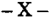
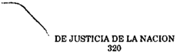
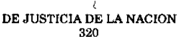
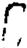
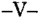
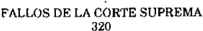

TOMO 320

Volumen 2

1997

1104

ACUERDOS DE LA CORTE SUPREMA

320

Copyright (c) 1998 by Corte Suprema de Justicia de la Nación Queda hecho el depósito que previene la ley 11.723. Impreso en la Argentina Printed in Argentina I.S.B.N.

DE JUSTICIA DE LA NACION

320

1105

## R E P U B L I C A A R G E N T I N A

FALLOS

DE  LA

C O R T E

S U P R E M A

DE

## J USTICIA DE LA N ACION

PUBLICACION A CARGO DE LA SECRETARIA DE JURISPRUDENCIA DEL TRIBUNAL

TOMO 320 - VOLUMEN 2

JUNIO - SEPTIEMBRE

LA LEY S.A.E. e I.

Tucumán 1471 (1050) Buenos Aires 1997

## HOJA COMPLEMENTARIA

Hoja incorporada a los efectos de permitir la búsqueda por página dentro del Volumen.

DE JUSTICIA DE LA NACION

320

1107

## A C U E R D O S   D E   L A   C O R T E   S U P R E M A

## AÑO 1997

## JUNIO - SEPTIEMBRE

## FERIA JUDICIAL DE JULIO. AUTORIDADES.

## -N o 15-

En Buenos Aires, a los 3 días del mes de junio del año mil novecientos noventa y siete, reunidos en la Sala de Acuerdos del Tribunal, los señores ministros que suscriben la presente,

## Acordaron:

Designar como autoridades de feria del mes de julio del año 1997:

- 1 o )  Al  doctor  Eduardo Moliné O'Connor y Enrique S. Petracchi como jueces de feria.
- 2 o )  Establecer el horario de atención al público de lunes a viernes, desde las 8 hasta las 12 horas.
- 3 o )  El personal que preste funciones durante la feria judicial deberá acreditarlo mediante certificación otorgada por el señor secretario de feria.

Todo lo cual dispusieron y mandaron, ordenando que se comunicase y registrase en el libro correspondiente, por ante mí, que doy fe. - JULIO S. NAZARENO - EDUARDO MOLINÉ O'CONNOR - CARLOS S. FAYT - ENRIQUE SANTIAGO PETRACCHI - ANTONIO BOGGIANO - GUILLERMO A. F. LÓPEZ - GUSTAVO A. BOSSERT Nicolás Alfredo Reyes (Administrador General).

## EMPLEADOS JUDICIALES. ADSCRIPCIONES.

-N o 16-

En Buenos Aires, a los 3 días del mes de junio del año mil novecientos noventa y siete, reunidos en la Sala de Acuerdos del Tribunal, los señores ministros que suscriben la presente.

## Consideraron:

Que la resolución 1279/79, de acuerdo con lo prescripto por el decreto-ley 3891/57, dispuso que es facultad del señor Presidente de la Corte Suprema de Justicia de la Nación disponer la adscripción de agentes judiciales a tribunales u organismos del Poder Judicial de la Nación distintos de aquellos en los cuales desempeñan sus tareas, previa  evaluación  y  conformidad  del  titular  del  tribunal  u  organismo  a  los  que presupuestariamente pertenece el agente que solicita la adscripción.

Que la ley 22.251 faculta al Poder Judicial para dictar un régimen que regule las adscripciones de personal, derogando el decreto-ley 3891/57.

Por ello,

Acordaron:

Aprobar el siguiente

RÉGIMEN DE ADSCRIPCIONES DE PERSONAL

- 1) Los agentes que tengan más de (1) año de antigüedad en el desempeño de funciones en el Poder Judicial de la Nación y cuyo cónyuge -dependiente de cualquiera de los poderes del Estado Nacional- sea trasladado a otra ciudad por razones de servicio, podrá solicitar su adscripción al tribunal federal de la jurisdicción del nuevo destino.
- 2) La solicitud debe ser presentada ante el titular del tribunal u organismo al que presupuestariamente pertenezca el agente y acompañarse la certificación del traslado expedida por la autoridad superior del cónyuge trasladado.
- 3) Corresponde al señor Presidente de la Corte Suprema de Justicia de la Nación disponer la adscripción de los agentes a un tribunal u organismo distinto de aquel en el cual desempeña sus tareas.
- 4)  El  tribunal  de  destino  dispondrá  en  qué  dependencia  prestará  servicios  el adscripto, teniendo en cuenta el lugar del traslado del cónyuge del agente y las necesidades particulares de la jurisdicción.
- 5) El adscripto integrará el escalafón que confeccione el tribunal u organismo donde cumpla la adscripción, y en caso de producirse una vacante en el mismo, tendrá derecho a ser promocionado de acuerdo a las normas salvables.
- 6) La adscripción será dispuesta por el término de un (1) año, prorrogable a pedido del interesado por períodos iguales siempre que subsistan las circunstancias que motivaron su concesión.
- 7) Los agentes contratados no podrán ser adscriptos.
- 8) El traslado dispuesto en virtud de la aplicación de la presente, no dará lugar al pago de los beneficios establecidos en el decreto 1343/74.

Todo lo cual dispusieron y mandaron, ordenando se comunicase y registrase en el libro correspondiente, por ante mí, que doy fe.- JULIO S. NAZARENO - EDUARDO MOLINÉ O'CONNOR - AUGUSTO CÉSAR BELLUSCIO - ENRIQUE SANTIAGO PETRACCHI - GUILLERMO A. F. LÓPEZ - GUSTAVO A. BOSSERT Nicolás Alfredo Reyes (Administrador General).

## FERIA JUDICIAL DE JULIO. AUTORIDADES.

## -N o 17-

En Buenos Aires, a los 24 días del mes de junio del año mil novecientos noventa y siete, reunidos en la Sala de Acuerdos del Tribunal, los señores ministros que suscriben la presente,

## Acordaron:

Ampliar la Acordada 15/97 y designar a los doctores María Cristina Alvarez Magliano y Jorge A. Migliore como secretarios de feria del mes de julio de 1997.

Todo lo cual dispusieron y mandaron, ordenando que se comunicase y registrase en el libro correspondiente, por ante mí, que doy fe.- JULIO S. NAZARENO - EDUARDO MOLINÉ O'CONNOR - CARLOS S. FAYT - AUGUSTO CÉSAR BELLUSCIO - ENRIQUE SANTIAGO PETRACCHI - GUSTAVO A. BOSSERT Javier M. Leal de Ibarra (Secretario).

## CREDITOS INCOBRABLES.

## -N o 18-

En Buenos Aires, a 1  de julio del año mil novecientos noventa y siete, reunidos en o la Sala de Acuerdos del Tribunal, el señor presidente de la Corte Suprema de Justicia de la Nación, doctor don Julio S. Nazareno y los señores ministros que suscriben la presente,

## Consideraron:

Que en la práctica se presentan casos en que, para percibir un crédito, deben incurrirse en gastos administrativos o judiciales que tornan antieconómica la gestión en cada caso.

Que, en consecuencia, resulta conveniente declarar incobrables tales créditos, limitando dicha declaración sus efectos al orden interno administrativo, y no importando renuncia ni invalidando la exigibilidad del crédito.

- Que el art. 8 de la ley 23.853 faculta a este Tribunal a disponer de su patrimonio y a determinar el régimen de percepción, administración, contralor y ejecución de los recursos que le asigna el art. 3 de dicha normativa.

Por ello,

Acordaron:

- 1- Disponer que los créditos para cuya percepción deba incurrirse en costos administrativos o judiciales que tornen antieconómica la gestión en cada caso, podrán ser declarados incobrables por la Presidencia del Tribunal, en cualquier estado del trámite, con la opinión previa del Sr. Administrador General.
- 2- Establecer que dicha declaración es de orden interno administrativo, no importando renuncia ni invalidando la exigibilidad del crédito.
- 3- La Subdirección General de Fiscalización de Recursos deberá llevar un registro de deudas declaradas incobrables a fin de intentar su cobro en caso que varíen las circunstancias que motivaron la declaración.

Todo lo cual dispusieron y mandaron, ordenando se comunicase y registrase en el libro correspondiente, por ante mí, que doy fe.- JULIO S. NAZARENO - EDUARDO MOLINÉ O'CONNOR - CARLOS S. FAYT - AUGUSTO CÉSAR BELLUSCIO - ANTONIO BOGGIANO - ADOLFO ROBERTO VÁZQUEZ Nicolás Alfredo Reyes (Administrador General).

## CAMARA CRIMINAL Y CORRECCIONAL. REGLAMENTO.

-N o 19-

En Buenos Aires, a 1  de julio del año mil novecientos noventa y siete, reunidos en o la Sala de Acuerdos del Tribunal, los señores ministros que suscriben la presente,

Consideraron:

Que la Cámara Criminal y Correccional en su acuerdo del día 4 de diciembre de 1996 dispuso una modificación del art. 56 del Reglamento del fuero. La disposición contempla la institución de un libro de asistencia de las partes que deberá existir en cada una de las secretarías.

Por ello,

Acordaron:

Aprobar la modificación del art. 56 del Reglamento de la Cámara Nacional de Apelaciones en lo Criminal y Correccional.

Todo lo cual dispusieron y mandaron, ordenando que se comunicase y registrase en el libro correspondiente, por ante mí de lo que doy fe.- EDUARDO MOLINÉ O'CONNOR CARLOS S. FAYT - AUGUSTO CÉSAR BELLUSCIO - ENRIQUE SANTIAGO PETRACCHI - ANTONIO BOGGIANO - ADOLFO ROBERTO VÁZQUEZ ( en disidencia ) -Nicolás Alfredo Reyes (Administrador General).

## DISIDENCIA DEL DR. ADOLFO ROBERTO VÁZQUEZ

## Considerando:

1 o ) Que la Cámara Nacional de Apelaciones en lo Criminal y Correccional informó que el artículo 56 de su reglamento, que establece los libros que ha de llevar cada secretaría, fue modificado por acuerdo celebrado el 4 de diciembre del año pasado; de manera tal que al último párrafo de esa disposición le agregó la obligación de contar esas dependencias con un libro 'de asistencia de partes, el cual deberá estar en Mesa de Entradas de cada Secretaría a disposición de las partes y demás interesados, debiendo asentarse en él las oportunidades en que aquellas soliciten una causa y ella no les pueda ser exhibida, con la expresa mención del día y la hora, el expediente que se pidió,  quien  lo  hizo,  razón  por  la  cual  no  le  fue  exhibido,  apellido  y  cargo  de  quien informó el impedimento, y, finalmente, la firma del interesado y del peticionante. En cada Secretaría deberá colocarse un aviso destacado, informando sobre la existencia del libro y el derecho de los interesados a poner la constancia en caso de no exhibición de los autos solicitados'.

- 2 o ) Que si bien el cambio de la disposición obedece a un formal pedido de un letrado, lo cierto es que el fin destacado en los puntos I y III de la presentación, merece ciertas consideraciones.
- a- el 'mejor desempeño de la Justicia Nacional en cuanto a la relación de los Juzgados con los sujetos del proceso y demás interesados' no se condicione a la creación de un nuevo libro de anotaciones, sino a la voluntad expresa de los funcionarios que dirigen la dependencia, en tanto la relación sea armoniosa y ajustada a la responsabilidad que a cada miembro del Poder Judicial le compete.

b- en cuanto a los artículos del código de forma penal que invoca el letrado para tener 'certeza respecto del cumplimiento del debido proceso', resulta también consecuencia directa de lo señalado en el apartado 'a'. El artículo 125 refiere a los términos para el despacho de expedientes, materia cuyo contralor corresponde a quien ejerce la superintendencia, sin perjuicio de que el letrado deje constancia mediante un escrito o bien pidiendo la intervención del tribunal que ejerce el control. En cuanto al artículo 200, el derecho de las partes para asistir a diversas diligencias del proceso, en nada se vincula con la creación del libro. Ello es así, en virtud de que quien sea parte y quiera participar de una o todas las medidas dispuestas por el Juez, podrá peticionarlo por escrito en la causa respectiva. Por su parte, el artículo 202 refiere a la posibilidad de que los defensores asistan a los actos de instrucción, situación que se presenta similar a lo ya descripto.

- 3 o )  Que  aclarado  estos  aspectos,  que  en  principio  podrían  formar  un  criterio disvalioso sobre la implementación del nuevo libro para las secretarías penales, nada obsta a que por cuestiones atinentes a la identificación del empleado o funcionario que brinda información sobre el estado de un expediente, se de conformidad a la reforma. Sin embargo, es conveniente requerir una modificación, no solo en su contenido, sino también en otros aspectos que hacen a la economía del poder judicial.
- 4 o ) Que en primer lugar, según el artículo 56 del referido reglamento, en el apartado séptimo se prevé un libro 'de los recibos de causas y notas' -ver fs. 10-; resultando que, este libro de notas, es de similar función al recientemente creado. Ello significa proveer a cada dependencia de un nuevo libro, lo que se contradice con la voluntad de esta Corte de reducir los gastos del Poder Judicial. Desde este punto de vista, solo era necesario modificar la disposición ya existente con las adiciones que fueran pertinentes, para que uno solo contenga ambas posibilidades de asentar la nota -como en cualquier fuero-, donde las partes dejan constancia de la entrega de expedientes o que no han podido verlos, entre otras cuestiones vinculadas al proceso.
- 5 o )  Que  en  segundo lugar, tampoco parece conveniente esa publicidad de '...un aviso destacado...' que señala la última parte modificada del artículo 56. No se trata de 'promocionar el libro' sino de que las partes cuenten con la posibilidad de dejar nota. La colocación de un destacado en la mesa de entradas de una secretaría penal significa una nueva obligación a los empleados y funcionarios de cada dependencia, a lo que se suma, la estrecha mesa de entradas con que cuentan y la cantidad de público que concurre. Además, no hay motivo para promocionar el dictado de una acordada específica que disponga también la exhibición en una pared, cuando ningún óbice existe para que las partes tomen conocimiento como lo han venido haciendo con las anteriormente dictadas, no solo de esa cámara, sino también las de esta Corte.

Por ello, el suscripto manifiesta su disidencia con la decisión que se toma en este acuerdo. - ADOLFO ROBERTO VÁZQUEZ.

## EMPLEADOS JUDICIALES. ADSCRIPCIONES.

## -N o 20-

En Buenos Aires, a los 4 días del mes de julio del año mil novecientos noventa y siete, reunidos en la Sala de Acuerdos del Tribunal, los señores ministros que suscriben la presente,

## Consideraron:

Que mediante acordada 16/97 este Tribunal estableció el régimen de adscripciones de los agentes cuyos cónyuges, dependientes de cualquiera de los poderes del Estado Nacional, sean trasladados a otra ciudad por razones de servicio.

Que el punto 5  dispuso que el adscripto integrará el escalafón que confeccione el o tribunal u organismo donde cumpla la adscripción, y, en caso de producirse una vacante, tendrá derecho a ser promovido de acuerdo a las normas aplicables.

Que esta disposición no tiende a interferir en los escalafones de las distintas jurisdicciones, por la posibilidad de producir una postergación de quienes pertenecen a la planta permanente, circunstancia que, obviamente, daría lugar a impugnaciones, por parte de quienes se consideren preteridos. También debe considerarse el caso de reintegro o nuevo traslado del cónyuge a otro destino, lo cual volvería a ocasionar idénticos inconvenientes.

Que, además, debe tenerse presente que el régimen establecido debe regir para el futuro.

## Acordaron:

- 1 o ) Agregar al punto 5  del régimen de adscripciones aprobado por acordada 16/97, o el siguiente texto:
- 'Lo dispuesto en el párrafo precedente, se aplicará una vez que transcurran cinco años ininterrumpidos en el mismo destino'.
- 2 o ) Disponer que las prescripciones contenidas en la acordada citada en el punto 1 o no tendrán efecto retroactivo.

Todo lo cual dispusieron y mandaron, ordenando que se comunicase y registrase en el libro correspondiente, por ante mí, que doy fe. - JULIO S. NAZARENO - EDUARDO MOLINÉ O'CONNOR - CARLOS S. FAYT - AUGUSTO CÉSAR BELLUSCIO - ENRIQUE SANTIAGO PETRACCHI - ANTONIO BOGGIANO - GUSTAVO A. BOSSERT - ADOLFO ROBERTO VÁZQUEZ Nicolás Alfredo Reyes (Administrador General).

## BONIFICACION POR ZONA DESFAVORABLE.

## -N o 21-

En Buenos Aires, a los 18 días del mes de julio de mil novecientos noventa y siete, reunidos en la Sala de Acuerdos del Tribunal, los señores ministros que suscriben la presente

## Consideraron:

Que la ley 16.494 estableció la bonificación por zona desfavorable, fijándola en el 40% del total de las remuneraciones que por aplicación de la citada norma, perciben quienes prestan servicios al sur del paralelo 42.

Que por Resolución Nro. 890 del 13 de diciembre de 1974, el Tribunal dispuso otorgar una sobreasignación del 20 % por igual concepto y con igual procedimiento de liquidación, al personal de los Juzgados Federales del Neuquén, General Roca y Viedma.

Que como consecuencia de los términos de la ley 23.272, fue dictada la Resolución 110/86 que extendió este último beneficio a quienes se desempeñan en los tribunales federales de La Pampa.

Que en la actualidad la bonificación por zona desfavorable se liquida sobre los rubros Sueldo Básico y Compensación Jerárquica.

Que ante un nuevo examen de la cuestión, y teniendo en cuenta la existencia de numerosos reclamos administrativos y acciones judiciales interpuestas, tendientes a lograr la modificación del cálculo de la bonificación por zona desfavorable incluyendo los demás rubros que componen la remuneración de los agentes, se torna necesario modificar para el futuro, la metodología de cálculo de la liquidación de la bonificación aludida, en concordancia con lo expuesto precedentemente.

Que la modificación de la citada metodología, sólo es posible recurriendo a un riguroso ejercicio de la facultad delegada por el artículo 5 de la Ley 23.853 toda vez que, si bien no fue contemplada en el corriente ejercicio la mayor erogación que habrá de resultar, los saldos de crédito obtenidos como consecuencia de las metas de austeridad propuestas así lo permiten.

Por ello,

Acordaron:

Instruir a la Administración General para que, a partir de la liquidación de los haberes correspondientes al mes de setiembre de 1997, incluya en la base de cálculo para el cómputo de la bonificación por zona desfavorable el total de los rubros que componen la remuneración de los agentes con derecho a percibirla, para lo cual el Sr. Presidente del Tribunal autorizará las compensaciones presupuestarias pertinentes.

Todo lo cual dispusieron y mandaron, ordenando se comunicase y registrase en el libro correspondiente, por ante mí, que doy fe.- JULIO S. NAZARENO - EDUARDO MOLINÉ O'CONNOR - CARLOS S. FAYT - ANTONIO BOGGIANO - GUSTAVO A. BOSSERT Nicolás Alfredo Reyes (Administrador General).

## ASISTENTES SOCIALES.

## -N o 22-

En Buenos Aires, a los 18 días del mes de julio del año mil novecientos noventa y siete, reunidos en la Sala de Acuerdos del Tribunal, los señores ministros que suscriben la presente.

## Consideraron:

- 1 o ) Que por acordada N  69/92 esta Corte hizo lugar a la solicitud formulada por la o Dra. María Rosa Bosio, titular del Juzgado Nacional de Primera Instancia en lo Civil N o 92,  permitiendo que desempeñe funciones en el juzgado a su cargo un equipo de asistentes sociales, exceptuándolo de cumplir la prescripción contenida en el artículo 129 del Reglamento para la Justicia Nacional.
- 2 o ) Que la referida disposición ha sido modificada por las acordadas Nros. 75/94 y 80/96, en lo que respecta a la integración del equipo.
- 3 o )  Que  mediante oficio de fecha 14 de mayo ppdo., la magistrada comunicó la necesidad de que se incluya en el plantel de asistentes sociales a la licenciada Elsa Irma Albanisi (fs. 10).

Por ello,

Acordaron:

Modificar el contenido de la acordada N  80/96, en punto a los asistentes sociales o que integran el equipo que se desempeña en el Juzgado Nacional de Primera Instancia en lo Civil N  92, el que quedará compuesto por cinco asistentes sociales: Lic. María E. o Benchuya; Lic. Graciela García; Lic. Juan Carlos Lopapa; Lic. Miguel Angel Aspirós y Lic. Elsa Irma Albasini.

Todo lo cual dispusieron y mandaron, ordenando que se comunicase y registrase en el libro correspondiente, por ante mí, que doy fe. - EDUARDO MOLINÉ O'CONNOR AUGUSTO CÉSAR BELLUSCIO - ENRIQUE SANTIAGO PETRACCHI - GUSTAVO A. BOSSERT ADOLFO ROBERTO VÁZQUEZ Nicolás Alfredo Reyes (Administrador General).

## JUZGADO FEDERAL DE PRIMERA INSTANCIA DE RECONQUISTA.

## -N o 23-

En Buenos Aires, a los 7 días del mes de agosto del año mil novecientos noventa y siete, reunidos en la Sala de Acuerdos del Tribunal, los señores ministros que suscriben la presente,

## Consideraron:

Que mediante la acordada N  11/97 este Tribunal dispuso la habilitación del Juzo gado Federal de Primera Instancia de Reconquista y encomendó a la Cámara Federal de Apelaciones de Resistencia la recepción del juramento del magistrado designado.

Que por acta 725/97 la Cámara Federal de Apelaciones de Resistencia solicitó de esta Corte instrucciones sobre el tribunal oral que debía entender en la etapa de juicio o plenario de las causas que tramitaran ante ese juzgado, teniendo en cuenta la falta de previsión legal al respecto.

Que la ley 24.164 en su artículo 2  dispone que el juzgado creado tiene competeno cia territorial en los departamentos de General Obligado, 9 de Julio, San Cristóbal, San Javier y Vera, todos de la Provincia de Santa Fe, circunstancia que lo haría depender del distrito Rosario que comprende esa provincia (art. 3 de la ley 24.050).

Que, además, la norma modificó la competencia territorial de los juzgados federales  de  Santa  Fe  al  excluir  los  departamentos  citados  y  disponer  que  las  causas  en trámite, salvo las que se encuentren en etapa de sentencia, deben ser remitidas al nuevo juzgado creado (art. 5 de la ley 24.164).

Que, no obstante, el artículo 6 prescribe que la Cámara Federal de Apelaciones de Resistencia será el tribunal de alzada, en virtud de lo cual modificó las leyes 7099, relativa a la superintendencia de las cámaras federales de apelaciones, y la 13.998 y sus modificatorias.

Que teniendo en cuenta que la asignación de competencia territorial a los tribunales federales dependen exclusivamente de la ley, se requiere la intervención del Poder Legislativo, con el objeto de completar la omisión.

Que hasta tanto se dicte la correspondiente norma, esta Corte considera pertinente asignar tal competencia al Tribunal Oral en lo Criminal Federal de Santa Fe.

Por lo expuesto,

## Acordaron:

1 o ) Dirigirse al Poder Ejecutivo Nacional a través del Ministerio de Justicia de la Nación, sugiriendo la necesidad de que se arbitren los mecanismos legislativos tendientes a subsanar la omisión que se indica en los considerandos de la presente, y consecuentemente, determinar cuál es el tribunal oral competente para entender en las causas penales en trámite ante el Juzgado Federal de Primera Instancia de Reconquista.

2 o ) Disponer que hasta tanto se dicte la ley requerida, el Tribunal Oral en lo Criminal Federal de Santa Fe mantiene la competencia territorial anterior a la sanción de la ley 24.164.

Todo lo cual dispusieron y mandaron, ordenando que se comunicase y registrase en el libro correspondiente, por ante mí, que doy fe.- EDUARDO MOLINÉ O'CONNOR CARLOS S. FAYT - ENRIQUE SANTIAGO PETRACCHI - GUILLERMO A. F. LÓPEZ - GUSTAVO A. BOSSERT - ADOLFO ROBERTO VÁZQUEZ Nicolás Alfredo Reyes (Administrador General).

## DE JUSTICIA DE LA NACION

## PRESUPUESTO PARA EL AÑO 1998.

## -N o 24-

En Buenos Aires a los 11 días del mes de agosto del año mil novecientos noventa y siete, reunidos en la Sala de Acuerdos del Tribunal, los señores ministros que suscriben la presente,

## Consideraron:

- 1 o ) Que esta Corte Suprema de Justicia de la Nación, en su carácter de Organo Superior del Poder Judicial debe estimar las erogaciones correspondientes al ejercicio presupuestario 1998, las que se darán a conocer al Honorable Congreso de la Nación por intermedio del Poder Ejecutivo Nacional, según lo dispuesto en la Ley 23.853 - Art. 8 o y en el Art. 14 del Decreto 792/96, T.O. de la Ley Permanente de Presupuesto N o 11.672.
- 2 o ) Que como se ha venido realizando históricamente, en esta ocasión, también se han tenido en cuenta las limitaciones impuestas por la situación general del país, por lo que el presente cálculo se ha efectuado siguiendo un criterio de absoluta restricción.
- 3 o ) Que se han reducido los gastos operativos a su mínima expresión, incluyéndose aquellas erogaciones imprescindibles como consecuencia de las continuas postergaciones que las han afectado por la falta de créditos suficientes en ejercicios anteriores, procediendo a una reasignación más eficiente del gasto.
- 4 o ) Que corresponde señalar, una vez más, que el constante y permanente crecimiento que caracteriza al Poder Judicial, producto del aumento de la demanda del servicio de justicia, hace menester asignarle un tratamiento presupuestario diferenciado respecto de los organismos que componen el resto del Gobierno Nacional. Garantizar una adecuada actividad jurisdiccional constituye un deber indelegable del Estado,  que  no  puede  suplirse  -como  en  otros  servicios-  con  la  incumbencia  del  sector privado.

Es por ello que se reitera la importancia de establecer un mecanismo anual de ajuste de la alícuota establecida por la Ley 23.853 -de Autarquía- respecto del porcentual de coparticipación sobre los fondos que corresponden al Tesoro Nacional, en concordancia con el crecimiento del gasto de este Poder del Estado en permanente expansión;  ya  que  el  valor  establecido  en  oportunidad  de  su  sanción,  si  bien  se  mantuvo inalterable, paulatinamente pasó a calcularse sobre una base diezmada por sucesivas detracciones que -año a año- se le hicieron a la masa coparticipable destinada al Tesoro Nacional, por lo que el recurso se redujo proporcionalmente calculado sobre el total de lo recaudado por el Estado Nacional.

- 5 o ) Que las leyes de creación de tribunales no incluyen el financiamiento necesario y específico para la habilitación y posterior funcionamiento de los mismos, lo cual obliga a ejecutar créditos presupuestarios no previstos por este Poder en detrimento de otras necesidades básicas del servicio de justicia. Motivo por el cual se hace necesario insistir en que se arbitren los medios para que en el futuro se contemple el financiamiento necesario.

- 6 o ) Que se han recibido los niveles de créditos comunicados por el Sr. Jefe de Gabinete de Ministros del Poder Ejecutivo Nacional, los que por los motivos expuestos precedentemente y aún en el marco de la restricción antes comentada resultarán claramente insuficientes.
- 7 o ) Con relación al financiamiento es necesario expresar la preocupación con que se observa la constante diferencia que existe entre las estimaciones de recursos que anualmente efectúe el Ministerio de Economía y Obras y Servicios Públicos y lo efectivamente recaudado.
- 8 o ) Se ha observado también con inquietud que en la 'comunicación de las Políticas Presupuestarias para 1998', la Jefatura de Gabinete omite considerar el servicio de justicia dentro de las prioridades del gasto público.
- 9 o ) Que la planta de personal para el ejercicio presupuestario año 1998 se fija en 19028 cargos, la que surge de computar la planta al 30 de mayo del corriente, adicionando las dotaciones necesarias para poner en funcionamiento los Tribunales Orales de Rosario N  2 y Santa Cruz y los Juzgados Federales de Roque Sáenz Peña, San o Ramón de la Nueva Orán, Necochea, Mar del Plata N  4 y Zapala. Se suman además o los cargos necesarios para completar las dotaciones de los Juzgados del Trabajo del 69 al  80  de  los  Juzgados  Federales  de  Formosa N  2 y Reconquista, de la Cámara de o Apelaciones de Corrientes y de los Tribunales Orales de Resistencia, Corrientes y Santiago del Estero (estos tribunales se habilitaron por la urgencia de contar con el servicio de justicia con plantas reducidas a una mínima expresión, y con fondos provenientes de reasignaciones y ahorros presupuestarios propios).

Se prevén los cargos necesarios para crear 78 secretarías fiscales con competencia previsional y tributaria (por Decisión Administrativa N  413/97, se transfirió a este o Poder Judicial de la Nación un monto presupuestario que permite contratar 20 funcionarios desde el 1-8-97 y 58 desde el 1-11-97 con cargo equivalente a secretarios de juzgado y hasta el 31-12-97, para las causas aludidas). Se incluyen para 1998 las secretarías con su planta correspondiente, por cuanto es necesaria la continuidad en la atención de las ejecuciones fiscales que -en definitiva- redunda en un beneficio para la recaudación de Estado Nacional.

Se incorpora también, una secretaría para el Juzgado Federal de Junín (requerido por el Ministerio de Justicia de la Nación), y completar 2 salas de la Cámara Nacional del Trabajo y la primera instancia de la Seguridad Social.

La planta se completa con los cargos previstos en los organismos instituidos por el régimen de Penalidad Oral: Area Tutelar de Tribunales de Menores, Oficina de Asesoramiento y Asistencia a la Víctima, entre otros, previendo además 20 suplencias necesarias en distintos tribunales del país.

Que en el inciso 1  se contempla el incremento vegetativo que ha sido estimado en o un 1,5% de la planta total, teniendo en cuenta los adicionales correspondientes para todo el personal del Poder Judicial de la Nación.

10) Que parte del incremento previsto para la planta de personal, incluye especialización, fundamentalmente en equipos de menores, psicólogos, visitadores sociales y

otros,  que  se  incorporarán  en  grupos  interdisciplinarios  dedicados a la prevención, terapia complementaria de la tarea penal y rehabilitación para delitos vinculados con adicciones. Dentro de dicho plantel, y en la medida que no se requiera este tipo de especialización, se incorporará parte de los 'meritorios' (aproximadamente 1.300 personas), quienes realizan un proceso de aprendizaje gratuito, conformando una base de aspirantes que por la experiencia adquirida y en base a las crecientes necesidades de esta jurisdicción, resultan altamente calificados para su ingreso a este Poder Judicial, por lo que se han previsto esos cargos en la categoría de ingreso.

Asimismo se ha tenido en cuenta el costo de los suplementos por zona desfavorable y por tareas insalubres por no haber sido considerado en las leyes de presupuesto de los últimos ejercicios, pese a los oportunos requerimientos formulados por este Alto Tribunal. Corresponde señalar que existen juicios con sentencia favorable en segunda instancia con relación al suplemento por zona desfavorable.

El total solicitado para este inciso también se encuentra incrementado por el costo de las sentencias judiciales referidas a amparos presentados por magistrados en actividad por la intangibilidad de las remuneraciones dispuesta por el artículo N  110 de la o Constitución Nacional.

Se incluye además, el monto retroactivo del adicional dispuesto por Acordada N o 56/91, y el reconocimiento mediante Acordada N  35/96, otorgando un trato igualitario o al resto de los magistrados y funcionarios cuyas causas aún no cuentan con sentencia firme, evitando de este modo el desgaste jurisdiccional y la generación de costas. Estos valores se han incluido en el inciso 7-Servicio de la Deuda. En la comunicación de los 'niveles' generados por el Ministerio de Economía y Obras y Servicios Públicos y comunicados por la Jefatura de Gabinete de Ministros, se prevé en este inciso el crédito necesario para financiar -en el ejercicio 1998- una quinta parte del total a abonar.

- 11) Que se observa con suma preocupación que los niveles de crédito presupuestario comunicado por la Jefatura de Gabinete de Ministros de la Nación para el Inciso 4 -  Bienes de Uso - resultarán claramente insuficientes. Algunas de las previsiones presupuestarias imprescindibles para el ejercicio año 1998 que ha tenido en cuenta este Poder Judicial pueden sintetizarse en:
- a) Expropiación de un inmueble mediante Ley N  24.599 en la localidad de San o Martín y otros en Morón y Lomas de Zamora, actualmente en trámite legislativo.
- b) Obras de construcción, refacción y refuncionalización de edificios del Poder Judicial de la Nación, cuyo plan se adjunta como Anexo I.
- c) Crédito necesario para completar la adjudicación del llamado a licitación N  1/ o 97 que fuera previsto en forma parcial en el presente ejercicio.
- 12) Que el cálculo de recursos necesarios para financiar el gasto resultante de la presente, se ha estimado en base al promedio simple de la recaudación operada durante los ejercicios 1995, 1996 y 1  semestre de 1997, en concepto de ingresos propios de o este Poder Judicial de la Nación dispuestos por Ley 23.853, proyectándolo para 1998.

13) Que en caso de resolverse favorablemente la posibilidad de ceder a este Poder Judicial de la Nación los edificios pertenecientes a las Fuerzas Armadas ubicados en el denominado 'Polo Retiro', deberán ser considerados los créditos suficientes para la readecuación y refuncionalización tendiente a la incorporación efectiva de los tribunales que en definitiva se asienten en dichos inmuebles.

## Por ello,

## Acordaron:

1 o ) Fijar el Presupuesto de Gastos del Poder Judicial de la Nación para el ejercicio año 1998, en la suma de PESOS NOVECIENTOS VEINTE MILLONES SEISCIENTOS OCHENTA Y CUATRO MIL OCHOCIENTOS CATORCE ($ 920.684,814), conforme al siguiente detalle:

| INCISO 1 PERSONAL................................................................ $ 611.412.178               |
|---------------------------------------------------------------------------------------------------------------|
| INCISO 2 BIENES DE CONSUMO .......................................... $ 10.724.800                            |
| INCISO 3 SERVICIOS NO PERSONALES .............................. $ 63.425.300                                  |
| INCISO 4 BIENES DE USO ...................................................... $ 63.598.744                    |
| INCISO 5 TRANSFERENCIAS ................................................. $ 27.117.000                        |
| INCISO 7 SERVICIOS DE LA DEUDA .................................... $ 144.406.792                             |
| TOTAL ......................................................................................... $ 920.684.814 |

- 2 o ) Fijar en DIECINUEVE MIL VEINTIOCHO (19.028) los cargos de la planta de personal para el Poder Judicial de la Nación durante 1998.
- 3 o ) Aprobar el 'Plan de Obras' que como Anexo I se anexa a la presente, autorizando al señor Administrador General a producir las modificaciones que sean necesarias para los casos de emprendimientos urgentes e impostergables que no se hubiesen previsto oportunamente.
- 4 o ) Estimar la proyección de recursos dispuestos por Ley 23.853 para el ejercicio 1998 en la cantidad de PESOS CUATROCIENTOS SESENTA Y CUATRO MILLONES OCHOCIENTOS CINCO MIL OCHO ($ 464.805.008).
- 5 o ) Al tomarse la decisión definitiva de transferir a este Poder Judicial de la Nación los edificios de las Fuerzas Armadas pertenecientes al denominado 'Polo Retiro', deberán incorporarse al presupuesto vigente los créditos necesarios para la adecuación y refuncionalización de la infraestructura y para la provisión del equipamiento que posibiliten una adecuada habilitación de los tribunales que en dichos edificios se asienten.

Todo lo cual dispusieron y mandaron, ordenaron que se comunicase y registrase en el libro correspondiente, por ante mi que doy fe. - JULIO S. NAZARENO - EDUARDO MOLINÉ O'CONNOR - CARLOS S. FAYT - AUGUSTO CÉSAR BELLUSCIO - ENRIQUE SANTIAGO PETRACCHI - ANTONIO BOGGIANO - GUILLERMO A. F. LÓPEZ - GUSTAVO A. BOSSERT ADOLFO ROBERTO VÁZQUEZ Nicolás Alfredo Reyes (Administrador General).

## DE JUSTICIA DE LA NACION 320

## OFICINA DE ESTADISTICAS.

## -N o 25-

En Buenos Aires, a los 12 días del mes de agosto de mil novecientos noventa y siete,  reunidos en la Sala de Acuerdos del tribunal, el señor presidente de la Corte Suprema de Justicia de la Nación y los señores ministros que suscriben la presente.

## Consideraron:

Que continuando con las acciones de reordenamiento administrativo, el señor Administrador General del Tribunal propone modificaciones de la dependencia de organismos, que estima conveniente reubicar.

Por ello, y teniendo en cuenta lo resuelto en la Acordada 50/96,

Acordaron:

- 1) Incorporar a la Dirección de informática de la Administración General la Oficina de Estadísticas del poder Judicial dependiente de la ex-Secretaría de Superintendencia Judicial.

2) La Prosecretaria de Comunicaciones de la ex-Dirección de Arquitectura y Servicios, pasará a depender de la Dirección de Informática.

Todo lo cual dispusieron y mandaron, ordenando que se comunicase y registrase en el libro correspondiente, por ante mi, que doy fe.- JULIO S. NAZARENO - EDUARDO MOLINÉ O'CONNOR - CARLOS S. FAYT - AUGUSTO CÉSAR BELLUSCIO - ENRIQUE SANTIAGO PETRACCHI - ANTONIO BOGGIANO - GUILLERMO A. F. LÓPEZ - GUSTAVO A. BOSSERT ADOLFO ROBERTO VÁZQUEZ Nicolás Alfredo Reyes (Administrador General).

## SECRETARIA ESPECIAL PARA LA INSTRUCCION DE LA CAUSA DE LA EMBAJADA DE ISRAEL.

## -N o 26-

En Buenos Aires, a los 12 días del mes de agosto mil novecientos noventa y siete, reunidos en la Sala de Acuerdos del Tribunal, el señor presidente de la Corte Suprema de Justicia, doctor Julio Salvador Nazareno, el señor vicepresidente doctor Eduardo Moliné O'Connor, y los señores ministros don Carlos S. Fayt, don Augusto Cesar Belluscio, don Enrique Santiago Petracchi, don Antonio Boggiano, don Guillermo López y don Gustavo Bossert.

## Acordaron:

- 1 o ) Crear en el ámbito de la Corte Suprema de Justicia de la Nación una Secretaría especial para la instrucción de la causa S. 143 XXIV 'Sumario instruido con motivo del atentado perpetrado a la Embajada de Israel'.
- 2 o ) Disponer que dicha dependencia tendrá como única competencia la asignada en el punto precedente y que funcionará transitoriamente hasta concluir con la misión encomendada.
- 3 o )  Designar a cargo de la secretaría creada, en los términos de la presente, al Secretario Letrado del Tribunal Doctor Esteban Jorge Canevari (D.N.I. 13.530.385).
- 4 o ) Instruir al funcionario designado para que, en el plazo de cinco días, proponga al Señor Presidente de la Corte la estructura de personal y los requerimientos materiales necesarios a los fines de cumplir con las funciones atribuidas.

Todo lo cual dispusieron y mandaron, ordenando que se comunicase y registrase en el libro correspondiente por ante mi que doy fe.- JULIO S. NAZARENO - EDUARDO MOLINÉ O'CONNOR - CARLOS S. FAYT - AUGUSTO CÉSAR BELLUSCIO - ANTONIO BOGGIANO GUILLERMO A. F. LÓPEZ - GUSTAVO A. BOSSERT Nicolás Alfredo Reyes (Administrador General).

## UNIDAD DE AUDITORIA INTERNA.

## -N o 27-

En Buenos Aires, a los 13 días del mes de agosto de mil novecientos noventa y siete, los señores ministros que suscriben la presente,

## Consideraron:

Que en base a las disposiciones de la ley 24.156 se dicta la Acordada 61/94 por la cual se creó la Unidad de Auditoría Interna en el ámbito del Poder Judicial de la Nación, se le asignó responsabilidades, dotación de personal y se transfirieron funciones de auditoría.

Que hasta la fecha no se ha puesto en funcionamiento dicho organismo, fundamentalmente por dificultades presupuestarias y financieras que han limitado posibilidad de habilitación, particularmente por la dotación de cargos asignada inicialmente.

Que por Acordada 62/96 se aprobó la estructura orgánica de la Administración General de la Corte Suprema, que incluye entre sus unidades de asesoramiento y control de la Unidad de Auditoría interna, por lo que es conveniente reformular la organización de la unidad en ese marco de referencia, replanteando la misión y funciones y

## DE JUSTICIA DE LA NACION 320

con una dotación de personal más reducida, todo ello a los fines de su inmediata puesta en marcha.

Por todo ello,

Acordaron:

- 1)  Autorizar al señor Administrador General a disponer todo lo necesario para poner en funcionamiento la Unidad Auditoría Interna, cuya misión y funciones se fijarán conforme lo autorizado en el punto 2) de la Acordada 62/96, tramitando la afectación o transferencia de personal que sea necesario conforme las disposiciones que emanan de la presente.
- 2) Dejar sin efecto la Acordada 61/94 y Resolución 2191/94.

Todo lo cual dispusieron y mandaron, ordenando que se comunicase y registrase en el libro correspondiente, por ante mi que doy fe.- JULIO S. NAZARENO - EDUARDO MOLINÉ O'CONNOR - CARLOS S. FAYT - AUGUSTO CÉSAR BELLUSCIO - ENRIQUE SANTIAGO PETRACCHI - ANTONIO BOGGIANO - GUILLERMO A. F. LÓPEZ - GUSTAVO A. BOSSERT.

## DIAS INHABILES.

## -N o 28-

En Buenos Aires, a los 14 días del mes de agosto del año mil novecientos noventa y siete, reunidos en la Sala de Acuerdos del Tribunal, los señores ministros que suscriben la presente,

## Consideraron:

Que la forma irregular en que han funcionado los Tribunales Nacionales y Federales del país, en razón de la medida de fuerza -de público y notorio conocimiento- dispuesta por el Movimiento de Trabajadores Argentinos (MTA) y por el Congreso de Trabajadores Argentinos (CTA) el día 14 de agosto del corriente año, requiere tomar medidas que eviten perjuicio a los litigantes.

Por ello,

Acordaron:

Declarar el día 14 de agosto de 1997 inhábil para los tribunales Nacionales y Federales del país, sin perjuicio de la validez de los actos procesales cumplidos que no hubiesen sido actuados en rebeldía.

Todo lo cual dispusieron y mandaron, ordenando que se comunicase y registrase en el libro correspondiente por ante mi, que doy fe.- EDUARDO MOLINÉ O'CONNOR CARLOS S. FAYT - AUGUSTO CÉSAR BELLUSCIO - ENRIQUE SANTIAGO PETRACCHI - ANTONIO BOGGIANO - GUILLERMO A. F. LÓPEZ Nicolás Alfredo Reyes (Administrador General).

## CORTE SUPREMA. SUPRESION DE SECRETARIA.

## -N o 29-

En Buenos Aires, a los 22 días del mes de agosto de mil novecientos noventa y siete,  reunidos en la Sala de Acuerdos del Tribunal el señor presidente de la Corte Suprema de Justicia de la Nación y los señores ministros que suscriben la presente,

## Consideraron:

Que mediante Acordada 26/97 el Tribunal dispuso la creación de una Secretaría especial, la cual estará dotada por la estructura personal y material necesaria para cumplir con su cometido.

Que la puesta en funcionamiento de dicha dependencia exige una disponibilidad de medios que necesariamente debe ser adecuada con la restricción presupuestaria que impera en el Poder Judicial de la Nación, cuyo alcance ha sido detallado con toda precisión -en fecha reciente- por el Tribunal por Acordada 24 del 12 de agosto del corriente año.

Que, asimismo, es necesario proveer lo conducente para sustituir al personal de esta Corte que quedará asignado a la mencionada Secretaría especial, de modo que las áreas afectadas por tales traslados puedan cumplir satisfactoriamente con las funciones a su cargo, como significativamente sucede con la Secretaría n  3 en la cual prestao ba sus servicios el Secretario Letrado designado titular de la secretaría creada por Acordada 26/97.

Que esta Corte viene dando cabal cumplimiento -con la intervención de la Administración General- a las acciones de reordenamiento de las unidades administrativas del Poder Judicial de la Nación, que se han llevado a cabo por medio de las Acordadas 32/95, 43/95, 50/96, 62/96, 25/97 y 27/97. Cabe agregar a lo expresado, que -en sentido concorde- el Sr. Administrador General ha aprobado por Resolución 2242/97 el Reglamento de Organización y Funciones de la Administración General de la Corte Suprema, de cuyo examen surge que dicha dependencia cuenta con una estructura suficiente para tomar a su cargo en toda su extensión las funciones comprendidas en la presente.

Por ello:

Acordaron:

1) Dejar sin efecto la Acordada 51/96, punto 2 . o

- 2) Disponer que las funciones a que se refiere dicho texto sean ejecutadas en el ámbito de la Administración General de esta Corte.
- 3) Establecer que el secretario de este Tribunal doctor Jorge Alejandro Magnoni queda incorporado funcionalmente a la Secretaría Nro. 3, a cargo del doctor Jorge Eduardo Morán.
- 4)  Instruir  al  señor  Administrador General para que adecue el Reglamento de Organización y Funcionamiento aprobado por Resolución 2242/97 a las funciones asignadas.

Todo lo cual dispusieron y mandaron, ordenando que se comunicase y se registrase en el libro correspondiente, por ante mí, que doy fe.- JULIO S. NAZARENO - EDUARDO MOLINÉ O'CONNOR - CARLOS S. FAYT - AUGUSTO CÉSAR BELLUSCIO - ENRIQUE SANTIAGO PETRACCHI - ANTONIO BOGGIANO - GUILLERMO A. F. LÓPEZ - GUSTAVO A. BOSSERT ADOLFO ROBERTO VÁZQUEZ ( por mi voto ) -Nicolás Alfredo Reyes (Administrador General).

## VOTO DEL DOCTOR ADOLFO ROBERTO VÁZQUEZ

## Consideraron:

Que mediante Acordada 26/97 el Tribunal dispuso la creación de una Secretaría especial, la cual estará dotada por la estructura personal y material necesaria para cumplir con su cometido.

Que la puesta en funcionamiento de dicha dependencia exige una disponibilidad de medios que necesariamente debe ser adecuada con la restricción presupuestaria que impera en el Poder Judicial de la Nación, cuyo alcance ha sido detallado con toda precisión -en fecha reciente- por el Tribunal por Acordada 24 del 12 de agosto del corriente año.

Que, asimismo, es necesario proveer lo conducente para sustituir al personal de esta Corte que quedará asignado a la mencionada Secretaría especial, de modo que las áreas afectadas por tales traslados puedan cumplir satisfactoriamente con las funciones a su cargo, como significativamente sucede con la Secretaría n  3 en la cual prestao ba sus servicios el secretario letrado designado titular de la secretaría creada por Acordada 26/97.

Que se viene sosteniendo en forma reiterada la necesidad de un programa de racionalización administrativa que permita una mejor utilización de los recursos humanos y materiales, debiéndose esta Corte Suprema aún una reorganización integral que permita evitar una superposición de funciones, que posibilite la reducción burocrática y la mejor utilización de los bienes que constituyen su patrimonio, así como de los recursos presupuestarios anuales provenientes del erario público.

Que en sentido concorde, corresponde ir logrando un mayor aprovechamiento de aquellos funcionarios que integraban organismos disueltos, y que habiendo sido absor-

bidas sus funciones por la Secretaría General, deben prestar su actividad profesional en otros sectores que lo requieran, sea en forma estructural y aún coyuntural cuando dicha coyuntura merezca un refuerzo por razones excepcionales en las tareas de un organismo, secretaría o sector determinado.

Por ello:

## Acordaron:

- 1) Dejar sin efecto el punto 2  de la Acordada 51/96. o
- 2) Disponer que las funciones a que se refiere dicho texto sean ejecutadas en el ámbito de la Administración General de esta Corte.
- 3) Establecer que el secretario de este Tribunal doctor Jorge Alejandro Magnoni queda incorporado funcionalmente a la Secretaría Nro. 3, a cargo del doctor Jorge Eduardo Morán.
- 4)  Instruir  al  señor  Administrador General para que adecue el Reglamento de Organización y Funcionamiento aprobado por Resolución 2242/97 a las funciones asignadas.

Todo lo cual dispusieron y mandaron, ordenando que se comunicase y se registrase en el libro correspondiente, por ante mí, que doy fe. - ADOLFO ROBERTO VÁZQUEZ.

## CORTE SUPREMA. SUPRESION DE SECRETARIA.

## -N o 30-

En Buenos Aires, a los 22 días del mes de agosto de mil novecientos noventa y siete,  reunidos en la Sala de Acuerdos del Tribunal el señor presidente de la Corte Suprema de Justicia de la Nación y los señores ministros que suscriben la presente.

## Consideraron:

Que mediante Acordada 26/97 el Tribunal dispuso la creación de una Secretaría especial, la cual estará dotada por la estructura personal y material necesaria para cumplir con su cometido.

Que, asimismo, es necesario atender los requerimientos de medios de la naturaleza indicada que distintas dependencias del Tribunal vienen solicitando con significativa urgencia, especialmente los efectuados por la Secretaría ante el cual tramitan las causas de naturaleza previsional, cuya extraordinaria cantidad ha sido puesta de manifiesto por esta Corte en la sentencia dictada en la causa C.278.L.28 'Chocobar, Sixto Celestino c/ Caja Nacional de Previsión', fallada el 27 de diciembre de 1996.

Que la puesta en funcionamiento de dicha Secretaría Especial y la atención solicitada por la Secretaría Nro. 2 exigen una disponibilidad de medios que necesariamente debe ser adecuada con la restricción presupuestaria que impera en el Poder Judicial de la Nación, cuyo alcance ha sido detallado con toda precisión -en fecha reciente- por el Tribunal por Acordada 24 del 12 de agosto del corriente año.

Que esta Corte viene dando cabal cumplimiento -con la intervención de la Administración General- a las acciones de reordenamiento de las unidades administrativas del Poder Judicial de la Nación, que se han llevado a cabo por medio de las Acordadas 32/95, 43/95, 50/96, 62/96, 25/97 y 27/97. Cabe agregar a lo expresado que -en sentido concorde- el Sr. Administrador General ha aprobado por Resolución 2242/97 el Reglamento de Organización y Funciones de la Administración General de la Corte Suprema, de cuyo examen surge que dicha dependencia cuenta con una estructura suficiente para tomar a su cargo en toda su extensión las funciones comprendidas en la presente.

Por ello:

Acordaron:

- 1) Dejar sin efecto la Acordada 51/96, punto 3 . o
- 2) Disponer que las funciones a que se refiere dicho texto sean ejecutadas en el ámbito de la Administración General de esta Corte.
- 3) Establecer que el Secretario de esta Tribunal doctor Javier María Leal de Ibarra queda incorporado funcionalmente a la Secretaría Nro. 2, a cargo del doctor Fernando Vocos.
- 4)  Instruir  al  señor  Administrador General para que adecue el Reglamento de Organización y Funcionamiento aprobado por Resolución 2242/97 a las funciones asignadas.

Todo lo cual dispusieron y mandaron, ordenando que se comunicase y se registrase en el libro correspondiente, por ante mí, que doy fe.- JULIO S. NAZARENO - EDUARDO MOLINÉ O'CONNOR - CARLOS S. FAYT - AUGUSTO CÉSAR BELLUSCIO - ENRIQUE SANTIAGO PETRACCHI - ANTONIO BOGGIANO - GUILLERMO A. F. LÓPEZ - GUSTAVO A. BOSSERT ADOLFO ROBERTO VÁZQUEZ ( por mi voto ) -Nicolás Alfredo Reyes (Administrador General).

VOTO DEL DOCTOR ADOLFO ROBERTO VÁZQUEZ

## Consideraron:

Que mediante Acordada 26/97 el Tribunal dispuso la creación de una Secretaría especial, la cual estará dotada por la estructura personal y material necesaria para cumplir con su cometido.

Que, asimismo, es necesario atender los requerimientos de medios de la naturaleza indicada que distintas dependencias del Tribunal vienen solicitando con significativa urgencia, especialmente los efectuados por la Secretaría ante la cual tramitan las causas de naturaleza previsional, cuya extraordinaria cantidad ha sido puesta de manifiesto  por  esta  Corte  en  la  sentencia  dictada  en  la  causa  C.278.  'Chocobar,  Sixto Celestino c/ Caja Nacional de Previsión', fallada el 27 de diciembre de 1996, y B.769 'Barry, María Elena c/ ANSeS', fallada el 10 de abril de 1996; entre otras.

Que la puesta en funcionamiento de dicha Secretaría Especial y la atención solicitada por la Secretaría Nro. 2 exigen una disponibilidad de medios que necesariamente debe ser adecuada con la restricción presupuestaria que impera en el Poder Judicial de la Nación, cuyo alcance ha sido detallado con toda precisión -en fecha reciente- por el Tribunal por Acordada 24 del 12 de agosto del corriente año.

Que se viene sosteniendo en forma reiterada la necesidad de un programa de racionalización administrativa que permita una mejor utilización de los recursos humanos y materiales, debiéndose esta Corte Suprema aún una reorganización integral que permita evitar una superposición de funciones, que posibilite la reducción burocrática y la mejor utilización de los bienes que constituyen su patrimonio, así como de los recursos presupuestarios anuales provenientes del erario público.

Que en sentido concorde, corresponde ir logrando un mayor aprovechamiento de aquellos funcionarios que integraban organismos disueltos, y que habiendo sido absorbidas sus funciones por la Secretaría General, deben prestar su actividad profesional en otros sectores que lo requieran, sea en forma estructural y aún coyuntural cuando dicha coyuntura merezca un refuerzo por razones excepcionales en las tareas de un organismo, secretaría o sector determinado.

Por ello:

Acordaron:

- 1) Dejar sin efecto el punto 3  de la Acordada 51/96. o
- 2) Disponer que las funciones a que se refiere dicho texto sean ejecutadas en el ámbito de la Administración General de esta Corte.
- 3) Establecer que el secretario de este Tribunal doctor Javier María Leal de Ibarra queda incorporado funcionalmente a la Secretaría Nro. 2, a cargo del doctor Fernando Vocos.
- 4)  Instruir  al  señor  Administrador General para que adecue el Reglamento de Organización y Funcionamiento aprobado por Resolución 2242/97 a las funciones asignadas.

Todo lo cual dispusieron y mandaron, ordenando que se comunicase y se registrase en el libro correspondiente, por ante mí, que doy fe.- ADOLFO ROBERTO VÁZQUEZ.

## DE JUSTICIA DE LA NACION

320

## SECRETARIA DE INVESTIGACION DE DERECHO COMPARADO. INCORPORACION DE SECRETARIO.

## -N o 31-

En la ciudad de Buenos Aires a los cinco días del mes de septiembre de mil novecientos noventa y siete, reunidos en la Sala de Acuerdos del Tribunal los señores ministros que suscriben la presente.

## Consideraron:

Que por Acordada 52/96 se ha creado la Secretaría de Investigación de Derecho Comparado del Poder Judicial de la Nación, fijándose el ámbito de su competencia funcional.

Que para cumplir con los objetivos previstos es necesario la asignación de funcionarios con idoneidad y profesionalidad, tomando en consideración los actuales secretarios del Tribunal, teniendo en cuenta las restricciones presupuestarias que afectan al Poder Judicial, siendo conveniente disponer los traslados que fueren menester.

Por ello,

## Acordaron:

- 1 o ) Dar por cumplida la encomienda dispuesta por la Resolución 627/96 al Secretario doctor Juan Carlos Corbetta.
- 2 o ) Establecer que el Secretario de este Tribunal doctor Corbetta queda incorporado funcionalmente a la Secretaría de Investigación y Derecho Comparado a cargo del doctor Rolando Edmundo Gialdino.

Todo lo cual dispusieron y mandaron, ordenando que se comunicase y se registrase en el libro correspondiente, por ante mí, que doy fe.- JULIO S. NAZARENO - CARLOS S. FAYT - AUGUSTO CÉSAR BELLUSCIO - ENRIQUE SANTIAGO PETRACCHI - GUILLERMO A. F. LÓPEZ - GUSTAVO A. BOSSERT - ADOLFO ROBERTO VÁZQUEZ Nicolás Alfredo Reyes (Administrador General).

## HOJA COMPLEMENTARIA

Hoja incorporada a los efectos de permitir la búsqueda por página dentro del Volumen.

DE JUSTICIA DE LA NACION

320

1131

## R E S O L U C I O N E S   D E   L A   C O R T E   S U P R E M A

## AÑO 1997

## JUNIO - SEPTIEMBRE

## TRIBUNALES ORALES PENALES.

-Nº 1457-

Buenos Aires, 3 de junio de 1997.

Visto el expediente Nº 339/92 caratulado 'Ministerio de Justicia - Ley de creación de Tribunales - Ley 24.050 creación de Tribunales Orales Penales', y

## Considerando:

- 1º) Que por acordada 28/96 del 28 de mayo de 1996, esta Corte dispuso, en lo que aquí interesa, transformar los ex Juzgados Nacionales de Primera Instancia en lo Criminal de Sentencia Letras 'P' y 'Q', en los Juzgados Nacionales en lo Criminal de Instrucción números 40 y 41, respectivamente (punto 1).
- 2º) Que, asimismo, se estableció que el personal de las secretarías de los juzgados disueltos sea redistribuido por la Cámara Nacional de Casación Penal, entre los Tribunales Orales en lo Criminal números 25 a 30 (punto 4); y que los secretarios pasarán a desempeñarse en las Fiscalías Nacionales en lo Criminal de Instrucción números 36 a 39 (punto 5).
- 3º) Que, no obstante haberse hecho efectivo lo indicado en los considerandos precedentes, el Sr. Procurador General de la Nación solicitó el 18 de julio de 1996, tras efectuar una crítica severa, que lo dispuesto por la acordada 28/96 fuera revisado por considerar, en lo sustancial, que según lo dispuesto por el art. 33, párrafo 2º de la ley 24.121, a la transformación de los Juzgados Nacionales en lo Criminal de Sentencia debía seguir el traspaso de sus secretarías a las fiscalías en lo criminal, lo que debió haber comprendido tanto a su titular como a la totalidad del personal administrativo. Esto no ocurrió con el dictado de la acordada 28/96, por la cual se trasladó a los secretarios al Ministerio Público, pero no se hizo lo mismo con el personal de las secretarías.
- 4º) Que sin perjuicio de lo expresado por el Procurador General -y más allá de lo extemporáneo del pedido- sólo una lectura parcial de la ley 24.121 puede dar sustento a lo manifestado por el citado funcionario, dado que el artículo 91 de la mencionada ley en su primera parte establece que 'La Corte Suprema de Justicia de la Nación en virtud de las facultades de superintendencia que le son propias, podrá designar el personal necesario y dictar las normas complementarias que posibiliten la integración

escalonada y la puesta en funcionamiento de los órganos creados por la ley 24.050 y por la presente'. Tal atribución se complementa con la prevista por el art. 93 que dice: 'La Corte Suprema de Justicia de la Nación distribuirá al personal actualmente existente en el Poder Judicial de la Nación de modo que permita la instalación de todos los órganos creados por la presente ley'.

5º) Que, sentado ello, puede observarse que dichas normas otorgan facultades cuya amplitud no ha resultado excedida por el dictado de la acordada 28/96, toda vez que el mencionado acto se ha limitado a poner en funcionamiento algunos de los órganos que las leyes 24.050 y 24.121 han creado, posibilitando su integración escalonada, de acuerdo con lo previsto por el art. 91 de la ley mencionada en último término.

6º) Que corroborando lo expresado en el considerando precedente cabe tener presente que este Tribunal 'como órgano supremo cabeza del Poder Judicial de la Nación, tiene a su cargo el aseguramiento de la indispensable unidad y orden jerárquico en lo que hace al personal que integra dicho poder' (Fallos 308:1519), en consecuencia y advirtiendo que existían serias carencias de personal en distintos órganos judiciales, entendió que distribuirlo entre ellos constituía la manera más razonable de ejercer las atribuciones que la ley le ha otorgado.

7º) Que a mayor abundamiento cabe señalar que en el proyecto elaborado por el Poder Ejecutivo Nacional, que con posterioridad fue aprobado como la ley 24.121, en el Apéndice Nº 18 del Orden del Día Nº 542, pág. 2594 se preveía que las mencionadas fiscalías contarían con un fiscal (cargo que la ley creaba), un secretario (transferido de los juzgados de sentencia) y el personal 'a designar por el órgano competente' y en los fundamentos del proyecto se precisaba que la planta administrativa de las fiscalías sería la 'que le asigne el órgano judicial competente' (Trámite Parlamentario Nº 241, del 6 de abril de 1992, pag. 5878), órgano que según las normas específicas de la ley vigente es esta Corte (Arts. 91 y 93 de la ley 24.121).

8º) Que ello no implica que en el futuro, cuando se produzcan las nuevas disoluciones de los juzgados de sentencia, la distribución del personal de las secretarías contemple -en la medida de las posibilidades existentes- las necesidades del Ministerio Público, armonizando de tal manera los requerimientos de personal con las particularidades que caracterizan a la implementación de la justicia penal; de conformidad con el criterio rector contenido en el art. 91 de la ley 24.121 que prevé, como ya se ha señalado, la integración escalonada de los órganos creados por la ley mencionada y la ley 24.050.

9º) Que, por otra parte, mal puede entender esta Corte que el art. 93 y, en su caso, el 91 resultan subsidiarios del 33 de la ley 24.121, por interpretar el señor Procurador General que esta última norma necesariamente comprendía también la transferencia del personal de las Secretarías, puesto que en la citada ley existen varias disposiciones que si bien aluden a otros tribunales, al contrario del art. 33 ya citado, establecen la transferencia del personal en forma expresa -arts. 43, 48, 65 y 67-.

10º) Que en cuanto al argumento esgrimido por el Procurador General en el sentido de que las Fiscalías 40 y 41 no podrán funcionar por falta de personal -cuestión actualmente ajena a la de competencia de esta Corte- nada resulta más alejado de la realidad toda vez que desde la puesta en funcionamiento de las Fiscalías 36 a 39 lo hicieron sin secretarios y compartiendo el personal de otras fiscalías, circunstancia que

## DE JUSTICIA DE LA NACION

320

quedó paliada, aunque parcialmente, con la asignación de secretarios que hizo la acordada 28/96.

Por ello,

Se resuelve:

Rechazar la solicitud de revisión de la acordada 28/96 de esta Corte formulada por el Procurador General de la Nación.

Regístrese, hágase saber y archívese.- JULIO S. NAZARENO - EDUARDO MOLINÉ O'CONNOR - AUGUSTO CÉSAR BELLUSCIO - ANTONIO BOGGIANO - GUILLERMO A. F. LÓPEZ GUSTAVO A. BOSSERT.

## POLICIA JUDICIAL.

-Nº 1929-

Buenos Aires, 7 de julio de 1997.

Visto y considerando:

Que esta Corte considera apropiado diferir la puesta en funcionamiento de la Policía Judicial, pues dada la naturaleza y funciones que corresponden a esta institución, así como la trascendente misión asignada al Ministerio Público por el Código Procesal Penal de la Nación y la inserción institucional prevista en el art. 120 de la Constitución Nacional, es conveniente que la Procuración General de la Nación participe en la elaboración de las decisiones que se tomen al respecto.

Que, en consecuencia y con el objeto de profundizar el examen de los diversos aspectos de la cuestión, corresponde crear una comisión integrada por representantes calificados del Poder Judicial de la Nación, en la cual se invitará a participar -por medio de los representantes que designen los órganos respectivos- al Ministerio Público de la Nación y al Ministerio de Justicia de la Nación, cuyas conclusiones deberán ser elevadas a esta Corte y al Congreso de la Nación.

Por ello,

Se resuelve:

1º) Suspender la ejecución de la Resolución 837/97.

2º) Disponer la creación de una comisión en los términos precedentemente indicados, cuyas conclusiones serán elevadas a esta Corte y al Congreso de la Nación.

3º) Delegar en la Presidencia del Tribunal lo concerniente al modo de funcionamiento de la comisión creada por medio de la presente.

Regístrese, ofíciese al Procurador General de la Nación y al Ministerio de Justicia de la Nación. Comuníquese a la Policía Federal Argentina y a las Cámaras Nacionales y Federales de Apelaciones con competencia penal.- JULIO S. NAZARENO - EDUARDO MOLINÉ O'CONNOR ( en disidencia )  -  CARLOS S. FAYT - AUGUSTO CÉSAR BELLUSCIO ENRIQUE SANTIAGO PETRACCHI - ANTONIO BOGGIANO - GUSTAVO A. BOSSERT - ADOLFO ROBERTO VÁZQUEZ ( por su voto ).

DISIDENCIA DEL SEÑOR VICEPRESIDENTE DOCTOR DON EDUARDO MOLINÉ O'CONNOR

## Visto y considerando:

Que del examen de las normas que crean e implementan la Policía Judicial, las funciones atribuidas a ésta resultan -con escasas modificaciones- las mismas que las asignadas a las fuerzas de seguridad.

Que, en efecto, el Código Procesal Penal en su capítulo II se refiere en forma indistinta a las funciones de la Policía Judicial y a las de las fuerzas de seguridad, pues entre las funciones acordadas a ambas instituciones figura la de 'investigar, por iniciativa propia, en virtud de denuncia o por orden de autoridad competente, los delitos de acción pública...' (conf. art. 183).

Que por su parte, la ley 24.050 al mencionar las funciones de los asistentes jurídicos pertenecientes a la Policía Judicial se refiere a la de 'practicar los actos de investigación que les ordene el juez de instrucción o sus secretarios y, en su caso, el representante del Ministerio Público Fiscal, de conformidad con las normas del Código Procesal Penal...' (art. 38 inc. b).

Que, a su vez, para delinear el marco dentro del cual debe obrar, resulta pertinente recordar lo dicho por el autor del Código Procesal Penal, doctor Ricardo Levene (h) en la exposición de motivos: 'No desconocemos las enormes ventajas de una policía judicial, especializada, técnica, independiente del Poder Ejecutivo, inamovible, dependiente tan sólo del Poder Judicial y diferenciada de la policía administrativa o de seguridad ... Ello evitaría que la actual policía cumpla, como lo hace ahora, una doble función, preventiva y represiva y le permitiría actuar dentro de los principios científicos de la criminalística. Pero tampoco olvidamos que la grave crisis económica hace impracticable por ahora, ese desdoblamiento'.

Que conforme tales limitaciones, las leyes orgánicas del nuevo régimen procesal penal establecieron que las funciones de la Policía Judicial serán cumplidas por la Policía Federal (art. 80 de la ley 24.121). De este modo, la reglamentación que compete a este Tribunal dictar para establecer el modo de designación y remoción de los integrantes de la Policía Judicial (art. 34 de la ley 24.050, texto conf. observaciones del Poder Ejecutivo Nacional), se ve dificultada por la superposición de funciones entre el nuevo organismo -cuya naturaleza fue destacada en la exposición de motivos del Código

Procesal Penal - y la Policía Federal, que depende con exclusividad del Poder Ejecutivo Nacional.

Que además, cabe añadir que, al atribuir las funciones de 'Policía Judicial' a la Policía Federal podrían desvirtuarse los objetivos previstos al crear la nueva institución,  sin  perjuicio  de  señalar  que  la  legislación sub examine establece  una  sujeción permanente de la 'Policía Judicial' a los jueces de instrucción y del Ministerio Público, en resguardo de las garantías constitucionales de la defensa en juicio y del debido proceso.

Que, a los efectos de solucionar los inconvenientes que genera la existencia de un régimen híbrido, resulta necesario efectuar las modificaciones que permitan adaptarlo a las finalidades para las cuales fue creado, de modo de diferenciar las funciones de la Policía Judicial de las correspondientes a las fuerzas de seguridad. A tales efectos, corresponde crear una comisión integrada por representantes del Poder Judicial de la Nación, a fin de profundizar el examen de los diversos aspectos de la cuestión y cuyas conclusiones deberán ser elevadas a esta Corte; e invitar a participar en ella al Ministerio Público y al Ministerio de Justicia de la Nación, cuya representación será resuelta por los órganos respectivos.

Por ello,

Acordaron:

- 1º) Dejar sin efecto las resoluciones Nros. 837/97 y 1230/97.
- 2º) Disponer los medios para el funcionamiento de la comisión prevista precedentemente.
- 3º) Delegar en la Presidencia del Tribunal lo concerniente al modo de funcionamiento de la comisión creada por medio de la presente.- EDUARDO MOLINÉ O'CONNOR.

VOTO DEL SEÑOR MINISTRO DOCTOR DON ADOLFO ROBERTO VÁZQUEZ

## Visto y considerando:

Que el artículo 91 de la ley 24.121 establece que la Corte Suprema de Justicia de la Nación, en virtud de las facultades de superintendencia que le son propias, podrá dictar las normas complementarias que posibiliten la puesta en funcionamiento de los órganos creados por la ley 24.050 y por esta ley; dentro de los que se encuentra la Policía Judicial; pudiendo también delegar lo encargado.

Que el artículo 80 de la misma ley, limitó dicha atribución en cuanto hace al cuerpo encargado de dichas funciones al establecer, en su segunda parte que la 'Policía Federal cumplirá con las funciones asignadas a la Policía Judicial por la ley 23.984'; de lo que se desprende que la Policía Judicial es parte integrante de esa Institución.

Que la misión de auxiliar de la justicia siempre ha sido cumplida, especialmente por la Policía Federal, aunque también por la Gendarmería Nacional, la Policía Aeronáutica, la Prefectura Naval, la Policía Aduanera y demás fuerzas de seguridad, que actúan a órdenes de un juez constitucional (lato sensu considerado).

Que en uso de las atribuciones arriba consignadas y con las facultades que le son propias, esta Corte procedió al dictado de la acordada 18 del 26 de marzo de 1996 y de la resolución 837/97 del 15 de abril de 1997 que aprobaron la organización de la Policía Judicial.

Que dichas reglamentaciones no han sido armónicamente interpretadas por algunos organismos (en particular por la Procuración General de la Nación), así como por algunos medios de difusión masiva y aún por ciertos magistrados, quienes obviaron ilustrar al pueblo, que todas las normas reglamentarias se integran con aquellas de superior jerarquía. En el caso en examen vg. con el artículo 186 del Código de Procedimiento Penal -que dispone la obligatoria intervención del juez competente y el fiscal, en todos los delitos que lleguen a su conocimiento- y muy especialmente la Constitución Nacional -que veda en su artículo 18 la posibilidad de que cualquier habitante de la Nación sea sacado de los jueces designados por la ley antes del hecho de la causa y establecer la inviolabilidad de la defensa en juicio-.

Que ello no obstante, vista la solicitud del señor Procurador General de la Nación, relativa a la Resolución 837/97 y a efectos de dar la máxima transparencia a los actos de los Poderes del Estado, en uso de las atribuciones que le son propias a esta Corte Suprema, se considera  conveniente  profundizar  -accediendo  en  función  de  lo peticionado-, al estudio de la reglamentación en cuestión, en particular de los arts. 3º; 4º, inc. a); 9º, inc. c); 10º, incs. d), e) y f); 11º, incs. d), f) y g).

Que necesario es reconocerlo, en el proyecto que en general mereció aprobación, no se ha seguido por los funcionarios intervinientes de este Tribunal Supremo las pautas de circulación internas, propias de la formación de la voluntad del órgano encargado de su formulación; por lo cual resulta necesario y lógico precisarlo en concordancia con las pautas constitucionales y legales citadas.

Que lo dispuesto, va de suyo, lo es sin perjuicio de las obligaciones orgánico-funcionales de la Policía Federal Argentina que continúan totalmente vigentes, en todo lo no relacionado a la resolución que se suspende.

Que, de tal manera, resulta conveniente la conformación de una comisión integrada por representantes calificados de este Poder Judicial, recabándose la participación en ella del Ministerio Público y del Ministerio de Justicia de la Nación, a fin de profundizar el examen de los diversos aspectos de la cuestión; y cuyas conclusiones deberán ser elevadas a esta Corte y al Congreso de la Nación.

Por ello,

Se resuelve:

1º) Suspender la ejecución de la Resolución 837/97.

## DE JUSTICIA DE LA NACION

320

2º) Disponer los medios para el funcionamiento de la comisión prevista precedentemente.

- 3º) Delegar en la Presidencia del Tribunal lo concerniente al modo de funcionamiento de la comisión creada por medio de la presente.

Regístrese, ofíciese al Procurador General de la Nación y al Ministerio de Justicia de la Nación. Comuníquese a la Policía Federal Argentina y a las Cámaras Nacionales y Federales de Apelaciones con competencia penal.- ADOLFO ROBERTO VÁZQUEZ.

## ADMINISTRACION GENERAL. REGLAMENTO DE ORGANIZACION Y FUNCIONES.

## -Nº 2242-

Buenos Aires, agosto 15 de 1997.

Visto:

Lo resuelto por el Alto Tribunal en la Acordada 62/96 punto 2) facultando a esta Administración General dictar la reglamentación orgánica que establezca la misión y funciones de los organismos de su dependencia,

## Y Considerando:

Que continuando con el programa de reordenamiento de las unidades administrativas del Poder Judicial de la Nación, en base a lo resuelto por la Corte Suprema a través de las Acordadas 32/95, 43/95, 50/96, 62/96, 25/97 y 27/97, se deben establecer las misiones y funciones de los organismos dependientes de esta Administración General.

Que además, resulta conveniente transcribir en el mismo cuerpo normativo, la misión y funciones que han sido fijadas a esta Administración General por el Alto Tribunal, de acuerdo a las modificaciones operadas con motivo del dictado de las acordadas referenciadas en el considerando anterior.

Que en una etapa posterior, cada Dirección deberá formular la propuesta de reordenamiento interno en cuanto a la organización, misión y funciones de sus dependencias, sistemas y procedimientos, en el marco del Reglamento que se aprueba por este acto, propuestas que serán elevadas para su aprobación.

Por ello,

## Se Resuelve:

1) Aprobar el Reglamento de Organización y Funciones de la Administración General de la Corte Suprema que como Anexo I corre agregado a la presente como formando parte de esta Resolución.

- 2)  Las  Direcciones elevarán a consideración de quien suscribe, en un plazo de treinta días, la propuesta de desarrollo interno de la organización y funciones de sus respectivas dependencias. En el mismo término, se elevará el listado de los principales trámites y procedimientos que en una primera etapa sea conveniente considerar, en el que se incluirá el plan de trabajo y el cronograma respectivo para completar de cada trámite, los manuales de procedimientos, debiendo a tales fines recabarse en esta Administración General, las orientaciones o aclaraciones del caso.
- 3) Elevar a conocimiento del Alto Tribunal la presente Resolución.
- 4)  Regístrese, notifíquese a quienes corresponda y archívese.Nicolás Alfredo Reyes (Administrador General).

## REGLAMENTO DE ORGANIZACION Y FUNCIONES DE LA ADMINISTRACION GENERAL DE LA CORTE SUPREMA

- 1.- El presente reglamento establece la organización, misión y funciones de las unidades dependientes de la Administración General del Poder Judicial de la Nación.

## DE LA ORGANIZACIÓN

## Estructura y niveles jerárquicos

- 2.- Las unidades de organización dependientes de la Administración General estarán a cargo de funcionarios con el rango de directores y subdirectores generales, salvo que su régimen orgánico o la Corte Suprema establezca otra jerarquía.
- 3.- La Administración General tiene a su cargo los organismos que se nominan a continuación:

(Acordada 62/96)

Unidades de asesoramiento y control:

- -Asesoría Jurídica
- -Auditoría Interna

## Unidades de actividad sustantiva:

- -Dirección de Administración Financiera
- -Dirección de Infraestructura Judicial
- -Dirección de Mandamientos y Notificaciones
- -Dirección de Informática
- -Dirección de Despacho

## -Dirección de Recursos Humanos

## Unidad de apoyo y servicios:

## -Dirección de Gestión Interna y Habilitación

## Organismo de régimen especial:

## -Obra Social del Poder Judicial.

DE LAS MISIONES Y FUNCIONES (ACORDADAS 43/95 Y 50/96)

## Del Administrador General de la Corte

## 4.- Misión:

Tiene a su cargo todo lo relativo a la programación, ejecución, coordinación y control de la administración general de la Corte, y el cumplimiento de las funciones de superintendencia que le sean delegadas por el Presidente del Tribunal.

## 5.- Funciones:

- 5.1.- Proponer políticas y estrategias para la más racional y económica distribución y utilización de los bienes y recursos.
- 5.2.- Organizar la administración financiera, contable, presupuestaria y patrimonial del Poder Judicial.
- 5.3.- Concentrar y atender las relaciones institucionales del área de su competencia ante organismos dependientes de otros poderes del Estado y demás personas físicas y jurídicas, públicas y privadas, dando cuenta oportuna a la Corte Suprema.
- 5.4.- Proveer todo lo necesario para el apoyo logístico y tecnológico de los servicios judiciales del Poder Judicial.
- 5.5.- Planificar, en el corto y mediano plazo, las estructuras orgánico-funcionales y los sistemas administrativos.
- 5.6.- Proponer y ejecutar programas de racionalización, rediseño o reingeniería de sistemas para la reforma administrativa en su jurisdicción.
- 5.7.- Controlar y coordinar la Administración del Personal, proponiendo a la Corte las Políticas para el desarrollo y mejor aprovechamiento de los Recursos Humanos del sector.
- 5.8.- Relevar y planificar la infraestructura edilicia para proponer su óptimo aprovechamiento y preservación del patrimonio cultural.

- 5.9.- Implementar el Sistema de Auditoría y Contralor Interno del Poder Judicial de la Nación en el marco de la Ley 24.156.
- 5.10.- Organizar el asesoramiento jurídico, los sistemas de información, control de gestión y estadísticas.
- 5.11.- Proveer a la seguridad integral en el ámbito del Poder Judicial, coordinando todas las acciones con la Policía Federal Argentina y Policías Provinciales en su caso.
- 5.12.- Cumplir las demás funciones que le sean delegadas por la Corte Suprema de Justicia de la Nación y/o el Presidente del Alto Tribunal.
- 6.-  La  misión  y  funciones  de  las  unidades  de  organización  dependientes de la Administración General se determinan a continuación:

## ASESORÍA JURÍDICA

## 7.- Misión:

Prestar asesoramiento jurídico al Administrador General, produciendo informes o prestando asistencia en la materia.

- 8.- Funciones:
- Tomará intervención en los siguientes casos:
- 8.1.- Cuando se discuta la interpretación de normas vigentes.
- 8.2.- Cuando se trate de la adquisición, administración o disposición de bienes del Poder Judicial de la Nación.
- 8.3.- En los casos de otorgamiento, reconocimiento o denegación de derechos administrativos.
- 8.4.- En las contrataciones administrativas.
- 8.5.- Cuando deban dictarse actos de alcance general.
- 8.6.- En toda otra cuestión que le requiera el Administrador General o sus organismos dependientes.

## AUDITORÍA INTERNA

## 9.- Misión:

Realizar exámenes y evaluaciones administrativas, financieras y legales de los sistemas previstos en la Ley 24.156, proponiendo la determinación de normas y proce-

dimientos que aseguren un adecuado sistema de control interno, evaluando su cumplimiento por parte de las áreas dependientes del Poder Judicial de la Nación.

## 10.- Funciones:

- 10.1.- Elaborar el plan general de auditoría interna, determinando los programas, procedimientos y técnicas de análisis, aplicando un modelo de control integral e integrado según principios de eficiencia, eficacia y economía.
- 10.2.- Evaluar el cumplimiento y la aplicación efectiva de las normas, procedimientos y acciones que se aprueben.
- 10.3.- Revisar y evaluar integralmente los actos y la aplicación de los controles operativos, contables y financieros, emitiendo informes sobre los sistemas existentes y estados contables.
- 10.4.- Verificar si las erogaciones son efectuadas y los ingresos percibidos de acuerdo a normas legales y contables en la materia.
- 10.5.- Determinar la confiabilidad de los datos que sean utilizados para la elaboración de informes internos y destinados a terceros.
- 10.6.- Auditar y evaluar los controles existentes respecto a una correcta determinación y registración del patrimonio, de los recursos y del presupuesto de la jurisdicción.
- 10.7.- Evaluar el cumplimiento de los planes, funciones, sistemas de información, normas y procedimientos relacionados con la gestión de las áreas y sectores bajo análisis, a los fines de optimizar la eficiencia operativa y el cumplimiento de metas y políticas.
- 10.8.- Evaluar y auditar el cálculo y percepción de los recursos dispuestos por la Ley 23.583 de Autarquía Financiera del Poder Judicial de la Nación.
- 10.9.- Realizar los controles y auditorías específicas que dispongan las autoridades, informando de los resultados obtenidos y correctivos propuestos.
- 10.10.- Producir el Informe Anual de Auditoría.

## DIRECCIÓN DE INFORMÁTICA

## 11.- Misión:

- Organizar y administrar los sistemas de información que requiera la actividad judicial y administrativa del Poder Judicial de la Nación.

## 12.- Funciones:

- 12.1.- Desarrollar sistemas para el procesamiento de la información manteniéndolos actualizados tecnológicamente.

- 12.2.- Crear bases de datos.
- 12.3.- Realizar estudios y propuestas en informática jurídica documental y de gestión.
- 12.4.- Proponer la informatización de la gestión en general.
- 12.5.- Prestar asistencia técnica en la materia.
- 12.6.- Organizar, racionalizar y simplificar métodos y procedimientos.
- 12.7.- Realizar análisis y evaluar los sistemas y subsistemas a desarrollar.
- 12.8.- Capacitar a los usuarios de los sistemas en coordinación con la Dirección de Recursos Humanos.
- 12.9.- Atender todo lo relativo a las comunicaciones de voz, datos e imagen.
- 12.10.- Recopilar e informatizar las estadísticas en los ámbitos judicial y administrativo.

DIRECCIÓN DE INFRAESTRUCTURA JUDICIAL (ACORDADA 37/96)

## 13.- Misión:

Intervenir y asesorar en todo lo referente a la infraestructura física y de servicios que requiera la instalación y funcionamiento de los tribunales y dependencias del Poder Judicial de la Nación.

## 14.- Funciones:

- 14.1.- Administrar y mantener el sistema de información relativo a la infraestructura de edificios, equipamientos y servicios.
- 14.2.- Formular y proponer políticas, objetivos, planes, programas y proyectos para el desarrollo de la actividad.
- 14.3.- Realizar estudios y efectuar propuestas para el más racional y económico aprovechamiento de los edificios y sus instalaciones.
- 14.4.- Prestar asesoramiento y asistencia técnica en materia de su competencia y en todo asunto vinculado con la misma que sea consultado.
- 14.5.- Colaborar en la gestión de las Intendencias de los tribunales dependientes del Poder Judicial de la Nación y de las que en el futuro se creen, proponiendo pautas, métodos y técnicas para su mejor funcionamiento.
- 14.6.- Elaborar estándares de calidad para la normalización y catalogación de materiales e insumos de uso común en el Poder Judicial de la Nación.

- 14.7.- Intervenir en todo procedimiento de contratación de obras, compraventa de bienes de uso, cesión o locación de inmuebles, o de servicios no personales relacionados con las funciones encomendadas, colaborando en la confección de pliegos y demás aspectos técnicos de la contratación.
- 14.8.- Estudiar y proponer la aplicación de tecnologías en los procesos de su competencia y administración.
- 14.9.- Prestar asistencia y asesoramiento a los cuerpos técnicos y dependencias administrativas del Poder Judicial de la Nación, proponiendo pautas para confección de informes, sus metodologías, cálculos explicitados y estimaciones objetivas.
- 14.10.- Asesorar en los procesos de preadjudicación y/o recepción definitiva de bienes y servicios, cuando le sea requerido.

## DIRECCIÓN DE MANDAMIENTOS Y NOTIFICACIONES

## 15.- Misión:

Receptar y ejecutar órdenes judiciales emanadas de los tribunales nacionales y provinciales, personas o entidades con atribuciones legales, contenidas en mandamientos, oficios y notificaciones.

- 16.- Funciones:
- 16.1.- Recibir, registrar y controlar la ejecución de las órdenes judiciales.
- 16.2.- Atender los requerimientos, informes y diligencias de los tribunales, de la Administración General y profesionales habilitados.
- 16.3.- Ordenar los trámites necesarios para el adecuado y efectivo cumplimiento de las diligencias, solicitando en su caso, la colaboración de los organismos especializados.
- 16.4.- Instruir los sumarios que facultan los reglamentos vigentes, aplicando o aconsejando las sanciones que procedieren, con conocimiento de la Administración General.
- 16.5.- Entender en coordinación con la Dirección de Recursos Humanos, en la permanente capacitación de funcionarios. Oficiales de Justicia y Notificadores.
- 16.6.- Programar zonas, métodos y procedimientos para la eficacia de las diligencias.
- 16.7.- Controlar y evaluar la ejecución de los trámites vinculados con el cumplimiento de las órdenes judiciales.

## RESOLUCIONES DE LA CORTE SUPREMA 320

## DIRECCIÓN DE ADMINISTRACIÓN FINANCIERA

## 17.- Misión:

Asistir a la Administración General en los aspectos financieros, administrativocontables y patrimoniales, referidos al funcionamiento del Poder Judicial de la Nación, de conformidad con lo establecido en la normativa vigente.

## 18.- Funciones:

- 18.1.- Atender las actividades financieras, contables y de administración a los fines  de  regular  la  relación  entre  las  erogaciones  y  los  recursos  necesarios  para  su financiamiento en base a las pautas establecidas.
- 18.2.- Dirigir la Contabilidad General en todos sus aspectos.
- 18.3.- Atender la liquidación y pago de los gastos referidos a servicios, provisiones, contratistas y personal.
- 18.4.- Intervenir en la elaboración de planes financieros y presupuestarios que posibiliten utilizar dichos elementos con una dinámica acorde con el desarrollo requerido.
- 18.5.- Generar la información sobre ingreso, egresos y variaciones en las previsiones a los fines de lograr un seguimiento efectivo de las operaciones corrientes a los fines de adoptar, si correspondiere, las acciones correctivas necesarias.
- 18.6.- Confeccionar el inventario y registro contable patrimonial conforme la normativa vigente en la materia.
- 18.7.- Verificar y aprobar de corresponder, las liquidaciones y rendiciones que se generen.
- 18.8.- Administrar el sistema de compras y contrataciones de bienes y servicios.
- 18.9.- Efectuar el registro sistemático de las transacciones de ingresos y egresos que se produzcan de índole económico-financieros.

## DIRECCIÓN DE DESPACHO

## 19.- Misión:

Receptar, registrar y diligenciar los expedientes y la documentación relativos a la Administración General conforme a la normativa vigente, a fin de lograr oportunidad y celeridad en la gestión administrativa.

## 20.- Funciones:

- 20.1.- Coordinar, supervisar y promover las actuaciones administrativas conforme a las normas de procedimiento vigentes.

- 20.2.- Controlar el cumplimiento y observación de los plazos y normas generales y particulares del trámite administrativo.
- 20.3.- Asistir como actuario al Administrador General refrendando la documentación correspondiente.
- 20.4.- Elaborar anteproyectos de acordadas, resoluciones, providencias y oficios que le sean requeridos.
- 20.5.- Registrar, protocolizar y comunicar acordadas, resoluciones y otros actos del Tribunal o de su presidencia y demás actos de la Administración General.
- 20.6.- Dirigir el sistema de Mesa de Entradas y la organización del Archivo de la Administración General.

## DIRECCIÓN DE RECURSOS HUMANOS

## 21.- Misión:

Promover el desarrollo y bienestar de los recursos humanos del Poder Judicial de la Nación, administrando las etapas de ingreso, permanencia y egreso, dirigiendo los sistemas de personal en cumplimiento de las políticas y objetivos definidos por la Corte Suprema.

## 22.- Funciones:

- 22.1.- Realizar estudios para proponer políticas de recursos humanos.
- 22.2.- Proponer medidas para la adecuación, actualización o sustitución de los reglamentos en la materia.
- 22.3.- Promover el bienestar del personal teniendo en cuenta los aspectos sociales, desarrollando actividades de extensión.
- 22.4.- Intervenir en todo lo relativo a las relaciones entre la Administración General y las entidades gremiales y asociaciones que agrupen al personal.
- 22.5.- Dirigir el registro permanente del personal en el banco de datos para el control presupuestario de cargos.
- 22.6.- Intervenir y registrar las actuaciones relativas a nombramientos, traslados, concursos, transferencias, adscripciones, licencias u otros movimientos de personal
- 22.7.- Proponer programas tendientes a la disminución del ausentismo y desarrollar un sistema de control del mismo.
- 22.8.- Confeccionar estadísticas sobre la dinámica y características de los recursos humanos.

- 22.9.- Promover la capacitación en coordinación con las demás áreas de la Administración General e intervenir en la evaluación de ingreso al Poder Judicial de acuerdo a los reglamentos vigentes.
- 22.10.- Intervenir en todo trámite preparatorio relacionado con beneficios previsionales.

DIRECCIÓN DE GESTIÓN INTERNA Y HABILITACIÓN

## 23.- Misión:

Atender los servicios generales y de apoyo para la gestión en la sede del Tribunal y los que requiera el Presidente, los Ministros de la Corte Suprema y sus organismos directamente dependientes.

## 24.- Funciones:

- 24.1.- Proveer los insumos, movilidad y otros servicios que se dispongan para la Corte Suprema y sus dependencias directas.
- 24.2.- Recibir, administrar y rendir cuenta documentada de los fondos asignados.
- 24.3.- Registrar los egresos de la cuenta correspondiente a los fondos dispuestos por la Ley 17.116 para el Recurso de Queja.
- 24.4.- Administrar el parque automotor de la Corte Suprema y sus dependencias.

Nicolás Alfredo Reyes.

DIRECCION DE RECURSOS HUMANOS. TRAMITACION DE DOCUMENTOS.

-Nº 2339-

Buenos Aires, 19 de agosto de 1997.

Visto la habilitación de la oficina de documentación de la Policía Federal Argentina para la atención del Poder Judicial de la Nación y,

## Considerando:

Que de acuerdo al Convenio suscripto el 6 de septiembre de mil novecientos noventa y cinco, entre la Corte Suprema de Justicia de la Nación y la Policía Federal Argentina, la Oficina de Documentación tiene por misión:

- a) Efectuar los trámites pertinentes tendientes a la obtención de Pasaporte y Cédula de Identidad de los miembros de la Corte Suprema y sus familiares directos.
- b) Recepcionar las solicitudes de tramitación de Pasaporte y Cédula de Identidad de los Magistrados y Funcionarios del Poder Judicial de la Nación, así como sus empleados y familiares directos.

Que resulta conveniente que se establezca el orden de atención del trámite y determine institucionalmente la unidad funcional de coordinación y vínculo con la Policía Federal Argentina derivado de la actividad descripta.

Por ello,

Se Resuelve:

- Art. 1) Encomendar a la Administración General de la C.S.J.N., área Dirección de Recursos Humanos, el desarrollo de la tarea de coordinación entre la Corte Suprema de Justicia de la Nación y la Policía Federal Argentina en lo pertinente a tramitación de documentación.
- Art. 2) Disponer que el orden de atención del trámite de la documentación solicitada por los miembros de la Corte, Magistrados y Funcionarios del Poder Judicial de la Nación, será canalizada a través de la Dirección de Recursos Humanos.
- Art. 3) Encargar el desarrollo de estadísticas de atención mensual.

Regístrese, comuníquese, hágase saber y archívese.- JULIO S. NAZARENO.

## DENUNCIA DE CONVENIO.

-Nº 2375-

Buenos Aires, 21 de agosto de 1997.

Vistas las presentes actuaciones relacionadas con el convenio marco, suscripto entre la Corte Suprema de Justicia de la Nación por una parte, la Secretaría de la Función Pública e Instituto de la Función Pública por otra y la Universidad de Buenos Aires; y

## Considerando:

- Que el objetivo del mismo consiste en la asistencia técnica a la Corte en los temas de organización, administración, recursos humanos, sistemas de información, economía y finanzas.

Que en particular la Facultad de Ciencias Económicas se comprometía a desarrollar la carrera de posgrado de especialización en Administración Judicial.

Que habiendo dispuesto el Alto Tribunal las competencias de la Administración General de la Corte Suprema de Justicia de la Nación por Acordada Nº 43/95, se han constituido con tal motivo, asesorías tanto jurídicas como financieras que trabajan en coordinación con áreas especializadas en recursos humanos, administración presupuestaria, distribución de recursos materiales y demás, coincidentes con los objetivos del convenio, se estima en consecuencia innecesario mantener el presente.

Por ello,

Se Resuelve:

1) Denunciar el Convenio Marco, suscripto el siete de mayo de 1992 por la Corte Suprema de Justicia de la Nación, La Universidad de Buenos Aires y la Secretaría de la Función Pública e Instituto Nacional de la Función Pública.

2) Notificar a las respectivas partes que subscribieron el convenio la denuncia del mismo, en los términos de la cláusula duodécima.- JULIO S. NAZARENO - EDUARDO MOLINÉ O'CONNOR - CARLOS S. FAYT - AUGUSTO CÉSAR BELLUSCIO - ENRIQUE SANTIAGO PETRACCHI - ANTONIO BOGGIANO - GUILLERMO A. F. LÓPEZ - GUSTAVO A. BOSSERT ADOLFO ROBERTO VÁZQUEZ.

## PODER JUDICIAL. JUBILADOS QUE HAYAN INGRESADO O REINGRESADO AL PODER JUDICIAL. REMUNERACIONES.

-Nº 2382-

Buenos Aires, 22 de agosto de 1997.

Visto el expediente, y

Considerando:

1º) Que esta Corte ha destacado que el Poder Judicial de la Nación cuenta con una estructura funcional de características 'especiales' y 'particulares' que lo singularizan con respecto a los otros Poderes del Estado, la cual requiere el funcionamiento armonioso de sus componentes en el cumplimiento de las graves responsabilidades que envuelven la función judicial (Acordada 7/95).

2º) Que la condición señalada ha dado lugar a que este Tribunal, frente a determinadas normas de contenido general puestas en vigencia para regir en todo el ámbito de la función pública, haya debido hacer uso de sus facultades implícitas -como titular del Poder Judicial- para adecuarlas al ámbito bajo su gobierno, de modo que no alteren ni distorsionen las aludidas características específicas de este departamento del Gobierno Federal (Conf. Acordada citada).

3º) Que las razones enfatizadas llevan a considerar -en las actuales circunstancias- que es apropiado dejar sin efecto las resoluciones 245/95 y 1956/96 y establecer, con efecto retroactivo al momento en que entró en vigencia el sistema que se sustituye y sin afectar los importes que, en su caso, hubiesen sido percibidos al amparo de medidas precautorias, un nuevo régimen reglamentario de las compensaciones correspondientes a las personas jubiladas que hayan ingresado o reingresado al Poder Judicial, o lo hicieren en lo sucesivo, para ocupar cargos de magistrados o funcionarios, pues la disposición contenida en el art. 2º de la ley 21.120 debe ser adaptada a la particular índole de los diversos rubros que integran las compensaciones que aquéllos perciben por el ejercicio de sus funciones, máxime cuando conocidas decisiones jurisdiccionales y administrativas del Tribunal le han asignado a dichos ítems la condición de remunerativos.

Por ello,

Se Resuelve:

- I. Dejar sin efecto las resoluciones 245/95 y 1956/96.
- II. Disponer que las personas jubiladas que hayan ingresado o reingresado al Poder Judicial de la Nación, o lo hiciesen en lo sucesivo, para ocupar cargos de magistrados o funcionarios sólo percibirán íntegramente las compensaciones correspondientes al  ejercicio  de  la  función  en  el  caso  de  que  se  suspenda  el  pago  de  sus  haberes  de pasividad. Asimismo, podrán optar por seguir percibiendo la jubilación sin limitación alguna, en cuyo caso únicamente corresponderá liquidar por el ejercicio de la función los rubros suplemento Acordada 71/93, compensación jerárquica, compensación funcional, permanencia en la categoría a partir del momento del reingreso y bonificación por antigüedad, sea en el servicio o en el título, sólo por el lapso que no fue computado a los fines de determinar el haber de pasividad que se continúa cobrando.
- III. Establecer que la base para el cálculo del suplemento por permanencia en la categoría y de la bonificación por antigüedad, se llevará a cabo sobre la totalidad de los rubros que, respectivamente, contemplan la ley 22.738 y el decreto 1417/87.
- IV. Ordenar que este régimen se aplicará retroactivamente a partir del momento en que entró en vigencia la resolución 245/95, sin afectar los importes que, en su caso, hubiesen sido percibidos al amparo de medidas precautorias.

Regístrese, hágase saber y archívese.- JULIO S. NAZARENO - EDUARDO MOLINÉ O'CONNOR ( por su voto )  -  CARLOS S. FAYT - AUGUSTO CÉSAR BELLUSCIO - ANTONIO BOGGIANO - GUILLERMO A. F. LÓPEZ - GUSTAVO A. BOSSERT.

VOTO DEL SEÑOR MINISTRO DOCTOR EDUARDO MOLINÉ O'CONNOR

- 1º) Que, al revisar el criterio seguido en la resolución Nº 112/90, fue particularmente tenida en cuenta por la minoría del Tribunal la limitación que imponía el respeto a los derechos adquiridos por quienes -al amparo de lo decidido en un acto regular-,

1150

se les había consolidado una remuneración, cuyo importe neto no podía ser disminuido sin  desmedro de la garantía constitucional que protege el derecho de propiedad (v. considerando 4º de la resolución Nº 245/95 del 15 de marzo de 1995 -voto del Doctor Moliné O'Connor), temperamento al cual se remitió al dictarse la resolución Nº 1956/ 96 del 5 de noviembre de 1996 -disidencia de los doctores Moliné O'Connor y López).

- 2º) Que, aun cuando ello sea con un alcance sólo parcial, la solución propiciada en el voto que antecede conduce a amparar la situación de quienes se vieron alcanzados por la interpretación efectuada en la resolución Nº 112/90, corrigiendo -aunque sea también en parte- los gravosos efectos que, para aquéllos, se generaron a consecuencia de la aplicación de la resolución Nº 245/95.
- 3º)  Que cabe, por lo demás, atender a las razones que motivan el dictado de la presente decisión para la generalidad de las personas jubiladas que reingresan al Poder Judicial para ocupar cargos de magistrados y funcionarios y, a la vez, optar por la franquicia prevista en el art. 2º de la ley 21.120.
- 4º) Que, en esas condiciones, sin que ello importe alterar la posición inicialmente reseñada, corresponde adherir al voto que antecede.- EDUARDO MOLINÉ O'CONNOR.

## INTENDENCIA DEL PALACIO DE JUSTICIA. REGIMEN INTERNO DISCIPLINARIO.

-Nº 2388-

Buenos Aires, 26 de agosto de 1997.

Vistas:

Las presentes actuaciones en las cuales se solicita la adopción de un nuevo régimen de medidas disciplinarias relacionadas con las inasistencias y tardanzas injustificadas del personal obrero y de maestranza de la Intendencia del Palacio de Justicia, y

## Considerando:

Que el señor Intendente del Palacio de Justicia, sobre la base de la experiencia recogida en los últimos años por la aplicación del régimen vigente, en los cuales se registró un alto porcentaje de ausentismo y faltas de puntualidad en el personal obrero y  de  maestranza, propone un nuevo régimen de medidas disciplinarias de más ágil aplicación, mayor efectividad y con controles más simples.

Que ello se hace necesario con el fin de otorgar coherencia y una adecuada graduación a las distintas sanciones por los incumplimientos mencionados, en el marco de las actividades laborales que se desarrollan en la citada dependencia.

## DE JUSTICIA DE LA NACION 320

Que el incumplimiento de las obligaciones a cargo del personal de la intendencia repercute en el mal desempeño de las tareas que son de su exclusiva competencia.

Por ello,

Se Resuelve:

- 1) Disponer la aplicación del régimen interno disciplinario de la Intendencia del Palacio de Justicia para el personal obrero y de maestranza, que se incorpora como anexo a la presente y se aplicará conjuntamente con el Reglamento para la Justicia Nacional.
- 2) Poner en conocimiento de las distintas Cámaras del Poder Judicial de la Nación lo resuelto, a fin de que consideren la adopción de idénticas medidas.

Regístrese, hágase saber y archívese.- JULIO S. NAZARENO.

## ANEXO

RÉGIMEN DE SANCIONES POR INASISTENCIAS Y FALTAS DE PUNTUALIDAD DEL PERSONAL OBRERO Y DE MAESTRANZA DE LA INTENDENCIA DEL PALACIO DE JUSTICIA

a) Tardanzas sin justificar:

El Sr. Intendente del Palacio de Justicia queda facultado para solicitar el descuento de haberes por faltas de puntualidad sin justificar, cuando la suma de los minutos acumulados alcance las seis horas, equivalente a una jornada laboral en el ámbito del Poder Judicial.

## b) Inasistencia sin justificar:

b.1. Hasta 2 inasistencias ................... Recomendación de mayor cuidado

b.2. Hasta 4 inasistencias ................... Llamado de atención

b.3. Hasta 6 inasistencias ................... Prevención

b.4. Hasta 8 inasistencias ................... Apercibimiento

b.5. Al alcanzar 10 inasistencias ........ Se elevan las actuaciones al Alto Tribunal.

## JUICIOS CONTRA EL PODER JUDICIAL.

-Nº 2405-

Buenos Aires, 28 de agosto de 1997.

Visto lo dispuesto mediante las acordadas 51/96 -5º-y 30/97, y

## Considerando:

Que por Acordada 30/97 se dejó sin efecto el punto 3º de la 51/96, disponiéndose, además, que las funciones a las cuales se refería el citado texto, serían ejecutadas en el ámbito de la Administración General del Tribunal.

Que teniendo en cuenta la importancia institucional y económica de los pleitos iniciados contra el Poder Judicial, esta Corte había asignado la supervisión especial de aquellos a un Secretario General (ac. 63/92 y 51/96 -punto 3º ap. a-), con el objeto de lograr un mejor control y concentración de los expedientes.

Que con el fin de mantener los objetivos consignados anteriormente, resulta aconsejable no innovar en esta materia.

## Por ello,

Se Resuelve:

Disponer que, sin perjuicio de lo dispuesto mediante acordada 30/97 -punto 3º-, el Secretario de esta Corte, doctor Javier M. Leal de Ibarra, continuará a cargo de la supervisión de todos los juicios, iniciados o a iniciarse, contra el Poder Judicial de la Nación.

Regístrese y hágase saber.- JULIO S. NAZARENO - EDUARDO MOLINÉ O'CONNOR CARLOS S. FAYT - AUGUSTO CÉSAR BELLUSCIO - ENRIQUE SANTIAGO PETRACCHI - GUILLERMO A. F. LÓPEZ - GUSTAVO A. BOSSERT.

## DECLARACION JURADA PATRIMONIAL.

## -Nº 2424-

Buenos Aires, 28 de agosto de 1997.

Visto el expediente Nº 10-22.159/97 caratulado: 'Declaración jurada s/ jueces solicitan se elimine el secreto de sus presentaciones', y

## Considerando:

Que algunos magistrados del Poder Judicial de la Nación solicitan que se elimine el  carácter  secreto  de  la  declaración  jurada  patrimonial  que  presentaron  ante  este Tribunal, en cumplimiento de lo dispuesto por acordada 57/96.

Que la condición de confidencial y secreta que reviste la información volcada en dicha declaración, no impone restricción alguna a las facultades que asisten a los peticionarios, quienes en su condición de ciudadanos mantienen el pleno goce de la libertad individual que les asiste para hacer de conocimiento público la composición de sus respectivos patrimonios.

Por ello,

Se Resuelve:

Hacer saber el contenido de la presente a los señores jueces requirentes.

Regístrese, hágase saber y archívese.- EDUARDO MOLINÉ O'CONNOR - CARLOS S. FAYT - AUGUSTO CÉSAR BELLUSCIO - ENRIQUE SANTIAGO PETRACCHI ( según su voto )  -ANTONIO BOGGIANO - GUILLERMO A. F. LÓPEZ - GUSTAVO A. BOSSERT ( por su voto ).

VOTO DE LOS SEÑORES MINISTROS DOCTORES DON ENRIQUE SANTIAGO PETRACCHI Y DON GUSTAVO A. BOSSERT

## Considerando:

- 1º) Que varios jueces se han presentado ante esta Corte con el objeto de solicitar '...la eliminación del carácter secreto impuesto a nuestras respectivas declaraciones de bienes' que fueron requeridas por este Tribunal en la acordada 57/96 del 27 de septiembre de 1996.
- 2º) Que es conveniente precisar que la solicitud de los aludidos magistrados está condicionada por ellos mismos a que exista una 'previa preservación de los datos inherentes a una legítima privacidad' y a que dichas declaraciones sólo sean puestas 'a disposición de las organizaciones sociales que requieren tomar conocimiento de su contenido'.

En consecuencia, y pese a lo escueto de las expresiones transcriptas, pueden distinguirse claramente dos aspectos: A) que los peticionarios no han consentido que todos los datos incluidos en sus declaraciones sean relevados del secreto, aunque omitan indicar a cuáles se refieren; B) que tampoco han consentido que tales datos sean puestos a disposición de todos los posibles interesados: sólo han autorizado a las que vagamente denominan 'organizaciones sociales'.

- 3º) Que no hace falta una inteligencia muy elaborada para traducir lo expuesto como un velado pedido para que la Corte reglamente tanto la extensión de la privacidad de los funcionarios judiciales, cuanto quienes son los legitimados para acceder a la información de que se trata.
- 4º) Que, al respecto, cabe señalar que la relación entre el ámbito de la privacidad -por una parte- y el requisito de transparencia en la gestión de quienes desempeñan una función pública -por la otra- plantea delicados problemas atinentes a la divulgación de determinados datos personales cuya regulación debe ser materia de una ley pues, por su naturaleza, nada tiene que ver con los poderes reglamentarios de esta Corte.

## DE JUSTICIA DE LA NACION 320

En efecto, aunque se admitiere como plausible que prevalezca el mencionado imperativo de transparencia sobre derechos tradicionalmente comprendidos en la noción de privacidad de las personas, sólo el Congreso de la Nación podría fijar los alcances y modalidades de dicha preeminencia, sin que quepa a este Tribunal otra actividad que la del posterior control de constitucionalidad en los casos concretos que se le sometan de acuerdo a la Constitución y a las leyes.

Refuerza este parecer el hecho de que actualmente está a consideración del Congreso Nacional, un proyecto de ley reguladora de la 'ética pública para el ejercicio de la función', en cumplimiento del mandato del art. 36, último párrafo, de la Constitución Nacional.

- 5º) Que lo señalado en el considerando anterior no es incompatible con lo resuelto en la acordada 57/96. En efecto, en dicha acordada la Corte Suprema sólo estableció el deber de ciertos integrantes del Poder Judicial de la Nación de presentar declaraciones juradas sobre el estado de sus patrimonios (conf. art. 1º de la acordada 57/60).
- Además se dispuso: 'los magistrados y demás funcionarios comprendidos en el art. 1º, deberán en el futuro, presentar la declaración patrimonial en sobre cerrado y lacrado ante la Administración General de la Corte Suprema (...)' (conf. art. 5º ibídem; sin subrayado en el original).

La norma transcripta, reglamentaria de los arts. 117 y 118 inc. 'j' de la ley 24.156, demuestra que en la acordada 57/96 -a diferencia de lo examinado en esta resoluciónno se encontraba en juego la limitación de derechos sustanciales de los integrantes del Poder Judicial, ámbito por cierto vedado al poder reglamentario de esta Corte.

- 6º) Que las consideraciones precedentes no empecen -como es obvio- a que quienes firman el reclamo sub examine den a conocer sus datos, patrimoniales o no, en la forma, modalidades y alcances que estimen conveniente.

Sin que, vale reiterarlo, tales actitudes autoricen al Tribunal a que, so pretexto del ejercicio de sus potestades reglamentarias, desentrañe el vínculo entre transparencia y privacidad, diseñe sus complejas particularidades, y concluya estableciendo originariamente derechos y obligaciones cuya instauración corresponde exclusivamente al legislador.

7º) Que otros jueces y funcionarios, en cambio, han renunciado al secreto impuesto a sus declaraciones sin efectuar condicionamiento ni restricción alguna. Puesto que en estos casos no se presentan las razones desarrolladas en los considerandos precedentes, corresponde hacer lugar a lo pedido por aquellos. A esos efectos, el señor Administrador General de la Corte Suprema será responsable de la consulta, incolumidad, conservación  y  custodia  de  las  declaraciones  presentadas  las  que  deberán  ser protocolizadas en la medida en que se proceda a la apertura de los respectivos sobres.

Así se declara y ordena.- ENRIQUE SANTIAGO PETRACCHI - GUSTAVO A. BOSSERT.

## DE JUSTICIA DE LA NACION

320

## RESOLUCION DEL CUERPO DE AUDITORES JUDICIALES DE LA CORTE SUPREMA

-Nº 44-

Buenos Aires, 25 de septiembre de 1997.

Visto el expediente: 'Investigación relacionada con nota periodística publicada en diario 'La Nación' de fecha 27-2-96', y

## Considerando:

- 1) Que de los elementos de juicio obrantes en las presentes actuaciones en relación con la actuación del juez doctor Alfredo Rizzo Romano surgen graves irregularidades susceptibles de sanción disciplinaria.
- 2) Que el firmante de la carta de lectores publicada en el diario 'La Nación' el 27 de febrero de 1996 hizo saber que 'el 13 del actual, aproximadamente a las 20.30, circulaba por la calle Tagle cruzando Figueroa Alcorta hacia Libertador, cuando un automóvil Mercedes Benz, último modelo, gris oscuro, apareció de contramano por Figueroa Alcorta para tomar Tagle, aprovechando el tráfico detenido por el semáforo. Lo pude esquivar y aguardé en el semáforo de Libertador su llegada a fin de increparlo por su imprudencia. Advertí que era una persona mayor quien inmutable me miraba como si nada hubiera pasado. No conforme con lo realizado y aprovechando un hueco en el tráfico de Avenida del Libertador, con semáforo en rojo, el mismo conductor avanzó raudamente pese a que hice sonar la bocina de mi auto en señal de advertencia y desaprobación ... Lo que me movió a escribir esta carta, es que el conductor en cuestión tenía chapa blanca del Poder Judicial Nº 3049...'.
- 3) Que habiéndose acreditado que la chapa oficial Nº 3049 le fue otorgada al doctor Alfredo Rizzo Romano, juez de cámara del Tribunal Oral Nº 12, se le requirieron explicaciones sobre el hecho. Al respecto, si bien negó haber cometido violaciones a las normas de tránsito a que se hace referencia en la carta de lectores, expresó que 'por la época que menciona este letrado, el pavimento de la Avenida Figueroa Alcorta estaba siendo reparado y al estar bloqueado temporalmente la calle Mariscal Castilla, quienes vivimos -como en mi caso- en dicha Avenida a la izquierda de la cuadra comprendida entre Tagle y Castilla, debimos necesariamente, durante algunos días, salir de contramano por Figueroa Alcorta hacia Tagle, calle distante de mi domicilio solo unos 20 metros, salvo el día que ésta también estuvo bloqueada' (fs. 31/33 vta.). A fs. 39/41 manifestó que a la hora y fecha en que se habrían cometido las infracciones se encontraba en la localidad de Ingeniero Maschwitz y que en el edificio en el que vive en la Capital Federal 'existen algunas personas (empleados-garagistas) con autorización tácita para mover los automotores de mi propiedad (tres) y de los otros consorcistas, dentro del edificio y otras que teóricamente lo pudieron hacer sin mi conocimiento'.

La Municipalidad de la ciudad de Buenos Aires informó que entre los días 10 y 20 de febrero de 1996 no se efectuó tarea alguna en la intersección de avenida Figueroa Alcorta y Mariscal Ramón Castilla, 'ni cuenta en sus archivos con constancias de que

se tuviera conocimiento de sus cierres al tránsito o no con motivo de la reparación de sus firmes' (fs. 44).

Al prestar declaración testimonial los empleados de la cochera del sumariado Eduardo Alfredo Rodríguez (fs. 52 y 118), Hugo Humberto Quiroga (fs. 54 y 118) y Pascual Sergio Giacari (fs. 56)- dieron razones suficientes como para poder afirmar que el vehículo Mercedes Benz era manejado únicamente por el magistrado y que aquéllos lo sacaban a la calle para facilitar maniobras de otros conductores.

- 4) Que la prueba aportada por el juez sumariado para demostrar que no habría estado en la ciudad el día y hora mencionados por el denunciante, no resulta idónea para desvirtuar la imputación. Ello es así porque los dichos de Gustavo Enrique Farías (fs. 122) y de Lidia Inés Makarevich de Torregrosa (fs. 120) deben ser tomados con las reservas del caso. Ello es así por manifestar el primero que ha efectuado diversos trabajos de jardinería y albañilería para el sumariado y, en relación a la segunda, si bien expresa que no le comprenden las generales de la ley, manifiesta que conoce el magistrado 'desde hace unos cuantos años' habiendo sido invitada a comer un asado en la quinta del sumariado supuestamente el 13 de febrero.
- 5) Que las graves irregularidades a las normas de tránsito -violación de la luz roja del semáforo y circulación de contramano- han sido cometidas no sólo el día que se hace referencia en la carta de lectores, sino en otros, tal como reconoce el propio juez sumariado, sin que existiera ninguna razón para circular de contramano (ver informe de la Municipalidad obrante a fs. 44), todo lo cual constituye una conducta que merece una sanción por parte del Tribunal, debido a que se trata de actos que comprometen la dignidad del cargo (art. 9 del decreto ley 1285/58).

Por ello, de conformidad con lo dispuesto por el artículo 16 del decreto-ley 1285/58, modificado por la ley 24.289, el Tribunal

## Resuelve:

Aplicar al doctor Alfredo Rizzo Romano, juez de Cámara del Tribunal Oral Nº 12 la sanción de multa equivalente a un 33% del sueldo. Regístrese, notifíquese y oportunamente, archívese. - JULIO S. NAZARENO ( en disidencia ) - EDUARDO MOLINÉ O'CONNOR AUGUSTO CÉSAR BELLUSCIO - ENRIQUE SANTIAGO PETRACCHI - ANTONIO BOGGIANO - GUSTAVO A. BOSSERT - GUILLERMO A. F. LÓPEZ.

DISIDENCIA DEL SEÑOR MINISTRO DOCTOR DON JULIO S. NAZARENO

## Considerando:

- 1º)  Que de los elementos de juicio obrantes en las presentes actuaciones se ha comprobado que el doctor Alfredo Rizzo Romano, cometió graves infracciones a las normas de tránsito utilizando un vehículo con patente del Poder Judicial de la Nación, circunstancia que fue puesta de manifiesto por un ciudadano mediante una carta pu-

blicada en el diario 'La Nación', en el cual se formulaban severos reproches a la conducta del citado magistrado y a las consecuencias negativas que ella tendría sobre el prestigio del Poder Judicial.

2º) Que el firmante de la carta de lectores publicada en el diario 'La Nación' el 27 de febrero de 1996 hizo saber que 'el 13 del actual, aproximadamente a las 20,30, circulaba por la calle Tagle cruzando Figueroa Alcorta hacia Libertador, cuando un automóvil Mercedes Benz, último modelo, gris oscuro, apareció de contramano por Figueroa Alcorta para tomar Tagle, aprovechando el tráfico detenido por el semáforo. Lo pudo esquivar y aguardé en el semáforo de Libertador su llegada a fin de increparlo por su imprudencia. Advertí que era una persona mayor quien inmutable me miraba como si nada hubiera pasado. No conforme con lo realizado y aprovechando un hueco en el tráfico de Avenida del Libertador, con semáforo en rojo, el mismo conductor avanzó raudamente pese a que hice sonar la bocina de mi auto en señal de advertencia y desaprobación ... Lo que en movió a escribir esta carta, es que el conductor en cuestión tenía chapa blanca del Poder Judicial Nº 3049...'.

3º) Que habiéndose acreditado que la chapa oficial Nº 3049 le fue otorgada al doctor Alfredo Rizzo Romano, juez de cámara del Tribunal Oral Nº 12, se le requirieron explicaciones sobre el hecho. Al respecto, si bien negó haber cometido violaciones a las normas de tránsito a que se hace referencia en la carta de lectores, expresó que 'por la época que menciona este letrado, el pavimento de la Avenida Figueroa Alcorta estaba siendo reparado y al estar bloqueado temporalmente la calle Mariscal Castilla, quienes vivimos -como en mi caso- en dicha Avenida a la izquierda de la cuadra comprendida entre Tagle y Castilla, debimos necesariamente, durante algunos días, salir de contramano por Figueroa Alcorta hacia Tagle, calle distante de mi domicilio solo unos 20 metros, salvo el día que ésta también estuvo bloqueada' (fs. 31/33 vta.). A fs. 39/41 manifestó que a la hora y fecha en que se habrían cometido las infracciones se encontraba en la localidad de Ingeniero Maschwitz y que en el edificio en el que vive en la Capital Federal 'existen algunas personas (empleados-garagistas) con autorización tácita para mover los automotores de mi propiedad (tres) y de los otros consorcistas, dentro del edificio y otras que teóricamente lo pudieron hacer sin mi conocimiento'.

La Municipalidad de la ciudad de Buenos Aires informó que entre los días 10 y 20 de febrero de 1996 no se efectuó tarea alguna en la intersección de avenida Figueroa Alcorta y Mariscal Ramón Castilla, 'ni cuenta en sus archivos con constancias de que se tuviera conocimiento de sus cierres al tránsito o no con motivo de la reparación de sus firmes' (fs. 44).

Al prestar declaración testimonial los empleados de la cochera del sumariado Eduardo Alfredo Rodríguez (fs. 52 y 118) Hugo Humberto Quiroga (fs. 54 y 118) y Pascual Sergio Giacari (fs. 56)- dieron razones suficientes como para poder afirmar que el vehículo Mercedes Benz era manejado únicamente por el magistrado y que aquéllos lo sacaban a la calle para facilitar maniobras de otros conductores.

4º) Que la prueba aportada por el juez sumariado para demostrar que no habría estado en la ciudad el día y hora mencionados por el denunciante, no resulta idónea para desvirtuar la imputación. Ello es así porque los dichos de Gustavo Enrique Farías (fs. 122 y de Lidia Inés Makarevich de Torregrosa (fs. 120) deben ser tomados con las reservas del caso. Ello es así por manifestar el primero que ha efectuado diversos tra-

bajos de jardinería y albañilería para el sumariado y, en relación a la segunda, si bien expresa que no le comprenden las generales de la ley, manifiesta que conoce el magistrado 'desde hace unos cuantos años' habiendo sido invitada a comer un asado en la quinta del sumariado supuestamente el 13 de febrero.

- 5º) Que las graves irregularidades a las normas de tránsito -violación de la luz roja del semáforo y circulación de contramano- han sido cometidas no sólo el día que se hace referencia en la carta de lectores, sino en otros, tal como lo reconoce el propio juez sumariado, sin que existiera ninguna razón para circular de contramano (ver informe de la Municipalidad obrante a fs. 44).
- 6º) Que si cabe predicar respecto de todos los habitantes de la Nación el deber de obedecer las leyes (art. XXXIII de la Declaración Americana de los Derechos y Deberes del Hombre -norma con jerarquía constitucional, según lo establecido por el art. 75, inc. 22 de la Constitución Nacional- y art. 1º del Código Civil), tal exigencia adquiere singular relevancia cuando -como sucedió en el presente caso- concurren las circunstancias de tratarse de normas elementales que conciernen a la convivencia y a la seguridad personal de quienes integran la comunidad -como son las que rigen el tránsito de automotores por la vía pública- y el autor de la transgresión lo hace utilizando un vehículo con placas oficiales de carácter protocolar otorgadas por la Ciudad de Buenos Aires a jueces y funcionarios del Poder Judicial de la Nación (conf. acordada 20/96, cons. 12º).
- 7º) Que respecto de la trascendencia social que cabe atribuir al acatamiento de las leyes regulatorias de la circulación vial, corresponde recordar que en nuestro país mueren -aproximadamente- treinta personas por día y un número mayor sufre heridas graves, como consecuencia de los accidentes de tránsito (información proveniente del Instituto de Seguridad y Educación Vial, publicada en el diario 'La Nación', ejemplar del 20 de junio de 1997, sección 5, pág. 1), la mayoría de los cuales -si no la totalidadderivan del incumplimiento de las normas que rigen el desplazamiento de automotores y peatones por las calles y rutas del territorio nacional.
- 8º) Que la publicidad de tales estadísticas, las campañas de educación vial y la sanción de nuevos textos normativos no aparecen como suficientes para modificar perniciosos hábitos de la sociedad, cuando ésta percibe -y el hecho de marras es un ejemplo muy claro- que aquellos a quienes se distinguió como magistrados concediéndoles la potestad de hacer cumplir los mandatos legales y de castigar las conductas violatorias de dichas normas, exhiben con sus actitudes personales escaso interés por cumplir con normas jurídicas que, como ha sido enfatizado, son elementales para la convivencia social y comprometen la integridad de las personas y de sus derechos patrimoniales y extrapatrimoniales.
- 9º) Que, en consecuencia, y tal como ha sido demostrado en las presentes actuaciones, el doctor Alfredo Rizzo Romano -juez de cámara del Tribunal Oral en lo Criminal Nº 12 de la Capital Federal- ha puesto de manifiesto una conducta pasible de reproche mediante la realización de actos que comprometen la dignidad del cargo que ocupa (art. 9º del decreto-ley 1285/58).

10º) Que a los fines de graduar la sanción pertinente cabe tener presente que del legajo personal del doctor Rizzo Romano -cuya copia ha sido agregada a fs. 80/115. no

surge que con anterioridad le haya sido aplicada otra sanción disciplinaria, razón por la cual esta Corte considera apropiado imponerle la sanción de apercibimiento (art. 16 del decreto ley 1285/58, ratificado por ley 14.467, texto según ley 24.289).

Por ello,

Se Resuelve:

Imponer la sanción de apercibimiento al doctor Alfredo Rizzo Romano, juez de cámara del Tribunal Oral en lo Criminal Nº 12 de la Capital Federal. Regístrese, notifíquese y oportunamente, archívese. - JULIO S. NAZARENO.

## HOJA COMPLEMENTARIA

Hoja incorporada a los efectos de permitir la búsqueda por página dentro del Volumen.

DE JUSTICIA DE LA NACION

320

## FALLOS DE LA CORTE SUPREMA

## JUNIO

## OLGA ESTHER ARRUEBARRENA Y OTROS V. PRODUCCIONES ARGENTINAS DE TELEVISION S.A.C.I.

RECURSO EXTRAORDINARIO: Requisitos propios. Cuestiones no federales. Sentencias arbitrarias. Improcedencia del recurso.

El pronunciamiento que rechazó el reclamo tendiente a que el 'plus' por uso de automóvil sea computado en la base para el cálculo de las horas extraordinarias reconocidas a los periodistas haciendo mérito del fallo plenario que estableció que el mismo no revestía carácter salarial exhibe motivaciones suficientes que le confieren base jurídica y descartan la tacha de arbitrariedad.

## CONTRATO DE TRABAJO.

A los fines de la Ley de Contrato de Trabajo se entiende por remuneración la contraprestación que debe percibir el trabajador como consecuencia del contrato de trabajo, la que puede ser satisfecha de distintas formas y verse, además, integrada mediante prestaciones complementarias(arts. 103 y 105 LCT) (Disidencia del Dr. Guillermo A. F. López).

## CONTRATO DE TRABAJO.

Si con motivo del cumplimiento de las tareas a su cargo el dependiente se ve obligado a efectuar determinadas erogaciones, a fin de determinar si tienen relación con la retribución, debe atenderse a si tales sumas guardan el debido correlato instrumental que acredite su efectiva imputación con lo cual podrían ser consideradas como un reintegro de gastos (art. 76 LCT) o si representan ante la falta de la exigencia apuntada - un rédito o ganancia para el trabajador (Disidencia del Dr. Guillermo A. F. López).

## CONTRATO DE TRABAJO.

Los adicionales reconocidos a los periodistas por uso de cámara y automóvil quedarían subsumidos en un concepto amplio de viático, respecto del cual la Ley de Contrato de Trabajo instituye la presunción de su carácter salarial, que para ser desvirtuada requiere que las sumas efectivamente gastadas sean acredita-

1161

das por medio de comprobantes (art. 106 LCT) (Disidencia del Dr. Guillermo A. F. López).

## CONTRATO DE TRABAJO.

Una correcta interpretación de los arts. 36 y 39 de la CCT 124/75 y de otras contenidas en el convenio, no permite inferir de sus términos que las partes hayan pretendido privar de contenido salarial a los 'plus' por uso de cámara y de automóvil, previsión que hubiera debido consignarse expresamente para tornar inoperante la presunción legal (Disidencia del Dr. Guillermo A. F. López).

RECURSO EXTRAORDINARIO: Requisitos propios. Cuestiones no federales. Sentencias arbitrarias. Procedencia del recurso. Apartamiento de constancias de la causa.

El pronunciamiento que, con arreglo a un fallo plenario cuya doctrina se resiente  de  dogmatismo, despojó de carácter remuneratorio a los 'plus' por uso de cámara y automóvil, sin atender a las particulares circunstancias de la causa ni a los planteos que a su respecto formuló la recurrente, traduce una inteligencia inadecuada da la cuestión y de las normas que la rigen (Disidencia del Dr. Guillermo A. F. López).

## FALLO DE LA CORTE SUPREMA

Buenos Aires, 3 de junio de 1997.

Vistos los autos: 'Arruebarrena, Olga Esther y otros c/ Producciones Argentinas de Televisión S.A.C.I. s/ despido'.

## Considerando:

- 1 o ) Que contra el pronunciamiento de fs. 413/413 vta., de la Sala IV de la Cámara Nacional de Apelaciones del Trabajo que -al revocar la sentencia de la primera instancia- rechazó el reclamo tendiente a que el 'plus' por uso de automóvil sea computado en la base para el cálculo de las horas extraordinarias, la parte actora interpuso el recurso extraordinario federal de fs. 416/421, que fue concedido a fs. 455.
- 2 o ) Que, para así decidir, la sala hizo mérito del fallo plenario N o 273 (2 de abril de 1990), dictado en estos mismos autos, por el que se estableció que los 'plus' que se reconocen a los periodistas por los arts.

36 (por uso, mantenimiento y amortización de automóvil propio) y 39 (por afectación y uso de equipos de filmación de imagen y sonido, y cámaras mudas de su propiedad) de la Convención Colectiva de Trabajo 124/75 no revisten carácter salarial.

- 3 o ) Que los agravios de la apelante -atinentes a la conclusión del plenario y a la interpretación de los preceptos señalados- se vinculan con aspectos de hecho, prueba y derecho común, materia propia de los jueces de la causa y ajena, por naturaleza, a la instancia del art. 14 de la ley 48; criterio del que no cabe apartarse en el caso, toda vez que el fallo exhibe motivaciones suficientes en orden a los principios jurídicos que aplica que, más allá de su acierto o error, confieren base jurídica a lo resuelto y descartan la tacha de arbitrariedad invocada.

Por ello, se declara inadmisible el recurso extraordinario deducido, que ha sido mal concedido. Con costas (art. 68 del Código Procesal Civil y Comercial de la Nación). Notifíquese y devuélvase.

JULIO S. NAZARENO - AUGUSTO CÉSAR BELLUSCIO - ENRIQUE SANTIAGO PETRACCHI - ANTONIO BOGGIANO - GUILLERMO A. F. LÓPEZ ( en disidencia ) - GUSTAVO A. BOSSERT.

DISIDENCIA DEL SEÑOR MINISTRO DOCTOR DON GUILLERMO A. F. LÓPEZ

## Considerando:

1 o ) Que los actores reclamaron -en lo que interesa- diferencias por incorrecta liquidación de las horas extraordinarias, en virtud de no computarse en su base de cálculo los 'plus' por uso de cámara y automóvil previstos en los arts. 36 y 39 de la Convención Colectiva de Trabajo N  124/75, demandas que recibieron favorable acogimiento por o parte de la Sala III de la Cámara Nacional de Apelaciones del Trabajo que, al confirmar el pronunciamiento de primera instancia en este aspecto, reconoció carácter salarial a los aludidos adicionales.

Que contra dicho pronunciamiento tanto el Procurador General del Trabajo como la parte demandada dedujeron el recurso de inaplicabilidad de ley, lo que motivó el dictado en estos autos, del fallo ple-

nario N  273 del 2 de abril de 1990 cuya doctrina dice: 'En la regulao ción establecida por el CCT N  124/75 no revisten carácter salarial los o 'plus' que se reconocen a los periodistas por el art. 36 (por uso, mantenimiento y amortización de automóvil propio) y por el art. 39 (por afectación y uso de equipos de filmación de imagen y sonido y cámaras mudas de su propiedad)' (fs. 277/ 290).

Que remitidas las actuaciones a la Sala IV, este tribunal dictó sentencia con arreglo a la mencionada doctrina plenaria y rechazó la demanda, fallo contra el cual los actores dedujeron el recurso extraordinario concedido a fs. 455.

- 2 o ) Que si bien los agravios de los recurrentes remiten al examen de temas de hecho, prueba y derecho común, que, en principio, no habilitan la vía del art. 14 de la ley 48, corresponde en el sub lite hacer excepción a tal doctrina toda vez que lo resuelto no constituye una derivación razonada del derecho vigente con aplicación a las circunstancias comprobadas de la causa (Fallos: 312:184 entre muchos otros).
- 3 o ) Que, en efecto, ha quedado demostrado en autos que, sobre la base de la puesta a disposición por parte de los dependientes de la cámara o del automóvil, la empleadora abonó, sin atribuirle carácter salarial, una suma de dinero no sujeta a rendición de cuentas ni a control alguno de su destino, sin exigir tampoco su acreditación mediante comprobantes, cuyo monto era calculado de conformidad con las pautas contenidas al respecto en el convenio colectivo.
- 4 o )  Que frente a tal situación fáctica cabe considerar que, a los fines de la Ley de Contrato de Trabajo, se entiende por remuneración la contraprestación que debe percibir el trabajador como consecuencia del contrato de trabajo, la que puede ser satisfecha de distintas formas y verse, además, integrada mediante prestaciones complementarias (confr. arts. 103 y 105 L.C.T.). Por otra parte, si con motivo del cumplimiento de las tareas a su cargo el dependiente se ve obligado a efectuar determinadas erogaciones, a fin de determinar si tienen relación con la retribución, debe atenderse a si tales sumas guardan el debido correlato instrumental que acredite su efectiva imputación con lo cual podrían ser considerados como un reintegro de gastos (art. 76  L.C.T.) o si representan -ante la falta de la exigencia apuntada, como en este caso- un rédito o ganancia para el trabajador.

De tal modo y en el orden de razonamiento expuesto, los adicionales en cuestión quedarían subsumidos en un concepto amplio de viático, respecto del cual la Ley de Contrato de Trabajo instituye la presunción de su carácter salarial, que para ser desvirtuada requiere que las sumas efectivamente gastadas sean acreditadas por medio de comprobantes (confr. art. 106 ley cit.; doctrina de Fallos: 229:643; 238:555 entre otros).

5 o ) Que cabe señalar no obstante que la norma aludida deja a salvo lo que al efecto pudieran disponer los estatutos profesionales o las convenciones colectivas, lo que impone el examen de las disposiciones aplicables al caso.

Por su parte, el primero de los textos normativos mencionados incluye en el concepto de sueldo, en tanto base de cálculo a los fines indemnizatorios, los 'viáticos, excepto en cuanto a éstos, la parte efectivamente gastada y acreditada con comprobantes...' (conf. ley 12.908 modificada por ley 16.792).

De otro lado y en lo relativo al texto convencional, una correcta interpretación de las prescripciones pertinentes -arts. 36 y 39 de la CCT 124/75- no permite inferir de sus términos que las partes hayan pretendido privar de contenido salarial a los mencionados 'plus', previsión que hubiera debido consignarse expresamente para tornar inoperante la aludida presunción legal. Por el contrario, la exégesis armónica de tales disposiciones y de otras contenidas en el convenio refuerzan aún más la conclusión de que no ha existido tal voluntad. Así, al tratar en el art. 72 sobre la movilidad del salario, expresamente se contemplan en dicha cláusula de reajuste 'los salarios, bonificaciones, plus(es) y demás retribuciones consideradas en la presente convención'.

De todo lo expuesto se desprende la intención de incluir los mencionados adicionales dentro del concepto de remuneración, lo que sumado a los extremos anteriormente reseñados conduce a sostener que se hallarían reunidos en el caso los necesarios presupuestos para que tales 'plus' sean considerados de naturaleza salarial.

6 o ) Que en tales condiciones, el pronunciamiento que, con arreglo a un fallo plenario cuya doctrina se resiente de dogmatismo, despojó de carácter remuneratorio a los 'plus' por uso de cámara y automóvil, sin

atender a las particulares circunstancias de la causa ni a los planteos que a su respecto formuló la parte actora, traduce una inteligencia inadecuada de la cuestión y de las normas que la rigen.

En consecuencia, debe ser descalificado como acto jurisdiccional válido, con base en la doctrina de la arbitrariedad de sentencias, toda vez que media en el caso el nexo directo e inmediato entre lo debatido y resuelto y las garantías constitucionales que se dicen vulneradas (art. 15 ley 48).

Por ello, se declara procedente el recurso extraordinario y se deja sin efecto la sentencia apelada con el alcance indicado. Con costas (art. 68 del Código Procesal Civil y Comercial de la Nación). Vuelvan los autos al tribunal de origen a fin de que por donde corresponda se dicte nuevo fallo de conformidad con el presente. Notifíquese y oportunamente, remítase.

GUILLERMO A. F. LÓPEZ.

## CAFES LA VIRGINIA S.A. V. DIRECCION GENERAL IMPOSITIVA

RECURSO EXTRAORDINARIO: Requisitos propios. Cuestión federal. Cuestiones federales complejas. Inconstitucionalidad de normas y actos nacionales.

Procede el recurso extraordinario si se ha cuestionado la validez de una ley del Congreso -art. 5, punto 9 de la ley 23.260- bajo la pretensión de ser repugnante a la Constitución Nacional y el fallo definitivo del superior tribunal de la causa ha sido contrario a dicha validez.

RECURSO EXTRAORDINARIO: Requisitos propios. Cuestión federal. Generalidades.

Cuando se encuentra en discusión el alcance que cabe asignar a normas de derecho federal, la corte no se encuentra limitada en su decisión por los argumentos de las partes o del a quo , sino que le incumbe realizar una declaratoria sobre el punto disputado, según la interpretación que ella rectamente le otorga.

CONSTITUCION NACIONAL: Control de constitucionalidad. Principios generales.

El acierto o el error, el mérito o la conveniencia de las soluciones legislativas no son puntos sobre los que el Poder Judicial deba pronunciarse, por lo que la

declaración  de  inconstitucionalidad  de  una  ley  -acto  de  suma  gravedad institucional- no puede fundarse en apreciaciones de tal naturaleza, sino que requiere que la repugnancia de la norma con la cláusula constitucional sea manifiesta, clara e ineludible.

CONSTITUCION NACIONAL: Derechos y garantías. Derecho de propiedad.

Quien tacha de inconstitucional a una norma tributaria aduciendo que afecta su derecho de propiedad debe probar de modo concluyente la forma como tal afectación ha tenido lugar.

## PRUEBA.

No constituye prueba idónea para demostrar la existencia de una lesión al derecho constitucional de propiedad, la pericia contable que sólo traduce el resultado de un cálculo efectuado sobre la base de la posición sustentada por el demandante y de las premisas sostenida por éste y que fue impugnada por el consultor técnico de la demandada por entender que se comparaban cifras determinadas con distintos criterios impositivos.

## CONSTITUCION NACIONAL: Derechos y garantías. Igualdad.

No viola el art. 16 de la Constitución Nacional el hecho de que el legislador contemple en forma distinta situaciones que considera diferentes, en tanto la discriminación no sea arbitraria no importe ilegítima persecución de personas o grupos de ellas.

## IMPUESTO A LAS GANANCIAS.

Corresponde revocar la sentencia que declaró la inconstitucionalidad del art. 5, punto 9, de la ley 23.260, pues la sola ponderación de que existían en el país otros sectores -además del ganadero- con problemas económicos no es razón suficiente para concluir que la solución aplicada por el legislador pueda ser identificada con discriminaciones arbitrarias o con persecuciones ilegítimas.

CONSTITUCION NACIONAL: Derechos y garantías. Igualdad.

La garantía del art. 16 de la Constitución entrega a la prudencia y sabiduría del Poder Legislativo una amplia libertad para ordenar y agrupar, distinguiendo y clasificando los objetos de la legislación.

IMPUESTO: Principios generales.

La igualdad es la base del impuesto y de las cargas públicas.

1168

## FALLOS DE LA CORTE SUPREMA 320

## CONSTITUCION NACIONAL: Derechos y garantías. Igualdad.

El principio de igualdad no exige que deban gravarse por igual a todas las industrias, cualquiera sea su clase.

## CONSTITUCION NACIONAL: Derechos y garantías. Igualdad.

Es procedente el recurso extraordinario y debe revocarse la sentencia que entendió se afectaba el principio de igualdad como consecuencia del texto referente a las explotaciones ganaderas que la ley 23.525 incorporó al punto 9 del art. 5 de la ley 23.260, pues no viola el art. 16 de la Constitución Nacional el hecho de que el legislador contemple en forma distinta situaciones que considera diferentes en tanto la discriminación no sea arbitraria ni importe ilegítima persecución de personas o grupos de ellas.

DICTAMEN DEL PROCURADOR GENERAL

Suprema Corte:

-I-

A fs. 51/60, 'Cafés la Virginia S.A.' interpuso demanda contra la Dirección General Impositiva con el fin de obtener la repetición del saldo a su favor emergente de la declaración jurada rectificativa del Impuesto a las Ganancias por el ejercicio cerrado el 30 de junio de 1987, previa compensación de la suma por mayor Impuesto sobre los Capitales que adeudaba a raíz de la deducción de un menor Impuesto de las Ganancias por efecto de la repetición.

También demandó la repetición de las sumas ingresadas en exceso, por los anticipos 1 , 2  y 3  del Impuesto a las Ganancias de 1988, o o o calculados en función de la declaración jurada original de 1987 y no de la rectificativa que origina esta repetición.

Dijo que confeccionó dicha declaración rectificativa al considerar inconstitucionales las normas transitorias que dispusieron la vigencia de la reforma de la Ley de Impuesto a las Ganancias introducida por la ley 23.260, pues su art. 5 , punto 9, dispone que los nuevos criterios o utilizables  (valores  más  cercanos  al  cierre)  para  la  valuación  de inventarios en el primer ejercicio de aplicación de la reforma, serán

utilizables tanto para las existencias finales como para las iniciales, tomando como base para éstas los valores que hubiera correspondido asignar a las existencias finales del ejercicio anterior, si se hubieren utilizado los mismos criterios, como así también que ello no será aplicable para la determinación del ajuste por inflación, respecto de los cuales deberán utilizarse los criterios de valuación vigentes antes de la reforma (valores más alejados del cierre).

Sostuvo que ello equivale a tomar para el ajuste por inflación valores alejados en mayor o menor medida del valor de mercado de los bienes mientras que en los inventarios iniciales y finales del mismo ejercicio aparecerían reflejados con mayor aproximación.

Consideró razonable que los inventarios iniciales del primer ejercicio de aplicación de la reforma se valúen también de acuerdo con el nuevo método, pues de lo contrario se acumularían en un solo ejercicio diferencias de valuación de inventarios producidas durante el desarrollo de las operaciones, lo que implicaría precipitar su gravabilidad sin que ningún hecho extraordinario lo justifique, de tal forma que se excluirían aquellos resultados que sólo reflejan el efecto de la inflación y se gravaría, en cambio, la diferencia de precios relativos.

Todo ello podría traducirse en que las tasas efectivas del gravamen sean sensiblemente superiores a las nominales fijadas por ley y en que, cuando la rentabilidad sea nula o negativa, se afecte el capital del contribuyente, en violación del derecho de propiedad consagrado por el art. 17 de la Constitución Nacional.

Asimismo, lesiona los principios de la igualdad y proporcionalidad de los tributos, pues origina la aplicación de distintas alícuotas efectivas no justificadas por una distinta capacidad contributiva, sin reparar en factores aleatorios como la magnitud de la diferencia de valuación de los inventarios iniciales según el método nuevo y el anteriormente aplicable, o la relevancia del proceso inflacionario ocurrido en el transcurso del período fiscal de cada contribuyente.

El Fisco Nacional (Dirección General Impositiva) contestó el traslado de la demanda a fs. 116/120.

Adujo -en síntesis- que el régimen anterior a la reforma de la ley 23.260 permitía adoptar diversos métodos de justiprecio de las existencias, a condición de su mantenimiento por un lapso no inferior a cinco años; y que la consecuencia más apreciable de la elección de uno determinado era la posibilidad de trasladar ganancias de un ejercicio a otro.

La instauración del ajuste por inflación de la base imponible en el Impuesto a las Ganancias disminuyó la importancia concreta de la elección de los métodos, atenuando sus consecuencias tributarias. Por ello, si bien la ley no es perfecta, trató de valuar los bienes de modo de no gravar ganancias nominales, a fin de no horadar el capital del contribuyente.

Sostuvo que la norma cuestionada no viola el derecho de propiedad, ni es confiscatoria, porque el contribuyente carece de un derecho adquirido al 'no cambio de las reglas de juego', pues sólo se cambió una ley para ejercicios futuros y tampoco se lesiona el principio de igualdad y de proporcionalidad por una ley posterior que trató de equiparar el desfasaje o atraso de determinado sector, de manera que el tratamiento diferencial comporta una justa igualdad o equidad.

-III-

A fs. 211/216, la Cámara Federal de Apelaciones de Rosario, al confirmar la sentencia de primera instancia, hizo lugar a la demanda y declaró la inconstitucionalidad del art. 5 , punto 9 de la ley 23.260. o

Para así decidir, expresaron sus integrantes, entre otros conceptos, que estas normas de transición niegan el reconocimiento del ajuste por inflación sobre la diferencia resultante en el inventario inicial del primer ejercicio en que se aplique la reforma, cuando deba variarse el método de valuación de inventarios para ajustarlo a las pautas de la nueva ley, que impone tomar valores actualizados a la fecha de cierre respectiva. Si la tasa futura de inflación llegara a ser importante, la aplicación de este criterio limitativo puede arrojar resultados gravables de significativa magnitud, en particular si la diferencia resultante entre el inventario inicial aludido tomando los nuevos criterios de valuación y el mismo inventario valuado conforme a las pautas anteriores es cuantitativamente importante.

Desde su punto de vista, las disposiciones cuestionadas toman, para el ajuste por inflación, valores alejados en mayor o menor medida del valor de mercado, mientras que en los inventarios iniciales y finales del mismo ejercicio, aparecen reflejados con mayor aproximación. De acuerdo con doctrina que citaron, si bien el método utilizado no es el correcto, se han corregido algunas de las distorsiones más evidentes del sistema anterior, pero igualmente se llega a situaciones de inequidad.

Destacaron que, aunque el art. 5 , punto 9 continúa vigente, fue o motivo de nuevo estudio tanto en la Cámara de Diputados como de Senadores de la Nación y que, tal como señaló el juez de primera instancia (ver fs. 179 vta./180), por la ley 23.525 se incorporó un tercer párrafo destinado a solucionar el problema del sector agropecuario, pero ya en las discusiones parlamentarias se aludió a la desigualdad, y consiguiente injusticia, producida con respecto a otros sectores de la economía.

Consideraron que la Ley de Impuesto a las Ganancias no discrimina entre los distintos sectores sobre los cuales recae la presión tributaria y que, de acuerdo con el art. 5 , punto 9 de la ley 23.260, en el primer o ejercicio de aplicación de la nueva ley, el ajuste impositivo por inflación se practica sobre las existencias iniciales valuadas conforme al sistema vigente al cierre del ejercicio, es decir, usando el método de la vieja ley.

A su entender, dado que el objetivo del ajuste por inflación es evitar la sujeción al gravamen de resultados meramente nominales, el ajuste practicado tan sólo sobre una parte del inventario inicial no cubre en su integridad el deterioro producido en el primer ejercicio de vigencia de la reforma, con la consecuencia de gravarse resultados irreales o nominales.

De esta manera, se produce una injusticia, que es más importante y evidente a medida que recrudece el ritmo de inflación y que afecta a todo tipo de empresas: comerciales, industriales y agropecuarias, creando diferencias que originan impuesto a favor del fisco mediante un procedimiento arbitrario que grava ganancias no reales sino sólo nominales.

Pusieron de resalto que, con la ley 23.525, se solucionó legislativamente el problema a un sector, el pecuario, pero no a todos los

sectores afectados, entre los cuales, como surge de autos, se encuentra la actora, lesionada en sus derechos constitucionales (arts. 14, 16 y 17).

Finalmente, tuvieron en cuenta que, según el peritaje contable rendido, la tasa efectiva deberá variar necesariamente en función de la utilidad gravable, sin que ello implique romper un principio de homogeneidad que no es aplicable al caso, porque el impuesto abonado es constante y se ha pagado, como asimismo que se llegaría a una tasa de imposición total del 61,3% (fs. 149 vta.).

-IV-

Disconforme, la Dirección General Impositiva dedujo el recurso extraordinario obrante a fs. 223/226.

Se agravia allí, fundamentalmente, sobre la base de sostener que la transcripción efectuada en la sentencia, de los debates parlamentarios precedentes a la sanción de la ley 23.525, es parcializada y que, contrariamente a lo afirmado por el a quo , surge de ellos que no se ha violado la garantía constitucional de la igualdad.

Tampoco sería confiscatorio el tributo pues 'Lo que se está comparando son cifras determinadas con distintos criterios impositivos, por lo que se deduce que para determinar la tasa efectiva de pago habrá que relacionar el impuesto abonado, en la utilidad gravable que arroja la declaración jurada que determinó el gravamen surgiendo así una tasa no superior al límite del 33% establecido por la C.S.J. N....'.

-V-

A mi modo de ver, el remedio federal fue mal concedido por el juzgador.

Ello es así, toda vez que, pese a que se ha declarado la inconstitucionalidad del art. 5 , punto 9 de la ley 23.260, la recurrente preo tende demostrar, en sentido contrario a lo declarado por los magistrados de ambas instancias con apoyo en las cifras y porcentajes concretos que arroja el peritaje contable obrante en autos, que la aplicación

al sub examine de la norma allí contenida no sería confiscatoria, pues en lugar del 61,3% estimado por los jueces, la tasa del impuesto no superaría el 33%.

En efecto, lejos de hacer referencia a cifra concreta alguna, la recurrente se limita a reiterar en la instancia excepcional una mera afirmación dogmática, carente de todo sustento, como surge de la transcripción efectuada supra (capítulo III, último párrafo), extremo que torna aplicable aquella jurisprudencia de la Corte que indica que el escrito mediante el cual se interpuso el recurso extraordinario no satisface el requisito de fundamentación autónoma que exige el art. 15 de la ley 48, si la recurrente no formula una crítica concreta y razonada de los diversos argumentos que sustentaron la decisión de admitir la demanda de repetición (conf. Fallos: 303:826, entre muchos otros).

Máxime cuando, como acontece en el caso, dicho argumento ya había sido sometido a consideración de la cámara en oportunidad de expresar agravios contra la sentencia de primera instancia y fue rechazado con idénticos fundamentos al de ésta.

-VI-

Lo hasta aquí expuesto es bastante, en mi concepto, para declarar improcedente el recurso extraordinario deducido a fs. 223/226. Buenos Aires, 24 de septiembre de 1996. Angel Nicolás Agüero Iturbe.

## FALLO DE LA CORTE SUPREMA

Buenos Aires, 3 de junio de 1997.

Vistos  los  autos:  'Cafés  La  Virginia  S.A.  c/  Dirección  General Impositiva s/ demanda de repetición'.

Considerando:

1 o ) Que la Cámara Federal de Apelaciones de Rosario confirmó la sentencia de la instancia anterior que había hecho lugar a la demanda

de repetición de las sumas reclamadas -correspondientes al impuesto a las ganancias año 1987 y anticipos del año 1988- y declarado la inconstitucionalidad del punto 9 del art. 5  de la ley 23.260. o

Consideró el a quo que dicha norma en cuanto dejó subsistente para el primer ejercicio al cual se aplicarían las disposiciones de esa ley, el criterio legislativo vigente con anterioridad para la valuación de las existencias iniciales -a los efectos del ajuste por inflación- conducía al resultado de que quedasen sujetas al impuesto ganancias irreales o meramente nominales. Ello por cuanto -a juicio de la cámara- al practicarse dicho ajuste sólo sobre una parte del inventario inicial, aquél no cubría en su totalidad el deterioro producido durante ese ejercicio. En tal sentido, entendió que era acertado el peritaje contable que había establecido que la tasa efectiva del impuesto era del 61,3%. Si bien la sentencia no lo manifiesta explícitamente, cabe entender que, sobre la base de tal circunstancia, juzgó que se hallaba afectado el derecho de propiedad de la actora.

Por otra parte, hizo referencia a distintas opiniones vertidas en el debate parlamentario que precedió a la sanción de la ley 23.525, que señalaron la injusticia que habría generado el punto 9 del art. 5  de la o ley 23.260, injusticia que afectaría a todo tipo de empresas, pero que la ley citada en primer término sólo atendió en lo atinente al sector pecuario. Según el a quo el hecho de que se haya solucionado el problema de un sector, y no el de la totalidad de los afectados, importó una vulneración del principio de igualdad.

- 2 o ) Que contra tal pronunciamiento la demandada dedujo el recurso extraordinario, que fue concedido a fs. 246, y que resulta formalmente procedente toda vez que se ha cuestionado la validez de una ley del Congreso bajo la pretensión de ser repugnante a la Constitución Nacional y el fallo definitivo del superior tribunal de la causa ha sido contrario a dicha validez.
- 3 o ) Que a efectos de precisar los alcances que se ha dado en el sub lite a la norma cuya validez fue objetada cabe hacer referencia a lo sostenido por el actor, y a lo expresado en la sentencia que hizo lugar a la pretensión. Al respecto se dice en la demanda que 'si bien los inventarios iniciales deben calcularse aplicando las normas de la Ley del Impuesto a las Ganancias, modificadas por la ley 23.260, tal criterio no será de aplicación a efectos del cálculo del ajuste por inflación impositivo, el que deberá determinarse sobre los inventarios iniciales

valuados con el criterio vigente antes de introducida la reforma' (fs. 52 vta./53).

Concordemente con ello, la sentencia apelada dice: 'Atento al texto del art. 5  punto 9  de la ley 23.260, en el primer ejercicio de aplicao o ción de la nueva ley, el ajuste impositivo por inflación se practica sobre las existencias iniciales valuadas conforme al sistema vigente al cierre del ejercicio, es decir, usando el método de la vieja ley' (fs. 215).

Sin perjuicio de ello, debe recordarse que cuando se encuentra en discusión el alcance que cabe asignar a normas de derecho federal, la Corte no se encuentra limitada en su decisión por los argumentos de las partes o del a quo , sino que le incumbe realizar una declaratoria sobre el punto disputado, según la interpretación que ella rectamente le otorga (Fallos: 312:417; 313:714 y 1714, entre muchos otros).

- 4 o ) Que corresponde poner de relieve que el acierto o el error, el mérito o la conveniencia de las soluciones legislativas no son puntos sobre los que el Poder Judicial deba pronunciarse (Fallos: 313:410), por lo que la declaración de inconstitucionalidad de una ley -acto de suma gravedad institucional- no puede fundarse en apreciaciones de tal naturaleza, sino que requiere que la repugnancia de la norma con la cláusula constitucional sea manifiesta, clara e indudable (Fallos: 314:424).

Asimismo debe tenerse en consideración -a fin de establecer las bases sobre las cuales debe examinarse la cuestión suscitada en el sub lite - que quien tacha de inconstitucional a una norma tributaria aduciendo que afecta su derecho de propiedad debe probar de modo concluyente la forma como tal afectación ha tenido lugar (Fallos: 314:1293, considerando 7 ). o

- 5 o ) Que, dada la naturaleza del planteo efectuado, no puede tomarse como elemento decisivo para establecer la existencia de tal afectación el resultado que habría arrojado para la actora la aplicación de la reforma introducida por la ley 23.260, sin computar la norma de transición cuya validez impugna, y compararlo con el que surge de la aplicación de dicho precepto. Ello es así puesto que tal compulsa no trasciende del ámbito infraconstitucional, y sólo podría derivar de ella la mayor o menor bondad o equidad de un sistema por sobre el otro, pero no la demostración de la repugnancia de la solución establecida por el legislador con la cláusula constitucional invocada.

6 o ) Que, sentado lo que antecede, corresponde señalar que el peritaje contable en el que se apoya la sentencia apelada no afirma la existencia de ganancias irreales o meramente nominales alcanzadas por el tributo, puesto que sólo expresa que la determinación de la utilidad efectiva gravable que surge de la declaración jurada rectificativa -base de la demanda- resulta de reemplazar en el cálculo del ajuste por inflación el valor del inventario inicial conforme al criterio que sustenta la actora. A partir de allí, se sostiene en el dictamen que 'si se aceptara el criterio utilizado para la preparación de la Declaración Jurada rectificativa aludida en el punto 3, el procedimiento de cálculo de la tasa efectiva es correcto' (fs. 149 vta.). Señaló el peritaje que dicha tasa efectiva surge de correlacionar la utilidad gravable que arroja esa declaración rectificativa con el impuesto abonado según la declaración original. Tal cálculo arroja un 52,89% de imposición en cabeza de la sociedad, y un 8,24% en cabeza del accionista. Empero, cabe insistir en que dichos porcentajes no representan una opinión del perito respecto del verdadero nivel de imposición, puesto que el dictamen se limita a tomar como base, a tal efecto, a la declarada por el actor. En otras palabras, las cifras indicadas sólo traducen el resultado de un cálculo efectuado sobre la base de la posición sustentada por el demandante y de las premisas sostenidas por éste. Por lo cual -y conforme a lo expresado en el considerando que antecede- cabe concluir que no constituye prueba idónea para demostrar la existencia de una lesión al derecho constitucional de propiedad. Además, corresponde destacar que el referido cálculo fue impugnado por el consultor técnico de la demandada, quien sostuvo que aquél contenía un 'grave error', proveniente de la falta de homogeneidad de los factores que integran la operación, ya que se comparan cifras determinadas con distintos criterios impositivos (confr. fs. 153/154).

- 7 o ) Que en lo referente a la afectación del principio de igualdad, que, según la sentencia apelada, se verificó en el sub lite como consecuencia del texto referente a las explotaciones ganaderas que la ley 23.525 incorporó al punto 9  del art. 5  de la ley 23.260, cabe recordar o o que es doctrina reiteradamente sostenida que no viola el art. 16 de la Constitución Nacional el hecho de que el legislador contemple en forma distinta situaciones que considera diferentes, en tanto la discriminación no sea arbitraria ni importe ilegítima persecución de personas o grupos de ellas. La garantía consagrada en dicho precepto constitucional entrega a la prudencia y sabiduría del Poder Legislativo amplia libertad para ordenar y agrupar, distinguiendo y clasificando los objetos de la legislación (Fallos: 313:410 y sus citas). En tal sentido, es

evidente que la sola ponderación de que existían en el país otros sectores -además del ganadero- con problemas económicos no es razón suficiente para concluir que la solución adoptada por el legislador pueda ser identificada con las discriminaciones arbitrarias o con las persecuciones ilegítimas aludidas por la doctrina citada.

Por otra parte, es pertinente recordar también que esta Corte -desde antiguo- ha expresado que el principio de igualdad no exige que deban gravarse por igual a todas las industrias, cualquiera que sea su clase, 'desde que es evidente que no son iguales las cosas que son diferentes, trátese de objetos ó de industrias de distinta clase, y que por lo mismo, para que sea una realidad el principio establecido en el artículo 16 de la Constitución, de que 'la igualdad es la base del impuesto y de las cargas públicas', no puede ni debe referirse sino a cosas iguales y del mismo género, que constituyan la igualdad de que habla el artículo y que es, según él, la base del impuesto y de las cargas públicas' (Fallos: 98:67).

Por ello, y oído el señor Procurador General, se declara procedente el recurso extraordinario, se revoca la sentencia apelada y se rechaza la demanda (art. 16, segunda parte, de la ley 48). Con costas en todas las instancias. Notifíquese y devuélvase.

JULIO S. NAZARENO - EDUARDO MOLINÉ O'CONNOR - AUGUSTO CÉSAR BELLUSCIO - ANTONIO BOGGIANO - GUILLERMO A. F. LÓPEZ - GUSTAVO A. BOSSERT.

## ENRIQUE GORRIARAN MERLO

## RECUSACION.

Las cuestiones de recusación de los miembros de una cámara federal de apelaciones deben ser resueltas por los restantes jueces integrantes del mismo tribunal.

## JUICIO CRIMINAL.

Al determinar el régimen procesal aplicable subsidiariamente en el caso de los juicios que tramitan bajo las normas de la ley 23.077 corresponde tener en cuenta  que  es  evidente  que  la  intención  del  legislador  fue  la  de  no  alterar

sustancialmente el régimen de las causas que hasta entonces se encontraban regidas por la ley 2372 y que alcanzaron un considerable desarrollo procesal, otorgándoles de esa manera una continuidad en cuanto al procedimiento a esa clase de procesos (Voto del Dr. Augusto César Belluscio).

## JUICIO CRIMINAL.

El planteo recusatorio formulado en un proceso que tramita con arreglo a la ley 23.077 debe regirse por el régimen previsto en la ley 2372, que determina un procedimiento específico en sus arts. 90 y 91 -según modificaciones de las leyes 14.467, 21.628 y 22.199- (Votos del Dr. Augusto César Belluscio y del Dr. Enrique Santiago Petracchi).

## JUICIO CRIMINAL.

La derogación del Código de Procedimientos en Materia Penal -ley 2372- al haberse sancionado el actual Código Procesal Penal -art. 538 de la ley 23.984también sustituyó el régimen procesal que subsidiariamente debe aplicarse a los casos comprendidos en la ley 23.077 (arts. 24, 26, 32 e, implícitamente, arts. 40, 65 y 74) (Disidencia del Dr. Gustavo A. Bossert).

## JUICIO CRIMINAL.

Corresponde acudir al Código Procesal Penal si la ley 23.077 no contiene previsión alguna sobre el trámite que debe seguirse ante planteos recusatorios (Disidencia del Dr. Gustavo A. Bossert).

## JUICIO CRIMINAL.

No existen razones para la exclusión de la Cámara Nacional de Casación Penal para entender en un planteo recusatorio formulado en un proceso que tramita con arreglo a la ley 23.077 si el código adjetivo lo ha instaurado como 'tribunal superior' tanto de los tribunales federales en lo criminal, habilitados para juzgar en los procesos seguidos por los delitos abarcados por la ley citada, como de la Cámara Federal de Apelaciones de San Martín (arts. 23, 32, inc. 2  y 457 del o Código Procesal Penal) (Disidencia del Dr. Gustavo A. Bossert).

DICTAMEN DEL PROCURADOR GENERAL

## Suprema Corte:

-I-

La Sala II de la Cámara Nacional de Casación Penal ha elevado a V.E., a sus efectos, el presente incidente de recusación promovido por

la defensa de Ana María Sívori respecto de los miembros de la Sala I de la Cámara Federal de Apelaciones de San Martín, que interviene en el proceso que se le sigue por los hechos ocurridos el 23 y 24 de enero de 1989 en el Regimiento de Infantería Mecanizada N  3 de La o Tablada.

Dicho decisorio se apoyó sobre los siguientes fundamentos:

a) que la Cámara Nacional de Casación Penal resulta el 'tribunal competente' a los fines del artículo 61 del Código Procesal Penal, sólo para conocer en el trámite de las recusaciones de magistrados integrantes  de  los  tribunales  de  juicio,  de  cuyos  pronunciamientos, impugnables a través del recurso de casación, constituye 'superior Tribunal';

b) Que el proceso principal donde se ha planteado esta incidencia tramita con arreglo a la ley 23.077, cuyo artículo 87 prevé que la sentencia sólo será recurrible por vía del recurso extraordinario ante la Corte.

-II-

Así planteado el thema decidendum y en respuesta a la vista conferida a fojas 141, pienso que V.E. no resulta habilitada para asumir intervención en autos pues, más allá de las razones invocadas en la resolución de fojas 134/6, estimo que la solución correcta del caso remite a la conclusión opuesta.

En primer lugar, corresponde observar que aun cuando el procedimiento que rige el trámite de las actuaciones -ley 23.077- permanezca intangible (Fallos: 317:1108, consid. 11) no es posible desconocer que la derogación del Código de Procedimientos en Materia Penal -ley 2372- al haberse sancionado el actual Código Procesal Penal -art. 538 de  la  ley  23.984-  también  ha  sustituido  el  régimen  procesal  que subsidiariamente debe aplicarse a los casos comprendidos en aquella ley especial (ver sus arts. 24, 26, 32, e, implícitamente, los arts. 40, 65 y 74) -Fallos: 316:2695, consid. 10 -. o

Como consecuencia de lo anterior, toda vez que la aludida norma específica no contiene previsión alguna sobre el trámite que debe se-

guirse ante planteos recusatorios, corresponde acudir al Código Procesal Penal. Asimismo, su aplicación conlleva determinar cuál es el 'tribunal competente' que, de conformidad con su artículo 61, debe intervenir cuando el juez no admite la recusación. Ello, sin perjuicio de señalar que no existe discusión acerca de que ese tribunal debe ser de superior grado respecto del magistrado objetado.

Estimo que para llegar a esa conclusión, no es relevante la circunstancia de que la ley 23.077 no prevea expresamente la existencia de recurso ante la Cámara Nacional de Casación Penal, aspecto sobre el que esta última ha apoyado la decisión que aquí se examina.

Así lo pienso pues, aun cuando se considerara que la sentencia no pueda ser impugnada por esa vía, no es posible desconocer la estructura de los órganos judiciales que en el ámbito nacional introdujeron las leyes 23.984 -Código Procesal Penal- y la ley 24.050 -de Organización y Competencia de la Justicia Penal Nacional- que comprende a esa cámara como 'tribunal inferior' a V.E. (artículo 75, inciso 20, de la Constitución Nacional). De lo anterior se sigue que, aunque la aplicación de ese plexo normativo resulte subsidiaria, no es viable su interpretación fragmentaria pues se desvirtuaría su sentido. En tal sentido, V.E. ha sostenido que 'es principio inconcuso de la exégesis de las leyes, que el significado de sus términos no puede establecerse, rigurosamente, sólo por el examen aislado de éstos, sino que ha de estarse en todo momento al del contexto que ellos componen' (Fallos: 308:1897).

De allí entonces que resulte improcedente apartar a la Cámara Nacional de Casación Penal de la mecánica del ordenamiento procesal, cuyo artículo 32, inciso 2 , ha modificado la regla atributiva de o competencia para los delitos comprendidos en la ley 23.077 para adecuarla a la nueva estructura judicial nacional, circunstancia que permite afirmar que, más allá de la regulación contenida en la norma especial, esa categoría de procesos no es extraña al aludido código. Al respecto, creo oportuno consignar que V.E. ha resuelto que la interpretación de las leyes debe hacerse siempre evitando darles un sentido que ponga en pugna sus disposiciones, destruyendo las unas por las otras y adoptando como verdadero el que las concilie y deje a todas con valor y efecto (Fallos: 310:195 y 1715; 312:1614; 313:1333, entre otros).

Este criterio no se ve afectado por el seguido por la Corte al resolver el 12 de noviembre de 1996, de acuerdo con lo dictaminado por el

Ministerio Público, la cuestión de competencia suscitada en los autos principales (causa G.299. XXXII 'Gorriarán Merlo, Enrique y otros s/ incomp. en causa 499/96 investig. de los hechos acaecidos el 23 y 24 de enero de 1989 en el Reg. de Inf. N  3 de La Tablada'), habida cuenta o las particulares razones allí invocadas para hacer excepción al principio que se había aplicado en el precedente 'De Segastizábal', ya citado.

Ahora bien, toda vez que el código adjetivo ha instaurado a la Cámara Nacional de Casación Penal como 'tribunal superior' tanto de los tribunales federales en lo criminal, habilitados para juzgar en los procesos seguidos por los delitos abarcados por la ley 23.077, como de la Cámara Federal de Apelaciones de San Martín (conf. arts. 23, 32, inc. 2 , y 457 del Código Procesal Penal), teniendo en cuenta que, por o principio, las leyes de reforma de procedimiento son de aplicación a las causas pendientes (Fallos: 306:1223, 1615 y 2101, entre muchos otros) no se advierten razones para su pretendida exclusión. Por otra parte, reitero, de acuerdo al temperamento adoptado en el mencionado precedente 'De Sagastizábal', ello también rige cuando se trata de un texto instrumental supletorio respecto de la ley especial.

En abono de cuanto vengo sosteniendo, también cabe afirmar que, si bien el artículo 87 de la ley 23.077 sólo contempló -en armonía con el sistema procesal y la organización judicial entonces vigente- el recurso extraordinario contra la sentencia definitiva (estadio procesal al que aún no arribaron los autos principales), la interpretación de esa norma no puede ignorar el inveterado principio que establece carácter limitado  y  excepcional  a  la  competencia  de  la  Corte  y  a  esa  vía impugnativa, en cuya virtud debe concluirse que esa circunscripta previsión legal -más allá de la inteligencia que, eventualmente, pudiera asignársele en el momento oportuno- no puede extenderse a casos bien distintos como el sub lite , más aún cuando, como expuse en los párrafos anteriores, el ordenamiento ritual permite una interpretación congruente con esa regla.

Este parámetro se compadece con aquél valorado por V.E. en Fallos: 318:514 -a cuyos fundamentos me remito en beneficio de la brevedad- a través del cual decidió, en aras de las garantías del proceso criminal, la inserción institucional de la Cámara Nacional de Casación Penal como tribunal intermedio; en el caso, entre la Cámara Federal de Apelaciones de San Martín y V.E..

Por lo expuesto, opino que V.E. debe devolver la presente incidencia a la Cámara Nacional de Casación Penal para que asuma la intervención que le compete. Buenos Aires, 31 de marzo de 1997. Angel Nicolás Agüero Iturbe .

## FALLO DE LA CORTE SUPREMA

Buenos Aires, 3 de junio de 1997.

Autos y Vistos; Considerando:

Que las cuestiones de recusación de los miembros de una cámara federal de apelaciones deben ser resueltas por los restantes jueces integrantes del mismo tribunal.

Que por ello, oído el señor Procurador General, se declara que deberá intervenir, en lo relativo a la recusación formulada en autos, la Sala II de la Cámara Federal de Apelaciones de San Martín. Hágase saber y devuélvase al tribunal de origen.

JULIO S. NAZARENO - EDUARDO MOLINÉ O'CONNOR - AUGUSTO CÉSAR BELLUSCIO ( por su voto ) - ENRIQUE SANTIAGO PETRACCHI ( por su voto ) -ANTONIO BOGGIANO ( por su voto ) - GUILLERMO A. F. LÓPEZ - GUSTAVO A. BOSSERT ( en disidencia ).

VOTO DEL SEÑOR MINISTRO DOCTOR DON AUGUSTO CÉSAR BELLUSCIO

## Considerando:

1 o ) Que la defensa de Ana María Sívori promovió incidente de recusación contra los integrantes de la Sala I de la Cámara Federal de Apelaciones de San Martín con sustento en las conclusiones del informe N o 17/94 de la Comisión Interamericana de Derechos Humanos, emitido en el caso 'Guillermo José Maqueda' (ver fs. 1/35). La cámara -no obstante haber declarado inadmisible tal planteo- decidió remitir

el incidente en cuestión y el informe previsto por el art. 61 del Código Procesal Penal de la Nación a la Cámara Nacional de Casación Penal, por considerar que el caso de autos debía regirse por la ley 23.984.

- 2 o ) Que la Sala II de la Cámara Nacional de Casación Penal consideró, por su lado, que en razón del trámite especial de la ley 23.077, a ella no le correspondía conocer acerca de la recusación deducida. A tal fin citó el precedente de este Tribunal en Fallos: 317:1108, y dispuso, en consecuencia remitir el incidente a esta Corte (ver fs. 134/136).
- 3 o ) Que el señor Procurador General, se expidió por la aplicación subsidiaria del régimen previsto por la ley 23.984. En razón de que ambos tribunales niegan tener competencia para resolver el incidente de recusación planteado por la defensa de Ana María Sívori, corresponde que esta Corte se expida al respecto.
- 4 o ) Que la resolución del presente conflicto se encuentra vinculada directamente con la determinación del régimen procesal aplicable subsidiariamente en el caso de los juicios que tramitan bajo las normas de la ley 23.077. En tales condiciones resulta de aplicación la doctrina expuesta en Fallos: 316:1181, en el sentido de que '...es evidente que la intención del legislador ha sido la de no alterar sustancialmente el régimen de las causas que hasta entonces se encontraban regidas por la ley 2372 y que han alcanzado un considerable desarrollo procesal, otorgándoles de esta manera una continuidad en cuanto al procedimiento a esta clase de procesos...' (considerando 8 ). o
- 5 o ) Que, por ello, el planteo recusatorio formulado debe regirse por el régimen previsto en la ley 2372, que determina un procedimiento específico en sus arts. 90 y 91 -según modificaciones de las leyes 14.467, 21.628 y 22.199-. De ahí que corresponde conocer en el presente incidente de recusación a la Cámara Federal de Apelaciones de San Martín, Sala II.

Por ello, y oído el señor Procurador General, se declara que la cuestión planteada deberá ser resuelta por la Sala II de la Cámara Federal de Apelaciones de San Martín. Hágase saber y devuélvase, por intermedio de la Cámara Nacional de Casación Penal.

AUGUSTO CÉSAR BELLUSCIO.

VOTO DEL SEÑOR MINISTRO DOCTOR DON ENRIQUE SANTIAGO PETRACCHI

## Considerando:

Que en razón de lo anteriormente decidido en la causa, según los votos de los jueces Carlos S. Fayt y Enrique Santiago Petracchi en el pronunciamiento G.299.XXXII 'Gorriarán Merlo, Enrique y otros s/ incompetencia en causa 499/96 - investigación de los hechos acaecidos el 23 y 24 de enero de 1989 en el Regimiento de Infantería N  3 de La o Tablada', del 12 de noviembre de 1996, el presente caso está regido por las normas de la ley 23.077 y, subsidiariamente, por las de la ley 2372. Por lo tanto, las recusaciones de los miembros de la Sala I de la Cámara Federal de Apelaciones de San Martín deben ser resueltas por los restantes magistrados que integran ese tribunal (arts. 90 y sgtes. del Código de Procedimientos en Materia Penal -ley 2372-).

Por ello, oído el señor Procurador General, se declara que deberá intervenir, en lo relativo a la recusación formulada en autos, la Sala II de la Cámara Federal de Apelaciones de San Martín. Hágase saber y devuélvase al tribunal de origen.

ENRIQUE SANTIAGO PETRACCHI.

VOTO DEL SEÑOR MINISTRO DOCTOR DON ANTONIO BOGGIANO

## Considerando:

Que las cuestiones de recusación de los miembros de una cámara federal de apelaciones deben ser resueltas por los restantes jueces integrantes del mismo tribunal.

Que, por otra parte, juegan en el caso las razones de celeridad y economía procesal por las cuales esta Corte dispuso en el pronunciamiento G.299.XXXII 'Gorriarán Merlo, Enrique y otros s/ incompetencia en causa 499/96 - investigación de los hechos acaecidos el 23 y 24 de enero de 1989 en el Regimiento de Infantería N  3 de La Tablada', o del 12 de noviembre de 1996, que por razones de economía procesal correspondía entender en el caso a la Sala I de la Cámara Federal de Apelaciones de San Martín.

Por ello, oído el señor Procurador General, se declara que deberá intervenir, en lo relativo a la recusación formulada en autos, la Sala II de la Cámara Federal de Apelaciones de San Martín. Hágase saber y devuélvase al tribunal de origen.

ANTONIO BOGGIANO.

DISIDENCIA DEL SEÑOR MINISTRO DOCTOR DON GUSTAVO A. BOSSERT

Autos y Vistos:

Por los fundamentos y conclusiones del dictamen del señor Procurador General a los que cabe remitirse en razón de brevedad, se declara que deberá intervenir, en lo relativo a la recusación formulada en autos, la Sala III de la Cámara Nacional de Casación Penal. Hágase saber a la Sala I de la Cámara Federal de Apelaciones de San Martín.

GUSTAVO A. BOSSERT.

AUTOMOVILES SAAVEDRA S.A.C.I.F. V. FIAT ARGENTINA S.A.C.I.F.

RECURSO EXTRAORDINARIO: Principios generales.

Es inadmisible el recurso extraordinario deducido contra la sentencia que desestimó la indemnización reclamada por una concesionaria derivada del incumplimiento del requisito contractual de comunicar la cancelación de la concesión con 30 días de anticipación (art. 280 del Código Procesal Civil y Comercial).

RECURSO EXTRAORDINARIO: Requisitos propios. Cuestiones no federales. Interpretación de normas locales de procedimientos. Doble instancia y recursos.

Es inadmisible el recurso extraordinario deducido contra la sentencia que desestimó la indemnización reclamada por una concesionaria, toda vez que lo atinente a los requisitos que debe reunir la apelación ante los tribunales de la causa, es extraño a la instancia excepcional.

1186

RECURSO EXTRAORDINARIO: Principios generales.

La apertura de la vía extraordinaria no tiene por objeto -más allá del acierto o error de lo decidido- sustituir a los jueces de la causa en la decisión de las cuestiones que les son privativas.

RECURSO EXTRAORDINARIO: Requisitos propios. Cuestiones no federales. Sentencias arbitrarias. Procedencia del recurso. Valoración de circunstancias de hecho y prueba.

Es arbitraria la sentencia que desestimó la indemnización reclamada por una concesionaria si el tribunal prescindió de efectuar un tratamiento adecuado de la cuestión de acuerdo a las pruebas producidas, lo que redunda en evidente menoscabo de las garantías constitucionales invocadas por la recurrente y de la correcta fundamentación exigible a los fallos judiciales.

RECURSO EXTRAORDINARIO: Requisitos propios. Cuestiones no federales. Sentencias arbitrarias. Procedencia del recurso. Excesos u omisiones en el pronunciamiento.

Es descalificable la sentencia que, al desestimar la indemnización reclamada por una concesionaria, omitió interpretar lo pactado por las partes, siendo que corresponde a los magistrados dilucidar el conflicto en caso de oscuridad o disparidad de los criterios de interpretación de los contratos.

RECURSO EXTRAORDINARIO: Requisitos propios. Cuestiones no federales. Sentencias arbitrarias. Procedencia del recurso. Apartamiento de constancias de la causa.

Es arbitraria la sentencia que desestimó la indemnización reclamada por una concesionaria si el tribunal incurrió en una mera afirmación dogmática que no concuerda con las constancias de la causa.

## FALLO DE LA CORTE SUPREMA

Buenos Aires, 12 de junio de 1997.

Vistos los autos: 'Automóviles Saavedra S.A.C.I.F. c/ Fiat Argentina S.A.C.I.F. s/ ordinario'.

Considerando:

1 o ) Que contra el pronunciamiento de la Sala C de la Cámara Nacional de Apelaciones en lo Comercial -dictado en virtud de lo dis-

puesto por este Tribunal en su resolución aclaratoria de fs. 8774/8775que confirmó la sentencia de primera instancia y desestimó los ítems indemnizatorios eventuales reclamados por la concesionaria, esta parte interpuso el recurso extraordinario de fs. 8826/8869, que fue concedido parcialmente y denegado en cuanto involucraba la arbitrariedad del citado pronunciamiento, resolución contra la cual se dedujo el recurso de queja sub examine .

- 2 o ) Que la cámara concedió la apelación federal -fs. 8885- en cuanto la recurrente había planteado la interpretación de un fallo anterior de la Corte, circunscripto ello a los perjuicios derivados de la omisión de la concedente de comunicar la rescisión unilateral del contrato con 30 días de anticipación y por telegrama colacionado, exigida por el art. 17 del Reglamento Fiat.
- 3 o ) Que al respecto, la cámara consideró que mediaba pronunciamiento definitivo pasado en autoridad de cosa juzgada que le había impedido tratar tal planteo, particularmente por la directiva dada por la Corte en la resolución aclaratoria de fs. 8774/8775.

Destacó que en la sentencia de primera instancia se había resuelto que si bien la demandada no había dado cumplimiento al requisito contractual de comunicar la cancelación de la concesión con 30 días de anticipación, ello no enervaba la eficacia del derecho de cancelación ejercido ni hacía nacer derechos indemnizatorios, particularmente cuando no se había demostrado que la omisión hubiese causado perjuicio alguno. Alegó que la Corte, en su pronunciamiento de fs. 8735/ 8750, había reafirmado tal solución al haber estimado que el razonamiento del juez de primera instancia había sido obvio, en razón de lo breve que resultaba el plazo de 30 días fijado por el reglamento.

- 4 o ) Que de lo expuesto en el considerando precedente surge en forma evidente que el planteo de la apelante -indemnización por no haberse realizado el aviso en el plazo de 30 días- ya había sido resuelto en la instancia anterior y con el alcance que le atribuye la cámara. De ahí que lo decidido en tal sentido no ha importado un apartamiento ni una interpretación inadecuada de las sentencias de este Tribunal, por lo que debe declararse inadmisible el recurso extraordinario concedido (art. 280 del Código Procesal Civil y Comercial de la Nación).

- 5 o ) Que a igual solución corresponde llegar con respecto a la procedencia de algunos de los ítems eventuales reclamados -acreditación tardía de los créditos por cuentas de garantías, falta de pago de 237 comisiones correspondientes a los contratos de Scudería 80, y pérdida por la imposibilidad de entrega de 38 vehículos- y del modo como se distribuyeron las costas de primera instancia, habida cuenta de que remiten al examen de cuestiones de hecho y prueba, materia propia de los jueces de la causa y ajena -como regla y por su naturaleza- al recurso del art. 14 de la ley 48.
- 6 o ) Que, en efecto, el agravio relacionado con la arbitrariedad en que habría incurrido el a quo al desestimar los ítems reclamados por insuficiencia en cuanto a la determinación de su objeto y de su propia existencia, no puede prosperar toda vez que lo atinente a los requisitos que debe reunir la apelación ante los tribunales de la causa conduce al tratamiento de cuestiones procesales que son extrañas a esta instancia excepcional, máxime cuando no se advierte que, con respecto  a  los  puntos  expuestos en el considerando precedente, la alzada haya efectuado una apreciación excesivamente ritualista que justifique apartarse del mencionado principio.
- 7 o ) Que, por lo demás, el tribunal ha expresado fundamentos fácticos y jurídicos suficientes para sustentar sus conclusiones, sin que las alegaciones de la recurrente acerca del alcance que se debe reconocer a los peritajes contables realizados en autos y en el expediente acumulado y al art. 68, segunda parte, del Código Procesal Civil y Comercial de la Nación, tengan entidad para justificar la apertura de la vía extraordinaria que, como es sabido, no tiene por objeto -más allá del acierto o error de lo decidido- sustituir a los jueces de la causa en la decisión de las cuestiones que les son privativas.
- 8 o ) Que, en cambio, en lo referente a las restantes objeciones traídas a conocimiento de esta Corte, existe en autos cuestión federal que justifica su examen en esta instancia, sin que obste a ello que las cuestiones debatidas participen de las características señaladas en el considerando precedente, toda vez que lo resuelto sobre temas de esa índole admite revisión en supuestos excepcionales, cuando el tribunal ha prescindido de efectuar un tratamiento adecuado de la cuestión de acuerdo con las pruebas producidas, lo que redunda en evidente menoscabo de las garantías constitucionales invocadas por la recurrente y de la correcta fundamentación exigible a los fallos judiciales.

9 o ) Que, en efecto, al considerar que en el escrito de expresión de agravios la recurrente no había indicado los períodos comprendidos ni un detalle de las comisiones que se habían denunciado como tardíamente acreditadas, la cámara ha incurrido en un excesivo rigor formal habida cuenta de que al haber descartado los óbices genéricos a que hizo alusión en su fallo por razones de mejor administración de justicia, no debió dejar de valorar pruebas conducentes a tales fines, particularmente cuando la apelante hizo remisión a ellas con designación de la página pertinente (ver peritaje contable, punto N  111, págs. 5050 o y sgtes., y el realizado en los autos contra Fiat Concord, incorporados como prueba en el sub lite ,  anexo N  18 del punto de peritaje de la o parte actora N  16, fs. 1224 y sgtes.). o

10) Que, por otro lado, al depender la procedencia de este ítem de lo que las partes pactaron o de lo que era de uso corriente en cuanto a la fecha que debía tenerse en cuenta como devengamiento y acreditación de las comisiones de Scudería 80, el tribunal no pudo escudarse en que los peritajes resultaban contradictorios al respecto y que ello no surgía con claridad de lo convenido por las partes pues, como es sabido, en caso de oscuridad o disparidad de criterios en la interpretación de los contratos, es a los magistrados a quienes corresponde dilucidar tal conflicto. De ahí que tal omisión descalifica el fallo como acto judicial válido.

11) Que, sin perjuicio de lo expuesto, y de admitirse que de acuerdo a la experiencia contable de las partes, según surge de sus distintas registraciones, la acreditación de las comisiones de Scudería 80 se realizaba en el momento en que Fiat recibía el formulario de pedido 'liquidación de autos', el a quo ha incurrido en una exégesis irrazonable y parcializada de los informes de los peritos de parte demandada y designado de oficio de estos autos, así como en los acumulados. Ello es así dado que de fs. 5107 y 5456/5490 del sub lite y fs. 1224 y siguientes de los autos contra Fiat Concord surge que en diversas oportunidades tales créditos fueron acreditados con bastante atraso.

12) Que, asimismo, al aplicar el art. 73 del Código de Comercio en virtud de que la apelante no había exteriorizado su disconformidad por el atraso de tales registraciones, la cámara ha incurrido en una mera afirmación dogmática que no concuerda con las constancias de la causa, particularmente diversas cartas remitidas por Automóviles

Saavedra a Fiat, reservadas en secretaría, y que corresponderían a fs. 994/996, 1000, 1016, entre otras, de autos.

13) Que, con respecto al rubro indemnización por comisiones adeudadas, sólo resulta descalificable el fallo en cuanto a lo decidido con relación a 238 comisiones, que según la recurrente le correspondían, y debían determinarse en el sub judice en virtud de lo resuelto en los autos 'Automóviles Saavedra S.A. c/ Administración de Grupos Cerrados S.A. s/ ordinario', al expresar el a quo que 'el quid de las comisiones devengadas por dichos contratos debía ventilarse en los autos Automóviles Saavedra c/ Fiat Argentina'.

14) Que ello es así toda vez que en razón de lo que surge del informe del perito de la parte demandada en estos autos -ver fs. 4965 vta./ 4967 vta.- y de los peritos nombrados de oficio y de esa parte en los autos acumulados -ver fs. 2712 vta.- en cuanto a que tales comisiones no son adeudadas por no haber ingresado los pedidos 'liquidación de autos' y por consiguiente no haberse realizado la venta, la cámara nuevamente omitió interpretar las normas contractuales en lo atinente a la oportunidad en que debía considerarse devengado el crédito por comisiones -a la firma del contrato de Scudería 80 o con la emisión de la factura o en su caso con la emisión del P.L.A.- lo cual resultaba un elemento conducente para resolver en definitiva tal planteo.

15) Que, por último, no corresponde emitir pronunciamiento en cuanto a la condena en costas en la segunda instancia, ya que ello resulta inoficioso ante la descalificación parcial del fallo impugnado que resulta de los términos del presente pronunciamiento.

16) Que, en tales condiciones, y sin que ello implique abrir juicio sobre lo que en definitiva se resuelva en cuanto al fondo de la cuestión, corresponde admitir parcialmente el recurso federal, pues existe relación directa e inmediata entre lo resuelto y las garantías constitucionales que se dicen vulneradas, de conformidad con el art. 14 de la ley 48 citada.

Por ello, se declara parcialmente procedente el recurso extraordinario con el alcance indicado en los considerandos precedentes y se deja sin efecto la sentencia. Con costas de esta instancia en un 70% a cargo de la actora y un 30% a la demandada (art. 71 del Código Procesal Civil y Comercial de la Nación). Vuelvan los autos al tribunal de

origen a fin de que, por medio de quien corresponda, proceda a dictar nuevo fallo. Devuélvase el depósito. Agréguese la queja al principal, notifíquese y oportunamente remítase.

JULIO S. NAZARENO - AUGUSTO CÉSAR BELLUSCIO - ANTONIO BOGGIANO GUSTAVO A. BOSSERT - ADOLFO ROBERTO VÁZQUEZ.

## EMISIONES PLATENSES S.A.

CONSTITUCION NACIONAL: Derechos y garantías. Libertad de prensa.

La verdadera esencia del derecho a la libertad de imprenta radica fundamentalmente en el reconocimiento de que todos los hombres gozan de la facultad de publicar sus ideas por medio de la prensa sin censura previa, o sea, sin previo control de la autoridad sobre lo que se va a decir.

CONSTITUCION NACIONAL: Derechos y garantías. Libertad de prensa.

La libertad de imprenta tiene un sentido más amplio que la mera exclusión de la censura previa y la protección constitucional debe imponer un manejo especialmente cuidadoso de las normas y circunstancias relevantes para impedir la obstrucción o entorpecimiento de la prensa libre y de sus funciones esenciales.

CONSTITUCION NACIONAL: Derechos y garantías. Libertad de prensa.

El art. 32 de la Constitución Nacional sólo dispone un deber de abstención por parte del Congreso de dictar leyes que restrinjan la libertad de imprenta, mas no establece un derecho explícito o implícito de los medios de prensa a recibir fondos del gobierno estatal, provincial o comunal, ni se impone actividad concreta al Poder Legislativo para promover su desarrollo, a diferencia de lo que ocurre, por ejemplo, con las disposiciones que resultan del art. 75, incs. 11 y 16.

CONSTITUCION NACIONAL: Derechos y garantías. Libertad de prensa.

La restricción estatal o privada al normal despliegue de los órganos periodísticos -que debe ser evitada mediante una eficaz intervención jurisdiccional- consiste en una actividad distinta a la supuesta negativa a brindar propaganda por un precio en dinero.

1192

## FALLOS DE LA CORTE SUPREMA 320

## CONSTITUCION NACIONAL: Derechos y garantías. Libertad de prensa.

La restricción al normal despliegue de los órganos periodísticos afecta el ejercicio mismo de la libertad de expresión en cuanto impide o dificulta directamente la  libertad  de  prensa,  mientras que la negativa del órgano gubernamental a aportar fondos públicos destinados a publicidad, sólo se enfrenta con la habilidad del empresario de prensa en el ámbito privado, lo cual se encuentra dentro del riesgo propio de ese negocio.

## CONSTITUCION NACIONAL: Derechos y garantías. Igualdad.

La admisión del derecho -implícito- a recibir publicidad del Estado convertiría a la empresa periodística -por el solo hecho de serlo- en una categoría privilegiada respecto de otras industrias con violación a lo dispuesto por el art. 16 de la Constitución Nacional, ya que la relevante posición en que se encuentra la libertad de prensa dentro del sistema constitucional argentino no la transforma en una garantía hegemónica de todos los otros derechos tutelados y exenta de todo control jurisdiccional.

## CONSTITUCION NACIONAL: Derechos y garantías. Libertad de prensa.

La Convención Americana sobre Derechos Humanos consagra en su art. 13, incs. 1  y 3  un precepto que mira a la libertad desde una perspectiva negativa o o -dejar que los medios publiquen lo que deseen- para evitar la intrusión gubernamental y no desde un criterio dirigido a fortalecer la independencia de los órganos de prensa mediante el aporte económico a todos los medios que así lo requieran.

CONSTITUCION NACIONAL: Derechos y garantías. Libertad de prensa.

Los arts. 14 y 32 de la Constitución Nacional y el art. 13 de la Convención Americana sobre Derechos Humanos no consagran un derecho implícito de las empresas periodísticas a obtener fondos estatales en concepto de publicidad.

## MUNICIPALIDADES.

La posición de la comuna, que importa básicamente un acto de adquisición de un espacio publicitario en un diario local, encuentra fundamento en la relativa disponibilidad de medios económicos de los órganos de gobierno municipales que se hallan habilitados para elegir la vía que estimen adecuada para difundir sus actos de gobierno con el menor dispendio de sus recursos.

CONSTITUCION NACIONAL: Derechos y garantías. Libertad de prensa.

La garantía de la libre expresión en los medios de prensa escritos permite teóricamente una innumerable posibilidad de alternativas de expresión de la propia

o ajena opinión para quien desee hacer conocer sus ideas por esa vía y no es posible imputar a la comuna que no pueda lograrse un acceso de todas las empresas periodísticas a la recepción de publicidad oficial.

## SISTEMA REPUBLICANO.

El apropiado uso de distintas vías para difundir los actos y decisiones comunales -propaganda en diario local y periódicos distribuidos en el ámbito nacional, radios y televisión- participa en grado relevante en la estructura formal y material del sistema republicano, una de cuyas características principales es la publicidad de los actos de gobierno.

CONSTITUCION NACIONAL: Derechos y garantías. Derecho a la información.

El derecho de la sociedad a la información se encuentra debidamente tutelado si no se probó una irrazonable restricción en la comunicación de la publicidad oficial de los actos de gobierno a los periodistas de la recurrente.

## FACULTADES DISCRECIONALES.

La designación de uno o varios medios para la difusión de la publicidad oficial importa una elección que no trasciende el marco discrecional de las facultades de las autoridades públicas.

CONSTITUCION NACIONAL: Derechos y garantías. Libertad de prensa.

Resulta improcedente considerar que un municipio pueda ser compelido -mediante la cita de la libertad de prensa- a distribuir sin justificación suficiente la publicidad oficial de sus decisiones o actos entre todos los medios que requieran indiscriminadamente su reproducción.

CONSTITUCION NACIONAL: Derechos y garantías. Libertad de prensa.

Resulta infundada la posición de requerir la edición de la publicidad oficial a prorrata entre los diversos órganos periodísticos (art. 674 del Código Civil) ya que tal criterio no tiene en cuenta el grado de difusión de cada medio y podría producir hasta una peor distribución del caudal informativo entre los lectores de los diversos medios, que se hallarían forzados a comprar todos los diarios del ámbito municipal para acceder a un conocimiento fehaciente e íntegro de los actos y decisiones gubernamentales.

CONSTITUCION NACIONAL: Derechos y garantías. Libertad de prensa.

La prensa actúa con mayor legitimidad cuando menos dependiente sea de los intereses del gobierno, por lo que no es posible asimilar -sin justificación sufi-

ciente- el derecho especialmente protegido a la libre expresión de las ideas con el acceso irrestricto a una información gubernamental retribuida.

## CONSTITUCION NACIONAL: Derechos y garantías. Libertad de prensa.

Las reglas que surgen de la Declaración de Chapultepec -según las cuales la publicidad estatal no puede ser utilizada para premiar o castigar a medios o periodistas- no resultan aplicables si no es posible considerar que haya existido resolución de sancionar a la recurrente por razón alguna por parte de la autoridad municipal.

## CONSTITUCION NACIONAL: Derechos y garantías. Libertad de prensa.

Las imputaciones de un eventual favoritismo para otro medio o como factor para evitar la corrupción no resultan argumento suficiente para poner de resalto discriminación alguna , ya que la decisión políticamente válida de escoger un medio para la difusión de la labor gubernamental aparece -por ese exclusivo motivo- como un acto que da fundamento apropiado y es ineficaz para poner de manifiesto un agravio a la garantía de la libertad de prensa.

## CONSTITUCION NACIONAL: Derechos y garantías. Igualdad.

Resulta improcedente sustentar la acción de amparo en la ley 23.592 -que veda todo acto discriminatorio que menoscabe el pleno ejercicio sobre bases igualitarias de los derechos reconocidos en la Constitución Nacional- si no se demostró la existencia de una arbitraria actividad del intendente en la distribución de la publicidad oficial.

## CONSTITUCION NACIONAL: Derechos y garantías. Libertad de prensa.

Entre las libertades que la Constitución Nacional consagra, la de prensa es una de las que poseen mayor entidad, al extremo de que sin su debido resguardo existiría tan sólo una democracia desmedrada o puramente nominal (Disidencia de los Dres. Carlos S. Fayt, Enrique Santiago Petracchi y Gustavo A. Bossert).

## CONSTITUCION NACIONAL: Derechos y garantías. Libertad de prensa.

Aún cuando el art. 14 enuncia derechos meramente individuales, está claro que la  Constitución al legislar sobre la libertad de prensa, protege fundamentalmente su propia esencia democrática contra toda posible desviación tiránica (Disidencia de los Dres. Carlos S. Fayt, Enrique Santiago Petracchi y Gustavo A. Bossert).

CONSTITUCION NACIONAL: Derechos y garantías. Libertad de prensa.

La concepción clásica de la libertad de prensa, que reprodujo los caracteres generales de la libertad de la época liberal y es negativa, garantizada por la abs-

tención gubernamental, si bien fue válida para los tiempos de la 'presse a bras' del diario caro y de los lectores bastante poco numerosos, se adapta mal a la prensa contemporánea (Disidencia de los Dres. Carlos S. Fayt, Enrique Santiago Petracchi y Gustavo A. Bossert).

## CONSTITUCION NACIONAL: Derechos y garantías. Libertad de prensa.

Las profundas transformaciones producidas como consecuencia del tránsito de la sociedad tradicional, de tipo rural y agrícola, a la sociedad industrial de tipo urbano, y los avances de la ciencia y de la técnica y el consecuente proceso de masificación, influyeron en los dominios de la prensa ya que las nuevas formas de comercialización e industrialización afectaron el ejercicio de publicar, la iniciativa y la libre competencia, hasta entonces concebidas en términos estrictamente individuales (Disidencia de los Dres. Carlos S. Fayt, Enrique Santiago Petracchi y Gustavo A. Bossert).

## CONSTITUCION NACIONAL: Derechos y garantías. Libertad de prensa.

Es clara la importancia que cabe asignar a la estructura económica de la información, ya que la capacidad financiera se corresponde con el grado de independencia y eficacia de la prensa (Disidencia de los Dres. Carlos S. Fayt, Enrique Santiago Petracchi y Gustavo A. Bossert).

## CONSTITUCION NACIONAL: Derechos y garantías. Libertad de prensa.

Cuando la empresa periodística no dispone de recursos financieros y técnicos por reducción del número de lectores, disminución de la publicidad privada y merma o falta de avisos oficiales y el incremento de los gastos fijos, la inseguridad económica afecta a la actividad periodística, la que debe optar por mantener su  integridad  e  independencia  en  condiciones  agónicas  o  someterse  al condicionamiento directo o indirecto de los que tienen recursos económicos o ejercen el gobierno (Disidencia de los Dres. Carlos S. Fayt, Enrique Santiago Petracchi y Gustavo A. Bossert).

CONSTITUCION NACIONAL: Derechos y garantías. Libertad de prensa.

Si  el  otorgamiento de la propaganda oficial es un arbitrio discrecional de la autoridad competente, que se concede o retira a modo de recompensa o de castigo; si ello gravita sobre la fuente preferente de financiamiento del medio, no es aventurado sostener que unos serán proclives a endulzar sus críticas al gobierno de turno para mantener la que les fue asignada y otros, para alcanzarla (Disidencia de los Dres. Carlos S. Fayt, Enrique Santiago Petracchi y Gustavo A. Bossert).

1196

## FALLOS DE LA CORTE SUPREMA 320

## CONSTITUCION NACIONAL: Derechos y garantías. Libertad de prensa.

Frente a la existencia de dos diarios de circulación en la ciudad, la municipalidad no ha podido entregarla exclusivamente a uno de ellos invocando un supuesto principio de eficacia ya que su preferencia - llamada a tener decisiva influencia en un mercado bipartito - le imponía acreditar la existencia de motivos suficientes que la justificasen (Disidencia de los Dres. Carlos S. Fayt, Enrique Santiago Petracchi y Gustavo A. Bossert).

## CONSTITUCION NACIONAL: Derechos y garantías. Libertad de prensa.

Si los poderes tributarios, sean nacionales, provinciales o municipales, cuando recaen, directa o indirectamente sobre las empresas periodísticas encuentran una fuerte limitación a fin de preservar de toda amenaza la actividad que desarrollan, tratándose de la libertad de contratar resulta exigible pareja restricción a fin de procurar que, no ya la percepción sino la distribución de fondos que integran el erario público, se empleen de modo compatible con la libertad de prensa (Disidencia de los Dres. Carlos S. Fayt, Enrique Santiago Petracchi y Gustavo A. Bossert).

## CONSTITUCION NACIONAL: Derechos y garantías. Libertad de prensa.

Los reclamos fundados en la libertad de prensa se encuentran claramente entrelazados con los intereses tutelados por la garantía de la igualdad y autorizan, por tanto, su análisis desde la perspectiva de aquélla (Disidencia de los Dres. Carlos S. Fayt, Enrique Santiago Petracchi y Gustavo A. Bossert).

## CONSTITUCION NACIONAL: Derechos y garantías. Libertad de prensa.

La intención ilícita no es condición sine qua non para que se configure una violación a la libertad de prensa por lo que es irrelevante que el municipio haya actuado o no con ánimo de discriminar al matutino en razón de sus ideas y que éste haya probado o no tal intención, ya que, a los efectos de brindar la protección que deriva de los arts. 14 y 32 de la Constitución Nacional, es suficiente con que resulte un tratamiento desparejo y que éste no se encuentre debidamente justificado (Disidencia de los Dres. Carlos S. Fayt, Enrique Santiago Petracchi y Gustavo A. Bossert).

## CONSTITUCION NACIONAL: Derechos y garantías. Libertad de prensa.

Los perjuicios y atentados a la libertad de prensa pueden desprenderse no sólo de violaciones groseras al derecho de expresar las ideas por ese medio, sino también de perturbaciones más delicadas pero no menos efectivas, como la manipulación de las materias primas para las publicaciones, la limitación del acceso a las fuentes de información, la creación de monopolios estatales o privados en el área, el acorralamiento impositivo o el manejo discrecional en la entrega

de la publicidad oficial (Disidencia de los Dres. Carlos S. Fayt, Enrique Santiago Petracchi y Gustavo A. Bossert).

## FALLO DE LA CORTE SUPREMA

Buenos Aires, 12 de junio de 1997.

Vistos los autos: 'Recurso de hecho deducido por César Argentino Bustos en representación de Emisiones Platenses S.A. en la causa Emisiones Platenses S.A. s/ acción de amparo', para decidir sobre su procedencia.

## Considerando:

- 1 o ) Que la empresa periodística Emisiones Platenses S.A. promovió acción de amparo contra el intendente de la Ciudad de La Plata para que se dispusiera judicialmente la adquisición de espacios de publicidad oficial en el diario de su propiedad 'Hoy en la Noticia', en condiciones razonablemente equitativas y similares a las previstas respecto del periódico 'El Día' de dicha ciudad por el decreto municipal 578.
- 2 o ) Que al no haber respondido el demandado el pedido de informes solicitado por el juez de grado, se le dio por decaído el derecho a que se refiere el art. 10 de la ley provincial 7166, a pesar de lo cual dicho juez admitió, en respuesta a una medida para mejor proveer, la agregación de un oficio del intendente que daba cuenta de las razones en las que se había fundado la distribución de la publicidad oficial.
- 3 o ) Que, al resolver sobre el fondo del asunto, el magistrado entendió que la decisión de la comuna de utilizar un solo medio local para la difusión de la publicidad oficial resultaba inatacable a la luz de lo dispuesto por la ley orgánica de municipalidades (decreto-ley 6769), razón por la cual consideró que no existía acto u omisión de la administración que alterara o amenazara con arbitrariedad o ilegalidad manifiesta algún derecho o garantía tutelado por la Carta Magna.
- 4 o ) Que, apelado dicho pronunciamiento por la demandante, la alzada estimó que el juzgador había obrado prudentemente al requerir

dicha medida y que, de todos modos, resultaba improcedente la demanda de amparo intentada porque la Constitución Nacional sólo había fijado límites a la censura y a la intromisión de la justicia en los denominados delitos de imprenta, pero no había impuesto una reglamentación positiva tendiente a asegurar mercados para las publicaciones o garantías económicas a los editores.

- 5 o ) Que la cámara tuvo en cuenta también que la libertad de prensa no era un derecho absoluto y que podía ser reglamentado; que el recurrente pretendía la asignación de un cupo publicitario que violentaba la filosofía económica de tinte liberal que emanaba de la Ley Fundamental y que la conducta de la comuna se había mantenido dentro de los márgenes previstos por el mencionado decreto-ley que autorizaba la publicidad oficial en un solo medio mediante la contratación directa, con la facultad para el Departamento Ejecutivo de recurrir a otras vías alternativas para difundir la labor gubernamental.
- 6 o )  Que la demandante dedujo recurso de inaplicabilidad de ley que fue declarado mal concedido por la Suprema Corte de Justicia de la Provincia de Buenos Aires porque consideró que la decisión recaída en una causa de amparo no era, en principio, recurrible en virtud de lo dispuesto por los arts. 24 de la ley 7166 y 414, último párrafo, del Código de Procedimiento Penal, y porque no bastaba para admitir el remedio local el hecho de haber introducido una alegación de carácter constitucional.
- 7 o ) Que, por otra parte, dicha corte estimó inadmisible el recurso de inconstitucionalidad planteado por la empresa periodística porque no se había cuestionado la validez de alguna ley, decreto, ordenanza o reglamento en los términos del art. 161, inc. 1 , de la constitución proo vincial, ni se había planteado y resuelto en la instancia ordinaria ningún caso en el marco de esa norma superior.
- 8 o )  Que contra la decisión que desestimó el recurso de inaplicabilidad de ley, la actora dedujo la apelación del art. 14 de la ley 48 y planteó agravios que suscitan cuestión federal para su examen por la vía intentada, habida cuenta de que se vinculan con la inteligencia de los arts. 14 y 32 de la Constitución Nacional y 13 del Pacto de San José de Costa Rica y el fallo del superior tribunal de la causa ha sido contrario a la validez del derecho invocado por la recurrente sobre la base de dichas normas (confr. causa H.21.XXX, 'Horacio Conesa Mones Ruiz

c/ Diario Pregón s/ recurso de inconstitucionalidad y casación' del 23 de abril de 1996).

9 o ) Que, antes de entrar al tema de fondo, corresponde señalar que las impugnaciones vinculadas con la forma en que se dispuso la medida para mejor proveer resultan ineficaces para considerar que haya existido una transgresión al régimen legal del amparo previsto en el ámbito de la Provincia de Buenos Aires, aparte de que dicha medida fue tomada por el juez de primera instancia en el marco de las facultades otorgadas por el art. 14 de la ley 7166, sin que se advierta razón de mérito suficiente para revisar un tema procesal resuelto por el tribunal de la causa con argumentos de igual carácter que, más allá de su acierto o error, bastan para excluir la arbitrariedad alegada.

10) Que el recurrente afirma que la garantía de la libertad de prensa consagrada por el art. 32 de la Constitución Nacional no queda limitada a la libre difusión de las ideas sin censura previa, sino que también alcanza a la prohibición de imponer discriminaciones en la distribución de publicidad oficial entre diversos medios de prensa, tal como resulta de los arts. 1, 2, 3, 6, 7 y 10 de la Declaración Hemisférica sobre Libertad de Expresión (Declaración de Chapultepec) y surge implícitamente incluida en los arts. 14 y 32 de la Constitución Nacional y 13 de la Convención Americana sobre Derechos Humanos.

11) Que la actora también alegó -en respaldo de su acción de amparo- la existencia de un trato discriminatorio por el intendente de la ciudad de La Plata al no haberle conferido una porción idéntica de compra de espacio de publicidad que la conferida al otro medio local, lo cual violaba lo dispuesto por los arts. 43, segundo párrafo, y 75, inc. 22, de la Constitución Nacional, 11 y 43 de la Constitución de la Provincia de Buenos Aires y por la ley 23.592.

12) Que aquella parte aduce también que existe un trato diferente que se centra en un aspecto principal: dado que el diario 'El Día' recibe para publicar información pública por un precio en dinero y el periódico de la apelante no se encuentra favorecido por esa utilidad, sostiene que el derecho a la información no se agota en la posibilidad de acceder a las fuentes ya que también contempla el derecho a informar y a ser informado, derechos que se ven afectados por la forma en la que el demandado distribuye la publicidad oficial, actitud que produce una discriminación en perjuicio de sus lectores que deben recurrir al otro

diario platense para tener un debido conocimiento de los actos gubernamentales en el ámbito local.

- 13) Que la diversidad de temas que el caso suscita justifica recordar que la Corte ha sostenido que la verdadera esencia del derecho a la libertad de imprenta radica fundamentalmente en el reconocimiento de que todos los hombres gozan de la facultad de publicar sus ideas por medio de la prensa sin censura previa, esto es, sin previo control de la autoridad sobre lo que se va a decir (Fallos: 269:189 y 315:632), como también que dicha libertad tiene un sentido más amplio que la mera exclusión de esa clase de censura y la protección constitucional debe imponer un manejo especialmente cuidadoso de las normas y circunstancias relevantes para impedir la obstrucción o entorpecimiento de la prensa libre y de sus funciones esenciales (Fallos: 257:308 y 311: 2553).
- 14) Que, a luz de tales precedentes, corresponde precisar el alcance de la pretensión de la demandante para determinar cuáles son los derechos supuestamente agraviados por el poder administrador municipal, ya que aquélla no afirma que la comuna platense haya afectado la libertad de prensa en la concepción más literal de esa garantía, pues no existe acto gubernamental dirigido a censurar o reprimir el libre flujo de las ideas que se pretendían difundir, ni ha quedado evidenciado que se presenten en el sub examine actividades perjudiciales para la apelante originadas en el ámbito estatal y proyectadas a afectar el derecho a la libre expresión de las ideas de los editores o periodistas.

15) Que al examinar los temas referidos no debe prescindirse del rango particularmente elevado que la Constitución Nacional ha dado al derecho de expresar las ideas por la prensa (confr. Fallos: 311:2553 y 315:1492), lo que no obsta a que deba precisarse que el art. 32 sólo dispone un deber de abstención por parte del Congreso de dictar leyes que restrinjan la libertad de imprenta, mas no establece un derecho explícito o implícito de los medios de prensa a recibir fondos del gobierno estatal, provincial o comunal, ni se impone actividad concreta al Poder Legislativo para promover su desarrollo, a diferencia de lo que ocurre, por ejemplo, con las disposiciones que resultan del art. 75, incs. 11 y 16.

16) Que por ser ello así no es posible imputar a la referida autoridad omisión alguna que hubiese afectado o restringido con ilegalidad

manifiesta los derechos y garantías constitucionales (art. 43), toda vez que resultaba presupuesto necesario para aplicar dicha norma la demostración de la existencia de una regla que impusiera a la comuna el deber de ampliar el marco de la libertad de prensa mediante la distribución de la publicidad oficial en favor de las empresas periodísticas en los términos requeridos en la demanda.

17) Que es verdad que la Constitución Nacional -que ha puesto su norte en la garantía de las libertades públicas y privadas- ha consagrado implícitamente una obligación gubernamental de proteger a la empresa periodística de aquellas acciones que afecten su normal desenvolvimiento y, en particular, de maniobras monopólicas que perjudiquen su regular funcionamiento o de actividades de competencia desleal que vayan en menoscabo de la libre propalación de las ideas mediante la prensa.

18) Que, sin embargo, la restricción estatal o privada al normal despliegue de los órganos periodísticos -que debe ser evitada mediante una eficaz intervención jurisdiccional- consiste en una actividad distinta a la supuesta negativa a brindar propaganda por un precio en dinero. Aquélla afecta el ejercicio mismo de la libertad de expresión en cuanto impide o dificulta directamente la libertad de prensa -sea por la censura previa, por impuestos improcedentes o cualesquiera medidas impeditivas de la exposición de las ideas- mientras que la negativa del órgano gubernamental a aportar fondos públicos en la forma requerida por la recurrente, sólo se enfrenta con la habilidad del empresario de prensa en el ámbito privado, lo cual se encuentra dentro del riesgo propio de ese negocio.

19) Que tal distinción resulta relevante pues la intervención jurisdiccional es necesaria para proteger y neutralizar los agravios a una garantía superior especialmente protegida, mientras que dicha habilidad del empresario de prensa es parte de una ocupación privada generalmente con fines de lucro- y destinada a la satisfacción de las necesidades propias y ajenas de expresión de las ideas en el marco de una sociedad abierta y en un mercado competitivo.

20) Que la admisión de dicho derecho -implícito- a recibir publicidad del Estado invocado por la recurrente convertiría a la empresa periodística -por el solo hecho de serlo- en una categoría privilegiada respecto de otras industrias con violación a lo dispuesto por el art. 16

de la Constitución Nacional, pues la relevante posición en que se encuentra la libertad de prensa dentro del sistema constitucional argentino, no la transforma en una garantía hegemónica de todos los otros derechos tutelados y exenta de todo control jurisdiccional.

21) Que el recurrente también fundó su demanda en que la libertad de expresión contiene la de dar y recibir información que contempla el derecho de toda persona a la libertad de pensamiento y de expresión, y comprende a la libertad de buscar, recibir y difundir información e ideas de toda índole sin consideración de fronteras, ya sea oralmente, por escrito o en forma impresa o artística o por cualquier otro procedimiento de su elección, libertad que no puede ser restringida por vías o medios indirectos, tales como el abuso de controles oficiales  o  particulares  de  papel  para  periódicos,  de  frecuencias  radioeléctricas, o de enseres y aparatos usados en la difusión de información o por cualesquiera otros medios encaminados a impedir la comunicación y la circulación de ideas u opiniones (conf. art. 13, incs. 1  y 3 , o o de la Convención Americana sobre Derechos Humanos, ratificada por la ley 23.054).

22) Que aun cuando el contenido de la libertad de expresión aparece precisado en dicha convención, no puede entenderse que el derecho a que se refiere y su correlativo deber de abstenerse de medidas que la afecten, derive en prerrogativas concretas a recibir publicidad oficial. Dicha convención consagra un precepto que mira a la libertad desde una perspectiva negativa -dejar que los medios publiquen lo que deseen- para evitar la intrusión gubernamental y no desde un criterio dirigido a fortalecer la independencia de los órganos de prensa mediante el aporte económico a todos los medios que así lo requieran.

23) Que, pese a ello, la demandante sostiene que los principios sustentados por la Constitución Nacional de protección privilegiada de la libertad de prensa no se habrían cumplido porque el municipio otorgó la exclusividad en la distribución de la publicidad oficial a un solo medio local. El fundamento implícito de la recurrente es que la interferencia gubernamental consagraría -por el peso mismo de su influencia financiera- una preeminencia en beneficio de un medio respecto de otro, que vería restringida la normal circulación de sus periódicos a raíz de la participación gravitante del municipio en el libre mercado. La parcial y favoritista distribución de la propaganda pública importaría una restricción injusta a la libertad de prensa al

fomentar unos medios periodísticos en perjuicio de otros, lo que permitiría inferir -en tales casos- la regulación del mercado mediante decisiones gubernamentales que afectarían o restringirían los canales de expresión de órganos contrarios a la posición del gobierno de turno.

24) Que, al margen de las razones ya expresadas, cabe señalar que la transformación producida de los medios de comunicación masiva que ha sido considerada por la Corte en el precedente de Fallos: 315:1492- no ha generado una obligación positiva en cabeza de la comuna para apoyar a un periódico a fin de mantener la igualdad en el grado de competición en el marco de los recursos financieros con otro que disputa a los mismos consumidores el mercado periodístico, a menos que se demuestre -lo que no ha ocurrido en el caso- que la decisión respecto a la forma de distribución de la publicidad gubernamental encubra una maniobra para destruir o restringir el derecho de imprenta de la recurrente.

25) Que, en consecuencia, los arts. 14 y 32 de la Constitución Nacional y el art. 13 de la Convención Americana sobre Derechos Humanos no consagran un derecho implícito de las empresas periodísticas a obtener fondos estatales en concepto de publicidad, de modo que corresponde -una vez despejado ese fundamento del recurso de amparo- considerar si la difusión de propaganda pública podría afectar la garantía constitucional del art. 32 y, en caso afirmativo, señalar los supuestos en que esa lesión resultaría configurada a la luz de lo dispuesto por esas normas y de la jurisprudencia elaborada por el Tribunal.

26) Que es necesario tener en cuenta, en primer lugar, que la decisión de la comuna -evidenciada por el decreto municipal 578- importa básicamente un acto de adquisición de un espacio publicitario en el diario 'El Día', sin que se haya demostrado que se trate de un subsidio o subvención explícita del gobierno municipal en favor de ese periódico, a pesar de que la parte ha procurado poner de manifiesto un supuesto trato discriminatorio en menoscabo de la empresa periodística demandante. El ejercicio de tal facultad en el ámbito de las decisiones discrecionales dirigidas al buen gasto de los dineros públicos no puede ser considerado exclusivamente un acto dirigido -mediata o inmediatamente- a agraviar alguna de las garantías alegadas en el recurso de amparo.

27) Que, por otro lado, la explicación dada por el municipio en el sentido de que reproduce habitualmente tal propaganda en el diario 'El Día' y en los periódicos nacionales de mayor penetración en el partido, importa una justificación suficiente de la voluntad de los gobernantes para descartar el trato discriminatorio aludido en la demanda, aparte de que contiene sustento bastante para considerar que no se presenta en el sub examine una afectación siquiera indirecta a las mencionadas garantías constitucionales.

28) Que la publicidad comercial de los actos de gobierno -efectuada discrecionalmente por el municipio- no equivale a una subvención destinada a favorecer o restringir la actividad de la empresa periodística, e incumbía a la recurrente probar que se configuraba tal supuesto (art. 375 del Código Procesal Civil y Comercial local) como también que la actitud intervencionista de la demandada había lesionado el derecho del apelante a publicar sus ideas por el diario de su propiedad.

29) Que la posición de la comuna encuentra fundamento en la relativa disponibilidad de medios económicos de los órganos de gobierno municipales que se hallan habilitados para elegir la vía que estimen adecuada para difundir sus actos de gobierno con el menor dispendio de sus recursos. La garantía de la libre expresión en los medios de prensa escritos permite teóricamente una innumerable posibilidad de alternativas de expresión de la propia o ajena opinión para quien desee hacer conocer sus ideas por esa vía y no es posible imputar a la comuna platense -al menos en el sub examine - que no pueda lograrse un acceso de todas las empresas periodísticas a la recepción de publicidad oficial.

30) Que, en particular, cabe consignar que las explicaciones dadas en el informe de fs. 89/90 para esclarecer la distribución de la propaganda oficial, ponen de manifiesto que la elección del diario 'El Día' obedece a una decisión política -en el sentido amplio de la expresión- de distribución de fondos que no está basada necesariamente en la calidad o forma de exposición de los hechos públicos o privados efectuada por la empresa recurrente en el periódico de su propiedad.

31) Que debe tenerse también en consideración -para verificar la eventual afectación de la garantía tutelada por el art. 32- que tampo-

co ha sido corroborada la modificación de un anterior curso de acción de la publicidad estatal en el diario 'Hoy en la Noticia' a raíz del contenido de la línea editorial adoptada por la apelante, quien, en realidad, nada ha perdido porque ninguna publicidad proveniente de la comuna poseía con anterioridad.

32) Que es cierto que el apropiado uso de distintas vías para difundir los actos y decisiones comunales -propaganda en diario local y periódicos distribuidos en el ámbito nacional, radios y televisión- participa en grado relevante en la estructura formal y material del sistema republicano, una de cuyas características principales es la publicidad de los actos de gobierno (Fallos: 306:370).

33) Que el examen de las medidas adoptadas en el caso permite concluir que el derecho de la sociedad a la información se encuentra debidamente tutelado al no haberse probado una irrazonable restricción en la comunicación de la publicidad oficial de los actos de gobierno a los periodistas de la apelante; que el derecho empresario a ejercer una industria lícita no está afectado pues la recepción o no de esa publicidad configura uno de los riesgos atinentes a tal tipo de actividad, sin que tampoco aparezca menguado el derecho individual de expresión -esto es la posibilidad de cualquier persona de emitir su pensamiento por la prensa o por otro medio- por el modo como la Municipalidad de La Plata ha decidido disponer del erario para la publicidad de los actos gubernamentales.

34) Que, por consiguiente, el Tribunal estima que la actitud de dicha comuna no configura un acto u omisión concreta que perturbe el normal desarrollo del derecho a expresar libremente las ideas, ya que la designación de uno o varios medios para la difusión de la publicidad oficial importa una elección que no trasciende el marco discrecional de las facultades de las autoridades públicas, más allá de que no se ha demostrado que resulte afectado algún derecho específico del recurrente.

35) Que, de todos modos, aun poniendo de relieve la importancia de la garantía de la libertad de prensa, resulta improcedente considerar que un municipio pueda ser compelido -mediante la cita de esa garantía- a distribuir sin justificación suficiente la publicidad oficial de  sus  decisiones  o  actos  entre  todos  los  medios  que  requieran indiscriminadamente su reproducción.

36) Que, en consecuencia, la ponderación entre las alegaciones formuladas por la apelante destinadas a demostrar la favoritista distribución de fondos públicos y la defensa de la comuna platense respecto a la justificación para la asignación de la publicidad oficial permite concluir que la actividad del municipio platense no conculca la garantía de la libertad de prensa ni viola el régimen de la soberanía del pueblo o el principio representativo republicano de gobierno tutelado por los arts. 1 y 33 de la Ley Fundamental.

37) Que resulta igualmente infundada la posición de la apelante de requerir -en defecto de tales recursos financieros- la edición de la publicidad a prorrata entre los diversos órganos periodísticos (conf. art. 674 del Código Civil), pues tal criterio no tiene en cuenta el grado de difusión de cada medio y podría producir hasta una peor distribución del caudal informativo entre los lectores de los diversos medios, que de admitirse esa hipótesis, se hallarían forzados a comprar todos los diarios de ese ámbito municipal para acceder a un conocimiento fehaciente e íntegro de los actos y decisiones gubernamentales.

38) Que es cierto que los arts. 14 y 32 de la Carta Magna imponen erradicar todo tipo de medidas que restrinjan el libre ejercicio de la libertad de expresión en el foro público de expresión de las ideas, a punto tal que el Tribunal ha tenido en cuenta la importancia que los medios de comunicación social tienen en la sociedad contemporánea y la situación estratégica que se reconoce a la prensa escrita dentro del sistema constitucional argentino (Fallos: 315:1492).

39) Que tal situación estratégica en que se halla la libertad de prensa tiene por objetivo transformarla en un acicate para la expresión y diversificación de la actividad periodística. La prensa actúa con mayor legitimidad cuando menos dependiente sea de los intereses del gobierno, de modo que no es posible asimilar -sin justificación suficiente- el derecho especialmente protegido a la libre expresión de las ideas con el acceso irrestricto a una información gubernamental retribuida.

40) Que tal pretendida equiparación restringe la independencia de la profesión periodística, pues la reduciría al estado de una profesión con riesgos comerciales relativamente menores al resto de las otras actividades privadas. La independencia de la prensa trae agregada responsabilidades de diversa índole y estimar que el art. 32 de la Constitución Nacional y el art. 13 de la Convención Americana sobre Dere-

chos  Humanos consagran el derecho invocado de manera indiscriminada, importa una confusión improcedente sobre el alcance de la libertad de prensa con el aseguramiento de un ingreso financiero que entra en los riesgos propios de la actividad del empresario periodístico.

- 41) Que no escapa al Tribunal que la posibilidad de disponer de ingentes recursos financieros permite a ciertos grupos expresarse en un ámbito más amplio y con mayores facilidades que otros órganos que no alcanzan a obtener, por cualesquiera razones, ingresos semejantes. Sin embargo, la decisión requerida por el apelante escapa de la letra y del espíritu de la citada norma constitucional, que sólo implica un ámbito de abstención de la interferencia gubernamental del cual sólo es posible salir cuando se advierte directa o indirectamente afectado el derecho a expresar las ideas por la prensa.
- 42) Que la pretensión de la actora dirigida a lograr el dictado de una sentencia que consagre e imponga una entrada a su favor por publicidad oficial proveniente de la comuna de La Plata, se había fundado también -y no exhaustivamente- en el derecho a ser tratado en términos iguales al diario 'El Día' en el mencionado decreto municipal.
- 43) Que la mera enunciación por parte de la actora de dicho acto de gobierno no resulta suficiente, por sí sola, para concluir que la clasificación efectuada por la comuna -que fue basada en la eficacia y en el adecuado uso de los recursos públicos- sea inconstitucional por haberse violado con aquel decreto el principio de igualdad ante la ley tutelado por el art. 16 de la Carta Magna.
- 44) Que no obsta a lo expresado el hecho de que las autoridades del municipio hayan efectuado una discriminación sustentada en las facultades otorgadas para la comunicación de licitaciones por la ley orgánica de las municipalidades y en razones de eficacia de gastos de los fondos públicos. Lo que se trata de elucidar es si esta selección aparece manifiestamente injusta, irrazonable o agraviante para la actora respecto del derecho a ser tratada igualitariamente con otros medios periodísticos.
- 45) Que, a partir de ese criterio distintivo, el Tribunal entiende improcedente el reproche de la recurrente, porque la selección de la

comuna platense no se ha basado en que el diario 'Hoy en la Noticia' sea menos digno de estima que el otro medio periodístico, sino en el criterio opinable de que los fondos públicos serán mejor servidos y podrán ser más eficazmente utilizados a través de la vía elegida.

46) Que las reglas que surgen de la Declaración de Chapultepec -según las cuales la publicidad estatal no puede ser utilizada para premiar o castigar a medios o periodistas- no resultan eficaces para modificar el criterio expresado, ya que la negativa del intendente de la ciudad de La Plata a adquirir un espacio publicitario en el diario de la actora se ha fundado de manera opinable en el informe de fs. 89/90, de modo que no resulta posible considerar -con la mera alegación formulada en la demanda y en los escritos posteriores- que haya existido resolución de sancionar a la demandante por razón alguna por parte de aquella autoridad.

47) Que no resultan argumento suficiente para poner de resalto discriminación alguna las imputaciones de un eventual favoritismo para otro medio o como factor para evitar la corrupción, toda vez que la decisión políticamente válida de escoger un medio para la difusión de la labor gubernamental aparece -por ese exclusivo motivo- como un acto que da fundamento apropiado y es ineficaz para poner de manifiesto un agravio a la garantía constitucional en examen.

48) Que, por consiguiente, resulta improcedente sustentar la acción de amparo en la ley 23.592 -que veda todo acto discriminatorio que menoscabe el pleno ejercicio sobre bases igualitarias de los derechos reconocidos en la Constitución Nacional- pues no se ha presentado en el caso el presupuesto de hecho para la aplicación de dicha norma al no haberse demostrado la existencia de una arbitraria actividad del intendente de la ciudad de La Plata en la distribución de la publicidad oficial.

49) Que, en tales condiciones, no se advierte que la actividad desarrollada por el demandado cause agravio a las garantías constitucionales invocadas o que importe un acto de discriminación arbitrario -en los términos de la ley 23.592- que justifique la intervención de la Corte en defensa del principio de igualdad ante la ley.

Por ello, se hace lugar a la queja, se declara admisible el recurso extraordinario y se confirma la sentencia apelada. Con costas. Agré-

guese la queja al principal. Notifíquese y, oportunamente, devuélvanse los autos.

JULIO S. NAZARENO - CARLOS S. FAYT ( en disidencia ) - AUGUSTO CÉSAR BELLUSCIO - ENRIQUE SANTIAGO PETRACCHI ( en disidencia ) - ANTONIO BOGGIANO - GUILLERMO A. F. LÓPEZ - GUSTAVO A. BOSSERT ( en disidencia ) - ADOLFO ROBERTO VÁZQUEZ.

DISIDENCIA DE LOS SEÑORES MINISTROS DOCTORES DON CARLOS S. FAYT, DON ENRIQUE SANTIAGO PETRACCHI Y DON GUSTAVO A. BOSSERT

## Considerando:

- 1 o ) Que contra la sentencia de la Suprema Corte de Justicia de la Provincia de Buenos Aires que confirmó la de la instancia anterior que rechazó la demanda promovida por Emisiones Platenses S.A. contra la Municipalidad de La Plata, por la que cuestionaba la distribución de los espacios de publicidad oficial efectuados por ésta entre los diarios locales, aquélla interpuso el recurso extraordinario cuya denegación dio origen a la presente queja.
- 2 o ) Que para hacerlo consideró que no existía acto u omisión de la demandada que lesionara o amenazara con ilegalidad o arbitrariedad manifiesta algún derecho o garantía tutelado por la Constitución Nacional sino que, por el contrario, la actuación de la comuna se ajustaba a lo dispuesto por los arts. 142, 153, 156 inc. 4  y 165 del decreto-ley o 6769, orgánico de las municipalidades.
- 3 o ) Que, surge de las constancias de la causa, que la empresa periodística 'Emisiones Platenses S.A.', editora del diario 'Hoy en la noticia' inició acción de amparo a fin de que se impusiese al demandado 'el deber de contratar publicidad oficial en el Diario que edita la empresa accionante, en condiciones razonablemente equitativas y similares a las que se consignan en el Decreto N  578 del 09/06/94 (Exped. o N o 4061-125.206) bajo apercibimiento de que, en caso de no proceder de tal suerte, el Tribunal determinará prudentemente la proporción y condiciones'.

- 4 o ) Que, según relató, un grupo de ciudadanos platenses, con la intención de generar un órgano periodístico independiente que reflejara la pluralidad de opiniones e intereses sectoriales, decidió editar el diario mencionado. Una de las primeras gestiones que realizó, fue la de requerir la publicidad oficial emanada de la municipalidad local. Sin embargo, no la obtuvo pues aquélla -afirma- es derivada exclusivamente al diario 'El Día' e inútiles resultaron todos los reclamos posteriores, incluido el efectuado por la Asociación de Entidades Periodísticas Argentinas (A.D.E.P.A.).
- 5 o ) Que este proceder -a su juicio- es claramente discriminatorio. Los fondos estatales destinados a la publicidad no pueden ser manejados con absoluta discrecionalidad, derivándolos hacia un solo diario en desmedro del único otro órgano periodístico existente en la ciudad. Lo que corresponde -continúa- es que 'la publicidad oficial llegue, en cada jurisdicción, a los distintos medios locales, de un modo racional y equitativo, de suerte tal que ningún medio ni ningún lector sean injustamente discriminados'.
- 6 o ) Que, por su parte, el municipio adujo que 'no existe normativa alguna que establezca criterios de selección y proporcionalidad, en cuanto al otorgamiento de la publicidad de los actos'. Por ello -señalóla ha orientado 'a través de los medios de mayor penetración en el Partido, de forma tal de difundir nuestro quehacer municipal e informar a la mayor cantidad de vecinos' y, en este sentido, 'esta Municipalidad al publicitar sus actos de gobierno a través de los medios elegidos como El Día, Clarín, Página 12, La Nación y Diario Popular' consideró especialmente la 'indiscutida inserción social' de dichos periódicos. Y concluyó: 'pretender que por medio de la publicación oficial tenga que llegarse a todos y cada uno de los habitantes del partido, mediante la publicación en todos y cada uno de los medios existentes, podría resultar en extremo dificultoso tanto material como económicamente, además de afectar la libertad contractual del Municipio'.
- 7 o ) Que el recurso extraordinario resulta procedente toda vez que en autos se encuentran en tela de juicio las garantías que la Constitución Nacional otorga a la libertad de prensa y la aplicación de tratados internacionales de los cuales la Nación es parte -que, por sus objetivos y contenidos- constituyen cuestión federal (art. 14, inc. 3 , de la ley o 48). Por el contrario, no lo es, en cuanto sus agravios se dirigen a cuestionar la forma en que se dispuso la medida para mejor proveer, pues

no se advierten razones de mérito suficiente para revisar un tema de índole procesal, resuelto por el tribunal de la causa con argumentos que, más allá de su acierto o error, bastan para excluir la tacha de arbitrariedad invocada.

8 o ) Que se encuentra fuera de discusión que en la ciudad de La Plata se editan solamente dos periódicos, 'El Día' y 'Hoy en la noticia'; que la publicidad de la comuna se adjudica sólo al primero; que el procedimiento escogido para la contratación es la compra directa modalidad a la que autoriza el art. 156 inc. 4  de la ley orgánica de las o municipalidades local- y, por último, que la actora realizó gestiones de distinta índole para obtener parte de aquella publicidad, sin alcanzar resultado favorable.

9 o ) Que así planteados los hechos esta Corte está llamada a decidir si el comportamiento de la Municipalidad de La Plata es consistente con la libertad que proclama el art. 14 de la Ley Fundamental. En este sentido, ha dicho este Tribunal que 'entre las libertades que la Constitución Nacional consagra, la de prensa es una de las que poseen mayor entidad, al extremo de que sin su debido resguardo existiría tan sólo una democracia desmedrada o puramente nominal. Incluso no sería aventurado afirmar que, aun cuando el art. 14 enuncie derechos meramente individuales, está claro que la Constitución al legislar sobre la libertad de prensa, protege fundamentalmente su propia esencia  democrática  contra  toda  posible  desviación  tiránica'  (Fallos: 248:291, considerando 25); que 'esta Corte participa del criterio admitido por el derecho norteamericano, con arreglo al cual la libertad constitucional de prensa tiene sentido más amplio que la mera exclusión de la censura previa en los términos del art. 14. Basta para ello referirse a lo establecido con amplitud en los arts. 32 y 33 de la Constitución Nacional y a una razonable interpretación del propio art. 14' (Fallos: 257:308, considerando 8 ) y que la protección constitucional 'debe o imponer un manejo especialmente cuidadoso de las normas y circunstancias relevantes para impedir la obstrucción o entorpecimiento de la prensa libre y sus funciones esenciales' (Fallos: 257:308, cit., considerando 10 y 308:789, voto de la mayoría, considerando 9 , primera o parte).

10) Que la concepción clásica de la libertad de prensa reprodujo los caracteres generales de la libertad de la época liberal y, como ellas, es negativa; la abstención gubernamental, por su sola virtud, garantiza

aquélla. Seguramente, esta concepción no se halla perimida; pero, aunque válida para los tiempos de la presse à bras , del diario caro y de los lectores bastante poco numerosos, se adapta mal a la prensa contemporánea. Ello es el producto de una evolución que ha modificado las nociones de la libertad (Georges Burdeau, Les libertés publiques , 12va. ed., París, 1961, pág. 206).

11) Que las profundas transformaciones producidas como consecuencia del tránsito de la sociedad tradicional, de tipo rural y agrícola, a la sociedad industrial, de tipo urbano, y los avances de la ciencia y de la técnica y el consecuente proceso de masificación, influyeron en los dominios  de  la  prensa  toda  vez  que  las  nuevas  formas  de comercialización e industrialización afectaron el ejercicio de publicar, la iniciativa y la libre competencia, hasta entonces concebidas en términos estrictamente individuales (Fallos: 306:1892, considerando 7 ). o

Estas mutaciones ocurridas en lo que va del presente siglo, han dado a la prensa una fisonomía en cierto modo insospechada en la centuria pasada. Los medios materiales y técnicos, las redes de información, la ampliación de la tirada, la difusión nacional y hasta internacional de algunos medios, la publicidad y propaganda, etc., han insertado a la prensa en el tejido de las complejas relaciones económicas en el que se encuentran las empresas contemporáneas. 'La prensa ha seguido el movimiento que, de la empresa artesanal, ha desembocado en la sociedad capitalista' (Georges Burdeau, op. cit., pág. 206).

12) Que es clara entonces la importancia que cabe asignar a la estructura económica de la información, ya que la capacidad financiera se corresponde con el grado de independencia y eficacia de la prensa. Cuando la empresa periodística dispone de recursos financieros y técnicos puede cumplir sin condicionamientos externos los servicios de información y de crónica. Cuando no es así por reducción del número de lectores, disminución de la publicidad privada y reducción o falta de avisos oficiales y el incremento de los gastos fijos, la inseguridad económica afecta a la actividad periodística, la que debe optar por mantener su integridad e independencia en condiciones agónicas o someterse al condicionamiento directo o indirecto de los que tienen recursos económicos o ejercen el gobierno.

13) Que una de las referidas circunstancias se plantea en el caso pues la actora le imputa a la demandada privarla de la publicidad

oficial que -como se señaló- sólo encauza en favor del otro diario local; proceder que ésta justifica en la inexistencia de normas que establezcan criterios de selección y proporcionalidad en la materia.

14) Que, sobre el punto, resulta útil recordar que el derecho francés muestra una temprana preocupación por reglar los aspectos más importantes de la cuestión. Entregada, en un principio, a la voluntad discrecional del prefecto la determinación de los periódicos en que debían formularse los anuncios (ley del 2 de junio de 1841 y decreto del 17 de febrero de 1852), el legislador reaccionó contra este criterio al sancionar la ley del 4 de enero de 1955 que impone criterios objetivos para la designación de los diarios autorizados para aquellos fines.

Con este propósito, los sujeta a un procedimiento de habilitación para el cual se exige satisfacer una serie de requisitos: a) que el diario se encuentre inscripto en la comisión paritaria de publicaciones; b) que justifique una venta efectiva; c) que haya aparecido al menos seis meses antes y una vez por semana; d) que sea publicado en el departamento y e) que justifique una difusión que alcance el mínimo fijado por la reglamentación. Ha sido pues bien clara -como se ha señaladola voluntad del legislador de suprimir el poder discrecional de aquel funcionario, 'a fin de que no sea únicamente designado el diario amigo de la prefectura, en tanto que el diario de la oposición es privado de este sustento (manne)' (Henri Blin, Albert Chavanne, Roland Drago y Jean Boinet, Droit de la presse ,  Librairie  de  la  Cour  de  Cassation, Paris, 1993, fasc. 561).

15) Que similar filosofía inspira a la 'Declaración Hemisférica sobre Libertad de Expresión' dada en la ciudad de Chapultepec el 11 de marzo de 1994. Tras afirmar que 'no hay personas ni sociedades libres sin libertad de expresión y de prensa', que 'las autoridades deben estar legalmente obligadas a poner a disposición de los ciudadanos, en forma oportuna y equitativa, la información generada por el sector público' y que 'la censura previa, las restricciones a la circulación de los medios o a la divulgación de sus mensajes, la imposición arbitraria de información, la creación de obstáculos al libre flujo informativo y las limitaciones al libre ejercicio y movilización de los periodistas, se oponen directamente a la libertad de prensa', proclama un principio de singular gravitación para el caso: 'la concesión o supresión de publicidad estatal, no deben aplicarse para premiar o castigar a medios o periodistas' .

16) Que, también, persigue análoga finalidad la Convención Americana sobre Derechos Humanos -que, según dispone el art. 75, inc. 22, de la Constitución Nacional, debe entenderse complementaria de los derechos y garantías consagrados por ésta en su primera parte, entre otros, claro está, la libertad de prensa- que en su art. 13, inc. 3 , o al establecer que 'no se puede restringir el derecho de expresión por vías o medios indirectos , tales como el abuso de controles oficiales o particulares de papel para periódicos, de frecuencias radioeléctricas, o de enseres y aparatos usados en la difusión de información o por cualesquiera otros medios encaminados a impedir la comunicación y la circulación de ideas y opiniones' .

17) Que lo expuesto coloca al descubierto la relevancia que cabe asignar a la publicidad oficial en la vida de la prensa, las condiciones a las que debe sujetarse su difusión entre los distintos medios y los usos desviados a que puede dar lugar su distribución. En rigor, no son sino aspectos de un problema más amplio y que históricamente ha sido considerado uno de los peligros más amenazantes de la libertad de prensa: su estrangulación financiera (Jean Morange, Les libertés publiques , Paris, P.U.F., 1979, cap. II, 2, 4).

18) Que es un hecho notorio que los diarios, para poder hacer frente a los gastos que demanda su edición, acuden a la publicidad. Para la mayoría, ésta representa una parte importante de sus recursos pero, habiéndose convertido en su fuente de subsistencia, ha generado una situación poco favorable a la independencia de los redactores (Jean Rivero, L'Opinion publique , Paris, P.U.F., 1957, pág. 116). Si esto es así con relación a la publicidad proveniente del sector privado, sujeta a las reglas del libre mercado, la cuestión no es menos crítica cuando aquélla procede del ámbito estatal y está ligada a la discreción de un solo órgano.

19) Que, aunque aplicadas a otras circunstancias, interesa destacar -por lo que se dirá- que este Tribunal (véase causa M.442.XXXI. 'Morales Solá, Joaquín Miguel s/ injurias', fallada el 12 de noviembre de 1996) ha seguido las pautas sentadas por su par norteamericano en el caso 'New York Times vs. Sullivan' (373 U.S. 254). Las afirmaciones erróneas -dijo- son inevitables en un debate libre, y éste debe ser protegido si la libertad de expresión ha de tener el espacio que ella necesita para sobrevivir. La importancia de esta doctrina se funda en la necesidad de evitar la autocensura y, de este modo, no desalentar el vigor de la crítica o limitar la variedad del debate público.

20) Que el caso en examen se vincula también con la necesidad de preservar el discurso de toda cortapisa. Si el otorgamiento de la propaganda oficial es un arbitrio discrecional de la autoridad competente, que se concede o retira a modo de recompensa o de castigo; si ello gravita sobre la fuente preferente de financiamiento del medio, no es aventurado sostener que unos serán proclives a endulzar sus críticas al gobierno de turno para mantener la que les fue asignada y otros, para alcanzarla. Esto, claro está, no es consistente con la amplia protección de que goza la libertad de prensa en nuestro ordenamiento que no admite un condicionamiento de esta especie.

21) Que, por otra parte, mal puede afirmarse que el silencio del legislador, en punto a establecer pautas para la elección de los periódicos destinatarios de la propaganda oficial, derive en una suerte de facultad ilimitada del municipio. Frente a la existencia de dos diarios de circulación en la ciudad, la demandada no ha podido entregarla exclusivamente a uno de ellos invocando un supuesto principio de eficacia. La preferencia de la comuna -llamada a tener decisiva influencia  en  un  mercado bipartito- le imponía acreditar la existencia de motivos suficientes que la justificasen. Y no lo es, la mayor o menor tirada de la publicación pues -superado cierto umbral, que puede tenerse por satisfecho en el caso en que el diario 'Hoy en la noticia' ha acreditado una venta que oscila entre los 9600 y 10.500 ejemplares diarios (fs. 63/65)- este aspecto cuantitativo es sólo relevante, en todo caso, para justificar la entrega de un volumen mayor de publicidad a un medio, pero nunca para excluir absolutamente al otro.

22) Que, así planteado, este marco jurisprudencial enerva el argumento de la demandada en cuanto sostiene que, condenarla a distribuir la publicidad afectaría, irremediablemente, su libertad contractual. En efecto, si -como se expuso- los poderes tributarios sean nacionales, provinciales o municipales cuando recaen, directa o indirectamente, sobre las empresas periodísticas encuentran una fuerte limitación a fin de preservar de toda amenaza la actividad que desarrollan, tratándose de la libertad de contratar resulta exigible pareja restricción a fin de procurar que, no ya la percepción sino la distribución de fondos que integran el erario público, se empleen de modo compatible con la libertad de prensa.

23) Que no empece la solución del caso que la actora haya fundado su apelación más en la violación a los arts. 14 y 32 de la Constitución

Nacional que en el 16 o, que no haya acreditado, debidamente, que la demandada al obrar como lo hace obedezca  a  algún  propósito persecutorio. En primer lugar porque no es técnicamente necesario acudir ni invocar aquel último en tanto que todo caso de libertad de prensa posee un contenido de igualdad propio (Rodney A. Smolla, Free speech in an open society , New York, Alfred A. Knopf, 1992, pág. 233) o, lo que es igual, los reclamos fundados en la libertad de prensa se encuentran claramente entrelazados con los intereses tutelados por la garantía de la igualdad y autorizan, por tanto, su análisis desde la perspectiva de aquélla ('Arkansas Writers'Project, Inc.', 481 U.S. 221, pág. 227, nota 3). En segundo lugar, la intención ilícita no es condición sine qua non para que se configure una violación a la libertad de prensa ('Arkansas Writers'Project, Inc.', cit., pág. 228). De este modo, es irrelevante que el municipio haya actuado o no con ánimo de discriminar al matutino de autos en razón de sus ideas y que éste haya probado o no tal intención, pues, a los efectos de brindar la protección que deriva de los arts. 14 y 32 de la Constitución Nacional, es suficiente con que resulte un tratamiento desparejo y que éste no se encuentre debidamente justificado, tal como se verifica en la especie.

24) Que resta añadir que la moderna práctica constitucional ha advertido que los perjuicios y atentados a la libertad de prensa hallan orígenes diversos. Pueden desprenderse no sólo de violaciones groseras al derecho de expresar las ideas por ese medio, sino también de perturbaciones más delicadas pero no menos efectivas, como la manipulación de las materias primas para las publicaciones, la limitación del acceso a las fuentes de información, la creación de monopolios estatales o privados en el área, el acorralamiento impositivo o, en fin, mediante el manejo discrecional en la entrega de la publicidad oficial. Cada una de éstas minan las bases sobre las que asienta la prensa, que sigue siendo condición necesaria para un gobierno libre y el medio de información más apto y eficiente para orientar y aun formar una opinión pública vigorosa, atenta a la actividad del gobierno y que actúa, en la práctica, como un medio de contralor de las instituciones y sus hombres y rinde un servicio de inestimable valor afianzando la salud del sistema y las instituciones republicanas.

25) Que no admite controversia, entonces, que aquélla debe ser preservada, con igual energía, de una y otra clase de atentados, pues es también claro que el Estado no puede lograr indirectamente aquello que le está vedado hacer directamente. En consecuencia, la negati-

va de la Municipalidad de La Plata a otorgar al diario 'Hoy en la noticia' de la misma ciudad publicidad oficial, conculca la libertad de prensa amparada por los arts. 14 y 32 de la Constitución Nacional, motivo por el cual corresponde ordenarle que cese en aquélla y que, las futuras publicaciones, sean adjudicadas con un criterio compatible con las razones antes expuestas, sin perjuicio del ulterior control judicial a que dicha decisión pudiera dar lugar.

Por ello, se hace lugar a la queja, se declara admisible el recurso extraordinario, se revoca la sentencia y se hace lugar a la demanda, con el alcance que surge del último considerando (art. 16, segunda parte, de la ley 48). Agréguese la queja al principal. Costas por su orden en atención a la naturaleza de la cuestión planteada (art. 68, segunda parte, del Código Procesal Civil y Comercial de la Nación). Notifíquese y, oportunamente, remítase.

CARLOS S. FAYT - ENRIQUE SANTIAGO PETRACCHI - GUSTAVO A. BOSSERT.

## JUANA TERESA CASTRO V. JORGE ALBERTO GUEVARA

RECURSO EXTRAORDINARIO: Requisitos propios. Cuestiones no federales. Interpretación de normas locales de procedimientos. Doble instancia y recursos.

No son susceptibles de revisión por la vía prevista en el art. 14 de la ley 48, los pronunciamientos por los cuales los más altos tribunales provinciales deciden acerca de los recursos locales que son llevados a su conocimiento, excepto cuando lo resuelto implica un exceso de rigor formal que lesiona las garantías constitucionales  y  conduce  a  una  restricción  sustancial  de  la  vía  utilizada,  sin fundamentación idónea o suficiente.

RECURSO EXTRAORDINARIO: Requisitos propios. Cuestiones no federales. Sentencias arbitrarias. Procedencia del recurso. Exceso ritual manifiesto.

Corresponde dejar sin efecto la sentencia que desestimó los recursos locales de inconstitucionalidad y casación si incurrió en excesivo rigor formal en la exigencia relativa a la concesión del beneficio de litigar sin gastos.

RECURSO EXTRAORDINARIO: Requisitos propios. Cuestiones no federales. Sentencias arbitrarias. Procedencia del recurso. Exceso ritual manifiesto.

Corresponde dejar sin efecto la sentencia que, al desestimar los recursos locales interpuestos, incurrió en exceso de rigor formal al ponderar la conducta de la recurrente en lo referente al mantenimiento de la cuestión constitucional.

## FALLO DE LA CORTE SUPREMA

Buenos Aires, 19 de junio de 1997.

Vistos los autos: 'Castro, Juana Teresa c/ Jorge Alberto Guevara s/ ordinario s/ inconstitucionalidad y casación'.

Considerando:

- 1 o ) Que contra la sentencia dictada por la Sala I de la Corte de Justicia de la Provincia de San Juan que desestimó los recursos locales de inconstitucionalidad y casación, interpuso la parte actora recurso extraordinario federal, el que fue concedido por el a quo .
- 2 o )  Que la demanda fue promovida por la señora Juana Teresa Castro, por sí y en representación de sus cuatro hijos menores. Con la remisión del expediente: 'Castro, Juana Teresa y otros c/ Máximo Jorge García y otros s/ daños y perjuicios', que tramitó ante el Sexto Juzgado en lo Civil, Comercial y Minería de la Provincia de San Juan bajo el número 4542, ha quedado acreditado que, en la actualidad, todos los actores han alcanzado la mayoría de edad y que, a la fecha en que fue deducido el remedio federal, sólo Víctor Antonio Ruiz no había cumplido veintiún años.

En tales condiciones, no corresponde que el señor defensor oficial ante este Tribunal asuma intervención en la causa (confr. fs. 95 vta. y 96), por lo que se examinarán los agravios de los recurrentes, con el alcance que surge de los poderes otorgados al letrado que invoca la representación de los actores en el recurso extraordinario y el derivado de la representación ejercida por la madre de quien, a la fecha en que se interpuso dicho recurso, no había alcanzado la mayoría de edad.

- 3 o ) Que la cámara de apelaciones local, al revocar la sentencia de primera instancia, rechazó la demanda intentada por los actores contra el letrado que los había representado en un proceso tramitado con anterioridad, en el que habían obtenido la indemnización de los daños y perjuicios sufridos por la muerte del padre de los menores, con quien convivía la señora Castro.

Contra ese pronunciamiento, dedujeron los actores los recursos locales de inconstitucionalidad y casación que, al haber sido desestimados por la Corte de Justicia de la Provincia de San Juan, dieron lugar al recurso extraordinario sub examine . Según alegan los recurrentes, la Corte local incurrió en exceso ritual al ponderar la falta de cumplimiento de recaudos de admisibilidad formal, referentes a la acreditación de que había sido concedido el beneficio de litigar sin gastos y al mantenimiento de la cuestión constitucional en la instancia anterior.

- 4 o ) Que si bien los pronunciamientos por los cuales los más altos tribunales provinciales deciden acerca de los recursos locales que son llevados a su conocimiento, no son susceptibles de revisión por la vía prevista en el art. 14 de la ley 48, tal principio reconoce excepción cuando lo resuelto implica un exceso de rigor formal que lesiona las garantías constitucionales invocadas por el recurrente (Fallos: 311:509), y lo resuelto conduce a una restricción sustancial de la vía utilizada, sin fundamentación idónea o suficiente, lo que se traduce en una violación a la garantía del debido proceso consagrada en el art. 18 de la Constitución Nacional (Fallos: 312:426; 315:761, 2364, entre otros).
- 5 o ) Que tal es lo que acontece en el sub lite , pues la Corte de Justicia de San Juan incurrió en exceso de rigor formal en la exigencia relativa a la concesión del beneficio de litigar sin gastos, ya que en la sentencia de primera instancia se efectuó concreta mención acerca de lo resuelto por el juzgado en esa materia. En esas condiciones, y si hubiese subsistido alguna duda en el tribunal, ésta podría haber sido disipada rápidamente, empleando los diversos medios aptos para ese propósito, lo que torna carente de sustento su decisión de desestimar liminarmente el recurso local.
- 6 o )  Que, del mismo modo, el a quo ponderó con exceso de rigor formal la conducta de la recurrente en lo referente al mantenimiento de la cuestión constitucional. Ello, por cuanto el planteo relativo a la

virtualidad de los recibos fue mantenido en la contestación del recurso de apelación contra la sentencia de primera instancia y, en lo que concierne a la intervención del asesor de menores en el acto del pago de la indemnización, el tema fue claramente introducido en la demanda y objeto de debate en el proceso. El propio demandado -que había sido vencido en primera instancia- lo sometió a consideración de la cámara de apelaciones al expresar agravios contra la sentencia del juez de grado (fs. 227 vta./228), de modo que ese aspecto debió haber sido considerado por el tribunal al revocar la sentencia, para dictar una decisión congruente con las pretensiones de las partes.

- 7 o ) Que, en esas condiciones, el tribunal a quo actuó con excesivo apego a las formas al rechazar liminarmente los recursos locales interpuestos, pues la evaluación de la situación de cada uno de los actores era condición necesaria para que la sentencia resultase derivación razonada del derecho vigente, máxime cuando la cuestión había sido presentada a su consideración por el apelante. Por tratarse de una omisión esencial del fallo que no pudo haber sido prevista por la parte apelada, y que debió haber sido examinada no obstante la ausencia de mantenimiento de la cuestión federal en segunda instancia, la desestimación liminar de los recursos por la Corte de Justicia de San Juan no encuentra sustento válido y se traduce en la afectación de las garantías constitucionales invocadas por el recurrente (doctrina de Fallos: 308:1699 y 313:62).
- 8 o ) Que las razones precedentemente expuestas imponen la descalificación del fallo recurrido, ya que existe relación directa entre lo resuelto y las garantías constitucionales que se dicen vulneradas.

Por ello, se declara procedente el recurso extraordinario deducido y se deja sin efecto la sentencia apelada. Con costas. Vuelvan los autos al tribunal de origen a fin de que se dicte nuevo pronunciamiento con arreglo a lo resuelto. Pasen los autos al señor defensor oficial ante este Tribunal para conocimiento de lo decidido. Notifíquese y remítase.

JULIO S. NAZARENO - EDUARDO MOLINÉ O'CONNOR - CARLOS S. FAYT AUGUSTO CÉSAR BELLUSCIO - GUSTAVO A. BOSSERT - ADOLFO ROBERTO VÁZQUEZ.

## DE JUSTICIA DE LA NACION

320

## CAMARA ARGENTINA DE LA INDUSTRIA FRIGORIFICA Y OTROS V. SERVICIO NACIONAL DE SANIDAD ANIMAL

RECURSO EXTRAORDINARIO: Requisitos formales. Interposición del recurso. Fundamento.

El escrito de interposición del recurso extraordinario debe bastarse a sí mismo y su sola lectura tiene que ser suficiente para la comprensión del caso.

RECURSO EXTRAORDINARIO: Requisitos formales. Interposición del recurso. Fundamento.

Es improcedente el recurso extraordinario deducido contra la sentencia que declaró la inconstitucionalidad de los arts. 4 , 5  y 6  del decreto 193/95, si el escrio o o to de interposición no satisface el requisito de fundamentación y omite refutar mediante una crítica concreta y razonada los argumentos en que se apoyó el a quo para llegar a dicha conclusión.

RECURSO EXTRAORDINARIO: Requisitos propios. Cuestión federal. Cuestiones federales simples. Interpretación de las leyes federales. Leyes federales en general.

Procede el recurso extraordinario toda vez que se encuentra en tela de juicio la inteligencia y validez de normas de carácter federal -decreto 193/95, arts. 4 , 5 o o y 6 - y la decisión del superior tribunal de la causa ha sido contraria al derecho o que el recurrente fundó en ellas.

RECURSO EXTRAORDINARIO: Requisitos propios. Sentencia definitiva. Concepto y generalidades.

Es sentencia definitiva la decisión que ha sido dictada en un proceso de amparo si ocasiona a la recurrente un gravamen de imposible o insuficiente reparación ulterior.

## PODER DE POLICIA.

Corresponde dejar sin efecto la sentencia que declaró la inconstitucionalidad de los decretos 4 , 5  y 6  del decreto 193/95, ya que la potestad jurídica del Estado o o o atinente al control del comercio de carnes, reconocida por la ley 21.740, permaneció vigente -pese a la disolución del ente regulador previsto por dicha ley-.

IMPUESTO: Interpretación de normas impositivas.

La ley fiscal no persigue como única finalidad la recaudación fiscal, sino que se inscribe en un marco jurídico general, de amplio y reconocido contenido social,

en el que la sujeción de los particulares a los reglamentos fiscales constituye el núcleo sobre el que gira todo sistema económico y de circulación de bienes.

## PODER DE POLICIA.

La presunción establecida en el art. 4  del decreto 193/95 en cuanto a que el o incumplimiento de deberes tributarios por parte de quienes operan en el mercado de carnes provoca la aplicación de lo dispuesto en el art. 28 de la ley 21.740, no es absoluta y puede aportarse en cada caso prueba tendiente a destruirla.

CONSTITUCION NACIONAL: Constitucionalidad e inconstitucionalidad. Decretos nacionales.

El art. 4  del decreto 193/95 no afecta el espíritu ni la letra de la ley 21.470 o siendo que de su ratificación legislativa resulta inequívocamente el propósito de que el Estado resguarde la transparencia del mercado.

## FALLO DE LA CORTE SUPREMA

Buenos Aires, 19 de junio de 1997.

Vistos los autos: 'Cámara Argentina de la Industria Frigorífica y otros c/ Estado Nacional -SENASA- s/ amparo ley 16.986'.

## Considerando:

1 o ) Que la Sala V de la Cámara Nacional de Apelaciones en lo Contencioso Administrativo Federal modificó la sentencia de la anterior instancia, que -al hacer lugar a la acción de amparo- había declarado la inconstitucionalidad del decreto 193/95 y de las disposiciones que se hubiesen dictado con sustento en él, limitando tal declaración a lo establecido en los arts. 4 , 5  y 6  de dicho decreto. o o o

- 2 o ) Que para decidir en el sentido indicado juzgó, por una parte, que la desregulación económica y administrativa operada en el sector de la carne no significó que el Estado hubiese renunciado al poder de policía en la materia. Puso de relieve que la ley 21.740 no fue derogada, sino que sólo se suprimieron las disposiciones que establecían regulaciones restrictivas del comercio, fijaban precios mínimos, cupos y

reglamentaciones contractuales limitativas del libre juego de los mercados. Según el alcance que la cámara asignó a los decretos 2284/91 y 2488/91, concluyó en que permanecieron vigentes las normas de aquella  ley  relativas al control higiénico sanitario en materia de faenamiento, industrialización y comercialización de carnes, aspectos en los que la competencia otorgada a la Junta Nacional de Carnes fue transferida al Servicio Nacional de Sanidad Animal. Por lo tanto concluyó en que, en este aspecto, el decreto 193/95 no ha desbordado prescripciones constitucionales o legales. Sobre la base de tal línea de razonamiento descalificó la sentencia de la anterior instancia en cuanto ésta había fundado la invalidez del decreto 193/95 en la consideración de que la única función que le había sido transferida a dicho organismo era la de certificar la calidad de las carnes.

- 3 o ) Que, sin embargo, el tribunal de alzada entendió que los arts. 4 o , 5  y 6  del mencionado decreto traducían el ejercicio de potestades o o tributarias -tanto de naturaleza formal como sustantiva- sin sustento legal y que por lo tanto eran inconciliables con la Constitución Nacional, ya que importaban un avance reglamentario sobre la competencia exclusiva e indelegable asignada al Poder Legislativo. Sostuvo también que tales disposiciones vulneraban el espíritu y la letra de las leyes que reglamentaban, y afectaban la competencia y los mecanismos que al respecto establece la ley 11.683.
- 4 o ) Que respecto de la aludida sentencia, ambas partes dedujeron sendos recursos extraordinarios, que fueron concedidos mediante el auto de fs. 620.
- 5 o )  Que el escrito de interposición del mencionado recurso debe bastarse a sí mismo y su sola lectura tiene que ser suficiente para la comprensión del caso (Fallos: 306:885; 308:51, entre otros). En la especie, el remedio federal deducido por la parte actora a fs. 566/583 no sólo no satisface tal requisito sino que, además, omite refutar mediante una crítica concreta y razonada los argumentos en que se apoyó el tribunal a quo para llegar a la conclusión de que el decreto 193/95 no era inconstitucional excepto en las previsiones de sus arts. 4 , 5  y 6 . o o o En efecto, en tal sentido la cámara -además de formular las consideraciones que ya han sido reseñadas- ponderó que la desregulación económica no significó que el Estado renunciara al poder de policía en la materia y que la finalidad de dotar de contenido más pleno al principio de libertad económica mediante la supresión de ineficientes mecanis-

mos burocráticos no podía conducir 'a la volatilización del Estado en la actividad económica'. Las referidas deficiencias que presenta el escrito de fs. 566/583 determinan la improcedencia del recurso extraordinario deducido por la actora.

6 o ) Que, por su parte, la demandada se agravia en cuanto el a quo declaró la inconstitucionalidad de los arts. 4 , 5  y 6  del decreto 193/95. o o o El recurso deducido por la mencionada parte -adecuadamente fundado- resulta procedente toda vez que se encuentra en tela de juicio la inteligencia y validez de normas de carácter federal y la decisión del superior tribunal de la causa ha sido contraria al derecho que el recurrente funda en ellas. Por lo demás, aunque la decisión apelada ha sido dictada en un proceso de amparo, ocasiona a la recurrente un gravamen de imposible o insuficiente reparación ulterior, por lo que, a los efectos examinados, reviste el carácter de sentencia definitiva.

7 o ) Que el art. 4  del citado decreto establece que 'a los efectos de la o aplicación del art. 28 de la ley 21.740 se presume que la falta de pago de los impuestos, aportes y contribuciones cuya recaudación está a cargo de la Dirección General Impositiva, o el incumplimiento de las condiciones generales que estableciere, induce a engaño en el comercio de carnes o subproductos, altera injustificadamente los precios del ganado en pie o productos de la ganadería, excluye o condiciona la libre competencia, oculta o altera los verdaderos beneficios del comercio o industria de los productos de la ganadería, a la par que constituye una conducta desleal, maliciosa o negligente que afecta el prestigio de la industria y el comercio de carnes de nuestro país'.

8 o ) Que el art. 5  de dicho decreto dispuso que en los casos previso tos en la norma transcripta el SENASA sustanciaría un sumario, respecto del cual fijó reglas de procedimiento; y el art. 6  estableció que o las resoluciones de dicho organismo que aplicasen sanciones serían susceptibles de ser recurridas por cualquiera de las vías previstas en los arts. 30 ó 31 de la ley 21.740.

9 o ) Que la cuestión por resolver en rigor se limita a la inteligencia y validez de la primera de las normas antes citadas -el art. 4 - no sólo o porque las restantes se circunscriben al campo procesal, establecen el modo de aplicación de aquélla y de por sí no presentan problema constitucional alguno, sino porque con posterioridad fueron dictadas nue-

vas normas para regular procedimientos similares (confr. arts. 22 y siguientes de la resolución 31/97 de la Secretaría de Agricultura, Ganadería, Pesca y Alimentación), en concordancia con la creación de la Oficina Nacional de Control Comercial Agropecuario mediante el decreto 1343/96.

10) Que, en primer lugar, y más allá de lo resuelto respecto del recurso extraordinario de la actora, cabe afirmar -como premisa para el adecuado examen de los agravios de la demandada- que si bien es verdad que mediante el decreto 2284/91 (art. 37, modificado por el art. 3 o del decreto 2488/91) se dejaron sin efecto las disposiciones establecidas en la ley 21.740 y en el decreto-ley 6698/63 que restringían el comercio, fijaban precios mínimos aplicables al mercado interno, cupos, restricciones cuantitativas, restricciones contractuales y -en general- todas las normas limitativas del libre juego de la oferta y la demanda, también lo es que dicho decreto -ratificado por la ley 24.307 (art. 29)- reconoció la subsistencia de funciones remanentes de política comercial -interna y externa- de policía y de certificaciones de calidad que, tras la disolución de la Junta Nacional de Carnes, fueron encomendadas a la entonces Secretaría de Agricultura Ganadería y Pesca y al Servicio Nacional de Sanidad Animal, cuyas funciones resultaron así incrementadas (conf. decreto 2821/92). Es decir que -en lo que al caso interesa- la potestad jurídica del Estado atinente al control del comercio de carnes, reconocida por la ley 21.740, permaneció vigente -pese a la disolución del ente regulador previsto por dicha ley- ya que sólo fueron derogadas las disposiciones de intervención y regulación económica que limitaban la competencia en el mercado. En tal sentido cabe agregar que esa facultad estatal ha sido reconocida por la Corte en distintos precedentes (Fallos: 317:655; 319:1317, 2685).

11) Que, sentado lo que antecede, es conveniente destacar -tal como se hizo en el precedente citado en primer término- que en los fundamentos del mencionado decreto 2284/ 91 (ratificado por la ley 24.307) se reparó en que 'la mejor doctrina indica que cuando se inician procesos de regulación y afianzamiento de la libertad económica, los poderes públicos deben contar con los instrumentos aptos para tutelar la vigencia de la competencia y transparencia de los mercados'. En análogo sentido, en las consideraciones que preceden al texto del decreto 1343/96 se enfatizó que 'es una función ineludible y prioritaria del Estado Nacional asegurar que no existan distorsiones o restricciones que puedan afectar la libre competencia en los mercados'.

12) Que, en efecto, con la decisión adoptada por los órganos políticos de dar preeminencia a la libertad de los mercados adquiere especial relieve la actividad estatal tendiente a procurar que quienes operen en ellos se ajusten en su actividad al orden jurídico vigente, como requisito para que la competencia se lleve a cabo en igualdad de condiciones y, al mismo tiempo, para evitar la iniquidad que se configuraría si los que transgreden ese orden quedasen colocados en mejor situación que quienes lo respetan.

13) Que, en relación con ello, cabe recordar que este Tribunal ha dicho 'que la ley fiscal no persigue como única finalidad la recaudación fiscal; sino que se inscribe en un marco jurídico general, de amplio y reconocido contenido social, en el que la sujeción de los particulares a los reglamentos fiscales constituye el núcleo sobre el que gira todo el sistema económico y de circulación de bienes' (Fallos:  314:1376,  considerando 9 ). En dicho precedente se puso de o relieve que resultaba un hecho notorio la situación en que se encontraban los que en el ejercicio de sus actividades cumplían con los recaudos que las leyes y reglamentos fiscales les imponían, frente a quienes operaban en los circuitos económicos informales y de creciente marginalidad, por lo que se concluyó en que el cumplimiento de los extremos formales establecidos en las normas tributarias cuya validez se encontraba allí en tela de juicio constituía 'el instrumento que ha considerado el legislador para aproximarse al marco adecuado en el que deben desenvolverse las relaciones económicas y de mercado'.

14) Que sobre la base de tales consideraciones, y toda vez que el art. 28 de la ley 21.740 describe prácticas comerciales que importan desnaturalizar las reglas en las que debe desenvolverse una leal y correcta competencia, no es irrazonable presumir -como lo hace el art. 4 o del decreto 193/95- que el incumplimiento de deberes tributarios por parte de quienes operan en el mercado de la carne provoque las consecuencias allí previstas, a los fines de la aplicación de la citada norma legal. Ello sin perjuicio de que al no tratarse de una presunción absoluta, el interesado pueda aportar, en cada caso, prueba tendiente a destruirla.

15) Que, desde esa perspectiva, resulta equivocado afirmar -como lo hace la cámara- que tal presunción no se ajusta ni a la letra ni al

espíritu de la ley 21.740. En este sentido, no puede dejar de advertirse que tal extremo debe ser examinado según los alcances y el significado con los que dicha ley ha permanecido en vigor después de haber sido modificada por los decretos 2284/91 y 2488/91 -cuya ratificación legislativa ya ha sido mencionada- de los que resulta inequívocamente el propósito de que el Estado resguarde la transparencia del mercado, objetivo para cuya consecución el uniforme cumplimiento de las normas tributarias  por  parte  de  quienes  intervienen  en  la  faena  y comercialización de los productos es un elemento de evidente importancia.

16) Que, por otra parte, el mencionado art. 4   no crea ninguna o obligación tributaria por lo que el principio de legalidad que rige en esa materia ninguna relación guarda con la cuestión en examen. En todo caso, la sanción que eventualmente pueda resultar aplicable -art. 27 de la ley 21.740- no tendrá por objeto reprimir la inobservancia de normas tributarias -aspecto en el que las disposiciones de la ley 11.683 no sufren mengua alguna- sino corregir la desleal conducta comercial que tal inobservancia supone.

Por ello, se declara formalmente improcedente el recurso extraordinario deducido por la actora; procedente el planteado por la demandada, se revoca la sentencia apelada en cuanto fue objeto de este último recurso y se rechaza la demanda de amparo. Costas de todas las instancias a la actora vencida (arts. 68 -primera parte- y 279 del Código Procesal Civil y Comercial de la Nación y 14 de la ley 16.986). Notifíquese y devuélvase.

JULIO S. NAZARENO - EDUARDO MOLINÉ O'CONNOR - AUGUSTO CÉSAR BELLUSCIO - GUSTAVO A. BOSSERT - ADOLFO ROBERTO VÁZQUEZ.

JOSE MARDER V. ROBERTO MARQUEVICH Y OTRO

RECURSO EXTRAORDINARIO: Requisitos propios. Cuestión federal. Cuestiones federales simples. Interpretación de la Constitución Nacional.

Procede el recurso extraordinario contra el pronunciamiento que desestimó el beneficio de litigar sin gastos deducido en la demanda interpuesta contra un

juez federal y el Estado Nacional, pues se halla controvertida la inteligencia que cabe asignar a normas de índole federal (arts. 53 y 115 de la Constitución Nacional) y la decisión ha sido adversa a las pretensiones del recurrente, sin que sea óbice a ello el carácter del pronunciamiento impugnado, pues si bien no pone fin al pleito ni impide su continuación, causa al actor un gravamen de imposible o insuficiente reparación ulterior.

## RECURSO EXTRAORDINARIO: Resolución. Límites del pronunciamiento.

Los términos en que fue concedido el recurso extraordinario limitan la jurisdicción del Tribunal, que no puede expedirse acerca de la arbitrariedad que se alega si fue desestimada por el a quo sin que se interpusiera queja, ni tampoco respecto de las cuestiones que no fueron materia de agravio por la parte recurrente.

## ENJUICIAMIENTO DE MAGISTRADOS JUDICIALES.

Constituía un requisito indispensable para someter a un juez nacional a la jurisdicción de los tribunales ordinarios en procesos civiles (o penales), por causas que se le siguieran por actos realizados en el ejercicio de sus funciones, la previa destitución de aquél mediante el juicio político regulado por los arts. 45, 51 y 52 del anterior texto de la Constitución Nacional o el cese en sus funciones por cualquier otra causa.

## ENJUICIAMIENTO DE MAGISTRADOS JUDICIALES.

El nuevo texto del art. 115 de la Ley Fundamental sólo modifica el procedimiento de remoción de los jueces de los tribunales inferiores de la Nación al atribuir su juzgamiento a un jurado especial, pero al remitir al art. 53 mantiene las causales e inmunidades allí previstas que son reiteración de las ya contempladas en el hoy reformado art. 45 de la Constitución Nacional.

## JUECES.

La admisión de inmunidades a favor de los magistrados no es impedir a los tribunales el conocimiento de las causas en que se encuentran involucrados los jueces ni se pretende establecer un privilegio contrario al art. 16 de la Constitución Nacional, sino que se funda en razones de orden público relacionadas con la marcha regular del gobierno creado por la Ley Fundamental.

## ENJUICIAMIENTO DE MAGISTRADOS JUDICIALES.

El libre ejercicio de la función judicial se frustraría si los jueces estuviesen expuestos a las demandas de los litigantes insatisfechos con sus decisiones.

## DE JUSTICIA DE LA NACION 320

## DICTAMEN DEL PROCURADOR GENERAL

## Suprema Corte:

-I-

En los autos principales del expediente que llega a mi conocimiento, José Marder interpuso demanda contra el señor Juez a cargo del Juzgado Federal en lo Criminal y Correccional de San Isidro, Provincia de Buenos Aires y contra el Estado Nacional, por indemnización de los daños y perjuicios que le habría ocasionado la privación de su libertad, que se extendió injustamente desde el 9 de abril hasta el 17 de junio de 1992.

Simultáneamente, el actor solicitó en este incidente, se le conceda el beneficio de litigar sin gastos, debido a que no cuenta -según indicó- con medios que le permitan solventar las erogaciones que ha de devengar el juicio.

A fs. 13/14 de éstos el magistrado actuante no hizo lugar al beneficio pedido pues entendió que la admisibilidad intrínseca de la pretensión principal (indemnización reclamada contra un juez por ilícitos cometidos en el ejercicio de su función) se hallaba condicionada al desafuero del magistrado, (por renuncia, jubilación o por haber quedado cesante como resultado de un juicio político en su contra). Agregó que, la instancia para la incriminación penal y el examen de su responsabilidad civil quedaba habilitada exclusivamente, luego de producida su destitución.

La Cámara Nacional de Apelaciones en lo Civil y Comercial Federal, confirmó lo decidido por el a quo , ante los recursos de nulidad y de apelación interpuestos a fs. 15 del incidente.

En primer lugar, sostuvo que más allá del carácter voluntario o contencioso del incidente, el ordenamiento procesal exige la intervención de la parte contraria en su trámite (art. 80 del C.P.C. y C.N.). Concluyó que, en tales condiciones para la viabilidad de su citación, es imprescindible que aquélla pueda ser demandada en el juicio principal.

En segundo lugar, puso de resalto que los derechos que poseen los jueces a fin de hacer posible el cumplimiento en condiciones adecua-

das de las funciones que les competen, no constituyen un fuero o privilegio personal, sino funcional. Añadieron que dentro de tales prerrogativas, está la inmunidad que impide que los magistrados sean demandados en materia civil por hechos cumplidos en ejercicio de sus funciones, sin un trámite previo llamado 'desafuero'.

Finalmente, señalaron que el texto actual de la Carta Magna, no confiere ese beneficio exclusivamente a los jueces de la Corte Suprema de Justicia de la Nación, sino que éste resulta extensivo a los restantes magistrados de tribunales inferiores, desde que el art. 115 de la Constitución Nacional al enumerar las causas que dan lugar a su remoción, remite a los principios del art. 53 de la Carta Fundamental.

Agregan que basta demostrar que un magistrado no se encuentra en condiciones de desempeñarse en el cargo para poder separarlo del mismo, aunque no mediare conducta criminal.

Contra este pronunciamiento, el actor interpuso el recurso extraordinario de fojas 33/35, el que fue declarado admisible a fs. 37, únicamente, en cuanto se encuentra controvertida la inteligencia de normas constitucionales; y desestimado en orden a la arbitrariedad alegada.

-II-

El demandante se agravió, luego de efectuar un relato de los hechos de la causa y de fundar la procedencia formal de la apelación por la arbitrariedad de la resolución atacada. Por una parte, pues considera al recurso de nulidad comprendido en el de apelación; y por otra, pues contiene fallas lógicas al decir que los futuros demandados pueden controlar la producción de la prueba y que en la medida en que se pretenda oponer los efectos del beneficio a los contrarios, es imprescindible que sea viable demandarlos. Ello -indica- importa la necesidad de desaforar al magistrado recién en el momento de oponerle los efectos de la resolución y si en esa oportunidad el juez cesó, debería reiniciarse igual incidente en su contra, con el peligro del dictado de pronunciamientos contradictorios.

Agrega que, por otra parte, al comienzo de un proceso, el beneficio de litigar sin gastos no se opone al demandado sino al Estado, cuando

éste reclama el pago de la tasa de justicia. La cuestión relativa a la percepción de los restantes gastos, tales como honorarios, costas, etc. cobra vigencia -observó- luego de dictado el fallo definitivo.

Puso de resalto, en fin, que la imposibilidad de demandar civilmente a los jueces no surge del art. 53 de la Constitución Nacional, ya que la norma que rige la cuestión es en realidad su art. 115. Observó que la causal de mal desempeño que da lugar a la remoción de los magistrados, supone la comisión de un delito, circunstancia que no excluye su demandabilidad civil. Por último, advierte que se ha omitido considerar el contraejemplo suministrado en cuanto a que los jueces sólo pueden ser parte en juicio como actores y no como demandados, lo que tornaría arbitraria la sentencia en cuestión.

## -III-

En primer término, considero que el recurso interpuesto es formalmente procedente. Por una parte, pues el pronunciamiento que se impugna tiene carácter definitivo a los efectos del art. 14 de la ley 48, toda vez que si bien no pone fin al pleito en cuanto a la controversia de fondo que se debate, causa al actor un gravamen de imposible reparación ulterior (Fallos: 304:1202; 305:1701, entre otros).

En efecto la decisión de la alzada -confirmatoria de la dictada en primera instancia- que sostuvo que ni en el incidente de litigar sin gastos 'ni en los autos principales' -el subrayado me pertenece- concurría el requisito de admisibilidad extrínseca de la habilitación de la instancia, tornó imposible la continuación del pleito, no sólo en cuanto se refiere a este beneficio sino en relación al proceso central.

Confirma esa conclusión el proveído dictado a fojas 21 vta. del expte. 8443/94 'Marder José c/ Marquevich Roberto y otro s/ daños y perjuicios varios' en el cual, por remisión a lo resuelto en el mencionado incidente, el juez denegó el pedido de traslado de demanda- (v. al respecto doctrina de Fallos: 303:802, 1040, 1104, entre muchos otros).

Por otra parte, pues, en el sub lite se halla controvertida la inteligencia asignable a normas de índole federal (arts. 53 y 115 de la Constitución Nacional) y la decisión fue adversa a las pretensiones del recurrente (Fallos: 300:75 y sus citas).

Debo poner especialmente de resalto que los términos del escrito por el que se dedujo el remedio federal limitan la jurisdicción extraordinaria de la Corte, por lo que no cabe expedirse respecto de la arbitrariedad que se alega, en tanto ella fue desestimada por el a quo a fs. 37 y no ha sido objeto de queja alguna.

En tales condiciones, tampoco corresponde, en mi parecer, tratar la eventual omisión en que incurrieron tanto la primera como la segunda instancia al considerar extremos conducentes de la causa, relativos a la forma de proposición de la demanda y sujetos vinculados a la litis. Advierto que la acción fue dirigida no solamente contra el Dr. Roberto Marquevich, Juez Federal de San Isidro, sino también contra el Estado Nacional, (ver fs. 2 de los autos principales), a cuyo respecto, independientemente de la situación del magistrado, podría haber continuado el juicio. Sin embargo, cabe señalar que ni la omisión del a quo en estudiar este punto, ni la naturaleza oficiosa de la decisión adoptada fueron materia de agravios por la parte recurrente (v. Fallos: 303: 169, 191, entre otros).

-IV-

En segundo término, hechas estas precisiones, la única cuestión pendiente objeto del recurso consiste en determinar, a la luz de una correcta hermenéutica de las normas constitucionales vigentes, si un magistrado nacional pueda ser sometido a la jurisdicción de los tribunales ordinarios.

Sobre el particular se ha manifestado en forma pacífica y coincidente, la Corte Suprema de Justicia de la Nación en sus diversas integraciones dejando sentado en casos análogos al presente, que constituye un requisito indispensable para someter a un magistrado nacional a la jurisdicción de los tribunales ordinarios, en procesos civiles (o penales), por causas que se le sigan por actos realizados en el ejercicio de sus funciones, la previa destitución de aquél mediante el juicio político, regulado por los entonces vigentes artículos 45, 51 y 52 del anterior texto de la Constitución Nacional, o el cese en sus funciones por cualquier otra causa (v. Fallos: 113:317; 116:409; 300:75 y 317:365, considerando cuarto, v. asimismo Palacios, Lino Enrique Derecho Procesal Civil Tomo II pág. 300; Díaz, Clemente A. Instituciones de Derecho Procesal T. II A-pág. 301 y sgtes.).

Frente a tales antecedentes cabe indicar, primero, que en autos no se invocó ni demostró que el Dr. Marquevich haya cesado en su función; segundo, que el juicio principal se le sigue por las consecuencias dañosas que habría provocado el ejercicio de su actividad jurisdiccional, consecuentemente, no se encuentran en debate relaciones jurídicas privadas o particulares de un magistrado; y tercero, que su intervención en este incidente resultaba ineludible, de acuerdo con lo establecido por el artículo 81 del Código Procesal Civil y Comercial de la Nación. Se concluyó de ello que al momento de promoción de la demanda y del beneficio de litigar sin gastos existían impedimentos constitucionales que vedaban su continuación contra el citado Juez Nacional.

-V-

Por otra parte, pienso que la aseveración del recurrente, en cuanto a que la Reforma Constitucional de 1994 cambió los principios reseñados en el punto anterior en materia de enjuiciamiento de magistrados, no se compadece con la inteligencia que cabe asignarle a las nuevas normas fundamentales. En efecto, el nuevo texto del art. 115 de la Constitución sólo modifica el procedimiento de remoción de los jueces de los tribunales inferiores de la Nación atribuyendo su juzgamiento a un jurado especial, pero mantiene al remitir al artículo 53, las causales e inmunidades allí previstas las cuales, no está demás señalarlo, con una reiteración de las ya contempladas en el texto del art. 45 de la Carta Fundamental, hoy reformada (norma que dio lugar a los precedentes del Tribunal citados en el punto IV).

Permiten sostener esta conclusión los siguientes antecedentes: las causas de remoción siguen siendo iguales para los miembros de la Corte Suprema de Justicia e integrantes de los tribunales inferiores de la Nación (v. art. 115 que remite al art. 53). Asimismo el fallo del tribunal de enjuiciamiento -al igual que el derivado de un juicio políticotiene como único efecto o fin la destitución del acusado, sin perjuicio de su posterior sometimiento a los tribunales ordinarios 'para su acusación, juicio y castigo conforme a las leyes' (art. 115 segundo párrafo de la Constitución Nacional). Dicha expresión, cabe puntualizar, por su amplitud, se refiere tanto a los hechos ilícitos civiles o penales en que hubiera incurrido el juez en el ejercicio de su función. Y, es obvio que en el citado contexto, dada la trascendencia institucional de la

cuestión pacíficamente reconocida por doctrina y jurisprudencia -y que reseño en el punto VI-, si el legislador hubiera pretendido desaforar a los jueces de las instancias inferiores, lo hubiera dispuesto en forma expresa en la cláusula constitucional correspondiente, lo que no ha ocurrido.

-VI-

Tal como V.E. dejó sentado in re Fallos: 317:365, el objetivo de la admisión de inmunidades en favor de magistrados no es impedir a los tribunales el conocimiento de las causas en las que se encuentran involucrados jueces ni tampoco se pretende establecer un privilegio contrario al art. 16 de la Constitución Nacional, sino que la exención mencionada 'se funda en razones de orden público, relacionadas con la marcha regular del gobierno creado por la Ley Fundamental' (Fallos: 113:317).

Ya decía Joaquín V. González, que el juicio político sólo tiene por objeto la destitución del funcionario 'porque no se trata en él de juzgar sino las faltas con relación al empleo público...Cuando hay delitos comunes comprendidos en la falta pública los juzgan las justicias ordinarias después de la destitución del empleo la reparación de poderes se manifiesta también por ese modo' (v. Manual de la Constitución Argentina, Ed. Estrada, 1971, página 366).

Es más, tal como sostuvo V.E. si bien la existencia de inmunidades jurisdiccionales 'constituye una fuerte restricción al derecho individual de ocurrir ante los tribunales en procura de Justicia'...'dicha restricción se justifica por la necesidad de asegurar el libre y regular ejercicio de la función judicial, la cual seguramente se frustraría si los jueces estuviesen expuestos a las demandas de litigantes insatisfechos con sus decisiones' (v. la citada causa I.68 considerando sexto).

Debo observar que la circunstancia de tratarse en el sub lite de un juez de primera instancia no puede privarlo de la exención consagrada por el citado artículo 53, pues de admitirse dicho criterio, desaparecerían las razones determinantes de la norma precedentemente mencionada.

Por todo ello, soy de opinión, que corresponde declarar formalmente procedente el recurso extraordinario interpuesto y confirmar la sen-

tencia apelada, con el alcance indicado en el punto III, último párrafo. Buenos Aires, 5 de agosto de 1996. Angel Nicolás Agüero Iturbe .

## FALLO DE LA CORTE SUPREMA

Buenos Aires, 19 de junio de 1997.

Vistos los autos: 'Marder, José c/ Marquevich, Roberto y otro s/ beneficio de litigar sin gastos'.

## Considerando:

- 1 o ) Que contra el pronunciamiento de la Sala I de la Cámara Nacional de Apelaciones en lo Civil y Comercial Federal que confirmó la sentencia de primera instancia que había desestimado el beneficio de litigar sin gastos deducido en la demanda interpuesta contra un juez federal y el Estado Nacional, el actor dedujo el presente recurso extraordinario que fue concedido en cuanto a la inteligencia de normas constitucionales y desestimado respecto a la arbitrariedad alegada.
- 2 o ) Que, a tal efecto, la alzada sostuvo que más allá del carácter voluntario o contencioso del incidente, el ordenamiento procesal exigía la intervención de la parte contraria en el proceso y la viabilidad de su citación requería que ésta pudiera ser demandada en el juicio principal, situación que no se daba respecto del juez federal sin un trámite previo llamado 'desafuero'.
- 3 o ) Que el tribunal agregó que el texto actual de la Carta Magna no confería ese beneficio exclusivamente a los jueces de la Corte Suprema de Justicia de la Nación sino que lo hacía extensivo a los restantes magistrados de tribunales inferiores, desde que al enumerar las causas que daban lugar a su remoción, el art. 115 de la Constitución Nacional remitía a los principios del art. 53 de la Ley Fundamental.
- 4 o ) Que el recurso interpuesto es formalmente procedente pues se halla controvertida la inteligencia que cabe asignar a normas de índole federal (arts. 53 y 115 de la Constitución Nacional) y la decisión ha sido adversa a las pretensiones del recurrente (Fallos: 300:75 y sus

citas), sin que sea óbice a ello el carácter del pronunciamiento impugnado, ya que si bien es cierto que no pone fin al pleito ni impide su continuación, causa al actor un gravamen de imposible o insuficiente reparación ulterior (Fallos: 304:1202;305:1701 y otros).

- 5 o ) Que los términos en que fue concedido el recurso extraordinario limitan la jurisdicción del Tribunal, por lo que no cabe expedirse respecto de la arbitrariedad que se alega en tanto ella fue desestimada por el a quo a fs. 37 y no ha sido objeto de queja alguna. De ahí que tampoco corresponde tratar la eventual omisión en que incurrieron ambas instancias de considerar extremos conducentes para la correcta decisión de la causa, relativos a la forma de proposición de la demanda y sujetos vinculados a la litis, como tampoco a la naturaleza oficiosa de la decisión adoptada, toda vez que tales cuestiones no fueron materia de agravio por la parte recurrente (Fallos: 303:169, 191 entre otros).
- 6 o ) Que la única cuestión pendiente objeto del remedio intentado consiste en determinar, a la luz de una correcta interpretación de las normas constitucionales vigentes, si un magistrado nacional puede ser sometido a la jurisdicción de los tribunales ordinarios por actos cometidos en ejercicio de sus funciones.
- 7 o ) Que, en tal sentido, cabe señalar que esta Corte -en sus diversas integraciones- ha resuelto que constituye un requisito indispensable para someter a un juez nacional a la jurisdicción de los tribunales ordinarios en procesos civiles (o penales), por causas que se le sigan por actos realizados en el ejercicio de sus funciones, la previa destitución de aquél mediante el juicio político, regulado por los entonces vigentes arts. 45, 51 y 52 del anterior texto de la Constitución Nacional, o el cese en sus funciones por cualquier otra causa (Fallos: 113:317; 116:409; 300:75).
- 8 o )  Que el nuevo texto del art. 115 de la Ley Fundamental sólo modifica el procedimiento de remoción de los jueces de los tribunales inferiores de la Nación -al atribuir su juzgamiento a un jurado especial- pero al remitir al art. 53 mantiene las causales e inmunidades allí previstas que son reiteración de las ya contempladas en el hoy reformado art. 45 de la Constitución.
- 9 o )  Que el objeto de la admisión de inmunidades a favor de los magistrados no es impedir a los tribunales el conocimiento de las cau-

sas en las que se encuentran involucrados los jueces ni se pretende establecer un privilegio contrario al art. 16 de la Constitución Nacional, sino que se funda en razones de orden público, relacionadas con la marcha regular del gobierno creado por la Ley Fundamental y el libre ejercicio de la función judicial, la cual se frustraría si los jueces estuviesen expuestos a las demandas de los litigantes insatisfechos con sus decisiones (Fallos: 113:317).

Por ello, y de conformidad con lo dictaminado por el señor Procurador General de la Nación, se declara formalmente procedente el recurso extraordinario y se confirma la sentencia con el alcance indicado.  Sin  costas  habida  cuenta  de  la  ausencia  de  contradictorio. Notifíquese y remítase.

JULIO S. NAZARENO - EDUARDO MOLINÉ O'CONNOR - AUGUSTO CÉSAR BELLUSCIO - ENRIQUE SANTIAGO PETRACCHI - GUSTAVO A. BOSSERT ADOLFO ROBERTO VÁZQUEZ.

## RODOLFO FELIX PABLO MARINCOLA

RECURSO EXTRAORDINARIO: Principios generales.

El recurso extraordinario interpuesto contra la sentencia que condenó a un médico como autor penalmente responsable del delito de homicidio culposo a las penas de seis meses de prisión en suspenso y cinco años de inhabilitación especial para ejercer la medicina, es inadmisible: art. 280 del Código Procesal Civil y Comercial de la Nación.

RECURSO EXTRAORDINARIO: Requisitos propios. Cuestiones no federales. Sentencias arbitrarias. Procedencia del recurso. Falta de fundamentación suficiente.

Corresponde dejar sin efecto la sentencia que, sin demostrar o al menos explicar la relación causal entre la alegada falta de cuidado y la muerte del paciente, condenó a un médico como autor penalmente responsable del delito de homicidio culposo, si se apoyó en afirmaciones dogmáticas referidas a lo que se considera de buena y prudente práctica médica, que le dan un fundamento sólo aparente y que no encuentran respaldo en las constancias comprobadas de la causa (Disidencia del Dr. Gustavo A. Bossert).

## FALLO DE LA CORTE SUPREMA

Buenos Aires, 19 de junio de 1997.

Vistos los autos: 'Recurso de hecho deducido por la defensa de Rodolfo Félix Pablo Maríncola en la causa Maríncola, Rodolfo Félix Pablo s/ homicidio culposo -Causa N  18.941-', para decidir sobre su o procedencia.

## Considerando:

Que el recurso extraordinario, cuya denegación motiva la presente queja, es inadmisible (art. 280 del Código Procesal Civil y Comercial de la Nación).

Por ello, se desestima la queja. Intímese a la parte recurrente a que, dentro del quinto día, efectúe el depósito que dispone el art. 286 del Código Procesal Civil y Comercial de la Nación, en el Banco de la Ciudad de Buenos Aires, a la orden de esta Corte y bajo apercibimiento  de  ejecución.  Hágase  saber,  devuélvanse los autos principales y archívese.

JULIO S. NAZARENO - EDUARDO MOLINÉ O'CONNOR - CARLOS S. FAYT AUGUSTO CÉSAR BELLUSCIO - ENRIQUE SANTIAGO PETRACCHI - GUSTAVO A. BOSSERT ( en disidencia ) - ADOLFO ROBERTO VÁZQUEZ.

DISIDENCIA DEL SEÑOR MINISTRO DOCTOR DON GUSTAVO A. BOSSERT

## Considerando:

1 o )  Que la Sala VI de la Cámara Nacional de Apelaciones en lo Criminal y Correccional, al confirmar la sentencia dictada en primera instancia,  condenó  a  Rodolfo  Félix  Pablo  Maríncola  como  autor penalmente responsable del delito de homicidio culposo a las penas de seis meses de prisión en suspenso y cinco años de inhabilitación especial para ejercer la medicina. Contra ese pronunciamiento la defensa dedujo el recurso extraordinario cuya denegación dio origen a la presente queja.

- 2 o ) Que para así decidir el tribunal a quo consideró que se encontraba acreditada la materialidad del hecho y la consecuente responsabilidad del imputado toda vez que la valoración de la prueba efectuada por el juez sentenciante había sido correcta.

La cámara examinó la conducta del procesado desde dos puntos de vista: uno que comprendía el suministro de la droga 'EDTA disódico', y el otro la decisión de no internarlo con posterioridad al suministro a pesar de la hipotensión arterial sufrida por el paciente. En cuanto al primero, omitió pronunciarse sobre las bondades o peligros del medicamento empleado afirmando que ello conllevaría a una temeraria opinión de legos en tan controvertida materia. Con relación al segundo, sostuvo que había quedado acreditada la conducta imprudente y negligente del imputado ya que la mayoría de los médicos intervinientes en las pericias coincidieron en que aquel cuadro clínico revestía gravedad e indicaba un daño neurológico severo y la necesidad de internarlo, violando el deber de cuidado que la buena práctica médica impone al darle el alta. Asimismo, consideró debidamente demostrado el nexo causal entre la descompensación y su posterior deceso con la prolongación de los síntomas señalados.

- 4 o ) Que el recurrente se agravia, con sustento en la doctrina sobre arbitrariedad de sentencias, por entender que no existe constancia alguna que pruebe que la falta de internación fue la causa de la muerte, razón por la cual la relación causal entre la violación al deber de cuidado que se le imputa y la muerte no se encuentra acreditada. Por otro lado, se agravia por la ausencia de valoración del peritaje toxicológico y de las conclusiones finales de los peritos de la defensa lo que configura una franca violación a las garantías constitucionales de la defensa en juicio y del debido proceso.
- 5 o ) Que si bien los agravios de la apelante relacionados con la prueba pericial remiten al examen de cuestiones de hecho y prueba y de derecho común, propias de los jueces de la causa y ajenas -como regla y por su naturaleza- a la instancia de excepción, ello no impide que se habilite la vía extraordinaria toda vez que existen razones de mérito suficiente para descalificar el fallo. Ello es así pues la sentencia se apoya en afirmaciones dogmáticas, que le dan un fundamento sólo aparente y que no encuentran respaldo en las constancias comprobadas de la causa.
- 6 o ) Que tal circunstancia se configura al concluir el tribunal que la negligencia del médico condenado consistió en derivar a su domicilio al paciente, no obstante sus antecedentes y la crisis que había padeci-

do, cuando debía haber dispuesto un mayor y cercano control de su parte o, en su defecto, su internación, omitiendo el a quo toda referencia a la necesaria demostración o, al menos, explicación de la relación causal entre esa alegada falta de cuidado y la muerte del paciente. No es suficiente para la configuración de tal nexo causal la afirmación, de índole genérica, recogida por el tribunal de las opiniones periciales, sobre lo que se considera de buena y prudente práctica médica. No ha tenido en cuenta el a quo que, desde el regreso del paciente a su domicilio, no se produjo ningún signo adverso en su estado de salud hasta que tuvo lugar la descompensanción ocurrida al día siguiente de ser suministrado el medicamento, ni tampoco lo señalado en la pericia de fs. 122 respecto de esa descompensación, a partir de la cual se desencadena el proceso que culminó en la muerte, en cuanto a que, si bien 'pudo preveerse que podía suceder', 'era difícil prevenirla', destacando dicho informe que se trataba de un paciente con severa arteriosclerosis; omitió, además, considerar que inmediatamente de producida la descompensación, el paciente fue internado por indicación del recurrente.

- 7 o )  Que, en las condiciones reseñadas, el fallo apelado debe ser descalificado como acto jurisdiccional válido, pues media relación directa e inmediata entre lo resuelto y las garantías constitucionales que se dicen conculcadas.

Por ello, se declara procedente el recurso extraordinario y se deja sin efecto la sentencia de la cámara. Con costas. Vuelvan los autos al tribunal de origen para que, por quien corresponda, proceda a dictar un nuevo fallo con arreglo al presente. Agréguese la queja al principal. Notifíquese.

GUSTAVO A. BOSSERT.

## WALTER OSCAR BRAVO

JURISDICCION Y COMPETENCIA: Competencia federal. Causas penales. Delitos contra el orden público, seguridad de la Nación, poderes públicos y orden constitucional.

Es competente la justicia local para investigar el delito previsto en el art. 149 ter  del  Código  Penal  -amenazas- si el hecho tuvo motivación estrictamente

particular -obtener una recompensa dineraria a cambio de la restitución de la documentación ilegítimamente sustraída- y careció de entidad suficiente para afectar la seguridad del Estado Nacional o de alguna de sus instituciones.

DICTAMEN DEL PROCURADOR FISCAL

## Suprema Corte:

La presente contienda negativa de competencia suscitada entre la Cámara de Apelaciones de Zapala, Provincia del Neuquén, y del Tribunal Oral en lo Criminal Federal de la ciudad de Neuquén, se refiere a la causa donde se investiga la conducta de Walter Oscar Bravo.

De la lectura de las sucesivas declinatorias surge que el nombrado se habría apoderado de una agenda, guardada en la guantera de un automóvil estacionado, que contenía documentación personal y del vehículo perteneciente a Luisa Cuevas. En esa oportunidad, Bravo habría dejado una nota amenazante en el interior del rodado para que la damnificada no efectuara denuncia alguna. Con posterioridad, el procesado le habría realizado varios llamados telefónicos, en forma anónima, reclamándole una suma de dinero para reintegrarle los documentos.

La alzada provincial, en la audiencia donde se juzgaba a Bravo por los delitos de hurto y extorsión en grado de tentativa en concurso real, condenó al imputado en orden al primero de esos delitos y declinó la competencia en favor de la justicia federal para investigar las amenazas. El tribunal consideró que tal accionar encuadraría en las previsiones del artículo 149 ter, inciso 1 , del Código Penal que, conforme a lo o dispuesto por las leyes 48, 20.661 y 23.817, corresponde investigar al fuero de excepción (fs. 1/4).

El titular del Juzgado Federal de Zapala procesó a Bravo en orden al delito de amenazas calificadas -artículo 149 ter, inciso 1 , del Códio go Penal- (fs. 6/7) y, una vez finalizado el sumario, elevó las actuaciones al Tribunal Oral en lo Criminal Federal de Neuquén (fs. 24).

Este último, a su turno, entendió que la conducta del imputado configuraría el delito de extorsión, de competencia de la justicia ordinaria. Fundó su decisión en la apreciación de que las amenazas formu-

ladas a la víctima tendrían la finalidad de obtener una disposición patrimonial por parte de ella. En consecuencia, los integrantes del tribunal oral declararon su incompetencia en razón de la materia, y devolvieron el expediente a la cámara provincial (fs. 32).

Con la insistencia de la justicia local y la elevación del incidente a la Corte, quedó trabada esta contienda (fs. 34).

Es doctrina de V.E. que resulta competente la justicia ordinaria para conocer del delito de amenazas, previsto en el artículo 149 ter del Código Penal, cuando resultare de un modo inequívoco que los hechos imputados tienen una estricta motivación particular, y que, además, no se da la posibilidad de que resultare afectada, en forma directa o indirecta, la seguridad del Estado Nacional o de alguna de sus instituciones (Fallos: 305:2054; 306:434; 313:912 y Competencia N  84.XXVI. o in re 'Yoma, Amira y otros s/ denuncia amenazas', resuelta el 29 de diciembre de 1993).

De tal forma, aún para el caso en que se pretendiera encuadrar el hecho delictivo que motiva los principales en la figura del artículo 149 ter del Código Penal, surgiría la competencia del fuero local.

Del mismo modo, cabría resolver de aceptarse la calificación jurídica sostenida a fs. 1/4, toda vez que de las constancias obrantes en el incidente (ver fs. 1/4 y 6/7) resultaría que la conducta en análisis reconocería una motivación particular -la de obtener una recompensa dineraria a cambio de la restitución de la documentación- que no puso en peligro la seguridad institucional.

Sobre la base de estas consideraciones, opino que corresponde a la Cámara de Apelaciones de Zapala entender en esta causa. Buenos Aires, 6 de mayo de 1997. Luis Santiago González Warcalde.

## FALLO DE LA CORTE SUPREMA

Buenos Aires, 19 de junio de 1997.

Autos y Vistos:

Por los fundamentos y conclusiones del dictamen del señor Procurador Fiscal, a los que cabe remitirse en razón de brevedad, se declara

que deberá entender en la causa en la que se originó este incidente la Cámara de Apelaciones de Zapala, Provincia del Neuquén, al que se le remitirá. Hágase saber al Tribunal Oral en lo Criminal Federal de Neuquén.

JULIO S. NAZARENO - EDUARDO MOLINÉ O'CONNOR - AUGUSTO CÉSAR BELLUSCIO - GUSTAVO A. BOSSERT - ADOLFO ROBERTO VÁZQUEZ.

## TRANSITO RAMONA OLMOS V. FERROCARRILES ARGENTINOS

RECURSO EXTRAORDINARIO: Requisitos propios. Cuestiones no federales. Sentencias arbitrarias. Procedencia del recurso. Defectos en la fundamentación normativa.

Corresponde dejar sin efecto la sentencia que, al fijar los intereses devengados a partir del 1  de abril de 1991 por una obligación consolidada, prescindió de lo o dispuesto por el art. 6  de la ley 23.982. o

RECURSO EXTRAORDINARIO: Requisitos propios. Cuestiones no federales. Sentencias arbitrarias. Procedencia del recurso. Excesos u omisiones en el pronunciamiento.

Es admisible el recurso extraordinario contra la sentencia que omitió aplicar el art.  6   de  la  ley  23.982,  ya  que  al  tratarse  de  una  ley  federal,  que  debió  ser o aplicada de oficio por los jueces, no era necesario interponer recurso de aclaratoria (Voto del Dr. Enrique Santiago Petracchi).

## FALLO DE LA CORTE SUPREMA

Buenos Aires, 24 de junio de 1997.

Vistos los autos: 'Olmos, Tránsito Ramona c/ Ferrocarriles Argentinos s/ daños y perjuicios'.

Considerando:

1 o ) Que la sentencia de la Sala H de la Cámara Nacional de Apelaciones en lo Civil -al revocar la de la primera instancia- hizo lugar a la

indemnización de los daños y perjuicios reclamados y estableció que, a partir del 1  de abril de 1991 y hasta el efectivo pago, los intereses que o devengue el capital de condena se calcularán según la tasa pasiva promedio publicada por el Banco Central de la República Argentina. Contra tal pronunciamiento la demandada interpuso el recurso extraordinario federal que fue concedido a fs. 258.

- 2 o ) Que si bien en el auto de concesión del recurso extraordinario -sólo otorgado por interpretación de ley federal- no se rechazaron los argumentos expuestos por la recurrente con fundamento en la doctrina de la arbitrariedad, atinentes a la omisión de aplicar al caso la ley de consolidación 23.982 y al apartamiento de sus previsiones en materia de intereses, corresponde que el Tribunal -con la amplitud que exige la garantía de la defensa en juicio- trate ambos agravios, en razón de que existe una estrecha vinculación de la cuestión federal en juego con los motivos que se invocan con fundamento en aquella doctrina.
- 3 o ) Que, con relación a la cuestión referente a la consolidación del crédito no se encuentra discutido en esta instancia que el accidente que causó la muerte del hijo de la actora se produjo antes del 1  de o abril de 1991.

En tales condiciones, la condena civil fijada se encuentra dentro del ámbito de aplicación de la ley 23.982, de acuerdo con lo que establece el artículo 1  de ese ordenamiento, por lo que la percepción del o crédito debe ajustarse al sistema previsto en ella.

- 4 o ) Que, en lo que respecta a la tasa de intereses aplicable a partir de aquella fecha, el agravio -en cuanto se discute un alcance de dicha ley- reviste también entidad suficiente para habilitar la instancia, pues la cámara prescindió de lo dispuesto por el artículo 6 , que prevé un o interés equivalente a la tasa promedio de la caja de ahorro común que publique el Banco Central de la República Argentina, capitalizable mensualmente (confr. causa G.151.XXXI. 'Gordon, Roberto Enrique c/ Estado Nacional - Ministerio de Salud y Acción Social - Secretaría de Salud y/o Instituto Nacional de Obra Social', y sus citas, fallada el 2 de julio de 1996).

Por ello, se declara formalmente admisible el recurso extraordinario interpuesto y se modifica la sentencia apelada en el sentido indica-

do en este pronunciamiento. Costas por su orden en razón de la naturaleza del crédito y de que la demandada pudo efectuar el planteamiento por vía de aclaratoria de la sentencia de cámara. Notifíquese y devuélvanse.

JULIO S. NAZARENO - EDUARDO MOLINÉ O'CONNOR - CARLOS S. FAYT AUGUSTO CÉSAR BELLUSCIO - ENRIQUE SANTIAGO PETRACCHI ( según mi voto ) - GUSTAVO A. BOSSERT - ADOLFO ROBERTO VÁZQUEZ.

VOTO DEL SEÑOR MINISTRO DOCTOR DON ENRIQUE SANTIAGO PETRACCHI

## Considerando:

- 1 o ) Que este pleito se originó en una demanda por daños y perjuicios contra Ferrocarriles Argentinos Sociedad del Estado (en adelante, 'FASE'). Dicha demanda se fundó en que cierto tren había causado, a juicio de la actora, la muerte de su hijo, el señor Carlos Antonio García.
- 2 o ) Que la Sala H de la Cámara Nacional de Apelaciones en lo Civil hizo lugar, al revocar la sentencia de primera instancia, a la aludida pretensión resarcitoria. Y ordenó que la demandada abone a la actora, en concepto de daño moral y material, la suma de $ 100.000 (en adelante 'el capital de condena'), más intereses.
- 3 o ) Que contra la mencionada decisión del a quo FASE interpuso recurso extraordinario federal, en el que planteó dos agravios que fueron declarados formalmente admisibles por el a quo (1) .
- 4 o ) Que en el primero de dichos agravios se sostiene que el fallo apelado es arbitrario por omisión.

(1) El auto de concesión del recurso extraordinario deducido en autos se encuentra a fs. 258 del expediente. Cada vez que en este voto se citan fojas, se alude a las de dicho expediente. Los dos agravios de la apelante se resumen infra ; el primero, en el considerando 4 ; y el segundo, en el considerando 10. o

El apelante afirma que el hecho que motivó la muerte de García ocurrió antes del 1  de abril de 1991; es decir, antes de la fecha estableo cida en el artículo 1  de la Ley Nacional de Consolidación de Deudas o del Estado Nacional 23.982; y esta circunstancia obligaba a la cámara a disponer que la condena civil sub examine fuera pagada mediante el sistema previsto en la citada ley 23.982.

Sin embargo, el a quo no cumplió con el deber señalado en el párrafo anterior pues omitió '[...] declarar aplicable al caso de autos la Ley de Consolidación de deuda 23.982 [...]'; a pesar de que la recurrente había solicitado, de modo expreso, dicha aplicación (fs. 251).

- 5 o ) Que una larga serie de precedentes establece que esta Corte puede invalidar sentencias, si se reúnen de modo simultáneo los siguientes cuatro requisitos:
- a- que el a quo haya omitido decidir una cuestión oportunamente propuesta por el litigante (2) ;

b- que dicha cuestión sea conducente a la solución del litigio (3) ;

- c- que el asunto, cuyo estudio haya sido omitido, sea autónomo respecto de los examinados por el a quo (4) ;
- d- y que el litigante carezca de vías de impugnación, previas al recurso extraordinario, que permitan subsanar la aludida omisión; como, por ejemplo, el recurso de aclaratoria (5) (en adelante, 'el cuarto requisito').

(2) Doctrina  del  caso  'Veiga  de  Barros',  Fallos:  234:179  -año  1956-;  caso 'Agostinelli', Fallos: 239:126 -año 1957-, último párrafo de página 127.

(3) Doctrina del caso 'Veiga de Barros', ibidem ; y del caso 'Agostinelli', ibidem .

(4) Consid. 3  del caso 'Campomar', Fallos: 302:654 -año 1980-; consid. 4  del o o caso 'López, Raúl Angel c/ Instituto Nacional de Servicios Sociales para Jubilados y Pensionados', fallado el 2 de julio de 1985; consid. 5  del caso 'Hernández, o Agustín Osvaldo y otros c/ Productos del Mar S.A.', del 15 de abril de 1986; consid. 3  del caso 'Guerrero', resuelto el 6 de abril de 1989. Las expresiones o 'asunto' y 'cuestión' son empleados, en este voto, como sinónimos entre sí.

(5) Caso 'López, Raúl Angel' ibidem ;  caso  'Hernández', ibidem ;  consid.  3   del o caso 'Guerrero' ibidem ; primer párrafo del 4  considerando del caso 'Foix de o Iglesias, María Elba c/ Liceo Franco Argentino Jean Mermoz', dictada el 26 de junio de 1990, cuyo sumario se encuentra publicado en Fallos 313:562 -año 1990-.

El fundamento del standard expuesto en este considerando es, entre otros, de carácter empírico: procurar que esta Corte administre su tiempo con el menor dispendio posible, y, por ello, que sólo intervenga en los pleitos en los que se invoca arbitrariedad por omisión, cuando ésta no pueda ser subsanada en el ámbito de los tribunales ordinarios.

Quizás dicho standard incremente la cantidad de trabajo de dichos tribunales; pero es claro que éstos deben invertir menos energía que la Corte para resolver casos que ya han estudiado (6) .

6 o ) Que FASE planteó, al contestar la expresión de agravios, que la ley de consolidación 23.982 debía ser aplicada en el sub lite si la cámara hacía lugar a la demanda (7) . Ello demuestra que dicha cuestión fue '[...] oportunamente propuesta por el litigante [...]', en las palabras de la jurisprudencia citada (8) .

Por otro lado, el hecho que FASE esté obligado a pagar al contado la condena civil sub examine , no es en principio equivalente, desde un punto de vista financiero, a que esté obligado a abonarla según el régimen de pago diferido previsto en la ley 23.982 (9) . Parece inequívoco, entonces, que la determinación en autos de cómo debe ser pagada la

(6) Ver, sobre el costo de obtener información, o 'information cost' , a Richard A. Posner, 'Economic Analysis of Law' ,  cuarta  edición, Little,  Brown  and Company , 1992. Ver, además, Mitchel Polinsky, 'An introduction to law and economics' , segunda edición, Little, Brown and Company , 1989. Obiter dictum es útil señalar lo siguiente: El plazo para interponer recurso extraordinario federal contra la sentencia definitiva emitida en un pleito dado -en casos en los que se invoque arbitrariedad por omisión-, en principio deberá computarse a partir de la notificación del auto que rechace el aludido recurso de aclaratoria (ver supra apartado 'a' del considerando 5 ). Ello es así, pues es conveniente o considerar que tal auto forma parte de la (mencionada) sentencia definitiva, con el fin de que el litigante pueda calcular, con certeza, cuál es el plazo de que dispone para articular dicho recurso extraordinario federal; por ese motivo no es  aplicable,  en  esta  clase  de  casos,  la  línea  jurisprudencial  esbozada  en  el segundo y tercer párrafo del considerando 4  del voto de los jueces Bossert y o Petracchi in re 'Zárate de Garriga, Nelly Rosa y otros', dictado el 10 de agosto de 1995 -en dicha línea se establece un criterio distinto del aquí señalado para computar el mencionado plazo-.

(7) Conf. último párrafo de fs. 234 vta.

(8) Estos precedentes se señalan supra en el apartado 'a' del considerando 5 . o

(9) Ver, sobre este tema, 'Present value' publicado en el apéndice del siguiente libro: Marvin A. Chirlestein, 'Federal Income Taxation' , págs. 363 a 368, sexta edición, Foundation Press, 1991.

aludida condena civil, es '[...] conducente para la solución del litigio [...]', en los términos de los precedentes de esta Corte (10) .

Finalmente, el agravio que la cámara omitió abordar en autos es 'autónomo' respecto del asunto que examinó (11) . En efecto, si FASE es civilmente responsable o no de la muerte del señor García, es algo independiente del modo en que debe ser abonada la indemnización de dicha muerte.

Es claro, entonces, que en autos se cumplen los primeros tres requisitos enumerados en el considerando anterior.

- 7 o )  Que es oportuno explorar ahora el cuarto requisito (12) .  Dicho requisito se funda, entre otros, en el siguiente presupuesto:

Son las partes en litigio las que, en principio, deben articular todos los recursos necesarios para hacer valer sus pretensiones; entre ellos, el recurso de aclaratoria. Y, de ese modo, inducir a los tribunales a aplicar las normas jurídicas que aquéllas consideren pertinentes en un pleito dado.

Es importante indicar, sin embargo, que existen casos en los que el presupuesto señalado en el párrafo anterior no es exigible. Esta hipótesis se configura, por ejemplo, cuando el Congreso de la Nación manifiesta -de modo inequívoco- que una ley federal determinada debe ser aplicada de oficio por los jueces. Y ello suele ocurrir cuando cierta clase de leyes es, a juicio del Congreso, especialmente relevante para la república (13) .

(10) Esta línea de jurisprudencia se transcribe en el apartado 'b' del considerando 5 o de este voto.

(11) La expresión 'autónomo' se efectúa en los términos de la jurisprudencia citada supra (ver apartado 'c' del considerando 5 ). o

(12) Es decir, el requisito que prevé lo siguiente:

'[...]  que  el  litigante  carezca  de  vías  de  impugnación, previas al recurso extraordinario, que permitan subsanar la aludida omisión (del tribunal a quo ) como, por ejemplo, el recurso de aclaratoria [...]' (conf. apartado 'd' del considerando 5  de este pronunciamiento). o

(13) La habitual relación entre la relevancia de una ley nacional y su aplicación de oficio, se advierte, por ejemplo, en la ley de consolidación N  23.982. o

En efecto, los miembros informantes de ambas cámaras del Congreso de la Nación subrayaron la especial importancia de la ley 23.982 para la estabilidad económica del Estado Nacional. Y, además, se estableció de modo expreso en

En el supuesto indicado en el párrafo precedente, esa intención del Congreso motiva que dicha ley federal quede fuera del ámbito del aludido presupuesto (14) .

Y ello origina, a su vez, la siguiente consecuencia: No es necesario que se interponga recurso de aclaratoria, antes de deducir recurso extraordinario, para atacar sentencias en las que arbitrariamente se haya omitido aplicar, a un caso dado, normas federales que deban ser aplicadas de oficio (15) .

8 o ) Que la excepción señalada en el considerando anterior se configura en el caso sub examine .

En efecto, el Poder Legislativo Nacional ha establecido expresamente que la consolidación de las obligaciones del Estado Federal, de causa anterior al 1  de abril de 1991, que se resuelvan en el pago de o sumas de dinero, se consolidan '[...] de pleno derecho [...]' (16) . Y de esas el texto de dicha ley, que ésta debía ser aplicada de oficio por los magistrados (ver artículo 6  de la ley 23.982, parcialmente transcripta o infra en la nota de pie de página N  18). o

Así, el miembro informante del Senado, señor Romero, sostuvo que '[...] esta ley de consolidación de pasivos tiene una enorme importancia para poder salir de la crisis en que vive el país [...] (conf. Diario de Sesiones de la Cámara de Senadores de la Nación, correspondiente a la reunión del 20/21 de agosto de 1991, página 1993, segundo párrafo in fine ). De similar modo el miembro informante de la Cámara de Diputados, señor Lamberto, mantuvo que '[...] No es agradable votar esta norma, pero más allá de los problemas de conciencia debemos afrontar nuestra responsabilidad como legisladores, porque el pueblo nos eligió para que legislemos en esta época de crisis y no en épocas de bonanza [...]' (conf. Diario de Sesiones de la Cámara de Diputados de la Nación, correspondiente a la reunión del 7 y 8 de agosto de 1991, página 2241, primer párrafo in fine ).

- (14) Este presupuesto se plantea supra en el segundo párrafo del considerando 7 . o
- (15) Conf. doctrina del caso 'Valle Fértil', Fallos 222:392 -año 1952-. Entonces, en la  hipótesis señalada en este considerando, no es necesario que el apelante cumpla el 'cuarto requisito', para poder válidamente impugnar ante la Corte Suprema una sentencia que sea 'arbitraria por omisión'.
- (16) Conf. art. 6  de la ley 23.982. El texto de este artículo es, en lo que interesa, el o siguiente:

'[...] A partir de la consolidación de pleno derecho operada de conformidad a lo dispuesto por la presente ley, las obligaciones consolidadas devengarán solamente un interés equivalente, a la tasa promedio de la caja de ahorro común que publique el Banco Central de la República Argentina, capitalizable mensualmente'.

palabras parece válido inferir que el Congreso ha tenido la intención, cuya validez constitucional no ha sido impugnada en autos, de que la ley 23.982 sea aplicada de oficio por los magistrados en los pleitos que se planteen (17) .

En consecuencia, esta Corte tiene jurisdicción para abordar el agravio de arbitrariedad por omisión invocado en autos por el apelante; por las razones desarrolladas desde el considerando 5  al 8  (ambos o o inclusive) de este voto.

9 o ) Que, en cuanto al fondo de este asunto, en el fallo de cámara se sostiene, en un punto que se encuentra firme, que el accidente que causó la muerte del señor García se produjo antes del 1 de abril de 1991; fecha que no ha sido cuestionada en esta instancia extraordinaria ni por la actora ni por la demandada.

Por ello, la condena civil fijada en autos se encuentra dentro del ámbito de aplicación de la ley 23.982; pues así lo establece el artículo 1 o de dicha ley (18) . Y por tal razón la aludida condena debe ser abonada, como lo sostiene el recurrente en su primer agravio, mediante el sistema previsto en la ley 23.982.

10) Que, por otro lado, la sentencia en examen establece que los intereses del capital de condena deben calcularse de este modo: 8% desde el día de la muerte de García hasta el 1  de abril de 1991 -en o adelante, 'la primera etapa'-; y, desde entonces hasta el día del pago de dicho monto, debe aplicarse la tasa de interés pasiva promedio del Banco Central de la República Argentina -en adelante, 'la segunda etapa'-.

La apelante sostiene, en su segundo planteo, que el método de valuación de los intereses de la segunda etapa viola la citada ley 23.982. Porque dichos intereses ya se encuentran incluidos en el valor de los bonos previstos en esa ley (fs. 252 vta.).

(17) Ver, en similar sentido, el considerando 6  del caso 'Ré, José J.' -emitido el 20 o de octubre de 1994-. En él esta Corte inter alia sostuvo que la ley 23.982 debe ser aplicada de oficio por los magistrados.

(18) El artículo 1  de la ley 23.982 prevé, en la parte aquí relevante, lo siguiente: o 'Consolídanse en el Estado nacional las obligaciones vencidas o de causa o título anterior al 1  de abril de 1991 que consistan en el pago de sumas de o dinero [...]'.

- 11) Que en este agravio se cuestiona un alcance de la ley federal 23.982, y la decisión del a quo es contraria al derecho que se ha invocado con fundamento en la misma ley. En consecuencia, por imperio de lo dispuesto en el inciso 3  del artículo 14 de la ley 48, su estudio está o dentro de la competencia de esta Corte.
- 12) Que a partir del leading case 'Etcheverry' el Tribunal ha establecido la siguiente tesis: Las obligaciones 'consolidadas', en el sentido expresado en la ley nacional 23.982, sólo devengarán un interés equivalente a la tasa promedio de caja de ahorro común que publique el Banco Central de la República Argentina, capitalizable mensualmente; y ello es así por mandato del artículo 6  de la citada ley 23.982 o (19) .

Ahora bien, toda vez que el a quo fijó en autos una tasa de interés diferente a la indicada en el párrafo precedente, sin dar motivo alguno que justifique el apartamiento de lo resuelto en 'Etcheverry', el agravio en estudio también debe ser admitido.

Por ello, se declara formalmente admisible el recurso extraordinario interpuesto en autos, y se modifica la sentencia apelada en el sentido indicado en este pronunciamiento. Costas por su orden, en razón de la complejidad de los problemas involucrados en autos. Notifíquese y devuélvase.

ENRIQUE SANTIAGO PETRACCHI.

## ADMINISTRACION NACIONAL DE SEGURIDAD SOCIAL V. MUTUALIDAD HOSPITAL ITALIANO DE SANTA FE

RECURSO EXTRAORDINARIO: Requisitos propios. Sentencia definitiva. Resoluciones anteriores a la sentencia definitiva. Juicios de apremio y ejecutivo.

Si bien el pronunciamiento que admitió la excepción de inhabilidad de título, formulada en un proceso de ejecución fiscal, no constituye sentencia definitiva

(19) Conf. consid. 4  del caso 'Etcheverry' (Fallos: 316:1888). o El texto del citado artículo 6  ha sido transcripto o supra en la nota de pie de página N  16. o

que haga viable el recurso extraordinario, dicha regla cede cuando el fisco recurrente no dispone en el futuro de otra oportunidad procesal para hacer valer sus derechos.

RECURSO EXTRAORDINARIO: Requisitos propios. Cuestiones no federales. Sentencias arbitrarias. Procedencia del recurso. Defectos en la fundamentación normativa.

Es arbitrario el pronunciamiento que, al admitir la excepción de inhabilidad de título,  objetó  el  certificado  de  deuda  por  no  haber  calculado  los  intereses  de acuerdo con la tasa 'que corresponda según lo que fije el Banco Central', lo que importó prescindir, sin justificación alguna, de los mecanismos que para la aplicación de los aludidos accesorios se encuentran previstos en las disposiciones específicamente aplicables al crédito reclamado por la actora.

## FALLO DE LA CORTE SUPREMA

Buenos Aires, 24 de junio de 1997.

Vistos los autos: 'Recurso de hecho deducido por la actora en la causa Administración Nacional de Seguridad Social c/ Mutualidad Hospital Italiano de Santa Fe', para decidir sobre su procedencia.

## Considerando:

1 o ) Que el Juzgado Federal de Primera Instancia de Santa Fe admitió la excepción de inhabilidad de título formulada por la demandada contra la ejecución fiscal promovida por la Administración Nacional de Seguridad Social. Para así resolver, destacó que aun cuando la defensa planteada se refería al 'contenido material de la causa de la obligación', y pese a que la deuda objeto de la demanda no había sido negada, correspondía hacer lugar a la mencionada excepción pues en virtud de la ley 23.928 -que suprimió todo método de actualización a partir del 1  de abril de 1991- el capital reclamado en autos sólo se o encontraba sujeto a la tasa de interés 'que corresponda según lo que fije el Banco Central', y quedaba 'eximido atento a los períodos reclamados' de la actualización vigente a aquella fecha, por tratarse de una deuda de vencimiento posterior.

2 o ) Que contra dicha resolución el Fisco Nacional dedujo el recurso extraordinario, cuya denegación dio origen a la queja en examen.

En su remedio federal el recurrente sostiene que la sentencia resulta arbitraria, no sólo porque en autos no se reclama actualización monetaria, sino también porque prescindió inmotivadamente de aplicar las normas específicas que fijan las tasas de interés correspondientes a las deudas con el sistema de seguridad social.

3 o ) Que el recurso extraordinario resulta formalmente procedente en razón de que si bien la decisión impugnada -que resulta inapelable en las instancias ordinarias- ha sido dictada en un proceso de ejecución fiscal y, por ende, no constituye, en principio, sentencia definitiva que haga viable el remedio previsto en el art. 14 de la ley 48 (Fallos: 258:36, entre otros), dicha regla cede en casos de excepción como en el presente, en el que el fisco recurrente no dispondrá en el futuro de otra  oportunidad  procesal  para  hacer  valer  sus  derechos  (Fallos: 294:363, entre muchos otros). Por lo demás, los agravios expresados constituyen cuestión federal suficiente para justificar su consideración por la vía elegida.

4 o ) Que en primer lugar cabe poner de relieve que el razonamiento del a quo parte de la errónea premisa -que no guarda ninguna relación con las constancias de la causa- de considerar que en autos se reclama actualización monetaria. En efecto, tal como surge de la mera lectura de los certificados de deuda obrantes a fs. 6/8 de los autos principales, no se liquidó sobre las sumas debidas indexación alguna, sino únicamente intereses. 5 ) Que, por otra parte, el decreto 589/91 reglao mentario de la ley 23.928 en lo referente 'a los créditos de la seguridad social y demás conceptos a los que se refiere el art. 7  de la ley 21.864, o modificada por el art. 34 de la ley 23.659', estableció en su art. 1  que o respecto de tales créditos se aplicarían 'los intereses resarcitorios y punitorios que fije la Subsecretaría de Seguridad Social de conformidad con lo establecido por los arts. 42 y 55 de la ley 11.683...en los respectivos supuestos previstos por dicha normativa'.

Esta disposición, de acuerdo con lo prescripto por el art. 2  del miso mo decreto 'rige tanto con relación a las deudas determinadas al 1  de o abril de 1991 conforme los pertinentes regímenes vigentes con anterioridad a la ley 23.928, como en orden a las obligaciones que vencieran con posterioridad'.

6 o ) Que en tales condiciones, la decisión del a quo en cuanto objeta el certificado de deuda por no haber calculado los intereses de acuerdo con la tasa 'que corresponda según lo que fije el Banco Central' im-

portó prescindir, sin justificación alguna, de los mecanismos que para la aplicación de los aludidos accesorios se encuentran previstos en las disposiciones específicamente aplicables al crédito reclamado por la actora; contrariando, de tal modo, la doctrina con arreglo a la cual no resulta admisible una interpretación que equivalga a prescindir del texto legal (Fallos: 315:2555, considerando 4 , y sus citas). Ello con el o agravante de que tal decisión fue adoptada -como fue reconocido en la misma sentencia- en exceso del limitado ámbito cognoscitivo en el que deben desenvolverse los procesos de ejecución fiscal.

7 o ) Que los serios defectos de fundamentación que presenta el pronunciamiento apelado determinan su invalidez como acto judicial en los términos de la conocida doctrina elaborada por esta Corte en torno de las sentencias arbitrarias.

Por ello, se hace lugar a la queja, se declara procedente el recurso extraordinario y se deja sin efecto el pronunciamiento apelado, con costas; debiendo volver los autos al tribunal de origen para que, por quien corresponda se dicte una nueva sentencia. Agréguese la queja al principal, notifíquese y remítanse los autos.

JULIO S. NAZARENO - EDUARDO MOLINÉ O'CONNOR - CARLOS S. FAYT AUGUSTO CÉSAR BELLUSCIO - GUSTAVO A. BOSSERT - ADOLFO ROBERTO VÁZQUEZ.

## DAMAN S.A.

RECURSO EXTRAORDINARIO: Requisitos propios. Cuestiones no federales. Sentencias arbitrarias. Falta de fundamentación suficiente.

Deben dejarse sin efecto las decisiones que no satisfacen sino en forma aparente la necesidad, de raíz constitucional, de ser fundadas y constituir derivación razonada del derecho aplicable con adecuada referencia a los hechos de la causa.

RECURSO EXTRAORDINARIO: Requisitos propios. Cuestiones no federales. Sentencias arbitrarias. Procedencia del recurso. Falta de fundamentación suficiente.

No constituye por, si solo, un fundamento válido para rechazar la acción de amparo promovida con el objeto de impedir que se hiciese efectiva la clausura,

320

la circunstancia de que la resolución de la Dirección General Impositiva se encontrara firme.

RECURSO EXTRAORDINARIO: Requisitos propios. Cuestiones no federales. Sentencias arbitrarias. Procedencia del recurso. Excesos u omisiones en el pronunciamiento.

Es arbitraria la sentencia que al rechazar la acción de amparo promovida con el objeto de impedir que se hiciese efectiva la sanción de clausura, no ponderó si la situación planteada tenía cabida en el régimen de condonación (decreto 493/95).

## FALLO DE LA CORTE SUPREMA

Buenos Aires, 24 de junio de 1997.

Vistos los autos: 'Recurso de hecho deducido por Daman S.A. en la causa Daman S.A. s/ amparo', para decidir sobre su procedencia.

Considerando:

- 1 o ) Que la Sala A de la Cámara Nacional de Apelaciones en lo Penal Económico confirmó la decisión de la instancia anterior, que había rechazado in limine la acción de amparo que promovió la actora con el objeto de impedir que se hiciese efectiva la sanción de clausura impuesta oportunamente por la Dirección General Impositiva. El a quo fundó su decisión en la circunstancia de que la resolución condenatoria se encontraba firme en virtud de que esta Corte desestimó el recurso extraordinario que el sancionado había deducido respecto de la sentencia judicial que confirmó dicha resolución.
- 2 o ) Que contra tal pronunciamiento Daman S.A. dedujo el recurso extraordinario cuya denegación dio origen a la queja en examen.
- 3 o ) Que según conocida jurisprudencia de esta Corte deben dejarse sin efecto las decisiones que no satisfacen sino en forma aparente la necesidad de raíz constitucional, de ser fundadas y constituir derivación razonada del derecho aplicable con adecuada referencia a los hechos de la causa (Fallos: 311:2854 y sus citas, entre otros).

- 4 o ) Que dicha doctrina resulta aplicable al caso sub examine puesto que la oposición de la parte actora a que se haga efectiva la clausura de su establecimiento comercial se formuló con apoyo en el régimen instaurado por el decreto 493/95, cuyo art. 1  estableció, con alcance o general -en lo que al caso interesa- la condonación 'de las multas y demás sanciones, firmes o no', siempre que concurran las condiciones requeridas por las respectivas disposiciones que regulan el aludido régimen.
- 5 o ) Que, consecuentemente, la circunstancia de que la resolución de la Dirección General Impositiva que impuso la sanción de clausura se encuentre firme no constituye -por sí sola- un fundamento válido para rechazar la pretensión de que la pena no se haga efectiva, pues para ello el a quo debió haber ponderado si la situación planteada en autos podía tener cabida en el régimen de condonación en el que la actora pretendió ampararse. Por ello, se hace lugar a la queja, se declara procedente el recurso extraordinario y se revoca la sentencia apelada, debiendo volver los autos al tribunal de origen, a fin de que, por quien corresponda, se proceda a dictar un nuevo pronunciamiento. Notifíquese, agréguese la queja a los autos principales y remítanse.

JULIO S. NAZARENO - EDUARDO MOLINÉ O'CONNOR - CARLOS S. FAYT AUGUSTO CÉSAR BELLUSCIO - ENRIQUE SANTIAGO PETRACCHI - GUSTAVO A. BOSSERT - ADOLFO ROBERTO VÁZQUEZ.

## JULIO

## SERGIO JAVIER CARISSI LANDARURU y OTRO

## EXTRADICION: Extradición con poíses extranjeros. Procedimiento.

La exigencia contenida en el arto 30 del Tratado de Derecho Penal Interna~ cianal de Montevideo de 1889 tiene como finalidad acreditar la corrección y seriedad de los,procedimientos seguidos contra la persona reclamada a quien el país requirente pretende someter a su jurisdicción.

## EXTRADICION: Extradición con países extranjeros. Procedimiento.

El recaudo previsto en el arto 30 del Tratado de DerechoPenal Internacional de Montevideo de 1889 queda debidamente cumplido con la presentación del auto de procesamiento, o del mandato de arresto dictado con formalidades análogas a las del auto de prisión preventiva, o de la orden de prisión y enjuiciamiento, o inclusive con el del auto que admite la detención.

## EXTRADICION: Extradición con países extranjeros. Procedimiento.

La resolución judicial extranjera a la que la propia defensa califica comoun simple pedido de captura satisface el recaudo que exige el Tratado de Derecho Penal Internacional de Montevideo de 1889, que sólo se refiere al auto de detención cuando se trata de presuntos delincuentes.

## EXTRADICION: Extradición con países extranjeros. Procedimiento.

Los reparos de fundamentación que se atribuyen al auto de detención importan cuestionar las formas intrínsecas de los documentos acompañados por el país requirente, lo cual excede el objeto propio de los trámites de extradición (art. 34, inc. 2º del Tratado de Derecho Penal Internacional de Montevideo de 1889), máxime si el pedido fue acompañado de copia de las diligencias del sumario actuadas ante el juez y que le sirven de fundamento.

## EXTRADICION: Extradición con países extranjeros. Procedimiento.

La tardía introducción formal del pedido de extradición no puede invocarse como una excepción legal contra la entrega en la medida en que la fijación

1258

de un término para el mantenimiento del requerido bajo arresto provisorio tiene por objeto impedir que, reclamada la detención sin prueba alguna, esa situación continúe más allá del plazo fijado, si el Estado requirente no presenta. antecedentes bastantes para justificar su pedido.

## EXTRADICION: Extradición con países extranjeros. Procedimiento.

No corresponde el tratamiento del agravio fundado en la falta de legalización de la ley penal aplicable al delito que motiva el pedido de extradición si la cuestión fue tardíam"eilté iptroducida ya que la parte nada objetó cuando contestó el traslado previsto por el arto .656 del Código de Procedimientos en Materia PenaL

. D[CTAMEN DEL PROCURADOR GENERAL

Suprema Corte:

Vienen estas actuaciones a consideración de esta Procuración, en razón del recurso ordinario de apelación interpuesto a fs. 248, por Daniel Nicasio Betancourt Trama, contra la sentencia dictada, a fs. 240/41, por la Cámara Nacional de Apelaciones en lo Criminal y Correccional Federal, el que fue concedido a fs. 250.

, ...En el pronunciamiento objeto de recurso el tribunal confirmó la sentencia de primera instancia (fs. 220/23) por la cual se hizo lugar a la extradición de Betancourt Trama, solicitada por la República Oriental del Uruguay, para ser sometido a proceso por el delito de homicidio, en la causa "Scarpa Strata, Alva,o sI fallecimiento por herida de bala a raíz de rapiña" que se iniciara ante el Juzgado Letrado de Primera Instancia en lo Penal de la Ciudad de Montevideo.

-1-

'" El Señor Defensor Oficial ante la Corte, a quien se le dio intervención a los fines de garantizar un adecuado ejercicio del derecho de defensa del requerido, funda la apelación en la falta del auto de prisión o enjuiciamiento, el vencimiento del plazo establecido entre el arresto provisorio y la presentación del formal pedido de extradición y, la ausencia de certificación de las normas aplicables al caso.

De la lectura del memorial obrante a fs. 254/262 surge que la defensa no sólo insiste, en idénticos términos a los que vertió en sus anteriores presentaciones, en que la solicitud de extradición no se ajusta a las disposiciones del Tratado de Derecho Penal Internacional de 1889, que rige el caso, sino que introduce tardíamente el último de los reparos pues, nada objetó la parte cuando contestó el traslado previsto por el artículo 656 del Código de Procedimientos en Materia Penal.

Habida cuenta de la doctrina del Tribunal en cuanto sostiene que no corresponde el tratamiento de aquellos agravios que no constituyan una crítica concreta y razonada de las partes del fallo que el apelante considera equivocadas (conforme sentencia del 5 de noviembre de 1996 in re "García Guzmán, Juan Carlos sI extradición (solicitud C.S.J. Bolivia)" G.343 L.XXX!.)entiendo que con relación a los dos primeros agravios corresponde declarar infundado el recurso.

En efecto, el apelante nada dice de la respuesta que formuló la alzada sobre el punto a fs. 240/241, incluido el alcance que le asignó a uno de los preceptos convencionales al señalar que el plazo de diez días previsto en el artículo 45, sólo es aplicable para el caso de arrestos provisionales, circunstancia que no se da en la causa, atento que, el requerido, ya se encontraba detenido a disposición de un tribunal oral de esta Capital.

En cuanto a la falta de certificación del testimonio de la ley aplicable, agravio éste -como lo expresara anteriormentetardíamente introducido, corresponde señalar, tal comoquedara establecido al dictaminar en la causa "Vázquez Castiñeiras, Ramiro sI extradición V257.xXVIJIJ'; que a partir del Convenio suscripto con la República Oriental del Uruguay el 7 de septiembre de 1903, aprobado por ley 4329 del 12 de agosto de 1904 y que entrara en vigencia el 4 de octubre de 1907, "las comisiones y rogatorias en materia civil o criminal ... no necesitarán de la legalización de las firmas para hacer fe cuando sean cursadas por intermedio de los agentes diplomáticos y, a falta de éstos, por los consulares" (art. 1 Q del Convenio). Ello fue pactado con "el objeto de simplificar los requisitos establecidos en el Título JI, arts. 3Q Y4 Q del tratado de derecho procesal sancionado en el Congreso Sudamericano de Derecho Internacional Privado de Montevideo elll de enero de 1889...".

Esa Convención, de fecha posterior a la que rige el trámite, trasUll-' ta, como también recordó esta Procuración General en el antecedente de mención, la voluntad de los gobiernos que la suscribieron, de pres-

cindir de un requisito simplemente formal cual es el de la legalización que exige el mencionado artículo 30 en su inciso 1 º. En consecuencia, cuando la "...documentación es introducida por conducto del Ministerio de Relaciones Exteriores y elevada por éste a la justicia competente, ésta debe tenerla por auténtica, sin más requisitos, pues aquélla se encuentra al amparo de la fe que le prestan, doblemente, el Ministerio Extranjero que solicita la extradición y el Ministerio de Relaciones Exteriores que le da curso".

Aigual conclusión arribó el Tribunal en el precedente antes citado, al sostener que no obsta a la entrega del individuo la falta de legalización de los recaudos en que se funda el pedido de extradición o la carencia de la copia del auto de detención del requerido (consid. 3°).

Por lo demás y en virtud de la doctrina de VE. en cuanto establece que la extemporaneidad de la introducción formal del pedido de extradición no puede invocarse comouna excepción legal contra la entrega del requerido (in re U. 17.XXIII. "Urquizu, Hugo y Noguera, Alfredo Ernesto si extradición" del 26 de marzo de 1991 y sus citas), corresponde, el rechazo de este agravio que, con este fundamento, pretende hacer valer la defensa, más allá de su descalificación por las razones invocadas al comienzo del apartado.

-II-

En última instancia resta considerar la alegada gravedad institucional que revestiría la cuestión.

Al respecto creo necesario recordar que la doctrina de la gravedad o interés institucional fue elaborada. en sus origenes a.fin de impedir que óbices de naturaleza procesal o el carácter no definitivo de las resoluciones apeladas, frustraran el control de supremacía que debía ejercer la Corte en causas que excedían el mero interés de las partes en litigio (Fallos: 95:133; 99:158; 104:284; 112:168 entre otros) y que, como principio general, existe cuando lo resuelto excede ese interés individual de las partes y atañe también a la colectividad (Fallos: 247:601, consid. 3° y 268:126, consid. 3°),vulnerando un principio institucional básico y la conciencia de la comunidad (Fallos: 300:1102).

Así las cosas, es mi parecer, que no se presenta en autos una situación que exceda un mero interés particular comoasí tampoco la defen-

sa del requerido ha demostrado de qué forma se verían afectados aspectos importantes del orden internacional y conculcados a la vez, derechos fundamentales del hombre, sino por el contrario, el carácter genérico y meramente dogmático de tal invocación, se presenta como ineficaz para modificar el criterio que informa la resolución que accedió al pedido de extradición.

-III-

Por todo lo expuesto, solicito que VE. rechace el presente recurso de apelación ordinaria y confirme el auto de fs. 240/41 mediante el cual, al mantenerse lo resuelto en la instancia anterior (fs.220/23), se hizo lugar al pedido de extradición que, de Daniel Nicasio Betancourt Trama, efectuó la República del Uruguay, difiriendo su entrega hasta tanto el requerido cumpla con la condena impuesta por el Tribunal Oral NI'4 de esta capital conforme da cuenta la certificación obrante a fs. 219. Buenos Aires, 3 de febrero de 1997. Angel Nicolás Agüero ¡turbe.

## FALLO DE LA CORTE SUPREMA

Buenos Aires, 1 Q de julio de 1997.

Vistos los autos: "Carissi Landaburu, Sergio Javier; Bentancourt Trama, Daniel Nicasio sI extradición".

Considerando:

1 Q) Que la Sala 1de la Cámara Nacional de Apelaciones en lo Criminal y Correccional Federal, al confirmar lo resuelto en la instancia anterior (fs. 220/223), hizo lugar a la extradición solicitada por el Juzgado Letrado de Primera Instancia en lo Penal del Tercer Turno de la Ciudad de Montevideo, República Oriental del Uruguay, con el fm de someter a proceso penal a Daniel Nicasio Bentancourt Trama, por el delito de homicidio.

2Q ) Que contra ese pronunciamiento, la defensa interpuso recurso ordinario de apelación que le fue concedido, y en el que solicita que se

revoque el fallo impugnado por las siguientes razones: a) el país requirente omitió acompañar los autos de procesamiento o prisión preventiva de conformidad con lo prescripto en el arto 30 del Tratado de Derecho Penal Internacional de Montevideo de 1889 y la orden de detención adjuntada carece de fundamentos; b) el vencimiento del plazo para el arresto provisorio establecido en el arto 45 de ese acuerdo de voluntades, a partir del cómputo de aquél en días corridos y no hábiles como fue resuelto; y c) la falta de legalización de las copias de la ley penal aplicable al delito que motiva el pedido.

- 3º) Que en lo atinente al primero de los agravios, cabe destacar que la exigencia contenida en el citado arto 30 tiene comofinalidad acreditar la corrección y seriedad de los procedimientos seguidos contra la persona reclamada a quien el país requirente pretende someter a sujurisdicción y,en ese sentido, esta Corte ha considerado que aquel recaudo queda debidamente cumplido con la presentación del auto de procesamiento (Fallos: 263:448; 306:67), o del mandato de arresto dictado con formalidades análogas a las del auto de prisión preventiva (Fallos: 272:283), o de la orden de prisión y enjuiciamiento (Fallos: 260:174),o inclusive con el del auto que admite la detención (Fallos: 130:200).
- 4º) Que, en tales condiciones, la resolución judicial extranjera de fs. 66/67, a la que la propia defensa califica como un simple pedido de captura, satisface el recaudo que exige el citado instrumento multilateral que sólo se refiere al auto de detención cuando se trata de presuntos delincuentes.
- 5º) Que corresponde, pues, desestimar el primero de los agravios ya que su admisión importaría tanto como apartarse del texto del instrumento convencional (art. 31 de la Convención de Viena sobre Derecho de los Tratados) e incorporar un recaudo no previsto por las partes contratantes, alterando unilateralmente lo que es un acto emanado, en el caso, del acuerdo de varias naciones (mutatis mutaruii Fallos: 35:207).
- 6º) Que en cuanto a los reparos de fundamentación que atribuye el requerido al auto de detención, ello importa cuestionar las formas intrínsecas de los documentos acompañados por el país requirente, lo cual excede el objeto propio de este tipo de trámites (art. 34, inc. 2º del mismo tratado y doctrina de Fallos: 61:129); a lo que cabe agregar que el pedido respectivo ha sido acompañado de copia de las diligencias del sumario actuadas ante aquel juez y que sirven de fundamento al reclamo entablado (mutatis mutandi, Fallos: 39:124).

7") Que resulta inoficioso a esta altura del trámite, un pronuncia", miento respecto del cómputo del plazo previsto en el arto 45 del conv"", nio, ya que es criterio 'del Tribunal que la tardía introducción formah del pedido de extradición, no puede invocarse como una excepción le") gal contra la entrega (Fallos: 59:53; 314:133 y sus 'Citas), en la medida, en que la fijación de un término para el mantenimiento del requeridiJ, bajo arresto provisorio tiene por objeto impedir que, reclamada la de"; tención sin prueba alguna, esa situación continúe más allá delplazát fijado, si el Estado requirente no presenta antecedentes bastantes para; justificar su pedido (Fallos: 35:207 citado).

8º) Que, por último, tal comolo señala el señor Procurador Generar en el dictamen que antecede, no corresponde el tratamiento del agra,' vio fundado en la falta de legalización de la ley penal aplicable al deli,. to que motiva el pedido por haber sido esta cuestión tardíamente in,) traducida.

Por ello, de conformidad en lo pertinente con lo dictaminado por er señor Procurador General se confirma'el auto apelado en cuanto hizo' lugar a la extradición de Daniel Nicasio Bentancourt Trama. Notifíquese y devuélvase.

JULIO S. NAZARENO -EDUARDO MOLINÉ O'CONNOR -CARLOS S. FAYT-'AUGUSTO CÉSAR BELLUSCIO -ANTONIO BOGGIANO GUSTAVO A. BOSSERT-~ ADOLFO ROBERTO VAzQUEZ.

JACOBO AARON GARDEN y OTROS v. MUNICIPALIDAD DE LA CIUDAD DE BUENOS AIRES

RECURSO EXTRAORDINARIO: Requisitos propios. Cuestión federal. Cuestiones, federales complejas. Inconstitucionalidad de normas y actos nacionales. ::

Procede el recurso extraordinario si se ha planteado la invalidez de una~ norma -arto 56 de la ley 21.499por resultar contraria al derecho de pro} piedad protegido por el art: 17 de la Constitución Nacional y la decisión hfii sido favorable a la validez de la disposición impugnada (art. 14, inc. 2º, de: la ley 21.499). .;

1264

## EXPROPIACION: Indemnización. Generalidades.

La adquisición del dominio del bien sujeto a expropiación por parte del Estado se halla subordinada al pago previo de la indemnización determinada en la sentencia definitiva del juicio expropia torio.

CONSTITUCION NACIONAL: Constitucionalidad e inconstitucionalidad. Leyes nacionales.

- Es inconstitucional el arto 56 de la ley 21.499 que establece el plazo de cinco años para la prescripción de la acción de expropiación irregular, ya que implica la transferencia de bienes al Estado sin la correspondiente ind,emnización que prescribe el arto 17 de la Ley Fundamental, lo que lesiona el derecho de propiedad.

RECURSO EXTRAORDINARIO: Requisitos propios. Cuestiones no federales. Senti:mcias arbitrarias. Procedencia del recurso. Defectos en la fundamentación normatiu'a.

Corresponde" dejar sin efecto la sentencia que declaró prescripta la acción de expropiación irregular, ya que el arto 4015 del Código Civil se refiere a la prescripción adquisitiva y no a la liberatoria.

## PRESCRIPCION: Principios generales.

- La prescripción adquisitiva opera sobre la base de la posesión continua en tanto que la liberatoria se funda en la inacción del acreedor.

## EXPROPIACION: Principios generales.

- Las disposiciones del derecho común son aplicables al ámbito de la expro~ piación subsidiariamente y sólo en la medida en que resulten compatibles con los principios que rigen esta institución.

## EXPROPIACION: Principios generales.

La retrocesión comovía idónea para el resguardo del derecho de propiedad sólo puede intentarse una vez perfeccionada la expropiación, es decir, después de operada la transferencia de dominio al expropiante mediante sentencia firme, toma de posesión y pago de la indemnización.

## DE JUSTICIA DE LA NACION 320

## FALLODE LACORTE SUPREMA

Buenos Aires, 1Q de julio de 1997.

Vistos los autos: "Garden, Jacobo Aarón y otros el Municipalidad de la Ciudad de Buenos Aires si expropiación inversa".

## Considerando:

1 Q) Que la Cámara Nacional de Apelaciones en lo Civil, Sala G, al admitir la defensa de prescripción opuesta por la Municipalidad de la Ciudad de Buenos Aires, revocó la sentencia de la instancia inferior y rechazó la demanda por expropiación irregular, con costas. Contra tal pronunciamiento la actora dedujo el recurso extraordinario que le fue concedido en lo relativo al planteo de inconstitucionalidad del arto 56 de la ley 21.499 y denegado en lo atinente a la tacha de arbitrariedad, lo que motivó la queja G.806.XXXI que corre agre, gada por cuerda.

2 Q ) Que para decidir del modo indicado el a quo juzgó que la norma citada no transgrede el arto 17 de la Constitución Nacional porque la acción para reclamar la indemnización expropiatoria tiene "un único límite temporal que es el que dimana del arto4015 t.O.según ley 17.711, arto 1 Q, inc. 156, del código de fondo, que en la 'especie, permite echar por tierra el alegado impedimento del derecho constitucional de propiedad, porque en buen romance, la protección de dicha relación real no se ve empecida ni la enerva la acción que al respecto puede ejercitar el particular damnificado, mientras no se agote el plazo de veinte años ... " (fs. 497 vta.).

Por otro lado, sostuvo que todas las acciones eran prescriptibles salvo aquéllas enumeradas taxativamente en el arto 4019 del Código Civil, entre las cuales no se encontraba la deducida en autos; expresó que tal disposición regulaba una institución de orden público "no pudiendo en consecuencia ... aplicarse a supuestos no contemplados como el presente, por vía de analogía" (fs. 498). Además, entendió que el ac; tor contaba con la acción de retrocesión, lo que resguardaba suficien~ temente el derecho de propiedad.

Por último, aclaró que la demanda fundada en un régimen legal determinado importaba el acatamiento de todas las disposiciones in-

tegrativas de aquél, lo que impedía la impugnación constitucional de alguna de ellas (fs. 499).

- 3º) Que sobre la base de lo expuesto, la cámara consideró que el plazo de cinco años relativo a la prescripción extintiva previsto en el arto 56 de la ley 21.499 se había cumplido antes de que los actores adquirieran el dominio del bien, pues había comenzado a correr desde el 16 de julio de 1975 (fs. 502 vta. y 504), fecha en la cual el entonces propietario había tomado conocimiento de la restricción impuesta por la ordenanza municipal 24.802.
- En atención a ello, a que la afectación mencionada había sido consignada en las escrituras posteriores y en las partidas catastrales que precedieron la celebración de aquéllas, y a que los demandantes no habían adquirido un derecho mejor ni más extenso que el de sus transmitentes, declaró prescripta la acción con sustento en los arts. 3268, 3270 Yconcordantes del Código Civil.
- 4º) Que.los agravios del apelante relativos a la inconstitucionalidad del arto 56 de la ley 21.499 suscitan cuestión federal suficiente para su examen por la vía intentada, habida cuenta de que la actora planteó la invalidez de una norma por resultar contraria al dere~ho de propiedad protegido por el arto 17 de la Constitución Nacional y la decisión ha sido favorable a la validez de la disposición impugnada (art. 14, inc. 2º, de la ley 48).

52)Que esta Corte ha sostenido que la adquisición del dominio del bien sujeto a expropiación por parte del Estado se halla subordinada al pago previo de la indemnización determinada en la sentencia definitiva del juicio expropiatorio.

En consecuencia, el arto 56 de la ley 21.499 -en cuanto fija el plazo de cincoaños para la prescripción de la acción deducida en autos-- implica la transferencia de bienes al Estado sin la correspondiente indemnización que prescribe el arto 17 de la Ley Fundamental; ello lesiona el derecho de propiedad amparado por esta norma y, por ende, justifica declarar la invalidez de la disposicióncuestionada (conli-. B.133.XX"Bianchi, Héctor A. y otro el Dirección Provincial de Vialidad", fallada el 12 de diciembre de 1985 y Fallos: 315:596).

- 6 2 ) Que la doctrina expuesta en el considerando precedente no queda desvirtuada por ninguno de los argumentos contenidos en el

fallo apelado. En efecto, el arto 4015 del Código Civil se refiere a la prescripción adquisitiva y no a la liberatoria; aquélla opera sobre la base de la posesión continua en tanto que la última se funda en la inacción del acreedor. Se advierte, entonces, que dicha norma es noto-. riamente ajena a la cuestión que se examina. ~t

Por lo demás, cualquiera que fuere el plazo extintivo al que se pre" tenda sujetar la acción expropiatoria irregular, no cabe admitir el ini" cio de su cómputo antes de que se hayan cumplido los requisitos pre-'T vistos en la cláusula constitucional (confr.causa "Bianchi", antes citada, considerando 3 Q ). En virtud de ello, la pauta contenida en la primera parte del arto 4019 del Código Civil no autoriza a concluir del modo en que lo hizo la cámara, máxime si se tiene en cuenta que las disposü ciones de derecho común son aplicables al ámbito de la expropiación subsidiariamente (Fallos: 303:1596) y sólo en la medida en que resulten compatibles con los principios que rigen esta institución (doctrina de Fallos: 284:23).

7º) Que con respecto a la retrocesión como vía idónea para el resguardo del derecho de propiedad en el sub judice, es dable señalar que ella sólo puede intentarse una vez perfeccionada la expropiación (arts. 35 y 42, inc. a, de la ley 21.499), es decir, después de operada la transferencia de dominio al expropiante mediante sentencia firme, toma de posesión y pago de la indemnización (art. 29 de la ley cit.), nada de lo cual podría verificarse si se admitiera la prescripción de la acción promovida en la causa.

Por otra parte, es evidente que el derecho de propiedad queda reS-J guardado por el cumplimiento cabal de los presupuestos que tornan; procedente la retrocesión (art. 29 cit.), mas no por la mera circunstan'. cia de que el particular cuente con dicha vía.

8°) Que, por último, la pretensión de ser indemnizado con arreglo a. lo previsto en la ley 21.499 no importa el sometimiento voluntario a la norma cuestionada pues, más allá de que ésta fue impugnada oportuna' mente en todas las instancias (fs. 96 vta. y sgtes.; 299, 387 y 596/596 vta .. y sgtes.), las disposiciones sobre cuya base se pretende la indemnizacióm tienen el propósito de preservar el derecho de propiedad amparado por, la Constitución Nacional (Fallos: 241:73, en particular, pág. 79; 268:112;. 281:354 y 307:2006, considerandos 5 Q y 6°) en tanto que el arto 56 del citado régimen legal tiende -de acuerdo a la doctrina enunciadaprecisamente a lo contrario. J

1268 1':,

- ¡, Por ello, se declara procedente el recurso extraordinario, se declara la inconstitucionalidad del art. 56 de la ley 21.499 y se revoca la ~entencia apelada; con costas (art. 68 del Código Procesal Civil y Coii:,ercial de la Nación). Vuelvan los autos al tribunal de origen para que, por quien corresponda, se dicte un nuevo pronunciamiento con arreglo a lo resuelto. Notifíquese y remítase.

JULIO S. NAZARENO -EDUARDO MOLINÉ O'CONNOR -AUGUSTO CÉSAR BELLUSCIO -ENRIQUE SANTIAGO PETRACCHI -ANTONIO BOGGIANO -GUSTAVO A. BOSSERT -ADOLFO ROBERTO VÁZQUEZ.

IGNACIO RODRIGO CANEVARO y OTROS

RECURSO EXTRAORDINARIO: Principios generales.

Es inadmisible (art. 280 del Código Procesal Civil y Comercial de la Nación), el recurso extraordinario deducido contra el pronunciamiento que declaró formalmente improcedente el recurso de casación interpuesto con. tra la sentencia que condenó al apelante como autor penalmente responsable del delito de homicidio simple.

## FALLO DE LA CORTE SUPREMA

Buenos Aires, 1º de julio de 1997.

- Vistos los autos: "Recurso de hecho deducido por los defensores de Ignacio Rodrigo Canevaro en la causa Canevaro, Ignacio Rodrigo y otros ~/ homicidio y encubrimiento sI recurso de casación -causa NQ749-", para decidir sobre su procedencia.

## Considerando:

Que el recurso extraordinario, cuya denegación motiva la presente queja, es inadmisible (art. 280 del Código Procesal Civil y Comercial ~e la Nación).

,

Por ello, se desestima la queja. Intímese a la parte recurrente y al fiador solidario a que, dentro del quinto día, efectúen el depósito qué dispone el arto 286 del Código Procesal Civil y Comercial de la Nación; en el Banco de la Ciudad de Buenos Aires, a la orden de esta Corte ~ bajo apercibimiento de ejecución. Hágase saber y archívese. '. "

JULIOS. NAZARENO -EDUARDO MOLINÉO'CONNOR AUGUSTO CÉSAR BELLUSCIO ANTONIO BOGGIANO GUSTAVO A. BOSSERT ADOLF6 ROBERTOÁZQUEZ. V '

## HECTOR ANGEL GARCIA PAREDES y OTROS

## NOTIFICACION.

Siendo que el acta conferida por el oficial notificador es un instrumento público, quien sostiene su falsedad deberá comprobarlo adecuadamente.

## FALLO DE LA CORTE SUPREMA

Buenos Aires, 1º de julio de 1997.

Autos y Vistos; Considerando:

- 1 º) Que esta Corte resolvió (fs. 40) tener por no presentada la queja al haber incumplido el recurrente la intimación ordenada a fs. 38 y que le fue notificada mediante la cédula agregada a fs. 39, en la que se consignó que se había procedido a fijarla en la puerta de acceso, en virtud de nó haberse contestado a los llamados efectuados (cooo. fs. 39 vta.).
- 2º) Que a fs. 44/47 vta., la defensa del recurrente promovió incidente de redargución de falsedad respecto de la cédula mencionada. Fundó su solicitud en que la notificación nunca había llegado a su poder, ya que afirmó que eran falsos los hechos allí consignados, toda

vez que el despacho no había sido fijado en la puerta del estudio donde la parte había constituido domicilio, ni el ujier había concurrido al edificio o hablado con el encargado. Señaló que con ese procedimiento jamás pudo conocer lo dispuesto en autos quedando imposibilitado de actuar en el proceso. c.'

- " f 3°) Que el planteo formulado resulta inadmisible por cuanto la cé.dula de notificación se ajusta íntegramente al procedimiento que regula el Código Procesal Civil y Comercial de la Nación. Máxime que de la constancia de fs. 39 vta. surge evidente que la diligencia del ujier fue realizada de acuerdo a lo prescripto en el arto 141 del digesto ritual, y lo contrario no aparece acreditado por el presentante, quien tampoco demuestra la presunta violación olas formas del procedimiento para la notificación.
- 4°)Que el acta confeccionada por el oficial notificador en el ejercicio de su función, y otorgada con las formalidades correspondientes, es un instrumento público, por lo que hace plena fe de su contenido. Por consiguiente, no puede admitirse la impugnación que se efectúa, para quitar a las manifestaciones insertas por el ujier en ese documento, en razón de la fuerza de convicción que le confiere la ley.Y tampoco son suficientes a esos fines las meras afirmaciones en contrario del impugnante o las de un tercero. Por el contrario, como toda redargución, la falsedad del respectivo instrumento debe quedar acabadamente corroborada por quien la sostiene, extremo que no se ha justificado en el sub examine.
- 5°) Que, por otra parte, más allá de las manifestaciones vertidas por el impugoante tendientes a restar validez a la notificación que se le cursó a los efectos de que compareciese a labrar el acta como fiador solidario en los términos de la acordada 13/90, lo cierto es que en el .escrito agregado a fs. 44/47 vta. no surge la voluntad inequívoca de dar cumplimiento a la intimación exigida en la providencia de fs. 38.
- 6°) Que; en virtud de lo expuesto carece de sustento la impugoación 'contenida en el escrito de fs. 44/47 vta. Por ello, se desestima la presentación de fs. 44/47 vta. Hágase saber y estése a lo resuelto a fs. 40.

f

- JULIO S. NAZARENO -EDUARDO MOLINÉ O'CONNOR -AUGUSTO CÉSAR BELLUSCIO -ENRIQUE SANTIAGO PETRACCHI -ANTONIO BOGGIANO -'GUSTAVO A. BOSSERT.

## DE JUSTICIA DE LA NACION 320

## ANDRES AGUST1N MANULAK!

EXTRADICION: Extradición con países extranjeros. Prescripción.

A los fines de resolver acerca de la prescripción de la pena conforme a la legislación argentina, corresponde solicitar al país requerido que informe la fecha de notificación de la sentencia, si hubo comienzo de ejecución de la pena impuesta y, en caso afirmativo, fecha de su quebrantamiento y si se cometió un nuevo delito durante el plazo transcurrido hasta el presente.

## DICTAMEN DEL PROCURADOR GENERAL

## Suprema Corte:

Comomedida previa ya los efectos de mejor dictaminar acerca de la posible prescripción de la pena, según lo dispuesto en el artículo 9 2 , inc. c del Tratado de Extradición y Asistencia Judicial aprobado por ley 23.708, solicito que v.E. requiera al Reino de España que informe acerca de si Andrés Agustín Manulaki fue notificado y en su caso en qué fecha y de qué forma, de lo resuelto por la Sala Segunda del Tribunal Supremo, el 17 de marzo de 1987, Ydesde cuándo tal sentencia, para cuyo cumplimiento se lo requiere, quedó firme. Asimismo, en qué fecha se constató, si así hubiera ocurrido, el incumplimiento por parte de Manulaki de las condiciones de la libertad provisional que le fuera concedida el 1 de diciembre de 1986 por el Tribunal de la ciudad de Barcelona.

Atales fines, y de considerar el Tribunal procedente lo peticionado, atento el carácter de orden público del instituto en cuestión y de lo manifestado tanto por el mismo requerido, fs. 154, como por el Señor Defensor Oficial en su escrito de fs. 222/225, se libre exhorto diplomático por intermedio del Ministerio de Relaciones Exteriores, Comercio Internacional y Culto de la República Argentina, con la aclaración de que el presente pedido se formula en el marco de lo previsto por el artículo 16 del acuerdo de voluntades antes citado y que la información requerida deberá ser acompañada en el plazo que V.E.estime per' tinente, o si así lo considerare, el que surge de los artículos 22, párrafo 30y 31 de la ley 24.767. Buenos Aires, 22 de abril de 1997. Luis Santiago González Warcalde.

Ei72

## FALLO DE LA CORTE SUPREMA

"

.,

Buenos Aires, 1Q de julio de 1997.

Autos y Vistos:

Atento lo solicitado por el señor Procurador Fiscal, como medida previa y a los fines de resolver acerca de la prescripción de la pena conforme a la legislación argentina, requiérase al Reino de España que informe la fecha en que Andrés Agustín Manulaki fue notificado de la sentencia de fs. 11/21, si hubo comienzo de ejecución de la pena impuesta y, en caso afirmativo, fecha de su quebrantamiento como así también si el nombrado cometió un nuevo delito durante el plazo transcurrido hasta el presente.

- Alos fines expuestos, líbrese exhorto diplomático al país requirente, por intermedio del Ministerio de Relaciones Exteriores, Comercio Internacional y Culto de la República Argentina, que deberá tramitarse en el marco de lo previsto por el arto 16 del tratado de extradición aprobado por ley 23.708 con la aclaración de que la información solicitada deberá ser acompañada en el plazo que el Tribunal fija en 45 días. Notifiquese y cúmplase.

JULIO S. NAZARENO -EDUARDO MOLINÉ O'CONNOR -CARLOS S. FAYTAUGUSTO CÉSAR BELLUSCIO -ENRIQUE SANTIAGO PETRACCHI -GUSTAVO A. BOSSERT -AnOLFO ROBERTO VÁZQUEZ.

oseAR RAUL PANDOLFI v. JULIO RAUL RAJNERI

CONSTITUCION NACIONAL: Derechos y garantías. Libertad de prensa.

- Entre las libertades que la Constitución Nacional consagra, la de prensa es una de las que poseen mayor entidad, al extremo de que sin su resguardo existiría tan sólo una democracia desmedrada y puramente nominal.

## DE JUSTICIA DE LA NACION 320

## CONSTITUCION NACIONAL: Derechos y garantías. Libertad de prensa.

Aun cuando el arto 14 enuncie derechos meramente individuales, está claro que la Constitución, al legislar sobre la libertad de prensa protege fundamentalmente su propia esencia democrática contra toda posible desviación tiránica.

## CONSTITUCION NACIONAL: Derechos y garantías. Libertad de prensa.

No basta que un gobierno dé cuenta de sus actos, sólo por medio de la má~ amplia libertad de prensa puede conocerse la verdad e importancia de ellos y determinarse el mérito o responsabilidad de las autoridad~s inter;~ vinientes. ¡..\

t

## CONSTITUCION NACIONAL: Derechos y garantías. Libertad de prensa.

Debe distinguirse claramente dentro del ámbito de la información inexact¿ a la que debe calificarse como falsa, de la que puede ser considerada errónea; la primera genera, comoprincipio, responsabilidad civil y penal según sea el bien jurídico afectado, mientras que la información errónea no origi~ na responsabilidad civil por los perjuicios causados si el medio periodístico utilizó todos los cuidados, atención y diligencia para evitarlos.

## CONSTITUCION NACIONAL: Derechos y garantías. Libertad de prensa.

El derecho de prensa radica en el reconocimiento de que todos los hombres gozan de la facultad de publicar sus ideas por la prensa sin el previo con. tralor de la autoridad, pero no de la subsiguiente impunidad de quien utiliza la prensa comoun medio para cometer delitos y causar daños por culpa o negligencia. :..

## CONSTITUCION NACIONAL: Derechos :v garantías. Libertad de prensa.

Con la aplicación de la regla constitucional conocida como la "real malicia" se procura lograr un equilibrio razonable entre el ejercicio de la función institucional de la prensa en un régimen democrático y la protección de los derechos individuales que pudieran ser afectados por comentarios lesivos a funcionarios públicos, figuras públicas y aun particulares intervinientes en cuestiones de interés público, objeto de la información o crónica.

## CONSTITUCION NACIONAL: Derechos y garantías. Libertad de prensa.

La doctrina de la "real malicia" .se resume en la exculpación de los periodistas acusados criminalmente o procesados civilmente por daños y perjuicios causados por informaciones falsas, poniendo a cargo de los querellantes o

## q274

;:;;

demandantes la prueba de que las informaciones falsas lo fuero'n con conocimiento de que eran falsas o con imprudente y notoria despreocupación sobre si eran o no falsas.

## ;CONSTITUCION NACIONAL: Derechos y garantías. Libertad de prensa.

11

Carece de gravitación la disquisición acerca de la calidad de periodista o político del querellado al momento de hacer las declaraciones, si lo esencial para evaluar el grado de tutela constitucional a la luz de la doctrina de la real malicia radica en precisar las condiciones que rodean a quien es objeto de la noticia y no al sujeto que la propala.

## CONSTITUCION NACIONAL: Derechos y garantías. Libertad de prensa.

- Corresponde dejar sin efecto el pronunciamiento que exigió comoúnico modo
- de exculpación la producción de la exceptio veritatis sin tener en cuenta que
- la cuestión se centraba en determinar si existían elementos que -en una

interpretación periodística

bien intencionada-

hubiesen podido justificar

- la publicación de la noticia por su trascendencia pública.

## CONSTITUCION NACIONAL: Derechos y garantías. Libertad de prensa.

Deberesguardarse especialmente el más amplio debate respecto de las cuestiones q-ue involucran a las personalidades públicas, como garantía esen. cial del sistema republicano democrático, ya que la prensa sigue siendo condición necesar'ia para la existencia de un gobierno libre y el medio de información más apto y eficiente para orientar y aun formar una opinión pública vigorosa atenta a la actividad del gobierno y de la administración.

## CONSTITUCION NACIONAL: Derechos y g--¿;cintías.Libertad de prensa.

- En el catálogo de derechos de la Constitticióñ la libe{tad, de P!ensa se encuentra reconocida a todos los habitantes de la Nación, sin distinción alguna respecto de las distintas calidades que aquéllos posea'n ('Votode los Dres. Enrique Santiago Petracchi y Gustavo A. Bossert).

## CONSTITUCION NACIONAL: Derechos y garantías. Libertad de prensa.

La tutela constitucional de la libertad de expresión no puede limitarse a las afirmaciones que -con posterioridad al hechoson declaradas "verdaderas" por un órgano jurisdiccional, sino que resulta imperativo determinar -ante la existencia de una noticia inexactael grado de diligencia desplegado por el informador en la tarea de determinar su veracidad (Voto de los

- Dres. Enrique Santiago Petracchi y Gustavo A. Bossert).

## CONSTITUCION NACIONAL: Derechos y garantías. Liberto.d de prensa,

La circunstancia de que el querellado hubiera realizado una "tenaz tarea investigativa" antes de difundir la noticia era un elemento esencial a tener en cuenta para determinar si había actuado con la disposición subjetiva requerida por la doctrina de la real malicia para justificar una condena penal por el delito de injurias (Votode los Dres. Enrique Santiago Petracchi y Gustavo A. Bossert).

## CONSTITUCION NACIONAL: Derechos y garantías. Libertad de prensa.

Por imperio de la Ley Fundamental, las criticas efectuadas por medio de la prensa al desempeño de las funciones públicas, aun cuando se encuentren formuladas en tono agresivo, con vehemencia excesiva, con dureza o causticidad. apelando a expresiones irritantes, ásperas u hostiles, y siempre que se mantengan dentro de los límites de la buena fe aunque puedan originar desprestigio y menoscabo para el funcionario de cuyo desempeño se trate, no deben ser sancionadas penalmente como injurias, excepto que resulte de los propios términos de la publicación, o se pruebe de otro modo, la existencia del propósito primario de lesionar el honor o causar daño, como ocurre cuando se utilizan contra la persona epítetos groseros o denigrantes o se invade el ámbito de la vida privada del ofendido (Votodel Dr. Augusto César Belluscio),

## CONSTITUCION NACIONAL: Derechos y garantías, Libertad de prensa.

"

La "tenacidad" reconocida en las investigaciones efectuadas por el quere~ llado para esclarecer los hechos que posteriormente ,denlJnció, así como la ausencia de epítetos groseros o denigrantes en la información publicada, llevan a mantener su conducta en los límites de la buena fe (Voto del Dr. Augusto César Belluscio),

## CONSTITUCION NACIONAL: Derechos y garantías. Libertad de prensa. . ~ -,

Corresponde dejar sin,efecto la sentencia que centró su decisión en la interpretaci6ñ del ~rt. 111 del Código Penal y en el resultado infructuoso de la "prueha de la verdad", omitiendo que el debate sobre la exención de la pena que 'p'revé la norma legal supone la configuración del delito de injuria, con su tipicidad objetiva y subjetiva y que este último elemento no se daba teniendo en cuenta que el factor de atribución es el dolo y no la culpa (Voto del Dr. Augusto César Belluscio).

## RECURSO EXTRAORDINARIO: Principios generales.

El recurso extraordinario contra la decisión que revocó la sentencia que había absuelto al querellado por el delito de injurias es inadmisible (art. 280 del Código Procesal Civil y Comercial de la Nación) (Disidencia de los Dres. Julio S. Nazareno y AdolfoRoberto Vázquez).

## FALLOS DE LA CORTE SUPREMA

## FALLODE LACORTE SUPREMA

Buenos Aires, 1º de julio de 1997.

Vistos los autos: "Recurso de hecho deducido por la defensa en la causa Pandolfi, Oscar Raúl el Rajneri, Julio Raúl", para decidir sobre su procedencia.

## Considerando:

1 º) Que contra la decisión del Superior Tribunal de la Provincia de Río Negro que revocó la sentencia de la Cámara Segunda del Crimen de esa provincia, que había absuelto a Julio Raúl Rajneri del delito de injurias que se le imputaba por denunciar ante el diario local del que es director, que el presidente de la Unión Cívica Radical del distrito habría estado relacionado con actos de corrupción, la defensa interpuso el recurso extraordinario que al ser denegado, motivó esta presentación de hecho.

2º) Que para llegar a la solución que se impugna, los jueces coincidieron en que, si bien no podía cuestionarse que una de las actividades del querellado era el periodismo, las declaraciones que le dan origen a esta causa habían sido hechas en su calidad de político y por lo tanto, no debía efectuarse un estudio acerca de una eventual colisión entre la libertad de prensa y el derecho al buen nombre y honor del ofendido sino que al tribunal le correspondía limitarse a evaluar la existencia del tipo penal endilgado (art. no del Código Penal). Sobre esas premisas, sostuvo que las expresiones vertidas por el querellado tenían entidad suficiente para afectar la honra del señor Pandolfi, en la medida en que lo vinculaban con actos de corrupción sin que éstos hayan podido ser probados en uso de la exceptia veritatis. Por otra parte, el a qua agregó que "aun con el argumento del interés público de la cuestión, no puede desplazarse el recaudo de la veracidad en las intromisiones contra el honor".

32 ) Que el recurrente sostiene, en lo sustancial, que el fallo apelado desconoce las previsiones de los arts. 14y 32 de la Constitución Nacional en lo que se refiere a la libertad de prensa, al reducir su ámbito de aplicación a las expresiones hechas por periodistas en el más estricto ejercicio de su labor profesional. Aduce que la sentencia recurrida ignora la doctrina de la Corte en la materia. Por último, pretende la

descalificación del pronunciamiento por aplicación de la doctrina de la arbitrariedad, en tanto el fallo habría valorado en forma parcial las pruebas en las que fundó la intencionalidad de agraviar por parte del querellado.

4º) Que, toda vez que la sentencia apelada se basa en disposiciones de derecho común con la expresa exclusión de argumentos de naturaleza constitucional y la cuestión ha sido resuelta en forma contraria a las pretensiones que el recurrente fundó en disposiciones de la Ley Fundamental, ha quedado acreditada prima facie la cuestión federal y sólo resta determinar si ella guarda --£onlo que fue materia del pleitola relación directa que exige el arto 15 de la ley 48.

52) Que esta Corte ha interpretado el articulo citado, en el sentido de que es necesaria una relación directa e inmediata entre las normas de carácter federal invocadas y la cuestión materia del pleito (Fallos: 165:62; 181: 290; 276:365; 278:271; 294:466, entre otros) y que esa relación debe ser estrecha en el sentido de que su magnitud debe ser tal que la solución de la causa dependa de la interpretación o alcance que quepa atribuir a la disposición federal enjuego (Fallos: 143:73; 188:5; 248:828 también entre muchos otros).

6º) Que en autos se presenta la última situación descripta.:Como tuvo oportunidad de señalar la Corte desde antaño "entre las libertades que la Constitución Nacional consagra, la de 'prensa es una de las que poseen mayor entidad, al extremo de que sin su resguardo existiría tan sólo una democracia desmedrada y puramente nominal, incluso no sería aventurado afirmar que, aun cuando el arto 14 enuncie derechos meramente individuales, está claro que la Constitución, al legislar sobre la libertad de prensa protege fundamentalmente su propia esencia democrática contra toda posible desviación tiránica" (Fallos: 248:291; 311:2553, entre otros). Este pensamiento responde en última instancia al fundamento republicano de la libertad de imprenta, ya que no basta que un gobierno dé cuenta de sus actos, sólo por medio de la más amplia libertad de prensa puede conocerse la verdad e importancia de ellos y determinarse el mérito o responsabilidad de las autoridades intervinientes. Por ese motivo, no resulta suficiente afirmar -como lo hizo el a qua sin desarrollar otro argumentoque en este supuesto el tribunal debía limitarse a evaluar la existencia del tipo penal investigado, dejando fuera del debate el estudio de la pugna que pudiera existir entre el derecho al honor del querellante y la libertad de expresión del querellado.

- ,72 ) Que en atención a los problemas derivados de la responsabilidad .civil y penal por las informaciones agraviantes vertidas por la 'prensa, gran parte de nuestros tribunales ha establecido -en un todo de.acuerdo con la más autorizada doctrinaque debe distinguirse cla"amente dentro del ámbito de la información inexacta a la que debe calificarse como falsa, de la que puede ser considerada errónea. La información falsa genera, comoprincipio, responsabilidad civil y penal según sea el bien jurídico afectado. La información errónea, en cambio, no origina responsabilidad civil por los perjuicios causados si el medio periodístico ha utilizado todos los cuidados, atención y diligencia para .evitarlos.
- . 82 ) Que, sobre estas premisas esenciales, corresponde ahora examinar la gravitación que para una adecuada solución del caso tiene la aplicación del precedente que se registra en Fallos: 314:1517 y sus alcances. En aquélla oportunidad se sostuvo, con invocación del antecedente de Fallos: 306:1892, que "el derecho de prensa radica en el reconocimiento de que todos los hombres gozan de la facultad de publicar ,,-usjdeas por la prensa sin el previo contralor de la autoridad, pero no de la subsiguiente impunidad de quien utiliza la prensa como un medio para cometer delitos y causar daños por culpa o negligencia". Se .rej;:.ardó también que "la función de la prensa en una república democnática.persigue, entre otros objetivos principales, informar tan objetivaiY,verídicamente al lector como sea posible; contribuir a la elabora.ciÓR.de la voluntad popular y servir de medio de expresión a la opinión ipúklica. En ejercicio de su misión está al servicio de la comunidad infarmando al público sobre los hechos de interés general, haciéndole conocer los acontecimientos del día lo más exactamente posible 'después de un control tan serio comolo permitan las necesidades de una información rápida'. Tiene, no sólo el deber de ser espejo de la realidad sino también de interpretarla, formando y expresando a la opinión pública (Bourquin, Jacques, "La libertad de prensa", Ed. Claridad, BuenosAires, 1952, pág. 131)... Con relación a la información objetiva y verídica, corresponde destacar las dificultades que ofrece a la teoría del,conocimiento, la posibilidad de llegar a la realidad de las cosas. De ahí que si la información deseable sea la objetiva, la posible es la información que tiende a esa verdad objetiva".

.·:9 2 ) Que, fue en esa oportunidad, en que se incorporó definitivamente -en forma pretoriana-la regla constitucional conocida como la .~~real malicia" a nuestro derecho. Con su aplicación se procura lograr ,un equilibrio razonable entre el ejercicio de la función institucional de

la prensa en un régimen democrático y la protección de los derechos individuales que pudieran ser afectados por comentarios lesivos a funcionarios públicos, figuras públicas y aun particulares intervinientes en cuestiones de interés público, objeto de la información o crónica. Esa doctrina, "se resume en la exculpación de los periodistas acusados criminalmente o procesados civilmente por daños y peIjuicios causados por informaciones falsas, poniendo a cargo de los querellantes o demandantes la prueba de que las informaciones falsas lo fueron 'con conocimiento de que eran falsas o con imprudente y notoria despreocupación sobre si eran ono falsas'. El punto de partida está en el valor absoluto que debe tener la noticia en si, esto es, su relación directa con un interés público y su trascendencia para la vida social, política o institucional. Se suma a la misión de la prensa, su deber de informar a la opinión pública proporcionando el conocimiento de qué y cómo actúan sus representantes y administradores; si han cometido hechos que deben ser investigados o incurren en abusos, desviaciones o excesos y si en esos hechos han intervenido funcionarios O figuras públicas ... su situación los obliga a demostrar la falsedad de la noticia, el dolo o la inexcusable negligencia de la prensa" (Fallos: 314:1517 antes citado). lO! eh

10) Que en autos, el a qua ha omitido ponderar las circunstancias que condicionan la aplicación de esta doctrina. En efecto, se halla ron" figurado el trascendente interés público de la noticia -circunstancia que además de haber sido puesta de manifiesto por las partes durante el curso del proceso, mereció ser considerada en forma expresa ~é1 Superior Tribunal de la Provincia de Río Negro al decir que: "Como presupuesto inicial corresponderá dejar sentado -maguer que por su obviedad debería tenérselo por admitidoque el tema del Banco'Provincia no configura un interés privativo del querellado. Todos quienes habitamos el territorio rionegrino, y así bien lo destaca la Cámara de grado, tenemos interés concreto en que se investigue y se aclare tan significativa cuestión" (fs. 519)y se hallan alcanzadas "personas públicas" -en los términos del considerando 11 del fallo citadocomo sin dudas lo es el señor Pandolfi -diputado provincial y presidente de la Unión Cívica Radical de ese distrito-.

11) Que, por otra parte, ninguna gravitación tiene para una adecuada solución de la litis la disquisición hecha por el a qua acerca de la calidad de periodista opolítico del querellado al momento de hacer las declaraciones que dieron lugar a esta controversia. Esto resulta evidente, si se advierte que lo esencial para evaluar el grado de tutela

constitucional en materia de libertad de expresión a la luz de la reseñada doctrina, radica en precisar las condiciones que rodean a quien es objeto de la noticia y no al sujeto que la propala. Esta circunstancia permite concluir que la interpretación que el a qua ha efectuado de la doctrina de los precedentes citados adolece de un manifiesto ritualismo, lo que, por una parte la desvirtúa y por la otra, afecta inevitablemente la justicia de la solución dada al sub lite.

12) Que, por lo expuesto, cabe concluir que la cuestión sometida a la jurisdicción del Superior Tribunal de Río Negro no se centraba en el debate acerca de si el señor Pandolfi era titular o no de una sociedad controlante de otra que había obtenido créditos preferenciales de parte del banco de esa provincia -campo al que condujo la controversia el a quo al exigir como único modo de exculpación la producción de la exceptio veritatis (conf. lo expuesto a fs. 525)sino si existían elementos que -en una interpretación periodística bien intencionadahubiesen podido justificar la publicación de la noticia por su trascendencia pública.

-~1 J ~ c\_ ,. 13) Que, aun con temor de ser reiterativo, este Tribunal debe insistir sobre el hecho de que el derecho de expresar las ideas por la prensa e~i~ instrumento más poderoso por medio del cual se materializa el postt;lado según el que "debe resguardarse especialmente el más amplio debate respecto de las cuestiones que involucran a este tipo de p~f'i9nas (las personalidades públicas), comogarantía esencial del siste¥", republicano democrático" (Fallos: 316:2416). Es que la prensa sigue siendo condición necesaria para la existencia de un gobierno libre y el medio de información más apto y eficiente para orientar y aun formar una opinión pública vigorosa atenta a la actividad del gobierno y de la administración.

Por ello, se hace lugar a la queja y al recurso extraordinario interpuesto y se deja sin efecto el pronunciamiento apelado, debiendo volver las actuaciones al trib-q.nal de origen, para que, por quien corresponda, se dicte un nuevo fallo con arreglo al presente. Con costas. Hágase saber, reintégrese el depósito, acumúlese la queja al principal y remítase.

JULIO S. NAZARENO (en disidencia) -CARLOS S. FATI -AUGUSTO CÉSAR BELLUSCIO (por su voto) ENRIQUE SANTIAGO PETRACCHl (por su voto) lp'lTONIO BOGGL'u'lO -GUSTAVO A. BOSSERT (por su voto) -ADOLFO ROBERTO VÁZQUEZ (en disidencia).

VOTO DE LOS SEÑORES MINISTROS DOCTORES DON ENRIQUE SANTIAGO PETRACCHI y DON GUSTAVO A. BOSSERT

Considerando:

,

"\

1 º) Que el 24 de mayo de 1991 el periódico "Río Negro", publicó un reportaje efectuado al señor Julio Raúl Rajneri, presidente del directorio de la sociedad anónima que edita el citado diario. En el mencionado reportaje, Rajneri se refirió a supuestos casos de corrupción que involucraban al Banco de la Provincia de Río Negro, el cual -en su opiniónse encontraba en una situación de quebranto financiero en razón de los préstamos que la citada institución había realizado a 'empresas que eran propiedad de personas vinculadas con el gobierno provincial. Al precisar su denuncia, agregó: "."En el caso particular-'de} presidente del partido, doctor Oscar Pandolfi ... cabe señalar que una de las empresas que han sido beneficiadas con préstamos y avales por parte del Banco Provincia, la empresa Toddy S.A., está en manos de una sociedad denominada Lixer S.A. con domicilio en la calle Río Negro 1370, 9º piso, de Montevideo, Uruguay, pero cuyos verdaderos detentadores son el mencionado presidente del partido y otros miembros oex miembros del gobierno ... "(fs. 1de los autos principales agreglmos por cuerda). Jj[:::O()

I

0.f~';

2º) Que, a fs. 2/4, Oscar Raúl Pandolfi -presidente de la UnióWGij vica Radical de la Provincia de Río Negro y legislador provincial..13p't(jl movió querella por el delito de injurias contra Rajneri. Sostuvo que era falsa e injuriosa la imputación del querellado de que él detentaba total o parcialmente una empresa que había sido beneficiada con una transferencia de dinero del banco provincial. El querellante agregó que exigía a Rajneri la prueba de la verdad de sus imputaciones o que, de lo contrario, arrostrara " la inevitable condena que la ley penal reserva para los difamadores " (fs. 3). ~. " ..

')

3º) Que la Cámara Segunda del Crimen de la ciudad de General Roca, Provincia de Río Negro, absolvió a Rajneri por el delito de injÍlrias. .:1'

En primer lugar, la cámara señaló que existían "... en autos diversas constancias sobre distintas intervenciones del querellante que pueden relacionarse con la cuestión en examen. Como dijo el Dr. Pandiilfi; él fue durante varios años, hasta diciembre de 1987, apoderado legal

de la Cía. Toddy,integrando en esa época un estudio con el Dr. Mene'ses.,." (fs. 423). Sobre el punto agregó: "...En octubre de 1988, cuando Pandolfi ya se desempeñaba comolegíslador provincial, intervino asesorando a Zetone con motivo de la compra de máquinas y adquisición de acciones a propietarios de Toddy S.A..." (fs. 423 vta.).

Al fundar su solución absolutoria, la cámara recordó que lajurisprudencia de la Corte Suprema había resuelto que el ámbito de responsabilidad era menor en aquellos supuestos en que estaban involucrados funcionarios públicos o lo comprometido eran asuntos de interésgeneral que en los casos en que estaba en juego el honor de los simples particulares. El tribunal agregó: "... En este marco conceptual la conducta del querellado resulta comprensible, pues si bien no se ha demostrado que el Dr. Pandolfi fuera efectivamente uno de los 'detentadores' de Lixer S.A., los numerosos elementos de juicio que hemos puntualizado a lo largo de esta sentencia pudieron dar fundamento a la.conclusión que elaboró el Dr. Rajneri. .." (fs. 425).

somIDacámara consideró que, a los efectos de tutelar la libertad de expresión reconocida en la Constitución, no se podía exigír al informadorda "verdad objetiva" sino que éste hubiera actuado "con veracidad", esto es, era necesario que aquél no trasmitiera noticias sin fundamentoIalgunOy que hubiera desplegado un mínimo de activídad investigador.á sobre los hechos en que basaba su información. -e.ua \

Por tal razón, consideró que si bien el querellado debió haber expuesto sus afirmaciones "como sospecha" y no como un ''hecho cierto", ",.-;nopodía afirmarse que las aludidas manifestaciones del Dr. Rajneri hayan sido vertidas dolosamente, ni siquiera con dolo eventual, ya que no aparecen como una intencionada o indiferente deformación de los '1).echos, sino como el fruto, entre otras motivaciones aludidas al comienzo, de una tenaz tarea de investigación, aunque posteriormente pudiera llegar a determinarse que la información difundida no haya sitlbcdeltodo exacta ..." (fs. 425 vta.).

- :;4º) Que el querellante interpuso recurso de casación contra el pronup.ciamiento absolutorio ante el Superior Tribunal de Justicia proviIiéial (Sala Penal), que lo revocó y condenó a Rajneri a la pena de mil quinientos pesos de multa como autor del delito de injurias. .

~ "'

',

- . . . La magístrada que votó en primer lugar sostuvo liminarmente ~~,Las expresiones vertidas por el Dr. Rajneri en el texto publicado

por el diario 'Río Negro' ... no se ubican en el contexto de labor periodística ni deben interpretarse como ejercicio de dicha actividad. por parte del querellado. Bien es cierto que no puede ponerse en cuestióri que una de las actividades del Dr. Rajneri es el periodismo. Pero también es cierto que se ha volcado igualmente a otras actividades, una de ellas la política ..." (fs. 516 vta.).

Por tal razón, y luego de señalar que las manifestaciones de Rajneri en el caso habían sido vertidas en su carácter de "político" y no de "periodista", concluyó: "... el análisis del tema no transitará por una eventual colisión de derechos -el honor frente la libertad de prensasino dentro del marco jurídico de la figura [penal] endilgada y su configuración o no en la especie ..." (fs. 517).

Lajuez sintetizó de la siguiente forma las razones que la llevaban a descalificar el fallo de la instancia anterior y proponer la condena de Rajneri: "... al fijar la Cámara de grado la existencia de expresiones del querellado Rajneri hacia el querellante Pandolfi con potencialidad suficiente para lesionar la honra del segundo -dándose así los extr.emos objetivos y subjetivos requeridos por el tipo, arto 110 C.P.- y sin embargodesplazar la aplicación de la sanción que dicha norma impone,'aplicando erróneamente el arto 111, inc. 3º del citado ordenamiento sus'" tantivo al admitir que no se probó la verdad de las imputaciones, cr'ean c do al mismo tiempo una excusa ojustificación no prevista por el pár.rafo final del arto 111, ha incurrido en errónea aplicación de la ley sustantiva ... " (fs. 523/523 vta.). CT

El magistrado que votó en segundo lugar coincidió con su colega que en el caso no existía una colisión entre la libertad de prensa y el honor de una persona en razón de aprobar la "sagaz distinción" efectuada por aquélla entre las manifestaciones realizadas por Rajnerí como "periodista" y las hechas como "político".

. q

,

Luego de señalar que las manifestaciones del querellado eran-idóneas para ofender a Pandolfi y que aquél no había podido probar su veracidad, el juez sostuvo -en lo que respecta al elemento subjetivo del delito de injuriasque el criterio de la "temeraria despreocupación" empleado por la Corte Suprema estadounidense en el caso '~N ew York Times V. Sullivan", 373 U.S.254, no resultaba "siempre igual" (fs. 528 vta.). Así, consideró que la situación personal del querellado, es decir, su prolongada actuación comohombre público y como empresario, lo obligaba a ejercer un grado de prudencia mucho mayor, antes de

emitir una noticia, que el requerido a las personas "ignorantes". Ello lo llevó a concluir que en el caso no había existido "prudencia" por parte de Rajneri: "... Existió temeridad indebida y dolo suficiente para perfeccionar una figura penal comola que determinó la querella, sin justificación del tipo indicado erróneamente en el fallo recurrido ... " (fs. 529). Agregó que si bien no tenía razones para desmerecer la "tenaz tarea investigativa" del querellado, agregó que "...la tenacidad, por sí sola, no es causa de justificación de una conducta y de una acusación indemostrada. Hace falta la eficiente demostración de aquello que la tenacidad procura. De lo contrario la tenacidad es estéril, por carecer de resultados. O insuficiente, por no haber logrado su objetiva... " (fs. 529 vta.).

El juez que votó en tercero y último lugar adhírió a los votos precedentes.

Contra este pronunciamiento Rajneri interpuso recurso extraordinario cuya denegación origina la presente queja.

""''5") Que el apelante formula los siguientes agravios:

- A)Afirma que resulta violatoria de la libertad de prensa tutelada en la Constitución Nacionalla afirmación del a quo en el sentido que dicha garantía sólo protege a los periodistas y no a los "políticos", como seria. el caso del querellado. -01:):)1
- B) Luego de señalar que la jurisprudencia de la Corte Suprema ha establecido el test de la "real malicia" para los supuestos en que -como los de autosestán involucrados temas de interés público, considera que "... El querellante no probó en modo alguno que esta parte haya obrado con 'real malicia', esto es, que haya dado a publicidad la información sabíendo que era falsa. Tampoco ha probado que haya obrado con'notoria despreocupación'. Por el contrario, la Cámara de Apelaciones consideró que las manifestaciones cuestionadas fueron 'el fruto ... de una tenaz tarea de investigación' ... " (fs. 543 vta.). Agrega que ",..La expresa lnención a la tenaz tarea de investigación que hace la Cámara de Apelaciones descarta toda posibilidad de negligencia por mi parte, y mucho menos la posible existencia de la 'real malicia' ..." (id.).
- C) Sostiene que "... Las expresiones vertidas en el reportaje, aun si fueran inexactas, no originan responsabilidad legal de acuerdo con la doctrina de la Corte Suprema de Justicia reseñada en los párrafos

anteriores, Esto implicaría otorgarle a este instituto [la "exceptio veritatis"] -que sólo consiste en una excepción a la prohibición legal de probar la verdad de las injuriasefectos inesperados e inaceptables. Pero la utilización del instituto no modifica el alcance de la libertad de expresión ..." (fs. 544/544 vta.).

- 6º) Que los agravios reseñados son aptos para habilitar la instancia extraordinaria pues en ellos se controvierte el alcance otorgado por el a qua al derecho constitucional de la libertad de prensa y la decisión ha sido contraria al derecho fundado en aquélla (art. 14,inc. 3º, ley 48).
- 7º) Que recientemente esta Corte ha ratificado la doctrina de que a los fines de condenar penalmente por un delito contra el honor al autor de una información que afecta el honor de un funcionario público, encontrándose involucrado un tema de interés general, no basta la acreditación del carácter no veraz de aquélla sino que, además, era necesario -como requisito constitucional mínimodeterminar la disposición subjetiva con la cual el agente había actuado respecto de la información que luego se acreditó objetivamente no v.eraz (conf.Fallos: 319:2741, disidencias parciales de los jueces Petracchi y Bossert). p,

.:! [' Así, la Corte señaló que la tutela constitucional de la libertad. de expresión no podía limitarse a las afirmaciones que -con posteri~\_ri'7 dad al hechoeran declaradas "verdaderas"por un órgano jurisd-k:lcl'ó'-' nal, excluyendo de aquella protección a las que, aún no siendo ajustadas a la verdad, habían sido emitidas -ex anteen la creencia de serlo (considerando 9º de la disidencia parcial del juez Petracchi y considerando 6º de la disidencia parcial del juez Bossert). .

Para el Tribunal tal comprensión restrictiva no era compatible con su doctrina y la de otras importantes jurisdicciones constitucionales, según la cual en los sectores donde lo "público"era prioritario -po~ la naturaleza de los temas expuestos y de las personas involucradasera necesario privilegiar el debate libre y desinhibido, como modo de garantizar un elemento esencial en el sistema republicano democrático. Por tal razón, agregó la Corte, en ese ámbito la libertad de expre~ión no se agotaba en las meras afirmaciones "verdaderas" (id.).

Se agregó -con cita de su jurisprudencia y de pronunciamientos de jurisdicciones constitucionales extranjerasque las afirmaciones erró-

ne'as eran inevitables en un debate libre y, por tal razón, sólo era posible sancionarlas -si no se quería correr el riesgo de la autocensuraante la comprobación de una evidente ausencia de diligencia por parte del informador en la búsqueda de la verdad (id.).

- 'rales principios resultan aplicables al sub lite pues no se encuentra controvertido que el querellante Pandolfi era un funcionario públicoal momento de la publicación cuestionada (integrante de la Legislatura provincial) y que el tema referido por la publicación poseía indudable interés general.
- ,8 2 ) Que, sentado ello, elTribunal está en condiciones de afirmar que el fallo apelado adolece de serias deficiencias, en tanto no se ajusta a los principios reseñados precedentemente respecto de la naturaleza y alcances de la libertad de expresión en nuestro sistema constitucional.
- En primer lugar, resulta claramente errónea la distinción efectuada por el a quo en el sentido que la citada libertad constitucional protegería las manifestaciones efectuadas por los "periodistas" y no aquéllas lfealizadas por "políticos". Más allá de la cuestión que resulta particularmente difícil distinguir entre ambas calidades en un caso como el)de autos en que el querellado posee ambas, es fácil advertir, del e"amen de la doctrina citada anteriormente, que el fundamento de la mántionada protección constitucional no tiene en cuenta las caracteríSticas personales del emisor de la información sino la naturaleza de esta última y de la persona afectada por ella, esto es, si se trata de una información que posea "interés público" o que se refiera a un funcionario público.
- En tal sentido, debe recordarse que en el catálogo de derechos de la Constitución la libertad de prensa se encuentra reconocida a todos los habitantes de la Nación, sin distinción alguna respecto de las distintas calidades que aquéllos posean.
- "'9 2 ) Que la citada omisión en la sentencia apelada de otorgar al querellado en toda su extensión la tutela de la citada libertad ha llevado'al superior tribunal a juzgar la responsabilidad penal de Rajneri basado en criterios que no tienen en cuenta la actitud subjetiva del querellado respecto de la veracidad de la noticia.

Ello surge claramente de las manifestaciones vertidas en todos los votos emitidos en la presente.

- En cuanto al primero de ellos, la magistrada ha concebido a la causa dejustificación en materia de libertad de expresión limitada exclti\_. sivamente a la ineludible prueba de la verdad objetiva de la informa-' ción (confr. supra considerando 4º). /; ;~;L

Con relación al segundo, se sostuvo que resultaba irrelevante para eximir de responsabilidad a Rajneri la circunstancia de que el nombrado hubiera realizado una "tenaz tarea de investigación" dado que, a la postre, el querellado no había podido probar la verdad de sus afirmaciones (confr, considerando 4º supra),

- 10) Que resulta evidente que dichos puntos de vista desconocen la doctrina, recordada en los considerandos anteriores, en el sentido qúe la tutela constitucional de la libertad de expresión no puede limitarse a las afirmaciones que -eon posterioridad al hechoson declaradas ''verdaderas"por un órgano jurisidiccional, sino que resulta imperativo determinar -ante la existencia de una noticia inexactael grado de diligencia desplegado por el informador en la tarea de determinar su veracidad.

"lJ¿J,¡ Por tal razón, y contrariamente a lo resuelto por el a quo, la ci~I cunstancia de que el querellado hubiera realizado una "tenaz tárea investigativa" antes de difundir la noticia -conforme a los térmiho's empleados en el segundo de los votos al cual adhirió el terceroera ,un elemento esencial a tener en cuenta por la instancia anterior aolo.s efectos de determinar si Rajneri había actuado con la disposiciónJÜilb-, jetiva requerida por la jurisprudencia de la Corte para justifican una, condena penal por el delito de injurias.

t,

'

- 11) Que las falencias señaladas, que indican un apartamiento de las pautas constitucionales elaboradas por esta Corte en materia de libertad de expresión, deben llevar a descalificar el fallo apelado y de-. volver la causa para que se dicte un nuevo pronunciamiento que:se ajuste a las citadas pautas. . ""'.

Por ello, se hace lugar a la queja, se declara formalmente admisible el recurso extraordinario y se deja sin efecto la sentencia apelada. Con costas. Agréguese la queja al principal. Reintégrese el depósito. Notifíquese y devuélvase con copia de la sentencia dictada en la causa "Morales Solá" a fin de que se dicte un nuevo pronunciamiento confor:-:; me a lo resuelto en la presente.

ENRIQUE SANTIAGO PETRACCHI -GUSTAVO A. BOSSERT.

•

, . :VOTO DEL SEÑOR MINISTRO DOCTOR DON AUGUSTO CÉSAR BELLUSCIO

## Considerando:

- .1 º) Que contra la sentencia del Superior Tribunal de la Provincia de Rio Negro que, al revocar la decisión de la Cámara Segunda del Crimen de General Roca, condenó a Julio Raúl Rajneri como autor responsable del delito de injurias, el querellado interpuso el recurso extraordinario federal, cuya denegación dio origen a la presente queja.
- 2º) Que el periódico "Río Negro" publicó el 24 de mayo de 1991 un reportaje efectuado a Julio Raúl Rajneri -presidente del directorio de la sociedad anónima que edita el citado diarioen el cual el querellado hizo referencia a diversos casos de corrupción que habrían provocado el vaciamiento del Banco de la Provincia de Río Negro; denuncia que habría motivado, a su juicio, su expulsión como afiliado a la Unión Cívica Radical. En lo que interesa en esta causa, afirmó: "En el caso particular del presidente del partido, doctor Oscar Pandolfi ... cabe señalar que una de las empresas que han sido beneficiadas con préstamos y avales por parte del Banco Provincia, la empresa Toddy S.A, está en manos de una sociedad denominada Lixer S.A ... , pero cuyos verdaderos detentadores son el mencionado presidente del partido y otr.os miembros o ex miembros del gobierno" (fs. 1 de los autos principalés). Oscar Raúl Pandolfi promovió querella por delito de injurias contra Rajneri. Sostuvo que sus imputaciones eran falsas e injuriosas y exigió al querellado la prueba de la verdad de sus dichos.
- . :3º) Que contra el pronunciamiento absolutorio de la Cámara Segunda del Crimen de la ciudad de General Roca, el querellante interpuso recurso de casación. La Sala Penal del Superior Tribunal de Justicia provincial hizo lugar al recurso, revocó la sentencia y condenó a Rajneri a la pena de multa de mil quinientos pesos, imponiéndole las costas del juicio y la obligación de publicar la sentencia. Para así resolver, .el a quo distinguió entre el ejercicio de la labor periodística por parte de Rajneri y su actuación comopolítico, y concluyó que las expresiones habían sido vertidas en este último carácter y que, por ello, "el análisis del tema no transitará por una eventual colisión de derechos -el honor frente a la libertad de prensasino dentro del marco jurídico de la figura (penal) endilgada y su configuración o no en la especie" (fs:0517). Con diferentes líneas argumentales de derecho común, los magistrados juzgaron que se configuraban los elementos del tipo y

que, habida cuenta de que las imputaciones no habían podido ser probadas en uso de la exceptio veritatis pedida por el actor, correspondía la condena del querellado por el delito de injurias, con la pena de multa.

4') Que los agravios del recurrente pueden resumirse así: a) restricción indebida de la libertad de prensa, al negarse el a qua a apreciar la labor periodística de Rajneri y a enfocar la causa desde la óptica de la cuestión constitucional que se halla en juego; b) falta de consideración y apartamiento del estándar atenuado de responsabilidad elaborado por la Corte Suprema en casos similares, que comporta el "test de la real malicia", esto es, la exigencia de que el autor de las manifestaciones las haya dado a publicidad a sabiendas de su falsedad; y c) arbitrariedad en la sentencia por omisión de prueba que demuestre la falta de dolo en su conducta, así como exageradas consecuencias de la exceptio veritatis en desmedro de las pautas de entidad constitucional.

5') Que el recurso extraordinario es formalmente admisible pues se halla comprometido el alcance que cabe asegurar al derecho constitucional de la libertad de prensa, en tensión con la protección pena! que el orden juridico consagra en favor del honor del querellante,'y,la decisión del a qua ha sido contraria a la pretensión que el recurrente sustentó en la Constitución Nacional (art. 14, inciso 3', ley 48). tI." ~I"''í~J "

6') Que el enfoque -exclusivamente desde la óptica del derecho comúncon que el superior tribunal provincial ha fundado su déci, sión, comporta una negativa a efectuar el control de constituciolialic dad que va ínsito en el juzgamiento de la responsabilidad --eivil o penalpor el desenvolvimiento del derecho de informar y de criticar. En el sub lite, son irrelevantes las disquisiciones sobre la labor periodística o política ejercida por el querellado Rajneri. Ello es así pues su condición de periodista y de director de la editorial, de autor o responsable de un tenaz trabajo de investigación periodística --eomose ha reconocido en autosobjetivamente dirigido a esclarecer la verdad sobre el quebranto económico del banco provincial, hace que su información sobre un tema de indudable interés público vertida en un medio' de prensa escrita -incluso en el contexto de un acalorado debate políticodeba precisamente encasillarse en el ejercicio de la libertad de información y de expresión que cuenta con protección constitucional.

7') Que ante las expresiones constitucionalmente protegidas -juicios de valor u opiniones sobre la gestión pública, críticas sobre materias de interés público, informaciones y noticias sobre la administra-

ción de la cosa pública, etc., los criterios judiciales deben ser particu­ larmente estricto&amp; para decidir si ha existido un delito de derecho co­ mún..En Fallos: 269:200 esta Corte hizo suyos los argumentos dados por el Procurador GLYPH(cmap:df00)eneral de la Nación y sostuvo "que, por imperio de la Ley Fundamental,-las criticas efectuadas por medio de la prensa al desempeño'de las funciones. públicas, aun cuando se encuentren fol' muladaS entonliagtesivo, collvehemencia excesiva, con dureza o causo ticidad; aJlelaDdd lÍ.'expresiones.irritantes,ásperas u hostiles, y siem­ pre.quese mantengan dentro de los límites de la buena fe aunque puedan originar desprestigio y'menoscabo para el funcionario de cuy'o desempeño se trate, no deben ser sancionadas penalmente como i.yu. rias, ex&lt;;epto q\le resulte de los propios términos de la publicación, o se pebe de otro modo, la existencia del propósito primario de lesionar el honor o causar daño, como ocurre cuando se utilizan contra la'perso­ na epítetos groseros o denigrantes, o se invade el ámbito de la vida privada del ofendido".

SO) Que en el sub Uee;a "tenacidad" que los jueces de la causa han recon!JCido en las investigaciones efectuadas por el qüerellado para esclarécer los hechos que posteriormente denunció, asfcomo la ausen­ cia de epítetos groseros o denigrantes en la información publicada, llevan a mantener su conducta en los límites de la buena fe, conforme a la doctrina citada en el considerando precedente. El a quo centró su decisión en la interpretación del ¡u1:, 111 del Código Penal y en el re. sultadoinfructuoso de la "prueba de la verdad", Omitió que el debate sobre la exención de la pena que prevé la norma legal, supone la confi. guración del delito de injuria, con su tipicidad objetiva y subjetiva, Este último elemento falla en el sub examine pues en nuestro derecho el factor de atribución en el caso es el dolo -no la culpa- y esta disposi­ ción subjetiva no ha sido apreciada con el criterio estricto que es debi. do cuando se trata de información difundida sobre materias de emi­ nente interés público. El apartamiento de las pautas constitucionales élaboradll8 por esta Corte en materia de libertad de expresión, justifi. ca la.descalificación del fallo impugnado.

Por ello, se hace lugar a la queja, se declara procedente el recurso elrtraordinario yse deja sin efecto la sentencia apelada. Vuelvan los autos al tribunal de origen a fin de que, por quien corresponda, se dicte un nuevo fallo. Con costas. Notifiquese, reintégrese el depósito, acu­ múlese la queja a los autos principales y remítanse.

AUGLYPH(cmap:df00)USTO CÉSAR BELLusclo.

DE JUSTICIA DE LA NACION 320

1291

DISIDENCIA DEL SEIlOR PRESIDENTE DOCTOR DON JULIO S. NAZARENO y DEL SEIlOR MiNISTRO DOCTOR DON ADoLFO ROBERTO VÁZQUEZ

Considerando:

Que el. recurso extraordinario, cuya denegación dio origen a esta queja, es inadmisible (art. 280 del Código Procesal Civil y Comercial de la Nación).

Por ello, se la desestima. Declárase perdido el depósito de fa. 1. Hágase saber, devuélvanse los autos principales y archívese.

JULIO S. NAZARENO - ADoLFO ROBERTO VÁZQUEZ.

ELSAQUINTANAv. CAJA NACIONAL DE PREVISION DE LA INDUSTRIA. COMERCIO vACTIVIDADES CIVILES

CONSTITUCION NACIONAL: Derechos y garantías. Defensa en juicio. Procedi. miento y sentencia.

Es descalificable la sentencia que, al confirmar la resolución del organi8D'lo previsional, omitió dar intervención al ministerio pupilar para que ejerCie.­ ra la representación promiscua a pesar de que dicha resolución administra­ tiva comprometía en forma -directa 108 intereses de la menor al haber dene.­ gado 8U beneficio de pensión y el de su madre, conviviente del afiliado. .

CONSTITUCION NACIONAL: Derechos y garantítJ8. Defensa en juicio;. Procedi. miento y sentencia.

La índole alimentarja de los derechos enjuego y el carácter de. la.actuación asignada al Ministerio Público de' la Seguridad Social por las normas apli­ cables, suponen la posibilidad cierta de ejercer -acciones y recursos- en de,­ Censa de la persona y bienes de los menores antes del dictado del canti, extremo que no se pudo cumplir si el representante" de la incapaz sólo tuvo oportunidad de acceder al expediente después del dictado de la sentencia definitiva de la alzada. ¡;i

1292

/

l';""

:

;

-

"

./

~,~r

:r~.t.

.&lt;')

"".

CONSTITUCION .NACIONAL:.Derechos y garantías. Defensa 'en juicio.\_r, f.p'edi.~ . . ~, nllcnto y sentenClQ. .' . ' ·. . .

.

Debe primar la evidente finalidad tuitiva perseguida por el legislador al prever la defensa apropiada de los derechos del menor, especialmente cuando el tema fue objeto de consideración específica en tratados internácional~s\_ que tienen jerarquía constitucional (art. 75, inc. 22 de la ¡"cy Suprema), ~ales como la Convención sobre los Derechos del Niño, art..¡ 12, inc. 2 y 26., inc.1). '

'~'r ro::::::,.~];.

,.¡-

FALLO DE LA

Buenos Aires, 18 de julio de 19

Vistos los autos: "Recurso de hecho deducido por José Is\naél Brito Peret fiscal en representación de la menor Gilda Vanesa Nobbiu en la causa Quintana, EIsa el Caja Nacional de Previsión de la Industria, Comercio y Actividades Civiles", para decidir sobre su procedencia.

## Considerando:

1°) Que contra el pronunciamiento qe la Sala 1 de la ex Cámara Nacional de Apelaciones de la Seguridad Social que confirmó la resolución administrativa que había denegado el beneficio de pensión solicitado por la conviviente del afiliado, el fiscal de cámara interpuso recurso extraordinario ejerciendo la representación pupilar de la hija menor de edad de aquéllos que, al ser desestimado,. dio lugar a la presente queja.

2°) Que el recurrente sostiene que la sentencia es arbitraria y lesiva de las garantías constitucionales de propiedad y defensa en juicio pues el a qua omitió formular toda consideración respecto de los derechos de la menor al beneficio de pensión que se discutía, a la vez que soslayó conferir intervención al ministerio pupilar para que ejerciera la representación necesaria de la incapaz en el trámite de la causa, circunstancias que habrían producido gravamen .irreparable al privar a su representada de hacer valer acciones y defensas antes de dictarse el fallo, por lo que solicita la nulidad de lo resueltó sin su participación.

30)Que después de requerir la remisión de las actuaciones principales, este Tribunal dispuso dar intervención al señor defensor oficial ante la Corte, que asumió la representación promiscua de la menor en

,

'

-

'

los términos del arto 6º, inc. a, de la ley 23.473 Y59 del Código Civil, adhiriéndose a los términos del recurso extraordinario deducido por el ministerio pupilar de la alzada y a la solicitud de declaración de nulidad de la sentencia por considerar vulneradas las normas de orden público relativas a la capacidad y representación de las personas en juicio cuando están en juego derechos alimentarios protegidos por la Constitución Naciana!.

4º) Que aun cuando los planteas formulados remiten al examen de cuestiones procesales y de derecho comúp, ajenas -como regla y por su naturalezaal remedio del arto 14 de la ley '18, ello n{jconstituye óbice decisivo para la procedencia del recurso porque la alzada resolvió el pedido formulado por la conviviente sin atender a los derechos de la hija menor de edad como beneficiaria de la pensión derivada de la muerte del causante, situación que importa agravio al derecho de defensa en juicio y a las reglas del debido proceso adjetivo (art. 18 de la Constitución Nacional; Fallos: 219:392; 305:1945; 312:1580).

5°) Que al iniciar el trámite administrativo la conviviente había declarado la existencia de una hija menor -con derecho a pensióny acreditado la filiación de ésta respecto del causante, y a pesar de que la resolución del organismo previsional comprometía en forma directa los intereses de la menor desde que el beneficio fue denegado para ambas, el a qua omitió dar intervención al referido ministerio para que ejerciera la representación promiscua exigida por las leyes vigentes citadas y confirmó el pronunciamiento administrativo sin hacer mención alguna acerca de los derechos de la incapaz (fs. 1 vta., 4/5 y 10/11; 41/42 Y50/51 del expediente principal).

6º) Que dicha deficiencia resulta inexcusable y no ha quedado saneada con la intervención posterior del fiscal de cámara y del defensor oficial ante esta Corte, pues la índole alimentaria de los derechos en juego y el carácter de la actuación asignada al Ministerio Público de la Seguridad Social por las normas aplicables, suponen la posibilidad cierta de ejercer "acciones y recursos" en defensa de la persona y bienes de los menores antes del dictado del fallo, extremo que no se ha podido cumplir en el caso pues el representante de la incapaz sólo tuvo oportunidad de acceder al expediente después del dictado de la sentencia definitiva de la alzada.

7º) Que en el examen de la cuestión debe primar la evidente finalidad tuitiva perseguida por el legislador al preveer la defensa apropia-

da de los derechos del menor, especialmente cuando el tema ha sido objeto de consideración específica en tratados internacionales que tienen jerarquía constitucional (art. 75, inciso 22 de la Ley Suprema), tales comola Convención sobre los Derechos del Niño que establece el compromiso de los estados partes de dar al menor "oportunidad de ser escuchado en todo procedimiento judicial o administrativo que afecte al niño, ya sea directamente o por medio de un representante o de un órgano apropiado, en consonancia con las normas de procedimiento de la ley nacional" (art. 12, inc. 2) y de adoptar las "medidas necesarias" para lograr la realización del derecho a beneficiarse de la seguridad social de acuerdo con la legislación de cada Estado (art. 26, inc. 1).

- S.) Que, en consecuencia, debe ser admitido el agravio a la garantía de defensa en juicio planteado en el recurso extraordinario, por lo que corresponde descalificar la decisión apelada en cuanto fuera materia de agravios y ordenar el dictado de un nuevo pronunciamiento que resguarde los derechos que pudieren asistir a la menor respecto de la pensión derivada de la muerte de su padre, según lo expresado en los considerandos que anteceden.

Por ello, el Tribunal resuelve: Declarar admisible el recurso extraordinario y,con el alcance indicado, dejar sin efecto la decisión apelada. Vuelvan los autos al tribunal de origen a fin de que dicte nuevo pronunciamiento con arreglo a esta sentencia. Agréguese la queja a las actuaciones principales. Notifíquese y remítase.

JULIO S. NAZARENO -EDUARDO MOLINÉ O'CONNOR -CARLOS S. FAYTAUGUSTO CÉSAR BELLUSCIO -ENRIQUE SANTIAGO PETRACCHI -ANTONIO BOGGIANO -GUSTAVO A. BOSSERT -ADOLFO ROBERTO VÁZQUEZ.

JUAN RODOLFO RAMP y OTRA v. CRUZ MEDICA SAN FERNANDO SA

RECURSO EXTRAORDINARIO: Principios genercies.

No es admisible el recurso extraordinario deducido contra la sentencia que hizo lugar a una demanda por mala praxis (art. 280 del Código Procesal Civil y Comercial de la Nación).

## RECURSO DE QUEJA: Fundamentación.

Corresp(mde rechazar los agravios que revelan tan séllo una discrepancia con el criterio adoptado, si indicó en forma clara y prolija la irrazonabilidad de cada monto resarcitorio, ni hacer referencia precisa a los elementos fácticos de la causa (Votodel Dr. Adolfo Roberto Vázquez).

## OBRAS SOCIALES.

La obligación primordial de la obra social es asegurar la asistencia médi~ ca de sus afiliados, por lo que debe proveerles un nosocomio que, conforme las circunstancias del caso particular cumpla con tal objeto, evitando toda deficiencia del servicio médico prestado (Voto del Dr. Adolfo Roberto Vázquez),

## TERCEROS.

- Cabe la condena del tercero incorporado al pleito, siempre que haya sido citado mediante decisión fundada -a pedido del actor o demandado-, tenido ocasión de oponerse a las pretensiones del accionante y ofrecido prueba, en definitiva, si se le ha dado la oportunidad de ejercer plenamente el legítimo derecho de defensa en juicio (Votodel Dr. Adolfo Roberto Vázquez).

## TERCEROS.

La citación del tercero para integrar la litis no sólo procede cuando existe o puede existir una acción de regreso contra él, sino también -entre otros supuestoscuando la relac¡'ón jurídica hecha valer en el juicio sea común con el mismo (Votodel Dr. Adolfo Roberto Vázquez).

## VIDA HUMANA.

La vida humana no debe ser apreciada con criterios exclusivamente económicos sino mediante una comprensión integral de los valores materiales y espirituales (Votodel Dr.Adolfo Roberto Vázquez).

DAROS Y PERJUICIOS: Determinación de la indemnización. Daño moral.

El daño moral, además de cumplir una función ejemplar e imponerse al responsable a título punitivo, tiene un carácter resarcitorio, en tanto por medio de este rubro se trata de proporcionar a la víctima una compensación (Voto del Dr. Adolfo Roberto Vázquez),

## FALLO DE LA CORTE SUPREMA

Buenos Aires, 1º de julio de 1997.

Vistos los autos: "Recurso de hecho deducido por la Obra Social del Personal de Entidades Deportivas y Civiles en la causa Ramp, Juan Rodolfo y otra el Cruz Médica San Fernando S.A.",para decidir sobre su pr9cedencia.

## Considerando:

Que el recurso extraordinario, cuya denegación origina la presente queja, es inadmisible (art. 280 del Código Procesal Civil y Comercial de la Nación).

Por ello, se desestima esta presentación directa y se da por perdido el depósito. Notifíquese y archívese, previa devolución de los autos principales.

EDUARDO MOLINÉ O'CONNOR -CARLOS S. FAYT -AUGUSTO CÉSAR BELLUSCIO -ANTONIO BOGGIANO -GUSTAVO A. BOSSERT -ADOLFO ROBERTO V ÁZQUEZ (su voto).

VOTO DEL SENOR MINISTRO DOCTOR DON ADOLFO ROBERTO V ÁZQUEZ

## Considerando:

1 º) Que contra la sentencia de la Sala Dde la Cámara Nacional de Apelaciones en lo Civil, que al revocar la dictada en primera instancia, hizo lugar a la demanda por mala praxis interpuesta por los padres de un joven que falleció con posterioridad a ser operado de apéndice, y responsabilizó a Cruz Médica San Fernando S.A.en un 30 %, al doctor Luis M. Repetto en un 50 % (a quien entendió no alcanzaba la condena por ser un tercero traído ajuicio), a la Clínica del ValleS.R.L. en un 20 %, Ya la Obra Social del Personal de Entidades Deportivas y Civiles (O.S.P.E.D. y C) en un 100 %, por haber incumplido la obligación de seguridad a su cargo -aunque dejó a salvo las eventuales acciones de

repetición que pudiesen surgir-la Obra Social del Personal de Entidades Deportivas y Civiles (O.8.P.E.D.y C), dedujo el recurso extraordinario cuya desestimación origina la presente queja.

- 22) Que, con apoyo en la doctrina de la arbitrariedad de sentencias la apelante sostiene por un lado, que la decisión lesiona los principios de legalidad y seguridad, pues de las constancias agregadas aja causa surgía con nitidez que los profesionales obraron en forma diligente frente al cuadro "atípico" que presentó el menor. Y por el otro, que el monto concedido en concepto de indemnización, resultaba sumamente elevado y excedía el prudente arbitrio judicial.
- 32) Que en relación a los argumentos vertidos por la recurrente para demostrar su falta de responsabilidad, debe destacarse que son una mera remisión al examen de cuestiones de hecho, prueba y derecho común, materia propia de los jueces de la causa y ajena -como regla y por su naturalezaal remedio del arto 14 de la ley 48, máxime cuando la decisión se sustenta en fundamentos suficientes que bastan para excluir la tacha de arbitrariedad alegada.
- 42) Que sin perjuicio de ello, esta Corte se ve en el deber ético de formular ciertas consideraciones, que si bien exceden el marco propio de resolución del presente caso, fijan la posición de este Alto Tribunal sobre la materia.

La obra social tiene como obligación primordial asegurar la asistencia médica directa de sus afiliados, por lo que debe proveerles un nosocomio que conforme las circunstancias del caso particular pueda cumplir con tal objeto. Debiendo en consecuencia, cerciorarse de que cuenta con los medios personales (médicos, auxiliares, etc.) y materiales (instalaciones, instrumental, medicamentos etc.) en oportunidad, cantidad y calidad adecuadas conforme a las circunstancias que el caso imponga (aquí encuadra la figura jurídica del arto 504 del Código Civil, . en la normativa de la estipulación por otro).

Esta obligación tácita de seguridad consiste en evitar toda deficiencia del servicio médico prestado.

- 52) Que por otra parte, esta obligación debería cuanto menos asimilarse a la de los establecimientos hospitalarios públicos, ya que es ese el standard mínimo que el propio Estado suministra a la ciudadanía en general.

Debe señalarse, que en la causa sub examine, la obra social contrata a un tercero (clínica, sanatorio, profesionales independientes etc.), que atienden en sus consultorios particulares, situación que no es idéntica al supuesto en el cual la prestación tiene lugar en los institutos de su propio dominio o por administración directa.

Así pues, cuadra señalar que debe diferenciarse cuando la clínica o centro asistencial es propiedad de la obra social de forma tal que ambas denominaciones no son otra cosa que una misma persona jurídica como por ejemplo el Hospital Ferroviario o el Sanatorio Bancario, entre otros, que es de propiedad de la obra social; o el Hospital Militar o cualquier otro hospital del Estado (iatu sensu); de aquellas otras que resultan a su vez contratadas por la obra social, siempre ejemplificativamente, el Hospital Británico u otra clínica contratada por la Obra Social del Poder Judicial, o cualquier otra obra social que contrata sin dependencia orgánico-administrativa directa.

En el primer caso, existe una estipulación por otro que podríamos llamar directa osimple; mientras que en el segundo, el ente estipulante intermedio, es quien a su vez se compromete a contratar al profesional en definitiva promitente.

6.) Que en este último caso, se está frente al típico caso de estipulación por otro por lo que todo el andamiaje contractual está dirigido a que un tercero (que hasta el momento en el que acepta hacer uso del beneficio recabando la prestación médica, era indeterminado), a partir de ese momento pueda tener acceso a la prestación médica estipulada a su favor (art. 504 CodigoCivil) sin inconvenientes, ya que las normas legales y contractuales contemplan esa posibilidad.

Consecuentemente, si el obligado primario en cumplir con su obligación médica (profesional médico, clínica, sanatorio, etc.), no cumple con ello, la acción debe dirigirse inexorablemente contra tal responsable primario y directo. Ello sin perjuicio de accionar también directamente contra los entes estipulantes y encargados de su control, pero sin que se confunda esta posibilidad con una acción autónoma. Y ello es así, por aplicación de los principios lógicos y de la congruenciajurídica.

7.) Que resultan aplicables las normas contenidas en el ejemplo más clásico y extendido de la estipulación por otro, como es la figura del seguro, donde la víctima de un hecho ilícito puede traer al proceso

al asegurador del responsable y entablar contra él una suerte de demanda, que recibiendo la denominación de "citación en garantía", reviste el carácter de una verdadera acción judicial bajo la formación de un "litisconsorcio necesario", que se traduce en una acumulación objetiva de acciones, con una pluralidad de demandados. Así entonces, la acción de la víctima contra la compañía de seguros es directa no autónoma, o sea que para poder demandar a la aseguradora es indispensable hacerlo previamente con respecto al asegurado, por cuanto la compañía aseguradora no puede ser traída ajuicio sino a condición de que también se demande al asegurado.

Es que, la responsabilidad indistinta O in solidum, implica la aplicación mutatis mutandi del procedimiento de codemandar en los casos de estipulación por otro, contenido en la Ley de Seguros, aplicación que cuadra perfectamente por analogía, ya que se está frente a una prestación de seguro de salud (conf leyes 23.660 y 23. 66J); y ello porque más allá de tratarse de un "organismo de financiación y no de prestación de servicios asistencia.les, que delega en sus prestadores (vía contractual) la atención específica de sus afiliados", lo cierto es que el arto 4º de la ley 23.660 le confiere responsabilidad como agentes del seguro así como la propia denominación delANSAL (ley 23.661), la describe como"Sistema Nacional de Seguro de Salud, con los alcances de seguro social a los efectos de procurar el pleno goce del derecho a la salud para todos los habitantes del país sin discriminación social, económica, cultural o geográfica. El seguro se organizará dentro del marco de una concepción integradora del sector salud ... ", y el arto 2º vuelve a decir: "... el seguro tendrá como objetivo fundamental. .."; ibídem el arto3º"el seguro adecuará sus acciones ... ".

8º) Que en relación a la postura de la cámara en punto a que la condena es declarativa para el tercero citado, debe destacarse -como obiter tambiénque es conveniente y/o necesaria la incorporación al proceso de terceros citados en los términos del arto 94 del Código Procesal Civil y Comercial de la Nación conforme la causa B.83.xXXI "Barrio Juniors S.R.L el Marich Santiago" (voto del juez Vázquez) del 20 de agosto de 1996.

Que a más de su incorporación, también se ha resuelto que cabe su condena, siempre que haya sido citado mediante decisión fundada del juez, ya sea a pedido del actor y aun también del demandado, y tenido ocasión de oponerse a las pretensiones del accionante, ofrecido prueba, en definitiva si se le ha dado la oportunidad de ejercer plenamente el

legítimo derecho de defensa en juicio. Ello es así, tanto por un principio de economía procesal, comopor virtud de disposiciones legales, por lo que cabe admitirlo como demandado en el pleito y en la medida del alcance de su responsabilidad, incluirlo en la sentencia, lo que sin duda debe afectarlo comoa los litigantes principales de conformidad con el arto 96 del código citado.

Que por lo demás, el fundamento último acerca de la conveniencia de integrar la litis con el tercero citado coactivamente, no sólo descansa en que ella procede únicamente cuando existe o puede existir una acción de regreso contra aquél, sino también en muchos otros supuestos, como cuando la relación jurídica hecha valer en el juicio es común con un tercero y en consecuencia cuando la sentencia definitiva le sea oponible en la medida que vincule a las partes mediante los efectos de la cosa juzgada. Ya que de lo contrario, resultaría un dispendio de la actividad jurisdiccional, diferir para un segundo juicio el eventual tratamiento de la responsabilidad del tercero, siempre claro está que se haya resguardado la garantía de la defensa en juicio de quien resulte en definitiva condenado.

9 2 ) Que por otra parte, y con respecto al planteo de la recurrente relativo a que la indemnización fijada por el a qua lesiona su derecho de propiedad por ir más allá del prudente arbitrio judicial, cabe señalar que esta Corte, en reiteradas oportunidades, ha manifestado que para determinar el valor de la vida humana es menester computar las circunstancias particulares de la víctima (capacidad productiva, edad, profesión, ingresos, posición económica) como la de los damnificados (asistencia recibida, cultura, edad, posición económica y sociaD, que deben ser valoradas prudencialmente por el tribunal (art. 1084, segunda parte del Código Civil). Así como también, que el valor de la vida humana no debe ser apreciado con criterios exclusivamente económicos sino mediante una comprensión integral de los valores materiales y espirituales, pues el valor vital de los hombres no se agota con la sola consideración de aquellos criterios (Fallos: 310:2103).

En relación al daño moral, es menester poner de resalto, que además de cumplir una función ejemplar e imponerse al responsable a título punitivo, tiene un carácter resarcitorio en tanto por medio de este rubro, se trata de proporcionar a la víctima una compensación por haber sido injustamente herida en sus afecciones más íntimas, y no cabe duda alguna de que la muerte de un hijo, constituye uno de los dolores morales más intensos que puede padecer una persona.

10)Que siguiendo este orden de ideas, debe destacarse que los agravios esgrimidos por la apelante revelan tan sólo una discrepancia con el criterio adoptado por el a qua para cuantificar los daños -materia reservada a los jueces de la causa por su vinculación con el margen de discrecionalidad que les es asignado para estimarl~ sin que se advierta la causal de .arbitrariedad que alega, en tanto no indicó en forma clara y prolija la irrazonabilidad de cada monto resarcitorio, ni hizo una referencia precisa a los elementos fácticos que obran en la causa.

Por ello, se desestima la queja y se da por perdido el depósito. Hágase saber y oportunamente archívese, previa devolución de los autos principales.

ADOLFO ROBERTO VÁZQUEZ.

## VICTORALBERTO RAMIREZ v. EMPRESA LINEAS MARITIMAS ARGENTINAS y OTRO

RECURSO EXTRAORDINARIO: Requisitos propios. Sentencia definitiva. Resolu~ ciones posteriores a la sentencia.

No procede el recurso extraordinario si la sentencia recurrida, sufrió una modificación sustancial al integrarse con una nueva sentencia, sin que se haya deducido un nuevo recurso en los términos del arto14 de la ley 48.

## FALLODE LA CORTE SUPREMA

Buenos Aires, 1º de julio de 1997.

Vistos los autos: "Recurso de hecho deducido por la actora en la causa Ramírez, Víctor Alberto cl Empresa Líneas Marítimas Argentinas y otro", para decidir sobre su procedencia.

## Considerando:

Que, con posterioridad al dict&gt;idode la sentencia que' motivó el recurso extraordinario, cuya denegación dio origen a la presente queja,la Sala IV de la Cámara Nacional de Apelaciones del Trabajo resolvió subsanar un error que advirtió en aquel fallo. Esta resolución fue consentida por las partes y se integró con una nueva sentencia, cuya copia fue agregada a fs, 61.

Que, 'según surge de lo m'anifestado por la recurrente y de las copias acompañadas, lo decidido por el a quo implicó una modificación sustancial de la cuestión que había sido objeto de impugnación mediante el remedio federal, lo que obsta a la procedencia de éste, ya que en tales condiciones debió ser deducido un nuevo recurso en los términos del arto 14 de la ley 48 (doctrina de Fallos 308:1200, entre otros).

Por ello, se desestima la queja" Hágase saber y, oportunamente, archívese.

EDUARDO MOLINÉ O'CONNOR -AUGUSTO CÉSAR BELLUSCIO -ENRIQUE SANTIAGO PETRACCHI -ANTONIO BOGGIANO ADOLFO ROBERTO VÁZQUEZ.

HIDROEL"ECTRICA EL CHOCON S.A v. PROVINCIA DE BUENOS AIRES y OTRO

## ACCION DECLARATIVA.

Existe "causa" si la petición excede el carácter simplemente consultivo y no importa una indagación meramen'te especulativa sino que corresponde a un "caso" que busca prevenir los efectos de un acto en ciernes al que se atribuye ilegitimidad y lesión a normas constitucionales.

## COMERCIO.

El vocablo comercio comprende, además del tráfico mercantil y la circula'ción de efectos visibles y tangibles' por todo el territorio de la Nación, la conducción de personas y la transmisión por telégrafo, teléfono u otro medio de ideas, órdenes y convenios.

COMERCIO.

El poder para regular el comercio' es propio del Congreso Nacional, cuyo ejercicio le corresponde de una manera tan completa como en un país de régimen unitario.

## COMERCIO.

El gobierno nacional puede legislar sobre aspectos internos de las actividades provinciales susceptibles de menoscabar el comercio interprovincial o exterior y esta potestad 'se relaciona estrechamente con las restantes dis~ posiciones de la Ley Fundamental destinadas a impedir los obstáculos a la libre circulación económica (arts. 99 , 10 Y11).

IMPUESTO: Facultades impositivas de la Nación, provincias y municipalidades.

Si bien las provincias conservan los poderes necesarios para el cumplimiento de sus fines y,entre ellos, las facultades impositivas que conduzcan al logro de su bienestar y desarrollo, por lo que pueden escoger los objetos imponibles y la determinación de los medios para distribuirlos en la forma y alcance que les parezca más conveniente, tales atribuciones encuentran el valladar de los principios consagrados en la Constitución NacionaL

## ENERGIA ELECTRICA.

La generación, transporte y consumo de la energía eléctrica se inscribe en un marco de regulación federal incorporado' al concepto abarcativo que supone la interpretación dinámica del arto 75 de la Co.nstitución Nacional.

IMPUESTO: Facultades impositivas de la Nación, provincias y municipalidades.

La discriminación resultante del decreto 1160/92 de la Provincia de Buenos Aires hace que las consecuencias del tributo así aplicado importe en los hechos una barrera aduanera que entorpece la libre circulación en detrimento de lo dispuesto en los arts. 92 , 10 Y11 de la Constitución NacionaL

IMPUESTO: Facultades impositivas de la Nación, provincias y municipalidades.

Aun cuando el decreto 1160/92 de la Provincia de Buenos Aires se funda en razones de política económica sus consecuencias parecen exceder las facultades propias que corresponde reconocer a los estados provinciales a fin de impulsar el desarrollo pleno y justo de las fuerzas económicas al gravar la mercadería de manera diferencial.

CONSTITUClON NACIONAL: Constitucionalidad e inconstitucionalidad. Decre. tos provinciales.

Corresponde declarar la inconstitucionalidad del régimen mediante el cual la Provincia de Buenos Aires y el Ente Provincial Regulador Energético aplican y persiguen el cobro de los impuestos previstos en los decretos~ley 7290/67 y 903SnS a quienes contratan con Hidroeléctrica El Chacón S. A. en tanto se exima del cumplimiento de dichos tributos a los usuarios industriales y comerciales comprendidos en el arto lQdel decreto 1160/92 de la Provincia de Buenos Aires.

DICTAMEN DEL PROCURADOR GENERAL

Suprema Corte:

-1-

A fs.67 /106, "Hidroeléctrica El Chacón SA" promovió acción meramente declarativa en los términos del arto 322 del Código Procesal contra la Provincia de Buenos Aires y contra el Ente Provincial Regulador Energético a fin de hacer cesar el estado de incertidumbre en que se encuentra frente a intimaciones recibidas por otras generadoras en situación similar, para que se registren y actúen como agentes de percepción de los impuestcsestablecidos por los decretos-leyes 7290/67 y 903SnS.

Sostuvo que, conforme a la exención otorgada por el decreto 1160/92 de la misma provincia, dichos gravámenes alcanzan únicamente a los usuarios industriales y comerciales abastecidos por empresas ajenas -como ellaa la jurisdicción bonaerense y que, por lo tanto, el sistema constituye una verdadera aduana interna, en abierta violación de los arts. 9º, 10, 11,42 Y75 (incs. 1, 10 Y13) Y126 de la Constitución Nacional (texto reforma 1994); 12 de la ley 15.336; 2, incs. b), c), d) y D de la ley 24.065 y del compromiso asumido por la provincia demandada en el arto 1º, inc. 2º del Pacto Federal para el Empleo, la Producción y el Crecimiento, ratificado por la ley provincial 11.463.

Señaló -en sintesisque, en el marco del arto 6º de la ley 24.065, celebró contratos a término con dos Grandes Usuarios ubicados en

la Provincia de Buenos Aires, contratos que vienen a acreditar que "HECSN' reviste el carácter de generadora activa en el territorio de aquélla.

Dijo que la política implementada por el Gobierno Nacional permitió reducir costos a los Grandes Usuarios, al sortear la intermediación -aunque hizo perder "clientes cautivos" a las distribuidorasy dio lugar a que numerosas distribuidoras provinciales hayan celebrado directamente contratos a término, pero, lamentablemente, todo proceso de cambio genera fuertes resistencias y, en el caso de la Provincia de Buenos Aires, sus manifestaciones en este sentido pueden considerarse como un verdadero alzamiento contra la Nación.

Afin de fundar la inconstitucionalidad del sistema impositivo bonaerense -a su juicio discriminatorioreseñó los antecedentes en la materia: mediante el decreto ley Nº 7290/67 se unificaron los impuestos para el consumo, aplicables a "todousuario de energía eléctrica en el ámbito de la provincia de Buenos Aires, con las exenciones de la administración nacional, provincial y municipal" (art. 3º), cuyo producido integra el "Fondo Especial de Desarrollo Eléctrico de la Provincia de Buenos Aires" (art. 1O).

Araíz de la modificación introducida por el decreto-ley Nº 8016/73, dicho impuesto reconoce una alícuota del 4 % sobre el monto total facturado para servicios residenciales y del 20 % para usuarios industriales y comerciales.

El decreto-ley Nº 9038/78 y la ley 10.431 establecieron un adicional del 5,5 % sobre el total facturado por suministro de energía eléctrica a usuarios finales en el territorio provincial, destinado a la financiación de las inversiones que demande la "Central de-Acumulación por Bombeo en Laguna La Brava" y sus interconexiones.

En pleno proceso de transformación del MEM -aunque antes de concluir con la privatización de las distribuidoras y todas las generadoras con la excepción de Central Puerto S.A.(cfr.la manifestación efectuado por el Estado Nacional en este sentido en su nota S.E.Nº 947/94)el Gobierno local dictó el decreto Nº 1160/92, por el cual-según expresócon la excusa de generar incentivos que permitan la actividad económica provincial, introdujo una importante valla para que los generadores eléctricos nacionales pudieran contratar con Grandes Usuarios dentro de su territorio.

Así, el arto 1º del decreto Nº 1160/92dispuso eximir transitoriamente del pago de los impuestos creados por los decretos-leyes Nros. 7290/67 y 9038/78 a los usuarios industriales y comerciales de la Provincia de Buenos Aires abastecidos por ESEBA S.A.,cooperativa eléctrica, entes mixtos municipales y prestadores privados que operaban al6 de mayo de 1992.

Toda vez que, a esa fecha, las generadoras nacionales se encontraban en proceso de privatización, mal podrían haber celebrado todavía contratos con Grandes Usuarios en la Provincia de Buenos Aires, de modo que la exención no resultaría aplicable a quienes contrataran con dichas generadoras, ni con las distribuidoras EDESUR S.A., EDENOR S.A.o EDELAP S.A.,no privatizadas aún por entonces.

Si bien el decreto Nº 3620/92 redujo del 20 al 13 % la alícuota aplicable a los usuarios industriales instalados en la Provincia de Buenos Aires no comprendidos en el decreto Nº 1160/92, es decir, a aquéllos no abastecidos por ESEBA, cooperativa eléctrica, entes mixtos municipales y prestadores privados que operaban en la Provincia de Buenos Aires al 6 de mayo de 1992, ello no varió significativamente la situación.

En consecuencia, los Grandes Usuarios que celebran contratos con ESEBA y los restantes prestadores mencionados no se encuentran sujetos a los impuestos referidos en los decretos-leyes Nros. 7290/67 y 9038/78 (a pesar de haber celebrado con ESEBA contratos a término como agente del MEM en libre competencia con la actora), mientras que los Grandes Usuarios ubicados en la Provincia de Buenos Aires que celebran contratos con la actora se encuentran sujetos a un impuesto del 25.5 % del total facturado a los usuarios comerciales y del 18)5 % a los usuarios industriales.

Dijo que esos impuestos actúan como una verdadera aduana interna de claros efectos discriminatorios, al aplicarse exclusivamente a algunos usuarios de la Provincia de Buenos Aires, según la empresa que les suministra la energía eléctrica; operando como una barrera de acceso a los generadores que compiten con ESEBA y otras generadoras locales. Semejante restricción -cuya inconstitucionalidad fue proclamada por la Secretaría de Energía de la Nación en su nota S. E. Nº 947/94olvida, como ha señalado la Corte, que "el comercio entre estados no es libre cuando un artículo en razón de su origen o elaboración exterior es sometido por la administración local a una reglamentación ogravamen diferencial" (Fallos:149:137,considerando 20).

Además, los impuestos cuestionados afectan la posición competitiva de las generadoras nacionales y, aunque también alcanza a las distribuidoras nacionales, el problema a su respecto es menor, porque, al operar un servicio monopólico, el traslado del impuesto a los usuarios no les causa gravamen particular al no afectar su posición competitiva en relación con los usuarios impedidos de adquirir energía en forma directa de las generadoras o del MEM.

Comoseñaló la Secretaría de Energía en su nota S.E. Nº 947/94, el hecho de que el precio de la energía varíe sólo por la decisión de la provincia de eximir de un gravamen a unos e imponerlo a otros, deviene manifiestamente inconstitucional y, en estas condiciones, resulta imposible competir con ESEBA, ya que su energía está exenta de pagar un impuesto cuya alícuota pesa decisivamente en el precio.

Ya ello se suma -señalóuna reciente práctica desleal, consistente en que, a fin de celebrar contratos a términos con Grandes Usuarios reconocidos como agentes del MEM, la empresa "ESEBA Generación" invoca como ventaja comercial en su favor que quienes contraten con ella no deben tributar los impuestos previstos en los decretos-leyes Nros. 7290/67 y 9038/78.

Reiteró que el Poder Ejecutivo de la Provincia de Buenos Aires y el E.PR.E., al dictar el decreto Nº 1160/92 e intimarla a actuar como agente de percepción de los impuestos creados por los decretos-leyes 7290/67 y 9038/78, violaron los arts. 9º, 10 Y11 de la Constitución Nacianal, que consagran la prohibición de establecer aduanas interiores, la libertad de circulación comercial de los productos generados en el país o despachados en las aduanas exteriores y la liberación de todo derecho de tránsito para el comercio interprovinda!'

Desde su punto de vista, la exencióndispuesta por el decreto 1160/92 colisiona con el arto 16 de la Constitución Nacional (en cuanto establece que la igualdad es la.base del impuesto y de las cargas públicas) y con los propios términos de la norma que confirió al Poder Ejecutivo local la potestad para conceder exenciones.

El esquema tributario cuestionado también colisiona, según su parecer, con los derechos a la defensa de la competencia contra toda forma de distorsión de los mercados, al control de los monopolios naturales y a la calidad y eficiencia de los servicios públicos, consagrados

en el arto 42 y ratificados por el arto 43 de la Constitución Nacional, al considerarlos objeto expreso de la acción de amparo.

Ello, por cuanto: a) distorsiona gravemente los mercados al privilegiar a prestatarios menos eficientes con herramientas artificiales, perjudicando a los habitantes de la Provincia, a quienes pretenden ejercer su derecho constitucional a comerciar libremente y al esquema diseñado por el Estado Nacional; b) impide competir en igualdad de condiciones con ESEBA y con las cooperativas municipales; c) limita la potestad de los usuarios de elegir libremente a sus proveedores al imponerles cargas de otro modo inexistentes y d) conspira contra la eficiencia del servicio de electricidad en la Provincia de Buenos Aires al constituir un privilegio improcedente que desalienta todo proceso de transformación tendiente a lograrla.

Asimismo, el esquema tributario cuestionado lesiona la facultad . exclusiva del Congreso Nacional de regular el comercio interprovincial y quebranta la prohibición impuesta a las provincias de interferir con ese poder delegado (arts. 75, inc. 13 y 126 de la Constitución Nacional) y viola las disposiciones de las leyes 15.336 y 24.065 -de naturaleza federalen materia de competitividad del mercado eléc.trico.

Por último, la Provincia de Buenos Aires incumplió, además, los compromisos asumidos cuando adhirió al Pacto Federal para el Empleo, la Producción y el Crecimiento, ratificado por la ley provincial 11.463.

-II-

Afs. 144/153, la Provincia de Buenos Aires contestó el traslado de la demanda.

Sostuvo, ante todo, que si bien por virtud del arto 75, inc. 18 de la Constitución Nacional corresponde al Congreso Nacional dictar la legislación destinada a planificar, establecer las pautas generales y ordenar la política energética nacional, el poder jurisdiccional para regular los aspectos inherentes al servicio público de electricidad corresponde a los Estados provinciales, de acuerdo con los arts. 121, 122, 124 Y125 de dicha Carta, con el cual se hallan íntimamente relacionadas las facultades impositivas locales.

En lo atinente al Marco Regulatorio Nacional de la ley 24.065, señaló que no rige en el ámbito provincial mientras no sea incorporado por una ley al derecho local y que la adhesión efectuada por la ley 11.51510 fue en medida "demínima", esto es, limitada a los principios tarifarios, razón por la cual continuaron vigentes en su territorio las normas locales que regulan la organización y el funcionamiento del sector electroenergético.

Respecto del Pacto Federal Fiscal para el Empleo, la Producción y el Crecimiento, aclaró que la ley 11.463 ratificó un compromiso del Gobierno Provincial con otros estados locales y con el poder central, pero no implica de por sí la derogación de alguna o todas las normas vigentes para el sector electroenergético de su jurisdicción, decisión que corresponderá o no adoptar a la Legislatura local.

Recordó que en 1958, al tiempo de sanción de la ley 5880, la Provincia de Buenos Aires fue privada de los mercados eléctricos más rentables y concentrados de su territorio, correspondientes a 28 partidos del denominado Gran Buenos Aires, sometidos a jurisdicción nacional por la ley 14.772, a los que se sumaron años después los partidos colindantes al Río Paraná, General Pueyrredón y Patagones (decreto-ley 17.004/66). Paralelamente, le fueron transferidos 42 servicios del interior bonaerense, expropiados por "Aguay Energía Eléctrica" en total estado de obsolecencia, situación que le generó la necesidad de ejecutar obras imposibles de afrontar con recursos propios.

Por ello, creó el impuesto al consumo de energía eléctrica en territorio provincial, que le permitió ejecutar importantes emprendimientos y, a la vez, atemperar las diferencias de costo con los servicios de jurisdicción nacional, para posibilitar el acceso a la energía de todos los habitantes-usuarios, como claro principio de distribución de la riqueza a través del impuesto.

Adujo que el quiebre de estos principios enfrenta a la Provincia con una disyuntiva de hierro: o dejar en la oscuridad al sector marginal del mercado eléctrico o prestar el servicio a pérdida, razón por la cual sólo adhirió a los principios tarifarios contenidos en los arts. 40 y 41 de la ley 24.065.

Esta ley, al introducir la figura del "grariusuario" -permitiéndole contratar directamente la .compra de energía con los generadoresprodujo la deserción de coprestadores cooperativos y de usuarios sin-

1310 .

guiares, que demandan potencias significativas de los mercados atendidos por ESEBA, o por cooperativas eléctricas, en detrimento de la ecuación económico financiera de la respectiva prestación.

Por lo tanto, sostuvo la constitucionalidad y la legalidad de los decretos-leyes 7290 y 9038 Ydel decreto 1160, ya que el hecho imponible es el consumo de energía en territorio provincial y que el único cambio introducido por la ley 24.065 es, a raíz del proceso técnico de la prestación, la "desagregación" del valor de la energía que antes se reflejaba en una sola factura y que ahora resulta de sumar los distintos conceptos facturados por los agentes que intervengan.

No hay -a su juiciotal aduana interior que cercene u obstaculice el comercio interprovincial, si se advierte que el impuesto no grava la transferencia o circulación de energía, sino su consumo por usuarios radicados en territorio provincial.

En virtud de principios doctrinarios yjurisprudenciales sobre la materia, dijo que los tributos son constitucionales, pues la organización y €xplotación del servicio electroenergético es históricamente local y su manifestación tributaria, imprescindible para solventar las exigencias del bien común de la soci€dad,operan y se verifican sobre la riqueza existente dentro de su territorio, sin afectar circulación interprovincial alguna.

Desde el punto de vista de la realidad económica, la Resolución 159/94 de la Secretaria de Energía de la Nación --que induce a los Grandes Usuarios de las provincias a comprar energía directamente de los generadoresse traduce en el avasallamiento de las autonomías provinciales, pues descubre la intención de apoderarse de los grandes usuarios, que son las industrias de mediano y gran porte.

y, como una acción de pinzas implacable, la actora se considera sorprendida en su buena fe al adquirir una fuente generadora de energía eléctrica sometida a un régímen legal que, además de sust€ntarse en pautas constitucionales seculares, estaba publicado desde mayo de 1992 -es decir, un año antes de que se operara la adquisicióne invoca la soberanía ilimitada y excluyente del mercado, como si éste proveyese, por sí sólo a la defensa de la competencia contra toda forma de distorsión y al control de los monopolios naturales y legales.

Planteó, además, la falta de legítimación activa, porque los sujetos pasivos de la relación jurídico impositiva en cuestión son los usuarios

y el demandante reviste, a la luz del arto 6º del decreto:ley 7290, el carácter de mero agente recaudador, de tal forma que no se configura la existencia "de un perjuicio o lesión actual" requerida por el arto 322 del Código Procesal Civil y Comercial de la Nación ni, por ende, el empobrecimiento en el patrimonio del impugnante al que la Corte ha subordinado los reclamos judiciales en materia impositiva.

-III-

Diferido que fue eltratamiento de la excepción para el momento de la sentencia, atento a no revestir el carácter de manifiesta (ver fs. 173 vta.), se declaró la cuestión de puro derecho (fs. 179),con lo cual, una vez presentados los alegatos de actora y demandada (fs. 182/184 y fs. 185/186), se me confirió vista del expediente a fs. 186 vta.

v.E. sigue siendo competente en virtud de lo dictaminado a fs. 113.

-IV-

Ante todo, creo necesario referirme a las objeciones que la provincia demandada plantea respecto de la falta de legitimación de la actora.

Contrariamente a lo sostenido por la excepcionante, el hecho de no ser dicha parte, en definitiva, quien debe soportar el pago del tributo que reputa inconstitucional, es 'insuficiente para descartar la existencia en su contra de un "perjuicio o lesión actual" en. los términos del arto 322 del Código Procesal Civil y Comercial de la Nación.

Así lo pienso, toda vez que, como surge del relato supra efectuado, la accionante fundó el perjuicio que alega en una circunstancia totalmente distinta, cual es la potencial pérdida de grandes consumidóres bonaerenses de la energia que ella produce, ocasionada 'por el encarecimiento en su precio -con relación a las generadoras provinCialesen virtud del tributo impugnado, respecto del cual debe actuar además como agente de retención.

Y, en este sentido, es necesario recordar que el Tribunal ha establecido que, siempre que la petición no tenga un carácter simplemente consultivo, no. importe una indagación meramente especulativa, sino que responda a un "caso"que busque precaver los efectos de un

acto en ciernes al que se atribuya ilegitimidad y lesión al régimen constitucional federal, constituye una "causa" en los términos de la ley fundamental (coní doctrina de Fallos: 310:606, 977; 310: 2812 y sus citas).

En nuestro derecho constitucional, el arto 75, inc. 13 del Texto Fundamental confiere privativamente al Congreso la competencia de reglar el comercio entre provincias y con Estados extranjeros. La "cláusula comercial", que se aprobó por unanimidad de los congresales según constancias de las actas (sesión del 28 de abril de 1853) es una réplica, en lo esencial, de la correspondiente a la Constitución federal norteamericana, aunque las potestades reconocidas al Congreso Nacional respecto del comercio son aún más amplias que las de su modelo del norte, desde que el inciso 12 del mismo artículo 10 faculta a dictar el código de la materia, extremo que no acontece en los Estados Unidos. Pero, además, la delegación se ratifica con lo dispuesto en el arto 126, que prohíbe a las provincias "expedir leyes sobre comercio o navegación interior o exterior".

VE. tmnbién ha consagrado, como su par norteamericana, una constante jurisprudencia tendiente a interpretar de manera amplia los alcances de la llamada "cláusula comercial". En Fallos: 154:104, valga recordar para el caso, expresó que "el vocablo comercio usado por la Constitución Americana igual al de nuestro inciso 12 del artículo 67, ha sido interpretado en el sentido de comprender, además del tráfico mercantil y la circulación de efectos visibles y tangibles para todo el territorio de la Nación, la conducción de personas y la transmisión por telégrafo, teléfono u otro medio, de ideas, órdenes y convenios (122 D.S. 347). El poder para regular el comercio así comprendido es la facultad para prescribir las reglas a las cuales aquél se encuentra son1etido y su ejercicio corresponde al Congreso de la Nación de una manera tan completa como podría serlo en un país unitario". En idéntico sentido dijo la Corte que el "Congreso puede legislar sobre los aspectos de las actividades interiores de las provincias susceptibles de menoscabar ti obstruir el comercio interprovincial y exterior, o perturbar el bienestar general en el orden nacional, en ejercicio de la facultad que le asiste para arreglar aquéllas y fomentar a éste, en la medida que a tales fines fuese necesario" (conf. Fallos: 139:259, 276; 188:248; 239:345, 349, etc. y dictamen

emitido por el suscripto el 18 de octubre de 1995, in re C.822.XX., "Comité Federal de Radiodifusión cl Provincia del Neuquén si inconstitucionalidad" y su cita).

-VI-

Sobre la base de lo expuesto, cabe destacar las especiales características que posee la actividad de generación, transporte y consumo de energía eléctrica de que se trata, máxime en la actualidad, cuando el servicio se presta a través del Sistema Argentino de Interconexión (art. 35 de la ley 24.065).

En materia de competencias para regular esas actividades no cabe aceptar el criterio puramente territorial, pues esta única condición no sólo no faculta a ejercer esa potestad sino que, como lo veremos acto seguido, desde los tiempos de la Convención de Filadelfia y de El Fede' ralista y de Marshall, así como desde los de nuestros constituyentes y Alberdi, Montes de Oca y González, se sabe que no pueden los estados provinciales invocar, por ejemplo, la titularidad territorial para poner trabas de índole alguna a las actividades que, en su esencia, se vinculan al tráfico interprovincial e intemaciona1.

Otras peculiaridades de la actividad, en cambio, demostrarán a su vez que lo razonable apunta a que sea la Nación la encargada de administrar el servicio de energía eléctrica.

Es dable señalar, en este sentido, que la naturaleza de la electricidad hace que sea imposible impedir -máxime cuando, comoya dije, los puntos de generación y consumo están integrados al Sistema Argentino de Interconexiónque trascienda los límites de una provincia a otra, con la consecuente fricción que se daría entre las provincias limítrofes que pretendiesen regular el servicio, todo lo cual implicaría una suerte de renacimiento de los conflictos del siglo pasado y principio del actual a raíz del tráfico de ganados y, especialmente, con motivo de la extracción del petróleo, de los que está tan poblada la jurisprudencia norteamericana y nacional y que dio lugar a elocuentes trabajos de doctrina.

Basta, sobre el punto, recordar eljuicio del clásico autor M.A.Montes de Oca, quien en su momento sostuvo que "si se dejase a todos los particulares la facultad de dictar disposiciones para el transporte e

intercambio de mercaderías, no sería difícil ver reproducirse en la época contemporánea el hecho de que los derechos de tránsito mataron la producción industrial del país" ("Lecciones de Derecho Constitucional", Buenos Aires, 1896, p. 312), concepto similar al que vertió otro de nuestros agudos constítucionalistas, Joaquín V.González, con referencia al comercio exterior, al afirmar que "si se dejase a cada provincia este poder, habría tantos sistemas distintos y tantas tarifas como provincias tuviesen vecindad con territorio extranjero. La inmensa extensión de nuestras fronteras exigía la unidad de la legíslación para hacer práctico un sistema razonable" ("Manual de la Constitución Argentina", Buenos Aires, 1897, p. 407). Tales conceptos ya los había vertido, en nuestro Derecho Público, Juan Bautista Alberdi, para quien, según puede leerse en sus "Elementos de Derechos PÚblico Provincial" -Primera Parte, Capítulo 1- ninguna provincia podía tener el poder de dañar a otra estableciendo derechos ínfimos de tránsito, intemación o tonelaje, de modo de atraer al extranjero. Tras considerar a su vez el autor de las "Bases", que el comercio exterior e interprovincial era "el grande agente de prosperidad de la República Argentina" sostenía que "no debe estar, para su arreglo y gobierno, en manos de las autoridades de Provincia, sí en las del gobierno central" ("Obras Completas", TomoV,Buenos Aires, 1886, pág. 13, párrafos 2º y 3º). Esta doctrina, por lo demás, era la defendida por Hamilton, quien dejó escrito que "la competencia entre los estados en materia de comercio sería otra fuente fecunda de contiendas, ... alimentaríanse continuas animosidades que probablemente concluirían en graves perturbaciones de la tranquilidad pública ...", así como por Madison, quien expresó que "la necesidad de una autoridad de superintendencia sobre el comercio recíproco de los Estados Federados, ha sido demostrada con ejemplos de otros países y del nuestro mismo" (cf. "El Federalista", Nros. 7 y 42, págs. 25 y 185, respectivamente, Fondo de Cultura Económica, México, 1943).

Asimismo, no parece ociosoponer de resalto que, en el actual desarrollo del sistema eléctrico, setoma aúo más diáfana la regulación de la actividad en el marco del arto 75 de la Constitución Nacional, no sólo con relación al referido inciso 13, que faculta al Congreso a "reglar el comercio marítimo y terrestre con las naciones extranjeras, y de las provincias.entre sí", sino también respecto del inciso 1 º, "establecer los derechos de importación y exportación"; del 10, "crear o suprimir aduanas"y del 18º, "proveer lo conducente a la prosperidad del país, ... promoviendo ... la introducción y establecimiento de nuevas industrias ... por leyes protectoras de estos fines ...".

La inteligencia de la cuestión suscitada, a la luz de los preceptos constitucionales que, según indico, cabe interpretar que asignan la potestad de reglamentar el servicio eléctrico a la autoridad nacional, parte de consagrados principios de hermenéutica aplicados por VE. Por lo pronto, se desprende de uno basal, cual es el que sostiene que la Constitución debe ser analizada como un conjunto armónico dentro del cual cada una de sus disposiciones ha de interpretarse de acuerdo conel contenido de las demás (Fallos: 167:121;190:571;194:371;240:311; 296:432) o, dicho de otro modo, que las normas constitucionales no deben ser interpretadas en forma aislada e inconexa, sino como partes de una estructura sistemática considerada en su totalidad. Sobre esa base, corresponde ahora recordar que la Corte también ha dicho que "la interpretación de la Constitución Nacional debe hacerse de manera que sus limitaciones no turben el eficaz ejercicio de los poderes del Estado para el cumplimiento de sus fines del modo más beneficioso para la comunidad" (Fallos: 277:147) y que "las provincias, dada la posición que ocupan dentro del régimen constitucional, deben observar una conducta que no interfiera ni direCta ni indirectamente, la satisfacción de servicios de interés público nacional. Las facultades de las provincias, por importantes y respetables que sean, no justifican la prescindencia de la solidaridad requerida por el destino común de los demás Estados autónomos y de la Nación toda (Fallos:263:437; 257:159; 270:11, etc.) y que, como un ilustrativo ejemplo expresó en Fallos: 154:104, que "el poder para regular el comercio... corresponde al Congreso de la Nación de una manera tan completa comopodría serlo en un país de régimen unitario".

Este mismo criterio se reiteró en Fallos: 304:1187, donde se sostuvo que "si bien es muy cierto que todo aquello que involucre el peligro de limitar las autonomías provinciales ha de instrumentarse con la prudencia necesaria para evitar el cercenamiento de los poderes delegados de las provincias, no lo es menos que el ejercicio por parte de la Nación de las facultades referidas en el párrafo precedente no puede ser enervado por aquéllas, so pena de convertir en ilusorios los propósitos y objetivos de las citadas facultades que fincan en la necesidad de procurar eficazmente el bien común de la Nación toda, en el que necesariamente se encuentran engarzadas y del cual participan las provincias. A lo cual, añadió, en el mismo precedente, que "en este orden de ideas debe subrayarse que, conforme al principio de quien tiene el deber de procurar un determinado fin tiene el derecho de disponer de

,

"

los medios necesarios para su logro efectivo y habida cuenta de que los objetivos enunciados en el preámbulo y los deberes-facultades establecidos en los supra citados incisos del art. 75.de la Constitución Nacional tienen razón de causa final y móvil principal del Gobierno Federal, no cabe sino concluir que éste no puede ser enervado en el ejercicio de estos poderes" (couí dictamen citado, in re "Comité Federal de Radiodifusión").

## -VIII-

Según tiene declarado VE., comercio entre dos estados -en su concepción totalizadora del transportees el que concierne a más de un estado y sólo el comercio (o transporte) completamente interno de un estado está fuera de la jurisdicción nacional (conf. Fallos: 316:2865).

Como antes quedó expuesto, en el sub lite se configura evidentemente el primero de dichos supuestos, toda vez que se encuentran involucrados una generadora instalada fuera del ámbito de la Provincia de Buenos Aires y usuarios ubicados en el territorio de ésta, circunstancia que da por tierra con la aserción de la accionada en el sentido de que no se ha creado una aduana interior que obstaculice el comercio interprovincial, pues el impuesto discutido no grava la transferencia o circulación de energía, sino su consumo por usuarios radicados en territorio provincial.

Ello es así, por cuanto también ha establecido la Corte que los principios contenidos en los arts. 10 y 11 Ylas facultades previstas en los arts. 4º, 9º Y67, inc. 12 de la Constitución Nacional (antes de la reforma de 1994), no invalidan de modo absoluto los tributos locales sobre el comercio interprovincial, pero impiden que puedan ser fruto de una política que discrimina el comercio exterior en función de su origen, o res. pecto del intcrior en beneficio de éste: como también que se apliquen a modo de condición para ejercerlo, o encarezcan su desenvolvimiento al extrenw de dificultarlo o impedirlo (conf Fallos:310:450y 316:2182,2206).

y, en el caso, no obstante que los impuestos creados por los decretos-leyes provinciales 7290/67 y 9038/78 gravan sin distinción el consumo de energia eléctrica de todos los usuarios asentados en el territorio de la Provincia de Buenos Aires, quedan sin embargo exentos de pagarlo, en virtud del decreto local 1160/92, cuando la empresa productora también se encuentre ubicada en dicho territorio.

Vale decir, que el juego de dichas normas provoca, finalmente, un encarecimiento de la energía producida por generadoras extraprovinciales que -sin duda y cuando menoshabrá de dificultar el consumo de esta última en los términos de la citada doctrina y, por ende, el comerciointerprovincial, eventualidad invalidante que se produce cuando el gravamen establecido por las autoridades locales funciona de hecho -y aunque no se le acuerde formalmente tal caráctercomo un derecho aduanero (conf Fallos: 316:1962, cons. 3" in fine y sus citas).

-IX-

Lo hasta aquí expuesto es suficiente, en mi concepto, para concluir que corresponde declarar la inconstitucionalidad de las normas provinciales cuestionadas por la actora. Buenos Aires, 28 de junio de 1996. Angel Nicolás Agüero lturbe.

## FALLO DE LA CORTE SUPREMA

Buenos Aires, 1º de julio de 1997.

Vistos los autos: "Hidroeléctrica El Chacón S.A. el Buenos Aires, Provincia de y otro si acción declarativa", de los que

Resulta:

1)Afs. 67/106 se presenta la empresa Hidroeléctrica El Chacón S.A. e inicia acción declarativa en los términos del arto322 del Código Procesal Civii y Comercial de la Nación contra la Provincia de Buenos Aires y el Ente Provincial Regulador Energético a fin de hacer cesar el estado de incertidumbre en que se encuentra frente a las intimaciones recibidas por otras generadoras para que se registre y actúe como agente de percepción de los impuestos establecidos en los decretos-ley 7290/67 y 9038/78.

Dice que como consecuencia de la exención otorgada mediante el decreto 1160/92, los mencionados gravámenes alcanzan únicamente a los usuarios industriales y comerciales abastecidos por empresas ajenas a la jurisdicción bonaerense como es su caso y que, por lo tanto, el

sistema legal vigente constituye una verdadera aduana interior que vulnera los arts. 9º, 10, 11,42,75 incs. 1º, 10 y 13 y 126 de la Constitución Nacional como asi también disposiciones de las leyes 15.336 y 24.065 y el Pacto Federal para el Empleo, la Producción y el Crecimiento.

Expresa que mediante el decreto 634/91 y la ley 24.065 se establecieron los lineamientos y pautas principales para la reestructuración y privatización del sector energético así como un nuevo mercado de comercialización de electricidad del que participan las empresas generadoras, los distribuidores y la nueva categoría de grandes usuarios. En esa primera condición y sobre la base de lo dispuesto en el arto 6º de la ley antes citada que le permite celebrar contratos de suministro directamente con los grandes usuarios, se comprometió a abastecer energía a las empresas Industrias del Maiz S.A.e Industrias Eléctricas de Quilmes S.A.con lo que acredita el carácter de generadora activa en el territorio provincial.

Señala que la nueva politica energética ha permitido reducir los costos a que se veían sometidos los grandes usuarios al permitirles sortear la intermediación de los distribuidores, lo que ha generado fuertes resistencias que se manifiestan, por ejemplo, mediante la política legíslativa provincial. En ese sentido reseña los antecedentes en la materia. Así informa que mediante el decreto 7290/67 se unificaron los impuestos existentes para el consumo de energía eléctrica aplicable a todo usuario con excepción de la administración nacional, provincial y municipal cuyo producto integra el "Fondo Especial de Desarrollo Eléctrico de la Provincia de Buenos Aires". Como consecuencia de la modificación introducida por el decreto-ley 8016/73, ese impuesto reconoce una alicuota del 4 % sobre el monto total facturado en el caso de servicios residenciales y del 20 % para los usuarios industriales y comerciales. Por otro lado, el decreto ley 9038/78 y la ley 10.431 establecieron un adicional del 5,5 % sobre el total facturado por suministro de energía eléctrica a los usuarios finales destinado a financiar las inversiones que demande la Central de Acumulación por bombeo en Laguna La Brava.

En pleno proceso de transformación del Mercado Mayorista Energético creado por las nuevas normas legales, pero antes de concluir con la privatización de las distribuidoras y de las generadoras con la sola excepción de Central Puerto S.A.,el gobierno de la provincia dictó el decreto 1160/92 mediante el cual, bajo la excusa de generar incenti-

vos que permitan la actividad económica, introdujo una importante valla para que los generadores eléctricos nacionales pudieran contratar con grandes usuarios en la provincia.

En efecto, el arto 1" del decreto 1160/92 dispuso eximir transitoriamente del pago de los impuestos antes referidos a los usuarios industriales y comerciales abastecidos por ESEBA S.A.Cooperativa Eléctrica, entes mixtos municipales y prestadores privados que operaban al6 de mayo de 1992. Esa fecha de corte era anterior a la puesta en funcionamiento del sistema de privatización y de la creación de las generadoras nacionales, por lo que los usuarios que contrataron posteriormente con ellas o con las nuevas distribuidoras se veían impedidos de gozar de la franquicia. Esa situación -agregano se modificó pese a que el decreto 3620192 redujo del 20 al 13 % la alícuota aplicable a los usuarios no comprendidos en el decreto 1160/92.

La consecuencia de ese estado de cosas es que los grandes usuarios que celebran contratos con ESEBA y los restantes prestadores mencionados no se encuentran sujetos al régimen impositivo de los decretos-ley 7290/67 y 9038/78. Señala que, no obstante, ESEBA también celebró contratos a término con 'esa categoría de usuarios como resultado de su inscripción como generadora en el Mercado Energético Mayorista.

En tales condiciones los impuestos de que se trata, aplicados exclusivamente a algunos usuarios de la provincia, funcionan como un impedimento para el acceso de los generadores que actúan en competencia con ESEBA y otras generadoras locales restringiendo de manera inconstitucional el comercio entre los estados y afectando su posición competitiva. Tal punto de vista ha sido compartido por la Secretaria de Energia de la Nación como surge de la resolución SE 947/94. La situación de desigualdad que señala se ha visto agravada por cuanto ESEBA Generación, al celebrar contratos con grandes usuarios reconocidos como agentes del Mercado Mayorista, invoca como ventaja comercial la franquicia impositiva del decreto 1160/9210que constituye .-a su juiciouna práctica desleal. La conducta de la provincia, al dictar esa norma e intimar a las generadoras a actuar como agentes de percepción de los impuestos previstos en los decretos-ley ya mencionados, resulta violatoria de los arts. 9º, 10Y11 de la Constitución Nacional como asimismo de su arto 16 por cuanto afecta el principio que establece la igualdad de las cargas impositivas a la vez que no guarda coherencia con las propias exigencias que impone el otorgamiento de exenciones.

Estas circunstancias la conducen a afirmar que se configura una flagrante colisión entre la actitud de la Provincia de Buenos Aires y lo dispuesto en la Constitución Nacional y la demás normativa federal vigente. Esa actitud es discriminatoria respecto de la actora y los grandes usuarios que contratan con ella y resulta violatoria de las normas citadas así del arto 75, inc. 13, y 126 de la Constitución y de lo establecido en los arts. 12 de la ley 15.336, 2º, inc. c, de la ley 24.065 y del compromiso asumido por la demandada en el arto 1º, inc. 2º del llamado Pacto Federal.

Sostiene que se ha violentado la prohibición de establecer aduanas interiores y las libertades de circulación comercial y de tránsito. En ese sentido, la exención dispuesta por el decreto 1160/92 actúa como una aduana interior al impedirle en la práctica actuar en igualdad de condiciones con ESEBA y las restantes empresas beneficiarias, olvidando así la demandada el principio de la unidad territorial de la Nación. Tal comportamiento, que afecta los intereses de los propios usuarios de la provincia que no pueden disminuir los costos de la energía consumida por sus industrias y comercios, fomenta un estado de anarquía provocado por las barreras impositivas que pueden ser utilizadas por los diferentes estados o municipios como lo reconoció la Corte Suprema en diversos precedentes, algunos de antigua data y otros más recientes.

En otro orden de ideas destaca el principio de la igualdad como base del impuesto y las cargas públicas establecido en el arto 16 de la Constitución Nacional, sostiene que las facultades provinciales en materia de imposición y exención de tributos tienen como límite la no discriminación de unos sujetos respecto de otros y recuerda fallos que consagran tal criterio. El decreto 1160/92 vulnera esa limitación y además contradice los propios términos de la norma que confirió al Poder Ejecutivo de la provincia la potestad de conceder exenciones. Al efecto sostiene que basta recordar que aun cuando el arto 16 del decreto 7290/67 admitió tal posibilidad, lo hizo para determinados supuestos que no han sido respetados.

La violación de la igualdad -continúase presenta en los dos extremos de ]a relación jurídica, esto es, respecto de los usuarios y de los proveedores.

En cuanto al primer supuesto, no cabe duda de que dos sujetos que desarrollan similares actividades en la misma zona podrían encontrarse en diferente situación frente al impuesto creado por el de-

creta-ley 7290/67 tras la sanción del decreto 1160/92, por el solo hecho de adquirir energía de ESEBA o de un generador nacional; uno sujeto al pago del impuesto y otro no. Y en cuanto al segundo -prosiguela actora, que presta el mismo servicio que ESEBA, se encontraría obligada a asumir ciertas cargas públicas y responsabilizarse solidariamente con los usuarios porel pago del tributo. Esa situación desigual ha sido considerada por la Corte en sus fallos.

Por otro lado, la regulación del comercio interprovincial -en cuya órbita se subsume el caso de autoses materia privativa del Congreso Nacional que no puede ser interferida por las provincias so pretexto de sus facultades impositivas.

También se afectan los derechos de defensa de la competencia incorporados en el arto 42 del nuevo texto constitucional y se violan los compromisos asumidos por la provincia al adherir al Pacto Federal.

Por último, considera que se lesionan disposiciones de naturaleza federal como las que regulan el sistema energético, tales como las leyes 15.336 y 24.065. En apoyo de la acción intentada, explica la existencia de un interés directo afectado.

In Afs. 133/135 se presenta la Provincia de Buenos Aires y opone la excepción de falta de legítimación de la parte actora. Hace referencia a la relación jurídico tributaria cuestionada así como a la condición del sujeto pasivo de la obligación respectiva y el hecho imponible. En ese sentido, asigna' tal carácter a los usuarios del sistema energético en tanto considera a la actora como un mero recaudador de las obligaciones de percepción y pago previstas en la ley 7290, lo que la inhabilita para hacer efectivo el reclamo.

IlI) Afs. 144/153 contesta la demanda. Sostiene, en primer término, que si bien el arto 75, inc. 18, de la Constitución Nacional otorga al Congreso Nacional la facultad de dictar la legislación destinada a planificar, establecer las pautas generales y ordenar la política energética nacional, las provincias conservan las atribuciones necesarias para regular los aspectos inherentes al servicio público de electricidad en virtud de lo dispuesto por los arts. 121, 122, 124 Y 125 del texto constitucional.

Afirma, por otro lado, que el marco regulatorio contenido en la ley 24.065 no rige en el ámbito provincial mientras no sea incorpora-

1322

do por una ley al derecho local y que la adhesión de la provincia lo fue en medida de "mínima", esto es, limitada a los principios tarifarios, razón por la cual continuaron vigen~es en su territorio las normas locales que regulan la organización y el funcionamiento del sector electroenergético.

Respecto del Pacto Federal Fiscal para el Empleo, la Producción y el Crecimiento, aclara que la ley 11.463 dictada por el gobierno provincial no implicó por sí misma la derogación de las normas de la materia vigentes en su jurisdicción.

Hace referencia a las. circunstancias que motivaron la creación de los impuestos al consumo de energía eléctrica, los que permitieron ejecutar importantes obras, disminuir las diferencias de costos con los servicios de jurisdicción nacional y posibilitar a sus habitantes el acceso a los servicios eléctricos comoclaro principio de la distribución de la riqueza por medio del impuesto.

La ley 24.065, al crear la figura del "gran usuario" y permitirles contratar la compra directa de energía con los generadores, produjo la deserción de coprestadores cooperativos y de usuarios singulares que utilizaban los servicios de ESEBA en detrimento de su situación económico financiera. Todoello -afirmadeterminó su adhesión limitada a los principios tarifarios de la ley citada.

Afirma que los decretos-ley 7290 y 9038, así comoel decreto 1160/92, son constitucionales ya que el hecho ímponible es el consumo de energía en territorio provincial, y sostiene que el único cambio introducido por la ley 24.065 es, a raíz del proceso técnico de la prestación, "la desagregación" del valor de la energía.

Rechaza que la política de la provincia provoque los efectos de una aduana interior que obstaculice el comercio interprovincial si se considera que el impuesto no grava la trasferencia o circulación de energía, sino su consumo por usuarios radicados en su territorio. Agrega que la polítíca instrumentada por la Secretaría de Energía de la Nación, por medio de la resolución 159/94, que induce a los grandes usuarios de las provincias a comprar energía direct¡lmente de los generadores, significa el avasallamiento de las a~tonomías provinciales pues persigue el propósito de captar en favor de las generadoras los grandes usuarios del comercio y la industria.

Considerando:

1 º) Que el presente caso corresponde a la competencia originaria de la Corte Suprema (arts. 116 y 117 de la Constitución Naciona!).

2º) Que es necesario, en primer lugar, considerar la falta de legitimación de la parte actora que .la demandada plantea a fs. 133/135.

Que tal defensa, comolo ha sostenido elTribunal, se configura cuando alguna de las partes no es titular de la relación jurídica sustancial en que se sustenta la pretensión, conprescindencia de la fundabilidad de ésta (Fallos: 310:2943; 311:2725; 312:985, 2138 y 318:2114, entre otros). .

En el presente litigio, no basta para su admisión la circunstancia argüida por la Provincia de Buenos Aires de que no sea la empresa actora quien deba soportar el pago de los impuestos cuya inconstitucionalidad persigue, lo que a su juicio obstaría a la procedencia de la acción intentada bajo los términos del arto 322 del Código Procesal Civil y Comercial de la Nación. En efecto, parece suficiente evidencia de un "perjuicio o lesión actual" el agravio que se basa en la desigual aplicación del tríbuto que, respecto de la actora, encarece el costo de la energia que abastece provocando la potencial pérdida de los usuarios del servicio.

Entendida en tales términos la cuestión planteada aparece configurado el concepto de "causa" que esta Corte ha definido en Fallos: 310:606,2812, toda vez que la petición excede el carácter simplemente consultivo y no importa una indagación meramente especulativa sino que corresponde a un "caso"que busca prevenir los efectos de un acto en ciernes al que se atribuye ilegitimidad y lesión a normas constitucionales. En ese sentido debe tenerse presente que la actora ha celebrado los contratos que en copia obran a fs. 8/17 y 18/28 con usuarios a los que alcanzaría el régimen impugnado, lo que no ha sido desconocido por la demandada.

3º) Que, comolo dispone el actual arto 75, inc. 13 de la Constitución Nacional, el Congreso Nacional tiene entre sus atribuciones la de regir el comercio interprovincial y con los estados extranjeros, actividad caracterizada ya en la trascendente y más que centenaria sentencia de

la Corte Suprema de los Estados Unidos de Norte América dictada en el caso Gibbons. Así lo recordó este Tribunal en la causa: C.822.XX "Comité Federal de Radiodifusión cl Provincia del Neuquén si inconstitucionalidad" resuelta el 20 de junio de 1996 cuando afirmó que "el comercio sin duda es tráfico pero es algo más, es relación" y que tal exégesis del principio constitucional abría "el camino para una interpretación dinámica -compatible y necesaria para su vivencia permanentey que acordó contenido expansivo a un proceso de trasformación económica con relaciones cada vez más complejas e interdependientes". Así se explica, se dijo entonces, la doctrina recogida por esta Corte en Fallos: 154:104 cuando sostuvo que el vocablo comercio comprende, "además del tráfico mercantil y la circulación de efectos visibles y tangibles por todo el territorio de la Nación, la conducción de personas y la transmisión por telégrafo, teléfono u otro medio de ideas, órdenes y convenios" definiendo el poder para regularlo como propio del Congreso Nacional, cuyo ejercicio se corresponde de manera "tan completa como en un país de régimen unitario". Es en ese sentido que la jurisprudencia del Tribunal, aunque reivindicando las facultades reservadas por las provincias y la autonomía de éstas dentro del sistema político federal, estableció que el gobierno nacional puede legislar sobre aspectos internos de las actividades provinciales susceptibles de menoscabar el comercio interprovincial o exterior. Esta potestad -cabe agregarse relaciona estrechamente con las restantes disposiciones de la Ley Fundamental destinadas a impedir los obstáculos a la libre circulación económica (arts. 9º, 10 y 11).

- 4º) Que si bien las provincias conservan los poderes necesarios para el cumplimiento de sus fines y,entre ellos, las facultades impositivas que conduzcan al logro de su bienestar y desarrollo, por lo que pueden escoger los objetos imponibles y la determinación de los medios para distribuirlos en la forma y alcance que les parezca más conveniente, tales atribuciones encuentran el valladar de los principios consagrados en la Constitución Nacional (Fallos: 310:2443 y sus citas).

5º) Que la generación, transporte y consumo de la energía eléctrica se inscribe en un marco de regulación federal incorporado al concepto abarcativo que supone la recordada interpretación del arto 75 de la Constitución Nacional. En esa inteligencia el Congreso dictó las leyes 15.336 y 24.065 y así lo admite la propia demandada al reconocer que es competencia de aquél dictar la legislación des-

tinada a planificar, establecer pautas generales y ordenar la política energética. Esas facultades inspiran el régimen legal vigente y se justifican si se advierten las modalidades asumidas por la explotación de la energía que integra en el llamado Sistema Argentino de Interconexión los puntos de generación y consumo que pueden originarse en diversas jurisdicciones. A la luz de tales principios es que debe resolverse si el régimen impositivo provincial, aplicado como lo hace la provincia demandada, pone en crisis ese régimen federal.

6 Q ) Que mediante los decretos-ley 7290/67 y 9038/78 la Provincia de Buenos Aires gravó el consumo industrial y comercial de energía y estableció mediante el primero una alicuota del 13 % y por el segundo un adicional del 5,5 % cuyo destino es el "Fondo Especial de Desarrollo Eléctrico de la Provincia de Buenos Aires". A partir del 16 de abril de 1992 el decreto 1160/92 dispuso que quedaran transitoriamente eximidos de su pago "losusuarios industriales y comerciales sujetos a su jurisdicción (abastecidos por ESEBA S.A.Cooperativa Eléctrica, entes mixtos municipales y prestadores privados que operan a la fecha) que reúnan las características propias de los encasillados en las categorías de industria y comercio en general, del cuadro tarifario de ESEBA S.A."(art. 1O).

Vigentes esas disposiciones, se produce el proceso de privatización de resultas del cual la actora (H.E.C.8.A.) comenzó a operar como generadora y en tal condición se encontró habilitada para vender energía directamente a otros generadores, compañías de distribución y a la nueva categoría de "grandes usuarios", creada en el régimen legal vigente. Así fue que celebró los ya recordados contratos con las empresas Industrias del Maíz S.A. e Industrias Eléctricas de Quilmes S.A.ubicadas en la Provincia de Buenos Aires. A tenor del régimen impositivo provincial ese abastecimiento no resulta comprendido en la exención prevista en el arto 1º del decreto 1160/92, por lo que resulta evidente que la actora ve dificultada su actividad, ante las consecuencias diferenciales que emanan de esa norma, con el consiguiente encarecimiento del costo que supone para los usuarios su prestación del servicio afectándose sus posibilidades competitivas en el ámbito provincial.

Parece evidente entonces que la discriminación resultante del decreto 1160/92 hace que las consecuencias del tributo asi aplicado importe en los hechos una barrera aduanera que entorpece la libre circu-

lación en detrimento de lo dispuesto en los arts. 9º, 10Y11 de la Constitución Nacional (Fallos: 316:1962 y sus citas).

Que aun cuando la disposición impugnada se funda en razones de política económica -tal comose sostiene en los considerandos del decretosus consecuencias parecen exceder las facultades propias que corresponde reconocer a los estados provinciales a fin de impulsar el desarrollo pleno y justo de las fuerzas económicas (Fallos: 151:359; 243:98) al gravar la mercadería de manera diferencial.

Que, asimismo, ya reconocido el régimen de la energia como sometido a la legislación del Congreso Nacional, las disposiciones provinciales limitan la venta de energía en un mercado en el cual -por otra parteESEBA S.A.es también competidora de las demás generadoras del país. En efecto, aceptando las posibilidades operativas resultantes del marco regulatorio vigente al obtener de la Secretaría de Energía la autorización de ingresar como agente en el Mercado Eléctrico Mayorista en calidad de generador (Eseba Generación S.A.), se colocóen una situación de privilegio con relación a sus competidores entre los cuales se encuentra la actora (ver resolución Nº 114/94 de esa Secretaría).

Por ello, se decide: Hacer lugar a la demanda y declarar la inconstitucionalidad del régimen mediante el cual la Provincia de Buenos Aires y el Ente ProVÍncial Regulador Energético aplican y persiguen el cobro de los impuestos previstos en los decretos-ley 7290/67 y 9038/78 a quienes contratan con la actora, en tanto se exima del cumplimiento de dichos tributos a los usuarios industriales y comerciales comprendidos en el arto 1º del decreto provincial 1160/92. Con costas (art. 68 del Código Procesal Civil y Comercial de la Nación).

Teniendo en cuenta la labor desarrollada en el principal y de conformidad con lo dispuesto por los arts. 6º, incs. b, c y d; 9º, 37 Y 38 de la ley 21.839 se regulan los honorarios de los doctores Néstor José Belgrano, en la suma de nueve mil quinientos pesos ($ 9.500), Guido Santiago Tawil en la de cuarenta y siete mil pesos ($ 47.000) YAlejandro P. Lorusso en la de nueve mil quinientos pesos ($ 9.500).

- Asimismo por la tarea cumplida en el incidente resuelto a fs. 143/ 143 vta., se fija la retribución de los doctores Néstor José Belgrano, en

la suma de mil cuatrocientos pesos ($ 1.400) YGuido Santiago Tawil en la de tres mil quinientos pesos ($ 3.500) (arts. 33, 39 Ycanes. de la ley citada). Notifíquese y oportunamente, archívese.

JULIO S. NAZARENO -EDUARDO MOLINÉ O'CONNOR -AUGUSTO CÉSAR BELLUSCIO -ENRIQUE SANTIAGO PETRACCHI -ANTONIO BOGGIANO (suvoto)GUSTAVO A. BOSSERT -ADOLFO ROBERTO V ÁZQUEZ.

VOTO DEL SEÑOR MINISTRO DOCTOR DON ANTONIO BOGGIANO

Considerando:

Que el suscripto coincide con los considerandos 1º a 6º del voto de la mayoría.

Por ello, se decide: Hacer lugar a la demanda y declarar la inconstitucionalidad del régimen mediante el cual la Provincia de Buenos Aires y el Ente Provincial Regulador Energético aplican y persiguen el cobro de los impuestos previstos en los decretos-ley 7290/67 y 9038/78 a quienes contratan con la actora, en tanto se exima del cumplimiento de dichos tributos a los usuarios industriales y comerciales comprendidos en el arto 1º del decreto provincial 1160/92. Con costas (art. 68 del Código Procesal Civil y Comercial de la Nación).

Teniendo en cuenta la labor desarrollada en el principal y de conformidad con lo dispuesto por los arts. 6º, incs. b, e y d; 90,37 y 38 de la ley 21.839, modificada por la ley 24.432, se regulan los honorarios de los doctores Néstor José Belgrano, en la suma de nueve mil quinientos pesos ($ 9.500), Guido Santiago Tawil en la de cuarenta y siete mil pesos ($ 47.000) y Alejandro P.Lorosso en la de nueve mil quinientos pesos ($ 9.500).

Asimismo por la tarea cumplida en el incidente resuelto a fs. 143/143 vta., se fija la retribución de los doctores Néstor José Belgrano, en la suma de mil cuatrocientos pesos ($ 1.400) YGuido Santiago Tawil en la de tres mil quinientos pesos ($ 3.500) (arts. 33, 39 y canes. de la ley citada). Notifíquese y oportunamente, archívese.

ANTONIO BOGGIANo.

1328

## EM1LlA GREGORlA BORGHI v. INSTITUTO DE SERVICIOS SOCIALES BANCARIOS

JURISDICCION y COMPETENCIA: Competencia federal. Por la materia. Causas regidas por normas federales.

Corresponde a la justicia federal entender en la demanda contra el Institu~ to de Servicios Sociales Bancarios persiguiendo una indemnización por despido y por falta de preaviso (arts. 38 y 15 de la ley 23.661 y 8rt. 12, ine. b) de la ley 23.660).

JURISDICCION y COMPETENCIA: Competencia federal. Por la materia. Causas regidas por normas federales.

A partir del dictado de la ley 23.661, cuyo arto 38 determina expresamente la competencia federal para el conocimiento de las causas en que las obras sociales sean demandarlas, la doctrina que tenía en cuenta las disposiciones legales por las cuales se habían creado las mismas para decidir la jurisdicción solo queda reducida a los problemas atinentes a su conducción y administración.

## DICTAMEN DEL PROCURADOR FISCAL

Suprema Corte:

-1-

La actora promovió demanda contra el Instituto de Servicios Sociales Bancarios (lSSB) ante el Juzgado Nacional del Trabajo N" 41, persiguiendo la indemnización por despido y por falta de preaviso, así como otros rubros emergentes de la relación laboral que, según sostiene, unÍó a las partes, con arreglo a las pautas de las normas de la ley de contrato de trabajo (fs. 3/7).

La demandada opuso excepción de incompetencia, con fundamento en que al vínculo que unía a la actora con su parte no le resultan aplicables las normas del derecho del trabajo, ya que al ser una persona jurídica estatal de carácter público la relación con su personal es de

empleo público. Invocó por ello las disposiciones del decreto 9101172,de la ley 19.549, del decreto 1759/72 y del estatuto del personal del I88B y jurisprudencia de la Cámara Nacional de Apelaciones del Trabajo.

El señor juez a quo, conforme al dictamen de la señora fiscal, hizo lugar a la excepción y dispuso archivar las actuaciones (fs. 81). Luego, a solicitud de la parte actora, decidió remitir los autos a la justicia federal en lo Contencioso Administrativo (fs. 85 vta.l86).

El titular del Juzgado Federal en lo Contencioso Administrativo NQ6,también de acuerdo con el dictamen de la fiscal, se declaró incompetente para conocer en la causa (fs. 97), decisión que confirmó la alzada que sostuvo que, en el ámbito de la Capital Federal, al ser todos los jueces nacionales, la naturaleza estatal de la demandada no determina de por sí la competencia de la justicia federal y resultan aplicables los principios de improrrogabilidad y especialidad que prescriben los artículos 19 y 20 de la ley 18.345.

Devueltos los autos a! juez de grado, éste los remitió al juez de origen, quien dispuso elevarlos a esa Corte, a efectos de que se dirima la cuestión de competencia planteada.

-II-

Al tratarse, por tanto, de un conflicto entre la Cámara Nacional de Apelaciones del Trabajo y un Juez de Primera Instancia de otro fuero, corresponde que v.E. resuelva la contienda (artículo 24, inciso 7 Q , decreto-ley 1285/58, texto según Ley 21.708).

Es firme y reiterada doctrina de esa Corte que, para determinar cuál es el juez competente, no cabe atenerse a la ley que pueda resultar en definitiva realmente aplicable, sino a la que se invoca como fundamento de la acción entablada (Fallos: 303:1231 y muchos otros). Habida cuenta de que en la especie la actora sustenta su reclamo pura y exclusivamente en las normas de la ley de contrato de trabajo, por aplicación de la citada doctrina, corresponde que intervenga la justicia labora!.

De otro lado, v.E. tiene decidido -en un caso análogo al presenteque cuando está en juego el ejercicio de una acción de índole laboral contra una obra social que actúa como empleadora, no es aplicable el artículo 29 de la ley 22.269, que establece la competencia federal sobre

el Instituto Nacional de Obras Sociales y los entes de obra social, en tanto esta última está referida tan sólo a aquellas cuestiones que, de un modo u otro, resultan ser violatorios de los principios invocados por la citada ley y en la medida en que los conflictos resulten dañinos a la instrumentación oplanificación de la misma (Fallos: 304:1222). Si bien la ley 22.269 fue derogada por la ley 23.660, en mi opinión, el artículo 38 de la ley 23.661, que creó la Administración Nacional del Seguro de Salud (ANSSAL), puede considerarse como equivalente y del mismo espíritu del artículo 29 de aquélla, por lo que estimo aplicable al sub examine el citado precedente.

Por lo expresado, opino que el señor juez a cargo del Juzgado Nacional del Trabajo Nº 41 debe continuar entendiendo en la causa. BuenosAires, 16 de mayo de 1997. Felipe Daniel Obarrio. .

## FALLO DE LA CORTE SUPREMA

Buenos Aires, 1º de julio de 1997.

Autos y Vistos; Considerando:

Que en la causa sub examine resulta de aplicación la doctrina de la sentencia del 6 de octubre de 1992, in re: Competencia Nº 138.XXIV "Talarico, Manuela el Clínica Privada Banfield y otro si responsabilidad médica" (Fallos: 315:2292), a cuyos fundamentos corresponde remitirse en razón de brevedad.

Por ello, oído el señor Procurador Fiscal, se declara que el fuero nacional en lo civil y comercial federal, resulta competente para el conocimiento de la causa. Remítanse las actuaciones a la Cámara Nacional de Apelaciones en lo Civil y Comercial Federal y hágase saber al Juzgado Nacional de Primera Instancia del Trabajo Nº 41, a la Sala 4 de la Cámara Nacional de Apelaciones en lo Contencioso Administrativo Federal y al Juzgado Nacional en lo Contencioso Administrativo Federal Nº 6.

EDUARDO MOLINÉ O'CONNOR -CARLOS S. FAYT -ENRIQUE SANTIAGO PETRACCHI -GUSTAVO A. BOSSERT -ADOLFO RoBERTO VÁZQUEZ.

## DE JUSTICIA DE LA NACION

320

## GONZALO MARTIN BELIZA SANGUINETTI

JURISDICCION y COMPETENCIA: Competencia federal. Causas penales. Delitos que obstruyen el normal funcionamiento de las instituciones nacionales.

Corresponde entender a la justicia federal en las causas donde se investiga la presunta falsificación de formularios de transferencia de inscripción de dominio de automotores, cuando éstos hayan sido presentados ante el Registro Nacional de la Propiedad del Automotor, porque 'con ello se e"ntorpece el buen servicio de los empleados de la Nación.

JURISDICCION y COMPETENCIA: Competencia federal. Causas penales. Delitos que obstruyen el normal funcionamiento de las instituciones nacionales.

Si el formulario en el que se habría estampado la firma adulterada no fue presentado ante el Registro de la Propiedad del Automotor para obtener la transferencia irregular del dominio sobre ese vehículo corresponde continuar entendiendo en las actuaciones al magistrado local, sin perjuicio de lo que resulte de su trámite ulterior.

DICTAMEN DEL PROCURADOR FISCAL

Suprema Corte:

Afs. 17, el titular del Juzgado en lo Criminal y Correccional Nº 9 del Departamento Judicial de San Isidro, Provincia de Buenos Aires declinó su competencia en favor del señor juez a cargo del Juzgado Federal Nº 1 de la ciudad de La Plata, para conocer en la causa en la que se investiga la presunta falsificación del formulario 08, consistente en la adulteración de la firma de la vendedora o transmitente, la que a su vez se halla certificada por escribano público.

Sostuvo para ello que los hechos se habrían cometido en la localidad de La Plata.

El juez federal -tras remitir el incidente a su par de San Isidro, que no lo aceptó-, consideró que al no presentarse en ningún registro el documento adulterado para iniciar el trámite de la transferencia, no se habría entorpecido el normal funcionamiento del organismo encargado de su control (fs. 22).

## Con la insistencia de fs. 23 quedó trabada la contienda.

v.E. tiene establecido que corresponde entender a la justicia federal en las causas donde se investiga la presunta falsificación de formularios de transferencia de inscripción de dominio de automotores, cuando éstos hayan sido presentados ante el Registro Nacional de la Propiedad del Automotor, porque con ello se entorpece el buen servicio de los empleados de la Nación (Fallos: 302:358; y sus citas, Competencia Nº 35.XXXII."Molla Villanueva el Colegio de Escribanos si denuncia" resuelta ellO de octubre de 1996).

De las constancias obrantes en el incidente resultaría que la falsificación recaería sobre la firma de la supuesta vendedora cuya certificación se habría realizado en la ciudad de La Plata (fs. 7/8).

Ahora bien, según mi parecer asiste razón al magistrado federal, toda vez que el formulario en el que se habría estampado la firma cuestionada, no fue presentado ante el Registro de Propiedad del Automotor, para obtener la transferencia irregular del dominio sobre ese vehículo, por lo que opino corresponde continuar al magistrado local en las presentes actuaciones, sin petjuicio de lo que resulte de su trámite ulterior. Buenos Aires, 7 de mayo de 1997. Luis Santiago González Warcalde.

## FALLO DE LA CORTE SUPREMA

Buenos Aires, 1º de julio de 1997.

Autos y Vistos:

Por los fundamentos y conclusiones del dictamen del señor Procurador Fiscal, a los que cabe remitirse en razón de brevedad, se declara que deberá entender en la causa en la que se originó este incidente el Juzgado en lo Criminal y Correccional Nº 9 del Departamento Judicial de San Isidro, Provincia de Buenos Aires, al que se le remitirá. Hágase saber al Juzgado Federal Nº 1 de La Plata.

JULIO S. NAZARENO -EDUARDO MOLINÉ O'CONNOR -AUGUSTO CÉSAR BELLUSCIO -ENRIQUE SANTIAGO PETRACCHI -GUSTAVO A. BOSSERT -ADOLFO ROBERTO V ÁZQUEZ.

## DE JUSTICIA DE LA NACION 320

## JULIA MARIA ESTHER ARDlSSONE y OrROv. JOSE ENRlQUE FAGOTTI

JURISDICCIONY COMPETENCIA: Competencia ordinaria. Por la materia. Cuestiones civiles y comerciales. Sucesión. Fuero de atracción.

Las acciones por cobro de un crédito garantizado con hipoteca contra una sucesión no están comprendidas en el arto 3284, inc. 42 , del Código Civil, por lo que no rige respecto de ellas el principio con arreglo al cual el juicio sucesorio atrae las acciones personales que se sigan contra el deudor fallecido.

DICTAMEN DEL PROCURADORFISCAL

Suprema Corte:

-1-

La Jueza a cargo del Juzgado de Paz Letrado de Villa Gesell, por ante quien tramitan los autos "Fagotti, José Enrique sI sucesión", requirió mediante oficio Ley 22.172; al Juzgado Nacional de la. Instancia en lo Civil N° 100 de esta Capital, la remisión de los autos "Ardissone, Julia Maria E. y otra d Fagotti, José Enrique sI Ejecución Hipotecaria", atento al fuero de atracción que, según interpretó, ejerce sobre este último juicio, el proceso sucesorio del demandado (v.fs. 14 y 16 de los autos citados en primer término).

El magistrado requerido resolvió continuar entendiendo en las actuaciones de ejecución hipotecaria, con fundamento en que el artículo 3284 del Código Civil se refiere a las acciones personales, y no a las reales las que deben entablarse ante el Juez del lugar donde se halla el inmueble (v.fs. 54 de este juicio).

A fs. 8 del exhorto, la jueza de Villa Gesell manifestó que no comparte este criterio, afirmando que la hipoteca, por su carácter de garantía, constituye un derecho accesorio de una obligación principal de carácter personal. Reiteró que el Juez de Capital debe inhibirse para

entender en la ejecución hipotecaria y remitirla al Juzgado a su cargo,dejando formalmente planteada una cuestión de competencia, que corresponde dirimir a V.S.en los términos del arto 24, inc. 7º, del decreto-ley 1285/58.

-II-

Dicha cuestión, encuadra en la jurisprudencia sostenida desde hace tiempo por la Corte, en el sentido de que las acciones por cobro de un crédito garantizado con hipoteca contra una sucesión, no están comprendidas en el arto 3284, inc. 4º del Código Civil, por lo que no rige respecto de ellas el principio con arreglo al cual el juicio sucesorio atrae las acciones personales que se sigan contra el deudor fallecido (v.Fallos: 246:170; 280:119; 302:1325 entre otros).

Estimo que de acuerdo a la jurisprudencia citada, el proceso sucesorio del demandado no ejerce fuero de atracción sobre eljuicio hipotecario, debiendo éste continuar su trámite ante el juez a cuya jurisdicción se sometieron las partes en la cláusula décimo segunda de la escritura de hipoteca (v.fs. 6 vta. del juicio de ejecución).

Por lo expuesto, soy de opinión que corresponde dirimir la contienda disponiendo que compete al Juzgado Nacional de la. Instancia en lo Civil Nº 100 de esta Capital, continuar entendiendo en el juicio de ejecución hipotecaria. Buenos Aires, 23 de mayo de 1997. Felipe Daniel Obarrio.

## FALLODE LA CORTE SUPREMA

Buenos Aires, 1º de julio de 1997.

## Autos y Vistos:

De conformidad con lo dictaininado por el señor Procurador Fiscal, se resuelve que no corresponde la remisión de la causa solicitada por el Juzgado de Paz Letrado de Villa Gesell, Provincia de Buenos Aires,

la que debe continuar su trámite ante el Juzgado Nacional de Primera Instancia en lo Civil Nº 100. Remítanse' las actuaciones caratuladas "Ardissone, Julia María Esther y otro el Fagotti, José Enrique si ejecución hipotecaria" y el exhorto F.12 L.1 Nº 328 agregado por cuerda al Juzgado Nacional de Primera Instancia en lo Civil Nº 100 Yel expediente caratulado "Fagotti, José Enrique sI sucesión" al Juzgado de Paz Letrado de Villa Gesell, Provincia de Buenos Aires.

EDUARDO MOLINÉ O'CONNOR -AUGUSTO CÉSAR BELLUSCIO -ENRIQUE SANTIAGO PETRACCHI -GUSTAVO A. BOSSERT -ADOLFO RoBERTO V ÁZQUEZ.

## DIANA MART1NEZ BAMONDE

## SUPERINTENDENCIA.

No procede el planteo de inconstitucionalidad por vía de superintendencia.

## EMPLEADOS JUDICIALES.

La resolución de la Obra Social del Poder Judicial de la Nación que estableció que el subsidio por matrimonio sería abonado a uno solo de los cónyuges cuando ambos contrayentes estuvieran afiliados a la entidad, es consecuencia del ejercicio de una facultad discrecional, que ha fijado límites razonables para el otorgamiento de tales subsidios y cuya legitimidad no puede cues\_tionarse sob.z:e.labase de .~rguDleIltos .fl;J-nqad()s. e~ la mera discrepancia de criterios.

CONSTITUCION NACIONAL: Control de constitucionalidad. Facultades del Poder Judicial.

No corresponde a la Corte Suprema hacer declaraciones abstractas sobre la constitucionalidad o no de las normas, sino únicamente con referencia a la aplicación de éstas a un caso contencioso (Voto de los Ores. Eduardo Moliné O'eonnor, Enrique S. Petracchi, Adolfo Roberto Vázquez).

## RESOLUCION DE LA CORTE SUPREMA .

Buenos Aires, 1 de julio de 1997.

Visto el expediente N0 11 944/96, caratulado "Obra Social del Poder Judicial de la Nación solicitud -Martinez Bamonde DianasI presentación", y

Considerando:

1°)Que la agente Diana Martinez Bamonde solicitó que se declare la in constitucionalidad de la resolución N° 129 dictada por la Dirección General de la Obra Social del Poder Judicial de la Nación, norma que establece que el subsidio por matrimonio será abonado a sólo uno de los cónyuges cuando ambos contrayentes estén afiliados a esa entidad (art 2°).

2°) Que, en lo sustancial, señaló que la resolución impugnada es arbitraria y discriminatoria, en tanto, según su criterio, niega el subsidio a uno de los aportan tes a la obra, cuando ambos cónyuges fueran afiliados.

3°) Que, más allá de señalar que no cabe un pronunciamiento de esta Corte sobre la inconstitucionalidad alegada por la peticionaria por no ser ésta una causa judicial (conf. Fallos 242:112 y 301:708), es de destacar que la medida dispuesta por la resolución impugnada es consecuencia del ejercicio de una facultad discrecional otorgada a la dirección de la obra social, que ha fijado límites razonables para el otorgamiento de tales subsidios y cuya legitimi. dad no puede cuestionarse sobre la base de argumentos fundados en la mera discrepancia de criterio puesta de manifiesto por la solicitante.

4°)Que, en consecuencia, corresponde no hacer lugar a lo solicitado.

Por ello,

Se resuelve:

No hacer lugar a la petición efectuada por la agente Diana Martínez Bamonde.

Regístrese, hágase saber y archívese.

JULIO S. NAZARENO -EDUARDO MOLINÉ O'CONNOR (por su voto) -CARLOS S. FAYT -AUGUSTO CÉSAR BELLUSCIO -ENRIQUE SANTIAGO PETRACCHI (por su voto) -ANTONIO BOGGIANO -GUSTAVO A. BOSSERTADOLFO ROBERTO V ÁZQUEZ (por su voto).

VOTO DE LOS SEÑORES MINISTROS DOCTORES EDUARDO MOLINÉ O'CONNOR, ENRIQUE SANTIAGO PETRACCHI y ADOLFO ROBERTO V ÁZQUEZ.

## Considerando:

- 1º) Que la doctora Diana Martínez, secretaria de unjuzgado nacional, contrajo matrimonio con el señor Héctor Morales, quien también trabaja en el Poder Judicial de la Nación.
- 2º) Que el señor Morales obtuvo un "subsidio por matrimonio" --en los términos de la resolución Nº 123/94, emitida por el Director General de la Obra Social del Poder Judicial de la Nación (en adelante, "la obra social"j-.
- 3º) Que la señora Bamonde solicitó a la obra social que también se le otorgara el aludido subsidio por matrimonio (fs. 12).
- 4º) Que dicha solicitud fue rechazada con fundamento en el artículo 2º de la citada resolución Nº 123/94. El texto de esta norma prevé lo siguiente:

"[El subsidio por matrimonio] en caso de ser ambos cónyuges afiliados [a la obra social] se abonará sólo a uno de ellos".

- 5º) Que Bamonde impugnó la validez del transcripto artículo 2º en el marco de la superintendencia de esta Corte Suprema -cuyo ámbito se encuentra regulado inter alia en los artículos 10º y 11º de la ley nacional Nº 4055-. I

En efecto, la peticionaria sostuvo que esa norma viola "[... ] el principio republicano de la igualdad contenido en el arto 16 de la Constitución Nacional, puesto que a la afiliada que se casa con un no afiliado, dicho subsidio se le hubiese pagado [... ]" (fs. 14).

6")Que una larga linea de precedentes sostiene que en principio no es posible que esta Corte aborde, en el ámbito de su superintendencia, planteas fundados en la Constitución Nacional (coní caso "Procurador Fiscal del juzgado federal de Salta", Fallos 156:318 -año 1930-; caso "Servy", Fallos 181:194 -año 1938-; caso "Stegman", Fallos 227:688 -año 1953-; caso "Day",Fallos 260:62 -año 1964-; caso "Pagani", Fallos 306: 1649-año 1984-; caso''VernengoPrack", Fallos 301:708-año 1979-; caso"Orozco",Fallos 307:2337-año 1985-; caso "Decreto 2474/85",Fallos 308:593 -año 1986-; caso "Krayacich", Fallos 308:814 -año 1986-; consido4" in fine del caso "Gerome", Fallos: 317:330).

Este firme principio se funda en varias razones. Entre ellas, en que por regla no corresponde a este Tribunal hacer declaraciones generales o abstractas sobre la constitucionalidad o no de las normas, sino únicamente con referencia a la aplicación de éstas a un caso contencioso (coní artículo 116 de la Constitución Nacional; artículo 2" de la ley N" 27; caso "Bejerano", Fallos 12:372 año 1872-; caso "VilIanueva", Fallos 24:248 -año 1882-; caso "Bonelli", Fallos 95:290 -año 1902-; caso "Ferrocarril Gran Oeste Argentino", Fallos 107:179 -año 1905-. Es decir, en el marco de controversias entre partes que afirman y contradicen, respectivamente, derechos fundados en la prescripción normativa que se discuta (conf.página 321 del caso "Procurador fiscal del juzgado federal de Salta" -año 1930-; cit.; es ilustrativo señalar que este límite también funciona respecto de la jurisdicción de la Corte Suprema de los Estados Unidos -ver Hart and Wechsler's, "The Federal Courts and the Federal System", pág. 65 a 79, third edition, University Casebook Series, U.S.A., 1990-).

La tesis expuesta en este considerando no puede ser interpretada -tal comolo expresó la Corte hace más de cuarenta añosen el sentido de dejar al recurrente en la imposibilidad de hacer valer los derechos que pudieren corresponder, sino solamente fijar el camino legal para su ejercicio (conf. 1"párrafo de la página 691 del caso "Stegman" -año 1953-, cit.).

7")Que la recurrente, comose ha visto, ha planteado agravios constitucionales en el ámbito de la superintendencia de esta Corte; y ha

omitido expresar razón alguna que justifique no aplicar en este expediente la firme jurisprudencia reseñada en el considerando anterior.

En consecuencia, y por imperio dichos precedentes, corresponde no hacer lugar a lo solicitado.

Por ello,

Se resuelve:

No hacer lugar a la petición efectuada por la agente Diana MartÍnez Bamonde.

Regístrese, hágase saber y archivese.

EDUARDO MOLINÉ O'CONNOR -ENRIQUE SANTIAGO PETRACCHI ADOLFO ROBERTOVÁZQUEZ.

## MARIA AGUSTINA MASES DE DIAZ COLODRERO v. PROVINCIA DE CORRIENTES'

ACCION DE AMPARO: Actos u omisiones de autoridades públicas. Requisitos. Inexistencia de otras vías.

Si bien la acción de amparo no está destinada a reemplazar los medios ordinarios para la solución de las controversias, su exclusión por la existencia de otros recursos no puede fundarse en una apreciación meramente ritual, toda vez que la institución tiene por objeto una efectiva protección de derechos más que una ordenación o resguardo de competencias.

RECURSO EXTRAORDINARIO: Requisitos propios. Cuestiones no federales. Sentencias arbitrarias. Procedencia del recurso. Excesos u omisiones en el pronunciamiento.

Corresponde dejar sin efecto la sentencia que rechazó la acción de amparo promovida por la actora si omitió analizar las razones desarrolladas por el actor en la demanda -en que expuso los motivos que la hacían admisibley prescindió de la indispensable fundamentación que justificase derivar a otro pleito la tutela de los derechos invocados.

1340

ACCION DE AMPARO: Actos u omisiones de autoridades públicas. Principios generales.

Es admisible la vía de amparo si su empleo no ha reducido las posibilidades de defensa de la demandada en cuanto a la extensión de la discusión y de la prueba (art. 18 de la Constitución Nacional).

## FALLODE LACORTE SUPREMA

Buenos Aires, 8 de julio de 1997.

Vistos los autos: "Mases de Díaz Colodrero, María Agustina el Estado de la Provincia de Corrientes sI amparo",

Considerando:

- 1 º) Que contra la sentencia del Superior Tribunal de 'Justicia de Corrientes que, al revocar la de la anterior instancia, rechazó la acción de amparo promovida, la actora interpuso el recurso extraordinario federal que fue concedido,
- 2º) Que la doctora María Agustina Mases de Díaz Colodrero, en su condición de juez de primera instancia, demandó a la Provincia de Corrientes a fin de que se la condenase a cesar en todo acto que atentase contra la intangibilidad de las remuneraciones que le corresponden como magistrado y a incrementar el respectivo haber mensual, a partir del mes de noviembre de 1989,"agregando al monto nominal de tales haberes, el 'plus' que resulte, en concepto de desvalorización monetaria".
- 3º) Que el a qua, para decidir comolo hizo, consideró que no era el amparo la vía idónea para reparar el agravio constitucional invocado sino que, en su lugar, debió promover la acción contenciosoadministrativa prevista en la ley 4106 "a través de la cual y del procedimiento que instituye sí podrá valorarse la existencia -mediante el aporte de la prueba, y del debate procesal pertinentede una violación del principio de la intangibilidad".
- 4º) Que los agravios del apelante justifican su examen en la via intentada, pues si bien la acción de amparo no está destinada a reem-

plazar los medios ordinarios para la solución de las controversias (Fallos: 300:1033), su exclusión por la existencia de otros recursos no puede fundarse en una apreciación meramente ritual, toda vez que la institución tiene por objeto una efectiva protección de derechos más que una ordenación o resguardo de competencias (Fallos: 299:358, 417 y 305:307).

- 5 Q ) Que, en efecto, al resolver en el modo señalado la Corte local omitió analizar las razones desarrolladas por el actor en la demanda -en la que expuso, detalladamente, los motivos que hacían admisible la vía del amparo e, incluso, planteó la inconstitucionalidad del arto2 Q , inc. "e"de la ley 2903 que la excluye por la existencia de otrasy, además, al dar argumentos puramente genéricos, prescindió de la indispensable fundamentación que justificase derivar a otro pleito, la tutela de los derechos invocados.
- 6Q ) Que, por otra parte, no puede dejar de ponderarse que en un dilatado trámite -la causa se promovió en diciembre de 1989- ambas partes ofrecieron prueba (fs. 6 vta. y 67 vta./68) y la produjeron con total'amplitud (fs. 111 y sgtes. y 145 y sgtes.). Ello revela que, en el presente caso, el empleo de la vía del amparo no ha reducido las posibilidades de defensa de la demandada en cuanto a la extensión de la discusión y de la prueba (art. 18 de la Constitución Naciona!).
- 7Q ) Que, al ser esto así, la remisión efectuada por el a quo a la acción contenciosoadministrativa traduce un exceso ritual manifiesto, pues resulta irrazonable prescindir de la abundante prueba documental e informativa agregada en autos, para someter la cnestión a los procedimientos ordinarios, cuando las partes no han alegado la existencia de otros argumentos o pruebas para ser considerados en aquéllos.

8 Q ) Que, en función de lo expuesto, cabe concluir que lo resuelto por el superior tribunal de justicia guarda nexo directo e inmediato con las garantías constitucionales que se invocan comovulneradas (art. 15 de la ley 48), por lo que -sin perjuicio de lo que quepa decidir en cuanto al fondo del asuntocorresponde su descalificación como actojurisdiccional en los términos de conocida doctrina de esta Corte sobre arbitrariedad.

Por ello, se declara procedente el recurso extraordinario y se revo-. ca la sentencia. Con costas (art. 68 del Código Procesal Civil y Comer-

cial de la Nación). Vuelvan los autos al tribunal de origen a fin de que, por quien corresponda, se dicte una nueva con arreglo a la presente (art. 16, primera parte, de la ley 48). Notifíquese y remítase.

JULIOS. NAZARENO EDUARDOOLINÉ O'CONNOR --M CARLOS S. FAYTAUGUSTO CÉSAR BELLUSCIO ANTONIOOGGIANo. -B

## RICARDO ALBERTO PANIAGUA

RECURSO DE QUEJA: Principios generales.

El recurso de queja ante la Corte (arto 282 y siguientes del Código Procesal Civil y Comercial de la Nación), requiere, para su deducción válida, que se haya interpuesto y denegado una apelación -ordinaria o extraordinariapara ante el Tribunal.

CONSTITUCION NACIONAL: Derechos y garantías. Defensa en juicio. Principios generales.

La garantía constitucional de la defensa en juicio incluye el derecho de todo imputado a obtener un pronunciamiento que, definiendo su posiCión frente a la ley y a la sociedad, ponga término del modo más breve, a la situación de incertidumbre y de restricción de la libertad que comporta el enjuiciamiento penal.

## FALLO DE LA CORTE SUPREMA

Buenos Aires, 8 de julio de 1997.

Autos y Vistos; Considerando:

Que el recurso de queja ante la Corte (arts. 282 y siguientes del Código Procesal Civil y Comercial de la Nación) requiere, para su deducción válida, que se haya interpuesto y denegado una apelación -ordinaria o extraordinariapara ante el Tribunal (Fallos: 269:405; 297:482, entre muchos otros), sin que este recaudo haya sido cumplido por el recurrente.

Que, sin pmjuicio de lo antes expuesto, al haber transcurrido un lapso de aproximadamente cinco años desde que se interpuso el recurso de inaplicabilidad de ley sin que se haya dictado resolución, corresponde urgir a la Suprema Corte provincial a que en el menor tiempo posible dicte sentencia. Ello es así porque la garantía constitucional de la defensa enjuicio incluye el derecho de todo imputado a obtener un pronunciamiento que, defmíendo su posición frente a la ley y a la sociedad, ponga término del modo más breve, a la situación de incertidumbre y de restricción de la libertad que comporta el enjuiciamiento penal (Fallos: 272:188).

Por ello, se desestima la presentación. de fs. 1/3 y se urge a la Suprema Corte de Justicia de la Provincia de Bueno" Aires para que dicte sentencia de conformidad con lo indicado en el considerando precedente. Hagáse saber, comuníquese al tribunal de alzada, devuélvanse los autos principales y, oportunamente, archívese.

JULIOS. NAZARENO -EDUARDO MOLINÉO'CONNOR AUGUSTO CÉSAR BELLUSCIO -ENRIQUE SANTIAGOETRACCHI P -GUSTAVO. BOSSERT A ADOLFO ROBERTOÁZQUEZ. V

## MARIA PARIJ v. REINALDO BENITEZ

## SENTENCIA DE LA CORTE SUPREMA.

Resulta inadmisible el incidente de nulidad deducido respecto de las sentencias de la Corte Suprema.

## FALLO DE LA CORTE SUPREMA

Buenos Aires, 8 de julio de 1997 .

. Autos y Vistos; Considerando:

1 2 ) Que en el proceso de liquídación de sociedad conyugal la actora dedujo planteo de nulidad contra la sentencia de fs. 301 -que admitió la queja e hizo lugar al recurso extraordinario deducido por su ex cónyuge-

por cuanto, según sostiene, el Tribunal incurrió en errores esenciales respecto del examen de los hechos comprobados en el proceso principal.

- 2º) Que, en tal sentido, aduce que el pronunciamiento ha utilizado términos inapropiados para el proceso de liquidación de la comunidad conyugal y ha desconocido el carácter de gananciales, de .bienes cuya titularidad por la sociedad integrada por ambos esposos había sido demostrada mediante documentos agregados al juicio que no habían sido objeto de impugnación por la parte contraria.
- 3º) Que, respecto a la imputación de error esencial para fundar el pedido formulado, corresponde mencionar la reiterada jurisprudencia de la Corte en el sentido de que, como regla, resulta inadmisible el incidente de nulidad deducido respecto de las sentencias de la Corte Suprema (Fallos: 312:2106 y 313:428).
- 4º) Que, sin perjuicio de ello, el fallo cuestionado se limitó a descalificar el pronunciamiento que admitió la procedencia del reclamo efectuado por los ingresos provenientes de la explotación de un automóvil taxímetro y restringió la determinación del crédito en la forma que establece, sin que de tal decisión pueda inferirse que la Corte haya adoptado resolución alguna respecto de la propiedad de los bienes mencionados por la apelante, cuyo dominio y características han sido examinados en la sentencia de alzada que, a ese respecto, se encuentra firme.

Por ello, se desestima el planteo de nulidad formulado a fs. 305/ 306. Notifiquese.

JULIO S. NAZARENO -EDUARDO MOLINÉ O'CONNOR -CARLOS S. FAYT -AUGUSTO CÉSAR BEI.J..USCIO ANToNIO BOGGIANO ADoLFO RoBERTO VÁZQUEZ.

HECTOR SANDOVAL v. PROVINCIA DEL NEUQUEN

RECURSO EXTRAORDINARIO: Requisitos propios. Cuestiones no federales. Sentencias arbitrarias. Procedencia del recurso. Exceso ritual manifiesto.

Incurre en exceso ritual manifiesto la denegación del recurso extraordinario basada en la falta de interposición previa del recurso de nulidad, previs-

ta en la ley de procedimientos provincial, pues dicho remedio local no resultaba idóneo para el tratamiento de las cuestiones de carácter típicamente federal planteadas en aquéL

RECURSO EXTRAORDINARIO: Requisitos propios. Cuestión federal. Cuestiones federales complejas. Inconstitucionalidad de normas y actos provinciales.

Procede el recurso extraordinario si la sentencia apelada se pronunció sobre la validez del arto 194 de la ley 1284 de la Provincia del Neuquén.

## PROVINCIAS.

No cabe a las provincias dictar leyes incompatibles con 10que los códigos de fondo establecen al respecto, ya que, al haber delegado en la Nación la facultad de dictarlos, han debido admitir la prevalencia de las leyes del Congreso y la necesaria limitación de no dictar normas que las contradigan.

RECURSO EXTRAORDINARIO: Requisitos propios. Cuestiones no federales. Sentencias arbitrarias. Procedencia del recurso. Defectos en la fundamentación normativa.

Es arbitraria la sentencia que, al admitir la excepción de prescripción, asignó efecto interruptivo a la demanda planteada ante un juez incompetente, dando prevalencia a la ley local sobre el precepto de fondo (art. 3986 del Código Civil).

## FALLODE LACORTE SUPREMA

Buenos Aires, 8 de julio de 1997.

Vistos los autos: "Recurso de hecho deducido por la actora en la causa Sandoval, Héctor el Provincia del Neuquén", para decidir sobre su procedencia.

## Considerando:

1 º) Que el Tribunal Superior de Justicia de la Provincia del Neuquén admitió la excepción de prescripción quinquenal prevista en el arto 191, inc. a, de la ley 1284 opuesta por el Estado provincial a la

demanda contenciosoadministrativa interpuesta por el actor, ex empleado del casino provincial, tendiente a obtener el resarcimiento de los daños derivados de la rescisión unilateral del contrato en razón del cual prestaba servicios. Contra esta decisión, el interesado dedujo el recurso extraordinario cuya denegación, fundada en la falta de interposición previa del recurso de nulidad previsto en el arto 67 de la ley 1305, originó la presente queja.

- 2.) Que, para decidir así, la corte local expresó que esa demanda y la reclamación administrativa correspondiente habían sido deducidas en el mes de agosto de 1992, transcurridos más de cinco años desde el momento de la rescisión del contrato, notificada al empleado el 4 de julio de 1986. Destacó que la demanda anterior interpuesta por éste el 2 de febrero de 1988 ante la justicia provincial del trabajo, que se había declarado incompetente por resolución confirmada en segunda instancia en febrero de 1989 --&lt;:on fundamento en que aun cuando ciertas cláusulas del contrato remitieran a la aplicación de la Ley de Contrato de Trabajo, éste era de naturaleza administrativano había interrumpido el curso del plazo de prescripción. Al respecto expresó que, de acuerdo con el arto 194 de la ley 1284 -Ley de Procedimiento Administrativoel ejercicio de la acción no interrumpe la prescripción cuando el proceso concluye sin que haya recaído sentencia que resolviera el fondo de la cuestión planteada, y consideró que el Estado provincial estaba facultado para legislar en esta materia, pues versaba sobre la prescripción de acciones emergentes del derecho local.
- 3.) Que la denegación del recurso extraordinario fundada en la circunstancia de que el pronunciamiento del superior tribunal aún era impugnable mediante el recurso de nulidad previsto en la ley de procedimiento provincial es meramente ritual, ya que ese remedio local no resultaba idóneo para el tratamiento de las cuestiones de carácter típicamente federal planteadas en aquél (Fallos: 316:2477).
- 4°) Que el recurso extraordinario es admisible, toda vez que la sentencia apelada se pronunció por la validez del arto 194 de la ley 1284, oportunamente cuestionado por contrario al arto 3986 del CódigoCivil, y violatorio de los arts. 75, inc. 12, y 31 de la Constitución Nacional.
- 5.) Que, al margen de que el cauce adecuado para sustanciar el pleito fuese el proceso contenciosoadministrativo, era claro desde un principio que la pretensión del interesado consistía en ser indemniza-

do por el incumplimiento de las obligaciones nacidas de un contrato, con base en las normas generales que regulan el efecto de las convenciones, sin perjuicio de los demás preceptos invocados.

6º) Que la regulación de los aspectos sustanciales de las relaciones entre acreedores y deudores corresponde a la legislación nacional, por lo que no cabe a las provincias dictar leyes incompatibles conlo que los códigos de fondo establecen al respecto, ya que, al haber delegado en la Nación la facultad de dictarlos, han debido admitir la prevalencia de las leyes del Congreso y la necesaria limitación de no dictar normas que las contradigan (doctrina de Fallos: 176:115, 226:727, 235:571, 275:254,311:1795 y los citados en éste, entre otros).

7º) Que la facultad del Congreso Nacional para dictar tales códigos comprende la de establecer las formalidades necesarias para hacer efectivos los derechos que reglamenta. El efecto interruptivo del curso de la prescripción atribuido en el arto 3986 del Código Civil a la demanda, aunque fuese planteada ante juez incompetente, constituye una formalidad propia del régimen de la prescripción liberatoria, comprendida dentro de las facultades de aquél para legislar de manera uniforme sobre los modos de extinción de las obligaciones, por lo que el superior tribunal no debió anteponer su ley local a dicho precepto de fondo (Fallos: 256:215).

8º) Que no obsta a lo expuesto lo decidido en Fallos: 312:t340 con relación a las facultades de los estados provinciales para fijar plazos de prescripción a las obligaciones derivadas de sus respectivos regímenes previsionales, en ausencia de disposiciones aplicables a obligaciones análogas en la legislación de fondo y sin contradicción con ésta.

Por ello, se resuelve: Hacer lugar a la queja, declarar procedente el recurso extraordinario y dejar sin efecto el fallo apelado. Con costas. Vuelvan los autos al tribunal de origen a fin de que, por medio de quien corresponda, se dicte un nuevo pronunciamiento con arreglo a lo dispuesto en el presente. Devuélvase el depósito de fs. 2.Notifiquese, agréguese la queja al principal, y remítanse.

EDUARDO MOLINÉ O'CONNOR -CARLOS S. F AYT AUGUSTO CÉSAR BELLUSCIO -ENRIQUE SANTIAGO PETRACCHI -ANTONIO BOGGIANO -GUSTAVO A. BOSSERT -ADOLFO ROBERTO V ÁZQUEZ.

## FALLOS DE LA CORTE SUPREMA 320

## LA NUEVA JULIA S.R.L. v. COMPAÑIA ARGENTINA DE SEGUROS MINERVA S.A.

JURISDICCION y COMPETENCIA: Cuestiones de competencia. Generalidades.

Cuando una causa se encuentra con apelación consentida ante un tribunal de alzada, es éste quien debe intervenir en los recursos pendientes, sin perjuicio de la ulterior remisión al juez que finalmente corresponde seguir entendiendo en el proceso.

## DICTAMEN DEL PROCURADOR GENERAL

Suprema Corte:

-1-

Las Cámaras Nacionales de Apelaciones en lo Civil y Comercial Federal y en lo Comercial, de esta Capital Federal, discrepan en torno a qué tribunal debe entender en el recurso de apelación pendiente respecto del decisorio obrante a fs. 862.

En tales condiciones, se suscita una contienda de jurisdicción, que debe dirimir V.E.,de conformidad con lo dispuesto por el arto24, inc. 7º del decreto-ley 1285/58, texto según ley 21.708.

-II -,

Surge de autos que ante la denegatoria de la titular de la Secretaria Nº 18 del Juzgado Federal en lo Civil y Comercial Nº 9 de un pedido de caducidad, la perito contadora solicitante planteó la nulidad de dicha resolución adversa y su letrado, a su vez, pidió explicaciones acerca de las enmiendas en color rojo obrantes en el escrito de fs. 859, al entender que tales correcciones se encuentran vedadas en el marco de los expedientes judiciales y violan su dignidad y decoro como profesional.

El Juez federal consideró que no cabía pronunciarse al respecto, toda vez que el escrito no fue sustancialmente alterado y el derecho de defensa de la experta no había sufrido ninguna mengua.

Remitidas las actuaciones al Juzgado Nacional de Primera Instancia en lo Comercial N° 6, por hallarse allí en trámite la liquidación de la demandada, el aludido letrado patrocinante de la perito contadora presentó la expresión de agravios del recurso interpuesto a fs. 863, debido a que, al intervenir la Cámara Federal en ejercicio de sus facultades de superintendencia, dispuso que el apelante debía seguir el camino recursivo ordinario que brindan las normas procesales.

La Cámara Nacional de Apelaciones en lo Comercial, por su parte, entendió que al tratarse de un tema de superintendencia debía intervenir el órgano de alzada del Juzgado Federal, posición que no fue compartida por la Cámara de este Fuero que, conforme a los argumentos del señor Fiscal, entendió que son los jueces actualmente a cargo de la tramitación del proceso los habilitados para resolver la apelación pendiente (fs. 881).

La Cámara Comercial, a fs. 888, insistió en su postura, al considerar que no era posible desplazar la causa del conocimiento del juez natural del recurso, de acuerdo con los principios que establecen la organización judicial y la competencia.

## -III-

Cabe señalar que, conforme lo tiene resuelto en forma reiterada VE., en aquellos casos donde una causa se encuentra con apelación consentida ante un tribunal de alzada, es éste quien debe intervenir en los recursos pendientes, sin perjuicio de la ulterior remisión al juez que finalmente corresponde seguir entendiendo en el proceso (Cfr.Sentencia del 28 de febrero de 1989, Comp.348.XXII in re "Instituto Provincial de la Vivienda y Desarrollo Urbano de Tucumán el Tutora Cía. Sudamericana de Seguros S.A. si cumplimiento de contrato" y del 26 de marzo de 1991, Comp.450. XXIII, in re "Camacho Bascope, WilIy el Nasra de Fatala, Maria sI sumario", entre otros).

Por lo expuesto, soy de opinión que corresponde entender en el recurso pendiente de tratamiento en la causa, a la Cámara Nacional de Apelaciones en lo Civil y Comercial Federal, sin perjuicio de la ulte-

rior remisión de la misma al Fuero Comercial. Buenos Aires, 29 de mayo de 1997. Nicolás Eduardo Becerra.

## FALLO DE LA CORTE SUPREMA

Buenos Aires, 8 de julio de 1997.

## Autos y Vistos:

De conformidad con lo dictaminado por el señor Procurador General y la jurisprudencia del Tribunal que cita, se declara que no corresponde la intervención de esta Corte Suprema en la causa sub examine, puesto que se encuentra pendiente un recurso de apelación que debe ser del conocimiento de la Sala Nº 3 de la Cámara Nacional de Apelaciones en lo Civil y Comercial Federal, sin perjuicio de su ulterior remisión al fuero comercial, si correspondiere. Hágase saber a la Sala B de la Cámara Nacional de Apelaciones en lo Comercial; al Juzgado Federal de Primera Instancia en lo Civil y Comercial Nº 9 y al Juzgado Nacional de Primera Instancia en lo Comercial Nº 6.

EDUARDO MOLINÉ O'CONNOR -CARLOS S. F AYT AUGUSTO CÉSAR BELLUSCIO -ENRIQUE SANTIAGO PETRACCHI -GUSTAVO A. BOSSERT.

## EDGAR ADRIAN GIACOMELLI y OTRA

JURISDICCION y COMPETENCIA: Competencia ordinaria. Por el territorio. Lugar del domicilio de las partes.

No encontrándose los menores imputados de delito alguno, debe entender el tribunal de menores provincial en la causa en la que se discierne la tutela, pues los incapaces y su guardadora se domicilian dentro de esa jurisdic~ ción y no puede concebirse la existencia de una actividad tutelar que no esté íntimamente ligada a la inmediatez con los menores y su grupo familiar, toda vez que la eficiencia de esa actividad está dada por el acercamiento permanente del juez con sus asistidos.

## DICTAMEN DEL PROCURADOR FISCAL

## Suprema Corte:

Entre los titulares del Juzgado de Instrucción, Menores y Faltas de la ciudad de Cosquín, Provincia de Córdoba, y del Tribunal de Menores Nº 1 de Lomas de Zamora, Provincia de Buenos Aires, se suscitó la presente contienda negativa de competencia respecto de la tutela de los menores Edgar Adrián y Diana Denis Giacomelli, quienes eran enviados por su madre a mendigar.

El magistrado de Cosquín, que dispuso numerosas medidas tutelares respecto de los nombrados a lo largo de un poco más de dos años, finalmente concedió su guarda a la madre del progenitor de los niños que se domicilia en Avellaneda y declinó, entonces, la competencia en favor del tribunal conjurisdicción en esa localidad. Fundó su decisión en las disposiciones del artículo 90 del Código Civil (fs.89/90).

La justicia bonaerense, por su parte, rechazó la competencia atribuida con base en que el abandono material y moral de los hermanos, que motivó la actuación del magistrado cordobés, se habría configurado en esa provincia donde residían con la madre (fs. 100/101).

Por ello, devolvió las actuaciones al preventor, que insistió en su criterio y remitió el expediente, una vez más, al magistrado de Lomas de Zamora (fs. 102/103).

Con la elevación del incidente a la Corte por parte de este último, quedó finalmente trabada esta contienda (fs. 104).

Habida cuenta que los menores no se hallan imputados de delito alguno, considero que debe entender en la causa el tribunal de la provincia de Buenos Aires, dentro de cuya jurisdicción se domicilian los incapaces y su guardadora (ver fs. 77 y 86).

Pienso que ello es así, porque comoha dicho v.E. no puede concebirse la existencia de una actividad tutelar que no esté íntimamente ligada a la inmediatez con los menores y su grupo familiar, toda vez que la eficiencia de esa actividad está dada por el acercamiento permanente del juez con su asistido (Fallos: 305:1171).

En esta inteligencia, opino que corresponde declarar la competencia del Tribunal de Menores Nº 1 de Lomas de Zamora, para conocer en la causa. Buenos Aires, 15 de mayo de 1997. Eduardo Ezequiel Casal.

## FALLO DE LA CORTE SUPREMA

Buenos Aires, 8 de julio de 1997.

Autos yVistos:

Por los fundamentos y conclusiones del dictamen del señor Procurador Fiscal, a cuyos. términos cabe remitirse en razón de brevedad, se declara que debe conocer en la causa en la que se originó este incidente, el Tribunal de Menores Nº 1 del Departamento Judicial de Lomas de Zamora, Provincia de Buenos Aires, al que se le remitirá. Hágase saber al Juzgado de Instrucción, Menores y Faltas de la ciudad de Cosquín, Provincia de Córdoba.

JULIO S. NAZARENO -EDUARDO MOLINÉ O'CONNOR -AUGUSTO CÉSAR BELLUSCIO -ENRIQUE SANTIAGO PETRACCHI -GUSTAVO A. BOSSERT -ADOLFO ROBERTO VÁZQUEZ.

## CONSTRUCTORA BARCALA S.A. v. BANCO CENTRAL DE LA REPUBLICA ARGENTINA

PRESCRIPCION: Principios generales.

-La prescripción liberatoria no puede"separarse de la causa de la obligación jurídicamente demandable.

PRESCRIPCION: Tiempo de la prescripción. Materia civil.

Si se halla en juego la responsabilidad extracontractual del Estado en el ámbito del derecho público, por irregular ejercicio de sus tareas por los funcionarios públicos, el término para interponer la acción es de dos años

conforme al arto4037 del Código Civil, aplicable supletoriamente en el campo del derecho administrativo.

PRESCRIPCION: Comienzo.

El punto de partida del curso de la prescripción debe ubicarse en el momento a partir del cual la responsabilidad existe y ha nacido la consiguiente acción para hacerla valer.

PRESCRIPCION:

## Comienzo.

El punto de partida del curso de la prescripción acontece cuando sucede el hecho ilícito que origina la responsabilidad, pero, excepcionalmente, si el daño aparece después, la acción resarcitoria no nace hasta ese segundo momento pues no hay resarcimiento si el daño es inexistente.

PRESCRIPCION: Principios generales.

Si existe continuidad en la conducta ilícita, debe considerarse que se mantuvo vigente la obligación civil de responder, la pasividad del acreedor sólo produjo la extinción de la acción respectiva día por día.

DAÑOS Y PERJUICIOS: Responsabilidad del Estado. Generalidades.

Quien imputa al Banco Central responsabilidad civil por obrar negligente, irresponsable o ilícito, tiene la carga de individualizar y de probar, del modo más concreto posible, el ejercicio irregular de la función.

## FALLO DE LA CORTE SUPREMA

Buenos Aires, 15 de julio de 1997.

Vistos los autos: '''Constructora Barcalá S.A. cl Banco Central de la República Argentina si ordinario' y B.80.XXXI. 'Banco de los Andes S.A. en liquidación judicial el Constructora Barcalá S.A. sI ordinario'".

Considerando:

1 º) Que la Sala C de la Cámara Nacional de Apelaciones en lo Comercial dictó un pronunciamiento único en los autos "Banco de los

Andes S.A.(en liquidación) contra Constructora Barcalá S.A."y"Constructora Barcalá S.A. el Banco Central de la República Argentina". Contra esa sentencia, Constructora Barcalá S.A.interpuso el recurso ordinario de apelación, que fue concedido (fs.968 del expediente 44.747 Y864 del expediente 44.744).

2") Que el recurso es formalmente admisible toda vez que se trata de una sentencia definitiva recaída en una causa en que la Nación es parte y el valor disputado, actualizado a la fecha de la interposición del recurso, supera el mínimo fijado por el arto 24, inciso 6", apartado a), del decreto-ley 1285/58, sus modificaciones y resolución 1360/91 de esta Corte.

- 3") Que la Cámara confirmó en lo sustancial la sentencia dictada en la primera instancia que había hecho lugar parcialmente a la demanda dirigida por el Banco de losAndes (en liquidación) contra Constructora Barcalá S.A.por reintegro de las sumas de dinero abonadas en concepto de precio en el contrato que unió a las partes y que fue resuelto; asimismo, confirmó la admisión parcial de la compensación legal que la empresa constructora opuso como defensa. Esta decisión de las cuestiones planteadas en el expediente 44.744 fue consentida por la recurrente, que no expresó agravios al respecto en su apelación ordinaria ante este Tribunal. Por otra parte, en la causa promovida por Constructora Barcalá S.A.contra el Banco Central de la República Argentina -expediente 44.747por indemnización de los daños y perjuicios que habría ocasionado el demandado por su actuación como interventor primero y,más tarde, comoliquidador y síndico de la quiebra del Banco de los Andes, la cámara confirmó la decisión de la instancia anterior que, al admitir la defensa de prescripción, había rechazado la demanda.

Los agravios que sustentan la apelación ordinaria en esta instancia (fs. 973/986 del expediente 44.747), se orientan exclusivamente a cuestionar el acogimiento por el a qua de la defensa de prescripción opuesta por el Banco Central y a reclamar la procedencia del resarcimiento solicitado.

4") Que el recurrente se alza contra la interpretación que han hecho los jueces de la causa favorable a dar por perdido su derecho a reclamar reparación por los daños sufridos. Sus críticas pueden resumirse así; a) impugnación de la norma jurídica que establece el plazo de prescripción de acuerdo a la naturaleza de la acción; al respecto,

aduce que la responsabilidad del Estado en el sub lite no puede ser considerada extracontractual, sino que corresponde aplicar la prescripción decenal propia de los reclamos en el campo del derecho público(fs.980 vta.); b) impugnación del du,s a qua establecido en la sentencia de primera instancia -y confirmado en la alzadapara el cómputo del plazo de prescripción respecto de los diversos reclamos de indemnización. En este orden de ideas cuestiona lo decidido en cuanto a los rubros: retención indebida del inmueble y lucro cesante; pérdida del impuesto al valor agregado abonado durante la construcción y de los acopios; perjuicios derivados de los juicios promovidos y ganados por empresas contratistas; diferencia entre el valor real del edificio y el obtenido en subasta pública y por el menor valor debido a la falta de terminación y por daños.

5") Que la prescripción liberatoria no puede separarse de la causa de la obligaciónjurídicamente demandable (Fallos:308:1101).En autos, Constructora Barcalá S.A.demandó por responsabilidad del Estado por ejerciciode las funciones propias del poder de policía financiero, desempeñado por el Banco Central de la República Argentina de manera "irresponsable, negligente y contraria a todo orden jurídico" (fs.983 vta.), que le habría causado gravísimos daños. Se halla en juego la responsabilidad extracontractual del Estado en el ámbito del derecho público, por irregular ejercicio de sus tareas por los funcionarios públicos (art. 53 de la ley 22.529), y el término para interponer la acción es de dos años conforme al arto 4037 del Código Civil, aplicable supletoriamente en el campo del derecho administrativo, comoreiteradamente ha declarado este Tribunal (Fallos: 304:721; 307:821, entre otros).

6") Que el punto de partida del curso de la prescripción debe ubicarse en el momento a partir del cual la responsabilidad existe y ha nacido la consiguiente acción para hacerla valer (conf. arto 3958 del Código Civil). Como regla general, ello acontece cuando sucede el hechoilícito que origina la responsabilidad; pero, excepcionalmente, si el daño aparece después, la acción resarcitoria no nace hasta ese segundo momento pues no hay resarcimiento si el daño es inexistente. En el sub lite todos están contestes en computar de manera independiente el plazo de prescripción respecto de los distintos reclamos que integran la indemnización, por lo que corresponderá tratar de este modo los agravios presentados en esta instancia.

7") Que en lo atinente a los daños causados por la ocupación ilegítima del inmueble de Maípú 116 y el lucro cesante, la recurrente sos-

tiene la improcedencia de fijar aquella fecha en el momento de la resolución contractual sobre la base de que en esa oportunidad los daños resultaron susceptibles de ser conocidos y apreciados (fs. 956 vta.). Aduce que el plazo de prescripción sólo comenzó a correr desde que cesó la ilicitud, esto es, desde la subasta pública o, en todo caso, desde que cada perjuicio se generó, criterio que impondría asimilar el supuesto enjuzgamiento a la prescripción de la acción de daños contra el locatario que retiene el inmueble después de concluida la locación (fs. 975).

8") Que el título de la obligación de resarcir es la conducta ilícita del presunto responsable, la cual, en esta causa, no se agotó en un momento determinado sino que se reiteró día por día toda vez que la situación de ocupación se prolongó en el tiempo. No es aplicable el criterio seguido en Fallos: 307:771 y en otros precedentes similares, en que los daños que se reclamaron se derivaban de una conducta única (1aconstrucción de ciertas obras públicas). En el sub judice la causa generadora de la responsabilidad es una conducta ilícita repetida en el tiempo, a saber, la ocupación del inmueble por el ente legalmente encargado de la intervención de la entidad bancaria -y de su posterior liquidacióna pesar de la obligación de restituirlo tras la resolución contractual.

Toda vez que existe continuidad en la conducta ilícita, debe concluirse que se mantuvo vigente la obligación civil de responder; la pasividad del acreedor sólo produjo la extinción de la acción respectiva día por día.

9") Que la razonabilidad de esta solución se advierte si se considera que, de computarse el plazo bienal a partir de la fecha de la resolución contractual como si en esa ocasión se hubiera consumado un hecho ilícito único, la acción del titular para reclamar compulsivamente los daños derivados de la ocupación indebida habría prescripto el 30 dejunio de 1982, transformándose la obligación en natural a partir de entonces, conclusión absurda habida cuenta del mantenimiento de la conducta que origina la obligación civil de resarcir. Por lo demás, en autos no se trata de un perjuicio que esté en proceso de evolución con independencia de la conducta indebida, sino de ésta que se repitió y provocó el daño de manera ininterrumpida hasta su cese.

Sobre la base de estas consideraciones, cabe concluir que, al tiempo de promoverse este juicio -30 de marzo de 1988, fs. 252 vta.se hallaba prescripta la acción para reclamar resarcimiento por daños

causados por ocupación ilegítima y lucro cesante por períodos anteriores al 30 de marzo de 1986 y, por tanto, la acción estaba habilitada por el período comprendido entre esa fecha y aquélla en que se obtuvo la disponibilidad del bien por cese de la ocupación.

- 10) Que, contrariamente a lo que sostiene la apelante, no corresponde computar el curso de la prescripción a partir de lo que la actora denomina "cese de la ilicitud" -la puesta del inmueble a disposición del adquirente por subasta públicadado que la acción de responsabilidad por la ocupación indebida quedó expedita mucho antes y el daño al inmueble -menor valor de ventapor falta de mantenimiento durante el período de ocupación, ponderable una vez producida la restitución, se reclamó comorubro independiente.
- 11) Que corresponde tratar el agravio atinente al dies a qua del plazo de prescripción respecto de los rubros: a) valor de los acopios realizados con miras a la construcción y perdidos como consecuencia de la resolución contractual, y b) montos que Constructora Barcalá S.A.tuvo que abonar a contratistas de obra a raíz de los juicios que le promovieron como consecuencia del cese de la construcción.

Aduce la actora que estos daños fueron ocasionados por la conducta del demandado posterior a la resolución contractual, y que la configuración del perjuicio debe ubicarse en la ocasión de la venta del inmueble en subasta pública para el rubro identificado como "a", y en oportunidad del pago efectuado a los contratistas en los respectivos litigios, para el rubro 'lb".

- 12) Que la frustración de la inversión realizada en los acopios se produjo comoconsecuencia de la resolución contractual, tal comola actora afirmó en su escrito inicial (fs. 234, apartado III.24.c). Si bien es cierto que los acopios se hubieran podido aprovechar de haber sido posible la continuación de la construcción, ello no deja de ser una conjetura dependiente de la diligencia de la acreedora y de su voluntad de no incrementar el perjuicio, pero no es relevante a los efectos de la existencia misma del daño. Por tanto, es correcta la fijación del dies a qua del curso de la prescripción al tiempo de la resolución del contrato.
- 13) Que los reclamos de las empresas contratistas Constructora Oreste Biasutto e Hijos S.A., Brignone y Cía. S.A., Ingemac S.R.L. (fs. 234, apartado III.24.b. y 238 vta.), fueron consecuencia de la falta de pago de los certificados de obra por el Banco de 10sAndes S.A., de la

suspensión de los trabajos y de la resolución contractual. Ciertamente, Constructora Barcalá S.A. pudo haber abonado extrajudicialmente lo que entendía debido a sus contratistas, si bien tuvo conocimiento de la exacta magnitud del menoscabo en su patrimonio con el dictado de las sentencias en los juicios respectivos. En estas circlUlstancias, la fuente de la responsabilidad de la actora frente a los contratistas se produjo con los incumplimientos derivados de la paralización de la obra y de la resolución contractual. En ese momento fue apreciable el daño y nació su derecho a obtener del responsable la reparación debida. Por ello, no se advierten razones para modificar -de manera favorable a la pretensión de la recurrente-lo decidido por el tribunal a quo, que confirmó la sentencia de primera instancia en cuanto había fijado el comienzo del curso de la prescripción en las fechas de las notificaciones de los traslados de las demandas en los respectivos juicios.

14) Que Constructora Barcalá S.A. se agravia también por cuanto entiende que el daño experimentado por la pérdida de las sumas abonadas en concepto de IVAdurante la construcción, así comotambién a raíz del menor valor obtenido por la venta del edificio en subasta pública y debido a la falta de terminación de la construcción y por daños causados al inmueble por falta de mantenimiento durante la ocupación, no gnardan relación alguna con la resolución contractual y quedaron configurados en ocasión de la subasta. En efecto, en esa oportunidad la actora perdió la razonable posibilidad de recuperar, en la primera venta del inmueble, el importe que había abonado a proveedores y contratistas durante la construcción de la obra en concepto de impuesto al valor agregado. En cuanto al dies a quo del curso de la prescripción respecto del reclamo por diferencia en el valor del bien, no puede ser fijado con anterioridad al día de conocerse el precio obtenido en la subasta pública puesto que la acción resarcitoria no nace en tanto el daño sea inexistente. Ello permite concluir que, al tiempo de promoverse esta demanda, la acción para reclamar resarcimiento por estos conceptos aún no había prescripto.

15)Que en atención a las conclusiones de los considerandos 9 in fine y 14, respecto de los reclamos allí contemplados, corresponde rechazar la defensa de prescripción opuesta por el Banco Central de la República Argentina y entrar al tratamiento de la procedencia sustancial de la acción resarcitoria.

16)Que en autos se discute la responsabilidad del Banco Central por el irregular y arbitrario ejercicio de sus funciones legales como autoridad

de superintendencia bancaria, más precisamente, en el cumplimiento de la intervención cautelar dispuesta en virtud del arto 24 de la ley 22.529, vigente al tiempo de los hechos, y de las funciones -ejercidas por sus delegados, funcionarios públicos, arto 53 de la ley 22.529de liquidador y síndico de la quiebra del Banco de los Andes. Ciertamente, quien imputa al Banco Central responsabilidad civil por obrar negligente, irresponsable e ilícito, tiene la carga de individualizar y de probar, del modo más concreto posible, el ejercicio irregular de la función.

17) Que en este orden de ideas es útil recordar que falta un requisito general de la responsabilidad cuando no existe relación de causalidad entre el daño causado y la conducta imputada al presunto responsable. Tal es lo que ocurre en el sub lite cuando se reclama al Banco Central de la República Argentina por daños derivados del incumplimiento de las obligaciones contraídas por la entidad bancaria Banco de los Andes S.A.El demandado no tiene ninguna responsabilidad contractual ui extracontractual como sustituto legal del deudor original (doctrina de Fallos: 317:1773).

18) Que lo anterior conlleva el rechazo del reclamo por lucro cesante originado por la ocupación de ciertas partes del inmueble -unos 3.800 m' en las plantas superiores, fs. 242por la empresa constructora que ejerció derecho de retención sobre el bien. En efecto, los daños que habría sufrido Constructora Barcalá S.A. a raíz de la actitud de la firma Oreste Biasutto e Hijos S.A. -que reaccionó frente a los incumplimientos contractuales ejerciendo la retención del inmueble en los espacios que pudo ocuparson consecuencia del incumplimiento contractual del Banco de los Andes S.A. y no guardan relación de causalidad con el ejercicio de la función propia del Banco Central de la República Argentina, como interventor primero y como liquidador después.

19) Que a distinta conclusión se llega respecto de los daños que habrían resultado de la indisponibilidad del edificio de Maipú 116 por la ocupación que hizo la delegación liquidadora del Banco Central, a partir de la resolución contractual operada por el telegrama del 30 de junio de 1980, de la que tuvo conocimiento la entidad financiera central (fs. 521, pos. 19 2 ). Como se ha dicho --&lt;:onsiderando 9 2 in finesólo puede tratarse la obligación civil de responder por los daños causados entre el 30 de marzo de 1986 y el día en que se obtuvo la disponibilidad del bien, a saber, el 30 de noviembre de 1987 (fs. 241 vta.).Al respecto, cabe dilucidar si se verifica el factor de atribución indispensable para que nazca la obligación de responder, esto es, si se ha demostrado en autos el irregular ejercicio de su función por el Banco Central, máxime

considerando que la actora no ha invocado debate alguno ante el juez del concurso sobre el carácter innecesario de la utilización de la ex sede por la comisión liquidadora del ente oficial.

20) Que a tales efectos debe ponderarse, por una parte, el hecho de que, al tiempo de la resolución contractual, se trataba de una entidad financiera con atención al público, sometida a severas normas atinentes a la seguridad del tesoro, lo cual obstaculizaba, por razones de interés general, la decisión Robreun traslado a menos que la nueva planta ofreciese condiciones similares de seguridad. Por otra parte, y esto parece relevante, el edificio se construía sobre dos inmuebles, uno de propiedad del Banco de los Andes S.A.-Bartolomé Mitre 701- y el otro de propiedad de Constructora Barcalá S.A.-Maipú 116- que fue adquirido por el primero en vírtud del contrato del 29 de junio de 1979 y que debió ser restituido como efecto de la resolución contractual. Ambos inmuebles eran inescindibles funcionalmente por las características estructurales; no era posible utilizar Bartolomé Mitre 701 esquina Maipú, en forma independiente (dictamen del ingeniero civil Fuster a fs. 727/733, especialmente fs. 730). Ello significa que la comisión liquidadora no podía utilizar exclusivamente el inmueble de Bartolomé Mitre 701 y que la desocupación y puesta en disponibilidad de todo el edificio podía comprometer el activo del concurso.

Por lo demás, no se comprende por qué la actora no ejerció ante el juez de la quiebra el reclamo de restitución del inmueble de su propiedad, conforme al arto 142 de la ley 19.551, entonces vigente, circunstancia que hubiera provocado la dilucidación de la cuestión en el marco apropiado.

- 21) Que, en tales condiciones, el camino de la negociación que siguieron las partes, del que da cuenta la actora en su escrito inicial (fs. 236 vta./237 vta.),y que fue particularmente activo en la etapa que interesa, está lejos de revelar un obrar negligente o irregular de los funcionarios públicos del Banco Central.

22) Que de las constancias de la causa surge que la actora consintió que el inmueble fuese vendido en subasta pública, en las condiciones de falta de terminación y en el estado en que se encontraba. Su participación en el convenio de fs. 151/151 vta. comporta la asunción de los riesgos de tal operación y la resignación del mayor valor que hubiera podido obtener de su propiedad en otras circunstancias. No puede, pues, ser admitida su pretensión de obtener del Banco Central

la reparación de un daño -la frustración de la recuperación del IVA y la diferencia de valores entre el precio que hubiera podido obtenerse y el precio realque ella misma consintió en aras de evitar una conclusión del negocio más ruinosa, la cual, aun cuando se derivase de los incumplimientos y de la insolvencia de la entidad fallida, no compromete la responsabilidad civil del Banco Central.

Por ello, se resuelve: 1°)Revocar parcialmente la sentencia apelada y rechazar la defensa de prescripción opuesta por el Banco Central de la República Argentina con el alcance de los considerandos 9° in fine y 14 del presente fallo; 2°) Rechazar la pretensión de Constructora Barcalá S.A. de responsabilizar civilmente al Banco Central por los daños reclamados en los rubros juzgados; 3°) Confirmar la sentencia apelada en todo lo demás que decide y que fue materia de recurso. Las costas de esta instancia se imponen un 20 % a cargo del demandado Banco Central y un 80 % a cargo de la actora Constructora Barcalá S.A. (art. 71 del Código Procesal Civil y Comercial de la Nación). Notifíquese y devuélvase.

EDUARDO MOLINÉ O'CONNOR -CARLOS S. FAYT -AUGUSTO CÉSAR BELLUSCIO -ANTONIO BOGmANo -GUILLERMO A. F. LÓPEZ -ADOLFO ROBERTO V ÁZQUEZ.

PASCUAL ANGEL REYES v. NAClON ARGENTINA y/u OTROS

DAÑOS Y PERJUICIOS: Determinación de la indemnización. Generalidades.

El concepto de indemnización de perjuicios lleva implícita la realidad de éstos y, para su establecimiento judicial, es necesaria una comprobación suficien'te.

RECURSO EXTRAORDINARIO: Requisitos propios. Cuestiones no federales. Sentencias arbitrarias. Procedencia del recurso. Falta de fundamentación suficiente.

No es fundada la sentencia que omite discriminar los distintos items de la indemnización, ya que la fijación de una suma global impide verificar el procedimiento lógico empleado por el tribunal y coloca al damnificado en estado de indefensión.

1362

DAÑOS Y PERJUICIOS: Determinación de la indemnización. Generalidades.

Cuando la víctima resulta disminuida en sus aptitudes físicas en forma permanente esta incapacidad debe ser objeto de reparación al margen de que desempeñe o no una actividad productiva, pues la integridad física tiene en sí misma un valor indemnizable.

DAÑOS Y PERJUICIOS: Determinación de la indemnizáción. Genera.lidades.

Para evaluar el monto del resarcimiento por la disminución de las aptitudes físicas y psíquicas no es necesario recurrir a criterios matemáticos ni tampoco son aplicables los porcentajes fijados en la ley de accidentes de trabajo, aunque puedan ser útiles como pauta genérica de referencia, sino que deben tenerse en cuenta las circunstancias personales del damnificado, la gravedad de las secuelas, los efectos que éstas puedan tener' en el ámbito de la vida laboral de la víctima y en su vida de relación.

DARos y PERJUICIOS: Determinación de la indemnización. Ge~eralidades.

Corresponde confirmar el rechazo del rubro "pérdida de chance" si no existen constancias que permitan determinar la existencia de un perjuicio con un concreto grado de probabilidad de convertirse en cierto ya que el reclamo versa sobre un daño puramente hipotético.

INTERESES: Relación jurídica entre las partes. Casos varios.

~i bien los intereses sobre la indemnización deben calcularse desde el día en que cada perjuicio se produjo, si el actor reclamó el cómputo de los mis. mas a partir del día de su liberación, no es procesalmente posible que la Corte fije el dies a qua en alguna fecha anterior.

## FALLO DE LA CORTE SUPREMA

Buenos Aires, 15 de julio de 1997.

Vistos los autos: "Reyes, Pascual Angel el Estado Nacional ylu otros s/ juicio de conocimiento". .

Considerando:

1 Q) Que la sentencia de la Cámara Nacional de Apelaciones en lo Contencioso Administrativo Federal, Sala n, modificó parcialmente la

decisión de la instancia anterior e incrementó la cuantía de la indemnizaciónreclamada por el actor por losdaños y pCljuiciossufridos conmotivo del arresto por orden del Poder Ejecutivo Nacional y del encarcelamiento que se extendió del 28 de diciembre de 1975 al 25 de octubre de 1983. Contra ese pronunciamiento, la parte demandante interpuso el recurso ordinario de apelación, que fue concedido a fs. 568. El memorial corre a fs. 584/591 vta. y fue respondido por el Estado Nacional a fs. 594/603 vta.

2º) Que el recurso es formalmente admisible pues el recurrente se alza contra una sentencia definitiva, recaída en una causa en que la Nación es parte y el monto discutido en último término supera el mínimo que prevé la resolución 1360/91 de este Tribunal (art. 24, inc. 6º, apartado a, decreto-ley 1285/58).

3º) Que el apelante presenta en esta instancia los siguientes agravíos: a) la cámara ha evaluado el daño material de modo global, sin discriminar los rubros que lo integran y ello coloca al actor en estado de indefensión pues la falta de fundamentos impide efectuar la crítica pertinente; b) se han omitido las constancias de la causa relativas a las lesiones e incapacidades que son secuela del cautiverio, y ello constituye un apartamiento de las pautas del arto 1086 del Código Civíl; c) se ha calculado erróneamente el lucro cesante originado por la privación de la libertad, tal como determina el arto 1087 del Código Civíl; d) se omitió resarcir la "pérdida de chance" puesto que, con motivo de las secuelas de la conducta ilegítima, el actor no pudo acceder a un perfeccionamiento en su oficio de plomero y al consiguiente incremento de sus ingresos; e) el tribunal a quo admitió un monto exiguo en concepto de resarcimiento por el daño moral que, ajuicio del demandante, debe ser sustancialmente aumentado; y D es infundada la negativa a computar los intereses del capital que se admite comoindemnización, desde el momento en que fue liberado hasta el 31 de mayo de 1991; según el apelante, la tasa de interés debe ser fijada en un 15 %, en razón de su carácter alimentario.

4°) Que el concepto de indemnización de perjuicios lleva implícita la realidad de éstos y, para su establecimiento judicial, es necesaria una comprobación suficiente (Fallos: 307:169; 318:2133, considerando 17). Tal como sostiene el recurrente, no es fundada la sentencia que omite discriminar los distintos ítems de la indemnización, puesto que la fijación de una suma global impide verificar el procedimiento lógico empleado por el tribunal y coloca al damnificado en estado de indefensión (Fallos: 310:860 y otros).

52)Que a los efectos de la discriminación de los rubros de la indemnización, cabe recordar que consta en autos que el actor no sólo fue víctima de una conducta ilícita contra su libertad individual (art. 1087 del Código Civil) sino que también sufrió ofensas psíquicas y físicas que dejaron secuelas de incapacidad transitoria y permanente (art. 1086del Código Civil). No obstante el texto del arto 1086, citado, en el que prima faeie sólo tendrían cabida, en concepto de indemnización, los gastos de curación y convalecencia y el lucro cesante, cabe interpretar que, cuando la víctima -como ocurre en el sub literesulta disminuida en sus aptitudes físicas en forma permanente, esta incapacidad debe ser objeto de reparación al margen de que desempeñe o no una actividad productiva, pues la integridad física tiene en sí misma un valor indemnizable (Fallos: 308:1109; 312: 2412, considerando 9º).

6º) Que corresponde determinar el quantum del lucro cesante experimentado por el actor a raíz de la ilegítima privación de su libertad. En cuanto a la extensión de esta etapa, consta en autos que Reyes estuvo ilegítimamente encarcelado desde el 28 de diciembre de 1975 hasta el 25 de octubre de 1983.A este período deben restarse los días que transcurrieron del 3 al 9 de mayo de 1983, durante los cuales el actor estuvo a disposición del Juzgado Nacional de Instrucción Nº 25, lo cual arroja un total de 2850 días, tal comosostiene el demandante a fs. 586 vta.

Ahora bien, se ha demostrado que el actor se desempeñaba como plomero antes de sufrir el arresto. Los tres testigos que declararon sobre el punto, coincidieron en que el actor obtenía, de su labor, una remuneración mensual neta de 1000 australes -estimada a valores de noviembre de 1987(conf. declaraciones de los testigos Tufano y Pinasco, fS.143 bis/143 bis vta.). Por lo demás, estas respuestas no fueron adecuadamente impugnadas por la parte demandada.

Ello permite concluir que la remuneración mensual neta que el actor dejó de percibir en razón de su detención ilegítima, asciende -actualizada allº de abril de 1991 según los índices de precios mayoristas nivel general correspondientes a noviembre de 1987 y a marzo de 1991- a $ 408,66. Dicho en otros términos, el señor Reyes dejó de percibir $ 13,62 diarios, según valores del 1º de abril de 1991. Si se multiplica la cantidad de días en que el actor estuvo privado de su libertad (2850), por el ingreso diario que dejó de percibir, debe concluirse que resulta en favor de Reyes y en concepto de lucro cesante, un monto de $ 38.817, a valores del 1 2 de abril de 1991.

7º) Que corresponde establecer, según las constancias de la causa, el monto del resarcimiento por la disminución de las aptitudes físicas y psíquicas del actor, toda vez que han sido permanentes (confr.Fallos: 308:1109, considerando 7º; Fallos: 312:2412, considerando 9º).

Con el fin de evaluar tal cuantía no es necesario recurrir a criterios matemáticos ni tampoco son aplicables los porcentajes fijados en la ley de accidentes del trabajo, aunque puedan ser útiles comopauta genérica de referencia. Deben, en cambio, tenerse en cuenta las circunstancias personales del damnificado, la gravedad de las secuelas, los efectos que éstas puedan tener en el ámbito de la vida laboral de la víctima y en su vida de relación (confr.Fallos: 318:38).

8º) Que el perito médico designado de oficio afirmó que Reyes padece una incapacidad global del 70 %, comprensiva de una depresión reactiva de un 30 %, de carácter transitorio, pues sería recuperable mediante tratamiento adecuado (fs. 353). En cuanto a las incapacidades permanentes, consta en autos que la hipoacusia, disminución permanente en la capacidad auditiva, no compromete la conducta social auditiva del actor, por afectar exclusivamente una determinada frecuencia fuera del área auditiva de la palabra (fs. 248 bis). Las otras incapacidades -a saber, la atrofia central y cortical difusa y la dilatación ventricular cerebralproducen, según el informe del experto, los siguientes efectos en la conducta del actor: pérdida del equilibrio, insomnio, pérdida de la memoria, apatía generalizada, llanto y tristeza (fs. 351/353 vta.; informe de fs. 322/323 vta.). Estas incapacidades no impiden de modo absoluto el gradual restablecimiento de la vida de relación del actor y su reinserción en su ámbito de trabajo. Por ello, este Tribunal-en uso de las facultades que le otorga el arto 165, tercer párrafo, del Código Procesal Civil y Comercial de la Naciónfija la cuantía del resarcimiento por la incapacidad permanente en la suma de $ 30.000, a valores del1º de abril de 1991.

Resulta relevante señalar que ha quedado firme la conclusión de la cámara en el sentido de que existe relación de causalidad entre los daños aludidos en este párrafo y la ilegítima privación de la libertad (fs. 531 vta.), cuestión sobre la que no cabe revisión alguna.

9º) Que el daño emergente comprende también los gastos de curación y convalecencia originados por las lesiones sufridas (art. 1086 del Código Civil). Este rubro ha sido ponderado por el perito designado de oficio en $ 19.000, a valores del1º de abril de 1991 (fs. 353 in fine),

monto destinado al tratamiento de psicoterapia de la víctima, con frecuencia bisemanal y durante un periodo de tres años. Cabe destacar que estas conclusiones del dictamen pericial no fueron objetadas por la parte demandada, ni en su procedencia ni en su monto, y serán aceptadas por este Tribunal, en razón de su razonabilidad.

En atención al consentimiento dado por el actor a la decisión de fs. 533 vta. -párrafo XlIIrelativa a la aplicación de la ley 23.982, no es posible procesalmente seguir el criterio de Fallos: 318:1593.

10) Que en lo atinente al agravio por rechazo del rubro "pérdida de chance", no existen constancias que permitan determinar la existencia de un perjuicio con un concreto grado de probabilidad de convertirse en cierto, según lo exigido en la jurisprudencia de este Tribunal (Fallos: 308: 2426; 317:181). En efecto, el reclamo del actor versa sobre un daño puramente hipotético pues no existen en el expediente circunstancias que permitan ponderar cuánto dinero dejó de percibir el demandante con motivo de la frustración de la posibilidad de perfeccionarse en su profesión de plomero. Consecuentemente, no se trata de un daño que deba ser resarcido por el responsable.

11) Que el apelante califica de exiguo el monto admitido como reparación del daño moral. Ciertamente las circunstancias personales del damnificado --el hecho de que tenía veinte años de edad al tiempo de la detención y que no solamente fue privado de su libertad en los años de su juventud sino que fue sometido a experiencias traumáticas que dejaron secuelas psíquicas, tal como se ha comprobadojustifican el reconocimiento de un resarcimiento considerable, aun cuando deba admitirse que no existe un standard preciso para evaluar en dinero el daño por la angustia y el sufrimiento espiritual. En estas condiciones, y en ejercicio de las facultades contempladas en el arto 165 del Código Procesal Civil y Comercial de la Nación, esta Corte halla razonable la fijación de la suma de $ 200.000 a valores del 1º de abril de 1991.

12) Que, tal comosostiene el apelante, no hay motivo fundado para apartarse del principio según el cual resultan procedentes los intereses que se devengaron desde el día en que cada perjuicio se produjo (Fallos: 310:1774, considerando 12,entre otros). Sin embargo, en razón de que el actor ha reclamado el cómputo de estos accesorios a partir del día de su liberación --esto es, desde el 25 de octubre de 1983, fs. 591no es procesalmente posible que esta Corte fije el dies a qua en

alguna fecha anterior. Por tanto, el capital establecido en concepto de lucro cesante, incapacidad permanente, gastos de curación y tratamiento y daño moral (considerandos 6º, 8º, 9.Y11), devengará un interés a la tasa del 6 % anual desde el 25 de octubre de 1983 y hasta el 1. de abril de 1991, fecha de corte fijada por la ley 23.982 de consolidación de deudas del Estado. Se desestima, pues, la pretensión de incrementar la tasa al 15 %, por considerar que lo decidido responde adecuadamente a las condiciones actuales de la economia y a la finalidad que satisface la adición de los frutos por retención del capital.

Cabe recordar que las obligaciones consolidadas devengarán, con posterioridad a la "fecha de corté", el interés previsto en el arto 6º de la ley 23.982, es decir, un interés equivalente a la tasa promedio de la caja de ahorro común que publique el Banco Central de la República Argentina, capitalizable mensualmente (Fallos: 318:59).

Por ello, se modifica la sentencia recurrida con el alcance expresado en los considerandos. Las costas se imponen en un 80 % a la demandada y en un 20 % a la actora, en atención al progreso parcial de los agravios y a las particularidades del caso. Notifiquese y, oportunamente, devuélvanse los autos.

JULIO S. NAZARENO -EDUARDO MOLINÉ O'CONNOR -CARLOS S. FAYTAUGUSTO CÉSAR BELLUSCIO -ENRIQUE SANTIAGO PETRACCHI (en disidencia parcial) -ANTONIO BOGGIANO -GUILLERMO A. F. LÓPEZ -GUSTAVO A. &amp;lSSERT -ADOLFO RoBERTO VÁZQUEZ.

DISIDENCIA PARCIAL DEL SEÑOR MINISTRO DOCTOR DON ENRIQUE SANTIAGO PETRACCHI

## Considerando:

1 º) Que el señor Pascual Angel Reyes fue privado de su libertad durante más de siete años. Esta detención se produjo por orden del Poder Ejecutivo Nacional; y se extendió desde el 28 de diciembre de 1975 hasta el 25 de octubre de 1983 (conf. sentencia del a quo en un punto que se encuentra firme; pronunciamiento este que se reseña infra, en el segundo párrafo del considerando 2.).

El señor Reyes, después de recuperar su libertad, demandó al Estado Nacional con el propósito de obtener el resarcimiento de los daños y perjuicios que le había originado su encarcelamiento, el que, a su juicio, había sido ilegítimo.

2º) Que la magistrada de primera instancia sostuvo que el Estado Nacianal era, en el caso, civilmente responsable; e hizo lugar, si bien parcialmente, al reclamo indemnizatorio del demandante (fs. 399/406).

Esta sentencia fue impugnada por ambas partes; ello originó que la Cámara Nacional de Apelaciones en lo Contencioso Administrativo Federal, Sala n, incrementara el número de días de prisión -que había sido establecido por la juez de gradoque debían ser indemnizados por el Estado; y que, en consecuencia, aumentara el quantum resarcitorio; estableciéndose así, una indemnización total de $ 250.000, según valores del 1º de abril de 1991 (fs. 535 vta.). Monto que debe ser pagado mediante el sistema previsto en la ley de consolidación 23.982 (fs. 533 vta.).

3º) Que el actor interpuso, contra la sentencia del a qua, recurso ordinario de apelación ante esta Corte Suprema.

Este recurso -que fue concedido a fs. 568 y fundado a fs. 584/591 vta.es formalmente admisible, pues cumple con los requisitos exigidos por la normativa pertinente; es decir, el arto 24, inc. 6º, apartado a, del decreto-ley 1285/58. En efecto, el recurrente impugna por esta vía una sentencia q.efinitiva, recaída en una causa en que la Nación es parte. Y el monto discutido en último término supera el mínimo que prevé la resolución 1360/91, dictada por este Tribunal.

4º) Que los agravios del apelante son los siguientes:

A) que es inválido el modo en que el a quo valuó el daño material. Ello es así, sostiene, porque al habérselo calculado de manera global -esto es, sin examinar de manera discriminada cada uno de los rubros que integran dicho daño materia!se violó el deber de fundar los pronunciamientos judiciales, principio central de la forma republicana de gobierno (fs. 585 vta.l586);

B) que el daño materia!, valuado por el a quo en $ 190.000, debe ser incrementado hasta alcanzar la cifra de $ 1.023.430. Ello es así, argumenta, porque en la sentencia atacada:

Ra) se calculó erróneamente el lucro cesante (en adelante, "L.C.") originado por la privación de su libertad.

Ello es así, asevera, pues la cámara no valuó dicho L. C.,tal como lo prevé el arto 1087 del Código Civil (fs. 585 vta.);

Rb) se calculó erróneamente el daño emergente (en adelante, "D.E.") de las lesiones sufridas por el actor durante su ,cautiverio. Ello se funda en que el a quo no cuantificó dicho D.E. tal como lo establece el arto 1086 del Código Civil (fs. 586 vta.);

Rc) se omitió resarcir la "pérdida de chance" causada por la privación de la libertad y por las lesiones sufridas por el actor; hechos éstos que le impidieron al demandante "... acceder a un perfeccionamiento, tanto técnico como comercial, en su oficio de plomero y a un consecuente incremento de sus ingresos ... " (fs. 587);

C) sostiene que el resarcimiento en concepto de daño moral, que el a quo cuantificó en $ 60.000, debe ser sustancialmente incrementado. Petición que funda en la gravedad de los daños sufridos por el actor durante su ilegitimo encarcelamiento (fs. 589 vta./590);

D) afirma que es inválida la decisión del a quo que rechazó que se devenguen intereses -sobre el monto por el cual se condenó el Estado Nacionaldurante el siguiente período: desde el25 de octubre de 1983 (esto es, la fecha en que Reyes fue liberado), hasta el 31 de marzo de 1991 (día a partir del cual la ley 23.982 dispuso consolidar ciertas deudas del Estado Nacional) -fs. 590/591-;

El recurrente asevera, además, que en el período indicado en el párrafo anterior debe aplicarse, sobre el aludido monto de condena, una tasa de interés del 15 % anual. Ello es así, en razón del carácter alimentario del crédito indemnizatorio establecido en autos; y porque es necesario aplicar al sub lite "[... ] los mismos principios que rigen la jurisprudencia referida a la reparación de deudas laborales derivadas de despidos y accidentes" (fs. 590/591 vta.).

5 Q ) Que corresponde examinar, a esta altura del discurso, los señalados agravios del apelante. Con este propósito, se abordará a continuación el esbozado en el apartado A del considerando anterior.

Una larga linea de precedentes de esta Corte establece que los tribunales no deben valuar, de modo global,los distintos ítems que integran el

resarcimiento. Ello es así, pues la falta de discriminación de dichos ítems, impide conocer las razones empleadas para determinar la cuantía del daño sufrido por la víctima. y, por ello, se la coloca en un estado de indefensión en el supuesto de que ésta quiera impugnar el aludido resarcimiento (caso ''Ithurralde" publicado en Fallos 308:358 -1986-; caso "Grama jo",registrado en Fallos; 310:860 -1987-, entre muchos otros).

6°) Que, en el caso de autos, la cámara cuantificó la indemnización en concepto de daño material, sin valuar -de manera discriminadacada uno de los rubros que integran dicho daño.

En efecto, el a qua sostuvo "[... l siendo inevitables los sufrimientos padecidos por el señor Reyes durante su detención ilegal [... l, su incapacidad laborativa parcial y permanente, el cuadro psíquico que presenta en la actualidad, y la circunstancia de que debe someterse a un largo tratamiento terapéutico [... ), considero acertado establecer en concepto de daño material-lucro cesante y daño emergentela suma de pesos ciento noventa mil ($ 190.000) [... J" -fs. 532 vta.-.

Esta falta de discriminación de los distintos rubros indemnizatorios, impide determinar qué criterios utilizó la cámara para cuantificar cada uno de ellos.

Entonces corresponde invalidar, por imperio de la línea de precedentes señalada en el segundo párrafo del considerando 5° de, este voto, el quantum establecido por el a qua en concepto de daño material. Y,por ello, debe hacerse lugar al planteo señalado en el apartado Á del considerando 4°.

- ,7°) Que coincido con el considerando 6° del voto de la mayoría emitido en el caso de autos, en el que se establece el quantum de la indemnización por lucro cesante a que tiene derecho el actor a raíz de la ilegítima privación de su libertad.

Debe admitirse, por las razones allí desarrolladas, el agravio reseñado supra en el apartado B.a del considerando 4°.

80) Que corresponde abordar ahora el planteo que se encuentra reseñado en el apartado B.b del considerando 4° de este voto.

Es claro, según la jurisprudencia de esta Corte, que el daño emergente de las lesiones sufridas por una persona, a raíz de actos ilegíti-

mas del Estado Nacional, debe ser valuado, en principio, según el método establecido en el arto 1086 del Código Civil (caso "Ortiz", registrado en Fallos: 312:2412, considerando 9º -1989-, entre otros).

Esté artí~ulo prevé que: "Si el deiito fuere por heridas u ofensas físicas, la indemnización consistirá en el pago de todos los gastos de la curación y convalecencia del ofendido,y de todas las ganancias que éste dejó de hacer hasta el día de su.completo restablecimiento" (art. 1086 del Código Civil).

La última parte del arto 1086 -es decir, la que comienza con la expresión "...y de todas las ganancias .. ."es impertinente en esta causa. Ello es así, pues dicha parte alude a un rubro; el lucro cesante, cuya indemnización ya ha sido valuada en autos (ver supra considerando 7°). y ello impide que este Tribunal resarza un mismo rubro dos veces; pues, de lo contrario, se originaria un enriquecimiento sin causa del recurrente.

Ahora bien, la primera parte del transcripto arto 1086, comprende, al menos, dos diferentes variantes de daño emergente.

Por un lado, tal como expresamente surge del lenguaje de dicha norma, los gastos de curación y convalecencia originados por las lesiones sufridas. y, por el otro, la disminuCión de sus aptitudes físicas y/o psíquicas, cuando éstas son permanentes (confr. caso "Luján", Fallos: 308:1109, considerando 7º -1986-;.caso "Ortiz", Fallos: 312:2412, cit., considerando 9º -1989-). Estos dos rubros indemnizatorios se abordarán a continuación.

9º) Que en cuanto a los gastos de curación y convalecencia del actor, el perito designado de oficio, doctor Ariel Garate, los valúa en $ 19.000 (fs. 353 in fine). Monto que, según este experto, es necesario para que Reyes pueda recibir un tratamiento de psicoterapia bisemanal, durante tres años, que consiste en 90 sesiones anuales, a un valor de $ 70 cada una (ibídem). .

El Estado Nacional, por su parte, no objetó, al contestar el recurso ordinario en examen, ni la validez, ni el valor persuasivo de esta pericia; tampoco sostuvo que el actor no requiera ser sometido a un tratamiento de psicoterapia; ni que setenta pesos por sesión, fuera un precio excesivo; ni que fuera innecesario un tratamiento bisemanal durante tres años. .

Parece atinado, entonces, que esta Corte acepte la valuación que se señala en el primer párrafo de este considerando, a la que deben restarse cien pesos ($ 100). Esta sustracción se funda en que si se computan los montos señalados por el aludido perito (esto es, 90 sesiones de psicoterapia por año, durante tres años, a un costo de 70 pesos por cada sesión) surge lo siguiente: que bastan $ 18.900, a valores del 1º de abril de 1991, para afrontar los gastos de "curación y convalecencia" del demandado, en los términos del arto 1086 del Código Civil.

10) Que corresponde cuantificar ahora, por las razones señaladas en el considerando 8º, la disminución permanente de las aptitudes físicas y psíquicas que sufrió el actor, a raíz de su detención (en adelante, "incapacidad permanente").

El Tribunal ha sostenido que el rubro en examen debe ser resarcido, al margen de lo que pueda corresponder por el menoscabo de la actividad productiva, y por el daño moral padecidos por la victima. Ello es así, pues la integridad física y psíquica tienen, en sí misma, un valor indemnizable (caso "Luján", Fallos: 308:1109 -1986-, considerando 7º in fine; caso"Qrtiz",Fallos:312:2412-1989-; caso"Pose",Fallos:315:2834 -1992considerando 12, 2º párrafo; caso "HaITÍs",Fallos: 316:2774 -1993considerando 13;Fallos: 318:1715, considerando 8º).

Sentadas las razones que justifican, a juicio de esta Corte, indemnizar el daño por incapacidad permanente, es oportuno recordar las pautas a cuya luz debe valuarse este ítem.

No es necesario recurrir, con el fin de determinar tal cuantía, a criterios matemáticos; tampoco son pertinentes los porcentajes fijados en la ley de accidentes de trabajo, aunque éstos puedan ser útiles como pauta genérica de referencia. Deben, en cambio, tenerse en cuenta las circunstancias personales del damnificado, y la gravedad de las secuelas de la incapacidad; evaluándose, además, aquellos efectos de ésta que puedan extenderse al ámbito del trabajo de la víctima, o al de su vida de relación -tal como sus vínculos sociales o deportivos- (caso "Harris", cit., considerando 13, último párrafo; caso "Risso", Fallos: 315:2330, considerando 9º, tercer párrafo, in fine; caso "Toscano", considerando 6º, Fallos: 318:38).

11) Que corresponde ahora valuar la incapacidad permanente del señor Reyes, actor en el pleito de autos, a la luz del standard esbozado supra (ver último párrafo del considerando anterior). Por esta razón,

es decisivo determinar los aspectos allí enumerados;)) además, si existe relación de causalidad entre los daños sufridos por el demandante y la privación de su libertad.

El doctorAriel Garate, perito médico designado de oficio,afirma que Reyes padece una incapacidad del 70 %. De ésta sólo el 40 % es permanente, pues el 30 % restante es de carácter transitorio, dado que puede ser reparada mediante el tratamiento antes precisado (ver supra, considerando 9°;ver, además, fs. 353).

Cabe señalar que según el mencionado experto, la aludida incapacidad permanente consiste, por un lado, en hipoacusia -es decir, disminución en su capacidad auditiva (fs. 322 vta.)-; y,por el otro, en atrofia central y cortical difusa, y dilatación ventricular cerebral (confr.dictamen cit., fs. 351/353 vta.; ver tomografía computada cuyo reporte se encuentra en fs. 321; y el informe del médico Rugo Esteva, registrado a fs. 322/323 vta., en especial fs. 323).

En cuanto a la hipoacusia, debe indicarse lo siguiente. El examen audiométrico, realizado por el doctor José Bello, otorrinolaringólogo del cuerpo médico forense, establece que "[...] el [test] auditivo descripto no compromete su conducta social auditiva por afectar exclusivamente la frecuencia [... ] fuera del área auditiva de la palabra [... ]" (fs. 248 bis; énfasis agregado).

En loreferente al resto de las enumeradas incapacidades permanentes que padece el actor, el perito señala que ellas producen, básicamente, los siguientes efectos en la conducta de aquél: pérdida de equilibrio, insomnio, pérdida de la memoria (conf.pericia realizada por el doctor Ariel Garate, registrada a fs. 351/353 vta.; en especial, fs. 353, primer párrafo).

12) Que, por otro lado, la cámara consideró que existe relación de causalidad entre los daños aludidos en el considerando anterior, y la ilegítima privación de la libertad del actor (ver fs. 531 vta.). Conclusión que se encuentra firme, lo que impide que tal punto sea revisado en esta instancia.

13) Que, a juicio de esta Corte, nada se ha probado en el caso de autos que permita inferir que la incapacidad permanente de Reyes, antes reseñada, le impida -&lt;le modo absolutoel gradual reingreso a su anterior ámbito de trabajo; esto es, la plomería. Yel gradual restablecimiento de su vida de relación.

Por estos motivos, el Tribunal, en ejercicio de las facultades que le otorga el tercer párrafo del arto 165 del Código Procesal Civil y Comercial de la Nación, establece que la incapacidad permanente que padece el actor, debe ser valuada en $ 30.000, a valores dellº de abril de 1991.

Entonces, por las razones expuestas, debe hacerse lugar al agravio resumido supra en el apartado B.b del considerando 4º.

14)Que corresponde abordar ahora el planteo reseñado en el apartado B.c del considerando 4º.

Lajurisprudencia de esta Corte establece que se configura "pérdida de chance", cuando, por ejemplo, la víctima se ve privada de una ganancia probable, que supera la calidad de daño eventual o hipotético; constituyéndose, por tal motivo, en perjuicio cierto. Y, en consecuencia, debe ser resarcido por el responsable (doctrina casos "Trafilam", registrado en Fallos: 308:2426, "Scamarcia", considerando 12, cit., Y caso "Rodriguez Santorum", Fallos: 317:181, considerando 4º, fallada el 8 de marzo de 1994).

Esta Corte entiende que no es posible determinar, siquiera con un minimo de certeza, cuánto dinero dejó de percibir el demandante, a raíz de no haber podido perfeccionarse en su profesión de plomero.

Consecuentemente, el daño alegado por Reyes no constituye un peIjuicio cierto -en los términos de la jurisprudencia reseñada en el segundo párrafo de este considerando-lo que impide que sea resarcido en concepto de pérdida de chanceo Debe entonces rechazarse, por los motivos desarrollados, el agravio esbozado en el acápite B.c del considerando 4º.

15) Que es tiempo de examinar el planteo reseñado en el apartado C del considerando 4º.

La jurisprudencia de esta Corte establece que el daño moral es un rubro en el que son relevantes, básicamente, los padecimientos espirituales sufridos, por ejemplo, por la víctima de un hecho antijurídico (ver caso "Brumeco", considerando 5º, registrado en Fallos: 313:907 -1990-; Fallos: 318:2002, considerando 11, sexto párrafo). Rubro que, claro está, se encuentra expresamente previsto en el arto 1078 del Código Civil.

Con el fin de determinar la cuantía de este ítem, deben tenerse en cuent/lla índole del hecho generador de la responsabilidad, la edad de la víctima, su situación familiar, la entidad del sufrimiento causado. Es oportuno señalar, además, que el quantum indemnizatorio en concepto de daño moral, no tiene que guardar relación, necesariamente, con el daño material, pues aquél no es un accesorio de éste (caso "Lujan", considerando 10,y su cita, registrado en Fallos: 308:1109 -1986;caso "Ortiz",considerando 12, Fallos: 312:2412 -1989-; caso "Harris", considerando 18, cit., Fallos: 316:2774 -1993-).

Esta Corte es consciente de que los criterios señalados en el párrafo anterior son vagos y ambiguos. Sin embarga, parece claro que el "[...] dolor, el sufrimiento y la angustia no pueden ser traducidos a una precisa cantidad de dinero, y tampoco puede acuñarse un standard inequívoco a cuya luz este daño pueda ser valuado [... l" (Williams L. Prosser, John W.Wade y Victor E. Schwartz, Thrts. Cases and Materials, págs. 509/510, octava edición, University Casebook Series, 1988).

- 16)Que, comose ha indicado, el actor del caso de autos, plomero de profesión, fue privado de su libertad durante más de siete años; hecho que se produjo a raíz de una ilegitima decisión del Poder Ejecutivo Nacional, cuando el demandante tenía veinte años de edad.

Parece evidente, según testimonios de varios compañeros de celda del señor Reyes, que éste sufrió, durante su detención, numerosos "[o .. l padecimientos espirituales [... ]", en los términos de la jurisprudencia citada en el segundo párrafo del considerando 15.

Así, por ejemplo, pueden señalarse los siguientes:

- a) "[... l las requisas [de las que fue objeto el demandante] eran siempre vejatorias, porque no solamente había que desnudarse completamente, sino que había que aceptar las provocaciones y muchas veces los insultos en función de búsqueda de reacciones [... ]" (ver declaración testimonial del señor Héctor Hugo Gabrielli, en especial fs.131);
- b) "[...] las cartas que recibíamos no sólo eran censuradas, sino que, la mayoría de las veces si el familiar enviaba dos o tres hojas, una de ellas desaparecía [...]" (ver declaración testimonial del señor Héctor Alfredo González, a fs. 143 vta.l148);

- c)"[ ... ] nos sometieron a la barbaridad de bañarnos con agua fría en invierno sacándonos de las celdas totalmente desnudos sólo con el jabón en la mano. Nos daban uno o dos minutos para bañarnos. Los guardias rompían los vidrios del pasillo para así producir la corriente de aire, cosa que [en invierno] es imaginable lesionaba fisicamente. En el verano nos bañaban afrevés, con agua hirviendo [... ]" (ibídem, fs. 145 vta.);
- d) "[... ] llegaron en el régimen alimenticio en muchas oportunidades a darnos carne o chorizos en mal estado y en otras oportunidades nos dieron arroz seco que estaba cocinado con pasto arriba como si fuera un arrOZal pesto" (ibídem, IS.144 vta.).

Además, tal como fue indicado, esta detención le ocasionó al actor depresión reactiva, hipoacusia, atrofia central y cortical difusa, y dilatación ventricular (ver supra, considerando 11); la víctima tiene, actualmente, 42 años de edad.

Sobre la base de los hechos reseñados en este considerando y la competencia establecida en el arto 165 del Código Procesal Civil y Comercial de la Nación, parece razonable fijar, en concepto de daño moral, un monto de $ 200.000, a valores del 1" de abril de 1991.

En consecuencia, el agravio reseñado en el acápite C del considerando 4" debe, por las razones desarrolladas, prosperar.'

17) Que ahora corresponde evaluar el planteo del recurrente esbozado en el apartado Ddel considerando 4".

Firme jurisprudencia de esta Corte establece que los intereses deben computarse desde el día en que cada daño se produjo (caso "Santa Clara", registrado en Fallos: 310: 1774, considerando 12 -1987-, entre muchos otros).

En razón de que el recurrente peticiona que dichos intereses se liquiden a partir del día en que el señor Reyes fue liberado (fs. 591), no es procesalmente posible que esta Corte indague si tales daños se produjeron en una fecha anterior a ésta.

Es claro, por lo expuesto, que el aludido capital de condena sí devenga intereses en el período que se examina en este considerando; es decir, desde el día en que el señor Reyes fue dejado en libertad, hasta

la fecha de corte establecida en la ley 23.982 de consolidación de deudas del Estado Naciana!.

Es necesario, entonces, determinar cuál es la tasa de interés aplicable a tal capital durante dicho período.

La jurisprudencia de este Tribunal prevé que, en principio, las sumas que debe pagar el Estado Nacional en concepto de reparación de daños y perjuicios devengan -durante el lapso de tiempo que transcurre hasta la fecha de corte establecida por la citada ley de consolidaciónuna tasa de interés del 6 % anual (confr. considerando 14 del caso "Pose", publicado en Fallos: 315:2834 -año 1992-; ver también la parte resolutiva del caso"Rarris", Fallos: 316:2774 -1993-, entre otros).

El principio esbozado en.el párrafo anterior por regla no tiene excepción en los pleitos en los que dichas sumas tengan carácter "alimentario". Ello es así, porque la clase de interés sub examine sólo representa el costo originado por la posesión del dinero, tal como lo señalan los profesores Samuelson y Nordhaus (ver, de esos autores, "Economía", primera columna in fine de la página 377, duodécima edición, McGraw-Rill, traducido por Luis Toharia Cortés, 1986).Y este costo en principio no aumenta por la mera razón de que el monto del resarcimiento haya sido causado por los hechos estudiados en autos.

En consecuencia, los ítems en concepto de lucro cesante, incapacidad permanente, gastos de curación y tratamiento y daño moral, abordados supra, devengarán un interés del 6 % anual durante el siguiente período: desde el 25 de octubre de 1983 -momento en que el apelante fue dejado en libertadhasta el 1º de abril de 1991 -fecha de corte fijada por la ley de consolidación de deudas del Estado 23.982-.

Ya partir esta última fecha "[...]las obligaciones consolidadas devengarán solamente un interés equivalente a la tasa promedio de la caja de ahorro común que publique el Banco Central de la República Argentina, capitalizable mensualmente (art. 6º, in fine de la ley Nº 23.982) [...l" (confr. Fallos: 316:2134, considerando 5º, 316:2602; 318:59, 2º párrafo).

Por tales motivos, debe hacer parcialmente lugar al agravio esbozado en el apartado D del considerando 4º de este voto.

Por todo lo expuesto, se declara admisible el recurso ordinario interpuesto, y se revoca la sentencia apelada, sólo en los puntos vincula-

dos a los agravios esbozados en los apartados A, B.a, B.b, e y D del considerando 4º de este pronunciamiento. EISO % de las costas de esta instancia, se imponen al Estado Nacional y el resto al apelante. Hágase saber y devuélvase.

ENRIQUE SANTIAGO PETRACCHI.

## MANUEL WERNER v. NACION ARGENTINA

RECURSO ORDINARIO DE APELACION: Tercera instancia. Juicios en que la Nación es parte:

Es formalmente procedente el recurso ordinario de apelación, porque se trata de sentencia definitiva, la Nación es parte y el valor disputado supera el mínimo previsto por el arto 24, inc. 62 , ap. a), del decreto.ley 1285/58 modificado por la ley 21.708 y resolución de la Corte 574/88.

## PRESCRIPCION .. Comienzo.

Con la derogación de las actas institucionales y las resoluciones dictadas en su consecuencia, tuvo origen la pretensión judicial tendiente a impugnar la actividad estatal cumplida al amparo de aquellas y a obtener la consecuente indemnización de los daños y perjuicios emergentes de la actuación del Estado Nacional en el marco del arto 8°, incs. e, f y g, de la ley 21.670.

## PRESCRIPCION: Comienzo.

El plazo de prescripción de la acción resarcitoria del actor nació con la' derogación de la ley 21.670 y no con la notificación de la sentencia del proceso en trámite, que retrotrajo las cosas al estado en que se encontraban al momento en que los bienes fueron transferidos al Estado Nacional, teniendo en cuenta que no se solicitó la restitución de un bien cierto y determinado sino el reintegro de su valor real, su interés y rentabilidad (Voto del Dr. Gustavo A. Bossert).

## PRESCRIPCION: Comienzo.

Corresponde revocar la sentencia que declaró prescripta la acción tendiente a obtener la indemnización de los daños y perjuicios emergentes de la

actuación del Estado Nacional en el marco de la ley 21.670 -arto 8 11 , incs. e, f y g-, ya que existiendo un proceso en trámite, el actor no estaba habilitado para intentar una nueva acción hasta contar con un pronunciamiento que pusiese fin al pleito declarando el derecho del mismo sobre los bienes cuya propiedad se atribuía (Disidencia de los Ores. Eduardo Moliné O'Connor y Guillermo A.F. López).

## FALLO DE LA CORTE SUPREMA

Buenos Aires, 15 de julio de 1997.

Vistos los autos: "Wemer, Manuel el Estado Nacional sI daños y perjuicios".

## Considerando:

- l.) Que contra el pronunciamiento de la Sala IV de la Cámara Nacional de Apelaciones en lo Contencioso Administrativo Federal que, al confirmar el fallo de la instancia anterior, declaró prescripta la acción tendiente a obtener la indemnización de los daños y peljuicios emergentes de la actuación del Estado Nacional en el marco de la ley 21.670 -arto 8., incs. e, f y grespecto del patrimonio del actor, éste interpuso el recurso ordinario de apelación que fue concedido a fs. 146 y fundado a fs. 151/161. El Estado Nacional contestó el traslado del memorial a fs. 163/168.
- 2.) Que el recurso ordinario es formalmente procedente, porque se trata de sentencia definitiva, dictada en causa en que la Nación es parte y el valor disputado en último término supera el mínimo previsto por el arto 24, inc. 6., apartado a, del decreto-ley 1285/58, modificado por la ley 21. 708 y resolución de la Corte 574/88 vigente al tiempo de su interposición.
- 3.) Que el examen de las objeciones atinentes a la prescripción de la acción entablada hace aplicables aquí las consideraciones vertidas por este tribunal en Fallos: 312: 2352, para concluir que sólo con la derogación de las actas institucionales y las resoluciones dictadas en su consecuencia tuvo nacimiento la pretensión judicial tendiente a impugnar la actividad estatal cumplida al amparo de aquéllas y a obtener la consecuente reparación por los daños causados.

- 4Q ) Que en razón de lo expuesto, habida cuenta de la fecha de iniciación de estas actuaciones (cargo de fs. 24 vta.), cabe concluir que el plazo de dos años aplicable se encontraba cumplido, por lo que la excepción de prescripción opuesta por el Estado Nacional resultó procedente.

Por ello, se resuelve: Confirmar la sentencia de fs. 118/120 en lo que ha sido materia de agravio. Con costas (art. 68 del Código Procesal Civil y Comercial de la Nación). Notifíquese y remítase.

JULIO S. NAZARENO -EDUARDO MOLINÉ O'CONNOR (en disidencia) -CARLOS S. FAYT -AUGUSTO CÉSAR BELLUSCIO -ANTONIO BOGGIANOGUILLERMO A. F. LóPEZ (en disidencia) -GUSTAVO A. BOSSERT (por su voto) ADOLFO ROBERTO V ÁZQUEZ.

VOTO DEL SEÑOR MINISTRO DOCTOR DON GUSTAVO A. BOSSERT

Considerando:

- 1 Q) Que contra el pronunciamiento de la Sala IV de la Cámara Nacional deApelaciones en lo Contencioso Administrativo Federal que, al confirmar el fallo de la instancia anterior, declaró prescripta la acción tendiente a obtener la indemnización de los daños y perjuicios emergentes de la actuación del Estado Nacional en el marco de la ley 21.670 -arto 8 Q , incs. e, fy g- respecto del patrimonio del actor, éste interpuso el recurso ordinario de apelación que fue concedido a fs. 146 y fundado a fs. 151/161. El Estado Nacional contestó el traslado del memorial a fs. 163/168.
- 2 Q ) Que el recurso ordinario es formalmente procedente, porque se trata de sentencia definitiva, dictada en causa en que la Nación es parte y el valor disputado en último término supera el mínimo previsto por el arto 24, inc.. 6 Q , apartado a, del decreto-ley 1285/58, modificado por la ley 21.708 y resolución de la Corte 574/88 vigente al tiempo de su interposición .
- . 3 Q ) Que el examen de las objeciones atinentes a la prescripción de la acción entablada hace aplicables aquí las consideraciones vertidas por este Tribunal en Fallos: 312: 2352, para concluir que sólo con la

derogación de las actas institucionales y las resoluciones dictadas en su consecuencia quedó expedita la acción judicial tendiente a impugnar la actividad estatal cumplida al amparo de aquéllas y a obtener la consecuente reparación por los daños causados.

Por otra parte, no asiste razón al recurrente cuando sostiene que su acción resarcitoria nació con la notificación de la sentencia dictada en la causa "Gitnacht de Graiver, Eva y otros si interdicción -CONAREPA-", pues más allá de la decisión a la que arribó el tribunal en dicha causa -retrotrajo las cosas al estado en que se encontraban al momento en que los bienes fueron transferidos al Estado Nacionaltal decisión no resultaba necesaria para que el actor promoviese la acción que aquí persigue, ya que conforme se desprende de su escrito de inicio aquél no solicitó la restitución de un bien cierto y determinado, sino que se le reintegrase el valor real del campo -&lt;:uyaventa habría debido realizar a los efectos de cancelar la deuda pendiente con la CONAREPA- su interés y su rentabilidad (punto IY.bde fs. 20 vta./21 vta.).

- 4°) Que en razón de lo expuesto, habida cuenta de la fecha de iniciación de estas actuaciones (cargo de fs. 24 vta.), cabe concluir que el plazo de dos años aplicable se encontraba cumplido, por lo que la excepción de prescripción opuesta por el Estado Nacional resultó procedente.

Por ello, se resuelve: ConfIrmar la sentencia de fs. 118/120 en lo que ha sido materia de agravio. Con costas (art. 68 del Código Procesal Civil y Comercial de la Nación). Notifíquese y remítase.

GUSTAVO A. BOSSERT.

DISIDENCIA DEL SEÑOR VICEPRESIDENTE DOCTOR DON EDUARDO MOLINÉ O'CONNOR y DEL SEÑOR MINISTRO DOCTOR DON GUILLERMO A. F. LóPEZ

## Considerando:

- 1°) Que contra el pronunciamiento de la Sala IV de la Cámara Nacional de Apelaciones en lo Contencioso Administrativo Federal que, al confIrmar el fallo de primera instancia, declaró prescripta la acción

tendiente a obtener la indemnización de los daños y perjuicios emergentes de la actuación del Estado Nacional en el marco de la ley 21.670 -arto 8., incs. e, fy grespecto del patrimonio del actor, éste interpuso el recurso ordinario de apelación que fue concedido en fs. 146 y fundado en fS.151/161. El Estado Nacional contestó el traslado del memorial en fs. 163/168..

- 2º) Que el recurso ordinario es formalmente procedente, porque se trata de sentencia definitiva, dictada en una causa en que la Nación es parte y el valor disputado en último término supera el mínimo previsto por el arto 24, inc. 6º, apartado a, del decreto-ley 1285/58, modificado por la ley 21.708 Yresolución de esta Corte 574/88 vigente al tiempo de su interposición.
- 3º) Que las pretensiones del actor deducidas en el escrito de demanda, se dirigen a obtener la reparación de perjuicios que reconocen su origen en un doble título o causa petendi. Por un lado, los daños ocasionados en su patrimonio como consecuencia de la indisponibilidad de bienes resultante de haber sido "vinculado" en los términos de los incs. e, fy g del arto 8º de la ley 21.670 al llamado "grupo Graiver", por resolución dictada por el Consejo de la Comisión Nacional de Recuperación Patrimonial el 7 de agosto de 1978. Por otro, a los perjuicios sufridos en razón de la ilegal persecución de la que habría sido objeto, que lo llevó a exiliarse en la ciudad de Méjico desde el 15 de mayo de 1977, en compañía de su esposa y de sus hijos.
- 4º) Que la cámara de apelaciones, al confirmar la sentencia de primera instancia, declaró aplicable al caso el plazo de dos años previsto en el arto 4037 del Código Civil, contados a partir del momento en que se produjo el daño. Juzgó al respecto que los perjuicios se originaron con el dictado de la resolución de la Comisión Nacional de Recuperación Patrimonial mencionada supra, que dispuso la inhibición del recurrente en la disponibilidad de sus bienes a partir del 7 de agosto de 1978, por lo que entre esa fecha y la de promoción de la demanda (29 de octubre de 1986), estimó transcurrido en exceso el plazo de prescripción aplicable. Consideró, además, que lo decidido por el mismo tribunal en la causa "Gitnacht de Graiver, Eva y otros s/ interdiccción -CONAREPA-", fallada el18 de octubre de 1984, carecía de relevancia en orden a la prescripción corrida, en razón de que tal sentencia "sólo se limitó a retrotraer las cosas al estado en que se encontraban al momento en que los bienes fueron transferidos al Estado Nacional".

5 Q ) Que el actor se agravia contra dicho pronunciamiento por cuanto, según afirma, la acción para reclamar los perjuicios no había nacido hasta la notificación de la sentencia dictada en la causa "Gitnacht de Graiver, Eva y otros sI interdicción -CONAREPA-". Afirma que dicha sentencia fue necesaria para recuperar los bienes que habían sido transferidos al patrimonio del Estado Nacional, quien los usó y administró a título de propietario.

6 Q ) Que cabe puntualizar, en primer lugar, que los términos en que fue deducida la apelación indican que el actor sólo persigue la revisión del pronunciamiento en cuanto declara prescripta la acción para reclamar los daños originados por la resolución de la Comisión de Reparación Patrimonial, entre los que no cabe incluir aquéllos que el propio demandante individualiza, en la descripción de fs. 19 vta.l22, comoproducidos por el involuntario exilio (rubros individualizados conlas letras "a"y "e"y daño moral, alegado en el capítulo V del mismo escrito).

7Q ) Que, sentado ello, corresponde recordar que esta Corte ha admitido la imposibilidad jurídica de cuestionar judicialmente las medidas aplicadas como consecuencia de las actas y estatutos sancionados por la Junta Militar y de la legislación dictada para poner en ejecución a aquéllas (Fallos: 312:2352), entre la que se encuentra la ley 21.670 (Fallos: 318:2133), mientras ese orden jurídico se mantuviese en vigor.

8 Q ) Que, como tuvo ocasión de señalar este Tribunal en los precedentes citados, la imposibilidad jurídica de demandar cesó por el acta de fecha 5 de diciembre de 1983, publicada el dia 9 de ese mes, cuando la Junta Militar "en ejercicio del poder constituyente" (según así se .señala) dispuso derogar las actas institucionales de fechas 18 de junio de 1976 y 3 de febrero de 1977 y las resoluciones dictadas en su consecuencia, por lo que sólo a partir de la fecha de publicidad aludida juzgó esta Corte que debe computarse el inicio del curso de la prescripción de las acciones referentes a cuestiones alcanzadas por dicha legislación.

9 Q ) Que este Tribunal resolvió igualmente que tales principios resultan plenamente aplicables cuando la acción es intentada por quien sólo fue declarado "vinculado" por la Comisión de Recuperación Patrimonial, ya que tal organismo contaba con las mismas facultades en el ámbito patrimonial respecto de los "interdictos" como de los "vinculados". Dijo que, en ambos casos, la legitimidad y la constitucionalidad de las medidas adoptadas en el ámbito de lo prescripto por la ley 21.670,

sólopodía ser juzgada una vez cesado el régimen jurídico que les sirvió de sustento (Fallos: 315: 2410).

10) Que, sin embargo, en el sub lite concurren otras circunstancias, invocadas oportunamente por el recurrente, que impiden considerar que se halló expedita la acción para reclamar los daños y perjuicios a partir del momento en que se produjo la derogación del orden jurídico impuesto por el gobierno de facto.

11)Que,de conformidadconlodispuesto por la mericionadaley21.670, el actor había recurrido las decisiones adoptadas por el organismo de aplicación, ante la Cámara Nacional de Apelaciones en lo Contencioso Administrativo Federal, cuestión que se hallaba pendiente de decisión cuando se produjo la derogación de las actas y estatutos de la Junta Militar, conforme se puntualiza en el capítulo VII de la sentencia dictada en la causa "Gitnacht de Graiver, Eva y otros sI interdicción -CONAREPA-", el 18 de octubre de 1984.

Según surge del mismo pronunciamiento, existían a esa fecha diversos aspectos sometidos a decisión del tribunal-en orden a la postura sustentada por el Estado Nacionalde modo que su resolución constituía un requisito ineludible para clarificar la situación del actor con relación a la virtualidad de promover otras acciones.

12) Que, en tal sentido, la cámara de apelaciones hizo mérito de la doctrina de esta Corte sentada en Fallos: 305:792, en cuanto señaló que la derogación de las actas institucionales y de las normas dictadas en su consecuencia "tiene el alcance de levantar la prohibición de administrar y disponer de sus bienes que pesaba sobre el actor, con la restitución del pleno goce de los poderes que la Constitución y las leyes le acuerdan al respecto, bien que con la limitación emergente del arto 2º, inoperante para modificar lo expuesto".

Sobre la base de tales pautas, declaró que "la exclusión de los recurrentes del régimen que los obligó ajustificar el origen de su patrimonio y la derogación de las disposiciones que crearon dicho régimen, trae comoconsecuencia la pérdida de sustento de las decisiones administrativas adoptadas con fundamento en aquellas normas" (capítulo X del fallo citado).

13) Que la cámara de apelaciones se pronunció igualmente acerca de las pretensiones de los "distintos recurrentes concernientes a la

titularidad de los distintos bienes como al estado en que se restituyan", cuestiones sobre las que no emitió concretojuzgamiento por entender que "ellono es materia de decisión de este Tribunal, el cual se limita a retrotraer las cosas al estado en que se encontraban al momento en que los bienes fueron transferidos al Estado Nacional" (cap. XI de la sentencia de referencia).

En la parte resolutiva del fallo, el tribunal dejó sin efecto las decisiones administrativas adoptadas por la CONAREPAy dispuso el cese de las medidas allí dispuestas y "sobre la libre administración y disposición de los bienes que integran el patrimonio de los interdictos y vinculados".

14) Que lo expuesto indica que asiste razón al recurrente cuando alega que hasta el dictado de dicha sentencia y su notíficación, no se encontraba en condiciones de iniciar la acción de daños y perjuicios aquí intentada.

En efecto, si bien como lo señaló esta Corte en Fallos: 305:792, el cese de la legislación dictada por la Junta Militar restituyó a los afectados el pleno goce de sus derechos patrimoniales, existiendo un proceso en trámite, ese efecto se produjo con relación al actor cuando la cámara de apelaciones dictó pronunciamiento en la causa en que se debatían la titularidad de los bienes y otras cuestiones vinculadas a su restitución y al alcance económico de ese acto (v. cap. VII de la sentencia).

. El planteo de tales temas y la petición de que fueran resueltos en la"causa mencionada determina que, en las concretas circunstancias en que se hallaba el actor, no se viese habilitado para intentar una nueva acción hasta tanto se decidiesen las cuestiones pendientes.

15) Que esa conclusión halla sustento en la necesidad de contar con una sentencia que pusiese fin a la causa en trámite, declarando el derecho del actor sobre los bienes cuya propiedad se atribuía, pronunciamiento que es el presupuesto de toda acción por la que se intente la reparación de los daños derivados de su privación o de su deterioro. Se añade a ello que existía la posibilidad de que, conforme con los términos del pronunciamiento dictado en el proceso pendiente cuando se derogó la ley 21.670, las modalidades de la restitución diesen satisfacción al actor, bien por disponer la reparación económica pretendida o por resultar ésta innecesaria al conocer el estado de los bienes.

16) Que, en tales condiciones, el recurrente sólo se encontró en situación de promover la presente demanda --£n los términos que resultan de lo expuesto en el considerando 6.de la presentea partir de la fecha en que fue notificado de la sentencia dictada en la causa "Gitnacht de Graiver" antes mencionada. Por ello, teniendo en cuenta lo dispuesto por el arto 4037 del Código Civil y la fecha en que fue iniciada la presente acción, corresponde hacer lugar al recurso interpuesto y revocar la sentencia en lo que fue materia de apelación.

Por ello, se hace lugar al recurso deducido y se revoca la sentencia apelada con el alcance indicado en la presente. Con costas. Vuelvan los autos al tribunal de origen a fin de que continúen tramitando según su estado. Notifíquese y remítase.

EDUARDO MOLINÉ O'CONNOR GUILLERMO A. F. LóPEZ.

## BANCO SIDESA S.A

RECURSO EXTRAORDINARIO ..Requisitos propios. Cuestión federal. Cuestiones, federales simples. Interpretación de las leyes federales. Leyes federales en general.

Procede el recurso extraordinario si se halla en tela de juicio la interpretación y aplicación de normas federales -leyes 21.526, 22.529 Ydecretos reglamentariosy la decisión fue adversa al derecho que en ellas fundó el recurrente.

RECURSO EXTRAORDINARIO: Requisitos propios. Cuestión federal. Generali. dades.

En la tarea de interpretar y aplicar disposiciones de carácter federal, la Corte no se encuentra limitada por los argumentos de las partes ni por los aportados por la cámara, sino que le incumbe realizar una declaratoria sobre el punto disputado según la interpretación que ella rectamente le otorga.

## ENTIDADES FINANCIERAS.

El Banco Central se encuentra imposibilitado de efectuar adelantos destinados a atender los gastos originados en función de lo establecido en el

arto 50, inc. c), ap. 12 , de la ley 21.526 -texto según ley 22.529como consecuencia del nuevo régimen legal instaurado en su carta orgánica (art. 12, cap. V, arto 19 inc. d), ap. 12 , de la ley 22.529).

RECURSO EXTRAORDINAR~O: Requisitos comunes. Subsistencia de los requisitos.

Las sentencias de la Corte deben ceñirse a las circunstancias existentes al tiempo de ser dictadas.

RECURSO EXTRAORDINARIO: Requisitos comunes. Subsistencia de los requisitos.

Si con posterioridad a la interposición del recurso extraordinario entró en vigor el decreto 2075/93 que estableció una graduación de créditos del Banco Central relevante para la materia litigiosa, resulta insoslayable tratar la validez constitucional de dicha norma.

CONSTITUCION NACIONAL: Constitucionalidad e inconstitucionalidad. Decretos nacionales.

Es inconstitucional el arto 12 del decreto 2075/93 en tanto -al considerar como"gastos del concurso", a "gastos y adelantos de cualquier naturaleza", que comprenden también a los afectados por el Banco Central con anterioridad a la declaración de quiebra-, transgrede las garantías consagradas en los arts. 16 y 17 de la Constitución Nacional.

CONSTITUCION NACIONAL: Constitucionalidad e inconstitucionalidad. Decretos nacionales.

Es inconstitucional el arto 1 9 del decreto 2075/93 ya que al excluir del proceso verificatorio a deuda~ que legalmente deben ingresar en el trámite de insinuación -sin perjuicio de gozar del privilegio llamado absoluto previsto en el arto 54 de la ley 21.526-, lesiona el derecho de igualdad de trato de los restantes acreedores del fallido.

CONSTITUCION NACIONAL: Constitucionalidad e inconstitucionalidad. Decretos nacionales.

Es inconstitucional el arto 1!l del decreto 2075/93 ya que al equiparar situaciones diferentes, contribuye a insolventar el concurso sin la justificación del beneficio común y provoca un daño patrimonial inaceptable a los acreedores contemplados en el arto 264 de la ley concursal, que tienen como deudor 'inmediato al proceso colectivo y sólo mediatamente al fallido.

1388

## FALLOS DE LA CORTE SUPREMA

320

CONCURSOS.

La antelación en el cobro que consagra el arto 264 de la ley concursal atiende a la causa del crédito y no a la persona del titular.

## ENTIDADES FINANCIERAS.

Los créditos del Banco Central que tienen su origen en las hipótesis previstas en el arto 264 de la ley 19.551, no se diferencian de los restantes créditos contra el concurso y deben participar de su suerte (art. 274 de la ley 19.551, actual 240 de la ley 24.522).

## COSTAS: Resultado del litigio.

Corresponde imponer las costas por su orden cuando el resultado del litigio se consagró en razón de los cambios de legislación y jurisprudencia (Disidencia parcial de los Dres. Julio S. Nazareno y Eduardo Moliné O'Connor).

## FALLO DE LA CORTE SUPREMA

Buenos Aires, 15 de julio de 1997.

Vistos los autos: "Banco Sidesa S.A. s/ quiebra".

Considerando:

1 Q) Que la Cámara Nacional de Apelaciones en lo Comercial, por su Sala D, confirmó lo resuelto en la instancia anterior en cuanto ordenó efectuar un proyecto de distribución de fondos entre los acreedores comprendidos en el arto 264 de la ley 19.551, según las pautas dadas a fs. 7646. Contra ese pronunciamiento, el Banco Central de la República Argentina interpuso el recurso extraordinario (fs. 8040/8056), que fue concedido a fs. 8105/8106. Con posterioridad, el Tribunal dio vista a las partes de los decretos 2075193, 2077/93,1226/94 Yde la ley 24.318, lo que dio origen a las presentaciones del doctor Ariel Dasso de fs. 8274/8311 y del Banco Central de fs. 8312/8316 y 8323/8325 vta.

2º) Que el recurso extraordinario resulta formalmente procedente por cuanto se halla en juego la interpretación y aplicación de normas

federales -leyes 21.526, 22.529 y decretos reglamentariosy la decisión fue adversa al derecho que en ellas fundó el recurrente. Cabe recordar que en la tarea de interpretar y aplicar disposiciones de carácter federal, este Tribunal no se encuentra limitado por los argumentos de las partes ni por los aportados por la cámara, sino que le incumbe realizar una declaratoria sobre el punto disputado según la interpretación que él rectamente le otorga (Fallos: 308:647; 312:2254).

3 2 )Que la doctrina de esta Corte sentada en el precedente "Llaver" (Fallos: 310:2200), que el recurrente invocó en sustento de su pretensión (fs. 8043), fue revisada en la causa "Manquillán S.A." (Fallos: 316:562), en la que se estableció que los créditos que gozan de la preferencia asignada por el arto 264 de la ley 19.551 no resultan pospuestos por el privilegio reconocido por el arto 54 de la ley 22.529 en favor del Banco Central de la República Argentina. La impugnación que el apelante efectúa a fs. 8055 es insustancial pues en modo alguno refuta la interpretación que en ese fallo se realiza del arto 54 de la ley 21.526 (Lo.ley 22.529) a la luz de los principios concursales (considerandos 82, 92 y 10).

4 2 )Que la doctrina sentada en ese precedente -y que ha sustentado la decisión tomada por este Tribunal a fs. 134 del incidente de cobro de honorarios promovido por el doctor Eduardo Usandivaras en esta quiebra (expte. 57.565 que se tiene a la vista)se ha visto modificada parcialmente como consecuencia del régimen legal instaurado en la nueva Carta Orgánica del Banco Central de la República Argentina, que prohfbe a la autoridad monetaria efectuar adelantos -arto 1 2 ,cap. V; arto 19, inciso d, de la ley 24.144para atender los "gastos" originados en función de lo establecido en el arto 50 inc. c, apartado 1 2 , de la ley 21.526 -texto según la ley 22.529-, de modo que actualmente carecen de virtualidad las razones expuestas en el considerando 11 de la sentencia dictada en la causa "Manquillán".

52) Que la vigencia de esta doctrina -confirmada recientemente in re B.504.XXIV"Banco Los Pinos Cooperativo Limitado sI quiebra sI incidente de verificación de crédito por Musella, Vicente Rodolfo", del 10 de agosto de 1995si bien con la salvedad del considerando precedente, bastana para rechazar el recurso extraordinario de fs. 80401 8056 y dejar libradas las diligencias posteriores al juez de la quiebra. No obstante, dado que las sentencias de esta Corte deben ceñirse a las circunstancias existentes al tiempo de ser dictadas (doctrina de Fallos: 301:947; 306:1160 y otros), y puesto que con posterioridad a la interpo-

sición del recurso extraordinario entró en vigor el decreto 2075 del 8 de octubre de 1993 (B.O. del 13110/93), que establece una graduación de créditos del Banco Central relevante para la materia litigiosa, resulta insoslayable tratar la validez constitucional de la norma citada, que ha sido materia de amplio debate por parte de los litigantes.

- 6º) Que el arto lºdel decreto 2075 establece lo siguiente: "Los gastos y adelantos de cualquier naturaleza efectuados por el Banco Central de la República Argentina con posterioridad a la liquidación, incluidos los que preceptúa el arto 56 de la ley Nº 21.526 deben entenderse comogastos del concurso de la entidad liquidada y, en consecuencia, el Banco Central de la República Argentina, en su calidad de acreedor del concurso, goza de la preferencia para el cobro de dichos créditos prevista en el arto 264 de la ley concursal sin perjuicio del privilegio establecido por el arto 54 de la ley N° 21.526".
- 7º) Que si bien es cierto que el legislador federal ha introducido modificaciones en la ley concursal, ello no significa que pueda aceptarse que una norma de jerarquía inferior -dictada en ejercicio de las facultades que corresponden al Poder Ejecutivo en virtud del arto 86, inciso 2, de la Constitución Nacional anterior a la reforma de 1994; actual arto 99, inciso 2subvierta los principios esenciales del régimen concursal y desvirtúe el tratamiento orgánico que el plexo legal otorga a los créditos contra el concurso, máxime cuando la ley federal reglamentada -arto 54 de la ley 21.526 (texto según la ley 22.529}--ha respetado el marco que permite la armonía con las normas de derecho común concursal, en bien de la unidad del ordenamiento jurídico (considerando 9º de la sentencia dictada en la causa "Manquillán").
- 8º) Que el arto 1º del decreto 2075/93 considera como"gastos del concurso",con el tratamiento que la ley reserva a este tipo de créditos, a "gastos y adelantos de cualquier naturaleza", que comprenden también a los efectuados por el Banco Central de la República Argentina con anterioridad a la declaración de la quiebra de la entidad financiera, es decir,a créditos generados en la etapa de liquidación extrajudicial anterior al auto de quiebra, que no guardan relación directa con el interés de la masa y que deben legalmente ser calificados comodeudas del fallido.En la medida de esa equiparación, la norma reglamentaria transgrede las garantías consagradas en los artículos 16y 17 de la Constitución Nacional.

9º) Que, en efecto, al excluir del proceso verificatorio a deudas que legalmente deben ingresar en el trámite de insinuación -sin perjuicio,

claro está, de gozar del privilegio llamado absoluto previsto en el arto54 de la ley 21.526-Ia norma impugnada lesiona el derecho a la ignaldad de trato de los restantes acreedores del fallido, pues exime de la obligación legal de verificar al acreedor -Banco Centralque, según la ley, sólo está autorizado a percibir ciertos créditos "con anticipación a su pertinente verificación" (art. 50, inciso c, apartado 4, de la ley 21.526; texto según la ley 22.529).

Por lo demás, puesto que una de las notas distintivas de los créditos contra la masa es la utilidad y la necesidad del gasto, el decreto en cuestión, al equiparar situaciones diferentes, contribuye a insolventar el concurso sin la justificación del beneficio común y provoca un dáño patrimonial inaceptable a los acreedores contemplados en el arto 264 de la ley concursal, que tienen como deudor inmediato al proceso colectivo y sólo mediatamente al fallido.

10) Que la antelación en el cobro que consagra el arto 264 de la ley concursal atiende a la causa del crédito y no a la persona del titular. En este sentido, algunos de los créditos del Banco Central pueden tener su origen en las hipótesis previstas en el arto 264, ley 19.551, por cuanto, por el mecanismo de adelantos que era práctica frecuente con anterioridad a la vigencia de la nueva .carta orgánica, el Banco Central pudo haber contribuido a satisfacer a acreedores de la masa con el fin de favorecer la marcha del proceso de quiebra. Esos créditos -si los hubierano se diferencian de los restantes créditos contra el concurso y deben participar de su suerte (art. 274 in fine ley 19.551; principio receptado en el actual arto 240 de la ley 24.522). Con este alcance, es aplicable el decreto 2075 en cuanto dispone que el Banco Central goza de la preferencia para el cobro prevista en el arto 264 de la ley 19.551.

11) Que no existe relación directa entre el proyecto de distribución que se ordena efectuar en el sub lite -para el cual el juez de la causa debe tomar en cuenta necesariamente el honorario que ha sido reguladojudicialmente al profesional doctor Dasso--y.los argumentos que se invocan contra la constitucionalidad del decreto 2077/93 y del arto 2º de la ley 24.318, normas que en las circunstancias de autos devienen inaplicables.

12) Que, finalmente, resulta prematura la impugnación del decreto 1226/94, pues, al tiempo de dictarse este fallo, no existe en autos perturbación alguna a las facultades del juez de la quiebra ni se ha

alterado la situación de subordinación en que se encuentra la sindicatura respecto del magistrado de la causa (doctrina de Fallos: 308:418 considerando 5º), supuestos que justificarían un pronunciamiento del Tribunal en ese sentido.

Por ello, se declara formalmente admisible el recurso extraordinario, se confirma la sentencia de fs. 7959/7961, con la salvedad que pudiera resultar del considerando 10 de este pronunciamiento y se declara la inconstitucionalidad del decreto 2075 del 8 de octubre de 1995, exclusivamente con el alcance que surge de este fallo (considerandos 8º y 9º). Con costas. Notifíquese y,oportunamente, devuélvanse los autos.

JULIO S. NAZARENO (en disidencia parcial) -EDUARDO MOLlNÉ O'CONNOR (en disidencia parcial) -AUGUSTO CÉSAR BELLUSCIO -ENRIQUE SANTIAGO PETRACCHI -ANTONIO BOGGIANO -GUILLERMO A. F. LÓPEZ -ADOLFO ROBERTO V ÁZQUEZ.

DISIDENCIA PARCIAL DEL SEÑOR PRESIDENTE DOCTOR DON JULIO S. NAZARENO y DEL SEÑOR VICEPRESIDENTE DOCTOR DON EDUARDO MOLINÉ O'CONNOR

## Considerando:

Que los suscriptos coinciden con los considerandos 1º a 12 del voto de la mayoría.

Por ello, se declara formalmente admisible el recurso extraordinario, se "confirma la sentencia de fs. 7959/7961, con la salvedad que pudiera resultar del considerando 10 de este pronunciamiento y se declara la inconstitucionalidad del decreto 2075 del 8 de octubre de 1995, exclusivamente con el alcance que surge de este fallo (considerandos 8º y 9º). Costas por su orden en razón de los cambios de legislación y de jurisprudencia que conducen al resultado que se consagra. Notifíquese y, oportunamente, devuélvanse los autos.

JULIO S. NAZARENO -EDUARDO MOLINÉ O'CONNOR.

## DE JUSTICIA DE LA NACION

## BANCO DE LA PROVINCIA DE CORDOBA v. ENRIQUE J. LUPERI

CONSTITUCION NACIONAL: Derechos y garantías. Defensa en juicio. Procedi. miento y sentencia.

El pronunciamiento que, en la oportunidad en que correspondía decidir el tema de fondo, volvió sobre sus pasos y formuló un nuevo juicio de admisibilidad formal del recurso a raíz de un cambio jurisprudencial, desvirtuó la necesidad de que el litigante conozca de antemano las reglas a las que atenerse al momento de intentar el acceso a la máxima instancia revisora local, en aras de la seguridad jurídica, lo cual generó una situación:concretamente conculcatoria del derecho constitucional de defensa.

## FALLODE LA CORTE SUPREMA

Buenos Aires, 15 de julio de 1997.

Vistos los autos: "Banco de la Provincia de Córdoba el Luperi, Enrique J. si ordinario, recurso directo hoy recurso de revisión -incidente regu.latoriode los doctores Guevara".

## Considerando:

- 1 º) Que contra la sentencia del Tribunal Superior de Justicia de la Provincia de Córdoba (Sala Civil y Comercia!) que no hizo lugar al recurso de revisión articulado respecto de la resolución de cámara, confirmatoria de la de primera instancia, que había fijado la base de cálculo de los honorarios, los incidentistas dedujeron el recurso extraordinario de fs. 130/137 que fue concedido a fs. 144/145.
- 2º) Que, con apoyo en la doctrina de la arbitrariedad, los apelantes se agravian porque reputan vulnerados los principios de cosajuzgada y de adquisición procesal toda vez que el tribunal a qua, después de haber declarado mal denegado el recurso de revisión interpuesto por considerarlo formalmente viable y sin que existiera una nueva circunstancia fáctica que lojustificara, en lugar de resolver sobre el fondo del asunto, efectuó un nuevo examen de admisibilidad de dicho remedio cuyo resultado fue su desestimación.

3º) Que si bien, en principio, las impugnaciones planteadas conducen al examen de cuestiones procesales, ajenas como regla a esta instancia, existe en el caso cuestión federal bastante para apartarse de dichoprincipio en tanto la sentencia impugnada incurre en arbitrarie: dad al expedirse sabre un aspecta -admisibilidad farmal de un remedio localque ya había sido objeto de una decisión del mismo tribunal pera en sentida contrario, situación que traduce un evidente menoscabo del derecho de defensa de los recurrentes.

- 4º) Que, en efecto, coma se desprende de la sentencia del 15 de marza de 1994 (fs. 108/108 vta.), el a quo -can una diversa integraciónal resolver sobre la procedencia de la queja por denegación del recurso local articulado contra la sentencia de cámara, estimó que concurrían prima facie las circunstancias en cuya virtud la ley habilitaba la fase de revisión por el motivo invocado por las apelantes, esto es, error en la interpretación de las normas arancelarias. Na obstante, en la .oportunidad en que correspondía decidir el tema de fando, el a quo volvió sobre sus pasos y farmuló un nuevo juicio de admisibilidad formal del remedio deducido a la luz de la doctrina establecida por la sala -en su actual campasicióna partir del caso "Chiggio" (sentencia del 2 de abril de 1996). De tal modo eludió el tratamiento de los agravios planteados por estimar que, al na imputar al pronunciamiento recurrido errores in procedendo sino una incorrecta aplicación de normas arancelarias sustantivas, resultaban extraños a la vía intentada.

5º) Que la actitud asumida por el tribunal superiar, a raíz del viraje jurisprudencial operado a partir del dictado del precedente citado, en que fundó sus canclusianes, desvirtuó la necesidad de que el litigante canazca de antemano las reglas a las que atenerse al mamento de intentar el acceso a la máxima instancia revisara lacal, en aras de la seguridad jurídica, la cual generó una situación cancretamente canculcataria del derecha canstitucianal de defensa.

- En tales candicianes carrespande descalificar el falla apelada pues media en el caso el nexa directa e inmediato entre la debatido y resuelta y las garantías canstitucianales que se dicen vulneradas (art. 15 de la ley 48).

Par ella, se declara pracedente el recursa extraardinaria y se deja sin efecta la sentencia can el alcance indicada, can castas. Vuelvan las autas al tribunal de .origen para que, par quien carrespanda, se

dicte un nuevo fallo con arreglo al presente. Notifíquese y, oportunamente, remítase.

JULIO S. NAZARENO -EDUARDO MOLINÉO'CONNOR -AUGUSTO CÉSAR BELLUSCIO -ANTONIO BOGGIANO -GUILLERMO A. F. LÓPEZ -GUSTAVO A. BOSSERT -ADOLFO ROBERTO V ÁZQUEZ.

- I

## HUGO OSCAR CARRIZO y OrROS

## RECURSO EXTRAORDINARIO: Principios generales.

El recurso extraordinario contra el pronunciamiento que decidió que la ley 24.390 era aplicable a los condenados es inadmisible (art. 280 del Código Procesal Civil y Comercial de la Nación).

## CORTE SUPREMA

La Corte debe' ponderar cuidadosamente los principios constitucionales a fin de evitar que la aplicación mecánica e indiscriminada de una norma aislada de su contexto conduzca a prescindir de la preocupación por arribar a una decisión objetivamente justa en el caso concreto, lo cual iría en desmedro del propósito de "afianzar la justicia" enunciado en el Preámbulo de la Constitución Nacional (Disidencia de los Dres. Julio S. Nazareno,' Eduardo Moliné O'Connor, Guillermo A. F. López y Adolfo Roberto Vázquez),

## PRISION PREVENTIVA

La ley 24.390 no incluye la situación de los condenados por sentencia firme (Disidencia de los Dres. Julio S. Nazareno, Eduardo Moliné O'Connor, Guillermo A. F. López y Adolfo Roberto Vázquez).

## PRISION PREVENTIVA

Con la sanción de la ley 24.390 se suplió el vacío legislativo existente en el Código Procesal Penal en relación a la procedencia de la libertad caucionada cuando el tiempo de detención en prisión preventiva hubiese superado

## FALLOS DE LA CORTE SUPREMA

sin razón justificante el plazo de dos años, disposición que se hallaba pre M vista en el Código de Procedimientos en lo Criminal (art. 379, inc:6 Q ) y que fue calificada por la Comisión lnteramericana de Derechos Humanos como "garantía correspondiente con el arto 7'2, ine. 5'1 de la Convención Americana sobre Derechos Humanos (Disidencia de los Dres. Julio S. Nazareno, Eduardo Moliné O'eanuor, Guillermo A. F. López y Adolfo Roberto Vázquez).

## CONSTITUCION NACIONAL: Derechos y garantías. Igualdad.

La exclusión de la aplicación de la ley 24.390 a los condenados no implica violacióD:del principio de igualdad ya que el arto 16 de la Constitución Nacional no impone una uniformidad de tratamiento legislativo ni obsta a que el legislador contemple en forma distinta situaciones que considere dife~ rentes, con tal que la discriminación no sea arbitraria ni importe ilegítima persecución o indebido privilegio de personas o grupos, aunque su fundamento sea opinable (Disidencia de los Dres. Julio S. Nazareno, Eduardo Moliné O'Connor, Guillermo A. F. López y Adolfo Roberto Vázquez).

## CONSTITUCION NACIONAL: Derechos y garantías. Igualdad.

Las "objetivas razones" de diferenciación ente los procesados y los condenados a los fines de la aplicación de la ley 24.390 surgen de la imposibilidad de asimilar la situación de los primeros, que aún no fueron juzgados, con la de los condenados, sometidos en forma definitiva a la decisión jurisdiccional de culpabilidad (Disidencia de los Dres. Julio S. Nazareno, Eduardo Moliné O'Connor, Guillermo A. F. López y Adolfo Roberto Vázquez).

## CONSTITUCION NACIONAL: Derechos y garantías. Presunción de inocencia.

El principio de inocencia rige únicamente en relación a los procesados, cesa con la declaración de culpabilidad contenida en una' sentencia pasada en autoridad de cosa juzgada y es esa decisión jurisdiccional la que constituye fundamento suficiente para autorizar medidas coercitivas de carácter per~ sonal (Disidencia de los Dres. Julio S. Nazareno, Eduardo Moliné O'Connor, Guillermo A. F. López y Adolfo Roberto Vázquez).

## PRISION PREVENTIVA.

La referencia que hace la ley 24.390 al arto 24 del Código Penal debe entenderse, como surge de su propio texto, en relación a los casos contemplados en ella (art. 8º), razón por la cual la modificación a dicha norma no puede tener incidencia alguna en la pena impuesta por sentencia firme (Disidencia de los Dres. Julio S. Nazareno, Eduardo Moliné O'Connor, Guillermo A. F. López y Adolfo Roberto Vázquez).

## DIVISION DE LOS PODERES.

El pronunciamiento que incluyó en las previsiones de la ley 24.390 a quienes se hallan cumpliendo condena por sentencia pasada en autoridad de cosa juz~ gada, extendió indebidamente el alcance de sus disposiciones, con la consecuente violación del principio de la división de poderes, fundamental en nuestro sistema republicano de gobierno (Disidencia de los Dres. Julio S. Nazareno, Eduar40 Moliné O'Connor, Guillermo A. F. López y Adolto Roberto Vázquez).

## FALLO DE LA CORTE SUPREMA

Buenos Aires, 15 de julio de 1997.

Vistos los autos: "Carrizo, Hugo Osear, Lema, Raúl Víctor y otro s/ robo calificado por homicidio en grado de participación primaria".

Considerando:

Que el recurso extraordinario de fs. 1/5 vta., concedido a fs. 26/26 vta., es inadmisible (art. 280 del Código Procesal Civil y Comercial de la Nación).

Por ello, se lo declara improcedente. Hágase saber y devuélvase.

JULIO S. NAZARENO (en disidencia) -EDUARDO MOLINÉ O'CONNOR (en disidencia) -CARLOS S. FAYT -AUGUSTO CÉSAR BELLUSCIO -ENRIQUE SANTIAGO PETRACCHI -ANTONIO BOGGIANO -GUILLERMO A. F. LÓPEZ (en disidencia) -GUSTAVO A. BOSSERT -ADOLFO ROBERTO VÁZQUEZ (en disidencia).

DISIDENCIA DEL SENOR PRESIDENTE DOCTOR DON JULIO S. NAZARENO DEL SENOR VICEPRESIDENTE DOCTOR DON EDUARDO MOLINÉ O'CONNOR y DE LOS SENORES MINISTROS DOCTORES DON GUILLERMO A. F.

LÓPEZ.Y PON ADOLFO RoBERTO VÁZQUEZ

## Considerando:

1 º) Que contra la resolución del Superior Tribunal de Justicia de la Provincia de La Pampa que al declarar procedente el recurso de casa-

ción decidió que la ley 24.390 era aplicable a los condenados y en consecuencia dispuso que se practicara nuevo cómputo respecto de la pena única de veinticinco años de prisión impuesta a Raúl Víctor Lema, dedujo el señor Procurador General provincial recurso extraordinario, que fue concedido.

- 2º) Que, con sustento en la doctrina de esta Corte sobre arbitrariedad, el recurrente dedujo el recurso previsto por el arto 14 de la ley 48 basado en las siguientes circunstancias: a) desconocimiento de la doctrina de esta Corte en el caso "Bramajo", resuelto el 12 de septiembre de 1996, b) interpretación contra legem de la ley 24.390 al extender su aplicación a casos no previstos -los condenados por sentencia pasada en autoridad de cosajuzgada-.
- 3.) Que el agravio basado en el desconocimiento de la doctrina de la Corte en el caso "Bramajo" no puede prosperar, pues no obstante que en aquél se hizo referencia a que la finalidad de la ley 24.390 era la de resolver la situación de los detenidos en prisión preventiva sin haber obtenido sentencia, en 10 sustancial se trataba de un supuesto distinto al de autos. Ello es así porque en el caso sometido a estudio de esta Corte Suprema el tribunal anterior en grado haciendo aplicación de la ley 24.390 dispuso que debía modificarse la pena impuesta al condenado y por ello ordenó practicarse nuevo cómputo de la pena; en cambio en el precedente "Bramajo" se trataba de un procesado que había obtenido la excarcelación por aplicación de la citada legislación ..
- 4º) Que en cambio el agravio basado en la interpretación contra legem de la ley 24.390 suscita cuestión federal suficiente para su consideración en la via intentada, pues si bien se remite al examen de cuestiones de derecho común ajenas por principio al recurso extraordinario federal, tal circunstancia no constituye óbice decisivo para la apertura del recurso cuando el tribunal ha excedido el límite de las posibilidades interpretativas y otorgado a las normas una extensión incompatible con el principio de legalidad (art. 18 de la Constitución Nacional) y ello más aun cuando el criterio adoptado por el a quo compromete la administración de justicia al modificar el régimen relativo al cómputo de las penas.
- 5º) Que, en primer término corresponde señalar que las consecuencias de la aplicación de la doctrina impugnada por el recurrente comprometen al Tribunal-en su específica misión de velar por la vigencia

real y efectiva de los principios constitucionalesa ponderar cuidadosamente aquéllos a fin de evitar que la aplicación mecánica e indiscriminada de una norma aislada de su contexto conduzca a prescindir de la preocupación por arribar a una "decisiónobjetivamente justa en el caso concreto, lo cual iría en desmedro del propósito de "afianzar la justicia" enunciado en el Preámbulo de la Constitución Nacional, propósito liminar y de por sí operativo, que no sólo se refiere al Poder Judicial, sino a la salvaguarda del valor justicia en los conflictos jurídicos concretos que se plantean en el seno de la comunidad.

6º) Que esta Corte, al decidir el caso "Bramajo", resuelto"~112 de septiembre de 1996 dijo que "la ley 24.390, que se autodefine como reglamentaria del arto 7º, inc. 5º, de la Convención Americana sobre Derechos Humanos (art. 9º) determina un plazo fijo de dos años, con una prórroga de un año y otra de seis meses para los procesados que habiendo cumplido aquel lapso de detención en prisión preventiva no hubIesen sido juzgados en forma defini.tiva (arts.l o y 2º)".

Asimismo, con invocación de la opinión de la Comisión Interamericana de Derechos Humanos respecto a qué debía entenderse por "plazorazonable de detención sinjuzgamiento", este Tribunal expresó qué "el espíritu que determinó la sanción de la ley 24.390 y el fin último por ella perseguido, surge del debate parlamentario, el que puede sintetizarse en la necesidad de resolver la situación de los detenidos en prisión preventiva sin haber sido juzgados, los cuales, no obstante gozar de la presunción de inocencia por no haber sido condenados, continúan detenidos sin sentencia definitiva, más allá de lo que la Convención Americana sobre Derechos Humanos denomina 'plazo razonable de detención'". En relación a este último concepto, dijo que en la "Cá' mara de Senadores se expresó que 'el origen de la razonabilidad de este plazo de dos años debe buscarse en el antiguo Código de Procedimientos en lo Criminal, que establecía que la instrucción debía durar dos años'".

"" En cuanto "alos plazos, señaló esieTribunal que aquéllos deben ser valorados en relación a las pautas establecidas en los arts. 380 y 319 del Código de Procedimientos en Materia Penal y Código Procesal Penal, respectivamente, a los efectos de establecer si la detención ha dejado de ser razonable.

7º) Que, a partir de las pautas establecidas por esta Corte al resolver la causa "Bramajo", se deriva comológica conclusión que la ley 24.390

no incluye la situación de los condenados por sentencia firme. Ello es así porque con la sanción de la legislación citada se suplió el vacío legislativo existente en el CódigoProcesal Penal en relación a la procedencia de la libertad caucionada cuando el tiempo de detención en prisión preventiva hubiese superado sin razón justificante el plazo de dos años, disposición que se hallaba prevista en el Código de Procedimientos en lo Criminal (art. 379 inc. 6º) y que ha sido calificada por la Comisión Interamericana de Derechos Humanos como "garantía correspondiente con el arto 7º inc. 5º de la Convención Americana sobre Derechos Humanos" (argumentos expuestos por esta Corte al resolver el caso "Firmenich", Fallos: 310:1476).

- 8º) Que, constituye un argumento sin sustento legal la afirmación del a qua referente a que la exclusión de la ley 24.390 a los condenados implicaría la violación del principio de igualdad. Ello es así debido a que el arto 16 de la Constitución Nacional no impone una uniformidad de tratamiento legislativo ni obsta a que el legislador contemple en forma distinta situaciones que considere diferentes, con tal que la discriminación no sea arbitraria ni importe ilegítima persecución o indebido privílegio de personas o grupos, aunque su fundamento sea opinable. Todo depende, pues, de que concurran "objetivas razones" de diferenciación que no merezcan tachas de irrazonabilidad (Fallos: 302:484).
- 9º) Que las "objetivas razones" de diferenciación surgen de la imposibilidad de asimilar la situación de los procesados, que aún no han sido juzgados, con la de los condenados, sometidos en forma definitiva a la decisión jurisdiccional de culpabilidad.

Bajo estos presupuestos, corresponde destacar que el principio de inocencia rige únicamente en relación a los procesados, que cesa con la declaración de culpabilidad contenida en una sentencia pasada en autoridad de cosa juzgada y es esa decisión jurisdiccional la que constituye fundamento suficiente para autorizar medidas coercitivas de carácter personal.

- 10) Que, la circunstancia de que la ley 24.390 haga alusión a la modificación del arto 24 del Código Penal-argumento invocado por el a qua para sustentar la aplicación del principio de la retroactividad de la ley penal más benignano desvirtúa la conclusión alcanzada en los párrafos anteriores. La referencia al código de fondo debe entenderse, como surge de su propio texto, en relación a los casos con-

templados en ella (art. 8º), lo que equivale a decir que establece una forma especial de cómputo de la prisión preventiva para los supuestos en que resulte procedente la libertad caucionada, por la circunstancia de que el tiempo de detención ha dejado de ser "razonable", razón por la cual esa modificación al arto 24 citado no puede tener incidencia alguna en la pena impuesta por sentencia firme. De lo contrario se vulneraría la cosa juzgada, de raigambre constitucional en la jurisprudencia de esta Corte y uno de los pilares en que se funda la seguridad jurídica, la que debe respetarse salvo los supuestos en que no haya existido un auténtico y verdadero proceso judicial (Fallos: 308:84, entre varios).

A mayor abundamiento, la ley 24.390 que modifica el arto 24 del Código Penal, reviste las características de una norma procesal nacional al estar enderezada a "los casos comprendidos en esta ley". Es que la facultad sancionatoria local para organizar su propio régimen de administración de justicia, conservar todo el poder no delegado y la potestad de darse sus propias instituciones no resulta así derogada en lo que atañe a la razonabilidad del tiempo en que permanece en detención quien se encuentra sometido a proceso; y la inclusión en ese ámbito dependerá exclusivamente de su propia legislación. ,

11) Que en ese sentido, resulta pertinente destacar que ninguna de las disposiciones contenidas en la ley 24.390 que fijan ''los casos comprendidos" en ella (art. 8º) alude a la situación de los condenados con sentencia pasada en autoridad de cosa juzgada. Por el contrario, las expresas referencias a la prisión preventiva (art. 1º),a la sentencia condenatoria que "no se encontrare firme" (art. 2º), a la oposición del Ministerio Público a la libertad del imputado (art. 3º), a la caución (art. 4º), a las reglas de conducta (art. 5º)y a la revocación del beneficio (art. 6º) no son compatibles con aquélla.

12) Que por las razones expuestas, cabe concluir que el a qua, al incluir en las previsiones de la ley 24.390 a quienes se hallan cumpliendo condena por sentencia pasada en autoridad de cosa juzgada, extendió indebidamente el alcance de sus disposiciones, con la consecuente violación del principio de división de poderes, fundamental en nuestro sistema republicano de gobierno.

No se trata en el caso de desconocer las palabras de la ley,sino de armonizar sus preceptos atendiendo íntegramente a sus términos, al ordenamiento jurídico en su conjunto y a los principios fundamentales

del derecho en el grado y jerarquía en que éstos son valorados por el todo nonnativo.

Por ello, se hace lugar al recurso extraordinario, se deja sin efecto la resolución apelada. Hágase saber y vuelva al tribunal de origen para que, por quien corresponda, se dicte nuevo fallo con arreglo a lo expuesto.

JULIO S. NAZARENO EDUARDO MOLINÉ O'CONNOR -GUILLERMO A. F. LóPEZ ADOLFO ROBERTO V ÁZQUEZ.

DIRECCION GENERAL IMPOSITIVA v. INSTITUTO DESERVICIOS SOCIALES PARA ELPERSONAL FERROVIARIO

RECURSO EXTRAORDINARIO: Requisitos propios. Cuestión federal. Cuestiones federales simples. Interpretación de las leyes federales. Leyes federales en general.

Es formalmente procedente el recurso extraordinario si la decisión apelada ha establecido la competencia del Poder Judicial para entender en la causa y negó la aplicación de la ley 19.983, que regula un aspecto de la competencia del Procurador del Tesoro y del Presidente de la Nación.

JURISDICCION y COMPETENCIA: Organismos administrativos con facultades jurisdiccionales.

Es competente el Poder Judicial para entender en la ejecución iniciada por la DGI. contra el Instituto de Servicios Sociales para el Personal Ferrovia. rio con el objeto de cobrar la suma que éste adeudaría al Régimen Nacional de la Seguridad Social, pues el conflicto tiene cabida en las disposiciones de la ley 19.983.

JURISDICCION y COMPETENCIA: Organismos administrativos con facultades jurisdiccionales.

Lo dispuesto por el párrafo cuarto del arto 92 de la ley 11.683 -incorporado por el punto 5 del arto 11 de la ley 23.871que coloca los procedimientos de

apremio' al margen de la ley 19.983, sólo se refiere a las ejecuciones fiscales que tramiten de acuerdo con las disposiciones del capítulo XII del título 1 de la ley 11.683.

## LEY: Interpretación y aplicación.

Las excepciones a los preceptos generales de la ley, obra exclusiva dellegislador, no pueden crearse por inducciones o extenderse por interpretación a casos no expresados en la disposición excepcional.

## CONSTITUCION NACIONAL: Derechos y garantías. Derecho de propiedad.

Es descalificable la sentencia que, sobre la base de la peculiar naturaleza que la Cámara atribuyó a la ley 19.983, incurrió en un exceso de jurisdicción, ya que sólo fue objeto de apelación un capítulo -el relativo a la imposición de costasy no la totalidad de las pretensiones esgrimidas en las actuaciones (Disidencia parcial del Dr. Enrique Santiago Petracchi).

## L'EY: Interpretación y aplicación.

Nada hay, en la letra de la ley 19.983, en su espíritu. o en la trascendencia de la materia que regula (régimen de resolución de conflictos interadministrativos), que permita concluir que en los casos en que se debate su aplicación los jueces pueden hallarse facultados a ejercer tamañas atribuciones como las que les otorga la sentencia-apelada -"declarar cuál es el derecho aplicable prescindiendo de las alternativas implicadas en la causa y de la apelación deducida" (Disidencia parcial del Dr. Enrique Santiago Petracchi).

## JUECES.

- La facultad de los jueces de calificar autónomamente los hechos del caso y de subsumirlos en las normas jurídicas que rijan la controversia (iura novit curia) reconoce excepción, respecto de los tribunales de alzada, en el ámbito de los puntos resueltos con carácter firme en primera instancia (Disidencia parcial del Dr. Enrique Santiago Petracchi).

CONSTITUCION NACIONAL: Derechos y garantías. Derecho de propiedad.

Los tribunales de apelación no pueden exceder -en materia civilla juris~ dicción devuelta por los recursos deducidos ante ellos, limitación ésta que tiene jerarquía constitu~ional (Disidencia parcial del Dr. Enrique Santiago Petracchi).

## FALLODE LACORTE SUPREMA

Buenos Aires, 15 de julio de 1997.

Vistos los autos: "Fisco Nacional D.G.!. d Instituto de Servicios Sociales para el Personal Ferroviario s/ incidente de apelación".

## Considerando:

1Q}Queel Fisco Nacional solicitó que se ordenase embargo preventivo sobre los bienes de la demandada por la suma de $ 30.182.250, que ésta adeudaría al régimen nacional de la seguridad social, de acuerdo con la liquidación presentada por el ente recaudador (confr.fs. 1/3).

Tras haber sido trabado el embargo, el Instituto de Servicios Sociales para el Personal Ferroviario planteó la incompetencia del Poder Judicial por entender que el caso se encontraba comprendido en las previsiones de la ley 19.983. Asimismo, solicitó el inmediato levantamiento de la medida cautelar, con costas (fs. 159/160). Con el mismo escrito, el mencionado instituto acompañó copia de la resolución 001/94 de la Dirección General Impositiva -suscripta por el titular de ese organismomediante la cual fueron ratificados los actos que el instituto había impugnado, y se dispuso que en caso de no cancelarse en término la deuda determinada '1as actuaciones serán elevadas a la consideración de la Procuración del Tesoro de la Nación, conforme lo establecido por la ley NQ19.983 de solución de conflictos interadministrativos, y su Decreto Reglamentario NQ2481/93" (fs. 127/128).

2 Q ) Que el representante del Fisco Nacional accedió al levantamiento del embargo, pero se opuso a que su parte fuese condenada en costas (fs. 186/186 vta.). Eljuez de primera instancia decretó ellevantamiento de las medidas cautelares trabadas, declaró que el caso planteado era ajeno a la competencia del Poder Judicial en virtud de lo establecido por el arto 1 Q de la ley 19.983,y que, inclusive, era improcedente el ejercicio de la función jurisdiccional respecto de la imposición de costas. Este último aspecto de la decisión motivó la apelación que la demandada dedujo ante la alzada (fs. 191 y 193/194).

3 Q )Que la Sala III de la Cámara Nacional de Apelaciones en lo Civil y Comercial Federal-pese a reconocer que la causa llegó a conocimiento de ese tribunal en virtud de un recurso relativo a la distribu-

ción de las costasdejó sin efecto lo decidido en la anterior instancia y dispuso que el juez de grado debía reasumir su competencia. Para así resolver, ponderó el carácter de orden público que revisten las cuestiones atinentes al régimen de la ley 19.983, y juzgó aplicable al caso-en atención a lo dispuesto por los decretos 507/93 y 2102193- el cuarto párrafo del arto 92 de la ley 11.683, en cuanto dispone que respecto de deudas tributarias no rigen las disposiciones de la citada ley 19.983, sino el procedimiento establecido en el capítulo XII de aquélla, referente a ejecuciones fiscales. Consideró que no era óbice para tal conclusión el hecho de que en la especie se tratase de un incidente de embargo y no de la ejecución fiscal propiamente dicha, habida cuenta del carácter previo y accesorio de la medida cautelar en relación con el eventual juicio de apremio. Asimismo dispuso no imponer costas "en atención a las particularidades de la cuestión y de conformidad con lo previsto en el arto 98, tercer párrafo, de la ley 11.683".

4.) Que contra lo así resuelto el Instituto de Servicios Sociales para el Personal Ferroviario dedujo el recurso extraordinario que fue concedido mediante el auto de fs. 393/393 vta., y que resulta formalmente procedente, en tanto la decisión apelada ha establecido la competencia del Poder Judicial para entender en la causa y negó la aplicación al sub lite de la ley 19.983, que "regula un aspecto de la competencia del Procurador del Tesoro y del Presidente de la Nación", lo que suscita cuestión federal suficiente para habilitar la intervención de esta Corte (confr. doctrina de la causa M.13.xXIX. "Municipalidad de la Ciudad de Buenos Aires el Empresa Nacional de Telecomunicaciones" --&lt;lonsiderando 3. y su citafallada el 11 de julio de 1996).

5.) Que ello es así pues, sin perjuicio de la posición que la D.G.1.ha asumido en esta causa al admitir el levantamiento de la medida cautelar que había solicitado inicialmente -lo cual en rigor implica el abandono de su pretensión expresada en el escrito inicial-, la latitud de los términos del fallo apelado, en cuanto ordenó al juez de primera instancia que reasumiese "la jurisdicción que declinó" (fs. 377 vta.), podría conducir a que el Poder Judicial interviniese en un asunto que resulta ajeno a su competencia, en desmedro de las atribuciones conferidas al Poder Ejecutivo, y -ademásen oposición al reconocimiento que ambas partes efectuaron respecto de la competencia de este último.

6.) Que, en efecto -tal comoha sido indicadoel titular de la Dirección General Impositiva ha resuelto remitir las actuaciones administrativas a la Procuración del Tesoro -en caso de que el Instituto de

Servicios Sociales para el Personal Ferroviario no cancelase en término el importe determinado por el organismo fiscalpor entender que el conflicto tendría cabida en las disposiciones de la ley 19.983 (confr. dictamen en el que se sustenta la resolución 001194,cuya copia obra a fs. 135/158).

7°) Que al ser ello así, resulta evidente la incompetencia del Poder Judicial para entender en las presentes actuaciones, en atención a! ámbito en el que ha quedado radicado el reclamo pecuniario del ente recaudador, lo que llevó a! mismo representante de la Dirección Genera! Impositiva a admitir el levantamiento de la medida cautelar. A ello cabe añadir la existencia de mecanismos específicos para la satisfacción en sede administrativa del crédito que pudiere resultar (confr.arto 10 del decreto 2481/93).

8°) Que, por lo demás, ninguna relevancia tiene en la especie lo dispuesto en el párrafo cuarto del arto 92 de la ley 11.683 -incorporado por el punto 5 del arto 11 de la ley 23.871pues con abstracción de los alcances que pudiesen asignarse a lo establecido en el arto 25 de la ley 23.990 (Fallos: 316:3091) y de la controvertida posibilidad de la aplicación de aquella norma en materia previsional, lo cierto es que el citado párrafo sólo se refiere a las ejecuciones fiscales que tramiten de acuerdo conlas disposiciones del capítulo XII del título 1de la ley 11.683.

9°)Que, por lo tanto, no resulta posible extender su aplicación a un supuesto distinto --eomoel presentepues a! revestir lo dispuesto en el citado párrafo del arto 92 de aquella ley el carácter de una norma de excepción, frente al principio general que respecto de la dilucidación de reclamos pecuniarios interadministrativos prescribe la ley 19.983, cabe estar a la jurisprudencia -establecida por esta Corte desde antiguasegún la cual las excepciones a los preceptos generales de la ley, obra exclusiva del legislador, no pueden crearse por inducciones o extenderse por interpretación a casos no expresados en la disposición excepcional (Fallos: 2:27).

10) Que en cuanto a las costas, corresponde aplicar el mismo criterio fijado por el Tribunal en la causa M. 13.XXIX"Municipalidad de la Ciudad de Buenos Aires el Empresa Nacional de Telecomunicaciones" -ya citadadonde se debatía una cuestión que guarda afinidad con la examinada en estos autos, y se resolvió que no correspondía imponerlas al vencido en razón de las características del tema decidido.

Por ello, se declara procedente el recurso extraordinario, se deja sin efectola sentencia apelada y se declara la incompetencia del Poder Judicial para entender en los presentes autos. Sin costas. Notifiquese y devuélvase.

JULIO S. NAZARENO -EDUARDO MOLINÉ O'CONNOR -AUGUSTO CÉSAR BELLUSCIO -ENRIQUE SANTIAGO PETRACCHI (en disidencia parcial) -ANTONIO BOGGIANO -GUILLERMO A. F. LÓPEZ -GUSTAVO A. BOSSERT.

## DISIDENCIA PARCIAL DEL SE1l0R MINISTRO DOCTOR DON ENRIQUE SANTIAGO PETRACCHI

## Considerando:

1°) Que la Sala III de la Cámara Nacional de Apelaciones en lo Civil y Comercial Federal dejó sin efecto la decisión del juez de primera instancia y ordenó a éste "reasumir la jurisdicción que declinó".

Para así decidir el a qua interpretó, con sustento en las normas en parte transcriptas en el fallo (arts. 92 y 98 de la ley 11.683 y decretos nos. 507/93 y 2102/93), que "pese a que en el sub lite se ventila una cuestión que vincula a organismos o entes estatales, no se encuentra ella alcanzada por las previsiones de la ley 19.983 (de Resolución de Conflictos Interadministrativos) y, siendo ello así, no carece el a qua de jurisdicción para entender a su respecto".

Tal solución fue mantenida en la sentencia tras la siguiente admisión:

"Ello debe ser así, aun ponderando que la causa llega a conocimiento de la Sala únicamente en virtud de un recurso relativo a las costas, pues siendo una cuestión de 'orden público' todo lo atinente a la aplicación del régimen de la ley 19.983 ..., corresponde al Tribunal declarar cuál es el derecho aplicable con prescindencia de las alternativas implicadas en la causa y de la apelación deducida ..." (confr. fs. 377/377 vta.).

2°)Que contra el fallo el apelante interpuso recurso extraordinario (fs. 380/386) que fue concedido (fs. 393) y que es procedente, pues el

pronunciamiento de fs. 376/377 vta. al efectuar una interpretación de normas federales contraria a las pretensiones que en ellas funda el apelante (art. 14,inc. 3 2 , ley 48), irroga a éste un agravio insusceptible de reparación ulterior.

- 32 ) Que los agravios expuestos en el remedio federal, en 'sustancia, son:
- a) que la s~ntencia sustrae el caso de la jurisdicción del Poder Ejecutivo Nacional desconociendo los precedentes" ... de la C.S.J.N. que la propia decisión invoca" (fs. 382 vta. y 383);
- b) que el fallo arriba a aquella decisión "...a través de un exceso jurisdiccional, ya que concreta dicha sustracción de oficio, pese a que ambas partes de la contienda (DOl e Instituto de Servicios Sociales Para el Personal Ferroviario) habían consentido la sentencia del a quo en favor de la jurisdicción del P.E.N.".Acota, "que consta en autos [el] acto administrativo defmitivo y firme de la DOl, mediante el cual dicho ente fiscal ordenó la remisión a la Procuración del Tesoro de la Nación de las actuaciones ... a los efectos de la tramitación ... en el marco de la ley 19.983" (fs. 383).
- c) que la gravedad de tal vicio de la sentencia radica "no sólo [en] exceder la jurisdicción apelada ... " sino en avanzar "sobre la jurisdicción en... materia del P.E.N. --€xcluyente de la jurisdicción judicialque 'reconoce raíz constitucional''' (ídem cit. ant.).
- d) que el "cuarto párrafo del arto 92 [de la ley 11.683] carece del alcance desmesurado que le asigna el fallo", pues se refiere "en exclusiva al procedimiento del juicio de ejecución fiscal y no al procedimiento administrativo de determinación e impugnativo de las contribuciones y multas, a cuyo respecto no hay ninguna duda que resulta de aplicación la ley 19.983" y el arto 10 del decreto 2481/93 (fs. 383 vta.l384).
- e) que "la referencia al arto 98, 3er. párrafo, de la ley 11.683 efectuada por la sentencia ... es ... desafortunada ... ya que en la especie no se trata de una ejecución fiscal, sino de un procedimiento judicial de embargo preventivo ... "y, porque en el caso, "la cuestión de los honorarios [a la que alude aquella normal no agota el tema de la imposición de costas ... " (fs. 385 vta.l386).

Dfinalmente, que el fallo "... cae en un supuesto de magna gravedad institucional, en cuanto viola el principio constitucional republicano de división de poderes .. ." Yporque" .. .los alcances del embargo judicial preventivo perseguido por D.G:I..." impedirían "...prestar el servicio público de salud ...",con la consiguiente afectación a" ... millares de usuarios de los policlínicos del Instituto ... " (fs. 385).

- 4º) Que en resguardo de un orden expositivo lógico, se tratará en primer término el agravio reseñado precedentemente bajo la letra b), pues de admitirse tal queja sería innecesario el tratamiento de las restantes críticas. ; i .

En este sentido corresponde adelantar que asiste razón al recurrente cuando asevera que la cámara, sobre la base de la peculiar naturaleza que atribuyó a la ley 19.983, ha incurrido en un exceso de jurisdicción.

5º) Que tal conclusión aparece con nitidez con el solo hecho de compulsar algunas piezas del expediente.

Así, la decisión del juez de primera instancia había dispuesto:

- 1) "excluir del conocimiento judicial la controversia suscitada en autos entre la Dirección General Impositiva y el Instituto de Servicios Sociales para el Personal Ferroviario";

1I) decretar "el levantamiento de las medidas cautelares dispuestas a fs. 108";

1I1) en relación a la imposición de costas expresó:" ...considero que no sólo no procede el ejercicio de la función jurisdiccional sino que debe declararse la improcedencia de toda decisión judicial al respecto" (fs.189/190).

De acuerdo a las presentaciones efectuadas por el Instituto de ServiciosSocialespara el Personal Ferroviario, sóloel último de los tres tópicos antes descriptos fue motivo de agravios en los siguientes términos:

"Que vengo a apelar la resolución de fecha IOn/95...en cuanto niega la imposición de costas a la actora" (fs. 191);"el objeto del [recurso] se circunscribe a las costas, en cuanto se denegara su imposición a la actora" (fs. 193).

A su vez, a tenor del contenido del escrito en el cual la parte contraria contestó el memorial (fs. 362/363), resulta claro que también para ésta el único tema que se sometía a conocimiento de la alzada era el referente a las costas.

Incluso,. el señor fiscal de cámara, expresó que el asunto que se proponía al Tribunal era ajeno al ámbito de su dictamen, pues se trataba "... de un tema de costas, cuestión fáctica y procesal..." (fs. 374).

Finalmente, comoquedó dicho en el considerando 1" de la presente, es la propia sentencia la que acepta dicha limitación procesal, esto 'es;que sólo fue objeto de apelación un capítulo -el relativo a la imposición de costasy no la totalidad de las pretensiones esgrimidas en estas actuaciones.

6") Que, entonces, resulta desconcertante y de extrema gravedad el argumento de la sentencia relativo a que "...siendo una cuestión de 'orden público' todo lo atinente a la aplicación del régimen de la ley 19.983...", ello habilita a los jueces a "declarar cuál es el derecho aplicable" prescindiendo de "las alternativas implicadas en la causa y de la apelación deducida" (fs. 377/377 vta.).

Nada hay en letra de la ley 19.983, en su espíritu o en la trascendencia de la materia que regula (régimen de resolución de conflictos interadministrativos), que permita concluir que en los casos en que se debate su aplicación los jueces puedan hallarse facultados a ejercer tamañas atribuciones comolas que les otorga la sentencia.

En efecto, de aceptarse la tesis del a qua, a la par que se construiría lisa y llanamente un nuevo orden procesal al margen del concebido por el legislador, se desconocerían los límites que desde antiguo este Tribunal ha impuesto al ejercicio de atribuciones reconocidas en virtud del principio iura nouit curia.

## Al respecto ha dicho la Corte:

"Si bien es exacto que la facultad de suplir el derecho autoriza a los jueces a calificar autónomamente los hechos del caso y a subsumirlos en las normas jurídicas que lo rijan (iura novit curia), esa facultad reconoce excepción respecto de los tribunales de alzada, en el ámbito de los puntos resueltos con carácter firme en primera instancia. Los tribunales de apelación no pueden exceder -en materia civil-la juris-

dicción devuelta por los recursos deducidos ante ellos, limitación ésta que tiene jerarquía constitucional" (Fallos: 248:548, considerando 52; 252:323, considerando 2 9 ; 303:289; 307:948; 312:696, considerando 15; 313:983, considerando 2.).

- 7.) Que, en consecuencia, la decisión de fs. 376/37'7 vta., al transponer el ámbito de cognición propuesto por el escrito de fs. 193/194 y decidir un punto pasado en autoridad de cosa juzgada, quebranta principios que revisten jerarquía constitucional (Fallos: 247:109; 303:375; 312:1985 y sus citas).

Por ello, se declara procedente el recurso extraordinario y se deja sin efecto la sentencia apelada. Vuelvan los autos al tribunal de origen a fin de que, por quien corresponda, dicte un nuevo pronunciamiento. Con costas. Notifiquese y remítase.

ENRIQUE SANTIAGO PETRACCHI.

RlCARDO FERNANDO FRANCO v OrRAv. PODER JUDICIAL DE LAPROVINCIA DEI. CHACO vlu OTRA

RECURSO EXTRAORDINARIO: Principios generales.

Es inadmisible el recurso extraordinario deducido por los actores contra la sentencia que rechazó la acción contenciosoadministrativa destinada a obtener la anulación de la resolución por medio de la cual se los sancionó (art. 280 del Código Procesal Civil y Comercial de la Nación).

RECURSO EXTRAORDINARIO: Requisitos propios. Cuestiones no federales. Sentencias arbitradas. Procedencia del recurso. Excesos u omisiones en el pronuncia. miento.

Procede el recurso extraordinario deducido contra la sentencia que impuso una sanción sil'l;sustanciación previa, de manera que imposibilitó al imputado la producción y ofrecimiento de las pruebas de su inocencia o de su derecho. (Disidencia de los Dres. Julio S. Nazareno, Eduardo Moliné O'Connor, Antonio Boggiano y Guillermo A. F:López).

## SANCIONES DISCIPLINARIAS,

Aun cuando las sanciones disciplinarias no importen el ejercicio de la jurisdicción criminal propiamente dicha ni el poder ordinario de imponer penas, requieren para su validez la observancia del principio de legalidad, de la defensa y la indispensable intervención de un tribunal judicial, siendo ineludible la existencia de un procedimiento en que se haya instruido el pertinente sumario con intervención de la parte interesada (Disidencia de los Dres. Julio S. Nazareno, Eduardo Moliné O'Connor, Antonio Boggiano y Guillermo A. F. López).

RECURSO EXTRAORDINARIO; Requisitos propios. Cuestiones no federales. Sentencias arbitrarias. Procedencia del recurso. Excesos u omisiones en el pronunciamiento.

Es arbitraria la sentencia que impuso a los actores, sin sustanciación previa, la sanción de suspensión con menoscabo del derecho de defensa y del debido proceso (Disidencia de los Dres. Julio S. Nazareno, Eduardo Moliné O'Connor, Antonio Boggiano y Guillermo A. F. López).

## FALLO DE LA CORTE SUPREMA

Buenos Aires, 15 de julio de 1997.

Vistos los autos: "Franco, Ricardo Fernando y Alcira Lilian Vanegas el Poder Judicial de la Provincia del Chaco y/o Provincia del Chaco s/ demanda contenciosoadministrativa".

Considerando:

Que el recurso extraordinario es inadmisible (art. 280 del Código Procesal Civil y Comercial de la'Nación).

Por ello, se declara improcedente el recurso extraordinario, con costas. Notifiquese y remítase,

JULIO S, NA2ARENO (en disidencia) -EDUARDO MOLINÉ O'CONNOR (en disidenCia) -CARLOS S. FAYT AUGUSTO CÉSAR BELLUSCIO -ENRIQUE SANTIAGO PETRACCHI -ANTONIO BOGGIANO (en disidencia) -GUILLERMO A. F. LÓPEZ (en disidencia) -GUSTAVO A. BOSSERT -ADOLFO ROBERTO VÁ2QUEZ,

DISIDENCIA DEL SEÑOR PRESIDENTE DOCTOR DON JULIO S. NAZARENO, DEL SEÑOR VICEPRESIDENTE DOCTOR DON EDUARDO MOLINÉ O'CONNOR y DE LOS SEÑORES MINISTROS DOCTORES DON ANTONIO BOC',GIANO y DON GUILLERMO A. F. LóPEZ

## Considerando:

1º) Que contra la sentencia del Superior Tribunal de Justicia de la Provincia del Chaco que rechazó la acción contenciosoadministrativa destinada a obtener la anulación de la resolución del mismo tribunal por medio de la cual se sancionó con suspensión de 15 días a los actores, éstos dedujeron recurso extraordinario que fue concedido a fS.117/119.

- 2º) Que los recurrentes se agravian por entender que, al desestimar la recusación con causa formulada, el tribunal a quo conculcó la garantía de la imparcialidad de los jueces en clara transgresión a las reglas del debido proceso. Asimismo invocan la violación del derecho de defensa enjuicio al haber sido sancionados con suspensión de quince días, sin sustanciación alguna.
- 3º) Que es doctrina de este Tribunal que los agravios vinculados a la recusación con causa de los magistrados de la corte provincial no resultan eficaces para la apertura del recurso extraordinario pues -más allá del carácter procesal del punto-la declaración del tribunal relativa a que las disposiciones sobre recusación contenidas en los códigos de procedimiento para el trámite ordinario no son aplicables cuando se trata de facultades de superintendencia que se han ejecutado de conformidad con las normas respectivas, constituye -cualquiera que sea el grado de su acierto o erroruna interpretación posible de las normas del ordenamiento local que no incumbe a la Corte revisar (Fallos: 317:1538).
- 4º) Que, por el contrario, el agravio dirigido a cuestionar la sanción de suspensión impuesta sin sustanciación previa suscita cuestión federal bastante para su tratamiento por esta via pues si bien, en principio, lo atinente a las facultades de los tribunales provinciales, al alcance de su jurisdicción y a la forma en que ejercen su ministerio es materia que no puede reverse en la instancia del arto 14 de la ley 48, tal regla reconoce excepción cuando la decisión respectiva viola garantías constitucionales con menoscabo del derecho de defensa y del debido proceso según la doctrina de la arbitrariedad de la Corte Suprema de Justicia.

5°) Que tal situación se configura en el sub lite. En efecto, al sancionar el tribunal a quo con quince días de suspensión a los recurrentes -juez de instrucción y agente fiscal respectivamentesin ninguna forma de sustanciación previa, imposibilitando la producción yofrecimiento de pruebas, violó las formas sustanciales de la garantía constitucional de la defensa que incluye la de asegurar al imputado la posibilidad de ofrecer prueba de su inocencia o de su derecho, sin que corresponda diferenciar causas criminales, juicios especiales o procedimientos administrativos seguidos ante tribunales judiciales.

6°) Que, en este sentido, la Corte ha dicho que aun cuando las correcciones disciplinarias no importen el ejercicio de la jurisdicción criminal propiamente dicha ni el poder ordinario de imponer penas, no cabe olvidar que las sanciones de esta. índole requieren para su validez la observancia del principio de legalidad, de la defensa, y de la indispensable intervención de un tribunal judicial, y, que es ineludible la existencia de un procedimiento en que se haya instruido el pertinente sumario con la debida intervención de la parte interesada (Fallos: 315:2990).

7°) Que, en atención al modo en que se resuelve, deviene innecesario el tratamiento de los restantes agravios.

Por ello, se declara procedente el recurso extraordinario y se deja sin efecto la sentencia. Con costas. Vuelvan los autos al tribunal de origen a fin de que, por quien corresponda, se dicte nuevo pronunciamiento. Notifíquese y remítase.

JULIO S.NAZARENOEDUARDOMOLINÉ O'CONNOR ANTONIO BOGGIANOGUILLERMO A. F. LÓPEZ.

VICENTE INTERGUGLIELMO y OTRosY. BANCO CENTRAL DE lA REPUBLlCA ARGENTINA

RECURSO EXTRAORDINARIO: Requisitos propios. Cuestión federal. Cuestiones federales simples. Interpretación de las leyes federales. Leyes federales en general.

Procede el recurso extraordinario si se encuentra controvertida la inteligen. da de normas de carácter federal -leyes 21.526, 23.982 Ydecreto 36/90y la sentencia definitiva del superior tribunal de la causa ha sido adversa al derecho que la apelante sustentó en ellas.

## ENTIDADES FINANCIERAS.

- Dispuesta la liquidación de un intermediario financiero resulta imperativo para el Banco Central el ejercicio de una función propia: la representación procesal o sustancial de éste, sin que ello'implique una confusión, entre el epte que la representa y el representado ni la creación ~e un obligado solidario,'pues ello resulta inaceptable en el sistema de la ley 21.526.

## ENTIDADES FINANCIERAS.

Si el presidente de la entidad liquidada comunicó al Banco Central su renuncia al apoyo financiero regulado por la resolución 42/90 de la ~,~retaría de Hacienda, ninguna responsabilidad puede atribuirse al orgap.ismo ofi~ cial, más allá de la resultante del régimen de la garantía legal de los depósitos, máxime si su representante reconoció'el importe de los depósitos efectuados por los actores en la entidad liquidada hasta el tope garantizado por la reglamentaci6n vigente al momento de su constitución, los que serían reintegrados mediante los Bonos de Consolidación previstos en la ley 23.982.

## GARANTIA DE LOS DEPOSITaS.

El decreto 36/90 estableció el modo'cómo las entidades bancarias debían reintegrar los depósitos a sus titulares, en momentos de una aguda crisis económica y financiera, mas no hizo responsable al Banco Central por el cumplimiento de tales obligaciones pues la garantía de aquél continu6 siendo la establecida por el arto 56 de la ley ,21.526.

## GARANTIA DE LOS DEPOSITas.

Las funciones que el arto 7 2 del decreto 36/90 atribuye al Banco Central como órgano de aplicación e interpretaci6n de tal disposición, no importan en modo alguno la asunción de la obligación de reintegrar directamente a sus titulares los depósitos comprendidos en el canje al margen de la reglamentación específica.

## CONSOLIDAClON

Los créditos originados en la garantía de los depósitos otorgada por el Banco Central, (art. 56 de la ley 21.526) están incluidos en el sistema de consolidación instaurado por la ley 23.982.

## CONSTITUCION NACIONAL: Derechos y garantías. Igualdad.

El hecho de que, como consecuencia de una resolución del Banco Central, quienes invirtieron sus ahorros en el Banco Central del Interior y Buenos

Aires, reciban un tratamiento distinto del otorgado a quienes efectuaron depósitos en otras entidades bancarias en el mismo período, no importa una lesión al principio de igualdad si no se probó que la situación de estas últimas entidades fuese la misma que existía respecto del banco nombrado en primer término, cuyo proceso liquida torio tuvo características singulares, que el mismo demandante puso de manifiesto.

## GARANTIA DE LOS DEPOSITas.

Que la garantía legal puesta a cargo del Banco Central por el arto 56 de la ley 21.526, texto según ley 22.051 se cumpla con sujeción a los términos de la ley 23.982 y no mediante la entrega de bonex -como lo pretenden los actoresno importa sino colocar a éstos en la misma situación en que se encuentra la generalidad de los titulares de créditos emergentes del mencionado régimen legal.

## ENTIDADES FINANCIERAS.

Debe revocarse la sentencia que condenó al Banco Central a devolver a los actores en Bonex, serie 1989, el depósito que habían efectuado en el Banco del Interior y Buenos Aires.

## GARANTIA DE LOS DEPOSITaS.

Si bien es innegable que el Banco Central debe hacer efectiva su obligación de garantía de los depósitos, también es cierto que tales depósitos se encuentran alcanzados por el régimen dispuesto en el decreto 36/90, que no autorizó su devolución en dinero efectivo, salvo en los casos de excepción contemplados en esa misma norma y en los previstos en el decreto 591/90 (Disidencia de los Dres. Eduardo Moliné O'Connor y Guillermo A. F. López).

## GARANTIA DE LOS DEPOSITaS.

No puede resolverse el conflicto planteado -canje del depósito constituido por los actores en una entidad que contaba con la garantía del Banco Centralsi se prescinde de considerar la función reguladora de la economía que cupo al decreto 36/90 del Poder Ejecutivo Nacional (Disidencia de los Dres. Eduardo Moliné O'Connor y Guillermo A. F. López).

## LEYES DE EMERGENCIA.

El decreto 36/90 del Poder Ejecutivo Nacional y las comunicaciones del Banco Central con él vinculadas fueron dictados en el contexto de una crítica situación generada por acontecimientos extraordinarios que en su momento dieron lugar a las leyes 23.696 y 23.697 (Disidencia de los Dres. Eduardo Moliné O'Connor y Guillermo A. F. López).

## GARANTIA DE LOS DEPOSITOS.

El decreto 36/90 del Poder Ejecutivo Nacional, las comunicaciones del Banco Central con él vinculadas y las leyes 23.696 y 23.697 ordenaron, en lo sustancial, que las imposiciones que excediesen de determinada cantidad fuesen abonadas con los títulos de la deuda pública denominados Bonos Externos 1989, con lo cual al acudir a ese medio de pago se produjo una fuerte reprogramación de vencimientos (Disidencia de los Dres. Eduardo Moliné O'eannor y Guillermo A. F. López).

## GARANTIA DE LOS DEPOSITOS.

En el contexto de la crítica situación que dio lugar al dictado del decreto 36/ 90, la garantía del Banco Central no puede otorgarse de modo que importe violación al régimen de excepción impuesto a los depósitos a los que accede que, en el caso, impide su restitución en dinero efectivo (Disidencia de los Dres. Eduardo Moliné O'Connor y Guillermo A. F. López).

## CONSTITUCION NACIONAL: Derechos y garantías. Igualdad.

Alterar el régimen de excepción impuesto a los depósitos por las normas de emergencia, que fueron dictadas por razones de interés general en un momento de grave emergencia nacional, conduciría a consagrar una excepción violatoria de la igualdad de trato que impone la Constitución Nacional entre quienes se encuentran en condiciones semejantes, y aún en desmedro de quienes se hallaban, inicialmente, en posición más ventajosa (Disidencia de los Dres. Eduardo Moliné O'Connor y Guillermo A. F. López).

## GARANTIA DE LOS DEPOSITOS.

Suponer que quienes efectuaron sus depósitos en entidades insolventes podrían recuperarlos en dinero en efectivo y sin que les alcanzase el régimen impuesto por el decreto 36/90 -sin perjuicio de los efectos que pudiese tener ulteriormente la consolidación del pasivo estatalcolocaría a esos aborristas al margen de la emergencia y en mejor posición que la de quienes operaron con entidades solventes, sin que exista norma legal que ampare tal.solución (Disidencia de los Dres. Eduardo Moliné O'Connor y Guillermo A. F. López).

## EMERGENCIA ECONOMICA.

La necesaria consolidación entre el sistema creado por el decreto 36190 y el régimen de garantía de los depósitos establecido en el arto 56 de la ley 21.526 impone al Banco Central la obligación de satisfacer esa garantía de modo que refleje los fines de índole macroeconómica a que responde su institución (Disidencia de los Dres. Eduardo Moliné O'Connor y Guillermo A. F. López).

## GARANTIA DE LOS DEPOSITOS.

La obligación que como garante asume el Banco Central ha sido impuesta con fines de regulación económica y no para asegurar el cobro por parte de un acreedor particular (Disidencia de los Dres. Eduardo Moliné O'eonnor y Guillermo A. F. López).

## GARANTIA DE LOS DEPOSITOS.

La aplicación de fondos provenientes del régimen de garantía para adqui. rir! la cantidad de Bonex, serie 1989, que corresponda a la entidad de los depósitos, no constituye una obligación de dar sumas de dinero -pues ello está vedado por el decreto 36/90ni puede resolverse en una obligación de tal clase, por lo que no se encuentra alcanzada por lo dispuesto en el arto 19 de la ley 23.982 (Disidencia de los Dres. Eduardo Maliné O'Connor y Guillermo A. F. López).

## FALLO DE LA CORTE SUPREMA

Buenos Aires, 15 de julio de 1997.

Vistos los autos: "Interguglielmo, Vicente, Carlos María y Luis María el RC.R.A. sI proceso de conocimiento".

Considerando:

1 º) Que la Sala 11de la Cámara Nacional de Apelaciones en lo Contencioso Administrativo Federal, al revocar parcialmente la sentencia de la instancia anterior, condenó al Banco Central a entregar a los actores la cantidad de 2.800 Bonos Externos, serie 1989, en las condiciones establecidas por el decreto 36/90, con más sus intereses, en relación con un depósito que aquéllos habían constituido el 27 de diciembre de 1989 en el Banco del Interior y Buenos Aires, entidad que posteriormente fue liquidada.

2º) Que la cámara afirmó que la cuestión a dilucidar en autos consistía en determinar si la entrega de los mencionados títulos -pretendida por los actorespodía ser sustituida por la de Bonos de Consolidación de Deuda Pública, como lo sostenía el Banco Central.

El a qua entendió que si bien la propuesta efectuada por la entidad bancaria depositaria al Ministerio de Economía -para acceder a la compra financiada de los BONEX necesarios para realizar el canje establecido por el mencionado decretohabía sido infructuosa, la condición de liquidador del intermediario financiero asumida por el Banco Central produjo el traspaso de las obligaciones previamente contraídas.

Consideró que la aplicación de lo dispuesto en la resolución del directorio del Banco Central Nº 150/93 resultaba irrazonable pues la institución oficial había extralimitado sus funciones al introducir, por esta vía, modificaciones en el régimen de canje que alteraron, también, la situación de los inversores del Banco del Interior y Buenos Aires S.Aen relación a los de otras entidades financieras. Al respecto, entendió que ello resultaba vulneratorio de la garantía de igualdad consagrada en la Constitución Naciana!.

Puso de relieve que al modificar el decreto 36/90 el mecanismo financiero ordinario de los depósitos a plazo fijo, la garantía legal prevista en el arto 56 de la ley de entidades financieras resultaba inaplicable.

Por último, denegó la procedencia del reclamo de indemnización por daños y perjuicios formulado por la actora.

- 3º) Que contra dicha resolución ,elBanco Central interpuso el recurso extraordinario, que fue concedido a fs. 512/512 vta. y que resulta admisible pues se dirige contra una sentencia definitiva -dictada por el superior tribunal de la causase encuentra controvertida la inteligencia de normas de naturaleza federal y lo resuelto ha sido adverso al derecho que la apelante sustentó en ellas.
- 4º) Que en su remedio federal la entidad oficial sostuvo que si bien el decreto 36/90 fue dirigido a todas las entidades financieras del sistema, el canje allí dispuesto imponía un intercambio Qntre dinero y títulos que de no producirse por falta de fondos, dejaba inalterada la .inversión a plazo fijo.

Señaló que la resolución 903192 del Ministerio de Economía, dictada en relación a un conjunto de entidades financieras en liquidación ~ntre las que no se encontraba el Banco del Interior y Buenos Aires S.A.- reconocíala existencia de dos obligadosal pago por los depósitos afectados por

el decreto 36190: el Banco Central hasta el tope de la garantía y la Secretaría de Hacienda, por el resto que sería abonado en BONEX.

Expresó que el Banco Central no es el sucesor de la entidad liquidada y que su única obligación para con el ahorrista es la establecida por el arto 56 de la ley 21.526, en orden a cuyo cumplimiento se dictó la resolución 150/93 y disposiciones reglamentarias. En consecuencia, al no haberse operado el canje -dada la insuficiencia de fondos de la depositariael ente de control debía devolver el depósito originario en efectivo, por lo que tal obligación resultaba comprendida en el régimen de consolidación instaurado por la ley 23.982.

Destacó que a tenor de lo establecido en el arto 1 Q de la resolución 42/90 de la Secretaría de Hacienda, correspondía a este organismo la emisión y venta de los BONEX a las entidades financieras.

- 5.) Que en primer lugar cabe poner de relieve que la sentencia apelada parte de una premisa errónea al suponer que la liquidación de la entidad en la que se habían constituido los depósitos importó el traspaso al Banco Central de las obligaciones que previamente había asumido aquélla. En efecto.,dispuesta la liquidación de un intermediario financiero resulta imperativo para el Banco Central el ejercicio de una función propia: la representación procesal o sustancial de éste, sin que ello implique una confusión entre el ente que representa y el representado ni la creación de un obligado solidario, pues ello resulta inaceptable en el sistema de la ley 21.526 (doctrina de Fallos: 310:2375).
- 6º) Que, sentado lo que antecede, y con el objeto de una adecuada comprensión del tema en litigio, es útil precisar que el Banco del Interior y Buenos Aires carecía de BONEX en razón de que no había prosperado la solicitud de compra que había formulado a la Secretaría de Hacienda, puesto que no fueron constituidas las garantías que ésta había requerido para financiar la operación, y la entidad carecía de fondos para afrontarla (confr.fs. 278 vta. y 374/375). Además, el 19 de septiembre de 1990, el entonces presidente de la mencionada entidad comunicó al Banco Central su renuncia al apoyo financiero regulado por la resolución 42/90 de la Secretaría de Hacienda (confr.fs. 379).

En tales condiciones, ninguna responsabilidad puede atribuírse al organismo oficial, más allá de la resultante del régimen de la garantía legal de los depósitos, la que ha sido expresamente admitida en estos autos por dicho organismo.

En efecto, a fs. 383/383 vta. la representante del Banco Central reconoció el importe de los depositos efectuados por los actores en la entidad liquidada, ''hasta el tope garantizado por la reglamentación vigente al momento de su constitución", los que serían reintegrados mediante los Bonos de Consolidación previstos en la ley 23.982 (fs. 383). Tal reconocimiento tuvo lugar en virtud de lo establecido por la resolución 150/93 del directorio del Banco Central, que dispuso que se procederia de ese modo respecto de "los depósitos amparados por el Régimen de Garantía regulado por el arto 56 de la Ley de Entidades Financieras consignados en el punto 1º del Decreto Nº 36/90 que pertenezcan a inversores del Banco del Interior y Buenos Aires S.A." (confr.fs. 379/380)

7º) Que el decreto 36/90 estableció el modocomolas entidades bancarias debían reintegrar los depósitos a sus titulares, en momentos de una aguda crisis económica y financiera, mas no hizo responsable al Banco Central por el cumplimiento de tales obligaciones. La garantía de aquél continuó siendo la establecida por el arto 56 de la ley 21.526. Alrespecto esta Corte ha expresado que las funciones que el arto 7º del decreto 36/90 atribuye al organismo rector, como órgano de aplicación e interpretación de tal disposición, no comporta en modo alguno la asunción de la obligación de reintegrar directamente a sus titulares los depósitos comprendidos en el canje, al margen de la reglamentación específica (confr.Fallos: 318:178).

8º) Que, en virtud de las razones antes expresadas, cabe concluir que la resolución del directorio del Banco Central citada en la última parte del considerando 6º no implicó una alteración del régimen de canje dispuesto por el decreto 36/90, desde que regula aspectos atinentes al cumplimiento de la garantía puesta a cargo del ente de control por el arto 56 de la ley 21.526, y por lo tanto no resulta objetable que haya considerado que los créditos estaban incluidos en el sistema de consolidación instaurado por la ley 23.982 (confr. Fallos: 317:1505).

9º) Que, por otra parte, el hecho de que, como consecuencia de la decisión adoptada por el ente rector en la resolución 150/93, quienes invirtieron sus ahorros en el Banco del Interior y Buenos Aires reciban un tratamiento distinto del otorgado a quienes efectuaron depósitos en otras entidades bancarias en el mismo período, no importa una lesión al principio de igualdad (art. 16 de la Constitución Nacional), puesto que no ha sido probado en autos que la situación de estas últi-

mas entidades fuese la misma que existía respecto del bánco nombrado en primer término (confr. doctrina de Fallos 311:394, entre otros), cuyo proceso liquidatorio tuvo características singulares, que el mismo demandante puso de manifiesto (fs. 11 vta.l12 y 58/59).

10) Que, por lo demás, que la garantía legal -puesta a cargo del Banco Central por el arto 56 de la ley 21.526, texto según ley 22.051se cumpla con sujeción a los términos de la ley 23,982, y no mediante la entrega de BONEX como lo pretenden los actores, no importa sino colocar a éstos en la misma situación en que se encuentra la generalidad de los titulares de créditos emergentes del mencionado régímen legal (confr.causa C.373.XXV. "Cardinale", antes citada).

Por ello, se declara admisible el recurso extraordinario deducido por el Banco Central, y se revoca la sentencia apelada en lo atinente a la condena impuesta al ente de control de abonar la cantidad de 2.800 Bonos Externos, serie 89. Con costas. Notifíquese y remítase.

JULIO S. NAZARENO -EDUARDO MOLINÉ O'CONNOR (en disidencia) -" CARLOS S. FAYT -AUGUSTO CÉSAR BELLUSCIO -ANTONIO BOGGIANO"GUILLERMO A. F. LÓPEZ (en disidencia) -GUSTAVO A. BOSSERT.

DISIDENCIA DEL SEÑOR VICEPRESIDENTE DOCTOR DON EDUARDO MOLINÉ O'CONNOR y DEL SEÑOR MINISTRO DOCTOR DON GUILLERMO A F. LÓPEZ

## Considerando;

Que los jueces que suscriben este voto coinciden con los considerandos 1. a 5. de la decisión de la mayoría.

6.) Que, sentado lo que antecede, y con el objeto de permitir una adecuada comprensión del tema en litigío, es útil precisar que el Banco del Interior y Buenos Aires no había podido efectuar el canje de los depósitos por BONEX, por no haber prosperado la solicitud de compra que había formulado a la Secretaría de Hacienda, puesto que no fueron constituidas las garantías que ésta había requerido para financiar la operación y la entidad carecía de fondos para afrontarla (confr. fs. 278 vta., 374/375 y 379/380). Además, el 19 de septiembre de 1990, el entonces presidente de la mencionada entidad comunicó al

Banco Central su renuncia al apoyo financiero regulado por la resolución 42/90 de la Secretaría de Hacienda (confr.fs. 379).

En tales condiciones, el Banco Central admitió su responsabilidad derivada de lo dispuesto en el arto 56 de la ley 21.526, reconociendo el importe de los depósitos efectuados por los actores en la entidad liquidada "hasta el tope garantizado por la reglamentación vigente al momento de su constitución", aunque declaró que ellos serían reintegrados mediante los Bonos de Consolidación previstos en la ley 23.982 (fs. 393/393 vta.). Tal reconocimiento tuvo lugar en virtud de lo establecido por la resolución 150/93 del directorio del Banco Central, que dispuso que se procederia de ese modo respecto de "los depósitos amparados por el Régimen de Garantía regulado por el arto 56 de la Ley de Entidades Financieras consignados en el punto 1º del decreto Nº 36/90 que pertenezcan a inversores del Banco del Interior y Buenos Aires S.A."(confr.fs. 379/380).

7º) Que si bien es innegable que el Banco Central debe hacer efectiva, en el caso, su obligación de garantía de los depósitos, también es cierto que tales depósitos se encuentran alcanzados por el régimen dispuesto en el decreto 36190,que no autorizó su devolución en dinero en efectivo, salvo en los casos de excepción contemplados por esa misma norma y en los previstos en el decreto 591/90.

En esas condiciones, no puede resolverse el conflicto planteado prescindiendo de la función reguladora de la economía que cupo al mencionado decreto del Poder Ejecutivo Nacional, cuyos objetivos, estimados por este Tribunal en la causa "Peralta, Luis Arcenio y otro el Estado Nacional (Ministerio de Economía Banco Central de la República Argentina) s/ amparo", fallada el 27 de diciembre de 1990 (Fallos: 313:1513), fueron: cortar abruptamente el proceso inflacionario, inducir la baja primero y luego la estabilización del precio del dólar y de todos los bienes de la economía, recuperar el valor adquisitivo de la moneda nacional y que las entidades financieras honren sus obligaciones en australes a plazo fijo mediante la entrega de BONEX 1989 (considerando 50 del fallo citado).

El mencionado decreto y las comunicaciones del Banco Central con él vinculadas "fueron dictados en el contexto de una crítica situación generada por acontecimientos extraordinarios que en su momento dieron lugar a las leyes 23.696 y 23.697", ordenando, en lo sustancial, que "las imposiciones que excediesen de determinada cantidad fuesen abo-

nadas conlos títulos de la deuda pública denominados bonos externos, serie 1989" (considerando 51 de la sentencia citada), con lo cual al "acudir a ese medio de pago se produjo una fuerte reprogramación de vencimientos" (considerando 52, fallo cit.).

- 8º) Que, en ese contexto, la garantía del Banco Central no puede otorgarse de modo que importe violación al régimen de excepción impuesto a los depósitos a los que accede, que, en el caso, impide su restitución en dinero en efectivo.

Admitir la propuesta de la recurrente conduciría, no sólo a modificar infundadamente las normas que fueron dictadas por razones de interés general en un momento de grave emergencia nacional, sino a consagrar una excepción violatoria de la igualdad de trato que impone la Constitución Nacional entre quienes se encuentran en condiciones semejantes, y aun en desmedro de quienes se hallaban, inicialmente, en posición más ventajosa. En efecto: suponer que quienes efectuaron sus depósitos en entidades insolventes podrían recuperarlos en dinero en efectivo y sin que les alcanzase el régimen impuesto por el decreto 36/90 -sin peIjuicio de los efectos que pudiese tener ulteriormente la consolidación del pasivo estatalcolocaría a esos ahorristas al margen de la emergencia y en mejor posición que la de quienes operaron con entidades solventes, sin que exista norma legal que ampare tal solución.

- 9º) Que, por lo expuesto, carece de sustento la pretensión de la recurrente de efectivizar su obligación de garantía de los depósitos en detrimento del régimen especial que los regula. Por otra parte, -como lo ha sostenido este Tribunal"las funciones que el arto 7º del decreto 36/90 atribuye al banco demandado como órgano de aplicación e interpretación de tal disposición, no comportan en modo alguno la asunción de la obligación de reintegrar directamente a sus titulares los depósitos comprendidos en el canje, al margen de la reglamentación específica" (Fallos: 318:178).
- 10) Que la necesaria conciliación entre el sistema creado por el decreto 36/90 y el régimen de garantía de los depósitos establecido en el arto 56 de la ley 21.526, impone al Banco Central la obligación de satisfacer esa garantía de modo que refleje los fines de íodole macroeconómica a que responde su institución. Ha dicho esta Corte en tal sentido que: "La obligación que como garante asume el Banco Central... ha sido impuesta con fines de regulación económica y no para asegurar el cobro por parte de un acreedor particular" (Fallos: 312:2081).

Por consiguiente, esa obligación no puede traducirse -en el sub liteen la entrega de dinero en efectivo, sino en la aplicación de los fondos resultantes de la garantía, a la adquisición de los títulos de la deuda pública por los que debieron ser obligatoriamente canjeados los depósitos efectuados por los actores. Tal solución fue la adoptada respecto de otras entidades en liquidación, por decisión de la Secretaría de Hacienda, según lo afirma la propia recurrente (ver fs. 485).

11) Que ello no desnaturaliza la obligación de garantía impuesta al Banco Central, ya que la conversión establecida en el decreto 36/90 fue considerada de "resultados económicos neutros para las entidades financieras y sus clientes con tenencias de depósitos ...",según lo expresó la Secretaría de Hacienda en la resolución 42/90, y lo reconoció la propia recurrente, al defmida como"una medida para frenar la inflación, que se consideró neutra, porque no alteró los depósitos, fue dictada sólo para esa circunstancia especial y para todas las entidades del sistema" (fs. 483 vta.).

12) Que la aplicación de fondos provenientes del régimen de garantía para adquirir la cantidad de BONEX, serie 1989, que corresponda a la entidad de los depósitos, no constituye una obligación de dar sumas de dinero -pues ello está vedado por el decreto 36/90ni puede resolverse en una obligación de tal clase, por lo que no se encuentra alcanzada por lo dispuesto en el arto 12 de la ley 23.982.

13) Que el fundamento de la conclusión antecedente obsta a la aplicación al sub lite de la doctrina establecida por este Tribunal en Fallos: 317:1505, por haber sido formulada en un proceso en que las circunstancias fácticas y el régimen jurídico aplicable diferían esencialmente de las que fueron objeto de consideración en el sub lite. En efecto, en la causa mencionada, la obligación de garantía de los depósitos impuesta al Banco Central por la ley 21.526 tenía como marco de referencia un depósito no alcanzado por el régimen de excepción establecido por el decreto 36/90, por lo que la restitución de los fondos debía -en principioser efectuada en dinero en efectivo, situación que imponía considerar si se hallaba alcanzada por lo dispuesto en el arto 1" de la ley 23.982, antes mencionado.

14) Que las consideraciones precedentes imponen la admisión formal del recurso extraordinario deducido y la confirmación de lo resuelto por el a qua, por las razones expresadas en los considerandos que anteceden.

## FALLOS DE LA CORTE SUPREMA 320

Por ello, se declara formalmente procedente el recurso extraordinario deducido y se confirma la sentencia apelada. Con costas. Notifiquese y devuélvase.

EDUARDO MOLlNÉ O'CONNOR GUILLERMO A. F. LóPEZ.

## HORACIO ALBERTO LEVY y OTROS v. MINISTERIO DE ECONOMIA y SUPERINTENDENCIA DE SEGUROS DE LA NACION

RECURSO EXTRAORDINARIO: Requisitos propios. Cuestión federal. Cuestiones federales simples. Interpretación de Zas leyes federales. Leyes federales en general.

Es admisible el recurso extraordinario deducido contra el pronunciamiento que rechazó la demanda deducida por un grupo de agentes de la Superintendencia de Seguros de la Nación contra dicha entidad y el Estado Nacional (Ministerio de Economía tendiente a obtener la declaración de inconstitucionalidad del decreto 2192/86, -de necesidad y urgenciay el cobro del fondo estímulo previsto en el arto 81 de la ley 20.091 que el citado decreto había derogado, pues se halla en tela de juicio la interpretación y aplicación de normas federales y la decisión ha sido contraria al derecho que en aquéllas fundó el apelante (art. 14, inc. 3, ley 48).

RECURSO EXTRAORDINARIO: Requisitos propios. Cuestión federal. Generalidades.

En la tarea de interpretar y aplicar disposiciones de naturaleza federal, la Corte Suprema no se encuentra limitada por los argumentos de las partes ni por los aportados por la cámara, sino que le incumbe efectuar una declaración del punto en disputa de acuerdo a la inteligencia que él rectamente le otorgue.

## SUPERINTENDENCIA DE SEGUROS DE LA NACION

Teniendo en cuenta que la tasa uniforme prevista en el arto 81, inc. b, de la ley 20.091 constituye un fondo público porque fue creada por la ley en ejercicio del poder de imperio del Estado, para solventar el cumplimiento de funciones estatales, el decreto 2192/86 resulta aplicable al personal de la Superintendencia de S'eguros de la Nación.

RECURSO EXTRAORDINARIO: Requisitos formales. Introducción de la cuestión federal. Oportunidad. Generalidades.

Es fruto de una reflexión tardía el planteo que fue introducido sólo en oportunidad de alegar.

## LEY: Sanción promulgación y publicación.

El mensaje del Poder Ejecutivo mediante el cual se remitió al Congreso el decreto de necesidad y urgencia 2192/86 constituyó una mera comunica~ ción que no resulta equiparable a un proyecto de ley.

## RECURSO EXTRAORDINARIO: Requisitos formales. Interposición del recurso. Fundamento.

Debe rechazarse el planteo si el apelante no expone -siquiera mínimamenterazones por las cuales debían tenerse por superadas las circunstancias que determinaron el dictado del decreto 2192186,máxime si se tienen en cuenta las normas sancionadas con posterioridad -tales comolas leyes de reforma del Estado, de emergencia económica, y de consolidación de la deuda pública, entre otrasque desvirtúan la línea argumental desarrollada en el recurso.

## LEY: Derogación.

Cuando una -norma jurídica ha sido suprimida, pierde definitivamente su vigor y no puede en modo alguno revivir.

## DECRETO DE NECESIDAD Y URGENCIA.

Si bien la Corte ha declarado la inconstitucionalidad de normas de necesidad y urgencia que regulaban cuestiones de índole tributaria por entender que -con arreglo a lo dispuesto en la Constitución Nacionaltal materia está reservada al ámbito de la ley formal, ese criterio es inaplicable al caso en que se cuestiona la constitucionalidad del decreto 2192/86, pues el tema es de naturaleza estrictamente presupuestaria y no tributaria en la medi~ da en que se refiere al destino y afectación de un recurso ya ingresado sin modificar ninguno de los elementos que integran la relación jurídica existente entre el Fisco y el contribuyente.

## SUPERINTENDENCIA DE SEGUROS DE LA NACION

Si en las leyes presupuestarias correspondientes a los ejercicios financieros abarcados por el reclamo de los actores no se otorgaba crédito presupuestario específico para atender el gasto que demandaba el "fondo de estí~ mulo", cabe concluir que el Congreso ratificó con su actuación la elimina~ ción de ese fondo dispuesta mediante el decreto 2196/86.

## LEY: Derogación.

La ausencia de toda observación en oportunidad del tratamiento y aproba. ción de las sucesivas leyes de presupuesto que no incluían la atención del "fondo de estímulo" creado por la ley 20.091, importó una manifestación inequívoca de la voluntad del legislador de aceptar y hacer suya la derogación del beneficio.

## SUPERINTENDENCIA DE SEGUROS DE LA NACION.

El "fondo" creado por la ley 20.091, aun cuando se encuentre afectado a "estimular" al personal de la Superintendencia de Seguros de la Nación en el cumplimiento de sus deberes y de los reglamentos del cargo, pertenece al patrimonio del Estado Nacional y, en consecuencia, constituye un fondo público (Disidencias de los Dres. Enrique Santiago Petracchi y Antonio Boggiano).

## SUPERINTENDENCIA DE SEGUROS DE LA NACION.

La tasa uniforme del arto 81 de la ley 20.091 constituye un recurso más entre los numerosos con que cuenta el Estado para la satisfacción de las necesidades públicas, por lo que se trata de un recurso público que contribuye a la formación de un fondo de igual naturaleza, el cual aunque se encuentre afectado a un ente autárquico específico, no por ello deja de constituir una porción del patrimonio del Estado (Disidencias de los Ores. Enrique Santiago Petracchi y Antonio Boggiano).

## DECRETO DE NECESIDAD Y URGENCIA.

La Constitución de 1853 atribuyó al Congreso una exclusiva y excluyente competencia para establecer impuestos, contribuciones y tasas y, conforme al nuevo arto 99, inc. 3 2 de la Ley Fundamental, se otorgan facultades legislativas al Poder Ejecutivo "cuando circunstancias excepcionales hicieran imposible seguir los trámites ordinarios previstos por la Constitución para la sanción de las leyes, y no se trate de normas que regulen materia penal, tributaria, electoral o el régimen de los partidos políticos ...·· (Disidencias de los Dres ..Enrique Santiago Petracchi y Antonio Boggiano).

## TASAS.

Es requisito constitucional de que al cobro de tasas debe corresponder siempre a la concreta, efectiva e individualizada prestación de un servicio relativo a algo no menos individualizado (bien o acto) del contribuyente (Disidencias de los Ores. Enrique Santiago Petracchi y Antonio Boggiano).

## TASAS.

Por tratarse las tasas de uno de los denominados "tributos vinculados", la causa de su prestación debe encontrarse en un vínculo indisoluble con la concreta aplicación que del tributo se efectúe conforme a lo previsto en la ley de su creación, lo que impide alterar o suprimir el objeto para el cual fue instituido y, al mismo tiempo, mantener en forma inalterada la percepción de su importe (Disidencias de los Dres. Enrique Santiago Petracchi y Antonio Boggiano).

## SUPERINTENDENCIA DE SEGUROS DE LA NACION.

Si la ley 20.091 había dispuesto que una parte del producido por la tasa iba a ser destinada a la creación del "fondo de estímulo", el Poder Ejecutivo ha modificado el carácter de "tasa" del tributo allí previsto, al disponer que lo producido por aquélla no se destinaría a la creación del citado "fondo de estímulo", contrariando en forma manifiesta la mencionada decisión legislativa, expresada mediante la sanción de dicha ley (Disidencias de los Dres. Enrique Santiago Petracchi y Antonio Boggiano).

## DERECHO TRIBUTARIO.

De la misma forma que el Poder Ejecutivo no puede crear tributos, tampoco puede modificarlos (Disidencias de los Dres. Enrique Santiago Petracchi y Antonio Boggiano).

CONSTITUCION NACIONAL: Constitucionalidad e inconstitucionalidad. Decretos nacionales.

Es inconstitucional la derogación, mediante el decreto 2192/86, del beneficio concedido por la ley 20.091 (Disidencias de los Úres. Enrique Santiago Petracchi y Antonio Boggiano).

## LEY: Derogación.

La mera omisión del órgano legislativo no es equiparable a la necesaria derogación expresa de un beneficio -"el fondo estímulo"creado por ley -arto 81 de la ley 20.091 en beneficio de los agentes de la Superintendencia de Seguros de la Naciónque quedó incorporado al patrimonio de los individuos (art. 17 de la Constitución Naciona1), y del que sólo podrán ser privados por una norma de igual jerarquía que así lo disponga, la cual debe ser una ley en sentido formal (Disidencias de los Dres. Enrique Santiago Petracchi y Antonio Boggiano).

## DICTAMEN DEL PROCURADOR GENERAL

Suprema Corte;

-1-

A fs. 56/63, agentes de la Superintendencia de Seguros de la Nación, por intermedio de apoderado, iniciaron la presente acción ordina' ria a fm de que se declare la inconstitucionalidad del Decreto 2192/86 y, en consecuencia, se condene al Estado Nacional (Ministerio de Economía) y al ente en el cual prestan servicios, al pago de los montos adeudados en concepto del "Fondo de Estímulo" previsto por el arto 81 de la Ley Nº 20.091 de Entidades de Seguros, y que dejaron de percibir en razón del decreto que impugnan.

Sostuvieron que el citado reglamento resulta violatorio de lo dispuesto por el arto 31 de la Constitución Nacional, toda vez que el beneficio reclamado reconoce su fuente en la ley y, por lo tanto, no puede ser derogado por una norma de inferior jerarquía, aunque haya sido dictada por el Poder Ejecutivo en una situación de emergencia, la cual, al ser transitoria por su propia naturaleza, impone la ratificación legislativa a efectos de que su vigencia se prolongue en el tiempo.

Señalaron, además, que el decreto 2192/86 justificó su urgencia en la finalidad de disminuir el déficit presupuestario del sector público (cf. considerandos 3, 12, 13 y 14), pero el ''fondo de estímulo" que la norma suprimió se integraba con recursos que -a su juiciono son públicos sino provenientes del aporte que hacen los asegurados a través del pago de una tasa afectada a un destino específico, por lo que su eliminación no redunda en beneficio alguno para el Tesoro Naciona!. De lo que se sigue -dijeronque la restricción que el decreto impone a sus derechos resulta irrazonable y violatoria del arto 28 de la Constitución Naciana!.

Por último, calificaron de arbitrario e ilegitimo el desvío de los fondos que los asegurados continúan abonando con destino al pago del "plus legal" que establece el arto 81 de la ley 20.091 y que la Superintendencia de Seguros percibe y no aplica al objeto para el cual la ley creó la contribución y la tasa.

Afs. 96 el Estado Nacional contestó la demanda solicitando su rechazo en base a los siguientes fundamentos:

- a) Sostuvo que, para rechazar las pretensiones de la actora, basta lo previsto por el arto 45 de la ley 23.697 en cuanto prohíbe, en materia de política salarial, la aplicación de toda fórmula para la determinación de las remuneraciones de los agentes estatales, en función de porcentajes ocoeficientes o cualquier otro medio de 9álculo que tenga como base retribuciones distintas a las del propio cargo o categoria.
- b) Consideró que también obsta a la procedencia .de la acción la circunstancia de que la ley 23:013 haya sido derogada por la ley 23.697. Cabe advertir, sin embargo, que la norma antes citada se refiere al "Fondo de Estímulo" del personal de la Administración General de Aduanas, la Dirección General Impositiva y organismos centralizados del Ministerio de Economía, y no al que se reclama en autos.
- c) Descalificó la tacha de inconstitucionalidad del Decreto 2192/86, sostenida poda actora, toda vez -dijo-- que tanto la jurisprudencia de la Corte Suprema como la doctrina nacional y extranjera, admiten el ejercicio de funciones legislativas por el Poder Ejecutivo Nacional, cuando la necesidad se presenta y la urgencia lo justifica. En el caso, exÍstía -dijo-una situación de emergencia caracterizada por la aparición de numerosos conflictos protagonizados por empleados públicos, que derivaron en medidas de fuerza que ponían en peligro la continuidad de servicios públicos esenciales, por lo que el Pqder Ejecutivo se VÍocompelido a elaborar una política salarial que, eliminando los privilegios de que gozaban algunos grupos minúsculos de los dependientes del Estado, estableciera un sistema global de remuneraciones para el sector público, con el fm de lograr una progresiva nivelación al cabo de tres años, entre todos aquellos que prestaran tareas similares.
- d) Que la recomposición salarial establecida por el decreto que se impugna en autos benefició a los agentes comprendidos en la Administración Nacional, ya que -según el arto 4", párrafo 51L el adícional pasa a ser parte de la remuneración; mientras que el anterior adicional percibido por los actores dependía, sin garantía legal alguna, de la mayor o menor recaudación del Fondo.

e) Con referencia a la falta de ratificación por el Congreso Nacional, que la actora adujo comoinvalidante del cuestionado reglamento, la demandada replicó que el Poder Ejecutivo remitió al Congreso el Decreto Nº 2192/86 mediante el Mensaje Nº 2245 y,si bien éste no se expidió por su convalidación, tampoco lo hizo por su rechazo, por lo que tal actitud, de acuerdo con lo dicho por la Corte desde el precedente de Fallos: 11:405, debe interpretarse como su aprobación tácita.

A fs. 116, respondió la demanda la Superintendencia de Seguros de la Nación, en términos similares a los precedentemente reseñados.

-III-

A fs. 322 el señor Juez Nacional de Primera Instancia én lo Contencioso Administrativo Federal dictó sentencia haciendo lugar a la demanda de inconstitucionalidad y condenó a la accionada al pago de los importes adeudados en concepto de fondo de estímulo.

Para así decidir, consideró que la Administración excedió de sus competencias reglamentarias (art. 86, inc. 2º de la Constitución Naciona!), puesto que el Decreto 2192/86 alteró una situación específica consagrada por una norma de jerarquía superior, esto es, el arto 81 de la ley 20.091, en detrimento de lo preceptuado por el art. 31 de la Ley Fundamental.

Agregó, "a mayor abundamiento", que los recursos que obtiene la Superintendencia de Seguros de la Nación a través del cobro de la "tasa uniforme" instituida por la norma legal citada, tienen el carácter de"propios", razón por la cual el Decreto 2192/86 no es aplicable al régímen salarial de los actores, toda vez que la derogación dispuesta en su arto4º alcanza sólo a aquellos beneficios provenientes de fondos públicos.

-IV-

La Sala 1de la Cámara Nacional de Apelaciones en lo Contencioso Administrativo Federal revocó la sentencia de primera instancia y desestimó la demanda.

Comenzó, el tribunal, analizando el concepto de "fondos públicos", incorporado al arto 4º del decreto Nº 2192/86, en la inteligencia de que

constituye una cuestión preliminar, por cuanto si la tasa contemplada en el arto 81, inciso "b"de la ley Nº 20.091 no reuniera dicha calidad,la norma impugnada sería inaplicable al caso, e inoficioso, por ende,.un pronunciamiento sobre su inconstitucionalidad.

Consideró el a qua que el producido de la tasa que abonan los asegurados, aunque esté afectado a un destino específico, no pierde su carácter de "fondo público", toda vez que es recaudado por una entidad pública estatal, reconoce comocausa una disposición legal y está destinado a posibilitar el cumplimiento de una función propia del Estado.

En tal sentido, advirtió que la "motivación" del decreto en cuestión autoriza interpretar que el arto 4º deroga todas aquellas disposiciones que "bacen rígida la estructura salarial" porque determinan "beneficios remunerados a los agentes del Estado resultantes de aplicar coeficientes o porcentajes a los montos de las recaudaciones ylo utilidades excedentes de recursos, tales como, entre otros, el arto 113 de la ley 11.683 (t.o. 1978 y sus modificaciones), el arto 13 de la ley 22.091,la ley 23.013 y sus normas reglamentarias y complementarias"; es decir, las normas que estatuyen fondos de estímulo para el personal de la Administración Nacional de Aduanas, de la Dirección General Impositiva y de los servicios centralizados del Ministerio de Economía.

Concluyó el a qua que la norma sub examine tiene por finalidad suprimir un mecanismo remuneratorio articulado en l:&gt;ase a porcentajes o coeficientes determinados sobre recaudaciones o que surjan de la distribución anual de utilidades o excedentes de recursos afectados para su distribución anual al personal, por lo cual resulta nítidamente aplicable a los agentes de la Superintendencia de Seguros de la Nación.

Para descalificar la tacha de inconstitucionalidad que funda la actora en la presunta violación del arto 31 de la Ley Fundamental, reconoció que el decreto impugnado tiene el alcance de "reglamento de necesidad y urgencia", lo que le otorga rango equivalente al de ley formal y que, en lo referente a la falta de convalidación expresa por el Congreso Nacional, cabe aplicar al caso la doctrina de V.E.en el precedente "Peralta, Luis Arcenio y otros el Estado Nacional (Mrio. de Economía-RC.R.A.) sI amparo".

Tampoco acogió el planteo de irrazonabilidad que los demandantes endilgan a la norma sosteniendo que, según surge del consideran-

do 11, la supresión legal tuvo como causa la "rigidez de la estructura salarial" y la necesidad de garantizar el principio de "igual remuneración por igual tarea" consagrado por el arto 14 bis de la Constitución Nacional.

Por último, en cuanto a la arbitrariedad que la aplicación del decreto provocaría, al desviarse los fondos destinados al pago del beneficio hacia otros fines distintos a los previstos por la ley, señaló que tal extremo no fue probado en autos y que, aunque realmente existiera tal situación, cabría rechazar el planteo, toda vez que los únicos legitimados para hacerlo son quienes eventualmente resultaren afectados en sus derechos subjetivos, al verse obligados a soportar una contribución pese a haber desaparecido la causa que la determinaba.

-V-

Contra la sentencia recién reseñada, la actora interpuso el recurso extraordinario de fs. 3621378, el que fue concedido a fs. 392.

Comienza por sostener la procedencia formal del recurso, toda vez que se deduce contra una sentencia definitiva, emanada del superior tribunal de la causa -la Cámara Nacional de Apelaciones en lo Contencioso Administrativo Federaly por haberse introducido oportunamente la cuestión federal al promover la demanda, en la que se cuestiona la constitucionalidad de un decreto del Poder Ejecutivo Nacional por exceso reglamentario (art. 86, inciso 2°) y violación del principio de jerarquía normativa consagrado por el arto 31 de la Constitución Nacional.

Luego de reseñar los antecedentes de la causa, el apelante funda sus agravios contra el pronunciamiento del a quo, centrándolos en los dos temas en debate: la declaración del carácter público del fondo de estímulo de la Superintendencia de Seguros de la Nación y de la validez y vigencia del decreto 2192186, en su condición de "reglamento de necesidad y urgencia".

Con referencia al primero de esos temas, reitera los argumentos enunciados en la demanda (CLcapítulos III, IVyV, fs. 58 vta. a 62 vta.), sobre la formación del Fondo de Estímulo con la afectación del uno por mil de las primas de seguros que, en concepto de tasa uniforme, recauden las entidades aseguradoras. Entiende el recurrente que, el carác-

ter autárquico del ente de control de las entidades aseguradoras (art. 65 de la ley 20.091), determina que su patrimonio esté constituido por los fondos propios que la misma ley le asigua (art. 81), fondos que están destinados a subvenir los gastos de funcionamiento del organismo y del Consejo Consultivo, así como también a formar el fondo de estímulo que se distribuye entre el personal.

- Deduce, del carácter autárquico del organismo, que "su patrimonio es absolutamente independiente del Tesoro Nacional", por lo que los excedentes de un ejercicio pasarán al siguiente, permaneciendo en el patrimonio de la entidad.

Hace referencia a las afirmaciones del Procurador del Tesoro incluidas en el dictamen obrante a fs. 9/14, que amerita el a qua de manera diversa que el sentenciante de primera instancia, y concluye que, aún en el caso de interpretar -eomo lo hizo la Cámaraque el beneficio reclamado proviene de fondos públicos, resulta irrazonable que se invoque una emergencia económica para suprimir un pago que debe efectuarse con dinero que no proviene de las arcas exhaustas del Estado, cuyo déficit se pretende aliviar, sino de aportes de particulares que, no encontrándose en esa crítica situación, abonan las contribuciones y tasas que la ley destina a la subvención de los gastos de la Superintendencia de Seguros de la Nación con absoluta independencia del Tesoro Nacional.

En cuanto a sus agravios respecto de la decisión de la Cámara, en orden a la validez temporal del decreto 2192/86, estima que la doctrina del fallo "Peralta, Luis Arcenio el Estado Nacional (Mº. de EconomíaRC.R.A. si amparo", en el que se funda el a quo, según la cual un decreto de necesidad y urgencia mantiene su vigencia en tanto el Congreso no lo derogue por medio de una ley, no puede interpretarse en términos absolutos ni extenderse a cualquier situación.

En ese sentido, estima el apelante que es requisito esencial para la validez delas normas de emergencia que su duración sea temporal y limitada al plazo indispensable para que desaparezcan las causas que hicieron necesario su dictado, y que el Estado Nacional en ningún momento alegó ni probó que esa situación excepcional aún continuara, transcurridos siete años desde el dictado de la norma en cuestión.

También la ley 23.821 impone otro límite -agregaa la doctrina sentada en el caso "Peralta". Conforme a lo manifestado por los de-

mandados, el Poder Ejecutivo remitió al Congreso el proyecto de ley que convalidaba el decreto 2192/86; pero, al no haber sido sancionado durante el año parlamentario en que tuvo entrada, o en el siguiente, debe tenérselo por caducado.

-VI-

El presente recurso extraordinario es, a mi juicio, formalmente procedente, toda vez que en el sub lite se cuestiona la validez de un decreto del Poder Ejecutivo Nacional comoviolatorio de la Ley Fundamental (arts. 31 y 86, inciso 22 ) y la decisión del a qua es contraria a las pretensiones que el apelante funda en distinta inteligencia de las cláusulas constitucionales citadas (art. 14, inciso 32 de la ley 48).

- VII-

- En cuanto al fondo del.recurso, cabe reiterar que los agravios en que se.fundamenta se reducen substancialmente a dos:
- a) la aplicabilidad del decreto 2192/86, al régimen salarial de los actores, que el a quo justificó en la caracterización como"fondo público"del producido de la tasa que contempla el arto 81, inciso "b" de la ley 20.091;

b) la validez y la vigencia temporal del decreto tachado de inconstitucional, con el alcance de "reglamento de necesidad y urgencia", que el tribunal de grado enmarca en la doctrina de VE. desarrollada en el caso "Peralta" citado.

Se analizarán en ese orden.

- VIII-

- a) El arto 42 del decreto 2192/86, cuestionado en autos, derogó "a partir del 1Q de diciembre de 1986, en el ámbito de los organismos pertenecientes a la Administración Nacional (Administración central, cuentas especiales y organismos descentralizados) todos aquellos beneficios -emergentes de fondos públicospercibidos por el personal de su dependencia, que respondan a porcentajes o coeficientes determi-

nadas sobre recaudaciones o que surjan de la distribución anual de utilidades o de excedentes de recursos afectados para su distribución anual al personal, cualquiera sea la naturaleza de la norma que los hubiera autorizado" (énfasis, agregado), reemplazándolo por un adicional fijo remunerativo.

La Superintendencia de Seguros de la Nación es una entidad autárquica reglada por la llamada ley 20.091 (art. 65 y siguientes), cuyos recursos están previstos en el arto 81 de la misma norma. Entre tales recursos se cuenta una tasa uniforme, fijada por el Poder Ejecutivo y que no excederá del 6 %.(seis por mil) del importe de las primas que paguen los aseguradores, actuando como agentes de retención. De lo percibido en concepto de tasa uniforme, dispone la ley que se destinará el 1 %.(uno por mil) de las primas para la formación del fondo de estímulo para todo el personal, cualquiera sea la categoría en que reviste, que se distribuirá anualmente.

Si bien la Superintendencia recauda los recursos destinados por la ley a subvenir sus necesidades de funcionamiento y los excedentes de un ejercicio pasan al siguiente (cf. arto 81 cit.), la "absoluta independencia del Tesoro Nacional", que el recurrente deduce de su autarquía, no deja de resultar meramente aparente.

La adjudicación de los recursos a entes descentralizados y la afectación especial de su producido a destinos determinados por la ley,no le quitan a tales ingresos la naturaleza jurídica que los consagra como públicos. Tal es la doctrina que nace del arto 4º de la Constitución Nacional y que reafirma su arto 67, inc. 2. La afectación específica O la descentralización administrativa del órgano recaudador o al que se destinan esos ingresos, no le confieren el carácter que pueda definirlos como "propios" de estos órganos. Tal propiedad no existe, ni para el órgano recaudador ni para el que sea destinatario del correspondiente producido de la aplicación de la norma legal que da nacimiento a la obligación de pago por parte de los contribuyentes o responsables. No interesa, a ese efecto, que el Tesoro Nacional pueda ser el destinatario final de la recaudación o no, puesto que ello supondría un engorroso procedimiento administrativo-contable de transferencias internas de fondos (v.gr. arto 10, ley 14.395).

El error del quejoso proviene de no percatarse de la incidencia que producen las leyes de contabilidad y de presupuestos. Las disposiciones financieras de la llamada ley 20.091 deben interpretarse a la luz

que proyecta, a su respecto, la normativa básica del derecho del gasto público argentino.

El presupuesto de un ente descentralizado autárquicamente forma parte integrante del presupuesto general de la administración nacional y conforma la cuenta general del ejercicio a someterse a la aprobación del Congreso Nacional. Precisamente las normas vigentes al tiempo de los hechos del sub examine contenían previsiones expresas que fundan esa universalidad presupuestaria (arts. 1 ,2 ,4 ,37,39 2 2 2 y 40 del decreto-ley 23.354/56 de contabilidad; leyes 23.410, 23.526 y 23.659 de presupuesto general para los ejercicios 1986, 1987 y 1988, respectivamente). Si bien la citada ley de contabilidad ha sido expresamente derogada por el arto 137 de la ley 24.156 de Administración Financiera y Control del Sector Público Nacional, ésta contiene disposiciones análogas (capítulo II del Título In que estructuran el presupuesto general del sector público, tanto de la administración central como de los organismos descentralizados.

Es que si tales estados de previsión de gastos e ingresos fuesen excluidos del presupuesto no se someterían a la votación del Congreso Argentino, escapando, aSÍ, a la autorización y control de los representantes del pueblo (art. 44 de la C.N.);vaciando de contenído a las normas constítucionales sobre procedimiento presupuestario y a la función del Parlamento en la materia (art. 67, inc. 7 de la C.N.); lo cual imposibilita, inclusive, la recaudación e inversión de la renta ya que ella debe hacerse "con arreglo a la ley o presupuesto de gastos nacionales" (art. 86 inc. 13 C.N.) precepto, este último, que recoge la tesís predominante a la época de su sanción que sostenía que el presupuesto no es solamente un acto que prevé los gastos y los recursos del Estado, sino tambíén que autoriza el pago de los primeros y la recaudación de los segundos (V Boucard-Jéze: "Eléments de la Science des Finances et de la Législation Financiere Francaise", Ed. Giard et Briére París 19012da.ed. p. 15 -la primera es 1896-). También la "forma"republicana adoptada por el artículo 12 de la C.N. queda desconocida por esa concepción regia del Estado que sostiene el actor.

b) La tasa uniforme que impone el articulo 81 de la llamada ley 20.091, aunque esté legalmente prevista con una afectación específica, no por ello deja de constituir un recurso del Estado.

En teoría financiera, todos los procedimientos mediante los cuales el Estado logra el poder de compra necesario para efectuar las eroga-

ciones propias de su actividad, se denominan "recursos del Estado" (V.Jarach: "Finanzas Públicas". Ed. Cangallo Bs.M. 1978, pág. 221).

A su vez, los recursos se agrupan, según su naturaleza, en las siguientes especies: a) Patrimoniales (como ser, por ej. la venta de activos); b)Tributarios (que comprende a los impuestos, las tasas, las contribuciones especiales y los denominados "parafiscales"); c) uso del crédito; d) emisión monetaria, y e) otros (v.gr. donaciones, legados, etc.).

Dentro de la clasificación de los recursos tributarios del Estado, que adopta la doctrina nacional mayoritaria -distinguiendo los impuestos, las tasas, las contribuciones especiales y "los parafiscales" -la tasa uniforme citada coincide en sus caracteres conlos que son propios de las terceras, entre las que se encuentran las contribuciones de mejoras y un gran número de otras tasas, derechos, cargas, etc. que se destinan específicamente al cumplimiento de determinados fines estatales, sociales o económicos, y a las que la doctrina yjurisprudencia les atribuye, sin excepción, carácter tributario, ya que son establecidas por el Estado en ejercicio de su poder de imperio, se aplican coactivamente, son de observancia obligatoria por quienes se encuentren en las situaciones previstas por la norma creadora y se destinan a financiar objetivos del Estado (v.Fallos: 304:737, cons. 52del voto en disidencia de los doctores Adolfo R. Gabrielli y Abelardo Rossi; en igual sentido: Giuliani Fonrouge "Derecho Financiero", Ed. Depalma, 1982, TOlI,pág. 922/968; del mismo autor, "La llamada parafiscalidad", en La Ley T2126, págs. 910/925).

No hay duda que la detracción coactiva de las sumas destinadas a la formación del "fondo de estímulo" del sub examine le otorgan carácter y naturaleza de tributo al recurso así creado. Sin embargo, esta categorización no es seguida a la letra por nuestras leyes de presupuesto y los clasificadores o nomencladores de gastos y recursos que conceptualizan a las tasas como recursos no tributarios, (v.;entre otros, presupuesto 1988, arts. 1 2 Y 2 2 Y sus planillas anexas y decretos Ns. 866/92; 1815/92 y 2696/93.

Claro que esta discusión representa, en buena medida, un ejercicio escolástico, porque trátese del que se tratare son, al cabo y al fin, "recursos del Estado", ya que caen dentro de su definición: "procedimientos mediante los cuales el mismo logra el poder de compra necesario para efectuar las erogaciones propias de su actividad".

Al respecto enseña Jarach que: "consideramos innecesaria por su controvertibilidad una tabla clasificatoria de los diferentes recursos y sumamente engorrosa una clasificación que pretenda reunir a todos los aspectos posibles de cada especie de recursos ... el laudable propósito de establecer aspectos comunes y aspectos diferenciales entre los distintos fenómenos, puede crear complicaciones y afirmaciones que, más que de un análisis objetivo, derivan de doctrinas a priori ... " (op. cit., págs. 221/222 y 255).

Consecuentemente, clasifíqueselos en las especies o sub-especies que se quiera, los enumerados en el arto 81 de la llamada ley 20.091, no por .ellodejan de ser lo que son: recursos del Estado y, por ende, públicos.

- e) El carácter "propio" o "genuino" de un recurso no incide en su naturaleza pública, toda vez que no es otra cosa que un recurso públicocon afectación específica. La afectación específica de un recurso a la atención de un gasto determinado del Estado, no modifica ni suprime su naturaleza pública.

Por lo tanto, pretender negarlo sobre esa base es un intento carente de todo efecto tuitivo; con mayor razón lo es encuadrarlo en un híbrido tercer género "no público" distinto de lo "privado". No puede inferirse esa naturaleza "no pública" del hecho de provenir de aportes de particulares, según parece afirmarlo el actor, porque es bien sabido que los particulares contribuyen a la formación del Tesoro pagando los tributos, tasas y tarifas. Son los denominados por la doctrina "recursos derivados del Estado". Los recursos son públicos cuando nacen de la ley y no del acuerdo entre particulares.

Ahora bien, como los recursos con afectación específica resienten los principios básicos de la unidad y la universalidad del presupuesto del Estado, no son bien mirados por la doctrina: "...La afectación de ciertos recursos para gastos determinados, si fuera adoptada en mayor escala, destruiría por completo las bases de racionalidad de la actividad financiera, que exige el cotejo entre fines alternativos de los recursos existentes o el empleo alternativo de uno u otro recurso para un fin determinado.Aún comorégimen excepcional, la afectación de un recurso para un determinado gasto crea una financiación rígida y conspira contra la economía de la producción del servicio en cuestión ..."(Jarach: op.cit. p. 87).

- y en razón de que estas afectaciones específicas carecen de jerarquía constitucional, el autor que vengo glosando enseña que:" ... nada

impide al Poder Ejecutivo proponer y al Legislativo sancionar, para un determinado año o para tiempo indefinido, la desafectación ... " (op. cit. p. 87).

Esto es cuanto ocurre en nuestro derecho positivo. Efectivamente, el artículo 12 de la ley 23.410 preceptuaba: "aféctanse los recursos de los servicios de cuentas especiales y organismos descentralizados que se detallan en la planilla 24 anexa al presente artículo, y por los importes que en cada caso se indican, los que deberán ser ingresados como contribución a Rentas Generales durante el eiercicio de 1986, con destino al financiamiento de erogaciones a cargo de la Administración central..." (el subrayado me pertenece). Preceptos similares contenía el artículo 12 de la ley 23.526 y el de igual número de la ley 23.659 (v.sus decretos reglamentarios y arto 4º, último párrafo, D.L.23.354/56). Hay que añadir que la planilla 24 anexa, a la que se refieren los artículos transcriptos, incluye a la Superintendencia de Seguros como organismo alcanzado por esas normas.

Si bien he tomado las leyes presupuestarias correspondientes al período reclamado en juicio, el propio actor reconoce, con la documental que acompañó con su demanda y se glosa a fs. 35/36, que la desafectación del recurso se viene practicando, por un procedimiento u otro, al menos desde 1971; no obstante lo cual no impugnó las leyes presupuestarias de los ejercicios desde 1986 a 1988 inclusive. Otro tanto sucede con los recursos de la Dirección Nacional de Vialidad que se afectan, por el artículo 35 de la ley 23.659, a financiar el déficit de Ferrocarriles Argentinos.

- d) A su tumo, los denominados "fondos" (fondo nacional de autopistas, de las artes, de la vivienda, de integración territorial, etc.) no son sino el resultado de la recaudación de los recursos que se destinan para su formación. Se constituyen con su producido, tal y como sucede con el denominado "fondo de estímulo", aunque, resaltémoslo, este último no va destinado a la satisfacción de una necesidad pública o interés público primario, como aquellos otros. Por lo tanto, débese distinguir entre el "recurso" que lo genera y el "fondo" generado por aquél.
- O sea, el recurso que genera el fondo cuestionado proviene de la percepción del precio (primal de cada contrato de seguro, que es totalmente ajeno a la actividad laboral del personal de la Superintendencia. No existe, entonces, relación causal alguna en que pueda reposar la distribución de un fondo de estímulo entre el aludido personal, como

participación en el producido de la actividad comercial de las empresas aseguradoras.

Igualmente, debe considerarse que, así conformado el fondo de estímulo, puede conducir al absurdo de disminuir la eficiencia del control que debe cumplir la Superintendencia respecto de todos los entes aseguradores (art. 64 de la misma ley), en tanto el interés de los fiscalizadores corre paralelo con el monto de la prima; conlo cual los contratos que pudieran no encuadrarse en las severas normas técnicas precisadas en base actuarial y de la pertinente especialización estadística, podrían ser admitidos sin consideración de esa falta de fundamentación técnica para su formalización. Tal el caso de los seguros en los cuales el riesgo se evalúa en sumas excesivas con el consiguiente impacto en el monto de la prima y, por tanto, en el fondo a repartir entre quienes tienen por misión,justamente, controlar las tarifas de las primas y observarlas por abusivas o arbitrariamente discriminatorias.

Ninguna disposición puede propender a quitarle independencia e imparcialidad al órgano investido de esas facultades pero, al mismo tiempo, sujeto a las correlativas obligaciones que resultan de sus misiones y funciones.

No se puede interpretar que el estímulo que la ley establece demanda un esfuerzo laboral adicional al personal beneficiario o que medie una correlativa contraprestación onerosa por parte de ese personal. Mucho menos ello puede inferirse del reglamento de distribución lo cual surge de su sola lectura (v.fs. 51/55).

Noparece jurídicamente valioso pretender que la eficacia, el rendimiento o el mérito de su actividad laboral pueda quedar condicionada por un hipotético ingreso complementario resultante de una actividad comercial--€sto es, ajena al ámbito públicoque se ejerce por empresas aseguradoras con el imprescindible concurso de los asegurados. Es decir, que la ley obliga al Poder Ejecutivo a pagar a determinados agentes públicos un beneficio dinerario establecido en proporción a ingresos de las empresas que deben fiscalizar. Ello, no resiente la propia tarea sustantiva de esos servidores en lugar de "estimularla".

Distinto es el caso de otros "fondos"creados por ley para premiar la eficiencia, la eficacia o el rendimiento en el ejercicio de sus funciones por otras categorías de agentes donde el beneficio nace de la evidencia o de la presunción fundada de que el beneficiario ha cumplido con celo,

honestidad e idoneidad la función fiscalizadora que el Estado le ha confiado, ya que su otorgamiento se relaciona con el incremento de la recaudación o de la efectividad del control que aquéllos practican a nombre del Estado. Tal el caso de las participaciones en multas, o recaudaciones tributarias o de otro origen de esos servidores públicos.

Por otro lado, entiendo que la confusión entre causa y fuente de tal obligación que trae la llamada ley 20.091 no exime al intérprete de plantear objetivamente que la "tasa" proyectada supone una efectiva o potencial prestación de servicios a los aludidos sujetos pasivos que, en principio, no son las empresas aseguradoras puesto que ellas son tratadas comomeros agentes de retención. En definitiva, el asegurado se ve obligado a pagar una contribución con destino parcial a la formación de un fondo de estímulo para el personal sin que exista razón jurídica alguna para someterlo a tal obligación por cuanto no existe contraprestación equitativa que lo justifique. Y con esta paradoja, si de defender sus intereses se trata, cuando más alta sea la prima que pague, mayor será la cantidad a distribuir entre quienes se presume deben ser los encargados de proteger esos intereses frente a los abusos o discriminaciones del asegurador cuyos representantes integran el Consejo Consultivo del organismo, para más.

De consiguiente, si bien el arto81 de la llamada ley 20.091 adolece de cierta imprecisión al respecto, ello no debe confundir al intérprete: en puridad, en vez de emplear el vocablo "fondo",debió establecer que los gastos de la Superintendencia y de su Consejo Consultivo se subvendrán con el producido de los recursos que enumera. Ese es el sentido correcto de su texto.

Dada su obviedad, resulta ocioso añadir que el fondo que se crea con el producido de un recurso público participa de esta última naturaleza, integrando, también, el presupuesto, generalmente, como "cuenta especial" (v.leyes citadas).

La crítica que la doctrina formula a la afectación específica de un recurso se extiende, igualmente, a los fondos públicos que su recaudación genera: "la práctica de la creación de fondos especiales no debe aceptarse comojustificada, ya que ella -por lo generalderiva de una supervaloración de los objetivos de inversiones o servicios a los que se pretende financiar de esa forma, o bien del deseo de ciertos funcionarios o ramas de la administración pública de manejar, en forma autónoma, los fondos especiales y la prestación del servicio

o la ejecución de la obra a que dichos fondos están destinados" (Jarach: op. cit., p. 88).

El artículo 35 de la ley 23.659 -ya citadoconstituye un claro ejemplo de cómolas leyes de presupuesto, en consonancia con la de contabilidad, mediatizan la afectación específica de un recurso y el destino del fondo especial que se crea con él. En el caso, el "turno" le correspondió al Fondo Nacional de Marina Mercante.

- e) Desde otro punto de vista, la "propiedad" estatal de los bienes de los entes descentralizados se sustenta en la idea, recogida en fallos del Tribunal, de la unidad del patrimonio del Estado, más allá de las titu. laridades formales que correspondan a aquellos entes. Así, en Fallos: 252:375, en autos "Provincia de La Pampa v.Consejo Nacional de Educación", VE. declaró que ".. .la creación de las entidades autárquicas, obedece a la conveniencia de atribuirles personería para el ejercicio autónomo de funciones que, de lo contrario, deberían ser asumidas por la Nación de modo directo. Y la concesión consiguiente de derechos patrimoniales no se justifica más allá de los límites del fundamento de la afectación de los bienes necesarios a la función encomendada".

A su turno, en Fallos: 273:111, en autos "Gerardo Gómez v.Comisión Administradora de Emisoras Comerciales y LS 82 T.VCanal 7",la Corte expresó: "...siendo el deudor cedido la Nación misma y la demandada -() sea el cedenteuna empresa de propiedad de aquélla (art. 2º, ley 16.907), no cabe distinguir entre los bienes de una y otra, ya que en definitiva su titular es el Estado" (cf.considerando 9º).

Es cierto que la Procuración del Tesoro de la Nación, en doctrina varias veces reiterada, distingue -dentro del patrimonio de las entidades autárquicaslos bienes que les pertenecen en propiedad, de los que son parte del patrimonio indiferenciado del Estado, aunque afectados al uso de esos entes (Dictámenes: 87-164; 120-138; 175-40, entre otros). Sin embargo, la disponibilidad de los bienes que tales entes hayan podido adquirir en ejercicio de sus facultades estatutarias derivadas de su ley de creación, le compete asimismo al propio Estado, el que no sólo puede disponer respecto de la existencia de los entes mismos, sino también -y con mayor razón aúnacerca del destino de todos sus bienes.

Ello así, toda vez que los bienes de los entes descentralizados constituyen, según autorizada doctrina, "patrimonios afectados" al cumpli-

miento de los fines de las entidades respectivas (cf. Gordillo, Agustín A., "Tratado de Derecho Administrativo", Tº 1,Capítulo XI pág 4, Ed. Macchi, Bs. As., 1973; Marienhoff, Miguel S., "Tratado de Derecho Administrativo", Tº 1,Título Tercero, Capítulo IIl, pág. 375, Ed. AbeledoPerrot, Bs. As., 1965) pero tal "afectación" no obsta a la titularidad estatal.

Cabe entonces concluir que el "fondo"cuestionado, aun cuando se encuentre afectado a "estimular" al personal de la Superintendencia en el cumplimiento de sus deberes y de los reglamentos del cargo, pertenece al patrimonio del Estado Nacional y, en consecuencia, constituye un fondo público.

Deconsiguiente, la tasa uniforme del arto81 de la llamada ley 20.091 constituye un recurso más entre los numerosos con que cuenta el Estado para la satisfacción de las necesidades públicas, por lo que se trata de un recurso público que contribuye a la formación de un fondo de igual naturaleza, el cual aunque se encuentre afectado a un ente autárquico específico, no por ello deja de constituir .una porción del patrimonio del Estado.

Al respecto, es mi parecer que los argumentos del recurrente no logran conmover la conclusión del a quo, en cuanto califica de fondo público al previsto por la llamada ley 20.091 y,por lo tanto, considera qne el decreto 2192/86 es aplicable al régimen salarial de los actores.

-IX-

He discurrido hasta aquí trabajando sobre el "dossier" del primer motivo de agravio expresado por el quejoso a efecto de darle cumplida y satisfactoria respuesta; pero, en verdad, no considero que éste -el carácter público o no del recurs~ sea el aspecto que defina el caso.

En mi leal saber y entender, lo decisivo a tal objeto que -inclus~ vuelve inncesario abordar el otro motivo de agravio, es cuanto surge de las leyes presupuestarias correspondientes a los ejercicios financieros que abarca el reclamo del actor, ya que, si tales leyes no consignan un crédito específico para atender el gasto que demanda el "fondo de estímulo", forzoso es concluir que el mismo ha quedado derogado, por aplicación de las reglas que informan el derecho presupuestario o,mejor, el derecho del gasto público en la Argentina.

En tal inteligencia, dígase que del estudio de aquellas leyes no advierto que la erogación correspondiente al "fondo de estímulo" figurara incorporada con denominación propia -crédito específico-- en la jurisdicción (antes "anexo") pertinente y que, de igual modo, se haya procedido con el recurso con que se la atendería (art. 15, Ley de Contabilidad entonces vigente).

Antes a! contrario, de las planillas Nº 5 anexas a los arts. 1º de las leyes 23.410; 23.526 y 23.659, surge que el organismo sólo contaba con un crédito global y único para atender las erogaciones de la Sección 1; Sector 1Operación; Inciso 11 Personal y sus distintas partidas principales. O sea que, por aplicación de reglas básicas de contabilidad del Estado (arts. 86, inc. 13, C.N. y 1 decreto-ley 23.354/ 56), esa era la cantidad máxíma de que disponía la Superintendencia a tal objeto y, en consecuencia, el fondo de estímulo quedó derogado por ímperio de la ley a! no otorgarle crédito presupuestario específicopara atender su gasto. A menos que se me demuestre que el fondo quedó absorbido por la cantidad global y única acordada para erogaciones en persona!; pero, en tal hipótesis, la distribución que pudiera efectuarse con cargo a! mismo, junto con las demás asignaciones al persona!, no podría superar ese monto.

Como resultado del desarrollo precedente, cabe concluir, en lo que aquí interesa, que si bien los recursos públicos que enumera el arto 81 de la llamada ley 20.091 puede considerarse continúan afectados específicamente a sufragar el gasto que demanda el funcionamiento de la Superintendencia, ello es así sólo y tan sólo en la medida del crédito o autorización para gastar que establecen las leyes presupuestarias; o, dicho de otro modo, lo "propio" de sus recursos, en la realidad presupuestaria, sólo cuenta para atender la autorización para gastar que le otorgan las leyes presupuestarias para sufragar sus necesidades de funcionamiento en cada ejercicio.

No puede sostenerse que el "fondo de estímulo" constituya un gasto extra-presupuestario, o que no figure en el presupuesto, sin violentar principios fundamentales del derecho del gasto público argentino.

No creo del caso explicitar, por ser suficientemente sabido, que el presupuesto constituye el límite de lo que la Administración puede gastar, en qué puede hacerlo y hasta cuándo puede efectuarlo. Vale decir, se trata de una límitaciónjurídica en el sentido de que no puede existir un gasto público si no hay empleo de cantidades consignadas específicamente en él. Aplicación de lo cual lo representaron los

arts. 1º de la ley 11.672; 15 de la Nº 17.579 Y1;2; 4; 9; 15; 16;26; 27; 35, entre otros, de la Ley de Contabilidad.

Como tampoco recordar que el concepto de "gasto público" está Íntimamente relacionado con el de "crédito presupuestario"o "autorización para gastar en un objeto determinado", la que se trata de un acto del Poder Legislativo (art. 67, inc. 7, C.N.) por la cual se atribuye a la Administración Nacional competencia para disponer de los fondos públicos dentro de unos determinados límites temporales -anualidad del ejercicio-; cuantitativos -cantidad máximay cualitativos -objeto ofinalidad(art. 86, inc. 13, C.N.);por lo que se erige en un requisito de la legitimidad de la actividad financiera de la Administración que origina el gasto público (principio de la legalidad del gasto), representando, por tanto, la fuente jurídica del gasto público.

Ni que "autorización para gastar" es sinónimo de "crédito presupuestario" (v: Jéze: "Principios generales de derecho administrativo". Ed. Depalma, Bs. As. 1950, Tº IV, pág. 14).

Si la ley de presupuesto derogó el "fondo de estímulo", al no otorgar crédito específico para atender a su gasto, el decreto 2192/86 -de fecha jJosterior (la ley 23.410 se promulgó el21 de octubre de 1986 y el decreto lleva fecha 28 de noviembre 1986)- no pudo haber surtido efecto jurídico alguno a ese respecto, porque mal puede derogar algo que ya lo estaba por imperio de la ley. Sólo queda en pie el reemplazo del fondo de estímulo por un adicional fijo remunerativo equivalente al importe máximo percibido por tal concepto en el mes ínmediato anterior por cada categoría escalafonaria; lo cual aparece como razonable medida de política salarial pues tendería a compensar la pérdida dineraria sufrida por los agentes de la Superintendencia.

Todo lo anterior está indicando que no se tuvo por qué acudir a la teoría de los decretos de "necesidad y urgencia" para fundamentar su sanción.

y me ahorra también tener que señalar que el método de distribución que sustituye tenía carácter provisional ya que la resolución GAF/16 del 22/6/77 rige "hasta tanto el Poder Ejecutivo Nacional se pronuncie con respecto al régimen laboral en que será encuadrado el personal de esta repartición" (v.fs. 51/55) y que ese "pronunciamiento" se produjo mediante decreto 2193 de la misma fecha que el anterior, no habiendo sido materia de impugnación por parte del accionante.

En correlación con esta conceptualización del asunto, deviene académico expedirse sobre la invocada causal de necesidad y urgencia en las motivaciones del decreto 2192/86 dado que, en mi opinión, no estuvo feliz el Poder Ejecutivo en colacionar esos extremos (la necesidad y la urgencia) para justificar dicho acto, al no exigirse para su dictado la existencia de esa urgencia y esa necesidad.

Por esta razón, no comparto que sea útil para esclarecer el caso examinar la doctrina de los reglamentos de necesidad y urgencia. De lo que aquí se trata es del ejercicio por el Poder Ejecutivo de sus funciones de "jefe supremo de la Nación"que ''tiene a su cargo la administración general del país" (art. 86, inc. 1,C.N.)y de invertir las rentas de la Nación "conarreglo a la ley o presupuesto de gastos nacionales" (art. 86, inc. 13,C.N.).

Ello exime, también, averiguar si en la especie el Poder Ejecutivo ejercitó su competencia reglamentaria de las leyes (en el caso, la de presupuesto) o,hizo uso de las atribuciones propias del administrador de fijar la política salarial del sector estableciendo un nuevo sistema de retribución del personal.

Obviamente, la modalidad, la oportunidad o el mérito del Poder Ejecutivo para ejercer estas funciones no excluyen el control que la Constitución adjudica al Poder Legislativo. De ahí que, cuanto pudiera ser equivocado en la conducción superior de esa administración tenga el contrapeso de este control. Pero esa tarea escapa a este dictamen por no ser judiciable (Cons. 5. del voto del Dr. Carlos S. Fayt en la sentencia de fecha 14 de febrero de 1989, dictada en la Causa G.169.XXIl."Gabetta, Angel Alberto el Estado Nacional (Ministerio de Defensa) si ordinario", aun cuando el Congreso, con posterioridad a la sanción del decreto impugnado en autos, pese a su expresa remisión hecha por el Poder Ejecutivo, no ha advertido la inconstitucionalidad en que funda su pretensión la actora y mantuvo la política presupuestaria que inspiró la sanción de la ley 23.410, en los dos ejercicios posteriores y reiteró esa política por ley 23.697 (art. 45) de 1989.

De todas maneras, la presentación del quejoso no aporta nuevos argumentos que permitan apartarse de las conclusiones a que arribó V.E. en el caso "Peralta", el cual, al estar dotado de plena autoridad institucional, vuelve insustancial la reformulación del planteo (cf.Fallos: 311:1632, entre otros).

Tampoco estimo 'útil ocuparme de las potestades de los órganos descentralizados en lo concerniente a la política salarial. No hay duda que deben seguir la que fija el Poder Ejecutivo, puesto que la descentralizaciónadministrativa constituye una modalidad operativa requerida para dotar de eficiencia e, inclusive idoneidad técnica, en determinadas materias para las cuales se entiende conveniente la creación de esos órganos específicos.investidos de tal descentralización. Locual en modo alguno puede entenderse que les competa ejercer una política salarial autónoma o distinta a la trazada por el Poder Ejecutivo. Para corroborarlo, ahí están las previsiones de los arts. 47, ley 16.432; 169, ley 11.672 (texto 1937) entre otros. Y, en lo relativo a la Superintendencia, su propia ley orgánica que estatuye que su presupuesto debe ser aprobado por el Poder Ejecutivo.

-XI-

En cuanto al agravio que deduce respecto de la supuesta caducidad del decreto 2192/86, por haber vencido el plazo que prevé la ley 23.821 como límite dentro del cual el Congreso de la Nación puede aprobar. los proyectos de ley enviados por el Poder Ejecutivo, más allá de tratarse de una cuestión extemporáneamente introducida recién en el alegato (ver fs. 309 y vta.), resulta carente de sustento, puesto que el Mensaje Nº 2245 por medio del cual se remitió al Poder Legislativo el reglamento de necesidad y urgencia, no reúrte-a mijuicioel carácter de "proyecto de ley", sino de una mera comunicación, no siendo, por lo tanto, aplicable a su respecto lo que dispone la ley 23.821.

En tal sentido, la doctrina nacional interpreta que, por imperativo constitucional, el Poder Ejecutivo debe comunicar el decreto de urgencia al Congreso, para que este órgano esté notificado de la existencia del reglamento dictado sobre una materia de competencia legislativa. Por ello, en la "motivación" del decreto 2192/86 se enuncia: "que corresponde poner el presente decreto en conocimiento del H. Congreso de la Nación, a fin de que resuelva lo que estime pertinente" (último considerando).

-XII -

Por todo lo expuesto, opino que corresponde confirmar el pronunciamiento apelado, eneuanto fue materia de recurso. Buenos Aires, 24 de febrero de 1994. Osear Luján Fappiano.

## FALLOS DE LA CORTE SUPREMA

## FALLO DE LA CORTE SUPREMA

Buenos Aires, 15 de julio de 1997.

Vistos los autos: "Levy, HoracioAlberto y otros d Estado Nacional (Mrio. de Economía y Superintendencia de Seguros de la Nación) sI juicio de conocimiento".

- 1 º) Que la Cámara Nacional de Apelaciones en lo Contencioso Administrativo Federal, Sala 1, al revocar la sentencia de primera instancia, rechazó la demanda deducida por un grupo de agentes de la Superintendencia de Seguros de la Nación contra dicha entidad y el Estado Nacional (Ministerio de Economía) tendiente a obtener la declaración de inconstitucionalidad del decreto 2192/86 -de necesidad y urgenciay el cobro del fondo estímulo previsto en el arto 81 de la ley 20.091 que el citado decreto había derogado (art. 4º). Contra ese pronunciamiento la actora interpuso el recurso extraordinario (fs. 362/378) que le fue concedido (fs. 392).
- 2º) Que para decidir del modo en que lo hizo el a qua tuvo en cuenta, por una parte, que las sumas percibidas por la aplicación de la tasa uniforme establecida por el arto 81, inc. b, de la ley 20.091 constituían fondos públicos. En consecuencia, sostuvo que el decreto 2192/86 era aplicable al sub lite en la medida en que suprimía todos los beneficios emergentes de fondos públicos para el personal de la administración centralizada y descentralizada (art. 4º).

En segundo lugar y con respecto a la validez constitucional del decreto citado afirmó que el carácter de necesidad y urgencia que tenía esa norma la equiparaba a la ley formal, por lo que no existía violación al principio de jerarquía normativa impuesto por la Ley Fundamental (art. 31).

- 3º) Que la cámara consideró, además, que la falta de ratificación legislativa del decreto no determinaba su inconstitucionalidad. En tal sentido, juzgó -eon apoyo en la doctrina sentada por este Tribunal in re "Peralta" (Fallos: 313:1513}que frente al silencio del Congreso se debía entender que el reglamento seguía "produciendo efectos" (fs. 356 vta.).
- 4 2 ) Que el recurrente sostiene, en primer término, que los recursos que integran el fondo estímulo no son públicos, por lo cual no se encon-

trarían alcanzados por el decreto 2192/86. Por otra parte, expresa que esta disposición carece de validez por no haber sido tratada por el Congreso dentro del plazo previsto en el arto 1 Q de la ley 23.821; dicha norma determina que se tendrá por caducado todo proyecto de ley que no fuere sancionado por una de las cámaras durante el año parlamentario en que tuvo entrada en el cuerpo o en el siguiente.

Por último, expresa que si bien es cierto que en el caso "Peralta" esta Corte sostuvo que un decreto de necesidad y urgencia mantiene su vigencia mientras el Congreso no lo derogue por ley, ello no puede interpretarse en términos absolutos ni extenderse a cualquier situación. Agrega, que en el sub lite el Estado Nacional no ha demostrado que la situación excepcional que motivó el dictado del decreto de necesidad y urgencia 2192/86 continuara en el presente. En atención a ello y al lapso de siete años transcurrido desde el dictado de la norma en cuestión hasta el momento en que fue interpuesto el remedio federal, entiende que la emergencia invocada ha cesado.

5 Q ) Que el recurso extraordinario es admisible pues se halla en tela de juicio la interpretación y aplicación de normas federales y la decisión ha sido contraria al derecho que en aquéllas fundó el apelante (art. 14,inc. 3, ley 48).

- 6º) Que en la tarea de interpretar y aplicar disposiciones de naturaleza federal el Tribunal no se encuentra limitado por los argumentos de las partes ni por aquéllos aportados por la cámara, sino que le incumbe efectuar una declaración del punto en disputa de acuerdo a la inteligencia que él rectamente le otorgue (Fallos: 307:1457 y 308: 647, entre otros).
- 7 Q ) Que el primero de los agravios mencionados no puede prosperar pues es indudable que la tasa uniforme prevista en el arto81, inc. b, de la ley 20.091 constituye un fondo público porque fue creada por la ley en ejercicio del poder de imperio del Estado, para solventar el cumplimiento de funciones estatales (art. 81 antes cit.). En tales circunstancias el decreto 2192/86 resulta aplicable al personal de la Superintendencia de Seguros de la Nación.
- 8 Q ) Que tampoco cabe admitir el segundo de los planteas enunciados por el recurrente dado que -además de resultar el fruto de una reflexión tardía porque fue introducido sólo en oportunidad de alegar

(Fallos: 275:97; 291:146 y 300:522)carece de fundamento. En efecto, el mensaje 2245 del Poder Ejecutivo mediante el cual se remitió al Congreso el decreto de necesidad y urgencia 2192/86 constituyó una mera comunicación que no resulta equiparable a un proyecto de ley. Ello impide aplicar la ley 23.821 al caso de autos.

9º) Que con respecto al último de los agravios formulados conviene tener en cuenta que -como se expresó anteriormente- el recurrente no cuestiona la doctrina sentada por el Tribunal in re "Peralta" ni la circunstancia de que la derogación del fondo de estímulo haya sido motivada por una situación de emergencia; sólo sostiene que la vigencia del decreto se encuentra limitada "al plazo indispensable para que desaparezcan las causas que hicieron necesario su dictado" (fs. 376 vta.).

Empero, el apelante no expone -siquiera mínimamente-Ias razones por las cuales deberían tenerse por superadas las circunstancias que determinaron el dictado del decreto 2192/86, lo que conduce a la desestimación del planteo, máxime si se tienen en cuenta las normas sancionadas con posterioridad a 1986 -tales comolas leyes 23.696 de reforma del Estado, 23.697 de emergencia económica, y 23.982 de consolidación de la deuda pública, entre otrasque desvirtúan la línea argumental desarrollada en el recurso.

Por lo demás, aun cuando se tuviera por verificado el cese de la situación de emergencia invocado por la actora, las disposiciones derogadas no recobran su vigencia por la mera desaparición de las causas que originaron su derogación, pues cuando una norma jurídica ha sido suprimida, pierde definitivamente su vigor y no puede en modo alguno revivir (Emst Forsthoff, Tratado de Derecho Administrativo, Instituto de Estudios Políticos, Madrid, 1958, pág. 218).

10) Que, por otra parte, si bien es cierto que esta Corte ha declarado la inconstitucionalidad de normas de necesidad y urgencia que regulaban cuestiones de índole tributaria por entender que -con arreglo a lo dispuesto en la Constitución Nacionaltal materia está reservada al ámbito de la ley formal (Fallos: 318:1154), ese criterio es inaplicable al sub judiee pues la cuestión en debate es de naturaleza estrictamente presupuestaria y no tributaria en la medida en que se refiere al destino y afectación de un recurso ya ingresado sin modificar ninguno de los elementos que integran la relación jurídica existente entre el Fisco y el contribuyente.

11) Que, por último, el análisis efectuado por el Procurador General en su dictamen relativo a las leyes presupuestarias correspondientes a los ejercicios financieros abarcados por el reclamo de los actores (fs. 399/416, punto IX), en tanto en aquéllas no se otorgaba crédito presupuestario específico para atender el gasto que demandaba el "fondo de estímulo", autoriza a concluir que el Congreso ratificó con su actuación la eliminación de ese fondo dispuesta mediante el decreto 2196/86 (Fallos: 313:1513, considerandos 24 y 25).

En ese sentido, no corresponde calificar la actuación del órgano legislativo como una mera omisión, ineficaz para atribuirle efectos convalidan tes con relación al aludido decreto, ya que la ausencia de toda observación en oportunidad del tratamiento y aprobación de las sucesivas leyes de presupuesto que no incluían la atención del "fondo de estímulo" creado por la ley 20.091, importó una manifestación inequívoca de la voluntad del legislador de aceptar y hacer suya la derogación del beneficio.

Por ello, habiendo dictaminado el señor Procurador General, se declara admisible el recurso extraordinario y se confirma la sentencia apelada. Con costas (art. 68 del Código Procesal Civil y Comercial de la Nación). Notifiquese y remítase.

JULIO S. NAZARENO -EDUARDO MOLINÉ O'CONNOR -CARLOS S. FAYTENRIQUE SANTIAGO PETRACCHI (en disidencia) -ANTONIO BOGGIANO (en disidencia) -GUILLERMO A. F. LÓPEZ -ADOLFO ROBERTO V ÁZQUEZ.

DISIDENCIA DEL SEÑOR MINISTRO DOCTOR DON ENRIQUE SANTIAGO PETRACCHI

## Considerando:

1 º) Que la Cámara Nacional de Apelaciones en lo Contencioso Administrativo Federal (Sala I) revocó la sentencia de primera instancia y rechazó la demanda promovida por un grupo de agentes de la Superintendencia de Seguros de la Nación. Contra dicho pronunciamiento el representante de los actores interpuso recurso extraordinario que fue concedido.

2º) Que el origen del presente pleito se encuentra en el "fondo de estímulo" creado por la ley 20.091 (B.O. 7/2/1973) en beneficio de los agentes de la Superintendencia de Seguros de la Nación.

El arto 81 de la ley citada dispone que la Superintendencia financia los gastos de su funcionamiento y del consejo consultivo, entre otros fondos, con "Una tasa uniforme, que será fijada por el Poder Ejecutivo y que no excederá del 6%0 del importe de las primas que paguen los aseguradores. Será recaudada por los aseguradores como agentes de retención, liquidándose trimestralmente sobre los seguros directos, deducidas las anulaciones" (inc. b).

Por su parte, el inc. e, segunda parte, de la norma mencionada establece que "De lo percibido en concepto de tasa uniforme, según lo dispuesto en el inciso b), se destinará el 1%0 de las primas a que él se refiere, para la formación de mi fondo de estímulo para todo el personal, cualquiera sea la categoría en que reviste, que se distribuirá anualmente. Los recursos excedentes de un ejercicio pasarán al siguiente ... ".

3º) Que, con fecha 28 de noviembre de 1986, el Poder Ejecutivo de la Nación dictó el decreto 2192 (B.O.2/12/1986) mediante el cual derogó, "a partir del 1º de diciembre de 1986, en el ámbito de los organismos pertenecientes a la Administración nacional (Administración central, cuentas especiales y organismos descentralizados) todos aquellos beneficios -emergentes de fondos públicospercibidos por el personal de su dependencia, que respondan a porcentajes o coeficientes determinados sobre recaudaciones o que surjan de la distribución anual de utilidades o de excedentes de recursos afectados para su distribución anual al personal, cualquiera sea la naturaleza de la norma que los hubiere autorizado .. ." (art. 4º).

La misma norma agregaba que "El monto devengado en el mes de octubre de 1986 en concepto de las normas derogadas y que perciban los agentes involucrados en lo dispuesto en el presente artículo, conformará un nuevo adicional denominado 'Artículo 4º - decreto 2192/86'.A partir del 1 de diciembre de 1986, la liquidación de este adicional será el equivalente al importe máximo que durante el mes de octubre de 1986 le haya correspondido a cada categoría .. .".

En la exposición de motivos del decreto 2192/86, después de meno cionarse la situación de "emergencia" que hacía necesario el dictado de aquél, se sostuvo que "el ejercicio de funciones legislativas por el Poder

Ejecutivo Nacional, cuando la necesidad se hace presente y la urgencia lo justifica, cuenta con el respaldo de la mejor doctrina constitucionaL.". También se señalaba que correspondia "... poner el presente decreto en conocimiento del Honorable Congreso de la Nación, a fin de que resuelva lo que estime pertinente".

De acuerdo a lo informado por la Superintendencia de Seguros con fecha 29 de octubre de 1991, "El Fondo de Estímulo, arto 81, inc. b) de la ley 20.091 se dejó de abonar a partir del mes de Diciembre de 1986 ... " (fs. 183).

4°) Que a fs. 56/63 varios agentes de la Superintendencia de Seguros de la Nación iniciaron demanda ordinaria contra el Estado Nacional (Ministerio de Economía) a fin de solicitar la declaración de inconstitucionalidad -por ser violatorio del arto 31 de la Ley Fundamentaldel decreto 2192/86 y que se les abonara el fondo de estímulo que habían dejado de percibir a raíz de ese decreto. Por otra parte, los actores también consideraron que dicha disposición no se refería al "fondo de estímulo" pues éste constituía "un recurso propio", que integraba el patrimonio del organismo, "el que atento a su carácter de entidad autárquica con autonomía funcional financiera, es absolutamente independiente del Tesoro Nacional ... " (fs. 61).

- 5°) Que el señor juez de primera instancia a cargo del Juzgado Nacional en lo Contencioso Administrativo Federal N° 6 declaró la inconstitucionalidad del decreto 2192/86 e hizo lugar a la demanda. El magistrado consideró que la norma en cuestión alteraba "la específica situación consagrada por una norma de jerarquía superior, esto es, el arto 81 de la ley 20.091, en detrimento de lo preceptuado por el arto 31 de la Ley Fundamental ... " (fs. 324). Sostuvo, además, que los recursos del "fondo de estímulo"no constituían "fondos públicos" en el sentido del decreto mencionado.
- 6°) Que, apelado este pronunciamiento por los representantes de los Ministerios de Justicia y Economía, la cámara lo revocó y rechazó la demanda (fs. 355/357 vta.). Para llegar a esa conclusión, el a quo resolvió, contrariamente a lo decidido en primera instancia, que el "fondo de estímulo" establecido en la ley 20.091 debía ser considerado como un "fondo público" en el sentido del decreto 2192/86 y que, en consecuencia, se encontraba alcanzado por la supresión allí dispuesta.

Respecto de la inconstitucionalidad alegada, la cámara sostuvo que "el decreto ímpugnado tiene el alcance de 'reglamento de necesidad y urgen-

cia' conrango equivalente, por lotanto, al de la ley formal ..." (fs.356 vta.). Agregóque era irrelevante, a los fines de negar validez al decreto, la circunstancia de que este último no hubiese sido ratificado por el Congreso pues, conforme a lo resuelto por la Corte en el caso "Peralta" (Fallos: 313:1513),debía entenderse que, frente al silenciolegislativo, elreglamento de necesidad y urgencia seguía produciendo efectos.

72)Que en el recurso extraordinario el representante de los actores reiteró, en primer lugar, su argumento en el sentido de que los recursos del "fondo de estímulo" creados por la ley 20.091 no eran "públicos" y, por tal razón, no se encontraban alcanzados por las disposiciones del decreto 2192/86.

Además, señaló que el decreto 2192/86 había perdido validez por aplicación del arto 1 2 de la ley 23.821 que dispone que se tendrá por caducado todo proyecto de ley que no obtenga sanción de una de sus cámaras durante el año parlamentario en que tuvo entrada en el cuerpo o en el siguiente. Según el apelante, esta norma era aplicable al decreto en cuestión pues éste no había sido tratado por el Congreso.

Por último, sostuvo que la doctrina del citado caso "Peralta" no era aplicable al caso. En tal sentido, consideró que la mencionada doctrina exigia -como requisito esencial de validez de los decretos de necesidad y urgenciaque la duración de la emergencia que les sirve de fundamento "sea temporal y limitada al plazo indispensable para que desaparezcan las causas que hicieron necesario su dictado" (fs. 376 vta.). y en el caso de autos, agregó el recurrente, "el Estado Nacional en ningún momento señaló que esa situación excepcional aún continuara, lo que hace suponer -habiendo transcurrido siete años [actualmente, diez] desde el dictado de la norma en cuestiónque la emergencia invocada ha cesado" (loc.cit.).

82) Que, a fs. 428, la Superintendencia de Seguros de la Nación informó -en contestación a una medida para mejor proveer ordenada por el Tribunalque los aportes al tesoro efectuados por dicho organismo durante el período 1986/1994 habían sido "realizados con los Recursos Propios del Organismo, no incidiendo los mismos para el Fondo de Estímulo, que quedó congelado por el Decreto N2 2192 a partir del mes de Noviembre de 1986".

92) Que los agravios reseñados en el considerando 7 2 son idóneos para habilitar la instancia extraordinaria pues remiten a la inteligen-

cia de disposiciones constitucionales y otras normas federales y la decisión de cámara ha sido contraria al derecho fundado en ellas (art. 14, inc. 3º, ley 48).

10) Que, en primer lugar, corresponde rechazar los dos primeros planteos del apelante en el sentido del carácter "no público" del "fondo de estímulo" y de la supuesta "caducidad" del decreto 2192/86 con remisión a los argumentos expuestos sobre el punto en el dictamen del Procurador General de fs. 399/416.

Por tal razón, resulta necesario examinar a continuación los agravios de los actores respecto de la constitucionalidad del decreto 2192/86, no encontrándose el Tribunal limitado al resolver dicha cuestión por los argumentos de las partes o del a quo (caso "Municipalidad de Laprida", Fallos: 308:647, considerando 5º y su cita; entre otros).

11) Que en el mencionado caso "Peralta", cuya doctrina no comparto, la mayoría del Tribunal resolvió que era constitucionalmente válido el dictado, por parte del Poder Ejecutivo Nacional, de un llamado "decreto de necesidad y urgencia" por el que se limitó la devolución de los depósitos bancarios por encima de una suma determinada, abonándose el excedente en Bonos Externos. La validez de la norma citada se fundó en la existencia de "una situación de grave riesgo social, frente a lo cual existió la necesidad de medidas súbitas del tipo de las instrumentadas en aquel decreto, cuya eficacia no parece concebible por medios distintos a los arbitrados" (considerando 24).

12) Que, sin embargo, en dicha oportunidad la Corte Suprema también dejó entender que el ejercicio de tales facultades en determinados ámbitos reservados al legislador era constitucionalmente inaceptable: ".- .. En materia económica, las inquietudes de los constituyentes se asentaron en temas como la obligada participación del Poder Legislativo 'en la imposición de contribuciones (art. 67, inc. 2º), consustanciada con la forma republicana de 'gobierno' ... " (considerando 22).

13) Que esta limitación a las facultades presidenciales legislativas de emergencia fue afirmada expresamente al resolverse que la Constitución de 1853 había atribuido al Congreso una exclusiva y excluyente competencia para establecer impuestos, contribuciones y tasas y, en consecuencia, declaró la inconstitucionalidad de dos decretos "de necesidad y urgencia" que habían creado un impuesto (confr. los distintos votos en Fallos: 318:1154).

Cabe agregar que este principio fue recibido en el nuevo arto 99 inc. 3° de la Ley Fundamental, que fue introducido por la reciente reforma constitucional, conforme al cual se otorgan facultades legislativas al Poder Ejecutivo "cuando circunstancias excepcionales hicieran imposible seguir los trámites ordinarios previstos por esta Constitución para la sanción de las leyes, y no se trate de normas que regulen materia penal, tributaria, electoral o el régimen de los partidos políticos ... " (la negrita ha sido agregada);

14) Que en este orden de ideas cabe recordar, en primer término, que en lo concerniente a las tasas -como la creada en el caso por la ley 20.091se ha establecido que es requisito constitucional de que al cobro de dicho tributo debe corresponder siempre la concreta, efectiva e individualizada prestación de un servicio relativo a algo no menos individualizado (bien o acto) del contribuyente (caso "Compañía Química B.A. v. Municipalidad de Tucumán", Fallos: 312: 1575, considerando 7°y su cita).

Ello significa que, por tratarse de uno de los denominados "tributos vinculados"11a causa de su prestación debe encontrarse en un vínculo indisoluble con la concreta aplicación que del tributo se efectúe conforme a lo previsto en la ley de su creación, lo que impide alterar o suprimir el objeto para el cual fue instituido y,al mismo tiempo, mantener en forma inalterada la percepción de su importe.

En el caso de autos, la ley 20.091 había dispuesto, conforme a los principios reseñados, que una parte del producido por la tasa en cuestión iba a ser destinada a la creación del citado "fondo de estímulo".

Resulta evidente, entonces, que el Poder Ejecutivo ha modificado el carácter de "tasa" del tributo allí previsto, al disponer que lo producido por aquélla no se destinaría a la creación del citado "fondo de estímulo", contrariando en forma manifiesta la mencionada decisión legislativa, expresada mediante la sanción de la ley 20.091. En consecuencia, tal actitud constituyó el ejercicio por parte del Poder Ejecutivo de facultades tributarias pues, de la misma forma que éste no puede crear tributos, tampoco puede modificarlos como lo ha hecho en el caso.

Por lo expuesto, cabe concluir que la derogación mediante el decreto 2192/86 del beneficio concedido a los actores por la ley 20.091 resulta inconstitucional, lo que así se declara.

15) Que no impone una solución contraria la argumentación del Procurador General, quien sostuvo en su dictamen que era "innecesario" examinar la cuestión de la constitucionalidad del decreto 2192/86. El citado funcionario expresó que, del examen de las leyes presupuestarias correspondientes a los ejercicios financieros que abarcaba el reclamo de los actores, surgía que el "fondo de estímulo" había quedado derogado "por aplicación de las reglas que informan el derecho presupuestario o, mejor, el derecho del gasto público en la Argentina" (fs. 413). En su opinión, la erogación correspondiente al "fondo de estímulo" no figuraba incorporada con denominación propia -crédito específicoen dichas leyes. El procurador consideró así, con base en las "reglas básicas de contabilidad del Estado (arts. 86, inc. 13, C. N. y 1º decreto-ley 23.354/56)", que "...el fondo de estímulo quedó derogado por imperio de la ley al no otorgarle crédito presupuestario específico para atender su gasto ... " (fs. 413). De esta forma, el funcionario concluyó "...que si bien los recursos públicos que enumera el arto 81 de la llamada ley 20.091 puede considerarse continúan afectados específicamente a sufragar el gasto que demanda el funcionamiento de la Superintendencia, ello es así sólo y tan sólo en la medida del crédito o autorización para gastar que establecen las leyes presupuestarias ... No puede sostenerse que el 'fondo de estímulo' constituya un gasto extrapresupuestario, o que no figure en el presupuesto, sin violentar principios fundamentales del derecho del gasto público argentino" (fs.414 vta.).

16) Que es cierto, como lo señala el procurador, que entre los principios básicos del derecho presupuestario figura el que sólo sean contraídos, gírados y realizados gastos en el caso y hasta el importe que los recursos hayan previsto para ellos en el presupuesto. Por tal razón, se considera que son inadmisibles tanto gastos que excedan los presupuestados, como gastos extrapresupuestarios (confr. "Tratado de Finanzas", Tomo 1,pág. 314, obra publicada bajo la dirección de Wilhem Gerloffy Fritz Neumark, Buenos Aires, 1961).Tal principio encuentra, por lo demás, expresa recepción en varias disposiciones de la Ley de Contabilidad Pública (decreto-ley 23.354/56) y de la Ley de Administración Financiera y de los sistemas de control del sector público nacional, Nº 24.156, que en su arto 137, inc. a, derogó a la anterior.

17)Que, empero, la necesidad de respetar dichos principios no puede llevar a inferir que una mera omisión del órgano legislativo sea equiparable a la necesaria derogación expresa de un beneficio creado por ley que quedó incorporado al patrimonio de los individuos (art. 17 de la Constitución Nacional).

Precisamente, el "fondo de estímulo", creado por el arto 81 de la ley 20.091 en beneficio de los agentes de la Superintendencia de Seguros, constituye un "derecho de propiedad" en beneficio de aquéllos (confr. caso "Firpo", Fallos: 312:1484, considerando 14y sus citas, entre otros) del que sólo podrán ser privados por una norma de igual jerarquía que así lo disponga, la cual debe ser -por las razones expuestas suprauna ley en sentido formal.

Yen autos la demandada no ha invocado siquiera el dictado de ley alguna que expresamente haya involucrado al tributo del que deriva el beneficio. En consecuencia, la mera omisión en que habría incurrido el legislador de incluir en un crédito específico el gasto que demanda el "fondo de estímulo", no puede entenderse como una decisión expresa del Congreso destinada a suprimir el derecho a percibir el fondo de estímulo.

Por ello, habiendo dictaminado el señor Procurador General, se revoca la sentencia apelada y se hace lugar a la demanda de fs. 56/63 (art. 16, 2a. parte, ley 48). Con costas. Notifíquese y devuélvase.

ENRIQUE SANTIAGO PETRACCHI.

DISIDENCIA DEL SEÑOR MINISTRO DOCTOR DON ANTONIO BOGGIANO

## Considerando:

Que el suscripto coincide con los considerandos 1º a 10 del voto en disidencia del juez Petracchi.

11) Que esta Corte ha declarado recientemente la inconstitucionalidad de normas de necesidad y urgencia que regulaban cuestiones de índole tributaria por entender que la Constitución Nacional había atribuido al Congreso una exclusiva y excluyente competencia para establecer impuestos, contribuciones y tasas (confr. distintos votos en Fallos: 318:1154), limitación también impuesta por la mayoría del Tribunal-respecto de los citados reglamentosen el caso "Peralta", invocado por los apelantes (considerando 22).

Cabe agregar que este principio fue recibido en el nuevo arto 99 inc. 3" de la Ley Fundamental, que fue introducido por la reciente reforma constitucional, conforme al cual se otorgan facultades legislativas al Poder Ejecutivo "cuando circunstancias excepcionales hicieran imposible seguir los trámites ordinarios previstos por esta Constitución para la sanción de las leyes, y no se trate de normas que regulen materia penal, tributaria, electoral o el régimen de los partidos políticos ... " (la negrita ha sido agregada).

12) Que en este orden de ideas cabe recordar, en primer término, que en lo concerniente a las tasas -como la creada en el caso por la ley 20.091se ha establecido que es requisito constitucional de que al cobro de dicho tributo debe corresponder siempre la concreta, efectiva e individualizada prestación de un servicio relativo a algo no menos individualizado (bien o acto) del contribuyente (caso "Compañía Química S.A.V. Municipalidad de Tucumán", Fallos: 312:1575, considerando 7" y su cita).

Ello significa .que,por tratarse de uno de los denominados "tributos vinculados", la causa de su prestación debe encontrarse en un vÍnculo indisoluble con la concreta aplicación que del tributo se efectúe conforme a lo previsto en la ley de su creación, lo que impide alterar o suprimir el objeto para el cual fue instituido y,al mismo tiempo, mantener en forma inalterada la percepción de su importe.

En el caso de autos, la ley 20.091 había dispuesto, conforme a los principios reseñados, que una parte del producido por la tasa en cuestión iba a ser destinada a la creación del citado "fondo de estímulo".

Resulta evidente, entonces, que .elPoder Ejecutivo ha modificado el carácter de "tasa" del tributo allí previsto, al disponer que lo producido por aquélla no se destinaría a la creación del citado "fondo de estímulo", contrariando en forma manifiesta la mencionada decisión legislativa, expresada mediante la sanción de la ley 20.091. En consecuencia, tal actitud constituyó el ejercicio por parte del Poder Ejecutivo de facultades tributarias pues, de la misma forma que éste no puede crear tributos, tampoco puede modificarlos como lo ha hecho en el caso. \

Por lo expuesto, cabe concluir que la derogación mediante el decreto 2192/86 del beneficio concedido a los actores por la ley 20.091 resulta inconstitucional, lo que así se declara.

13) Que no impone una solución contraria la argumentación del Procurador General, quien sostuvo en su dictamen que era "innecesario" examinar la cuestión de la constitucionalidad del decreto 2192/86. El citado funcionario expresó que, del examen de las leyes presupuestarias correspondientes a los ejercicios financieros que abarcaba el reclamo de los actores, surgía que el "fondo de estímulo" había quedado derogado "por aplicación de las reglas que informan el derecho presupuestario o, mejor, el derecho del gasto público en la Argentina" (fs. 413). En su opinión, la erogación correspondiente al "fondo de estímulo" no figuraba incorporada con denominación propia -crédito específicoen dichas leyes. El procurador consideró así, con base en las "reglas básicas de contabilidad del Estado (arts. 86, inc. 13, C. N. y 1º decreto-ley 23.354/56)", que "... el fondo de estímulo quedó derogado por imperio de la ley al no otorgarle crédito presupuestario específico para atender su gasto ... "(fs. 413). De esta forma, el funcionario concluyó "...que si bien los recursos públicos que enumera el arto 81 de la llamada ley 20.091puede considerarse continúan afectados específicamente a sufragar el gasto que demanda el funcionamiento de la Superintendencia, ello es así sólo y tan sólo en la medida del crédito o autorización para gastar que establecen las leyes presupuestarias ... Nopuede sostenerse que el 'fondo de estímulo' constituya un gasto extra-presupuestario, o que no figure en el presupuesto, sin violentar principios fundamentales del derecho del gasto público argentino" (fs. 414 vta.).

14) Que es cierto, como lo señala el procurador, que entre los principios básicos del derecho presupuestario figura el que sólo sean contraídos, gírados y realizados gastos en el caso y hasta el importe que los recursos hayan previsto para ellos en el presupuesto. Por tal razón, se considera que son inadmisibles tanto gastos que excedan los presupuestados, como gastos extrapresupuestarios (confr. "Tratado de Finanzas", Tomo 1, pág. 314, obra publicada bajo la dirección de Wilhem Gerloffy Fritz Neumark, Buenos Aires, 1961).Tal principio encuentra, por lo demás, expresa recepción en varias disposiciones de la Ley de Contabilidad Pública (decreto-ley 23.354/56) y de la Ley de Administración Financiera y de los sistemas de control del sector público nacional, Nº 24.156, que en su arto 137, inc. a, derogó a la anterior.

15)Que,empero, la necesidad de respetar dichos principios no puede llevar a inferir que una mera omisión del órgano legíslativo sea equiparable a la necesaria derogación expresa de un beneficio creado por ley que quedó incorporado al patrimonio de los individuos (art. 17 de la Constitución Nacional).

Precisamente, el "fondo de estímulo", creado por el arto 81 de la ley 20.091 en beneficio de los agentes de la Superintendencia de Seguros, constituye un "derecho de propiedad" en beneficio de aquéllos (confr. caso "Firpo", Fallos: 312:1484, considerando 14 y sus citas, entre otros) del que sólo podrán ser privados por una norma de igual jerarquía que así lo disponga, la cual debe ser -por las razones expuestas suprauna ley en sentido formal.

y en autos la demandada no ha invocado siquiera el dictado de ley alguna que expresamente haya involucrado al tributo del que deriva el beneficio. En consecuencia, la mera omisión en que habría incurrido el legislador de incluir en un crédito específico el gasto que demanda el "fondo de estímulo", no puede entenderse como una decisión expresa del Congreso destinada a suprimir el derecho a percibir el fondo de estímulo.

Por ello, habiendo dictaminado el señor Procurador General, se revoca la sentencia apelada y se hace lugar a la demanda de fs. 56/63 (art. 16, 2a. parte, ley 48). Con costas. Notifiquese y devuélvase.

ANTONIO BOGGIANO.

## SAMUEL MIARA y 0rRA

RECURSO EXTRAORDINARIO: Principios generales.

Es inadmisible el recurso extraordinario interpuesto por arbitrariedad en la negativa a realizar un peritaje de histocompatibilidad y ADN. con intervención y contralor de la defensa (art. 280 del Código Procesal Civil y Comercial de la Nación).

RECURSO EXTRAORDINARIO: Requisitos propios. Cuestiones no federales. Sen. tencias arbitrarias. Procedencia del recurso. Defectos en la consideración de extremos conducentes. ' ,

Si bien el ejercicio de la facultad de los jueces de la causa para graduar las sanciones dentro de los límites ofrecidos para ello por las leyes respectivas no suscita, en principio, cuestiones que quepa decidir en la instancia del arto 14 de

la ley 48, cabe apartarse de dicha regla cuando lo resuelto fue posible merced a una consideración fragmentada y aislada de las pautas a valorar.

RECURSO EXTRAORDINARIO: Requisitos propios. Cuestiones no federales. Sentencias arbitrarias. Principios generales.

Con la doctrina de la arbitrariedad se tiende a resguardar la garantía de la defensa enjuicio y el debido proceso exigiendo que las defensas sean fundadas y constituyan derivación razonada del derecho vigente con aplicación a las circunstancias comprobadas de la causa.

RECURSO EXTRAORDINARIO: Requisitos propios. Cuestiones no federales. Sentencias arbitrarias. Procedencia del recurso.Apartamiento de constancias de la causa.

Es arbitraria la sentencia que sólo explicó el incremento desmesurado de la sanción que aplicó sobre la base de pautas objetivas, sin fundar cuáles serían las subjetivas que, en conjunta valoración sobre las anteriores, justificasen el aumento en lo que se refiere a la individualización de la pena y que fue posible merced a una consideración fragmentada y aislada de las pautas a valorar.

CONSTITUCION NACIONAL: Derechos y garantías. Defensa en juicio. Procedimiento y sentencia.

Es descalificable el pronunciamiento que soslayó el derecho que tiene todo procesado para que en la fijación del monto de la pena sean incluidos aquellos aspectos que hacen a su atenuación.

RECURSO EXTRAORDINARIO: Requisitos propios. Cuestiones no federales. Sentencias arbitrarias. Procedencia del recurso. Valoración de circunstancias de hecho y prueba.

La sentencia que aumentó la pena de los procesados por haber efectuado una deficiente valoración de los elementos a tener en cuenta, es arbitraria, lo que resulta de significativa gravedad en tanto importa disponer el encierro de los enjuiciados, aspecto éste de suma relevancia si se tiene en cuenta que la falta de fundamentación de tan gravosa medida excede el marco propio de la finalidad perseguida en la condena.

RECURSO EXTRAORDINARIO: Requisitos formales. Interposición del recurso. Fundamento.

Corresponde declarar mal concedido el recurso extraordinario planteado en cuanto a la inconstitucionalidad de las leyes 23.492 y. 23.521 pues los agravios resultan insustanciales.

## RECURSO EXTRAORDINARIO: Principios generales.

Son inadmisibles el recurso extraordinario planteado en cuanto a la inconstitucionalidad de las leyes 23.492 y 23.521 y la queja por su denegación (art. 280 del Código Procesal Civil y Comercial de la Nación) (Disidencia parcial de los Dres. Carlos S. Fayt, Augusto César Belluscio, Enrique Santiago Petracchi y Gustavo A. Bossert).

## FALLODE LACORTE SUPREMA

## BuenosAires, 15 de julio de 1997.

Vistos los autos: "Miara, Samuel y Castillo de Miara, Beatriz sI suposición de estado civil".

## Considerando:

1 º) Que la Sala II de la Cámara Nacional de Apelaciones en lo Criminal y Correccional Federal de la Capital Federal confirmó parcialmente ia condena impuesta a Samuel Miara, en la que modificó la calificación legal por la de coautor de los delitos de retención y ocultación de menores de 10 años, reiterado -dos hechosque concurren realmente entre sí, en concurso real con el de falsedad ideológica, por haber hecho insertar declaraciones falsas en instrumentos públicos cometida en dos oportunidades, en grado de partícipe necesario (certificados médicos de nacimiento), en concurso real con el de falsedad ideológica de documento público cometida en dos oportunidades en grado de autor y elevó la pena de 7 años y 6 meses de prisión, la que quedó finalmente fijada en la de 12 años de prisión, accesorias legales y costas. Asimismo confirmó parcialmente la condena impuesta a Beatriz Alicia Castillo de Miara, en la que modificó la calificación legal por la de coautora del delito de retención y ocultamiento de menores de 10 años reiterado -dos hechosque concurrenrealmente entre sÍ,en concurso real con falsedad ideológica de documento público cometido en dos oportunidades en grado de partícipe necesario y elevó el monto de la pena de tres años de prisión de ejecución condicional por la de cinco años y seis meses de prisión, accesorias legales y costas. Contra esa decisión la defensa dedujo recurso extraordinario que fue parcialmente concedido en relación al planteo de inconstitucionalidad de las

leyes 23.492 Y23.521. Por lo demás, denegó el recurso en lo relacionado a los restantes agravios, que dio lugar a esta presentación directa.

2º) Que el remedio federal ha sido concedido en cuanto al planteo de inconstitucionalidad de las leyes 23.492 y 23.521, aspecto respecto del cual el recurso debe ser declarado mal concedido debido a que los agravios resultan insustanciales.

Que en cuanto es motivo de esta queja, los agravios del recurrente son los siguientes: a) arbitrariedad en la negativa a realizar un peritaje de histocompatibilidad y ADN con intervención y contralor de la defensa, b) arbitrariedad en el aumento desmesurado de las penas impuestas a los procesados, al omitir valorar circunstancias atenuantes, tales como la falta de antecedentes judiciales, el buen comportamiento que tuvieron durante el proceso, el tiempo que llevan en libertád y las consecuencias que implicaría el efectivo cumplimiento de la pena para Castillo y el reingreso a prisión en lo referente a Miara. Respecto de este último, asimismo se agravió de la mención de testimonios obrantes en otra causa que no han sido incorporados a la presente.

3.) Que en cuanto al primero de los agravios, el remedio federal es inadmisible (art. 280 del Código Procesal Civil y Comercial de la Nación).

- 4°) Que en lo atinente a la individualización de la pena, si bien, de acuerdo con la doctrina del Tribunal, el ejercicio de la facultad de los jueces de la causa, para graduar las sanciones dentro de los límites ofrecidos para ello por las leyes respectivas no suscita, en principio, cuestiones, que quepa decidir en la instancia del arto 14 de la ley 48 (Fallos: 306:1669;entre otros), cabe apartarse de dicha regla cuando se ha ocasionado un agravio a la garantía de la defensa en juicio y del debido proceso que, con sustento en la doctrina de la arbitrariedad, se tiende a resguardar, exigiendo que las sentencias sean fundadas y constituyan derivación razonada del derecho vigente con aplicación de las circunstancias comprobadas de la causa (Fallos: 311:948, 2314, 2402 entre otros).

5º) Que con dicho alcance, la cuestión federal sometida a estudio es apta por la via intentada, toda vez que el tribunal de la instancia anterior sólo explicó el incremento de la sanción sobre la base de pautas objetivas, sin fundar cuáles serían las subjetivas que, en conjunta va-

loración con las anteriores, justificasen el aumento en 10que refiere a la individualización de la pena (Fallos: 315:1658); y que fue posible merced a una consideración fragmentaria y aislada de las pautas a valorar.

- 6") Que si bien el tribunal a qua mencionó que hizo aplicación de los arts. 40 y 41 del Código Penal, ello es sólo aparente; pues no se trata de un mero cálculo matemático o una estimación dogmática, sino de la apreciación de los aspectos objetivos del hecho mismo y de las calidades del autor, que permitirá arribar a un resultado probable sobre la factibilidad de que el sujeto vuelva ono a cometer-un injusto penal. No es una limitación a la facultad del juez para analizar y decidir sobre aquellos aspectos que les han sido sometidos a su conocimiento, sino de ajustar la elaboración judicial a pautas ordenadoras a tener en cuenta al momento de fallar.

7") Que de tal forma, puede afirmarse que ha sido soslayado el derecho que tiene todo procesado para que en la fijación del monto de la pena, sean incluidos aquellos aspectos que hacen a su atenuación; circunstancias que sí fueron valoradas por el magistrado de la primera instancia, quien además de haber tenido la entrevista personal con el procesado --&lt;lentro de las facultades previstas por la leytuvo en cuenta otros aspectos de elemental importancia como la falta de antecedentes condenatorios o procesos en trámite, la perdida de un hijo meses antes del hecho, el encierro efectivo que constituye para el sentenciante una "agravante innecesaria ... luego de haberse tramitado desde el año 1989 todo el proceso en libertad" para la procesada Castillo -que sólo estuvo detenida diez díasy el tiempo de detención en prisión preventiva del procesado Miara -por espacio de seis años y dos mesessiendo que la finalidad de la pena, debe atender al bienestar y resocialización del reo, razón por la cual, el encierro de los nombrados "en nada apuntalaría dichos conceptos".

8") Que desde este punto de vista, resulta ajustada a derecho la valoración hecha por el tribunal de primera instancia, quien al momento de evaluar las condiciones para la graduación de la pena, tuvo en cuenta todos aquellos aspectos de esencial importancia para arribar a una correcta solución -negados en la anterior instancia-; no sólo atendiendo la naturaleza de la acción y de los medios empleados, la extensión del daño y el peligro causado, sino también, aquéllos vinculados a la personalidad del inculpado, como la edad, educación, la calidad de los motivos que 10determinaron a delinquir -entre otroscir-

cunstancias que demuestran la mayor o menor peligrosidad y que en definitiva se traducen --en el casoen la determinación de no someterlo a un régimen de penado, para el futuro.

9 Q ) Que de tal manera, el desmesurado aumento de la pena a los procesados Castillo y Miara, a más de haber sido producto de una deficiente valoración de los elementos a tener en cuenta, que permitió de esa forma arribar a un resultado arbitrario -conforme lo ya señaladoaparece comoun caso de significativa gravedad, en tanto importa disponer el encierro de los enjuiciados; aspecto este de suma relevancia, teniendo en cuenta la falta de fundamentación de tan gravosa medida, que excede el marco propio de la finalidad perseguida en la condena.

Por ello,se declara mal concedido el recurso extraordinario respecto de la inconstitucionalidad de las leyes 23.492 y 23.521, haciéndose lugar a la queja y al remedio federal en lo atinente al agravio que se refiere a la pena impuesta a los condenados. Hágase saber, agréguese la queja al principal y devuélvase al tribunal de origen para que se dicte nuevo fallo conforme a derecho respecto de los puntos dejados sin efecto.

JULIO S. NAZARENO -EDUARDO MOLINÉ O'CONNOR -CARLOS S. FAYT (en disidencia parcial) -AUGUSTO CÉSAR BELLUSCIO (en disidencia parcial) -ENRIQUE SANTIAGO PETRACCHI (en disidencia parcial) -ANTONIO BOGGIANO -GUILLERMO A. F. LÓPEZ -GUSTAVO A. BOSSERT (en disidencia parcial) -ADOLFO RoBERTO V ÁZQUEZ.

DISIDENCIA PARCIAL DE LOS SEÑORES MINISTROS DOCTORES DON CARLOS S. FAYT, DON AUGUSTO CÉSAR BELLUSCIO, DON ENRIQUE SANTIAGO PETRACCHI y DON GUSTAVO A. BOSSERT

## Considerando:

Que el recurso extraordinario parcialmente concedido a fs. 3858/ 3859 y la queja por su denegación, son inadmisibles (art. 280 del Código Procesal Civil y Comercial de la Nación).

Por ello,se rechaza el recurso extraordinario y se desestima la queja. Intímese a la parte recurrente a que, dentro del quinto día, efectúe el

depósito que dispone el arto 286 del Código Procesal Civil y Comercial de la Nación, en el Banco de la Ciudad de Buenos Aires, a la orden de esta Corte y bajo apercibimiento de ejecución. Hágase saber, remítanse las actuaciones y archívese la queja.

CARLOS S. FAYT -AUGUSTO CÉSAR BELLUSCIO -ENRIQUE SANTIAGO PETRACCHI -GUSTAVO A. BOSSERT.

## HORACIO JOSE NORO V. MINISTERIO DEL INTERIOR

RECURSO EXTRAORDINARIO: Requisitos propios. Cuestión federal. Cuestiones federales simples. Interpretación de las leyes federales. Leyes federales en general.

Procede el recurso extraordinario toda vez que se halla en tela de juicio la inteligencia de normas federales -ley 24.043- y la decisión de la causa ha sido adversa a la pretensión que el recurrente funda en ellas (art. 14, ine. 32 , ley 48).

## DETENClON DE PERSONAS.

La finalidad de la ley 24.043 fue otorgar una compensación económica a personas privadas del derecho constitucional a la libertad, por actos -cualquiera que hubiese sido su expresión formalilegítimos, emanados en ciertas circunstancias de tribunales militares o de quienes ejercían el Poder Ejecutivo de la Nación durante el último gobierno de facto.

## DETENCION DE PERSONAS.

Alos fines del cómputo del beneficio otorgado por la ley 24.043, por razones de equidad y justicia, corresponde incluir dentro de la figura de "libertad vigilada" tanto los casos que se ajustaron a la reglamentación del gobierno de {acto, como aquellos otros en los que la persona fue sujeta a un estado de control y de dependencia falto de garantías -o sin pleno goce de las garantíasdemostrable en ios hechos, que representó un menoscabo equiparable de su libertad.

## FALLO DE LACORTE SUPREMA

Buenos Aires, 15 de julio de 1997.

Vistos los autos: "Noro, Horacio José cl Ministerio del Interior arto 3 Q -ley 24.043-".

## Considerando:

1 Q) Que contra la sentencia de la Cámara Nacional de Apelaciones en lo Contencioso Administrativo Federal, Sala Iv, que hizo lugar al recurso previsto en el arto 3 Q de la ley 24.043 deducido por el señor Horacio José Nora contra la resolución ministerial 1662/94 y ordenó una nueva liquidación del beneficio otorgado al actor que computase los días transcurridos entre el 8 de octubre de 1977 y el 10 de diciembre de 1983, el Estado Nacional interpuso el recurso extraordinario federal, que fue concedido mediante el auto de fs. 74.

2 Q ) Que para así resolver, el tribunal a qua estimó que, una vez dictado el decreto 3006 del 3 de octubre de 1977, que dejó sin efecto el arresto a disposición del Poder Ejecutivo Nacional establecido por decreto 702 del 15 de marzo de 1977, el actor se encontró en la situación de limitación de su libertad personal considerada por el legislador al redactar el párrafo tercero del arto4 Q de la ley 24.043, en estos términos: "Los arrestos domiciliarios o libertad vigilada no serán considerados como cese de la medida". La cámara sustentó esta conclusión en la constancia que obra a fs. 5 del expediente administrativo 339294 -nota del 6 de enero de 1978 cursada a Horacio José Nora por la autoridad militar del Comando de la Brigada de Caballería Blindada II del Ejército Argentino, con asiento en la ciudad de Paranáde la que resulta la obligación que pesaba sobre el actor de pedir autorización -al menos, telefónicamenteen ocasión de abandonar esa ciudad, "indicando fechas de salida y regreso, lugar al que concurre y vehículo con el que efectúa el viaje".

- 3Q ) Que el recurso extraordinario es formalmente admísible toda vez que se halla en tela de juicio la inteligencia de normas federales, y la decisión de la causa ha sido adversa a la pretensión que el recurrente funda en ellas (art. 14, inciso 3 Q , ley 48).
- 4 Q ) Que, al emitir el informe del segundo párrafo del arto 3 Q de la ley 24.043, el Estado Nacional (Ministerio del Interior) se limitó a ne-

gar que las condiciones en las que se encontró el señor Nora en el período posterior a su arresto en la unidad penal N2 1 de Paraná, configurase la situación de libertad vigilada (fs. 6/11). En la fundamentación de su recurso extraordinario ha explicitado una interpretación restrictiva de esa figura que supondría, a los fines del cómputo del beneficio otorgado por ley 24.043, la existencia de un acto administrativo formal que sometiese al sujeto a la forma de cumplimiento atenuado del arresto, contemplado en el arto 2 2 ,inciso c, del acta institucional del 1 2 de septiembre de 1977, con adecuación a las exigencias previstas en la norma reglamentaria, la ley 21.650.

52)Que la finalidad de la ley 24.043 fue otorgar una compensación económica a personas privadas del derecho constitucional a la libertad, no en virtud de una orden de autoridad judicial competente, sino en razón de actos -cualquiera que hubiese sido su expresión formalil~timo~. emanados en ciertas circunstancias de tribunales militares o de quienes ejercían el Poder Ejecutivo de la Nación durante el último gobierno de facto. Lo esencial no es la forma que revistió el acto de autoridad -y mucho menos su adecuación a las exigencias del arto 52 de la ley 21.650sino la demostración del menoscabo efectivo a la libertad, en los diversos grados contemplados por la ley 24.043.

6 2 )Que la voluntad del legislador fue "hacer justicia a todos aquellos que sufrieron una detención ilegal" (intervención del senador Marín, autor del proyecto de ley y miembro de la comisión informante, diario de sesiones del Senado 30/10/91, pág. 3387). Si bien la iniciativa fue excepcional porque excepcional había sido la situación por la que había pasado la Nación durante la última ruptura de la vigencia de las instituciones constitucionales, el texto que finalmente fue votado en el Congreso Nacional fue más amplio que el proyecto de ley que había sido enviado originalmente por el Poder Ejecutivo, y comprendió a los que hubieran iniciado juicio por daños y perjuicios o no, y hubiesen sufrido el daño contemplado en el arto 2 2 de la ley.Se abarcó, pues, un amplio espectro que incluyó desde el menoscabo más radical a la libertad y a la vida -actos atentatorios de derechos humanos que podían provocar lesiones gravísimas o la muerte (art. 4 2 , párrafos cuarto y quinto)hasta un menoscabo atenuado.

7º) Que en este orden de ideas la ley dispuso que a los efectos de tener por configurado el cese de la medida (los supuestos contemplados en el arto 2º), no se considerará el arresto domiciliario y la libertad vigilada. Habida cuenta de que el propósito fue satisfacer razones de

equidad y de justicia, y dado que la ley no contiene definición alguna, corresponde incluir dentro de la figura de "libertad vigilada" tanto los casos que formalmente se ajustaron a la reglamentación del gobierno de facto y que fueron objeto de un acto administrativo debidamente notificado al interesado, como aquellos otros en los que la persona fue sujeta a un estado de control y de dependencia falto de garantías -{) sin pleno goce de las garantíasdemostrable en los hechos, que representó un menoscabo equiparable de su libertad.

8 2 ) Que en el sub examine el Estado Nacional se limitó a negar la existencia de un acto administrativo que cumpliera las exigencias de la ley 21.650, pero nojustificó las obligaciones que pesaban sobre Noro impuestas por la autoridad militar y de las que da cuenta la constancia de fs. 5 del expediente administrativo, las que revelaban un estado efectivo de libertad limitada. Las conclusiones del tribunal de la causa relativas a la calificación y a la extensión de este período, son apreciaciones razonables de las constancias del expediente sobre cuestiones fácticas y procesales, que no provocan la .intervención de esta Corte por la vía extraordinaria federal..

Por ello, se declara formalmente admisible el recurso extraordinario y se confirma la sentencia apelada. Con costas. Notifiquese y,oportunamente, devuélvase.

JULIO S. NAZARENO -EDUARDO MOLINÉ O'CONNOR -CARLOS S. FAYTAUGUSTO CÉSAR BELLUSCIO -ENRIQUE SANTIAGO PETRACCHI -ANTONIO BOGGlANO -GUILLERMO A. F. LÓPEZ -GUSTAVO A. BOSSERT -ADoLFO ROBERTO VÁZQUEZ.

## LUIS ALBERTO ODDONE

RECURSO EXTRAORDINARIO: Principios generales.

Es inadmisible el recurso extraordinario (art. 280 del Código Procesal Civil y Comercial de la Nación), deducido contra la sentencia que condenó al recurrente a seis años de prisión por considerarlo coautor responsable de administración fraudu~enta reiterada (Art. 173, inc. 7º del Código Penal).

## PRUEBA: Prueba en materia penal.

La regla de exclusión es una doctrina penal que permite no sólo restar vaM lar a la prueba viciada, sino extender esa sanción aún a las restantes que guardan relación (Voto del Dr. Gustavo A. Bossert).

## PRUEBA: Prueba en materia penal.

La aplicación de la "regla de exclusión" no resulta de un mandato implícito de la Constitución (Voto del Dr. Gustavo A Bossert).

## PRUEBA: Prueba en materia penal.

No corresponde decretar la nulidad de lo actuado si el a quo, al no aplicar la regla de exclusión, ejercitó adecuadamente el derecho de la sociedad a deM fenderse contra el delito (Voto del Dr. Gustavo A. Bossert).

## PRUEBA: Prueba en materia penal.

No corresponde decretar la nulidad de lo actuado si el a quo, al no aplicar la regla de exclusión, fue consecuente con el deber que tenían los jueces de resguardar "la razón de la justicia que exige que el delito comprobado no rinda beneficios" (Voto del Dr. Gustavo A. Bossert).

## PRUEBA: Prueba en materia penal.

No corresponde decretar la nulidad -de lo actuado si la condena no se basó exclusivamente en el valor probatorio de documentos incautados irregular. mente, sino en otras pruebas legalmente obtenidas (Votodel Dr. Gustavo A. Bossert).

RECURSO EXTRAORDINARIO: Requisitos formales. Interposición del recurso. Fundamento.

Es infundado el agravio relativo a la violación de la garantía contra la aUM toincriminaci6n, si el apelante no refutó concreta y circunstanciadamente los argumentos del fallo apelado (Voto del Dr. Gustavo A. Bossert).

PRUEBA:

## Confesión.

La nulidad de la prueba confesional requiere un vínculo más inmediato entre la ilegalidad y el testimonio, que el exigido para descalificar la prueba material (Voto del Dr. Gustavo A. Bossert).

## FALLODE LA CORTE SUPREMA

Buenos Aires, 15 de julio de 1997.

Vistos los autos: "Oddone, Luis Alberto sI infr. arts. 172 y 173, inc. 7 Q C.P.(causa NQ8886)".

Considerando:

Que el recurso extraordinario es inadmisible (art. 280 del Código Procesal Civil y Comercial de la Nación).

Por ello, se lo desestima. Hágase saber y devuélvase.

JULIO S. NAZARENO -EDUARDO MOLINÉ O'CONNOR -CARLOS S. FAYT\_ ENRIQUE SANTIAGO PETRACCHI -GmLLERMO A. F. LÓPEZ -GUSTAVO A. BOSSERT (por su voto) ADOLFO ROBERTO V ÁZQUEZ (por su voto).

VOTO DEL SEÑOR MINISTRO DOCTOR DON GUSTAVO A. BOSSERT

## Considerando:

1 Q ) Que la Sala Ilde la Cámara Nacional de Apelaciones en lo Criminal y Correccional Federal de la Capital Federal rechazó los planteos de nulidad de las actuaciones, prescripción de la acción penal, falta de personalidad y acción en los acusadores, y condenó a Luis Alberto Oddone (h) a seis años de prisión por considerarlo coautor responsable de administración fraudulenta reiterada -142 hechos(art. 173, inc. 7 Q del Código Pena!), accesorias legales y costas, y solidariamente con los demás condenados al pago de $ 690.957.000.000 moneda ley 18.188 actualizables desde el 30 de abril de 1980 en concepto de resarcimiento civil.

2 Q ) Que contra dicho pronunciamiento la defensa interpuso recurso extraordinario que le fue concedido sólo en relación a los agravios que descalifican la sentencia por fundarse en elementos incautados en ocasión de allanamientos reputados inconstitucionales y en dichos vertidos por un procesado ilegalmente detenido, y en violación a la cláu-

sula que prohíbe la autoincriminación. Considera que debió decretarse la nulidad de todo lo actuado, con fundamento en la doctrina de "regla de exclusión", y que su no aplicación al presente caso, vulnera la garantía al debido proceso prevista en el arto 18 de la Constitución Nacional.

3.) Que los agravios expuestos en la apelación federal carecen de relación directa e inmediata con las garantías constitucionales invocadas.

Cabe recordar que la "regla de exclusión" así como su expresión más amplia denominada ''fruit of the poisonous tree", es una doctrina procesal penal que permite no sólo restar valor a la prueba viciada, sino extender esa sanción aun a las restantes que guardan relación. Si bien ella tiene comoloable finalidad desterrar futuros comportamientos inadecuados de los agentes de la prevención, su aplicación no resulta de un mandato implícito de la Constitución comolo pretende el apelante, cuya consecuencia se traduzca en el deber insoslayable para los jueces de excluir pruebas de manera mecánica y en toda circunstancia.

Esa inteligencia propuesta por el apelante colisiona con la idea de justicia que impone que el derecho de la sociedad a defenderse contra el delito sea conjugado con el del individuo sometido a proceso, en forma que ninguno de ellos sea sacrificado en aras del otro (Fallos: 305:1753; 311:105, disidencia del juez Fayt); por cuanto tal delicado equilibrio se malogra cuando se abusa de la facultad para nulificar actos procesales sobre la base de un mal entendido respeto a la garantía de defensa en juicio o debido proceso, habida cuenta de que puede tomar prácticamente imposible la persecución penal del delito, en especial de la naturaleza de los que aquí se tratan (doctrina de Fallos: 315:677).

4.) Que si bien en determinadas circunstancias la aplicación de la ''regla de exclusión"puede resultar el remedio más adecuado para reencauzar un proceso penal, cabe tener presente que existen otros remedios altemativos para disuadir el comportamiento policial ilegal, tales como las demandas por daños, sanciones administrativas o penales, que resultan más eficaces que excluir de modo irracional pruebas, en algunos casos concluyentes sobre la comisión de delitos.

Por su parte, la Corte de los Estados Unidos de Norteamérica dejó sin efecto la aplicación de la regla de exclusión dispuesta por un tribu-

nal estadual, señalando que dicha regla no es una exigencia de la Cuarta Enmienda, sino un remedio creado por los jueces destinado a disuadir futuras violaciones a los derechos, y que como todo procedimiento disuasivo, sólo debe ser utilizado cuando resulta eficaz, de lo contrario su uso es claramente injustificado. También señaló que la sanción dispuesta en la Cuarta Enmienda se agota con la pesquisa o los secuestros ilegales, pero que la utilización de los frutos no constituye una nueva infracción (Arizona Petitioner v.Isaac Evans. 63 LW 4179, del 1. de marzo de 1995; confr. también disidencia del juez W.Burger en Bivenes v.Six Unknown NamedAgentes y sentencia del juez B. Cardozo en People v. Defore, 242 N.Y.13).

5.) Que de lo expuesto cabe concluir que la decisión del a quo de no aplicar la regla de exclusión no guarda relación directa e inmediata con las garantías invocadas por el apelante. En efecto, el a quo sólo se limitó a ejercitar adecuadamente el derecho de la sociedad a defenderse contra el delito y fue consecuente con el deber que tienen los jueces de resguardar "la razón de la justicia que exige que el delito comprobado no rinda beneficios" (caso "José Tibold", Fallos 254:320, considerando 13).

6.) Que en tal sentido, resulta relevante meritar que el pronunciamiento impugnado no se basó en el valor probatorio de los documentos incautados ilegalmente, porque éstos se trataban de libros en blanco, y los nombres de las empresas sospechadas también surgieron de la prueba de informes solicitada tanto a la intervención del Banco Central en el Banco Oddone -la cual no fue anulada por la Cámara Nacional en lo Contencioso Administrativo Federal, al contrario de lo sostenido por la defensa (ver. fs. 3917 y sgtes.)como a las empresas beneficiarias (fs. 96 vta). Además, la prueba pericial contable consistió en el examen indiscriminado de la totalidad de la cartera de créditos, partiendo de la información aportada en esas pruebas de informes, y no de los datos emanados del originario allanamiento ilegal. También resulta relevante considerar que Oddone se presentó espontáneamente a la instrucción policial, donde aportó algunos datos en forma voluntaria.

7.) Que respecto a la supuesta violación de la garantía constitucional a la no autoincriminación, por haber mediado coacción, el apelante no refuta concreta y circunstanciadamente la conclusión del a quo referente a la inexistencia de elementos de juicio que permitan considerar dicha hipótesis.

Además, se debe destacar que al tratarse de una prueba que proviene directamente de las personas a través de sus dichos, resulta razonable que la pretendida sanción de nulidad de la confesional requiera un vínculo más inmediato entre la ilegalidad y el testimonio, que el exigido para descalificar la prueba material.

8º) Que los demás agravíos vínculados con la arbitrariedad del pronunciamiento fueron rechazados por el tribunal a quo, sin que se haya deducido la correspondiente queja, lo cual obsta a su tratamiento en esta instancia.

Por todo lo expuesto, se declara improcedente el recurso extraordinario de fs. 4496 y, en consecuencia, se resuelve declararlo mal concedido. Hágase saber y devuélvase.

GUSTAVO A. BOSSERT.

VOTO DEL SEÑOR MINISTRO DOCTOR DON ADOLFO ROBERTO V ÁZQUEZ

Considerando:

1º) Que contra la sentencia de la Sala II de la Cámara Nacional de Apelaciones en lo Criminal y Correccional Federal de la Capital Federal que rechazó los planteos de nulidad de las actuaciones, prescripción de la acción penal, falta de personalidad y acción en los acusadores, y condenó a Luis Alberto Oddone (h.) a seis años de prisión por considerarlo coautor responsable de administración fraudulenta reiterada -142 hechos(art. 173, inc. 7º, del Código Pena!), accesorias legales y costas, y solidariamente con los demás condenados al pago de $690.957.000.000 moneda ley 18.188 actualizables desde el30 de abril de 1980 en concepto de resarcimiento civíl, la defensa interpuso recurso extraordinario que le fue concedido parcialmente.

2º) Que para resolver como lo hizo, respecto de lo que es materia del recurso concedido, el a quo tuvo en cuenta que las actuaciones impugnadas de nulidad por la defensa, además de constituir elementos sin valor probatorio alguno -p.ej. libros en blancono habían sido ponderadas para la acreditación de los hechos y responsabilidad del impu-

tado, ni habían causado la adquisición de las otras pruebas en que se basaba la condena, pues existía un curso investigativo legítimo independiente en el que se había apoyado la sentencia confirmada.

30) Que en la apelación federal la defensa alega la afectación de las garantías constitucionales de inviolabilidad del domicilio, arresto, defensa en juicio y debido proceso, dilación ilegal de los procedimientos e imposición de padecimientos psíquicos equivalentes al tormento. Afirma que las actuaciones se originaron en una denuncia anónima y que el personal policial había procedido a un allanamiento, al arresto de un directivo, a su interrogatorio y al secuestro de documentación sin orden ni intervención judicial. Sostiene que esas pruebas fueron tenidas en cuenta porque habían permitido individualizar una serie de empresas investigadas en la causa comobeneficiarias de créditos fraudulentos del Banco Oddone, lo cual viciaba toda la persecución penal del Estado por haber sido obtenida por medios inconstitucionales e ilegales.

40) Que también tacha de inválidas las pruebas aportadas por el Banco Central en su calidad de interventor del Banco Oddone, porque el acto administrativo de intervención de la entidad había consistido en un allanamiento ilegítimo, no convalidado por la solicitud escrita de Oddone. Sostiene que el Banco Oddone no habría estado obligado a aportar las mismas pruebas ante un similar requerimiento judicial, ya que ello habría implicado una violación a la regla que prohíbe la autoincriminación compulsiva. El único modo legal para obtenerla hubiera sido la orden judicial que no existió; a lo cual agrega que tampoco hubo una fuente independiente de adquisición probatoria, pues el segundo curso de investigación al que aludió el a quo era conjetural y supuesto, pues siempre que existe un allanamiento ilegítimo es posible sustituirlo hipotéticamente por uno legítimo.

5°) Que la recurrente afirma que Oddone fue arrestado sin orden escrita de autoridad competente y sin los requisitos del arto 4° del código procesal, situación que se prolongó seis días hasta que fue presentado ante la justicia y sometido a un interrogatorio tortuoso. De ahí que las declaraciones indagatorias ante el juez no tienen ningún valor probatorio por ser el resultado directo de un arresto ilegítimo con menoscabo de su defensa material al igual que la resolución judicial que toma en cuenta esa confesión compulsiva.

60) Que también se agravia de la privación del derecho a la prueba porque se le negó la facultad de controlar la peritación contable oficial

sobre la base de que era reproducible en el plenario. En esa etapa solicitó un estudio de tal especialidad tendiente a demostrar la falta de perjuicio y que los quebrantos del Banco Oddone no tenían relación causal con el otorgamiento de los créditos objetados, pero fue rechazado porque excedía el objeto procesal.

- 7")Que el recurso extraordinario solamente fue concedidoen relación a los agravios que descalifican la sentencia por fundarse en elementos probatorios incautados en ocasiónde allanamientos reputados inconstitucionales y en dichos vertidos por un procesado ilegalmente detenido, y en violación a la cláusula que proscribe la autoincriminación (fs.4543/4544).
- 8º) Que estos agravios carecen de debida fundamentación en lo referente a la relación directa entre esas pruebas y las garantías constitucionales invocadas.

En efecto, el recurrente prescinde de considerar que Oddone se presentó espontáneamente a la instrucción policial, donde aportó algunos datos en forma voluntaria (Fallos: 315:2505); que el Banco Oddone ya estaba intervenido por el Banco Central; que el a quo no extrajo elementos de valor probatorio de los documentos incautados ilegalmente, porque se trataba de libros en blanco, y porque los nombres de las empresas sospechadas también surgieron de un curso investigativo independiente no hipotético, sino real: la prueba de informes solicitada a la intervención del Banco Central en el Banco Oddone -la cual no fue anulada por la Cámara Nacional en lo Contencioso Administrativo Federal, a contrario de lo sostenido por la defensa (ver fs. 3917 y sgtes.)-- y a las empresas beneficiarias (fs. 96 vta.); y que la prueba pericial contable consistió en el examen indiscriminado de la totalidad de la cartera de créditos, partiendo de la información aportada en esas pruebas de informes, y no de los datos emanados del originario allanamiento ilegal.

- 9º) Que en relación con la valoración de una confesión prestada mediante coacción, el recurso adolece del mismo defecto ya que no se la demuestra en sí misma, ni en relación a su utilidad para el resultado de la causa, lo cual devenía imprescindible en atención a la naturaleza de la prueba, que al provenir directamente de las personas a través de sus dichos, por hallarse ellas dotadas de voluntad autónoma, admite mayores posibilidades de atenuación de la regla de exclusión pues el grado de libertad de quien declara no es irrelevante para juzgar sobre la utilidad de sus manifestaciones, de modo que la nulidad requiere, en estos supuestos, un vinculo más inmediato entre la ilega-

1480

lidad y el testimonio que el exigido para descalificar la prueba material (Fallos: 308:733).

- 10) Que los demás agravios vinculados con la arbitrariedad del pronunciamiento fueron rechazados por el tribunal a qua sin que se haya deducido la correspondiente queja, lo cual obsta a su tratamiento en esta instancia.

Por todo lo expuesto, se declara improcedente el recurso extraordinario de fs. 4496 y, en consecuencia, se resuelve declararlo mal concedido. Hágase saber y devuélvase.

ADoLFO ROBERTO VÁZQUEZ.

## OMNIPOL SUDAMERICANA C.I.F.E.I. S.A. v. CAJA NACIONAL DE AHORRO v SEGURO

RECURSO EXTRAORDINARIO: Requisitos propios. Cuestión federal. Cuestiones federales simples. Interpretación de las leyes federales. Leyes federales en general.

Procede el recurso extraordinario toda vez que se pone en tela de juicio el alcance e interpretación de normas federales -arto 4 9 del decreto 1096/85 y circular A. 674 del Banco Central de la República Argentina-.

RECURSO EXTRAORDINARIO: Resolución. Límites del pronunciamiento.

Es inadmisible el recurso extraordinario deducido contra la sentencia que condenó a la demandada a abonar las sumas detraídas por desagio, si los agravios del apelante sólo traducen una mera discrepancia con las razones de hecho y prueba que fundan el fallo del a qua, aspectos que han quedado fuera de la competencia de esta Corte por no haberse deducido el recurso de hecho pertinente.

## DESAGIO.

La escaJa de conversión prevista en el arto 4 2 del decreto 1096/85 es aplicable a las obligaciones a plazo c~yo curso comenzó con anterioridad a Ja entrada en vigencia de aquelJa norma y venció después, siempre y cuando lás espectativas inflacionarias estuvieron ciertamente implícitas al pactarse Ja relación creditoria (Disidencia parcial de Jos Dres. Julio S. Nazareno, Eduardo Moliné O'Connor y GuilJermo A. F. López).

## DESAGIO.

No cabe la aplic~ción indiscriminada de la escala de conversión prevista en el arto 4º del decreto 1096/85, en todos los casos, dado que la concreta exis. tencia de una expectativa inflacionaria es un presupuesto fáctico que condiciona la aplicación del des agio y que deberá constatarse en cada caso

- (Disidencia parcial de los Ores. Julio S. Naz'areno, Eduardo Moliné O'Connor y Guillermo A. F. López).

## DESAGIO.

.

Corresponde aplicar el desagio a los intereses estipulados en los dep'ósitos a plazo fijo sin cláusula de ajuste, en razón de que las tasas previstas superaban la tasa de interés que puede considerase pura (Disidencia parcial de los Ores. Julio S. Nazareno, Eduardo Moliné O'Connor y Guillermo A. F. López).

## DESAGIO.

Corresponde aplicar el desagio en los depósitos con cláusula de ajuste por índices combinados de precios, si la previsión inflacionaria no se cumplió por la desaceleración que produjo la puesta en práctica del sistema previsto en el decreto 1096/85 (Disidencia parcial de los Ores. Julio S. Nazareno, Eduardo Moliné O'Connor y Guillermo A. F. López).

## DESAGIO.

Corresponde aplicar el desagio a los intereses estipulados en los depósitos a plazo fijo sin cláusula de ajuste, si la previsión inflacionaria no se cumplió por la desaceleración que produjo la puesta en práctica del sistema previsto en el decreto i096/85 (Disidencia parcial de los Ores. Julio S. Nazareno, Eduardo Moliné O'Connor y Guillermo A. F: López).'

## FALLO DE LA CORTE SUPREMA

Buenos Aires, 15 de julio de 1997.

Vistos los autos: "Omnipol Sudamericana C.LF.E.L S. A. el Caja .Nacional de Ahorro y Seguro si cobro".

Considerando:

1") Que contra la sentencia de la Sala E de la Cámara Nacional de Apelaciones en lo Comercial que, al revocar parcialmente el fallo de la

instancia anterior, hizo lugar a la pretensión de que la demandada abonase a la quiebra actora las sumas detraídas por el desagio aplicado a los capitales nominales que se habían depositado a plazo fijo indexado, ambas partes interpusieron sendos recursos extraordinarios (fs. 342/371 y 380/412), que fueron concedidos parcialmente a fs. 487/489.

- 2º) Que el tribunal a quo reputó no configuradas las causales de arbitrariedad invocadas en los recursos federales y los recurrentes consintieron tal decisión judicial ya que no dedujeron las respectivas quejas, por lo que la jurisdicción de la Corte ha quedado abierta, en principio, en la medida en que la ha otorgado la alzada (Fallos: 313: 1391),es decir,en cuanto se pone en tela dejuicio el alcance e interpretación de normas federales (art. 4º del decreto 1096/85y circular A 674 del Banco Central de la República Argentina).
- 3º) Que si bien los agravios vertidos en el recurso extraordinario de la demandada afirman la existencia de una controversia en punto a normas federales, en realidad sólo traducen una mera discrepancia conlas razones de hecho y prueba que fundan el fallo del a quo, aspectos que --eomoya se ha dicho en los considerandos precedenteshan quedado fuera de la competencia de esta Corte por no haberse deducido el recurso de hecho pertinente.
- 4º) Que, por otro lado, la cuestión federal examinada por la cámara, al determinar el alcance que se debía otorgar a la circular A674 del Banco Central -en el sentido de que el desagio sólo debía aplicarse al reajuste pactado y a los intereses, dado que el capital nominal pertenecía al patrimonio de la depositanteno fue debidamente impugnada por la Caja Nacional de Ahorro y Seguro, lo que determina la insuficiencia del recurso extraordinario en este aspecto.
- 5º) Que a igual conclusión corresponde llegar con respecto a los agravios federales planteados por la actora -atinentes a la inconstitucionalidad del decreto y circular citados y a que el alcance dado a tales normas en relación con las concretas circunstancias fácticas del sub lite resulta inadecuado, en la medida en que en los ocho certificados a plazo fijo no existió expectativa inflacionariahabida cuenta de que ellos no guardan relación directa e inmediata con lo resuelto por la alzada, en los términos del arto 15de la ley 48 (confr.Fallos: 308:1478 y 311:2753, entre otros).

6º) Que ello es así toda vez que la sentencia apelada cuenta con fundamentos de naturaleza no federal independientes y suficientemente amplios como para sustentar el fallo, que han sido consentidos por la demandante pues, comoya se dijo, al desestimar la cámara el recurso extraordinario por arbitrariedad, aquélla no dedujo la pertinente queja. En efecto, para rechazar el planteo de invalidez de las normas federales en juego y considerar injustificado el tratamiento del agravio relativo a la omisión de verificar la inexistencia de expectativa inflacionaria en los diversos plazos fijos impuestos, la cámara, sobre la base de lo dispuesto por precedentes de este Tribunal (Fallos: 311:1155 y 312:555), hizo hincapié en la falta de gravamen que a la actora le habrían ocasionado las normas que cuestiona, en la medida en que no había acreditado que el valor adquisitivo de los ajustes convertidos al tiempo en que se liquidó cada uno de los certificados fuera inferior al que habría correspondido a los originariamente pactados, de haberse mantenido el proceso inflacionario en niveles similares a los imperantes al momento de efectuarse las imposiciones.

Por ello, se declaran mal concedidos los recursos extraordinarios interpuestos, con costas a las vencidas respectivamente (art. 68 del Código Procesal Civil y Comercial de la Nación). Notifiquese y remítase.

JULIO S. NAZARENO (en disidencia) -EDUARDO MOLINÉ O'CONNOR (en disidencia) -AUGUSTO CÉSAR BELLUSCIO -ENRIQUE SANTIAGO PETRACCHI -ANTONIO BOGGlANO -GUILLERMO A. F. LÓPEZ (en disidencia) -GUSTAVO A. BOSSERT -ADOLFO ROBERTO VÁZQUEZ.

DISIDENCIA PARCIAL DEL SEÑOR PRESIDENTE DOCTOR DON JULIO S. NAZARENO, DEL SEÑOR VICEPRESIDENTE DOCTOR DON EDUARDO MOLINÉ O'CONNOR y DEL SEÑOR MINISTRO DOCTOR DON GUILLERMO A. F. LÓPEZ

## Considerando:

1 º) Que contra la sentencia de la Sala E de la Cámara Nacional de Apelaciones en lo Comercial, por la que se confirmó parcialmente la dictada en primera instancia -y, en consecuencia, se admitió en parte la pretensión, condenándose a la demandada a abonar a la quiebra actora las sumas detraídas por el desagio aplicado a los capitales no-

minales que se habían depositado a plazo fijo indexadoambas partes interpusieron sendos recursos federales con base en lil doctrina de la arbitrariedad y en el arto 14 de la ley 48, que fuerom denegados con respecto a la primera causal, y concedidos en lo atinen.te al alcance e interpretación de normas federales.

I

- 2") Que, en lo que interesa, el a qua expresó que II~ escala de conversión a la que se remite en el punto 5 de la comuni(~ción del Banco Central A674 -reglamentaria del decreto 1096/85 y r,,¡'erente a operaciones como la que motivó el litigiono resultaba aPbt,icable a los capitales nominales depositados, pero sí a los ajustes de é tos y a los intereses. I
- 3") Que los agravios de la demandada se limitanf cuestiones vinculadas con la hipotética arbitrariedad de la senten .a recurrida. En consecuencia, dado que el tribunal anterior denegó I apelación federal por razones atinentes a aquella tacha, y la intereS¡ada no interpuso queja, el recurso es inadmisible.
- 4")Que con respecto a la apelación de la actora, s&lt;lo es formalmente procedente en cuanto se ha puesto en cuestión la v. lidez del decreto 1096/85 por considerárselo violatorio de derechos e aquella parte sustenta en la Constitución Nacional, y lo resuelto h sido en favor de la validez de la norma impugnada (art. 14, inc. 2",le 48). Con relación a los restantes agravios, se incurrió en idéntica defi , encia que la contraparte, determinada en el considerando anterio:l' por lo tanto, en este aspecto el recurso también es inadmisible.
- 5") Que conforme ya lo ha establecido este Trib al en numerosos precedentes, la escala de conversión prevista en el arto 4" del decreto 1096/85 es aplicable a las obligaciones a plazo cuyo durso comenzó con anterioridad a la entrada en vigencia de aquella ncirma y venció después, siempre y cuando las expectativas inflacionarik.s estuvieran ciertamente implícitas al pactarse la relación creditoriJ, razón por la cual no cabe la aplicación indiscriminada de la escala dJ conversión en todos los casos, dado que la concreta existencia de un~ expectativa inflacionaria es un presupuesto fáctico que condiciona 1" aplicación del desagio y que deberá constatarse en cada caso (Fallos: 312:1960 y sus citas).
- 6") Que, en consecuencia, resulta aplicable, en lo pertinente y sustancial,la doctrina establecida en la causa S.594.XXIlI. "S.A. Cía. Azu-

carera Tucumana si quiebra -inc. cobro de crédito promovido por la sindicatura", sentencia del 1ode abril de 1997 (en especial, en su considerando 8º, primera parte), en la que se examinaron presupuestos comolos que motivaron el sub examine, y a cuyos fundamentos corresponde remitir, en razón de brevedad. Por lo tanto, corresponde confirmar la sentencia apelada.

Por ello, se declara formalmente procedente, en forma parcial (según lo expresado en los considerandos anteriores), el recurso ~xtraordinario, y se confirma la sentencia recurrida. Con costas en el orden causado y las comunes por mitades. Notifíquese con copia del precedente citado en el considerando 60 y remítase.

JULIO S. NAZARENO -EDUARDO MOLINÉ O'CONNOR --GUILLERMO A. F. LóPEZ.

PANAMERICANA AGROPECUARIA, COMERCIAL, CONSTRUCTORA y PROFESIONAL -Soco DE HECHOY OTROSv. ERNESTO ALFREDO HERNANDEZ o HERNANDEZ DIEZ y OTROS

RECURSO EXTRAORDINARIO: Requisitos formales. Introducción de la cuestión federal. Oportunidad. Planteamiento en el escrito de interposición del recurso extraordinario.

Es improcedente el recurso extraordinario deducido si la inacción del apelante a partir de la notificación por edictos de la sentencia del juez de primer grado hace que su presentación en esta instancia resulte tardía, por consentimiento del vicio de procedimiento.

RECURSO EXTRAORDINARIO: Requisitos formales. Interposición del recurso. Fundamento.

Es improcedente el recurso extraordinario deducido contra la s"entencia que al admitir parcialmente la demanda por nulidad de escritura pública, declaró la inoponibilidad del acto jurídico formalizado en ella, ya que la presentación del recurrente resulta insuficiente pues no menciona los argumentos razonablemente conducentes para incidir en la solución de la causa.

RECURSO EXTRAORDINARIO: Requisitos propios. Cuestiones no federales. Sentencias arbitrarias. Procedencia del recurso. Defectos en la fundamentación normativa.

Es arbitraria la sentencia que excediendo el marco de interpretación opinable del arto 2505 del Código Civil, derivó de la falta de un asiento registral consecuencias que representan un riesgo concreto y una limitación infundada al derecho de dominio.

## DERECHOS REALES.

La oponibilidad erga omnes de los derechos reales no se pierde por la existencia de UDa transmisión imperfecta por su ausencia de asiento en el registro pertinente. atento su carácter declarativo, s6lo se debilita en relación a ciertos terceros.

## DERECHOS REALES

El arto 2505 del Código Civil no habilita a cualquier tercero integrante de la comunidad para desconocer un derecho real que ha alcanzado la plena oponibilidad por falta de inscripción registraL

## DERECHOS REALES.

El título no inscripto a la fecha de la declaración de quiebra es inoponible a ciertos terceros -los acreedoressi en el juicio de quiebra el síndico ha logrado registrar una medida cautelar.

RECURSO EXTRAORDINARIO: Requisitos propios. Relación directa. Concepto.

No es admisible el recurso extraordinario si la cuestión que se alega como de naturaleza federal, no guarda relación directa e inmediata con lo decidido (Disidencia parcial del Dr. Julio S. Nazareno).

RECURSO EXTRAORDINARIO: Requisitos propios. Cuestiones no federales. In. ~erpretación de normas y actos comunes.

Es improcedente el recurso extraordinario deducido contra la sentencia que al admitir parcialmente la demanda por nulidad de escritura públi. ca, declaró la inoponibilidad del acto jurídico formalizado en ella, pues remiten a la consideración de cuestiones procesales y de derecho común extrañas a la instancia de excepción (Disidencia parcial del Dr. Julio S. Nazareno).

## FALLO DE LA CORTE SUPREMA

Buenos Aires, 15 de julio de 1997.

Vistos los autos: "Panamericana Agropecuaria, Comercial, Constructora y Profesional-Sociedad de Hechoy otros quiebra pedida el Hernández o Hernández Diez, Ernesto Alfredo y otros si ordinario".

Considerando:

1°)Que la sentencia de la Cámara Federal de Apelaciones de Córdoba, Sala B, al confirmar el fallo de la instancia anterior, rechazó parcialmente la demanda por nulidad de escritura pública y declaró la inoponibilidad del acto jurídico formalizado en ese instrumento, con efecto erga omnes. Contra ese pronunciamiento interpusieron sendos recursos extraordinarios, por apoderado, el codemandado Ronaldo Guillermo Maffi Dodds (fs. 728/737 vta.) y el codemandado Ernesto Alfredo Hernández Diez (fs. 738n44 vta.). El a quo concedió este último y desestimó el primero, lo que motivó el recurso de queja que tramita por expediente P.73XXXII,agregado sin acumular, que será resuelto en forma conjunta.

2°) Que resulta de autos que con posterioridad ál otorgamiento de la escritura pública Nº 83 -correspondiente al registro notarial 272 de la Provincia de Córdobalos vendedores -con excepción de Ricardo Aníbal Gonzálezfueron declarados en quiebra en los autos "Panamericana Agropecuaria, Comercial, Constructora y Profesional Sociedad de Hecho y otros quiebra pedida", que tramitan por ante el juzgado de sociedades y concursos N° 4 de Córdoba. El síndico de la quiebra, actor en este litigio, solicitó y obtuvo del juez comercial la anotación. registral de "bien litigioso" de los inmuebles transmitidos por el negociojurídico del 4 de septiembre de 1982, como medida cautelar en resguardo de la acción de revocatoria concursal que se promovió ante el juez de la quiebra, y cuyo procedimiento se hallaría suspendido (fs. 599). Consta asimismo que, al producirse la caducidad de pleno derecho de la inhibición general que obstaba a la inscripción del instrumento público en cuestión en el Registro General Inmobiliario de la Provincia de Córdoba, la transmisión fue perfeccionada mediante el asiento registral del título en el año 1990 (fs. 664/668 y fs. 669/670).

3º) Que corresponde tratar en primer lugar el recurso extraordinario del codemandado Hernández Diez, sustentado en la violación de la garan-

tía de la defensa enjuicio (art.18 de la Constitución Nacional) por cuanto, de prosperar su planteo, conllevaría la nulidad del procedimiento a partir de la resolución que tuvo por contestada la demanda e integrada la litis.

- 4') Que, al respecto, este Tribunal estima que en las particulares circunstancias de la causa, no se ha configurado el estado de indefensión que hubiera podido justificar la nulidad de lo actuado. Ello es así pues, por una parte, la inacción del apelante a partir de la notificación por edictos de la sentencia del juez de primer grado hace que su presentación en esta instancia resulte tardía, por consentimiento del vicio del procedimiento. Máxime si se considera que en ninguna de sus presentaciones, el apoderado del recurrente manifestó oposición a lo actuado por el apoderado del condómino Ronaldo Guillermo Maffi Dodds, quien invocóuna gestión en los términos del arto 2288 del Código Civil.
- 5º) Que, fundamentalmente, no hay nulidades procesales absolutas de procedimiento y era indispensable para el recurrente demostrar un genuino interés en obtener la declaración de nulidad. No estaba liberado de la carga que la ley procesal pone en cabeza de quien invoca la nulidad (art. 172 Código Procesal Civil y Comercial de la Nación) y,en este sentido, la presentación del apoderado del codemandado Hernández Diez resulta insuficiente pues no menciona los argumentos -razonablemente conducentes para incidir en la solución de la causaque habría podido oponer de haber tomado conocimiento oportuno del litigio y que habrían mejorado la defensa que en nombre de ambos realizó el condómino Maffi Dodds a partir de su presentación de fs. 188/197. Ello es determinante para desestimar el recurso federal que fue concedido a fs. 778 vta.
- 6º) Que en el escrito de fs. 728/737 vta., el apoderado de Ronaldo Guillermo Maffi Dodds impugnó la sentencia por vicio de arbitrariedad, sobre la base de los siguientes argumentos: a) el a qua alteró los límites de la acción deducida, puesto que la inoponibilidad no se reclamó como acción autónoma sino como consecuencia de la nulidad pedida; b) los jueces han incurrido en autocontradicción y han resuelto extra petita pues el debate sobre la aplicación del arto 2505 del Código Civil no había sido introducido en el proceso; c) el vicio de incongruencia conlleva un pronunciamiento sobre cuestiones ajenas a la competencia federal y propias del magistrado de la quiebra.

72 ) Que si bien el rechazo de la nulidad del instrumento público -título en sentido formalno impide un pronunciamiento sobre la

inoponibilidad del título en sentido material, las consecuencias que los jueces de la causa han derivado de la falta de asiento registral representan un riesgo concreto y una limitación infundada al derecho de dominio de los codemandados, que excede el marco de una interpretación opinable del arto 2505 del Código Civil y justifica la descalificación de la sentencia sobre la base de la doctrina de la arbitrariedad.

8 Q ) Que, en efecto, es virtualidad propia de los derechos reales su oponibilidad ergo omnes. Esta oponibilidad no se pierde por la existencia de una transmisión imperfecta por ausencia de asiento en el registro pertinente puesto que en nuestro orden jurídico tal inscripción es declarativa, sino que se debilita en relación a ciertos terceros que ostentan públicamente un interés particular. Contrariamente a lo que se desprende de la decisión del o quo, el arto 2505 del Código Civil no habilita a cualquier tercero integrante de la comunidad para desconocer un derecho real que no ha alcanzado la plena oponibilidad por falta de inscripción registra!. La interpretación contraria permitiría el absurdo de que el adquirente civil que cuente con tradición y título no inscripto, carecería de acción para defender su derecho real frente a cualquier intruso.

9Q ) Que la parte actora actúa en interés de ciertos terceros, a saber, la masa de acreedores de la quiebra de casi todos los vendedores según el negociojurídico celebrado el 4 de septiembre de 1982.Terceros que, por lo demás, se hallan emplazados en una situación jurídica de trascendencia real, puesto que en el juicio de quiebra que tramita en el fuero comercial, el síndico ha logrado registrar una medida cautelar (fs. 643/645, informe del Registro General de la Provincia de Córdoba). En estas condiciones, el pronunciamiento a dictar en esta causa debe ceñirse a definir el alcance de la excepción a la oponibilidad que es de la esencia del derecho de dominio, sin avanzar sobre la ineficacia del acto jurídico, que es materia que corresponde discutir ante el juez de la quiebra.

Por ello, se declara improcedente el recurso extraordinario interpuesto por el apoderado del codemandado Ernesto Alfredo Hernández Diez, con costas. Se hace lugar a la queja interpuesta por el apoderado de Ronaldo Guillermo Maffi Dodds, se declara procedente el recurso extraordinario de fs. 728/737 vta., se deja parcialmente sin efecto la sentencia apelada y, en uso de las facultades concedidas en el arto 16, segunda parte, de la ley 48, se declara que el título

no inscripto a la fecha de la declaración de quiebra es inoponible a ciertos terceros -el conjunto de acreedores de la quiebrasin perjuicio de que éstos deberán hacer valer sus derechos por la vía que corresponda. Con costas por su orden en atención al modo en que se resuelve. Devuélvase el depósito de fs. 59. Notifíquese, agréguese la queja a los autos principales y,oportunamente, devuélvanse.

JULIO S. NAZARENO (en disidencia parcial) -CARLOS S. FAYT AUGUSTO CÉSAR BELLUSCIO -ANTONIO BOGmANO -GUILLERMO A. F. LÓPEZ -GUSTAVO A. BOSSERT -ADOLFO ROBERTO V ÁZQUEZ.

## DISIDENCIA PARCIAL DEL SEJilOR PRESIDENTE DOCTOR DON JULIO S. NAZARENO

## Considerando:

- 1°)Que contra la sentencia de la Sala B de la Cámara Federal de Apelaciones de Córdoba que, al admitir parcialmente la demanda por nulidad de escritura pública, declaró la inoponibilidad erga omnes del acto jurídico formalizado en ese instrumento, los codemandados Ronaldo Guillermo Maffi Dodds y Ernesto Alfredo Hernández Diez interpusieron los recursos extraordinarios obrantes a fs. 7281737y 7381744, respectivamente, que fueron contestados por la actora a fs. 7681772.El tribunal a quo sólo concedió el recurso mencionado en segundo lugar (fs. 7771778),por lo que contra la resolución denegatoria el codemandado Maffi Dodds dedujo ante esta Corte el recurso de queja que tramita por expte. P.73 XXXII, agregado sin acumular, que será resuelto en forma conjunta.
- 2°) Que el codemandado Hernández Diez pretende la intervención del Tribunal en la instancia del arto 14 de la ley 48 a fin de salvaguardar la garantía constitucional del debido proceso, pues sostiene que por no haber sido debidamente notificado del traslado de la demanda ni de la sentencia de primera instancia, ha sido condenado sin tener la oportunidad de audiencia y sin poder hacer valer sus pruebas, todo lo cual lo lleva a solicitar que se declare la nulidad

de todo lo actuado desde el traslado corrido mediante la providencia de fs. 23.

3º) Que los agravios introducidos por el recurrente no tienden a demostrar la arbitrariedad de' los fundamentos -de índole sustancialque sostienen el fallo de la alzada en cuanto a la decisión adoptada sobre al fondo del asunto, sino que persiguen la descalificación de lo resuelto con apoyo en los vicios procesales que invoca como sucedidos en las actuaciones llevadas a cabo con anterioridad a dicho pronunciamiento.

En las condiciones expresadas, el recurso extraordinario ha sido mal concedido. En efecto, el gravamen que -como de naturaleza federalse alega, no guarda relación directa e inmediata con lo decidido, puesto que, como lo admite el recurrente, ha sido originado por resoluciones precedentes cuya impugnación no es susceptible de ser ventilada en la instancia del arto 14 de la ley 48, sino ante los jueces de la causa en la vía que expresamente contemplan, para planteas de la naturaleza indicada, los arts. 169 y siguientes del Código Procesal Civil y Comercial de la Nación.

4º) Que con referencia al recurso deducido por el otro codemandado, los agravios remiten a la consideración de cuestiones procesales y de derecho común que son, por su naturaleza, extrañas a esta instancia de excepción y que han sido decididas por la cámara con fundamentos de igual naturaleza que, más allá de su acierto o error, exhiben una suficiente comprensión del caso que excluye la arbitrariedad que se pretende.

Por ello se declara mal concedido el recurso extraordinario deducido a fs. 738/744. Con costas (art. 68 del Código Procesal Civil y Comercial de la Nación). Asimismo, se desestima la queja interpuesta por el codemandado Ronaldo Guillermo Maffi Dodds y se da por perdido el depósito. Agréguese copia del presente en el recurso de hecho registrado como expte. P.73 XXXII, y archívese. Notifíquese y devuélvase el principal.

JULIO S. NAZARENO.

## FELlX SAlNZ AR1SPE y OTROV. BALPALA CONSTRUCClONES S.A.

RECURSO EXTRAORDINARIO: Requisitos propios. Cuestiones no federales. Sentencias arbitrarias. Procedencia del recurso. Defectos en la fundamentación normativa.

- Una sentencia es arbitraria si en ella se prescinde de una norma obviamen. te aplicable al caso, sin dar r"azónplausible alguna para ello.

RECURSO EXTRAORDINARIO: Requisitos propios. Cuestiones no federales. Sentencias arbitrarias. Procedencia del recurso. Defectos en la fundamentación normativa.

Corresponde dejar sin efecto el pronunciamiento que dejó firme la condena por aportes para el "fondo de desempleo" determinando que su quantum debía ser cierto porcentaje de la indemnización por haberse violado la esta~ bilidad gremial, si el significado de la norma contenida en el arto 5° del decreto 1342/81 es inequívoco en el sentido de prohibir que dicho aporte se calcule en función de cualquier clase de indemnización.

## FALLO DE LA CORTE SUPREMA

Buenos Aires, 15 de julio de 1997.

Vistos los autos: "Sainz Arispe, Félix y otro d Balpala Construcciones S.A. si despido".

## Considerando:

1 º) Que los señores Félix Sainz y Jorge Sepúlveda eran "representantes sindicales", según la terminología de la ley nacional Nº 23.551, en la firma Balpala Construcciones S.A., en la que también se desempañaban como operarios para la edificación de cierta obra.

2º) Que dicha firma dispuso, por distintos motivos, que los nombrados debían continuar trabajando en otra de sus construcciones.

Esta decisión originó que Sainz y Sepúlveda demandaran a Balpala porque, a su criterio, al ordenar tal traslado se había violado una norma que impedía que los representantes sindicales tuvieran "[...] modificaciones en sus condiciones de trabajo l...]" (en las palabras del último párrafo del arto 48 de la citada ley). Por ello, se consideraron víctimas de un despido indirecto, y,con tal fundamento, peticionaron que la demandada les reparara los siguientes dos ítems, a saber:

- al indemnización por haber violado la estabilidad gremial;
- b) los aportes para el "fondo de desempleo", en los términos del arto 15 de la ley nacional Nº 22.250. Y solicitaron que el monto (de dicho aporte) se calculara sobre la base de la indemnización señalada en el párrafo anterior.
- 3º) Que la Sala III de la Cámara Nacional de Apelaciones del Trabajo, al revocar parcialmente la sentencia del juez de grado, s610hizo lugar al ítem de los aportes; y determinó que su quantumdebía ser cierto porcentaje de la indemnización solicitada en autos.
- 4º) Que contra esta sentencia el demandado interpuso recurso extraordinario por arbitrariedad.

Sostuvo la invalidez del cálculo de los aportes sobre la base de la indemnización pedida. Ello es así -argument6por'Ímperio del arto 5º del decreto del Poder Ejecutivo Nacional N° 1342/81,cuyo texto prevé lo siguiente:

- "El aporte previsto por este artículo [esto es, el destinado al aludido 'fondo de desempleo',] no se practicará -sobrelas sumas correspondientes al sueldo anual complementario, recargos legales sobre horas suplementarias e indemnizaciones de cualquier naturaleza" (énfasis agregado).
- 5º) Que una extensa línea de precedentes de esta Corte -que se inicia con elleading case "Idzi", Fallos: 237:349 (año 1957)- ha acuñado el siguiente principio: una sentencia es arbitraria si en ella se prescinde de una norma obviamente aplicable al caso, sin dar razón plausible alguna para ello (caso "Campos", Fallos: 239:10 -año 1957-; caso "Stampone", Fallos: 239:204 -año 1957-; caso "Carmoega", Fa-

llos: 241:121 -año 1958-; caso "Verón", Fallos: 245:416 -año 1959-; caso "Serantes", Fallos: 248:22 -año 1960-; caso "Porretti", Fallos: 250:699 -año 1961-; caso "Bianchi", Fallos: 251:309 -año 1961-; caso "Sottile", Fallos: 255:19 -año 1963-; caso "La Opinión", Fallos: 255:354 -año 1963-; caso "Muñoa", Fallos: 256:9 -año 1963-; caso "Halrabedian", Fallos 257:207 -año 1963-; caso "Nación Argentina", Fallos: 261:223 -año 1965-; caso "Sanmarco", Fallos: 317:144; considerando 5. del caso "Estudio A",Fallos: 317:1355).

6.) Que el significado de la norma transcripta en el considerando 4. es inequívoco: se encuentra prohibido que el aporte para el mencionado fondo de desempleo se calcule en función de cualquier clase de indemnización.

Ello no obstante el a quo dejó firme la condena por dicho aporte -sin siquiera aludir al mencionado arto 5°sobre la base de las sumas que habían pedido los actores, en contra de la aludida norma que, además, había sido invocada por Balpala al contestar la demanda (conf. primer párrafo de fs. 48); esto es, antes de que la cámara se pronunciara en el sub lite.

Por lo demás, como sostuvo la demandada al solicitar la aclaratoria que se desestimó a fs. 163, al rechazar el a quo las pretensiones principales, igual suerte debían correr las accesorias (aportes), pues mantenerlas implicó consagrar una obligación sin causa legal que la justifique (art. 499 del CÓdigoCivil).

En consecuencia, es claro que se configura en autos la hipótesis de arbitrariedad contemplada en la reseñada línea de precedentes (ver supra considerando 5.).

Por ello, se declara formalmente admisible el recurso extraordinario y se deja sin efecto la sentencia apelada sólo en la parte en la que se alude al aporte al fondo de desempleo -es decir, el apartado II de dicha sentencia-o Con costas (art. 68 del Código Procesal Civil y Comercial de la Nación). Notifiquese y remítase.

EDUARDO MOLlNÉ O'CONNOR -AUGUSTO CÉSAR BELLUSCIO -ENRIQUE SANTIAGO PETRACCHI ~ ANTONIO BOGGIANO -GUILLERMO A. F. LóPEZ.

## ASTILLEROS PRlNCIPE y MENGHI SA v. BANCO NACIONAL DE DESARROLLO

RECURSO EXTRAORDINARIO: Requisitos comunes. Gravamen.

El pago hecho por el apelante implica la renuncia del recurso sólo cuando ha sido efectuado espontáneamente y sin reserva, es decir cuando media incompatibilidad manifiesta entre ese acto y la interposición del recurso federal o queja por denegación de éste.

RECURSO EXTRAORDINARIO: Requisitos propios. Cuestiones no federales. Interpretación de normas locales de procedimientos. Costas y honorarios.

Procede el recurso extraordinario contra la sentencia que elevó las regula. ciones de honorarios efectuadas a los peritos, si el juzgador omitió conside. rar extremos conducentes para la solución de la causa incurriendo en una aplicación parcializada y ritualista de la ley que desvirtúa sus fines y que afecta el derecho de propiedad del apelante.

## HONORARIOS: Regulación.

La validez constitucional de la regulación de honorarios no depende exclusivamente de la aplicación lisa y llana de las alícuotas mínimas previstas en la ley.

## HONORARIOS: Regulación.

Corresponde apartarse de los mínimos arancelarios establecidos en las leyes y aranceles de peritos si el respeto a ese límite determinara regulaciones de honorarios evidente e injustificadamente desproporcionadas con la importancia del trabajo efectivamente cumplido (Voto del Dr. Gustavo A. Bossert).

## ABUSO DEL DERECHO.

Los jueces están facultados a modificar los derechos establecidos en convendones y otros actos jurídicos cuando exceden el fin que se tuvo en mira al reconocerlos, conforme a la noción de abuso (art. 1071 del Código Civil) (Voto del Dr. Gustavo A. Bossert).

LEY: Interpretación y aplicación.

La interpretación de las .leyes debe hacerse armónicamente teniendo en cuenta la totalidad del ordenamiento jurídico y los principios y garantías

- de raigambre constitucional, para obtener un resultado adecuado, pues la admisión de soluciones notoriamente disvaliosas no resulta compatible con el fin común, tanto de la tarea legislativa como de la judicial (Voto del Dr. Gustavo A. Bossert).

## RECURSO EXTRAORDINARIO: Principios generales.

Es inadmisible el recurso extraordinario deducido contra la sentencia que elevó las regulaciones de honorarios efectuadas a los peritos (art. 280 del Código Procesal Civil y Comercial de la Nación) (Disidencia de los Ores. Augusto César Belluscio y Enrique Santiago Petracchi).

## FALLODE LA CORTE SUPREMA

Buenos Aires, 15 de julio de 1997.

Vistos los autos: "Recurso de hecho deducido por la demandada en la causa Astilleros Príncipe y Menghi S.A. el Banco Nacional de Desarrollo", para decidir sobre su procedencia.

Considerando:

- 1 Q) Que la Cámara Nacional de Apelaciones en lo Civil y Comercial Federal-Sala 1- elevó las regulaciones de honorarios efectuadas en primera instancia relativas a los peritos intervinientes en el pleito. Contra tal pronunciamiento el Banco Nacional de Desarrollo interpuso el recurso extraordinario federal (fs. 1722/1731) que denegado (fs. 1773/1773 vta.) dio lugar a la presente queja.
- 2 Q ) Que a raíz de que dos de los peritos intervinientes en la causa han cobrado de la recurrente los honorarios apelados en los términos de la ley 23.982 y sus disposiciones complementarias (fs. 79/81 y 84/88 de la queja) corresponde determinar si ello importa el desistimiento de esta presentación directa.
- A tal fin es preciso tener en cuenta que el pago hecho por el apelante implica la renuncia del recurso sólo cuando ha sido efectuado espontáneamente y sin reservas (Fallos: 297:40; 297:208; 298:84, 302:1264, entre otros), es decir, cuando media incompatibilidad mani-

fiesta entre ese acto y la interposición del remedio federal o de la queja por denegación de éste (Fallos: 302:559, 806, 949 Y 1404; 304: 1962; 310:924 y 311:2744).

La doctrina expuesta es inaplicable al sub judice toda vez que -más allá de que el apelante ha llevado a cabo actos procesales concordes con el mantenimiento del recurso (fs. 64, 89 Y91 de la queja; fs. 68 del incidente de ejecución promovido por el perito contador Daniel Héctor Iotti y fs. 83 y 98 del correspondiente al perito José Domingo Regés)los expertos no han percibido sus emolumentos como consecuencia del pago espontáneo de la demandada sino a raíz de los incidentes de ejecución de honorarios iniciados en su oportunidad. En tales circunstancias no corresponde tener por desistida la presente queja (Fallos: 305:637, disidencia de los jueces Abelardo Rossi y César Black y 311:1435).

3º) Que si bien es cierto que las cuestiones relativas a la determinación de los honorarios profesionales son ajenas a la instancia extraordinaria (Fallos: 249:459; 252: 300; 254:298 y 333, entre muchos otros), cabe apartarse de tal principio cuando -como sucede en autosel juzgador ha omitido considerar extremos conducentes para la solución de la causa (Fallos: 286:313; 294:236;302:1620;306:1214;308: 1361) incurriendo en una aplicación parcializada y ritualista de la ley que desvirtúa sus fines y que afecta el derecho de propiedad del apelante.

4º) Que a pesar de que el a qua expresó que "la fijación del honorario no debe provenir de una aplicación mecánica y aislada de cierta alícuota sobre la base, sino que deben ser ponderados otros parámetros tales como la importancia y extensión de las tareas realizadas" (fs. 1674 vta.) efectuó la regulación ateniéndose, virtualmente, a las pautas aritméticas previstas en la ley,lo que derivó en un incremento de más del 800 % de los honorarios fijados en primera instancia para todos los peritos (fs. 1634) que no guarda relación con el mérito de los trabajos cumplidos (fs. 753/759, 920/933 y 953/956).

5º) Que la aplicación lisa y llana de las alícuotas minimas previstas en las leyes -en el caso, arto 3º del decreto-ley 16.638/57 y arto 30 de la ley 20.243no implica, por sí sola, la validez constitucional de la regulación efectuada; por el contrario, en supuestos como el del sub lite la magnitud de los montos debatidos impone la consideración preeminente de la naturaleza, complejidad, y duración de los trabajos efectuados (Fallos: 234:38; 236:173; 245: 524; 250:275; 305:261), a fin de evitar que la garantía de la propiedad quede vulnerada y que el acceso

a la administración de justicia se vea frustrado por regulaciones exorbitantes. Con particular referencia a este último aspecto cabe tener en cuenta que las primeras normas relativas al régimen de honorarios profesionales en materia judicial tuvieron el propósito declarado de poner "al litigante a cubierto de exigencias profesionales incompatibles con lo que debe ser la necesaria erogación para obtener justicia" (conf. párrafo tercero del decreto 30.439 del 9 de noviembre de 1944, Boletín Oficial del 16 de noviembre de 1944) premisa esta que, a pesar del tiempo transcurrido desde su formulación, no ha sido ajena a las previsiones del legislador en el presente (arts. 1º, 3º Y8º de la ley 24.432, publicada en el Boletín Oficial del 10 de enero de 1995).

6º) Que sentado lo anterior, se advierte que al decidir del modo en que lo hizo el a quo no consideró adecuadamente aspectos conducentes para la justa determinación de los honorarios, lo que determina la invalidez del pronunciamiento de acuerdo a la doctrina que en materia de arbitrariedad de sentencias ha elaborado este Tribunal (Fallos: 285: 55; 286:313; 289:400; 296:628; y en particular, ver Fallos: 245:359; 253:456 y 303:578, entre otros).

Por ello, se hace lugar a la queja, se declara procedente el recurso extraordinario y se deja sin efecto el fallo apelado. Vuelvan los autos al tribunal de origen a fin de que, por quien corresponda, se dicte un nuevo pronunciamiento con arreglo al presente. Agréguese la queja al principal. Reintégrese el depósito de fs. 30. Notifíquese y, oportunamente, remítase.

JULIO S. NAZARENO -CARLOS S. FAYT -AUGUSTO CÉSAR BELLUSCIO (en disidencia) -ENRIQUE SANTIAGO PETRACCHI (en disidencia) -GUILLERMO A ..F. LÓPEZ -GUSTAVO A. BOSSERT (por SU voto) ADOLFO ROBERTO VÁZQUEZ.

,VOTO DEL SEÑOR MINISTRO DOCTOR DON GUSTAVO A. BOSSERT

Considerando:

Que el suscripto coincide con los considerandos 1" a 4º del voto de la mayoría.

5º) Que las cuestiones debatidas resultan sustancialmente análogas a las resueltas en la causa S.131.XXI."Santa Cruz, Provincia de el Estado Nacional sI nulidad (decreto 2227)", sentencia del 8 de abril de 1997,voto del juez Bossert, a cuyos fundamentos corresponde remitirse en razón de brevedad.

- 6º) Que sentado lo anterior, se advierte que al decidir del modo en que lo hizo el a qua no consideró adecuadamente aspectos conducentes para lajusta determinación de los honorarios, lo que determina la invalidez del pronunciamiento de acuerdo a la doctrina que en materia de arbitrariedad de sentencias ha elaborado este Tribunal (Fallos: 285: 55; 286:313; 289:400; 296:628; y en particular, ver Fallos: 245:359; 253:456 y 303:578, entre otros).

Par ello, se hace lugar a la queja, se declara procedente el recurso extraordinario y se deja sin efecto el fallo apelado. Vuelvan los autos al tribunal de origen a fin de que, por quien corresponda, se dicte un nuevo pronunciamiento con arreglo al presente. Agréguese la queja al principal. Reintégrese el depósito de fs. 30. Notifiquese y, oportunamente, remítase.

GUSTAVO A. BOSSERT.

DISIDENCIA DE LOS SEÑORES MINISTROS DOCTORES DON AUGUSTO CÉSAR BELLUSCIO y DON ENRIQUE SANTIAGO PETRACCHI

## Considerando:

Que el recurso extraordinario, cuya denegación origina esta presentación directa, es inadmisible (art. 280 del Código Procesal Civil y Comercial de la Nación).

Por ello, se desestima la queja. Declárase perdido el depósito de fs. 30. Notifiquese, devuélvanse los autos principales y, oportunamente) archívese.

AUGUSTO CÉSAR BELLUSCIO -ENRIQUE SANTIAGO PETRACCHI.

## FALLOS DE LA CORTE SUPREMA 320

## ABBOTT LABORATORIES ARGENTINA S.A. v. DIRECCION NACIONAL DE VIALIDAD

## RECURSO DE QUEJA: Depósito previo.

A la presentación de la boleta de depósito no corresponde atribuirle un plazo propio e independiente del establecido para la realización del de. pósito.

## RECURSO DE QUEJA: Depósito previo.

No incurre en exceso ritual la resolución que tuvo por desistido el recurso de hecho en el caso en que se acreditó -dos horas después de vencido el plazo de graciael depósito realizado por el recurrente en "término" ante la institución bancaria (Voto del Dr. Gustavo A. Bossert).

## RECURSO DE REPOSICION.

Si bien las decisiones de la Corte no son susceptibles de recurso de revocatoria, este principio reconoce excepciones en supuestos que representan caracteres de verdad extraordinarios, que evidencian con nitidez manifiesta el error que se pretende subsanar (Disidencia de los Ores. Eduardo Moliné O'Connor, Antonio Boggiano y Guillermo A. F. López).

## RECURSO DE REPOSICION.

Corresponde revocar la resolución que tuvo por desistido el recurso de hecho al no haberse efectuado el depósito si, habiéndose proveído la agregación del escrito, posteriormente se advirtió que se había presentado ya vencido el plazo de ley y se revocó la providencia por contrario imperio, ya que no cabía la revocación de oficio de aquellas providencias notificadas y firmes, respecto de las que se había operado la preclusión (Disidencia de los Ores. Eduardo Moliné O'Connor, Antonio Boggiano y Guillermo A. F. López).

## RECURSO DE QUEJA: Depósito previo.

La falta de ingreso del depósito previo previsto por el arto 286 del Código Procesal Civil y Comercial de la Nación, no conduce a tener por desistida la queja por denegatoria del recurso extraordinario (Disidencia del Dr. Adolfo Roberto Vázquez).

## FALLO DE LA CORTE SUPREMA

Buenos Aires, 15 de julio de 1997.

Autos y Vistos; Considerando:

- 1°) Que en el escrito de fs. 58/59 la recurrente plantea recurso de revocatoria contra la resolución de esta Corte que tuvo por desistido el recurso de hecho, al no haberse efectuado en término el depósito previsto por el arto 286 del Código Procesal Civil y Comercial de la Nación después de la intimación efectuada a fs. 50.
- 2°) Que a la presentación de la boleta de depósito no corresponde atribuirle un plazo propio e independiente del establecido para la realización del depósito (Fallos: 313:1225 y sus citas), por lo que el planteo formulado no resulta atendible.
- 3°) Que en el caso no existe motivo, pues, para apartarse de la conocida jurisprudencia de este Tribunal en cuanto a que sus decisiones no son susceptibles de recurso alguno.

Por ello, se desestima lo solicitado a fs. 58/59 y estése a lo resuelto a fs. 56. Notifiquese.

- JULIO S. NAZARENO -EDUARDO MOLlNÉ O'CONNOR (en disidencia) -CARLOS S. FAYT -AUGUSTO CÉSAR BELLUSCIO -ENRIQUE SANTIAGO PETRACCHI -ANTONIO BOGGIANO (en disidencia) -GUILLERMO A. F. LÓPEZ (en disidencia) -GUSTAVO A. BOSSERT (por su voto) ADOLFO ROBERTO V ÁZQUEZ (en disidencia).

VOTO DEL SEÑOR MINISTRO DOCTOR DON GUSTAVO A. BOSSERT

Considerando:

- 1°) Que en el escrito de fs. 58/59 la recurrente plantea recurso de revocatoria contra la resolución de esta Corte que tuvo por desistido el recurso de hecho, al no haberse efectuado en término el depósito pre-

1502

visto por el arto 286 del Código Procesal Civil y Comercial de la Nación después de la intimación efectuada a fs. 50.

Como único fundamento de su recurso invoca el excesivo ritual manifiesto de la resolución de fs. 56, pues entiende que el hecho de haber acreditado en autos -dos horas después de vencido el plazo de graciael depósito que realizó en "término"en la institución bancaria (al cuarto día), no puede impedir la prosecución de la causa.

- 2°) Que a la presentación de la boleta de depósito no corresponde atribuirle un plazo propio e independiente del establecido para la realización del depósito (Fallos: 313:1225 y sus citas), por lo que el planteo formulado no resulta atendible.
- 3°) Que en el caso no existe motivo, pues, para apartarse de la conacida jurisprudencia de este Tribunal en cuanto a que sus decisiones no son susceptibles de recurso alguno.

Por ello, se desestima lo solicitado a fs. 58/59 y estése a lo resuelto a fs. 56. Notifiquese.

GUSTAVO A. BOSSERT.

DISIDENCIA DEL SEÑOR VICEPRESIDENTE DOCTOR DON EDUARDO MOLINÉ O'CONNOR y DE WS SEÑORES MINISTROS DOCTORES DON ANTONIO BOGGIANO y DON GUILLERMO A. F. LÓPEZ

## Considerando:

- 1°) Que en el escrito de fs. 58/59 la recurrente plantea recurso de revocatoria contra la resolución de esta Corte que tuvo por desistido el recurso de hecho (fs. 56), al no haberse efectuado en término el depósito previsto por el arto 286 del Código Procesal Civil y Comercial de la Nación tras la intimación efectuada a fs. 50. .
- 2°) Que si bien es cierto que las decisiones de la Corte no son susceptibles de recurso de revocatoria (Fallos: 310:1784; 311:2351 y 2422), este principio reconoce excepciones en supuestos que presenten carac-

teres en verdad extraordinarios (Fallos: 313:1461), que evidencian con nitidez manifiesta el error que se pretende subsanar (Fallos: 315:1431).

- 3º) Que de las constancias de la presente queja se desprende que, ante el depósito efectuado por el recurrente a fs. 53/54, la secretaría actuante proveyó su agregación y tuvo por cumplido con el.recaudo exigído a fs. 50 (fs. 54 vta., de fecha 22 de febrero de 1996), no obs-' tante lo cual, a posteriori (fs. 55,12 de marzo de 1996) advirtió que el escrito correspondiente había sido presentado ya vencido el plazo de ley, por lo que revocó por contrario imperio la providencia antecedente.
- 4 2 ) Que, en tales condiciones, la resolución de fs. 56 fue adoptada por el Tribunal sobre la base de un auto dictado con exceso de facultades, en tanto no cabía la revocación de oficiode aquellas providencias notificadas y firmes, respecto de las cuales se ha operado la preclusión.

Por ello, se resuelve: Revocar la resolución de fs. 56. Notifiquese.

EDUARDO MOLINÉ O'CONNOR -ANTONIO BOGGIANO -GUILLERMO A. F. LóPEZ.

DISIDENCIA DEL SEÑOR MINISTRO DOCTOR DON ADOLFO ROBERTO V ÁZQUEZ

## Considerando:

Que el suscripto coincide con los considerandos 12 a 4 2 de la disidencia de los jueces Eduardo Moliné O'Connor, Antonio Boggíano y Guillermo A. F.López.

- 52) Que, independientemente de lo anterior, de acuerdo al criterio expuesto a partir de la causa U14. XXXII."Urdiales, Susana Magdalena cl Cossarini, Franco y otro", sentencia del 8 de agosto de 1996 (disidencia del juez Vázquez), la falta de ingreso del depósito previsto por el arto 286 del Código Procesal Civil y Comercial de la Nación, no conduce a tener por desistida la queja por denegatoria del recurso extraordinario. y si esto es así para el caso de ausencia de ingreso del

1504

depósito, con mayor razón lo debe ser cuando, como en el caso ocurre, se trata de la mera acreditación tardía de su cumplimiento.

Por ello, se resuelve: Revocar la resolución de fs. 56. Notifíquese.

ADoLFO ROBERTO V ÁZQUEZ.

## CARLOS ELlAS BOGOMOLNY y OTRos

RECURSO EXTRAORDINARIO: Requisitos propios. Sentencia definitiva. Resoluciones anteriores a la sentencia definitiva. Medidas precautorias.

En principio, no son susceptibles de recurso extraordinario las decisiones cuya consecuencia sea la obligación de seguir sometido a proceso.

RECURSO EXTRAORDINARIO: Requisitos propios. Sentencia definitiva. Resoluciones anteriores a la sentencia definitiva. Medidas precautorias.

Son equiparables a sentencia definitiva los pronunciamientos anteriores a ella, que por su índole y consecuencias pueden llegar a frustrar el derecho federal invocado, acarreando perjuicios de imposible o tardía reparación ulterior, máxime si, no obstante referirse a medidas provisionales en juicio criminal, cuentan con fundamentos de carácter definitivo.

RECURSO EXTRAORDINARIO: Requisitos propios. Cuestiones no feder:ales. Interpretación de normas locales de procedimientos. Doble instancia y recursos.

No obstante que la admisibilidad de los recursos autorizados por normas procesales locales constituye cuestión ajena a la instancia extraordinaria, tal principio reconoce excepciones cuando media arbitrariedad y la declarada improcedencia puede generar una restricción indebida del derecho de defensa.

RECURSO EXTRAORDINARIO: Requisitos propios. Cuestiones no federales. Sentencias arbitrarias. Procedencia del recurso. Falta de fundamentación suficiente.

Corresponde dejar sin efecto el pronunciamiento que declaró inadmisible el recurso de queja interpuesto contra la sentencia que rechazó la apertura de la instancia de casación, solicitada por el defensor de una de las partes, respecto del fallo que confirmó el procesamiento del imputado, ya que importa una

manifiesta denegación de justicia invocar el carácter no definitivo de lo resuelto, si éste ha sido el resultado de un pronunciamiento dogmático.

RECURSO EXTRAORDINARIO: Requisitos propios. Cuestiones no federales. Sen. tencias arbitrarias. Procedencia del recurso. Falta de fundamentación suficiente. ,.

Es descalificable la resolución que, al ordenar el procesamiento dei apelante, se remitió a la descripción de los hechos supuestamente ilícitos contenidos en la acusación fiscal teniéndolos por ciertos sin evaluarlos con sentido crítico, prescindió del análisis de la prueba del imputado -que no fue objeto de exameny concluyó, de ese modo, en el rechazo del recurso de casación sin motivación de ninguna especie.

CONSTITUCION NACIONAL: Derechos y garantías. Defensa en juicio. Ley anterior y jueces naturales.

Incurrió en violación al derecho de defensa el pronunciamiento que aplicó retroactivamente un estatuto constitucional inexistente al tiempo de ocurrir los hechos denunciados.

CONSTITUCION NACIONAL: Derechos y garantías. Defensa en juicio. Procedi. miento y sentencia.

En la garantía constitucional de la defensa en juicio del imputado se incluye el derecho a obtener un pronunciamiento por el que, al definirse la posición de aquél ante la ley y ante la sociedad, se ponga término, del modo más breve, a la situación de incertidumbre y de restricción a la libertad personal que constituye el proceso penal (Votode los Dres. Julio S. Nazareno y Eduardo Moliné O'Conoor).

RECURSO EXTRAORDINARIO: Requisitos propios. Sentencia definitiva. Resolu. ciones anteriores a la sentencia definitiva. Medidas precautorias.

A pesar que, en principio, el pronunciamiento que convalida resoluciones por las que se mantiene la obligación de continuar sometido a proceso no habilitaría la apelación federal, corresponde apartarse de este criterio en el caso en que se observan -ostensiblementeexigencias ineludibles de justicia cuya preservación, urgente e inmediata, incumbe a todo tribunal sin distinción de grado (Voto de los Dres. Julio S. Nazareno y Eduardo Moliné O'Connor).

RECURSO EXTRAORDINARIO: Requisitos propios. Sentencia definitiva. Resoluciones anteriores a la sentencia definitiva. Medidas precautorias.

El recurso extraordinario deducido contra el pronunciamiento que rechazó un recurso de casación, no se dirige contra una sentencia definitiva o equiparable a tal (Votode los Dres. Augusto César BelIuscio y Gustavo A. Bossert).

## FALLO DE LA CORTE SUPREMA

Buenos Aires, 15 de julio de 1997.

Vistos los autos: "Recurso de hecho deducido por Angel Alberto B. Bianchi en la causa Bogomolny, Carlos Elías y otros si fraude en perjuicio de la administración pública (causa Nº 98/92)", para decidir sobre su procedencia.

## Considerando:

1 º) Que el Superior Tribunal de Justicia de la Provincia de Catamarca declaró inadmisible el recurso de queja interpuesto contra la sentencia de cámara que rechazó la apertura de la instancia de casación, solicitada por el defensor de una de las partes, respecto del fallo que confirmó el procesamiento de su asistido por el delito de fraude contra la administración pública. Para así resolver, aludió al carácter no definitivo de lo resuelto. La defensa interpuso el recurso extraordinario de fs. 1/34 del expediente 17/1995, agregado a esta causa, cuya denegación dio origen a la presente queja.

2º) Que, en lo esencial, el apelante sostiene que el pronunciamiento impugnado -al igual que las resoluciones que lo precedierondebe ser descalificado por arbitrario pues tendría una motivación tan sólo aparente. Afirma que, además, habría sido dictado prescindiendo de las constancias de autos. Tales vicios justificarían, a juicio del recurrente, adoptar un criterio amplio para la revisión de lo resuelto.

3º) Que si bien una reiterada jurisprudencia de esta Corte declara, en principio, no susceptibles de recurso extraordinario las decisiones cuya consecuencia sea la obligación de seguir sometido a proceso.(Fa1I0s:298:408), también ha admitido que son equiparables a sentencia definitiva los pronunciamientos anteriores a ella, que por su indole y consecuencias pueden llegar a frustrar el derecho federal invocado, acarreando perjuicios de imposible o tardia reparación ulterior (Fallos: 306:1705, considerando 2º y sus citas, entre otros) máxime si, no obstante referirse a medidas provisionales en juicio criminal, cuentan con fundamentos de carácter definitivo (Fallos: 315:1920).

4º) Que tal es la materia sobre la cual versan los agravios del apelante y, de comprobarse su realidad, la falta de causa de la medida

dispuesta -cuyo examen fue soslayado por el a quo en razón de la índole cautelar que reviste aquéllaconstituiría, en sí misma, una flagrante violación del derecho constitucional de la defensa enjuicio, con independencia de las ulterioridades del proceso.

52) Que no obstante que la admisibilidad de los recursos autorizados por nOrmas procesales locales constituye cuestión ajena a la instancia extraordinaria, tal principio reconoce excepciones cuando media arbitrariedad y la declarada improcedencia puede generar una restricción indebida del derecho de defensa.

62 ) Que, en el caso, importa una manifiesta denegación de justicia invocar -como hizo el a quael carácter no definitivo de lo resuelto, si éste ha sido el resultado de un pronunciamiento dogmático. En efecto, para dar sustento jurídico a la conclusión que contiene, la resolución que ordena el procesamiento del apelante, se remitió a la descripción de los hechos supuestamente ilícitos contenidos en la acusación fiscal teniéndolos por ciertos sin evaluarlos con sentido crítico, prescindió del análisis de la prueba del imputado -que no fue objeto de exameny concluyó, de ese modo, en el dictado de aquella medida sin motivación de ninguna especie.

72 ) Que idéntico reproc!Ie merece la resolución de la alzada confirmatoria del pronunciamiento anterior y contra la cual se interpuso el recurso de casación denegado en autos. En ella se afirmó lo siguiente: "entiende el tribunal que los títulos de la representación ejercida ... no resultan de disposiciones legales en vigencia, prima para ello el arto 62 (debió decir '162') de la Constitución provincial sobre el supuesto de excepción que prevé el arto 82 de la ley 1553, anterior en la sanción legislativa al texto constitucional vigente". De ese modo, incurrió en violación al derecho de defensa al aplicar retroactivamente un estatuto constitucional inexistente al tiempo de ocurrir los hechos denunciados que encuadran, comoadmite el propio tribunal, en el "supuesto de excepción" previsto en el régimen legal citado.

8") Que, en tales condiciones, el pronunciamiento recurrido no constituye una derivación razonada del derec!Io vigente en relación a las circunstancias comprobadas de la causa, pues la ausencia de examen de los planteas sometidos a la consideración del tribunal y el enunciado genérico de las razones expuestas para el rechazo del recurso, importan una negativa a evaluar los agravios propuestos, comprometiendo la defensa en juicio del recurrente (art. 18 de la Constitución Nacio-

na!) por lo que existe relación directa e inmediata entre 10resuelto y las garantías constitucionales que se dicen conculcadas, que imponen la descalificación del fallo apelado de acuerdo a conocida doctrina de esta Corte sobre arbitrariedad de sentencias.

Por ello, se declara admisible la queja, procedente el recurso extraordinario y se deja sin efecto la sentencia apelada. Con costas. Vuelvan los autos al tribunal de origen a fin de que, por quien corresponda, se dicte nuevo pronunciamiento con arreglo al presente. Reintégrese el depósito. Acumúlese la queja al principal. Notifíquese y, oportunamente, remítase la causa.

JULIO S. NAZARENO (por su voto) EDUARDO MOLINÉ O'CONNOR (por su voto) CARLOS S. FAYT -AUGUSTO CÉSAR BELLUSCIO (en disidencia) -ANTONIO BOGGIANO -GUILLERMO A. F. LÓPEZ -GUSTAVO A. BOSSERT (en disidencia) -ADOLFO ROBERTO V ÁZQUEZ.

VOTO DEL SEÑOR PRESIDENTE DOCTOR DON JULIO S. NAZARENO y DEL SEÑOR VICEPRESIDENTE DOCTOR DON EDUARDO MOLINÉ O'CONNOR

## Considerando:

1 2 ) Que, al confirmar la Cámara en lo Criminal de Segunda Nominación de Catamarca el auto de procesamiento dictado con respecto al apelante, éste planteó la nulidad de todo lo actuado e interpuso los recursos locales de casación y arbitrariedad. Al ser denegados estos recursos, se dedujo una queja ante la Corte de Justicia de Catamarca, que también fue denegada.

Contra esta última resolución, el interesado interpuso la apelación extraordinaria federal, cuya denegación motivó el presente recurso de hecho.

2 2 ) Que, para resolver comolo hizo, el superior tribunal provincial consideró -en lo que interesaque la decisión cuestionada no era definitiva, en atención a la etapa en la que el proceso se encontraba. Asimismo, expresó que el pronunciamiento impugnado tampoco era equiparable a uno definitivo -pero omitió fundamentar este aspecto de 10 resuelto-.

3º) Que si bien, como regla general, las resoluciones por las que se admiten o se deniegan los recursos previstos en los ordenamientos de rito provinciales son cuestiones naturalmente ajenas a la apelación establecida por el arto 14 de la ley 48, cabe hacer excepción a este principio si, como sucede en el sub lite, el pronunciamiento impugnado es equiparable a uno definitivo porque ocasiona peIjuicios de imposible, tardía o muy difícil reparación ulterior; y existe cuestión federal suficiente para habilitar este recurso extraordinario,pues se advierte una manifiesta vulneración de las garantías de la propiedad, de la defensa y del debido proceso (arts. 14, 17 y 18 de la Constitución Nacional), cuya tutela inmediata se impone -sin hesitación y sin más demorapor la vía intentada.

4º) Que este Tribunal ha establecido, en forma inveterada, que en la garantía constitucional de la defensa en juicio del imputado se incluye el derecho a obtener un pronunciamiento por el que, al definirse la posición de aquél ante la ley y ante la sociedad, se ponga término, del modo más breve, a la situación de incertidumbre y de restricción a la libertad personal que constituye el proceso penal (confr.doctrina de Fallos: 306:1688; 310:57 y 2246; 311:80; 312:2434; 316:1328 y 2063).

52) Que, por lo tanto, a pesar que, en principio, el pronunciamiento que convalida resoluciones por las que se mantiene la obligación de continuar sometido a proceso no habilitaría la apelación federal, corresponde apartarse de este criterio en el caso sub examine, pues aquella convalidación es dogmática; debido a que la sujeción a proceso que se impone está sustentada en fundamentos que -de modo manifiestoson sólo aparentes y que, por las circunstancias particulares del asunto y por el gravamen que se ocasiona, de hecho revisten carácter definitivo; y porque se observan -ostensiblementeexigencias ineludibles de justicia cuya preservación, urgente e inmediata, incumbe a todo tribunal sin distinción de grado (doctrina de Fallos: 257:227; 317:167).

6º) Que, en segundo lugar, al confirmar aquel auto, la cámara de apelaciones cuestionó, de modo censurable, la validez del mandato otorgado al apelante para representar a la Provincia de Catamarca, expresando que aquella representación no resultaría" ... de disposiciones legales en vigencia ...", pues el arto 162 (equivocadamente se transcribió 62) de la Constitución provincial, de sanción posterior, primaría sobre el arto 8º de la ley local 1553, orgánica de la fiscalía de estado y anterior a aquélla.

- 7º) Que, al resolverse así, en la segunda instancia provincial se desconoció arbitrariamente que el apelante había sido designado mandatario judicial por el gobernador el 24 de febrero de 1988, sobre la base del ordenamiento constitucional y legal vigente en aquella fecha.

Con arreglo a esta normativa, la representación de la provincia, fuera de su jurisdicción (como debió desarrollarse, en forma ineludible, en el asunto en el que el recurrente brindó asistencia profesional a Catamarca), podía ser ejercida, no sólo por el fiscal de estado, sino también por quien designara el Poder Ejecutivo local, en forma directa --eomose hizo con el apelante; confr.el arto 162 de la Constitución catamarqueña en su anterior redacción, y el arto 8º de la citada ley local 1553-.

- 8º) Que, asimismo, la cámara tampoco consideró que el recurrente habría cumplido con las obligaciones que se le imponían por aquella ley provincial con relación al fiscal de estado, al informar a éste sobre el curso de la tramitación (confr.el citado arto 8º de la ley catamarqueña 1553, y las constancias concordantes de la causa).

Por lo demás, no se advierte que haya existido algún impedimento (ni atribuible al apelante, ni por alguna otra razón) para que el fiscal de estado tomara intervención en el tema que se había encomendado directamente al interesado por el Poder Ejecutivo provincial, si aquel funcionario lo hubiera considerado necesario o conveniente.

- 9º) Que, de este modo, al desconocerse palmariamente que, tanto la designación del apelante, como el proceder de éste mencionado por el considerando anterior, encontrarían sustento en la normativa constitucional y legal vigente al momento en que aquel mandato se otorgó (yen constancias concordantes de la causa), la cámara incurrió en una arbitraria prescindencia de la ley obviamente aplicable al caso.
- 10) Que, en la segunda instancia provincial tampoco se tuvo debidamente en cuenta que, al celebrarse el convenio entre Catamarca y su contraparte, el ministro de Hacienda y Finanzas local ejerció la representación de la provincia.
- 11) Que, asimismo, la cámara tampoco otorgó la relevancia debida a la aprobación del convenio citado que, en forma expresa y especifica, tuvo lugar por medio del decreto del Poder Ejecutivo local Nº 2082/90.

12) Que, en consecuencia, al decidirse como se hizo, en la segunda instancia provincial se omitieron, irrazonablemente, la consideración y la valoración adecuadas de los elementos y circunstancias recordados por los considerandos anteriores, que eran decisivos para la debida dilucidación del tema debatido, y cuya correcta evaluación hubiera variado esencialmente la solución del caso. .

13) Que, por todas las razones establecidas, en atención a las censurables resoluciones adoptadas en las instancias ordinarias locales, el superior tribunal provincial incurrió, por el pronunciamiento que ha sido objeto de la apelación federal que se examina, en una descalificable denegación de los recursos locales interpuestos por el apelante, que no es derivación razonada del derecho vigente con particular aplicación a las circunstancias de la causa, y que guarda nexo directo e inmediato con las garantías constitucionales que se consideran vulneradas, en los términos y con los alcances del arto 15 de la ley 48.

Por ello,se declaran procedentes la queja y el recurso extraordinario, y se deja sin efecto la sentencia recurrida. Con costas. VUelvanlos autos al tribunal de origen a fin de que, por quien corresponda, se dicte un nuevo pronunciamiento conarreglo a lo decididoen éste. Reintégrese el depósito. Agréguese la queja al principal, notifiquese y, oportunamente, remítase.

JULIO S. NAZARENO -EDUARDO MOLINÉ O'CONNOR.

DISIDENCIA DE LOS SEÑORES MINISTROS DOCTORES DON AUGUSTO CÉSAR BELLUSCIO y DON GUSTAVO A. BOSSERT

## Considerando;

Que el recurso extraordinario cuya denegación origina esta queja no.se dirige contra una sentencia definitiva o equiparable a tal (art. 14 de la ley 48).

Por ello, se desestima la queja. Declárase perdido el depósito de fs. l. Hágase saber y archivese, previa devolución de los autos principales.

AUGUSTO CÉSAR BELLUSCIO -GUSTAVO A. BOSSERT.

## DAMIANA CASCO V, CIRIACO CELESTINO ARCE

RECURSO EXTRAORDINARIO: Requisitos propios. Cuestiones no federales. Interpretaci~.n de normas y actos comunes.

Los agravios referentes a la falta de legitimación de los sucesores procesa. les de la aetora y a la aplicación de lo dispuesto por la ley 24.283, no justifican la apertura del remedio federal por tratarse de la interpretación de cuestiones de hecho y de derecho común y procesal, ajenas al remedio del arto 14 de la ley 48.

RECURSO EXTRAORDINARIO: Requisitos propios. Cuestiones no federales. Interpretación de normas locales de procedimientos. Doble instancia y recursos.

Si bien las decisiones que declaran la improcedencia de los recursos deducidos ante los tribunales locales no justifican el otorgamiento del recurso extraordinario, éste procede cuando, al resolver los agravios propuestos, el superior tribunal omitió valorar debidamente circunstancias esenciales para la correcta dilucidación de la litis y se llevó a cabo una restricción sustancial de la vía utilizada por el justiciable sin fundamentación idónea o suficiente, lo que se traduce en una violación de la garantía del debido proceso.

RECURSO EXTRAORDINARIO: Requisitos propios. Cuestiones no federales. Sentencias arbitrarias. Procedencia del recurso. Defectos en la consideración de extremos conducentes.

Es descalificable el pronunciamiento que no tuvo en cuenta las críticas formuladas por el apelante respecto a la sentencia de alzada y se atuvo a una lectura aislada y parcial de la sentencia de primera instancia, para llegar a una conclusión que no pondera las peculiaridades de la relación que había existido entre cedente y cesionario y deja sin justificación alguna las afirmaciones del juez que lo llevaron a estimar que el valor del precio hipotético de la cesión -de no haberse configurado la lesióndebió haber sido menor al precio corriente en esa clase de actos jurídicos.

RECURSO EXTRAORDINARIO: Requisitos propios. Cuestiones no federales. Sentencias arbitrarias. Procedencia del recurso. Defectos en la consideración de extremos conducentes.

Es descalificable el pronunciamiento que, al examinar el fallo de la alzada no ponderó adecuadamente lo afirmado por el recurrente en cuanto a que la cámara había incurrido en una interpretación de la sentencia de primera instancia carente de razonabilidad, pues la lectura íntegra del pronunciamiento del juez indicaba inequívocamente que el error material no había tenido lugar en la parte dispositiva sino en el último párrafo de los considerandos (Voto de los Dres. Gustavo A. Bossert y Adolfo Roberto Vázquez).

RECURSO EXTRAORDINARIO: Requisitos propios. Cuestiones no federales. Sentencias arbitrarias. Procedencia del recurso. Defectos en la consideración de extremos conducentes.

Es descalificable el pronunciamiento que no se hizo cargo del agravio referido a que, para determinar el reajuste de la cesión de derechos hereditarios el magistrado había sostenido que debía tenerse en cuenta que en estos casos el precio de venta se ve sensiblemente disminuido y que en el examinado, además, debían considerarse los lazos afectivos existentes entre las partes, por lo que la reducción debía ser mayor que ]a usual (Votode los Dres. Gustavo A. Bossert y Adolfo Roberto Vázquez).

## RECURSO EXTRAORDINARIO: Principios generales.

Es inadmisible (art. 280 del Código Procesal Civil y Comercial de la Nación), el recurso extraordinario deducido contra el pronunciamiento que estableció el precio del reajuste de la cesión de derechos hereditarios (Disidencia del Dr. Antonio Boggiano).

## RECURSO EXTRAORDINARIO: Principios generales.

La desestimación de un recurso extraordinario mediante la aplicación d~1 arto 280 del Código Procesal Civil y Comercial de la Nación, no importa confirmar ni afirmar la justicia o el acierto de la decisión recurrida. En rigor, la conclusión que cabe extraer de un pronunciamiento fundado en el citado artículo, es que el recurso deducido no ha superado el examen del Tribunal encaminado a seleccionar los casos en los que entenderá, según las pautas establecidas en ese precepto (Disidencia del Dr. Antonio Boggiano).

## FALLO DRLA CORTE SUPREMA

Buenos Aires, 15 de julio de 1997.

Vistos los autos: "Recurso de hecho deducido por la demandada en la causa Casco, Damiana d Ciriaco Celestino Arce", para decidir sobre su procedencia.

## Considerando:

1 º) Que la cedente Damiana Casco promovió demanda por nulidad de la cesión de derechos hereditarios correspondiente a la sucesión de

su hijo contra Ciriaco Celestino Arce, a cuyo efecto sostuvo que el cesionario había pagado un precio inferior al valor real de los bienes que comprendían dicha operación y obtenido una ventaja patrimonial desproporcionada y sin justificación que hacía aplicable la nulidad del acto dispuesta por el arto 954 del Código Civil.

- 2º) Que la pretensión original fue transformada posteriormente en acción de reajuste ante la propuesta del demandado y el juez de primera instancia dictó sentencia condenando al cesionario a reajustar equitativamente el precio, el cual debía resultar de la diferencia entre la reducción en un 25 % del precio real de los bienes emanado de un peritaje realizado en la causa y el valor que había sido originalmente abonado por Arce.
- 3º) Que, sobre la base de esas consideraciones, el magistrado estimó que el precio por el que debió haberse celebrado la cesión era A 17.814,10, del cual correspondía restar el monto de A 15.000 pagado por el cesionario, de modo que la demanda debía prosperar por la suma de A 2.814,10 actualizable desde el momento de la celebración de la cesión hasta el 31 de marzo de 1991, según índices de costo de vida que publica el1NDEC.
- 4º) Que los sucesores procesales de la actora afirmaron en oportunidad de sustentar la respectiva apelación, que el juez de grado había determinado correctamente el porcentaje de disminución, pero había errado en la concreta operación aritmética al hacer el descuento, criterio que fue admitido por la alzada por entender que aquel magistrado había disminuido erróneamente el valor del peritaje en un 75 % Yque la suma por la que debía progresar la demanda ascendía a A 38.456,42, con más la actualización en los términos antes señalados.
- 5º) Que el demandado dedujo recurso de revisión contra esa sentencia de alzada que fue desestimado por el Superior Tribunal de Justicia de la Provincia de Corrientes, que estimó que el recurrente no había demostrado la existencia de arbitrariedad o absurdo en el fallo apelado que había modificado la condena de primera instancia. Dicha resolución fue objeto del recurso extraordinario que planteó el vencido, cuya denegación origina la presente queja.
- 6º) Que los agravios del demandado referentes a la falta de legitimación de los sucesores procesales de la actora y a la aplicación de lo dispuesto por la ley 24.283, no justifican la apertura del remedio fede-

ral por tratarse de la interpretación de cuestiones de hecho y de derecho común y procesal, ajenas -como regla y por su naturalezaal remedio del arto 14 de la ley 48.

7°) Que, en cambio, corresponde admitir su restante queja contra la sentencia del a quo, pues si bien las decisiones que declaran la improcedencia de los recursos deducidos ante los tribunales locales no justifican el otorgamiento del recurso extraordinario, al resolver los agravios propuestos el superior tribunal omitió valorar debidamente circunstancias esenciales para la correcta dilucidación de la litis y se llevó a cabo una restricción sustancial de la vía utilizada por el justiciable sin fundamentación idónea o suficiente, lo que se traduce en una violación de la garantía del debido proceso consagrada en el arto 18 de la Constitución Nacional (Fallos: 311:148; 312:406 y 317:167).

8Q ) Que, en efecto, a fin de poner en evidencia las debilidades del fallo de la alzada, el apelante planteó en el recurso local que el juez había señalado que el valor de venta de los bienes se veía a menudo sensiblemente disminuido en los casos de cesiones de derechos hereditarios y que existían lazos afectivos entre la cedente, su hijo fallecido y el cesionario que pudieron haber llevado a disminuir el precio corriente en la cesión impugnada, no en razón del álea del contrato sino en virtud de esa particular relación existente entre aquéllos.

9Q ) Que, en ese orden de ideas, el demandado también puntualizó que la modificación por la alzada de la parte dispositiva de la sentencia de primera instancia soslayó considerar que no se había producido allí error alguno, porque la reducción del 75 % del precio real para el reajuste del valor de la cesión, estaba basada en la interpretación del magistrado en el sentido de que en el sub examine el precio de la venta debió haber sido inferior al habitual en esos casos -que oscilaba entre el45 y 55 % del precio real de los bienes, según las declaraciones testificales de varios escribanosen virtud de los lazos afectivos existentes entre actora y demandado y el hijo de aquélla.

10) Que, sin embargo, el a qua pasó por alto el estudio de las criticas formuladas por el apelante en su recurso de revisión respecto a la sentencia de alzada y se atuvo a una lectura aislada y parcial de los considerandos de la sentencia de primera instancia, para llegar a una conclusión que no pondera las peculiaridades de la relación que había existido entre cedente y cesionario y deja sin justificación alguna las referidas afirmaciones del juez que lo llevaron a estimar que el valor del precio

hipotético de la cesión -de no haberse configurado la lesióndebió haber sido menor al precio corriente en esa clase de actos jurídicos.

11) Que, por otro lado, no bastan para dar sustento al fallo apelado las consideraciones de la alzada respecto a la modificación del contenido original de la pretensión por el ofrecimiento de reajuste formulado por el apelante, pues a pesar de la alegada existencia de los vínculos afectivos entre la actora, el demandado y el hijo de aquélla y de las declaraciones testificales de los notarios, la cámara no dio argumentos suficientes de la razón por la que entendió procedente reducir sólo en un cuarto el precio real de los bienes integrantes de una cesión de derechos hereditarios con las particularidades indicadas.

12) Que, en.tales condiciones, sin abrir juicio sobre la solución final que corresponda dar al caso, procede abrir el recurso y descalificar el fallo en la medida señalada, en tanto las garantías constitucionales que se invocan como vulneradas guardan nexo directo e inmediato con lo resuelto (art. 15, ley 48).

Por ello,con el alcance indicado, se declara procedente el recurso extraordinario y se deja sin efecto la sentencia. Con costas en los términos del arto 71 del Código Procesal Civil y Comercial de la Nación. Vuelvan los autos al tribunal de origen a fin de que, por medio de quien corresponda, proceda a dictar nuevo fallo con arreglo a lo expresado. Agréguese la queja al principal. Reintégrese el depósito. Notifíquese y remítase.

EDUARDO MOLINÉ O'CONNOR -CARLOS S. FAYT AUGUSTO CÉSAR BELLUSCIO -ANTONIO BOGGIANO (en disidencia) -GmLLERMoA. F. LóPEZGUSTAVO A. BOSSERT (por su voto) ADOLFO ROBERTO V ÁZQUEZ (por su voto).

VOTO DE LOS SEllORES MINISTROS DOCTORES DON GUSTAVO A. BOSSERT y DON ADOLFO ROBERTO V ÁZQUEZ

## Considerando:

1 º) Que el Superior Tribunal de Justicia de la Provincia de Corrientes desestimó el recurso de revisión interpuesto contra la senten-

cia de la Cámara de Apelaciones en lo Civil, Comercial, Laboral y de Paz Letrada de Goya, que había admitido el reajuste del contrato de cesión de derechos hereditarios que vinculaba a las partes, elevando sustancialmente el monto fijado en el pronunciamiento de primera instancia. Contra aquel fallo la demandada vencida interpuso el recurso extraordinario cuya denegación dio origen a la presente queja.

Para decidir como lo hizo, el a quo sostuvo que el fallo de cámara no era arbitrario ni absurdo, ya que había interpretado correctamente que en el de primera instancia se había deslizado un error material en la parte dispositiva, pues en ella se establecía un reajuste del precio de la cesión que importaba un 75 % del valor del bien, mientras que en los considerandos se había concluido que correspondía reducirlo sólo en un25%.

- 2º) Que los agravios del demandado referentes a la falta de legitimación de los sucesores procesales de la actora y a la aplicación de lo dispuesto por la ley 24.283, nojustifican la apertura del remedio federal por tratarse de la interpretación de cuestiones de hecho y de derecho común y procesal, ajenas -como regla y por su naturalezaal remedio del arto 14 de la ley 48.

32 ) Que, en cambio, corresponde admitir su restante queja contra la sentencia del a quo -relacionada con la interpretación de la de primera instanciapues si bien las decisiones que declaran la improcedencia de los recursos deducidos ante los tribunales locales no justifican el otorgamiento del recurso extraordinario, cabe hacer excepción a este principio, si al resolver los agravios propuestos el superior tribunal omitió valorar debidamente circunstancias esenciales para la correcta dilucidación de la litis y llevó a cabo una restricción sustancial de la vía utilizada por el justiciable sin fundamentación idónea o suficiente, lo que se traduce en una violación de la garantía del debido proceso consagrada en el arto 18 de la Constitución Nacional (Fallos: 311:148 y 312:406).

4º) Que, en efecto, el a quo al examinar el fallo de la alzada no ponderó adecuadamente lo afirmado por el recurrente en cuanto a que la cámara había incurrido en una interpretación de la sentencia de primera instancia carente de razonabilidad, pues la lectura íntegra del pronunciamiento del juez indicaba inequívocamente que el error material no había tenido lugar en la parte dispositiva sino en el último párrafo de los considerandos.

Tampoco se hizo cargo de lo expresado en cuanto a que, para determinar el reajuste de la cesión de derechos hereditarios -ofrecida por el demandado-- el magistrado había sostenido que debía tenerse en cuenta que en estos casos el precio de venta se ve sensiblemente disminuido, oscilando entre un 45 % Y un 55 % del valor real, y que en el examinado, además, debían considerarse los lazos afectivos existentes entre actora y demandado y el hijo de aquélla, por lo que la reducción debía ser mayor que la usual, de allí que en la parte dispositiva estableció el reajuste en una suma equivalente al 75 % del valor del bien.

Ni valoró suficientemente el argumento de que estas circunstancias indicaban que la mención del último párrafo de los considerandos, en cuanto que "en atención a las consideraciones antes expuestas" estimaba "prudente fijar en un 25 % la reducción", no podía entenderse sino como un evidente error de expresión omaterial por parte del juez, que de ninguna manera podía desnaturalizar el alcance de la parte dispositiva de la sentencia.

52) Que, en tales condiciones, procede abrir el recurso y descalificar el fallo en la medida señalada, en tanto las garantías constitucionales que se invocan como vulneradas guardan nexo directo e inmediato con lo resuelto (art. 15, ley 48).

Por ello, con el alcance indicado, se declara procedente el recurso extraordinario y se deja sin efecto la sentencia. Con costas en los términos del arto 71 del Código Procesal Civil y Comercial de la Nación. Vuelvan los autos al tribunal.de origen para que, por quien corresponda, proceda a dictar nuevo fallo con arreglo a lo expresado. Agréguese la queja al principal. Reintégrese el depósito. Notifíquese y remítase.

GUSTAVO A. BOSSERT -ADOLFO ROBERTO VÁZQUEZ.

DISIDENCIA DEL SEÑOR MINISTRO DOCTOR DON ANTONIO BOGGIANO

Considerando:

Que el recurso extraordinario, cuya denegación origina esta presentación directa, es inadmisible (art. 280 del Código Procesal Civil y Comercial de la Nación).

Que no obstante tal conclusión, es conveniente que esta Corte ponga de relieve -a fin de evitar interpretaciones erróneas acerca del alcance de sus fallosque la desestimación de un recurso extraordinario mediante la aplicación de dicha norma no importa confirmar ni afirmar la justicia o el acierto de la decisión recurrida. En rigor, la conclusión que cabe extraer de un pronunciamiento fundado en el citado arto 280, es que el recurso deducido no ha superado el examen de este Tribunal encaminado a seleccionar los casos en los que entenderá, según las pautas establecidas en ese precepto del Código Procesal Civil y Comercial de la Nación. .

Por ello, se desestima la queja. Declárase perdido el depósito. Notifiquese y, previa devolución de los auto~ principales, archivese.

ANTONIO BOGGIANo.

OCTAVIO ALBERTO CARRERA y OTRO v. RICARDO MARIO SEIJAS (su SUCESIÓN) y OrROS

RECURSO EXTRAORDINARIO: Requisitos propios. Cuestiones no federales. Interpretación de normas locales de procedimientos. Costas y honorarios.

Procede el recurso extraordinario deducido contra la sentencia que excluyó del beneficio de litigar sin gastos a la tasa de justicia si lo resuelto se funda en una afirmación dogmática que no se compadece con las constancias de autos ni brinda UDa adecuada respuesta a los argumentos que, en ejercicio de defensa, formuló el afectado.

RECURSO EXTRAORDINARIO: Requisitos propios. Sentencia definitiva. Concepto y generalidades.

Es sentencia definitiva aquella que origina agravios cuya enmienda en la oportunidad procesal en que se los invoca, exhiben prima facie entidad bastante y -de ser mantenidosgenerarían consecuencias de insuficiente o imposible reparación ulterior.

1520

## FALLOS DE LA CORTE SUPREMA 320

## BENEFICIO DE LITIGAR SIN GASTOS,

El objeto del incidente previsto en el arto 79 del Código Procesal Civil y Comercial de la Nación es demostrar la carencia de recursos -que no pueden presumirse sobrevinientes a la demandapara solventar en forma adelantada los gastos causídicos.

CONSTITUCION NACIONAL: Derechos y garantías. Derecho a.l acceso a la justicia. .

Corresponde dejar sin efecto la sentencia que excluyó del beneficio de liti. gar sin gastos a la tasa de justicia pues tal restricción frustra indirectamente el acceso a la jurisdicción (art. 18, 75 ine. 22 de la Constitución Nacional, arto XVIII; Declaración Americana de los Derechos y Deberes del Hombre; arto 25, Convención Americana de Derechos Humanos).

RECURSO EXTRAORDINARIO: Requisitos propios. Cuestiones no federales. Sentencias arbitrarias. Procedencia del recurso. Apartamiento de constancias de la causa.

Es arbitraria la sentencia que excluyó del beneficio de litigar sin gastos a la tasa de justicia si lo resuelto importó un apartamiento de las constancias del expediente y un excesivo rigor formal.

## FALLO DE LA CORTE SUPREMA

Buenos Aires, 15 de julio de 1997.

Vistos los autos: "Recurso de hecho deducido por María Florencia Carrera en la causa Carrera, Octavio Alberto y otro el Seijas, Ricardo Mario (su sucesión) y otros", para decidir sobre su procedencia.

Considerando:

1 Q) Que contra el pronunciamiento de la Sala J de la Cámara Nacional de Apelaciones en lo Civil que, al confirmar lo resuelto en primera instancia, excluyó del beneficio de litigar sin gastos concedido a la tasa de justicia devengada en el inicio de las actuaciones principales, la actora interpuso el recurso extraordinario cuya denegación motiva la presente queja.

2º) Que si bien las controversias suscitadas en torno a la aplicación de la ley de tasas judiciales en procesos sustanciados ante los tribunales ordinarios de la Capital Federal son ajenas, como regla, al ámbito del recurso extraordinario (confí-. Fallos: 303:1898; 306:726; entre otros), cabe hacer excepción a tal principio cuando -como en el casolo resuelto se funda en una afirmación dogmática que no se compadece con las constancias de autos ni brinda una adecuada respuesta a los argumentos que, en ejercicio del derecho de defensa, formuló el afectado (confí-. Fallos: 310: 1589).

3º) Que, por otra parte, aun cuando la tasa de justicia integra las costas del juicio y deberá, en definitiva, seguir la suerte de su imposición (art.10, primera parte, ley 23.898) de modo que, si el pago resultara indebido, nada obstaría a que pudiera reclamarse oportunamente su repetición (Fallos: 302:1679), corresponde apartarse de dicha regla cuando lo resuelto puede equipararse -por sus efectoscon la sentencia definitiva exigida por el arto 14 de la ley 48.

En este sentido, ha de reputarse definitivo el pronunciamiento cuando origina agravios cuya enmienda en la oportunidad procesal en que se los invoca, exhiben prima faeie entidad bastante y -de ser mantenidosgenerarían consecuencias de insuficiente o imposible reparación ulterior (confr. argoFallos: 310:276 y 937). Tal es la situación de la demandante, para quien afrontar el pago inmediato de la tasa dejusticia -$ 26.800importaría un sacrificio patrimonial incompatible con la situación económica sobreviniente al hecho motivo de la litis, que determinó la imposibilidad de asumir las erogaciones que demandaba el proceso. En tales condiciones, el pago -sujeto a una futura y eventual repeticiónimplicaría una exigencia insuperable porque, precisamente, el objeto del incidente previsto en el arto 79 del Código Procesal Civil y Comercial de la Nación es demostrar la carencia de recursos -que no puede presumirse sobreviniente a la demandapara solventar en forma adelantada los gastos causídicos. De modo que la restricción del alcance del beneficio frustraría indirectamente el acceso a la jurisdicción por parte de la damnificada, derecho que ostenta expresa tutela constitucional (arts. 18 y 75, inc. 22, de la Constitución Nacional; arto XVIII, Declaración Americana de los Derechos y Deberes del Hombre; arto 25, Convención Americana sobre Derechos Humanos).

4º) Que, en cuanto al fondo de la cuestión, el a qua sostuvo que el beneficio de litigar sin gastos peticionado con posterioridad a la iniciación de la acción no podía ser aplicado a un gravamen que se encontra-

ba devengado en su totalidad y pendiente de pago. Agregó que el hecho de que el arto 78 del Código Procesal Civil y Comercial de la Nación disponga que el beneficio puede solicitarse en cualquier momento o etapa del proceso, no significa que pueda ser invocado hacia el pasado, ya que de lo contrario se le estaría otorgando un efecto retroactivo no contemplado por la ley.

5") Que en dicha resolución se omitió tener en cuenta que la actora había solicitado el beneficio de litigar sin gastos en el escrito de demanda (otrosí digo; fs. 56 vta./57) y que la juez de grado -tras dejar expresa constancia de su iniciaciónordenó su formulación por separado "para un mejor orden procesal" (fs. 58), criterio que mantuvo -frente a la insistencia en la petición original"en orden a una mayor prolijidad procesal" (fs. 61).

6") Que, de ese modo, lo resuelto por la alzada importó un apartamiento de las constancias del expediente -que revelaban la iniciación simultánea del beneficio junto con el escrito de inicio-- y un excesivo rigor formal en la comprensión de las actuaciones ulteriores, toda vez que la reproducción en pieza separada de la solicitud originaria -a los fines de cumplimentar el requerimiento del juzgado-- no implicaba borrar los efectos propios de la presentación formulada en la demanda con relación al devengamiento de la tasa judicial, en tanto el desdoblamiento del trámite constituyó una exigencia derivada de razones meramente funcionales.

70) Que, por lo demás, las circunstancias apuntadas fueron expresamente planteadas al conocimiento de la alzada en el memorial de agravios (fs. 58159), sin que tales alegaciones fueran atendidas mínimamente en el pronunciamiento apelado, que se limitó a citar -fuera de contexto--el reconocimiento de la parte de haber formado el incidente dos meses después del requerimiento pertinente, omitiéndose toda consideración sobre la virtualidad de lo expuesto en el escrito de demanda.

8") Que, en tales condiciones, lo resuelto no constituye una derivación razonada del derecho vigente con arreglo a las circunstancias comprobadas de la causa, por lo que corresponde su descalificación al mediar relación directa e inmediata con las garantías constitucionales invocadas (art. 15 de la ley 48).

Por ello, se hace lugar al recurso extraordinario y se deja sin efecto la sentencia apelada. Con costas (art. 68 del Código Procesal Civil y

Comercial de la Nación). Vuelvan los autos al tribunal de origen a fin de que, por medio de quien corresponda, proceda a dictar un nuevo pronunciamiento con arreglo al presente. Agréguese la queja al principal. Notifíquese y remítase.

JULIO S. NAZARENO -EDUARDO MOLINÉO'CONNOR -CARLOS S. FAYTGUILLERMO A. F. LÓPEZ -GUSTAVO A. BOSSERT -AnOLFO RoRERTO VAzQUEZ.

FRANCISCO JAVIER ROMANO v. EDUARDO JOSE BAQUERO

RECURSO EXTRAORDINARIO: Requisitos propios. Sentencia definitiva. Resoluciones anteriores a la sentencia definitiva. Varia,s.

El pronunciamiento que rechazó el recurso de queja por denegación de los recursos de inaplicabilidad de ley e inconstitucionalidad planteados respecto del fallo de alzada no constituye sentencia definitiva o equiparable a tal.

RECURSO EXTRAORDINARIO: Requisitos formales. Introducción de la cuestión federal. Oportunidad. Generalidades.

Es extemporáneo el planteo de inconstitucionalidad de los arts. 13 de la ley 6716 de Buenos Aires (t.O. según arto 52 de la ley 10.268) y 7 de la ley 8480 de dicha provincia, que sólo se introdujo en la oportunidad de deducir los recursos de inaplicabilidad de ley e inconstitucionalidad (Disidencia de los Ores. Eduardo Moliné O'eonnor, Guillermo A. F. López y Adolfo Roberto Vázquez).

RECURSO EXTRAORDINARIO: Requisitos propios. Cuestiones no federales. Interpretación de normas locales de procedimientos. Doble instancia y recursos.

Si bien el tema de la agregación del depósito destinado a la Caja de Previsión Social para Abogados y al Colegio de Abogados de la Provincia de Buenos Aires, sólo suscita una cuestión fáctica y procesal, ajena al recurso extraordinario, ello no impide a la Corte conocer en un planteo de esa naturaleza cuando la decisión omite considerar elementos relevantes del expediente e incurre en afirmaciones dogmáticas, todo lo cual redunda en evidente menoscabo del derecho de defensa (Disidencia de los Ores. Eduardo Moliné O'Connor, Guillermo A. F. López y Adolfo Roberto Vázquez).

RECURSO EXTRAORDINARIO: Requisitos propios. Cuestio~es no federales. Sentencias arbitrarias. Procedencia del recurso. Falta de fundamentación suficiente.

Si los arta. 13 de la ley 6716 de Buenos Aires (t.o. según arto 5" de la ley 10.268) y 7 de la ley 8480 de dicha provincia, sólo prevén -ante la falta de presentación del depósitoel mandato para el juez de no dar trámite a las 'peticiones, sin que de dichas normas surja que corresponde el desglose de la pieza, resulta infundada la resolución que así 10dispuso, amén de que afecta los intereses de la parte que no se encontraba obligada al pago de las cargas previsionales y profesionales atinentes exclusivamente a los abogados (Disidencia de los Dres. Eduardo Moliné O'Connor y Guillermo A. F. Lópe.z).

CONSTITUCION NACIONAL: Derechos y garantías. Defensa en juicio. Principios generales.

Uno de los derechos operativos emanados de la Constitución Nacional es el relativo al acceso a la justicia, que es una natural derivación del derecho de defensa en juicio, y que encierra una potestad que se desarrolla en varios y sucesivos momentos (Disidencia del Dr. Adolfo Roberto Vázquez).

CONSTITUCION NACIONAL: Derechos y garantías. Defensa en juicio. Principios generales.

Del propósito de "afianzar la justicia" que se encuentra incorporado al Preám. bulo de la Carta Magna, resulta la consecuencia de que el servicio de justicia debe ser irrestricto, por donde a tal carácter "irrestricto" las leyes de fondo y de forma deben ajustarse, y con mucha más razón la interpretación jurisprudencial (Disidencia del Dr. Adolfo Roberto Vázquez).

CONSTITUCION NACIONAL: Derechos y garantías. Defensa en juicio. Principios generales.

El mandato constitucional concerniente a "afianzar la justicia" tiene una connotación que debe ser entendida en el sentido más amplio del valor justicia, es decir, como comprensivo de la justicia conmutativa, distributiva y aun social (Disidencia del Dr. Adolfo Roberto Vázquez).

CONSTITUCION NACIONAL: Derechos y garantías. Defensa en juicio. Principios generales.

El medio más propicio para asegurar que el servicio de justicia sea irrestricto para toda y cualquier persona, sólo se logra mediante su gratuidad, cuanto menos desde el acceso a él y hasta que el derecho sea decidido, es decir, hasta que los jueces se expidan definitivamente en la causa, dando a cada uno lo suyo (Disidencia del Dr. Adolfo Roberto Vázquez).

## DE JUSTICIA DE LA NACION 320

CONSTITUCION NACIONAL: Derechos y garantías. Defensa en juicio. Principios generales.

El principio del acceso a la jurisdicción sin pago previo alguno, tiene raigambre constitucional, porque de ese modo se asegura efectivamente a cada persona la posibilidad de recurrir a los estrados de los tr~bunales, brindándose un amparo igual para todos en el ejercicio del derecho (Disidencia del Dr. Adolfo Roberto Vázquez).

CONSTITUCION NACIONAL: Derechos y garantías. Defensa en juicio. Principios generales.

Hay desconocimiento de la inviolabilidad de la defensa en juicio si ésta se ve perjudicada por el desglose de una importante pieza procesal como es la contestación a la demanda por el incumplimiento de .un pago de sumas a las que no estaba obligada, en rigor, cualquiera sea el fundamento con que ellas son exigidas (Disidencia del Dr. Adolfo Roberto Vázquez).

## PODER JUDICIAL,

- La labor jurisdiccional no se encuentra formalmente dirigida al cumplimiento de pautas fiscalistas o al cobro de derechos profesionales (Disidencia del Dr. Adolfo Roberto Vázquez).

CONSTITUCION NACIONAL: Derechos y garantías. Defensa en juicio. Principios generales.

Todo impedimento, restricción, postergación u obstáculo puesto en contra del efectivo derecho de ejercer la defensa en juicio debe ser mirado por la Corte Suprema con estrictez y rigurosidad, pues la garantía de afianzar la justicia aunada al principio de igualdad ante la ley son dos fundamentos básicos de nuestro ordenamiento jurídico institucional (Disidencia del Dr. Adolfo Roberto Vázquez).

## FALLO DE LA CORTE SUPREMA

Buenos Aires, 15 de julio de 1997.

Vistos los autos: "Recurso de hecho deducido por la demandada y por Carmelo Bova y Daniel Marino Mazzocchini en la causa Romano, Francisco Javier d Baquero, Eduardo José", para decidir sobre su procedencia,

## Considerando:

Que el recurso extraordinario, cuya denegación origina la presente queja, no se dirige contra una sentencia defmitiva o equiparable a tal (art. 14 de la ley 48).

Por ello, y de conformidad con lo dictaminado por el señor Procurador General de la Nación, se desestima la queja y se da por perdido el depósito. Notifíquese y archivese, previa devolución de los autos principales.

JULIO S. NAZARENO -EDUARDO MOLINÉ O'CONNOR (en disidencia) -AUGUSTO CÉSAR BELLUSCIO -ENRIQUE SANTIAGO PETRACCHI -ANTONIO BOGGIANO -GUILLERMO A. F. LÓPEZ (en disidencia) -GUSTAVO A. BOSSERT -ADoLFO ROBERTO VAzQUEZ (en disidencia).

DISIDENCIA DEL SEÑOR VICEPRESIDENTE DOCTOR DON EDUARDO MOLINÉ O'CONNOR y DEL SEÑOR MINISTRO DOCTOR DON GUILLERMO A. F. LÓPEZ

## Considerando:

- 1°) Que contra el pronunciamiento de la Suprema Corte de Justicia de la Provincia de Buenos Aires que rechazó el recurso de queja por denegación de los recursos de inaplicabilidad de ley e inconstitucionalidad planteados respecto del fallo de la alzada, la demandada y sus letrados dedujeron el recurso extraordinario cuya denegación origina la presente queja.
- 2°) Que los apelantes tachan de arbitraria la sentencia del a quo pues, según sostienen, con excesOritual manifiesto dicho tribunal ha convalidado el desglose del escrito de contestación de la demanda que había díspuesto la cámara con fundamento en la falta de pago en tiempo oportuno del importe destinado a la Caja de Previsión Social para Abogados y al Colegio de Abogados de la Provincia de Buenos Aires.
- 3°) Que, asimismo, los recurrentes plantearon la inconstitucionalidad de los arta. 13 de la ley 6716 (t.o. según arto 5" de la ley 10.268) y 7 de la ley 8480, porque dichas normas sancionan a la parte -con grave

afectación de lo dispuesto por los arts. 18y 19 de la Ley Fundamentalsin haberle otorgado la posibilidad de concretar el ejercicio del derecho de defensa previo, a pesar de no ser la persona obligada al pago del bono respectivo.

- 4") Que el planteo de inconstitucionalidad de las normas citadas resulta extemporáneo, dado que los apelantes nada invocaron en tal sentido cuando respondieron el traslado de la revocatoria deducida por el actor que había requerido concretamente la aplicación de dichas normas para el desglose de la contestación de la demanda.
- 5")Que de lo expresado surge que dicho planteo, que sólose introdujo en la oportunidad de deducir los recursos de inaplicabilidad de ley e inconstitucionalidad (confr.fs. 113/113 vta. de los autos principales), resulta tardío y no puede ser considerado por esta Corte, en la medida en que el agravio resulta fruto de una reflexión tardía que es ineficaz para la apertura del recurso (Fallos: 303:659; 304: 391; 314:1404).
- 6")Que, en cambio, la tacha de arbitrariedad resulta admisible pues si bien es cierto que el tema de la oportunidad de la agregación del depósito citado sólo suscita -.m principiouna cuestión fáctica y procesal, propia de los jueces de la causa y extraña a la instancia del arto 14 de la ley 48, ello no impide a la Corte conocer en un planteo de esa naturaleza cuando la decisión omite considerar elementos relevantes del expediente e incurre en afirmaciones dogmáticas, todo lo cual redunda en evidente menoscabo del derecho de defensa garantizado por el arto 18 de la Constitución Nacional.
- 7º) Que, en efecto, los arts. 13de la ley 6716 (t.o. según arto 5" de la ley 10.268) y 7 de la ley 8480 sólo prevén -ante la falta de presentación del depósito en favor de las cajas previsional y profesional correspondientes a los letradosel mandato para el juez actuante de no dar trámite alguno a las peticiones formuladas con esa omisión, sin que de dichas normas se desprenda que corresponda el desglose de la pieza respectiva,para su devolución a la parte.
- 8") Que, por consiguiente, no resulta fundada en las leyes citadas la decisión de la alzada que dispuso desglosar la contestación de demanda presentada por la demandada, amén de que afecta los intereses de dicha parte que no se encontraba obligada al pago de las cargas previsionales y profesionales atinentes exclusivamente a los respectivos abogados.

9º) Que, en tales condiciones, procede abrir el recurso y descalificar el fallo con el alcance indicado, pues en esa medida las garantías constitucionales que se invocan como vulneradas guardan nexo directo e inmediato con lo resuelto (art. 15, ley 48).

Por ello, y oido el señor Procurador General, con el alcance indicado, se declara procedente el recurso extraordinario y se deja sin efecto la sentencia. Con costas en los términos del arto 71 del Código Procesal Civil y Comercial de la Nación. Vuelvan los autos al tribunal de origen a fin de que, por medio de quien corresponda, proceda a dictar nuevo fallo con arreglo a lo expresado. Agréguese la queja al principal. Reintégrese el depósito. Notifíquese y remítase.

EDUARDO MOLINÉ O'CONNOR -GUILLERMO A. F. LóPEZ.

DISIDENCIA DEL SEÑOR MINISTRO DOCTOR DON ADOLFO ROBERTO V ÁZQUEZ

## Considerando:

- 1 º) Que cmitra el pronunciamiento de la Suprema Corte de Justicia de la Provincia de Buenos Aires que rechazó el recurso de queja por denegación de los recursos de inaplicabilidad de ley e inconstitucionaIidad planteados respecto del fallo de la alzada, la demandada y sus letrados dedujeron el recurso extraordinario cuya denegación origina la presente queja.
- 2º) Que los apelantes tachan de arbitraria la sentencia del a quo pues, según sostienen, con exceso ritual manifiesto dicho tribunal ha convalidado el desglose del escrito de contestación de la demanda que había dispuesto la cámara confundamento en la falta de pago en tiempo oportuno del importe destinado a la Caja de Previsión Social para Abogados y al Colegio de Abogados de la Provincia de Buenos Aires.

32) Que, asimismo, los recurrentes plantearon la inconstitucionalidad de los arts. 13 de la ley 6716 (t.o. según arto 5º de la ley 10.268) y 7 de la ley 8480, porque dichas normas sancionan a la parte -con grave afectación de lo dispuesto por los arts. 18y 19 de la Ley Fundamentalsin haberle otorgado la posibilidad de concretar el ejercicio del dere-

cho de defensa previo, a pesar de no ser la persona obligada al pago del bono respectivo.

- 4.) Que el planteo de inconstitucionalidad de las normas citadas resulta extemporáneo, dado que los apelantes nada invocaron en tal sentido cuando respondieron el traslado de la revocatoria deducida por el actor que había requerido concretamente la aplicación de dichas normas para el desglose de la contestación de la demanda.
- 5º) Que de lo expresado surge que dicho planteo, que sólo se introdujo en la oportunidad de deducir los recursos de inaplicabilidad de ley e inconstitucionalidad (confr.fs. 113/113 vta. de los autos principales), no puede ser considerado por esta Corte en la medida en que el agravio resulta fruto de una reflexión tardía que es ineficaz para la apertura del recurso (Fallos: 303:659; 304:391; 314:1404).
- 6º) Que, en cambio, la tacha de arbitrariedad resulta admisible pues si bien es cierto que el tema de la oportunidad de la agregación del depósito citado sólo suscita -€n principiouna cuestión fáctica y procesal, propia de losjueces de la causa y extraña a la instancia del arto 14 de la ley 48, ello no impide a la Corte conocer en un planteo de esa naturaleza cuando la decisión omite considerar elementos relevantes del expediente e incurre en afirmaciones dogmáticas, todo lo cual redunda en evidente menoscabo del derecho de defensa garantizado por el arto 18 de la Constitución Nacional.
- 7º) Que, en efecto, los arts. 13 de la ley 6716 (t.o. según arto 5. de la ley 10.268) y 7 de la ley 8480 sólo prevén -ante la falta de presentación del depósito en favor de las cajas previsional y profesional correspondientes a los letradosel mandato para el juez actuante de no dar trámite alguno a las peticiones formuladas con esa omisión, sin que de dichas normas se desprenda que corresponda el desglose de la pieza respectiva para su devolución a la parte.
- 8º) Que uno de los derechos operativos emanados de la Constitución Nacional es el relativo al acceso a la justicia, que es una natural derivación del derecho de defensa en juicio, y que encierra una potestad que se desarrolla en varios y sucesivos momentos, a saber: derecho de acceder al órgano judicial; de deducir las pretensiones; de producir pruebas; de obtener un pronunciamiento justo y de ejecutarlo; y de recurrir a las instancias superiores para obtener una revisión de lo decidido.

9º) Que, en este punto, no es ocioso recordar -&lt;lonfr.disidencia del juezVázquez en la causa U.14 XXXII"Urdiales, Susana Magdalena el Cossarini, Franco y otro" del 8 de agosto de 1996que del propósito de "afianzar lajusticia" que se encuentra incorporado al Preámbulo de la Carta Magna, resulta la consecuencia de que el servicio de justicia debe ser irrestricto, por donde a tal carácter "irrestricto" las leyes de fondo y de forma deben ajustarse, y con mucha más razón la interpretación jurisprudencia!.

En efecto, el mandato constitucional concerniente a "afianzar la justicia" tiene una connotación que debe ser entendida en el sentido más amplio del valor justicia, es decir, como comprensivo de la justicia conmutativa, distributiva y aun social, así como de consecuencias lógicas de lo anterior, tales como la garantía de la creación de un órgano judicial imparcial e independiente que se ocupe de administrar justicia y de la facultad irrestricta de los individuos de recurrir a ella en base a un plexo normativo que le brinde suficiente apoyatura.

10) Que el medio más propicio para asegnrar que el servicio de justicia sea irrestricto para toda y cualquier persona, sólo se logra mediante su gratuidad, cuanto menos desde el acceso a él y hasta que el derecho sea decidido, es decir, hasta el momento en que losjueces se expidan definitivamente en la causa, dando a cada uno lo suyo.

En tal sentido, el principio del acceso a la jurisdicción sin pago previo alguno, tiene raigambre constitucional, porque de ese modo se asegura efectivamente a cada persona la posibilidad de recurrir a los estrados de los tribunales, brindándose, en consecuencia, un amparo igual para todos en el ejercicio del derecho (confr. Rocco,"11Interpretazione delle leggi processuali", pág. 46, Roma, 1906, citado por Eduardo Couture, "Protección constitucional de la justicia gratuita en caso de pobreza", reg. en Estudio de Derecho Procesal Civil, tomo 1,"La Constitución y el proceso civil", pág. 113, Nº 3, texto y nota Nº 3, Buenos Aires, 1948; confr. causa citada).

11) Que, por cierto, lo anterior es la conclusión que necesariamente se desprende de una interpretación finalista de la garantía de la inviolabilidad de la defensa en juicio de la persona que consagra el arto 18 de la Constitución Nacional, pues es claro que hay desconocimiento de esa inviolabilidad si la defensa en juicio se ve pmjudicada por el desglose de una importante pieza procesal como es la contestación a la demanda por el incumplimiento de un pago de sumas a las que no

estaba obligada, en rigor, la parte, cualquiera sea el fundamento con que ellas son exigidas (confr. causa citada).

12)Que la afectación de la mencionada garantía constitucional resulta evidente en el sub examine, pues el a quo no sóloha condicionado el trámite del proceso al previo pago de los mencionados depósitos -lo cual era dificilmente admisible a la luz de los argumentos constitucionales mencionadossino que ha ido más allá de las normas respectivas al haber dispuesto el desglose de la contestación de la demanda con sustento en el cumplimiento tardío de esas obligaciones s610vinculadas con el ejercicio profesional de los letrados de la demandada.

- 13) Que, en ese orden de ideas, corresponde señalar que la labor jurisdiccional no se encuentra formalmente dirigida al cumplimiento de pautas fiscalistas o al cobro de derechos profesionales. Todo tribunal debe procurar primariamente -como norte constante de su actividadla búsqueda de la verdad material con los elementos legalmente incorporados al juicio, so pena de convertir a ese proceso en un esquema inútil, una apariencia de justicia para el cumplimiento de fines que, en realidad, deben encontrarse subordinados al dictado de la sentencia definitiva que colme la aspiración de las partes de encontrar una solución justa en derecho a los conflictos planteados ante el órganojurisdiccional.
- 14)Que la primacía de tal principio no puede redundar, sin embargo,en perjuicio de los intereses vinculados accidentalmente al proceso -como el cobro de los bonos previsional y profesional de los letradoscuya custodia dentro del ámbito del mismo proceso puede ser obtenida mediante vías alternativas o subsidiarias que protejan, a la vez, el debido derecho de las instituciones respectivas al cobro de tales ingresos y la continuación del proceso hacia su fin natural.
- 15) Que resulta relevante señalar en el caso que la demandada tiene derecho a una actividad que debe ser garantizada por los estados provinciales: ser oída -sin restricciones improcedentesante un tribunal de justicia creado de acuerdo con los principios, declaraciones y garantías de la Constitución Nacional; de modo que es incorrecto todo fundamento legal que -sin justificación suficiente, independiente y relevante-Ie impida tal ejercicio por la imposición de un previo pago, cualquiera sea el interés general, particular o corporativo que se quiera defender mediante ese requisito impuesto comovalladar al ejercicio de ese derecho básico.

16) Que, en resumidas cuentas, "si el acceso a la justicia queda efectivamente impedido o bloqueado cuando el justiciable carece de recursos económicos para afrontar el proceso, decir que 'todos' tenemos el derecho de acudir a los tribunales se convierte en una frase mentirosa. Y en la constitución no pueden haber normas declarativas de derechos que se trastruequen en mentira" (Germán J. Bidart Campos,"El sentido funcional y procesal del beneficio de litigar sin gastos", pub. en E.D. 153-714).

- 17) Que, en consecuencia, todo impedimento, restricción, postergación u obstáculo puesto en contra del efectivo derecho de ejercer la defensa en juicio debe ser mirado por esta Corte con estrictez y rigurosidad, pues la garantía de afianzar la justicia aunada al principio de igualdad ante la ley son dos fundamentos básicos de nuestro ordenamiento juridico-institucional que deben regir, dentro de lo posible, para lograr la vigencia plena en el proceso de la Constitución de 1853.
- 18) Que, asimismo, la disposición de la alzada convalidada por el a qua incurre en el agravante de imponer a la parte el cumplimiento de una obligación que se encuentra en cabeza de sus letrados, de modo que crea una suerte de solidaridad pasiva no fundada en ley respecto de una situación jurídica -como es el debido acceso a la justiciaen la cual debe privilegiarse la tutela de la defensa material de los derechos frente al aparente incumplimiento del letrado a sus obligaciones previsionales y profesionales.

19) Que las disposiciones provinciales citadas tampoco dan pábulo suficiente al criterio impuguado, pues la disposición allí contemplada, esto es, el no dar trámite a las presentaciones carentes de esos recaudos, revelaría en todo caso la voluntad del legislador de supeditar la continuación del trámite del proceso al pago de los bonos respectivos y no -como se ha entendido por la alzadaa la posibilidad de retrogradar el curso del juicio mediante el desglose de una contestación de demanda que había sido presentada en término y con los recaudos procesales apropiados respecto de la parte.

20) Que, en tal sentido, la utilización de esas medidas preventivas para el pago de las obligaciones profesionales y previsionales, no puede convertirse en un instrumento represor de los intereses de aquellos que pretenden acceder al servicio de justicia y que se ven enfrentados a un examen rigorista y desapegado incluso de la interpretación lite-

ral de las normas utilizadas como fundamento del desglose de la contestación de la demanda.

21) Que cuando el ciudadano -centro, objeto y fundamento de nuestro sistema republicano de gobierno (confr. Preámbulo y arto 14 de la Carta Magnalsólo puede ejercer su supuestamente garantizado acceso a un debido proceso y a peticionar a las autoridades previo pago de un bono -incluso no adeudado por la parte como ocurriría en el casoel deber de afianzar la justicia se convierte en letra muerta y el órgano jurisdiccional en instrumento de desigualdad al subordinar la posibilidad de obtener un pronunciamiento respecto a su pretensión al poderío económico de la parte.

22) Que, a partir de las premisas e ideas desarrolladas si, como ha sido señalado, el derecho de acceso a la justicia es uno de aquellos que resultan operativos con su sola invocación e irrestricto en su ejercicio, necesariamente cabe concluir que cualquier condicionamiento del trámite judicial, tal comoel que se deriva de la falta de abono de los depósitos previstos en los arts. 13 de la ley 6716 (t.o. según art. 5" de la ley 10.268) y 7"de la ley 8480, resulta violatorio de las garantías constitucionales mencionadas.

23) Que lo desarrollado no es sino la necesaria inferencia del único sentido que el derecho de acceso a la justicia tiene en la Constitución Nacional, tal como lo idearon los constituyentes de 1853, y que fue mantenido en iguales términos, sin excepciones, en las sucesivas reformas constitucionales (particularmente en la de 1994 mediante la adopción --&lt;:on jerarquía constitucionalde diversos pactos y tratados internacionales que se refieren a la materia), es decir, como un derecho ejercible con prescindencia de restricciones de tipo monetario, operativo por sí mismo; y ello con el elevado fin de que la seguridad jurídica y el estado de derecho no se conviertan en ilusorios.

Como decía Alberdi, "donde la justicia es cara, nadie. la busca, y todo se entrega al dominio de la iniquidad. Entre la injusticia barata y la justicia cara, no hay término para elegir ... " (autor cit. "Bases y puntos de partida para la organización política de la República Argentina", cap. 16).

24) Que lo expuesto hasta aquí no significa que deba tenerse por letra muerta lo dispuesto por los arts. 13 de la ley 6716 (t.o. según arto 52de la ley 10.268) y 7 2 de la ley 8480, sino que solamente implica

que, en caso de no haberse efectuado los depósitos respectivos, el tribunal a quo debe examinar de qué modo y con qué alcance la aplicación realizada por la alzada de esa normativa transgrede los sentados principios constitucionales de afianzar la justicia, de defensa en juicio, del debido proceso y de la igualdad ante la ley. .

25) Que, en tales condiciones, procede abrir el recurso y descalificar el fallo con el alcance indicado, pues en esa medida las garantías constitucionales que se invocan como vulneradas guardan nexo directo e inmediato con lo resuelto (art. 15, ley 48).

Por ello y oído el señor Procurador General de la Nación, con el alcance indicado, se declara procedente el recurso extraordinario y se deja sin efecto la sentencia. Con costas en los términos del arto 71 del Código Procesal Civil y Comercial de la Nación. Vuelvan los autos al tribunal de origen a fin de que, por medio de quien corresponda, proceda a dictar nuevo fallo con arreglo a lo expresado. Agréguese la queja al principal. Reintégrese el depósito. Notifíquese y remítase.

ADOLFO RoBERTO V ÁZQUEZ.

NOEMI NELIDA ROIG DE ORGE v. PROVINCIA DE BUENOS AIRES

CONSTITUCION NACIONAL: Derechos y garant{as. Derecho de propiedad.

Si bien lo atinente al monto indemnizatorio establecido por los jueces de la causa remite al examen de una cuestión de hecho, prueba y derecho común, tal circunstancia no constituye óbice decisivo para la apertura del recurso extraordinario cuando lo decidido evidencia un menoscabo a la integridad del crédito del actor y al derecho de propiedad tutelado por el arto 17 de la Constitución Nacional.

CONSTITUCION NACIONAL; Derechos y garantías. Defensa en juicio. Principios generales. .

Corresponde dejar sin efecto el pronunciamiento que refleja una automática aplicación de cierta doctrina jurisprudencial que no concierne a la mate-

## DE JUSTICIA DE LA NACION 320

ria tratada en la litis si de ello resulta un agravio al derecho constitucional de defensa en juicio.

RECURSO EXTRAORDINARIO: Requisitos propios. Cuestiones no federales. Sentencias arbitrarias. Procedencia del recurso. Falta de fundamentación suficiente.

Corresponde dejar sin efecto el pronunciamiento que sostuvo que como consecuencia de haberse establecido la indemnización por daño emergente en el valor total de la propiedad por pérdida irreversible del inmueble correspondía la limitación en el resarcimiento por lucro cesante ya que ese mandato sólo se haría efectivo una vez que la demandada abonara la indemnización establecida en la sentencia y el a quo no ponderó que el previo pago exigido no se había producido en el caso.

## FALLODE LA CORTE SUPREMA

Buenos Aires, 15 de julio de 1997.

Vistos los autos: "Recurso de hecho deducido por la actora en la causa Roig de Orge, Noemí Nélida el Provincia de Buenos Aires", para decidir sobre su procedencia.

Considerando:

- 1 2) Que la Suprema Corte de la Provincia de Buenos Aires, al rechazar el recurso de inaplicabilidad de ley deducido, dejó firme la decisión del tribunal de alzada que había limitado por el período 1984-1985 el resarcimiento por el lucro cesante reclamado -&lt;mtre otros rubrospor el actor a la Provincia de Buenos Aires a raíz de que, por decisión de ésta de derivar el caudal del lago Epecuén, se vio obligado a clausurar parcialmente el hotel de su propiedad, el que finalmente desapareció bajo las aguas. Contra tal pronunciamiento el afectado dedujo el recurso extraordinario cuya denegación dio origen a esta queja.
- 22) Que para así decidir la corte local sostuvo que como consecuencia de haberse establecido la indemnización por daño emergente en el valor total de la propiedad por pérdida irreversible del inmueble -a valores de noviembre de 1985- y ordenarse la cancelación del dominio

del actor, correspondía la limitación en el resarcimiento por lucro cesante a esa fecha. Puntualizó, al respecto, que la diferencia con otros antecedentes de este Tribunal en donde se concedió el rubro reclamado con posterioridad al momento de la pérdida, radicaba en que al cuantificarse el daño emergente se habia excluido expresamente el valor del terreno, toda vez que subsistía el dominio por parte de los damnificados, presupuesto este que no se cumplía en el caso de autos. Finalmente concluyó que dicha diferencia era fundamental para la solución del presente pues no podría el actor alegar que el hecho de la demandada había repercutido efectivamente en su patrimonio a partir de la fecha en que se ordenó el traspaso de la propiedad (confr. fs. 4527/4531).

3") Que los agravios del apelante suscitan cuestión federal bastante para habilitar la vía intentada, pues aunque lo atinente al monto indemnizatorio establecido por los jueces de la causa remite al examen de una cuestión de hecho, prueba y derecho común, ajena -como principioal remedio del arto 14 de la ley 48, tal circunstancia no constituye óbice decisivo para la apertura del recurso cuando lo decidido evidencia un menoscabo a la integridad del crédito del actor y al derecho de propiedad tutelado por el arto 17 de la Constitución Nacional (Fallos: 312:295; 314:1350). Máxime si el resultado obtenido refleja una automática aplicación de cierta doctrina jurisprudencial que, en rigor, no concernía a la materia tratada en la litis, habiendo resultado de ello un agravio al derecho constitucional de defensa en juicio (Fallos: 270:225; 300:88, entre otros).

4") Que ello es así pues --&lt;lomo lo sostiene el recurrentesi bien se estableció al mes de noviembre de 1985 la obligación de abonar la totalidad del valor de la propiedad del demandante con la posterior transferencia de ella en favor de la Provincia de Buenos Aires (ver fs. 4406/ 4419), ese mandato -que no se discutesólo se haría efectivo una vez que la demandada abonara la indemnización establecida en la sentencia (ver fs. 4416 vta., 4473).

5") Que frente a las circunstancias expuestas, la sentencia exhibe una deficiente fundamentación toda vez que el a qua no ponderó que el previo pago exigido no se había producido en el caso. De ahí que la afirmación relativa a que "no se puede obtener lucro cesante de algo que no (se) tiene en propiedad" se presenta como producto de la sola voluntad de quienes suscriben el fallo, desde que no han reparado en que el incumplimiento de la condición referente al pago previo se pro-

yectaba en la imposibilidad de explotar económicamente el bien y privaba al acreedor de una probabilidad objetiva de obtener ganancias (Fallos: 297:280; 307: 933; 312:295, entre muchos otros).

6") Que, por lo demás, cabe señalar que --eomo advierte el recurrenteel a quo fundó su decisión en precedentes de este Tribunal, sin advertir que las circunstancias fácticas del sub tite presentan aristas diversas a las que originaron el dictado de aquéllos. En efecto, en dichos antecedentes, si bien se consideró impropio resarcir las ganancias futuras habida cuenta de que se indemniza de manera integral la propiedad (Fallos: 308:265 y otros), no por ello se dejó de lado el principio general que rige en la materia atinente al derecho a una indemnización plena (Fallos: 312: 343, 649, 659, 956, 2266, entre otros) por lo que también se reconoció el lucro cesante por todos los períodos transcurridos desde el momento de la inundación hasta el efectivo pago de la indemnización (S.679.XXI"Saavedra Escobar, Guillermo Adolfo cl Buenos Aires, Provincia de si daños y perjuicios"; Fallos: 316:1587; M.838.XXI"Minicucci, Hari y otro el Buenos Aires, Provincia de si daños y perjuicios" sentencias del 7 de diciembre de 1993, entre otros), circunstancia que, como ya se apuntó, no se ha verificado en el caso.

7") Que, en tales condiciones, corresponde descalificar el pronunciamiento apelado pues las garantias constitucionales que se dicen vulneradas guardan, en los aspectos señalados, nexo directo e inmediato con lo debatido y resuelto (art. 15 de la ley 48).

En atención al resultado al que se arriba, deviene insustancial el tratamiento de los agravios del recurrente relacionados con la imposición de costas.

Por ello, se hace lugar a la queja, se declara procedente el recurso extraordinario y se deja sin efecto la sentencia. Con costas. Vuelvan los autos al tribunal de origen a fin de que, por quien corresponda, se dicte un nuevo fallo con arreglo al presente. Glósese la queja al principal y reintégrese el depósito de fs. 1. Notifiquese y,oportunamente, remítas;e.

JULIO S. NAZARENO -AUGUSTO CÉSAR BELLUSCIO -ANTONIO BOGGIANOGUILLERMO A. F. LóPEZ -ADOLFO ROBERTO V ÁZQUEZ.

1538

## FALLOS DE LA CORTE SUPREMA 320

## ADRlAN FERNANDO ROSALES v. EXPRESO VlLLA GAL1C1A SAN JOSE S.R.L. LlNEA 266

## RECURSO EXTRAORDINARIO: Principios generales.

El recurso extraordinario contra la sentencia que rechazó la demanda de daños y perjuicios derivados de un accidente de tránsito es' inadmisible (art. 280 del Código Procesal Civil y Comercial de la Nación).

## RECURSO EXTRAORDINARIO: Principios generales.

La desestimación de un recurso extraordinario mediante la aplicación del arto 280 del Código Procesal Civil y Comercial de la Nación no importa confirmar ni afirmar la justicia o el acierto de la decisión recurrida, sino que el recurso no ha superado el examen de la Corte encaminado a seleccionar los casos en los que entenderá según las pautas establecidas en ese precepto (Voto del Dr. Adolfo Roberto Vázquez).

RECURSO EXTRAORDINARIO: Requisitos propios. Cuestiones no federales. Sentencias arbitrarias. Procedencia del recurso. Valoración de circunstancias de hecho y prueba.

Procede el recurso extraordinario cuando el tribunal se limitó a realizar un examen parcial y aislado de los diversos elementos de convicción obrantes en la causa, sin integrarlos ni armonizarlos debidamente en el conjunto, defecto que lleva a desvirtuar la eficacia que, según las reglas de la sana crítica, corresponde a los distintos medios probatorios y deja al descubierto el fundamento sólo aparente de la sentencia (Disidencia del Dr. Eduardo Moliné O'Connot).

RECURSO EXTRAORDINARIO: Requisitos propios. Cuestiones no federales. Sentencias arbitrarias. Procedencia del recurso. Valoración de circunstancias de hecho y prueba.

Corresponde dejar sin efecto el pronunciamiento que rechazó la demanda de daños y perjuicios derivados de un accidente de tránsito sobre la base de un minucioso análisis de las declaraciones testificales consideradas en forma individual si las privó de mérito suficiente para acreditar el accidente a pesar de existir en aquéllas una razonable coincidencia en aspectos básicos y de que su adecuada integración en el conjunto de todas las pruebas con~ ducía razonablemente a una solución diferente (Disidencia del Dr. Eduardo Moliné O'Conoor).

## FALLO DE LA CORTE SUPREMA

Buenos Aires, 15 de julio de 1997.

Vistos los autos: "Recurso de hecho deducido por la actora en la causa Rosales, Adrián Fernando e/Expreso Villa Galicia San José S.R.L. Línea 266", para decidir sobre su procedencia.

Considerando:

Que el recurso extraordinario cuya denegación origina la presente queja, es inadmisible (art. 280 del Código Procesal Civil y Comercial de la Nación).

Por ello, se desestima esta presentación directa. Notifiquese y archívese, previa devolución de los autos principales.

JULIO S. NAZARENO -EDUARDO MOLINÉ O'CONNOR (en disidencia) -ANTONIO BOGGIANO -GUILLERMO A. F. LóPEZ -GUSTAVO A. BOSSERT -ADOLFO ROBERTO V ÁZQUEZ (por su voto).

VOTO DEL SEÑOR MINISTRO DOCTOR DON ADOLFO ROBERTO V ÁZQUEZ

## Considerando:

Que el recurso extraordinario cuya denegación origina esta presentación directa es inadmisible (art. 280 del Código Procesal Civil y Comercial de la Nación). Que no obstante tal conclusión, es conveniente que esta Corte ponga de relieve a fin de evitar interpretaciones erróneas acerca del alcance de sus fallos, que la desestimación de un recurso extraordinario mediante la aplicación de dicha norma no importa confirmar ni afirmar la justicia o el acierto de la decisión recurrida. En rigor la conclusión que cabe extraer de un pronunciamiento fundado en el citado arto 280 es que el recurso deducido no ha superado el examen de este Tribunal encaminado a seleccionar los casos en los que entenderá según las pautas establecidas en ese precepto del Código Procesal Civil y Comercial de la Nación.

## FALLOS DE LA CORTE SUPREMA 320

Por ello, se desestima la queja. Notifiquese, devuélvanse los autos principales y,oportunamente, archívese.

ADOLFO ROBERTO V ÁZQUEZ.

DISIDENCIA DEL SEÑOR VICEPRESIDENTE DOCTOR DON EDUARDO MOLINÉ O'CONNOR

## Considerando:

- 1 2 ) Que contra el pronunciamiento de la Sala F de la Cámara Nacional de Apelaciones en lo Civil que, a! revocar el fallo de primera instancia, rechazó la demanda de daños y perjuicios derivados de un accidente de tránsito en razón de estimar que no se había probado el hecho en que se fundó la pretensión, el actor dedujo el recurso extraordinario cuya denegación origina la presente queja.
- 2 2 ) Que los agravios del apelante suscitan cuestión federa! para su consideración en la vía intentada, pues no obstante referirse a la apreciación de la prueba producida en el proceso, materia ajena -como regla y por su naturalezaa la instancia del arto 14 de la ley 48, ello no configura óbice para la apertura del recurso cuando el tribunal se ha limitado a realizar un examen parcial y aislado de los diversos elementos de convicción obrantes en la causa, sin integrarlos ni armonizarlos debidamente en el conjunto, defecto que lleva a desvirtuar la eficacia que, según las reglas de la sana crítica, corresponde a los distintos medios probatorios y deja al descubierto el fundamento sólo aparente de la sentencia (Fallos: 310:1793; 311:948 y 2314; 312: 384).
- 3 2 ) Que ello es así pues sobre la base de un minucioso análisis de las declaraciones testificales consideradas en forma individual, el a quo las privó de mérito suficiente para acreditar el accidente entre el demandante -que conducía una motocicletay el conductor del colectivo, a pesar de existir en aquéllas una razonable coincidencia en as, pectos básicos y de que su adecuada integración en el conjunto de todas las pruebas conducía razonablemente a una solución diferente.
- 42 ) Que, en efecto, con particular referencia a las declaraciones de los testigos Alvarado y Rajoy, prestadas en el sumario penal y en

este juicio con una diferencia de varios años (coní fs. 8/8 vta. y 9/9 vta. de la causa agregada por cuerda y fs. 156/156 vta. y 157 de estos autos), las diferencias que presentan no se refieren a puntos esenciales ni impiden juzgar sobre la realidad del hecho que da sustento a la demanda del actor, máxime cuando frente al tiempo transcurrido entre tales declaraciones una cierta imprecisión en los dichos no les resta objetividad, ni la relación de vecindad que se aduce para menguar su eficacia probatoria resulta idónea para desmerecer su contenido.

5°) Que, por otra parte, se advierte que la demandada y su aseguradora pudieron haber repreguntado ampliamente a los testigos, tanto acerca de las generales de la ley como respecto de todos los temas sobre los que depusieron, y que la propia alzada pudo haber llamado a los declarantes para ampliar sus dichos o dar las explicaciones que se reputasen necesarias en función de lo dispuesto por el arto 36, inc. 2º, del Código Procesal Civil y Comercial de la Nación, sin que resulte legítimo disminuir el valor probatorio de la prueba testifical por vía de inferencias subjetivas o de apreciaciones dogmáticas; aseveración que resulta especialmente válida si se integra dicha prueba conlas restantes y con la reticente confesión del representante de la empresa de transportes (fs. 143 y 145, arto 413 del código citado).

6º) Que, de igual modo,la declaración de la testigo Hidalgo, enfermera que no vio el accidente porque llegó al lugar unos minutos después de ocurrido el hecho pero que colaboró para que las personas que allí estaban levantaran y subieran a la víctima al colectivo, también ha dado debida razón de sus dichos sobre la forma en que actuó y en lo relacionado con la actitud del chofer de la línea 266 que la condujo al Hospital Gandulfo, lugar en el que permaneció hasta que el actor fue atendido en la guardia (fs. 157/157 vta.), sin que se aprecien razones bastantes para disminuir su eficacia cuando se ha expedido con claridad sobre las preguntas que se le hicieron y sus dichos resultan corroborados con la restante prueba testifical, informativa y pericial (fs. 190/203,228/238 y 286/288).

7º) Que, en tales condiciones, la sentencia en recurso adolece de los defectos que se han señalado en la valoración de la prueba, lo que la hace descalificable de acuerdo a la reiterada doctrina del Tribunal, pues las garantías constitucionales que el recurrente invoca comovulneradas guardan relación directa e inmediata con lo resuelto (art. 15, ley 48).

Por ello, se declara procedente el recurso extraordinario y se deja sin efecto la sentencia de fs. 429/431. Con costas. Vuelvan los autos al tribunal de origen a fin de que, por medio de quien corresponda, dicte nuevo fallo con arreglo a lo expresado. Agréguese la queja. Notifiquese y remítase.

EDUARDO MOLlNÉ O'CONNOR.

## SCHCOLNIK S.A.

## LEY: Vigencia.

Si bien el principio de no retroactividad de las leyes establecidas por el arto 3!l del Código Civil no tiene jerarquía constitucional y por tanto no obliga al legislador, la facultad de legislar sobre hechos pasados no es ilimitada ya que la ley nueva no puede modificar o alterar derechos incorporados al patrimonio al amparo de una legislación anterior sin menoscabar el derecho de propiedad consagrado en el arto 17 de la Constitución Nacional.

CONSTITUCION NACIONAL; Derechos y garantías. Derecho de propiedad.

Si los recurrentes cumplieron la totalidad de la gestión profesional remunerada con anterioridad a la entrada en vigor de la ley 24.522, la decisión que, sin ninguna otra fundamentación que la cita de las nuevas pautas legales, redujo los honorarios que les habían sido regulados en primera instancia, implicó atribuir a la ley aplicada un alcance retroactivo que no resulta conciliable con la protección de la garantía constitucional de la propiedad.

## LEY: Vigencia.

No corresponde aplicar la ley arancelaria que entró en vigencia con posterioridad a la aceptación y ejecución de la tarea encomendada pues no cabe privar al profesional del derecho patrimonial adquirido al amparo de una legislación anterior, sin que obste a ello la circunstancia de hallarse pendiente la determinación de sus honorarios, ya que la regulación judicial sólo agrega un reconocimiento -y cuantificaciónde un derecho preexistente a la retribución del trabajo profesional.

## LEY: Vigencia.

Si bien en nuestro or,denamiento las leyes pueden tener efecto retroactivo, ello es así bajo condición obvia e inexcusable ~e que tal retroactividad no afecte garantías constitucionales.

## CONSTITUCION NACIONAL: Derechos y garantías. Derecho de propiedad.

Ni el legislador ni el juez podrían, en virtud de una ley nueva o de su interpretación, arrebatar o alterar un derecho patrimonial adquirido al amparo de la legislación anterior, ya que en este caso el principio de no retroactividad deja de ser una norma infraconstitucional para confundirse con la garantía de la inviolabilidad de la propiedad reconocida por la Ley Suprema.

## RECURSO EXTRAORDINARIO: Principios generales.

El recurso extraordinario contra la sentencia que reguló los honorarios correspondientes al síndico y su letrado por la presentación en la quiebra de un proyecto de distribución parcial es inadmisible (art. 280 del Código Procesal Civil y Comercial de la Nación) (Disidencia de los Dres. Julio S. Nazareno y Antonio Boggiano).

## FALLO DE LACORTE SUPREMA

Buenos Aires, 15 de julio de 1997.

Vistos los autos: "Recurso de hecho deducido por Silvia Rosa Pirraglia en la causa Schcolnik S.A. si quiebra si incidente de distribución de fondos", para decidir sobre su procedencia.

## Considerando:

1 Q) Que contra la sentencia de la Sala Dde la Cámara Nacional de Apelaciones en lo Comercial que reguló los honorarios correspondientes al síndico y su letrado por la presentación en la quiebra de un proyecto de distribución parcial, éstos interpusieron recurso extraordinario cuyo rechazo originó la presente queja.

2 Q ) Que, según los apelantes, el tribunal aplicó retroactivamente la ley 24.522, en reemplazo de la ley 19.551 que regía las situaciones jurídicas consolidadas al momento de practicarse la regulación de los

aludidos honorarios en primera instancia. De tal modo, sostienen que dicho tribunal prescindió de la norma aplicable al caso para, en cambio, aplicar una ley no vigente al momento de producirse aquella consolidación, lesionando de tal manera sus derechos constitucionales de propiedad yjusta remuneración.

- 39) Que los agravios expresados suscitan cuestión federal para la apertura de la instancia extraordinaria, pues si bien es cierto que la decisión de temas vinculados con la validez intertemporal de las normas constituye materia ajena al recurso extraordinario (Fallos: 310:315 y 1080; 311:324; 312:764), y que el principio de no retroactividad de las leyes establecido por el arto 39 del Código Civil no tiene jerarquí'a constitucional y por tanto no obliga al legislador, no lo es menos que la facultad de legislar sobre hechos pasados no es ilimitada ya que la ley nueva no puede modificar o alterar derechos incorporados al patrimonio al amparo de una legislación anterior sin menoscabar el derecho de propiedad consagrado en el arto 17 de la Constitución Nacional (Fallos: 305:899).
- 4 9) Que, dentro de tal marco, la proyección de un nuevo ordenamiento normativo hacia el pasado, no resulta posible si por tal via se altera el alcance jurídico de las consecuencias de los hechos realizados en su momento bajo un determinado régimen legal, como ha ocurrido en el caso con grave afectación de los derechos adquiridos por los recurrentes bajo la norma que regía cuando sus trabajos fueron realizados.
- 59) Que ello es así pues, al hallarse fuera de cuestión que aquéllos cumplieron la totalidad de la gestión profesional remunerada con anterioridad a la entrada en vigor de la ley 24.522, la decisión del a qua que, sin ninguna otra fundamentación que la cita de las nuevas pautas legales, redujo los honorarios que les habían sido regulados en primera instancia, implicó atribuir a la ley aplicada un alcance retroactivo que no resulta conciliable con la protección de la garantía constitucional que se dice afectada.
- 69) Que, en este orden de ideas, tiene dicho esta Corte que no corresponde aplicar la ley arancelaria que entró en vigencia con posterioridad a la aceptación y ejecución de la tarea encomendada, pues no cabe privar al profesional del derecho patrimonial adquirido al amparo de una legislación anterior (Fallos: 268:561), sin que obste a ello la circunstancia de hallarse pendiente la determinación de sus honorarios, toda vez que la regulación judicial sólo agrega un reconocimiento

-y cuantificaciónde un derecho preexistente a la retribución del trabajo profesional (confr. argoFallos: 296:723 y 314:481).

- 7") Que, por lo demás, no obsta a tal conclusión lo dispuesto en el arto 292 de la ley 24.522, toda vez que si bien en nuestro ordenamiento las leyes pueden tener efecto retroactivo, ello es así bajo condición obvia e inexcusable de que tal retroactividad no afecte garantías constitucionales. Ni el legíslador ni el juez podrían, en virtud de una ley nueva o de su interpretación, arrebatar o alterar un derecho patrimonial adquirido al amparo de la legíslación anterior, pues en este caso el principio de no retroactividad deja de ser una norma infraconstituciona! para confundirse con la garantía de la inviolabilidad de la propiedad reconocida por la Ley Suprema (Fallos: 317:218).

8") Que, en tales condiciones, media relación directa e inmediata entre lo decidido y las garantías constitucionales que se dicen vulneradas (art. 15, ley 48).

Por ello, se hace lugar al recurso extraordinario y se deja sin efecto la regulación apelada. Sin costas, por no haber mediado contradictorio. Vuelvan los autos al tribunal de origen a fin de que, por medio de quien corresponda, proceda a dictar nuevo fallo con arreglo a lo expresado. Agréguese la queja a! principal. Reintégrese el depósito. Notifiquese y remítase.

JULIO S. NAZARENO (en disidencia) -EDUARDO MOLINÉ O'CONNOR -AUGUSTO CÉSAR BELLUSCIO -ENRIQUE SANTIAGO PETRACCHI -ANTONIO BOGGIANO (en disidencia) -GUILLERMO A. F. LÓPEZ -GUSTAVO A. BOSSERT -ADOLFO ROBERTO VÁZQUEZ.

DISIDENCIA DEL SEÑOR PRESIDENTE DOCTOR DON JULIO S. NAZARENO y DEL SEÑOR MINISTRO DOCTOR DON ANTONIO BOGGIANO

## Considerando:

Que el recurso extraordinario, cuya denegación origína esta queja, es inadmisible (art. 280 del Código Procesal Civil y Comercial de la Nación).

Por ello, se desestima la queja. Declárase perdido el depósito de fs. 1. Notifíquese y, oportunamente, archívese, previa devolución de los autos principales.

JULIO S. NAZARENO -AmONIO BOGGIANO.

## ALBERTO SILVEYRA y OTROSv. FERROCARRILES ARGENTINOS y OTROS

RECURSO EXTRAORDINARIO: Requisitos propios. Cuestiones no federales. Interpretación de normas y actos comunes.

Lo atinente a la legitimación para reclamar el daño moral remite al estudio de cuestiones de hecho y de derecho común, ajenas al recurso extraordinario.

RECURSO EXTRAORDINARIO: Requisitos propios. Cuestiones no federales. Sentencias arbitrarias. Principios generales.

La doctrina de la arbitrariedad no tiene por objeto corregir en tercera instancia sentencias equivocadas o que se estimen tales, sino que sólo encuadrarían en ella casos excepcionales en que mediara absoluta carencia de fundamentación o un apartamiento inequívoco de la solución normativa prevista para el caso.

RECURSO EXTRAD.RDINARIO: Requisitos propios. Relación directa. Concepto.

No cabe admitir recursos basados en cláusulas constitucionales, pero referentes a cuestiones no regidas de modo directo por normas federales, pues de tal modo se haría ilimitado el acceso a Jos estrados de la Corte Suprema, toda vez que no hay derecho que no tenga su raíz y fundamento en la Constitución, aunque esté directa o indirectamente regido por el derecho común o local.

RECURSO EXTRAORDINARIO: Requisitos propios. Cuestiones no federales. Interpretación de normas y actos comunes.

Si bien las cuestiones de derecho común son ajenas al recurso extraordinario, cabe hacer excepción a este principio en el caso en que la comprensión

de las normas involucradas"efectuada en la sentencia conduce a una solución notoriamente injusta (Disidencia de los Ores. Julio S. Nazareno, Eduardo Moliné O'Connor y Guillermo A. F. López).

## LEY: Interpretación y aplicación.

Las leyes deben ser interpretadas considerando armónicamente la totalidad del ordenamiento jurídico, y los principios y garantías de raigambre constitucional, para obtener un resultado adécuado, pues la admisión de situaciones notoriamente disvaliosas no resulta compatible con el fin común, tanto de la tarea legislativa como de la judicial (Disidencia de los Dres. Julio S. Nazareno, Eduardo Moliné O'Connor y Guillermo A. F. López).

DAÑOS Y PERJUICIOS: Determinación de la indemnización. Daño moral.

Corresponde asignar una interpretación amplia a la mención "herederos forzosos" que hace el arto 1078 del Código Civil, de modo que alcance a todos aquellos que son legitimarios potenciales, aunque -de hechopudie~ ran quedar desplazados de la sucesión por la concurrencia de otros herederos de mejor grado, atento el carácter iure proprio de esta pretensión resarcitoria (Disidencia de los Ores. Julio S. Nazareno, Eduardo Moliné O'Connor y Guillermo A.F. López).

## FALLO DE LA CORTE SUPREMA

Buenos Aires, 15 de julio de 1997.

Vistos los autos: "Recurso de hecho deducido por Alberto Silveyra en la causa Silveyra, Alberto y otros el Empresa Ferrocarriles Argentinos y otros", para decidir sobre su procedencia .

## .Considerando:

1 Q) Que contra la sentencia de la Sala 1de la Cámara Nacional de Apelaciones en lo Civil y Comercial Federal que, al revocar la de primera instancia, en lo que aquí interesa, desestimó el reclamo de indemnización por daño moral formulado por el actor como consecuencia de la muerte de su hija, éste dedujo el recurso extraordinario cuya denegación dio origen a la presente queja.

- 22) Que para adoptar esta decisión el a qua sostuvo que el arto 1078 del Código Civil otorga acción para reclamar por daño moral en caso de muerte de la víctima únicamente a los herederos forzosos, entre los que no se encuentra el padre de la fallecida al haber sido excluido por los hijos de ésta.
- 3º) Que el recurrente se agravia por considerar que el pronunciamiento de la cámara lesiona el derecho constitucional de propiedad y el de defensa en juicio y constituye una sentencia arbitraria, todo ello sobre la base de la interpretación que formula del citado arto 1078 en el sentido de que incluye a los ascendientes aunque concurran a la sucesión de la víctima con los descendientes de ésta.
- 4º) Que los agravios del recurrente no pueden prosperar pues se reducen a cuestiones de hecho y de derecho común propia de los jueces de la causa y ajenas -como reglaa la vía del arto 14 de la ley 48, las cuales, por otra parte, no guardan relación directa con las garantías constitucionales que se consideran afectadas.
- 5º) Que cabe recordar que este Tribunal tiene reiteradamente dicho que la doctrina de la arbitrariedad no tiene por objeto corregir en tercera instancia sentencias equivocadas o que se estimen tales, sino que sólo encuadrarían en ella casos excepcionales en que mediara absoluta carencia de fundamentación o un apartamiento inequívoco de la solución normativa prevista para el caso, circunstancias no configuradas en el presente, en el que el mismo recurrente reconoce que existen discrepancias doctrinarias en el ámbito del derecho civil. Lo contrario importaría extender la jurisdicción de la Corte para revisar todos los pronunciamientos que se dicten en el país, con menoscabo de los límites establecidos por la Constitución y las leyes (Fallos: 306:262 y 430; 315:575), y conduciría también a imposibilitar el funcionamiento del Tribunal por la multiplicación de las causas que se someterían a su decisión.
- 60) Que esta Corte también ha afirmado inveteradamente que no cabe admitir recursos basados en cláusulas constitucionales, pero referentes a cuestiones no regidas de modo directo por normas federales, pues de tal modo se haría ilimitado el acceso a sus estrados, toda vez que no hay derecho que en definitiva no tenga su raíz y fundamento en la Constitución, aunque esté directa o indirectamente regido por el derecho común o local, como ocurre en el caso, en el cual la solución de la causa no requiere necesariamente de la interpretación o alcance

que quepa atribuir a una disposición federal (Fallos: 310:2306, entre muchos otros).

Por ello, se desestima la presentación directa. Notifíquese y archívese;previa devolución de los autos principales.

JULIO S. NAZARENO (en disidencia) -EDUARDO MOLINÉ O'CONNOR (en disidencia) -CARLOS S. FAYT -AUGUSTO CÉSAR BELL~SCIO -ENRIQUE SANTIAGO PETRACCHI -ANTONIO BOGGIANO -GUILLERMO A. F. LÓPEZ (en disidencia) -GUSTAVO A. BOSSERT -ADOLFO ROBERTO V ÁZQUEZ.

DISIDENCIA DEL SEÑOR PRESIDENTE DOCTOR DON JULIO S. NAZARENO DEL SEÑOR VICEPRESIDENTE DOCTOR DON EDUARDO MOLINÉ O'CONNOR y DEL SEÑOR MINISTRO DOCTOR GUILLERMO A. F. LÓPEZ

## Considerando:

1º) Que contra la sentencia de la Sala 1de la Cámara Nacional de Apelaciones en lo Civil y Comercial Federal que, al revocar la de anterior instancia, desestimó la indemnización por daño moral demandada por el padre de la víctima, éste interpuso el recurso extraordinario cuya denegación motiva la presente queja.

- 2º) Que si bien es cierto que los agravios del apelante vinculados con la legitimación para demandar el daño moral-únicos mantenidos en la presentación directaremiten al examen de cuestiones de derecho común, ajenas -como regla y por su naturalezaa la instancia prevista en el arto 14 de la ley 48, cabe hacer excepción a ese principio en el caso en que la comprensión de las normas involucradas efectuada en la sentencia conduce a una solución notoriamente injusta (Fallos: 313:748 y 1173; 315:1418; causa C.1296.XXIX,"Campagnoli de Made, Marta Zulema cl Portillo, Wilfredo", del 27 de diciembre de 1996), cuando era posible arbitrar una solución de mérito opuesto (Fallos: 314:181).

3º) Que ello es así pues la alzada consideró que el arto 1078 del Código Civil concede acción -€n caso de muerte de la víctimaúnicamente a los herederos forzosos, calidad que no ostentaría el deman-

dante debido a la concurrencia de los hijos de la víctima (arts. 3567 y 3592 del Código Civil), conclusión que sostuvo sin perjuicio de reconocer la existencia de un real menoscabo espiritual en el progenitor y las críticas que suscitara esa posición en el ámbito doctrinario.

- 4°) Que según ha expresado reiteradamente esta Corte, las leyes deben ser interpretadas considerando armónicamente la totalidad del ordenamiento júrídico, y los principios y garantías de raigambre constitucional, para obtener un resultado adecuado, pues la admisión de situaciones notoriamente disvaliosas no resulta compatible con el fin común, tanto de la tarea legislativa comode la judicial (Fallos; 311;255).
- 5°)Que en ese orden de ideas, esta Corte ha sostenido -en ejercicio de su competencia originariaque corresponde asignar una interpretación amplia a la mención "herederos forzosos" que hace el arto 1078, de modo que alcance a todos aquellos que son legitimarios potenciales, aunque -de hechopudieran quedar desplazados de la sucesión por la concurrencia de otros herederos de mejor grado, comprensión que, -por otra partese compadece con el carácter iure proprio de esta pretensión resarcitoria, y a la vez satisface la necesidad de evitar soluciones disvaliosas, pauta a la que cabe recurrir para juzgar el acierto de la labor hermenéutica (Fallos; 316;2894).
- 6°)Que lo expuesto implica evitar que -por una comprensión excesivamente rigurosa de los términos empleados por el legisladorse consagren soluciones manifiestamente incompatibles con las exigencias del valor justicia, cuya concreción es meta de la actividad jurisdiccional.

En este sentido, desconocer a los padres el resarcimiento del dolor generado por la muerte de un hijo -daño moral por antonomasia según la valoración común de nuestra sociedadno pudo estar en las miras del legislador cuando definió genéricamente a los legitimados para el reclamo en orden a evitar su indebida proliferación.

- 7°) Que, en consecuencia, al excluir al heredero potencial del concepto definido por la ley,la sentencia apelada desvirtuó el principio de la reparación integral propio de la materia en examen, de lo que se desprende la existencia de relación directa e inmediata entre lo resuelto y las garantías constitucionales que se invocan como vulneradas (art. 15 de la ley 48), por lo que se impone su descalificación como acto jurisdiccional válido. .

Por ello, se hace lugar a la queja y al recurso extraordinario interpuesto, y se deja sin efecto la sentencia apelada. Con costas (art. 68 del Código Procesal Civil y Comercial de la Nación). Vuelvan los autos al tribunal de origen a fin de que, por quien corresponda, se dicte un nuevo fallo con arreglo a lo expresado. Agréguese la queja al principal. Notifíquese y, oportunamente, remítase.

JULIO S. NAZARENO -EDUARDO MOLINÉ O'CONNOR -GUILLERMO A. F. LóPEZ.

## ROLANDO VERA ROJAS

RECURSO EXTRAORDINARIO: Requisitos propios. Cuestiones no federales. Sentencias arbitrarias. Procedencia del recurso. Valoración de circunstancias de hecho y prueba.

Es arbitrario el pronunciamiento que revocó la sentencia que había condenado al imputado como autor del delito de violación y lo absolvió de culpa y cargo, si frente a las pruebas, indicios y presunciones reseñados por el juez, la conclusión adoptada por la cámara fue posible merced a una consideración fragmentaria y aislada de tales elementos, incurriéndose en omisiones y falencias respecto a la verificación de hechos conducentes para la decisión del litigio, lo que impidió una visión en conjunto de la prueba recurrida.

## DELITOS CONTRA LA HONESTIDAD.

La prueba en los delitos contra la honestidad resulta de difícil recolección, no sólo por los desarreglos psicológicos que provocan en la víctima después de ocurrido el evento, sino también por el transcurso del tiempo hasta que llega la notitia criminis al tribunal. Ello no significa que resulte de imposible investigación, ni que pueda fragmentarse la prueba, quitándole sustento a lo que en su conjunto lo tiene, sino que habrá que valorar las pruebas teniendo en cuenta cada uno de los aspectos relevantes de la instrucción para arribar a un fallo definitivo que sea comprensivo y abarcador de los elementos de juicio recolectados.

## RECURSO EXTRAORDINARIO: Principios generales.

Es inadmisible (art. 280 del Código Procesal Civil y Comercial de la Nación), el recurso extraordinario deducido contra el pronunciamiento que absolvió al procesado por el delito de violación (Disidencia de los Dres. Carlos S. Fayt, Augusto César Belluscio, Enrique Santiago Petracchi y Gustavo A. BOBsert).

## FALLO DE LA CORTE SUPREMA

Buenos Aires, 15 de julio de 1997.

Vistos los autos: "Recurso de hecho deducido por Delfina Ozorio en la causa Vera Rojas, Rolando si delito de violación -causa Nº 20.121-", para decidir sobre su procedencia.

## Considerando:

1º) Que contra la decisión de la Cámara Nacional de Apelaciones en lo Criminal y Correccional de la Capital Federal, que revocó la sentencia de primera instancia -que había condenado a Rolando Vera Rojas a la pena de ocho años de prisión, accesorias legales y costas como autor del delito de violacióny lo absolvió de culpa y cargo, la querella interpuso recurso extraordinario que, denegado, dio lugar a la presente queja.

2º) Que Enrique Luis Saccella denunció que el día jueves 8 de noviembre de 1990, su hijo Ulises Daniel, para esa fecha de seis años de edad, se encontraba dormido y no lo esperó como habitualmente lo hacía, tomando conocimiento a través de su cónyuge Delfina Ozorio que "se había portado mal en el colegio" -Edmundo de Amicis al que concurre para cursar el primer grad(}"yen razón de hallarse muy 'alterado' lo envió a la cama". Manifestó además que los días siguientes lo notó muy agresivo y que el sábado 10 cuando el menor requirió a la madre que lo higienice, ésta notó que había sangre en la defecación y que el "ano de su hijo presentaba 'cortes' y'lastimaduras~, por lo cual lo trasladó al Hospital Alemán donde el doctor José María Moyana Walker, diagnosticó "fisura anal" y "hematoma en muslo derecho", instando la acción penal.

3 2 ) Que oportunamente fue oído el menor, quien relató que "los baños están siempre abiertos y nunca los cierran con llave. En dicho colegio hay un señor que se llama Rolando que es el portero y suele encerrar a los niños en el baño cuando se portan mal ... que en una sola oportunidad estuvo encerrado en el baño por orden de Rolando y fue la ocasión que relatará ... le pidió permiso a la Sra. Laura durante la clase ... al llegar estaba Rolando limpiando el baño, y el dicente se bajó los pantalones hasta la rodilla ... Cuando ... había hecho un poquito de caca, entró al lugar donde está el inodoro. Lo tomó de la cintura, lo levantó y lo apretó por detrás, metiéndole en la cola un palo que estaba caliente, lo que le produjo dolor. Luego de ello, Rolando le expresó que lo mataría si contaba algo ... ".Al ser asistido por el médico de guardia, Moyana Walker, sostuvo distinta versión de los hechos, en presencia de su padre, que luego modificó en sede policial, para ampliar en el tribunal instructor, "solo ante la seguridad que Rolando fuera preso, contaría todo lo sucedido" ya que de esa forma no lo podría matar (ver fs. 64 y 65).

42 ) Que el tribunal a qua al revocar el primer decisorio consideró que la responsabilidad del encausado no se encontraba adecuadamente establecida. Sostuvo que los dichos del menor -el que nunca fue enfrentado a la víctima en rueda de personastiene distintas versiones sobre lo ocurrido, brindadas en sede prevencional al subcomisario que lo interrogara. A ello agrega el cuadro de duda que arroja la forma en que ocurrió el accesocarnal, el ámbito reducido del lugar, para en definitiva lograr una erección peneana y accederlo "de a pie" sin que fuera puesto en conocimiento de las autoridades del colegio ní recordar la maestra el haber autorizado al menor ir al baño. Sostuvo además la inconsistencia de la prueba vinculada al secuestro de las prendas del encausado, ya que si bien contenían sangre y semen, no se estableció su antigüedad ni fue exhibida al procesado, para propugnar en definitiva el favor rei.

52) Que la parte querellante interpuso remedio federal sustentando la presentación en la doctrina de la arbitrariedad, por conculcar el debido proceso legal, de raigambre constitucional. Que de la sentencia surgen análisis erróneos, ilógicose inequitativos del material fácticoy probatorio, que parcializa, aisla yno integra ni armoniza debidamente en su conjunto.

6 Q ) Que el recurso extraordinario interpuesto suscita cuestión federal para su tratamiento por la vía intentada, sin que obste a ello que las cuestiones debatidas sean de hecho y prueba -en principio ajenas a la instancia y propia de los magistrados de la causapues en casos

como el presente, teniendo en cuenta sus particularidades sobre la base de la doctrina de la arbitrariedad, se tiende a resguardar la garantía de la defensa en juicio y del debido proceso, exigiendo que las sentencias sean fundadas y constituyan derivación razonada del derecho vigente con aplicación a las circunstancias comprobadas de la causa (Fallos: 311:948, 2314, 2402 entre otros).

7")Que tal situación se ha configurado en el sub lite dado que frente a las pruebas, indicios y presunciones reseñados por el juez de primera instancia, la conclusión adoptada por la cámara fue posible merced a una consideración fragmentaria y aislada de tales elementos, incurriéndose en omisiones y falencias respecto a la verificación de hechos conducentes para la decisión del litigio, lo que impidió una visión en conjunto de la prueba recurrida, que descalifica el fallo como acto judicial válido (Fallos: 311: 948).

8") Que si bien inicialmente el menor eludió responsabilizar directamente a Rolando Vera Rojas, lo cierto es que tanto en la sede de la prevención -relato al oficial policial (ver fs. 4)-- como en el tribunal instructor (ver fs. 64/65) ninguna duda tuvo en asignarle el hecho del cual había sido víctima, una vez asegurado de que las amenazas para que callara no se harian realidad. No resulta posible exigirle a un me. nor, como en el caso se trata, de que precise circunstancias traumáticas comolas vividas y que sin duda desconocía y aún desconoce, en sus alcances. Su relato lleva ínsito la lógica de quien con tan escasa edad -sólo seis años al momento del hechotiene vivencias personales, que para el común de los niños resultan desconocidas. Es no obstante ello, elocuente y claro en la narración sobre lo acaecido y ningún sentido tiene presumir que sus palabras no son veraces~ máxime si para ello se tiene en cuenta el informe pericial médico de fs. 80 a 82 que da cuenta de la ausencia de fabulación o mendacidad en sus dichos.

9") Que resulta también relevante el cambio de actitud del menor en la fecha que ocurrió el hecho que lo damnificara, como también sucedió en los días posteriores, que en definitiva permitió que los padres tomaran conocimiento de lo que pasaba. Tal estado general se ve corroborado por su propia maestra, siendo que no adquiere relevancia la circunstancia de que manifieste no haber pedido el pequeño permiso para ir al baño, pues el imputado se encontraba desde temprana hora en el establecimiento, lo que coincide con el arribo de aquél, circunstancia a la que deberá adicionarse que no existen constancias de que otra persona del sexo masculino se encontrara en la escuela.

10)Que tampoco resulta acertado el tribunal de la instancia anterior cuando desvirtúa lo narrado por el menor, en tanto sostiene que el lugar donde fue violado era un ámbito reducido para accederlo "de a pie", siendo que el ilicito se cometió en hora de la mañana. Es que tal elaboración no guarda relación con la realidad; no se advierte que sea necesario espacios acomodados ni horario prefijado para que el sujeto activo de la violación pueda penetrar a la victima, máxime teniendo presente que una persona de tan escasa edad carece de fuerza comopara oponer una resistencia cierta a la voluntad de quien lo acomete y dirige su cuerpo. Es que tampoco tiene asidero la valoración que de la prueba secuestrada formula el tribunal a quo, cuando ni la defensa cuestiona su incorporación al proceso. La prenda perteneciente al acusado no se encuentra controvertida en lo que hace a su propiedad, sino al valor pericial que sobre las manchas de sangre y semen posee. Por cierto que ello echa por tierra los argumentos de la defensa en cuanto a la imposibilidad de tener erección peneana, circunstancia que por otra parte se encuentra desvirtuada en los informes médicos glosados al expediente.

11) Que sin duda, la prueba en los delitos contra la honestidad, como en el presente caso, resulta de dificil recolección, no solo por los desarreglos psicológicos que provocan en la víctima después de ocurrido el evento, sino también por el transcurso del tiempo hasta que llega la notitia criminis al tribunal. Ello no significa que resulte de imposible investigación, ni que pueda fragmentarse la prueba como lo ha hecho el tribunal a qua, quitándole sustento a lo que en su conjunto lo tiene. Todo lo contrario, habrá que valorar las pruebas teniendo en cuenta cada uno de los aspectos relevantes de la instrucción para arribar a un fallo definitivo que sea comprensivo y abarcador de los elementos de juicio recolectados. En tales condiciones y acreditada la responsabilidad penal del encausado, ha de ser revocado el fallo de la anterior instancia.

Por ello, se hace lugar a la queja, se declara procedente el recurso extraordinario y se deja sin efecto el pronunciamiento apelado. Agréguese la queja al principal. Notifiquese y devuélvase a fin de que, por quien corresponda, se dicte nuevo fallo con arreglo a lo decidido.

JULIO S. NAZARENO -EDUARDO MOLINÉ O'CONNOR -CARLOS S. FAYT (en disidencia) -AUGUSTO CÉSAR BELLUSCIO (en disidencia) -ENRIQUE SANTIAGO PETRACCHI (en disidencia) -ANTONIO BOGGIANO -GUILLERMO A. F. LÓPEZ -GUSTAVO A. BOSSERT (en disidencia) -ADOLFO ROBERTO VÁZQUEZ.

DISIDENCIA DE LOS SEÑORES MINISTROS DOCTORES DON CARLOS S. FAYT, DON AUGUSTO CÉSAR BELLUSCIO, DON ENRIQUE SANTIAGO PETRACCHI y DON GUSTAVO A. BOSSERT

## Considerando:

Que el recurso extraordinario, cuya denegación motiva la presente queja, es inadmisible (art. 280 del Código Procesal Civil y Comercial de la Nación).

Por ello, se desestima la queja. Intímese a la parte recurrente y al fiador a que dentro del quinto día, efectúen el depósito que dispone el arto 286 del Código Procesal Civil y Comercial de la Nación, en el Banco de la Ciudad de Buenos Aires, a la orden de esta Corte y bajo apercibimiento de ejecución. Hágase saber y archívese, previa devolución de los autos principales.

CARLOS S. FAYT -AUGUSTO CÉSAR BELLUSCIO -ENRIQUE SANTIAGO PETRACCHI -GUSTAVO A. BOSSERT.

ELISEO ARMANDO PEREYRA v. NACION ARGENTINA y OTRO(SALTA)

## ACClON DECLARATIVA DE INCONSTITUClONALIDAD.

La acción declarativa de ineonstitucionalidad debe responder a un "caso" ya que dicho procedimiento no tiene carácter simplemente consultivo, ni importa una indagación meramente especulativa.

## ACClON DECLARATNA DE INCONSTITUClONALIDAD.

La acción declarativa de inconstitucionalidad debe tener por finalidad precaver las consecuencias de un acto en ciernes -al que se atribuye ilegitimidad y lesión al régimen constitucional federaly fijar las relaciones legales que vinculan a las partes en conflicto.

## ACCION DECLARATNA DE INCONSTITUCIONALIDAD.

Para considerar configurada la presencia de un caso que pueda ser resuelto por el Poder Judicial de la Nación es exigible: a) actividad administrativa que afecte un interés legítimo; b) que el grado de afectación sea suficientemente directo; c) que aquella actividad tenga concreción bastante.

## ACCION DECLARATNA DE INCONSTITUCIONALIDAD.

No existe caso que pueda ser resuelto por el Poder Judicial si no ha existido actividad alguna que haya puesto en tela de juicio el derecho que se ejerce, ni se ha afectado el interés que se invoca; no median actos concretos o en ciernes del poder administrador.

## PODER JUDICIAL.

El Poder Judicial de la Nación conferido a la CorOte Suprema de Justicia y a los tribunales nacionales por los arts. lOS, 116 Y117 de la Constitución se define, de acuerdo con una invariable interpretación, como el que se ejercita en las causas de carácter contencioso a las que se refiere el arto 2!;! de la ley 27; es decir,'aquellas en las que se persigue en concreto la determinación del derecho entre partes adversas.

## JURISDICCION y COMPETENCIA: Competencia federal. Principios generales.

No se está en presencia de una "causa" cuando se procura la declaración general y directa de inconstitucionalidad de las normas o actos de los otros poderes.

## ACCION DECLARATIVA DE INCONSTITUCIONALIDAD.

Corresponde desestimar la demanda tendiente a que se declare la inconstitucionalidad de la ley de radiodifusión 22.285, arto 65 de la ley 23.696 y decretos nacionales 1357/89, 462181 Y 660/96, por entender que estas normas imponen restricciones al acceso de las frecuencias y otorgamiento de licencias ya que, al no tratarse de una controversia actual y concreta, la cuestión en examen no puede ser asimilada al supuesto de "casos contenciosos". previsto en el arto 2° de la ley 27,los únicos en los que los tribunales federales pueden ejercer su jurisdicción.

## DNISIONDE LOS PODERES

Las consecuencias del control encomendado a la justicia sobre actividades ejecutiva o legislativa requieren que el requisito de la existencia de "un caso" o "controversia judicial" sea observado rigurosamente para la,preser-

vación del principio de la división de los poderes. Ello excluye la posibilidad de dar trámite a pretensiones en las que la "aplicación" de las normas o actos de los otros poderes no haya dado lugar a un litigio contencioso para cuyo fallo se requiera el examen del punto constitucional propuesto.

## DICTAMEN DEL PROCURADOR GENERAL

Suprema Corte:

-1-

Eliseo Armando Pereyra manifiesta que instaló en la ciudad de Salta, Provincia de Salta, una estación de radiodifusión sonora y comenzó a transmitir regularmente, desde septiembre de 1995, en 102.5 Megabertz Canal 273 bajo el nombre de "FM Siglo XXI",sin contar con la autorización de la actual Comisión Nacional de Comunicaciones, según lo dispone la Ley Nacional de Radiodifusión 22.285.

Ante la probabilidad de que se ordene el decomiso de estaciones ilegales de modulación de frecuencias, promueve la presente demanda contra el Estado Nacional en la que acumula dos pretensiones, de conformidad con el artículo 87 del Código Procesal Civil y Comercial.

En la primera de ellas, solicita a v.E. la declaración de inconstitucionalidad de los artículos 3, 27, 28, 39 y 112 de la Ley de Radiodifusión 22.285 -a la que considera "de facto"-; parcialmente del artículo 65 de la ley 23.696 de Reforma del Estado; parcialmente de los decretos nacionales 1357/89,462/81 y 660/96 y de la Resolución de la C.N.T.285/91, por serviolatorios de los artículos 14,16,28,31,32,99 inciso 1",100, inciso 1", 121, 123, 124 de la Constitución Nacional, de los artículos 16, 23, 28 y 42 de la Constitución de la Provincia de Salta y de los artículos 12, inciso 1., 13, incisos 113,29 y 30 de la Convención Americana de Derechos Humanos, llamada "Pacto de San José de Costa Rica".

La segunda pretensión, para el caso de que se resuelva la inconstitucionalidad solicitada, persigue la condena del Estado Nacional a otorgarle una licencia para operar en la provincia y; en el supuesto de que se produzca su rechazo, se llame a concurso público e interinamente se lo autorice a transmitir en la aludida frecuencia modulada en forma provisoriá.

Asimismo, cita como tercero, en los términos del artículo 94 del Código Procesal Civil y Comercial de la Nación, a la Provincia de Salta, por entender que sus derechos también han sido avasallados por las normas nacionales cuestionadas, por lo que la controversia sería común a ambas.

En este contexto, V.E. me corre vista por la competencia a fs. 104.

-11-

Habida cuenta de que en la causa sub-examine el actor demanda al Estado Nacional y cita como tercero a la Provincia de Salta, es mi parecer que la única forma de conciliar lo preceptuado por el artículo 117 de la Ley Fundamental, respecto de las provincias, con la prerrogativajurisdiccional que le asiste al Estado Nacional--o a una entidad nacionalal fuero federal, sobre la base de lo dispuesto en el artículo 116 de la Constitución Nacional, es sustanciando la acción en esta instancia (Fallos: 305:441;308:2054; 311:489 y 2725;312:389 y 1875;313:98 y 551; 315:158 y 1232 y sentencia in re C.671, L. XXVI, Originario, "Comité Federal de Radiodifusión el Corrientes, Provincia de sI inconstitucionalidad", del 22 de diciembre de 1993 y C.59, L.XXVIII Originario, "Comité Federal de Radiodifusión el Neuquén, Provincia del si inconstitucionalidad", del 28 de julio de 1994). Buenos Aires, 18 de julio de 1996. Angel Nicolás Agüero lturbe.

## FALLO DE LA CORTE SUPREMA

Buenos Aires, 15 de julio de 1997.

Vistos los autos: "Pereyra, Eliseo Armando el Estado Nacional y otro (Salta) si inconstitucionalidad".

## Considerando:

1 º) Que Eliseo Armando Pereyra interpone la presente demanda contra el Estado Nacional a fin de que se declare la inconstitucionali-

dad de los arts. 3 Q , 27, 28, 39 Y112 de la ley de radiodifusión 22.285, a la que califica como"ley de facto";parcialmente del arto65 de la ley 23.696; parcialmente de los decretos nacionales 1357/89, 462/81 y 660/96, y de la resolución de la Comisión Nacional de Telecomunicaciones 285/91; por considerarlos violatorios de los arts. 14, 16,28,31,32,99 inc. 1, 100 inc. 1, 121, 123, 124 de la Constitución Nacional, como así también de los arts. 16,23, 28 y 42 de la Constitución de la Provincia de Salta y de los arts. 1 Q inc. 1, 12 inc. 1, 13 incs. 1, 2 y 3, 29 y 30 de la Convención Americana de Derechos Humanos -Pacto de San José de Costa Rica-. Todo ello, sustancialmente, sobre la base de considerar que la "ley de facto 22.285 ... no es la expresión de la voluntad soberana del pueblo de la Nación Argentina consagrada a través de sus representantes" (ver fs. 71), y en tanto las disposiciones que impugna imponen exigencias y restricciones que afectan derechos reconocidos y amparados por la Constitución Nacional.

Con el propósito de señalar la amplitud de su pretensión baste referir que ataca la necesidad de llamar a un concurso público para la adjudicación de licencias de radiodifusión, las que estima que deberían ser asignadas por "adjudicación directa por demanda y sin concurso". Al efecto sostiene que el camino "constitucional de la igualdad garantizado por el artículo 16 de la Constitución Nacional se sustenta en la adjudicación de licencias por la autoridad de aplicación y sin que se requiera el concurso público, requisito éste u otro (sorteo-licitación, etc.) que sólo sería necesario e imprescindible cuando la demanda de servicios por los particulares supere la oferta de frecuencias, de tal forma que la previsión de este supuesto debería ser general a todos los servicios" (ver fs. 77, punto 5.12.16).

Entre otros argumentos que expone, el pretendiente considera que la ley 22.285 es incompatible con el arto 13 de la Convención Americana sobre Derechos Humanos, "en cuanto impide a un número importante de personas acceder a las frecuencias y licencias destinadas a la radiodifusión de ideas, informaciones y expresiones artísticas de toda índole, sin consideración de fronteras y, por consiguiente, al uso pleno de los medios de comunicación social como vehículo para expresarse y transmitir información" (ver fs. 85).

Sostiene que la legislación vigente impone restricciones al acceso de las frecuencias y otorgamientos de licencias que constituyen una política gubernamental dirigida a establecer la censura previa indeterminada "respecto de sujetos no identificables con el fin de impedir

al mayor número de personas posibles el ejercicio amplio de la libertad de expresión ... respecto del que se expresa y respecto del que escucha" (ver fs. 78 vta.).

Asimismo, entre las extensas consideraciones que desarrolla en el escrito inicial y en los diversos libelos de ampliación de demanda, impugna las normas referidas por considerar que afectan poderes de los estados provinciales que no han sido delegados al gobierno federal.

Ala acción declarativa acumula una acción tendiente a que, una vez admitida la inconstitucionalidad propuesta, se condene al Estado Nacional a otorgarle una "licencia" para operar en la Provincia de Salta, y, en el supuesto de que se rechace el planteo, se llame a concurso público y se lo autorice mientras tanto a transmitir regularmente en la frecuencia 102.5 megahertz Canal 273, bajo el nombre de "FM Siglo XXI",de la ciudad de Salta, como lo hace desde el mes de septiembre de 1995.

2º) Que a fs. 100 vta.ll0l solicita que "comomedida cautelar innovativa -hasta el dictado de la sentencia-", se ordene a la demandada "y sus organismos centralizados y descentralizados se abstengan de aplicar el arto 28 de la ley 22.285" respecto de los bienes de su mandante "destinados al ejercicio de sus derechos constitucionales ya expresados y fundamentados, que se materializan mediante la transmisión de radiodifusión sonora en la frecuencia modulada 102.5 en la ciudad de Salta, Provincia de Salta, disponiéndose notificar de esta medida a la demandada, a la Comisión Nacional de Comunicaciones (Ex Comité Federal de Radiodifusión y Ex Comisión Nacional de Telecomunicaciones)".

3.) Que, sobre la base de lo dispuesto por el arto 94 del Código Procesal Civil y Comercial de la Nación, requiere la intervención de la Provincia de Salta, dado que considera que la controversia es común con el Estado provincial, toda vez que "podría asumir conjuntamente con esta parte la posición de litisconsorte en razón de revestir el carácter de cotitular del derecho en que se sustenta la pretensión" (ver fs. 70 vta.nl).

- 4º) Que, de conformidad con los precedentes de esta Corte en la materia, la acción declarativa de inconstitucionalidad debe responder a un "caso",ya que dicho procedimiento no tiene carácter simplemente consultivo, ni importa una indagación meramente especulativa. En

efecto, la acción debe tener por fmalidad precaver las consecuencias de un acto en ciernes -al que se atribuye ilegitimidad y lesión al régimen constitucional federaly fijar las relaciones legales que vinculan a las partes en conflicto (Fallos: 307: 1379; 310:606; 311:421).

5º) Que en tal sentido esta Corte, en anteriores oportunidades, al igual que, en algún caso, la Corte Suprema de los Estados Unidos de Norteamérica, ha exigido para considerar configurada la presencia de un caso que pueda ser resuelto por el Poder Judicial de la Nación: a) actividad administrativa que afecte un interés legitimo; b) que el grado de afectación sea suficientemente directo; c) que aquella actividad tenga concreción bastante (in re: "Aetna Life Insurance Ca. v. Havorth, 300 U.S.227", recordado por este Tribunal en el pronunciamiento dictado en la causa S.291.XX "Santiago del Estero, Provincia de el Estado Nacional y/oYacimientos Petrolíferos Fiscales al acción de amparo" del 20 de agosto de 19S5).

6º) Que dichos requisitos no se cumplen en el sub lite en la medida en que no ha existido actividad alguna que haya puesto en tela de juicio el derecho que se ejerce, ni se ha afectado el interés que se invoca; no median actos concretos oen ciernes del poder administrador. No se ha aportado ningún elemento que autorice a presumir que la autoridad de aplicación le haya denegado el uso de la frecuencia que detenta. Es más, ni siquiera se denuncia tal situación.

7º) Que es preciso decir que el Poder Judicial de la Nación conferido a la Corte Suprema de Justicia y a los tribunales nacionales por los arts. lOS, 116 y 117 de la Constitución se defme, de acuerdo con una invariable interpretación -que el Congreso argentino y la jurisprudencia de este Tribunal han recibido de la doctrina constitucional de los Estados Unidoscomo el que se ejercita en las causas de carácter contencioso a las que se refiere el arto 2º de la ley 27; es decir, aquéllas en las que se persigue en concreto la determinación del derecho entre partes adversas. Por ello, no se está en presencia de una "causa"cuando se procura la declaración general y directa de inconstitucionalidad de las normas o actos de los otros poderes (doctrina de Fallos: 12:372; 24:24S;95:290; 107:179; 115:163; 156:31S;243:176, entre muchos otros).

S2)Que la cuestión en examen no puede ser asimilada al supuesto de "casos contenciosos", previsto en el arto 29 de la ley 27 citada, los únicos en los que los tribunales federales pueden ejercer su jurisdicción, ya que la descripción efectuada en el considerando sexto impide

concluir que se esté en presencia de una controversia actual y concreta (Fallos: 311:421, considerando tercero), que autorice a calificarlo como tal.

Las diversas pretensiones y argumentaciones planteadas por el actor permiten al Tribunal señalar que se excedería en mucho la función encomendada a este poder si se diese trámite a la demanda interpuesta. Es de absoluta evidencia que su examen sin acto alguno del poder administrador que lo justifique exigiría emitir un pronunciamiento de carácter teórico por medio del cual, ineludiblemente, se juzgasen las bondades del sistema vigente en materia de radiodifusión, función que, sin los presupuestos necesarios e inevitables señalados en el considerando 5", le está vedada a esta Corte ejercer.

9") Que al efecto'cabe recordar principios receptados por el Tribunal desde sus inicios, según los cuales, las consecuencias del control encomendado a la justicia sobre las actividades ejecutiva y legislativa requieren que el requisito de la existencia de "un caso" o"controversia judicial" sea observado rigurosamente para la preservación del principio de la división de los poderes. Ello excluye la posibilidad de dar trámite a pretensiones como la del sub lite, en tanto la "aplicación" de las normas o actos de los otros poderes no haya dado lugar a un litigio contencioso para cuyo fallo se requiera el examen del punto constitucional propuesto (Fallos: 243:176 y las citas referenciadas por el señor Procurador General en esa oportunidad).

10) Que, por lo demás, el propio actor manifiesta que el Poder Ejecutivo Nacional ha dictado, con posterioridad a la interposición de la demanda, el decreto 1144/96 con lo que ha reconocido, al resultar "totalmente coincidente con los fundamentos expuestos por el suscripto en la demanda" (ver fs.204, punto I,primer párrafo), el derecho esgrimido en estas actuaciones, lo que "ratifica la desaparición del conflicto y la configuración de un allanamiento el dictado de la resolución 142/96 de la Secretaría de Comunicaciones (B.O. 15-10-96) la que contiene de acuerdo al decreto 1144/96 un régimen transitorio de normalización de las FM y un Reglamento General del Servicio de Radiodifusión Sonora por Modulación de Frecuencia" (fs. 204 vta., punto 1.9).

Tal postura determina que el interesado se deba someter a las previsiones contenidas en la legislación que invoca y no impugna, según la interpretación que él mismo le asigna a su contenido, para poder ejercer legalmente los derechos que consideraba vulnerados.

Por ello y oído el señor Procurador General se resuelve: Desestimar in limine la demanda. Notifíquese y oportunamente archívese.

JULIO S. NAZARENO -EDUARDO MOLINÉ O'CONNOR -CARLOS S. FAYTAUGUSTO CÉSAR BELLUSCIO -ENRIQUE SANTIAGO PETRACCHI -ANTONIO BOGGIANO -GUILLERMO A. F. LÓPEZ -GUSTAVO A. BOSSERT -ADOLFO ROBERTO V ÁZQUEZ.

## TATEDETUTI SOCIEDAD ANONIMA, IMPORTADORA y EXPORTADORA DE PRODUCTOS FRUTI COLAS v. PROVINCIA DE BUENOS AIRES

DAÑOS Y PERJUICIOS: Responsabilidad del Estado. Policía de seguridad.

Es responsable la provincia de los daños provocados en un automóvil durante un operativo policial, ya que existe relación causal entre el obrar lícito del Estado provincial y el hecho generarlor de los daños.

DAÑOS Y PERJUICIOS: Responsabilidad del Estado. Generalidades.

Cuando la actividad lícita estatal, aunque inspirada en propósitos de interés colectivo, se constituye en causa eficiente de un perjuicio para los particulares ---euyo derecho se sacrifica por aquel interés generale80S daños deben ser atendidos en el campo de la responsabilidad por su obrar lícito.

DAÑOS Y PERJUICIOS: Responsabilidad del Estado. Policía de seguridad.

Si en el ejercicio del poder de policía de seguridad se crea un riesgo cierto por las exigencias que impone y ese riesgo se manifiesta en un daño, es justo que sea toda la comunidad, en cuyo beneficio se halla organizado el servicio, la que contribuya a su reparación y no el sujeto sobre el que re'cae el peIjuicio que no tiene el deber jurídico de soportar.

DAÑOS Y PERJUICIOS: Determinación de la indemnización. Daño material,

La privación del uso produce por sí misma un daño indemnizable pues tien. de a reparar el peIjuicio sufrido por la inmovilización exigida por la reparación; máxime en el caso en que el automotor era utilizado por la empresa para el desarrollo de su actividad comerciaL

## DE JUSTICIA DE LA NACION 320

## FALLODE LA CORTE SUPREMA

Buenos Aires, 15 de julio de 1997.

Vistos los autos: ''Tatedetuti Sociedad Anónima, Importadora y Exportadora de Productos Frutícolas el Buenos Aires, Provincia de sI daños y perjuicios", de los que

Resulta:

1)A fs. 8/9 se presenta Tatedetuti Sociedad Anónima, Importadora y Exportadora de Productos Frutícolas, por medio de apoderado, e inicia demanda contra la Provincia de Buenos Aires por los daños y perjuicios ocasionados al vehículo de su propiedad marca Valva, modelo 240 D.L., cross country, cinco puertas, dominio C1.488.473, consistentes en el daño emergente, desvalorización del rodado y privación de uso. Manifiesta que el día 2 de junio de 1992, en oportunidad en que Bruno Scagliusi, miembro del directorio de la empresa, circulaba por la avenida Díaz Vélez, de la localidad de Ciudadela, Provincia de Buenos Aires, un grupo de personas con armas de fuego lo despojó violentamente del automóvil, dándose a la fuga. Horas más tarde personal de la policía provincial interceptó a los delincuentes, quienes no acataron sus órdenes, por lo que se originó un intenso tiroteo destinado a reducirlos. Como consecuencia del operativo, el automotor resultó seriamente dañado en la carrocería, en los tapizados y en su interior. Practica liquidación, ofrece prueba y pide que se haga lugar a la demanda, con costas.

11)A fs. 22/23 la actora reajusta su pretensión a la suma de $ 17.144,60 Yaclara que al promover la demanda incurrió en un error al reclamar en concepto de daños al vehículo la cantidad de $ 10.381,30, cuando en realidad correspondía hacerlo por $ 9.644,60.

111) Afs. 30/34 la Provincia de Buenos Aires contesta la demanda y niega los hechos y el derecho invocados por la actora. Reconoce el operativo llevado a cabo el día indicado pero considera que el personal policial obró en forma lícita y en estricto cumplimiento de sus funciones específicas por lo que no debe responder por los daños ocasionados al automóvil de la empresa, la cual gracias a ese accionar logró recuperarlo. Pide que se rechace la demanda, con costas.

## Considerando:

- 1 Q) Que este juicio es de la competencia originaria de la Corte Suprema de Justicia de la Nación (arts. 116y 117de la Constitución Nacional).
- 2 Q ) Que la legitimación sustancial de Tatedetuti S.A.se acredita con el informe del Registro de la Propiedad Automotor obrante a fs. 63/66.
- 3Q ) Que con el reconocimiento efectuado por la Provincia de Buenos Aires en su escrito de contestación de demanda, como así también con el expediente penal, cuyas partes pertinentes fueron acompañadas en fotocopias certificadas a fs. 97/111, queda comprobado que los daños sufridos en el automóvil marca Volvo240 D.L., fueron provocados por el operativo policial llevado a cabo en las calles Anatole France y Ocampo de la ciudad de San Justo, partido de La Matanza.
- 4Q ) Que puede afirmarse, entonces, que existe relación causal entre el obrar -por cierto, lícitodel Estado provincial y el hecho generador de los daños, por lo que su responsabilidad resulta comprometida.

En efecto, cuando la actividad lícita estatal, aunque inspirada en propósitos de interés colectivo, se constituye en causa eficiente de un perjuicio para los particulares -&lt;:uyo derecho se sacrifica por aquel interés generalesos daños deben ser atendidos en el campo de la responsabilidad por su obrar lícito (Fallos:312:2266 y sus citas; 318:385). Ello es así por cuanto si en el ejercicio del poder de policía de seguridad se crea un riesgo cierto por las exigencias que impone y ese riesgo se manifiesta en un daño, es justo que sea toda la comunidad, en cuyo beneficio se halla organizado el servicio, la que contribuya a su reparación y no el sujeto sobre el que recae el perjuicio que no tiene el deber jurídico de soportar (Fallos: 318:38).

- 5 Q ) Que no es óbice para llegar a esta solución la circunstancia indicada por la Provincia de Buenos Aires en su alegato de fs. 170/171 en el sentido de que varios de los disparos que impactaron en el automotor fueron efectuados por los delincuentes, toda vez que aquéllos -hayan provenido de sus armas o de la de los agentestuvieron su causa en el operativo de represión policial.
- 6Q ) Que, en consecuencia, corresponde determinar el alcance del resarcimiento pretendido, comprensivo del daño emergente, de la desvalorización del vehículo y de la privación de uso.

72 ) Que para fijar el monto del daño emergente cabe tener presente que Autimex S.A. (Concesionaria Volvo), en su respuesta al oficio librado en autos, informa que los presupuestos acompañados son auténticos y que las sumas indicadas en los recibos, que ascienden a $ 7.678,72, fueron oportunamente percibidas (ver fs. 67/73).

Asimismo, con el peritaje mecánico presentado a fs. 81/83 se acreditó que los trabajos de reparación fueron realizados y que "los valores demandados se corresponden con los de plaza en el momento de ocurrir el siniestro, en talleres del nivel de concesionaria" (ver resp. punto 1).

Por lo tanto, corresponde hacer lugar.a este rubro pero no por la totalidad de lopedido sino por $ 7.678,72 pues sóloesta suma es la que reconoce haber recibido la concesionaria. La actora no logró comprobar, en cambio, haber efectuado el pago a que se refiere el presupuesto de fs. 68.

8 2 ) Que con respecto a la desvalorización del vehículo, el experto la calcula en un 7 % pues, pese al excelente trabajo efectuado en su vista externa, ha quedado pendiente de reparación por falta de repuestos una moldura de ventilete y porque las roturas producidas en los asientos por los impactos de bala fueron obturadas con un material similar por medio de redondeles adheridos sólo en la parte lisa del tapizado, no así en la afelpada (ver fs. 82). En atención a ello y teniendo en cuenta que el vehículo cuenta en la actualidad con una antigüedad de cinco años resulta necesaria la aplicación del arto 165 del Código Procesal Civil y Comercial de la Nación y fijar en $ 2.000 el monto de la indemnización por este ítem.

9 2 ) Que, finalmente, cabe señalar que la privación del uso produce por sí misma un daño indemnizable pues tiende a reparar el perjuicio sufrido por la inmovilización exigida por la reparación; máxime en este caso en que el automotor era utilizado por la empresa para el desarrollo de su actividad comercial, que le exige continuos traslados a sus sucursales provinciales comoasí también a las distintas ferias y mercados del interior del país (ver declaraciones testificales de fs. 55/58).

El perito mecánico estima como probable un plazo de reparación de 45 días, tal comolo indica la sociedad actora, si se tiene en cuenta

que se trata de un vehículo importado del que existen pocas unidades en el parque automotriz argentino, cuyos repuestos son de dificultosa adquisición y que, en algunos casos, deben ser solicitados al país de origen. Por lo tanto se fija para este rubro la suma de $ 3.000 (art. 165, ya citado).

10) Que, en consecuencia, el monto total de la indemnización asciende a la suma de doce mil seiscientos setenta y ocho pesos Consetenta y dos centavos ($ 12.678,72). Los intereses deberán ser calculados respecto del resarcimiento otorgado por la reparación del vehículo a partir del día en que se efectuaron los pagos que dan cuenta los recibos acompañados a fs. 69, 70 Y71 -17/6/92, 13/11/92 Y4/7/ 94Y con relación a los demás rubros desde el2 de junio de 1992 -fecha del siniestrohasta el efectivo pago, a la tasa que percibe el Banco de la Nación Argentina en sus operaciones ordinarias de descuento (Fallos: 317:1921).

Por ello, se decide: Hacer lugar a la demanda seguida por Tatedetuti Sociedad Anónima Importadora y Exportadora de Productos Frutícolas contra la Provincia de Buenos Aires, a la que se condena a pagar dentro del plazo de treinta días la suma de doce mil seiscientos setenta y ochopesos con setenta y dos centavos ($ 12.678,72), con más sus intereses que se liquidarán en la forma establecida en el considerando 10. Con costas.

En atención a la labor desarrollada y de conformidad con lo dispuesto por los arts. 6º, incs. a, b, e y d, 7º, 9.,13,37 Y39 de la ley 21.839, se regulan los honorarios de los doctores Héctor Miguel Soto y Juan Carlos Arroyo, letrados apoderados y patrocinantes de la parte actora en la suma de dos mil pesos ($ 2.000), en conjunto, y los de la doctora María Elizabeth Rodriguez, en la suma de setenta pesos ($ 70).

Asimismo se fijan los honorarios del perito ingeniero mecánico Rubén Edgardo Weder,por el trabajo realizado a fs. 81/83 en la suma de setecientos sesenta pesos ($ 760). Notifíquese y, oportunamente, archivese.

JULIO S. NAZARENO (disidencia parcial) -EDUARDO MOLlNÉ O'CONNORAUGUSTO CÉSAR BELLUSCIO -ENRIQUE SANTIAGO PETRACCHI -ANTONIO BOGGIANO (disidencia parcial) -GUILLERMO A. F. LÓPEZ -ADOLFO ROBERTO VÁZQUEZ.

## DE JUSTICIA DE LA NACION 320

## DISIDENCIA PARCIAL DEL SEÑOR PRESIDENTE DOCTOR DON JULIO S. NAZARENO

## Considerando:

Que el suscripto coincide con los considerandos l. a 9.del voto de la mayoría.

10) Que, en consecuencia, el monto total de la indemnización as, ciende a la suma de doce mil seiscientos setenta y ocho pesos con setenta y dos centavos ($ 12.678,72). Los intereses deberán ser calculados respecto del resarcimiento del vehículo a partir del día en que se efectuaron los pagos de que dan cuenta los recibos acompañados a fs. 69, 70 y 71 -17/6/92, 13/11/92 Y4/7/94y con relación a los demás rubros desde el 2 de junio de 1992 -fecha del siniestro-hasta el efectivo pago, a la tasa pasiva promedio que publica el Banco Central de la República Argentina (Fallos: 317:1921 -disidencia parcial del juez Nazareno--) .

Por ello, se decide: Hacer lugar a la demanda seguida por Tatedetuti Sociedad Anónima Importadora y Exportadora de Productos Frutícolas contra la Província de Buenos Aires, a la que se condena a pagar dentro del plazo de treinta días la suma de doce mil seiscientos setenta y ochopesos con setenta y dos centavos ($ 12.678,72), con más sus intereses que se liquidarán en la forma establecida en el considerando lO.cConcostas.

En atención a la labor desarrollada y de conformidad con lo dispuesto por los arts. 6., incs. a, b, c y d, 7., 9.,13,37 Y39 de la ley 21.839, se regulan los honorarios de los doctores Héctor Miguel Soto y Juan Carlos Arroyo, letrados apoderados y patrocinantes de la parte actora en la suma de dos mil pesos ($ 2.000), en conjunto, y los de la doctora María Elizabeth Rodríguez, en la suma de setenta pesos ($ 70).

Asimismo se fijan los honorarios del perito ingeniero mecánico Rubén Edgardo Weder, por el trabajo realizado a fs. 81/83 en la suma de setecientos sesenta pesos ($ 760). Notifíquese y, oportunamente, archívese.

JULIO S. NAZARENO.

DISIDENCIA PARCIAL DEL SEÑOR MINISTRO DOCTOR DON ANTONIO BOGGIANO

## Considerando:

Que el suscripto coincide con los considerandos 1 Q a 9 Q del voto de la mayoría.

10) Que, en consecuencia, el monto total de la indemnización asciende a la suma de doce mil seiscientos setenta y ocho pesos con setenta y dos centavos ($ 12.678,72). Los intereses deberán ser calculado respecto del resarcimiento del vehículo a partir del día en que se efectuaron los pagos de que dan cuenta los recibos acompañados a fs. 69, 70 y 71-17/6/92, 13/11/92 y 4/7/94y con relación a los demás rubros desde el 2 de junio de 1992 -fecha del siniestrohasta el efectivo pago, a la tasa pasiva promedio que publica el Banco Central de la República Argentina (Fallos: 317:1921-disidencia parcial del juez Boggiano-) .

Por ello, se decide: Hacer lugar a la demanda seguida por Tatedetuti Sociedad Anónima Importadora y Exportadora de Productos Frutícolas contra la Provincia de Buenos Aires, a la que se condena a pagar dentro del plazo de treinta días la suma de doce mil seiscientos setenta y ochopesos con setenta y dos centavos ($ 12.678,72), con más sus intereses que se liquidarán en la forma establecida en el considerando 10. Con costas.

En atención a la labor desarrollada y de conformidad con lo dispuesto por los arts. 6Q , incs. a, b,cy d, 7 Q ,9 Q , 13,37 y 39 de la ley 21.839, modificada por la ley 24.432, se regulan los honorarios de los doctores Héctor Miguel Soto y Juan Carlos Arroyo, letrados apoderados y patrocinantes de la parte actora en la suma de dos mil pesos ($ 2.000), en conjunto, y los de la doctora María Elizabeth Rodríguez, en la suma de setenta pesos ($ 70).

Asimismo se fijan los honorarios del perito ingeniero mecánico RuMn Edgardo Weder, por el trabajo realizado a fs. 81/83 en la suma de setecientos sesenta pesos ($ 760). Notifíquese y, oportunamente, archívese.

ANTONIO BOGGlANo.

## TERRABON S.A.C.I.F.1.A. v. PROVINCIA DE BUENOS AIRES

DAÑOS Y PERJUICIOS: Responsabilidad del Estado. Registro de la propiedad.

No puede reputarse erróneo al informe emitido por el registro de la propiedad, si éste se ajustó a lo consignado en el folio respectivo.

DAÑOS Y PERJUICIOS: Responsabilidad del Estado. Registro de la propiedad.

- No puede considerarse que una inscripción sea manifiestamente equivoca. da, si se basó en una declaración judicial cuya legitimidad no fue cuestionada en la demanda.

## DAÑOS Y PERJUICIOS: Responsabilidad del Estado. Registro de la propiedad.

La procedencia de un reclamo de daños y perjuicios por supuestos errores y omisiones cometidos por el registro de la propIedad requiere' "":entreotros elementosla demostración de la relación causal entre la 'conducta del Estado provincial y los perjuicios sufridos, como así también la posibilidad de imputar los daños a la demandada.

## PERSONALIDAD JURIDICA.

Una "tribu" constituye una entidad carente de personalidad jurídica.

DAÑOS Y PERJUICIOS: Responsabilidad del Estado. Registro de la propiedad.

Debe rechazarse el reclamo de daños y perjuicios por supuestos errores y omisiones cometidos por el registro de la propiedad si no existen pruebas de que la compradora hubiera realizado o hecho realizar un verdadero estudio de títulos.

## DAÑOS Y PERJUICIOS: Responsabilidad del Estado. Registro de la propiedad.

No corresponde la aplicación absoluta del criterio según el cual la ausencia de estudio de títulos no exime de la responsabilidad estatal por errores registrales ni la atenúa en ningún caso, pues tal estudio resulta al menos necesario para que se configure en el adquirente del derecho real la buena fe, creencia que consiste en la impecable convicción de estar obrando con arreglo a derecho y que constituye presupuesto indispensable para obtener la protección de la ley.

1572

## DAÑOS Y PERJUICIOS: Responsabilidad del Estado. Registro de la propiedad.

Si en la demanda de daños contra el Estado por errores en el registro de la propiedad, la aetora es una sociedad comercial, y la adquisición del predio objeto del reclamo configuró el paso necesario paTa concretar su objeto societario, mayor era su deber de obrar con prudencia y pleno conocimiento de las cosas en todo 10 vinculado con la compra del inmueble (art. 902 del Código Civil).

## DAÑOS Y PERJUICIOS: Responsabilidad del Estado. Registro de la propiedad.

Debe rechazarse la demanda si el daño alegado por la actora tiene su origen en faltas que le son imputables a ella y no a la demandada (art. 1111 del Código Civil).

## DAÑOS Y PERJUICIOS: Responsabilidad del Estado. Generalidades.

Quien contrae la obligación de prestar un servicio público lo debe realizar en condiciones adecuadas para llenar el fin para el que ha sido establecido, siEmdoresponsable de los perjuicios que causare su incumplimiento o su irregular ejecución -doctrina de los arts. 625 y 630 del Código Civil(Voto del Dr. Adolfo Roberto Vázquez).

## DAÑOS Y PERJUICIOS: Responsabilidad del Estado. Registro de la propiedad.

Tratándose de la prestación del servicio publico de registración dominal de bienes, la responsabilidad civil por inexactitudes registrales se asienta, respecto del funcionario registrador, en 10 dispuesto por el arto 1112 del Código Civil cuando ha actuado "en ejercicio de sus funciones", y respecto del Estado organizador del registro, en lo establecido por los arts. 43 y 1113 del mismo cuerpo legal (Voto del Dr. Adolfo Roberto Vázquez).

## DAÑOS Y PERJUICIOS: Responsabilidad del Estado. Registro de la propiedad.

Es indirecta la responsabilidad del Estado que se explica y tiene causa en el hecho de los funcionarios a cargo del registro (Votodel Dr. Adolfo Roberto Vázquez).

DAÑOS Y PERJUICIOS: Responsabilidad del Estado. Generalidades.

El arto 1112 del Código Civil se refiere exclusivamente a la responsabilidad personal del fúncionario o agente de la administración (Voto del Dr. Adolfo Roberto Vázquez).

## DAÑOS Y PERJUICIOS ..Responsabilidad del Estado. Generalidades.

Para hacer jugar la responsabilidad estatal indirecta, no es condición ineludible individualizar al funcionario interviniente, ni probar su dolo o culpa (Voto del Dr. Adolfo Roberto Vázquez).

## DAÑOS Y PERJUICIOS: Responsabilidad del Estado. Generalidades.

En el ámbito de su actividad como registrador, la responsabilidad indirecta del Estado con fundamento en los arts. 43 y 1113 del Código Civil requiere, además de la existencia de un daño cierto, la concurrencia de los siguientes recaudos: A) irregularidad en la prestación de la función registral, B) la vinculación causal del daño con la actividad administrativa, y C) que se pueda imputar jurídicamente los daños a la demandada (Voto del Dr. Adolfo Roberto Vázquez).

## FALLO DE LA CORTE SUPREMA

Buenos Aires, 15 de julio de 1997.

Vistos los autos: "Terrabón S.A.C.I.F.I.A. d Buenos Aires, Provincia de sI daños y perjuicios", de los que

Resulta:

1)A fs. 59/68 la firma Terrabón S.A.C.I.F.I.A. inicia demanda contra la Provincia de Buenos Aires en procura de una indemnización por los daños y perjuicios motivados por errores y omisiones que habrían cometido el Registro de la Propiedad Inmueble y el Poder Judicial de la provincia.

Sostiene que ellO de marzo de 1969 compró a doña Mauricia Milla un inmueble de algo más de 293 ha, identificado comola parcela 61 del partido de General Viamonte, sin que del certificado de dominio -expedido por el mencionado registrosurgiera ningún impedimento para la venta. Ante la comprobación de que existían personas que ocupaban parcialmente el inmueble, en la misma fecha se labró un acta de posesión en la cual la vendedora atribuyó a aquéllas el carácter de intrusos y se comprometió a resarcir los daños y perjuicios derivados de esa ocupación.

Dice que después de tomar posesión del inmueble inició una acción de desalojo contra el único ocupante que vivía allí -Juan Becarcon resultado favorable. Con posterioridad promovió diversos litigios con igual objeto respecto de otras personas y,en uno de ellos, se presentó en calidad de tercero interesado la Provincia de Buenos Aires, quien invocó las leyes locales 474 Y552 -mediante las cuales se donaron al cacique Coliqueo y su tribu dieciséis mil hectáreas de tierray alegó tener mejores derechos dominiales que Terrabón S.A.

Ante esa situación -continúa diciendoinició una demanda contra la Provincia de Buenos Aires en la cual acumuló una acción real reivindicatoria y otra por daños y peIjuicios. Añade que la Cámara Primera de Apelación de La Plata rechazó esa demanda sosteniendo -entre otras consideracionesque la actora nunca tuvo la posesión de las tierras y no se había probado que la transmitente la hubiese tenido, al menos sobre las 293 ha que se pretendía reivindicar.

Aduce que los daños se derivan de la errónea inscripción del inmueble a nombre de la transmitente, que indujo a su parte a adquirir el bien a quien en definitiva no resultó ser su titular. Asimismo manifiesta que el registro expidió certificados de dominio sin salvedad ni observación alguna.

Afirma también que la provincia deberá responder por los actos de su Poder Judicial, ya que eljuzgado que intervino en eljuicio sucesorio de Ignacio Coliqueo adjudicó a la señora Milla la parcela en cuestión y la orden de inscripción en el registro inmobiliario no previó efectuar salvedad alguna en orden a la afectación de las tierras al régimen de las leyes mencionadas. .

Reclama la reparación de los daños provenientes de la privación del dominio y uso del inmueble, que se hallan representados por el valor actualizado establecido en el peritaje que menciona. Añade que la indemnización nunca debería ser inferior al precio pagado, actualizado y conintereses. Solicita una compensación por la "pérdida de chance"respecto de la ganancia esperada por la forestación del campo, que se habría visto frustrada al no poder contar con la disponibilidad del inmueble; como así también el resarcimiento de los gastos originados en el plan de forestación.

II) La Provincia de Buenos Aires se presenta a fs. 86/92 y opone excepciones previas de prescripción y de cosa juzgada.

nI) Afs. 100/109 la provincia contesta la demanda y niega los hechos allí expuestos.

Dice que el mismo día de la compra se hizo constar en una escritura aclaratoria que las 293 ha se encontraban totalmente ocupadas por terceros, lo que implica que la actora conocía la situación jurídica del inmueble.

Puntualiza que Terrabón S.A. no podía menos que indagar en la sucesión de 19oacio Coliqueo cómojustificaba Milla su posesión, dado que no tenía su domicilio en el partido de General Viamonte.

Afirma que la actora sabía que su transmitente no estaba en posesión de la cosa y no podía invocar buena fe.Añade que el estudio de los títulos --es decir, el examen de la sucesión de 19oacio Coliqueo y el contacto con los ocupantes-le habría permitido advertir todos los riesgos que asumía.

Aduce que el dominio se integra conla posesión, el título y el registro, por lo que resulta imprudente la actitud de quien se detiene en algono de esos elementos sin verificar los restantes.

Sostiene que si la actora hubiera hablado con el señor Juan Becar, éste segoramente le habría manifestado lo que expresó al contestar la demanda en el juicio de desalojo que le entabló Terrabón S.A., donde aludió a la nulidad de las hijuelas extendidas en el proceso sucesorio y adujo ser arrendatario de don Antonio Corón, quien tendría derechos de ocupación sobre el inmueble.

Dice que en el juicio de reivindicación, la sentencia de segunda instancia consideró que ni Mauricia Milla ni la actora poseyeron el inmueble y que aquélla no pudo transmitir una posesión que nunca tuvo. Agrega que con ese fallo se demostró que Milla renunció a su título en 1938, de manera que no existió ningún error del registro, ya que la inscripción de la hijuela se había realizado en 1936.

Arguye que la actora sabía que la transmitente no tenía la posesión; además, no podía igoorar que Milla tampoco tenía título. Añade que la adquirente, con un mínimo de diligencia, pudo advertir que la operación no debía ser realizada y sólo ella es responsable de las consecuencias y de los supuestos daños que invoca.

Señala también que existen circunstancias que constituyen presunciones precisas acerca del conocimiento por parte de la actora del estado de las tierras. Tales serían: el hecho de que el saldo de precio de la venta se pagaría en cuotas sin intereses; la ausencia de sanciones por incumplimiento; la falta de pago del saldo; etcétera.

Asimismo dice que en eljuicio por reivindicación existe cosajuzgada respecto a que Terrabón S.A. nunca pudo entrar en posesión de las tierras; y que en dicho juicio se hizo mérito de un censo en el cual se constató que la parcela 61 se encontraba ocupada por otras personas.

Manifiesta que no hubo error por parte del Registro de la Propiedad, pues éste inscribió una orden judicial y la inscripción no subsana los vicios que tuvieren los títulos. Tampoco lo hubo por parte del Poder Judicial, ya que si algunos terceros efectuaron maniobras que posibilitaron una partición y la posterior hijuela -a la que luego se renunciara o que se declarara nulatales actos no configuran un error imputable al tribunal.

Sostiene que la actora fue negligente al omitir el estudio de la sucesión de Ignacio Coliqueoy al no entrevistar a los ocupantes de las tierras.

Dice que en el estudio de títulos que la actora dijo haber hecho, ésta no pudo dejar de advertir que en el año 1938 Milla había renunciado a su hijuela. En consecuencia, la actora no obró de buena fe y asumió todos los riesgos de la operación.

Finalmente, cuestiona la procedencia de los rubros reclamados. Así, sostiene que la actora sabía desde la fecha de la escrituración que no podía realizar ningún proyecto de forestación -por hallarse el inmueble ocupado por tercerosy que carecía de fondos para ello. Agrega que tampoco es procedente el reclamo del precio del inmueble porque éste no fue pagado. Igualmente cuestiona los conceptos que se habrían estimado en el peritaje presentado en el juicio de reivindicación.

IV) A fs. 161/162 vta. se desestiman las excepciones previas antes referidas.

## Considerando:

1 º) Que este juicio es de la competencia originaria de la Corte Suprema (arts. 116 y 117 de la Constitución Nacional).

2°)Que mediante la ley 474 del 29 de setiembre de 1866 (publicada en el Registro Oficial el 2 de octubre del mismo año), la Provincia de Buenos Aires concedió "al cacique Coliqueo y su tribu" la propiedad de las dos leguas de tierra que habían ocupado hasta esa fecha.

Pocodespués, la misma provincia dictó la ley 552 del 30 de setiembre de 1868 (publicada el F de octubre de ese año) por la cual "concedió en propiedad" otras cuatro leguas cuadradas de terreno a los mismos sujetos en el lugar en que se hallaba establecido aquel cacique, aclarándose que esas tierras serían ubicadas "en los terrenos que estuviesen vacantes".

En ambas leyes se estableció que ni el cacique, ni su tribu, podrían enajenar "ni el todo ni parte de dichas tierras, hasta después de transcurridos diez años" desde la promulgación de aquéllas "y esto, previa autorización del Gobierno".

En virtud de dichas leyes, el 20 de julio de 1869 se escrituró la donación de una extensión de tierra "a favor del cacique Coliqueo y su tribu" (conf. referencias contenidas en el decreto provincial de fecha 2 de agosto de 1907).

3°) Que con posterioridad tramitó por ante el Juzgado de Primera Instancia en lo Civil y Comercial del Departamento del Centro de la Provincia de Buenos Aires el juicio sucesorio de Iguacio Coliqueo.

A fs. 235 obra una copia del testimonio de hijuela expedido por el secretario de ese juzgado, inscripto en el folio 301 del partido de General Viamonte con fecha 30 de diciembre de 1936. En ese testimonio se consigna que la adquirente de la parcela 61 es Mauricia Milla, mientras que el transmitente es "Don Ignacio Coliqueo y su tribu" (sic). Bajo el título de "observaciones" se indica que "le corresponde a la adjudicataria como descendiente de miembros de la tribu de Coliqueo y como condómina reconocida en tal carácter por el punto cuarto del escrito de fojas 530".

4°) Que ellO de marzo de 19'69Mauricia Milla vendió esa parcela 61 a Terrabón S.A.C.I.F. y A.; como surge de la copia certificada de la escritura N° 53 agregada a fs. 204.

El escribano autorizante consignó allí que "Le corresponde el inmueble deslindado a la vendedora, por adjudicación que del mismo se

le efectuara en la partición realizada en el juicio sucesorio de don Ignacio Coliqueo, su esposa y varios de sus hijos, tramitados por ante los Tribunales de la ciudad de Mercedes de esta Provincia ... secretaria del doctor Héctor Frogone, lo que así consta en la hijuela expedida para la interesada por el mencionado secretario Dr.Frogone, con fecha quince de diciembre de mil novecientos treinta y seis, e inscripta en el Registro de la Propiedad de La Plata el treinta de diciembre de mil novecientos treinta y seis bajo el dominio número trescientos uno del Partido de General Viamonte, todo lo cual surge del aludido documento que he tenido a la vista antes de alIara, doy fe".

Asimismo hizo referencia a dos certificados expedidos por el Registro de la Propiedad mediante los cuales "se acredita: Que lo deslindado, cuyo dominio consta a nombre de la vendedora, la que no tiene inhibiciones para disponer de sus bienes, no reconoce embargo, locación, hipoteca ni otro derecho real.. .".A fs. 26/27 obran copias de esos certificados.

5°)Que el mismo día en que se formalizó la venta se labró la escrituraN° 54 -aclaratoria de la anteriormediante la cual se dejó constancia de que "la vendedora ha transferido la posesión del inmueble, pero que el mismo no se encuentra totalmente libre de ocupantes sino que se encuentra parcialmente ocupado por las siguientes personas: señores: Don Silverio González, Don Juan Becar, Don Abraham Suárez, Doña Josefa Pacheco de Milla y don Silvano Andana, que ocupan las siguientes extensiones de tierra situadas en el referido predio: ciento cincuenta hectáreas; cuarenta hectáreas, ochenta y ochohectáreas, doce hectáreas y tres hectáreas, aproximadamente, respectivamente, y/o cualquier otro ocupantes a la fecha" (sic).Además, la vendedora "manifiesta que de acuerdo con el boleto de compraventa ... quedó obligada a escriturar otorgando la posesión libre de todo ocupante del inmueble vendido. Que no habiéndose dado cumplimiento a esta obligación, la vendedora se obliga especialmente frente a la compradora a resarcirle todos los daños y peljuicios que la ocupación de las citadas personas pudiere ocasionarle" (conf.fs. 28/34). .

6°)Que la compradora inició luego un juicio de desalojo contra una de las personas mencionadas en la citada escritura aclaratoria -Juan Becarquien ocupaba una extensióilde cuarenta hectáreas (coincidente con la indicada en dicho instrumento). Según surge de la copia de fs. 42/47, el 15 de junio de 1971 el Tribunal del Trabajo NO 3 de Bragado hizo lugar a la demanda.

7º) Que con posterioridad Terrabón S.A. promovió tres nuevos juicios de desalojo contra otros de los mencionados en aquella escritura, los señores Abraham Suárez, Josefa Pacheco de Milla y Silverio González. En el deducido contra este último, se presentó en carácter de tercero la Provincia de Buenos Aires, quien ~on sustento en las previsiones de las leyes 474 y 552 antes referidasdijo ser la legitima propietaria del inmueble (confr.manifestaciones coincidentes de fs. 82 vtaJ87, 113 vta. y 116 de la causa reservada en secretaría).

8º) Que Terrabón S.A. entabló entonces una demanda de reivindicación del inmueble e indemnización por daños y perjuicios contra la Provincia de Buenos Aires, que tramitó por ante el Juzgado Civil y Comercial Nº 19 de La Plata (fs. 79/106 del expediente reservado).

El mismo día en que se notificó la demanda -es decir, el 29 de diciembre de 1978- el Estado provincial dictó la ley 9231. Allí se ratificaron las donaciones efectuadas por las leyes 474 y 552 y se aclaró que "habiéndose perfeccionado la donación, la provincia manifiesta que actualmente no posee ningún derecho sobre las tierras objeto de la referida liberalidad" (arts. 1º Y2º).

Con posterioridad se presentó en ese juicio el Estado provincial (fs. 113/121de la causa reservada). Sostuvo que, en virtud de lo dispuesto por la referida ley 9231 carecía de interés para discutir la reivindicación que pretendia Terrabón S.A.y agregó que la controversia sobre la titularidad del dominio debía plantearse entre los particulares interesados, toda vez que la provincia había declarado que era totalmente ajena a esa discusión. Afirmó también que desde el año 1866 se había desprendido de la posesión de las tierras donadas y opuso la excepción de falta de legitimación pasiva. Asimismo, contestó la demanda y pidió su rechazo.

9º) Que en el mismo juicio de reivindicación, las partes pidieron la citación como terceros de Silvano Andana, Abraham Suárez, Josefa Pacheco de Milla y Silverio González.

El primero y los hijos del segundo se presentaron y opusieron sendas excepciones de falta de legitimación pasiva, afirmando que eran poseedores de otras parcelas distintas de la que se pretendía reivindi. car (confr. fs. 262/264 y 314/316).

La hija de Josefa Pacheco de Milla y el restante contestaron la citación y dijeron ser poseedores animus domini de la parcela 61. Lo

mismo sostuvieron Máximo Milla y Baldomera Corón, quienes se presentaron voluntariamente y fueron admitidos como parte (confr. fs. 224/242, 292/296 Y337).

Asimismo, el juez dispuso la integración de la litis con otros supuestos poseedores: Fortunata, Manuel y Juan Corón, Hilario Soria, Hipólito Milla y Manuela F. Empumay (fs. 337 y 402). Los nombrados contestaron la citación -a excepción de Juan Corón, quien lo hizo extemporáneamentey dijeron poseer distintas fracciones de la parcela 61 desde hacía más de 20 años (confr. fs. 406/408, 413/415, 427/429, 439/440,445/447 Y496). La primera sostuvo además que había arrendado 44 ha a Manuel Becar, quien fue luego desalojado en virtud del juicio mencionado por la aetora.

10) Que el juez de primera instancia hizo lugar a la excepción de falta de legitimación pasiva deducida por los sucesores de Abraham Suárez y rechazó íntegramente la demanda. La Cámara Primera de Apelación de La Plata -mediante decisión que quedó firme al ser desestimados los recursos extraordinarios deducidos por la aetoraconfirmó ese fallo y asimismo admitió la excepción planteada por Silvano Andana (confr.fs. 1213/1215 y 1270/1276 de la causa reservada).

Para resolver de ese modo, la cámara consideró que, para la procedencia de la indemnización reclamada, era necesario que la actora hubiera tenido derecho a la explotación del campo, lo que no sucedía en la especie. Asimismo, señaló que era condición esencial para la admisión de la acción reivindicatoria que el propietario hubiera tenido la posesión y ello no ocurría en el caso. Destacó que "tampoco se encuentra probado en autos la posesión de los antecesores, en concreto la de Mauricia Milla, ni la de otros con antelación, ni que esta última hubiera ... recibido la posesión de manos del cacique Coliqueo o integrantes de su tribu", al menos sobre las 293 ha que se pretendían reivindicar. Afirmó asimismo que no se había probado la tradición del inmueble a favor de la aetora. También hizo mérito de un informe del que surgia que Mauricia Milla obtuvo en el juicio sucesorio del cacique Coliqueo la adjudicación de la totalidad de la parcela 61 pese a que ésta se encontraba ocupada también por otros aborígenes; de allí que en 1938 Milla renunció a su título y reconoció que había otros ocupantes con derechos. Asimismo, la cámara consideró que de la prueba testifical surgia que la mencionada parcela 61 había sido ocupada desde antaño y en forma continua por otros indígenas y sus descendientes, quienes se consideraban dueños, mientras que Mauricia Milla sólo ocupaba

una pequeña fracción (de aproximadamente 17 a 19 ha). Concluyó entonces en que mal pudo transmitir posesión sobre lo que nunca tuvo. La cámara valoró también la declaración de un escribano según el cual ''había gente que vendía sin ser los poseedores" y estimó que "por esa situación. que puede considerarse pública en la zona y alrededores. instituciones ... como el Banco de la Provincia de Buenos Aires actuara ... con la precaución del caso. como lo deben hacer también los escribanos ... mediante el necesario estudio e informe de los antecedentes dominiales. no limitándose a observar la contestación del Registro de la Propiedad sobre el dominio. máxime cuando [en referencia al escribano que autorizó la escritura de venta] se reconociera ser conocedor de toda esta gama de problemas surgentes con las denominadas 'tierras del cacique Coliqueo y su tribu ·...··.

11) Que una vez agotadas las posibilidades de impugnación del fallo reseñado en el considerando anterior. Terrabón S.A. inició la demanda que da origen a estas actuaciones. donde -&lt;:omoya se indicópersigue la reparación de los daños que atribuye a supuestos "errores y omisiones en que incurriera el Registro de la Propiedad y -eventualmenteel Poder Judicial provincial".

En consecuencia, a la provincia se le imputa responsabilidad extracontractual por falta de servicio. Al respecto. este Tribunal ha resuelto reiteradamente que quien contrae la obligación de prestar un servicio público lo debe realizar en condiciones adecuadas para llenar el fin para el que ha sido establecido. y es responsable de los perjuicios causados por su incumplimiento o su ejecución irregular. Esta idea objetiva de la falta de servicio encuentra fundamento en la aplicación por vía subsidiaria del arto 1112 del CódigoCivil (confr.Fallos: 315:2865 y sus citas; 316:2136).

De ahí que sea necesario examinar si en el sub tite la demandada ha incurrido en negligencia o cumplimiento irregular de su función. así como los demás requisitos ineludibles para que proceda la pretensión. esto es la existencia de daño cierto. la relación de causalidad entre la conducta de la provincia y el peIjuicio. y la posibilidad de imputar jurídicamente esos daños a la demandada (Fallos: 315:2865).

12)Que la primera de las supuestas irregularidades habría consistido -según las palabras de la actoraen "la errónea registración del inmueble a nombre de la transmitente y que indujo a mi mandante a adquirir el bien a quien en definitiva no resultó titular del bien a pesar

de ser titular registral del mismo" (sic); añadió que "de no mediar un informe erróneo del Registro de la Propiedad, mi parte no hubiese efectuado desembolso alguno en la adquisición del inmueble" (confr. fs. 62; énfasis agregados).

Cabe observar que no explica por qué razones serían erróneos el registro y el informe que menciona. .

Por el contrario, el informe registral mencionado en la escritura de venta daba cuenta de que el dominio constaba a nombre de Mauricia Milla (confr.fs. 25/27), dato que coincidía con la inscripción obrante en el folio 301136del partido de General Viamonte (ver fs. 234/236).

Según se ha relatado en el considerando tercero, en dicho folio se inscribió el testimonio de hijuela expedido por el secretario del juzgado donde tramitó el juicio sucesorio del cacique Ignacio Coliqueo, en el cual-según manifiesta la propia actora a fs. 64se habría establecido que la parcela 61 pertenecía al dominio de Milla.

En tales condiciones, no puede reputarse erróneo al informe emitido por el registro, pues éste se ajustó a lo consignado en el folio respectivo. Tampoco se advierte que esa inscripción sea manifiestamente equivocada, ya que ella se basó en una declaración judicial cuya legitimidad no ha sido cuestionada en la demanda.

13) Que no obsta a la conclusión que antecede el hecho de que Mauricia Milla hubiera renunciado a su título, como se afirma en la contestación de demanda. En efecto, tal renuncia se habría producido en el mes de noviembre de 1938 (confr.fs. 195 y 1178/1180 de la causa reservada), es decir con posterioridad a la inscripción del testimonio de hijuela en el Registro de la Propiedad. Además, esa renuncia no alcanzó a ser inscripta en dicho organismo (ver fs. 1179 del expediente reservado).

Por otra parte, es importante destacar que en el sub lite la actora no ha alegado siquiera, como fundamento de su pretensión, la eventual existencia de irregularidades en la tramitación del juicio sucesorio que pudieran ser imputables a la Provincia de Buenos Aires.

14) Que la actora también atribuye responsabilidad a la provincia por la omisión en que habría incurrido su Registro de la Propiedad al no asentar ni informarle la afectación del inmueble al régimen de las leyes de donación 474 Y552 antes referidas. Asimismo pretende res-

ponsabilizarla por la actuación de su Poder Judicial, ya que la orden de inscripción de la hijuela de Mauricia Milla ''no previó efectuar salvedad alguna en orden a la afectación de tales tierras".

Como ya se adelantó, la procedencia de un reclamo como el intentado en la especie requiere -entre otros elementosla demostración de la relación causal entre la conducta del Estado provincial -en el caso: las omisiones alegadasy los perjuicios sufridos, como así también la posibilidad de imputar los daños a la demandada; y tales recaudos no se advierten reunidos en el sub lite.

En efecto, la actora aduce que "los daños y perjuicios reclamados derivan del hecho de que mi parte se vio privada del dominio y uso del inmueble adquirido" (confr. fs. 67; énfasis agregado).

Ante todo, conviene precisar que, de acuerdo a las propias manifestaciones de Terrabón S.A.,ésta sería propietaria de una fracción del inmueble, pues tendría la posesión de 40 o 60 ha (confr. fs. 59 vta., 95 vta. y 459), además de la titularidad registral que conserva sobre el total de la parcela. En cuanto a las restantes hectáreas, la alegada "privación del dominio" se debe a que Terrabón S.A.no pudo obtener la posesión del inmueble por haber sido vencida en el juicio de reivindicación. Al respecto, conviene "recordar que -según surge de las consideraciones reseñadas en el considerando décimo- la sentencia de la Cámara Primera de Apelación de La Plata rechazó esa acción real sobre la base de que Terrabón S.A.no había probado su propia posesión ni la de los antecesores, circunstancias que, obviamente, escapan a la responsabilidad del registro.

Por lo demás, es oportuno reiterar que el mismo día en que se notificó el traslado de la demanda de reivindicación, la provincia dictó la ley 9231 por la cual ratificó las donaciones y manifestó expresamente que no tenía ningún derecho sobre las tierras. Asimismo, en los fundamentos de la ley se adujo que las restricciones para la enajenación de dichas tierras dejaron de tener vigencia pasados diez años de la promulgación del Código Civil, de modo que la provincia "pudo vetar cualquier enajenación hasta 1881", pero a partir de ese año el Estado provincial no podía arrogarse derechos sobre las tierras con base en que no se había solicitado la autorización previa para transmitirlas (confr. fs. 48). Sobre la base de lo establecido en dicha ley 9231, la provincia afirmó que carecía de interés para discutir la reivindicación, comoya se indicó en el considerando octavo.

En definitiva, ninguna influencia tuvo el régimen de las leyes de donación en el resultado desfavorable de la acción real intentada pues -reitéraseel rechazo de la pretensión se debió a que el tribunal competente consideró que Terrabón S.A.no había probado su propia posesión, ni la de Mauricia Milla, ni la de otros con antelación.

15) Que la alegada "privación del uso" del inmueble tampoco puede ser atribuida a la demandada, ya que la propia actora admite que la posesión que dice haber tomado fue "turbada de hecho por los intrusos", es decir por Abraham Suárez, Josefa Pacheco de Milla y Silverio González.

Ahora bien, estos supuestos "intrusos" no son sino algunos de los ocupantes cuya presencia denunció Mauricia Milla en el mismo acto de la escrituración de la venta (confr. fs. 1238 vta. y 1293 de la causa reservada) y a quienes se individualizó -con detalle de sus nombres y de la cantidad de hectáreas ocupadas por cada uno de ellosen la escritura aclaratoria referida en el considerando quinto. De tal modo, la actora compró sabiendo que se exponía a sufrir daños y es por eso que en el mismo instrumento se estipuló que Milla quedaba obligada a resarcirla de los perjuicios que la ocupación pudiere ocasionarle; pese a lo cual, Terrabón S.A.no dedujo ninguna demanda contra aquélla.

Conviene aclarar que si bien en la escritura aclaratoria las partes manifestaron que el inmueble se encontraba "parcialmente ocupado", la suma de las extensiones atribuidas a cada una de las personas allí mencionadas asciende a 293 ha, cantidad equivalente a la superficie total de la parcela 61.

Por otra parte, no debió pasar inadvertido a la compradora que la transmitente no tenía su domicilio en el partido de General Viamonte (donde estaba ubicada la parcela en cuestión) sino en el de Moreno, como se desprende de las constancias de fs. 15 y 26.

En tales circunstancias, resultaba particularmente exigible la averiguación acerca de si Milla estaba o no en posesión del inmueble y respecto del carácter con que ocupaban las tierras las personas individualizadas por aquélla.

16) Que esa indagación le habría permitido conocer -si es que no lo sabía aúnla existencia de los conflictos que se habían suscitado en torno de la parcela en cuestión. Al respecto resultan muy significati-

vas las manifestaciones vertidas por Juan Becar en el juicio mencionado en el considerando sexto, pues éste sostuvo ser arrendatario de los herederos de Antonio Corón y que la hijuela de Milla habría tenido su origen en actos fraudulentos supuestamente cometidos en el juicio sucesorio de Ignacio Coliqueo, que habrían quedado al descubierto con el informe producido por la Comisión Investigadora designada por la provincia en 1938 (confr. fs. 44). Cabe agregar que la totalidad de los terceros que se presentaron en el referido juicio de reivindicación --£ntre los cuales se encuentran los demás ocupantes denunciados en la escritura aclaratoria o sus descendientessostuvieron versiones similares (confr.fs. 224/241, 2621264, 2921296, 406/408, 413/415, 427/429, 439/440,445/447) Ycasi todos ellos alegaron ser poseedores de distintas fracciones de la parcela 61 desde varias décadas atrás.

17) Que, por lo demás, los problemas suscitados en tomo de las tierras donadas al cacique Coliqueo y su tribu habían alcanzado repercusión en la zona e, incluso, suscitaron honda preocupación a nivel provincial, como lo demuestran las constancias agregadas en el juicio de reivindicación y la constante actuación de los poderes públicos, reflejada en diversas leyes, proyectos de leyes y decretos referentes al tema.

Entre esas constancias cabe destacar al diario de sesiones de la Cámara de Diputados de la Provincia de Buenos Aires del 31 de agosto de 1961, donde se transcribe el extenso debate parlamentario suscitado en tomo a un proyecto de ley de expropiación de las tierras en cuestión (confr. fs. 286 del expediente reservado). Allí se efectúan referencias a otros proyectos (de 1922, 1935 Y1948), a leyes (las ya referidas de 1866 y 1868 Yotra de 1936) y decretos (de 1907, 1913,1914,1938 Y 1944) provinciales, todos vinculados con el problema de esas tierras. También en el año 1964 se presentó ante la Cámara de Diputados bonaerense un proyecto de ley de expropiación de las "tierras de Coliqueo" (ver fs. 290 de la causa reservada).

Entre las normas mencionadas precedentemente, merece particular referencia el decreto del 22 de septiembre de 1938, mediante el cual se designó una Comisión Investigadora, que efectuó un extenso informe, respecto del cual existen numerosas referencias en el juicio de reivindicación (confr.,entre otras, fs. 187/194,286 y 1178/1180 de la causa reservada). El fruto de esta investigación parece haber tenido una profunda repercusión en la Municipalidad de General Viamonte, pues -de acuerdo a las manifestaciones vertidas en el debate parla-

mentario referido precedentementesus conclusiones habrían provocado la huida de las autoridades comunales -presuntamente implicadas en hechos irregulares vinculados con las tierras de Coliqueo-- lo que a su vez habría motivado la acefalía del municipio y su intervención por parte del Poder Ejecutivo provincial (confr. pág. 1590 del diario agregado a fs. 286 del expediente reservado).

Por otra parte, un escribano que declaró como testigo en el citado juicio de reivindicación consideró que era "notorio que en su momento hubo muchos conflictos" relativos a la transferencia de las tierras donadas a Coliqueo y su tribu y que "había gente que vendía sin ser los poseedores" (ver fs. 1098 de la causa reservada).

Además, el propio escribano que autorizó la escritura de venta de la parcela 61 demostró -en oportunidad de prestar declaración testifical en el mismo juicio-- ser conocedor de los problemas relacionados con dichas tierras, como bien lo señaló la Cámara Primera de Apelación en el fallo reseñado en el considerando décimo (ver fS.1100/1101 y 1273 vta. del expediente reservado).

18) Que, por otra parte, la existencia del régimen especial derivado de las leyes de 1866 y 1868 habría sido fácilmente descubierta por la actora si ésta hubiese efectuado o hecho efectuar un completo estudio de títulos, en el cual no habría podido pasar por alto la circunstancia de que en el instrumento exhibido por la transmitente -es decir, el testimonio de hijuela inscripto en el folio 301 de General Viamonte, que se menciona en la escritura de venta y cuya copia obra a fs..235aparecía como antecesor en el dominio "don Ignacio Coliqueo y su tribu". Toda vez que éstos eran, precisamente, los destinatarios de las donaciones dispuestas por las leyes 474 y 552, Terrabón S.A.no puede invocar válidamente la ignorancia del régimen establecido por tales normas (art. 20 del Código Civil).

Por lo demás, el estudio del juicio sucesorio de Ignacio Coliqueo la habría llevado a obtener un conocimiento cierto de la existencia de ese régimen legal, ya que si algún derecho tuvo el cacique respecto de la parcela en cuestión, ese derecho habría surgido de las leyes de donación tantas veces mencionadas.

Conviene señalar que la indagación de las constancias del juicio sucesorio resultaba especialmente exigible en atención a las peculiaridades que ostentaba el título exhibido por Mauricia Milla. En efecto,

ante todo debió parecerle llamativo que allí se indicara que uno de los "transmitentes" era una "tribu", entidad carente de personalidadjurídica (confr.doctrina de Fallos: 155:302, considerando octavo). También debió llamarle la atención que en el testimonio de hijuela se dijera que la parcela 611e correspondía a la adjudicataria "comodescendiente de miembros de la Tribu de Coliqueo" (sic,fs. 235), cuando los causantes de la sucesión no eran los integrantes de esa tribu sino "don Ignacio Coliqueo, su esposa y varios de sus hijos" (conf.manifestaciones vertidas en la escritura de venta, fs. 205 in fine/205 vta.).

Pese a estas peculiaridades, no existen pruebas de que la compradora hubiera realizado o hecho realizar un verdadero estudio de títulos. En la escritura de venta no existe ninguna constancia de su confección, contrariamente a lo afirmado en la demanda (fs. 65). Por el contrario, el escribano autorizante de esa escritura insinuó que no se le había requerido un estudio de títulos (ver respuesta a la pregunta séptima, fs. 266 vta.). .

19) Que aun cuando en el ámbito de la Provincia de Buenos Aires -donde la escritura se otorgóno existía en esa época obligación directamente impuesta por la ley a los escribanos de efectuar tal estudio antes de autorizar el otorgamiento de escrituras de transmisión de dominio, el Tribunal, a partir del precedente de Fallos: 306:2029, no comparte la aplicación absoluta del criterio según el cual la ausencia de estudio de títulos no exime de la responsabilidad estatal por errores registrales ni la atenúa en ningún caso, pues tal estudio resulta al menos necesario "para que se configure en el adquirente del derecho real la buena fe, creencia, que consiste en la impecable convicción de estar obrando con arreglo a derecho y que constituye presupuesto indispensable para obtener la protección de la ley" (en igual sentido: Fallos: 317:687; 318:2575).

20) Que no puede soslayarse que la actora es una sociedad comercial .que se constituyó para dedicarse a la explotación forestal y -según sus propias palabras-la adquisición del predio en cuestión configuró el paso necesario para concretar su objeto societario (confr.fs. 1309 del expediente reservado), por lo que era mayor su deber de obrar con prudencia y pleno conocimiento de las cosas en todo lovinculado con la compra del inmueble (art. 902 del Código Civil y doctrina de Fallos: 308:2461).

21) Que, por lo expresado en los considerandos precedentes, cabe concluir en que el daño alegado por la actora tiene su origen en faltas

que le son imputables a ella y no a la demandada (art. 1111 del código citado), por lo que corresponde el rechazo de la demanda.

Por ello, se decide: Rechazar la demanda. Con costas (art. 68 del Código Procesal Civil y Comercial de la Nación).

Teniendo en cuenta la labor desarrollada en el principal y de conformidad con lo dispuesto por los arts. 6º, incs. a, b, e y d; 7º, 9º, 22, 37 Y 38 de la ley 21.839, se regulan los honorarios de los doctores Juan Carlos Poclava Lafuente y Adriana Ester Benito, en conjunto, por la dirección letrada de la parte actora en la suma de sesenta y nueve mil setecientos pesos ($ 69.700) y los de los doctores Alejandro J. Fernández Llanos y Luisa Margarita Petcoff, en conjunto, por la dirección letrada y representación de la demandada en la de ciento cincuenta y tres mil trescientos pesos ($ 153.300).

Asimismo, por la tarea cumplida en los incidentes resueltos a fs. 161/162 y 450, se fija la retribución del doctor Juan Carlos Poclava Lafuente en las sumas de once mil pesos ($ 11.000) Y cinco mil quinientos pesos ($ 5.500), respectivamente (arts. 33, 39 Yeones. de la ley citada).

Finalmente, se regulan los honorarios del perito ingeniero agrónomoEnrique Francisco Marea en la suma de veinte mil pesos ($ 20.000). Notifiquese, devuélvanse los expedientes acompañados y, oportunamente, archívese.

JULIO S. NAZARENO -EDUARDO MOLINÉ O'CONNOR -AUGUSTO CÉSAR BELLUSCIO -ENRIQUE SANTIAGO PETRACCHIANToNIO BOGGIANO (suvoto)GUILLERMO A. F. LÓPEZ -GUSTAVO A. BOSSERT -ADOLFO ROBERTO V ÁZQUEZ (por su voto).

VOTO DEL SEÑOR MINISTRO DOCTOR DON ANTONIO BOGGIANO

## Considerando:

Que el sus cripta coincide con los considerandos 1º a 21 del voto de la mayoría.

Por ello, se decide: Rechazar la demanda. Con costas (art. 68 del Código Procesal Civil y Comercial de la Nación).

Teniendo en cuenta la labor desarrollada en el principal y de conformidad con lo dispuesto por los arts. 6º, incs. a, b, c y d; 7º, 9º, 22, 37 Y38 de la ley 21.839, modificada por la ley 24.432, se regulan los honorarios de los doctores Juan Carlos Poclava Lafuente y Adriana Ester Benito, en conjunto, por la dirección letrada de la parte actora en la suma de sesenta y nueve mil setecientos pesos ($ 69.700) y los de los doctores Alejandro J. Fernández Llanos y Luisa Margarita Petcoff, en conjunto, por la dirección letrada y representación de la demandada en la de ciento cincuenta y tres mil trescientos pesos ($ 153.300).

Asimismo, por la tarea cumplida en los incidentes resueltos a fs. 161/162 y 450, se fija la retribución del doctor Juan Carlos Poclava Lafuente en las sumas de once mil pesos ($ 11.000) y cinco mil quinientos pesos ($ 5.500), respectivamente (arts. 33,39 y concs. de la ley citada y su modificatoria).

Finalmente, se regulan los honorarios del perito ingeniero agrónomoEnrique Francisco Morea en la suma de veinte mil pesos ($ 20.000). Notifiquese, devuélvanse los expedientes acompañados y, oportunamente, archívese.

ANTONIO BOGGIANo.

VOTO DEL SEÑOR MINISTRO DOCTOR DON ADOLFO ROBERTO V ÁZQUEZ

## Considerando:

1 º) Que este juicio es de la competencia originaria de la Corte Suprema (arts. 116 y 117 de la Constitución Nacional).

2º) Que mediante la ley 474 del 29 de setiembre de 1866 (publicada en el Registro Oficial el 2 de octubre del mismo año), la Provincia de Buenos Aires concedió"al cacique Coliqueo y su tribu" la propiedad de las dos leguas de tierra que habían ocupado hasta esa fecha.

Pocodespués, la misma provincia dict6la ley 552 del 30 de setiem-. bre de 1868 (publicada el1 Q de octubre de ese año) por la cual "concedió en propiedad" otras cuatro leguas cuadradas de terreno a los mismos sujetos en el lugar en que se hallaba establecido aquel cacique, aclarándose que esas tierras serían ubicadas "en los terrenos que estuviesen vacantes".

En ambas leyes se estableció que ni el cacique, ni su tribu, podrían enajenar "ni el todo ni parte de dichas tierras, hasta después de transcurridos diez años" desde la promulgación de aquéllas "y esto, previa autorización del Gobierno",

En virtud de dichas leyes, el 20 de julio de 1869 se escrituró la donación de una extensión de tierra "a favor del cacique Coliqueo y su tribu" (conf referencias contenidas en el decreto provincial de fecha 2 de agosto de 1907).

- 3 Q ) Que con posterioridad tramitó por ante el Juzgado de Primera Instancia en lo Civil y Comercial del Departamento del Centro de la Provincia de Buenos Aires el juicio sucesorio de Ignacio Coliqueo.
- Afs. 235 obra una copia del testimonio de hijuela expedido por el secretario de ese juzgado, inscripto en el folio 301 del partido de General Viamonte con fecha 30 de diciembre de 1936. En ese testimonio se consigna que la adquirente de la parcela 61 es Mauricia Milla, mientras que el transmitente es "Don Ignacio Coliqueo y su tribu" (sic). Bajo el título de "observaciones" se indica que "le corresponde a la adjudicataria como descendiente de miembros de la tribu de Coliqueo y como condómina reconocida en tal carácter por el punto cuarto del escrito de fojas 530".
- 4 Q ) Que ellO de marzo de 1969 Mauricia Milla vendió esa parcela 61 a Terrab6n S.A.C.I.F.y A., como surge de la copia certificada de la escritura NQ 53 agregada a fs. 204.

El escribano autorizante consignó allí que "Le corresponde el inmueble deslindado a la vendedora, por adjudicación que del mismo se le efectuara en la partición realizada en el juicio sucesorio de don Ignacio Coliqueo, su esposa y varios de sus hijos, tramitados por ante los Tribunales de la cíudad de Mercedes de esta Provincia ... secretaría del doctor Héctor Frogone, lo que así consta en la hijuela expedida para la interesada por el mencionado secretario Dr.Frogone, con fecha

quince de diciembre de mil novecientos treinta y seis, e inscripta en el Registro de la Propiedad de 'La Plata el treinta de diciembre de mil novecientos treinta y seis bajo el dominio número trescientos uno del Partido de General Viamonte, todo lo cual surge del aludido documento que he tenido a la vista antes de al1ora, doy fe".

Asimismo hizo referencia a dos certificados expedidos por el Registro de la Propiedad mediante los cuales "se acredita: Que lo deslindado, cuyo dominio consta a nombre de la vendedora, la que no tiene inhibiciones para disponer de sus bienes, no reconoce embargo, locación, hipoteca ni otro derecho rea!...". Afs. 26/27 obran copias de esos certificados.

5°) Que el mismo día en que se formalizó la venta se labró la escritura N° 54 -aclaratoria de la anteriormediante la cual se dejó constancia de que "la vendedora ha transferido la posesión del inmueble, pero que el mismo no se encuentra totalmente libre de ocupantes sino que se encuentra parcialmente ocupado por las siguientes personas: señores: Don Silverio González, Don Juan Becar, Don Abraham Suárez, Doña Josefa Pacheco de Milla y don Silvano Andana, que ocupan las siguientes extensiones de tierra situadas en el referido predio: ciento cincuenta hectáreas; cuarenta hectáreas, ochenta y ocho hectáreas, doce hectáreas y tres hectáreas, aproximadamente, respectivamente, y/o cualquier otro ocupantes a la fecha" (sic). Además, la vendedora "manifiesta que de acuerdo con el boleto de compraventa ... quedó obligada a escriturar otorgando la posesión libre de todo ocupante del inmueble vendido. Que no habiéndose dado cumplimiento a esta obligación, la vendedora se obliga especialmente frente a la compradora a resarcirle todos los daños y perjuicios que la ocupación de las citadas personas pudiere ocasionarle" (conf fs. 28/34).

6°) Que la compradora inició luego un juicio de desalojo contra una de las personas mencionadas en la citada escritura aclaratoria -Juan Becarquien ocupaba una extensión de cuarenta hectáreas (coincidente con la indicada en dicho instrumento). Según surge de la copia de fs. 42/47, el 15 de junio de 1971 el Tribunal del Trabajo N° 3 de Bragado hizo lugar a la demanda.

7 9 ) Que' con posterioridad Terrabón S.A. promovió tres nuevos juicios de desalojo contra otros de los mencionados en aquella escritura, los señores Abral1am Suárez, Josefa Pacheco de Milla y Silverio González. En el deducido contra este último, se presentó en carácter de

tercero la Provincia de Buenos Aires, quien -con sustento en las previsiones de las leyes 474 Y552 antes referidasdijo ser la legítima propietaria del inmueble (confr.manifestaciones coincidentes de fs. 82 vta.l87, 113 vta. y 116 de la causa reservada en secretaría).

8º) Que Terrabón S.A. entabló entonces una demanda de reivindicación del inmueble e indemnización por daños y perjuicios contra la Provincia de Buenos Aires, que tramitó por ante el Juzgado Civil-y Comercial Nº 19 de La Plata (fs. 79/106 del expediente reservado).

El mismo día en que se notificó la demanda -es decir, el 29 de diciembre de 1978- el Estado provincial dictó la ley 9231. Allí se ratificaron las donaciones efectuadas por las leyes 474 Y552 y se aclaró que ''habiéndose perfeccionado la donación, la provincia manifiesta que actualmente no posee ningún derecho sobre las tierras objeto de la referida liberalidad" (arts. 1º Y2º).

Con posterioridad se presentó en ese juicio el Estado provincial (fs. 113/121 de la causa reservada). Sostuvo que, en virtud de lo dispuesto la referida ley 9231 carecía de interés para discutir la reivindicación que pretendía Terrabón S.A.y agregó que la controversia sobre la titularidad del dominio debía plantearse entre los particulares interesados, toda vez que la provincia había declarado que era totalmente ajena a esa discusión. Afirmó también que desde el año 1866 se había desprendido de la posesión de las tierras donadas y opuso la excepción de falta de legítimación pasiva. Asimismo, contestó la demanda y pidió su rechazo.

9º) Que en el mismo juicio de reivindicación, las partes pidieron la citación como terceros de Silvano Andana, Abraham Suárez, Josefa Pacheco de Milla y Silverio González.

El primero y los hijos del segundo se presentaron y opusieron sendas excepciones de falta de legitimación pasiva, afirmando que eran poseedores de otras parcelas distintas de la que se pretendía reivindicar (confr.fs. 262/264 y 314/316).

La hija de Josefa Pacheco de Milla y el restante contestaron la citación y dijeron ser poseedores animus domini de la parcela 61. Lo mismo sostuvieron Máximo Milla y Baldomera Corón, quienes se presentaron voluntariamente y fueron admitidos como parte (confr. fs. 224/242, 292/296 y 337).

Asimismo, el juez dispuso la integración de la litis con otros supuestos poseedores: Fortunata, Manuel y Juan Corón, Hilario Soria, Hipólito Milla y Manuela F.Empumay (fs.337 y 402). Los nombrados contestaron la citación a excepción de Juan Corón, quien lo hizo extemporáneamente y dijeron poseer distintas fracciones de la parcela 61 desde hacía más de 20 años (confr. fs. 406/408, 413/415, 427/429, 439/440, 445/447 Y496). La primera sostuvo además que había arrendado 44 ha a Manuel Becar, quien fue luego desalojado en virtud del juicio mencionado por la actora.

10) Que el juez de primera instancia hizo lugar a la excepción de falta de legitimación pasiva deducida por los sucesores de Abraham Suárez y rechazó íntegramente la demanda. La Cámara Primera de Apelación de La Plata -mediante decisión que quedó firme al ser desestimados los recursos extraordinarios deducidos por la actoraconfirmó ese fallo y asimismo admitió la excepción planteada por Silvano Andana (confr.fs. 1213/1215 y 1270/1276 de la causa reservada).

Para resolver de ese modo, la cámara consideró que, para la procedencia de la indemnización reclamada, era necesario que la actora hubiera tenido derecho a la explotación del campo, lo que no sucedía en la especie. Asimismo, señaló que era condición esencial para la admisión de la acción reivindicatoria que el propietario hubiera tenido la posesión y ello no ocurria en el caso. Destacó que "tampoco se encuentra probado en autos la posesión de los antecesores, en concreto la de Mauricia Milla, ni la de otros con antelación, ni que esta última hubiera ... recibido la posesión de manos del cacique Coliqueo o integrantes de su tribu", al menos sobre las 293 ha que se pretendían reivindicar. Afirmó asimismo que no se había probado la tradición del inmueble a favor de la actora. También hizo mérito de un informe del que surgia que Mauricia Milla obtuvo en el juicio sucesorio del cacique Coliqueo la adjudicación de la totalidad de la parcela 61 pese a que ésta se encontraba ocupada también por otros aborígenes; de allí que en 1938 Milla renunció a su título y reconoció que había otros ocupantes con derechos. Asimismo, la cámara consideró que de la prueba testifical surgia que la mencionada parcela 61 había sido ocupada desde antaño y en forma continua por otros indígenas y sus descendientes, quienes se consideraban dueños, mientras que Mauricia Milla sólo ocupaba una pequeña fracción (de aproximadamente 17 a 19ha). Concluyó entonces en que mal pudo transmitir posesión sobre lo que nunca tuvo. La cámara valoró también la declaración de un escribano según el cual "había gente que vendía sin ser los poseedores" y estimó que "por

esa situación, que puede considerarse pública en la zona y alrededores, instituciones ... como el Banco de la Provincia de Buenos Aires actuara ... con la precaución del caso, comolo deben hacer también los escribanos ... mediante el necesario estudio e informe de los antecedentes dominiales, no limitándose a observar la contestación del Registro de la Propiedad sobre el dominio, máxime cuando [en referencia al escribano que autorizó la escritura de venta] se reconociera ser conocedor de toda esta gama de problemas surgentes con las denominadas 'tierras del cacique Coliqueo y su tribu', .. ".

11) Que una vez agotadas las posibilidades de impugnación del fallo reseñado en el considerando anterior, Terrabón S.A.inició la presente demanda que da origen a estas actuaciones, donde -como ya se indicópersigue la reparación de los daños que atribuye a supuestos "errores y omisiones en que incurriera el Registro de la Propiedad y -eventualmenteel Poder Judicial Provincial".

En consecuencia, a la provincia se le imputa responsabilidad extracontractual por "falta de servicio", vinculado al adecuado cumplimiento de su función registradora de las condiciones de dominio del inmueble adquirido por la actora.

12) Que este Tribunal ha resuelto reiteradamente que quien contrae la obligación de prestar un servicio público lo debe realizar en condiciones adecuadas para llenar el fin para el que ha sido establecido, siendo responsable de los perjuicios que causare su incumplimiento o su irregular ejecución -doctrina de los arts. 625 y 630 del Código Civil(Fallos: 182:5, causa "Ferrocarril Oeste de Buenos Aires el Provincia de Buenos Aires", entre otros).

Que tratándose de la prestación del servicio público de registración dominial de bienes, la responsabilidad civil por inexactitudes registrales se asienta, respecto del funcionario registrador, en lo dispuesto por el arto 1112 del Código Civil cuando ha actuado "en ejercicio de sus funciones", y respecto del Estado organizador del registro, en lo establecido por los arts. 43 y 1113 del mismo cuerpo legal.

Que la responsabilidad del Estado es, pues, indirecta ya que se explica y tiene causa en el hecho de los funcionarios a cargo del registro.

En este sentido, a contrario de lo afirmado en Fallos: 306:2030 y precedentes posteriores, en casos como el aquí considerado o análogos,

no cabe deducir del arto 1112 del Código Civil una responsabilidad directa del Estado, pues tal norma se refiere exclusivamente a la responsabilidad personal del funcionario o agente de la administración.

Que así cabe entenderlo, en efecto, en mérito de las razones expuestas por esta Corte en la causa S.704.xXI "Salvatore de López, Amelia el Buenos Aires, Provincia de si daños y perjuicios", sentencia del 17 de abril de 1997,voto concurrente deljuezVázquez, a las cuales cabe remitir a fm de evitar innecesarias repeticiones.

- 13) Que, empero, para hacer jugar dicha responsabilidad estatal indirecta, no es condición ineludible individualizar al funcionario intervíniente, ni probar su dolo o culpa.

Como también fue destacado en el voto concurrente antes citado, sin dudas ello sería lo ideal; y más aún, siempre que fuera posible tal individualización, cabe destacar la necesidad y, en su caso, conveniencia de traer a juicio aloa los funcionarios que han actuado por el Estado. Mas, como no siempre es posible la individualización del funcionario por cuyos actos debe responder indirectamente el ente estatal, la responsabilidad del Estado existirá en tanto el perjuicio sea producto de la actividad administrativa y ésta, a su vez, pueda considerarse un ejercicio objetivo de la función.

- 14) Que, advertido lo anterior, bien puede ser señalado que, en el ámbito de su actividad comoregistrador, la responsabilidad indirecta del Estado con fundamento en los arts. 43 y 1113 del Código Civil requiere, además de la existencia de un daño cierto, la concurrencia de los siguientes recaudos:
- A) irregularidad en la prestación de la función registral, lo que comunmente podrá darse en los siguientes dos casos: 1) cuando exista inexactitud registral interna, es decir, cuando el asiento no refleja la realidad jurídica extraregistral (error u omisión en el asiento registral por diferir con el documento al que accede; error u omisión en el asiento registral por diferir éste de la rogación que acompañó al documento inscripto); 2) cuando exista inexactitud registral externa, o sea, cuando lo dado a publicidad por el registro (vgr. mediante certificados) no coincide con lo correctamente registrado y que se corresponde con la realidad extraregistra!. Es claro que en los supuestos de inexactitud registral interna la responsabilidad surgirá cuando ella se traslade al plano externo a través de los medios de publicidad de los asientos (cer-

tificaciones). Es decir,no basta que haya una anotación errónea por ser divergente de la realidad extraregistral, sino que es menester que el registro haya emitido un certificado que refleje ese error, de modo que si el daño sobrevino por una información extraoficial y no por un certificado,el Estado no está obligado a resarcir el daño.

B) la vinculación causal del daño con la actividad administrativa, es decir, que el certificado ha sido la causa directa del perjuicio; y e) que se pueda imputar juridicamente los daños a la demandada.

15) Que cabe examinar si en el sub lite ha quedado demostrada la concurrencia de los recaudos antes indicados para que surja la pretendida responsabilidad de la provincia demandada.

Que, en ese sentido, la primera de las supuestas irregularidades que se le imputa habria consistido -según las palabras de la actoraen la "errónea registración del inmueble a nombre de la transmitente y que indujo a mi mandante a adquirir el bien a quien en definitiva no resultó titular del bien a pesar de ser titular registral del mismo" (sic); añadió que "de no mediar un informe erróneo del Registro de la Propiedad, mi parte no hubiese efectuado desembolso alguno en la adquisición del inmueble" (confr.fs. 62; énfasis agregados).

- 16) Que no obsta a la conclusión que antecede el hecho de que Mauricia Milla hubiera renunciado a su título, como se afirma en la contestación de demanda. En efecto, tal renuncia se habría producido en el mes de noviembre de 1938 (confr.fs. 195 y 1178/1180 de la causa reservada), es decir con posterioridad a la inscripción del testimonio de hijuela en el Registro de la Propiedad. Además, esa renuncia no alcanzó a ser inscripta en dicho organismo (ver fs. 1179 del expediente reservado).

Por otra parte, es importante destacar que en el sub lite la actora no ha alegado siquiera, como fundamento de su pretensión, la eventual existencia de irregularidades en la tramitación del juicio sucesorio que pudieran ser imputables a la Provincia de Buenos Aires.

- 17) Que la actora también atribuye responsabilidad a la provincia por la omisión en que habría incurrido su Registro de la Propiedad al no asentar ni informarle la afectación del inmueble al régimen de las leyes de donación 474 Y552 antes referidas. Asimismo pretende res-

ponsabilizarla por la actuación de su Poder Judicial, ya que la orden de inscripción de la hijuela de Mauricia Milla "no previó efectuar salvedad alguna en orden a la afectación de tales tierras".

Comoya se adelantó, la procedencia de un reclamo como el intentado en la especie requiere -entre otros elementosla demostración de la relación causal entre la conducta del Estado provincial -en el caso: las omisiones alegadasy los perjuicios sufridos, como así también la posibilidad de imputar los daños a la demandada; y tales recaudos no se advierten reunidos en el sub lite.

En efecto, la actora aduce que "los daños y perjuicios reclamados derivan del hecho de que mi parte se vio privada del dominio y uso del inmueble adquirido" (confr.fs. 67; énfasis agregado).

Ante todo, conviene precisar que, de acuerdo a las propias manifestaciones de Terrabón S.A.,ésta sería propietaria de una fracción del inmueble, pues tendría la posesión de 40 o 60 ha (confr.fs. 59 vta., 95 vta. y 459), además de la titularidad registral que conserva sobre el total de la parcela. En cuanto a las restantes hectáreas, la alegada "privación del dominio" se debe a que Terrabón S.A.no pudo obtener la posesión del inmueble por haber sido vencida en el juicio de reivindicación. Al respecto, conviene recordar que -según surge de las consideraciones reseñadas en el considerando décimo--la sentencia de la Cámara Primera de Apelación de La Plata rechazó esa acción real sobre la base de que Terrabón S.A.no había probado su propia posesión ni la de los antecesores, circunstancias que, obviamente, escapan a la responsabilidad del registro.

Por lo demás, es oportuno reiterar que el mismo día en que se notificó el traslado de la demanda de reivindicación, la provincia dictó la ley 9231 por la cual ratificó las donaciones y manifestó expresamente que no tenía ningún derecho sobre las tierras. Asimismo, en los fundamentos de la ley se adujo que las restricciones para la enajenación de dichas tierras dejaron de tener vigencia pasados diez años de la promulgación del Código Civil, de modo que la provincia "pudo vetar cualquier enajenación hasta 1881", pero a partir de ese año el Estado provincial no podía arrogarse derechos sobre las tierras con base en que no se había solicitado la autorización previa para transmitirlas (confr. fs. 48). Sobre la base de lo establecido en dicha ley 9231, la provincia afirmó que carecía de interés para discutir la reivindicación, comoya se indicó en el considerando octavo.

En definitiva, ninguna influencia tuvo el régimen de las leyes de donación en el resultado desfavorable de la acción real intentada pues -reitéraseel rechazo de la pretensión se debió a que el tribunal competente consideró que Terrabón S.A.no había probado su propia posesión, ni la de Mauricia Milla, ni la de otros con antelación.

18) Que la alegada "privación del uso" del inmueble tampoco puede ser atribuida a la demandada, ya que la propia actora admite que la posesión que dice haber tomado fue "turbada de hecho por los intrusos", es decir por Abraham Suárez, Josefa Pacheco de Milla y Silverio González.

Ahora bien, estos supuestos "intrusos" no son sino algunos de los ocupantes cuya presencia denunció Mauricia Milla en el mismo acto de la escrituración de la venta (confr. fs. 1238 vta. y 1293 de la causa reservada) y a quienes se individualizó -con detalle de sus nombres y de la cantidad de hectáreas ocupadas por cada uno de ellosen la escritura aclaratoria referida en el considerando quinto. De tal modo, la actora compró sabiendo que se exponia a sufrir daños y es por eso que en el mismo instrumento se estipuló que Milla quedaba obligada a resarcirla de los perjuicios que la ocupación pudiere ocasionarle; pese a lo'cual, Terrabón S.A.no dedujo ninguna demanda contra aquélla.

Conviene aclarar que si bien en la escritura aclaratoria las partes manifestaron que el inmueble se encontraba "parcialmente ocupado", la suma de las extensiones atribuidas a cada una de las personas alli mencionadas asciende a 293 ha, cantidad equivalente a la superficie total de la parcela 61.

Por otra parte, no debió pasar inadvertido a la compradora que la transmitente no tenía su domicilio en el partido de General Viamonte (donde estaba ubicada la parcela en cuestión) sino en el de Moreno, comose desprende de las constancias de fs. 15 y 26.

En tales circunstancias, resultaba particularmente exigible la averiguación acerca de si Milla estaba o no en posesión del inmueble y respecto del carácter con que ocupaban las tierras las personas individualizadas por aquélla.

19)Que esa indagación le habría permitido conocer -si es que no lo sabia aúnla existencia de los conflictos que se habían suscitado en torno de la parcela en cuestión. Al respecto resultan muy significati-

vas las manifestaciones vertidas por Juan Becar en el juicio mencionado en el considerando sexto, pues éste sostuvo ser arrendatario de los herederos de Antonio Corón y que la hijuela de Milla habría tenido su origen en actos fraudulentos supuestamente cometidos en el juicio sucesorio de Ignacio Coliqueo, que habrían quedado al descubierto con el informe producido por la Comisión Investigadora designada por la provincia en 1938 (confr. fs. 44). Cabe agregar que la totalidad de los terceros que se presentaron en el referido juicio de reivindicación -entre los cuales se encuentran los demás ocupantes denunciados en la escritura aclaratoria o sus descendientessostuvieron versiones similares (cooo. fs. 224/241, 2621264, 2921296,406/408, 413/415, 427/429, 439/440,445/447) Ycasi todos ellos alegaron ser poseedores de distintas fracciones de la parcela 61 desde varias décadas atrás.

20) Que, por lo demás, los problemas suscitados en tomo de las tierras donadas al cacique Coliqueo y su tribu habían alcanzado repercusión en la zona e, incluso, suscitaron honda preocupación a nivel provincial, como lo demuestran las constancias agregadas en el juicio de reivindicación y la constante actuación de los poderes públicos, reflejada en diversas leyes, proyectos de leyes y decretos referentes al tema.

Entre esas constancias cabe destacar al diario de sesiones de la Cámara de Diputados de la Provincia de Buenos Aires del 31 de agosto de 1961, donde se transcribe el extenso debate parlamentario suscitado en tomo a un proyecto de ley de expropiación de las tierras en cuestión (confr. fs. 286 del expediente reservado). Allí se efectúan referencias a otros proyectos (de 1922, 1935 y 1948), a leyes (las ya referidas de 1866 y 1868 y otra de 1936) y decretos (de 1907, 1913, 1914, 1938 y 1944) provinciales, todos vinculados con el problema de esas tierras. También en el año 1964 se presentó ante la Cámara de Diputados bonaerense un proyecto de ley de expropiación de las "tierras de Coliqueo" (ver fs. 290 de la causa reservada).

Entre las normas mencionadas precedentemente, merece particular referencia el decreto del 22 de setiembre de 1938, mediante el cual se designó una Comisión Investigadora, que efectuó un extenso informe, respecto del cual existen numerosas referencias en el juicio de reivindicación (confr., entre otras, fs. 187/194,286 y 1178/1180 de la causa reservada). El fruto de esta investigación parece haber tenido una profunda repercusión en la Municipalidad de General Viamonte, pues -de acuerdo a las manifestaciones vertidas en el debate parla-

mentario referido precedentementesus conclusiones habrían provocado la huida de las autoridades comunales -presuntamente implicadas en hechos irregulares vinculados con las tierras de Coliqueolo que a su vez habría motivado la acefalía del municipio y su intervención por parte del Poder Ejecutivo provincial (confr. pág. 1590 del diario agregado a fs. 286 del expediente reservado).

Por otra parte, un escribano que declaró como testigo en el citado juicio de reivindicación consideró que era "notorio que en su momento hubo muchos conflictos" relativos a la transferencia de las tierras donadas a Coliqueo y su tribu y que "había gente que vendía sin ser los poseedores" (ver fs. 1098 de la causa reservada).

Además, el propio escribano que autorizó la escritura de venta de la parcela 61 demostró -en oportunidad de prestar declaración testifical en el mismo juicioser conocedor de los problemas relacionados con dichas tierras, como bien lo señaló la Cámara Primera de Apelación en el fallo reseñado en el considerando décimo (ver fs.ll00/ll01 y 1273 vta. del expediente reservado).

21) Que, por otra parte, la existencia del régimen especial derivado de las leyes de 1866 y 1868 habría sido fácilmente descubierta por la actora si ésta hubiese efectuado o hecho efectuar un completo estudio de títulos, en el cual no habría podido pasar por alto la circunstancia de que en el instrumento exhibido por la transmitente -es decir, el testimonio de hijuela inscripto en el folio 301 de General Viamonte, que se menciona en la escritura de venta y cuya copia obra a fs. 235aparecía como antecesor en el dominio "don Ignacio Coliqueo y su tribu". Toda vez que éstos eran, precisamente, los destinatarios de las donaciones dispuestas por las leyes 474 y 552, Terrabón S.A.no puede invocar válidamente la ignorancia del régimen establecido por tales normas (art. 20 del Código Civil).

Por lo demás, el estudio del juicio sucesorio de Ignacio Coliqueo la habría llevado a obtener un conocimiento cierto de la existencia de ese régimen legal, ya que si algún derecho tuvo el cacique respecto de la parcela en cuestión, ese derecho habría surgido de las leyes de donación tantas veces mencionadas.

Conviene señalar que la indagación de las constancias del juicio sucesorio resultaba especialmente exigible en atención a las peculiaridades que ostentaba el título exhibido por Mauricia Milla. En efecto,

ante todo debió parecerle llamativo que allí se indicara que uno de los "transmitentes" era una "tribu",entidad carente de personalidadjurídica (confr.doctrina de Fallos: 155:302, considerando octavo). También debió llamarle la atención que en el testimonio de hijuela se dijera que la parcela 61le correspondía a la adjudicataria "comodescendiente de miembros de la Tribu de Coliqueo" (sic, fs. 235), cuando los causantes de la sucesión no eran los integrantes de esa tribu sino "don Ignacio Coliqueo, su esposa y varios de sus hijos" (conf manifestaciones vertidas en la escritura de venta, fs. 205 in {ine/205 vta.).

Pese a estas peculiaridades, no existen pruebas de que la compradora hubiera realizado o hecho realizar un verdadero estudio de títulos. En la escritura de venta no existe ninguna constancia de su confección, contrariamente a lo afirmado en la demanda (fs. 65). Por el contrario, el escribano autorizante de esa escritura insinuó que no se le había requerido un estuQio de títulos (ver respuesta a la pregunta séptima, fs. 266 vta.).

22) Que aun cuando en el ámbito de la Provincia de Buenos Aires -donde la escritura se otorgóno existía en esa época obligación directamente impuesta por la ley a los escribanos de efectuar tal estudio antes de autorizar el otorgamiento de escrituras de transmisión de dominio, el Tribunal, a partir del precedente de Fallos: 306:2029, no comparte la aplicación absoluta del criterio según el cual la ausencia de estudio de títulos no exime de la responsabilidad estatal por errores registrales ni la atenúa en ningún caso, pues tal estudio resulta al menos necesario "para que se configure en el adquirente del derecho real la buena fe, creencia, que consiste en la impecable convicción de estar obrando con arreglo a derecho y que constituye presupuesto indispensable para obtener la protección de la ley" (en igual sentido: Fallos: 317:687; 318:2575).

23) Que no puede soslayarse que la actora es una sociedad comercial que se constituyó para dedicarse a la explotación forestal y -según sus propias palabras-la adquisición del predio en cuestión configuró el paso necesario para concretar su objeto societario (confr.fs. 1309 del expediente reservado), por lo que era mayor su deber de obrar con prudencia y pleno conocimiento de las cosas en todo lo vinculado con la compra del inmueble (art. 902 del Código Civil y doctrina de Fallos: 308:2461).

24) Que, por lo expresado en los considerandos precedentes, cabe concluir en que el daño alegado por la actora tiene su origen en faltas

1602

que le son imputables a ella y no a la demandada (art. 1111 del código citado), por lo que corresponde el rechazo de la demanda.

Por ello, se decide: Rechazar la demanda. Con costas (art. 68 del Código Procesal Civil y Comercial de la Nación).

Teniendo en cuenta la labor desarrollada en el principal y de conformidad con lo dispuesto por los arts. 6",incs. a, b, c y d; 7",9", 22, 37 Y 38 de la ley 21.839, se regulan los honorarios de los doctores Juan Carlos Poclava Lafuente y Adriana Ester Benito, en conjunto, por la dirección letrada de la parte actora en la suma de sesenta y nueve mil setecientos pesos ($ 69.700) y los de los doctores Alejandro J. Fernández Llanos y Luisa Margarita Petcofi', en conjunto, por la dirección letrada y representación de la demandada en la de ciento cincuenta y tres mil trescientos pesos ($ 153.300).

Asimismo, por la tarea cumplida en los incidentes resueltos a fs. 161/162 y 450, se fija la retribución del doctor Juan Carlos Poclava Lafuente en las sumas de once mil pesos ($ 11.000)y cincomil quinientos pesos ($ 5.500),respectivamente (arts. 33,39 y concs.de la ley citada).

Finalmente, se regulan los honorarios del perito ingeniero agrónomo Enrique Francisco Morea en la suma de veinte mil pesos ($ 20.000). Notifíquese, devuélvanse los expedientes acompañados y, oportunamente, archívese.

ADOLFO ROBERTO VÁZQUEZ.

DAVID ALBERTO BARREIRO y OTROS Y.CAJA DE RETIROS, JUBILAClONES y PENSlONES DE LA POLICIA FEDERAL

RECURSO EXTRAORDINARIO ..Requisitos propios. Cuestión federal. Cuestiones federales simples. Interpretación de las leyes federales. Leyes federales en general.

Procede el recurso extraordinario si se encuentra en tela de juic~o la inteligencia y aplicación de normas de naturaleza federal-leyes 19.373 y 21.705, decretos 4639173 y 1866/83Yhaber sido la decisión final contraria al derecho que en ellas fundó el apelante (art. 14, ine. 3 2 , ley 48).

## RECURSO EXTRAORDINARIO: Requisitos propios. Cuestión federal. Generalidades.

Cuando se encuentra en discusión el alcance que corresponde asignar a una norma de derecho federal, la Corte no se halla limitada en su decisión por los argumentos de las partes o del tribunal a quo, sino que le incumbe realizar una declaratoria sobre el punto disputado.

## RETIRO POLICIAL.

En materia de previsión social el legislador ha autorizado integrar las nor. mas del Estatuto para Agentes de Inteligencia del Estado con el régimen previsto en el Estatuto de la Policía Federal (art. 79 in fine de la ley "8" 20.195), aplicable en cuanto no contraríe la letra o el espíritu de las normas de aplicación prioritaria.

## RETIRO POLICIAL.

Siendo que la ley "S" 21.705 Ysu decreto reglamentario no contienen una regulación específica sobre el conflicto que provoca el dictado de una nueva legislación respecto de los pedidos de jubilación en trámite, cabe presumir que la voluntad del legislador ha sido mantener el criterio previsto en el régimen del-arto 77, inc. b), del decreto "8" 4639/73que resolvía el conflicto en favor de la ley vigente al tiempo de la iniciación de las actuaciones.

## RETIRO POLICIAL.

La modificación que introdujo la ley "S" 21:705 a la ley 19.373 no concierne a los requisitos para la obtención del beneficio sino al sistema de remuneración del personal en servicio activo (que sirve de base para la aplicación de las escalas porcentuales que determinan los haberes en situación de pasividad).

RECURSO EXTRAORDINARIO: Requisitos propios. Cuestiones no federales. Sentencias arbitrarias. Procedencia del recurso. Defectos en la fundamentación normativa.

Corresponde dejar sin efecto la sentencia que reconoció el derecho de los actores a cobrar las diferencias resultantes de la liquidación de haberes a partir del concepto de "remuneración base" y de las escalas de remunera. ción de los agentes activos previstos en la ley "S" 19.373, ya que la ley "8" 21.705 no introdujo un cambio en el régimen de movilidad pues mantiene las escalas de los arts. 83 y 84 del decreto reglamentario "8" 4639/73.

CONSTITUCION NACIONAL: Derechos y garantías. Derecho de propiedad.

La modificación de cualquiera de los elementos que constituyeron el "status jubilatorio" causa agravio a las garantías reguladas en los arta. 14 bis, 17 y 18 de la Constitución Nacional (Disidencia de los Dres. Eduardo Moliné O'Connor y Guillermo A. F. López).

1604

## JUBILACION y PENSION.

La obtención del beneficio en determinadas condiciones, incorpora un bien al patrimonio del jubilado que no puede ser disminuido o alterado por posteriores modificaciones de orden administrativo que importen UDa retrogradación en la condición de pasividad (Disidencia de los Dres. Eduardo Moliné O'Conoor y Guillermo A. F. López).

## RETIRO POLICIAL.

Las modificaciones impuestas por la ley "8" 21. 705 no constituyen una siro. pie reducción del salario tomado como remuneración básica del personal en actividad -8 cuya conservación no existe UD derecho irrevocablemente adquiridosino que introducen nuevas pautas para determinarlo (Disidencia de los Dres. Eduardo Moliné O'Connor y Guillermo A. F. López).

## RETIRO POLICIAL.

La ley 21.705 introdujo variaciones que afectan los componentes del "status jubila torio" adquirido al amparo de la legislación anterior, de modo que lesiona el derecho constitucional a mantenerlo en las condiciones en que fue incorporado al patrimonio (Disidencia de los Dres. Eduardo Moliné O'Connor y Guillermo A. F. López).

## CONSTITUCION NACIONAL: Derechos y garantías. Derecho de propiedad.

El derecho constitucional de mantener el "status jubilatorio" en las condiciones en que fue incorporado al patrimonio no puede ser desconocido, por el hecho de haber sido modificada -o derogadala norma que 10 confería, pues la protección constitucional de la propiedad incluye a los beneficios jubilatorios uoa vez que han sido legítimamente acordados (Disidencia de los Dres. Eduardo Moliné O'Conoor y Guillermo A. F. López).

## FALLO DE LA CORTE SUPREMA

Buenos Aires, 15 de julio de 1997.

Vistos los autos: "Barreiro, David Alberto y otros el Caja de Retiros, Jubilaciones y Pensiones de la Policía Federal s/ordinario".

## Considerando:

1 º) Que la Sala II de la Cámara Nacional de Apelaciones en lo Contencioso Administrativo Federal, al revocar lo decidido en la instancia

anterior, hizo lugar parcialmente a la demanda promovida por varios ex agentes civiles de la Secretaría de Inteligencia del Estado y ordenó el pago de diferencias resultantes de la liquidación de los haberes jubilatorios según la ley "S" 19.373. Contra ese pronunciamiento, la Caja de Retiros, Jubilaciones y Pensiones de la Policía Federal interpuso el recurso extraordinario, que fue concedido en cuanto a la interpretación y aplicación de normas federales y en cuanto a la omisión de pronunciamiento sobre la defensa de la prescripción.

2") Que el remedio extraordinario es formalmente procedente por estar en tela de juicio la inteligencia y aplicación de normas de naturaleza federal-leyes 19.373 y 21.705, decretos 4639/73 y 1866/83y haber sido la decisión final contraria al derecho que en ellas fundó el apelante (art. 14, inciso 3, ley 48). Cabe recordar que cuando se encuentra en discusión el alcance que corresponde asignar a una norma de derecho federal, el Tribunal no se halla limitado en su decisión por los argumentos de las partes o del tribunal a quo, sino que le incumbe realizar una declaratoria sobre el punto disputado (doctrina de Fallos: 308:647 entre otros muchos).

3") Que, según consta en autos, todos los actores iniciaron el trámite jubilatorio ante la Secretaría de Inteligencia del Estado entre los meses de junio y noviembre del año 1977 con sujeción a lo dispuesto por el decreto "S" 4639/73, reglamentario de la ley "S" 19.373. En todos los casos la S.I.D.E. comprobó que reunían los requisitos para jubilarse y les otorgó la autorización pertinente. Sin embargo, no cesaron en el trabajo pues la reglamentación establecía que el agente con la jubilación en trámite debía mantener la prestación de servicios hasta treinta días después de la notificación del otorgamiento del beneficio (arts. 79 y 80 del decreto citado). Al tiempo de producirse el cese se hallaba en vigencia la ley "S" 21.705 que, en lo que interesa en esta causa, disponía una nueva definición de la "remuneración base" utilizada para determinar las retribuciones del personal en actividad (art. 5. de la nueva ley,modificatorio del arto 14 de la ley 19.373) y, en consecuencia, afectaba la determinación de los montos de los haberes jubilatorios. Los actores demandaron el cobro de las diferencias resultantes de la liquidación de sus haberes de acuerdo a la ley "S" 19.373, sin las modificaciones introducidas por la ley "S" 21.705, pretensión que fue admitida en cámara.

4") Que el estatuto para agentes civiles de inteligencia de la Secretaría de Inteligencia del Estado cuya aplicación pretenden los actores -ley "S" 19.373establece que el personal tendrá derecho a

los beneficios jubilatorios en vigor para el personal superior de seguridad de la Policía Federal; dispone asimismo la obligatoriedad de la afiliación a la Caja de Retiros, Jubilaciones y Pensiones de la Policía Federal (art. 13, ap. B, punto 5). Por su parte, el decreto "S" 4639/73 -reglamentario de esa leydispone que el agente con la jubilación en trámite no podrá cesar en la prestación de sus servicios hasta que se le acuerde el respectivo beneficio (art. 79)Ydeberá permanecer en su puesto hasta treinta días después de la fecha en que la caja previsional comunica a la institución el otorgamiento del beneficio (art. 80). Resulta de particular importancia el arto 77, apartado b, segundo párrafo, que establece:"El personal que a la fecha de vigencia del presente decreto reglamentario haya iniciado el trámite jubilatorio, quedará sujeto a las disposiciones que al respecto están contenidas en el decreto "S"Nº 9480/67" (reglamentación de la ley orgánica para el personal civil de la Secretaría de Informaciones del Estado y de los Servicios de Inteligencia de las Fuerzas Armadas). Ello significa que el criterio adoptado por el decreto "S" 4639/73 para solucionar el conflicto temporal provocado por el cambio de estatuto, es fijar el tiempo crítico para la adquisición del derecho al beneficio jubilatorio en el día de iniciación del respectivo trámite.

Es asimismo relevante a los efectos de interpretar el estatuto para agentes civiles de inteligencia de la S.I.D.E. la siguiente disposición, que aparece en el arto 4º de la ley "S" 19.373 y en su reglamento: (el personal) ... "será exceptuado de toda ley, decreto o norma correspondiente a la administración del personal de la Administración Pública Nacional, salvo las que se indiquen expresamente en la ley "S"Nº 19.373 y/o en la presente reglamentación".

5º) Que el marco jurídico reseñado revela que la voluntad dellegislador ha sido crear un estatuto específico -adecuado a la particular función que desempeñan estos agentesy relativamente autosuficiente, de manera que sólo ha autorizado remisiones explícitas de las normas específicas a otros cuerpos normativos sobre materias bien definidas, como es la previsión social, supuesto en el cual la regulación específica debe integrarse con el régimen previsto en el estatuto de la Poli. cía Federal (art. 7º in fine de la ley "S" 20.195, relativa a la misión, organización y funciones de la Secretaría de Inteligencia del Estado), aplicable en cuanto no contraríe la letra o el espíritu de las normas de aplicación prioritaria.

6º) Que la ley "S" 21.705 Ysu decreto reglamentario no contienen una regulación específica sobre el conflicto que provoca el dictado de la

nueva legislación respecto de los pedidos de jubilación en trámite, iniciados bajo la vigencia de la ley anterior "S" 19.373.

Esta cuestión sí estaba, como se ha dicho en el considerando 4., regulada en el arto 77, b, del decreto reglamentario de la ley "S"19.373, que resolvía el conflicto en favor de la ley vígente al tiempo de la iniciación de las actuaciones. Ante la falta de una disposición en contrario en la nueva norma, cabe presumir que la voluntad del legislador ha sido mantener el criterio prevísto durante la vígencia del régimen anterior.

7.) Que este criterio difiere del principio sostenido por el Tribunal en relación al régimen general vigente para trabajadores en relación de dependencia, según el cual el derecho a la jubilación se rige por la ley vigente a la fecha del cese de servicios (Fallos: 307:1101 y muchos otros). En el sub judice es aplicable una pauta específica, apropiada para un régimen en el que la separación del servicio depende esencialmente de la voluntad del organismo empleador. En el caso del personal civil de la S.I.D.E., los agentes tienen incluso la obligación de permanecer en la prestación del servicio hasta treinta días después de la comunicación sobre el otorgamiento del beneficio.

8.) Que, en ese contexto, la cita que efectúa el a quo de lo dispuesto en el decreto 1866/83 (art. 439, incisos a y b) no comporta en modo alguno la aplicación retroactiva de una norma que entró en vigor varios años después del momento que interesa en este litigio, sino la demostración de la razonabilidad del criterio expuesto precedentemente mediante el argumento de su expresa recepción por el legislador para solucionar el conflicto del cambio de estatuto durante la tramitación del retiro en el régimen del personal de la Policía Federal (cuya aplicación en el caso es, como se ha dicho, supletoria).

9.) Que las consideraciones precedentes permiten concluir que, tal como sostiene el tribunal a quo, la ley que rige el derecho de los actores al heneficio jubilatorio es la "S"19.373. Sin embargo, ello no conduce a la admisión de su pretensión de reliquidación de los haberes jubilatorios.

En efecto, la modificación que introdujo la ley "S" 21.705 no concierne a los requisitos para la obtención del beneficio sino al sistema de remuneraciones del personal en servicio activo (que sirve de base para la aplicación de las escalas porcentuales que determinan los haberes de los agentes en situación de pasividad). Loprimero tiene relación con el nacimiento del derecho a obtener el beneficio jubilatorio, es

decir, con la incorporación del derecho previsional al patrimonio del interesado. Lo segundo hace al monto del haber del agente activo (que no queda comprendido en el estatuto jubilatorio). Adviértase que la ley "8" 21.705 no introduce un cambio en el régimen de movilidad pues mantiene las escalas de los arts. 83 y 84 del decreto reglamentario "8" 4639/73.

10) Que la determinación de la ley aplicable al beneficio jubilatorio de los actores es relevante para la apreciación de los requisitos sustanciales que se requieren para la adquisición del derecho a obtener la jubilación, pero no conduce a cristalizar el haber del agente activo sobre el cual se aplicarán las pautas del régimen que corresponda, teniendo en cuenta la naturaleza sustitutiva de la prestación.

11) Que, por los fundamentos expuestos, corresponde hacer lugar al recurso extraordinario de la Caja de Retiros, Jubilaciones y Pensiones de la Policia Federal y revocar el fallo de cámara en cuanto reconoce el derecho de los actores a cobrar las diferencias resultantes de la liquidación de sus haberes a partir del concepto de "remuneración base" y de las escalas de remuneración de los agentes activos previstos en la ley "8" 19.373. El modo en que se resuelve determina que no corresponda tratar los restantes agravios.

Por ello, se declara procedente el recurso extraordinario, se revoca el fallo apelado y se rechaza la demanda (art. 16,segunda parte, ley 48).En atención a la dificultad juridica de la cuestión se imponen en el orden causado las costas de todas las instancias (art. 71 CódigoProcesal Civil y Comercial de la Nación). Notifiquese y oportunamente, devuélvase.

JULIO 8. NAZARENO -EDUARDO MOLINÉ O'CONNOR (en disidencia) -CARLOS 8. FAYT AUGUSTO CÉSAR BELLUSCIO -ANTONIO BOGGlANOGUILLERMO A. F. LÓPEZ (en disidencia) -GUSTAVO A. BOSSERT.

DISIDENCIA DEL SEÑOR VICEPRESIDENTE DOCTOR DON EDUARDO MOLINÉ O'CONNOR y DEL SEÑOR MINISTRO DOCTOR DON GUILLERMO A. F. LÓPEZ

## Considerando:

Que los considerandos 1 al8 Q Q constituyen la opinión concurrente de los jueces que suscriben este voto con la de los que integran la mayoría.

9.) Que las consideraciones precedentes permiten concluir que, tal como lo sostiene el tribunal a qua, la ley que rige el beneficio jubilatorio de los actores es la "S" 19.373.

Tal conclusión no se ve enervada por la circunstancia, invocada por la recurrente, de que las modificaciones impuestas por la ley 21.705 afectan el salario del personal en actividad que es tomado como referencia para la determinación del haber jubilatorio, de modo que prescindir de aplicarlas -según la demandadase traduciría en la creación de un régimen preferencial para quienes obtuviesen el beneficio conforme a la legislación anterior.

10) Que esta Corte ha sostenido, en forma reiterada, que causa agravio a las garantías reguladas en los arts. 14 bis, 17 y 18 de la Constitución Nacional, la modificación de cualquiera de los elementos que constituyeron el "status jubilatorio". La obtención del beneficio en determinadas condiciones, incorpora un bien al patrimonio del jubilado que no puede ser disminuido o alterado por posteriores modificaciones de orden administrativo que importen una retrogradación en la condición de pasividad (Fallos: 284:65; 307:906,1921,1962,2115,2366; 311:530, 1446; causa L.452 XXV"Leverone, Atilio Francisco el Instituto Municipal de Previsión Social", fallada el 4 de octubre de 1994, entre otros).

11)Que,en tal sentido, las modificaciones impuestas por la ley 21.705 no constituyen una simple reducción del salario tomado como remuneración básica del personal en actividad -a cuya conservación no existe un derecho irrevocablemente adquirid&lt;&gt;- sino que introducen nuevas pautas para determinarlo, que no se encontraban vigentes en el momento en que --eonforme lo expresado en el considerando 6. de la presentese cristalizó el derecho de los demandantes, al iniciarse las actuaciones tendientes a obtener la jubilación.

12) Que, en efecto, la exclusión del rubro conformado por los veintidós años de antigüedad del oficial cuyo cargo se tomó como referencia y las restantes reformas introducidas para las otras categorías, produjeron alteraciones relevantes en la composición de las remuneraciones, que se proyectan en la determinación del haber jubilatorio de los demandantes, en tanto constituyen su antecedente. Esos efectos no pueden ser admitidos cuando -como acontece en el sub liteno son producto de la aplicación de las normas vigentes en el momento en

que los actores solicitaron la jubilación, sino de una ley posterior, que carece de aptitud para regular las condiciones que configuran el beneficio previsional.

- 13)Que,en las condicionesdescriptas, cabe concluir que la ley 21.705 introdujo variaciones que afectan los componentes del "status jubilatorio" adquirido al amparo de la legislación anterior, de modo que lesiona el derecho constitucional a mantenerlo en las condiciones en que fue incorporado al patrimonio. Ese derecho no puede ser desconocido al beneficiario, por el hecho de haber sido modificada -o derogadala norma que lo confería, pues la protección constitucional de la propiedad incluye a los beneficios jubilatorios una vez que han sido legítimamente acordados (Fallos: 284:65 y sus citas; ver dictamen de la Procuradora Fiscal en Fallos: 311:1446).

Por las razones expuestas, el recurso extraordinario no ha de prosperar en el aspecto sub examine.

- 14) Que se agravia igualmente la recurrente en razón de la falta de tratamiento de la prescripción opuesta frente a las pretensiones de los demandantes.

Al respecto, resulta exacto que la defensa de referencia fue introducida por la demandada, conforme lo invoca en fs. 184 del recurso sub examine, sin que el tribunal a quo se hiciera cargo de tal alegación, por lo que el recurso será admitido en dicho aspecto.

Por ello, se declara procedente el recurso extraordinario deducido, se lo desestima en lo referente a lo principal que decide el fallo apelado,y se lo admite en cuanto el a qua omitió pronunciarse respecto de la defensa de prescripción opuesta por la demandada. En atención a la dificultad jurídica de la cuestión, se imponen en el orden causado las costas de todas las instancias (art. 71 del Código Procesal Civil y Comercial de la Nación). Vuelvan los autos al tribunal de origen a fin de que, por quien corresponda, se dicte pronunciamiento conforme a lo dispuesto en el considerando 14 de la presente.

EDUARDO MOLINÉ O'CONNOR GUILLERMO A. F. LóPEZ.

## DE JUSTICIA DE LA NACION 320

## JOSE BENITO v. CAJA NACIONAL DE PREVISION DE LA INDUSTRIA, COMERCIO y ACTIVIDADES CIVILES

CONSTITUCION NACIONAL: Derechos y garantlas. ,Defensa en juicio. Procedimiento y sentencia.

Si el defecto de procedimiento que motivó el planteo de nulidad quedó debidamente subsanado en las actuaciones que ponen en evidencia que el actor tuvo suficiente oportunidad de ser oído y de ejercitar las defensas que hacían a su derecho, no procede invalidar lo actuado ya que tal criterio iría en contra d~l principio de trascendencia e importaría declarar la nulidad por la nulidad misma, solución inaceptable en el ámbito del derecho procesal.

## RECURSO EXTRAORDINARIO: Requisitos comunes. Gravamen.

El pago sin reservas efectuado por ANSeS mientras se tramitaba la queja no permite presumir la renuncia o el desistimiento tácito del recurso (arts. 873, 915 y 918 del Código Civil) ya que ante la gran cantidad de causas recurridas no cabe pensar que puedan extraerse válidamente conclusiones fundadas en actitudes cumplidas fuera del ámbito del proceso por un organismo administrativo, más allá de que la interpretación de los actos en el tema debe ser restrictiva y en caso de duda ha de estarse por la subsistencia del derecho (art. 874).

## RECURSO DE QUEJA: Trámite.

Corresponde hacer lugar al pedido de ampliación por diez días del plazo para contestar el traslado conferido al recurrente si la índole previsional de la materia hace necesario evitar el rigor de los razonamientos que puedan incidir en menoscabo del derecho de defensa en una temática particularmente compleja.

## JUBlLACION y PENSION

El método establecido por la ley 18.037 para llevar a cabo la movilidad de los haberes ha sido derogado por los arts. 72 , 10 y 13 de la ley 23.928.

## JUBILACION y PENSION

La movilidad reconocida por el arto 160 de la ley 24.241 debe ser interpretada como únicamente dirigida a las prestaciones que no estaban comprendidas en el régimen general dejubilaciones y pensiones (leyes 18.037 y 18.038) Ypor ende, sujetas a estatutos especiales que implementaban un sistema especial y distinto para la movilidad de los haberes.

## JUBlLACION y PENSION

Con la sanción de la ley 23.928 y la consiguiente exclusión de la actualización monetaria como pauta para expresar el valor de todo tipo de deudas, perdió virtualidad el sistema establecido por las leyes 18.037 y 21.451 para medir la movilidad de las prestaciones previsionales en relación al aumen. to que experimentaba'o los salarios por causa de la inflación.

## JUBlLACION y PENSION

Corresponde declarar la invalidez constitucional del art .. 71!. apartado 1º). inc. b) de la ley 24.463, pues en una adecuada integración de dicha nocma con las resoluciones encargadas de llevar a cabo la movilidad reconocida en el texto legal, se verifica una nítida frustración del propósito enunciado, que afecta en forma directa e inmediata la cláusula constitucional que se intentó reglamentar, por el lapso transcurrido desde el lº de abril de 1991 hasta la aplicación del sistema contemplado por los arts. 32 y 160, párrafo 112 , de la ley 24.241.

## JUBlLACION y PENSION.

Declarada la invalidez constitucional del arto 7Q , apartado 1'1), inc. b) de la ley 24.463, y a los efectos de preservar satisfactoriamente la garantía de orden superior vulnerada, corresponde ordenar que por el período transcu~ rrido desde el J'1 de abril de 1991 hasta el 31 de marzo de 1994, deberá ser aplicada, por cada año, una movilidad del 3,28 %, por ser esta variación de igual extensión cuantitativa que la experimentada por el Aporte Medio Pre~ visional Obligatorio (AMPO)estimado por las resoluciones de la Secretaría de Seguridad Social nros. 9/94, 26/94 Y171/94,hasta que comenzó a regir el nuevo régimen instituido por el arto 7Q , inc. 2 Q , de la ley 24.463.

## JUBlLACION y PENSION

El arto 72, inciso 1º), apartado b) de la ley 24.463, no armoniza con lo esta~ blecido por la ley 24.241 en lo relativo a la movilidad por el período no alcanzado por la derogación del arto 160 de la ley 24.241, a la vez que se opone a las demás prescripciones del mismo cuerpo legal: arts. 10 y 11, inc. 1Q (Disidencia del Dr. Augusto César Belluscio).

## JUBlLACION y PENSION

Dado que a partir de la sanción de la ley 24.241 únicamente se ha reconocido un incremento de haberes previsionales inferior al 4 %, ello justifica aplicar la pauta que mejor se avenga con la movilidad de las prestaciones consagrada por el arto 14 bis de la Constitución Nacional, dando preferencia a lo dispuesto por los arts. 10 y 11 de la ley 24.463 (Disidencia del Dr. Augusto César Belluscio).

## JUBlLACION y PENSION.

El art, 10 de la ley 24.463 es coherente con las disposiciones establecidas con anterioridad por la ley 24.241 y con la derogación de su arto 160 para el futuro, lo que permite concluir que por el lapso desde el 12 de abril de 1991 hasta el 31 de marzo de 1994 la pauta prevista por el art, 53 de la ley 18.037 mantiene su vigencia (Disidencia del Dr. Augusto César Belluscio),

## JUBlLACION y PENSION.

El régimen establecido por el arto53 de la ley 18.037 no fue derogado por la ley 23.928 (Disidencia del Dr. Augusto César Belluscio),

RECURSO EXTRAORDINAR-lO: Requisitos comunes. Gravamen,

Si pendiente la tramitación de la causa ante la Corte se verificó en sede administrativa la liquidación y pago, sin reserva alguna, de la condena es~ tablecida por la sentencia, ello importa una actitud incompatible con la continuidad del recurso ya que cabe asignarle el carácter de una renuncia o desistimiento tácito (Disidencia de los Dres. Carlos S. Fayt, Enrique Santiago Petracchi y Gustavo A. Bossert).

DICTAMEN DEL PROCURADOR FISCAL

## Suprema Corte:

Atenor del contenido del auto por el que se me corre vista, la cuestión a dilucidar en estos autos es similar a la que tuvo ocasión de examinar el señor Procurador General de la Nación, Dr. Angel Nicolás Agüero Iturbe, al emitir dictamen, con fecha 2 del corriente, en la causa A.915.XXIX,"Acosta, Rosendo Alfredo sI jubilación".

En consecuencia, cabe extender al presente las consideraciones expuestas en esa oportunidad y, por ende, devolver las actuaciones al tribunal de origen a los fines explicitados en el último párrafo del mencionado dictamen. Buenos Aires, 27 de mayo de 1996. Felipe Daniel Obarrio.

## FALLO DE LA CORTE SUPREMA

Buenos Aires, 15 de julio de 1997.

Vistos los autos: "Recurso de hecho deducido por la demandada en la causa Benito, José el Caja Nacional de Previsión de la Industria, Comercio y Actividades Civiles", para decidir sobre su procedencia.

## Considerando:

1°) Que las cuestiones de fondo planteadas en esta causa exigen la consideración previa de cuatro temas pendientes que se refieren a: 1°) el pedido de intervención de terceros deducido a fs. 33/38; 2°) la nulidad de las actuaciones solicitada por el actor a fs. 28/30; 3°) los efectos del pago del crédito del jubilado efectuado por ANSeS mientras se tramitaba la queja de dicha parte cuestionando la sentencia de la alzada que había resuelto el reajuste del haber (fs. 28/30); 4°) el pedido de fs. 75 en el cual el actor requiere la ampliación del plazo para contestar el traslado ordenado a fs. 58 vta. con respecto a la presentación de la ANSeS de fs. 46/58.

20) Que, con referencia al primero de dichos temas, cabe señalar que por no ser parte ni configurarse respecto de los peticionarios de fs. 33/38 la situación prevista en los arts. 88, 89, 90 Y91 del Código Procesal Civil y Comercial de la Nación, corresponde desestimar sin otras consideraciones su pedido de intervenir como terceros en esta causa y ordenar la devolución del escrito a su presentante dejando constancia en autos.

3°) Que, en lo atinente al segundo tema, corresponde destacar que el defecto de procedimiento que motivó el planteo de nulidad por parte del actor (fs. 28/30), ha quedado debidamente subsanado en las actuaciones que ponen en evidencia que ha tenido suficiente oportunidad de ser oído y de ejercitar las defensas que hacían a su derecho, por lo que no procede al presente invalidar lo actuado cuando ha desaparecido el vicio que provocó la lesión al derecho constitucional invocado, ya que tal criterio iría en contra del principio de trascendencia e importaría declarar la nulidad por la nulidad misma, solución inaceptable en el ámbito del derecho procesal.

4°) Que, en lo que respecta al tercer tema planteado, interesa poner de relieve que el pago sin reservas de ninguna naturaleza efectua-

do por la demandada mientras se tramitaba la queja, no tiene en el caso los efectos que el Tribunal ha reconocido a esa situación en el precedente de Fallos: 297:40, puesto que no sólo las circunstancias de ambos supuestos son diferentes en cuanto a las condiciones en que aquél se verificó, sino porque al basarse esa solución en una presunción derivada de la conducta de la apelante, ante la gran cantidad de causas recurridas no cabe pensar que puedan extraerse válidamente conclusiones fundadas en actitudes cumplidas fuera del ámbito del proceso por un organismo administrativo, dado que faltaría la base que permite presumir la renuncia o el desistimiento tácito del recurso (arg. arts. 873, 915 Y918 del Código Civil), más allá de que la interpretación de los actos en el tema debe ser restrictiva y en caso de duda ha de estarse por la subsistencia del derecho (art. 874; Fallos: 295:451; 300:273).

52)Que, en lo vinculado con el último punto, atento a que el actor solicitó oportunamente la ampliación por diez días del plazo para contestar el traslado que le había sido conferido a fs. 58 vta., a cuyo efecto invocó en su presentación de fs. 75 razones que se relacionan con la defensa de su parte y contestó posteriormente el traslado respectivo a fs. 93/135, esta Corte estima atendible hacer lugar a dicho pedido, máxime cuando la índole de la materia en examen hace necesario evitar el rigor de los razonamientos que puedan incidir en menoscabo del derecho de defensa en una temática particularmente compleja.

- 6 2 ) Que, en consecuencia, corresponde analizar los planteas a que alude el señor Procurador Fiscal en el dictamen a fs. 137 y los propuestos por las partes en cuanto atañen al fondo del asunto, aspectos que suscitan el examen de cuestiones sustancialmente análogas a las tratadas por esta Corte en la causa C.278 XXVIII "Chocobar, Sixto Celestino el Caja Nacional de Previsión para el Personal del Estado y Servicios Públicos", del 27 de diciembre de 1996, votos concurrentes de los jueces Nazareno, Moliné O'Cormor,Boggiáno, López y Vázquez, a cuyos fundamentos se remiten por razón de brevedad.
- El juez Belluscio se remite a su respectivo voto en la citada causa, por lo que estima que los recursos deberian ser admitidos con los alcances que surgen de sus fundamentos.

Por ello y oído el señor Procurador Fiscal, el Tribunal resuelve: 1) Desestimar el pedido de intervención de terceros de fs. 33/38; 2) No

hacer lugar a la nulidad planteada a fs. 28/30; 3) Rechazar el pedido de desistimiento tácito del recurso articulado a fs. 28/30; 4) Hacer lugar al pedido de ampliación del plazo y tener por contestado en término el escrito de fs. 93/135; 5) Declarar procedente el recurso extraordinario y, por mayoría de votos, con el alcance que resulta de las consideraciones respectivas, se revoca la sentencia apelada; se declara la inconstitucionalidad del arto 7., inc. l., apartado b, de la ley 24.463, eneuanto a la movilidad que corresponde desde el l. de abril de 1991 hasta que entró en vigencia el régimen instaurado por la ley 24.241, admitiéndosela por el período en cuestión según el alcance fijado en el precedente "Chocobar, Sixto Celestino" citado. Agréguese la queja al principal. Notifiquese y devuélvase.

JULIO S. NAZARENO -EDUARDO MOLINÉ O'CONNOR -CARLOS S. FAYT (en disidencia) -AUGUSTO CÉSAR BELLUSCIO (en disidencia) -ENRIQUE SANTIAGO PETRACCHI (en disidencia) -ANTONIO BOGGIANO -GUILLERMO A. F. LóPEZ -GUSTAVO A. BOSSERT (en disidencia) -ADOLFO ROBERTO VÁZQUEZ.

DISIDENCIA DE LOS SEÑORES MINISTROS DOCTORES DON CARLOS S. FAYT, DON ENRIQUE SANTIAGO PETRACCHI y DON GUSTAVO A. BOSSERT

## Considerando:

l.) Que contra el pronunciamiento de la Sala 1 de la Cámara Nacional de Apelaciones de la Seguridad Social que admitió el reajuste previsional según el índice de peón industrial y de acuerdo con las pautas que establece, la demandada dedujo el recurso extraordinario cuya denegación origina esta presentación directa.

2.) Que pendiente la tramitación de esta causa ante el Tribunal se ha verificado en sede administrativa la liquidación y pago, sin reserva alguna, de la condena establecida por la sentencia, hecho que importa una actitud incompatible con la continuidad del recurso y que hace aplicable al caso la doctrina de Fallos: 297:40; 302:1264; 311:2021 y 312:631, entre otros.

3º) Que, en tales condiciones, resulta inoficioso el tratamiento de las cuestiones atinentes a la intervención de terceros, a la nulidad ar. ticulada, a la ampliación de plazo y al problema de fondo que plantea el remedio federal de la recurrente.

Por ello, y oído el señor Procurador Fiscal, el Tribunal resuelve: Tener por desistido el recurso de hecho. Notifíquese y archívese, previa devolución del expediente principal.

CARLOS S. FAYT -ENRIQUE SANTIAGO PETRACCHI -GUSTAVO A. BOSSERT.

## ALFREDO LAURINDO GARCIA SANTILLAN v. ADMINISTRACION NACIONAL DE LA SEGURIDAD SOCIAL

ACCION DE AMPARO: Actos u omisiones de autoridades públicas. Principios generales.

El amparo es un proceso utilizable en las delicadas y extremas situaciones en las que, por carecer de otras vías aptas, peligra la salvaguarda de derechos fundamentales; por esa razón su apertura exige circunstancias muy particulares caracterizadas por la presencia de arbitrariedad o ilegalidad manifiesta, frente a las cuales los procedimientos ordinarios resultan ineficaces, es decir, que debe estar probado un daño concreto y grave, sólo eventualmente reparable por esta vía urgente y expeditiva.

SENTENCIA: Ejecución.

Al perseguir el jubilado el cumplimiento de la sentencia que había tenido principio de ejecución, le asiste el derecho de ejercer las acciones que pudieran corresponderle para obtener el restablecimiento del monto del haber jubilatorio, pretensión que encuentra una vía idónea en la ejecución forzosa del fallo (art. 499 del Código Procesal Civil y Comercial de la Nación) por lo que, para no afectar el objetivo principal del beneficio reconocido, puede el Tribunal prescindir válidamente del nomen iuris utilizado para interponer la acción y atender a la real sustancia de la solicitud mediante la ejecución de sentencia.

## FALLOS DE LA CORTE SUPREMA

## FALLO DE LA CORTE SUPREMA

Buenos Aires, 15 de julio de 1997.

Vistos los autos: "Recurso de hecho deducido por la actora en la causa García Santillán, Alfredo Laurindo el Administración Nacional de la Seguridad Social", para decidir sobre su procedencia.

Considerando:

- 1 2 ) Que la Sala V de la Cámara Nacional de Apelaciones del Trabajo -en su pronunciamento de fecha 14 de febrero de 1989-- reconoció que mientras estuviera vigente el régimen de la ley 18.037 el actor tenía derecho a que sus haberes jubilatorios se liquidaran según el método que fijó al respecto, por haberse demostrado que lo percibido había sufrido mermas que resultaban confiscatorias a la luz de lo decidido en reiterados precedentes sobre la materia.
- 2.) Que la caja liquidó la prestación jubilatoria conforme con los términos de la resolución judicial, hasta que en el mes de diciembre de 1993 -sin previa notificación al interesadola administración redujo el monto del haber en un 45 % en virtud de lo dispuesto por las resoluciones 60/90 del INPS y 813/92 Y184/93 de la ANSeS.
- 3") Que la Sala que había dictado la sentencia sobre el fondo del asunto, al hacer suyos los argumentos del dictamen del señor Procurador General del Trabajo, confirmó el fallo de primera instancia que había rechazado la medida innovativa y el amparo solicitados por el actor, por entender que la cautelar era ajena a la fmalidad ejecutiva perseguida y la acción planteada subsidiariamente no era via apta para obviar el procedimiento ordinario destinado a obtener la ejecución de una resolución judicial firme.
- 4") Que contra ese pronunciamiento se dedujo el recurso extraordinario -cuya denegación motiva la presente quejaen el cual la apelante propone agravios sustancialmente análogos a los examinados por la Corte en Fallos: 316:3209, a cuyas consideraciones cabe remitirse por razón de brevedad.

5")Que, en efecto, la pretensión de la actora procura la tutelajurisdiccional a fin de que las autoridades administrativas no desconozcan

la sentencia que había declarado el derecho a que su prestación jubilatoria no sufriera en el futuro -mientras estuviera vigente el sistema de la ley 18.037desfases que alteraran su contenido económico en porcentajes estimados confiscatorios según el criterio establecido por el fallo.

6 2 ) Que, desde esa perspectiva, se advierte que al perseguir eljubilado el cumplimiento de la sentencia que había tenido principio de ejecución, le asiste el derecho a ejercer las acciones que pudieran corresponderle para obtener el restablecimiento de la situación incorporada a su patrimonio y, comolo destaca el señor Procurador General del Trabajo, dicha pretensión encuentra una vía idónea en la ejecución forzosa del fallo (art. 499 del Código Procesal Civil y Comercial de la Nación).

7º) Que, tal como surge del precedente citado, para no afectar el objetivo principal de la pretensión puede prescindirse válidamente del nomen juris utilizado y conceder al jubilado un plazo para que encauce su demanda por la vía de la ejecución de sentencia ante los juzgados de primera instancia del fuero federal de la seguridad social (art. 7º de la ley 24.655 y acordada 75 de la Corte Suprema y Acta 157 de la Cámara Federal de la Seguridad Social de fechas 26 de noviembre y 18 de diciembre ambas del año 1996, respectivamente).

8º) Que la pretensión de la actora en cuanto se dirige a obtener un pronunciamiento que ordene al ente administrativo el cumplimiento del fallo pasado en autoridad de cosa juzgada, comprende el lapso transcurrido desde la reducción del haber jubilatorio por la autoridad administrativa hasta la entrada en vigencia de la ley 24.241 -que modificó el régimen previsional de los trabajadores en relación de dependenciapor lo que hasta que se decida la ejecución que se ordena resulta prematuro un pronunciamiento sobre los planteas vinculados con la ley 24.463, efectuados a fs. 31/33 del recurso de hecho.

Por ello, con el alcance indicado, se declara procedente el recurso extraordinario, se deja sin efecto la sentencia y se concede a la actora el plazo de diez días para que encauce su demanda por la vía de la ejecución de sentencia. Agréguese la queja al principal. Notifiquese y pase el expediente a la Cámara Federal de la Seguridad Social para

1620

que previo sorteo lo remita al juzgado federal de primera instancia de la seguridad social que corresponda.

JULIO S. NAZARENO -EDUARDO MOLlNÉ O'CONNOR -CARLOS S. FAYTAUGUSTO CÉSAR BELLUSCIO -ENRIQUE SANTIAGO PETRACCHI -ANTONIO BOGGIANO -GUILLERMO A. F. LÓPEZ -GUSTAVO A. BOSSERT -ADOLFO ROBERTO VÁZQUEZ.

TELECOMUNICAClONES lNTERNACIONALES DE ARGENTINA TELINTAR S.A y OTROS v. COMISlON NAClONAL DE TELECOMUNICAClONES (MINISTERlO DE ECONOMIA y OBRAS y SERVIClOS PUBLICOS)

RECURSO EXTRAORDINARIO: Requisitos propios. Sentencia definitiva. Concepto y generalidades.

Es sentencia definitiva la que resolvió que las aetoras debían tributar la tasa de justicia ya que, de postergarse el tratamiento de la cuestión pro~ puesta, podría generarse un agravio de imposible o dificultosa reparación ulterior.

RECURSO EXTRAORDINARIO: Requisitos propios. Cuestiones no federales. Interpretación de normas locales de procedimientos. Casos varios.

Procede el recurso extraordinario contra la sentencia que resolvió que las empresas actoras debían tributar la tasa de justicia si el a quo ha prescindido de dar un tratamiento adecuado a la controversia de acuerdo a las constancias de la causa y a la normativa aplicable.

RECURSO EXTRAORDINARIO ..Requisitos propios. Cuestiones no federales. Sentencias arbitrarias. Procedencia del recurso. Excesos u omisiones en el pronunciamiento.

Corresponde dejar sin efecto la sentencia que resolvió que las empresas actoras debían tributar la tasa de justicia si el a qua ha prescindido de considerar las expresas manifestaciones de las recurrentes, por lo que media en el caso el nexo directo e inmediato entre lo debatido y resuelto y las garantías que se dicen vulneradas.

CONSTITUCION NACIONAL: Derechos y garantías. Derecho al acceso a la justicia.

La tasa de justicia no debe ser exigida como condicionante previo del acceso a la jurisdicción, sino que para evitar cualquier tipo de cercenamiento de la ga M rantía constitucional todo pago debe realizarse al finalizar el pleito y por parte de quien ha resultado vencido (Voto del Dr. Adolfo Roberto Vázquez).

## RECURSO EXTRAORDINARIO: Principios generales.

Es inadmisible el recurso extraordinario (art. 280 del Código Procesal Civil y Comercial de la Nación), contra la sentencia que resolvió que las empresas actoras debían tributar la tasa de justicia (Disidencia de los Dres. Carlos S. Fayt, Augusto César Belluscio, Enrique Santiago Petracchi y Gustavo A. Bossert).

## FALLO DE LA CORTE SUPREMA

Buenos Aires, 15 de julio de 1997.

Vistos los autos: "Recurso de hecho deducido por la actora en la causa Telecomunicaciones Internacionales de Argentina Telintar S.A. y otros el Comisión Nacional de Telecomunicaciones (Mrio. de Economía y Obras y Servicios Públicos)", para decidir sobre su procedencia.

## Considerando:

- 1°) Que la decisión recurrida de fs. 129/131, resuelve que las empresas actoras deben tributar la tasa de justicia, cuyo monto determina por aplicación de lo dispuesto en los arts. 2° y 4° de la ley 23.898.
- 2°) Que aun cuando la resolución apelada no se exhibe como sentencia defmitiva, procede el recurso extraordinario ya 'que, de postergarse el tratamiento de la cuestión propuesta hasta el momento en que se decida la imposición defmitiva de las costas, en atención a las particularidades del caso y lo expresamente manifestado por las recurrentes, podría generarse un agravio de imposible o dificultosa reparación ulterior, atento a las circunstancias invocadas por aquéllas.
- 3°) Que si bien la cuestión versa sobre el criterio con el que la cámara ha aplicado en el caso la tasa judicial, y resulta, comoregla, ajena a la vía del recurso extraordinario (Fallos: 269:433; 286:237, entre

otros), cabe hacer excepción a dicho principio en el presente caso, ya que el a qua ha prescindido de dar un tratamiento adecuado a la controversia de acuerdo a las constancias de la causa y a la normativa aplicable.

4º) Que ello es así, ya que si bien en su escrito de demanda las actoras indicaron el supuesto peljuicio que se derivaría de los actos administrativos que impugnaron, posteriormente, ante la requisitoria del juez de fs. 69, aquéllas claramente expresaron que el objeto de la medida cautelar que solicitaron, como así también la obtención de la eventual sentencia favorable a sus pretensiones "no persiguen en modo alguno, ni siquiera tangencialmente, el resarcimiento y/o pago de suma de dinero por parte del Estado Nacional a las actoras, sino claramente ... la efectiva puesta en vigencia de la Resolución Nº 5004 C.N.T/93" (fs. 80 vta.), y sólo hicieron referencia a una eventual acción de daños y peljuicios, posterior a la terminación de este juicio y dependiente de su resultado (fs. 79/85, en especial fs. 81, 83 vta.l84; fs. 87/92, en esp. fs. 87 vta.l88).

5") Que de lo expuesto surge que las empresas actoras no pretenden y, por lo tanto, no podrán obtener en esta litis, resarcimiento económico alguno, cualquiera que sea su resultado y, por ello, la tasa que debe oblarse es la que resulta de la aplicación del arto 6" de la ley 23.898, en concordancia con lo actuado por aquéllas, quienes abonaron la tasa de justicia, de acuerdo a la citada disposición, con fundamento en que "el objeto de la litis consiste en la impugnación judicial de actos administrativos" (fs. 67/68).

6") Que la cámara, al dictar la resolución apelada, ha prescindido de considerar las expresas manifestaciones de las recurrentes, por lo que media en el caso el nexo directo e inmediato entre lo debatido y resuelto y las garantías constitucionales que se dicen vulneradas.

Por ello, se declara admisible la queja, procedente el recurso extraordinario y se deja sin efecto el pronunciamiento apelado. Vuelvan los autos al tribunal de origen para que, por donde corresponda, se dicte nuevo fallo con arreglo a la presente. Reintégrese el depósito de fs. 1. Notifíquese, agréguese la queja al principal y remítase.

JULIO S. NAZARENO -EDUARDO MOLINÉ O'CONNOR -CARLOS S. FAYT (en disidencia) -AUGUSTO CÉSAR BELLUSCIO (en disidencia) -ENRIQUE SANTIAGO PETRACCHI (en disidencia) -ANTONIO BOGGIANO ,--GUILLERMO A. F. LÓPEZ -GUSTAVO A. BOSSERT (en disidencia) -ADoLFO ROBERTO VÁZQUEZ (por su voto).

VOTO DEL SEllOR MINISTRO DOCTOR DON ADOLFO ROBERTO V ÁZQUEZ

Considerando:

Que comparto lo expresado en el voto que antecede.

7") Que por lo demás y a mayor abundamiento resulta indistinto que las pretensiones esgrimidas en el escrito de demanda tengan o no conteni. do económico, desde que como lo ha venido sosteniendo esta Corte (vgr."Marono, Héctor d A!ois,Verónica", sentencia del 26 de noviembre de 1996, voto del juez Vázquez) la tasa de justicia no debe ser exigida como condicionante previo del acceso a la jurisdicción, sino que para evitar cualquier tipo de cercenamiento de la garantía constitucional todo pago debe realizarse al finalizar el pleito y por parte de quien ha resultado vencido.

Por ello, se declara admisible la queja, procedente el recurso extraordinario y se deja sin efecto el pronunciamiento apelado. Vuelvan los autos al tribunal de origen para que, por donde corresponda, se dicte nuevo fallo con arreglo a la presente. Reintégrese el depósito de fs. 1. Notifiquese, agréguese la queja al principal y remítase ..

ADOLFO ROBERTO VÁZQUEZ.

DISIDENCIA DE LOS SEIirORES MINISTROS DOCTORES DON CARLOS S. F AYT, DON AUGUSTO CÉSAR BELLUSCIO, DON ENRIQUE SANTIAGO PETRACCHI y DON GUSTAVO A. BOSSERT

## Considerando:

Que el recurso extraordinario, cuya denegación origina esta presentación directa, es inadmisible (art. 280 del Código Procesal Civil y Comercial de la Nación).

Por ello, se desestima la queja. Declárase perdido el depósito de fs. 1. Notiflquese y, oportunamente, archívese, previa devolución de los autos principales.

CARLOS S. FAYT -AUGUSTO CÉSAR BELLUSCIO -ENRIQUE SANTIAGO PETRACCHI -GUSTAVO A. B&lt;iSSERT.

## ANA DIETA DE HERRERO

## SUPERINTENDENCIA.

Si bien la doctrina que se refiere a que los magistrados no están obligados a seguir a las partes en todas sus alegaciones sino sólo a tomar en cuenta lo que es conducente para esclarecer los hechos y resolver correctamente el diferendo, ha sido establecida en expedientes judiciales, también tiene vi~ genda para situaciones de orden administrativo y disciplinario.

## MINISTERIO PUBLICO.

El Ministerio Público es un órgano que se encuentra inserto dentro de la órbita del Poder Judicial, en franco respeto a la clásica división tripartita de funciones del Estado (Voto del Dr. Adolfo Roberto Vázquez).

## MINISTERIO PUBLICO.

No se ve cercenada la carrera para quienes sean parte del Ministerio Público Fiscal que, más allá de poseer su propio escalafón -como de hecho existe en las distintas instancias y dependencias de los diferentes fueros del Po. der Judicial-, el acceso a cargos superiores, como el de juez, requiera en definitiva determinadas condiciones óptimas de admisibilidad, sea previa selección y acuerdo del Senado en la forma en que proceda (Voto del Dr. Adolfo Roberto Vázquez).

## RESOLUCION DE LA CORTE SUPREMA

Buenos Aires, 15 de julio de 1997.

Visto el expediente Nº 842/96, caratulado "Trámite Personal-solicitudDieta de Herrero Ana sI ley 24.121 (aco 28/96 C.S.J.N.)",y

## Considerando:

1º) Que más allá de la interpretación que la presentante ha efectuado respecto del primer considerando de la resolución de fs. 40/41, resulta fuera de toda duda que de su íntegra lectura se concluye que se

analizó pormenorizadamente, desde el aspecto sustancial y formal, su concreta petición, enderezada a evitar ser apartada del Poder Judicial, hacia otro Poder del Estado (-fs. 116).En tal virtud, ninguna aclaración corresponde efectuar.

2°) Que en lo que hace a la reconsideración intentada, cabe advertir que la peticionaria no ha aportado ningún elemento novedoso que permita variar el temperamento adoptado por esta Corte, razón por la cual corresponde su rechazo.

3") Que finalmente, tampoco puede prosperar el argumento que alude a la falta de análisis en la decisión cuestionada, de todas las circunstancias apuntadas en la presentación, toda vez que los magistrados" ... no están obligados a seguir a las partes en todas sus alegaciones sino sólo a tomar en cuenta lo que es conducente para esclarecer los hechos y resolver correctamente el diferendo. Tal doctrina, si bien ha sido establecida en expedientes judiciales, también tiene vigencia para situaciones de orden administrativo y disciplinario" (Fallos: 290:382).

Por ello,

Se resuelve:

No hacer lugar a lo solicitado a fs. 44/5 por la doctora Ana Dieta de Herrero.

Regístrese, hágase saber y archlvese.

JULIO S. NAZARENO -EDUARDO MOLINÉ O'CONNOR -ANTONIO BOGGIANOGUILLERMOA. F. LÓPEZ -ADOLFO ROBERTO VÁZQUEZ (según su voto).

VOTO DEL SEÑOR MINISTRO DOCTOR ADOLFO ROBERTO VÁZQUEZ

Considerando:

1") Que más allá de la interpretación que la presentante ha efectuado respecto del primer considerando de la resolución de fs. 40/41, resulta fuera de toda duda, de su Integra lectura, que se analizó por-

menorizadamente, desde el aspecto sustancial y fonnal, su concreta petición, enderezada a evitar ser apartada del Poder Judicial, hacia otro Poder del Estado (fs. 1/6).

- 20) Que la condición de órgano independiente del Ministerio Público está asegurado a través de la autonomía funcional -es decir, exento de subordinación jerárquica, imparcialidad en sus decisiones, inamovilidad en sus cargos, intangibilidad de la remuneración-, y la autarquía financiera -dada a partir de la creación de partidas presupuestarias separadas-. No obstante dicha independencia, "la ubicación del Ministerio Público Fiscal dentro de la estructura institucional, a partir de un somero reconto de los antecedentes legislativos habidos al respecto, permite advertir que desde siempre ha fonnado parte del Poder Judicial ... " y que no constituye un órgano extrapoder (Cfme. acordada 2/97 -.según mi voto-) sino que por el contrario es un órgano que se encuentra inserto dentro de la órbita del Poder Judicial, en franco respeto a la clásica división tripartita de funciones del Estado (comúnmente conocidos comolos tres Poderes denominados Ejecutivo, Legislativo y Judicial).
- 3 2 ) Que de esta manera, no se ve cercenada la carrera para quienes sean parte del Ministerio Público Fiscal, que más allá de poseer su propio escalafón -como de hecho existe en las distintas instancias y dependencias de los diferentes fueros del Poder Judicial-, el acceso a cargos superiores, comoel de Juez, requiere en definitiva detenninadas condicionesóptimas de admisibilidad, sea previa selección y acuerdo del Senado en la fonna que proceda. Por lo demás, otros aspectas que se presume podrán ser perjudiciales, como lo que atañe a la obra social, pago del impuesto a las ganancias, etc., su respuesta corresponde a los ámbitos respectivos.
- 4 2 ) Que, tampoco puede prosperar el argumento que alude a la falta de análisis, en la decisión cuestionada, de todas las circunstancias apuntadas en la presentación, toda vez que los magistrados" ... no están obligados a seguir a las partes en todas sus alegaciones sino sólo a tomar en cuenta lo que es conducente para esclarecer los hechos y resolver correctamente el diferendo. Tal doctrina, si bien ha sido establecida en expedientes judiciales, también tiene vigencia para situaciones de orden administrativo y disciplinario" (Fallos: 290:382).
- 52) Que sin perjuicio de lo dicho y,en lo que hace a la reconsideración intentada, cabe advertir que la peticionaria no ha aportado ningún elemento novedoso que pennita variar el temperamento adoptado por esta Corte, razón por la cual corresponde su rechazo.

Por ello,

Se resuelve:

No hace lugar a lo solicitado a fs. 44/5 por la doctora Ana Dieta de Herrero.

Regístrese, hágase saber y archfvese.

ADOLFO ROBERTO V ÁZQUEZ.

## JULlO E. CRUCIANI

## SUPERINTENDENCIA.

El ejercicio de la potestad disciplinaria respecto de los magistrados, con las limitaciones que impone su investidura, constituye materia propia de la superintendencia que ejerce cada cámara, a la que incumbe apreciar las circunstancias del caso, y, en principio, no es revisable por vía de avocación, salvo que supuestos de manifiesta extralimitación o razones de superintendencia general lo tornen procedeIl:te.

## SUPERINTENDENCIA.

Corresponde desestimar la avocación deducida si los argumentos expuestos por el magistrado no justifican la inconducta que dio origen al requerimiento y advertencia contenidos en la resolución de cámara, los cuales no representan una sanción específicamente prevista por las normas vigentes.

## RESOLUCION DE LA CORTE SUPREMA

Buenos Aires, 15 de julio de 1997.

Visto el pedido de avocación formulado por el magistrado Julio E. Cruciani respecto de lo decidido por la Cámara Naciona! de Apelaciones en lo Penal Económico el día 31 de octubre de este año, y

## Considerando:

Que el juez considera agraviantes a su investidura y persona los términos de la resolución, porque la mayoría de los jueces enumeran en el punto sexto antecedentes diciplinarios en su contra, omitiendo dejar constancia del resultado de cada una de las actuaciones, administrativas labradas y del rechazo de todos los pedidos de juicio político que resolvió, por unanimidad, la Honorable Cámara de Diputados de la Nación. Además, el punto segundo ordena la puesta en conocimiento de la resolución a este Tribunal, así como a la totalidad de las cámaras federales y nacionales del país, con el objeto de que estos últimos la comuniquen a losjuzgados sobre los cuales ejercen superintendencia.

Que este Tribunal ha resuelto que el ejercicio de la potestad disciplinaria respecto de los magistrados, con las limitaciones que impone su investidura, constituye materia propia de la superintendencia que ejerce cada cámara, a la que incumbe apreciar las circunstancias del caso; y, en principio, no es revisable por vía de avocación, salvo supuestos de manifiesta extralimitación orazones de superintendencia generallo tornan procedente (conf.F: 301:1193; 302:255; 303:414; 308:608, entre otros). '

, Que en el caso, los argumentos expuestos por el magistrado no justifican la inconducta que dio origen al requerimiento y advertencia contenidos en el punto 7 Q de la resolución de la cámara, los cuales por otra parte, no representan una sanción específicamente prevista por las normas vigentes.

Por lo expuesto,

Se resuelve:

Desestimar la avocación deducida.

Registrese, hágase saber y oportunamente, archívese.

JULIO S. NAZARENO -EDUARDO MOLINÉ O'CONNOR -AUGUSTO CÉSAR BELLUSCIO -GUILLERMO A. F. LÓPEZ -ADoLFO ROBERTO V ÁZQUEZ.

## DE JUSTICIA DE LA NACION 320

## MARIA ELENA ALVAREZ CORDEIRO

## EMPLEADOS JUDICIALES

La falta de impugnación invocada por la cámara para la cobertura de va M cantes no puede interpre~arse como una renuncia perpetua a las pretensio M nes del empleado.

## RESOLUCION DE LA CORTE SUPREMA

Buenos Aires, 15 de julio de 1997.

Visto: el Exte. N° 10-12387/97, caratulado "Alvarez Cordeiro María Elena s!avocación",y

## Considerando:

Que María Elena Alvarez Cordeiro solicitó la avocación de esta Corte con el fm de que se deje sin efecto la resolución adoptada por la Cámara Nacional Electoral-fs. 7- mediante la cual no se hizo lugar a su pedido de ser designada en la planta permanente de la Secretaría Electoral del Juzgado Federal N° 1 de Córdoba, en cumplimiento de la acordada 60/90 de este Tribunal.

Que según sostiene, después de haber rendido los exámenes correspondientes y de haber obtenido el segundo lugar en el orden de méritos (ver fs. 8), fueron nombradas en la Secretaría Electoral todas las personas que también rindieron y estaban ubicadas en el primero, tercero, cuarto y quinto lugar dentro del orden de mérito citado, dejándola fuera de los nombramientos, de una manera que resulta discriminatoria e injusta.

Que las razones aducidas por la Cámara Nacional Electoral para rechazar la pretensión impetrada son: a) que el pedido resulta extemporáneo ya que la ex-agente adscripta no fue convocada para cubrir vacantes de personal contratado durante 1993, 1994 y 1995; y b) que no medió objeción oportuna de su parte por no haber sido convocada en aquellas ocasiones.

Que esta Corte ha tenido oportunidad de analizar situaciones similares e hizo lugar a las avocaciones solicitadas con fundamento en el hecho de que la falta de impugnación invocada por la cámara no puede interpretarse como una renuncia perpetua a las pretensiones (conf. res. 514/97 y 1296/97).

Que, consecuentemente, resulta procedente la intervención del Tribunal para disponer la aplicación de lo dispuesto en la acordada NQ60/90.

Por ello,

Se resuelve:

- 1º) Hacer lugar al pedido de avocación formulado por María Elena Alvarez Cordeiro.
- 2 Q ) Disponer que el Señor Juez a cargo del Juzgado Federal NQ1de Córdoba debe tener en cuenta -a los fines de la cobertura de vacantes en la Secretaría Electorala María Elena Alvarez Cordeiro, de conformidad con lo establecido en la acordada NQ60/90 de este Tribunal y punto 2 de la acordada Nº 37/91 de la Cámara Nacional Electoral.
- Regístrese, comuníquese a la Cámara Nacional Electoral y el Juzgado Federal Nº 1 de Córdoba, y oportunamente archívese.

JULIO S. NAZARENO -EDUARDO MOLINÉ O'CONNOR -ENRIQUE SANTIAGO PETRACCHI -AUGUSTO CÉSAR BELLUSCIO -ANTONIO BOOOIANo.

EMBAJADA DE ISRAEL

RECUSACION.

La causal de prejuzgamiento se configura cuando el juez formula, con anticipación al momento de la sentencia, una declaración en forma precisa y fundada sobre el mérito del proceso, o bien cuando sus expresiones permiten deducir su actuación futura por haber anticipado su criterio, de manera

tal que las partes alcanzaban el conocimiento de la solución que dará al litigio por una vía que no es la prevista por la ley en garantía de los derechos comprometidos. .

## RECUSAClON.

Debe rechazarse el pedido de recusación si el magistrado ha ajustado su conducta a las normas procesales vigentes, sin que se advierta de su actua. ción comprl?misode su imparcialidad que pudiese afectar el recto desenvolvimiento de la causa.

## RECUSAClON.

Debe rechazarse el pedido de recusación si no se encuentran reunidos los extremos previstos en el inc. 4 9 del arto75 del Código de.Procedimientos en Materia Penal (Voto del Dr. Enrique Santiago Petracchi).

## FALLO DE LA CORTE SUPREMA

Buenos Aires, 17 de julio de 1997.

Autos y Vistos; Considerando:

1 Q) Que a fs. 1/6de las presentes actuaciones incidentales el querellante Enrique K1ein,por intermedio de sus letrados apoderados, doctores Luis Dobniewsky y Rogelio S. Cichowolski, recusa al doctor Carlos SantiagoFayt -juez de este Tribunalpor entender que su conducta, en los hechos que relata, se encuentra prevista en el inc. 4 Q del art. 75 del Código de Procedimientos en Materia Penal.

2Q ) Que en cuanto al alegado prejuzgamiento, cabe recordar que dicha causal se configura cuando el juez formula, con anticipación al momento de la sentencia, una declaración en forma precisa y fundada sobre el mérito del proceso, o bien cuando sus expresiones permiten deducir su actuación futura por haber anticipado su criterio, de manera tal que las partes alcanzan el conocimiento de la solución que dará al litigio por una vía que no es la prevista por la ley en garantía de los derechos comprometidos (Fallos: 313:1277).

- 3 2 ) Que teniendo en cuenta el informe producido por el señor juez de este Tribunal, Dr. Carlos S. Fayt y las circunstancias invocadas por el incidentista, estima esta Corte que la recusación deducida debe ser rechazada ya que el magistrado ha ajustado su conducta a las normas procesales vigentes, sin que se advierta de su actuación compromiso de su imparcialidad que pudiese afectar el recto desenvolvimiento de esta causa.
- 4 2 ) Que esta incidencia se funda en la interpretación que el querellante ha otorgado a determinados hechos, respecto de los cuales ha dado suficiente aclaración el doctor Fayt en su informe, por lo que no se advierte la necesidad de abrir a prueba estos obrados.

Por ello, el Tribunal resuelve: Rechazar el pedido de recusación formulado. Notifiquese.

JULIOS. NAZARENO -EDUARDO MOLINÉO'CONNOR AUGUSTO CÉSAR BELLUSCIO ENRIQUE SANTIAGO ETRACCHI según -P ( mi voto) ANTONIO BOGGIANO GUSTAvoA.BOSSERT. -

VOTODELSEÑOR MINISTROOCTORON ENRIQUE SANTIAGO ETRACCHI D D P

Considerando:

Que en autos no se encuentran reunidos los extremos previstos en el inc. 4 2 del arto 75 del Código de Procedimientos en Materia Penal por lo que corresponda rechazar sin más trámite la recusación deducida contra el doctor Fayt.

Hágase saber y continúen los autos según su estado.

ENRIQUE SANTIAGO ETRACCHI. P

## AGOSTO

MAXIMINO CAMACHO ACOSTA v. GRAFI GRAF S.R.L. y OTROS

RECURSO EXTRAORDINARIO: Requisitos propios. Sentencia definitiva. Resoluciones anteriores a la sent~ncia definitiva. Medidas precautorias.

Es admisible el recurso extraordinario contra la sentencia que desestimó una medida cautelar, si la decisión produce un agravio de insuficiente, tardía o dificultosa reparación ulterior.

RECURSO EXTRAORDINARIO: Requisitos propios. Sentencia definitiva. Resoluciones anteriores a la sentencia definitiva. Medidas precautorias.

Es admisible el recurso extraordinario contra la sentencia que desestimó una medida cautelar, cuando la alteración de la situación de hecho o de derecho pudiera influir en la sentencia o convirtiera su ejecución en ineficaz o imposible.

## MEDIDAS CAUTELARES

La medida cautelar innovativa es una decisión 'excepcional porque altera el estado de hecho o de derecho existente al tiempo de su dictado, y por configurar un anticipo de jurisdicción' favorable respecto del fallo final de la causa, resulta justificada una mayor prudencia en la apreciación de los recaudos que hacen a su admisión.

## MEDIDAS CAUTELARES.

En la ,medida de no innovar y en la medida cautelar innovativa existen fundamentos de hecho y de derecho que imponen al tribunal expedirse provisionalmente sobre la índole de la petición formulada, por lo que no correspon'de desentenderse del tratamiento concreto de las alegaciones formuladas so color de incurrir en prejuzgamiento.

## MEDIDAS CAUTELARES.

Resulta particularmente necesario que el tribunal se expida provisionalmente sobre la Índole de la petición formulada en la medida cautelar innovativa si se pretende reparar, mediante esta vía, un agravio causado a la ,integridad física y psíquica tutelada por el arto 5'!, inc. 12 de la Convención Americana sobre Derechos Humanos.

RECURSO EXTRAORDINARIO: Requisitos propios. Cuestiones no federales. Sentencias arbitrarias. Procedencia del recurso. Varids.

Corresponde dejar sin efecto la sentencia que, fundándose en que no podía incurrir en prejuzgamiento, desestimó la medida cautelar innovativa solicitada en un proceso de indemnización de daños y perjuicios mediante la cual se reclamó que se impusiera a los demandados el pago de una prótesis en reemplazo del antebrazo izquierdo del actor que había sido amputado por una máquina de propiedad de aquéllos.

RECURSO EXTRAORDINARIO: Requisitos propios. Sentencia definitiva. Resoluciones anteriores a la sentencia definitiva. Medidas precautorias.

La decisión que desestima una medida cautelar innovativa no es, sentencia definitiva o equip~rable a tal (Disidencia del :qr.Adolfo Roberto Vázquez).

## FALLODE LACORTE SUPREMA

Buenos Aires, 7 de agosto de 1997.

Vistos los autos: "Recurso de hecho deducido por la actora en la causa Camacho Acosta, MaximÍno cl Grafi Graf S.R. L. y otros", para decidir sobre su procedencia.

Considerando:

lQ) Que el actor en un proceso de indemnización de daños y perjuicios reclamó que se dictara una medida cautelar innovativa que impusiera a los demandados el pago de una prótesis en reemplazo de su antebrazo izquierdo que había sido amputado por una máquina de propiedad de aquéllos.

2 Q ) Que el juez de grado desestimó la medida en una resolución que fue confirmada por la Sala J de la Cámara Nacional de Apelaciones en lo Civil que entendió que el recurrente no habia dado cumplimiento al recaudo de la verosimilitud del derecho, ya que de adentrase el tribunal en el examen de la cuestión debatida implicaría, sin lugar a dudas, emitir opinión sobre el thema decidendum.

- 3º) Que el actor dedujo recurso extraordinario contra dicho pronunciamiento porque -según sostuvo-la resolución apelada no había respondido los argumentos planteados en defensa de su posición y había desechado -sin justificación válida-las pruebas agregadas por su parte que demostraban la verosimilitud del derecho invocado y el peligro en la demora por la falta de colocación de la mencionada prótesis.
- 4º) Que si bien es cierto que las resoluciones adoptadas en materia de medidas cautelares no son susceptibles de revisión por la vía del recurso extraordinario, tal principio cede cuando la decisión produce un agravio de insuficiente, tardía o dificultosa reparación ulterior, o bien cuando la alteración de la situación de hecho o de derecho pudiera influir en la sentencia o convertiría su ejecución en ineficaz o imposible (confr.causa W.3XXXII"Waroquiers, Juan Pedro y otros cl Quintanilla de Madanes, Dolores y otros" del 10 de octubre de 1996).
- 5º) Que, en tal sentido, el recurrente ha puesto de manifiesto que la tardanza en la colocación de la prótesis hasta el momento de la sentencia definitiva le provocará un perjuicio irreversible en la posibilidad de recuperación física y psíquica de su parte, como también que la permanencia en su situación actual-hasta el momento en que concluya el procesole causa un menoscabo evidente que le impide desarrollar cualquier relación laboral, todo lo cual reclama una decisión jurisdiccional eficaz para modificar el estado de hecho en que se encuentra (ver peritaje psicológico y fs. 41 vta. de la queja).
- 6º) Que esta Corte ha considerado a la medida cautelar innovativa como una decisión excepcional porque altera el estado de hecho o de derecho existente al tiempo de su dictado, y que por configurar un anticipo de jurisdicción favorable respecto del fallo final de la causa, resulta justificada una mayor prudencia en la apreciación de los recaudos que hacen a su admisión (confr.Fallos: 316:1833 y causa P. 489XXV"PérezCuesta SAC.!. d Estado Nacional si accióndeclarativa de inconstitucionalidad (prohibición de innovar)" del 25 de junio de 1996).
- 7º) Que el juez de grado tuvo por acreditada prima facie la verosimilitud del derecho invocado por el actor cuando dispuso la traba de embargo sobre bienes muebles e inmuebles del patrimonio de los demandados a fin de resguardar el eventual pronunciamiento a dictarse sobre el planteo indemnizatorio del apelante; verosimilitud que se

vincula con los presupuestos de la relación jurídica y circunstancias fácticas determinantes del reclamo.

- 8°) Que para probar el recaudo del peligro en la demora -necesario en toda medida cautelarel recurrente llevó a cabo diligencias a fin de evidenciar la existencia de los intentos realizados por los demandados para disminuir su patrimonio, lo que se veía agravado por la falta de seguro de accidentes de trabajo respecto del personal que desarrollaba sus tareas en la empresa Grafi Graf S.R.L.
- 9°)Que, ante tales afirmaciones, la alzada no podía desentenderse del tratamiento concreto de las alegaciones formuladas so color de incurrir en prejuzgamiento, pues en ciertas ocasiones -como ocurre en la medida de no innovar y en la medida cautelar innovativaexisten fundamentos de hecho y de derecho que imponen al tribunal expedirse provisionalmente sobre la índole de la petición formulada, estudio que era particularmente necesario en el sub lite en razón de que el recurrente pretendía reparar -mediante esa víaun agravio causado a la integridad fisica y psíquica tutelada por el arto 5, inc. 1°, de la Convención Americana sobre Derechos Humanos.
- 10) Que ello resulta así pues es de la esencia de esos institutos procesales de orden excepcional enfocar sus proyecciones -en tanto dure el litigiosobre el fondo mismo de la controversia, ya sea para impedir un acto o para llevarlo a cabo, porque dichas medidas precautorias se encuentran enderezadas a evitar la producción de perjuicios que se podrían producir en caso de inactividad del magistrado y podrían tornarse de muy dificultosa oimposible reparación en la oportunidad del dictado de la sentencia definitiva.
- 11) Que, de considerarse admisible el único sustento dado por el a quo, la medida cautelar innovativa se convertiría en una mera apariencia jurídica sin sustento alguno real en las concretas circunstancias de la causa, habida cuenta de que toda presentación en tal carácter se enfrentaría con el valladar del eventual prejuzgamiento del tribunal comoimpedimento para la hipotética resolución favorable al peticionario.
- 12) Que el mencionado anticipo de jurisdicción que incumbe a los tribunales en el examen de ese tipo de medidas cautelares, no importa una decisión definitiva sobre la pretensión concreta del demandante y lleva ínsita una evaluación del peligro de permanencia en la si-

tuación actual a fin de habilitar una resolución que concilie -según el grado de verosimilitudlos probados intereses de aquél y el derecho constitucional de defensa del demandado.

- 13) Que, en tales condiciones, y sin perjuicio de señalar que lo expresado no implica decidir concretamente sobre la procedencia del reclamo formulado por el actor, corresponde declarar procedente el recurso extraordinario pues media relación directa e inmediata entre lo resuelto y las garantías constitucionales que se dicen vulneradas (art. 15 de la ley 48).

Por ello, se declara admisible el recurso extraordinario y se deja sin efecto la sentencia apelada. Vuelvan los autos al tribunal de origen a fin de que, por medio de quien corresponda, proceda a dictar nuevo fallo con arreglo a lo expresado. Agréguese la queja al principal. Notifíquese y remítase.

EDUARDO MOLINÉ O'CONNOR -CARLOS S. FAYT -ENRIQUE SANTIAGO PETRACCHI -ANTONIO BOGGIANO -GUILLERMO A. F LÓPEZ -GUSTAVO A. BOSSERT -ADOLFO ROBERTO VÁZQUEZ (en disidencia).

DISIDENCIA DEL SEÑOR MINISTRO DOCTOR DON ADOLFO ROBERTO V ÁZQUEZ

Considerando;

Que el recurso extraordinario, cuya denegación origina la presente queja, no se dirige contra una sentencia definitiva o equiparable a tal (art. 14 de la ley 48).

Por ello, se desestima la queja. Notifíquese y archívese, previa devolución de los autos principales.

ADOLFO ROBERTO VÁZQUEZ.

## FERROCARRILES METROPOLITANOS S.A. v. INTRUSOS v/u OCUPANTES SANTA MAGDALENA 818 ARCADA 89

RECURSO EXTRAORDINARIO: Requisitos propios. Sentencia definitiva. Resoluciones anteriores a la sentencia definitiva. Varias.

Noes sentencia definitiva la resolución que'desestimó el interdicto de recobrar.

RECURSO EXTRAORDINARIO; Requisitos propios. Sentenci~ definitiva. Resoluciones anteriores a la sentencia definitiva. Varias.

Es admisible el recurso extraordinario contra la resolución que desestimó el interdicto de recobrar, si hay en juego un interés comunitario lesionado, que se traduce en la perturbación en la prestación de un servicio público (Disidencia del Dr. Adolfo Roberto Vázquez).

## INTERDICTO DE RECOBRAR.

Si se ha acreditado la propiedad de la actora sobre la zona en cuestión, donde se realiza el servicio público ferroviario, se infiere la posesión (art. 614, inc. l ll , del Código Procesal Civil y Comercial de la Nación) sobre la totalidad del predio (Disidencia del Dr. Adolfo Roberto Vázquez).

## INTERDICTO DE RECOBRAR.

El inc. 2º del arto 614, del Código Procesal Civil y Comercial de la Nación exige la concurrencia de uno de los dos supuestos que enumera: violencia o clandestinidad (Disidencia del Dr. Adolfo Roberto Vázquez).

## INTERDICTO DE RECOBRAR.

La ocupación del predio en ausencia de su legítimo poseedor resulta suficiente a los fines de considerar cumplido el requisito de la clandestinidad: arto 614, inc. 2º, del Código Procesal Civil y Comercial de la Nación (Disidencia del Dr. Adolfo Roberto Vázquez).

## FALLO DE LA CORTE SUPREMA

Buenos Aires, 7 de agosto de 1997.

Vistos los autos: "Recurso de hecho deducido por la actora en la causa Ferrocarriles Metropolitanos S.A.elintrusos ylu ocupantes Santa Jl(Lagdalena818 Arcada 89", para decidir sobre su procedencia.

Considerando:

Que el recurso extraordinario, cuya denegación origina esta presentación directa, no se dirige contra una sentencia definitiva o equiparable a tal (art. 14 de la ley 48).

Por ello, se desestima la queja. Declárase perdido el depósito de fs. 1. Notifiquese y, oportunamente, archívese, previa devolución de los autos principales.

JULIO S. NAZARENO -EDUARDO MOLINÉ O'CONNOR -CARLOS S. FAYTENRIQUE SANTIAGO PETRACCHI -ANTONIO BOGGIANO -GUILLERMO A. F. LÓPEZ -GUSTAVO A. BOSSERT -ADOLFO ROBERTO VÁZQUEZ (en disidencia).

DISIDENCIA DEL SEÑOR MINISTRO DOCTOR DON ADOLFO ROBERTO VÁZQUEZ

## Considerando:

1 º) Que la Sala I de la Cámara Nacional de Apelaciones en lo Civil y Comercial Federal dejó sin efecto la resolución que, al admitir el interdicto de recobrar deducido por la actora, había condenado a los demandados a restituir el inmueble edificado bajo la arcada del puente por el que pasa el ferrocarril dentro del plazo de sesenta días fijado al efecto.

Para decidir como lo hizo, el tribunal a qua expresó que en el caso se trataba de una vivienda de mampostería edificada pese a las inspecciones periódicamente realizadas por el personal de la actora encargado de verificar el estado de las instalaciones ferroviarias e inmuebles aledaños, por lo que se hallaba ausente el requisito del despojo con clandestinidad previsto en el arto 614 del Código Procesal Civil y Comercial de la Nación.

2º) Contra la mencionada resolución la interesada dedujo el recurso extraordinario cuya denegación originó la presente queja. Sostiene que, la sentencia impugnada es definitiva porque decide respecto de la acción posesoria de modo final; y agrega que es arbitraria en razón de que los demandados ingresaron al inmueble en ausencia de su parte y sin conocimiento de ella, vale decir clandestinamente, cir-

cunstancia admitida por uno de los demandados en cuanto se negó a responder la posición específicamente planteada al respecto.

3º) Que este Tribunal ha sostenido que la falta de sentencia definitiva no puede obviarse con la invocación de gravedad institucional, si el recurrente no demuestra que la intervención de la Corte no tiene otro alcance que el de remediar -eventualmentelos intereses de su parte (Fallos: 313:575 -disidencia del juez Fayt-).Asimismo que si las cuestiones sometidas a su juicio, superan los intereses de los partícipes de la causa de modo que conmuevan a la comunidad entera es inadmisible la demora en la tutela del derecho comprometido cuya naturaleza requiere consideración inmediata (Fallos: 311:1762 -disidencia del juez Petracchi-). En tal sentido se advierte que el recurso deducido resulta procedente, en la medida que hay aquí en juego un interés comunitario lesionado, que se traduce en la perturbación de la prestación de un servicio público.

4º) Cabe comenzar por recordar que las denominadas ínter duos dictum veZedictum, fueron las diferentes acciones posesorias de retener y recuperar la posesión o de defenderse de obra nueva o ruinosa. De tal modo que como figuras procesales los interdictos son un grupo de acciones que reconocen su origen en la perturbación o despojo de la posesión o tenencia de un bien mueble o inmueble o de una obra nueva que afecta a un inmueble. Así el interdicto de recobrar es la pretensión procesal mediante la cual quien ejerce la posesión o tenencia de un bien mueble o inmueble del que ha sido total o parcialmente despojado reclama judicialmente su restitución. Surge entonces que para deducirlo sólo basta conjustificar haber tenido la posesión actual o la tenencia de la cosa mueble o inmueble; y el despojo total o parcial de tal cosa hecho con violencia o clandestinidad.

5º) Que referido al primero de aquellos extremos cuya concurrencia exige el arto 614 inc. 1º del Código Procesal Civil y Comercial de la Nación en la medida que dispone que para que proceda el interdicto de recobrar se requiere: que "quien lo intente, o su causante, hubiere tenido la posesión actual o la tenencia de una cosa mueble o inmueble",las partes están contestes en aceptar su concurrencia. En efecto, se encuentra acreditado en autos el derecho de propiedad de FEMESA sobre la zona en cuestión, como así también que en ella se realiza la explotación del servicio público ferroviario, de lo que se infiere el ejercicio de la posesión sobre la totalidad del predio incluidas las arcadas que se reivindican en virtud de la denominada universalidad domini-

cal, que hace que la afectación al servicio se ejerza sobre el materlal rodante, las vías férreas, los edificios destinados al servicio, estaciones, galpones y desde luego la cuestionada arcada.

6º) Que en relación al segundo de los requisitos tal el de que "hubiere sido despojado total o parcialmente de la cosa, con violencia o clandestinidad" (inc. 2º del arto 614 cit.), puede señalarse que la normativa exige la concurrencia de uno de los dos supuestos que enumera. Es decir que las vias de hecho que configuran la desposesión sean el resultado de un acto de fuerza material o moral, en el caso de la violencia; o bien de un accionar oculto por ocurrir en ausencia del poseedor, para el supuesto de la clandestinidad. En la litis, de los elementos aportados puede inferirse que efectivamente la arcada fue ocupada en ausencia de su legitimo poseedor, quien tomó conocimiento de los hechos con posterioridad, lo cual resulta suficiente a los fines de considerar cumplido el segundo de los extremos cuya configuración se requiere.

'Por ello, se hace lugar a la queja, se declara procedente el recurso extraordinario y se deja sin efecto la sentencia. Vuelvan los autos al Tribunal de origen a fin de que, por quien corresponda, se dicte un nuevo fallo. Reintégrese el depósito de fs. 1. Notifiquese, agréguese la queja al principal y remitase.

ADOLFO ROBERTO VÁZQUEZ.

## ZULEMA FATIMA YOMA

RECURSO EXTRAORDINARIO: Principios generales.

Debe desestimarse el pedido de avocamiento por vía de per saltum en tanto la presentación no constituye acción o recurso alguno que, con arreglo a los arts. 116 y 117 de la Constitución Nacional habilite la competencia ordinaria o extraordinaria de la Corte.

## PRUEBA: Peritos.

Es atribución del juez, en su carácter de director de la pericia, orientarla respecto a 10 que interesa o no, averiguar y/o explicar, decidir respecto de los poderes y deben,:s del perito, así como decidir sobre el lugar donde debe efectuarse la pericia y sobre la necesidad de ahondar o suspender la investigación, ordenando su entrega o disponiendo lo necesario para que puedan acceder a él.

## RECURSO EXTRAORDINARIO: PrinCipios generales.

Debe desestimarse la presentación, si no se demuestra que se encuentren reunidos los requisitos para la procedencia del per saltum (Voto ,del Dr. . E.nrique Santiago Petracchi).

## DICTAMEN DEL PROCURADOR GENERAL

## Suprema Corte:

En primer lugar, considero que corresponde acceder al pedido de habilitaci6n de feria formulado, ya que las razones invocadas, a las que se asigna carácter apremiante,justifican esa habilitaci6n (artículo 153, apartado 2º, del C6digo Procesal Civil y Comercial de la Naci6n y artículo 116 del C6digo Procesal Penal).

En segundo lugar, respecto de la solicitud de avocamiento por vía del per saltum y tal como manifest6 esta Procuraci6n al dictaminar, con fecha 18 de mayo del corriente en R.1275 L. XXXII, no puede desatenderse el principio sentado por V.E.según el cual la doctrina de Fallos: 313:863, no ha tenido el prop6sito de arbitrar caminos procesales transitables por todo litigante que pretenda, sin más, obtener una rápida definici6n de su litigio mediante un pronunciamiento del Tribunal más alto de la República; y que su objeto no era elaborar un medio adjetivo para superar las dificultades, angustias o trastornos, aun serios, que pudieran producirse en un proceso hasta su definitivo juzgamiento, incluso cuando en ello esté interesada, directa o indirectamente, la Naci6n. Estos son riesgos que entraña todo pleito y que, por lo demás, no han escapado a las previsiones del legislador que ha establecido para su conjuro diversos instrumentos procesales.

En consonancia con ese criterio, el Tribunal ha sostenido en un caso similar al de autos, que no corresponde la avocación por parte de la Corte cuando" ...1acausa se encuentra sometida a sus jueces naturales -más allá del acierto o error de los criterios que éstos apliquenante los cuales pueden articular sus pretensiones y eventualmente usar los medios de impugnación que el ordenamiento procesal prevé en cada etapa del proceso y que permiten el examen -en los grados que la ley determinade las decisiones que adoptan los magistrados..." y que, en consecuencia, tal revisión significaría "...arrogarse facultades que no le han sido conferidas y su competencia quedaría desorbitada y excluido el conocimiento de la causa por los magistrados competentes" (Fallos: 317:1044, consid. 62 ).

Sin perjuicio de ello, estimo que no resulta ocioso discernir, respecto de lo impugnado, que la actividad del juez es técnicamente discrecional, ya que ha querido el legislador que durante la etapa instructoria, practique las diligencias propuestas sólo si las considera pertinentes y útiles, sin siquiera estar obligadoa decidir fundadamente, el rechazo de la ejecución de lo propuesto -arto 199 C.P.P.-. (Conforme Ricardo Núñez, Código Procesal Penal de la Provincia de Córdoba, Ed. Lerner 1986; comentario al arto 213, pág. 193).

Asimismo, y en lo atinente a la cuestión específica de los trabajos periciales, es atribución del juez en su carácter de director de la pericia orientarla respecto a lo que interesa o no, averiguar y/o explicar; decidir respecto de los poderes y deberes del perito; así como decidir sobre el lugar donde debe efectuarse la pericia y sobre la necesidad de ahondar o suspender la investigaci6n, proporcionando a los peritos el material objeto de la investigación, ordenando su entrega o disponiendo lo necesario para que puedan acceder a él (Ricardo Núñez, ob. cit. comentario al arto 262, pág. 236 Ysgtes.).

Estas circunstancias impiden habilitar la instancia extraordinaria dado que, como la misma Corte lo ha sostenido, "sólo causas de la competencia federal, en las que con manifiesta evidencia sea demostrado por el recurrente que entrañan cuestiones de gravedad inEtitucional, -entendida ésta en el sentido más fuerte que le han.reconocido los antecedentes del Tribunaly en las que con igual grado de intensidad, sea acreditado que el recurso extraordinario constituye el único medio eficaz para la protección del derecho federal comprometido, autorizarán a prescindir del recaudo del tribunal superior, a los efectos de que esta Corte habilite la instancia promovida mediante aquel

recurso para revisar lo decidido en la sentencia apelada" (Fallos: 313:867, consid. 10., el destacado nos pertenece).

Esto de ningún modo implica desconocer la importancia del proceso que se está llevando a cabo, ni la eventual gravedad institucional que podría revestir el hecho de que la muerte del hijo del Presidente de la Nación se hubiera producido como consecuencia de un atentado, ni ignorar o desentenderse de la necesidad de la solicitante de esclarecer las circunstancias en las que se produjo la muerte de su hijo; tampoco significa una restricción a los derechos que la asisten en esta etapa del procedimiento. El legítimo derecho de conocer la verdad de lo ocurrido puede ser ejercido dentro del procedimiento que se está llevando a cabo y conforme a las normas que lo establecen. Si, por algún motivo, en el futuro, esta Procuración observa que se ha puesto en peligro la legalidad en el proceso, no tendrá ninguna duda en intervenir en su defensa, pues esa es la obligación que emana del mandato constitucional que le impone velar por el resguardo de los derechos de las personas.

Por todo lo expuesto, y conforme quedara sentado al comienzo de este dictamen, entiendo corresponde habilitar la feria judicial sin acceder a la solicitud delpersaltum. Buenos Aires, 29 de julio de 1997. Nicolás Eduardo Becerra.

## FALLO DE LA CORTE SUPREMA

Buenos Aires, 7 de agosto de 1997.

Autos y Vistos; Considerando:

Que la presentación de fs. 4/5 y 134/136 no constituye acción o recurso alguno que, con arreglo a los arts. 116 y 117 de la Constitución Nacional, habilite la competencia ordinaria o extraordinaria de la Corte Suprema.

Por ello, concordemente con lo dictaminado -en cuanto al fondo del asuntopor el señor Procurador General, se desestima. Hágase saber y archívese.

EDUARDO MOLINÉ O'CONNOR -CARLOS S. FAYT (por su voto) ENRIQUE SANTIAGO PETRACCHI (según mi voto) ANTONIO BOGGIANO -GUILLERMO A. F. LÓPEZ -GUSTAVO A. BOSSERT -ADOLFO ROBERTO VÁZQUEZ.

v OTO DEL SEl'lOR MINISTRO DOCTOR DON CARLOS S. FAYT

Considerando:

Que la presentación de fs. 4/5 y 134/136 no constituye acción o recurso alguno que, con arreglo a los arts. 116 y 117 de la Constitución Nacional, habilite la competencia ordinaria o extraordinaria de la Corte Suprema.

Por ello, se desestima. Hágase saber y archívese.

CARLOS S. F AYT.

VOTO DEL SEÑOR MINISTRO DOCTOR DON ENRIQUE SANTIAGO PETRACCHI

Considerando:

Que, según lo recuerda acertadamente el señor Procurador General en el dictamen que antecede, la pretensión de que se trata no demuestra que se encuentren reunidos los requisitos para la procedencia del per saltum que tuve ocasión de señalar en mi voto de Fallos: 310:867.

Por ello, oído el señor Procurador General corresponde desestimar dicha pretensión. Hágase saber y archívese.

ENRIQUE SANTIAGO PETRACCHI.

RUBEN BADIN y OTROS v. PROVINCIA DE BUENOS AIRES

DAÑOS Y PERJUICIOS: Determinación de la indemnización. Daño moral.

Son "herederos forzosos" (art. 1078 del Código Civil) todos aquellos que son legitimarios con vocación eventual, aunque de hecho pudieran quedar desplazados por la concurrencia de otros herederos de mejor grado.

1646

COSA JUZGADA.

Si se encuentra firme la sentencia que concedió la indemnización con fundamento en que estaban reunidas las condiciones para su procedencia. no corresponde librar oficio a fin de evitar que se haga efectiva la condena, por existir un hijo del causante que excluiría a la aetora, madre de éste (art. 1084 y 1085 del Código Civil) sin perjuicio del derecho de la parte a ejercer la acción autónoma declaratoria, invalidatoria de la cosa juzgada írrita (Votó de los Dres. Antonio Boggiano y Adolfo Roberto Vázquez).

## COSA JUZGADA.

La estabilidad de las ~ecisiones jurisdiccionales constituye un presupuesto ineludible de la seguridad jurídica (Voto de los Dres. Antonio Boggíano y Adolfo Roberto Vázquez).

## FALLODE LA CORTE SUPREMA

Buenos Aires, 7 de agosto de 1997.

Autos yVistos: Para resolver sobre la medida de no innovar interpuesta por la Provincia de Buenos Aires a fs. 518/519.

Considerando:

1 Q) Que la parte demandada solicita que se libre oficio a la tesorería del Estado local a fin de evitar que se haga efectiva la condena dispuesta en autos por haber tomado conocimiento de que el causante Néstor Fabián Canteros había contraído matrimonio con Tamara Evangelina Toribio, de cuya unión nació su hijo Jonathan Fabián (ver causa T.436.XXX."Toribio,Tamara Evangelina y otro el Buenos Aires, Provincia de sI daños y perjuicios"), quienes de conformidad con lo establecido por los arts. 1084 y 1085 del Código Civil excluirían a su madre Mercedes Meroka de los derechos que hizo valer.

2Q ) Que en atención a la naturaleza de la indemnización otorgada a la actora no corr~sponde hacer lugar a la medida pedida. En efecto, de la sentencia dictada a fs. 447/463 por el Tribunal, se desprende que la reparación reconocida a la madre del causante lo ha sido en los

términos del arto 1078 y no en las normas citadas erróneamente por la parte demandada.

- 3 2 ) Que ello es así, porque si bien es cierto que el arto 1078 admite el reclamo del daño moral sufrido comoconsecuencia del fallecimiento de una persona sólo con respecto a los "herederos forzosos", corresponde asignar a tal mención una interpretaciÓn amplia, de modo que alcance a todos aquellos que son legitimarios con vocación eventual, aunque -de hechopudieran quedar desplazados de la sucesión por la concurrencia de otros herederos de mejor grado, comprensión que, por otra parte, se compadece con el carácter iure proprio de esta pretensión resarcitoria y, además, satisface la necesidad de evitar soluciones disvaliosas (confr.Fallos: 316:2894 y B.201.XXnr: "Bustamante, Elda y otra el Buenos Aires, Provincia de. si daños y perjuicios", pronunciamiento del 10 de diciembre de 1996).
- 42 ) Que sin perjuicio de lo decidido, es de destacar la singular conducta de Mercedes Meroka, quien no sólo omitió denunciar la existencia de su nieto en el escrito de demanda sino que persistió en tal omisión en su presentación de fs. 522/525, en la que sólo se limitó a exculparse por su accionar.

Por ello se resuelve: No hacer lugar a la medida de no innovar solicitada por la Provincia de Buenos Aires a fs. 518/519. Costas por su orden en atención a la naturaleza de la cuestión planteada. Notifiquese.

EDUARDO MOLINÉ O:CONNOR -CARLOS S. FAYT -ENRIQUE SANTIAGO PETRACCHI -ANTONIO BOGGIANO (su voto) GUSTAVO A. BOSSERT -ADOLFO ROBERTO V ÁZQUEZ (según su voto).

VOTO DE LOS SEÑORES MINISTROS DOCTORES DON ANTONIO BOGGIANO y DON ADOLFO ROBERTO VÁZQUEZ

## Considerando:

- 12 ) Que la parte demandada solicita que se libre oficio a la tesorería del Estado local a fin de evitar que se haga efectiva la condena dispuesta en autos por haber tomado conocimiento de que el causante Néstor Fabián Canteros había contraído matrimonio con Tamara

Evangelina Toribio, de cuya unión nació su hijo Jonathan Fabián (ver causa T.436.XXX."Toribio,Tamara Evangelina y otro el Buenos Aires, Provincia de si daños y perjuicios"), quienes de conformidad con lo establecido por los arts. 1084 y 1085 del Código Civil excluirían a su madre Mercedes Meroka de los derechos que hizo valer.

- 2º) Que la sentencia de fs. 447/463 concedió la indemnización a la aetora con fundamento en que estaban reunidas las condiciones para la procedencia del resarcimiento con arreglo a la doctrina d~ Fallos: 316:2894-disidencia de losjueces Barra, Belluscio, Levene y Boggianoconsiderando 4º.
- 3º) Que dicho pronunciamiento 8e encuentra firme y la estabilidad de las decisiones jurisdiccionales constituye un presupuesto ineludible de la seguridad jurídica (Fallos: 311:2058). En consecuencia, no corresponde hacer lugar a la medida solicitada, sin perjuicio del derecho de la parte a ejercer la acción autónoma declarativa invalidatoria de la cosajuzgada que se considere írrita (Fallos: 279:54).

Por ello, se resuelve: No hacer lugar a la medida de no innovar solicitada por la Provincia de Buenos Aires a fs. 518/519. Costas por su orden en atención a la naturaleza de la cuestión planteada. Notifiquese.

ANTONIO BOGGIANO -ADOLFO ROBERTO VÁZQUEZ.

PROVINCIA DE SANTA CRUZ v. NACION ARGENTINA

## IMPUESTa AL VALaR AGREGADO.

Los letrados y peritos que perciban sus honorarios en el marco de la ley 23.982, están eximidos de tributar el impuesto al valor agregado: art. 3º, de la ley 24.475).

## IMPUESTO. AL VALDR AGREGADO.

Si los letrados y peritos perciben sus honorarios en moneda de curso legal, y son responsables inscriptos, debe incluirse en el pago el importe que corresponda del impuesto al valor agregado.

## IMPUESTO. AL VALDR AGREGADO..

Si los letrados y peritos perciben sus honorarios en moneda de curso legal, no son responsables inscriptos, no debe incluirse en el pago el importe que corresponda del impuesto al valor agregado.

## SENTENCIA DE LA CDRTE SUPREMA.

Corresponde modificar el pronunciamiento de la Corte si se incurrió en un error al transcribir las sumas de la regulación de los honorarios del perito.

## FALLO DE LA CORTE SUPREMA

Buenos Aires, 7 de agosto de 1997.

## Autos y Vistos; Considerando:

1 º) Que los distintos profesionales a los que se les reguló honorarios a fs. 1983/1992 interponen diversos recursos de aclaratoria contra dicha sentencia. Asimismo a fs. 2004/2006 el señor perito consultor técnico contable Norberto Oscar González solicita que se revoque la decisión referida en lo que respecta a sus honorarios, en tanto considera que se ha incurrido en un error de apreciación con relación a la tarea que llevó a cabo en este expediente. Interpone también recurso de aclaratoria en términos similares a los demás planteados.

2º) Que en atención a lo solicitado, y de conformidad con lo dispuesto por el arto 166 inc. 2º del Código Procesal Civil y Comercial de la Nación, corresponde aclarar el pronunciamiento de fs. 1983/1992 en el sentido de que las sumas ahí establecidas han sido fijadas a valores del 1 º de abril de 1991, que es la fecha a la que se determinó el valor patrimonial en juego. Todo ello a los fines previstos en el arto 12 de la ley 23.982.

3º) Que en lo que se refiere al tema vinculado con el impuesto al valor agregado es necesario precisar que en el caso de que los interesados -tanto letrados comoperitosperciban sus créditos en el marco de las disposiciones de la ley 23.982, están eximidos del tributo en examen (art. 3º, ley 24.475);por lo que nada cabrá adicionar al respecto.

Por el contrario si la deuda se afronta en moneda de curso legal, de conformidad con lo resuelto por esta Corte en Fallos: 316:1533 y las causas P.341.XXIII "Pinto, Jorge Raúl y otro el Buenos Aires, Provincia de sI inconstitucionalidad", sentencia del 2 de julio de 1993, A.633.XXI"Abud,Jorge Homero y otros el Buenos Aires, Provincia de sI declaración de inconstitucionalidad ley 10.542", del 19 de octubre de 1995, G.545.XXII "Gallo Liorente, Santiago cl Buenos Aires, Provincia de sI daños y perjuicios", del 29 de octubre de 1996, entre muchas otras; y con atinencia a aquellos profesionales que son responsables inscriptos, deberá incluirse en el pago el importe que corresponda del impuesto al valor agregado. No así en lo que se refiere a los profesionales que no se encuentran inscriptos (resolución general de la Dirección General Impositiva Nº 4214; Boletín Oficial del 20 de agosto de 1996).

4º) Que, comoloha sostenido esta Corte, sus pronunciamientos no son susceptibles de ser revisados por vía del recurso previsto en el arto 238 del Código Procesal Civil y Comercial de la Nación (Fallos: 297:543; 302:1319), mas este principio reconoce excepciones cuando se incurre en situaciones serias e inequívocas que demuestran el error que se pretende subsanar (Fallos: 313:1461).

En el sub lite, si bien contrariamente a lo sostenido por el recurrente se ha valorado adecuadamente la labor que ha desarrollado, examen que incluyó el estudio del anexo al que el interesado hace referencia, se ha incurrido en un error al transcribir las sumas que le debían ser reguladas. En efecto, tal comose determinó en el acuerdo correspondiente, al profesional en cuestión se le debían regular cuatrocientos sesenta mil pesos ($ 460.000) Yno la suma que se consignó en la parte dispositiva de la sentencia:. Con este alcance se admitirá el recurso interpuesto.

Por ello se resuelve: 1. Hacer lugar a los recursos de aclaratoria con los alcances que surgen de los considerandos; II. Modificar el pronunciamiento del 8 de abril de 1997 en el sentido de que al perito

consultor técnico contable señor Norberto Oscar González se le regula la suma de cuatrocientos sesenta mil pesos ($ 460.000), por la tarea realizada en estas actuaciones, y no la que allí se consignó. Notifiquese con copia íntegra de la presente.

JULIO S. NAZARENO EDUARDO MOLINÉ O'CONNOR -CARLOS S. FAYTGUILLERMO A. F. LÓPEZ GUSTAVOA. BOSSERT.

## EMBAJADA DE 1SRAEL

## SENTENCIA DE LA CORTE SUPREMA.

Corresponde no hacer lugar al recurso de reposición si las cuestiones que se invocan como omitidas fueron debidamente ponderadas en la sentencia de la Corte.

## SENTENCIA DE LA CORTE SUPREMA.

Corresponde no hacer lugar al recurso de reposición, si sus fundamentos no conmueven las razones expuestas en la decisión (Voto del Dr. Enrique San. tiago Petracchi).

## FALLO DE LA CORTE SUPREMA

Buenos Aíres, 7 de agosto de 1997.

Autos y Vistos; Considerando:

- 1 º) Que los doctores Luis Dobnievwski y Rogelio S. Cichowolski, apoderados del querellante Enrique KIein deducen recurso de reposición respecto de la resolución del 17 de julio del corriente año.
- 2º) Que fundan la petición en que en la decisión impugnada no se habría efectuado referencia alguna acerca de las imputadas omisio-

nes del acta de la audiencia del testigo Saúl y asimismo respecto de lo ocurrido en el despacho del juez Fayt.

- 3º) Que las cuestiones que se invocan comoomitidas en el presente recurso, fueron debidamente ponderadas en la resolución de fs. 17/ 18. Sin perjuicio de ello, cabe señalar que en lo referente a las constancias del acta de declaración del testigo Saúl, las alegaciones de los recurrentes no sustentan la procedencia del medio de impugnación interpuesto, dado que no se vinculan con la causal de recusación invocada por los recurrentes.
- 4º) Que en cuanto a los hechos que se aducen como acaecidos en el despacho del señor juez doctor Fayt, tampoco sustentan la procedencia del recurso puesto que -como fue resuelto por este Tribunalno permiten acreditar.ni mínimamente que el magistrado exteriorizara una posición definida respecto de la materialidad del hecho.

Por ello, se resuelve: No hacer lugar al recurso de reposición. Notifíquese.

JULIO S. NAZARENO -EDUARDO MOLINÉ O'CONNOR -ENRIQUE SANrIAGO PETRACCHI (según mi voto) -ANTONIO BOGGIANO -GUSTAVO A. BOSSERT.

VOTO DEL SEÑOR MINISTRO DOCTOR DON ENRIQUE SANTIAGO PETRACCHI

## Considerando:

Que los fundamentos expuestos en el recurso en examen no conmueven las razones que tuve en cuenta al pronunciarme en este incidente de recusación.

Por ello, resuelvo: Nohacer lugar al recurso deducido a fs. 26/27. Notifiquese.

ENRIQUE SANTIAGO PETRACCHI.

## DE JUSTICIA DE LA NACION 320

## DISTRIBUIDORA GANADERA S.A. v. SE.NA. S.A.

RECURSO EXTRAORDINARIO: Requisitos propios. Cuestión federal. Cuestiones federales simples. Interpretación de las leyes federales. Leyes federales en general.

Es procedente el recurso extraordinario toda vez que se encuentra en tela dejuicio la inteligencia y validez de normas de carácter federal-ley 21.740Yla decisión del superior tribunal de la causa haya sido contraria al derecho que el recurrente fundó en ellas.

RECURSO EXTRAORDINARIO: Requisitos propios. Sentencia definitiva. Resoluciones anteriores a la sentencia definitiva. Varias.

Es sentencia definitiva, aunque ha sido dictada en un proceso de amparo, la decisión que ocasiona a la recurrente un gravamen de imposible o insufi. ciente reparación ulterior.

RECURSO EXTRAORDINARIO: Requisitos comunes. Subsistencia de los requisitos.

Las sentencias de la Corte deben atender a las circunstancias existentes al momento de la decisión aunque ellas sean sobrevinientes al recurso extraordinario interpuesto.

## PODER DE POLlCIA.

Corresponde revocar la sentencia que juzgó ilegítima la exigencia del SE. NA. SAode requerir para el otorgamiento de la matrícula prevista por la ley 21.740 (art. 50) que se acredite haber pagado el IVA.,ya que no puede consíderarse que el organismo estatal haya actuado en exceso de su ámbito de competencia al exigir que las empresas del sector adecuen sus conductas a los deberes impuestos por el ordenamiento tributario, en tanto la inobservancia de éstos supone una desleal práctica comercial.

## CARNES.

La resolución conjunta 917/93 (SAGy P) y 966/93 (SE. NA. SA.) no atribuyen responsabilidad, a quien solicita la inscripción en la matrícula, por las deudas que pudiese mantener su antecesor en la explotac'ión de la planta industrial, sino que erigen a la existencia de tales deudas comoun obstáculo para el otorgamiento de la matrícula.

## FALLO DE LA CORTE SUPREMA

Buenos Aires, 12 de agosto de 1997.

Vistos los autos: "Distribuidora Ganadera S.A. el SE.NA.S.A. sI amparo".

Considerando:

1 º) Que la Cámara Federal de Apelaciones de Mendoza confirmó la sentencia de primera instancia que hizo lugar a la acción de amparo deducida por Distribuidora Ganadera S.A. a fin de subsanar la omisión que imputó al SE.NA.S.A. por no haberla inscripto en la matrícula prevista por la ley 21.740 (art. 20).

2º) Que para así decidir la cámara juzgó que era manifiestamente ilegítima la exigencia del SE.NA.S.A. -fundada en los puntos 1.7.6. Y 1.7.7. del anexo de la resolución conjunta 917/93 (S.A.G.Y.P.)y 966/93 (SE.NA.S.A.}- consistente en requerir para el otorgamiento de la matrícula que el locador del establecimiento arrendado a la empresa actora -que precedió a ésta en la explotación del matadero y frigoríficoacredite haber pagado sus deudas en concepto del impuesto al valor agregado originadas en operaciones de faena y comercialización de ganados y carnes. El a quo fundó tal conclusión en la inteligencia de que el SE.NA.SA carecía de facultades relativas a la aplicación, percepción y fiscalización de los tributos que la ley 11.683 en su arto 2 2 confía a la Dirección General Impositiva. Asimismo, consideró que lo establecido en las normas reglamentarias citadas importaba otorgar al SE.NA.S.A. la atríbución de exigir el pago de impuestos a quien no los debía, y colocaba al peticionario "en una situación de impotencia jurídica", lesiva del derecho constitucional de comerciar y de ejercer una industria lícita.

3º) Que contra dicho pronunciamiento el representante del Servicio Nacional de Sanidad Animal dedujo el recurso extraordinario que fue concedido a fs. 149/150, y que resulta procedente toda vez que se encuentra en tela de juicio la inteligencia y validez de normas de carácter federal y la decisión del superior tribunal de la causa ha sido contraria al derecho que el recurrente funda en ellas. Por lo demás, aunque la decisión apelada ha sido dictada en un proceso de amparo, ocasiona a la recurrente un gravamen de imposible o insuficiente reparación ulterior. En este sentido corresponde precisar que, si bien de

acuerdo con lo establecido en la resolución 31/97 de la Secretaría de Agricultura, Ganadería, Pesca y Alimentación, publicada en el Boletín Oficial del 30 de enero de 1997, las empresas que operan en el sector de ganados y carnes deben obtener su reinscripción en la matrícula respectiva (art. 28), la nueva reglamentación prevé a tal efecto -conf arto 20 inc. 'e- un requisito similar al que establecía la resolución conjunta impugnada por la actora en el punto 1.7.6. de su anexo. De tal manera, si quedase firme la sentencia apelada podría interpretarse que el organismo de control se encontraría impedido de exigir a la actora el cumplimiento de dicho requisito en el trámite de la nueva inscripción. Por lo demás, esta perspectiva en la apreciación del tema por resolver es concordante con la reiterada jurisprudencia del Tribunal según la cual sus sentencias deben atender a las circunstancias existentes al momento' de la decisión aunque ellas sean sobrevinientes al recurso extraordinario (Fallos: 304:1716, entre muchos otros).

4º) Que en lo que hace a la cuestión de fondo, la sentencia apelada ha estructurado la decisión sobre la base de un razonamiento equivocado, pues, tal como lo ha establecido esta Corte en los autos C.2048.XXXII,"Cámara Argentina de la Industria Frigorífica y otros e! Estado NacionalSE.NA.S.A.",sentencia del 19 de junio de 1997 -a cuyos fundamentos corresponde remitirse en razón de brevedadcon la decisión adoptada por los órganos políticos de dar preeminencia a la libertad de los mercados adquiere especial relieve la actividad estatal tendiente a procurar que quienes operen en ellos se ajusten al orden jurídico vigente como requisito para que la competencia se lleve a cabo en ignaldad de condiciones y en el ámbito de un mercado transparente, objetivos para cuya consecución "el uniforme cumplimiento de las normas tributarias por parte de quienes intervienen en la faena y comercialización de los productos es un elemento de evidente importancia" (considerando 15).

5º) Que, por lo tanto, -según la doctrina fijada en el citado precedenteno puede considerarse que el organismo estatal encargado de controlar la comercialización de ganados y carnes actúe en exceso de su ámbito de competencia al poner énfasis en exigir que las empresas del sector adecuen sus conductas a los deberes impuestos por el ordenamiento tributario, en tanto la inobservancia de éstos supone una desleal práctica comercial. '

6º) Que, por 10 demás, cabe precisar que las normas reglamentarias impugnadas no atribuyen responsabilidad a quien solicita la ins-

cripción en la matrícula por las deudas que pudiese mantener su antecesor en la explotación de la planta industrial, sino que erigen a la existencia de tales deudas comoun obstáculo para el otorgamiento de la matrícula, sin perjuicio de que el interesado pueda cancelarlas si le resultase conveniente hacerlo. Es evidente que la finalidad de tal clase de normas es evitar que, mediante sucesivos cambios en la titularidad de una misma planta industrial opor la actuación de interpósitas personas, se frustre el propósito al que se ha hecho referencia en los anteriores considerandos. Tal circunstancia, unida a las particulares condiciones en que se ha desenvuelto el mercado de la carne en los últimos años -descriptas con términos de inusitada gravedad en las consideraciones que preceden al texto de la resolución 31/97 de la Secretaría de Agricultura, Ganaderia, Pesca y Alimentaciónlleva a concluir en que el aludido requisito no puede ser calificado como manifiestamente ilegítimo o arbitrario, tal como sería menester para el acogímiento de la acción de amparo, pues no se exhibe como inadecuado al fin perseguido ni consagra una iniquidad manifiesta (confr. Fallos: 263:460; 300:642, entre otros).

Por ello, se declara procedente el recurso extraordinario, se revoca la sentencia apelada y se rechaza la acción de amparo. Costas en todas las instancias a la actora vencida (arts. 68 -primera partey 279 del Código Procesal Civil y Comercial de la Nación y 14 de la ley 16.986). Notifíquese y devuélvase.

EDUARDO MOLINÉ O'CONNOR -AUGUSTO CÉSAR BELLUSCIO -ANTONIO BOGGIANO -GUILLERMO A. F. LÓPEZ -GUSTAVO A. BOSSERT -ADOLFO ROBERTO VÁZQUEZ.

## FUTURA S.R.L.

RECURSO EXTRAORDINARIO: Requisitos propios. Cuestión federal. Cuestiones federales simples. Interpretación de las leyes federales. Leyes federales en general.

Procede el recurso extraordinario si se encuentra controvertida la inteligencia de normas de carácter federal, en el caso, el punto 21 del arto 32 , de la ley 20.631, y la sentencia definitiva del superior tribunal de la causa es contraria al derecho que el recurrente sustenta en ellas.

## IMPUESTO. AL VALaR AGREGADO.

No resultan alcanzados por el impuesto al valor agregado los estudios de factibilidad, que consisten en una actividad esencialmente intelectual, netamente diferenciable de otras actividades profesionales como las de dirección de obras, obras para exposiCiones, decoración exterior e interior, etc., en la medida en que éstas constituyen locaciones destinadas a prepa~ rar o c.oordinartrabajos u obras sobre inmuebles en generaL

## FALLODE LACORTE SUPREMA

Buenos Aires, 12 de agosto de 1997.

Vistos los autos: "Futura S.R.L. si recurso de apelación -I.VA.".

Considerando:

1º) Que la sala III de la Cámara Nacional de Apelaciones en lo Contencioso Administrativo Federal, al revocar parcialmente lo decidido por el Tribunal Fiscal de la Nación, mantuvo la resolución de la Dirección General Impositiva que determinó de oficio el impuesto al valor agregado de la actora correspondiente a los años 1982 a 1985, con la salvedad de que, en lo relativo a los dos últimos períodos, deberían tenerse en cuenta las disposiciones del decreto 2524/84 para establecer la situación fiscal de la mencionada parte.

2º) Que, para así resolver, el tribunal a quo consideró que el estudio de "Selección de un Sistema Portuario de Referencia" y de "Factibilidad Económica y Financiera del Complejo Portuario de Wtramar en Aguas Profundas" elaborado por Futura S.R.L: en virtud del contrato celebrado con el "Sistema Complejo Portuario de Ultramar en Aguas Profundas" -creado por la ley 20.085se encuentra alcanzado por el hecho imponible detallado en el entonces vigente punto 21 de la planilla anexa al arto 3º de la ley del impuesto al valor agregado Nº 20.631 (t.o. 1977 y sus modiO, que se refiere a las locaciones o prestaciones de servicios "destinados a preparar, coordinar o administrar trabajos u obras sobre inmuebles, tales comolos realizados por arquitectos, ingenieros, coordinadores, supervisores, administradores o similares ..,".

3º) Que la cámara puso de relieve que dicho estudio -contrariamente a lo aducido por Futura S.R.L.tuvo comoobjetivo principal el proyecto de "Puerto de Aguas Profundas de Punta Médanos". En tal sentido, en la sentencia apelada se afirma que las tareas realizadas por esa empresa se refieren concretamente a tal complejo en particular, respecto del cual -en el volumen IV del trabajose ha realizado una descripción de las obras nuevas, en tres variantes, calculándose los costos de inversión de obras civiles y electromecánicas, dragado para el canal de acceso, movimiento de suelos, y obras viales y ferroviarias. En síntesis, afirmó la cámara que no podía entenderse que las obligaciones asumidas por la actora en el contrato al que se hizo referencia no estuviesen centradas en la construcción de una obra sobre un determinado inmueble. Por otra parte, sostuvo que no era aplicable al caso de autos la doctrina establecida por esta Corte en el precedente "Bertellotti", publicado en Fallos: 315:820, y negó que la exención establecida en el arto 8º de la ley 20.085 pudiese beneficiar a la empresa actora.

- 4º) Que contra tal pronunciamiento la actora dedujo el recurso extraordinario de fs. 162/175 que fue concedido mediante el auto de fs. 184. Funda sus agravios, en primer lugar, en la consideración de que la norma en cuestión, de conformidad con la doctrina que emerge del mencionado precedente "Bertellotti", no incluye dentro del ámbito de imposición del tributo a proyectos o estudios de factibilidad que -como el realizado por la recurrente"se agotan en una tarea intelectual, sin conexión directa con la materialidad de la obra" (fs. 167). En segundo término, y en caso de que dicha exégesis legal no resulte admitida, afirma hallarse comprendida por los términos del arto 8º de la ley 20,085, por el que se exime del pago de todo gravamen o impuesto nacional al Sistema Complejo Portuario de ffitramar en Aguas Profundas.
- 5º) Que el mencionado recurso resulta procedente toda vez que se encuentra controvertida la inteligencia de normas de carácter federal y la sentencia definitiva del superior tribunal de la causa es contraria al derecho que el recurrente sustenta en ellas.

6º) Que si bien el a qua ha entendido que no resulta de aplicación en la especie la doctrina establecida en la mencionada causa "Bertellotti", lo cierto es que en dicho fallo el Tribunal fijó una interpretación del punto 21 de la planilla anexa al arto 3º de la ley 20.631 que resulta inconciliable con la conclusión a la que llegó la sentencia

apelada respecto de la sujeción .al tributo de las tareas realizadas por la actora.

- 7º) Que, en efecto, en el citado precedente la Corte estableció que la confección de planos -proyectos de arquitecturaconsiste en una actividad intelectual que "noaltera la materia al no incidir sobre ella", y que difiere de otras actividades profesionales como las de dirección de obras, obras para exposiciones, decoración exterior e interior, etc., en la medida en que éstas constituyen locaciones destinadas a preparar ocoordinar trabajos u obras sobre inmuebles en general (considerando 6º). Por lo que concluyó que "la actividad profesional atinente exclusivamente a la confección de proyectos, cuando no se realiza 'en forma conjunta y complementaria con locaciones o prestaciones de servicios gravados' (art. 26, penúltimo párrafo, de la ley del tributo), no resulta alcanzada por el gravamen mencionado, puesto que no concurren en ella los presupuestos de hecho requeridos por la disposición legal para configurar per se un trabajo destinado a preparar, coordinar o administrar obras sobre inmuebles, dado que ella se concreta o perfecciona solamente mediante una actividad intelectual" {considerando 7º).
- 8º) Que resulta evidente que si en dicho precedente el Tribunal determinó que las actividades intelectuales -como la confección de proyectos de arquitecturano se encontraban comprendidas en el presupuesto de hecho'descripto en el punto 21 de la citada planilla, a la misma conclusión corresponde llegar respecto del estudio realizado por la empresa actora en el sub lite, relativo a la "Selección de un Sistema Portuario de Referencia" y a la "Factibilidad Económica y Financiera del Complejo Portuario de Ultramar en Aguas Profundas", en tanto es indudable que se trata también de una actividad esencialmente intelectual, netamente diferenciable de aquella clase de tareas que en el considerando 6º in fine del citado precedente fueron mencionadas como comprendidas en los conceptos de preparación O coordinación de trabajos u obras sobre inmuebles.
- 9º) Que, inclusive, esa diferenciación se advierte con mayor nitidez en el sub lite, pues el estudio de factibilidad realizado por la actora se ubica en un estadio lógicamente anterior a la elaboración de los planos o proyectos de arquitectura.
- 10) Que, en virtud de lo expresado, carecen de relevancia las consideraciones que formuló la cámara a fin de destacar que el estudio

realizado por la actora tuvo como objetivo principal el proyecto de "Puerto de Aguas Profundas de Punta Médanos" -antes que la elección de un sistema portuario como lo había afirmado dicha partepues, de todas maneras, la doctrina fijada en el citado precedente obsta a la conclusión a la que llegó la cámara, en tanto resulta de ella que actividades comola realizada por Futura S.R.L. no estaban alcanzadas por el impuesto.

11)Que las razones precedentemente expresadas tornan inoficiosa la consideración de los restantes agravios.

Por ello, se declara procedente el recurso extraordinario y se revoca la sentencia apelada. Las costas de todas las instancias se imponen a la vencida (arts. 68, primera parte, y 279 del Código Procesal Civil y Comercial de la Nación). Notifiquese y devuélvase.

JULIO S. NAZARENO -EDUARDO MOLINÉ O'CONNOR -CARLOS S. FAYT -AUGUSTO CÉSAR BELLUSCIO -ANTONIO BOGGIANO -GUILLERMO A. F. LÓPEZ -GUSTAVO A. BOSSERT.

## PLAN ROMBO

RECURSO EXTRAORDINARIO: Requisitos propios. Cuestión federal. Cuestiones federales simples. Interpretación de las leyes federales. Leyes federales en general.

Es formalmente procedente el recurso extraordinario si se encuentra en juego la interpretación de normas de naturaleza federal-ley 22.315que regulan las atribuciones de la Inspección General de Justicia con respecto a las sociedades anónimas de capitalización y ahorro, y la decisión es contraria al derecho que el apelante fundó en dicha ley (art. 14, ine. 3 Q , de la ley 48).

## INSPECCION GENERAL DE JUSTICIA.

La Inspección General de Justicia tiene la airibución de declarar irregulares, e ineficaces a los efectos administrativos, los actos sometidos a su fiscalización cuando sean contrarios a la ley, al estatuto o a los reglamentos

- (art. 6'1, inc. f. de la ley 22.315), y tal atribución comprende las facultades que hagan al control del cumplimiento de sus decisiones y,también, la posibilidad de ocurrir ante el juez competente para hacerlas efectivas.

## INSPECCION GENERAL DE JUSTICIA.

Aun cuando se entendiera que el acto administrativo por el cual'se intimó a la empresa para que acreditara los medios arbitrados para' efectivizar el cumplimiento del seguro, implicó poner en juego una activ:idad jurisdiccional, ello no habilita al tribunal a qua a su desconocimiento y posterior de. dar ación de nulidad, toda vez que el control judicial posterior -representado por el recurso del arto 16 de la ley 22.315facultaba a la alzada para examinar las defensas atinentes a la legitimidad de las decisiones recurridas.

## SENTENCIA DE LA CORTE SUPREMA.

Si bien las sentencias de la Corte Suprema sólo deciden en los procesos concretos que le son sometidos y no resultan obligatorias para casos análogos, los jueces inferiores tienen el deber de conformar sus decisiones a aquéllas.

## SENTENCIA DE LA CORTE SUPREMA.

Carecen de fundamento las sentencias de los tribunales inferiores que se apartan de los precedentes de la Corte Suprema, sin aportar nuevos argumentos que justifiquen modificar las posiciones sustentadas en ellos, dado que aquélla reviste el carácter de intérprete supremo de la Constitución Nacional y de las leyes dictadas en su consecuencia.

## FALLO DE LA CORTE SUPREMA

Buenos Aires, 12 de agosto de 1997.

Vistos los autos: "Plan Rombo sI denuncia de Silveira, Elisa".

Considerando:

1 Q) Que contra el pronunciamiento de la Sala E de la Cámara Nacional de Apelaciones en lo Comercial, que revocó la resolución de la Inspección General de Justicia en cuanto intimó a "Plan Rombo

- S.A. de Ahorro para Fines Determinados" para que acreditara los medios arbitrados para efectivizar el seguro contratarlo y la entrega de la unidad a los SUCeSOreS el suscriptor d fallecido, la vencida interpuso el recurso extraordinario.
- 2º) Que el recurso extraordinario concedido a fs. 108/109 es procedente, toda vez que se encuentra en juego la interpretación de normas de naturaleza federal -ley 22.315que regulan las atribuciones de la Inspección General de Justicia con respecto a las sociedades anónimas de capitalización y ahorro, y la decisión es contraria al derecho que el apelante fundó en dicha ley (art. 14 inc. 3º de la ley 48 y Fallos: 307:198).
- 3º) Que el a quo revocó la resolución de la Inspección General de Justicia, confundamento en que ese organismo no tiene potestad para imponer a la sociedad administradora la entrega del vehículo como lo dispuso y porque dirimió un conflicto entre particulares, ejerciendo facultades jurisdiccionales de las que carece.
- 4º) Que esta Corte estableció en Fallos: 307:198, que la Inspección General de Justicia tiene la atribución de declarar irregulares, e ineficaces a los efectos administrativos, los actos sometidos a su fiscalización cuando sean contrarios a la ley, al estatuto o a los reglamentos (art. 6º inc. f de la ley 22.315), y que tal atribución comprende las facultades que hagan ,,1 control del cumplimiento de sus decisiones y, también, la posibilidad de ocurrir ante el juez competente para hacerlas efectivas.

También ha declarado el Tribunal en ese mismo precedente que aun cuando se entendiera que dicho acto administrativo implicó poner en juego una actividad jurisdiccional, ello no habilitaba al tribunal a qua a su desconocimiento y posterior declaración de nulidad, toda vez que el control judicial posterior (Fallos: 247:646) -representado por el recurso del arto 16 de la ley 22.315facultaba a la alzada para examinar las defensas atinentes a la legitimidad de las decisiones recurridas. Actividad de control que no fue realizada por la cámara, la que se limitó a revocar la resolución, desconociendo así la doctrina recordada.

- 5º) Que si bien las sentencias de la Corte Suprema sólo deciden en los procesos concretos que le son sometidos y no resultan obligatorias para casos análogos, los jueces inferiores tienen el deber de confor-

mar sus decisiones a aquéllas (Fallos: 307:1094; 312:2007 entre otros) ya que carecen de fundamento las sentencias de los tribunales inferiores que, como en el caso, se apartan de los precedentes de la Corte Suprema, sin aportar nuevos argumentos que justifiquen modificar las posiciones sustentadas en ellos, dado que aquélla reviste el carácter de intérprete supremo de la Constitución Nacional y de las leyes dictadas en su consecuencia (Fallos: 311:1644 y sus citas, entre otros).

Por ello, se declara bien concedido el recurso extraordinario y se deja sin efecto la sentencia. Con costas a la denunciada. Vuelvan los autos al tribunal de origen para que, por quien corresponda, se dicte una nueva ajustada a esta decisión. Notifíquese y remítase.

EDUARDO MOLINÉ O'CONNOR -CARLOS S. FAYT AUGUSTO CÉSAR BELLUSCIO -ENRIQUE SANTIAGO PETRACCHI -ANTONIO BOGGIANO -GUILLERMO A. F. LÓPEZ -GUSTAVO A. BOSSERT -ADOLFO ROBERTO VÁZQUEZ.

## AADI CAPIF ASOCIACION CIVIL RECAUDADORA v. ESTABLECIMIENTO KRONOS y OrRO

RECURSO EXTRAORDINARIO: Requisitos propios. Cuestiones no federales. Interpretación de normas y actos comunes.

Los agravios deducidos contra la sentencia que hizo lugar a la demanda por cobrode aranceles por la reproducción pública de fonogramas, suscitan cuestión federal para su consideración en la vía extraordinaria, pues aunque remiten al examen de cuestiones fácticas y de derecho común y procesal ajenas a la instancia del arto 14 de la ley 48, ello no constituye óbice decisivo al respecto cuando, con menoscabo del derecho de defensa en juicio, el tribunal omitió el tratamiento de argumentos oportunamente propuestos y conducentes para la correcta solución del caso.

RECURSO EXTRAORDINARIO: Requisitos propios. Cuestiones no federales. Sentencias arbitrarias. Procedencia del recurso. Excesos u omisiones en el pron unciamiento.

Es descalificable el pronunciamiento que -al hacer lugar a la demanda por cobro de aranceles por la reproducción pública de fonogramasno se expi.

## FALLOS DE LA CORTE SUPREMA

dió respecto de la excepción de prescripción oportunamente opuesta y del planteo referido a la aplicación del decreto 2284/91, en cuanto dicha norma dejó sin efecto los aranceles, comisiones o cualquier otra forma de retribu. ción de servicios profesionales en cualquier clase de actividad y prohibió toda forma directa o indirecta de cobro centralizado de esas retribuciones, a través de entidades públicas o privadas.

RECURSO EXTRAORDINARIO: Requisitos propios. Cuestiones no federales. Exclusión de las cuestiones de hecho. Varias.

Las objeciones atinentes al examen de la prueba y de los reales ingresos originados por la realización de,reuniones en un local habilitado para fiestas privadas y a la responsabilidad de la demandada como legitimada pasiva para el pago de aranceles por la reproducción pública de fonogramas y como obligada concurrente con los locatarios de dicho local, se vinculan con el examen de aspectos fácticos y de derecho no federal, materia que se encuentra al margen de revisión en la vía intentada pues, más allá de su acierto o error, la decisión no exhibe defectos groseros de fundamentación.

DICTAMEN DEL PROCURADOR GENERAL

Suprema Corte:

-1-

Sustentada en el incumplimiento de las condiciones establecidas por los arts. 14 y 15 de la ley 48, la Sala "I:' de la Cámara Nacional de Apelaciones en lo Civil, desestimó el recurso extraordinario interpuesto por EIsa Vázquez, contra el resolutorio que revocó el pronunciamiento de primera instancia.

Adujo, concretamente, que el escrito impugnativo carece de la debida fundamentación, toda vez que omite las necesarias referencias a los hechos de la causa y a la vinculación que éstos y las cuestiones debatidas guardan con la cuestión federal. En tal sentido, sostuvo, el recurso expresa agravios que no se advierten referidos a las constancias del juicio ni a los términos del fallo en apelación cuyos argumentos, por otra parte, no logra rebatir.

Afirmó, también, que la sentencia involucra una cuestión de derecho común, ajena a la instancia extraordinaria y que el presentante se limita a discrepar con su contenido, sin que ello alcance para evi-

denciar la arbitrariedad que alega (fs. 259/260 del expediente principal).

Contra dicha decisión se alza en queja la accionada. Niega que el recurso extraordinario carezca de fundamentación autónoma y que haya fracasado en rebatir los fundamentos del fallo, los que ratifica vinculados con el agravio constitucional expuesto. A los fines de su constatación acompaña copia del mismo. Aduce que la cuestión involucra la interpretación de una norma federal-Dec. 2284/91, ratificado por ley 24.037-, dispositivo de orden público expresamente invocado por su parte. Insiste en que la Alzada omitió tratar la cuestión federal propuesta -extensión a un supuesto no previsto del arancel de reproducción fonográficaasí como la defensa de prescripción. Concluye que se prescindió de que es imposible efectivizar los aranceles a sus titulares, puesto que la ausencia de registro impide su discriminación (fs. 48/52 vta.).

-III-

En oportunidad de contestar el reclamo por cobros dé aranceles derivados de la reproducción pública de grabaciones fonográficas, la accionada negó los extremos de hecho sostenidos en la demanda, al tiempo que adujo la defensa de prescripción (art. 4037 CC)y la aplicación al caso del dec. 2284/91, introduciendo, por el mismo acto, la cuestión federal (fs.49/52 del expediente principal); criterio que reiteró en ocasión de alegar (fs. 203/207 del expediente principal).

El Tribunal de Primera Instancia, por su parte, tras advertir que la carga probatoria incumbía a la actora, estimó, entre otras consideraciones, que no se produjo en la causa ninguna evidencia hábil para acreditar los extremos del escrito introductorio, inclinándose por a.coger la defensa sine actione agit y,en consecuencia, rechazar la demanda (fs. 210/219 vta. del expediente principal).

La Alzada, por el contrario, argumentó en sentido favorable al reclamante, sustentada en que la utilización de fonogramas se infiere del propio destino de la cosa, de las constancias aportadas por Sadaic, de los términos de la habilitación municipal y de la imposibilidad de verificar la explotación vedando al locatario la posibilidad de repro-

ducir música (fs. 241/242 del expediente principaDo No se pronunció, en cambio, sobre la prescripción alegada. Tampoco sobre la aplicación a la causa del dec. 2284/91 ni sobre la cuestión constitucional propuesta, pese a haber reiterado, la accionada, su planteo en oportunidad de evacuar el traslado de la apelación (fs. 235/238 vta. del expediente principaDo

Contra dicho resolutorio dedujo recurso extraordinario la demandada, cuya denegatoria; motiva esta presentación directa.

-IV-

Ami modo de ver, corresponde admitir esta queja. con arreglo a la doctrina de VE. sobre sentencias arbitrarias. En efecto, si bien como afirma el tribunal a quo, la materia fundamental de la acción deducida remite, principalmente, al análisis de normas de derecho común, resultan, a mijuicio, aceptables las críticas del recurrente en el sentido de que el Juzgador omitió resolver cuestiones oportunamente propuestas por su parte y conducentes para el resultado final del litigio.

En tal sentido, estimo válido recordar que VE. ha sostenido que las decisiones judiciales que omiten considerar cuestiones oportunamente propuestas y conducentes para la solución del juicio, carecen de base adecuada para sustentarlas y deben descalificarse (Fallos: 310:1705; 311:120, 436, 561, 1041; 312:1150; 313:323). Ello es así, desde que, a despecho del grado de acierto o error de la alegación expuesta, los justiciables tienen el derecho constitucional a que el sentenciador atienda, con razones puntuales, a todas aquellas argumentaciones que aparezcan comoconducentes para la defensa de sus derechos, so consecuencia de vulnerar las garantías previstas por el arto 18 CN. Ese Alto Cuerpo ha admitido que comportan tales, las defensas no consideradas en una instancia anterior, dado el rechazo del reclamo basado en otros fundamentos, pero cuyotratamiento resulta inomitible para la Alzada que decidió revertir el fallo y acoger la pretensión (Fallos: 308:1376; 311:1866; 313:1222).

Dicho reproche, cabe referirlo justamente al decisorio de la Sala Civil, toda vez que prescindió de considerar cuestiones relativas a la vigencia del dec. 2284/91 y a la defensa de la prescripción, cuyo análisis se imponía -tras estimar acreditados los presupuestos fácticos de la pretensiónen la secuencia lógica de argumentos hechos valer por la accionada en su contestación de demanda.

Ellas, por otra parte, resultan relevantes para el adecuado análisis del litigio, en tanto que, por la primera, se objeta la vigencia misma del arancelamiento y por la segunda, el período por el cual debe, en su caso, considerarse procedente la acreencia, materias que no fueron abordadas en instancias anteriores.

No contradice dicho temperamento, el carácter federal que el recurrente asigna al decreto cuya omisión de tratamiento, acusa, lo cual, dicho sea de paso, de confirmarse, conduciría a concluir que se estaría ante una denegatoria implícita del derecho federal invocado,y no frente a una causal de arbitrariedad. Ello es así, en virtud de que, más allá de que algunos aspectos que dicho decreto regula pueden constituir materia evidente de aquella excepcional naturaleza (S.C. F. 489 -16.06.94), no es menos patente la caracterización como derecho común que, en consonancia con el arto 12 de la ley 11.723, de manera reiterada atribuyó Y.E.a las cuestiones relativas a la propiedad intelectual (Fallos: 298:15; 305:598, 1589; 311:438, etc.); que, en rigor,los arts. 8 y 9 del dec. 2284/91, no vienen sino a completar, toda vez que propenden a derogar el orden público de las disposiciones arancelarias, lo que implica sustraer material normativo al arto 21 C.C. para reinsertarlo en el del arto 1197 C.C., precepto, como es obvio, típicamente de derecho privado.

Opino, por lo expuesto, que corresponde considerar arbitrarías las resoluciones de fs. 241/242 y 259/260, Y que en atención a ello, procede hacer lugar a la queja, admitir el recurso extraordinario, dejar sin efecto dichas resoluciones y remitir los actuados a la Cámara Nacional de Apelaciones en lo Civil para que, por quien corresponda, se vuelva a fallar con arreglo a lo expuesto. Buenos Aires, 3 de febrero de 1997. Angel Nicolás Agüero !turbe.

## FALLO DE LA CORTE SUPREMA

Buenos Aires, 12 de agosto de 1997.

Vistos los autos: "Recurso de hecho deducido por EIsa Vázquez en la causa Aadi Capif Asociación Civil Recaudadora d Establecimiento Kronos y otro", para decidir sobre su procedencia.

## Considerando:

1°)Que contra la sentencia de la Sala L de la Cámara Nacional de Apelaciones en lo Civil que -al revocar la de primera instanciahizo lugar a una demanda por cobro de sumas de dinero en concepto de aranceles por la reproducción al público de fonogramas, la demandada dedujo el recurso extraordinario cuya denegación origina la presente queja.

- 2°) Que los agravios de la apelante suscitan cuestión federal para su consideración en la vía intentada, pues aunque remiten al examen de cuestiones fácticas y de derecho común y procesal ajenas -eomo regla y por su naturaleza a la instancia del arto 14 de la ley 48tal circunstancia no constituye óbice decisivo al respecto cuando, con menoscabo del derecho de defensa enjuicio, el tribunal omitió el tratamiento de argumentos oportunamente propuestos y conducentes para la correcta solución del caso (Fallos: 313:1073 y 315:1247).
- 3°) Que, en efecto, la alzadajuzgó que la demandada -eomo titular de la explotación de un local dedicado a la realización de fiestas de carácter privadose encontraba obligada en virtud de lo dispuesto por el decreto 1670/74 a pagar a la actora las acreencias reclamadas en la demanda mediante el procedimiento que habría de determinar el juez de primera instancia.
- 4°) Que, sin embargo, la supuesta obligada al pago había opuesto en su responde a la pretensión de la actora la excepción de prescripción de los aranceles devengados con anterioridad a los dos años previos a la promoción de la demanda con sustento en lo dispuesto por el arto 4037 del Código Civil (confr.fs. 52, pta. IV), defensa que fue reiterada en el alegato (confr. fs. 207, pto. VI) y en forma subsidiaria en la contestación a la expresión de agravios de la contraria (confr. fs. 238 vta., pto. XII), sin que la alzada se haya expedido sobre el alcance de esa oposición de la apelante.

5°) Que, de igual modo, la vencida había requerido la aplicación del decreto 2284/91 en cuanto dicha norma dejó sin efecto los aranceles, comisiones o cualquier otra forma de retribución de servicios profesionales en cualquier clase de actividad y prohibió toda forma directa o indirecta de cobro centralizado de esas retribuciones, a través de entidades públicas o privadas (ver fs. 52, pta. VI).

6º) Que, a pesar de que dicha defensa fue reiterada en la respuesta al memorial de la contraria (ver fs. 238 vta., punto XI), la alzada tampoco se expidió respecto a la influencia de dicho decreto con respecto a las pretensiones de la actora, omisión que también configura un defecto en el tratamiento que justifica la descalificación del fallo.

- 7º) Que, en cambio, las objeciones atinentes al examen de la prueba y de los reales ingresos originados por la realización de reuniones en un local habilitado para fiestas privadas y a la responsabilidad de la demandada como legitimada pasiva y como obligada concurrente con los locatarios de dicho local se vinculan con el examen de aspectos fácticos y de derecho no federal, materia que se encuentra al margen de revisión en la vía intentada pues, más allá de su acierto o error, la decisión no exhibe defectos groseros de fundamentación respecto del perjuicio examinado (confr. Fallos: 307:2118).
- 8º) Que, en tales condiciones, las garantías constitucionales que se invocan como vulneradas guardan relación directa e inmediata con lo resuelto (art. 15 de la ley 48), por lo que corresponde descalificar la sentencia y mandar que se dicte una nueva con arreglo a lo expresado, conclusión que no adelanta opinión sobre el resultado del proceso en este aspecto.

Por ello y de conformidad con lo dictaminado' por el señor Procurador General de la Nación, se declara procedente el recurso extraordinario y se deja sin efecto la decisión apelada. Con costas según arto 71 del Código Procesal Civil y Comercial de la Nación. Vuelvan los autos al tribunal de origen a fm de que, por medio de quien corresponda, proceda a dictar un nuevo fallo con arreglo a lo expresado. Agréguese la queja al principal y reintégrese el depósito. Notifíquese y remítase.

JULIO S. NAZARENO -EDUARDO MOLINÉ O'CONNOR -CARLOS S. FAYTAUGUSTO CÉSAR BELLUSCIO -ENRIQUE SANTIAGO PETRACCHl -ANTONIO BOGGlANO -GUILLERMO A. F. LÓPEZ -GUSTAVO A. BOSSERT -ADOLFO ROBERTO VÁZQUEZ.

1670

## FALLOS DE LA CORTE SUPREMA 320

## ASISTENCIA MEDICA PRIVADA S.A.C v. INSTITIITO DE OBRA SOCIAL DE LA PROVINCIA DE CORRIENTES (I.O.S.C.O.R)

RECURSO EXTRAORDINARIO: Requisitos propios. Cuestiones no federales. Interpretación de normas y actos locales en general.

Loresuelto sobre temas de derecho procesal y público local-en el caso, si el planteo referido a la consolidación de la deuda (ley 4558 de Corrientes) era una cuestión precluída-, es susceptible de revisión en la instancia extraordinaria en supuestos excepcionales cuando el fallo carece de la debida fundamentación exigible a las decisiones judiciales.

RECURSO EXTRAORDINARIO: Requisitos propios. Cuestiones no federales. Sentencias arbitrarias. Procedencia del recurso. Excesos u omisiones en el pronunciamiento.

Es arbitrario el pronunciamiento que desestimó el pedido de levantamien w to del embargo y la impugnación a la liquidación por entender que lo atinente a la aplicación de la ley 4558 de Corrientes era una cuestión precluida, ya que ello no f.ueobjeto de debate y decisión en la etapa de conocimiento.

RECURSO EXTRAORDINARIO: Requisitos propios. Cuestiones no federales. Sentencias arbitrarias. Procedencia del recurso. Excesos u omisiones en el pronunciamiento.

Es arbitrario el pronunciamiento que desestimó el pedido de levantamien. to del embargo y la impugnación a la liquidación por entender que lo atiw nente a la aplicación de la ley 4558 de Corrientes era una cuestión precluida, si omitió ponderar que la propuesta de la demandada se refería a las vías específicas para el cumplimiento del fallo.

## PRECLUSION.

El efecto propio del principio de preclusión, es el de impedir nuevos planteas sobre cuestiones ya decididas en forma expresa o implícita.

## PRECLUSION.

La preclusión produce el efecto de tornar irrecurribles las resoluciones judi. ciaies, mas no el de legitimar situaciones inconciliables con el orden público.

## JUICIO CIVIL.

El proceso no puede convertirse en un medio apto para convalidar transgresiones a las normas imperativas.

RECURSO EXTRAORDINARIO: Requisitos propios. Cuestiones no federales. Interpretación de normas y actos locales en general.

Si bien las cuestiones de derecho procesal y público local son ajenas a la competencia de la Corte, cabe hacer excepción a esa regla en caso de gravedad institucional, la cual resulta manifiesta si el diferimiento de los plazos de atención de la deuda pública impuesto por la ley de consolidación 4558 de Corrientes ha tenido por objeto asegurar la continuidad en la prestación de los servicios que están a cargo de la provincia y de las diversas entidades enumeradas en el arto 2 12 de aquella norma (Votodel Dr. Eduardo Moliné O'Connor).

## PRECLUSION.

Tanto el principio de progresividad como el de preclusión reconocen su fundamento en motivos de seguridad jurídica y en la necesidad de lograr una administración de justicia rápida dentro de 10razonable, evitando así que los procesos se retrotraigan a etapas ya superadas, o que se reabran los plazos procesales transcurridos, o se rehabiliten facultades procesales después de vencidos los límites legales para su ejercicio (Votodel Dr. Eduardo Moliné O'Connor).

## PRECLUSION.

El efecto propio de la preclusión es impedir que se traten nuevamente cuestiones ya decididas en forma expresa o implícita en el juicio o fuera de él, y que se rehabiliten facultades.cuyo ejercicio se agotó por extinción, pérdida o consumación (Votodel Dr. Eduardo Moliné O'Connor).

## CONSOLIDACION.

La ley de consolidación de pasivos provinciales -ley 4558 de Corrientesno ha señalado una oportunidad o término perentorio para su invocación, de modo que no puede hablarse en el caso de un estadio procesal clausurado que impida oponer el régimen de emergencia, el que bien puede ser planteado tanto en la etapa introductoria del proceso -por el principio de eventualidadcomo en la de ejecución de sentencia, ello por cuanto establece un específico y excepcional sistema para la cancelación de las deudas estatales (Votodel Dr. Eduardo Moliné O'Connor).

RECURSO EXTRAORDINARIO: Requisitos propios. Cuestiones no federales. Sentencias arbitrarias. Procedencia del recurso. Excesos u omisiones en el pronunciamiento.

Es descalificable la sentencia que ha extendido el valor formal de la preclusión a un ámbito que no hace a su finalidad (Voto del Dr. Eduardo Moliné O'Connor).

## FALLO DE LA CORTE SUPREMA

Buenos Aires, 12 de agosto de 1997.

Vistos los autos: "Recurso de hecho deducido por la demandada en la causa Asistencia Médica Privada SACo d Instituto de Obra Social de la Provincia de Corrientes (LO.S. C.O.R.)", para decidir sobre su procedencia.

## Considerando:

- 1 º) Que la Sala D de la Cámara Nacional de Apelaciones en lo Comercial, al revocar lo resuelto en primera instancia, desestimó el pedido de levantamiento de embargo y la impugnación a la liquidación que había formulado la demandada. Contra dicho pronunciamiento ésta interpuso el recurso extraordinario cuya denegación originó la queja en examen.
- 2º) Que para así decidir, el a quo consideró que la liquidación de un crédito constituye la concreción aritmética de la sentencia que puso fin al pleito. Afirmó que cuando se le notificó el pronunciamiento de grado la demandada no postuló la consolidación de la deuda con sustento en la ley 4558 de la Provincia de Corrientes. Sobre esas bases concluyó que el planteo remitía al examen de una cuestión precluida.
- 3º) Que los agravios de la recurrente suscitan cuestión federal suficiente para su consideración por la vía intentada, sin que obste a ello que conduzcan al examen de cuestiones de derecho procesal y público local, ya que lo resuelto sobre temas de esa índole es susceptible de revisión en supuestos excepcionales cuando -como en la especieel fallo carece de la debida fundamentación exigible a las decisiones judiciales.
- 4º) Que lo atinente a la aplicación de la ley 4558 no fue objeto de debate y decisión en la etapa de conocimiento. En consecuencia, la alzada no pudo hacer extensivo en la especie el principio de preclusión, cuyo efecto propio es el de impedir nuevos planteos sobre cuestiones ya decididas en forma expresa o implícita (Fallos: 305:774). En tales condiciones, se advierte con claridad que el a quo asignó un alcance irrazonable a la sentencia de fs. 345/346 y omitió ponderar que la

propuesta de la demandada se refería a las vías específicas para el cumplimiento del fallo (art. 3 de la ley 4558).

- 52) Que, asimismo, conviene señalar que la preclusión produce el efecto de tomar irrecurribles las resoluciones judiciales, mas no el de legitimar situaciones inconciliables con el orden público. Concluir en lo contrario importaría desnaturalizar el procesojudicial hasta el punto de convertirlo en un medio apto para convalidar las transgresiones a las normas imperativas; entonces, el silencio guardado por uno de los. litigantes frente a la afectación de un derecho indisponible tendría más virtualidad que un contrato para privar de efecto a las leyes en que se encuentra comprometido el interés general (arts. 19 y 21 del Código Civil, doctrina de Fallos: 289:414; 294:69).
- 6º) Que, de acuerdo a lo expuesto, cabe concluir que lo resuelto guarda nexo directo e inmediato con las garantías constitucionales que se invocan como vulneradas (art. 15 de la ley 48), por lo que corresponde su descalificación como acto jurisdiccional en los términos de conocida doctrina de esta Corte sobre arbitrariedad.

Por ello, se hace lugar a la queja y al recurso extraordinario interpuestos y se deja sin efecto el fallo apelado. Con costas (art. 68 del CódigoProcesal Civil y Comercial de la Nación). Vuelvan los autos al tribunal de origen a fin de que, por quien corresponda, se dicte un nuevo fallo con arreglo al presente. Agréguese la queja al principal. Notifíquese y, oportunamente, remítase. Reintégrese el depósito de fs.1.

JULIO S. NAZARENO -EDUARDO MOLINÉ O'CONNOR (por mi voto) -AUGUSTO CÉSAR BELLUSCIO -ANTONIO BOGGIANO -GUSTAVO A. BOSSERT (por mi voto) ADOLFO ROBERTO VÁZQUEZ.

VOTO DEL SEÑOR VICEPRESIDENTE DOCTOR DON EDUARDO MOLINÉ O'CONNOR

Considerando:

1 º) Que la Sala D de la Cámara Nacional de Apelaciones en lo Comercial, al revocar lo resuelto en primera instancia, desestimó el

pedido de levantamiento de embargo y la impugnación a la liquidación que había formulado la demandada con sustento en la ley 4558, por la que se consolidó la deuda provincial. Contra dicho pronunciamiento la vencida interpuso el recurso extraordinario cuya denegación origínó la presente queja.

- 2 2 ) Que, para así decidir, el a quo consideró que la liquidación de un crédito es la concreción aritmética de la sentencia. Por ello, al haber consentido el impugnante las pautas liquidatorias emergentes del pronunciamiento -por no invocarse el régímen de consolidación provincial cuando se le notificó la decisiónhabría precluido la oportunidad de esgrimir esa articulación con ulterioridad.
- 32 ) Que los agravios de la recurrente suscitan cuestión federal suficiente para su consideración por la vía intentada, pues aunque remiten al examen de cuestiones de derecho procesal y público local -materia ajena, por su índole a la competencia de la Cortecabe hacer excepción a esa regla cuando el caso reviste gravedad institucional, la cual resulta manifiesta en virtud de que el diferimiento de los plazos de atención de la deuda pública impuesto por la ley de consolidación provincial ha tenido por objeto asegurar la continuidad en la prestación de los servicios que están a cargo de la provincia y de las diversas entidades enumeradas en el arto 22 de aquella norma (Fallos:316:3147).
- 4 2 ) Que tanto el principio de progresividad como el de preclusión reconocen su fundamento en motivos de seguridad jurídica y en la necesidad de lograr una administración de justicia rápida dentro de lo razonable, evitando así que los procesos se retrotraigan a etapas ya superadas (Fallos: 314:1399; causa H.40.XXXII."Hussar, atto elANSeS sI reajustes por movilidad", del 10 de octubre de 1996), o que se reabran los plazos procesales transcurridos, o se rehabiliten facultades procesales después de vencidos los límites legales para su ejercicio (Fallos: 307:966).

En este sentido, el efecto propio de la preclusión es impedir que se traten nuevamente cuestiones ya decididas en forma expresa oimplícita en el juicio o fuera de él (Fallos: 296:643), y que se rehabiliten facultades cuyo ejercicio se agotó por extinción, pérdida o consumación.

- 52) Que en autos lo atinente a la aplicación de la ley 4558 no fue objeto de debate y decisión en la etapa de conocimiento, ni se dejó trans-

currir un límite legal establecido para su alegación. En efecto, la ley de consolidación de pasivos provinciales no ha señalado una oportunidad o término perentorio para su invocación, de modo que no puede hablarse en el caso de un estadio procesal clausurado que impida oponer el régimen de emergencia, el que bien puede ser planteado tanto en la etapa introductoria del proceso -por el principio de eventualidadcomoen la de ejecución de sentencia, ello por cuanto establece un específico y excepcional sistema para la cancelación de las deudas estatales.

6º) Que concluir lo contrario, importaría desnaturalizar el proceso hasta el punto de convertirlo en un medio apto para convalidar transgresiones a las normas imperativas; entonces el silencio guardado por uno de los litigantes en determinado tramo del juicio frente a la afectación de un derecho indisponible tendría más virtualidad que un contrato para privar de efecto a las leyes en que se encuentra comprometido el interés general (arts. 19 y 21 del Código Civil, y doctrina de Fallos: 289:414; 294:69).

7º) Que, con arreglo a lo expuesto, la sentencia apelada ha extendido el valor formal de la preclusión a un ámbito que no hace a su finalidad (Fallos: 317:757), por lo que cabe concluir que lo resuelto guarda nexo directo e inmediato con las garantías constitucionales que se invocan comovulneradas (art. 15 de la ley 48) y corresponde su descalificación como acto jurisdiccional.

Por ello, se hace lugar a la queja y al recurso extraordinario interpuestos y se deja sin efecto el fallo apelado. Con costas (art. 68 del Código Procesal Civil y Comercial de la Nación). Vuelvan los autos al tribunal de origen a fin de que, por quien corresponda, se dicte un nuevo fallo con arreglo al presente. Agréguese la queja al principal. Notifiquese y, oportunamente, remítase. Reintégrese el depósito de fs. 1.

EDUARDO MOLINÉ O'CONNOR .

. VOTO DEL SEÑOR MINISTRO DOCTOR DON GUSTAVO A. BOSSERT

Considerando:

Que el suscriptocoincide con los considerandos 1º a 3º del voto de la mayoría.

1676

4 2) Que lo atinente a la aplicación de la ley 4558 no fue objeto de debate y decisión en la etapa de conocimiento, ni se dejó transcurrir un límite legal establecido para su ejercicio. En consecuencia, la alzada no pudo hacer extensivo en la especie el principio de preclusión, cuyo efecto propio es el de impedir nuevos planteas sobre cuestiones ya decididas en forma expresa o implícita (Fallos: 305:774). En tales condiciones, se advierte con claridad que el a qua asignó un alcance irrazonable a la sentencia de fs. 345/346 y omitió ponderar que la propuesta de la demandada se refería a las vías específicas para el cumplimiento del fallo (art. 3 de la ley 4558).

52) Que, de acuerdo a lo expuesto, cabe concluir que lo resuelto guarda nexo directo e inmediato con las garantías constitucionales que se invocan como vulneradas (art. 15 de la ley 48), por lo que corresponde su descalificación como acto jurisdiccional en los términos de conocida doctrina de esta Corte sobre arbitrariedad.

Por ello, se hace lugar a la queja y al recurso extraordinario interpuestos y se deja sin efecto el fallo apelado. Con costas (art. 68 del Código Procesal Civil y Comercial de la Nación). Vuelvan los autos al tribunal de origen a fin de que, por quien corresponda, se dicte uno nuevoconarreglo al presente. Agréguesela queja al principal. Notifiquese y, oportunamente, remítase. Reintégrese el depósito de fs. 1.

GUSTAVO A. BOSSERT.

SANTIAGO RAUL CAMINOTTI v. INSTITUTO NACIONAL DE TECNOLOGIA AGROPECUARIA

## RECURSO DE REVOCATORIA.

Corresponde desestimar el recurso de revocatoria interpuesto, ya que es insuficiente para modificar la declaración de caducidad de instancia de la queja la invocación del recurrente referente a que la información proporcionada por la Mesa de Entradas del Tribunal le indujo a considerar que las actuaciones se encontraban a estudio para resolver la cuestión de fondo, circunstancia que no se halla acreditada.

## CADUCIDAD DE LA INSTANCIA.

Que el instituto de la caducidad de la instancia deba aplicarse en forma restrictiva, sólo conduce a descartar la procedencia de un modo anormal de terminación del proceso en supuestos de duda.

## RECURSO DE REVOCATORIA.

Debe desestimarse el recurso de revocatoria, fundado en que la información de la Mesa de Entradas indujo a confusión al recurrente, pues aun en el caso de que la información sobre el trámite del expediente hubiera sido errónea, el apelante debió dejar constancia de su concurrencia al Tribunal en el libro de asistencia (art. 133 del Código Procesal Civil y Comercial de la Nación), circunstancia que no se produjo (Voto del Dr. Gustavo A. Bossert).

## RECURSO DE REVOCATORIA.

Si bien en principio, las decisiones de la Corte Suprema no son susceptibles del recurso de reposición, cabe hacer excepción a tal regla en el caso en que la información que se brindó al recurrente en la Mesa de Entradas del Tri. bunal, pudo haberlo llevado a confusión acerca del trámite de la causa (Disidencia de los Ores. Eduardo Moliné O'Connor y Guillermo A. F. López).

## FALLO DE LA CORTE SUPREMA

Buenos Aires, 12 de agosto de 1997.

Autos y Vistos; Considerando:

1°) Que contra el pronunciamiento de fs. 45 que declaró de oficio la caducidad de la instancia en esta queja, la apelante dedujo recurso de reposición, que resulta formalmente procedente (art. 317 del Código Procesal Civil y Comercial de la Nación).

2°) Que, sin embargo, es insuficiente para modificar lo resuelto la invocación del recurrente referente a que la información proporcionada por la Mesa de Entradas del Tribunal le indujo a considerar que las actuaciones se encontraban a estudio para resolver la cuestión de fondo, circunstancia que no se halla acreditada.

- 3º) Que, en consecuencia, corresponde desestimar el recurso de revocatoria interpuesto, sin que sea obstáculo para ello que el instituto de la caducidad de la instancia deba aplicarse en forma restrictiva, habida cuenta de que tal criterio interpretativo sólo conduce a descartar la procedencia,de un modo anormal de terminación del proceso en supuestos de duda, lo que no ocurre en la especie.

Por ello, se desestima lo solicitado en el escrito de fs. 48/52. Hágase saber y estése a lo resuelto a fs. 45.

JULIO S. NAZARENO -EDUARDO MOLINÉ O'CONNOR (en disidencia) -CARLOS S. FAYT AUGUSTO CÉSAR BELLUSCIO -ANTONIO BOGGlANO -GUILLERMO A. F. LÓPEZ (en disidencia) -GUSTAVO A. BOSSERT (por su voto) ADOLFO ROBERTO V ÁZQUEZ.

VOTO DEL SEÑOR MINISTRO DOCTOR DON GUSTAVO A. BOSSERT

## Considerando:

- lQ) Que contra el pronunciamiento de fs. 45 que declaró de oficio la caducidad de la instanciaen esta queja, la apelante dedujo recurso de reposición, que resulta formalmente procedente (art. 317 del Código Procesal Civil y Comercial de la Nación).
- 2Q ) Que, sin embargo, es insuficiente para modificar lo resuelto la invocación del recurrente referente a que la información proporcionada por la Mesa de Entradas del Tribunal le indujo a considerar que las actuaciones se encontraban a estudio para resolver la cuestión de fondo. Ello es así pues, aun en el caso de que la información sobre el trámite del expediente hubiera sido errónea, el apelante debió dejar constancia de su concurrencia al Tribunal en el libro de asistencia (art. 133 del Código Procesal Civil y Comercial de la Nación), circunstancia que según el informe del jefe de oficina no se produjo. Por otra parte, el expediente se encontraba en casillero a disposición de la parte desde el 21 de marzo hasta el 23 de junio de 1996 (fs. 54).
- 3Q ) Que, en consecuencia, corresponde desestimar el recurso de revocatoria interpuesto, sin que sea obstáculo para ello que el instituto de la caducidad de la instancia deba aplicarse en forma restrictiva,

habida cuenta de que tal criterio interpretativo sólo conduce a descartar la procedencia de un modo anormal de terminación del proceso en supuestos de duda, lo que no ocurre en la especie.

Por ello, se desestima lo solicitado en el escrito de fs. 48/52. Hágase saber y estése a lo resuelto a fs. 45.

GUSTAVO A. BOSSERT.

DISIDENCIA DEL SEÑOR VICEPRESIDENTE DOCTOR DON EDUARDO MOLINÉ O'CONNOR y DEL SEÑOR MINISTRO DOCTOR DON GUILLERMO A. F. LóPEZ

Considerando:

Que si bien esta Corte tiene establecido que, en principio, sus decisiones no son susceptibles del recurso de reposición (Fallos: 293:468; 302:1319), en el caso concurren circunstancias que permiten hacer excepción a tal regla.

Que en atención a que el requerimiento de fs. 44 vta. no fue formulado en forma inmediata a la presentación del recurrente y a que la información que -1legún éste decIarase le brindó en la Mesa de Entradas de este Tribunal, pudo haberlo llevado a confusión acerca del trámite de la causa, corresponde admitir las razones invocadas y hacer lugar al recurso deducido.

Por ello, se deja sin efecto lo resuelto en fs. 45 y con lo manifestado en fs. 52 'vta. tiénese por cumplido el requerimiento de fs. 44 vta. Notifíquese.

EDUARDO MOLINÉ O'CONNOR -GUILLERMO A. F. LóPEZ.

1680

## JORGE CAINZOS y OTROS v. BANCO ALAS COOPERATlVO LIMITADO y OTRo

## RECURSO EXTRAORDINARIO: Principios generales.

Es inadmisible el recurso extraordinario deducido contra la sentencia que dispuso elevar el capital de condena, como consecuencia del reconocimiento de diferencias salariales e indemnizatorias (art. 280 del Código Procesal Civil y Comercial de la Nación).

RECURSO EXTRAORDINARIO: Requisitos propios. Cuestiones no federales. Sentencias arbitrarias. Procedencia del recurso. Defectos en la fundamentación normativa.

Las cuestiones de hecho, prueba y derecho común, son ajenas al recurso extraordinario, sin embargo tal circunstancia no constituye óbice decisivo para invalidar lo resuelto cuando no se ha efectuado un tratamiento ade. cuado de la cuestión de acuerdo con las disposiciones legales aplicables y las constancias de la causa.

RECURSO "EXTRAORDINARIO: Requisitos propios. Cuestiones no federales. Sentencias arbitrarias. Procedencia del recurso. Falta de fundamentación suficiente.

Corresponde dejar sin efecto la sentencia que. condenó al Banco Central de la República Argentina, como consecuencia de una inadecuada apreciación de los términos de un acuerdo mediante el cual se había comprometido a adelantar fondos, si lo resuelto sólo satisface en forma aparente la exigencia de constituir una derivación razonada del derecho aplicable con adecuada referencia a los hechos comprobados de la causa.

## ENTIDADES FINANCIERAS.

El Banco Central está facultado, como ente liquidador, a suscribir acuerdos a fin de formalizar "arreglos de pagos" y efectuar "adelantos", en represen. tación de la entidad en liquidación, según lo dispuesto en el sistema de la ley 21.526 con las modificaciones de la ley 22.529.

## FALLO DE LA CORTE SUPREMA

Buenos Aires, 12 de agosto de 1997.

Vistos los autos: "Recursos de hecho deducidos por el Banco Alas Cooperativo Limitado (en liquidación por el Banco Central de la Re-

pública Argentina) y por el Banco Central de la República Argentina (codemandada) en la causa Cainzos, Jorge y otros el Banco Alas Cooperativo Limitado y otro", para decidir sobre su procedencia.

## Considerando:

1°)Que la Sala VI de la Cámara Nacional de Apelaciones del Trabajo,por mayoría, confirmó la sentencia de primera instancia en cuanto había condenado al Banco Alas Cooperativo Limitado -en carácter de empleador de los actoresy al Banco Central de la República Argentina -en virtud de un acuerdo por el cual éste se había comprometido a adelantar fondos para afrontar pagos que se encontraban a cargo de aquély elevó el capital de condena como consecuencia del reconocimiento de diferencias salariales e indemnizatorias. Contra tal decisión (fs. 1077/1085 de los autos principales, cuya foliatura será citada en lo sucesivo), ambas demandadas dedujeron recursos extraordinarios (fs. 1102/1108 y 1109/1114 vta.), cuya denegación origina las presentes quejas.

Con sustento en la doctrina de la arbitrariedad la primera de las entidades mencionadas sostiene, en síntesis, que el fallo carece de fundamento jurídico tanto en lo referente a la aplicación a los demandantes -quienes se desempeñaron como personal jerárquico-de un incremento salarlal dispuesto para el "personal bajo convenio", como en el reconocimiento de la "antigüedad bancaria" a efectos de calcular las indemnizaciones por despido. Por su parte, el Banco Central afirma que fue condenado como consecuencia de una inadecuada apreciación de los términos del acuerdo del 4 dejunio de 1991, mediante el cual se había comprometido a adelantar fondos; y puntualiza que el reclamo de los actores no estaba comprendido en lo allí pactado.

2°) Que el recurso extraordinario interpuesto por el Banco Alas Cooperativo Limitado, es inadmisible (art. 280 del Código Procesal Civil y Comercial de la Nación). .

3°) Que, en cambio, los agravios traídos a conocimiento de esta Corte por la codemandada RC.R.A. suscitan cuestión federal bastante para su examen por la vía elegida, pues aunque remiten al examen de cuestiones de hecho, prueba y derecho común, ajenas -como regla y por su naturalezaal remedio del arto 14de la ley 48, tal circunstancia no constituye óbice decisivo para invalidar lo resuelto cuando el tribunal ha prescindido de efectuar un tratamiento adecuado de la

cuestión de acuerdo con las disposiciones legales aplicables y las constancias de la causa.

4°) Que, en efecto, al atenerse.a que en ninguna de las cláusulas del acuerdo suscripto por el Banco Central "figuraba la condición de que lo firmaba en su carácter de liquidador del Banco Alas", el a quo no tuvo en cuenta que según lo dispuesto en la ley 21.526 -con las modificaciones que introdujo la ley 22.529, vigente al tiempo de los hechos que interesanuna vez resuelta la liquidación del Banco Alas a fines de 1990, el Banco Central comoente liquidador estaba facultado para formalizar "arreglos de pagos" y efectuar "adelantos" (arts. 50 y 54); facultades en virtud de las cuales, precisamente, el 3 de junio de 1991 había comparecido ante el Ministerio de Trabajo el delegado liquidador junto con dos letrados de la entidad bancaria oficial, "por una parte", haciéndolo "por la otra parte" representantes sindicales (confr.fs. 435), quienes fijaron las respectivas posturas que precedieron al acuerdo suscripto el día siguiente (fs. 437). Ese contexto demuestra claramente cuál fue el carácter en el que actuó el Banco Central y autoriza a descartar de plano la evidente confusión que trasluce el voto mayoritario entre la persona del representado y la de quien lo representa (doctrina de Fallos: 310:2375).

5°)Que, por otra parte, la reiterada afirmación de la alzada en el sentido de que el Banco Central no efectuó los pagos a que se había comprometido, fue realizada sin siquiera aludir a la circunstancia demostrada de que, con posterioridad al acuerdo, aquél había dictado sucesivas resoluciones autorizando desembolsos para efectuar los adelantos. Según surge de fs. 730 y de las constancias de la documentación adjunta al principal, esos desembolsos fueron autorizados mediante actos administrativos dictados en virtud del texto del acuerdo suscripto el4 de junio de 1991, por lo cual no podían ser soslayados a efectos de determinar el alcance de aquel compromiso; máxime cuando en la sentencia de origen se había afirmado -al tratar una de las pretensiones de los actores, cuyo rechazo quedó firmeque "el acta del 4/6/91...implicó la aceptación", por parte del personal, "de las indemnizaciones que liquidara la empleadora", a lo cual había agregado lajuez que "la situación de autos resulta diametralmente opuesta a la anterior ya que los actores manifestaron oportunamente (ver cartas documento enviadas) la pretensión de que se incluyeran rubros que por aquel entonces resultaban 'dudosas' y sobre los cuales la demandada expresamente desconoció tuvieran derechos" (fs. 979 vta./ 980).

En razón de lo expuesto, las restantes consideraciones del voto mayoritario revisten el carácter de dogmáticas, pues sólo aparecen sustentadas en una genérica remisión a "las constancias de la causa" ya "los términos del acuerdo" (fs. 1081).

6.) Que, en tales condiciones, lo resuelto sólo satisface en forma aparente la exigencia de constituir una derivación razonada del derecho aplicable con adecuada referencia a los hechos comprobados de la causa y, por ende, en ese aspecto el fallo debe ser descalificado como acto jurisdiccional válido, toda vez que media en el caso la relación directa e inmediata entre lo debatido y resuelto y las garantías constitucionales que se dicen vulneradas (art. 15 de la ley 48).

Por ello, se desestima el recurso de hecho deducido por el Banco Alas Cooperativo Limitado; y se hace lugar a la queja y al recurso extraordinario interpuestos por el Banco Central de la República Argentina, dejándose sin efecto la sentencia con el alcance indicado y con costas (art. 68 del Código Procesal Civil y Comercial de la Nación). Agréguese copia de este pronunciamiento en el expediente C.309. XXXII. y, oportunamente, archívese. Vuelvan los autos al tribunal de origen a fin de que, por quien corresponda, proceda a dictar un nuevo pronunciamiento con arreglo al presente. Glósese la causa C.315.XXXII al principal, reintégrese el depósito de fs. 1 y remítanse los autos. Notifiquese.

JULIO S. NAZARENO EDUARDO MOLINÉ O'CONNOR -CARLOS S. FAYTAUGUSTO CÉSAR BELLUSCIO -ANTONIO BOGGIANO GUILLERMO A. F. LóPEZ -GUSTAVOA. BOSSERT ADOLFO ROBERTO VÁZQUEZ.

## CARNES PAMPEANAS S.A.

RECURSO EXTRAORDINARIO: Requisitos propios. Cuestiones no federales. Interpretaci6n de normas y actos comunes.

Procede el recurso extraordinario contra la sentencia que dejó firme el fallo que determinó la fecha de inicio de la cesación de pagos, si el tribunal no efectuó un examen adecuado de la problemática planteada de conformidad con las constancias de la causa y de las normas de juego. .

RECURSO EXTRAORDINARIO: Requisitos propios. Cuestiones no federales. Sentencias arbitrarias. Procedencia del recurso. Valoraci6n de circunstancias de hecho y prueba.

Corresponde dejar sin efecto la sentencia qu~ determinó la fecha de inicio de la cesación de pagos, sin realizar un examen circunstanciado, de acuerdo a las reglas de la sana crítica, de los hechos reveladores de la impotencia patrimonial de la fallida.

## QUIEBRA.

El pedido de refinanciación de la fallida no tiene per se aptitud para revelar el estado de cesación de pagos, ya que lo realmente determinante no es la concertación de la operación en sí sino, su posterior incumplimiento al momento de resultar exigibles las cuotas pactadas.

## QUIEBRA.

No revela el inicio de la cesación de pagos la refinanciación de una deuda, si el informe del síndico sólo demuestra la existencia de dificultades financieras al momento de solicitarse el préstamo, mas no un estado de impotencia patrimonial.

RECURSO EXTRAORDINARIO: Requisitos propios. Cuestiones no federales. Interpretación de normas locales de procedimientos.

Las decisiones que declaran la inadmisibilidad de los recursos locales no justifican la apertura de la instancia extraordinaria, excepto cuando el pronunciamiento impugnado, sin fundamentos adecuados, restringe la vía utilizada afectando el derecho de defensa en juicio sobre la base de un injustificado ritualismo (Voto del Dr. Eduardo Moliné O'Connor).

RECURSO EXTRAORDINARIO: Requisitos propios. Cuestiones no federales. In. terpretación de normas y actos comunes.

Procede el recurso extraordinario contra la sentencia que dejó firme el fallo que determinó la fecha inicial del estado de cesación de pagos si el sentencian te, en desmedro de una adecuada hermenéutica de las normas en juego y de las circunstancias acreditadas de la causa, arribó a una solución fundada en argumentos sólo aparentes, que importan un serio menoscabo de las garantías constitucionales que se dicen afectadas (Voto del Dr. Eduardo Moliné Q'Connor).

RECURSO EXTRAORDINARIO: Requisitos propios. Cuestiones no federales. Sentencias arbitrarias. Procedencia del recurso. Valoración de circunstancias de hecho y prueba.

Corresponde dejar sin efecto la sentencia que, con un análisis fragmentario de la cuestión, consideró comprobado un "hecho ruinoso" idóneo para revelar el inicio del estado de cesación de pagos, sin ponderar extremos sustanciales eventualmente aptos para demostrar lo contrario (Votodel Dr.Eduardo Moliné O'ConDor).

RECURSO EXTRAORDINARIO: Requisitos propios. Cuestiones no federales. Sentencias arbitrarias. Procedencia del recurso. Excesos u omisiones en el pronunciamiento.

Es arbitraria la sentencia que dejó firme la fecha de inicio de la cesación de pagos, sin ponderar si el desequilibrio aritmético de la fallida, la colocaba efectivamente en una imposibilidad real y definitiva de solventar sus deudas (Votodel Dr. Eduardo Moliné O'Connor).

RECURSO EXTRAORDINARIO: Requisitos propios. Cuestiones no federales. Sentencias arbitrarias. Procedencia del recurso. Exceso ritual manifiesto.

Corresponde dejar sin efecto la sentencia que, con apego a un estricto rigor formal privó a la recurrente de producir la prueba que -según adujohubiera demostrado que podía cumplir sus obligaciones pendientes (Voto del Dr. Eduardo Motiné O'Connor).

## QUIEBRA.

La cesación de pagos es un estado de hecho, cuya determinación impone investigar una realidad más amplia y diversa que la que es susceptible inferir de los estados contables, como los medios al alcance de la deudora para procurarse recursos y atender sus deudas (Votodel Dr. Eduardo Moliné O'Conoor).

RECURSO EXTRAORDINARIO: Requisitos propios. Cuestiones no federales. Interpretación de normas y actos comunes.

Procede el recurso extraordinario contra la sentencia que dejó firme el fallo que determinó la fecha de inicio de la cesación de pagos, si omitió examinar cuestiones oportunamente introducidas y dar un adecuado tratamiento a la controversia con arreglo a lo alegado y probado por las partes y las cons. tancias del caso (Voto del Dr. Adolfo Roberto Vázquez).

RECURSO EXTRAORDINARIO: Requisitos propios. Cuestiones no federales. Sentencias arbitrarias. Procedencia del recurso. Defectos en la consideraci6n de extremos conducentes.

Corresponde dejar sin efecto la sentencia que dejó firme el fallo que determinó la fecha. de inicio de la cesación de pagos, si no efectuó un examen circunstanciado, de acuerdo a las reglas de la sana crítica, de los hechos reveladores de la impotencia patrimonial de la fallida (Voto del Dr. Adolfo Roberto Vázquez).

## QUIEBRA.

El desequilibrio aritmético no es definitivo para determinar la cesación de pagos, de ahí que el juzgador necesite recurrir a los hechos "reveladores" que necesariamente tienen que ser graves, eoncordantes y deben analizarse en conjunto (Voto del Dr. Adolfo Roberto Vázquez).

## QUIEBRA.

La cesación de pagos es una delicada y compleja situación fáctica que atiende no necesariamente a que existen obligaciones exigibles impagas, sino a la imposibilidad de agotar en forma regular las ya contraídas (Voto del Dr. Adolfo Roberto Vázquez).

## RECURSO EXTRAORDINARIO: Principios generales.

Es inadmisible el recurso extraordinario contra la sentencia que, al recha. zar un recurso local, dejó firme el fallo que había determinado la fecha de inicio de cesación de pagos de la fallida (arto 280 del Código Procesal Civil y Comercial de la Nación) (Disidencia de los Dres. Carlos S. Fayt, Augusto César Belluscio, Enrique Santiago Petracchi y Gustavo A. Bossert).

## FALLO DE LA CORTE SUPREMA

Buenos Aires, 12 de agosto de 1997.

Vistos los autos: "Recurso de hecho deducido por el Banco de La Pampa en la causa Carnes Pampeanas S.A. sI quiebra", para decidir sobre su procedencia.

## Considerando:

- 1 º) Que contra la sentencia del Superior Tribunal de Justicia de la Provincia de La Pampa que, al rechazar el recurso local deducido, dejó firme el fallo de cámara que había. determinado la fecha de inicio de cesación de pagos de la fallida, el Banco de La Pampa, dedujo el recurso extraordinario cuya denegación dio origen a esta queja.
- 2º) Que para decidir como lo hizo el a quo consideró que el pronunciamiento resistido no había incurrido en error en la aplicación de diversos artículos de la ley concursal a cuyo efecto puntualizó, entre otras aseveraciones, que el juicio efectuado por la alzada no traducía un apartamiento o desconocimiento del concepto de cesación de pagos defmido por la doctrina, sino una particular derivación silogística en orden a la plataforma fáctica por ella interpretada. Asimismo, tras remarcar la opinabilidad de la posición adoptada en la sentencia apelada, subrayó que la apreciación de la existencia o no del estado de cesación de pagos es una cuestión de hecho y prueba ajena a su competencia y librada al prudente arbitrio de los jueces. Finalmente, con apoyo en una opinión jurisprudencial, rechazó las impugnaciones atinentes a la presunta vulneración del derecho de defensa por considerar que la sola denuncia de violación de normas constitucionales no sirve para fundamentar un recurso. Todos estos aspectos son motivo de agravios que el apelante sustenta en la doctrina de la arbitrariedad.
- 3º) Que aun cuando las impugnaciones deducidas remiten al examen de circunstancias de hech9, prueba, derecho común y procesal, ajenas '-como regla y por su naturalezaal remedio del art. 14 de la ley 48, cabe hacer excepción a ese principio cuando, como ocurre en el caso, la decisión no efectúa un examen adecuado de la problemática planteada de conformidad con las constancias de la causa y de las normas en juego.
- 4 2 ) Que tal situación se configura en el sub lite pues el a quo, mediante argumentaciones de índole meramente formal, convalidó las . conclusiones de los anteriores pronunciamientos respecto de que la solicitud de refmanciación de una deuda, mediante la constitución de hipoteca, revelaba el inicio de la cesación de pagos de la fallida, cuando tal aseveración había sido puesta en tela de juicio por el apelante en tanto se la había sustentado fundamentalmente en la existencia de pérdidas operativas en los ejercicios anteriores al de la concesión

de esa modalidad crediticia. Al proceder de tal modo el tribunal omitió dar respuesta a los serios y conducentes reparos esgrimidos (a lo largo del proceso; confr.fs. 1810/1819,1871/1874,2153/2165,2211/2231 de los autos principales a cuya foliatura se hará referencia en lo sucesivo) en el sentido de que el informe de la sindicatura, confeccionado en base a los balances, sólo demostraba la existencia de dificultades fmancieras al momento de solicitarse la refinanciación, mas no un estado de impotencia patrimonial consolidado. Al respecto, había enfatizado el recurrente que de la sola insuficiencia o déficit del acti. va frente al pasivo no podía derivarse razonablemente la conclusión a que se arribó que, en definitiva, implicó hacer prevalecer un mero desequilibrio aritmético entre ambos elementos patrimoniales sin ponderar la decisiva incidencia de la inflación cuyos más altos niveles históricos fueron alcanzados justamente en junio de 1989.

5º) Que, en el mismo orden de consideraciones, cabe destacar que el a qua tampoco atendió las alegaciones del apelante.atinentes a que las decisiones de los jueces de la causa exhibían un inadmisible apego a un criterio eminentemente contable para discernir la existencia de insolvencia patrimonial en tanto habían eludido sopesar la gravitación que, razonablemente, pudieron tener diversos factores oportunamente invocados. Baste mencionar, entre ellos, la aptitud funcional de la empresa y su fuerza de productividad al tiempo de concretarse la refinanciación (en especial, como lo informó la propia sindicatura, al haber incorporado apreciables mejoras con la ampliación y adecuación de la planta para el mercado exportador, justamente, durante el año 1990 fs. 1536 y 1817), la posibilidad de reactivación en función de los significativos volúmenes de ventas durante el período en cuestión (extremo puesto de manifiesto por la misma concursada en su presentación de fs. 2174/2174 vta.), el normal cumplimiento de otras obligaciones en tiempo y forma (a que aludió el síndico a fs. 1909), como también la incidencia del beneficio que implicaba la refinanciación concedida en razón de que, por contar con garantía hipotecaria, la deuda devengaría intereses más bajos (confr.fs. 2161/2161 vta.).

6 Q ) Que, por lo demás, la decisión exhibe un deficiente sustento en cuanto atribuye al pedido de refinanciación aptitud bastante para revelar per se el estado de cesación de pagos soslayando toda consideración respecto de las fundadas objeciones vertidas por el apelante con el fin de demostrar que lo realmente determinante no era la concertación de la operación en sí sino, más bien, su posterior incumplimiento al momento de resultar exigibles las cuotas pactadas (siete

meses después de acordada; confr. fs. 2025). Máxime cuando la mencionada operación había tenido como objetivo subsanar o neutralizar los efectos del desequilibrio financiero de la fallida por cuando significó una mejora sustancial del perfil de la deuda (confr. fs. 2157 vta.l 2158).

En tales condiciones, la decisión no ha efectuado un examen circunstanciado, de acuerdo con las reglas de la sana crítica, de los hechos reveladores de la impotencia patrimonial de la fallida, circunstancia que autoriza su descalificación con apoyo en la doctrina de esta Corte en materia de arbitrariedad de sentencias, pues media en el caso el nexo directo e inmediato entre lo debatido y resuelto y las garantías constitucionales que se dicen vulneradas (art. 15 de la ley 48).

Por ello, se hace lugar a la queja, se declara procedente el recurso extraordinario y se deja sin efecto la sentencia con el alcance indicado. Con costas. Vuelvan los autos al tribunal de origen para que, por quien corresponda, se dicte un nuevo fallo con arreglo al presente. Glósese la queja al pri.ncipal y reintégrese el depósito. Notifíquese y, oportunamente, remítase.

JULIO S. NAZARENO -EDUARDO MOLINÉ O'CONNOR (por mi voto) CARLOS S. FAYT (en disidencia) -AUGUSTO CÉSAR BELLUSCIO (en aisidencia) -ENRIQUE SANTIAGO PETRACCHI (en disidencia) -ANTONIO BOGGIANO -GUILLERMO A. F. LÓPEZ -GUSTAVO A. BOSSERT (en disidencia) -ADOLFO ROBERTO V ÁZQUEZ (su voto).

VOTO DEL SEÑOR VICEPRESIDENTE DOCTOR DON EDUARDO MOLINÉ O'CONNOR

Considerando:

1 2 ) Que contra la sentencia de la Sala A del Superior Tribunal de Justicia de la Provincia de La Pampa que, al rechazar el remedio extraordinario local deducido, dejó firme el fallo de la cámara que había determinado la fecha inicial del estado de cesación de pagos de la fallida, el Banco de La Pampa -en su calidad de acreedor concurrente en la quiebradedujo recurso extraordinario federal cuyo rechazo originó la presente queja.

- 2") Que si bien en principio las decisiones que declaran la inadmisibilidad de los recursos locales no justifican -en virtud del carácter fáctico y procesal de las cuestiones que suscitanla apertura de la instancia extraordinaria (Fallos: 290:106; 297:227), cabe hacer excepción a dicho principio cuando el pronunciamiento impugnado conduce sin fundamentos adecuados a una restricción sustancial de la vía utilizada por el justiciable, y afecta irremediablemente el derecho de defensa en juicio sobre la base de un injustificado ritualismo (Fallos: 300:1192; 311:148, entre otros).
- 3") Que, en el caso, la cámara juzgó que la fecha de inicio del estado de insolvencia debía fijarse en el día en que la fallida solicitó al banco recurrente la refmanciación de la deuda que con él mantenía. Para así decidir, tuvo en consideración que los estados contables de aquélla habían reflejado pérdidas en los ejercicios anteriores a dicha operación, como así también que la deudora había incurrido en un abuso del crédito al recurrir en forma permanente al medio más costoso -descubierto en cuenta corrientepara obtenerlo, actitud que se agravó cuando otorgó una garantía hipotecaria a la referida entidad bancaria a fin de refinanciar la deuda generada.
- 4") Que, al efectuar ese desarrollo argumental, el sentenciante atribuyó a dicha refinanciación el carácter de "hecho ruinoso" -lo que lo condujo a establecer en aquel día la fecha inicial del estado de cesación de pagossin considerar que, contrariamente a lo que expresó, había sido probado en autos que las condiciones convenidas en esta operación tuvieron la virtualidad de colocar a la deudora en una mejor situación a aquella en la que se encontraba antes de realizarla.
- 5") Que al calificar de aquel modo la aludida refinanciación, no pudo el tribunal limitarse a ponderar la garantía que fue prestada en esa ocasión, sino que debió también analizar las condiciones del negocio principal que le permitieran examinarlo desde una perspectiva integral, no circunscripta a un aspecto accesorio. Ello, a fin de aventar que -como ocurrióun análisis fragmentario de la cuestión pudiera llevarlo a considerar comprobado un hecho ruinoso idóneo para revelar el inicio del estado de cesación de pagos, sin ponderar extremos sustanciales eventualmente aptos para demostrar lo contrario.
- 6") Que esas deficiencias no pueden considerarse suplidas por la invocación de que aquella 'operación importó constituir una hipoteca en respaldo de una deuda inicialmente quirografaria habida cuenta

que, más allá de que el mismo tribunal admitió que ello resultaba "sumamente frecuente en las prácticas bancarias", lo cierto es que fueron soslayadas las ventajas que la fallida obtuvo al otorgarla.

- 7º) Que, por lo demás, al omitir considerar que la refinanciadón operada importaba una nueva concesión de crédito, el sentenciante equiparó ambas situaciones sin advertir sus diferencias, y sin .considerar que esta circunstancia podía eventualmente ser idónea para sustentar una posición opuesta a la sostenida en la sentencia, al permitir fundar en ella una presunción de solvencia basada en la capacidad de la deudora para procurarse recursos.
- 8Q ) Que tampoco proporciona sustento válido a la sentencia lo alegado en torno a que la fallida abusó del crédito. Por un lado, el razonamiento se advierte autocontradictorio habida cuenta que, tras reprochar a aquélla que hubiera utilizado su crédito en cuenta corriente, el sentenciante culminó su razonamiento considerando ruinosa aquella refinanciación pese a que, precisamente, ella importaba un cambio de temperamento enderezado a obtener un financiamiento menos oneroso. Pero, además, ese razonamiento efectuado por la cámara, halló comoúnico respaldo las conclusiones del síndico sobre los estados contables de aquélla, sin efectuar ningún otro análisis de su situación económica preexistente a la quiebra.
- 9 Q ) Que, en tal sentido, no pudo la alzada resolver del modo en que lo hizo sin tener presente la eventualidad de que un análisis de tal modo circunscripto, pudiera conducir -como ocurrióa confundir el fenómeno económico de la insolvencia con el déficit contable. En tal sentido, fue deber de la alzada ponderar si el desequilibrio aritmético que evidenciaban los resultados analizados, colocaban efectivamente a la fallida en una imposibilidad real y defmitiva de solventar sus deudas, conclusión que no pudo ser presumida por la sola circunstancia de haberse comprobado dicho déficit.

10) Que, en ese orden de ideas, y dado que no puede ser indagado el modo en que un fenómeno se exterioriza sin tener claro en qué consiste, debió la cámara ponderar las connotaciones fenomenológicas de la insolvencia, óptica desde la cual correspondía que fuera efectuado el análisis enderezado a aprehenderla; pues, hallándose fuera de cuestión que la cesación de pagos es un estado de hecho, su determinación imponía considerar la posibilidad que los estados contables analizados no hubieran expresado adecuadamente la realidad a in-

vestigar, más amplia y diversa de la que es susceptible inferir de éstos.

- 11) Que, en tal sentido, la adecuada dilucidación de la causa tornaba necesario indagar los medios al alcance de la deudora para procurarse recursos y.atender sus deudas, evaluando la posibilidad que en el activo contabilizado no se hubieran registrado bienes inmateriales que, como la capacidad de crédito o la aptitud de la empresa para producir ganancias, pudieran considerarse genuinas fuentes de recursos.
- 12) Que, finalmente, y con apego a un estricto rigor formal incompatible con el carácter inquisitorio del procedimiento y la naturaleza publicística de la cuestión a dilucidar, el sentenciante privó a la recurrente de producir la prueba que -según adujohubiera demostrado que la fallida se encohtraba en expansión en el momento en que fue renegociado el crédito y podía cumplir sus obligaciones pendientes.
- 13) Que, en tales condiciones, corresponde dejar sin efecto la sentencia recurrida pues, en desmedro de una adecuada hermenéutica de las normas en juego y de las circunstancias acreditadas en la causa, el sentenciante arribó a una solución fundada en argumentos sólo aparentes, lo que importa un serio menoscabo de las garantías constitucionales que se dicen afectadas.

Por ello, se hace lugar a la queja, se declara procedente el recurso extraordinario y se deja sin efecto la sentencia con el alcance indicado. Con costas. Agréguese la queja al principal y reintégrese el depósito. Vuelvan los autos al tribunal de origen para que, por quien corresponda, se dicte un nuevo fallo con arreglo a lo aquí dispuesto. Notifíquese y, oportunamente, remítase.

EDUARDO MOLINÉ O'CONNOR.

VOTO DEL SEÑOR MINISTRO DOCTOR DON ADOLFO ROBERTO V ÁZQUEZ

Considerando:

1 Q) Que la Sala A del Superior Tribunal de Justicia de la Provincia de La Pampa al rechazar el remedio extraordinario provincial deducido,

dejófirme el fallo de cámara que había determinado la fecha de inicio de la cesación de pagos en la quiebra de Carnes Pampeanas S.A. Contra este pronunciamiento, el acreedor -Banco de la Pampadedujo.el recurso extraordinario cuya denegación dio origen a la presente queja.

- 2º) Que, para así decidir, el tribunal de alzada consideró que el pronunciamiento resistido no había incurrido en error de aplicación de diversos artículos de la ley concursa!. Puntualizó que el juicio efectuado por el a qua no traducía un apartamiento o desconocimiento del concepto de cesación de pagos definido por la doctrina, sino una particular desviación silogística en orden a la plataforma fáctica por ella interpretada. Asimismo, tras remarcar la opinabilidad de la posición adoptada en la sentencia apelada, subrayó que la existencia o no del estado de cesación de pagos es una cuestión de hecho y prueba ajena a su competencia y librada al prudente arbitrio de los jueces. Finalmente, con apoyo. de una opinión jurisprudencial, rechazó las impugnaciones atinentes a la presunta vulneración del derecho de defensa por considerar que la sola denuncia de violación de normas constitucionales no sirve para fundamentar un recurso. Todos estos aspectos son motivo de agravioS que el apelante sustenta en la doctrina de arbitrariedad de sentencias.
- 3º) Que si bien lo atinente a la fecha de inicio del estado de cesa~ ción de pagos en un proceso falencial, es una cuestión de hecho, prueba y derecho común, propia de los jueces de la causa y, ajena -&lt;:omo reglaal remedio federal, tal principio cede cuando la sentencia ha omitido examinar cuestiones oportunamente introducidas y no ha dado un adecuado tratamiento a la controversia con arreglo a lo alegado y probado por las partes y las constancias del caso (Fallos: 311:1113; 313:1222, entre otros).
- 4º) Que, el recurrente en el remedio federal argumentó que el tribunal de alzada al atribuir a la solicitud de refinanciación de una deuda mediante la constitución de hipoteca, la aptitud suficiente para revelar el inicio de la cesación de pagos de la fallida, no sólo desconoció el contenido de la expresión "cesación de pagos" sino que realizó un examen deficiente de los hechos exteriorizadores de tal situación y no tuvo en cuenta los elementos objetivos alegados que lograban desvirtuar un pronunciamiento cuanto menos excesivamente formalista.
- 5º) Que tales argumentaciones, pese a que aparecen prima facie convincentes para demostrar que a la fecha fijada como de inicio del

estado de cesación de pagos la fallida sólo demostraba la existencia de dificultades financieras o desequilibrios contables entre activo y pasivo que no permitían establecer un estado objetivo y consolidado de impotencia patrimonial (confr. fs. 1810/1819, 1871/1874, 2153/2165, 2211/2231 de los autos principales) no fueron valoradas suficientemente por el a quo.

Cabe puntualizar al respecto, que el desequilibrio aritmético no siempre es definitivo, sino que puede responder a causas transitorias. De ahí que para determinar el estado de cesación de pagos, el juzgador necesite recurrir a los hechos "reveladores" que necesariamente tienen que ser graves, concordantes y deben analizarse en conjunto.

6.) Que, en este mismo orden de ideas, no aparece -€n principiocomorazonable haber conferido a una mera solicitud de renegociación de un crédito la calidad de hecho condicionante, cuando la cesación de pagos es una delicada y compleja situación fáctica que atiende no necesariamente a que existan obligaciones exigibles impagas, sino a la imposibilidad de agotar en forma regular las ya contraídas en razón de la inestabilidad ínsita de la situación patrimonial-financiera, que se manifieste comoestable e incapaz de ser saneada por las vías normales.

7.) Que, frente a ello y a que este estado suele comenzar con una serie de actos de significado ambiguo y que la fijación de la fecha es requisito indispensable para la declaración de inoponibilidad del acto a los acreedores concurrentes, resultaba necesario por los delicados intereses en juego, ponderar la existencia de fuertes presunciones fundadas en hechos reales y probados así como también efectuar un pormenorizado estudio de la realidad económica de la empresa y la capacidad de repago de los compromisos asumidos conforme a su actividad global (inversiones, emprendimientos etc.) más allá del carácter meramente enunciativo del articulado de la ley concursal, no siendo suficiente que el deudor haya exhibido en principio una situación de aparente insolvencia -a partir del estudio de la pérdida contable que presentó en un período en el que la economía de nuestro país padeció un proceso hiperinflacionario que afectó a todos los sectores productivosmáxime cuando el acrecentamiento de la deuda bancaria, incumplimientos de servicios y rechazos de cheques (confr. informe general del síndico) es posterior a la constitución de la hipoteca.

8") Que teniendo en cuenta lo antes señalado, la entidad bancaria no podía dejar de valorar -como lo sostuvo el recurrente a lo largo de

todo el procesoen el momento en que se solicitó la renegociación del crédito, la aptitud funcional de la empresa, su fuerza de productividad, la introducción de mejoras en la planta para el mercado exportador, uri significativo aumento del volumen de ventas por exportación (confr. fs. 1536,1817,2174/2174 vta., 1909,2161) Yel normal cumplimiento de otras obligaciones en tiempo y forma.

9°) Que por otra parte, y conforme las constancias agregadas a la causa, la postura del Superior Tribunal de Justicia de la Provincia de La Pampa en cuanto afirmó que las cuestiones vinculadas a la prueba en incidentes de juicio de quiebra constituye materia ajena a los recursos extraordinarios locales adolece de un excesivo rigor formal, pues la prueba ofrecida por el banco relacionada con la demostración de que la empresa contaba con capacidad de repago a la fecha de solicitud de refinanciación de la deuda, no tuvo oportunidad de ser producida.

El juez de primera instancia falló obviando este hecho, y la cámara ratificó tal proceder al considerar que era inconducente para la solución del litigio, argnmento dogmático y carente de sustento en atención a la trascendencia del tema sub discussio, que afectó de .un modo directo la garantía de debido proceso de la entidad bancaria al negarle la oportunidad de ejercer formalmente su defensa.

Indudablemente, la recurrente de un modo injustificado fue privada de añadir las constancias que -a su juicioacreditaban que Carnes Pampeanas al momento de renegociar la deuda se encontraba en expansión y que podía sobrellevar el pasivo, así como también; que ello no ocurrió posteriormente, comoconsecuencia de la influencia de factores macroeconómicos ajenos a la empresa, tales comoel establecimiento de un cambio fijo,dificultades en las exportaciones y la crisis generalizada del sector, todo lo cual hubiese podido influir en el resultado del pleito en atención a que uno de los argumentos fundamentales del fallo, fue que el frigorífico tomó crédito sin recursos para afrontarlo.

En tales condiciones, la decisión no ha efectuado un examen circunstanciado, de acuerdo con las reglas de la sana crítica, de los hechos reveladores de la impotencia patrimonial de la fallida, circunstancia que autoriza su descalificación con apoyo en la doctrina de esta Corte en materia de arbitrariedad de sentencias, pues media en el caso el nexo directo e inmediato entre lo debatido y resuelto y las

1696

garantías constitucionales que se dicen vulneradas (art. 15 de la ley 48).

Por ello, se hace lugar a la queja, se declara procedente el recurso extraordinario y se deja sin efecto la sentencia con el alcance indicado. Con costas. Vuelvan los autos al tribunal de origen para que, por quien corresponda, se dicte un nuevo fallo con arreglo al presente. Glósese la queja al principal y reintégrese el depósito. Notifíquese y, oportunamente, remitase.

ADOLFO ROBERTO VÁZQUEZ.

DISlDENCIA DE LOS SEÑORES MINISTROS DOCTORES DON CARLOS S. FAYT, DON AUGUSTO CÉSAR BELLUSCIO, DON ENRIQUE SANTIAGO PETRACCHI y DON GUSTAVO A. BOSSERT

Considerando:

Que el recurso extraordinario, cuya denegación origina esta queja, es inadmisible (art. 280 del Código Procesal Civil y Comercial de la Nación).

Por ello, se desestima la queja. Declárase perdido el depósito de fs. 1. Notifíquese y, oportunamente, archivese, previa devolución de los autos principales.

CARLOS S. FAYT -AUGUSTO CÉSAR BELLUSCIO -ENRIQUE SANTIAGO PETRACCHI -GUSTAVO A. BOSSERT.

EL TRIANGULO S.A. v. PROVINCIA DE FORMOSA

## PRECLUSION.

El principio de prec1usión no produce el efecto de legitimar situaciones inconciliables con el orden público; lo contrario importaría desnaturalizar

el proceso judicial hasta el punto de convertirlo en un medio apto para convalidar las transgresiones a las normas imperativas; entonces, el silencio guardado por uno de los litigantes en determinado tramo del juicio frente a la afectación de un derecho indisponible tendría más virtualidad que un contrato para privar de efecto a las leyes en que se encuentra comprometido el interés general (arts. 19 y 21 del Código Civil).

RECURSO EXTRAORDINARIO: Requisitos propios. Cuestiones no federales. Sentencias arbitrarias. Procedencia del recurso. Defectos en la fundamentaci6n normativa.

El pronunciamiento que excluyó el crédito del régimen de consolidación teniendo en cuenta la fecha en que se dictó la sentencia que lo reconoció y argumentando la inexistencia de reconocimiento judicial firme, prescindió de la consideración del decreto 792, reglamentario de la ley 986, de la Provincia de Formosa sin dar razón plausible para ello.

## FALLO DE LA CORTE SUPREMA

Buenos Aires, 12 de agosto de 1997.

Vistos los autos: "Recurso de hecho deducido por la demandada en la causa El Triángulo S.A. el Provincia de Formosa", para decidir sobre su procedencia.

## Considerando:

1 º) Que el Superior Tribunal de Justicia de la Provincia de Formosa, al resolver el recurso de aclaratoria interpuesto por la Fiscalía de Estado -en representación de la provincia demandadacorrigió un error de redacción de la parte dispositiva de la sentencia y excluyó al crédito reconocido en ésta del régimen de consolidación de pasivos previsto en la ley local N" 986. Contra este pronunciamiento, aquella parte interpuso el recurso extraordinario cuya denegación origina la presente queja.

- 2") Que para así decidir, afirmó que el planteo concerniente a la aplicación de la ley mencionada era extemporáneo por haberse deducido después del llamado de autos, providencia ésta que cierra el debate e impide la presentación de nuevos escritos. No obstante lo ex-

puesto, añadió que la obligación no estaba alcanzada por el régimen local de consolidación -pese a ser de causa anterior a la fecha de corte-- pues el arto 1º de la ley exige que aquélla se encuentre reconocida mediante un pronunciamiento judicial firme, lo que no se configuraba en autos porque la sentencia respectiva no había pasado en autoridad de cosa juzgada debido a la interposición de la aclaratoria que suspende el plazo para interponer otra clase de recursos.

- 3º) Que los agravios de la recurrente suscitan cuestión federal suficiente para su consideración por la vía intentada, sin que obste a ello que conduzcan al examen de cuestiones de derecho procesal y público local, ya que lo resuelto sobre temas de esa índole es susceptible de revisión en supuestos excepcionales cuando -como en el sub judice-la sentencia impugnada carece de la fundamentación exigible a los pronunciamientos judiciales.
- 4º) Que el a qua asignó un alcance irrazonable a la preclusión de la etapa procesal para formular el planteo. Ello es así, por cuanto el mencionado principio no produce el efecto de legitimar situaciones inconciliables con el orden público. Concluir lo contrario importaría desnaturalizar el proceso judicial hasta el punto de convertirlo en un medio apto para convalidar las transgresiones a las normas imperativas; entonces, el silencio guardado por uno de los litigantes en determinado tramo del juicio frente a la afectación de un derecho indisponible tendría más virtualidad que un contrato para privar de efecto a las leyes en que se encuentra comprometido el interés general (arts. 19y 21 del CódigoCivil,y doctrina de Fallos: 289:414;294:69).
- 5º) Que, por otra parte, le asiste razón al recurrente al señalar que el decreto 792, reglamentario de la ley 986, en su arto 2º, inc. "d"precisa que se denominan obligaciones de causa o título anterior las "que tuvieren su origen en hechos o actos ocurridos con anterioridad a la fecha de corte, aun cuando se reconocieren administrativa ojudicialmente, con posterioridad a esa fecha, y las que surgieren de'instrumentos otorgados con anterioridad a la fecha de corte ...".

En tales condiciones, se advierte con claridad que el a qua, al resolver la cuestión a la luz de la fecha en que se dictó la sentencia que reconoció el crédito, ha prescindido de la consideración del precepto reglamentario sin dar razón plausible para ello. Esta omisión resulta inexcusable toda vez que dicha norma determina específicamente el alcance que debe asignarse a conceptos que resultan esenciales para

discernir las obligaciones comprendidas en el régimen de consolidación. En ese contexto, la argumentación desarrollada sobre la base de la inexistencia de reconocimiento judicial firme deviene ineficaz para sustentar el fallo.

- 6°) Que, de acuerdo con lo expuesto, cabe concluir que lo resuelto guarda nexo directo e inmediato con las garantías constitucionales que se invocan como vulneradas (art. 15 de la ley 48), por lo que corresponde su descalificación como acto jurisdiccional en los términos de conocida doctrina de esta Corte sobre arbitrariedad.

Por ello, se hace lugar a la queja y al recurso extraordinario interpuestos y se deja sin efecto el fallo apelado. Con costas (art. 68 del Código Procesal Civil y Comercial de la Nación). Vuelvan los autos al tribunal de origen a fm de que, por quien corresponda, se dicte un nuevo pronunciamiento con arreglo al presente. Reintégrese el depósito de fs. 124. Notifiquese, agréguese la queja al principal y, oportunamente, remítase.

JULIO S. NAZARENO -EDUARDO MOLINÉ O'CONNOR (según mi voto) CARLOS S. FAYT AUGUSTO CÉSAR BELLUSCIO -ANTONIO BOGGIANOGUILLERMO A. F. LÓPEZ -GUSTAVO A. BOSSERT (segúnsu voto) ADOLFO ROBERTO V ÁZQUEZ.

## VOTO DEL SEÑOR VICEPRESIDENTE DOCTOR DON EDUARDO MOLINÉ O'CONNOR

## Considerando:

1°)Que el Superior Tribunal de Justicia de la Provincia de Formosa, al resolver el recurso de aclaratoria interpuesto por la Fiscalía de Estado -en representación de la provincia demandadaexcluyó al crédito reconocido en la sentencia del régimen de consolidación de pasivos previsto en la ley local N° 986. Contra este pronunciamiento, aquella parte interpuso el recurso extraordinario cuya denegación origina la presente queja.

2°) Que para así decidir, afirmó que el planteo concerniente a la aplicación de la ley mencionada era extemporáneo por haberse dedu-

cido después delllamado de autos, providencia que cierra el debate e impide la presentación de nuevos escritos. No obstante 10 expuesto, añadió que la obligación no estaba alcanzada por el régimen de consolidación -pese a ser de causa anterior a la fecha de cortepues el arto l. de, la ley exige .que aquélla se encuentre reconocida mediante un pronunciamiento judicial firme, 10 que no se configuraba en autos porque la sentencia respectiva no había pasado en autoridad de cosa juzgada debido a la deducción de la aclaratoria, que suspende el plazo para interponer otra clase de recursos.

3.) Que los agravios de la recurrente suscitan cuestión federal suficiente para su consideración por la via intentada, pues aunque remiten al examen de cuestiones de derecho procesal y público local -materia ajena, por su índole a la competencia de la Cortecabe hacer excepción a esa regla cuando el caso reviste gravedad institucional, la cual resulta manifiesta en virtud de que el diferimiento de los plazos de atención de la deuda pública impuesto por la ley de consolidación provincial ha tenido por objeto asegurar la continuidad en la prestación de los servicios que están a cargo de la provincia y de las diversas entidades enumeradas en el arto 2 2 de aquella norma (Fallos: 316:3146).

42 ) Que, en primer término, al sostener que el planteo debió ser formulado antes del llamado de autos, el a quo aplicó en forma mecánica un principio procesal fuera del ámbito que le es propio, toda vez que cuando la norma citada prescribe que "quedará cerrada toda discusión y no podrán presentarse mas escritos" 10que se vedan son nuevas alegaciones sobre el fondo de la cuestión, sin que ello impida la invocación de hechos constitutivos, modificativos o extintivos que pudieran producirse, o -como en el casode normas de orden público que no prevén una oportunidad preclusiva para su planteamiento.

52) Que, por 10demás, concluir 10contrario importaría desnaturalizar el proceso hasta el punto de convertirlo en un medio apto para convalidar transgresiones a las normas imperativas; entonces el silencio guardado por uno de los litigantes en determinado tramo del juicio frente a la afectación de un derecho indisponible tendría más virtualidad que un contrato para privar de efecto a las leyes en que se encuentra comprometido el interés general (arta. 19 y 21 del Código Civil, y doctrina de Fallos: 289:414; 294:69).

62 ) Que, por último, en 10que hace al fondo de la cuestión le asiste razón al recurrente al señalar que el decreto 792, reglamentario de la

ley 986, en su arto 2º, inc. "d"precisa que se denominan obligaciones de causa o título anterior las "que tuvieren su origen en hechos o actos ocurridos con anterioridad a la fecha de corte, aun cuando se reconocieren administrativa ojudicialmente, con posterioridad a esa fecha, y las que surgieren de instrumentos otorgados con anterioridad a la fecha de corte ...".

En tales condiciones, se advierte con claridad que el a quo, al resolver la cuestión a la luz de la fecha en que se dictó la sentencia que reconoció el crédito, ha prescindido de la consideración del precepto reglamentario sin dar razón plausible para ello. Esta omisión resulta inexcusable toda vez que dicha norma determina específicamente el alcance que debe asignarse a conceptos que resultan esenciales para discernir las obligaciones comprendidas en el régimen de consolidación. En ese contexto, la argumentación desarrollada sobre la base de la inexistencia de reconocimiento judicial firme deviene ineficaz para sustentar el fallo.

7") Que, de acuerdo con 10expuesto, cabe concluir que 10resuelto guarda nexo directo e inmediato con las garantías constitucionales que se invocan como vulneradas (art. 15 de la ley 48), por 10que corresponde su descalificación como acto jurisdiccional en los términos de conocida doctrina de esta Corte sobre arbitrariedad.

Por ello, se hace lugar a la queja y al recurso extraordinario interpuestos y se deja sin efecto el fallo apelado. Con costas (art. 68 del Código Procesal Civil y Comercial de la Nación). Vuelvan los autos al tribunal de origen a fm de que, por quien corresponda, se dicte un nuevo pronunciamiento con arreglo al presente. Reintégrese el depósito de fs. 124. Notifíquese, agréguese la queja al principal y, oportunamente, remítase.

EDUARDO MOLINÉ O'CONNOR.

VOTO DEL SEÑOR MINISTRO DOCTOR DON GUSTAVO A. BOSSERT

## Considerando:

Que los considerandos 1" a 3" constituyen la opinión concurrente del juez que suscribe este voto con la de los que integran la mayoría.

4 2) Que lo atinente a la aplicación de la ley de consolidación provincial 986 no fue objeto de debate y decisión en la etapa de conocimiento, ni se dejó transcurrir un límite legal establecido para solicitarla. En consecuencia, el a quo no pudo hacer extensivo al caso el principio de preclusión, cuyo efecto propio es el de impedir nuevos planteos sobre cuestiones ya decididas en forma expresa o implícita (Fallos: 305:774).

52) Que, por otra parte, le asiste razón al recurrente al señalar que el decreto 792, reglamentario de la ley 986, en su art, 2., inc. "d"precisa que se denominan obligaciones de causa o título anterior las "que tuvieren su origen en hechos o actos ocurridos con anterioridad a la fecha de corte, aun cuando se reconocieren administrativa ojudicialmente, con posterioridad a esa fecha, y las que surgieren de instrumentos otorgados con anterioridad a la fecha de corte ...".

En tales condiciones, se advierte con claridad que el a qua, al resolver la cuestión a la luz de la fecha en que se dictó la sentencia que reconoció el crédito, ha prescindido de la consideración del precepto reglamentario sin dar razón plausible para ello. Esta omisión resulta inexcusable toda vez que dicha norma determina específicamente el alcance que debe asignarse a conceptos que resultan esenciales para discernir las obligaciones comprendidas en el régimen de consolidación. En ese contexto, la argumentación desarrollada sobre la base de la inexistencia de reconocimiento judicial firme deviene ineficaz para sustentar el fallo.

62) Que, de acuerdo con lo expuesto, cabe concluir que lo resuelto guarda nexo directo e inmediato con las garantías constitucionales que se invocan como vulneradas (art. 15 de la ley 48), por lo que corresponde su descalificación como acto jurisdiccional en los términos de conocida doctrina de esta Corte sobre arbitrariedad.

Por ello, se hace lugar a la queja y al recurso extraordinario interpuestos y se deja sin efecto el fallo apelado. Con costas (art. 68 del Código Procesal Civil y Comercial de la Nación). Vuelvan los autos al tribunal de origen a fin de que, por quien corresponda, se dicte un nuevo pronunciamiento con arreglo al presente. Reintégrese el depósito de fs. 124. Notifíquese, agréguese la queja al principal y,oportunamente, remítase.

GUSTAVO A. BOSSERT.

## DE JUSTICIA DE LA NACION 320

## SILVIO GUSTAVO GIBERTI v. MINISTERIO DE DEFENSA -GENDARMERIA NACIONAL

RECURSO EXTRAORDINARIO: Requisitos formales. Interposición del reCurso. Fundamento. :t.

Corresponde desestimar la queja si el recurso extraordinario. cuya denegación dio origen a la misma, no cumple con el requisito de fundamentación autónoma.

## ADMINISTRACION PUBLICA.

El Poder Judicial se encuentra investido de la potestad de revisar los actos disciplinarios emanados de la administración, a cuyo fin el ámbito de intervención de los magistrados sólo comprende, salvo la hipótesis de arbitrarie~ dad manifiesta, el control de legitimidad y no el de oportunidad, mérito o conveniencia de las medidas dispuestas por los funcionarios competentes (Disidencia de los Dre's. Eduardo Moliné O'Connor, Guillermo A.F. López y Adolfo Roberto Vázquez).

## SANCIONES DISCIPLINARIAS.

El órgano con facultades sancionatorias debe demostrar la imputación que sustenta la medida que decrete, pues lo contrario importaría admitir como único fundamento de la sanción, la absoluta discrecionalidad de aquél (Disidencia de los Dres. Eduardo Moliné O'Connor,Guillermo A.F.López yAdolfo Roberto Vázquez).

## SANCIONES DISCIPLINARIAS.

Con independencia de que la sanción penal pueda o no compartir la misma naturaleza que la sanción disciplinaria, lo cierto es que el procedimiento administrativo disciplinario es independiente del proceso penal, ya que las finalidades perseguidas por ambos, los bienes jurídicos tutelados y los valores involucrados en cada uno de ellos, son distintos y juegan de manera diferente (Disidencia de los Ores. Eduardo Moliné O'Connor, Guillermo A.F. López y Adolfo Roberto Vázquez).

## SANCIONES DISCIPLINARIAS.

Si las constancias de la causa penal así como las incorporadas a los autos sirven de indicios bastantes que permiten formar la convicción de que el comportamiento del actor fue susceptible de justificar la desconfianza de

1704

sus superiores en lo atinente a su corrección en la prestación del servicio, la separación del cargo no puede calificarse de manifiestamente arbitraria (Disidencia de los Dres. Eduardo Moliné O'Connor, Guillermo A.F. López y Adolfo Roberto Vázquez).

## SANCIONES DISCIPLINARIAS.

Corresponde dejar sin efecto la sentencia que excedió el límite judicial de revisión de los actos disciplinarios si, descartada la hipótesis de irrazonabilidad en la decisión, debe respetarse la opción valorativa y el margen de discrecionalidad del Director de Gendarmería Nacional, que actuó en la esfera de sus atribuciones legales y teniendo especialmente en cuenta que se trata del titular de una institución militarizada (Disidencia de los Dres. Eduardo Moliné O'Connor, Guillermo A.F. López y Adolfo Roberto Vázquez).

## FALLO DE LA CORTE SUPREMA

Buenos Aires, 12 de agosto de 1997.

Vistos los autos: "Recurso de hecho deducido por la demandada en la causa Giberti, Silvia Gustavo el Gobierno Nacional -Ministerio de DefensaGendarmería Nacional", para decidir sobre su procedencia.

## Considerando:

Que el recurso extraordinario no cumple con el requisito de fundamentación autónoma, lo cual no es subsanable mediante el recurso de queja.

Por ello, se la desestima. Se condena al Estado Nacional a satisfacer el depósito correspondiente, cuyo pago se encuentra diferido de acuerdo con lo prescripto en la acordada 47/91 (fs.63 vta). Notifíquese y, oportunamente, archívese, previa devolución de los autos principales.

JULIO S. NAZARENO -EDUARDO MOLINÉ O'CONNOR (en disidencia) -CARLOS S. FAYT -AUGUSTO CÉSAR BELLUSCIO -ENRIQUE SANTIAGO PETRACCHI -ANTONIO BOGGIANO -GUILLERMO A. F. LÓPEZ (en disidencia) -GUSTAVO A. BOSSERT -ADOLFO ROBERTO VÁZQUEZ (en disidencia).

DISIDENCIA DEL SEÑOR VICEPRESIDENTE DOCTOR DON EDUARDO MOLINÉ O'CONNOR y DE LOS SEÑORES MINISTROS DOCTORES DON GUILLERMO A. F. LÓPEZ y DON ADOLFO ROBERTO VÁZQUEZ

## Considerando:

- 1") Que contra la sentencia de la Sala 1Vde la Cámara Nacional de Apelaciones en lo Contencioso Adniinistrativo Federal que, al revocar parcialmente la de primera instancia, declaró la nulidad del dictamen de la Junta Superior de Calificación de Oficiales que reputó al actor "inepto para las funciones de su grado" y de la resolución 70/94 del señor Ministro de Defensa que dispuso su baja, la demandada interpuso recurso extraordinario, cuya denegación dio origen a la presente queja. .

2") Que para arribar a la solución controvertida, el a quo puso de relieve, sobre la base del pronunciamiento de la señora Juez Federal de Posadas (Misiones) que sobreseyó total y definitivamente la causa que se le instruyera al actor por "violación a los deberes de funcionario público y peculado" (confr. copia de fs. 14/16), que "no resulta admisible, por incongruente, que en el orden administrativo se impute al agente una conducta cuya existencia fuera desechada expresamente en sede penal".

3 2 ) Que los agravios que ensaya el recurrente son, básicamente, los siguientes: a) según el arto 37 de la ley 22.140, la exoneración del actor en sede penal no es óbice para su reproche en la esfera administrativa, ya que los valores tutelados difieren; b) la capacidad para apreciar la concreta aptitud para ascender, conservar el grado o pasar a situación de retiro, fue conferida a un órgano específico; c) la materia discutida, por su naturaleza, no es susceptible de revisión por el Poder Judicial; d) el actor no ejerció su derecho de reclamar contra la sanción de arresto de 45 días impuesta por el jefe de la Región 11 -que, a su vez, sustentó la calificación de inepto para las funciones de su grado por la juntapor lo que aquélla está firme.

42 ) Que el recurso es admisible yjustifica la apertura de la instancia extraordinaria, toda vez que se ha puesto en tela de juicio, por un lado, un acto de autoridad nacional y la decisión fue contraria a dicha validez, y por otro, los límites de la revisión judicial de las medidas disciplinarias dictadas por la administración (Fallos: 304:1335).

5º) Que es incuestionable que el Poder Judicial se encuentra investido de la potestad de revisar los actos disciplinarios emanados de la administración, a cuyo fin el ámbito de intervención de los magistrados sólo comprende, salvo la hipótesis de arbitrariedad manifiesta, el control de legitimidad y no el de oportunidad, mérito o conveniencia de las medidas dispuestas por los funcionarios competentes (Fallos: 314:1251).

6º) Que el órgano con facultades sancionatorias debe demostrar la imputación que sustenta la medida que decrete, pues lo contrario importaría admitir comoúnico fundamento de la sanción, la absoluta discrecionalidad de aquél (Fallos: 315:1668).

7º) Que la conducta irregular, por omisión y comisión, que se le atribuye a Giberti, estriba en no haber ejercido la debida acción de comando al permitir que, en ocasión del operativo de control desarrollado en horas de la madrugada del día 19 de marzo de 1993 en el paraje San José, quedara mercadería de origen extranjero sin documentar en las actas y boletas de secuestros respectivas, motivando que un inspector de la Dirección Provincial de Transportes de Misiones tomara conocimiento de dicha situación y denunciara formalmente tal circunstancia, "con el agravante de confeccionar una boleta de secuestro NIN para descargar parte de la mercadería sobrante", presuntamente confeccionada por el personal de la patrulla a cargo del actor, individualizada como parte Nº 725/93 (confr. memorandum de fs. 8 e informe de fs. 10/12).

8º) Que el temperamento imputado al demandante se encuentra suficientemente acreditado con las declaraciones testimoniales del comandante José Antonio Ramos -quien fue designado a cargo del grupo destinado a verificar los hechos relacionados con la denunciadel primer alférez Guillermo Enrique Aguirre -que acompañó al comandantey del alférez Carlos Javier Aranciva -jefe del grupo "San José"prestadas en la causa penal "Giberti, Silvio Gustavo y otros si violación de los deberes de funcionario público y peculado", tramitada por ante el Juzgado Federal de Posadas (confr. fs. 37, 38 y 39 y sus ratificaciones de fs. 56, 57 y 58), de las que se desprende, claramente, que "el Oficial requirió al Jefe de Patrulla Alférez D. Silvio Gustavo Giberti la documentación correspondiente a un parte de contrabando NIN que presumiblemente habría sido confeccionado a último momento, cuando el camión se encontraba en el asiento del Grupo", que aquél "fue confeccionado sobre el camión y luego de denunciado el hecho",

"por el personal integrante de la Patrulla", "en razón de que le había sobrado mercadería del operativo de control de rutas realizado en el paraje San José" y que "el citado parte de contrabando es el que lleva el número setecientos veinticinco barra noventa y tres (725193)..:'.

,.

- 9 2 ) Que la señora Juez Federal de Posadas sobreseyó al actor con sustento en que el hecho denunciado e investigado no se cometió, argumentando que "de las constancias de autos no surge elemento de convicción alguno que haga siquiera presumir que las conductas de los denunciados encuadren en las normas típicas de 'violación a los deberes de funcionario público', arto 248 y en 'malversación de caudales públicos' (peculado) arto 261 del Código Penal, al no existir conductas exteriorizadas y el ánimo (dolo)de infrigir la norma típica ..."(confr. fs. 84/86 de la causa penal).
- 10) Que, con independencia de que la sanción penal pueda o no compartir la misma naturaleza que la sanción disciplinaria, lo cierto es que el procedimiento administrativo disciplinario es independiente del proceso penal, habida cuenta de que las finalidades perseguidas por ambos, los bienes jurídicos tutelados y los valores involucrados en cada uno de ellos, son distintos y juegan de manera diferente.
- ll) Que, en las condiciones enunciadas, es evidente que desde la perspectiva propia de la competencia que le ha sido atribuida, la ponderación efectuada por la señora Juez Federal de Posadas se enderezó -solamentea determinar si en efecto se había cometido el delito denunciado e investigado. Y fue precisamente desde ese enfoque, que concluyó que no encontraba elementos convictivos para condenar a Giberti.

Empero, dichas constancias de la causa penal, así como, claro está, las incorporadas a estos autos, sirven de indicios bastantes que permiten formar la convicción de que el comportamiento del actor, en oportunidad de los hechos, fue susceptible de justificar la desconfianza de sus superiores en lo atinente a su corrección en la prestación del servicio, por lo que la separación del cargo no puede calificarse de manifiestamente arbitraria (Fallos: 297:233).

- 12)Que, entonces, queda descartada la hipótesis de ÍITazonabilidad en la decisión del señor director nacional de no seguir el dictamen pronunciado por la Junta de Calificaciones después de haber tomado conocimiento de la sentencia dictada en la causa penal-que aconsejó

hacer lugar al reclamo del actor contra la primera calificacióny mantener la sanción impuesta. En consecuencia, debe respetarse la opción valorativa y el margen de discrecionalidad del Director de Gendarmeria Naciona!, indispensable para cumplir acabadamente su función -cacuyo fin debe de tenerse especialmente en cuenta que se trata del titular de una institución militarizadatoda vez que aquél actuó en la esfera de sus atribuciones legales. Tal conclusión se extiende, necesariamente, a la resolución 70/94 (14 de enero de 1994) del señor Ministro de Defensa -y refuerza el argumento en que se apoyamediante la que dispuso -sobre la base de aquella determinación-la baja del actor.

Al apartarse de los parámetros reseñados, la cámara ha excedido el límite judicial de revisión de los actos disciplinarios, lo cual justifica sustancialmente el remedio federal intentado.

Por ello, se hace lugar a! recurso de hecho, se declara procedente el recurso extraordinario y se revoca la sentencia apelada. Con costas. Exímese a la recurrente de la obligación de efectuar el depósito previsto en el arto 286 del Código Procesal Civil y Comercial de la Nación, cuyo pago fue diferido de acuerdo con lo prescripto en la acordada 47/91 (confr.fs. 63 vta). Agréguese la queja al principal. Notifíquese y devuélvase.

EDUARDO MOLlNÉ O'CONNOR -GUILLERMO A. F. LÓPEZ -ADOLFO ROBERTO VÁZQUEZ.

JUSTO NUÑEZ V. STUD EL TURF y OTRO

RECURSO EXTRAORDINARIO: Requisitos propios. Cuestiones no federales. Sentencias arbitrarias. Procedencia del recurso. Excesos u omisiones en el pronunciamiento.

Al considerar inconducentes las afirmaciones del actor y el demandado sobre la invocada relación de dependencia y admitir la demanda con prescindencia de esta circunstancia, la cámara excedió el ámbito de su jurisdicción, accediendo a una pretensión no planteada por el actor, quien limitó sus agravios a la demostración de la existencia de aquella relación laboral y los perjuicios causados durante el desempeño de una tarea derivada de ella.

RECURSO EXTRAORDINARIO: Requisitos propios. Cuestiones no federales. Sentencias arbitrarias. Procedencia del recurso. Excesos u omisiones en el pronunciamiento.

Si, frente a los términos del fallo de la instancia anterior y a los agravios expresados por el actor, el a quo carecía de facultades para expedirse sobre una cuestión que no le fue propuesta en forma expresa ni implícita (art. 277 del Código Procesal Civil y Comercial de la Nación), corresponde la descalificación del fallo como acto judicial válido.

RECURSO EXTRAORDINARIO: Requisitos propios. Cuestiones no federales. Sentencias arbitrarias. Procedencia del recurso. Excesos u omisiones en el pronunciamiento.

Resulta inconsistente el planteo referido a que la cámara introdujo de oficio el arto 1113 del Código Civil-sobre cuya base se condenó civilmente a la demandadasi las partes discutieron la pertinencia o no de que el caso fuera resuelto a la luz de dicha norma (Disidencia del Dr. Enrique Santiago Petracchi).

RECURSO EXTRAORDINARIO: Requisitos propios. Cuestiones no federales. Sentencias arbitrarias. Procedencia del recurso..Excesos u omisiones en el pronunciamiento.

Para que haya arbitrariedad que traiga aparejada la nulidad de la sentencia es menester que la omisión de cuestiones que se acusa en el recurso extraordinario se refiera a aquéllas que fueron materia de la expresión de agravios del recurrente, ya que el tribunal de segunda instancia sólo está obligado al examen y decisión de ellas, y es necesario, además, que la omisión se refiera a una cuestión substancial por depender de ella la suerte de la acción instaurada (Disidencia del Dr. Enrique Santiago Petracchi).

## FALLO DE LA CORTE SUPREMA

Buenos Aires, 12 de agosto de 1997.

Vistos los autos: "Recurso de hecho deducido por Julio Menditeguy en la causa Núñez, Justo d Stud el Turf y Menditeguy, Julio", para decidir sobre su procedencia.

## Considerando:

- 1 º) Que la sentencia de la Sala VII de la Cámara Nacional de Apelaciones del Trabajo, al revocar lo resuelto en la instancia anterior, hizo lugar a la demanda por cobro de indemnización por daños y perjuicios derivados de un accidente laboral. Contra tal pronunciamiento se interpuso el recurso extraordinario, cuya denegación motiva la presente queja.
- 2 2 ) Que si bien los agravios del apelante remiten al examen de cuestiones de hecho, prueba y derecho común ajenas, como principio, a la instancia del arto 14 de la ley 48, tal circunstancia no constituye óbice suficiente cuando, como en el caso, la cámara excedió los límites de su competencia, introduciendo cuestiones que no le habían sido propuestas.
- 32 ) Que, en efecto, al considerar inconducentes para la solución del caso las afirmaciones del actor y el demandado sobre la invocada relación de dependencia y admitir la demanda con prescindencia de esta circunstancia, la cámara excedió el ámbito de su jurisdicción, accediendo a una pretensión no planteada por el actor, quien limitó sus agravios ante la alzada a la demostración de la existencia de aquella relación laboral y los perjuicios causados durante el desempeño de una tarea derivada de ella, que el juez de primera instancia había tenido por no acreditada.
- 42 ) Que, en tales condiciones, frente a los términos del fallo de la instancia anterior y a los agravios expresados por el actor, el a qua carecía de facultades para expedirse sobre una cuestión que no le fue propuesta en forma expresa ni implícita (conf.arto 277 del Código Procesal Civil y Comercial de la Nación), lo que determina la descalificación del fallo como acto judicial válido.

Por ello, se hace lugar a la queja, se declara procedente el recurso extraordinario y se deja sin efecto la sentencia. Vuelvan los autos al tribunal de origen para que, por quien corresponda, dicte nuevo pronunciamiento. Con costas. Reintégrese el depósito de fs. 1. Notifíquese, agréguese la queja al principal y, oportunamente, remítase.

EDUARDO MOLINÉ O'CONNOR -CARLOS S. F AYT AUGUSTO CÉSAR BELLUSCIO -ENRIQUE SANTIAGO PETRACCHI (en disidencia) -ANTONIO BOGGIANOGUILLERMO A. F. L6PEZ -GUSTAVO A. BOSSERT -ADOLFO ROBERTO VÁZQUEZ.

## DISIDENCIA DEL SElloR MINISTRO DOCTOR DON ENRIQUE SANTIAGO PETRACCHI

- 1 º) Que este pleito se originó a raíz de los daños sufridos por el señor Justo Núñez por su caída del caballo "Fastidio". Dicha caída sucedió, según ha sido probado en las instancias ordinarias, mientras corría en el "Hipódromo de La Plata".
- 2º) Que Núñez demandó al señor Julio Menditeguy -propíetario de dicho caballocon el propósito de que lo indemnice por los perjuicios mencionados.
- 3 2 ) Que la Sala VII de la Cámara Nacional de Apelaciones del Trabajo hizo lugar, al revocar la sentencia de primera instancia, a la pretensión resarcitoria. .
- El a quo basó su pronunciamiento en el arto 1113 del Código Civil, en la parte en que éste alude a la responsabilidad objetiva originada por el "riesgo o vicio de la cosa".A su juicio, los equinos deben considerarse subsumidos en la expresión "cosa riesgosa" --€nlos términos del citado articulo-; estimó, además, que no se configura en el sub examine ninguna de las causales que eximen de esa responsabilidad al dueño de dicha cosa (confr.segundo párrafo de fs. 193 vta. y segundo párrafo de fs. 194).
- 42 ) Que la demandada articuló recurso extraordinario federal contra la sentencia aludida. Este escrito fue rechazado por el a quo, y ello originó el recurso de queja en examen.
- 52) Que en él se plantean dos agravios de arbitrariedad, a saber:
- aLa Cámara "[...]hizo lugar a la demanda en virtud de una cuestión que no había sido motivo de debate en autos: se apartó del tema del accidente de trabajo y de la relación laboral [entre el actor y el demandado); y resolvió sobre la base de la responsabilidad civil originada por las cosas [prevista en el artículo 1113 del Código Civil]; es decir, introdujo una causal que las partes no habían articulado en el proceso, incurriendo en el consiguiente exceso. de jurisdicción" (confr. cuarto párrafo de fs. 206);

bEl a quo "[...] omitió tratar la excepción de prescripción opuesta por los demandados en su escrito de responde [de la demanda]" (confr. 52 párrafo de fs. 206).

6 2 ) Que el razonamiento desarrollado en el primer agravio se funda en la siguiente premisa central: que la cámara introdujo de oficio al arto 1113 del Código Civil-sobre cuya base condenó civilmente a la demandada-o

Ahora bien, de la lectura del expediente surge que la actora expresamente invocó, en la demanda, al artículo 1113 del Código Civil como sustento normativo de su pretensión. Ello originó que la otra parte argumentara extensamente, al contestar la demanda, sobre esa cláusula de derecho común (1). Yque también (la demandada) lo hiciera al responder la expresión de agravios (2).

Las razones expuestas en este considerando demuestran la inconsistencia del planteo en estudio; porque las partes discutieron -tal como surge de las notas de pie de página 1y 2 de este voto-Ia pertinencia o no de que este caso fuera resuelto a la luz del citado arto 1113.

En suma, es errónea la aludida premisa central del razonamiento del recurrente; pues esa norma no fue introducida de oficio por el a qua. En consecuencia el primer agravio debe ser rechazado.

7º) Que igual suerte debe correr el segundo planteo del apelante. Esta Corte ha expresado in re "Agostinelli" lo siguiente: "[...] para que haya arbitrariedad que traiga aparejada la nulidad de la sentencia [...],es menester que la omisión de cuestiones que se acusa en el reCUT-

(1) Así, por ejemplo, la demandada sostuvo (al contestar la demanda): "(...] dado que el actor ha ejercido la opción que le da el arto 17 de la ley de accidente de trabajo y ha ejercido la acción fundada en el arto 1113 del Código Civil, para que proceda la pretensión indemnizatoria debe: a) producirse un daño causado por los que están bajo la dependencia del empleador, b) haberse producido el daño con la cosa de la que la persona a quien demande fuere el dueño y cuando el mismo hubiere incurrido en culpa 0, e) el accidente se hubiere producido por riesgo o vicio propio de la cosa de la que la persona a quien se demandare fuera dueño o guardián" (coní segundo párrafo de fs. 44; énfasis agregado).

(2) El demandado inter alia aseveró (al contestar la expresión de agravios): "l...] el accionante no sólo no probó [en autos] la relación laboral invocada, sino que tampoco demostró que existiese nexo de causalidad entre el daño que pretende sufrir y el stud del demandado".

"Y dicho elemento (el nexo causal) es indispensable para que prospere una demanda fundada en el arto 1113 del Código Civil pues el actor ha demandado sobre la base de dicho artículQ y, por ende, para obtener la reparación de los pretendidos daños que aduce, tiene a su cargo, como antes lo dije, no sólo la prueba del daiío que habría sufrido, del nexo causal entre el mismo y el supuesto trabajo para el accionado l...]" (5º párrafo de fs. 186 y primer párrafo de fs. 186 vta.; énfasis agregado).

so [extraordinario o de queja] se refiera a aquéllas que fueron materia de la expresión de agravios del recurrente, pues el tribunal de segunda instancia sólo está obligado al examen y decisión de ellas, y es necesario, además, que la omisión se refiera a una cuestión substancial por depender de ella la suerte de la acción instaurada"'''.

El recurrente no alegó en autos, al contestar la expresión de agravios,la supuesta prescripción de la acción articulada por el actor; entonces no puede estar configurado en el sub lite un supuesto de "arbitrariedad por omisión", en las palabras de la jurisprudencia de esta Corte.

Por ello, se desestima la queja. Declárase perdido el depósito de fs.l. Notifiquese, devuélvanse los autos principales y, oportunamente, archívese.

ENRIQUE SANTIAGO PETRACCHI.

JOSE LUIS SILVA v. YACIMIENTOS PETROLIFEROS FISCALES S.A.

RECURSO EXTRAORDINARIO: Principios generales.

Es inadmisible (art. 280 del Código Procesal Civil y Comercial de la Na. ción), el recurso extraordinario deducido contra el pronunciamiento que rechazó la demanda fundada en la ley de contrato de trabajo, por entender que no se había dado satisfacción al requisito de individualizar concretamente el objeto de la pretensión a que alude el arto 65 de la ley 18.345.

CONSTITUCION NACIONAL: Derechos y garantías. Defensa en juicio. Principios generales.

En el ejercicio de la función judicial no cabe prescindir de la preocupación por la justicia, pues es deber de los magistrados asegurar la necesaria pri-

3) Confr.caso "Agostinelli",cit., Fallos 239:126, último párrafo de pág. 127 -año 1957-; énfasis agregado. Esta tesis ha sido muchas veces reiterada por esta Corte; ver,porejemplo, el caso "BurgerKing Corporation"(Fallos 308:950 ~año 1986-); léase en especial el cuarto párrafo de la página 953, y el segundo considerando registrado en la página 955.

1714

macía de la verdad objetiva, sin que nada excuse la indiferencia de los jueces al respecto en la misión de dar a cada uno lo suyo (Disidencia de los Dres. Eduardo Moliné O'ConDor, Guillermo A.F. López y Adolfo Roberto Vázquez).

RECURSO EXTRAORDINARIO: Requisitos propios. Cuestiones no federales. Sentencias arbitrarias. Procedencia del recurso. Exceso ritual manifiesto.

Es descalificable el pronunciamiento que rechazó la demanda fundada en la ley de contrato de trabajo, si el a quo, mediante un inusitado apego a las formas procesales, decidió el rechazo de la pretensión pura y exclusivamente en razón de la significativa relevancia que atribuyó a ciertos defectos en la proposición de la demanda, con lo cual se desentendió totalmente del contundente resultado de la prueba producida, revelador del derecho que asistía al actor para articular su reclamo (Disidencia de los Ores. Eduardo Moliné O'Connor, Guillermo A.F. López y Adolfo Roberto Vázquez).

## FALLO DE LA CORTE SUPREMA

Buenos Aires, 12 de agosto de 1997.

Vistos los autos: "Recurso de hecho deducido por la actora en la causa Silva, José Luis el Yacimientos Petrolíferos Fiscales S.A.",para decidir sobre su procedencia.

Considerando:

Que el recurso extraordinario, cuya denegación origina esta presentación directa, es inadmisible (art. 280 del Código Procesal Civil y Comercial de la Nación).

Por ello, se desestima la queja. Notifiquese y, oportunamente, archívese, previa devolución de los autos principales.

JULIO S. NAZARENO -EDUARDO MOLINÉ O'CONNOR (en disidencia) -CARLOS S. FAYT -AUGUSTO CÉSAR BELLUSCIO -ENRIQUE SANTIAGO PETRACCHI -ANTONIO BOGGIANO -GUILLERMO A. F. LÓPEZ (en disidencia) GUSTAVO A. BOSSERT -ADOLFO ROBERTO VÁZQUEZ (en disidencia).

DISIDENCIA DEL SEROR VICEPRESIDENTE DOCTOR DON EDUARDO MOLINÉ O'CONNOR y DE LOS SERoRES MINISTROS DOCTORES DON GUILLERMO A. F. L6PEZ y DON ADOLFO ROBERTO VÁZQUEZ

## Considerando:

1 2 ) Que contra la sentencia de la Sala nI de la Cámara Nacional de Apelaciones del Trabajo que, al revocar la dictada en primera instancia, rechazó la demanda de diferencias salariales e indemnizatorias fundada en la ley de contrato de trabajo, el actor dedujo el recurso extraordinario cuya denegación dio origen a esta queja.

22 ) Que para así decidir el a quo consideró que en la demanda no se habían precisado los elementos fácticos en virtud de los cuales se reclamaban diferencias ni se había indicado específicamente cuál era el salario percibido por el actor a la época del cese. Sólo se había expresado -agregócuánto percibió aquél y cuánto pretendía, con lo que no se había dado satisfacción al requisito de individualizar concretamente el objeto de la pretensión a que alude el arto 65 de la ley 18.345. Señaló, con apoyo en la jurisprudencia del fuero, que si bien los jueces del trabajo están facultados a requerir que se completen aquellos datos esenciales para la viabilidad formal de la demanda (art. 67 de la referida I~y)ello no los autoriza a suplir al litigante en el cumplimiento de cargas que le son propias, induciéndolo a fundar mejor su pretensión, o a perfeccionar sus argumentos jurídicos, fácticos o legales, olvidados en el escrito de inicio.

32 ) Con apoyo en la doctrina de la arbitrariedad el apelante se agravia, en síntesis, porque el fallo omitió apreciar que el pago insuficiente efectuado por la demandada no se ajustó a derecho y exigió a su parte una actividad procesal-mayores precisiones en el escrito de demandaque no podía cumplir, justamente en razón de la referida inobservancia de su ex empleadora.

4 2 ) Que los planteos traídos suscitan cuestión federal bastante para habilitar esta instancia de excepción pues, aun cuando remiten al examen de cuestiones de hecho, prueba y derecho procesal, materia propia de los jueces de la causa y ajena -como reglaa la vía del arto 14 de la ley 48, ello no constituye óbice para su consideración cuando lo decidido evidencia un excesivo rigor formal y prescinde de la verdad objetiva, cuya determinación exigia una adecuada ponderación de la

situación planteada a lin de evitar un menoscabo de los derechos constitucionales invocados.

- 5º) Que, como lo ha sostenido reiteradamente esta Corte, en el ejercicio de la función judicial no cabe prescindir de la preocupación por la justicia, pues es deber de los magistrados asegurar la necesaria primacía de la verdad objetiva, sin que nada excuse la indiferencia de los jueces al respecto en la misión de dar a cada uno lo suyo (doctrina de Fallos: 303:1150; 310:870, entre muchos otros). En el caso se ha configurado una situación claramente contraria al mencionado criterio pues el a qua, mediante un inusitado apego a las formas procesales, decidió el rechazo de la pretensión pura y exclusivamente en razón de la siguificativa relevancia que atribuyó a ciertos defectos en la proposición de la demanda con lo cual se desentendió totalmente del contundente resultado de la prueba producida revelador del derecho que asistía al actor para articular su reclamo.

6º) Que, en el sentido indicado, cabe destacar que, aun cuando las deficiencias del escrito introductorio -en orden a la correcta especificación del objeto de la pretensiónresulten fácilmente comprobables mediante su lectura, también se desprende de él una circunstancia que atempera la envergadura de la omisión incurrida y en la cual el a qua parece no haber reparado. En efecto, el demandante adujo haber percibido diversos importes al desvincularse de la empresa demandada sin que ésta efectuara su necesaria discriminación. Asimismo, hizo hincapié en que la liquidación que practicaba tenía carácter provisorio por no contar con los elementos indispensables para aportar mayores datos, dejando sujeto su monto definitivo a lo que surgiera del peritaje contable (confr. fs. 5 vta. y 6). Frente a ello, no resulta razonable que, una vez detectadas apreciables diferencias salariales e indemnizatorias mediante el dictamen pericial (por $ 40.043,76; fs. 72-1174) que la demandada tuvo oportunidad de controvertir, se rehuya su consideración achacando al actor negligencia en el cumplimiento de ciertas cargas impuestas por el ordenamiento adjetivo respecto de la presentación inicial. Máxime cuando no han merecido consideración alguna las razones esgrimidas por aquél para demostrar que no estaba en condiciones de satisfacer acabadamente esos recaudos.

7º) Que, en consecuencia, corresponde descalificar el pronunciamiento apelado cuyo resultado traduce un infundado apartamiento de la verdad material puesta de manifiesto en la causa pues ha quedado configurado el nexo directo e inmediato entre lo debatido y re-

suelto y las garantías constitucionales que se dicen vulneradas (art. 15 de la ley 48).

Por ello, se hace lugar a la queja, se declara procedente el recurso extraordinario y se deja sin efecto la sentencia con el alcance indicado. Con costas (art. 68 del Código Procesal Civil y Comercial de la Nación). Vuelvan los autos al tribunal de origen para que, por quien corresponda, se dicte un nuevo fallo con arreglo al presente. Glósese la queja al principal. Notifíquese y, oportunamente, remítase.

EDUARDO MOLlNÉ O'CONNOR -GUILLERMO A. F. LÓPEZ -ADOLFO ROBERTO VÁZQUEZ.

## NORMA BEATRIZ ZAMBRANA DAZA

RECURSO EXTRAORDINARIO: Requisitos propios. Cuestión federal. Cuestiones federales simples. Interpretación de la Constitución N(lcional.

Es admisible el recurso extraordinario si los agravios conducen a determinar el alcance de las garantías del debido proceso legal y la prohibición de autoincriminación, así como 1a aplicación de la Convención de Naciones Unidas contra el tráfico ilícito de estupefacientes y sustancias sicotrópicas y la ley federal de estupefacientes, con resultado adverso a las pretensiones del apelante.

CONSTITUCION NACIONAL: Derechos y garantías. Defensa en juicio. Procedi. miento y sentencia.

Resulta inadmisible interpretar la prohibición de autoincriminación de modo que conduzca inevitablemente a calificar de ilegítimas las pruebas incriminatorias obtenidas del organismo del imputado en todos los casos en que el individuo que delinque requiera asistencia médica en un hospital público.

CONSTITUCION NACIONAL: Derechos y garantías. Defensa en juicio. Procedi. miento y sentencia.

La debida tutela de la garantía constitucional que prescribe que nadie puede ser obligado a declarar contra sí mismo, en necesaria relación con el

debido proceso legal, requiere un examen exhaustivo de las circunstancias que rodean cada situación en concreto, para arribar a una conclusión acerca de la existencia de vicios que hayan podido afectar la voluntad del imputado.

CONSTITUCION NACIONAL: Derechos y garantías. Defensa en juicio. Procedimiento y sentencia.

Debe rechazarse el agravio vinculado con la violación de la garantía contra la autoincriminaci6n, si la autoridad pública no requirió de la imputada una activa cooperación en el aporte de pruebas incriminatorias, sino que le proporcionó la asistencia médica requerida, sin que exista la más mínima presunción de que haya existido engaño ni mucho "menos coacción que viciara la voluntad de la procesada.

CONSTITUCION NACIONAL: Derechos y garantías. Derecho a la intimidad.

No ha existido una intromisión del Estado en el ámbito de privacidad de la acusada si ha sido su propia conducta discrecional la que permitió dar a conocer a la autoridad pública los hechos que dieron origen a la causa.

## JUICIO CRIMINAL.

El riesgo tomado a cargo por el individuo que delinque y que decide concurrir a un hospital público en procura de asistencia médica, incluye el de que la autoridad pública tome conocimiento del delito cuando las evidencias son de índole material.

CONSTITUCION NACIONAL: Derechos y garantías. Defensa en juicio. Procedimiento y sentencia.

Lo prohibido por la Ley Fundamental es compeler física o moralmente a una persona con el fin de obtener comunicaciones o expresiones que debieran provenir de su libre voluntad, pero ello nQ incluye los casos en que la evidencia es de índole material y producto de la libre voluntad del procesado.

CONSTITUCION NACIONAL: Derechos y garantías. Defensa en juicio. Procedi. miento y sentencia.

- El legítimo derecho de la imputada de obtener asistencia médica en un nosocomio debe relacionarse con los requerimientos fundamentales del debido proceso en la administración imparcial de la justicia penal.

CONSTITUCION NACIONAL: Derechos y garant{as. Defensa en juicio. Procedi. miento y sentencia.

El privilegio contra la autoincriminación no puede ser invocado en. los casos en que no existe el más mínimo rastro de que la incautación de los efectos del delito haya sido obtenida por,medios compulsivos para lograr la confesión.

CONSTITUCION NACIONAL: D,erechos y garantías. Defensa en juicio. Procedi. miento y sentencia.

Los jueces tienen el deber de. resguardar, dentro del marco constitucional estricto la razón de justicia que exige que el delito comprobado no rinda beneficios.

CONSTITUCION NACIONAL: Derechos y garantías. Defensa en juicio. Procedi. miento y sentencia.

En el procedimiento penal tiene excepcional relevancia y debe ser siempre tutelado el interés público que reclama la determinación de la verdad en el juicio, ya que aquél no es sino el medio para alcanzar los valores más altos: la verdad y la justicia.

## TRAFICO DE ESTUPEFACIENTES.

La nulidad de 10actuado en el caso de un delito vinculado con el tráfico de estupefacientes, afecta los compromisos asumidos por la Nación al suscribir diversos tratados internacionales, entre ellos la Convención de Naciones Unidas contra el tráfico ilicito de estupefacientes y sustancias sicotr6picas, suscripto en Viena el 19 de diciembre de 1988 y aprobada por la República Argentina mediante la ley 24.072.

RECURSO EXTRAORDINARIO: Requisitos propios. Cuestiones no federales. Sen. tencias arbitrarias. Procedencia del recurso. Defectos en la consideración de extremos conducentes.

La sentencia que sostuvo que la función pública desempeñada por la médica de un hospital público no la relevaba de la obligación de conservar el secreto profesional, constituye un tratamiento irrazonable'de la controversia de acuerdo con las normas aplicables (art. 164 del Código de Procedimientos en Materia PenaD, ya que al tratarse de delitos de acción pública debe instruirse sumario, no hallándose prevista excepción alguna al deber de denunciar del funcionario.

## FALLOS DE LA CORTE SUPREMA 320

## SUPREMACIA DE LA CONSTITUCION NACIONAL y LEYES NACIONALES.

La sanción de nulidad decretada sobre la base de lo dispuesto en una norma procesal -arto 167 del Código de Procedimientos en Materia Penalomitiendo aplicar las disposiciones de los tratados pertinentes y la ley federal de estupefacientes, constituye flagrante violación a las reglas de supremacía de las normas previsto por el arto 31 de la Constitución Nacional.

CONSTITUCION NACIONAL: Derechos y garantías. Defensa en juicio. Procedimiento y sentencia.

La cláusula constitucional que establece que nadie puede ser obligado a declarar contra sí mismo veda el uso de cualquier forma de coacción o artificio tendiente a obtener declaraciones acerca de hechos que la persona no tiene el deber de exteriorizar, mas no abarca los supuestos en que la evidencia es de índole material y producto de la libre voluntad del procesado (Voto del Dr. Antonio Boggiano).

## CONSTITUCION NACIONAL: Derechos y garantías. Derecho a la intimidad.

Si no se utilizaron medios engañosos o ejercido coerción sobre la procesada para obtener las pruebas incriminatorias, la incautación de los efectos fue realizada con el máximo respeto al derecho a la intimidad, concertándolo con el interés social en la averiguación del delito y el ejercicio adecuado de las potestades estatales respectivas (Voto del Dr. Antonio Boggiano).

## JUICIO CRIMINAL.

En el caso de quien delinque y concurre a un .hospital exponiéndose a un proceso no es posible afirmar que existe estado de necesidad, pues el mal que se quiere evitar no ha sido ajeno al sujeto sino que, por el contrario, es el resultado de su propia conducta intencional (arg. arto 34, inc. 3, del Código Penal) (Votodel Dr. Antonio Boggiano).

## JUICIO CRIMINAL.

No cabe constituir -sobre la base del derecho a la asistencia médicauna regla abstracta que conduzca inevitablemente a tachar de nulidad el proceso cuando el imputado recibe tratamiento en un hospital público, pues ello impediría la persecución de graves delitos de acción pública (Voto del Dr. Antonio Boggiano).

CONSTITUCION NACIONAL: Derechos y garantías. Defensa en juicio. Procedimiento y sentencia.

Vedar automáticamente la investigación de las pistas que pudieran surgir del secuestro de efectos obtenidos a raíz de la concurrencia de quien delinque a un nosocomio público significaría erigir un obstáculo legal a la persecución del delito y alentar la difusión del medio de comisión empleado, con grave menoscabo de los bienes jurídicos de relevante jerarquía que ampara el tipo penal del tráfico de estupefacientes (Voto del Dr. Antonio Boggiano).

## FUNCIONARIOS PUBLICOS.

El arto 164 del Código de Procedimientos en Materia Penal, que armoniza con los arts. 277, inc. 12 y 156 del Código Penal, consagra una excepción al carácter facultativo de la denuncia, en atención al interés público en sancionar determinados delitos (Voto del Dr. Antonio Boggiano).

## SECRETO PROFESIONAL.

El arto 167 del Código de Procedimientos en Materia Penal, que contempla el supuesto del secreto profesional, no hace referencia alguna a 16s funcionarios y empleados públicos, y tampoco contiene una prohibición expresa de formular la denuncia, pues se limita a disponer que no es obligatoria (Voto del Dr. Antonio Boggiano).

## JUICIO CRIMINAL.

En el procedimiento penal no existen más nulidades que las previstas en la legislación adjetiva, o las que resultasen de la violación de sus disposiciones expresas (Voto del Dr. Antonio Boggiano).

RECURSO EXTRAORDINARIO: Requisitos propios. Cuestiones no federales. Sentencias arbitrarias. Procedencia del recurso. Defectos en la .consideración de extremos conducentes.

Es descalificable el pronunciamiento que declaró la nulidad de lo actuado en base a la supuesta ilegitimidad de la denuncia, si la sentencia condenatoria de primera instancia hallaba claro sustento en la confesión de la enjuiciada, ya que tal evidencia es inescindible de la denuncia (Voto del Dr. Antonio Boggiano).

RECURSO EXTRAORDINARIO: Requisitos propios. Cuestión federal. Cuestiones federales simples. Interpretación de los tratados.

La solución del caso en que se declaró la nulidad de 10actuado en virtud de la supuesta ilegitimidad de la denuncia efectuada por médicos de un hospital público no exige el examen de la Convención de las Naciones Unidas contra el tráfico ilícito de estupefacientes y sustancias sicotrópicas, suscripta en Viena el19 de diciembre de 1988 y aprobada por la República Argentina mediante la ley 24.072, máxime cuando dicho pacto internacional no contiene disposición alguna que tenga incidencia sobre las normas que rigen el caso (Voto del Dr. Antonio Boggiano).

RECURSO EXTRAORDINARIO: Requisitos propios. Cúestiones no federales. Interpretación de normas y actos comunes.

Lo atinente a la preeminencia del deber del secreto profesional de los médi. cos (art. 167 del Código de Procedimientos en Materia Penal) respecto del impuesto a los funcionarios públicos por el arto 164 del Código citado, se reduce a la exégesis de normas de derecho común y procesal, ajena a la instancia del arto 14 de la ley 48, máxime si no es posible calificar de irrazonable la solución a la que arribó el a quo, aun a la luz de la doctrina de arbitrariedad (Disidencia de los Dres. Carlos S. Fayt, Augusto César Belluscia, Enrique Santiago Petracchi y Gustavo A. Bossert).

## SECRETO PROFESIONAL.

El carácter de funcionario público de un médico no lo releva de la obligación de conservar el secreto profesional, ya que admitir lo contrario conduciría a la consagración de un privilegio irritante, pues sólo contarían con el secreto de sus médicos aquellos que pudieran pagar sus servicios privados (Disidencia de los Dres. Carlos S. Fayt, Augusto César Belluscio, Enrique Santiago Petracchi y Gustavo A. Bossert).

RECURSO EXTRAORDINARIO: Requisitos propios. Cuestiones no federales. Sentencias arbitrarias. Principios generales.

La doctrina de la arbitrariedad no tiene por objeto corregir en tercera instancia sentencias equivocadas o que se estimen tales, sino que sólo encuadra en aquellos casos excepcionales en que media absoluta carencia de fundamentación o un apartamiento inequívoco de la solución normativa prevista para el caso, ya que lo contrario importaría exte'nder la jurisdicción de la Corte habilitándola a revisar todos los pronunciamientos, con menoscabo de los límites establecidos por la Constitución y las leyes (Disidencia de los Dres. Carlos S. Fayt, Augusto César Belluscio, Enrique Santiago Petracchi y Gustavo A. Bossert).

RECURSO ,EXTRAORDINARIO: Requisitos propios. Relaciófl directa. Sentencias con fundamentos no federales o federales consentidos.

Para que sea admisible el recurso extraordinario, es menester no sólo el planteo de una cuestión federal, sino que ésta guarde una relación directa e inmediata con el contenido de la decisión impugnada, y que ello no se cumple si, pese a hallarse en juego una cuestión que se reputa de orden federal, el pronunciamiento se apoya en preceptos de derecho común y en cuestiones de hecho, que resultan suficientes para la solución integral del caso (Disidencia de los Ores. Carlos S. Fayt, Augusto César Belluscio, Enrique Santiago Petracchi y Gustavo A. Bossert).

RECURSO EXTRAORDINARIO: Requisitos propios. Relaci6n directa. Normas extrañas al juicio. Disposiciones constitucionales. Art 18.

No es admisible el recurso extraordinario fundado en la violación de la garantía constitucional al debido proceso y a la no autoincriminación, si las motivaciones no federales del a qua, referidas al deber del secreto profesional, dan fundamento suficiente al pronunciamiento (Disidencia de los Dres. Carlos S. Fayt, Augusto César Belluscio, Enrique Santiago Petracchi y Gus~ tavo A. Bossert).

## JUECES.

La decisión de encuadrar normativamente en el arto 167 del Código de Procedimientos en Materia Penal los hechos investigados en la causa, es fruto del deber que tienen los jueces de calificar normativamente los hechos so~ metidos a decisión, y no producto de la "facultad discrecional" a la que alude el arto 3, inc. 6 11 , de la Convención de las Naciones Unidas contra el trá~ fico ilícito de estupefacientes, aprobada por ley 24.072 (Disidencia de los Ores. Carlos S. Fayt, Augusto César Belluscio, Enrique Santiag-o Petracchi y Gustavo A. Bossert). '

## TRATADOS INTERNACIONALES.

Ante lo dispuesto por el inc. 11 del arto 3 11 de la Convención de las Nacio~ nes Unidas contra el tráfico ilícito de estupefacientes, aprobada por ley 24.072, el postulado relativo a que la aplicación de una regla procesal válida razonablemente interpretada, cualquiera que sea su consecuencia, puede afectar los compromisos asumidos por la Nación al suscribir el convenio del que se trata, revela su propia falsía (Disidencia de los Dres. Carlos S. Fayt, Augusto César Bel1uscio, Enrique Santiago Petracchi y Gustavo A. Bossert).

## FALLOS DE LA CORTE SUPREMA 320

## DICTAMEN DEL PROCURADOR GENERAL

## Suprema Corte:

Coincidiendo con los fundamentos expuestos por el señor Fiscal de Cámara, mantengo en todos sus términos el recurso interpuesto.

Por ello, opino que V.E. debe hacer lugar a la queja, revocar la sentencia apelada y ordenar el dictado de una nueva conforme a derecho.Buenos Aires, 21 de febrero de 1996.Angel Nicolás Agüero lturbe.

## FALLODE LA CORTE SUPREMA

Buenos Aires, 12 de agosto de 1997.

Vistos los autos: "Recurso de hecho deducido por Gustavo M.Hornos (fiscal de la Cámara Nacional de Apelaciones en lo Criminal y Correccional Federal) en la causa Zambrana Daza, Norma Beatriz sI infracción a la ley 23.737", para decidir sobre su procedencia.

## Considerando:

- 1 º) Que contra la decisión de la Sala 1 de la Cámara Nacional de Apelaciones en lo Criminal y Correccional Federal que declaró la nulidad de todo lo actuado a partir del auto que disponía la instrucción del sumario y en consecuencia absolvió a la procesada del delito de transporte de estupefacientes por el que fuera acusada, interpuso el señor fiscal de cámara recurso extraordinario, cuya denegación motivó esta presentación directa, sostenida por el señor Procurador General.

## 2º) Que de las constancias de autos surge:

a) que el 4 de abril de 1992 personal policial concurrió a la sala de terapia intensiva del Hospital Piñero, ocasión en que la doctora Rosario Pacheco hizo entrega de cuatro bombitas de látex que habian sido expulsadas por via bucal por la imputada, las que contenían clorhidrato de cocaína. Posteriormente aquélla fue sometida a un proceso de desintoxicación que le permitió expulsar la totalidad de las 44 cápsulas ingeridas.

b) que al prestar declaración indagatoria Zambrana Daza manifestó que debido a una afligente situación económica se conectó en Bolivia con una persona que le propuso viajar a la ciudad de Pocitos en la que conocería a Mario Blanco. Al llegar a la citada localidad, Blanco le indicó que debía ingerir cápsulas que -según le habría expresadocontenían oro, debiendo trasladarlas desde Pocitos hasta la Capital Federal. Al llegar a esta ciudad, sintió fuertes dolores de estómago, ocasión en que aquél le manifestó que lo que había ingerido era clorhidrato de cocaína y que era conveniente que se dirigiera a un hospital, lo que así hizo.

- c) Que en primera instancia la procesada fue condenada a la pena de cuatro años de prisión por el delito de transporte de estupefacientes (art. 5, inc. c, de la ley 23.737).

3") Que el tribunal anterior en grado -por mayoríaanuló todo 10 actuado a partir de la resolución de fs. 45 que disponía la prosecución del sumario y comoconsecuencia absolvió a la procesada del delito de transporte de estupefacientes por el que fuera acusada. Para llegar a esa conclusión consideró que era ilegitima la investigación llevada a cabo a partir de los dichos de un médico en contra de la paciente debido a que el hecho le había sido comunicado dentro de la relación terapéutica. En ese aspecto expresó que "resulta inadmisible que el Estado se beneficie con un hecho delictivo para facilitar la investigación de los delitos, debiendo excluirse todo medio probatorio obtenido por vías ilegitimas". Refirió que a los efectos de evitar el debate acerca de qué deber debe prevalecer -el de denunciar o el de guardar secreto"el legislador ha tomado la precaución de prever esas situaciones y de resolverlas por anticipado con excepciones (arts. 166 y 167 del Código de Procedimientos en Materia Pena!), de manera tal que sea clara la aplicación del adagio 'lex specialis derogat generalis' en virtud del cual desaparece la obligación de denunciar del profesional ligado al deber de mantener el secreto, obligación que, de este modo, desplaza a la de denunciar". Destacó que "el carácter de funcionario del médico no la releva de la obligación de conservar el secreto profesional".

Consideró vulnerada la garantía constitucional que prohíbe la autoincriminación criminal puesto que la imputada no habría actuado libremente sino por el miedo a la muerte. En ese aspecto refirió que "la garantía de no estar obligado a declarar contra sí mismo presupone, justamente, que aquel que asumió voluntariamente la posibilidad de ser penado, a pesar de ello, no esté obligado a denunciarse, de

modo que el haber cometido un delito no sólo no reduce el valor de la garantía, sino que es, precisamente, lo que le otorga sentido".

4º) Que el apelante se agravia del alcance otorgado a la garantía que impide que nadie pueda ser obligado a declarar contra sí mismo, al ponérsela en pugna con el debido proceso legal del acusador público.Asimismo y con sustento en la doctrina de la arbitrariedad alega que se ha efectuado una errónea interpretación de normas de derecho común y procesal que rigen el caso (arts. 164, 165 Y167 del Código de Procedimientos en Materia Penal en relación a los arts. 156y 277, inc. lº, del Código Penal), lo que habría impedido la aplicación de la ley federal de estupefacientes 23.737.

5º) Que los agravios del recurrente habilitan la instancia extraordinaria, puesto que conducen a determinar el alcance de las garantías del debido proceso legal y la prohibición de autoincriminación, así comola aplicación de la Convención de Naciones Unidas contra el tráfico ilícito de estupefacientes y sustancias sicotrópicas y la ley federal de estupefacientes, conresultado adverso a las pretensiones del apelante.

6º) Que en cuanto a la primera de las cuestiones -vinculada con la interpretación de la garantía constitucional que prescribe que nadie puede ser obligado a declarar contra sí mismoasiste razón al recurrente al alegar que el tribunal anterior en grado ha efectuado una interpretación irrazonable de la prohibición de autoincriminación.

Ello es así porque resulta inadmisible interpretar la mencionada garantía de modo que conduzca inevitablemente a calificar de ilegítimas las pruebas incriminatorias obtenidas del organismo del imputado en todos los casos en que el individuo que delinque requiera asistencia médica en un hospital público. La debida tutela de la mencionada garantía constitucional, en necesaria relación con el debido proceso legal requiere un examen exhaustivo de las circunstancias que rodearon cada situación en concreto, para arribar a una conclusión acerca de la existencia de vicios que hayan podido afectar la voluntad del imputado.

7º) Que en el sub examine la autoridad pública no requirió de la imputada una activa cooperación en el aporte de pruebas incriminatorias, sino que le proporcionó la asistencia médica requerida, lo que le permitió expulsar las cápsulas con sustancias estupefa-

cientes que había ingerido, sin que exista la más mínima presunción de que haya existido engaño ni mucho menos coacción que viciara la voluntad de la procesada.

Tampoco ha existido una intromisión del Estado en el ámbito de privacidad de la acusada, dado que ha sido la propia conducta discrecional de aquélla la que permitió dar a conocer a la autoridad pública los hechos que dieron origen a la presente causa.

8º) Que en relación con lo expuesto en el considerando anterior cabe destacar que el riesgo tomado a cargo por el individuo que delinque y que decide concurrir a un hospital público en procura de asistencia médica, incluye el de que la autoridad pública tome conocimiento del delito cuando, en casos comoel de autos, las evidencias son de índole material.

En ese sentido cabe recordar que desde antiguo esta Corte ha seguido el principio de que lo prohibido por la Ley Fundamental es compeler física o moralmente a una persona con el fin de obtener comunicaciones o expresiones que debieran provenir de su libre voluntad, pero no incluye los casos en que la evidencia es de índole material y producto de la libre voluntad del procesado (Fallos: 255:18).

- 9º) Que, en atención a los valores en juego en el proceso penal resulta inadmisible plantear la cuestión de la prohibición de la autoincriminación desde la opción del a quo -prisión o muertepuesto que el legítimo derecho de la imputada de obtener asistencia médica en un nosocomio debe relacionarse con los requerimientos fundamentales del debido proceso en la administración imparcial de la justicia penal.

Así, la idea de justicia impone que el derecho de la sociedad a defenderse contra el delito sea conjugado con el del individuo sometido a proceso en forma que ninguno de ellos sea sacrificado en aras del otro.

10) Que en definitiva, dado que en el sub lite se ha demostrado que la imputada no fue objeto de un despliegue de medios engañosos para obtener los elementos del delito y que el secuestro de las pruebas incriminatorias se debió a la libre decisión de la acusada de concurrir a un hospital público, no resulta razonable ni menos compatible con el orden constitucional vigente entender que, en las circuns-

tancias comprobadas de este proceso, se hubiese visto comprometida la garantía de la prohibición de autoincriminación.

Esas mismas circunstancias evidencian que la incautación de los efectos fue realizada con el máximo respeto de tan eminente garantía individual concertándola con el interés social en la averiguación del delito y el ejercicio adecuado de las potestades estatales respectivas que, al fin y al cabo, es el logro del delicado equilibrio entre tan preciados valores que esta Corte siempre ha procurado resguardar (confr. doctrina de Fallos; 313;1305).

- 11) Que en conclusión, el privilegio contra la autoincriminación no puede ser invocado en casos como el de autos en que no existe el más mínimo rastro de que la incautación de los efectos del delito haya sido obtenida por medios compulsivos para lograr la confesión (confr. doctrina de la Corte Suprema de los Estados Unidos de Norteamérica en el caso "Schmerber vs. California", 384 US. 357 -1966-). La posición contraria llevaría al absurdo de sostener que los funcionarios públicos se hallarían impedidos de investigar las pistas que pudieran surgir del secuestro de efectos obtenidos a raíz de la concurrencia a un hospital público por parte del individuo que ha delinquido.
- 12) Que en virtud de lo expuesto cabe afirmar que en el presente caso no se dan las particulares circunstancias que hagan aplicable la doctrina desarrollada por este Tribunal en Fallos; 303; 1938; 306; 1752; 310;2402; 311;2045, toda vez que los efectos que permitieron a la policía comenzar la investigación, fueron recabados sin coacción y como resultado de las obligaciones impuestas por el arto 184 incs. 59y 9 9 del Código de Procedimientos en Materia Penal (confr Fallos; 317;241).

13) Que asimismo resulta conveniente recordar que los jueces tienen el deber de resguardar, dentro del marco constitucional estricto "la razón de justicia que exige que el delito comprobado no rinda beneficios" (caso "José Tibold", Fallos; 254;320, considerando 13).

Por lo demás, tampoco es posible olvidar que en el procedimiento penal tiene excepcional relevancia y debe ser siempre tutelado "el interés público que reclama la determinación de la verdad en el juicio", ya que aquél no es sino el medio para alcanzar los valores más altos; la verdad y lajusticia (C.S. de EE.UU, "Stone vs. Powell", 428 US. 465, 1976, en pág. 488 Yla cita de D.H. Oaks en nota 30, pág. 491, citados en Fallos; 313;1305).

14)Que la nulidad de todo lo actuado decretado por el a qua resulta más grave aún si se repara en que por ese mal entendido respeto a la garantía de la defensa del imputado -respeto que exige una afectación sustancial que no ha sido alegada por la imputada ni invocada por la defensa y tampoco demostrada por el tribunal a quaen el caso se ha venido a tornar prácticamente imposible la persecución penal de graves delitos de acción pública en cuya represión también debe manifestarse la preocupación del Estado comoforma de mantener el delicado equilibrio entre los intereses en juego en todo proceso penal, a los que se ha hecho referencia en los considerandos anteriores.

15) Que la cuestión reviste significativa gravedad por la circunstancia de investigarse en el caso un delito vinculado con el tráfico de estupefacientes, puesto que la nulidad decretada por el tribunal a qua en definitiva ha afectado los compromisos asumidos por la Nación al suscribir diversos tratados internacionales, entre ellos la Convención de Naciones Unidas centra el Tráfico Ilícito de Estupefacientes y Sustancias Sicotrópicas, suscripto en Viena el 19 de diciembre de 1988 y aprobada por la República Argentina mediante la ley 24.072.

Así, entre los aspectos principales del tratado corresponde mencionar la recomendación efectuada a los estados partes en el arto 3, inc. 6: "Las Partes se esforzarán por asegurarse de que cualesquiera facultades legales discrecionales, conforme a su derecho interno, relativas al enjuiciamiento de personas por los delitos tipificados de conformidad con lo dispuesto en el presente artículo, se ejerzan para dar la máxima eficacia a las medidas de detección y represión respecto de esos delitos teniendo debidamente en cuenta la necesidad de ejercer un efecto disuasivo en lo referente a la comisión de esos delitos".

16) Que el remedio federal asimismo resulta procedente con base en la doctrina de la arbitrariedad debido a la errónea e irrazonable interpretación de las normas de derecho común y procesal que rigen el caso. Ello es así porque la comunicación del delito que origínó la persecución penal fue realizada por la funcionaria de un hospital público, es decir una de las personas obligada por la ley a notificar a la autoridad competente los delitos de acción pública que llegaren a su conocimiento, tal como lo establece el arto 164 del Código de Procedimientos en Materia Penal: "Toda autoridad o empleado público que en ejercicio de sus funciones adquiera el conocimiento de un delito que dé nacimiento a la acción pública, estará obligado a denunciarlo a los funcionarios del ministerio fiscal, al juez competente, o a los funcio-

narios O empleados superiores de la policía en la Capital y territorios federales. En caso de no hacerlo, incurrirán en las responsabilidades establecidas en el Código Penal".

- 17) Que la aseveración del tribunal anterior en grado referente a que la función pública desempeñada por la médica de un hospital público no la relevaba de la obligación de conservar el secreto profesional constituye, a juicio de esta Corte, un tratamiento irrazonable de la controversia de acuerdo con las disposiciones legales aplicables, puesto que al tratarse de delitos de acción pública debe instruirse sumario en todos los casos, no hallándose prevista excepción alguna al deber de denunciar del funcionario, dado que la excepción a la mencionada obligación -prevista en el arto 167- no es extensiva a la autoridad o empleados públicos. A ello corresponde agregar que el legislador ha tipificado como delito de acción pública la conducta del que "omitiere denunciar el hecho estando obligado a hacerlo" (contr. arto 277, inc. 1", del Código Penal).
- 18) Que, por último, la sanción de nulidad decretada por el a quo sobre la base de lo dispuesto en una norma del código procesal -arto 167 del Código de Procedimientos en Materia Penalomitiendo aplicar las disposiciones de los tratados pertinentes y la ley federal de estupefacientes, constituye flagrante violación a las reglas de supremacía de las normas previsto por el arto 31 de la Constitución Nacional (doctrina de Fallos: 238:546).

19) Que en tales condiciones, la sanción de nulidad absoluta que el a quo ha aplicado a la totalidad de las actuaciones guarda relación directa e inmediata con la lesión a las garantías invocadas por el recurrente y justifica la descalificación de la sentencia como acto jurisdiccional.

Por ello, se hace lugar a la queja, se declara procedente el recurso extraordinario y se revoca la sentencia apelada. Acumúlese al principal y vuelva al tribunal de origen para que por quien corresponda se dicte nuevo pronunciamiento con arreglo a derecho. Notifíquese y remítase.

JULIO S. NAZARENO-EDUARDO MOLINÉ O'CONNORCARLOS S. FAYT (en disickncia) -AUGUSTO CÉSAR BELLUSCIO (en disidencia) -ENRIQUE SANTIAGO PETRACCHI (en disidencia) -ANTONIO BOGGIANO (su voto) -GUILLERMO A. F. LÓPEZ -GUSTAVO A. BOSSERT (en disidencia) -ADOLFO ROBERTO VÁZQUEZ.

## VOTO DEL SEÑOR MINISTRO DOCTOR DON ANTONIO BOGGIANO

## Considerando:

- lº) Que la Sala 1de la Cámara Nacional de Apelaciones en lo Criminal y Correccional Federal, por mayoría, declaró la nulidad de todo lo actuado a partir del auto que disponía la instrucción del sumario y, en consecuencia, absolvió a la procesada del delito de transporte de estupefacientes por el que fuera acusada. Contra dicho pronunciamiento el señor fiscal de cámara interpuso el recurso extraordinario cuya denegación originó la presente queja, mantenida en la instancia por el señor Procurador General.

## 2º) Que de las constancias del proceso surge:

- a) que el2 de abril de 1992 un oficial de la Policía Federal se constituyó en el Hospital Piñero, donde se entrevistó con la doctora Rosario Pacheco que le hizo entrega de cuatro bombitas de látex que contenían clorhidrato de cocaína que habían sido expulsadas por vía bucal por la paciente Norma Beatriz Zambrana Daza. Esta fue sometida a un proceso de desintoxicación que le permitió evacuar en forma sucesiva cuarenta y cuatro cápsulas que fueron decomisadas por personal policial en presencia de testigos.
- b) que al prestar declaración indagatoria la encartada manifestó que debido a su afligente situación económica aceptó la propuesta que le formuló Mario Blanco para ingerir cápsulas de oro en polvo y trasladarlas desde la localidad de Pocitos a la Capita! Federal. AlUegar a esta ciudad experimentó malestar fisico y supo que en realidad había ingerido droga. Por tal motivo se dirigió a! hospital público con pleno conocimiento que en la guardia había personal policial.
- c) que en primera instancia la procesada fue condenada a la pena de cuatro años de prisión por el delito de transporte de estupefacientes (art. 5, inc. c,de la ley 23.737).
- 3º) Que para decidir comolo hizo la alzada afirmó que existió un vicio en el procedimiento por cuanto la instrucción del sumario tuvo como base la violación del secreto profesional por parte de la médico interviniente. Consideró que el deber de guardar silencio impuesto por el arto 167 del código de rito desplazaba el deber de denuncia que pesa sobre el funcionario público. Entendió que la desprotección del

secreto impondría a quien sufre un padecimiento la disyuntiva de recurrir al hospital y soportar el riesgo de ser encarcelado, obien abandonarse a su suerte y sufrir el peligro de morir. Sostuvo, con cita de jurisprudencia y de la doctrina de Fallos: 303:1938 y 308:733, que no era admisible que el Estado se beneficie con un hecho delictivo para facilitar la investigación y que, por lo tanto, debían excluirse los medios probatorios obtenidos por vías ilegítimas. Consideró que se había vulnerado la garantía constitucional que proscribe la autoincriminación, pues la procesada actuó bajo la presión de un temor atávico como es el miedo a la muerte. Añadió que la cláusula en cuestión presupone que aquel que asumió voluntariamente la posibilidad de ser penado, pese a ello, no está obligado a denunciarse, de modo tal que la comisión de un delito no sólo no reduce el valor de la garantía, sino que es, precisamente, lo que le otorga sentido. Aseveró que el mencionado criterio no favorecía el manejo por parte de los delincuentes del sistema de nulidades, pues en nada se empobrece el Estado al renunciar al sufrimiento como medio para obtener la confesión, toda vez que no es admisible la tortura como medio de averiguación de la verdad.

42 ) Que el recurrente sostiene que el fallo asignó un alcance indebido a la garantía que impide declarar contra sí mismo. Postula que la cámara efectuó una arbitraria exégesis de normas procesales y de derecho común que impidió la aplicación de la ley federal de estupefacientes 23.737.Aduce que el pronunciamiento asimila en forma equívoca las manifestaciones de la paciente a una confesión obtenida bajo tortura. Sostiene que la conducta de la imputada al ingerir el estupefaciente y decidir entregarse a las autoridades importó una renuncia voluntaria a la garantía constitucional que el fallo estima vulnerada.

52) Que el remedio federal es formalmente admisible pues los agravios del apelante -si bien conducen al examen de cuestiones de hecho y derecho procesal, extrañas como principio a esta vía extraordinariaremiten al alcance que cabe atribuir a las garantías constitucionales del debido proceso legal y la prohibición de autoincriminación y lo resuelto guarda relación directa e inmediata con aquéllas (art. 15 de la ley 48).

62 ) Que la cláusula constitucional que establece que nadie puede ser obligado a declarar contra sí mismo veda el uso de cualquier forma de coacción o artificio tendiente a obtener declaraciones acerca de hechos que la persona no tiene el deber de exteriorizar. Mas no abarca

los supuestos en que la evidencia es de índole material y producto de la libre voluntad del procesado (Fallos: 255:18).

En la especie, no existe el más mínimo indicio de que se haya hecho despliegue de medios engañosos o ejercido coerción sobre la procesada para obtener las pruebas incriminatorias. La expulsión de las cápsulas con sustancias estupefacientes del organismo de la encartada se produjo como consecuencia de un tratamiento médico que en modo alguno resultó lesivo de la intimidad, pues tuvo el propósito de conjurar el peligro que se cernía sobre su salud.

En tales condiciones, cabe concluir que la incautación de los efectos fue realizada con el máximo respeto de la garantía constitucional en examen, concertándola con el interés social en la averiguación del delito y el ejercicio adecuado de las potestades estatales respectivas que, al fm y al cabo, es el logro del delicado equilibrio entre tan preciados valores que esta Corte siempre ha procurado resguardar (Fallos: 313:1305).

72 ) Que no cabe equiparar en forma mecánica, como lo hace el fallo impugnado, los supuestos de autoincriminación forzada con la situación de quien delinque y concurre a un hospital exponiéndose a un proceso. Este último realiza un acto voluntario con el propósito de remediar las consecuencias no queridas de un hecho ilícito deliberado. No es posible, en tal hipótesis, afirmar que existe estado de necesidad, pues el mal que se quiere evitar no ha sido ajeno al sujeto sino que, por el contrario, es el resultado de su propia conducta intencional (arg. arto 34, inc. 3, del Código Penal). En ese orden de ideas, no puede soslayarse que la enjuiciada, según surge de su confesión, "decidió poner fin a esta situación en la que se vio involucrada y por tal motivo no dudó en dirigirse al Hospital, sabiendo que (en) toda guardia se encontraba personal policial y quedaría detenida" (confr. fs. 179 vta).

82) Que, de lo expuesto, se sigue que no cabe construir -sobre la base del derecho a la asistencia médicauna regla abstracta que conduzca inevitablemente a tachar de nulidad el proceso cuando el imputado recibe tratamiento en un hospital público, pues ello impediría la persecución de graves delitos de acción pública. En efecto, la idea de justicia impone que el derecho de la sociedad de defenderse contra el delito sea conjugado con el del individuo sometido a proceso, en forma que ninguno de ellos sea sacrificado en aras del otro, procurándose así conciliar el derecho del individuo a no sufrir persecución injusta

con el interés general de no facilitar la impunidad del delincuente (Fallos: 272:188; 280:297). En consecuencia, de conformidad con la doctrina de Fallos: 313:612 y sus citas, es preciso practicar un examen exhaustivo de todas las circunstancias que rodearon cada situación en concreto, para arribar a una conclusión acerca de la existencia de vicios que hayan podido afectar la libre voluntad de quien recibe asistencia, hipótesis ésta que no se verifica en el sub judice.

- 9º) Que vedar automáticamente la investigación de las pistas que pudieran surgir del secuestro de efectos obtenidos a raíz de la concurrencia de quien delinque a un nosocomio público significaría erigir un obstáculo legal a la persecución del delito y alentar la difusión del medio de comisión empleado en la especie. Todoello con grave menoscabo de los bienes jurídicos de relevante jerarquía que ampara el tipo penal en juego en el sub examine: la salud pública, la protección de los valores morales, de la familia, de la sociedad, de la juventud, de la niñez y, en última instancia, la subsistencia misma de la Nación y hasta de la humanidad toda (Fallos: 313:1333, considerando 13 y su cita).

10) Que, asimismo, es necesario recordar que los jueces tienen el deber de resguardar dentro del marco constitucional estricto "la razón de justicia que exige que el delito comprobado no rinda beneficios" (caso "José Tibold", Fallos: 254:320, considerando 13). Tampoco es posible olvidar que en el procedimiento penal tiene especial relevancia y debe ser siempre tutelado "el interés público que reclama la determinación de la verdad en el juicio", ya que aquél no es sino el medio para alcanzar los valores más altos: la verdad y la justicia (C.S. de EE.UU "Stone vs. Powell", 428 US. 465, 1976, en pág. 488 y la cita de n.H. Oaks en nota 30, pág. 491, citados en Fallos: 313:1305).

11) Que en las condiciones señaladas, corresponde concluir que en el presente caso no se dan las particulares circunstancias que hagan aplicable la doctrina de Fallos: 303:1938;306:1752; 308:733 y 310:2402, toda vez que los elementos que permitieron a la policía comenzar la investigación fueron recabados sin coacción y como resultado de las averiguaciones que le eran impuestas por el arto 184 del Código de Procedimientos en Materia Penal (confr. Fallos: 317:241 y su cita).

12) Que el fallo impugnado es también descalificable a la luz de la doctrina de la' arbitrariedad, por cuanto la cámara ha efectuado una irrazonable interpretación que desnaturaliza y torna ineficaces las

normas de derecho común y procesal que rigen el caso. La profesional que asistió a la imputada tenía obligación legal de formular la denuncia. En efecto, el arto 164 del Código de Procedimientos en Materia Penal establece: "Toda autoridad o todo empleado público que en ejercicio de sus funciones adquiera el conocimiento de un delito que dé nacimiento a la acción pública, estará obligado a denunciarlo a los funcionarios del ministerio fiscal, al juez competente, o a los funcionarios o empleados superiores de la policía en la Capital y territorios federales. En caso de no hacerlo, incurrirán en las responsabilidades establecidas en el Código Penal". La norma consagra así una excepción al carácter facultativo de la denuncia, en átención al interés público en sancionar determinados delitos.

13) Que el citado precepto armoniza con los arts. 277 inc. 1 2 y 156 del Códígo Penal. El primero reprime al que "omitiere denunciar el hecho estando obligado a hacerlo". El segundo, incrimina a quien "teniendo noticias, por razón de su estado, oficio,empleo, profesión o arte, de un secreto cuya divulgación pudiera causar daño, lo revelare sin justa causa". De tal modo, el deber de denunciar -explícitamente impuesto por la leytorna lícita la revelación.

14) Que el arto 167 del Código de Procedimientos en Materia Penal --que contempla el supuesto de secreto profesionalmenciona a los médicos, cirujanos y demás personas que ejercen el arte de curar, sin hacer referencia alguna a los funcionarios y empleados públicos. Por otro lado, la norma no contiene una prohibición expresa de formular la denuncia, pues se limita a disponer que aquélla no es obligatoria. En consecuencia, al decidir como lo hizo el a quo desconoció el principio según el cual en materia de procedimiento penal no existen más nulidades que las previstas en la legíslación adjetiva, "o las que resultasen de la violación de sus disposiciones expresas" (art. 696 del código de rito).

15) Que, aun partiendo de la base de la nulidad del acto inicial del proceso, el fallo impugnado es susceptible de descalificación. Ello es así, porque incluso en tal hipótesis era imprescindible examinar si pese a la ilegítimidad de la denuncia el relato del hecho hacía posible la intervención de la autoridad policial de conformidad con expresas disposiciones legales. Al respecto, cabe recordar que el arto 183 del Código de Procedimientos en Materia Penal establece: "Inmediatamente que los funcionarios de policía tuvieren conocimiento deun delito público, lo participarán a la autoridad judicial que correspon-

da". A su vez, el arto 184 del citado cuerpo normativo enumera una serie de obligaciones y facultades de los mencionados funcionarios en su carácter de auxiliares del juez. Por otro lado, no puede omitirse la instrucción de sumario en los delitos de acción pública en razón de lo dispuesto por el arto 274 del Código Penal, que tipifica el incumplimiento del funcionario público del deber de promover la represión.

Asimismo, en el orden de ideas antes expuesto, la sentencia condenatoria de primera instancia hallaba claro sustento en la confesión de la enjuiciada, porque tal evidencia es escindible de la denuncia (confr. doctrina de Fallos: 308:733).

16) Que en las condiciones señaladas, la solución del caso no exige el examen de la Convención de las Naciones Unidas contra el Tráfico Ilícito de Estupefacientes y Sustancias Sicotrópicas, suscripta en Viena el 19 de diciembre de 1988 y aprobada por la República Argentina mediante la ley 24.072. Máxime cuando dicho pacto internacional no contiene disposición alguna que tenga incidencia sobre las normas que rigen el caso (confr.causa V70.XXXII''Villegas,Angel Ariel y otros s/ infracción ley 23.737" -voto del juez Boggianopronunciamiento del 5 de marzo de 1997).

Por ello, se declara procedente la queja y el recurso extraordinario interpuestos y se revoca la sentencia apelada. Vuelvan los autos al tribunal de origen a fin de que, por quien corresponda, se dicte un nuevo fallo con arreglo a derecho. Acumúlese la queja al principal. Notifíquese y,oportunamente, remítase.

ANTONIO BOGGIANO.

DISIDENCIA DE LOS SENORES MINISTROS DOCTORES DON CARLOS S. FAYT, DON AUGUSTO CÉSAR BELLUSCIO, DON ENRIQUE SANTIAGO PETRACCHI y DON GUSTAVO A. BOSSERT

Considerando:

1 º) Que el Inspector Jorge Antonio Moliner se constituyó en el Hospital Piñero y se entrevistó con la médica Rosario Pacheco quien le comunicó que la paciente Norma Beatriz Zambrana Daza había

expulsado cuatro ''bombitas" de látex vacías, habiéndole manifestado ésta que había tragado cuarenta y cuatro de esas bombitas que contenían cocaína. Ello motivó la instrucción del sumario que culminó con la condena en primera instancia de la nombrada por transporte de estupefacientes.

Por su parte, la Sala 1de la Cámara Nacional de Apelaciones en lo Criminal y Correccional Federal declaró la nulidad de todo lo actuado a partir del auto que disponía la instrucción del sumario, y en consecuencia absolvió a la procesada del delito por el que había sido acusada, con fundamento en el arto 167 del Código de Procedimientos en Materia Penal que alude al secreto profesional, e invocó a título de obiter dictum la garantía constitucional a la no autoincriminación. Contra esta decisión el señor fiscal de cámara interpuso recurso extraordinario, cuya denegación motivó esta presentación directa.

2º) Que en cuanto a la preeminencia del deber del secreto profesional de los médicos (art. 167 del Código de Procedimientos en Materia Penal) respecto de aquel otro impuesto a los funcionarios públicos por el arto 164 del código citado, el tema ha concitado el interés y tratamiento, desde hace décadas, por parte de la doctrina especializada y por la jurisprudencia del fuero penal.

La cuestión se reduce a la exégesis de normas de derecho común y procesal, que por su naturaleza, resulta absolutamente ajena a la instancia prevista en el arto 14 de la ley 48 y no es posible calificar de irrazonable la solución a la que arribó el a qua, aun a la luz de la doctrina jurisprudencial de arbitrariedad de sentencias.

3º) Que, a los efectos de evaluar la razonabilidad de la doctrina aplicada por el a qua, ha de advertirse, en primer lugar, que ella coincide con lo decidido en el fallo plenario dictado por la Cámara Nacional de Apelaciones en lo Criminal y Correccional, in re "Natividad Frías", con fecha 26 de agosto de 1966 y con la doctrina dominante en materia penal, tal como se lo advierte en el voto mayoritario (confr. fs. 246 vta. y 248).

En segundo término, los argumentos en los que el a qua se funda, considerados en sí, superan con holgura el mínimo razonable que es capaz de convalidar a un acto jurisdiccional como tal. En efecto, la interpretación de la cámara establece un juego armónico de todas las normas que coliden en el examen del caso, esto es, los arts. 164, 165,

167,275, inc. 5º, del Código de Procedimientos en Materia Penal y 156 Y277, inc. 1º, última parte, del Código Penal.

El medio que permite ese juego integral está dado por la extensión del secreto profesional respecto del médico que es, a la vez, funcionario público. En tal sentido, afirma el a quo: "Tal situación no se ve alterada por el carácter de funcionario que pueden tener los médicos que integran los servicios de salud estatales, pues la ley no formula distinción alguna en este sentido, es decir, el carácter de funcionario del médico no lo releva de la obligación de conservar el secreto profesional. Admitir lo contrario conduciria, como ya fuera señalado por Soler y Núñez, a la consagración de un privilegio irritante, pues sólo contarían con el secreto de sus médicos aquellos que pudieran pagar sus servicios privados" (fs. 248 vta.).

Fundado de esa forma el carácter ilícito de la denuncia que dio lugar al proceso de autos, la cámara declaró inválidas sus consecuencias de modo análogo a lo resuelto en el ya citado fallo plenario dictado in re "Natividad Frias" (confr.fs. 248).

4º) Que cabe recordar que la doctrina de la arbitrariedad no tiene por objeto corregir en tercera instancia sentencias equivocadas o que se estimen tales, sino que sólo encuadra en aquellos casos excepcionales en que media absoluta carencia de fundamentación o un apartamiento inequívoco de la solución normativa prevista para el caso, ya que lo contrario importaría extender la jurisdicción de la Corte habilitándola a revisar todos los pronunciamientos, con menoscabo de los límites establecidos por la Constitución y las leyes (Fallos: 306:262, en especial consid. 6º y 7º).

5º) Que en cuanto a la invocación de la garantía constitucional al debido proceso y a la no autoincriminación (art. 18 de la Constitución Nacional) corresponde recordar que es doctrina inveterada de esta Corte que, para que sea admisible el recurso extraordinario, es menester no sólo el planteo de una cuestión federal, sino que ésta guarde una relación directa e inmediata con el contenido de la decisión impugnada, y que ello no se cumple si, pese a hallarse en juego una cuestión que se reputa de orden federal, el pronunciamiento se apoya en preceptos de derecho común y en cuestiones de hecho, que resultan suficientes para la solución integral del caso (Fallos: 164:110; 188:205; 241:40; 276:332; 296:53; 300:711, entre otros). Tal doctrina es aplicable al presente caso, ya que la8 motivaciones no federales del a

qua, referidas al deber del secreto profesional, dan fundamento suficiente al pronunciamiento, de modo que resulta inoficioso que este Tribunal dilucide la supuesta cuestión federal ya que esto no modificaría eficazmente la solución del caso (Fallos: 193:43).

6º) Que no obsta a tal conclusión lo expresado en el arto 3, inc. 6º, de la Convención de las Naciones Unidas contra el Tráfico Ilícito de Estupefacientes, aprobada por ley 24.072, que expresa: "Las partes se esforzarán por asegurarse de que cualesquiera facultades legales discrecionales, conforme a su derecho interno, relativas al enjuiciamiento de personas por los delitos tipificados de conformidad con lo dispuesto en el presente artículo, se ejerzan para dar la máxima eficacia a las medidas de detección y represión respecto de esos delitos...".

En efecto, la decisión del a qua de encuadrar normativamente en el arto 167 del Código de Procedimientos en Materia Penal los hechos investigados en la presente causa, es fruto del deber que tienen los jueces de calificar normativamente los hechos sometidos a decisión (Fallos: 310:2733, pág. 2736), y no producto de la "facultad discrecional" a la que alude la convención internacional.

A su vez, también determina tal conclusión la cláusula contenida en el inc. 11 del arto 3º de la citada convención. Ella establece que "ninguna de las disposiciones del presente artículo afectará al principio de que la tipificación de los delitos a que se refiere o de las excepciones alegables en relación con éstos queda reservada al derecho interno de las Partes y de que esos delitos han de ser enjuiciados y sancionados con arreglo a lo previsto en ese derecho" (énfasis agregado).

Ante tal disposición expresa, el postulado relativo a que la aplicación de una regla procesal válida razonablemente interpretada -eualquiera que sea su consecuenciapuede afectar los compromisos asumidos por la Nación al suscribir el convenio del que se trata, revela su propia falsía.

7º) Que en tales condiciones, en atención a que el pronunciamiento impugnado se sustenta en normas de derecho común y procesales, razonablemente interpretadas, no puede la Corte entrar a juzgarlas, sin alterar su cometido fundamental de tribunal de garantías constitucionales, para convertirse en una tercera o ulterior instancia ordinaria (Fallos: 314:1687, considerando 4º).

Por ello, se desestima la queja. Notifíquese y archívese, previa devolución de los autos principales.

CARLOS S. FAYT AUGusro CÉSAR BELLUscIO ENRIQUE SANTIAGO PETRACCHIGUSTAVO . BOSSERT. -A

## EMBAJADA DE ISRAEL

## FALLO DE LA CORTE SUPREMA

Buenos Aires, 12 de agosto de 1997.

Autos y Vistos; Considerando:

1")Que esta Corte dispuso a fs. 5109 que la instrucción de la presente causa sería llevada a cabo por el Tribunal en pleno.

- 2") Que en la circunstancia de autos, los magistrados encargados de la instrucción se hallan facultados --en los términos de las modificaciones introducidas al Reglamento para la Justicia Nacional por las acordadas 4/87 y 28/93a delegar, a su vez, en un secretario de jerarquía no inferior a la de juez de primera instancia la recepción de las declaraciones ordenadas a tenor del arto 236 del Código de Procedimientos en Materia Penal, como así también la facultad de disponer la realización de toda diligencia que estime conducente para el total esclarecimiento del hecho y la determinación de los responsables de la ejecución (Fallos: 310:10 y 316:1093).
- 3") Que en el presente caso la gravedad, complejidad y especificidad de los sucesos investigados, así como la extensión del sumario instruido hasta la fecha y la posible vinculación de la causa con diferentes expedientes judiciales en trámite ante otros tribunales, exige la creación de una estructura especializada y con dedicación exclusiva con el propósito de agilizar la pesquisa.

Una solución de la naturaleza indicada permitirá concentrar los recursos humanos y materiales en el desarrollo de las diversas líneas

investigativas que exhiben las constancias de estas actuaciones, cuyas ramificaciones exceden el marco de los crímenes comunes y son susceptibles de extenderse más allá de las fronteras de la Nación. De este modo, además, se preservará adecuadamente el regular funcionamiento de la secretaría a cargo de las causas penales en trámite en el Tribunal.

4º) Que, a tal fin, en la fecha se dispone la creación, por medio de la Acordada 26/97, de la secretaria especial para la sustanciación de la causa S.143 XXIV"Sumario instruido en la cría. 15 por av.de los delitos de explosión, homicidio, etc. (arts.186, 80,incs. 4ºy 5º, 92 Y183 del C.P.) con motivo del atentado perpetrado contra la Embajada de Israel". Esa dependencia será dotada de todos los medios indicados precedentemente, que le aseguren el cabal cumplimiento de los objetivos que se le encomiendan; asimismo, el funcionario designado estará facultado para tomar inmediato contacto con el titular del Juzgado Criminal y Correccional Federal número nueve de la Ciudad de Buenos Aires con referencia a la causa 1156/94 -instruida con motivo del atentado ocurrido en la Ciudad de Buenos Aires el día 18 de julio de 1994 en la Asociación Mutual Israelita Argentinay para obtener de dichas actuaciones aquellos datos que sean de relevancia para la presente.

Por ello, se resuelve: 1) Comisionar al titular de la secretaría especial para la sustanciación de la causa S.143 XXIV"Sumario instruido en la cría. 15 por av. de los delitos de explosión, homicidio, etc. (arts. 186,80, incs. 4º y 5., 92 Y183 del C. P.) con motivo del atentado perpetrado contra la Embajada de Israel" para la realización de los actos procesales aludidos en las acordadas 4/87 y 28/93. 2) Notificar del contenido de la presente al titular del Juzgado en lo Criminal y Correccional Federal número nueve de la Ciudad de Buenos Aires. 3) Hacer saber a todos los organismos nacionales de seguridad e inteligencia que deberán prestar eficaz colaboración al funcionario indicado en el apartado prímero, e informar -dentro del quinto díala nómina del personal afectado a la presente investigación. 4) Poner en conocimiento de la presente a los funcionarios de seguridad que están afectados a estas investigaciones. Notifíquese y a los fines indicados, líbrense los correspondientes oficios.

JULIO S. NAZARENO -EDUARDO MOLINÉ O'CONNOR -CARLOS S. FAYTAUGUSTO CÉSAR BELLUSCIO -ENRIQUE SANTIAGO PETRACCHI (en disidencia) ANTONIO BOGG1ANO -GUILLERMO A. F. LÓPEZ -GUSTAVO A. BOSSERT.

## DISIDENCIA DEL SEÑOR MINISTRO DOCTOR DON ENRIQUE SANTIAGO PETRACCHI

## Autos y Vistos:

Reiteradamente he señalado la inconveniencia de la intervención conjunta de todos los integrantes de esta Corte en la instrucción del sumario del caso del atentado contra la embajada de Israel.

En esa inteligencia he apoyado la delegación de la aludida tarea en un juez federal en lo Criminal y Correccional de la Capital Federal.

Tal solución, aunque ya tardía, agregaría expectativas, dificilmente concebibles si se mantiene la instrucción como está.

Por lo demás, no encuentro óbices constitucionales para dicha delegación, que se vería emparentada con las que la Corte salia realizar cuando los hechos que exigían su intervención acaecían lejos dellugar en que el tribunal tiene su asiento. (Fallos: 170:128; 268:117, 140; 277:69; 293:424, entre otros).

En efecto, a pesar de las diferencias con el presente caso, los precedentes citados demuestran que, en el ejercicio de la competencia penal origínaria, esta Corte (en distintas integraciones) ha considerado que no existe vicio alguno en la delegación de los actos de instrucción en un juez federal cuando razones de economía procesal, o la procuración de una mayor eficacia en la administración dejusticia así lo aconsejan.

Ahora bien, ante la pluralidad dejueces federales en lo Criminal y Correccional con asiento en la ciudad de Buenos Aires, paréceme preferible elegir como delegado al titular del juzgado NQ9, que lleva a cabo el sumario correspondiente al atentado contra el edificio de la A.M.LA..

Al respecto cabe poner de relieve que, si bien, sobre la base de lo acreditado hasta el momento, no puede afirmarse que medie conexidad de delitos (en el sentido del art.37 del Código de Procedimiento en Materia Penal) entre los que se investigan en los dos casos (el presente y el de la A.M.LA.), uno y otro entrañan una relación afin a la que funda las reglas de acumulación de casos conexos.

Así lojuzgo, pues la similitud de los tan particulares rasgos básicos que presentan hace plausible el postulado de que ambos responderían a un propósito único o análogo.

Por cierto, no me refiero al estricto supuesto del arto 37, inc. d, de la ley procesal citada -en cuanto establece comohipótesis especial de conexidad la de los delitos que "... aparezcan como el resultado de un propósito único o concierto previo"-, pues se carece de elementos que autoricen a enunciar tal vínculo entre los dos atentados. Empero, son innegables ciertas especialísimas circunstancias comunes, la relativa proximidad temporal, la equivalencia de sus motivaciones aparentes, etc. Aspectos todos que constituyen regularidades que colocan al juzgador en el umbral de la conexidad, aunque en rigor no le permitan considerar que ha entrado franca y propiamente en ella.

Tales semejanzas abonan la formulación de la relevante conjetura de que muchos de los resultados obtenidos en la investigación de uno de los casos puedan también tener valor en la indagación del otro.

En suma, estoy convencido de que cualquier delegación que no fuera en el juez Galeano comportaría, antes que la creación de una nueva posibilidad de éxito en la persecución penal, una prolongación de la incertidumbre en un proceso ya muy dilatado.

Así lo voto.

ENRIQUE SANTIAGO PETRACCHI.

## MARGARETTHATCHER

JURISDICCION y COMPETENCIA: Competencia federal. Competencia originaria de la Corte Suprema. Agentes diplomáticos y consulares.

No es de la competencia originaria de la Corte Suprema la causa iniciada con motivo de la denuncia efectuada contra la ex-Primer Ministro del Rei-

no Unido e integrantes de las fuerzas armadas de esa Nación, a quienes se les imputó -con motivo del hundimiento de un buqueel delito de homicidio calificado, ya que los supuestos imputados no se encuentran desempeñando cargos en nuestro país que impongan que ante los hechos denuncia. dos intervenga el Tribunal.

## DICTAMEN DEL PROCURADOR FISCAL

Suprema Corte:

La Señora Juez a cargo del Juzgado en lo Criminal y Correccional Federal Nº 1, declinó su competencia en favor de la originaria de v.E. para entender en la presente causa iniciada con motivo de la denuncia efectuada, por Alejandro Montiel, contra la ex-Primer Ministro del Reino Unido, Margaret Thatcher mas otros integrantes de las Fuerzas Armadas de esa Nación, tras considerar que con motivo del hundimiento del crucero A.R.A.General Belgrano se habría incurrido en la comisión del delito de homicidio calificado.

Tal resolución tuvo como fundamento lo dispuesto en el artículo 117 de la Constitución Nacional y lo señalado por el artículo 24 del decreto-ley 1285/58.

En este contexto V.E.me corre vista, a fs. 26, para que dictamine si se dan algunos de los supuestos que habilitan la competencia originaria de la Corte Suprema de Justicia de la Nación.

Alrespecto es doctrina reiterada del Tribunal que, la competencia originaria de la Corte Suprema, establecida en el artículo 117 de la Constitución Nacianal, encuentra justificación, en lo que respecta a embajadores, ministros y cónsules extranjeros, en la necesidad de preservar el respeto y la mutua consideración entre los estados, dada la importancia y la delicadeza de las relaciones y el trato con las potencias extranjeras, lo cual aconseja asegurar a sus representantes diplomáticos las máximas garantías que, con arreglo a la práctica uniforme de las naciones, cabe reconocérseles en la medida en que ello contribuya al más eficaz cumplimiento de sus funciones (Fallos:310:567 y sentencia del 9 de agosto de 1994 in re "Obame Paul Enembe y otros sI robo calificado" 0.197 L.xXVI entre otros).

En tales condiciones advierto, que en el sub lite tanto la Señora Margaret Thatcher comolos demás denunciados, según es de público

conocimiento, no se encuentran desempeñando en nuestro país cargo alguno que admita tales prerrogativas sino que se trata de una denuncia penal contra ciudadanos extranjeros cuya competencia está asignada por el artículo 116 de la Constitución Nacional a la justicia federal de grado.

En virtud de lo expuesto, opino que V.E. no debe hacer lugar a la declinatoria propuesta por la justicia federal. Buenos Aires, 8 de mayo de 1997. Luis Santiago González Warcalde.

## FALLO DE LA CORTE SUPREMA

Buenos Aires, 12 de agosto de 1997.

Autos y Vistos; Considerando;

Que las presentes actuaciones llegan a conocimiento de este Tribunal con motivo de la declaración de incompetencia de la titular del Juzgado Criminal y Correccional Federal Nº 1, al haber entendido que tanto la ex primer ministro británica, Margaret Thatcher, como algunos integrantes de las fuerzas armadas de ese reino, a quienes se les habían imputado el delito de homicidio calificado, se encontraban comprendidos dentro de las previsiones del arto 117 de la Constitución Nacional (fs. 25/25 vta.).

Que toda vez que ni la nombrada Thatcher ni el resto de los denunciados se encuentran desempeñando cargos en nuestro país que impongan que ante los hechos denunciados intervenga esta Corte, esta causa resulta ajena a la competencia originaria del Tribunal.

Por ello, de conformidad con lo dictaminado por el señor Procurador Fiscal se declara que estos autos no son de competencia originaria de esta Corte por lo que corresponde remitirlos en devolución al Juzgado Nacional en lo Criminal y Correccional Federal Nº 1 de la Capital Federal, donde tuvieron origen. Hágase saber y cúmplase.

JULIO S. NAZARENO -EDUARDO MOLlNÉ O'CONNOR -AUGUSTO CÉSAR BELLUSCIO -GUSTAVO A. BOSSERT -ADOLFO ROBERTO VÁZQUEZ.

## EUGENIO RICARDO AGOSTINI v. INPS -CAJA NACIONAL DE PREVISION PARA EL PERSONAL DEL ESTADO V SERVICIOS PUBLICOS

## RECURSO ORDINARIO DE APELACION: Seguridad social.

Es formalmente admisible el recurso ordinario de apelación ante la Corte Suprema, concedido en los términos de los arts. 19 de la ley 24.463 y 254 del Código Procesal Civil y Comercial de la Nación, tendiente a establecer si la "jerarquía ministerial", que la ley 14.439 atribuyó a los secretarios de Estado, tiene por consecuencia que, a quien se desempeñó como secretario general de la presidencia (decreto de creación NQ 15.803/60), se liquide su haber jubilatorio con base en la remuneración del cargo de ministro y no en la de secretario de Estado.

## JUBILACION y PENSION.

Es erróneo el aserto referido a la jerarquía de ministro que de modo expreso el decreto de designación NQ16.186/60 habría otorgado, ya que la simple lectura de dicho texto arroja como conclusión directa que la única vez que se utiliza la voz "ministro" se lo hace para designar al funcionario encargado de refrendar el acto.

## RECURSO ORDINARIO DE APELACION: Seguridad social.

Son improcedentes las argumentaciones referentes a la equivalencia funcional entre .la Secretaría General creada por el decreto 15.803/60 y la regulada por la ley 23.023, si la discusión en torno a ese punto tuvo lugar durante el proceso ddministrativo y la decisión quedó firme.

## LEY, Interpretación y aplicación.

La correcta inteligencia que cabe asignar a las normas que consagran beneficios previsionales de excepción no se aviene con las reglas amplias de interpretación establecidas respecto de los sistemas jubilatorios ordinarios, pues median obvias razones de justicia que impiden evaluar ambos regímenes por las mismas pautas.

## LEY' Interpretación y aplicación.

Resulta adecuado a la índole de los beneficios previsionales de excepción interpretar las normas con un criterio estricto y riguroso.

## LEY: Interpretación y aplicación.

No corresponde extender los beneficios de un sistema excepcional, y las condiciones en las que el beneficio es concedido, a quienes no resulten titulares de ellos por expresa disposición legal.

## JUBlLACION y PENSION.

No es posible asignar carácter transitivo a la "jerarquía ministerial" que el art. 18 de la ley 14.439 estableció para los secretarios de Estado, ya que una aplicación rigurosa de dicha cláusula limita su vigencia al universo de secretarías de Estado en sentido estricto, esto es, aquellas que la propia ley 14.439 enumeraba en su arto 17 y regulaba, en particular, en sus arts. 19 a 30.

## JUBlLACION y PENSION.

La "jerarquía de secretaría de Estado" que el decreto 15.803/60 atribuyó a la Secretaría General de la Presidencia sólo puede tener por consecuencia que el haber jubilatorio del actor se liquide sobre la base de ia remuneración correspondiente al cargo de secretario de Estado, y que las variaciones de ésta -y no las del salario del cargo de ministrosean las que determinen su movilidad (arts. 4 11 y 7º de la ley 18.464, según las modificaciones de la ley 20.433).

## FALLO DE LA CORTE SUPREMA

Buenos Aires, 12 de agosto de 1997.

Vistos los autos: "Agostini, Eugenio Ricardo el INPS - Caja Nacional de Previsión para el Personal del Estado y Servicios Públicos sI reajustes varios".

## Considerando:

1º) Que el 23 de diciembre de 1960, por decreto Nº 15.803/60 del Poder Ejecutivo Nacional, fue creada la Secretaría General de la Presidencia de la Nación. En .dicho acto se dispuso, a su vez, que dicha secretaría tendría" ..jerarquía de Secretaría de Estado, a los efectos de los decretos 9.530/58 y 10.975/58" (art. 2º).

Una semana después -&lt;l130de diciembre- por decreto Nº 16.186/60, Eugenio R.Agostini -actor en el sub examinefue designado secretario general de la Presidencia de la Nación. Agostini se desempeñó en ese cargo hasta el 22 de marzo de 1962. Con fecha 22 de agosto de 1962, por resolución Nº 161.377 del directorio de la Caja Nacional de Previsión para el Personal del Estado, se le asignó jubilación por retiro voluntario.

2º) Que la ley 20.572, del 28 de noviembre de 1973, atribuyó a quienes ejercieran -o hubiesen ejercidocargos electivos en los poderes del Estado Nacional, los beneficios del régimen especial de jubilaciones y pensiones para magistrados y funcionarios judiciales -esto es, el regulado por la ley 18.464 y sus modificatorias(art. 1ºj.

En su arto 2º se indicó que "todos los beneficios en vigor, que hayan computado o computen servicios de los enumerados en el arto 1º, serán reajustados con arreglo a lo dispuesto en ésta".

Algo más de un año después, la ley de presupuesto general para el ejercicio 1975 (Nº 20.954) incorporó al citado arto 1º de la ley 20.572 los cargos de ministro, secretario de Estado y subsecretario que habían sido mencionados en el arto 21 de la ley de ministerios Nº 20.524 (vid. arto 33 de la ley 20.954).

El Poder Ejecutivo de la Nación reglamentó dicha norma mediante el decreto Nº 470/75. Por su parte, la Secretaría de Seguridad Social, en su resolución Nº 1022 del 18 de julio de 1975, extendió el régimen de jubilación especial a quienes ejercieran -o hubiesen ejercidocargos "...que hubieran sido o sean calificados en forma expresa de jerarquía equivalente [a la de ministro, secretario de Estado o subsecretario] por disposición legal o decreto del Poder Ejecutivo" (art. 2º, 1er párrafo).

3º) Que, en virtud de tales normas, fue reajustada la jubilación de Agostini en el mes de abril de 1977. Su haber jubilatorio fue liquidado con base en el haber correspondiente al cargo de secretario de Estado. El reajuste coincidió, así, con el reclamo del actor, formulado con fecha 6 de mayo de 1975, en el que alegaba que se había desempeñado como titular de la Secretaría General de la Presidencia de la Nación, con jerarquía de Secretaría de Estado.

4º) Que el 3 de febrero de 1984, Agostini interpuso, ante la Caja Nacional de Previsión para el Personal del Estado, un nuevo pedido de reajuste de su beneficiojubilatorio. En su presentación, justificó su petición con los términos que siguen: "Fundamenta esta solicitud el decreto del Gobierno Nacional del mes de Diciembre de 1983, por el cual el Secretario General de la Presidencia de la Nación tiene a partir de esa fecha,jerarquía de Ministro Nacional".

En efecto, la ley 23.023 del 8 de diciembre de 1983 había modificado la ley de ministerios Nº 22.520. Entre otras sustituciones, había

incorporado comoart.lO, 3er párrafo, el siguiente texto: "El titular de laBecretaría General [de la Presidencia de la Nación] tendrá rango y jerarquía de ministro y los titulares de las demás secretarías [de la Presidencia] tendrán rango y jerarquía de secretarios de Estado ...".

- 5º) Que mediante la resolución Nº 4205 del 12 de marzo de 1985, el director de la Caja Nacional de Previsión para el Personal del Estado desestimó la solicitud de Agostini. Esta decisión se fundó en un estudio comparativo realizado entre las funciones que, según las normas vigentes entre los años 1960 y 1962, correspondían al secretario general de la presidencia y aquellas que se le atribuyeron al mismo cargo desde diciembre de 1983. Sobre tal base se concluyó con estas palabras: "...el actual Secretario tiene mayores responsabilidades emergentes de las nuevas funciones que le han sido asignadas en virtud de las normas legales vigentes en la actualidad, concluyéndose que resulta improcedente la equiparación pretendida ... " (considerando 2º).

Impugnada por el actor, dicha resolución fue finalmente confirmada por la Comisión Nacional de Previsión Social, mediante su resolución N° 228.101 del 14 de mayo de 1986. Esta decisión quedó firme.

- 6º) Que el 20 de abril de 1988, el actor volvió a requerir el reajuste de sus haberes jubilatorios mediante la pretensión de que se equiparara su jerarquía a la de ministro del Poder Ejecutivo Nacional.

Esta vez Agostini esgrimió un argumento que no había invocado en sus anteriores presentaciones: "Fundamento este pedido en lo establecido por la ley N° 14.439, de organización de ministerios del año 1958, que regía en el período en que actué como Secretario General de la Presidencia de la Nación, conjerarquía de Secretario de Estado ...".

La citada ley 14.439 disponía, en el1er párrafo de su arto 18, que "los secretarios de Estado tendrán jerarquía ministeriaL.".

- 7º) Que por resolución Nº 4677 del 6 de septiembre de 1988, el director de la Caja Nacional de Previsión para el Personal del Estado desestimó dicha solicitud.

Tal rechazo se fundó en dos argumentos centrales (vid. resolución citada, considerandos 9º, 10 y 11). En primer lugar, se sostuvo que la

"jerarquía ministerial" que la ley 14.439 asignaba a los secretarios de Estado, se refería exclusivamente a los enumerados en el arto 17 de la ley. En esa enumeración no se incluía ninguna secretaría de la presidencia.

En segundo término, la jerarquía de Secretaría de Estado que el decreto 15.803/60 reconoció a la Secretaría General de la Presidencia, estuvo dada "...al solo efecto de los decretos 9.530/58 y 10.975/58" (considerando 11).

Esta decisión fue luego confirmada por el Instituto Nacional de Previsión Social, por su resolución N" 288.608 del 6 de febrero de 1991.

8") Que la Sala II de la Cámara Nacional de Apelaciones de la Seguridad Social confirmó dicha resolución mediante su sentencia de fecha 29 de marzo de 1995.

Sostuvo ese tribunal que "el cargo de Secretario de Estado, creado por la ley 14.439, no puede asimilarse al de Ministro, toda vez que la jerarquía ministerial puede darla la Constitución Nacional y no una ley, ello por cuanto los Secretarios de Estado no refrendan ni legalizan con sus firmas los actos del Presidente de la Nación" (del voto del juez Etala, al que adhirió el juez Fernández). Concluyó, pues, en que era "...erróneo pretender proyectar los efectos de la ley 14.439 al pIano previsional..." (ibtdem).

9") Que contra el referido pronunciamiento, el actor interpuso recurso ordinario de apelación ante esta Corte, el que fue concedido en los términos de los arts. 19 de la ley 24.463 y 254 del Código Procesal Civil y Comercial de la Nación.

En su expresión de agravios, el recurrente reiteró sus anteriores argumentos referentes a la "jerarquía ministerial" que de modo expreso atribuyó la ley 14.439 a los secretarios de Estado y agregó los que se indican a continuación.

Con singular énfasis sostuvo que el decreto 16.186/60, por el que se lo designó como secretario general de la presidencia, le atribuyó expresamente jerarquía de ministro (confr. fs. 146; afirmación que se reitera a fs. 147 y 148 vta.).

Agregó también que, mientras duró su desempeño en el cargo en cuestión, su salario siempre fue equivalente al de ministro del Poder

Ejecutivo Naciona!. Por tanto -eonsideró-Ia diferenciación de remuneraciones dispuesta por la ley 19.106 de 1971 "...no puede en modo alguno alcanzarme por haber sido establecida en fecha muy posterior a la de mi real y efectivo desempeño" (fs. 146 vta.).

Por último, volvió a trazar una equivalencia funcional entre la Secretaria General de la Presidencia de los años 1960 a 1962 y la regulada a partir de diciembre de 1983, a la que la ley otorga de modo expreso rango y jerarquía de ministerio (art. 10, 3er párrafo, ley de ministerios t.O.1983 -vid. ley 23.023 y decreto 132/83-).

10) Que corresponde definir con claridad cuál es la cuestión que esta Corte ha de examinar en el sub lite. Para ello resulta imprescindible advertir, de modo previo a toda otra consideración, que dos de los argumentos reseñados resultan absolutamente improcedentes.

En primer lugar, el aserto referido a la jerarquía de ministro que de modo expreso el decreto de designación Nº 16.186/60 habría otorgado, es, al menos, burdamente erróneo. En efecto, la simple lectura de dicho texto arroja comoconclusión directa que la única vez que se utiliza la voz"ministro" se lo hace para designar al funcionario encargado de refrendar el acto: "El presente decreto será refrendado por el señor Ministro Secretario en el Departamento de Interior" (art. 2º).

En segundo término, también resultan improcedentes las argumentaciones del apelante referentes a la equivalencia funcional entre la Secretaría General'creada por el decreto 15.803/60 y la regulada por la ley 23.023. Ello es así, pues la discusión en torno a ese punto ya ha tenido lugar durante el proceso administrativo; ir la decisión a la que se arribó, respecto de esa cuestión, en tal instancia ha quedado firme (vid. supra, considerandos 4º y 5º).

En consecuencia, sólo queda en el ámbito de conocimiento del Tribunal establecer si la "jerarquía ministerial" que el arto 18 de la ley 14.439 atribuyó a los secretarios de Estado tiene por consecuencia que, a quien se desempeñó comosecretario general de la presidencia según los términos del decreto 15.803/60, se le liquide su haber jubilatorio con base en la remuneración del cargo de ministro del Poder Ejecutivo Nacional y no en la correspondiente al cargo de secretario de Estado -sin que importe para ello la posterior regulación de la Secretaría General mediante la ley 23.023-. A su vez, debe determinarse si la circunstancia de que ambos cargos hayan gozado de igual

salario hasta el año 1971 contribuye a dar una respuesta -y, en su caso, cuála la cuestión así formulada.

11) Que una vez sentado lo anterior, deben precisarse las pautas hermenéuticas que se han de emplear para examinar adecuadamente los agravios del apelante.

En tal sentído, esta Corte ha consolidado la doctrina según la cual "...la correcta inteligencia que cabe asignar a normas que consagran beneficios previsionales de excepción, como son los que reclama el apelante, no se aviene con las reglas amplias de interpretación establecidas respecto de los sístemas jubilatorios ordinarios, pues median obvias razones de justicia que impiden evaluar ambos regímenes por las mismas pautas; en consecuencia, resulta adecuado a la índole del beneficio perseguido dilucidar la cuestión con un criterio estricto y riguroso" (Fallos: 300:236, considerando 4º; vid. también, entre muchos otros, Fallos: 301:1173, considerando 5º; 302:363, considerandos 11/13).

En la mayoría de los casos, ese estándar se ha aplicado con el fin de no extender los beneficios del sistema excepcional a quienes no resulten titulares de ellos por expresa disposición legal (confr., por ejemplo, Fallos: 311:1551,pág. 1555,y sus citas). Mas su operatividad excede tal ámbito y se extiende también a las condiciones en las que el beneficio es concedido (confr., por ejemplo, Fallos: 303:1214, en especial págs. 1215/1216).

12) Que a la luz de la pauta de interpretación expuesta, no es posible asiguar carácter transitivo a la "jerarquía ministerial" que el arto 18 de la ley 14.439 estableció para los secretarios de Estado.

En efecto, una aplicación rigurosa de dicha cláusula limita su vigencia al universo de secretarías de Estado en sentido estricto, esto es, aquellas que la propia ley 14.439 enumeraba en su arto 17 y regulaba, en particular, en sus arts. 19 a 30.

Por lo tanto, a los fines perseguidos en el sub examine -respecto de los cuales, vale insistir, se impone una interpretación de la ley estricta y rigurosa-la 'Jerarquía de secretaría de Estado" que el decreto 15.803/60 atribuyó a la Secretaría Genera! de la Presidencia sólopuede tener por consecuencia que el haber jubilatorio del actor se liquide sobre la base de la remuneración correspondiente a! cargo de secreta-

rio de Estado; y que las variaciones de ésta -y no las del salario del cargo de ministrosean las que determinen su movilidad (arts. 4º y 7º de la ley 18.464, según las modificaciones de la ley 20.433). En otras palabras, la 'jerarquía ministerial" no integra el status jubilatorio del actor (confr. Fallos: 300:84, en especial el dictamen del Procurador, págs. 85/86), pues una conclusión opuesta presupondría una aplicación extensiva de la ley -inválida, según los términos del considerando anteriorque diera a sus concejitos la transitividad que, en rigor -dada la ausencia de una regla expresano posee.

13) Que de acuerdo con ello, la circunstancia de que, hasta el año 1971, los salarios correspondientes a los cargos de ministro y secretario de Estado hayan coincidido en sus montos no es más que una contingencia de la que no es posible extraer el derecho que pretende el reclamante.

Por lo demás, cabe advertir que la diferenciación salarial dispuesta por la ley 19.106 no comportó una retrogradación del cargo de secretario de Estado. Antes bien, ella implicó una mejora.

En efecto, dicha ley modificó el decreto 5535/63 en cuanto disponía: "Los ministros y secretarios de Estado percibirán, como sueldo, las 3/4 partes de la suma que perciba el vicepresidente por tal concepto y en carácter de gastos de representación la misma suma que corresponda al vicepresidente por dicho concepto" (art. 4º).

Con el fin de "...instrumentar niveles que respondan a las responsabilidades emergentes de la función asignada" (vid. nota al Poder Ejecutivo acompañando el proyecto de ley 19.106),la ley referida sustituyó el artículo transcripto por otro que sólo se distinguía de aquél -en cuanto a lo que aquí interesapor las diferentes fracciones de la suma correspondiente a la remuneración del vicepresidente previstas para cada cargo y por la superioridad cuantitativa de ambas respecto de la que disponía el régimen anterior: en lugar del anterior 75 % (3/4) común, para el cargo de ministro la fracción se determinó en 85 %; para el de secretario de Estado, en 80 % (vid. arto 1º de la ley citada).

- 14) Que, en virtud de tales argumentos, ha de concluirse que no ha habido en el caso privación relativa del status jubilatorio ni retrogradación alguna que permita sostener, según la afianzada doctrina del Tribunal (confr. Fallos: 307:906 y 2115; 308:2038 y 2612;

313:914; 314:534, entre otros), que se han lesionado los derechos que consagran los arts. 14 bis, 16 y 17 de la Constitución Nacional.

En consecuencia, corresponde que esta Corte confirme la desestimación del reclamo de reajuste de los haberes jubilatorios de Eugenio R. Agostini formulado el 20 de abril de 1988.

Por ello, se declara formalmente admisible el recurso interpuesto y se confirma el pronunciamiento apelado. Costas por su orden (art. 21 de la ley 24.463). Hágase saber y, oportunamente, devuélvase.

JULIO S. NAZARENO -EDUARDO MOLINÉ O'CONNOR -CARLOS S. FAYTAUGUSTO CÉSAR BELLUSCIO -ENRIQUE SANTIAGO PETRACCHI -ANTONIO BOGGIANO -GUILLERMO A. F. LÓPEZ -GUSTAVO A. BOSSERT.

OLGA CABRERA DE COMAR v. ADMINISTRACION NACIONAL DE LA SEGURIDAD SOCIAL

RECURSO EXTRAORDINARIO: Requisitos propios. Cuestiones no federales. Sentencias arbitrarias. Procedencia del recurso. Defectos en la fundamentación normativa.

Corresponde dejar sin efecto el pronunciamiento que impuso las costas a la demandada si prescindió, sin que mediara declaración de inconsti. tucionalidad, de lo que establece el arto 21 de la ley 24.463 en cuanto prevé que cuando se impugnen por la vía judicial los actos administrativos de la Anses en todos los casos las costas serán por su orden.

## FALLO DE LA CORTE SUPREMA

Buenos Aires, 12 de agosto de 1997.

Vistos los autos: "Recurso de hecho deducido por la demandada en la causa Cabrera de Comar, Oiga el Administración Naciana! de la Seguridad Social", para decidir sobre su procedencia.

## Considerando:

12 ) Que contra el pronunciamiento de la Cámara Federal de Apelaciones de Paraná que confinnó la sentencia de primera instancia que había hecho lugar al amparo y ordenado que -con retroactividad al 19 de febrero de 1995- se abonara a la actora comohaber de pensión el mínimo equivalente a $ 150, con costas, la Administración Nacional de Previsión Social dedujo el recurso extraordinario cuya denegación motiva la presente queja.

- 2 2 ) Que, a tal efecto, el a qua estimó que los agravíos propuestos en el escrito de apelación aclaraban la actitud asumida por el organismo previsional frente al reclamo de la interesada, como también la fecha en la cual se daría satisfacción pecuniaria al reclamo, pero no contenía una crítica que pusiera de manifiesto una postura contradictoria con lo decidido por el juez de primera instancia.
- 3 2 ) Que esa falencia procesal, sumada al reconocimiento del error cometido en la liquidación de la pensión de la actora -se le pagaba en concepto de pensión $ 32 cuando el mínimo legal ascendía a $ 150- Y a la manifestación de que hasta el mes de junio del año 1996 no se abonaría lo que en derecho correspondía a pesar de que la pensión había sido otorgada en febrero del año anterior, eran elementos suficientes para confirmar la sentencia apelada e imponer las costas a la demandada.
- 42 ) Que los agravios propuestos en el escrito del recurso extraordinario no rebaten los fundamentos del fallo para decidir del modo que lo hizo e imponerle las costas al organismo previsional, sino que las impugnaciones se circunscriben a solicitar su descalificación con apoyo en la doctrina de la arbitrariedad en tanto la cámara omitió aplicar lo dispuesto por el arto 21 de la ley 24.463, sin razones que lo justifiquen y sin que existiera planteo de inconstitucionalidad de dicha norma.
- 52) Que si bien es cierto que, comoregla, la vía del arto 14 de la ley 48 no resulta procedente para revisar lo decidido por los jueces de la causa en lo referente a la distribución de las costas del pleito (Fallos: 307:888; 311:97, entre muchos otros), corresponde hacer excepción a ese principio cuando -como en el casoel pronunciamiento ha omitidotodo examen respecto a la aplicación del arto 21 de la ley 24.463, en cuanto prevé que cuando se impugnen por la vía judicial los actos

administrativos de la ANSeS, "en todos los casos las costas serán por su orden".

6º) Que, en tales condiciones, corresponde descalificar el fallo con invocación de la doctrina de la arbitrariedad, toda vez que sin que mediara declaración de inconstitucionalidad prescindió de lo que establecía la norma aplicable, situación que importa una lesión a los derechos de defensa en juicio y propiedad (arts. 18 y 17 de la Constitución Nacional).

Por ello, se declara procedente el recurso extraordinario y se deja sin efecto la sentencia apelada. Vuelvan los autos al tribunal de origen para que, por quien corresponda, se dicte un nuevo pronunciamiento. Agréguese la queja al principal. Notifíquese y remítase.

JULIO S. NAZARENO -EDUARDO MOLINÉ O'CONNOR -CARLOS S. FAYTAUGUSTO CÉSAR BELLUSCIO -ENRIQUE SANTIAGO PETRACCHI -GmLLERMO A. F. LÓPEZ -GUSTAVO A. BOSSERT -ADOLFO ROBERTO VÁZQUEZ.

## ALBERTO JOSE EGÜES

## SUPERINTENDENCIA.

La avocación prevista en el arto 22 del Reglamento para la Justicia Nacional es admisible cuando media manifiesta extralimitación de parte de las cámaras o 10 aconsejen razones de superintendencia general, y puede ser solicitada sólo por los magistrados, funcionarios o empleados de la Justicia Nacional, es decir los "interesados" a que alude el arto 23 bis del citarlo ordenamiento.

## SANCIONES DISCIPLINARIAS

En el caso en que se apliquen sanciones disciplinarias a un profesional por su actuación en el marco de una causa judicial, puede accederse a la jurisdicción de la Corte Suprema por recurso extraordinario, si se hubiera incurrido en arbitrariedad o extralimitación.

## SANCIONES DISCIPLINARIAS.

Cuando los jueces o las cámaras de apelaciones sancionan a un profesional por su actuación cum):&gt;lidaante sus estados, están ejerciendo una facultad disciplinaria propia, inherente a la función de director del proceso, que le es conferida directamente por el ordenamiento legal y los afectados por el ejercicio de esas facultades sólo pueden intentar su revisión judicial por vía recursiva, sujetándose a los recaudos que condicionan su procedencia y limitan la jurisdicción del órgano revisor.

## SANCIONES DISCIPLINARIAS.

La calidad de "auxiliares de la justicia" que ostentan los abogados no los asimila a agentes judiciales en cuanto a la naturaleza de la potestad disciplinaria de la que pueden ser pasibles.

## SUPERINTENDENCIA.

La facultad sancionatoria de los magistrados puede ser ejercida respecto de los litigantes u otras personas, de quienes no cabe predicar una función auxiliar de la jurisdicción, en la medida que obstruyeren el curso de la justicia o atentaran contra la autoridad, dignidad o decoro del órgano judicial, y en tales supuestos no procede la avocación.

## SUPERINTENDENCIA.

En tanto los abogados son auxiliares de la justicia, ello permite que se adopten medidas disciplinarias en instancias jurisdiccionales y en expedientes meramente administrativos, lo cual justifica que se admita la vía impugnativa de la avocación (Disidencia de los Ores. Julio S. Nazareno-y Gustavo A. Bossert).

## SUPERINTENDENCIA.

La avocación de la Corte Suprema sólo procede cuando existe una manifiesta extralimitación en el ejercicio de sus atribuciones por los tribunales de alzada o cuando razones de superintendencia general lo tornan conveniente (Disidencia de los Ores. Julio S. Nazareno y Gustavo A. Bossero.

## SUPERINTENDENCIA.

Nocorresponde hacer lugar a la avocación si del examen de las actuaciones se desprende que el tribunal de superintendencia de la Cámara Civil ponderó acertadamente el accionar del funcionario cuya conducta se cuestionó (Disidencia de los Ores. Julio S. Nazareno y Gustavo A. Bossert).

## SANCIONES DISCIPLINARIAS.

La denominada "policía de estrados", ejercida en el maTCO de una causa judicial, constituye esencialmente un medio de asegurar el correcto desarrollo del proceso y la justicia de la decisión final, por lo que su carácter de función conexa e inseparable de la jurisdicción explica que sea revisable en los mismos términos en que 10 son las resoluciones judiciales dictadas en las causas respectivas, lo que excluye la posibilidad de avocación (Disidencia del Dr. Enrique Santiago Petracchi).

## SANGONESDmCWLINARMS

En el supuesto de medidas disciplinarias impuestas por los magistrados a profesionales en actuaciones de naturaleza administrativa, no corresponde excluir la avocación, pues se trata de examinar el modo en que aquellos han ejercido sus funciones de superintendencia, máxime en el caso en que la aplicación de tales sanciones hubiera significado extralimitar dichas fun. ciones (Disidencia del Dr. Enrique Santiago Petracchi).

## SANCIONES DISCIPLINARIAS.

No corresponde hacer lugar a la avocación interpuesta después del tercer día, de acuerdo con el término que establece el arto 208 del Reglamento para la Justicia Nacional en lo Civil para recurrir ante la cámara de las sanciones aplicadas por el tribunal de superintendencia (Disidencia del Dr. Enrique Santiago Petracchi).

## RESOLUCION DE LA CORTE SUPREMA

Buenos Aires, 12 de agosto de 1997.

Visto el expediente Nº 1125/96 caratulado "Trámite personal -avocación Egües Alberto José sumario 63/95 Cámara Civil", y

## Considerando:

,

1º) Que el Dr.Alberto José Egües solicitó la avocación de esta Corte, a fin de que se deje sin efecto la resolución adoptada por el tribunal de superintendencia de la Cámara Naciana! de Apelaciones en lo Civil a fs. 116/27 del Expediente Nº 63/95 agregado por cuerda, que

desestimó la denuncia interpuesta por el citado letrado, a quien impuso una sanción de sesenta pesos de multa (arts 16y 18 del decreto-ley 1285/58y 22 del Reglamento para la Justicia Nacional) por considerar que los términos utilizados en sus escritos encerraban una velada e injustificada crítica a los integrantes de la Sala "F", excediendo los límites del respeto que dichas piezas procesales debieron contener.

2º) Que, a los efectos de dilucidar la cuestión traída a conocimiento de esta Corte deben efectuarse algunas consideraciones sobre la naturaleza de las sanciones disciplinarias. En tal sentido, en las aplicadas a los agentes judiciales la vía idónea para suscitar la intervención de la Corte es la avocación prevista en el arto 22 del Reglamento para la Justicia Nacional, remedio admisible cuando medie manifiesta extralimitación de parte de las cámaras o 10 aconsejen razones de superintendencia general y que puede ser solicitado sólo por los magistrados, funcionarios o empleados de la Justicia Nacional, es decir, los "interesados" a que alude el arto 23 bis del citado ordenamiento.

- 3º) Que, por otra parte, en el caso en que se apliquen sanciones disciplinarias a un profesional por su actuación en el marco de una causa judicial, puede accederse a la jurisdicción de la Corte por recurso extraordinario, en el supuesto -excepcionalde que se hubiera incurrido en arbitrariedad o extralimitación.
- 4º) Que, en cambio, en supuestos como el sub examine, en que se sancionó a un profesional en el marco de una actuación administrativa, donde la cámara ejerce funciones de superintendencia disciplinaria sobre sus agentes -sumario administrativoy el letrado no es destinatario directo del procedimiento sino que cumple en él una intervención auxiliar, tal como denunciante o patrocinante del agente, es menester atender a la índole de la potestad ejercida por el juzgador en cada caso y no a la naturaleza de la actuación -jurisdiccional o administrativaen que tiene lugar la medida disciplinaria.
- 5º) Que, cuando las cámaras ejercen la superintendencia directa -o inmediatasobre los magistrados, funcionarios y empleados que dependen de ellas, no están haciendo uso de una facultad propia, sino conferida por la Corte, titular exclusiva de la superintendencia general -o mediatasobre los órganos inferiores del Poder Judicial de la Nación. De ahí que los agentes afectados por una medida administrativa de las cámaras ("interesados" en el decir del Reglamento para la Justicia Nacional) puedan "solicitar la intervención de la Corte por vía

de avocación" (art. 23 bis antes citado) a fm de que reasuma, en el caso, la superintendencia delegada.

6º) Que, por el contrario, cuando un juez de primera instancia o las cámaras de apelaciones sancionan a un profesional por su actuación cumplida ante sus estrados, están ejerciendo una facultad disciplinaria propia -inherente a su función de director del proceso--que le es conferida directamente por el ordenamiento legal (arts. 35 del Código Procesal Civil y Comercial de la Nación; 18 del decreto-ley 1285/58 y 22, in fine, del Reglamento para la Justicia Nacional). De ahí que los afectados por el ejercicio de estas facultades sólo puedan intentar su revisión judicial por vía recursiva, sujetándose a todos los recaudos que condicionan su procedencia y limitan la jurisdicción del órgano revisor.

7º) Que no varía este enfoque la circunstancia de que los abogados sean "auxiliares de la justicia", calidad que no los asimila a agentes judiciales en cuanto a la naturaleza de la potestad disciplinaria de la que pueden ser pasibles. En tales condiciones no debe olvidarse en este aspecto que la facultad sancionatoria de los magistrados puede ser ejercida también respecto de "los litigantes u otras personas" (arts. 18 del decreto-ley 1285/58 y 22, in fine, del Reglamento para la Justicia Nacional) -de quienes no cabe predicar una función auxiliar de la jurisdicción-, en la medida que obstruyeran el curso de la justicia o atentaran contra la autoridad, dignidad o decoro del órgano judicial, supuesto en el que no se dudaría de la improcedencia de la avocación si fuera intentada.

8º) Que en consecuencia, atento a que en las presentes actuaciones la cámara sancionó los excesos cometidos por el denunciante por aplicación de lo dispuesto en los arts. 16y 18 del decreto-ley 1285/58 y 22 del Reglamento para la Justicia Nacional, corresponde desestimar la presentación del Dr. Egües por aplicación del tradicional criterio de Fallos 301:759 y 302:519 y 893, reiterado más recientemente en el expediente de Superintendencia S-1725/93, caratulado "Denuncia -Martínez Hebe Mirtha cl Cámara Comercial - Trámite Personal" (resolución Nº 1142, del 28 de julio de 1994).

Por ello,

Se resuelve:

Desestimar el pedido de avocación efectuado por el Dr. Alberto José Egües contra la resolución que obra en fs. 116/27 del expediente que corre por cuerda.

Regístrese, hágase saber, devuélvase el expediente que corre por cuerda a su tribunal de origen y archívese.

JULIO S. NAZARENO (en disidencia) -EDUARDO MOLINÉ O'CONNOR -CARLOS S. F AYT -AUGUSTO CÉSAR BELLUSCIO -ENRIQUE SANTIAGO PETRACCHI (en disidencia) -ANTONIO BOGGIANO -GUILLERMO A F. LóPEZ -GUSTAVO A BOSSERT (en disidencia) -ADOLFO ROBERTO V ÁZQUEZ.

DISIDENCIA DEL SEÑOR PRESIDENTE, DOCTOR DON JULIO S. NAZARENO y DEL SEÑOR MINISTRO, DOCTOR DON GUSTAVO A. BOSSERT.

## Considerando:

1º) Que el Dr Alberto José Egües solicitó la avocación de esta Corte a fin de que se deje sin efecto la resolución adoptada por el tribunal de superintendencia de la Cámara Nacional de Apelaciones en lo Civil a fs. 116/27 del expediente Nº 63/95 agregado por cuerda, que desestimó la denuncia interpuesta por el citado letrado, a quien impuso una sanción de sesenta pesos de multa (arts. 16 y 18 del decreto-ley 1285/58 y 22 del Reglamento para la Justicia Naciona1) por considerar que los términos utilizados en sus escritos encerraban una velada e injustificada crítica a los integrantes de la Sala "F", excediendo los limites del respeto que dichas piezas procesales debieron contener ..

2º) Que a fin de dilucidar la cuestión traída a consideración de esta Corte, resulta oportuno efectuar previamente algunas consideraciones. En tal sentido, tratándose de una cuestión de superintendencia en la cual se impone una sanción al letrado, la vía de la avocación resulta la más adecuada, tal como se consideró en la resolución Nº 1516/95, adoptada en los expedientes S.894/95 y S. 9081 95, caratulados: "Trámite Personal sI avocación Dogloli,A" y Trámite Personal sI avocación - Valdéz, N.",respectivamente.

3º) Que ello es así, en virtud de que los abogados son auxiliares de la justicia, lo que permite que se adopten medidas disciplinarias en instancias jurisdiccionales y en expedientes meramente administrativos, como ocurre en el caso, lo cual justifica, entonces, que se admita la vía impugnativa que es la avocación.

4º) Que, en efecto, el arto 22 del Reglamento para la Justicia Nacional, en su última parte establece que las sanciones de prevención,

apercibimiento, multa y arresto hasta cinco días podrán ser aplicadas por los tribunales nacionales a los abogados, procuradores y demás profesionales auxiliares de la justicia, oficiales o no, y a los litigantes u otras personas y deberán ser comunicadas a la Corte Suprema.

52) Que, del mismo modo, no puede dejar de advertirse que el arto 23 bis del citado cuerpo legal (texto agregado por acordada 38/86 del 16/IX/86 y, por tanto, posterior a Fallos 301:759 y 302:519 y 893) al introducir un plazo para solicitar la intervención de la Corte por vía de avocación, no hizo distinción entre funcionarios, magistrados, empleados, letrados y litigantes, sino que al decir interesados se entiende que los incluye.

6 2 ) Que sentado lo expuesto, debe destacarse que la avocación de la Corte Suprema sólo procede cuando existe una manifiesta extralimitación en el ejercicio de sus atribuciones por los tribunales de alzada o cuando razones de superintendencia general lo toman conveniente (Fallos 303:413; 304:1231 y 306:1620).

7 2 ) Que en tales condiciones, la avocación que se pretende no puede prosperar, toda vez que del examen de las actuaciones se desprende que el tribunal de superintendencia de la Cámara Civil ponderó acertadamente el accionar del prosecretario letrado cuya conducta se cuestionó, concluyendo que en todo momento actuó dentro de los límites determinados en las reglamentaciones vigentes.

8 2 ) Que, en efecto, las funciones cumplidas por el doctor Caramelo Díaz se adecuan a lo dispuesto por el arto 147 de la ley 1893, conforme surge de una consideración armónica de los dichos de aquél con lo expresado por los jueces del tribunal donde se desempeña. Por otra parte, no resulta de su competencia verificar el control de los libros de la sala para la remisión de expedientes, advirtiéndose además, que la demora apuntada también se produjo por la inacción de la parte en requerir en término la remisión del expediente.

Por ello,

Se resuelve:

No hacer lugar a la avocación peticionada por el Dr. Alberto José Egües contra la resolución que obra fs. 116/27 del expediente que corre por cuerda.

Regístrese, hágase saber, devuélvase el expediente agregado por cuerda al tribunal de origen y archívese.

JULIO S. NAZARENO -GUSTAVO A. BOSSERT.

DISIDENCIA DEL SEÑOR MINISTRO, DOCTOR DON ENRIQUE SANTIAGO PETRACCHI.

Considerando:

1 º) Que el Dr.Alberto José Egües solicitó la avocación de esta Corte a fin de que se deje sin efecto la resolución adoptada por el tribunal de superintendencia de la Cámara Nacional de Apelaciones en lo Civil a fs. 116/27del expediente N°63/95 agregado por cuerda, que desestimó la denuncia interpuesta por el citado letrado, a quien impuso una sanción de sesenta pesos de multa (arts. 16 y 18 del decreto-ley 1285/58 y 22 del Reglamento para la Justicia Nacional) por considerar que los términos utilizados en sus escritos encerraban una velada e injustificada crítica a los integrantes de la Sala "F", excediendo los límites del respeto que dichas piezas procesales debieron contener.

2°) Que concretamente, la multa le fue aplicada por haberse considerado que el profesional, letrado de la parte actora en la causa judicial referente a la indemnización de los daños y perjuicios derivados de un accidente y el incidente relativo a la realización de un transplante renal, había ofendido la investidura de los magístrados de la Sala F de aquel tribunal, al afirmar en su denuncia que se habían limitado a adscribir ciertos proyectos de resolución elaborados por el prosecretario según su propio criterio.

3°)Que por lo tanto, en el caso no se trata de una sanción aplicada por los jueces a cuyo cargo se hallaba la tramitación del proceso -es decir, del órgano juzgadoren ejercicio de las facultades previstas por el arto 35 del Código Procesal Civil y Comercial de la Nación, sino de una corrección disciplinaria impuesta por el tribunal encargado de las cuestiones de superintendencia ~s decir, de un órgano administradorcon sustento directo en el arto 18 del decreto-ley 1285/58 que, modificado por la ley 24.289, faculta a losjueces y tribunales colegíados a aplicar, entre otras, la sanción de multa hasta un máximo del 33 % de la remuneración efectivamente percibida por el juez de pri-

mera instancia a los abogados que cometieren faltas contra su autoridad, dignidad o decoro, "en las audiencias, escritos o comunicaciones de cualquier Índole".

- 4") Que en tal sentido, cabe tener presente además, que el arto 9", inc. f, del Reglamento para la Justicia Nacional en lo Civil atribuye al tribunal de superintendencia de esa cámara competencia para intervenir en las denuncias que se formulen contra "funcionarios, empleados, profesionales, peritos, y demás auxiliares", facultándolo a aplicarles las sanciones disciplinarias que resultasen procedentes.
- 52) Que es menester advertir que la denominada "policía de estrados", ejercida en el marco de una causa judicial, constituye esencialmente un medio de asegurar el correcto desarrollo del proceso y la justicia de la decisión final. Su carácter de función conexa e inseparable de la jurisdiccional explica que sea revisable en los mismos términos en que lo son las resoluciones judiciales dictadas en la causa respectiva, criterio que justifica lo decidido en Fallos 247:580,301:759, 302:519 y 893, y 304:1635 en el sentido de excluir la posibilidad de avocación, que implicaría intervenir en la causa al margen de las regIas que delimitan el ámbito de la jurisdicción apelada.
- 6 2 ) Que en cambio, genéricamente, en el supuesto de medidas disciplinarias impuestas por magistrados a profesionales en actuaciones de naturaleza administrativa, no se advierten razones para excluir la avocación pues en defmitiva se trata de examinar el modo en que aquellos han ejercido sus funciones de superintendencia, máxime en la hipótesis de que la aplicación de tales sanciones hubiera significado extralimitar dichas funciones.
- 7 2 ) Que sin peIjuicio de ello, cabe señalar que el arto208 del Reglamento para la Justicia Nacional en lo Civil establece que las sanciones aplicadas por el tribunal de superintendencia son susceptibles de recurso ante la cámara -cabe entender en plenodentro del tercer día; recurso que no fue interpuesto en el caso.

Por ello,

Se resuelve:

- .No hacer lugar a la avocación peticionada por el Dr. Alberto José Egües contra la resolución que obra a fs. 116/27 del expediente que corre por cuerda.

Regístrese, hágase saber, devuélvase el expediente agregado por cuerda al tribunal de origen y archívese.

ENRIQUE SANTIAGO PETRACCHI.

## HORACIO MANUEL MONTENEGRO

## SUPERINTENDENCIA.

La avocación de la Corte sólo procede cuando existe una manifiesta extralimitación en el ejercicio de sus atribuciones por los tribunales de alzada, o cuando razones de superintendencia general lo tornan conveniente.

## SUPERINTENDENCIA.

Corresponde denegar la avocación solicitada por el empleado judicial que fue dejado cesante por la cámara a raíz de haberse comprobado las irregularidades que cometió en la secretaría de un juzgado federal, pese a que en el proceso penal no se demostró su autoría en orden a los hechos investigados.

## AVOCACION.

No procede la avocación de la Corte si las irregularidades atribuidas al empleado cuya cesantía dispuso la Cámara, lo hacen pasible de tal sanción pues fueron fehacientemente acreditadas en un sumario administrativo que fue regularmente tramitado con la debida intervención del agente y la resolución objetada tiene suficiente fundamento en la valoración de los ele~ mentos de juicio aportados, estimando que existe violación de lo dispuesto en el arto 8 del Reglamento para la Justicia Nacional.

## SUPERINTENDENCIA.

La decisión en materia disciplinaria no depende de la existencia de una condena por los mismos hechos en sede penal, en tanto ambas jurisdicciones persiguen objetivos diferentes y, por lo tanto, no resultan excluyentes.

1766

## SUPERINTENDENCIA.

Con respecto a las sanciones disciplinarias no se aplican los principios generales del Código Penal, ni sus disposiciones en materia de prescripción.

## SUPERINTENDENCIA.

Debe tener presupuesto de la aplicabilidad del instituto de la prescripción en el ámbito disciplinario de los funcionarios judiciales, la existencia de un régimen de limitaciones a tal instituto, que atienda a las particularidades del servicio de la justicia y a la índole de los bienes cuya directa tutela le incumbe (Voto de los Dres. Eduardo Moliné O'Connor y Guillermo A. F. López).

## RESOLUCION DE LA CORTE SUPREMA

Buenos Aires, 12 de agosto de 1997.

Visto el expediente S-7170/97 caratulado "Trámite personal -Avocación Montenegro Horacio Manuel sI cesantía; y

## Considerando:

1°)Que el doctor Néstor Valentín Roibon, con el patrocinio letrado del doctor Juan Bemardo Hurraspe, solicitó a fs. 14/39 la avocación de este Tribunal, en los términos del artículo 23 bis del Reglamento para la Justicia Nacional, a fin de que deje.sin efecto la acordada N° 161, dictada por la Cámara Federal de Apelaciones de Rosario en el expediente N° 5023, caratulado: "Sumario averiguación presuntas irregularidades en la causa "Burgues, Roger sIexcarcelación", que corre agregado por cuerda, mediante la cual se dispuso la cesantía de su representado, Horacio Manuel Montenegro (conf. fs. 241/8 de las actuaciones citadas).

- 2°) Que los hechos que motivaron dicha sanción fueron las irregularidades detectadas en la secretaría N° 2 del Juzgado Federal N° 3 de Rosario, atribuidas al ex-prosecretario administrativo Montenegro y que consistieron en la sustitución de la foja 25 del expediente

Nº 727/88, caratulado: "Burgues, Roger sI excarcelación"; sustitución de setecientos dólares dados en caución en dicha causa por otros falsos; desaparición de siete radios pasacassettes para automóviles y billetes de 100 dólares falsos pertenecientes a los autos Nº 526/86, caratulados "Besset, Oscar Antonio y Ohanessian, Miguel Angel sI adulteración de moneda extranjera".

3º) Que los referidos eventos, además de dar origen al sumario administrativo aludido en el primer considerando, motivaron su investigación en sede penal, interviniendo el Juzgado Federal Nº 1 de Rosario, que finalmente resolvió absolver de culpa y cargo a Montenegro, por aplicación del beneficio de la duda (conf.fs. 354/8 del expediente Nº 38.068, caratulado: "Montenegro, Horacio Manuel sI arts. 294, 255, 162 Y286 en función del 282 del Código Penal", que corre agregado por cuerda); resolución "declarada firme" por la Sala A de la Cámara Federal de Apelaciones de Rosario.

4º) Que de la lectura de la presentación efectuada ante esta Corte por el avocante se desprende, en lo sustancial, que los motivos de su disconformidad con la acordada de cámara que dispuso la cesan tía de Montenegro, radican en que el nombrado -en su condición de empleado y no de secretario-- no tenía la obligación y consecuente responsabilidad por la custodia de los bienes y documentación de la oficina donde se desempeñaba y,además, en el proceso penal no se demostró su autoría en orden a los hechos investigados. Agregó que las irregularidades reprochadas fueron advertidas seis meses después de que su representado dejara de pertenecer al juzgado, por haber sido designado oficial de justicia. Finalmente, argumentó que la potestad sancionatoria se encuentra prescripta por haber transcurrido holgadamente el plazo previsto por la ley

5º) Que reiteradamente tiene dicho este Tribunal que "la avocación de la Corte sólo procede cuando existe una manifiesta extralimitación en el ejercicio de sus atribuciones por los tribunales de alzada ocuando razones de superintendencia general lo tornan conveniente" (Fallos 303:413; 304:1231 y 306:1620, entre otros).

6º) Que dichas circunstancias no se verifican en el presente, toda vez que las graves irregularidades en el desempeño de Montenegro -fehacientemente acreditadas en el sumariolo hacen pasible de la sanción expulsiva, en los términos del artículo 16 del decreto-ley 1285/58. Además, el sumario administrativo fue regularmente trami-

tado, con la debida intervención del agente, y la resolución objetada tiene suficiente fundamento en la valoración de los elementos de juicio aportados, estimando que existe violación de lo dispuesto en el artículo 8º del reglamento (Fallos 303:554 y 256:22).

- 7º) Que, por otra parte y contrariamente a lo pretendido por el peticionario, cabe recordar que la decisión en materia disciplinaria no depende de la existencia de una condena por los mismos hechos en sede penal, en tanto ambas jurisdicciones persiguen objetivos diferentes y,por lo tanto, no resultan excluyentes (Fallos 256:182;258:195; 262:436 y 522; 265:303 y 290:382).
- 8º) Que con relación a lo expuesto por el recurrente en el escrito de fs. 14/39 (punto 3.4.), este Tribunal ha decidido que debe ser presupuesto de la aplicabilidad del instituto de la prescripción en el ámbito disciplinario de los funcionarios judiciales la existencia de un régimen de limitación a tal instituto, que atienda a las particularidades del servicio de la justicia y a la índole de los bienes cuya directa tutela le incumbe. Por lo tanto, en ausencia de esa reglamentación, no cabe sino estar a la doctrina de Fallos: 256:97, en cuanto no se aplican respecto de las correcciones disciplinarias los principios generales del Código Penal ni sus disposiciones en materia de prescripción (conf. res. Nº 447/85 en expte. 8-1306/82; y res. 199/87 en expte. 8-486/86).
- 9º) Que, finalmente, cabe señalar que no se advierte la conveniencia de la decisión adoptada por la cámara sancionante el 10 de junio de 1993, mediante acordada Nº 121, que reservó en secretaría el sumario administrativo hasta que recayera sentencia en la causa penal, en virtud de que, como ha quedado indicado en el considerando 7º, ambas jurisdicciones persiguen objetivos diferentes y no se excluyen. Dicha medida ocasionó una injustificada demora de casi tres años y medio para la conclusión del sumario administrativo, cuya decisión expulsiva -vale señalarlono guarda concomitancia alguna con la absolución por duda adoptada en sede jurisdiccional.

Por ello,

Se resuelve:

No hacer lugar al pedido de avocación solicitado a fs. 14/39.

Regístrese, hágase saber, devuélvanse las actuaciones agregadas por cuerda y archívese.

JULIO S. NAZARENO -EDUARDO MOLINÉ O'CONNOR (por su voto) CARLOS S. FAYT -AUGUSTO CÉSAR BELLUSCIO -ENRIQUE SANTIAGO PETRACCHI -ANTONIO BOGGIANO -GUILLERMO A. F. LÓPEZ (por SU voto)GUSTAVO A. BOSSERT.

VOTO DE LOS SEÑORES MINISTROS DOCTOR DON EDUARDO MOLINÉ O'CONNOR y DOCTOR DON GUILLERMO A. F. LÓPEZ

## Considerando:

1º) Que el doctor Néstor Valentín Roibon, con el patrocinio letrado del doctor Juan Bernardo Iturraspe, solicitó a fs. 14/39 la avocación de .este Tribunal, en los términos del artículo 23 bis del Reglamento para la Justicia Nacional, a fin de que deje sin efecto la acordada Nº 161, dictada por la Cámara Federal de Apelaciones de Rosario en el expediente Nº 5023, caratulado: "Sumario averiguación presuntas irregularidades en la causa "Burgues, Roger s/excarcelación", que corre agregado por cuerda, mediante la cual se dispuso la cesantía de su representado, I-IoracioManuel Montenegro (conf. fs. 241/8 de las actuaciones citadas).

- 2º) Que los hechos que motivaron dicha sanción fueron las irregularidades detectadas en la secretaría N° 2 del Juzgado Federal Nº 3 de Rosario, atribuídas al ex-prosecretario administrativo Montenegro y que consistieron en la sustitución de la foja 25 del expediente Nº 727/88, caratulado: "Burgues, Roger sI excarcelación", sustitución de setecientos dólares dados en caución en dicha causa por otros falsos; desaparición de siete radios pasacassettes para automóviles y billetes de 100 dólares falsos pertenecientes a los autos Nº 526/86, caratulados "Besset, Osear Antonio y Ohanessian, Miguel Angel si adulteración de moneda extranjera".
- 3º) Que los referidos eventos, además de dar origen al sumario administrativo aludido en el primer considerando, motivaron su investigación en sede penal, interviniendo el Juzgado Federal Nº 1 de Rosario, que finalmente resolvió absolver de culpa y cargo a Montenegro, por aplicación del beneficio de la duda (conf. fs. 354/8 del expe-

diente Nº 38.068, caratulado: "Montenegro, Horacio Manuel s/ arts. 294, 255, 162 Y286 en función de 282 del Código Penal", que corre agregado por cuerda); resolución "declarada firme" por la Sala A de la Cámara Federal de Apelaciones de Rosario.

- 4º) Que de la lectura de la presentación efectuada ante esta Corte por el avocante se desprende, en lo sustancial, que los motivos de su disconformidad con la acordada de cámara que dispuso la cesantía de Montenegro, radican en que el nombrado -en su condición de empleado y no de secretariono tenía la obligación y consecuente responsabilidad por la custodia de los bienes y documentación de la oficina donde se desempeñaba y,además, en el proceso penal no se demostró su autoría en orden a los hechos investigados. Agregó que las irregularidades reprochadas fueron advertidas seis meses después de que su representado dejara de pertenecer al juzgado, por haber sido designado oficial de justicia. Finalmente, argumentó que la potestad sancionatoria se encuentra prescripta por haber transcurrido holgadamente el plazo previsto por la ley.
- 5º) Que reiteradamente tiene dicho este Tribunal que "la avocación de la Corte sólo procede cuando existe una manifiesta extralimitación en el ejercicio de sus atribuciones por los tribunales de alzada o cuando razones de superintendencia general lo toman conveniente" (Fallos 303:413; 304:1231 y 306:1620, entre otros).
- 6º) Que dichas circunstancias no se verifican en el presente, toda vez que las graves irregularidades en el desempeño de Montenegro -fehacientemente acreditadas en el sumariolo hacen pasible de la sanción expulsiva, en los términos del artículo 16 del decreto-ley 1285/58.Además, el sumario administrativo fue regularmente tramitado, con la debida intervención del agente, y la resolución objetada tiene suficiente fundamento en la valoración de los elementos de juicio aportados, estimando que existe violación de lo dispuesto en el artículo 8º del reglamento (Fallos 303:554 y 256:22).
- 7º) Que, por otra parte y contrariamente a lo pretendido por el peticionario, cabe recordar que la decisión en materia disciplinaria no depende de la existencia de una condena por los mismo hechos en sede penal, en tanto ambas jurisdicciones persiguen objetivos diferentes y, por lo tanto, no resultan excluyentes (Fallos 256:182; 258:195; 262:436 y 522; 265:303 y 290:382).

8º) Que con relación a lo expuesto por el recurrente en el escrito de fs. 14139 (punto 3.4.), este Tribunal ha.decidido que debe ser presupuesto de la aplicabilidad del instituto de la prescripción en el ámbito disciplinario de los funcionarios judiciales la existencia de un régimen de limitaciones a tal instituto, que atienda a las particularidades del servicio de lajusticiay a la indole de los bienes cuya directa tutela le incumbe. Por lo tanto, en ausencia de esa reglamentación, no cabe sino estar a la doctrina de Fallos: 256:97, en cuanto no se aplican respecto de las correccion.es disciplinarias los principios generales del Código Penal ni sus disposiciones en materia de prescripción (conf: res. Nº 447/85 en expte. S-1306/82; y res. 199/87 en expte. S-486/86).

Por ello,

"

Se resuelve:

No hacer lugar al pedido de avocación solicitado.a fs. 14/39.

Registrese, hágase saber, devuélvanse las actuaciones agregadas por cuerda y archivese. ,

"

ANTONIO

BoG&lt;ÍiANO

-

GUILLÉRMOÁ. F. Ló¡;H:'

.

.

~ -.'

'-

.

,

## JULIO CRUC1ANI

## SUPERINTENDENCIA.

La avocación de la Corte sólo procede cuando existe un"amanifiesta extralimitación en el ejercicio de sus atribuciones por los tribunales de alzada o cuando razones de superintendencia general lo tornan conveniente"

## SUPERINTENDENCIA.

No corresponde hacer lugar a la avocación solicitada por unjuez al que una sala de la cámara le aplicó multa por haber considerado que las expresiones vertidas por el magistrado en el considerando de una resolución dicta.

,

.'

da en un incidente de recusación, eran peyorativas tanto para el decoro y la investidura de uno de sus integrantes como también para el órgano en su conjunto, si el tribunal actuó dentro de los límites de su potestad disciplinaria al haberlo sancionado de plano ante la comprobación directa y objetiva de áquello que consideró una infracción (art. 21 del Reglamento para la Justicia Nacional).

## AVOCACION.

Resulta insoslayable para la procedencia de la avocación planteada el hecho de que haya sido presentada en la Corte con anterioridad a que la sanción quedara firme, tal como lo exige el arto 23 bis del Reglamento para la Justicia Nacional, en virtud de que el recurso de reconsideración fue rechazado con posterioridad a dicho acto (Voto de los Dres. Gustavo A. Bossert y Antonio Boggiano).

## RESOLUCION DE LA CORTE SUPREMA

Buenos Aires, 12 de agosto de 1997.

Visto el expediente NQ10-02750/97, caratulado "Trámite Personal - Avocación Cruciani Julio s/ res. 679/96 Cámara Penal Económico", y

## Considerando:

- 1Q)Que el titular del Juzgado Nacional en lo Penal Económico NQ2, doctor Julio E. Cruciani, solicitó la avocación del Tribunal para que se deje sin efecto la sanción de multa del treinta y tres por ciento (33 %) de su remuneración que, en los términos previstos por el artículo 16 del decreto-ley 1285/58 -ratificado por la ley 14.467-, le impuso la Sala Bde la cámara de dicho fuero el 27 de diciembre de 1996 (conf. fs. 68170, punto IV), en el "Incidente de recusación promovido por los doctores Jorge G. Oyuela y Marcelo A. Golberg en causa NQ18.382 - Power Dental S.A.s/ contrabando", cuyas copias certificadas obran a fs. 23/85 de este expediente.
- 2 Q )Que para así decidir la cámara consideró peyorativas las expresiones del magistrado, éontenidas en el considerando X de su resolución dictada en el incidente de recusación (ver fs. 56/63), tanto para

el decoro y la investidura de uno de sus integrantes, como también para el órgano en su conjunto.

- 3º) Que por su parte el avocante señaló -en su pedido de fs. 5/10, punto V-que la multa le fue impuesta sin ser oído, ni haber tenido posibilidad de ofrecer prueba, apartándose de esa manera de lo resuelto por esta Corte en el expediente 8-1492/95 (Resolución Nº 619/ 96), en orden a las garantías del debído proceso y defensa en juicio.
- 4º) Que la avocación procede cuando existe una manifiesta extralimitación en el ejercicio de sus atribuciones por los tribunales de alzada o cuando razones de superintendencia general lo toman ,conveniente (Fallos: 303:413; 304:1231 y 306:1620), circunstancias 'que no concurren en las presentes actuaciones.
- 5º) Que, en efecto, de la lectura de la presentación efectuada por el doctor Cruciani ante esta Corte, puede observarse que formula una composición de argumentos en la que parecen conjugarse los motivos que aparentemente llevaron a la aplicación de la multa, con aquellos que se limitaron expresamente a las cuestiones procesales propias del incidente de recusación que, 'por consiguiente, nada tienen en común con las que la cámara tuvo en cuenta para sancionarlo.
- 6º) Que también el presentante calific6como desproporcionada e ilegal la multa sobre la base de dos argumentos, cuales son la imposibilidad de aplicar este tipo de sanciones a los magistrados, por no estar mencionados en el artículo 16 del decreto-ley 1285/58 y la inconstitucionalidad de la medida, por vulnerar la intangibilidad de las remuneraciones que consagra el artículo 110 de la Constitución Nacional.
- 7º) Que no obstante ello,lo cierto es que la cámara ha ,!-ctuadodentro de los límites de su potestad disciplinaria, al haber sancionado de plano ante la comprobación directa y objetiva de aquello que consideró una infracción (art. 21 del Reglamento para la Justicia Nacional).
- 8º) Que, finalmente y a mayor abundamiento, cabe advertir que en realidad la resolución no fue puesta en crisis por el citado magistrado, debido a la circunstancia de haber interpuesto su pedido de avocación con anterioridad a la referida resolución de la cámara penal económico,tal comoexpresamente lo exige el arto 23 bis del Reglamento para la Justicia Nacional.

Por ello,

Se resuelve:

No hacer lugar a la avocación presentada por el doctor Julio E. Cruclani. .

Regístrese, hágase saber, devuélvanse las actuaciones agregadas por cuerda y archívese. .

JULIO S. NAZARENO -EDUARDO MOLINÉ O'CONNOR -CARLOS S. FAYTAUGUSTO CÉSAR BELLUSCIO -ANTONIO BOGGIANO (por su voto) -GUSTAVO A. BOSSERT (por su voto).

VOTO DE LOS SEÑORES MINISTROS DOCTORES DON GUSTAVO A. BOSSERT y DON ANTONIO BOGGIANO.

Considerando:

- 1º) Que el titular del Juzgado Nacional en lo Penal Económico Nº 2, doctor Julio E. Cruciani, solicitó la avocación del Tribunal para que se deje sin efecto la sanción de multa del treinta y tres por ciento (33 %) de su remuneración que, en los términos previstos por el artículo 16 del decreto-ley 1285/58 -ratificado por la ley 14.467-, le impuso la Sala B de la cámara de dicho fuero el 27 de diciembre de 1996 (conf. fs. 68/70, punto IV), en el "Incidente de recusación promovido por los doctores Jorge G. Oyuela y Marcelo A. Golberg en causa Nº 18.382 - Power Dental S.A. sI contrabando", cuyas copias certificadas obran a fs. 23/85 de este expediente.
- 2º) Que más allá de 'lo sostenido por el doctor Cruciani en su presentación y del acierto o error de la cámara al aplicar la sanción puesta en crisis, resulta insoslayable para la procedencia de la avocación planteada el hecho de que haya sido presentada en esta Corte con anterioridad a que la sanción quedara firme tal como lo exige el arto 23 bis del Reglamento para la Justicia Nacional, en virtud de que el recurso de reconsideración fue rechazado con posterioridad a dicho acto -v. fs. 82/3-.

Por ello,

Se resuelve:

No hacer lugar al pedido de avocación efectuado por el doctor E. &lt;Jruciani. .

Regístrese, hágase saber, devuélvanse las actuaciones agregadas por cuerda y archívese.

ANTONIO BOGGIANO -GUSTAVO A. BOSSERT.

## GAETANO FIDANZAT1

RECURSO ORDINARIO DE APELACION: Tercera instancia. Generalidades.

No corresponde el examen de los agravios no mantenidos expresamente en el memorial.

RECURSO ORDINARIO DE APELACION: Tercera instancia. Generalidades.

El agravio carece de fundamentación suficiente si no se han refutado los argumentos de la cámara.

RECURSO ORDINARIO DE APELACION: Tercera instancia.' Generalidades.

Si en la memoria no se incluye una crítica concreta y razonada de la parte del fallo que trató la cuestión, la defensa resulta abandonada en la instancia.

EXTRADICION: Extradici6n con países extranjeros. Generalidades.

El cuestionamiento de la legalidad de los tipos penales del ordenamiento jurídico extranjero constituye una defensa de fondo que deberá ser interpuesta por el interesado en la causa que motiva su solicitud, para ser re M suelta por la a~toridad judicial extranjera competente.

## DE JUSTICIA DE LA NACION 320

1776

EXTRADICION: Extradición con países extranjeros. Generalidades.

El principio de doble incriminación se satisface cuando la sustancia de la infracción está prevista como delictiva en ambos ordenamientos jurídicos.

EXTRADICION: Extradición con países extranjeros. Generalidades.

No obsta a que se encuentre satisfecho el principio de la doble incriminación la circunstancia de que la ley de estupefacientes italiana incluya mayores elementos típicos que la nacional, si se vincula a la aplicación de agravantes respecto del tipo penal básico de asociación ilícita para la comisión de los distintos tipos penales contenidos en la ley de estupefacientes en que fueron subsumirlos los hechos: arto 210 del Código Penal y arto 3Q de la ley 20.771.

EXTRADICION: Extradición con países extranjeros. Generalidades.

Corresponde el rechazo de la excepción de prescripción de la acción penal, aunque no se haya determinado la fecha concreta en la que habrían tenido lugar los hechos que motivan el pedido de extradición, si de los antecedentes acompañados surgen, con suficiente .certeza, datos temporales bastantes sobre el tiempo que se prolongó la asociación ilícita y el tráfico de estupefacientes.

EXTRADICION: Extradición con países extranjeros. Procedimiento.

Cuando existe un tratado no ri~e el arto 667 del Código de Procedi~ientos en Materia PenaL

DICTAMEN DEL PROCURADOR GENERAL

Suprema Corte:

-1-

La Cámara Nacional de Apelaciones en lo Criminal y Correccional Federal de la Capital Federal, en su sentencia del 20 de diciembre de 1995, confirmó el fallo de primera instancia por el cual se había hecho lugar al nuevo pedido de extradición formulado, respecto del ciudadano italiano Gaetano Fidanzati, por el Señor Juez Francesco Saverio Pavone, a cargo del Tribunal Civil y Penal de Venecia, por los delitos de asociación ilícita destinada al tráfico de estupefacientes.

Contra ese pronunciamiento, la asistencia técnica del requerido interpuso recurso ordinario de apelación (art. 24, inc. 6 apartado 6, del decreto-ley 1285/58) comoasí también, el Señor Fiscal de Cámara, contra lo resuelto en el punto III, los que fueron concedidos a fs. 835.

Del examen del escrito de interposición del remedio ordinario, se desprende que los agravios en que el recurrente funda su apelación, mas allá de ser éstos reiteración de los expresados en las instancias anteriores, pueden circunscribirse a los siguientes: 1Que la extradición sólo debe limitarse a la figura básica del arto 210 del Código Penal, II -Que exÍsten dos pedidos de extradición por iguales hechos, III Que al conceder la extradición se omite considerar lo que dispone la ley argentina, IV Que no corresponde deshechar la invocación de prescripción de la acción penal dado que no se hace una enunciación de las circunstancias de tiempo, modo y lugar en que ocurrieron los hechos.

-I1-

En cuanto al primero de los agravios, el apelante sostiene que la legislación italiana pena las acciones que realiza la sociedad -traficar estupefacientes, robar, matary además la voluntad de asociarse, pero, a esta última la agrava por el dolo de asociarse para traficar estupefacientes, violándose el principio del non bis in idemj de ahí que el reproche a Fidanzati sólo puede llegar al delito previsto en el arto 210 del Código Penal.

Como se podrá observar, el recurrente no hace más que plantear su disconformidad sobre el punto e insistir sobre la nulidad de la sentencia, pero no intentó rebatir los fundamentos expresados por la Cámara, cuando dijo que "...de la comparación de los tipos penales, no se advierte la diferencia de carácter sustancial que señala el letrado, pues el arto 75 prevé la asociación criminal cuyo objetivo es cometer varios delitos entre los previstos por los arts. 71, 72 Y73 y, en su segundo párrafo, tipifica la simple asociación igualmente que el arto 210 de nuestra legislación que prevé el hecho de tomar parte de una asociación, destinada a cometer delitos, incriminando a sus partícipes por el sólo hecho de ser miembros de la asociación (fs. 826 y vta.). Figura que, a mayor adundamiento, puede ser concursada con los sucesos delictivos de los que, también, da cuenta el Tribunal al contestar el agravio.

Asimismo, cabe recordar que "...los tribunales del país requerido no pueden modificar la calificación efectuada por los del país requirente ya que este extremo resulta ajeno al trámite de la extradición y debe ser resuelto en el proceso penal pertinente (doCtrina de Fallos: 284:459 y especialmente 305:725).

-III-

Respecto al segundo agravio de la defensa, vinculado con la concesión de un anterior pedido de extradición por iguales hechos ante la .Jústicia Penal de Palermo, advierto que desde un inicio las instancias anteriores trataron este agravio con suficiente claridad.

Eljuez interviniente, una vez practicadas las medidas de pruebas de fs. 343/358 y 475/723, concluyó que no surge constancia alguna que permita inferir que se encuentran vinculados los hechos que motivan el pedido de extradición en estudio, con aquellos que oportunamente se sustanciaran en el Tribunal de Palermo (fs. 745/46 punto b).

De otra parte, a igual conclusión arribó la Cámara, al señalar que del análisis de estas actuaciones y del estudio de la causa Nº 2477 del registro del Juzgado Federal Nº 5, Secretaría Nº 13, solicitada ad effectum videndi, surge que no hay identidad entre ambas asociaciones ilícitas, a pesar que en principio, tenían el mismo objeto. Como así tampoco abarcan el mismo lapso, ya que los sucesos investigados en este trámite son posteriores a los que motivaron el anterior pedido de extradición, senalando, además, que la sustancia estupefaciente transportada tenía distintos destinos (fs, 825 vta. y 826).

En ese contexto, el recurrente se circunscribe a insistir sobre la alegada identidad sin que, tal alegación, encuentre apoyo en documentación alguna agregada al trámite.

-IV-

Como tercer agravio cuestiona la no aplicación de la ley Argentina, pues, a su entender,' su operatividad no se encuentra sujeta a la existencia o no de tratado con el país requirente.

Como se podrá observar, tal objeción no es más que un desacuerdo sobre la respuesta dada por la Cámara al señalar que "...el Tratado

además de poseer supremacía por sobre las leyes internas, es el reflejo de la voluntad de las partes. La Convención de extradición con Italia no prevé ninguna remisión al derecho interno y el principio interpretativo que la rige es la optimización de la cooperación ..." (fs. 825 y vta.).

Por otra parte, un análisis de las disposiciones contenidas en el tratado celebrado con Italia no autoriza a concluir, como lo hace el apelante, que corresponda a los tribunales italianos aplicar la pena argentina si ésta resultare inferior, toda vez que el juez requerido únicamente debe merituar, a los fines de conceder la extradición, que el o los delitos por los que se solicita la extradición sean punibles en su derecho interno con una pena privativa de libertad no inferior en su máximo a dos años -arto 2, primer párrafo--:.

Asimismo, cabe recordar que "ante la existencia de tratado no es de aplicación lo prescripto por el artículo SS7 del Código de Procedimientos en Materia Penal (Fallos: 11:35; 110:3S1; 145:402 y 319:277 considerando 4") y,por ende, sólo resultan admisibles las limitaciones a la entrega a que se refiere el artículo 7" del acuerdo de voluntades.

-v-

Finalmente, respecto al último de los agravios, tampoco cabe acordar razón al recurrente en lo relativo a la prescripción de la acción penal por los delitos que dieron lugar al pedido de extradición. Al respecto, el a quo, señaló que,"...loshechos que lajusticia italiana imputa a Fidanzati abarcan el período comprendido entre los años 1981y fines de 1989. En consecuencia, no se advierte en qué forma puede afirmarse la prescripción de la acción penal por el transcurso del tiempo ..."sin que, tal aseveración, haya sido mínimamente rebatida por el apelante.

Por otra parte, v.E. tiene establecido que "...si se presume que la prescripción ha ocurrido, su prueba incumbe a quien la alega por tratarse de una excepción, máxime si se tiene en cuenta que las acciones penales no habrían prescripto de conformidad con la legislación penal argentina ..."(Fallos: 306:38S considerando SO).

-VI-

En último lugar, en cuanto a lo dispuesto por la Cámara en el punto III de la parte ~esolutiva y, que fuera objeto de apelación por

parte del señor Fiscal de Cámara, a fs. 831 vta., entiendo corresponde su revocación y, por ende, dejar sin efecto la limitación relativa a las agravantes contenidas en el artículo 75 de la ley de estupefacientes italiana.

Ello así pues, conforme lo manifestara VE. la acreditación del principio de la doble subsunción, no exige identidad normativa entre los tipos penales en que las partes contratantes subsumieron los hechos que motivaron el pedido. Lo relevante es que las normas del país requirente y requerido prevean y castiguen en sustancia la misma infracción penal (confr. doctrina de Fallos: 315:575 y 319:277, considerando 3º).

Por el contrario, el argumento esgrimido por la alzada para desechar la aplicación de tales extremos fue que, si bien están ellos contenidos en el artículo 210 bis del Código Penal, se requiere como elemento básico del tipo delictivo que la acción contribuya a poner en peligro la vigencia de la Constitución Nacional, circunstancia no alegada por el país requirente.

Resulta entonces que tal conclusión parte de la base de comparar los elementos que exigen los tipos penales de la asociación ilícita en la ley de estupefacientes italiana y el de asociación ilícita, conforme el capítulo II del Título VIII, de nuestro derecho interno, análisis que, además de desnaturalizar el principio de la "doble subsunción" en los términos antes delimitados, excede, conforme fuera señalado por esta Procuración en la causa "Taub,Luis Guillermo y otros si extradición", el marco de facultades asignado a los jueces argentinos en hipótesis como las de autos y conduce a desviar el debate del marco legal y convencional al que está sujeto para encauzarlo en una directa confrontación del ordenamiento jurídico represivo extranjero con el nacional.

En tales condiciones, no puede negarse que las normas aplicables prevén, en sustancia, la misma infracción y que el hecho que motiva la entrega se encuentra hipotéticamente comprendido en la legislación argentina.

-VII-

Habida cuenta de lo hasta aquí expuesto, dejo contestada la vista conferida y sostengo, por los fundamentos que surgen de este dicta-

men, que corresponde el rechazo del recurso de apelación ordinaria interpuesto por la defensa de Gaetano Fidanzati (fs. 843) contra el auto de fs. 823/28.

y, en consecuencia, propongo confirmar la resolución dictada en la instancia anterior en cuanto declaró procedente el pedido de extradición que del nombrado efectuara la República de Italia, con la salvedad expuesta en el punto ~VI-, respecto de la limitación al pedido, según lo resuelto por la Cámara en el punto -IIIde la sentencia recurrida. Buenos Aires, 26 de junio de 1996. Angel Nicolás Agüero lturbe.

## FALLODE LACORTE SUPREMA

Buenos Aires, 21 de agosto de 1997.

Vistos los autos: "Fidanzati, Gaetano sI extradición".

Considerando:

1º) Que la Sala 1de la Cámara Nacional de Apelaciones en lo Criminal y Correccional Federal hizo lugar a la extradición de Gaetano Fidanzati a la República de Italia para su juzgamiento por los delitos incluidos en el mandato de captura Nº 35/90, calificados por el Tribunal Civil y Penal de Venecia (fs. 1/97 y 106/109), comoasociación ilícita agravada destinada al tráfico de estupefacientes (art. 75 de la ley italiana del 22 de diciembre de 1975 Nº 685) y tráfico de estupefacientes (arts. 110 y 81 del CódigoPenal italiano y,71 y 74 -primer párrafo Nº 2 y segundo párrafode la mencionada ley).

Asimismo, condicionó la entrega a que el país requirente se abstuviese de aplicar las agravantes contenidas en los párrafos cuarto y quinto del citado arto 75, que contemplan la integración de la asociación ilícita por más de veinte personas y la disponibilidad de armamentos porque, pese a estar los mencionados elementos típicos previstos en el arto 210 bis del Código Penal, con los antecedentes remitidos no podía considerarse configurado el elemento básico de esa figura delictiva, cual es que la acción contribuya a poner en peligro la vigencia de la Constitución Naciona!.

- 2 2 )Que contra esa resolución interpusieron la defensa y el Ministerio Público sendos recursos ordinarios de apelación, que les fueron concedidos a fs. 835. La defensa solicitó que se denegase la entrega (fs. 843/846) y el señor Procurador General, pidió la confirmación de lo resuelto y mantuvo el recurso fiscal enderezado a que se dejara sin efecto la condición impuesta en el punto III de la decisión apelada (fs.848/852).
- 3.) Que no corresponde al Tribunal el examen de los agravios no mantenidos expresamente en el memorial de fs. 843/846 o que no constituyan una crítica concreta y razonada de las partes del fallo que el apelante considera equivocadas.
- 4.) Que, en este sentido, tanto el agravio concerniente a que no se acompañó prueba alg&lt;lna que acreditase que el requerido integraba la asociación ilícita en cuestión, como el vinculado al cumplimiento de los requisitos formales establecidos por el tratado aplicable al caso, carecen de fundamentación suficiente, pues el apelante no ha refutado los argumentos del a qua para desestimar estas defensas (fs. 843/ 846).
- 52)Que tampoco es admisible que la entrega de Gaetano Fidanzati viole el principio que prohíbe el doble juzgamiento.

Esta defensa, si bien fue introducida a fs. 132/148, sobre la base de que la asociación ilícita que dio origen al pedido de que se trata era la misma por la que en un requerimiento anterior se había dispuesto judicialmente la entrega de Gaetano Fidanzati para su juzgamiento en el país requirente, fue abandonada en la instancia, al no incluirse en el escrito de memoria una critica concreta y razonada de la parte del fallo que trató esta cuestión desestimando la invocada identidad de hechos (fs. 825 vta.l826).

- 6.) Que, asimismo, debe rechazarse la reformulación que de ese agravio efectuó el requerido con apoyo en que la múltiple tipificación que consagra la legislación penal extranjera respecto de una misma acción de asociarse -en cuanto pena simultáneamente esa conducta tanto cuando tiene por finalidad el tráfico de estupefacientes como cuando se dirige a la comisión de delitos de tipo mafiosoes contraria al orden público argentino, que sólo autoriza la represión de esa conducta bajo la modalidad del arto 210 del Código Penal (fs. 843/846).

En efecto, tal agravio además de constituir el fruto de una reflexión tardía, que debió ser sometida oportunamente a los jueces de la causa, carece de debida fundamentación, ya que el recurrente no demuestra las razones por las cuales considera que esta hipótesis se configura en el sub examine. A lo que cabe agregar qu~ para apoyar dicho argumento se sustenta en un encuadre legal que se encuentra en abierta contradicción con lo sostenido por esa misma parte al contestar el traslado previsto por el art.656 del Código de Procedimientos en Materia Penal, oportunidad en la que sostuvo que correspondía subsumir los hechos, en que se fundaba el pedido, en las disposiciones de la ley argentina 20.771 y no en el arto 210 del Código Penal como ahora pretende (fs. 148). '

Sin perjuicio de estos óbices formales, cabe señalar que los términos en que ha sido planteado este agravio importan cuestionar la legalidad de los tipos penales de asociación ilícita del ordenamiento juridico italiano, lo cual constituye una defensa de fondo, que deberá ser interpuesta por el interesado en la causa que motiva su solicitud, para ser resuelta por la autoridad judicial extranjera competente (confí-. doctrina de Fallos:42:409; 150:316;166:173;178:81,entre muchos otros, citados en el considerando 4 Q de Fallos: 311:1925 y Fallos: 314:1132, considerando 7 Q y sus citas).

- 7°)Que tampoco aparece comprometido en el sub lite el principio de doble incriminación pues, tal como lo recuerda el señor Procurador General de la Nación con apoyo en los precedentes de este Tribunal que cita, dicho principio se satisface cuando la sustancia de la infracción está prevista comodelictiva en ambos ordenamientos jurídicos.

En efecto, la circunstancia de que el arto 75 de la ley de estupefacientes italiana NQ 685 incluya, en sus párrafos cuarto y quinto, mayores elementos típicos que la nacional sólo se vincula, en el caso, a la aplicación de agravantes respecto del tipo penal básico de asociación ilícita para la comisión de los distintos tipos penales contenidos en la ley de estupefacientes en que fueron subsumidos los hechos (art. 210 del Código Penal y arto 3 Q de la ley 20.771, confr. fs. 824/vta.).

8Q ) Que así configurado el principio de doble incriminación, el examen acerca de las circunstancias agravantes contenidas en la figura penal extranjera y su correlato en la legislación nacional resultaba inoficioso ya que, por lo demás, no fue necesario ni para resolver acerca del extremo de la prescripción de la acción penal ni sobre las limi-

taciones a la entrega previstas por el arto 667 del Código de Procedimientos en Materia Penal.

9º) Que con relación a la prescripción de la acción penal corresponde advertir que, si bien no se ha determinado la fecha concreta en la que habrían tenido lugar los hechos que motivan el pedido, de los antecedentes acompañados surgen, sin embargo, con suficiente certeza, datos temporales bastantes que determinan ya el rechazo de la excepción (confr.Fallos: 49:15, pág. 19, y 235:414, pág. 422). En efecto, de tales antecedentes se desprende que la asociación ilícita en cuestión se prolongó en el tiempo hasta 1989 y que la comisión de los hechos de tráfico tuvieron lugar a partir de 1983 y hasta aquel año (confr. fs. 47/52). Sólo el segundo de esos períodos fue controvertido por el apelante, quien sostuvo como fecha final la de 1984.

Por lo tanto, si se toma como primer acto del procedimiento el auto defs. 121-de131 dejulio de 1991-0 incluso el defs. 124-de12 de agosto de 1991mediante los cuales se sometió a Gaetano Fidanzati a estas actuaciones (confr.doctrina de Fallos: 71:182; 90:337 y 106:39), se advierte que entre las fechas de comisión de los hechos y las de las resoluciones citadas no transcurrieron los doce años del plazo de prescripción que corresponde, en virtud de los delitos imputados, según la legislación argentina (art. 62, inc. 2º, del Código Penal). Luego, aun prescindiendo del examen acerca del efecto interruptivo que podría acaso atribuirse al pedido de extradíción de fs. 1111112,el argumento de la prescripción de la acción penal debe ser descartado.

10) Que en lo referente a la aplicación del arto 667 del Código de Procedimíentos en Materia Penal, según reiterada jurisprudencia de e8te Tribunal, dicho precepto no rige ante la existencia de un tratado, supuesto en que sólo resultan admisibles las limitaciones a la entrega contenidas en el acuerdo de voluntades, las que no aparecen comprometidas en el sub lite al referirse a la naturaleza de la pena aplicable y no a su monto (in re Fallos: 319:531, considerando 4º y sus citas).

Por todo lo expuesto, de conformidad en lo pertinente con el dictamen del señor Procurador General, el Tribunal resuelve: Confirmar la sentencia de fs. 823/828 en lo que en su punto dispositívo II respecta y, a la luz de lo expuesto en los considerandos 7º y 8º, hacer lugar a la apelación interpuesta por el representante del Ministerio Público y revocar, en consecuencia, el punto III de la misma resolución dejando sin efecto la condición allí impuesta al país requirente, en cuanto de-

bía abstenerse de aplicar las agravantes contenidas en el arto 75 de la ley de estupefacientes italiana, párrafos cuarto y quinto, cuya traducción obra agregada a fs. 103. Hágase saber y devuélvase.

JULIO S. NAZARENO -EDUARDO MOLINÉ O'CONNOR -CARLOS S. FAYTAUGUSTO CÉSAR BELLUSCIO -ENRIQUE SANTIAGO PETRACCHI ~ AmONIO BOGGIANO -GUILLERMO A. F. LÓPEZ -GUSTAVO A. BOSSERT -ADOLFO ROBERTO VÁZQUEZ.

## JOSE SABINO ABDALA

RECURSO EXTRAORDINARIO. Requisitos propios. Sentencia definitiva. Resoluciones anteriores a la sentencia definitiva. Varias.

No es sentencia definitiva o equiparable a tal el pronunciamiento que estableció la identidad de un menor y declaró la nulidad del certificado de naci.miento, acta de inscripción y del consecuente DNI, disponiendo a su vez el otorgamiento del documento en consonancia con el acta que certifica su nacimiento.

DICTAMEN DEL PROCURADOR GENERAL

Suprema Corte:

-1-

Se me da vista en estas actuaciones a fin de que me pronuncie respecto del recurso extraordinario interpuesto por Federico Gabriel Wojtowicz, en este "incidente de reinscripción" derivado de las alternativas de la causa principal en la que Seestaría investigando, según se desprende de la lectura de este legajo, la separación de un niño de corta edad de sus padres José Abdala y Susana Victoria Falabella de Abdala (hoy desaparecidos) y su retención u ocultamiento y la supre-

sión de su estado civil, al haber sido inscripto como hijo propio del matrimonio constituido por Teresa Mastronicola y Wladimiro Wojtowicz(fallecido), bajo el nombre de Federico Gabriel Wojtowicz.

La Cámara Federal de Apelaciones de la ciudad de San Martín, Provincia de Buenos Aires, confirmó lo decidido por el titular del Juzgado Federal NQ2 en cuanto declaró que el menor tutelado en autos es José Sabino Abdala, hijo de José Abdala y de Susana Victoria Falabella y declaró la nulidad del certificado de nacimiento, acta de inscripción y del consecuente Documento Nacional de Identidad, correspondientes a Federico Gabriel Wojtowicz,disponiendo a su vez el otorgamiento del Documento Nacional de Identidad a nombre de José Sabino Abdala en consonancia con el acta que certifica su nacimiento.

Contra dicho pronunciamiento el interesado dedujo recurso extraordinario, que fue concedido a fs. 142.

-11-

En la resolución confirmada por el a quo, sostuvo el Juez Federal que correspondía declarar la nulidad del acto jurídico en virtud del cual fuera inscripto el nacimiento de Federico Gabriel Wojtowicz -y no su inexistencia comolo solicitara la querellateniendo en cuenta fundamentalmente dos elementos: los resultados del estudio inmunogenético realizado por el Banco Nacional de Datos Genéticos -según el cual se confirmó definitivamente que el menor está maternalmente relacionado a Carmen de Felice de Falabella, madre de Susana Falabella, es decir su abuela maternay los propios dichos de Teresa Mastronicola, quien al prestar declaración indagatoria refirió que en realidad el menor no era su hijo, sino que lo había receptado de terceras personas, inscribiéndolo comopropio.

-I1I-

El apelante considera que la decisión recurrida es arbitraria y lesiona garantías fundamentales que le asisten, como la defensa en juicio, el derecho a la identidad, al nombre, a la privacidad, al status de familia, sufriendo un menoscabo el interés superior del menor consagrado en la Convención de los Derechos del Niño, todos de rango constitucional.

Así, estim"aafectado su derecho de defensa toda vez que el a qua rechazó su pretensión de ser tenido por parte en el incidente, excluyendo su posible intervención en pos de ejercer la defensa de sus intereses y de mantener s"uoposición al cambio del nombre con el que fuera inscripto por el matrimonio Wojtowicz,sin que tal lesión pueda entenderse subsanada, comolo pretende "el a qua, a través de la representación promiscua del defensor oficiaI devenido asesor de incapaces ad-hoc. "

Por otra parte, considera que la Cámara se ha extralimitado en sus atribuciones, decidiendo una cuestión ajena a la competencia tutelar que ejerce, al pronunciarse sobre una materia de indudable naturaleza civil y por lo tanto de decisión exclusiva y excluyente del juez civil del domicilio del interesado.

Se agravia de lo decidido por el a qua, en cuanto afecta su derecho a la indentidad expresamente acogido por el arto 8 de la Convención sobre los Derechos del Niño (ley 23.849), ya que tal elemento de la personalidad no puede ser concebido exclusivamente bajo el prisma de la identidad biológica, como lo pretende la querella y fuera recogido en el fallo apelado, de donde se colige, según su opinión, que los 18 años durante los que creció, fue cónocido y reconocido como Fe"derico Gabriel Wojtowicz,deben ser borrados para recobrar de modo exclusivo esa identidad originaria.

Sostiene que se afecta su derecho constitucional al nombre, por cuanto deberá abandonar aquél con el que es conocido socialmente; su derecho a la intimidad, pues deberá hacer conocer los motivos del cambio de nombre; su derecho a la vida, pues se pretende retrotraerla 18 años atrás comosi nada hubiera acaecido; su derecho a la integridad corporal y la salud, en cuanto puede ser seriamente lesivo un cambio de nombre, y su status de familia, por cuanto tiene derecho a conservar su inserción en el seno de la familia Wojtowicz y a mantener su vínculo originario conlos Falabella-Abdala a través de la adopción simple.

Concluye tachando de arbitrario el fallo apelado, el que a su entender sería autocontradictorio, desconsiderado con alegaciones de la parte y con pruebas relevantes, y había violado las reglas de la lógica.

Adelanto desde ya que he de proponer el rechazo del remedio federal intentado, toda vez que a mi criterio tanto la decisión del a quo, comola del inferior que fuera confirmada, resultan ajustadas a derecho y a las constancias de la causa, no obstante reconocer lo atendible de los reclamos del apelante en torno a las consecuencias y trastornos derivados de la legítima decisión adoptada en autos.

y ello es así por cuanto la sentencia recurrida está dirigída a resolver sobre la validez o nulidad de un acto jurídico, y no como lo plantea el apelante desde su punto de vista, a cambiarle caprichosamente el nombre, pues éste no puede ser otro que el adquirido por la inscripción en la legítima acta de nacimiento, que toda persona tiene el derecho y el deber de usar (arts. 1 y 2 de la ley 18.248). Así, que se reconozca la validez de esa legítima acta de nacimiento y sus efectos, no es más que la consecuencia de la plena vigencia de la ley.

Por lo demás, analizados los agravios que trae el recurrente, aprecio que respecto a ellos la sentencia apelada no se erige como definitiva -en los términos del arto 14 de la ley 48toda vez que aquéllos pueden resultar susceptibles de reparación ulterior ante la sede judicial que considere competente, sin que sea suficiente para suplir dicho requisito, la invocación de garantías constitucionales supuestamente afectadas o la tacha de arbitrariedad.

En efecto, lo decidido en autos no impide al apelante, como el mismolo sostiene, accionar con arreglo a lo previsto en el arto 15 de la ley 18.248, intentando remediar, de acuerdo a sus pretensiones, los intereses que considera conculcados.

Por lo expuesto, opino que V.E. debe declarar inadmisible el recurso extraordinario interpuesto. Buenos Aires, 16 de octubre de 1996. Angel Nicolás Agüero Iturbe.

## FALLO DE LA CORTE SUPREMA

Buenos Aires, 21 de agosto de 1997.

Vistos los autos: "Abdala,José Sabino si incidente de reinscripción".

Considerando:

Que el recurso extraordinario no se dirige contra una sentencia defmitiva o equiparable a tal (art. 14 de la ley 48).

Por ello, y lo concordemente dictaminado por el señor Procurador General, se lo declara improcedente. Hágase saber y devuélvase.

JULIO S. NAZARENO -AUGUSTO CÉSAR BELLUSCIO -ENRIQUE SANTIAGO PETRACCHI -ANTONIO BOGGIANO -GUSTAVO A. BOSSERT.

## JOSE BARRETO y OTROS v. SUPERIOR GOBIERNO DE LA PROVINCIA DE ENTRE RIOS

RECURSO EXTRAORDINARIO. Requisitos propios. Sentencia definitiva. Resoluciones anteriores a la sentencia definitiva. Varias.

Es sentencia definitiva la resolución dictada en una acción de amparo, si es susceptible de provocar un agravio de imposible o tardía reparación ulterior.

RECURSO EXTRAORDINARIO. Requisitos propios. Sentencia definitiva. Resoluciones anteriores a la sentencia definitiva. Varias.

Es sentencia definitiva la resolución que, al hacer lugar a la acción de amparo, declaró la inconstitucionalidad del decreto 2844/95 y de la ley 8918 de Entre Ríos, en virtud de los cuales se decretó la emergencia previsional y económica financiera.

RECURSO EXTRAORDINARIO. Requisitos propios. Cuestiones no federales. Interpretación de normas locales de procedimientos.

Es admisible el recurso extraordinario, no obstante tratarse de cuestiones de derecho procesal local, si la resolución incurre en un notable cercenamiento de la garantía constitucional del debido proceso.

1790

## FALLOS DE LA CORTE SUPREMA 320

RECURSO EXTRAORDINARIO. Requisitos propios. Cuestiones no federales. Sentencias arbitrarias. Procedencia del recurso. Varias.

Corresponde dejar sin efecto la sentencia que, en una acción de amparo, declaró la inconstitucionalidad del decreto 2844/95 y de la ley 8918 de Entre Ríos, sin haber dado traslado al Estado provincial a fin de que evacuara el informe del arto 82 de la ley 8369 de la provincia.

CONSTITUCION NACIONAL: Derechos y garantías. Defensa en juicio. Procedimiento y sentencia.

La garantía constitucional de la defensa en juicio, en su aspecto más primario, se traduce en el principio de contradicción o bllateralidad que supone, en substancia, que las decisiones judiciales deben ser adoptadas previo traslado a la parte contra la cual se pide, es decir, dándole oportunidad de defensa.

CONSTITUCION NACIONAL: Derechos y garant{as. Defensa en juicio. Procedimiento y sentencia.

La garantía constitucional de la defensa en juicio se encuentra satisfecha sólo cuando se da a las partes la oportunidad de ser oídas y de probar de algún modo los hechos que creyeren conducentes a su descargo, de modo tal de no alterar el equilibrio procesal de los litigantes.

CONSTITUCION NACIONAL: Derechos y garantías. Defensa en juicio. Procedimiento y sentencia.

La garantía constitucional de la defensa en juicío se encuentra satísfecha sólo cuando se da a las partes la oportunidad de ser oídas y de probar de algún modo los hechos que creyeren conducentes a su descargo, máxime cuando se ha declarado la ínconstitucionalidad de una norma.

## FALLO DE LA CORTE SUPREMA

Buenos Aires, 21 de agosto de 1997.

Vistos los autos: "Barreto, José y otros el Superior Gobierno de la Provincia de Entre Ríos si acción de amparo".

## Considerando:

1 º) Que la Sala Penal del Superior Tribunal de Justicia de la Provincia de Entre Ríos revocó -por mayoría-la decisión dictada en origen que había rechazado in limine, por extemporánea, la acción de amparo interpuesta, por entender que el plazo establecido en el arto 3º, inc. c, de la ley 8369 de procedimientos constitucionales en el ámbito provincial, debía computarse a partir del conocimiento concreto del acto que se impugnaba y no desde la publicación de las normas en el Boletín Oficial. Asimismo, ,esolvió el fondo del asunto y declaró la inconstitucionalidad del decreto 2844/95 y de la ley 8918 provincial. Contra tal pronunciamiento, el fiscal adjunto de la fiscalía de Estado de la provincia interpuso el recurso extraordinario, que fue concedido a fs. 526, en que alega -entre otros argumentos-la violación de la garantía de defensa en juicio por haberse decidido el caso sin sustanciación.

2º) Que la resolución impugnada, no obstante haberse dictado en una acción de amparo, reviste el carácter de sentencia defmitiva en los términos del arto 14 de la ley 48, toda vez que es susceptible de provocar un agravio de imposible o tardía reparación ulterior (Fallos: 315:1361, entre muchos). Además, si bien lo resuelto conduce al examen de cuestiones de derecho procesal local ajenas, como regla general, a esta instancia extraordinaria, en el caso existe cuestión federal suficiente para apartarse de dicho principio pues la resolución que es objeto del remedio federal incurre en un notable cercenamiento de la garantía constitucional del debido proceso (art. 18 de la Constitución Nacional; Fallos: 312:1036).

3º) Que ello es así toda vez que el superior tribunal de la causa revocó la sentencia dictada en origen y decidió sobre el fondo del asunto declarando la inconstitucionalidad del decreto 2844/95 y del arto8º de la ley 8918 en virtud de los cuales se decretó la "emergencia previsional y económica financiera" de la Provincia de Entre Ríos respectivamente, en una materia atinente al gobierno y administración de la hacienda y patrimonios públicos provinciales privando al apelante de la facultad de sostener su validez en una causa donde se impugnan actos de otros poderes. Todo ello sin que, previamente, se hubiera dado el correspondiente traslado de la acción al Estado provincial a fin de que evacuara el informe a que hace referencia el arto 8 de la ley 8369, con lo cual se privó al recurrente de plantear las cuestiones que creía

conducentes para la correcta solución de la causa en el momento procesal apropiado (Fallos: 251:86, entre otros).

4") Que si bien ha dicho esta Corte que la garantía constitucional de la defensa en juicio no se opone a su reglamentación en beneficio de la correcta sustanciación de las causas (Fallos: 185:242; 229:761), cabe también señalar que en su aspecto más primario se traduce en el principio de contradicción o bilateralidad que supone, en substancia, que las decisiones judiciales deben ser adoptadas previo traslado a la parte contra la cual se pide, es decir, dándole la oportunidad de defensa. Asimismo, la mencionada garantía se encuentra satisfecha sólo cuando se da a las partes la oportunidad de ser oídas y de probar de algún modo los hechos que creyere conducentes a su descargo (Fallos: 312:2040, entre otros), de modo tal de no alterar el equilibrio procesal de los litigantes. Máxime cuando -como en el caso- se ha ejercido una de las más delicadas funciones que pueda encomendarse a un tribunal de justicia al declarar la inconstitucionalidad de una norma (Fallos: 311:394; 312:851, entre muchos).

5") Que, en función de lo expuesto, cabe concluir que lo resuelto por el Superior Tribunal de Justicia guarda nexo directo e inmediato con las garantías constitucionales que se invocan como vulneradas (art. 15 de la ley 48), por lo que -sin perjuicio de lo que quepa decidir en cuanto al fondo del asunto, cumplidos los trámites omitidoscorresponde su descalificación como acto jurisdiccional en los términos de conocida doctrina de esta Corte sobre arbitrariedad.

Por ello, se declara procedente el recurso extraordinario y se deja sin efecto la sentencia. Con costas (art. 68 del Código Procesal Civil y Comercial de la Nación). Vuelvan los autos al tribunal de origen a fin de que, una vez cumplidos los trámites procesales omitidos, se dicte -por quien correspondaun nuevo fallo. Notifíquese y,oportunamente, remítase.

JULIO S. NAZARENO EDUARDO MOLINÉ O'CONNOR -CARLOS S. FAYTAUGUSTO CÉSAR BELLUSCIO -ANTONIO BOGGIANO -GUILLERMO A. F. LÓPEZ GUSTAVO A. BOSSERT -ADOLFO ROBERTO VÁZQUEZ.

## DE JUSTICIA DE LA NACION 320

## I.N.P.S. v. LUIS ONOFRE FIGUEREDO v/u OTRO

RECURSO EXTRAORDINARIO: Requisitos propios. Tribunal superior.

El juzgado federal que resolvió la ejecución fiscal es el superior tribunal de la causa: arto 92 de la ley 11.683 modificado por la ley 23.658.

RECURSO EXTRAORDINARIO: Requisitos propios. Sentencia definitiva. Resoluciones anteriores a la sentencia definitiva. Juicios de apremio y ejecutivo.

Es sentencia definitiva la resolución dictada en una ejecución fiscal si el fisco no dispondrá en el futuro de otra oportunidad procesal para hacer valer sus derechos.

RECURSO EXTRAORDINARIO: Requisitos propios. Cuestiones no federales. Sentencias arbitrarias. Procedencia del recurso. Defectos en la fundamentación normativa.

Corresponde dejar sin efecto la decisión que, para fijar los intereses punitorios, prescindió inmotivadamente de los mecanismos previstos en las disposiciones vigentes: decretos 589/91, 507/93 Y2102/93 Yresoluciones 22/ 91,39/93 Y459/96 del Ministerio de Economía y Obras y ServiCiosPúblicos.

## FALLO DE LA CORTE SUPREMA

Buenos Aires, 21 de agosto de 1997.

Vistos los autos: "LN.P.S.el Luis Onofre Figueredo ylo Rito Higinio Figueredo sI ejecución fiscal".

Considerando:

1 º) Que contra la sentencia del Juzgado Federal de Paso de los Libres que, al mandar que se lleve adelante la ejecución, dispuso que se aplicase la tasa de interés activa que cobra el Banco de la Nación Argentina en sus operaciones de descuento de documentos, la actora dedujo recurso extraordinario por entender que el a quo se apartó injustificadamente de las disposiciones legales y reglamentarias específicas que establecen tasas de interés compensatorio y punitorio respecto de los créditos de la seguridad social.

2º) Que dicho recurso fue concedido mediante el auto de fs. 30/33 y resulta formalmente procedente en razón de tratarse de un pronunciamiento dictado por el superior tribunal de la causa (art. 92 de la ley 11.683, según modificación introducida por la ley 23.658) y de que si bien la decisión impugnada ha sido dictada en un proceso de ejecución fiscal y, por ende, no constituye en principio, sentencia definitiva que haga viable la apelación extraordinaria (Fallos: 255:266; 258:36, entre otros), lo cierto es que dicha regla cede en casos de excepción comoel presente, en que el fisco recurrente no dispondrá en el futuro de otra oportunidad procesal para hacer valer sus derechos (Fallos: 294:363).

3º) Que el decreto 589/91, reglamentario de la ley 23.928 en lo referente a los créditos de la Seguridad Social y demás conceptos a los que se refiere el arto 7º de la ley 21.864, modificada por el arto 34 de la ley 23.659, dispuso que respecto de tales créditos se aplicarían los intereses resarcitorios y punitorios que fije la Secretaría de Seguridad Social de conformidad con lo establecido por los arts. 42 y 55 de la ley 11.683, en los respectivos supuestos previstos por dicha normativa.

4º) Que el artículo citado en último término dispone, para extremos en que sea necesario recurrir a la vía judicial para hacer efectivos los créditos, tal como acontece en el sub lite, que "los importes respectivos devengarán un interés punitorio computable desde la interposición de la demanda. La tasa y el mecanismo de aplicación serán fijados con carácter general por la Secretaría de Hacienda, no pudiendo el tipo de in.terés exceder en más de la mitad la tasa que deba aplicarse conforme a las previsiones del arto 42".

En lo atinente, la norma recién citada establece que: "La tasa de interés y su mecanismo de aplicación serán fijados por la Secretaría de Hacienda, el tipo de interés que se fije no podrá exceder del doble de la mayor tasa vigente que perciba en sus operaciones el Banco de la Nación Argentina".

52)Que también el decreto 507/93 -ratificado por la ley 24.447dispuso la aplicación de los intereses previstos por el citado arto 42 en materia de los recursos de seguridad social, y lo mismo hizo el decreto 2102/93 con relación al arto 55 precedentemente transcripto. De tal manera, sobre la base de las distintas disposiciones mencionadas, fueron fijadas tasas de interés específicas mediante las resoluciones

-S.I.P22/91 Y39/93, Y459/96 del Ministerio de Economía y Obras y Servicios Públicos.

6") Que, en consecuencia, la sentencia apelada, en cuanto fijó los intereses a los que se hizo referencia en el primer considerando de la presente, ha prescindido inmotivadamente de los mecanismos que para la aplicación de los aludidos accesorios punitorios se encuentran prevístos en las disposiciones vigentes, contrariando de tal modo la doctrina con arreglo a la cual no resulta admisible una interpretación que equivalga a prescindir del texto legal (confr. causa "Dirección General Impositiva d Frigorífico El Tala", -Fallos: 315:2555y sus citas).

Por ello, se declara procedente el recurso extraordinario planteado y se revoca la sentencia apelada en lo referente a lo resuelto respecto de la tasa de interés aplicable, debiendo volver los autos al tribunal de origen para que, por quien corresponda, se dicte un nuevo pronunciamiento; con costas. Notifíquese y remítase.

JULIO S. NAZARENO -EDUARDO MOLINÉ O'CONNOR -AUGUSTO CÉSAR BELLUSCIO -ANTONIO BOGGIANO -GUILLERMO A. F. LóPEZ -GUSTAVO A. BOSSERT (disidencia parcial) -ADOLFO ROBERTO VÁZQUEZ.

DISIDENCIA PARCIAL DEL SEÑOR MINISTRO DOCTOR DON GUSTAVO A. BOSSERT

Considerando:

Que los considerandos 1"a 6" constituyen la opinión concurrente del juez que suscribe este voto con la de los que integran la mayoria.

Por ello, se declara procedente el recurso extraordinario planteado y se revoca la sentencia apelada en lo referente a lo resuelto respecto de la tasa de interés aplicable, debiendo volver los autos al tribunal de origen para que, por quien corresponda, se dicte un nuevo pronunciamiento; sin costas. Notifíquese y remítase.

GUSTAVO A. BOSSERT.

## FALLOS DE LA CORTE SUPREMA 320

## GEL1S CRISANTO CEJAS v. S.A.D.E. S.A. y OTRO

RECURSO EXTRAORDINARIO: Requisitos propios. Cuestiones no federales. Interpretación de normas y actos comunes.

Es admisible el recurso extraordinario contra la sentencia que al regular los honorarios, aplicó el arto 17 de la ley 24.028 atribuyéndole un efecto retroactivo que no surge de sus términos.

## LEY, Vigencia.

El principio de no retroactividad de las leyes establecido por el arto 3° del Código Civil no tiene jerarquía constitucional y por tanto no obliga allegislador.

## LEY: Vigencia.

La facultad de legislar sobre hechos pasados no es ilimitada y la ley nueva no puede modificar o alterar derechos incorporados al patrimonio al amparo de una legislación anterior, pues en tal caso los poderes legislativos se enfrentan con la protección del derecho de propiedad consagrado por el arto 17 de la Constitución Nacional.

RECURSO EXTRAORDINARIO: Requisitos propios. Cuestiones no federales. Sentencias arbitrarias. Procedencia del recurso. Defectos en la fundamentación normativa.

Corresponde dejar sin efecto la regulación de honorarios de los abogados practicada aplicando el arto 17 de la ley 24,028 sin atender a que buena parte de los trabajos fueron cumplidos con anterioridad a esa ley y por ende, se encontraban regidos por la ley vigente al tiempo en que se desarrollaron.

## LEY: Vigencia.

La aplicación inmediata de la ley no significa su aplicación retroactiva, pues sólo alcanza los efectos que, por producirse después de la entrada en vigen. cia del nuevo texto, no se encontraban al amparo de la garantía de la propiedad, ni de un cambio de legislación.

## LEY: Vigencia.

El nuevo ordenamiento no se proyecta atrás en el tiempo ni altera el alean. ce jurídico de las consecuencias de los hechos y actos realizados en su mo-

mento bajo un determinado dispositivo legal, pues de lo contrario podría afectar derechos adquiridos bajo el régimen anterior.

## HONORARIOS DE ABOGADOS Y PROCURADORES.

Al disponer el arto 17 de la ley 24.028 su aplicación "a las acciones judiciales iniciadas con anterioridad", no está significando que se aplique a los procesos pendientes para fijar la retribución de tareas o etapas cumplidas con anterioridad a su sanción, las que corresponde que sean discriminadas a los fines regulatorios, distinguiéndolas de aquellas que pudieran producirse con posterioridad a su vigencia.

RECURSO EXTRAORDINARIO: Requisitos propios. Cuestiones no federales. Interpretación de normas y actos comunes.

Es admisible el recurso extraordinario contra la sentencia que fundó la regulación de los honorarios en el arto 17 de la ley 24.028, la cual era claramente inaplicable (Voto del doctor Julio S. Nazareno).

## HONORARIOS DE ABOGADOS Y PROCURADORES.

El arto 17 de la ley 24.028, que establece que las regulaciones de honorarios se efectuarán con abstracción del valor reclamado, tiene un ámbito de aplicación inequívocamente limitado para los supuestos en que mediare rechazo de la demanda (Votodel Dr. Julio S. Nazareno).

RECURSO EXTRAORDINARIO: Requisitos propios. Cuestiones no federales. Sentencias arbitrarias. Procedencia del recurso. Defectos en la fundamentación normativa.

La regulación de honorarios a los abogados, practicada aplicando el arto 17 de la ley 24.028 sin atender a que había prosperado el reclamo de la demandante, sólo cuenta con una fundamentación aparente y concluye en un monto regula torio que se aparta injustificadamente del valor económico realmente comprometido en el asunto (Voto del doctor Julio S. Nazareno)

RECURSO EXTRAORDINARIO: Requisitos propios. Cuestiones no federales. Sentencias arbitrarias. Procedencia del recurso. Defectos en la consideración de extremos conducentes.

Corresponde dejar sin efecto la sentencia que, al regular los honorarios aplicando las disposiciones de la ley 24.028, utilizó pautas de excesiva latitud que no permiten inferir concretamente los elementos tenidos en cuenta para establecer la remuneración, reduciéndola sustancialmente respecto de la que había sido atribuida en primera instancia (Votodel doctor Carlos S. Fayt).

1798

## HONORARIOS DE ABOGADOS Y PROCURADORES.

.

El art. 17 de la ley 24.028, en cuanto establece que el juez debe regular los honorarios con abstracción del monto reclamado y en función de los trabajos realizados, no autoriza a prescindir de la necesaria fundamentación, que no se satisface con la mera cita legal, acerca de la forma en que se ha valorado la labor profesional, que dé sustento a la retribución que se fije (Voto del doctor Carlos S. Fayt).

RECURSO EXTRAORDINARIO: Requisitos propios. Cuestión federal. Cuestiones federales complejas. Inconstitucionalidad de normas y actos nacionales.

Es admisible el recurso extraordinario si se cuestiona la validez constitucional de la interpretación dada al arto 17 de la ley 24.028 y la decisión de la cámara ha sido en contra de la validez del derecho que el recurrente ha fundado en el arto 17 de la Constitución Nacional (Votodel doctor Enrique Santiago Petracchi).

RECURSO EXTRAORDINARIO: Requisitos formales. Interposición del recurso. Fundamento.

Es improcedente el recurso extraordinario si el recurrente omitió invocar y demostrar que se habían cumplido todos los actos y condiciones sustanciales y los requisitos formales previstos en la ley 21.839 para ser titular del derecho a que todos los honorarios devengados sean regulados sólo con fundamento en esta ley y no en la ley 24.028, que entró a regir durante la tramitación del pleito (Voto del doctor Enrique Santiago Petracchi).

## HONORARIOS DE ABOGADOS Y PROCURADORES.

Cuando dos distintas normas de honorarios profesionales, que establecen criterios de valuación que son autoexc1uyentes entre sí, han estado vigentes durante el pleito, es imprescindible que los tribunales desarrollen, con especial precisión, las razones que justifican el monto de honorarios de los abogados, no bastando la mera cita de normas jurídicas (Voto del doctor Enrique Santiago Petracchi).

RECURSO EXTRAORDINARIO: Requisitos propios. Cuestiones no federales. Sentencias arbitrarias. Procedencia del recurso. Defectos en la fundamentación normativa.

Corresponde dejar sin efecto la sentencia que reguló los honorarios de los abogados aplicando el arto 17 de la ley 24.028 en una causa iniciada con anterioridad a la vigencia de esa ley, fundándose solamente en la cita de esa norma (Voto del doctor Enrique Santiago Petracchi).

## RECURSO EXTRAORDINARIO: Principios generales.

Es inadmisible el recurso extraordinario contra la sentencia que reguló los honorarios aplicando el arto 17 de la ley 24.028 en una causa iniciada con anterioridad a la vigencia de esa ley: arto 280 del Código Procesal (Disideo M cia de los doctores Antonio Boggiano y Adolfo Roberto Vázquez).

## RECURSO EXTRAORDINARIO: Principios generales.

La desestimación de un recurso extraordinario mediante la aplicación del arto 280 del Código Procesal no importa confirmar ni afirmar la justicia o el acierto de la decisión recurrida (Disidencia de los doctores Antonio Boggiano y Adolfo Roberto Vázquez).

## RECURSO EXTRAORDINARIO: Principios generales.

La conclusión que cabe extraer de un pronunciamiento fundado en el arto 280 del Código Procesal es que el recurso deducido no ha superado el exa~ men de la Corte encaminado a seleccionar los casos en los que entenderá según las pautas establecidas en ese precepto (Disidencia de los doctores Antonio Boggiano y Adolfo Roberto Vázquez).

## FALLODE LACORTE SUPREMA

Buenos Aires, 21 de agosto de 1997.

Vistos los autos: "Recurso de hecho deducido por la actora en la causa Cejas, Gelis Crisanto c/ S.A.D.E.S.A.y otro", para decidir sobre su procedencia.

## Considerando:

1 2 ) Que contra la sentencia de la Sala VI de la Cámara Nacional de Apelaciones del Trabajo que -al hacer aplicación de las pautas del arto 17 de la ley 24.028redujo los honorarios fijados en la instancia anterior al letrado apoderado de la parte actora, el interesado interpuso el recurso extraordinario de fs. 333/340, cuya denegación -fs. 359- dio origen a la presente queja.

22 ) Que, según el apelante, la cámara procedió a la regulación de los honorarios sin tener en consideración el monto de los intereses

involucrados en el litigio ni el éxito de los trabajos realizados a la luz del capital de la condena. Pone además de relieve que las actuaciones fueron iniciadas el 9 de agosto de 1990, por lo cual los trabajos fueron realizados al amparo normativo de la ley 21.839, de allí que pretender la aplicación de la ley 24.028 en la presente (arts. 17 y 19) conduciría a una violación de los derechos constitucionales vinculados con el patrimonio y el ejercicio de la profesión, "al pretender imponer una norma de regulación ...en forma retroactiva", con abstracción de los derechos adquiridos por el letrado actuante.

3") Que los agravios del apelante suscitan cuestión federal para la apertura de la instancia extraordinaria, pues si bien la decisión de temas vinculados con la validez intertemporal de normas de derecho local constituye materia ajena al recurso extraordinario (Fallos: 310:315 y 1080; 311:324; 312:764), y que el principio de no retroactividad de las leyes establecido por el arto 3" del Código Civil no tiene jerarquía constitucional y, por tanto no obliga al legislador (Fallos: 315:2999), también es cierto que la facultad de legislar sobre hechos pasados no es ilimitada y que la ley nueva no puede modificar o alterar derechos incorporados al patrimonio al amparo de una legislación anterior, pues, en tal caso, los poderes legislativos se enfrentan con la protección del derecho de propiedad consagrada por el arto 17 de la Constitución Nacional (Fallos: 305:899; causa B.671.XXIX"Bula, Carlos el Próspero Bonaudi - disolución de sociedad cuerpo de levantamiento de embargo - recurso de revisión", del 1º de abril de 1997).

4")Que, en efecto, la alzada, al hacer aplicación al sub examine del arto 17 de la ley 24.028, en los hechos le atribuyó un alcance retroactivo que no surge de sus términos, en tanto procedió a regular los honorarios profesionales con arreglo a las nuevas pautas legales sin atender a que buena parte de los trabajos fueron cumplidos con anterioridad a la entrada en vigor de la ley 24.028 y,por ende, se encontraban regidos por la ley vigente al tiempo en que se desarrollaron.

5") Que, en este sentido, cabe señalar que la aplicación inmediata de la ley no siguifica su aplicación retroactiva (Fallos: 317:44), pues sólo alcanza los efectos que -por producirse después de la entrada en vigencia del nuevo textono se encontraban al amparo de la garantía de la propiedad, ni de un cambio de legislación (Fallos: 297:117). En tales condiciones, el nuevo ordenamiento no se proyecta atrás en el tiempo, ni altera el alcance jurídico de las consecuencias de los hechos y actos realizados en su momento bajo un determinado dispositivo

legal, pues de lo contrario podría afectar derechos adquiridos bajo el régimen anterior (Fallos: 314:481).

6º) Que, en este orden de ideas, al disponer el nuevo ordenamiento arancelario su aplicación "alas acciones judiciales iniciadas con anterioridad", no está significando que se aplique a los procesos pendientes para fijar la retribución de tareas o etapas cumplidas con anterioridad a su sanción, las que -como hechos cumplidoscorresponde que sean discriminadas a los fines regulatorios, distinguiéndolas de aquellas que pudieran producirse con posterioridad a su vigencia. En este sentido, ha resuelto esta Corte que no puede aplicarse retroactivamente una ley provincial que modifica las bases y pautas regulatorias referentes a honorarios de peritos y demás auxiliares de la justicia -que entró en vigencia con posterioridad a la aceptación y ejecución de la tarea encomendadaporque "no cabe, pues, privar al perito del derecho patrimonial adquirido al amparo de una legislación anterior" (Fallos: 268:561), no siendo óbice para esta solución la circunstancia de hallarse pendiente la determinación de tales honorarios, toda vez que la regulación judicial sólo agrega un reconocimiento -y cuantificaciónde un derecho preexistente a la retribución del trabajo profesional (conf.argoFallos: 296:723 y 314:481).

7º) Que no se altera esta conclusión ni aun en el supuesto de que pudiera inferirse que la norma sub examine es de aplicación retroactiva, pues si bien en nuestro ordenamiento las leyes pueden tener ese efecto,lo es bajo condición obvia e inexcusable de que tal retroactividad no afecte garantías constitucionales (Fallos: 314:1477). Ni el legislador ni el juez podrían, en virtud de una ley nueva o de su interpretación, arrebatar o alterar un derecho patrimonial adquirido al amparo de la legislación anterior, pues en este caso el principio de no retroactividad deja de ser una norma infraconstitucional para confundirse con la garantía de la inviolabilidad de la propiedad reconocida por la ley suprema (Fallos: 317:218).

8º) Que, en tales condiciones, media relación directa e inmediata entre lo decidido y las garantías constitucionales que se dicen vulneradas (art. 15, ley 48).

- Por ello, se hace lugar al recurso extraordinario y se deja sin efecto la regulación apelada. Con costas. Vuelvan los autos al tribunal de origen a fin de que, por medio de quien corresponda, proceda a dictar

nuevo fallo con arreglo a lo expresado. Agréguese la queja al principal. Reintégrese el depósito. Notifíquese y remítase.

JULIO S. NAZARENO (por su voto) EDUARDO MOLINÉ O'CONNOR -CARLOS S. FAYT (por su voto) AUGUSTO CÉSAR BELLUSCIO -ENRIQUE SANTIAGO PETRACCHI (segúnmi voto) ANTONIO BOGGIANO (endisidencia) GUlLLERMO A. F. LÓPEZ -GUSTAVO A. BOSSERT -ADOLFO ROBERTO VÁZQUEZ (en disidencia).

VOTO DEL SEÑOR PRESIDENTE DOCTOR DON JULIO S. NAZARENO

## Considerando:

1 º) Que la sentencia de la Sala VI de la Cámara Nacional de Apelaciones del Trabajo confirmó el fallo de primera instancia en cuanto había declarado procedente la demanda por el resarcimiento del daño derivado de un accidente laboral, incrementó el capital de la condena de $ 96.000 a $ 175.000 y, con apoyo en el arto 17 de la ley 24.028, redujo los honorarios correspondientes al letrado que había asistido y representado a la actora a la suma de $ 5.500 por la labor cumplida en ambas instancias. Contra dicho pronunciamiento, el mencionado profesional dedujo el recurso extraordinario cuya denegación origina la presente queja.

2º) Que no obstante que los agravios de la recurrente remiten al examen de cuestiones que son regularmente ajenas al recurso extraordinario, ello no es óbice para invalidar lo resuelto en la instancia del arto 14 de la ley 48 cuando la decisión de la cámara carece de fundamentación suficiente y arriba a un resultado que vulnera las garantías constitucionales de justa retribución y de defensa en juicio que asisten al recurrente (arts. 14y 18de la Ley Suprema; Fallos: 303:1458; 305:1877; 306:511).

3º) Que, en efecto, la cámara fundó la regulación de honorarios del recurrente en la disposición del arto 17 de la ley 24.028, la cual era claramente inaplicable en el sub lite en la medida en que, al establecer dicho texto que las regulaciones de honorarios se efectuarán con abstracción del valor reclamado, tiene un ámbito de aplicación inequívocamente limitado para los supuestos en que mediare rechazo de la demanda, pues sólo en tales hipótesis podría ser computado el monto de la pretensión ya que en los casos que, como el presente, el reclamo

ha prosperado, la base regulatoria estará dada -según el arto 19 de la ley 21.839por el monto de la condena (Fallos: 317:1378).

- 4") Que, en las condiciones expresadas, la decisión apelada sólo cuenta con una fundamentación aparente y concluye en un monto regulatorio que se aparta injustificadamente del valor económicorealmente comprometido en el asunto, por lo que tales deficiencias la tornan insostenible comoacto constitucional yjustifica que deba ser privado de efectos con arreglo a la doctrina de esta Corte en materia de sentencias arbitrarias.

Por ello, se declara procedente la queja, se hace lugar al recurso extraordinario y se deja sin efecto la sentencia apelada. Con costas (art.68 del Código Procesal Civil y Comercial de la Nación). Vuelvan los autos al tribunal de origen a fin de que, por medio de quien corresponda, se dicte un nuevo fallo con arreglo a lo resuelto. Reintégrese el depósito. Agréguese la queja al principal. Notifíquese y remítase.

JULIO S. NAZARENO.

VOTO DEL SEÑOR MINISTRO DOCTOR DON CARLOS S. FAYT

## Considerando:

- 1 º) Que contra el pronunciamiento de la Sala VI de la Cámara Nacional de Apelaciones del Trabajo que -al hacer aplicación de las disposiciones de la ley 24.028redujo los honorarios fijados en la instancia anterior al letrado apoderado de la parte actora, el interesado interpuso el recurso extraordinario federal de fs. 333/340, cuya denegación -fs. 359dio origen a la presente queja.
- 2") Que las cuestiones en que el apelante sustenta el remedio federal consisten esencialmente en el desconocimiento de un derecho que considera definitivamente incorporado a su patrimonio, esto es, una violación directa del arto 17 de la Constitución Nacional originada en la aplicación retroactiva del citado cuerpo legal a la regulación de los honorarios devengados con anterioridad a su sanción.
- 3") Que el agravio relativo a la aplicación de dicha ley,al supuesto de autos, ha sido resuelto en la causa T.165.XXVI "Torterolo,YudiLilian

el Giuntoli S.A.",disidencia deljuez Fayt, fallada el1º de abril de 1997, a cuyos fundamentos corresponde remitir por razones de brevedad.

- 4º) Que en cuanto a la crítica relativa al quantum de los emolumentos regulados por el a quo, asiste razón al apelante toda vez que el pronunciamiento revela una decisiva falta de fundamentación.

En efecto, aun cuando resultan de aplicación al caso las disposiciones de la ley 24.028 -y así lo entiende correctamente el sentencianteello no obsta a que el fallo deba ser descalificado como acto jurisdiccional válido, ya que ha utilizado pautas de excesiva latitud que no permiten inferir concretamente los elementos tenidos en cuenta para establecer la remuneración del personal reduciéndola sustancialmente respecto de la que había sido atribuida en primera instancia. La regulación efectuada aparece, entonces, fundada sólo en la voluntad del juez.

- 5º) Que ello es así pues, sin peIjuicio de que el arto 17 de la mentada ley establece que el juez debe regular los honorarios con abstracción del monto reclamado y en función de los trabajos realizados, tal circunstancia no autoriza a prescindir de la necesaria fundamentación -que no se satisface con la mera cita legalacerca de la forma en que se ha valorado la labor profesional, que dé sustento a la retribución que se fije (confr.doctrina in re "Torterolo",ya citado, disidencia del juez Fayt).

Por ello, se declara formalmente admisible el recurso extraordinario y se deja sin efecto la regulación apelada. Con costas. Vuelvan los autos al tribunal de origen a fin de que, por donde corresponda, dicte un nuevo fallo con arreglo a lo expresado en los considerandos 4º y 5º. Adjúntese copia del precedente citado en el considerando 3º. Agréguese la queja al principal. Reintégrese el depósito de fs. 25. Notifíquese)T, oportunamente, remítanse.

CARLOS S. FAYT.

VOTO DEL SEÑOR MINISTRO DOCTOR DON ENRIQUE SANTIAGO PETRACCHI

## Considerando:

1º) Que el señor Gelis Cejas sufrió un accidente en su trabajo. Por ello demandó a su empleadora, y a otras empresas, para obtener el resarcimiento de los daños causados por tal hecho.

El juez de primera instancia hizo lugar a la pretensión del actor; sentencia que, a su vez, fue parcialmente revocada por la Sala VI de la Cámara Nacional de Apelaciones del Trabajo. .

El a quo duplicó el quantum indemnizatorio que había sido establecido por dicho juez. Y -esto es relevanteredujo los honorarios del abogado de la actora a una tercera parte del monto que había sido fijado por el magistrado de primera instancia. La cámara fundó esta reducción en el arto 17 de la ley 24.028 (norma que prevé el modo de regular las "costas judiciales" en pleitos originados por accidentes de trabajo).

- 2") Que, a raíz de este pronunciamiento, el abogado de la actora interpuso un recurso extraordinario exclusivamente dirigido a cuestionar la disminución de sus honorarios; apelación que fue rechazada por el a quo y,por este motivo, articuló un recurso de queja ante esta Corte.
- 3") Que los agravios del recurrente son los siguientes:
- a) El día en que dedujo la demanda por daños y pmjuicios, a la que se alude supra en el considerando 1", se encontraba vigente la ley de "Aranceles y honorarios de abogados y procuradores" N" 21.839. En consecuencia, argumenta, tiene un derecho fundado en el arto 17 de la Constitución Nacional a que todo el trabajo profesional que realice en el sub lite sea retribuido s610 con base en dicha ley.

Por esta razón -aseveraes constitucionalmente inválido que sus honorarios sean regulados conforme al arto 17 de ley 24.028 (fs. 336).

- b) En subsidio del esbozado planteo a), el recurrente realiza los siguientes dos agravios:
- b. 1) que es arbitraria la regulación de honorarios efectuada por el a quo. Porque carece de fundamentación suficiente para ser una decisión judicial válida;
- b. 2) que es arbitraria la interpretación efectuada por el a quo del arto 17 de la ley 24.028, antes citada. Porque esta norma permite que los honorarios de los abogados sean regulados en función del monto de condena que se establezca judicialmente.

y en virtud de que el monto de condena determinado por el fallo de cámara fue mayor que el que había sido fijado por la sentencia de primera instancia, sus honorarios profesionales debieron haber sido incrementados por el a qua; y no reducidos, tal comoocurrió en el sub lite.

- 4º) Que el agravio reseñado en el apartado a) del considerando anterior puede ser examinado en esta instancia extraordinaria, pues en él se cuestiona la validez constitucional de la interpretación dada por la cámara a una norma de derecho no federal; es decir, al arto 17 de la ley de accidentes de trabajo Nº 24.028. Y la decisión del a qua ha sido en contra de la validez del derecho que el recurrente ha fundado en el arto 17 de la Constitución Nacional (inc. 3° del arto 14 de la ley 48).
- 5º) Que una larga línea de precedentes de esta Corte ha establecido que, en principio, la determinación del ámbito de aplicación temporal de normas de derecho no federal es materia ajena a la instancia extraordinaria de la ley 48 (casa "Ford", Fallos: 310:315 -año 1987; caso "Eusebio", Fallos: 310:1080 -año 1987-; caso "AyalaGanchegui", Fallos: 312:764 -año 1989-). Y ello es asi porque, por regla, el principio de no retroactividad de las leyes establecido en el arto 3º del Código Civil no tiene jerarquía constitucional; y, consecuentemente, no acota los poderes del Congreso de la Nación (caso "Alem",Fallos: 305:899 -año 1983-).

Sin embargo dicho principio tiene excepciones.Por ejemplo,la competencia del Congreso para legislar sobre hechos pasados tiene ellímite de que no puede modificar derechos incorporados al patrimonio de un habitante al amparo de la legislación derogada por la nueva ley. Porque, en esta hipótesis, dicha ley violaría el derecho de propiedad del aludido habitante; que se encuentra protegido por el arto 17 de la Constitución Nacional (considerando 5º del caso "Caja Nacional de Ahorro y Seguro", Fallos: 314:481-año 1991-).

- 6º) Que en materia de honorarios de abogados -originados por trabajos realizados en pleitos judicialesno es imprescindible para que nazca el derecho constitucional aludido, la existencia de un fallo firme que haya sido dictado antes de la entrada en vigencia la nueva ley.Basta, para tal fin, que el abogado haya cumplido todos los actos y condiciones sustanciales y los requisitos formales, previstos en la ley derogada, para ser titular del derecho' a que sus honorarios sean re-

guiados conforme a esta misma ley (coní caso "Alem", cuya sentencia se encuentra resumida en Fallos: 305:899 -año 1983-).

7") Que a la luz del criterio señalado en el párrafo precedente parece claro que el apelante no tiene un derecho adquirido a que sus honorarios profesionales --originados por todos los trabajos que ha realizado en este pleitosean regulados solamente con base en la ley Nº 21.839.

El motivo de esta proposición es el siguiente: el recurrente ni siquiera alegó que el mero hecho de que la ley 21.839 hubiera estado vigente el día en que interpuso la demanda, basta -eon arreglo a dicha leypara cumplir con el requisito apuntado en el considerando 6". Es decir, el apelante omitió invocar (y demostrar) que se han cumplido en el sub lite todos los actos y condiciones sustanciales y los requisitos formales, previstos por la ley Nº 21.839, para ser titular del derecho a que todos sus honorarios devengados en este pleito, sean regulados s610 con fundamento en esta ley.

Por esta razón, el agravio en examen debe ser rechazado. Es tiempo de abordar, entonces, el planteo señalado supra en el apartado b.l) del considerando 3".

8") Que en la sentencia impugnada solamente se expresa, al regular los honorarios profesionales, lo siguiente:

"En cuanto a las regulaciones de honorarios, las que propondré, conforme al arto 279 CPCC, se ajustarán a las pautas del arto 17, ley 24.028" (fs. 322).

y con base en este argumento el a quo cuantificó los honorarios del abogado del actor por los trabajos que había cumplido en primera y segunda instancia. Suma que, según ya se dijo, equivalía a sólo la tercera parte de los honorarios que habían sido fijados por el juez de grado por lo realizado en primera instancia.

- 9º) Que tal como se expresó en el caso "Pérez Otero", no se ignora la práctica de la parquedad en materia de resoluciones que regulan honorarios profesionales. Práctica originada por el ritmo del trabajo judicial; y que se justifica por la habitual sencillez de las cuestiones contempladas en dichas regulaciones (caso "Pérez Otero", Fallos: 237:292 -ano 1957-). .

Sin embargo, esa costumbre de parquedad es inválida en casos complejos, comoel de autos; en el que dos distintas normas de honorarios profesionales -que establecen criterios de valuación que son autoexcluyentes entre síhan estado vigentes durante el pleito. En esta clase de contiendas es imprescindible que los tribunales desarrollen, con especial precisión, las razones que justifican el monto dé honorarios de los abogados. . .

y no basta para cumplir con tal requisito la mera cita de normas jurídicas, según lo ha expresado esta Corte en consolidada jurisprudencia (caso "Veigade Barros", Fallos: 234:179 -año 1956-; caso "Guerra", Fallos: 260:30 -año 1964-; entre muchos otros). En razón de que la regulación en examen se ha basado en afirmaciones dogmáticas -en el sentido de que sólo se ha fundado en la cita de normascorresponde que sea descalificada con sustento en la doctrina de la arbitrariedad.

A mérito de lo expuesto, no es necesario abordar el agravio resumido supra en el apartado b.2) del considerando 3".

Por ello se hace lugar a la queja y se declara formalmente admisible el recurso extraordinario examinado. Se revoca la sentencia apelada únicamente en cuanto regula los honorarios profesionales del abogado de la actora; vuelvan los autos al tribunal de su procedencia a fin de que, por quien corresponda, se dicte una nueva regulación de honorarios del mencionado abogado, con arreglo a lo dispuesto en la primera parte del arto 16 de la ley 48; y a lo decidido en la presente sentencia. Con costas (art. 68 del Código Procesal Civil y Comercial de la Nación). Reintégrese el depósito. Notifiquese, agréguese la queja al principal y remítase.

ENRIQUE SANTIAGO PErRACCHI.

DISIDENCIA DE LOS SEÑORES MINISTROS DOCTORES DON ANTONIO BOGGIANO y DON ADOLFO ROBERTO V ÁZQUEZ

Considerando:

Que el recurso extraordinario cuya denegación origina esta presentación directa es inadmisible (art. 280 del Código Procesal Civil y Comercial de la Nación).

Que no obstante tal conclusión, es conveniente que se ponga de relieve, a fin de evitar interpretaciones erróneas acerca del alcance de los fallos, que la desestimación de un recurso extraordinario mediante la aplicación de dicha norma no importa confirmar ni afirmar la justicia o el acierto de la decisión recurrida. En rigor la conclusión que cabe extraer de un prominciamiento fundado en el citado arto 280 es que el recurso deducido no ha superado el examen de este Tribunal encaminado a seleccionar los casos en los que entenderá, según las pautas establecidas en ese precepto del Código Procesal Civil y Comercial de la Nación (confr. disidencia del juez Boggiano en Fallos: 316:2824).

Por ello, se desestima la queja. Declárase perdido el depósito de fs. 25. Hágase saber y, oportunamente, archívese, previa devolución de los autos principales.

ANTONIO BOGGIANO -ADOLFO ROBERTO VÁZQUEZ.

## MUNICIPALIDAD DE LA CAPITAL V. COMPAÑIA ARGENTINA DE TELEFONOS S.A.

RECURSO EXTRAORDINARIO: Requisitos propios. Cuestiones no fed~rales. Sentencias arbitrarias. Procedencia del recurso. Falta de fundamentación suficiente.

Corresponde dejar sin efecto la sentencia del superior tribunal provincial que rechazó el recurso de casación contra la sentencia que mandó llevar adelante la ejecución fiscal por cobro de una tasa municipal, fundándose en razones meramente formales que no constituyen fundamento válido para desestimar la clara cuestión federal configurada por la controversia respecto de la inteligencia de normas de ese carácter, como 10son el arto39 de la ley 19.798 y la ley 22.018.

## FALLO DE LA CORTE SUPREMA

Buenos Aires, 21 de agosto de 1997.

Vistos los autos: "Recurso de hecho deducido por la demandada en la causa Municipalidad de la Capital cl Compañía Argentina de Teléfonos S.A.",para decidir sobre su procedencia.

## Considerando:

- 1")Que contra la sentencia del Superior Tribunal de Justicia de la Provincia de Santiago del Estero que, al rechazar el recurso de casación deducido por la demandada, mantuvo la decisión de la instancia anterior que mandó llevar adelante la ejecuciÓnfiscal ptomovida con el objeto de obtener el cobro de la tasa municipal por uso y ocupación de la vía pública subsuelo o espacio aéreo, la vencida planteó el recurso extraordinario cuya denegación dio.origen a la queja en examen.
- 2")Que para desestimar el recurso local antes mencionado, el superior tribunal de la provincia consideró que a efectos de que el remedio intentado cumpla. con la misión que le asigna el ordenamiento procesal, el escrito respectivo debe rebatir de manera pormenorizada las conclusiones del fallo y demostrar de manera clara y preci8a de qué modo los textos legales invocados han sido violados. Desde tal perspectiva, afirmó que compartía plenamente el razonamiento que llevó a la cámara a sostener que las disposiciones de la ley 22.016 eran aplicables a la empresa demandada, con fa consecuente derogación, a su respecto, de la prerrogativa establecida por el arto 39 de la ley 19.798, y que los argumentos expuestos por el quejoso eran insuficientes para cambiar el resultado del pleito. .
- 3")Que si bien comoregla las decisiones que declaran la improcedencia de los recursos planteados ante los tribunales locales no justifican el otorgamiento de la apelación extraordinaria, en virtud del carácter fáctico y procesal de las cuestiones que suscitan, cabe hacer excepción a este principio cuando -como ocurre en el caso en examenla decisión frustra la vía utilizada por el justiciable sin fundamentación idónea suficiente, lo que se traduce en una violación de la garantía del debido proceso consagrada en el arto 18 de la Constitución Nacional (confr. causa S.390.XXXI"Símbolo Cía. Financiera S.A. si quiebra", fallada el 1"de abril de 1997, cons. 3"y su cita, entre otras).
- 4") Que, en efecto, la cámara de apelaciones desestimó los agravios de la demandada, quien se había opuesto al pago de la tasa que le reclamaba el municipio actor por entender que era aplicable respecto de ella el arto 39 de la ley 19.798, que establece que estará exento de todo gravamen el uso del suelo, subsuelo y espacio aéreo del dominio público nacional, provincial o municipal. Para decidir del modo indicado, la cámara consideró que la ley 22.016 obstaba a la aplicación de

dicho precepto (confr.fs. 150/152 vta.). Frente a tal decisión, la empresa demandada, en el recurso que dedujo para ante. el superior tribunal de la provincia, cuestionó lo resuelto mediante una crítica concreta y razonada (confr. escrito de fs. 155/159) tendiente a demostrar que era equivocado el criterio de la cámara en cuanto extendió lo previsto en la ley 22.016 a una empresa que, como ella, era de carácter privado.

52) Que, de tal manera, quedó debidamente planteada ante el superior tribunal de la provincia una clara cuestión federal-configurada por la controversia respecto de la inteligencia de normas que revisten ese carácter (art. 14, inc. 3 2 , de la ley 48)que le correspondía a aquél decidir (Fallos: 308:490; 310:324; 311:358, 2478), sin que -según resulta de lo precedentemente expresadolas razones meramente formales que tuvo en cuenta el a qua constituyan fundamento válido para la desestimación del recurso deducido por la demandada.

Por ello, se hace lugar a la queja, se declara procedente el recurso extraordinario, y se revoca la sentencia apelada, con costas. Reintégrese el depósito, agréguese la queja a los autos principales, y remítanse al tribunal de origen a fin de que, por quien corresponda, se proceda a dictar un nuevo fallo con arreglo a lo expresado. Notifíquese y devuélvase.

EDUARDO MOLINÉ O'CONNOR -AUGUSTO CÉSAR BELLUSCIO -ANTONIO BOGGIANO -GUILLERMO A. F. LóPEZ -ADOLFO ROBERTO V ÁZQUEZ.

PEDRO PERALTA v. CLlNICA MEDICA INTEGRAL LAS PALMAS v OrROS

RECURSO EXTRAORDINARIO: Principios generales.

Es inadmisible el recurso extraordinario contra el fallo que desestimó el recurso de inconstitucionalidad contra la sentencia que había rechazado la demanda por mala praxis médica: arto 280 del Código ProcesaL

## RECURSO EXTRAORDINARIO: Principios generales.

La desestimación de un recurso extraordinario mediante la aplicación del arto 280 del Código Procesal no importa confirmar ni afirmar la justicia o el acierto de la decisión recurrida (Voto del doctor Antonio Boggiano).

## RECURSO EXTRAORDINARIO: Principios generales.

- La conclusión que cabe extraer de un pronunciamiento fundado en el arto 280 del Código Procesal es que el recurso deducido no ha superado el examen de la Corte encaminado a seleccionar los casos en que entenderá según las pautas es;tablecidas en ese precepto (Voto del doctor Antonio Boggian~).

RECURSO EXTRAORDINARIO:.Requisitos propios. Cuestiones no federales. Sentencias arbitrarias. Procedencia del recurso. Exceso ritual manifiesto.

Corresponde dejar sin efecto la sentencia que desestimó el recurso de inconstitucionalidad contra el fallo que había rechazado la demanda por mala praxis médica, basándose en que las apreciaciones de la demanda no coincidían con lo que efectivamente se demostró, lo cual importó exigirle al demandante un conocimiento técnico y científico que escapaba su saber "normal al momento de la traba de la"litis (Disidencia del doctor Guilllermo A. F. López). '

RECURSO EXTRAORDINARIO: Requisitos propios. Cuestiones no federales. Sentencias arbitrarias. Principios generales.

Es condición de validez de los fallos judiciales que éstos sean fundados y que constituyan derivación razonada del derecho vigente con aplicación a las circunstancias comprobadas de la causa (Disidencia del doctor Adolfo Roberto Vázquez).

RECURSO EXTRAORDINARIO: Requisitos propios. Cuestiones no federales. Sentencias arbitrarias. Procedencia del recurso. Exceso ritual manifiesto.

Corresponde dejar sin efecto la sentencia del superior tribunal de provincia que desestimó el recurso de inconstitucionalidad contra el fallo que había rechazado la demanda por mala praxis médica, si la cámara, al acatar de un modo absoluto lo resuelto por la corte local en una decisión anterior, obró de un modo exageradamente ritual que culminó en la frustración del derecho del actor a un resarcimiento justo (Disidencia del doctor Adolfo Roberto Vázquez).

## PRUEBA: Ofrecimiento y producción.

La pond~ración de la prueba del actuar médico suele ser una tarea extremadamente dificultosa, ya que por lo general se trata de una suma de diferentes hechos que tienen conexión causal unos con otros, de donde no es sencillo. fijar con exactitud cúal de ellos fue el generador directo del daño (Disidencia del doctor Adolfo Roberto Vázquez).

## PRUEBA: Ofrecimiento y producción.

En la mayoría de los casos de responsabilidad médica se trata de situaciones extremas de muy difícil comprobación, !por lo que cobra fundamental importancia el concepto de la "carga dinámica de la prueba" que la hace recaer en quien se halla en mejor condición de aportarla (Disidencia del doctor Adolfo Roberto Vázquez).

## MEDICOS.

Los médicos faltaron a su obligación de "diligencia" o de "atención", si no demostraron el actuar serio y diligente que hacía presumir su título profesional habilitan:te (Disidenci.a dei doctor Adolfo Roberto Vázquez).

RECURSO EXTRAORDINARIO: Requisitos propios. Cuestiones no federales. Sentencias arbitrarias. Procedencia del recurso. Varias.

Corresponde dejar sin efecto la sentencia del superior tribunal provincial que al desestimar el recurso local, dejó firme el fallo de la cámara q.ue por un excesivo rigor formal, rechazó una demanda por mala praxis médica (Disidencia del doctor Adolfo Roberto Vázquez).

## FALLO DE LA CORTE SUPREMA

Buenos Aires, 21 de agosto de 1997.

Vistos los autos: "Recurso de hecho deducido por la actora en la causa Peralta, Pedro d Clínica Médica Integral Las Palmas y otros", para decidir sobre su procedencia.

## Considerando:

Que el recurso extraordinario, cuya denegación origina la presente queja, es inadmisible (art. 280 del Código Procesal Civil y Comercial de la Nación).

Por ello, se desestima esta presentación directa. Notifiquese y archívese, previa devolución de los autos principales.

JULIO S. NAZARENO -EDUARDO MOLINÉ O'CONNOR -AUGUSTO CÉSAR BELLUSCIO -ENRIQUE SANTIAGO PETRACCHI -ANTONIO BOGGIANO (su voto) -GUILLERMO A. F. LÓPEZ (en disidencia) ~ ADOLFO ROBERTO VAzQUEZ (disidencia).

VOTO DEL SEÑOR MINISTRO DOCTOR DON ANTONIO BOGGIANO

## Considerando:

Que el recurso extraordinario cuya denegación origina esta presentación directa es inadmisible (art. 280 del Código Procesal Civil y Comercial de la Nación).

Que no obstante tal conclusión, es conveniente que esta Corte ponga de relieve, a fin de evitar interpretaciones erróneas acerca del alcance de sus fallos, que la desestimación de un recurso extraordinario mediante la aplicación dedicha norma no importa confirmar ni afirmar la justicia o el acierto de la decisión recurrida. En rigor la conclusión que cabe extraer de un pronunciamiento fundado en el citado arto 280 es que el recurso deducido no ha superado el examen de este Tribunal encaminado a seleccionar los casos en los que entenderá según las pautas establecidas en ese precepto del Código Procesal Civil y Comercial de la Nación (confr. disidencia del juez Boggiano en Fallos: 316:2824).

Por ello, se desestima esta presentación directa. Notifiquese y archívese, previa devolución de los autos principales.

ANTONIO BOGGIANO.

DISIDENCIA DEL SEÑCR MINISTRO DOCTOR DON GUILLERMO A. F. L6PEZ

## Considerando:

- 1 2 ) Que la sentencia del Superior Tribunal de la Provincia del Chaco, al desestimar el recurso de inconstitucionalidad local, dejó firme la decisión de la anterior instancia que había rechazado la demanda por daños y perjuicios derivados de la amputación del.brazo derecho de la hija del demandante -posteriormente presentada en la causa a fs. 593a raíz de una intervención quirúrgica. Contra tal decisión, la actora interpuso el recurso extraordinario cuya denegación motivó la presente queja.
- 22 ) Que, para así decidir la corte local sostuvo, en lo sustancial y con remisión a su anterior pronunciamiento dictado en la causa, que se había dispuesto una condena no congruente con los términos de la demanda, violándose de esta manera el derecho de defensa de los demandados, toda vez que las anteriores decisiones se basaron en que el nexo causal entre el daño y la anestesia se configuró por "la puntura accidental o arterial y/o inyección de líquido infraarterial con poder lesivo"..
- 32 ) Que, con apoyo en la doctrina de la arbitrariedad, la recurrente entiende que el hecho de exigirle que debí" señalar en la demanda la causa concreta del daño sufrido se contrapone con la realidad, pues para ello.se requiere de un estudio e investigación científicos. En tal sentido, considera que el á.quo, al OJ,nitiranalizar los agravios por él formulados yel dictamen del Procurador General, ha incurrido en un exceso de rigor formal por lo que su pronunciamiento sólo se encuentra apoyado en consideraciones de índole procesal, en desmedro de . las circunstancias del caso.
- 42 ) Que si bien el planteo de la apelante remite al.estudio de cue.stion~s de hecho, prueba y derecho común que son ajenas, en principio, a .esta instancia, corresponde en el caso hacer lugar al recurso extraordinario, toda vez que la sentencia de la corte local se fundó en un excesivo rigor formal en tanto ha prescindido de la verdad objetiva, cuya determinación exigia una adecuada ponderación de los hechos y constancias de la causa a fin de evitar un menoscabo del derecho de defensa en juicio.

5º) Que, en efecto, en la demanda se alegó que la causa por la cual se le amputó a la entonces menor de edad el miembro superior derecho fue el olvido de un torniquete durante una operación de apéndice. Pero también allí se aclaró que tales circunstancias se expresaban según lo que la paciente recordaba del momento en que estaba siendo intervenida quirúrgicamente y no implicaba más que una "suposición", dado que en tal momento se encontraba "muy mareada".

6º) Que el punto fue esclarecido mediante la prueba. pericial médica de fs. 558/560, que no fue impugnada por los demandados (confr.fs. 564 vta.), en la cual se constató que existió un nexo causal entre el daño padecido por la menor y la anestesia suministrada al momento de la operación, lo que sirvió de base para condenar a los médicos en primera y segunda instancia.

7º) Que el a qua, al fallar como lo hizo, omitió considerar las circunstancias descriptas en los considerandos precedentes, la importancia de los derechos en juego y el alcance del deber profesional de los demandados, y en una muestra de un claro e injustificado ritualismo, basó su decisión en que las apreciaciones de la demanda no coincidían con lo que efectivamente se demostró, lo cual importó exigir a la demandante un conocimiento técnico y científict&gt;que escapaba a su saber normal al momento de la traba de la litis. Máxime, cuando tal extremo debía ser,justamente, materia de prueba.

En tales condíciones, corresponde descalificar el fallo apelado con arreglo a la doctrina de esta Corte sobre arbitrariedad de sentencias, toda vez que media en el caso larelación directa e inmediata entre lo debatido y resuelto y las garantías constitucionales que se dicen vulneradas (art. 15 de la ley 48).

Por ello, se hace lugar a la queja, se declara procedente el recurso extraordinario y se deja sin efecto la sentencia apelada. Con costas (art. 68 del'Código Procesal Civíl y Comercial de la Nación). Vuelvan los autos al tribunal de origen a fm de que, por quien corresponda, se dicte un nuevo pronunciamiento con arreglo al presente. Agréguese la queja al principal. Notifíquese y remítase.

GUILLERMO A. F. LÓPEZ.

## DE JUSTICIA DE LA NAC"ION 320

## DISIDENCIA DEL SEÑOR MINISTRO DOCTOR DON ADOLFO ROBERTO VÁZQUEZ

## Considerando:

1.) Que en la presente causa la sentencia de primera instancia hizo lugar a la demanda por daños y perjuicios promovida por el padre de una menor de edad (posteriormente presentada en la causa a fs. 593), contra los médicos cirujanos, el anestesista y el establecimiento hospitalario con fundamento en que la falta de diligencia de ellos en oportunidad de efectuarle una intervención quirúrgica de apéndice, trajo comoconsecuencia un año después, la amputación de su brazo y antebrazo derecho.

La cámara confirmó este pronunciamiento, lo que motivó recursos de inconstitucionalidad e inaplicabilidad de ley interpuestos por el anestesista Lavia y por los dos médicos cirujanos Gómez y Cardozo, por entender que esa decisión afectaba su garantía de debido proceso, pues en la demanda se había imputado exclusivamente a la incorrecta ligazón del brazo (torniquete) las consecuencias posteriormente producidas, mientras que la condena tuvo comofundamento un hecho que no había integrado la litis, cual es que el daño fue producto de la "puntura accidental o arterial y/o inyección de líquido infraarterial con poder lesivo".

El Superior Tribunal de la Provincia del Chaco, hizo lugar a los recursos locales interpuestos y declaró nula la sentencia de la alzada, en razón de considerar que se había violado el derecho de defensa de los demandados, al verse imposibilitados de ofrecer -en la etapa procesal oportunalas pruebas que hacían a su derecho con relación a la hipótesis sobre la que había fallado el a quo.

En virtud del reenvío ordenado, la sala de la cámara que debió intervenir, dictó un nuevo fallo ateniéndose estrictamente a esa tesitura, y rechazó en todas sus partes la sentencia de primera instancia, motivando un recurso de inconstitucionalidad del actor, que fue denegádo por la corte local.

2.) Que, contra tal resolución, el demandante interpuso el recurso extraordinario cuya desestimación dio origen a la presente queja.

- 3º) Que el recurrente sostiene que la decisión es arbitraria e irrazonable en la medida que al dejar firme lo resuelto en la instancia anterior, incurrió en un exceso de rigor formal con menoscabo de la verdad objetiva, afectando derechos que gozan del amparo constitucional.
- 4.) Que los agravios expresados suscitan cuestión federal bastante para habilitar la vía intentada, toda vez que es condición de validez de los fallos judiciales que éstos sean fundados y que constituyan derivación razonada del derecho vigente con aplicación de las circunstancias comprobadas de la causa (Fallos: 274:60, entre muchos otros), requisito no cumplido por el pronunciamiento resistido.
- 5.) Que en efecto, al acatar la cámara de un modo absoluto lo resuelto por la corte local, autolimitó su facultad de apreciar -dentro de los límites del recurso interpuestola materia de la apelación en temas que no son los constitucionales, y prescindió de las constancias agregadas a la causa, obrando de un modo exageradamente ritual, que culminó con la frustración del derecho del actor a un resarcimiento justo.
- 6.) Que de la mera lectura del escrito de inicio, puede extraerse que no es cierto que el único hecho en que se fundó la demanda fuera la falta de diligencia de los profesionales al ligar el brazo, pues si bien es correcto que el demandante efectuó tal afirmación, no 10 hizo en forma aislada y -según expresóllegó a tal conclusión por el relato que de la operación quirúrgica hizo la niña.
- 7º) Que de distintos párrafos de dicha pieza, surge con claridad que la imputación fundamental y relevante fue que los daños y perjuicios reclamados en virtud del menoscabo a la integridad fisica padecidos, obedecieron al obrar negligente -globalmente consideradode quienes por la naturaleza de la cuestión debían actuar con la previsión necesaria, en atención a las reglas y métodos pertinentes, máxime si se tienen en cuenta los delicados intereses en juego, tales comola salud y la vida.
- 8º) Que en tal sentido expresó el actor que "no es lógico,que quién se interne para someterse a una operación de apendicitis, resulte luego de ella una amputación de brazo, por descuido de quién se esperaba efectúe todas las diligencias necesarias y conducentes a un buen resultado", "...es así que la falta cometida ha sido grave y gruesa, y

que desde ningún "punto de yista pudo obtenerse el resultado -amputación de brazo-- si no mediare la negligencia culpable de los profesionales actuantes" (fs. 18).

- 9º) Que de lo antes reseñado, se observa que la corte local ha omitido ponderar en forma adecuada la"descripción de los hechos relatados en la demanda, postura que no se condice con su obligación de colaborar en la consecución de la justicia.
- 10) Que por otra \_parte, el riguroso criterio adoptado en el fallo recurrido al exigir a la aetora que reseñe con certeza los extremos fácticos que sustentaban su pretensión en el escrito inicial, no contempla que la ponderación de la prueba del actuar médico suele ser una tarea extremadamente dificultosa, ya que por lo general se \_trata de una suma de diferentes hechos que tienen cónexión causal unos con otros, en donde no es sencillo fijar con exactitud cuál de ellos fue el generador directo del daño. Lo que se agrava con la complejidad técnica del tema y el denominado por la doctrina "secreto de quirófano".
- 11) Que en este orden de ideas las deficiencias apuntadas por el a qua resultan excusables, pues como se ha expresado son juicios con características especiales en los que es imprescindible el aporte científico de profesionales del arte de curar. De ahí que no parezca irrazonable pensar, que sólo después de la prueba pericial médica el actor pudo conocer con certidumbre, en atención a lo vertido por aquellos que tienen el conocimiento, capacit~ción y adiestramieI\to específico, en qué consistió la mala praxis.
- 12) Que así pareció interprétarlo el demandante, al requerir en oportunidad de producirse la mencionada prueba, se le informe sobre la "causa que originó la enfermedad para lo cual se llegó a la amputación del miembro" (fs. 19 vta.) sin hacer referencia a ningún hecho puntual.
- 13) Que es oportuno recordar, que si bien es cierto que en el tema de responsabilidad médica debe acatarse en principio, el antiguo aforismo procesal onus probandi incumbit actori, así como que son aplicables las normas de la culpa subjetiva, en la mayoría de los casos se trata de situaciones extremas de muy difícil comprobación, por lo que cobra fundamental importancia el concepto de "la carga dinámica de la prueba" que hace recaer,en quien se halla en mejor situación de aportar los elementos de convicción, tendientes a obtener la verdad

objetiva (médicos o entidad hospitalaria, por tener un conocimiento técnico y haber intervenido en forma directa en el hecho dañoso) la obligación de hacerlo.

- 14)Que haciendo extensiva esta interpretación, se observa que la desigualdad de las partes en el proceso también debió ser tenida en cuenta por el sentenciante al analizar el escrito de inicio, lo que hubiera evitado la adopción de una postura rigorista que derivó en la desprotección de la víctima opaciente; y la impunidad de los obligados, en tanto su culpa había sido efectivamente probada. Ello es así, pues si bien la ligazón del brazo no produjo la atrofia, fue una lesión al inyectar el líquido intraarterial la que desembocó en el lamentable resultado, a lo que se suma el hecho de que un diagnóstico y tratamiento precoz de la lesión hubiera evitado la amputación (conforme la pericia médica de fs. 558/560 que fue consentida en primera instancia a fs. 564 vta.).
- 15) Que por otra parte, resulta aplicable en el sub lite la vieja regla del res ipsa loquitur (las cosas hablan por sí mismas), en tanto que no es explicable de acuerdo a la experiencia común, que una niña de quince años de edad entre a un quirófano para que se le efectúe una cirugía común que generalmente no tiene derivaciones mayores, y -en forma mediatapadezca las gravísimas consecuencias que llevaron a la amputación de su brazo y antebrazo derecho.

16) Que en consecuencia, puede concluirse que el vicio de forma alegado no tenía entidad tal como para justificar la nulidad de un pronunciamiento de fondo válido y eximir de su responsabilidad a aquellos que faltaron a sus obligaciones contractuales.

Cabe recordar, que el ente asistencial incumplió su obligacióntácita de seguridad, que era el deber de garantizar una prestación médica idónea, de acuerdo a las circunstancias particulares, lo menos reprochable posible, ya que ello no implicaba exigirle la curación del paciente, sino que al menos acreditase que había puesto a su disposición los medios personales (médicos, auxiliares, etc.) y materiales (instalaciones, instrumental, medicamentos etc.) en oportunidad, cantidad y calidad adecuadas, lo que no hizo.Y los médicos, faltaron a su obligación de "diligencia" o de "atención", pues no demostraron el actuar serio y diligente que hacía presumir su título profesional habilitante.

17) Que en tales condiciones, el pronunciamiento del superior tribunal provincial, que al desestimar el recurso local de la actora, dejó firme el fallo que adolecía de un excesivo rigor formal, al no atender a las particulares circunstancias de la causa, traduce una inteligencia inadecuada de la cuestión y d~ las normas que la rigen.

En consecuencia, debe ser descalificado como acto jurisdiccional válido, con base en la doctrina de la arbitrariedad de sentencias, toda vez que media en el caso el nexo directo e inmediato entre lo debatido y resuelto y las garantías constitucionales que se dicen vulneradas (art. 15 ley 48).

Por ello, se hace lugar a la queja, se declara procedente el recurso extraordinario y se deja sin efecto la sentencia recurrida. Con costas (art. 68 del Código Procesal Civil y Comercial de la Nación). Vuelvan los autos al tribunal de origen para que se dicte nuevo pronunciamiento con arreglo a lo expresado. Agréguese la queja al principal. Notifíquese y remítase.

ADOLFO ROBERTO VÁZQUEZ.

MIGUEL STENDEL v. ALBERTO ViCENTE GOBERNATORl y Orao

RECURSO EXTRAORDINARIO: Requisitos propios. Cuestiones no federales. Interpretación de normas locales de procedimientos. Casos varios.

Es admisible el recurso extraordinario contra la sentencia que declaró la caducidad de la segunda instancia, cuando, con menoscabo del derecho de defensa enjuicio y del debido proceso, lo resuelto se aparta de las constancias de la causa y pone fin al pleito.

## CADUCIDAD DE LA INSTANCIA.

Por ser la caducidad de la instancia un modo anormal de terminación del proceso, su aplicación debe adecuarse a ese carácter sin llevar con excesivo ritualismo el criterio que la preside más allá de su ámbito propio.

## CADUCIDAD DE LA INSTANCIA.

El libramiento de una nueva cédula a otro de los domicilios denunciados por la demandada, diligenciada conforme a la ley 22.172, ante el fracaso de la primera notificación, debió ser valorado a los fines de resolver la caducidad de la segunda instancia, en razón de que tendía a posibilitar la-elevación de los autos al superior para hacerlos avanzar hacia otra etapa del juicio.

## FALLO DE LA CORTE SUPREMA

Buenos Aii'es, 21 de agosto de 1997,

Vistos los autos: "Recurso de hecho deducido por Pascual Delsavio en la causa Stendel, Miguel cl Governatori, Alberto Vicente y otro", para decidir sobre su procedencia.

Considerando:

- 1 º) Que contra el pronunciamiÉmto de la Sala M de la Cámara Nacional de Apelaciones en lo Civil que declaró la caducidad de la segunda instancia y dejó firme la sentencia que había admitido la demanda por cobro de alquileres, los codemandados dedujeron el recurso extraordinario cuya desestimación dio origen a la presente queja.
- 2º) Que, al respecto, el a qua sostuvo que desde la cédula de notificación de la regulación de honorarios que se encontraba pendiente, devuelta sin diligenciar por las razones dadas por el oficial notificador (fs, 214/214 vta.), hasta que la parte acusó la caducidad de la instancia a fs. 215, había transcurrido el plazo de tres meses establecido por el arto 310, inc. 2º, del Código Procesal Civil y Comercial de la Nación sin que se hubiese impulsado eltrámite de elevación de los autos al superior, por lo que correspondía acoger la incidencia respectiva.
- 3º) Que los agravios de los apelantes suscitan cuestión feder;':1para su consideración en la vía intentada, pues si bien es cierto que lo atinente a la caducidad de segunda instancia remite al examen de cuestiones de hecho y de derecho procesal, extrañas a la instancia del arto 14 de la ley 48, tal doctrina admite excepción cuando -con

menoscabo del derecho de defensa en juicio y del debido procesolo resuelto se aparta de las constancias de la causa y pone fin al pleito (confr. Fallos: 297:10, 389; 298:420; 300:1185; 304:660; 306:1693; 311:645; 313:1024 y otros; y 318:920).

- 4.) Que ello es así en el caso pues la decisión de la alzada no ponderó que por haber fracasado la notificación cursada a Alberto Vicente Govematori y Cía. Transportes Austral S.A.(confr.fs. 214/214 vta.), la apelante había librado una nueva cédula a otro de los domicilios denunciados por la firma demandada, la cual fue diligenciada conforme a la ley 22.172 y acompañada en.oportunidad de contestar la acusación de caducidad (confr. fs. 217/219), acto procesal que a la hora de juzgar sobre su eficacia a los fines de que trata, debió ser valorado en razón de que tendía a posibilitar la elevación de los autos al superior para hacerlo avanzar hacia otra etapa del juicio.
- 5.) Que este Tribunal tiene resuelto que "la caducidad de la instancia sólo halla justificación en la necesidad de conferir un instrumento al Estado para evitar la indefinida prolongación de losjuicios, pero no un artificio tendiente a impedir un pronunciamiento sobre el fondo del pleito o a prolongar las situaciones de conflicto" (confr.Fallos: 313:1156 y 319:1616) de manera que por ser dicho instituto un modo anormal de la terminación del proceso, su aplicación debe adecuarse a ese carácter sin llevar con excesivo ritualismo el criterio que la preside más allá de su ámbito propio (confr.Fallos: 297:10, 389; 306:1693 y 319:1616).
- 6.) Que, en tales condiciones, las garantías constitucionales invocadas guardan nexo directo e inmediato con lo resuelto, por lo que corresponde admitir el recurso intentado e invalidar lo resuelto.

Por ello, se declara procedente el recurso extraordinario y se deja sin efecto la resolución apelada. Con costas. Vuelvan los autos al tribunal de origen a fin de que, por medio de quien corresponda, proceda a dictar nuevo fallo con arreglo a lo expresado. Agréguese la queja al principal. Reintégrese el depósito. Notifiquese y devuélvase.

EDUARDO MOLINÉ O'CONNOR -CARLOS S. FAYT AUGUSTO CÉSAR BELLUSCIO -AmONIO BOGGIANO -GUILLERMO A. F. LóPEZ -GUSTAVO A. BOSSERT -ADOLFO ROBERTO VÁZQUEZ.

1824

## FALLOS DE LA CORTE SUPREMA 3:ro

## CARLOS HORACIO GARcíA

## RECURSO IN FORMA PAUPERIS.

Los rec1amQs de quienes se encuentran privados de su libertad, más allá de los reparos formales que pudieran merecer, deben ser considerados como una m.anifestación de voluntad de interponer los recursos de ley.

CONSTITUCION NACIONAL: Derechos y garant{as. Defensa enjuicio. Principios generales.

Es de equidad, y aún dejusticia, apartarse del rigor del derecho para reparar los efectos de la ignorancia de las leyes por parte del acusado o del descuido de su defensor.

## RECURSO IN FORMA PAUPERIS.

La petición informal, calificada por los jueces intetvinientes como apelación interpuesta in forma pauperis, debe ser interpretada-como expresión de la voluntad de interponer un recurso de hecho.

DEFENSOR.

Dado que la falta de asistencia letrada en forma efectiva ha impedido al procesado fundar debidamente sus agravios, corresponde que se dé intervención al defensor oficial ante la Corte a fin de que se expida acerca de la apelación in forma pauperis.

## FALLO DE LA CORTE SUPREMA

Buenos Aires, 21 de agosto de 1997.

Autos y Vistos; Considerando:

1°)Que la Sala IV de la Cámara Nacional de Casación Penal declaró inadmisible el recurso extraordinario de apelación interpuesto por Carlos Horacio García contra la sentencia condenatoria dictada por el Tribunal Oral en lo Criminal Federal N° 1 de esta ciudad.

2°) Que contra esa decisión el condenado manifestó, en el actó de notificación agregado a fs. 1350 vta., "APELO" y se agravió porque fue

condenado sin suficiente prueba de cargo y por haber sido objeto de una doble persecución penal.

- 3 2 ) Que esta Corte ha señalado reiteradamente que los reclamos de quienes se encuentran privados de su libertad, más allá de los reparos formales que pudieran merecer, deben ser considerados como una'manifestación de voluntad de interponer los recursos de ley (Fallos: 308:1386; 310:492,1934; 311:2502, entre otros).
- 42 ) Que también ha declarado, desde antiguo, que era de equidad y aun de justicia, apartarse del rigor del derecho para reparar los efectos de la iguorancia de las leyes por parte del acusado odel descuido de su defensor (Fallos: 5:459). Conforme a este criterio la petición informal que corre a fs. 1350 vta. y que fue calificada por los jueces intervinientes comoapelación interpuesta in forma pauperis (fs. 1359), debió haber sido interpretada como expresión de la voluntad de interponer un recurso de hecho y,en consecuencia, elevada al Tribunal para imprimirle el trámite de ley.
- 5º) Que, sentado ello, y puesto que la falta de asistencia letrada efectiva ha impedido al procesado fundar debidamente sus agravios, corresponde que esta Corte, con el fin de no ocasionar una lesión al derecho constitucional a ser oído de acuerdo con las formas previstas en la ley (confr. Fallos: 310:492), dé intervención al señor defensor oficial ante este Tribunal con el fin de que se expida acerca de la apelación in forma pauperis deducida por Carlos Horacio García a fS.1350 vta, lo que así se resuelve. Notifiquese.

JULIO S. NAZARENO -EDUARDO MOLINÉ O'CONNOR -AUGUSTO CÉSAR BELLUSCIO -ENRIQUE SANTIAGO PETRACCHI (según mi voto) -ANTONIO BOGGIANO -GmLLERMO A. F. LÓPEZ -GUSTAVO A. BOSSERT (por su voto) ADOLFO RORERTO V ÁZQUEZ (por SU voto).

VOTO DE LOS SEJ'lORES MINISTROS DOCTORES DON ENRIQUE SANTIAGO PETRACCHI, DON GUSTAVO A. BOSSERT y DON ADOLFO ROBERTO V ÁZQUEZ

## Considerando:

1º) Que la Sala IVde la Cámara Nacional de Casación Penal declaró inadmisible el recurso extraordinario de apelación interpuesto por

Carlos Horacio García contra la sentencia condenatoria dictada por el Tribunal Oral en lo Criminal Federal Nº 1 de esta ciudad.

- 2º) Que contra esa decisión el condenado manifestó, en el acto de notificaCión agregado a fS.1350 vta., "APELO"y se agravió porque fue condenado sin suficiente prueba de cargo y por haber sido objeto de una doble persecución penal.
- 3º) Que esta Corte ha señalado reiteradamente que los reclamos de quienes se encuentran privados de su libertad, más allá de los reparos formales que pudieran merecer, deben ser considerados como una manifestación de voluntad de interponer los recursos de ley (Fallos: 308:1386; 310:492, 1934; 311:2502, entre otros).
- 4º) Que también ha declarado, desde antiguo, que era de equidad y aun de justicia, apartarse del rigor del derecho para reparar los efectos de la ignorancia de las leyes por parte del acusado odel descuido de su defensor (Fallos: 5:459). Conforme a este criterio la petición informal que corre a fs. 1350 vta. y que fue calificada por los jueces intervinientes comoapelación interpuesta in forma pauperis (fs. 1359), debió haber sido interpretada como expresión de la voluntad de interponer un recurso de hecho y,en consecuencia,.elevada al Tribunal para imprimirle el trámite de ley.
- 5º) Que no deben extremarse los reparos formales para que esta Corte sustancie esa apelación meses después de su interposición, teniendo en cuenta especialmente que del silencio adoptado en las instancias anteriores respecto de esta impugnación no puede derivarse un perjuicio para un procesado, detenido, en.un caso como el de autos en el que es exigible la fundamentación de la queja en el momento de su interposición (confr. mutatis mutandi Fallos: 314:1909,considerando 9º).
- 6º) Que, por lo demás, el trámite impreso a las distintas presentaciones efectuadas por Carlos Horacio García y que motivaron lo actuado a partir de fS.1362no obsta a la sustanciación de la apelación interpuesta teniendo en cuenta los efectos que produjo el rechazo del recurso extraordinario federal(art. 285, in (ine, del Código Procesal Civil y Comercial de la Nación) .
- . 7.) Que, sentado ello, y puesto que la falta de asistencia letrada efectiva ha impedido al procesado fundar debidamente sus agravios,

corresponde que esta Corte, con el fin de no ocasionar una lesión al derecho constitucional a ser oído de acuerdo con las formas previstas en la ley (confr. Fallos: 310:492), dé intervención al señor defensor oficial ante este Tribunal con el fin de que se expida acerca de la apelación in forma pauperis deducida por Carlos Horacio García a fS.1350 vta, lo que así se resuelve. Notifiquese.

ENRIQUE SANTIAGO ETRACCHI GUSTAVO . BOSSERT P -A -ADOLFO ROBERTO VÁZQUEZ.

## ZULEMA FATlMA YOMA

SENTENCIA DE LA CORTE SUPREMA.

Salvo supuestos excepcionalísimos de error, las sentencias de la Corte no son susceptibles de reposición o revocatoria.

## FALLO DE LA CORTE SUPREMA

Buenos Aires, 21 de agosto de 1997.

Autos y Vistos; Considerando:

Que en el caso es de aplicación la conocida jurisprudencia de esta Corte en el sentido de que, salvo supuestos excepcionalísimos de error, que no se presentan en el sub lite, las sentencias del Tribunal no son susceptibles de reposición o revocatoria (Fallos: 302:1319 y K.57 XXV "Kishimoto, Edmundo y otro sI aborto seguido de muerte", del 16 de diciembre de 1993, entre muchos).

Que tal conclusión no aparece desvirtuada por las manifestaciones vertidas en el escrito que antecede, en la medida en que la falta de

1828

competencia por parte de este Tribunal para intervenir en la causa principal en esta oportunidad procesal, del modo que se pretende, no importa un cercenamiento del acceso a esta instancia, sujeta al cumplimiento de los recaudos legales y constitucionales que incluyen el agotamiento de las vías procesales pertinentes que, en el caso, están siendo ejercidas (fs. 142).

Por ello, se rechaza el recurso de reposición interpuesto. Hágase saber y estése a lo dispuesto a fs. 147/149.

EDUARDO MOLINÉ O'CONNOR (según mi voto) CARLOS S. FAYT AUGUSTO CÉSAR BELLUSCIO -ENRIQUE SANTIAGO PETRACCHI (segun mi voto) -ANTONIO BOGGIANO -GUILLERMO A. F. LÓPEZ -GUSTAVO A. BOSSERT -ADOLFO ROBERTO VAzQUEZ.

VOTO DÉL SEl'lOR VICEPRESIDENTE DOCTOR DON EDUARDO MOLINÉ O'CONNOR

Considerando:

Que en el caso es de aplicación la conocida jurisprudencia de esta Corte en el sentido de que, salvo supuestos excepcionalísimos de error, que no se presentan en el sub lite, las sentencias del Tribunal no son susceptibles de revocatoria (Fallos: 302:1319; 311:871, entre otros).

Que los argumentos expuestos en la resolución de fs. 147/149, no han sido desvirtuados en modo alguno por las alegaciones de la recurrente, que carecen de aptitud 'para desvirtuar la falta de competencia de este Tribunal para intervenir en la causa principal en esta oportunidad procesal. Ello no importa cercenar el acceso deaquélla a esta instancia, sujeta al cumplimiento de los recaudos legales y constitucionales que incluyen el agotamiento de las vías procesales pertinentes, las que estarían siendo ejercidas.

Por ello, se rechaza el recurso de reposición interpuesto. Hágase saber y estése a lo dispuesto a fs. 147/149.

EDUARDO MOLlNÉ O'CONNOR.

## VOTO DEL SEÑOR MINISTRO DOCTOR DON ENRIQUE SANTIAGO PETRACCHI

## Considerando:

Que en el caso es de aplicación la conocida jurisprudencia de esta Corte en el sentido de que, salvo supuestos excepcionalísimos de error, que no se presentan en el sub lite, las sentencias del Tribunal no son susceptibles de reposición o revocatoria (Fallos: 302:1319 y K.57 XXV "Kishimoto, Edmundo y otro s/ aborto seguido de muerte", del 16 de diciembre de 1993, entre muchos).

Por ello, se rechaza el recurso de reposición interpuesto. Hágase saber y estése a lo dispuesto a fs. 147/149.

## ENRIQUE SANTIAGO PETRACCHI.

## RAUL OSVALDO BRETAL v. PROVINCIA DE BUENOS AIRES (INSTITUTO DE PREVISION SOCIAL)

RECURSO EXTRAORDINARIO:. Requisitos propios. Cuestiones no federales. Interpretación de norntas Y actos locales en general.

Es admisible el recurso extraordinario contra la sentencia que dejó sin efecto los actos administrativos y condenó a la provincia a restituir importes retenidos por la existencia de incompatibilidades entre la &lt;;:ondici6n de jubilado y la actividad privada desempeñada por el actor, efectuando una exégesis que excede las posibilidades interpretativas de la norma.

## JUBlLACION y PENSION.

La incompatibilidad prevista en el arto78 de la ley 8587 de Búenos Aires no se circunscribe a las tareas cumplidas en cargos públicos .

## .JUBlLACION y PENSION.

El arto 92 de la ley 8587 de Buenos Aires no compren«;lela situación del peticionario con respecto a su desempeño bajo cualquier otra relación de dependencia oLa la compatibilidad de ella con la percepción del haber, pues tal situación está expresamente prevista en el arto 78.

RECURSO EXTRAORDINARIO: Requisitos propios. Cuestiones no federales. Sentencias arbitrarias. Procedencia del recurso. Defectos en la fundamentación normativa.

No es derivación razonada del derecho vigente con aplicación a las circunstancias probadas de la causa, la sentencia que dejó sin efecto los actos administrativos y condenó a la provincia a restituir importes retenidos por. la existencia de incompatibilidades entre la condición de jubilado y la actividad privada desempeñada por el actor, con fundamento aparente en los arta. 78 y 92 de la ley 8587 de Buenos Aires.

## JUBlLACION y PENSION.

En atención a la doctrina del arto 31 de la Constitución Nacional, parece irrazonable concebir que una norma local, como la ley 8587 de Buenos Aires, pueda subordinar, en forma definitiva y sin' efectuar distingo alguno, el beneficio jubila torio al cese de toda relación laboral, pues ello implicaría consentir un obrar abusivo de la administración pública, con una evidente lesión al derecho de trabajar o continuar trabajando: arto 14 de la Constitución Nacional (Disidencia de los Ores. Guilllermo A.F.López y Adolfo Roberto Vázquez).

## JUBlLACION y PENSION.

Extremar el rigor de los razonamientos lógicos extendiendo la limitación del arto 78 de la ley 8587 de Buenos Aires a los servicios dependientes privados sin una motivación que la legitime, implicaría apartarse del criterio según el cual en materia de seguridad social lo indispensable es cubrir riesgos de subsistencia y ancianidad, por lo que no debe llegarse al desconocimiento de derechos sino con suma cautela (Disidencia de los Dres. Guillermo A. F. López y Adolfo Roberto Vázquez).

## RECURSO EXTRAORDINARIO ..Principios generales.

Es inadmisible el recurso extraordinario contra la sentencia que dejó sin efecto los actos ,administrativos y condenó a la provincia a restituir importes retenidos por la existencia de incompatibilidades entre la condición de jubilado y la actividad privada desempeñada por el actor: arto 280 del Código Procesal (Disidencia del Dr. Antonio Boggiano).

## RECURSO EXTRAORDINARIO: Principios generales~

La desestimación de un recurso extraordinario mediante la aplicación del arto 280 del Código Procesal no importa confirmar ni afirmar la justicia o el acierto de la decisión recurrida (Disidencia del Dr. Antonio Boggiano).

## RECURSO EXTRAORDINARIO: Principios generales.

La conclusión 'que cabe extraer de un pronunciamiento fundado Em el arto 280 del Código Procesal es que el recurso deducido no ha superado el examen de la Corte encaminado a seleccionar los casos en los que entenderá según las pautas establecidas en ese precepto (Disidencia del Dr. Antonio Boggiano)

## FALLODE LACORTE SUPREMA

Buenos Aires, 21 de agosto de 1997.

Vistos los autos: "Recurso de hecho deducido por la demandada en la causa Bretal, Raúl Osvaldo cl Provincia de Buenos Aires (Instituto de Previsión Socia!)", para decidir sobre su procedencia.

## Considerando:

- 1 º) Que contra el pronunciamiento de la Suprema Corte de Justicia de la Provincia de Buenos Aires que hizo lugar a la demanda, dejó sin efecto los actos administrativos impugnados y condenó a la demandada a restituir -actualizados y con intereseslos importes retenidos a raíz del cargo deudor practicado por la existencia de incompatibilidades entre la condición de jubilado y la actividad privada que desempeñó el actor durante el lapso que se indica, la vencida dedujo el recurso extraordinario cuya denegación motiva la presente queja.
- 2º) Que los agravios de la recurrente suscitan cuestión federal para habilitar la vía intentada, habida cuenta de que no obstante referirse a temas de hecho, prueba y derecho público local, ajenos -&lt;:omoregla y por su naturalezaa la instancia del arto 14 de la ley 48, tal circunstancia no impide la aseveración precedente cuando, con menoscabo de los derechos de defensa enjuicio y propiedatl, el tribunal ha efectuado una exégesis que excede las posibilidades interpretativas de las normas en juego.
- 3º) Que, en efecto, el arto 78 de la ley 8587 establecía la incompatibilidad entre la percepción del haber jubilatorio yel desempeño de cualquier actividad en relación de dependencia, con excepción de la docencia. A su vez, el arto 79 disponía que el jubilado que omitiera formular la denuncia sería suspéndido en el gocedel beneficio a partir

de la fecha en que el instituto tomara conocimiento de su reingreso a la actividad, debiendo reintegrar con intereses lo percibido indebidamente en concepto de haberes jubilatorios y perdería el derecho a computar los nuevos servicios desempeñados.

- 42 ) Que la claridad de dichas normas deja sin sustento la decisión del fallo que, para anular el cargo deudor practicado al demandante por haber continuado trabajando en relación de dependencia como médico del Instituto Médico de Berisso y de la Clinica Ensenada después de haber accedido a la jubilación provincial, circunscribió la incompatibilidad legal prevista en el referido arto 78 a las tareas cumplidas en cargos públicos, con lo cual se apartó de lo dispuesto por la ley con fundamentos ajenos a la cuestión discutida.
- 5") Que, por otro lado, la remisión efectuada por el tribunal a quo a la disposición contenida en el arto 92 de la ley citada configura un fundamento aparente que no sostiene constitucionalmente el fallo, pues dicha norma sólo contempla -a diferencia de lo que sucedía en regímenes anterioresel recaudo que condiciona el otorgamiento del beneficio al cese del agente en la función pública que da lugar a la jubilación, sin comprender la situación del peticionario con respecto a su desempeño bajo cualquier otra relación de dependencia ni a la compatibilidad de ella con la percepción del haber, pues tal situación está expresamente prevista en el recordado arto 78.

6")Que, en tales condiciones,la sentencia no es derivación razonada del derecho vigente con aplicación a las circunstancias probadas de la causa, por lo que corresponde declarar procedente el recurso extraordinario pues existe nexo directo entre lo resuelto y las garantías constitucionales que se dicen vulneradas.

Por ello, se declara procedente el recurso extraordinario y se deja sin efecto la sentencia apelada. Vuelvan los autos al tribunal de origen para que, por quien corresponda, se dicte un nuevo fallo de acuerdo a lo expresado. Agréguese la queja al principal. Notifíquese y remítase.

JULIO S. NAZARENO -EDUARDO MOLINÉ O'CONNOR -CARLOS S. FAYTAUGUSTO CÉSAR BELLUSCIO -ENRIQUE SANTIAGO PETRACCHI (según mi voto) ANTONIO BOGGIANO (en disidencia) -GUILLERMO A. F. LÓPEZ (en disidencia) -ADOLFO ROBERTO VÁZQUEZ (en disidencia).

VOTO DEL SEÑOR MINISTRO DOCTOR DON ENRIQUE SANTIAGO PETRACCHI

## Considerando:

Que los considerandos 1"a 4" constituyen la opinión concurrente del juez que suscribe este .votocon la de los que integran la mayoría.

5.) Que ello es así porque las citas de jurisprudencia que efectúa el a quo para sustentar la afirmación que no correspondía asimilar la relación de dependencia en actividades de naturaleza pública con tareas de origen privado, se vinculan con lo dispuesto por el arto 92 de la ley de fondo que no requiere como requisito. básico de acreditación del cese la finalización del desempeño en el ámbito privado, circunstancia diferente al tema de compatibilidad discutido en la causa.

6")Que, en tales condiciones, la sentencia no es derivación razonada del derecho vigente con aplicación a las circunstancias probadas de la causa, por lo que corresponde declarar procedente el recurSo extraordinario pues existe nexo directo entre lo resuelto y las garantías constitucionales que se dicen vulneradas.

Por ello, se declara procedente el recurso extraordinario y se deja sin efecto la sentencia apelada. Vuelvan los autos al tribunal de origen para que, por quien corresponda, se dicte un nuevo fallo de acuerdo a lo expresado. Agréguese la queja al principal. Notifíquese y remítase.

ENRIQUE SANTIAGO PETRACCHI.

DISIDENCIA DE LOS SEÑORES MINISTROS DOCTORES DON GUILLERMO A. F. LóPEZ y DON ADOLFO ROBERTO V ÁZQUEZ

## Considerando:

1.) Que contra el pronunciamiento del Superior Tribunal de la Provincia de Buenos Aires, que ordenó la restitución de las sumas que le fueron retenidas al actor por entender que no existía incompatibilidad alguna entre la percepción de los haberes de su jubilación ordinaria y el ejercicio de actividades en relación de dependencia prestadas en el ámbito privado, la fiscalía de Estado de esa provincia dedujo recurso extraordinario cuyo rechazo origina la presente queja.

- 2º) Que la impugnación de la demandada se endereza, en esencia, a poner en tela de juicio la inteligencia que el a qua efectuó de los arts. 78,79 Y92 de la ley 8587, al interpretar que la limitación impuesta por dichas normas está referida únicamente a las tareas cumplidas en cargos públicos.
- 3º) Que en atención a la doctrina del arto 31 de la Constitución Nacional, parece irrazonable concebir que una norma local pueda subordinar, en forma definitiva y sin efectuar distingo alguno, el beneficiojubilatorio al cese de toda relación laboral, pues ello implicaría consentir un obrar abusivó de la Administración Pública, con una evidente lesión al derecho de trabajar o continuar trabajando (art. 14 de la Constitución Nacional).
- 4º) Que si bien es cierto que es esencial al orden democrático el dictado de normas tendientes a la reglamentación del ejercicio de los derechos constitucionales, no puede darse a una ley provincial-sobre la base de esta premisaun alcance que excedería inaceptablemente sus fines, pues una interpretación de esa amplitud conduciría a vulnerar derechos consagrados en nuestra Carta Magna y llevaría a una injustificada confiscación patrimonial.
- 5º) Que, por otro lado, extremar el rigor de los razonamientos lógicos extendiendo la limitación a los servicios dependientes privados sin una motivación que la legitime, implicaría en el caso apartarse de lo expresado en numerosas oportunidades por esta Corte que, en materia de Seguridad Social, ha considerado que lo indispensable es cubrir riesgos de subsistencia y ancianidad, por lo que no debe llegarse al desconocimiento de derechos sino con suma cautela (Fallos: 293:304; 313:336; 308:1104, entre otros).
- 6º) Que, en tales condiciones, no se advierte que la solución de la corte local se aparte de tales principios, o tenga groseros defectos de argumentación o de razonamiento que justifiquen la vía intentada, particularmente en lo atinente a la comprensión de las normas no federales en juego; sin que se aprecie tampoco que la solución sea inconciliable conlas garantías que protegen y preservan la propiedad de los afiliados.

Por ello, se desestima la queja. Hágase saber, y oportunamente archívese, previa devolución de los autos principales.

GUILLERMO A. F. LÓPEZ -ADOLFO ROBERTO V ÁZQUEZ.

## DISIDENCIA DEL SEÑOR MINISTRO DOCTOR DON ANTONIO BOGGIANO

## Considerando:

Que el recurso extraordinario cuya denegación origina esta presentación directa es inadmisible (art. 280 del CódigoProcesal Civil y Comercial de la Nación).

Que no obstante tal conclusión, es conveniente que esta Corte ponga de relieve -a fin de evitar rnterpretaciones erróneas acerca del alcance de sus fallosque la desestimaciÓn de un recurso extraordinario mediante la aplicación de dicha norma no importa confirmar ni afirmar la justicia o el acierto de la decisión recurrida. En rigor, la conclusión que cabe extraer de un pronunciamiento fundado en el citado arto 280, es que el recurso deducido no ha superado el examen de este Tribunal encaminado a seleccionar los casos en los que entenderá, según las pautas establecidas en ese precepto del Código Procesal Civil y Co~ercial de la Nación.

Por ello, se desestima la queja. Notifíquese y·.oportunamente, archívese, previa devolución de los autos principales.

ANTONIO BOGGlANo.

LORENZOMARTINEZ RODRIGUEZ u OTRO

RECURSO ORDINARIO DE APELACION: Tercera instancia. Generalidades.

Corresponde declarar desierto el recurso ordinario de apelación si carece de la debida fundamentación al no haber señalado los motivos por los cuales cQnsideraba que no correspondía que el tribunal apelado revocara la decisión que había hecho lugar a l,aextradición sino que debía hacer lugar a la entrega y requerir a la República de Italia el cumplimiento de una garantía.

1836

## FALLOS DE LA CORTE SUPREMA 320

## EXTRADICION: Extradición con países extranjeros. Procedimiento.

Si bien la sentencia que recae en actuaciones de extradición es definitiva pues pone,fin al procedimiento en la forma en que se lo ha seguido y con prescindencia de la posibilidad de su reiteración, la sentencia denegatoria no impide que se reabra la instancia con nuevos documentos y nuevas pruebas si el rechazo se fundó en el defecto o insuficiencia de las piezas presentadas o de los recaudos legales exigibles.

## DlCT AMEN DEL PROCURADOR GENERAL

Suprema Corte:

-1-

Llegan estas actuaciones a conocimiento de.V.E. en virtud del recurso ordinario de apelación interpuesto, a fs. 561 vta., por el señor Fiscal de la Cámara en lo Criminal y Correccional Federal de San Martín, ProviÍlcia de Buenos Aires, contra la decisión de la Sala II, que al revocar lo resuelto por el Juez de grado, en el punto II de su resolución de fs. 355/62, rechazó la solicitud de extradición formulada por la República de Italia, respecto de Manuel Alejandro Leal Fernández, el que fue concedido a fs. 569.

El nombrado es requerido, por el mencionado país, para el cumplimiento de la pena de 10años de reclusión y el pago de 14.000.000 de liras en concepto de multa que el Tribunal Penal de Roma, Quinta Sección, le dictara por el delito de violación contínuada de las leyes sobre sustancias estupefacientes (fs. 103/104, 122/23y 24).

-II-

El Tribunal a qua consideró que de las constancias arrimadas por el Estado reclamante, no surge de modo concluyente que el extraditable haya tenido acceso a una efectiva defensa sino que, por el contrario, las imprecisas menciones que aparecen con relación a los abogados que fueron designados para su asistencia, resultan insuficientes para tener por demostrado que en el proceso sustanciado ante el Estado Italiano se haya desarrollado a pleno la actividad defensista que resguarda la Carta Magna.

Entendió que existe una confrontación entre el proceso en rebeldía, celebrado en Italia y el ordenamiento jurídico regulado por el arto 18 de la Constitución Nacional que consagra el principio de defensa en juicio concluyendo así que, la legislación foránea no permite advertir la posibilidad de arribar a una instancia revisora de la sentencia condenatoria pronunciada en rebeldía en el Estado italiano.

-III-

De la documentación agregada a este trámite surge que Manuel Leal Fernández fue sometido a juicio por el Tribunal Penal de Roma, Quinta Sección, y que su situación procesal durante la tramitación de éste fue la de labitante contumace de ahí el libramiento de la orden de captura de la que se da cuenta a fs. 6.

En tales condiciones, recayó a su respecto, el 5 de julio de 1985, sentencia condenatoria del tribunal de primera instancia, á 10 años de reclusión y al pago de 14.000.000 de liras en concepto de multa. Resolución ésta, que fue notificada el 23 de octubre de igual año y que quedó firme el 26 de ese mes (fs.207 y 213).Asimismo, ante la falta de un abogado de confianza, se designó un defensor oficial cargo que recayó en el abogado Fernando Catanzaro (fs. 215).

-IV-

Al respecto, esta Procuraciónha venido sosteniendo al dictaminar en las causas "Cauchi, Augusto sI extradición" y "Nardelli, Pietro Antonio sI extradición", que, el agravio introducido con apoyo en la violación al derecho de defensa en juicio, como cualquier otro reparo que pudiera merecerle al requerido de extradición la tramitación del proceso principal que motiva el pedido, corresponde que lo haga valer ante sus jueces naturales ylo ante las instancias supranacionales a las que el país requirente se encuentra sometido. Ello en la inteligencia de que ellas han sido erigidas con competencia para que, dentro del sistema de protección de los derechos humanos y libertades fundamentales creado por el Convenio Europeo, velen porque las Altas partes contratantes, entre las que está incluida la República de Italia, no desconozcan los derechos y libertades allí consagradas según el compromiso asumido en el correspondiente instrumento de creación.

## FALLOS DE LA CORTE SUPREMA 320

Cabe señalar que al defender tal posición, no se ignoró el carácter no firme de las sentencias condenatorias y se tuvo en cuenta la jurisprudencia del Tribunal en cuanto señala que la condena (no finne) en rebeldía no obsta a la extradición mientras se reconozca el derecho del requerido para hacer valer sus defensas y excepciones ante los jueces del país que lo reclama (Fallos: 158:250, 217:340, 228:640, 291:154 e implícitamente en Fallos: 316:1812, consid. 5").

Ahora bien, de la documentación remitida por la Embajada de Italia en BuenosAires a la Cancillería argentina surge que la sentencia dictada por el Tribunal Penal de Roma el 5 de julio de 1985, por la cual se condenó a Manuel Alejandro Leal Fernández a la pena de 10 años de reclusión y el pago de 14.000.000de liras en concepto de multa, quedó firme el 28 de diciembre de ignal año (fs. 122 y 124).

Por lo demás, de las constancias remitidas se desprende cual era la situación procesal que Leal Fernández tuvo durante la tramitación deljuicio. A modo de ejemplo cabe citar el mandato de captura librado en su contra (fs.8),el criterio tenido en cuenta por el tribunal a efectos de decidir la sanción a imponer, a saber el comportamiento mantenido después de la comisión del delito -huido(fs. 190); la notificación de la sentencia por extracto, atento la rebeldía del imputado (fs. 213) y por último, la designación a su respecto de un defensor oficial por carecer de uno de confianza (fs. 215).

Ello sentado, resulta claro, tanto que el requerido no tuvo oportunidad alguna de ejercer debidamente su legítima defensa en el juicio que le fuera seguido en ausencia, cuanto que ya no contaría con la posibilidad de un nuevo juzgamiento o de algún recurso amplio en Italia, que le pennita ejercer su defensa para intentar revertir la condena firme aplicada en contumacia.

En tales condiciones, y teniendo en cuenta lo resuelto por V.E. al fallar el 5 de noviembre del corriente año en la causa NardeIli ya citada, en cuanto resolvió modificar parcialmente la sentencia recurrida y condicionar la decisión de entrega a que Italia ofrezca garantías suficientes de que el requerido será sometido a nuevo juicio en su presencia, entiendo que corresponde hacer lugar al pedido y sujetar la entrega a tal condición, lo que deberá hacerse saber al país requirente en el marco de lo dispuesto en el artículo 13 de la ley 23.719.

-V-

En cuanto a lo argumentado por la defensa respecto a la falta de agravio por parte del señor fiscal de cámara por haber éste desistido de la apelación efectuada por el Fiscal de la Instancia es del caso recordar que VE. tiene reiteradamente establecido que, la intervención del Ministerio Público en el procedimiento de extradición -artículo 656 del Código de Procedimientos en Materia Penalno lo es en ejercicio de la acción pública sino para vigilar el fiel cumplimiento de las leyes y reglas del procedimiento. De ello se deriva, por una parte, que no están obligados a impugnar decisiones contra las cuales no tienen agravios que expresar (Fallos: 311:1925, considerando 12 in fine), pero, por la otra, que ese control no es facultativo sino que emana de un deber de cargo que no pueden declinar a voluntad (conforme Fallos: 316:1853 y del 20 de agosto de 1996 in re "Medina Jaramillo, Samuel sI extradición").

-VI-

Respecto al rechazo del pedido atento 10 preceptuado en el artículo 7º,inciso b, de la ley 23.719, agravio éste que ya fuera objeto de análisis y respuesta en el punto 11 de la sentencia recurrida, es mi opinión que, no se presenta en el caso el óbice que en tal sentido prevé la norma antes mencionada atento la comisión de nuevos hechos por parte de Manuel Leal Fernández que culminaron con la concesión de la extradición, que respecto de aquél, efectuara el Reino de España .

.~VII-

Finalmente advierto que a fs: 55, del incidente de excarcelación que se encuentra agregado al expediente, sé deja constancia que con fecha 19 de septiembre del corriente se resolvió hacer efectiva la extradición de Manuel Leal Fernández solicitada por el Juzgado de Primera Instancia de Instrucción Nº 5 de Fuengirola, España, 10 que deberá ser puesto en conocimiento de las autoridades italianas (art. 19 ley 23.719).

Por todo 10 expuesto, mantengo el recurso interpuesto por el Señor Fiscal de Cámara, solicitando se revoque la sentencia apelada y se conceda la extradición solicitada por la República de Italia, con la salvedad señalada en el punto IV del presente dictamen, la que podrá efectivizarse, según mi criterio, una vez concluidoel proceso en el Reino

de España (arts. 22 y 23 de la ley 23.708), en carácter de reextradición. Buenos Aires, 20 de noviembre de 1996. Angel Nicolás Agüero /turbe.

## FALLODE LACORTE SUPREMA

Buenos Aires, 26 de agosto de 1997.

Vistos los autos: "Martínez Rodríguez, Lorenzo o Fernández Leal, Manuel Alejandro si extradición".

Considerando:

- 1 Q) Que la Sala II de la Cámara Federal de Apelaciones de San Martín concedió el recurso ordinario de apelación interpuesto por el señor fiscal de cámara contra la resolución que revocó la dictada en la instancia anterior en cuanto había hecho lugar a la extradición de Manuel Alejandro Leal Fernández, solicitada por la República de Italia mediante nota verbal NQ 16/95, del 12 de enero de 1995 (fs. 292/293), con fundamento en la orden de captura Nº 80/86 librada el 24 de mayo de 1990, por el Ministerio Público para el cumplimiento de la pena de diez años de reclusión, impuesta el 5 de julio de 1985 por violación continuada de las leyes sobre estupefacientes (fs. 126/127).
- 2 Q ) Que el señor Procurador General mantuvo el recurso y sostuvo que correspondía revocar la denegación y hacer lugar a la entrega, bajo la condición de que el país requirente ofreciese garantías suficientes de que el requerido será sometido a nuevo juicio en su presencia. Fundó su petición en lo resuelto por este Tribunal el 5 de noviembre de 1996 en la causa N.l.xXXI. "Nardelli, PietroAntonio si extradición" (fs. 592/595).
- 3 Q ) Que a diferencia de las circunstancias de hecho que concurrían en el precedente citado, en el sub lite el tribunal apelado ya se pronunció en el sentido de que la legislación italiana no permite advertir la posibilidad de que el país solicitante celebre un nuevo juzgamiento conintervención personal del extradido conel fin de hacer valer las defensas y excepciones que pudieran hacer a su derecho, como resulta exigible de conformidad con la jurisprudencia de esta Corte Suprema supra citada. .

4Q ) Que, en consecuencia, el recurso interpuesto carece de la debida fundamentación, al no haber señalado el representante del Ministerio Público en esta instancia los motivos por los cuales considera que no correspondía que el tribunal apelado resolviese comolohizo, sino que, por el contrario, debía hacer lugar a la entrega y requerir a la República de Italia el cumplimiento de una garantía como la que propicia.

5 Q ) Que, en tales condiciones, cabe declarar desierta, por falta de fundamentación suficiente, la apelación interpuesta (art. 280, segundo párrafo in fine del Código Procesal Civil y Comercial de la Nación).

Ello sin perjuicio de que el país requirente pueda, al recibir la comunicación prevista por el arto 19 del tratado y en un plazo razonable cuya fijación queda librada a losjueces de la causa, ofrecer una garantía de aquella índole o demostrar que los tribunales italianos interpretan las disposiciones de su ordenamiento jurídico procesal penal de manera tal de permitir que el condenado en contumacia tenga derecho a un "nuevo juicio" en los términos señalados por la jurisprudencia del Tribunal en el marco del acuerdo bilateral que rige las relaciones de cooperación internacional en materia penal entre la República Argentina y la República de Italia.

6Q ) Que de configurarse este supuesto, no existirían óbices para que tales extremos sean eventualmente considerados en sede judicial, ya que esta Corte tiene resuelto que si bien la sentencia que recae en actuaciones de extradición es definitiva pues pone fin al procedimiento en la forma en que se lo ha seguido y con prescindencia de la posibilidad de su reiteración (Fallos: 212:5; 229:124), la sentencia denegatoria no impide en supuestos comoel de autos que se reabra la instancia c-onnuevos documentos y nuevas pruebas, si el rechazo se ha fundado en el defecto o insuficiencia de las piezas presentadas ode los recaudos legales exigibles (Fallos: 42:409; 91:440 y 108:181).

Por ello, habiendo dictaminado el señor Procurador General, se declara desierta la apelación interpuesta (art. 280, segundo párrafo in fine del Código Procesal Civil y Comercial de la Nación). Notifíquese y devuélvase.

AUGUSTO CÉSAR BELLUSCIO -ENRIQUE SANTIAGO PETRACCHI -ANTONIO BOGGlANO. -GUILLERMO A. F. LÓPEZ -GUSTAVO A. BOSSERT -ADOLFO ROBERTO VÁZQUEZ.

1842

## F.C.C. MEDlO AMBiENTE S.A. v.1NTENDENTE MUNiCiPALiDAD DE QUlLMES

JURISDICCION y COMPETENCIA: Competencia federal. Por la materia. Causas regidas por normas federales.

La pretensión que se funda especialmente en prescripciones de la Constitución Nacional, en tratados binacionales y en la ley nacional 23.592, que habrían sido transgredidos por normas municipales, suscita la competencia federal ratio~e materiae (art. 116 de la Constitución Nacional, arto 2, ine. 12 , ley 48) en razón de la existencia de un bien jurídico de naturaleza federal a tutelar, comprometido de tal suerte que la decisión del pleito pasa por el alcance y aplicación de las normas federales.

RECURSO EXTRAORDINARIO: Requisitos propios. Cuestión federal. Cuestiones federales simples. Interpretación de las leyes federales. Leyes federales en general.

El arto 1°de la ley nacional 23.592 es de naturaleza federal por reglamentar directamente el arto 16 de la ley fundamental.

JURISDICCION y COMPETENCIA: Competencia federal. Por la materia. Causas regidas por normas federales.

Si la pretensión suscita la competencia federal ratione materiae debido a que la decisión del pleito pasa por el alcance y aplicación de normas federales es irrelevante el argumento relativo a la renuncia -tácitaal fuero federal que hubiera podido corresponder a la actora en razón de su calidad de empresa extranjera que litiga contra una municipalidad.

RECURSO EXTRAORDINARIO: Requisitos propios. Resolución contraria.

Es formalmente admisible el recurso extraordinario si se ha configurado denegatoria del fuero federal, oportunamente reclamado por la recurrente.

DICTAMEN DEL PROCURADOR GENERAL

Suprema Corte:

-1-

Afs. 222/226, F.C.C. Medio Ambiente S.A. -empresa española con sucursal en Argentinainterpuso acción de amparo a fin de obtener que se declare que el Intendente Municipal de Quilmes, Provincia de

Buenos Aires, ha infringido las disposiciones contenidas en los arts. 14,16,17,18,19,28,31,33 Y75, inc. 19 de la Constitución Nacional; en el Pacto de San José de Costa Rica; en los Acuerdos para la Promoción y la Protección Recíproca de Inversiones y en el Acuerdo de Cooperación Económica, celebrados entre el Reino de España y la República Argentina en 1991 y 1995, respectivamente, y en la ley nacional 23.592, al aprobar mediante el decreto Nº 1661/96 la Ordenanza Nº 7665/96, que dispone que no podrán concurrir como oferentes en una licitación pública para contratar la prestación de servicios de transporte, recolección de residuos, barrido .mecánico de calles y triturado de ramas, entre otras, las empresas extranjeras (art. 11, párrafo 3º).

-II-

La Cámara Federal de La Plata, Provincia de Buenos Aires, al confirmar lo resuelto en primera instancia, declaró la incompetencia de su fuero para entender en autos (fs. 247) mediante remisión al diCtamen fiscal de fs. 241/246.

-III-

Disconforme, la actora dedujo el recurso extraordinario de fs. 249/ 257 que, a mi modo de ver, es procedente, de acuerdo con reiterada doctrina de VE., según la cual ello es así cuando media denegatoria del fuero federal oportunamente reclamado por la apelante (confr. Fallos: 298:441 y 581; 300:839 y 302:258, entre otros).

-IV-

En lo que atañe a la cuestión de competencia planteada por esa vía, observo que la pretensión de la actora se funda directamente -&lt;:omo quedó expuesto supra cap.1- en prescripciones de la Constitución Nacional, en tratados con naciones extranjeras y en una ley nacional, de tal suerte que la cuestión federal es la predominante en la causa (contr.Fallos: 115:167;122:244;292:265y sus citas; 311:810,1588,1812, 2154y 2725; 313:98, 127y 548;314:508y 311:2272),pese a que también impugna el acto comocontrario a cláusulas de la Carta Magna provincial que reproducen garantías consagradas por la Ley Suprema, tal

como surge del escrito de demanda, a cuyos términos corresponde atender de modo principal para determinar la competencia, según el arto 4" del CódigoProcesal Civil y Comercial de la Nación y doctrina de Fallos: 306:1956; 308:229,1239 y 2230; 312:808 y 314:417.

Asimismo, es doctrina reiterada del Tribunal que la inconstitucionalidad de las normas y actos administrativos locales constituye una típica cuestión de esa especie (confr.Fallos: 211:1162 y 303:1418, entre otros).

Por último, creo oportuno destacar, en este aspecto, que, desde mi punto de vista, no obsta a tal conclusión lo apuntado por el señor Fiscal de Cámara en su dictamen de fs. 241/246 en torno a que la ley 23.592, que prohíbe expresamente las discriminaciones, es de derecho común, pues tal circunstancia, más allá de su acierto o error, resulta irrelevante en el caso, donde la materia federal radica en la alegada colisión entre las normas municipales impugnadas y dicha ley nacional (conf. arto 31 de la Constitución Nacional).

-v-

Por otra parte, atento a la condición de persona jurídica extranjera que reviste la accionante, pienso que la competencia federal por las personas también procede en el caso, de acuerdo con conocida doctrina de la Corte, según la cual ello obedece a la necesidad de asegurar la imparcialidad de la decisión,la armonía nacional y las buenas relaciones con los países extranjeros (confr.Fallos: 311:919 y 318:992, 2457).

y, si bien es cierto que el fuero federal en razón de las personas es de índole renunciable (confr. Fallos: 311:2178, entre otros), desde mi punto de vista y contrariamente a lo expresado por el señor fiscal de cámara, el hecho de que la actora hubiere promovido con anterioridad un juicio similar en sede provincial es irrelevante para tener por configurada renuncia alguna en el caso, donde, antes bien, ha manifestado su voluntad inequívoca de ejercer aquel privilegio (conf. parágrafo 10 del recurso extraordinario, fs. 256 vta.).

-Vl-

Las conclusiones anteriores podrían encontrar un obstáculo en la vía elegida por el amparista, toda vez que la jurisprudencia del Tribu-

nal indica que no es competente la justicia federal para conocer en el amparo donde se impugna un acto municipal, ya que el arto 18,segunda parte de la ley 16.986 limita su aplicación por los jueces federales de las provincias a "los casos en que el acto impugnado mediante acción de amparo provenga de una autoridad nacional" (confr.Fallos: 315:751; 319:218).

Sin embargo, dadas las especiales condiciones del sub lite, donde, comoya quedó expuesto, procede el fuero federal en razón de la materia y de la persona accionante, opino que sería directamente aplicable el arto 43 de la Constitución Nacional, en cuanto declara procedente la acción de amparo "contra todo acto de autoridades públicas" sin distinción alguna.

-VII-

Para finalizar, debo advertir que lo alegado por la actora respecto a que habría interpuesto una acción ante la Corte Suprema local que fue desestimada in limine por lo cual se vio "en la necesidad de acudir ante este Tribunal Federal para lograr los efectos previstos en la ley 23.592", no obsta a la solución expuesta ya que, en todo caso, los efectos derivados de la eventual identidad de ambas acciones serían subsanables mediante las excepciones y remedios procesales pertinentes.

## -VIII-

Opino, por lo tanto, que corresponde revocar la resolución de fs. 247 en cuanto fue materia de recurso extraordinario y declarar que la justicia federal es la competente para conocer en el sub lite. Buenos Aires, 29 de noviembre de 1996. Angel Nicolás Agüero !turbe.

## FALLO DE LA CORTE SUPREMA

Buenos Aires, 26 de agosto de 1997.

Vistos los autos: "F.C.C. Medio Ambiente S.A. cl Intendente Municipalidad de Quilmes sI amparo".

Considerando:

- 1º) Que contra la sentencia de la Cámara Federal de Apelaciones de La Plata que, al confirmar lo resuelto en la instancia anterior, declaró la incompetencia del fuero federal para entender en autos (fs. 247), la parte actora interpuso el recurso extraordinario federal (fs. 249/257), que fue concedido a fs. 259/259 vta. (párrafo lID.
- 2º) Que la actora, empresa española consede en Madrid y sucursal en la República Argentina, promovió acción de amparo contra un acto de autoridad pública local que estimó discriminatorio por excluir a toda empresa extranjera de la posibilidad de participar en la licitación pública para la "prestación de los servicios de transporte, recolección de residuos, barrido mecánico de calles y triturado de ramas en todo el ámbito del partido de Quilmes". De conformidad con el arto 1º de la ley 23.592 pidió que se dejaran sin efecto el decreto 1661/96 y la ordenanza municipal 7665/96 -que aprobaron el pliego de bases y condiciones y concretaron el llamadoy se decretara la prohibición de innovar hasta tanto se resolviese la procedencia de su impugnación, que sustentó en la directa violación de los arts. 16 y 20 de la Constitución Nacional, los tratados internacionales de cooperaciónque unían a la República Argentina con el Reino de España y en la ley 23.592.
- 3º) Que el recurso extraordinario de fs. 249/257 es formalmente admisible habida cuenta de que se ha configurado denegatoria del fuero federal, oportunamente reclamado por la apelante (Fallos: 302:258).
- 4º) Que la pretensión actora se funda especialmente en prescripciones de la Constitución Nacional, en tratados binacionales yen la ley nacional 23.592 -cuyo art.1 º es de naturaleza federal por reglamentar directamente el arto 16 de la Ley Fundamentalque habrían sido transgredidos por las normas municipales impugnadas, colisión que suscita la competencia federal ratione materiae (art. 116 de la Constitución Nacional, arto 2, inciso 1º, ley 48; Fallos: 314:508) en razón de la existencia de un bien jurídico de naturaleza federal a tutelar, comprometido de tal suerte que la decisión del pleito pasa por el alcance y aplicación de las normas federales.
- 5º) Que en tales condiciones es irrelevante el argumento relativo a la renuncia -tácitaal fuero federal que hubiera podido corresponder

a la actora en razón de su calidad de empresa extranjera que litiga contra una municipalidad (doctrina de Fallos: 43:46; 123:29).Tampoco obsta a esta solución la circunstancia de que la actora habría interpuesto una acción ante el superior tribunal local, que habría sido rechazada in limine. Ello es así pues el debate sobre las consecuencias de una eventual identidad entre aquella causa y la sub examine podrá ser llevado ante eljuez competente a través de los remedios procesales pertinentes.

Por ello, oído el señor Procurador General de la Nación, se declara procedente el recurso extraordinario, se revoca la resolución de fs. 247 y se declara que lajusticia federal es competente para conocer en el sub lite. Notifiquese y remítase.

JULIO S. NAZARENO -EDUARDO MOLINÉ O'CONNOR -CARLOS S. FAYTAUGUSTO CÉSAR BELLUSCIO -ENRIQUE SANTIAGO PETRACCHI -ANTONIO BOGGIANO -GUILLERMO A. F. LÓPEZ -GUSTAVO A. BOSSERT -ADOLFO ROBERTO VÁZQUEZ.

PROSTACIO TROCHE BAEZ v. SALVADOR OLIVADESE E HIJOS S.R.L.

RECURSO EXTRAORDINARIO:-Requisitos própios. Cuestiones no federales. Interpretación de normas locales de procedimientos. Doble instancia y recursos.

Procede el recurso extraordinario en el caso en que el superior tribunal de provincia, haciendo mérito de que el recurrente no había efectuado el depósito de capital, intereses y costas que exige el arto 57 de la ley 7718 de la Provincia de Buenos Aires, declaró bien denegados los recursos extraordinarios locales, si al decidir omitió considerar constancias incorporadas a la causa y prescindió del examen de planteos oportunamente introducidos y conducentes para la solución de la litis.

RECURSO EXTRAORDINARIO: Requisitos propios. Cuestiones no federales. Sentencias arbitrarias. Procedencia del recurso. Excesos u omisiones en el pronunciamiento.

Es descalificable el pronunciamiento que admitió la validez constitucional genérica del arto 57 de la ley 7718 de Buenos Aires, soslayando el planteo

## 1B4B

concreto formulado por el recurrente -sostenido en las certificaciones contables que dan cuenta de su estado económico y financieroque había cuestionado la constitucionalidad de la norma por considerar que su cumplimiento estricto en el caso era desproporcionado a su capacidad económica y conduciría al cierre de la empresa.

## CONSTITUCION NACIONAL: Derechos y garantías. Defensa en juicio. Procedimiento y sentencia.

- La desproporcionada magnitud del monto con relación a la capacidad económica . del apelante y la falta comprobada e inculpable de los medios para afrontar dichas erogaciones constituyen supuestos de excepción de la exigencia legal del depósito previo comorequisito de viabilidad de los recursos.

## CONSTITUCION NACIONAL: Derechos y garantlas. Generalidades.

Cuando la Constitución Nacional reconoce una larga serie de derechos individuales esenciales (ya sea en forma expresa o implícita), e instrumenta al propio tiempo diversas garantías cómomedios a través de los cuales poder reclamar el respeto de los derechos si son lesionados o desconocidos, lo hace en la inteligencia de que se trata d.e derechos operativos que, por tanto, pueden ser ejercidos por el individuo con la sola invocación y sin depender del cumplimiento de requisito alguno (Votodel Dr. Adolfo Roberto Vázquez).

## CONSTITUCION NACIONAL: Derechos y garantías. Generalidades.

- Las garantías individuales existen y protegen a las personas por el solo hecho de estar consagradas en la Constitución, independientemente de las leyes que las reglamentan (Voto del Dr. Adolfo Roberto Vázquez).

## CONSTITUCION NA.CIONAL: Derechos y garantías. Defensa en juicio. Procedimiento y sentencia.

El derecho al acceso a la justicia, natural derivación del derecho de defensa en juicio, encierra una potestad que se desarrolla en varios y sucesivos momentos, a saber: derecho de acceder al órgano judicial; de deducir las pretensiones; de producir las pruebas; de obtener un pronunciamiento justo y, por ello, de recurrir aquel que no lo sea ante instancias superiores (Voto del Dr. Adolfo Roberto Vázquez).

CONSTITUCION NACIONAL: Derechos y garantias. Defensa en juicio. Procedimiento y sentencia.

El derecho al acceso a la justicia debe ser irrestricto, por ello a él corresponde que se ajusten tanto las leyes de fondo cuanto más las de forma (Voto del Dr. Adolfo Roberto Vázquez).

CONSTITUCION NACIONAL: Derechos y garantias. Defensa en juicio. Procedimiento y sentencia.

- El medio más propicio para lograr que la máxima garantía constitucional que es la defensa en juicio, pueda ser ejercida de forma incondicionada, consiste en postular su gratuidad inicial o de acceso a la jurisdicción (Voto del Dr. Adolfo Roberto Vázquez).

CONSTITUCION NACIONAL: Derechos y garantías. Defensa en juicio. Principios generales.

Todo proceso judicial cumple una función institucional y social que lejos de beneficiar exclusivamente a quienes son parte en él, se proyecta hacia la comunidad toda (Voto del Dr. Adolfo Roberto Vázquez).

CONSTITUCION NACIONAL: Constitucionalidad e inconstitucionalidad. Leyes provinciales.

El arto 57 de la ley 7718 de Procedimiento Laboral (t.o. por decreto 4444/93) en la medida que dispone que "en caso de sentencia condenatoria los recursos se concederán únicamente previo depósito de capital, intereses y costas ...", resulta palmariamente contrario a las disposiciones contenidas en el texto de la Constitución Nacional que por su superior jerarquía deben prevalecer (Voto del Dr. Adolfo Roberto Vázquez).

## RECURSO EXTRAORDINARIO: Principios generales.

Es inadmisible (art. 280 del Código Procesal Civil y Comercial de la Nación) el recurso extraordinario deducido contra el pronunciamiento que, haciendo mérito de que el recurrente no había efectuado el depósito de capital, intereses y costas que exige el arto 57 de la ley 7718 de la Provincia de Buenos Aires, declaró bien denegados los recursos extraordinarios locales interpuestos (Disidencia de los Ores. Julio S. Nazareno y Augusto César Belluscio).

RECURSO EXTRAORDINARIO: Requisitos formales. Interposición del recurso. Fundamento.

Debe rechazarse el recurso extraordinario si el recurrente no ha cumplido con la carga de mencionar concretamente los hechos sobre los que versa el proceso y de demostrar la relación que ellos guardan con las cuestiones que intenta someter a conocimiento de la Corte Suprema (Disidencia de los Dres. Enrique Santiago Petracchi y Gustavo A. Bossert).

## FALLOS DE LA CORTE SUPREMA 320

## RECURSO EXTRAORDINARIO: Requisitos formales. Interposición del recurso. Fundamento.

El requisito de la debida fundam~ntacion del recurso extraordinario no se satisface con enunciaciones genéricas hi mediante la remisión a escritos anteriores, pues ello impide a la Corte formarse juicio acerca de su admisibilidad (Disidencia de los Dres. Enrique Santiago Petracchi y Gustavo A. Bossert).

RECURSO EXTRAORDINARIO: Requisitos propios. Cuestiones no federales. Interpretación de normas y actos locales en general.

Las facultades de los tribunales provinciales, el alcance de su jurisdicción y la forma en que ejercen su ministerio, es materia reglada por las constituciones y leyes locales y, por lo tanto, irrevisable en la instancia extraordinaria federal en razón del respeto debido a las autonomías provinciales (Disidencia de los Dres. Enrique Santiago Petracchi y Gustavo A. Bossert).

RECURSO EXTRAORDINARIO: Requisitos propios. Cuestiones no federales. Interpretación de normas locales de procedimientos. Doble instancia y recursos.

,

Si el legislador provincial ha establecido en el marco de su competencia un requisito de admisibilidad de las vías recursivas -en el caso, mediante el arto 57 de la ley 7718 de Buenos Airessólo en el supuesto de demostración cabal de que tal norma implica de por sí una violación flagrante de los derechos establecidos en la Constitución Nacional, podría la Corte Suprema entrar a considerar el punto cuestionado (Disidencia de los Dres. Enrique Santiago Petracchi y Gustavo A. Bossert).

CONSTITUCION NACIONAL: Control de constitucionalidad. Principios generales.

El examen constitucional de las leyes no pueae llevarse a cabo sino en el ámbito de las previsiones en ellas contenidas y no sobre la base de los resultados. obt'enidos en su aplicación, y la injusticia, los inconvenientes o la falta de política de las leyes del Estado no constituyen necesariamente una objeción a su validez constitucional (Disidencia de los Dres. Enrique Santiago Petracchi y Gustavo A. Bossert).

RECURSO EXTRAORDINARIO: Requisitos formales. Interposición del recurso. Fundamento.

Debe rechazarse el recurso extraordinario que sólo pretende introducir como cuestión federal el punto atinente a la exigencia del depósito previo bajo la pretensión de'ser.repugnante a la Constitución Nacional, pero no demuestra

DE JUSTICIA

DE LA NACION

320

.

de qué modo el a quo se habría apartado de las 'constancias de la causa o no habría tenido en cuenta aspectos conducentes para su correcta solución, tales como la violación de su doctrina en punto a las excepciones admisibles a la exigibilidad del depósito o a los alcances del arto 57 de la ley 7718 de Buenos Aires (Disidencia de los Dres: Enrique Santiago Petracchi y Gustavo A. Bossert).

## CONSTITUCION NACIONAL: Df!rech'os y garantías. Defensa en juicio. Procedimiento y sentencia.

No siendo la doble instancia requisito constitucional de la defensa en juicio, la exigencia del depósito previo no es violatoria de dicha garantía, y el recurso extraordinario fundado en el arto 18 de la Constitución Nacional es improcedente (Disidencia de los Dres. Enrique Santiago Petracchi y Gustavo A. Bossert).

## CONSTITUCION NACIONAL: Derechos y garantías. Igualdad.

La limitación establecida en el arto 57 de la ley 7718 de Buenos Aires, no es contraria a la garantía de igualdad, pues se trata de una exigencia que el legislador provincial ha podido imponer, que alcanza -por igual a todo apelante en su condición de tal y con prescindencia de toda otra circunstancia (Disidencia de los Dres. ,Enrique Santiago Petracchi y Gustavo A. Bossert).

## PROCEDIMIENTO LABORAL.

El depósito previo del capital, intereses' y-costas que el arto 57 de la ley 7718 exige al empleador condenado en primera instancia como requisito para la procedencia del recurso de apelación, atiende, evidentemente, a la naturaleza de las prestaciones,que son materia de los juicios laborales, en buena proporción de carácter alimentario, y a la consiguiente y explicable necesidad de evitar que el acceso a la alzada se-procure sin real motivo, con el solo propósito de demorar el pago de ese tipo de deudas aun después que su exigibilidad para el obrero o empleado haya sido reconocida en una decisión judicial (Disidencia de los' Dres. Enrique Sa~tiago Petracchi y Gustavo A. Bossert).

## CONSTITUCION NACIONAL: Derechos y garantías. Igualdad.

No hay argumentos demostrativos de que la distinción que el arto 57 de la ley 7718 de Buenos- Aires consagra entre dependientes y empleadores sea irrazonable o establecida con fines de injusta persecución de estos últimos, como tampoco entre empleadores de mayor y menor capacidad económica (Disidencia de los Dres. Enrique Santiago Petracchi y Gustavo A. Bossert).

## FALWS DE LA CORTE SUPREMA 320

## FALLODE LACORTE SUPREMA

Buenos Aire8, 26 de agosto de 1997.

Vistos los autos: "Recurso de hecho deducido por la demandada en la causa Troche Báez, Prostacio el Salvador Olivadese e Hijos S.R.L.", para decidir sobre su procedencia.

Considerando:

- 1 2 ) Que contra el pronunciamiento de la Suprema Corte de la Provincia de Buenos Aires que, al desestimar el recurso de queja, declaró bien denegados los recursos extraordinarios de inaplicabilidad de ley, nulidad e inconstitucionalidad interpuestos, la demandada dedujo el recurso extraordinario federal, cuya denegación motivó este recurso de hecho.
- 2 2 ) Que, a tal efecto, el a quo hizo mérito de que el recurrente no había efectuado el depósito de capital, intereses y costas que exige el arto 57 del decreto-ley 7718. Con relación al planteo de inconstitucionalidad de dicha norma, el tribunal consideró que la obligación del previo depósito de la condena para la concesión de los recursos extraordinarios "no conculca derechos o garantías constitucionales, pues constituye una razonable medida precautoria impuesta en salvaguarda del interés colectivo comprometido y de la celeridad procesal, sin mengua de la defensa en juicio ni de la igualdad de las partes en litigio".

Asimismo, concluyó, el citado arto 57 no se encuentra en modo alguno en pugna conlos derechos reconocidos por la ley 23.054, desde que no había impedido al litigante ser oído con las debidas garantías por un tribunal competente, independiente e imparcial.

- 3 2 ) Que los agravios del apelante suscitan cuestión federal para su consideración en la vía intentada, pues aunque remiten al examen de temas extraños -como regla y por su naturalezaa la instancia extraordinaria, ello no es óbice para invalidar lo resuelto cuando el tribunal omitió considerar constancias incorporadas a la causa y

prescindió del examen de planteas oportunamente introducidos y conducentes para la solución de la litis.

- 4º) Que, en efecto, el superior tribunal de la provincia admitió la validez constitucional genérica del arto57 de la ley 7718, soslayando el planteo concreto formulado por el recurrente -sostenido en las certificaciones contables que dan cuenta de su estado económico y financieroque había cuestionado la constitucionalidad de la norma de marras en razón de considerar que su cumplimiento estricto en el caso -que implicaba el depósito de $ 381.498,67~ era desproporcionado a su capacidad económica y conduciría al cierre de la empresa (Fallos: 312:1903).
- 5º) Que, de este modo, el a qua omitió examinar un planteo que resultaba conducente para justificar la exención del recaudo legal, toda vez que esta Corte ha establecido reiteradamente que la desproporcionada magnitud del monto con relación a la capacidad económica del apelante y la falta comprobada e inculpable de los medios para afrontar dichas erogaciones constituyen supuestos de excepción de la exigencia legal del depósito previo como requisito de viabilidad de los recursos (Fallos: 247:181; 250:208; 261:101; 287:101; 291:455; 295:240; 296:40; 307:1963; 310:908; 312:2490; 318:821).
- 6º) Que, en tales condiciones, el fallo no satisface el requisito de constituir una derivación razonada del derecho vigente con aplicación a las circunstancias del caso, por lo que ante la relación directa existente entre lo resuelto y las garantías constitucionales de igualdad y defensa en juicio, corresponde descalificar la sentencia con fundamento en la doctrina de esta Corte sobre arbitrariedad.

Por ello, se hace lugar a la queja, se declara procedente el recurso extraordinario y se deja sin efecto la sentencia. Vuelvan los autos al tribunal de origen para que proceda a dictar un nuevo fallo con arreglo a lo expresado. Reintégrese el depósito. Notifiquese, agréguese la queja al principal y remítase.

- JULIO S. NAZARENO (en disidencia) -EDUARDO MOLINÉ O'CONNOR -CARLOS S. FAYT AUGUSTO CÉSAR BELLUSCIO (en disidencia) -ENRIQUE SANTIAGO PETRACCHI (en disidencia) -ANTONIO BOGGlANO -GUILLERMO A. F. LÓPEZ -GUSTAVO A. BOSSERT (en disidencia) -ADOLFO ROBERTO VÁZQUEZ (por mi voto).

VOTO DEL SEÑOR MINISTRO DOCTOR DON ADOLFO ROBERTO V ÁZQUEZ

## Considerando:

1Q) Que el pronunciamiento de la Corte Suprema de Justicia de la Provincia de Buenos Aires al desestimar la queja declaró bien denegados los recursos extraordinarios interpuestos por: inaplicabilidad de ley,nulidad e inconstitucionalidad. Tal decisión dejaría así firme la sentencia del Tribunal de Trabajo NQ4 de Morón que hizo lugar a la demanda por indemnización de daños y perjuicios con fundamento en normas de derecho común.

Contra dicha resolución la accionada dedujo el recurso extraordinario federal, cuya denegación motivó esta presentación directa.

- 2 Q )Que, para resolver como lo hizo, el a qua merituó que el recurrente no había efectuado el depósito de capital, intereses y costas, condenados en la sentencia recurrida, que exige el arto 57 del decretoley 7718.

Con relación al planteo de inconstitucionalidad de dicha norma, el tribunal consideró que la obligación del previo depósito de la condena para la concesión de los recursos extraordinarios "no conculca derechos o garantías constitucionales, pues constituye una razonable medida precautoria impuesta en salvaguarda del interés colectivo comprometido y de la celeridad procesal, sin mengua de la defensa en juicio ni de la igualdad de las partes en el litigio".

Asimismo concluyó que el citado arto 57 no se encuentra en modo alguno en pugna con los derechos reconocidos por la ley 23.054, desde que no había impedido al litigante ser oído con las debidas garantías por un tribunal competente, independiente e imparcial.

3 Q ) Que los agravios del apelante suscitan cuestión federal para su consideración en la vía intentada, toda .vez que esta Corte tiene dicho que presentan tal carácter las que configuran un caso de arbitrariedad de sentencia (Fallos: 311:1231), como así también que existe materia federal que justifica su examen por esta instancia, si comosucede en el caso se ha puesto en tela de juicio la observancia de la garantía constitucional de la defensa en juicio resguardada por el arto 18.de la Constitución Nacional.

- 4º) Que en punto al tema planteado cabe recordar, que según criterio ya sostenido (confr.votos del juez Vázquez en Fallos: 319:1389, 2805, cuando la Constitución Nacional reconoce una larga serie de derechos individuales esenciales (ya sea en forma expresa oimplícita) para nosotros, para nuestra posteridad y para todos los hombres del mundo que quieran habitar el suelo argentino, e instrumenta al propio tiempo diversas garantías como medios a través de los cuáles poder reclamar el respeto de los derechos si son lesionados o desconocidos, lo hace en la inteligencia de que se trata de derechos operativos que, por tanto, pueden ser ejercidos por el individuo con la sola invocación y sin depender del cumplimiento de requisito alguno. Con esa inteligencia es que precisamente al resolver los precedentes "Siri, Angel" (Fallos: 239:459) y "S.R.L. Samuel Kot" (Fallos: 241:291), se sostuvo que "las garantías individuales existen y protegen a las personas por el solo hecho de estar consagradas en la Constitución, independientemente de las leyes que las reglamenten ...".
- 5º) Que en ese orden de ideas, debe ser interpretado uno de aquellos de~echos operativos que es el relativo al acceso a la justicia; natural derivación del derecho de defensa enjuicio, que encierra una potestad que se desarrolla en varios y sucesivos momentos, a saber: derecho de acceder al órgano judicial; de deducir las pretensiones; de producir las pruebas;de obtenerun pronunciamientojusto y, porello, de recurrir aquel que no lo sea ante instancias superiores.
- 6º) Que sin embargo la operatividad y por lo tanto la efectividad. de tal derecho constitucional, sufre severas restricciones que se yerguen como obstáculo al libre acceso a la justicia, 'tanto sea cuando en el primero de aquellos momentos se exige el pago de tasas u otras gabelas a los fines de iniciar acciones judiciales; o eventualménte en los ulteriores, cuando al tiempo de acceder a una instancia superior de revisión judicial se requiere del abono previo de un depósito, como el previsto por el arto 286 del Código Procesal Civil y Comercial de la Nación, o bien como se exige en esta litis del monto de la condena fijado en la instancia anterior.
- 7º) Que ello es así excepto cuando lo que .se demande deviene de otras normas que no pueden ni deben confundirse con el acceso a la jurisdicción, tales ellas a mero título ejemplificativo, los juicios de apremio por vía de la ley fiscal; la ejecución de las sentencias ya dictadas aun por instancias inferiores arto 499 del Código Procesal

Civil y Comercial de la Nación; las medidas cautelares; los juicios ejecutivos u otros que hacen a la vida operativa, sea de los estados (Nación, provincia, municipio) u otros entes públicos (bancos, etc.) O privados (expensas, alquileres, papeles de comercio, pagarés, alimentos; etc), o comoen autos la persecución de lo determinado en la instancia apelada, que no debe confundirse con el impedimento -cuando correspondedel acceso a esta instancia superior. En tales condiciones no es ociosoadvertir que la legislación que se dicta para reglamentar todo lo atinente a aquel servicio de justicia no puede contrariar los principios constitucionales que enmarcan la cuestión (art. 31 de la Constitución Nacional).

y en tal sentido del propósito de afianzar la justicia que se encuentra incorporado al Preámbulo de la Carta Magna, resulta que el aludido servicio debe ser irrestricto; por ello a él corresponde que se ajusten tanto las leyes de fondo cuanto más las de forma. De donde se infiere que los recursos ante la Corte Suprema no pueden depender de depósito previo alguno, ello claro está independientemente de lo que se disponga en materia de ejecución o suspensión de los efectos de la sentencia dictada en la instancia anterior, cuando se ha interpuesto recurso extraordinario para lo cual cabe remitirse a lo que las normas del Código Procesal Civil y Comercial de la Nación tengan previsto y que no causa agravio alguno (Fallos: 318:541). En consecuencia sobre la base de dicho razonamiento esta Corte ha sostenido en los precedentes citados, que el medio más propicio para lograr que la máxima garantía constitucional que es la defensa en juicio, pueda ser ejercida de forma incondicionada, consiste en postular su gratuidad inicial o de acceso a la jurisdicción.

Ello sin que deba ser entendida en términos absolutos sino sólo hasta el momento en que los jueces se expidan definitivamente en la causa, a través de una sentencia que quede firme porque se han agotado a su respecto todas las posibilidades recursivas, dando a cada uno lo suyo y haciendo pagar los estipendios (costas), provocados por el dispendio judicial al vencido.

8º) Que no obstante lo claro de la cuestión, contra el criterio aquí sostenido, a lo largo de la historia diversas leyes han visto en forma contraria a lo preceptuado por la Constitución Nacional al "proceso judicial" como a un "hecho imponible en si mismo" y por ello lo han gravado de diferente modo y con distinta intensidad, pero siempre y

en todos los casos menoscabando la garantía de acceso a la justicia. Esas leyes fiscales han perdido de vista que todo proceso judicial cumple una función institucional y social que lejos de beneficiar exclusivamente a quienes son parte en él, se proyecta hacia la comunidad toda. La virtualidad del acceso irrestricto y por ende gratuito a la jurisdicción trasciende del interés personal de los litigantes para convertirse más bien en un instrumento de paz, de ámbito civilizadode resolución de conflictosque incide en las conductas del organismo social; porque con él se restablece el equilibrio jurídico perdido; se reparan las violaciones a la ley y se percibe nítidamente la autoridad del Estado; ante otros aspectos que hacen al primordial principio de afianzar la justicia y de paz interior.

9º) Que así planteada la cuestión, puede observarse que la norma legal en que se apoya la decisión de la Suprema Corte de Justicia de la Provincia de Buenos Aires, para rechazar el recurso extraordinario, es decir el arto57 de la ley 7718 de Procedimiento Laboral (según T.O. por decreto 4444/93) en la medida que dispone que "en caso de sentencia condenatoria los recursos se concederán únicamente previo depósito de capital, intereses y costas ...", resulta palmariamente contraria a las disposiciones contenidas en el texto de la Constitución Nacional que por su superior jerarquía deben prevalecer.

10) Ello así pues y sin que implique tener por letra muerta la disposición que es objeto de análisis, sino antes bien, no encontrando fundamento para discriminar cuando la misma norma dispone que corresponderá en aquellos casos en los cuales el depósito del monto de la condena no hubiere tenido lugar, que la Suprema Corte de Justicia de la Provincia de Buenos Aires, igualmente examine los planteos traídos a su conocimiento debiendo en el caso de ser desestimados proceder a la ejecuciór, de la sentencia que recién tendrá autoridad de cosa juzgada.

Por lo expuesto, se hace lugar a la queja, se declara procedente el recurso extraordinario y se deja sin efecto la sentencia. Vuelvan los autos al tribunal de origen para que por quien corresponda, se dicte nuevo pronunciamiento con arreglo al presente. Reintégrese el depósito. Notifíquese, agréguese la queja al principal y remítase.

ADOLFO ROBERTO VÁZQUEZ.

DISIDENCIA DEL SEÑOR PRESIDENTE DOCTOR DON JULIO S. NAZARENO y DEL SEÑOR MINISTRO DOCTOR DON AUGUSTO CÉSAR BELLUSCIO

Considerando:

Que el recurso extraordinario, cuya denegación motivó la presente queja, es inadmisible (art. 280 del Código Procesal Civil y Comercial de la Nación).

Por ello, se desestima la queja. Declárase perdido el depósito de fs. 1.Hágase saber y,oportunamente, archívese, previa devolución de los autos principales.

JULIO S. NAZARENO -AUGUSTO CÉSAR BELLUSCIO.

DISIDENCIA DE LOS SEÑORES MINISTROS DOCTORES DON ENRIQUE SANTIAGO PETRACCHI y DON GUSTAVO A. BOSSERT

Considerando:

1 Q) Que la Suprema Corte de la Provincia de Buenos Aires declaró bien denegados por el Tribunal de Trabajo NQ 4 de Morón, los recursos locales de inaplicabilidad de ley, nulidad e inconstitucionalidad y rechazó la queja interpuesta por la demandada.

Para así decidir, el a quo tuvo en cuenta que el recurrente no había efectuado el depósito de capital, intereses y costas que exige el arto 57 del decreto-ley 7718 (t.o. decreto 4444/93) para la procedencia de los recursos extraordinarios. Respecto del planteo de inconstitucionalidad de dicha norma, reiteró su jurisprudencia en el sentido de que la obligación de efectuar el depósito previo a la concesión de las apelaciones extraordinarias en caso de sentencia condenatoria en materia laboral, no conculca derechos o garantías constitucionales, pues constituye una razonable medida precautoria impuesta en salvaguarda del interés colectivo comprometido y de la celeridad procesal, sin mengua del derecho de defensa. Agregó que el artículo citado tampoco estaba en pugna con los derechos reconocidos por la ley 23.054, habida cuenta de que no impide al litigante ser oído con

las debidas garantías por un tribunal competente, independiente e imparcial.

Contra esa decisión la demandada dedujo el recurso extraordinario federal cuya denegación motivó la queja en examen.

2º) Que la recurrente sostiene que el a qua no ha tenido en cuenta las particulares circunstancias de la causa y se ha pronunciado por la validez constitucional de la norma impugnada sin examinar la situación de hecho -dificultad económica para reunir los fondos necesariosque oportunamente planteó. Entiende que, en las condiciones mencionadas, la obligación de efectuar el depósito del capital, los intereses y las costas para acceder a la instancia extraordinaria local produce un menoscabo de su derecho de defensa pues, aunque el procedimiento se desarrolló ante un tribunal colegiado, debido a la aplicación de dicha norma se encuentra imposibilitado de intentar la revisión de su arbitraria sentencia. Insiste en su planteo de inconstitucionalidad de la norma e invoca jurisprudencia que, a su entender, avalaría su postura.

- 3º) Que en el caso concurren diversas razones, reiteradamente expuestas en la jurisprudencia de esta Corte, que obstan a la procedencia del recurso extraordinario -de las cuales una sola bastaría para la desestimación in limine de la presentación directaque atañen tanto a los requisitos formales cuanto a los sustanciales de la vía del arto 14 de la ley 48.

En primer término, el recurrente no ha cumplido con la carga de mencionar concretamente los hechos sobre los que versa el proceso y de demostrar la relación que ellos guardan con las cuestiones que intenta someter a conocimiento de este Tribunal. Dicho requisito legal -establecido por el arto 15 de la ley 48no se satisface con enunciaciones genéricas ni mediante la remisión a escritos anteriores, pues ello impide a la Corte formarse juicio acerca de su admisibilidad (Fallos: 240:419; 250:78 y 84; 252:204; 255:211; 256:281; 258:105; 276:439; 277:423; 285:9; 288:448; 290:133; 291:396; 300:656 y 1063; 302:795; 303:1108; 304:1728; 310:101; 311:2461, entre muchísimos otros) y tál circunstancia se advierte en el sub examine. Por un lado, el defectuoso relato de los antecedentes de la causa impide conocer -entre otroslos términos de la sentencia que se pretendió recurrir mediante las apelaciones provinciales, y los agravios de naturaleza federal que, de haber sido llevados a conocimiento del a quo, habrían

resultado aptos para remediar la arbitrariedad que se imputa al primer pronunciamiento dictado en la causa. Por el otro, la lectura del memorial de fs. 93/102 del expediente agregado por cuerda (queja N. 56.292 del registro de la Suprema Corte de la Provincia de Buenos Aires) no permite a este Tribunal tomar cabal conocimiento de la entidad del gravamen que se invoca. Reiteradamente el apelante expresa que debería haber depositado la suma "exorbitante" de alrededor de trescientos mil pesos (fs. 93, 96 vta., 97 vta. en dos párrafos, 99 vta., 100 y 101); sin embargo, su recurso luce huérfano de relato acerca de las pautas --&lt;:ualesquiera que hubiese considerado pertinenteshábiles para establecer una simple y Mínima comparación entre los términos regulares atribuibles a la condena y el exceso notable con que la obligación de efectuar el depósito la superaría (confr. doctrina de Fallos: 306:254, sumario IV).

En otras palabras, nada en el recurso extraordinario autoriza a afirmar qué es -a juicio del apelante-lo que se exorbita. Y tales datos eran imprescindibles para poder atender, precisamente, los argumentos basados en la supuesta imposibilidad económico-financiera de la empresa para afrontar el depósito y así establecer si la jurisprudencia que admitió excepciones al mencionado requisito de admisibilidad de las vías recursivas locales sobre la base de la existencia de la desproporcionada magnitud del monto en relación con la capacidad económica de la parte y la falta comprobada e inculpable de los medios para afrontar esas erogaciones era, o no, de aplicación al caso (Fallos: 307:1963 y 310:908).

En segundo término, tampoco se demuestra -ni se invocaque el recurrente haya agotado las opciones que la ley provincial de procedimiento ante los tribunales del trabajo establece para el acceso a las vías locales de revisión. La cuestionada norma faculta a los tribunales colegiados a sustituir a pedido de parte la cantidad en dinero que correspondiere depositar por su equivalente en títulos o valores de la Nación o de la Provincia de Buenos Aires a las resultas deljuicio; sin embargo, no se desprende del escrito en examen que se hubiese solicitado y denegado arbitrariamente tal alternativa.

En tales condiciones, es claramente infundado el cuestionamiento a la decisión del a quo.

4.) Que, aun si a la luz de la doctrina"de Fallos: 305:1872 se consideraran excusables las deficiencias formales señaladas, tampoco

correspondería habilitar esta instancia de excepción, pues no hay cuestión federal.

En principio, las facultades de los tribunales provinciales, el alcance de su jurisdicción y la forma en que ejercen su ministerio, es materia reglada por las constituciones yleyes locales y, por lo tanto, irrevisable en la instancia extraordinaria federal en razón del respeto debido a las autonomias provinciales (Fallos: 248:240; 261:103; 264:72, entre muchos otros). Debido a ello, si el legislador provincial ha establecido en ese marco de su competencia un requisito de admisibilidad de las vias recursivas -en el caso, mediante el arto 57 de la ley 7718sólo en el supuesto de demostración cabal de que tal norma implica de por sí una violación flagrante de los derechos establecidos en la Constitución Nacional podría este Tribunal entrar a considerar el punto cuestionado (doctrina de Fallos: 98:20). Pero no es ese el planteo que se intenta someter a su conocimiento. Bajo la invocación de ser la norma inconstitucional, más bien se trata de proponer un examen en punto a su razonabilidad y conveniencia según la supuesta arbitraria aplicación que se ha hecho de ella, lo cual produciría un hipotético menoscabo del no menos hipotético derecho de la demandada a que la sentencia del tribunal de trabajo sea revisada por el superior tribunal de la provincia. Reiteradamente ha sostenido esta Corte que el examen constitucional de las leyes no puede llevarse a cabo sino en el ámbito de las previsiones en ellas contenidas y no sobre la base de los resultados obtenidos en su aplicación, y que la injusticia, los inconvenientes o la falta de política de las leyes del Estado no constituyen necesariamente una objeción a su validez constitucional (Fallos: 98:20; 147:402; 150:89, entre otros).

En un tema sustancialmente análogo al aquí planteado, la decisión de esta Corte -que compartió los fundamentos del dictamen del Procurador General de la Nacióncreyó conveniente dejar en claro que, tal como se había señalado en Fallos: 308:381, la cuestión no se refería a la constitucionalidad del arto 56 (57 t.o.) del decreto-ley 7718, "sino el que atañe a la acreditación de los presupuestos fácticos demostrativos de la presencia de un caso de excepción admitido por la conocida jurisprudencia de la Corte" (confr. Fallos: 311:519; en igual sentido, confr. dictamen del señor Procurador General sustituto en la causa V.192.XXr. ''Vargas, Félix y otros el Jockey Club de la Provincia de Buenos Aires si diferencia de salarios, etc.",sentencia de esta Corte del 26 de noviembre de 1987).

52) Que la admisién de recursos en supuestos donde lo discutido era la procedencia de recursos extraordinarios locales ha tenido cabida respecto de resoluciones que denegaron arbitrariamente remedios estatuidos por el procedimiento del lugar (doctrina de FaIlos:304:1749, considerando 5. y sus citas y Fallos: 308:667). Pero, tampoco ha alegado el apelante la existencia de un caso de arbitrariedad que justifique la intervención de esta Corte en materias ajenas a su competencia extraordinaria ni se advierte que se presente en el sub judice. Las ya mencionadas generalidades del recurso sólopretenden introducir como cuestión federal el punto atinente a la exigencia del depósito previo bajo la pretensión de ser repugnante a la Constitución Nacional, pero no demuestran de qué modo el a quo se habría apartado de las constancias de la causa o no habría tenido en cuenta aspectos conducentes para su correcta solución, tales como la violación de su doctrina en punto a las excepciones admisibles a la exigibilidad del depósito o a los alcances del precepto impugnado.

En efecto, en la sentencia motivo de recurso se afirma que el arto 57 citado constituye una razonable medida precautoria impuesta en salvaguarda del interés colectívo comprometido y de la celeridad procesal.

Bajo el título de "las resoluciones del Tribunal de Trabajo N. 4 de Morón y de la Suprema Corte de Justicia de la Provincia de Buenos Aires que rechazan el pedido de inconstitucionalidad del arto 56 de la ley 7718, fundamentos propiamente dichos, jurisprudencia de la C.S.J.N."(fs. 96 vta.l98 de la queja agregada por cuerda) el recurrente se pregunta "cuál es el interés jurídico que se trata de proteger con la exigibilidad del depósito previo prescripto en el artículo en cuestión", para contestarse "ni más ni menos que asegurar el crédito a favor del actor, pero a qué costo?", agregando "que no se encuentra en condiciones de pagar el depósito exigido, conforme surge de los balances, saldos de bancos e informes ...los cuales acreditan la falta de fondos disponibles para afrontar dichas erogaciones, puesto que ello implicaría que la empresa paralice sus actividades, con pérdida de trabajo para otros trabajadores, y pérdida del capítal y/o bienes de la demandada, todo lo cual agravia los derechos de propiedad ...". Vuelve entonces a preguntarse "cuál es el bien jurídico protegido con la aplicación del arto56 de la ley 7718, por un lado hay que proteger el supuesto derecho del actor y profesionales intervinientes en autos, pero de cumplirse con ello -manifiestase violarían los derechos fundamentales (de su

parte) en cuanto a los mencionados ...(de propiedad), sino también al de defensa en juicio ...".

Tales comentarios de la demandada encuentran respuesta en abundantes pronunciamientos de esta Corte que, aunque deberían presumirse conocidos, conviene reiterar en el presente. En el caso de Fallos: 238:418, causa "José Tomás v.Benigno Cantero" sentencia del 19de agosto de 1957,esta Corte sostuvo "que en cuanto a la denegación de recursos de orden local por incumplimiento del depósito exigido por el mencionado arto 57 de la ley 5178, es jurisprudencia de esta Corte -Fallos: 235:478que no siendo la doble instancia requisito constitucional de la defensa en juicio, la referida exigencia no es violatoria de dicha garantía, y que el recurso extraordinario fundado en el arto 18 de la Constitución Nacional es, en tales condiciones, improcedente. Que la limitación establecida en el arto 57 de la ley mencionada, tampoco es contraria a la garantía de igualdad por el motivo que el recurrente aduce, pues se trata de una exigencia que el legislador provincial ha podido imponer (doctrina de Fallos: 127:167; 139:59; 195:22, entre otros) y que en la hipótesis que el citado arto 57 contempla alcanza por igual a todo apelante en su condición de tal y conprescindencia de toda otra circunstancia". En el caso"Celia Messen y otros v. S.R.L. Perona Barbouth" del 7 de agosto de 1959, Fallos: 244:301, se sostuvo también que, puesto que la doble instancia judicial no es, por sí misma, requisito constitucional de la defensa enjuicio, no procede el recurso extraordinario fundado en la violación de esa garantía, que se atribuye a la limitación impuesta por el arto 56 de la ley 5178 de la Provincia de Buenos Aires. Lossumarios de Fallos: 258:39 y 262;Yde Fallos: 299:427 dan cuenta de la reiteración de esa doctrina: "La impugnación de inconstitucionalidad del arto 57 de la ley 5178 de la Provincia de Buenos Aires, basada en las garantías de la igualdad, de la defensa en juicio y de la propiedad, resulta insustancial para fundar el recurso del arto 14 de la ley 48 en razón de la jurisprudencia constante y reiterada de la Corte Suprema que ha reconocido la validez constitucional de dicha norma" y "Dado que el arto 56 de la ley 7718 reproduce, prácticamente, el arto 57 de la ley 5178, cuadra mantener igual criterio en el caso" (Fallos: 299:427) insustancialidad ratificada en Fallos: 305:1399. También en relación con la misma norma, esta Corte ha establecido que el depósito de capital, intereses y costas como requisito de procedencia del recurso de inaplicabilidad de ley, no es equiparable al pago con efecto cancelatorio del crédito del actor pues la cantidad depositada no pudo quedar disponible para aquél hasta después de resueltos los recursos locales (Fallos: 295:471).

Todavía hay más. En relación con otra norma provincial de casi idéntico contenido, puede leerse en Fallos: 285:156 que "el depósito previo del capital, intereses y costas que la norma citada exige al empleador condenado en primera instancia como requisito para la procedencia del recurso de apelación, atiende, evidentemente, a la naturaleza de las prestaciones que son materia de losjuicios laborales, en buena proporción de carácter alimentario, y a la consiguiente y explicable necesidad de evitar que el acceso a la alzada se procure sin real motivo, con el solo propósito de demorar el pago de ese tipo de deudas aun después que su exigibilidad para el obrero o empleado haya sido reconocida en una decisión judicial". Sobre esa base este Tribunal entendió que no había argumentos demostrativos de que "la distinción que aquel precepto consagra entre dependientes yempleadores sea irrazonable o establecida con fines de injusta persecución de estos últimos", como tampoco entre "empleadores de mayor y menor capacidad económica" lo cual, sumado a la falta de demostración de que con anterioridad a la desestimación del recurso local o a raíz de él se hubiere suscitado en la causa algún problema de índole federal, condujo a la desestimación de la apelación extraordinaria (págs. 157/158).

Lajurisprudencia citada es así aplicable al presente, máxime si la oportunidad de contar el Tribunal con los autos principales agregados por cuerda permite advertir que se ha discutido la procedencia de un reclamo de indemnización por pérdida de la mano derecha del actor, consecuencia de un accidente laboral acaecido en el mes de febrero de 1987, que la audiencia de vista de causa se llevó a cabo en febrero de 1994,fecha en que se dictó la sentencia de primera instancia que motivó el planteo de eximición del depósito por dificultades económicas en el mes de marzo de 1994. Esta última circunstancia presenta también analogía con la tenida en cuenta en la causa "Vargas" citada, pues allí se ponderó que había transcurrido un lapso de tres años entre el informe del síndico y la fecha en que debió efectuarse el depósito.

En atención al resultado al que se arriba, deviene insustancial el tratamiento de los restantes planteos de la recurrente.

Por ello, se desestima la queja. Declárase perdido el depósito de fs. 1.Hágase saber y previa devolución de los autos principales, archívese.

ENRIQUE SANTIAGO PETRACCHI -GUSTAVO A. BOSSERT.

## EMBAJADA DE ISRAEL

## ACLARATORIA.

Corresponde rechazar la aclaratoria si la resolución de la Corte Suprema que dispuso la delegación es suficientemente clara en cuanto hace referencia a las acordadas pertinentes.

## ACLARATORIA.

La resolución de la Corte Suprema que dispuso la delegación no incluye las atribuciones jurisdiccionales del Tribunal durante la instrucción (Voto del Dr. Enrique Santiago Petracchi).

## FALLO DE LA CORTE SUPREMA

Buenos Aires, 28 de agosto de 1997.

Autos y Vistos; Considerando:

- 1 º) Que el señor defensor oficial ante esta Corte deduce aclaratoria respecto de la resolución del 12 de agosto de 1997 a los efectos de que se precisen las funciones asignadas al secretario designado.
- 2º) Que la resolución cuestionada es suficientemente clara en cuanto hace referencia a las acordadas pertinentes.
- 3º) Que sin perjuicio de ello, cabe destacar que el considerando 2º integra la parte dispositiva de la resolución de fs. 6799/6800.
- 4º) Que por lo demás, resulta conveniente recordar la vigencia de lo resuelto por este Tribunal el 7 de diciembre de 1995 (fs. 5109) y su aplicación en esta causa (fs. 5116, 5511, Ypor su parte fs. 5704, 5836, 5997,6026,6067; 6605, 6703, 6773, etc.).

Por ello, se resuelve: Rechazar la aclaratoria de fecha 14 de agosto de 1997. Hágase saber.

- JULIO S. NAZARENO -EDUARDO MOLINÉ O'CONNOR -CARLOS S. FAYTAUGUSTO CÉSAR BELLUSCIO -ENRIQUE SANTIAGO PETRACCHI (según mi voto) AmONIO BOGGIANO -GUILLERMO A. F. LóPEZ -GUSTAVO A. BOSSEST.

VOTO DEL SEÑOR MINISTRO DOCTOR DON ENRIQUE SANTIAGO PETRACCHI

## Considerando:

lO) Que la aclaratoria interpuesta por el defensor oficial ante esta Corte se dirige a lograr certeza en las consecuencias de la delegación dispuesta por el Tribunal con fecha 12 de agosto de 1997 (confr. fs. 6799/6803vta.) conrelación a las atribuciones propias del funcionario sobre el que ha recaido la delegación.

Si bien, como el propio defensor pone de manifiesto, tales atribuciones no son más que aquéllas que pueden válidamente ser delegadas, el estado de incertidumbre que el recurrente afirma aconseja una breve aclaración.

2º) Que el alcance de la delegación referida no incluye; naturalmente, las atribuciones puramente jurisdiccionales que son posibles -e incluso debidasdurante la etapa instructoria del proceso penal, las que corresponden exclusivamente al juez de la causa -en el caso, esta Corte-. Por tanto, no integra la delegación, en primer lugar, toda aquella decisión que implique --&lt;J pueda implicar-la injerencia en un ámbito individual protegido por garantías constitucionales que requiera la intervención previa del Poder Judicial-vgr. el libramiento de órdenes de allanamiento y registro, privaciones de libertad, intervenciones telefónicas, etc.-. En estos casos el instructor deberá solicitar al magistrado competente -el presidente de la Corte o quien éste designe (art. 84 bis del Reglamento para la Justicia Nacional)el dictado de tales medidas, aportándole los fundamentos idóneos para justificarlas.

En segundo término, tampoco quedan delegadas las facultades decisorias respecto del fondo del caso -vgr. citación a prestar declaración indagatoria, prisión preventiva, sobreseimiento, clausura del sumario-o Ellas suponen el ejercicio de la improrrogable jurisdicción dé esta Corte en los casos sobre los que recae su competencia.

En rigor, si el funcionario delegado hubiera sido un juez -como en mi propuesta en disidencia-, el primer grupo de atribuciones podría t¡'mbién haber integrado la delegación -aunque no así las referidas en segundo término-. Mas no ha sido ese el caso, por lo que tal posibilidad no ha de entrar en consideración en esta aclaratoria.

3º) Que, en consecuencia, si bien el pronunciamiento cuya aclaratoria se solicita es completo en el punto cuestionado, vale aclararlo -tal comolo ha hecho el Tribunal al delegar los actos instructorios en supuestos de su competencia originaria (confr. Fallos: 295:424)haciendo expreso lo que en la resolución de fs. 6799/6803 vta. se oculta tras la remisión a las acordadas 4/87 y 28/93 Yal sentido propio de todo acto de delegación: la delegación dispuesta no incluye las atribuciones jurisdiccionales del Tribunal durante la instrucción, tal comofueron enunciadas en los considerandos anteriores.

Por ello, se aclara la decisión defs. 6799/6803 vta. en el sentido de que la delegación dispuesta no incluye las atribuciones jurisdiccionales del Tribunal durante la instrucción, en los términos de la presente. Hágase saber.

ENRIQUE SANTIAGO PETRACCHI.

## CAROLINA CABRAL y YEDIA

## EMPLEADOS JUDICIALES.

Es potestad privativa de las cámaras, en ejercicio de las facultades de superintendencia que les son propias, calificar a sus agentes de acuerdo con los preceptos que resultan de los reglamentos vigentes en cada fuero, y tales facultades sólo pueden reverse por vía de avocación en caso de arbitrariedad manifiesta.

## SUPERINTENDENCIA.

La avocación sólo procede cuando existe una manifiesta extralimitación o arbitrariedad en el ejercicio de sus atribuciones por los tribunales de alzarla o cuando razones de superintendencia general la tornan conveniente.

## SANCIONES DISCIPLINARIAS.

Corresponde admitir la avocación respecto de la sanción impuesta a una "empleadapor expresiones vertidas en el escrito en el cual ejerce su derecho de defensa, y en el cual no se advierte temeridad o malicia, si lo decidido constituye un exceso en el ejercicio de las facultades sancionatorias.

## RESOLUCI0N DE LA CORTE SUPREMA

Buenos Aires, 28 de agosto de 1997.

Visto el expediente N"11-925/96caratulado: "Cabral yVedia, Carolina sI calificaciones", y

Considerando:

- 1º) Que la escribiente auxiliar Carolina Cabral yVedia, de la Ujiería de la Cámara Nacional de Apelaciones en lo Comercial, solicitó la avocación de esta Corte con el fin de que se modifiquen las calificaciones y la sanción de apercibimiento que le fueron impuestas por la Cámara (fs.27).
- 2º) Que la cámara rechazó el pedido de reconsideración interpuesto por la agente respecto de sus calificaciones,por no ser éstas susceptibles del recurso intentado, salvo en lo referente a la aptitud para el ascenso, rubro contra el cual no se formuló cuestionamiento alguno (arts. 227 inc. g y 230 del Reglamento para la Justicia Comercial).
- 3º) Que, además el citado tribunal impuso a la presentante la sanción de apercibimiento, por considerar que la agente trató de inducirlo en error sobre la base de afirmaciones obrantes a fs. 1 que se condicen con la realidad y cuya falsedad conocía (fs. 24 y 25).
- 4º) Que esta Corte tiene resuelto que es potestad privativa de las cámaras, en ejercicio de las facultades de superintendencia que les son propias, calificar a sus agentes de acuerdo con los preceptos que resultan de los reglamentos vigentes de cada fuero (conf.res. Nº 761/ 90; y Fallos 306:80, 131, 245 y 358; y 308:176, entre otros). Tales facultades sólo pueden reverse por la vía intentada, en caso de arbitrariedad manifiesta. En el caso no se advierte tal exceso, por lo cual no corresponde hacer lugar a la avocación solicitada respecto de esta cuestión.&lt;conf. res. Nº 780/96).
- 5º) Que en defensa de sus derechos la agente presentó un recurso de reconsideración de las calificaciones, lo que dio origen a la sanción de apercibimiento.

Que la empleada aclaró las afirmaciones que originaron la imposición de la sanción (fs. 14 y sigtes.), y explicó el sentido de ellas.

- 6º) Que el dictamen mayoritario de la Comisión de Disciplina aconsejó no aplicar la sanción porque "las motivaciones de una sanción fundadas en una expresión genérica que atañe a haber obtenido las máximas calificaciones a lo largo de su desempeño, insertas en un recurso a la postre improcedente, se mostrarían como un exceso ritual en la interpretación estricta de los vocablos empleados" (fs. 21/22).

No obstante, en el acuerdo dellº de julio de 1996 (fs. 27), el cuerpo colegiado decidió "aprobar el dictamen obrante en fojas 23/25", esto es, el voto de un solo integrante en minoria.

- 7º) Que esta Corte tiene dicho que la avocación sóloprocede cuando existe una manifiesta extralimitación o arbitrariedad en el ejercicio de sus atribuciones por los tribunales de alzada o cuando razones de superintendencia general la tornan conveniente (Fallos: 303:1318; 306:1620 y 308:176).

Que la sanción impuesta a la empleada por expresiones vertidas en el escrito en el cual ejerce su derecho de defensa, y en el cual no se advierte temeridad o malicia, constituye un exceso en el ejercicio de las facultades sancionatorias, máxime si se tiene en cuenta que la mayoría de la Comisión de Disciplina aconsejó en sentido contrario y expresó que "mal puede inducirse a error a quienes tienen que resolver la situación planteada, pues ésta ha de carecer necesariamente de tratamiento" (fs. 21 conf.:Fallos: 298:352; 303:1475; 308:251).

Que, además, la sanción que se le impone afecta en forma concreta sus posibilidades de ascenso (Reglamento de la Cámara Comercial, arto 221 inc. D.

Que, por todo lo expuesto, procede admitir la avocación intentada respecto de la sanción de apercibimiento (conf.Fallos: 298:352;303:1475 y 308:251).

Por ello,

Se resuelve:

- 1. Desestimar la avocación solicitada en cuanto a la modificación de las calificaciones de la agente Cabral y Vedia.

1870

- 2. Hacer lugar a la petición deducida respecto de la sanción y consecuentemente, dejar sin efecto el apercibimiento impuesto.

Regístrese, hágase saber y archívese.

JULIO S. NAZARENO -EDUARDO MOLlNÉ O'CONNOR -CARLOS S. FAYTAUGUSTO CÉSAR BELLUSCIO -GUSTAVO A. BOSSERT.

## SEPTIEMBRE

CRISTIAN DANIEL ALVAREZ y OTROS V. JUAN NORBERTO LOPEZ y OTROS

RECURSO EXTRAORDINARIO: Principios generales.

Es inadmisible (art. 280 del Código Procesal Civil y Comercial de la Nación), el recurso extraordinario deducido contra el pronunciamiento que admitió la responsabilidad de los. demandados y modificó la sentencia de primera instancia en lo atinente a la cuantía de la indemnización fijada en favor de los actores.

RECURSO EXTRAORDINARIO: Requisitos propios. Cuestiones no federales. Interpretación de normas y actos comunes.

No obstante referirse a cuestiones de hecho, prueba y derecho común, materia ajena -como regla y por su naturalezaal remedio del arto 14 de la ley 48, ello no obsta de manera decisiva a la apertura del recurso cuando el tribunal ha fijado el monto de los daños impugnados en términos que desatienden el principio de la reparación integral y sólo ha dado fundamen. tación aparente para sustentar su sentencia (Disidencia de los Ores. Eduardo Moliné O'Connor y Antonio Boggiano).

DAÑOS Y PERJUICIOS: Determinación de la indemnización. Daño material.

La reparación por tratamiento psiquiátrico y el rubro reconocido por incapacidad configuran aspectos diferentes del menoscabo producido por el hecho generador de la responsabilidad (Disidencia de los Ores. Eduardo Moliné O'Connor y Antonio Boggiano).

DAÑOS Y PERJUICIOS: Determinación de la indemnización. Daño material.

La víctima tiene derecho a que el tratamiento de las secuelas psíquicas que requieren atención profesional de por vida, integre la condena de acuerdo a una razonable evaluación que hagan los jueces de la causa al respecto (Di. sidencia de los Ores. Eduardo Moliné O'Connor y Antonio Boggiano).

RECURSO EXTRAORDINARIO: Requisitos propios. Cuestiones no federales. Sentencias arbitrarias. Procedencia del recurso. Excesos u omisiones en el pronunciamiento.

Es descalificable el pronunciamiento que, al establecer el monto de la reparación, prescindió de las pautas fijadas por la pericia (Disidencia de los Dres. Eduardo Moliné O'Connor y Antonio Boggiano).

DAÑOS Y PERJUICIOS: Determinación de la indemnización. Daño moral.

Corresponde admitir el agravio referente a la cuantía del daño moral, habi. da cuenta de que si bien la suma establecida no es irrisoria, resulta muy menguada como resarcimiento de ese daño si se atiende a la realidad de los padecimientos que tuvo y tendrá que soportar la recurrente de por vida (Disidencia de los Dres. Eduardo Moliné O'Connor y Antonio Boggiano).

## FALLO DE LA CORTE SUPREMA

Buenos Aires, 16 de setiembre de 1997.

Vistos los autos: "Recurso de hecho deducido por la actora en la causa Alvarez, Cristian Daniel y otros el López,Juan Norberto y otros", para decidir sobre su procedencia.

## Considerando:

Que el recurso extraordinario, cuya denegación origina la presente queja, es inadmisible (art. 280 del Código Procesal Civil y Comercial de la Nación).

Por ello, se desestima esta presentación directa. Hágase saber y archívese, previa devolución de los autos principales.

EDUARDO MOLINÉ O'CONNOR (en disidencia) -CARLOS S. FAYT AUGUSTO CÉSAR BELLUSCIO -ENRIQUE SANTIAGO PETRACCHI -AmONIO BOGGIANO (en disidencia) -GUILLERMO A. F. LÓPEZ -GUSTAVO A. BOSSERT -ADOLFO ROBERTO VÁZQUEZ.

DISIDENCIA DEL SEÑOR VICEPRESIDENTE DOCTOR DON EDUARDO MOLINÉ O'CONNOR y DEL SEÑOR MINISTRO DOCTOR DON ANTONIO BOGGIANO

## Considerando:

1 2 ) Que contra el pronunciamiento de la Sala E de la Cámara Nacional de Apelaciones en lo Civil que confirmó la sentencia de pri-

mera instancia en cuanto había admitido la responsabilidad de los demandados y la modificó en lo atinente a la cuantía de la indemnización fijada en favor de los actores, la codemandada Susana Beatriz Michia dedujo el recurso extraordinario cuyo rechazo origina esta presentación directa.

- 2º) Que los agravios de la apelante suscitan cuestión federal para su tratamiento en la vía intentada, pues no obstante referirse a cuestiones de hecho, prueba y derecho común, materia ajena -como regla y por su naturalezaal remedio del arto 14 de la ley 48, ello no obsta de manera decisiva a la apertura del recurso cuando el tribunal ha fijado el monto de los daños impugnados en términos que desatienden el principio de la reparación integral y sólo ha dado fundamentación aparente para sustentar su sentencia (Fallos:307:2027;312:287; 315:2135).
- 3º) Que en particular referencia a las objeciones vinculadas con la reparación por tratamiento psiquiátrico, que en razón de haberse reconocidoel rubro por incapacidad sobreviniente el a qua fija su monto en una suma aproximada del 10 % de la que había estimado el peritaje al respecto, cabe señalar que ambos renglones configuran aspectos diferentes del menoscabo producido por el hecho generador de la responsabilidad, de modo que la víctima tiene derecho a que el tratamiento de las secuelas psíquicas que requieren atención profesional de por vida, integre la condena de acuerdo a una razonable evaluación que hagan los jueces de la causa al respecto.
- 4º) Que, en consecuencia, resulta descalificable el fallo en esta cuestión tanto por la apreciación dogmática en que incurre el a quo, comopor la prescindencia de la prueba pericial que fija pautas sobre el tema, por lo que al expedirse nuevamente sobre este renglón la alzada deberá, a la luz de lo dispuesto por el citado arto 165, in fine, del Código Procesal Civil y Comercial de la Nación, respetar los principios establecidos por las normas procesales vigentes (arts. 477, 472, 386,163 y concordantes de código citado; Fallos: 313:944).
- 5º) Que, de igual modo, corresponde admitir el agravio referente a la cuantía del daño moral que fue fijado por la alzada en la suma de $60.000, habida cuenta de que si bien es cierto que dicha suma no es irrisoria, resulta muy menguada como resarcimiento de ese daño si se atiende a la realidad de los padecimientos que tuvo y tendrá que soportar la recurrente de por vida, por lo que ante la magnitud de se-

1874

cuelas de diversa índole causadas a la víctima por el hecho, la solución del a qua en este aspecto no traduce una valoración apropiada de las circunstancias del caso ni cumple con el criterio aceptado por el Tribunal en esta materia (Fallos 313:944; 315:119; 319:1085, causa C.617.xXXI "Conforti, Emilio Roque el Medina, Juan José y otros" fallada el 25 de junio de 1996).

- 6 2 ) Que, en tales condiciones, las garantías constitucionales que se invocan como vulneradas guardan nexo directo e inmediato con lo resuelto (art. 15, ley 48), por lo que corresponde admitir el recurso y descalificar la sentencia apelada con el alcance indicado.

Por ello, se declara procedente el recurso extraordinario y se deja sin efecto la sentencia de fs. 695 de los autos principales en cuanto fue materia de recurso. Con costas. Vuelvan los autos al tribunal de origen a fin de que, por medio de quien corresponda, proceda a dictar nuevo fallo con arreglo a lo expresado. Agréguese la queja. Notifíquese y remítase.

EDUARDO MOLlNÉ O'CONNOR -ANTONIO BOGGIANO.

GUS'J'AvOFEDERICO CAU LOUREYRO

RECURSO EXTRAORDINARIO, Trámite.

La resolución que deniega el recurso extraordinario en razón de habérselo deducido fuera de término, no es revisable por la Corte..

## RECURSO EXTRAORDINARIO, Trámite.

La excepción al principio de no revisabilidad por la Corte de la resolución que deniega el recurso extraordinario en los supuestos de manifiesto error legal o de cómputo del plazo, no comprende la posibilidad' de rever la interpretación acordada por el a qua a las normas procesales que regulan el modo en que deben notificarse las decisiones.

## FALLO DE LA CORTE SUPREMA

Buenos Aires, 16 de setiembre de 1997.

Vistos los autos: "Recurso de hecho deducido por Gustavo Federico Cau Loureyro en la causa Cau Loureyro, Gustavo Federico cl resolución del Superior Tribunal de Justicia de la Provincia de Jujuy", para decidir sobre su procedencia.

## Considerando:

Que la resolución que deniega el recurso extraordinario en razón de habérselo deducido fuera de término, no es revisable por la Corte, máxime cuando la excepción que dicho principio reconoce en los supuestos de manifiesto error legal o de cómputo del plazo, no comprende la posibilidad de rever la interpretación acordada por ,el a qua a las normas procesales que regulan el modo en que deben notificarse las decisiones (Fallos: 292:479; 293:225; 298:432; 307:2029).

Por ello, se desestima la queja. Notifiquese y, oportunamente, archívese.

EDUARDO MOLINÉ O'CONNOR -AUGUSTO CÉSAR BELLUSCIO -ENRIQUE SANTIAGO PETRACCHI -ANTONIO BOGGIANO -GUSTAVO A. BOSSERT -ADOLFO ROBERTO VAzQUEZ.

ATHUEL ELECTRONICA S.A. v. PROVINCIA DE TIERRA DEL FUEGO, ANTARTIDA E ISLAS DEL ATLANTICO SUR

## SENTENCIA DE LA CORTE SUPREMA.

No corresponde' que ia Corte Suprema dicte un pronunciamient~ cuando circunstancias sobrevinientes hacen inoficioso' decidir la cuestión materia de la litis.

1876

## ACCION DECLARATIVA DE INCONSTITUCIONALIDAD.

Ante la evidencia de la expiración del plazo de vigencia temporal de la ley 206 ~e la Provincia de Tierra del Fuego, corresponde rechazar el planteo de inconstitucionalidad, ya que no se encuentran configurados los presupuestos básicos de la acción declarativa contemplada en el arto 322 del Código Procesal Civil y Comercial de la Nación.

## ACCION DECLARATIVA DE INCONSTITUCIONALIDAD.

La declaración de certeza asume condición de caso en tanto no presente un carácter meramente consultivo y responda a la necesidad de prevenir los efectos de un acto en ciernes al que se atribuye ilegitimidad y lesión del sistema constitucional.

## FALLODE LACORTE SUPREMA

Buenos Aires, 16 de setiembre de 1997.

Vistos los autos: "Athuel Electrónica S.A. cl Tierra del Fuego, Antártida e Islas del Atlántico Sur, Provincia de si acción declarativa", de los que

Resulta:

I) A fs. 32/43 se presenta Athuel Electrónica S.A. e inicia acción declarativa de inconstitucionalidad contra la Provincia de Tierra del Fuego respecto de la ley 206 y su decreto reglamentario 112/95 por entender que resultan violatorios de lo dispuesto en los arts. 75, inc. 12y 121Y126yde la garantía del art. 14de la Constitución Nacional.

Dice que la provincia mencionada, además de desconocer la ley nacional 19.640, se ha atribuido facultades que corresponden al Congreso Nacional según el arto 75 inc. 12, en virtud de lascuales se dictaron las leyes 20.744 y 24.013 que regulan las relaciones laborales, los derechos y deberes de las partes y el procedimiento para su ejercicio.Explica los alcances de la ley 24.013 que dispone un "procedimiento de crisis" para contemplar las contingencias de la relación de trabajo y afirma que mediante la ley impugnada la provincia se sustituyó a

las autoridades nacionales al crear un régimen propio diverso al previsto en aquella norma.

U) A fs. 59/61 se presenta la provincia demandada. Dice que la actora pide la declaración de inconstitucionalidad de la ley 206 y cuestiona una resolución dictada por la Subsecretaría de Trabajo, respecto de la cual no ha utilizado las vías administrativas previstas en la legislación local.

Agrega que la cuestión de inconstitucionalidad se ha tornado abstracta por cuanto la ley 206 ha perdido su vigencia temporal consistente en un plazo de 180 días que fenecía ellO de julio de 1995 y cumplido al tiempo de notificarse esta demanda. Por tanto, no corresponde dar curso a su reclamo tal comolo sostiene la jurisprudencia de este Tribunal.

UI) A fs. 63/64 la actora pide que se rechace la pretensión de la demandada y sostiene que existe de su parte interés jurídico en obtener una sentencia toda vez que sólo mediante la declaración de inconstitucionalidad decaerán los procedimientos y sanciones impuestas, cuyos efectos están suspendidos en virtud de la medida cautelar dispuesta.

## Considerando:

- 1 º) Que este juicio es de la competencia originaria de la Corte Suprema (arts. 116 y 117 de la Constitución Nacional) .
- . 2º) Que comolo recuerda el señor Procurador General en su dictamen, no corresponde que el Tribunal dicte un pronunciamiento cuando circunstancias sobrevinientes hacen inoficioso decidir la cuestión materia de la litis (Fallos: 305:2228, 2250 y 306:157, entre otros).
- 3º) Que la actora no rebate lo invocado por la demandada en cuanto al vencimiento del plazo de vigencia temporal de la ley 206. Ante la evidencia de su expiración (ver fs. 22/23) los presupuestos básicos de la acción declarativa contemplada en el arto 322 del Código Procesal Civil y Comercial de la Nación no se encuentran configurados. En efecto, no existe estado alguno de incertidumbre sobre la existencia, alcances o modalidades de una relación jurídica, ni perjuicio o lesión actual que justifique lograr una declaración de inconstitucionalidad que sería abstracta.

En ese sentido, debe recordarse que esta Corte ha establecido en reiteradas oportunidades que la declaración de certeza asume condición de caso en tanto no presente un carácter meramente consultivo y responda a la necesidad de prevenir los efectos de un acto en ciernes al que se atribuye ilegitimidad y lesión al sistema constitucional (Fallos: 307:1379; 308:2569).

Por lo tanto, la reparación de los perjuicios a que alude la actora en su escrito de fs. 63/64 y en su alegato deberá ser reclamada por otras vías idóneas para ello.

Por ello, se decide: Rechazar la demanda. Costas por su orden en atención a 'que la actora pudo creerse con derecho a litigar al tiempo de iniciar su demanda. Notifíquese y oportunamente archívese.

EDUARDO MOLINÉ O'CONNOR -CARLOS S. FATI -AUGUSTO CÉSAR BELLUSCIO -ENRIQUE SANTIAGO PETRACCHI -ANTONIO BOGGIANO -GUILLERMO A. F. LÓPEZ -GUSTAVO A. BOSSÉRT -ADOLFO ROBERTO VÁZQUEZ.

## RAMON ZIMERMAN v. BANCO HIPOTECARIO NACIONAL

JURISDICCION y COMPETENCIA: Cuestiones de competencia. Generalidades.

- Las leyes modificatorias de la jurisdicción y competencia, aun en los casos de silencio de eIias: se aplican de inmediato a las causas pendientes.

## LEYES PROCESALES.

La facultad de cambiar las leyes' procesales es un d~recho que pertenece a la soberanía y no existe'derecho adquirido a ser juzgado por un determinado procedimiento, pues tales leyes son de orden público.

JURISDICCION y COMPETENCIA: Cuestiones de competencia. Generalidades.

El hecho de que no se hayá dictado la sentencia interlocutorfa correspondiente, dentro de los quince días de estar el expediente a despacho (art. 34,

## DE JUSTICIA DE LA NACION 320

inc. 3", e), del Código Procesal Civil y Comercial de la Nación, no modifica la naturaleza procesal de "causa pendiente n ·

## DICTAMEN DE LA PROCUiWJORA FISCAL

Suprema Corte:

-1-

El Banco Hipotecario Nacional -Delegación Corrientesnotificó al señor Ramón Zimerman la Resolución 340/95 por la cual se decretó la subasta de la vivienda que se le había adjudicado y que estaba gravada a favor de la institución (v.fs. 1/2).

Araíz de ello, Zimerman interpuso acción de amparo ante el Juzgado Federal de Primera Instancia de Corrientes solicitando, como medida cautelar, la suspensión de la mencionada subasta, la cual fue concedida por el juez a fs. 4.

Tal decisión del magistrado actuante fue apelada por el Banco Hipotecario (v.fs. 11/15) y el recursofue concedido, ordenándose, a la vez, la elevación de los autos a la Cámara Federal de Apelaciones de Resistencia (Chaco).

Dicho tribunal resolvió, a fs.25, remitir la causa a la Cámara Federal de Apelaciones de Corrientes creada por la ley 23.650, toda vez que, habiéndose hecha efectiva su instalación por acordada 65/96 de la Corte Suprema de Justicia de la Nación, a partir del 7 de noviembre de 1996, a ella debe atribuirse el conocimiento de las "causas pendientes" que le correspondan según la jurisdicción territorial, siempre que hubiere conformidad expresa de las partes efectuada dentro de los diez días (art. 5"). Para así decidir, asignó al silencio de éstas -que estaban debidamente intimidadas para expedirseel alcance de un consentimiento a la remisión de los autos al nuevo tribunal, por aplicación del arto 919 del Código Civil y de la ley 4256 que creó esa Cámara Federal, la cual otorga al silencio de las partes tal sentido.

Enviados los autos a la nueva Cámara Federal de Corrientes, ésta se declaró incompetente a fs. 32/33 para entender en el presente trá-

mite de apelación, fundándose para ello en que el desplazamiento de la competencia recién se opera a partir de su instalación -7 de noviembre de 1996- por lo que, a la fecha en que la Cámara Federal del Chaco efectuó el llamamiento de "autos para resolver" -4 de junio de 1996el proceso ya se encontraba radicado en ella, no pudiendo ser catalogado como "causa pendiente" en virtud de elementales razones de economía procesal.

Vueltas laBactuaciones a la Cámara Federal del Chaco, a fs. 39/40, ésta dispuso mantener su anterior resolución de fs. 25, por haber cesado su competencia territorial y estimar, además, que es una "causa pendiente" en la medida en que aún no se ha dictado sentencia definitiva.

En tales condiciones,al discrepar ambos tribunales en torno a quien corresponde entender en la presente apelación de la medida cautelar, se ha suscitado una contienda negativa de competencia que corresponde dirimir a VE. en uso de las facultades conferidas por el arto 7º del decreto-ley 1285/58 (t.o. se¡yúnla ley 21.708), al no existir un superiorjerárquico común a ambos órg}lnosen conflicto que pueda resolverla.

-11-

Ante todo, cabe recordar que VE. tiene dicho reiteradamente que, en principio, las leyes modificatorias de la jurisdicción y competencia, aun en los casos de silencio de ellas, se aplican de inmediato a las causas pendientes (Fallos: 306:1223,1615; 310:2049, 2184, 2845). Ello es así, porque la facultad de cambiar las leyes procesales es un derecho que pertenece a la soberanía y no existe derecho adquirido a ser juzgado por un determinado procedimiento, pues tales leyes son de orden público (Fallos: 306:2101 y 313:542).

Ese principio, a mi modo de ver, debe aplicarse en la presente cuestión de competencia, en la que asiste razón a la Cámara Federal de Apelaciones del Chaco, además, por las razones que paso a exponer.

En primer lugar, puesto que es indudable que la presente causa -que tramita ante el Juzgado Federal de Primera Instancia de Corrientescorresponde a la jurisdicción territorial de esa provincia.

En segundo término, la Corte dispuso, por Acordada N° 41 del 17 de julio de 1996, que la habilitación de la Cámara Federal de Apelaciones de Corrientes, creada por ley 23.650, quedase supeditada a la de los ministerios públicos que habrían de actuar ante ese tribunal, resultando así definitivamente instalada recién el 7 de noviembre, por Acordada Nº 65/96. En tales condiciones, en esta última fecha, la apelación se encontraba "pendiente de resolución", en los términos del arto 5º de la ley 23.650 y, el hecho de que la Cámara Federal del Chaco no haya dictado la sentencia interlocutoria correspondiente, dentro de los quince días de estar el expediente a despacho, plazo que fija el arto 34, inc. 3º e, del Código Procesal Civil y Comercial de la Nación, no modifica, a mi entender, la naturaleza procesal de "causa pendiente", no viéndose por ello afectado el principio de radicación, pues la causa continuará luego su trámite donde se entabló la demanda, es decir, ante el juez federal de Corrientes.

Por último, el silencio de las partes ante la intimación a prestar el consentimiento expreso requerido por el arto 5º de la ley 23.650, vendría a demostrar que la remisión de la causa al nuevo tribunal no les causa gravamen alguno, pudiendo entonces ser aceptados -en mi parecerlos fundamentos en que se basa la Cámara Federal del Chaco para dar por cumplido dicho requisito, sobre la base de la aplicación del arto 919 del Código Civil y de la ley 4256 de creación de dicho tribunal.

En razón de lo expuesto y,en atención a que el propósito de la ley 23.650 ha sido el de descongestionar los tribunales ya existentes, opino que corresponde entender a la Cámara Nacional de Apelaciones de Corrientes. Buenos Aires, 8 de julio de 1997. María Graciela Reiriz.

## FALLO DE LA CORTE SUPREMA

Buenos Aires, 16 de setiembre de 1997.

Autos yVistos: "'Zimerman, Ramón cl Banco Hipotecario Nacional sI acción de amparo'; Competencia Nº 314 'Tomás Arias S.A.I.F.A.y M. sI Resolución Nº 385, arto 4º y Nº 2327/03 de la Secretaría de Agricultura, Ganadería y Afines de la Nación sI acción de amparo'; Compe-

tencia N° 315 'Incidente de medida cautelar en autos: Correa, Angel Gabriel cl UN.N.E. sI acción de amparo'; Competencia N° 31~'Incidente de medida cautelar en autos: Teler, José Luis d Dirección Nacional de Aduanas sI acción de amparo'; Competencia N° 317 'Alvarez, Juan Carlos d Banco Hipotecario Nacional si acción de amparo'; Competencia N° 319 'Incidente de medida cautelar en autos: Muzzio de Estigarribia, Juana Nélida -por El Gauchito S.R.L. d Comisión Nacional del Transporte Automotor sI acción de amparo'; 'Competencia N° 353 'Tipoiti S.A.Textil Industria y Comercio cl Fisco Nacional (Dirección General Impositiva) sI repetición"', todas del libro XXXIII.

Considerando:

Que de conformidad con lo dictaminado por la señora Procuradora Fiscal, se declara que resulta competente para conocer en las actuaciones, la Cámara Federal de Apelaciones de Corrientes, las que se le remitirán. Hágase saber a la Cámara Federal de Apelaciones de Resistencia y al Juzga10 Federal de Primera Instancia de Corrientes. Agréguese la presente resolución a la Competencia N° 279 XXXIII. "Zimerman, Ramón cl Banco Hipotecario Nacional sI acción de amparo" 1 y copia de la misma a cada una de las causas arriba mencionadas.

EDUARDO MOLINÉ O'CONNOR -AUGUSTO. CÉSAR BELLUSCIO -ENRIQUE SANTIAGO PETRACCHI -GUSTAVO A. BOSSERT -AnOLFO ROBERTO VÁZQUEZ.

JOSEJ. L. LOMBARDI E HIJOS S.A.

RECURSO ORDINARIO DE APELACION: Tercera instancia. Sentencia definitiva. Resoluciones anteriores.

Es formalmente procedente el recurso ordinario deducido contra la sentencia que dispuso la c:'lducidad de la instancia en un incidente de revisión, en los términos del arto 38 de la ley de co~cursos pues se dirige contra una sentencia definitiva.

## RECURSO ORDINARIO DE APELACION: Tercera instancia. Generalidades.

Procede.el recurso ordinario de apelación en un pleito en que la Nación es parte, si el mont&lt;?discutido en último término supera el mínimo que prevé el arto 24, inc. 6º, ap. a) del decreto NI!1285/58 Yla resolución Nº 1360/91 de la Corte Suprema.

## RECURSO ORDI!'1ARIO DE APELACION: Tercera instancia. Generalidades.

,Es improcedente el recurso ordinario de apelación en cuanto pretende rever la regulación de honorarios, si el apelante no justificó, en oportunidad de la interposición del recurso, que el valor disputado en el último término excede el mínimo legal y la jurisprudencia del Tribunal ha negado la posibilidad de acumular aquéllos a la pretensión principal a los fines de tener por cumplido el recaúdo de admisibilidad formal.

## RECURSO ORDINARIO DE APELACION: Tercera instancia. Generalidades.

Es improcedente el recurso ordinario de apelación si las razones expuestas por el apelante con el objeto de fundamentar la improcedencia de la caducidad de la instancia, son' producto de una reflexión tardía e, incluso, opuesta a la efectuada ante el a quo y no refuta el Dueleo de la decisión apelada.

## RECURSO ORDINARIO DE APELACION: Tercera' instancia. Generalidades.

Corresponde revocar la sentencia que declaró operada la caducidad de la instancia; si para así decidir el tribunal computó la totalidad del plazo sin advertir que, como consecuencia de los pedidos de acumulación, había quedado suspendido de pleno derecho por efecto 'de-lo dispuesto en el arto 193 del CódigoProcesal Civil y Comercial de la Nación (Disidencia del Dr. Eduardo Moliné O'Connor y Antonio Boggiano).

## CADUCIDAD DE LA INSTANCIA.

Los actos interruptivos del plazo de caducidad pueden ser realizados por las partes, por el órgano jurisdiccional o por sus auxiliares (Disidencia del Dr. Adolfo Roberto Vázquez).

## CADUCIDAD DE LA INSTANCIA.

La inactividad procesal que fundamenta la perención debe ser de todos los sujetos, pues basta la actuación interruptiva o impulsaría de cualquiera de ellos para que aquélla no pueda declararse (Disidencia del Dr. Adolfo Ro~ berta Vázquez).

1884

## CADUCIDAD DE LA INSTANCIA.

No es de la esencia de los actos interruptivos de la caducidad de la instancia la circunstancia de que deban realizarse en el expediente para surtir efectos (Disidencia del Dr. Adolfo Roberto Vázquez).

## CADUCIDAD DE LA INSTANCIA.

Corresponde dejar sin efecto la sentencia que declaró operada la caducidad de la instancia si entre el pedido de acumulación del incidente de revisión y el acuse de caducidad no transcurrió el plazo establecido p"orel arto 300 de la ley 19,551 (actual 277 de la ley 24.522) (Disidencia del Dr. Adolfo Roberto Vázquez).

## CORTE SUPREMA.

La circunstancia de que la Corte decida una cuestión conforme a Tazones no alegadas específicamente por la apelante, comporta legítimo ejercicio de su facultad de apreciar y seleccionar los hechos y las constancias del caso que se estiman más adecuada, para la correcta solución del diferendo, con prescindencia de los fundamentos que enuncien las partes, máxime cuando de ello no se deriva un resultado distinto del pretendido por aquel (Disiden. cia del Dr.Adolfo Roberto Vázquez).

## FALLO DE LA CORTE SUPREMA

Buenos Aires, 25 de septiembre de 1997.

Vistos los autos: "José J. L. Lombardi e Hijos S.A. sI concurso preventivo sI incidente de revisión por Banco Nacional de Desarrollo".

## Considerando:

1 º) Que la Sala C de la Cámara Nacional de Apelaciones en lo Comercial de la Capital Federal confirmó la decisión del juez de primera instancia mediante la cual ese magistrado dispuso la caducidad de la instancia en el incidente de revisión promovido por el Banco Nacional de Desarrollo, en los términos del arto38 de la ley de concursos y, reguló los honorarios del síndico y los restantes profesionales que intervinieron en la causa.

- 2º) Que contra aquel pronunciamiento, el incidentista interpuso recurso ordinario de apelación -fs. 135/136que fue concedido -fs.137-.
- 3º) Que dicho recurso, en cuanto cuestiona la declaración de caducidad del incidente mencionado, es formalmente procedente pues se dirige contra una sentencia definitiva, atento a las peculiaridades del pronunciamiento dictado (ver doctrina de Fallos: 276:311; 308:1250; 315:2364 considerando 4º y 317:1133, considerando 4º y sus citas) en un pleito en que la Nación es parte y,según se ha acreditado, el monto discutido en último término supera el mínimo que prevé el arto 24, inciso 6, apartado a, del decreto-ley 1285/58 y la resolución Nº 1360/ 91 de esta Corte.
- 4º) Que, por el contrario, el recurso no es procedente en tanto mediante aquél se pretende rever la regulación de honorarios, puesto que el apelante no ha logrado justificar, en oportunidad de la interposición del recurso, que el valor disputado en último término exceda el mínimo legal y la jurisprudencia del Tribunal ha negado la posibilidad de acumular aquéllos a la pretensión principal a los fmes de tener por cumplido el recaudo de admisibilidad formal (Fallos: 268:243).
- 5º) Que en lo referente al tema anticipado en el considerando 3º de la presente, esto es, la caducidad de la instancia decretada por el juez y confirmada por el a qua, el apelante expone los siguientes argumentos:
- a) si bien admite que en el período considerado por las instancias anteriores para decretar la caducidad de la instancia (30 de junio de 1994 al 2 de noviembre de 1994, fechas en las que -respectivamenteel juzgado ordenó librar un oficio y la aquí recurrente acreditó su diligenciamiento) transcurrieron más de tres meses, sostiene que -de todos modosla caducidad de la instancia no se ha producido pues el procedimiento, en buena parte de ese lapso, se hallaba suspendido.

b) en consecuencia, aduce que la cámara efectuó un cómputo erróneo del plazo de caducidad al omitir considerar que -según lo establecido por el arto 193 del Código Procesal Civil y Comercial de la Naciónel trámite de este incidente (expediente Nº 31.159) quedó suspendido como consecuencia del "pedido" de acumulación formulado por el síndico en otro incidente de revisión (expediente Nº 31.601), pedido de acumulación que, finalmente, resultó admitido por el juez.

En este orden de ideas, el apelante expresa que el procedimiento quedó suspendido desde el 22 de febrero de 1994 (día en que el síndico pide la acumulación en el expte. 31.601) hasta el 11 de octubre de 1994 ("...fecha en la cual quedó notificada por ministerio de ley la resolución del 7. 10.94 haciendo lugar a la acumulación que había pedido el síndico") -fs. 153-. En su concepto, "para determinar, entonces, si transcurrió el plazo de caducidad, el cómputo debió partir del último acto anterior al pedido de acumulación; que fue la desinsaculación del perito ocurrida el 3.2. 94...",y -en virtud de la suspensión operadahasta el día "...1.11.94transcurrieron exactamente 41días hábiles, tiempo notoriamente inferior a los 90 días de inactividad ... aceptados equivocadamente por la se:J.tencia..."-fs. 153 vta.-.

Sin embargo, resulta de utilidad destacar que el recurrente, para fundar esta misma tesis ante la cámara (es decir, que el procedimiento se hallaba suspendido y, por ende, la caducidad no se produjo), había utilizado razones absolutamente diversas. En efecto, en esa oportunidad sostuvo que la mencionada suspensión comenzó el día 29 de setiembre de 1994 con el "pedido de sentencia" solicitado en el incidente de revisión promovido por la concursada (expte. 31.601) y duró hasta que "...quedó firme el 18/10..." [se refiere al 18 de octubre de 1994] "...el auto que ordena la acumulación ..."-fs. 1041104 vta.-. En esta versión de los hechos el plazo de caducidad "...del arto310 se cumplió el 1.11.94, es decir el mismo día que se diligenció el oficio ..."-fs. 104vta.-.

c) por último, ante la hipótesis de que la situación de autos sea considerada dudosa, recuerda el criterio jurisprudencial, según el cual, en ese caso debe preferirse la solución que conduce a la subsistencia del proceso antes que a su aniquilamiento.

6º) Que, con independencia de que las razones expuestas ante el Tribunal con el objeto de fundar la improcedencia de la caducidad -punto b del considerando anteriorno pueden ser admitidas por ser producto de una reflexión tardía e, incluso, opuesta a la efectuada ante el a quo (Fallos: 308:1597; 311:1989, entre otros), lo cierto es que el apelante tampoco refuta el núcleo de la decisión apelada.

En efecto, la cámara, teniendo a la vista las actuaciones Nº 31.601 (fs. 124 y 125), resolvió que la acumulación dispuesta a fs. 25 de dichas actuaciones en nada influía sobre "elprocedimiento de este incidente, tal como se desprende de los propios términos de la incuestionada resolución" (fs. 126).

De manera tal que el apelante, más que discurrir acerca de en qué momento comenzó la suspensión de los trámites en ambos incidentes (el N° 31.601 Y el presente, N° 31.159) debió dar razones que expliquen por qué sostiene que la acumulación dispuesta en el expediente N° 31.601 produjo una suspensión en ambos incidentes, cuando -precisamente-la mencionada resolución de fs.25 del expediente N°31.601 no dejó duda alguna acerca de que únicamente dispuso la suspensión del trámite de esas actuaciones, hasta tanto el expediente N° 31.159 que ahora llega a conocimiento de esta Corte y,en el que se acusó la caducidad, "...se encuentre en condiciones de dictar sentencia" -ver fs.112-.

Más aún, si sólo por hipótesis, las expresiones vertidas ante esta instancia se pretendieran entender como una crítica a esa decisión de fs. 25 del expediente Nº 31.601, en el sentido de que el juez no pudo disponer la suspensión de los trámites sólo en el expediente N° 31.601, no se advierte -ni el apelante lo explicacuál sería el derecho que le asiste a esta altura, si según lo expresó él a qua, dicha decisión no fue oportunamente cuestionada (fs. 126), pese a que ante el Tribunal el recurrente admite que "quedó notificada por ministerio de ley", el día 11 de octubre de 1994 -ver fs. 153-.

7º) Que, ante las deficiencias reseñadas, la aplicación del criterio jurisprudencial mencionado en el punto c, del considerando 5° de la presente, es impertinente.

Por ello, se declara ímprocedente el recurso ordinario interpuesto. Con costas. Notífiquese y, oportunamente, devuélvase.

JULIO S. NAZARENO -EDUARDO MOLINÉ O'CONNOR (en disidencia) -CARLOS S. FAVT AUGUSTO CÉSAR BELLUSCIO -ENRIQUE SANTIAGO PETRACCHI ~ ANTONIO BOGGIANO (en disidencia) -GUILLERMO A. F. LóPEZ GUSTAvoA. BOSSERT -AnOLFORoBERTO VÁZQUEZ (en disidencia).

DISIDENCIA DEL SEÑOR VICEPRESIDENTE DOCTOR DON EDUARDO MOLlNÉ O'CONNOR v DEL SEÑOR MINISTRO DOCTOR DON ANTONIO BOGGlANO

## Considerando:

iº) Que contra la s"ntencia de la Sala Cde la Cámara Nacional de Apelaciones en lo Comercial que, al confirmar la decisión del juez de

grado, declaró la caducidad de la instancia en el presente incidente, el vencido interpuso recurso ordinario de apelación ante esta Corte, que fue concedido a fs. 137.

- 2º) Que el aludido recurso es formalmente procedente pues se dirige contra un pronunciamiento que, en razón de sus peculiaridades, reviste el carácter de sentencia definitiva (ver doctrina de Fallos: 276:311; 308:1250; 317:1133), dictado en un pleito en el que la Nación es parte y,según se ha acreditado, el monto discutido en último término supera el mínimo que prevé el arto 24, inc. 6, apartado a, del decreto-ley 1285/58 y la resolución de este Tribunal Nº 1360/91.
- 3º) Que tanto el banco incidentista cuanto la concursada interpusieron sendos recursos en los términos del arto 38 de la ley 19.551, a los efectos de obtener la revisión de la sentencia del juez de primera instancia que había admitido parcialmente la verificación del crédito solicitada por aquél. Al contestar el traslado del primero de tales recursos, la sindicatura planteó la necesidad de que fuera dictada una sola sentencia en ambos expedientes, cuestión que -no considerada oportunamente por el tribunalfue reiterada por la deudora a fs. 24 de esos autos, motivando la decisión de fs. 25 que dispuso la acumulación solicitada (expte. Nº 31.601).
- 4º) Que los antecedentes reseñados no fueron debidamente ponderados por la cámara en la decisión aquí impugnada. Ello así por cuanto, al declarar operada la caducidad de la instancia, el tribunal computó la totalidad del plazo que refirió, sin advertir que, como consecuencia de los pedidos de acumulación señalados en el considerando anterior, dicho plazo había quedado suspendido de pleno derecho por efecto de lo dispuesto en el arto 193 del Código Procesal Civil y Comercial de la Nación.
- 5º) Que dicha omisión de la alzada la llevó a computar erróneamente dentro del plazo de perención el aludido período de suspensión -comprendido entre el 22 de febrero de 1994 y la fecha en que quedó notificada por ministerio de ley la referida resolución de fs. 25 del expediente Nº 31.601error que a su vez la condujo a declarar operada la caducidad, pese a no encontrarse cumplido el plazo previsto en el arto 300 de la ley 19.551.
- 6º) Que de ello se deriva que la perención en cuestión fue mal declarada, sin que esta conclusión resulte alterada por los términos

en que se expidió el juez al disponer la mencionada acumulación, toda vez que no fue esa decisión la que produjo el efecto suspensivo supra señalado, sino la petición de que ella fuera dictada.

- 7º) Que tampoco obsta a lo expuesto, que el precedente desarrollo argumental no haya sido invocado por el recurrente en las instancias anteriores, habida cuenta que, fundada dicha argumentación en lo dispuesto en el texto legal citado -arto 193 del código adjetivobien pudo ser ponderada por los tribunales inferiores sin necesidad de expresa invocación del interesado.
- 8º) Que dado el modo en que se decide, el recurso articulado resulta abstracto en tanto mediante él se pretende que esta Corte modifique la regulación de honorarios practicada en la causa.

Por ello, se lo declara procedente y se revoca la sentencia apelada, con costas. Notifíquese y devuélvase.

EDUARDO MOLINÉ O'CONNOR -ANTONIO BOGGIANo.

DISIDENCIA DEL SEÑOR MINISTRO DOCTOR DON ADOLFO ROBERTO V ÁZQUEZ

## Considerando:

- 1º) Que la Sala C de la Cámara Nacional de Apelaciones en lo Comercial de la Capital Federal confirmó la decisión del juez de primera instancia mediante la cual ese magistrado dispuso la caducidad de la instancia en el incidente de revisión promovido por el Banco Nacional de Desarrollo, en los términos del arto 38 de la ley de concursos, y reguló los honorarios del síndico y los restantes profesionales que intervinieron en la causa.
- 2º) Que contra aquel pronunciamiento, el incidentista interpuso recurso ordinario de apelación -fs. 135/136que fue concedido -fs.137-.
- 3º) Que dicho recurso, en cuanto cuestiona la declaración de caducidad del incidente mencionado, es formalmente procedente pues se dirige contra una sentencia definitiva, atento a las peculiaridades del pronunciamiento dictado (confr.doctrina de la causa C.826.XIX"Casa

Paletta S.A. 8/ quiebra", del 27 de junio de 1985 y Fallos: 310:2833; 313:474,1266; 315:2364; etc.), en un pleito en que la Nación es parte, y en el cual, según se ha acreditado, el monto discutido en último término supera el mínimo que prevé el arto 24 del decreto-ley 1285/58 yla resolución Nº 1360/91 de esta Corte.

- 4º) Que si, como es sabido, los actos interruptivos del plazo de caducidad pueden ser realizados por las partes, por el órgano jurisdiccional o por sus auxiliares (confí'.Fallos: 313:97,548), la inactividad procesal que fundamenta la perención debe ser de todos los sujetos, pues basta la actuación interruptiva o impulsoria de cualquiera de ellos para que aquélla no pueda declararse.
- 5º) Que el pedido c.ela concursada realizado a fs. 24 del incidente Nº 31.601, en el sentido de que la revisión allí propuesta por ella se resolviera conjuntamente con la que el Banco Nacional de Desarrollo intenta en el sub lite, importó interrumpir la caducidad de la instancia de este trámite, pues, como principio, ese efecto lo posee todo requerimiento -realizado por cualquiera de las partesde que se dicte sentencia, aunque fuera improcedente en el estado en que se encontraban los autos cuando se formuló.

Que, por cierto, a ello no forma óbice el hecho de que la apuntada petición se hubiera cumplido en actuación distinta a las presentes, pues no es de la esencia de los actos interruptivos de la caducidad de la instancia la circunstancia de que deban realizarse en el expediente para surtir efectos (confí'.doctrina de Fallos: 312:1702).

Que en tales condiciones, la perención impetrada es improcedente, habida cuenta de que entre el referido pedido de fs. 24 del incidente de revisión Nº 31.601 y el acuse de fs. 75/76 del sub examine, no transcurrió el plazo establecido por el arto 300 de la ley 19.551-actual arto 277 de la ley 24.522-.

- 6°)Que, en cualquier caso, no es inapropiado señalar que el acuse de caducidad de la instancia formulado por quien, algo más de un mes antes, no había mostrado objeción -sino todo lo contrario-a que las presentes actuaciones fueran resueltas conjuntamente con el referido incidente de revisión Nº 31.601, deviene inadmisible por ser contrario a los principios de lealtad, probidad y buena fe que rigen en el proceso civil.

7º) Que la circunstancia de que esta Corte decida la cuestión conforme a razones no alegadas específicamente por la apelante, comporta legítimo ejercicio de su facultad de apreciar y seleccionar los hechos y las constancias del cáso que se estiman más adecuadas para la correcta solución del diferendo, con prescindencia de los fundamentos que enuncien las partes (confr.doctrina de Fallos: 302:1564), máxime cuando de ello no se deriva un resultado distinto del pretendido por aquél (confr. doctrina de Fallos: 292:493).

Por ello, se declara procedente el recurso ordinario interpuesto y se deja sin efecto la sentencia apelada. Costas por su orden en todas las instancias, en atención a las particularidades de la cuestión decidida (art. 68, segundo párrafo, del Código Procesal Civil y Comercial de la Nación). Notifíquese y, oportunamente, devuélvase.

ADOLFO ROBERTO VÁZQUEZ.

## MART1N H. CASERES

RECURSO EXTRAORDINARIO: Requisitos propios. Tribunal superior.

En el ámbito de la justicia federal, la autoridad institucional de la pauta jurisprudencial contenida en la sentencia de la Corte que declaró la inconstitucionalidad de la limitación al recurso de casación establecida en el arto 459, inc. 2º, del Código Procesal Penal, rige para las apelaciones extraordinarias federales contra sentencias notificadas con posterioridad a tal decisión.

## RECURSO EXTRAORDINARIO: Requisitos propios .. Tribunal superior.

Es admisible el recurso extraordinario contra la decisión de un tribunal oral notificada con anterioridad a la sentencia de la Corte que declaró la inconstitucionalidad de la limitación del recurso de casación establecida en el arto459, inc. 2 2 , del Código Procesal Penal.

1892

CONSTITUCION NACIONAL: Derechos y garantías. Defensa en juicio. Procedi. miento y sentencia.

En materia criminal la garantía del arto 18 de la Constitución Nacional exige la observancia de las formas sustanciales del juicio relativas a la aeu. sación, defensa, prueba y sentencia dictada por los jueces naturales.

CONSTITUCION NACIONAL: Derechos y garantías. Defensa ,en juicio. Procedimiento y sentencia.

El tribunal no puede condenar si el fiscal, durante el debate, solicitó la absolución del imputado.

## RECURSO EXTRAORDINARIO: Principios generale~.

El control -aun de oficio- del desarrollo del procedimiento cuando se encuentran involucrados aspectos que atañen al orden público, constituye una facultad emanada de la alt'a responsabilidad jurisdiccional que la Constitu. ción Nacional le impuso a la Corte (Voto del Dr. Carlos S. Fayt).

## CORTE SUPREMA.

Si bien los fallos de la Corte Suprema no obligan sino en el caso en que fueron dictados, los jueces inferiores tienen el deber de conformar sus decisiones a aquellos, a menos que introduzcan nuevos argumentós no considerados por el Tribunal (Disidencia del Dr. Julio S. Nazareno).

## JURISPRUDENCIA.

La autoridad del precedente debe ceder ante la comprobación de la inconveniencia del mantenimiento de las decisiones anteriores (Disidencia del Dr. Julio S. Nazareno y Eduardo Moliné Q'Connor).

## JUICIO CRIMINAL.

La acusación, en losjuicios orales, se produce al formularse el requerimiento de la elevación de la causa a juicio (art. 347 del Código Procesal Penal de la Nación), y es esa requisitoria la que permite el conocimiento de los cargos que determinan el pleno ejercicio de la defensa (Disidencia del Dr. Julio S. Nazareno, Eduardo Moliné O'eonnor y Adolfo Roberto Vázquez).

## PENA.

El pedido concreto de pena por parte del fiscal al finalizar el debate, no resulta una obligación de su parte (Disidencia del Dr. Julio S. Nazareno).

## PENA.

Novulnera garantía constitucional alguna la ausencia de determinación de pena por parte del fiscal, siendo que el propio ordenamiento penal establece en cada delito un mínimo y un máximo punitivo, dentro del cual el juez cuantificará el monto de la sanción que considere adecuado (Dis~dencia del Dr. Julio S. Nazareno).

CONSTITUCION NACIONAL: Derechos y garantías. Defensa en juicio. Procedimiento y sentencia.

El tribunal puede condenar aunque el fiscal, durante el debate, pidiera la absolución (Disidencia de los Dres. Julio S. Nazareno, Eduardo Moliné O'Connor, y Adolfo Roberto Vázquez).

RECURSO EXTRAORDINARIO: Requisitos propios. Cuestión federal. Cuestiones federales simples. Interpretación de la Constitución Nacional.

Existe cuestión federal suficiente, si los agravios conducen a determinar el alcance de la garantía del debido proceso, con resultado adverso a las pre. tensiones de la apelante (Disidencia del Dr. Eduardo Moliné ü'Connor).

## JUICIO CRIMINAL.

Si bien el art. 393 del Código Procesal concede la palabra al querellante y al ministerio público para que "formulen sus acusaciones", en esta etapa de discusión final debe entenderse que los acusadores concretan sus peticiones, ya sea solicitando una pena determinada, o la absolución del procesado (Disidencia del Dr. Eduardo Moliné O'Connor).

## JUICIO CRIMINAL.

El requerimiento de absolución por parte del fiscal no desapodera al tribunal del ejercicio de la jurisdicción, pues el pedido desincrimina torio por parte del acusador no se halla previsto como causal que determine el cese de la acción penal (art. 5 del Código Procesal Penal) (Disidencia del Dr. Eduardo Moliné O'Connor).

## JUICIO CRIMINAL.

El.termino ~acusación" empleado por el art. 393 del Código Procesal Penal, no es más que la discusión final para valorar la prueba producida durante el debate (Disidencia del Dr. Adolfo Roberto Vázquez).

1894

## JUICIO CRIMINAL.

Si el fiscal, al momento de valorar las pruebas producidas durante el debate, solicita la absolución del imputado, esa circunstancia no impide la prosecución del proceso hasta la sentencia, donde el tribunal decidirá conforme a derecho sobre las constancias arrimadas al legajo (Disidencia del Dr. Adolfo Roberto Vázquez).

## DICTAMEN DEL PROCURADOR GENERAL

Suprema Corte:

El Tribunal Oral en lo Criminal nro. 6 de esta ciudad, en su sentencia del 30 de septiembre de 1993,condenó a Martín Horacio Cáseres a la pena de tres años de prisión y al pago de las costas, como autor del delito de tenencia ilegítima de arma de guerra.

Contra ese pronunciamiento interpuso recurso extraordinario la señora Defensora Oficial, doctora Silvia Zelikson, que fue concedido a fojas 262.

-1-

La defensa técnica considera que el Tribunal a qua, al condenar a Cáseres cuando la fiscal había solicitado su absolución en la ocasión prevista en el artículo 393 del Código de rito, se había apartado de las reglas del debido proceso y había afectado la garantía constitucional de defensa enjuicio, pues al desconocerse cuál era la imputación contra su asistido, se le impidió ejercer debidamente su tarea, al verse obligada a fundar. su alegato final sobre una hipotética e incierta valoración por parte del tribunal de la prueba rendida en el juicio.

-II-

No puede dejar de señalarse que, en forma simultánea con el recurso extraordinario que fue luego concedido, la defensa técnica interpuso recurso de casación (fojas 188/193), que fue declarado inadmisible por la Cámara respectiva a fojas 204/208, con fundamento en

que la condena impuesta no superaba el límite de tres años de prisión establecido por el artículo 459, inciso 2º, del Código Procesal Penal de la Nación para la procedencia de dicho recurso.

La antedicha resolución no fue impugnada por el señor defensor oficial ante ese tribunal, doctor Osvaldo Iuspa.

Ante tal circunstancia debe decirse, tal como ha tenido ocasión de sostener en autos "Fiscal cl Pereda, Juan de Dios si ay.inf.ley 23.737", P.193JOCVI.,dictamen de fecha 20 de septiembre de 1995, que si bien la interposición simultánea o conjunta de diversas vías recursivas, puede resultar el medio adecuado para asegurar la revisión del fallo por el tribunal de alzada -dentro de los límites característicos de cada recurso-, y tal proceder no deberá resultar óbice formal para la admisibilidad oportuna del recurso extraordinario, esto será así en la medida que la decisión que se pretende someter a conocimiento de VE. sea definitiva y provenga del superior tribunal de la causa.

Ello sucederá sólo cuando el apelante agote todas las instancias anteriores que creía con aptitud para conocer en la cuestión federal materia del recurso, y puesto que la defensa técnica ha frustrado por una causa sólo a ella imputable una vía que estimó apta para reparar su gravamen -al no deducir el pertinente recurso extraordinario ante la Cámara Nacional de Casación Penal frente a la denegación del respectivo recursocorresponde declarar inadmisible el remedio federal intentado por no estar satisfecho el requisito relativo al tribunal del cual debe provenir la sentencia definitiva (Fallos: 313:206).

Estimo que al casc de autos no resulta aplicable el criterio sentado por VE. a partir de las sentencias del 13 de junio de 1995, en autos CAOS.XXXI."Cattonar, Julio Pablo si abuso deshonesto"; FA09.XXV "Fuster, Roberto Alejandro y Lamia, Andrea Fabiana (rebelde) si robo en grado de tentativa"; y M.S20.XXIV"Martini, Simón Antonio si robo y atentado a la autoridad"; del 10 de agosto de 1995, en autos B.352.XXXI. "Bensadón, Germán pi av. inf. arto 34, inc. d) de la ley 20.974 y arto 293 en función del 292, segunda parte, del Código Penal"; y del 12 de septiembre de 1995, en autos S.172.XXVIlI. "Sauceda, Elizabeth y Rocha Pereyra, Lauro Daniel si averiguación contrabando",con arreglo al cual no podía atribuírsele a la defensa técnica el no haber agotado las vías procesales aptas para resolver el conflicto por no ser conocida a la fecha de interposición del respectivo recurso extraordinario la doctrina sentada por la Corte a partir de la causa

G.342.xXVI. "Giroldi, Horacio David y otro si recurso de casación -causa nro. 32/93-", sentencia del 7 de abril de 1995, por la cual se declaró la invalidez constitucional de la limitación establecida en la disposición procesal antes citada.

Que así lo considero, pues en los precedentes citados sólo se había recurrido la sentencia del tribunal a qua por vía del recurso extraordinario, mientras que en el caso sub examine, como ya se dijo, se interpusieron simultáneamente recursos de casación y extraord~n3:rio, y no se agotó la instancia en lo relativo al recurso de casación, pues se consintió su declaración de in admisibilidad por la cámara respectiva.

-IlI-

Por todo lo expuesto, opino que debe V.E. declarar improcedente el recurso extraordinario concedido a fojas. 262. Buenos Aires, 22 de noviembre de 1995. Angel NicalásAgüero !turbe.

## FALLO DE LA CORTE SUPREMA

Buenos Aires, 25 de septiembre de 1997.

Vistos los autos: "Cáseres, Martín H. si tenencia de arma de guerra",

## Considerando:

1 º) Que el recurso extraordinario concedido en autos fue interpuesto con fundamento en la violación a las garantías del debido proceso y la defensa en juicio, contra la sentencia del Tribunal Oral en 16 Criminal NQ 6 que condenó a Martín Horacio Cáseres a la pena de tres años de prisión como autor penalmente responsable del delito de tenencia de arma de guerra, a pesar del pedido de absolución por duda formulado por el fiscal de juicio.

2') Que si bien esta Corte en Fallos: 318:514 -"Giroldi"-, declaró la inconstitucionalidad de la limitación establecida en el artículo 459,

inciso 2º del Código Procesal Penal, por los fundamentos desarrollados en el precedente de Fallos: 308:552 -"Tellez"-, corresponde establecer que la autoridad institucional de las pautas jurisprudenciales contenidas respecto al recaudo de tribunal superior de la causa en el ámbito de la justicia federal deberán comenzar a regir para las apelaciones extraordinarias federales dirigidas contra sentencias notificadas con posterioridad a aquella decisión .

- . Lo contrario conduciría a un resultado advérso a aquel que se pretendió lograr ya que se impediría la apertura de la instancia extraordinaria en un momento en el que el acceso a la Cámara Nacional de Casación Penal se encuentra clausurado por la preclusión en la etapa pertinente.

En tales condiciones, corresponde que este Tribunal se avoque al conocimiento de la procedencia del recurso.

- 3º) Que cabe recordar que esta Corte tiene dicho reiteradamente que en materia criminal la garantía consagrada por el arto 18 de la Constitución Nacional exige la observancia de las formas sustanciales del juicio relativas a la acusación, defensa, prueba y sentencia dictada porlosjueces naturales (Fallos: 125:10; 127:36; 189:34; 308:1557, entre muchos otros).
- 4º) Que en el sub lite no han sido respetadas esas formas, en la medida en que se ha dictado sentencia condenatoria sin acusación. En efecto, dispuesta la elevación a juicio (fs. 79), el fiscal durante el debate solicitó la absolución del imputado (fs. 165 vta.) y, pese a ello, el tribunal de juicio impuso la condena recurrida, lo cual pone al descubierto una transgresión a las garantías constitucionales de la defensa en juicio y el debido proceso que conducen a la revocación del pronunciamiento recurrido (confr. doctr. de Fallos: 317:2043 y causa T.209.XXIl "Tarifeño, Francisco sI encubrimiento en concurso ideal con abuso de autoridad", resuelta el 28 de diciembre de 1989; Fallos: 318:1234,1400 y causa F.174.XXVIIl. "Ferreyra, Julio sI recurso de casación", resuelta el 20 de octubre de 1995).

Por ello, y oído el señor Procurador General, se resuelve declarar procedente el recurso extraordinario y dejar sin efecto el pronunciamiento apelado. Hágase saber y devuélvase al tribunal de origen, a

fin de que, por quien corresponda, se dicte nuevo fallo conforme a lo resuelto en el present~.

- JULIO S. NAZARENO (en disidencia) -EDUARDO MOLINÉ O'CONNOR (en disidencia) -CARLOS S. FAYT (por su voto) -AUGUSTO CÉSAR BELLUSCIO -ENRIQUE SANTIAGO PETRACCHI -ANTONIO BOGGIANO -GUSTAVO A. BOSSERT -ADOLFO ROBERTO VAzQUEZ (en disidencia).

VOTO DEL SEÑOR MINISTRO DOCTOR DON CARLOS S. FAYT

## Considerando:

- 1º) Que el recurso extraordinario concedido en autos fue interpuesto con fundamento en la violación a las garantías del debido proceso y la defensa en juicio, contra la sentencia del Tribunal Oral en lo Criminal Nº 6 que condenó a Martín Horacio Cáseres a la pena de tres años de prisión comoautor penalmente responsable del delito de tenencia de arma de guerra, a pesar del pedido de absolución por duda formulado por el fiscal de juicio.
- 2º) Que, en lo sustancial, el recurrente sostiene que la decisión impugnada vulneró S11 derecho de defensa y el principio de igualdad ante la ley.Ello, toda vez que la condena que se le impuso no estuvo precedida de una formal acusación, pues el agente fiscal requirió en forma expresa su absolución ante el tribunal que lojuzgó. Aduce, por otra parte, que la cuestión debatida reviste gravedad institucional, pues la decisión apelada se aparta de la doctrina de la Corte en la materia.
- 3Q ) Que, ante todo, conviene reiterar que constituye una facultad emanada de la alta responsabilidad jurisdiccional que la Constitución Nacional le impuso a esta Corte, el control -aun de oficiodel desarrollo del procedimiento cuando se encuentran involucrados aspectos que atañen al orden público (Fallos: 312:579 y sus citas) toda vez que la eventual existencia de un vicio capaz de provocar una nulidad absoluta y que afecte una garantía constitucional, no podría ser confirmada (Fallos: 183:173; 189:34).
- 4º) Que esta Corte tiene dicho reiteradamente en materia criminal que la garantía consagrada por el arto 18 de la Constitución Na-

cional exige la observancia de las formas sustanciales del juicio relativas a la acusación, defensa, prueba y sentencia dictada por los jueces naturales (Fallos: 125:10; 127:36; 189:34; 308:1557, entre muchos otros).

5º) Que en el sub lite no se han respetado esas formas, en la medida en que se ha dictado sentencia condenatoria sin que mediase una acusación formal. En efecto, dispuesta la elevación a juicio, el fiscal durante el debate solicitó la absolución del imputado y, pese a ello, el tribunal de juicio impuso la condena recurrida, lo cual pone al descubierto una transgresión a las garantías constitucionales de la defensa enjuicio y el debido proceso que conducen a la revocación del pronunciamiento recurrido (Fallos: 318:1400).

6º) Que, por último, conviene precisar que en el caso no se halla en juego la vigencia del principio de oportunidad de la acción penal, puesto que su aplicación no ha sido reclamada por las partes y el recurrente se limitó a solicitar que el tribunal recomponga la supremacía constitucional vulnerada, haciendo regir en el proceso el postulado según el cual "es inviolable la defensa enjuicio de la persona y de los derechos" (art. 18 de la Ley Fundamental) -con los alcances que le reconoció esta Corte en los precedentes antes citados-o

Por ello, y oído el señor Procurador General, se declara la procedencia del recurso extraordinario interpuesto y se deja sin efecto la sentencia apelada. Hágase saber y devuélvanse las actuaciones al tribunal de origen para que, por quien corresponda, se dicte un nuevo pronunciamiento con arreglo al presente.

CARLOS S. FAYT.

DISIDENCIA DEL SEÑOR PRESIDENTE DOCTOR DON JULIO S. NAZARENO

Considerando:

1º) Que el Tribunal Oral en lo Criminal Nº 6, de esta ciudad condenó a Martín Horacio Cáseres a la pena de tres años de prisión como autor penalmente responsable del delito de tenencia de arma de guerra, a pesar de que durante el debate el fiscal había pedido la absolución del imputado. En consecuencia, contra dicha decisión la defenso-

ra oficial interpuso recurso extraordinario fundado en la violación a las garantías del debido proceso y la defensa en juicio, el que fue concedido a fs 262/262 vta.

- 2º) Que corrida vista al señor Procurador General a fs. 275, f\le respondida a fs. 278/279, aduciendo, en lo sustancial, que correspondía declarar inadmisible el remedio federal, por no estar satisfecho el requisito relativo al superior tribunal de la causa del cual debe provenir la sentencia definitiva (Fallos: 313:206).
- 3º) Que si bien esta Corte en Fallos: 318:514, -"Giroldi"-, declaró la inconstitucionalidad del límite establecido en el arto459, inc. 2º, del Código Procesal Penal de la Nación, por los fundamentos desarrollados en el precedente de Fallos: 308:552 "-Tellez-" corresponde establecer que la autoridad institucional de las pautas jurisprudenciales contenidas respecto del recaudo del superior tribunal de la causa, en el ámbito de la justicia federal deberán comenzar a regir para las apelaciones extraordinarias dirigidas contra las sentencias notificadas con posterioridad a aquella decisión.

Locontrario conduciría a un resultado adverso a aquel que se pretendió lograr ya que se impediría la apertura de la instancia extraordinaria en un momento en el que el acceso a la Cámara Nacional de Casación Penal se encontraba clausurado.

- 4º) Que sentado ello, esta Corte tiene establecido que en materia criminal la garantía consagrada por el arto 18de la Constitución Nacional exige la observancia de las formas sustanciales del juicio relativas a la acusación, defensa, prueba y sentencia dictada por los jueces naturales (Fallos: 125:10; 127:36; 189:34;308:1557; entre muchos otros).
- 5º) Que, por otra parte y antes de entrar a analizar la cuestión de fondo, debe recordarse que esta Corte en los precedentes de Fallos: 317:2043 y causa T.209.XXn "Tarifeño, Francisco", del 28 de diciembre de 1989, declaró la nulidad de las sentencias condenatorias, puesto que el Ministerio Público durante ambos juicios había solicitado la absolución de los imputados, antecedentes éstos que no fueron tenidos en cuenta por el Tribtmal Oral Nº 6 al dictar la sentencia condenatoria en las presentes actuaciones.
- 6º) Que es jurisprudencia de este Alto Tribunal que sus decisiones no obligan sino en el caso en que fueron dictadas, y los tribunales

inferiores pueden apartarse de su doctrina aun al decidir casos análogos sin que se produzca gravamen constitucional (doctrina de Fallos: 280:430; 301:198; 302:748; 307:207; 308:1575 y 2561, entre muchos otros). Claro que ese apartamiento no puede ser arbitrario e infundado pues, no obstante que los magistrados sólo deciden en los procesos concretos que les son sometidos y que los fallos de esta Corte Suprema no resultan obligatorios para casos análogos, los jueces inferiores tienen el deber de conformar sus decisiones a aquéllos.

Sin embargo, esta Corte ha reconocido que losjueces pueden apartarse de sus pronunciamientos cuando introducen nuevos argumentos no considerados en la decisión de este Tribunal (doctrina de Fallos: 307:1094; 311:1644 y S.476.XXn "Suárez Pravaz, Alejandra; Maldonado, Aldo Daría p.ss.aa. infracción a la ley 20.771", del 15 de agosto de 1989).

- 7º) Que no obstante ello, un nuevo análisis de la cuestión lleva a esta Corte al convencimiento de que se impone la necesidad de revisar la doctrina sentada en los citados casos de Fallos: 317:2043 y "Tarifeño", sobre la base de admitir que la autoridad del precedente debe ceder ante la comprobación de la inconveniencia de su mantenimiento (confr. doctrina de Fallos: 317:312, votos de los jueces Nazareno y Moliné O'Connor).
- 8º) Que, en efecto, el ejercicio de la jurisdicción del tribunal oral está precedido por una previa acusación formulada en la requisitoria de elevación de la causa a juicio -arto 347 del Código Procesal Penal de la Naciónque fija los hechos en forma clara, precisa y circunstanciada, su calificación legal y los motivos en que se funda, presupuestos éstos que no deben ser violados a fin de asegurar el derecho de defensa en juicio, de raigambre constitucional (Fallos: 312:2066 y 315:308, entre otros).

De esta forma, el tribunal oral tendrá a su cargo expresar la voluntad de la ley,asegurando una decisión justa sobre una pretensiónjurídica efectuada por el ministerio público, para un caso determinado.

- 9º) Que en cuanto al pedido concreto de pena por parte del fiscal al finalizar el debate, cabe aclarar que no resulta una obligación de su parte, toda vez que esos funcionarios acusan o no, de acuerdo a la convicción que se hayan formado sobre el mérito de los elementos reunidos durante la sustanciación del juicio.

10) Que ello no implica que el tribunal, que es el único encargado de decir o declarar el derecho, aplicando la ley penal a los casos que ante él se presentan, no pueda llegar a un pronunciamiento condenatorio, en razón de que la actividad estimuladora de los órganos que ejercen la jurisdicción ya fue cumplida, por el fiscal, en el requerimiento de elevación de la causa a juicio.

De lo contrario se estaría excediendo las facultades del ministerio público, sujetando al juez natural de la causa a su voluntad.

11)Que finalmente y a mayor abundamiento, debe destacarse que si bien es cierto que al momento del requerimiento no se individualiza la pena que en definitiva el ministerio público solicita para cada caso, no lo es menos que al calificar legalmente la conducta, el propio ordenamiento penal establece en cada delito, un mínimo y un máximo punitivo, dentro del cual el juez en caso de considerar el hecho probado y de acuerdo con la tipificación que a él le atribuya, cuantificará el monto de la sanción que considere adecuado, según las pautas mensurativas contenidas en los arts. 40 y 41 del Código Penal, con lo cual la ausencia de determinación de pena por parte del fiscal queda soslayada, sin que haya sido vulnerada garantía constitucional alguna.

Por ello, habiendo dictaminado el señor Procurador General de la Nación, se declara improcedente el recurso interpuesto y se confirma lo resuelto por el Tribunal Oral en lo Criminal Nº 6 de la Capital Federal. Notifíquese y devuélvase.

JULIO S. NAZARENO.

## DISIDENCIA DEL SEÑOR VICEPRESIDENTE DOCTOR DON EDUARDO MOLINÉ O'CONNOR

Considerando:

1º) Que el Tribunal Oral en lo Criminal Nº 6, de esta ciudad condenó a Martín Horacio Cáseres a la pena de tres años de prisión como autor penalmente responsable del delito de tenencia de arma de guerra, a pesar de que durante el debate el fiscal había pedido la absolución del imputado. En consecuencia, contra dicha decisión la defenso-

ra oficial interpuso recurso extraordinario fundado en la violación a las garantías del debido proceso y la defensa enjuicio, el que fue concedido a fs 262/262 vta. '.

- 2º) Que corrida vista al señor Procurador General a fs. 275, fue respondida a fs. 278/279, aduciendo, en lo sustancial, que correspondía declarar inadmisible el remedio federal, por no estar satisfecho el requisito relativo al superior tribunal de la causa del cual debe provenir la sentencia definitiva (Fallos: 313:206).
- 3º) Que si bien esta Corte en Fallos: 318:514 -"Giroldi"-, declaró la inconstitucionalidad del límite establecido en el arto 459, inc. 2º, del Código Procesal Penal de la Nación, por los fundamentos desarrollados en el precedente de Fallos: 308:552 -"Tellez"corresponde establecer que la autoridad institucional de las pautas jurisprudenciales contenidas respecto del recaudo del superior tribunal de la causa, en el ámbito de la justicia federal deberán comenzar a regir para las apelaciones extraordinarias dirigidas contra las sentencias notificadas con posterioridad a aquella decisión.

Lo contrario conduciría a un resultado adverso a aquel que se pretendió lograr ya que se impediría la apertura de la instancia extraordinaria en un momento en el que el acceso a la Cámara Nacional de Casación Penal se encontraba clausurado.

- 4º) Que la defensa dedujo recurso extraordinario basado en la doctrina de esta Corte sobre arbitrariedad por violación de las garantíaS de defensa enjuicio y debido proceso y desconocimiento de la doctrina de la Corte en el caso "Tarifeño",agravios que suscitan cuestión federal en los términos del arto 14 de la ley 48, en la medida en que conducen a determinar el alcance de la garantía del debido proceso con resultado adverso a las pretensiones de la apelante.

5º) Que si bien esta Corte en diversos pronunciamientos declaró la nulidad de la sentencia condenatoria en los casos en los que el fiscal al formular el alegato había requerido la absolución (Fallos: 317:2043 y causa T.209.XXIl"Tarifeño,Francisco" del 28 de diciembre de 1989;.Fallos: 318:1234, 1400; y causa F.174.XXVIlI"Ferreyra, Julio", res,"eita el 20 de octubre de 1995); un nuevo examen de la cueá' tión determina la necesidad de revisar la doctrina sentada en aqué" 1I0s,sobr'e la base de admitir que la autoridad del precedente debe ceder ante la comprobación de la inconveniencia de su mantenimien-

- to (con£' Fallos: 317:312, voto de los jueces Nazareno y Moliné O'Connor).
- 6º) Que esta Corte tiene decidido en forma reiterada que en materia criminal la garantía de la defensa en juicio requiere la observancia de las formas sustanciales del juicio relativas a la acusación, defensa, prueba y sentencia dictada por los jueces naturales (Fallos: 308:1557, entre muchos otros).
- La acusación, en los juicios orales que tramitan según las disposiciones del CódigoProcesal Penal de la Nación, se produce al formularse el requerimiento de elevación a juicio, el que debe contener los datos personales del imputado, una relación clara, precisa y circunstanciada de los hechos, su calificación legal y una exposición suscinta de los motivos en que se funda (art. 347 del Código Procesal Pena]), sin incluir el pedido de pena, el que se difiere a la finalización del debate.
- 7º) Que, como se dijo, por "acusación" debe entenderse la que se produce en la etapa prevista por el arto 347 del código mencionado, lo que se deriva de la circunstancia de que en aquélla se efectúa la descripción del objeto procesal y la indicación de la persona sometida a proceso, a lo que cabe añadir que el legislador en el arto 381 dispone que el fiscal de juicio puede "ampliar la acusación" y en el arto 67 faculta al tribunal de juicio a llamar al agente fiscal cuando estuviere en desacuerdo fundamental con el requerimiento fiscal, o ]e fuere imposible actuar, para que mantenga oralmente ula acusación".
- 8') Que el hecho de que el requerimiento de elevación a juicio no incluya el pedido de pena no modifica la conclusión referente a que la acusación es la que se produce en ocasión del arto 347 del código citado dado que, comose señaló, es en esta etapa en que se fija la persona definitivamente sometida a proceso y se precisa el hecho acerca del cual ha de referirse el debate.
- Por lo demás resulta razonable que recién al finalizar el debate el fiscal se halle en condiciones de requerir una determinada especie y monto de pena .
- .,. Asimismo cabe agregar que no obstante que el legislador en el arto 393 se refiere a que se dará la palabra, entre otros al querellante y al ministerio público para que "formulen sus acusaciones", debe enten-

derse, por la misma naturaleza de la citada etapa -de discusión final-" que en ella los acusadores concretan sus peticiones ya sea mediante la solicitud de una determinada especie y monto de pena, o la absolución, en el caso de que considere que las pruebas producidas en el debate eximen o crean dudas respecto de la autoría oresponsabilidad del procesado.

9º) Que por lo demás, resulta pertinente destacar que el requeri' miento de absolución por parte del fiscal de juicio no desapodera al tribunal del ejercicio de la jurisdicción, pues el pedido desincriminatorio por parte del acusador no se halla previsto comocausal que determine el cese de la acción penal (art. 5del CódigoProcesal Penal). Asimismo, el requerimiento de absolución del representante del ministerio público no afecta el debido proceso legal pues la acusación comotal se ha producido en la etapa prevista en el arto 347 del código de rito y es esa requisitoria con la necesaria descripción del objeto procesal y los demás requisitos previstos por el arto 347 del código ritual la que ha permitido a la defensa el conocimiento de los cargos que permiten el pleno ejercicio de la defensa.

Por ello, habiendo dictaminado el señor Procurador General se declara procedente el recurso extraordinario y se confirma la sentencia apelada. Hágase saber y devuélvase.

EDUARDO MOLINÉ O'CONNOR.

DISIDENCIA DEL SEÑOR MINISTRO DOCTOR DON ADOLFO ROBERTO VÁZQUEZ

Considerando:

00;

1 2 ) Que contra la sentencia del Tribunal Oral en lo Criminal nro. 6' de esta ciudad, en la que se resolvió no hacer lugar al pedido de nulidad interpuesto por la defensa y condenar a Martín Horacio Cáseres, por el delito de tenencia ilegítima de arma de guerra, en calidad de~ autor, a la pena de tres años de prisión y al pago de las costas dél' proceso, se interpuso recurso de casación por parte de la defensa, que oportunamente concedido, fue rechazado respecto del planteo de inconstitucionalidad del arto459, inc. 2, del códigode forma y declara t ' do inadmisible el recurso casatorio. ¡¡

"

- Formulada la reserva federal por la defensa oficial se interpuso recurso extraordinario fundado en la violación a las garantías del debido proceso y la defensa enjuicio cuya concesión a fs. 262 da motivo a la presente.
- 2º) Que se agravia la parte sosteniendo la imposibilidad de proceder a la condena de su pupilo, luego de solicitar el señor fiscal de la instancia la absolución por aplicación del principio in dubio pro reo, apartándose de la doctrina emanada de esta Corte y las reglas del debido proceso, al no mediar acusación, siendo que en cabeza del ministerio público se encuentra el ejercicio de la acción penal. Que la condenación de su asistido contravíene el arto 71 del CódigoPenal, afectando la garantía consagrada por el arto 18 de la Constitución Nacional.
- 3º) Que agrega que la sentencia condenatoria, de esta manera, se encuentra afectada por una nulidad de carácter absoluto, lesionando esa circunstancia la asistencia y representación del imputado, ya que al haber un pedido de absolución, no existe valoración probatoria de cargo sobre la que la defensa pueda expedirse.
- 4º) Que tiene dicha este Tribunal que en materia criminal la garantía consagrada por el a.rt. 18de la Constitución Nacional exige la. observancia de las formas sustanciales del juicio relativas a la acusación, defensa, prueba y sentencia dictada por losjueces naturales (Fa110s: 313:1031).
- 5º) Que en el sentido expuesto cabe preguntarse si la sentencia del a quo ha soslayado dichas exigencias constitucionales, basadas en el principio del debido proceso y la defensa en juicio y es así que no se advierte violación alguna. .
- 6º) Que el nuevo ordenamiento de forma instaurado por la ley 23.984, ha instrumentado un sistema acusatorio fiscal, sin cuya participación, en aquel10s actos que la propia ley prevé, desautorizan la prosecución del proceso.
- 7º) Que si bien ello es así, lo cierto es que tal circunstancia no puede incidir en la decisión que el propio juez de la causa ha de tomar, una vez instada la acción, alterando o sustrayendo la jurisdicción que comojuez natural posee.
- 8º) Que su participación se encuentra expresamente regulada en la normativa formal donde establece el obligatorio pedido de requeri-

miento de instrucción, el de elevación a juicio y posterior debate. Es allí donde hay que centrar la atención para no caer en verdaderos eufemismos formales.

- 9º) Que el arto 180 del código recientemente sancionado trata la primera obligación impuesta al agente fiscal, sentando las pautas y plazos en que deberá requerir la instrucción, desestimación o incolilpetencia. Por supuesto que cabe nuevamente interrogarse si a la luz de las constancias que del legajo surjan, la decisión debe ser acatada sin más por el juez de la causa; y es aquí donde existe el primer obstáculo a tan gran imperio que se le quiere otorgar al ministerio público.
- 10) Que ningún inconveniente presenta la circunstancia de que el magistrado interviniente resolviera no hacer lugar al pedido de requerimiento fiscal de instrucción o de incompetencia, en cualquiera de sus facetas, ya sea disponiendo el archivo de las actuaciones o la desestimación, obien declarando su competencia. Ello así, pues dicho acto podrá ser revisado en la instancia inmediata superior de no compartirse el criterio. Sin embargo, si fuera el agente fiscal quien solicitara o decidiera no dar impulso a la acción, la situación resulta distinta pues no hay norma expresa que prevea tal circunstancia.
- 11) Que no obstante ello, analizando en un todo la normativ.a adjetiva, nos encontramos con el arto348, segundo párrafo, que sí au:' toriza la revisión de los actos del agente fiscal por la instancia inmediata superior,previendo incluso su apartamiento; y que si bien refiere a la decisión tomada para negar el acceso a la instancia del debate, lo cierto es que también resulta aplicable a lo antes señalado. ..
- 12) Que dicha interpretación resulta acertada en la inteligencia de que el legislador no ha querido en circunstancias comoéstas priv~r de la instancia a casos que pudieran estar revestidos de arbitrari~;dad, y de esta manera olvidar el derecho de la víctima a ver su dere, cho de justicia satisfecho, pues sin duda, su papel principal es el d~ aportar pruebas para la realización de la pretensión punitiva y dentro del prpceso guarda un aspecto secundario.
- 13) Que sentadas las pautas de limitación sobre la suerte del pro.ceso que tiene el ministerio público, resta analizar si los requisitos previstos en el arto 347 in fine del Código Procesal Penal reúne los recaudos de un verdadero líbelo acusatorio.

- 14) Que en esa inteligencia resulta clara la norma en cuanto exige del auto de requerimiento a juicio y bajo pena de nulidad, los datos personales del imputado, una relación clara, precisa y circunstanciada de los hechos, su calificación legal y la exposición sucinta de los motivos en que se funda, propio de una verdadera acusación
- 15) Que si bien es cierto que no se cuantifica la pena ni su individualización, también lo es que dicho recaudo formal deberá cumplimentarse al momento de valorar las pruebas producidas en el transcurso del debate, pudiendo incluso, solicitar la absolución del imputado.
- 16) Que así entonces cualquiera de las decisiones que tome el fiscal del juicio, en nada impide la prosecución del proceso hasta la sentencia, donde el tribunal decidirá conforme a derecho sobre las constancias arrimadas al legajo, incorporadas como prueba, tras la habilitación al debate con el requerimiento de juicio.
- 17) Que el término acusación empleado por el arto 393 del código adjetivo, sin describir su contenido, no es más que, como el título lo indica, la discusión final para valorar la prueba producida durante el debate. Es, como el mismo texto señala, el alegato sobre las pruebas producidas durante la sustanciación del juicio.
- 18) Que no se advierte violación alguna a la garantía constitucional de la defensa en juicio y del debido proceso por el solo hecho de llegar a una sentencia condenatoria, cuando el fiscal de juicio ha requerido la absolución del imputado. No resulta lógico pensar que con su sola decisión el fiscal pueda, sin contralor alguno, decidir la suerte del proceso luego de haber formulado una verdadera acusación con el pedido de remisión a juicio, postulando un verdadero reproche penal, y convertirse de esta manera en juez y parte.

19) Que tal distorsión se ve agravada ante la nueva organización del ministerio público.

- 20) Que ello no empece ni limita obiter dictum una eventual reforma similar a la que rige en otros países donde podrían negociarse ciertas acusaciones o penas a cambio de que el acusado preste colaboración; y de esta forma poderse esclarecer el delito; conocer al resto de las personas que pudieran encontrarse vinculadas al ilícito; u otras situaciones de conveniencia pública. Pero ello, mientras n!J-esté regu-

lado y expresamente autorizado legalmente no puede tener la acogi::, da que podría dársele de hecho ante la falta de acusación fiscal, ya. que tal procedimiento necesitará no sólo de transparencia~ sino ta~~~ bién de la autorización y venia legal y judicial respectivamente. .,

21) Que tampoco se advierte cómola defensa técnica pueda verse impedida de defender a su pupilo; el juicio se limitará a las constancias introducidas en el debate, en la forma que prescribe la normativa vigente, la que contará sin duda y como recaudo esencial, la lectura del requerimiento de elevación a juicio, voluntad expresa del repre-. sentante del ministerio público para perseguir penalmente a una perS0na, circunscribiendo los hechos que serán materia de tratamiento.

22) Que no se trata de limitar al ministerio público como titular del ejercicio de la acción pública conforme la atribución que le irroga el art. 5 del Código Procesal Penal, sino de salvaguardar otros principios constitucionales superadores, comoel del juez natural de la causa, y custodiar su potestad jurisdiccional.

Por ello, habiendo dictaminado el señor Procurador General, se declara improcedente el recurso interpuesto y se confirma lo resuelto por la Cámara Nacional de Casación Penal. Notifiquese y devuélvase:

ADOLFO ROBERTO VAzQUEZ.

CERMAC S.A v. DIRECCION GENERAL IMPOSITIVA

## IMPUESTOS INTERNOS

Del t~xto del arto 8E' de la ley 3764, que faculta al Poder Ejecutivo Naciona,r' a d-ejarsin efecto transitoriamente los gravámenes cuando así lo aconsejé') la situación económica de determinadas industrias, y del decreto 611/91;1 que ~!ltorizó a reducir la presión impositiva sobre los productos de fabrica-.I ción nacional del subsector de electrodomésticos, se desprende en forma inequívoca que el régimen no incluye a los bienes importados. -:" .

•

l~lO

## LEY'lnterpretación y aplicación.

Cuando una leyes clara y no exige mayor esfuerzo interpretativo, no cabe sino su directa aplicación.

## IMPUESTO: Interpretación de normas impositivas.

No corresponde a los jueces conceder otras excepciones tributarias que las específicamente reconocidas por la ley.

## IMPUESTO: Interpretación de normas impositivas.

La prohibición de discriminar que contiene el arto 80 de la ley de impuestos internos respecto de las tasas y régimen de exenciones debe entenderse sin perjuicio de las discriminaciones que disponen los artículos que le preceden, ya que lo contrario importaría no sólo inconsecuencia o falta de previsión del legislador sino también incoherencia en la redacción del cuerpo legal.

## LEY: Interpretación y aplicación.

Las leyes deben interpretarse siempre evitando darles un sentido que ponga en pugna sus disposiciones destruyendo las unas por las otras y adoptando comoverdadero el que las concilie y deje a todas con valor y efecto.

## IMPUESTOS INTERNOS.

El arto 86 de la ley 3764 es compatible con el art. XIX, párr. 1, a, del acuerdo general sobre aranceles aduaneros y comercio (GATT.),que establece que, si como consecuencia de la evolución imprevista de las circuústancias, la importación de un producto puede causar o amenaza causar un perjuicio grave a los productores nacionales de bienes similares, el país importador podrá adoptar "en la medida y durante el tiempo que sean necesarios para

- prevenir o reparar ese perjuicio", entre otras decisiones,la de modificar la concesión de la importación precedentemente otorgada.

## iMPUESTOS INTERNOS.

El decreto 2664/92 que por un lado prorroga los términos del dec.reto 6111 91 y,por otro, extiende la medida a los productos importados, sólo trasunta un cambio de criterio del poder administrador y sus disposiciones no importan uI!a modificación retroactiva del sistema.

## FALLO DE LA CORTE SUPREMA

Buenos Aires, 25 de septiembre de 1997.

Vistos los autos: "Cermac S.A. cl D.G.!. sI repetición D.G.!.".

Considerando:

- 1 º) Que la Sala nI de la Cámara Nacional de Apelaciones en lo Contencioso Administrativo Federal, al confirmar la sentencia de primera instancia, rechazó la demanda tendiente a obtener la repetición de lo abonado en concepto de impuestos internos aplicados a la importación de máquinas de lavar vajillas de uso doméstico. Contra dicho pronunciamiento la vencida interpuso el recurso extraordinario que fue concedido a fs. 156.
- 2º) Que el recurso extraordinario es formalmente admisible pues se encuentra cuestionada la inteligencia de disposiciones federales y de un tratado internacional y la sentencia definitiva del superior tribunal de la causa ha sido adversa al derecho que el recurrente sustenta en tales normas (art. 14, inc. 3º, de la ley 48).
- 3º) Que el arto 86 de la ley 3764 faculta al Poder Ejecutivo Nacional a "dejar sin efecto transitoriamente" los gravámenes "cuando así lo aconseje la situación económica de determinadas industrias" y"previos informes técnicos favorables y fundados de los ministerios que tengan jurisdicción sobre el correspondiente ramo, y del Ministerio de Economía". Por su parte, el decreto 611/91 autorizó a reducir hasta el 28 de febrero de 1992 "la presión impositiva específica sobre los productos de fabricación nacional del subsector de electrodomésticos". Del texto de las citadas disposiciones se desprende, en forma inequívoca, que el régímen en cuestión no incluye a los bienes importados. Por lo tanto resulta aplicable la conocida pauta hermenéutica según la cual cuando una ley "S clara y no exige mayor esfuerzo interpretativo, no cabe sino su directa aplicación (Fallos: 218:56). Más aun cuando no corresponde a los jueces conceder otras excep~iones tributarias que las específicamente reconocidas por la ley (Fallos: 314:1842; 315:807; entre otros).

4º) Que la prohibición de discriminar que contiene el arto 80 de la ley de impuestos internos respecto de las tasas y régímen de exencio-

nes debe entenderse sin perjuicio de las discriminaciones que disponen los articulos que le preceden, pues lo contrario importaría no sólo inconsecuencia o falta de previsión del legislador sino también incoherencia en la redacción del cuerpo legal (Fallos: 307:2010 y sus citas). Esta doctrina resulta aplicable en el sub judiee aunque se encuentre en juego un precepto que sucede al mencionado artículo. Ello es así, porque las leyes deben interpretarse siempre evitando darles un sentido que ponga en pugna sus disposiciones destruyendo las unas por las otras, y adoptando comoverdadero el que las concilie y deje a todas con valor y efecto (Fallos: 301:461, pág. 464; 315:38).

- 5º) Que, a juicio de esta Corte, no se advierte la alegada violación al acuerdo general sobre aranceles aduaneros y comercio (G.A.T.T.). En efecto, el arto 86 de la ley 3764 es compatible con el arto XIX, párr. 1, a, del acuerdo, que establece que si como consecuencia de la evolución imprevista de las circunstancias la importación de un producto puede causar o amenaza causar un perjuicio grave a los productores nacionales de bienes similares, el país importador podrá adoptar "en la medida y durante el tiempo que sean necesarios para prevenir o reparar ese perjuicio", entre otras decisiones, la de modificar la concesión de la importación precedentemente otorgada.
- 6º) Que el decreto 2664/92 que por un lado prorroga los términos del decreto 611/91 y,por otro, extiende la medida a los productos importados, sólo trasunta un cambio de criterio del poder administrador y sus disposiciones no importan una modificación retroactiva del sistema.
- Por ello, se declara admisible el recurso extraordinario y se confirma la sentencia apelada. Con costas (art. 68 del Código Procesal Civil y Comercial de la Nación). Notifíquese y remítase .
- .JULIO S. NAZARENO EDUARDO MOLINÉ O'CONNOR -CARLOS S. FATI.:\UGUSTO CÉSAR BELLUSCIO -ANTONIO BOGGIANO -GUILLERMO A. F. LÓPEZ GUSTAVO A. BOSSERT -ADOLFO ROBERTO VÁZQUEZ.

,

## CAJA NACIONAL DE AHORRO y SEGURO v. INGENIO LA ESPERANZA, .. S.AI.C.A.G.

RECURSO EXTRAORDINARIO: Requisitos propios. Cuestiones no federales. Sen\_o tencias arbitrarias. Procedencia del recurso. Defectos en la consideración de extremos conducentes.

Es arbitraria la sentencia que no se hizo cargo de que el progreso de las defensas destinadas a limitar el monto de la ejecución exigía que las costas se distribuyesen en proporción al éxito obtenido por cada uno de los litigantes apartándose del criterio legal vigente.

## RECURSO EXTRAORDINARIO: Principios generales.

El recurso extraordinario contra la resolución que impuso las costas de la ejecución es inadmisible (art. 280 del CódigoProcesal Civil y Comercial de la Nación) (Disidencia de los Dres. Julio S. Nazareno y Enrique Santiago Petracchi).

## FALLO DE LA CORTE SUPREMA

Buenos Aires, 25 de septiembre de 1997.

Vistos los autos: "Caja Nacional de Ahorro y Seguro cl Ingenio La' Esperanza S.A.I.C.A.G. sI ejecución prendaria".

Considerando:

- 1 º) Que contra la sentencia dictada por la Sala In de la Cámara Nacional de Apelaciones en lo Civil y Comercial Federal que, al confir; mar la de la instancia anterior, impuso las costas de la ejecución a la demandada por las actuaciones cumplidas en primera instancia y admitió la aplicación de intereses punitorios, interpuso la afectada el recurso extraordinario que fue parcialmente concedido por el a quÓ' en fs. 398 y, por los aspectos en los que fue denegado, dedujo la quej~' sub examine. r
- 2º) Que si bien, en principio, es improcedente el recurso extraordinario deducido respecto de pronunciamientos que versan sobre materias de índole procesal y derecho común, tal criterio admite excepción cuando el fallo es descalificable como acto jurisdiccional por no satis-

facer la exigencia de ser derivación razonada del derecho vigente, con adecuada referencia a las circunstancias de la causa, tal como acontece con lo decidido en el sub lite acerca de la imposición de costas (Fallos: 297:204; 306:1658; 310:902, entre muchos otros).

- 3º) Que, en efecto, el tribunal a qua no se hizo cargo de que el progreso de las defensas destinadas a limitar el monto de la ejecución, exigía que las costas se distribuyesen en proporción al éxito obtenido por cada uno de los litigantes. Al obrar de tal modo, la cámara se apartó del criterio legal vigente, dado que el vencimiento parcial de la demandada no se trasunta en la distribución delas costas impuestas por las actuaciones cumplidas en primera instancia, como lo exige el arto 558 del Código Procesal Civil y Comercial de la Nación. Lo expuesto impone la descalificación del fallo en el aspecto examinado, de conformidad con la doctrina de este Tribunal citada supra.
- 4 Q ) Que en lo referente a los restantes agravios propuestos, relativos a la aplicación de intereses punitorios, no obstante lo afirmado por la recurrente, el fallo cuenta con fundamentos que, más allá de su acierto o error, bastan para descartar la arbitrariedad invocada, por lo que en tal cuestión el remedio federal no será admitido.

Por ello, se hace lugar parcialmente al recurso extraordinario deducido y se deja sin efecto el fallo con el alcance que resulta de los considerandos. En atención a la forma en que se resuelve, las costas se imponen en el orden causado. Vuelvan los autos al tribunal de origen a fin de que, por quien corresponda, se dicte nuevo fallo con arreglo a lo resuelto. Agréguese la queja al principal y reintégrese el depósito. Notifiquese y remítase.

JULIO S. NAZARENO (en disidencia) -EDUARDO MOLINÉ O'CONNOR -CARLOS S. FAYT -ENRIQUE SANTIAGO PETRACCHI (en disidencia) -ANTONIO BOGGIANO GUILLERMO A. F. L6PEZ -GUSTAVO A. BOSSERT.

DISIDENCIA DEL SEÑOR PRESIDENTE DOCTOR DON JULIO S. NAZARENO y DEL SENOR MINISTRO DOCTOR DON ENRIQUE SANTIAGO PETRACSHI

Considerando:

- " Que el recurso extraordinario, es inadmisible (art. 280 del Código Procesal Civil y Comercial de la Nación).

## DE JUSTICIA DE LA NACION 320

Por ello, se rechaza el recurso extraordinario y se desestima la' queja, en la que se declara perdido' el depósito de fs. 1. Notifiquese; devuélvase y archívese la queja.

JULIO S. NAZARENO ENRIQUE SANTIAGO PETRACCHI.

## DISTRIBUIDORA DE GAS PAMPEANA S.A. y OrRO V. MINISTERIO DE ECONOMIA y 0.8.1'. -RESOL. 1680/93-

RECURSO EXTRAORDINARIO: Requisitos propios. Cuestión federal. Cuestiones federales simples. Interpretación de las leyes federales. Leyes federales en generaL

El recurso extraordinario es formalmente admisible si se halla en tela de juicio la interpretación y aplicación de normas federales -decreto 2255/92y la decisión ha sido contraria al derecho que en ellas fundó el apelante (art. 14, inc. 3º, ley 48).

## RECURSO EXTRAORDINARIO: Requisitos propios. Cuestión federal. Generalidades.

En la tarea de establecer la inteligencia de las normas 'federales, la Corte no se encuentra limitada por las posiciones del tribunal apelado y del recurrente, sino que le incumbe realizar una declaratoria sobre el punto disputado, según la interpretación que ella rectamente le otorga.

## TARIFAS.

Corresponde confirmar la sentencia que no autorizó a una empresa distribuidora de gas, el traslado a las tarifas de las tasas sancionadas por diversos municipios, en sus respectivas áreas de servicio, atento que la gra-. tuidad del uso y ocupación del dominio público por las licenciatarias es para las instalaciones futuras y no para las ya colocadas.

## IMPUESTO: Interpretación de normas impositivas.

Las licenciatarias -Decreto 2255/92están obligadas a abonar los tributos con vigencia anterior a la fecha de toma de posesión del servicio, sin poder transferirlos a las tarifas, únicamente se prevé la variación de las mismas si con posterioridad a esa fecha se produjera la modificación en las cargas impositivas por el incremento de las alícuotas existentes o por la aparición de nuevos gravámenes.

IMPUESTO: Interpretación de normas impositivas.

En materia tributaria las exenciones deben ser interpretadas con criterio estricto, y en caso de duda resueltas en forma adversa a quien invoca el beneficio fiscal.

## FALLO DE LA CORTE SUPREMA

Buenos Aires, 25 de septiembre de 1997.

Vistos los autos: "Distribuidora de Gas Pampeana S.A. y otro cl Ministerio de Economía y O.S.P.-resol. 1680/93-".

Considerando:

1 º) Que contra la sentencia de la Sala Ir de la Cámara Nacional de Apelaciones en lo Contencioso Administrativo Federal mediante la que se rechazó el recurso directo interpuesto contra la resolución 16801 93 del Ministerio de Economía y Obras y Servicios Públicos, por la que se resolvió no hacer lugar a los recursos de alzada interpuestos por la parte actora contra la disposición del Ente Nacional del Gas del 10 de junio de ese mismo año por la cual se rechazó la solicitud de autorización para trasladar a las tarifas las tasas por uso y ocupación del espacio público sancionadas por diversos municipios de sus respectivas áreas de servicio, las actoras dedujeron el recurso extraordinario de fs. 235/239 vta., concedido a fs. 277.

2º) Que los agravios planteados por los recurrentes, consistentes en que el arto 6.1. de los contratos de licencia -euyo modelo fue aprobado por el decreto 2255/92permite transferir a la tarifa las tasas o cargos provinciales o municipales que gravan la ocupación o uso del dominio público, suscitan cuestión federal que permite la apertura de esta vía extraordinaria, pues se halla en tela de juicio la interpretación y aplicación de normas federales y la decisión de la alzada ha sido contraria al derecho que en ellas fundó la apelante (art. 14, inc. 3º, ley 48).

- 3º) Que en la tarea de establecer la inteligencia de las normas federales que le asigna el arto 14, inc. 3º, de la ley 48, esta Corte no se encuentra limitada por las posiciones del tribunal apelado y del recu~rente; sino que le incumbe realizar "una declaratoria sobre el punto

disputado" (art. 16 de la ley citada) según la interpretación que ella rectamente le otorga (Fallos: 307:1457).

4') Que en el contrato de transferencia de acciones celebrado con motivo de la privatización de Gas del Estado S.E., en el capítulo XI, Impuestos, Honorarios y Gastos, cláusula 11.1.1. Responsabilidad, se establece que a partir de la toma de posesión, la sociedad licenciataria será responsable por todos y cualesquiera de los tributos que surjan o estén vinculados con cualquier acontecimiento que involucre al servicio licenciado, y con los activos afectados al servicio.

5') Que, a su vez, en el arto 9.6.2. del contrato de licencia se prevé que "las variaciones de costos que se originen en cambios en las normas tributarias C..) serán trasladadas a las tarifas". Más adelante, en el punto XIII se determina: "La licenciataria estará sujeta al pago de todos los tributos establecidos por las leyes aplicables y no-regirá a su respecto ninguna excepción que le garantice exenciones ni estabilidad tributaria de impuestos, tasas o gravámenes nacionales, provinciales o municipales. Sin perjuicio de ello, si con posterioridad a la fecha de vigencia se produjere una modificación de su carga fiscal, originada como consecuencia de la sanción, modificación, derogación o exención de impuestos, tasas o gravámenes nacionales, provinciales o municipales que recaigan sobre las tarifas, o sobre la actividad de prestación del servicio licenciado (excepto aquellas tasas que respondan estrictamente al costo de prestación de servicios), la licenciataria podrá requerir a la autoridad regulatoria, oésta disponer de oficio,la correspondiente variación de la tarifa".

6') Que la cláusula 6.1. de la licencia, después de establecer que la licenciataria tendrá derecho a la ocupación y uso gratuitos de todas las calles, avenidas, plazas, puentes, caminos y demás lugares del dominio público, incluso su subsuelo y espacio aéreo que fueren necesarios para la colocación de las instalaciones destinadas al servicio licenciado, expresa: "si por sentencia judicial firme se admitiera la validez de normas provinciales o municipales que impongan a la licenciataria un cargo por dicha ocupación o uso, la licenciataria podrá trasladarlo, en su exacta incidencia, a las tarifas de los usuarios residentes en la jurisdicción que impuso dicho cargo".

7') Que de las disposiciones antes referidas surge con claridad que las licenciatarias están obligadas a abonar los tributos con vigencia anterior' a la fecha de toma de posesión sin poder transferirlos a

las tarifas. Se trata de un costo que se entiende que debió ser oportunamente evaluado y, por ende, incluido en el cuadro tarifarÍo. Unicamente se prevé la variación de la tarifa, si con posterioridad a la fecha antes indicada se produjere una modificación en las cargas impositivas de las licenciatarias, ya sea por el incremento de las alícuotas existentes o por la aparición de nuevos gravámenes.

8 Q ) Que la interpretación armónica e integrativa de la cláusula 6.l. del contrato de licencia -en la cual se ampara la aetoracon las demás disposiciones citadas lleva a concluir que es correcta la hermenéutica de aquéllas realizada por el Ente Regulador del Gas --compartida por la alzadaen el sentido de que el procedimiento especial para ajustar el valor de la tarifa allí establecido opera exclusivamente para el futuro -esto es, con posterioridad a la toma de posesiónpor lo que deviene imposible en el caso de autos trasladar al cuadro tarifario la incidencia de la tasa por ocupación del dominio público, como pretende la recurrente.

- 9 Q ) Que corrobora el alcance otorgado al artículo antes citado la circunstancia de que en él se establezca que será gratuito el derecho al uso y ocupación de los bienes del dominio público "necesarios para la colocación de las instalaciones destinadas a la prestación del servicio licenciado", sin que se haga referencia a las que ya estaban colocadas. Tal circunstancia conduce a sostener que el precepto en examen determina la gratuidad del uso u ocupación de los espacios públicos por parte de las licenciatarias para las instalaciones futuras y no para las ya colocadas, las cuales están, por ende, excluidas de dicho beneficio fiscal.
- 10) Que, por lo demás, esta Corte tiene dicho que, en materia tributaria, las exenciones -como la prevista en la primera parte de la cláusula de referenciadeben ser interpretadas con criterio estricto (Fallos: 198:18; 258:17; 264:137) y los casos de duda resueltos en forma adversa a quien invoca el beneficio fiscal (Fallos: 204:110 y 242:207).

Por ello, se declara formalmente admisible el recurso extraordinario y se confirma la sentencia apelada. Con costas. Notifíquese y devuélvase.

JULIO S. NAZARENO EDUARDO MOLINÉ O'CONNOR -CARLOS S. FAYTAUGUSTO CÉSAR BELLUSCIO -ENRIQUE SANTIAGO PETRACCHI -ANTONIO BOGGlANO GUILLERMO A. F. LÓPEZ GUSTAVO A. BOSSERT -ADOLFO ROBERTO VÁZQUEZ.

## LUIS MENNA

## RECURSO DE CASACION.

La resolución que hace lugar a la suspensión del proceso a prueba (art. 76 bis y ter del Código Penal) es susceptible de ser recurrida mediante el recurso de casación (art. 457 del Código Procesal Penal) al tratarse de una resolución equiparada a definitiva, ya que la tutela de los derechos que se invocan no podría hacerse efectiva en una oportunidad procesal posterior.

## "PROBATION',

La resolución que hace lugar a la suspensión del juicio a prueba impide que el proceso continúe hasta el dictado de la sentencia definitiva, con la consecuencia de que se extinguirá la acción penal al cumplirse las condiciones establecidas en el cuarto párrafo del arto 76 ter. del Código Penal.

## RECURSO EXTRAORDINARIO: Resolución. Límites del pronunciamiento.

Si el recurso extraordinario tiene dos fundamentos, uno de los cuales es ser la sentencia arbitraria, corresponde considerar a éste en primer término, pues de existir ésta no habría sentencia propiamente dicha (Votos de los Dres. Augusto César Belluscio, Enrique Santiago Petracchi, Antonio Boggiano y Gustavo A. Bossert y del Dr. Adolfo Roberto Vázquez).

RECURSO EXTRAORDINARIO: Requisitos propios. Cuestiones no federales. Sentencias arbitrarias. Procedencia del recurso. Exceso ritual manifiesto.

La decisión que rechazó el recurso de casación en el que se solicitaba la revocatoria del beneficio de suspensión del proceso a prueba se basa en un criterio interpretativo en extremo ritualista que desvirtúa lo dispuesto en el arto 457 del Código Procesal Penal ya que dicho instituto implica, justamente, que no continúe la tramitación del proceso si se cumplen determinadas condiciones, P0f lo que constituye, aun condicionalmente, un medio de extinción del proceso (Votos de los Dres. Augusto César Belluscio; Enrique Santiago Petracchi, Antonio Boggiano y Gustavo A. Bossert).

## RECURSO DE CASACION.

La exclusión de la competencia de la Cámara Nacional de Casación Penal se basa en un principio insostenible si lo hace en un concepto de sentencia definitiva (art. 457 del Código Procesal Penal) más restrictivo que el del arto 1-4de la ley 48 que regla el acceso a la Corte, cuando ambos, en esencia, se vinculan a pronunciamientos que causan agravio de imposible reparación ulterior (Votodel Dr. Adolfo Roberto Vázquez).

1920

## 'r'ROBATION':

El instituto de suspensión del juicio a prueba (art. 76 bis, ter y quater, y remisión al arto 27 bis, todos del Código Penal; arts. 293 y 515 del Código Procesal Penal) implica, justamente, que el proceso tendiente a establecer la responsabilidad en un hecho criminal no continúe más su trámite, lo que causa un agravio de imposible reparación ulterior (Voto del Dr.Adolfo Roberto Vázquez),

## DICTAMEN DEL PROCURADOR GENERAL

Suprema Corte:

-1-

La titular del Juzgado Nacional en lo Correccional Nº 2 resolvió en la presente causa suspender eljuicio a prueba por el término de un añó, imponiendo al encartado Luis Menna el cumplimiento de una serie de requisitos de acuerdo a lo previsto en el arto 27 bis del Código Penal. '

El señor Agente Fiscal, que se había opuesto a la aplicación del instituto, dedujo contra dicha decisión recurso de casación, que fue rechazado por la magistrada ..

Interpuesta la correspondiente queja por denegación del recurso, la Sala II de la Cámara Nacional de Casación Penal la desestimó sosteniendo que las resoluciones que conceden o deniegan la suspensión del proceso a prueba, no encuadran dentro de los supuestos restrictivamente enumerados en el arto 457 del Código Procesal Penal.

Agregó que el auto que la concede, como en el caso, por su carácter revocable no puede asimilarse a ninguna de las causales qU,ede modo taxativo ha establecido el aludido artículo 457, Yello es así toda vez que el decisorio no constituye sentencia definitiva por no dirimir la controversia ni dar por finiquitada la causa, ni puede encuadrarse dentro de los autos que pongan fin a la acción, a la pena, que hagan imposible que continúen las actuaciones, ni los q{¡e deniegan la extin-

ción, conmutación o suspensión de la pena toda vez que la mera suspensión del proceso no acarrea ese efecto (fs. 33).

Contra dicho pronunciamiento, el señor Fiscal ante esa Cámara interpuso recurso extraordinario, el que fue concedido a fs. 42.

-II-

El apelante funda su recurso en dos cuestiones puntuales:

a) la violación de la garantía a la doble instancia judicial prevista en la Convención Americana sobre Derechos Humanos, artículo 8 9 , inciso 2º, apartado h), -que según sostiene alcanzaría también al Ministerio Público como parte del procesoderivada de la imposibilidad de obtener la revisión del auto que suspende el juicio a prueba por un juez o tribunal superior al que la concede, y

- b) la arbitrariedad en que habría incurrido el a qua al excluir las decisiones que conceden la suspensión del proceso a prueba, de entre aquéllas contra las cuales puede dirigirse el recurso de casación, previstas en el artículo 457 del Código Procesal Penal.

## -III-

Al ponerse en tela dejuicio el alcance de la garantía prevista en el artículo 8º, inciso 2º, apartado h), de la Convención Americana sobre Derechos Humanos, de reconocido rango constitucional e incorporada a nuestra Carta Magna (art. 75 C.N.),el recurso resulta en este aspecto formalmente procedente.

Sentado ello, adelanto que a mi criterio la doble instancia judicial reconocida en el mencionado Pacto Internacional, como bien lo sostiene el apelante, no se encuentra dirigida exclusivamente a quien resulta imputado del delito, sino también a otras partes legalmente constituidas en un proceso penal determinado, como es el caso del Ministerio PúbÚco. . J

Esta c'onclusión se deriva del texto de la disposición que nos ocupa, que al reconocer el derecho a recurrir del fallo ante juez o tribunal superior, no distingue entre el inculpado y las otras partes del juicio

comolo hace al tratar otros derechos inherentes a determinada situación procesal (este criterio ha sido sostenido con anterioridad por esta Procuración General; confr. dictámenes en causas: T.43. XXV "Torres, Javier Alejandro y Zorzoli, Jorge Alberto sI homicidio en agresión" y G.34.XXVII."Glatsman, Elías sI infr.ley 11.723",de fechas 3 de marzo de 1994 y 31 de marzo de 1995, respectivamente).

En tales condiciones, si el Agente Fiscal se opuso a la suspensión del proceso a prueba, y pese a ello se la concede cuando su consentimiento resultaba necesario según lo prevé el artículo 76 bis del Código Pena], impidiéndose asimismo al Ministerio Público recurrir esa decisión, se lesiona en forma evidente la referida garantía constitucional, situación que debe ser subsanada en esta instancia.

El ministerio fiscal es titular de un interés legítimo frente a la aplicación del instituto de la suspensión del juicio a prueba; interés derivado del ejercicio de la acción penal que le es propio (arts. 5 y 65 del Código Procesal Pena!) y de la obligación de velar por el cumplimiento de la ley y la persecución del delito.

Es por ello que la intervención del fiscal en el trámite previo al otorgamiento del beneficio, comolo contempla el arto 76 bis del Código Penal, no sólo se presenta como la más adecuada forma de garantizar el control que debe ejercer en esa instancia, sino que resulta coherente con el espíritu de la ley procesal y con el rol asignado a los encargados de ejercer la pretensión punitiva del Estado (art. 117, inc. 2º de la ley 1893).

En consecuencia, omitir dicha intervención, restringe injustificadamente las facultades otorgadas por la ley al ministerio fiscal, lesionando las garantías de la defensa en juicio y el debido proceso que deben ampararlo de acuerdo a la conocida doctrina sentada por V.E. en Fallos: 268:266, según la cual la garantía del arto 18 de la Constitución Nacional ampara a toda persona a quien la ley le reconoce personería para actuar en juicio en defensa de sus derechos, sea que actúe como querellante o acusado, actor o demandado. i

Dicho esto en cuanto al necesario consentimiento que debe recabarse del fiscal, corresponde .analizar la posibilidad de revisión

en trámite ulterior de la decisión contraria adoptada por el magistrado a cargo del proceso.

En tales condiciones, debe repararse en que si el inculpado se ajusta a las obligaciones impuestas por el juzgador al conceder la suspensión del juicio, y se sostiene, como lo hace el a quo, que la decisión no está incluida entre las que habilitan la vía casatoria, el ministerio fiscal no tendrá oportunidad de lograr la revisión de lo resuelto pese a su oposición a que fuera concedida, de donde el agravio generado al que me refiero más arriba, deviene irreparable.

Es por sus efectos, entonces, que la decisión que concede la suspensión del juicio a prueba sin consentimiento del Ministerio Público es equiparable a la sentencia defmitiva a que se refiere el arto 457 del Código Procesal Penal, ya que en la medida que involucra la determinación de las funciones institucionales del órgano que represento, ocasiona un perjuicio de insusceptible reparación ulterior, que requiere tutela inmediata.

En este orden de ideas, coincido con la opinión de calificada doctrina que refiriéndose al tema que nos ocupa, sostiene "si bien no se trata de sentencia definitiva, ni extingue la acción o la pena, tiende a extinguirlas (art. 76 ter C.P''',en consecuencia "el recurso procede tanto contra el auto que concede la suspensión del juicio a prueba (recurso del Ministerio Fiscal) como el que la deniega (recurso del imputado)" (De la Rúa, Fernando "La Casación Penal", ed. Depalma, 1994, pág. 186).

Por lo demás, cabe señalar que la procedencia del recurso ha sido aceptada en varios pronunciamientos de la Cámara Nacional de Casación Penal (Sala 1:causa N° 51 caratulada "Sosa de Amor, Manuela sI recurso de queja", resuelta el 4 de octubre de 1993 y causa N° 528 caratulada UAsenjo, Claudio Martín si recurso de queja", resuelta el 5 de julio de 1995, entre otras, y Sala IV:causa N° 457 caratulada "Muñóz Saavedra, Juan sI recurso de queja", resuelta el 22 de octubre de 1996).

En conclusión, al sostener el a qua que el carácter revocable de la decisión impide incluirla dentro de las previsiones del artículo 457, eludiendo así tratar la cuestión de fondo y corregir la arbitrariedad por prescindencia del texto expreso de la ley -me refiero al arto 76 bis del Código Penalincurre en una interpretación que cabe calificar como un exceso ritual manifiesto, por lo que corresponde descalificar lo resuelto como acto jurisdiccional válido.

Por ello, mantengo el recurso interpuesto por el señor Fiscal de Cámara, y solicito que VE. lo declare procedente, revocando el auto apelado y ordenando el dictado de uno nuevo conforme a derecho. Buenos Aires, 20 de noviembre de 1996. Angel Nicolás Agüero !turbe.

## FALLO DE LA CORTE SUPREMA

Buenos Aires, 25 de septiembre de 1997.

Vistos los autos: "Menna, Luis si recurso de queja".

Considerando:

Que la resolución que hace lugar a la suspensión del proceso a prueba (arts. 76 bis y ter del Código Penal) es susceptible de ser recurrida mediante el recurso de casación (art. 457 del Código Procesal Penal) al tratarse de una resolución equiparable a definitiva, puesto que la tutela de los derechos que se invocan no podría hacerse efectiva en una oportunidad procesal posterior. Ello es así dado que la citada decisión impide que el proceso continúe hasta el dictado de la sentencia definitiva, con la consecuencia de que se extinguirá la acción penal al cumplirse las condiciones establecidas en el cuarto párrafo del citado arto 76 ter.

Por ello, se declara procedente el recurso extraordinario deducido por el señor fiscal de cámara y se deja sin efecto la resolución apelada. Hágase saber, acumúlese al principal y devuélvase a los efectos de que se dicte un nuevo pronunciamiento de conformidad con lo resuelto.

JULIO S. NAZARENO EDUARDO MOLINÉ O'CONNOR -CARLOS S. FAYTAUGUSTO CÉSAR BELLUSCIO (por su voto) ENRIQUE SANTIAGO PETRACCHI (p~r su voto) ANTONIO BOGGIANO (por su voto) GUILLERMO A. F. LÓPEZ -GUSTAVO A. BOSSERT (por su voto) ADOLFO ROBEIt'to VÁZQUEZ (por su voto).

VOTO DE LOS SEÑORES MINISTROS DOCTORES DON AUGUSTO CÉSAR BELLUSCIO, DON ENRIQUE SANTIAGO PETRACCHI, DON ANTONIO BOGGIANO y DON GUSTAVO A. BOSSERT

Considerando:

- 1°)Que contra lo resuelto por la Sala II de la Cámara Nacional de Casación Penal en cuanto rechazó el recurso de casación en el que el fiscal solicitaba la revocatoria de la decisión que había otorgado a Luis Menna el beneficio de la suspensión del proceso a prueba (art. 76 bis en función del 27 bis, del Código Penal), el representante del Ministerio Público interpuso recurso extraordinario que le fue concedido.
- 2°) Que el recurrente considera que el a qua ha desconocido la garantía de la doble instancia prevista en el arto 8°, párrafo 2°,inc. h, de la Convención Americana sobre Derechos Humanos, e incurrido en arbitrariedad porque pese a que el pronunciamiento le ocasiona un gravamen de imposible reparación ulterior, no le otorga carácter de definitivo impidiendo así el examen de la impugnación.
- 3°)Que, en efecto, la cámara de casación entendió que las resoluciones que conceden o deniegan la suspensión del proceso a prueba no encuadran dentro de los supuestos del arto457 citado, por ser revocable la concesión del instituto (fs. 33), aunque juzgó definitiva esa decisión para otorgar el remedio fundado en el arto 14 de la ley 48 (fs. 53).
- 4º) Que al basarse el recurso extraordinario en dos fundamentos, corresponde considerar en primer término el atinente a su arbitrariedad, pues de existir ésta no habría sentencia propiamente dicha (Fallos: 312:1034, entre otros).
- Con esa doctrina se tiende a resguardar la garantía de la defensa en juicio y el debido proceso, al exigir que las sentencias sean fundadas y constituyan una derivación razonada del derecho vigente con aplicación a las circunstancias comprobadas en la causa.
- 5 Q ) Q~e en el sub lite se han vulnerado esos principios porque la exclusióJ}\_ de la competencia del a qua se basa en un criterio interpretativo en extremo ritualista que desvirtúa lo dispuesto en el arto 457 del'Código Procesal Penal.

En efecto, conforme a dicha disposición son recurribles por vía de casación los autos que pongan fin a la acción, y el instituto de suspensión del juicio a prueba (arts. 76 bis, ter y quater, y remisión al arto 27 bis, todos del Código Penal; arts. 293 y 515 del Código Procesal Penal) implica, justamente, que no continúe la tramitación del proceso si se cumplen determinadas condiciones, por lo que constituye, aun condicionalmente, un medio de extinción del proceso. El gravamen para el Ministerio Público es, pues, evidente, ya que de darse esas condiciones no tendría ninguna oportunidad posterior para hacer valer las razones que sustentan su recurso.

6º) Que en tales condiciones las garantías constitucionales invocadas guardan relación directa e inmediata con lo resuelto y el resultado a que se arriba torna inoficioso el tratamiento de los restantes argumentos del remedio federal y los agravios sobre el fondo del asunto.

Por ello, oído el señor Procurador General se declara procedente el recurso extraordinario y se deja sin efecto la sentencia apelada. Hágase saber y devuélvase.

AUGUSTO CÉSAR BELLUSCIO -ENRIQUE SANTIAGO PETRACCHI -ANTONIO BOGGIANO -GUSTAVO A. BOSSERT.

VOTO DEL SEÑOR MINISTRO DOCTOR DON ADOLFO ROBERTO V ÁZQUEZ

## Considerando:

1 º) Que contra lo resuelto por la Sala II de la Cámara Nacional de Casación Penal en cuanto no hizo lugar al recurso de casación deducido por el fiscal, tendiente a revocar la decisíón que había otorgado a Luís Menna el beneficio de la suspensión del proceso a prueba (arts. 76 bis en función del 27 bis, del Código Penal), el representante del Ministerio Público interpuso recurso extraordinario que le fue concedido.

- 2º) Que el recurrente considera que ello es violatorio de la garantía de la doble instancia prevista en el arto8º, párrafo 2º,:inc. h, de la Convención Americana sobre Derechos Humanos, y arbitrario porque priva de carácter definitivo al pronunciamiento impugnado, al excluirlo de aquéllos comprendidos en el arto 457 del Código Procesal Penal, pese a que le ocasiona un gravamen de imposible reparación ulterior.

3º) Que para resolver como lo hizo, la cámara de casación entendió que las resoluciones que conceden o deniegan la suspensión del proceso a prueba no encuadran dentro de los supuestos del arto 457 citado, por ser revocable la concesión del instituto (fs. 33), aunque juzgó definitiva esa decisión para otorgar el remedio fundado en el arto 14 de la ley 48 (fs. 53).

- 4º) Que al basarse el recurso extraordinario en dos fundamentos, corresponde considerar en primer término el atinente a su arbitrariedad, pues de existir ésta no habria sentencia propiamente dicha (Fallos: 312:1034, entre otros).

Con esa doctrina se tiende a resguardar la garantía de la defensa en juicio y el debido proceso, al exigir que las sentencias sean fundadas y constituyan una derivación razonada del derecho vige.nte con aplicación a las circunstancias comprobadas en la causa.

- 5º) Que en el sub lite se han vulnerado esos principios porque la exclusión de su competencia en el caso se basa en un principio insostenible, esto es, en un concepto de sentencia definitiva (art. 457 del Código Procesal Penal), más restrictivo que el del arto 14 de la ley 48 que regla el acceso a esta Corte, cuando ambos, en esencia, se vinculan a pronunciamientos que causan agravio de imposible reparación ulterior.
- 6º) Que a ello cabe agregar que el instituto de suspensión del juicio a prueba (art. 76 bis, ter y quater, y remisión al arto 27 bis, todos del Código Penal; arts. 293 y 515 del Código Procesal Penal) implica, justamente, que el proceso tendiente a establecer la responsabilidad en un hecho criminal no continúe más su trámite, por lo que se halla presente en el caso el extremo exigido en el considerando anterior.
- 7º) Que en tales condiciones las garantías constitucionales invocadas guardan relación directa e inmediata con lo resuelto y el resultado a que se arriba torna inoficioso el tratamiento de los restantes argumentos del remedio federal y los agravios sobre el fondodel asunto.

Por ello, oído el señor Procurador General se declara procedente .el recurso extraordinario y se deja sin efecto la sentencia apelada. Hágase saber y devuélvase.

ADOLFO ROBERTO VÁZQUEZ.

## FALLOS DE LA CORTE SUPREMA 320

## RACING CLUB O.8.P.E.D.Y.C.

## RECURSO EXTRAORDINARIO: Principios generales.

Es inadmisible (art. 280 del Código Procesal Civil y Comercial de la Nación), el recurso extraordinario contra la sentencia que declaró extinguida la acción penal en los términos del arto 14 de la ley 23.771 y sobreseyódefinitivamente al procesado,respecto de los delitos previstos en los arts. 3 ine. a) y 8 de la norma citada, por los que había decretado su prisión preventiva.

RECURSO EXTRAORDINARIO: Requisitos propios. Cuestión federal. Cuestiones federales simples. Interpretación de las leyes federales. Leyes federales en general.

Es admisible el recurso extraordinario cuando se halla en juego la inteligencia de una ley federal-arto 14 de la ley 23.771y la decisión que en ella se funda ha sido contraria a la pretensión del apelante (art. 14, inc. 3º de la ley 48) (Disidencia de los Dres. Augusto César Belluscio, Enrique Santiago Petracchi, Antonio Boggiano y Gustavo A. Bossert).

## ACCION PENAL.

La causal extintiva de la acción penal prevista en el arto 14 de la.Jey 23.771 requiere que sea el imputado quien acepte y efectivice el cumplimiento de la pretensión fiscal o previsional, como excepción al principio general del derecho por el cual la satisfacción de los perjuicios civiles no elimina la tipicidad del mismo hecho ni obsta a la prosecución de la acción criminal (Disidencia de los Dres. Augusto César Belluscio, Enrique Santiago Petracchi, Antonio Boggiano y Gustavo A. Bossert).

## ACCION PENAL

Para lograr la extinción de la acción penal a que se refiere el arto 14 de la ley 23.771, el comportamiento procesal del encausado debe ser personal y voluntario, tanto porque sólo puede ejercerlo por única vez como porque responde al principio de personalidad del injusto y de la pena.

## ACCION PENAL

El pronunciamiento que declaró extinguida la acción penal en los términos del arto 14 de la ley 23.771, y decretó el sobreseimiento del encausado, configura una inadecuada interpretación de la disposición federal, pues se aparta de las condiciones impuestas por el legislador para acceder ,a.ese beneficio excepcional, en cuanto admitió el pago realizado por un tercero -institución deportiva que presidía el procesadoy ele modo no voluntario -embargo trabado sobre el porcentaje de la recaudación derivada del concurso de pronósticos deportivos en dicha institución-o

## DICTAMEN DEL PROCURADOR GENERAL

Suprema Corte:

Al solo efecto de que VE. se pronuncie en la presente causa, mantengo el recurso extraordinario interpuesto por el señor Fiscal de Cámara. Buenos Aires, 16 de octubre de 1996. Angel Nicolás Agüero [turbe.

## FALLO DE LA CORTE SUPREMA

Buenos Aires, 25 de septiembre de 1997.

Vistos los autos: "Racing Club O.S.P.E.D.Y.C. si infr. arts. 3º, inc. 2, y 8º, ley 23.771".

Considerando:

Que el recurso extraordinario es inadmisible (art. 280 del Código Procesal Civil y Comercial de la Nación).

Por ello, oído el señor Procurador General, se declara improcedente el recurso extraordinario concedido a fs. 196. Notifiquese y devuélvase.

JULIO S. NAZARENO EDUARDO MOLINÉ O'CONNOR -CARLOS S. FAYTAUGUSTO CÉSAR BELLUSCIO (en disidencia) -ENRIQUE SANTIAGO PETRACCHI (en disidencia) -ANTONIO BOGGIANO (en disidencia) -GUILLERMO A. F. LÓPEZ -GUSTAVO A. BOSSERT (endisidencia) ADOLFO ROBERTO VÁZQUEZ.

DISIDENCIA DE LOS SEÑORES MINISTROS DOCTORES DON AUGUSTO CÉSAR BELLUSCIO, DON ENRIQUE SANTIAGO PETRACCHI, DON ANTONIO BOGGIANO y DON GUSTAVO A. BOSSERT

I

Considerando:

,

,

1 º) Que contra la sentencia de la Sala 1 de la Cámara Federal de Apelaciones de La Plata que, al confirmar el pronunciamiento dictado

en la instancia anterior, declaró extinguida la acCiónpenal en los términos del arto 14 de la ley 23.771 y sobreseyó definitivamente a Juan De Stefano respecto de los delitos previstos en los arts. 32 inc. a, y 82 de la norma citada, por los que se había decretado su prisión preventiva, el fiscal interpuso el recurso extraordinario que fue concedido a fs. 196 y mantenido en esta instancia por el señor Procurador General a fs. 203.

- 2 2 ) Que para así resolver, la cámara tuvo en cuenta que la deuda con el organismo denunciante -Obra Social del Personal de Entidades Deportivas y Civileshabía sido saldada en su totalidad y que la manifestación efectuada por el procesado en su declaración indagatoria en cuanto a que reconocía dicha obligación y se comprometía a cancelarla, había significado la aceptación de la pretensión previsional (fs. 165/167).
- 3º) Que en el remedio federal, el representante del ministerio público expuso las razones por las cuales consideró que se había efectuado una exégesis inadecuada del arto 14 de la ley 23.771 (fs. 171/188).
- 4 2 ) Que el recurso extraordinario resulta procedente por cuanto se halla en juego la inteligencia de una ley federal y la decisión que en ella se funda ha sido contraria a la pretensión del apelante (art. 14, inc. 32 , de la ley 48).
- 52) Que la causal extintiva de la acción prevista en la norma citada requiere que sea el imputado quien acepte y efectivice el cumplimiento de la pretensión fiscal o previsional, como excepción al principio general del derecho por el cual la satisfacción de los perjuicios civiles no elimina la tipicidad penal del mismo hecho, ni obsta a la prosecución de la acción criminal. Aquel comportamiento procesal del encausado debe. ser personal y voluntario, tanto porque sólo puede ejercerlo por única vez comoporque responde al principio de personalidad del injusto y de la pena.
- 62 ) Que el pronunciamiento recurrido, en cuanto .admite el pago realizado por un tercero (la Asociación del Fútbol Argentino) y de modo no voluntario (en virtud del embargo que se había trabado -en los autos "O.S.P.E.D.Y.C. el Racing Club Asoc. Civil sI ejecución fiscal"sobre el porcentaje de la recaudación derivada del conc;'r~o de pronosticas sobre eventos deportivos -"Prode"- que le correspondía a la institución que presidía el procesado), configura una inadecuada in-

terpretación de la disposición federal pues se aparta de las condiciones impuestas por el legislador para acceder a ese beneficio excepcional.

Por eno~se declara procedente el recurso extraordinario y se revoca la sentencia apelada. Hágase saber y vuelvan los autos al tribunal de origen a fin de que 8e dicte un nuevo pronunciamiento con arreglo a lo resuelto.

AUGUSTO CÉSAR BELLUSCIO -ENRIQUE SANTIAGO PETRACCHI -ANTONIO BOGGIANO -GUSTAVO A. BOSSERT.

## FRANCISCO. MIGUEL ANGEL TRo.VATo. v. Ho.No.RABLE CAMARA DE SENADo.RES DE LA NACION

## JUICIO POLITICo.

La resolución del Senado Nacional que suspendió a un juez sin goce de haberes, sólo puede ser objeto del r~curso extraordinario de la ley 48.

## JUICIO POLITICO

La resolución del Senado Nacional que suspendió a qn juez sin goce de haberes, no puede ser impugnada a través de la acción de amparo interpuesta ante los jueces de grado. .

RECURSO EXTRAORDINARIO: Requisitos propios. Cuestión federal. Cuestiones federales simples. Interpretación de la Constitución Nacional.

I Es inadmisible el recurso extraordinario interpuesto contra la sentencia que ~elchazó in limine la acción de amparo promovida por el actor contra la resolución del Senado de la Nación que, constituido en tribunal de enjuicia. miento político, dispuso suspenderlo preventivamente en el ejercicio de sus funciones de juez sin goce de haberes.

1932

320

## JUICIO POLITICo.

Aun cuando el Senado posee facultades suficientes para conducir el enjuiciamiento en forma acorde con su especificidad, éste debe guardar concierto con la extensión de sus atribuciones y con la esencia del derecho de defensa en juicio, cl',yas violaciones sí podrían autorizar el control de constitucionalidad encomendado a la Corte, mediante la apelación extraordinaria (Voto de los Dres. Antonio Boggiano y Adolfo Roberto Vázquez).

## JUICIO POLITICO.

La especial prudencia que debe regir en asuntos relativos al juicio político, así como el limitado campo de justiciabilidad que éste contiene y la discrecionalidad atribuida a los órganos de acusación, dirección y juzgamiento del Congreso, exigen un escrutinio muy riguroso de los requisitos de admisibilidad de los problemas formulados ante la justicia (Voto de los Dres. Antonio Boggiano y Adolfo Roberto Vázquezl.

## JUICIO POLlTICO.

La intervención de la Corte en el enjuiciamiento político, está reservada exclusivamente, a las impugnaciones dirigidas contra los pronunciamientos del Senado de la Nación, constituido en tribunal (Voto de los Ores. Antonio Boggiano y Adolfo Roberto Vázquez).

## JUICIO POLlTICo.

Las cuestiones relativas al mérito y regularidad de la etapa instructoria y de la acusación realizadas por la Cámara de Diputados, no pueden ser revi~ sadas por los jueces, cuando aún no lo fuerón por el tribunal competente: el Senado (Voto de los Dres. Antonio Boggiano y Adolfo Roberto Vázquez).

## JUICIO POLITICo.

No sólo la actuación de la justicia está condicionada a la previa del Senado, sino que lo está a la decisión definitiva que éste pronuncie, esto es, a su fallo (art. 60 de la Constitución Nacional) (Voto de los Dres. Antonio Boggiano y Adolfo Roberto Vázquez).

## JUICIO POLlTICo.

Cualquier menoscabo al derecho de defensa que originara la acusación formulada por la Cámara de Diputados, sería susceptible de ser reparado por el "tribunal" de la causa, el Senado; o bien podría llegar a perder toda entidad jurídica en la hipótesis de un posterior pronunciamiento absolutorio (Voto de los Dres. Antonio Boggiano y Adolfo Roberto Vázquez).

RECURSO EXTRAORDINARIO: Requisitos propios. Sentencia definitiva. Resoluciones anteriores a la sentencia definitiva. Varias.

El sometimiento a juicio no constituye un perjuicio de imposible reparación ulterior que posibilite hacer excepción a la regla según la cual las resoluciones cuya consecuencia sea la obligación de seguir bajo tal sometimiento no revisten, regularmente, la calidad de sentencias definitivas a los fines del recurso extraordinario (Voto de los Dres. Antonio Boggiano y Adolfo Roberto Vázquez).

## JUICIO POLlTICO.

Sólo las decisiones del Senado de carácter definitivo o equiparable a tal, podrán ser objeto de control por el Poder Judicial o, más precisamente, por la Corte, y ello será así siempre y cuando sea interpuesto un recurso extraordinario que satisfaga los restantes recaudos de admisibilidad (Votode los Ores. Antonio Boggiano y Adolfo Roberto Vázquez).

## JUICIO POLITICO.

A los efectos de la admisibilidad del recurso extraordinario respecto de las resoluciones relativas al juicio político nacional, el Senado de la Nación configura un órgano equiparable a un tribunal de justicia (Voto del Dr. Augusto César Belluscio).

## JUICIO POLlTICo.

Corresponde al Senado "juzgar", en juicio "público" a los "acusados" por la Cámara de Diputados, culminando el proceso mediante su "fallo" (arts. 51 y 52 de la Constitución Nacional) (Voto del Dr. Augusto César Belluscio).

## JUICIO POLITICO.

Nada hay, desde el punto de vista sustancial, que obste a que el Senado de la Nación, constituido en "tribunal" sea equiparado a "tribunal de justicia" a los fines del recurso extraordinario (Votodel Dr.Augusto César Bel1uscio).

## JUICIO POLITlCo.

Cualquiera fuese el contenido que puede dársele all1amado aspecto "político" del enjuiciamiento previsto en el arto 45 y eones. de la Constitución Nacional, no cabe duda alguna de que se trata de un proceso orientado a administrar justicia, esto es, a dar a cada uno su derecho -sea a la Cámara de Diputados en cuanto le asiste el de obtener la remoción del magistradosea a éste en cuanto le asista el de permanecer en sus funciones (Voto del Dr. Augusto César Belluscio).

1934

## DIVISION DE LOS PODERES

La acción de amparo no puede constituir una vía adecuada para discutir la prudencia de las medidas adoptadas por el Senado cuando actúa como tri. bunal, pues lo contrario implicaría que un tribunal se inmiscuyese en la actividad de otro, en cuanto las decisiones de órganos de uno de los poderes de gobierno afectaría el libre desenvolvimiento de la actividad propia de uno de Jos que integran dichos poderes (Votodel Dr. Augusto César Belluscio).

## JUICIO POLlTICO.

El Senado de la Nación, constituido en tribunal de enjuiciamiento, es el órgano al que la Constitución Nacional (1853-1860) ha atribuido la función de juzgar políticamente a los jueces de la República. Se trata de un órgano equiparable a un tribunal de justicia a los efectos de la admisibilidad del recurso extraordinario (Votodel Dr. Guillermo A. F. López).

## JUICIO POLlTICO.

Corresponde al Senado, constituido en ~ribunal, juzgar en juicio público a los acusados por la Cámara de Diputados en proceso que culmina con un fallo. El juicio, con las exigencias propias del respeto al derecho de defensa (art. 18 de la Constitución Naciona}), se desarrolla ante el tribunal de enjuiciamiento dispue~to por la Constitución, para cuya integración los miem. bros del Senado deben prestar juramento especial (Votodel Dr. Guillermo A. F. López).

## JUICIO POLITICO.

Ni aún la resolución que dispone él sometimiento ajuicio político puede ser sometida a control de los jueces, habida cuenta de que su apreciación com. pete constitucionalmente al Senado de la Nación, constituido en tribunal (Votodel Dr. Guillermo A. F. López).

## JUICIO POLlTICO.

Solamente una decisión definitiva o una que resultase equiparable a tal, emitida por el Senado, puede ser objeto de revisión judicial por la vía del recurso extraordinario (Voto.del Dr. Guillermo A. F. López).

CONSTITUCION NACIONAL: Derechos y garantías. Defensa en juicio. Principios generales.

Con respecto a la protección de la garantía constitucional de la defensa en juicio en un enjuiciamiento político, el control debe ser ejercido con respeto a las particularidades de éste y debe ser limitado a la materia que debe ser objeto de revisión judicial (Votodel Dr. Guillermo A: F. López).

CONSTITUCION NACIONAL: Control de constitucionalidad. Facultades del Poder Judicial.

El Poder Judicial de la Nación puede ejercer el cantrol de constitucionalidad respecto de las decisiones adoptadas en el procedimiento de juicio político por el Senado de la Nación (Votodel Dr. Guillermo A. F. López).

## PODER JUDICIAL.

En materia propia de los otros Poderes, como la del enjuiciamiento político, no compete al Judicial decidir acerca de su acierto, oportunidad y conveniencia, pues sólo la invocación del menoscabo de derechos o garantías establecidos en la Constitución Nacional puede autorizar la intervención de las jueces (Disídencia del Dr. Carlos S. Fayt).

## PODER JUDICIAL.

Se viola la garantía de inamovilidad y con ella la independencia del Poder Judicial y se disminuye la seguridad jurídica, si se admite que el Senado exhorbite el arto 52 de la Constitución Nacional y suspenda en sus funcio. nes al juez encausado políticamente (Disidencia del Dr. Carlos S. Fayt).

## PODER LEGISLATIVO.

Los poderes implícitos se relacionan con los enumerados en el arto 67 de la Constitución Nácional y con los delegados en el gobierno (Disidencia del Dr. Carlos S. Faytl.

## JUICIO POLlTICO.

Corresponde dejar sin efecto el pronunciamiento que rechazó in limine la acción de amparo promovida por el actor contra la resolución del Senado de la Nación que, constituido en tribunal de enjuiciamiento político, dispuso suspenderlo preventivamente en el ejercicio de sus funciones de juez, sin goce de haberes (Disidencia del Dr. Carlos S. Fayt).

## FALLODE LA CORTE SUPREMA

Buenos Aires, 25 de septiembre de 1997.

Vistos los autos: "Trovato, Francisco Miguel Angel c/ Honorable Cámara de Senadores de la Nación si amparo ley 16.986".

Considerando:

- 1 2 ) Que la Sala IV de la Cámara Nacional de Apelaciones en lo Contencioso Administrativo Federal confirmó la decisión del juez de primera instancia que había rechazado in limine la acción de amparo promovida por el actor contra la resolución del Senado de la Nación que, constituido en tribunal de enjuiciamiento político, dispuso suspenderlo preventivamente en el ejercicio de sus funciones de juez, sin goce de haberes.
- 2 2 ) Que el a quo fundó su decisión en que el Senado de la Nación, cuando ejerce funciones como las impugnadas en este pleito, debe ser equiparado a "tribunal dejusticia" a los fines del recurso extraordinario que prevé la ley 48. Asimismo, sostuvo que la decisión que suspendió al juez Trovato, sin goce de haberes, "es asimilable a una sentencia definitiva y, consiguientemente, susceptible de ser revisada a través del recurso extraordinario", lo cual ''torna inadmisible la vía del amparo intentada por el actor" (fs. 323).
- 3 2 ) Que contra esa decisión el actor interpuso recurso extraordinario (fs. 334/344) que fue concedido por el a quo (fs. 345).
- 4 2 ) Que el mencionado recurso abunda en consideraciones genéricas que nada tienen que ver con lo resuelto por la cámara. En efecto, deja sin rebatir el principal argumento de aquélla consistente en que, a la luz del precedente de esta Corte "Nicosia, Alberto Oscar" del 9 de diciembre de 1993, (Fallos: 316:2940), la resolución del Senado Nacional que suspendió al actor sin goce de haberes, sólo puede ser objeto del recurso extraordinario de la ley 48 y,por ende, no es pasible de ser impugnada a través de la acción de amparo interpuesta ante los jueces de grado.

Por ello, se. declara inadmisible el recurso extraordinario de fs. 334/344. Notifiquese y,oportunamente, devuélvase.

JULIO S. NAZARENO -CARLOS S. FAYT (en disidencia) -AUGUSTO CÉSAR BELLUSCIO (por su voto) -ENRIQUE SANTIAGO PETRACCHI -ANTONIO BOGGIANO (por su voto) -GUILLERMO A. F. LÓPEZ (por su voto) -GUSTAVO A BOSSERT -ADOLFO ROBERTO V ÁZQUEZ (por su voto).

VOTO DE LOS SEÑORES MINISTROS DOCTORES DON ANTONIO BOGGIANO y DON ADOLFO ROBERTO V ÁZQUEZ

Considerando:

Que las circunstancias del caso son análogas a las consideradas en Fallos: 316:2940; 318:219 -voto del juez Boggiano-, a cuyos fundamentos cabe remitir, en lo pertinente, en razón de brevedad.

~

Que, en consecuencia, tanto por el medio elegido para acceder a la justicia comopor la naturaleza y condiciones de lo impugnado, la pretensión del actor ha sido correctamente denegada.

Por ello, se declara inadmisible el recurso extraordinario de fs. 334/344. Notifiquese y,oportunamente, devuélvase.

ANTONIO BOGGIANO -ADOLFO ROBERTO V ÁZQUEZ.

VOTO DEL SEÑOR MINISTRO DOCTOR DON AUGUSTO CÉSAR BELLUSCIO

Considerando:

Que a partir de la causa de Fallos: 316:2940, esta Corte ha considerado que -sin mengua del aspecto político del enjuiciamiento previsto en el arto 45 de la Constitución Nacional (numeración anterior a la reforma de 1994)en los juicios políticos el H. Senado de la Nación constituye un órgano equiparable a los tribunales de justicia (considerando 5º del voto de la mayoría y 6º del voto concurrente de los jueces Levene (h.) y Belluscio).

Que, en consecuencia, la acción de amparo no puede constituir una via adecuada para discutir la procedencia de las medidas adopta-

das por la mencionada cámara cuando actúa como tribunal, pues lo contrario implicaría que un tribunal se inmincuyese en la actividad de otro, lo que sería tanto más grave en casos como el presente, en cuanto las decisiones de órganos de uno de los poderes del gobierno afectarían el libre desenvolvimiento de la actividad propia de uno de los que integran otro de dichos poderes.

Por ello, se declara inadmisible el recurso extraordinario de fs. 334/344. Notifíquese y, oportunamente, devuélvase.

AUGUSTO CÉSAR BELLUSCIO.

VOTO DEL SEÑOR MINISTRO DOCTOR DON GUILLERMO A. F. LÓPEZ

Considerando:

Que las circunstancias del caso son análogas a las consideradas in re Fallos: 318:219, a cuyos fundamentos cabe remitir, en lo pertinente, en razón de brevedad. .

Por ello, se declara inadmisible el recurso extraordinario de fs. 334/344. Notifíquese y,oportunamente, devuélvase.

GUILLERMO A. F. LÓPEZ.

DISIDENCIA DEL SEÑOR MINISTRO DOCTOR DON CARLOS S. FATI

Considerando:

Que resulta aplicable al caso la doctrina sentada en Fallos: 316:451 -voto en disidencia del juez Faytsentencia del 31 de marzo de 1993, a cuyos fundamentos y conclusiones corresponde remitir por razones de brevedad.

Por ello,se declara procedente el recurso extraordinario interpuesto y se deja sin efecto la sentencia apelada. Vuelva la causa al tribunal de origen a efectos de que, por quien corresponda, se dicte una nueva con el alcance indicado. Hágase saber y devuélvase.

CARLOS S. FATI ..

## LUIS ALBERTO. DEL FRANCO. v.EDUARDo. Lo.MASTRo. y OrRO

RECURSO EXTRAORDINARIO: Requisitos propios. Cuestiones no federales. Sentencias arbitrarias. Procedencia del recurso. Falta de fundamentación suficiente.

Si bien las decisiones que declaran la improcedencia de los recursos planteados por ante los tribunales locales no justifican el otorgamiento de la apelación extraordinaria, cabe hacer excepción a ese principio cuando la decisión frustra la vía utilizada por el justiciable sin fundamentación idónea suficiente, lo que se 'traduce en una violación de la garantía del debido proceso consagrada en el arto 18 de la Constitución Nacional.

RECURSO EXTRAORDINARIO: Requisitos propios. Cuestiones no federales. Sentencias arbitrarias. Procedencia del recurso. Defectos en la consideración de extremos conducentes.

Corresponde dejar sin efecto el pronunciamiento que desestimó el recurso extraordinario local sobre la base del carácter no definitivo del fallo de la instancia anterior, sin hacerse debidamente cargo de lo expuesto por el recurrente en cuanto a que la decisión impugnada no permite renovar en otra oportunidad el tratamiento de la cuestiÓn debatida.

## JUICIO EJECUTIVO.

Lo decidido por la cámara tiene carácter definitivo a los fines del recurso extraordinario local si al haberse desconocido legitimación procesal al actor para deducir -en nombre propiola ejecución hipotecaria, dicha parte se encuentra impedida de efectuar un nuevo reclamo de crédito, dado que tal aspecto queda alcanzado por los efectos de la cosa juzgada y no puede ser reeditado ulteriormenté (art. 551, cuarto párrafo del Código Procesal Civil y Comercial de la Provincia de Buenos Aires).

## FALLO DE LA CORTE SUPREMA

Buenos Aires, 25 de septiembre de 1997.

Vistos los autos: "Recurso de hecho deducido por la actora en la causa Del Franco, Luis Alberto el Lomastro, Eduardo y otro", para decidir sobre su procedencia.

## Considerando:

1°)Que contra el pronunciamiento de la Suprema Corte de Justicia de la Provincia de Buenos Aires que, al desestimar el recurso de inaplicabilidad de ley local, dejó firme la sentencia de la alzada que había admitido la excepción de falta de legitimación activa deducida en una ejecución hipotecaria, el vencido interpuso el remedio federal cuya desestimación dio motivo a la presente queja.

- 2°) Que si bien, como regla, las decisiones que declaran la improcedencia de los recursos planteados por ante los tribunales locales no justifican el otorgamiento de la apelación extraordinaria -en virtud del carácter fáctico y procesal de las cuestiones que suscitancabe hacer excepción a ese principio cuando la decisión frustra la vía utilizada por eljusticiable sin fundamentación idónea suficiente, lo que se traduce en una violación de la garantía del debido proceso consagrada en el arto 18 de la Constitución Nacional (confr. Fallos: 311:1446; S.4l.XXIV "Santoro, Ernesto y otra el Santa Ana, Tesandro y otro", sentencia del 31 de marzo de 1992; S.238.XXIV"Scigliano, Juan CarIas el Cafaro, Fabián", del 17 de setiembre de 1992; T.90.XXVIII. "Tecnokrat S.R.L. sI quiebra sI incidente de revisión", sentencia del 13 de junio de 1995).
- 3°) Que tal situación se ha configurado en el sub lite cuando el tribunal superior de la provincia desestimó el recurso extraordinario local sobre la base del carácter no definitivo del fallo de la instancia anterior, sin hacerse debidamente cargo de lo expuesto por el apelante en cuanto a que la decisión impugnada no permite renovar en otra oportunidad el tratamiento de la cuestión debatida.
- 4°) Que, sobre el particular, cabe observar que, a contrario de lo sostenido por el a quo (confr. fs. 120), lo decidido por la cámara de apelaciones tiene carácter definitivo, porque al haberse desconocido legitimación procesal al actor para deducir -en nombre propiola ejecución hipotecaria, dicha parte se encuentra impedida de efectuar un nuevo reclamo del crédito, dado que tal aspecto queda alcanzado por los efectos de la cosa juzgada y no puede ser reeditado ulteriormente (arg. arto 551, cuarto párrafo, del Código Procesal Civil y Comercial de la Provincia de Buenos Aires).

Que, en ese sentido, es claro que en un juicio ordinario posterior no podría el actor aducir una legitimación que le ha sido negada en el

presente juicio ejecutivo (doctrina de Fallos: 282:265, considerando 7").

- 52) Que, en tales condiciones, corresponde declarar procedente el recurso extraordinario e invalidar lo decidido, pues media relación directa e inmediata entre lo resuelto y las garantías constitucionales que se dicen vulneradas (art. 15 de la ley 48).

Por ello, se hace lugar a la queja, se declara admisible el recurso extraordinario y se deja sin efecto la decisión de fs. 120. Con costas. Vuelvan los autos al tribunal de origen a fin de que, por medio de quien corresponda, proceda a dictar nuevo fallo.Agréguese la queja al principal. Reintégrese el depósito, notifiquese y devuélvase.

JULIO S. NAZARENO -EDUARDO MOLINÉ O'CONNOR -AUGUSTO CÉSAR BELLUSCIO -ANTONIO BOGGIANO -GUILLERMO A. F. LóPEZ -GUSTAVO A. BOSSERT -ADOLFO ROBERTO V ÁZQUEZ.

RICARDO FLORENCIO DE EZCURRA y OTROS v. PROVINCIA DEL NEUQUEN

## PROVINCIAS.

Si no se invocó la interpretación del sistema nacional de consolidación del pasivo público, ni la colisión del régimen local con el federal, ni la incompatibilidad de las normas provinciales con las garantías de la Constitución Nacional, no se advierte relación directa entre lo decidido y el funcionamiento de las instituciones básicas de la Nación, ni s'e han violentado aque. Has principios superiores que las provincias acordaron respetar al concurrir al establecimiento de la Constitución Nacional.

RECURSO EXTRAORDINARIO: Requisitos propios. Cuestiones no federales. Interpretación de normas y actos locales en general.

Si el apelante no procura que la Corte efectúe el control de constitucionalidad sino que pretende que revise la interpretación que el superior tribunal provincial ha dado a normas locales no federales y el encuadramiento jurídico otorgado a la situación controvertida, se trata de un conflicto de hecho y de derecho local, regido por la Constitución y las leyes provinciales, que no justifica la apertura del recurso extraordinario.

1942

## RECURSO EXTRAORDINARIO: Gravedad institucional.

Existe gravedad institucional si se halla en tela de juicio la aplicación del régimen de consolidación de la deuda pública sancionado por la provincia con fundamento en la situación de emergencia económica y lo dispuesto por el arto 19 de la ley federal 23.982 (Disidencia de los Dres. Julio S. Nazareno y Antonio Boggiano).

## CONSOLlDACION

La exigencia de "ejecución presupuestaria~ del arto 2º ioc r, del decreto reglamentario 926/92 para excluir del régimen de consolidación a una obligación no aparece cumplida a pesar de que la ley 2051 de la Provincia del Neuquén haya previsto las partidas presupuestarias necesarias para atender al cumplimiento de la condena, ya que las mismas fueron efectuadas en observancia de las normas de la constitución local que regulan el procedi~ miento de ejecución forzada de las sentencias condenatorias dictadas contra la provincia y el propio texto del arto 27 de la ley citada aclara que fueron incorporadas bajo la salvedad expresa de que los créditos respecti~ vos habrían de ser atendidos sólo en la medida en que no resultaran alcan~ zados por la ley 1947 (Disidencias de los Dres. Julio S. Nazareno y Antonio Boggiano, y de los Dres. Guillermo A. F. López y Adolfo Roberto Vázquez).

## CONSOLlDACION.

- La inteligencia atribuida por el superior tribunal provincial al concepto de "deudas corrientes" resulta inadecuada si, pese a invocar el decreto 926/92, reglamentario de la ley 1947 de la Provincia del Neuquén, prescinde de su texto sin dar razones suficientes (Disidencia de los Dres. Julio S. Nazareno y Antonio Boggiano).

## CONSOLlDACION

El decreto reglamentario 926/92 circunscribe la excepción instituida por la ley 1947 de la Provincia del Neuquén en materia de deudas corrientes a aquellas que en su momento hubieran contado con la autorización presu~ puestaria respectiva y tenido trámite de ejecución, extremos no acreditados al tratarse de cantidades debidas a magistrados provinciales con moti~ va de la disminución de sus remuneraciones a raíz de la desvalorización monetaria (Disidencia de los Dres. Julio S. Nazareno y Antonio Boggíano).

## CONSOLIDACION.

La ley de consolidación NI!1947 de la Provincia del Neuquén se compadece con su antecedente nacional que expresamente previó la posibilidad de que

las provincias dicten en sus respectivos ámbitos normas semejantes, sin que se advierta que la norma local contenga disposiciones más gravosas que la nacional, por lo que queda suficientemente resguardado el principio del arto 19 de la ley 23.982 (Disidencia de los Dres. Guillermo A. F, López y Adolfo Roberto Vá~quez).

## RECURSO EXTRAORDINARIO: Gravedad institucional. .

,

'

.

.

Lo atinente al alcance del arto 3º de la ley de consolidación 1947 de la Provincia del Neuquén en relación con ~os créditos reconocidos a los magistrados provinciales, éxcede el mero interés de los litigantes, lo que configura una situación de evidente gravedad institucional, que autoriza a la Corte a interpretar las normas en juego sin que a ello se oponga su carácter de legislación local (art. 75, inc, 30, con la reforma introducida en 1994) debido a los intereses que el sistema intenta preservar (Disidencia de los Dres. Guillermo A. F. López y Adolfo RObertoVázquez).

## FALLO DE LA CORTE SUPREMA

Buenos Aires, 25 de septiembre de 1997.

Vistos los autos: "Recurso de hecho deducido por la Fiscalía de Estado de la Provincia del Neuquén en la causa de Ezcurra, Ricardo Florencia y otros el Provincia del Neuquén", para decidir sobre su procedencia.

## Considerando:

1 º) Que el Tribunal Superior de Justicia de la Provincia del Neuquén -integrado por conjuecesdeclaró que los créditos reconocidos por la sentencia que puso fin al litigio debían ser exceptuados del régimen de consolidación de la deuda pública provincial por constituir un gasto ordinario -correspondiente a la retribución de los magistrados provincialesque quedaba comprendido en la noción de "deudas corrientes", en los términos del arto 3º de la ley local 1947 y del arto 2º, inc. f, de su decreto reglamentario 926/92. Contra ese pronunciamiento la Fiscalía de Estado provincial interpuso el recurso ex-

traordinario, cuya denegación mediante el auto de fs. 1075/1076 dio origen a la presente queja.

- 22 ) Que a fs. 138 del recurso de hecho, la mayoría de este Tribunal declaró formalmente procedente el recurso deducido por entender que el conflicto podía, prima facie -y sin que ello comportara abrir juicio sobre el fondoinvolucrar cuestiones de gravedad institucional susceptibles de tratamiento por la Corte federal.
- 3 2 ) Que un examen detenido del conflicto lleva a la conclusión de que ese supuesto no se ha configurado en esta causa. En efecto, la controversia versa sobre la subsunción del crédito reconocido por sentencia firme en favor de los actores -magistrados de la Provincia del Neuquénen las excepciones contempladas en la ley local 1947, es decir, en la calificación de la deuda comono consolidable. Cabe recordar que si bien la ley 1947 adoptó en el orden local un criterio análogo al establecido en el orden nacional, ello no alteró la naturaleza de derecho público local del régimen instaurado, cuya interpretación y aplicación corresponde a las autoridades provinciales (doctrina de Fallos: 297:417, entre otros).

No se ha invocado en el sub judice la interpretación del sistema nacional de consolidación del pasivo público ni la colisión del régimen local con el federal ni la incompatibilidad de las normas provinciales con las garantías de la Constitución Nacional. No se advierte relación directa entre lo decidido y el funcionamiento de las instituciones básicas de la Nación ni se han violentado aquellos principios superiores que las provincias han acordado respetar al concurrir al estableciriliento de la Constitución Nacional (en el sentido del conflicto suscitlido en la causa registrada en Fallos: 310:804).

- 4 2 ) Que el apelante no procura que este Tribunal efectúe el control de constitucionalidad -que es su primera y esencial misiónsino que pretende que revise la interpretación que el superior tribunal provin~ cial ha dado a normas locales no federales y el encuadramiento jurídico otorgado a la situación controvertida. Se trata, pues, de un conflicto de hecho y de derecho local, regido por la Constitución y las leyes proVinciales, que no justifica la apertura del recurso extraordinario (Fallos: 297:154; 301:505; 304:1360), máxime si los argumentos de la sentencia apelada obligan a descartar la tacha de arbitrariedad, pues no media una decisiva carencia de fundamentacÍón que autorice a la Corte a revisar lo resuelto (Fallos: 303:1988, entre otros).

Por ello, se declara improcedente el recurso extraordinario deducido por la Fiscalía de Estado de la Provincia del Neuquén. Con costas. Notifiquese, agréguese la queja al principal y remítase.

JULIO S. NAZARENO (en disidencia) -EDUARDO MOLINÉ O'CONNOR -CARLOS S. FAYT -AUGUSTO CÉSAR BELLUSCIO -ENRIQUE SANTIAGO PETRACCHI -ANTONIO BOGGIANO (en disidencia) -GUILLERMO A. F. LÓPEZ (en disidencia) -GUSTAVO A. BOSSERT -ADOLFO ROBERTO VÁZQUEZ (en disidencia) .

DISIDENCIA DEL SEI'IOR PRESIDENTE DOCTOR DON JULIO S. NAzARENO y DEL SEI'IOR MINISTRO DOCTOR DON ANTONIO BOGGIANO

## Considerando:

1º) Que mediante la resolución inter!ocutoria de fecha 17 de septiembre de 1992, el Superior Tribunal de la Provincia del Neuquén, integrado por conjueces, declaró que los créditos reconocidos por la sentencia que puso fin al litigio deben ser exceptuados del régimen de consolidación de la deuda pública provincial. Contra ese pronunciamiento, la Fiscalía de Estado interpuso el recurso extraordinario cuya denegación dio origen a la presente queja.

2º) Que, para decidir aSÍ, la corte local señaló que los créditos en cuestión -correspondientes a las cantidades debidas a los actores, magistrados de la justicia provincial, con motivo de la disminución de sus remuneraciones ocasionarlas por la desvalorización monetariaconstituían "deudas corrientes" en los términos señalados por el arto 3" de la ley 1947 y el arto 2º, inc. f, del decreto 926 del año 1992, reglamentario de aquélla.

3º) Que, según se ha resuelto a fs. 138, el recurso extraordinario es formalmente admisible en razón de que el caso reviste gravedad institucional, toda vez que se halla en tela de juicio la aplicación del régimen de consolidación de la deuda pública sancionado por el Estado provincial con fundamento en la situación de emergencia económica y lo dispuesto por el arto 19 de la ley federal 23.982. La circunstancia indicada autoriza a interpretar las normas de naturaleza local cuyo sentido se debate en la especie.

- 4°) Que la cuestión planteada guarda virtualidad, a pesar de que la ley provincial N° 2051 haya previsto las partidas presupuestarias necesarias para atender al cumplimiento de la condena. Ello es así en razón de que tales previsiones fueron efectuadas por la Legislatura en observancia de las normas de la constitución local que regulan el procedimiento de ejecución forzosa de las sentencias condenatorias dictadas contra la provincia. Por otra parte, el propio texto del arto 27 de la ley 2051 aclara que dichas previsiones fueron incorporadas al presupuesto bajo la salvedad expresa de que los créditos respectivos habrían de ser atendidos, sólo en la medida en que no resultaran alcanzados por la ley 1947.

5°)Que, con relación al fondo del asunto, cabe advertir que la inteligencia atribuida por la decisión cuestionada al concepto de "deudas corrientes" resulta inadecuada pues, pese a invocar el decreto 926 del año 1992, antes citado, prescinde de su texto sin dar razones suficientes. Sobre el particular es menester destacar que, en cuanto interesa, el decreto en cuestión circunscribe la excepción instituida por la ley en materia de deudas corrientes a aquellas que en su momento hubieran contado con la autorización presupuestaria respectiva y tenido trámite de ejecución, extremos no acreditados en el casO.

Por ello, se resuelve dejar sin efecto la resolución apelada. Vuelvan los autos al tribunal de origen a fin de que, por medio de quien corresponda, se dicte un nuevo pronunciamiento con arreglo a lo dispuesto en la presente. Costas por su orden. Notifiquese, agréguese la queja al principal y remítanse.

JULIO S. NAZARENO ANTONIO BOGGIANO.

DISIDENCIA DE LOS SEÑORES MINISTROS DOCTORES DON GUILLERMO A. F. LÓPEZ y DON ADOLFO ROBERTO VÁZQUEZ

Considerando:

1°)Que el Tribunal Superior de Justicia de la Provincia del Neuquén -integrado por conjuecese. mediante la resolución interlocutoria de fecha 17 de septiembre de 1992, declaró que los créditos reconocidos por la sentencia que puso fin al litigio debían ser excluidos del

régimen de consolidación de la deuda pública provincial. Contra tal pronunciamiento la Fiscalía de Estado provincial interpuso el recurso extraordinario, cuya denegación dio origen a la presente queja.

2º) Que para así decidir, el a quo local sostuvo que los créditos correspondientes a las cantidades debidas a los actores -magistrados y funcionarios de la justicia provincialcon motivo de la disminución de sus remuneraciones ocasionada por la desvalorización monetaria, se hallaban exceptuados del régimen instituido por la ley 1947, de consolidación de la deuda pública provincial, y el decreto 926/92, reglamentario de esta última. Señaló que los actores se hallaban vinculados a la provincia por una suerte de relación de empleo público, y añadió que los créditos reclamados en el pleito constituían una parte de la retribución debida en razón de ese vínculo. Sostuvo que, en tales condiciones, las cantidades reconocidas en favor de los demandantes eran "deudas corrientes" en los términos del arto 3º de la ley citada y el arto 2º, inc. f, de su decreto reglamentario.

3º) Que esta Corte declaró formalmente admisible el recurso de hecho, toda vez que entendió que el conflicto podía, prima facie, -y sin que ello comportara abrir juicio sobre el fondoinvolucrar cuestiones de gravedad institucional susceptibles de tratamiento por esa vía (fs. 138).

4º) Que la situación descripta en los considerandos anteriores lleva a la conclusión de que ese supuesto se ha configurado en el sub lite. Ello es así, toda vez que se halla en tela de juicio la aplicación del régimen de consolidación de la deuda pública sancionado por el Estado provincial-ley 1947 que adhirió a la ley 23.982con fundamento en la situación de emergencia económica. Y si bien esta adhesión no altera la naturaleza de derecho público local del régimen instaurado, la cuestión debe ser examinada a la luz de aquellas disposiciones, pues el tribunal se encuentra facultado para aplicar las leyes locales relacionadas con el tema sometido a su decisión, en la medida en que no se presente un conflicto con el arto 31 de la Constitución Nacional. Tal colisión no se verifica en el caso, pues la ley de la Provincia del Neuquén se compadece con su antecedente nacional que expresamente ha previsto la posibilidad de que las provincias dicten en sus respectivos ámbitos normas semejantes, sin que por otra parte se advierta que la norma local contenga disposiciones más gravosas que la nacional, por lo que de este modo queda suficientemente resguardado el principio del arto 19 de la ley 23.982 (Fallos: 312:363).

- 5°) Que por lo demás, lo atinente al alcance del arto 32 de la ley de consolidación del pasivo provincial en relación con los créditos reconocidos a los actores, excede el mero interés de los litigantes, lo que configura una situación de evidente gravedad institucional, que autoriza a este Tribunal a interpretar las normas enjuego sin que a ello se oponga su carácter de legislación local (art. 75 inc. 30, con la reforma introducida en 1994), debido a los intereses que el sistema intenta preservar (doctrina de Fallos: 302:363).
- 6°) Que en cuanto al fondo del asunto, cabe señalar que el arto 2º de la ley 1947 establece "Consolídanse en el Estado Provincial todas las obligaciones vencidas o de causa o título anterior al 10 de diciembre de 1991 que consistan en el pago de sumas de dinero, aun cuando se encontraren en cualquiera de los siguientes casos". Entre los casos que menciona la norma, corresponde transcribir los incisos ayd:
- "a) cuando medíe o hubiese mediado controversia judicial o adminÍstrativa conforme a las leyes vigentes acerca de los hechos o el derecho aplicable".
- "d) cuando el crédito sea o haya sido reconocido por pronunciamiento judicial aunque no hubiere existido controversia, o ésta cesare o hubiere cesado por un acto administrativo firme ...".
- 7°) Que, por su parte, el arto 3° dispone: "quedan excluidas de los alcances del artículo anterior las obligaciones que a continuación se detallan: a) las correspondientes a las deudas corrientes, aun cuando se encuentren en mora". Y si bien la ley 1947 no explicitó qué debe entenderse por "deudas corrientes" a los fines de exceptuarlas del régimen, el arto2°,inc. f,del decreto reglamentario 926/92, precisó dicho concepto caracterizándolas como aquéllas "nacidas de acuerdo a las previsiones originales por la ejecución normal de los contratos celebrados regularmente por cualquiera de los órganos o personas jurídicas comprendidos por el arto 2 de la ley que tuvieren o hubieren tenido ejecución presupuestaria" y "...las derivadas de la ejecución anormal de los contratos en curso de ejecución o del desequilibrio de sus prestaciones cuando dicho reconocimiento sea imprescindible para posibilitar la continuidad de las obras, suministros o servicios, según resolución fundada de la autoridad de aplicación, a propuesta del ministro del ramo".

7º) Que en tales condiciones, el tribunal de la causa, al resolver la cuestión a la luz de lo dispuesto por el arto 3º de la ley 1947, ha prescindido de una interpretación razonable del decreto reglamentario, pese a haber invocado su aplicación. En efecto se limitó a considerar aplicable al caso el arto 3º de la ley 1947 y el arto 2º, inc. f, del decreto 926/92 y entendió que los créditos derivados de los contratos de empleo público debían ser incluidos en el concepto de "deudas corrientes", sin fundamento suficiente.

8º) Que, por último, debe puntualizarse que la exigencia de "ejecución presupuestaria", consagrada en el arto 2º inc. f, del decreto reglamentario, tampoco aparece cumplida a pesar de que la ley provincial Nº 2051 haya previsto las partidas presupuestarias necesarias para atender al cumplimiento de la condena. Ello es así en razón de que tales previsiones fueron efectuadas por la legislatura en observancia de las normas de la constitución local que regulan el procedimiento de ejecución forzada de las sentencias condenatorias dictadas contra la provincia. Por otra parte, el propio texto del arto 27 de la ley 2051 aclara que dichas previsiones fueron incorporadas al presupuesto bajo la salvedad expresa de que los créditos respectivos habrían de ser atendidos sólo en la medida en que no resultaran alcanzados por la ley 1947 (fs. 159).

Por ello, se declara procedente el recurso extraordinario y se deja sin efecto la resolución apelada. Costas por su orden. Vuelvan los autos al tribunal de origen para que, por quien corresponda, se dicte un nuevo pronunciamiento con arreglo a lo dispuesto en la presente. Notifíquese, agréguese la queja al principal y, remítase.

GUILLERMO A. F. L6PEZ -AoOLFO ROBERTO V ÁZQUEZ.

LUIS A. LABALA v. SECRETARIA DE INDUSTRIA y COMERCIO

RECURSO EXTRAORDINARIO: Requisitos propiós. Cuestión federal. Cuestiones federales complejas. Inconstitucionalidad de normas y actos nacionales.

Es admisible el recurso extraordinario contra la sentencia que declaró la nulidad de la clausura preventiva dispuesta con fundamento en la ley 20.680,

1950

por hallarse en tela de juicio el alcance asignado a la garantía constitucional de la inviolabilidad del domicilio.

## ALLANAMIENTO.

No puede afirmarse que hubo allanamiento de domicilio, en la inspección de un establecimiento comercial -en horas y días hábiles de funcionamientode sectores abiertos al público, sin intromisión en dependencias privadas, y sin que el encargado oponga reparos al acto o formule reservas al suscribir el acta respectiva.

CONSTITUCION NACIONAL: Derech.os y garantías. Domicilio y correspondencia.

Corresponde dejar sin efecto la sentencia que declaró -por entender que se había transgredido la garantía de inviolabilidad del domiciliola nulidad de la clausura preventiva de un establecimiento comercial, sobre la base de una indebida apreciación de los extremos fácticos de la causa.

## FALLODE LACORTE SUPREMA

Buenos Aires, 25 de septiembre de 1997.

Vistos los autos: "Recurso de hecho deducido por la demandada en la causa Labala, Luis A. cl Secretaría de Industria y Comercio", para d~cidir sobre su procedencia.

Considerando:

- 1 º) Que la Cámar" Federal de Apelaciones de Mar del Plata confirmó.la sentencia de primera instancia que -al hacer lugar al amparo interpuesto en los términos de la ley 16.986declaró la nulidad de la clausura preventiva del establecimiento comercial de la actora, dispuesta por la Secretaría de Industria y Comercio con fundamento en el arto 2º, inc. e, de la ley 20.680.
- 2º) Que para así resolver, declaró la inconstitucionalidad del arto 12, inc. b, primera parte, de dicha ley, en la inteligencia de que se encontraba en contradicción con la garantía constitucional de la in-

•

violabilidad del domicilio. Desde esa óptica, entendió que la prueba obtenida por los funcionarios actuantes no podía dar sustento válido a la sanción aplicada a la actora, habida cuenta de que no medió en el caso la correspondiente autorización judicial o, en su defecto, el consentimiento de aquellas personas que soportaron el allanamiento.

- 3º) Que contra lo así resuelto la demandada dedujo el recurso extraordinario cuya denegación dio motivo a la queja en examen. El remedio planteado resulta procedente toda vez que se encuentra en tela de juicio el alcance asignado a la garantía constitucional de la inviolabilidad del domicilio.
- 4º) Que según surge de estos autos, funcionarios de la Secretaría de Comercio e Inversiones efectuaron una inspección en las instalaciones de un establecimiento comercial, en horas y días hábiles de funcionamiento, cuyo cometido se limitó al requerimiento de documentación relativa a la venta de artículos que allí se comercializaban. El procedimiento se efectuó en un lugar abierto al público, sin intromisión en dependencias privadas, y la persona que se hallaba a cargo del negocio no opuso reparos al acto y no formuló ninguna reserva al suscribir el acta respectiva (confr.fs. 7/7 vta.).
- 5º) Que, en tales condiciones, no puede afirmarse que hubo un allanamiento de domicilio por lo que la conclusión a la que llegó la cámara -en cuanto entendió que en el caso se transgredió la garantía constitucional de la inviolabilidad del domicilio (art. 18)- no guarda relación con las concretas circunstancias que surgen de las actuaciones. Al ser ello así, la sentencia apelada resulta descalificable como acto judicial válido, en tanto estructuró su razonamiento sobre la base de una indebida apreciación de los extremos fácticos de la causa.
- 6º) Que corresponde precisar que el presente pronunciamiento no importa decisión alguna de esta Corte en orden a la legitimidad o Ilegitimidad de la clausura preventiva que se dispuso como consecuencia de la inspección mencionada en el considerando 4 2 , ya que el a qua no ha juzgado concretamente ese extremo, pues le resultó innecesario hacerlo debido a la conclusión -equivocáda según ha quedado establecido-- a la que llegó en cuanto a la invalidez de la aludida inspección.

Por ello, se hace lugar a la queja, se declara admisible el recurso extraordinario, y se deja sin efecto la sentencia apelada, debiendo vol-

ver los autos al tribunal de origen a fin de que, por quien corresponda, dicte un nuevo pronunciamiento. Con costas. Agréguese la queja al principal, reintégrese el depósito, notifíquese y remítanse los autos.

JULIO S. NAZARENO -EDUARDO MOLINÉ O'CONNOR -CARLOS S. FAYTAUGUSTO CÉSAR BELLUSCIO -ENRIQUE SANTIAGO PETRACCHI -ANTONIO BOGGlAI'lO -GUILLERMO A. F. LÓPEZ -GUSTAVO A. BOSSERT -ADOLFO ROBERTO VÁZQUEZ.

## LEFMAR COOPERATIVA FAMACEUTICA LTDA. v. LA BUENOS AIRES COMPAÑIA ARGENTINA DESEGUROS

RECURSO EXTRAORDINARIO: Principios generales.

Es inadmisible el recurso extraordinario contra la sentencia que declaró la caducidad de la segunda instancia (art. 280 del Código Procesal Civil y Co. mercial de la Nación).

RECURSO EXTRAORDINARIO: Requisitos propios. Cuestiones no {ederales. Sen-tencia\_s arbitrarias. Procedencia del recurso. Defectos en la fundamentación nor. mativa.

Corresponde dejar sin efecto la sentencia que consagra una interpretación que desvirtúa y torna inoperante la norma, lo' que equivale a decidir en contra o con prescindencia de sus términos, configurando una lesión al de~ recho de defensa enjuicio (Disidencia de los Dres. Eduardo Moliné O'Connor y Guillerm'o A.F. Lópezl.

RECURSO EXTRAORDINARIO: Requisitos propios. Cuestiones no federales. Sentencias arbitrarias. Procedencia del recurso. Contradicción.

Es arbitraria la sentencia que, frente a la claridad del arto 251 y 313, inc. 31! del Código Procesal Civil y Comercial de la Nación, declaró la caducidad de la segunda instancia con argumentos que resultan fruto de una reflexión autocontradict.oria y -especialmentecontraria a los fines que el legislador tuvo en, miras al modificar el Código citado, con el dictado de la ley 2.2.434 (Disidencia de los Dres. Eduardo Moliné O'Connor y.Guillermo A. F.~ópez).

## CADUCIDAD DE LA INSTANCIA.

Por ser la caducidad de la instancia u~ modo anormal de "terminacióndel proceso y cuyo fundamento reside en la presunción de abandono del proceso, debe interpretarse con carácter restrictivo, de ahí que la aplicación que de ella se realice debe adecuarse a esas características sin llevar, con excesivo ritualismo el criterio que la preside más allá de su ámbito propio (Disidencia de los Dre~. Eduardo Moliné O'Connor y Guillermo a. F, López).

## CADUCIDAD DE LA INSTANCIA.

Corresponde dejar sin efecto el pronunciamiento que declaró la caducidad de la segunda instancia en el caso en que la apelante había requerido la elevación de los autos cuando interpuso el recurso, pues no existía sobre ella la carga de instar su remisión, ya que ello importaría responsabilizarla por una actividad que deben cumplir los funcionarios judiciales (Disidencia de los Dres. Eduardo Moliné O'Connor y Guillermo A. F. López).

## FALLO DE LA CORTE SUPREMA

Buenos Aires, 25 de septiembre de 1997.

Vistos los autos: "Recurso de hecho deducido por la demandada en la causa Lefmar Cooperativa Farmacéutica Ltda. cl La Buenos Aires Compañía Argentina de Seguros", para decidir sobre su procedencia.

## Considerando:

Que el recurso extraordinario, cuya denegación origina esta queja, es inadmisible (art. 280 del Código Procesal Civil y Comercial de la Nación).

Por ello, se desestima la queja. Declárase perdido el depósito de fs. 101. Notifíquese y, oportunamente, archívese, previa devolución de los autos principales.

JULIO S. NAZARENO -EDUARDO MOLlNÉ O'CONNOR (en disidencia) -CARLOS S. FAYT -AUGUSTO CÉSAR BELLUSCIO -ENRIQUE SANTIAGO PETRACCHI -GUILLERMO A. F. LÓPEZ (en disidencia) -GUSTAVO A. BOSSERT -AGOLFO ROBERTO V ÁZQUEZ.

## DISIDENCIA DEL SEÑOR VICEPRESIDENTE DOCTOR DON EDUARDO MOLINÉ O'CONNOR y DEL SEÑOR MINISTRO DOCTOR DON GUILLERMO A. F. LÓPEZ

## Considerando:

- 1º) Que contra el pronunciamiento de la Sala E de la Cámara Nacional de Apelaciones en lo Comercial que declaró la caducidad de la segunda instancia, la demandada interpuso el recurso extraordinario cuya denegación motiva la presente queja.
- 2º) Que los agravios del apelante suscitan cuestión federal para su tratamiento por la vía intentada, pues si bien es cierto que lo atinente a la caducidad de instancia es materia procesal, ajena -en principioa la vía del arto 14 de la ley 48, cabe hacer excepción a la regla mencionada cuando la solución del tribunal consagra una interpretación que desvirtúa y torna inoperante la norma, lo que equivale a decidir en contra o conprescindencia de sus términos (Fallos: 310:927), pues ello configura una lesión al derecho constitucional de la defensa en juicio, máxime cuando se irroga un gravamen irreparable al quedar firme para el apelante la sentencia que era adversa a sus pretensiones (Fallos: 306:1670).
- 3") Que, en efecto, la alzada consideró que se había operado la caducidad de la segunda instancia, en tanto desde la concesión del recurso había transcurrido el plazo respectivo, "sin que la omisión de elevar las actuaciones, a pesar de encontrarse en condiciones para ello, obste a la procedencia de la petición", ya que no existían razones para apartarse de la doctrina plenaria vigente en el fuero, aplicable aun a los supuestos en que la omisión sea atribuida al órgano judicial (fs.303/305).
- 4º) Que el arto 251 del Código Procesal Civil y Comercial de la Nación establece que, en los casos de los arts. 245 y 250, "el expediente o las actuaciones se remitirán a la cámara dentro del quinto día de concedido el recurso ..., mediante constancia y bajo responsabilidad del oficial primero", norma que juega armónicamente conlo dispuesto por el arto 313 inc. 3. del código citado, en tanto impide el curso de la caducidad cuando "la prosecución del trámite dependiere de una actividad que este Código o las reglamentaciones de superintendencia imponen al secretario o al oficial primero".

5º) Que frente a la claridad de las normas citadas, los argumentos de la alzada resultan fruto de una reflexión autocontradictoria y -especialmentecontraria a los fines que el legislador tuvo en miras al modificar el Código Procesal Civil y Comercial de la Nación, con el dictado de la ley 22.434. Ello es así toda vez que, en las condiciones en que se encontraba la causa, no existía sobre la apelante -que había requerido la elevación de los autos cuando interpuso el recursola carga de instar su remisión, pues ello importaría responsabilizarla por una actividad que deben cumplir los funcionarios judiciales (confr. doctocausa P.192.XXXII"Pergammo Cooperativa de Seguros Limitada el Macchia, Carlos Gabriel y otros", sentencia del 6 de febrero de 1997, que importa un apartamiento de Fallos: 313:986).

6º) Que, por lo demás, esta Corte ha resuelto en reiteradas oportunidades que, por ser la caducidad de instancia un modo anormal de terminación del proceso y cuyo fundamento reside en la presunción de abandono del proceso, debe interpretarse con carácter restrictivo, de ahí que la aplicación que de ella se realice debe adecuarse a esas características sin llevar con excesivo ritualimo el criterio que la preside más allá de su ámbito propio (confr. Fallos: 304:660; 308:2219; 310:1009 y 311:665).

7º) Que, en tales condiciones, debe descalificarse el fallo impugnado como acto jurisdiccional válido según conocida jurisprudencia de este Tribunal sobre arbitrariedad de sentencias, en la medida en que no constituye derivación razonada del derecho vigente con arreglo a las circunstancias de la causa. .

Por ello, se hace lugar a la queja, se declara procedente el recurso extraordinario y se deja sin efecto la sentencia apelada. Con costas. Vuelvan los autos al tribunal de origen a fin de que, por medio de quien corresponda, proceda a dictar un nuevo fallo con arreglo a lo expresado. Agréguese la queja al principal. Reintégrese el depósito. Notifíquese y remítase. .

EDUARDO MOLINÉ O'CONNOR -GUILLERMO A. F. LÓPEZ.

## HILARlO REYES RODRlGUEZ v. MUNICIPALIDAD DE LA CIUDAD DE BUENOS AIRES

RECURSO EXTRAORDINARIO: Requisitos formales. Interposición del recurso. Fundamento.

No satisface el requisito de suficiente fundamentación el recurso que no cuestionó adecuadamente lo expuesto sobre la falsedad de la causa del cese y la insuficiencia de la apelación, sin que baste con sostener simplemente que la reorganización administrativa constituye una potestad discrecional de la autoridad municipal, vedada a toda revisión judicial.

RECURSO EXTRAORDINARIO: Requisitos propios. Cuestiones no federales. Interpretación de normas y actos locales en general.

Los agravios dirigidos a objetar el fallo en cuanto declaró la nulidad del decreto municipal 5519/90 por carecer de suficiente motivación, no justifican la apertura de la instancia extraordinaria pues remiten al examen de cuestiones de hecho y de derecho público local, resueltas con fundamentos bastantes de igual naturaleza que descartan la tacha de arbitrariedad (Voto del Dr. Eduardo Moliné ü'Connor).

## EMPLEADOS MUNICIPALES.

Cuando el arto 9º de la ordenanza 33.640 establece que los agentes muni. cipales tienen estabilidad en el grupo o categoría de revista alcanzado pero no en el ejercicio de las funciones de conducción que les asignen, debe en. tenderse que persigue otorgar amplias atribuciones a la administración para estructurar y renovar sus cuadros directivos por razones de oportunidad, mérito y conveniencia, lo que como regla no es revisable en sede judicial (Disidencia del Dr. Adolfo Roberto Vázquez).

## EMPLEADOS MUNICIPALES.

Es válido el acto por el cual se hace cesar a los agentes de la comuna en la función de conducción, aunque carezca de un detallado orden de razones fácticas y normativas frente a las amplias facultades de superintendencia concedidas al intendente de la Ciudad de Buenos Aires y a la reglamentación de la estabilidad prevista en la ordenanza 33.640 (Disidencia del Dr. Adolfo Roberto Vázquez).

RECURSO EXTRAORDINARIO: Requisitos propios. Cuestiones no federales. Sentencias arbitrarias. Procedencia del recurso. Exceso ritual manifiesto.

Requerir del intendente la expresa motivación del cese del actor en su función de conducción ,comorequisito de validez, en función de lo dispuesto por

el arto 7 2 , inc. e, de la ley 19.549, constituye un ritualismo descalifican te pues importa desconocer que la invocación de la norma reglamentaria de la estabilidad en los cargos de conducción revela inequívocamente el ejercicio de la función discrecional conferida por las razones que justifican el dicta~ do del arto 9 de la ordenanza 33.640 (Disidencia del Dr. Adolfo Roberto Vázquez).

## ADMINISTRAClON PUBLICA.

Sostener que el acto de c~se carece de motivación suficiente por que sólo se limitó a formular una invocación normativa por la que se decidió la reestructuración total de las dependencias del área en que cumplía funciones el actor comporta crear una exigencia incompatible con la amplia potestad reconocida a la autoridad administrativa para renovar el plantel de conducción por razones de oportunidad (Disidencia del Dr. Adolfo Roberto Vázquez).

## ADMINISTRAClON PUBLICA.

Si bien en un estado de derecho no es posible convalidar la existencia de una potestad administrativa ilimitada que conlleve al dictado de actos que resulten arbitrarios para los administrados, tampoco puede autorizarse una revisión judicial generalizada de aquellos, que conduzca a desnaturalizar el ejercicio de las facultades discrecionales, que han sido dadas para la concreción del bien común (Disidencia del Dr. Adolfo Roberto Vázquez).

## ADMINISTRAClON PUBLICA.

El mayor o menor acierto o error, mérito o conveniencia de la solución adoptada por la autoridad administrativa constituyen puntos sobre los que no cabe al Poder Judicial pronunciarse, en la medida en que el ejercicio de dichas facultades discrecionales no se compruebe como irrazonable, inicuó o arbitrario (Disidencia del Dr.Adolfo Roberto Vázquez).

## FALLO DE LA CORTE SUPREMA

Buenos Aires, 25 de septiembre de 1997.

Vistos los autos: "Recurso de hecho deducido por la demandada en la causa Rodríguez, Hílario Reyes e/Municipalidad de la Ciudad de Buenos Aires", para decidir sobre su procedencia.

## Considerando:

1°)Que la Sala I de la Cámara Nacional de Apelaciones en lo Civil confirmó la sentencia de primera instancia que, al declarar la nulidad del acto por el cual se habia dispuesto el cese del actor en el cargo de conducción que desempeñaba, condenó al municipio a reponerlo y a indemnizarle el daño moral. Contra este pronunciamiento, la Municipalidad de la Ciudad de Buenos Aires interpuso el recurso extraordinario cuya denegación origina la presente queja.

2º) Que aun cuando resulta descaÍificable el argumento de la cámara por el que considera que el acto impugnado es nulo por carecer de motivación suficiente (confr. Fallos: 311:1206), no corresponde habilitar la instancia extraordinaria pues la sentencia cuenta con un fundamento autónomo -independiente de aquel argumentoque el recurrente no refuta eficazmente. En efecto, el tribunal.señaló además que el acto de cese se hallaba viciado por sustentarse en una causa falsa, como es la invocada reorganización administrativa, pues se habia probado que el cargo que ocupaba el actor se mantenia con idénticas funciones en la actual organización de la comuna. Indicó, además, que la sentencia de primera instancia se fundaba en tales razones y que el municipio no se había hecho cargo de ellas al apelar, por lo que su recurso no reunía los requisitos del arto 265 del Código Procesal Civil y Comercial de la Nación.

3º) Que lo expuesto por la cámara sobre la falsedad de la causa y la insuficiencia de la apelación no fue objeto de adecuado cuestion~miento por el recurrente, ya que a tal fin no basta con sostener simplemente que la reorganización administrativa constituye una potestad discrecional de la autoridad municipal, vedada a toda revisión judicial. En tales condiciones, la apelación federal no satisface el requisito de suficiente fundamentación que exige el arto 15 de la ley 48 y la jurisprudencia de esta Corte. Tampoco es atendible el agravio concerniente al resarcimiento otorgado, pues éste no se refiere al pago de diferencias salariales no percibidas, sino que sólo contempla la indemnización del daño moral sufrido.

Por ello, se desestima la queja. Se condena al Estado Nacional a satisfacer el depósito correspondiente, cuyo pago se encuentra diferido de acuerdo con lo prescripto en la a90rdada 47/91 (fs. 47 vta.).

Notifiquese, devuélvanse los autos principales y,.oportunamente, archívese.

JULIO S. NAZARENO -EDUARDO MOLINÉ O'CONNOR (según mi voto) CARLOS S. FAYT -AUGUSTO CÉSAR BELLUSCIO -ENRIQUE SANTIAGO PETRACCHI -ANTONIO BOGGIANO -GUILLERMO A. F. LÓPEZ -GUSTAVO A. BOSSERT -ADOLFO ROBERTO V ÁZQUEZ (endisidencia) ..

VOTO DEL SEÑOR VICEPRESIDENTE DOCTOR DON EDUARDO MOLINÉ O'CONNOR

Considerando:

Que el recurso extraordinario cuya denegación origina la presente queja no refuta todos y cada uno de los fundamentos de la sentencia.

Que, sin perjuicio de lo expuesto, cabe señalar qUe los agravios dirigidos a objetar el fallo en cuanto declaró la nulidad del decreto 5519/90 por carecer éste de suficiente motivación, nojustifica la apertura de la instancia del arto 14 de la ley 48 pues remiten al examen de cuestiones de hecho y de derecho público local, resueltas con fundamentos bastantes de igual naturaleza que descartan la tacha de arbitrariedad (confr. Fallos: 314:625, disidencia de los jueces Ricardo Levene (h) y Eduardo Moliné O'Connor l.

Por ello, se desestima la queja. Se condena a la Municipalidad de la Ciudad de Buenos Aires a hacer efectivo el depósito correspondiente cuyo pago se encuentra diferido de acuerdo con lo prescripto en la acordada 47/91 (confr. fs. 47 vta.l. Notifiquese, devuélvanse los autos principales y, oportunamente, archívese.

EDUARDO MOLINÉ O'CONNOR.

DISIDENCIA DEL SEÑOR MINISTRO DOCTOR DON ADOLFO ROBERTO V ÁZQUEZ

Considerando:

l°) Que la sentencia de la Sala 1de la Cámara Nacional de Apelaciones en lo Civil, confirmó lo resuelto en primera instancia y declaró

la nulidad del decreto 5519/90 que dispuso el cese del actor en el cargo de conducción que desempeñaba comojefe de división "Automotores" dependiente del Departamento de Servicios Generales de la Subsecretaría de Inspección General, en consecuencia condenó a la Municipalidad de la Ciudad de Buenos Aires a reponerlo en el cargo mencionado o en otro similar y a indemnizarle el daño moral.

Contra ese pronunciamiento, la vencida interpuso el recurso extraordinario cuya denegación originó la presente queja.

- 2Q ) Que para así resolver, empleó como fundamento lo decidido por la Cámara NacionaI de Apelaciones en lo Civil en el caso "González Vilar" mantenido en autos "Boaglio"del 6 de diciembre de 1993 a pesar de que, según señaló, las circunstancias de hecho de los precedentes -allí se trataba de agentes de la comuna privados de su función de conducciónno resultaban idénticas a las de autos en las que medió el cese de un agente dispuesto como consecuencia de la reestructuración.
- 3Q ) Que aun cuando el examen de la cuestión remite al análisis de antecedentes de hecho y derecho local, materia ajena, en principio, a la vía del recurso extraordinario del arto 14 de la ley 48, los agravios de la apelante suscitan cuestión federal suficiente para habilitar la vía intentada, y la circunstancia no impide abrir el recurso cuando, como ocurre en el caso, la solución de la cámara incurre en un excesivo rigor formal, incompatible con las reglas del debido proceso y el adecuado servicio de justicia, máxime. si el criterio que se ha seguido para aplicar la legislación local conduce a un apartamiento de su contenido y finalidad (Fallos: 308:235; 316:2927; 318:1695).
- 4Q ) Que cabe comenzar por señalar que esta Corte ha sostenido en Fallos: 311:1206, que cuando el arto 9 Q de la ordenanza 33.640, establece que los agentes municipales tienen estabilidad en el grupo o categoría de revista alcanzado, pero no en el ejercicio de las funciones de conducción que se les asignen, debe entenderse que persigue otorgar amplias atribuciones a la administración, para reestructurar y renovar sus cuadros directivos por razones de oportunidad, mérito y conveniencia, lo que como regla no es revisable en sede judicial. Así también que es válido el acto por el cual se hace cesar a los agentes de la comuna en la función de conducción, aunque carezca de un detallado orden de razones fácticas y normativas frente a las amplias facultades de superintendencia concedidas al intendente de la ciudad de

Buenos Aires, y a la reglamentación de la estabilidad prevista en la ordenanza 33.640 (Fallos: 318:896).

Asimismo que sobre tales bases, requerir del intendente la expresa motivación del acto comorequisito de validez, en función de lo dispuesto por el arto 7º, inc. e, de la ley 19.549, constituye un ritualismo descalificante de lo resuelto, pues importa desconocer que la invocación de la norma reglamentaria de la estabilidad en los cargos de conducción, revela inequívocamente el ejercicio de la función discrecional conferida por las razones que justifican el dictado del aludido art.9º.

- 5") Que tal criterio es aplicable al caso aun cuando se considere que la situación del actor está alcanzada por el arto 9º del estatuto aprobado por ordenanza 40.401, pues si bien el precepto reconoce estabilidad en las funciones de conducción, hace excepción a la regla cuando el departamento ejecutivo procede por fundadas razones a realizar cualquier modificación en las estructuras orgánicas, misión y funciones, totales o parciales de las unidades de organización centralizadas odescentralizadas bajo su dependencia (confr.Fallos:319:1379).
- 6") Que en tales condiciones sostener que el acto de cese, decreto 5519/90, carece de motivación suficiente, porque sólo se ha limitado a formular una invocación normativa, decreto 769/90, por la que se decidió la reestructuración total de las dependencias del área en que cumplía funciones el actor, no constituye una derivación razonada del derecho vigente en tanto comporta crear una exigencia incompatible con la amplia potestad reconocida a la autoridad administrativa para renovar el plantel de conducción por razones de oportunidad.
- 7º) Que ello es así, porque si bien en un estado de derecho no es posible convalidar laexistencia de una potestad administrativa ilimitada, que conlleve al dictado de actos que resulten arbitrarios para los administrados, tampoco puede autorizarse una revisión judicial generalizada de aquéllos, que conduzca a desnaturalizar el ejercicio de las facultades discrecionales, que han sido dadas para Ia concreción del bien común. En estos términos se ha sostenido (Fallos: 316:2044), que el mayor o menor acierto o error,mérito o conveniencia de la solución adoptada por la autoridad administrativa, constituyen puntos sobre los que no cabe al Poder Judicial pronunciarse, en la medida en que el ejercicio de dichas facultades discrecionales no se compruebe comoirrazonable, inicuo o arbitrario.

Que va de suyo esto siempre que las decisiones que se tomen en el marco de la denominada zona de reserva de la administración, respeten de manera especiál el principio de razonabilidad, que consiste en que los actos se encuentren motivados, de manera tal de poner de manifiesto su juridicidad. Que comoocurre en el caso de autos, ello se cumple acabadamente con la sola invocación de la norma que le da sustento y de la.cual es derivación sin la necesidad de indagar en los antecedentes fácticos que determinaron a la administración a decidir en aquel sentido.

Vale decir pues que, verificada la razonabilidad, del modo que ha quedado expresado en el párrafo anterior, se advierte que cualquier otra solución conduciria a acotar facultades que en principio, siempre que se las ejerza en la esfera de potestades constitucionales, por su naturaleza, como ya se.expresó resultan irrevisables ante la instancia judicial.

Por ello, se hace lugar a la queja, se declara procedente el recurso extraordinario y se deja sin efecto la sentencia apelada. En atención a la naturaleza de las cuestiones debatidas se declaran costas por su orden. Vuelvan los autos al tribunal de origen a fin de que, por quien corresponda, se dicte un nuevo pronunciamiento. Exímese a la recurrente de efectuar el depósito correspondiente, cuyo pago se encuentra diferido de acuerdo con lo prescripto en la acordada 47/91 (fs. 47 vta.). Notifiquese, agréguese la queja al principal y remítase.

ADOLFO ROBERTO VÁZQUEZ.

## SIGRA S.R.L.

RECURSO EXTRAORDINARIO: Requisitos propios. Cuestión federal. Cuestiones federales simples. Interpretación de las leyes federales. Leyes federales en general.

Es admisible el recurso extraordinario cuando se halla en juego la inteligencia de una ley federal (art. 14 de la ley 23.771) y la decisión que en ella se funda ha sido contraria a la pretensión del apelante (art. 14, inc. 3°, de la ley 48).

\

## DE .JUSTICIA DE LA NACION 320

LEY: Interpretación y aplicación.

La primera regla de interpretación de las leyes es dar pleno efecto a la intención del legislador.

## LEY: Interpretación y aplicación.

Para dar pleno efecto a la voluntad del legislador, la primera fuente de interpretación es la letra de la ley.

CONSTITUCION NACIONAL: Control de constitucionalidad. Facultades del Poder Judicial.

Nocorresponde a los jueces sustituir al legislador, sino aplicar la norma tal como éste la concibió.

## LEY' Interpretació,n y aplicación.

Las leyes deben interpretarse conforme.al sentido propio de las palabras que emplean, sin violentar su significado específico, máxime cuando aquél concuerda con la aceptación corriente en el entendimiento común y la técnica empleada en el ordenamiento jurídico vigente.

## LEY, Interpretación y aplicación.

Para interpretar la ley debe computarse la totalidad de sus preceptos de manera que armonicen con el ordenamiento jurídico restante y con los principios y garantías de la Constitución Nacional, evitando darles un sentido que ponga en pugna sus disposiciones, destruyendo las unas por las otras y adoptando, como verdadero, el que las concilie y deje a todas con valor y efecto. .

## LEY' Interpretación y aplicación.

En la tarea de interpretar las leyes debe evitarse darles un sentido que ponga en pugna sus disposiciones destruyendo las unas por las otras y adoptando, como verdadero, el que las concilie y deje a todas con valor y efecto para lo cual no debe prescindirse de las consecuencias que derivan de utilizar cada criterio, pues ellas constituyen uno de los índices más seguros para verificar su razonabilidad y su coherencia con el sistema en que está engarzada la norma.

1964

IMPUESTO: Interpretación de normas impositivas.

- Las normas fiscales no persiguen como única finalidad la recaudación pues exceden el mero propósito de mantener la integridad de la renta fiscal, ya que se inscriben en un marco jurídico general de amplio y reconocido conte~ nido social, en el que la sujeción de los particulares a los reglamentos fiscales y normas tuteladas por los tipos penales constituye el núcleo sobre el que gira todo el sistema económico y de circulación de bienes.

## ACCION PENAL.

El arto 14 de la ley 23.771 posibilita la extinción de la acción penal, cuanto entre otras circunstancias, "el infractor acepte la pretensión fiscal o previsionaL.. y una vez efectivizado el cumplimiento de las obligaciones".

IMPUESTO: Interpretación de normas impositivas.

El sentido literal de la expresión contenida en el arto 14 de la ley 23.771 referida a la extinción de la acción penal, sólo permite una inteligencia restrictiva de la norma.

IMPUESTO: Interpretación de normas impositivas.

Una interpretación sistemática de la ley 23.771 obliga a distinguir entre el derecho a obtener la extinción de la acción penal mediante el pago de la pretensión aún en cuotas, y el derecho a obtener aquélla por la sola aceptación de un plan de pagos con prescindencia de que éste .sea cumplido en su totalidad o no lo sea.

## ACCION PENAL.

El derecho a obtener una extinción de la acción penal mediante el pago de la pretensión aun en cuotas (ley 23.771) no desvirtúa la letra ni los fines de la ley,e inclusive justificaría dilaciones en los incidentes de extinción de la acción penal por esta causal, hasta el cumplimiento final de la faz patrimo. nial.

IMPUESTO: Interpretación de normas impositivas.

Una interpretación sistemática de la ley 23.771 obliga a distinguir, entre el derecho a obtener la extinción de la acción penal mediante el pago de la pretensión, aún en cuotas, y el derecho a obtener aquella por l~ sola acepta. ción de un plan de pagos con prescindencia de que éste sea cumplido en su totalidad o no lo sea ..

## NOVACION.

La aceptación de un plan de regularización fiscal con el fin de saldar en cuotas deudas previsionales o la pretensión fiscal, no constituye una novación de la deuda originaria, pues, después de aquélla, la obligación nacida ex lege se mantiene sin transformación alguna.

## ACCION PENAL.

El derecho a obtener la extinción de la acción penal por la sola aceptación de un plan de pagos con prescindencia de que éste sea cumplido en su totalidad o no lo sea, no constituye un "efectivo cumplimiento" de una obligación, pues todo pago en cuotas se considera parcial hasta que se cumple íntegramente con lo debido, y ello solo ocurrirá cuando la deuda se encuentre definitivamente satisfecha, única oportunidad en la que podrá considerarse operativo el instituto de extinción de la acción penal.

## ACCION PENAL.

El arto 14 de l~ ley 23.771 instituye una excepción basada en razones de política legislativa -cuyo aéierto o conveniencia es materia ajena a la competencia del Tribunalque permite extinguir la acción penal cuando se satisface la prétensión del organismo administrativo, sin que esa conducta procesal implique reconocimiento de los hechos y el derecho en que se funda. .

## NOVACION.

La aceptación de un plan de regularización fiscal con el fin de saldar deudas previsionales.no constituye una novación de la deuda originaria pues la sujeción a dichos planes sólo implica una alteración relativa al tiempo y modo de cumplimiento así como al monto de la obligación, que deja intactos sus elementos principales -sujetos, objeto y causasin cuya variación sustancial no es posible la extinción por novación (arta. 801 y 812 del Código Civil).

## REGIMEN PENAL TRIBUTARIO.

El objetivo del legislador, al sancionar la ley 23.771, fue independizar a los procesos penal y administrativo por delitos e infracciones respectivamente para impedir que al constituirse el segundo en una cuestión prejudicial respecto del primero, éste se tornase las más de las veces inoficioso por haberse operado la prescripción al momento de promovérselo.

1966

## REGIMEN PENAL TRIBUTARIO.

Debe revocarse la sentencia que declaró extinguida la acción penal en los términos del arto 14"de la ley 23.771 Ysobreseyó definitivamente al proce~ sarlo por el delito de omisión de aportes previsionales.

## LEY: Interpretación y aplicación.

La exégesis de la ley requiere la máxima prudencia, cuidando que la inteli. gencia que se le asigne no pueda llevar a la pérdida de un derecho, o el excesivo rigor de los razonamientos no desnaturalice el espíritu que ha inspirado su sanción (Disidencia del Dr. Adolfo Roberto Vázquez).

## LEY: Interpretación y aplicación.

Por encima de lo que las leyes parecen decir literalmente, es propio de la interpretación indagar lo que ellas dicen jurídicamente. En esa indagación no cabe prescindir de las palabras de la ley, pero tampoco atenerse rigurosamente a ellas, cuando la interpretación sistemática así lo requiere (Disidencia del Dr. Adolfo Roberto Vázquez).

## LEY: Interpretación y aplicación.

La ley, por su naturaleza, no puede sino hablar ut in pluribus, brevemente y en general previendo hipótesis tipo; los casos a juzgar son particulares, concretos y contingentes.y por su indeterminación y multipliCidad no son siempre susceptibles de ser abarcados en su totalidad cuantitativa .ni en su tipicidad cualitativa por la previsión del legislador (Disidencia del Dr. Adolfo Roberto Vázquez).

## LEY. Interpretación y aplicación.

El espíritu y propósito que subuyace en la ley 23.771 reside en l.anecesidad de contar con un instrumento legal idóneo tendiente a asegurar, en lo inmediato, el ingreso al patrimonio estatal de aquello que los distintos contribuyentes se encuentran obligados a trasferirle garantizándole la percepción del impuesto (Disidencia del Dr. Adolfo Roberto Vázquez).

## REGIMEN PÉNAL TRIBUTARIO.

Desde la sanción de la ley 23.771 el Estado h&lt;:dictado en diversas oportunidades similares regímenes de presentación espontánea y ha sido el Poder Ejeclitivo en uso de facultades expresamente delegadas quien ofreció y reguló la posibilidad de que las obligaciones pendientes sean cumplidas, me. diante el pago en cuotas por aquellos contribuyentes que regularizan es.

pontáneamente su situación, propuestas que, con determinados requisitos, fueron alentadas desde el órgano administrador, con la promesa de que los eximiría de cualquier sanción, indusive las penales, en virtud del contenido del arto 14 de dicha ley (Disidencia del Dr.Adolfo Roberto Vázquez).

## REGIMEN PENAL TRIBUTARIO.

El acuerdo celebrado mediando un régimen de excepción, no contradice lo dispuesto por el arto 14 de la ley 23.771 (Disidencia del Dr. Adolfo Roberto Vázquez).

## CONSTITUCION NACIONAL: Derechos y garantías. Igualdad.

No cabe efectuar distingo entre .quien cancela su obligación mediante un pago al contado, con quien lo hace en cuotas, pues lo contrario sería introducir una desigualdad de tratamiento -por categorizaciónde los contribuyentes, incompatible con el principio de igualdad que consagra el arto 16 de la Constituci,ón Nacional (Disidencia dél Dr. Adolfo Roberto Vázquez).

## ACCION PENAL.

La modificación en el modo de pagar o de cumplir una obligación, inalterada en su naturaleza pero consecuencia de un acuerdo entre partes y con los beneficios ~ofrecidos para la 'instrumentación del convenio, lleva ínsita la extinción de la acción pues la negativa transforma el proceso penal en un garante del pago de las obligaciones e instaura la prisión por deudas, 10 cual ofrece serios reparos constitucionales (art. 7, inc. 7 de la Convención Americana sobre Derechos Humanos, art. 75, inc. 22 Constitución Nacional) (Disidencia del Dr. Adolfo Roberto Vázquez).

## ACCION PENAL.

Mantener el'proceso vigente, con el argumento de que no han sido satisfechas la totalidad de las cuotas 'de un plan de presentación espontánea de regularización fiscal, se contrapone con características fundamentales del proceso penal, en el que una vez ejercida la acción penal, ésta no puede quedar en suspenso ni resolverse en otra forma que con un pronunciamiento que ponga término definitivo al proceso -salvaguardando el principio de inocencia, que sólo puede ser destruido mediante el dictado de una condena (Disidencia del Dr. Adolfo Roberto Vázquez).

## JUICIO CRIMINAL.

La finalidad última del proceso penal consiste en conducir las actuaciones del modo más rápido posible que brinde a la acusación la vía para obtener

una condena, y para el imputado conseguir un sobreseimiento o absolución, en armonía con el deber de preservar la libertad de quien durante su c'urSQ goza de la presunción de inocencia (Disidencia del Dr. Adolfo Ro~erto Vázquez). I

miento y sentencia. CONSTITUCION NACIONAL: Derechos y garantías. Defensa en juicio. Pro~edi"

i

Si los tribunales pudieran dilatar sin término la decisión, los derechos podrían quedar indefinidamente sin su debida aplicación con grave e injustificado perjuicio de quienes lo invocan y vulneración de la garantía de la defensa en juicio (Disidencia del Dr. Adolfo Roberto Vázquez).

CONSTITUCION NACIONAL Derechos y garontíos. Defenso en juicio. proledi o miento y sentencia.

La garantía constitucional de la defensa en juicio incluye el derecl10 de todo imputado a obtener un pronunciamiento que, definiendo su posición frente a la ley y a la sociedad, ponga término del modo más brevel a la situación de incertidumbre y de restricción de la libertad que comporta el enjuiciamiento penal (Disidencia del Dr. Adolfo Roberto Vázquez).

CONSTITUCION NACIONAL: Derechos y garantías. Defensa en juicio. Princ,ipios generales. I

Los valores que entran en juego en el juicio penal, obedecen al imper'ativo de satisfacer una exigencia consustancial con el respeto debido a la digni. dad del hombre, cual es el de reconocimiento del derecho que tiene: toda persona a liberarse del estado de sospecha que importa la acusaci~n de haber cometido un delito, mediante una sentencia que establezca, dé una vez para siempre, su situación frente a la ley penal (Disidencia del Dr.1\.dolfo Roberto Vázquez). '

miento y sentencia. CONSTITUCION NACIONAL: Derechos y garantías. Defensa en juicio. Prqcedi-

I

Prolongar el proceso penal hasta el pago de la última cuota de un pUm de regularización fiscal sería ignorar el alcance de la garantía de la defensa . enjuicio teniendo en cuenta que del arto 14 de la ley 23.771, no surge explí. citamente la posibilidad de que el imputado deba esperar para obterier un pronunciamiento que ponga fin al proceso lo que no significa privar aliorga. nismo recaudador de perseguir al deudor, en caso de incumplimiento, pues si bien no podrá formular nueva denuncia penal por aplicación del ~rinci. pio general de derecho non bis in idem, le queda expedita la vía ejecutiva en la sede judicial respectiva (Disidencia del Dr. Adolfo Roberto Vázquez).

## RE GIMEN PENAL TRIBUTARIO.

Debe confirmarse la sentencia que declaró extinguida la acción penal en los términos del arto 14 de la ley 23.771 Ysobreseyó definitivamente al contri~ buyente del delito de omisión de aportes previsionales (Disidencia del Dr. Adolfo.Roberto Vázquez),

## DICTAMEN DEL PROCURADOR GENERAL

## Suprema Corte:

La Cámara Federal de Apelaciones de la ciudad de Mar del Plata, Provincia de Buenos Aires, confirmó, por mayoría, la decisión del juez de primera instancia que declaró extinguida la acción penal en los términos del artículo 14 de la ley 23.771, y sobreseyó total y definitivamente a José Alberto Calli en orden al delito de omisión de aportes y contribuciones a organismos de seguridad social (art. 8 de la mencionada ley).

Contra dicho pronunciamiento el señor Fiscal de Cámara interpuso recurso extraordinario, cuya denegatoria dio origen a la presente queja.

-1-

Para así decidir, el a quo -remitiéndose a un anterior fallo en el que tratara idéntica cuestión-, consideró presentes los requisitos previstos en el artículo 14 de la Ley Penal Tributaria, y más precisamente, en lo que aquí interesa, efectivizado el cumplimiento de las obligaciones a cargo del procesado que la norma exige, mediante un compromiso de pagar en cuotas lo pretendido por el ente recaudador.

Sostuvo la Cámara que el requisito en cuestión, se presenta en la disposición como un mensaje norma.tivo oscuro, que debe ser interpretado sin atender estrictamente a la literalidad, que daría la idea de efectivo pago de lo debido, sino que debe contemplarse el espíritu racional de la ley.Agrega que lo que el legislador ha querido y la ley establece, es que ante la aceptación de la pretensión fiscal y la voluntad de satisfacerla, el contribuyente-procesado pueda, cumplidos los

I

demás requisitos, evitar una aCClon penal en su contra, cuya antijuridicidad material, por ello, deviene abstracta, vacía de contenid~ I

Entendió que al haberse dictado el Decreto 631/92 del Poder Ejecutivo, sobre presentación espontánea y facilidades de pago, el mismo debía aplicarse ya que por ser una norma específica y de fecha posterior resulta reglamentario del artículo 14 de la Ley Penal Tributaria, pues, de otra manera, implicaría la inaplicabilidad de la disposición del decreto que dispensa el pago en cuotas.

Argumentó que de ninguna manera puede mantenerse latente la causa penal, sin declarar la extinción de la acción -que no extingue la obligación tributaria-, por el tiempo acordado para pagar las cuotas, ya que ello se contradice con la índole misma del proceso penal, que no puede ser utilizado como garantía de cumplimiento, rememor~ndo el instituto de la prisión por deudas derogado desde el siglo pasado .

.Por último, consignó que la interpretación efectuada del requisito prevísto en el artículo 14 de la Ley Penal Tributaria, guarda una armoniosa relación con la política fiscal que se percibe a través del análisis de los numerosos decretos llamados de presentación espontánea, cuyos beneficios se extienden incluso a contribuyentes sometidos a verificación fiscal, y que fueran dictados con la intención de que regularicen su situación impositiva y previsional. De allí que, a su criterio, no resulte razonable que en el caso de estar sometido a proceso penal, se exija el pago efectivo de toda la obligación, rechazándose a esos fines que pueda regularizarse la situación tributaria mediante un 'plan de facilidades de pago otorgado por la misma administración, en este caso, la Dirección General Impositiva.

-Il-

El recurrente tacha de arbitraria la decisión del a qua, y considera , que aplica en forma errónea la ley sustantiva luego de realizar una interpretación del artículo 14 de la Ley Penal Tributaria, que violenta su letra y su espíritu. Sostiene además que dicho pronunciamiento suscita un caso de gravedad ínstitucional, en la medida que la cuestión debatida trasciende el mero interés de las partes, afectánd6se la política fiscal y económica del país. I I

Se agravia el apelante de la interpretación efectuada por el a qua, la que considera extensiva y apartada de la verdadera voluntad de la ley, y a ese respecto entiende que el artículo 14 de la ley 23.771, al consagrar un beneficio que constituye una excepción al progreso de la pretensión punitiva, debe ser interpretado restrictivamente.

En apoyo de su postura, sostiene que la expresión "una vez efectivizado el cumplimiento de las obligaciones", tiene un claro y preciso significado, tanto técnico como vulgar, que se compadece y armoniza sin esfuerzo con expresas normas jurídicas de nuestro ordena-" miento (arts. 724, 725, 727 y 742 del Código Civil). Lo que la ley quiere, según sostiene, es simplemente que quien pretende beneficiarse con la extinción de la acción penal, contemplada en el arto 14, además de reunir ciertas condiciones, pague (o si se quiere, 'efectivice') lo que debe y se le reclama en razón de sus obligaciones tributarias y/o previsionales.

Critica los argumentos de la Cámara enca~inados a buscar coincidencia entre los decretos de facilidades de pago dictados por el Poder Ejecutivo y la norma en estudio y sostiene que ello resulta inadmisible por imperio de los artículos 1, lB, 31, 44, 75,inc. 12, 17,99, inc. 2. y 109 de la Constitución Naciana!.

Por último, luegó de rechazar los argumentos del a qua referidos a la instauración de la prisión por deudas, como consecuencia de mantener abierto un proceso penal como garante del cumplimiento de las cuotas convenidas en el plan de pagos, propone el dictado de un sobreseimiento provisional en la causa, a la espera del efectivo cumplimiento de las obligaciones, momento en que se operaría la extinción de la acción pretendida. .

-1Il-

La cuestión debatida gira en torno a la exégesis de la condición contemplada en el artículo 14 de la LeyPenal Tributaria, referida al efectivo cumplimiento de las obligaciones, que al estar presente junto con los demás requisitos descriptos en la norma, habilitaría la declaración de extinCión de la acción pena!. .

Es por ello que resulta pertinente recordar que la primera fuente de exégesis de la leyes su letra y cuando ésta no exige esfuerzo de

interpretación debe ser aplicada directamente, con prescindencia de consideraciones que excedan las circunstancias del caso expresamente contemplado por la norma. De otro modo podría arribarse a una interpretación que, sin declarar la inconstitucionalidad de la interpretación legal, equivaliese a prescindir de su texto (Fallos: 312:2079).

Sobre todo, resulta adecuado tal proceder cuando tal interpretación guarda concordancia con el contexto general y los fines que informan la norma (Fallos: 285:322) y, a ese objeto la labor del intérprete debe ajustarse a un examen atento y profundo de sus términos que consulte la racionalidad del precepto y la voluntad del legislador, extremos que no deben ser obviados por las posibles imperfecciones técnicas de la instrumentación legal, precisamente para evitar la frustración de los objetivos de la norma (Fallos: 290:56; 302:973, citados en Fallos: 310:1390, cons. 5").

En esta dirección interpretativa, teniendo en cuenta que nos encontramos en esta causa frente a un supuesto de obligaciones dinerarias y de la forma de su cumplimiento, corresponde buscar el sentido de la expresión "efectivo cumplimiento de las obligaciones", prevista en el articulo 14 de la ley 23.771 como condición para que se opere la extinción de la acción penal, en las disposiciones atinentes a la materia.

El Código Civil, al referirse en su parte segunda a la extinción de las obligaciones, dispone que las mismas se extinguen, entre otros medios, por el pago (art. 724 C. C.).A su vez define el pago como el cumplimiento de la prestación que hace el objeto de la obligación, ya se trate de una obligación de hacer, ya de una obligación de dar (art. 725 C.C.).

Asimismo, consagra el principio de integridad del pago al establecer que cuando el acto de la obligación no autorice los pagos parciales, no puede el deudor obligar al acreedor a que acepte en parte el cumplimiento de la obligación (art. 742 C.C.).

Así las cosas, aun cuando la autoridad administrativa aceptase el pago en cuotas como aconteció en autos, hasta que no esté abonada la última no puede entenderse cumplida la obligación y ello es lo que se ajusta a la letra de las disposiciones antes referidas y al texto del artículo 14 de la Ley Penal Tributaria; lo contrario, implicaría un supuesto de arbitrariedad por interpretación disvaliosa, próximo a una exégesis inoperante del derecho (Fallos: 314:107).

## :"'IV-

En mi opinión, el texto de la leyes claro. El efectivo cumplimiento de las obligaciones, no debe ni puede ser interpretado como el compromiso asumido de hacer frente a las obligaciones, ni suplido por el cumplimiento parcial de las mismas.

Lo que aquí está en juego es la extinción de la acción penal, es decir de la acción que nace de la comisión u omisión de actos o hechos que el legislador ha tipificado como delitos y para los cuales ha agregado una nueva forma a.1as ya previstas en el artículo 59 del Código Penal, para que se opere dicha extinción.

Frente a ello, la interpretación extensiva que realiza el a quo resulta inadecuada y arbitraria, pues implica el abandono de la actividad preventiva y represiva de hechos penalmente disvaliosos, por la sola circunstancia de que su autor acepte la pretensión fiscal y se comprometa a cumplirla, es decir, sin que el acontecimiento expresamente previsto se haya producido.

Al decir el a quo que la interpretación del efectivo pago debe hacerse sobre la base del modo que mejor concuerde con los principios y garantías de la Constitución Nacional, no señala a qué principios y garantías se refiere. Sin embargo, está claro que con la interpretación que propone lesiona el principio de legalidad, en la medida que la extinción de la acción representa una excepción al mismo, y como tal debe ser interpretada restrictivamente. '

Por otra parte, involucra en la cuestión un problema de antijuridicidad, al decir que la aceptación de la pretensión fiscal y la voluntad de satisfacerla, toman abstracta y vacía de contenido la antijuridicidad materia!.

La causa de extinción de la acción penal prevista en el artículo 14 de la ley 23.771, destruye una pretensión punitiva preexistente, de manera que no puede confundirse con otras causas de exclusión de pena, como las justificantes, que actúan a nivel de la antijuridicidad afectando la existencia misma de la punibilidad.

- Tampoco la idea de un proceso penal que funcione como garantía del pago en cuotas, bajo hi amenaza de la prisión por deudas, llega a ser un argumento que justifique la interpretación practicada por el a

quo, pues, como quedó dicho, ,el compromiso de pagar en cuotas no hace desaparecer la tipicidad de la conducta y su antijuridicidad, entonces no hay razón para creer que a partir de tal compromiso existe una simple deuda amenazada con prisión. La prisión -la pena-, amenaza conductas típicas, antijurídicas y culpables, como las que el legislador ha querido perseguir penalmente en la ley 23.771. Y,entonces, en la medida que no se haya dado efectivo cumplimiento a las obligaciones fiscales, la acción penal permanecerá vigente, preexistente, desde el momento mismo de la comisión del hecho que la desencadenó, más allá del temperamento procesal expectante que, como el propiciado por el recurrente, adopten los magistrados a las resultas del íntegro cumplimiento de la obligación.

-v-

Cabe señalar, en lo que hace a la pretendida aplicabilidad del artículo 12 del decreto del Poder Ejecutivo 631/92, y a su capacidad de alterar o modificar el artículo 14 de la Ley Penal Tributaria, que ello resulta, como lo sostiene el apelante, constitucionalmente inadmisible (arts. 1, 18,31,36,75, inc. 2 2 , 8, 99, inc. 2º y 109 de la Constitución Nacional).

No obstante, se aprecia que la reglamentación fiscal es concordante con el artículo que nos ocupa, al expresar que se entenderá por cumplimiento de las obligaciones fiscales omitidas --cuando el impuesto deba liquidarse mediante declaración jurada-, la presentación de ésta y el pago simultáneo o en cuotas, siempre que al finalizar el plan de prórroga otorgado por la Dirección General Impositiva, la obligación estuviere totalmente cancelada (art. 67, 2do. párrafo del Decreto 1397/79, reglamentario de la ley 11.683). Ello así, no puede considerarse extinguida la deuda fiscal o previsional hasta que no se verifique el pago íntegro; las facilidades otorgadas por los organismos recaudadores no pueden confundirse con el efectivo cumplimiento de las obligaciones.

-VI-

Por lo expuesto, mantengo el recurso deducido por el señor Fiscal de Cámara, y solicito a VE. que haga lugar a la queja y revoque el fallo apelado, ordenando el dictado de uno nuevo conforme a derecho. Buenos Aires, 19 de julio de 1996. Angel Nicolás Agüero !turbe.

## DE JUSTICIA DE LA NACION 320 .

## FALLODE LACORTE SUPREMA

Buenos Aires, 25 de septiembre de 1997.

Vistos los autos: "Recurso de hecho deducido por Víctor Manuel Montti (fiscal ante la Cámara Federal de Apelaciones de Mar del Plata) en la causa Sigra S.R.L. s/ley 23.771-Causa Nº 2953-", para decidir sobre su procedencia. .

## Considerando:

1º) Que contra la decisión de la Cámara Federal de Apelaciones de Mar del Plata que declaró extinguida la acción penal en ,los términos del arto 14 de la ley 23.771 y sobreseyó definitivamente a José Alberto Calli del delito de omisión de aportes previsionales (art.'Sº de la citada ley) por el que se lo había procesado, el fiscal interpuso recurso extraordinario cuya denegación dio origen a la presente queja.

2º) Que para resolver comolohizo, el a qua entendió que la expresión "efectivizar el cumplimiento" contenida en el citado arto 14 abarcaba no solamente a las obligaciones dinerarias sino también a las restantes establecidas en la ley, y que la oscuridad de ese precepto impedía atenerse a su mera interpretación literal, así como que el legislador había querido que ante la aceptación de la pretensión fiscal y la voluntad de satisfacerla, el contribuyente-procesado, al cumplir con los demás requisitos, pudiese evitar una acción penal en su contra cuya antijuridicidad material en esas condiciones habría devenido abstracta. De ello dedujo que los decretos del Poder Ejecutivo que habían admitido facilidades de pago debían aplicarse en su real dimensión, porque eran normas específicas y posteriores, reglamentarias y ampliatorias de la intención del legislador, por lo que no cabía sujetarse estrictamente al principio de integridad en el caso de obligaciones de dinero. Sostuvo que el proceso penal no podría mantenerse latente por la duración de los términos acordados para pagar y que la angustia e incertidumbre de los procesados durante ese lapso importaban una sanción encubierta; a lo que agregó que tales normas del Poder Ejecutivo habían tenido por fin resaltar una concepción materialista y pecuniaria de la ley 23.771 al permitir la inserción en los regímenes creados por ellas de los obligados "arrepentidos", con lo cual quedaba agotado el proceso criminal en trámite por falta de causa.

3°) Que también consideró que la extinción de la acción penal no operaba sobre la obligación tributaria, cuyos efectos se mantenían latentes hasta el pago total de la deuda, al no figurar la palabra pago (art. 725 del Código Civil) en el arto 14 de la ley,sino que se facilitaba el ingreso del impuesto evadido en cuotas. Añadió que el fisco no podía negarse a la extinción después de haber concedido un plan de facilidades para abonar la deuda previsional pues ello significaría utilizar al proceso penal comogarantía de cumplimiento, es decir, se daría un caso de prisión por deudas proscripta por la Convención Americana de Derechos Humanos de rango constitucional. Por otra parte, sostuvo que esa conclusión era concordante con la situación legal generada a partir del dictado de diversos decretos del Poder Ejecutivo de presentación espontánea, por los cuales los contribuyentes podían regularizar su situación fiscal (por ejemplo, el decreto NQ 932/ 93).

4 Q ) Que el representante del ministerio público se agravia del alcance otorgado por el a qua al arto 14 de la ley 23.771 pues lo considera contrario a su letra y espíritu, a la vez que lo tacha de arbitrario y generador de una situación de gravedad institucional. Sostiene que él "efectivo cumplimiento de las obligaciones" exigido por la norma constituye un pago en los términos del arto 725 del Código Civil. Deduce que no es igual "efectivizar", "pagar", "cancelar", que "prometer", "comprometerse", "anunciar", "declarar o jurar que en el futuro se pagará". Agrega que un decreto del Poder Ejecutivo no puede constitucionalmente modificar una ley penal y que la propia reglamentación fiscal es concordante con aquélla al especificar que "se entenderá por cumplimiento de las obligaciones fiscales omitidas ...el pago... en cuotas, siempre que al finalizar el plan de prórroga otorgado por la D.G.!., la obligación estuviere totalmente cancelada" (art. 67, 2 Q párr., decreto' 1397/79,reglamentario de la ley 11.683).Asimismo, niega que esa conclusión importe un supuesto de "prisión por deudas".

5 Q ) Que el recurso extraordinario es procedente por cuanto se halla en juego la inteligencia de una ley federal (art. 14 de la ley 23.771) y la decisión que en ella se funda ha sido contraria a la pretensión del apelanté (art. 14, inc. 3 Q , de la ley 48).

6Q ) Que cabe recordar que la primera regla de interpretación de las leyes es dar pleno efecto a la intención del legislador (Fallos: 302:973), y la primera fuente para determinar esa voluntad es la letra de la ley (Fallos: 299:167), así como que los jueces no deben susti-

tuir al legislador sino aplicar la norma tal como éste la concibió (Fallos: 300:700); las leyes deben interpretarse conforme el sentido propio de las palabras que emplean sin violentar su significado específico (Fallos: 295:376), máxime cuando aquél concuerda con la acepción corriente en el entendimiento común y la técnica legal empleada en el ordenamiento jurídico vigente (Fallos: 295:376), para todo lo cual se deben computar la totalidad de sus preceptos de manera que armonicen con el ordenamiento jurídico restante y con los principios y garantías de la Constitución Nacional (Fallos: 312:111,considerando 8°), evitando darles un sentido que ponga en pugna sus disposiciones, destruyendo las unas por las otras y adoptando, como verdadero, el que las concilie, y deje a todas con valor y efecto (Fallos: 1:297, considerando 3°). En tal sentido, no debe prescindirse de las consecuencias que derivan de cada criterio, pues ellas constituyen uno de los índices más seguros para verificar su razonabilidad y su coherencia con el sistema en que está engarzada la norma (Fallos: 307:1018).

7°)Que a los efectos de una adecuada hermenéutica de la ley debe tenerse presente que las normas fiscales no persiguen como única finalidad la recaudación pues exceden el mero propósito de mantener la integridad de la renta fiscal; ya que se inscriben en un marco jurídico general de amplio y reconocido contenido social, en el que la sujeción de los particulares a los reglamentos fiscales y normas tuteladas por los tipos penales constituye el núcleo sobre el que gira todo el sistema económico y de circulación de bienes (arg. Fallos: 314:1376, considerando 9° entre otros).

8°) Que el arto 14 de la ley 23.771 posibilita la extinción de la acción penal cuando, entre otras circunstancias, "elinfractor acepte la pretensión fiscal o previsional ... y una vez efeetivizado el cumplimiento de las obligaciones". El sentido literal de esa expresión no au~ toriza otra inteligencia que la efectuada por el recurrente, pues es claro que si el fin perseguido por la norma es otorgar un beneficio de carácter excepcional, éste sólo puede ser aceptado con el alcance con el que se lo da. Y ello es así porque tal es el sentido propio y específico de la expresión "una vez efectivizado el cumplimiento", y el carácter de excepción de esa prerrogativa sólo permite una inteligencia restrictiva de la norma.

9°) Que, por otra parte, una interpretación sistemática de la ley obliga a distinguir entre el derecho a obtener la extinción de la acción penal mediante el pago de la pretensión, aun en cuotas, y el derecho a

obtener aquélla por la sola aceptación de un plan de.pagos con prescindencia de que éste sea cumplido en su totalidad o no lo sea.

Lo primero no desvirtúa la letra ni los fines de la ley e, inclusive, justificaría dilaciones en los incidentes de extinción de la acción penal por esta causal hasta el cumplimiento final de la faz patrimonial.

Lo segundo, en cambio, no constituye un "efectivo cumplimiento" de una obligación, pues todo pago en cuotas se considera parcial hasta que se cumpla íntegramente conlo debido,y ello sóloocurrirá cuando la deuda se encuentre definitivamente satisfecha, única oportunidad en la que podrá considerarse operativo el instituto de extinción de la acción penal.

- 10) Que la aceptación de un plan de regularización fiscal con el fin de saldar en cuotas deudas previsionales o la pretensión fiscal, no constituye una novación de la deuda originaria, pues, después de aquélla, la obligación nacida ex lege se mantiene sin transformación esencial alguna. En efecto, la sujeción a dichos planes sólo implica una alteración relativa al tiempo y modo de cumplimiento así comoal monto de la obligación, que deja intactos sus elementos principales -sujetos, objeto y causasin cuya variación sustancial no es posible pretender la extinción por novación (arta. 801 y 812 del Código Civil).
- 11) Que el objetivo del legislador fue independizar los procesos penal y administrativo por delitos e infracciones respectivamente, para impedir que al constituirse el segundo en una cuestión prejudicial respecto del primero, éste se tornase las más de las veces inoficioso por haberse operado la prescripción al momento de promovérselo (vid. decreto Nº 769/89 del Poder Ejecutivo Nacional que vetó el capítulo XXVIII de la ley 23.697 que había regulado el régimen penal tributario y previsional).
- 12) Que este sistema determina que la satisfacción de los fines fiscales no borre las consecuencias criminales porque la acción penal pública no puede renunciarse. El arto 14 de la ley 23.771 instituye una excepción a dicho principio, basada en razones de política legislativa -cuyo acierto o conveniencia es materia ajena a la competencia del Tribunalque permite extinguir la acción penal cuando se satisfaga la pretensión del organismo administrativo, sin que esa conducta procesal implique reconocimiento de los hechos y el derecho en que se funda ..

13) Que las consecuencias que se derivan de.esta interpretación no vulneran garantía constitucional o derecho alguno del imputado. En efecto, éste no está obligado a aceptar esas condiciones para eximirse de pena, ya que su inocencia o culpabilidad se discute en el proceso penal principal. De lo que se trata es de una solución alternativa al conflicto generado por su conducta prima {ocie delictiva, por la cual sólo en esas condiciones el Estado está dispuesto a renunciar a la persecjlción penal sin discutir su culpabilidad. . . .

Por ello, de acuerdo con lo .dictaminado eh sentido concordante por el señor Procurador General, se hace lugar a la queja, se declara procedente el recurso extraordinario y se revoca la sentencia apelada. Hágase saber, acumúlese al principal y devuélvase, a sus efectos.

JULIOS. NAZARENO EDUARDO OLINÉ O'CONNOR --M CARLOS S. FAYTAUGusro CÉSAR BELLUSCIO -ENRIQUE SANTIAGO ETRACCHI P -ANTONIO BOGGIANO -GUILLERMO. F LÓPEZA ADÓLFO ROBERTO VÁZQUEZ (en disidencia) .

DISIDENCIAELSEÑOR MINISTROOCTORON ADOLFO ROBERTOÁZQUEZ D D D V

Considerando:

1 º) Que contra la decisión de la Cámara Federal de Apelaciones de Mar del Plata que declaró extinguida la acción penal en los términos del arto 14 de la ley 23.771 y sobreseyó definitivamente a José Alberto Callí del delito de omisión de aportes previsionales (art. 8º de la citada ley) por el que se lo había procesado, el fiscal interpuso recurso extraordinario cuya denegación dio origen a la presente queja:

2º) Que para resolver como lo hizo, el a quo entendió que la expresión "efectivízar el cumplimiento" contenida en el citado arto 14 abarcaba no solamente a las obligaciones dinerarias sino también a las restantes establecidas en la ley; y que la oscuridad de ese precepto impedía atenerse a su mera interpretación literal, así como que el legislador había querido que ante la aceptación de la pretensión fiscal y la voluntad de satisfacerla, el contribuyente-procesado, al cumplir con los demás requisitos, pudiese evitar una acción penal en su contra cuya antijuricidad material en esas condiciones habría devenido abstracta. De ello dedujo que los decretos del Poder Ejecutivo que habían admitido facilidades de pago debían aplicarse en su real dimensión,

porque eran normas específicas y posteriores, reglamentarias y ampliatorias de la intención del legislador, por lo que no cabía sujetarse estrictamente al principio de integridad en el caso de obligaciones de dinero. Sostuvo que el proceso penal no podría mantenerse latente por la duración de los términos acordados para pagar y que la angustia e incertidumbre de los procesados durante ese lapso importaban una sanción encubierta; a lo que agregó que tales normas del Poder Ejecutivo habían tenido por fin resaltar una concepción materialista y pecuniaria de la ley 23.771 al permitir la inserción en los regímenes creados por ellas de los obligados "arrepentidos", con lo cual quedaba agotado el proceso criminal en trámite por falta de causa.

3º) Que también consideró que la extinción de la acción penal no operaba sobre la obligación tributaria, cuyos efectos se mantenían latentes hasta la total cancelación de la deuda, al no figurar la palabra pago (art. 725 del Código Civil) en el arto 14 de la ley; sino que se facilitaba el ingreso dél impuesto evadido en cuotas. Añadió que el fisco no podía negarse a la extinción después de haber concedido un plan de facilidades para abonar la deuda previsional pues ello siguificaría utilizar al proceso penal comogarantía de cumplimiento, es decir, se daría un caso de prisión por deudas proscripta por la Convención Americana de Derechos Humanos. Por otra parte, sostuvo que esa conclusión era concordante con la situación legal generada a partir del dictado de diversos decretos del Poder Ejecutivo de presentación espontánea, por los cuales los contribuyentes podían regularizar su situación fiscal (por ejemplo, el decreto Nº 932/93).

4º) Que el representante del ministerio público se agravia del alcance otorgado por el a qua al arto 14 de la ley 23.771 pues lo considera contrario a su letra y espíritu, a la vez que lo tacha de arbitrario y generador de una situación de gravedad institucional. Sostiene que el "efectivo cumplimiento de las obligaciones" exigido por la norma constituye un pago en los términos del arto 725 del Código Civil. Deduce que .no es igual"efectivizar", l/pagar", "cancelar", que "prometer", "comprometerse", llanunciar", "declarar o jurar que en el futuro se pagará". Agrega que un decreto del Poder Ejecutivo no puede constitucionalmente modificar una ley penal y que la propia reglamentación fiscal es concordante con aquélla al especificar que "se entenderá por cumplimiento de las obligaciones fiscales omitidas ...el pago... en cuotas, siempre que al finalizar el plan de prórroga otorgado por la D.G.!., la obligación estuviere totalmente cancelada" (art. 67, 2º párr., decreto

1397/79,reglamentario de la ley 11.683).Asimismo, niega que esa conclusión importe un supuesto de "prisión por deudas".

5º) Que el recurso extraordinario es procedente por cuanto se halla enjuego la inteligencia de una ley federal (art. 14 de la ley 23.771) y la decisión que en ella se funda ha sido contraria a la pretensión del apelante (art. 14, inc. 3º, de la ley 48).

6º) Que cabe recordar que la primera regla de interpretación de las leyes es dar pleno efecto a la intención del legislador (Fallos: 302:973), y la primera fuente para determinar esa voluntad es la letra de la ley (Fallos: 299:167), así como que los jueces no deben sustituir al legislador sino aplicar la norma tal como éste la concibió (Fallos: 300:700); las leyes deben interpretarse conforme el sentido propio de las palabras que emplean sin violentar su significado específico (Fallos: 295:376), máxime cuando aquél concuerda con la acepción corriente en el entendimiento común y la técnica legal empleada en el ordenamiento jurídico vigente (Fallos: 295:376), para todo lo cual se deben computar la totalidad de sus preceptos de manera que armonicen con el ordenamiento jurídico restante y con los principios y garantías de la Constitución Nacional (Fallos: 312:111, cons. 8º), evitando darles un sentido que ponga en pugna sus disposiciones, destruyendo las unas por las otras y adoptando, comoverdadero, el que las concilie, y deje a todas con valor y efecto (Fallos: 1:297, cons. 3º).

7º) Que, la exégesis de la ley requiere la máxima prudencia, cuidando que la inteligencia que se le asigne no pueda llevar a la pérdida de un derecho, o el excesivo rigor de los razonamientos no desnaturalice el espíritu que ha inspirado su sanción (Fallos: 303:578). Por encima de lo que las leyes parecen decir literalmente, es propio de la interpretación indagar lo que ellas dicen jurídicamente. En esa indagación no cabe prescindir de las palabras de la ley,pero tampoco atenerse rigurosamente a ellas, cuando la interpretación sistemática así lo requiere (Fallos: 283:239; 301:489; 311:2751). En este orden de ideas cuadra señalar que si bien el juzgador debe atender en primer lugar a las palabras de la ley,numerosos y cotidianos son los casos en que ello no basta para aplicar la norma con auténtico sentido de justicia y recto juicio prudencial en el caso concreto, rodeado a menudo de variadas circunstancias que lo singularizan. La ley,por su propia naturaleza, no puede sino hablar uf in pluribus, brevemente y en general, previendo hipótesis tipo; los casos ajuzgar son particulares, concretos y contingentes y por su indeterminación y multiplicidad no son siem-

pre' 8u8ceptibles de ser abarcados en su totalidad cuantitativa ni en su tipicidad cualitativa por la previsión del legislador (Fallos: 304:737 voto de los jueces Adolfo R Gabrielli y Abelardo F, Rossi),

8º) Que a los efectos de una adecuada hermenéutica de la ley debe tenerse presente que las normas fiscales no persiguen como única finalidad la recaudación pues exceden el mero propósito de mantener la integridad de la renta fiscal; ya que se inscriben en un marco jurídico general de amplio y reconocido contenido social, en el que la sujeción de los particulares a los reglamentos fiscales y normas tuteladas por los tipos penales constituye el núcleo sobre el que gira todo el sistema económico y de circulación de bienes (arg. Fallos: 314:1376, -entre otros). Sin embargo, el espíritu y propósito que subyace en la ley 23.771 reside en la necesidad de contar con un instrumento legal idóneo tendiente a asegurar, en lo inmediato, el ingreso al patrimonio estatal de aquello que los distintos contribuyentes se encuentran obligados a transferirle, garantizándose la percepción del impuesto.

9º) Que desde la sanción de la ley 23.771, el Estado ha dictado en diversas oportunidades, similares regímenes de presentación espontánea --entre los que cabe citar los decretos 1646/90; 292/91; 631/92; 932/93, entre otrosy ha sido el Poder Ejecutivo, en uso de facultades expre8amente delegadas, quien ofreció y reguló la posibilidad de que las obligaciones pendientes sean cumplidas, mediante el pago en cuotas,'por aquellos contribuyentes que regularizaran espontáneamente 8Usituación. Dichas propuestas, sujetas a determinados requisitos, fueron alentadas desde el-órgano administrador, con la promesa de que se los eximiría de cualquier sanción, inclusive las penales, en virtud del contenido del arto 14 de dicha ley.

10) Que ha instrumentado el legislador en el arto 14 de la ley mencionada, la posibilidad de que, una vez cumplidos determinados requisitos, eljuez declare extinguida la acción penal, por única vez. Para ello, es necesario entre otras circunstancias, que "el infractor acepte la pretensión fiscal o previsional ... y una vez efectivizado el cumplimiento de las obligaciones". Esto significa, la aprobación de la liquidación que el Estado -'a través del órgano respectivo-le ha fijado como monto adeudado; aspecto éste de esencial importancia en tanto el deudor reconoce la deuda que mantiene con el fisco. Desde este punto de vista, si la pretensión es satisfecha, el informe proporcionado por el organismo que acredite tal circunstancia, permitirá que el representante del ministerio público -parte interesada por la representación

que ejerceo la querella, manifiesten que se encuentra cancelada la obligación ~ aunque si bien ello no es vinculante, el magistrado resolverá en consecuencia.

11) Que la cuestión planteada está enderezada al alcance del requisito "y una vez efectivizado el cumplimiento de las obligaciones" cuando, en casos como el presente, el beneficio ha sido dictado como consecuencia de la presentación de la parte imputada y se ha acogido al plan de facilidades de pago mediante el régimen de presentación espontánea, propuesta por el propio Estado. De la lectura de la norma surge que no ha sido prevista la forma en que debe efectivizarse el pago, ni que sólo deba ser al contado. Dicha omisión no puede ser tenida comoun olvido del legislador sino comovoluntad cierta de que exista la posibilidad de incumplimiento por parte de quienes se encuentran obligados y que a su vez puedan acordar con el ente recaudador un plan de pago por el monto de lo debido.

12) Que el acuerdo celebrado mediando un régimen de excepción, no contradice lo dispuesto por el arto 14 de la ley 23.771; más, tampoco cabe efectuar distingo entre quien cancela su obligación mediante un pago al contado, con quien lo hace en cuotas, pues lo contrario sería introducir una desigualdad de tratamiento -por categorización~ de los contribuyentes, incompatible con el principio de igualdad que consagra el arto 16 de la Constitución Nacional. Es que la modificación en el modo de pagar o de cumplir una obligación, inalterada en su naturaleza pero consecuencia de un acuerdo entre partes y con los beneficios ofrecidos para la instrumentación del convenio, lleva ínsita la extinción de la acción. La negativa transforma el proceso penal en un garante del pago de las obligaciones e instaura la prisión por deudas, lo cual ofrece serios reparos constitucionales (art. 7º, inc. 7 de la Convención Americana sobre Derechos Humanos; arto 75, inc. 22, Constitución Nacional).

13) Que, además, mantener el proceso vigente con el argumento de que no han sido satisfechas la totalidad de las cuotas, se contrapone con características fundamentales del proceso penal, en el que una vez ejercida la acción penal, ésta no puede quedar en suspenso ni resolverse de otra forma que con un pronunciamiento que ponga término definitivo al proceso -con excepción de aquellos casos en que la ley expresamente lo prevee, lo que no se da en la especiesalvaguardando el principio de inocencia, que sólo puede ser destruido mediante el dictado de una condena. La finalidad última del proceso penal

consiste en conducir las actuaciones del modo más rápido posible que brinde a la acusación la vía para obtener una condena, y para el imputado, conseguir su sobreseimiento o absolución, en armonía con el deber de preservar la libertad de quien durante su curso goza de la presunción de inocencia. No puede olvidarse que si los tribunales pudieran dilatar sin término la decisión referente al caso controvertido, los derechos podrían quedar indefinidamente sin su debida aplicación, con grave e injustificado perjuicio de quienes los invocan y vulneración de la defensa enjuicio (Fallos:308:694; 315:1553, entre otros).

14) Que esta Corte ha dicho reiteradamente que la garantía constitucional de la defensa en juicio incluye el derecho de todo imputado a obtep.er un pronunciamiento que, definiendo su posición frente a la ley y a la sociedad, ponga térn1ino del modo más breve a la situación de incertidumbre y de restricción de la libertad que comporta el enjuiciamiento penal. Por lo tanto, es una necesidad lograr una administración de justicia rápida dentro de lo razonable, evitando así que los procesos se prolonguen indefinidamente; pero, además, y esto es esencial, atento a que los valores que entran en juego en el juicio penal, obedecen al imperativo de satisfacer una exigencia consustancial con el respeto debido de la dignidad del hombre, cual es el reconocimiento del derecho que tiene toda persona a liberarse del estado de sospecha que importa la acusación de haber cometido un delito, mediante una sentencia que establezca, de una vez para siempre, su situación frente a la ley penal (Fallos: 272:188; 297:486; 298:50 y 312; 300:226; 305:913; 306:1705, entre otros).

15) Que por tal motivo, prolongar el proceso hasta el pago de la última cuota sería ignorar que el alcance de la garantía constitucional de la defensa enjuicio incluye el derecho a obtener un pronunciamiento rápido dentro de lo razonable (Fallos: 287:248; 289:181; 300:1102; 305:913); máxime, teniendo en cuenta que del contenido de la norma, no surge explícitamente la posibilidad de que el imputado deba esperar para obtener un pronunciamiento que ponga fm al proceso. Ello no significa privar al organismo recaudador de perseguir al deudor, en caso de incumplimiento, pues si bien no podrá formular nueva denuncia penal por aplicación del principio general de derecho non bis in idem, le queda expedita la vía ejecutiva en la sede judicial respectiva.

Por lo tanto, oído el señor Procurador General, se hace lugar a la queja, se declara formalmente admisible el recurso extraordinario y se confirma la sentencia apelada, debiendo volver las actuaciones al

tribunal de origen para que oportunamente se dé cumplimiento a lo allí dispuesto. Hágase saber, acumúlese al principal y remítase.

ADOLFO ROBERTO VÁZQUEZ.

PROVINCIA DE ENTRE RIOS v. EMPRESA NACIONAL DE CORREOS y TELEGRAFOS

JURISDICCION y COMPETENCIA: Competencia federal. Competencia originatia de la Corte Suprema. Causas en que es parte una provincia. Causas civiles. Causas que versan sobre normas locales y actos de las autoridades provinciales regidas por aquellas.

Es de competencia originaria de la Corte la ejecución fiscal iniciada por la provincia por el cobro de una suma correspondiente a contribuciones del Fondo de Integración de Asistencia Social -ley 4035 de la Provincia de Entre Ríos-.

## EJECUClON FISCAL.

Si se cuestiona el tributo con sustento en que la provincia carece de potes~ tad constitucional para aplicarlo, se ha puesto en tela de juicio la existencia de la obligación, lo que corresponde considerar de manera preliminar, .. tóCla vez que se controvierte un presupuesto esencial de la vía ejecutiva, comoes la exigibilidad de la deuda, sin cuya concurrencia no habría título hábil.

CONSTITUCION NACIONAL: Control de constitucionalidad. Interés para impugnar la constitucionalidad.

El sometimiento 'voluntario y sin reserva expresa a un régimen jurídico, obsta a su ulterior impugnación con base constitucional.

## DICTAMEN DEL PROCURADOR GENERAL

Suprema Corte:

-1-

La Provincia de Entre Ríos inició ejecución fiscal contra la Empresa Nacional de Correos y Telégrafos Sociedad Anónima (ENCOTESA),

(

a fin de obtener el cobro de determinada suma en concepto de contribuciones del Fondo de Integración de Asistencia Social -ley provincial 4035por los períodos comprendidos entre junio de 1993 y abril de 1994, más intereses y multas, conforme a la liquidación que adjunta, expedida en virtud del arto 115, inc. a) del Código Fiscal local.

Destacó la ejecutante que, de acuerdo con el decreto 214/92, ENCOTESA resultó la sucesora legal de ENCOTEL, circunstancia que la convierte en su continuadora a todos los efectos legales, "manteniendo los mismos derechos y prerrogativas así comosimilares cargas que ENCOTEL" (ver fs. 10 vta., segundo párrafo).

-II-

La ejecutada opuso la excepción de inhabilidad de título a fs. 76/ 85 sobrela base de sostener, en lo esencial, que la pretensión de imponerle el tributo de referencia es lesiva de los arts. 4 y 75, incs. 13, 14 y 30 de la Constitución Nacional, toda vez que las provincias no pueden gravar.con tributos a.los establecimientos de utilidad nacional cuando los gravámenes interfieren con el cumplimiento de sus fines; ni a las rentas nacionales ni al comercio interprovincial o internacional. Además, el correo oficial presta un servicio que beneficia a todas las provincias y que ENCOTESA goza de las mismas exenciones fiscales que tenía ENCOTEL..

-III-

A fs. 366/383, la actora contestó el traslado de la excepción articulada y pidió su rechazo. Manifestó que resulta aplicable en el sub lite la teoría de los "actos propios", ya que el planteo actual de la ejecutada resulta contradictorio con su actitud anterior de haber abonado --eonforme surgiría de boletas de depósito adjuntasel Impuesto a los Ingresos Brutos por períodos que abarcan hasta septiembre de 1994.

Desde su punto de vista, este pago haría innecesario determinar si. el tributo cuestionado es un impuesto, una tasa o, como afirma la ejecutada, una "contribución parafiscal".

Al margen de ello, dijo que, en virtud de un convenio celebrado el 31 de marzo de 1991 entre la Nación y la Provincia se dispuso una

compensación de deudas entre ambas que incluía a la que Encotel -de la cual la ejecutada es su continuadora legal~ mantenía en.función de la ley provincial 4035.

-IV-

Así planteadas las posiciones de las partes, creo oportuno recordar que la Corte tiene reiteradamente dicho que el sometimiento voluntario y sin reserva expresa a un régimen jurídico, obsta a su ulterior impugnación conbase constitucional (Fallos:285:329,410; 293:221; 294:220 y 310:1623, entre muchos otros).

Ala luz de tal doctrina, observo que, tal comosostiene la actora, la Empresa Nacional de Correos y Telégrafos, respecto de la cual ENCOTESA dice tener idénticas exenciones, ha cumplimentado sin reservas el pago del impuesto local a los ingresos brutos (ver constancias de fs. 99/102) y más aún, que el mismo tributo cuyo cobro se persigue en autos, entre otros rubros, fue objeto de un convenio de compensación de deudas entre el Estado Nacional y la Provincia de Entre Ríos (ver constancias de fs. 203, cláusula tercera, punto 2; fs. 399, punto c y fs. 408 vta., punto c).

Por ende, resulta estrictamente aplicable la llamada teóría de los actos propios, conformada en reiterados pronunciamientos jurisprudenciales, en particular de VE., entendida como la reprobación por el ordenamiento jurídico general de toda pretensión conkadictoria con la propia conducta del interesado, sancionable -en sentido latomediante el temperamento de considerarla inatendible procesalmente. Dicha concepción, conformese ha señalado insistentemente, vela por la coherencia en el comportamiento de los intervinientes en el proceso,imposibilitándoles contradecir en eljuicio sus propios actos anteriores que sean jurídicamente relevantes (conf. dictamen de este Ministerio Público emitido el 19 de julio de 1996, in re I.90.XXIV "Iribarren, Casiano cl Santa Fe sI acción declarativa").

-V-

Lohasta aquí expuesto es suficiente, desde mi punto de vista, para rechazar el planteo de inconstitucionalidad impetrado y, por consiguiente, la excepción de inhabilidad de título. Buenos Aires, 18 de febrero de 1997. Angel Nicolás Agüero !turbe.

## FALLOS DE: LA CORTE SUPREMA 320

## FALLODE LACORTE SUPREMA

Buenos Aires, 25 de septiembre de 1997.

Autos y Vistos; Considerando:

- 1º) Que a fs. 9/12 la Provincia de Entre Ríos se presenta ante el Juzgado Nacional en lo Civil y Comercial Federal Nº 5 e inicia ejecución fiscal contra la Empresa Nacional de Correos y Telégrafos (ENCOTESA) por la suma de 679.904,66 pesos "correspondiente a contribuciones del Fondo de Integración de Asistencia Social-ley 4035 de la provincia actorapor los períodos comprendidos entre junio de 1993 y abril de 1994, más intereses por la mora de la ejecutada y las multas fijadas en consecuencia conforme a la liquidación pertinente" (ver fs. 9 vta., primer párrafo). Pide además la condena en costas de la demandada.
- 2°) Que a fs. 76/85 se presenta ENCOTESA y opone excepciones de incompetencia e inhabilidad de título. Esta última sustentada en la inconstitucionalidad de la norma provincial por las razones que allí expone. Corrido el traslado pertinente, la ejecutante contesta los planteamientos formulados y afirma que resulta aplicable al caso la doctrina de los propios actos.
- 3º) Que, tal como se resolvió a fs. 469, esta causa es de la competencia originaria de la Corte Suprema (arts. 116 y 117 Constitución Nacional).
- 4º) Que, en primer lugar, debe señalarse que al cuestionar el tributo con sustento en que la provincia carece de potestad constitucional para aplicarlo, se ha puesto en tela de juicio la existencia de la obligación, lo que corresponde considerar de manera preliminar, toda vez que se controvierte un presupuesto esencial de la vía ejecutiva, comoes la exigibilidad de la deuda, sin cuya concurrencia no habría título hábil (Fallos: 295:338 y sus citas; S.152JCXI"Santa Cruz, Provincia de cl Yacimientos Petrolíferos Fiscales -Sociedad del Estadosi ejecución fiscal" pronunciamiento del 17 de diciembre de 1991).

5º) Que la defensa planteada no puede ser admitida ya que, tal como lo ha sostenido este Tribunal, el sometimiento voluntario y sin reserva expresa a un régimen jurídico, obsta a su ulterior impugnación con base constitucional (Fallos: 285:329, 410; 293:221; 294:220; 310:1623, entre muchos otros); y, en el caso, el contribuyente excepcionante ha realizado actos de acatamiento con relación a las facultades tributarias invocadas por la ejecutante, que cabe que sean entendidos como una tácita renuncia a su cuestionamiento posterior.

En efecto, tal como surge del "Acuerdo de Saneamiento Defmitivo de la Situación Financiera entre el Estado Nacional y la Provincia de Entre Ríos", aprobado por el decreto nacional 987/93 y ratificado por la ley provincial 8727, las partes acordaron saldar las deudas existentes al31 de marzo de 1991. Entre ellas se encontraban las emergentes de la aplicación de la ley provincial 4Ó35(ver constancias de fs. 203, cláusula tercera, punto 2; fs. 399, punto cy fs. 408 vta., punto c);extremo que impide, en el caso, cuestionar en los términos que se pretende las disposiciones sobre la base de las cuales se ha expedido el certificado base de esta ejecución.

Por ello y de conformidad con 10 dictaminado por el señor Procurador General se resuelve: Rechazar la excepción articulada y mandar llevar adelante la ejecución hasta hacerse al acreedor íntegro pago del capital reclamado e intereses. Con costas (art. 558 del Código Procesal Civil y Comercial de la Nación). Notifíquese.

EDUARDO MOLINÉ O'CONNOR -AUGUSTO CÉSAR BELLUSCIO -ENRIQUE SANTIAGO PETRACCHI -ANTONIO BOGGIANO -GUSTAVO A. BOSSERT -ADOLFO ROBERTO VÁZQUEZ.

JOSE SIDERMANv OTROS v. NACION ARGENTINA v OTRA

## BENEFICIO DE LITIGAR SIN GASTOS.

De conformidad con lo dispuesto por el arto 82 del Código Procesal Civil"y Comercial de la Nación la resolución por la que se acuerda el beneficio de

"

1990

litigar sin gastos no causa estado y, en consecuencia, puede ser dejada sin efecto.cuando se demuestra que la persona a cuyo favor se dictó la resolu~ ción correspondiente no tiene ya derecho a él.

## BENEFICIO DE LITIGAR SIN GASTOS.

A los fines de dejar sin efecto la resolución por la que se acuerda el beneficio de litigar sin gastos se debe crear en el juzgadof,la convicción de que se ha modificado la situación económica que justificó su otorgamiento.

## BENEFICIO DE LITIGAR SIN GASTOS.

La mera mención de que existen "disposiciones de derecho norteamericano" que imporien confidencialidad no es suficiente para tener por cumplido el requerimiento de que se informe el monto de la transacción a los fines de decidir el levantamiento del beneficio de litigar sin gastos, máxime cuando ni siquiera se invocan, ni se cumple con la carga de probar, las normas del derecho extr~njero en el cual pretende encontrar amparo (art. 13 del Códi. go Civil).

## BENEFICIO DE LITIGAR SIN GASTOS.

La reiterada negativa del Poder Ejecutivo Nacional a dar respuesta a los requerimientos formulados por la Corte para que informase el monto de la transacción a la que se llegó en un proceso no puede traer como consecuen. cia que el Tribunal se vea impedido de decidir el levantamiento del beneficio de litigar sin gastos.

## BENEFICIO DE LITIGAR SIN GASTOS.

Corresponde ordenar el levantamiento del beneficio de litigar sin gastos concedido en forma parcial si existen elementos de convicción en los térmi. nos previstos en el arto 163, inc. 5º del Código Procesal Civil y Comercial de la Nación como el'hecho comprobado de que se arribó a una transacción en un proceso en que se demandaba' la reparación de los daños y perjuicios que el actuar del Estado le ocasionó a los actores la circunstancia de que el Procurador del Tesoro de la Nación asumiera la representación y defensa del Estado en el proceso que tramitó ante los Tribunales de los Estados Unidos de Norteamérica, que los reclamantes obtuvieron la reparación eco. nómica de los daños esgrimidos'y las ilustraciones periodísticas obrantes en la causa.

## FALLO DE LA CORTE SUPREMA

Buenos Aires, 25 de septiembre de 1997.

Autos y Vistos; Considerando:

1 º) Que los doctores Rubén Dario Bianchi, Nazareno Picolotti y Héctor Pedro Fassi solicitan que se ordene el levantamiento del beneficio de litigar sin gastos concedido en forma parcial por este Tribunal a los señores José Siderman, Lea Mizrahi de Siderman, Carlos Siderman y Susana Siderman, el día 9 de agosto de 1988. Sustentan tal petición en el hecho de que los beneficiarios han arribado a un acuerdo con el Estado Nacional en el proceso que oportunamente iniciaron ante la Corte del Distrito de Los Angeles, California, Estados Unidos de Norteamérica, al que hace referencia el decreto 962/96 del Poder Ejecutivo Nacional.

2º) Que de conformidad con lo dispuesto por el arto 82 del Código Procesal Civil y Comercial de la Nación la resolución por la que se acuerda el beneficio de litigar sin gastos no causa estado, y,en consecuencia, puede ser dejada sin efecto cuando se demuestra que la persona a cuyo favor se dictó la resolución correspondiente no tiene ya derecho a él. A los fines referidos se debe crear en el juzgador la convicción de que se ha modificado la situación económica que justificó su otorgamiento. Si bien, tal como se expondrá seguidamente, en el caso no se han podido reunir los elementos concluyentes para afirmar con absoluta certeza dicho extremo, existen sí antecedentes suficientes que, conforme a las reglas de la sana crítica, permiten concluir en la procedencia del incidente planteado.

- 3º) Que lamentablemente el Poder Ejecutivo Nacional no ha dado respuesta a los diversos requerimientos que el Tribunal le formuló, por intermedio de la Secretaría de Juicios Originarios, a fin de que le informase el monto al que habia ascendido la transacción a la que llegó con los actores del proceso referido. Demostración de ello son las elusivas respuestas de las que dan cuenta las contestaciones-agregadas a fs. 780, 791 y 796.
- 4º) Que no es un óbice a tal calificación el fundamento que intentó introducir el señor Subprocurador del Tesoro de la Nación a fs. 789/ 790 para justificar la negativa, sobre la base del cual arguye que el

acuerdo en cuestión se haya sujeto a una estricta "cláusula de confidencialidad, en virtud de la cual la Argentina y los Siderman y sus respectivos abogados y representantes firmantes están obligados a mantener aquél en estricta reserva sin revelar, publicar o suministrar a terceros ninguna copia del acuerdo ni de sus contenidos". En efecto, la mera mención de que existen "disposiciones del derecho norteamericano" que imponen dicha confidencialidad, y cuya violación "podría originar una responsabilidad de Argentina, reglada por el derecho extranjero", no son suficientes para tener por cumplido el requerimiento. Máxime cuando ni siquiera se invocan, ni se cumple con la carga de probar, las normas del derecho extranjero en el cual pretende encontrar amparo (art. 13, Código Civil).

De todos modos, la reiterada "negativa" a suministrar los datos relevantes que permitan decidir con certeza la cuestión planteada no puede traer comoconsecuencia que este Tribunal se vea impedido de dictar una decisión de mérito.

5º} Que existen en el sub lite elementos de convicción, en los términos previstos en el arto 163 inc. 5º del Código Procesal Civil y Comercial de la Nación, para juzgar la procedencia de los reclamos. Hechos reales y probados que por su número, precisión, gravedad y concordancia producen convicción, permiten afirmar que se configura el presupuesto necesario para ordenar el levantamiento del beneficio. En efecto, tal conclusión la impone el hecho comprobado de que se ha arribado a una transacción en un proceso en el que se demandaba la reparación de los daños y perjuicios que el actuar del Estado le había ocasionado a los actores; la circunstancia de que el reclamo generó que el Procurador del Tesoro de la Nación asumiera la representación y defensa del Estado Nacional en el proceso judicial que tramitó ante los Tribunales de los Estados Unidos de Norteamérica en virtud de la "magnitud de los intereses estatales" que se encontraban comprometidos (ver considerandos del decreto 962/96, publicado en el Boletín Oficial del 23 de agosto de 1996); que los reclamantes obtuvieron la reparación económica de los daños esgrimidos, en tanto se afirma que "todas las controversias finalizaron definitivamente" (ver fs. 789 vta. penúltimo párrafo); las ilustraciones periodísticas obrantes a fs. 765/ 768 resultan, en el marco expuesto, suficientemente acreditativas del logro obtenido. Por otro lado las medidas cautelares dictadas y cumplidas en este proceso, tendientes a resguardar el pago de los importantes honorarios de los letrados intervinientes, y su posterior percepción, no fueron un obstáculo para la transacción en examen. Cabe

agregar que la propia conducta de las partes, que debidamente notificadas en el domicilio constituido han guardado silencio al traslado conferido, constituye un elemento de convicción corroborante de las conclusiones antedichas (art. 163, inc. 5º citado).

Por ello se resuelve: Ordenar el levantamiento del beneficio de litigar sin gastos concedido en forma parcial el 9 de agosto de 1988. Notifíquese.

EDUARDO MOLINÉ O'CONNOR -CARLOS S. FATI -ENRIQUE SANTIAGO PETRACCHI -ANTONIO BOGGIANO -GUILLERMO A. F. LÓPEZ -GUSTAVO A. BOSSERT -ADoLFO ROBERTO V ÁZQUEZ.

## RESAMAB S.A.

JURISDICCION y COMPETENCIA: Competencia ordinaria. Por la materia. Cues. tiones civiles y comerciales. Cheque.

Es competente la justicia local si la relación jurídica que liga a las partes' se encuentra básicamente regida por una norma de derecho común -la ley 24.452dictada por el Congreso Nacional en uso de las facultades que le confiere el arto75, inc. 12 de la Constitución Nacional.

DICTAMEN DEL PROCURADOR GENERAL

Suprema Corte:

-1-

La Cámara de Apelación en lo Civil y Comercial del Departamento Judicial de San Martin, Provincia de Buenos Aires, y la Federal de San Martín, discrepan en torno a qué tribunal debe entender en el

recurso interpuesto por Resamab S.A.en los términos del arto 64, 1er. párrafo, de la ley 24.452, contra la resolución dictada por el Banco Río de la Plata S.A., Sucursal Villa Ballester, mediante la cual se aplicaran a dicha entidad multas por rechazo de cartulares.

En tales condiciones, se suscita una contienda jurisdiccional, que debe dirimir V.E.,de conformidad con lo dispuesto por el arto 24, inc. 7 del decreto-ley 1285/58, texto según ley 21.708.

-II-

Surge de autos que la actara inici61as presentes actuaciones ante la justicia local en lo civil y comercial, que se opuso a entender en las mismas al considerar que no era factible atribuir competencia por dicha ley nacional a los tribunales de justicia de la Provincia de Buenos Aires, desde que tal facultad no está delegada al Gobierno Federal en la Constitución Nacional. En tal inteligencia, observó que la interpretación literal del arto 64 de la Ley de Cheques sería inconstitucional, puesto que llevaría a concluir que con su dictado se han invadido ámbitos de poderes reservados por las provincias, de manera que, para compatibilizar dicho precepto con el orden constitucional, entendió que "...la Cámara de Apelación con competencia comercial que corresponda a la jurisdicción del apelante" es la Cámara Federal de Apelaciones de San Martín .

. . Este tribunal, a su turno, también se declaró incompetente, toda vez que -a su modo de verla ley en cuestión es parte del Código de Comercio, ]0 que la caracteriza como una norma de derecho común y debe ser aplicada en el caso por los tribunales ordinarios de la Provincia, por encontrarse los litigantes en esa jurisdicción.

-III-

Adelanto desde ya que comparto esta última opinión, en el sentido de que corresponde la competencia de la cámara local de San Martín, de acuerdo a los hechos y. el derecho invocados en el sub examine, toda vez que la relación jurídica que liga a las partes se encuentra básicamente regida por una norma de derecho común -la ley 24.452dictada por el Congreso Nacional en uso de las facultades que le confiere el arto 75, inc. 12 de la Constitución Nacional.

Por lo pronto, cabe advertir que no resulta propicio analizar la eventual constitucionalidad de una norma cuando, corno en el caso, no ha mediado ningún planteo de parte a ese respecto, ya que VE. ha dicho, de modo muy reiterado, que le está vedado a losjueces realizarlo de oficio (Fallos: 190:98; 289:89; 305:2046; 306:303; 310:1401; 311:2088, entre otros). Al ser así, corresponde interpretar la norma en cuestión según su letra y su espíritu, sin forzar su inteligencia a raíz de una eventual inconstitucionalidad no invocada en la causa.

Sin perjuicio de ello, debo señalar que, contrariamente a lo sostenido por la cámara provincial, no constituye obstáculo para arribar a la solución indicada, la circunstancia de que la norma en cuestión contenga disposiciones relativas a defensas que se le conceden al particular contra sanciones que le puedan imponer los bancos girados. Ello es así, por cuanto la atribución de potestad jurisdiccional efectuada por la norma, hace al medio de que dispone la parte que ve afectados sus derechos y no al modo en que va a ejercitarlos, distinción que la doctrina utiliza a los efectos de caracterizar a las normas procesales, por lo que la norma citada no es de este último carácter.

Por otro lado, tampoco es ociosorecordar los conceptos de Arnílcar Mercader, quien sostuvo que el equívoco en esta materia surgia del arto 67 inc. 11-hoy 75, inc. 12que al atribuir al Congreso la facultad de dictar los códigos de fondo añadía "...sin que tales códigos alteren las jurisdicciones locales, correspondiendo su aplicación a los tribunales federales oprovinciales, según que las cosas olas personas cayeren bajo sus respectivas jurisdicciones ...", y señala que esta facultad de aplicación comprende sólo la organización de los tribunales y las reglas de procedimientos ante éstos, pero, agrega que este derecho no es absoluto desde el momento en que nace con todas las limitaciones que le impone el Congreso entre el articulado de los códigos, los que están plagados de normas procesales (vgr. ley de quiebras, de prenda agraria, sistema instrumental de los actos y contratos del Código Civil, presunciones comprobatorias, medios demostrativos de los actos jurídicos o contratos, acción indemnizatoria de los daños causados por delitos del derecho general, entre muchos otros ejemplos).

Incluso hasta hubo una posición extrema, que ha llegado a negar que la Constitución de 1853 reservara a las provincias la legislación de procedimientos. En efecto, el doctor Nicolás Matienzo, en su dictamen corno Procurador General en la causa "Banco de la Nación Argentina contra don Luis Echeto, sobre cobro ejecutivo de pesos (pren'

da agraria)", sostuvo que respecto de los Códigos de Comercio, Civil, Penal y Minería, las provincias no tienen otra atribución que la de aplicarlos. Son los mismos códigos los que crean las acciones de las partes interesadas y determinan su naturaleza en cuanto lo consideran conveniente.Así, el CódigoCivilha establecido el procedimiento sumario para la acciónde alimentos (art. 375)Ypara las accionesposesorias (art. 2501) Yha reglamentado otros juicios, sin que las provincias se sientan afectadas en sus facultades. Si al aplicar los códigos,hay puntos de procedimientos no previstos por ellas, las provincias pueden legislar para llenar esos vacíos; pero no son ellas sino el Congreso, quien determina la materia y límites de los mismos (Fallos: 137:307).

En tal orden de ideas, es obvio que en el caso en examen no se configura un menoscabo a las autonomías provinciales, desde que el arto 64 indica, luego de determinar el plazo para deducir el recurso, que "...en lo demás, será de aplicación el Código Procesal Civil y Comercial de la Jurisdicción interviniente".

Por todo ello, entiendo que el presente conflicto habrá de ser dirimido por VE., declarando que la causa debe seguir tramitando ante la Cámara de Apelación en lo Civil y Comercial delDepartamento Judicial de San Martín, Provincia de Buenos Aires. Buenos Aires, 14 de agosto de 1997. Nicolás Eduardo Becerra.

## FALLO DE LA CORTE SUPREMA

Buenos Aires, 25 de septiembre de 1997.

Autos y Vistos:

De conformidad con lo dictaminado por el señor Procurador General, declárase que la Sala Segunda de la Cámara de Apelación en lo Civil y Comercial del Departamento Judicial de San Martín, Provincia de Buenos Aires, resulta competente para conocer en las actuaciones, las que se le remitirán. Hágase saber a la Sala II de la Cámara Federal de Apelaciones de San Martín.

EDUARDO MOLINÉ O'CONNOR -AUGUSTO CÉSAR BELLUSCIO -ENRIQUE SANTIAGO PETRACCHI -GUSTAVO A. BOSSERT -ADOLFO RoBERTO VAzQUEZ.

## DE JUSTICIA DE LA NACION 320

## RAFAEL ALBERTO BAESA

JURISDICCION y COMPETENCIA: Competencia federal. Por la materia. Causas regidas por normas federales.

Del contexto de la ley 23.737 se infiere que el legislador decidió penalizar no sólo los hechos relacionados con el comercio de estupefacientes sino también aquellos otros en los que, por algún medio, se lesione o afecte la salud pública en general como consecuencia de una comercialización indiscriminada de medicamentos que pueda ponerla en peligro.

JURISDICCION y COMPETENCIA: Competencia federal. Por la materia. Causas regidas por normas federales.

El determinar si los componentes de los medicamentos que requerían receta podrían considerarse "estupefacientes", no altera la regla contenida en el arto 34 de la ley 23.737, que dispone la competencia federal pa'ra los delitos previstos y penados en ella.

## DICTAMEN DEL PROCURADOR GENERAL

## Suprema Corte:

La presente contienda negativa de competencia suscitada entre el Juzgado en lo Criminal y Correccional Nº 5 del departamento judicial de Quilmes, Provincia de Buenos Aires, y el Juzgado Nacional en lo Criminal y Correccional Federal Nº 1, se refiere a la causa instruida por infracción al artículo 204 quater del Código Penal.

De los antecedentes incorporados al incidente surge que con motivo de varios allanamientos practicados por la policía de la provincia de Buenos Aires, en comercios mayoristas que surtían a kioscos y a vendedores ambulantes, se comprobó la existencia de medicamentos de los indicados de venta "bajo receta" que serían comercializados sin ese requisito.

El magistrado provincial declinó su competencia en favor de la justicia nacional para investigar la conducta de Rafael Alberto Baesa, a quien se le secuestró en un local de la ciudad de Ezpeleta una parti-

da de esos fármacos, que habría adquirido en una droguería de la Capital (fs. 26).

La titular del Juzgado Nacional en lo Correccional NQ5, a su turno, no aceptó la competencia atribuida con base en que el delito previsto en el artículo 204 quater del Código Penal fue incorporado al código de fondo por la ley 23.737, que establece la competencia de la justicia federal (fs. 27/28).

Esta última, por su parte, rechazó el planteo por prematuro al considerar que no se habría investigado suficientemente si la totalidad de los fármacos adquiridos por Baesa en la Capital son de venta libre o bajo receta (fs. 28).

Por ello, devolvió el sumario al tribunal de origen, que insistió en su incompetencia y lo remitió, esta vez, al fuero federal (fs. 29).

Recibidas las actuaciones en esta última sede, la magistrada argumentó en apoyo de su anterior decisión que faltaría determinar, por parte de la justicia provincial, si los componentes de los medicamentos cuestionados podrían considerarse "estupefacientes", dado que, a su modo de ver, sólo en ese supuesto surtiría la competencia del fuero de excepción (fs. 30/31).

Elevado el expediente a la Cámara Nacional de Apelaciones en lo Criminal y Correccional Federal, los integrantes de la Sala 1 entendieron que por no constituir ese tribunal el superior común a los magistrados participantes en el conflicto, correspondía devolverlo al juzgado federal para que, en caso de mantener el criterio sustentado, lo elevara a la Corte (fs. 39).

Con la formación del incidente y su elevación al Tribunal, quedó trabada esta contienda (fs. 40).

V.E.tiene establecido que del contexto de la ley 23.737 se infiere que el legislador decidió penalizar no sólo los hechos relacionados con el comercio de estupefacientes -y a los que, en principio, apuntarían la mayoría de las conductas prevístassino también aquellos otros en los que, por algún medio, se lesione o afecte la salud pública en general como consecuencia de una comercialización indiscriminada de medicamentos que pueda ponerla en peligro (Fallos: 315:1872).

Por aplicación de estos principios, entiendo que la composición de los medicamentos que requerían receta no altera la regla contenida en el artículo 34 de la ley 23.737, que dispone la competencia federal para los delitos previstos y penados en ella.

En esta inteligencia, opino que corresponde al Juzgado Nacional en lo Criminal y Correccional Federal Nº 1, proseguir con el trámite de las actuaciones. Buenos Aires, 16 de julio de 1997. Nicolás Eduardo Becerra.

## FALLODE LA CORTE SUPREMA

Buenos Aires, 25 de septiembre de 1997.

Autos y Vistos:

Por los fundamentos y conclusiones del di~tamen del señor Procurador General, a los que cabe remitirse en razón de brevedad, se declara que deberá entender en la presente causa el Juzgado Nacional en lo Criminal y Correccional Federal Nº 1, al que se le remitirá. Hágase saber al Juzgado en lo Criminal y Correccional Nº 5 del Departamento Judicial de Quilmes, Provincia de Buenos Aires.

JULIO S. NAZARENO -EDUARDO MOLlNÉ O'CONNOR -AUGUSTO CÉSAR BELLUSCIO -ENRIQUE SANTIAGO PETRACCHI -GUSTAVO A. BOSSERT -ADOLFO ROBERTO VÁZQUEZ.

BENJAM1N JORGE LEW y OTROv. MINISTERIO DEL INTERIOR -POLICIA FEDERAL

JURISDICCION y COMPETENCIA: Cuestiones de competencia. Intervención de la Corte Suprema.

Corresponde a la Corte Suprema dirimir el conflicto que no se trabó directamente entre jueces nacionales de primera instancia sino entre una cámara y un juez de otro fuero, ya que carecen de órgano jerárquico superior común.

2000

## JURISDICCION y COMPETENCIA: Incidentes y cuestiones conexas. Varios.

Según el arto 6º, inc. 5º del Código Procesal Civil y Comercial de la Nación, que determina las reglas especiales de la competencia, en los pedidos de beneficio de litigar sin gastos será juez competente el que deba conocer en el juicio en que aquél se hará valer.

## DAÑOS Y PERJUICIOS: Responsabilidad del Estado. Generalidades.

Quien contrae la obligación de prestar un servicio lo debe realizar en condi. ciones adecuadas para llenar el fin para el que ha sido establecido, siendo responsable de los perjuicios que cause su incumplimiento o su irregular ejecución.

JURISDICCION y COMPETENCIA: Competencia federal. Por la materia. Varias.

Es competente la justicia contenciosoadministrativa para entender en la demanda contra el Estado Nacional por los daños y perjuicios derivados de la muerte en ocasión del atentado contra el edificio sede de la AMIA, si para su solución se deberán aplicar, de manera sustancial, principios propios de derecho público, ya que debe examinarse la responsabilidad extracontractual del Estado en el marco de su actuación a través de sus órganos de seguridad y en su calidad específica de tal.

JURISDICCION y COMPETENCIA: Competencia federal. Por la materia. Varias.

No obsta a la competencia de la justicia contenciosoadministrativa federal la circunstancia de que, ante la ausencia de normas propias del derecho público que regulen la materia, se apliquen subsidiariamente disposiciones de derecho común, ya que ellas pasan a integrarse en el plexo de principios de derecho administrativo en el que se encuadra el caso.

## DAÑOS Y PERJUICIOS: Principios generales.

El mandato del alterum non laedere, entrañablemente vinculado a la idea de reparación, tiene raíz constitucional y la reglamentación que hace a su respecto el Código Civil -en cuanto a las personas y las responsabilidades consecuentesno l~s arraiga con carácter exclusivo y excluyente en el derecho privado, sino que expresa un principio general que regula cualquier disciplina jurídica.

## DE JUSTICIA DE LA NACION

## DICTAMEN DE LA PROCURADORA FISCAL

Suprema Corte:

-1-

Los padres de Agustín Diego Lew -quien resultara muerto el 18 de julio de 1994 en ocasión del atentado perpetrado contra el edificio sede de la A.M.I.A.solicitan la concesión del beneficio de litigar sin gastos previsto en los artículos 78 y concordantes del Código Procesal Civil y Comercial de la Nación, a fin de entablar demanda contra el Estado Nacional-Ministerio del Interiory la Policía Federal Argentina, por los daños y perjuicios derivados de tal luctuoso hecho, como asimismo por los padecimientos sufridos en forma personal por la actora -Raquel Norma Heler de Lewal quedar atrapada entre los escombros, quien dice padecer actualmente, a raíz de ello, una incapacidad parcial permanente.

Manifiestan que dirigen su pretensión contra el Estado Nacional, considerándolo "...responsable de tales perjuicios por no haber cumplido sino de un modo deficiente y negligente con su deber de cuidado, protección, vigilancia y garantía de seguridad que tiene para con los habitantes de la República Argentina ...".

Afs. 33/34, el señor juez a cargo del Juzgado Nacional en lo Contencioso Administrativo Federal Nº 2, ante quien se interpuso la petición del beneficio, resuelve declararse incompetente y atribuir competencia a la justicia en lo civil y comercial federal, por entender que, prima {acie, serán de aplicación preponderante para la resolución de la futura demanda, normas del derecho común (doctrina sentada por un antiguo plenario del fuero in re "Miguel Boccardo e hijos y otros cl Banco Hipotecario Nacional sI ordinario", del 30 de mayo de 1978).

Cuestionada por los actores tal decisión, la Cámara Nacional de Apelaciones en lo Contencioso Administrativo Federal, Sala IrI, a fs. 43, decide -contra la opinión del Fiscal de Cámara obrante a fs. 42desestimar la apelación, reafirmando la competencia en autos del fuero civil y comercial federal, puesto que la norma que en principio rige preponderantemente la cuestión -artículo 1112 del Código Civil- pertenece al derecho común. Sostiene el a quo que la ley ha asignado al fuero contencioso administrativo una competencia de atribución especial para conocer en los casos que se rigen principalmente por el

derecho administrativo; en tanto reservó, para el fuero civil y comercial federal, una atribución genérica de competencia federal no penal (arts. 111 de la ley 1893 y arts. 41 y 45 de la ley 13.998).

A fs. 49, el señor juez a cargo del Juzgado Nacional en lo Civil y Comercial Federal NQ6,también se declara incompetente para entender en el sub lite, fundándose en el dictamen de la Fiscal de fs. 48 y su remisión a la opinión del Fiscal de Cámara de fs. 42. Este último sostiene que, para dirimir el pleito, habrán de aplicarse fundamentalmente principios propios del derecho público, atento a que, en el sub discussio se examina la responsabilidad del Estado en el marco de su actuación a través de sus órganos y en su calidad específica de tal.

Habida cuenta de lo expuesto, se ha suscitado una contienda de competencia que corresponde a V.E. dirimir, de conformidad con el artículo 24, inciso 7 Q del decreto-ley 1285/58, toda vez que dicho conflicto no se ha trabado directamente entre jueces nacionales de primera instancia, sino entre una Cámara y un juez de otro fuero, los que carecen de órgano jerárquico superior común (Fallos: 273:9;279:22; 280:252; 306:1387, entre otros).

-II-

En primer lugar, corresponde señalar que, según el artículo 6º, inciso 5 Q del Código Procesal Civil y Comercial de la Nación que determina las reglas especiales de la competencia, en los pedidos de beneficio de litigar sín gastos será juez competente el que deba conocer en el juicio en que aquél se hará valer (Fallos: 311:2324).

Por ello, a fin de dilucidar a qué fuero federal corresponderá tal demanda, se debe atender, de modo principal, a la exposición de los hechos que los actores hacen en la presente solicitud, y después -y sólo en la medida en que se adecue a ellos-, al derecho que invocan comofundamento de su acción (Fallos:306:1056; 308:229,1239 y 2230).

En este orden de ideas, cabe resaltar que la pretensión deducida en la demanda es la obtención de una reparación por los daños y perjuicios derivados del atentado perpetrado contra la sede de la A.M.LA. imputándose responsabilidad al Estado Nacional por el cumplimíento irregular de las obligaciones que le son propias como consecuencia del ejercicio imperativo del "poder de policía", en el caso, el cuidado,

vigilancia y seguridad del mencionado edificio.Dicho poder de policía, por su naturaleza jurídica, constituye una potestad pública, en tanto su ejercicio se desarrolla en el ámbito de una relación de supremacía del Estado respecto de los particulares, que es lo que le permite a aquél el dictado y aplicación de normas limitativas de derechos.

Al respecto, vale recordar que VE. ha declarado reiteradamente que quien contrae la obligación de prestar un servicio, lo debe realizar en condiciones adecuadas para llenar el fin para el que ha sido establecido, siendo responsable de los perjuicios que cause su incumplimiento o su irregular ejecución. Se trata, en suma, de la idea objetiva de "falta de servicio" que encuentra su fundamento en la aplicación, por vía subsidiaria, del artículo 1112del Código Civil, que equipara con los hechos ilícitos del Título IX a "loshechos y las omisiones de los funcionarios públicos en el ejercicio de sus funciones, por no cumplir sino de una manera irregular las obligaciones legales que les están impuestas", lo cual pone en juego la responsabilidad extracontractual del Estado en el ámbito del derecho público (confr.sentencia de VE. in re "Vadell,Jorge Fernando cl Buenos Aires, Provincia de si indemnización"del 18 de diciembre de 1984, publicada en Fallos: 306:2030 y sus citas).

En consecuencia, es mi parecer que, para la resolución del sub lite se deberán aplicar, de manera sustancial, principios propios del derecho público, atento a que debe examinarse la responsabilidad extracontractual del Estado en el marco de su actuación a través de sus órganos de seguridad y en su calidad específica de tal, conforme a lo expresado por el representante del Ministerio Público a fs. 42, con cita de doctrina.

No empece, a lo expuesto, la circunstancia de que, ante la ausencia de normas propias del derecho público que regulen la materia, se apliquen subsidiariamente disposiciones de derecho común, toda vez que ellas pasan a integrarse en el plexo de principios de derecho administrativo en el que, prima {acie, se encuadra el presente caso (Fallos: 306:2030; 307:1942; 312:1297; 314:620; 315:1231).

Al respecto, es dable recordar que el mandato del alterum non laedere, entrañablemente vinculado a la idea de reparación, tiene raíz constitucional y la reglamentación que hace a su respecto el Código Civil -en cuanto a las personas y las responsabilidades consecuentesno las arraiga con carácter exclusivo y excluyente en el derecho

privado, sino que expresa un principio general que regula cualquier dísciplinajuridica (doctrina de Fallos: 306:2030; 308:1118, entre otros).

En tales condiciones, opino que resulta competente en la causa sub examine el señor juez a cargo del Juzgado Nacional en lo Contencioso Administrativo Federal Nº 2, quien debe reasumir la competencia que declinó. Buenos Aires, 5 de agosto de 1997. María Graciela Reiriz.

## FALLO DE LA CORTE SUPREMA

Buenos Aires, 25 de septiembre de 1997.

## Autos y Vistos:

De conformidad con lo dictaminado por la señora Procuradora Fiscal, declárase que el Juzgado Nacional de Primera Instancia en lo Contencioso Administrativo Federal Nº 2, resulta competente para seguir conociendo en la causa, la que se le remitirá. Hágase saber a la Sala III de la Cámara Nacional de Apelaciones en lo Contencioso Administrativo Federal y al Juzgado Nacional de Primera Instancia en lo Civil y Comercial Federal Nº 6.

EDUARDO MOLINÉ O'CONNOR -AUGUSTO CÉSAR BELLUSCIO -ENRIQUE SANTIAGO PETRACCHI -GUSTAVO A. BOSSERT -ADOLFO ROBERTO V ÁZQUEZ.

## NARCISO IBARLUCEA v. TELECOM ARGENTINA STET-FRANCE TELECOM S.A

JURISDICCION y COMPETENCIA: Competencia federal. Por la materia. Causas regidas por normas federales.

La discusión en torno a la prestación de un servicio público de telecomuni* cacioues importa la aplicación e interpretación de normas de indudable naturaleza federal, lo que habilita tal competencia en razón de la materia.

## DICTAMEN DEL PROCURADOR GENERAL

## Suprema Corte:

El Juzgado Federal de Primera Instancia Nº 2 de la ciudad de Rosario, Provincia de Santa Fe, y el Juzgado Nº 1 de Primera Instancia en lo Civil y Comercial de Tercera Nominación, de la citada circunscripción judicial, declararon su incompetencia para entender en la causa .

.El tribunal provincial, a los fines de su declaración de incompetencia, aludió a la existencia de jurisprudencia reiterada de VE. sobre el punto, así como a instrucciones generales impartidas oportunamente por esta Procuración General en torno a la interpretación de cuestiones como la presente, señalando por otra parte, que no se trata en el caso de una relación jurídica regida exclusivamente por el derecho privado, sino también por normas de indudable naturaleza federal que habilitan mecanismos de control administrativo de la prestación del servicio público, que resultan de ineludible aplicación e interpretación por el juez que intervenga en la acción.

Por su lado, el juzgado federal declaró su incompetencia para entender en la causa fundando su decisión en la circunstancia de que, en el caso, sólo se trata de una acción de daños y perjuicios por la no prestación del servicio, y el no cumplimiento dentro del compromiso contractual privado ajeno a la competencia federal.

En tales condiciones se suscita una contienda negativa de competencia que debe dirimir VE., de conformidad con lo dispuesto por el artículo 24, inciso 7º, del decreto-ley 1285/58, texto según ley 21.708, al no existir un tribunal superior común a ambos órganos judiciales en conflicto.

Es doctrina reiterada del Alto Tribunal que la discusión en torno a la prestación del servicio público de telecomunicaciones importa la aplicación y,por ende, la interpretación de normas de indudable naturaleza federal, lo que habilita tal competencia por razón de la materia (Fallos: 314:848 y muchos otros).

En el caso, además, surge de los propios dichos del accionante, que se ha producido un incumplimiento, por parte de la prestataria, de la

2006

solicitud de prestación del servicio público de comunicaciones, lo que ha dado inclusive lugar al reclamo de cobro de derechos por actos destinados a su instalación que reconoce como improcedentes por inoportunos dentro del marco de aplicación de normas que invoca (Ley Nacional de Telecomunicaciones, arto16 del R.G.S.B.T.,decreto 1420/92 del Poder Ejecutivo Nacional entre otras y resoluciones de la Comisión Nacional de Telecomunicaciones), todas ellas de carácter nacional, cuya inteligencia es de inevitable tratamiento por la justicia federal.

Por ello, opino que VE. debe resolver el conflicto declarando que la señora Jueza titular del Juzgado Federal de Primera Instancia Nº 2 de Rosario, resulta competente para entender en la causa. Buenos Aires, 16 de julio de 1996. Eduardo Nicolás Becerra.

## FALLO DE LA CORTE SUPREMA

Buenos Aires, 25 de septiembre de 1997.

## Autos y Vistos:

De conformidad con lo dictaminado por el señor Procurador General, se declara que el Juzgado Federal de Primera Instancia Nº 2 de Rosario resulta competente para conocer en las actuaciones, las que se le remitirán. Hágase saber al Juzgado de Primera Instancia de Distrito, Civil y Comercial de la Tercera Nominación de Rosario, Provincia de Santa Fe.

EDUARDO MOLINÉ O'CONNOR -AUGUSTO CÉSAR BELLUSCIO -ENRIQUE SANTIAGO PETRACCHI -GUSTAVO A. BOSSERT -ADOLFO ROBERTO VÁZQUEZ.

## DE JUSTICIA DE LANACION

## VIDa CONSTRUCCIONES

JURISDICCIONY COMPETENCIA: Competencia ordinaria. Por la materia. Cuestiones civiles y comerciales. Quiebra. Domicilio del deudor.

Para determinar la competencia en materia concursal, cuyas normas son de orden público, cabe estar, en principio, por tratarse de una sociedad regularmente constituida, al domicilio legal inscripto (art. 32, inc. 3Q, ley 24.522).

JURISDICCIONY COMPETENCIA: Competencia ordinaria. Por la materia. Cuestiones civiles y comerciales. Quiebra. Domicilio del deudor.

La inscripción válida del nuevo domicilio a los fines de fijar la competencia, es aquella subsistente al tiempo de iniciarse las acciones de promoción del juicio universal, a fin de impedir que la modificación ulterior conduzca a evitar la intervención del juez natural al tiempo que se denuncia su estado de cesación de pagos.

JURISDICCIONY COMPETENCIA: Competencia ordinaria. Por la materia. Cuestiones civiles y comerciales. Quiebra. Domicilio del deudor.

Corresponde apartarse del principio general del domicilio inscripto si dicho domicilio fue fijado por las autoridades societarias que lo registraron en otra jurisdicción, sin cancelar la anterior, violándose con ello lo dispuesto en el arto 12 de la ley 19.550, y privando de valor y efecto a la decisión respecto de terceros.

JURISDICCIONY COMPETENCIA: Competencia ordinaria. Por la materia. Cuestiones civiles y comerciales. Quiebra. Domicilio del deudor.

Es domicilio ficticio aquel sólo aparente o convencional destinado a violentar los princlpios que consagran la indelegabilidad de la competencia, o la prohibición de prórroga por voluntad de las partes, al estar de por medio el interés público.

DICTAMEN DEL PROCURADOR GENERAL

Suprema Corte:

-1-

Vienen estos autos en vista, en virtud del conflicto de competencia que se habría suscitado entre el Juzgado de Primera Instancia en lo

Civil, Comercial y de Minería NQ1 de Río Gallegos, Provincia de Santa Cruz y el Juzgado Nacional en lo Comercial NQ5, de esta Capital Federal.

En atención a la distinta jurisdicción territorial a la que pertenecen los órganos judiciales en conflicto, y no existir un tribunal superior común a ambos, VE. resulta habilitada para resolver la contienda conforme a lo dispuesto en el arto 24, inciso 7 Q , del decreto-ley 1285/ 58, texto según ley 21.708.

-I1-

Cabe señalar, de inicio, que si bien no se halla configurado debidamente el conflicto, al no haberse expedido concretamente el Tribunal Nacional de Comercio NQ5, sobre la admisión de la inhibitoria o su rechazo, razones de economía procesal que contribuyen a evitar un mayor dispendio jurisdiccional en una causa iníciada el 13 de mayo de 1996, sin que hasta la fecha tenga una radicación definida, y en atención a que el proceso es de naturaleza universal y genera consecuencias decisivas a los derechos y situación jurídica y económica tanto de los acreedores, como del deudor, autorizan en mi criterio, a que VE. se avoque al conocimiento de la incidencia que plantea el tribunal provincial, y se expida sobre la solución en derecho que corresponde dar al mismo, en particular porque el juzgado nacional dio curso al procedimiento concursal, no obstante hallarse en trámite el pedido de quiebra en extraña jurisdicción.

Aclarado tal aspecto, debe destacarse que, a los fines de determinar en autos la competencia en materia concursal, cuyas normas son de orden público, cabe estar, en principio, por" tratarse de una sociedad regularmente constítuida, al domicilio legal inscripto (art. 3 Q , ínciso 3 Q de la ley 24.522).

Por otra parte, en supuestos como el de autos, donde media la afirmación del tribunal províncial, de que el domicilio se halla en su jurisdicción, con apoyo en la documental adjuntada que así lo acredita, corresponde analizar si la denuncia del cambio posterior del domicilio legal en el ámbito de la Capital Federal, que fuera oportunamente denunciado por la concursada resulta hábil para fijar la competencia.

Es de destacar que no existe en estos autos constancia fehaciente y completa emanada de la autoridad de aplicación, de que estuviera

inscripto tal domicilio en esta jurisdicción (ver fs. 97), como así tampoco de la baja de la anterior inscripción en la Provincia de Santa Cruz, al tiempo de la apertura del concurso preventivo (ver fs. 232/6).

Pero a su vez, de la confrontación de los documentos de la causa, surge que el cambio de domicilio a esta Capital Federal, fue fijado en decisión asamblearia el día 21 de diciembre de 1994 (ver fs. 94);que la concursada denunció como fecha de cesación de pagos el 4 de setiembre de 1995 (ver fs. 181/185); que a los 11 días del mes de octubre de 1995, se decidió la ratificación asamblearia del pedido de formación de concurso preventivo (ver fs. 255); y finalmente, que de las copias de los oficios librados por la concursada a los distintos registros para la inscripción de la inhibición general de bienes y solicitar información sobre la existencia de muebles, se desprende que la inscripción en esta Capital Federal se habría efectuado el día 15 de febrero de 1996 (ver fs. 242/244), lo cual fue ratificado en la presentación de fs. 4171 423, donde además la concursada reconoce que inició el trámite en setiembre de 1995.

De lo expuesto, cabe concluir que, al tiempo de solicitar la formación del concurso preventivo, la deudora no había cumplido con los trámites necesarios para registrar su nuevo domicilio en esta Capital Federal, y que dicho procedimiento se habría en cambio iniciado y concluido con posterioridad a la promoción no sólo del pedido de quiebra en extraña jurisdicción, sino también del proceso universal.

En tales condiciones, se hace aplicable la doctrina de VE. que considera que la inscripción válida a los fines de fijar la competencia, es aquella subsistente al tiempo de iniciarse las acciones de promoción de juicio universal, a fin de impedir, de tal modo, que la modificación ulterior conduzca a evitar la intervención del juez natural al tiempo que se denuncia su estado de cesación de pagos, que en el caso coincide con la promoción de las primeras acciones acusando su existencia.

En virtud de lo reseñado, adelanto mi criterio favorable a la radicación de la causa ante el tribunal provincial, ya que si bien es cierto que la concursada inscribió la modificación de su domicilio social en jurisdicción de esta Capital Federal, y que ello, en principio, habilitaría la radicación del concurso en el tribunal nacional, por imperio de lo dispuesto en el artículo 3º, inciso 3º de la ley 19.551, en atención al elemento objetivo que fija la norma comoparámetro para determinar la competencia de orden público y por ello improrrogable, en materia

de concursos, tal criterio admite excepciones cuando, como en el caso se advierte que su aplicación conduce a resultados disvaliosos, no queridos por el legislador y que alteran la economía general y principios sustanciales consagrados en la ley.

En este sentido, corresponde poner de relieve que el concurso, produce consecuencias de orden sustancial y formal de indudable relevancia, cuales son la afectación al control judicial de todo el patrimonio del concursado, la sujeción forzada de los acreedores a un procedimiento especial, la intervención de terceros auxiliares que hagan viable el preciso conocimiento de la situación al juez del concurso, la aplicación del principio de inmediación, la concentración de los procesos por vía del fuero de atracción en el tribunal de la causa y así otras muchas situaciones peculiares, que se apartan del común tratamiento de conflictos judiciales.

Todolo cual ha llevado a que el legislador pautará, detalladamente, en la ley de quiebras, las normas relativas a la competencia, a fin de asegurar un mejor servicio de justicia logrado a través de una efectiva inmediación dentro del excepcional supuesto del declarado estado de cesación de pagos del deudor, razón por la cual mal podría una eventual aplicación literal de la norma, violentar el fin perseguido por ésta.

Considero que en el sub lite, se dan circunstancias suficientes que permiten apartarse del principio general del domicilio inscripto -en este caso el últimoen tanto, en primer lugar, dicho domicilio fue fijado por las autoridades societarias que lo inscribieron en otrajurisdicción, sin cancelar la inscripción anterior, violándose con ello lo dispuesto en el artículo 12 de la ley 19.550, y privando valor y efecto a la decisión respecto de terceros.

Además procede advertir, que la inscripción efectuada en la Inspección General de Justicia de la Capital Federal, lo fue con posterioridad al reconocimiento del estado de impotencia patrimonial, y el acto por el cual la asamblea societaria decidió su transformación y cambio de jurisdicción social.

La empresa, asimismo, siguió manteniendo su actividad económica y social en la Provincia o sus cercanías, y la mayoría de sus activos y bienes registrables de mayor valor se mantienen en dicha jurisdicción locaL

Entonces, se debe concluir que la modificación de la sede social a distinta jurisdicción en las condiciones señaladas ut supra, configura el presupuesto, explicitado por V.E.en numerosos precedentes, de constitución de un domicilio ficticio, entendiéndose por tal a aquel solo aparente o convencional destinado a violentar los principios que consagran la indelegabilidad de la competencia, o la prohibición de prórroga por voluntad de las partes, al estar de por medio el interés público (confr. "Frigoríficos Mediterráneos S.A.I.C.I.F.A. sI quiebra", Comp.460.XX,sentencia del 26 de setiembre de 1985 y"Trillagro S.A. sI pedido de quiebra por FINAGRI S.A.",Comp.28.XXIlI, sentencia del 9 de abril de 1991).

Asi lo pienso, por cuanto en la quiebra, al hallarse en juego una universalidad de intereses, bienes, negocios, reclamos y relaciones jurídicas, que involucran a la concursada y un número indeterminado de terceros, el Estado los protege mediante reglas -tales como las que se refieren a la competenciaque les aseguran un adecuado ejercicio de sus derechos, en especial, el de defensa en juicio y la garantía del juez natural.

En el sub lite, de otro lado surge claro que, al tiempo en que la empresa decidió modificar sus estatutos y efectuar el cambio de su domicilio, se hallaba en una situación financiera resentida, que la llevó a decidir su presentación de concurso de acreedores.

Se encuentra acreditado con ello, que el asiento real y efectivo de la sociedad al momento de concursarse, era en la Provincia de Santa Cruz y que la sede social inscripta en jurisdicción de la Capital Federal es sólo un acto de naturaleza formal, que no se corresponde con la realidad efectiva.

En tal inteligencia, al quedar demostrado que la fallida produjo la modificación de su domicilio societario sin ajustarse a las formalidades establecidas por la ley, y que lo hizo estando ya en situación de crisis económica, todo conduce a la convicción de que se intentó entorpecer la acción de los acreedores, alejándolos de la sede natural del proceso concursal.

Si a lo dicho se agrega, por último, que el pedido de quiebra en sede provincial es anterior al concurso preventivo, y que tal solución es la que condice, con que la actividad económica de la concursada no desarrolló hasta la presentación en concurso en jurisdicción de la Pro-

viucia de Santa Cruz o sus cercanías, y que la mayor parte de sus acreedores también tkmen allí su domicilio, así como radicada la casi totalidad de sus bienes y los procesos judiciales en trámite, se impone la aplicación de la mentada doctrina del Alto Tribunal, por la cual en condiciones como la presente es aconsejable que ceda el principio del domicilio legal, como determinante de la competencia (Fallos: "Cía. Azucarera Argentina Comercial e Industrial Ingenio La Corona S.A. si quiebra", Comp. Nº 262.XXII, sentencia del 13 de abril de 1989).

Por todo lo expuesto, opino que resulta competente, para entender en el proceso concursal, el señor Juez a cargo del Juzgado de Primera Instancia en lo Civil, Comercial y de Minería Nº 1, de Río Gallegos, Provincia de Santa Cruz. Buenos Aires, 12 de agosto de 1997. Nicolás Eduardo Becerra.

## FALLODE LA CORTE SUPREMA

Buenos Aires, 25 de septiembre de 1997.

## Autos y Vistos:

De conformidad con lo dictaminado por el señor Procurador General, declárase que el Juzgado de Primera Instancia Nº 1 en lo Civil, Comercial y de Minería de Río Gallegos, Provincia de Santa Cruz, resulta competente para seguir conociendo en las presentes actuaciones, las que se le remitirán. Hágase saber al Juzgado Nacional de Primera Instancia en lo Comercial Nº 5, a la Sala D de la Cámara Nacional de Apelaciones en lo Comercial y a la Sala 1de la Cámara de Apelaciones en lo Civil, Comercial, Laboral y de Minería de la Primera Circunscripción Judicial de Río Gallegos, Provincia de Santa Cruz.

EDUARDO MOLINÉ O'CONNOR -AUGUSTO CÉSAR BELLUSCIO -ENRIQUE SANTIAGO PETRACCHI GUSTAVO A. BOSSERT ADOLFO ROBERTO VÁZQUEZ.

## DE JUSTICIA DE LA NACrON 320

## JUZGADO ELECTORAL y DE REGISTRO DE LA PROVINCIA DE TIERRA DEL FUEGO

JURISDICCION y COMPETENCIA: Competencia federal. Por la materia. Causas regidas por normas federales.

Cuando una entidad política funciona tanto comopartido provincial cuanto de distrito, pero con autoridades únicas a ambos fines, lo concerniente a la elección de autoridades internas partidarias se debe regir por normas federales y pertenece a la competencia de la justicia federal.

JURISDICCION y COMPETENCIA: Competencia federal. Por la materia. Causas regida.s por normas federales.

La determinación de la competencia federal en un conflicto originado en las elecciones internas convocadas por una entidad que actúa como partido provincial y como partido de distrito encuentra su fundamento en los arts. 5Q y 72 de la ley orgánica de los partidos políticos 23.298 y en el principio de supremacía del arto 31 de la Constitución Nacional.

DICTAMEN DE LA PROCURADORA FISCAL

Suprema Corte:

-1-

La presente contienda positiva de competencia se ha suscitado entre el señor juez a cargo del Juzgado Electoral y de Registro de la Provincia de Tierra del Fuego, Antártida e Islas del Atlántico Sur y el titular del Juzgado Federal con competencia electoral de esa provincia, con motivo de la inhibitoria que el primero librara y que fuera rechazada por el segundo.

En consecuencia, corresponde a VE. dirimirla, en uso de las facultades que le acuerda al artículo 24, inciso 7 Q del decreto-ley 1285/ 58, al no tener ambos magistrados un superior jerárquico común que pueda resolverla.

-II-

Ante todo, conviene señalar que la cuestión tuvo su origen en las elecciones internas convocadas por el Movimiento Popular Fueguino

para el27 de abril de 1997, entidad que actúa comopartido provincial y como partido de distrito. Dicha convocatoria tuvo por fm, por un lado, la renovación de autoridades internas partidarias y, por otro, la elección de candidatos a diputado nacional-cargo electivo nacionalcon vistas a los comicios a realizarse en el mes de octubre de 1997.

El planteo de competencia se efectúa sólo con relación a la elección de autoridades partidarias, por entender el Fiscal ante el Superior Tribunal de Justicia de la Provincia que, lo relativo a tal elección, corresponde a la competencia de la justicia local (v.fs. 1/3).

Afs. 4, atento al pedido de inhibitoria presentado, el juez provincial declara su competencia para entender y resolver en las impugnaciones efectuadas o que pudieran efectuarse a la Junta Electoral Partidaria del Movimiento Popular Fueguino respecto a determinadas listas, fundando su decisión en los artículos 121 y 122 de la Constitución Nacional, 205 de la Constitución de la Provincia y en la Ley Electoral provincial 201.

Atal fin, decide oficiar aljuez federal con competencia electoral, a los efectos de que se inhiba de actuar sobre el particular, remitiéndole los autos y la documentación pertinente.

Afs. 9/12, el juez federal, de acuerdo con el dictamen del fiscal del fuero de fs. 7/8 también declara su competencia para entender en la presente causa, de conformidad con lo dispuesto por la ley orgánica de los partidos políticos 23.298 y jurisprudencia que cita de la Corte Suprema de Justicia de la Nación.

-III-

En cuanto a la materia sujeta a dictamen VE. tiene dicho reiteradamente que cuando una entidad política funciona tanto como partido provincial cuanto de distrito, pero con autoridades únicas a ambos fines -como se da en el caso de autos-, lo concerniente a la elección de autoridades internas partidarias se debe regir por normas federales y pertenece a la competencia de la justicia federal (confr.Fallos: 305:926; 307:1790 y 1885; 310:1530 y 1547; 311:942; 312:693, entre otros).

En consecuencia, es mi parecer que no resultan aplicables a esta contienda los precedentes citados por el señor Fiscal ante el Superior

Tribunal de Justicia de la Provincia de Tierra del Fuego y cuya doctrina diofundamento a su pedido de inhibitoria de fs. 1/3 (Fallos: 318:535, 2396), en cuanto establecen que la elección de cargos electivos nacionales se rige por las normas y autoridades federales y la de los cargos electivos locales por las normas y autoridades provinciales, toda vez que el presente conflicto no se relaciona con la elección de candidatos para cargos locales, sino para autoridades intemas de un partido de distrito conjuntamente con candidatos para diputados nacionales.

Asimismo, corresponde dejar sentado que la solución propiciada encuentra su fundamento en los artículos 5º y 7º de la ley orgánica de los partidos políticos 23.298 y en el principio de supremacía del artículo 31 de la Constitución Naciona!.

Opino, pues, que corresponde dirimir la presente contienda planteada por el juez subrogante a cargo del Juzgado Federal con Competencia Electoral de Tierra del Fuego, Antártida e Islas del Atlántico Sur, declarando la competencia de dicho magistrado nacional para entender en las actuaciones. Buenos Aires, 4 de agosto de 1997. Mar(a Gracíela Reíríz.

## FALLO DE LA CORTE SUPREMA

Buenos Aires, 25 de septiembre de 1997.

## Autos y Vistos:

De conformidad con lo dictaminado por la señora Procuradora Fiscal, declárase que el Juzgado Federal con Competencia Electoral de Tierra del Fuego, Antártida e Islas del Atlántico Sur, resulta competente para conocer en las actuaciones, las que se le remitirán. Hágase saber al Juzgado Electoral y de Registro de la Provincia de Tierra del Fuego, Antártida e Islas del Atlántico Sur.

EDUARDO MOLINÉ O'CONNOR -CARLOS S. FAYT -AUGUSTO CÉSAR BELLUSCIO -ENRIQUE SANTIAGO PETRACCHI -ADOLFO ROBERTO VÁZQUEZ.

## FALLOS DE LA CORTE SUPREMA 320

## GUSTAVO ADR1AN INGIULLA y OTROS

JURISDICCION y COMPETENCIA: Competencia ordinaria. Por el territorio. Lugar del delito.

Es competente para conocer del delito de defraudación el tribunal con jurisdicción en la localidad donde tuvo lugar la exteriorización de la apropiación de la mercadería.

JURISDICCION y COMPETENCIA: Competencia ordinaria. Por la materia. Cuestiones penales. Pluralidad de delitos.

Si el delito encubierto es de competencia de la justicia provincial, este hecho afecta a ella y no a la administración de justicia nacionaL

JURISDICCIONY COMPETENCIA: Competencia ordinaria. Por la materia. Cuestiones penales. Pluralidad de delitos.

La distribución de competencias judiciales entre las provincias o entre ellas y la Nación escapa a las regulaciones locales y no puede ser alterada por las razones de mero orden y economía procesal que inspiran las reglas de acumulación por conexidad.

DICTAMEN DEL PROCURADOR FISCAL

Suprema Corte:

La presente contienda negativa de competencia suscitada entre el Tribunal Oral en lo CriminalNº 30 de la Capital y la Cámara en lo Criminal de la Primera Circunscripción Judicial de la Provincia de Santa Cruz, se refiere a la causa instruida por los delitos de defraudación por retención indebida y encubrimiento.

De los antecedente obrantes en el expediente surge que Sergio Oscar Latorre, conductor del camión que transportaba 430 cajas de cigarrillos de la firma "Nobleza Picardo", en la ruta nacional Nº 3 a la altura de la localidad de Sierra Grande -Provincia de RíoNegro- abandonó el camión y, apoderándose de su cargamento, se lo entregó a Jorge y Carlos Sad para que lo comercializaran en el mercado. Seguidamente, Latorre denunció en la seccional policial de Río Colorado el robo del camión, que apareció abandonado en el mismo lugar. Por

su parte, los Sad se hicieron cargo de la mercadería y parte de ella la entregaron en la Capital Federal a Gustavo Adrían Ingiulla y César Miguel Codsi.

El titular del Juzgado Nacional en lo Criminal de Instrucción Nº 10, tras realizar numerosas diligencias probatorias, decretó los procesamientos de Ingiulla y Codsi en orden al delito tipificado en el artículo 277, inciso 3º, del Código Penal (fs. 276/279), y los de Latorre y de Jorge y Carlos Sad en orden al delito previsto en el artículo 173,inciso 2º, del Código Penal (fs. 531/534).

Una vez formulado el requerimiento de elevación a juicio, la defensa de los Sad planteó la excepción de incompetencia, que fue rechazada por el magistrado en el entendimiento de que habría sido en la Capital donde se manifestó el animus rem sibi habendi de los procesados y donde cesó la comisión del delito (fs. 16/18). Esta decisión fue confirmada por la Sala I de la Cámara Nacional en lo Criminal y Correccional, que consideró que de acuerdo a las probanzas reunidas hasta ese momento la apropiación se habría consumado "enprincipio" en esta ciudad (fs. 42 del incidente de nulidad e incompetencia).

Arribadas las actuaciones al Tribunal Oral en lo Criminal Nº 30, éste declinó la competencia en favor del tribunal con jurisdicción en Río Gallegos, con motivo del nuevo planteo de incompetencia formulado por la defensa de los Sad.

Los magistrados entendieron que la retención indebida se habría consumado en aquella ciudad porque ese era el destino final de la mercadería retenida. Asimismo, consideraron que el mismo criterio debía aplicarse a la investigación del encubrimiento por la relación de alternatividad que existiría entre éste y el otro delito (fs. 18/21 del incidente de incompetencia).

La Cámara provincial, por su parte, rechazó la competencia atribuida invocando razones de economía procesal. Además, sostuvo que no habrían variado las circunstancias que motivaron el decisorio de la Cámara Nacional en lo Criminal y Correccional (fs. 681).

Devueltas las actuaciones a la justicia nacional, los miembros del tribunal oral insistieron en que la retención indebida se habría cometido en jurisdicción ajena a la del tribunal y que, por otra parte, ellos

carecían de competencia para conocer del encubrimiento en forma autónoma (fs. 687/688).

Con la elevación del expediente a la Corte, quedó formalmente trabada esta contienda (fs. 695).

En mi opinión, al tratarse de delitos que pueden juzgarse separadamente cabe determinar el lugar de comisión de cada uno de ellos a efectos de establecer la competencia.

En lo que respecta a la defraudación, al resultar de las probanzas del expediente que la apropiación de la mercadería trasportada por Latorre -quien para asegurar el resultado de ese delito habría denunciado falsamente su robo- habría tenido su exteriorización en la localidad de Sierra Grande (Fallos;300;553;302;819;303;329y 315;23), estimo que corresponde al tribunal con jurisdicción en esa localidad conocer de este delito, aunque no haya sido parte en la contienda (Fallos; 303;1763; 308;1720; 310;1555; 311;102; 312;1623; 313;505; entre muchos otros).

Finalmente, en lo concerniente al encubrimiento atribuido a Ingiulla y Codsi, toda vez que el delito encubierto es de competencia de la justicia provincial, cabe concluir que este hecho afecta a ella y no a la administración de justicia nacional.

En efecto, como lo expresan los magistrados declinantes la Corte ha sostenido que el delito de encubrimiento, cuando no resulta con absoluta nitidez que los imputados de su comisión no han tenido participación alguna en la del delito encubierto, es conveniente que entienda el juez nacional que intervino en las actuaciones por la sustracción del vehículo, en razón de la relación de alternatividad existente entre ambas infracciones (Fallos; 308;1677 y Competencia Nº 200.XXXIII. in re "Burguez Rosas, José Pedro y Tristán, Marcelo Daniel sI causa Nº 1293",resuelta el 2 de octubre de 1990).

Sin embargo, tal doctrina sólo se corresponde con los casos sometidos a decisión de jueces nacionales, y encuentra sustento, además de la citada relación de alternatividad, en la vinculación entre ambas figuras legales en los términos del artículo 41, inciso 2º, del Código Procesal Penal de la Nación, que rige las actuaciones de los tribunales de tal naturaleza (Fallos; 291:438; 294;113; 302;1082; 306;925 y 308;1248).

En consecuencia, cuando los delitos corresponden a los tribunales de distintas provincias no resulta de aplicación aquella norma, por cuanto la distribución de competencias judiciales entre las provincias o entre ellas y la Nación escapa a las regulaciones locales y no puede ser alterada por las razones de mero orden y economía procesal que inspiran las reglas de acumulación por conexidad (Fallos: 315:1617; 318:182).

En esta inteligencia, considero que corresponde al Tribunal Oral NQ30, con jurisdicción en el lugar donde se secuestró la mercadería (ver fs. 134/136) (Fallos: 310:1696), continuar con el juzgamiento de este delito.

Opino, pues que en este sentido cabe dirimir la presente contienda. Buenos Aires, 11 de junio de 1997. Luis Santiago González Warcalde.

## FALLO DE LA CORTE SUPREMA

Buenos Aires, 25 de septiembre de 1997.

Autos y Vistos:

Por los fundamentos y conclusiones del dictamen del señor Procurador Fiscal, a cuyos términos cabe remitirse en razón de brevedad, se declara que debe conocer en la causa en la que se originó este incidente el Tribunal Oral en lo Criminal NQ30 de la Capital Federal, al que se le remitirá. Asimismo, dicho tribunal deberá enviar fotocopia de aquellas actuaciones que considere necesarias para que el tribunal con jurisdicción en la localidad de Sierra Grande investigue respecto del delito de defraudación. Hágase saber a la Cámara de Apelaciones en lo Criminal de la Primera Circunscripción Judicial de Río Gallegos, Provincia de Santa Cruz.

JULIOS. NAZARENO EDUARDOOLlNÉ O'CONNOR --M AUGusro CÉSAR BELLUSCIO GUSTAVO . BOSSERT ADOLFOOBERTOÁZQUEZ. -A -R V

## FALLOS DE LA CORTE SUPREMA 320

## MIGUEL ANGEL GASPARINI

## CONCURSO DE DELITOS.

El delito de supresión de estado civil, contemplado en el art.l39, inc. 2º, del Código Penal -que concurre idealmente con la falsificación de los certificados de nacimiento que dan cuenta de una relación parental inexistentees distinguible de aquel otro que se habría cometido al lograrse la expedición de documentos falsos destinados a acreditar la identidad de las personas.

## DICTAMEN DEL PROCURADOR FISCAL

## Suprema Corte:

La presente contienda negativa de competencia trabada entre el Juzgado Federal con asiento en Viedma, Provincia de Río Negro y el Juzgado de Instrucción en lo Criminal y Correccional Nro. 2, de la misma ciudad, se suscitó con motivo de la causa instruida sobre la presunta falsedad ideolÓgicade instrumento público en concurso ideal con el de supresión de estado civil en peIjuicio de las menores Laura Beatriz y Valeria Noemí Cossaní.

De las constancias agregadas al presente incidente se desprende que las menores antes mencionadas habrían sido inscriptas indebidamente comohijas propias del matrimonio Cossani en el Registro Civil de la ciudad de Viedma, utilizando para ello certificados de nacimiento falsos.

El juez federal, se declaró parcialmente incompetente y remitió las actuaciones a la justicia provincial, al entender que la falsificación de los certificados de nacimiento no afecta la materia federal (fs. 15).

Esta última, rechazó ese criterio al sostener que de haberse adulterado los certificados de nacimiento, se habría suprimido la verdadera identidad de los menores, y que por ende se habrían falsificadó los documentos nacionales de identidad, que por su carácter afectarían los intereses del Estado Nacional en su fe pública (fs. 20).

Con la insistencia por parte de la justicia federal quedó trabada la contienda (fs. 25).

Al respecto, es doctrina reiterada que el delito de supresión de estado civil, contemplado en el artículo 139, inciso 2º, del Código Penal -que concurre idealmente con la falsificación de los certificados de nacimiento que dan cuenta de una relación parental inexistentees distinguible de aquel otro que se habría cometido al lograrse la expedición de documentos falsos destinados a acreditar la identidad de las personas (Fallos: 316:1789).

Por aplicación de este principio, y al resultar de los términos de la declinatoria que el magistrado federal sólo cuestiona su competencia respecto de la falsificación de los certificados de nacimiento, opino corresponde que continúe con la investigación de este delito el magistrado provincial. Buenos Aires, 17 de julio de 1997. Luis Santiago González Warcalde.

## FALLO DE LA CORTE SUPREMA

Buenos Aires, 25 de septiembre de 1997.

Autos y Vistos:

Por los fundamentos y conclusiones del dictamen del señor Procurador Fiscal, a los que cabe remitirse en razón de brevedad, se declara que deberá entender en la presente causa el Juzgado de Instrucción Nº 2 con asiento en la ciudad de Viedma, Provincia de Río Negro, al que se le remitirá. Hágase saber al juzgado federal con asiento en la mencionada ciudad.

JULIO S. NA2ARENO -EDUARDO MOLINÉ O'CONNOR -AUGUSTO CÉSAR. BELLUSCIO -ENRIQUE SANTIAGO PETRACCHI -GUSTAVO A. BOSSERT -ADOLFO ROBERTO VÁZQUEZ.

## FALLOS DE LA CORTE SUPREMA 320

## JORGE ANIBAL ATHIEL

JURISDICCIONY COMPETENCIA: Competencia ordinaria. Por la materia. Cuestiones penales. Delitos en particular. Propiedad intelectual.

La justicia ordinaria es la encargada de la investigación de los delitos de comercialización de reproducciones de video cassettes sin el permiso de los legítimos distribuidores en el país.

DICTAMEN DEL PROCURADOR FISCAL

## Suprema Corte:

La presente contienda negativa de competencia trabada entre el Juzgado en lo Penal de Instrucción de Venado Tuerto y el Juzgado Federal Nº 3, de la ciudad de Rosario, ambos de la provincia de Santa Fe,se suscitó conmotivo de la causa seguida contra Jorge AníbalAthiel.

Conforme surge de las constancias de autos, el imputado ofrecía la venta de películas en videocassettes copiadas de los originales a varios videos club de la zona, sin documentación y sin autorización (fs. 1,3,4,516 Y 8).

La justicia provincial, al considerar que el hecho investigado encuadraría en el artículo 72 bis de la ley 11. 723 -comercialización de material fonográfico o cinematográfico falsificadoy que la aplicación de la misma correspondería a la justicia federal, por tratarse de una ley dictada por el Congreso Nacional, declinó su competencia (fs. 14).

El magistrado nacional, rechazó ese criterio al sostener que no corresponde a la justicia federal la aplicación de la norma mencionada. Se basó para ello en lo establecido en la ley 48 y en el artículo 33 del Código de Procedimiento Penal -que atribuyen la competencia al fuero de excepcióny en el artículo 76 de la ley 11.723, que dispone que la jurisdicción será establecida por el Código de Procedimientos en lo Criminal vigente en el lugar donde se cometió el delito (fs. 19).

Con la insistencia por parte del magistrado provincial quedó formalmente trabada (fs. 22/23).

Tiene establecido VE. que en los delitos de comercialización de reproducciones de videocassettes sin el permiso de los legítimos distribuidores en el país sea la justicia ordinaria la encargada de la investigación de aquéllos (Fallos: 313:972).

En consecuencia, opino que corresponde al Juzgado de Instrucción de Venado Tuerto continuar con la investigación de los hechos. Buenos Aires, 15 de julio de 1997. Luis Santiago González Warcalde.

## FALLODE LA CORTE SUPREMA

Buenos Aires, 25 de septiembre de 1997.

## Autos y Vistos:

Por los fundamentos y conclusiones del dictamen del señor Procurador Fiscal, a cuyos términos 'cabe remitirse en razón de brevedad, se declara que debe conocer en la causa en la que se origínó este incidente, el Juzgado en lo Penal de Instrucción de Venado Tuerto, Provincia de Santa Fe, al que se le remitirá. Hágase saber al Juzgado Federal N° 3 de Rosario.

JULIO S. NAZARENO -EDUARDO MOLINÉ O'CONNOR -AUGUSTO CÉSAR BELLUSCIO -ENRIQUE SANTIAGO PETRACCHI -GUSTAVO A. BOSSERT -ADOLFO ROBERTO VÁZQUEZ.

ZENECA SALC. v. ARNALDO NORBERTO VAZQUEZ y OTROS

JURISDICCION y COMPETENCIA: Cuestiones de competencia. Generalidades.

Debe seguir entendiendo el tribunal ordinario civil de origen que, ante la reconvención de la demandada, consideró que las cuestiones introducidas

2024

obligaban a la interpretación de normas de naturaleza federal, si las partes interesadas no plantearon cuestión de competencia alguna, por lo que concluyó la posibilidad de hacerlo.

JURISDICCION y COMPETENCIA: Cuestiones de competencia. Generalidades.

- La oportunidad del magistrado de origen para desprenderse de las actuaciones sólo puede darse al inicio de la acción, o al tiempo de resolver una incidencia de tal naturaleza planteada por las partes (arts. 42, 10 Y352 del Código Procesal Civil y Comercial de la Nación).

JURISDICCION y COMPETENCIA: Cuestiones de competencia. Generalidades.

La competencia debe determinarse atendiendo a las pretensiones invocadas por el actor en su demanda y no por las defensas de la demandada (art. 5 Q , ap. primero, del Código Procesal Civil y Comercial de la Nación).

JURISDICCION y COMPETENCIA: Cuestiones de competencia. Generalidades.

Cuando se trata de un conflicto suscitado entre jueces nacionales, es inadmisible asignar la competencia incumpliendo las normas que les son comunes y que fijan la excluyente oportunidad en que tales cuestiones deben plantearse, pues no intervienen de ningún modo preceptos rituales de orden local.

JURISDICCION y COMPETENCIA: Cuestiones de competencia. Generalidades.

La articulación de una reconvención no altera, como principio, el régimen de oportunidades en que el juez puede declarar su incompetencia (Voto del Dr. Adolfo Roberto Vázquez).

JURISDICCION y COMPETENCIA: Cuestiones de competencia. Generalidades.

El juez competente para conocer en la demanda lo es también de la reconvención (Voto del Dr. Adolfo Roberto Vázquez).

JURISDICCION y COMPETENCIA: Cuestiones de competencia. Generalidades.

Las específicas reglas sobre oportunidades para declarar la incompetencia encuentran razón de ser en la necesidad de proveer estabilidad, celeridad y economía a l?s trámites judiciales (Voto del Dr. Adolfo Roberto Vázquez).

## JURISDICCION y COMPETENCIA: Cuestiones de competencia. Generalidades.

Si de las pretensiones contenidas en la demanda y en la reconvención surge con evidencia que su tratamiento por separado alteraría el principio de continencia de la causa, dada la íntima vinculación de las cuestiones planteadas, corresponde mantener el trámite de ambos reclamos ante un mismojuez, en atención a una elemental razón de economía procesal y a fin de evitar la posibilidad del dictado de sentencias contradictorias, procurando salvaguardar el mejor desarrollo de la función jurisdiccional (Disidencia del Dr. Eduardo Mohné Q'Connor).

## JURISDICCION y COMPETENCIA: Cuestiones de competencia. Generalidades.

Si bien debe ser reconocida la trascendencia de las técnicas y principios tendientes a la organización y el desarrollo del proceso, no cabe legitimar que dichas formas procesales sean utilizadas mecánicamente con prescindencia de la finalidad que las inspira y con olvido de la verdad jurídica objetiva, pues ello resulta incompatible con el adecuado servicio de justicia (Disidencia del Dr. Eduardo Mohné O'Connor).

## JURISDICCION y COMPETENCIA: Cuestiones de competencia. Generalidades.

Si en una litis se propone una nueva demanda que por razones de conexión debe ser juzgada en unión de aquella que constituye el objeto de la litis ya pendiente, y si sobre la nueva demanda no es competente para proveer el juez de esta litis, este juez perderá la competencia para conocer de la causa instituida ante él (Disidencia del Dr. Eduardo Moliné ü'Connor).

## PROPIEDAD INTELECTUAL

Cuando los derechos invocados por quien demanda se fundan en las normas de la ley de semillas 20.247, y es en virtud de su aplicación e interpretación que habrá de admitirse o rechazarse su reclamo, la justicia federal resulta competente para entender en el pleito (Disidencia del Dr. Eduardo Moliné O'Connor).

## PROPIEDAD INTELECTUAL.

La ley de semillas 20.247 persigue un propósito análogo al de las leyes de marcas y patentes y, por su contenido, no obstante las particularidades del régimen que diseña, impone su asimilación al ámbito de la propiedad industrial sobre inventos (Disidencia del Dr. Eduardo Moliné O'Connor).

JURISDICCION y COMPETENCIA: Competencia federal. Por la materia. Causas regidas por normas federales.

Es competente la Justicia Nacional en lo Civil y Comercial Federal para el estudio de la cuestión que se refiere a la interpretación de la ley de Semi-

Has y Creaciones Fitogenéticas Nº 20.247, ya que ello exige una específica versación en la materia, aun cuando no exista norma expresa que atribuya tal competencia, ni otra que imponga la solución contraria (Disidencia del Dr. Eduardo Maliné O'Connor).

## DICTAMEN DEL PROCURADOR GENERAL

Suprema Corte:

-1-

La Cámara Nacional de Apelaciones en lo Civil, confirmó, a fs. 2386/2390, el fallo del Juzgado de Primera Instancia en lo Civil NQ80, que ante la reconvención de la demandada, consideró que las cuestiones introducidas en la misma, obligaban a la interpretación de normas de naturaleza federal, por lo cual se declaró incompetente y ordenó la remisión de la causa a la justicia de excepción.

Recibidas las actuaciones en el Juzgado Civil y Comercial Federal NQ8, su titular se opuso a la radicación de la causa, por estimar que era inoportuna la decisión del tribunal del fuero civil de desprenderse de ésta, transcurridas las oportunidades previstas a ese efecto en la ley procesal y contrariando la doctrina del Alto tribunal sobre el punto. que sólo admite la declaración de la incompetencia en cualquier estado del proceso, en las que son originarias de la Corte Suprema de Justicia de la Nación y de los juzgados federales del interior. Por otro lado destacó, que, en todo caso, la causa, por la índole del reclamo que contiene la reconvención -se pretende la nulidad de una inscripción ante un organismo administrativosería de competencia de la justicia federal contencioso administrativo.

En tales condiciones se suscita una contienda de competencia negativa, que habrá de dirimir VE., de conformidad con lo dispuesto por el artículo 24, inciso 7 Q , del decreto-ley 1285/58, texto según ley 21.708.

-Il-

En mi parecer, cabe desestimar la declaración de incompetencia efectuada por el tribunal civil ordinario, desde que ante todo se desprende de las constancias de autos, que las partes interesadas en el

proceso no han planteado cuestión de competencia alguna, con lo cual ha concluido la posibilidad de hacerlo en lo sucesivo, y porque, además, la oportunidad del magistrado de origen para desprenderse de las actuaciones, también ha fenecido, por cuanto ello sólo podía darse al inicio de la acción, o al tiempo de resolver una incidencia de tal naturaleza planteada por las partes (artículos 4.,10 Y352 del Código Procesal citado y Fallos: 308:607,311:2308 y otros).

Por otro lado, es pacífica la doctrina del Alto tribunal, con sustento en la norma legal vigente, en el sentido que la competencia debe determinarse atendiendo a las pretensiones invocadas por el actor en su demanda y no por las defensas de la demandada (artículo 5., apartado primero, del Código.Procesal Civil y Comercial de la Nación y Fallos: 308:2230; 310:2340, 2918; 311:2736; 312:1219; 313:1683 ymuchos otros).

Por último, procede poner de resalto que se trata de un conflicto suscitado entre jueces nacionales, lo cual redobla la inadmisibilidad de asignar la competencia incumpliendo las normas que les son comunes y que fijan la excluyente oportunidad en que tales cuestiones deben plantearse, pues no intervienen de ningún modo,eventualmente, preceptos rituales de orden local, que pudieran prever tales ocasiones, y en particular, sobre la base de que V.E. consigna que lo son todos los jueces ordinarios, amén de los federales (Fallos: 310:1106).

Por todo ello, opino que habrá de dirimirse el presente conflicto, declarando que corresponde seguir entendiendo en la causa al tribunal ordinario civil de origen. Buenos Aires, 23 de diciembre de 1996. Angel Nicolás Agüero !turbe.

## FALLO DE LA CORTE SUPREMA

Buenos Aires, 25 de septiembre de 1997.

## Autos y Vistos:

De conformidad con lo dictaminado por el señor Procurador General, declárase que el Juzgado Nacional de Primera Instancia en lo

.,

Civil Nº 80 resulta competente para seguir conociendo en las actuaciones, las que se le remitirán. Hágase saber a la Sala H de la Cámara Nacional de Apelaciones en lo Civil y al Juzgado Nacional de Primera Instancia en lo Civil y Comercial Federal Nº 8.

JULIO S. NAZARENO -EDUARDO MOLINÉ O'CONNOR (en disidencia) -CARLOS S. F AYT AUGUSTO CÉSAR BELLUSCIO -ENRIQUE SANTIAGO PETRACCHI -ANTONIO BOGGlANO -GUILLERMO A. F. L6PEZ -ADOLFO ROBERTO V ÁZQUEZ (por su voto).

VOTO DEL SEÑOR MINISTRO DOCTOR DON ADOLFO ROBERTO V ÁZQUEZ

## Considerando:

1º) Que la Sala H de la Cámara Nacional de Apelaciones en lo Civil-por mayoríaconfirmó el pronunciamiento del titular del Juzgado de Primera Instancia Nº 80 de ese fuero por el cual, en virtud de la reconvención deducida, se inhibió de continuar entendiendo en las actuaciones y atribuyó competencia a la justicia nacional en lo civil y comercial federal. Asignadas las actuaciones al Juzgado de Primera Instancia Nº 8 de esa jurisdicción, el magistrado a su cargo, no aceptó la competencia que le fue atribuida por considerar extemporánea la decisión de apartarse del conocimiento de la contienda adoptada por el juez en lo civil. En consecuencia, corresponde a esta Corte resolver el conflicto planteado, con arreglo a lo establecido en el arto 24, inc. 7º, del decreto-ley 1285/58, texto según ley 21.708.

2º) Que durante el curso del proceso el juez tiene dos oportunidades para definir su competencia: al serie presentada la demanda (arts. 4 y 337, segunda parte, del Código Procesal Civil y Comercial de la Nación), y al ser propuesta una excepción sobre el punto (arts. 347, inc. 1, y 352 del citado código).

3º) Que la articulación de una reconvención no altera, como principio, ese régimen de oportunidades en que el juez puede declarar su incompetencia.

Que, tal comolo tiene resuelto esta Corte, el juez competente para conocer en la demanda lo es también de la reconvención (Fallos: 189:149; 257:93; 275:452).

Que este Tribunal ha hecho excepción a lo anterior únicamente en los casos en que está en juego el fuero de atracción de la sucesión (Fallos: 189:149 y 275:452), con criterio que cabe extender también, por análogas razones, al fuero de atracción del concurso preventivo o la quiebra (confr.Fallos: 314:332 y 315:316).

- 4º) Que en el caso el juez en lo civil no se inhibió de oficio en ocasión de recibir la demanda y ninguna de las partes ha hecho artículo relativamente a la competencia.

En tales condiciones, cabe estar a las reglas antes señaladas, como así también a la que indica que el órgano jurisdiccional no puede pronunciarse sobre su competencia fuera de las oportunidades previstas por el ordenamiento procesal (Fallos: 315:2658).

5º) Que, por lo demás, la eventual especialización que pudiera tener la justicia federal para entender en la materia de que tratan las presentes actuaciones, no es motivo para dejar sin valor las específicas reglas sobre oportunidades para declarar la incompetencia, las que encuentran razón de ser en la necesidad de proveer estabilidad, celeridad y economía a los trámites judiciales. A lo que cabe añadir, que dicho argumento referido a la específica versación de los jueces sólo puede ser tenido en cuenta en la medida que hubiere sido introducido en las únicas oportunidades en que ello es posible.

Por ello, y fundamentos concordante s del dictamen del señor Procurador General, declárase que el Juzgado Nacional de Primera Instancia en lo Civil Nº 80 resulta competente para seguir conociendo en las actuaciones, las que se le remitirán. Hágase saber a la Sala H de la Cámará Nacional de Apelaciones en lo Civil y al Juzgado Nacional de Primera Instancia en lo Civil y Comercial Federal Nº 8.

ADOLFO ROBERTO VÁZQUEZ.

DISIDENCIA DEL SEÑOR VICEPRESIDENTE DOCTOR DON EDUARDO MOLINÉ O'CONNOR

Considerando:

1º) Que la Sala H de la Cámara Nacional de Apelaciones en lo Civil-por mayoríaconfirmó el pronunciamiento del titular del Juz-

gado de Primera Instancia Nº 80 de ese fuero por el cual, a raíz de la reconvención deducida, se inhibió de continuar entendiendo en las actuaciones y atribuyó competencia a la justicia nacional en lo civil y comercial federal. Asignadas las actuaciones al Juzgado de Primera Instancia Nº 8 de esa jurisdicción, el magistrado a su cargo, no aceptó la competencia que le fue atribuida por considerar extemporánea la decisión de apartarse del conocimiento de la contienda adoptada por el juez en lo civil. En consecuencia, corresponde a esta Corte resolver el conflicto planteado, con arreglo a lo establecido en el arto 24, inc. 7., del decreto-ley 1285/58, texto según ley 21.708.

2") Que, con sustento en las disposiciones de la ley 20.247, Zéneca S.A.LC. promovió demanda contra diversas personas físicas y jurídicas a fin de obtener que se ordene el cese de todo uso, por parte de aquéllas, de determinadas variedades vegetales; ciertas líneas -entre ellas, las identificadas como B66, B220, AR2000I (ex B42) y AR 30004 (ex R40)e híbridos. Asimismo, formuló reclamo por el lucro cesante del que habría resultado víctima (fs. 1209/1248). Frente a esta pretensión, en cuanto aquí interesa, Nidera S.A. contestó la demanda e, invocando idéntico ordenamiento legal que su contraria, así como el decreto N" 2183/91, dedujo reconvención para que se declare la nulidad de la inscripción de las líneas mencionadas, "existente a nombre de la actora en el Registro Nacional de la Propiedad de Cultivares" (fs. 1929/1983).

3.) Que, en primer lugar, a partir de la reseña de las pretensiones contenidas en la demanda y en la reconvención, surge con evidencia que su tratamiento por separado alteraría el principio de continencia de la causa, dado lo íntimamente vinculadas que se encuentran las cuestiones allí planteadas. Tan es así que, como principio, aun desglosada del presente la reconvención, tramitarla como demanda separada llevaría seguramente a aplicar el sistema de los arts. 188 y siguientes del Código Procesal Civil y Comercial de la Nación (doctrina de Fallos: 296:36). Es por ello que, en atención a una elemental razón de economía procesal y a fm de evitar la posibilidad del dictado de sentencias contradictorias, procurando así salvaguardar el mejor desarrollo de la función jurisdiccional, para una más adecuada prestadón del servicio de justicia y protección de las garantías constitucionales que dichos propósitos involucran (Fallos: 311:2728 y sus citas), corresponde mantener el trámite de ambos reclamos ante un mismo juez.

- 4º) Que un criterio fundado en un orden análogo de razones conduce a desestimar también desde el inicio las objeciones que se asientan en la invocada extf~mporaneidad de la declaración de incompetencia formulada por el juez en lo civil.
- 5º) Que, en efecto, sin perjuicio de la vigencia de los principios relativos a las oportunidades en que los jueces están autorizados a declarar su incompetencia, no cabe perder de vista que tales directivas, según lo ha expuesto en forma reiterada el Tribunal, encuentran sustento en motivos de seguridad jurídica y en la necesidad de lograr una buena administración de justicia, rápida dentro de lo razonable, evitando así que los procesos se prolonguen indefinidamente (Fallos: 258:237; 280:101; 308:607, entre otros).
- 6º) Que, en consecuencia, admitir que esos principios pudiesen derivar en un impedimento absoluto para el desplazamiento de la competencia, además de prescindir de la particularidad que presenta el sub examine relativa al momento en que se formuló el respectivo pronunciamiento, iría en detrimento -precisamentetanto de los valores que fundan aquéllos, como de los restantes, de análoga jerarquía, que se invocan a lo largo de este pronunciamiento, a cuya armónica satisfacción -como se veráestá destinada la atribución del conocimiento de la contienda en forma íntegra a un solojuez especializado en la materia en debate.
- 7º) Que, al respecto, esta Corte ha sostenido que si bien debe ser reconocida la trascendencia de las técnicas y principios tendientes a la organización y el desarrollo del proceso, no cabe legitimar que dichas formas procesales sean utilizadas mecánicamente con prescindencia de la finalidad que las inspiran y con olvido de la verdad jurídica objetiva, pues ello resulta incompatible con el adecuado servicio de justicia (Fallos: 311:274; 312:61, entre otros).
- 8º) Que, en sentido coincidente con lo hasta aquí expuesto, se ha afirmado que "si en una litis se propone una nueva demanda que por razones de conexión debe ser juzgada en unión de aquella que constituye el objeto de la litis ya pendiente, y si sobre la nueva demanda no es competente para proveer eljuez de esta litis, ocurrirá que este juez perderá la competencia para conocer de la causa instituida ante él C.. ). La necesidad de un simultaneus processus y la incompetencia del juez para pronunciar en una de las dos causas da lugar a la lógica imposibilidad de que el juez conserve la competencia para conocer de

la otra causa ... Existen, pues, casos en los que el principio cede el campo frente a la producción de circunstancias con las que sería lógica o materialmente incompatible el perpetuarse de la jurisdicción. Cuando circunstancias de esta naturaleza sobrevienen, ..., lajurisdicción desaparecerá." (Chiovenda, Giuseppe, "Ensayos de Derecho Procesal Civil",Vol. n, pág. 39).

- 92 ) Que, ello sentado, corresponde recordar que esta Corte tiene resuelto que cuando -como sucede en el presentelos derechos invocados por quien demanda se fundan en las normas de la ley 20.247 y es en virtud de su aplicación e interpretación que habrá de admitirse o rechazarse su reclamo, la justicia federal resulta competente para entender en el pleito (Fallos: 317:809), de manera que únicamente resta determinar si, respetando esa jurisdicción, la causa debe tramitar ante la justicia en lo civil y comercial o ante la contenciosoadministrativa.
- 10) Que, al respecto, es de señalar que la ley 20.247 persigue un propósito análogo al de las leyes de marcas y patentes (confr. Fallos: 317:809) y,por su contenido, no obstante las particularidades del régimen que diseña, impone su asimilación al ámbito de la propiedad industrial sobre inventos (arg. "Nota al Poder Ejecutivo acompañando el proyecto de ley", al referirse al Capítulo V),circunstancias que conducen a concluir que las cuestiones vinculadas conaquel ordenamiento deben ser llevadas al conocimiento de los tribunales especializados en esa materia.
- 11) Que, en consecuencia, corresponde que la presente contienda sea resuelta por la Justicia Nacional en lo Civil y Comercial Federal, dado que el estudio de la cuestión de fondo -inserta en un complejo de relaciones legislado por la citada Ley de Semillas y Creaciones Fitogenéticasexige una específica versación en la materia, idoneidad que poseen losjueces de dicho fuero, aun cuando no exista norma expresa que atribuya dicha competencia, ni otra que imponga una solución contraria (doctrina Fallos: 310:2680).
- 12) Que, en este último sentido, es de advertir que la materia involucrada en el sub examine, tanto en la demanda comoen la reconvención, excede el marco de la competencia que, en lo referente a los recursos contra las decisiones administrativas, atribuye el arto 45 del decreto 2183/91 a la justicia en lo contenciosoadministrativo federal,

motivo por el cual, sin que corresponda abrir juicio sobre su validez -adviértase el rango de la disposiciónno resulta de aplicación en la especie.

13) Que, este criterio, por otra parte, además de haber sido sostenido por el Tribunal en circunstancias análogas (Fallos: 316:609; Competencia NQ549.xXXII "Segatori Villa, Daría y otros cl Gas del Estado residual en liquidación si proceso de conocimiento",pronunciamiento del 29 de octubre de 1996), no se opone a la doctrina invocada a fs. 2403, cuarto párrafo, pues, precisamente, atiende a la pauta de especialización que reconoce, en su conjunto, el ordenamiento de que se trata, pauta que, es oportuno recordar aquí, es idéntica a la que rige la actual división de la competencia federal que ejercen los tribunales nacionales en el ámbito de la Capital de la República (Fallos: 308:301).

14) Que, en un afin orden de ideas, si bien en el caso -por via de la reconvención deducidase persigue la nulidad de actos administrativos, la decisión que se dicte con relación a las líneas concedidas en favor de la actora deberá atender al amplio vínculo de relaciones fundadas en los derechos emergentes de la propiedad industrial trabado entre las partes, lo que obliga al estudio del tema dentro del marco especializado de esa r"ma del derecho. Ellojustifica, en consecuencia, que pese a la necesidad de que los actos administrativos se juzguen con respecto a las normas de procedimiento, el conocimiento de la causa se desplace hacia los tribunales que detentan dicha especialización -los que integran la justicia nacional en lo civil y comercial federaly no hacia la justicia nacional en lo contenciosoadministrativo (doctrina Fallos: 304:377; 312:1168).

Por ello, oído el señor Procurador General, declárase que el Juzgado Nacional de Primera Instancia en lo Civil y Comercial Federal NQ8 resulta competente para seguir conociendo en las actuaciones, las que se le remitirán. Hágase saber a la Sala H de la Cámara Nacional de Apelaciones en lo Civil.

EDUARDO MOLINÉ O'CONNOR.

## HECTOR BENEDICTO BLANCO v. CAJA NACIONAL DE PREVISION DE LA INDUSTRIA, COMERCIO y ACTIVIDADES CIVILES

RECURSO EXTRAORDINARIO: Requisitos propios. Sentencia definitiva. Resoluciones posteriores a la sentencia.

Es admisible el recurso extraordinario contra la sentencia que aprobó la liquidación de un haber jubilatorio, si existen serias contradicciones entre los informes y las constancias de las que pretende valerse el apelante.

RECURSO EXTRAORDINARIO: Requisitos propios. Cuestiones no federales. Sentencias arbitrarias. Exceso ritual manifiesto.

Corresponde dejar sin efecto la sentencia que aprobó la liquidación de un haber jubilatorio si utilizó el argumento formal de la cosa juzgada, omitiendo considerar adecuadamente las objeciones referentes a la desproporción entre los haberes liquidados y los sueldos en actividad.

## , FALLODE LACORTE SUPREMA

Buenos Aires, 25 de septiembre de 1997.

Vistos los autos: "Recurso de hecho deducido por la Administración Nacional de la Seguridad Social en la causa Blanco, Héetor Benedicto el Caja Nacional de Previsión de la Industria, Comercio y Actividades Civiles", para decidir sobre su procedencia.

Considerando:

1 Q) Que contra el pronunciamiento del juez de primera instancia del fuero del trabajo que desestimó por improcedentes los recursos de revocatoria y apelación en subsidio deducidos contra las deci~iones que habían aprobado -en cuanto hubiera lugar por derechola liquidación presentada por la aetora y rechazado por extemporánea la impugnación de la demandada, ésta dedujo el recurso extraordinario cuya denegación dio origen a la presente queja.

2Q ) Que la sentencia de la Sala IV de la Cámara Nacional de Apelaciones del Trabajo de fecha 30 de abril de 1986 -que quedó firme al

desestimar la Corte el recurso extraordinario deducido por la Comisión Nacional de Previsión Social- había dispuesto el reajuste del haber jubilatorio en términos que no fueron cumplidos por el organismo previsional y que motivaron que el jubilado practicara liquidación e iniciara la ejecución del fallo ante la citada primera instancia.

- 3º) Que como consecuencia del dictado de los decretos de necesidad y urgencia 2196/86 y 648187 que suspendieron la tramitación de las causas previsionales, de la resolución 60/90 del directorio del ex Instituto Nacional de Previsión Social que fijó topes en los haberes jubilatorios y de la ley de consolidación 23.982 y su decreto reglamentario 2140/91, que dispusieron un cambio en los procedimientos de ejecución cuando las sentencias ejecutoriadas reconocieran reajustes de haberes jubilatorios y de pensión, el proceso tuvo una prolongación inusitada, bien que durante ese lapso el organismo intentó obtener la información apropiada para practicar la liquidación correspondiente.
- 4º) Que dicha información resultaba necesaria para cumplir con lo dispuesto en sede judicial, ya que la empresa en la que el jubilado había prestado servicios no había efectuado la presentación anual de las declaraciones juradas con los datos del personal en actividad, circunstancia que dificultaba verificar la adecuación de las prestaciones que debían abonarse por el período reconocido en la sentencia judicial firme.
- 5º) Que al mediar denegación de la prórroga solicitada y también de los recursos deducidos por la administración al respecto, ésta última dedujo el remedio federal en el que plantea agravios que se dirigen a poner de manifiesto que mediante el argumento formal de la cosajuzgada, el magistrado no consideró adecuadamente sus objeciones referentes a la desproporción que tendrían los haberes liquidados según la sentencia respecto de los sueldos de actividad.
- 6º) Que los argumentos de la administración fueron exhaustivos al destacar la posibilidad de alterar liquidaciones aprobadas en cuanto hubiera lugar por derecho, frente a circunstancias que pudieran comprometer el principio de la naturaleza sustitutiva de las prestaciones previsionales. Por otra parte, así lo sostuvo la alzada que dictó la sentencia ejecutoriada cuando fijó su alcance ante la solicitud del organismo previsional (ver copia de la sentencia de fecha 15 de abril de 1992 en autos "Instituto Nacional de Previsión Social cl Blanco, Héctor Benedicto sI denuncia de convenio", agregada a fs. 116).

7º) Que, a la luz de tales consideraciones, este Tribunal juzga que el a qua ha adoptado una perspectiva ritualista en el examen del caso, ya que la solución soslaya el aspecto sustantivo del planteo de la recurrente, lo cual resulta particularmente objetable si Setiene en cuenta que los entes previsionales no son llamados a juicio para defender intereses propios, sino que su tarea se proyecta hacia la protección del fondo común de todos los agentes pasivos (Fallos: 240:297; 243:398; 300:895 y 305:1834, entre otros).

8º) Que, por otra parte, las contradicciones que resultan de los informes y constancias relacionados con los salarios abonados, acompañados al proceso por la demandada, debieron llevar a una verificación de las pautas contenidas en las diversas liquidaciones practicadas, por lo que cabe concluir que la sentencia que con fundamentos formales impide revisar una cuenta final, afecta en forma directa e inmediata a las garantías constitucionales que se invocan como vulneradas.

9º) Que las señaladas contradicciones en los instrumentos de los que la apelante pretende valerse impiden, en el estado actual de la causa, considerar los agravios mediante los que solicita la aplicación al caso de la solución adoptada en la causa V.30.XXII "Villanustre, Raúl Félix sI jubilación", fallada el 17 de diciembre de 1991, ya que al haber serias y constantes discrepancias entre las cantidades asentadas en los libros laborales llevados por la empresa y las certificaciones que extendió, no se encuentran acreditados debidamente los montos totales con los que la antigua empleadora del titular remuneraba a sus dependientes ni su composición, como tampoco si las funciones que desempeñaba el actor y su correspondiente retribución resultan equiparables a las que tendría la actual dirección de la sociedad.

10) Que, en tales condiciones, cabe hacer excepción a la conocida jurisprudencia de esta Corte, según la cual las resoluciones dictadas en el procedimiento de ejecución de sentencia tendientes a hacerla efectiva, como también las que interpretan o determinan el alcance de lo decidido con posterioridad a su dictado, no son eficaces para habilitar la vía del arto 14 de la ley 48.

11) Que, por lo tanto, la liquidación no puede ser mantenida conel argumento de un supuesto respeto a la cosa juzgada, ni en razón del largo tiempo que requiere obtener la información apropiada para cumplir con la medida judicial, dado que la aludida liquidación de la eje-

cutante no resultaba vinculante para el juez que dictó la resolución impugnada (art. 132, ley 18.345).

Por ello, se declara procedente el recurso extraordinario y se deja sin efecto el fallo apelado. Vuelvan los autos al tribunal de origen para que, por quien corresponda y una vez esclarecidos los extremos de hecho involucrados, se dicte un nuevo pronunciamiento. Agréguese la queja al principal. Notifíquese y remítase.

JULIO S. NAZARENO -EDUARDO MOLINÉ O'CONNOR -CARLOS S. FAYTAUGUSTO CÉSAR BELLUSCIO -ENRIQUE SANTIAGO PETRACCHI -AmONIO BOGGIANO -GUILLERMO A. F. LÓPEZ -GUSTAVO A. BOSSERT -ADOLFO ROBERTO VÁZQUEZ.

## ALBERTO NICOLAS D'AGATA v. CAJA NACIONAL DE PREVISION PARA TRABAJADORES AUTONOMOS

RECURSO EXTRAORDINARIO: Requisitos propios. Cuestiones no federales. Interpretación de normas y actos comunes.

La circunstancia de que los planteas remitan al examen de cuestiones de hecho, prueba y derecho común no es óbice para la procedencia del recurso extraordinario cuando la sentencia del a quo, con menoscabo del derecho de defensa enjuicio, condujo a la pérdida de derechos que cuentan con amparo constitucional (art. 14 bis y 18 de la Constitución Nacional).

RECURSO EXTRAORDINARIO: Requisitos propios. Cuestiones no federales. Sentencias arbitrarias. Procedencia del recurso. Valoración de circunstancias de hecho y prueba.

Corresponde dejar sin efecto el pronunciamiento que denegó la pensión si, conforme al dictamen médico efectuado por orden de la Corte y cuyo resultado fue consentido por la demandada, el interesado padecía a la fecha de la muerte de su padre una incapacidad psicofísica del 70 % de la total obrera, que resulta suficiente para tener por acreditado el requisito exigido por los arts. 26 y 27 de la ley 18.038.

## FALLODE LACORTE SUPREMA

Buenos Aires, 25 de septiembre de 1997.

Vistos los autos: "Recurso de hecho deducido por la actora en la causa D'Agata, Alberto Nicolás el Caja Nacional de Previsión para Trabajadores Autónomos", para decidir sobre su procedencia.

Considerando:

- 1 º) Que contra el pronunciamiento de la Sala II de la Cámara Nacional de Apelaciones de la Seguridad Social que confirmó la resolución administrativa que había denegado la pensión en virtud de que el interesado no había demostrado estar incapacitado al 5 de octubre de 1992,fecha de la muerte de su padre, el actor dedujo el recurso extraordinario cuya desestimación motivó la presente queja.
- 2º) Que aun cuando los planteas del recurrente remiten al examen de cuestiones de hecho, prueba y derecho común, temas ajenos -como regla y por su naturalezaal remedio del arto 14 de la ley 48, ello no es óbice para la procedencia de la vía intentada cuando la sentencia del a qua, con menoscabo del derecho de defensa en juicio, condujo a la pérdida de derechos que cuentan con amparo constitucional (arts. 14 bis y 18 de la Constitución Nacional).

3º) Que ello es así pues conforme al dictamen médico del Hospital Interzonal General de Agudos de la Ciudad de Mar del Plata, zona sanitaria VIII, dependiente de la Dirección Provincial de Hospitales del Ministerio de Salud de la Provincia de Buenos Aires (fs. 65 del recurso de hecho) que fue efectuado por orden del Tribunal y cuyo resultado fue consentido por la demandada, el interesado padecía a la fecha de la muerte de su padre una incapacidad psicofísica del 70 % de la total obrera.

- 4º) Que el grado de dícha invalidez, que resulta suficiente para tener por acreditado el requisito exigido por los arts. 26 y 27 de la ley 18.038, es secuela de una meningitis infecciosa que el beneficiario padeció en el mes de mayo del año 1970 (certificado de fs. 12) y que lo convirtió, conforme indica el peritaje aludido, en un débil mental con retraso de su inteligencia al estado prelógico, desorganización de su

conducta adaptativa e imposibilidad de desarrollar actividad lucrativa alguna que le permita su autoabastecimiento.

- 52) Que, en tales circunstancias, resulta inoficioso el tratamiento de los restantes agravios referentes a la aplicación al caso de la doctrina de la incapacidad de ganancia y de la omisión de tratamiento de otros planteas deducidos al articular el recurso de la ley 23.473.
- 62 ) Que, en consecuencia, al haber quedado demostrada y consentida la incapacidad del actor a la fecha de la muerte del causante, teniendo en cuenta el tipo y gravedad de la patología constatada y que se encuentran acreditados en el sub examine los restantes requisitos exigidos por la norma previsional-ley 18.038- para acceder a la pensión derivada de la muerte de su progenitor, atento a las facultades conferidas por el arto 16, segunda parte, de la ley 48, corresponde admitir el recurso extraordinario, revocar la sentencia apelada y declarar el derecho del actor al beneficio previsional solicitado.

Por ello, se declara procedente el recurso extraordinario, se revoca la sentencia apelada y se declara el derecho del actor a la pensión solicitada. Agréguese la queja al principal. Notifíquese y remítase.

JULIO S. NAZARENO -EDUARDO MOLINÉ O'CONNOR -AUGUSTO CÉSAR BELLUSCIO -ENRIQUE SANTIAGO PETRACCHI -ANTONIO BOGGIANO -GUILLERMO A. F. LÓPEZ -GUSTAVO A. BOSSERT -ADOLFO ROBERTO VÁZQUEZ.

ABRAHAM DEL AZAR SUAYAV. INPS CAJA NACIONAL DE PREVISION DE LA INDUSTRIA, COMERCIO y ACTIVIDADES CIVILES

CONSTITUCION NACIONAL: Derechos y garantías. Seguridad social.

Resulta razonable el sistema de topes máximos establecidos por el arto 55 de la ley 18.037 en la medida que su aplicación no implique que una merma en el haber previsional que, por su magnitud, sea confiscatoria.

2040

## ACLARATORIA.

Siendo suficientemente clara la sentencia de la Corte, corresponde rechazar el recurso de aclaratoria interpuesto (Voto de los Dres. Eduardo Moliné O'Connor, Carlos S. Fayt, y Adolfo Roherto Vázquez).

## FALLODE LACORTE SUPREMA

Buenos Aires, 25 de septiembre de 1997.

## Autos y Vistos; Considerando:

Que la remisión efectuada por la mayoría de esta Corte en la sentencia de fs. 57/57 vta. al precedente sentado en Fallos: 319:3241, importa haber convalidado la razonabilidad del sistema de topes máximos establecido por el arto 55 de la ley 18.037 en la medida en que su aplicación no implique una merma en el haber previsional que, por su magnitud, sea confiscatoria de conformidad con las pautas señaladas por este Tribunal en la jurisprudencia mencionada en aquel precedente, lo que supone necesariamente que han quedado a resguardo los derechos del jubilado en caso de comprobarse la existencia de aquella circunstancia fáctica al tiempo de ser practicada la liquidación de la sentencia (Fallos: 292:312; 307:1985; 312:194, entre muchos otros).

Por ello, se rechaza el pedido de aclaratoria. Notifíquese y devuélvase.

JULIO S. NAZARENO -EDUARDO MOLINÉ O'CONNOR (según mi voto) -CARLOS S. FATI (por su voto) -AUGUSTO CÉSAR BELLUSCIO -AmONIO BOGGlANO -GUILLERMO A. F. LÓPEZ -GUSTAVO A. BOSSERT -ADOLFO ROBERTO VÁZQUEZ (su voto).

VOTO DEL SEÑOR VICEPRESIDENTE DOCTOR DON EDUARDO MOLINÉ O'CONNOR y DE LOS SEÑORES MINISTROS DOCTORES DON CARLOS S. FAYT y DON ADOLFO ROBERTO V ÁZQUEZ

## Considerando:

Que por ser suficientemente clara la sentencia de esta Corte, corresponde desestimar el pedido de fs. 60, lo que así se resuelve. Notifíquese y devuélvase.

EDUARDO MOLINÉ O'CONNOR -CARLOS S. FAYT -ADOLFO ROBERTO VÁZQUEZ.

## FERNANDO AMOEDO

## RECURSO JERARQUICO.

El recurso jerárquico es improcedente respecto de las resoluciones que, en materia de superintendencia, dictan los tribunales inferiores, con fundamento en su falta de previsión en la ley orgánica y en el Reglamento para la Justicia NacionaL

## RECUSACION.

La recusación con causa no procede respecto de cuestiones que deben resolver los tribunales inferiores en materia de superintendencia.

## SUPERINTENDENCIA.

El traslado o la permuta de funcionarios, si bien no están previstos en las disposiciones vigentes, son medidas que pueden contribuir al mejor servicio de la justicia; y tales decisiones son privativas de las cámaras, e irrevisables por la Corte, salvo que se evidencie extraIlmitación o arbitrariedad en el ejercicio de la facultad.

## SUPERINTENDENCIA.

La participación que los reglamentos atribuyen a los jueces en la designación del personal de su inmediata dependencia, es de implícita observación en casos de permuta o traslado que puedan disponer los tribunales superio~ res.

## SUPERINTENDENCIA.

Los magistrados tienen derecho a peticionar traslados de su personal, por razones funcionales, sin requerir la conformidad del interesado, y ello ser resuelto por la cámara, previa evaluación de las necesidades inherentes a su jurisdicción.

## RESOLUCION DE LA CORTE SUPREMA

Buenos Aires, 25 de septiembre de 1997.

Visto el expediente Nº10-05463/97 caratulado: "AmoedoFernando sI Recurso jerárquico elAcuerdo 1/97 de la Cámara Federal de Apelaciones de Córdoba", y

## Considerando:

Que a fs. 38/55 el secretario del Juzgado Federal de Córdoba Nº 2, Fernando Julio Amoedo, interpone recurso jerárquico contra el acuerdo 1/77 de la cámara de la jurisdicción, por los extensos fundamentos que expone; ofrece prueba, solicita la suspensión del acto administrativo, y que se disponga su reincorporación al cargo que ocupa.

Que el acuerdo cuestionado tuvo su origen en el pedido de traslado del funcionario, efectuado por el magistrado titular del juzgado en el expediente de superintendencia Nº 116-J-96, sobre la base de la existencia de un "estado de violencia moral en el trato personal y diario", circunstancia que incide en la adecuada prestación del servicio de la justicia (ver fs. 12).

Que la cámara expresó que resulta indisimulable el mayúsculo deterioro que ha sufrido la relación juez-secretario, que se ha ido agra-

vando paulatinamente, tal como se observa en la utilización de expresiones que exceden el debido estilo y respeto, y en los "reiterados reproches por medios radiales y televisivos que inevitablemente provocan desconfianza y desprestigio hacia quienes integran el Poder Judicial" (fs.12 vta., del voto de los doctores Rueda y Mosquera). Agregó que existe un sumario administrativo cuya decisión es independiente de la resolución que adopta, que la razonabilidad de la reubicación del secretario obedece a razones distintas y sobrevinientes a las que motivaron la impugnación al traslado originariamente dispuesto, de lo que se sigue que asignar otras tareas al doctor Fernando Amoedo, salvaguardando lajerarquía del cargo que ostenta, no autoriza a concluir que se está anticipando criterio favorable a la decisión del juez, y menos aun que se afecten sus derechos y garantías".

Que es preciso aclarar que el sumario administrativo se ordenó para investigar las irregularidades que habían dado motivo a una sanción disciplinaria impuesta por el juez mediante resolución 6/1996, la cual fue declarada nula por acuerdo 135/96 (ver fs. 1). Por ello, ante la conclusión de una licencia por enfermedad, el secretario pretendió reintegrarse y eljuez pidió la asignación del funcionario a un nuevo destino.

Que el voto del juez convocado (fs. 15 vta.) expresa que resulta ineludible que el tribunal de alzada asuma las facultades y deberes propios del ejercicio de superintendencia, pues al magistrado se le presenta la necesidad insoslayable de que al secretario se le asigne un destino fuera de su juzgado.

Que en definitiva, por mayoría, se resuelve que provisoriamente, y sin perjuicio del resultado de las actuaciones administrativas en trámite, el secretario pasará a desempeñarse en la cámara, con funciones de igual jerarquía (fs. 17).

Que en primer término corresponde señalar que el recurso jerárquico es improcedente respecto de las resoluciones que en materia de superintendencia dictan los tribunales inferiores, con fundamento en su falta de previsión en la ley orgánica y en el R.J.N.(conf Fallos: 296:297; 297:190;301:457 y 307:1884, entre otros).

Que con relación a la recusación con causa formulada contra el doctor Ricardo Bustos Fierro, ella no procede tampoco en este tipo de cuestiones (conf Fallos: 207:228; 245:26; 265:377; 307:2338 y 308:814, entre otros).

Que el traslado de funcionarios, o la permuta entre ellos, si bien no están previstos en las disposiciones vigentes, son medidas que pueden contribuir al mejor servicio de la justicia. Tales decisiones son privativas de las cámaras, e irrevisables por la Corte, salvo que se evidencie extralimitación o arbitrariedad en el ejercicio de la facultad (conf. F:250:637; 259:195).

Que, por fin, la participación de los titulares de los juzgados en la designación del personal y funcionarios bajo su dependencia está establecida por la acordada de Fallos: 240:107 para los nombramientos, pero es de implícita observancia en los casos de permutas o traslados que puedan disponer los tribunales superiores (Fallos: 259:195 cit.). En el caso, a contrario sensu, el magistrado tiene derecho a peticionar un traslado por razones funcionales, sin requerir la conformidad del interesado, y ello ser resuelto por la cámara, previa evaluación de las necesidades inherentes a su jurisdicción.

Por todo lo expuesto, y teniendo en cuenta además que se trata de una asignación de tareas que está supeditada a una investigación que deberá garantizar el derecho de defensa del presentante, no procede la intervención de este Tribunal.

Por ello,

Se resuelve:

No hacer lugar a las peticiones formuladas a fs. 38/55.

Regístrese y hágase saber. Oportunamente, archívense las actuaciones.

JULIOS. NAZARENO EDUARDOOLINÉ O'CONNOR --M CARLOS S. FAYTAugusto C. Belluscio -ANTONIO BOGGIANO GUILLERMO . F. L6PEZ--A GUSTAVO. BOSSERT A ADOLFO ROBERTOÁZQUEZ. V

## DE JUSTICIA DE LA NACION 320

## DEFENSOR GENERAL DE LA NACION

## DEFENSOR GENERAL DE LA NACION

El arto 120 de la Constitución Nacional no derogó lo establecido en el arto 3º de la ley 24.091.

## REFORMA CONSTITUCIONAL.

Las modificaciones constitucionales sólo importan la derogación de las leyes anteriores en el supuesto de que éstas sean verdaderamente incompatibles con el sistema establecido por aquéllas.

## DEFENSOR GENERAL DE LA NACION.

La designación del Defensor General de la Nación no supone la abrogación de las facultades del Defensor Oficial ante la Corte Suprema.

## DEFENSOR GENERAL DE LA NACION.

Más allá de los lazos de subordinación y de la evidente superioridad jerárquica del Defensor General de la Nación respecto del Defensor Oficial ante la Corte, el legitimado para obrar ante el Tribunal es, en virtud de la ley 24.091 (art. 3º), el segundo.

## DEFENSOR GENERAL DE LA NACION.

Frente a lo dispuesto por el arto 120 de la Constitución Nacional con respecto a la titularidad del órgano instituido con jerarquía constitucional y la puesta en funcionamiento efectuada a partir de la designación de su titular (decreto 526/96), el arto 3º de la ley 24.091 ha perdido vigencia en cuanto atribuía al Defensor de pobres, incapaces y ausentes ante la Corte Suprema competencia única y exclusiva para actuar ante el Tribunal (Disidencia de los Dres. Julio S. Nazareno y Adolfo Roberto Vázquez).

## SUPREMACIA DE LA CONSTITUCION NACIONAL y LEYES NACIONALES.

No debe entenderse que la ley 24.091 excluya de sus alcances al Defensor General de la Nación, ya que ello no sólo implicaría menoscabar la jerarquía y la autonomía funcional que la Constitución atribuyó a dicho órgano, sino que llevaría a confrontar una norma legal con otra de rango superior (Disidencia de los Dres. Julio S. Nazareno y Adolfo Roberto Vázquez).

.

2046

## DEFENSOR GENERAL DE LA NACION

La jerarquización del Defensor General de la Nación se infiere no sólo de su inserción en el texto de la Carta Magna, sino también de los términos que utilizó el constituyente al definirlo como "...órgano independiente con autonomía funcional" y establecer que sus funciones las ejerce ".,. en coordinación con las demás autoridades de la República~ (Disidencia de los Dres. Julio S. Nazareno y Adolfo Roberto Vázquez).

## DEFENSOR DE POBRES, INCAPACES Y AUSENTES.

- Frente a la ausencia de una ley regulatoria del funcionamiento del Ministerio Público, el cargo de Defensor de pobres, incapaces y ausentes mantiene su plena vigencia y únicamente ha sido dejado de lado el carácter exclusivo y único de la competencia deferida (Disidencia de los Ores. Julio S. Nazareno y Adolfo Roberto Vázquezl.

## DEFENSOR GENERAL DE LA NAClON

El Defensor General de la Nación carece de facultades para desplazar al funcionario habilitado legalmente para actuar ante la Corte Suprema, 10 cual no implica afectación de sus atribuciones constitucionales (Disidencia de los Dres. Julio S. Nazareno y Adolfo Roberto Vázquez).

## DEFENSOR GENERAL DE LA NAClON

Las causas en trámite ante la Corte en que deba entender el Defensor de pobres, incapaces y ausentes deben ser remitidas previamente al Defensor General de la Nación (Disidencia de los Ores. Julio S. Nazareno y Adolfo Roberto Vázquez).

## RESOLUCION DE LA CORTE SUPREMA

Buenos Aires, 25 de septiembre de 1997.

## YVistos:

Las presentaciones efectuadas por el Defensor General de la Nación y el Defensor Oficial ante esta Corte,

## y Considerando:

- 1 º) Que el Tribunal debe resolver cuál de esos dos funcionarios tiene legitimación para actuar, en la instancia, comoDefensor Oficial.
- 2º) Que el arto 3º de la ley 24.091 atribuyó competencia única y exclusiva para actuar ante esta Corte a la denominada Defensoría de Pobres, Incapaces y Ausentes ante la Corte Suprema de Justicia de la Nación, cuyo titular es actualmente el Doctor Rugo B. Rodríguez Sañudo. Este es, en virtud de esa ley, quien posee la legitimación para obrar como defensor de oficio en los casos seguidos ante este Tribunal.
- 3º) Que la reforma constitucional de 1994 creó el cargo de Defensor General de la Nación -junto al de Procurador General de la Nación- sin atribuirle funciones específicas, más allá de la genérica competencia enunciada en el arto 120, primer párrafo, de la Constitución Nacional.
- 4º) Que la sanción de dicho arto 120 de la Constitución Nacional no ha derogado lo establecido en el arto 3º de la ley 24.091.
- En efecto, según una tradicional jurisprudencia del Tribunal, las modificaciones constitucionales sólo importan la derogación de las leyes anteriores en el supuesto de que éstas sean verdaderamente incompatibles con el sistema establecido por aquéllas (confr. Fallos: 236:588; 253:469; 258:267, entre otros).
- Así, dado que es perfectamente compatible con el régimen del arto 120 de la Constitución Nacional que no estén confundidos -al menos, comoreglael funcionario legitimado para obrar comoDefensor Oficial ante esta Corte y el Defensor General de la Nación, no es posible postular que la designación del segundo suponga la abrogación de las facultades del primero en el aspecto cuestionado.
- 5º) Que, por su parte, los decretos del Poder Ejecutivo Nacional nros. 526/96 y 601/96 asignaron competencias generales al Defensor General de la Nación que no alteraron -ni pudieron hacerlo-la atribución de legitimación para actuar ante esta Corte que la ley 24.091 había establecido para el Defensor Oficial ante la Corte Suprema de Justicia de la Nación.

6º) Que, en consecuencia, más allá de los lazos de subordinación y de la evidente superioridad jerárquica del Defensor General de la Nación respecto del Defensor Oficial ante esta Corte, el legitimado para obrar ante este Tribunal es, en virtud de la ley 24.091 (art. 3º) ,el segundo.

## Por lo tanto, el Tribunal resuelve:

Hacer saber al Defensor General de la Nación, doctor Miguel Angel Romero,que carece de legitimación legal para obrar ante esta Corte, sin que ello comporte juicio alguno con respecto a su relación institucional con el defensor oficial ante la Corte Suprema de Justicia de la Nación.

Notifíquese y archivese.

JULIO S. NAZARENO (en disidencia) -EDUARDO MOLINÉ O'CONNOR -CARLOS S. FAYT -AUGUSTO C. BELLUSCIO -ENRIQUE S. PETRACCHIANTONIO BOGGIANO. GUSTAVO A. BOSSERT -ADOLFO R. VÁZQUEZ (en disidencia).

DISIDENCIA DEL SEÑOR PRESIDENTE DOCTOR DON JULIO S. NAZARENO y DEL SEÑOR MINISTRO DOCTOR DON ADOLFO ROBERTO VÁZQUEZ

y Vistos:

Las presentaciones efectuadas por el Defensor General de la Nación y el Defensor Oficial ante esta Corte.

## y Considerando:

1º) Que mediante las resoluciones Nros. 496/97 y 514/97 el titular del Ministerio Público de la Defensa y Pupilar dispuso tomar intervención y contestar directamente las vistas, traslados, notificaciones y toda actuación correspondiente a causas en trámite ante esta Corte, avocándose en el ejercicio de las facultades correspondientes al Defensor Oficial en razón de ser el superior jerárquico de éste.

2º) Que la reforma constitucional de 1994 incluyó al Ministerio Público entre las autoridades de la Nación que integran el gobierno

federal, a cuyoefecto el arto 120 de la Ley Suprema -tras caracterizarlo como "unórgano independiente,con autonomía funcional y autarquía financiera" y enunciar sus funcioneslo integró con un Procurador General de la Nación y un Defensor General de la Nación y "los demás miembros que la ley establezca".

- 3º) Que frente a lo dispuesto conrespecto a la titularidad del órgano instituido con jerarquia constitucional y la puesta en funcionamiento efectuada a partir de la designación de su titular (decreto 526/ 96), el arto 3º de la ley 24.091 ha perdido vigencia en cuanto atribuía al Defensor de Pobres, Incapaces y Ausentes ante esta Corte competencia única y exclusiva para actuar ante el Tribunal.

Ello es así, pues interpretar que dicho texto -vigente con anterioridad a la reforma de 1994- excluye de sus alcances al Defensor General de la Nación -órgano constitucional inexistente en el momento en que la ley fue dictadano sólo implica menoscabar la jerarquía y la autonomía funcional que la Constitución atribuyó a dicho órgano, sino que también lleva a confrontar una norma legal con otra de rango superior, contrariando principios que en materia de interpretación constitucional esta Corte ha formulado desde sus primeros precedentes y ha mantenido hasta recientes pronunciamientos (Fallos: 1:297; 278:62 y 316:1927, entre muchos otros).

- 4º) Que, además, la conclusión señalada encuentra apoyo en la naturaleza constitucional del órgano en cuestión, pues dicha jerarquización -que permite diferenciarlo de otra categoría constituida por los órganos dependientesse infiere no sólo de su inserción en el texto de la Carta Magna, sino también de los términos que utilizó el constituyente al definirlo como"... órgano independiente con autonomía funcional" y establecer que sus funciones las ejerce "... en coordinación con las demás autoridades de la República".

De ahí, pues, que la Defensoría de Pobres, Incapaces y Ausentes creada por el arto 140 de la ley 1893 de 1886 se inserta institucionalmente en el nuevo órgano contemplado por el arto 120 de la Constitución Nacional, dependiendo funcionalmente su titular del Defensor Úeneral de la Nación.

- 5º) Que, sin embargo, lo expresado sólo concierne a la competencia única y exclusiva que el arto 3º de 'la ley 24.091 asignaba a la Defensoría de Pobres, Incapaces y Ausentes ante esta Corte, mas en

modo alguno puede extenderse a la legitimación que dicho texto legal le continúa atribuyendo al titular de la dependencia mencionada para actuar ante elTribunal, pues frente a la ausencia de una ley regulatoria del funcionamiento del Ministerio Público, el cargo mantiene su plena vigencia y únicamente ha sido dejado de lado el carácter exclusivo y único de la competencia deferida.

6.) Que, en el sentido indicado, el decreto 601/96 ha reconocido al Defensor General de la Nación la superintendencia técnica del Ministerio Público de la Defensa y Pupilar, facultándolo para dictar instrucciones generales o particulares a los funcionarios que integran el órgano, entre los cuales -ciertamentese encuentra el Defensor de Pobres, Incapaces y Ausentes ante esta Corte, dejando de lado de este modola competencia única y exclusiva que contemplaba la ley 24.091. Mas esta facultad no comprende la de dictar resoluciones particulares como erróneamente se cita en los considerandos de la resolución 496/97, pues es manifiesto que el contenido de una instrucción -único supuesto mencionado en el arto l. del decreto 601196- jamás puede consistir, por su naturaleza, en una decisión que más allá de su nomen iuris trae como consecuencia suprimir un cargo creado por una ley que no ha sido derogada y cuyas funciones sólo han sido limitadas por la Constitución Nacional en los términos señalados.

7.) Que, en consecuencia, el Defensor General de la Nación carece de facultades para desplazar al funcionario habilitado legalmente para actuar ante esta Corte, lo cual no implica afectación alguna de sus atribuciones constitucionales y reglamentarias, las que deberá ejercer por medio de las vías expresamente contempladas según lo puntualizado en el considerando anterior.

No obstante y por referirse a una cuestión organizativa interna del órgano pupilar cuya regulación queda comprendida dentro de la superintendencia técnica que ejerce el titular del Ministerio Público de la Defensa y Pupilar, corresponde ordenar -en los términos de la resolución 496/97que todas las causas en trámite ante este Tribunal en que deba entender el Defensor de Pobres, Incapaces y Ausentes sean directamente remitidas al Defensor General de la Nación a los efectos de que tome conocimiento de las actuaciones y, en su caso, ejerza las facultades que le corresponden antes de dar intervención al titular de la defensoría ante el Tribunal según lo ordenado por la ley 24.091.

Por ello se resuelve: Disponer con el alcance establecido en los considerandos precedentes, que todas las causas en trámite en que deba intervenir el Defensor Oficial ante esta Corte sean remitidas al señor Defensor General de la Nación. Poner en conocimiento de la presente al señor Defensor General de la Nación y al señor Defensor de Pobres, Incapaces y Ausentes ante esta Corte. Notifíquese y archívese.

JULIO S. NAZARENO -ADOLFO ROBERTO VÁZQUEZ.

Buenos Aires, 14 de octubre de 1997.

## YVistos:

La impugnación interpuesta por el Defensor General de la Nación contra la resolución NQ2658/97, dictada por esta Corte con fecha 25 de septiembre de 1997;

## y considerando:

1Q) Que el Defensor General de la Nación ha impugnado la resolución NQ2658/97, dictada por esta Corte con fecha 25 de septiembre de 1997, sobre la base de consideraciones según las cuales el Tribunal habría excedido el margen de sus atribuciones al resolver como lo hizo. En síntesis, dicho funcionario sostiene: "El acto administrativo dictado por la Corte resulta nulo, de nulidad absoluta e insanable conforme lo establecido en el arto 14 de la ley 19.549. Los motivos de la misma consisten en que el acto fue emitido sin competencia en razón de la materia, desde que el Ministerio Público es un órgano extrapoder, y por violación de la ley aplicable ello como consecuencia de que la Corte origina un expediente sin que se conociera su existencia y sin que se planteara o solicitara por vía de acción su intervención" (fs. 28).

2 Q ) Que frente a tales manifestaciones resulta conveniente formular una aclaración acerca del sentido y alcances de la resolución impugnada.

El Tribunal, al dictar la decisión objetada, no hizo más que expresar, en razón de la diversidad de funcionarios que reclamaban para sí

el papel de defensor de oficio ante esta Corte, cuál de ellos estaba legitimado para cumplirlo según la ley vigente.

La circunstancia de que se haya decidido de ese modo en una resolución única, con ocasión de las presentaciones dirigidas por el Defensor General de la Nación y el Defensor Oficial ante esta Corte al presidente del Tribunal, y no en cada una de las causas judiciales en las que el Defensor General de la Nación se presentara -y como cumplimiento del deber del arto 34, ap. 5 Q , inc. b, del Código Procesal Civil y Comercial de la Nación-, no varía el sentido de las facultades desempeñadas por el Tribunal ni el alcance de lo resuelto.

3 Q ) Que a lo expuesto en el considerando anterior ha de agregarse que, en atención a la particular posición institucional de esta Corte y del funcionario peticionante, el modo centralizado de resolución no es capaz de generar agravio alguno.

4 Q ) Que, por último, la propia comunicación que el Defensor General de la Nación ha hecho de su resolución (D.G.N.) NQ496/97 exigia una resolución administrativa por parte del Tribunal a efectos de dar cumplimiento a lo dispuesto en el punto 1del acto citado (confr. fs. 5 vta.), o bien -&lt;:omofinalmente decidió esta Corte en la resolución impugnadanegárselo.

En otras palabras, la declaración acerca de su falta de legitimación legal para actuar ante esta Corte como defensor de oficio importa el presupuesto a partir del cual su petición de que "las vistas, traslados, notificaciones y toda actuación en que el Ministerio Público de la Defensa y Pupilar tuviere intervención con motivo de las causas que tramitan ante la Corte Suprema de Justicia de la Nación [sean] contestadas directamente, por avocación, por el Defensor General de la Nación" (punto 1de la citada resolución NQ496/97 se torna necesariamente improcedente.

5 Q ) Que aclarada la resolución NQ2658/97 del 25 de septiembre de 1997 de la manera expuesta en los considerandos precedentes, corresponde rechazar la impugnación interpuesta por el Defensor General de la Nación.

Por lo tanto, el Tribunal resuelve:

Rechazar la impugnación interpuesta por el Defensor General de la Nación contra la resolución Nº 2658/97 del 25 de septiembre de 1997.Hágase saber y archívese.

EDUARDO MOLINÉ O'CONNOR -CARLOS S. FAYT AUGUSTO C. BELLUSCIOENRIQUE SANTIAGO PETRACCHI -ANTONIO BOGGIANO -GUSTAVO A. BOSSERT.

## ALFREDO RIZZO ROMANO

## SANCIONES DISCIPLINARIAS.

Por tratarse de actos que comprometen la dignidad del cargo (art. 9 del decreto-ley 1285/58), corresponde imponer la sanción de multa al magistrado que cometió graves irregularidades a las normas de tránsito: violación de la luz roja del semáforo y circulación de contramano.

## JUECES.

Si bien todos los habitantes de la Nación deben obedecer las leyes, tal exigencia adquiere singular relevancia cuando concurren las circunstancias de tratarse de normas elementales que conciernen a la convivencia y a la seguridad personal de quienes integran la comunidad -como son las que rigen el tránsitoy el autor de la transgresión lo hace utilizando un vehículo con placas oficiales (Disidencia del Dr. Julio S. Nazareno).

## SANCIONES DISCIPLINARIAS.

Atento que de su legajo no surge que con anterioridad le hubiera sido aplicada otra medida disciplinaria, corresponde imponer la sanción de apercibimiento al magistrado que cometió graves irregularidades a las normas de tránsito: violación de la luz roja del semáforo y circulación de contramano (Disidencia del Dr. Julio S. Nazareno).

## RESOLUCION DE LA SECRETARIA DE AUDITORES JUDICIALES

Buenos Aires, 25 de septiembre de 1997.

Visto el expediente: "Investigación relacionada con nota periodística publicada en diario 'La Nación' de fecha 27-2-96",Y

## Considerando:

- 1) Que de los elementos de juicio obrantes en las presentes actuaciones en relación con la actuación del juez Dr.Alfredo Rizzo Romano surgen graves irregularidades susceptibles de sanción disciplinaria.
- 2) Que el firmante de la carta de lectores publicada en el diario "La Nación" el 27 de febrero de 1996 hizo saber que "el 13 del actual, aproximadamente a las 20,30 circulaba por la calle Tagle cruzando Figueroa Alcorta hacia Libertador, cuando un automóvil Mercedez Benz, último modelo, gris oscuro, apareció de contramano por Figueroa Alcorta para tomar Tagle, aprovechando el tráfico detenido por el semáforo. Lo pude esquivar y aguardé en el semáforo de Libertador su llegada a fin de interceptarlo por su imprudencia. Advertí que era una persona mayor quien inmutable me miraba como si nada hubiera pasado. Noconforme con lo realizado y aprovechando un hueco en el tráfico de Avenida del Libertador, con semáforo en rojo, el mismo conductor avanzó raudamente pese a que hice sonar la bocina de mi auto en señal de advertencia y desaprobación ... Lo que me movió a escribir esta carta, es que el conductor en cuestión tenía chapa blanca del Poder Judicial Nº 3049..."
- 3) Que habiéndose acreditado que la chapa oficial Nº 3049 le fue otorgada al Dr. Alfredo Rizzo Romano, juez de Cámara del Tribunal Oral Nº 12, se le requirieron explicaciones sobre el hecho. Al respecto, si bien negó haber cometido violaciones a las normas de tránsito a que se hace referencia en la carta de lectores, expresó que "por la época que menciona este letrado, el pavimento de la Avenida Figueroa Alcorta estaba siendo reparado y al estar bloqueado temporalmente la calle Mariscal Castilla, quienes vivimos -como en mi casoen dicha Avenida a la izquierda de la cuadra comprendida entre Tagle y Castilla, debimos necesariamente, durante algunos días, salir de contramano por Figueroa Alcorta hacia Tagle, calle distante de mi domi-

cilio solo unos 20 metros, salvo el día que ésta también estuvo bloqueada" (fs. 31/33vta.). A fs. 39/41 manifestó que a la hora y fecha en que se habrían cometido las infracciones se encontraba en la localidad de Ingeniero Maschwitz y que en el edificio en el que vive en la Capital Federal "existen algunas personas (empleados-garagistas) con autorización tácita para mover los automotores de mi propiedad (tres) y de los otros consorcistas, dentro del edificio y otras que teóricamente pudieron hacer sin mi consentimiento".

La Municipalidad de la Ciudad de Buenos Aires informó que entre los días 10 y 20 de febrero de 1996 no se efectuó tarea alguna en el intersección de avenida Figueroa Alcorta y Mariscal Ramón Castilla, "ni cuenta en sus archivos con constancias de que se tuviera conocimiento de sus cierres al tránsito o no con.. motivo de la reparación de sus firmes" (fs. 44). .-/

c~

Al prestar declaración testimonial los empleados de la cochera del sumariado -Eduardo Alfredo Rodriguez (fs.52 y 118),Hugo Humberto Quiroga (fs. 54 y 118)YPascual Sergio Giacari (fs. 56)- dieron razones suficientes como para poder afirmar que el vehículo Mercedez Benz era manejado únicamente por el magistrado y que aquéllos lo sacaban a la calle para facilitar maniobras de otros conductores.

- 4) Que la prueba aportada por el juez sumariado para demostrar que no habría estado en la ciudad el día y hora mencionados por el denunciante, no resulta idónea para desvirtuar la imputación. Ello es así porque los dichos de Gustavo Enrique Farías (fs. 122) y de Lidia Inés Makarevich de Torregrosa (fs. 120) deben ser tomados con hs reservas del caso. Ello es así por manifestar el primerotque ha efectuado diversos trabajos de jardinería y albañilería para el sumariado y,en relación a la segunda, si bien expresa que no le comprenden las generales de la ley, manifiesta que conoce al magistrado "desde hace unos cuantos años" habiendo sido invitada a comer un asado en la quinta del sumariado supuestamente el 13 de febrero.
- 5) Que las graves irregularidades a las normas de tránsito -violación de la luz roja del semáforo y circulación de contramanohan sido cometidas no sólo el día que se hace referencia en la carta de lectores, sino en otros, tal como reconoce el propio juez sumariado, sin que existiera ninguna razón para circular de contramano (ver informe de la Municipalidad obrante a fs. 44), todo lo cual constituye una conducta que merece una sanción por parte del Tribunal, debido a que se trata

de actos que comprometen la dignidad del cargo (art. 9 del decreto ley 1285/58).

Por ello, de conformidad con lo dispuesto por el artículo 16 del decreto ley 1285/58, modificado por la ley 24.289, el Tribunal resuelve: Aplicar al Dr.Alfredo Rizzo Romano, juez de Cámara del Tribunal Oral Nº 12 la sanción de multa equivalente a un 33 % del sueldo. Registrese, notifíquese y oportunamente, archívese.

JULIO S. NAZARENO (en disidencia) -EDUARDO MOLINÉ O'CONNOR -AUGUSTO CÉSAR BELLUSCIO -ENRIQUE SANTIAGO PETRACCHI -ANTONIO BOGGIANO -GUSTAVO A. BOSSERT -GUILLERMO A. F. L6PEZ.

DISIDENCIA DEL SEÑOR MINISTRO DOCTOR DON JULIO S. NAZARENO

## Considerando:

1 º) Que de los elementos de juicio obrantes en las presentes actuaciones se ha comprobado que el Dr.Alfredo Rizzo Romano, cometió graves infracciones a las normas de tránsito utilizando un vehículo con patente del Poder Judicial de la Nación, circunstancia que fue puesta de manifiesto por un ciudadano mediante una carta publicada en el diario "La Nación", en el cual se formulaban severos reproches a la conducta del citado magistrado y a las consecuencias negativas que ella tendría sobre el prestigio del Poder Judicial.

2º) Que el firmante de la carta de lectores publicada en el diario "La Nación" el 27 de febrero de 1996 hizo saber que "el 13 del actual, aproximadamente a las 20.30, circulaba por la calle Tagle cruzando Figueroa Alcorta hacia Libertador, cuando un automóvil Mercedes Benz, último modelo, gris oscuro, apareció de contramano por Figueroa Alcorta para tomar Tagle, aprovechando el tráfico detenido por el semáforo. Lo pude esquivar y aguardé en el semáforo de Libertador su llegada a fin de increparlo por su imprudencia. Advertí que era una persona mayor quien inmutable me miraba comosi nada hubiera pasado. No conforme con lo realizado y aprovechando un hueco en el tráfico de Avenida del Libertador, con semáforo en rojo, el mismo conductor avanzó raudamente pese a que hice sonar la bocina de mi auto en señal de advertencia y desaprobación ... Lo que me movió a escribir esta carta, es que el conductor en cuestión tenía chapa blanca del Poder Judicial Nº 3049 ...".

3 Q )Que habiéndose acreditado que la chapa oficial NQ3049 le fue otorgada al Dr. Alfredo Rizzo Romano, juez de cámara del Tribunal Oral NQ 12,se le requirieron explicaciones sobre el hecho. Al respecto, si bien negó haber cometido violaciones a las normas de tránsito a que se hace referencia en la carta de lectores, expresó que "por la época que menciona este letrado, el pavimento de Avenida Figueroa Alcorta estaba siendo reparado y al estar bloqueado temporalmente la calle Mariscal Castilla, quienes vivimos -como en mi casoen dicha Avenida a la izquierda de la cuadra comprendida entre Tagle y Castilla, debimos necesariamente, durante algunos días, salir de contramano por Figueroa Alcorta hacia Tagle, calle distante de mi domicilio solo unos 20 metros, salvo el día que ésta también estuvo bloqueada" (fs. 31133 vta.). A fs. 39/41 manifestó que a la hora y fecha en que se habrían cometido las infracciones se encontraba en la localidad de Ingeniero Maschwitz y que en el edificio en el que vive en la Capital Federal "existen algunas personas (empleados-garagistas) con autorización tácita para mover los automotores de mi propiedad (tres) y de los otros consorcistas, dentro del edificio y otras que teóricamente lo pudieron hacer sin mi conocimiento".

La Municipalidad de la ciudad de Buenos Aires informó que entre los días 10 y 20 de febrero de 1996 no se efectuó tarea alguna en la intersección de avenida Figueroa Alcorta y Mariscal Ramón Castilla, "ni cuenta en sus archivos con constancias de que se tuviera conocimiento de sus cierres al tránsito o no con motivo de la reparación de sus firmes" (fs. 44).

Al prestar declaración testimonial los empleados de la cochera del sumariado -Eduardo Alfredo Rodríguez (fs.52 y 118), Hugo Humberto Quiroga (fs. 54 y 118) YPascual Sergio Giacari (fs. 56)dieron razones suficientes como para poder afirmar que el vehículo Mercedes Benz era manejado únicamente por el magistrado y que aquéllos lo sacaban a la calle para facilitar maniobras de otros conductores.

4 Q ) Que la prueba aportada por eljuez sumariado para demostrar que no habría estado en la ciudad el día y hora mencionados por el denunciante, no resulta idónea para desvirtuar la imputación. Ello es así porque los dichos de Gustavo Enrique Farías (fs. 122) y de Lidia Inés Makarevich de Torregrosa (fs. 120) deben ser tomados con las reservas del caso. Ello es así por manifestar el primero que ha efectuado diversos trabajos de jardinería y albañilería para el sumariado y, en relación a la segunda, si bien expresa que no le comprenden las

generales de la ley,manifiesta que conoce el magistrado "desde hace unos cuantos años" habiendo sido invitada a comer un asado en la quinta del sumariado supuestamente el 13 de febrero.

- 5Q ) Que las graves irregularidades a las normas de tránsito -violación a la luz roja del semáforo y circulación de contramanohan sido cometidas no sólo el día que se hace referencia en la carta de lectores, sino en otros, tal como lo reconoce el propio juez sumariado, sin que existiera ninguna razón para circular de contramano (ver informe de la Municipalidad obrante a fs. 44).
- 6 Q ) Que si cabe predicar respecto de todos los habitantes de la Nación el deber de obedecer las leyes (art. XXXIII de la Declaración Americana de los Derechos y Deberes del Hombre -norma con jerarquía constitucional, según lo establecido por el arto 75, inc. 22 de la Constitución Nacionaly arto 1 Q del Código Civil), tal exigencia adquiere singular relevancia cuando -como sucedió en el presente casoconcurren las circunstancias de tratarse de normas elementales que conciernen a la convivencia y a la seguridad personal de quienes integran la comunidad -corno son las que rigen el tránsito de automotores por la vía públicay el autor de la transgresión lo hace utilizando un vehículo con placas oficiales de carácter protocolar otorgadas por la Ciudad de Buenos Aires a jueces y funcionarios del Poder Judicial de la Nación (conf acordada 20/96, cons. 12 Q ).
- 7Q ) Que respecto de la trascendencia social que cabe atribuir al acatamiento de las leyes regulatorias de la circulación vial, corresponde recordar que en nuestro país mueren -aproximadamentetreinta personas por día y un número mayor sufre heridas graves, corno consecuencia de los accidentes de tránsito (información proveniente del Instituto de Seguridad y Educación Vial, publicada en el diario "La Nación", ejemplar del 20 de junio de 1997, sección 5, pág. 1), la mayoría de los cuales -si no la totalidadderivan del incumplimiento de las normas que rigen el desplazamiento de automotores y peatones por las calles y rutas del territorio nacional.
- 8Q ) Que la publicidad de tales estadísticas, las campañas de educación vial y la sanción de nuevos textos normativos no aparecen como suficientes para modificar perniciosos hábitos de la sociedad, cuando ésta percibe -y el hecho de marras es un ejemplo muy claroque aquellos a quienes se distinguió cornomagistrados concediéndoles la potestad de hacer cumplir los mandatos legales y de castigar las con-

duetas violatorias de dichas normas, exhiben con sus actitudes personales escaso interés por cumplir con normas jurídicas que, como ha sido enfatizado, son elementales para la convivencia social y comprometen la integridad de las personas y de sus derechos patrimoniales y extrapatrimoniales.

- 9º) Que, en consecuencia, y tal como ha sido demostrado en las presentes actuaciones, el Dr. Alfredo Rizzo Romano -juez de cámara del Tribunal Oral en lo Criminal Nº 12de la Capital Federalha puesto de manifiesto una conducta pasible de reproche mediante la realización de actos que comprometen la dignidad del cargo que ocupa (art. 9º del decreto ley 1285/58).
- 10) Que a los fines de graduar la sanción pertinente cabe tener presente que del legajo personal del Dr.Rizzo Romano -cuya copia ha sido agregada a fs. 80/115no surge que con anterioridad le haya sido aplicada otra sanción disciplinaria, razón por la cual esta Corte considera apropiado imponerle la sanción de apercibimiento (art. 16 del decreto-ley 1285/58, ratificado por ley 14.467, texto según ley 24.289).

Por ello,

Se resuelve:

Imponer la sanción de apercibimiento al Dr.Alfredo Rizzo Romano,juez de cámara del Tribunal Oral en lo Criminal Nº 12 de la Capital Federal. Regístrese, notifíquese y oportunamente, archívese.

JULIO S. NAZARENO.

NOMBRES DE LAS PARTES

## INDICE POR LOS NOMBRES DE LAS PARTES

A

Banco Central de la Repœblica Argentina (Constructora BarcalÆ S.A. c/): p. 1352.

Aadi Capif Asociación Civil Recaudadora c/ Establecimiento Kronos y otro: p. 1663. Abbott Laboratories Argentina S.A. c/ Dirección Nacional de Vialidad: p. 1500. Abdala, JosØ Sabino: p. 1785. Administración Nacional de la Seguridad Social (Cabrera de Comar Olga c/): p. 1754. Administración Nacional de la Seguridad Social (García SantillÆn,  Alfredo Laurindo c/): p. 1617. Administración Nacional de Seguridad Social c/ Mutualidad Hospital Italiano de Santa Fe: p. 1251. Agostini, Eugenio Ricardo c/ INPS - Caja Nacional de Previsión para el Personal del Estado y Servicios Pœblicos: p. 1746. Alvarez,  Cristian  Daniel  y  otros  c/  López,  Juan Norberto y otros: p. 1871. Alvarez Cordeiro, María Elena: p. 1629. Amoedo, Fernando: p. 2041. Arce,  Ciriaco  Celestino  (Casco,  Damiana  c/): p. 1512. Ardissone, Julia María Esther y otro c/ Fagotti, JosØ Enrique: p. 1333. Arruebarrena, Olga Esther y otros c/ Producciones Argentinas de Televisión S.A.C.I.: p. 1161. Asistencia MØdica Privada S.A.C. c/ Instituto de Obra Social  de  la  Provincia  de  Corrientes (I.O.S.C.O.R.): p. 1670. Astilleros Príncipe y Menghi S.A. c/ Banco Nacional de Desarrollo: p. 1495. Athiel, Jorge Aníbal: p. 2022. Athuel Electrónica S.A. c/ Provincia de Tierra del Fuego, AntÆrtida  e  Islas  del AtlÆntico  Sur: p. 1875.

Automóviles Saavedra S.A.C.I.F. c/ Fiat Argentina S.A.C.I.F.: p. 1185.

## B

Badín, RubØn y otros c/ Provincia de Buenos Aires: p. 1645.

Baesa, Rafael Alberto: p. 1997. Balpala Construcciones S.A. (Sainz Arispe, FØlix y otro c/): p. 1492.

Banco Alas Cooperativo Limitado y otro (Cainzos, Jorge y otros c/): p. 1680.

Banco Central de la Repœblica Argentina (Interguglielmo, Vicente y otros c/): p. 1414.

Banco de la Provincia de Córdoba c/ Luperi, Enri- que J.: p. 1393.

Banco Hipotecario Nacional (Zimerman, Ramón c/): p. 1878.

Banco Nacional de Desarrollo (Astilleros Príncipe y Menghi S.A. c/): p. 1495.

Banco Sidesa S.A.: p. 1386.

Baquero, Eduardo JosØ (Romano, Francisco Javier c/): p. 1523.

Barreiro, David Alberto y otros c/ Caja de Retiros, Jubilaciones y Pensiones de la Policía Federal: p. 1602.

Barreto, JosØ y otros c/ Superior Gobierno de la Provincia de Entre Ríos: p. 1789.

Beliza Sanguinetti, Gonzalo Martín: p. 1331.

Benítez, Reinaldo (Parij, María c/): p. 1343.

Benito, JosØ c/ Caja Nacional de Previsión de la Industria,  Comercio y Actividades Civiles: p. 1611.

Blanco, HØctor Benedicto c/ Caja Nacional de Previsión de la Industria, Comercio y Actividades Civiles: p. 2034.

Bogomolny, Carlos Elías y otros: p. 1504.

Borghi, Emilia Gregoria c/ Instituto de Servicios

Sociales Bancarios: p. 1328.

Bravo, Walter Oscar: p. 1240.

Bretal, Raœl Osvaldo c/ Provincia de Buenos Aires (Instituto de Previsión Social): p. 1829.

## C

Cabral y Vedia, Carolina: p. 1867.

Cabrera de Comar, Olga c/ Administración Nacional de la Seguridad Social: p. 1754.

- CafØs La Virginia S.A. c/ Dirección General Impositiva: p. 1166.

Cainzos, Jorge y otros c/ Banco Alas Cooperativo Limitado y otro: p. 1680.

- Caja de Retiros, Jubilaciones y Pensiones de la Policía Federal (Barreiro, David Alberto y otros c/): p. 1602.

Caja Nacional de Ahorro y Seguro (Omnipol Sudamericana C.I.F.E.I. S.A. c/): p. 1480.

Caja Nacional de Ahorro y Seguro c/ Ingenio La

(1)

Esperanza S.A.I.C.A.G.: p. 1913. Caja Nacional de Previsión de la Industria, Comercio y Actividades Civiles (Benito, JosØ c/): p.

1611.

Caja Nacional de Previsión de la Industria, Comercio  y Actividades  Civiles  (Blanco,  HØctor Benedicto c/): p. 2034.

Caja Nacional de Previsión de la Industria, Comercio y Actividades Civiles (Quintana, Elsa c/): p. 1291.

Caja Nacional de Previsión para Trabajadores Autónomos (D'Agata, Alberto NicolÆs c/): p. 2037. Camacho Acosta, Maximino c/ Grafi Graf S.R.L. y otros: p. 1633.

- CÆmara Argentina de la Industria Frigorífica y otros c/ Servicio Nacional de Sanidad  Animal: p. 1221. Caminotti, Santiago Raœl c/ Instituto Nacional de Tecnología Agropecuaria: p. 1676.

Canevaro, Ignacio Rodrigo y otros: p. 1268.

Carissi Landaburu, Sergio Javier y otro: p. 1257.

Carnes Pampeanas S.A.: p. 1683.

Carrera, Octavio Alberto y otro c/ Seijas, Ricardo

Mario (su sucesión) y otros: p. 1519.

Carrizo, Hugo Oscar y otros: p. 1395.

Casco, Damiana c/ Arce, Ciriaco Celestino: p. 1512. CÆseres, Martín H.: p. 1891.

- Castro, Juana Teresa c/ Guevara, Jorge Alberto: p. 1217.

Cau Loureyro, Gustavo Federico: p. 1874.

Cejas, Gelis Crisanto c/ S.A.D.E. S.A. y otro: p. 1796. Cermac S.A. c/ Dirección General Impositiva: p. 1909.

Clínica MØdica Integral Las Palmas y otros (Peralta, Pedro c/): p. 1811.

- Comar, Olga Cabrera de c/ Administración Nacional de la Seguridad Social: p. 1754.
- Comisión Nacional de Telecomunicaciones (Mrio. de Economía y Obras y Servicios Pœblicos) (Telecomunicaciones Internacionales de Argentina Telintar S.A. y otros c/): p. 1620.

Compaæía Argentina de Seguros Minerva S.A. (La Nueva Julia S.R.L. c/): p. 1348.

- Compaæía Argentina de TelØfonos S.A. (Municipalidad de la Capital c/): p. 1809.

Constructora BarcalÆ S.A. c/ Banco Central de la Repœblica Argentina: p. 1352.

Cruciani, Julio E.: ps. 1627, 1771.

- Cruz MØdica San Fernando S.A. (Ramp, Juan Rodolfo y otra c/): p. 1294.

## D

D'Agata, Alberto NicolÆs c/ Caja Nacional de Previsión para Trabajadores Autónomos: p. 2037. Daman S.A.: p. 1254.

- De Ezcurra, Ricardo Florencio y otros c/ Provincia del NeuquØn: p. 1941.
- Defensor General de la Nación: p. 2045.
- Del  Azar Suaya, Abraham c/ INPS - Caja Nacional de Previsión de la Industria, Comercio y Actividades Civiles: p. 2039.

Del Franco, Luis Alberto c/ Lomastro, Eduardo y otro: p.1939.

- Díaz Colodrero, María Agustina Mases de c/ Provincia de Corrientes: p. 1339.

Dieta de Herrero, Ana: p. 1624.

- Dirección General Impositiva (CafØs La Virginia S.A. c/): p. 1166.
- Dirección General Impositiva (Cermac S.A. c/): p. 1909.
- Dirección General Impositiva c/ Instituto de Servicios Sociales para el Personal Ferroviario: p. 1402.
- Dirección Nacional de Vialidad (Abbott Laboratories Argentina S.A. c/): p. 1500.
- Distribuidora de Gas Pampeana S.A. y otro c/ Ministerio de Economía y Obras y Servicios Pœblicos -resol. 1680/93-: p. 1915.
- Distribuidora Ganadera S.A. c/ SE.NA.S.A.: p. 1653.

## E

Egües, Alberto JosØ: p. 1756.

El TriÆngulo S.A. c/ Provincia de Formosa: p. 1696. Embajada de Israel: ps. 1630, 1651, 1740, 1865. Emisiones Platenses S.A.: p. 1191.

- Empresa Líneas Marítimas Argentinas y  otro (Ramírez, Víctor Alberto c/): p. 1301.
- Empresa Nacional de Correos y TelØgrafos (Provincia de Entre Ríos c/): p. 1985.
- Establecimiento Kronos y otro (Aadi Capif Asociación Civil Recaudadora c/): p. 1663.
- Expreso Villa Galicia San JosØ S.R.L. Línea 266 (Rosales, AdriÆn Fernando c/): p. 1538.
- Ezcurra, Ricardo Florencio de y otros c/ Provincia del NeuquØn: p. 1941

## F

- F.C.C. Medio Ambiente S.A. c/ Intendente Municipalidad de Quilmes: p. 1842.
- Fagotti, JosØ Enrique (Ardissone, Julia María Esther y otro c/): p. 1333.
- Ferrocarriles  Argentinos (Olmos, TrÆnsito Ramona c/): p. 1243.
- Ferrocarriles Argentinos y otros (Silveyra, Alberto y otros c/): p. 1546.
- Ferrocarriles  Metropolitanos S.A. c/ Intrusos y/u ocupantes Santa Magdalena 818 Arcada 89: p. 1638.
- Fiat Argentina S.A.C.I.F. (Automóviles Saavedra S.A.C.I.F. c/): p. 1185.

Fidanzati, Gaetano: p. 1775.

Figueredo, Luis Onofre y otro (I.N.P.S. c/): p.1793. Franco, Ricardo Fernando y otra c/ Poder Judicial de la Provincia del Chaco y/u otro: p. 1411.

Futura S.R.L.: p. 1656.

## G

García, Carlos Horacio: p. 1824. García Paredes, HØctor Angel y otros: p. 1269. García SantillÆn, Alfredo Laurindo c/ Administración Nacional de la Seguridad Social: p. 1617. Garden, Jacobo Aarón y otros c/ Municipalidad de la Ciudad de Buenos Aires: p. 1263. Gasparini, Miguel Angel: p. 2020. Giacomelli, Edgar AdriÆn y otra: p. 1350. Giberti, Silvio Gustavo c/ Ministerio de Defensa Gendarmería Nacional: p. 1703. GorriarÆn Merlo, Enrique: p. 1177. Governatori, Alberto Vicente y otro (Stendel, Miguel c/): p. 1821. Grafi Graf S.R.L. y otros (Camacho Acosta, Maxi- mino c/): p. 1633.

- Guevara, Jorge Alberto (Castro, Juana Teresa c/): p. 1217.

## H

HernÆndez o HernÆndez Diez, E. A. y otros (Panamericana Agropecuaria, Comercial, Constructora y Profesional -Soc. de Hecho- y otros c/):

p. 1485. Herrero, Ana Dieta de: p. 1624.

HidroelØctrica El Chocón S.A. c/ Provincia de Buenos Aires y otro: p. 1302.

Honorable CÆmara de Senadores de la Nación (Trovato, Francisco Miguel Angel c/): p. 1931.

I

I.N.P.S. c/ Figueredo, Luis Onofre y otro: p. 1793. Ibarlucea,  Narciso  c/  Telecom Argentina  StetFrance Telecom S.A.: p. 2004.

Ingenio La Esperanza S.A.I.C.A.G. (Caja Nacional de Ahorro y Seguro c/): p. 1913.

Ingiulla, Gustavo AdriÆn y otros: p. 2016.

- INPS - Caja Nacional de Previsión de la Industria, Comercio y Actividades Civiles (Del Azar Suaya,  Abraham c/): p. 2039.

INPS - Caja Nacional de Previsión para el Personal del Estado y Servicios Pœblicos (Agostini, Eugenio Ricardo c/): p. 1746.

Instituto de Obra Social de la Provincia de Corrientes (I.O.S.C.O.R.) (Asistencia MØdica Privada S.A.C. c/): p. 1670.

Instituto de Servicios Sociales Bancarios (Borghi, Emilia Gregoria c/): p. 1328.

Instituto  de  Servicios  Sociales  para  el  Personal

Ferroviario (Dirección General Impositiva c/): p. 1402.

- Instituto  Nacional  de  Tecnología Agropecuaria (Caminotti, Santiago Raœl c/): p. 1676.
- Intendente Municipalidad de Quilmes (F.C.C. Medio  Ambiente S.A. c/): p. 1842.

Interguglielmo, Vicente y otros c/ Banco Central de la Repœblica Argentina: p. 1414.

- Intrusos y/u ocupantes Santa Magdalena 818 Arcada 89 (Ferrocarriles Metropolitanos S.A. c/): p. 1638.

J

JosØ J. L. Lombardi e Hijos S.A.: p. 1882. Juzgado Electoral y de Registro de la Provincia de Tierra del Fuego: p. 2013.

L

La Buenos Aires Compaæía Argentina de Seguros (Lefmar Cooperativa FarmacØutica Ltda. c/): p. 1952.

- La Nueva Julia S.R.L. c/ Compaæía Argentina de Seguros Minerva S.A.: p. 1348.
- Labala, Luis A. c/ Secretaría de Industria y Comercio: p. 1949.
- Lefmar Cooperativa FarmacØutica Ltda. c/ La Buenos Aires Compaæía Argentina de Seguros: p. 1952.
- Levy, Horacio Alberto y otros c/ Ministerio de Economía y Superintendencia de Seguros de la Nación: p. 1426.
- Lew, Benjamín Jorge y otro c/ Ministerio del Interior - Policía Federal: p. 1999.
- Lomastro, Eduardo y otro (Del Franco, Luis Alberto c/): p. 1939.
- López, Juan Norberto y otros (Alvarez, Cristian Daniel y otros c/): p. 1871.
- Luperi, Enrique J. (Banco de la Provincia de Córdoba c/):  p. 1393.

## M

Manulaki, AndrØs Agustín: p. 1271. Marder, JosØ c/ Marquevich, Roberto y otro: p. 1227. Maríncola, Roberto FØlix Pablo: p. 1237. Marquevich, Roberto y otro (Marder, JosØ c/): p. 1227. Martínez Bamonde, Diana: p. 1335. Martínez Rodríguez, Lorenzo u otro: p. 1835. Mases de Díaz Colodrero, María Agustina c/ Provincia de Corrientes: p. 1339. Menna, Luis: p. 1919.

Miara, Samuel y otra: p. 1463.

Ministerio  de  Defensa  -  Gendarmería  Nacional (Giberti, Silvio Gustavo c/): p. 1703.

Ministerio de Economía y Obras y Servicios Pœblicos -resol.  1680/93-  (Distribuidora  de  Gas Pampeana S.A. y otro c/): p. 1915.

Ministerio  de  Economía  y  Superintendencia  de Seguros de la Nación (Levy, Horacio Alberto y otros c/): p. 1426.

Ministerio del Interior - Policía Federal (Lew, Benjamín Jorge y otro c/): p. 1999.

Ministerio  del  Interior  (Noro,  Horacio  JosØ  c/): p. 1469.

Montenegro, Horacio Manuel: p. 1765.

Municipalidad de la Capital c/ Compaæía Argentina de TelØfonos S.A.: p. 1809.

Municipalidad  de  la  Ciudad  de  Buenos  Aires (Garden, Jacobo Aarón y otros c/): p. 1263.

Municipalidad  de  la  Ciudad  de  Buenos  Aires (Rodríguez, Hilario Reyes c/): p. 1956.

Mutualidad Hospital Italiano de Santa Fe (Administración  Nacional  de  Seguridad  Social  c/): p. 1251.

## N

Nación Argentina (Provincia de Santa Cruz c/):

p. 1648. Nación Argentina (Werner, Manuel c/): p. 1378. Nación Argentina y otra (Siderman, JosØ y otros c/): p. 1989.

Nación Argentina y otro (Salta) (Pereyra, Eliseo Armando c/): p. 1556.

Nación Argentina y/u otros (Reyes, Pascual Angel c/): p. 1361.

Noro, Horacio JosØ c/ Ministerio del Interior: p. 1469. Nœæez, Justo c/ Stud el Turf y otro: p. 1708.

## O

Oddone, Luis Alberto: p. 1472. Olmos, TrÆnsito Ramona c/ Ferrocarriles Argentinos: p. 1243. Omnipol Sudamericana C.I.F.E.I. S.A. c/ Caja Nacional de Ahorro y Seguro: p. 1480. Orge, Noemí NØlida Roig de c/ Provincia de Bue- nos Aires: p. 1534.

## P

Panamericana Agropecuaria, Comercial, Constructora y Profesional -Soc. de Hecho- y otros c/ HernÆndez o HernÆndez Diez, E. A. y otros: p. 1485.

Pandolfi, Oscar Raœl c/ Rajneri, Julio Raœl: p. 1272. Paniagua, Ricardo Alberto: p. 1342.

Parij, María c/ Benítez, Reinaldo: p. 1343.

- Peralta, Pedro c/ Clínica MØdica Integral Las Palmas y otros: p. 1811.

Pereyra, Eliseo  Armando c/ Nación Argentina y otro (Salta): p. 1556.

Plan Rombo S.A.: p.1660.

Poder Judicial de la Provincia del Chaco y/u otro

(Franco, Ricardo Fernando y otra c/): p. 1411.

Producciones Argentinas de Televisión S.A.C.I.

- (Arruebarrena, Olga Esther y otros c/): p. 1161. Provincia de Buenos Aires (Badín, RubØn y otros c/): p. 1645.

Provincia de Buenos Aires (Instituto de Previsión Social) (Bretal,Raœl Osvaldo c/): p. 1829.

- Provincia de Buenos Aires (Roig de Orge, Noemí NØlida c/): p. 1534.

Provincia de Buenos Aires (Tatedetuti Sociedad Anónima, Importadora y Exportadora de Productos Frutículas c/): p. 1564.

- Provincia de Buenos Aires (Terrabón S.A.C.I.F.I.A. c/): p. 1571.
- Provincia de Buenos Aires y otro (HidroelØctrica El Chocón S.A. c/): p. 1302.
- Provincia de Corrientes (Mases de Díaz Colodrero, María Agustina c/): p. 1339.
- Provincia de Entre Ríos c/ Empresa Nacional de Correos y TelØgrafos: p. 1985.

Provincia de Formosa (El TriÆngulo S.A. c/): p. 1696.

Provincia  de  Santa  Cruz  c/  Nación Argentina:

p. 1648.

Provincia de Tierra del Fuego, AntÆrtida e Islas del AtlÆntico  Sur  (Athuel  Electrónica  S.A.  c/): p. 1875.

Provincia  del  NeuquØn  (De  Ezcurra,  Ricardo Florencio y otros c/): p. 1941.

- Provincia  del  NeuquØn  (Sandoval,  HØctor  c/): p. 1344.

Q

Quintana, Elsa c/ Caja Nacional de Previsión de la Industria,  Comercio  y Actividades  Civiles: p. 1291.

## R

Racing Club O.S.P.E.D.Y.C.: p. 1928.

Rajneri, Julio Raœl (Pandolfi, Oscar Raœl c/): p. 1272. Ramírez, Víctor Alberto c/ Empresa Líneas Marítimas Argentinas y otro: p. 1301.

- Ramp, Juan Rodolfo y otra c/ Cruz MØdica San Fernando S.A.: p. 1294.

Resamab S.A.: p. 1993.

Reyes, Pascual Angel c/ Nación  Argentina y/u otros: p. 1361.

Rizzo Romano, Alfredo: p. 2053.

Rodríguez, Hilario Reyes c/ Municipalidad de la Ciudad de Buenos Aires: p. 1956.

Roig de Orge, Noemí NØlida c/ Provincia de Buenos Aires: p. 1534.

Romano, Francisco Javier c/ Baquero, Eduardo JosØ: p. 1523.

Rosales, AdriÆn Fernando c/ Expreso Villa Galicia San JosØ S.R.L. Línea 266: p. 1538.

## S

S.A.D.E. S.A. y otro (Cejas, Gelis Crisanto c/): p. 1796.

Sainz Arispe, FØlix y otro c/ Balpala Construcciones S.A.: p. 1492.

Salvador Olivadese e Hijos S.R.L. (Troche BÆez, Prostacio c/): p. 1847.

Sandoval, HØctor c/ Provincia del NeuquØn: p. 1344. Schcolnik S.A.: p. 1542.

- SE.NA.S.A. (Distribuidora  Ganadera  S.A.  c/): p. 1653.
- Secretaría de Industria y Comercio (Labala, Luis A. c/): p. 1949.
- Seijas, Ricardo Mario (su sucesión) y otros (Carrera, Octavio Alberto y otro c/): p. 1519.
- Servicio Nacional de Sanidad Animal (CÆmara Argentina de la Industria Frigorífica y otros c/): p. 1221.

Siderman, JosØ y otros c/ Nación Argentina y otra: p. 1989.

Sigra S.R.L.: p. 1962.

Silva, JosØ Luis c/ Yacimientos Petrolíferos Fiscales S.A.: p. 1713.

Silveyra, Alberto y otros c/ Ferrocarriles Argentinos y otros: p. 1546.

Stendel, Miguel c/ Governatori, Alberto Vicente y otro: p. 1821.

Stud el Turf y otro (NϾez, Justo c/): p. 1708.

Sucesión Ricardo Mario Seijas y otros (Carrera, Octavio Alberto y otro c/): p. 1519.

- Superior Gobierno de la Provincia de Entre Ríos (Barreto, JosØ y otros c/): p. 1789.

## T

Tatedetuti  Sociedad Anónima,  Importadora  y Exportadora de Productos Frutículas c/ Provincia de Buenos Aires: p. 1564.

Telecom Argentina  Stet-France Telecom  S.A. (Ibarlucea, Narciso c/): p. 2004.

- Telecomunicaciones Internacionales de Argentina Telintar S.A. y otros c/ Comisión Nacional de Telecomunicaciones (Mrio. de Economía y Obras y Servicios Pœblicos): p. 1620.

Terrabón S.A.C.I.F.I.A. c/ Provincia de Buenos Aires: p. 1571.

Thatcher, Margaret: p. 1743.

- Troche BÆez, Prostacio c/ Salvador Olivadese e Hijos S.R.L.: p. 1847.
- Trovato, Francisco Miguel Angel c/ Honorable CÆmara de Senadores de la Nación: p. 1931.

## V

VÆzquez, Arnaldo Norberto y otros (ZØneca S.A.I.C.

c/): p. 2023. Vera Rojas, Rolando: p. 1551. Vido Construcciones: p. 2007.

## W

Werner, Manuel c/ Nación Argentina: p. 1378.

Y

Yacimientos Petrolíferos Fiscales S.A. (Silva, JosØ

Luis c/): p. 1713.

Yoma, Zulema FÆtima: ps. 1641, 1827.

## Z

Zambrana Daza, Norma Beatriz: p. 1717. ZØneca S.A.I.C. c/ VÆzquez, Arnaldo Norberto y otros: p. 2023.

Zimerman, Ramón c/ Banco Hipotecario Nacional: p. 1878.

## HOJA COMPLEMENTARIA

Hoja incorporada a los efectos de permitir la búsqueda por página dentro del Volumen.

## INDICE ALFABETICO POR MATERIAS

A

## ABOGADO

Ver: Poder Judicial, 1; Recurso extraordinario, 81, 102; Sanciones disciplinarias, 6 a 8, 10, 11; Superintendencia, 12, 13.

## ABSOLUCION DEL ACUSADO

Ver: Constitución Nacional, 49, 50; Juicio criminal, 12, 14; Recurso extraordinario, 16, 142.

## ABUSO DEL DERECHO

- 1. Los jueces están facultados a modificar los derechos establecidos en convenciones y otros actos jurídicos cuando exceden el fin que se tuvo en mira al reconocerlos, conforme a la noción de abuso (art. 1071 del Código Civil) (Voto del Dr. Gustavo A. Bossert): p. 1495.

## ACCIDENTES DE TRANSITO

Ver: Recurso extraordinario, 141.

## ACCIDENTES DEL TRABAJO

Ver: Honorarios de abogados y procuradores, 1 a 3; Recurso extraordinario, 25, 57, 69, 70, 121 a 123, 132, 154, 156, 218.

## ACCION CONTENCIOSOADMINISTRATIVA

Ver: Recurso extraordinario, 17.

(7)

## ACCION DE AMPARO (1)

## Actos u omisiones de autoridades pœblicas

## Principios generales

- 1.  Es  admisible  la  vía  de  amparo  si  su  empleo  no  ha  reducido  las  posibilidades  de defensa de la demandada en cuanto a la extensión de la discusión y de la prueba (art. 18 de la Constitución Nacional): p. 1339.
- 2. El amparo es un proceso utilizable en las delicadas y extremas situaciones en las que, por carecer de otras vías aptas, peligra la salvaguarda de derechos fundamentales; por esa razón su apertura exige circunstancias muy particulares caracterizadas por la presencia de arbitrariedad o ilegalidad manifiesta, frente a las cuales los procedimientos ordinarios resultan ineficaces, es decir, que debe estar probado un dalo concreto y grave, sólo eventualmente reparable por esta vía urgente y expeditiva: p. 1617.

## Requisitos

Inexistencia de otras vías

- 3. Si bien la acción de amparo no está destinada a reemplazar los medios ordinarios para la solución de las controversias, su exclusión por la existencia de otros recursos no puede fundarse en una apreciación meramente ritual, toda vez que la institución tiene por objeto una efectiva protección de derechos más que una ordenación o resguardo de competencias: p. 1339.

## ACCION DECLARATIVA DE INCONSTITUCIONALIDAD (2)

- 1. La acción declarativa de inconstitucionalidad debe responder a un caso ya que dicho procedimiento no tiene carácter simplemente consultivo, ni importa una indagación meramente especulativa: p. 1556.
- 2. La acción declarativa de inconstitucionalidad debe tener por finalidad precaver las consecuencias de un acto en ciernes -al que se atribuye ilegitimidad y lesión al régimen constitucional federal- y fijar las relaciones legales que vinculan a las partes en conflicto: p. 1556.
- 3. Para considerar configurada la presencia de un caso que pueda ser resuelto por el Poder Judicial de la Nación es exigible: a) actividad administrativa que afecte un interés legítimo; b) que el grado de afectación sea suficientemente directo; c) que aquella actividad tenga concreción bastante: p. 1556.

(1) Ver también: Juicio político, 2; Jurisdicción y competencia, 29; Recurso extraordinario, 47, 150, 177, 196, 200.

(2) Ver también: Jurisdicción y competencia, 26.

- 4. No existe caso que pueda ser resuelto por el Poder Judicial si no ha existido actividad alguna que haya puesto en tela de juicio el derecho que se ejerce, ni se ha afectado el interés que se invoca: p. 1556.
- 5. Corresponde desestimar la demanda tendiente a que se declare la inconstitucionalidad de la ley de radiodifusión 22.285, art. 65 de la ley 23.696 y decretos nacionales 1357/89, 462/81 y 660/96, por entender que estas normas imponen restricciones al acceso de las frecuencias y otorgamiento de licencias ya que, al no tratarse de una controversia actual y concreta, la cuestión en examen no puede ser asimilada al supuesto de casos contenciosos, previsto en el art. 2 de la ley 27, los únicos en los que los tribunales federales pueden ejercer su jurisdicción: p. 1556.
- 6. Ante la evidencia de la expiración del plazo de vigencia temporal de la ley 206 de la Provincia de Tierra del Fuego, corresponde rechazar el planteo de inconstitucionalidad, ya que no se encuentran configurados los presupuestos básicos de la acción declarativa contemplada en el art. 322 del Código Procesal Civil y Comercial de la Nación: p. 1875.
- 7. La declaración de certeza asume condición de caso en tanto no presente un carácter meramente consultivo y responda a la necesidad de prevenir los efectos de un acto en ciernes al que se atribuye ilegitimidad y lesión del sistema constitucional: p. 1875.

## ACCION PENAL (1)

- 1. La causal extintiva de la acción penal prevista en el art. 14 de la ley 23.771 requiere que sea el imputado quien acepte y efectivice el cumplimiento de la pretensión fiscal o previsional, como excepción al principio general del derecho por el cual la satisfacción de los perjuicios civiles no elimina la tipicidad del mismo hecho ni obsta a la prosecución de la acción criminal (Disidencia de los Dres. Augusto César Belluscio, Enrique Santiago Petracchi, Antonio Boggiano y Gustavo A. Bossert): p. 1928.
- 2. Para lograr la extinción de la acción penal a que se refiere el art. 14 de la ley 23.771, el comportamiento procesal del encausado debe ser personal y voluntario, tanto porque sólo puede ejercerlo por única vez como porque responde al principio de personalidad del injusto y de la pena: p. 1928.
- 3. El pronunciamiento que declaró extinguida la acción penal en los términos del art. 14 de la ley 23.771, y decretó el sobreseimiento del encausado, configura una inadecuada interpretación de la disposición federal, pues se aparta de las condiciones impuestas por el legislador para acceder a ese beneficio excepcional, en cuanto admitió el pago realizado por un tercero -institución deportiva que presidía el procesado- y de modo no voluntario -embargo trabado sobre el porcentaje de la recaudación derivada del concurso de pronósticos deportivos en dicha institución-: p. 1928.

(1) Ver también: Impuesto, 6, 7; Juicio criminal, 12; Recurso extraordinario, 37; Régimen penal tributario, 2, 5.

- 4. El art. 14 de la ley 23.771 posibilita la extinción de la acción penal, cuanto entre otras circunstancias, el infractor acepte la pretensión fiscal o previsional... y una vez efectivizado el cumplimiento de las obligaciones: p. 1962.
- 5. El derecho a obtener una extinción de la acción penal mediante el pago de la pretensión aun en cuotas (ley 23.771) no desvirtúa la letra ni los fines de la ley, e inclusive justificaría dilaciones en los incidentes de extinción de la acción penal por esta causal, hasta el cumplimiento final de la faz patrimonial: p. 1962.
- 6. El derecho a obtener la extinción de la acción penal por la sola aceptación de un plan de pagos con prescindencia de que éste sea cumplido en su totalidad o no lo sea, no constituye un efectivo cumplimiento de una obligación, pues todo pago en cuotas se considera parcial hasta que se cumple íntegramente con lo debido, y ello solo ocurrirá cuando la deuda se encuentre definitivamente satisfecha, única oportunidad en la que podrá considerarse operativo el instituto de extinción de la acción penal: p. 1962.
- 7. El art. 14 de la ley 23.771 instituye una excepción basada en razones de política legislativa -cuyo acierto o conveniencia es materia ajena a la competencia del Tribunal- que permite extinguir la acción penal cuando se satisface la pretensión del organismo administrativo, sin que esa conducta procesal implique reconocimiento de los hechos y el derecho en que se funda: p. 1962.
- 8. La modificación en el modo de pagar o de cumplir una obligación, inalterada en su naturaleza pero consecuencia de un acuerdo entre partes y con los beneficios ofrecidos para la instrumentación del convenio, lleva ínsita la extinción de la acción pues la negativa transforma el proceso penal en un garante del pago de las obligaciones e instaura la prisión por deudas, lo cual ofrece serios reparos constitucionales (art. 7, inc. 7 de la Convención Americana sobre Derechos Humanos, art. 75, inc. 22 Constitución Nacional) (Disidencia del Dr. Adolfo Roberto Vázquez): p. 1962.
- 9. Mantener el proceso vigente, con el argumento de que no han sido satisfechas la totalidad de las cuotas de un plan de presentación espontánea de regularización fiscal, se contrapone con características fundamentales del proceso penal, en el que una vez ejercida la acción penal, ésta no puede quedar en suspenso ni resolverse en otra forma que con un pronunciamiento que ponga término definitivo al proceso, salvaguardando el  principio  de  inocencia,  que  sólo  puede  ser  destruido  mediante  el  dictado  de  una condena (Disidencia del Dr. Adolfo Roberto Vázquez): p. 1962.

## ACCIONES PERSONALES

Ver: Jurisdicción y competencia, 25.

## ACLARATORIA (1)

- 1. Corresponde rechazar la aclaratoria si la resolución de la Corte Suprema que dispuso la delegación es suficientemente clara en cuanto hace referencia a las acordadas pertinentes: p. 1865.

(1) Ver también: Recurso extraordinario, 203.

- 2. La resolución de la Corte Suprema que dispuso la delegación no incluye las atribuciones jurisdiccionales del Tribunal durante la instrucción (Voto del Dr. Enrique Santiago Petracchi): p. 1865.
- 3. Siendo suficientemente clara la sentencia de la Corte, corresponde rechazar el recurso de aclaratoria interpuesto (Voto de los Dres. Eduardo Moliné O'Connor, Carlos S. Fayt, y Adolfo Roberto Vázquez): p. 2039.

## ACORDADAS Y RESOLUCIONES

## Acordadas

- 1. Feria judicial de julio. Autoridades. -N  15-: p. 1107. o
- 2. Empleados judiciales. Adscripciones. -N  16-: p. 1107. o
- 3. Feria Judicial de julio. Autoridades. -N  17-: p. 1109. o
- 4. Créditos incobrables. -N  18-: p. 1109. o
- 5. Cámara Criminal y Correccional. Reglamento. -N  19-: p. 1110. o
- 6. Empleados Judiciales. Adscripciones. -N  20-: p. 1112. o
- 7. Bonificación por zona desfavorable. -N  21-: p. 1113. o
- 8. Asistentes sociales. -N  22-: p. 1114. o
- 9. Juzgado Federal de Primera Instancia de Reconquista. -N  23-: p. 1115. o
- 10. Presupuesto para el año 1998. -N  24-: p. 1117. o
- 11. Oficina de Estadísticas. -N  25-: p. 1121. o
- 12. Secretaría Especial para la Instrucción de la causa de la Embajada de Israel. -N o 26-: p. 1121.
- 13. Unidad de Auditoría Interna. -N  27-: p. 1122. o
- 14. Días Inhábiles. -N  28-: p. 1123. o
- 15. Corte Suprema. Supresión de Secretaría. -N  29-: p. 1124. o
- 16. Corte Suprema. Supresión de Secretaría. -N  30-: p. 1126. o
- 17. Secretaría de Investigación de Derecho Comparado. Incorporación de Secretario. N o 31-: p. 1129.

## Resoluciones

Resoluciones de la Corte Suprema

- 1. Tribunales Orales Penales. -N  1457-: p. 1131. o
- 2. Policía Judicial. -N  1929-: p. 1133. o

(12)

- 3.  Administración General. Reglamento de organización y Funciones. -N  2242-: p. o 1137.
- 4. Dirección de Recursos Humanos. Tramitación de documentos. -N  2339-: p. 1146. o
- 5. Denuncia de Convenio. -N  2375-: p. 1147. o
- 6. Poder Judicial. Jubilados que hayan ingresado o reingresado al Poder Judicial. Remuneraciones. -N  2382-: p. 1148. o
- 7. Intendencia del Palacio de Justicia. Régimen Interno Disciplinario. -N  2388-: p. o 1150.
- 8. Juicios contra el Poder Judicial. -N  2405-: p. 1151. o
- 9. Declaración Jurada Patrimonial. -N  2424-: p. 1152. o

Resolución de Auditores

- 1.  Resolución del Cuerpo de Auditores Judiciales de la Corte Suprema. -N  44-: p. o 1155.

## ACTAS INSTITUCIONALES

Ver: Prescripción, 4, 7.

## ACTOS ADMINISTRATIVOS

Ver: Administración Pública, 4.

## ACTOS DE GOBIERNO

Ver: Constitución Nacional, 91; Municipalidades, 1; Sistema republicano, 1.

## ACTOS PROPIOS

Ver: Constitución Nacional, 6.

## ACUERDO  GENERAL  SOBRE  ARANCELES  ADUANEROS  Y COMERCIO

Ver: Impuestos internos, 2.

## ACUSACION

Ver: Constitución Nacional, 48 a 50; Juicio criminal, 10 a 14.

## ADMINISTRACION NACIONAL DE LA SEGURIDAD SOCIAL

Ver: Recurso extraordinario, 116.

## ADMINISTRACION PUBLICA

Ver: Empleados municipales, 1; Ley, 8; Recurso extraordinario, 216; Superintendencia de Seguros de la Nación, 1 a 4.

- 1. El Poder Judicial se encuentra investido de la potestad de revisar los actos disciplinarios emanados de la administración, a cuyo fin el ámbito de intervención de los magistrados sólo comprende, salvo la hipótesis de arbitrariedad manifiesta, el control de legitimidad y no el de oportunidad, mérito o conveniencia de las medidas dispuestas por los funcionarios competentes (Disidencia de los Dres. Eduardo Moliné O'Connor, Guillermo A. F. López y Adolfo Roberto Vázquez): p. 1703.
- 2. Sostener que el acto de cese carece de motivación suficiente por que sólo se limitó a formular una invocación normativa por la que se decidió la reestructuración total de las dependencias del área en que cumplía funciones el actor comporta crear una exigencia incompatible con la amplia potestad reconocida a la autoridad administrativa para renovar el plantel de conducción por razones de oportunidad (Disidencia del Dr. Adolfo Roberto Vázquez): p. 1956.
- 3. Si bien en un estado de derecho no es posible convalidar la existencia de una potestad administrativa ilimitada que conlleve al dictado de actos que resulten arbitrarios para los administrados, tampoco puede autorizarse una revisión judicial generalizada de aquellos, que conduzca a desnaturalizar el ejercicio de las facultades discrecionales, que han sido dadas para la concreción del bien común (Disidencia del Dr. Adolfo Roberto Vázquez): p. 1956.
- 4. El mayor o menor acierto o error, mérito o conveniencia de la solución adoptada por la autoridad administrativa constituyen punto sobre los que no cabe al Poder Judicial pronunciarse, en la medida en que el ejercicio de dichas facultades discrecionales no se compruebe como irrazonable, inicuo o arbitrario (Disidencia del Dr. Adolfo Roberto Vázquez): p. 1956.

## ALLANAMIENTO

- 1.  No  puede afirmarse que hubo allanamiento de domicilio, en la inspección de un establecimiento comercial -en horas y días hábiles de funcionamiento- de sectores abiertos al público, sin intromisión en dependencias privadas, y sin que el encargado oponga reparos al acto o formule reservas al suscribir el acta respectiva: p. 1949.

## AMENAZAS

Ver: Jurisdicción y competencia, 39.

(14)

## AMPARO

Ver: División de los poderes, 3.

## APERCIBIMIENTO

Ver: Sanciones disciplinarias, 14.

## APORTES

Ver: Recurso extraordinario, 115.

## APORTES PREVISIONALES

Ver: Régimen penal tributario, 2, 5.

## ARBITRARIEDAD

Ver: Administración Pública, 1.

## ARRESTO

Ver: Detención de personas, 1; Extradición, 7.

## ASOCIACION ILICITA

Ver: Extradición, 3, 4.

## ATENUANTES

Ver: Constitución Nacional, 26.

## AVOCACION (1)

- 1. Resulta insoslayable para la procedencia de la avocación planteada el hecho de que haya sido presentada en la Corte con anterioridad a que la sanción quedara firme, tal como lo exige el art. 23 bis del Reglamento para la Justicia Nacional, en virtud de que

(1) Ver también: Empleados judiciales, 2, 3; Sanciones disciplinarias, 9 a 12; Superintendencia, 2,3, 5, 6, 10 a 15.

el recurso de reconsideración fue rechazado con posterioridad a dicho acto (Voto de los Dres. Gustavo A. Bossert y Antonio Boggiano): p. 1771.

- 2. No procede la avocación de la Corte si las irregularidades atribuidas al empleado cuya  cesantía  dispuso  la  Cámara,  lo  hacen  pasible  de  tal  sanción  pues  fueron fehacientemente acreditadas en un sumario administrativo que fue regularmente tramitado con la debida intervención del agente y la resolución objetada tiene suficiente fundamento en la valoración de los elementos de juicio aportados, estimando que existe violación de lo dispuesto en el art. 8 del Reglamento para la Justicia Nacional: p. 1765.

B

## BANCO CENTRAL

Ver: Consolidación, 1; Constitución Nacional, 128; Emergencia económica, 1; Entidades financieras, 1, 2, 4 a 6, Garantía de los depósitos, 1 a 7; Recurso extraordinario, 43, 49, 105.

## BENEFICIO DE LITIGAR SIN GASTOS (1)

- 1. El objeto del incidente previsto en el art. 79 del Código Procesal Civil y Comercial de la  Nación  es  demostrar  la  carencia  de  recursos  -que  no  pueden  presumirse sobrevinientes a la demanda- para solventar en forma adelantada los gastos causídicos: p. 1519.
- 2. De conformidad con lo dispuesto por el art. 82 del Código Procesal Civil y Comercial de la Nación la resolución por la que se acuerda el beneficio de litigar sin gastos no causa estado y, en consecuencia, puede ser dejada sin efecto cuando se demuestra que la persona a cuyo favor se dictó la resolución correspondiente no tiene ya derecho a él: p. 1989.
- 3.  A  los  fines  de  dejar  sin  efecto  la  resolución  por  la  que  se  acuerda  el  beneficio  de litigar sin gastos se debe crear en el juzgador la convicción de que se ha modificado la situación económica que justificó su otorgamiento: p. 1989.
- 4. La mera mención de que existen disposiciones de derecho norteamericano que imponen confidencialidad no es suficiente para tener por cumplido el requerimiento de que se informe el monto de la transacción a los fines de decidir el levantamiento del beneficio de litigar sin gastos, máxime cuando ni siquiera se invocan, ni se cumple con la

(1) Ver también: Constitución Nacional, 58; Jurisdicción y competencia, 46; Recurso extraordinario, 89, 138, 165.

(16)

carga de probar, las normas del derecho extranjero en el cual pretende encontrar amparo (art. 13 del Código Civil): p. 1989.

- 5. La reiterada negativa del Poder Ejecutivo Nacional a dar respuesta a los requerimientos formulados por la Corte para que informase el monto de la transacción a la que se llegó en un proceso no puede traer como consecuencia que el Tribunal se vea impedido de decidir el levantamiento del beneficio de litigar sin gastos: p. 1989.
- 6. Corresponde ordenar el levantamiento del beneficio de litigar sin gastos concedido en forma parcial si existen elementos de convicción en los términos previstos en el art. 163, inc. 5  del Código Procesal Civil y Comercial de la Nación como el hecho comprobao do de que se arribó a una transacción en un proceso en que se demandaba la reparación de los daños y perjuicios que el actuar del Estado le ocasionó a los actores la circunstancia de que el Procurador del Tesoro de la Nación asumiera la representación y defensa del  Estado en el proceso que tramitó ante los Tribunales de los Estados Unidos de Norteamérica, que los reclamantes obtuvieron la reparación económica de los daños esgrimidos y las ilustraciones periodísticas obrantes en la causa: p. 1989.

## BIEN COMUN

Ver: Administración Pública, 3.

## BONEX

Ver: Garantía de los depósitos, 6.

## BONOS EXTERNOS

Ver: Entidades financieras, 3; Garantía de los depósitos, 10.

## BUQUE

Ver: Jurisdicción y competencia, 42.

## CADUCIDAD

Ver: Recurso extraordinario, 35.

## CADUCIDAD DE LA INSTANCIA (1)

- 1. Que el instituto de la caducidad de la instancia deba aplicarse en forma restrictiva, sólo conduce a descartar la procedencia de un modo anormal de terminación del proceso en supuestos de duda: p. 1676.
- 2. Por ser la caducidad de la instancia un modo anormal de terminación del proceso, su aplicación debe adecuarse a ese carácter sin llevar con excesivo ritualismo el criterio que la preside más allá de su ámbito propio: p. 1821.
- 3. El libramiento de una nueva cédula a otro de los domicilios denunciados por la demandada, diligenciada conforme a la ley 22.172, ante el fracaso de la primera notificación, debió ser valorado a los fines de resolver la caducidad de la segunda instancia, en razón de que tendía a posibilitar la elevación de los autos al superior para hacerlos avanzar hacia otra etapa del juicio: p. 1821.
- 4. Por ser la caducidad de la instancia un modo anormal de terminación del proceso cuyo fundamento reside en la presunción de abandono del mismo, debe interpretarse con carácter restrictivo, de ahí que la aplicación que de ella se realice debe adecuarse a esas características sin llevar, con excesivo ritualismo el criterio que la preside más allá de su ámbito propio (Disidencia de los Dres. Eduardo Moliné O'Connor y Guillermo A. F. López): p. 1952.
- 5. Corresponde dejar sin efecto el pronunciamiento que declaró la caducidad de la segunda instancia en el caso en que la apelante había requerido la elevación de los autos cuando interpuso el recurso, pues no existía sobre ella la carga de instar su remisión, ya que ello importaría responsabilizarla por una actividad que deben cumplir los funcionarios judiciales (Disidencia de los Dres. Eduardo Moliné O'Connor y Guillermo A. F. López): p. 1952.
- 6. Los actos interruptivos del plazo de caducidad pueden ser realizados por las partes, por el órgano jurisdiccional o por sus auxiliares (Disidencia del Dr. Adolfo Roberto Vázquez): p. 1882.
- 7. La inactividad procesal que fundamenta la perención debe ser de todos los sujetos, pues basta la actuación interruptiva o impulsoria de cualquiera de ellos para que aquélla no pueda declararse (Disidencia del Dr. Adolfo Roberto Vázquez): p. 1882.
- 8.  No  es  de  la  esencia  de  los  actos  interruptivos  de  la  caducidad  de  la  instancia  la circunstancia de que deban realizarse en el expediente para surtir efectos (Disidencia del Dr. Adolfo Roberto Vázquez): p. 1882.
- 9. Corresponde dejar sin efecto la sentencia que declaró operada la caducidad de la instancia si entre el pedido de acumulación del incidente de revisión y el acuse de caducidad no transcurrió el plazo establecido por el art. 300 de la ley 19.551 (actual 277 de la ley 24.522) (Disidencia del Dr. Adolfo Roberto Vázquez): p. 1882.

(1) Ver también: Recurso de revocatoria, 1, 2; Recurso extraordinario, 91, 175; Recurso ordinario de apelación, 5, 7 a 9.

(18)

CESION DE DERECHOS

## CAMARA NACIONAL DE CASACION PENAL

Ver: Juicio criminal, 5.

## CAMARAS NACIONALES DE APELACIONES

Ver: Empleados judiciales, 3; Recusación, 1; Superintendencia, 10.

## CARGA DE LA PRUEBA

Ver: Médicos, 1.

## CARGA PUBLICA

Ver: Impuesto, 1.

## CARNES (1)

- 1. La resolución conjunta 917/93 (SAG y P) y 966/93 (SE. NA. SA.) no atribuyen responsabilidad, a quien solicita la inscripción en la matricula, por las deudas que pudiese mantener su antecesor en la explotación de la planta industrial, sino que erigen a la existencia de tales deudas como un obstáculo para el otorgamiento de la matrícula: p. 1653.

## CEDULA DE NOTIFICACION

Ver: Notificación, 1.

## CESACION DE PAGOS

Ver: Quiebras, 1 a 5; Recurso extraordinario, 23, 66, 129, 144, 145, 162.

## CESANTIA

Ver: Avocación, 2; Superintendencia, 6.

## CESION DE DERECHOS

Ver: Recurso extraordinario, 10, 126, 128.

(1) Ver también: Poder de policía, 3.

## CHEQUE

Ver: Jurisdicción y competencia, 20.

## CLAUSURA

Ver: Constitución Nacional, 68; Recurso extraordinario, 58, 99, 149.

## CODIGO

Ver: Provincias, 1.

## CODIGO CIVIL

Ver: Daños y perjuicios, 1; Recurso extraordinario, 111.

## CODIGO DE COMERCIO

Ver: Jurisdicción y competencia, 20.

## CODIGO DE PROCEDIMIENTOS EN MATERIA PENAL

Ver: Juicio criminal, 1 a 3.

## CODIGO PENAL

Ver: Pena, 2.

## CODIGO PROCESAL PENAL

Ver: Juicio criminal, 3 a 5.

## COMERCIO

- 1. Existe causa si la petición excede el carácter simplemente consultivo y no importa una indagación meramente especulativa sino que corresponde a un caso que busca prevenir los efectos de un acto en ciernes al que se atribuye ilegitimidad y lesión a normas constitucionales: p. 1302.
- 2.  El  vocablo  comercio  comprende, además del tráfico mercantil y la circulación de efectos visibles y tangibles por todo el territorio de la Nación, la conducción de personas y la transmisión por telégrafo, teléfono u otro medio de ideas, órdenes y convenios: p. 1302.

(20)

- 3. El poder para regular el comercio es propio del Congreso Nacional, cuyo ejercicio le corresponde de una manera tan completa como en un país de régimen unitario: p. 1302.
- 4. El gobierno nacional puede legislar sobre aspectos internos de las actividades provinciales susceptibles de menoscabar el comercio interprovincial o exterior y esta potestad se relaciona estrechamente con las restantes disposiciones de la Ley Fundamental destinadas a impedir los obstáculos a la libre circulación económica (arts. 9 , 10 o y 11): p. 1302.

## CONCURSO DE DELITOS

- 1. El delito de supresión de estado civil, contemplado en el art. 139, inc. 2 , del Código o Penal -que concurre idealmente con la falsificación de los certificados de nacimiento que dan cuenta de una relación parental inexistente-  es distinguible de aquel otro que se habría cometido al lograrse la expedición de documentos falsos destinados a acreditar la identidad de las personas: p. 2020.

## CONCURSOS (1)

- 1. La antelación en el cobro que consagra el art. 264 de la ley concursal atiende a la causa del crédito y no a la persona del titular: p. 1386.

## CONDENA

Ver: Constitución Nacional, 75, 76, 123; División de los poderes, 1; Prisión preventiva, 1, 3.

## CONEXIDAD

Ver: Concurso de delitos, 1.

## CONFESION

Ver: Constitución Nacional, 35; Recurso extraordinario, 131.

## CONFISCATORIEDAD

Ver: Constitución Nacional, 124.

(1) Ver también: Caducidad de la instancia, 9; Constitución Nacional, 128, 130; Entidades financieras, 5; Recurso ordinario de apelación, 9.

## CONFLICTOS INTERADMINISTRATIVOS

Ver: Constitución Nacional, 61; Jurisdicción y competencia, 44, 45; Ley, 11; Recurso extraordinario, 50.

## CONGRESO NACIONAL

Ver: Comercio, 3.

## CONSOLIDACION

Ver: Entidades financieras, 2; Garantía de los depósitos, 6, 8, 10; Impuesto al valor agregado 1; Provincias, 2; Recurso extraordinario, 73, 74, 109, 118, 158 a 160, 223, 224.

- 1. Los créditos originados en la garantía de los depósitos otorgada por el Banco Central, (art. 56 de la ley 21.526) están incluidos en el sistema de consolidación instaurado por la ley 23.982: p. 1414.
- 2. La ley de consolidación de pasivos provinciales -ley 4558 de Corrientes- no ha señalado una oportunidad o término perentorio para su invocación, de modo que no puede hablarse en el caso de un estadio procesal clausurado que impida oponer el régimen de emergencia, el que bien puede ser planteado tanto en la etapa introductoria del proceso -por el principio de eventualidad- como en la de ejecución de sentencia, ello por cuanto establece un específico y excepcional sistema para la cancelación de las deudas estatales (Voto del Dr. Eduardo Moliné O'Connor): p. 1670.
- 3. La exigencia de ejecución presupuestaria del art. 2  inc f, del decreto reglamentario o 926/92 para excluir del régimen de consolidación a una obligación no aparece cumplida a  pesar de que la ley 2051 de la Provincia del Neuquén haya previsto las partidas presupuestarias necesarias para atender al cumplimiento de la condena, ya que las mismas fueron efectuadas en observancia de las normas de la constitución local que regulan el procedimiento de ejecución forzada de las sentencias condenatorias dictadas contra la provincia y el propio texto del art. 27 de la ley citada aclara que fueron incorporadas bajo la salvedad expresa de que los créditos respectivos habrían de ser atendidos sólo en la medida en que no resultaran alcanzados por la ley 1947 (Disidencias de los Dres. Julio S. Nazareno y Antonio Boggiano, y de los Dres. Guillermo A. F. López y Adolfo Roberto Vázquez): p. 1941.
- 4. La inteligencia atribuida por el superior tribunal provincial al concepto de deudas corrientes resulta inadecuada si, pese a invocar el decreto 926/92, reglamentario de la ley 1947 de la Provincia del Neuquén, prescinde de su texto sin dar razones suficientes (Disidencia de los Dres. Julio S. Nazareno y Antonio Boggiano): p. 1941.
- 5. El decreto reglamentario 926/92 circunscribe la excepción instituida por la ley 1947 de la Provincia del Neuquén en materia de deudas corrientes a aquellas que en su momento hubieran contado con la autorización presupuestaria respectiva y tenido trámite de ejecución, extremos no acreditados al tratarse de cantidades debidas a magistrados provinciales con motivo de la disminución de sus remuneraciones a raíz de la

(22)

desvalorización  monetaria (Disidencia de los  Dres.  Julio  S.  Nazareno  y  Antonio Boggiano): p. 1941.

- 6. La ley de consolidación N  1947 de la Provincia del Neuquén se compadece con su o antecedente nacional que expresamente previó la posibilidad de que las provincias dicten en sus respectivos ámbitos normas semejantes, sin que se advierta que la norma local contenga disposiciones más gravosas que la nacional, por lo que queda suficientemente resguardado el principio del art. 19 de la ley 23.982 (Disidencia de los Dres. Guillermo A. F. López y Adolfo Roberto Vázquez): p. 1941.

## CONSTITUCION NACIONAL (1)

## INDICE SUMARIO

Absolución del acusado: 49, 50. Actos de gobierno: 91. Actos propios: 6. Acusación: 48 a 50. Atenuantes: 26.

Banco Central: 128. Beneficio de litigar sin gastos: 58.

Clausura: 68.

Concursos: 128, 130.

Condena: 75, 76, 123.

Confesión: 35.

Confiscatoriedad: 124.

Conflictos interadministrativos: 61.

Convención Americana sobre Derechos Humanos: 87.

Convención sobre los derechos del niño: 24.

Culpa: 122.

Debido proceso: 34. Declaración de Chapultepec: 93. Decreto de necesidad y urgencia: 127. Defensor: 18. Defensor oficial: 23. Democracia: 95, 96, 107, 108, 112. Depósito: 43, 47, 80, 131.

Derecho a la información: 91. Derecho al acceso a la justicia: 10 a 16, 44 a 46. Derecho de propiedad: 60, 125. Derechos adquiridos: 66, 67. Derechos individuales: 112. Derogación de la ley: 127. Discriminación: 74, 94, 105. Dolo: 122.

Emergencia económica: 78.

Energía eléctrica: 132.

Entidades financieras: 128, 129.

Equidad: 18.

Excarcelación: 75.

Exenciones: 43.

Expropiación: 125.

Fiscal: 49, 50.

Funcionarios públicos: 112.

Garantía de los depósitos: 77, 78.

Honorarios de abogados y procuradores: 64.

Igualdad: 104, 129.

Impuesto: 60, 71, 72, 103, 106, 132.

(1) Ver también: Comercio, 4; Corte Suprema, 1; Daños y perjuicios, 1; Ejecución fiscal,  1;  Impuesto,  10;  Jubilación  y  pensión,  5,  6,  16;  Jurisdicción  y competencia, 29; Provincias, 2; Prueba, 4, 7; Recurso extraordinario, 55, 139, 177; Reforma constitucional, 1; Superintendencia, 1.

Indemnización: 125. Injurias: 122.

Interpretación de la ley: 126.

Jubilación y pensión: 22, 66, 67, 124. Jueces: 17. Jueces naturales: 48. Juicio criminal: 20, 25 a 27, 30 a 39, 48 a 50, 52, 53, 56, 57. Juicio político: 21. Jurisprudencia: 9, 29.

Ley de carnes: 126. Leyes de emergencia: 78. Libertad de contratar: 103. Libertad de expresión: 86, 89, 92.

Libertad de prensa: 55, 73, 74.

Menor de edad: 22 a 24. Ministerio público: 23. 22. Ministerio pupilar: 22. Monopolio: 106. Municipalidades: 89, 90, 102.

Ministerio Público de la Seguridad Social:

Nulidad: 28.

Pago: 81.

Pena: 26.

Poder de policía: 126.

Poder Judicial: 17.

Poder Legislativo: 84, 126.

Preámbulo: 11 a 14.

Prescripción: 125.

Principio de inocencia: 20.

Prisión preventiva: 75, 76, 123. Privilegios: 129. Procedimiento laboral: 46, 80, 131. Procesado: 76, 123. Prueba: 48, 60, 105, 113, 115, 119, 122. Publicidad: 85, 100. Publicidad oficial: 55, 73, 74, 85 a 94, 100 a 103, 106.

Quiebra: 64, 128, 129.

Real malicia: 112 a 115, 118, 119. Recurso de apelación: 61, 62. Recurso extraordinario: 21. Recurso in forma pauperis: 18. Recursos: 29, 44, 47, 80, 131. Régimen Penal Tributario: 53. Responsabilidad civil: 110, 113. Responsabilidad penal: 110, 113. Retardo de justicia: 25, 27, 52. Retroactividad de la ley: 54, 64, 65.

Seguridad jurídica: 29.

Sentencia: 48, 61, 62, 123.

Sistema republicano: 109, 116.

Superintendencia: 3.

Superintendencia de Seguros de la Nación: 127.

Supremacía de la Constitución Nacional y leyes nacionales: 131.

Tasa de justicia: 59.

Tráfico de estupefacientes: 39.

Vigencia de la ley: 64, 65, 67.

## Control de constitucionalidad

## Principios generales

- 1. El acierto o el error, el mérito o la conveniencia de las soluciones legislativas no son puntos sobre los que el Poder Judicial deba pronunciarse, por lo que la declaración de inconstitucionalidad de una ley -acto de suma gravedad institucional- no puede fundarse en apreciaciones de tal naturaleza, sino que requiere que la repugnancia de la norma con la cláusula constitucional sea manifiesta, clara e ineludible: p. 1166.
- 2. El examen constitucional de las leyes no puede llevarse a cabo sino en el ámbito de las previsiones en ellas contenidas y no sobre la base de los resultados obtenidos en su

(24)

aplicación, y la injusticia, los inconvenientes o la falta de política de las leyes del Estado no constituyen necesariamente una objeción a su validez constitucional (Disidencia de los Dres. Enrique Santiago Petracchi y Gustavo A. Bossert): p. 1847.

## Facultades del Poder Judicial

- 3.  No  corresponde  a  la  Corte  Suprema  hacer  declaraciones  abstractas  sobre  la constitucionalidad o no de las normas, sino únicamente con referencia a la aplicación de éstas a un caso contencioso (Voto de los Dres. Eduardo Moliné O'Connor, Enrique S. Petracchi, Adolfo Roberto Vázquez): p. 1335.
- 4. No corresponde a los jueces sustituir al legislador, sino aplicar la norma tal como éste la concibió: p. 1962.
- 5. El Poder Judicial de la Nación puede ejercer el control de constitucionalidad respecto de las decisiones adoptadas en el procedimiento de juicio político por el Senado de la Nación (Voto del Dr. Guillermo A. F. López): p. 1931.

## InterØs para impugnar la constitucionalidad

- 6. El sometimiento voluntario y sin reserva expresa a un régimen jurídico, obsta a su ulterior impugnación con base constitucional: p. 1985.

## Derechos y garantías

## Generalidades

- 7. Cuando la Constitución Nacional reconoce una larga serie de derechos individuales esenciales (ya sea en forma expresa o implícita), e instrumenta al propio tiempo diversas garantías como medios a través de los cuales poder reclamar el respeto de los derechos si son lesionados o desconocidos, lo hace en la inteligencia de que se trata de derechos operativos que, por tanto, pueden ser ejercidos por el individuo con la sola invocación y sin depender del cumplimiento de requisito alguno (Voto del Dr. Adolfo Roberto Vázquez): p. 1847.
- 8. Las garantías individuales existen y protegen a las personas por el solo hecho de estar consagradas en la Constitución, independientemente de las leyes que las reglamentan (Voto del Dr. Adolfo Roberto Vázquez): p. 1847.

## Defensa en juicio

## Principios generales

- 9. Corresponde dejar sin efecto el pronunciamiento que refleja una automática aplicación de cierta doctrina jurisprudencial que no concierne a la materia tratada en la litis si de ello resulta un agravio al derecho constitucional de defensa en juicio: p. 1534.
- 10. Uno de los derechos operativos emanados de la Constitución Nacional es el relativo al acceso a la justicia, que es una natural derivación del derecho de defensa en juicio, y

que encierra una potestad que se desarrolla en varios y sucesivos momentos (Disidencia del Dr. Adolfo Roberto Vázquez): p. 1523.

- 11. Del propósito de afianzar la justicia que se encuentra incorporado al Preámbulo de la Carta Magna, resulta la consecuencia de que el servicio de justicia debe ser irrestricto, por donde a tal carácter irrestricto las leyes de fondo y de forma deben ajustarse, y con mucha más razón la interpretación jurisprudencial (Disidencia del Dr. Adolfo Roberto Vázquez): p. 1523.
- 12. El mandato constitucional concerniente a afianzar la justicia tiene una connotación que debe ser entendida en el sentido más amplio del valor justicia, es decir, como comprensivo de la justicia conmutativa, distributiva y aun social (Disidencia del Dr. Adolfo Roberto Vázquez): p. 1523.
- 13. El medio más propicio para asegurar que el servicio de justicia sea irrestricto para toda y cualquier persona, sólo se logra mediante su gratuidad, cuanto menos desde el acceso a él y hasta que el derecho sea decidido, es decir, hasta que los jueces se expidan definitivamente en la causa, dando a cada uno lo suyo (Disidencia del Dr. Adolfo Roberto Vázquez): p. 1523.
- 14. El principio del acceso a la jurisdicción sin pago previo alguno, tiene raigambre constitucional, porque de ese modo se asegura efectivamente a cada persona la posibilidad de recurrir a los estrados de los tribunales, brindándose un amparo igual para todos en el ejercicio del derecho (Disidencia del Dr. Adolfo Roberto Vázquez): p. 1523.
- 15. Hay desconocimiento de la inviolabilidad de la defensa en juicio si ésta se ve perjudicada por el desglose de una importante pieza procesal como es la contestación a la demanda por el incumplimiento de un pago de sumas a las que no estaba obligada, en rigor, cualquiera sea el fundamento con que ellas son exigidas (Disidencia del Dr. Adolfo Roberto Vázquez): p. 1523.
- 16. Todo impedimento, restricción, postergación u obstáculo puesto en contra del efectivo derecho de ejercer la defensa en juicio debe ser mirado por la Corte Suprema con estrictez y rigurosidad, pues la garantía de afianzar la justicia aunada al principio de igualdad ante la ley son dos fundamentos básicos de nuestro ordenamiento jurídico institucional (Disidencia del Dr. Adolfo Roberto Vázquez): p. 1523.
- 17. En el ejercicio de la función judicial no cabe prescindir de la preocupación por la justicia, pues es deber de los magistrados asegurar la necesaria primacía de la verdad objetiva, sin que nada excuse la indiferencia de los jueces al respecto en la misión de dar a cada uno lo suyo (Disidencia de los Dres. Eduardo Moliné O'Connor, Guillermo A. F. López y Adolfo Roberto Vázquez): p. 1713.
- 18. Es de equidad, y aún de justicia, apartarse del rigor del derecho para reparar los efectos de la ignorancia de las leyes por parte del acusado o del descuido de su defensor: p. 1824.
- 19. Todo proceso judicial cumple una función institucional y social que lejos de beneficiar exclusivamente a quienes son parte en él, se proyecta hacia la comunidad toda (Voto del Dr. Adolfo Roberto Vázquez): p. 1847.

(26)

- 20. Los valores que entran en juego en el juicio penal, obedecen al imperativo de satisfacer una exigencia consustancial con el respeto debido a la dignidad del hombre, cual es el de reconocimiento del derecho que tiene toda persona a liberarse del estado de sospecha que importa la acusación de haber cometido un delito, mediante una sentencia que establezca, de una vez para siempre, su situación frente a la ley penal (Disidencia del Dr. Adolfo Roberto Vázquez): p. 1962.
- 21. Con respecto a la protección de la garantía constitucional de la defensa en juicio en un enjuiciamiento político, el control debe ser ejercido con respeto a las particularidades de éste y debe ser limitado a la materia que debe ser objeto de revisión judicial (Voto del Dr. Guillermo A. F. López): p. 1931.

## Procedimiento y sentencia

- 22.  Es  descalificable  la  sentencia  que,  al  confirmar  la  resolución  del  organismo previsional, omitió dar intervención al ministerio pupilar para que ejerciera la representación promiscua a pesar de que dicha resolución administrativa comprometía en forma directa los intereses de la menor al haber denegado su beneficio de pensión y el de su madre, conviviente del afiliado: p. 1291.
- 23. La índole alimentaria de los derechos en juego y el carácter de la actuación asignada al Ministerio Público de la Seguridad Social por las normas aplicables, suponen la posibilidad cierta de ejercer acciones y recursos en defensa de la persona y bienes de los menores antes del dictado del fallo, extremo que no se pudo cumplir si el representante de la incapaz sólo tuvo oportunidad de acceder al expediente después del dictado de la sentencia definitiva de la alzada: p. 1291.
- 24. Debe primar la evidente finalidad tuitiva perseguida por el legislador al prever la defensa apropiada de los derechos del menor, especialmente cuando el tema fue objeto de consideración específica en tratados internacionales que tienen jerarquía constitucional (art. 75, inc. 22 de la Ley Suprema), tales como la Convención sobre los Derechos del Niño, arts. 12, inc. 2 y 26, inc. 1): p. 1291.
- 25. La garantía constitucional de la defensa en juicio incluye el derecho de todo imputado a obtener un pronunciamiento que, definiendo su posición frente a la ley y a la sociedad, ponga término del modo más breve, a la situación de incertidumbre y de restricción de la libertad que comporta el enjuiciamiento penal: p. 1342.
- 26. Es descalificable el pronunciamiento que soslayó el derecho que tiene todo procesado para que en la fijación del monto de la pena sean incluidos aquellos aspectos que hacen a su atenuación: p. 1463.
- 27. En la garantía constitucional de la defensa en juicio del imputado se incluye el derecho a obtener un pronunciamiento por el que, al definirse la posición de aquél ante la  ley  y  ante  la  sociedad,  se  ponga término , del modo más breve, a la situación de incertidumbre y de restricción a la libertad personal que constituye el proceso penal (Voto del Dr. Julio S. Nazareno y Eduardo Moliné O'Connor): p. 1504.
- 28. Si el defecto de procedimiento que motivó el planteo de nulidad quedó debidamente subsanado en las actuaciones que ponen en evidencia que el actor tuvo suficiente opor-

tunidad de ser oído y de ejercitar las defensas que hacían a su derecho, no procede invalidar lo actuado ya que tal criterio iría en contra del principio de trascendencia e importaría declarar la nulidad por la nulidad misma solución inaceptable en el ámbito del derecho procesal: p. 1611.

- 29. El pronunciamiento que, en la oportunidad en que correspondía decidir el tema de fondo, volvió sobre sus pasos y formuló un nuevo juicio de admisibilidad formal del recurso a raíz de un cambio jurisprudencial, desvirtuó la necesidad de que el litigante conozca de antemano las reglas a las que atenerse al momento de intentar el acceso a la máxima instancia revisora local, en aras de la seguridad jurídica, lo cual generó una situación concretamente conculcatoria del derecho constitucional de defensa: p. 1393.
- 30. Resulta inadmisible interpretar la prohibición de autoincriminación de modo que conduzca inevitablemente a calificar de ilegítimas las pruebas incriminatorias obtenidas del organismo del imputado en todos los casos en que el individuo que delinque requiera asistencia médica en un hospital público: p. 1717.
- 31. La debida tutela de la garantía constitucional que prescribe que nadie puede ser obligado a declarar contra sí mismo, en necesaria relación con el debido proceso legal, requiere un examen exhaustivo de las circunstancias que rodean cada situación en concreto, para arribar a una conclusión acerca de la existencia de vicios que hayan podido afectar la voluntad del imputado: p. 1717.
- 32.  Debe rechazarse el agravio vinculado con la violación de la garantía contra la autoincriminación, si la autoridad pública no requirió de la imputada una activa cooperación en el aporte de pruebas incriminatorias, sino que le proporcionó la asistencia médica requerida, sin que exista la más mínima presunción de que haya existido engaño ni mucho menos coacción que viciara la voluntad de la procesada: p. 1717.
- 33. Lo prohibido por la Ley Fundamental es compeler física o moralmente a una persona con el fin de obtener comunicaciones o expresiones que debieran provenir de su libre voluntad, pero ello no incluye los casos en que la evidencia es de índole material y producto de la libre voluntad del procesado: p. 1717.
- 34. El legítimo derecho de la imputada de obtener asistencia médica en un nosocomio debe relacionarse con los requerimientos fundamentales del debido proceso en la administración imparcial de la justicia penal: p. 1717.
- 35. El privilegio contra la autoincriminación no puede ser invocado en los casos en que no existe el más mínimo rastro de que la incautación de los efectos del delito haya sido obtenida por medios compulsivos para lograr la confesión: p. 1717.
- 36. Los jueces tienen el deber de resguardar, dentro del marco constitucional estricto la razón de justicia que exige que el delito comprobado no rinda beneficios: p. 1717.
- 37. En el procedimiento penal tiene excepcional relevancia y debe ser siempre tutelado el interés público que reclama la determinación de la verdad en el juicio, ya que aquél no es sino el medio para alcanzar los valores más altos: la verdad y la justicia: p. 1717.
- 38. La cláusula constitucional que establece que nadie puede ser obligado a declarar contra sí mismo veda el uso de cualquier forma de coacción o artificio tendiente a

(28)

obtener declaraciones acerca de hechos que la persona no tiene el deber de exteriorizar, mas no abarca los supuestos en que la evidencia es de índole material y producto de la libre voluntad del procesado (Voto del Dr. Antonio Boggiano): p. 1717.

- 39. Vedar automáticamente la investigación de las pistas que pudieran surgir del secuestro de efectos obtenidos a raíz de la concurrencia de quien delinque a un nosocomio público significaría erigir un obstáculo legal a la persecución del delito y alentar la difusión del medio de comisión empleado, con grave menoscabo de los bienes jurídicos de relevante jerarquía que ampara el tipo penal del tráfico de estupefacientes (Voto del Dr. Antonio Boggiano): p. 1717.
- 40. La garantía constitucional de la defensa en juicio, en su aspecto más primario, se traduce en el principio de contradicción o bilateralidad que supone, en sustancia, que las decisiones judiciales deben ser adoptadas previo traslado a la parte contra la cual se pide, es decir, dándole oportunidad de defensa: p. 1789.
- 41. La garantía constitucional de la defensa en juicio se encuentra satisfecha sólo cuando se da a las partes la oportunidad de ser oídas y de probar de algún modo los hechos que creyeren conducentes a su descargo, de modo tal de no alterar el equilibrio procesal de los litigantes: p. 1789.
- 42. La garantía constitucional de la defensa en juicio se encuentra satisfecha sólo cuando se da a las partes la oportunidad de ser oídas y de probar de algún modo los hechos que creyeren conducentes a su descargo, máxime cuando se ha declarado la inconstitucionalidad de una norma: p. 1789.
- 43. La desproporcionada magnitud del monto con relación a la capacidad económica del apelante y la falta  comprobada e inculpable de los medios para afrontar dichas erogaciones constituyen supuestos de excepción de la exigencia legal del depósito previo como requisito de viabilidad de los recursos: p. 1847.
- 44.  El  derecho al acceso a la justicia, natural derivación del derecho de defensa en juicio, encierra una potestad que se desarrolla en varios y sucesivos momentos, a saber: derecho de acceder al órgano judicial; de deducir las pretensiones; de producir las pruebas; de obtener un pronunciamiento justo y, por ello, de recurrir aquel que no lo sea ante instancias superiores (Voto del Dr. Adolfo Roberto Vázquez): p. 1847.
- 45. El derecho al acceso a la justicia debe ser irrestricto, por ello a él corresponde que se ajusten tanto las leyes de fondo cuanto más las de forma (voto del Dr. Adolfo Roberto Vázquez): p. 1847.
- 46. El medio más propicio para lograr que la máxima garantía constitucional que es la defensa en juicio, pueda ser ejercida de forma incondicionada, consiste en postular su gratuidad inicial o de acceso a la jurisdicción (Voto del Dr. Adolfo Roberto Vázquez): p. 1847.
- 47.  No siendo la doble instancia requisito constitucional de la defensa en juicio, la exigencia del depósito previo no es violatoria de dicha garantía, y el recurso extraordinario fundado en el art. 18 de la Constitución Nacional es improcedente (Disidencia de los Dres. Enrique Santiago Petracchi y Gustavo A. Bossert): p. 1847.

- 48. En materia criminal la garantía del art. 18 de la Constitución Nacional exige la observancia de las formas sustanciales del juicio relativas a la acusación, defensa, prueba y sentencia dictada por los jueces naturales: p. 1891.
- 49. El tribunal no puede condenar si el fiscal, durante el debate, solicitó la absolución del imputado: p. 1891.
- 50. El tribunal puede condenar aunque el fiscal, durante el debate, pidiera la absolución (Disidencia de los Dres. Julio S. Nazareno, Eduardo Moliné O'Connor, y Adolfo Roberto Vázquez): p. 1891.
- 51.  Si  los  tribunales  pudieran  dilatar  sin  término  la  decisión,  los  derechos  podrían quedar indefinidamente sin su debida aplicación con grave e injustificado perjuicio de quienes lo invocan y vulneración de la garantía de la defensa en juicio (Disidencia del Dr. Adolfo Roberto Vázquez): p. 1962.
- 52. La garantía constitucional de la defensa en juicio incluye el derecho de todo imputado a obtener un pronunciamiento que, definiendo su posición frente a la ley y a la sociedad, ponga término del modo más breve a la situación de incertidumbre y de restricción de la libertad que comporta el enjuiciamiento penal (Disidencia del Dr. Adolfo Roberto Vázquez): p. 1962.
- 53. Prolongar el proceso penal hasta el pago de la última cuota de un plan de regularización fiscal sería ignorar el alcance de la garantía de la defensa en juicio teniendo en cuenta que del art. 14 de la ley 23.771, no surge explícitamente la posibilidad de que el imputado deba esperar para obtener un pronunciamiento que ponga fin al proceso lo que no significa privar al organismo recaudador de perseguir al deudor, en caso de incumplimiento, pues si bien no podrá formular nueva denuncia penal por aplicación del principio general de derecho non bis in idem le queda expedita la vía ejecutiva en la sede judicial respectiva (Disidencia del Dr. Adolfo Roberto Vázquez): p. 1962.

## Ley anterior y jueces naturales

- 54.  Incurrió  en  violación  al  derecho  de  defensa  el  pronunciamiento  que  aplicó retroactivamente un estatuto constitucional inexistente al tiempo de ocurrir los hechos denunciados: p. 1504.
- 55. El derecho de la sociedad a la información se encuentra debidamente tutelado si no se probó una irrazonable restricción en la comunicación de la publicidad oficial de los actos de gobierno a los periodistas de la recurrente: p. 1191.
- 56. No ha existido una intromisión del Estado en el ámbito de privacidad de la acusada si ha sido su propia conducta discrecional la que permitió dar a conocer a la autoridad pública los hechos que dieron origen a la causa: p. 1717.
- 57. Si no se utilizaron medios engañosos o ejercido coerción sobre la procesada para obtener las pruebas incriminatorias, la incautación de los efectos fue realizada con el máximo respeto al derecho a la intimidad, concertándolo con el interés social en la averiguación del delito y el ejercicio adecuado de las potestades estatales respectivas (Voto del Dr. Antonio Boggiano): p. 1717.

## Derecho al acceso a la justicia

- 58. Corresponde dejar sin efecto la sentencia que excluyó del beneficio de litigar sin gastos a la tasa de justicia pues tal restricción frustra indirectamente el acceso a la jurisdicción (art. 18, 75 inc. 22 de la Constitución Nacional, art. XVIII; Declaración Americana de los Derechos y Deberes del Hombre; art. 25, Convención Americana de Derechos Humanos): p. 1519.
- 59. La tasa de justicia no debe ser exigida como condicionante previo del acceso a la jurisdicción, sino que para evitar cualquier tipo de cercenamiento de la garantía constitucional todo pago debe realizarse al finalizar el pleito y por parte de quien ha resultado vencido (voto del Dr. Adolfo Roberto Vázquez): p. 1620.

## Derecho de propiedad

- 60. Quien tacha de inconstitucional a una norma tributaria aduciendo que afecta su derecho de propiedad debe probar de modo concluyente la forma como tal afectación ha tenido lugar: p. 1166.
- 61. Es descalificable la sentencia que, sobre la base de la peculiar naturaleza que la Cámara atribuyó a la ley 19.983, incurrió en un exceso de jurisdicción, ya que sólo fue objeto de apelación un capítulo -el relativo a la imposición de costas- y no la totalidad de las pretensiones esgrimidas en las actuaciones (Disidencia parcial del Dr. Enrique Santiago Petracchi): p. 1402.
- 62. Los tribunales de apelación no pueden exceder -en materia civil- la jurisdicción devuelta por los recursos deducidos ante ellos, limitación ésta que tiene jerarquía constitucional (Disidencia parcial del Dr. Enrique Santiago Petracchi): p. 1402.
- 63. Si bien lo atinente al monto indemnizatorio establecido por los jueces de la causa remite al examen de una cuestión de hecho, prueba y derecho común, tal circunstancia no constituye óbice decisivo para la apertura del recurso extraordinario cuando lo decidido evidencia un menoscabo a la integridad del crédito del actor y al derecho de propiedad tutelado por el art. 17 de la Constitución Nacional: p. 1534.
- 64. Si los recurrentes cumplieron la totalidad de la gestión profesional remunerada con anterioridad a la entrada en vigor de la ley 24.522, la decisión que, sin ninguna otra fundamentación que la cita de las nuevas pautas legales, redujo los honorarios que les habían sido regulados en primera instancia, implicó atribuir a la ley aplicada un alcance retroactivo que no resulta conciliable con la protección de la garantía constitucional de la propiedad: p. 1542.
- 65. Ni el legislador ni el juez podrían, en virtud de una ley nueva o de su interpretación, arrebatar o alterar un derecho patrimonial adquirido al amparo de la legislación anterior,  ya  que  en  este  caso  el  principio  de  no  retroactividad  deja  de  ser  una  norma infraconstitucional para confundirse con la garantía de la inviolabilidad de la propiedad reconocida por la Ley Suprema: p. 1542.
- 66. La modificación de cualquiera de los elementos que constituyeron el status jubilatorio causa agravio a las garantías reguladas en los arts. 14 bis, 17 y 18 de la Constitución

Nacional (Disidencia de los Dres. Eduardo Moliné O'Connor y Guillermo A. F. López): p. 1602.

- 67. El derecho constitucional de mantener el status jubilatorio en las condiciones en que fue incorporado al patrimonio no puede ser desconocido, por el hecho de haber sido modificada -o derogada- la norma que lo confería, pues la protección constitucional de la propiedad incluye a los beneficios jubilatorios una vez que han sido legítimamente acordados (Disidencia de los Dres. Eduardo Moliné O'Connor y Guillermo A. F. López): p. 1602.

## Domicilio y correspondencia

- 68. Corresponde dejar sin efecto la sentencia que declaró -por entender que se había transgredido la garantía de inviolabilidad del domicilio- la nulidad de la clausura preventiva de un establecimiento comercial, sobre la base de una indebida apreciación de los extremos fácticos de la causa: p. 1949.

## Igualdad

- 69. No viola el art. 16 de la Constitución Nacional el hecho de que el legislador contemple en forma distinta situaciones que considera diferentes, en tanto la discriminación no sea arbitraria no importe ilegítima persecución de personas o grupos de ellas: p. 1166.
- 70. La garantía del art. 16 de la Constitución entrega a la prudencia y sabiduría del Poder Legislativo una amplia libertad para ordenar y agrupar, distinguiendo y clasificando los objetos de la legislación: p. 1166.
- 71. El principio de igualdad no exige que deban gravarse por igual a todas las industrias, cualquiera sea su clase: p. 1166.
- 72. Es procedente el recurso extraordinario y debe revocarse la sentencia que entendió se afectaba el principio de igualdad como consecuencia del texto referente a las explotaciones ganaderas que la ley 23.525 incorporó al punto 9 del art. 5 de la ley 23.260, pues no viola el art. 16 de la Constitución Nacional el hecho de que el legislador contemple en forma distinta situaciones que considera diferentes en tanto la discriminación no sea arbitraria ni importe ilegítima persecución de personas o grupos de ellas: p. 1166.
- 73. La admisión del derecho -implícito- a recibir publicidad del Estado convertiría a la empresa periodística -por el solo hecho de serlo- en una categoría privilegiada respecto  de  otras  industrias  con  violación  a  lo  dispuesto  por  el  art.  16  de  la  Constitución Nacional, ya que la relevante posición en que se encuentra la libertad de prensa dentro del sistema constitucional argentino no la transforma en una garantía hegemónica de todos los otros derechos tutelados y exenta de todo control jurisdiccional: p. 1191.
- 74. Resulta improcedente sustentar la acción de amparo en la ley 23.592 -que veda todo acto discriminatorio que menoscabe el pleno ejercicio sobre bases igualitarias de los derechos reconocidos en la Constitución Nacional- si no se demostró la existencia de una arbitraria actividad del intendente en la distribución de la publicidad oficial: p. 1191.

- 75. La exclusión de la aplicación de la ley 24.390 a los condenados no implica violación del principio de igualdad ya que el art. 16 de la Constitución Nacional no impone una uniformidad de tratamiento legislativo ni obsta a que el legislador contemple en forma distinta situaciones que considere diferentes, con tal que la discriminación no sea arbitraria ni importe ilegítima persecución o indebido privilegio de personas o grupos, aunque su fundamento sea opinable (Disidencia de los Dres. Julio S. Nazareno, Eduardo Moliné O'Connor, Guillermo A. F. López y Adolfo Roberto Vázquez): p. 1395.
- 76. Las objetivas razones de diferenciación entre los procesados y los condenados a los fines de la aplicación de la ley 24.390 surgen de la imposibilidad de asimilar la situación de los primeros, que aún no fueron juzgados, con la de los condenados, sometidos en forma definitiva a la decisión jurisdiccional de culpabilidad (Disidencia de los Dres. Julio S. Nazareno, Eduardo Moliné O'Connor, Guillermo A. F. López y Adolfo Roberto Vázquez): p. 1395.
- 77. El hecho de que, como consecuencia de una resolución del Banco Central, quienes invirtieron sus ahorros en el Banco Central del Interior y Buenos Aires, reciban un tratamiento distinto del otorgado a quienes efectuaron depósitos en otras entidades bancarias en el mismo período, no importa una lesión al principio de igualdad si no se probó que la situación de estas últimas entidades fuese la misma que existía respecto del banco nombrado en primer término, cuyo proceso liquidatorio tuvo características singulares, que el mismo demandante puso de manifiesto: p. 1414.
- 78. Alterar el régimen de excepción impuesto a los depósitos por las normas de emergencia, que fueron dictadas por razones de interés general en un momento de grave emergencia nacional, conduciría a consagrar una excepción violatoria de la igualdad de trato que impone la Constitución Nacional entre quienes se encuentran en condiciones semejantes, y aún en desmedro de quienes se hallaban, inicialmente, en posición más ventajosa (Disidencia de los Dres. Eduardo Moliné O'Connor y Guillermo A. F. López): p. 1414.
- 79. La limitación establecida en el art. 57 de la ley 7718 de Buenos Aires, no es contraria a la garantía de igualdad, pues se trata de una exigencia que el legislador provincial ha podido imponer, que alcanza por igual a todo apelante en su condición de tal y con prescindencia de toda otra circunstancia (Disidencia de los Dres. Enrique Santiago Petracchi y Gustavo A. Bossert): p. 1847.
- 80. No hay argumentos demostrativos de que la distinción que el art. 57 de la ley 7718 de Buenos Aires consagra entre dependientes y empleadores sea irrazonable o establecida con fines de injusta persecución de estos últimos, como tampoco entre empleadores de mayor y menor capacidad económica (Disidencia de los Dres. Enrique Santiago Petracchi y Gustavo A. Bossert): p. 1847.
- 81. No cabe efectuar distingo entre quien cancela su obligación mediante un pago al contado, con quien lo hace en cuotas, pues lo contrario sería introducir una desigualdad de tratamiento -por categorización- de los contribuyentes, incompatible con el principio de igualdad que consagra el art. 16 de la Constitución Nacional (Disidencia del Dr. Adolfo Roberto Vázquez): p. 1962.

## Libertad de prensa

- 82. La verdadera esencia del derecho a la libertad de imprenta radica fundamentalmente en el reconocimiento de que todos los hombres gozan de la facultad de publicar sus ideas por medio de la prensa sin censura previa, o sea, sin previo control de la autoridad sobre lo que se va a decir: p. 1191.
- 83. La libertad de imprenta tiene un sentido más amplio que la mera exclusión de la censura previa y la protección constitucional debe imponer un manejo especialmente cuidadoso de las normas y circunstancias relevantes para impedir la obstrucción o entorpecimiento de la prensa libre y de sus funciones esenciales: p. 1191.
- 84. El art. 32 de la Constitución Nacional sólo dispone un deber de abstención por parte del Congreso de dictar leyes que restrinjan la libertad de imprenta, mas no establece un derecho explícito o implícito de los medios de prensa a recibir fondos del gobierno estatal,  provincial  o  comunal,  ni  se  impone  actividad  concreta  al  Poder  Legislativo para promover su desarrollo, a diferencia de lo que ocurre, por ejemplo, con las disposiciones que resultan del art. 75, incs. 11 y 16: p. 1191.
- 85. La restricción estatal o privada al normal despliegue de los órganos periodísticos -que debe ser evitada mediante una eficaz intervención jurisdiccional- consiste en una actividad distinta a la supuesta negativa a brindar propaganda por un precio en dinero: p. 1191.
- 86. La restricción al normal despliegue de los órganos periodísticos afecta el ejercicio mismo de la libertad de expresión en cuanto impide o dificulta directamente la libertad de prensa, mientras que la negativa del órgano gubernamental a aportar fondos públicos destinados a publicidad, sólo se enfrenta con la habilidad del empresario de prensa en el ámbito privado, lo cual se encuentra dentro del riesgo propio de ese negocio: p. 1191.
- 87. La Convención Americana sobre Derechos Humanos consagra en su art. 13, incs. 1 o y 3  un precepto que mira a la libertad desde una perspectiva negativa -dejar que los o medios publiquen lo que deseen- para evitar la intrusión gubernamental y no desde un criterio  dirigido  a  fortalecer  la  independencia de los órganos de prensa mediante el aporte económico a todos los medios que así lo requieran: p. 1191.
- 88. Los arts. 14 y 32 de la Constitución Nacional y el art. 13 de la Convención Americana sobre Derechos Humanos no consagran un derecho implícito de las empresas periodísticas a obtener fondos estatales en concepto de publicidad: p. 1191.
- 89. La garantía de la libre expresión en los medios de prensa escritos permite teóricamente una innumerable posibilidad de alternativas de expresión de la propia o ajena opinión para quien desee hacer conocer sus ideas por esa vía y no es posible imputar a la comuna que no pueda lograrse un acceso de todas las empresas periodísticas a la recepción de publicidad oficial: p. 1191.
- 90. Resulta improcedente considerar que un municipio pueda ser compelido -mediante la cita de la libertad de prensa- a distribuir sin justificación suficiente la publicidad

(34)

oficial  de  sus  decisiones  o  actos  entre  todos  los  medios  que  requieran  indiscriminadamente su reproducción: p. 1191.

- 91. Resulta infundada la posición de requerir la edición de la publicidad oficial a prorrata entre los diversos órganos periodísticos (art. 674 del Código Civil) ya que tal criterio no tiene en cuenta el grado de difusión de cada medio y podría producir hasta una peor distribución del caudal informativo entre los lectores de los diversos medios, que se hallarían forzados a comprar todos los diarios del ámbito municipal para acceder a un conocimiento fehaciente e íntegro de los actos y decisiones gubernamentales: p. 1191.
- 92. La prensa actúa con mayor legitimidad cuando menos dependiente sea de los intereses del gobierno, por lo que no es posible asimilar -sin justificación suficiente- el derecho especialmente protegido a la libre expresión de las ideas con el acceso irrestricto a una información gubernamental retribuida: p. 1191.
- 93. Las reglas que surgen de la Declaración de Chapultepec -según las cuales la publicidad estatal no puede ser utilizada para premiar o castigar a medios o periodistas- no resultan aplicables si no es posible considerar que haya existido resolución de sancionar a la recurrente por razón alguna por parte de la autoridad municipal: p. 1191.
- 94. Las imputaciones de un eventual favoritismo para otro medio o como factor para evitar la corrupción no resultan argumento suficiente para poner de resalto discriminación alguna , ya que la decisión políticamente válida de escoger un medio para la difusión de la labor gubernamental aparece -por ese exclusivo motivo- como un acto que da fundamento apropiado y es ineficaz para poner de manifiesto un agravio a la garantía de la libertad de prensa: p. 1191.
- 95. Entre las libertades que la Constitución Nacional consagra, la de prensa es una de las que poseen mayor entidad, al extremo de que sin su debido resguardo existiría tan sólo una democracia desmedrada o puramente nominal (Disidencia de los Dres. Carlos S. Fayt, Enrique Santiago Petracchi y Gustavo A. Bossert): p. 1191.
- 96. Aún cuando el art. 14 enuncia derechos meramente individuales, está claro que la Constitución al legislar sobre la libertad de prensa, protege fundamentalmente su propia esencia democrática contra toda posible desviación tiránica (Disidencia de los Dres. Carlos S. Fayt, Enrique Santiago Petracchi y Gustavo A. Bossert): p. 1191.
- 97. La concepción clásica de la libertad de prensa, que reprodujo los caracteres generales de la libertad de la época liberal y es negativa, garantizada por la abstención gubernamental, si bien fue válida para los tiempos de la 'presse a bras' del diario caro y de los lectores bastante poco numerosos, se adapta mal a la prensa contemporánea (Disidencia de los Dres. Carlos S. Fayt, Enrique Santiago Petracchi y Gustavo A. Bossert): p. 1191.
- 98. Las profundas transformaciones producidas como consecuencia del tránsito de la sociedad tradicional, de tipo rural y agrícola, a la sociedad industrial de tipo urbano, y los avances de la ciencia y de la técnica y el consecuente proceso de masificación, influyeron en los dominios de la prensa ya que las nuevas formas de comercialización e industrialización afectaron el ejercicio de publicar, la iniciativa y la libre competencia,

hasta entonces concebidas en términos estrictamente individuales (Disidencia de los Dres. Carlos S. Fayt, Enrique Santiago Petracchi y Gustavo A. Bossert): p. 1191.

99. Es clara la importancia que cabe asignar a la estructura económica de la información, ya que la capacidad financiera se corresponde con el grado de independencia y eficacia de la prensa (Disidencia de los Dres. Carlos S. Fayt, Enrique Santiago Petracchi y Gustavo A. Bossert): p. 1191.

100. Cuando la empresa periodística no dispone de recursos financieros y técnicos por reducción del número de lectores, disminución de la publicidad privada y merma o falta de avisos oficiales y el incremento de los gastos fijos, la inseguridad económica afecta a la actividad periodística, la que debe optar por mantener su integridad e independencia en condiciones agónicas o someterse al condicionamiento directo o indirecto de los que tienen recursos económicos o ejercen el gobierno (Disidencia de los Dres. Carlos S. Fayt, Enrique Santiago Petracchi y Gustavo A. Bossert): p. 1191.

101. Si el otorgamiento de la propaganda oficial es un arbitrio discrecional de la autoridad competente, que se concede o retira a modo de recompensa o de castigo; si ello gravita sobre la fuente preferente de financiamiento del medio, no es aventurado sostener que unos serán proclives a endulzar sus críticas al gobierno de turno para mantener la que les fue asignada y otros, para alcanzarla (Disidencia de los Dres. Carlos S. Fayt, Enrique Santiago Petracchi y Gustavo A. Bossert): p. 1191.

102. Frente a la existencia de dos diarios de circulación en la ciudad, la municipalidad no ha podido entregarla exclusivamente a uno de ellos invocando un supuesto principio de eficacia ya que su preferencia -llamada a tener decisiva influencia en un mercado bipartito- le imponía acreditar la existencia de motivos suficientes que la justificasen (Disidencia de los Dres. Carlos S. Fayt, Enrique Santiago Petracchi y Gustavo A. Bossert): p. 1191.

103. Si los poderes tributarios, sean nacionales, provinciales o municipales, cuando recaen, directa o indirectamente sobre las empresas periodísticas encuentran una fuerte limitación a fin de preservar de toda amenaza la actividad que desarrollan, tratándose de la libertad de contratar resulta exigible pareja restricción a fin de procurar que, no ya la percepción sino la distribución de fondos que integran el erario público, se empleen de modo compatible con la libertad de prensa (Disidencia de los Dres. Carlos S. Fayt, Enrique Santiago Petracchi y Gustavo A. Bossert): p. 1191.

104. Los reclamos fundados en la libertad de prensa se encuentran claramente entrelazados con los intereses tutelados por la garantía de la igualdad y autorizan, por tanto, su análisis desde la perspectiva de aquélla (Disidencia de los Dres. Carlos S. Fayt, Enrique Santiago Petracchi y Gustavo A. Bossert): p. 1191.

105. La intención ilícita no es condición sine qua non para que se configure una violación a la libertad de prensa por lo que es irrelevante que el municipio haya actuado o no con ánimo de discriminar al matutino en razón de sus ideas y que éste haya probado o no tal intención, ya que, a los efectos de brindar la protección que deriva de los arts. 14 y 32 de la Constitución Nacional, es suficiente con que resulte un tratamiento desparejo y que éste no se encuentre debidamente justificado (Disidencia de los Dres. Carlos S. Fayt, Enrique Santiago Petracchi y Gustavo A. Bossert): p. 1191.

(36)

- 106. Los perjuicios y atentados a la libertad de prensa pueden desprenderse no sólo de violaciones groseras al derecho de expresar las ideas por ese medio, sino también de perturbaciones más delicadas pero no menos efectivas, como la manipulación de las materias primas para las publicaciones, la limitación del acceso a las fuentes de información, la creación de monopolios estatales o privados en el área, el acorralamiento impositivo o el manejo discrecional en la entrega de la publicidad oficial (Disidencia de los Dres. Carlos S. Fayt, Enrique Santiago Petracchi y Gustavo A. Bossert): p. 1191.
- 107. Entre las libertades que la Constitución Nacional consagra, la de prensa es una de las que poseen mayor entidad, al extremo de que sin su resguardo existiría tan sólo una democracia desmedrada y puramente nominal: p. 1272.
- 108. Aun cuando el art. 14 enuncie derechos meramente individuales, está claro que la Constitución, al legislar sobre la libertad de prensa protege fundamentalmente su propia esencia democrática contra toda posible desviación tiránica: p. 1272.
- 109. No basta que un gobierno dé cuenta de sus actos, sólo por medio de la más amplia libertad de prensa puede conocerse la verdad e importancia de ellos y determinarse el mérito o responsabilidad de las autoridades intervinientes: p. 1272.
- 110. Debe distinguirse claramente dentro del ámbito de la información inexacta a la que debe calificarse como falsa, de la que puede ser considerada errónea, la primera genera, como principio, responsabilidad civil y penal según sea el bien jurídico afectado, mientras que la información errónea no origina responsabilidad civil por los perjuicios causados si el medio periodístico utilizó todos los cuidados, atención y diligencia para evitarlos: p. 1272.
- 111. El derecho de prensa radica en el reconocimiento de que todos los hombres gozan de la facultad de publicar sus ideas por la prensa sin el previo contralor de la autoridad, pero no de la subsiguiente impunidad de quien utiliza la prensa como un medio para cometer delitos y causar daños por culpa o negligencia: p. 1272.
- 112. Con la aplicación de la regla constitucional conocida como la real malicia se procura lograr un equilibrio razonable entre el ejercicio de la función institucional de la prensa en un régimen democrático y la protección de los derechos individuales que pudieran ser afectados por comentarios lesivos a funcionarios públicos, figuras públicas y aun particulares intervinientes en cuestiones de interés público, objeto de la información o crónica: p. 1272.
- 113. La doctrina de la real malicia se resume en la exculpación de los periodistas acusados criminalmente o procesados civilmente por daños y perjuicios causados por informaciones falsas, poniendo a cargo de los querellantes o demandantes la prueba de que las informaciones falsas lo fueron con conocimiento de que eran falsas o con imprudente y notoria despreocupación sobre si eran o no falsas: p. 1272.
- 114. Carece de gravitación la disquisición acerca de la calidad de periodista o político del querellado al momento de hacer las declaraciones, si lo esencial para evaluar el grado de tutela constitucional a la luz de la doctrina de la real malicia radica en precisar las condiciones que rodean a quien es objeto de la noticia y no al sujeto que la propala: p. 1272.

- 115. Corresponde dejar sin efecto el pronunciamiento que exigió como único modo de exculpación la producción de la exceptio veritatis sin tener en cuenta que la cuestión se centraba en determinar si existían elementos que -en una interpretación periodística bien intencionada- hubiesen podido justificar la publicación de la noticia por su trascendencia pública: p. 1272.
- 116. Debe resguardarse especialmente el más amplio debate respecto de las cuestiones que involucran a las personalidades públicas, como garantía esencial del sistema republicano democrático, ya que la prensa sigue siendo condición necesaria para la existencia de un gobierno libre y el medio de información más apto y eficiente para orientar y aun formar una opinión pública vigorosa atenta a la actividad del gobierno y de la administración: p. 1272.
- 117. En el catálogo de derechos de la Constitución la libertad de prensa se encuentra reconocida a todos los habitantes de la Nación, sin distinción alguna respecto de las distintas calidades que aquéllos posean (Voto de los Dres. Enrique Santiago Petracchi y Gustavo A. Bossert): p. 1272.
- 118. La tutela constitucional de la libertad de expresión no puede limitarse a las afirmaciones que -con posterioridad al hecho- son declaradas verdaderas por un órgano jurisdiccional, sino que resulta imperativo determinar -ante la existencia de una noticia inexacta- el grado de diligencia desplegado por el informador en la tarea de determinar su veracidad (Voto de los Dres. Enrique Santiago Petracchi y Gustavo A. Bossert): p. 1272.
- 119.  La  circunstancia  de  que  el  querellado  hubiera  realizado  una  tenaz  tarea investigativa antes de difundir la noticia era un elemento esencial a tener en cuenta para determinar si había actuado con la disposición subjetiva requerida por la doctrina de la real malicia para justificar una condena penal por el delito de injurias (Voto de los Dres. Enrique Santiago Petracchi y Gustavo A. Bossert): p. 1272.
- 120. Por imperio de la Ley Fundamental, las criticas efectuadas por medio de la prensa al desempeño de las funciones públicas, aun cuando se encuentren formuladas en tono agresivo, con vehemencia excesiva, con dureza o causticidad, apelando a expresiones irritantes, ásperas u hostiles, y siempre que se mantengan dentro de los límites de la buena fe aunque puedan originar desprestigio y menoscabo para el funcionario de cuyo desempeño se trate, no deben ser sancionadas penalmente como injurias, excepto que resulte de los propios términos de la publicación, o se pruebe de otro modo, la existencia del propósito primario de lesionar el honor o causar daño, como ocurre cuando se utilizan contra la persona epítetos groseros o denigrantes o se invade el ámbito de la vida privada del ofendido (Voto del Dr. Augusto César Belluscio): p. 1272.
- 121. La tenacidad reconocida en las investigaciones efectuadas por el querellado para esclarecer los hechos que posteriormente denunció, así como la ausencia de epítetos groseros o denigrantes en la información publicada, llevan a mantener su conducta en los límites de la buena fe (Voto del Dr. Augusto César Belluscio): p. 1272.
- 122. Corresponde dejar sin efecto la sentencia que centró su decisión en la interpretación del art. 111 del Código Penal y en el resultado infructuoso de la prueba de la verdad , omitiendo que el debate sobre la exención de la pena que prevé la norma legal

(38)

supone la configuración del delito de injuria, con su tipicidad objetiva y subjetiva y que este último elemento no se daba teniendo en cuenta que el factor de atribución es el dolo y no la culpa (Voto del Dr. Augusto César Belluscio): p. 1272.

## Presunción de inocencia

123. El principio de inocencia rige únicamente en relación a los procesados, cesa con la declaración de culpabilidad contenida en una sentencia pasada en autoridad de cosa juzgada y es esa decisión jurisdiccional la que constituye fundamento suficiente para autorizar medidas coercitivas de carácter personal (Disidencia de los Dres. Julio S. Nazareno, Eduardo Moliné O'Connor, Guillermo A. F. López y Adolfo Roberto Vázquez): p. 1395.

## Seguridad social

124. Resulta razonable el sistema de topes máximos establecidos por el art. 55 de la ley 18.037 en la medida que su aplicación no implique una merma en el haber previsional que, por su magnitud, sea confiscatoria: p. 2039.

## Constitucionalidad e inconstitucionalidad

## Leyes nacionales

125. Es inconstitucional el art. 56 de la ley 21.499 que establece el plazo de cinco años para la prescripción de la acción de expropiación irregular, ya que implica la transferencia de bienes al Estado sin la correspondiente indemnización que prescribe el art. 17 de la Ley Fundamental, lo que lesiona el derecho de propiedad: p. 1263.

## Decretos nacionales

126. El art. 4  del decreto 193/95 no afecta el espíritu ni la letra de la ley 21.470 siendo o que de su ratificación legislativa resulta inequívocamente el propósito de que el Estado resguarde la transparencia del mercado: p. 1221.

127. Es inconstitucional la derogación, mediante el decreto 2192/86, del beneficio concedido por la ley 20.091 (Disidencias del Dr. Enrique Santiago Petracchi y del Dr. Antonio Boggiano): p. 1426.

128. Es inconstitucional el art. 1  del decreto 2075/93 en tanto -al considerar como o gastos del concurso, a gastos y adelantos de cualquier naturaleza, que comprenden también a los afectados por el Banco Central con anterioridad a la declaración de quiebra-, transgrede las garantías consagradas en los arts. 16 y 17 de la Constitución Nacional: p. 1386.

129. Es inconstitucional el art. 1  del decreto 2075/93 ya que al excluir del proceso o verificatorio a deudas que legalmente deben ingresar en el trámite de insinuación - sin perjuicio de gozar del privilegio llamado absoluto previsto en el art. 54 de la ley 21.526, lesiona el derecho de igualdad de trato de los restantes acreedores del fallido: p. 1386.

130. Es inconstitucional el art. 1  del decreto 2075/93 ya que al equiparar situaciones o diferentes, contribuye a insolventar el concurso sin la justificación del beneficio común y provoca un daño patrimonial inaceptable a los acreedores contemplados en el art. 264 de la  ley  concursal,  que  tienen  como  deudor  inmediato  al  proceso  colectivo  y  sólo mediatamente al fallido: p. 1386.

## Leyes provinciales

- 131. El art. 57 de la ley 7718 de Procedimiento Laboral (t.o. por decreto 4444/93) en la medida que dispone que en caso de sentencia condenatoria los recursos se concederán únicamente previo depósito de capital, intereses y costas ... , resulta palmariamente contrario a las disposiciones contenidas en el texto de la Constitución Nacional que por su superior jerarquía deben prevalecer (Voto del Dr. Adolfo Roberto Vázquez): p. 1847.
- 132. Corresponde declarar la inconstitucionalidad del régimen mediante el cual la Provincia de Buenos Aires y el Ente Provincial Regulador Energético aplican y persiguen el  cobro  de  los  impuestos  previstos  en  los  decretos-ley  7290/67  y  9038/78  a  quienes contratan con Hidroeléctrica El Chocón S. A. en tanto se exima del cumplimiento de dichos tributos a los usuarios industriales y comerciales comprendidos en el art. 1  del o decreto 1160/92 de la Provincia de Buenos Aires: p. 1302.

## CONTRATO DE TRABAJO (1)

- 1.  A  los  fines  de  la  Ley  de  Contrato  de  Trabajo  se  entiende  por  remuneración  la contraprestación que debe percibir el trabajador como consecuencia del contrato de trabajo, la que puede ser satisfecha de distintas formas y verse, además, integrada mediante prestaciones complementarias(arts. 103 y 105 LCT) (Disidencia del Dr. Guillermo A. F. López): p. 1161.
- 2. Si con motivo del cumplimiento de las tareas a su cargo el dependiente se ve obligado a  efectuar  determinadas erogaciones, a fin de determinar si tienen relación con la retribución, debe atenderse a si tales sumas guardan el debido correlato instrumental que acredite su efectiva imputación con lo cual podrían ser consideradas como un reintegro de gastos (art. 76 LCT) o si representan ante la falta de la exigencia apuntada un rédito o ganancia para el trabajador (Disidencia del Dr. Guillermo A. F. López): p. 1161.
- 3. Los adicionales reconocidos a los periodistas por uso de cámara y automóvil quedarían subsumidos en un concepto amplio de viático, respecto del cual la Ley de Contrato de Trabajo instituye la presunción de su carácter salarial, que para ser desvirtuada requiere que las sumas efectivamente gastadas sean acreditadas por medio de comprobantes (art. 115 LCT) (Disidencia del Dr. Guillermo A. F. López): p. 1161.
- 4. Una correcta interpretación de los arts. 36 y 39 de la CCT 124/75 y de otras contenidas en el convenio, no permite inferir de sus términos que las partes hayan pretendido privar de contenido salarial a los 'plus' por uso de cámara y de automóvil, previsión

(1) Ver también: Recurso extraordinario, 24.

(40)

que hubiera debido consignarse expresamente para tornar inoperante la presunción legal (Disidencia del Dr. Guillermo A. F. López): p. 1161.

## CONTRATOS

Ver: Recurso extraordinario, 147.

## CONTROL DE CONSTITUCIONALIDAD

Ver: Recurso extraordinario, 78.

## CONTROL DE LEGITIMIDAD

Ver: Administración Pública, 1; Sanciones disciplinarias, 5.

## CONVENCION AMERICANA SOBRE DERECHOS HUMANOS

Ver: Constitución Nacional, 87.

## CONVENCION SOBRE LOS DERECHOS DEL NIÑO

Ver: Constitución Nacional, 24.

## CONVENIOS COLECTIVOS DE TRABAJO

Ver: Contrato de trabajo, 4; Recurso extraordinario, 135.

## CORTE SUPREMA (1)

- 1. La Corte debe ponderar cuidadosamente los principios constitucionales a fin de evitar que la aplicación mecánica e indiscriminada de una norma aislada de su contexto conduzca a prescindir de la preocupación por arribar a una decisión objetivamente justa en el caso concreto, lo cual iría en desmedro del propósito de afianzar la justicia enunciado en el Preámbulo de la Constitución Nacional (Disidencia de los Dres. Julio S.  Nazareno, Eduardo Moliné O'Connor, Guillermo A. F. López y Adolfo Roberto Vázquez): p. 1395.
- 2. La circunstancia de que la Corte decida una cuestión conforme a razones no alegadas específicamente por la apelante, comporta legítimo ejercicio de su facultad de apre-

(1) Ver también: Beneficio de litigar sin gastos, 5; Defensor de pobres, incapaces y ausentes, 1; Juicio político, 3, 5; Recurso extraordinario, 36, 42, 44; Sentencia de la Corte Suprema, 1.

ciar y seleccionar los hechos y las constancias del caso que se estiman más adecuada, para la correcta solución del diferendo, con prescindencia de los fundamentos que enuncien las partes, máxime cuando de ello no se deriva un resultado distinto del pretendido por aquél (Disidencia del Dr. Adolfo Roberto Vázquez): p. 1882.

- 3.  Si  bien  los  fallos  de  la  Corte  Suprema  no  obligan  sino  en  el  caso  en  que  fueron dictados, los jueces inferiores tienen el deber de conformar sus decisiones a aquellos, a menos que introduzcan nuevos argumentos no considerados por el Tribunal (Disidencia del Dr. Julio S. Nazareno): p. 1891.

## COSA JUZGADA (1)

- 1. Si se encuentra firme la sentencia que concedió la indemnización con fundamento en que estaban reunidas las condiciones para su procedencia, no corresponde librar oficio a fin de evitar que se haga efectiva la condena, por existir un hijo del causante que excluiría a la actora, madre de éste (arts. 1084 y 1085 del Código Civil) sin perjuicio del derecho de la parte a ejercer la acción autónoma declaratoria, invalidatoria de la cosa juzgada írrita (Voto de los Dres. Antonio Boggiano y Adolfo Roberto Vázquez): p. 1645.
- 2. La estabilidad de las decisiones jurisdiccionales constituye un presupuesto ineludible  de  la  seguridad  jurídica  (Voto  de  los  Dres.  Antonio  Boggiano  y  Adolfo  Roberto Vázquez): p. 1645.

## COSTAS (2)

- 1. Corresponde imponer las costas por su orden cuando el resultado del litigio se consagró en razón de los cambios de legislación y jurisprudencia (Disidencia parcial de los Dres. Julio S. Nazareno y Eduardo Moliné O'Connor): p. 1386.

## CULPA

Ver: Constitución Nacional, 122.

D

## DAÑO MORAL

Ver: Cosa juzgada, 1; Daños y perjuicios, 28; Recurso extraordinario, 62.

(1) Ver también: División de poderes, 1; Juicio ejecutivo, 1; Recurso extraordinario, 174.

(2) Ver también: Recurso extraordinario, 116, 134.

## DAÑOS Y PERJUICIOS (1)

## INDICE SUMARIO

Código Civil: 1.

Constitución Nacional: 1.

Daño moral: 28.

Derecho privado: 1.

Derecho público: 1.

Heredero forzoso: 28.

Incapacidad: 21.

Indemnización: 20, 21.

Prueba: 20, 23.

Servicios públicos: 4.

Sucesión: 29.

## Principios generales

- 1. El mandato del alterum non laedere , entrañablemente vinculado a la idea de reparación, tiene raíz constitucional y la reglamentación que hace a su respecto el Código Civil -en cuanto a las personas y las responsabilidades consecuentes- no las arraiga con carácter exclusivo y excluyente en el derecho privado, sino que expresa un principio general que regula cualquier disciplina jurídica: p. 1999.

## Responsabilidad del Estado

## Generalidades

- 2. Quien imputa al Banco Central responsabilidad civil por obrar negligente, irresponsable o ilícito,  tiene  la  carga  de  individualizar  y  de  probar,  del  modo  más  concreto posible, el ejercicio irregular de la función: p. 1352.
- 3. Cuando la actividad lícita estatal, aunque inspirada en propósitos de interés colectivo, se constituye en causa eficiente de un perjuicio para los particulares -cuyo derecho se sacrifica por aquel interés general- esos daños deben ser atendidos en el campo de la responsabilidad por su obrar lícito: p. 1564.
- 4. Quien contrae la obligación de prestar un servicio público lo debe realizar en condiciones adecuadas para llenar el fin para el que ha sido establecido, siendo responsable de los perjuicios que causare su incumplimiento o su irregular ejecución -doctrina de los arts. 625 y 630 del Código Civil- (Voto del Dr. Adolfo Roberto Vázquez): p. 1571.
- 5. El art. 1112 del Código Civil se refiere exclusivamente a la responsabilidad personal del funcionario o agente de la administración (Voto del Dr. Adolfo Roberto Vázquez): p. 1571.
- 6.  Para  hacer  jugar  la  responsabilidad  estatal  indirecta,  no  es  condición  ineludible individualizar al funcionario interviniente, ni probar su dolo o culpa (Voto del Dr. Adolfo Roberto Vázquez): p. 1571.
- (1) Ver también: Beneficio de litigar sin gastos, 6; Jurisdicción y competencia, 37; Médicos, 1; Prescripción, 4, 6 a 8; Prueba, 1, 2; Recurso extraordinario, 28, 34, 71, 103, 141, 154, 164, 170, 171, 178.

- 7. En el ámbito de su actividad como registrador, la responsabilidad indirecta del Estado con fundamento en los arts. 43 y 1113 del Código Civil requiere, además de la existencia de un daño cierto, la concurrencia de los siguientes recaudos: A) irregularidad en la prestación de la función registral, B) la vinculación causal del daño con la actividad administrativa, y C) que se pueda imputar jurídicamente los daños a la demandada (Voto del Dr. Adolfo Roberto Vázquez): p. 1571.
- 8. Quien contrae la obligación de prestar un servicio lo debe realizar en condiciones adecuadas para llenar el fin para el que ha sido establecido, siendo responsable de los perjuicios que cause su incumplimiento o su irregular ejecución: p. 1999.

## Policía de seguridad

- 9. Es responsable la provincia de los daños provocados en un automóvil durante un operativo policial, ya que existe relación causal entre el obrar lícito del Estado provincial y el hecho generador de los daños: p. 1564.
- 10. Si en el ejercicio del poder de policía de seguridad se crea un riesgo cierto por las exigencias que impone y ese riesgo se manifiesta en un daño, es justo que sea toda la comunidad, en cuyo beneficio se halla organizado el servicio, la que contribuya a su reparación y no el sujeto sobre el que recae el perjuicio que no tiene el deber jurídico de soportar: p. 1564.

## Registro de la propiedad

- 11. No puede reputarse erróneo al informe emitido por el registro de la propiedad, si éste se ajustó a lo consignado en el folio respectivo: p. 1564.
- 12. No puede considerarse que una inscripción sea manifiestamente equivocada, si se basó en una declaración judicial cuya legitimidad no fue cuestionada en la demanda: p. 1571.
- 13. La procedencia de un reclamo de daños y perjuicios por supuestos errores y omisiones cometidos por el registro de la propiedad requiere -entre otros elementos- la demostración de la relación causal entre la conducta del Estado provincial y los perjuicios sufridos, como así también la posibilidad de imputar los daños a la demandada: p. 1571.
- 14. Debe rechazarse el reclamo de daños y perjuicios por supuestos errores y omisiones cometidos por el registro de la propiedad si no existen pruebas de que la compradora hubiera realizado o hecho realizar un verdadero estudio de títulos: p. 1571.
- 15.  No  corresponde la aplicación absoluta del criterio según el cual la ausencia de estudio de títulos no exime de la responsabilidad estatal por errores registrales ni la atenúa en ningún caso, pues tal estudio resulta al menos necesario para que se configure en el adquirente del derecho real la buena fe, creencia que consiste en la impecable convicción de estar obrando con arreglo a derecho y que constituye presupuesto indispensable para obtener la protección de la ley: p. 1571.
- 16. Si en la demanda de daños contra el Estado por errores en el registro de la propiedad, la actora es una sociedad comercial, y la adquisición del predio objeto del reclamo

(44)

configuró el paso necesario para concretar su objeto societario, mayor era su deber de obrar con prudencia y pleno conocimiento de las cosas en todo lo vinculado con la compra del inmueble (art. 902 del Código Civil): p. 1571.

- 17. Debe rechazarse la demanda si el daño alegado por la actora tiene su origen en faltas que le son imputables a ella y no a la demandada (art. 1111 del Código Civil): p. 1571.
- 18. Tratándose de la prestación del servicio público de registración dominal de bienes, la responsabilidad civil por inexactitudes registrales se asienta, respecto del funcionario registrador, en lo dispuesto por el art. 1112 del Código Civil cuando ha actuado en ejercicio de sus funciones, y respecto del Estado organizador del registro, en lo establecido por los arts. 43 y 1113 del mismo cuerpo legal (Voto del Dr. Adolfo Roberto Vázquez): p. 1571.
- 19. Es indirecta la responsabilidad del Estado que se explica y tiene causa en el hecho de los funcionarios a cargo del registro (Voto del Dr. Adolfo Roberto Vázquez): p. 1571.

## Determinación de la indemnización

## Generalidades

- 20. El concepto de indemnización de perjuicios lleva implícita la realidad de éstos y, para su establecimiento judicial, es necesaria una comprobación suficiente: p. 1361.
- 21. Cuando la víctima resulta disminuida en sus aptitudes físicas en forma permanente esta incapacidad debe ser objeto de reparación al margen de que desempeñe o no una actividad productiva,  pues  la  integridad  física  tiene  en  sí  misma  un  valor indemnizable: p. 1361.
- 22. Para evaluar el monto del resarcimiento por la disminución de las aptitudes físicas y psíquicas no es necesario recurrir a criterios matemáticos ni tampoco son aplicables los  porcentajes fijados en la ley de accidentes de trabajo, aunque puedan ser útiles como pauta genérica de referencia, sino que deben tenerse en cuenta las circunstancias personales del damnificado, la gravedad de las secuelas, los efectos que éstas puedan tener en el ámbito de la vida laboral de la víctima y en su vida de relación: p. 1361.
- 23. Corresponde confirmar el rechazo del rubro pérdida de chance si no existen constancias que permitan determinar la existencia de un perjuicio con un concreto grado de probabilidad de convertirse en cierto ya que el reclamo versa sobre un daño puramente hipotético: p. 1361.

## Daæo material

- 24. La privación del uso produce por sí misma un daño indemnizable pues tiende a reparar el perjuicio sufrido por la inmovilización exigida por la reparación; máxime en el caso en que el automotor era utilizado por la empresa para el desarrollo de su actividad comercial: p. 1564.
- 25. La reparación por tratamiento psiquiátrico y el rubro reconocido por incapacidad configuran aspectos diferentes del menoscabo producido por el hecho generador de la

responsabilidad (Disidencia de los Dres. Eduardo Moliné O'Connor y Antonio Boggiano): p. 1871.

- 26. La víctima tiene derecho a que el tratamiento de las secuelas psíquicas que requieren atención profesional de por vida, integre la condena de acuerdo a una razonable evaluación que hagan los jueces de la causa al respecto (Disidencia de los Dres. Eduardo Moliné O'Connor y Antonio Boggiano): p. 1871.

## Daæo moral

- 27. El daño moral, además de cumplir una función ejemplar e imponerse al responsable a título punitivo, tiene un carácter resarcitorio, en tanto por medio de este rubro se trata de proporcionar a la víctima una compensación (Voto del Dr. Adolfo Roberto Vázquez): p. 1294.
- 28. Corresponde asignar una interpretación amplia a la mención herederos forzosos que hace el art. 1078 del Código Civil, de modo que alcance a todos aquellos que son legitimarios potenciales, aunque -de hecho- pudieran quedar desplazados de la sucesión por la concurrencia de otros herederos de mejor grado, atento el carácter iure proprio de esta pretensión resarcitoria (Disidencia de los Dres. Julio S. Nazareno, Eduardo Moliné O'Connor y Guillermo A. F. López): p. 1546.
- 29. Son herederos forzosos (art. 1078 del Código Civil) todos aquellos que son legitimarios con vocación eventual, aunque de hecho pudieran quedar desplazados por la concurrencia de otros herederos de mejor grado: p. 1645.

30. Corresponde admitir el agravio referente a la cuantía del daño moral, habida cuenta  de  que  si  bien  la  suma  establecida  no  es  irrisoria,  resulta  muy  menguada  como resarcimiento de ese daño si se atiende a la realidad de los padecimientos que tuvo y tendrá que soportar la recurrente de por vida (Disidencia de los Dres. Eduardo Moliné O'Connor y Antonio Boggiano): p. 1871.

## DEBIDO PROCESO

Ver: Constitución Nacional, 34; Recurso extraordinario, 46, 48, 80, 83, 85, 152.

## DECLARACION DE CHAPULTEPEC

Ver: Constitución Nacional, 93.

## DECRETO DE NECESIDAD Y URGENCIA (1)

- 1. Si bien la Corte ha declarado la inconstitucionalidad de normas de necesidad y urgencia que regulaban cuestiones de índole tributaria por entender que -con arreglo a

(1) Ver también: Constitución Nacional, 127; Ley, 1, 9; Recurso extraordinario, 51, 216.

(46)

lo dispuesto en la Constitución Nacional- tal materia está reservada al ámbito de la ley formal, ese criterio es inaplicable al caso en que se cuestiona la constitucionalidad del decreto 2192/86, pues el tema es de naturaleza estrictamente presupuestaria y no tributaria en la medida en que se refiere al destino y afectación de un recurso ya ingresado sin modificar ninguno de los elementos que integran la relación jurídica existente entre el Fisco y el contribuyente: p. 1426.

- 2. La Constitución de 1853 atribuyó al Congreso una exclusiva y excluyente competencia para establecer impuestos, contribuciones y tasas y, conforme al nuevo art. 99, inc. 3 o de la Ley Fundamental, se otorgan facultades legislativas al Poder Ejecutivo cuando circunstancias excepcionales hicieran imposible seguir los trámites ordinarios previstos por la Constitución para la sanción de las leyes, y no se trate de normas que regulen materia penal, tributaria, electoral o el régimen de los partidos políticos... (Disidencias del Dr. Enrique Santiago Petracchi y del Dr. Antonio Boggiano): p. 1426.

## DEFENSA EN JUICIO

Ver: Juicio criminal, 10, 15; Juicio político, 3, 11, 15; Recurso extraordinario, 64, 81, 83, 84, 104, 124, 151, 152, 169; Sanciones disciplinarias, 1; Terceros, 1.

## DEFENSOR (1)

- 1. Dado que la falta de asistencia letrada en forma efectiva ha impedido al procesado fundar debidamente sus agravios, corresponde que se dé intervención al defensor oficial ante la Corte a fin de que se expida acerca de la apelación in forma pauperis : p. 1824.

## DEFENSOR DE POBRES, INCAPACES Y AUSENTES (2)

- 1. Frente a la ausencia de una ley regulatoria del funcionamiento del Ministerio Público, el cargo de Defensor de pobres, incapaces y ausentes mantiene su plena vigencia y únicamente ha sido dejado de lado el carácter exclusivo y único de la competencia deferida (Disidencia de los Dres. Julio S. Nazareno y Adolfo Roberto Vázquez): p. 2045.

## DEFENSOR GENERAL DE LA NACION (3)

1. El art. 120 de la Constitución Nacional no derogó lo establecido en el art. 3  de la ley o 24.091: p. 2045.

(1) Ver también: Constitución Nacional, 18.

(2) Ver también: Defensor General de la Nación, 2, 4, 6, 7; Supremacía de la Constitución Nacional y leyes nacionales, 2.

(3) Ver también: Supremacía de la Constitución Nacional y leyes nacionales, 2.

- 2. La designación del Defensor General de la Nación no supone la abrogación de las facultades del Defensor Oficial ante la Corte Suprema: p. 2045.
- 3. Más allá de los lazos de subordinación y de la evidente superioridad jerárquica del Defensor General de la Nación respecto del Defensor Oficial ante la Corte, el legitimado para obrar ante el Tribunal es, en virtud de la ley 24.091 (art. 3 ), el segundo: o p. 2045.
- 4. Frente a lo dispuesto por el art. 120 de la Constitución Nacional con respecto a la titularidad del órgano instituido con jerarquía constitucional y la puesta en funcionamiento efectuada a partir de la designación de su titular (decreto 526/96), el art. 3  de o la ley 24.091 ha perdido vigencia en cuanto atribuía al Defensor de Pobres, Incapaces y Ausentes ante la Corte Suprema competencia única y exclusiva para actuar ante el Tribunal (Disidencia de los Dres. Julio S. Nazareno y Adolfo Roberto Vázquez): p. 2045.
- 5. La jerarquización del Defensor General de la Nación se infiere no sólo de su inserción en el texto de la Carta Magna, sino también de los términos que utilizó el constituyente al definirlo como... órgano independiente con autonomía funcional y establecer que sus funciones las ejerce... en coordinación con las demás autoridades de la República (Disidencia de los Dres. Julio S. Nazareno y Adolfo Roberto Vázquez): p. 2045.
- 6. El Defensor General de la Nación carece de facultades para desplazar al funcionario habilitado legalmente para actuar ante la Corte Suprema, lo cual no implica afectación de sus atribuciones constitucionales (Disidencia de los Dres. Julio S. Nazareno y Adolfo Roberto Vázquez): p. 2045.
- 7. Las causas en trámite ante la Corte en que deba entender el Defensor de pobres, incapaces y ausentes deben ser remitidas previamente al Defensor General de la Nación (Disidencia de los Dres. Julio S. Nazareno y Adolfo Roberto Vázquez): p. 2045.

## DEFENSOR OFICIAL

Ver: Constitución Nacional, 23.

## DEFRAUDACION

Ver: Jurisdicción y competencia, 16.

## DELITOS CONTRA LA HONESTIDAD

- 1. La prueba en los delitos contra la honestidad resulta de difícil recolección, no sólo por los desarreglos psicológicos que provocan en la víctima después de ocurrido el evento,  sino  también por el transcurso del tiempo hasta que llega la noticia criminis al tribunal. Ello no significa que resulte de imposible investigación, ni que pueda fragmentarse la prueba, quitándole sustento a lo que en su conjunto lo tiene, sino que habrá que valorar las pruebas teniendo en cuenta cada uno de los aspectos relevantes

(48)

DERECHO A LA INFORMACIÓN

de la instrucción para arribar a un fallo definitivo que sea comprensivo y abarcador de los elementos de juicio recolectados: p. 1551.

## DELITOS CONTRA LA ACCION PUBLICA

Ver: Juicio criminal, 8; Recurso extraordinario, 130.

## DEMANDA

Ver: Jurisdicción y competencia, 11; Recurso extraordinario, 170.

## DEMANDAS CONTRA EL ESTADO

Ver: Recurso extraordinario, 45.

## DEMOCRACIA

Ver: Constitución Nacional, 95, 96, 107, 108, 112.

## DENUNCIA

Ver: Funcionarios públicos, 1; Juicio criminal, 6; Recurso extraordinario, 130, 131; Secreto profesional, 1, 2.

## DEPOSITO

Ver: Constitución Nacional, 43, 47, 80, 131; Poder Judicial, 1; Procedimiento laboral, 1; Recurso de reposición, 2; Recurso extraordinario, 33, 81, 86, 102, 163, 221.

## DEPOSITOS A PLAZO FIJO

Ver: Desagio, 3 a 5.

## DEPRECIACION MONETARIA

Ver: Desagio, 1, 2; Jubilación y pensión, 2 a 6.

## DERECHO A LA INFORMACION

Ver: Constitución Nacional, 91.

(49)

DERECHOS INDIVIDUALES

## DERECHO ADMINISTRATIVO

Ver: Jurisdicción y competencia, 38.

## DERECHO AL ACCESO A LA JUSTICIA

Ver: Constitución Nacional, 10 a 16, 44 a 46; Recurso de queja, 4.

## DERECHO COMUN

Ver: Expropiación, 1.

## DERECHO DE PROPIEDAD

Ver: Constitución Nacional, 60, 125; Ley, 2, 5; Prueba, 4; Recurso extraordinario, 56, 57, 88, 110; Retiro policial, 5.

## DERECHO PRIVADO

Ver: Daños y perjuicios, 1; Jurisdicción y competencia, 38.

## DERECHO PUBLICO

Ver: Daños y perjuicios, 1; Jurisdicción y competencia, 37.

## DERECHO TRIBUTARIO (1)

- 1. De la misma forma que el Poder Ejecutivo no puede crear tributos, tampoco puede modificarlos (Disidencias del Dr. Enrique Santiago Petracchi y del Dr. Antonio Boggiano): p. 1426.

## DERECHOS ADQUIRIDOS

Ver: Constitución Nacional, 66, 67; Jubilación y pensión, 1; Ley, 2, 6; Retiro policial, 4, 5.

## DERECHOS INDIVIDUALES

Ver: Constitución Nacional, 112.

(1) Ver también: Decreto de necesidad y urgencia, 2; Superintendencia de Seguros de la Nación, 5; Tasas, 1, 2.

## DERECHOS REALES

- 1. La oponibilidad erga omnes de los derechos reales no se pierde por la existencia de una transmisión imperfecta por su ausencia de asiento en el registro pertinente, atento su carácter declarativo, sólo se debilita en relación a ciertos terceros: p. 1485.
- 2. El art. 2505 del Código Civil no habilita a cualquier tercero integrante de la comunidad para desconocer un derecho real que ha alcanzado la plena oponibilidad por falta de inscripción registral: p. 1485.
- 3. El título no inscripto a la fecha de la declaración de quiebra es inoponible a ciertos terceros -los acreedores- si en el juicio de quiebra el síndico ha logrado registrar una medida cautelar: p. 1485.

## DEROGACION DE LA LEY

Ver: Constitución Nacional, 127; Defensor General de la Nación, 4; Prescripción, 4, 7; Recurso extraordinario, 161; Reforma constitucional, 1.

## DESAGIO (1)

- 1. La escala de conversión prevista en el art. 4  del decreto 1096/85 es aplicable a las o obligaciones a plazo cuyo curso comenzó con anterioridad a la entrada en vigencia de aquella norma y venció después, siempre y cuando las espectativas inflacionarias estuvieron ciertamente implícitas al pactarse la relación creditoria (Disidencia parcial de los Dres. Julio S. Nazareno, Eduardo Moliné O'Connor y Guillermo A. F. López): p. 1480.
- 2. No cabe la aplicación indiscriminada de la escala de conversión prevista en el art. 4 o del decreto 1096/85, en todos los casos, dado que la concreta existencia de una expectativa inflacionaria es un presupuesto fáctico que condiciona la aplicación del desagio y que deberá constatarse en cada caso (Disidencia parcial de los Dres. Julio S. Nazareno, Eduardo Moliné O'Connor y Guillermo A. F. López): p. 1480.
- 3. Corresponde aplicar el desagio a los intereses estipulados en los depósitos a plazo fijo sin cláusula de ajuste, en razón de que las tasas previstas superaban la tasa de interés que puede considerase pura (Disidencia parcial de los Dres. Julio S. Nazareno, Eduardo Moliné O'Connor y Guillermo A. F. López): p. 1480.
- 4. Corresponde aplicar el desagio en los depósitos con cláusula de ajuste por índices combinados de precios, si la previsión inflacionaria no se cumplió por la desaceleración que produjo la puesta en práctica del sistema previsto en el decreto 1096/85 (Disidencia parcial de los Dres. Julio S. Nazareno, Eduardo Moliné O'Connor y Guillermo A. F. López): p. 1480.

(1) Ver también: Recurso extraordinario, 49, 228.

- 5. Corresponde aplicar el desagio a los intereses estipulados en los depósitos a plazo fijo sin cláusula de ajuste, si la previsión inflacionaria no se cumplió por la desaceleración que produjo la puesta en práctica del sistema previsto en el decreto 1096/85 (Disidencia parcial de los Dres. Julio S. Nazareno, Eduardo Moliné O'Connor y Guillermo A. F. López): p. 1480.

## DESINDEXACION

Ver: Recurso extraordinario, 60.

## DESISTIMIENTO

Ver: Recurso extraordinario, 39, 41.

## DESPIDO

Ver: Jurisdicción y competencia, 27.

## DETENCION DE PERSONAS (1)

- 1. La finalidad de la ley 24.043 fue otorgar una compensación económica a personas privadas del derecho constitucional a la libertad, por actos -cualquiera que hubiese sido su expresión formal- ilegítimos, emanados en ciertas circunstancias de tribunales militares o de quienes ejercían el Poder Ejecutivo de la Nación durante el último gobierno de facto: p. 1469.
- 2.  A  los  fines  del  cómputo  del  beneficio  otorgado  por  la  ley  24.043,  por  razones  de equidad y justicia, corresponde incluir dentro de la figura de libertad vigilada tanto los casos que se ajustaron a la reglamentación del gobierno de facto, como aquellos otros en los que la persona fue sujeta a un estado de control y de dependencia falto de garantías -o sin pleno goce de las garantías- demostrable en los hechos, que representó un menoscabo equiparable de su libertad: p. 1469.

## DISCRIMINACION

Ver: Constitución Nacional, 74, 94, 105; Jurisdicción y competencia, 29; Recurso extraordinario, 52.

## DISCUSION FINAL

Ver: Juicio criminal, 11, 13.

(1) Ver también: Recurso extraordinario, 49.

## DIVISION DE LOS PODERES (1)

- 1.  El  pronunciamiento que incluyó en las previsiones de la ley 24.390 a quienes se hallan cumpliendo condena por sentencia pasada en autoridad de cosa juzgada, extendió  indebidamente el alcance de sus disposiciones, con la consecuente violación del principio de la división de poderes, fundamental en nuestro sistema republicano de gobierno (Disidencia de los Dres. Julio S.  Nazareno, Eduardo Moliné O'Connor, Guillermo A. F. López y Adolfo Roberto Vázquez): p. 1395.
- 2. Las consecuencias del control encomendado a la justicia sobre actividades ejecutiva o legislativa requieren que el requisito de la existencia de un caso o controversia judicial sea observado rigurosamente para la preservación del principio de la división de los  poderes.  Ello  excluye  la  posibilidad  de  dar  trámite  a  pretensiones  en  las  que  la aplicación de las normas o actos de los otros poderes no haya dado lugar a un litigio contencioso para cuyo fallo se requiera el examen del punto constitucional propuesto: p. 1556.
- 3. La acción de amparo no puede constituir una vía adecuada para discutir la prudencia de las medidas adoptadas por el Senado cuando actúa como tribunal, pues lo contrario implicaría que un tribunal se inmiscuyese en la actividad de otro, en cuanto las decisiones de órganos de uno de los poderes de gobierno afectaría el libre desenvolvimiento de la actividad propia de uno de los que integran dichos poderes (Voto del Dr. Augusto César Belluscio): p. 1931.

## DOBLE INSTANCIA

Ver: Recurso extraordinario, 80.

## DOCUMENTO NACIONAL DE IDENTIDAD

Ver: Recurso extraordinario, 201.

## DOLO

Ver: Constitución Nacional, 122.

## DOMICILIO

Ver: Allanamiento, 1; Recurso extraordinario, 58.

(1) Ver también: Decreto de necesidad y urgencia, 2; Derecho tributario, 1; Ministerio Público, 1.

## DOMINIO

Ver: Interdicto de recobrar, 1; Recurso extraordinario, 113.

## DOMINIO PUBLICO

Ver: Tarifas, 1.

## DOS POR UNO

Ver: Prisión preventiva, 2.

## EJECUCION DE SENTENCIA

Ver: Recurso extraordinario, 160, 204.

## EJECUCION FISCAL (1)

1. Si se cuestiona el tributo con sustento en que la provincia carece de potestad constitucional para aplicarlo, se ha puesto en tela de juicio la existencia de la obligación, lo que corresponde considerar de manera preliminar, toda vez que se controvierte un presupuesto esencial de la vía ejecutiva, como es la exigibilidad de la deuda, sin cuya concurrencia no habría título hábil: p. 1985.

## EJECUCION HIPOTECARIA

Ver: Juicio ejecutivo, 1.

## ELECCIONES

Ver: Jurisdicción y competencia, 31, 32.

(1) Ver también: Jurisdicción y competencia, 43, 45; Recurso extraordinario, 106, 108, 187, 188, 205.

E

## EMERGENCIA ECONOMICA (1)

- 1. La necesaria consolidación entre el sistema creado por el decreto 36/90 y el régimen de garantía de los depósitos establecido en el art. 56 de la ley 21.526 impone al Banco Central la obligación de satisfacer esa garantía de modo que refleje los fines de índole macroeconómica a que responde su institución (Disidencia de los Dres. Eduardo Moliné O'Connor y Guillermo A. F. López): p. 1414.

## EMERGENCIA PREVISIONAL

Ver: Recurso extraordinario, 177, 200.

## EMPLEADOS JUDICIALES (2)

- 1. La resolución de la Obra Social del Poder Judicial de la Nación que estableció que el subsidio por matrimonio sería abonado a uno solo de los cónyuges cuando ambos contrayentes estuvieran afiliados a la entidad, es consecuencia del ejercicio de una facultad discrecional, que ha fijado límites razonables para el otorgamiento de tales subsidios y cuya legitimidad no puede cuestionarse sobre la base de argumentos fundados en la mera discrepancia de criterios: p. 1335.
- 2. La falta de impugnación invocada por la cámara para la cobertura de vacantes no puede interpretarse como una renuncia perpetua a las pretensiones del empleado: p. 1629.
- 3. Es potestad privativa de las cámaras, en ejercicio de las facultades de superintendencia que les son propias, calificar a sus agentes de acuerdo con los preceptos que resultan de los reglamentos vigentes en cada fuero, y tales facultades sólo pueden reverse por vía de avocación en caso de arbitrariedad manifiesta: p. 1867.

## EMPLEADOS MUNICIPALES (3)

- 1.  Cuando el art. 9  de la ordenanza 33.640 establece que los agentes municipales o tienen estabilidad en el grupo o categoría de revista alcanzado pero no en el ejercicio de las  funciones de conducción que les asignen, debe entenderse que persigue otorgar amplias atribuciones a la administración para estructurar y renovar sus cuadros directivos por razones de oportunidad, mérito y conveniencia, lo que como regla no es revisable en sede judicial (Disidencia del Dr. Adolfo Roberto Vázquez): p. 1956.
- 2. Es válido el acto por el cual se hace cesar a los agentes de la comuna en la función de conducción, aunque carezca de un detallado orden de razones fácticas y normativas

(1) Ver también: Constitución Nacional, 78; Garantía de los depósitos, 1, 2, 4 a 9;Recurso extraordinario, 177, 200, 223.

(2) Ver también: Avocación, 2; Sanciones disciplinarias, 12, Superintendencia, 6, 9, 17, 18.

(3) Ver también: Recurso extraordinario, 172.

frente a las amplias facultades de superintendencia concedidas al intendente de la Ciudad de Buenos Aires y a la reglamentación de la estabilidad prevista en la ordenanza 33.640 (Disidencia del Dr. Adolfo Roberto Vázquez): p. 1956.

## EMPLEADOS PUBLICOS

Ver: Administración pública, 2; Ley, 8; Recurso extraordinario, 216; Superintendencia de Seguros de la Nación, 1 a 5.

## ENCUBRIMIENTO

Ver: Jurisdicción y competencia, 17.

## ENERGIA ELECTRICA (1)

- 1. La generación, transporte y consumo de la energía eléctrica se inscribe en un marco de regulación federal incorporado al concepto abarcativo que supone la interpretación dinámica del art. 75 de la Constitución Nacional: p. 1302.

## ENJUICIAMIENTO DE MAGISTRADOS JUDICIALES (2)

- 1. Constituía un requisito indispensable para someter a un juez nacional a la jurisdicción de los tribunales ordinarios en procesos civiles (o penales), por causas que se le siguieran por actos realizados en el ejercicio de sus funciones, la previa destitución de aquél mediante el juicio político regulado por los arts. 45, 51 y 52 del anterior texto de la Constitución Nacional o el cese en sus funciones por cualquier otra causa: p. 1227.
- 2. El nuevo texto del art. 115 de la Ley Fundamental sólo modifica el procedimiento de remoción de los jueces de los tribunales inferiores de la Nación al atribuir su juzgamiento a un jurado especial, pero al remitir al art. 53 mantiene las causales e inmunidades allí previstas que son reiteración de las ya contempladas en el hoy reformado art. 45 de la Constitución Nacional: p. 1227.
- 3. El libre ejercicio de la función judicial se frustraría si los jueces estuviesen expuestos a las demandas de los litigantes insatisfechos con sus decisiones: p. 1227.

## ENTIDADES FINANCIERAS (3)

- 1. Dispuesta la liquidación de un intermediario financiero resulta imperativo para el Banco Central el ejercicio de una función propia: la representación procesal o sustan-

(1) Ver también: Constitución Nacional, 132.

(2) Ver también: Jueces, 1; Recurso extraordinario, 45.

(3) Ver también: Constitución Nacional, 128, 129; Emergencia económica, 1; Garantía de los depósitos, 1 a 3, 6 a 8; Recurso extraordinario, 49.

(56)

cial de éste, sin que ello implique una confusión entre el ente que la representa y el representado ni la creación de un obligado solidario, pues ello resulta inaceptable en el sistema de la ley 21.526: p. 1414.

- 2. Si el presidente de la entidad liquidada comunicó al Banco Central su renuncia al apoyo financiero regulado por la resolución 42/90 de la Secretaría de Hacienda, ninguna responsabilidad puede atribuirse al organismo oficial, más allá de la resultante del régimen de la garantía legal de los depósitos, máxime si su representante reconoció el importe de los depósitos efectuados por los actores en la entidad liquidada hasta el tope garantizado por la reglamentación vigente al momento de su constitución, los que serían reintegrados mediante los Bonos de Consolidación previstos en la ley 23.982: p. 1414.
- 3. Debe revocarse la sentencia que condenó al Banco Central a devolver a los actores en Bonex, serie 1989, el depósito que habían efectuado en el Banco del Interior y Buenos Aires: p. 1414.
- 4.  El  Banco Central se encuentra imposibilitado de efectuar adelantos destinados a atender los gastos originados en función de lo establecido en el art. 50, inc. c), ap. 1 , de o la ley 21.526 - texto según ley 22.529 - como consecuencia del nuevo régimen legal instaurado en su carta orgánica (art. 1 , cap. V, art. 19 inc. d), ap. 1 , de la ley 22.529): o o p. 1386.
- 5. Los créditos del Banco Central que tienen su origen en las hipótesis previstas en el art. 264 de la ley 19.551, no se diferencian de los restantes créditos contra el concurso y deben participar de su suerte (art. 274 de la ley 19.551, actual 240 de la ley 24.522): p. 1386.
- 6. El Banco Central está facultado, como ente liquidador, a suscribir acuerdos a fin de formalizar arreglos de pagos y efectuar adelantos , en representación de la entidad en liquidación, según lo dispuesto en el sistema de la ley 21.526 con las modificaciones de la ley 22.529: p. 1680.

## EQUIDAD

Ver: Constitución Nacional, 18.

## ESCRITURA PUBLICA

Ver: Recurso extraordinario, 61, 215.

## ESTABILIDAD

Ver: Administración Pública, 2; Empleados municipales, 1, 2; Recurso extraordinario, 172.

## ESTABILIDAD DEL DELEGADO GREMIAL

Ver: Recurso extraordinario, 115.

## ESTADO DE DERECHO

Ver: Administración Pública, 3.

## ESTADO DE NECESIDAD

Ver: Juicio criminal, 7.

## ESTUPEFACIENTES

Ver: Extradición, 3, 4; Jurisdicción y competencia, 34, 35; Recurso extraordinario, 46, 54; Supremacía de la Constitución Nacional y leyes nacionales, 1.

## EXCARCELACION

Ver: Constitución Nacional, 75; Prisión preventiva, 1 a 3.

## EXCEPCIONES

Ver: Impuesto, 4; Ley, 10; Recurso extraordinario, 108, 187.

## EXENCIONES

Ver: Constitución Nacional, 43.

## EXPRESION DE AGRAVIOS

Ver: Recurso extraordinario, 157.

## EXPROPIACION (1)

## Principios generales

- 1.  Las  disposiciones del derecho común son aplicables al ámbito de la expropiación subsidiariamente y sólo en la medida en que resulten compatibles con los principios que rigen esta institución: p. 1263.

(1) Ver también: Constitución Nacional, 125; Recurso extraordinario, 56, 110.

(58)

- 2.  La  retrocesión  como  vía  idónea  para  el  resguardo  del  derecho  de  propiedad  sólo puede intentarse una vez perfeccionada la expropiación, es decir, después de operada la transferencia de dominio al expropiante mediante sentencia firme, toma de posesión y pago de la indemnización: p. 1263.

## Indemnización

## Generalidades

- 3. La adquisición del dominio del bien sujeto a expropiación por parte del Estado se halla subordinada al pago previo de la indemnización determinada en la sentencia definitiva del juicio expropiatorio: p. 1263.

## EXTINCION DE LA ACCION PENAL

Ver: Acción penal, 1 a 9; Impuesto, 6, 7; Probation, 1; Régimen penal tributario, 2, 3, 5.

## EXTRADICION (1)

## Extradición con países extranjeros

## Generalidades

- 1. El cuestionamiento de la legalidad de los tipos penales del ordenamiento jurídico extranjero constituye una defensa de fondo que deberá ser interpuesta por el interesado en la causa que motiva su solicitud, para ser resuelta por la autoridad judicial extranjera competente: p. 1775.
- 2. El principio de doble incriminación se satisface cuando la sustancia de la infracción está prevista como delictiva en ambos ordenamientos jurídicos: p. 1775.
- 3.  No  obsta  a  que  se  encuentre  satisfecho  el  principio  de  la  doble  incriminación  la circunstancia de que la ley de estupefacientes italiana incluya mayores elementos típicos que la nacional, si se vincula a la aplicación de agravantes respecto del tipo penal básico de asociación ilícita para la comisión de los distintos tipos penales contenidos en la  ley  de  estupefacientes  en  que  fueron  subsumidos los hechos: art. 210 del Código Penal y art. 3  de la ley 20.771: p. 1775. o
- 4. Corresponde el rechazo de la excepción de prescripción de la acción penal, aunque no se haya determinado la fecha concreta en la que habrían tenido lugar los hechos que motivan el pedido de extradición, si de los antecedentes acompañados surgen, con suficiente certeza, datos temporales bastantes sobre el tiempo que se prolongó la asociación ilícita y el tráfico de estupefacientes: p. 1775.

(1) Ver también: Recurso ordinario de apelación, 4.

## Prescripción

- 5. A los fines de resolver acerca de la prescripción de la pena conforme a la legislación argentina, corresponde solicitar al país requerido que informe la fecha de notificación de la sentencia, si hubo comienzo de ejecución de la pena impuesta y, en caso afirmativo, fecha de su quebrantamiento y sí se cometió un nuevo delito durante el plazo transcurrido hasta el presente: p. 1271.

## Procedimiento

- 6. La exigencia contenida en el art. 30 del Tratado de Derecho Penal Internacional de Montevideo de 1889 tiene como finalidad acreditar la corrección y seriedad de los procedimientos seguidos contra la persona reclamada a quien el país requirente pretende someter a su jurisdicción: p. 1257.
- 7.  El  recaudo  previsto  en  el  art.  30  del  Tratado  de  Derecho  Penal  Internacional  de Montevideo de 1889 queda debidamente cumplido con la presentación del auto de procesamiento, o del mandato de arresto dictado con formalidades análogas a las del auto de prisión preventiva, o de la orden de prisión y enjuiciamiento, o inclusive con el del auto que admite la detención: p. 1257.
- 8. La resolución judicial extranjera a la que la propia defensa califica como un simple pedido de captura satisface el recaudo que exige el Tratado de Derecho Penal Internacional de Montevideo de 1889, que sólo se refiere al auto de detención cuando se trata de presuntos delincuentes: p. 1257.
- 9.  Los  reparos  de  fundamentación que se atribuyen al auto de detención importan cuestionar las formas intrínsecas de los documentos acompañados por el país requirente,  lo  cual  excede  el  objeto  propio  de  los  trámites  de  extradición (art. 34, inc. 2   del o Tratado de Derecho Penal Internacional de Montevideo de 1889), máxime si el pedido fue acompañado de copia de las diligencias del sumario actuadas ante el juez y que le sirven de fundamento: p. 1257.
- 10. La tardía introducción formal del pedido de extradición no puede invocarse como una excepción legal contra la entrega en la medida en que la fijación de un término para el mantenimiento del requerido bajo arresto provisorio tiene por objeto impedir que, reclamada la detención sin prueba alguna, esa situación continúe más allá del plazo fijado, si el Estado requirente no presenta antecedentes bastantes para justificar su pedido: p. 1257.
- 11. No corresponde el tratamiento del agravio fundado en la falta de legalización de la ley penal aplicable al delito que motiva el pedido de extradición si la cuestión fue tardíamente introducida ya que la parte nada objetó cuando contestó el traslado previsto por el art. 656 del Código de Procedimientos en Materia Penal: p. 1257.
- 12. Cuando existe un tratado no rige el art. 667 del Código de Procedimientos en Materia Penal: p. 1775.
- 13. Si bien la sentencia que recae en actuaciones de extradición es definitiva pues pone fin  al  procedimiento en la forma en que se lo ha seguido y con prescindencia de la

(60)

FUNCIONARIOS JUDICIALES

posibilidad de su reiteración, la sentencia denegatoria no impide que se reabra la instancia con nuevos documentos y nuevas pruebas si el rechazo se fundó en el defecto o insuficiencia de las piezas presentadas o de los recaudos legales exigibles: p. 1835.

F

## FACULTADES DISCRECIONALES

1. La designación de uno o varios medios para la difusión de la publicidad oficial importa una elección que no trasciende el marco discrecional de las facultades de las autoridades públicas: p. 1191.

## FALLO PLENARIO

Ver: Recurso extraordinario, 135, 179.

## FALSIFICACION

Ver: Jurisdicción y competencia, 40, 41.

## FALSIFICACION DE DOCUMENTOS

Ver: Concurso de delitos, 1.

## FALTA DE LEGITIMACION PARA OBRAR

Ver: Recurso extraordinario, 60.

## FISCAL

Ver: Constitución Nacional, 49, 50; Pena, 1, 2.

## FONDO DE DESEMPLEO

Ver: Recurso extraordinario, 115.

## FUNCIONARIOS JUDICIALES

Ver: Superintendencia, 16 a 18.

## FUNCIONARIOS PUBLICOS (1)

- 1. El art. 164 del Código de Procedimientos en Materia Penal, que armoniza con los arts. 277, inc. 1  y 156 del Código Penal, consagra una excepción al carácter facultativo o de la denuncia, en atención al interés público en sancionar determinados delitos (Voto del Dr. Antonio Boggiano): p. 1717.

G

## GARANTIA CONTRA LA AUTOINCRIMINACION

Ver: Recurso extraordinario, 2, 214.

## GARANTIA DE LOS DEPOSITOS (2)

- 1. El decreto 36/90 estableció el modo cómo las entidades bancarias debían reintegrar los depósitos a sus titulares, en momentos de una aguda crisis económica y financiera, mas no hizo responsable al Banco Central por el cumplimiento de tales obligaciones pues la garantía de aquél continuó siendo la establecida por el art. 56 de la ley 21.526: p. 1414.
- 2. Las funciones que el art. 7 del decreto 36/90 atribuye al Banco Central como órgano de aplicación e interpretación de tal disposición, no importan en modo alguno la asunción de la obligación de reintegrar directamente a sus titulares los depósitos comprendidos en el encaje al margen de la reglamentación específica: p. 1414.
- 3. Que la garantía legal puesta a cargo del Banco Central por el art. 56 de la ley 21.526, texto según ley 22.051 se cumpla con sujeción a los términos de la ley 23.982 y no mediante la entrega de bonex -como lo pretenden los actores- no importa sino colocar a éstos en la misma situación en que se encuentra la generalidad de los titulares de créditos emergentes del mencionado régimen legal: p. 1414.
- 4. Si bien es innegable que el Banco Central debe hacer efectiva su obligación de garantía de los depósitos, también es cierto que tales depósitos se encuentran alcanzados por el régimen dispuesto en el decreto 36/90, que no autorizó su devolución en dinero efectivo, salvo en los casos de excepción contemplados en esa misma norma y en los previstos en el decreto 591/90 (Disidencia de los Dres. Eduardo Moliné O'Connor y Guillermo A. F. López): p. 1414.

(1) Ver también: Constitución Nacional, 112; Jueces, 3; Juicio criminal, 6; Prescripción, 9; Recurso extraordinario, 65, 130, 131, 182; Secreto profesional, 1, 2.

(2) Ver también: Consolidación, 1; Constitución Nacional, 77, 78; Emergencia económica, 1.

(62)

- 5.  No puede resolverse el conflicto planteado -canje del depósito constituido por los actores en una entidad que contaba con la garantía del Banco Central- si se prescinde de considerar la función reguladora de la economía que cupo al decreto 36/90 del Poder Ejecutivo Nacional (Disidencia de los Dres. Eduardo Moliné O'Connor y Guillermo A. F. López): p. 1414.
- 6. El decreto 36/90 del Poder Ejecutivo Nacional, las comunicaciones del Banco Central con él vinculadas y las leyes 23.696 y 23.697 ordenaron, en lo sustancial, que las imposiciones que excediesen de determinada cantidad fuesen abonadas con los títulos de la deuda pública denominados Bonos Externos 1989, con lo cual al acudir a ese medio de pago se produjo una fuerte reprogramación de vencimientos (Disidencia de los Dres. Eduardo Moliné O'Connor y Guillermo A. F. López): p. 1414.
- 7. En el contexto de la crítica situación que dio lugar al dictado del decreto 36/90, la garantía del Banco Central no puede otorgarse de modo que importe violación al régimen de excepción impuesto a los depósitos a los que accede que, en el caso, impide su restitución en dinero efectivo (Disidencia de los Dres. Eduardo Moliné O'Connor y Guillermo A. F. López): p. 1414.
- 8. Suponer que quienes efectuaron sus depósitos en entidades insolventes podrían recuperarlos en dinero en efectivo y sin que les alcanzase el régimen impuesto por el decreto 36/90 -sin perjuicio de los efectos que pudiese tener ulteriormente la consolidación del pasivo estatal- colocaría a esos ahorristas al margen de la emergencia y en mejor posición que la de quienes operaron con entidades solventes, sin que exista norma legal que ampare tal solución (Disidencia de los Dres. Eduardo Moliné O'Connor y Guillermo A. F. López): p. 1414.
- 9. La obligación que como garante asume el Banco Central ha sido impuesta con fines de regulación económica y no para asegurar el cobro por parte de un acreedor particular (Disidencia de los Dres. Eduardo Moliné O'Connor y Guillermo A. F. López): p. 1414.
- 10. La aplicación de fondos provenientes del régimen de garantía para adquirir la cantidad de Bonex, serie 1989, que corresponda a la entidad de los depósitos, no constituye una obligación de dar sumas de dinero -pues ello está vedado por el decreto 36/90- ni puede resolverse en una obligación de tal clase, por lo que no se encuentra alcanzada por lo dispuesto en el art. 1 de la ley 23.982 (Disidencia de los Dres. Eduardo Moliné O'Connor y Guillermo A. F. López): p. 1414.

## GENDARMERIA NACIONAL

Ver: Sanciones disciplinarias, 4.

## GOBIERNO DE FACTO

Ver: Detención de personas, 1, 2; Prescripción, 4, 8.

## GRAVEDAD INSTITUCIONAL

Ver: Recurso extraordinario, 74, 199.

## GUERRA

Ver: Jurisdicción y competencia, 42.

## HECHOS ILICITOS

Ver: Prescripción, 6.

## HEREDERO FORZOSO

Ver: Daños y perjuicios, 28; Recurso extraordinario, 62.

## HIPOTECA

Ver: Jurisdicción y competencia, 25.

## HOMICIDIO

Ver: Jurisdicción y competencia, 42; Recurso extraordinario, 4.

## HOMICIDIO CULPOSO

Ver: Recurso extraordinario, 3, 97.

## HONORARIOS (1)

## Regulación

1. La validez constitucional de la regulación de honorarios no depende exclusivamente de la aplicación lisa y llana de las alícuotas mínimas previstas en la ley: p. 1495.

(1) Ver también: Entidades financieras, 4; Recurso extraordinario, 14; Recurso ordinario de apelación, 6.

H

(63)

(64)

- 2. Corresponde apartarse de los mínimos arancelarios establecidos en las leyes y aranceles de peritos si el respeto a ese límite determinara regulaciones de honorarios evidente e injustificadamente desproporcionadas con la importancia del trabajo efectivamente cumplido (Voto del Dr. Gustavo A. Bossert): p. 1495.

## HONORARIOS DE ABOGADOS Y PROCURADORES (1)

- 1. Al disponer el art. 17 de la ley 24.028 su aplicación a las acciones judiciales iniciadas con anterioridad , no está significando que se aplique a los procesos pendientes para fijar la retribución de tareas o etapas cumplidas con anterioridad a su sanción, las que corresponde que sean discriminadas a los fines regulatorios, distinguiéndolas de aquellas que pudieran producirse con posterioridad a su vigencia: p. 1796.
- 2. El art. 17 de la ley 24.028, que establece que las regulaciones de honorarios se efectuarán con abstracción del valor reclamado, tiene un ámbito de aplicación inequívocamente limitado para los supuestos en que mediare rechazo de la demanda (Voto del Dr. Julio S. Nazareno): p. 1796.
- 3. El art. 17 de la ley 24.028, en cuanto establece que el juez debe regular los honorarios con abstracción del monto reclamado y en función de los trabajos realizados, no autoriza a prescindir de la necesaria fundamentación, que no se satisface con la mera cita legal, acerca de la forma en que se ha valorado la labor profesional, que dé sustento a la retribución que se fije (Voto del Dr. Carlos S. Fayt): p. 1796.
- 4. Cuando dos distintas normas de honorarios profesionales, que establecen criterios de valuación que son autoexcluyentes entre si, han estado vigentes durante el pleito, es imprescindible que los tribunales desarrollen, con especial precisión, las razones que justifican el monto de honorarios de los abogados, no bastando la mera cita de normas jurídicas (Voto del Dr. Enrique Santiago Petracchi): p. 1796.

## HONORARIOS DE PERITOS

Ver: Honorarios, 2; Impuesto al valor agregado, 1 a 3; Recurso extraordinario, 14, 88.

## IGUALDAD

Ver: Constitución Nacional, 104, 129; Garantía de los depósitos, 8; Impuesto, 1; Impuesto a las ganancias, 1; Recurso extraordinario, 52; Secreto profesional, 2.

(1) Ver también: Constitución Nacional, 64; Impuesto al valor agregado, 1 a 3, Ley, 3; Recurso extraordinario, 25, 57, 70, 121 a 123, 132, 218.

## IMPORTACION

Ver: Impuestos internos, 1, 3.

## IMPUESTO (1)

## Principios generales

- 1. La igualdad es la base del impuesto y de las cargas públicas: p. 1166.

## Interpretación de las normas impositivas

- 2.  La  ley  fiscal  no  persigue  como  única  finalidad  la  recaudación  fiscal,  sino  que  se inscribe en un marco jurídico general, de amplio y reconocido contenido social, en el que la sujeción de los particulares a los reglamentos fiscales constituye el núcleo sobre el que gira todo el sistema económico y de circulación de bienes: p. 1221.
- 3.  No  corresponde  a  los  jueces  conceder  otras  excepciones  tributarias  que  las específicamente reconocidas por la ley: p. 1909.
- 4. La prohibición de discriminar que contiene el art. 80 de la ley de impuestos internos respecto de las tasas y régimen de exenciones debe entenderse sin perjuicio de las discriminaciones que disponen los artículos que le preceden, ya que lo contrario importaría no sólo inconsecuencia o falta de previsión del legislador sino también incoherencia en la redacción del cuerpo legal: p. 1909.
- 5. Las normas fiscales no persiguen como única finalidad la recaudación pues exceden el mero propósito de mantener la integridad de la renta fiscal, ya que se inscriben en un marco jurídico general de amplio y reconocido contenido social, en el que la sujeción de los particulares a los reglamentos fiscales y normas tuteladas por los tipos penales constituye el núcleo sobre el que gira todo el sistema económico y de circulación de bienes: p. 1962.
- 6. El sentido literal de la expresión contenida en el art. 14 de la ley 23.771 referida a la extinción de la acción penal, sólo permite una inteligencia restrictiva de la norma: p. 1962.
- 7. Una interpretación sistemática de la ley 23.771 obliga a distinguir entre el derecho a obtener la extinción de la acción penal mediante el pago de la pretensión aún en cuotas, y el derecho a obtener aquélla por la sola aceptación de un plan de pagos con prescindencia de que éste sea cumplido en su totalidad o no lo sea: p. 1962.
- 8. Las licenciatarias -Decreto 2255/92- están obligadas a abonar los tributos con vigencia anterior a la fecha de toma de posesión del servicio, sin poder transferirlos a las

(1) Ver también: Acción penal, 9; Constitución Nacional, 60, 71, 72, 103, 106, 132; Ejecución fiscal, 1; Jurisdicción y competencia, 43; Novación, 2; Poder de policía, 2; Prueba, 4; Régimen penal tributario, 3.

(66)

tarifas, únicamente se prevé la variación de las mismas si con posterioridad a esa fecha se produjera la modificación en las cargas impositivas por el incremento de las alícuotas existentes o por la aparición de nuevos gravámenes: p. 1915.

- 9. En materia tributaria las exenciones deben ser interpretadas con criterio estricto, y en caso de duda resueltas en forma adversa a quien invoca el beneficio fiscal: p. 1915.

## Facultades impositivas de la Nación, provincias y municipalidades

- 10. Si bien las provincias conservan los poderes necesarios para el cumplimiento de sus fines y, entre ellos, las facultades impositivas que conduzcan al logro de su bienestar y desarrollo, por lo que pueden escoger los objetos imponibles y la determinación de los medios para distribuirlos en la forma y alcance que les parezca más conveniente, tales atribuciones encuentran el valladar de los principios consagrados en la Constitución Nacional: p. 1302.
- 11. La discriminación resultante del decreto 1160/92 de la Provincia de Buenos Aires hace que las consecuencias del tributo así aplicado importe en los hechos una barrera aduanera que entorpece la libre circulación en detrimento de lo dispuesto en los arts. 9 o , 10 y 11 de la Constitución Nacional: p. 1302.
- 12. Aún cuando el decreto 1160/92 de la Provincia de Buenos Aires se funda en razones de política económica sus consecuencias parecen exceder las facultades propias que corresponde reconocer a los estados provinciales a fin de impulsar el desarrollo pleno y justo de las fuerzas económicas al gravar la mercadería de manera diferencial: p. 1302.

## IMPUESTO A LAS GANANCIAS (1)

- 1. Corresponde revocar la sentencia que declaró la inconstitucionalidad del art. 5, punto 9, de la ley 23.260, pues la sola ponderación de que existían en el país otros sectores -además del ganadero- con problemas económicos no es razón suficiente para concluir que la solución aplicada por el legislador pueda ser identificada con discriminaciones arbitrarias o con persecuciones ilegítimas: p. 1166.

## IMPUESTO AL VALOR AGREGADO (2)

- 1. Los letrados y peritos que perciban sus honorarios en el marco de la ley 23.982, están eximidos de tributar el impuesto al valor agregado: art. 3 , de la ley 24.475: p. 1648. o
- 2. Si los letrados y peritos perciben sus honorarios en moneda de curso legal, y son responsables inscriptos, debe incluirse en el pago el importe que corresponda del impuesto al valor agregado: p. 1648.

(1) Ver también: Recurso extraordinario, 55.

(2) Ver también: Poder de policía, 3; Recurso extraordinario, 49.

- 3. Si los letrados y peritos perciben sus honorarios en moneda de curso legal, no son responsables inscriptos, no debe incluirse en el pago el importe que corresponda del impuesto al valor agregado: p. 1648.
- 4. No resultan alcanzados por el impuesto al valor agregado los estudios de factibilidad, que consisten en una actividad esencialmente intelectual, netamente diferenciable de otras actividades profesionales como las de dirección de obras, obras para exposiciones, decoración exterior e interior, etc., en la medida en que éstas constituyen locaciones destinadas a preparar o coordinar trabajos u obras sobre inmuebles en general: p. 1656.

## IMPUESTOS INTERNOS (1)

- 1. Del texto del art. 86 de la ley 3764, que faculta al Poder Ejecutivo Nacional a dejar sin efecto transitoriamente los gravámenes cuando así lo aconseje la situación económica de determinadas industrias, y del decreto 611/91, que autorizó a reducir la presión impositiva sobre los productos de fabricación nacional del subsector de electrodomésticos, se desprende en forma inequívoca que el régimen no incluye a los bienes importados: p. 1909.
- 2. El art. 86 de la ley 3764 es compatible con el art. XIX, párr. 1, a, del Acuerdo General sobre Aranceles Aduaneros y Comercio (GATT.), que establece que, si como consecuencia  de  la  evolución  imprevista  de  las  circunstancias,  la  importación  de  un  producto puede causar o amenaza causar un perjuicio grave a los productores nacionales de bienes similares, el país importador podrá adoptar en la medida y durante el tiempo que sean necesarios para prevenir o reparar ese perjuicio, entre otras decisiones, la de modificar la concesión de la importación precedentemente otorgada: p. 1909.
- 3. El decreto 2664/92 que por un lado prorroga los términos del decreto 611/91 y, por otro, extiende la medida a los productos importados, sólo trasunta un cambio de criterio del poder administrador y sus disposiciones no importan una modificación retroactiva del sistema: p. 1909.

## INCAPACES

Ver: Jurisdicción y competencia, 15.

## INCAPACIDAD

Ver: Daños y perjuicios, 21; Recurso extraordinario, 146.

## INDEMNIZACION

Ver: Constitución Nacional, 125; Daños y perjuicios, 20, 21; Detención de personas, 1, 2; Expropiación, 2; Recurso extraordinario, 1, 49, 79, 104, 115, 136, 139, 147.

(1) Ver también: Impuesto, 4.

## INFLACION

Ver: Desagio, 1 a 5; Impuesto a las ganancias, 1; Jubilación y pensión, 4.

## INHABILIDAD DE TITULO

Ver: Recurso extraordinario, 108, 187.

## INJURIAS

Ver: Constitución Nacional, 122.

## INMUNIDADES

Ver: Enjuiciamiento de magistrados judiciales, 2, 3; Jueces, 1.

## INSPECCION GENERAL DE JUSTICIA (1)

- 1. La Inspección General de Justicia tiene la atribución de declarar irregulares, e ineficaces a los efectos administrativos, los actos sometidos a su fiscalización cuando sean contrarios a la ley, al estatuto o a los reglamentos (art. 6 , inc. f. de la ley 22.315), y tal o atribución comprende las facultades que hagan al control del cumplimiento de sus decisiones y, también, la posibilidad de ocurrir ante el juez competente para hacerlas efectivas: p. 1660.
- 2. Aun cuando se entendiera que el acto administrativo por el cual se intimó a la empresa para que acreditara los medios arbitrados para efectivizar el cumplimiento del seguro, implicó poner en juego una actividad jurisdiccional, ello no habilita al tribunal a quo a su desconocimiento y posterior declaración de nulidad, toda vez que el control judicial posterior -representado por el recurso del art. 16 de la ley 22.315- facultaba a la alzada para examinar las defensas atinentes a la legitimidad de las decisiones recurridas: p. 1660.

## INSTITUTO DE SERVICIOS SOCIALES BANCARIOS

Ver: Jurisdicción y competencia, 27.

## INSTRUMENTOS PUBLICOS

Ver: Notificación, 1.

(1) Ver también: Recurso extraordinario, 49.

## INTENDENTE MUNICIPAL

Ver: Recurso extraordinario, 172.

## INTERDICTO DE RECOBRAR (1)

- 1. Si se ha acreditado la propiedad de la actora sobre la zona en cuestión, donde se realiza el servicio público ferroviario, se infiere la posesión (art. 614, inc. 1 , del Código o Procesal Civil y Comercial de la Nación) sobre la totalidad del predio (Disidencia del Dr. Adolfo Roberto Vázquez): p. 1638.
- 2. El inc. 2  del art. 614, del Código Procesal Civil y Comercial de la Nación exige la o concurrencia de uno de los dos supuestos que enumera: violencia o clandestinidad (Disidencia del Dr. Adolfo Roberto Vázquez): p. 1638.
- 3. La ocupación del predio en ausencia de su legítimo poseedor resulta suficiente a los fines  de  considerar  cumplido el requisito de la clandestinidad: art. 614, inc. 2 , del o Código Procesal Civil y Comercial de la Nación (Disidencia del Dr. Adolfo Roberto Vázquez): p. 1638.

## INTERESES (2)

- 1. Si bien los intereses sobre la indemnización deben calcularse desde el día en que cada perjuicio se produjo, si el actor reclamó el computo de los mismos a partir del día de su liberación, no es procesalmente posible que la Corte fije el dies a quo en alguna fecha anterior: p. 1361.

## INTERPRETACION DE LA LEY

Ver: Caducidad de la instancia, 4; Carnes, 1; Constitución Nacional, 126; Derechos reales, 2; Detención de personas, 1, 2; Impuesto, 3; Impuestos internos, 1; Jubilación y pensión, 12, 13; Juicio criminal, 1; Ley, 10, 13 a 16, 24; Recurso extraordinario, 44, 124, 175; Retiro policial, 2, 3.

## INTERPRETACION DE LOS CONTRATOS

Ver: Recurso extraordinario, 147.

## IURA NOVIT CURIA

Ver: Jueces, 3.

- (1) Ver también: Recurso extraordinario, 198, 199.
- (2) Ver también: Desagio, 3 a 5; Recurso extraordinario, 108, 109, 120.

(70)

J

## JUBILACION Y PENSION (1)

- 1. La obtención del beneficio en determinadas condiciones, incorpora un bien al patrimonio del jubilado que no puede ser disminuido o alterado por posteriores modificaciones de orden administrativo que importen una retrogradación en la condición de pasividad (Disidencia de los Dres. Eduardo Moliné O'Connor y Guillermo A. F. López): p. 1602.
- 2. El método establecido por la ley 18.037 para llevar a cabo la movilidad de los haberes ha sido derogado por los arts. 7, 10 y 13 de la ley 23.928: p. 1611.
- 3. La movilidad reconocida por el art. 160 de la ley 24.241 debe ser interpretada como únicamente dirigida a las prestaciones que no estaban comprendidas en el régimen general de jubilaciones y pensiones (leyes 18.037 y 18.038) y por ende, sujetas a estatutos especiales que implementaban un sistema especial y distinto para la movilidad de los haberes: p. 1611.
- 4. Con la sanción de la ley 23.982 y la consiguiente exclusión de la actualización monetaria como pauta para expresar el valor de todo tipo de deudas, perdió virtualidad el sistema establecido por las leyes 18.037 y 21.451 para medir la movilidad de las prestaciones previsionales en relación al aumento que experimentaban los salarios por causa de la inflación: p. 1611.
- 5. Corresponde declarar la invalidez constitucional del art. 7 , apartado 1 ), inc. b) de la o o ley  24.463,  pues  en  una  adecuada integración de dicha norma con las resoluciones encargadas de llevar a cabo la movilidad reconocida en el texto legal, se verifica una nítida frustración del propósito enunciado, que afecta en forma directa e inmediata la cláusula constitucional que se intentó reglamentar, por el lapso transcurrido desde el 1 o de abril de 1991 hasta la aplicación del sistema contemplado por los arts. 32 y 160, párrafo 1 , de la ley 24.241: p. 1611. o
- 6. Declarada la invalidez constitucional del art. 7 , apartado 1 ), inc. b) de la ley 24.463, o o y a los efectos de preservar satisfactoriamente la garantía de orden superior vulnerada, corresponde ordenar que por el período transcurrido desde el 1  de abril de 1991 o hasta el 31 de marzo de 1994, deberá ser aplicada, por cada año, una movilidad del 3,28%, por ser esta variación de igual pretensión cuantitativa que la experimentada por el Aporte Medio Previsional Obligatorio (AMPO) estimado por las resoluciones de la Secretaría de Seguridad Social Nros. 9/94, 26/94 y 171/94, hasta que comenzó a regir el nuevo régimen instituido por el art. 7 , inc. 2 , de la ley 24.463: p. 1611. o o

(1) Ver también: Constitución Nacional, 22, 66, 67, 124; Ley, 14 a 16; Recurso de queja, 6; Recurso extraordinario, 31, 39, 112, 116, 119, 146, 174, 204; Recurso ordinario de apelación, 11, 12; Retiro policial, 1 a 3; Sentencia, 1.

- 7. El art. 7 , apartado 1 ), inc. b) de la ley 24.463, no armoniza con lo establecido por la o o ley 24.241 en lo relativo a la movilidad por el período no alcanzado por la derogación del art. 160 de la ley 24.241, a la vez que se opone a las demás prescripciones del mismo cuerpo legal: arts. 10 y 11, inc. 1  (Disidencia del Dr. Augusto César Belluscio): p. 1611. o
- 8. Dado que a partir de la sanción de la ley 24.241 únicamente se ha reconocido un incremento de haberes previsionales inferior al 4%, ello justifica aplicar la pauta que mejor se avenga con la movilidad de las prestaciones consagrada por el art. 14 bis de la Constitución Nacional, dando preferencia a lo dispuesto por los arts. 10 y 11 de la ley 24.463 (Disidencia del Dr. Augusto César Belluscio): p. 1611.
- 9. El art. 10 de la ley 24.463 es coherente con las disposiciones establecidas con anterioridad por la ley 24.241 y con la derogación de su art. 160 para el futuro, lo que permite concluir que por el lapso desde el 1  de abril de 1991 hasta el 31 de marzo de 1994 la o pauta prevista por el art. 53 de la ley 18.037 mantiene su vigencia (Disidencia del Dr. Augusto César Belluscio): p. 1611.
- 10. El régimen establecido por el art. 53 de la ley 18.037 no fue derogado por la ley 23.928 (Disidencia del Dr. Augusto César Belluscio): p. 1611.
- 11. Es erróneo el aserto referido a la jerarquía de ministro que de modo expreso el decreto de designación N  16.186/60 habría otorgado, ya que la simple lectura de dicho o texto arroja como conclusión directa que la única vez que se utiliza la voz ministro se lo hace para designar al funcionario encargado de refrendar el acto: p. 1746.
- 12. No es posible asignar carácter transitivo a la jerarquía ministerial que el art. 18 de la ley 14.439 estableció para los secretarios de Estado, ya que una aplicación rigurosa de dicha cláusula limita su vigencia al universo de secretarías de Estado en sentido estricto, esto es, aquellas que la propia ley 14.439 enumeraba en su art. 17 y regulaba, en particular, en sus arts. 19 a 30: p. 1746.
- 13. La jerarquía de secretaría de Estado que el decreto 15.803/60 atribuyó a la Secretaría General de la Presidencia sólo puede tener por consecuencia que el haber jubilatorio del actor se liquide sobre la base de la remuneración correspondiente al cargo de secretario de Estado, y que las variaciones de ésta -y no las del salario del cargo de ministro- sean las que determinen su movilidad (arts. 4  y 7  de la ley 18.464, según las o o modificaciones de la ley 20.433): p. 1746.
- 14. La incompatibilidad prevista en el art. 78 de la ley 8587 de Buenos Aires no se circunscribe a las tareas cumplidas en cargos públicos: p. 1829.
- 15. El art. 92 de la ley 8587 de Buenos Aires no comprende la situación del peticionario con respecto a su desempeño bajo cualquier otra relación de dependencia ni a la compatibilidad de ella con la percepción del haber, pues tal situación está expresamente prevista en el art. 78: p. 1829.
- 16. En atención a la doctrina del art. 31 de la Constitución Nacional, parece irrazonable concebir que una norma local, como la ley 8587 de Buenos Aires, pueda subordinar, en forma definitiva y sin efectuar distingo alguno, el beneficio jubilatorio al cese de toda relación laboral, pues ello implicaría consentir un obrar abusivo de la administra-

(72)

ción pública, con una evidente lesión al derecho de trabajar o continuar trabajando: art. 14 de la Constitución Nacional (Disidencia de los Dres. Guilllermo A. F. López y Adolfo Roberto Vázquez): p. 1829.

- 17. Extremar el rigor de los razonamientos lógicos extendiendo la limitación del art. 78 de la ley 8587 de Buenos Aires a los servicios dependientes privados sin una motivación que la legitime, implicaría apartarse del criterio según el cual en materia de seguridad social lo indispensable es cubrir riesgos de subsistencia y ancianidad, por lo que no debe llegarse al desconocimiento de derechos sino con suma cautela (Disidencia de los Dres. Guillermo A. F. López y Adolfo Roberto Vázquez): p. 1829.

## JUECES (1)

- 1. La admisión de inmunidades a favor de los magistrados no es impedir a los tribunales el conocimiento de las causas en que se encuentran involucrados los jueces ni se pretende establecer un privilegio contrario al art. 16 de la Constitución Nacional, sino que se funda en razones de orden público relacionadas con la marcha regular del gobierno creado por la Ley Fundamental: p. 1227.
- 2.  La  facultad  de  los  jueces  de  calificar  autónomamente  los  hechos  del  caso  y  de subsumirlos en las normas jurídicas que rijan la controversia ( iura novit curia ) reconoce excepción, respecto de los tribunales de alzada, en el ámbito de los puntos resueltos con carácter firme en primera instancia (Disidencia parcial del Dr. Enrique Santiago Petracchi): p. 1402.
- 3. La decisión de encuadrar normativamente en el art. 167 del Código de Procedimientos en Materia Penal los hechos investigados en la causa, es fruto del deber que tienen los jueces de calificar normativamente los hechos sometidos a decisión, y no producto de la facultad discrecional a la que alude el art. 3, inc. 6 , de la Convención de las o Naciones Unidas contra el Tráfico Ilícito de Estupefacientes, aprobada por ley 24.072 (Disidencia de los Dres. Carlos S. Fayt, Augusto César Belluscio, Enrique Santiago Petracchi y Gustavo A. Bossert): p. 1717.
- 4.  Si  bien  todos  los  habitantes  de  la  Nación  deben  obedecer  las  leyes,  tal  exigencia adquiere singular relevancia cuando concurren las circunstancias de tratarse de normas elementales que conciernen a la convivencia y a la seguridad personal de quienes integran la comunidad -como son las que rigen el tránsito- y el autor de la transgresión lo hace utilizando un vehículo con placas oficiales (Disidencia del Dr. Julio S. Nazareno): p. 2053.

## JUECES NATURALES

Ver: Constitución Nacional, 48.

(1) Ver también: Abuso del derecho, 1; Consolidación, 3, 4; Constitución Nacional, 17;Enjuiciamiento de magistrados judiciales, 1, 2; Impuesto, 3; Juicio político, 1, 2, 14; Ley, 12; Poder Judicial, 1; Recurso extraordinario, 47, 224; Sanciones disciplinarias, 13, 14; Superintendencia, 2, 4, 10, 17, 18.

## JUECES PROVINCIALES

Ver: Consolidación, 4, 5; Recurso extraordinario, 224.

## JUICIO

Ver: Juicio político, 11, 15.

## JUICIO CIVIL

- 1. El proceso no puede convertirse en un medio apto para convalidar transgresiones a las normas imperativas: p. 1670.

## JUICIO CRIMINAL (1)

- 1. Al determinar el régimen procesal aplicable subsidiariamente en el caso de los juicios que tramitan bajo las normas de la ley 23.077 corresponde tener en cuenta que es evidente que la intención del legislador fue la de no alterar sustancialmente el régimen de las causas que hasta entonces se encontraban regidas por la ley 2372 y que alcanzaron un considerable desarrollo procesal, otorgándoles de esa manera una continuidad en cuanto al procedimiento a esa clase de procesos (Voto del Dr. Augusto César Belluscio): p. 1177.
- 2.  El  planteo  recusatorio  formulado en un proceso que tramita con arreglo a la ley 23.077 debe regirse por el régimen previsto en la ley 2372, que determina un procedimiento específico en sus arts. 90 y 91 -según modificaciones de las leyes 14.467, 21.628 y 22.199- (Votos del Dr. Augusto César Belluscio y del Dr. Enrique Santiago Petracchi): p. 1177.
- 3. La derogación del Código de Procedimientos en Materia Penal -ley 2372- al haberse sancionado el actual Código Procesal Penal -art. 538 de la ley 23.984- también sustituyó el régimen procesal que subsidiariamente debe aplicarse a los casos comprendidos en la ley 23.077 (arts. 24, 26, 32 e, implícitamente, arts. 40, 65 y 74) (Disidencia del Dr. Gustavo A. Bossert): p. 1177.
- 4. Corresponde acudir al Código Procesal Penal si la ley 23.077 no contiene previsión alguna sobre el trámite que debe seguirse ante planteos recusatorios (Disidencia del Dr. Gustavo A. Bossert): p. 1177.
- 5. No existen razones para la exclusión de la Cámara Nacional de Casación Penal para entender en un planteo recusatorio formulado en un proceso que tramita con arreglo a

(1) Ver también: Constitución Nacional, 20, 25 a 27, 30 a 39, 48 a 50, 52, 53, 56, 57; Recurso extraordinario, 65, 100, 101, 131, 189 a 192; Supremacía de la Constitución Nacional y leyes nacionales, 1; Sanciones disciplinarias, 4; Superintendencia, 6 a 8; Tráfico de estupefacientes, 1.

(74)

la ley 23.077 si el código adjetivo lo ha instaurado como 'tribunal superior' tanto de los tribunales federales en lo criminal, habilitados para juzgar en los procesos seguidos por los delitos abarcados por la ley citada, como de la Cámara Federal de Apelaciones de San Martín (arts. 23, 32, inc. 2  y 457 del Código Procesal Penal) (Disidencia del Dr. o Gustavo A. Bossert): p. 1177.

- 6. El riesgo tomado a cargo por el individuo que delinque y que decide concurrir a un hospital público en procura de asistencia médica, incluye el de que la autoridad pública tome conocimiento del delito cuando las evidencias son de índole material: p. 1717.
- 7. En el caso de quien delinque y concurre a un hospital exponiéndose a un proceso no es posible afirmar que existe estado de necesidad, pues el mal que se quiere evitar no ha sido ajeno al sujeto sino que, por el contrario, es el resultado de su propia conducta intencional (arg. art. 34, inc. 3, del Código Penal) (Voto del Dr. Antonio Boggiano): p. 1717.
- 8.  No  cabe  constituir  -sobre  la  base  del  derecho  a  la  asistencia  médica-  una  regla abstracta que conduzca inevitablemente a tachar de nulidad el proceso cuando el imputado recibe tratamiento en un hospital público, pues ello impediría la persecución de graves delitos de acción pública (Voto del Dr. Antonio Boggiano): p. 1717.
- 9. En el procedimiento penal no existen más nulidades que las previstas en la legislación adjetiva, o las que resultasen de la violación de sus disposiciones expresas (Voto del Dr. Antonio Boggiano): p. 1717.
- 10. La acusación, en los juicios orales, se produce al formularse el requerimiento de la elevación de la causa a juicio (art. 347 del Código Procesal Penal de la Nación), y es esa requisitoria la que permite el conocimiento de los cargos que determinan el pleno ejercicio de la defensa (Disidencia del Dr. Julio S. Nazareno, Eduardo Moliné O'Connor y Adolfo Roberto Vázquez): p. 1891.
- 11. Si bien el art. 393 del Código Procesal concede la palabra al querellante y al ministerio público para que formulen sus acusaciones, en esta etapa de discusión final debe entenderse que los acusadores concretan sus peticiones, ya sea solicitando una pena determinada, o la absolución del procesado (Disidencia del Dr. Eduardo Moliné O'Connor): p. 1891.
- 12. El requerimiento de absolución por parte del fiscal no desapodera al tribunal del ejercicio de la jurisdicción, pues el pedido desincriminatorio por parte del acusador no se halla previsto como causal que determine el cese de la acción penal (art. 5 del Código Procesal Penal) (Disidencia del Dr. Eduardo Moliné O'Connor): p. 1891.
- 13. El término 'acusación' empleado por el art. 393 del Código Procesal Penal, no es más que la discusión final para valorar la prueba producida durante el debate (Disidencia del Dr. Adolfo Roberto Vázquez): p. 1891
- 14. Si el fiscal, al momento de valorar las pruebas producidas durante el debate, solicita la absolución del imputado, esa circunstancia no impide la prosecución del proceso hasta la sentencia, donde el tribunal decidirá conforme a derecho sobre las constancias arrimadas al legajo (Disidencia del Dr. Adolfo Roberto Vázquez): p. 1891.

- 15. La finalidad última del proceso penal consiste en conducir las actuaciones del modo más rápido posible que brinde a la acusación la vía para obtener una condena, y para el imputado conseguir un sobreseimiento o absolución, en armonía con el deber de preservar la libertad de quien durante su curso goza de la presunción de inocencia (Disidencia del Dr. Adolfo Roberto Vázquez): p. 1962.

## JUICIO EJECUTIVO

- 1. Lo decidido por la cámara tiene carácter definitivo a los fines del recurso extraordinario local si al haberse desconocido legitimación procesal al actor para deducir -en nombre propio- la ejecución hipotecaria, dicha parte se encuentra impedida de efectuar un nuevo reclamo de crédito, dado que tal aspecto queda alcanzado por los efectos de la cosa juzgada y no puede ser reeditado ulteriormente (art. 551, cuarto párrafo del Código Procesal Civil y Comercial de la Provincia de Buenos Aires): p. 1939.

## JUICIO ORAL

Ver: Juicio criminal, 10.

## JUICIO ORDINARIO

Ver: Juicio ejecutivo, 1.

## JUICIO POLITICO (1)

- 1. La resolución del Senado Nacional que suspendió a un juez sin goce de haberes, sólo puede ser objeto del recurso extraordinario de la ley 48: p. 1931.
- 2. La resolución del Senado Nacional que suspendió a un juez sin goce de haberes, no puede ser impugnada a través de la acción de amparo interpuesta ante los jueces de grado: p. 1931.
- 3. Aun cuando el Senado posee facultades suficientes para conducir el enjuiciamiento en forma acorde con su especificidad, éste debe guardar concierto con la extensión de sus atribuciones y con la esencia del derecho de defensa en juicio, cuyas violaciones si podrían autorizar el control de constitucionalidad encomendado a la Corte, mediante la  apelación  extraordinaria  (Voto  de  los  Dres.  Antonio  Boggiano  y  Adolfo  Roberto Vázquez): p. 1931.
- 4. La especial prudencia que debe regir en asuntos relativos al juicio político, así como el limitado campo de justiciabilidad que éste contiene y la discrecionalidad atribuida a

(1) Ver también: Constitución Nacional, 21; División de los poderes, 3; Enjuiciamiento de magistrados judiciales, 1; Recurso extraordinario, 45, 47.

(76)

los órganos de acusación, dirección y juzgamiento del Congreso, exigen un escrutinio muy riguroso de los requisitos de admisibilidad de los problemas formulados ante la justicia (Voto de los Dres. Antonio Boggiano y Adolfo Roberto Vázquez): p. 1931.

- 5. La intervención de la Corte en el enjuiciamiento político, está reservada exclusivamente, a las impugnaciones dirigidas contra los pronunciamientos del Senado de la Nación, constituido en tribunal (Voto de los Dres. Antonio Boggiano y Adolfo Roberto Vázquez): p. 1931.
- 6.  Las  cuestiones relativas al mérito y regularidad de la etapa instructoria y de la acusación realizadas por la Cámara de Diputados, no pueden ser revisadas por los jueces, cuando aún no lo fueron por el tribunal competente: el Senado (Voto de los Dres. Antonio Boggiano y Adolfo Roberto Vázquez): p. 1931.
- 7. No sólo la actuación de la justicia está condicionada a la previa del Senado, sino que lo  está  a  la  decisión  definitiva  que  éste  pronuncie,  esto  es,  a  su  fallo  (art.  60  de  la Constitución Nacional) (Voto de los Dres. Antonio Boggiano y Adolfo Roberto Vázquez): p. 1931.
- 8. Cualquier menoscabo al derecho de defensa que originara la acusación formulada por la Cámara de Diputados, sería susceptible de ser reparado por el tribunal de la causa, el Senado; o bien podría llegar a perder toda entidad jurídica en la hipótesis de un posterior pronunciamiento absolutorio (Voto de los Dres. Antonio Boggiano y Adolfo Roberto Vázquez): p. 1931.
- 9. Sólo las decisiones del Senado de carácter definitivo o equiparable a tal, podrán ser objeto de control por el Poder Judicial o, más precisamente, por la Corte, y ello será así siempre y cuando sea interpuesto un recurso extraordinario que satisfaga los restantes recaudos de admisibilidad (Voto de los Dres. Antonio Boggiano y Adolfo Roberto Vázquez): p. 1931.
- 10. A los efectos de la admisibilidad del recurso extraordinario respecto de las resoluciones relativas al juicio político nacional, el Senado de la Nación configura un órgano equiparable a un tribunal de justicia (Voto del Dr. Augusto César Belluscio): p. 1931.
- 11. Corresponde al Senado juzgar , en juicio público a los acusados por la Cámara de Diputados, culminando el proceso mediante su fallo (arts. 51 y 52 de la Constitución Nacional) (Voto del Dr. Augusto César Belluscio): p. 1931.
- 12.  Nada hay, desde el punto de vista sustancial, que obste a que el Senado de la Nación, constituido en tribunal sea equiparado a tribunal de justicia a los fines del recurso extraordinario (Voto del Dr. Augusto César Belluscio): p. 1931.
- 13. Cualquiera fuese el contenido que puede dársele al llamado aspecto político del enjuiciamiento previsto en el art. 45 y concs. de la Constitución Nacional, no cabe duda alguna de que se trata de un proceso orientado a administrar justicia, esto es, a dar a cada uno su derecho -sea a la Cámara de Diputados en cuanto le asiste el de obtener la remoción del magistrado- sea a éste en cuanto le asista el de permanecer en sus funciones (Voto del Dr. Augusto César Belluscio): p. 1931.

- 14. El Senado de la Nación, constituido en tribunal de enjuiciamiento, es el órgano al que la Constitución Nacional (1853-1860) ha atribuido la función de juzgar políticamente a los jueces de la República. Se trata de un órgano equiparable a un tribunal de justicia  a  los  efectos  de  la  admisibilidad  del  recurso  extraordinario  (Voto  del  Dr. Guillermo A. F. López): p. 1931.
- 15. Corresponde al Senado, constituido en tribunal, juzgar en juicio público a los acusados por la Cámara de Diputados en proceso que culmina con un fallo. El juicio, con las exigencias propias del respeto al derecho de defensa (art. 18 de la Constitución Nacional),  se  desarrolla ante el tribunal de enjuiciamiento dispuesto por la Constitución, para cuya integración los miembros del Senado deben prestar juramento especial (Voto del Dr. Guillermo A. F. López): p. 1931.
- 16. Ni aun la resolución que dispone el sometimiento a juicio político puede ser sometida a control de los jueces, habida cuenta de que su apreciación compete constitucionalmente al Senado de la Nación, constituido en tribunal (Voto del Dr. Guillermo A. F. López): p. 1931.
- 17. Solamente una decisión definitiva o una que resultase equiparable a tal, emitida por el Senado, puede ser objeto de revisión judicial por la vía del recurso extraordinario (Voto del Dr. Guillermo A. F. López): p. 1931.
- 18. Corresponde dejar sin efecto el pronunciamiento que rechazó in límine la acción de amparo promovida por el actor contra la resolución del Senado de la Nación que, constituido en tribunal de enjuiciamiento político, dispuso suspenderlo preventivamente en el ejercicio de sus funciones de juez, sin goce de haberes (Disidencia del Dr. Carlos S. Fayt): p. 1931.

## JUNTA NACIONAL DE CARNES

Ver: Poder de policía, 1.

## JURISDICCION ADMINISTRATIVA

Ver: Jurisdicción y competencia, 44.

## JURISDICCION Y COMPETENCIA

## INDICE SUMARIO

Acción de amparo: 29.

Acción declarativa de inconstitucionalidad:

26.

Acciones personales: 25.

Amenazas: 39.

Beneficio de litigar sin gastos: 46.

Buque: 42.

Cheque: 20.

Código de comercio: 20. Conflictos interadministrativos: 44, 45. Constitución Nacional: 29.

Contrato de trabajo: 27.

(78)

Daños y perjuicios: 37.

Defraudación: 16.

Demanda: 11.

Derecho administrativo: 38.

Derecho privado: 38.

Derecho público: 37, 38.

Despido: 27.

Discriminación: 29.

Ejecución fiscal: 43, 45.

Elecciones: 31, 32. Encubrimiento: 17.

Estupefacientes: 34, 35.

Falsificación: 40, 41.

Guerra: 42.

Hipoteca: 25.

Homicidio: 42.

Impuesto: 43.

Incapaces: 15.

Instituto de Servicios Sociales Bancarios: 27.

Jurisdicción administrativa: 44.

Leyes procesales: 3.

Menor de edad: 15. Municipalidades: 29.

Obra Social para Empleados de Comercio y Actividades Civiles: 28. Obras sociales: 27, 28.

Partidos políticos: 31, 32. Poder Ejecutivo: 45. Procurador del Tesoro: 45. Propiedad intelectual: 19, 36. Provincias: 43.

Reconvención: 4, 8, 9, 11. Recurso de apelación: 1. Renuncia: 30. tado: 37.

Registro Nacional de la Propiedad del Au- tomotor: 40, 41.

Responsabilidad extracontractual del Es-

Servicios públicos: 33.

Supremacía de la Constitución Nacional y leyes nacionales: 32.

Telecomunicaciones: 33. Tutela: 15.

## Cuestiones de competencia

## Generalidades

- 1. Cuando una causa se encuentra con apelación consentida ante un tribunal de alzada, es éste quien debe intervenir en los recursos pendientes, sin perjuicio de la ulterior remisión al juez que finalmente corresponde seguir entendiendo en el proceso: p. 1348.
- 2. Las leyes modificatorias de la jurisdicción y competencia, aun en los casos de silencio de ellas, se aplican de inmediato a las causas pendientes: p. 1878.
- 3. El hecho de que no se haya dictado la sentencia interlocutoria correspondiente, dentro de los quince días de estar el expediente a despacho (art. 34, inc. 3 , e), del Código o Procesal Civil y Comercial de la Nación, no modifica la naturaleza procesal de causa pendiente: p. 1878.
- 4. Debe seguir entendiendo el tribunal ordinario civil de origen que, ante la reconvención de la demandada, consideró que las cuestiones introducidas obligaban a la interpretación de normas de naturaleza federal, si las partes interesadas no plantearon cuestión de competencia alguna, por lo que concluyó la posibilidad de hacerlo: p. 2023.

- 5. La oportunidad del magistrado de origen para desprenderse de las actuaciones sólo puede darse al inicio de la acción, o al tiempo de resolver una incidencia de tal naturaleza planteada por las partes (arts. 4 , 10 y 352 del Código Procesal Civil y Comercial de o la Nación): p. 2023.
- 6. La competencia debe determinarse atendiendo a las pretensiones invocadas por el actor en su demanda y no por las defensas de la demandada (art. 5 , ap. primero, del o Código Procesal Civil y Comercial de la Nación): p. 2023.
- 7. Cuando se trata de un conflicto suscitado entre jueces nacionales, es inadmisible asignar la competencia incumpliendo las normas que les son comunes y que fijan la excluyente oportunidad en que tales cuestiones deben plantearse, pues no intervienen de ningún modo preceptos rituales de orden local: p. 2023.
- 8. La articulación de una reconvención no altera, como principio, el régimen de oportunidades en que el juez puede declarar su incompetencia (Voto del Dr. Adolfo Roberto Vázquez): p. 2023.
- 9. El juez competente para conocer en la demanda lo es también de la reconvención (Voto del Dr. Adolfo Roberto Vázquez): p. 2023.
- 10. Las específicas reglas sobre oportunidades para declarar la incompetencia encuentran razón de ser en la necesidad de proveer estabilidad, celeridad y economía a los trámites judiciales (Voto del Dr. Adolfo Roberto Vázquez): p. 2023.
- 11. Si de las pretensiones contenidas en la demanda y en la reconvención surge con evidencia que su tratamiento por separado alteraría el principio de continencia de la causa, dada la íntima vinculación de las cuestiones planteadas, corresponde mantener el trámite de ambos reclamos ante un mismo juez, en atención a una elemental razón de economía procesal y a fin de evitar la posibilidad del dictado de sentencias contradictorias, procurando salvaguardar el mejor desarrollo de la función jurisdiccional (Disidencia del Dr. Eduardo Moliné O'Connor): p. 2023.
- 12. Si bien debe ser reconocida la trascendencia de las técnicas y principios tendientes a la organización y el desarrollo del proceso, no cabe legitimar que dichas formas procesales sean utilizadas mecánicamente con prescindencia de la finalidad que las inspira y con olvido de la verdad jurídica objetiva, pues ello resulta incompatible con el adecuado servicio de justicia (Disidencia del Dr. Eduardo Moliné O'Connor): p. 2023.
- 13. Si en una litis se propone una nueva demanda que por razones de conexión debe ser juzgada en unión de aquella que constituye el objeto de la litis ya pendiente, y si sobre la nueva demanda no es competente para proveer el juez de esta litis, este juez perderá la competencia para conocer de la causa instituida ante él (Disidencia del Dr. Eduardo Moliné O'Connor): p. 2023.

## Intervención de la Corte Suprema

- 14. Corresponde a la Corte Suprema dirimir el conflicto que no se trabó directamente entre jueces nacionales de primera instancia sino entre una cámara y un juez de otro fuero, ya que carecen de órgano jerárquico superior común: p. 1999.

## Competencia ordinaria

## Por el territorio

Lugar del domicilio de las partes

- 15. No encontrándose los menores imputados de delito alguno, debe entender el tribunal de menores provincial en la causa en la que se discierne la tutela, pues los incapaces y su guardadora se domicilian dentro de esa jurisdicción y no puede concebirse la existencia de una actividad tutelar que no esté íntimamente ligada a la inmediatez con los menores y su grupo familiar, toda vez que la eficiencia de esa actividad está dada por el acercamiento permanente del juez con sus asistidos: p. 1350.

Lugar del delito

- 16. Es competente para conocer del delito de defraudación el tribunal con jurisdicción en la localidad donde tuvo lugar la exteriorización de la apropiación de la mercadería: p. 2016.

## Por la materia

Cuestiones penales

Pluralidad de delitos

- 17. Si el delito encubierto es de competencia de la justicia provincial, este hecho afecta a ella y no a la administración de justicia nacional: p. 2016.
- 18. La distribución de competencias judiciales entre las provincias o entre ellas y la Nación escapa a las regulaciones locales y no puede ser alterada por las razones de mero orden y economía procesal que inspiran las reglas de acumulación por conexidad: p. 2016.

Delitos en particular

Propiedad intelectual

- 19.  La  justicia  ordinaria  es  la  encargada  de  la  investigación  de  los  delitos  de comercialización de reproducciones de video cassettes sin el permiso de los legítimos distribuidores en el país: p. 2022.

Cuestiones civiles y comerciales

## Cheque

20. Es competente la justicia local si la relación jurídica que liga a las partes se encuentra básicamente regida por una norma de derecho común -la ley 24.452- dictada por el Congreso Nacional en uso de las facultades que le confiere el art. 75, inc. 12 de la Constitución Nacional: p. 1993.

## Quiebra

Domicilio del deudor

- 21. Para determinar la competencia en materia concursal, cuyas normas son de orden público, cabe estar, en principio, por tratarse de una sociedad regularmente constituida, al domicilio legal inscripto (art. 3 , inc. 3 , ley 24.522): p. 2007. o o
- 22.  La  inscripción  válida  del  nuevo  domicilio  a  los  fines  de  fijar  la  competencia,  es aquella susbsistente al tiempo de iniciarse las acciones de promoción del juicio universal, a fin de impedir que la modificación ulterior conduzca a evitar la intervención del juez natural al tiempo que se denuncia su estado de cesación de pagos: p. 2007.
- 23. Corresponde apartarse del principio general del domicilio inscripto si dicho domicilio fue fijado por las autoridades societarias que lo registraron en otra jurisdicción, sin cancelar la anterior, violándose con ello lo dispuesto en el art. 12 de la ley 19.550, y privando de valor y efecto a la decisión respecto de terceros: p. 2007.
- 24. Es domicilio ficticio aquel sólo aparente o convencional destinado a violentar los principios que consagran la indelegabilidad de la competencia, o la prohibición de prórroga por voluntad de las partes, al estar de por medio el interés público: p. 2007.

## Sucesión

Fuero de atracción

- 25. Las acciones por cobro de un crédito garantizado con hipoteca contra una sucesión no están comprendidas en el art. 3284, inc. 40, del Código Civil, por lo que no rige respecto de ellas el principio con arreglo al cual el juicio sucesorio atrae las acciones personales que se sigan contra el deudor fallecido: p. 1333.

## Competencia federal

## Principios generales

26. No se está en presencia de una causa cuando se procura la declaración general y directa de inconstitucionalidad de las normas o actos de los otros poderes: p. 1556.

## Por la materia

Causas regidas por normas federales

- 27. Corresponde a la justicia federal entender en la demanda contra el Instituto de Servicios Sociales Bancarios persiguiendo una indemnización por despido y por falta de preaviso (arts. 38 y 15 de la ley 23.661 y art. 12, inc. b) de la ley 23.660): p. 1328.
- 28. A partir del dictado de la ley 23.661, cuyo art. 38 determina expresamente la competencia federal para el conocimiento de las causas en que las obras sociales sean demandadas, la doctrina que tenía en cuenta las disposiciones legales por las cuales se habían creado las mismas para decidir la jurisdicción solo queda reducida a los problemas atinentes a su conducción y administración: p. 1328.

- 29.  La  pretensión que se funda especialmente en prescripciones de la Constitución Nacional, en tratados binacionales y en la ley nacional 23.592, que habrían sido transgredidos por normas municipales, suscita la competencia federal ratione materiae (art. 116 de la Constitución Nacional, art. 2, inc. 1 , ley 48) en razón de la existencia de o un bien jurídico de naturaleza federal a tutelar, comprometido de tal suerte que la decisión del pleito pasa por el alcance y aplicación de las normas federales: p. 1842.
- 30. Si la pretensión suscita la competencia federal ratione materiae debido a que la decisión del pleito pasa por el alcance y aplicación de normas federales es irrelevante el argumento relativo a la renuncia -tácita- al fuero federal que hubiera podido corresponder a la actora en razón de su calidad de empresa extranjera que litiga contra una municipalidad: p. 1842.
- 31. Cuando una entidad política funciona tanto como partido provincial cuanto de distrito, pero con autoridades únicas a ambos fines, lo concerniente a la elección de autoridades internas partidarias se debe regir por normas federales y pertenece a la competencia de la justicia federal: p. 2013.
- 32. La determinación de la competencia federal en un conflicto originado en las elecciones internas convocadas por una entidad que actúa como partido provincial y como partido de distrito encuentra su fundamento en los arts. 5  y 7  de la ley orgánica de los o o partidos políticos 23.298 y en el principio de supremacía del art. 31 de la Constitución Nacional: p. 2013.
- 33. La discusión en torno a la prestación de un servicio público de telecomunicaciones importa la aplicación e interpretación de normas de indudable naturaleza federal, lo que habilita tal competencia en razón de la materia: p. 2004.
- 34. Del contexto de la ley 23.737 se infiere que el legislador decidió penalizar no sólo los hechos relacionados con el comercio de estupefacientes sino también aquellos otros en los que, por algún medio, se lesione o afecte la salud pública en general como consecuencia de una comercialización indiscriminada de medicamentos que pueda ponerla en peligro: p. 1997.
- 35. El determinar si los componentes de los medicamentos que requerían receta podrían considerarse estupefacientes, no altera la regla contenida en el art. 34 de la ley 23.737, que dispone la competencia federal para los delitos previstos y penados en ella: p. 1997.
- 36. Es competente la Justicia Nacional en lo Civil y Comercial Federal para el estudio de la cuestión que se refiere a la interpretación de la ley de Semillas y Creaciones Fitogenéticas N  20.247, ya que ello exige una específica versación en la materia, aun o cuando no exista norma expresa que atribuya tal competencia, ni otra que imponga la solución contraria (Disidencia del Dr. Eduardo Moliné O'Connor): p. 2023.

## Varias

- 37. Es competente la justicia contenciosoadministrativa para entender en la demanda contra el Estado Nacional por los daños y perjuicios derivados de la muerte en ocasión del atentado contra el edificio sede de la AMIA, si para su solución se deberán aplicar, de manera sustancial, principios propios de derecho público, ya que debe examinarse

la responsabilidad extracontractual del Estado en el marco de su actuación a través de sus órganos de seguridad y en su calidad específica de tal: p. 1999.

- 38. No obsta a la competencia de la justicia contenciosoadministrativa federal la circunstancia de que, ante la ausencia de normas propias del derecho público que regulen la materia, se apliquen subsidiariamente disposiciones de derecho común, ya que ellas pasan a integrarse en el plexo de principios de derecho administrativo en el que se encuadra el caso: p. 1999.

## Causas penales

Delitos contra el orden público, seguridad de la Nación, poderes públicos y orden constitucional

- 39. Es competente la justicia local para investigar el delito previsto en el art. 149 ter del  Código Penal -amenazas- si el hecho tuvo motivación estrictamente particular -obtener una recompensa dineraria a cambio de la restitución de la documentación ilegítimamente sustraída- y careció de entidad suficiente para afectar la seguridad del Estado Nacional o de alguna de sus instituciones: p. 1240.

Delitos que obstruyen el normal funcionamiento de las instituciones nacionales

- 40. Corresponde entender a la justicia federal en las causas donde se investiga la presunta falsificación de formularios de transferencia de inscripción de dominio de automotores, cuando éstos hayan sido presentados ante el Registro Nacional de la Propiedad del Automotor, porque con ello se entorpece el buen servicio de los empleados de la Nación: p. 1331.
- 41. Si el formulario en el que se habría estampado la firma adulterada no fue presentado ante el Registro de la Propiedad del Automotor para obtener la transferencia irregular del dominio sobre ese vehículo corresponde continuar entendiendo en las actuaciones al magistrado local, sin perjuicio de lo que resulte de su trámite ulterior: p. 1331.

## Competencia originaria de la Corte Suprema

Agentes diplomáticos y consulares

- 42. No es de la competencia originaria de la Corte Suprema la causa iniciada con motivo de la denuncia efectuada contra la ex-Primer Ministro del Reino Unido e integrantes de las fuerzas armadas de esa Nación, a quienes se les imputó -con motivo del hundimiento de un buque- el delito de homicidio calificado, ya que los supuestos imputados no se encuentran desempeñando cargos en nuestro país que impongan que ante los hechos denunciados intervenga el Tribunal: p. 1743.

Causas en que es parte una provincia

## Causas civiles

Causas que versan sobre normas locales y actos de las autoridades provinciales regidas por aquéllas

- 43. Es de competencia originaria de la Corte la ejecución fiscal iniciada por la provincia por el cobro de una suma correspondiente a contribuciones del Fondo de Integración de Asistencia Social -ley 4035 de la Provincia de Entre Ríos-: p. 1985.

## Organismos administrativos con facultades jurisdiccionales

- 44. Es competente el Poder Judicial para entender en la ejecución iniciada por la DGI. contra el Instituto de Servicios Sociales para el Personal Ferroviario con el objeto de cobrar la suma que éste adeudaría al Régimen Nacional de la Seguridad Social, pues el conflicto tiene cabida en las disposiciones de la ley 19.983: p. 1402.
- 45. Lo dispuesto por el párrafo cuarto del art. 92 de la ley 11.683 -incorporado por el punto 5 del art. 11 de la ley 23.871- que coloca los procedimientos de apremio al margen de la ley 19.983, sólo se refiere a las ejecuciones fiscales que tramiten de acuerdo con las disposiciones del capitulo XII del título I de la ley 11.683: p. 1402.

## Incidentes y cuestiones conexas

## Varios

- 46. Según el art. 6 , inc. 5  del Código Procesal Civil y Comercial de la Nación, que o o determina las reglas especiales de la competencia, en los pedidos de beneficio de litigar sin gastos será juez competente el que deba conocer en el juicio en que aquél se hará valer: p. 1999.

## JURISPRUDENCIA (1)

- 1. La autoridad del precedente debe ceder ante la comprobación de la inconveniencia del mantenimiento de las decisiones anteriores (Disidencia del Dr. Julio S. Nazareno y Eduardo Moliné O'Connor): p. 1891.

L

## LESION

Ver: Recurso extraordinario, 126.

## LEY

## INDICE SUMARIO

Administración Pública: 8.

Derecho de propiedad: 2, 5. Derechos adquiridos: 2, 6.

Conflictos interadministrativos: 11.

Decreto de necesidad y urgencia: 1, 9.

Empleados públicos: 8. Excepciones: 10.

- (1) Ver también: Constitución Nacional, 9, 29; Corte Suprema, 3; Recurso extraordinario, 206.

Honorarios de abogados y procuradores: 3.

Interpretación de la ley: 10, 13 a 16, 24.

Jubilación y pensión: 14 a 16.

Jueces: 12.

Leyes previsionales: 14 a 16.

Régimen penal tributario: 27. Retroactividad: 2, 5.

Retroactividad de la ley: 3, 4.

Superintendencia de Seguros de la Nación:

8, 9.

Vigencia de la ley: 5, 6.

## Sanción promulgación y publicación

- 1. El mensaje del Poder Ejecutivo mediante el cual se remitió al Congreso el decreto de necesidad y urgencia 2192/86 constituyó una mera comunicación que no resulta equiparable a un proyecto de ley: p. 1426.

## Vigencia

- 2. Si bien el principio de no retroactividad de las leyes establecidas por el art. 3  del o Código Civil no tiene jerarquía constitucional y por tanto no obliga al legislador, la facultad de legislar sobre hechos pasados no es ilimitada ya que la ley nueva no puede modificar o alterar derechos incorporados al patrimonio al amparo de una legislación anterior sin menoscabar el derecho de propiedad consagrado en el art. 17 de la Constitución Nacional: ps. 1542 y 1796.
- 3. No corresponde aplicar la ley arancelaria que entró en vigencia con posterioridad a la aceptación y ejecución de la tarea encomendada pues no cabe privar al profesional del derecho patrimonial adquirido al amparo de una legislación anterior, sin que obste a ello la circunstancia de hallarse pendiente la determinación de sus honorarios, ya que la regulación judicial sólo agrega un reconocimiento -y cuantificación- de un derecho preexistente a la retribución del trabajo profesional: p. 1542.
- 4. Si bien en nuestro ordenamiento las leyes pueden tener efecto retroactivo, ello es así bajo condición obvia e inexcusable de que tal retroactividad no afecte garantías constitucionales: p. 1542.
- 5. La aplicación inmediata de la ley no significa su aplicación retroactiva, pues sólo alcanza los efectos que, por producirse después de la entrada en vigencia del nuevo texto, no se encontraban al amparo de la garantía de la propiedad, ni de un cambio de legislación: p. 1796.
- 6. El nuevo ordenamiento no se proyecta atrás en el tiempo ni altera el alcance jurídico de las consecuencias de los hechos y actos realizados en su momento bajo un determinado dispositivo legal, pues de lo contrario podría afectar derechos adquiridos bajo el régimen anterior: p. 1796.

## Derogación

- 7. Cuando una norma jurídica ha sido suprimida, pierde definitivamente su vigor y no puede en modo alguno revivir: p. 1426.

- 8. La ausencia de toda observación en oportunidad del tratamiento y aprobación de las sucesivas leyes de presupuesto que no incluían la atención del fondo de estímulo creado por la ley 20.091, importó una manifestación inequívoca de la voluntad del legislador de aceptar y hacer suya la derogación del beneficio: p. 1426.
- 9. La mera omisión del órgano legislativo no es equiparable a la necesaria derogación expresa de un beneficio -fondo estímulo- creado por ley -art. 81 de la ley 20.091 en beneficio de los agentes de la Superintendencia de Seguros de la Nación- que quedó incorporado al patrimonio de los individuos (art. 17 de la Constitución Nacional), y del que sólo podrán ser privados por una norma de igual jerarquía que así lo disponga, la cual debe ser una ley en sentido formal (Disidencias del Dr. Enrique Santiago Petracchi y del Dr. Antonio Boggiano): p. 1426.

## Interpretación y aplicación

- 10. Las excepciones a los preceptos generales de la ley, obra exclusiva del legislador, no pueden crearse por inducciones o extenderse por interpretación a casos no expresados en la disposición excepcional: p. 1402.
- 11. Nada hay, en la letra de la ley 19.983, en su espíritu o en la trascendencia de la materia que regula (régimen de resolución de conflictos interadministrativos), que permita concluir que en los casos en que se debate su aplicación los jueces pueden hallarse facultados a ejercer tamañas atribuciones como las que les otorga la sentencia apelada -declarar cuál es el derecho aplicable- prescindiendo de las alternativas implicadas en la  causa  y  de  la  apelación  deducida  (Disidencia  parcial  del  Dr.  Enrique  Santiago Petracchi): p. 1402.
- 12. La interpretación de las leyes debe hacerse armónicamente teniendo en cuenta la totalidad del ordenamiento jurídico y los principios y garantías de raigambre constitucional, para obtener un resultado adecuado, pues la admisión de soluciones notoriamente disvaliosas no resulta compatible con el fin común, tanto de la tarea legislativa como de la judicial (Voto del Dr. Gustavo A. Bossert): p. 1495.
- 13. Las leyes deben ser interpretadas considerando armónicamente la totalidad del ordenamiento jurídico, y los principios y garantías de raigambre constitucional, para obtener un resultado adecuado, pues la admisión de situaciones notoriamente disvaliosas no resulta compatible con el fin común, tanto de la tarea legislativa como de la judicial (Disidencia de los Dres. Julio S. Nazareno, Eduardo Moliné O'Connor y Guillermo A. F. López): p. 1546.
- 14. La correcta inteligencia que cabe asignar a las normas que consagran beneficios previsionales de excepción no se aviene con las reglas amplias de interpretación establecidas respecto de los sistemas jubilatorios ordinarios, pues median obvias razones de justicia que impiden evaluar ambos regímenes por las mismas pautas: p. 1746.
- 15. Resulta adecuado a la índole de los beneficios previsionales de excepción interpretar las normas con un criterio estricto y riguroso: p. 1746.
- 16. No corresponde extender los beneficios de un sistema excepcional, y las condiciones en las que el beneficio es concedido, a quienes no resulten titulares de ellos por expresa disposición legal: p. 1746.

- 17. Cuando una ley es clara y no exige mayor esfuerzo interpretativo, no cabe sino su directa aplicación: p. 1909.
- 18. Las leyes deben interpretarse siempre evitando darles un sentido que ponga en pugna sus disposiciones destruyendo las unas por las otras y adoptando como verdadero el que las concilie y deje a todas con valor y efecto: p. 1909.
- 19. La primera regla de interpretación de las leyes es dar pleno efecto a la intención del legislador: p. 1962.
- 20. Para dar pleno efecto a la voluntad del legislador, la primera fuente de interpretación es la letra de la ley: p. 1962.
- 21. Las leyes deben interpretarse conforme al sentido propio de las palabras que emplean, sin violentar su significado específico, máxime cuando aquél concuerda con la aceptación corriente en el entendimiento común y la técnica empleada en el ordenamiento jurídico vigente: p. 1962.
- 22. Para interpretar la ley debe computarse la totalidad de sus preceptos de manera que armonicen con el ordenamiento jurídico restante y con los principios y garantías de la Constitución Nacional, evitando darles un sentido que ponga en pugna sus disposiciones, destruyendo las unas por las otras y adoptando, como verdadero, el que las concilie y deje a todas con valor y efecto: p. 1962.
- 23. En la tarea de interpretar las leyes debe evitarse darles un sentido que ponga en pugna sus disposiciones destruyendo las unas por las otras y adoptando, como verdadero, el que las concilie y deje a todas con valor y efecto para lo cual no debe prescindirse de las consecuencias que derivan de utilizar cada criterio, pues ellas constituyen uno de los índices más seguros para verificar su razonabilidad y su coherencia con el sistema en que está engarzada la norma: p. 1962.
- 24. La exégesis de la ley requiere la máxima prudencia, cuidando que la inteligencia que se le asigne no pueda llevar a la pérdida de un derecho, o el excesivo rigor de los razonamientos no desnaturalice el espíritu que ha inspirado su sanción (Disidencia del Dr. Adolfo Roberto Vázquez): p. 1962.
- 25. Por encima de lo que las leyes parecen decir literalmente, es propio de la interpretación indagar lo que ellas dicen jurídicamente. En esa indagación no cabe prescindir de las palabras de la ley, pero tampoco atenerse rigurosamente a ellas, cuando la interpretación sistemática así lo requiere (Disidencia del Dr. Adolfo Roberto Vázquez): p. 1962.
- 26. La ley, por su naturaleza, no puede sino hablar ut in pluribus ,  brevemente y en general previendo hipótesis tipo; los casos a juzgar son particulares, concretos y contingentes y por su indeterminación y multiplicidad no son siempre susceptibles de ser abarcados en su totalidad cuantitativa ni en su tipicidad cualitativa por la previsión del legislador (Disidencia del Dr. Adolfo Roberto Vázquez): p. 1962.
- 27. El espíritu y propósito que subyace en la ley 23.771 reside en la necesidad de contar con un instrumento legal idóneo tendiente a asegurar, en lo inmediato, el ingreso al

(88)

patrimonio estatal de aquello que los distintos contribuyentes se encuentran obligados a  transferirle  garantizándole la percepción del impuesto (Disidencia del Dr. Adolfo Roberto Vázquez): p. 1962.

## LEY DE CARNES

Ver: Constitución Nacional, 126; Poder de policía, 1, 2; Recurso extraordinario, 49, 212.

## LEYES DE EMERGENCIA (1)

1. El decreto 36/90 del Poder Ejecutivo Nacional y las comunicaciones del Banco Central con él vinculadas fueron dictados en el contexto de una critica situación generada por acontecimientos extraordinarios que en su momento dieron lugar a las leyes 23.696 y 23.697 (Disidencia de los Dres. Eduardo Moliné O'Connor y Guillermo A. F. López): p. 1414.

## LEYES FEDERALES

Ver: Recurso extraordinario, 44.

## LEYES IMPOSITIVAS

Ver: Impuesto, 5.

## LEYES PREVISIONALES

Ver: Jubilación y pensión, 12, 13; Ley, 14 a 16.

## LEYES PROCESALES (2)

1. La facultad de cambiar las leyes procesales es un derecho que pertenece a la soberanía y no existe derecho adquirido a ser juzgado por un determinado procedimiento, pues tales leyes son de orden público: p. 1878.

## LEYES PROVINCIALES

Ver: Recurso extraordinario, 73, 74, 111, 158, 159.

(1) Ver también: Consolidación, 1; Constitución Nacional, 78.

(2) Ver también: Jurisdicción y competencia, 3.

## LIBERTAD DE CONTRATAR

Ver: Constitución Nacional, 103.

## LIBERTAD DE EXPRESION

Ver: Constitución Nacional, 86, 89, 92.

## LIBERTAD DE PRENSA

Ver: Constitución Nacional, 55, 73, 74.

## LICENCIAS

Ver: Impuesto, 8.

## LIQUIDACION

Ver: Recurso extraordinario, 174, 204.

## LUCRO CESANTE

Ver: Recurso extraordinario, 103.

## MALA PRAXIS

Ver: Médicos, 1; Prueba, 1, 2; Recurso extraordinario, 3, 6, 28, 97, 170, 171, 178.

## MATRIMONIO

Ver: Empleados judiciales, 1.

(89)

(90)

## MEDICOS (1)

- 1. Los médicos faltaron a su obligación de diligencia o de atención , si no demostraron el actuar serio y diligente que hacía presumir su título profesional habilitante (Disidencia del Dr. Adolfo Roberto Vázquez): p. 1272.

## MEDIDAS CAUTELARES (2)

- 1. La medida cautelar innovativa es una decisión excepcional porque altera el estado de hecho o de derecho existente al tiempo de su dictado, y por configurar un anticipo de jurisdicción favorable respecto del fallo final de la causa, resulta justificada una mayor prudencia en la apreciación de los recaudos que hacen a su admisión: p. 1633.
- 2. En la medida de no innovar y en la medida cautelar innovativa existen fundamentos de hecho y de derecho que imponen al tribunal expedirse provisionalmente sobre la índole de la petición formulada, por lo que no corresponde desentenderse del tratamiento concreto de las alegaciones formuladas so color de incurrir en prejuzgamiento: p. 1633.
- 3. Resulta particularmente necesario que el tribunal se expida provisionalmente sobre la  índole  de  la  petición  formulada  en  la  medida  cautelar  innovativa  si  se  pretende reparar, mediante esta vía, un agravio causado a la integridad física y psíquica tutelada por el art. 5 , inc. 1  de la Convención Americana sobre Derechos Humanos: p. 1633. o o

## MEDIDAS DISCIPLINARIAS

Ver: Superintendencia, 2.

## MENOR DE EDAD

Ver: Constitución Nacional, 22 a 24; Jurisdicción y competencia, 15; Recurso extraordinario, 201.

## MILITARES

Ver: Sanciones disciplinarias, 5.

(1) Ver también: Jueces, 3; Juicio criminal, 6; Prueba, 1, 2; Recurso extraordinario, 3, 28, 65, 97, 170, 171, 178, 182; Secreto profesional, 2.

(2) Ver también: Recurso extraordinario, 176.

## MINISTERIO PUBLICO (1)

- 1. El Ministerio Público es un órgano que se encuentra inserto dentro de la órbita del Poder Judicial, en franco respeto a la clásica división tripartita de funciones del Estado (Voto del Dr. Adolfo Roberto Vázquez): p. 1624.
- 2. No se ve cercenada la carrera para quienes sean parte del Ministerio Público Fiscal que, más allá de poseer su propio escalafón -como de hecho existe en las distintas instancias y dependencias de los diferentes fueros del Poder Judicial-, el acceso a cargos superiores, como el de juez, requiera en definitiva determinadas condiciones óptimas de admisibilidad, sea previa selección y acuerdo del Senado en la forma en que proceda (Voto del Dr. Adolfo Roberto Vázquez): p. 1624.

## MINISTERIO PUBLICO DE LA SEGURIDAD SOCIAL

Ver: Constitución Nacional, 22.

## MINISTERIO PUPILAR

Ver: Constitución Nacional, 22.

## MINISTROS

Ver: Jubilación y pensión, 11 a 13.

## MONOPOLIO

Ver: Constitución Nacional, 106.

## MOVILIDAD

Ver: Jubilación y pensión, 2 a 8, 13; Recurso extraordinario, 112.

## MULTAS

Ver: Sanciones disciplinarias, 13; Superintendencia, 10.

(1) Ver también: Constitución Nacional, 23; Defensor General de la Nación, 1, 4, 5.

## MUNICIPALIDADES (1)

- 1. La posición de la comuna, que importa básicamente un acto de adquisición de un espacio publicitario en un diario local, encuentra fundamento en la relativa disponibilidad de medios económicos de los órganos de gobierno municipales que se hallan habilitados para elegir la vía que estimen adecuada para difundir sus actos de gobierno con el menor dispendio de sus recursos: p. 1191.

N

## NACION

Ver: Comercio, 3, 4; Provincias, 2.

## NOTIFICACION (2)

- 1.  Siendo que el acta conferida por el oficial notificador es un instrumento público, quien sostiene su falsedad deberá comprobarlo adecuadamente: p. 1269.

## NOVACION

- 1.  La  aceptación  de  un  plan  de  regularización  fiscal  con  el  fin  de  saldar  en  cuotas deudas previsionales o la pretensión fiscal, no constituye una novación de la deuda originaria, pues, después de aquélla, la obligación nacida ex-lege se mantiene sin transformación alguna: p. 1962.
- 2.  La  aceptación  de  un  plan  de  regularización  fiscal  con  el  fin  de  saldar  deudas previsionales no constituye una novación de la deuda originaria pues la sujeción a dichos planes sólo implica una alteración relativa al tiempo y modo de cumplimiento así como al monto de la obligación, que deja intactos sus elementos principales -sujeto, objeto y causa- sin cuya variación sustancial no es posible la extinción por novación (arts. 801 y 812 del Código Civil): p. 1962.

## NULIDAD

Ver: Constitución Nacional, 28; Prueba, 3, 8 a 10; Recurso extraordinario, 61, 215.

(1) Ver también: Constitución Nacional, 89, 90, 102; Jurisdicción y competencia, 29; Sistema republicano, 1.

(2) Ver también: Caducidad de la instancia, 3; Recurso extraordinario, 210, 226.

## NULIDAD PROCESAL

Ver: Juicio criminal, 8, 9; Supremacía de la Constitución Nacional y leyes nacionales, 1; Tráfico de estupefacientes, 1.

O

## OBLIGACIONES DE DAR SUMAS DE DINERO

Ver: Desagio, 1.

## OBRA SOCIAL DEL PODER JUDICIAL

Ver: Empleados judiciales, 1.

## OBRA SOCIAL PARA EMPLEADOS DE COMERCIO Y ACTIVIDADES CIVILES

Ver: Jurisdicción y competencia, 28.

## OBRAS SOCIALES (1)

1. La obligación primordial de la obra social es asegurar la asistencia médica de sus afiliados, por lo que debe proveerles un nosocomio que, conforme las circunstancias del caso particular cumpla con tal objeto, evitando toda deficiencia del servicio médico prestado (Voto del Dr. Adolfo Roberto Vázquez): p. 1294.

## ORDEN PUBLICO

Ver: Leyes procesales, 1; Preclusión, 5; Recurso extraordinario, 36.

P

## PAGO

Ver: Acción penal, 3, 6 a 9; Constitución Nacional, 81; Impuesto, 7; Recurso extraordinario, 39, 40, 103; Régimen penal tributario, 3, 4.

(1) Ver también: Jurisdicción y competencia, 27, 28.

## PARTIDOS POLITICOS

Ver: Jurisdicción y competencia, 31, 32.

## PENA (1)

- 1. El pedido concreto de pena por parte del fiscal al no finalizar el debate, no resulta una obligación de su parte (Disidencia del Dr. Julio S. Nazareno): p. 1891.
- 2. No vulnera garantía constitucional alguna la ausencia de determinación de pena por parte del fiscal, siendo que el propio ordenamiento penal establece en cada delito un mínimo y un máximo punitivo, dentro del cual el juez cuantificará el monto de la sanción que considere adecuado (Disidencia del Dr. Julio S. Nazareno): p. 1891.

## PER SALTUM

Ver: Recurso extraordinario, 20, 21.

## PERICIA

Ver: Recurso extraordinario, 164.

## PERIODISMO

Ver: Contrato de trabajo, 3, 4; Recurso extraordinario, 135, 179.

## PERITO CONTADOR

Ver: Prueba, 4.

## PERITOS

Ver: Prueba, 4.

## PERSONALIDAD JURIDICA

- 1. Una tribu constituye una entidad carente de personalidad jurídica: p. 1571.

(1) Ver también: Constitución Nacional, 26; Recurso extraordinario, 125, 137.

## PLAZO

Ver: Recurso de queja, 6; Recurso ordinario de apelación, 8.

## PODER DE POLICIA (1)

- 1. Corresponde dejar sin efecto la sentencia que declaró la inconstitucionalidad de los decretos 4 , 5  y 6  del decreto 193/95, ya que la potestad jurídica del Estado atinente al o o o control del comercio de carnes, reconocida por la ley 21.740, permaneció vigente -pese a la disolución del ente regulador previsto por dicha ley-: p. 1221.
- 2. La presunción establecida en el art. 4  del decreto 193/95 en cuanto a que el incumo plimiento de deberes tributarios por parte de quienes operan en el mercado de carnes provoca la aplicación de lo dispuesto en el art. 28 de la ley 21.740, no es absoluta y puede aportarse en cada caso prueba tendiente a destruirla: p. 1221.
- 3. Corresponde revocar la sentencia que juzgó ilegítima la exigencia del SE. NA. SA. de requerir para el otorgamiento de la matrícula prevista por la ley 21.740 (art. 50) que se acredite haber pagado el IVA., ya que no puede considerarse que el organismo estatal haya actuado en exceso de su ámbito de competencia al exigir que las empresas del sector adecuen sus conductas a los deberes impuestos por el ordenamiento tributario, en tanto la inobservancia de éstos supone una desleal práctica comercial: p. 1653.

## PODER EJECUTIVO NACIONAL

Ver: Beneficio de litigar sin gastos, 5; Decreto de necesidad y urgencia, 2; Derecho tributario, 1; Jurisdicción y competencia, 45.

## PODER JUDICIAL (2)

- 1.  La  labor  jurisdiccional no se encuentra formalmente dirigida al cumplimiento de pautas fiscalistas o al cobro de derechos profesionales (Disidencia del Dr. Adolfo Roberto Vázquez): p. 1523.
- 2.  El  Poder  Judicial  de  la  Nación  conferido  a  la  Corte  Suprema  de  Justicia  y  a  los tribunales nacionales por los arts. 108, 116 y 117 de la Constitución se define, de acuerdo con una invariable interpretación, como el que se ejercita en las causas de carácter contencioso a las que se refiere el art. 2 de la ley 27; es decir, aquellas en las que se persigue en concreto la determinación del derecho entre partes adversas: p. 1556.

(1) Ver también: Constitución Nacional, 126; Recurso extraordinario, 49, 212.

(2) Ver también: Administración pública, 1; Constitución Nacional, 17; Ministerio público, 1, 2; Sanciones disciplinarias, 5.

(96)

- 3. En materia propia de los otros Poderes, como la del enjuiciamiento político, no compete al Judicial decidir acerca de su acierto, oportunidad y conveniencia, pues sólo la invocación del menoscabo de derechos o garantías establecidos en la Constitución Nacional puede autorizar la intervención de los jueces (Disidencia del Dr. Carlos S. Fayt): p. 1931.
- 4. Se viola la garantía de inamovilidad y con ella la independencia del Poder Judicial y se disminuye la seguridad jurídica, si se admite que el Senado exorbite el art. 52 de la Constitución Nacional y suspenda en sus funciones al juez encausado políticamente (Disidencia del Dr. Carlos S. Fayt): p. 1931.

## PODER LEGISLATIVO (1)

- 1. Los poderes implícitos se relacionan con los enumerados en el art. 67 de la Constitución Nacional y con los delegados en el gobierno (Disidencia del Dr. Carlos S. Fayt): p. 1931.

## POLITICA ECONOMICA

Ver: Impuesto, 12.

## POSESION

Ver: Interdicto de recobrar, 1; Prescripción, 1.

## PREAMBULO

Ver: Constitución Nacional, 11 a 14; Corte Suprema, 1.

## PRECLUSION (2)

- 1. El efecto propio del principio de preclusión, es el de impedir nuevos planteos sobre cuestiones ya decididas en forma expresa o implícita: p. 1670.
- 2. La preclusión produce el efecto de tornar irrecurribles las resoluciones judiciales, mas no el de legitimar situaciones inconciliables con el orden público: p. 1670.

(1) Ver también: Constitución Nacional, 84, 126; Decreto de necesidad y urgencia, 2; Derecho tributario, 1.

(2) Ver también: Recurso de reposición, 2; Recurso extraordinario, 73, 158 a 160.

- 3. Tanto el principio de progresividad como el de preclusión reconocen su fundamento en motivos de seguridad jurídica y en la necesidad de lograr una administración de justicia rápida dentro de lo razonable, evitando así que los procesos se retrotraigan a etapas ya superadas, o que se reabran los plazos procesales transcurridos, o se rehabiliten  facultades  procesales después de vencidos los límites legales para su ejercicio (Voto del Dr. Eduardo Moliné O'Connor): p. 1670.
- 4. El efecto propio de la preclusión es impedir que se traten nuevamente cuestiones ya decididas en forma expresa o implícita en el juicio o fuera de él, y que se rehabiliten facultades cuyo ejercicio se agotó por extinción, pérdida o consumación (Voto del Dr. Eduardo Moliné O'Connor): p. 1670.
- 5. El principio de preclusión no produce el efecto de legitimar situaciones inconciliables con el orden público; lo contrario importaría desnaturalizar el proceso judicial hasta el punto de convertirlo en un medio apto para convalidar las transgresiones a las normas imperativas; entonces, el silencio guardado por uno de los litigantes en determinado tramo del juicio frente a la afectación de un derecho indisponible tendría más virtualidad que un contrato para privar de efecto a las leyes en que se encuentra comprometido el interés general (arts. 19 y 21 del Código Civil): p. 1696.

## PREJUZGAMIENTO

Ver: Recusación, 2.

## PRESCRIPCION (1)

## Principios generales

- 1. La prescripción adquisitiva opera sobre la base de la posesión continua en tanto que la liberatoria se funda en la inacción del acreedor: p. 1263.
- 2. La prescripción liberatoria no puede separarse de la causa de la obligación jurídicamente demandable: p. 1352.
- 3. Si existe continuidad en la conducta ilícita, debe considerarse que se mantuvo vigente la obligación civil de responder, la pasividad del acreedor sólo produjo la extinción de la acción respectiva día por día: p. 1352.

## Comienzo

- 4. Con la derogación de las actas institucionales y las resoluciones dictadas en su consecuencia, tuvo origen la pretensión judicial tendiente a impugnar la actividad estatal

(1) Ver también: Constitución Nacional, 125; Recurso extraordinario, 110, 111, 161; Superintendencia, 8, 9.

(98)

cumplida al amparo de aquellas y a obtener la consecuente indemnización de los daños y perjuicios emergentes de la actuación del Estado Nacional en el marco del art. 8 , o incs. e, f y g, de la ley 21.670: p. 1378.

- 5. El punto de partida del curso de la prescripción debe ubicarse en el momento a partir del cual la responsabilidad existe y ha nacido la consiguiente acción para hacerla valer: p. 1352.
- 6. El punto de partida del curso de la prescripción acontece cuando sucede el hecho ilícito que origina la responsabilidad, pero, excepcionalmente, si el daño aparece después, la acción resarcitoria no nace hasta ese segundo momento pues no hay resarcimiento si el daño es inexistente: p. 1352.
- 7. El plazo de prescripción de la acción resarcitoria del actor nació con la derogación de la ley 21.670 y no con la notificación de la sentencia del proceso en trámite, que retrotrajo las cosas al estado en que se encontraban al momento en que los bienes fueron transferidos al Estado Nacional, teniendo en cuenta que no se solicitó la restitución de un bien cierto y determinado sino el reintegro de su valor real, su interés y rentabilidad (Voto del Dr. Gustavo A. Bossert): p. 1378.
- 8. Corresponde revocar la sentencia que declaró prescripta la acción tendiente a obtener la indemnización de los daños y perjuicios emergentes de la actuación del Estado Nacional en el marco de la ley 21.670 -art. 8 , incs. e, f y g-, ya que existiendo un o proceso en trámite, el actor no estaba habilitado para intentar una nueva acción hasta contar con un pronunciamiento que pusiese fin al pleito declarando el derecho del mismo sobre los bienes cuya propiedad se atribuía (Disidencia de los Dres. Eduardo Moliné O'Connor y Guillermo A. F. López): p. 1378.

## Tiempo de la prescripción

## Materia civil

- 9. Si se halla en juego la responsabilidad extracontractual del Estado en el ámbito del derecho público, por irregular ejercicio de sus tareas por los funcionarios públicos, el término para interponer la acción es de dos años conforme al art. 4037 del Código Civil, aplicable supletoriamente en el campo del derecho administrativo: p. 1352.

## PRESCRIPCIÓN ADQUISITIVA

Ver: Prescripción, 1.

## PRESCRIPCION LIBERATORIA

Ver: Prescripción, 1.

(99)

PRISION PREVENTIVA

## PRESIDENTE DE LA NACION

Ver: Recurso extraordinario, 50.

## PRESUNCIONES

Ver: Poder de policía, 2.

## PRESUPUESTO

Ver: Consolidación, 3, 5.

## PRESUPUESTOS PROVINCIALES

Ver: Consolidación, 3, 5.

## PREVISION SOCIAL

Ver: Novación, 2; Retiro policial, 1.

## PRINCIPIO DE INOCENCIA

Ver: Acción penal, 9; Constitución Nacional, 20; Juicio criminal, 15.

## PRINCIPIO DE LEGALIDAD

Ver: Sanciones disciplinarias, 1.

## PRISION PREVENTIVA (1)

1. La ley 24.390 no incluye la situación de los condenados por sentencia firme (Disidencia de los Dres. Julio S. Nazareno, Eduardo Moliné O'Connor, Guillermo A. F. López y Adolfo Roberto Vázquez): p. 1395.

- 2. Con la sanción de la ley 24.390 se suplió el vacío legislativo existente en el Código Procesal Penal en relación a la procedencia de la libertad caucionada cuando el tiempo

(1) Ver también: Constitución Nacional, 75, 76, 123; División de los poderes, 1; Extradición, 7.

(100)

de detención en prisión preventiva hubiese superado sin razón justificante el plazo de dos años, disposición que se hallaba prevista en el Código de Procedimientos en lo Criminal (art. 379, inc. 6 ) y que fue calificada por la Comisión Interamericana de o Derechos Humanos como garantía correspondiente con el art. 7 , inc. 5  de la Conveno o ción  Americana sobre Derechos Humanos (Disidencia parcial de los Dres. Julio S. Nazareno, Eduardo Moliné O'Connor, Guillermo A. F. López y Adolfo Roberto Vázquez): p. 1395.

- 3. La referencia que hace la ley 24.390 al art. 24 del Código Penal debe entenderse, como surge de su propio texto, en relación a los casos contemplados en ella (art. 8), razón por la cual la modificación a dicha norma no puede tener incidencia alguna en la pena impuesta por sentencia firme (Disidencia de los Dres. Julio S. Nazareno, Eduardo Moliné O'Connor, Guillermo A. F. López y Adolfo Roberto Vázquez): p. 1395.

## PRIVACION ILEGAL DE LA LIBERTAD

Ver: Intereses, 1.

## PRIVILEGIOS

Ver: Concursos, 1; Constitución Nacional, 129.

## 'PROBATION' (1)

- 1. La resolución que hace lugar a la suspensión del juicio a prueba impide que el proceso continúe hasta el dictado de la sentencia definitiva, con la consecuencia de que se extinguirá la acción penal al cumplirse las condiciones establecidas en el cuarto párrafo del art. 76 ter: p. 1919.
- 2. El instituto de suspensión del juicio a prueba (art. 76 bis, ter y quater, y remisión al art. 27 bis, todos del Código Penal; arts. 293 y 515 del Código Procesal Penal) implica, justamente, que el proceso tendiente a establecer la responsabilidad en un hecho criminal no continúe más su trámite, lo que causa un agravio de imposible reparación ulterior (Voto del Dr. Adolfo Roberto Vázquez): p. 1919.

## PROCEDIMIENTO ADMINISTRATIVO

Ver: Sanciones disciplinarias, 3.

(1) Ver también: Recurso de casación, 1; Recurso extraordinario, 173.

## PROCEDIMIENTO LABORAL (1)

- 1. El depósito previo del capital, intereses y costas que el art. 57 de la ley 7718 exige al empleador condenado en primera instancia como requisito para la procedencia del recurso de apelación, atiende, evidentemente, a la naturaleza de las prestaciones que son materia de los juicios laborales, en buena proporción de carácter alimentario, y a la consiguiente y explicable necesidad de evitar que el acceso a la alzada se procure sin real motivo, con el solo propósito de demorar el pago de ese tipo de deudas aun después que su exigibilidad para el obrero o empleado haya sido reconocida en una decisión judicial (Disidencia de los Dres. Enrique Santiago Petracchi y Gustavo A. Bossert): p. 1847.

## PROCESADO

Ver: Constitución Nacional, 76, 123; División de los poderes, 1; Prisión preventiva, 1, 3.

## PROCURADOR

Ver: Jurisdicción y competencia, 45; Recurso extraordinario, 50.

## PRONUNCIAMIENTO INOFICIOSO

Ver: Sentencia de la Corte Suprema, 7.

## PROPIEDAD INTELECTUAL (2)

- 1. Cuando los derechos invocados por quien demanda se fundan en las normas de la Ley de Semillas 20.247, y es en virtud de su aplicación e interpretación que habrá de admitirse o rechazarse su reclamo, la justicia federal resulta competente para entender en el pleito (Disidencia del Dr. Eduardo Moliné O'Connor): p. 2023.
- 2. La Ley de Semillas 20.247 persigue un propósito análogo al de las leyes de marcas y patentes y, por su contenido, no obstante las particularidades del régimen que diseña, impone su asimilación al ámbito de la propiedad industrial sobre inventos (Disidencia del Dr. Eduardo Moliné O'Connor): p. 2023.

(1) Ver también: Constitución Nacional, 47, 80, 131; Recurso extraordinario, 33, 86, 163, 221.

(2) Ver también: Jurisdicción y competencia, 19, 36.

## PROVINCIAS (1)

- 1. No cabe a las provincias dictar leyes incompatibles con lo que los códigos de fondo establecen al respecto, ya que, al haber delegado en la Nación la facultad de dictarlos, han debido admitir la prevalencia de las leyes del Congreso y la necesaria limitación de no dictar normas que las contradigan: p. 1344.
- 2. Si no se invocó la interpretación del sistema nacional de consolidación del pasivo público, ni la colisión del régimen local con el federal, ni la incompatibilidad de las normas provinciales con las garantías de la Constitución Nacional, no se advierte relación directa entre lo decidido y el funcionamiento de las instituciones básicas de la Nación, ni se han violentado aquellos principios superiores que las provincias acordaron respetar al concurrir al establecimiento de la Constitución Nacional: p. 1941.

## PRUEBA (2)

## Ofrecimiento y producción

- 1. La ponderación de la prueba del actuar médico suele ser una tarea extremadamente dificultosa, ya que por lo general se trata de una suma de diferentes hechos que tienen conexión causal unos con otros, de donde no es sencillo fijar con exactitud cuál de ellos fue el generador directo del daño (Disidencia del Dr. Adolfo Roberto Vázquez): p. 1811.
- 2. En la mayoría de los casos de responsabilidad médica se trata de situaciones extremas de muy difícil comprobación, por lo que cobra fundamental importancia el concepto de la carga dinámica de la prueba que la hace recaer en quien se halla en mejor condición de aportarla (Disidencia del Dr. Adolfo Roberto Vázquez): p. 1811.

## Confesión

- 3.  La  nulidad de la prueba confesional requiere un vínculo más inmediato entre la ilegalidad y el testimonio, que el exigido para descalificar la prueba material (Voto del Dr. Gustavo A. Bossert): p. 1472.

## Peritos

- 4. No constituye prueba idónea para demostrar la existencia de una lesión al derecho constitucional de propiedad, la pericia contable que sólo traduce el resultado de un

(1) Ver también: Comercio, 3, 4; Consolidación, 2, 3, 6; Ejecución fiscal, 1; Impuesto, 12; Jurisdicción y competencia, 43; Recurso extraordinario, 73, 74, 78, 158 a 160.

(2) Ver también: Beneficio de litigar sin gastos, 4, 6; Constitución Nacional, 48, 60,  105,  113,  115,  119,  122;  Daños  y  perjuicios,  20,  23;  Delitos  contra  la honestidad, 1; Extradición, 13; Juicio criminal, 13, 14; Médicos, 1; Notificación, 1; Poder de policía, 2; Recurso extraordinario, 141.

cálculo efectuado sobre la base de la posición sustentada por el demandante y de las premisas sostenida por éste y que fue impugnada por el consultor técnico de la demandada por entender que se comparaban cifras determinadas con distintos criterios impositivos: p. 1166.

- 5. Es atribución del juez, en su carácter de director de la pericia, orientarla respecto a lo que interesa o no, averiguar y/o explicar, decidir respecto de los poderes y deberes del perito, así como decidir sobre el lugar donde debe efectuarse la pericia y sobre la necesidad de ahondar o suspender la investigación, ordenando su entrega o disponiendo lo necesario para que puedan acceder a él: p. 1641.

## Prueba en materia penal

- 6. La regla de exclusión es una doctrina penal que permite no sólo restar valor a la prueba viciada, sino extender esa sanción aún a las restantes que guardan relación (Voto del Dr. Gustavo A. Bossert): p. 1472.
- 7.  La  aplicación  de  la  regla  de  exclusión  no  resulta  de  un  mandato,  implícito  de  la Constitución (Voto del Dr. Gustavo A. Bossert): p. 1472.
- 8. No corresponde decretar la nulidad de lo actuado si el a quo , al no aplicar la regla de exclusión, ejercitó adecuadamente el derecho de la sociedad a defenderse contra el delito (Voto del Dr. Gustavo A. Bossert): p. 1472.
- 9. No corresponde decretar la nulidad de lo actuado si el a quo , al no aplicar la regla de exclusión, fue consecuente con el deber que tenían los jueces de resguardar la razón de la justicia que exige que el delito comprobado no rinda beneficios (Voto del Dr. Gustavo A. Bossert): p. 1472.
- 10. No corresponde decretar la nulidad de lo actuado si la condena no se basó exclusivamente en el valor probatorio de documentos incautados irregularmente, sino en otras pruebas legalmente obtenidas (Voto del Dr. Gustavo A. Bossert): p. 1472.

## PRUEBA DE TESTIGOS

Ver: Recurso extraordinario, 141.

## PUBLICIDAD

Ver: Constitución Nacional, 85, 100.

## PUBLICIDAD OFICIAL

Ver: Constitución Nacional, 55, 73, 74, 85 a 94, 100 a 103, 106; Facultades discrecionales, 1; Municipalidades, 1; Sistema republicano, 1.

(104)

Q

## QUIEBRA (1)

- 1. El pedido de refinanciación de la fallida no tiene per se aptitud para revelar el estado de cesación de pagos, ya que lo realmente determinante no es la concertación de la operación en sí sino, su posterior incumplimiento al momento de resultar exigibles las cuotas pactadas: p. 1683.
- 2.  No  revela  el  inicio  de  la  cesación  de  pagos  la  refinanciación  de  una  deuda,  si  el informe del síndico sólo demuestra la existencia de dificultades financieras al momento de solicitarse el préstamo, mas no un estado de impotencia patrimonial: p. 1683.
- 3. La cesación de pagos es un estado de hecho, cuya determinación impone investigar una realidad más amplia y diversa que la que es susceptible inferir de los estados contables, como los medios al alcance de la deudora para procurarse recursos y atender sus deudas (Voto del Dr. Eduardo Moliné O'Connor): p. 1683.
- 4. El desequilibrio aritmético no es definitivo para determinar la cesación de pagos, de ahí que el juzgador necesite recurrir a los hechos reveladores que necesariamente tienen que ser graves, concordantes y deben analizarse en conjunto (Voto del Dr. Adolfo Roberto Vázquez): p. 1683.
- 5. La cesación de pagos es una delicada y compleja situación fáctica que atiende no necesariamente a que existen obligaciones exigibles impagas, sino a la imposibilidad de agotar en forma regular las ya contraídas (Voto del Dr. Adolfo Roberto Vázquez): p. 1683.

R

## RADIODIFUSION

Ver: Acción declarativa de inconstitucionalidad, 5.

## REAL MALICIA

Ver: Constitución Nacional, 112 a 115, 118, 119.

(1) Ver también: Constitución Nacional, 64, 128, 129; Recurso extraordinario, 144, 162.

(105)

RECURSO DE QUEJA

## RECONVENCION

Ver: Jurisdicción y competencia, 4, 8, 9, 11.

## RECURSO DE ACLARATORIA

Ver: Recurso extraordinario, 148.

## RECURSO DE APELACION

Ver: Constitución Nacional, 61, 62; Jueces, 2; Jurisdicción y competencia, 1; Recurso extraordinario, 12, 13, 79.

## RECURSO DE CASACION (1)

- 1. La resolución que hace lugar a la suspensión del proceso a prueba (art. 76 bis y ter del Código Penal) es susceptible de ser recurrida mediante el recurso de casación (art. 457 del Código Procesal Penal) al tratarse de una resolución equiparada a definitiva, ya que la tutela de los derechos que se invocan no podría hacerse efectiva en una oportunidad procesal posterior: p. 1919.
- 2. La exclusión de la competencia de la Cámara Nacional de Casación Penal se basa en un principio insostenible si lo hace en un concepto de sentencia definitiva (art. 457 del Código Procesal Penal) más restrictivo que el del art. 14 de la ley 48 que regla el acceso a  la  Corte,  cuando  ambos,  en  esencia,  se  vinculan  a  pronunciamientos que causan agravio de imposible reparación ulterior (Voto del Dr. Adolfo Roberto Vázquez): p. 1919.

## RECURSO DE NULIDAD

Ver: Sentencia de la Corte Suprema, 1.

## RECURSO DE QUEJA (2)

## Principios generales

- 1. El recurso de queja ante la Corte (art. 282 y siguientes del Código Procesal Civil y Comercial de la Nación), requiere, para su deducción válida, que se haya interpuesto y denegado una apelación -ordinaria o extraordinaria- para ante el Tribunal: p. 1392.

(1) Ver también: Recurso extraordinario, 4, 100, 101, 173, 206, 207.

(2) Ver también: Recurso de reposición, 2; Recurso de revocatoria, 1; Recurso extraordinario, 228.

(106)

## Depósito previo

- 2. A la presentación de la boleta de depósito no corresponde atribuirle un plazo propio e independiente del establecido para la realización del depósito: p. 1500.
- 3. No incurre en exceso ritual la resolución que tuvo por desistido el recurso de hecho en el caso en que se acreditó -dos horas después de vencido el plazo de gracia- el depósito realizado por el recurrente en término ante la institución bancaria (Voto del Dr. Gustavo A. Bossert): p. 1500.
- 4. La falta de ingreso del depósito previo previsto por el art. 286 del Código Procesal Civil y Comercial de la Nación, no conduce a tener por desistida la queja por denegatoria del recurso extraordinario (Disidencia del Dr. Adolfo Roberto Vázquez): p. 1500.

## Fundamentación

- 5.  Corresponde rechazar los agravios que revelan tan sólo una discrepancia con el criterio adoptado, si indicó en forma clara y prolija la irrazonabilidad de cada monto resarcitorio, ni hacer referencia precisa a los elementos fácticos de la causa (Voto del Dr. Adolfo Roberto Vázquez): p. 1294.

## TrÆmite

- 6. Corresponde hacer lugar al pedido de ampliación por diez días del plazo para contestar el traslado conferido al recurrente si la índole previsional de la materia hace necesario evitar el rigor de los razonamientos que puedan incidir en menoscabo del derecho de defensa en una temática particularmente compleja: p. 1611.

## RECURSO DE REPOSICION (1)

- 1. Si bien las decisiones de la Corte no son susceptibles de recurso de revocatoria, este principio reconoce excepciones en supuestos que representan caracteres de verdad extraordinarios, que evidencian con nitidez manifiesta el error que se pretende subsanar (Disidencia de los Dres. Eduardo Moliné O'Connor, Antonio Boggiano y Guillermo A. F. López): p. 1500.
- 2. Corresponde revocar la resolución que tuvo por desistido el recurso de hecho al no haberse efectuado el depósito si, habiéndose proveído la agregación del escrito, posteriormente se advirtió que se había presentado ya vencido el plazo de ley y se revocó la providencia por contrario imperio, ya que no cabía la revocación de oficio de aquellas providencias notificadas y firmes, respecto de las que se había operado la preclusión (Disidencia de los Dres. Eduardo Moliné O'Connor, Antonio Boggiano y Guillermo A. F. López): p. 1500.

## RECURSO DE REVOCATORIA

- 1. Corresponde desestimar el recurso de revocatoria interpuesto, ya que es insuficiente para modificar la declaración de caducidad de instancia de la queja la invocación del recurrente referente a que la información proporcionada por la Mesa de Entradas del Tribunal le indujo a considerar que las actuaciones se encontraban a estudio para resolver la cuestión de fondo, circunstancia que no se halla acreditada: p. 1676.
- 2. Debe desestimarse el recurso de revocatoria, fundado en que la información de la Mesa de Entradas indujo a confusión al recurrente, pues aun en el caso de que la información sobre el trámite del expediente hubiera sido errónea, el apelante debió dejar constancia de su concurrencia al Tribunal en el libro de asistencia (art. 133 del Código Procesal Civil y Comercial de la Nación), circunstancia que no se produjo (Voto del Dr. Gustavo A. Bossert): p. 1676.
- 3.  Si  bien  en  principio,  las  decisiones  de  la  Corte  Suprema  no  son  susceptibles  del recurso de reposición, cabe hacer excepción a tal regla en el caso en que la información que se brindó al recurrente en la Mesa de Entradas del Tribunal, pudo haberlo llevado a confusión acerca del trámite de la causa (Disidencia de los Dres. Eduardo Moliné O'Connor y Guillermo A. F. López): p. 1676.

## RECURSO EXTRAORDINARIO (1)

## INDICE SUMARIO

Abogado: 81, 102.

Absolución del acusado: 16, 142.

Accidentes de tránsito: 141.

Accidentes del trabajo: 25, 57, 69, 70, 121

a 123, 132, 154, 156, 218.

Acción contenciosoadministrativa: 17.

Acción de amparo: 47, 150, 177, 196, 200.

Acción penal: 37.

Aclaratoria: 203.

Administración Nacional de la Seguridad Social: 116.

Administración Pública, 216.

Aportes: 115.

Banco Central: 43, 49, 105.

Beneficio de litigar sin gastos: 89, 138, 165.

Caducidad: 35.

Caducidad de la instancia: 91, 175.

Cesación de pagos: 23, 66, 129, 144, 145,

162. Cesión de derechos: 10, 126, 128. Clausura: 58, 99, 149. Código Civil: 111. Confesión: 131. Conflictos interadministrativos: 50. Consolidación: 73, 74, 109, 118, 158 a 160, 223, 224. Constitución Nacional: 55, 139, 177. Contrato de trabajo: 24. Contratos: 147. Control de constitucionalidad: 78. Convenios colectivos de trabajo: 135. Corte Suprema: 36, 42, 44. Cosa juzgada: 174. Costas: 116, 134.

Daño moral: 62.

(1) Ver también: Constitución Nacional, 21; Juicio político, 1, 3, 10, 12, 14, 17; Recurso de casación, 2.

(108)

Daños y perjuicios: 28, 34, 71,103, 141, 154, 164, 170, 171, 178.

Debido proceso: 46, 48, 80, 83, 85, 152.

Decreto de necesidad y urgencia: 51, 216.

Defensa en juicio: 64, 81, 83, 84, 104, 124,

151, 152, 169.

Delitos de acción pública: 130.

Demanda: 170.

Demandas contra el Estado: 45.

Denuncia: 130, 131.

Depósito: 33, 81, 86, 102, 163, 221.

Derecho de propiedad: 56, 57, 88, 110.

Derogación de la ley: 161.

Desagio: 49, 228.

Desindexación: 60.

Desistimiento: 39, 41.

Detención de personas: 49.

Discriminación: 52.

Doble instancia: 80.

Documento Nacional de Identidad: 201.

Domicilio: 58.

Dominio: 113.

Ejecución de sentencia: 160, 204.

Ejecución fiscal: 106, 108, 187, 188, 205.

Emergencia económica: 177, 200, 223.

Emergencia previsional: 177, 200.

Empleados municipales: 172.

Empleados públicos: 216.

Enjuiciamiento de magistrados judiciales: 45.

Entidades financieras: 49.

Escritura pública: 61, 215.

Estabilidad: 172.

Estabilidad del delegado gremial: 115.

Estupefacientes: 46, 54.

Excepciones: 108, 187.

Expresión de agravios: 157.

Expropiación: 56, 110.

Fallo plenario: 135, 179. Falta de legitimación para obrar: 60. Fondo de desempleo: 115. Funcionarios públicos: 65, 130, 131, 182.

Garantía contra la autoincriminación: 2, 214.

Gravedad institucional: 74, 199.

Heredero forzoso: 62.

Homicidio: 4.

Homicidio culposo: 3, 97.

Honorarios: 14.

Honorarios de abogados y procuradores:

25, 57, 70, 121 a 123, 132, 218.

Honorarios de peritos: 14, 88.

Igualdad: 52.

Impuesto a las ganancias: 55.

Impuesto al valor agregado: 49.

Incapacidad: 146.

Indemnización: 1, 49, 79, 104, 115, 136, 139, 147.

Inhabilidad de título: 108, 187.

Inspección General de Justicia: 49.

Intendente municipal: 172.

Interdicto de recobrar: 198, 199.

Intereses: 108, 109, 120.

Interpretación de la ley: 44, 124, 175.

Interpretación de los contratos: 147.

Jubilación y pensión: 31, 39, 112, 116, 119, 146, 174, 204. Jueces: 47, 224. Jueces provinciales: 224. Juicio criminal: 65, 100, 101, 131, 189 a 192. Juicio político: 45, 47. Jurisprudencia: 206.

## Lesión: 126.

Ley de carnes: 49, 212. Leyes federales: 44. Leyes provinciales: 73, 74, 111, 158, 159. Liquidación: 174, 204.

Lucro cesante: 103.

Mala praxis: 3, 6, 28, 97, 170, 171, 178. Médicos: 3, 28, 65, 97, 170, 171, 178, 182. Medidas cautelares: 176. Menor de edad: 201. Movilidad: 112.

Notificación: 210, 226.

Nulidad: 61, 215.

Orden público: 36.

Pago: 39, 40, 103.

Pena: 125, 137.

Per saltum: 20, 21.

Pericia: 164.

Periodismo: 135, 179.

Poder de policía: 49, 212.

Preclusión: 73, 158 a 160.

Prescripción: 110, 111, 161.

Presidente de la Nación: 50.

Probation: 173.

Procedimiento laboral: 33, 86, 163, 221.

Procurador del Tesoro: 50.

Provincias: 73, 74, 78, 158 a 160.

Prueba: 141.

Prueba de testigos: 141.

Quiebra: 144, 162.

Recurso de aclaratoria: 148.

Recurso de apelación: 12, 13, 79.

Recurso de casación: 4, 100, 101, 173, 206, 207.

Recurso de queja: 228.

Recursos: 33, 84, 86, 107, 163, 166, 221.

Régimen penal tributario: 37, 49, 53.

Registro de la propiedad: 113.

Remuneraciones: 112, 216.

Renuncia: 39 a 41.

Rescisión de contrato: 1.

Responsabilidad médica: 6, 28, 170, 171,

178.

Retiro policial: 49, 112.

Retribuciones: 224.

Retroactividad: 25, 70, 121, 122, 218.

Salario: 135, 179.

Sana crítica: 129, 144.

Sanciones disciplinarias: 17, 151, 152.

Secretaría de Inteligencia del Estado: 49.

Secreto profesional: 65, 130, 182.

Senado Nacional: 47.

Sentencia arbitraria: 68, 75, 85, 88, 90, 91, 96, 106, 117, 119 a 121, 129, 132, 170,

171, 178, 228, 229.

Sentencia de la Corte Suprema: 42.

Sentencia definitiva: 133, 173.

Servicio de Inteligencia del Estado: 112.

Sueldo: 224.

Sumario administrativo: 152.

Superintendencia de Seguros de la Nación: 51, 216.

Tasa de justicia: 18, 89, 90, 138, 153, 185. Tasas: 106.

Terceros: 113.

Testigos: 141.

Tráfico de estupefacientes: 54.

Tratados internacionales: 46, 54.

Vigencia de la ley: 25, 69, 70, 121, 122, 218.

Violación: 16, 142.

## Principios generales

- 1. Es inadmisible el recurso extraordinario deducido contra la sentencia que desestimó la indemnización reclamada por una concesionaria derivada del incumplimiento del requisito contractual de comunicar la cancelación de la concesión con 30 días de anticipación (art. 280 del Código Procesal Civil y Comercial): p. 1185.
- 2. La apertura de la vía extraordinaria no tiene por objeto -más allá del acierto o error de lo decidido- sustituir a los jueces de la causa en la decisión de las cuestiones que les son privativas: p. 1185.
- 3. El recurso extraordinario interpuesto contra la sentencia que condenó a un médico como autor penalmente responsable del delito de homicidio culposo a las penas de seis meses de prisión en suspenso y cinco años de inhabilitación especial para ejercer la medicina, es inadmisible: art. 280 del Código Procesal Civil y Comercial de la Nación: p. 1237.

(110)

- 4.  Es  inadmisible (art.  280  del  Código  Procesal  Civil  y  Comercial  de  la  Nación),  el recurso extraordinario deducido contra el pronunciamiento que declaró formalmente improcedente el recurso de casación interpuesto contra la sentencia que condenó al apelante como autor penalmente responsable del delito de homicidio simple: p. 1268.
- 5. El recurso extraordinario contra la decisión que revocó la sentencia que había absuelto al querellado por el delito de injurias es inadmisible (art. 280 del Código Procesal Civil y Comercial de la Nación) (Disidencia de los Dres. Julio S. Nazareno y Adolfo Roberto Vázquez): p. 1272.
- 6.  No  es  admisible  el  recurso  extraordinario  deducido  contra  la  sentencia  que  hizo lugar a una demanda por mala praxis (art. 280 del Código Procesal Civil y Comercial de la Nación): p. 1294.
- 7. El recurso extraordinario contra la sentencia que reguló los honorarios correspondientes al síndico y su letrado por la presentación en la quiebra de un proyecto de distribución parcial es inadmisible (art. 280 del Código Procesal Civil y Comercial de la Nación) (Disidencia de los Dres. Julio S. Nazareno y Antonio Boggiano): p. 1542.
- 8. El recurso extraordinario contra la sentencia que rechazó la demanda de daños y perjuicios derivados de un accidente de tránsito es inadmisible (art. 280 del Código Procesal Civil y Comercial de la Nación): p. 1538.
- 9. La desestimación de un recurso extraordinario mediante la aplicación del art. 280 del Código Procesal Civil y Comercial de la Nación no importa confirmar ni afirmar la justicia  o  el  acierto  de  la  decisión  recurrida,  sino  que  el  recurso  no  ha  superado  el examen de la Corte encaminado a seleccionar los casos en los que entenderá según las pautas establecidas en ese precepto (Voto del Dr. Adolfo Roberto Vázquez): p. 1538.
- 10. Es inadmisible (art. 280 del Código Procesal Civil y Comercial de la Nación), el recurso extraordinario deducido contra el pronunciamiento que estableció el precio del reajuste de la cesión de derechos hereditarios (Disidencia del Dr. Antonio Boggiano): p. 1512.
- 11. La desestimación de un recurso extraordinario mediante la aplicación del art. 280 del Código Procesal Civil y Comercial de la Nación, no importa confirmar ni afirmar la justicia o el acierto de la decisión recurrida. En rigor, la conclusión que cabe extraer de un pronunciamiento fundado en el citado artículo, es que el recurso deducido no ha superado el examen del Tribunal encaminado a seleccionar los casos en los que entenderá,  según  las  pautas  establecidas  en  ese  precepto  (Disidencia  del  Dr.  Antonio Boggiano): p. 1512.
- 12. Es inadmisible el recurso extraordinario interpuesto por arbitrariedad en la negativa a realizar un peritaje de histocompatibilidad y ADN. con intervención y contralor de la defensa (art. 280 del Código Procesal Civil y Comercial de la Nación): p. 1463.
- 13.  Son  inadmisibles  el  recurso  extraordinario  planteado  en  cuanto  a  la  inconstitucionalidad de las leyes 23.492 y 23.521 y la queja por su denegación (art. 280 del

Código Procesal Civil y Comercial de la Nación) (Disidencia parcial de los Dres. Carlos S. Fayt, Augusto César Belluscio, Enrique Santiago Petracchi y Gustavo A. Bossert): p. 1463.

- 14. Es inadmisible el recurso extraordinario deducido contra la sentencia que elevó las regulaciones de honorarios efectuadas a los peritos (art. 280 del Código Procesal Civil y Comercial de la Nación) (Disidencia de los Dres. Augusto César Belluscio y Enrique Santiago Petracchi): p. 1495.
- 15. Es inadmisible el recurso extraordinario (art. 280 del Código Procesal Civil y Comercial de la Nación), deducido contra la sentencia que condenó al recurrente a seis años de prisión por considerarlo coautor responsable de administración fraudulenta reiterada (Art. 173, inc. 7  del Código Penal): p. 1472. o
- 16. Es inadmisible (art. 280 del Código Procesal Civil y Comercial de la Nación), el recurso extraordinario deducido contra el pronunciamiento que absolvió al procesado por el delito de violación (Disidencia de los Dres. Carlos S. Fayt, Augusto César Belluscio, Enrique Santiago Petracchi y Gustavo A. Bossert): p. 1551.
- 17. Es inadmisible el recurso extraordinario deducido por los actores contra la sentencia que rechazó la acción contenciosoadministrativa destinada a obtener la anulación de la resolución por medio de la cual se los sancionó (art. 280 del Código Procesal Civil y Comercial de la Nación): p. 1411.
- 18. Es inadmisible el recurso extraordinario (art. 280 del Código Procesal Civil y Comercial de la Nación), contra la sentencia que resolvió que las empresas actoras debían tributar la tasa de justicia (Disidencia de los Dres. Carlos S. Fayt, Augusto César Belluscio, Enrique Santiago Petracchi y Gustavo A. Bossert): p. 1620.
- 19. El recurso extraordinario contra el pronunciamiento que decidió que la ley 24.390 era aplicable a los condenados es inadmisible (art. 280 del Código Procesal Civil y Comercial de la Nación): p. 1395.
- 20.  Debe desestimarse el pedido de avocamiento por vía de per saltum en  tanto  la presentación no constituye acción o recurso alguno que, con arreglo a los arts. 116 y 117 de la Constitución Nacional habilite la competencia ordinaria o extraordinaria de la Corte: p. 1641.
- 21. Debe desestimarse la presentación, si no se demuestra que se encuentren reunidos los  requisitos  para  la  procedencia  del per  saltum (Voto  del  Dr.  Enrique  Santiago Petracchi): p. 1641.
- 22. Es inadmisible el recurso extraordinario deducido contra la sentencia que dispuso elevar el capital de condena, como consecuencia del reconocimiento de diferencias salariales e indemnizatorias (art. 280 del Código Procesal Civil y Comercial de la Nación): p. 1680.
- 23. Es inadmisible el recurso extraordinario contra la sentencia que, al rechazar un recurso local, dejó firme el fallo que había determinado la fecha de inicio de cesación de

(112)

pagos de la fallida (art. 280 del Código Procesal Civil y Comercial de la Nación) (Disidencia de los Dres. Carlos S. Fayt, Augusto César Belluscio, Enrique Santiago Petracchi y Gustavo A. Bossert): p. 1683.

- 24. Es inadmisible (art. 280 del Código Procesal Civil y Comercial de la Nación), el recurso extraordinario deducido contra el pronunciamiento que rechazó la demanda fundada en la ley de contrato de trabajo, por entender que no se había dado satisfacción al requisito de individualizar concretamente el objeto de la pretensión a que alude el art. 65 de la ley 18.345: p. 1713.
- 25. Es inadmisible el recurso extraordinario contra la sentencia que reguló los honorarios aplicando el art. 17 de la ley 24.028 en una causa iniciada con anterioridad a la vigencia de esa ley: art. 280 del Código Procesal (Disidencia de los Dres. Antonio Boggiano y Adolfo Roberto Vázquez): p. 1796.
- 26. La desestimación de un recurso extraordinario mediante la aplicación del art. 280 del Código Procesal no importa confirmar ni afirmar la justicia o el acierto de la decisión recurrida (Disidencia de los Dres. Antonio Boggiano y Adolfo Roberto Vázquez): p. 1796.
- 27. La conclusión que cabe extraer de un pronunciamiento fundado en el art. 280 del Código Procesal es que el recurso deducido no ha superado el examen de la Corte encaminado a seleccionar los casos en los que entenderá según las pautas establecidas en ese precepto (Disidencia de los Dres. Antonio Boggiano y Adolfo Roberto Vázquez): p. 1796.
- 28. Es inadmisible el recurso extraordinario contra el fallo que desestimó el recurso de inconstitucionalidad contra la sentencia que había rechazado la demanda por mala praxis médica: art. 280 del Código Procesal: p. 1811.
- 29. La desestimación de un recurso extraordinario mediante la aplicación del art. 280 del Código Procesal no importa confirmar ni afirmar la justicia o el acierto de la decisión recurrida (Voto del Dr. Antonio Boggiano): p. 1811.
- 30. La conclusión que cabe extraer de un pronunciamiento fundado en el art. 280 del Código Procesal es que el recurso deducido no ha superado el examen de la Corte encaminado a seleccionar los casos en que entenderá según las pautas establecidas en ese precepto (Voto del Dr. Antonio Boggiano): p. 1811.
- 31. Es inadmisible el recurso extraordinario contra la sentencia que dejó sin efecto los actos administrativos y condenó a la provincia a restituir importes retenidos por la existencia de incompatibilidades entre la condición de jubilado y la actividad privada desempeñada por el actor: art. 280 del Código Procesal (Disidencia del Dr. Antonio Boggiano): p. 1829.
- 32. La conclusión que cabe extraer de un pronunciamiento fundado en el art. 280 del Código Procesal es que el recurso deducido no ha superado el examen de la Corte encaminado a seleccionar los casos en los que entenderá según las pautas establecidas en ese precepto (Disidencia del Dr. Antonio Boggiano): p. 1829.

- 33.  Es  inadmisible (art. 280 del Código Procesal Civil y Comercial de la Nación) el recurso extraordinario deducido contra el pronunciamiento que, haciendo mérito de que el recurrente no había efectuado el depósito de capital, intereses y costas que exige el art. 57 de la ley 7718 de la Provincia de Buenos Aires, declaró bien denegados los recursos extraordinarios locales interpuestos (Disidencia de los Dres. Julio S. Nazareno y Augusto César Belluscio): p. 1847.
- 34. Es inadmisible (art. 280 del Código Procesal Civil y Comercial de la Nación), el recurso extraordinario deducido contra el pronunciamiento que admitió la responsabilidad de los demandados y modificó la sentencia de primera instancia en lo atinente a la cuantía de la indemnización fijada en favor de los actores: p. 1871.
- 35. Es inadmisible el recurso extraordinario contra la sentencia que declaró la caducidad de la segunda instancia (art. 280 del Código Procesal Civil y Comercial de la Nación): p. 1952.
- 36. El control -aun de oficio- del desarrollo del procedimiento cuando se encuentran involucrados aspectos que atañen al orden público, constituye una facultad emanada de la alta responsabilidad jurisdiccional que la Constitución Nacional le impuso a la Corte (Voto del Dr. Carlos S. Favt): p. 1891.
- 37. Es inadmisible (art. 280 del Código Procesal Civil y Comercial de la Nación), el recurso extraordinario contra la sentencia que declaró extinguida la acción penal en los  términos del art. 14 de la ley 23.771 y sobreseyó definitivamente al procesado, respecto de los delitos previstos en los arts. 3 inc. a) y 8 de la norma citada, por los que había decretado su prisión preventiva: p. 1928.
- 38. El recurso extraordinario contra la resolución que impuso las costas de la ejecución es inadmisible (art. 280 del Código Procesal Civil y Comercial de la Nación) (Disidencia de los Dres. Julio S. Nazareno y Enrique Santiago Petracchi): p. 1913.

## Requisitos comunes

## Gravamen

39. El pago sin reservas efectuado por ANSeS mientras se tramitaba la queja no permite presumir la renuncia o el desistimiento tácito del recurso (arts. 873, 915 y 918 del Código Civil) ya que ante la gran cantidad de causas recurridas no cabe pensar que puedan extraerse válidamente conclusiones fundadas en actitudes cumplidas fuera del ámbito del proceso por un organismo administrativo, más allá de que la interpretación de los actos en el tema debe ser restrictiva y en caso de duda ha de estarse por la subsistencia del decreto (art. 874): p. 1611.

- 40. Si pendiente la tramitación de la causa ante la Corte se verificó en sede administrativa la liquidación y pago, sin reserva alguna, de la condena establecida por la sentencia, ello importa una actitud incompatible con la continuidad del recurso ya que cabe asignarle el carácter de una renuncia o desistimiento tácito (Disidencia de los Dres. Carlos S. Fayt, Enrique Santiago Petracchi y Gustavo A. Bossert): p. 1611.

(114)

- 41. El pago hecho por el apelante implica la renuncia del recurso sólo cuando ha sido efectuado espontáneamente y sin reserva, es decir cuando media incompatibilidad manifiesta entre ese acto y la interposición del recurso federal o queja por denegación de éste: p. 1495.

## Subsistencia de los requisitos

- 42. Las sentencias de la Corte deben atender a las circunstancias existentes al momento de la decisión aunque ellas sean sobrevinientes al recurso extraordinario interpuesto: p. 1386, 1653.
- 43. Si con posterioridad a la interposición del recurso extraordinario entró en vigor el decreto 2075/93 que estableció una graduación de créditos del Banco Central relevante para la materia litigiosa, resulta insoslayable tratar la validez constitucional de dicha norma: p. 1386.

## Requisitos propios

## Cuestión federal

Generalidades

- 44. Cuando se encuentra en discusión el alcance que cabe asignar a normas de derecho federal, la corte no se encuentra limitada en su decisión por los argumentos de las partes o del a quo , sino que le incumbe realizar una declaratoria sobre el punto disputado, según la interpretación que ella rectamente le otorga: ps. 1166, 1386, 1426, 1602, 1915.

Cuestiones federales simples

Interpretación de la Constitución Nacional

- 45. Procede el recurso extraordinario contra el pronunciamiento que desestimó el beneficio de litigar sin gastos deducido en la demanda interpuesta contra un juez federal y el Estado Nacional, pues se halla controvertida la inteligencia que cabe asignar a normas de índole federal (arts. 53 y 115 de la Constitución Nacional) y la decisión ha sido adversa a las pretensiones del recurrente, sin que sea óbice a ello el carácter del pronunciamiento impugnado, pues si bien no pone fin al pleito ni impide su continuación, causa al actor un gravamen de imposible o insuficiente reparación ulterior: p. 1227.
- 46. Es admisible el recurso extraordinario si los agravios conducen a determinar el alcance de las garantías del debido proceso legal y la prohibición de autoincriminación, así como la aplicación de la Convención de Naciones Unidas contra el tráfico ilícito de estupefacientes y sustancias sicotrópicas y la ley federal de estupefacientes, con resultado adverso a las pretensiones del apelante: p. 1717.
- 47. Es inadmisible el recurso extraordinario interpuesto contra la sentencia que rechazó in limine la acción de amparo promovida por el actor contra la resolución del Senado

de la Nación que, constituido en tribunal de enjuiciamiento político, dispuso suspenderlo preventivamente en el ejercicio de sus funciones de juez sin goce de haberes: p. 1931.

- 48. Existe cuestión federal suficiente, si los agravios conducen a determinar el alcance de la garantía del debido proceso, con resultado adverso a las pretensiones de la apelante (Disidencia del Dr. Eduardo Moliné O'Connor): p. 1891.

## Interpretación de las leyes federales

Leyes federales en general

- 49. Es procedente el recurso extraordinario si se ha cuestionado la inteligencia de normas federales y la decisión apelada es contraria al derecho que en ellas funda el recurrente.

## LEYES

- -19.373 (Ley Secreta): p. 1602
- -20.631, art. 3  (punto 21) (Impuesto al valor agregado creación en sustitución del o impuesto a las ventas): p. 1656
- -21.526 ((Ley de entidades financieras - Derogación de la ley 18.061): ps. 1386, 1414.
- -21.705 (Ley Secreta): p. 1602.
- -21.740 (Ley de carnes - Derogación de la ley 20.535): p. 1653.
- -22.315 (Ley orgánica de la Inspección General de Justicia - Derogación de la ley 18.805): p. 1660.
- -22.529 (Ley de consolidación y redimensionamiento del sistema financiero - Modificación de las leyes 21.526 y 22.267): p. 1386.
- -23.771, art. 14 (Régimen Penal Tributario): p. 1962.
- -23.982 ((Deuda pública - Consolidación en el Estado Nacional de obligaciones de pagar sumas de dinero devengadas hasta el 1/4/91 reconocidas en sede administrativa o judicial - Modificación del dec. 1757/90): p. 1414.
- -24.043 (Beneficios a personas que hubieran sido puestas a disposición del P.E.N., durante la vigencia del estado de sitio, o que hubiesen sufrido detención en virtud de actos emanados de tribunales militares): p. 1469

## DECRETOS

- -4639/73 Decreto Secreto): p. 1602.
- -1866/83 (Policía Federal Argentina - Reglamentación de la ley para el personal 21.965: p. 1602.

(116)

- o
- -1096/85, art. 4  (Creación de una nueva moneda denominada Austral): p. 1480
- -36/90 (Entidades Financieras - Reintegro de depósitos y canje de obligaciones de la deuda pública interna por Bonos Externos 1989 - Normas.): p. 1414.
- -2255/92 (Gas Natural. Ley 24.076 modificación de la reglamentación aprobada por decreto 1738/92): p. 1915.
- -193/95, Arts. 4 , 5  y 6  (Carnes. Transparencia Comercial y Obligaciones Fiscales del o o o Mercado de Ganados y Carnes. Atribuciones que poseen CAGP, SE.NA.S.A y DGI: Coordinador): p. 1221.

## CIRCULARES DEL BANCO CENTRAL DE LA REPÚBLICA ARGENTINA

- -A. 674 (Entidades Financieras - Normas para registrar y efectivizar operaciones con motivo de la reforma monetaria implementada por dec. 1096/85): p. 1480.
- 50. Es formalmente procedente el recurso extraordinario si la decisión apelada ha establecido la competencia del Poder Judicial para entender en la causa y negó la aplicación de la ley 19.983, que regula un aspecto de la competencia del Procurador del Tesoro y del Presidente de la Nación: p. 1402.
- 51.  Es  admisible el recurso extraordinario deducido contra el pronunciamiento que rechazó la demanda deducida por un grupo de agentes de la Superintendencia de Seguros de la Nación contra dicha entidad y el Estado Nacional (Ministerio de Economía tendiente a obtener la declaración de inconstitucionalidad del decreto 2192/86, -de necesidad y urgencia- y el cobro del fondo estimulo previsto en el art. 81 de la ley 20.091 que el citado decreto había derogado, pues se halla en tela de juicio la interpretación y aplicación de normas federales y la decisión ha sido contraria al derecho que en aquéllas fundó el apelante (art. 14, inc. 3, ley 48): p. 1426.
- 52. El art. 1  de la ley nacional 23.592 es de naturaleza federal por reglamentar direco tamente el art. 16 de la ley fundamental: p. 1842.
- 53. Es admisible el recurso extraordinario cuando se halla en juego la inteligencia de una ley federal -art. 14 de la ley 23.771- y la decisión que en ella se funda ha sido contraria a la pretensión del apelante (art. 14, inc. 3  de la ley 48) (Disidencia de los o Dres. Augusto César Belluscio, Enrique Santiago Petracchi, Antonio Boggiano y Gustavo A. Bossert): p. 1928.

## Interpretación de los tratados

- 54. La solución del caso en que se declaró la nulidad de lo actuado en virtud de la supuesta ilegitimidad de la denuncia efectuada por médicos de un hospital público no exige el examen de la Convención de las Naciones Unidas contra el Tráfico Ilícito de Estupefacientes y Sustancias Sicotrópicas, suscripta en Viena el 19 de diciembre de 1988 y aprobada por la República Argentina mediante la ley 24.072, máxime cuando dicho pacto internacional no contiene disposición alguna que tenga incidencia sobre las normas que rigen el caso (Voto del Dr. Antonio Boggiano): p. 1717.

## Cuestiones federales complejas

Inconstitucionalidad de normas y actos nacionales

- 55. Procede el recurso extraordinario si se ha cuestionado la validez de una ley del Congreso -art. 5, punto 9 de la ley 23.260- bajo la pretensión de ser repugnante a la Constitución Nacional y el fallo definitivo del superior tribunal de la causa ha sido contrario a dicha validez: p. 1166.
- 56. Procede el recurso extraordinario si se ha planteado la invalidez de una norma -art. 56 de la ley 21.499- por resultar contraria al derecho de propiedad protegido por el art. 17 de la Constitución Nacional y la decisión ha sido favorable a la validez de la disposición impugnada (art. 14, inc. 2 , de la ley 21.499): p. 1263. o
- 57. Es admisible el recurso extraordinario si se cuestiona la validez constitucional de la interpretación dada al art. 17 de la ley 24.028 y la decisión de la cámara ha sido en contra de la validez del derecho que el recurrente ha fundado en el art. 17 de la Constitución Nacional (Voto del Dr. Enrique Santiago Petracchi): p. 1796.
- 58. Es admisible el recurso extraordinario contra la sentencia que declaró la nulidad de la clausura preventiva dispuesta con fundamento en la ley 20.680, por hallarse en tela de juicio el alcance asignado a la garantía constitucional de la inviolabilidad del domicilio: p. 1949.

Inconstitucionalidad de normas y actos provinciales

- 59.  Procede el recurso extraordinario si la sentencia apelada se pronunció sobre la validez del art. 194 de la ley 1284 de la Provincia del Neuquén: p. 1344.

## Cuestiones no federales

Interpretación de normas y actos comunes

- 60. Los agravios referentes a la falta de legitimación de los sucesores procesales de la actora y a la aplicación de lo dispuesto por la ley 24.283, no justifican la apertura del remedio federal por tratarse de la interpretación de cuestiones de hecho y de derecho común y procesal, ajenas al remedio del art. 14 de la ley 48: p. 1512.
- 61. Es improcedente el recurso extraordinario deducido contra la sentencia que al admitir parcialmente la demanda por nulidad de escritura pública, declaró la inoponibilidad del acto jurídico formalizado en ella, pues remiten a la consideración de cuestiones procesales-y de derecho común extrañas a la instancia de excepción (Disidencia parcial del Dr. Julio S. Nazareno): p. 1485.
- 62. Lo atinente a la legitimación para reclamar el daño moral remite al estudio de cuestiones de hecho y de derecho común, ajenas al recurso extraordinario: p. 1546.
- 63. Si bien las cuestiones de derecho común son ajenas al recurso extraordinario, cabe hacer excepción a este principio en el caso en que la comprensión de las normas

(118)

involucradas efectuada en la sentencia conduce a una solución notoriamente injusta (Disidencia de los Dres. Julio S. Nazareno, Eduardo Moliné O'Connor y Guillermo A. F. López): p. 1546.

- 64. Los agravios deducidos contra la sentencia que hizo lugar a la demanda por cobro de aranceles por la reproducción pública de fonogramas, suscitan cuestión federal para su consideración en la vía extraordinaria, pues aunque remiten al examen de cuestiones fácticas y de derecho común y procesal ajenas a la instancia del art. 14 de la ley 48, ello  no  constituye  óbice  decisivo  al  respecto  cuando,  con  menoscabo  del  derecho  de defensa en juicio, el tribunal omitió el tratamiento de argumentos oportunamente propuestos y conducentes para la correcta solución del caso: p. 1663.
- 65. Lo atinente a la preeminencia del deber del secreto profesional de los médicos (art. 167 del Código de Procedimientos en Materia Penal) respecto del impuesto a los funcionarios públicos por el art. 164 del Código citado, se reduce a la exégesis de normas de derecho común y procesal, ajena a la instancia del art. 14 de la ley 48, máxime si no es posible calificar de irrazonable la solución a la que arribó el a quo , aun a la luz de la doctrina de arbitrariedad (Disidencia de los Dres. Carlos S. Fayt, Augusto César Belluscio, Enrique Santiago Petracchi y Gustavo A. Bossert): p. 1717.
- 66. Procede el recurso extraordinario contra la sentencia que dejó firme el fallo que determinó la fecha de inicio de la cesación de pagos, si el tribunal no efectuó un examen adecuado de la problemática planteada de conformidad con las constancias de la causa y de las normas de juego: p. 1683.
- 67. Procede el recurso extraordinario contra la sentencia que dejó firme el fallo que determinó la fecha inicial del estado de cesación de pagos si el sentenciante, en desmedro de una adecuada hermenéutica de las normas en juego y de las circunstancias acreditadas de la causa, arribó a una solución fundada en argumentos sólo aparentes, que importan un serio menoscabo de las garantías constitucionales que se dicen afectadas (Voto del Dr. Eduardo Moliné O'Connor): p. 1683.
- 68. Procede el recurso extraordinario contra la sentencia que dejó firme el fallo que determinó la fecha de inicio de la cesación de pagos, si omitió examinar cuestiones oportunamente introducidas y dar un adecuado tratamiento a la controversia con arreglo a lo alegado y probado por las partes y las constancias del caso (Voto del Dr. Adolfo Roberto Vázquez): p. 1683.
- 69. Es admisible el recurso extraordinario contra la sentencia que al regular los honorarios,  aplicó  el  art.  17  de  la  ley  24.028  atribuyéndole  un  efecto  retroactivo  que  no surge de sus términos: p. 1796.
- 70. Es admisible el recurso extraordinario contra la sentencia que fundó la regulación de los honorarios en el art. 17 de la ley 24.028, la cual era claramente inaplicable (Voto del doctor Julio S. Nazareno): p. 1796.
- 71.  No  obstante referirse a cuestiones de hecho, prueba y derecho común, materia ajena -como regla y por su naturaleza- al remedio del art. 14 de la ley 48, ello no obsta

de manera decisiva a la apertura del recurso cuando el tribunal ha fijado el monto de los daños impugnados en términos que desatienden el principio de la reparación integral y sólo ha dado fundamentación aparente para sustentar su sentencia (Disidencia de los Dres. Eduardo Moliné O'Connor y Antonio Boggiano): p. 1871.

- 72. La circunstancia de que los planteos remitan al examen de cuestiones de hecho prueba y derecho común no es óbice para la procedencia del recurso extraordinario cuando la sentencia del a quo , con menoscabo del derecho de defensa en juicio, condujo a la pérdida de derechos que cuentan con amparo constitucional (art. 14 bis y 18 de la Constitución Nacional): p. 2037.
- 73. Lo resuelto sobre temas de derecho procesal y público local -en el caso, si el planteo referido  a  la  consolidación  de  la  deuda  (ley  4558  de  Corrientes)  era  una  cuestión precluida-, es susceptible de revisión en la instancia extraordinaria en supuestos excepcionales cuando el fallo carece de la debida fundamentación exigible a las decisiones judiciales: p. 1670.

Interpretación de normas y actos locales en general

- 74. Si bien las cuestiones de derecho procesal y público local son ajenas a la competencia de la Corte, cabe hacer excepción a esa regla en caso de gravedad institucional, la cual resulta manifiesta si el diferimiento de los plazos de atención de la deuda pública impuesto por la ley de consolidación 4558 de Corrientes ha tenido por objeto asegurar la continuidad en la prestación de los servicios que están a cargo de la provincia y de las diversas entidades enumeradas en el art. 2  de aquella norma (Voto del Dr. Eduardo o Moliné O'Connor): p. 1670.
- 75. Es admisible el recurso extraordinario contra la sentencia que dejó sin efecto los actos administrativos y condenó a la provincia a restituir importes retenidos por la existencia de incompatibilidades entre la condición de jubilado y la actividad privada desempeñada por el actor, efectuando una exégesis que excede las posibilidades interpretativas de la norma: p. 1829.
- 76. Las facultades de los tribunales provinciales, el alcance de su jurisdicción y la forma en que ejercen su ministerio, es materia reglada por las constituciones y leyes locales y, por lo tanto, irrevisable en la instancia extraordinaria federal en razón del respeto debido a las autonomías provinciales (Disidencia de los Dres. Enrique Santiago Petracchi y Gustavo A. Bossert): p. 1847.
- 77. Los agravios dirigidos a objetar el fallo en cuanto declaró la nulidad del decreto municipal 5519/90 por carecer de suficiente motivación, no justifican la apertura de la instancia extraordinaria pues remiten al examen de cuestiones de hecho y de derecho público local, resueltas con fundamentos bastantes de igual naturaleza que descartan la tacha de arbitrariedad (Voto del Dr. Eduardo Moliné O'Connor): p. 1956.
- 78. Si el apelante no procura que la Corte efectúe el control de constitucionalidad sino que pretende que revise la interpretación que el superior tribunal provincial ha dado a normas locales no federales y el encuadramiento jurídico otorgado a la situación con-

(120)

trovertida, se trata de un conflicto de hecho y de derecho local, regido por la Constitución y las leyes provinciales, que no justifica la apertura del recurso extraordinario: p. 1941.

Interpretación de normas locales de procedimientos

## Dobla instancia y recursos

- 79. Es inadmisible el recurso extraordinario deducido contra la sentencia que desestimó la indemnización reclamada por una concesionaria, toda vez que lo atinente a los requisitos que debe reunir la apelación ante los tribunales de la causa, es extraño a la instancia excepcional: p. 1185.
- 80. No son susceptibles de revisión por la vía prevista en el art. 14 de la ley 48, los pronunciamientos por los cuales los más altos tribunales provinciales deciden acerca de los recursos locales que son llevados a su conocimiento, excepto cuando lo resuelto implica un exceso de rigor formal que lesiona las garantías constitucionales y conduce a una restricción sustancial de la vía utilizada, sin fundamentación idónea o suficiente: p. 1217.
- 81. Si bien el tema de la agregación del depósito destinado a la Caja de Previsión Social para Abogados y al Colegio de Abogados de la Provincia de Buenos Aires, sólo suscita una cuestión fáctica y procesal, ajena al recurso extraordinario, ello no impide a la Corte conocer en un planteo de esa naturaleza cuando la decisión omite considerar elementos relevantes del expediente e incurre en afirmaciones dogmáticas, todo lo cual redunda en evidente menoscabo del derecho de defensa (Disidencia de los Dres. Eduardo Moliné O'Connor, Guillermo A. F. López y Adolfo Roberto Vázquez): p. 1523.
- 82. No obstante que la admisibilidad de los recursos autorizados por normas procesales locales constituye cuestión ajena a la instancia extraordinaria, tal principio reconoce excepciones cuando media arbitrariedad y la declarada improcedencia puede generar una restricción indebida del derecho de defensa: p. 1504.
- 83. Si bien las decisiones que declaran la improcedencia de los recursos deducidos ante los  tribunales  locales  no  justifican  el  otorgamiento  del  recurso  extraordinario,  éste procede cuando, al resolver los agravios propuestos, el superior tribunal omitió valorar debidamente circunstancias esenciales para la correcta dilucidación de la litis y se llevó  a  cabo  una  restricción  sustancial  de  la  vía  utilizada  por  el  justiciable  sin fundamentación idónea o suficiente, lo que se traduce en una violación de la garantía del debido proceso: p. 1512.
- 84. Las decisiones que declaran la inadmisibilidad de los recursos locales no justifican la apertura de la instancia extraordinaria, excepto cuando el pronunciamiento impugnado, sin fundamentos adecuados, restringe la vía utilizada afectando el derecho de defensa en juicio sobre la base de un injustificado ritualismo (Voto del Dr. Eduardo Moliné O'Connor): p. 1683.
- 85. Es admisible el recurso extraordinario, no obstante tratarse de cuestiones de derecho procesal local, si la resolución incurre en un notable cercenamiento de la garantía constitucional del debido proceso: p. 1789.

- 86. Procede el recurso extraordinario en el caso en que el superior tribunal de provincia,  haciendo mérito de que el recurrente no había efectuado el depósito de capital, intereses y costas que exige el art. 57 de la ley 7718 de la Provincia de Buenos Aires, declaró bien denegados los recursos extraordinarios locales, si al decidir omitió considerar constancias incorporadas a la causa y prescindió del examen de planteos oportunamente introducidos y conducentes para la solución de la litis: p. 1847.
- 87. Si el legislador provincial ha establecido en el marco de su competencia un requisito de admisibilidad de las vías recursivas -en el caso, mediante el art. 57 de la ley 7718 de Buenos Aires- sólo en el supuesto de demostración cabal de que tal norma implica de por sí una violación flagrante de los derechos establecidos en la Constitución Nacional, podría la Corte Suprema entrar a considerar el punto cuestionado (Disidencia de los Dres. Enrique Santiago Petracchi y Gustavo A. Bossert): p. 1847.

## Costas y honorarios

- 88. Procede el recurso extraordinario contra la sentencia que elevó las regulaciones de honorarios efectuadas a los peritos, si el juzgador omitió considerar extremos conducentes para la solución de la causa incurriendo en una aplicación parcializada y ritualista de la ley que desvirtúa sus fines y que afecta el derecho de propiedad del apelante: p. 1495.
- 89.  Procede el recurso extraordinario deducido contra la sentencia que excluyó del beneficio de litigar sin gastos a la tasa de justicia si lo resuelto se funda en una afirmación dogmática que no se compadece con las constancias de autos ni brinda una adecuada respuesta a los argumentos que, en ejercicio de defensa, formuló el afectado: p. 1519.

## Casos varios

- 90. Procede el recurso extraordinario contra la sentencia que resolvió que las empresas actoras debían tributar la tasa de justicia si el a quo ha prescindido de dar un tratamiento adecuado a la controversia de acuerdo a las constancias de la causa y a la normativa aplicable: p. 1620.
- 91. Es admisible el recurso extraordinario contra la sentencia que declaró la caducidad de la segunda instancia, cuando, con menoscabo del derecho de defensa en juicio y del debido proceso, lo resuelto se aparta de las constancias de la causa y pone fin al pleito: p. 1821.

## Exclusión de las cuestiones de hecho

## Varias

- 92. Las objeciones atinentes al examen de la prueba y de los reales ingresos originados por la realización de reuniones en un local habilitado para fiestas privadas y a la responsabilidad de la demandada como legitimada pasiva para el pago de aranceles por la reproducción pública de fonogramas y como obligada concurrente con los locatarios de

(122)

dicho local, se vinculan con el examen de aspectos fácticos y de derecho no federal, materia que se encuentra al margen de revisión en la vía intentada pues, más allá de su acierto o error, la decisión no exhibe defectos groseros de fundamentación: p. 1663.

Sentencias arbitrarias

## Principios generales

- 93. La doctrina de la arbitrariedad no tiene por objeto corregir en tercera instancia sentencias equivocadas o que se estimen tales, sino que sólo encuadrarían en ella casos excepcionales en que mediara absoluta carencia de fundamentación o un apartamiento inequívoco de la solución normativa prevista para el caso: p. 1546.
- 94. Con la doctrina de la arbitrariedad se tiende a resguardar la garantía de la defensa en juicio y el debido proceso exigiendo que las defensas sean fundadas y constituyan derivación razonada del derecho vigente con aplicación a las circunstancias comprobadas de la causa: p. 1463.
- 95. La doctrina de la arbitrariedad no tiene por objeto corregir en tercera instancia sentencias equivocadas o que se estimen tales, sino que sólo encuadra en aquellos casos excepcionales en que media absoluta carencia de fundamentación o un apartamiento inequívoco de la solución normativa prevista para el caso, ya que lo contrario importaría extender la jurisdicción de la Corte habilitándola a revisar todos los pronunciamientos, con menoscabo de los límites establecidos por la Constitución y las leyes (Disidencia de los Dres. Carlos S. Fayt, Augusto César Belluscio, Enrique Santiago Petracchi y Gustavo A. Bossert): p. 1717.
- 96. Es condición de validez de los fallos judiciales que éstos sean fundados y que constituyan derivación razonada del derecho vigente con aplicación a las circunstancias comprobadas de la causa (Disidencia del Dr. Adolfo Roberto Vázquez): p. 1811.

Procedencia del recurso

Falta de fundamentación suficiente

- 97. Corresponde dejar sin efecto la sentencia que, sin demostrar o al menos explicar la relación causal entre la alegada falta de cuidado y la muerte del paciente, condenó a un médico como autor penalmente responsable del delito de homicidio culposo, si se apoyó en afirmaciones dogmáticas referidas a lo que se considera de buena y prudente práctica médica, que le dan un fundamento sólo aparente y que no encuentran respaldo en las constancias comprobadas de la causa (Disidencia del Dr. Gustavo A. Bossert): p. 1237.
- 98. Deben dejarse sin efecto las decisiones que no satisfacen sino en forma aparente la necesidad, de raíz constitucional, de ser fundadas y constituir derivación razonada del derecho aplicable con adecuada referencia a los hechos de la causa: p. 1254.
- 99. No constituye por, si solo, un fundamento válido para rechazar la acción de amparo promovida con el objeto de impedir que se hiciese efectiva la clausura, la circunstancia de que la resolución de la Dirección General Impositiva se encontrara firme: p. 1254.

100. Corresponde dejar sin efecto el pronunciamiento que declaró inadmisible el recurso de queja interpuesto contra la sentencia que rechazó la apertura de la instancia de casación, solicitada por el defensor de una de las partes, respecto del fallo que confirmó el procesamiento del imputado, ya que importa una manifiesta denegación de justicia invocar el carácter no definitivo de lo resuelto, si éste ha sido el resultado de un pronunciamiento dogmático: p. 1504.

101. Es descalificable la resolución que, al ordenar el procesamiento del apelante, se remitió a la descripción de los hechos supuestamente ilícitos contenidos en la acusación fiscal teniéndolos por ciertos sin evaluarlos con sentido crítico, prescindió del análisis de la prueba del imputado -que no fue objeto de examen- y concluyó, de ese modo, en el rechazo del recurso de casación sin motivación de ninguna especie: p. 1504.

- 102. Si los arts. 13 de la ley 6716 de Buenos Aires (t.o. según art. 5 de la ley 10.268) y 7  de  la  ley  8480  de  dicha  provincia,  sólo  prevén  -ante  la  falta  de  presentación  del depósito- el mandato para el juez de no dar trámite a las peticiones, sin que de dichas normas surja que corresponde el desglose de la pieza, resulta infundada la resolución que así lo dispuso, amén de que afecta los intereses de la parte que no se encontraba obligada al pago de las cargas previsionales y profesionales atinentes exclusivamente a los abogados (Disidencia de los Dres. Eduardo Moliné O'Connor y Guillermo A. F. López): p. 1523.
- 103. Corresponde dejar sin efecto el pronunciamiento que sostuvo que como consecuencia de haberse establecido la indemnización por daño emergente en el valor total de la propiedad por pérdida irreversible del inmueble correspondía la limitación en el resarcimiento por lucro cesante ya que ese mandato sólo se haría efectivo una vez que la demandada abonara la indemnización establecida en la sentencia y el a quo no ponderó que el previo pago exigido no se había producido en el caso: p. 1534.
- 104. No es fundada la sentencia que omite discriminar los distintos ítems de la indemnización, ya que la fijación de una suma global impide verificar el procedimiento lógico empleado por el tribunal y coloca al damnificado en estado de indefensión: p. 1361.

105. Corresponde dejar sin efecto la sentencia que condenó al Banco Central de la República Argentina, como consecuencia de una inadecuada apreciación de los términos de un acuerdo mediante el cual se había comprometido a adelantar fondos, si lo resuelto sólo satisface en forma aparente la exigencia de constituir una derivación razonada del derecho aplicable con adecuada referencia a los hechos comprobados de la causa: p. 1680.

106. Corresponde dejar sin efecto la sentencia del superior tribunal provincial que rechazó el recurso de casación contra la sentencia que mandó llevar adelante la ejecución fiscal por cobro de una tasa municipal, fundándose en razones meramente formales que no constituyen fundamento válido para desestimar la clara cuestión federal configurada por la controversia respecto de la inteligencia de normas de ese carácter, como lo son el art. 39 de la ley 19.798 y la ley 22.016: p. 1809.

107. Si bien las decisiones que declaran la improcedencia de los recursos planteados por ante los tribunales locales no justifican el otorgamiento de la apelación extraordi-

(124)

naria, cabe hacer excepción a ese principio cuando la decisión frustra la vía utilizada por el justiciable sin fundamentación idónea suficiente, lo que se traduce en una violación de la garantía del debido proceso consagrada en el art. 18 de la Constitución Nacional: p. 1939.

Defectos de la fundamentación normativa

- 108. Es arbitrario el pronunciamiento que, al admitir la excepción de inhabilidad de título, objetó el certificado de deuda por no haber calculado los intereses de acuerdo con la tasa que corresponda según lo que fije el Banco Central, lo que importó prescindir, sin justificación alguna, de los mecanismos que para la aplicación de los aludidos accesorios se encuentran previstos en las disposiciones específicamente aplicables al crédito reclamado por la actora: p. 1251.
- 109. Corresponde dejar sin efecto la sentencia que, al fijar los intereses devengados a partir del 1  de abril de 1991 por una obligación consolidada, prescindió de lo dispuesto o por el art. 6  de la ley 23.982: p. 1243. o
- 110. Corresponde dejar sin efecto la sentencia que declaró prescripta la acción de expropiación irregular, ya que el art. 4015 del Código Civil se refiere a la prescripción adquisitiva y no a la liberatoria: p. 1263.
- 111. Es arbitraria la sentencia que, al admitir la excepción de prescripción, asignó efecto interruptivo a la demanda planteada ante un juez incompetente, dando prevalencia a la ley local sobre el precepto de fondo (art. 3986 del Código Civil): p. 1344.
- 112. Corresponde dejar sin efecto la sentencia que reconoció el derecho de los actores a cobrar las diferencias resultantes de la liquidación de haberes a partir del concepto de remuneración base y de las escalas de remuneración de los agentes activos previstos en la ley S 19.373, ya que la ley S 21.705 no introdujo un cambio en el régimen de movilidad pues mantiene las escalas de los arts. 83 y 84 del decreto reglamentario S 4639/73: p. 1602.
- 113. Es arbitraria la sentencia que excediendo el marco de interpretación opinable del art. 2505 del Código Civil, derivó de la falta de un asiento registral consecuencias que representan un riesgo concreto y una limitación infundada al derecho de dominio: p. 1485.
- 114. Una sentencia es arbitraria si en ella se prescinde de una norma obviamente aplicable al caso, sin dar razón plausible alguna para ello: p. 1492.
- 115. Corresponde dejar sin efecto el pronunciamiento que dejó firme la condena por aportes para el fondo de desempleo determinando que su quantum debía  ser  cierto porcentaje de la indemnización por haberse violado la estabilidad gremial, si el significado de la norma contenida en el art. 5  del decreto 1342/81 es inequívoco en el sentido o de prohibir que dicho aporte se calcule en función de cualquier clase de indemnización: p. 1492.

- 116. Corresponde dejar sin efecto el pronunciamiento que impuso las costas a la demandada si prescindió, sin que mediara declaración de inconstitucionalidad, de lo que establece el art. 21 de la ley 24.463 en cuanto prevé que cuando se impugnen por la vía judicial los actos administrativos de la ANSeS en todos los casos las costas serán por su orden: p. 1754.
- 117. Las cuestiones de hecho, prueba y derecho común, son ajenas al recurso extraordinario, sin embargo tal circunstancia no constituye óbice decisivo para invalidar lo resuelto cuando no se ha efectuado un tratamiento adecuado de la cuestión de acuerdo con las disposiciones legales aplicables y las constancias de la causa: p. 1680.
- 118. El pronunciamiento que excluyó el crédito del régimen de consolidación teniendo en cuenta la fecha en que se dictó la sentencia que lo reconoció y argumentando la inexistencia de reconocimiento judicial firme, prescindió de la consideración del decreto 792, reglamentario de la ley 986, de la Provincia de Formosa sin dar razón plausible para ello: p. 1696.
- 119. No es derivación razonada del derecho vigente con aplicación a las circunstancias probadas de la causa, la sentencia que dejo sin efecto los actos administrativos y condenó a la provincia a restituir importes retenidos por la existencia de incompatibilidades entre la condición de jubilado y la actividad privada desempeñada por el actor, con fundamento aparente en los arts. 78 y 92 de la ley 8587 de Buenos Aires: p. 1829.
- 120. Corresponde dejar sin efecto la decisión que, para fijar los intereses punitorios, prescindió inmotivadamente de los mecanismos previstos en las disposiciones vigentes: decretos 589/91, 507/93 y 2102/93 y resoluciones 22/91, 39/93 y 459/96 del Ministerio de Economía y Obras y Servicios Públicos: p. 1793.
- 121. Corresponde dejar sin efecto la regulación de honorarios de los abogados practicada aplicando el art. 17 de la ley 24.028 sin atender a que buena parte de los trabajos fueron cumplidos con anterioridad a esa ley y por ende, se encontraban regidos por la ley vigente al tiempo en que se desarrollaron: p. 1796.
- 122. La regulación de honorarios a los abogados, practicada aplicando el art. 17 de la ley 24.028 sin atender a que había prosperado el reclamo de la demandante, sólo cuenta con una fundamentación aparente y concluye en un monto regulatorio que se aparta injustificadamente del valor económico realmente comprometido en el asunto (Voto del Dr. Julio S. Nazareno): p. 1796.
- 123. Corresponde dejar sin efecto la sentencia que reguló los honorarios de los abogados aplicando el art. 17 de la ley 24.028 en una causa iniciada con anterioridad a la vigencia de esa ley, fundándose solamente en la cita de esa norma (Voto del Dr. Enrique Santiago Petracchi): p. 1796.
- 124. Corresponde dejar sin efecto la sentencia que consagra una interpretación que desvirtúa y torna inoperante la norma, lo que equivale a decidir en contra o con prescindencia de sus términos, configurando una lesión al derecho de defensa en juicio (Disidencia de los Dres. Eduardo Moliné O'Connor y Guillermo A.F. López): p. 1952.

(126)

Defectos en la consideración de extremos conducentes

125. Si bien el ejercicio de la facultad de los jueces de la causa para graduar las sanciones dentro de los límites ofrecidos para ello por las leyes respectivas no suscita, en principio, cuestiones que quepa decidir en la instancia del art. 14 de la ley 48, cabe apartarse de dicha regla cuando lo resuelto fue posible merced a una consideración fragmentada y aislada de las pautas a valorar: p. 1463.

126. Es descalificable el pronunciamiento que no tuvo en cuenta las críticas formuladas por el apelante respecto a la sentencia de alzada y se atuvo a una lectura aislada y parcial de la sentencia de primera instancia, para llegar a una conclusión que no pondera las peculiaridades de la relación que había existido entre cedente y cesionario y deja sin justificación alguna las afirmaciones del juez que lo llevaron a estimar que el valor del precio hipotético de la cesión -de no haberse configurado la lesión- debió haber sido menor al precio corriente en esa clase de actos jurídicos: p. 1512.

- 127. Es descalificable el pronunciamiento que, al examinar el fallo de la alzada no ponderó adecuadamente lo afirmado por el recurrente en cuanto a que la cámara había incurrido  en  una  interpretación  de  la  sentencia  de  primera  instancia  carente  de razonabilidad, pues la lectura íntegra del pronunciamiento del juez indicaba inequívocamente que el error material no había tenido lugar en la parte dispositiva sin en el último párrafo de los considerandos (Voto de los Dres. Gustavo A. Bossert y Adolfo Roberto Vázquez): p. 1512.
- 128. Es descalificable el pronunciamiento que no se hizo cargo del agravio referido a que, para determinar el reajuste de la cesión de derechos hereditarios el magistrado había sostenido que debía tenerse en cuenta que en estos casos el precio de venta se ve sensiblemente disminuido y que en el examinado, además, debían considerarse los lazos afectivos existentes entre las partes, por lo que la reducción debía ser mayor que la usual (Voto de los Dres. Gustavo A. Bossert y Adolfo Roberto Vázquez): p. 1512.
- 129. Corresponde dejar sin efecto la sentencia que dejó firme el fallo que determinó la fecha de inicio de la cesación de pagos, si no efectuó un examen circunstanciado, de acuerdo a las reglas de la sana crítica, de los hechos reveladores de la impotencia patrimonial de la fallida (Voto del Dr. Adolfo Roberto Vázquez): p. 1683.
- 130. La sentencia que sostuvo que la función pública desempeñada por la médica de un hospital público no la relevaba de la obligación de conservar el secreto profesional, constituye un tratamiento irrazonable de la controversia de acuerdo con las normas aplicables (art. 164 del Código de Procedimientos en Materia Penal), ya que al tratarse de delitos de acción pública debe instruirse sumario, no hallándose prevista excepción alguna al deber de denunciar del funcionario: p. 1717.
- 131. Es descalificable el pronunciamiento que declaró la nulidad de lo actuado en base a  la  supuesta  ilegitimidad de la denuncia, si la sentencia condenatoria de primera instancia hallaba claro sustento en la confesión de la enjuiciada, ya que tal evidencia es inescindible de la denuncia (Voto del Dr. Antonio Boggiano): p. 1717.
- 132. Corresponde dejar sin efecto la sentencia que, al regular los honorarios aplicando las disposiciones de la ley 24.028, utilizó pautas de excesiva latitud que no permiten

inferir concretamente los elementos tenidos en cuenta para establecer la remuneración, reduciéndola sustancialmente respecto de la que había sido atribuida en primera instancia (Voto del doctor Carlos S. Fayt): p. 1796.

- 133. Corresponde dejar sin efecto el pronunciamiento que desestimó el recurso extraordinario local sobre la base del carácter no definitivo del fallo de la instancia anterior, sin hacerse debidamente cargo de lo expuesto por el recurrente en cuanto a que la decisión impugnada no permite renovar en otra oportunidad el tratamiento de la cuestión debatida: p. 1939.
- 134. Es arbitraria la sentencia que no se hizo cargo de que el progreso de las defensas destinadas a limitar el monto de la ejecución exigía que las costas se distribuyesen en proporción al éxito obtenido por cada uno de los litigantes apartándose del criterio legal vigente: p. 1913.

Apartamiento de constancias de la causa

- 135. El pronunciamiento que, con arreglo a un fallo plenario cuya doctrina se resiente de dogmatismo, despojó de carácter remuneratorio a los 'plus' por uso de cámara y automóvil, sin atender a las particulares circunstancias de la causa ni a los planteos que a su respecto formuló la recurrente, traduce una inteligencia inadecuada da la cuestión y de las normas que la rigen (Disidencia del Dr. Guillermo A. F. López): p. 1161.
- 136. Es arbitraria la sentencia que desestimó la indemnización reclamada por una concesionaria si el tribunal incurrió en una mera afirmación dogmática que no concuerda con las constancias de la causa: p. 1185.
- 137. Es arbitraria la sentencia que sólo explicó el incremento desmesurado de la sanción que aplicó sobre la base de pautas objetivas, sin fundar cuáles serían las subjetivas que, en conjunta valoración sobre las anteriores, justificasen el aumento en lo que se refiere a la individualización de la pena y que fue posible merced a una consideración fragmentada y aislada de las pautas a valorar: p. 1463.
- 138. Es arbitraria la sentencia que excluyó del beneficio de litigar sin gastos a la tasa de justicia si lo resuelto importó un apartamiento de las constancias del expediente y un excesivo rigor formal: p. 1519.

Valoración de circunstancias de hecho y prueba

- 139. Es arbitraria la sentencia que desestimó la indemnización reclamada por una concesionaria si el tribunal prescindió de efectuar un tratamiento adecuado de la cuestión de acuerdo a las pruebas producidas, lo que redunda en evidente menoscabo de las garantías constitucionales invocadas por la recurrente y de la correcta fundamentación exigible a los fallos judiciales: p. 1185.
- 140. Procede el recurso extraordinario cuando el tribunal se limitó a realizar un examen parcial y aislado de los diversos elementos de convicción obrantes en la causa, sin integrarlos ni armonizarlos debidamente en el conjunto, defecto que lleva a desvirtuar

(128)

la eficacia que, según las reglas de la sana crítica, corresponde a los distintos medios probatorios y deja al descubierto el fundamento sólo aparente de la sentencia (Disidencia del Dr. Eduardo Moliné O'Connor): p. 1538.

- 141. Corresponde dejar sin efecto el pronunciamiento que rechazó la demanda de daños y perjuicios derivados de un accidente de tránsito sobre la base de un minucioso análisis de las declaraciones testificales consideradas en forma individual si las privó de mérito suficiente para acreditar el accidente a pesar de existir en aquéllas una razonable coincidencia en aspectos básicos y de que su adecuada integración en el conjunto de todas las pruebas conducía razonablemente a una solución diferente (Disidencia del Dr. Eduardo Moliné O'Connor): p. 1538.
- 142. Es arbitrario el pronunciamiento que revocó la sentencia que había condenado al imputado como autor del delito de violación y lo absolvió de culpa y cargo, si frente a las pruebas, indicios y presunciones reseñados por el juez, la conclusión adoptada por la cámara fue posible merced a una consideración fragmentaria y aislada de tales elementos, incurriéndose en omisiones y falencias respecto a la verificación de hechos conducentes para la decisión del litigio, lo que impidió una visión en conjunto de la prueba recurrida: p. 1551.
- 143. La sentencia que aumentó la pena de los procesados por haber efectuado una deficiente valoración de los elementos a tener en cuenta, es arbitraria, lo que resulta de significativa gravedad en tanto importa disponer el encierro de los enjuiciados, aspecto éste de suma relevancia si se tiene en cuenta que la falta de fundamentación de tan gravosa medida excede el marco propio de la finalidad perseguida en la condena: p. 1463.
- 144. Corresponde dejar sin efecto la sentencia que determinó la fecha de inicio de la cesación de pagos, sin realizar un examen circunstanciado, de acuerdo a las reglas de la sana crítica, de los hechos reveladores de la impotencia patrimonial de la fallida: p. 1683.
- 145. Corresponde dejar sin efecto la sentencia que, con un análisis fragmentario de la cuestión, consideró comprobado un hecho ruinoso idóneo para revelar el inicio del estado de cesación de pagos, sin ponderar extremos sustanciales eventualmente aptos para demostrar lo contrario (Voto del Dr. Eduardo Moliné O'Connor): p. 1683.
- 146. Corresponde dejar sin efecto el pronunciamiento que denegó la pensión si, conforme al dictamen médico efectuado por orden de la Corte y cuyo resultado fue consentido por la demandada, el interesado padecía a la fecha de la muerte de su padre una incapacidad psicofísica del 70% de la total obrera, que resulta suficiente para tener por acreditado el requisito exigido por los arts. 26 y 27 de la ley 18.038: p. 2037.

Excesos u omisiones en el pronunciamiento

- 147. Es descalificable la sentencia que, al desestimar la indemnización reclamada por una concesionaria, omitió interpretar lo pactado por las partes, siendo que corresponde

a los magistrados dilucidar el conflicto en caso de oscuridad o disparidad de los criterios de interpretación de los contratos: p. 1185.

- 148. Es admisible el recurso extraordinario contra la sentencia que omitió aplicar el art. 6  de la ley 23.982, ya que al tratarse de una ley federal, que debió ser aplicada de o oficio por los jueces, no era necesario interponer recurso de aclaratoria (Voto del Dr. Enrique Santiago Petracchi): p. 1243.
- 149. Es arbitraria la sentencia que al rechazar la acción de amparo promovida con el objeto de impedir que se hiciese efectiva la sanción de clausura, no ponderó si la situación planteada tenía cabida en el régimen de condonación (decreto 493/95): p. 1254
- 150. Corresponde dejar sin efecto la sentencia que rechazó la acción de amparo promovida por la actora si omitió analizar las razones desarrolladas por el actor en la demanda -en que expuso los motivos que la hacían admisible- y prescindió de la indispensable fundamentación que justificase derivar a otro pleito la tutela de los derechos invocados: p. 1339.
- 151. Procede el recurso extraordinario deducido contra la sentencia que impuso una sanción sin sustanciación previa, de manera que imposibilitó al imputado la producción y ofrecimiento de las pruebas de su inocencia o de su derecho. (Disidencia de los Dres. Julio S. Nazareno, Eduardo Moliné O'Connor, Antonio Boggiano y Guillermo A. F. López): p. 1411.
- 152. Es arbitraria la sentencia que impuso a los actores, sin sustanciación previa, la sanción de suspensión con menoscabo del derecho de defensa y del debido proceso (Disidencia de los Dres. Julio S. Nazareno, Eduardo Moliné O'Connor, Antonio Boggiano y Guillermo A. F. López): p. 1411.
- 153. Corresponde dejar sin efecto la sentencia que resolvió que las empresas actoras debían tributar la tasa de justicia si el a quo ha prescindido de considerar las expresas manifestaciones de las recurrentes, por lo que media en el caso el nexo directo e inmediato entre lo debatido y resuelto y las garantías que se dicen vulneradas: p. 1620.
- 154. Al considerar inconducentes las afirmaciones del actor y el demandado sobre la invocada relación de dependencia y admitir la demanda con prescindencia de esta circunstancia, la cámara excedió el ámbito de su jurisdicción, accediendo a una pretensión no planteada por el actor, quien limitó sus agravios a la demostración de la existencia de aquella relación laboral y los perjuicios causados durante el desempeño de una tarea derivada de ella: p. 1708.
- 155. Si, frente a los términos del fallo de la instancia anterior y a los agravios expresados por el actor, el a quo carecía de facultades para expedirse sobre una cuestión que no le  fue  propuesta en forma expresa ni implícita (art. 277 del Código Procesal Civil y Comercial de la Nación), corresponde la descalificación del fallo como acto judicial válido: p. 1708.

156. Resulta inconsistente el planteo referido a que la cámara introdujo de oficio el art. 1113 del Código Civil -sobre cuya base se condenó civilmente a la demandada- si las

(130)

partes discutieron la pertinencia o no de que el caso fuera resuelto a la luz de dicha norma (Disidencia del Dr. Enrique Santiago Petracchi): p. 1708.

- 157. Para que haya arbitrariedad que traiga aparejada la nulidad de la sentencia es menester que la omisión de cuestiones que se acusa en el recurso extraordinario se refiera a aquéllas que fueron materia de la expresión de agravios del recurrente, ya que el tribunal de segunda instancia sólo está obligado al examen y decisión de ellas, y es necesario, además, que la omisión se refiera a una cuestión sustancial por depender  de  ella  la  suerte  de  la  acción  instaurada  (Disidencia  del  Dr.  Enrique  Santiago Petracchi): p. 1708.
- 158. Es arbitrario el pronunciamiento que desestimó el pedido de levantamiento del embargo y la impugnación a la liquidación por entender que lo atinente a la aplicación de la ley 4558 de Corrientes era una cuestión precluida, ya que ello no fue objeto de debate y decisión en la etapa de conocimiento: p. 1670.
- 159. Es arbitrario el pronunciamiento que desestimó el pedido de levantamiento del embargo y la impugnación a la liquidación por entender que lo atinente a la aplicación de la ley 4558 de Corrientes era una cuestión precluida, si omitió ponderar que la propuesta de la demandada se refería a las vías específicas para el cumplimiento del fallo: p. 1670.
- 160. Es descalificable la sentencia que ha extendido el valor formal de la preclusión a un ámbito que no hace a su finalidad (Voto del Dr. Eduardo Moliné O'Connor): p. 1670.
- 161. Es descalificable el pronunciamiento que -al hacer lugar a la demanda por cobro de aranceles por la reproducción pública de fonogramas- no se expidió respecto de la excepción de prescripción oportunamente opuesta y del planteo referido a la aplicación del decreto 2284/91, en cuanto dicha norma dejó sin efecto los aranceles, comisiones o cualquier otra forma de retribución de servicios profesionales en cualquier clase de actividad y prohibió toda forma directa o indirecta de cobro centralizado de esas retribuciones, a través de entidades públicas o privadas: p. 1663.

162. Es arbitraria la sentencia que dejó firme la fecha de inicio de la cesación de pagos, sin ponderar si el desequilibrio aritmético de la fallida, la colocaba efectivamente en una imposibilidad real y definitiva de solventar sus deudas (Voto del Dr. Eduardo Moliné O'Connor): p. 1683.

- 163. Es descalificable el pronunciamiento que admitió la validez constitucional genérica del art. 57 de la ley 7718 de Buenos Aires, soslayando el planteo concreto formulado por el recurrente -sostenido en las certificaciones contables que dan cuenta de su estado económico y financiero- que había cuestionado la constitucionalidad de la norma por considerar que su cumplimiento estricto en el caso era desproporcionado a su capacidad económica y conduciría al cierre de la empresa: p. 1847.
- 164. Es descalificable el pronunciamiento que, al establecer el monto de la reparación, prescindió de las pautas fijadas por la pericia (Disidencia de los Dres. Eduardo Moliné O'Connor y Antonio Boggiano): p. 1871.

Exceso ritual manifiesto

- 165. Corresponde dejar sin efecto la sentencia que desestimó los recursos locales de inconstitucionalidad y casación si incurrió en excesivo rigor formal en la exigencia relativa a la concesión del beneficio de litigar sin gastos: p. 1217.
- 166. Corresponde dejar sin efecto la sentencia que, al desestimar los recursos locales interpuestos, incurrió en exceso de rigor formal al ponderar la conducta de la recurrente en lo referente al mantenimiento de la cuestión constitucional: p. 1217.
- 167. Incurre en exceso ritual manifiesto la denegación del recurso extraordinario basada en la falta de interposición previa del recurso de nulidad, prevista en la ley de procedimientos provincial, pues dicho remedio local no resultaba idóneo para el tratamiento de las cuestiones de carácter típicamente federal planteadas en aquél: p. 1344.
- 168. Es descalificable el pronunciamiento que rechazó la demanda fundada en la ley de contrato de trabajo, si el a quo , mediante un inusitado apego a las formas procesales, decidió el rechazo de la pretensión pura y exclusivamente en razón de la significativa relevancia que atribuyó a ciertos defectos en la proposición de la demanda, con lo cual se desentendió totalmente del contundente resultado de la prueba producida, revelador del derecho que asistía al actor para articular su reclamo (Disidencia de los Dres. Eduardo Moliné O'Connor, Guillermo A.F. López y Adolfo Roberto Vázquez): p. 1713.
- 169. Corresponde dejar sin efecto la sentencia que, con apego a un estricto rigor formal privó a la recurrente de producir la prueba que -según adujo- hubiera demostrado que podía cumplir sus obligaciones pendientes (Voto del Dr. Eduardo Moliné O'Connor): p. 1683.
- 170. Corresponde dejar sin efecto la sentencia que desestimó el recurso de inconstitucionalidad contra el fallo que había rechazado la demanda por mala praxis médica, basándose en que las apreciaciones de la demanda no coincidían con lo que efectivamente se demostró, lo cual importó exigirle al demandante un conocimiento técnico y científico que escapaba su saber normal al momento de la traba de la litis (Disidencia del Dr. Guillermo A. F. López): p. 1811.
- 171. Corresponde dejar sin efecto la sentencia del superior tribunal de provincia que desestimó el recurso de inconstitucionalidad contra el fallo que había rechazado la demanda por mala praxis médica, si la cámara, al acatar de un modo absoluto lo resuelto por la corte local en una decisión anterior, obró de un modo exageradamente ritual  que  culminó en la frustración del derecho del actor a un resarcimiento justo (Disidencia del Dr. Adolfo Roberto Vázquez): p. 1811.
- 172. Requerir del intendente la expresa motivación del cese del actor en su función de conducción como requisito de validez, en función de lo dispuesto por el art. 7 , inc. e, de o la ley 19.549, constituye un ritualismo descalificante, pues importa desconocer que la invocación de la norma reglamentaria de la estabilidad en los cargos de conducción revela inequívocamente el ejercicio de la función discrecional conferida por las razones

(132)

que justifican el dictado del art. 9 de la ordenanza 33.640 (Disidencia del Dr. Adolfo Roberto Vázquez): p. 1956.

- 173. La decisión que rechazó el recurso de casación en el que se solicitaba la revocatoria del beneficio de suspensión del proceso a prueba se basa en un criterio interpretativo en extremo ritualista que desvirtúa lo dispuesto en el art. 457 del Código Procesal Penal ya que dicho instituto implica, justamente, que no continúe la tramitación del proceso si se cumplen determinadas condiciones, por lo que constituye, aun condicionalmente, un medio de extinción del proceso (Votos de los Dres. Augusto César Belluscio, Enrique Santiago Petracchi, Antonio Boggiano y Gustavo A. Bossert): p. 1919.
- 174. Corresponde dejar sin efecto la sentencia que aprobó la liquidación de un haber jubilatorio si utilizó el argumento formal de la cosa juzgada, omitiendo considerar adecuadamente las objeciones referentes a la desproporción entre los haberes liquidados y los sueldos en actividad: p. 2034.

Contradicción

175. Es arbitraria la sentencia que, frente a la claridad del art. 251 y 313, inc. 3  del o Código Procesal Civil y Comercial de la Nación), declaró la caducidad de la segunda instancia con argumentos que resultan fruto de una reflexión autocontradictoria y -especialmente- contraria a los fines que el legislador tuvo en miras al modificar el código citado, con el dictado de la ley 22.434 (Disidencia de los Dres. Eduardo Moliné O'Connor y Guillermo A. F. López): p. 1952.

Varias

176. Corresponde dejar sin efecto la sentencia que, fundándose en que no podía incurrir en prejuzgamiento, desestimó la medida cautelar innovativa solicitada en un proceso de indemnización de daños y perjuicios mediante la cual se reclamó que se impusiera a los demandados el pago de una prótesis en reemplazo del antebrazo izquierdo del actor que había sido amputado por una máquina de propiedad de aquéllos: p. 1633.

- 177. Corresponde dejar sin efecto la sentencia que, en una acción de amparo, declaró la inconstitucionalidad del decreto 2844/95 y de la ley 8918 de Entre Ríos, sin haber dado traslado al Estado provincial a fin de que evacuara el informe del art. 8  de la ley 8369 o de la provincia: p. 1789.
- 178. Corresponde dejar sin efecto la sentencia del superior tribunal provincial que al desestimar el recurso local, dejó firme el fallo de la cámara que por un excesivo rigor formal, rechazó una demanda por mala praxis médica (Disidencia del doctor Adolfo Roberto Vázquez): p. 1811.

Improcedencia del recurso

179. El pronunciamiento que rechazó el reclamo tendiente a que el 'plus' por uso de automóvil sea computado en la base para el cálculo de las horas extraordinarias reconocidas a los periodistas haciendo mérito del fallo plenario que estableció que el mismo no revestía carácter salarial exhibe motivaciones suficientes que le confieren base jurídica y descartan la tacha de arbitrariedad: p. 1161.

## Relación directa

Concepto

180. No es admisible el recurso extraordinario si la cuestión que se alega como de naturaleza federal, no guarda relación directa e inmediata con lo decidido (Disidencia parcial del Dr. Julio S. Nazareno): p. 1485.

181. No cabe admitir recursos basados en cláusulas constitucionales, pero referentes a cuestiones no regidas de modo directo por normas federales, pues de tal modo se haría ilimitado el acceso a los estrados de la Corte Suprema, toda vez que no hay derecho que no tenga su raíz y fundamento en la Constitución, aunque esté directa o indirectamente regido por el derecho común o local: p. 1546.

Normas extrañas al juicio

Disposiciones constitucionales

Art. 18

182. No es admisible el recurso extraordinario fundado en la violación de la garantía constitucional al debido proceso y a la no autoincriminación, si las motivaciones no federales del a quo ,  referidas al deber del secreto profesional, dan fundamento suficiente  al  pronunciamiento (Disidencia de los Dres. Carlos S. Fayt, Augusto César Belluscio, Enrique Santiago Petracchi y Gustavo A. Bossert): p. 1717.

Sentencias con fundamentos no federales o federales consentidos

183. Para que sea admisible el recurso extraordinario, es menester no sólo el planteo de una cuestión federal, sino que ésta guarde una relación directa e inmediata con el contenido de la decisión impugnada, y que ello no se cumple si, pese a hallarse en juego una cuestión que se reputa de orden federal, el pronunciamiento se apoya en preceptos de derecho común y en cuestiones de hecho, que resultan suficientes para la solución integral del caso (Disidencia de los Dres. Carlos S. Fayt, Augusto César Belluscio, Enrique Santiago Petracchi y Gustavo A. Bossert): p. 1717.

## Resolución contraria

184. Es formalmente admisible el recurso extraordinario si se ha configurado denegatoria del fuero federal, oportunamente reclamado por la recurrente: p. 1842.

## Sentencia definitiva

Concepto y generalidades

185. Es sentencia definitiva la que resolvió que las actoras debían tributar la tasa de justicia ya que, de postergarse el tratamiento de la cuestión propuesta, podría generarse un agravio de imposible o dificultosa reparación ulterior: p. 1620.

(134)

186. Es sentencia definitiva aquella que origina agravios cuya enmienda en la oportunidad procesal en que se los invoca, exhiben prima facie entidad bastante y -de ser mantenidos- generarían consecuencias de insuficiente o imposible reparación ulterior: p. 1519.

Resoluciones anteriores a la sentencia definitiva

Juicios de apremio y ejecutivo

- 187. Si bien el pronunciamiento que admitió la excepción de inhabilidad de título, formulada en un proceso de ejecución fiscal, no constituye sentencia definitiva que haga viable el recurso extraordinario, dicha regla cede cuando el fisco recurrente no dispone en el futuro de otra oportunidad procesal para hacer valer sus derechos: p. 1251.
- 188. Es sentencia definitiva la resolución dictada en una ejecución fiscal si el fisco no dispondrá en el futuro de otra oportunidad procesal para hacer valer sus derechos: p. 1793.

## Medidas precautorias

189. En principio, no son susceptibles de recurso extraordinario las decisiones cuya consecuencia sea la obligación de seguir sometido a proceso: p. 1504.

- 190. Son equiparables a sentencia definitiva los pronunciamientos anteriores a ella, que por su índole y consecuencias pueden llegar a frustrar el derecho federal invocado, acarreando perjuicios de imposible o tardía reparación ulterior, máxime si, no obstante referirse a medidas provisionales en juicio criminal, cuentan con fundamentos de carácter definitivo: p. 1504.
- 191. A pesar de que, en principio, el pronunciamiento que convalida resoluciones por las que se mantiene la obligación de continuar sometido a proceso no habilitaría la apelación federal, corresponde apartarse de este criterio en el caso en que se observan -ostensiblemente- exigencias ineludibles de justicia cuya preservación, urgente e inmediata, incumbe a todo tribunal sin distinción de grado (Voto del Dr. Julio S. Nazareno y Eduardo Moliné O'Connor): p. 1504.
- 192. El recurso extraordinario deducido contra el pronunciamiento que rechazó un recurso de casación, no se dirige contra una sentencia definitiva o equiparable a tal (Voto de los Dres. Augusto César Belluscio y Gustavo A. Bossert): p. 1504.
- 193. Es admisible el recurso extraordinario contra la sentencia que desestimó una medida cautelar, si la decisión produce un agravio de insuficiente, tardía o dificultosa reparación ulterior: p. 1633.
- 194. Es admisible el recurso extraordinario contra la sentencia que desestimó una medida cautelar, cuando la alteración de la situación de hecho o de derecho pudiera influir en la sentencia o convirtiera su ejecución en ineficaz o imposible: p. 1633.

195. La decisión que desestima una medida cautelar innovativa no es sentencia definitiva o equiparable a tal (Disidencia del Dr. Adolfo Roberto Vázquez): p. 1633.

## Varias

196. Es sentencia definitiva la decisión que ha sido dictada en un proceso de amparo si ocasiona a la recurrente un gravamen de imposible o insuficiente reparación ulterior: ps. 1221, 1653, 1789.

197. El pronunciamiento que rechazó el recurso de queja por denegación de los recursos de inaplicabilidad de ley e inconstitucionalidad planteados respecto del fallo de alzada no constituye sentencia definitiva o equiparable a tal: p. 1523.

198. No es sentencia definitiva la resolución que desestimó el interdicto de recobrar: p. 1638.

199. Es admisible el recurso extraordinario contra la resolución que desestimó el interdicto de recobrar, si hay en juego un interés comunitario lesionado, que se traduce en la perturbación en la prestación de un servicio público (Disidencia del Dr. Adolfo Roberto Vázquez): p. 1638.

200. Es sentencia definitiva la resolución que, al hacer lugar a la acción de amparo, declaró la inconstitucionalidad del decreto 2844/95 y de la ley 8918 de Entre Ríos, en virtud de los cuales se decretó la emergencia previsional y económica financiera: p. 1789.

- 201. No es sentencia definitiva o equiparable a tal el pronunciamiento que estableció la identidad de un menor y declaró la nulidad del certificado de nacimiento, acta de inscripción y del consecuente DNI, disponiendo a su vez el otorgamiento del documento en consonancia con el acta que certifica su nacimiento: p. 1785.

202. El sometimiento a juicio no constituye un perjuicio de imposible reparación ulterior que posibilite hacer excepción a la regla según la cual las resoluciones cuya consecuencia sea la obligación de seguir bajo tal sometimiento no revisten, regularmente, la calidad de sentencias definitivas a los fines del recurso extraordinario (Voto de los Dres. Antonio Boggiano y Adolfo Roberto Vázquez): p. 1931.

Resoluciones posteriores a la sentencia

203. No procede el recurso extraordinario si la sentencia recurrida, sufrió una modificación sustancial al integrarse con una nueva sentencia, sin que se haya deducido un nuevo recurso en los términos del art. 14 de la ley 48: p. 1301.

204. Es admisible el recurso extraordinario contra la sentencia que aprobó la liquidación de un haber jubilatorio, si existen serias contradicciones entre los informes y las constancias de las que pretende valerse el apelante: p. 2034.

(136)

## Tribunal superior

205. El juzgado federal que resolvió la ejecución fiscal es el superior tribunal de la causa: art. 92 de la ley 11.683 modificado por la ley 23.658: p. 1793.

206.  En  el  ámbito  de  la  justicia  federal,  la  autoridad  institucional  de  la  pauta jurisprudencial contenida en la sentencia de la Corte que declaró la inconstitucionalidad de la limitación al recurso de casación establecida en el art. 459, inc. 2 , del Código o Procesal Penal, rige para las apelaciones extraordinarias federales contra sentencias notificadas con posterioridad a tal decisión: p. 1891.

207. Es admisible el recurso extraordinario contra la decisión de un tribunal oral notificada con anterioridad a la sentencia de la Corte que declaró la inconstitucionalidad de la limitación del recurso de casación establecida en el art. 459, inc. 2 , del Código o Procesal Penal: p. 1891.

## Requisitos formales

## Introducción de la cuestión federal

Oportunidad

Generalidades

208. Es fruto de una reflexión tardía el planteo que fue introducido sólo en oportunidad de alegar: p. 1426.

209. Es extemporáneo el planteo de inconstitucionalidad de los arts. 13 de la ley 6716 de Buenos Aires (t.o. según art. 5 de la ley 10.268) y 7 de la ley 8480 de dicha provincia, que sólo se introdujo en la oportunidad de deducir los recursos de inaplicabilidad de ley e inconstitucionalidad (Disidencia de los Dres. Eduardo Moliné O'Connor, Guillermo A. F. López y Adolfo Roberto Vázquez): p. 1523.

Planteamiento en el escrito de interposición del recurso extraordinario

210. Es improcedente el recurso extraordinario deducido si la inacción del apelante a partir de la notificación por edictos de la sentencia del juez de primer grado hace que su presentación en esta instancia resulte tardía, por consentimiento del vicio de procedimiento: p. 1485.

## Interposición del recurso

Fundamento

211. El escrito de interposición del recurso extraordinario debe bastarse a sí mismo y su sola lectura tiene que ser suficiente para la comprensión del caso: p. 1221.

212. Es improcedente el recurso extraordinario deducido contra la sentencia que declaró  la  inconstitucionalidad de los arts. 4 , 5  y 6  del decreto 193/95, si el escrito de o o o

interposición no satisface el requisito de fundamentación y omite refutar mediante una crítica concreta y razonada los argumentos en que se apoyó el a quo para llegar a dicha conclusión: p. 1221.

- 213. Corresponde declarar mal concedido el recurso extraordinario planteado en cuento  a  la  inconstitucionalidad  de  las  leyes  23.492  y  23.521  pues  los  agravios  resultan insustanciales: p. 1463.
- 214. Es infundado el agravio relativo a la violación de la garantía contra la autoincriminación, si el apelante no refutó concreta y circunstanciadamente los argumentos del fallo apelado (Voto del Dr. Gustavo A. Bossert): p. 1472.
- 215. Es improcedente el recurso extraordinario deducido contra la sentencia que al admitir  parcialmente  la  demanda  por  nulidad  de  escritura  pública,  declaró  la inoponibilidad del acto jurídico formalizado en ella, ya que la presentación del recurrente resulta insuficiente pues no menciona los argumentos razonablemente conducentes para incidir en la solución de la causa: p. 1485.
- 216. Debe rechazarse el planteo si el apelante no expone - siquiera mínimamente razones por las cuales debían tenerse por superadas las circunstancias que determinaron el dictado del decreto 2192/86, máxime si se tienen en cuenta las normas sancionadas con posterioridad -tales como las leyes de reforma del Estado, de emergencia económica, y de consolidación de la deuda pública, entre otras- que desvirtúan la línea argumental desarrollada en el recurso: p. 1426.
- 217. Corresponde desestimar la queja si el recurso extraordinario cuya denegación dio origen a la misma, no cumple con el requisito de fundamentación autónoma: p. 1703.
- 218. Es improcedente el recurso extraordinario si el recurrente omitió invocar y demostrar que se hablan cumplido todos los actos y condiciones sustanciales y los requisitos formales previstos en la ley 21.839 para ser titular del derecho a que todos los honorarios devengados sean regulados sólo con fundamento en esta ley y no en la ley 24.028, que entró a regir durante la tramitación del pleito (Voto del Dr. Enrique Santiago Petracchi): p. 1796.
- 219. Debe rechazarse el recurso extraordinario si el recurrente no ha cumplido con la carga de mencionar concretamente los hechos sobre los que versa el proceso y de demostrar la relación que ellos guardan con las cuestiones que intenta someter a conocimiento de la Corte Suprema (Disidencia de los Dres. Enrique Santiago Petracchi y Gustavo A. Bossert): p. 1847.
- 220. El requisito de la debida fundamentación del recurso extraordinario no se satisface con enunciaciones genéricas ni mediante la remisión a escritos anteriores, pues ello impide a la Corte formarse juicio acerca de su admisibilidad (Disidencia de los Dres. Enrique Santiago Petracchi y Gustavo A. Bossert): p. 1847.
- 221. Debe rechazarse el recurso extraordinario que sólo pretende introducir como cuestión federal el punto atinente a la exigencia del depósito previo bajo la pretensión de ser repugnante a la Constitución Nacional, pero no demuestra de qué modo el a quo se

(138)

habría apartado de las constancias de la causa o no habría tenido en cuenta aspectos conducentes para su correcta solución, tales como la violación de su doctrina en punto a las excepciones admisibles a la exigibilidad del depósito o a los alcances del art. 57 de la  ley  7718  de  Buenos  Aires  (Disidencia de los Dres. Enrique Santiago Petracchi y Gustavo A. Bossert): p. 1847.

222. No satisface el requisito de suficiente fundamentación el recurso que no cuestionó adecuadamente lo expuesto sobre la falsedad de la causa del cese y la insuficiencia de la apelación, sin que baste con sostener simplemente que la reorganización administrativa constituye una potestad discrecional de la autoridad municipal, vedada a toda revisión judicial: p. 1956.

## Gravedad institucional

223. Existe gravedad institucional si se halla en tela de juicio la aplicación del régimen de consolidación de la deuda pública sancionado por la provincia con fundamento en la situación de emergencia económica y lo dispuesto por el art. 19 de la ley federal 23.982 (Disidencia de los Dres. Julio S. Nazareno y Antonio Boggiano): p. 1941.

224. Lo atinente al alcance del art. 3  de la ley de consolidación 1947 de la Provincia del o Neuquén en relación con los créditos reconocidos a los magistrados provinciales, excede en mero interés de los litigantes, lo que configura una situación de evidente gravedad institucional, que autoriza a la Corte a interpretar las normas en juego sin que a ello se oponga su carácter de legislación local (art. 75, inc. 30, con la reforma introducida en 1994) debido a los intereses que el sistema intenta preservar (Disidencia de los Dres. Guillermo A. F. López y Adolfo Roberto Vázquez): p. 1941.

## TrÆmite

225. La resolución que deniega el recurso extraordinario en razón de habérselo deducido fuera de término, no es revisable por la Corte: p. 1874.

226. La excepción al principio de no revisabilidad por la Corte de la resolución que deniega el recurso extraordinario en los supuestos de manifiesto error legal o de cómputo del plazo, no comprende la posibilidad de rever la interpretación acordada por el a quo a las normas procesales que regulan el modo en que deben notificarse las decisiones: p. 1874.

## Resolución

## Límites del pronunciamiento

227. Los términos en que fue concedido el recurso extraordinario limitan la jurisdicción del Tribunal, que no puede expedirse acerca de la arbitrariedad que se alega si fue desestimada por el a quo sin  que  se  interpusiera  queja,  ni  tampoco  respecto  de  las cuestiones que no fueron materia de agravio por la parte recurrente: p. 1227.

228. Es inadmisible el recurso extraordinario deducido contra la sentencia que condenó a la demandada a abonar las sumas detraídas por desagio, si los agravios del apelante sólo traducen una mera discrepancia con las razones de hecho y prueba que fundan el fallo del a quo , aspectos que han quedado fuera de la competencia de esta Corte por no haberse deducido el recurso de hecho pertinente: p. 1480.

229. Si el recurso extraordinario tiene dos fundamentos, uno de los cuales es ser la sentencia arbitraria, corresponde considerar a éste en primer término, pues de existir ésta no habría sentencia propiamente dicha (Votos de los Dres. Augusto César Belluscio, Enrique Santiago Petracchi, Antonio Boggiano y Gustavo A. Bossert y del Dr. Adolfo Roberto Vázquez): p. 1919.

## RECURSO IN FORMA PAUPERIS (1)

- 1.  Los  reclamos  de  quienes  se  encuentran privados de su libertad, más allá de los reparos formales que pudieran merecer, deben ser considerados como una manifestación de voluntad de interponer los recursos de ley: p. 1824.
- 2. La petición informal, calificada por los jueces intervinientes como apelación interpuesta in  forma pauperis ,  debe  ser  interpretada  como  expresión de la voluntad de interponer un recurso de hecho: p. 1824.

## RECURSO JERARQUICO

- 1. El recurso jerárquico es improcedente respecto de las resoluciones que, en materia de superintendencia, dictan los tribunales inferiores, con fundamento en su falta de previsión en la ley orgánica y en el Reglamento para la Justicia Nacional: p. 2041.

## RECURSO ORDINARIO DE APELACION

## Tercera instancia

## Generalidades

- 1. No corresponde el examen de los agravios no mantenidos expresamente en el memorial: p. 1775.
- 2. El agravio carece de fundamentación suficiente si no se han refutado los argumentos de la cámara: p. 1775.
- 3. Si en la memoria no se incluye una crítica concreta y razonada de la parte del fallo que trató la cuestión, la defensa resulta abandonada en la instancia: p. 1775.

(1) Ver también: Constitución Nacional, 18; Defensor, 1.

(140)

- 4. Corresponde declarar desierto el recurso ordinario de apelación si carece de la debida fundamentación al no haber señalado los motivos por los cuales consideraba que no correspondía que el tribunal apelado revocara la decisión que había hecho lugar a la extradición sino que debía hacer lugar a la entrega y requerir a la República de Italia el cumplimiento de una garantía: p. 1835.
- 5. Procede el recurso ordinario de apelación en un pleito en que la Nación es parte, si el monto discutido en último término supera el mínimo que prevé el art. 24, inc. 6 , ap. a) o del decreto N  1285/58 y la resolución N  1360/91 de la Corte Suprema: p. 1882. o o
- 6. Es improcedente el recurso ordinario de apelación en cuanto pretende rever la regulación de honorarios, si el apelante no justificó, en oportunidad de la interposición del recurso, que el valor disputado en último término excede el mínimo legal y la jurisprudencia del Tribunal ha negado la posibilidad de acumular aquéllos a la pretensión principal a los fines de tener por cumplido el recaudo de admisibilidad formal: p. 1882.
- 7. Es improcedente el recurso ordinario de apelación si las razones expuestas por el apelante con el objeto de fundamentar la improcedencia de la caducidad de la instancia, son producto de una reflexión tardía e, incluso, opuesta a la efectuada ante el a quo y no refuta el núcleo de la decisión apelada: p. 1882.
- 8. Corresponde revocar la sentencia que declaró operada la caducidad de la instancia, si  para así decidir el tribunal computó la totalidad del plazo sin advertir que, como consecuencia de los pedidos de acumulación, había quedado suspendido de pleno derecho por efecto de lo dispuesto en el art. 193 del Código Procesal Civil y Comercial de la Nación (Disidencia del Dr. Eduardo Moliné O'Connor y Antonio Boggiano): p. 1882.

## Sentencia definitiva

Resoluciones anteriores

- 9. Es formalmente procedente el recurso ordinario deducido contra la sentencia que dispuso la caducidad de la instancia en un incidente de revisión, en los términos del art. 38 de la ley de concursos pues se dirige contra una sentencia definitiva: p. 1882.

## Juicios en que la Nación es parte

- 10. Es formalmente procedente el recurso ordinario de apelación, porque se trata de sentencia definitiva, la Nación es parte y el valor disputado supera el mínimo previsto por el art. 24, inc. 6 , ap. a), del decreto-ley 1285/58 modificado por la ley 21.708 y o resolución de la Corte 574/88: p. 1378.

## Seguridad social

- 11. Es formalmente admisible el recurso ordinario de apelación ante la Corte Suprema, concedido en los términos de los arts. 19 de la ley 24.463 y 254 del Código Procesal Civil y Comercial de la Nación, tendiente a establecer si la jerarquía ministerial, que la

ley 14.439 atribuyó a los secretarios de Estado, tiene por consecuencia que, a quien se desempeñó como secretario general de la presidencia (decreto de creación N  15.803/ o 60), se liquide su haber jubilatorio con base en la remuneración del cargo de ministro y no en la de secretario de Estado: p. 1746.

- 12. Son improcedentes las argumentaciones referentes a la equivalencia funcional entre la Secretaría General creada por el decreto 15.803/60 y la regulada por la ley 23.023, si la discusión en torno a ese punto tuvo lugar durante el proceso administrativo y la decisión quedó firme: p. 1746.

## RECURSOS

Ver: Constitución Nacional, 29, 43, 44, 47, 80, 131; Procedimiento laboral, 1; Recurso extraordinario, 33, 84, 86, 107, 163, 166, 221.

## RECURSOS ADMINISTRATIVOS

Ver: Recurso jerárquico, 1.

## RECUSACION (1)

- 1. Las cuestiones de recusación de los miembros de una cámara federal de apelaciones deben ser resueltas por los restantes jueces integrantes del mismo tribunal: p. 1177.
- 2. La causal de prejuzgamiento se configura cuando el juez formula, con anticipación al momento de la sentencia, una declaración en forma precisa y fundada sobre el mérito del proceso, o bien cuando sus expresiones permiten deducir su actuación futura por haber anticipado su criterio, de manera tal que las partes alcanzaban el conocimiento de la solución que dará al litigio por una vía que no es la prevista por la ley en garantía de los derechos comprometidos: p. 1630.
- 3. Debe rechazarse el pedido de recusación si el magistrado ha ajustado su conducta a las normas procesales vigentes, sin que se advierta de su actuación compromiso de su imparcialidad que pudiese afectar el recto desenvolvimiento de la causa: p. 1630.
- 4. Debe rechazarse el pedido de recusación si no se encuentran reunidos los extremos previstos en el inc. 4  del art. 75 del Código de Procedimientos en Materia Penal (Voto o del Dr. Enrique Santiago Petracchi): p. 1630.
- 5. La recusación con causa no procede respecto de cuestiones que deben resolver los tribunales inferiores en materia de superintendencia: p. 2041.

(1) Ver también: Juicio criminal, 2, 4, 5.

(142)

## REDARGUCION DE FALSEDAD

Ver: Notificación, 1.

## REFORMA CONSTITUCIONAL

- 1. Las modificaciones constitucionales sólo importan la derogación de las leyes anteriores en el supuesto de que éstas sean verdaderamente incompatibles con el sistema establecido por aquéllas: p. 2045.

## REGIMEN PENAL TRIBUTARIO (1)

- 1. El objetivo del legislador, al sancionar la ley 23.771, fue independizar a los procesos penal y administrativo por delitos e infracciones respectivamente para impedir que al constituirse el segundo en una cuestión prejudicial respecto del primero, éste se tornase las más de las veces inoficioso por haberse operado la prescripción al momento de promovérselo: p. 1962.
- 2. Debe revocarse la sentencia que declaró extinguida la acción penal en los términos del art. 14 de la ley 23.771 y sobreseyó definitivamente al procesado por el delito de omisión de aportes previsionales: p. 1962.
- 3. Desde la sanción de la ley 23.771 el Estado ha dictado en diversas oportunidades similares regímenes de presentación espontánea y ha sido el Poder Ejecutivo en uso de facultades expresamente delegadas quien ofreció y reguló la posibilidad de que las obligaciones pendientes sean cumplidas, mediante el pago en cuotas por aquellos contribuyentes que regularizan espontáneamente su situación, propuestas que, con determinados requisitos, fueron alentadas desde el órgano administrador, con la promesa de que los eximiría de cualquier sanción, inclusive las penales, en virtud del contenido del art. 14 de dicha ley (Disidencia del Dr. Adolfo Roberto Vázquez): p. 1962.
- 4. El acuerdo celebrado mediando un régimen de excepción, no contradice lo dispuesto por el art. 14 de la ley 23.771 (Disidencia del Dr. Adolfo Roberto Vázquez): p. 1962.
- 5. Debe confirmarse la sentencia que declaró extinguida la acción penal en los términos del art. 14 de la ley 23.771 y sobreseyó definitivamente al contribuyente del delito de omisión de aportes previsionales (Disidencia del Dr. Adolfo Roberto Vázquez): p. 1962.

## REGISTRO DE LA PROPIEDAD

Ver: Derechos reales, 2; Recurso extraordinario, 113.

(1) Ver también: Acción penal, 1 a 7; Constitución Nacional, 53; Impuesto, 6, 7; Ley, 27; Recurso extraordinario, 37, 49, 53.

(143)

RESPONSABILIDAD PENAL

## REGISTRO NACIONAL DE LA PROPIEDAD DEL AUTOMOTOR

Ver: Jurisdicción y competencia, 40, 41.

## REGLA DE EXCLUSION

Ver: Prueba, 6 a 10.

## REMUNERACIONES

Ver: Recurso extraordinario, 112, 216; Retiro policial, 4; Superintendencia de Seguros de la Nación, 1.

## RENUNCIA

Ver: Jurisdicción y competencia, 30; Recurso extraordinario, 39 a 41.

## RESCISION DE CONTRATO

Ver: Recurso extraordinario, 1.

## RESPONSABILIDAD CIVIL

Ver: Constitución Nacional, 110, 113.

## RESPONSABILIDAD DEL ESTADO

Ver: Prescripción, 9.

## RESPONSABILIDAD EXTRACONTRACTUAL DEL ESTADO

Ver: Jurisdicción y competencia, 37.

## RESPONSABILIDAD MEDICA

Ver: Médicos, 1; Prueba, 1, 2; Recurso extraordinario, 6, 28, 170, 171, 178.

## RESPONSABILIDAD PENAL

Ver: Constitución Nacional, 110, 113.

(144)

## RETARDO DE JUSTICIA

Ver: Constitución Nacional, 25, 27, 52.

## RETIRO POLICIAL (1)

- 1. En materia de previsión social el legislador ha autorizado integrar las normas del Estatuto para Agentes de Inteligencia del Estado con el régimen previsto en el Estatuto de la Policía Federal (art. 7 o in fine de la ley S 20.195), aplicable en cuanto no contraríe la letra o el espíritu de las normas de aplicación prioritaria: p. 1602.
- 2. Siendo que la ley S 21.705 y su decreto reglamentario no contienen una regulación específica sobre el conflicto que provoca el dictado de una nueva legislación respecto de los pedidos de jubilación en trámite, cabe presumir que la voluntad del legislador ha sido mantener el criterio previsto en el régimen del -art. 77, inc. b), del decreto S 4639/ 73- que resolvía el conflicto en favor de la ley vigente al tiempo de la iniciación de las actuaciones: p. 1602.
- 3.  La  modificación que introdujo la ley S 21.705 a la ley 19.373 no concierne a los requisitos para la obtención del beneficio sino al sistema de remuneración del personal en servicio activo (que sirve de base para la aplicación de las escalas porcentuales que determinan los haberes en situación de pasividad): p. 1602.
- 4. Las modificaciones impuestas por la ley S 21.705 no constituyen una simple reducción del salario tomado como remuneración básica del personal en actividad -a cuya conservación no existe un derecho irrevocablemente adquirido- sino que introducen nuevas pautas para determinarlo (Disidencia de los Dres. Eduardo Moliné O'Connor y Guillermo A. F. López): p. 1602.
- 5. La ley 21.705 introdujo variaciones que afectan los componentes del status jubilatorio adquirido al amparo de la legislación anterior, de modo que lesiona el derecho constitucional a mantenerlo en las condiciones en que fue incorporado al patrimonio (Disidencia de los Dres. Eduardo Moliné O'Connor y Guillermo A. F. López): p. 1602.

## RETRIBUCIONES

Ver: Consolidación, 3 a 5; Recurso extraordinario, 224.

## RETROACTIVIDAD

Ver: Honorarios de abogados y procuradores, 1; Ley, 2, 5; Recurso extraordinario, 25, 70, 121, 122, 218.

(1) Ver también: Recurso extraordinario, 49, 112.

## RETROACTIVIDAD DE LA LEY

Ver: Constitución Nacional, 54, 64, 65; Ley, 3, 4.

## RETROCESION

Ver: Expropiación, 2.

S

## SALARIO

Ver: Contrato de trabajo, 1 a 4; Recurso extraordinario, 135, 179.

## SANA CRITICA

Ver: Recurso extraordinario, 129, 144.

## SANCIONES DISCIPLINARIAS (1)

- 1. Aún cuando las sanciones disciplinarias no importen el ejercicio de la jurisdicción criminal propiamente dicha ni el poder ordinario de imponer penas, requieren para su validez la observancia del principio de legalidad, de la defensa y la indispensable intervención de un tribunal judicial, siendo ineludible la existencia de un procedimiento en que se haya instruido el pertinente sumario con intervención de la parte interesada (Disidencia de los Dres. Julio S. Nazareno, Eduardo Moliné O'Connor, Antonio Boggiano y Guillermo A. F. López): p. 1411.
- 2. El órgano con facultades sancionatorias debe demostrar la imputación que sustenta la medida que decrete, pues lo contrario importaría admitir como único fundamento de la sanción, la absoluta discrecionalidad de aquél (Disidencia de los Dres. Eduardo Moliné O'Connor, Guillermo A. F. López y Adolfo Roberto Vázquez): p. 1703.
- 3. Con independencia de que la sanción penal pueda o no compartir la misma naturaleza que la sanción disciplinaria, lo cierto es que el procedimiento administrativo disci-

(1) Ver también: Administración Pública, 1; Avocación, 2; Recurso extraordinario, 17, 151, 152; Superintendencia, 6 a 10, 15.

(145)

(146)

plinario es independiente del proceso penal, ya que las finalidades perseguidas por ambos, los bienes jurídicos tutelados y los valores involucrados en cada uno de ellos, son distintos y juegan de manera diferente (Disidencia de los Dres. Eduardo Moliné O'Connor, Guillermo A.F. López y Adolfo Roberto Vázquez): p. 1703.

- 4. Si las constancias de la causa penal así como las incorporadas a los autos sirven de indicios bastantes que permiten formar la convicción de que el comportamiento del actor fue susceptible de justificar la desconfianza de sus superiores en lo atinente a su corrección en la prestación del servicio, la separación del cargo no puede calificarse de manifiestamente arbitraria (Disidencia de los Dres. Eduardo Moliné O'Connor, Guillermo A.F. López y Adolfo Roberto Vázquez): p. 1703.
- 5. Corresponde dejar sin efecto la sentencia que excedió el límite judicial de revisión de los  actos  disciplinarios  si,  descartada  la  hipótesis  de  irrazonabilidad  en  la  decisión, debe respetarse la opción valorativa y el margen de discrecionalidad del Director de Gendarmería Nacional, que actuó en la esfera de sus atribuciones legales y teniendo especialmente en cuenta que se trata del titular de una institución militarizada (Disidencia de los Dres. Eduardo Moliné O'Connor, Guillermo A.F. López y Adolfo Roberto Vázquez): p. 1703.
- 6. En el caso en que se apliquen sanciones disciplinarias a un profesional por su actuación en el marco de una causa judicial, puede accederse a la jurisdicción de la Corte Suprema por recurso extraordinario, si se hubiera incurrido en arbitrariedad o extralimitación: p. 1756.
- 7. Cuando los jueces o las cámaras de apelaciones sancionan a un profesional por su actuación cumplida ante sus estados, están ejerciendo una facultad disciplinaria propia, inherente a la función de director del proceso, que le es conferida directamente por el ordenamiento legal y los afectados por el ejercicio de esas facultades sólo pueden intentar su revisión judicial por vía recursiva, sujetándose a los recaudos que condicionan su procedencia y limitan la jurisdicción del órgano revisor: p. 1756.
- 8. La calidad de auxiliares de la justicia que ostentan los abogados no los asimila a agentes judiciales en cuanto a la naturaleza de la potestad disciplinaria de la que pueden ser pasibles: p. 1756.
- 9. La denominada policía de estrados, ejercida en el marco de una causa judicial, constituye esencialmente un medio de asegurar el correcto desarrollo del proceso y la justicia de la decisión final, por lo que su carácter de función conexa e inseparable de la jurisdicción explica que sea revisable en los mismos términos en que lo son las resoluciones judiciales dictadas en las causas respectivas, lo que excluye la posibilidad de avocación (Disidencia del Dr. Enrique Santiago Petracchi): p. 1756.
- 10. En el supuesto de medidas disciplinarias impuestas por los magistrados a profesionales en actuaciones de naturaleza administrativa, no corresponde excluir la avocación, pues se trata de examinar el modo en que aquellos han ejercido sus funciones de superintendencia, máxime en el caso en que la aplicación de tales sanciones hubiera

significado  extralimitar  dichas  funciones  (Disidencia  del  Dr.  Enrique  Santiago Petracchi): p. 1756.

- 11. No corresponde hacer lugar a la avocación interpuesta después del tercer día, de acuerdo con el término que establece el art. 208 del Reglamento para la Justicia Nacional en lo Civil para recurrir ante la cámara de las sanciones aplicadas por el tribunal de superintendencia (Disidencia del Dr. Enrique Santiago Petracchi): p. 1756.
- 12. Corresponde admitir la avocación respecto de la sanción impuesta a una empleada por expresiones vertidas en el escrito en el cual ejerce su derecho de defensa, y en el cual no se advierte temeridad o malicia, si lo decidido constituye un exceso en el ejercicio de las facultades sancionatorias: p. 1867.
- 13. Por tratarse de actos que comprometen la dignidad del cargo (art. 9 del decreto-ley 1285/58), corresponde imponer la sanción de multa al magistrado que cometió graves irregularidades a las normas de tránsito: violación de la luz roja del semáforo y circulación de contramano: p. 2053.
- 14. Atento que de su legajo no surge que con anterioridad le hubiera sido aplicada otra medida disciplinaria, corresponde imponer la sanción de apercibimiento al magistrado que cometió graves irregularidades a las normas de tránsito: violación de la luz roja del semáforo y circulación de contramano (Disidencia del Dr. Julio S. Nazareno): p. 2053.

## SECRETARIA DE INTELIGENCIA DEL ESTADO

Ver: Recurso extraordinario, 49.

## SECRETARIOS DE ESTADO

Ver: Jubilación y pensión, 11 a 13; Recurso ordinario de apelación, 11, 12.

## SECRETO PROFESIONAL (1)

- 1. El art. 167 del Código de Procedimientos en Materia Penal, que contempla el supuesto del secreto profesional, no hace referencia alguna a los funcionarios y empleados públicos, y tampoco contiene una prohibición expresa de formular la denuncia, pues se limita a disponer que no es obligatoria (Voto del Dr. Antonio Boggiano): p. 1717.
- 2.  El  carácter  de  funcionario  público  de  un  médico  no  lo  releva  de  la  obligación  de conservar el secreto profesional, ya que admitir lo contrario conduciría a la consagra-

(1) Ver también: Jueces, 3; Recurso extraordinario, 65, 130, 182.

(148)

SENTENCIA DE LA CORTE SUPREMA

ción de un privilegio irritante, pues sólo contarían con el secreto de sus médicos aquellos que pudieran pagar sus servicios privados (Disidencia de los Dres. Carlos S. Fayt, Augusto César Belluscio, Enrique Santiago Petracchi y Gustavo A. Bossert): p. 1717.

## SEGURIDAD JURIDICA

Ver: Constitución Nacional, 29.

## SENADO NACIONAL

Ver: Juicio político, 1 a 3, 6, 10 a 12, 14, 15, 17; Recurso extraordinario, 47.

## SENTENCIA (1)

## Ejecución

- 1. Al perseguir el jubilado el cumplimiento de la sentencia que había tenido principio de ejecución, le asiste el derecho de ejercer las acciones que pudieran corresponderle para obtener el restablecimiento del monto del haber jubilatorio, pretensión que encuentra una vía idónea en la ejecución forzosa del fallo (art. 499 del Código Procesal Civil y Comercial de la Nación) por lo que, para no afectar el objetivo principal del beneficio reconocido, puede el Tribunal prescindir válidamente del nomen iuris utilizado para interponer la acción y atender a la real sustancia de la solicitud mediante la ejecución de sentencia: p. 1617.

## SENTENCIA ARBITRARIA

Ver: Recurso extraordinario, 68, 75, 85, 88, 90, 91, 96, 106, 117, 119 a 121, 129, 132, 170, 171, 178, 228, 229.

## SENTENCIA DE LA CORTE SUPREMA (2)

- 1. Resulta inadmisible el incidente de nulidad deducido respecto de las sentencias de la Corte Suprema: p. 1343.
- 2. Corresponde no hacer lugar al recurso de reposición si las cuestiones que se invocan como omitidas fueron debidamente ponderadas en la sentencia de la Corte: p. 1651.
- (1) Ver también: Constitución Nacional, 48, 61, 62, 123; División de los poderes, 1; Honorarios de abogados y procuradores, 4; Jueces, 2; Prisión preventiva, 3.

(2) Ver  también:  Aclaratoria,  3;  Recurso  de  reposición,  1,  2;  Recurso  de revocatoria, 3; Recurso extraordinario, 42.

- 3. Corresponde no hacer lugar al recurso de reposición, si sus fundamentos no conmueven las razones expuestas en la decisión (Voto del Dr. Enrique Santiago Petracchi): p. 1651.
- 4. Corresponde modificar el pronunciamiento de la Corte si se incurrió en un error al transcribir las sumas de la regulación de los honorarios del perito: p. 1648.
- 5. Carecen de fundamento las sentencias de los tribunales inferiores que se apartan de los precedentes de la Corte Suprema, sin aportar nuevos argumentos que justifiquen modificar las posiciones sustentadas en ellos, dado que aquélla reviste el carácter de intérprete supremo de la Constitución Nacional y de las leyes dictadas en su consecuencia: p. 1660.
- 6. Salvo supuestos excepcionalísimos de error, las sentencias de la Corte no son susceptibles de reposición o revocatoria: p. 1827.
- 7. No corresponde que la Corte Suprema dicte un pronunciamiento cuando circunstancias sobrevinientes hacen inoficioso decidir la cuestión materia de la litis: p. 1875.

## SENTENCIA DEFINITIVA

Ver: Extradición, 13; Juicio ejecutivo, 1; Juicio político, 17; 'Probation', 1, 2; Recurso de casación, 1, 2; Recurso extraordinario, 133, 173.

## SERVICIO DE INTELIGENCIA DEL ESTADO

Ver: Recurso extraordinario, 112; Retiro policial, 1 a 3.

## SERVICIOS PUBLICOS

Ver: Daños y perjuicios, 4; Interdicto de recobrar, 1; Jurisdicción y competencia, 33.

## SINDICO

Ver: Quiebra, 2.

## SISTEMA REPUBLICANO (1)

- 1. El apropiado uso de distintas vías para difundir los actos y decisiones comunales -propaganda en diario local y periódicos distribuidos en el ámbito nacional, radios y

(1) Ver también: Constitución Nacional, 109, 116; División de los poderes, 1.

(150)

televisión- participa en grado relevante en la estructura formal y material del sistema republicano, una de cuyas características principales es la publicidad de los actos de gobierno: p. 1191.

## SOBERANIA

Ver: Leyes procesales, 1.

## SUBSIDIO

Ver: Empleados judiciales, 1.

## SUCESION

Ver: Daños y perjuicios, 29.

## SUELDO

Ver: Consolidación, 3; Recurso extraordinario, 224.

## SUMARIO ADMINISTRATIVO

Ver: Avocación, 2; Recurso extraordinario, 152; Sanciones disciplinarias, 1.

## SUPERINTENDENCIA (1)

- 1. No procede el planteo de inconstitucionalidad por vía de superintendencia: p. 1335.
- 2. El ejercicio de la potestad disciplinaria respecto de los magistrados, con las limitaciones que impone su investidura, constituye materia propia de la superintendencia que ejerce cada cámara, a la que incumbe apreciar las circunstancias del caso, y, en principio, no es revisable por vía de avocación, salvo que supuestos de manifiesta extralimitación o razones de superintendencia general lo tornen procedente: p. 1627.
- 3. Corresponde desestimar la avocación deducida si los argumentos expuestos por el magistrado no justifican la inconducta que dio origen al requerimiento y advertencia contenidos  en  la  resolución  de  cámara,  los  cuales  no  representan  una  sanción específicamente prevista por las normas vigentes: p. 1627.

(1) Ver también: Avocación, 2; Constitución Nacional, 3; Empleados judiciales, 2, 3; Recurso jerárquico, 1; Recusación, 5; Sanciones disciplinarias, 10 a 12.

- 4. Si bien la doctrina que se refiere a que los magistrados no están obligados a seguir a las partes en todas sus alegaciones sino sólo a tomar en cuenta lo que es conducente para esclarecer los hechos y resolver correctamente el diferendo, ha sido establecida en expedientes judiciales, también tiene vigencia para situaciones de orden administrativo y disciplinario: p. 1624.
- 5. La avocación de la Corte sólo procede cuando existe una manifiesta extralimitación en el ejercicio de sus atribuciones por los tribunales de alzada, o cuando razones de superintendencia general lo tornan conveniente: ps. 1765, 1771, 1867.
- 6. Corresponde denegar la avocación solicitada por el empleado judicial que fue dejado cesante por la cámara a raíz de haberse comprobado las irregularidades que cometió en la secretaría de un juzgado federal, pese a que en el proceso penal no se demostró su autoría en orden a los hechos investigados: p. 1765.
- 7. La decisión en materia disciplinaria no depende de la existencia de una condena por los mismos hechos en sede penal, en tanto ambas jurisdicciones persiguen objetivos diferentes y, por lo tanto, no resultan excluyentes: p. 1765.
- 8. Con respecto a las sanciones disciplinarias no se aplican los principios generales del Código Penal, ni sus disposiciones en materia de prescripción: p. 1765.
- 9.  Debe tener presupuesto de la aplicabilidad del instituto de la prescripción en el ámbito disciplinario de los funcionarios judiciales, la existencia de un régimen de limitaciones a tal instituto, que atienda a las particularidades del servicio de la justicia y a la índole de los bienes cuya directa tutela le incumbe (Voto de los Dres. Eduardo Moliné O'Connor y Guillermo A. F. López): p. 1765.
- 10. No corresponde hacer lugar a la avocación solicitada por un juez al que una sala de la cámara le aplicó multa por haber considerado que las expresiones vertidas por el magistrado en el considerando de una resolución dictada en un incidente de recusación, eran peyorativas tanto para el decoro y la investidura de uno de sus integrantes como también para el órgano en su conjunto, si el tribunal actuó dentro de los límites de su potestad disciplinaria al haberlo sancionado de plano ante la comprobación directa y objetiva de aquello que consideró una infracción (art. 21 del Reglamento para la Justicia Nacional): p. 1771.
- 11. La avocación prevista en el art. 22 del Reglamento para la Justicia Nacional es admisible cuando media manifiesta extralimitación de parte de las cámaras o lo aconsejen razones de superintendencia general, y puede ser solicitada sólo por los magistrados, funcionarios o empleados de la Justicia Nacional, es decir los interesados a que alude el art. 23 bis del citado ordenamiento: p. 1756.
- 12.  La  facultad  sancionatoria de los magistrados puede ser ejercida respecto de los litigantes u otras personas, de quienes no cabe predicar una función auxiliar de la jurisdicción, en la medida que obstruyeren el curso de la justicia o atentaran contra la autoridad, dignidad o decoro del órgano judicial, y en tales supuestos no procede la avocación: p. 1756.
- 13. En tanto los abogados son auxiliares de la justicia, ello permite que se adopten medidas disciplinarias en instancias jurisdiccionales y en expedientes meramente ad-

(152)

ministrativos, lo cual justifica que se admita la vía impugnativa de la avocación (Disidencia de los Dres. Julio S. Nazareno y Gustavo A. Bossert): p. 1756.

- 14. La avocación de la Corte Suprema sólo procede cuando existe una manifiesta extralimitación en el ejercicio de sus atribuciones por los tribunales de alzada o cuando razones de superintendencia general lo tornan conveniente (Disidencia de los Dres. Julio S. Nazareno y Gustavo A. Bossert): p. 1756.
- 15.  No corresponde hacer lugar a la avocación si del examen de las actuaciones se desprende que el tribunal de superintendencia de la Cámara Civil ponderó acertadamente el accionar del funcionario cuya conducta se cuestionó (Disidencia de los Dres. Julio S. Nazareno y Gustavo A. Bossert): p. 1756.
- 16. El traslado o la permuta de funcionarios, si bien no están previstos en las disposiciones vigentes, son medidas que pueden contribuir al mejor servicio de la justicia; y tales decisiones son privativas de las cámaras, e irrevisables por la Corte, salvo que se evidencie extralimitación o arbitrariedad en el ejercicio de la facultad: p. 2041.
- 17. La participación que los reglamentos atribuyen a los jueces en la designación del personal de su inmediata dependencia, es de implícita observación en casos de permuta o traslado que puedan disponer los tribunales superiores: p. 2041.
- 18. Los magistrados tienen derecho a peticionar traslados de su personal, por razones funcionales, sin requerir la conformidad del interesado, y ello ser resuelto por la cámara, previa evaluación de las necesidades inherentes a su jurisdicción: p. 2041.

## SUPERINTENDENCIA DE SEGUROS DE LA NACION (1)

- 1.  Teniendo en cuenta que la tasa uniforme prevista en el art. 81, inc. b, de la ley 20.091 constituye un fondo público porque fue creada por la ley en ejercicio del poder de imperio del Estado, para solventar el cumplimiento de funciones estatales, el decreto 2192/86 resulta aplicable al personal de la Superintendencia de Seguros de la Nación: p. 1426.
- 2. Si en las leyes presupuestarias correspondientes a los ejercicios financieros abarcados por el reclamo de los actores no se otorgaba crédito presupuestario específico para atender el gasto que demandaba el fondo de estímulo, cabe concluir que el Congreso ratificó  con  su  actuación  la  eliminación  de  ese  fondo  dispuesta  mediante el decreto 2196/86: p. 1426.
- 3. El fondo creado por la ley 20.091, aun cuando se encuentre afectado a estimular al personal de la Superintendencia de Seguros de la Nación en el cumplimiento de sus deberes y de los reglamentos del cargo, pertenece al patrimonio del Estado Nacional y, en consecuencia, constituye un fondo público (Disidencias del Dr. Enrique Santiago Petracchi y del Dr. Antonio Boggiano): p. 1426.

(1) Ver también: Constitución Nacional, 127; Ley, 8, 9; Recurso extraordinario, 51, 216.

- 4. La tasa uniforme del art. 81 de la ley 20.091 constituye un recurso más entre los numerosos con que cuenta el Estado para la satisfacción de las necesidades públicas, por lo que se trata de un recurso público que contribuye a la formación de un fondo de igual naturaleza, el cual aunque se encuentre afectado a un ente autárquico específico, no por ello deja de constituir una porción del patrimonio del Estado (Disidencias del Dr. Enrique Santiago Petracchi y del Dr. Antonio Boggiano): p. 1426.
- 5. Si la ley 20.091 había dispuesto que una parte del producido por la tasa iba a ser destinada a la creación del fondo de estímulo, el Poder Ejecutivo ha modificado el carácter de tasa del tributo allí previsto, al disponer que lo producido por aquélla no se destinaría a la creación del citado fondo de estímulo , contrariando en forma manifiesta la mencionada decisión legislativa, expresada mediante la sanción de dicha ley (Disidencias del Dr. Enrique Santiago Petracchi y del Dr. Antonio Boggiano): p. 1426.

## SUPREMACIA  DE  LA  CONSTITUCION  NACIONAL  Y  LEYES NACIONALES (1)

- 1. La sanción de nulidad decretada sobre la base de lo dispuesto en una norma procesal -art. 167 del Código de Procedimientos en Materia Penal- omitiendo aplicar las disposiciones de los tratados pertinentes y la ley federal de estupefacientes, constituye flagrante violación a las reglas de supremacía de las normas previsto por el art. 31 de la Constitución Nacional: p. 1717.
- 2. No debe entenderse que la ley 24.091 excluya de sus alcances al Defensor General de la Nación, ya que ello no sólo implicaría menoscabar la jerarquía y la autonomía funcional que la Constitución atribuyó a dicho órgano, sino que llevarla a confrontar una norma legal con otra de rango superior (Disidencia de los Dres. Julio S. Nazareno y Adolfo Roberto Vázquez): p. 2045.

## SUPRESION Y SUPOSICION DE ESTADO CIVIL

Ver: Concurso de delitos, 1.

T

## TARIFAS (2)

- 1. Corresponde confirmar la sentencia que no autorizó a una empresa distribuidora de gas, el traslado a las tarifas de las tasas sancionadas por diversos municipios, en sus

(1) Ver también: Constitución Nacional, 131; Jubilación y pensión, 16; Jurisdicción y competencia, 32.

(2) Ver también: Impuesto, 8.

(154)

respectivas áreas de servicio, atento que la gratuidad del uso y ocupación del dominio público por las licenciatarias es para las instalaciones futuras y no para las ya colocadas: p. 1915.

## TASA DE JUSTICIA

Ver: Constitución Nacional, 59; Recurso extraordinario, 18, 89, 90, 138, 153, 185.

## TASAS (1)

- 1. Es requisito constitucional de que el cobro de tasas debe corresponder siempre a la concreta, efectiva e individualizada prestación de un servicio relativo a algo no menos individualizado (bien o acto) del contribuyente (Disidencias del Dr. Enrique Santiago Petracchi y del Dr. Antonio Boggiano): p. 1426.
- 2. Por tratarse las tasas de uno de los denominados tributos vinculados , la causa de su prestación debe encontrarse en un vínculo indisoluble con la concreta aplicación que del tributo se efectúe conforme a lo previsto en la ley de su creación, lo que impide alterar o suprimir el objeto para el cual fue instituido y, al mismo tiempo, mantener en forma inalterada la percepción de su importe (Disidencias del Dr. Enrique Santiago Petracchi y del Dr. Antonio Boggiano): p. 1426.

## TELECOMUNICACIONES

Ver: Jurisdicción y competencia, 33.

## TELEFONOS

Ver: Comercio, 2.

## TELEGRAFO

Ver: Comercio, 2.

## TEMERIDAD Y MALICIA

Ver: Sanciones disciplinarias, 12.

(1) Ver también: Recurso extraordinario, 106; Superintendencia de Seguros de la Nación, 1, 3 a 5.

## TERCEROS (1)

- 1.  Cabe la condena del tercero incorporado al pleito, siempre que haya sido citado mediante decisión fundada -a pedido del actor o demandado-, tenido ocasión de oponerse a las pretensiones del accionante y ofrecido prueba, en definitiva, si se le ha dado la oportunidad de ejercer plenamente el legítimo derecho de defensa en juicio (Voto del Dr. Adolfo Roberto Vázquez): p. 1294.
- 2. La citación del tercero para integrar la litis no sólo procede cuando existe o puede existir una acción de regreso contra él, sino también -entre otros supuestos- cuando la relación jurídica hecha valer en el juicio sea común con el mismo (Voto del Dr. Adolfo Roberto Vázquez): p. 1294.

## TESTIGOS

Ver: Recurso extraordinario, 141.

## TRAFICO DE ESTUPEFACIENTES

Ver: Constitución Nacional, 39; Jueces, 3; Recurso extraordinario, 54; Tratados internacionales, 1.

- 1. La nulidad de lo actuado en el caso de un delito vinculado con el tráfico de estupefacientes, afecta los compromisos asumidos por la Nación al suscribir diversos tratados internacionales, entre ellos la Convención de Naciones Unidas contra el tráfico ilícito de estupefacientes y sustancias sicotrópicas, suscripto en Viena el 19 de diciembre de 1988 y aprobada por la República Argentina mediante la ley 24.072: p. 1717.

## TRANSACCION

Ver: Beneficio de litigar sin gastos, 4 a 6.

## TRASLADO

Ver: Recurso de queja, 6.

## TRATADO DE DERECHO INTERNACIONAL DE MONTEVIDEO DE 1889

Ver: Extradición, 6 a 9.

(1) Ver también: Derechos reales, 2; Recurso extraordinario, 113.

(156)

## TRATADOS INTERNACIONALES (1)

1. Ante lo dispuesto por el inc. 11 del art. 3  de la Convención de las Naciones Unidas o contra el Tráfico Ilícito de Estupefacientes, aprobada por ley 24.072, el postulado relativo  a  que  la  aplicación  de  una  regla  procesal  válida  razonablemente  interpretada, cualquiera que sea su consecuencia, puede afectar los compromisos asumidos por la Nación al suscribir el convenio del que se trata, revela su propia falsía (Disidencia de los Dres. Carlos S. Fayt, Augusto César Belluscio, Enrique Santiago Petracchi y Gustavo A. Bossert): p. 1717.

## TRIBUNAL DE JUSTICIA

Ver: Juicio político, 10, 12, 14; Juicio criminal, 5.

## TRIBUNAL SUPERIOR

Ver: Juicio político, 17.

## TUTELA

Ver: Jurisdicción y competencia, 15.

## VALOR VIDA

Ver: Vida humana, 1.

## VIATICO

Ver: Contrato de trabajo, 3.

## VIDA HUMANA

1. La vida humana no debe ser apreciada con criterios exclusivamente económicos sino mediante una comprensión integral de los valores materiales y espirituales (Voto del Dr. Adolfo Roberto Vázquez): p. 1294.

(1) Ver también: Extradición, 12; Jueces, 3; Medidas cautelares, 3; Recurso extraordinario, 46, 54; Tráfico de estupefacientes, 1.

V

(157)

## VIGENCIA DE LA LEY

Ver: Constitución Nacional, 64, 65, 67; Honorarios de abogados y procuradores, 1; Ley, 5, 6; Recurso extraordinario, 25, 69, 70, 121, 122, 218; Retiro policial, 2, 3.

## VIOLACION

Ver: Recurso extraordinario, 16, 142.

## VIOLENCIA

Ver: Interdicto de cobrar, 2.

VIOLENCIA

(158)

INDICE DE LEGISLACION

## INDICE DE LEGISLACION (*)

## LEGISLACION NACIONAL CONSTITUCION NACIONAL

## Art.

1º:

1191 (-).

7º:

1263 (-).

9º:

1302 (-).

10: 1302 (-).

11:

1302 (-).

14:

1191 (-), 1272 (-).

14 bis:

1746 (-), 2037 (-).

16:

1166 (a), 1191 (-), 1227 (-), 1335 (-), 1386 (-), 1414 (-), 1746 (-), 1842 (-), 1962 (-).

17:

1386 (-), 1534 (-), 1542 (-), 1746 (-), 1754 (-), 1796 (-).

18:

1217 (-), 1291 (-), 1472 (-), 1485 (-), 1512 (-), 1519 (-), 1523 (-), 1717 (-), 1754 (-), 1847 (-), 1891 (a), 1931 (-), 1939 (-), 1949 (-), 2037 (-).

19:

1523 (-).

31:

1344 (-), 1426 (-), 1717 (-), 1829 (-), 1847 (-), 1941 (-), 2013 (-).

32:

1191 (-).

33:

1191 (-).

43:

1191 (-).

45:

1227 (-), 1931 (-).

51:

1227 (-).

52:

1227 (-).

53:

1227 (-).

59:

1931 (-).

75, inc. 2º:

1519 (-).

75, inc. 11:

1191 (-).

75, inc. 12:

1344 (-), 1993 (-).

75, inc. 13:

1302 (-).

75, inc. 16:

1191 (-).

75, inc. 22:

1191 (-), 1962 (-), 2053 (-).

75, inc. 30:

1941 (-).

86, inc. 2º:

1386 (-).

99, inc. 2º:

1386 (-).

108:

1556 (a).

110:

1771 (-).

115:

1227 (a).

116:

1302 (-), 1335 (a), 1556 (a),

1564 (-), 1571 (-), 1641 (-),

1842 (-), 1875 (-), 1985 (-).

117:

1302 (-), 1641 (-), 1556 (a),

1564 (-), 1571 (-), 1743 (-),

1875 (-), 1985 (-).

120:

2045 (-).

## TRATADOS Y CONVENCIONES INTERNACIONALES

ACUERDO GENERAL SOBRE ARANCELES ADUANEROS Y COMERCIO (G.A.T.T.)

Art.

XIX: 1909 (-).

## (*) NOTA:

Se deja constancia que el Indice de Legislación, que lleva las citas legales efectuadas por la Corte Suprema y la Procuración General -excluyendo las invocadas por las partes y no tratadas por el Tribunal-, contiene una triple clasificación, segœn el tratamiento dado a la norma citada:

- (c): Si se impugnó su constitucionalidad, sea declarada vÆlida o inconstitucional;
- (a): Si se efectuó una interpretación, sin tratar la constitucionalidad;
- (-): Cuando es una mera cita.

(159)

INDICE DE LEGISLACION

(160)

## CONVENCION DE NACIONES UNIDAS CONTRA EL TRAFICO ILICITO DE ESTUPEFACIENTES Y SUSTANCIAS SICOTROPICAS

7º, inc. 5º:

1395 (-).

7º, inc. 7º:

1962 (-).

8º, inc. h):

1919 (-).

13, inc. 1º:

1191 (-).

13, inc. 3º:

1191 (-).

25:

1519 (-).

Art.

3º, inc. 6º:

1717 (-).

11:

1717 (a).

## CONVENCION DE VIENA SOBRE EL DERECHO DE LOS TRATADOS

Art.

31:

1257 (-).

## DECLARACION AMERICANA DE LOS DERECHOS Y DEBERES DEL HOMBRE

Art.

-:

2053 (-).

XVIII:

1519 (-).

## DECLARACION HEMISFERICA SOBRE LIBERTAD DE EXPRESION -CHAPULTEPEC-

Art.

-:

1191 (-).

## PACTO DE SAN JOSE DE COSTA RICA

Art.

5º, inc. 1º: 1633 (-).

## TRATADO DE DERECHO PENAL INTERNACIONAL

-Montevideo 1889-

Art.

30:

1257 (a).

34, inc. 2º:

1257 (a).

45:

1257 (a).

## TRATADO DE EXTRADICION CON ITALIA

Art.

19:

1835 (-).

| CODIGOS CODIGO CIVIL   | CODIGOS CODIGO CIVIL   |
|------------------------|------------------------|
| Art.                   |                        |
| 1º:                    | 2053 (-).              |
| 3º:                    | 1542 (-), 1796 (-).    |
| 13:                    | 1989 (-).              |
| 19:                    | 1670 (-), 1696 (-).    |
| 21:                    | 1670 (-), 1696 (-).    |
| 43:                    | 1571 (a).              |
| 375:                   | 1993 (-).              |
| 499:                   | 1492 (-).              |
| 504:                   | 1294 (-).              |
| 674:                   | 1191 (-).              |
| 801:                   | 1962 (-).              |
| 812:                   | 1962 (-).              |
| 873:                   | 1611 (-).              |

## INDICE DE LEGISLACION (161)

| Art.           |                          |
|----------------|--------------------------|
| 874:           | 1611 (-).                |
| 902:           | 1571 (a).                |
| 915:           | 1611 (-).                |
| 918:           | 1611 (-).                |
| 919:           | 1878 (-).                |
| 954:           | 1512 (-).                |
| 1078:          | 1546 (-), 1645 (-).      |
| 1084:          | 1645 (-).                |
| 1085:          | 1645 (-).                |
| 1086:          | 1361 (a).                |
| 1087:          | 1361 (-).                |
| 1111:          | 1571 (a).                |
| 1112:          | 1571 (a), 1999 (-).      |
| 1113:          | 1571 (a), 1708 (-).      |
| 1197:          | 1663 (-).                |
| 2288:          | 1485 (-).                |
| 2501:          | 1993 (-).                |
| 2505:          | 1485 (-).                |
| 3284, inc. 4º: | 1333 (a).                |
| 3958:          | 1352 (a).                |
| 3986:          | 1344 (-), 1472 (-).      |
| 4037:          | 1352 (-), 1378 (-), 1663 |
|                | (-).                     |

|          | CODIGO DE COMERCIO   |
|----------|----------------------|
| Art. 73: | 1185 (-).            |

| CODIGO PENAL   | CODIGO PENAL        |
|----------------|---------------------|
| Art.           |                     |
| 24:            | 1395 (-).           |
| 27 bis:        | 1919 (-).           |
| 34, inc. 3º:   | 1717 (-).           |
| 40:            | 1463 (-), 1891 (-). |
| 41:            | 1463 (-), 1891 (-). |
| 76 bis:        | 1919 (-).           |
| 76 ter:        | 1919 (-).           |
| 139, inc. 2º:  | 2020 (-).           |
| 149, inc. 1º:  | 1240 (a).           |
| 156:           | 1717 (-).           |
| 173, inc. 2º:  | 2016 (-).           |

204 quáter:

1997 (-).

210:

1775 (-).

261:

1703 (-).

274:

1717 (-).

277, inc. 1º:

1717 (a).

277, inc. 3º: 2016 (-).

## CODIGO PROCESAL CIVIL Y COMERCIAL DE LA NACION

| Art.          |                               |
|---------------|-------------------------------|
| 1º:           | 2023 (-).                     |
| 4º:           | 2023 (-).                     |
| 5º:           | 2023 (-).                     |
| 6º, inc. 5º:  | 1999 (-).                     |
| 34, inc. 3º:  | 1878 (a).                     |
| 35:           | 1756 (-).                     |
| 36, inc. 2º:  | 1538 (-).                     |
| 68:           | 1161 (-), 1185 (-), 1221 (-), |
|               | 1263 (-), 1339 (-), 1378 (-), |
|               | 1426 (-), 1480 (-), 1519 (-), |
|               | 1546 (-), 1653 (-), 1656 (-), |
|               | 1670 (-), 1680 (-), 1696 (-), |
|               | 1713 (-), 1789 (-), 1796 (-), |
|               | 1811 (-), 1882 (-).           |
| 71:           | 1185 (-), 1512 (-), 1523 (-), |
| 78:           | 1519 (-), 1999 (-).           |
| 79:           | 1515 (a).                     |
| 82:           | 1989 (-).                     |
| 88:           | 1611 (-).                     |
| 89:           | 1611 (-).                     |
| 90:           | 1611 (-).                     |
| 91:           | 1611 (-).                     |
| 96:           | 1294 (-).                     |
| 133:          | 1676 (-).                     |
| 141:          | 1269 (-).                     |
| 153:          | 1641 (-).                     |
|               | 1989 (-).                     |
| 163, inc. 5º: |                               |
| 165:          | 1361 (-), 1564 (-), 1871 (-). |
| 166, inc. 2º: | 1648 (-).                     |
| 188:          | 2023 (-).                     |
| 193:          | 1882 (-).                     |
| 245:          | 1952 (-).                     |
| 250:          | 1952 (-). 1952 (-).           |
| 251:          |                               |

(162)

## INDICE DE LEGISLACION

| 254:          | 1746 (-).                     |
|---------------|-------------------------------|
| 265:          | 1956 (-).                     |
| 277:          | 1708 (-).                     |
| 279:          | 1221 (-), 1653 (-).           |
| 280:          | 1185 (-), 1237 (a), 1268 (-), |
|               | 1272 (-), 1294 (-), 1395 (-), |
|               | 1411 (-), 1463 (a), 1472 (-), |
|               | 1495 (-), 1512 (a), 1538 (a), |
|               | 1542 (-), 1551 (-), 1620 (-), |
|               | 1683 (-), 1713 (-), 1796 (-), |
|               | 1811 (-), 1835 (-), 1847 (-), |
|               | 1871 (-), 1913 (-), 1928 (a), |
|               | 1952 (-).                     |
| 285:          | 1824 (-).                     |
| 286:          | 1268 (-), 1342 (-), 1500 (a), |
|               | 1551 (-), 1847 (-).           |
| 310, inc. 2º: | 1821 (-).                     |
| 313, inc. 3º: | 1952 (-).                     |
| 317:          | 1676 (-).                     |
| 322:          | 1302 (-), 1875 (a).           |
| 337:          | 2023 (-).                     |
| 347, inc. 1º: | 2023 (-).                     |
| 352:          | 2023 (-).                     |
| 413:          | 1538 (-).                     |
| 499:          | 1617 (-), 1847 (-).           |
| 558:          | 1913 (-), 1985 (-).           |
| 614, inc. 1º: | 1638 (-).                     |
| 614, inc. 2º: | 1638 (-).                     |

| CODIGO PROCESAL PENAL (Ley 23.984)   | CODIGO PROCESAL PENAL (Ley 23.984)   |
|--------------------------------------|--------------------------------------|
| Art.                                 |                                      |
| 5º:                                  | 1891 (-).                            |
| 24:                                  | 1177 (-).                            |
| 26:                                  | 1177 (-).                            |
| 32:                                  | 1177 (-).                            |
| 40:                                  | 1177 (-).                            |
| 41, inc. 2º:                         | 2016 (-).                            |
| 65:                                  | 1177 (-).                            |
| 67:                                  | 1891 (-).                            |
| 74:                                  | 1177 (-).                            |
| 116:                                 | 1641 (-).                            |
| 180:                                 | 1891 (-).                            |
| 199:                                 | 1641 (-).                            |

319:

1395 (-).

347:

1891 (a).

348:

1891 (a).

381:

1891 (-).

393:

1891 (-).

457:

1919 (-).

459, inc. 2º: 1891 (a).

| CODIGO DE PROCEDIMIENTOS EN MATERIA PENAL (Ley 2372)   | CODIGO DE PROCEDIMIENTOS EN MATERIA PENAL (Ley 2372)   |
|--------------------------------------------------------|--------------------------------------------------------|
| Art.                                                   | Art.                                                   |
| 37:                                                    | 1740 (-).                                              |
| 37, inc. d):                                           | 1740 (-).                                              |
| 75, inc. 4º:                                           | 1630 (a).                                              |
| 164:                                                   | 1717 (a).                                              |
| 167:                                                   | 1717 (-).                                              |
| 184:                                                   | 1717 (a).                                              |
| 236:                                                   | 1740 (-).                                              |
| 275, inc. 5º:                                          | 1717 (-).                                              |
| 380:                                                   | 1395 (-).                                              |
| 656:                                                   | 1257 (-).                                              |
| 667:                                                   | 1775 (a).                                              |
| 696:                                                   | 1717 (-).                                              |

| LEYES 27   | LEYES 27   |
|------------|------------|
| Art. 2º:   | 1556 (-).  |
| 48         | 48         |

## Art.

2º, inc. 1º:

1842 (-).

14:

1161 (-), 1185 (-), 1217 (-),

## INDICE DE LEGISLACION (163)

| Art.         |                               |
|--------------|-------------------------------|
|              | 1221 (-), 1243 (-), 1251 (-), |
|              | 1263 (-), 1291 (-), 1294 (-), |
|              | 1301 (-), 1402 (-), 1463 (-), |
|              | 1504 (-), 1512 (-), 1519 (-), |
|              | 1523 (-), 1538 (-), 1546 (-), |
|              | 1638 (-), 1663 (-), 1680 (-), |
|              | 1683 (-), 1708 (-), 1713 (-), |
|              | 1717 (-), 1785 (-), 1789 (-), |
|              | 1796 (-), 1821 (-), 1829 (-), |
|              | 1847 (-), 1871 (-), 1891 (-), |
|              | 1931 (a), 1952 (-), 1956 (-), |
|              | 2034 (-), 2037 (-).           |
| 14, inc. 2º: | 1480 (-).                     |
| 14, inc. 3º: | 1272 (-), 1426 (-), 1469 (-), |
|              | 1602 (-), 1660 (-), 1909 (-), |
|              | 1915 (-), 1928 (a), 1962 (-). |
| 15:          | 1161 (-), 1272 (-), 1339 (-), |
|              | 1393 (-), 1480 (-), 1504 (-), |
|              | 1512 (-), 1519 (-), 1523 (-), |
|              | 1534 (-), 1538 (-), 1546 (-), |
|              | 1663 (-), 1670 (-), 1680 (-), |
|              | 1683 (-), 1696 (-), 1717 (-), |
|              | 1789 (-), 1811 (-), 1847 (-), |
|              | 1871 (-), 1939 (-), 1956 (-). |
| 16:          | 1166 (-), 1485 (-), 1602 (-), |
|              | 1796 (-), 2037 (-).           |

90:

1177 (-).

91:

1177 (-).

| 3764     | 3764      |
|----------|-----------|
| Art. 80: | 1909 (a). |
| 86:      | 1909 (a). |

## 4055

Art.

10:

11:

Art.

7º:

1335 (-).

1335 (-).

## 8480

1523 (a).

## 11.683

| Art.   |                     |
|--------|---------------------|
| -:     | 1221 (-), 1402 (-). |
| 44:    | 1793 (-).           |
| 55:    | 1793 (-).           |
| 92:    | 1402 (-), 1793 (-). |

## 11.723

Art.

12:

| 1893      | 1893      |
|-----------|-----------|
| Art. 140: | 2045 (-). |
| 2051      | 2051      |
| Art. 27:  | 1941 (a). |
| 2372      | 2372      |
| Art. -:   | 1177 (-). |

1663 (-).

|         | 12.908 (modificada en 1965)   |
|---------|-------------------------------|
| Art.    |                               |
| -:      | 1161 (-).                     |
|         | 14.439                        |
| Art.    |                               |
| 17:     | 1746 (-).                     |
| 18:     | 1746 (a).                     |
| 19:     | 1746 (-).                     |
| 20:     | 1746 (-).                     |
| 21:     | 1746 (-).                     |
| 22:     | 1746 (-).                     |
| 23:     | 1746 (-).                     |
| 24:     | 1746 (-).                     |
| 25:     | 1746 (-).                     |
| 26:     | 1746 (-).                     |
| 27:     | 1746 (-).                     |
| 28:     | 1746 (-).                     |
| 29:     | 1746 (-).                     |
| 30:     | 1746 (-).                     |
|         | 14.467                        |
| Art. -: | 1177 (-), 1771 (-), 2053 (-). |
|         | 15.336                        |
| Art. -: | 1302 (-).                     |
| 16.986  |                               |
| Art. -: | 1949 (-).                     |

## 14: 1221 (-).

| 18.037   | 18.037              | 18.037   |
|----------|---------------------|----------|
| Art.     |                     |          |
| -:       | 1611 (-), 1617 (-). |          |
| 53:      | 1611 (-).           |          |
| 55:      | 2039 (c).           |          |
| 18.038   | 18.038              | 18.038   |
| Art.     |                     |          |
| -:       | 1611 (-).           |          |
| 26:      | 2037 (-).           |          |
| 27:      | 2037 (-).           |          |
| 18.248   | 18.248              | 18.248   |
| Art.     |                     |          |
| 1º:      | 1785 (a).           |          |
| 2º:      | 1785 (a).           |          |
| 15:      | 1785 (-).           |          |
| 18.345   | 18.345              | 18.345   |
| Art.     |                     |          |
| 65:      | 1713 (-).           |          |
| 67:      | 1713 (-).           |          |
| 132:     | 2034 (-).           |          |
| 18.464   | 18.464              | 18.464   |
| Art. 4º: | 1746 (-).           |          |

## INDICE DE LEGISLACION (165)

| Art. 7º:                    | 1746 (-).                   |
|-----------------------------|-----------------------------|
| 19.106                      | 19.106                      |
| Art. -:                     | 1746 (-).                   |
| 19.373                      | 19.373                      |
| Art. -:                     | 1602 (a).                   |
| 4º:                         | 1602 (-).                   |
| 19.549                      | 19.549                      |
| Art. 7º, inc. e): 1956 (-). | Art. 7º, inc. e): 1956 (-). |
| 19.550                      | 19.550                      |
| Art. 12:                    | 2007 (-).                   |
| 19.551                      | 19.551                      |
| -:                          | 1542 (-).                   |
| 3º, inc. 3º: 38:            | 2007 (-). 1882 (-).         |
| 264:                        | 1386 (a).                   |

274:

1386 (-).

300:

1882 (-).

| 19.798       | 19.798    |
|--------------|-----------|
| Art.         |           |
| 39:          | 1809 (-). |
| 19.983       | 19.983    |
| Art.         |           |
| -:           | 1402 (a). |
| 19.986       | 19.986    |
| Art.         |           |
| 14:          | 1653 (-). |
| 20.085       | 20.085    |
| Art.         |           |
| -:           | 1656 (a). |
| 20.091       | 20.091    |
| Art.         |           |
| 65:          | 1426 (-). |
| 81, inc. b): | 1426 (a). |

(166)

| 20.195      |                     |
|-------------|---------------------|
| Art. -: 7º: | 1602 (-). 1602 (-). |
| 20.243      | 20.243              |
| Art. 30:    | 1495 (-).           |
| 20.247      | 20.247              |
| Art. -:     | 2023 (a).           |
| 20.524      | 20.524              |
| Art. 21:    | 1746 (-).           |
| 20.572      | 20.572              |
| Art. -:     | 1746 (a).           |
| 20.631      | 20.631              |
| Art. 3º:    | 1656 (a).           |

| 20.680       | 20.680    | 20.680   |
|--------------|-----------|----------|
| Art.         | Art.      | Art.     |
| 2º, inc. e): | 1949 (-). |          |
| 12, inc. b): | 1949 (-). |          |
| 20.744       | 20.744    | 20.744   |
| Art.         | Art.      | Art.     |
| 76:          | 1161 (-). |          |
| 103:         | 1161 (-). |          |
| 105:         | 1161 (-). |          |
| 106:         | 1161 (-). |          |
| 20.771       | 20.771    | 20.771   |
| Art. 3º:     | 1775 (-). |          |
| 20.954       | 20.954    | 20.954   |
| Art. 33:     | 1746 (-). |          |
| 21.451       | 21.451    | 21.451   |
| Art. -:      | 1611 (-). |          |
| 21.499       | 21.499    | 21.499   |
| Art.         |           |          |
| 29:          | 1263 (-). |          |

## Art.

35:

1263 (-).

42, inc. a):

1263 (-).

56:

1263 (c).

## 21.526

Art.

-:

## Art.

56:

Art.

-:

1177 (-).

| 21.650   | 21.650    |
|----------|-----------|
| Art. 5º: | 1469 (-). |

INDICE DE LEGISLACION

(167)

| 21.670                                      |                               |
|---------------------------------------------|-------------------------------|
| Art. 8º, inc. e): 8º, inc. f): 8º, inc. g): | 1378 (-). 1378 (-). 1378 (-). |

1414 (a), 1680 (-).

(Texto según ley 22.051)

| 21.705   | 21.705    |
|----------|-----------|
| Art. -:  | 1602 (-). |
| 5º:      | 1602 (-). |

1414 (-).

(Texto según ley 22.529)

## Art.

50, inc. c):

1386 (-).

54:

1386 (-).

## 21.628

## 21.708

Art.

-:

1348 (-), 1378 (-), 1878 (-), 1993 (-), 2004 (-), 2007 (-), 2023 (-).

| 21.740   | 21.740              |
|----------|---------------------|
| Art. -:  | 1221 (a), 1263 (a). |
| 27:      | 1221 (-).           |
| 28:      | 1221 (-).           |
| 50:      | 1653 (-).           |

## 21.839

## Art.

-:

1796 (-).

6º, inc. a):

1564 (-), 1571 (-).

6º, inc. b):

1564 (-), 1571 (-).

(168)

Art.

6º, inc. c):

1564 (-), 1571 (-).

6º, inc. d):

1564 (-), 1571 (-).

7º:

1564 (-), 1571 (-).

9º:

1564 (-), 1571 (-).

13:

1564 (-).

22:

1571 (-).

33:

1571 (-).

37:

1564 (-), 1571 (-).

38:

1571 (-).

39:

1564 (-), 1571 (-).

| 22.016   | 22.016    |
|----------|-----------|
| Art. -:  | 1809 (-). |
| 22.051   | 22.051    |
| Art. -:  | 1414 (-). |
| 22.172   | 22.172    |
| Art. -:  | 1821 (-). |
| 22.199   | 22.199    |
| Art. -:  | 1177 (-). |

|                       | 22.250              |
|-----------------------|---------------------|
| Art.                  |                     |
| Art.                  | 1556 (-).           |
| 3º: 27:               | 1556 (-).           |
| 28:                   | 1556 (-).           |
| 112:                  | 1556 (-). 1556 (-). |
|                       | 22.315              |
| Art. 6º, inc. f): 16: | 1660 (a). 1660 (-). |
| Art. -:               | 1952 (-).           |
| 22.520                | 22.520              |
| Art. -:               | 1746 (-).           |
| 22.529                | 22.529              |
| Art. -:               | 1680 (-).           |

(169)

| Art.     | 7º:                         | 2013 (-).        |
|----------|-----------------------------|------------------|
| Art.     | Art. -:                     | 1426 (-).        |
|          | 23.023                      | 23.473           |
| Art. 10: | 1746 (-). -:                | 2037 (-). 23.492 |
| Art.     |                             |                  |
| -:       | 1191 (-), 1847 (-). Art. -: | 1463 (c).        |
|          |                             | 23.521           |
| Art. -:  | Art. -:                     | 1463 (c).        |
|          | 23.260                      | 23.525           |
| Art. 5º: | 1166 (c). Art. -:           | 1166 (-).        |
|          | 23.298                      | 23.526           |
| Art. 5º: | 2013 (-). Art. -:           | 1426 (-).        |

(170)

| 23.592       |           |
|--------------|-----------|
| Art.         |           |
| -:           | 1191 (-). |
| 23.650       |           |
| Art. 5º:     | 1878 (-). |
| 23.658       |           |
| Art. -:      | 1793 (-). |
| 23.659       |           |
| Art. 34:     | 1793 (-). |
| 35:          | 1426 (-). |
| 23.660       |           |
| Art. 4º:     | 1294 (-). |
| 12, inc. b): | 1328 (-). |
| 23.661       |           |
| Art. -:      |           |
|              | 1294 (-). |

15:

1328 (-).

38:

1328 (a).

| 23.691   | 23.691              |
|----------|---------------------|
| Art.     |                     |
| -:       | 1962 (-).           |
| 23.696   | 23.696              |
| Art.     |                     |
| -:       | 1414 (-), 1426 (-). |
| 65:      | 1556 (-).           |
| 23.697   | 23.697              |
| Art.     |                     |
| -:       | 1414 (-), 1426 (-). |
| 45:      | 1426 (-).           |
| 23.708   | 23.708              |
| Art.     |                     |
| -:       | 1271 (-).           |
| 23.737   | 23.737              |
| Art.     |                     |
| -:       | 1717 (-).           |
| 34:      | 1997 (a).           |

## INDICE DE LEGISLACION (171)

| 23.771   | 23.771                            |
|----------|-----------------------------------|
| Art.     |                                   |
| 14:      | 1928 (a), 1962 (a).               |
| 23.821   | 23.821                            |
| Art. 1º: | 1426 (-).                         |
| 23.871   | 23.871                            |
| Art.     |                                   |
| 11:      | 1402 (-).                         |
| 23.898   | 23.898                            |
| Art. 6º: | 1620 (-).                         |
| 10:      | 1519 (-).                         |
| 23.928   | 23.928                            |
| Art.     |                                   |
| -:       | 1251 (-), 1611 (-).               |
| 7º:      | 1611 (-).                         |
| 10:      | 1611 (-).                         |
| 13:      | 1611 (-).                         |
| 23.982   | 23.982                            |
| Art. -:  | 1243 (a),  1361  (-),  1414  (a), |

1426 (-), 2034 (-).

1º:

1414 (a).

6º:

1243 (-), 1361 (-).

12:

1648 (-).

19:

1941 (-).

| 23.984   | 23.984    |
|----------|-----------|
| Art.     |           |
| -:       | 1177 (-). |
| 538:     | 1177 (-). |
| 24.028   | 24.028    |
| Art.     |           |
| 17:      | 1796 (-). |
| 19:      | 1796 (-). |
| 24.037   | 24.037    |
| Art.     |           |
| -:       | 1663 (-). |
| 24.043   | 24.043    |
| Art. -:  | 1469 (a). |
| 24.050   | 24.050    |
| Art. -:  | 1177 (-). |

INDICE DE LEGISLACION

(172)

| 24.053       | 24.053    |
|--------------|-----------|
| Art.         |           |
| 1º:          | 1469 (-). |
| 24.065       | 24.065    |
| Art. -:      | 1302 (-). |
| 24.072       | 24.072    |
| Art. -:      | 1717 (a). |
| 24.091       | 24.091    |
| Art. 3º:     | 2045 (a). |
| 24.144       | 24.144    |
| Art. 1º:     | 1386 (-). |
| 19, inc. d): | 1386 (-). |
| 24.241       | 24.241    |
| Art. -:      | 1617 (-). |

| 32:     | 1611 (-).           |
|---------|---------------------|
| 160:    | 1611 (a).           |
| 24.283  | 24.283              |
| Art. -: | 1512 (-).           |
| 24.289  | 24.289              |
| Art. -: | 1756 (-), 2053 (-). |
| 24.307  | 24.307              |
| Art. -: | 1221 (-).           |
| 24.390  | 24.390              |
| Art. -: | 1395 (a).           |
| 1º:     | 1395 (-).           |
| 2º:     | 1395 (-).           |
| 3º:     | 1395 (-).           |
| 4º:     | 1395 (-).           |
| 5º:     | 1395 (-).           |
| 6º: 8º: | 1395 (-). 1395 (-). |

| 24.432       | 24.432              |
|--------------|---------------------|
| Art.         |                     |
| -:           | 1571 (-).           |
| 24.434       | 24.434              |
| Art.         |                     |
| 1º:          | 1495 (-).           |
| 3º:          | 1495 (-).           |
| 8º:          | 1495 (-).           |
| 24.447       | 24.447              |
| Art. -:      | 1793 (-).           |
| 24.452       | 24.452              |
| Art. 64:     | 1993 (-).           |
| 24.463       | 24.463              |
| Art.         |                     |
| -:           | 1617 (-).           |
| 7º, inc. b): | 1611 (c).           |
| 7º, inc. 2º: | 1611 (a).           |
| 10:          | 1611 (a).           |
| 11:          | 1611 (a).           |
| 19:          | 1746 (-).           |
| 21:          | 1746 (-), 1754 (-). |

(173)

| 24.475         | 24.475         |
|----------------|----------------|
| Art.           |                |
| 3º:            | 1648 (-).      |
| 24.522         | 24.522         |
| Art.           |                |
| -:             | 1542 (-).      |
| 3º, inc. 3º:   | 2007 (a).      |
| 240:           | 1386 (-).      |
| 277:           | 1882 (-).      |
| 292:           | 1542 (-).      |
| 24.655         | 24.655         |
| Art. 7º:       | 1617 (-).      |
| 24.767         | 24.767         |
| Art. 2º:       | 1271 (-).      |
| 31:            | 1271 (-).      |
| DECRETOS-LEYES | DECRETOS-LEYES |
| 16.638/57      | 16.638/57      |
| Art. -:        | 1495 (-).      |

| 1285/58      | 1285/58                       |
|--------------|-------------------------------|
| Art.         |                               |
| 8º:          | 1765 (-).                     |
| 9º:          | 2053 (-).                     |
| 16:          | 1756 (a), 1765 (-), 1771 (-), |
| 18:          | 1756 (a).                     |
| 24:          | 1743 (-).                     |
| 24, inc. 6º: | 1352 (-), 1361 (-), 1882 (-). |

## (modificado en 1978)

## Art.

7º:

1878 (-).

24, inc. 6º:

1378 (-).

24, inc. 7º:

1348 (-), 1993 (-), 2004 (-),

2007 (-), 2023 (-).

(modificado en 1988)

## Art.

24, inc. 6º: 1378 (-).

| DECRETOS 9530/58   | DECRETOS 9530/58   |
|--------------------|--------------------|
| Art. -:            | 1746 (-).          |
| 10.975/58          | 10.975/58          |
| Art. -:            | 1746 (-).          |

| 15.803/60    | 15.803/60          |
|--------------|--------------------|
| Art.         |                    |
| -:           | 1746 (a).          |
| 16.186/60    | 16.186/60          |
| Art. -:      | 1746 (-).          |
| 5535/63      | 5535/63            |
| Art. -:      | 1746 (-).          |
| 6698/63      | 6698/63            |
| Art. -:      | 1221 (-).          |
| 4639/73      | 4639/73            |
| Art. -:      | 1602 (a).          |
| 77, inc. b:  | 1602 (-) 1602 (-). |
| 80, art. 77: | 1602 (-).          |
| 83:          | 1602 (-).          |
| 84:          | 1602 (-).          |

| 1670/74   |                     | 2192/86   |
|-----------|---------------------|-----------|
| Art. -:   | 1663 (-).           | 1426 (c). |
|           | 470/75              | 2196/86   |
| Art. -:   | 1746 (-).           | 2034 (-). |
|           | 462/81              | 648/87    |
| Art. -:   | 1556 (-).           | 2034 (-). |
|           | 1342/81             | 769/89    |
| Art. 5º:  | 1492 (a).           | 1962 (-). |
|           | 132/83              | 1357/89   |
| Art. -:   | 1746 (-).           | 1556 (-). |
|           | 1096/85             | 36/90     |
| Art. 4º:  | 1426 (c), 1480 (a). | 1414 (a). |

(176)

| 7º: Art.   | 1414 (-).        | 2183/91              |
|------------|------------------|----------------------|
| Art. -:    | 1414 (-).        | 2284/91              |
| Art. -:    | 1962 (-).        | (modificado en 1991) |
|            | 292/91           | 1221 (-).            |
| Art. -:    | 1962 (-).        | 2488/91              |
| Art. -:    | 589/91 1793 (-). | 1221 (-). 631/92     |
|            | 611/91           |                      |
| Art. -:    | 1909 (a).        |                      |

## INDICE DE LEGISLACION

(177)

## INDICE DE LEGISLACION

(178)

## INDICE DE LEGISLACION

(179)

## INDICE DE LEGISLACION

(180)

## INDICE DE LEGISLACION

(181)

(182)

| 8369 rt.                     |      |
|------------------------------|------|
| A 3º,   inc.  c): 178 9 (-). |      |
| 89 8 1                       |      |
| 8º: 1789  (-).               |      |
| Art.                         |      |
| Art.                         | Art. |

INDICE DE LEGISLACION

(183)

P ROV INCIA DEL NEU QUEN

L E YES

128 4

Art.

194:

1344 (- ) .

1 947

Art.

3º:

1941 (a ) .

DE RET C O

926/62

Art .

2',  i n c.  f ) : 1 941 (a).

## HOJA COMPLEMENTARIA

Hoja incorporada a los efectos de permitir la búsqueda por página dentro del Volumen.

INDICE DE LEGISLACION

## INDICE GENERAL

## Tomo 320

## Volumen II

|                                                                                                                  | Pág.   |
|------------------------------------------------------------------------------------------------------------------|--------|
| Acuerdos de la Corte Suprema ...............................................................                     | 1107   |
| Resoluciones de la Corte Suprema .........................................................                       | 1131   |
| Fallos de la Corte Suprema ....................................................................                  | 1161   |
| Junio .........................................................................................................  | 1161   |
| Julio .......................................................................................................... | 1257   |
| Agosto .......................................................................................................   | 1633   |
| Setiembre .................................................................................................      | 1871   |
| Indice por los nombres de las partes ......................................................                      | (1)    |
| Indice alfabético por materias ................................................................                  | (7)    |
| Indice de legislación ................................................................................           | (159)  |

(185)