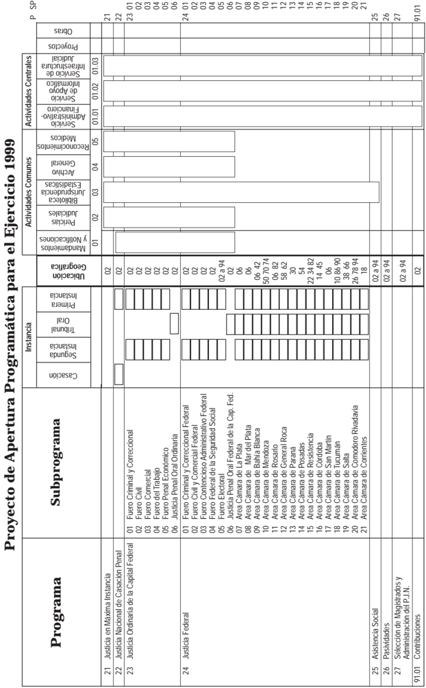
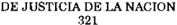
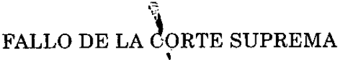

TOMO 321

Volumen 2

1998

1504

ACUERDOS DE LA CORTE SUPREMA

321

Copyright (c) 1999 by Corte Suprema de Justicia de la Nación Queda hecho el depósito que previene la ley 11.723. Impreso en la Argentina Printed in Argentina I.S.B.N.

DE JUSTICIA DE LA NACION

321

1505

## R E P U B L I C A A R G E N T I N A

FALLOS

DE  LA

C O R T E

S U P R E M A

DE

## J USTICIA DE LA N ACION

PUBLICACION A CARGO DE LA SECRETARIA DE JURISPRUDENCIA DEL TRIBUNAL

TOMO 321 - VOLUMEN 2

JUNIO - SEPTIEMBRE

LA LEY S.A.E. e I.

Tucumán 1471 (1050) Buenos Aires 1998

## HOJA COMPLEMENTARIA

Hoja incorporada a los efectos de permitir la búsqueda por página dentro del Volumen.

DE JUSTICIA DE LA NACION

321

1507

## A C U E R D O S   D E   L A   C O R T E   S U P R E M A

## AÑO 1998

## JUNIO - SEPTIEMBRE

## CONSEJO DE LA MAGISTRATURA. ELECCIONES. PADRON.

## -N o 24-

En Buenos Aires, a los 16 días del mes de junio del año mil novecientos noventa y ocho, reunidos en la Sala de Acuerdos del Tribunal, los señores Ministros que suscriben la presente,

## Consideraron:

- 1 o ) Que el art. 33 de la ley 24.937, modificado por el art. 1  de la ley 24.939, estableo ce que la Corte Suprema de Justicia de la Nación debe confeccionar el padrón correspondiente a los abogados de la matrícula federal -en los términos adoptados por el art. 114 de la Constitución Nacional- que se utilizará para que éstos elijan a sus cuatro representantes, con igual número de suplentes, en el Consejo de la Magistratura.
- 2 o ) Que esa norma dispone también que la organización de los comicios quedará a cargo de la Federación Argentina de Colegios de Abogados, bajo la supervisión y fiscalización de este Tribunal.
- 3 o ) Que el art. 22, inc. 3 , de la citada ley prevé que sean elegidos tres representano tes de los abogados para integrar el Jurado de Enjuiciamiento, dos por la Federación Argentina de Colegios de Abogados y uno por el Colegio Público de Abogados de la Capital Federal, con igual número de suplentes, por el mismo sistema utilizado para elegir a los miembros del Consejo.
- 4 o ) Que, por acordada 20/98, se dispuso la entrega de sendos ejemplares de la lista provisional de electores a la Federación Argentina de Colegios de Abogados y al Colegio Público de Abogados de la Capital Federal, fijándose un plazo de quince días corridos para la recepción de observaciones por parte de dichas entidades.
- 5 o ) Que, por acordada 22/98, se amplió el plazo establecido hasta el pasado día 3, a solicitud de la Federación Argentina de Colegios de Abogados.
- 6 o ) Que esta entidad y el Colegio Público de Abogados de la Capital Federal formularon en término distintas observaciones a las listas provisionales, que han sido incorporadas en cuanto corresponde por derecho, procediéndose a la confección del padrón definitivo.

Por ello,

Acordaron:

Ordenar la entrega de sendos ejemplares del padrón definitivo de electores a la Federación Argentina de Colegios de Abogados y al Colegio Público de Abogados de la Capital Federal.

Todo lo cual dispusieron y mandaron, ordenando que se comunicase y se registrase en el libro correspondiente, por ante mí que doy fe.- JULIO S. NAZARENO - EDUARDO MOLINÉ O'CONNOR - CARLOS S. FAYT - AUGUSTO CÉSAR BELLUSCIO - ENRIQUE SANTIAGO PETRACCHI - GUILLERMO A. F. LÓPEZ - ANTONIO BOGGIANO - GUSTAVO A. BOSSERT Nicolás Alfredo Reyes (Administrador General).

## CONSEJO DE LA MAGISTRATURA. REGLAMENTO.

-N o 25-

En Buenos Aires, a los 16 días del mes de junio del año mil novecientos noventa y ocho, reunidos en la Sala de Acuerdos del Tribunal, los señores Ministros que suscriben la presente,

## Consideraron:

- 1 o ) Que el art. 2 , inc. 4 , de la ley 24.937 dispone que el Consejo de la Magistratura o o estará integrado por cuatro (4) representantes de los abogados de la matrícula federal, designados por el voto directo de dichos profesionales.

Para la elección se utilizará el sistema D'Hont, debiéndose garantizar la presencia de los abogados del interior de la República.

- 2 o ) Que el art. 22, inc. 3 , de la ley citada, modificada por el art. 1  de la ley 24.939, o o prevé que el Jurado de Enjuiciamiento estará integrado por tres (3) abogados de la matrícula federal, dos (2) en representación de la Federación Argentina de Colegios de Abogados, debiendo por lo menos uno de ellos pertenecer a la matrícula federal del interior del país, y uno (1) por el Colegio Público de Abogados de la Capital Federal, con igual número de suplentes, por el mismo sistema utilizado para elegir a los miembros del Consejo.
- 3 o ) Que los arts. 2  y 22, o in fine , de la ley 24.937, este último modificado por el art. 1 o de la ley 24.939, establecen que por cada miembro titular se elegirá un suplente por igual procedimiento, para reemplazarlo en caso de renuncia, remoción o fallecimiento.
- 4 o ) Que el art. 33 de la ley 24.937, luego de las modificaciones que le introdujo el art. 1  de la ley 24.939, dispone que la Federación Argentina de Colegios de Abogados o

organizará la elección de los abogados de la matrícula federal, bajo la supervisión y fiscalización de esta Corte Suprema de Justicia de la Nación.

- 5 o ) Que la Federación Argentina de Colegios de Abogados presentó un 'Reglamento  Electoral  para la elección de los representantes de los abogados para integrar el Consejo de la Magistratura y de la Federación Argentina de Colegios de Abogados y del Colegio Público de Abogados de la Capital Federal para integración del Jurado de Enjuiciamiento', que mereció determinadas objeciones por parte del Colegio Público de Abogados de la Capital Federal.
- 6 o ) Que el Tribunal, por acordada 22/98, del 29 de mayo pasado, formuló distintas observaciones a ese reglamento, encomendándole su adecuación a los preceptos de las leyes 24.937 y 24.939.
- 7 o ) Que, por nota del día 5 del corriente, la Federación Argentina de Colegios de Abogados sometió a consideración de esta Corte un nuevo reglamento, conforme a las disposiciones de las leyes citadas, habiendo expresado el Colegio Público de Abogados de la Capital Federal su conformidad con dicho texto.

Por ello,

Acordaron:

Tomar nota del reglamento aludido en el considerando anterior.

Todo lo cual dispusieron y mandaron, ordenando que se comunicase y se registrase en el libro correspondiente, por ante mí que doy fe.- JULIO S. NAZARENO - EDUARDO MOLINÉ O'CONNOR - CARLOS S. FAYT - AUGUSTO CÉSAR BELLUSCIO - GUILLERMO A. F. LÓPEZ - ANTONIO BOGGIANO - GUSTAVO A. BOSSERT - Nicolás Alfredo Reyes (Administrador General).

REGLAMENTO ELECTORAL PARA LA ELECCIÓN DE LOS REPRESENTANTES DE LOS ABOGADOS PARA INTEGRAR EL CONSEJO DE LA MAGISTRATURA Y DE LA FEDERACIÓN ARGENTINA DE COLEGIOS DE ABOGADOS Y DEL COLEGIO PÚBLICO DE ABOGADOS DE LA CAPITAL FEDERAL PARA LA INTEGRACIÓN DEL JURADO DE ENJUICIAMIENTO.

- Art. 1: Electores : Los abogados de la matrícula federal en ejercicio forman parte del cuerpo electoral convocado para elegir a los abogados que integrarán el Consejo de la Magistratura en representación de los abogados de la matrícula federal y los representantes de la Federación Argentina de Colegios de Abogados y del Colegio Público de Abogados de la Capital Federal que integrarán el Jurado de Enjuiciamiento, previsto por los arts. 114 y 115 de la Constitución Nacional, en los términos de los arts. 2  inc. 4 o o de la ley 24.937 y 22 inc. 3 , texto según ley 24.939. o

Art. 2: Padrón electoral : El padrón electoral se compondrá por los abogados que se encuentren inscriptos en la matrícula federal de conformidad con lo dispuesto en las

leyes 22.192, 23.187 y Acordada de la Corte Suprema de Justicia de la Nación 37 del año 1987 y que no se encuentren suspendidos o inhabilitados.

- Art. 3: Sufragio : El sufragio será individual, personal, voluntario y secreto.
- Art. 4: Organización del Comicio : La Federación Argentina de Colegios de Abogados tendrá a su cargo todos los actos necesarios para organizar y garantizar la adecuada realización de los comicios y el escrutinio.

La Junta Electoral estará compuesta por ocho (8) miembros de los cuales cinco (5) serán designados por la Mesa Directiva de la Federación Argentina de Colegios de Abogados y deberán reunir la calidad de Presidente o Vice Presidente de Colegios de Abogados Federados geográficamente cercanos a la sede social de la Federación o con posibilidades de realizar la tarea que le corresponde a la misma y los otros tres (3) serán designados por el Colegio Público de Abogados de la Capital Federal. Sus componentes elegirán el Presidente, el Vice Presidente 1  y el Secretario General actuando o los  restantes como vocales. El Presidente, en caso de empate tendrá doble voto. La Junta Electoral actuará con las atribuciones establecidas en el art. 52 del Código Electoral Nacional.

- Art.  5: Incompatibilidades de las autoridades del comicio :  Los  miembros de la Junta Electoral, las autoridades de las mesas receptoras de votos y las autoridades de los Colegios de Abogados que cumplan las funciones que prevé el art. 18 de este Reglamento no podrán ser candidatos a ningún cargo.
- Art. 6: Padrón provisorio :  Los  padrones provisorios confeccionados por la Corte Suprema de Justicia de la Nación serán remitidos por la F.A.C.A. a todos los Colegios de Abogados que la integren y al Colegio Público de Abogados de la Capital Federal, para su exhibición pública inmediata por cinco días, a contar de la fecha de recepción por cada Colegio.
- Art. 7: Depuración del padrón provisorio :  Los  electores que no figurasen en los padrones provisorios o que estuviesen anotados erróneamente, podrán solicitar por escrito su inclusión o la introducción de las correcciones que fueren menester, en el plazo de cinco (5) días contados desde la fecha de la publicación ante el Colegio de Abogados respectivo, el que deberá elevarlo de inmediato a la Junta Electoral.

En el mismo plazo y forma, cualquier elector o Colegio de Abogados podrá solicitar la eliminación de otros electores que hubieren perdido la condición de tales o que figurasen inscriptos mas de una vez, así como la corrección de datos que consideren errados.

- Art. 8: Padrones definitivos :  Los padrones provisorios depurados constituirán el padrón general para la elección de los integrantes del sector de los abogados que integrarán el Consejo de la Magistratura y el Jurado de Enjuiciamiento de conformidad con los distritos previstos en el artículo 10 de este reglamento.

Los padrones contendrán el número de orden del elector y una columna para anotar la emisión del voto. Estarán encabezados por una inscripción que indique la mesa

electoral del interior del país o de la ciudad de Buenos Aires a la que estarán dirigidos, y serán autenticados por el Presidente y Secretario de la Junta Electoral.

Art. 9: Sede de los Comicios : Se remitirá a cada Colegio de Abogados tres padrones por mesa de votación. Las listas oficializadas tendrán acceso al número de ejemplares que requieran, a su costa, por medio de sus representantes autorizados. Los comicios se realizarán en la sede de los Colegios de Abogados integrantes de la F.A.C.A. y en la del Colegio Público de Abogados de la Capital Federal o donde las autoridades de los mismos lo dispongan con la debida publicidad correspondiente.

Art. 10: Distritos electorales : A los fines del presente reglamento se constituye un distrito electoral único, que comprende todo el territorio de la República, para la elección de los abogados que integraran el Consejo de la Magistratura en representación de los abogados que componen la matrícula federal. A su vez, para la elección de los abogados que integrarán el Jurado de Enjuiciamiento en representación del Colegio Público de Abogados de la Capital Federal y de la F.A.C.A. se constituyen dos distritos electorales: uno que comprende la Capital Federal y otro el resto de la República.

Art. 11: Plazo para la convocatoria : La convocatoria a las elecciones será efectuada por la Mesa Directiva de la F.A.C.A., con noventa (90) días de anticipación a la fecha de los comicios. La convocatoria se publicará por dos días en el Boletín Oficial y en dos diarios de circulación nacional, y se invitará a los Colegios de Abogados adheridos a la F.A.C.A. y al Colegio Público de Abogados de Capital Federal a colaborar en su difusión.

Art. 12: Oficialización de listas : Desde la publicación de la convocatoria y hasta cuarenta y cinco (45) días antes de la fecha fijada para la elección, los interesados podrán solicitar a la Junta Electoral el registro de las listas de candidatos, para lo cual deberán cumplir con los requisitos siguientes.

No podrán postularse los mismos candidatos para ocupar cargos simultáneamente en el Consejo de la Magistratura y en el Jurado de Enjuiciamiento.

Las listas para integrar el Consejo de la Magistratura y el Jurado de Enjuiciamiento deberán presentarse por separado.

Para su oficialización se adjuntarán las boletas respectivas que deberán ser de idénticas dimensiones para todas las listas debiendo confeccionarse en papel de diario, de doce (12) a diecinueve (19) centímetros por cada institución a integrar, común, color blanco, incluyendo en tinta negra la nómina de los candidatos, el número adjudicado y opcionalmente el nombre, lema, sigla, logotipo o escudo que las patrocine.

Los candidatos titulares y suplentes, en ambos casos, deberán ser abogados de la matrícula federal en ejercicio y reunir las condiciones exigidas para ser juez de la Corte Suprema de Justicia de la Nación, debiendo aceptar expresamente su candidatura con la declaración que no se encuentran afiliados a ningún partido político al momento de la postulación o que se comprometen a renunciar a la misma antes de la asunción, en caso de resultar electos. Asimismo aceptarán expresamente las incompatibilidades previstas en el art. 5 de la ley 24.937 y 9 del decreto-ley 1285/58. Además deberán

presentar certificación del Colegio de Abogados al que pertenecen donde conste que no se encuentra afectado por sanciones disciplinarias vigentes al tiempo de su postulación.

En el caso de los candidatos a integrar el Jurado de Enjuiciamiento en representación de la Federación Argentina de Colegios de Abogados deberán acreditar su matrícula vigente en alguno de los Colegios federados.

Art. 13: Requisitos comunes para la oficialización de listas de candidatos : Para ser oficializadas, las listas que se presenten deberán ir acompañadas con la adhesión de por lo menos el 0,8 por ciento del padrón electoral de abogados del distrito y designarán apoderado con domicilio especial en Capital Federal en el que serán válidas todas las notificaciones que se practiquen. Los adherentes no podrán ser candidatos ni estar incluidos, en calidad de tales, en apoyo de otra lista.

Art. 14: Requisitos específicos para la integración de las listas de los representantes de los abogados que integrarán el Consejo de la Magistratura :  Cada lista deberá postular como candidatos a consejeros titulares y suplentes del Consejo de la Magistratura, a cuatro abogados de la matrícula federal, en un orden determinado, en el que se deberá incluir, por lo menos, un abogado de la matrícula federal del interior del país, debiendo los suplentes acreditar iguales condiciones que los propuestos como candidatos a miembros titulares que eventualmente podrán ser llamados a reemplazar.

Art. 15: Requisitos específicos para la integración de las listas de candidatos que integrarán el Jurado de Enjuiciamiento : Cada lista que se presente en el distrito electoral  del  interior  del  país  deberá  postular  como  candidatos  a  miembros  titulares  y suplentes del Jurado de Enjuiciamiento a dos abogados de la matrícula federal, matriculados en alguno de las Instituciones federadas a la Federación Argentina de Colegio de Abogados, uno de los cuales, por lo menos, deberá pertenecer a la del interior del país, e igual condiciones que los propuestos como candidatos a miembros titulares que eventualmente podrán ser llamados a reemplazar.

Cada lista que se presente en el distrito electoral de Capital Federal deberá postular como candidato a miembro titular del Jurado de Enjuiciamiento a un abogado de la matrícula federal de la Capital Federal y otro miembro suplente que reúna esas mismas condiciones, ambos pertenecientes al Colegio Público de Abogados de la Capital Federal.

Art. 16: Oficialización de las listas : La Junta Electoral oficializará de modo provisional las listas, siempre que cumplan con los requisitos establecidos en este reglamento, asignándoles números consecutivos de acuerdo con el orden de su presentación.

Los apoderados de las listas podrán tomar vista de las presentaciones y tendrán un plazo de cinco (5) días para reformular las que hubieren sido observadas o impugnar las que hubieren sido presentadas.

Al vencimiento del plazo la Junta Electoral procederá a la oficialización definitiva de las listas.

Art. 17: Número de electores por Mesa :  Se  constituirá  una  mesa  electoral  cada cuatrocientos cincuenta (450) electores. En los casos en que haya dos o más mesas, éstas se dividirán por orden alfabético.

Art. 18: Autoridades de Mesa - Fiscales - Delegados de la Junta Electoral : Cada mesa electoral tendrá como autoridades un Presidente, un Vice Presidente y un Vocal, que se reemplazarán en ese orden y que serán designados por la Junta Electoral, a propuesta de los respectivos Colegios de Abogados y del Colegio Público de Abogados de la Capital Federal, debiendo recaer preferentemente la designación en autoridades de dichos Colegios.

Las autoridades de mesa resolverán los problemas que se susciten durante el transcurso del comicio. Las autoridades locales de cada Colegio actuarán como delegados de la Junta Electoral colaborando en todo lo necesario para la solución de los mismos.

Las listas oficializadas podrán designar fiscales generales o de mesa los que deberán acreditarse ante las autoridades electorales correspondientes. Queda expresamente entendido que los candidatos podrán actuar como fiscales.

Es obligación de cada lista proporcionar a la Junta Electoral, en tiempo y forma, las boletas de conformidad con las oficializadas para su uso en el día del comicio.

Art. 19: Domicilio electoral :  Los  electores  podrán  votar  únicamente en la mesa receptora de votos que corresponda al lugar de su domicilio electoral. En el caso de abogados extranjeros se considerará el domicilio electoral el que se haya denunciado oficialmente como su domicilio real.

Art. 20: Recepción de votos :  En  cada  lugar  de  votación  se  habilitará  un  cuarto oscuro por cada mesa receptora de votos.

El acto electoral se desarrollará desde las 9 hasta las 18 horas el día fijado.

Los Electores votarán solamente por una lista de candidatos oficializada para cada una de las dos elecciones.

El elector deberá acreditar su identidad con el D.N.I., Libreta de Enrolamiento o Libreta Cívica. Los extranjeros con D.N.I. o Cédula de Identidad.

La Comprobación de cualquier irregularidad en la emisión del voto será comunicado por las autoridades de la mesa y a los fines que correspondan a la Junta Electoral.

Las autoridades de mesa y los fiscales votarán en primer término.

Art. 21: Escrutinio provisorio :  Una vez cerrado el acto, las autoridades de cada mesa, con la presencia de los fiscales y candidatos que lo solicitaren, harán el escrutinio público de las elecciones y resolverán acerca de la validez o nulidad de los votos recurridos o impugnados.

El escrutinio de la elección se practicará por listas, sin tomar en cuenta las tachas o sustituciones que haya efectuado el votante.

Concluido el escrutinio, las autoridades de mesa completarán las actas de cierre y procederán a la guarda de boletas y documentos que deberán ser remitidos a la sede de la F.A.C.A..

El Presidente de mesa o en su reemplazo el Vice Presidente o el Vocal, emitirán en el día un facsímil o telegrama dirigido a la F.A.C.A., que contendrá copia de las dos actas de cierre con todos sus datos.

- Art. 22: Escrutinio definitivo : Llegadas las urnas y toda la documentación del acto eleccionario a la sede de la F.A.C.A., se procederá por la Junta Electoral al escrutinio definitivo.
- Art. 23: Proclamación de los electos : La junta Electoral proclamará a los miembros electos, titulares y suplentes, del Consejo de la Magistratura y del Jurado de Enjuiciamiento.
- Art. 24: Asignación de cargos para el Consejo de la Magistratura : Los cargos de consejeros titulares y suplentes del Consejo de la Magistratura se asignarán con arreglo al siguiente procedimiento:
- a) El total de los votos obtenidos por cada lista será dividido por uno, por dos, por tres y por cuatro.
- b) Los cocientes resultantes, con independencia de la lista de la que provengan, serán ordenados de mayor a menor en número igual al de los cargos a cubrir. Si hubiere dos o más cocientes iguales, se los ordenará en función del total de votos obtenidos por las respectivas listas; y si estas hubieran obtenido igual número de votos, el ordenamiento resultará de un sorteo.
- c)  A  cada  lista  les  corresponderán  tantos  cargos  -titulares  y  suplentes-  como veces figuren sus cocientes en el ordenamiento indicado en el inc. b, los que serán adjudicados a los candidatos de acuerdo al orden interno en que han sido incluidos en cada lista, con la excepción prevista en el inc. d).
- d) En el caso de que ninguno de los tres primeros electos fuera un abogado de la matrícula federal del interior del país, el cuarto cargo será adjudicado a quien cumpla con ese requisito y aparezca primero en el orden interno de la lista a la que le hubiera correspondido ese cargo.
- Art. 25: Asignación de cargos para el Jurado de Enjuiciamiento :
- a) El cargo de miembro titular y su suplente en representación del Colegio Público de Abogados de la Capital Federal será asignado por mayoría simple a la lista que obtenga el mayor número de votos.
- b) Participarán en la asignación de los dos cargos titulares y suplentes para el Jurado de Enjuiciamiento en representación de la F.A.C.A. todas las listas, cualquiera que fuere el porcentual de votos del padrón electoral que hayan obtenido, con arreglo al siguiente procedimiento:

b.1) El total de los votos obtenidos por cada lista se dividirá por uno y por dos.

- b.2) Los cocientes resultantes, con independencia de la lista de que provengan, serán ordenados de mayor a menor en número igual al de los cargos a cubrir. Si hubiere dos o más cocientes iguales, se los ordenará en función del total de votos obtenidos por las respectivas listas; y si éstas hubieran obtenido igual número de votos, el ordenamiento resultará de un sorteo.
- b.3) A cada lista le corresponderá tantos cargos titulares y suplentes como veces figuren sus cocientes en el ordenamiento indicado en el inciso b.2, los que serán adjudicados a los candidatos de acuerdo al orden interno en que han sido incluidos en cada lista, con la excepción prevista en el inciso b.4.
- b.4) En el caso de que ninguno de los electos fuera un abogado de la matrícula federal del interior del país, el segundo cargo será adjudicado a quien cumpla con ese requisito y aparezca primero en el orden interno de la lista a que le hubiera correspondido ese cargo.
- Art. 26: Aplicación supletoria del Código Nacional Electoral :  Será de aplicación supletoria, en cuanto fueran compatibles, el Código Electoral Nacional especialmente los títulos IV y V.
- Art. 27: Fiscalización : Los candidatos y Fiscales de las listas oficializadas podrán vigilar y custodiar las urnas y su documentación en todo momento.
- Art. 28: Supervisión y Fiscalización de la Corte Suprema de Justicia de la Nación : La Corte Suprema de Justicia de la Nación supervisará y fiscalizará el acto eleccionario de la siguiente forma:
- a)  En la Capital Federal, por intermedio del personal del Juzgado Nacional de Primera Instancia en lo Criminal y Correccional Federal N  1, con competencia electoo ral.
- b) En el interior, por intermedio del personal de los Juzgados Federales a cuya jurisdicción territorial le corresponde la sede de cada Colegio de Abogados. En el caso de que más de un Juzgado Federal tuviera competencia en razón del territorio, se asignará sucesivamente al que tiene competencia en materia electoral o al más antiguo con competencia en lo Criminal y Correccional Federal.
- Art. 29: Cómputo de plazos : Los plazos se computarán en días corridos.
- Art. 30: Determinación de interior y Capital : A los fines de la aplicación de este Reglamento se interpreta el término interior referido en las leyes 24.937 y 24.939 como el total del territorio de la República, excluida la Capital Federal.

## Art. 31: Disposiciones transitorias :

- a) Para la primera elección la convocatoria prevista en el art. 11 del Reglamento se efectuará con cuarenta y cinco (45) días de anticipación a la fecha de los comicios y el plazo fijado en el art. 12 vencerá el día 19 de junio de 1998.

1516

## ACUERDOS DE LA CORTE SUPREMA 321

b) A los fines de la primera elección integrarán el padrón electoral quienes reúnan los requisitos establecidos en el presente Reglamento al 6 de enero de 1998.

ANGEL FERMÍN GARROTE (Presidente).

## CONSEJO DE LA MAGISTRATURA. ELECCIONES. PRESENTACION DE LISTAS.

-N o 26-

En Buenos Aires, a los 16 días del mes de junio del año mil novecientos noventa y ocho, reunidos en la Sala de Acuerdos del Tribunal, los señores Ministros que suscriben la presente,

## Consideraron:

- 1 o ) Que el art. 33 de la ley 24.937, modificado por el art. 1  de la ley 24.939, encoo mienda al Tribunal la organización de las primeras elecciones de los jueces que compondrán el Consejo de la Magistratura y el Jurado de Enjuiciamiento.
- 2 o ) Que, por acordada 14/98, se aprobó el reglamento que regirá el acto electoral.
- 3 o ) Que, por acordada 15/98, se convocó a los jueces a comicios para el día 29 de junio próximo.
- 4 o ) Que, en el plazo previsto por el art. 13 del reglamento mencionado en el considerando 2 , solicitaron su registro tres listas de candidatos a integrar el Consejo de la o Magistratura y tres listas de postulantes a miembros del Jurado de Enjuiciamiento.
- 5 o ) Que, de conformidad con lo establecido por el art. 16 del reglamento mencionado, dichas listas recibieron números consecutivos de acuerdo con el orden de su presentación y fueron oficializadas provisionalmente.
- 6 o ) Que, en los términos del artículo citado, se corrió vista a los apoderados de esas listas y a la Asociación de Magistrados y Funcionarios de la Justicia Nacional, sin que se produjeran observaciones.
- 7 o ) Que las listas registradas cumplen con los requisitos fijados por los arts. 14 y 15 del reglamento mencionado en el considerando 2 , y los candidatos propuestos con las o condiciones establecidas por el art. 4  de la ley 24.937. o

Por ello,

Acordaron:

1 o ) Declarar oficializadas definitivamente las siguientes listas:

- a) A miembros del Consejo de la Magistratura:
- -Lista 1. Titulares: Bindo Benito Caviglione Fraga, Miguel Angel Caminos, Alejandro Mario Saravia, Margarita Aixa Gudiño Kieffer y Mirta Delia Tyden. Suplentes: Elena Inés Highton, Roberto Omar Eiras, Alberto Seijas, Abel Cornejo y Nora María Teresa Cabrera.
- -Lista 2. Titulares: Claudio Marcelo Kiper, Mirta Graciela González Burbridge, Manuel Humberto Blanco, Mariano Armando González Palazzo y Narciso Juan Lugones. Suplentes: Carlos Osvaldo Gerome, Hortensia Dominga Gutiérrez Posse, Ricardo Bustos Fierro, Pedro José Jorge Coviello y Ricardo Emilio Planes.
- -Lista 3. Titulares: Ricardo Alberto Guibourg, Hugo del Pozo, Javier Enrique Fernández Moores, Raúl Héctor Acosta Acerete y Jorge Luis Marcelo Noro Villagra. Suplentes: Jorge Guillermo Bermúdez, Luis Roberto Rueda, María Laura Garrigós, Abel Cornejo y María Cecilia Inés Maiza.

## b) A miembros del Jurado de Enjuiciamiento

- -Lista 1. Titulares: Horacio Vicente Billoch y Roberto Enrique Hornos. Suplentes: José Vicente Muscará y Hugo Molteni.
- -Lista 2. Titulares: Jorge Horacio Alterini y Alcira Paula Isabel Pasini. Suplentes: Jorge Osvaldo Casanovas y Jorge Roberto Burad.
- -Lista 3. Titulares: Jorge Gabriel Pérez Delgado y Horacio Rolando Cattani. Suplentes: Gabriel Benjamín Chausovsky y Miguel Guillermo Pons.
- 2 o ) Ordenar la confección e impresión de las boletas de sufragio, de conformidad con el art. 17 del reglamento correspondiente.

Todo lo cual dispusieron y mandaron, ordenando que se comunicase y se registrase en el libro correspondiente, por ante mí que doy fe.- JULIO S. NAZARENO - EDUARDO MOLINÉ O'CONNOR - CARLOS S. FAYT - AUGUSTO CÉSAR BELLUSCIO - GUILLERMO A. F. LÓPEZ - ANTONIO BOGGIANO - GUSTAVO A. BOSSERT - ADOLFO ROBERTO VÁZQUEZ - Nicolás Alfredo Reyes (Administrador General).

CORTE SUPREMA. AUTORIDADES DE FERIA JUDICIAL DE JULIO.

En Buenos Aires, a los 18 días del mes de junio del año mil novecientos noventa y ocho, reunidos en la Sala de Acuerdos del Tribunal, los señores Ministros que suscriben la presente,

Resolvieron:

- I) Designar como autoridades de feria del mes de julio del corriente año:

Al doctor Eduardo Moliné O'Connor como juez de feria (20-7-98 al 31-7-98) y al doctor Adolfo Roberto Vázquez (20-7-98 al 26-7-98).

- II)  Establecer el horario de atención al público de lunes a viernes, desde las 8 hasta las 12 horas.

III) El personal que preste funciones durante la feria judicial deberá acreditarlo mediante certificación otorgada por el señor secretario de feria.

Todo lo cual dispusieron y mandaron, ordenando que se comunicase y se registrase en el libro correspondiente, por ante mí que doy fe.- JULIO S. NAZARENO - EDUARDO MOLINÉ O'CONNOR - CARLOS S. FAYT - AUGUSTO CÉSAR BELLUSCIO - ANTONIO BOGGIANO - GUILLERMO A. F. LÓPEZ - GUSTAVO A. BOSSERT - ADOLFO ROBERTO VÁZQUEZ - Nicolás Alfredo Reyes (Administrador General).

## CONSEJO DE LA MAGISTRATURA. ELECCIONES.

## -N o 28-

En Buenos Aires, a los 23 días del mes de junio del año mil novecientos noventa y ocho, reunidos en la Sala de Acuerdos del Tribunal, los señores Ministros que suscriben la presente,

Resolvieron:

- 1 o ) Que el art. 22 del 'Reglamento para la elección de los jueces que compondrán el Consejo de la Magistratura y el Jurado de Enjuiciamiento', aprobado por acordada 14/ 98, fija las 15 horas para la clausura del acto electoral convocado para el próximo 29 de junio, por la acordada 15/98.
- 2 o ) Que el art. 10 del reglamento citado establece que en la ciudad de Buenos Aires funcionarán tres mesas electorales, cuya instalación se ha dispuesto en la planta baja del Palacio de Tribunales.
- 3 o ) Que el apoderado de la lista de candidatos a ocupar cargos en el Consejo de la Magistratura, que fuera oficializada con el N  2 -Acordada 26/98- solicita que se exo tienda el horario de votación, y que se prevea la instalación de urnas en los edificios sitos en la Avenida de los Inmigrantes y Comodoro Py.
- 4 o ) Que funda sus pedidos en la intención de facilitar y alentar la participación de los electores y en la eventualidad de que por tener muchos magistrados el asiento de su

función en los inmuebles aludidos podría verse dificultada su asistencia a los lugares de votación.

- 5 o ) Que la primera de las solicitudes mencionadas en el considerando 3  puede ser o atendida.
- 6 o ) Que, por el contrario, no resulta posible acceder a la segunda petición pues su aceptación implicaría la modificación de numerosas disposiciones ya adoptadas -en ejecución del reglamento aprobado por la acordada 14/98- con la participación de la Asociación de Magistrados y Funcionarios de la Justicia Nacional, que en última instancia podrían poner en riesgo la debida fiscalización de los comicios.

Por ello,

## Acordaron:

- 1 o ) Extender hasta las dieciocho (18) horas los términos previstos en el art. 22 del 'Reglamento para la elección de los jueces que compondrán el Consejo de la Magistratura y el Jurado de Enjuiciamiento', aprobado por acordada 14/98.
- 2 o ) No hacer lugar a lo demás solicitado.
- 3 o ) Poner esta decisión en conocimiento de los apoderados de las listas oficializadas y de la Asociación de Magistrados y Funcionarios de la Justicia Nacional requiriéndole que adopte todos los recaudos para su publicidad.

Todo lo cual dispusieron y mandaron, ordenando que se comunicase y se registrase en el libro correspondiente, por ante mí que doy fe.- JULIO S. NAZARENO - EDUARDO MOLINÉ O'CONNOR - CARLOS S. FAYT - AUGUSTO CÉSAR BELLUSCIO - ENRIQUE SANTIAGO PETRACCHI - ANTONIO BOGGIANO - GUILLERMO A. F. LÓPEZ - GUSTAVO A. BOSSERT ADOLFO ROBERTO VÁZQUEZ ( en disidencia  - Nicolás Alfredo Reyes ) (Administrador General).

## DISIDENCIA DEL DR. ADOLFO ROBERTO VÁZQUEZ

## Considerando:

- 1 o ) Que el art. 22 del 'Reglamento para la elección de los jueces que compondrán el Consejo de la Magistratura y el Jurado de Enjuiciamiento', aprobado por acordada 14/98, fija las 15 horas para la clausura del acto electoral convocado para el próximo 29 de junio, por la acordada 15/98.
- 2 o ) Que el art. 10 del reglamento citado establece que en la ciudad de Buenos Aires funcionarán tres mesas electorales, cuya instalación se ha dispuesto en la planta baja del Palacio de Tribunales.
- 3 o ) Que el apoderado de la lista de candidatos a ocupar cargos en el Consejo de la Magistratura, que fuera oficializada con el N  2 por acordada 26/98, solicita que se o

extienda el horario de votación, y que se prevea la instalación de urnas en los edificios sitos en la Avenida de los Inmigrantes y en la Avenida Comodoro Py.

- 4 o ) Que funda sus pedidos en la intención de facilitar y alentar la participación de los electores y en la eventualidad de que, por tener muchos magistrados el asiento de su función en los inmuebles aludidos, podría verse dificultada su asistencia a los lugares de votación.
- 5 o )  Que este Tribunal comparte la necesidad de adoptar las medidas necesarias para alentar la participación de los electores en los comicios y para facilitar la emisión de su voto.
- 6 o ) Que no resultan óbice suficiente para impedir la vigencia del principio enunciado las facultades de fiscalización que la ley 24.937, y su modificatoria la 24.939, le reconocen a la asociación de magistrados; y que este Tribunal, por mayoría otorgó contra la opinión del Juez Adolfo R. Vázquez, a la Asociación de Magistrados y Funcionarios de la Justicia Nacional (Acordada 12/98, disidencia del Juez Vázquez).
- 7 o ) Que, así entendida la cuestión, no existe impedimento que no sea de fácil resolución para la supervisión que sobre el acto electoral pudieran querer ejercer las listas oficializadas.

## Por ello,

## Acordaron:

- 1 o ) Extender hasta las dieciocho (18) horas los términos previstos en el art. 22 del 'Reglamento para la elección de los jueces que compondrán el Consejo de la Magistratura y el Jurado de Enjuiciamiento', aprobado por acordada 14/98.
- 2 o ) Modificar el art. 10 del reglamento citado, que quedará redactado de la siguiente forma: 'Art. 10 - Mesas Electorales. En cada cámara federal del interior del país se constituirá una mesa electoral. En la ciudad de Buenos Aires se instalaran cinco mesas, identificadas con los números 1 a 5. Las mesas números 1, 2 y 3, que se instalarán en la planta baja del Palacio de Tribunales, incluirán a los votantes cuyos apellidos comiencen con las letras 'A' a 'E' , 'F' a 'M' y 'N' a 'Z', respectivamente, con excepción de los que tengan su asiento en los edificios de la Avenida de los Inmigrantes 1950 y de la Avenida Comodoro Py 2002. Las mesas números 4 y 5, que se constituirán en esos inmuebles incluirán a los votantes que tienen allí su lugar de desempeño'.
- 3 o ) Reformar los padrones destinados a los comicios de las mesas electorales que se constituirán en la ciudad de Buenos Aires, conforme a las pautas indicadas en el punto anterior.
- 4 o ) Practicar el sorteo de las autoridades de las mesas números 4 y 5, y disponer que la entidad autorizada para la supervisión del acto electoral proceda a la designación de sus vocales, en los términos del art. 11 del reglamento mencionado.
- 5 o ) Poner esta decisión en conocimiento de los apoderados de las listas oficializadas y de la Asociación de Magistrados y Funcionarios de la Justicia Nacional, requiriéndole que adopte todos los recaudos para su publicidad.

Todo lo cual dispusieron y mandaron, ordenando que se comunicase y registrase en el libro correspondiente, por ante mí, que doy fe.- ADOLFO ROBERTO VÁZQUEZ.

## CONSEJO DE LA MAGISTRATURA. ELECCIONES.

-N o 29-

En Buenos Aires, a los 23 días del mes de junio del año mil novecientos noventa y ocho, reunidos en la Sala de Acuerdos del Tribunal, los señores Ministros que suscriben la presente,

## Consideraron:

Que el día 6 de julio próximo se celebrarán las elecciones para designar los representantes de los abogados de la matrícula federal en el Consejo de la Magistratura y en el Jurado de Enjuiciamiento, en el horario comprendido entre las 8 y las 18 horas.

Que la Junta Electoral designada por la Federación Argentina de Colegios de Abogados solicita que ese día sea declarado inhábil a los efectos 'de facilitar la participación de los profesionales de todo el país'.

Por ello,

Acordaron:

Declarar el día 6 de julio de 1998, inhábil para los Tribunales Nacionales y Federales del país, sin perjuicio de los actos procesales cumplidos que no hubiesen sido actuados en rebeldía.

Todo lo cual dispusieron y mandaron, ordenando que se comunicase y se registrase en el libro correspondiente, por ante mi que doy fe.- JULIO S. NAZARENO - EDUARDO MOLINÉ O'CONNOR - CARLOS S. FAYT - AUGUSTO CÉSAR BELLUSCIO - ENRIQUE SANTIAGO PETRACCHI - GUILLERMO A. F. LÓPEZ - GUSTAVO A. BOSSERT - Nicolás Alfredo Reyes (Administrador General).

CORTE SUPREMA. AUTORIDADES DE FERIA JUDICIAL DE JULIO.

-N o 30-

En Buenos Aires, a los 23 días del mes de junio del año mil novecientos noventa y ocho, reunidos en la sala de Acuerdos del Tribunal, los señores Ministros que suscriben la presente,

Resolvieron:

Designar como autoridades de feria del mes de julio del corriente año:

Al doctor Fernando Vocos (20-7-98 al 31-7-98) y a la doctora María Cristina Alvarez de Magliano (20-7-98 al 26-7-98), como secretarios de feria.

Todo lo cual dispusieron y mandaron, ordenando que se comunicase y se registrase en el libro correspondiente, por ante mí que doy fe.- JULIO S. NAZARENO - EDUARDO MOLINÉ O'CONNOR - CARLOS S. FAYT - AUGUSTO CÉSAR BELLUSCIO - ENRIQUE SANTIAGO PETRACCHI - ANTONIO BOGGIANO - GUILLERMO A. F. LÓPEZ - GUSTAVO A. BOSSERT ADOLFO ROBERTO VÁZQUEZ - Nicolás Alfredo Reyes (Administrador General).

## CORTE SUPREMA. DIRECCION DE PRENSA.

-N o 31-

En Buenos Aires, a los 24 días del mes de junio del año mil novecientos noventa y ocho, reunidos en la Sala de Acuerdos del Tribunal, los señores Ministros que suscriben la presente,

## Consideraron:

Que la trascendencia de las cuestiones en que debe tomar intervención la Cámara Nacional de Casación Penal justifica proveer a dicho tribunal, tal como se solicita, de un cargo destinado a cubrir las necesidades existentes en el área de prensa y comunicación.

Por ello,

Acordaron:

Transferir al Subdirector General de Prensa de esta Corte señor Ricardo Oscar Arcucci -con su respectivo cargo- a la Cámara Nacional de Casación Penal.

Todo lo cual dispusieron y mandaron, ordenando que se comunicase y se registrase en el libro correspondiente, por ante mí que doy fe.- JULIO S. NAZARENO - EDUARDO MOLINÉ O'CONNOR - CARLOS S. FAYT - AUGUSTO CÉSAR BELLUSCIO - ANTONIO BOGGIANO GUILLERMO A. F. LÓPEZ - ADOLFO ROBERTO VÁZQUEZ - Nicolás Alfredo Reyes (Administrador General).

## DE JUSTICIA DE LA NACION 321

## CORTE SUPREMA. DIRECCION DE CEREMONIAL.

-N o 32-

En Buenos Aires, a los 29 días del mes de junio del año mil novecientos noventa y ocho, reunidos en la Sala de Acuerdos del Tribunal, los señores Ministros que suscriben la presente,

## Consideraron:

Que la estructura funcional de la Cámara de Casación Penal así como la trascendencia de las cuestiones de conocimiento de dicho tribunal en las causas penales de competencia del Poder Judicial de la Nación, justifican proveer, tal como se solicita, de un cargo destinado a cubrir las necesidades existentes en el área de ceremonial.

Por ello,

Acordaron: Transferir al Subdirector General de Ceremonial de esta Corte Señor José María Hondeville -con su respectivo cargo- a la Cámara Nacional de Casación Penal.

Todo lo cual dispusieron y mandaron, ordenando que se comunicase y registrase en el libro correspondiente, por ante mí, que doy fe.

Regístrese, hágase saber y archívese.- JULIO S. NAZARENO - EDUARDO MOLINÉ O'CONNOR - CARLOS S. FAYT - AUGUSTO CÉSAR BELLUSCIO - ANTONIO BOGGIANO GUILLERMO A. F. LÓPEZ - ADOLFO ROBERTO VÁZQUEZ - Nicolás Alfredo Reyes (Administrador General).

## SECRETARIA JUDICIAL N o  2. DESPACHO.

## -N o 33-

En Buenos Aires, a los 14 días del mes de julio del año mil novecientos noventa y ocho, reunidos en la Sala de Acuerdos del Tribunal, los señores Ministros que suscriben la presente,

## Consideraron:

Que en razón del aumento de causas en trámite en materia de seguridad social ante la Secretaria Judicial N  2 a cargo del Dr. Fernando Vocos, resulta necesario o

procurar que dicha circunstancia no incida en la celeridad y eficacia del procedimiento en los expedientes correspondientes.

Por ello,

Acordaron:

Autorizar a la secretaria letrada doctora Mónica Zito a colaborar con la firma del despacho de trámite y las providencias simples correspondientes a los expedientes de la Secretaría Judicial N  2 (art. 89 R.J.N.). o

Todo lo cual dispusieron y mandaron, ordenando que se comunicase y se registrase en el libro correspondiente, por ante mí que doy fe.- JULIO S. NAZARENO - CARLOS S. FAYT - AUGUSTO CÉSAR BELLUSCIO - ENRIQUE SANTIAGO PETRACCHI - GUILLERMO A. F. LÓPEZ - GUSTAVO A. BOSSERT - ADOLFO ROBERTO VÁZQUEZ -  Nicolás  Alfredo  Reyes (Administrador General).

CORTE SUPREMA. ADMINISTRACION GENERAL. PRESUPUESTO.

-N o 34-

En Buenos Aires, a los 14 días del mes de julio del año mil novecientos noventa y ocho, reunidos en la Sala de Acuerdos del Tribunal, los señores Ministros que suscriben la presente,

## Consideraron:

Que es facultad del tribunal estimar las erogaciones, y recursos correspondientes al ejercicio 1999, dando a conocer la proyección presupuestaria del Poder Judicial de la Nación al Poder Ejecutivo Nacional y al Honorable Congreso de la Nación, según lo establecido en la Ley de Autarquía Financiera N  23.853 en sus artículos 1  y 8  y el o o o Decreto 1486/97 (t.o. de la Ley Complementaria Permanente de Presupuesto N  11.672) o en su artículo 14 . o

Que se han extremado los niveles de erogación a las mínimas condiciones acorde al escenario macroeconómico y a los lineamientos presupuestarios referidos a la política de gastos del sector público.

Que las erogaciones previstas resultan absolutamente imprescindibles para garantizar un desenvolvimiento adecuado de la actividad jurisdiccional que en forma

paulatina se ve afectada por las postergaciones fruto de asignaciones presupuestarias insuficientes en los últimos ejercicios.

Que el crecimiento permanente en la demanda del servicio de justicia indica la necesidad impostergable de asignar un tratamiento presupuestario diferenciado al del resto de los servicios que presta el sector público, muchos de los cuales pueden ser atendidos alternativamente por el sector privado. La actividad jurisdiccional es un deber indelegable del Estado Nacional y su permanente expansión obliga un correlato económico-financiero que, a la luz de las asignaciones históricas, ha resultado insuficiente.

Que en conocimiento de los niveles máximos notificados por el Poder Ejecutivo, los mismos excluyen la atención de inversiones y gastos prioritarios, los que sin atención financiera seguramente afectarán la normal prestación de la tarea judicial. Merece destacarse que se ha omitido incorporar los créditos para hacer frente a las jubilaciones y pensiones de leyes especiales que se abonan en forma permanente a través de esta jurisdicción y para abonar los vencimientos de las cuotas correspondientes a las Licitaciones Públicas N  1/94 y 1/97. o

Que se incorporan a la presente las erogaciones estimadas para el funcionamiento del Consejo de la Magistratura sobre la base de un esquema básico el que  -seguramente-  será adaptado por el propio órgano conforme sus reales necesidades a partir de su habilitación.

Que  -como en otras oportunidades-  se insiste con la necesidad de contar con las previsiones para poner en funcionamiento tribunales que cuentan con su ley de creación las que por otra parte no previeron en el momento de su sanción la asignación de las partidas correspondientes que posibilitaran la habilitación de los mismos.

Que la planta de personal para el ejercicio 1999 ha sido calculada en base a los cargos existentes a abril de 1998 (17.364) adicionando los correspondientes a tribunales  a  habilitar  (80)  y  a  completar  (492)  y  los  correspondientes  a  transformaciones, suplencias, la habilitación del Consejo de la Magistratura y la incorporación de meritorios (1453), arrojando un total de 19.389 cargos.

Que se ha previsto también el incremento vegetativo anual, servicios extraordinarios, amparos judiciales por intangibilidad de las remuneraciones y el reconocimiento de la deuda en concepto de adicional por zona desfavorable a aquellos agentes cuyas causas no cuentan con sentencia, a los efectos de reducir costas y gastos judiciales.

Que se incorpora a la presente el cálculo estimado de la totalidad del monto necesario para abonar las sentencias firmes, recursos y reclamos originados por las deudas según Acordada 56/91, 35/96 y correlativas.

Que en lo atinente a las obras destinadas a construcciones, refuncionalizaciones, refacciones y adecuaciones se han previsto aquellas que garanticen mínimamente la

posibilidad de no colapsar la estructura edilicia del Poder Judicial de la Nación, incluyendo expropiaciones e incorporación de equipamiento con estricta valoración limitativa de costos estimados.

Que al igual que en otros ejercicios, los cálculos efectuados por el Ministerio de Economía y Obras y Servicios Públicos de la Nación, sobrestiman los recursos propios a recaudar por este Poder Judicial de la Nación siendo que las pautas de incremento fiscal expuestas en la política tributaria y de financiamiento comunicada con los techos resultan considerablemente menores.

Por ello,

## Acordaron:

- 1 o )  Fijar  el  Presupuesto  de  Gastos  del  Poder  Judicial  de  la  Nación  para  el ejercicio año 1999, en la suma de pesos OCHOCIENTOS SETENTA Y DOS MILLONES SETECIENTOS SIETE MIL SETECIENTOS TREINTA Y DOS ($ 872.707.732.-), conforme al siguiente detalle:

| Inciso I - Personal .................................................   | $ 644.759.932.-   |
|-------------------------------------------------------------------------|-------------------|
| Inciso II - Bienes de Consumo ............................. $           | 12.082.800.-      |
| Inciso III - Serv. no personales ............................ $         | 58.686.000.-      |
| Inciso IV - Bienes de uso ...................................... $      | 48.702.000.-      |
| Inciso V - Transferencias ..................................... $       | 15.728.000.-      |
| Inciso VI - Serv. de la deuda ................................ $        | 92.749.000.-      |

2 o ) Fijar en DIECINUEVE MIL TRESCIENTOS OCHENTA Y NUEVE (19.389) los cargos de la planta de personal para el Poder Judicial de la Nación durante 1999.

- 3 o ) Estimar la proyección de recursos propios dispuestos por Ley 23.853 para el ejercicio 1999 en la cantidad de pesos QUINIENTOS TREINTA Y SEIS MILLONES CIENTO TREINTA MIL CIENTO OCHENTA Y SEIS ($ 536.130.186.-) y requerir en concepto de Aportes del Tesoro Nacional la cantidad de pesos TRESCIENTOS TREINTA Y SEIS MILLONES QUINIENTOS SETENTA Y SIETE MIL QUINIENTOS CUARENTA Y SEIS ($ 336.577.546.-).
- 4 o ) Aprobar la nueva apertura programática para 1999 que como Anexo I se adjunta integrando la presente.

Todo lo cual dispusieron y mandaron, ordenaron que se comunicase y registrase en el libro correspondiente, por ante mía que doy fe.- JULIO S. NAZARENO - CARLOS S. FAYT - AUGUSTO CÉSAR BELLUSCIO - ENRIQUE SANTIAGO PETRACCHI - ANTONIO BOGGIANO - GUILLERMO A. F. LÓPEZ - GUSTAVO A. BOSSERT - ADOLFO ROBERTO VÁZQUEZ -Nicolás Alfredo Reyes (Administrador General).

## DE JUSTICIA DE LA NACION 321

## ANEXO I Proyecto de Apertura Programática para el Ejercicio 1999

## ACUERDOS DE LA CORTE SUPREMA 321

## DIAS INHABILES.

## -N o 35-

En Buenos Aires, a los 6 días del mes de agosto del año mil novecientos noventa y ocho, reunidos en la Sala de Acuerdos del Tribunal, los señores Ministros que suscriben la presente,

## Consideraron:

Que la forma irregular en que han funcionado los tribunales nacionales y federales del país, en razón de la medida de fuerza resuelta por la Unión de Empleados de la Justicia Nacional el día 8 del corriente mes, requiere tomar medidas que eviten perjuicios a los litigantes;

Por ello,

Acordaron:

Declarar el día 8 de julio de 1998 inhábil para los tribunales nacionales y federales de todo el país, sin perjuicio de la validez de los actos procesales cumplidos que no hubiesen sido actuados en rebeldía.

Todo lo cual dispusieron y mandaron, ordenando que se comunicase y registrase en el libro correspondiente, por ante mí, que doy fe. - JULIO S. NAZARENO - EDUARDO MOLINÉ O'CONNOR - CARLOS S. FAYT - ENRIQUE SANTIAGO PETRACCHI - ANTONIO BOGGIANO - GUILLERMO A. F. LÓPEZ - GUSTAVO A. BOSSERT - ADOLFO ROBERTO VÁZQUEZ Nicolás Alfredo Reyes (Administrador General).

## JURADO DE ENJUICIAMIENTO. DESIGNACION DE PRESIDENTE.

-N o 36-

En Buenos Aires, a los 14 días del mes de agosto del año mil novecientos noventa y ocho, reunidos en la Sala de Acuerdos del Tribunal, los señores Ministros que suscriben la presente,

## Consideraron:

Que el art. 22, inc. 1 , de la ley 24.937, prevé que el Jurado de Enjuiciamiento será o presidido por un ministro de la Corte Suprema de Justicia de la Nación elegido por sus pares.

Que corresponde proceder a la elección del juez de este Tribunal que integrará como miembro titular el Jurado de Enjuiciamiento, difiriéndose para la oportunidad en que fuere necesaria la designación del miembro suplente.

Por ello, por mayoría

Acordaron:

Designar como presidente del Jurado de Enjuiciamiento al vicepresidente de esta Corte, Dr. Eduardo José Antonio Moliné O'Connor. Los jueces Petracchi y Bossert votan por el Dr. Belluscio, y éste por el Dr. Petracchi

Todo lo cual dispusieron y mandaron, ordenando que se comunicase y registrase en el libro correspondiente, por ante mí, que doy fe. - JULIO S. NAZARENO - EDUARDO MOLINÉ O'CONNOR ( según su voto )  -  CARLOS S. FAYT - AUGUSTO CÉSAR BELLUSCIO ENRIQUE SANTIAGO PETRACCHI - ANTONIO BOGGIANO - GUILLERMO A. F. LÓPEZ - GUSTAVO A. BOSSERT - ADOLFO ROBERTO VÁZQUEZ Nicolás Alfredo Reyes (Administrador General).

VOTO DEL SR. VICEPRESIDENTE DE LA CORTE SUPREMA, DR. EDUARDO MOLINÉ O'CONNOR

El Dr. Eduardo Moliné O'Connor votó por el Dr. Carlos S. Fayt, para ocupar el cargo de Presidente del Jurado de Enjuiciamiento.

Todo lo cual dispusieron y mandaron, ordenando que se comunicase y registrase en el libro correspondiente, por ante mí, que doy fe. - EDUARDO MOLINÉ O'CONNOR Nicolás Alfredo Reyes (Administrador General).

## ELECCIONES DE ABOGADOS. DIA INHABIL.

-N o 37-

En Buenos Aires, a los 28 días del mes de agosto del año mil novecientos noventa y ocho, reunidos en la Sala de Acuerdos del Tribunal, los señores Ministros que suscriben la presente,

## Consideraron:

Que el día 23 de septiembre próximo se celebrarán las elecciones para designar los abogados que integrarán el Consejo de la Magistratura de la Ciudad Autónoma de Buenos Aires, en el horario comprendido entre las 08:00 y 18:00 horas.

Que a los fines de facilitar la participación de los profesionales de la Capital Federal resulta conveniente acceder a lo solicitado por el Colegio Público de Abogados de la Capital Federal.

## DE JUSTICIA DE LA NACION 321

Por ello,

## Acordaron:

Declarar el día 23 de septiembre del corriente año, inhábil para los tribunales de la Capital Federal, sin perjuicio de los actos procesales que se cumplan, no actuados en rebeldía.

Todo lo cual dispusieron y mandaron, ordenando que se comunicase y registrase en el libro correspondiente, por ante mí, que doy fe. - JULIO S. NAZARENO - EDUARDO MOLINÉ O'CONNOR - AUGUSTO CÉSAR BELLUSCIO - ENRIQUE SANTIAGO PETRACCHI GUILLERMO A. F. LÓPEZ - GUSTAVO A. BOSSERT - Nicolás Alfredo Reyes (Administrador General)

## CONSEJO DE LA MAGISTRATURA. ELECCIONES DE JUECES.

## -N o 38-

En Buenos Aires, a 1 día del mes de septiembre del año mil novecientos noventa y ocho, reunidos en la Sala de Acuerdos del Tribunal, los señores Ministros que suscriben la presente,

## Consideraron:

- 1 o ) Que el art. 33 de la ley 24.937, modificado por el art. 1  de la ley 24.939, encoo mendó a esta Corte la organización de las primeras elecciones de los jueces que compondrán el Consejo de la Magistratura y el Jurado de Enjuiciamiento, bajo la supervisión y fiscalización de la Asociación de Magistrados.

El mismo artículo dispuso que dichas elecciones deberían efectivizarse dentro del plazo de ciento ochenta días, a contar de la fecha de su publicación, lo que ocurrió en el Boletín Oficial del 6 de enero pasado.

- 2 o )  Que, debiéndose regular el procedimiento a seguir para la realización de los comicios, por acordada 12/98, se decidió poner en conocimiento de la Asociación de Magistrados y Funcionarios de la Justicia Nacional un proyecto de reglamento a esos efectos.
- 3 o ) Que esa entidad comunicó, por nota del 7 de abril pasado, que no tenía observación alguna que formular al contenido del instrumento del que se le había corrido vista.
- 4 o )  Que,  en  consecuencia, por acordada 14/98, se aprobó el reglamento para la elección de los jueces que compondrán el Consejo de la Magistratura y el Jurado de Enjuiciamiento.
- 5 o ) Que, por acordada 15/98, se convocó a comicios para el 29 de junio último.

- 6 o ) Que, en el plazo previsto por el art. 13 del reglamento mencionado en el considerando 4 , solicitaron su registro tres listas de candidatos a integrar el Consejo de la o Magistratura y tres listas de postulantes a miembros del Jurado de Enjuiciamiento, que recibieron números consecutivos de acuerdo con el orden de su presentación y fueron oficializadas provisionalmente, conforme al art. 16 de dicho reglamento.
- 7 o ) Que, en los términos del artículo citado, se corrió vista a los apoderados de esas listas y a la Asociación de Magistrados y Funcionarios de la Justicia Nacional, sin que se produjeran observaciones.
- 8 o )  Que,  en  consecuencia,  por  acordada  26/98,  se  las  declaró  definitivamente oficializadas, de conformidad con lo establecido en el art. 16 del reglamento mencionado en el considerando 4 . o
- 9 o ) Que el pasado 29 de junio tuvieron lugar en todo el país los comicios a los que se había convocado por acordada 15/98.
- 10) Que, luego del cierre del acto electoral en las mesas habilitadas, se procedió a efectuar el escrutinio provisional de los votos válidamente emitidos, labrándose el acta correspondiente, en los términos del art. 24 del Reglamento para la elección de los jueces que compondrán el Consejo de la Magistratura y el Jurado de Enjuiciamiento, sin que se produjeran observaciones de los interesados, ni de la Asociación de Magistrados y Funcionarios de la Justicia Nacional.
- 11) Que, una vez recibidas las urnas y la documentación del acto, se convocó a los apoderados de las listas oficializadas y a dicha entidad a una audiencia para el día 3 de julio último, a los efectos del art. 25 de dicho reglamento.
- 12) Que, de acuerdo a lo que surge del acta correspondiente, los comparecientes reiteraron que no deseaban formular observaciones al proceso electoral, ni al resultado de los comicios.
- 13) Que, de conformidad con lo que disponen los arts. 25 y 26 del reglamento citado en el considerando 10, el Tribunal debe proclamar a los miembros electos, titulares y suplentes, del Consejo de la Magistratura y del Jurado de Enjuiciamiento.

Por ello,

Acordaron:

- 1 o ) Aprobar como resultados del escrutinio definitivo de la elección del 29 de junio de 1998 a los que surgen del escrutinio provisorio practicado por acta de la misma fecha, que se incorpora como anexo de la presente.
- 2 o ) Proclamar como miembros titulares electos del Consejo de la Magistratura a los  doctores Bindo Benito Caviglione Fraga, Claudio Marcelo Kiper, Javier Enrique Fernández Moores y Margarita Aixa Gudiño Kieffer.
- 3 o ) Proclamar como miembros suplentes electos del Consejo de la Magistratura, para reemplazar eventualmente a los anteriores, a los doctores Elena Inés Highton, Carlos Osvaldo Gerome, María Laura Garrigós y Abel Cornejo, respectivamente.

- 4 o ) Proclamar como miembros titulares electos del Jurado de Enjuiciamiento a los doctores Horacio Vicente Billoch y Jorge Gabriel Pérez Delgado.
- 5 o )  Proclamar como miembros suplentes electos del Jurado de Enjuiciamiento, para reemplazar eventualmente a los anteriores, a los doctores José Vicente Muscará y Gabriel Benjamín Chausovsky, respectivamente.

Todo lo cual dispusieron y mandaron, ordenando que se comunicase y se registrase en el libro correspondiente, por ante mí, que doy fe. - JULIO S. NAZARENO - EDUARDO MOLINÉ O'CONNOR - CARLOS S. FAYT - ENRIQUE SANTIAGO PETRACCHI - AUGUSTO CÉSAR BELLUSCIO - ANTONIO BOGGIANO - GUILLERMO A. F. LÓPEZ - GUSTAVO A. BOSSERT -Nicolás Alfredo Reyes (Administrador General).

## RESULTADOS DEL ESCRUTINIO

En la Ciudad de Buenos Aires, a los veintinueve días del mes de junio de mil novecientos noventa y ocho, siendo las 20 horas. en la sala de audiencia de la planta baja del Palacio de Tribunales, el doctor Santiago Hernán Corcuera, secretario de la Corte Suprema de Justicia de la Nación, procede a efectuar el escrutinio provisional de los votos afirmativos válidamente emitidos, de acuerdo con lo que surge de las copias de las actas de cierre provenientes de todas las mesas electorales habilitadas para la elección de los representantes de los jueces en el Consejo de la Magistratura y en el Jurado de Enjuiciamiento, en los términos del art. 24 del reglamento aprobado por acordada 14/98. Se encuentran presentes los apoderados de las listas 1 de candidatos al Consejo de la Magistratura, doctor Bindo Benito Caviglione Fraga, 1 de candidatos al Jurado de Enjuiciamiento, doctor Horacio Vicente Billoch y 2 de candidatos al Consejo de la Magistratura, doctor Claudio Marcelo Kiper; y, en representación de la Asociación de Magistrados y Funcionarios de la Justicia Nacional, el doctor Marcelo Ignacio Aguinsky, previamente convocados con el objeto de ser impuestos de los resultados de los comicios. Abierto el acto, el doctor Corcuera distribuye entre los presentes copias de las planillas de escrutinio provisional de las mesas electorales, que arrojan los siguientes resultados parciales: Mesa 1. A) Consejo de la Magistratura. Lista 1, 98 votos; Lista 2, 44 votos; y Lista 3, 40 votos. B) Jurado de Enjuiciamiento Lista 1, 44 votos; Lista 2, 14 votos; y Lista 3, 21 votos. Mesa 2 A) Consejo de la Magistratura. Lista 1, 82 votos; Lista 2, 64 votos; y, Lista 3, 39 votos; en blanco 1 voto. B) Jurado de Enjuiciamiento. Lista 1, 40 votos; Lista 2, 27 votos; y, Lista 3, 17 votos; en blanco 1 voto. Mesa 3. A) Consejo de la Magistratura. Lista 1, 84 votos; Lista 2, 54 votos; y, Lista 3, 45 votos; en blanco 4 votos. B) Jurado de Enjuiciamiento. Lista 1, 32 votos; Lista 2, 23 votos; y, Lista 3, 18 votos; en blanco 1 voto. Mesa 4. A) Consejo de la Magistratura. Lista 1, 9 votos; Lista 2, 9 votos; y, Lista 3, 1 voto; en blanco 1 voto. B) Jurado de Enjuiciamiento. Lista 1, 9 votos; Lista 2, 3 votos; y Lista 3, 2 votos. Mesa 5. A) Consejo de la Magistratura. Lista 1, 2 votos; Lista 2, 5 votos; y Lista 3, 3 votos; nulo 1 voto. B) Jurado de Enjuiciamiento. Lista 1, 1 voto; Lista 2, 1 voto; y, Lista 3, 4 votos. Mesa 6. A) Consejo de la Magistratura. Lista 1, 5 votos; Lista 2, 4 votos; y Lista 3, 4 votos. B) Jurado de Enjuiciamiento. Lista 1, 5 votos; Lista 2, 1 voto; y, Lista 3, 4 votos. Mesa 7. A) Consejo de la Magistratura. Lista 1, 12 votos; Lista 2, 4 votos; y, Lista 3, 5 votos. B) Jurado de

Enjuiciamiento. Lista 1, 10 votos; Lista 2, 1 voto; y, Lista 3, 3 votos. Mesa 8. A) Consejo de la Magistratura. Lista 1, 2 votos; Lista 2, 2 votos; y, Lista 3, 12 votos. B) Jurado de Enjuiciamiento. Lista 1, 2 votos; Lista 2, 0 votos; y, Lista 3, 7 votos. Mesa 9. A) Consejo de la Magistratura. Lista 1, 5 votos; Lista 2, 4 votos; y, Lista 3, 6 votos. B) Jurado de Enjuiciamiento. Lista 1, 2 votos; Lista 2, 2 votos; y, Lista 3, 5 votos. Mesa 10. A) Consejo de la Magistratura. Lista 1, 1 voto; Lista 2, 1 voto; y, Lista 3, 5 votos. B) Jurado de Enjuiciamiento. Lista 1, 1 voto; Lista 2, 0 votos; y, Lista 3, 5 votos. Mesa 11. A) Consejo de la Magistratura. Lista 1,8 votos; Lista 2, 0 votos; y, Lista 3, 0 votos. B) Jurado de Enjuiciamiento. Lista 1, 3 votos; Lista 2, 0 votos; y, Lista 3, 3 votos. Mesa 12. A) Consejo de la Magistratura. Lista 1, 2 votos; Lista 2, 6 votos; y, Lista 3, 1 voto. B) Jurado de Enjuiciamiento. Lista 1, 3 votos; Lista 2, 2 votos; y Lista 3, 1 voto. Mesa 13. A) Consejo de la Magistratura. Lista 1, 3 votos; Lista 2, 2 votos; y, Lista 3, 2 votos. B) Jurado de Enjuiciamiento. Lista 1, 2 votos; Lista 2, 1 voto; y Lista 3, 2 votos. Mesa 14. A) Consejo de la Magistratura. Lista 1, 8 votos; Lista 2, 5 votos; y Lista 3, 5 votos. B) Jurado de Enjuiciamiento. Lista 1, 9 votos; Lista 2, 2 votos; y, Lista 3, 2 votos. Mesa 15. A) Consejo  de  la  Magistratura.  Lista  1,  4  votos;  Lista  2,  11  votos;  y,  Lista  3,  14  votos.  B) Jurado de Enjuiciamiento. Lista 1, 2 votos; Lista 2, 4 votos; y Lista 3, 12 votos. Mesa 16. A. Consejo de la Magistratura. Lista 1, 11 votos; Lista 2, 2 votos; y Lista 3, 0 votos; en blanco 2 votos. B) Jurado de Enjuiciamiento. Lista 1, 8 votos; Lista 2, 1 voto; y Lista 3, 2 votos; en blanco 1 voto. Mesa 17. A) Consejo de la Magistratura. Lista 1, 10 votos; Lista 2, 2 votos; y Lista 3, 0 votos; en blanco 1 voto. B) Jurado de Enjuiciamiento. Lista 1, 7 votos; Lista 2, 1 voto; y Lista 3, 1 voto. Mesa 18. A) Consejo de la Magistratura. Lista 1, 1 voto; Lista 2, 3 votos; y, Lista 3, 3 votos. B) Jurado de Enjuiciamiento. Lista 1, 1 voto; Lista 2, 0 votos; y, Lista 3 , 3 votos. Los totales de votos afirmativos válidamente emitidos, de acuerdo con lo que surge de las copias de las actas de cierre provenientes de todas las mesas electorales habilitadas, fueron los siguientes: A) Consejo de la Magistratura. Lista 1, 347 votos; Lista 2, 222 votos; y, Lista 3, 185 votos; en blanco 9 votos; nulos 1 voto. Se deja constancia que en la mesa 1 se registró un diferencia de 1  voto  en  más,  el  cual  se  supone  ingresó  a  la  urna  adherido  a  otro.  B)  Jurado  de Enjuiciamiento. Lista 1, 181 votos; Lista 2, 83 votos; y Lista 3, 112 votos; en blanco 3 votos. Por aplicación del sistema electoral establecido por el art. 29 del reglamento aprobado por acordada 14/98, luego de la división del total de los votos obtenidos por cada lista de candidatos a miembros del Consejo de la Magistratura por uno, por dos, por tres y por cuatro, los mayores cocientes resultantes corresponden: Primer cargo: Lista 1;  segundo cargo: Lista 2; tercer cargo: Lista 3; y cuarto cargo: Lista 1. De acuerdo a lo que surge del escrutinio provisional, los cargos corresponderían a los siguientes magistrados: A) Miembros titulares: doctores Bindo Benito Caviglione Fraga (juez de Cámara de Capital), Claudio Marcelo Kiper (juez de Cámara de Capital), Javier Enrique Fernández Moores (juez de Primera Instancia de Capital), y Margarita Aixa Gudiño Kieffer (juez de Primera Instancia del Interior). B) Miembros suplentes: doctores Elena Inés Highton (juez de Cámara de Capital), Carlos Osvaldo Gerome (juez de Cámara de Capital), María Laura Garrigos (juez de Primera Instancia de Capital), y Abel Cornejo (juez de Primera Instancia del Interior). Por aplicación del sistema electoral establecido por el art. 30 del reglamento aprobado por acordada 14/ 98, luego de la división del total de los votos obtenidos por cada lista de candidatos a miembros del Jurado de Enjuiciamiento por uno y por dos, los mayores cocientes resultantes corresponden: Primer cargo: Lista 1; y, segundo cargo: Lista 3. De acuerdo a lo que surge del escrutinio provisional, los cargos corresponderían a los siguientes  magistrados:  A)  Miembros titulares:  doctores  Horacio  Vicente  Billoch  y  Jorge Gabriel Pérez Delgado. B) Miembros suplentes: doctores José Vicente Muscará y

Gabriel Benjamín Chausovsky. Preguntados los asistentes si tienen que formular alguna observación al escrutinio provisional, contestaron negativamente, por lo que queda aprobado. No habiendo más asuntos que tratar, se da por finalizado el acto, siendo las 21 horas, previa lectura de la presente, firmando los comparecientes al pie, en prueba de conformidad.

En la ciudad de Buenos Aires, a los tres días del mes de julio de mil novecientos noventa y ocho, siendo las diez horas, se reúnen en la Sala de audiencia de la planta baja del Palacio de Tribunales, el doctor Santiago Hernán Corcuera, secretario de la Corte Suprema de Justicia de la Nación; los apoderados de las listas 1, 2 y 3 de candidatos  a  miembros  del  Consejo  de  la  Magistratura,  doctores  Bindo  Benito Caviglione Fraga, Claudio Marcelo Kiper y Ricardo Alberto Guibourg, respectivamente; los apoderados de las listas 1 y 3 de candidatos a miembros del Jurado de Enjuiciamiento, doctores Horacio Vicente Billoch y Jorge Gabriel Pérez Delgado, respectivamente; y en representación de la Asociación de Magistrados y Funcionarios de la Justicia Nacional, los doctores Horacio Enrique Prack y Alberto Agustín Lugones, previamente convocados a los efectos del art. 25 del reglamento aprobado por acordada 14/98. Abierto el acto, se distribuye entre los presentes copia del acta labrada el pasado 29 de junio -la que por otra parte ya les fue remitida-, que contiene los resultados del escrutinio provisional efectuado en esa oportunidad, y les informa que se han recibido las urnas y la documentación del acto eleccionario proveniente de las mesas que se constituyeron en todo el país. Preguntados los asistentes si tienen que formular alguna observación a los resultados que arroja el escrutinio provisional, contestaron negativamente. No habiendo mas asuntos que tratar, se da por finalizado el acto, siendo las 10:30 horas, previa lectura de la presente, firmando los comparecientes al pie, en prueba de conformidad.

## SERVICIO DE RECONOCIMIENTOS MEDICOS.

-N o 39-

En Buenos Aires, a los 21 días del mes de septiembre del año mil novecientos noventa y ocho, los señores Ministros que suscriben la presente,

## Consideraron:

Que según lo dispuesto en el punto 3  de la Acordada 62/96 corresponde al Admio nistrador General de la Corte Suprema de Justicia de la Nación la modificación o cambio en la organización y los sistemas administrativos, redistribución de personal y otros asuntos relacionados, los que serán resueltos a propuesta de éste por el presidente del Tribunal.

Que, sin embargo teniendo en cuenta que el servicio de reconocimientos médicos funciona bajo la dependencia del Cuerpo Médico Forense en virtud de lo establecido por acordada 10/91, corresponde a este Tribunal la modificación de la misma.

Por ello,

Acordaron:

Modificar, parcialmente, la Acordada N  10/91 de fecha 23 de mayo de 1991, dispoo niendo que el Servicio de Reconocimientos Médicos pase a depender de la Dirección de Recursos Humanos de la Administración General de la Corte Suprema de Justicia de la Nación.

Todo lo cual dispusieron y mandaron, ordenando que se comunicase y se registrase en el libro correspondiente, por ante mí, que doy fe. - EDUARDO MOLINÉ O'CONNOR CARLOS S. FAYT - ENRIQUE SANTIAGO PETRACCHI - AUGUSTO CÉSAR BELLUSCIO - ANTONIO BOGGIANO - GUILLERMO A. F. LÓPEZ - GUSTAVO A. BOSSERT - ADOLFO ROBERTO VÁZQUEZ Nicolás Alfredo Reyes (Administrador General).

## MEDIDAS DE FUERZA. DIA INHABIL.

## -N o 40-

En Buenos Aires, a los 24 días del mes de septiembre del año mil novecientos noventa y ocho, reunidos en la Sala de Acuerdos del Tribunal, los señores Ministros que suscriben la presente,

## Consideraron:

Que la forma irregular en que han funcionado los tribunales nacionales y federales del país, en razón de la medida de fuerza resuelta por la Unión de Empleados de la Justicia Nacional el día 27 de agosto, requiere tomar medidas que eviten perjuicios a los litigantes;

Por ello,

Acordaron:

Declarar el día 27 de agosto de 1998 inhábil para los tribunales nacionales y federales de todo el país, sin perjuicio de la validez de los actos procesales cumplidos que no hubiesen sido actuados en rebeldía.

Todo lo cual dispusieron y mandaron, ordenando que se comunicase y registrase en el libro correspondiente, por ante mí, que doy fe. - JULIO S. NAZARENO - EDUARDO MOLINÉ O'CONNOR - CARLOS S. FAYT - ENRIQUE SANTIAGO PETRACCHI - ANTONIO BOGGIANO - GUILLERMO A. F. LÓPEZ - GUSTAVO A. BOSSERT - ADOLFO ROBERTO VÁZQUEZ Nicolás Alfredo Reyes (Administrador General).

## DE JUSTICIA DE LA NACION 321

## ACUERDOS DE LA CORTE SUPREMA 321

## MINISTERIO PUBLICO. ESCALAFON.

## -N o 41-

En Buenos Aires, a los 29 días del mes de setiembre del año mil novecientos noventa y ocho, reunidos en la Sala de Acuerdos del Tribunal, los señores Ministros que suscriben la presente,

## Consideraron:

I) Que el artículo 65 inc. b) de la ley 24.946 estableció que 'el traspaso de funcionarios  o  empleados desde el Ministerio Público al Poder Judicial de la Nación, o a la inversa, no afectará los derechos adquiridos durante su permanencia en uno u otro régimen, que comprenderán el reconocimiento de su jerarquía, antigüedad y los beneficios derivados de la permanencia en el cargo o categoría y otros análogos, a fin de garantizar el ascenso indistinto en ambas carreras, atendiendo a los títulos y eficiencia de los funcionarios y empleados, y a su antigüedad'.

II) Que en ejercicio de las facultades conferidas por el artículo 113 de la Constitución, esta Corte dictó la acordada N  2/97, mediante la cual dispuso que el escalafón del o Poder Judicial es independiente del que corresponde al Ministerio Público. La parte final del artículo antes transcripto produce una colisión normativa que debe ser zanjada en resguardo de la seguridad jurídica, evitando así, la posibilidad de interpretaciones contradictorias que enerven la rápida y eficaz adaptación de la organización y funcionamiento del Ministerio Público a la nueva estructura constitucional y su consiguiente deslinde con el Poder Judicial.

III) Que en virtud de lo dispuesto por el artículo 120 de la Constitución, el Ministerio Público tiene autonomía funcional y autarquía financiera. Por tal motivo, a partir de la vigencia del art. 29 de la ley 24.624 se crearon las jurisdicciones presupuestarias distintas para el Poder Judicial y el Ministerio Público, y mediante acordada 40/95 se estableció el escalafón de magistrados y funcionarios del primero con exclusión de los cargos correspondientes al segundo. Tal deslinde rige desde la entrada en vigencia de la ley orgánica del mencionado ministerio, de manera que en la actualidad los escalafones se hallan perfectamente diferenciados.

IV) Que el régimen creado por la reforma constitucional de 1994 importa el establecimiento de una distinta relación orgánica, dependencia jerárquica, imputación presupuestaria y ejercicio propio y exclusivo de las competencias asignadas. Una prescripción como la de la última parte del artículo 65, inc. b) de la ley 24.946 restringe las facultades constitucionales de esta Corte, al imponerle para la promoción de funcionarios y empleados tener en consideración no sólo a los que integran el Poder Judicial de la Nación sino también a los de un órgano independiente de él.

V) Que no existe duda acerca de que esta Corte debe hacerse cargo de la invalidez de la ley cuando se trata de salvaguardar... 'atribuciones originarias del Tribunal, en materia sustraída por el Poder Constituyente a la competencia del Poder Legislativo' (Fallos 238:288; 248:398; 251:455; 308:1519, entre otros).

Por ello.

## Acordaron:

Declarar la invalidez del artículo 65 inc. b) de la ley 24.946, en cuanto dispone que el ascenso de funcionarios y empleados del Poder Judicial se realice atendiendo a los títulos, eficiencia y antigüedad no sólo de los que de él dependen sino también de los del Ministerio Público. empleados en ambas carreras, por tratarse de escalafones independientes.

Regístrese, hágase saber y oportunamente archívese.- JULIO S. NAZARENO - EDUARDO MOLINÉ O'CONNOR - CARLOS S. FAYT - AUGUSTO CÉSAR BELLUSCIO - ANTONIO BOGGIANO - GUILLERMO A. F. LÓPEZ - ADOLFO ROBERTO VÁZQUEZ ( en disidencia  - Nicolás ) Alfredo Reyes (Administrador General).

DISIDENCIA DEL SEÑOR MINISTRO ADOLFO ROBERTO VÁZQUEZ

## Consideraron:

- I. Que en ejercicio de las facultades constitucionales prescriptas en los artículos 108 y 113, esta Corte dictó la acordada N  2/97 (voto del Juez Vázquez) en la cual señaló o que de la redacción del artículo 120 de la Constitución Nacional no surge que el Ministerio Público sea un órgano extrapoder. Ello así, se sostuvo porque desde la más tradicional concepción se ha aceptado que el poder es uno y reside en la soberanía del pueblo, quien lo organiza distribuye a los fines de su ejercicio en la clásica trilogía: ejecutivo, legislativo y judicial. Antes bien, la inteligencia con que debe ser interpretada dicha disposición lleva a sostener, que se trata de un órgano independiente porque goza de autonomía funcional y autarquía financiera.

Dicha doctrina fue reiterada en la Resolución N  1525/98 (voto del Juez Vázquez) o donde se determinó que en el modelo americano de cuyo sistema nuestra constitución forma parte, a diferencia del europeo, existen sólo tres departamentos (también llamados poderes del Estado) perfectamente delimitados, únicos totalmente independientes entre sí, como garantía de los pesos y contrapesos necesarios para el control del correcto funcionamiento de un Estado republicano y democrático.

Referido puntualmente al tema que motivó el dictado de la acordada 2 citada, que era el escalafonario, se acordó la posibilidad de que los escalafones respectivos, -como de hecho existe en las distintas instancias y dependencias de los diferentes fueros del Poder Judicial- pudieran ser independientes, si así se disponía en la norma reglamentaria (adviértase que aún no había sido sancionada la ley del Ministerio Público), pero ello sin perjuicio de la reciprocidad que ambos guardarían entre sí a los fines pertinentes.

II. Que, en este orden de ideas cabe recordar entonces, como señaló esta Corte en la Resolución N  1122/98 (voto del Juez Vázquez) que la sanción de la ley reglamentao

## DE JUSTICIA DE LA NACION 321

ria N  24.946 en modo alguno hizo variar la situación existente al tiempo de discutirse o la acordada 2/97. En efecto, cuando en su artículo 65 inc. b) de la ley dispone que, 'el traspaso de funcionarios o empleados desde el Ministerio Público al Poder Judicial de la Nación, o a la inversa, no afectará los derechos adquiridos durante su permanencia en uno u otro régimen, que comprenderán el reconocimiento de su jerarquía, antigüedad y los beneficios derivados de la permanencia en el cargo o categoría y otros análogos, a fin de garantizar el ascenso indistinto en ambas carreras, atendiendo a los títulos y eficiencia de los funcionarios y empleados, y a su antigüedad'; no hace más que otorgar recepción legal expresa al principio de reciprocidad a partir del cual se venían resolviendo los ascensos y designaciones entre ambos órganos del Poder Judicial.

III. Que ello debe ser interpretado así, porque aún cuando se trate de escalafones separados nada obsta a que guarden mutua correspondencia, porque antes bien tal es el sentido de armonización desde el punto de vista de la exégesis legal y de los antecedentes históricos que informan la organización jurídica de la magistratura y del ministerio público que lo integran y complementan.

Por ello,

Acordaron:

Declarar la plena aplicabilidad al Poder Judicial de la Nación del inciso b) del artículo 65 de la ley 24.946, en cuanto se refiere a la posibilidad de ascensos indistintos de funcionarios y empleados en ambas carreras, por tratarse de escalafones independientes que guardan reciprocidad entre ellos.

Regístrese, hágase saber y oportunamente archívese. - ADOLFO ROBERTO VÁZQUEZ Nicolás Alfredo Reyes (Administrador General).

DE JUSTICIA DE LA NACION

321

1539

## R E S O L U C I O N E S   D E   L A   C O R T E   S U P R E M A

## AÑO 1998

## JUNIO - SEPTIEMBRE

## CORTE SUPREMA. MINISTERIO PUBLICO. LIQUIDACION Y PAGO DE HABERES.

-N o 1414-

Buenos Aires, 18 de Junio de 1998.

Visto:

La solicitud emanada del Ministerio Público Fiscal -Procuración General de la Nación- referida a la prórroga del convenio sobre liquidación y pago de haberes vigente, que fuera aprobado oportunamente por Resolución  C.S.J.N.  N  4046/97, y o

Considerando:

Que las razones enunciadas por el organismo peticionante resultan atendibles para extender la prestación de los servicios requeridos, no obstante considerar las modificaciones operativas a introducir respecto del que actualmente rige.

Que las modificaciones a realizar hacen aconsejable suscribir un nuevo convenio de prestación, prescindiendo de la figura de prórroga solicitada.

Que los costos operativos a erogar para prestar el servicio referido serán reintegrados  por  la  Procuración  General  de  la  Nación  de  acuerdo  a  las  obligaciones contractualmente determinadas en dicho convenio.

Por ello,

Se Resuelve:

- 1 o ) Aprobar el proyecto de Convenio de Prestación de Servicios entre la Corte Suprema de Justicia de la Nación y el Ministerio Público Fiscal -Procuración General de la Nación-, autorizando al Sr. Presidente del Tribunal a suscribirlo en representación de éste.

2 o ) Regístrese, comuníquese y gírese a la Dirección de Informática para la prosecución del trámite. - JULIO S. NAZARENO - EDUARDO MOLINÉ O'CONNOR - CARLOS S. FAYT AUGUSTO CÉSAR BELLUSCIO - ENRIQUE SANTIAGO PETRACCHI - GUSTAVO A. BOSSERT ADOLFO ROBERTO VÁZQUEZ.

## RESOLUCIONES DE LA CORTE SUPREMA 321

CONVENIO SOBRE LIQUIDACIÓN DE HABERES ENTRE LA CORTE SUPREMA DE JUSTICIA DE LA NACIÓN Y EL MINISTERIO PÚBLICO FISCAL DE LA NACIÓN

Entre la Corte Suprema de Justicia de la Nación representada en este acto por su presidente, Dr. Julio Salvador Nazareno y el Ministerio Público Fiscal de la Nación, representado por el Procurador General de la Nación, Dr. Nicolás Eduardo Becerra se conviene en celebrar el presente acuerdo para la liquidación de los haberes que por todo concepto perciben los funcionarios y empleados de esta última Institución. El presente convenio se ajustará a las siguientes cláusulas:

Primera: La Corte Suprema de Justicia de la Nación, por intermedio de la Dirección de Informática, continuará efectuando la liquidación de los haberes de los agentes pertenecientes al Ministerio Público Fiscal. Los servicios que, en virtud de este convenio, continuará prestando la Corte son: Liquidación de: Haberes; Aportes Previsionales; Aportes a la Obra Social; Afectaciones que correspondan en concepto de afiliaciones a Asociaciones Sindicales y/o de Magistrados y embargos que afecten el haber de dichos agentes. Desglose y control de las planillas de liquidación. Confección de los recibos de haberes. El servicio se prestará en forma gratuita y con las mismas condiciones que la Corte lo haga para su personal, considerándose costos directos asignados al Ministerio Público Fiscal -exclusivamente- las erogaciones por los insumos necesarios para la prestación del servicio.

Segunda: A los efectos de la liquidación de los haberes, la Dirección de Informática de la Corte Suprema de Justicia de la Nación seguirá utilizando la misma información que hoy posee en su banco de datos respecto de los rubros que integran la remuneración de cada agente. La modificación y/o actualización de tales registros, en lo  referente  al  personal  involucrado  en  el  presente  convenio,  estará  a  cargo  de  la Procuración General de la Nación a través de las áreas que el titular de ese Organismo disponga, las que se ajustarán a las fechas de corte dispuestas por la Dirección de Informática.

Tercera: Vigencia.  El  presente  convenio  regirá  hasta  el  31  de  Diciembre  de 1998.

Cuarta: El presente convenio podrá darse por concluido antes de la fecha estipulada en la cláusula tercera, si el Ministerio Público Fiscal implementa un sistema de liquidación de haberes propio. En tal caso lo comunicará de manera fehaciente a la Corte Suprema de Justicia de la Nación.

En prueba de conformidad con el contenido del presente, las partes suscriben dos ejemplares de un mismo tenor y a un sólo efecto, en la Ciudad de Buenos Aires, a los días del mes de Junio de mil novecientos noventa y ocho.

## CAMARA CIVIL. VISITA A HOSPITALES NEUROPSIQUIATRICOS.

-N o 1422-

Buenos Aires, 18 de junio de 1998.

Visto este expediente N  863/97 en el que la Cámara Nacional de Apelaciones en lo o Civil viene comunicando las visitas de sus Salas a los Hospitales Neuropsiquiátricos José F. Borda y Braulio Moyano, y

## Considerando:

- I - Que si bien se han constatado mejoras en las condiciones de higiene, alimentación, atención médica y espiritual así como en laborterapia y actividades de esparcimiento de los pacientes internados en ambos establecimientos, se mantienen aún aspectos que resulta imperioso remediar.
- II - En este orden en el Hospital José F. Borda se refiere que quedan aún pendientes las reparaciones del equipo de rayos 'X' de los ascensores de los pisos superiores, y sigue paralizada la obra del 'ex servicio 14'.

En el Hospital Braulio Moyano se informa la demora en las reparaciones del pabellón  'Charcot', del lavadero central, del techo de la capilla; las renovaciones de las redes de agua y gas, y la reposición de 1.500 colchones ignífugos.

- III - En ambos casos se mencionan carencias presupuestarias frente a créditos por cobrar, vacantes congeladas que inciden en un déficit de personal ante una población muy numerosa con una importante cantidad de pacientes con patologías que deberían ser tratadas en otro tipo de nosocomios, vgr. toxicómanos, psicópatas, oligofrénicos, enfermos con mal de Alzheimer, etc.
- IV - Que este estado de cosas que se viene padeciendo desde hace mucho tiempo impone la necesidad de adoptar las medidas mas prontas en el esfuerzo de dar el debido auxilio a los pacientes.

En estos términos, y sin perjuicio de las ulteriores propuestas que se originen en el estudio que se lleva a cabo por Secretaría con la Cámara Nacional de Apelaciones en lo Civil,

## Se Resuelve:

Dirigirse por medio de la presente al señor Jefe de Gobierno de la ciudad de Buenos Aires a fin de que se adopten las más urgentes medidas para atender las necesidades de los Hospitales José F. Borda y Braulio Moyano mencionadas en el precedente considerando, acompañándose fotocopias de los informes producidos por las Salas de la Cámara.

Regístrese y comuníquese a la Cámara Nacional de Apelaciones en lo Civil.

Resérvese en Secretaría. - JULIO S. NAZARENO - EDUARDO MOLINÉ O'CONNOR CARLOS S. FAYT - AUGUSTO CÉSAR BELLUSCIO - ENRIQUE SANTIAGO PETRACCHI - ANTONIO BOGGIANO - GUSTAVO A. BOSSERT - GUILLERMO A. F. LÓPEZ - ADOLFO ROBERTO VÁZQUEZ.

## EMPLEADOS JUDICIALES. CONTRATADOS.

-N o 1448-

Buenos Aires, 22 de junio de 1998.

## Visto y Considerando:

Que es facultad del Tribunal la incorporación de personas en calidad de contratadas, con el objeto de afectarlas a la realización de servicios que por su naturaleza y transitoriedad no pueden ser cumplidos por el personal de planta permanente. De tal transitoriedad deriva, precisamente, su falta de estabilidad (conf. doctr. res. 2137/94).

Este carácter transitorio determina la expresión en el contrato del plazo de duración, sin perjuicio de las eventuales renovaciones que se considerara necesario efectuar, con la consecuente asignación temporal de tareas específicas.

Que el transcurso del tiempo, por sí solo, no altera la situación de revista descripta, pues la permanencia en las tareas no borra el título que le da origen, y el voluntario sometimiento a esta situación determina, además, la improcedencia de cualquier impugnación (conf. doctr. Fallos 310:195 y 1390 y 312:245 y 1371).

Que aun cuando existen contratos suscriptos sin plazo expreso, ello no constituye causa que determine su extensión sine die . No obstante lo expuesto, procede adecuar los instrumentos de este tipo a las consideraciones expuestas.

Por ello,

Se Resuelve:

Disponer que los contratos que se autoricen en el Poder Judicial de la Nación deberán contener el plazo por el cual se suscriben, y los vigentes que no contengan tal requisito, se adecuarán en tal sentido.

Regístrese, hágase saber y oportunamente archívese. - JULIO S. NAZARENO - EDUARDO MOLINÉ O'CONNOR - AUGUSTO CÉSAR BELLUSCIO - GUILLERMO A. F. LÓPEZ - CARLOS S. FAYT - ANTONIO BOGGIANO - ENRIQUE SANTIAGO PETRACCHI - GUSTAVO A. BOSSERT ADOLFO ROBERTO VÁZQUEZ.

## DE JUSTICIA DE LA NACION 321

## CONSEJO DE LA MAGISTRATURA. ELECCIONES.

-N o 1509-

Buenos Aires, 30 de junio de 1998.

## Visto:

La solicitud formulada por la Junta Electoral designada por la Federación Argentina de Colegios de Abogados para las elecciones de los representantes de los abogados de la matrícula federal en el Consejo de la Magistratura y en el Jurado de Enjuiciamiento, con el objeto de que por intermedio de la Corte Suprema de Justicia de la Nación se diligencien las cédulas dirigidas a las autoridades de las mesas receptoras de votos que funcionarán en la Ciudad de Buenos Aires, y,

## Considerando:

Que en oportunidades anteriores esta Corte permitió la notificación de las medidas relacionadas con actos eleccionarios celebrados en el Colegio Público de Abogados de la Capital Federal. Ello, sin dejar de advertir el carácter excepcional de la autorización conferida, pues no es función propia de la Dirección de Mandamientos y Notificaciones el diligenciamiento de cédulas emitidas por entidades de esta naturaleza.

Por ello,

## Se Resuelve:

Autorizar a la Dirección de Mandamientos y Notificaciones a diligenciar las comunicaciones que dirija la Federación Argentina de Colegios de Abogados a las autoridades de mesa designadas para la elección de representantes de los abogados de la matrícula federal en el Consejo de la Magistratura y en el Jurado de Enjuiciamiento, en la Ciudad de Buenos Aires.

Regístrese y hágase saber. - JULIO S. NAZARENO - EDUARDO MOLINÉ O'CONNOR CARLOS S. FAYT - ENRIQUE SANTIAGO PETRACCHI - ANTONIO BOGGIANO - AUGUSTO CÉSAR BELLUSCIO - GUILLERMO A. F. LÓPEZ - GUSTAVO A. BOSSERT - ADOLFO ROBERTO VÁZQUEZ ( en disidencia ).

DISIDENCIA DEL SEÑOR MINISTRO DR. ADOLFO ROBERTO VÁZQUEZ

## Considerando:

Que acceder a la solicitud de la Federación Argentina de Colegios de Abogados importaría afectar recursos humanos y económicos del Poder Judicial de la Nación a una tarea que es ajena a las funciones de la Dirección de Mandamientos y Notificaciones dependiente de este tribunal.

Por ello,

Se Resuelve:

Denegar la autorización solicitada por la Federación Argentina de Colegios de Abogados.

Regístrese y hágase saber. - ADOLFO ROBERTO VÁZQUEZ.

## ESCRIBANOS. CONCURSOS.

-N o 1554-

Buenos Aires, 2 de julio de 1998.

Vistas las actuaciones caratuladas 'Colegio de Escribanos s/información del registro de juicios universales'; y

## Considerando:

Que el Colegio de Escribanos ha solicitado que se le informe, a través del registro de juicios universales, los pedidos de quiebra y concursos preventivos que sean solicitados contra escribanos de su jurisdicción.

Funda su petición en las normas que sobre inhabilitación, responsabilidad profesional del notario y facultades disciplinarias que le compete ejercer, prevé la ley 12.990 (arts. 4, 7 y 34).

Que por su lado, el señor Director del Archivo General del Poder Judicial de la Nación ha informado sobre la existencia de peticiones similares, correspondientes al Banco Central de la República Argentina y Comisión Nacional de Valores, a las cuales se accedió.

Que por lo expuesto, y teniendo en cuenta que el decreto-ley 3.003/56 dispone que el registro de juicios universales es público,

## Se Resuelve:

Autorizar al Archivo General de este Poder Judicial a comunicar al Colegio de Escribanos de la Capital Federal las denuncias y demás medidas judiciales que se deban inscribir en el registro de juicios universales -en cumplimiento de lo dispuesto por el decreto-ley 3.003/56-, relativas a los procesos previstos por la ley 24.522, cuando la profesión del causante del juicio sea la de escribano.

Regístrese, hágase saber, y oportunamente archívese. - JULIO S. NAZARENO.

## RESOLUCIONES DE LA CORTE SUPREMA 321

## DE JUSTICIA DE LA NACION 321

## CORTE SUPREMA. ADMINISTRACION GENERAL. DIRECCION DE RECURSOS HUMANOS.

-N o 1672-

Buenos Aires, 17 de Julio de 1998.

Visto y Considerando:

Que por el artículo 2  de la Acordada 62/96 se dispone que la Administración Geneo ral, dictará la reglamentación orgánica y administrativa que regule el régimen y funcionamiento de la actividad administrativa del Poder Judicial de la Nación, y que establezca la misión y funciones de la totalidad de las unidades de organización de su dependencia..

Que la Resolución N  2242/97 de esta Administración General, modificada por o su similar N  3878/97, aprueba el 'Reglamento de Organización y Funciones de la o Administración General de la Corte Suprema' y determina que las direcciones dependientes de esta unidad organizativa, elevarán a consideración del suscripto, la propuesta de desarrollo interno de la organización y funciones de sus respectivas dependencias.

Que en el marco del programa de reordenamiento administrativo que se ha venido desarrollando hasta el presente, resulta necesario cumplimentar con lo dispuesto en los actos citados, estableciendo la organización, misión y funciones de la Dirección de Recursos Humanos.

Que para ello resulta necesario sustituir los puntos 21 y 22 del Anexo I de la resolución N  2242/97. o

Que la propuesta formulada por la citada dirección, responde a las políticas de reforma y racionalización que se vienen implementando.

Por ello,

Se Resuelve:

- 1 o ) Sustituir los puntos 21 y 22 del Anexo I de la resolución N  2242/97, por los o puntos 1 y 2 del Anexo I de la presente.
- 2 o ) Aprobar la Estructura Orgánico-Funcional de la Dirección de Recursos Humanos que como Anexos I y II integran la presente resolución.
- 3 o ) Regístrese, hágase saber, remítase copia a las cámaras nacionales y federales de apelaciones y archívese. Nicolás Alfredo Reyes .

## DIRECCIÓN DE RECURSOS HUMANOS

## 1. Misión:

Dirigir los sistemas de personal en cumplimiento de las políticas y objetivos definidos por la Corte Suprema de Justicia de la Nación, administrando las etapas de ingreso, permanencia y egresos de personal del Poder Judicial de la Nación; promover su desarrollo y bienestar de acuerdo a las normas en vigencia.

## 2. Funciones:

- 2.1. Realizar estudios para proponer políticas de recursos humanos y/o medidas para la adecuación, actualización o sustitución de los reglamentos en la materia.
- 2.2. Promover el bienestar del personal teniendo en cuenta los aspectos sociales, desarrollando actividades de extensión.
- 2.3. Dirigir el registro permanente del personal en el banco de datos para el control presupuestario de cargos y formulación de estadísticas sobre la dinámica y características de los recursos humanos.
- 2.4. Intervenir y registrar las actuaciones relativas a creaciones de cargos, nombramientos, traslados, concursos, transferencias, adscripciones, licencias u otros movimientos de personal.
- 2.5. Promover la capacitación en coordinación con las áreas e instituciones vinculadas al tema.
- 2.6. Intervenir en todo trámite relacionado con beneficios previsionales.
- 2.7. Intervenir en todo lo relativo a las relaciones con las entidades gremiales y asociaciones que agrupen al personal.
- 2.8. Entender en las cuestiones que se susciten con organismos previsionales.

## Departamento de Administración de Personal

## 3. Funciones:

- 3.1. Entender en la aplicación de la normativa que regula los derechos y obligaciones del personal del Poder Judicial de la Nación, con exclusión de leyes previsionales.
- 3.2. Receptar y tramitar la documentación originada con motivo del ingreso de los agentes a la Corte Suprema de Justicia de la Nación y sus organismos dependientes.
- 3.3. Entender sobre transferencias, permutas, suplencias, adscripciones, etc. del personal del Poder Judicial de la Nación.

- 3.4. Instrumentar un sistema de legajos que permita el control. actualización y archivo de la información de personal.
- 3.5. Intervenir en los requerimientos de personal que formulan los tribunales y organismos, proponiendo la asignación de cargos a los tribunales ya creados y su habilitación.
- 3.6.  Instrumentar el Registro de Magistrados y Funcionarios y confeccionar la Guía Judicial de Magistrados y Funcionarios del Poder Judicial de la Nación.
- 3.7. Instrumentar un sistema de información que permita el control de novedades de cargos y agentes.

## División Personal

## 4. Funciones:

- 4.1. Entender en la tramitación de la documentación requerida al personal para el ingreso y desvinculación del Poder Judicial de la Nación en la Corte Suprema y sus organismos dependientes; renuncias condicionadas y definitivas; cómputos de licencias no gozadas; antigüedad en el servicio y en el título; bonificación por título, adicionales remunerativos, etc..
- 4.2.  Entender y tramitar la documentación referida para el reconocimiento de asignaciones familiares y su autorización de pago, de agentes pertenecientes al interior del país.
- 4.3. Entender en la tramitación de descuentos de haberes por paros del personal del Poder Judicial de la Nación.
- 4.4. Efectuar la tramitación de las solicitudes de licencias del personal, conforme lo estipulado en el Régimen de Licencias para la Justicia Nacional.
- 4.5. Entender en la tramitación relacionada con transferencias, permutas, suplencias, adscripciones, etc. del personal.

## División Legajos

## 5. Funciones:

- 5.1. Atender la tarea de coordinar, supervisar la carga y actualización de legajos de magistrados, funcionarios y empleados del Poder Judicial de la Nación.
- 5.2. Realizar la recepción y clasificación de los partes de novedades que ingresan, de todas las habilitaciones del interior del país, comunicar las novedades al área correspondiente y archivar la documentación en los legajos personales de cada agente.
- 5.3.  Emitir  las  certificaciones  que  se  soliciten  sobre  la  base  de  las  constancias contenidas en los legajos respectivos.

- 5.4. Intervenir en la tramitación de expedientes y oficios referidos a cuestiones alimentarias, carreras administrativas, etc.

## Departamento de Capacitación

- 6. Funciones:
- 6.1. Entender en la promoción y desarrollo de actividades de capacitación y/o especialización del personal del Poder Judicial.
- 6.2. Coordinar las actividades de promoción del bienestar del personal, desarrollando actividades de extensión.
- 6.3. Entender en la celebración de convenios de complementación con entidades educativas y/o de servicios, destinadas a brindar diferentes niveles de capacitación, y/o especialización a los agentes del Poder Judicial de la Nación.
- 6.4. Establecer relaciones institucionales con Organismos y/u otras Instituciones vinculadas al tema.

## Departamento Previsión y Asistencia Social

## 7. Funciones:

- 7.1. Entender en la tramitación de beneficios previsionales de magistrados y funcionarios y en la aplicación de las Leyes Previsionales que correspondan.
- 7.2. Brindar asesoramiento en cuestiones previsionales y su tramitación.
- 7.3. Entender en la recopilación de normas previsionales para disponer de un texto ordenado y actualizado de la legislación aplicable a los agentes del Poder Judicial de la Nación.

## División Iniciación de Beneficios

## 8. Funciones:

- 8.1. Verificar y autenticar la documentación, comprobando la validez de la misma, en cuanto al cumplimiento de los extremos legales y los requisitos formales para iniciar el trámite de obtención del beneficio.
- 8.2. Asesorar a los interesados y/o representantes, acerca de los requisitos legales y formales a observar para acceder a los beneficios previsionales.
- 8.3. Instrumentar un sistema para el registro de solicitudes y estado de trámite referente a jubilaciones, pensiones, retiros y reconocimiento de servicio.

## 8.4. Entender en la tramitación de solicitudes de anticipo de jubilación y pensión.

## División Beneficiarios

- 9. Funciones:
- 9.1. Llevar el registro de beneficiarios, su actualización y efectuar el control de supervivencia del padrón conformado.
- 9.2. Extender poderes para percibir beneficios previsionales y/o efectuar trámites.
- 9.3. Extender credenciales identificatorias a los jubilados, pensionados y retirados.
- 9.4. Registrar tutelas, curatelas, cambios de domicilios y fallecimiento de beneficiarios.
- 9.5. Efectuar las comunicaciones de novedades a la unidad liquidadora de haberes pasivos.
- 9.6. Efectuar el control previo al pago de jubilaciones, pensiones y retiros, de aquellos beneficiarios que no perciben sus haberes mediante acreditación automática por entidad bancaria.

## Departamento Medicina Preventiva y Laboral

- 10. Funciones:
- 10.1. Entender en la realización de exámenes preocupacionales y de egreso.
- 10.2. Entender en la realización de controles médicos periódicos y en la solicitud de exámenes complementarios, para determinar el porcentaje de aptitud.
- 10.3. Entender en la certificación médica de inasistencias por enfermedad, accidente de trabajo y/o enfermedad profesional y dictaminar sobre el porcentaje de incapacidad y la aptitud para desarrollar su tarea habitual.
- 10.4. Intervenir en la realización de juntas médicas, en los casos de licencias por enfermedad de tratamiento prolongado.
- 10.5. Entender en la realización de estudios epidemiológicos y/o clínicos, proponiendo programas de prevención y protección de la salud del personal.
- 10.6. Organizar las guardias médicas asistenciales en los edificios, días y horarios que se determine.
- 10.7. Producir información estadística periódica sobre ausentismo por enfermedades, accidentes de trabajo y enfermedades profesionales.

- 10.8. Entender en las gestiones judiciales que se soliciten por oficio de acuerdo a las normas jurídicas.
- 10.9. Coordinar con la aseguradora de riesgos del trabajo las acciones en el área de capacitación, prevención e higiene y seguridad.
- 10.10. Entender en la aplicación de la ley N  19.587 de Seguridad e Higiene en el o Trabajo y de la ley N  24.557 sobre Riesgos del Trabajo. o

División de Reconocimientos Médicos y Asistenciales

## 11. Funciones:

- 11.1. Realizar los exámenes médicos preocupacionales y de egreso del Poder Judicial de la Nación y la confección de la correspondiente historia clínica.
- 11.2. Realizar los controles médico periódicos y la solicitud de exámenes complementarios, para determinar el porcentaje de aptitud.
- 11.3. Efectuar la certificación médica de las inasistencias por enfermedad, accidente de trabajo y/o enfermedad profesional y dictaminar sobre el porcentaje de incapacidad y/o aptitud para desarrollar su tarea habitual.
- 11.4. Realizar juntas médicas para estudiar la evolución de la enfermedad, en los casos de licencias médicas por tratamiento prolongado.

## División Administrativo Sanitaria

## 12. Funciones:

- 12.1.  Efectuar la organización de turnos de atención, anotaciones en libros y/o registros que corresponda.
- 12.2. Efectuar la revisión y validación de los certificados médicos presentados por el personal.
- 12.3. Realizar estadísticas y estudios epidemiológicos y/o clínicos.
- 12.4. Efectuar las gestiones judiciales que se soliciten por oficio de acuerdo a las normas jurídicas.

Nicolás Alfredo Reyes .

## DE JUSTICIA DE LA NACION 321

## ADMINISTRACION GENERAL. UNIDAD DE AUDITORIA INTERNA. REGLAMENTO.

## -N o 1768-

Buenos Aires, 12 de Agosto de 1998.

## Visto y Considerando:

Que conforme lo dispuesto por la Acordada N  62/96 (artículo 2 ) corresponde a la o o Administración General dictar la reglamentación orgánica y administrativa para regular el régimen y funcionamiento de la actividad administrativa del Poder Judicial de la Nación y establecer la misión y funciones de la totalidad de las unidades de organización de su dependencia.

Que mediante Acordada N  27/97 se autoriza al suscrito a disponer todo lo necesao rio para poner en funcionamiento la Unidad de Auditoría Interna, cuya misión y funciones se fijarán conforme lo autorizado en el punto 2 de la Acordada N  62/96, tramio tando la afectación o transferencia de personal que sea necesario.

Que la Resolución N  2242/97 aprueba el 'Reglamento de organización y funciones o de la Administración General de la Corte Suprema', fijando en los puntos 9 y 10 de su anexo I la misión y funciones de la Unidad de Auditoría Interna.

Que por Resolución N  4043/97 se dispuso la composición orgánica para la citada o unidad de control, determinándose, entre otros, que se elevaría a consideración del Administrador General un proyecto de estructura orgánica y funcional interna.

Que, por tanto, es necesario aprobar la organización, misión y funciones de la Unidad de Auditoría Interna a fin de dotar a esta dependencia de las pautas que regulen el desarrollo de su actividad.

Que, para ello, deben sustituirse los puntos 9 y 10 del Anexo I de la Resolución N o 2242/97.

Que la propuesta recibida es compatible con la política de racionalización impuesta por esta Administración General.

Por ello,

Se Resuelve:

- 1 o ) Sustituir los puntos 9 y 10 del anexo I de la Resolución N  2242/97. o
- 2 o )  Aprobar la estructura orgánico funcional de la Unidad de Auditoría Interna que como anexos I y II integran la presente Resolución.
- 3 o ) Regístrese, hágase saber, remítase copia a las cámaras nacionales y federales y archívese.Nicolás Alfredo Reyes .

## ANEXO I

UNIDAD DE AUDITORÍA INTERNA

## 1. Misiones

Examinar y evaluar -mediante la aplicación de modelos de control integrales e integrados-  los aspectos presupuestarios económicos, financieros, patrimoniales y normativos de las áreas dependientes del Poder Judicial de la Nación, proponiendo el dictado de normas y procedimientos que aseguren un adecuado sistema de control interno.

## 2. Funciones

- 2.1)  Proponer el plan anual de auditoría, estableciendo la planificación de las auditorías a realizar conforme a las normas y procedimientos generales de análisis.
- 2.2) Evaluar el cumplimiento y la aplicación efectiva de las normas, procedimientos y acciones que se aprueben.
- 2.3) Verificar si las erogaciones son efectuadas y los ingresos percibidos de acuerdo a las normas legales y contables en la materia.
- 2.4)  Determinar la confiabilidad de los datos utilizados para la elaboración de informes internos y destinados a terceros, cuando así le sea requerido.
- 2.5) Auditar y evaluar los controles existentes respecto a una correcta determinación y registración del patrimonio, de los recursos y del presupuesto de la jurisdicción.
- 2.6) Evaluar el cumplimiento de los planes, metas y políticas que se establezcan anualmente en las respectivas acordadas de presupuesto.
- 2.7) Emitir informes sobre los sistemas existentes, evaluando el control interno de cada sector y proponiendo los correctivos necesarios.
- 2.8) Evaluar y auditar el cálculo y percepción de los recursos dispuestos por la ley N o 23.853 de autarquía financiera del Poder Judicial de la Nación.
- 2.9) Realizar los controles y auditorías específicas que dispongan las autoridades informando los resultados obtenidos.
- 2.10) Efectuar el seguimiento de las recomendaciones y observaciones formuladas.
- 2.11) Proponer la contratación de personal para la realización de trabajos que requieran conocimientos específicos.

Auditoría Adjunta de Recaudaciones y Evaluación de Procedimientos de Circuitos Administrativos

## 3. Funciones

- 3.1) Asistir al Auditor Interno Titular en la colaboración del plan anual de auditoría.
- 3.2) Reemplazar -en materia de su competencia- al Auditor Interno Titular, en caso de ausencia.
- 3.3) Coordinar el desarrollo de la planificación, programación y ejecución de las auditorías de sus áreas.
- 3.4) Asistir al Auditor Interno Titular en la evaluación del desarrollo general de las acciones de la Unidad, asesorando sobre la elección de alternativas que permitan brindar -con los medios disponibles- un mejor servicio a toda la organización.
- 3.5) Proponer el orden de prioridades de los trabajos a realizar.
- 3.6) Evaluar la razonabilidad de la recaudación obtenida por el Poder Judicial de la Nación, en virtud de lo dispuesto por la ley 23.853, proponiendo los correctivos que entienda necesarios para mejorarla.
- 3.7) Entender en el análisis y evaluación de los circuitos y procedimientos operativos existentes.
- 3.8) Analizar los resultados de los trabajos elevados por los coordinadores de su sector, evaluando y conformando las respectivas conclusiones.
- 3.9) Propiciar la formación de grupos de trabajo para resolver cuestiones técnicas y de organización funcional.
- 3.10) Realizar los trabajos, controles y/o auditorías específicas que determine el Auditor Interno Titular.
- 3.11) Efectuar el seguimiento y evaluación del cumplimiento de las recomendaciones propuestas.
- 3.12) Coordinar -en lo atinente a sus áreas- la producción del informe anual de auditoría.

## Area Recaudaciones

## 4. Funciones

- 4.1) Asistir al auditor adjunto en la planificación y control de las auditorías asignadas.
- 4.2) Coordinar el desarrollo y ejecución de las acciones de auditoría y verificar la aplicación de las normas y procedimientos de auditoría.

- 4.3) Evaluar y auditar el cálculo y percepción de los recursos dispuestos por la ley 23.853.
- 4.4) Evaluar los controles implementados respecto de la percepción e ingreso de los recursos.
- 4.5) Verificar la razonabilidad, confiabilidad y oportunidad de la registración de los ingresos respectivos.
- 4.6)  Proponer el desarrollo de metodologías que permitan mejorar los ingresos específicos del Poder Judicial de la Nación.
- 4.7)  Supervisar  las  tareas  desarrolladas  por  los  integrantes  de  los  grupos  de auditoría designados, estableciendo las prioridades de trabajo a fin de cumplir con los programas aprobados.
- 4.8)  Realizar  los  trabajos,  controles  y/o  auditorías  específicas  que  determine  el Auditor Interno Adjunto.
- 4.9) Formular las conclusiones de las auditorías realizadas, determinando los cursos alternativos de acción a seguir.
- 4.10) Efectuar el seguimiento y evaluación del cumplimiento de las recomendaciones formuladas,

## Area Evaluación de Procedimientos de Circuitos Administrativos

## 5. Funciones

- 5.1) Entender en el examen y evaluación de los procedimientos vigentes en cada área, departamento o dependencia que conforma la estructura administrativa del Poder Judicial de la Nación.
- 5.2) Efectuar el análisis de los circuitos operativos y de los procedimientos de ejecución de acciones.
- 5.3) Verificar el cumplimiento de la normativa relacionada con el funcionamiento de toda dependencia administrativa.
- 5.4) Entender en el examen y evaluación del control interno.
- 5.5) Asistir al Auditor Interno Adjunto en la planificación y control de las auditorías asignadas.
- 5.6) Coordinar el desarrollo y ejecución de las acciones de auditoría y verificar la aplicación de las normas y procedimientos de auditoría .
- 5.7)  Supervisar  las  tareas  desarrolladas  por  los  integrantes  de  los  grupos  de auditoría designados, estableciendo las prioridades de trabajo a fin de de posibilitar el cumplimiento de los programas aprobados.

- 5.8) Realizar los trabajos, controles y/o auditorías que determine el Auditor Interno Adjunto.
- 5.9) Formular las conclusiones de las auditorías realizadas determinando los cursos alternativos de acción a seguir.
- 5.10) Efectuar el seguimiento y evaluación del cumplimiento de las recomendaciones formuladas.

## Auditoría Adjunta de Gastos e Inversiones

## 6. Funciones

- 6.1) Asistir al Auditor Interno Titular en la elaboración del plan anual de auditoría.
- 6.2) Reemplazar -en materia de su competencia- al Auditor Interno Titular, en caso de ausencia.
- 6.3) Coordinar el desarrollo de la planificación, programación y ejecución de las auditorías de sus áreas.
- 6.4) Asistir al Auditor Interno Titular en la evaluación del desarrollo general de las acciones de la Unidad, asesorando sobre la elección de alternativas que permiten brindar -con los medios- un mejor servicio a toda la organización.
- 6.5) Proponer el orden de prioridades de los trabajos a realizar.
- 6.6) Entender en el examen de los registros, comprobantes, documentos y otras evidencias que sustenten las erogaciones y/o estados financieros del Poder Judicial de la Nación.
- 6.7) Entender en los proyectos de inversión y de obras públicas.
- 6.8) Analizar los resultados de los trabajos elevados por los coordinadores de su sector, evaluando y conformando las respectivas conclusiones.
- 6.9) Propiciar la formación de grupos de trabajo para resolver cuestiones técnicas y de organización funcional.
- 6.10) Realizar los trabajos, controles y/o auditorías específicas que determine el Auditor Interno Titular.
- 6.11) Coordinar -en lo atinente a su sector- la producción del informe anual de auditoría.

## Area Gastos

## 7. Funciones

- 7.1) Asistir al auditor adjunto en la planificación y control de las auditorías asignadas.

- 7.2) Coordinar el desarrollo y ejecución de las acciones de auditoría y verificar la aplicación de las normas y procedimientos de auditoría.
- 7.3) Entender en el examen de los registros, comprobantes, documentos y otras evidencias que sustentan las operaciones que deben reflejarse en los estados financieros del Poder Judicial de la Nación.
- 7.4) Auditar la razonabilidad, confiabilidad y oportunidad de la información administrativo-contable.
- 7.5)  Entender y evaluar los controles respecto a una correcta determinación y registración del patrimonio y de la ejecución del presupuesto de la jurisdicción.
- 7.6) Evaluar los cambios que se produzcan en la estructura presupuestaria fijada para la institución y su incidencia en la formulación de planes.
- 7.7)  Supervisar  las  tareas  desarrolladas  por  los  integrantes  de  los  grupos  de auditoría designados, estableciendo las prioridades de trabajo a fin de cumplir con los programas aprobados.
- 7.8) Realizar los controles y/o auditorías que determine el Auditor Interno Adjunto.
- 7.9) Formular las conclusiones de las auditorías realizadas, determinando los cursos alternativos de acción a seguir.
- 7.10) Efectuar el seguimiento y evaluación del cumplimiento de las recomendaciones formuladas.
- 7.11) Intervenir, en el ámbito de su competencia, en los estados contables emitidos por las unidades ejecutoras.

## Area Inversiones

## 8. Funciones

- 8.1)  Entender en el examen y evaluación de los proyectos de inversión que se presenten.
- 8.2) Verificar el cumplimiento y ejecución del plan de obras públicas.
- 8.3) Verificar el cumplimiento y ejecución de los planes y programas vinculados con la instalación y funcionamiento de dependencias y tribunales del Poder Judicial de la Nación.
- 8.4) Asistir al auditor adjunto en la planificación y control de las auditorías asignadas.
- 8.5) Coordinar el desarrollo y ejecución de las acciones de auditoría y verificar la aplicación de las normas y procedimientos de auditoría.
- 8.6)  Supervisar  las  tareas  desarrolladas  por  los  integrantes  de  los  grupos  de auditoría designados, estableciendo las prioridades de trabajo a fin de posibilitar el cumplimiento de los programas aprobados.

- 8.7) Realizar los trabajos, controles y/o auditorías que determine el Auditor Interno Adjunto.
- 8.8) Formular las conclusiones de las auditorías realizadas, determinando los cursos alternativos de acción a seguir.
- 8.9) Efectuar el seguimiento de las recomendaciones y observaciones formuladas, evaluando su cumplimento.

## Area Administrativa

## 9. Funciones

- 9.1) Entender en la intervención y toma de conocimiento de los actos administrativos elevados para tal fin.
- 9.2) Entender en la evaluación y análisis de aquellas actuaciones en que la Administración General requiera asesoramiento.
- 9.3) Entender en la intervención de los requerimientos de pago de deuda consolidada tramitados en orden a lo establecido en la ley 23.982.
- 9.4) Intervenir en las actuaciones relacionadas con la evaluación de responsabilidad patrimonial que sean sometidas a consideración de la Unidad, en el marco de las disposiciones contenidas en el capítulo III, título VII de la ley 24.156.
- 9.5) Asistir al auditor interno titular en materia de relaciones institucionales y coordinación de acciones con otros organismos de control interno o externo.
- 9.6) Realizar toda otra tarea que le encomiende el Auditor Interno Adjunto.
- 9.7) Efectuar el seguimiento de las recomendaciones efectuadas.

## ADMINISTRACION GENERAL. DIRECCION DE INFORMATICA.

-N o 1819-

Buenos Aires, 19 de agosto de 1998.

Visto y Considerando:

Que en el artículo 2  de la Acordada 62/96 se dispone que la Administración Geneo ral dictará la reglamentación orgánica y administrativa que regule el régimen y funcio-

namiento de la actividad administrativa del Poder Judicial de la Nación, y que establezca la misión y funciones de la totalidad de las unidades de organización de su dependencia.

Que la Resolución N  2242/97 de esta Administración General, modificada por su o similar N  3878/97, aprueba el 'Reglamento de Organización y Funciones de la Admio nistración General de la Corte Suprema' y determina que las direcciones dependientes de esta unidad organizativa elevarán a consideración del suscripto la propuesta de desarrollo interno de la organización y funciones de sus respectivas dependencias.

Que en el marco del programa de reordenamiento administrativo que se ha venido desarrollando hasta el presente, resulta necesario cumplimentar lo dispuesto en los actos citados, estableciendo la organización, misión y funciones de la Dirección de Informática.

Que en ese sentido resulta necesario sustituir los puntos 11 y 12 del Anexo I de la Resolución 2242/97 por los puntos 1 y 2 del Anexo I de la presente.

Que la propuesta formulada por la Dirección de Informática responde a las políticas de reforma y racionalización que se vienen implementando.

Por ello,

Se Resuelve:

- 1 o ) Aprobar la organización, misión y funciones de la Dirección de Informática que como Anexos I y II integran la presente resolución.
- 2 o ) Sustituir los puntos 11 y 12 del Anexo I de la Resolución N  2242/97 por los o puntos 1 y 2 del Anexo I de la presente.
- 3 o ) Regístrese, hágase saber, remítase copia a las cámaras nacionales y federales de apelaciones y archívese.Nicolás Alfredo Reyes .

## ANEXO I

DIRECCIÓN DE INFORMÁTICA

## 1. Misión:

Diseñar, administrar y operar los sistemas de información que requiera la actividad judicial y administrativa del Poder Judicial de la Nación.

## 2. Funciones:

- 2.1. Desarrollar sistemas para el procesamiento de la información, manteniéndolos actualizados tecnológicamente.

- 2.2. Analizar, evaluar y supervisar los sistemas y subsistemas a desarrollar.
- 2.3. Crear y administrar bases de datos.
- 2.4. Realizar estudios y propuestas en informática jurídica documental y de gestión.
- 2.5. Proponer la informatización de la gestión en general.
- 2.6. Asesorar y prestar asistencia técnica en la materia.
- 2.7. Organizar, racionalizar y simplificar métodos y procedimientos administrativos y de gestión.
- 2.8. Analizar el rendimiento de los sistemas desarrollados por otras áreas o por proveedores externos, efectuando informes de diagnóstico.
- 2.9. Capacitar a los usuarios de los sistemas, en coordinación con la Dirección de Recursos Humanos.
- 2.10. Atender todo lo relativo a las comunicaciones de voz, datos e imagen.
- 2.11. Procurar la provisión de equipamiento y materiales relativos a los sistemas de información.
- 2.12. Controlar y garantizar los criterios de seguridad de los sistemas.
- 2.13. Analizar y proponer la instalación de centros de procesamiento conforme la tecnología aplicable oportunamente, a efectos de asegurar la continuidad en el tratamiento de la información.
- 2.14. Recopilar, procesar e informatizar las estadísticas en los ámbitos judicial y administrativo.

## Oficina de Estadística

## 3. Funciones:

- 3.1. Diseñar, administrar y ejecutar el sistema estadístico del Poder Judicial de la Nación.
- 3.2. Dirigir y coordinar los procedimientos para la elaboración de las estadísticas.
- 3.3. Fijar y distribuir entre los fueros y dependencias que integran el Poder Judicial de la Nación las pautas y procedimientos a ser implantados a efectos del relevamiento estadístico para cada ejercicio.
- 3.4. Detectar las variables e indicadores correspondientes, que resulten relevantes para dar cuenta de la naturaleza así como de los procesos de cambio que afectan a la administración de justicia.

- 3.5. Procesar la información estadística mediante la elaboración de proyecciones, pronósticos y tendencias, así como los correspondientes análisis de interpretación de los datos resultantes incorporando análisis multivariados.
- 3.6. Realizar cursos de capacitación técnica en métodos de relevamiento estadístico, en coordinación con la Dirección de Recursos Humanos.
- 3.7. Canalizar el vínculo con los organismos estadísticos públicos y privados, así como su inserción en el anuario de INDEC.

## Departamento de Desarrollo de Sistemas

## 4. Funciones:

- 4.1.  Analizar  y  evaluar  los  sistemas  y  subsistemas  a  desarrollar,  conforme  los proyectos aprobados.
- 4.2. Supervisar los sistemas resultantes, modificando y optimizándolos en función de los objetivos fijados.
- 4.3. Coordinar y supervisar la programación integral de las aplicaciones y designar los recursos a aplicar en base a los cronogramas respectivos.
- 4.4. Diagramar y codificar los programas de los sistemas y subsistemas requeri-
- dos.
- 4.5. Confeccionar instructivos para el control y corrección de inconsistencias emergentes de los listados producto y para el manejo de terminales.
- 4.6. Efectuar el análisis, generación y mantenimiento de las bases de datos documental en los equipamientos de computación.
- 4.7. Realizar la generación, instrumentación y mantenimiento de las bases de datos documental de acuerdo a los requerimientos efectuados.
- 4.8. Definir y administrar la seguridad de las bases de datos documental.
- 4.9. Brindar soporte sobre las facilidades de las bases de datos documental.

## División Análisis

- 5. Funciones:
- 5.1. Desarrollar y ejecutar las distintas etapas de los sistemas a ser implantados.
- 5.2. Realizar el seguimiento y control de la carga de la base de datos documental.
- 5.3. Mantener actualizados los manuales de los sistemas ya implantados.

## División Programación

## 6. Funciones:

- 6.1.  Transcribir a lenguaje informático los programas definidos por la División Análisis.
- 6.2. Desarrollar los instructivos para el control y prueba de los programas.
- 6.3. Participar en la puesta en marcha de los sistemas a instalar.

## Departamento de Organización y Métodos

## 7. Funciones:

- 7.1. Realizar estudios de la estructura orgánica y funcional, métodos, procedimientos y sistemas de información de los organismos a cargo de la gestión administrativa del Poder Judicial de la Nación, a fin de elaborar propuestas para mejorar la eficiencia y economía de los mismos.
- 7.2. Proponer programas de racionalización administrativa e intervenir en la aplicación de las medidas aprobadas.
- 7.3. Proponer y ejecutar planes de capacitación para personal de la Dirección y usuarios.
- 7.4. Intervenir en las propuestas de creación de nuevas estructuras o modificación de las existentes.
- 7.5. Intervenir en todo lo relativo al diseño, normalización, modificación o supresión de formularios, optimizando su funcionalidad y costo.
- 7.6. Participar en estudios de distribución de locales en los edificios judiciales.
- 7.7. Confeccionar y actualizar manuales de procedimientos administrativos.
- 7.8. Proponer métodos operativos para el mejor aprovechamiento de los recursos humanos, físicos y técnicos.
- 7.9. Prestar asistencia técnica y evacuar consultas sobre la materia.

## División Capacitación

- 8. Funciones:
- 8.1. Ejecutar los planes de capacitación
- 8.2. Confeccionar los manuales para el dictado de cursos.

## DE JUSTICIA DE LA NACION 321

## 8.3. Desarrollar la cartilla de ejercicios prácticos.

## Departamento de Operaciones

- 9. Funciones:
- 9.1. Centralizar los requerimientos de las áreas usuarias a través de los Centros de Cómputos respectivos.
- 9.2. Recibir, coordinar y canalizar las respuestas a las inquietudes e inconvenientes de los usuarios.
- 9.3. Activar y mantener operativos los equipos de computación, así como atender los trabajos necesarios para la ejecución de tareas del computador y unidades periféricas de entrada y salida.
- 9.4. Recibir las solicitudes de ejecución de tareas y verificar el cumplimiento de las mismas según normas vigentes.
- 9.5. Organizar y realizar los resguardos de los datos almacenados en los computadores centrales.
- 9.6. Restaurar información desde los soportes magnéticos a requerimiento de los usuarios y demás áreas de la Dirección de Informática.

## División Insumos y Equipamiento

- 10. Funciones:
- 10.1.  Intervenir  en  los  pedidos  de  adquisición  de  insumos  y  equipamiento informático de todas las áreas de la Dirección y de los distintos usuarios.
- 10.2. Distribuir los insumos adquiridos conforme los requerimientos de los usuarios.

## Centro de Cómputos

- 11. Funciones:
- 11.1. Brindar atención a los usuarios según los requerimientos.
- 11.2. Asistir a las Divisiones Análisis y Programación.

## Departamento de Ingeniería de Sistemas

## 12. Funciones:

- 12.1. Asistir a todos los organismos del Poder Judicial de la Nación, respecto de las instalaciones de equipos de computación.

- 12.2. Centralizar los requerimientos de las diferentes áreas, realizar diagnósticos y planificar las líneas de acción.
- 12.3. Efectuar el análisis, generación y mantenimiento de los sistemas operativos y el software de base en los equipamientos de computación.
- 12.4. Determinar las normas técnicas para el procesamiento de datos.
- 12.5. Asesorar sobre el mejoramiento del sistema operativo, así como en la configuración del equipo.
- 12.6. Realizar el análisis técnico y de costo de las distintas configuraciones del equipo y preparar las alternativas económicas y funcionales convenientes.
- 12.7. Analizar el rendimiento de los equipos de computación instalados.
- 12.8. Analizar el rendimiento de los sistemas desarrollados por otras áreas o por proveedoros externos, en coordinación con los Departamentos Desarrollo de Sistemas y Organización y Métodos.
- 12.9. Brindar soporte sobre las facilidades de los sistemas operativos a otras áreas técnicas.
- 12.10. Controlar los resultados de los sistemas y procedimientos.
- 12.11. Asesorar en la instalación de líneas punto a punto para servicios de computación y en la instauración de posibles redes, medios de comunicación de datos y de textos.
- 12.12. Analizar y determinar propuestas para la instalación de centros de procesamiento distribuido, a efectos de asegurar la continuidad en el tratamiento de la información.
- 12.13. Efectuar las instalaciones de equipos, y tendido de redes de comunicación para transmisión de datos.
- 12.14. Controlar el buen funcionamiento de las instalaciones efectuadas.

## División Soporte de Sistemas

- 13. Funciones:
- 13.1. Brindar atención a los usuarios de sistemas según los requerimientos.
- 13.2. Asistir a las Divisiones Análisis, Programación y Centros de Cómputos en la resolución de problemas operativos.

## División Soporte de PC

- 14. Funciones:
- 14.1. Brindar atención a los usuarios de PC según los requerimientos.
- 14.2. Diagnosticar y resolver los problemas detectados en el uso de utilitarios.

## División Instalaciones

## 15. Funciones:

- 15.1. Ejecutar las tareas relativas a la implementación de las nuevas instalaciones.
- 15.2. Efectuar el mantenimiento de las instalaciones existentes.
- 15.3. Garantizar la aplicación de las normas internacionales en el cumplimiento de las funciones precedentes.

## División Comunicaciones

- 16. Funciones:
- 16.1. Entender, intervenir y asesorar en materia de comunicaciones de voz y textos, desde el punto de vista operativo, técnico y funcional.
- 16.2. Ejercer la conducción operativa de los sistemas que integran la red de comunicaciones del Poder Judicial de la Nación, con excepción de los conmutadores.
- 16.3. Efectuar la transmisión y recepción de la totalidad del tráfico teletipográfico y demás medios de texto, que deba encaminarse por intermedio de los sistemas de la Central.
- 16.4.  Controlar  las  actividades  operativas  y  funcionales  de  los  sistemas teletipográficos y telefónicos.
- 16.5. Entender, asesorar e intervenir en la adquisición de distintos sistemas, equipos, materiales, facilidades y redes, efectuando en su caso los proyectos pertinentes.
- 16.6. Capacitar, en coordinación con la Dirección de Recursos Humanos, al personal dependiente, a los efectos de lograr una eficaz e idónea prestación de los servicios.
- 16.7. Centralizar y canalizar las solicitudes de nuevas prestaciones de los distintos organismos del Poder Judicial de la Nación, ante las Empresas de Telecomunicaciones y demás organismos públicos prestadores de servicios.
- 16.8.  Instalar,  reparar  y  mantener el equipamiento de los medios técnicos que integran los sistemas de comunicaciones del Poder Judicial de la Nación.
- 16.9. Estudiar, evaluar y resolver las necesidades de instalaciones de sistemas, equipos y facilidades telefónicas y de otros servicios de texto.

16.10. Organizar y perfeccionar la explotación y el uso del material telefónico a efectos de lograr una mejor prestación con mayor economía, difundiendo instrucciones al respecto tendientes a un eficaz aprovechamiento de las instalaciones.

## EMPLEADOS JUDICIALES. GUARDERIA INFANTIL.

-N o 1829-

Buenos Aires, 20 de agosto de 1998.

Visto:

Las presentaciones de la Unión de Empleados de la Justicia de la Nación, en estas actuaciones y en el expediente 25921/96, solicitando que se habilite una guardería infantil en las instalaciones que a tal efecto están emplazadas en el edificio de Av. de los Inmigrantes 1950 de esta Capital, a fin de que sea reabierta para uso de los hijos de agentes judiciales; y

## Considerando:

Que la Cámara Nacional de Apelaciones en lo Penal Económico, que ejerce la superintendencia en el edificio indicado precedentemente, ha considerado que la instalación de la guardería infantil destinada a familiares del personal del Poder Judicial de la Nación es un propósito con una alta finalidad social; no obstante ello, ha puesto de resalto algunas circunstancias que estima que deben tenerse especialmente en cuenta, entre las cuales señala, en primer lugar, la necesidad de la construcción de la alcaidía en el edificio y la asignación de más espacio cuando se desocupen las oficinas afectadas a la Superintendencia de Seguridad Ferroviaria de la Policía Federal.

Que, asimismo, se han puesto de resalto las medidas de seguridad que implicaría el  funcionamiento de la guardería, como posibilitar el acceso directamente desde el exterior del edificio, levantar la reja perimetral, independizar las mediciones de los servicios públicos que se requieran y demás condiciones ponderadas en la resolución de ese tribunal de fecha 16 de abril del corriente año.

Que el emplazamiento de la alcaidía puede ubicarse en otros sectores del edificio, como ha sido informado en estas actuaciones, y también pueden ser adoptadas las demás medidas señaladas; por ello

## Se Resuelve:

1 o ) Autorizar el uso de las instalaciones que originalmente estaban afectadas al funcionamiento de una guardería infantil en el edificio de Av. de los Inmigrantes 1950 - Capital Federal, a la Unión de Empleados de la Justicia de la Nación, para su puesta en funcionamiento en las condiciones que se establecen a continuación.

2 o ) La autorización de uso será por el término de dos años a partir de la fecha de la efectiva iniciación de actividades, previa aprobación del reglamento, plazo que podrá ser prorrogado por el Tribunal.

3 o ) La totalidad de los gastos y costos que demande la puesta en marcha, incluidos los del personal, administración, acondicionamiento, mantenimiento, servicios públicos y seguros para el funcionamiento de la guardería infantil, queda a exclusivo cargo de la Unión de Empleados de la Justicia de la Nación, en particular los correspondientes a la contratación de un seguro de responsabilidad civil a favor del Poder Judicial de la Nación, a los fines de lo establecido en el art. 1117 del Código Civil.

4 o ) La Unión de Empleados de la Justicia de la Nación elevará a la Administración General de la Corte Suprema y ad referendum del Tribunal, las condiciones y el anteproyecto de reglamento para el funcionamiento de la guardería, que tenga especialmente en cuenta los considerandos precedentes y las condiciones señaladas por la Cámara Nacional de Apelaciones en lo Penal Económico.

Regístrese, hágase saber a quienes corresponda y remítanse las actuaciones a la Administración General. - JULIO S. NAZARENO - EDUARDO MOLINÉ O'CONNOR - CARLOS S.  FAYT  -  AUGUSTO CÉSAR  BELLUSCIO  -  ENRIQUE  SANTIAGO  PETRACCHI  -  ANTONIO BOGGIANO - ADOLFO ROBERTO VÁZQUEZ - GUSTAVO A. BOSSERT

ADMINISTRACION GENERAL. REGLAMENTO. DIRECCION DE ARCHIVO.

## -N o 2045-

Buenos Aires, 11 de Septiembre de 1998.

Visto y Considerando:

Que en el artículo 2 ) de la Acordada 62/96 se dispone que la Administración Geneo ral dictará la reglamentación orgánica que regule el régimen y funcionamiento de la actividad administrativa del Poder Judicial de la Nación, y que establezca la misión y funciones de la totalidad de las unidades de organización de su dependencia.

Que la Resolución N  2242/97 de esta Administración General, modificada por su o similar N  3878/97, aprueba el 'Reglamento de Organización y Funciones de la Admio nistración General de la Corte Suprema' y determina que las direcciones dependientes de esta unidad organizativa elevarán a consideración del suscripto la propuesta de desarrollo interno de la organización y funciones de sus respectivas dependencias.

Que en el marco del programa de reordenamiento administrativo que se ha venido desarrollando hasta el presente, resulta necesario cumplimentar lo dispuesto en los actos citados, estableciendo la organización, misión y funciones de la Dirección de Archivo.

Que la propuesta formulada por la Dirección de Archivo responde a las políticas de reforma y racionalización que se vienen implementando.

Por ello,

Se Resuelve:

- 1 o )  Aprobar la organización, misión y funciones de la Dirección de Archivo que como Anexos I y II integran la presente resolución.
- 2 o ) Regístrese, hágase saber, remítase copia a las cámaras nacionales y federales de apelaciones y archívese. Nicolás Alfredo Reyes .

## ANEXO I

## DIRECCIÓN DE ARCHIVO

## 1. Misión:

Recibir, ordenar, custodiar, conservar y en su caso destruir la producción documental que constituye su acervo, de acuerdo a lo que dispone el reglamento. Ejecuta además lo prescripto por el D.L. N  3003/56 sobre registro de iniciación e informes de o juicios Universales.

## 2. Funciones:

- 2.1. Organizar la custodia, conservación y en su caso destrucción de la documentación judicial y administrativa del Poder Judicial de la Nación.
- 2.2. Receptar, ordenar y administrar la producción documental que constituye su acervo.
- 2.3. Atender requerimientos de los tribunales y demás organismos del Poder Judicial de la Nación.
- 2.4. Mantener actualizados los accesos a la información sobre las actuaciones judiciales y el registro de iniciación e informes de juicios universales.
- 2.5. Supervisar el funcionamiento de los archivos departamentales de la justicia federal en el interior.
- 2.6. Facilitar el intercambio con archivos públicos y privados, nacionales y extranjeros.
- 2.7. Coordinar la remisión de documentación que revistiese valor histórico, social o cultural, con el Archivo General de la Nación y con los archivos provinciales.
- 2.8.  Investigar  y  realizar  estudios  referentes  a  nuevos  métodos  o  técnicas  de archivo.

## 2.9. Confeccionar estadísticas y la memoria anual.

- 2.10. Intervenir en toda otra cuestión que le requiera el Administrador General y sus organismos dependientes.

## Dirección y Subdirección

## 3. Funciones:

- 3.1. Ser responsable de la custodia y conservación de los expedientes y otros documentos que se le confíen.
- 3.2. Cumplir y hacer cumplir, dentro de la esfera de sus funciones, las leyes, acordadas y resoluciones vinculadas con la materia propia de la dependencia a su cargo.
- 3.3. Adoptar las medidas necesarias para mantener actualizados los registros, índices y ficheros, así como cualquier otro medio de acceso a la información que se adopte.
- 3.4. Autorizar la consulta de las actuaciones bajo su custodia de acuerdo con las disposiciones en vigor.
- 3.5. Disponer la destrucción de los expedientes que se encuentren en condiciones para ello.
- 3.6. Expedir testimonios, certificados e informes a solicitud de parte interesada, por orden judicial o a requerimiento escrito de autoridad administrativa.
- 3.7. Dictar disposiciones internas tendientes a un mejor desempeño operativo de las tareas bajo su dependencia.
- 3.8. Supervisar y asesorar sobre el funcionamiento de los archivos departamentales de la Justicia Federal del interior de la República.
- 3.9. Efectuar la planificación de los archivos de los organismos administrativos y técnicos del Poder Judicial de la Nación, y coordinar con los mismos los términos del archivo y destrucción de las actuaciones no jurisdiccionales, y elevar proyecto de reglamento de acuerdo con la metodología aprobada por Resolución N  1146/95. o
- 3.10. Establecer intercambio de información con archivos públicos y privados, nacionales y extranjeros, así como con instituciones especializadas procurando la aplicación de los medios y técnicas que aseguren la mayor eficiencia de la actividad archivística.
- 3.11. Convenir con el Archivo General de la Nación o con los archivos provinciales, ad-referendum del Tribunal, la remisión a aquellos de la documentación que revistiese valor histórico, social o cultural y cuyo mantenimiento en el acervo del Archivo no se justifique por encontrarse en condiciones de ser destruida, o por considerarse que la misma ha entrado en el dominio público.

- 3.12. Supervisar y remitir la estadística y memoria anual.
- 3.13 . Adoptar las medidas necesarias para la realización de trabajos de encuadernación y restauración de aquella documentación que así lo requiera, tanto de las dependencias del Archivo como de las dependencias directas de la Corte Suprema de Justicia.

## División Sala de Consulta

- 4. Funciones:
- 4.1. Ejercer la vigilancia de la documentación prestada para consulta en la sala, hasta su devolución.
- 4.2. Atender los requerimientos de los profesionales y público sobre consulta de expedientes judiciales archivados.
- 4.3. Confeccionar las estadísticas mensuales de la División.

## División Mesa de Entradas

## 5. Funciones:

- 5.1. Centralizar la recepción, registro y distribución de los oficios, peticiones, expedientes administrativos y correspondencia presentada o remitida por los magistrados, reparticiones públicas, profesionales y particulares.
- 5.2. Centralizar la recepción y giro al Departamento correspondiente de las denuncias y pedidos de informes sobre iniciación de juicios universales.
- 5.3. Controlar, registrar y despachar la correspondencia que se origine en cualquier dependencia del archivo.
- 5.4. Confeccionar las estadísticas mensuales de la División.

## Despacho y Administración

- 6. Funciones:
- 6.1. Ejercer el control de gestión de las actividades desarrolladas por las Secciones que lo componen.
- 6.2. Canalizar las actuaciones administrativas que entran y salen de la Dirección.
- 6.3. Tramitar el despacho general de la Dirección y temas específicos asignados por ella.

## Sección Personal y Economato

## 7. Funciones:

- 7.1. Ejecutar las tareas inherentes a la gestión de personal.
- 7.2. Administrar las partidas de 'gastos de funcionamiento para automotor', rindiendo cuenta de su inversión a la Dirección de Administración Financiera.
- 7.3. Llevar el inventario de bienes muebles.
- 7.4. Administrar la provisión de útiles, formularios y otros suministros que resulten necesarios para el funcionamiento de toda la Dirección.
- 7.5. Centralizar la confección de las estadísticas mensuales elaboradas por todos los Departamentos y unidades de la Dirección, y elaborar las propias.
- 7.6. Llevar las actuaciones de destrucción de expedientes, efectuar las publicaciones en el Boletín Oficial en su caso, y entregar la documentación a ser destruída al Patronato de Liberados. Efectuar el archivo de las actuaciones.

## Sección Encuadernación

## 8. Funciones:

- 8.1.  Realizar trabajos de encuadernación y restauración de aquella documentación que así lo requiera de los distintos Departamentos y unidades del Archivo.
- 8.2.  Realizar trabajos de encuadernación y restauración de aquella documentación que así lo requiera de las dependencias directas de la Corte Suprema de Justicia de la Nación.
- 8.3. Confeccionar las estadísticas mensuales de la Sección.

Departamento de Antecedentes en lo Federal, Comercial, Laboral y Seguridad Social

## 9. Funciones:

- 9.1. Confrontar, controlar y corregir personalmente los documentos que se expidan, con los originales a la vista.
- 9.2. Confeccionar testimonios, certificados e informes sobre la documentación reservada en el Departamento.
- 9.3.  Ser  responsable de la conservación y custodia de los expedientes y demás documentación a su cargo.
- El presente departamento se compone de las Secciones Federal, Comercial, Trabajo y Seguridad Social, siendo sus funciones para todas ellas:

## Secciones

## 10. Funciones:

- 10.1. Registrar, conservar y custodiar los expedientes que ingresen, confeccionando los accesos a la información que correspondan para su recupero.
- 10.2. Controlar la salida y devolución de los expedientes solicitados por los magistrados, funcionarios y otras personas autorizadas efectuando las anotaciones pertinentes.
- 10.3. Confeccionar las estadísticas mensuales de la Sección.

Departamento de Antecedentes Judiciales en lo Penal

## 11. Funciones:

- 11.1. Confrontar, controlar y corregir personalmente los documentos que se expidan, con los originales a la vista.
- 11.2.  Confeccionar testimonios, certificados e informes sobre la documentación reservada en el Departamento.
- 11.3. Ser responsable de la conservación y custodia de los expedientes y demás documentación a su cargo.
- El presente Departamento se compone de las Secciones Instrucción, Sentencia, Criminal y Penal Económico, siendo sus funciones para todas ellas:

## Secciones

## 12. Funciones:

- 12.1. Registrar, conservar y custodiar los expedientes ingresados, confeccionando los accesos a la información que correspondan para su recupero.
- 12.2. Controlar la salida y devolución de los expedientes solicitados por los magistrados, funcionarios y otras personas autorizadas efectuando las anotaciones pertinentes.
- 12.3. Confeccionar las estadísticas mensuales de la Sección.

Departamento de Antecedentes Judiciales en lo Civil

## 13. Funciones:

- 13.1. Confrontar, controlar y corregir personalmente los documentos que se expidan, con los originales a la vista.

- 13.2.  Confeccionar testimonios, certificados e informes sobre la documentación reservada en el Departamento.
- 13.3. Ser responsable de la conservación y custodia de los expedientes y demás documentación a su cargo.
- El presente Departamento se compone de las Secciones Sucesorio, Familia y Contradictorio y Derechos Reales, siendo sus funciones par todas ellas:

## Secciones

## 14. Funciones:

- 14.1. Registrar, conservar y custodiar los expedientes ingresados, confeccionando los accesos a la información que correspondan para su recupero.
- 14.2. Controlar la salida y devolución de los expedientes solicitados por los magistrados, funcionarios y otras personas autorizadas efectuando las anotaciones pertinentes.
- 14.3. Confeccionar las estadísticas mensuales de la Sección.

Departamento de Registro de Juicios Universales

## 15. Funciones:

- 15.1. Supervisar la inscripción de las denuncias de iniciación de juicios universales de acuerdo con lo dispuesto por el D.L. N  3003/56 y lo previsto en la reglamentao ción vigente.
- 15.2. Controlar la confección de certificados e informes y expedición de fotocopias autenticadas de toda la documentación bajo su custodia.
- 15.3. Controlar el registro de toda comunicación judicial relacionada con las denuncias inscriptas.
- 15.4.  Impartir las directivas necesarias para mantener actualizado un fichero alfabético de las denuncias inscriptas y/o cualquier otro acceso a la información, siendo responsable de la celeridad que la naturaleza de los juicios universales requiere, en la gestión de todas las actividades desarrolladas por el Departamento.

Sección Inscripción Denuncias Civiles

## 16. Funciones:

- 16.1. Inscribir las denuncias civiles de iniciación de juicios universales de acuerdo con lo dispuesto por el D.L. N  3003/56 y lo previsto en la reglamentación vigente. o

- 16.2. Confeccionar certificados e informes, y expedir fotocopias autenticadas de toda la documentación bajo su custodia.
- 16.3. Registrar toda comunicación judicial relacionada con las denuncias inscriptas.
- 16.4. Mantener actualizado todo tipo de acceso a la información de las denuncias civiles inscriptas.
- 16.5. Confeccionar las estadísticas mensuales de la Sección.

## Sección Inscripción Denuncias Comerciales

## 17. Funciones:

- 17.1. Inscribir las denuncias comerciales de iniciación de juicios universales de acuerdo con lo dispuesto por el D.L. N  3003/56 y lo previsto en la reglamentación o vigente.
- 17.2. Confeccionar certificados e informes, y expedir fotocopias autenticadas de toda la documentación bajo su custodia.
- 17.3. Registrar toda comunicación judicial relacionada con las denuncias inscriptas.
- 17.4. Mantener actualizado todo tipo de acceso a la información de las denuncias comerciales inscriptas.
- 17.5. Confeccionar las estadísticas mensuales de la Sección.

## Departamento Archivo Corte Suprema

## 18. Funciones:

- 18.1. Recibir, ordenar, conservar y custodiar los expedientes de competencia originaria de la Corte Suprema de Justicia de la Nación, los recursos de hecho, las copias de fallos y las resoluciones judiciales del Tribunal.
- 18.2. Recibir, ordenar, conservar y custodiar las Acordadas, resoluciones y actuaciones administrativas producidas por la Corte Suprema de Justicia de la Nación y sus organismos dependientes.
- 18.3. Confeccionar las estadísticas mensuales del Departamento.

## Departamento Archivo Administrativo Judicial

## 19. Funciones:

- 19.1. Supervisar la recepción, ordenamiento, conservación y custodia de los Libros de entrada y salida de expedientes y registros de sentencias que le remitan los tribunales.

1574

- 19.2. Supervisar la recepción, ordenamiento, conservación y custodia de la documentación que remitan los distintos organismos del Poder Judicial de la Nación, confeccionando los accesos a la información que correspondan para su recupero.
- 19.3. Supervisar la confección de certificados e informes a requerimiento de los magistrados, reparticiones públicas, profesionales y personas interesadas.

## Sección Administrativa Jurisdiccional

- 20. Funciones:
- 20.1.  Recibir,  ordenar,  conservar y custodiar los Libros de entrada y salida de expedientes y registros de sentencias que le remitan los tribunales.
- 20.2.  Confeccionar certificados e informes a requerimiento de los magistrados, reparticiones públicas, profesionales y personas interesadas.
- 20.3. Confeccionar las estadísticas mensuales de la Sección.

Sección Administrativa no Jurisdiccional

## 21. Funciones:

- 21.1. Recibir, ordenar, conservar y custodiar la documentación que remitan los distintos organismos del Poder Judicial de la Nación, confeccionando los accesos a la información que correspondan para su recupero.
- 21.2.  Confeccionar certificados e informes a requerimiento de los magistrados, reparticiones públicas, profesionales y personas interesadas.
- 21.3. Confeccionar las estadísticas mensuales de la Sección.

## ADMINISTRACION GENERAL. REGLAMENTO. DIRECCION DE MANDAMIENTOS Y NOTIFICACIONES.

-N o 2046-

Buenos Aires, 11 de septiembre de 1998.

Visto y Considerando:

Que en el artículo 2  de la Acordada 62/96 se dispone que la Administración Geneo ral dictará la reglamentación orgánica que regule el régimen y funcionamiento de la

actividad administrativa del Poder Judicial de la Nación y que establezca la misión y funciones de la totalidad de las unidades de organización de su dependencia.

Que la Resolución N  2242/97 de esta Administración General, modificada por su o similar N  3878/97, aprueba el 'Reglamento de Organización y Funciones de la Admio nistración General de la Corte Suprema' y determina que las direcciones dependientes de esta unidad organizativa elevarán a consideración del suscripto la propuesta de desarrollo interno de la organización y funciones de sus respectivas dependencias.

Que en el marco del programa de reordenamiento administrativo que se ha venido desarrollando hasta el presente, resulta necesario cumplimentar lo dispuesto en los actos citados, estableciendo la organización, misión y funciones de la Dirección de Mandamientos y Notificaciones

Que la propuesta formulada por la Dirección de Mandamientos y Notificaciones responde a las políticas de reforma y racionalización que se vienen implementando.

Por ello,

Se Resuelve:

- 1 o ) Aprobar la organización, misión y funciones de la Dirección de Mandamientos y Notificaciones que como Anexos I y II integran la presente resolución.
- 2 o ) Regístrese, hágase saber, remítase copia a las cámaras nacionales y federales de apelaciones y archívese. Nicolás Alfredo Reyes .

## ANEXO I

DIRECCIÓN DE MANDAMIENTOS Y NOTIFICACIONES (ACORDADA N  23/91 C.S.J.N.) o

## 1. Dirección:

Misión:

Receptar y ejecutar órdenes judiciales emanadas de los Tribunales Nacionales y Provinciales (Ley Convenio N  22.172), personas o entidades con atribuciones legales, o contenidas en mandamientos, oficios y notificaciones.

## Funciones:

- 1.1. Recibir, registrar y controlar la ejecución de las órdenes judiciales.
- 1.2. Atender los requerimientos, informes y diligencias de los tribunales de la Administración General y profesionales habilitados;
- 1.3. Ordenar los trámites necesarios para el adecuado y efectivo cumplimiento de las diligencias, solicitando, en su caso, la colaboración con organismos especializados;

- 1.4. Instruir los sumarios que facultan los reglamentos vigentes, aplicando o aconsejando las sanciones que procedieren con conocimiento de la Administración General;
- 1.5. Entender en coordinación con la Dirección de Recursos Humanos, en la permanente capacitación de Funcionarios, Oficiales de Justicia y Notificadores;
- 1.6. Programar zonas, métodos y procedimientos para la eficacia de las diligencias;
- 1.7. Controlar y evaluar la ejecución de los trámites vinculados con el cumplimiento de las órdenes judiciales.
- 2. Subdirección de Mandamientos. (Acordada N  3/75 C.S.J.N.) o

## Funciones:

- 2.1. Intervenir en la ejecución de las órdenes judiciales contenidas en mandamientos que remitan los Tribunales Nacionales de la Capital Federal y las que, por Ley Convenio N o 22.172, provengan de Tribunales Provinciales o Federales del interior del país.
- 2.2.  Incumbe al Subdirector General de Mandamientos, reemplazar al Director General en caso de ausencia, con las mismas facultades y responsabilidades.
- 2.3. Organizar la distribución de tareas.
- 2.4. Controlar la observancia de las reglamentaciones vigentes.
- 2.5. Controlar la asistencia del personal, otorgar licencias.
- 2.6. Contestar los requerimientos formulados por magistrados y funcionarios.
- 2.7.  Evacuar  las  consultas  de  los  oficiales  de  justicia,  respecto  al  correcto diligenciamiento de las órdenes judiciales contenidas en los mandamientos.
- 2.8. Atender a los profesionales, evacuar sus consultas y recibir las denuncias que formulen.
- 2.9. Sustanciar las prevenciones sumariales, conforme a las denuncias realizadas y las que por mal desempeño inicie la Subdirección.
- 2.10. Calificar anualmente al personal interno

## 3. Secretaría

- 3.1. Informar el desplazamiento de viáticos.
- 3.2. Confeccionar, registrar y controlar las fichas y legajos del personal.

## DE JUSTICIA DE LA NACION 321

## 3.3. Contestar oficios.

## 4. Departamento Administrativo

Supervisar las tareas del personal administrativo interno.

## 4.1. Mesa de Entradas

- 4.1.1. Recibir, controlar y clasificar los mandamientos que ingresan los Tribunales de la Capital Federal y por Ley Convenio N  22.172. o
- 4.1.2. Entregar a los tribunales y a los profesionales autorizados (ley 22.172) los mandamientos diligenciados.
- 4.1.3. Recibir y derivar oficios judiciales.
- 4.2. Coordinación de tareas internas
- 4.2.1. Clasificar por zonas los mandamientos.
- 4.2.2. Confeccionar planillas de zonas para los oficiales de justicia.
- 4.2.3. Controlar y descontar los mandamientos diligenciados.
- 4.2.4. Confeccionar recibos de devolución a los Tribunales.
- 4.2.5. Confeccionar planillas del correo oficial.
- 4.2.6. Archivar la documentación del Departamento.
- 4.2.7. Elaborar las estadísticas mensuales.
- 4.2.8. Controlar la asistencia del personal interno.
- 4.3. Encargados de sector.
- 4.3.1. Organizar la entrega de mandamientos a los oficiales de justicia de zona.
- 4.3.2. Controlar el cumplimiento de mandamientos diligenciados en zona.
- 4.3.3. Controlar la asistencia de los oficiales de justicia de zona.

## 5. Departamento de Oficiales de Justicia

Diligenciar los mandamientos remitidos por los Tribunales de Capital y Ley Convenio (22.172).

## 5.1. Zona

Diligenciar los mandamientos que ingresan, conforme plano de distribución de la Capital Federal.

## 5.2. Guardia

Organizar la recepción y diligenciamiento de mandamientos urgentes y/o con habilitación de días y horas inhábiles, en todo el ámbito de la Capital Federal.

- 6. Subdirección de Notificaciones. (Acordadas N  19/80 y 9/90 C.S.J.N.) o

Funciones:

- 6.1. Intervenir en las órdenes judiciales que expidan los Tribunales Nacionales, Federales y Provinciales por la Ley Convenio 22.172 y distribuir para su diligenciamiento entre el Cuerpo de oficiales notificadores.
- 6.2. Controlar la recepción, la normal ejecución y la devolución de las cédulas a los Tribunales de su procedencia, autorizados o firmantes según corresponda.
- 6.3. Organizar la distribución general de tareas.
- 6.4. Controlar la observancia de las reglamentaciones vigentes.
- 6.5. Calificar anualmente al personal interno y externo.
- 6.6.  Evaluar el desempeño de los empleados y en los casos en que corresponde solicitar sanciones.
- 6.7. Sustanciar los sumarios derivados de denuncias o de la conducta irregular de los empleados.
- 6.8. Evacuar las consultas de profesionales y Tribunales que superen la idoneidad y/o capacidad de decisión de los empleados intermedios.

## 7. Departamento Administrativo

Supervisar las tareas del personal administrativo interno.

## 7.1. Mesa de Entradas

- 7.1.1. Recibir, controlar, clasificar y distribuir cédulas de los Tribunales de Capital Federal, Ley Convenio (ley 22.172), y Mediación.
- 7.1.2. Entregar a los Tribunales y profesionales autorizados (Ley 22.172 y mediación) las cédulas diligenciadas.
- 7.1.3. Atender las consultas de los profesionales.

## 7.2. Coordinación de tareas internas

- 7.2.1. Clasificar por zonas las cédulas.
- 7.2.2. Confeccionar los listados de zonas para los oficiales notificadores.
- 7.2.3. Controlar y descontar las cédulas diligenciadas.
- 7.2.4. Confeccionar recibos de devolución a los Tribunales.
- 7.2.5. Confeccionar la planilla de Correo.
- 7.2.6. Archivar la documentación del departamento.
- 7.2.7. Elaborar estadísticas mensuales.

## 7.3. Personal

- 7.3.1. Controlar el ingreso y egreso de personal.
- 7.3.2. Otorgar licencias, registrar e informar sobre las horas extras y viáticos desplazados.
- 7.3.3. Confeccionar, registrar y controlar las fichas y legajos del personal

## 7.4. Secretaría

- 7.4.1. Recepcionar y contestar oficios.
- 7.4.2. Sustanciar las prevenciones sumariales.
- 7.4.3. Evacuar las consultas de los Juzgados.

## 8. Departamento de Oficiales Notificadores

Diligenciar las cédulas remitidas por los Tribunales de Capital, Ley Convenio (22.171) y Mediación.

## 8.1. Supervisores

Controlar a los oficiales notificadores en el diligenciamiento de las cédulas, distribuir las cédulas de recargo y de guardia.

## 8.2. Zona.

Diligenciar las cédulas que ingresan por zonas, conforme el plano de Capital Federal.

## 8.3. Guardia

Organizar la recepción y diligenciamiento de cédulas urgentes y con habilitación de días y horas inhábiles, en todo el ámbito de la Capital Federal.

## RESOLUCIONES DE LA CORTE SUPREMA 321

## ADMINISTRACION GENERAL. REGLAMENTO. DIRECCION PERICIAL.

-N o 2047-

Buenos Aires, 11 de septiembre de 1998.

Visto y Considerando:

Que en el artículo 2  de la Acordada 62/96 se dispone que la Administración Geneo ral dictará la reglamentación orgánica que regule el régimen y funcionamiento de la actividad administrativa del Poder Judicial de la Nación, y que establezca la misión y funciones de la totalidad de las unidades de organización de su dependencia.

Que la Resolución N  2242/97 de esta Administración General, modificada por su o similar N  3878/97, aprueba el 'Reglamento de Organización y Funciones de la Admio nistración General de la Corte Suprema' y determina que las direcciones dependientes de esta unidad organizativa elevarán a consideración del suscripto la propuesta de desarrollo interno de la organización y funciones de sus respectivas dependencias.

Que en el marco del programa de reordenamiento administrativo que se ha venido desarrollando hasta el presente, resulta necesario cumplimentar lo dispuesto en los actos citados, estableciendo la organización, misión y funciones de la Dirección Pericial.

Que en este sentido resulta necesario sustituir los puntos 27 y 28 del Anexo I de la Resolución N  2242/97 por los puntos 1 y 2 del Anexo I de la presente. o

Que la propuesta formulada por la Dirección Pericial responde a las políticas de reforma y racionalización que se vienen implementando.

Por ello,

Se Resuelve:

- 1 o ) Aprobar la organización, misión y funciones de la Dirección Pericial que como Anexos I y II integran la presente resolución.
- 2 o )  Sustituir los puntos 27 y 28 del Anexo I de la resolución N  2242/97 por los o puntos 1 y 2 del Anexo 1 de la presente.
- 3 o ) Regístrese, hágase saber, remítase copia a las cámaras nacionales y federales de apelaciones y archívese. Nicolás Alfredo Reyes .

## ANEXO I

DIRECCIÓN PERICIAL

## 1. Misión:

Dirigir el funcionamiento de los Cuerpos Periciales y de la Morgue Judicial.

## 2. Funciones:

- 2.1. Establecer y supervisar los mecanismos tendientes a dar apoyatura y asistencia para la actividad materia de su competencia, entre las áreas dependientes.
- 2.2. Resolver las cuestiones atinentes a los Cuerpos Periciales.
- 2.3. Gestionar la tramitación de solicitudes efectuadas por organismos dependientes de otros poderes.
- 2.4. Conceder a funcionarios y personal dependientes de su área, licencias ordinarias por maternidad y por enfermedad, siempre que estas últimas no superen los 30 días.
- 2.5. Autorizar la realización de pericias solicitadas con carácter excepcional.
- 2.6. Supervisar el registro de nombramientos de oficio de peritos efectuadas por jueces nacionales y federales.
- 2.7. Entender en la presentación de recursos.
- 2.8. Administrar la inscripción anual de peritos de oficio para actuar ante el Tribunal.

## Subdirección

- 3. Funciones:
- 3.1. Reemplazar en todas sus funciones al Director General en caso de ausencia o vacancia.
- 3.2. Controlar las áreas dependientes de la Dirección.
- 3.3. Supervisar la inscripción anual de peritos de oficio para actuar ante el Tribunal.

## Secretaría Técnica

- 4. Funciones:
- 4.1. Informar a la Dirección sobre la procedencia formal de solicitudes de pericias.
- 4.2. Efectuar el seguimiento y control del arancelamiento de pericias.
- 4.3. Diseñar, instrumentar y controlar un sistema de registro de nombramientos de oficio de peritos efectuados por los jueces nacionales y federales.
- 4.4. Informar a la Dirección sobre la procedencia formal de los estudios de ADN (histocompatibilidad, comunicando a los distintos tribunales su costo para ser imputado a las costas y efectuando las comunicaciones a los tribunales intervinientes para su posterior seguimiento.

## 321

- 4.5.  Atender la inscripción anual de peritos de oficio para actuar ante la Corte Suprema de Justicia.

## Despacho y Mesa de Entradas

## 5. Funciones:

- 5.1. Recibir, registrar y distribuir los oficios, peticiones, expedientes y correspondencia presentada o remitida por magistrados, reparticiones públicas, profesionales y/ o particulares.
- 5.2. Recibir y girar a la Secretaría Técnica los asuntos de su incumbencia.
- 5.3. Controlar, registrar y despachar la correspondencia que se origine en la Dirección.
- 5.4. Tramitar el despacho general de la Dirección.
- 5.5. Registrar las resoluciones y providencias dictadas en el área.
- 5.6. Llevar el registro de pasantías (Ac. 42/92).
- 5.7. Llevar el registro de aspirantes (Ac. 61/92).
- 5.8. Procesar los datos referentes al registro de nombramientos de peritos de oficio y al control del arancelamiento de pericias.

## ADMINISTRACION GENERAL. REGLAMENTO. DIRECCION PERICIAL.

-N o 2072-

Buenos Aires, 15 de septiembre de 1998.

Visto y Considerando:

Que se ha detectado un error material involuntario en el diseño del organigrama de la Dirección Pericial que forma parte integrante de la Resolución A.G. N  2047/98 o como Anexo II de la misma, y que corresponde incluir el Cuerpo de Calígrafos entre los organismos dependientes de la misma.

Por ello,

Se Resuelve

- 1 o ) Sustituir el Anexo II de la Resolución A.G. N  2047/98, por el que se acompaña o a la presente.

## DE JUSTICIA DE LA NACION 321

2 o ) Regístrese, hágase saber, remítase copia a las cámaras nacionales y federales de apelaciones y archívese. Nicolás Alfredo Reyes .

## PODER JUDICIAL. DIFERENCIAS DE REMUNERACIONES. ACORDADA 56/91

## -N o 2142-

Buenos Aires, 21 de septiembre de 1998.

Visto lo dispuesto en la Acordada 24/97 y la Resolución N  1606/98 y en el art. 46 o de la Ley 24.938, y

## Considerando:

Que media la autorización presupuestaria expresa para atender el gasto que demandaría oblar las diferencias de remuneraciones que surgen con motivo de la errónea aplicación de los suplementos salariales previstos por la Acordada 56/91 a quienes no promovieron acciones judiciales.

Que es así que el art. 46 de la ley N  24.938 -Presupuesto General de la Adminiso tración Nacional para 1998- incluyó en la Jurisdicción 05 Corte Suprema de Justicia de la Nación, el monto equivalente al 20% del 'total de la deuda originada en el cumplimiento de las Acordadas de la C.S.J.N. 56 de 8/11/91, 71 del 8/10/93 y 35 del 13/06/96', y que además estableció que 'el saldo hasta la cancelación total de la deuda emergente de dichas Acordadas será incluido en los Presupuestos de 1999 a 2001 en sumas equivalentes a la prevista en el presente ejercicio'.

Que por ello no sólo quedaron comprendidos en el expresado precepto presupuestario los que tuvieron sentencia definitiva y firme sino aquellos que comprendidos en la Acordada 35/96, no incoaron juicios por dicho concepto y de acuerdo a la resolución 1.606/98 expedito el reconocimiento y exigibilidad de pago por ser inoficiosa la oposición de prescripción.

Que para las situaciones con sentencia firme se determinó una fecha de pago con un orden de prioridad en base a la antigüedad en la notificación de ésta, empero para quienes no incoaron acciones no se fijó un orden de prelación por lo que su pago ha quedado sujeto a fecha indeterminada, no obstante su inclusión presupuestaria.

Que resta para ser directamente operativa la ejecución presupuestaria determinar la nómina de los magistrados y funcionarios comprendidos en la situación antes relacionada Acordada 35/96 o aquellos que habiendo demandado aceptaren desistir las acciones, sin costas.

Que de mediar suficiencia de recursos presupuestarios para atender el gasto que demandaría el pago total de la deuda no hay razón para establecer criterios de prioridad.

Que en cambio, de ser insuficiente, sería menester fijar un criterio de procedencia toda vez que este caso no está previsto en la norma, pues solo contempla el supuesto de sentencia firme.

Que el criterio por analogía con el régimen de seguridad social y de ejecución presupuestaria aconseja comenzar el pago por el magistrado y funcionario de mayor edad y en igualdad cronológica el de menor acreencia.

Por ello,

Resolvieron:

Instruir al Sr. Administrador General para que con arreglo a lo resuelto en el sentido precedente ordene confeccionar las listas correspondientes; y en la medida de la suficiencia de recursos del presupuesto afecte las partidas pertinentes y, en su caso, adopte las previsiones para su distribución en los sucesivos ejercicios.

Hágase saber, comuníquese y archívese. - EDUARDO MOLINÉ O'CONNOR - CARLOS S. FAYT - AUGUSTO CÉSAR BELLUSCIO - ANTONIO BOGGIANO - GUSTAVO A. BOSSERT ADOLFO ROBERTO VÁZQUEZ - GUILLERMO A. F. LÓPEZ.

## CORTE SUPREMA. PASANTIAS.

-N o 2204-

Buenos Aires, 25 de septiembre de 1998.

Visto:

La presentación efectuada por la Universidad Católica Argentina -Facultad de Derecho y Ciencias Políticas-, sobre la factibilidad de la realización de un convenio para que sus alumnos efectúen prácticas en derecho procesal en el ámbito del Poder Judicial de la Nación, en los términos del decreto N  340/92, y o

## Considerando:

Que el entrenamiento en prácticas procesales contribuye al perfeccionamiento profesional, significando un valioso aporte que implicará necesariamente para el futuro una mejora en la prestación del servicio de justicia.

Que resulta beneficiosa la celebración de convenios con aquellas universidades que así lo soliciten, siempre que cumplan ciertos requisitos particulares, en especial

responsabilizarse por los alumnos que le dependen, que tengan buena conducta, un grado de avance importante en la carrera, particularmente aprobadas las materias procesales y otras condiciones a analizar en cada convenio en particular.

Que la Universidad Católica Argentina reúne las condiciones antes descriptas, máxime que ha demostrado la existencia de otros convenios con empresas, organismos oficiales, etc. por lo cual se puede proceder a autorizar lo solicitado.

Por ello,

## Se Resuelve:

- 1 o ) Autorizar la celebración de un convenio con la Universidad Católica Argentina, conforme los términos del modelo que se adjunta en Anexo, a efectos de instituir prácticas para estudiantes de derecho que se encuentren cursando el último año de la carrera y hubieren aprobado las materias procesales.
- 2 o ) Aclarar expresamente que los convenios celebrados en el marco de la presente resolución no conllevan obligación alguna por parte del Poder Judicial, en el sentido que bajo ningún concepto podrá ser entendido como personal contratado así como que no genera derechos a los estudiantes en ese sentido.

3 o ) Regístrese y hágase saber. - JULIO S. NAZARENO - EDUARDO MOLINÉ O'CONNOR CARLOS S. FAYT - GUILLERMO A. F. LÓPEZ - ADOLFO ROBERTO VÁZQUEZ.

## ANEXO

CONVENIO ESTABLECIENDO UN PROGRAMA DE PASANTÍAS ENTRE LA CORTE SUPREMA DE JUSTICIA DE LA NACIÓN Y LA UNIVERSIDAD CATÓLICA ARGENTINA

Entre la Corte Suprema de Justicia de la Nación en adelante la Corte Suprema, representada en este acto por su presidente Dr. Julio Salvador Nazareno y la Universidad Católica Argentina, en adelante La Universidad, representada en este acto por su rector

## Convienen:

Artículo 1 ) Implementar un Programa de Pasantías que permita a los estudiantes o avanzados de la facultad de derecho y ciencias políticas, adquirir entrenamiento, tendientes a complementar sus conocimientos teóricos, en prácticas en derecho procesal.

Artículo 2 ) Los postulantes no deberán encontrarse trabajando en relación de o dependencia, ni de ninguna otra forma, en empresas o entidades tanto públicas como privadas al momento de acceder a este beneficio.

Artículo 3 ) Los alumnos obtendrán entrenamiento en las distintas dependencias o del Poder Judicial de la Nación.

Artículo 4 ) El Poder Judicial, al aceptar las prácticas judiciales de los alumnos o indicará en cada caso y en lo posible:

- a) Tareas específicas a desarrollar por el alumno.
- b) Horario a cumplir.
- c) Lugar en que se desarrollarán las tareas.
- d) Cupo autorizado.

Artículo 5 ) La duración de las pasantías será como máximo de doce meses no o prorrogables. Dentro de ese plazo máximo se podrá rotar por no más de cuatro juzgados o competencias, debiendo permanecer no menos de tres meses en cada uno.

Artículo 6 ) La Corte Suprema directamente o a través de las distintas cámaras se o compromete a brindar los mayores y mejores esfuerzos que permitan a los alumnos cumplir con los fines propuestos.

Artículo 7 ) Las actividades que desarrolle el alumno deberán ser coordinadas y o evaluadas por el magistrado o funcionario del Poder Judicial de la Nación del que dependa, quien será responsable directo durante todo el período de duración de la práctica de dicho alumno. En tal sentido serán sus funciones:

- a) Asignar y supervisar las tareas a desempeñar por el alumno.

b) Efectuar, en forma conjunta con el responsable designado por la Universidad, la evaluación final.

- c) Extender el correspondiente certificado.

Artículo 8 ) El alumno pasante deberá cumplir estrictamente con las normas ino ternas del Poder Judicial de la Nación así como de toda otra exigencia que en tal sentido estime necesaria la Universidad de la que es alumno, sujetándose a ellas como condición necesaria y excluyente para su permanencia dentro del marco establecido en el presente convenio.

Artículo 9 ) El alumno deberá considerar información confidencial toda la que reo ciba o llegue a su conocimiento con motivo del desarrollo de su práctica en el Poder Judicial de la Nación.

Artículo 10) El incumplimiento por parte del alumno de las obligaciones asumidas será considerando falta grave y causa suficiente para que se deje sin efecto la pasantía otorgada.

Artículo 11) A los efectos de la cobertura de seguros de los alumnos pasantes seleccionados, la Corte Suprema se obliga a incluirlos en su sistema de ART por el período que durare la pasantía en el Poder Judicial, conforme los términos del Decreto N  491/97, o de aplicación a los pasantes del Decreto N  340/92. o

Artículo 12) La participación de los alumnos pasantes en el programa de pasantías es voluntaria y de carácter gratuito y no genera obligaciones salariales por parte del Poder Judicial de la Nación.

Artículo 13) El presente convenio tendrá una duración de tres (3) años y podrá ser renovado automáticamente, salvo voluntad expresa de rescindir sin causa, por cualquiera de las partes, quienes en tal caso deberán notificar fehacientemente su decisión con una anticipación no menor de noventa (90) días y sin perjuicio de concluir regularmente las tareas iniciadas que estuvieren en curso de ejecución. Ninguna de las partes tendrá derecho a reclamar compensación o indemnización alguna.

En prueba de conformidad se firman dos (2) ejemplares de un mismo tenor y a un solo efecto en la Ciudad de Buenos Aires, a los 30 días del mes de septiembre del año 1998. - JULIO S. NAZARENO - R.P. DR. DOMINGO BASSO (Rector).

## HOJA COMPLEMENTARIA

Hoja incorporada a los efectos de permitir la búsqueda por página dentro del Volumen.

DE JUSTICIA DE LA NACION

321

## FALLOS DE LA CORTE SUPREMA

## JUNIO

A. D. E.

RECURSO EXTRAORDINARIO: Requisitos propios. Sentencia definitiva. Resoluciones anteriores a la sentencia definitiva. Medidas precautorias.

Si bien las resoluciones adoptadas en un proceso cautelar no revisten el carácter de definitivas a los fines del recurso extraordinario, corresponde hacer excepción a esa doctrina cuando median circunstancias que podrían causar un perjuicio a las relaciones materno filiales de muy dificultosa reparación ulterior.

## PROTECCION INTEGRAL DE LA FAMILIA.

La tarea de reanudar el vínculo madre-hijo exige una participación procesal activa del tribunal que facilite y encamine la actuación de las partes y de los auxiliares de la justicia, tarea que deberá llevar a cabo el a quo en  la  esfera propia de sus atribuciones y con la diligencia que sea posible en función de las circunstancias.

RECURSO EXTRAORDINARIO: Requisitos propios. Cuestiones no federales. Interpretación de normas y actos comunes.

Procede el recurso extraordinario contra la sentencia que privó a los padres del ejercicio de la patria potestad, no obstante el carácter fáctico y de derecho común de las reglas aplicables, habida cuenta que los hechos comprobados de la causa permiten examinar las cuestiones propuestas en vista a la protección requerida por las normas internacionales incorporadas a la Constitución Nacional por la reforma de 1994.

## FALLO DE LA CORTE SUPREMA

Buenos Aires, 2 de junio de 1998.

Vistos los autos: 'Recurso de hecho deducido por D. E. A. en la causa A. D. E. s/ incidente de familia', para decidir sobre su procedencia.

1589

## Considerando:

- 1 o ) Que los padres de la menor fueron privados -en los términos del art. 307, incs. 2 y 3, del Código Civil- del ejercicio de la patria potestad por el juez de primera instancia en razón de que: a) la niña no convivía con ninguno de ellos; b) la madre se hallaba imposibilitada de cumplir con los deberes a su cargo y representaba un grave riesgo para la salud de su hija; y c) el padre había incurrido prima facie en abandono subjetivo por haberse desinteresado de aquélla.
- 2 o ) Que la alzada confirmó esa decisión cautelar porque había sido adoptada en interés de la menor  -que padece síndrome de Downhasta tanto los padres demostraran fehacientemente hallarse en condiciones de ejercer convenientemente sus obligaciones, a cuyo efecto y con particular referencia a la madre, sostuvo que no había asistido a ninguna de las citas fijadas para la prueba pericial psiquiátrica solicitada por el Cuerpo Médico Forense desde el mes de enero de 1996, por lo que no se había demostrado que estuviese en condiciones de cumplir con los deberes de la patria potestad.
- 3 o ) Que por ello y sobre la base de lo dicho por la Asamblea General de las Naciones Unidas en relación con la protección de los enfermos mentales y los menores, el a quo , adhiriéndose a la petición del señor Asesor de Menores de cámara, rechazó los agravios de la madre, a quien se le negó el derecho de visita para preservar a la niña de cambios intempestivos que pudieran provocarle regresiones en el proceso de resocialización que de a poco ha ido logrando en el instituto respectivo.
- 4 o ) Que la actora interpuso recurso extraordinario  -cuya denegación origina la presente queja-  en el que tacha de arbitraria la sentencia pues, según sostiene, al confirmar el a quo las medidas ordenadas por el juez de grado y negarle los derechos de visita, de vista del expediente en el cual se decretó la pérdida de la patria potestad y de información acerca del paradero, condiciones de internación y de salud de su hija, se estaban violando a su respecto las garantías constitucionales de los arts. 14 bis y 33 de la Constitución Nacional, que consagran el derecho de los padres al ejercicio de la patria potestad, a la guarda de sus hijos menores y a proveer a su educación y formación, así como el derecho de defensa en juicio del art. 18 de nuestra Carta Magna.

- 5 o ) Que aun cuando el Tribunal tiene decidido que las resoluciones adoptadas en un proceso cautelar no revisten el carácter de definitivas a los fines del recurso del art. 14 de la ley 48 (Fallos: 267:432; 310:681; 312:409, 1010; 313:116, 279, 1420; entre otros), corresponde hacer excepción a esa doctrina cuando -como en el caso- median circunstancias que podrían causar un perjuicio a las relaciones materno filiales de muy dificultosa reparación ulterior.
- 6 o ) Que, en efecto, frente a los planteos propuestos por la apelante se dispuso oír al señor Defensor Oficial ante la Corte, que  -en su presentación de fs. 163/166-  señaló que resultaba necesario, con carácter previo a la determinación de la viabilidad de mantener las medidas dispuestas, evaluar el actual diagnóstico y evolución de la actora y, en su caso, la posibilidad de reencontrarse con su hija, a quien no ha visto desde el 9 de octubre de 1995, para lo cual sugirió la realización de un estudio psicológico a la madre y un pedido de informes al instituto en que se encuentra internada la menor.
- 7 o ) Que el Tribunal proveyó favorablemente las medidas requeridas, que fueron ampliadas a pedido de las partes (fs. 167 y 202). Sus resultados permiten juzgar sobre la conveniencia de ir restableciendo paulatinamente las relaciones entre la actora y su hija, pues no se advierten razones que justifiquen una solución adversa a la recurrente, supuesto un marco de condiciones apropiadas que deberá ser precisado por el tribunal de la causa.
- 8 o ) Que ello es así pues esta Corte, en vista del adecuado resguardo del interés de la menor (conf. Convención sobre los Derechos del Niño, art. 9, incs. 1 y 3) y de evitarle posibles regresiones en el proceso de resocialización que ha ido logrando (conf. Pacto de San José de Costa Rica, art. 19 sobre los derechos del niño), sin desatender simultáneamente al hecho de que se está procurando también la protección de la familia que cuenta con tutela en el art. 14 bis de la Constitución Nacional, entiende que se ha configurado un plexo probatorio que justifica, en el estado actual de la causa, posibilitar el acercamiento materno filial atendiendo a las particularidades del caso.

9 o ) Que, empero, la tarea de reanudar el vínculo exige una participación procesal activa del tribunal que facilite y encamine la actuación de las partes y de los auxiliares de la justicia, tarea que deberá llevar a cabo el a quo en la esfera propia de sus atribuciones y con la diligencia que sea posible en función de las circunstancias, todo lo cual

hace innecesaria la realización de la audiencia pedida por el señor Defensor Oficial, sin perjuicio de que sea llevada a cabo ante la alzada con la presencia de todos los interesados.

10) Que tales consideraciones llevan a juzgar que el carácter fáctico y de derecho común de las reglas aplicadas no es óbice a la procedencia del recurso, habida cuenta de que los hechos comprobados en la causa permiten examinar las cuestiones propuestas en vista a la protección requerida por las normas internacionales citadas, incorporadas a la Constitución Nacional por la reforma de 1994, por lo que para concretar la realización de las visitas se deberá atender a las opiniones de especialistas y verificar los efectos y evolución de la relación materno filial procurando evitar cualquier desborde que pudiera incidir en menoscabo de la menor.

Por ello, la Corte resuelve: dejar sin efecto la resolución de fs. 98/ 99 de los autos principales y devolver las actuaciones al tribunal de origen para que disponga las modalidades de tiempo y lugar en que se han de llevar a cabo las visitas de la actora a su hija. Agréguese la queja al principal. Notifíquese y remítase.

EDUARDO MOLINÉ O'CONNOR - CARLOS S. FAYT - AUGUSTO CÉSAR BELLUSCIO - ANTONIO BOGGIANO - GUILLERMO A. F. LÓPEZ - GUSTAVO A. BOSSERT - ADOLFO ROBERTO VÁZQUEZ.

## JORGE EDGAR ALVAREZ V. TODOLI HERMANOS S.R.L. Y OTRA

RECURSO EXTRAORDINARIO: Requisitos propios. Sentencia definitiva. Resoluciones anteriores a la sentencia definitiva. Varias.

Procede el recurso extraordinario no obstante que el rechazo de una defensa previa no configura el presupuesto de sentencia definitiva, si en el caso concreto existen circunstancias que determinen una excepción a esa regla, en función del debido resguardo de las garantías de propiedad y de la defensa en juicio.

RECURSO EXTRAORDINARIO: Requisitos propios. Cuestiones no federales. Sentencias arbitrarias. Procedencia del recurso. Falta de fundamentación suficiente.

Si bien es facultad privativa de los jueces de la causa valorar la procedencia de los recursos locales ante ellos planteados, corresponde apartarse de ese princi-

pio cuando esa valoración ha sido efectuada con un injustificado rigor formal y produce, de ese modo, un gravamen de imposible o tardía reparación ulterior.

RECURSO EXTRAORDINARIO: Requisitos propios. Cuestiones no federales. Sentencias arbitrarias. Procedencia del recurso. Excesos u omisiones en el pronunciamiento.

Es descalificable el pronunciamiento de la Suprema Corte de Justicia de la Provincia de Buenos Aires que, al apreciar los términos de los recursos -nulidad e inaplicabilidad de ley- sometidos a su conocimiento, omitió considerar que la crítica a la decisión de grado había recaído sobre aspectos sustanciales de la cuestión resuelta.

RECURSO EXTRAORDINARIO: Requisitos propios. Cuestiones no federales. Sentencias arbitrarias. Procedencia del recurso. Exceso ritual manifiesto.

Corresponde dejar sin efecto la sentencia que desestimó los recursos locales de nulidad e inaplicabilidad de ley y dejó firme el rechazo de la excepción de cosa juzgada si, incurriendo en exceso ritual prescindió, mediante argumentos estrictamente formales, del examen de alegaciones relacionadas con el fondo del asunto, que en forma inequívoca eran conducentes para la correcta solución del caso, puesto que señalaban la alteración de las manifestaciones de voluntad de las partes y la privación de valor a una de las cláusulas del convenio convirtiéndola en inexistente.

## FALLO DE LA CORTE SUPREMA

Buenos Aires, 2 de junio de 1998.

Vistos los autos: 'Recurso de hecho deducido por Siderca S.A.I.C. en la causa Alvarez, Jorge Edgar c/ Todoli Hermanos S.R.L. y otra', para decidir sobre su procedencia.

## Considerando:

1 o ) Que contra la sentencia de la Suprema Corte de Justicia de la Provincia de Buenos Aires que, al desestimar los recursos locales de nulidad e inaplicabilidad de ley, dejó firme la decisión que había rechazado la excepción previa de cosa juzgada, la codemandada vencida dedujo el recurso extraordinario federal cuya denegación motivó la queja en examen.

Para así decidir, el a quo -por mayoría-  sostuvo que los remedios locales eran insuficientes para habilitar la instancia en tanto no se había denunciado la violación del precepto que autoriza a los jueces de grado a analizar en conciencia los términos de lo pedido. También afirmó que la apelante no había adoptado una técnica recursiva eficaz al basar sus argumentos en aspectos no controvertidos  -validez de los acuerdos conciliatorios homologados-  y dejar subsistentes los fundamentos esenciales del fallo (confr. fs. 330/336 de los autos principales agregados por cuerda, foliatura que se citará en adelante).

2 o ) Que si bien el rechazo de una defensa previa no configura el presupuesto de sentencia definitiva para la procedencia del recurso previsto en el art. 14 de la ley 48, ello es así sólo en la medida en que en el caso concreto no existan circunstancias que determinen una excepción a esa regla (confr. Fallos: 320:827, y su cita), en función del debido resguardo de las garantías de propiedad y de la defensa en juicio.

En el sub examine ,  los  agravios expresados -con sustento en la doctrina de la arbitrariedad-  suscitan cuestión federal bastante para su tratamiento pues, aunque es facultad privativa de los jueces de la causa valorar la procedencia de los recursos locales ante ellos planteados, corresponde apartarse de ese principio cuando esa valoración ha sido  efectuada  con  un  injustificado  rigor  formal  (Fallos:  304:945; 310:572; 315:1939) y produce, de tal modo, un gravamen de imposible o tardía reparación ulterior, todo lo cual conduce a la frustración de los derechos constitucionales invocados.

3 o ) Que, en efecto, al apreciar los términos del recurso sometido a su conocimiento, el a quo omitió considerar que la crítica a la decisión de grado había recaído sobre aspectos sustanciales de la cuestión resuelta. En concreto, fue expresamente planteado que era indudable que los conceptos demandados habían sido comprendidos por el acuerdo homologado por el Ministerio de Trabajo, habida cuenta de que derivaban del vínculo contractual disuelto y de que en el convenio los actores habían manifestado que 'aceptan las sumas ofrecidas que una vez percibidas nada más tendrán que reclamar por ningún concepto emergente de la relación laboral extinguida y sirviendo el presente de suficiente recibo y formal carta de pago' (confr. prueba instrumental glosada a fs. 87/97 y homologación de fs. 98).

En tales condiciones, no era posible -sin incurrir en el exceso ritual mencionado-  invocar la insuficiencia del recurso de que se trata,

pues ello implicó prescindir, mediante argumentos estrictamente formales, del examen de alegaciones relacionadas con el fondo del asunto que en forma inequívoca eran conducentes para la correcta solución del caso puesto que, al impugnar la decisión de los jueces de grado, señalaban la alteración de las manifestaciones de voluntad de las partes y la privación de valor a una de las cláusulas del convenio convirtiéndola en inexistente. Máxime cuando la valoración de lo expresado en el acta en cuestión revestía relevancia decisiva para la resolución de la excepción de cosa juzgada planteada (Fallos: 318:1616).

4 o ) Que, además, la omisión de considerar los argumentos planteados por la recurrente derivó en la falta de examen de las disposiciones sobre conciliación laboral invocadas y de la doctrina que sobre tales aspectos fue sentada por el a quo , con grave lesión a su derecho de defensa. Ello es así, pues la excepción que había opuesto la apelante se basaba en los términos transcriptos en el considerando tercero de esta sentencia, a los que se atribuía la finalidad de liberar al empleador de las eventuales obligaciones derivadas del contrato de trabajo mediante el pago de las sumas estipuladas (art. 15 de la Ley de Contrato de Trabajo,  que  otorga  plena  validez  a  los  acuerdos  conciliatorios  o liberatorios homologados, como en el caso, por la autoridad administrativa). Así, resulta obvio que si podía considerarse que los convenios celebrados y homologados en sede administrativa eran asimilables en sus efectos a una sentencia firme  -según la doctrina del a quo invocada-  de ser la excepción procedente, la codemandada se hubiese liberado de la carga de seguir sometida a un litigio a pesar de haber fundado su defensa en una conciliación cuyo objeto había sido, precisamente, evitar la ulterior promoción de pleitos derivados de las relaciones de trabajo extinguidas.

5 o ) Que, habida cuenta de lo expuesto, corresponde la descalificación del fallo como acto jurisdiccional válido con arreglo a la doctrina citada en el considerando segundo, puesto que la inalterabilidad de los derechos definitivamente adquiridos en virtud de la cosa juzgada reconoce fundamento en las garantías de propiedad y de la defensa en juicio (Fallos: 310:1797 y sus citas, entre otros). Media, pues, relación directa e inmediata entre lo debatido y resuelto y las garantías constitucionales que se dicen vulneradas (art. 15 de la ley 48).

Por ello, se hace lugar a la queja, se declara procedente el recurso extraordinario y se deja sin efecto el fallo recurrido con el alcance indi-

cado. Con costas (art. 68 del Código Procesal Civil y Comercial de la Nación). Vuelvan los autos al tribunal de origen para que, por quien corresponda, se dicte un nuevo pronunciamiento con arreglo a lo expresado. Reintégrese el depósito de fs. 1. Agréguese la queja al principal, hágase saber y, oportunamente, remítase.

EDUARDO MOLINÉ O'CONNOR - AUGUSTO CÉSAR BELLUSCIO - ANTONIO BOGGIANO - GUILLERMO A. F. LÓPEZ - GUSTAVO A. BOSSERT - ADOLFO ROBERTO VÁZQUEZ.

## EUSEBIO GUERRA V. SERVITEC S.A.

RECURSO EXTRAORDINARIO: Requisitos propios. Cuestiones no federales. Interpretación de normas locales de procedimientos. Casos varios.

Procede el recurso extraordinario contra la sentencia que rechazó el incidente de nulidad planteado contra la resolución que declaró la rebeldía de la demandada cuando lo decidido importa un tratamiento inadecuado del planteo propuesto y redunda en menoscabo de los derechos constitucionales invocados.

RECURSO EXTRAORDINARIO: Requisitos propios. Cuestiones no federales. Sentencias arbitrarias. Procedencia del recurso. Exceso ritual manifiesto.

Es arbitraria la sentencia que rechazó el incidente de nulidad de lo actuado a partir de la notificación de la demanda si incurrió en un examen excesivamente formal e irrazonable de las constancias del caso, prescindiendo de elementos objetivos que debían ser ponderados con arreglo a las pautas propias del curso natural y ordinario de las relaciones humanas, como derivación propia de las reglas de la sana crítica.

## FALLO DE LA CORTE SUPREMA

Buenos Aires, 2 de junio de 1998.

Vistos los autos: 'Recurso de hecho deducido por la demandada en la causa Guerra, Eusebio c/ Servitec S.A.', para decidir sobre su procedencia.

## Considerando:

- 1 o ) Que la Sala IV de la Cámara Nacional de Apelaciones del Trabajo confirmó el pronunciamiento de primera instancia que había rechazado el incidente de nulidad planteado por la demandada. Contra tal decisión, ésta interpuso el recurso extraordinario cuya denegación motivó la presente queja.
- 2 o ) Que en el sub lite el actor reclamó salarios e indemnizaciones denunciando que la empresa demandada se domiciliaba en Bragado 6296 de Capital Federal. Frustrada la primera notificación a ese domicilio, aquél solicitó que se cursara una nueva bajo su responsabilidad. Cumplida ésta, la contraparte no compareció ni contestó la demanda, lo cual determinó la declaración de rebeldía en los términos del art. 71 de la ley 18.345 y, en consecuencia, el pronunciamiento de una sentencia condenatoria.
- 3 o ) Que, posteriormente, el letrado apoderado del actor intimó a la empresa, bajo apercibimiento de solicitar su quiebra, para que dentro del plazo de 48 hs. pagara la suma resultante de la sentencia. Lo hizo mediante una carta documento enviada a Uruguay 1576 de Villa Madero, Provincia de Buenos Aires, es decir, al domicilio donde el actor había remitido todas las comunicaciones dirigidas a la empresa con anterioridad a la promoción del juicio.
- 4 o )  Que ello motivó el planteo de nulidad basado en que tenían 'pleno conocimiento del real domicilio' de la demandada en Uruguay 1576 de Villa Madero, tanto el actor, quien había dirigido a ese lugar varias intimaciones que fueron respondidas, como su letrado apoderado, quien intervino en tal carácter en otro juicio promovido contra la empresa en el que se denunció dicho domicilio y resultó válidamente notificada. A partir de dichas circunstancias y otras que le permitían relacionar el trámite de ese juicio con el sub lite , la demandada consideró abusiva la conducta de la contraparte por haber omitido denunciar aquel domicilio. Tal planteo fue rechazado en ambas instancias.
- 5 o ) Que los agravios de la apelante suscitan cuestión federal bastante para su consideración en la vía intentada, no obstante referirse a cuestiones de naturaleza fáctica y procesal, pues tal circunstancia no constituye óbice decisivo para la apertura del recurso cuando lo decidido importa un tratamiento inadecuado del planteo propuesto y

redunda en menoscabo de los derechos constitucionales invocados (Fallos: 310:1638).

6 o ) Que, en efecto, al enfocar la cuestión con estricto apego a las reglas previstas en los arts. 90 del Código Civil y 11 de la ley 19.550 y omitir toda consideración acerca de la conducta reprochada por la demandada con insistente invocación de la buena fe, los jueces incurrieron en un examen excesivamente formal e irrazonable de las constancias del caso, ya que prescindieron de elementos objetivos que debían ser ponderados con arreglo a las pautas propias del curso natural y ordinario de las relaciones humanas, como derivación propia de las reglas de la sana crítica (doctrina de Fallos: 316:247 y arts. 34, inc. 5 ap. d, y 386 del Código Procesal Civil y Comercial de la Nación).

En concreto, el representante del actor no negó haber intervenido como letrado apoderado en la causa judicial mencionada en el planteo de nulidad -y ofrecida como prueba del incidente- causa en la cual su aquí representado declaró como testigo, ni que en ella la empresa fue válidamente notificada en Uruguay 1576 de Villa Madero. Tampoco se invocaron en autos motivos que permitieran justificar la razón por la cual fueron directamente dirigidos a dicho domicilio todos los reclamos extrajudiciales relacionados con el sub lite . De ello cabe colegir razonablemente que el demandante tuvo objetivo conocimiento de que en ese lugar pudo lograr la oportuna y efectiva notificación a la empresa de esta pretensión judicial en su contra, conclusión particularmente significativa si se tiene presente que, en el propio escrito de demanda, aquel domicilio había sido consignado y fue inexplicablemente testado (fs. 5 de los autos principales).

7 o ) Que tales elementos de juicio tornan irrelevante la información utilizada como presupuesto de la denuncia del domicilio 'bajo responsabilidad' de la parte, pues esta modalidad de notificación ha sido admitida en la convicción de que se ha de actuar con la rectitud y buena fe que debe presidir el ejercicio de las acciones ante los órganos judiciales (Fallos: 306:392), especialmente cuando se trata de la citación del demandado, acto de trascendental importancia en el proceso desde que guarda estrecha vinculación con la garantía constitucional de la defensa en juicio (Fallos: 316:247; 319:672 y causa M.114.XXXII 'Milniczuk, Luis María c/ Cervecería y Maltería Quilmes S.A.', fallada el 22 de mayo de 1997, entre otras).

8 o ) Que, frente a lo expresado, corresponde hacer lugar al remedio federal deducido pues lo resuelto se traduce de manera directa e inmediata en una seria lesión de los derechos de defensa en juicio y de propiedad (art. 15 de la ley 48), lo que justifica la descalificación del fallo  sin  que  ello  implique  abrir  juicio  alguno  sobre  las  cuestiones atinentes al fondo de la pretensión.

Por ello, se hace lugar a la queja y al recurso extraordinario interpuestos y se deja sin efecto la sentencia apelada. Con costas (art. 68 del Código Procesal Civil y Comercial de la Nación). Vuelvan los autos al tribunal de origen para que, por quien corresponda, se dicte un nuevo fallo con arreglo a derecho. Agréguese la queja al principal. Reintégrese el depósito de fs. 1. Notifíquese y, oportunamente, remítase.

EDUARDO MOLINÉ O'CONNOR - CARLOS S. FAYT - AUGUSTO CÉSAR BELLUSCIO - ANTONIO BOGGIANO - GUSTAVO A. BOSSERT - ADOLFO ROBERTO VÁZQUEZ.

## MARIA MERCEDES MENDOZA V. INSTITUTO DE SERVICIOS SOCIALES BANCARIOS

RECURSO EXTRAORDINARIO: Principios generales.

Es inadmisible el recurso extraordinario contra la sentencia que rechazó la demanda de daños y perjuicios derivados de una intervención quirúrgica (art. 280 del Código Procesal Civil y Comercial de la Nación).

RECURSO EXTRAORDINARIO: Requisitos propios. Cuestiones no federales. Sentencias arbitrarias. Procedencia del recurso. Valoración de circunstancias de hecho y prueba.

Es admisible el recurso extraordinario cuando el tribunal rechazó una demanda de daños y perjuicios derivados de una deficiente atención médica y llegó a esa conclusión merced a una consideración fragmentaria y aislada de las pruebas, indicios y presunciones aplicables en la causa, prescindiendo de efectuar un tratamiento adecuado a la cuestión de acuerdo a las reglas de la sana crítica (Disidencias del Dr. Eduardo Moliné O'Connor y del Dr. Adolfo Roberto Vázquez).

1600

RECURSO EXTRAORDINARIO: Requisitos propios. Cuestiones no federales. Sentencias arbitrarias. Procedencia del recurso. Exceso ritual manifiesto.

Las reglas atinentes a la carga de la prueba deben ser apreciadas en función de la índole y características del asunto sometido a la decisión del órgano jurisdiccional, principio éste que se encuentra en relación con la necesidad de dar primacía -por sobre la interpretación de las normas procesales-, a la verdad jurídica objetiva (Disidencia del Dr. Eduardo Moliné O'Connor).

## VERDAD JURIDICA OBJETIVA.

La verdad jurídica objetiva es una meta que exige -en supuestos particularesponderar cuál de las partes se encuentra en mejores condiciones de aportar los elementos de juicio tendientes al mejor esclarecimiento de los hechos, y apelar también -a fin de equilibrar la situación procesal de los litigantes- a la prueba de presunciones, particularmente apta para formar la convicción del juzgador en materias condicionadas por el conocimiento técnico o científico (Disidencia del Dr. Eduardo Moliné O'Connor).

RECURSO EXTRAORDINARIO: Requisitos propios. Cuestiones no federales. Sentencias arbitrarias. Procedencia del recurso. Valoración de circunstancias de hecho y prueba.

Corresponde dejar sin efecto la sentencia que rechazó la demanda de daños y perjuicios derivados de una intervención quirúrgica, si el a quo privó de toda virtualidad a una presunción legal resultante del incumplimiento de lo dispuesto por el art. 388 del Código Procesal, referida, en el caso, a la presentación en el juicio de un elemento esencial para la solución de la litis, como era la historia clínica del causante, cuya custodia y conservación le había sido confiada por la legislación vigente al instituto de obra social demandado y que, por tal condición, debía aportar al expediente a fin de dilucidar la verdad de los hechos controvertidos (Disidencia del Dr. Eduardo Moliné O'Connor).

RECURSO EXTRAORDINARIO: Requisitos propios. Cuestiones no federales. Sentencias arbitrarias. Procedencia del recurso. Excesos u omisiones en el pronunciamiento.

Procede el recurso extraordinario, aunque se trate de cuestiones de hecho, prueba y derecho común ajenas como regla a la vía del art. 14 de la ley 48, si la decisión -rechazo de la demanda por daños y perjuicios derivados de una deficiente atención médica- revela que el a quo ha  incurrido  en  un  exceso  de  rigor  formal afectando derechos que gozan del amparo constitucional (Disidencia del Dr. Adolfo Roberto Vázquez).

RECURSO EXTRAORDINARIO: Requisitos propios. Cuestiones no federales. Sentencias arbitrarias. Procedencia del recurso. Excesos u omisiones en el pronunciamiento.

Procede el recurso extraordinario si el argumento de la Cámara, consistente en que la recurrente no aportó los elementos constitutivos de la culpa del deman-

dado, como era en el caso la historia clínica del paciente, denota una apreciación excesivamente rigurosa, incompatible con un adecuado servicio de justicia (Disidencia del Dr. Adolfo Roberto Vázquez).

## OBRAS SOCIALES.

La obra social debe cerciorarse de que cuenta con los medios (médicos, auxiliares, etc.) y materiales (instalaciones, instrumental, medicamentos, etc.), en oportunidad cantidad y calidad adecuadas conforme a las circunstancias que se impongan, de ahí que el término 'resultado' tenga un valor relativo, ya que no se garantiza un resultado final como por ejemplo, la curación del paciente (Disidencia del Dr. Adolfo Roberto Vázquez).

## RESPONSABILIDAD MEDICA.

La obligación tácita de seguridad, que puede ser subjetiva u objetiva y de resultado, consiste en evitar toda deficiencia del servicio médico prestado y debería, cuanto menos, asimilarse a la de los establecimientos hospitalarios públicos, en tanto que es ese el ' standard mínimo' que el propio estado suministra a la ciudadanía en general (Disidencia del Dr. Adolfo Roberto Vázquez).

## PRUEBA: Ofrecimiento y producción.

En la mayoría de los casos de responsabilidad médica se trata de situaciones extremas de muy difícil comprobación, por lo que cobra fundamental importancia el concepto de la 'carga dinámica de la prueba' o 'prueba compartida' que hace recaer en quien se halla en mejor situación de aportar los elementos tendientes a obtener la verdad objetiva, el deber de hacerlo (Disidencia del Dr. Adolfo Roberto Vázquez).

## PRUEBA: Ofrecimiento y producción.

En la mayoría de los casos de responsabilidad médica se trata de situaciones extremas de difícil comprobación, por lo que en materia de prueba se abandonan los principios rígidos para perseguir la solución materialmente justa, por lo que ambas partes tienen la obligación de aportar sus pruebas tendientes a que el juzgador pueda desentrañar mejor la verdad objetiva, más allá de la meramente formal (Disidencia del Dr. Adolfo Roberto Vázquez).

## RESPONSABILIDAD MEDICA.

La historia clínica es un medio de prueba que permite observar la evolución médica del paciente, y en algunos casos, incluso, permite vislumbrar la relación

de causalidad entre el hecho de la persona o de la cosa y el daño (Disidencia del Dr. Adolfo Roberto Vázquez).

RECURSO EXTRAORDINARIO: Requisitos propios. Cuestiones no federales. Sentencias arbitrarias. Procedencia del recurso. Defectos en la consideración de extremos conducentes.

Corresponde dejar sin efecto la sentencia que rechazó la demanda por indemnización de daños y perjuicios derivados de una deficiente atención médica, si la  alzada  examinó la responsabilidad de la demandada omitiendo ponderar -ante la falta de la historia clínica del paciente- que la accionada tenía la obligación de custodiar, la existencia de otros elementos de juicio que obraban en la causa y que resultaban de aplicación directa, habida cuenta que la víctima no padecía de algún otro tipo de afección o problema físico previo a la operación y que la cirugía biliar a la que fue sometida tenía una muy baja tasa de mortalidad y un riesgo quirúrgico mínimo (Disidencia del Dr. Adolfo Roberto Vázquez).

## FALLO DE LA CORTE SUPREMA

Buenos Aires, 2 de junio de 1998.

Vistos los autos: 'Recurso de hecho deducido por la actora en la causa Mendoza, María Mercedes c/ Instituto de Servicios Sociales Bancarios', para decidir sobre su procedencia.

Considerando:

Que el recurso extraordinario, cuya denegación origina la presente queja, es inadmisible (art. 280 del Código Procesal Civil y Comercial de la Nación).

Por ello, se desestima esta presentación directa. Notifíquese y archívese, previa devolución de los autos principales.

EDUARDO MOLINÉ O'CONNOR ( en disidencia ) - CARLOS S. FAYT - AUGUSTO CÉSAR BELLUSCIO - ENRIQUE SANTIAGO PETRACCHI - ANTONIO BOGGIANO - GUSTAVO A. BOSSERT - ADOLFO ROBERTO VÁZQUEZ ( en disidencia ).

## DE JUSTICIA DE LA NACION 321

## DISIDENCIA DEL SEÑOR VICEPRESIDENTE DOCTOR DON EDUARDO MOLINÉ O'CONNOR

## Considerando:

- 1 o ) Que contra el pronunciamiento de la Sala C de la Cámara Nacional de Apelaciones en lo Civil que, al revocar la sentencia de primera instancia, dispuso el rechazo de la demanda, la actora interpuso el recurso extraordinario cuya denegación motiva la presente queja.
- 2 o )  Que la actora -en representación de sus dos hijos menoreshabía promovido una demanda de daños y perjuicios contra el Instituto de Servicios Sociales Bancarios con motivo del fallecimiento de su esposo, Mario Roberto Velasco, a causa de una septicemia ocurrida a escasos días de haber sido intervenido quirúrgicamente en esa institución a raíz de un diagnóstico de litiasis vesicular, acción que fue rechazada al no haberse acreditado que el cuadro séptico hubiese tenido su origen en la deficiente atención médica de la demandada.
- 3 o ) Que, luego de sentar como principio que le correspondía al demandante la carga de acreditar la relación causal y los elementos constitutivos de la culpa del demandado, el a quo consideró que no cabía inferir de la pérdida de la historia clínica una presunción en contra de este último, ya que -en el caso- aquel documento no había podido ser hallado debido a que la ruptura de un caño colector había deteriorado muchas historias clínicas, disponiéndose por ello la destrucción de las ilegibles, circunstancia que surgiría de las actuaciones administrativas y demás presentaciones efectuadas en esta causa.

La cámara estimó, asimismo, que el hecho invocado para justificar la imposibilidad de acompañar el documento cuya agregación había sido requerida (conf. art. 388 del Código Procesal Civil y Comercial de la Nación), lejos de constituir un caso fortuito, traducía negligencia en el adecuado mantenimiento de las dependencias del archivo, mas esa culpa no sería eficaz 'para generar una presunción en contra de la demandada, ante la ausencia de otros elementos de prueba indiciarios del nexo de causalidad entre la intervención quirúrgica a que fue sometido el padre de los reclamantes y el fallecimiento, ni tampoco de la culpabilidad de los médicos intervinientes'.

- 4 o ) Que los agravios de la actora suscitan cuestión federal para la apertura de esta vía de excepción, pues si bien remiten al análisis de

cuestiones de hecho, prueba y de derecho común, ajenas  -como regla y por su naturaleza-  a la instancia extraordinaria, ello no es óbice para conocer de la apelación deducida con fundamento en la doctrina de la arbitrariedad cuando  -como en el sub examine -  la conclusión fue adoptada merced a una consideración fragmentaria y aislada de las pruebas, indicios y presunciones aplicables en la causa (conf. Fallos: 319:1728), prescindiendo de efectuar un tratamiento adecuado de la cuestión de acuerdo a las reglas de la sana crítica.

- 5 o ) Que, en relación a las reglas atinentes a la carga de la prueba, cabe aclarar primeramente que deben ser apreciadas en función de la índole y características del asunto sometido a la decisión del órgano jurisdiccional, principio éste que se encuentra en relación con la necesidad de dar primacía  -por sobre la interpretación de las normas procesales-  a la verdad jurídica objetiva, (conf. Fallos: 319:1577), meta que exige  -en supuestos particulares-  ponderar cuál de las partes se encuentra en mejores condiciones de aportar los elementos de juicio tendientes al mejor esclarecimiento de los hechos, y apelar también -a fin de equilibrar la situación procesal de los litigantes- a la prueba de presunciones, particularmente apta para formar la convicción del juzgador en materias como la sub examine , condicionadas por el conocimiento técnico o científico.
- 6 o ) Que, al resolver en la forma indicada, el a quo ha privado de toda virtualidad a una presunción legal resultante del incumplimiento de una carga procesal (conf. art. 388, antes citado), referida en el caso a la presentación en juicio de un elemento de prueba esencial para la solución de la litis, cuya custodia y conservación le había sido confiada a la demandada por la reglamentación vigente, y que  -por tal condición-  debió aportar al expediente a fin de dilucidar la verdad de los hechos controvertidos.

En efecto, la referida presunción tiene lugar en el sub lite al margen de la ausencia de mala fe en el incumplimiento del requerimiento judicial, debiéndose ponderar como 'otros elementos de juicio' relevantes el hecho de que la víctima no padecía de algún otro tipo de afección o problema físico previo a la operación (conf. declaraciones testificales de fs. 133 vta., 134, 135, 136, a la 4ª preg.) y que la cirugía biliar a la que fue sometida tenía una muy baja tasa de mortalidad y un riesgo quirúrgico mínimo (conf. dictamen pericial, fs. 214, punto 3 o ), de modo que el fallecimiento del paciente por un proceso séptico se

revela en el caso como un resultado insólito o anormal respecto del motivo de la intervención médica, dato que no puede ser indiferente a los magistrados cuando se trata de juzgar la responsabilidad profesional (conf. dictamen del Procurador General a cuyos fundamentos se remitió el Tribunal en Fallos: 306:178).

- 7 o ) Que, por otro lado, haciendo gala de un excesivo rigor formal, la alzada atribuyó rígidamente a la actora la carga de especificar y probar en el caso cual fue el concreto accionar culposo de los dependientes de la demandada, sea en el acto quirúrgico o en el cuidado y atención posterior, sin advertir que el cumplimiento de la aludida carga procesal se encontraba frustrado a priori por la conducta discrecional de la contraria. Ello es así pues la alegada destrucción de la historia clínica -imputable a la institución médica-  constituyó un óbice insalvable para que pudiera expedirse útilmente el perito médico quien, en ausencia de todo registro clínico, no pudo confrontar la real secuencia evolutiva del occiso, los tratamientos a que fue sometido, la respuesta médica y los procedimientos adoptados ante su descompensación, y por ende se vio impedido de afirmar o eventualmente rectificar el diagnóstico secuencial que condujo al inesperado -e inexplicado- deceso del señor Velasco (conf. peritaje, fs. 176/177 y 187/188).
- 8 o ) Que, de ese modo, bastaría con que el profesional o establecimiento demandado omitiera asentar las actuaciones médicas u ocultara el legajo clínico del paciente para que éste o sus familiares  -de ordinario imposibilitados para preconstituir la prueba de los tratamientos-  se vieran imposibilitados de acreditar los extremos de su pretensión, consagrándose así, por desigualdad de posibilidades probatorias, una situación de indefensión incompatible con el derecho que consagra el art. 18 de la Constitución Nacional.
- 9 o ) Que lo expuesto pone de manifiesto que media relación directa e inmediata entre lo decidido y las garantías constitucionales invocadas (art. 15 de la ley 48), por lo que corresponde admitir el recurso extraordinario e invalidar lo resuelto.

Por ello, se hace lugar a la queja, se declara procedente el recurso extraordinario con el alcance indicado y se deja sin efecto la sentencia apelada. Con costas (art. 68 del Código Procesal Civil y Comercial de la Nación). Agréguese la queja al principal. Vuelvan los autos al tribu-

nal de origen para que, por intermedio de quien corresponda, se dicte un nuevo fallo con arreglo a lo resuelto. Notifíquese y devuélvase.

EDUARDO MOLINÉ O'CONNOR.

DISIDENCIA DEL SEÑOR MINISTRO DOCTOR DON ADOLFO ROBERTO VÁZQUEZ

## Considerando:

Que el suscripto coincide con los considerandos 1  a 3  de la disio o dencia del juez Moliné O'Connor.

- 4 o ) Que los agravios de la actora suscitan cuestión federal para la apertura de esta vía de excepción, pues si bien remiten al análisis de cuestiones de hecho, prueba y de derecho común, ajenas -como regla y por su naturaleza- a la instancia extraordinaria, ello no es óbice para conocer la apelación deducida con fundamento en la doctrina de la arbitrariedad cuando  -como en el sub examine -  la decisión revela que el a quo ha incurrido en un exceso de rigor formal afectando derechos que gozan del amparo constitucional.
- 5 o ) Que en efecto, se observa que la cámara al ponderar la descripción de los hechos relatados en la demanda hizo una interpretación rígida y adoptó una postura que no se condice con su obligación de colaborar en la consecución de la justicia. Asimismo, efectuó una conclusión merced a una consideración fragmentaria y aislada de las pruebas,  indicios  y  presunciones  aplicables  a  la  causa  (conf.  Fallos: 319:1728), por lo que prescindió de hacer un tratamiento adecuado de la cuestión de acuerdo a las reglas de la sana crítica.
- 6 o ) Que ello es así, pues de la lectura íntegra del escrito de inicio se advierte que si bien la actora imputó responsabilidad a los médicos que intervinieron en la operación del causante, lo hizo de un modo general -sin individualizarlos-, en cambio, en relación al Instituto de Servicios Sociales Bancarios efectuó un reproche directo por el deficiente servicio prestado ya que resultaba inexplicable de acuerdo a la experiencia común, que un hombre de 46 años de edad que fue sometido a una operación por cálculos en la vesícula (litiasis vesicular)  -que

generalmente no tiene derivaciones mayores-  días después muera por haber desarrollado una infección generalizada.

De este modo, la responsabilidad del ente asistencial demandado se vinculó con el incumplimiento de la prestación a su cargo y por haber violado la garantía que indicaba que sus profesionales debían ser idóneos.

En síntesis, se trató de un planteo independiente y diferenciado de la eventual responsabilidad 'directa' de los médicos frente al paciente por las culpas en que pueden incurrir por su intervención profesional.

Corrobora tal afirmación, manifestaciones de la accionante tales como que 'durante el agónico proceso que se relata los familiares de Velasco intentaron vanamente ser informados con precisión y detalle por los diferentes médicos que desfilaban en la atención del paciente...', 'cada día, un profesional diferente perteneciente al Policlínico Bancario, brindaba escuetas y evasivas respuestas...'. Asimismo, que 'murió (aparentemente) víctima de una septicemia generalizada de la cual ningún médico quiso dar mayores explicaciones', lo que revela su disconformidad por el desorden administrativo imperante y el mal servicio.

7 o ) Que en este orden de ideas, se observa que el argumento de la cámara consistente en que la recurrente no aportó los elementos constitutivos de la culpa del demandado, denota una apreciación excesivamente rigurosa incompatible con un adecuado servicio de justicia.

Es del caso recordar, que la demostración del actuar médico suele ser una tarea extremadamente dificultosa, dado que por lo general se trata de una suma de diferentes hechos que tienen conexión causal unos con otros, en donde no es sencillo fijar con exactitud el generador directo del daño. Todo lo cual, se ve agravado con la complejidad técnica del tema y el denominado por la doctrina 'secreto de quirófano'. Se infiere en consecuencia, que la recurrente optó por reprochar directamente al deudor principal (Policlínico Bancario) el incumplimiento de la obligación de seguridad que tenía frente a su acreedor (paciente beneficiario del servicio, que falleció) porque este desenlace  -de acuerdo a las circunstancias de tiempo, modo y lugar-  no pudo haber acaecido sin el actuar disvalioso de los médicos, enfermeros, etc. dependientes de la clínica.

Corresponde destacar también, que el demandado pertenece a la propia Obra Social. Se trata de una estipulación por otro directa o simple.

8 o ) Que en atención a lo expresado, cuadra recordar lo sostenido por esta Corte en Fallos: 320:1294, voto del juez Vázquez, en punto a que la Obra Social debe cerciorarse de que cuenta con los medios personales (médicos, auxiliares, etc.) y materiales (instalaciones, instrumental, medicamentos etc.) en oportunidad, cantidad y calidad adecuadas conforme a las circunstancias que se impongan, de ahí que el término 'resultado' tenga un valor relativo, ya que no se garantiza un resultado final (vgr. la curación del paciente).

Además, que esta obligación tácita de seguridad, que puede ser subjetiva u objetiva y de resultados, consiste en evitar toda deficiencia del servicio médico prestado y debería cuanto menos asimilarse a la de los establecimientos hospitalarios públicos, en tanto que es ese el ' standard mínimo' que el propio Estado suministra a la ciudadanía en general.

9 o ) Que por otra parte, la solución de la cámara revela que no se ha tenido en consideración que si bien en el tema de mala praxis médica debe acatarse -en principio-, el antiguo aforismo procesal onus probandi incumbit actore , así como que son aplicables las normas de la culpa subjetiva como en la mayoría de los casos se trata de situaciones extremas de muy difícil comprobación para el damnificado, cobra entonces fundamental importancia el concepto de 'la carga dinámica de la prueba' o 'prueba compartida' que hace recaer en que quien se halla en mejor situación de aportar los elementos tendientes a obtener la verdad objetiva, el deber de hacerlo (médicos o entidad hospitalaria, por tener un conocimiento técnico y haber intervenido en forma directa en el hecho dañoso).

Asimismo, que esta desigualdad de las partes en el proceso, ha llevado a la doctrina y jurisprudencia a otorgarle suma importancia a las presunciones judiciales praesumptio hominis -. De modo tal que una vez comprobados ciertos extremos fácticos, al magistrado no le queda otra oportunidad que deducir que hubo culpa.

En síntesis, se abandonan los preceptos rígidos para perseguir la resolución materialmente justa -según las circunstancias-, de las de-

licadas y especiales cuestiones integrantes de la litis. Dicho de otra manera, ambas partes tienen la obligación de aportar sus pruebas tendientes a que el juzgador pueda desentrañar mejor la verdad objetiva, más allá de la meramente formal , lo que no se observa en el pronunciamiento resistido.

10) Que siguiendo este orden de ideas, son atendibles los reparos de la accionante en relación a la postura que adoptó el a quo frente a la actitud de la demandada que incumplió la obligación que sobre ella pesaba  -conforme la reglamentación vigente-  de custodiar y conservar la historia clínica.

Ello es así, porque la conducta del Policlínico Bancario implicó privar a la actora de un elemento de prueba esencial para la solución de la litis, máxime si se advierte que por las especiales características del juicio, era de fundamental trascendencia para dilucidar la verdad objetiva.

Al respecto, resulta oportuno traer a la memoria, que la historia clínica es un medio que permite observar la evolución médica del paciente. En algunos casos incluso, posibilita vislumbrar la relación de causalidad entre el hecho de la persona o de la cosa y el daño.

Aspectos que no fueron debidamente analizados por el órgano juzgador, lo cual redundó en menoscabo de los derechos de la accionante.

11) Que surge con evidencia asimismo, que la cámara al fallar como lo hizo, omitió ponderar la existencia de otros elementos de juicio que obraban en la causa conforme a la vieja regla del res ipsa loquitur (las cosas hablan por sí mismas), que resultaba de aplicación directa habida cuenta de que la víctima no padecía de algún otro tipo de afección o problema físico previo a la operación (conf. declaraciones testificales de fs. 133 vta., 134, 135, 136 a la 4ª preg.) y que la cirugía biliar a la que fue sometida tenía una muy baja tasa de mortalidad y un riesgo quirúrgico mínimo (conf. dictamen pericial, fs. 214, punto 3 ). o

En consecuencia, cabe concluir que el servicio prestado fue deficiente, cuando debió haber sido calificado y acorde al derecho medio de todo paciente. A lo que debe agregarse  -aun cuando resulte redundante-, por un lado, que si bien a la clínica no podía exigírsele que el paciente la abandone curado, sí cabe reclamarle el respeto a la regla

primun non nocere y que la pretensión esgrimida -relativa a la responsabilidad de la entidad hospitalaria-, adquiere una importancia preponderante hoy día, pues está íntimamente vinculada a los lamentables resultados que son consecuencia de las carencias de la medicina asistencial.

12) Que lo expuesto pone de manifiesto que media en el caso el nexo directo e inmediato entre lo debatido y lo resuelto y las garantías constitucionales que se dicen vulneradas (art. 15, ley 48), por lo que cabe admitir el recurso extraordinario e invalidar lo resuelto.

Por ello, se hace lugar a la queja, se declara procedente el recurso extraordinario con el alcance indicado y se deja sin efecto la sentencia apelada. Con costas (art. 68 del Código Procesal Civil y Comercial de la Nación). Agréguese la queja al principal. Vuelvan los autos al tribunal de origen para que, por intermedio de quien corresponda, se dicte un nuevo fallo con arreglo a lo resuelto. Notifíquese y remítase.

ADOLFO ROBERTO VÁZQUEZ.

## PATRICIA CLAUDIA SARTO V. ASOCIACION PRESTACIONES ODONTOLOGICAS (A.P.O.) Y OTRO

JURISDICCION Y COMPETENCIA: Principios generales.

Para la determinación de la competencia corresponde atender de modo principal a la exposición de los hechos que hace el actor en su demanda.

JURISDICCION Y COMPETENCIA: Principios generales.

Las cuestiones de competencia deben dictarse dentro de un restringido marco cognoscitivo.

JURISDICCION Y COMPETENCIA: Competencia ordinaria. Por la materia. Cuestiones civiles y comerciales. Daños y perjuicios.

Es competente la Justicia Nacional de Primera Instancia en lo Civil de la Capital Federal para entender en la demanda dirigida contra una obra social y un

odontólogo, reclamando daños y perjuicios por mala praxis odontológica (arts. 43 y 43 bis del decreto-ley 1285/58, modificado por la ley 23.637).

DICTAMEN DEL PROCURADOR FISCAL

Suprema Corte:

- I -

La actora solicitó diversas medidas preliminares a fin de entablar correctamente la demanda por daños y perjuicios por mala praxis odontológica, contra O.S.D.E. (Organización de Servicios Directos Empresarios), contra A.P.O. (Asociación Prestaciones Odontológicas) y contra el profesional odontólogo de esta asociación que la atendiera. El objeto de las medidas era precisamente, obtener la nómina de profesionales y el libro o registro de guarda, a fin de individualizar a ese facultativo.

A fs. 5 el titular del Juzgado Nacional de Primera Instancia en lo Civil N  2, se declaró incompetente para entender en autos, sobre la o base de interpretar que la normativa vigente (arts. 15 y 38 de la ley 23.661), atribuye el conocimiento en este tipo de procesos al fuero federal, en razón de la persona.

Apelada esta resolución por la señora Agente Fiscal, y mantenido el recurso por el señor Fiscal de Cámara, la Sala H. de la Cámara Nacional de Apelaciones en lo Civil, confirmó la decisión del a quo , con similares argumentos (v. fs. 16).

Por su parte, el señor Juez a cargo del Juzgado Nacional de Primera Instancia Civil y Comercial Federal N  3, tampoco admitió su como petencia en la litis, con fundamento en que, a su criterio, por la naturaleza del resarcimiento de los daños reclamados, en virtud de lo dispuesto por los artículos 43, inciso c, y 43 bis, inciso c, del decreto ley 1285/58 (v. fs. 22), corresponde entender a la justicia ordinaria.

Debo advertir que no obstante su decisión, el Juez Federal, a pedido de la actora, proveyó a las medidas requeridas en el escrito inicial,

las que fueron cumplidas (v. fs. 24/25 y 31/38). Sin embargo, aún se encuentra pendiente, de así solicitarlo los interesados, la regulación de los honorarios de los profesionales actuantes.

En tales condiciones, estimo que V.E. debe pronunciarse sobre el conflicto  en  los  términos  del  artículo  24,  inciso  7 ,  del  decreto  ley o 1285/58, modificado por la ley 23.637.

- II -

Del examen de los términos de la demanda, a cuya exposición de los hechos cabe atender de modo principal para determinar la competencia (Fallos: 306:1056; 308:229, entre otros) surge que la actora promovió las aludidas medidas preliminares a los efectos de encuadrar correctamente la acción, y demandar ulteriormente por los daños y perjuicios que afirmó haber sufrido a raíz de una mala práctica odontológica, a la Organización de Servicios Directos Empresarios (O.S. D.E.), a la Asociación Prestaciones Odontológicas (A.P.O.) y al odontólogo que la habría atendido, cuya individualización procuraba en estas diligencias previas.

Dentro del restringido marco cognoscitivo en el que se dirimen las cuestiones de competencia, cabe ponderar que, como queda dicho, la futura demanda estaría dirigida contra una obra social, contra la clínica por ella contratada y contra un profesional odontólogo. En tal supuesto, a mi modo de ver, la cuestión planteada resultaría similar, en lo sustancial, a la considerada por el Tribunal en sus sentencias del 3 de octubre de 1989, en autos: Comp. N  494, L. XXII 'Hazrlin de o Martín, Liliana c/ Obra Social para el personal de Entel s/ ordinario' (Fallos: 312:1881); y del 26 de octubre de 1993, en autos: Competencia N o 747, L. XXIV 'Aguirre, Francisco c/ Unión Obrera Metalúrgica y otros s/ responsabilidad médica', entre otros, a cuyos fundamentos me remito por razones de brevedad, y en los que -por razón de materia y por aplicación de los arts. 43 y 43 bis del decreto-ley 1285/58, modificado por la ley 23.637-, V.E. ha sostenido la competencia de la Justicia Nacional en lo Civil, para conocer en casos en los que se demande por la responsabilidad civil de los profesionales médicos, aun cuando un organismo de obra social, también integre la litis como codemandado.

Es cierto que la demandante podría optar por dirigir su acción solamente contra la obra social y la clínica contratada, en cuyo caso sería

de aplicación al sub lite , el criterio sustentado por V.E. a partir del caso 'Talarico, Manuela c/ Clínica Privada de Banfield y otros s/ responsabilidad médica' (Fallos: 315:2292), en el cual se estableció que corresponde a la Justicia Federal entender en la demanda por daños y perjuicios contra una clínica privada y una obra social, por aplicación de los artículos 15 y 38 de la ley 23.661.

Mas lo cierto es que, en el estado actual de la causa, debe primar la circunstancia de que estas actuaciones se iniciaron a fin de determinar el profesional que atendió a la actora -a cuyo respecto se pretendería encausar la acción-, lo cual autoriza a presumir que la litis encuadra en los supuestos considerados por V.E. en el citado precedente 'Hazrlin'.

Por lo expuesto, soy de opinión que el Juzgado Nacional de Primera Instancia en lo Civil N  2, es el que resulta competente para intero venir en estos autos. Buenos Aires, 31 de marzo de 1998. Felipe Daniel Obarrio .

## FALLO DE LA CORTE SUPREMA

Buenos Aires, 2 de junio de 1998.

## Autos y Vistos:

De conformidad con lo dictaminado por el señor Procurador Fiscal, se declara que resulta competente para conocer en las actuaciones el Juzgado Nacional de Primera Instancia en lo Civil N  2, al que se le o remitirán. Hágase saber a la Sala H de la Cámara Nacional de Apelaciones en lo Civil y al Juzgado Nacional de Primera Instancia en lo Civil y Comercial Federal N  3. o

EDUARDO MOLINÉ O'CONNOR - CARLOS S. FAYT - ENRIQUE SANTIAGO PETRACCHI - GUILLERMO A. F. LÓPEZ - ADOLFO ROBERTO VÁZQUEZ.

## FALLOS DE LA CORTE SUPREMA 321

## BUNGE Y BORN COMERCIAL S.A. (T.F. 7584-A) V. ADMINISTRACION NACIONAL DE ADUANAS

RECURSO EXTRAORDINARIO: Requisitos propios. Cuestión federal. Cuestiones federales simples. Interpretación de las leyes federales. Leyes federales en general.

Es admisible el recurso extraordinario si se encuentra en discusión la inteligencia y aplicación de una norma de naturaleza federal (art. 954 del Código Aduanero), y la sentencia del superior tribunal de la causa ha sido contraria al derecho que la apelante sustenta en ella (art. 14, inc. 3 , de la ley 48). o

ADUANA: Infracciones. Manifestación inexacta.

El bien jurídico tutelado mediante el art. 954 del Código Aduanero es el principio de veracidad y exactitud de la manifestación o declaración de la mercadería que es objeto de una operación o destinación de aduana.

ADUANA: Infracciones. Manifestación inexacta.

En la confiabilidad de lo declarado mediante la correspondiente documentación reposa todo un sistema dirigido a evitar que al amparo del régimen de exportación o importación, en su caso, se perpetren maniobras que lo desnaturalicen y perviertan.

## ADUANA: Principios generales.

La función primordial del organismo aduanero consiste en ejercer el control sobre el tráfico internacional de mercaderías (art. 23, inc. a), del Código Aduanero), cometido para el cual no puede resultar indiferente la fiscalización de la correspondencia entre los importes emergentes de las declaraciones comprometidas por quienes actúan en dicho ámbito y los atribuibles a las operaciones efectivamente realizadas.

## ADUANA: Principios generales.

La función del organismo aduanero de ejercer el control sobre el tráfico internacional de mercaderías excede los fines estrictamente recaudatorios -tutelados por el inciso a) del art. 954- y se vincula y guarda coherencia con el ejercicio del poder de policía del Estado.

LEY: Interpretación y aplicación.

La primera regla de interpretación de las leyes es dar pleno efecto a la intención del legislador y la primera fuente para determinar esa voluntad es la letra de la

ley, cuyas palabras deben ser comprendidas en el sentido más obvio del entendimiento común, sin que quepa a los jueces sustituir al legislador sino aplicar la norma tal como éste la concibió.

## CAMBIO.

Sería inaceptable entender que un régimen de libertad cambiaria implique que las exportaciones no suponen un ingreso desde el exterior para el exportador, independientemente del modo como éste decida disponer, sea en el lugar que fuere, del dinero que recibe (Voto de la mayoría, al que no adhirió el Dr. Adolfo Roberto Vázquez).

ADUANA: Infracciones. Manifestación inexacta.

La vigencia del decreto 530/91 no obsta a que pueda configurarse la infracción prevista por el art. 954, inc. c), del Código Aduanero, en tanto la eliminación de la  obligatoriedad de ingresar y negociar las divisas en un mercado oficial de cambios no impide que puedan producirse las diferencias en los importes pagados o por pagarse desde el exterior a que se refiere dicha norma.

## FALLO DE LA CORTE SUPREMA

Buenos Aires, 11 de junio de 1998.

Vistos los autos: 'Bunge y Born Comercial S.A. (T.F. 7584-A) c/ Administración Nacional de Aduanas'.

## Considerando:

- 1 o ) Que la Sala V de la Cámara Nacional de Apelaciones en lo Contencioso Administrativo Federal, al confirmar la sentencia del Tribunal Fiscal de la Nación, dejó sin efecto la resolución del administrador de la Aduana de San Lorenzo por la que se había aplicado a la actora una multa en los términos del art. 954, inc. c, del Código Aduanero por haber formulado declaraciones inexactas en veintiún permisos de embarque registrados ante dicha repartición en el curso del año 1993.
- 2 o ) Que para decidir en el sentido indicado, la cámara compartió la doctrina legal que el Tribunal Fiscal fijó en el fallo plenario dictado en la causa 'Y.P.F. c/ A.N.A.', a tenor de la cual 'en materia de exporta-

ciones, en tanto dure la vigencia del decreto 530/91, no es de aplicación lo prescripto en el art. 954, inc. c, del Código Aduanero; sin perjuicio del encuadre que pueda efectuarse de la manifestación inexacta, comprobada en el caso concreto, en otra figura infraccional'. Consideró, en lo sustancial, que al haber dicho decreto dejado sin efecto 'la obligatoriedad del ingreso y negociación en el mercado de cambios de las divisas provenientes del exterior', no es posible que se configure uno de los elementos tipificantes de la infracción prevista por la citada norma del Código Aduanero.

- 3 o ) Que, contra lo así resuelto, el organismo aduanero dedujo el recurso extraordinario que fue concedido mediante el auto de fs. 173, y que resulta formalmente procedente en tanto se encuentra en discusión la inteligencia y aplicación de una norma de naturaleza federal, y la sentencia del superior tribunal de la causa ha sido contraria al derecho que la apelante sustenta en ella (art. 14, inc. 3 , de la ley 48). o
- 4 o ) Que el art. 954 del Código Aduanero dispone, en lo que al caso interesa, que 'el que, para cumplir cualquiera de las operaciones o destinaciones de importación o de exportación, efectuare ante el servicio aduanero una declaración que difiera con lo que resultare de la comprobación y que, en caso de pasar inadvertida, produjere o hubiere podido producir:... c) El ingreso o el egreso desde o hacia el exterior de un importe pagado o por pagar distinto del que efectivamente correspondiere, será sancionado con una multa de uno a cinco veces el importe de la diferencia'.
- 5 o ) Que esta Corte, al examinar dicha norma, destacó  -con apoyo en la exposición de motivos del mencionado código-  que el bien jurídico tutelado es 'el principio de veracidad y exactitud de la manifestación o declaración de la mercadería que es objeto de una operación o destinación de aduana' (confr. causas 'Frigorífico Rioplatense'  -Fallos: 315:929-  y 'Subpga' -Fallos: 315:942-). Asimismo afirmó en los mencionados precedentes que de 'la confiabilidad de lo declarado mediante la correspondiente documentación reposa todo un sistema dirigido a evitar que al amparo del régimen de exportación o importación, en su caso, se perpetren maniobras que lo desnaturalicen y perviertan'.

Tales consideraciones llevaron al Tribunal, en el primero de los citados precedentes, a dejar sin efecto la sentencia de cámara que ha-

bía entendido que en esos autos no se encontraba configurada la infracción prevista por el art. 954, inc. c, del Código Aduanero, en razón de que 'no se ha podido 'producir ningún perjuicio al Estado, toda vez que para la Aduana, en definitiva, el exportador ha concertado la venta a un precio mayor que el que correspondía y, en consecuencia, ha permitido un mayor ingreso de divisas al país y ha abonado más derecho del estimado por el organismo recaudador''.

- 6 o ) Que, al así resolver, esta Corte fijó en tal precedente una interpretación que no se concilia con la que limita el sentido del mencionado inciso c) a la exclusiva protección del régimen de control de cambios ya que, con ese circunscripto enfoque  -tal como lo había entendido la cámara en esa oportunidad-  ningún reproche habría merecido la conducta de quien posibilitó que ingresara en el país una cantidad de divisas mayor de la que hubiera correspondido por la operación efectivamente realizada.
- 7 o ) Que, sentado lo que antecede, no puede dejar de ponderarse que la función primordial del organismo aduanero consiste en 'ejercer el control sobre el tráfico internacional de mercaderías' (art. 23, inc. a, del Código Aduanero), cometido para el cual no puede resultar indiferente la fiscalización de la correspondencia entre los importes emergentes de las declaraciones comprometidas por quienes actúan en dicho ámbito y los atribuibles a las operaciones efectivamente realizadas. Es desde esta amplia perspectiva, que excede los fines estrictamente recaudatorios -tutelados por el inciso a) del art. 954- y se vincula y guarda coherencia con el ejercicio del poder de policía del Estado (confr. voto concurrente de los jueces Belluscio y Petracchi en el precedente 'Subpga', ya citado), como debe apreciarse lo establecido por el inciso c) del citado artículo, cuyo texto, por lo demás, no autoriza una interpretación contraria puesto que se refiere a importes distintos de los que efectivamente correspondieren  -con lo cual obviamente abarca tanto a las diferencias en más como a las en menos-  ya sea que se trate de operaciones o destinaciones de importación o de exportación.
- 8 o )  Que en orden a ello es pertinente establecer que la primera regla de interpretación de las leyes es dar pleno efecto a la intención del legislador (Fallos: 302:973) y la primera fuente para determinar esa voluntad es la letra de la ley (Fallos: 299:167), cuyas palabras deben ser comprendidas en el sentido más obvio del entendimiento co-

mún (Fallos: 306:796, considerando 11 y sus citas), sin que quepa a los jueces sustituir al legislador sino aplicar la norma tal como éste la concibió (Fallos: 300:700).

9 o ) Que con esa comprensión, y a la luz de los alcances que cabe asignar a la norma infraccional en examen  -explicitados en los anteriores considerandos-  sería inaceptable entender que un régimen de libertad cambiaria implique que las exportaciones no suponen un ingreso desde el exterior para el exportador, independientemente del modo como éste decida disponer  -sea en el lugar que fuere-  del dinero que recibe. Consecuentemente, cabe concluir en que la vigencia del decreto 530/91 no obsta a que pueda configurarse la infracción prevista por el art. 954, inc. c, del Código Aduanero, en tanto la eliminación de la obligatoriedad de ingresar y negociar las divisas en un mercado oficial de cambios no impide que puedan producirse las diferencias en los importes pagados o por pagarse desde el exterior a que se refiere dicha norma.

Por ello, se declara procedente el recurso extraordinario y se deja sin efecto la sentencia apelada. Costas por su orden en atención a que la disparidad de criterios sobre el punto en disputa -evidenciada en distintos pronunciamiento de los tribunales inferiores- pudieron llevar a la vencida a mantener su posición en un tema de compleja interpretación (art. 68, segunda parte, del Código Procesal Civil y Comercial de la Nación). Vuelvan los autos al tribunal de origen a fin de que, por quien corresponda, se dicte un nuevo fallo. Notifíquese y remítase.

JULIO S. NAZARENO - EDUARDO MOLINÉ O'CONNOR - CARLOS S. FAYT AUGUSTO CÉSAR BELLUSCIO - ANTONIO BOGGIANO - GUSTAVO A. BOSSERT ADOLFO ROBERTO VÁZQUEZ ( por su voto ).

VOTO DEL SEÑOR MINISTRO DOCTOR DON ADOLFO ROBERTO VÁZQUEZ

## Considerando:

1 o ) Que la Sala V de la Cámara Nacional de Apelaciones en lo Contencioso Administrativo Federal, al confirmar la sentencia del Tribunal Fiscal de la Nación, dejó sin efecto la resolución del administrador

de la Aduana de San Lorenzo por la que se había aplicado a la actora una multa en los términos del art. 954, inc. c, del Código Aduanero por haber formulado declaraciones inexactas en veintiún permisos de embarque registrados ante dicha repartición en el curso del año 1993.

- 2 o ) Que para decidir en el sentido indicado, la cámara compartió la doctrina legal que el Tribunal Fiscal fijó en el fallo plenario dictado en la causa 'Y.P.F. c/ A.N.A.', a tenor de la cual 'en materia de exportaciones, en tanto dure la vigencia del decreto 530/91, no es de aplicación lo prescripto en el art. 954, inc. c, del Código Aduanero; sin perjuicio del encuadre que pueda efectuarse de la manifestación inexacta, comprobada en el caso concreto, en otra figura infraccional'. Consideró, en lo sustancial, que al haber dicho decreto dejado sin efecto 'la obligatoriedad del ingreso y negociación en el mercado de cambios de las divisas provenientes del exterior', no es posible que se configure uno de los elementos tipificantes de la infracción prevista por la citada norma del Código Aduanero.
- 3 o ) Que, contra lo así resuelto, el organismo aduanero dedujo el recurso extraordinario que fue concedido mediante el auto de fs. 173, y que resulta formalmente procedente en tanto se encuentra en discusión la inteligencia y aplicación de una norma de naturaleza federal, y la sentencia del superior tribunal de la causa ha sido contraria al derecho que la apelante sustenta en ella (art. 14, inc. 3 , de la ley 48). o
- 4 o ) Que el art. 954 del Código Aduanero dispone, en lo que al caso interesa, que 'el que, para cumplir cualquiera de las operaciones o destinaciones de importación o de exportación, efectuare ante el servicio aduanero una declaración que difiera con lo que resultare de la comprobación y que, en caso de pasar inadvertida, produjere o hubiere podido producir:... c) El ingreso o el egreso desde o hacia el exterior de un  importe  pagado  o  por  pagar  distinto  del  que  efectivamente correspondiere, será sancionado con una multa de uno a cinco veces el importe de la diferencia'.
- 5 o ) Que esta Corte, al examinar dicha norma, destacó  -con apoyo en la exposición de motivos del mencionado código-  que el bien jurídico tutelado es 'el principio de veracidad y exactitud de la manifestación o declaración de la mercadería que es objeto de una operación o destinación de aduana' (confr. causas 'Frigorífico Rioplatense' -Fallos: 315:929- y 'Subpga' -Fallos: 315:942-). Asimismo afirmó en los mencionados precedentes que de 'la confiabilidad de lo declarado me-

diante la correspondiente documentación reposa todo un sistema dirigido a evitar que al amparo del régimen de exportación o importación, en su caso, se perpetren maniobras que lo desnaturalicen y perviertan'.

Tales consideraciones llevaron al Tribunal, en el primero de los citados precedentes, a dejar sin efecto la sentencia de cámara que había entendido que en esos autos no se encontraba configurada la infracción prevista por el art. 954, inc. c, del Código Aduanero, en razón de que 'no se ha podido 'producir ningún perjuicio al Estado, toda vez que para la Aduana, en definitiva, el exportador ha concertado la venta a un precio mayor que el que correspondía y, en consecuencia, ha permitido un mayor ingreso de divisas al país y ha abonado más derecho del estimado por el organismo recaudador''.

- 6 o ) Que, al así resolver, esta Corte fijó en tal precedente una interpretación que no se concilia con la que limita el sentido del mencionado inciso c) a la exclusiva protección del régimen de control de cambios ya que, con ese circunscripto enfoque  -tal como lo había entendido la cámara en esa oportunidad-  ningún reproche habría merecido la conducta de quien posibilitó que ingresara en el país una cantidad de divisas mayor de la que hubiera correspondido por la operación efectivamente realizada.
- 7 o ) Que, sentado lo que antecede, no puede dejar de ponderarse que la función primordial del organismo aduanero consiste en 'ejercer el control sobre el tráfico internacional de mercaderías' (art. 23, inc. a, del Código Aduanero), cometido para el cual no puede resultar indiferente la fiscalización de la correspondencia entre los importes emergentes de las declaraciones comprometidas por quienes actúan en dicho ámbito y los atribuibles a las operaciones efectivamente realizadas. Es desde esta amplia perspectiva, que excede los fines estrictamente recaudatorios -tutelados por el inciso a) del art. 954- y se vincula y guarda coherencia con el ejercicio del poder de policía del Estado (confr. voto concurrente de los jueces Belluscio y Petracchi en el precedente 'Subpga', ya citado), como debe apreciarse lo establecido por el inciso c) del citado artículo, cuyo texto, por lo demás, no autoriza una interpretación contraria puesto que se refiere a importes distintos de los que efectivamente correspondieren  -con lo cual obviamente abarca tanto a las diferencias en más como a las en menos-  ya sea que se trate de operaciones o destinaciones de importación o de exportación.

- 8 o )  Que en orden a ello es pertinente establecer que la primera regla de interpretación de las leyes es dar pleno efecto a la intención del legislador (Fallos: 302:973) y la primera fuente para determinar esa voluntad es la letra de la ley (Fallos: 299:167), cuyas palabras deben ser comprendidas en el sentido más obvio del entendimiento común (Fallos: 306:796, considerando 11 y sus citas), sin que quepa a los jueces sustituir al legislador sino aplicar la norma tal como éste la concibió (Fallos: 300:700).
- 9 o ) Que con esa comprensión, y a la luz de los alcances que cabe asignar al art. 954, inc. c, del Código Aduanero -explicitados en anteriores considerandos- corresponde concluir en que el decreto 530/91 no obsta a que pueda configurarse la infracción prevista en la citada norma, en tanto la eliminación de la obligatoriedad de ingresar y negociar las divisas en un mercado oficial de cambios no impide que puedan producirse las diferencias en los importes pagados o por pagarse desde el exterior a que aquélla se refiere.

Por ello, se declara procedente el recurso extraordinario y se deja sin efecto la sentencia apelada. Costas por su orden en atención a que la disparidad de criterios sobre el punto en disputa -evidenciada en distintos pronunciamiento de los tribunales inferiores- pudieron llevar a la vencida a mantener su posición en un tema de compleja interpretación (art. 68, segunda parte, del Código Procesal Civil y Comercial de la Nación). Vuelvan los autos al tribunal de origen a fin de que, por quien corresponda, se dicte un nuevo fallo. Notifíquese y remítase.

ADOLFO ROBERTO VÁZQUEZ.

EDUARDO OSVALDO CHOREN V. SECRETARIA DE HACIENDA DE LA NACION BANCO CENTRAL DE LA REPUBLICA ARGENTINA

## GARANTIA DE LOS DEPOSITOS.

Los créditos originados en la garantía de los depósitos otorgada por el Banco Central, (art. 56 de la ley 21.526) están incluidos en el sistema de consolidación instaurado por la ley 23.982.

1622

## BANCO CENTRAL.

La circunstancia de que la resolución 348/91 del Banco Central no haya sido refrendada por el Ministerio de Economía resulta irrelevante para la decisión del caso, máxime si la obligación que se reconoció en cabeza del Estado Nacional de entregar Bonex por los importes excedentes del tope de la garantía de los depósitos tiene sustento en una resolución -la número 903- de ese mismo ministerio.

## GARANTIA DE LOS DEPOSITOS.

Si bien es innegable que el Banco Central debe hacer efectiva su obligación de garantía de los depósitos, también es cierto que tales depósitos se encuentran alcanzados por el régimen dispuesto en el decreto 36/90, que no autorizó su devolución en dinero efectivo, salvo en los casos de excepción contemplados en esa misma norma y en los previstos en el decreto 591/90 (Disidencia parcial de los Dres. Eduardo Moliné O'Connor y Guillermo A. F. López).

## GARANTIA DE LOS DEPOSITOS.

La aplicación de fondos provenientes del régimen de garantía para adquirir la cantidad de Bonex, serie 1989, que corresponda a la entidad de los depósitos, no constituye una obligación de dar sumas de dinero -pues ello está vedado por el decreto 36/90- ni puede resolverse en una obligación de tal clase, por lo que no se encuentra alcanzada por lo dispuesto en el art. 1 de la ley 23.982 (Disidencia parcial de los Dres. Eduardo Moliné O'Connor y Guillermo A. F. López).

## FALLO DE LA CORTE SUPREMA

Buenos Aires, 11 de junio de 1998.

Vistos los autos: 'Choren, Eduardo Osvaldo c/ Estado Nacional (Sec. de Hacienda la Nac.) B.C.R.A. s/ juicios de conocimientos'.

## Considerando:

1 o ) Que la Cámara Nacional de Apelaciones en lo Contencioso Administrativo Federal, Sala IV, al confirmar la sentencia de la instancia anterior, admitió la acción de certeza promovida por la actora contra el Banco Central de la República Argentina y el Estado Nacional -Secretaría de Hacienda- y, en consecuencia, declaró que la obliga-

ción de restituir los depósitos constituidos por el demandante en el Banco del Interior y Buenos Aires, vigentes al 28 de diciembre de 1989, fue transformada por el decreto 36/90 en la de entregar Bonex, Serie 1989, cuyo cumplimiento correspondía al Banco Central en la proporción resultante de la reglamentación, vigente en ese momento, del régimen de garantía de los depósitos (art. 56 de la ley 21.526, texto según ley 22.051) y a la Secretaría de Hacienda por los montos no cubiertos por el citado régimen. Estableció asimismo que los depósitos alcanzados por el decreto 36/90 no se hallaban incluidos en el sistema de consolidación de deudas dispuesto por la ley 23.982.

- 2 o ) Que el a quo fundó esta última conclusión en los alcances que asignó a los arts. 1 , inc. b, de la citada ley y 4, inc. a, del decreto o 2140/91. Ponderó para ello que el decreto 36/90 había dispuesto la atención del crédito reclamado mediante títulos públicos -Bonex, Serie 1989-.

Asimismo, juzgó que la resolución 150/93 del Banco Central afectaba el principio constitucional de la igualdad, en tanto modificó la situación de quienes confiaron sus inversiones al Banco de Interior y Buenos Aires, diferenciándolos de quienes -contemporáneamenteefectuaron depósitos en otras entidades.

- 3 o ) Que, por otra parte, rechazó el argumento del Estado Nacional consistente en que no cabía que se le atribuyera responsabilidad por los montos no cubiertos por la garantía legal ya que el Banco del Interior y Buenos Aires había sido liquidado con posterioridad al 28 de febrero de 1990, y esa responsabilidad había sido prevista exclusivamente con relación a depósitos efectuados en entidades financieras liquidadas con anterioridad a esa fecha. Para pronunciarse en tal sentido, la cámara consideró que esa tesis no encontraba apoyo en la normativa aplicable que -a su juicio- no establece límite temporal alguno para que proceda la devolución por parte de la Secretaría de Hacienda de los montos que exceden la garantía de los depósitos.
- 4 o ) Que contra tal sentencia, el Estado Nacional y el Banco Central interpusieron sendos recursos extraordinarios a fs. 341/360 y 361/370, respectivamente, que fueron concedidos mediante el auto de fs. 379/379 vta., excepto en lo referente a los planteos relativos a la tacha de arbitrariedad y a la gravedad institucional formulados en el primero de ellos. Tales recursos resultan procedentes en cuanto se dirigen contra la sentencia definitiva, dictada por el superior tribunal de la causa, se

encuentra controvertida la inteligencia de normas de naturaleza federal, y lo resuelto ha sido adverso al derecho que los apelantes sustentan en ellas.

5 o ) Que el Banco Central se agravia de que la sentencia haya establecido que debía hacer efectiva la garantía de los depósitos mediante la entrega de Bonex. Aduce el ente oficial que el decreto 36/90 no modificó el régimen establecido por la ley 21.526, como tampoco lo hicieron las resoluciones dictadas por el Ministerio de Economía y Obras y Servicios Públicos, por lo que corresponde que dicha garantía sea satisfecha por el ente rector en los términos del sistema de consolidación dispuesto por la ley 23.982. Puntualizó que el Banco del Interior y Buenos Aires no efectuó el canje de los depósitos por Bonex previsto en el citado decreto 36/90, y que carecía de tales títulos. Niega que importe una afectación al principio de igualdad el criterio adoptado por el organismo oficial respecto de los depósitos constituidos en aquella entidad bancaria.

6 o ) Que los mencionados agravios remiten a la consideración de cuestiones similares a las que fueron examinadas y resueltas  -en sentido favorable a la posición sostenida por el Banco Central-  en Fallos: 320:1414, a cuyos fundamentos cabe remitir en razón de brevedad. Por lo tanto, corresponde concluir en que las sumas comprendidas en el régimen de garantía de los depósitos deberán ser abonadas en los términos del sistema de consolidación establecido por la ley 23.982.

7 o ) Que, por su parte, el Estado Nacional se agravia de que se lo haya considerado obligado a abonar al actor  -mediante la entrega de Bonex-  los montos no cubiertos por el citado régimen de garantía. Sostiene que no se tuvo en cuenta que la falta de ratificación ministerial de la resolución del Banco Central 348/91  -que establece que el régimen instrumentado por las resoluciones 11/91 del Banco Central y 264/91 del Ministerio de Economía resultaría aplicable también a las entidades financieras liquidadas con posterioridad al 28 de febrero de 1990-  la torna ineficaz, a diferencia de lo que ocurre con la resolución 11/91 del banco oficial que, según afirma el recurrente, reguló el canje en relación a aquellas entidades cuya liquidación fue dispuesta hasta esa fecha, y contó con tal refrendación. En este orden de ideas, destaca que de acuerdo con el art. 32 de la ley 20.539  -en cuanto dispone que las decisiones del Banco Central atinentes a los convenios que éste celebre con agentes fiscales y pagadores para la debida atención por

cuenta del gobierno nacional de los servicios de deuda pública externa, requieren la necesaria confirmación por la Secretaría de Hacienda-  resulta de aplicación al caso por tratarse de servicios de tal carácter, por lo que su ausencia en relación a la resolución 348/91 de banco oficial, la priva de operatividad.

8 o ) Que mediante la resolución 903/92 el Ministerio de Economía y Obras y Servicios Públicos, con el objeto de 'posibilitar el cobro de la totalidad de las acreencias por parte de los depositantes' (segundo párrafo de los considerandos), autorizó a la Secretaría de Hacienda 'a pagar con Bonos Externos Serie 1989 los montos no cubiertos por el Régimen de Garantía de Depósitos a que hace referencia el Artículo 1 o de la Resolución N  553 del Ministerio de Economía y Obras y Servio cios Públicos, de fecha 30 de abril de 1992, y a subrogarse en los derechos acciones y garantías de los titulares de las inversiones comprendidas en el Artículo 1  del Decreto P.E.N. N  36 de fecha 3 de enero de o o 1990' (art. 1 ). o

La mencionada resolución 553 -en su art. 1 - había establecido o que el cumplimiento del decreto 36 por parte del Estado Nacional (Ministerio  de  Economía y Obras y Servicios Públicos - Secretaría de Hacienda), respecto de las entidades financieras en liquidación o con quiebra decretada, en ambos casos, con posterioridad a la entrada en vigor de la citada norma, correspondía al Banco Central en las proporciones de las respectivas garantías de los depósitos, de conformidad con lo establecido por las leyes 21.526 y 22.051.

9 o ) Que cabe poner de relieve  -en concordancia con la conclusión a la que llegó el a quo -  que las citadas resoluciones 553/92 y 903/92 no fijan límite temporal alguno para la aplicación del régimen que instrumentan, con prescindencia de lo establecido en resoluciones anteriores, cuya mera referencia en los fundamentos de aquéllas  -párrafos cuarto y quinto de los considerandos de la resolución 553-  no permite inferir que se haya procurado establecer una restricción de esa clase que, por lo demás, tampoco resulta explícita e inequívocamente de los aludidos antecedentes, ya que la resolución 11/91 del Banco Central -convalidada por la resolución ministerial 264/91- sólo efectúa la mención a las entidades liquidadas hasta el 28 de febrero de 1990 al exponer sus fundamentos y no en el texto respectivo.

10) Que, al ser ello así, resulta irrelevante para la decisión del sub lite la circunstancia de que la resolución 348/91 del Banco Central no

haya sido refrendada por el Ministerio de Economía, máxime en razón de que la obligación que el a quo reconoció en cabeza del Estado Nacional de entregar Bonex por los importes excedentes del tope de la garantía de los depósitos tiene sustento en una resolución -la número 903- de ese mismo ministerio. La conclusión a la que se llega torna inoficiosa la consideración de los restantes agravios del recurrente.

Por ello, se declaran formalmente procedentes los recursos extraordinarios interpuestos por el Banco Central y el Estado Nacional, se revoca la sentencia apelada en cuanto impone al Banco Central la obligación de cumplir su garantía mediante la entrega de BONEX, declarándose que ella se encuentra comprendida en el régimen establecido por la ley 23.982, y se confirma lo resuelto con relación al Estado Nacional. Con costas de acuerdo a los respectivos vencimientos (arts. 71 y 279 del Código Procesal Civil y Comercial de la Nación). Notifíquese y devuélvase.

JULIO S. NAZARENO - EDUARDO MOLINÉ O'CONNOR ( en disidencia parcial )  -  CARLOS  S.  FAYT  -  AUGUSTO  CÉSAR  BELLUSCIO  -  ANTONIO BOGGIANO - GUILLERMO A. F. LÓPEZ ( en disidencia parcial ) - GUSTAVO A. BOSSERT.

DISIDENCIA PARCIAL DEL SEÑOR VICEPRESIDENTE DOCTOR DON EDUARDO MOLINÉ O'CONNOR Y DEL SEÑOR MINISTRO DOCTOR DON GUILLERMO A. F. LÓPEZ

## Considerando:

1 o ) Que la Cámara Nacional de Apelaciones en lo Contencioso Administrativo Federal, Sala IV, al confirmar la sentencia de la instancia anterior, admitió la acción de certeza promovida por la actora contra el Banco Central de la República Argentina y el Estado Nacional -Secretaría de Hacienda- y, en consecuencia, declaró que la obligación de restituir los depósitos constituidos por el demandante en el Banco del Interior y Buenos Aires, vigentes al 28 de diciembre de 1989, fue transformada por el decreto 36/90 en la de entregar Bonex, Serie 1989, cuyo cumplimiento correspondía al Banco Central en la proporción resultante de la reglamentación, vigente en ese momento, del régimen de garantía de los depósitos (art. 56 de la ley 21.526, texto se-

gún ley 22.051) y a la Secretaría de Hacienda por los montos no cubiertos por el citado régimen. Estableció asimismo que los depósitos alcanzados por el decreto 36/90 no se hallaban incluidos en el sistema de consolidación de deudas dispuesto por la ley 23.982.

- 2 o ) Que el a quo fundó esta última conclusión en los alcances que asignó a los arts. 1 , inc. b, de la citada ley y 4, inc. a, del decreto o 2140/91. Ponderó para ello que el decreto 36/90 había dispuesto la atención del crédito reclamado mediante títulos públicos -Bonex, Serie 1989-. Asimismo, juzgó que la resolución 150/93 del Banco Central afectaba el principio constitucional de la igualdad, en tanto modificó la situación de quienes confiaron sus inversiones al Banco de Interior y Buenos Aires, diferenciándolos de quienes -contemporáneamenteefectuaron depósitos en otras entidades.
- 3 o ) Que, por otra parte, rechazó el argumento del Estado Nacional consistente en que no cabía que se le atribuyera responsabilidad por los montos no cubiertos por la garantía legal ya que el Banco del Interior y Buenos Aires había sido liquidado con posterioridad al 28 de febrero de 1990, y esa responsabilidad había sido prevista exclusivamente con relación a depósitos efectuados en entidades financieras liquidadas con anterioridad a esa fecha. Para pronunciarse en tal sentido, la cámara consideró que esa tesis no encontraba apoyo en la normativa aplicable que -a su juicio- no establece límite temporal alguno para que proceda la devolución por parte de la Secretaría de Hacienda de los montos que exceden la garantía de los depósitos.
- 4 o ) Que contra tal sentencia, el Estado Nacional y el Banco Central interpusieron sendos recursos extraordinarios a fs. 341/360 y 361/370, respectivamente, que fueron concedidos mediante el auto de fs. 379/379 vta., excepto en lo referente a los planteos relativos a la tacha de arbitrariedad y a la gravedad institucional formulados en el primero de ellos. Tales recursos resultan procedentes en cuanto se dirigen contra la sentencia definitiva, dictada por el superior tribunal de la causa, se encuentra controvertida la inteligencia de normas de naturaleza federal, y lo resuelto ha sido adverso al derecho que los apelantes sustentan en ellas.
- 5 o ) Que el Banco Central se agravia de que la sentencia haya establecido que debía hacer efectiva la garantía de los depósitos mediante

la entrega de Bonex. Aduce el ente oficial que el decreto 36/90 no modificó el régimen establecido por la ley 21.526, como tampoco lo hicieron las resoluciones dictadas por el Ministerio de Economía y Obras y Servicios Públicos, por lo que corresponde que dicha garantía sea satisfecha por el ente rector en los términos del sistema de consolidación dispuesto por la ley 23.982. Puntualizó que el Banco del Interior y Buenos Aires no efectuó el canje de los depósitos por Bonex previsto en el citado decreto 36/90, y que carecía de tales títulos. Niega que importe una afectación al principio de igualdad el criterio adoptado por el organismo oficial respecto de los depósitos constituidos en aquella entidad bancaria.

6 o ) Que los mencionados agravios remiten a la consideración de cuestiones similares a las que fueron examinadas  -en sentido concordante a lo decidido por el a quo -  en Fallos: 320:1414, voto en disidencia de los jueces Moliné O'Connor y López, a cuyos fundamentos cabe remitir en razón de brevedad.

7 o ) Que, por su parte, el Estado Nacional se agravia de que se lo haya considerado obligado a abonar al actor  -mediante la entrega de Bonex-  los montos no cubiertos por el citado régimen de garantía. Sostiene que no se tuvo en cuenta que la falta de ratificación ministerial de la resolución del Banco Central 348/91 -que establece que el régimen instrumentado por las resoluciones 11/91 del Banco Central y 264/91 del Ministerio de Economía resultaría aplicable también a las entidades financieras liquidadas con posterioridad al 28 de febrero de 1990-  la torna ineficaz, a diferencia de lo que ocurre con la resolución 11/91 del banco oficial que, según afirma el recurrente, reguló el canje en relación a aquellas entidades cuya liquidación fue dispuesta hasta esa fecha, y contó con tal refrendación. En este orden de ideas, destaca que de acuerdo con el art. 32 de la ley 20.539  -en cuanto dispone que las decisiones del Banco Central atinentes a los convenios que éste celebre con agentes fiscales y pagadores para la debida atención por cuenta del gobierno nacional de los servicios de deuda pública externa, requieren la necesaria confirmación por la Secretaría de Hacienda-  resulta de aplicación al caso por tratarse de servicios de tal carácter, por lo que su ausencia en relación a la resolución 348/91 de banco oficial, la priva de operatividad.

8 o ) Que mediante la resolución 903/92 el Ministerio de Economía y Obras y Servicios Públicos, con el objeto de 'posibilitar el cobro de la

totalidad de las acreencias por parte de los depositantes' (segundo párrafo de los considerandos), autorizó a la Secretaría de Hacienda 'a pagar con Bonos Externos Serie 1989 los montos no cubiertos por el Régimen de Garantía de Depósitos a que hace referencia el Artículo 1 o de la Resolución N  553 del Ministerio de Economía y Obras y Servio cios Públicos, de fecha 30 de abril de 1992, y a subrogarse en los derechos acciones y garantías de los titulares de las inversiones comprendidas en el Artículo 1  del Decreto P.E.N. N  36 de fecha 3 de enero de o o 1990' (art. 1 ). o

La mencionada resolución 553 -en su art. 1 - había establecido o que el cumplimiento del decreto 36 por parte del Estado Nacional (Ministerio  de  Economía y Obras y Servicios Públicos - Secretaría de Hacienda), respecto de las entidades financieras en liquidación o con quiebra decretada, en ambos casos, con posterioridad a la entrada en vigor de la citada norma, correspondía al Banco Central en las proporciones de las respectivas garantías de los depósitos, de conformidad con lo establecido por las leyes 21.526 y 22.051.

9 o ) Que cabe poner de relieve -en concordancia con la conclusión a la que llegó el a quo - que las citadas resoluciones 553/92 y 903/92 no fijan límite temporal alguno para la aplicación del régimen que instrumentan, con prescindencia de lo establecido en resoluciones anteriores, cuya mera referencia en los fundamentos de aquéllas  -párrafos cuarto y quinto de los considerandos de la resolución 553-  no permite inferir que se haya procurado establecer una restricción de esa clase que, por lo demás, tampoco resulta explícita e inequívocamente de los aludidos antecedentes, ya que la resolución 11/91 del Banco Central  -convalidada por la resolución ministerial 264/91-  sólo efectúa la mención a las entidades liquidadas hasta el 28 de febrero de 1990 al exponer sus fundamentos y no en el texto respectivo.

10) Que, al ser ello así, resulta irrelevante para la decisión del sub lite la circunstancia de que la resolución 348/91 del Banco Central no haya sido refrendada por el Ministerio de Economía, máxime en razón de que la obligación que el a quo reconoció en cabeza del Estado Nacional de entregar Bonex por los importes excedentes del tope de la garantía de los depósitos tiene sustento en una resolución -la número 903- de ese mismo ministerio. La conclusión a la que se llega torna inoficiosa la consideración de los restantes agravios del recurrente.

Por ello, se declaran formalmente procedentes los recursos extraordinarios planteados y se confirma la sentencia apelada. Con costas. Notifíquese y devuélvase.

EDUARDO MOLINÉ O'CONNOR - GUILLERMO A. F. LÓPEZ.

## COMPAÑIA AZUCARERA Y ALCOHOLERA SOLER S.A.

RECURSO EXTRAORDINARIO: Principios generales.

Es inadmisible el recurso extraordinario contra la sentencia que confirmó la decisión que había hecho lugar al pedido de nulidad de subasta (art. 280 del Código Procesal Civil y Comercial de la Nación).

RECURSO EXTRAORDINARIO: Requisitos propios. Cuestiones no federales. Sentencias arbitrarias. Procedencia del recurso. Defectos en la consideración de extremos conducentes.

Procede el recurso extraordinario, aunque las cuestiones propuestas remitan a temas de índole fáctica y de derecho común, si lo resuelto por el tribunal prescinde de dar a la controversia un tratamiento adecuado, de acuerdo con las constancias de la causa y la normativa aplicable y omite la consideración de cuestiones conducentes de modo que podría conducir a la frustración de derechos que cuentan con amparo constitucional (Disidencia del Dr. Eduardo Moliné O'Connor).

RECURSO EXTRAORDINARIO: Requisitos propios. Cuestiones no federales. Sentencias arbitrarias. Procedencia del recurso. Excesos u omisiones en el pronunciamiento.

Corresponde dejar sin efecto la decisión que hizo lugar al pedido de nulidad de subasta, si la misma fue realizada cuando la declaración de quiebra no estaba firme y antes de que sus efectos fueran expresamente suspendidos por el juez del concurso -con expresa mención de la validez de los actos cumplidos hasta entonces- y el a quo omitió valorar los efectos de la suspensión de la quiebra, en las condiciones en que fue dispuesta, lo que es susceptible de conducir a una solución diferente de las cuestiones propuestas, pudiendo ese defecto vulnerar la cosa juzgada y el derecho de propiedad (Disidencia del Dr. Eduardo Moliné O'Connor).

## DE JUSTICIA DE LA NACION 321

## FALLO DE LA CORTE SUPREMA

Buenos Aires, 11 de junio de 1998.

Vistos los autos: 'Compañía Azucarera y Alcoholera Soler S.A. s/ concurso preventivo (hoy quiebra) s/ incidente de nulidad de subasta - Ingenio La Victoria - Provincia de Entre Ríos-'.

Considerando:

Que el recurso extraordinario es inadmisible (art. 280 del Código Procesal Civil y Comercial de la Nación).

Por ello, se declara mal concedido el recurso extraordinario. Con costas. Notifíquese y devuélvase.

JULIO S. NAZARENO - EDUARDO MOLINÉ O'CONNOR ( en disidencia )  -AUGUSTO CÉSAR BELLUSCIO - ENRIQUE SANTIAGO PETRACCHI - ANTONIO BOGGIANO - GUILLERMO A. F. LÓPEZ - GUSTAVO A. BOSSERT - ADOLFO ROBERTO VÁZQUEZ.

DISIDENCIA DEL SEÑOR VICEPRESIDENTE DOCTOR DON EDUARDO MOLINÉ O'CONNOR

Considerando:

- 1 o )  Que contra la sentencia de la Corte Suprema de Justicia de Tucumán que, al desestimar el recurso de casación interpuesto, confirmó la decisión de la cámara de apelaciones que había hecho lugar al pedido de nulidad de subasta formulado por el síndico de la quiebra de Compañía Azucarera y Alcoholera Soler S.A., interpuso la acreedora hipotecaria afectada el recurso extraordinario que fue concedido en fs. 364/368.

2 o ) Que la recurrente solicita la descalificación del fallo por aplicación de la conocida doctrina de esta Corte en materia de arbitrariedad de sentencias, afirmando -en lo esencial- que el tribunal a quo omitió

ponderar debidamente los efectos de las normas concursales en su concreta aplicación a las circunstancias de la causa. Sostiene, además, que prescindió de valorar la incidencia del pronunciamiento que suspendió los efectos de la quiebra, manteniendo la validez de los actos cumplidos hasta entonces, lo que se tradujo en una inadecuada decisión que vulnera la cosa juzgada y afecta el derecho constitucional de propiedad.

La corte local concedió el recurso sub examine , por entender que podía verse afectada la cosa juzgada, con la consecuente violación del derecho de propiedad y de defensa en juicio.

- 3 o ) Que aunque las cuestiones propuestas remiten a temas de índole fáctica y de derecho común que -como regla y por su naturalezason ajenos a la instancia extraordinaria, ello no es óbice para invalidar lo resuelto cuando el tribunal prescinde de dar a la controversia un tratamiento adecuado, de acuerdo con las constancias de la causa y la normativa aplicable (Fallos: 310:927, 2114; 311:1171) y omite la consideración de cuestiones conducentes de modo que podría conducir a la frustración de derechos que cuentan con amparo constitucional (Fallos: 313:323, entre otros).
- 4 o ) Que, en el caso, el acreedor hipotecario -la Provincia de Entre Ríos- había obtenido la subasta de los bienes gravados, en el proceso de ejecución seguido contra Compañía Azucarera y Alcoholera Soler S.A., que entonces se encontraba en concurso preventivo ante un juzgado con competencia territorial en la Provincia de Tucumán. El juez que interviene en el proceso universal ordenó la suspensión de la subasta por el término de noventa días y comunicó esa decisión al magistrado ante el cual tramitaba la ejecución hipotecaria, en la Provincia de Entre Ríos. Rechazadas esas comunicaciones por el juez requerido -quien expresó que no se ajustaban a los recaudos exigidos por la ley 22.172-, se decretó la quiebra de la concursada, decisión que no se exteriorizó en la ejecución hipotecaria, a pesar de que ésta tramitaba con intervención del síndico. La subasta se celebró en la fecha prevista y resultó adquirente la acreedora hipotecaria, dejándose constancia en el expediente de que no abonaba suma alguna 'por ser acreedora a mayor cantidad' (fs. 149 de dicha causa). Tres días después, con motivo de la promoción de un incidente de nulidad por la fallida, se dictó en la quiebra un pronunciamiento por el cual se suspendieron los efectos de la quiebra hasta tanto fuese resuelto dicho incidente y sin perjuicio de los actos cumplidos hasta el día de la fecha de dicha resolución, 'los

que quedarán firmes y producirán los efectos correspondientes' (copia de fs. 264 de estos autos).

- 5 o ) Que, según surge de lo expuesto, la subasta cuya nulidad se pretende fue realizada cuando la declaración de quiebra no se hallaba firme y poco antes de que sus efectos fueran expresamente suspendidos por el juez del concurso, con expresa mención de la validez de los actos cumplidos hasta entonces. En tales circunstancias, la resolución de las cuestiones propuestas no puede efectuarse sin ponderar en forma integral el estado del proceso universal y su incidencia frente al marco jurídico en que se ubica el acto que se intenta invalidar.
- 6 o ) Que, desde esa perspectiva, cobra relevancia la omisión en que incurrió el a quo , pues la falta de valoración de la suspensión de los efectos de la quiebra, en las condiciones en que fue dispuesta por el juez de primera instancia, es susceptible de conducir a una solución diferente de las cuestiones propuestas. En tal sentido, asiste razón al recurrente cuando advierte que ese defecto puede proyectarse en la vulneración de la cosa juzgada y del derecho constitucional de propiedad.

No cabe admitir, al respecto, la oposición de la apelada al tratamiento de tal cuestión, pues sostenida desde un inicio la validez de la subasta con apoyo en el estado del proceso universal y la aplicación de las normas legales que lo rigen, no cabe prescindir de los efectos de una resolución que, aunque dictada en los autos principales de quiebra, compone el marco jurídico en que se inserta el acto cuestionado.

- 7 o ) Que, por las razones expuestas, y dado que existe relación directa entre lo resuelto y las garantías constitucionales que el recurrente dice vulneradas, corresponde disponer la descalificación del fallo, con arreglo a la doctrina de este Tribunal citada supra .

Por ello, se hace lugar al recurso extraordinario deducido y se deja sin efecto el fallo. Vuelvan los autos al tribunal de origen a fin de que, por quien corresponda, se dicte nuevo pronunciamiento con arreglo a lo resuelto. Con costas. Notifíquese y devuélvase.

EDUARDO MOLINÉ O'CONNOR.

## FALLOS DE LA CORTE SUPREMA 321

## INDUSTRIA ARGENTINA DE LA INDUMENTARIA S.A. V. DIRECCION GENERAL IMPOSITIVA

RECURSO EXTRAORDINARIO: Requisitos propios. Cuestión federal. Cuestiones federales simples. Interpretación de las leyes federales. Leyes federales en general.

El recurso extraordinario es formalmente procedente si se encuentra controvertida la inteligencia y validez de normas de carácter federal -ley 23.526 y su decreto reglamentario- y la sentencia definitiva del superior tribunal de la causa, ha sido contraria al derecho que la apelante sustenta en ellas (art. 14, inc. 3 de la ley 48).

## AHORRO OBLIGATORIO.

El art. 14 del decreto ley 2073/85, que estableció la obligación de ingresar actualizado el ahorro que se deposite fuera de los plazos fijados para su vencimiento, no excedió los términos de la ley 23.256 que pretendía reglamentar.

## AHORRO OBLIGATORIO.

Debe revocarse la sentencia que declaró improcedente la interpretación efectuada por el organismo fiscal del importe debido por la actora en concepto del ahorro obligatorio, pues el art. 14 del decreto 2073/85, reglamentario del régimen en cuanto dispuso la aplicación de la actualización contemplada por los arts. 115 y siguientes de la ley 11.683, no incurrió en un exceso, puesto que se adecua a una razonable y discreta interpretación de lo establecido por el art. 23 de la ley 23.256, que remite a las normas legales y tributarias reglamentarias de la ley 11.683, en todo lo no previsto en ella.

## AHORRO OBLIGATORIO.

El art. 14 del decreto-ley 2073/85 que estableció la obligación de ingresar actualizado el ahorro que se deposite fuera de los plazos fijados para su vencimiento, no excedió los términos de la ley 23.256, que pretendía reglamentar (Voto de los Dres. Julio S. Nazareno y Carlos S. Fayt).

## AHORRO OBLIGATORIO.

Debe revocarse la sentencia que efectuó una errada interpretación de la ley 23.256 puesto que soslayó la clara remisión que su art. 23 efectúa respecto del régimen de la ley 11.683, pues la ley citada en primer término no contiene una regulación sobre el punto en disputa -determinar si la actualización del importe adeudado por el contribuyente en concepto de ahorro obligatorio- dispuesta por

el art. 14 del decreto 2073/85 -cuenta con sustento legal que otorgue validez a la exigencia del fisco- que torne inaplicable el envío al sistema de la ley de procedimiento tributario, por lo que nada obsta a que ante la mora en la constitución del ahorro, el importe adeudado se actualice según el sistema general previsto en los arts. 115 y sgtes. de la ley 11.683 (Voto de los Dres. Julio S. Nazareno y Carlos S. Fayt).

## FALLO DE LA CORTE SUPREMA

Buenos Aires, 11 de junio de 1998.

Vistos los autos: 'Industria Argentina de la Indumentaria S.A. c/ D.G.I.'.

Considerando:

- 1 o ) Que la Sala III de la Cámara Nacional de Apelaciones en lo Contencioso Administrativo Federal, al dejar sin efecto la sentencia que anteriormente había dictado en la causa esa misma sala y confirmar la decisión del Tribunal Fiscal de la Nación, revocó la resolución de la Dirección General Impositiva en cuanto estableció la procedencia de la actualización del importe debido por la actora en concepto del ahorro obligatorio establecido por la ley 23.256.
- 2 o ) Que, para decidir en el sentido indicado, consideró inaplicable lo dispuesto en el art. 14 del decreto 2073/85  -que estableció la obligación de ingresar actualizado el ahorro que se deposite fuera de los plazos fijados para su vencimiento-  por entender que esa norma excedió los términos de la ley que pretendía reglamentar. Fundó tal conclusión en la inteligencia que asignó al pronunciamiento de esta Corte en el caso 'Carlos Ignacio Caminal S.C.A.' (Fallos: 315:2443).
- 3 o ) Que contra lo así resuelto el apoderado del organismo recaudador dedujo el recurso extraordinario que fue concedido mediante el auto de fs. 176/176 vta., y que resulta formalmente procedente pues se encuentra controvertida la inteligencia y validez de normas de carácter federal, y la sentencia definitiva del superior tribunal de la causa ha sido contraria al derecho que el apelante sustenta en ellas (art. 14, inc. 3 , de la ley 48). o

- 4 o )  Que en primer lugar cabe destacar que en el precedente de Fallos: 315:2443 este Tribunal decidió una cuestión distinta de la debatida en el sub lite . En efecto, en esa causa se discutía la procedencia de la aplicación simultánea de las consecuencias previstas en los arts. 18 y 19 de la ley 23.256, mientras que en estos autos el punto por resolver consiste en determinar si la actualización del importe adeudado por el contribuyente en concepto de ahorro obligatorio -dispuesta por el art. 14 del decreto 2073/85- cuenta con sustento legal que otorgue validez a la exigencia del Fisco Nacional. Por lo demás, debe advertirse que la cámara omitió ponderar que en el voto de los jueces Moliné O'Connor y Boggiano se indicó expresamente que los fundamentos allí vertidos 'no devienen incompatibles con lo dispuesto en los artículos 14 del decreto reglamentario 2073/85 y 8  de la resolución o general 2575 (D.G.I.)', y que en la disidencia de los jueces Cavagna Martínez, Barra, Fayt y Nazareno se interpretó la remisión que el art. 23 de la ley 23.256 efectúa al régimen de la ley 11.683 en términos claramente incompatibles con la conclusión a la que llegó la sentencia apelada en el sub examine .
- 5 o ) Que sentado lo que antecede, no existen motivos que conduzcan a considerar inaplicable para el supuesto de autos la remisión que el art. 23 de la ley 23.256 efectúa a las normas legales y reglamentarias de la ley de procedimiento tributario 'en todo lo no previsto en ella'. En efecto, debe advertirse que en el régimen de la citada ley 23.256  -a diferencia de la situación que examinó el Tribunal en Fallos: 319:1131, en lo referente al reajuste de los intereses previstos en el art. 6  de la ley 23.549-  no puede afirmarse que exista sobre el o punto en disputa una regulación cuyas características excluyan la posibilidad de acudir supletoriamente a las disposiciones de la ley 11.683, máxime si se considera que lo contrario importaría admitir que quien no hubiese constituido el ahorro a la fecha del vencimiento general ni dentro de los noventa días posteriores a él no sólo estaría liberado de los intereses (doctrina del precedente 'Carlos Ignacio Caminal S.C.A.'), sino que le bastaría abonar el importe histórico de la deuda para cancelar su obligación.
- 6 o ) Que en virtud de ello cabe concluir en que el art. 14 del decreto 2073/85, en cuanto dispuso la aplicación de la actualización contemplada por los arts. 115 y siguientes de la ley 11.683, no incurrió en un exceso reglamentario, puesto que la solución adoptada se adecua a una razonable y discreta interpretación de lo establecido por el art. 23 de la ley 23.256.

Por ello, se declara procedente el recurso extraordinario y se revoca la sentencia apelada, con costas a la actora vencida (arts. 68, primera parte, y 279 del Código Procesal Civil y Comercial de la Nación). Notifíquese y devuélvase.

JULIO S. NAZARENO ( por su voto ) - EDUARDO MOLINÉ O'CONNOR - CARLOS  S.  FAYT  ( por  su  voto )  -  AUGUSTO CÉSAR BELLUSCIO - ANTONIO BOGGIANO - GUILLERMO A. F. LÓPEZ - GUSTAVO A. BOSSERT - ADOLFO ROBERTO VÁZQUEZ.

VOTO DEL SEÑOR PRESIDENTE DOCTOR DON JULIO S. NAZARENO Y DEL SEÑOR MINISTRO DOCTOR DON CARLOS S. FAYT

## Considerando:

- 1 o ) Que la Sala III de la Cámara Nacional de Apelaciones en lo Contencioso Administrativo Federal, al dejar sin efecto la sentencia que anteriormente había dictado en la causa esa misma sala y confirmar la decisión del Tribunal Fiscal de la Nación, revocó la resolución de la Dirección General Impositiva en cuanto estableció la procedencia de la actualización del importe debido por la actora en concepto del ahorro obligatorio establecido por la ley 23.256.
- 2 o ) Que, para decidir en el sentido indicado, consideró inaplicable lo dispuesto en el art. 14 del decreto 2073/85  -que estableció la obligación de ingresar actualizado el ahorro que se deposite fuera de los plazos fijados para su vencimiento-  por entender que esa norma excedió los términos de la ley que pretendía reglamentar. Fundó tal conclusión en la inteligencia que asignó al pronunciamiento de esta Corte en el caso 'Carlos Ignacio Caminal S.C.A.' (Fallos: 315:2443).
- 3 o ) Que contra lo así resuelto el apoderado del organismo recaudador dedujo el recurso extraordinario que fue concedido mediante el auto de fs. 176/176 vta., y que resulta formalmente procedente pues se encuentra controvertida la inteligencia y validez de normas de carácter federal, y la sentencia definitiva del superior tribunal de la causa ha sido contraria al derecho que el apelante sustenta en ellas (art. 14, inc. 3 , de la ley 48). o

4 o ) Que la decisión a la que llegó la cámara se apoya en una errada interpretación de la ley 23.256 puesto que soslaya la clara remisión que su art. 23 efectúa respecto del régimen de la ley 11.683 (confr. voto en disidencia de los jueces Cavagna Martínez, Barra, Fayt y Nazareno en Fallos: 315:2443). En efecto, la ley citada en primer término no contiene una regulación sobre el punto en disputa que torne inaplicable al mencionado envío al sistema de la ley de procedimientos tributario, por lo que nada obsta a que ante la mora en la constitución del ahorro, el importe adeudado se actualice según el sistema general previsto en los arts. 115 y siguientes de la ley 11.683, tal como lo dispuso el art. 14 del decreto 2073/85.

Por ello, se declara procedente el recurso extraordinario y se revoca la sentencia apelada, con costas a la actora vencida (arts. 68, primera parte, y 279 del Código Procesal Civil y Comercial de la Nación). Notifíquese y devuélvase.

JULIO S. NAZARENO - CARLOS S. FAYT.

## JOSE ANTONIO OLIVENCIA V. MARIO ESCANDARANI

RECURSO EXTRAORDINARIO: Requisitos propios. Cuestión federal. Cuestiones federales simples. Interpretación de otras normas y actos federales.

Existe cuestión federal si se encuentra controvertida la inteligencia de una sentencia de la Corte dictada anteriormente en la misma causa y el fallo impugnado se aparta inequívocamente de lo que en ella dispuso el Tribunal.

RECURSO EXTRAORDINARIO: Requisitos propios. Cuestiones no federales. Sentencias arbitrarias. Procedencia del recurso. Falta de fundamentación suficiente.

Corresponde dejar sin efecto la sentencia que no se hizo cargo de que, tras haber quedado acreditado que el local se hallaba inhabilitado y había sido clausurado, correspondía analizar si esa circunstancia había aparejado la imposibilidad de concretar una nueva venta de aquel fondo a favor de un tercero y no sustentar el rechazo de la pretensión en el incumplimiento de un recaudo que carecía de sentido exigir.

RECURSO EXTRAORDINARIO: Requisitos propios. Cuestiones no federales. Sentencias arbitrarias. Procedencia del recurso. Defectos en la consideración de extremos conducentes.

Es arbitraria la sentencia que circunscribió su análisis al concreto contrato de cesión que había sido invocado, sin hacerse cargo de que la desestimación de su frustración como causal de daño indemnizable le imponía examinar si los defectos de habilitación comprobados en la causa pudieron, no obstante, incidir en el derecho del recurrente de ceder el contrato a cualquier otro interesado, y en su caso, si de esa privación se había derivado un perjuicio susceptible de mensura en términos económicos.

## FALLO DE LA CORTE SUPREMA

Buenos Aires, 11 de junio de 1998.

Vistos los autos: 'Olivencia, José Antonio c/ Escandarani, Mario s/ ordinario'.

Considerando:

1 o ) Que contra la sentencia de la Sala E de la Cámara Nacional de Apelaciones en lo Comercial -dictada en razón de lo resuelto por esta Corte a fs. 1399/1402- que desestimó nuevamente la indemnización de daños reclamada en autos, el actor dedujo recurso extraordinario que fue concedido sólo en tanto mediante en él se cuestiona la interpretación del aludido pronunciamiento de este Tribunal, y denegado en lo concerniente a la arbitrariedad invocada, lo que motivó la interposición de la queja respectiva.

2 o ) Que los agravios del recurrente suscitan cuestión federal suficiente para la procedencia del recurso extraordinario, toda vez que se encuentra controvertida la inteligencia de una sentencia de la Corte dictada anteriormente en la misma causa, y el fallo impugnado se aparta  inequívocamente de lo que en ella dispuso el Tribunal (Fallos: 313:223; 314:558, entre otros). A ello cabe agregar que la argumentación que el a quo desarrolló a los efectos de dictar el nuevo pronunciamiento ordenado, prescinde de dar un tratamiento adecuado a la controversia de acuerdo con las constancias de la causa y la normativa aplicable, lo cual también habilita el referido recurso en razón de la

invocada arbitrariedad, pese a la naturaleza fáctica y procesal de las cuestiones debatidas.

- 3 o ) Que en la demanda deducida en autos, el recurrente alegó haber 'comprado' al demandado un fondo de comercio consistente en un 'garaje' destinado a explotación comercial. Con posterioridad, tomó conocimiento de que el local respectivo carecía de la debida habilitación municipal para funcionar como tal, por lo que inició el presente juicio en el que, entre otras cosas, reclamó la indemnización de los perjuicios provocados a su parte por la imposibilidad en la que se encontró de concretar una nueva venta de aquel fondo a favor de un tercero.
- 4 o ) Que, en lo que aquí interesa, esta Corte descalificó la sentencia del a quo que había rechazado esa pretensión. Para así concluir, el Tribunal entendió que aquél había omitido interpretar si, aun calificado como de locación y no de venta el contrato celebrado por las partes, subsistía la posibilidad del actor de transmitir onerosamente los derechos que de él surgían a su favor y, en su caso, si la causa invocada para rescindirlo había también aparejado la consecuencia de privarlo de ingresos a los que legítimamente hubiera podido aspirar de no haberse ella producido.
- 5 o )  Que, al dictar el nuevo pronunciamiento, la cámara admitió que el demandante se hallaba habilitado para transferir a un tercero los derechos que había adquirido por virtud del contrato que lo había unido al demandado. No obstante, entendió que esa transferencia se hallaba supeditada a ciertas condiciones que, en el caso, no se habían cumplido, tales como su notificación fehaciente al locador, la satisfacción de éste con la solvencia moral y material del nuevo inquilino y de los nuevos fiadores, y su expresa conformidad con la operación a celebrarse.
- 6 o ) Que, en tales condiciones, estimó que debía rechazarse la pretensión indemnizatoria sustentada en la frustración de la cesión alegada por el actor, pues éste no tenía derecho a efectuarla sin la expresa conformidad del locador, lo que imponía descartar que hubiera sido la inhabilitación del local la verdadera causa del daño que aquél dijo haber padecido como consecuencia de la aludida frustración.
- 7 o ) Que del desarrollo argumental efectuado en la sentencia se desprende que, al circunscribirse a ponderar que el demandante no había

obtenido la referida conformidad del locador con la cesión que pretendió efectuar, el tribunal sustentó el rechazo de la pretensión en el incumplimiento de un recaudo que carecía de sentido exigirle después de haber comprobado que el local se hallaba inhabilitado. Ello, en tanto no se advierte  -ni fue explicado por el sentenciante-  de qué modo la aludida conformidad habría incidido en la posibilidad de su contraparte de transmitir los derechos de explotación que tenía sobre un fondo de comercio que no podía funcionar en razón de la falta de habilitación del lugar donde se hallaba situado.

8 o ) Que, del tal suerte, al así argumentar, invirtió el orden del razonamiento lógico, sin hacerse cargo de que, tras haber quedado firme el aspecto de la sentencia que tuvo por acreditado que el local se hallaba inhabilitado y había sido por ello clausurado, correspondía que, como había ordenado esta Corte, la cámara analizara si esa circunstancia -y no la que indebidamente ponderó- había aparejado la consecuencia pretendida por el actor.

- 9 o ) Que, en ese marco, el sentenciante desconoció el derecho invocado por éste sobre la base de un razonamiento viciado que lo llevó a prescindir de la cuestión sustancial debatida en autos para, en cambio, sustentar su decisión en la falta de acreditación de extremos que ni siquiera habían sido alegados de modo conducente por el propio interesado.

10) Que, por lo demás, al así proceder, circunscribió su análisis al concreto contrato de cesión que había sido invocado en autos, sin hacerse cargo de que la desestimación de su frustración como causal de daño indemnizable, le imponía examinar si los defectos de habilitación comprobados en la causa pudieron, no obstante, incidir en el derecho del recurrente -que el mismo tribunal reconoció- de ceder el contrato a cualquier otro interesado, y en su caso, si de esa privación se había derivado un perjuicio susceptible de mensura en términos económicos.

- 11) Que ese deber del tribunal de considerar la referida falta de habilitación como causal de frustración genérica del derecho a ceder el contrato, había sido expresamente señalado por esta Corte en su anterior pronunciamiento, oportunidad en la que expresó la necesidad de que el sentenciante examinara si '...tenía el actor la posibilidad de

transmitir onerosamente los derechos surgidos a su favor como consecuencia de aquel contrato y, en su caso, si la causa invocada para rescindirlo había también aparejado la consecuencia de privarlo de ingresos a los que legítimamente podía aspirar de no haberse ella producido' (considerando 8 ). o

12) Que de ese modo, el fallo impugnado satisface sólo en forma aparente la exigencia de constituir una derivación razonada del derecho vigente, aplicable a los hechos concretos de la causa, lo que trasunta un grave menoscabo de la garantía de defensa en juicio que impone su descalificación por arbitrariedad.

Por ello, se hace lugar a la queja, se declara procedente el recurso extraordinario y, con tales alcances, se deja sin efecto la sentencia recurrida. Con costas. Agréguese la queja al principal y reintégrese el depósito. Vuelvan los autos al tribunal de origen a fin de que, por quien corresponda, proceda a dictar un nuevo pronunciamiento con arreglo a lo aquí resuelto. Notifíquese y remítase.

EDUARDO MOLINÉ O'CONNOR - CARLOS S. FAYT - AUGUSTO CÉSAR BELLUSCIO - GUILLERMO A. F. LÓPEZ - GUSTAVO A. BOSSERT.

JULIO OMAR CIVILOTTI Y OTRA V. JUAN MANUEL VEGA Y OTROS

RECURSO EXTRAORDINARIO: Requisitos propios. Cuestiones no federales. Interpretación de normas locales de procedimientos. Doble instancia y recursos.

Si bien lo referente a la constitución de los tribunales de alzada, así como las cuestiones relacionadas con las formalidades de la sentencia y el modo de emitir el voto en esos tribunales cuando son colegiados, es materia ajena al recurso extraordinario, ello no es óbice para que la Corte considere el caso cuando las irregularidades observadas en el procedimiento en el cual se dictó el acto impugnado, importan un grave quebrantamiento de las normas legales que determinan el modo en que deben emitirse las sentencias definitivas de las cámaras nacionales de apelaciones y causen, por consiguiente, agravio a la defensa en juicio.

## DE JUSTICIA DE LA NACION 321

RECURSO EXTRAORDINARIO: Requisitos propios. Cuestiones no federales. Sentencias arbitrarias. Procedencia del recurso. Contradicción.

Es arbitrario el pronunciamiento que modificó parcialmente lo decidido en primera instancia  -daños y perjuicios contra la Prefectura Naval Argentina por un accidente en el que perdió la vida un aspirante a cadete- si el voto que se adhirió a la solución propiciada por el emitido en primer término, expresó su propia convicción contraria al único fundamento en que se sustentaba aquélla obligación de portar arma reglamentaria-  y sin dar otro argumento del que pueda derivarse dicha solución.

RECURSO EXTRAORDINARIO: Requisitos propios. Cuestiones no federales. Sentencias arbitrarias. Procedencia del recurso. Contradicción.

Es descalificable el pronunciamiento si no existe mayoría racional y jurídicamente válida que sustente lo decidido.

## SENTENCIA: Principios generales.

Toda sentencia constituye una unidad lógico-jurídica cuya parte dispositiva debe ser la conclusión final y necesaria por derivación razonada del examen de los presupuestos fácticos y normativos efectuados en su fundamentación.

## SENTENCIA: Principios generales.

No es sólo el imperio del tribunal ejercido concretamente en la parte dispositiva lo que da validez y fija los alcances de la sentencia; estos dos aspectos dependen también de las motivaciones que sirven de base al pronunciamiento.

## SENTENCIA: Principios generales.

La adhesión a la solución que surge del primer voto no puede proyectarse válidamente en la parte dispositiva  si  no  cuenta  con  mayoría  de  opiniones sustancialmente coincidentes en su fundamentación.

## COSTAS: Resultado del litigio.

La anulación de un aspecto sustancial del fallo de cámara impide que, tanto la imposición de las costas correspondientes a la segunda instancia como la adecuación de las de primera instancia efectuada en función de aquél, queden subsistentes.

## FALLO DE LA CORTE SUPREMA

Buenos Aires, 11 de junio de 1998.

Vistos los autos: 'Recurso de hecho deducido por los actores en la causa Civilotti, Julio Omar y otra c/ Vega, Juan Manuel y otros', para decidir sobre su procedencia.

## Considerando:

- 1 o ) Que, en lo que al caso interesa, la Sala III de la Cámara Nacional de Apelaciones en lo Civil y Comercial Federal modificó parcialmente la sentencia de primera instancia que había hecho lugar a la demanda en su totalidad y dispuso limitar a un 30% la responsabilidad de la Prefectura Naval Argentina en el acaecimiento del hecho que dio origen a estas actuaciones (fs. 255/261).

La presente demanda por daños y perjuicios se inició como consecuencia de un accidente en el cual perdió la vida el aspirante a cadete Gustavo Federico Civilotti tras recibir el impacto de una bala proveniente de la pistola que manipulaba el marinero Juan Manuel Vega.

- 2 o ) Que, posteriormente, en virtud de un pedido de aclaratoria de la parte demandada, el tribunal a quo resolvió -en cuanto interesa al caso- imponer las costas de primera instancia (en la relación actoresprefectura) por su orden (fs. 265 y 265 vta.).
- 3 o ) Que contra ambos pronunciamientos los actores interpusieron los recursos extraordinarios de fs. 266/275 y 283/286 que, al haber sido denegados, originaron la queja en examen.

Los recurrentes tachan de arbitraria la sentencia impugnada, sosteniendo, en esencia, que en la cuestión atinente a la responsabilidad de la Prefectura Naval ésta no cuenta con mayoría de opiniones. Con respecto a la aclaratoria, aducen que al imponer las costas de primera instancia por su orden, el a quo alteró sustancialmente la sentencia definitiva en la cual no se había modificado el régimen establecido por el juez de grado, excediéndose en el ejercicio de la facultad prevista en las normas de rito aplicables.

4 o ) Que si bien la jurisprudencia de esta Corte ha decidido que lo referente a la constitución de los tribunales de alzada, así como las cuestiones relacionadas con las formalidades de la sentencia y el modo de emitir el voto en esos tribunales cuando son colegiados, es materia ajena al recurso extraordinario (Fallos: 265:300; 273:289; 281:306; 304:154, entre muchos otros), ello no es óbice para que la Corte considere el caso cuando las irregularidades observadas en el procedimiento en el cual se dictó el acto impugnado, importan un grave quebrantamiento de las normas legales que determinan el modo en que deben emitirse las sentencias definitivas de las cámaras nacionales de apelaciones y causen, por consiguiente, agravio a la defensa en juicio (Fallos: 308:2188 y 316:609).

5 o ) Que ello es lo que ocurre en el fallo apelado, cuando resuelve modificar la sentencia de primera instancia conforme a lo propuesto en el considerando III del voto del doctor Bonifati, juez que se pronunció en primer término. Allí el magistrado considera que existe indirectamente y en forma tangencial responsabilidad de la Prefectura Naval en cuanto a que habría -según su criterio- una dosis de causalidad en el hecho de obligar a portar el arma reglamentaria en forma permanente y fuera del ámbito específico de su función a personas que tal vez aún no poseen un grado de maduración suficiente como para ejercer semejante responsabilidad y asumir sus consecuencias. En virtud de estas consideraciones estima que cabe atribuir al Estado un 30% de responsabilidad en el hecho.

El doctor Bulygin, quien votó en segundo término, opina -por el contrario- que debe confirmarse la sentencia de primera instancia en lo referente a la responsabilidad solidaria de la Prefectura Naval.

Por su parte, el doctor Amadeo, que votó en último término, se inclina por la solución propiciada por el doctor Bonifati respecto de la responsabilidad del Estado, y agrega que 'A más de los importantes argumentos desarrollados en su voto, me parece que las siguientes circunstancias obstan a atribuir a la Prefectura Naval Argentina responsabilidad en el accidente: a) no está demostrado que el causante en el momento del hecho tenía obligación de portar el arma reglamentaria ; b) tampoco lo está, fehacientemente, que la tentativa de suicidio de Vega fuese una mera parodia; y c) la conducta seguida por el aspirante Civilotti constituye lo que el a quo denomina 'un acto de abnegación' en beneficio de su amigo'. En tales condiciones, concluye el juez,

- '...no encuentro que haya existido culpa in eligendo de la Prefectura, ni relación adecuada suficiente entre la función desempeñada por Vega y el daño por éste provocado'.
- 6 o )  Que de lo expuesto surge la falta de coherencia del voto del doctor Amadeo en sí mismo, pues se adhiere a la solución propiciada por el emitido en primer término expresando su propia convicción contraria al único fundamento en que se sustenta aquélla  -obligación de portar el arma reglamentaria-  y sin dar otro argumento del que pueda derivarse dicha solución.
- 7 o )  Que, en consecuencia, no existe mayoría racional y jurídicamente válida que sustente lo decidido respecto de la responsabilidad de la Prefectura Naval en el accidente de autos. Ello es así, porque toda  sentencia  constituye  una  unidad  lógico-jurídica  cuya  parte dispositiva debe ser la conclusión final y necesaria por derivación razonada del examen de los presupuestos fácticos y normativos efectuados en su fundamentación. No es, pues, sólo el imperio del tribunal ejercido concretamente en la parte dispositiva lo que da validez y fija los alcances de la sentencia; estos dos aspectos dependen también de las  motivaciones  que  sirven  de  base  al  pronunciamiento  (Fallos: 304:590). Y en el caso, aun cuando el doctor Amadeo expresa su adhesión a la solución que surge del voto del doctor Bonifati respecto de la responsabilidad de la Prefectura Naval Argentina, ella no puede proyectarse válidamente en la parte dispositiva pues no cuenta con mayoría de opiniones sustancialmente coincidentes en su fundamentación.
- 8 o )  Que las circunstancias destacadas importan una violación a elementales principios constitucionales que exigen que el fallo sea un acto motivado y razonado (art. 18 de la Constitución Nacional), en garantía del derecho de los justiciables, y autoriza a su descalificación como acto judicial válido con el preciso alcance indicado.
- 9 o )  Que en atención a que lo hasta aquí expresado es suficiente para invalidar la sentencia en cuanto resuelve la cuestión referente a la responsabilidad de la Prefectura Naval, resulta inoficioso considerar los restantes agravios formulados sobre el tema por los apelantes.
- 10) Que por último, cabe señalar que la anulación de un aspecto sustancial del fallo de cámara que se resuelve por la presente impide que, tanto la imposición de las costas correspondientes a la segunda

instancia como la adecuación de las de primera instancia efectuada en función de aquél, queden subsistentes (confr. doctrina que surge de Fallos: 314:71 y 315:1243); ello, con independencia de que tal tema accesorio se encuentre plasmado en el fallo definitivo o en una aclaratoria posterior. En consecuencia, resulta también inoficioso examinar el alegado exceso de jurisdicción en que habría incurrido la alzada al dictar la sentencia de fs. 265/265 vta., toda vez que la nulidad que por la presente se declara alcanza también a lo decidido respecto de las costas de primera instancia en dicho pronunciamiento aclaratorio.

Por ello, se hace lugar a la queja y a los recursos extraordinarios deducidos, y se declara la nulidad de la sentencia de fs. 255/261 en el aspecto relacionado con la responsabilidad de la Prefectura Naval Argentina y de la aclaratoria de fs. 265/265 vta. en cuanto adecua las costas de primera instancia. Hágase saber, agréguese a los autos principales y devuélvanse a su origen para que, por quien corresponda, se dicte nuevo pronunciamiento de conformidad con lo que aquí se resuelve (art. 16, primera parte, ley 48).

JULIO S. NAZARENO - EDUARDO MOLINÉ O'CONNOR - CARLOS S. FAYT AUGUSTO CÉSAR BELLUSCIO - ANTONIO BOGGIANO - GUILLERMO A. F. LÓPEZ - GUSTAVO A. BOSSERT.

## GERARDO DELGADO V. FERROCARRILES ARGENTINOS

RECURSO EXTRAORDINARIO: Requisitos propios. Cuestiones no federales. Sentencias arbitrarias. Procedencia del recurso. Valoración de circunstancias de hecho y prueba.

Es descalificable la sentencia que redujo el monto indemnizatorio correspondiente al actor, pues la cámara, sobre la base de una incorrecta y fragmentaria valoración de la pericia contable, liquidó erróneamente la indemnización correspondiente.

## RECURSO EXTRAORDINARIO: Principios generales.

Es inadmisible (art. 280 del Código Procesal Civil y Comercial de la Nación) el recurso extraordinario deducido contra el pronunciamiento que redujo el monto indemnizatorio correspondiente al actor (Disidencia del Dr. Antonio Boggiano).

## FALLO DE LA CORTE SUPREMA

Buenos Aires, 11 de junio de 1998.

Vistos los autos: 'Recurso de hecho deducido por la actora en la causa Delgado, Gerardo c/ Empresa Ferrocarriles Argentinos', para decidir sobre su procedencia.

## Considerando:

- 1 o ) Que contra la sentencia de la Sala IV de la Cámara de Apelaciones del Trabajo que, al modificar parcialmente el pronunciamiento de primera instancia, redujo el monto indemnizatorio correspondiente al actor, esa parte dedujo el recurso extraordinario que, denegado, dio lugar a la presente queja.
- 2 o ) Que el apelante solicita la descalificación del fallo por aplicación de la doctrina de arbitrariedad de sentencias, por entender que el tribunal se aparta de las conclusiones de la prueba pericial producida en la causa. Sostiene que el a quo no ha tenido en cuenta el cuerpo principal de la pericia contable y, además, que ha considerado en forma fragmentaria la prueba aportada.
- 3 o ) Que los agravios del apelante suscitan cuestión federal para su tratamiento por la vía intentada, pues aunque remiten a la apreciación de los hechos y a la interpretación de pruebas y normas de derecho común efectuadas por el tribunal a quo -ajenas como principio a la instancia extraordinaria-  esa regla no es óbice para que el Tribunal conozca en los casos cuyas particularidades hacen excepción a ella con base en la doctrina de la arbitrariedad, exigiendo que las sentencias sean fundadas y constituyan una derivación razonada del derecho vigente con aplicación a las circunstancias comprobadas de la causa (confr. doctrina de Fallos: 306:717).
- 4 o ) Que ello es así pues la cámara, sobre la base de una incorrecta y fragmentaria valoración de la pericia contable, liquidó erróneamente la indemnización correspondiente. En efecto, el a quo , en lugar de indexar y calcular intereses sobre la base de la indemnización que debió ser abonada al 5 de marzo de 1987, partió de una de las columnas de la pericia contable y tomó sólo las diferencias salariales (calcu-

ladas comparando las sumas abonadas a Delgado en abril y en julio), con lo que arribó a una suma inferior a la que correspondía pagarle.

5 o ) Que, tal como lo sostiene el actor, debió partirse de la suma que correspondía haber abonado a Delgado a la fecha del distracto, es decir marzo de 1987 ( 12.815,68), actualizarla hasta el primer pago efectuado (abril de 1987) con más los intereses al 15% anual durante ese período. Al resultado obtenido debió restársele lo percibido en abril. Esta diferencia debió ser indexada, aplicando intereses hasta el nuevo pago y así sucesivamente hasta la cancelación total de la deuda.

Por ello, se admite la queja, se hace lugar al recurso extraordinario y se deja sin efecto el fallo. Con costas. Vuelvan los autos al tribunal de origen a fin de que, según corresponda, se dicte nuevo pronunciamiento con arreglo a lo resuelto. Agréguese la queja al principal. Notifíquese.

JULIO S. NAZARENO - EDUARDO MOLINÉ O'CONNOR - CARLOS S. FAYT AUGUSTO CÉSAR BELLUSCIO - ENRIQUE SANTIAGO PETRACCHI - ANTONIO BOGGIANO ( en  disidencia )  -  GUILLERMO A. F. LÓPEZ - GUSTAVO A. BOSSERT - ADOLFO ROBERTO VÁZQUEZ.

DISIDENCIA DEL SEÑOR MINISTRO DOCTOR DON ANTONIO BOGGIANO

## Considerando:

Que el recurso extraordinario, cuya denegación dio origen a la queja en examen, es inadmisible (art. 280 del Código Procesal Civil y Comercial de la Nación).

Por ello, se desestima la queja. Hágase saber y, oportunamente, archívese, previa devolución de los autos principales.

ANTONIO BOGGIANO.

## FALLOS DE LA CORTE SUPREMA 321

## JOSE OSCAR FIGUEROA

RECURSO EXTRAORDINARIO: Principios generales.

Es inadmisible (art. 280 del Código Procesal Civil y Comercial de la Nación) el recurso extraordinario deducido contra el pronunciamiento que declaró la prescripción de la acción penal y sobreseyó al imputado.

RECURSO EXTRAORDINARIO: Requisitos propios. Cuestiones no federales. Sentencias arbitrarias. Procedencia del recurso. Falta de fundamentación suficiente.

Es arbitrario el pronunciamiento que, sin otro sustento más que su mera discrepancia con lo sostenido por la querella y con una somera reflexión acerca de la teleología de las inmunidades parlamentarias, descartó toda la línea argumental que informa el memorial en orden a la interrupción de la prescripción de la acción penal por la designación del interesado como senador nacional (Disidencia de los Dres. Eduardo Moliné O'Connor, Carlos S. Fayt, y Guillermo A. F. López).

## FALLO DE LA CORTE SUPREMA

Buenos Aires, 11 de junio de 1998.

Vistos los autos: 'Recurso de hecho deducido por el Banco Central de la República Argentina en la causa Figueroa, José Oscar s/ incidente de prescripción de la acción penal -causa N  15.679-', para decidir o sobre su procedencia.

## Considerando:

Que el recurso extraordinario, cuya denegación motiva la presente queja, es inadmisible (art. 280 del Código Procesal Civil y Comercial de la Nación).

Por ello, se desestima la queja. Tómese nota por Mesa de Entradas del diferimiento del depósito, el que, en virtud del resultado alcanza-

do, corresponderá hacer efectivo (Fallos: 314:292). Hágase saber y, oportunamente, archívese.

JULIO S. NAZARENO - EDUARDO MOLINÉ O'CONNOR ( en disidencia )  -CARLOS S. FAYT ( en disidencia ) - AUGUSTO CÉSAR BELLUSCIO - ENRIQUE SANTIAGO PETRACCHI - ANTONIO BOGGIANO - GUILLERMO A. F. LÓPEZ ( en disidencia ) - ADOLFO ROBERTO VÁZQUEZ.

DISIDENCIA DEL SEÑOR VICEPRESIDENTE DOCTOR DON EDUARDO MOLINÉ O'CONNOR Y DE LOS SEÑORES MINISTROS DOCTORES DON CARLOS S. FAYT Y DON GUILLERMO A. F. LÓPEZ

## Considerando:

1 o ) Que contra la sentencia de la Sala II de la Cámara Nacional de Apelaciones en lo Criminal y Correccional Federal de la Ciudad de Buenos Aires que confirmó la de primera instancia que había declarado prescripta la acción penal y, en consecuencia, sobreseyó definitivamente en la causa a José Oscar Figueroa del delito previsto en el art. 173, inc. 7 , del Código Penal, el Banco Central de la República Argeno tina -en su carácter de querellante- dedujo recurso extraordinario cuya denegación dio lugar al recurso de hecho sub examine .

2 o ) Que el a quo , para así resolver, sostuvo que los últimos hechos que se le imputan al incidentista  -que se desempeña como Senador de la Nación desde el 6 de diciembre de 1989-  datan de octubre de 1986 y que de acuerdo a lo previsto por el art. 62 del Código Penal, el término de prescripción para el delito imputado es de seis años, plazo que se ha cumplido sin que existan actos interruptivos. Expuso que la inmunidad parlamentaria que lo ampara determinó que no pudiese ser llamado a prestar declaración indagatoria, primer acto que en los procesos de acción pública se erige como secuela de juicio. Advirtió que, si bien existe un período que debe descontarse del lapso a computar, cierto es que resulta insuficiente para evitar la prescripción de la acción penal. Esto es así, pues el pedido de desafuero requerido el 1  de o abril de 1991 fue dejado sin efecto pocos días después, el 20 de mayo del mismo año.

- 3 o ) Que el recurrente pretende la descalificación del fallo por aplicación de la doctrina de la arbitrariedad, a tal fin, sostiene que el a quo omitió considerar argumentos que pudieran haber sido conducentes a una diferente solución del litigio. Afirma que debe considerarse suspendido el plazo de prescripción hasta tanto se resuelva el pedido de desafuero, lo que califica como 'una cuestión previa o prejudicial' en los términos del art. 67 del Código Penal. En otra línea de razonamiento, argumenta también que una recta interpretación de las normas en juego indicaría que el término de la prescripción recién comience a computarse una vez requerido el desafuero del legislador, por lo que no debería tenerse en cuenta el tiempo transcurrido desde el inicio de las actuaciones hasta la solicitud de esa medida.
- 4 o ) Que si bien los agravios del recurrente versan sobre cuestiones de derecho común ajenas en principio a la vía excepcional del art. 14 de la ley 48, debe hacerse excepción a esa regla cuando, como en la especie, la decisión recurrida ostenta una fundamentación solo aparente que la descalifica como acto jurisdiccional válido en los términos de la conocida doctrina de esta Corte en materia de arbitrariedad de sentencias.
- 5 o ) Que, en efecto, el tribunal de segunda instancia sin otro sustento más que su mera 'discrepancia con lo sostenido por la querella' (sic) y con una somera reflexión acerca de la teleología de las inmunidades parlamentarias, descartó toda la línea argumental que informa la memoria de fs. 128/136 en orden a la interrupción de la prescripción de la acción penal por la designación del interesado como senador nacional.

Por ello, se hace lugar a la queja, se declara procedente el recurso extraordinario y se deja sin efecto la sentencia apelada. Agréguese el recurso de hecho al principal y vuelvan los autos al tribunal de origen para que, por quien corresponda, se dicte un nuevo pronunciamiento con arreglo al presente. Notifíquese y remítase.

EDUARDO MOLINÉ O'CONNOR - CARLOS S. FAYT - GUILLERMO A. F. LÓPEZ.

## DE JUSTICIA DE LA NACION 321

## FISCAL DE ESTADO DE LA PROVINCIA DE BUENOS AIRES

RECURSO EXTRAORDINARIO: Requisitos propios. Cuestiones no federales. Interpretación de normas locales de procedimientos. Doble instancia y recursos.

Si bien lo referente al modo en que emiten sus votos los jueces de los tribunales colegiados y lo atinente a las formalidades de las sentencias es materia ajena al recurso extraordinario, corresponde hacer excepción a dicha regla cuando no existe mayoría de opiniones sustancialmente coincidentes sobre la solución de la cuestión debatida, lo que invalida el pronunciamiento.

RECURSO EXTRAORDINARIO: Requisitos propios. Cuestiones no federales. Sentencias arbitrarias. Procedencia del recurso. Contradicción.

No existe mayoría de opiniones sustancialmente coincidentes sobre la solución de la cuestión en el caso en que los tres jueces que consideraron que el gobernador vetó el proyecto de ley en una oportunidad en la que podía válidamente hacerlo -por no tratarse de ninguno de los dos períodos subsiguientes al de la anterior sanción-, examinaron la cuestión como si se tratase de un mismo proyecto de ley vuelto a sancionar por la legislatura, y ello contradice el argumento expuesto por los jueces que habían estimado que se trataba de dos proyectos distintos, pues no se advierte que la simple remisión hecha por los primeros a las razones 'concordantes' de estos últimos -sin expresar en qué consistiría tal concordancia- permita superar la discrepancia señalada.

## FALLO DE LA CORTE SUPREMA

Buenos Aires, 11 de junio de 1998.

Vistos los autos: 'Recurso de hecho deducido por Ricardo Szelagowski (fiscal de Estado de la Provincia de Buenos Aires) en la causa Fiscal de Estado de la Provincia de Buenos Aires s/ plantea inconstitucionalidad del decreto 5092/ 89', para decidir sobre su procedencia.

## Considerando:

1 o ) Que contra la sentencia de la Suprema Corte de Justicia de la Provincia de Buenos Aires que -por mayoría de votos- rechazó la demanda tendiente a que se declarase la inconstitucionalidad del decreto 5092/89, por el cual el gobernador de la provincia vetó el proyecto de

ley denominado 'Estatuto Escalafón para el Personal de la Fiscalía de Estado', el fiscal de Estado -demandante en autos- interpuso el recurso extraordinario cuya denegación origina la presente queja.

- 2 o ) Que para así decidir, y en lo que al caso concierne, el tribunal sostuvo que el decreto impugnado no transgrede lo dispuesto en el artículo 98 de la Constitución de la Provincia de Buenos Aires (art. 111 después de la reforma de 1994), que establece: 'Si un proyecto de ley observado volviese a ser sancionado en uno de los dos períodos legislativos subsiguientes, el Poder Ejecutivo no podrá observarlo de nuevo, estando obligado a promulgarlo como ley'. Dos de los jueces señalaron que el veto no había recaído sobre el mismo proyecto sancionado durante el año anterior -y vetado también por el gobernadorsino sobre uno distinto por más que la diferencia con aquél sea mínima o de detalles. Por su parte, los otros tres jueces que coincidieron con los anteriores en rechazar la demanda también expresaron que el veto había sido válido, pero en razón de que recayó sobre un proyecto de ley sancionado en el período legislativo siguiente y no en uno de los dos 'subsiguientes' -como establece el artículo-, entendiendo por tales los períodos que vienen después del siguiente.
- 3 o ) Que si bien lo referente al modo en que emiten sus votos los jueces de los tribunales colegiados y lo atinente a las formalidades de las  sentencias  es  materia  ajena  al  recurso  extraordinario  (Fallos: 304:154 y sus citas), corresponde hacer excepción a dicha regla cuando no existe mayoría de opiniones sustancialmente coincidentes sobre la solución de la cuestión debatida (Fallos: 305:2218; 308:139; 312:1058 y 313:475 entre otros), lo que invalida el pronunciamiento.
- 4 o ) Que ello es lo que ocurre en el caso, pues los tres jueces que consideraron que el gobernador vetó el proyecto de ley en una oportunidad en la que podía válidamente hacerlo  -por no tratarse de ninguno de los dos períodos subsiguientes al de la anterior sanción-, examinaron la cuestión como si se tratase de un mismo proyecto de ley vuelto a sancionar por la legislatura. Esta circunstancia contradice el argumento expuesto por los jueces que habían estimado que se trataba de dos proyectos distintos y no se advierte que la simple remisión hecha por los primeros a las razones 'concordantes' de estos últimos -sin expresar en qué consistiría tal concordancia- permita superar la discrepancia señalada.

Por ello, se hace lugar a la queja, se declara procedente el recurso extraordinario y se deja sin efecto la sentencia apelada. Con costas. Vuelvan los autos al tribunal de origen a fin de que, por quien corresponda, se dicte un nuevo fallo. Agréguese la queja al principal, reintégrese el depósito de fs. 1, notifíquese y remítase.

JULIO S. NAZARENO - EDUARDO MOLINÉ O'CONNOR - CARLOS S. FAYT AUGUSTO CÉSAR BELLUSCIO - ENRIQUE SANTIAGO PETRACCHI - ANTONIO BOGGIANO - GUSTAVO A. BOSSERT - ADOLFO ROBERTO VÁZQUEZ.

## JESUS MARGARITA GONZALEZ Y OTRO V. GOBIERNO NACIONAL Y OTRO

RECURSO EXTRAORDINARIO: Requisitos formales. Introducción de la cuestión federal. Mantenimiento.

Corresponde desestimar la queja si la cuestión federal alegada en el recurso extraordinario, cuya denegación origina la presentación directa, no ha sido oportunamente mantenida en el proceso.

RECURSO EXTRAORDINARIO: Requisitos propios. Cuestiones no federales. Exclusión de las cuestiones de hecho. Varias.

Si bien la sentencia que responsabilizó al Estado Nacional por la muerte del hijo de los actores ocurrida mientras cumplía el servicio militar obligatorio, imputándole haber obrado con ligereza a la hora de hacer la revisación médica previa a su ingreso a las filas del ejército remite al examen de cuestiones de hecho y prueba, ajenos por principio al recurso del art. 14 de la ley 48, ello no resulta óbice para que la Corte pueda conocer en un planteo de esa naturaleza cuando el a quo prescinde de dar un tratamiento adecuado a la controversia de acuerdo con las constancias de la causa y formula una consideración fragmentaria de los elementos conducentes para la resolución del litigio (Disidencia del Dr. Adolfo Roberto Vázquez).

RECURSO EXTRAORDINARIO: Requisitos formales. Introducción de la cuestión federal. Oportunidad. Introducción de la cuestión federal por la sentencia.

Si los agravios que se traen a consideración de la Corte se habrían configurado recién al dictarse la sentencia revocatoria de segunda instancia, no cabe objetar como inoportuno el planteamiento de la cuestión que se invoca como de índole

federal y que la recurrente concretó en el escrito de interposición del recurso extraordinario (Disidencia del Dr. Adolfo Roberto Vázquez).

RECURSO EXTRAORDINARIO: Requisitos formales. Introducción de la cuestión federal. Oportunidad. Introducción de la cuestión federal por la sentencia.

No es propio exigir al litigante la introducción o el mantenimiento del caso federal antes del dictado de la sentencia, cuando la cuestión nace con el dictado de ella misma en razón de haber resuelto la litis sin el debido fundamento (Disidencia del Dr. Adolfo Roberto Vázquez).

RECURSO EXTRAORDINARIO: Requisitos propios. Cuestiones no federales. Sentencias arbitrarias. Procedencia del recurso. Defectos en la consideración de extremos conducentes.

Es arbitraria la sentencia que responsabilizó al Estado Nacional por la muerte del hijo de los actores ocurrida mientras cumplía el servicio militar obligatorio, imputándole haber obrado con ligereza a la hora de hacer la revisación médica previa a su ingreso a las filas del ejército, ya que la premisa central del razonamiento -necesidad de estudios más sofisticados, que podrían haber conducido a la detección de la enfermedad- guarda correlato con las constancias de la causa (Disidencia del Dr. Adolfo Roberto Vázquez).

## FALLO DE LA CORTE SUPREMA

Buenos Aires, 11 de junio de 1998.

Vistos los autos: 'Recurso de hecho deducido por el Estado Nacional en la causa González, Jesús Margarita y Ortiz, Ramón c/ Gobierno Nacional y/o quien resulte responsable', para decidir sobre su procedencia.

## Considerando:

Que la cuestión federal alegada en el recurso extraordinario, cuya denegación origina esta presentación directa, no ha sido oportunamente mantenida en el proceso.

Por ello, se desestima la queja. Se condena al Estado Nacional a satisfacer el depósito correspondiente, cuyo pago se encuentra diferi-

do de acuerdo con lo prescripto en la acordada 47/91 (fs. 20). Notifiquese y, oportunamente, archívese, previa devolución de los autos principales.

JULIO S. NAZARENO - EDUARDO MOLINE O'CONNOR - CARLOS S. FAYT AUGUSTO CÉSAR BELLUSCIO - ENRIQUE SANTIAGO PETRACCHI - ANTONIO BOGGIANO - GUSTAVO A. BOSSERT - ADOLFO ROBERTO VÁZQUEZ ( en disidencia ).

DISIDENCIA DEL SEÑOR MINISTRO DOCTOR DON ADOLFO ROBERTO VÁZQUEZ

## Considerando:

1 o ) Que la Cámara Federal de Apelaciones de Mar del Plata, por decisión de la mayoría de sus miembros, revocó la sentencia de primera instancia e hizo lugar a la demanda promovida contra el Estado Nacional por los padres de quien en vida fuera Ismael A. Ortiz. La sentencia responsabilizó a la demandada por la muerte del hijo de los actores ocurrida mientras cumplía el servicio militar obligatorio, imputándole haber obrado con ligereza a la hora de hacer la revisación médica previa a su ingreso a las filas del ejército ya que, en opinión del tribunal, no obstante presentar aquél una 'midriasis del ojo izquierdo' fácilmente detectable, omitió efectuar exámenes médicos más profundos, de los que hubiera resultado el descubrimiento de un estado de salud incompatible con la instrucción militar.

2 o ) Que, contra ese pronunciamiento, el Estado Nacional interpuso el recurso extraordinario previsto en el art. 14 de la ley 48, cuya denegación -resuelta por el voto mayoritario de los jueces de la cámaraoriginó la presente queja.

- 3 o ) Que corresponde en el caso habilitar la vía intentada pues si bien los agravios de la demandada remiten al examen de cuestiones de hecho y de prueba, ajenos por principio al recurso del art. 14 de la ley 48, tal circunstancia no resulta óbice para que esta Corte pueda conocer en un planteo de esa naturaleza cuando, como en el caso, el tribunal a quo prescinde de dar un tratamiento adecuado a la controversia de acuerdo con las constancias de la causa (Fallos: 310: 927 y

- 2114; 311:1171) , y formula una consideración fragmentaria de los elementos conducentes para la decisión del litigio (Fallos: 311:608, 621 y 880; entre otros).

Que, por lo demás, toda vez que los agravios que se traen a consideración de esta Corte se habrían configurado recién al dictarse la sentencia revocatoria de segunda instancia, no cabe objetar como inoportuno el planteamiento de la cuestión que se invoca como de índole federal y que la recurrente concretó en el escrito de interposición del recurso extraordinario (Fallos: 304:755) . Esto es así, porque no es propio exigir al litigante la introducción o el mantenimiento del caso federal antes del dictado de la sentencia, cuando la cuestión nace con el dictado de ella misma en razón de haber resuelto la litis sin el debido fundamento (Fallos: 237:292).

- 4 o ) Que, según resulta de las constancias de autos, el hijo de los actores ingresó al servicio militar obligatorio luego de una revisación médica que lo declaró 'apto absoluto' (fs. 93). Pocos meses después, en junio de 1980, fue derivado al Hospital Interzonal General de Mar del Plata, con un cuadro de síndrome bioeléctrico de inestabilidad cortical de grado moderado, retención urinaria y neurosis (fs. 122/138). La evolución del paciente determinó su alta el 24 de junio de 1980, pero pocos días después reingresó en el indicado nosocomio para ser inmediatamente derivado al Hospital Militar Central y luego al Hospital Militar de Campo de Mayo. Estudios de alta complejidad -tomografía computada- permitieron descubrir la existencia de un proceso expansivo hipodenso ubicado en la región supra e infratentorial, que ocasionaba una hidrocefalia obstructiva. Merced a un abordaje quirúrgico, realizado el 19 de septiembre de 1980, se le extirpó un tumor cuya naturaleza,  según  el  estudio  patológico  pertinente,  era  el  de  un  'quiste malformativo o queratoma quistico'. Nueve meses después, y ante la aparición de una paresia del sexto par, ojo derecho, nuevos estudios demostraron la presencia de un proceso expansivo en el ángulo ponto cerebeloso izquierdo. Pese a una nueva intervención quirúrgica con finalidad ablatoria, el hijo de los actores falleció el 10 de mayo de 1982.
- 5 o )  Que  también  se  desprende  de  la  prueba  de  autos  que  el 'queratoma quístico' fue la causa exclusiva del fallecimiento del soldado; que es factible que lo tuviera latente antes de su ingreso al Ejército y que hubiera comenzado su sintomatología con posterioridad; que se ubica en una región cerebral prácticamente inaccesible a la extir-

pacion quirúrgica; que sólo constituye el 3% de los tumores cerebrales más frecuentes en niños y jóvenes; que no es detectable con un examen ordinario; que para ello se requieren estudios de alta complejidad no eficaces en un 100% dado el comportamiento 'anárquico e impredecible' del tumor; y que la actividad del conscripto en el servicio militar y la midriasis de su ojo izquierdo no obraron como causa o produjeron el agravamiento del queratoma (conf. peritaje médico, fs. 267/268 y 276, puntos D y E).

6 o ) Que el razonamiento del tribunal a quo consistió en imputar al Estado responsabilidad por omisión en la revisación médica a la que fue sometido el hijo de los actores antes de su ingreso al Ejército, en tanto frente a una midriasis detectable al simple examen de la pupila, los médicos no efectuaron estudios profundos que podrían haber contribuido al descubrimiento de la otra afección  -queratoma quísticoque le causó la muerte.

Sin embargo, el peritaje médico producido en el expediente refuta inequívocamente tal conclusión, por cuanto consideró que en un examen médico generalizado  -como el que se le practicó al soldado a su ingreso  a  las  filas  militares-   si  bien  era  posible  diagnosticar  la midriasis, ante la falta de datos positivos de patología de ella, no resultaba obligatoria la realización de estudios complementarios (fs. 241 punto III, y 276 puntos B y C). Igual razonamiento se aprecia en el dictamen médico obrante a fs. 60/62 del expediente administrativo N o 4215/8 (que corre agregado a la causa), instrumento este último no considerado siquiera por el tribunal a quo .

Que, en consecuencia, la premisa central del razonamiento de la sentencia impugnada  -necesidad de estudios más acabados frente a la midriasis, que podrían haber conducido a la detección del queratoma quístico-  no guarda correlato con las constancias de la causa. Por lo demás, no surge de la prueba que el tumor cerebral pudiera detectarse necesariamente mediante un estudio profundo de la midriasis.

7 o ) Que, de conformidad con lo desarrollado, media relación directa e inmediata entre lo decidido y las garantías constitucionales que se dicen vulneradas (art. 15 de la ley 48), por lo que corresponde descalificar la sentencia como acto jurisdiccional.

Por ello, se hace lugar a la queja y al recurso extraordinario, y se deja sin efecto el fallo apelado. Con costas. Vuelvan los autos al tribu-

nal de origen para que, por quien corresponda, se dicte nuevo pronunciamiento con arreglo al presente. Agréguese la queja al principal. Exímese a la recurrente de satisfacer el depósito del art. 286 del Código Procesal Civil y Comercial de la Nación, cuyo pago fue diferido de acuerdo con lo prescripto en la acordada 47/91 (fs. 20). Notifíquese y remítanse.

ADOLFO ROBERTO VÁZQUEZ.

## INSTITUTO DE INFORMACIONES COMERCIALES PARANA V. DIRECCION GENERAL IMPOSITIVA

RECURSO EXTRAORDINARIO: Requisitos propios. Cuestión federal. Cuestiones federales simples. Interpretación de las leyes federales. Leyes federales en general.

Es admisible el recurso extraordinario deducido contra el pronunciamiento que hizo lugar a la demanda promovida por una asociación civil a fin de obtener el reconocimiento de la exención del pago del impuesto a las ganancias, de conformidad con lo establecido por el art. 20 inc. f, de la ley de dicho tributo, si se halla en tela de juicio la inteligencia de normas federales y lo decidido por el superior tribunal de la causa es adverso al derecho que la recurrente sustenta en ellas.

RECURSO EXTRAORDINARIO: Resolución. Límites del pronunciamiento.

Si los argumentos del recurrente relativos a aspectos de hecho se encuentran inescindiblemente unidos a la materia federal de que se trata en el caso, corresponde que la Corte examine los agravios expuestos con la amplitud que exige la garantía constitucional de la defensa en juicio.

IMPUESTO: Interpretación de normas impositivas.

Las exenciones impositivas deben resultar de la letra de la ley, de la indudable intención del legislador, o de la necesaria implicancia de las normas que las establezcan, y fuera de esos supuestos corresponde la interpretación estricta de las cláusulas respectivas, la que ha de efectuarse teniendo en cuenta el contexto general de las leyes y los fines que las informan, ya que la primera regla de interpretación es dar pleno efecto a la intención del legislador.

## IMPUESTO A LAS GANANCIAS.

No desempeña una actividad que le permita gozar de la exención prevista en el art. 20, inc. f, de la ley de impuesto a las ganancias, la asociación civil que tiene por objeto principal la 'moralización del crédito' y busca alcanzar la 'seguridad en las transacciones comerciales', si no se aprecia de una lectura integral de sus normas constitutivas ni, tampoco, de los actos, situaciones y relaciones económicas efectivamente realizados (confr. art. 12 de la ley 11.683), 'la total exclusión de fines lucrativos para sus asociados', tal como lo establece la resolución general 1432/71 de la D.G.I. como pauta para determinar la procedencia de la exención.

## IMPUESTO.

La exclusión de la exención del pago del impuesto a las ganancias tiene lugar también en el caso de que las ventajas -de índole económica o lucrativa- para los asociados sean indirectas o mediatas.

## HABEAS DATA.

El art. 43, párrafo tercero, de la Constitución Nacional no tiene por objeto proteger a las instituciones -públicas o privadas- que registren, o no, datos, sino a las personas a las que tales datos eventualmente podrían referirse, en las condiciones previstas en la Ley Fundamental.

## FALLO DE LA CORTE SUPREMA

Buenos Aires, 11 de junio de 1998.

Vistos los autos: 'Recurso de hecho deducido por el Fisco Nacional (Dirección General Impositiva) en la causa Instituto de Informaciones Comerciales Paraná c/ Dirección General Impositiva', para decidir sobre su procedencia.

## Considerando:

1 o ) Que la Cámara Federal de Apelaciones de Paraná, al confirmar lo resuelto en la anterior instancia, hizo lugar a la demanda promovida por la actora -una asociación civil- a fin de obtener el reconocimiento de la exención del pago del impuesto a las ganancias, de con-

formidad con lo establecido por el art. 20, inc. f, de la ley de dicho tributo.

2 o ) Que, como fundamento, el tribunal a quo expresó que la actora cumple un 'fin de eminente utilidad social' ya que tiene por objeto principal la 'moralización del crédito' (art. 1  de su estatuto) y busca o alcanzar 'la seguridad en las transacciones comerciales' (confr. fs. 163/163 vta.). Ello sentado, consideró que el fisco, en la medida en que -con sustento en el art. 3  del citado estatuto- para fundar el rechazo o de la exención había hecho hincapié en la actividad de la demandante consistente en 'proporcionar a los asociados información sobre las aptitudes de pago de los futuros clientes', había efectuado una apreciación subjetiva y limitada del objeto primordial del ente que, además de no compadecerse con el criterio establecido por el propio organismo recaudador en la resolución general 1432/71, conculca, según el a quo , la función 'socialmente útil' que, en la defensa de los derechos fundamentales reconocidos por la Constitución Nacional, cumplen los registros de datos como el llevado por la actora, en los términos previstos por el art. 43, párrafo tercero, de la Constitución Nacional.

3 o ) Que, contra esta sentencia, la demandada interpuso el recurso extraordinario cuya denegación mediante el auto de fs. 191/192 dio origen a la presente queja. La apelación es formalmente procedente pues se halla en tela de juicio la inteligencia de normas federales, lo decidido por el superior tribunal de la causa es adverso al derecho que la recurrente sustenta en ellas y los argumentos de dicha parte relativos a aspectos de hecho se encuentran inescindiblemente unidos a la materia federal de que se trata en el sub lite , por lo que corresponde que esta Corte examine los agravios expuestos con la amplitud que exige la garantía constitucional de la defensa en juicio (Fallos: 307:493, entre otros).

4 o ) Que, al respecto corresponde señalar, en primer término, que el citado art. 20, inc. f, de la ley 20.628, en lo que al caso interesa, declara exentas del impuesto 'las ganancias que obtengan las asociaciones, fundaciones y entidades civiles de asistencia social, salud pública, caridad, beneficencia, educación e instrucción, científicas, literarias, artísticas, gremiales y las de cultura física o intelectual, siempre que tales ganancias y el patrimonio social se destinen a los fines de su creación y en ningún caso se distribuyan, directa o indirectamente, entre los socios'.

5 o ) Que la resolución general de la Dirección General Impositiva 1432/71  -reglamentaria de una norma similar a la transcripta contenida en el art. 19, inc. f, de la ley de impuestos a los réditos, cuya aplicación al caso no es discutida por las partes-  si bien expresa que la enunciación del objeto societario de las asociaciones y entidades efectuada en la disposición legal no es taxativa, puesto que su sentido es el de explicitar el concepto de 'beneficio público', deja claramente establecido en sus considerandos  -a los que remite su art. 1 , inc. b- que o un elemento distintivo de dicho concepto, o de la finalidad 'socialmente útil' de la entidad, 'consiste en la total exclusión de fines lucrativos para los asociados'. A su vez, el art. 2  de dicha resolución general o establece que el reconocimiento de la exención  -dentro de las condiciones mencionadas en el artículo anterior-  se hará sin perjuicio de las disposiciones del art. 12 de la ley 11.683, las que serán aplicables 'cuando se compruebe que los interesados han adoptado la figura jurídica de una entidad o asociación civil exenta, para la realización de actividades que, conforme con la realidad económica, exigirían otras estructuras asociativas más adecuadas'.

- 6 o ) Que cabe recordar que, de acuerdo con una constante jurisprudencia de este Tribunal, las exenciones impositivas deben resultar de la letra de la ley, de la indudable intención del legislador, o de la necesaria implicancia de las normas que las establezcan, y que fuera de esos supuestos corresponde la interpretación estricta de las cláusulas respectivas, la que ha de efectuarse teniendo en cuenta el contexto general de las leyes y los fines que las informan, ya que la primera regla de interpretación es dar pleno efecto a la intención del legislador (Fallos: 312:529, sus citas y muchos otros).
- 7 o ) Que, indicadas las normas aplicables al sub lite y la hermenéutica rectora en la materia, corresponde decidir si ha sido correcto el criterio de la cámara al considerar que la entidad actora se encontraba alcanzada por la exención tributaria a la que se hizo referencia.
- 8 o )  Que sobre el particular  -y en lo que atañe al contenido del estatuto de la entidad-  debe entenderse, en primer lugar, que aun cuando el art. 1  alude a que el fin 'primordial' del instituto, como se o adelantó, es la 'moralización del crédito', la sola lectura del art. 3 o persuade de que su objeto inmediato y principal consiste, en verdad, en proteger o fomentar los intereses económicos de sus integrantes en la concreta tarea de venta a crédito por ellos efectuada. Dicha norma, en efecto, expresa, que 'será su finalidad [del instituto] la defensa de

los intereses económicos y sociales de sus asociados que operen preferentemente en la rama del crédito', a cuyo fin se podrán organizar 'sistemas y medios tendientes a evitar (...) los riesgos que origina la operativa del crédito y promover cuantas medidas se consideren necesarias para la mejor defensa de los intereses de los mismos...' (art. cit., primer párrafo. e inc. a) (el subrayado es añadido).

9 o ) Que la conclusión precedente aparece corroborada en las memorias producidas por la entidad, pues en ellas se expresa  -según lo puntualizó el acto administrativo denegatorio de la exención pedida (confr. esp. fs. 18 de los autos principales)-  que 'los empresarios saben que no tienen que correr riesgos innecesarios, es así que recurren para evitarlos a nuestros servicios de información comercial'; 'los bancos e instituciones financieras, también recurren a nuestras prestaciones, como forma de asegurar sus operaciones'; '...la entidad está al servicio de los empresarios, la banca e interesados de distintos niveles...'.

En análogo sentido, la misma actora en la contestación del recurso extraordinario, entre otras consideraciones, expresó que 'el crédito debe ser correcta y lealmente utilizado', motivo por el cual 'debe el otorgante, cualquiera sea (bancos, comercios, etc.) disponer de datos que le permitan asegurar en cierta forma, el crédito que se otorga. Especialmente, disponer de datos que le permitan otorgarlo o no, de acuerdo a los antecedentes del solicitante ' (fs. 184 vta.; confr. además: fs. 185 vta. de los autos principales).

10) Que, en virtud de lo precedentemente expuesto, cabe establecer que la actora no desempeña una actividad que le permita gozar de la exención prevista en el art. 20, inc. f, de la ley de impuesto a las ganancias, inclusive si se considera aplicable al respecto lo establecido en la citada resolución general (DGI) 1432. En efecto, no se aprecia de una lectura integral de sus normas constitutivas ni, tampoco, de los actos, situaciones y relaciones económicas efectivamente realizados (confr. art. 12 de la ley 11.683) 'la total exclusión de fines lucrativos para sus asociados', tal como lo establece la mencionada resolución general como pauta para determinar la procedencia de la exención.

11) Que, con relación a este último aspecto, cabe destacar que la exclusión que se deriva de lo expresado tiene lugar también en el caso de que las ventajas  -de índole económica o lucrativa-  para los asociados sean indirectas o mediatas, tal como fue sostenido por este Tribunal en el precedente 'Cámara de la Industria del Calzado' (Fallos: 197:39).

12) Que  -contrariamente a lo afirmado por el a quo -  la solución a que se arriba en modo alguno violenta lo prescripto por el art. 43, párrafo tercero, de la Constitución Nacional. Dicha norma, en efecto, consagra una acción 'expedita y rápida', denominada 'hábeas data' , a fin de que 'toda persona' pueda 'tomar conocimiento de los datos a ella referidos y de su finalidad, que consten en registros o bancos de datos públicos, o los privados destinados a proveer informes, y en caso de falsedad o discriminación, para exigir la supresión, rectificación, confidencialidad o actualización de aquéllos'.

13) Que, del texto transcripto resulta con claridad que dicha disposición constitucional no tiene por objeto proteger a las instituciones -públicas o privadas- registren, o no, datos, sino a las personas a las que, tales datos eventualmente podrían referirse, en las condiciones previstas en la Ley Fundamental. De tal manera, es evidente que en la presente causa la mencionada norma constitucional no resulta apta para dar apoyo a la pretensión de la actora.

Por ello, se hace lugar a la queja, se declara procedente el recurso extraordinario, y se deja sin efecto la sentencia apelada. Con costas. Agréguese la queja al principal, notifíquese y devuélvase.

JULIO S. NAZARENO - EDUARDO MOLINÉ O'CONNOR - CARLOS S. FAYT AUGUSTO CÉSAR BELLUSCIO - ENRIQUE SANTIAGO PETRACCHI - ANTONIO BOGGIANO - GUILLERMO A. F. LÓPEZ - GUSTAVO A. BOSSERT - ADOLFO ROBERTO VÁZQUEZ.

## KUNTA S.A.

RECURSO EXTRAORDINARIO: Requisitos propios. Cuestiones no federales. Interpretación de normas locales de procedimientos. Costas y honorarios.

Si  bien,  en  principio,  las  cuestiones  relacionadas  con  la  imposición  de  costas constituyen materia procesal y accesoria que no da lugar al recurso extraordinario, cabe hacer excepción a esa regla cuando la decisión no satisface la exigencia de validez de las sentencias, que supone la aplicación razonada del derecho vigente, con adecuada referencia a las concretas circunstancias de la causa.

1666

RECURSO EXTRAORDINARIO: Requisitos propios. Cuestiones no federales. Sentencias arbitrarias. Procedencia del recurso. Defectos en la fundamentación normativa.

Corresponde dejar sin efecto la sentencia que impuso al síndico -en forma personal- las costas del juicio, si la argumentación del tribunal importó prescindir de la regulación específica que, en tal materia, contiene la ley 24.522, al hallarse en ella previsto un régimen particular referente a las sanciones aplicables al caso de negligencia, falta grave o mal desempeño del síndico.

RECURSO EXTRAORDINARIO: Requisitos propios. Cuestiones no federales. Sentencias arbitrarias. Procedencia del recurso. Excesos u omisiones en el pronunciamiento.

Es arbitraria la sentencia que, incurriendo en grave apartamiento de la normativa legal aplicable, al considerar que el síndico era quien había resultado vencido en autos y apoyar en esa argumentación su condena en costas, omitió hacerse cargo de que no había mediado ninguna actuación suya efectuada a título personal, extremo del que no debió prescindir al evaluar la viabilidad de atribuirle directamente las consecuencias jurídicas de un obrar que había desarrollado en su calidad de órgano concursal.

## RECURSO EXTRAORDINARIO: Principios generales.

El recurso extraordinario contra la sentencia que impuso en forma personal las costas al síndico es inadmisible (art. 280 del Código Procesal Civil y Comercial de la Nación) (Disidencia del Dr. Antonio Boggiano).

## RECURSO EXTRAORDINARIO: Principios generales.

La desestimación de un recurso extraordinario mediante la aplicación del art. 280 no importa confirmar ni afirmar la justicia o el acierto de la decisión recurrida. En rigor, la conclusión que cabe extraer de un pronunciamiento fundado en la citada norma es que el recurso deducido no ha superado el examen del Tribunal encaminado a seleccionar los casos en los que entenderá, según las pautas establecidas en ese precepto del Código Procesal Civil y Comercial de la Nación (Disidencia del Dr. Antonio Boggiano).

## FALLO DE LA CORTE SUPREMA

Buenos Aires, 11 de junio de 1998.

Vistos los autos: 'Recurso de hecho deducido por Norberto Yáñez (síndico) en la causa Kunta S.A. s/ quiebra s/ acción de responsabilidad', para decidir sobre su procedencia.

## Considerando:

- 1 o ) Que contra la sentencia dictada por la Sala A de la Cámara Nacional de Apelaciones en lo Comercial que, al modificar lo resuelto en la instancia anterior, impuso en forma personal las costas del juicio al síndico de la quiebra actora, el funcionario del concurso interpuso recurso extraordinario cuya denegación originó la presente queja.
- 2 o )  Que si bien, en principio, las cuestiones relacionadas con la imposición de costas constituyen materia procesal y accesoria que no da lugar al recurso del art. 14 de la ley 48, cabe hacer excepción a esa regla cuando -como acontece en el sub lite - la decisión no satisface la exigencia de validez de las sentencias, que supone la aplicación razonada del derecho vigente, con adecuada referencia a las concretas circunstancias de la causa (Fallos: 300:927; 311:2004, entre otros).
- 3 o ) Que el a quo impuso al recurrente en forma personal las costas originadas en la desestimación de la demanda deducida por él en su calidad de síndico concursal, en razón de que '...no se [apreciaba] la existencia de causas excepcionales que [justificaran] el apartamiento del principio general contenido en el art. 68 del ritual, pues la circunstancia de que el síndico actúe en defensa de los intereses de la masa no lo exime de la obligación de abstenerse de formular planteos improcedentes so pena de que, en caso contrario se le impongan las costas, al resultar vencido' (fs. 697 vta.).
- 4 o ) Que el tribunal incurrió en grave apartamiento de la normativa legal aplicable pues, al considerar que el síndico era quien había resultado vencido en autos y apoyar en esa argumentación su condena en costas, omitió hacerse debidamente cargo de que no había mediado en autos ninguna actuación suya efectuada a título personal, extremo del que no pudo prescindir al evaluar la viabilidad de atribuirle directamente -como lo hizo- las consecuencias jurídicas de un obrar que había desarrollado en su calidad de órgano concursal.
- 5 o ) Que esa omisión, que llevó al tribunal a dictar el referido pronunciamiento condenatorio del recurrente sin analizar su legitimación sustancial para soportar esa condena, no encuentra debida justificación en la falta de diligencia que el sentenciante reprochó al afectado, habida cuenta de que no fue explicada en la sentencia la razón por la cual, sobre esa argumentación, podía ser fundada la obligación

de éste de sufragar los gastos ocasionados con motivo del juicio, sin que mediara pronunciamiento judicial que le atribuyera responsabilidad en el ejercicio de la función que se le había encomendado.

6 o ) Que, en tales condiciones, la aludida argumentación del tribunal importó prescindir de la regulación específica que, en tal materia, contiene la ley 24.522, que le imponía el aludido análisis, al hallarse en ella previsto un régimen particular referente a las sanciones aplicables en caso de negligencia, falta grave o mal desempeño del síndico (art. 255 de la ley citada).

7 o ) Que la sentencia recurrida aparece de tal modo desprovista de fundamentación y apoyada únicamente en afirmaciones dogmáticas, producto de la sola voluntad de los jueces que la suscriben, lo cual impone su descalificación como acto jurisdiccional, por existir relación directa entre lo resuelto y las garantías constitucionales que se dicen vulneradas.

Por ello, se hace lugar a la queja, se declara procedente el recurso extraordinario deducido y se deja sin efecto el fallo. Reintégrese el depósito de fs. 1. Agréguese la queja al principal. Vuelva la causa al tribunal de origen a fin de que, por quien corresponda se dicte una nueva sentencia. Notifíquese y remítase.

JULIO S. NAZARENO - EDUARDO MOLINÉ O'CONNOR - CARLOS S. FAYT AUGUSTO CÉSAR BELLUSCIO - ANTONIO BOGGIANO ( en  disidencia )  -GUILLERMO A. F. LÓPEZ - GUSTAVO A. BOSSERT - ADOLFO ROBERTO VÁZQUEZ.

DISIDENCIA DEL SEÑOR MINISTRO DOCTOR DON ANTONIO BOGGIANO

## Considerando:

Que el recurso extraordinario, cuya denegación origina esta queja, es inadmisible (art. 280 del Código Procesal Civil y Comercial de la Nación).

Que no obstante tal conclusión, es conveniente poner de relieve -a fin de evitar interpretaciones erróneas acerca del alcance de los fa-

llos-  que la desestimación de un recurso extraordinario mediante la aplicación de dicha norma no importa confirmar ni afirmar la justicia o el acierto de la decisión recurrida. En rigor, la conclusión que cabe extraer de un pronunciamiento fundado en el citado art. 280, es que el recurso deducido no ha superado el examen de este Tribunal encaminado a seleccionar los casos en los que entenderá, según las pautas establecidas en ese precepto del Código Procesal Civil y Comercial de la Nación.

Por ello, se desestima la queja. Declárase perdido el depósito de fs. 1. Notifíquese y, previa remisión de los autos principales, archívese.

ANTONIO BOGGIANO.

## LA ROMERIA S.A.

RECURSO EXTRAORDINARIO: Principios generales.

El recurso extraordinario contra la sentencia que desestimó el incidente de revisión deducido por la concursada contra la admisibilidad de un crédito es inadmisible (art. 280 del Código Procesal Civil y Comercial de la Nación).

RECURSO EXTRAORDINARIO: Requisitos propios. Cuestiones no federales. Interpretación de normas locales de procedimientos. Cosa juzgada.

Corresponde que la Corte entienda en un planteo atinente a la existencia o inexistencia de cosa juzgada cuando el examen efectuado por los tribunales de la causa extiende su valor formal más allá de límites razonables, lo cual redunda en un evidente menoscabo de la garantía consagrada en el art. 18 de la Constitución Nacional (Disidencias de los Dres. Julio S. Nazareno y Eduardo Moliné O'Connor y del Dr. Guillermo A. F. López).

SENTENCIA: Principios generales.

Los errores aritméticos o de cálculo en que incurre una decisión deben ser necesariamente rectificados por los jueces, sea a pedido de parte o de oficio (Disidencias de los Dres. Julio S. Nazareno y Eduardo Moliné O'Connor y del Dr. Guillermo A. F. López).

1670

## COSA JUZGADA.

El cumplimiento de una sentencia con errores aritméticos o de cálculo, lejos de preservar, conspira y obstruye la institución de cosa juzgada, de inequívoca raigambre constitucional, pues aquélla busca amparar, más que el texto formal, la solución real prevista en él (Disidencia de los Dres. Julio S. Nazareno y Eduardo Moliné O'Connor y del Dr. Guillermo A. F. López).

## ACLARATORIA.

Si los jueces, al descubrir un error aritmético o de cálculo, no lo modificasen, incurrirían con la omisión, en grave falta, pues estarían tolerando que se generara o lesionara un derecho que sólo reconocería como causa un error (Disidencias de los Dres. Julio S. Nazareno y Eduardo Moliné O'Connor y del Dr. Guillermo A. F. López).

## PRECLUSION.

El hecho de que las cuentas hayan sido consentidas por las partes no obliga al magistrado, pues frente al deber de los jueces de otorgar primacía a la verdad jurídica objetiva, no cabe argumentar sobre la preclusión del derecho a impugnarlas (Disidencias de los Dres. Julio S. Nazareno y Eduardo Moliné O'Connor y del Dr. Guillermo A. F. López).

## CONCURSOS.

No puede atribuirse a la participación de la concursada en el juicio individual la significación de haber consentido la existencia y el alcance del crédito del actor en términos que le impidieran plantear en otra causa defensas que no hubieran sido allí articuladas en aquella controversia (Disidencias de los Dres. Julio S. Nazareno y Eduardo Moliné O'Connor y del Dr. Guillermo A. F. López).

## CONCURSOS.

La función jurisdiccional que la ley asigna al juez concursal está asignada por las facultades inquisitoriales que le confiere en tutela del interés general comprometido y de eventuales acreedores ausentes, y no puede ser resignada so pretexto de hallarse atado por los límites del principio dispositivo (Disidencia de los Dres. Julio S. Nazareno y Eduardo Moliné O'Connor).

RECURSO EXTRAORDINARIO: Requisitos propios. Cuestiones no federales. Sentencias arbitrarias. Procedencia del recurso. Falta de fundamentación suficiente.

Es arbitraria la decisión que consideró juzgada una pretensión cuya diversidad de contenido con la efectivamente decidida excluía, por un lado, la posibilidad de que con ella se reeditara una controversia ya agotada con la secuela regular

del proceso y que, por el otro, trasuntaba la falta de idoneidad del segundo de los planteos efectuados para alterar los efectos del pronunciamiento anteriormente dictado en otra causa que, por lo demás tampoco allí resultaba irrevisable (Disidencia de los Dres. Julio S. Nazareno y Eduardo Moliné O'Connor).

RECURSO EXTRAORDINARIO: Requisitos propios. Cuestiones no federales. Sentencias arbitrarias. Procedencia del recurso. Apartamiento de constancias de la causa.

Debe descalificarse el pronunciamiento que omitió considerar constancias que demostraban que los depósitos efectuados por el incidentista superaban con exceso la acreencia reclamada, pues la referida omisión no halla justificación en los argumentos de la resolución recurrida vinculados con la cosa juzgada, pues dicha apreciación importó una afirmación dogmática, desprovista de relación con las circunstancias del caso toda vez que, al efectuarla, la cámara se limitó a aplicar mecánicamente el art. 38 de la ley 19.551 fuera del ámbito material que le es propio y sin analizar entre los temas a decidir sometidos a juzgamiento en una y otra oportunidad (Disidencia del Dr. Guillermo A. F. López).

RECURSO EXTRAORDINARIO: Requisitos propios. Cuestiones no federales. Sentencias arbitrarias. Procedencia del recurso. Falta de fundamentación suficiente.

Es arbitraria la sentencia que consideró precluido el derecho a impugnar las cuentas de un crédito en un concurso, fundando la decisión en afirmaciones dogmáticas que sólo le otorgan a su apreciación fundamentación aparente, y extendió el valor formal de la cosa juzgada, más allá de límites razonables, con grave menoscabo del derecho de defensa en juicio amparado por el art. 18 de la Constitución Nacional (Disidencia del Dr. Guillermo A. F. López).

RECURSO EXTRAORDINARIO: Requisitos propios. Cuestiones no federales. Sentencias arbitrarias. Procedencia del recurso. Excesos u omisiones en el pronunciamiento.

Corresponde que la Corte entienda en un planteo formulado por la incidentista en un concurso, si la cámara ha hecho una aplicación extensiva de una norma legal a una hipótesis no vinculada directamente a ella, al par que con incongruencia en el razonamiento, ha omitido ponderar antecedentes de significativa trascendencia en la resolución del caso, lo que lleva a concluir en la arbitrariedad del fallo por no constituir derivación razonada del derecho vigente con arreglo a las circunstancias comprobadas de la causa (Disidencia del Dr. Adolfo Roberto Vázquez).

## CONCURSOS.

Cabe diferenciar el proceso ordinario posterior al que se refiere el art. 553 del código de rito, del incidente de revisión de créditos que han sido declarados verificados o admisibles, pues si bien ambos son procesos de conocimiento pleno, en el primero rige una limitación cognoscitiva respecto de las cuestiones de hecho debatidas y resueltas en el juicio ejecutivo cuya defensa o prueba no se ha

visto restringida, que no opera en el incidente concursal referido (Disidencia del Dr. Adolfo Roberto Vázquez).

## VERIFICACION DE CREDITOS.

La etapa de verificación de los créditos en el concurso tiene como una de las finalidades primordiales la de establecer y fijar con criterio realista el pasivo del deudor, evitando que sean admitidos a participar en el proceso universal acreedores falsos o por cantidades inexistentes (Disidencia del Dr. Adolfo Roberto Vázquez).

## CONCURSOS.

La comprobación in extenso ,  sin limitaciones cognoscitivas, del crédito que ha sido objeto de un proceso judicial previo, es pertinente en la etapa de verificación concursal porque lo que en ella debe acreditarse es, en definitiva, la existencia 'actual' de tal crédito con independencia de lo resuelto a su respecto en el juicio anterior (Disidencia del Dr. Adolfo Roberto Vázquez).

## CONCURSOS.

Las decisiones tomadas en el juicio ejecutivo -cualquiera sea su índole- no resultan oponibles en principio, al concurso en el que intervienen los demás acreedores del deudor que, obviamente, resultan ajenos a ese pleito (Disidencia del Dr. Adolfo Roberto Vázquez).

RECURSO EXTRAORDINARIO: Requisitos propios. Cuestiones no federales. Sentencias arbitrarias. Procedencia del recurso. Falta de fundamentación suficiente.

Es descalificable el pronunciamiento que no distinguió debidamente el ámbito propio de actuación del art. 553 del Código Procesal Civil y Comercial de la Nación, y lo traspasó a otro ámbito -el concursal- que le es ajeno como regla, omitiendo además todo juicio sobre decisivas constancias probatorias que hacen al derecho de la recurrente (Disidencia del Dr. Adolfo Roberto Vázquez).

## FALLO DE LA CORTE SUPREMA

Buenos Aires, 11 de junio de 1998.

Vistos los autos: 'Recurso de hecho deducido por La Romería S.A. en la causa La Romería S.A. s/ concurso preventivo s/ incidente de

revisión promovido por la concursada contra el crédito de Cattorini Hnos. S.A.', para decidir sobre su procedencia.

## Considerando:

Que el recurso extraordinario, cuya denegación origina esta presentación directa, es inadmisible (art. 280 del Código Procesal Civil y Comercial de la Nación).

Por ello, se desestima la queja. Declárase perdido el depósito de fs. 1. Notifíquese y, oportunamente, archívese, previa devolución de los autos principales.

JULIO S. NAZARENO ( en disidencia )  - EDUARDO MOLINÉ O'CONNOR ( en disidencia ) - CARLOS S. FAYT - AUGUSTO CÉSAR BELLUSCIO - ENRIQUE SANTIAGO PETRACCHI - ANTONIO BOGGIANO - GUILLERMO A. F. LÓPEZ ( en disidencia ) - GUSTAVO A. BOSSERT - ADOLFO ROBERTO VÁZQUEZ ( en disidencia ).

DISIDENCIA DEL SEÑOR PRESIDENTE DOCTOR DON JULIO S. NAZARENO Y DEL SEÑOR VICEPRESIDENTE DOCTOR DON EDUARDO MOLINÉ O'CONNOR

## Considerando:

- 1 o ) Que contra la sentencia de la Sala E de la Cámara Nacional de Apelaciones en lo Comercial que, al revocar la dictada en primera instancia, desestimó el incidente de revisión deducido por la concursada contra  la  declaración  de  admisibilidad  del  crédito  insinuado  por Cattorini Hnos. S.A., la vencida interpuso recurso extraordinario cuyo rechazo motivó la presente queja.
- 2 o ) Que la recurrente sostuvo en autos que el crédito invocado debía considerarse cancelado. Ello, en razón del efecto liberatorio de los pagos realizados por su parte en el ámbito de la ejecución individual que le había promovido la acreedora antes del concurso. En tal sentido, adujo que, si bien el juez interviniente en esa causa había desestimado el carácter cancelatorio de los fondos depositados, esa decisión había sido motivada por liquidaciones erróneas practicadas en dicho

juicio, que habían llevado al referido magistrado a considerar que los depósitos eran parciales cuando, en verdad, cubrían -y excedían- el importe del capital reclamado y sus accesorios.

- 3 o ) Que los agravios planteados contra la sentencia que rechazó el planteo así fundado, resultan eficaces para habilitar la vía intentada, pues si bien lo atinente a la existencia o inexistencia de cosa juzgada es un problema de hecho y de derecho procesal, ajeno al recurso extraordinario previsto en el art. 14 de la ley 48, ello no es óbice para que esta Corte pueda entender en un planteo de esa naturaleza cuando, como en el caso, el examen efectuado por los tribunales de la causa extiende su valor formal más allá de límites razonables, lo cual redunda en un evidente menoscabo de la garantía consagrada en el art. 18 de la Constitución Nacional (Fallos: 310:302, 2063; 312:173).
- 4 o ) Que, para decidir del modo en que lo hizo, el a quo sostuvo que el juez interviniente en la ejecución individual había admitido la oposición de la acreedora a la cancelación allí intentada, negando que los fondos depositados tuvieran efecto liberatorio de la deuda, por considerar que importaban un pago 'parcial' que aquélla no estaba obligada a recibir. En función de esos antecedentes, el sentenciante consideró que la cuestión aquí planteada resultaba alcanzada por los efectos de la cosa juzgada material, toda vez que, pese a que la aludida decisión había sido dictada en un proceso de ejecución, involucraba una materia respecto de la cual no había mediado restricción cognoscitiva que habilitara su replanteo en un proceso de conocimiento posterior.
- 5 o ) Que, en mérito de esos argumentos, concluyó que ella tampoco podía ser debatida nuevamente en sede concursal. En tal sentido, expresó que ni siquiera la eventual procedencia de la denuncia penal que la concursada había efectuado contra su ex letrado, la podía exonerar de las consecuencias derivadas de lo actuado por éste en aquel juicio, toda vez que, tras esa actuación -a resultas de la cual fue consentida la liquidación practicada-, quedó precluida la posibilidad de cuestionar las cuentas en función de las cuales el juez había considerado parciales los depósitos efectuados.
- 6 o ) Que, como ha sostenido esta Corte, el art. 166, inc. 1 , del Códio go Procesal Civil y Comercial de la Nación ha establecido como principio que los errores aritméticos o de cálculo en que incurra una decisión deben ser necesariamente rectificados por los jueces, sea a pedido de

parte o de oficio. Tal principio se sustenta en el hecho de que el cumplimiento de una sentencia informada por vicios semejantes, lejos de preservar, conspira y destruye la institución de la cosa juzgada, de inequívoca raigambre constitucional, pues aquélla buscó amparar, más que el texto formal del fallo, la solución real prevista en él (Fallos: 312: 570; 317:1845).

- 7 o ) Que también afirmó este Tribunal en los precedentes citados que si los jueces, al descubrir un error de esa naturaleza no lo modificasen, incurrirían con la omisión en grave falta, pues estarían tolerando que se generara o lesionara un derecho que sólo reconocería como causa el error. Esa situación fundó -en lo sustancial- el planteo que la concursada efectuó en el sub examine , pese a lo cual, el sentenciante lo desestimó sin hacerse cargo de la reseñada doctrina del Tribunal y sin siquiera analizar el peritaje contable que, en forma coincidente con el dictamen producido por el síndico concursal, no permitían descartar que hubiera mediado un error en las cuentas susceptible de conducir al magistrado interviniente en aquella ejecución, a concluir en la parcialidad de los depósitos.
- 8 o ) Que la aludida omisión no halla justificación en los argumentos de la cámara vinculados con la cosa juzgada que consideró producida en la especie, habida cuenta de que, en lo referente a la posible aplicación de ese instituto a supuestos semejantes, esta Corte ha establecido que el hecho de que las cuentas hayan sido consentidas por las partes no obliga al magistrado, pues frente al deber de los jueces de otorgar primacía a la verdad jurídica objetiva, no cabe argumentar sobre la preclusión del derecho a impugnarlas (Fallos: 317:1845).
- 9 o ) Que, dentro de tal marco, no pudo atribuirse a la participación de la concursada en el juicio individual la significación de haber consentido la existencia y alcances del crédito del actor, en términos que le impidieran plantear aquí defensas que no hubieran sido allí articuladas; pues, aun cuando se prescindiera de lo expuesto en los considerandos que anteceden, lo cierto es que, al decidir de ese modo, el sentenciante omitió analizar la compatibilidad de tan riguroso criterio -que lo llevó a considerar juzgada en esta causa la controversia suscitada en aquella otra- con la diversidad de objetos y sujetos existentes entre ambas.

10) Que ello es así pues, enfrentados en aquélla el ejecutante y su deudor y enderezada ella a obtener el cobro del crédito por la vía de su

ejecución, el carácter inmutable de esa decisión judicial no pudo razonablemente extenderse más allá de la concreta cuestión en ella decidida, la cual ninguna relación tenía con la participación concursal que el primero pretendió lograr en estos autos.

11) Que tales diferencias no pudieron ser sorteadas con el argumento de que en este caso, no habían sido los acreedores sino la misma deudora quien había resistido la admisión, habida cuenta de que con tal argumentación, el sentenciante no sólo prescindió de ponderar la idéntica actitud asumida por el síndico, sino que además desatendió los alcances de la función jurisdiccional que en tanto juez concursal la ley le asigna, la cual, signada por las facultades inquisitoriales que le confiere en tutela del interés general comprometido y de eventuales acreedores ausentes, no podía ser resignada so pretexto de hallarse atado por los límites del principio dispositivo, y le imponía el deber de analizar la procedencia del planteo con prescindencia de las posiciones asumidas por las partes.

12) Que, en consecuencia, el tribunal consideró juzgada una pretensión cuya diversidad de contenido con la efectivamente decidida excluía, por un lado, la posibilidad de que con ella se reeditara una controversia ya agotada con la secuela regular del proceso y que, por el otro, trasuntaba la falta de idoneidad del segundo de los planteos efectuados para alterar los efectos del pronunciamiento anteriormente  dictado  en  otra  causa  que,  por  lo  demás,  tampoco allí  resultaba irrevisable.

13) Que, en tales condiciones, el pronunciamiento impugnado aparece fundado en afirmaciones dogmáticas que sólo le otorgan fundamentación aparente, toda vez que extendió el valor formal de la cosa juzgada más allá de límites razonables, con grave menoscabo del derecho de defensa en juicio amparado por el art. 18 de la Constitución Nacional.

Por ello, admítese la queja deducida y se hace lugar al recurso extraordinario interpuesto, dejándose sin efecto el fallo, con costas. Reintégrese el depósito de fs. 1 y agréguese la queja al principal. Vuelvan los autos al tribunal a quo a fin de que, por quien corresponda, se dicte nuevo pronunciamiento con arreglo a lo resuelto. Notifíquese y remítase.

JULIO S. NAZARENO - EDUARDO MOLINÉ O'CONNOR.

## DISIDENCIA DEL SEÑOR MINISTRO DOCTOR DON GUILLERMO A. F. LÓPEZ

## Considerando:

- 1 o ) Que contra la sentencia de la Sala E de la Cámara Nacional de Apelaciones en lo Comercial que, al revocar la dictada en primera instancia, desestimó el incidente de revisión deducido por la concursada contra la declaración de admisibilidad del crédito insinuado por Cattorini Hnos. S.A., la vencida interpuso recurso extraordinario cuyo rechazo motivó la presente queja.
- 2 o ) Que para decidir del modo en que lo hizo, el a quo sostuvo que el juez que intervino en la ejecución individual había dictado una resolución considerando que los depósitos practicados eran parciales, que el acreedor tenía la facultad de rechazarlos y que carecían de la aptitud resolutoria pretendida, por lo que aquélla debía considerarse alcanzada por los efectos de la cosa juzgada material, toda vez que pese a que había sido dictada en un proceso de ejecución, involucraba un aspecto respecto del cual no había mediado restricción cognoscitiva que habilitara su replanteo en un proceso de conocimiento posterior.

Además, concluyó que la cuestión tampoco podía ser debatida nuevamente en sede concursal. Al respecto, expresó que ni siquiera la eventual procedencia de la denuncia penal que la recurrente había deducido contra su ex letrado, la podía exonerar de las consecuencias derivadas de lo actuado por éste en aquel juicio, toda vez que, tras esa actuación  -a resultas de la cual fue consentida la liquidación practicada-, quedó precluida la posibilidad de cuestionar las cuentas en función de las cuales el juez había considerado parciales los depósitos efectuados.

3 o ) Que en las presentes actuaciones la recurrente sostuvo que el crédito invocado debía considerarse cancelado. Ello, en razón del efecto liberatorio de los pagos realizados por su parte en el ámbito de ejecución individual que le había promovido la acreedora antes del concurso. En tal sentido, adujo que, si bien el juez interviniente en esa causa había desestimado el carácter cancelatorio de los fondos depositados, esa decisión había sido motivada por liquidaciones erróneas practicadas en dicho juicio, que llevaron al referido magistrado a considerar que los depósitos eran parciales cuando, en verdad, cubrían -y excedían-  el importe del capital reclamado y sus accesorios.

- 4 o ) Que con apoyo en la doctrina de la arbitrariedad, la recurrente se agravia por considerar que la sentencia del a quo se ha fundado en afirmaciones dogmáticas que sólo le otorgan fundamentación aparente, se ha apartado de las constancias de la causa, toda vez que desatendió un argumento probado en la litis como lo era que la liquidación que se utilizó para restarle fuerza cancelatoria a los depósitos efectuados, era errónea y por lo tanto también la solución a la que arribara el primer sentenciante. Asimismo se agravia por considerar que el pronunciamiento ha extendido los efectos de la cosa juzgada material a dicha resolución, por lo que ha desconocido la doctrina de este Tribunal emanada de Fallos: 286:291; 308:755; 307:516 haciendo una aplicación mecánica de aquel instituto al concurso a pesar de no existir identidad de sujetos, objeto y causa.
- 5 o ) Que los agravios planteados contra la sentencia que rechazó el planteo así fundado, resultan eficaces para habilitar la vía intentada, pues si bien lo atinente a la existencia o inexistencia de cosa juzgada es un problema de hecho y derecho procesal, ajeno al recurso extraordinario previsto por el art. 14 de la ley 48, ello no es óbice para que esta Corte pueda entender en un planteo de esa naturaleza cuando, como en el caso, el examen efectuado por los tribunales de la causa extiende su valor formal más allá de límites razonables, lo cual redunda en un evidente menoscabo de la garantía consagrada en el art. 18 de la Constitución Nacional (Fallos: 310:302, 2063; 312:173).
- 6 o ) Que, como ha sostenido esta Corte, el art. 166 inc. 1 del Código Procesal Civil y Comercial de la Nación ha establecido como principio que los errores aritméticos o de cálculo en que incurra una decisión deben ser necesariamente rectificados por los jueces, sea a pedido de parte o de oficio. Tal principio se sustenta en el hecho de que el cumplimiento de una sentencia informada por vicios semejantes, lejos de preservar, conspira y destruye la institución de la cosa juzgada, más que el texto formal del fallo, la solución real prevista en él (Fallos: 312:570; 317:1845).

7 o ) Que también afirmó este Tribunal que si los jueces, al descubrir un error de esa naturaleza, no lo modificasen, incurrirían con la omisión en grave falta, pues estarían tolerando, que se generara o lesionara un derecho que sólo reconoce como causa un error. Esa situación fundó -en lo sustancial- el planteo de la concursada, pese a lo cual el sentenciante lo desestimó sin hacerse cargo de la reseñada doc-

trina del Tribunal y sin siquiera analizar el peritaje contable que en forma coincidente con el producido por el síndico, no permitían descartar que hubiera mediado un error en las cuentas susceptible de conducir al magistrado interviniente a concluir en la parcialidad de los depósitos.

8 o ) Que en efecto, tal como surge del peritaje contable (fs. 1949/1957) el monto de la liquidación que correspondía practicar de los créditos de la ejecutante, en función de las pautas señaladas en los pagarés y la sentencia, surgía de la suma de los cálculos finales de cada anexo y ascendía a 3.008.346, que el pago efectuado por la concursada de 3.322.460 el 27/7/88 actualizado al 26/8/88 con más los intereses ascendía a 4.200.902. Que además con fecha 26/8/88 la concursada había depositado 838.530, de lo que se desprendía que lo abonado por la concursada a Cattorini Hnos. S.A. en la ejecución individual al mes de agosto de 1988 excedía en 2.031.087 el valor reclamado. A similar solución arribó el síndico en su dictamen de fs. 33/39. Por lo que cabe concluir que a la fecha en que los depósitos fueron hechos, estos superaban con exceso la acreencia reclamada, incluyendo intereses, constancias que debieron ser merituadas por el tribunal a quo .

9 o ) Que la referida omisión no halla justificación en los argumentos del pronunciamiento recurrido vinculados con la cosa juzgada que consideró producida en la especie, habida cuenta de que, en lo referente a la posible aplicación de este instituto a supuestos semejantes, esta Corte ha establecido que el hecho de que las cuentas hayan sido consentidas por las partes no obliga al magistrado, pues frente al deber de los jueces de otorgar primacía a la verdad jurídica objetiva, no cabe argumentar sobre la preclusión del derecho a impugnarlas (Fallos: 317:1845).

10) Que dicha apreciación importó una afirmación puramente dogmática, desprovista de toda relación con las circunstancias del caso toda vez que, al efectuarla, la cámara se limitó a aplicar mecánicamente el art. 38 de la ley 19.551 fuera del ámbito material que le es propio, y sin analizar entre los thema decidendi sometidos a juzgamiento en una y otra oportunidad.

En tales condiciones, el pronunciamiento impugnado aparece fundado en afirmaciones dogmáticas que sólo le otorgan fundamentación aparente, toda vez que extendió el valor formal de la cosa juzgada más allá de límites razonables, con grave menoscabo del derecho de defen-

sa en juicio amparado por el art. 18 de la Constitución Nacional (Fallos: 310: 2063; 316:3060), por lo que corresponde la descalificación de lo resuelto con sustento en la conocida doctrina de esta Corte en materia de arbitrariedad.

Por ello, admítese la queja deducida y se hace lugar al recurso extraordinario interpuesto dejándose sin efecto el fallo, con costas. Reintégrese el depósito de fs. 1 y agréguese la queja al principal. Vuelvan los autos al tribunal de origen a fin de que, por intermedio de quien corresponda se dicte un nuevo pronunciamiento con arreglo a lo resuelto. Notifíquese y remítase.

GUILLERMO A. F. LÓPEZ.

DISIDENCIA DEL SEÑOR MINISTRO DOCTOR DON ADOLFO ROBERTO VÁZQUEZ

## Considerando:

1 o ) Que contra la sentencia de la Sala E de la Cámara Nacional de Apelaciones en lo Comercial que, al revocar la dictada en primera instancia, desestimó el incidente de revisión deducido por la concursada contra la declaración de admisibilidad del crédito insinuado por Cattorini Hnos. S.A., la vencida interpuso recurso extraordinario cuyo rechazo motivó la presente queja.

2 o ) Que la recurrente sostuvo en autos que el crédito invocado debía considerarse cancelado. Ello, en razón del efecto liberatorio de los pagos realizados por su parte en el ámbito de la ejecución individual que le había promovido la acreedora antes del concurso. En tal sentido, adujo que, si bien el juez interviniente en esa causa había desestimado el carácter cancelatorio de los fondos depositados, esa decisión estuvo motivada en liquidaciones erróneamente practicadas en dicho juicio, que llevaron al referido magistrado a considerar que los depósitos eran parciales cuando, en verdad, cubrían  -y excedían-  el importe del capital reclamado y sus accesorios.

3 o ) Que el tribunal a quo no admitió el reseñado planteo de la revisionista. Para así concluir, tuvo en cuenta que el magistrado intervi-

niente en la ejecución individual había admitido la oposición de la acreedora a la cancelación intentada por La Romería S.A., negando que los fondos depositados por ésta en dicho proceso tuvieran el efecto liberatorio pretendido, ya que según la conclusión del juez sólo habían importado un pago 'parcial' que la ejecutante no estaba obligada a recibir. En función de tal antecedente, el tribunal a quo consideró que dicha decisión adoptada en el juicio ejecutivo no podía ser objeto de modificación, pues debía considerarse alcanzada por los efectos de la cosa juzgada material la conclusión de que los depósitos efectuados por La Romería S.A. no habían constituido un pago íntegro, desde que esa materia involucraba un aspecto respecto del cual no había mediado restricción en el debate o la prueba que habilitara su replanteo en un proceso de conocimiento pleno posterior de acuerdo a lo dispuesto por el art. 553 del Código Procesal Civil y Comercial de la Nación.

Que, en ese sentido, destacó que ni siquiera la eventual procedencia de la denuncia penal que la concursada había efectuado contra su ex letrado, la podía exonerar de las consecuencias derivadas de lo actuado por éste en aquel juicio, toda vez que, tras esa actuación -a resultas  de  la  cual  fue  consentida  la  liquidación  practicada-,  quedó precluida la posibilidad de cuestionar las cuentas en función de las cuales el juez había considerado parciales los depósitos efectuados.

4 o ) Que los agravios planteados contra la sentencia que rechazó el planteo de la incidentista, resultan eficaces para habilitar la vía intentada, pues si bien la cuestión controvertida es de derecho común y procesal, ajena por su propia naturaleza al recurso extraordinario previsto en el art. 14 de la ley 48, ello no es óbice para que esta Corte pueda intervenir cuando, como en el caso ocurre, la cámara ha hecho una aplicación extensiva de una norma legal a una hipótesis no vinculada directamente a ella (Fallos: 296:765), al par que, con incongruencia en el razonamiento, ha omitido ponderar antecedentes de significativa trascendencia en la resolución del caso, lo que lleva a concluir en la arbitrariedad del fallo por no constituir derivación razonada del derecho vigente con arreglo a las circunstancias comprobadas de la causa.

5 o ) Que en la decisión recurrida el tribunal a quo extendió la doctrina que resulta del art. 553 del Código Procesal Civil y Comercial de la Nación al ámbito del incidente de revisión previsto en el art. 38 de la ley 19.551 (actual art. 37 de la ley 24.522). En este sentido, expresa-

mente señaló que '...si bien cabe discutir ante el juez concursal cuestiones causales o de otra índole sustancial durante cualquiera de los trámites de insinuación de créditos en el proceso universal, ello no autoriza a revisar en esta sede las cuestiones que han sido materia de discusión y prueba en un juicio ejecutivo anterior...' (fs. 3058), interpretando con atinencia al caso, que en esta última hipótesis se encontraba, precisamente, lo concerniente al carácter parcial de los depósitos efectuados en la ejecución individual por la hoy concursada.

6 o ) Que cabe diferenciar el proceso ordinario posterior al que se refiere el art. 553 del código de rito, del incidente de revisión de créditos que han sido declarados verificados o admisibles. Si bien ambos son procesos de conocimiento pleno, en el primero rige una limitación cognoscitiva respecto de las cuestiones de hecho debatidas y resueltas en el juicio ejecutivo cuya defensa o prueba no se ha visto restringida (segundo párrafo del cit. art. 553), que no opera en el incidente concursal referido.

Que ello es así, porque la etapa de verificación de los créditos en el concurso (inclusive en la fase eventual, en la que se inscribe el incidente de revisión), tiene como una de sus finalidades primordiales la de establecer y fijar con criterio realista el pasivo del deudor, evitando que sean admitidos a participar en el proceso universal acreedores falsos o por cantidades inexistentes.

Y para que esa finalidad se logre cabalmente, la razón jurídica impone que el juez del concurso no se vea constreñido a aceptar, sin más, las insinuaciones que se le presenten, aun cuando los créditos referidos en ellas pudieran haber sido objeto de discusión en trámites judiciales anteriores en los que se volcaron conclusiones  -por ejemplo, relativas a la subsistencia de ellos-  que admitieran ser consideradas firmes.

En tal sentido, y más allá de que su insinuación se justifica en razón de la búsqueda de su oponibilidad a la masa de acreedores, la comprobación in extenso ,  sin limitaciones cognoscitivas, del crédito que ha sido objeto de un proceso judicial previo, es pertinente en la etapa de verificación concursal porque lo que en ella debe acreditarse es, en definitiva, la existencia 'actual' de tal crédito con independencia de lo resuelto a su respecto en el juicio anterior (confr. Renzo Provinciali, 'Tratado de Derecho de Quiebra', t. II, nota 21 en pág. 450,

Barcelona, 1958); existencia 'actual' esa que aprehende, de modo natural, tanto la comprobación de la exigibilidad presente de la acreencia, como la determinación de su extensión económica frente al concurso antes que frente al concursado.

7 o ) Que en la medida en que el proceso de conocimiento posterior al que se refiere el art. 553 del código de rito no persigue, entonces, la misma finalidad que el incidente de revisión de los créditos verificados o declarados admisibles, las razones por las cuales el legislador ha impedido que en aquél se reitere la discusión de aspectos resueltos en la ejecución, no se extienden ni resultan aplicables simpliciter al último, tanto más si se pondera que las decisiones tomadas en el juicio ejecutivo -cualquiera sea su índole- no resultan oponibles, en principio, al concurso en el que intervienen los demás acreedores del deudor que, obviamente, resultan ajenos a ese pleito.

8 o ) Que, asimismo, es incongruente el criterio del tribunal a quo en cuanto, por una parte, admitió que en el incidente de revisión pudiera ser discutida la causa del crédito u otras cuestiones de índole sustancial (fs. 3058), pero por otra denegó el examen de su existencia y exigibilidad 'actual' especialmente en su extensión económica, que es el punto clave del trámite de verificación en razón de los efectos que ese aspecto tiene para la correcta conformación de la masa pasiva.

Ello, con el agravante de que así lo hizo sin siquiera analizar el peritaje contable que, en forma coincidente con el dictamen producido por el síndico concursal, permitirían inferir que habría existido error en las cuentas realizadas en el juicio ejecutivo previo, las que llevaron a concluir al magistrado entonces interviniente en la parcialidad de los depósitos (confr. fs. 27/32 y 1955 vta./1956).

9 o ) Que, en síntesis, al no haber distinguido debidamente cuál es el ámbito propio de actuación del art. 553 del Código Procesal Civil y Comercial de la Nación, y traspasarlo a otro ámbito  -el concursalque le es ajeno como regla, omitiendo además todo juicio sobre decisivas constancias probatorias que hacen al derecho de la recurrente, el tribunal a quo dictó un fallo que no es derivación razonada del derecho vigente con arreglo a las circunstancias del pleito, por lo que resulta descalificable de acuerdo a la doctrina de las denominadas sentencias arbitrarias.

Por ello, admítese la queja deducida y se hace lugar al recurso extraordinario interpuesto, dejándose sin efecto el fallo, con costas.

Reintégrese el depósito de fs. 1 y agréguese la queja al principal. Vuelvan los autos al tribunal a quo a fin de que, por quien corresponda, se dicte nuevo pronunciamiento con arreglo a lo resuelto. Notifíquese y remítase.

ADOLFO ROBERTO VÁZQUEZ.

## POLICLINICA PRIVADA DE MEDICINA Y CIRUGIA S.A. V. MUNICIPALIDAD DE LA CIUDAD DE BUENOS AIRES

RECURSO EXTRAORDINARIO: Requisitos propios. Cuestiones no federales. Sentencias arbitrarias. Principios generales.

No procede el recurso extraordinario si los agravios del apelante sólo reflejan sus discrepancias con los criterios del a quo , que se ha basado en fundamentos de hecho y de derecho común y procesal, ajenos -como regla y por su naturaleza- a la instancia del art. 14 de la ley 48, máxime cuando no ha podido ser demostrada la arbitrariedad de la apreciación realizada en ese sentido por la sentencia recurrida.

## DERECHO A LA PRESERVACION DE LA SALUD.

Si la demandada no ha mencionado ley o norma concreta alguna que imponga a los servicios de medicina prepaga el mantenimiento de enfermos en terapia intensiva  por  períodos  superiores  a  los  fijados  en  los  contratos  de  adhesión suscriptos con sus clientes, no es posible -siquiera con una interpretación amplia del espíritu de la ley 24.754- entender que corresponda denegar la prestación de terapia intensiva en un nosocomio público, tal como hizo la comuna.

## DERECHO A LA PRESERVACION DE LA SALUD.

El art. 20 de la Constitución de la Ciudad Autónoma de Buenos Aires, garantiza el derecho a la salud integral y establece que el gasto público en salud es una inversión social prioritaria.

## TRATADOS INTERNACIONALES.

El art. 26 de la Convención sobre los Derechos del Niño -ratificada por la ley 23.849- impone a los estados partes de ese tratado la obligación de reconocer a todos los niños el derecho a beneficiarse de la seguridad social y de adoptar las medidas necesarias para lograr la plena realización de ese derecho.

## DERECHO A LA PRESERVACION DE LA SALUD.

El art. 20 in fine de la Constitución de la Ciudad Autónoma de Buenos Aires, autoriza a la compensación de los servicios prestados a personas con cobertura médica privada, de manera que el hecho de contar con esa protección no podría llevar a la comuna a dejar de suministrar el servicio, sin perjuicio de que la administración del hospital pueda recuperar del respectivo centro asistencial, como compensación económica, los gastos ocasionados por la atención del vecino en los límites de la obligación que tiene acordada dicho servicio con quien solicitó su atención.

## RECURSO EXTRAORDINARIO: Resolución. Límites del pronunciamiento.

Si el recurrente no ha demostrado que la interpretación dada por la cámara sea arbitraria, ni refutado sus argumentos, ni la existencia de cuestión federal alguna que haga procedente la intervención de la Corte en una cuestión que se refiere a materias normalmente ajenas a su competencia extraordinaria -como es el pedido de internación de una menor en un nosocomio público- debe desestimarse la presentación directa motivada por la denegación del recurso extraordinario.

RECURSO EXTRAORDINARIO: Principios generales.

El recurso extraordinario cuya denegación originó la queja contra la sentencia que ordenó a la Municipalidad de la Ciudad de Buenos Aires que cesara en la negativa de recibir a una menor en un establecimiento asistencial dependiente de su gestión, es inadmisible (art. 280 del Código Procesal Civil y Comercial de la Nación) (Voto del Dr. Julio S. Nazareno).

## ASISTENCIA SOCIAL.

No procede que la demandada pueda invocar -cosa que no hizo- ante el pedido de internación formulado por la amparista, la existencia de una ley o norma concreta que le autorizara a denegar la prestación de terapia intensiva en un nosocomio público, en una situación de emergencia (Voto del Dr. Adolfo R. Vázquez).

## FALLO DE LA CORTE SUPREMA

Buenos Aires, 11 de junio de 1998.

Vistos los autos: 'Recurso de hecho deducido por la demandada en la causa Policlínica Privada de Medicina y Cirugía S.A. c/ Municipalidad de la Ciudad de Buenos Aires', para decidir sobre su procedencia.

## Considerando:

- 1 o ) Que la empresa Policlínica Privada de Medicina y Cirugía S.A. promovió demanda de amparo contra la resolución del secretario de salud de la entonces Municipalidad de la Ciudad de Buenos Aires que había denegado el traslado de una menor -internada en terapia intensiva en un sanatorio de su propiedad- a un hospital público con sustento en que aquélla y su padre contaban con cobertura privada.
- 2 o ) Que la Sala C de la Cámara Nacional de Apelaciones en lo Civil -al revocar la resolución de primera instancia- admitió la pretensión y ordenó a la demandada que cesara en la negativa de recibir a la menor en un establecimiento asistencial dependiente de su gestión, sin que ello importara una orden de traslado inmediato, la cual requerirá del pedido de los progenitores en razón del juicio comercial en trámite entre el padre de aquélla y la amparista, que versa sobre los alcances del plan asistencial asumido por ésta y donde la magistrada interviniente decretó una medida cautelar innovativa que impide el traslado de la paciente hasta tanto se resuelva ese proceso.
- 3 o ) Que la vencida dedujo recurso extraordinario y tachó de arbitraria a la sentencia recurrida pues, según sostiene, la resolución apelada se inmiscuye en el ámbito de decisiones propias del Gobierno de la Ciudad de Buenos Aires y deja sin efecto la citada medida cautelar innovativa en violación a la prohibición del art. 2 , inc. b, de la ley o 16.986 que declara inadmisible toda acción de amparo cuando el acto impugnado emana del Poder Judicial.
- 4 o ) Que también la recurrente ha requerido la descalificación de la sentencia recurrida por falta de fundamento normativo de los argumentos utilizados por el a quo que ha tutelado los intereses económicos de la amparista en perjuicio de los derechos de la niña, cuyo traslado no ha sido requerido por su progenitor quien, por el contrario, ha manifestado su disconformidad al respecto con anterioridad al pronunciamiento apelado.
- 5 o ) Que los agravios de la apelante vinculados a la supuesta identidad entre dicha medida precautoria y el objeto del amparo, a la falta de sustento normativo del pronunciamiento y a la errónea apreciación de las constancias de la causa, sólo reflejan sus discrepancias con el criterio del a quo que se ha basado en fundamentos de hecho y derecho

común y procesal, ajenos  -como regla y por su naturaleza-  a la instancia del art. 14 de la ley 48, máxime cuando no ha podido ser demostrada la arbitrariedad de la apreciación realizada en ese sentido por la sentencia recurrida.

- 6 o ) Que, respecto a los otros cuestionamientos, la demandada no ha mencionado ley o norma concreta alguna que imponga a los servicios de medicina prepaga el mantenimiento de enfermos en terapia intensiva por períodos superiores a los fijados en los contratos de adhesión suscriptos con sus clientes, de manera que no es posible  -siquiera con una interpretación amplia del espíritu de la ley 24.754-  entender que corresponda denegar la prestación de terapia intensiva en un nosocomio público, tal como dispuso el secretario de salud de la demandada ante el pedido de internación formulado por la amparista.
- 7 o ) Que el remedio federal no ha refutado el argumento del a quo en el sentido de que la oposición de la demandada al traslado de la niña a un establecimiento público no arancelado, resultaba excesivo con sustento en lo dispuesto por el art. 20 de la Constitución de la Ciudad Autónoma de Buenos Aires que garantiza el derecho a la salud integral y que establece que el gasto público en salud es una inversión social prioritaria.
- 8 o ) Que, asimismo, la recurrente no ha formulado crítica suficiente a los fundamentos esgrimidos por el a quo para admitir el amparo con sustento en el art. 26 de la Convención sobre los Derechos del Niño -ratificada por la ley 23.849-  que impone a los estados partes de ese tratado la obligación de reconocer a todos los niños el derecho a beneficiarse de la seguridad social y de adoptar las medidas necesarias para lograr la plena realización de ese derecho.
- 9 o ) Que, de todos modos, el art. 20, in fine , de la Constitución de la Ciudad Autónoma de Buenos Aires autoriza la compensación de los servicios prestados a personas con cobertura privada, de manera que el hecho de existir esa protección no podía llevar a la comuna a dejar de suministrarle el servicio, sin perjuicio de que la administración del hospital pueda recuperar del respectivo servicio asistencial, como compensación económica, los gastos ocasionados por la atención del vecino, en los límites de la obligación que tiene acordada dicho servicio con quien solicitó su atención.

10) Que, por tales motivos, no ha quedado demostrada la existencia de arbitrariedad en la resolución apelada ni la existencia de cuestión federal alguna que haga procedente la intervención de la Corte en una cuestión que se refiere a materias normalmente ajenas a su competencia extraordinaria.

Por ello, se desestima esta presentación directa. Atento a que la recurrente ha solicitado -en los términos de la acordada 47/91 dictada por esta Corte- la partida presupuestaria necesaria para atender el depósito previsto por el art. 286 del Código Procesal Civil y Comercial de la Nación, corresponde intimar a la demandada para que una vez que se haya asignado dicha partida haga efectivo el referido depósito, bajo apercibimiento de ejecución. Notifíquese y resérvese en la Mesa de Entradas.

JULIO S. NAZARENO ( por su voto ) - EDUARDO MOLINÉ O'CONNOR - CARLOS  S.  FAYT  -  AUGUSTO  CÉSAR  BELLUSCIO  -  ENRIQUE  SANTIAGO PETRACCHI - ANTONIO BOGGIANO - GUILLERMO A. F. LÓPEZ - GUSTAVO A. BOSSERT - ADOLFO ROBERTO VÁZQUEZ ( por su voto ).

VOTO DEL SEÑOR PRESIDENTE DOCTOR DON JULIO S. NAZARENO

## Considerando:

Que el recurso extraordinario, cuya denegación origina la presente queja, es inadmisible (art. 280 del Código Procesal Civil y Comercial de la Nación).

Por ello, se desestima esta presentación directa. Atento a que la recurrente ha solicitado -en los términos de la acordada 47/91 dictada por esta Corte- la partida presupuestaria necesaria para atender el depósito previsto por el art. 286 del Código Procesal Civil y Comercial de la Nación, corresponde intimar a la demandada para que una vez que se haya asignado dicha partida haga efectivo el referido depósito, bajo apercibimiento de ejecución. Notifíquese y resérvese en la Mesa de Entradas.

JULIO S. NAZARENO.

## DE JUSTICIA DE LA NACION 321

VOTO DEL SEÑOR MINISTRO DOCTOR DON ADOLFO ROBERTO VÁZQUEZ

## Considerando:

Que el suscripto coincide con el voto de la mayoría, con exclusión del considerando 6 , el que expresa en los siguientes términos: o

6 o ) Que, respecto a los otros cuestionamientos, debe agregarse, que no procede que la demandada pueda invocar (cosa que no hizo)  -ante el pedido de internación formulado por la amparista-  la existencia de una ley o norma concreta que le autorizara a denegar la prestación de terapia intensiva en un nosocomio público en una situación de emergencia como la configurada en el caso en examen.

Por ello, se desestima esta presentación directa. Atento a que la recurrente ha solicitado  -en los términos de la acordada 47/91 dictada por esta Corte-  la partida presupuestaria necesaria para atender el depósito previsto por el art. 286 del Código Procesal Civil y Comercial de la Nación, corresponde intimar a la demandada para que una vez que se haya asignado dicha partida haga efectivo el referido depósito, bajo apercibimiento de ejecución. Notifíquese y resérvese en la Mesa de Entradas.

ADOLFO ROBERTO VÁZQUEZ.

## ARQUIMEDES RAFAEL PUCCIO Y OTROS

RECURSO DE QUEJA: Trámite.

Las normas del Código Procesal Civil y Comercial de la Nación, atinentes a la caducidad de la instancia, son aplicables a los recursos de queja en trámite ante la Corte Suprema.

RECURSO DE QUEJA: Trámite.

Ante la sanción y puesta en vigencia del nuevo ordenamiento procesal penal, en el  cual  la  inactividad  de  las  partes  en  el  trámite  ante  la  instancia  superior,

1690

acarrea su deserción -carga de mantener el recurso impuesta por el art. 453 del Código Procesal Penal de la Nación- no resulta fundado entender que la naturaleza criminal de los procesos penales impida declarar la caducidad de la instancia por no haberse activado el recurso de queja ante la Corte Suprema.

## RECURSO DE QUEJA: Trámite.

La exigencia de presentar copias es facultad de la Corte Suprema, de acuerdo con lo dispuesto por el art. 285 del Código Procesal Civil y Comercial de la Nación.

## RECURSO DE QUEJA: Trámite.

Las providencias dictadas en los recursos de hecho por las cuales se requiere la presentación de recaudos quedan notificadas por ministerio de ley (art. 133 del Código Procesal Civil y Comercial de la Nación).

## RECURSO DE REPOSICION.

Si bien, como regla, las sentencias de la Corte no son susceptibles de reposición, ese principio reconoce excepciones cuando se trata de situaciones serias e inequívocas que ofrezcan nitidez manifiesta (Disidencia del Dr. Eduardo Moliné O'Connor).

## RECURSO DE REPOSICION.

Si bien las providencias dictadas en los recursos de hecho por las cuales se requiere la presentación de recaudos quedan notificadas por ministerio de la ley (art. 133 del Código Procesal Civil y Comercial de la Nación), corresponde hacer lugar a la reposición en el caso en que el recurrente pudo razonablemente incurrir en error (Disidencia del Dr. Eduardo Moliné O'Connor).

## FALLO DE LA CORTE SUPREMA

Buenos Aires, 11 de junio de 1998.

## Autos y Vistos; Considerando:

1 o ) Que contra el pronunciamiento dictado a fs. 32, por el cual se declaró operada la perención de la instancia en los términos del art.

- 310, inc. 2 , del Código Procesal Civil y Comercial de la Nación, se o dedujo recurso de reposición.
- 2 o ) Que el recurrente consideró que lo decidido es violatorio de la garantía de la defensa en juicio, en la medida en que ese instituto procesal sólo resulta aplicable en el ámbito del procedimiento civil. Afirma, a su vez, que no tomó conocimiento de los recaudos solicitados por lo que nunca pudo dar cumplimiento a lo requerido por el secretario del Tribunal. Finalmente, reitera su pedido de ser eximido del depósito previsto en el art. 286 del Código Procesal Civil y Comercial de la Nación mediante la concesión de un beneficio de litigar sin gastos.
- 3 o ) Que los argumentos en que se basa la primera afirmación encuentran respuesta adecuada en lo resuelto por esta Corte en Fallos: 317:1642.
- 4 o ) Que por lo demás, esta Corte tiene dicho que la exigencia de presentar copias es facultad del Tribunal de acuerdo con lo dispuesto en el art. 285 del código citado y que ello no constituye un caso de intimación. Por ese motivo ha señalado que las providencias dictadas en los recursos de hecho por las cuales se requiere la presentación de recaudos quedan notificadas por ministerio de ley -art. 133 del Código Procesal Civil y Comercial de la Nación- (Fallos: 303:374 y 1236, entre otros).
- 5 o ) Que, en ese sentido, no existe desde la fecha de la providencia de fs. 31 hasta la del dictado del auto de fs. 32, constancia de petición alguna del interesado destinada a impulsar el procedimiento, por lo que su planteo es inadmisible.
- 6 o ) Que en lo atinente al nuevo pedido del beneficio de litigar sin gastos, debe estarse a lo dispuesto por el secretario del Tribunal a fs. 28.
- Por ello, se desestima el recurso de reposición interpuesto a fs. 34/38 y se rechaza el beneficio de litigar sin gastos solicitado. Notifíquese y estése a lo dispuesto a fs. 32.
- JULIO S. NAZARENO - EDUARDO MOLINÉ O'CONNOR ( en disidencia )  -CARLOS S. FAYT - AUGUSTO CÉSAR BELLUSCIO - ENRIQUE SANTIAGO PETRACCHI - GUILLERMO A. F. LÓPEZ - GUSTAVO A. BOSSERT - ADOLFO ROBERTO VÁZQUEZ.

1692

## FALLOS DE LA CORTE SUPREMA 321

## DISIDENCIA DEL SEÑOR VICEPRESIDENTE DOCTOR DON EDUARDO MOLINÉ O'CONNOR

## Considerando:

Que la cuestión debatida en autos es sustancialmente análoga a la tratada en Fallos: 319:649 -disidencia del juez Moliné O'Connor- a cuyos términos y conclusiones cabe remitirse por razones de brevedad.

Por ello, se revoca el pronunciamiento de fs. 32 y se tiene por cumplido el requerimiento de fs. 28 in fine . Notifíquese.

EDUARDO MOLINÉ O'CONNOR.

JUAN ACOSTA VILLASANTI V. MARCELA PATRICIA SERRAGO Y OTROS

RECURSO EXTRAORDINARIO: Requisitos propios. Cuestiones no federales. Sentencias arbitrarias. Procedencia del recurso. Falta de fundamentación suficiente.

Corresponde dejar sin efecto el pronunciamiento que al regular honorarios no indagó si la medida del interés defendido por los recurrentes estaba dado por el monto de demanda actualizado ni valoró en forma concreta la tarea desarrollada, limitándose a formular manifestaciones genéricas prescindiendo del intrínseco valor de la tarea cumplida, de la responsabilidad comprometida en ésta y de las modalidades relevantes del pleito.

RECURSO EXTRAORDINARIO: Requisitos propios. Cuestiones no federales. Sentencias arbitrarias. Procedencia del recurso. Falta de fundamentación suficiente.

La mención del art. 38 de la ley 18.345 es inválida si carece de fundamento particularizado que la acompañe.

RECURSO EXTRAORDINARIO: Requisitos propios. Cuestiones no federales. Sentencias arbitrarias. Procedencia del recurso. Excesos u omisiones en el pronunciamiento.

Es arbitrario el pronunciamiento que prescindió -con indicación de pautas excesivamente genéricas- de la consideración de un planteo serio y oportuno susceptible de incidir en la solución final a adoptarse, atinente a que -dado que había

mediado rechazo de la demanda- a los efectos regulatorios debía tomarse como base económica computable el monto nominal reclamado por el actor, actualizado desde la fecha de la demanda hasta el 1  de abril de 1991 (Voto de los Dres. o Augusto Cesar Belluscio y Enrique Santiago Petracchi).

## DEPRECIACION MONETARIA: Honorarios.

La doctrina según la cual en circunstancias en que los valores sufren una permanente distorsión por influjo del envilecimiento de la moneda, se impone como exigencia para asegurar una adecuada contraprestación por los servicios profesionales, considerar los valores actualizados al tiempo de la sentencia, resulta plenamente aplicable hasta el 1  de abril de 1991, fecha a partir de la cual las o disposiciones de la ley 23.928 vedan el cómputo de la actualización monetaria (Voto de los Dres. Augusto Cesar Belluscio y Enrique Santiago Petracchi).

## FALLO DE LA CORTE SUPREMA

Buenos Aires, 11 de junio de 1998.

Vistos los autos: 'Recurso de hecho deducido por Guillermo Eduardo Bedini y Fernando Jorge Iorfida en la causa Villasanti, Juan Acosta c/ Serrago, Marcela Patricia y otros', para decidir sobre su procedencia.

Considerando:

1 o ) Que contra la sentencia de la Sala IV de la Cámara Nacional de Apelaciones del Trabajo que confirmó los honorarios regulados a favor de la representación letrada y patrocinio de la demandada vencedora en el pleito, los profesionales interesados dedujeron el recurso extraordinario cuya denegación dio origen a la presente queja.

- 2 o ) Que las impugnaciones traídas a conocimiento de esta Corte suscitan cuestión federal suficiente para su consideración por la vía elegida, pese a que lo atinente a las remuneraciones fijadas en las instancias ordinarias constituye materia ajena, en principio, a la vía del art. 14 de la ley 48, pues las decisiones de estos temas admiten revisión en casos excepcionales cuando -como en el presente- en lo resuelto se incurre en pautas de excesiva latitud, sin la fundamentación suficiente exigible a los actos jurisdiccionales válidos (Fallos: 315:68 y sus citas).

- 3 o ) Que los recurrentes sostuvieron que en razón de haberse rechazado la demanda debía tomarse como base económica computable el monto nominal reclamado por el actor, debidamente actualizado hasta el 1  de abril de 1991. También postularon que los estipendios no o guardaban proporción con la importancia de la tarea profesional.
- 4 o ) Que, en las condiciones señaladas, a los fines de una adecuada solución del tema era menester indagar si realmente  -en razón de las particularidades del caso-  la medida del interés defendido por los recurrentes estaba dada por el monto de demanda actualizado (Fallos: 318:558). Además, resultaba necesario valorar en forma concreta la tarea desarrollada. La sentencia impugnada omite esas indispensables precisiones, ya que no determina la sustancia económica del litigio y se limita a formular manifestaciones genéricas prescindiendo del intrínseco valor de la tarea cumplida, de la responsabilidad comprometida en ésta y de las modalidades relevantes del pleito. De ese modo, la alzada prescindió de factores que eran imprescindibles para asegurar la justa retribución de los servicios profesionales, con respeto de la justicia conmutativa y del derecho de propiedad garantizado por el art. 17 de la Constitución Nacional.
- 5 o ) Que no obsta a lo precedentemente expuesto la mención -en el pronunciamiento apelado- del art. 38 de la ley de rito, pues la cita legal es inválida si carece de fundamento particularizado que la acompañe (Fallos: 315:68, considerando 6  y sus citas). o
- 6 o ) Que, en función de lo expuesto, cabe concluir que lo resuelto guarda nexo directo e inmediato con las garantías constitucionales que se invocan como vulneradas (art. 15 de la ley 48), por lo que corresponde su descalificación como acto jurisdiccional válido en los términos de conocida doctrina de esta Corte sobre arbitrariedad.

Por ello, se declara procedente la queja y el recurso extraordinario y se deja sin efecto la sentencia con el alcance indicado. Con costas. Vuelvan los autos al tribunal de origen a fin de que, por quien corresponda, se dicte un nuevo fallo con arreglo al presente. Reintégrense los depósitos efectuados. Agréguese la queja al principal. Notifíquese y, oportunamente, remítase.

- JULIO S. NAZARENO - AUGUSTO CÉSAR BELLUSCIO ( por su voto ) - ENRIQUE SANTIAGO PETRACCHI ( por su voto ) - ANTONIO BOGGIANO - GUILLERMO A. F. LÓPEZ - GUSTAVO A. BOSSERT - ADOLFO ROBERTO VÁZQUEZ.

VOTO DE LOS SEÑORES MINISTROS DOCTORES DON AUGUSTO CÉSAR BELLUSCIO Y DON ENRIQUE SANTIAGO PETRACCHI

## Considerando:

- 1 o )  Que contra el pronunciamiento de la Sala IV de la Cámara Nacional de Apelaciones del Trabajo que confirmó los honorarios regulados a favor de la representación letrada y patrocinio de la demandada vencedora en el pleito, los profesionales interesados dedujeron el recurso extraordinario cuya denegación dio origen a la presente queja.
- 2 o ) Que los agravios propuestos suscitan cuestión federal para su examen en la vía intentada, pues si bien es cierto que lo concerniente a los emolumentos fijados en las instancias ordinarias no da lugar, en principio, al recurso del art. 14 de la ley 48, tal regla debe dejarse de lado cuando la solución respectiva utiliza pautas de excesiva latitud y omite pronunciarse sobre articulaciones serias y conducentes para la adecuada decisión de la cuestión en debate, formuladas oportunamente por los interesados.
- 3 o ) Que, en el caso -apelados por bajos los honorarios- el tribunal a quo los confirmó en $ 600 en conjunto para el letrado apoderado y patrocinante de la demandada vencedora, para lo cual se limitó a hacer mérito de 'la calidad y extensión de las tareas desarrolladas por los profesionales intervinientes y lo dispuesto por el art. 38 de la L.O. y demás normas arancelarias vigentes'.
- 4 o ) Que al resolver de este modo el a quo prescindió -con indicación de pautas excesivamente genéricas que no permiten vincular la suma regulada con las normas arancelarias aplicables al caso- de la consideración de un planteo serio y oportuno de los apelantes susceptible de incidir en la solución final a adoptarse, atinente a que -dado que había mediado rechazo de la demanda- a los efectos regulatorios debía tomarse como base económica computable el monto nominal reclamado por el actor, actualizado desde la fecha de la demanda (agosto de 1990) hasta el 1  de abril de 1991. o
- 5 o ) Que, en ese sentido, corresponde destacar que la doctrina sentada por esta Corte según la cual en circunstancias en que los valores sufren una permanente distorsión por influjo del envilecimiento de la

moneda, se impone como exigencia para asegurar una adecuada contraprestación por los servicios profesionales, considerar los valores en juego según estimaciones actualizadas al tiempo de la sentencia, resulta plenamente aplicable hasta el 1  de abril de 1991, fecha a partir o de la cual las disposiciones de la ley 23.928 vedan el cómputo de la actualización monetaria.

- 6 o ) Que, por otra parte, la mera cita del art. 38 de la L.O. (ley 18.345) y de otras 'normas arancelarias vigentes' no eximía a la alzada de dar respuesta al referido planteo, toda vez que aquella norma exige que se explicite el fundamento que justifica dicho apartamiento, requisito que no se encuentra cumplido en el auto apelado.
- 7 o ) Que, en tales condiciones, corresponde admitir el remedio federal, pues media relación directa e inmediata entre lo decidido y las garantías constitucionales que se expresan vulneradas.

Por ello, se hace lugar a la queja, se declara procedente el recurso extraordinario y se deja sin efecto la sentencia de fs. 448/449 con el alcance indicado. Con costas. Vuelvan los autos al tribunal de origen a fin de que, por quien corresponda, se dicte nuevo fallo con arreglo a lo expresado. Reintégrense los depósitos. Agréguese la queja al principal. Notifíquese y remítase.

AUGUSTO CÉSAR BELLUSCIO - ENRIQUE SANTIAGO PETRACCHI.

VICTOR RUBEN ZORZIN V. YACIMIENTOS PETROLIFEROS FISCALES S.A.

RECURSO EXTRAORDINARIO: Requisitos propios. Cuestiones no federales. Sentencias arbitrarias. Procedencia del recurso. Apartamiento de constancias de la causa.

La decisión que juzgó procedentes las diferencias salariales se aparta de los términos en que quedó trabada la litis si el actor no denunció ni menos aún demostró haber realizado tareas de mayor rango en relación con las tenidas en mira al liquidarse los haberes efectivamente percibidos, y de los propios términos de la demanda se desprende nítidamente que, operado el cambio de funciones, el demandante dejó de cumplir las funciones jerárquicas que originaria-

## DE JUSTICIA DE LA NACION 321

mente efectuaba para desarrollar otras que no requerían de su especialidad técnica.

## CONTRATO DE TRABAJO.

Si  bien  es  cierto  que  el  silencio  del  trabajador  no  puede  ser  concebido  como renuncia a sus derechos, no menos lo es que tal principio cede a la exigencia de la seguridad jurídica, por una parte, en atención a circunstancias relativas a las personas y, por otra, cuando ha transcurrido un tiempo suficiente para entender que la situación ha sido consentida.

RECURSO EXTRAORDINARIO: Requisitos propios. Cuestiones no federales. Sentencias arbitrarias. Procedencia del recurso. Defectos en la consideración de extremos conducentes.

Corresponde dejar sin efecto la sentencia que no ponderó las aptitudes que el demandante, en su calidad de profesional y alto directivo, tenía para comprender los alcances de la decisión patronal y su posibilidad de resistirla, como también la gravitación que en la valoración de su actitud tuvo el extenso lapso transcurrido, durante el cual cumplió las nuevas tareas sin formular cuestionamiento alguno.

RECURSO EXTRAORDINARIO: Requisitos propios. Cuestiones no federales. Sentencias arbitrarias. Procedencia del recurso. Defectos en la consideración de extremos conducentes.

Es arbitrario el pronunciamiento que no tuvo en cuenta que para la apreciación de la legitimidad del ius variandi constituía un elemento preponderante determinar la existencia de perjuicio comprobable al momento en que fue ejercido (art.  66  de  la  Ley  de  Contrato  de  Trabajo)  y  soslayó  que,  como  surgía  de  la propia demanda, la remuneración de las nuevas tareas mantuvo en un principio el mismo nivel que el que correspondía a las anteriormente desarrolladas.

RECURSO EXTRAORDINARIO: Requisitos propios. Cuestiones no federales. Sentencias arbitrarias. Procedencia del recurso. Defectos en la consideración de extremos conducentes.

La decisión que consideró que si bien por regla la indemnización por despido es abarcativa de todos los daños derivados de la ruptura contractual, en el caso no comprendía los padecimientos morales sufridos por el reclamante, incurrió en un notorio error ya que la pretensión no se dirigió a cuestionar la validez del despido en sí sino a reclamar el daño moral que se entendió originado por actos anteriores de la empresa y que no guardan estricta vinculación con la decisión rescisoria.

1698

## FALLOS DE LA CORTE SUPREMA 321

RECURSO EXTRAORDINARIO: Requisitos propios. Cuestiones no federales. Sentencias arbitrarias. Procedencia del recurso. Apartamiento de constancias de la causa.

La sentencia que estimó que el demandante era acreedor a las diferencias salariales  en  razón  de  la  naturaleza  de  las  funciones  cumplidas se apartó de los términos en que quedó trabada la litis, ya que el reclamo no se fundó en la realización de tareas de orden superior sino en que la empleadora disminuyó la jerarquía profesional del actor al asignarle funciones ajenas a su actividad específica con afectación del sueldo y de la categoría correspondientes (Voto de los Dres. Julio S. Nazareno, Carlos S. Fayt y Antonio Boggiano).

RECURSO EXTRAORDINARIO: Requisitos propios. Cuestiones no federales. Sentencias arbitrarias. Procedencia del recurso. Falta de fundamentación suficiente.

Lo resuelto sobre la procedencia del daño moral carece de la debida fundamentación al sustentarse en la testifical, si las declaraciones sólo hacen una mera referencia a la difusión pública de la causa penal y no aportan elementos que autoricen a afirmar que alguna de las personas por las cuales la demandada debe responder (art. 43 del Código Civil y 36 de la Ley de Contrato de Trabajo) haya incurrido en difamación (Voto de los Dres. Julio S. Nazareno, Carlos S. Fayt y Antonio Boggiano).

## FALLO DE LA CORTE SUPREMA

Buenos Aires, 11 de junio de 1998.

Vistos los autos: 'Recurso de hecho deducido por la demandada en la causa Zorzin, Víctor Rubén c/ Yacimientos Petrolíferos Fiscales S.A.', para decidir sobre su procedencia.

Considerando:

- 1 o ) Que contra la sentencia de la Sala III de la Cámara Nacional de Apelaciones del Trabajo, confirmatoria de la dictada en primera instancia que había hecho lugar a la demanda de diferencias salariales y reparación de daño moral, la demandada dedujo el recurso extraordinario cuya denegación dio origen a esta queja.
- 2 o ) Que, para decidir de ese modo, el a quo consideró -en lo que interesa- que, sin perjuicio de que el cambio de funciones dispuesto por la empleadora lo haya sido en ejercicio del ius variandi , el traba-

jador tenía derecho a cobrar su retribución de acuerdo a las tareas de mayor jerarquía que realmente había desempeñado, solución que se funda en los principios de primacía de la realidad y onerosidad del trabajo y en lo dispuesto por los arts. 37 y 103 de la Ley de Contrato de Trabajo, lo cual sellaba la suerte del reclamo. Agregó a ello que el agravio respectivo vertido por la demandada no constituía una crítica concreta y razonada a lo decidido en origen por lo que correspondía declarar desierto el recurso en ese aspecto. Por otro lado, entendió procedente el resarcimiento del daño moral solicitado pues, pese a que la indemnización tarifada cubría todos los daños derivados del despido arbitrario, incluidos los padecimientos producidos por la invocación de una falsa causa, en el caso, la empresa no se había limitado a denunciar por defraudación al empleado sino que se había constituido en querellante, difamándolo dentro del ámbito petrolero, por lo que el reclamo resultaba procedente (fs. 530/533 de los autos principales cuya foliatura será citada en lo sucesivo).

En su remedio federal (fs. 536/554) la demandada resiste las mencionadas conclusiones del fallo con apoyo en la doctrina de la arbitrariedad.

3 o ) Que la crítica ensayada por la apelante suscita cuestión federal suficiente que habilita el tratamiento de los agravios por la vía elegida pues, aunque remiten al estudio de cuestiones de hecho, prueba y derecho común ajenas, como regla y por su naturaleza a la instancia del art. 14 de la ley 48, ello no es óbice para la apertura del recurso cuando, como sucede en el caso, la decisión ha omitido el tratamiento de argumentos decisivos, oportunamente introducidos por la apelante, y no ha efectuado un adecuado examen de las cuestiones planteadas de conformidad con la prueba producida y la normativa aplicable.

4 o ) Que, mediante la pretensión deducida (fs. 4/30), el actor procuró la percepción de las diferencias salariales originadas entre lo efectivamente percibido y la remuneración correspondiente a la categoría de gerente. Al respecto, manifestó que había llegado a desempeñarse como Gerente de Operaciones Geofísicas aunque, entre 1982 y 1984, debido a una recategorización, el área a su cargo pasó a denominarse subgerencia sin desmedro de su jerarquía, funciones o asignaciones. En 1984, según afirmó, como consecuencia de la instrucción de un sumario administrativo y, posteriormente, de una causa penal en que se investigó su eventual responsabilidad por la comisión de delitos en

perjuicio de la empresa, fue desplazado a otra área (como adscripto a la Gerencia General de Contratos de Exploración y Explotación) por más de siete años. Entre tanto (1987), el cargo que inicialmente ocupaba volvió a ser elevado al rango gerencial recibiendo sustanciales incrementos remuneratorios y, finalmente (1991), tras la mutación de la estructura jurídica de la demandada, se alteró nuevamente la denominación de todo el esquema de cargos lo que generó una brecha salarial aun mayor. Pese a haber sido sobreseído en forma definitiva en sede penal, fue finalmente despedido (1991) sin haber sido repuesto al cargo de gerente que, en su tesitura, es el que le hubiera correspondido. Solicitó, asimismo, la reparación de los perjuicios morales sufridos a raíz de la detención y procesamiento a que fue sometido.

5 o ) Que el a quo juzgó procedentes las diferencias salariales reclamadas en razón de que el trabajador tenía derecho a cobrar la retribución de acuerdo a las tareas de mayor jerarquía realmente desempeñadas. Tal conclusión no halla respaldo en las constancias de la causa y se aparta de los términos en que quedó trabada la litis pues el actor no denunció en su demanda, ni menos aún demostró, haber efectuado tareas de mayor rango en relación con las tenidas en mira al liquidarse los haberes efectivamente percibidos. Por el contrario, de los propios términos del escrito de demanda -sucintamente reseñados en el considerando precedente- se desprende nítidamente que, operado el cambio de funciones en 1984, el demandante dejó de cumplir las funciones jerárquicas relacionadas con la geofísica que originariamente efectuaba para desarrollar otras, en un área distinta, que no requerían de su especialidad técnica.

6 o ) Que, por otra parte, la apreciación de la cámara en orden a que la apelación de la demandada en lo concerniente al aspecto referido resultaba desierta, se presenta como una afirmación dogmática tendiente a justificar la no consideración de fundados y conducentes argumentos (fs. 488/492). Baste señalar, entre ellos, el relativo a la falta de impugnación oportuna de la modificación de funciones dispuesta la cual sólo tuvo lugar, según lo afirmado por el propio actor, transcurridos más de siete años, una vez producido el despido. En relación con tal cuestión, cabe destacar que, si bien es cierto que el silencio del trabajador no puede ser concebido como renuncia a sus derechos (Fallos: 310:558) no menos lo es que tal principio cede a la exigencia de la seguridad jurídica, por una parte, en atención a circunstancias relativas a las personas y, por otra, cuando ha transcurrido un tiempo sufi-

ciente  para  entender  que  la  situación  ha  sido  consentida  (Fallos: 255:117). De tal modo, en el sub examine debían ponderarse especialmente -cosa que el a quo no ha hecho- las aptitudes que el demandante, en su calidad de profesional y alto directivo, tenía para comprender los alcances de la decisión patronal y su posibilidad de resistirla, como también la gravitación que en la valoración de su actitud tuvo el extenso lapso transcurrido, durante el cual cumplió las nuevas tareas sin formular cuestionamiento alguno. Asimismo, para la apreciación de la legitimidad del ius variandi y, en su caso, para justificar el resarcimiento de sus consecuencias, constituía un elemento preponderante determinar la existencia de perjuicio comprobable al momento en que fue ejercido (arg. art. 66 de la Ley de Contrato de Trabajo). Sin embargo, el fallo apelado se desentendió de tal aspecto soslayando que, como surgía de la propia demanda, la remuneración de las nuevas tareas mantuvo en un principio el mismo nivel que el que correspondía a las anteriormente desarrolladas.

7 o ) Que, por lo demás, en lo que atañe a la condena por agravio moral, la sentencia revela una inadecuada comprensión del tema debatido. Ello es así pues, como premisa de su argumentación al respecto, el a quo señaló que la indemnización por despido, pese a que por regla es abarcativa de todos los daños derivados de la ruptura contractual, en el caso no comprendía los padecimientos morales sufridos por el reclamante. Al enfocar así la cuestión incurrió en un notorio error desde que la pretensión deducida no se dirigió a cuestionar la validez del despido en sí -que fue oportunamente indemnizado- sino a reclamar el daño moral que se entendió originado por actos anteriores de la empresa y que no guardan estricta vinculación con la decisión rescisoria (ver, en especial, lo manifestado por el demandante a fs. 27 vta.). De otro lado, se advierte que la situación ha sido juzgada con suma ligereza en tanto como único apoyo de la demostración del perjuicio el tribunal hizo una referencia genérica a algunas declaraciones testificales sin efectuar un prudente examen de todas las circunstancias que debían concurrir a fin de viabilizar el reclamo. En ese sentido cabe señalar que no es posible sin más entrever una maniobra persecutoria o intenciones menoscabantes en el obrar de la empleadora -en ese entonces, una empresa de propiedad del Estado- quien, ante la comisión de un delito de significativas proporciones (en la demanda se hace mención a que, en algunas publicaciones periodísticas, se llegó a hablar de un perjuicio a Y.P.F. del orden de los u$s 200.000.000; fs. 27 vta. in fine ), dispuso su investigación interna y promovió el correspon-

diente proceso criminal como querellante, en el cual la Fiscalía de Investigaciones Administrativas asumió el carácter de acusador. Máxime cuando la sentencia absolutoria dictada en sede penal, al fundar la decisión que eximió de las costas procesales a la demandada, admitió que '...el querellante, ha podido razonablemente creerse con derecho a querellar en virtud de que los hechos imputados por él son ciertos y objetivamente  susceptibles  de  ser  valorados  de  buena  fe  como delictuosos' (ver transcripción efectuada por el propio actor a fs. 23 vta. del escrito de inicio).

En tales condiciones, la sentencia debe ser descalificada pues ha sido demostrado el nexo directo e inmediato entre lo debatido y resuelto y las garantías constitucionales que se dicen vulneradas (art. 15 de la ley 48).

Por ello, se hace lugar a la queja, se declara procedente el recurso extraordinario y se deja sin efecto la sentencia apelada, con costas. Vuelvan los autos al tribunal de origen para que, por quien corresponda se dicte un nuevo fallo con arreglo al presente. Glósese la queja al principal. Reintégrese el depósito de fs. 153. Notifíquese y, oportunamente, remítase.

JULIO S. NAZARENO ( por su voto ) - EDUARDO MOLINÉ O'CONNOR - CARLOS  S.  FAYT  ( por  su  voto )  -  AUGUSTO  CÉSAR  BELLUSCIO  -  ANTONIO BOGGIANO ( por su voto ) - GUILLERMO A. F. LÓPEZ - GUSTAVO A. BOSSERT.

VOTO DEL SEÑOR PRESIDENTE DOCTOR DON JULIO S. NAZARENO Y DE LOS SEÑORES MINISTROS DOCTORES DON CARLOS S. FAYT Y DON ANTONIO BOGGIANO

## Considerando:

1 o ) Que la Sala III de la Cámara Nacional de Apelaciones del Trabajo, al confirmar la sentencia de primera instancia, hizo lugar al reclamo por diferencias salariales e indemnización por daño moral. Contra dicho pronunciamiento la demandada interpuso el recurso extraordinario cuya denegación motivó la queja en examen.

2 o ) Que para así decidir, en cuanto al caso concierne, el a quo afirmó que sin perjuicio de que el cambio de labores fue dispuesto en ejer-

cicio del ius variandi , el trabajador tenía derecho a percibir su remuneración de acuerdo con las tareas de mayor jerarquía que realmente desempeñó, por aplicación de los principios de primacía de la realidad y onerosidad del trabajo y de lo dispuesto por los arts. 37 y 103 de la Ley de Contrato de Trabajo. Sostuvo que respecto del tema en cuestión el recurso de la demandada carecía de una crítica concreta y razonada del fallo apelado. Entendió que procedía reparar el daño moral, pues la empresa asumió rol de querellante en un proceso penal que produjo padecimientos al actor y, además, lo difamó en el ámbito profesional.

- 3 o ) Que los agravios de la apelante suscitan cuestión federal suficiente para su consideración por la vía intentada, pues no obstante referirse a cuestiones de derecho común y procesal, tal circunstancia no constituye óbice decisivo para la apertura del recurso cuando lo decidido importa un tratamiento inadecuado del problema propuesto y redunda en menoscabo de los derechos constitucionales invocados (Fallos: 310:1638).
- 4 o ) Que el a quo , al estimar que el demandante era acreedor a las diferencias salariales en razón de la naturaleza de las funciones cumplidas se apartó de los términos en que quedó trabada la litis. En efecto, el reclamo no se fundó en la realización de tareas de orden superior, sino en que la empleadora disminuyó la jerarquía profesional del actor al asignarle funciones ajenas a su actividad específica con afectación del sueldo y de la categoría correspondientes. Es decir, que la alzada atribuyó a la demanda un alcance diverso del que realmente tiene. Ello, a su vez, determinó una arbitraria evaluación del memorial de agravios que contenía articulaciones que eran conducentes para la adecuada solución del litigio, pues estaban referidas al consentimiento de la modificación derivado de la falta de reclamos del trabajador.

De ese modo, el fallo excluye el tratamiento de un tema que resultaba esencial para dilucidar el derecho controvertido, con grave menoscabo de las garantías constitucionales de la defensa en juicio, de la inviolabilidad de la propiedad y de la justicia en los pronunciamientos judiciales (Fallos: 295:120, 351, 445; 296:346, 661, 775; 301:690; 311:435, entre muchos otros).

- 5 o ) Que, asimismo, lo resuelto sobre la procedencia del daño moral carece de la debida fundamentación exigible a las decisiones judicia-

les. Lo erróneo del fallo recurrido al sustentarse en la testifical de fs. 120, 200/200 vta. y 307/308 aparece con evidencia si se advierte que esas declaraciones sólo hacen una mera referencia a la difusión pública de la causa penal y no aportan elementos que autoricen a afirmar que alguna de las personas por las cuales la demandada debe responder (art. 43 del Código Civil y 36 de la Ley de Contrato de Trabajo) haya incurrido en difamación.

Además, la sentencia impugnada omitió ponderar extremos que eran de ineludible consideración para juzgar los alcances de la promoción de la querella. En efecto, el a quo soslayó que la Fiscalía Nacional de Investigaciones Administrativas asumió el carácter de acusador en razón de la índole del delito que afectaba seriamente el patrimonio de una empresa pública. Por otro lado, la cámara no valoró que la sentencia absolutoria dictada en sede penal, de acuerdo con transcripción efectuada en la demanda (fs. 23 vta.), al eximir de costas a la querellante señaló que ésta 'ha podido razonablemente creerse con derecho a querellar en virtud de que los hechos imputados por él son ciertos y objetivamente susceptibles de ser valorados de buena fe como delictuosos'.

6 o ) Que, en función de lo expuesto, cabe concluir que lo resuelto guarda nexo directo e inmediato con las garantías constitucionales que se invocan como vulneradas (art. 15 de la ley 48), por lo que corresponde su descalificación como acto jurisdiccional en los términos de conocida doctrina de esta Corte sobre arbitrariedad, sin que ello importe emitir juicio sobre la solución que en definitiva quepa otorgar al litigio.

Por ello, se declara procedente la queja y el recurso extraordinario interpuestos y se deja sin efecto la sentencia apelada. Con costas (art. 68 del Código Procesal Civil y Comercial de la Nación). Vuelvan los autos al tribunal de origen a fin de que, por quien corresponda, se dicte un nuevo fallo con arreglo al presente. Reintégrese el depósito de fs. 153. Agréguese la queja al principal. Notifíquese y, oportunamente, remítase.

JULIO S. NAZARENO - CARLOS S. FAYT - ANTONIO BOGGIANO.

## DE JUSTICIA DE LA NACION 321

## BALIARDA S.A. Y OTROS V. PROVINCIA DE MENDOZA

CONSTITUCION NACIONAL: Constitucionalidad e inconstitucionalidad. Decretos provinciales.

Es inconstitucional el decreto 1361/94 de la Provincia de Mendoza, en cuanto incluye en sus disposiciones no sólo a los productos medicinales que se producen y consumen dentro del ámbito de la provincia, sino también aquellos que, certificados por la autoridad de aplicación nacional, son comercializados en todo el territorio de la Nación.

## MEDICAMENTOS.

Las actividades de importación, exportación, producción, elaboración, fraccionamiento, comercialización o depósito en jurisdicción nacional o con destino al comercio interprovincial de las drogas, productos químicos, reactivos, formas farmacéuticas, medicamentos, elementos de diagnóstico y todo otro producto de uso y aplicación en la medicina humana, están sometidas a la ley 16.463.

CONSTITUCION NACIONAL: Constitucionalidad e inconstitucionalidad. Decretos provinciales.

El  decreto  1361/94  de  la  Provincia  de  Mendoza,  al  pretender  regular  la comercialización y venta de productos ya autorizados en el orden nacional, entra en colisión con la legislación nacional incurriendo, en el ámbito de las facultades concurrentes reconocidas en la materia, en una repugnancia efectiva entre una y otra facultad, consecuencia lesiva del principio de supremacía contenida en el art. 31 de la Constitución.

## FALLO DE LA CORTE SUPREMA

Buenos Aires, 11 de junio de 1998.

Vistos los autos: 'Baliarda S.A. y otros c/ Mendoza, Provincia de s/ acción declarativa', de los que

## Resulta:

I)  A  fs.  225/243 comparecen Baliarda S.A. y otros treinta y dos laboratorios de especialidades medicinales e inician una acción decla-

rativa contra la Provincia de Mendoza a fin de que se resuelva la inconstitucionalidad del decreto 1361/94, al que consideran contrario a lo dispuesto por la ley 16.463 y sus decretos reglamentarios y violatorio de los arts. 31 y 75 incs. 13, 18 y 32 de la Constitución Nacional. A fs. 288 se adhieren a la demanda los laboratorios allí presentados.

Dicen que de acuerdo a lo dispuesto por la mencionada ley nacional de medicamentos, su decreto reglamentario 9763/64 y los decretos 150/92 y 1490/92, la competencia en la materia es privativa de la autoridad nacional, la cual tiene atribuciones en cuanto al registro y control del expendio y comercialización de las especialidades medicinales en el mercado nacional.

En oposición a tales facultades, el decreto impugnado crea un Registro de Especialidades Medicinales y todos los demás productos vinculados con la salud de los 'seres vivos' y establece la inscripción como requisito necesario para su comercialización y distribución, la que debe reiterarse anualmente y que de no cumplirse impone que los productos sean retirados de la venta y decomisados. La norma legal fija, asimismo, un plazo de 180 días para someterse a sus disposiciones e impone que los infractores no puedan presentarse a licitaciones. Por otro lado, el art. 6  de la ley provincial, al disponer que para solicitar la o inscripción se debe acompañar la documentación indicada en el anexo I en el cual se incorporan requisitos no contenidos en la ley nacional, impone trabas a la obtención del certificado habilitante y por consiguiente a la libre circulación del producto en abierta oposición al comercio interprovincial.

Exponen que en el orden nacional la inscripción de un producto medicinal tiene una vigencia de cinco años mientras que el decreto provincial la limita a un año. Al vencimiento  -agregan-  la reinscripción es prácticamente automática mientras que en el ámbito local debe reiterarse la presentación originaria y pagarse un impuesto anual, lo que implica una nueva restricción a la comercialización con el consiguiente agravio a los arts. 7, 9 y 14 de la Constitución.

Creen encontrar otra restricción a la utilización del certificado nacional en la exigencia de que para poder presentarse a licitaciones debe contarse con el provincial, lo que afecta las ventas de los medicamentos a las obras sociales, hospitales, sanatorios, prepagas, etc. que se realizan con ese sistema.

Asimismo el decreto cuestionado contraría al Pacto Federal para el Empleo, la Producción y el Crecimiento suscripto entre la Nación y las provincias, que fue ratificado por la ley local 6072 por la que se acordó adherir a la política federal en materia de medicamentos establecida en el decreto 150/92 y sus modificaciones, como así también reconocer los contenidos y registros federales y de las demás provincias en materia de medicamentos y alimentos.

Por último, expresan que resulta vulnerada la cláusula del art. 75, inc. 18 de la Constitución Nacional y que si bien el poder de policía es privativo en principio de las provincias, el interés general de la Nación en materia de salud prima sobre las jurisdicciones locales y lo relacionado con ella importa el ejercicio del poder legislativo conferido al Congreso Nacional por los incs. 18 y 32 del artículo citado.

II) A fs. 305/307 contesta la Provincia de Mendoza. Dice que al iniciar la demanda las actoras no han tenido en cuenta el principio constitucional que establece que las provincias conservan todos los poderes que no han delegado al gobierno federal y, entre ellos, el poder de policía. Este poder es un derecho incontrovertible de toda sociedad jurídicamente organizada, esencial a su propia conservación y defensa.  Su  ejercicio  se  encuentra  constitucionalmente dividido entre la Nación y las provincias que lo ejercen en sus ámbitos de manera exclusiva y, al existir coincidencia de fines, de manera concurrente. No obstante, el principio general es que el poder de policía es una potestad reservada por las provincias cuando constituyeron la unión nacional.

Destaca que la Corte Suprema expuso este criterio en el caso registrado en Fallos: 147:239, oportunidad en que, refiriéndose al comercio de vinos, sostuvo que la autoridad nacional no puede impedir o estorbar a las provincias el uso de aquellos poderes de gobierno que no han delegado.

Agrega que también es conocido que el ejercicio de los poderes concurrentes encuentra gran aplicación en la regulación del comercio. Así se ha dispuesto que cuando es meramente interno corresponde que sea regulado por las provincias según lo dispuesto por el actual art. 126 de la Constitución que veda a aquéllas dictar leyes sobre el comercio interprovincial que, como el internacional, corresponde que sean regulados por la Nación (art. 75, inc. 13, de la Carta Magna).

Según estos principios, concluye que la norma del art. 3  del decreo to 1361/94 es una regla de alcance local y se refiere al comercio interno que de ningún modo alcanza o se relaciona con el comercio interprovincial o internacional, por lo que pudo ser válidamente sancionada.

Cita precedentes de la Corte que afirman esta convicción toda vez que demuestran que el poder de policía nacional ejercido, en el caso, por medio de la ley 16.463, se extiende a los ámbitos interprovincial o internacional y nunca al local. En ese sentido acude a la doctrina de los casos Cisilotto y Disco S.A.

Reitera, por último, su potestad para ejercer el poder de policía sanitario.

III) A fs. 309 vta. se declaró la causa de puro derecho y las partes presentaron sus respectivos escritos a fs. 311/313 y 317/318.

## Considerando:

- 1 o ) Que este juicio es de la competencia originaria de la Corte Suprema de Justicia de la Nación (arts. 116 y 117 de la Constitución Nacional).
- 2 o ) Que, como surge de los escritos de demanda y contestación, no hay controversia entre las partes acerca de los principios constitucionales que regulan el sistema del poder de policía. Ambas están contestes en delimitar el ámbito de tal potestad concedida al gobierno federal y la que concierne a las provincias y la demandada admite de manera expresa que 'el comercio interprovincial como el internacional corresponde que sean regulados por la Nación'. Reconoció asimismo y por la vía implícita que supone la invocación del caso de Fallos: 310:112 que en materia de especialidades medicinales rige en el orden nacional la ley 16.643 invocada, precisamente, por la actora en apoyo de su reclamo.

El conflicto suscitado en esta causa requiere, entonces, para su solución, indagar si el decreto provincial proyecta sus efectos de manera de afectar o entorpecer la legislación nacional vigente, esto es, si resulta incompatible su ejercicio por mediar una repugnancia efectiva entre una facultad y la otra (Fallos: 300:402, considerando 6 ). o

3 o ) Que esta Corte ha tenido oportunidad de señalar en materia relacionada con la industria vitivinícola, cuyos principios resultan aplicables en la especie, que 'mientras el artículo se produzca, venda y consuma en la provincia, es un fenómeno de consumo interno, sometido a la jurisdicción local. Esa legislación ( lato sensu ) se circunscribe y se aplica exclusivamente en el territorio provincial... El Gobierno de la Nación no puede impedir o estorbar a las provincias el ejercicio de aquellos poderes de gobierno que no han delegado o reservado, porque por esa vía podría llegar a anularlos por completo' (Fallos: 239:343 y sus citas).

Ahora bien, en el caso del decreto en estudio su lectura permite concluir que incluye en sus disposiciones no sólo a los productos medicinales que se producen y consumen dentro del ámbito de la provincia, sino también aquellos que, certificados por la autoridad de aplicación nacional, son comercializados en todo el ámbito de la Nación.

Es así, entonces, que correspondería seguir el criterio de Fallos: 310:112 según el cual 'las actividades de importación, exportación, producción, elaboración, fraccionamiento, comercialización o depósito en jurisdicción nacional o con destino al comercio interprovincial de las drogas, productos químicos, reactivos, formas farmacéuticas, medicamentos, elementos de diagnóstico y todo otro producto de uso y aplicación en la medicina humana, están sometidas a la ley 16.463 y sólo pueden realizarse previa autorización y bajo control del Ministerio de Asistencia Social y Salud Pública... el que ejerce el poder de policía sanitaria referente a dichas actividades...'.

4 o ) Que la ley provincial impugnada regula los casos de productos medicinales autorizados por el Ministerio de Salud de la Nación. Ello surge de sus propios considerandos, al señalar como propósito de la autoridad local la habilitación de un registro de todas las drogas, medicamentos y los demás productos que enumera 'habilitados legal y técnicamente para su comercialización en el ámbito de la Nación ' respecto de los cuales se admite la aplicación de un control 'más científico y confiable'. Por otro lado, el art. 1 , que faculta la creación de los o Registros de Certificados de Especialidades Medicinales y drogas, etc., contiene un espectro abarcativo que no se limita, como sería menester, a los productos elaborados y comercializados en el ámbito provincial a la par que la exigencia de inscripción en el registro 'para poder ser comercializadas y distribuidas las especialidades y/o drogas den-

tro del territorio de la provincia' se superpone a igual exigencia  -de alcance nacional-  contenida en el art. 7  de la ley 16.463. o

Por otro lado, el art. 7 , al imponer entre los requisitos de las inso cripciones la acreditación de la fecha de vencimiento del certificado otorgado por el Ministerio de Salud Nacional, reconoce implícitamente que se someta a sus prescripciones a productos ya inscriptos en sede nacional y por tanto autorizados a ser comercializados en todo el país. Igual reflexión merece el art. 18, por el que se somete 'a control de calidad en el momento que se considere oportuno' a todas las especialidades que ' se expendan en la provincia '.

Si se consideran las prescripciones de la ley 16.463 ya enunciadas, las de su decreto reglamentario (arts. 1 y 2 del decreto 9763/64), y las contenidas en el decreto 150/92, que autoriza el expendio de especialidades medicinales en el mercado nacional con la sola exigencia de la inscripción del Ministerio de Salud, y los alcances de otras normas complementarias como el decreto 1490/92, que crea la Administración Nacional de Medicamentos, Alimentos y Tecnología Médica (AMMAT), que tiene a su cargo el control de las actividades que se realizan en lo atinente a la comercialización de los productos medicinales (art. 3  inc. o c), se evidencia que las normas provinciales, al pretender regular la comercialización y venta de productos ya autorizados, entran en colisión con la legislación nacional incurriendo, en el ámbito de las facultades concurrentes reconocidas en la materia, en 'una repugnancia efectiva entre una y otra facultad' (Fallos: 300:402), consecuencia lesiva del principio ya recordado de supremacía contenida en el art. 31 de la Constitución.

- 5 o ) Que, por lo demás, con anterioridad al dictado de la norma que se impugna, el Estado provincial se ha adherido al llamado Pacto Federal para el Empleo, la Producción y el Crecimiento, por medio del cual se comprometió a reconocer 'los controles y registros federales y de las demás provincias en materia de medicamentos y alimentos', como así también se obligó a adherirse a la 'política federal en materia de medicamentos establecida en el decreto 150/92 y sus modificatorios' (art. 10).
- 6 o )  Que lo expresado no implica negar el legítimo derecho de la provincia a regular en el ámbito de su competencia la materia en debate. Por tanto, la declaración de inconstitucionalidad alcanza a aque-

llos efectos del decreto 1361/94 que impidan la comercialización, distribución, venta o su ofrecimiento en licitaciones privadas o públicas de los productos a los que hace referencia el decreto impugnado de inconstitucional y que se encuentren autorizados por el Ministerio de Salud Pública de la Nación, con lo cual queda abierta la posibilidad de que la disposición sea aplicada en la órbita que le compete y en ella se mantenga, no sólo en virtud de los preceptos jurídicos recordados, sino de los intereses de orden económico que está destinada a regir.

Por ello, se decide: Hacer lugar a la demanda y, en consecuencia, declarar la inconstitucionalidad del decreto 1361/94 de la Provincia de Mendoza con los alcances dados en el considerando precedente. Con costas (art. 68 del Código Procesal Civil y Comercial de la Nación).

Teniendo en cuenta la labor desarrollada en el principal y de conformidad con lo dispuesto por los arts. 6 , incs. b, c y d; 9 , 37 y 38 de la o o ley 21.839, se regulan los honorarios del doctor Julio A. de Gregorio Lavié, por la dirección letrada y representación de la parte actora en la suma de cien mil pesos ($ 100.000). Notifíquese y, oportunamente, archívese.

JULIO S. NAZARENO - EDUARDO MOLINÉ O'CONNOR - AUGUSTO CÉSAR BELLUSCIO - ENRIQUE SANTIAGO PETRACCHI - ANTONIO BOGGIANO ( por su voto ) - GUILLERMO A. F. LÓPEZ - GUSTAVO A. BOSSERT - ADOLFO ROBERTO VÁZQUEZ.

VOTO DEL SEÑOR MINISTRO DOCTOR DON ANTONIO BOGGIANO

## Considerando:

Que el suscripto coincide con los fundamentos del voto de la mayoría.

Por ello, se decide: Hacer lugar a la demanda y, en consecuencia, declarar la inconstitucionalidad del decreto 1361/94 de la Provincia de Mendoza con los alcances dados en el considerando precedente. Con costas (art. 68 del Código Procesal Civil y Comercial de la Nación).

Teniendo en cuenta la labor desarrollada en el principal y de conformidad con lo dispuesto por los arts. 6 , incs. b, c y d; 9 , 37 y 38 de la o o

ley 21.839, modificada por la ley 24.432, se regulan los honorarios del doctor Julio A. de Gregorio Lavié, por la dirección letrada y representación de la parte actora en la suma de cien mil pesos ($ 100.000). Notifíquese y, oportunamente, archívese.

ANTONIO BOGGIANO.

JUAN DE LA CRUZ LOPEZ Y OTROS V. PROVINCIA DE CORRIENTES

DAÑOS Y PERJUICIOS: Responsabilidad del Estado. Casos varios.

Corresponde rechazar la demanda de daños y perjuicios producidos por la prisión preventiva, si la sentencia absolutoria liberó a los acusados del cargo no por inexistencia del delito y de prueba, sino por insuficiencia de los elementos probatorios colectados para demostrar la autoría, y dicho pronunciamiento no importó descalificar la medida cautelar adoptada en su momento respecto de los procesados.

DAÑOS Y PERJUICIOS: Responsabilidad del Estado. Casos varios.

El Estado sólo puede ser responsabilizado por error judicial en la medida en que el acto jurisdiccional que origina el daño sea declarado ilegítimo y dejado sin efecto, pues antes de ese momento el carácter de verdad legal que ostenta la sentencia pasada en autoridad de cosa juzgada impide, en tanto se mantenga, juzgar que hay error, y lo contrario importaría un atentado contra el orden social y la seguridad jurídica, pues la acción de daños y perjuicios constituiría un recurso contra el pronunciamiento firme, no previsto ni admitido por la ley.

DAÑOS Y PERJUICIOS: Responsabilidad del Estado. Casos varios.

Si la prisión preventiva dictada en la etapa sumarial sólo traducía la existencia de un serio estado de sospecha, fundado en los elementos de juicio existentes hasta ese momento, no cabe admitir que por la vía resarcitoria se pretenda revisar el acierto o error de un pronunciamiento cautelar firme.

DAÑOS Y PERJUICIOS: Responsabilidad del Estado. Casos varios.

Si para obtener el resarcimiento de eventuales daños derivados de un pronunciamiento judicial firme -por hallarse consentido, confirmado, ser irrecurrible o

no haber sido atacado por los limitados medios que autorizan su revisión-, pudiesen otros jueces valorar nuevamente las circunstancias de la causa para determinar si hubo error en la anteriormente tramitada, no se verían estos últimos exentos de la posibilidad de cometer un nuevo error.

## DAÑOS Y PERJUICIOS: Responsabilidad del Estado. Casos varios.

El único remedio para evitar la eterna incertidumbre del derecho con la impotencia de los poderes sociales para poner fin a los pleitos, es la reafirmación del principio que atribuye el carácter de verdad legal al pronunciamiento pasado en autoridad de cosa juzgada, que veda, por ende, revisarlo cuando adquirió ese carácter.

## DAÑOS Y PERJUICIOS: Responsabilidad del Estado. Casos varios.

Las sentencias y demás actos judiciales no pueden generar responsabilidad del Estado por actos lícitos, ya que no se trata de decisiones de naturaleza política para el cumplimiento de fines comunitarios, sino de actos que resuelven un conflicto en particular.

## DAÑOS Y PERJUICIOS: Responsabilidad del Estado. Casos varios.

Los daños que puedan resultar del procedimiento empleado para dirimir una contienda, si no son producto del ejercicio irregular del servicio, deben ser soportados por los particulares, pues son el costo inevitable de una adecuada administración de justicia.

## DAÑOS Y PERJUICIOS: Responsabilidad del Estado. Casos varios.

Para que el Estado sea responsable del perjuicio ocasionado a quien, imputado de un delito, sufre efectivamente prisión preventiva y luego resulta absuelto, es exigible: A) que la absolución haya sido dictada en virtud de su inocencia manifiesta; B) que el auto de prisión preventiva, aun confirmado en las instancias superiores o provenientes de éstas, se revele como incuestionablemente infundado o arbitrario (Voto de los Dres. Augusto César Belluscio y Enrique Santiago Petracchi).

## DERECHOS HUMANOS.

Debe rechazarse la alegada violación de los arts. 10 y 7 , inc. 3 , de la Conveno o ción Americana sobre Derechos Humanos, si no se está en presencia de los presupuestos previstos en tales normas, o sea, una persona 'condenada en sentencia firme por error judicial', en la primera de ellas, o una 'detención o encarcelamiento arbitrarios', en la segunda (Voto de los Dres. Augusto Cesar Belluscio y Santiago Enrique Petracchi).

## DERECHOS HUMANOS.

El reclamo de daños por la prisión preventiva en un proceso en el que la sentencia absolutoria liberó a los acusados del cargo no por inexistencia del delito y de prueba, sino por insuficiencia de los elementos probatorios colectados para demostrar la autoría, no constituye un supuesto que genere derecho a reparación con arreglo a tratados internacionales, con jerarquía constitucional, que contemplan los casos de detención o encarcelamiento ilegales o arbitrarios o condena por error judicial (arts. 9, inc. 5 , del Pacto de Derechos Civiles y Políticos de o las Naciones Unidas, 7 inc. 3, y 10 de la Convención Americana sobre Derechos Humanos) (Votos de los Dres. Antonio Boggiano y Guillermo A. F. López, del Dr. Gustavo A. Bossert y del Dr. Adolfo Roberto Vázquez).

## DAÑOS Y PERJUICIOS: Responsabilidad del Estado. Casos varios.

En la medida en que no importen un error inexcusable o dolo en la prestación del servicio de justicia, las sentencias y demás actos judiciales no pueden generar responsabilidad alguna, ya que no se trata de actividades políticas para el cumplimiento de fines comunitarios, sino de actos que resuelven un conflicto en particular (Votos de los Dres. Antonio Boggiano y Guillermo A. F. López, y del Dr. Adolfo Roberto Vázquez).

## DAÑOS Y PERJUICIOS: Responsabilidad del Estado. Casos varios.

Si la contienda es dirimida por el juez respetando los hechos y el derecho vigente,  la  discrecionalidad en la elección de las diversas alternativas posibles, no puede quedar condicionada por la atribución de obligaciones reparatorias para el Estado por los daños que se pudieran causar a las partes en ocasión de la tramitación del juicio (Votos de los Dres. Antonio Boggiano y Guillermo A. F. López y del Dr. Adolfo Roberto Vázquez).

## DAÑOS Y PERJUICIOS: Responsabilidad del Estado. Casos varios.

Si bien la detención preventiva es una necesidad del ejercicio de un deber primario del Estado impuesto por la defensa social a través de la persecución del delito y resulta consentida dentro de situaciones razonables y según la naturaleza del caso y la ilicitud de la conducta del procesado, ello no implica que quien la ha sufrido deba soportar el consiguiente daño sin derecho a reparación cuando no se reunían los presupuestos que tornaban admisible la adopción de la medida cautelar (Voto del Dr. Gustavo A. Bossert).

## PRISION PREVENTIVA.

Para el dictado de la prisión preventiva no se requiere certeza sobre la culpabilidad del imputado, sino sólo su verosimilitud, al punto que un juicio de verdad en esta materia se encuentra en oposición a la finalidad del instituto que no es

## DE JUSTICIA DE LA NACION 321

otra que atender a aquello que no excede del marco de lo probable (Voto del Dr. Gustavo A. Bossert).

## DAÑOS Y PERJUICIOS: Responsabilidad del Estado. Casos varios.

La sola  circunstancia  de  haber  sido  absuelto  en  la  causa  no  basta  para responsabilizar al Estado Nacional de los daños sufridos por el procesado durante el término de su detención (Voto del Dr. Gustavo A. Bossert).

## DAÑOS Y PERJUICIOS: Responsabilidad del Estado. Casos varios.

Se configura el error judicial indemnizable cuando se acredita que la decisión que dispone la prisión preventiva resulta objetivamente contradictoria con los hechos que surgen de los autos, o respecto de las normas que condicionan la aplicación de la medida, pues en tales casos media un apartamiento, objetivamente comprobable, de la tarea de hacer justicia a través de la aplicación del derecho (Voto del Dr. Gustavo A. Bossert).

## DAÑOS Y PERJUICIOS: Responsabilidad del Estado. Casos varios.

No puede responsabilizarse al Estado por su actividad lícita en tanto que la actividad desplegada en el proceso judicial representa el ineludible cumplimiento del deber, a cargo del Poder Judicial, de desentrañar la verdad para aplicar al caso la legislación vigente y cumplir así el mandato constitucional de 'afianzar la justicia', lo que determina la existencia de una carga general de contribución al logro de ese objetivo (Voto del Dr. Gustavo A. Bossert).

## DAÑOS Y PERJUICIOS: Responsabilidad del Estado. Casos varios.

La autoridad de la cosa juzgada, que se yergue por sí misma como fundamento autónomo de la irresponsabilidad estatal por su actividad jurisdiccional, debe ceder cuando en un acto jurisdiccional posterior, resultante de los procedimientos establecidos al efecto, se reconozca que existió un error judicial en la sentencia (Voto del Dr. Adolfo Roberto Vázquez).

## DAÑOS Y PERJUICIOS: Responsabilidad del Estado. Casos varios.

Las sentencias erróneas ponen de relieve un acto que ontológicamente es la negación del acto judicial, y si el Estado no reconociera y reparara tal situación, estaría incumpliendo una de sus funciones más preciadas, que es afianzar la justicia (Voto del Dr. Adolfo Roberto Vázquez).

## DAÑOS Y PERJUICIOS: Responsabilidad del Estado. Casos varios.

La responsabilidad del Estado por error judicial tiene fundamento, en un sentido general, en la concepción misma del estado de derecho, y en un sentido más

específicamente constitucional, en la garantía de la igualdad frente a las cargas públicas (Voto del Dr. Adolfo Roberto Vázquez).

## DAÑOS Y PERJUICIOS: Responsabilidad del Estado. Casos varios.

A la posibilidad de responsabilizar al Estado por error judicial, únicamente puede llegarse removiendo previamente la pseudo cosa juzgada que emana de la sentencia errónea, para lo cual ella debe ser dejada sin efecto (Voto del Dr. Adolfo Roberto Vázquez).

## DAÑOS Y PERJUICIOS: Responsabilidad del Estado. Casos varios.

No hay ilegitimidad fundante de 'error judicial' cuando el acto jurisdiccional se dicta de un modo formalmente regular y con un contenido que enmarca dentro de un razonable criterio judicial de apreciación de los hechos y del derecho aplicable, aunque las personas a quienes dicho acto afecta puedan sentirse perjudicadas u objeto de una decisión arbitraria (Voto del Dr. Adolfo Roberto Vázquez).

## DAÑOS Y PERJUICIOS: Responsabilidad del Estado. Casos varios.

La ilegitimidad que da lugar, en su sentido propio, al llamado 'error judicial', aparece cuando el acto judicial dictado por el magistrado en ejercicio de su potestad juzgadora, resulta objetivamente contrario a los hechos comprobados en la causa, al derecho y a la equidad; o si se quiere, cuando entre la confrontación de la solución dada y la que correspondía de acuerdo a la apreciación de la prueba y la ponderación de las normas especialmente aplicables, resulta evidente, manifiesto e inopinable, la existencia de la equivocación productora de un daño cierto (Voto del Dr. Adolfo Roberto Vázquez).

## DAÑOS Y PERJUICIOS: Responsabilidad del Estado. Casos varios.

Quedan excluidos del concepto de 'error judicial', los errores in procedendo cometidos por magistrados, funcionarios o auxiliares de la justicia, en los cuales no se pone en ejercicio la potestad de juzgar y que, en su caso dan lugar a una responsabilidad estatal de distinta índole: 'la responsabilidad por el irregular servicio de justicia', asimilable a la de la administración por el indebido funcionamiento de los servicios públicos (Voto del Dr. Adolfo Roberto Vázquez).

## PRISION PREVENTIVA.

Cuando un auto de prisión preventiva alcanza firmeza, se nutre de una presunción de legitimidad -en el sentido de que ha sido dictado conforme a derechoque por sí misma, al igual que ocurre con las sentencias de mérito, obsta a cualquier revisión ulterior acerca de su acierto o error, mucho más si ello se pretende intentar a través de la mera instauración de una acción que, sin tener

por objeto principal la demostración de la ilegitimidad del dictado de la cautela, sólo pretende el resarcimiento de los perjuicios que se afirma causó su instrumentación (Voto del Dr. Adolfo Roberto Vázquez).

## PRISION PREVENTIVA.

El derecho de gozar de libertad hasta el momento en que se dicte sentencia no constituye una salvaguardia contra el arresto, la detención o la prisión preventiva, medidas cautelares éstas que cuentan con respaldo constitucional (Voto del Dr. Adolfo Roberto Vázquez).

DAÑOS Y PERJUICIOS: Responsabilidad del Estado. Casos varios.

Cuando la prisión preventiva se dicta con fundamento fáctico y jurídico suficiente, sin arbitrariedad ni desviación de poder, no hay 'error judicial' que sirva de fundamento a una responsabilidad estatal (Voto del Dr. Adolfo Roberto Vázquez).

## PRISION PREVENTIVA.

Solamente puede considerarse que ha mediado 'error judicial' cuando el auto que impuso la prisión preventiva resulta palmariamente contradictorio con los hechos comprobados de la causa o insostenible desde el punto de vista de las normas que regulan su aplicación (Voto del Dr. Adolfo Roberto Vázquez).

## FALLO DE LA CORTE SUPREMA

Buenos Aires, 11 de junio de 1998.

Vistos los autos: 'López, Juan de la Cruz y otros c/ Corrientes, Provincia de s/ daños y perjuicios', de los que

## Resulta:

I) A fs. 18/38 se presentan Juan de la Cruz López, Félix Otmar Balbuena, Rogelio Colman y Enzo Breard e inician demanda contra la Provincia de Corrientes y/o quien en definitiva resulte responsable de los daños y perjuicios producidos por la prisión preventiva que sufrieron durante el período comprendido entre el 12 de mayo de 1983 y el 15 de diciembre de 1988.

Dicen que con motivo de la aparición de un cuerpo humano todavía con vida y sin identificación, acontecimiento que se produjo el 12

de mayo de 1983 en la ciudad de Corrientes, se iniciaron actuaciones de prevención policial que dieron origen a un proceso que tramitó ante el Juzgado Penal N  3 de aquella ciudad. El trámite judicial insumió o cinco años y medio, al cabo de los cuales, el 15 de diciembre de 1988, se dictó sentencia la que dispuso la absolución de culpa y cargo por inexistencia de delito y de prueba. Señalan que los delitos imputados eran homicidio calificado, homicidio en riña y agresión, abandono de persona seguido de muerte, y homicidio calificado y amenazas. La víctima fue un conocido delincuente que se había evadido de la Alcaidía Policial de Resistencia y que falleció en el Hospital Escuela Gral. San Martín sin haber recobrado el conocimiento.

Agregan, que, como consecuencia de una denuncia de la concubina del muerto efectuada ante las autoridades policiales de Corrientes, se procedió a la detención, el día 14 de mayo de 1983, de Rafael Domingo Zárate y Onésimo Zanazzi, integrantes de una comisión enviada por la policía del Chaco para capturar al delincuente evadido. En las actuaciones iniciadas se incorporó un informe del jefe de la Unidad Regional Primera de Corrientes que destacaba que  -según el parte de novedades del personal que cumplía funciones en el puente que une a las provincias del Chaco y Corrientes-  habría cruzado con destino a la primera un automóvil marca Torino del que descendió, al detenerse a instancias del cabo Natividad Romero, una persona que dijo ser el subcomisario López de la Provincia del Chaco, el cual fue detenido y puesto a las órdenes del juez de la causa. Posteriormente, y como consecuencia del desarrollo del proceso, fueron apresados los restantes actores. Sostienen que la sentencia dictada el 11 de diciembre de 1985 que los condenó a prisión perpetua se basó en pruebas inconsistentes y desoyó las aportadas por los procesados en violación de su derecho de defensa, lo que motivó la interposición de recursos ante el Superior Tribunal de la Provincia de Corrientes, el que decretó su nulidad. Indican los vicios imputados al pronunciamiento anulado y sostienen que se plantearon asimismo un recurso de hábeas corpus , la recusación de los magistrados intervinientes y la cesación de la prisión preventiva en razón de lo que dispone la ley 23.054 que ratificó el Pacto de San José de Costa Rica. Finalmente, el 15 de diciembre de 1988 se dispuso la absolución de los procesados y su consiguiente libertad, tras cinco años y medio de prisión.

Dicen que esa detención fue el producto de los numerosos errores procesales ocurridos y constituyó el cumplimiento anticipado de una

sentencia condenatoria pese a que finalmente se los liberó. El hecho de que la prisión preventiva constituya una necesidad impuesta por la ley -agregan- no significa que quien la ha sufrido deba soportar el daño que le ha causado.

Sostienen que las tendencias doctrinales modernas admiten la indemnización en materia de detenciones preventivas arbitrarias o por tiempos que excedan lo razonable, y recuerdan que la Convención Americana de Derechos Humanos reconoce el derecho resarcitorio de los condenados por error judicial en virtud de sentencias firmes y reprueba las detenciones o encarcelamientos arbitrarios (art. 7 , inc. 3 ). o o

Realizan otras consideraciones sobre el derecho aplicable y destacan los numerosos errores judiciales en que se habría incurrido en el curso del proceso, por los cuales la provincia demandada debe responder, y frente a los cuales se instaron todos los recursos procesales. Sostienen que se trata de un caso de responsabilidad extracontractual del Estado que genera el derecho a la indemnización.

Pasan luego a señalar los daños sufridos en lo que hace a su actividad laboral, el daño emergente y el moral.

II) A fs. 93/104 contesta la Provincia de Corrientes. Hace una negativa de carácter general y reconoce la existencia del proceso penal abierto contra los actores como consecuencia de la aparición de un cuerpo humano todavía con vida en la ciudad de Corrientes, que se prolongó durante cinco años y medio y en el cual se dispuso la prisión perpetua de los acusados mediante sentencia del 11 de diciembre de 1985. Admite que esa sentencia fue luego anulada por el Superior Tribunal de Justicia, lo que motivó un nuevo fallo absolutorio, pero niega que la detención sufrida haya sido ordenada sin prueba concluyente o siquiera indiciaria. Rechaza, asimismo, que la absolución finalmente dictada lo fuera por inexistencia de delito y de prueba, como exponen los actores. Para ello reproduce las conclusiones del fallo y alguna de las consideraciones vertidas por uno de los magistrados intervinientes para concluir que no han existido razones que justifiquen el resarcimiento pretendido.

Sostiene que en el proceso penal no se violaron las prescripciones de la Convención Americana de Derechos Humanos y afirma que durante su sustanciación se cumplieron los trámites legales exigibles.

Por lo demás, la sola revocación de un fallo no revela la existencia de un error judicial.

Manifiesta que tampoco puede aducirse válidamente que el mantenimiento de la detención por el tiempo que duró el proceso obedezca a un error judicial, y acuerda al instituto de la prisión preventiva contenido constitucional, pues es un derecho de la sociedad para el cumplimiento del fin último de la ley, que es hacer justicia. Cita al respecto jurisprudencia del Tribunal y agrega que los delitos imputados impedían la excarcelación de los procesados. Cuestiona la entidad y naturaleza de los daños invocados.

## Considerando:

- 1 o ) Que este juicio es de la competencia originaria de la Corte Suprema (arts. 116 y 117 de la Constitución Nacional).
- 2 o ) Que los actores han fundado su reclamo en los daños ocasionados por el prolongado lapso de su prisión preventiva, al que atribuyen el alcance de una condena anticipada decretada en un proceso en el cual, según expresan, fueron finalmente absueltos por 'inexistencia de delito y de prueba' (ver fs. 18 vta.).
- 3 o ) Que resulta oportuno hacer referencia a las constancias y antecedentes que surgen del expediente penal 2718 que tramitó ante la justicia de la Provincia de Corrientes, en el que se procesó a tres de los aquí actores, Juan de la Cruz López, Félix Otmar Balbuena y Rogelio Colman por homicidio calificado, y a Enzo Breard por igual delito y el de amenazas como así también por los de riña, agresión y abandono de persona seguido de muerte. Todo ello como consecuencia del deceso de Celestino Martín Lafarja, ocurrido en la ciudad de Corrientes el 12 de mayo de 1983.

Las constancias de la causa indican que el 5 de julio de 1983 el juez de instrucción a cargo del Juzgado N  3 de Corrientes dispuso el proceo samiento y la prisión preventiva de los aquí actores (ver fs. 835) por imputación del delito de secuestro seguido de muerte y, en el caso de Enzo Breard, por igual delito y el agregado de amenazas. Posteriormente, el 5 de octubre de 1984, se modificó el encuadre legal de las conductas penales de los acusados disponiéndose su procesamiento bajo la imputación de ser autores de un homicidio calificado (fs. 1486). A fs.

1525/1529 y con fecha 26 del mismo mes y año el agente fiscal interviniente pidió la elevación a juicio.

Sobre tales bases, se dictó la sentencia del 11 de diciembre de 1985 por la que se dispuso la prisión perpetua de los procesados (ver fs. 2567/2628). Ese pronunciamiento fue parcialmente anulado el 10 de diciembre de 1987 como consecuencia de los recursos interpuestos por los actores por ante el superior tribunal provincial (ver fs. 2890/2915) y, finalmente, el 15 de diciembre de 1988, se dictó sentencia absolutoria.

Para decidir el caso la Cámara en lo Criminal N  2 sostuvo con o respecto al homicidio calificado 'que si bien se halla acreditado el hecho, no puede determinarse quién o quiénes fueron sus actores por insuficiencia de la pruebas colectadas' . En cuanto a los restantes delitos, esto es, riña o agresión y abandono de persona, sostuvo, con relación al primero, que no estaba acreditado el hecho ni su autoría en tanto que respecto del segundo no lo consideró configurado (sentencia de fs. 3823/3844, del 15 de diciembre de 1988).

A los fines pertinentes y como elementos ilustrativos de la apreciación de las circunstancias del caso que hicieron los magistrados, es oportuno transcribir algunos conceptos de la sentencia: '...el fallo es, simplemente, el resultado de lo que no ha podido probarse, esto es que los imputados o alguno de ellos fueran los autores o el autor del homicidio...' o '...la muerte de Lafarja -un delincuente, es cierto- no fue sino la consecuencia del desborde de la autoridad de quienes, puestos por la  sociedad  para  garantizar  el  orden  y  la  seguridad  de  todos, conculcaron groseramente las normas establecidas...' (fs. 3842 vta.).

Queda claro, por lo tanto, que la sentencia absolutoria liberó a los acusados del cargo de homicidio calificado no por 'inexistencia del delito y de prueba' como afirma la actora, sino por insuficiencia de los elementos probatorios colectados para demostrar la autoría.

4 o ) Que, de corresponder resarcimiento por la prisión preventiva, la acción únicamente habría podido quedar abierta a partir de la absolución de los procesados, la cual quedó firme con la sentencia de la cámara. Por lo tanto, corresponde examinar si procede -en el casoresarcir los perjuicios que habrían sufrido los actores como consecuencia de la prisión preventiva que debieron soportar durante el proceso que les fue incoado.

5 o ) Que, en este sentido, cabe sentar como principio que el Estado sólo puede ser responsabilizado por error judicial en la medida en que el acto jurisdiccional que origina el daño sea declarado ilegítimo y dejado sin efecto, pues antes de ese momento el carácter de verdad legal que ostenta la sentencia pasada en autoridad de cosa juzgada impide, en tanto se mantenga, juzgar que hay error. Lo contrario importaría un atentado contra el orden social y la seguridad jurídica, pues la acción de daños y perjuicios constituiría un recurso contra el pronunciamiento firme, no previsto ni admitido por la ley (Fallos: 311:1007).

6 o ) Que no obsta a esta conclusión la circunstancia de que en el sub lite los actores no atribuyan el perjuicio a la sentencia definitiva -que les fue favorable-, sino a la prisión preventiva dictada en la etapa sumarial, ya que la sentencia absolutoria pronunciada en función de insuficiencia probatoria, no importó descalificar la medida cautelar adoptada en su momento respecto de los procesados.

Tal medida provisoria sólo traducía la existencia de un serio estado de sospecha, fundado en los elementos de juicio existentes hasta ese momento, de modo que no cabe admitir que por esta vía resarcitoria se pretenda revisar el acierto o error de un pronunciamiento cautelar firme.

7 o ) Que si para obtener el resarcimiento de eventuales daños derivados de un pronunciamiento judicial firme -por hallarse consentido, confirmado, ser irrecurrible o no haber sido atacado por los limitados medios que autorizan su revisión-, pudiesen otros jueces valorar nuevamente las circunstancias de la causa para determinar si hubo error en la anteriormente tramitada, no se verían estos últimos exentos de la posibilidad de cometer un nuevo error. Ha dicho este Tribunal en recordado fallo que ''...si para escapar al peligro del error posible hubiera de concederse recurso de las decisiones de la Corte, para escapar a idéntico peligro, habría que conceder recurso de las decisiones del tribunal que pudiera revocar las decisiones de la Corte, y de éste a otro por igual razón, estableciendo una serie que jamás terminaría porque jamás podría hallarse un Tribunal en que no fuera posible el error. Habría que establecer, por consiguiente, la eterna incertidumbre del derecho con la impotencia de los poderes sociales para poner fin a los pleitos; y por temor de un peligro posible se caería en un peligro cierto, y sin duda alguna más grave, de una permanente anarquía' (Fallos: 12:134). Parece que el único remedio para tal situación es la reafirma-

ción del principio que atribuye el carácter de verdad legal al pronunciamiento pasado en autoridad de cosa juzgada, que veda -por enderevisarlo cuando adquirió ese carácter' (Fallos: 317:1233, voto del juez Moliné O'Connor).

8 o ) Que, a mayor abundamiento, corresponde destacar que tampoco podría responsabilizarse al Estado por su actividad lícita, pues los actos judiciales son ajenos por su naturaleza a este tipo de resarcimiento. La doctrina y la jurisprudencia, ante la ausencia de expresas disposiciones legales, han modelado la responsabilidad del Estado por actos lícitos como un modo de preservar adecuadamente las garantías constitucionales de la propiedad y la igualdad jurídica. Es que, como esta Corte ha sostenido, cuando esa actividad lícita, aunque inspirada en propósitos de interés colectivo, se constituye en causa eficiente de un perjuicio para los particulares -cuyo derecho se sacrifica por aquel interés  general-  esos  daños  deben  ser  atendidos  (Fallos:  301:403; 305:321; 306:1409; 312:1656). De tal manera, a la vez que se asegura a las ramas legislativa y ejecutiva la gerencia discrecional del bien común, se tutelan adecuadamente los derechos de quienes sufren algún perjuicio con motivo de medidas políticas, económicas o de otro tipo, ordenadas para cumplir objetivos gubernamentales que integran su zona de reserva (Fallos: 301:403). En cambio, como es notorio, dichos fundamentos no se observan en el caso de las sentencias y demás actos judiciales, que no pueden generar responsabilidad de tal índole, ya que no se trata de decisiones de naturaleza política para el cumplimiento de fines comunitarios, sino de actos que resuelven un conflicto en particular. Los daños que puedan resultar del procedimiento empleado para dirimir la contienda, si no son producto del ejercicio irregular del servicio, deben ser soportados por los particulares, pues son el costo inevitable de una adecuada administración de justicia (Fallos: 317:1233; 318:1990).

Por ello, se decide: Rechazar la demanda, con costas (art. 68 del Código Procesal Civil y Comercial de la Nación). Notifíquese, devuélvanse los expedientes agregados y, oportunamente, archívese.

JULIO S. NAZARENO - EDUARDO MOLINÉ O'CONNOR - AUGUSTO CÉSAR BELLUSCIO ( por su voto ) - ENRIQUE SANTIAGO PETRACCHI ( por su voto ) -ANTONIO BOGGIANO ( por su voto )  - GUILLERMO A. F. LÓPEZ ( por su voto ) - GUSTAVO A. BOSSERT ( por su voto ) - ADOLFO ROBERTO VÁZQUEZ ( por su voto ).

VOTO DE LOS SEÑORES MINISTROS DOCTORES DON AUGUSTO CÉSAR BELLUSCIO Y DON ENRIQUE SANTIAGO PETRACCHI

## Considerando:

Que los suscriptos coinciden con los considerandos 1  a 3  del voto o o de la mayoría.

- 4 o ) Que según se estableció en Fallos: 318:1990 (voto de los jueces Fayt, Belluscio y Petracchi), para que el Estado sea responsable del perjuicio ocasionado a quien, imputado de un delito, sufre efectivamente prisión preventiva y luego resulta absuelto, es exigible: A) Que la absolución haya sido dictada en virtud de su inocencia manifiesta; y B) que el auto de prisión preventiva  -aun confirmado en las instancias superiores o proveniente de éstas-  se revele como incuestionablemente infundado o arbitrario.
- 5 o ) Que conforme surge de la sentencia dictada en la causa penal (ver supra considerando 3 ) sólo la insuficiencia probatoria determinó o la decisión del tribunal, lo que -a su vez- revela que la detención preventiva sufrida por los actores reconoció fundamentos suficientes que la justificaron.

El aludido fallo sostuvo que 'es dable presumir y hasta lógicamente afirmar' que los actores 'persiguieran a Lafarja' y que 'uno de ellos fuera el autor del disparo que hiciera blanco en Lafarja'. También 'es posible que ellos fueran los que lo sacaron, ya herido a Lafarja, lo alzaran en el Torino y lo abandonaran en la calle Buenos Aires' (fs. 3839 vta./3840 de la causa N  2718). Sin embargo -prosiguió- 'nada nos o autoriza a determinar quién, concretamente, es el sujeto que ejecutó la acción expresada por el verbo típico de la figura delictiva...carecemos del dato, pues nada ni nadie nos lo da, de quien desplegó la acción, quien actuó en suma, en el hecho de matar a Lafarja' (fs. 3840).

Desde esta perspectiva, resulta claro que no se dan los recaudos -reseñados en el considerando precedentemente citado- que habilitarían la reparación civil en el caso.

- 6 o ) Que en cuanto a la alegada violación de los arts. 10 y 7 , inc. 3, o de la Convención Americana sobre Derechos Humanos, debe señalar-

se que no se está en presencia de los presupuestos previstos en las citadas normas, o sea, una persona 'condenada en sentencia firme por error judicial' -en la primera de ellas- o una 'detención o encarcelamiento arbitrarios', en la segunda.

Por ello, se decide: Rechazar la demanda, con costas (art. 68 del Código Procesal Civil y Comercial de la Nación). Notifíquese, devuélvanse los expedientes agregados y, oportunamente, archívese.

AUGUSTO CÉSAR BELLUSCIO - ENRIQUE SANTIAGO PETRACCHI.

VOTO DE LOS SEÑORES MINISTROS DOCTORES DON ANTONIO BOGGIANO Y DON GUILLERMO A. F. LÓPEZ

## Considerando:

Que los suscriptos coinciden con los considerandos 1  a 6  del voto o o de la mayoría.

- 7 o ) Que en razón de lo precedentemente expuesto no se advierte que concurra en la especie supuesto alguno que genere derecho a reparación con arreglo a tratados internacionales -con jerarquía constitucional- que contemplan los casos de detención o encarcelamiento ilegales o arbitrarios o condena por error judicial (arts. 9, inc. 5 , del o Pacto de Derechos Civiles y Políticos de las Naciones Unidas, 7 inc. 3, y 10 de la Convención Americana sobre Derechos Humanos).
- 8 o ) Que, a mayor abundamiento, corresponde destacar que tampoco podría responsabilizarse al Estado por su actividad lícita, pues los actos judiciales son ajenos por su naturaleza a este tipo de resarcimiento. Ello se advierte a poco que se repare en el sentido y en la finalidad de dicho instituto del derecho administrativo y en las características de la actividad judicial. En efecto, la doctrina y la jurisprudencia, ante la ausencia de expresas disposiciones legales, han modelado la responsabilidad del Estado por actos lícitos como un modo de preservar adecuadamente las garantías constitucionales de la propiedad y la igualdad jurídica. Significa una distribución entre los miembros de la sociedad política, mediante la reparación que materializan

sus órganos conductores, de los daños que los actos de gobierno legítimos pueden inferir a los particulares, siempre que se den los requisitos delineados por este Tribunal (Fallos: 312:343 y 1656; 315:1892). De tal manera, a la vez que se asegura a las ramas legislativa y ejecutiva la gerencia discrecional del bien común, se tutelan adecuadamente los derechos de quienes sufren algún sacrificio patrimonial con motivo de medidas políticas, económicas, o de otro tipo, ordenadas para cumplir objetivos gubernamentales que integran su zona de reserva (Fallos: 301:403). En cambio, como es notorio, dichos fundamentos no se observan en el caso de las sentencias y demás actos judiciales. En la medida en que no importen un error inexcusable o dolo en la prestación del servicio de justicia, no pueden generar responsabilidad alguna, ya que no se trata de actividades políticas para el cumplimiento de fines comunitarios, sino de actos que resuelven un conflicto en particular. Si la contienda es dirimida por el juez respetando los hechos y el derecho vigente, la discrecionalidad en la elección de las diversas alternativas posibles no puede quedar condicionada por la atribución de obligaciones reparatorias para el Estado por los daños que se pudieren causar a las partes en ocasión de la tramitación del juicio. Dichos daños, si alguna vez ocurrieron y en la medida en que no deriven de un ejercicio irregular del servicio prestado, deben ser soportados por los particulares, pues son el costo inevitable de una adecuada administración de justicia (conf. Fallos: 318:1990, voto de los jueces Boggiano y López).

Por ello, se decide: Rechazar la demanda, con costas (art. 68 del Código Procesal Civil y Comercial de la Nación). Notifíquese, devuélvanse los expedientes agregados y, oportunamente, archívese.

ANTONIO BOGGIANO - GUILLERMO A. F. LÓPEZ.

VOTO DEL SEÑOR MINISTRO DOCTOR DON GUSTAVO A. BOSSERT

Considerando:

Que el suscripto coincide con los considerandos 1  a 3  del voto de o o la mayoría.

4 o ) Que si bien la detención preventiva es una necesidad del ejercicio de un deber primario del Estado impuesto por la defensa social a

través de la persecución del delito y resulta consentida dentro de situaciones razonables y según la naturaleza del caso y la ilicitud de la conducta del procesado, ello no implica que quien la ha sufrido deba soportar el consiguiente daño sin derecho a reparación cuando no se reunían los presupuestos que tornaban admisible la adopción de la medida cautelar.

5 o ) Que reconocido tal derecho, cabe señalar que la procedencia de la indemnización por la prisión preventiva sufrida no puede, sin más, derivarse de que luego la sentencia definitiva declare no culpable al procesado, ya que esta medida cautelar puede ser aplicada a quien después se demuestra que no fue autor del delito, pues, para su dictado, no se requiere certeza sobre la culpabilidad del imputado, sino sólo su verosimilitud, al punto que un juicio de verdad en esta materia se encuentra en oposición a la finalidad del instituto que no es otra que atender a aquello que no excede del marco de lo probable (doctrina de Fallos: 306:2060). Por ello, este Tribunal ha expresado que la sola circunstancia de haber sido absuelto en la causa no basta para responsabilizar al Estado Nacional de los daños sufridos por el procesado durante el término de su detención (Fallos: 314:1668).

6 o ) Que, conforme a ello, cabe concluir que sólo puede responsabilizarse al Estado por error judicial por el dictado de una prisión preventiva, cuando el acto jurisdiccional que origina el daño haya sido dejado sin efecto, por cuanto la acción únicamente puede quedar abierta a partir de la absolución del procesado (Fallos: 318:1990, considerando 4 o ), y en tanto el demandante demuestre fehacientemente que el auto de prisión carecía de elementos de convicción suficientes para su dictado, lesionando de este modo, el principio constitucional de presunción de inocencia (doctrina de Fallos: 314:1668).

7 o ) Que pesa tal carga probatoria sobre el reclamante de la indemnización por cuanto la adopción de la cautelar forma parte, en principio, de las actividades que lícitamente despliega el juez en el ejercicio de la función que se le ha encomendado, configurándose el error judicial indemnizable cuando se acredita que la decisión que dispone la prisión preventiva resulta objetivamente contradictoria con los hechos que surgen de los autos, o respecto de las normas que condicionan la aplicación de la medida, pues en tales casos media un apartamiento, objetivamente comprobable, de la tarea de hacer justicia a través de la aplicación del derecho.

- 8 o ) Que los actores no han acreditado, ni aun mínimamente, como era su deber procesal hacerlo, que la prisión preventiva decretada en su contra haya estado en abierta contradicción con los elementos existentes en la causa al tiempo de su dictado, o con las normas que condicionan la aplicación de la medida.

Por el contrario, del análisis de la causa surge que la prisión preventiva en cuestión, que comenzó con el auto de fs. 816/835, se basó en abundantes elementos probatorios y de convicción, sobre la presunta participación de los aquí actores en el secuestro y homicidio de Celestino Lafarja. Avalan esta conclusión, incluso, las afirmaciones del defensor en el proceso penal de los aquí actores, al expresar que no apeló el auto de procesamiento por entender que 'el mismo es un juicio provisorio de probabilidad, revocable y por existir algunos elementos que de alguna manera en esa etapa del proceso podrían fundar esa opinión provisional del órgano jurisdiccional' (fs. 1072 vta.).

Si bien a fs. 1075 la defensa solicitó que se dejara sin efecto el auto de procesamiento por entender que no existía mérito para mantener la medida cautelar ante la existencia de un hecho nuevo -hallazgo de patentes y credenciales falsas-, el magistrado luego de admitir una amplia actividad probatoria referente a esa nueva circunstancia, no hizo lugar al pedido de revocatoria (fs. 1151) por entender fundadamente que los elementos nuevos 'son en grado extremo insuficientes para conmover el auto de procesamiento dictado oportunamente'. Esta decisión también fue confirmada por la cámara (fs. 1194).

Finalmente, cabe considerar que, si bien la sentencia condenatoria fue anulada por el Superior Tribunal de la Provincia, y ello motivó un nuevo pedido de soltura, tal nulidad sólo tuvo efecto sobre dos momentos del plenario (fs. 2986) -el debate y sentencia-, pero no afectó el auto de procesamiento que continuaba sustentándose en elementos de convicción suficientes sobre la participación de los aquí demandantes en el delito investigado, conforme lo expresó oportunamente el tribunal a fs. 3091.

- 9 o ) Que de lo que antecede se infiere que no se puede reputar ilegítima a la prisión preventiva dictada en la causa penal, sino que ella fue una decisión adecuada a la situación equívoca en que se encontraban los procesados respecto del hecho delictivo.
- 10) Que, finalmente, en el caso tampoco podría responsabilizarse al Estado por su actividad lícita, ya que no cabe extender al supuesto

en análisis las soluciones ya aceptadas por esta Corte en cuanto al resarcimiento de perjuicios sufridos a consecuencia de la actividad lícita del Estado cumplida en ejercicio del poder de policía, como resguardo de la vida, la salud, la tranquilidad y aún el bienestar de los habitantes, en la medida que se prive a un tercero de su propiedad o se lo  lesione en sus atributos esenciales (Fallos: 195:66; 211:46, entre otros). En tales casos, se trata de las consecuencias que derivan de decisiones adoptadas por el poder administrador o de un cambio de legislación, que provienen, en uno y otro caso, de la estimación que se efectúa con discrecionalidad sobre lo que resulta conveniente al bien común; en tanto que la actividad desplegada en el proceso judicial representa el ineludible cumplimiento del deber, a cargo del Poder Judicial, de desentrañar la verdad para aplicar al caso la legislación vigente y cumplir así el mandato constitucional de 'afianzar la justicia' (Fallos: 302:1284), lo que determina la existencia de una carga general de contribución al logro de ese objetivo (Fallos: 317:1233, voto del juez Bossert, reiterado en Fallos: 318: 1990).

11) Que en razón de lo expuesto, no se advierte que concurra en la especie supuesto alguno que genere derecho a reparación con arreglo a tratados internacionales  -con jerarquía constitucional-  que contemplan los casos de detención o encarcelamiento ilegales o arbitrarios o condena por error judicial (arts. 9, inc. 5 , del Pacto de Derechos o Civiles y Políticos de la Naciones Unidas, 7, inc. 3, y 10 de la Convención Americana sobre Derechos Humanos).

Por ello, se decide: Rechazar la demanda, con costas (art. 68 del Código Procesal Civil y Comercial de la Nación). Notifíquese, devuélvanse los expedientes agregados y, oportunamente, archívese.

GUSTAVO A. BOSSERT.

VOTO DEL SEÑOR MINISTRO DOCTOR DON ADOLFO ROBERTO VÁZQUEZ

Considerando:

Que el suscripto coincide con los considerandos 1  a 3  del voto de o o la mayoría.

- 4 o ) Que, en este punto  -y previo decidir si en función de los antecedentes relatados resulta posible admitir la presente demanda contra la Provincia de Corrientes fundada en la existencia de alegados errores judiciales imputables a los órganos judiciales locales-  corresponde detenerse para brindar un detalle, aunque más no sea somero, de cuáles son los principios que rigen la responsabilidad estatal en el ámbito de su actividad jurisdiccional, cuál es su fundamento y límites y, con particular referencia a la causa, cómo se desenvuelve ella en los casos en que se pretende hacer efectiva con sustento en el dictado de medidas cautelares -tales como la prisión preventiva- con aptitud para restringir la libertad ambulatoria de las personas.
- 5 o ) Que, ante todo, corresponde aclarar que cuando se alude a la responsabilidad estatal por su actividad jurisdiccional se está haciendo referencia, en orden a lo que al sub lite interesa, a aquella responsabilidad que nace del actuar de los jueces en cuanto órganos del Estado, situación que únicamente se da cuando es posible afirmar que han obrado con estricto ajuste al objeto de su función y de conformidad con las leyes, dando lugar, entonces, a la existencia de una directa imputación de sus actos a la Administración.

Que, por otro lado, cuando se habla de 'actividad jurisdiccional' de lo  que  se  trata  es,  de  manera  específica,  de  responsabilidad in iudicando , es decir, de la única que se relaciona con la función jurisdiccional en un sentido estricto, o sea, cuando se pone en tela de juicio el modo de haberse ejercido la potestad de juzgar y de hacer cumplir lo juzgado, lo que se ha dado en llamar -desde hace ya mucho tiemporesponsabilidad por 'error judicial'.

- 6 o ) Que, aclarados tales conceptos, cabe observar que la responsabilidad del Estado fundada en el error judicial, no ha sido objeto de un fácil reconocimiento a través de los tiempos y en las distintas legislaciones. Además, por variados motivos, la evolución de tal responsabilidad ha ido siempre a la saga de la aceptación que, mucho más tempranamente, fue alcanzando la responsabilidad estatal en las ramas ejecutiva y legislativa.

Que, desde luego, no es del caso hacer un examen de la evolución histórica que, en los países y sus legislaciones, ha experimentado la admisión del resarcimiento del daño causado por el error judicial (examen que siempre sería incompleto), como tampoco de explicar las ra-

zones que, en el común de las naciones, condujeron a un reconocimiento suyo más tardío que el de otras responsabilidades estatales; pero sí es de destacar que se constituyó en un principio comúnmente aceptado en la comunidad jurídica universal aquel que postula a un Estado irresponsable por el actuar de sus jueces, fundado ello en la afirmación de que si los magistrados tienen a su cargo la custodia de las libertades, bienes y derechos de las personas, inclusive frente a los excesos del Poder Público, no cabe concebir que su actuación pueda causar un daño injusto. Antes bien, la actuación conforme a la ley, en cuanto exista como tal, destierra por definición toda idea de injusticia y, por tanto, de daño cuyo resarcimiento se imponga.

7 o ) Que al sostenimiento de esa concepción contribuyó y aun contribuye, pues se ve reflejada ampliamente en la doctrina y en la jurisprudencia, la tesis de que si lo que caracteriza a toda sentencia es que brinda la declaración del derecho aplicable con adecuación a los hechos comprobados de la causa, necesario es concluir que, cuando ella alcanza la autoridad de cosa juzgada, el decisorio goza de una presunción absoluta, inmutable y definitiva de corrección, y de que se ha actuado conforme a la ley, extremo que de suyo descarta toda noción de error judicial ( res iuditada pro veritate habetur ). Así pues, la autoridad de la cosa juzgada, se yergue por sí misma como fundamento autónomo de la irresponsabilidad estatal por su actividad jurisdiccional.

8 o ) Que, sin embargo, en un verdadero estado de derecho que no cierra los ojos a la injusticia comprobada, es evidente que la apuntada tesis debe ceder cuando en un acto jurisdiccional posterior, resultante de los procedimientos establecidos al efecto, se reconozca que existió un error judicial en la sentencia.

Configurada tal excepcional alternativa, resulta indudable la obligación de los jueces no sólo de ordenar lo necesario para desconocer los efectos de la cosa juzgada que emana de una sentencia dictada en tales condiciones, sino también, en su caso, de disponer que se reparen los perjuicios causados por ella, pues si el damnificado por el 'error judicial' no obtuviera un resarcimiento por el daño sufrido, se estaría violentando la garantía de la igualdad ante las cargas públicas, desde que la injusticia comprobada estaría recayendo sobre un solo administrado a modo de perjuicio 'especial', lo que es inadmisible.

En otras palabras, en el supuesto precedentemente aludido, el principio de la irresponsabilidad del Estado por su actividad jurisdiccional

desaparece, y ello debe ser así, precisamente, porque es el propio Estado el garante de la justicia que administra. Las sentencias erróneas ponen de relieve un acto que ontológicamente es la negación del acto judicial, y si el Estado no reconociera y reparara tal situación, estaría incumpliendo una de sus funciones más preciadas, que es afianzar la justicia.

Que, llegado a este punto, fácil resulta deducir que la responsabilidad del Estado por error judicial tiene fundamento, en un sentido general, en la concepción misma del estado de derecho, y en un sentido más específicamente constitucional, en la garantía de la igualdad frente a las cargas públicas, ya mencionada.

- 9 o ) Que, entonces, a la posibilidad de responsabilizar al Estado por error judicial, únicamente puede llegarse removiendo previamente la pseudo cosa juzgada que emana de la sentencia errónea, para lo cual ella debe ser dejada sin efecto.

Que, valga aclararlo, tal exigencia es sustancial y procesalmente necesaria pues no pueden subsistir dos normas particulares, emanada cada una de una sentencia con el siguiente distinto sentido: una, que conteniendo el presunto error judicial sea la que provoca el hecho dañoso, y otra que postule su antijuridicidad y, eventualmente, declare la indemnizabilidad de las consecuencias provocadas por la primera. La seguridad jurídica, la certeza de los pronunciamientos judiciales y la paz social, requieren que se obre del modo indicado.

Que es por ello, precisamente, que esta Corte ha señalado que sólo puede responsabilizarse al Estado por error judicial en la medida que el acto jurisdiccional que origina el daño sea declarado ilegítimo y dejado sin efecto, pues antes de ese momento el carácter de verdad legal que ostenta la sentencia pasada en autoridad de cosa juzgada impide, en tanto se mantenga, juzgar que hay error. Lo contrario importaría un atentado contra el orden social y la seguridad jurídica, pues la acción de daños y perjuicios se constituiría en un recurso contra cualquier pronunciamiento firme, no previsto ni admitido por la ley (Fallos: 311:1007, considerando 5 ). o

10) Que, bueno es puntualizarlo, tal exigencia es aplicable respecto de los pronunciamientos dictados en sede penal (Fallos: 311:1007, antes citado; 318:1990), como en aquéllos dictados en causas civiles,

sin que sea óbice a esto último la circunstancia de que las normas procesales y de fondo aplicables no prevean expresamente la posibilidad de revisión que contemplan las normas penales, toda vez que en el ámbito civil tampoco la remoción de la cosa juzgada puede ser soslayada (confr. Fallos: 319:2527).

11) Que así, pues, para responsabilizar al Estado por su actividad jurisdiccional es menester declarar la ilegitimidad del acto, pues en ello estriba, justamente, la existencia del error judicial que autoriza la remoción de la (falsa) cosa juzgada. No hay error judicial sin ilegitimidad, ni acción de resarcimiento posible sin sentencia previa que declare su existencia, dejando sin efecto el fallo impugnado.

Que, a los efectos pertinentes, obvio es que ninguna ilegitimidad puede ser concebida si la sentencia impugnada es el resultado de una interpretación jurídica opinable o dudosa. No son escasos los actos o pronunciamientos judiciales que se dictan ante circunstancias que toleran más de una interpretación, por lo que es notoriamente improcedente que bajo el pretexto de la existencia de errores en las decisiones, que no traducen otra cosa que la mera discrepancia con los criterios del sentenciante, los particulares presuntamente afectados encuentren un medio para revisar pronunciamientos firmes que les resultaron adversos. Dicho con otras palabras, no hay ilegitimidad fundante de 'error judicial' cuando el acto jurisdiccional se dicta de un modo formalmente regular y con un contenido que enmarca dentro de un razonable criterio judicial de apreciación de los hechos y del derecho aplicable, aunque las personas a quienes dicho acto afecta puedan sentirse perjudicadas u objeto de una decisión arbitraria.

Que, por el contrario, la ilegitimidad que da lugar, en su sentido propio, al llamado 'error judicial', aparece cuando el acto judicial dictado por el magistrado en ejercicio de su potestad juzgadora, resulta objetivamente contrario a los hechos comprobados en la causa, al derecho y a la equidad; o, si se quiere, cuando entre la confrontación de la solución dada y la que correspondía de acuerdo a la apreciación de la prueba y la ponderación de las normas especialmente aplicables, resulta evidente, manifiesto e inopinable, la existencia de la equivocación productora de un daño cierto.

12) Que, como se advierte, el error de que se trata no tiene basamento estricto en los hechos probados, sino el modo en que tales he-

chos fueron cotejados dentro del ordenamiento jurídico. La prueba puede revelar ciertos hechos que pueden estar o no ajustados a la realidad material, pero si ella ha sido adquirida en el proceso de un modo regular, y el juez la ha subsumido al ordenamiento jurídico en forma racional, la decisión que adopte no será ilegítima pues, en cuanto reúna tales recaudos, resulta el fruto de un irreprochable servicio de justicia. Sólo si dicha prueba no ha sido confrontada racionalmente a la luz de la ley aplicable, y si la solución del caso hubiera sido inopinadamente otra distinta, el error de juzgamiento es lo suficientemente trascendente para hacer jugar la responsabilidad estatal en el ámbito de que se trata.

13) Que un párrafo aparte merece el caso del inocente que es condenado penalmente. En esta hipótesis, la ilegitimidad fundante del error judicial puede tener relación con vicios del acto de juzgamiento del tipo precedentemente descripto o, también en su caso, con circunstancias distintas y ajenas, tales como la posterior declaración de falsedad de la prueba meritada para fundar la condena; la existencia de prevaricato, cohecho u otro delito que involucre la actuación del magistrado; cuando después de la condena sobrevengan o se descubran nuevos hechos o elementos de prueba que hagan evidente que el hecho incriminado no existió o que el condenado no lo cometió; etcétera.

14) Que cabe insistir acerca de que el 'error judicial' sólo puede ser concebido a propósito del ejercicio de la potestad juzgadora de los magistrados. Y aunque esto, normalmente, tiene su lugar en el momento de dictar sentencia, el error judicial puede, por hipótesis, tener igualmente cabida en otros estadios distintos del proceso, tales como en ocasión del dictado de medidas cautelares que, como se sabe, son también el reflejo de un juzgamiento -aunque de carácter provisional- acerca de una realidad liminarmente comprobada frente a un derecho verosímilmente aplicable.

Que quedan excluidos, por tanto, del concepto de 'error judicial', los errores in procedendo cometidos por magistrados, funcionarios o auxiliares de la justicia, en los cuales no se pone en ejercicio la potestad de juzgar y que, en su caso, dan lugar a una responsabilidad estatal de distinta índole: 'la responsabilidad por el irregular servicio de justicia', asimilable a la de la administración por el indebido funcionamiento de los servicios públicos. Un ejemplo de esta responsabilidad es el caso sentenciado por esta Corte que se registra en Fallos: 307:821.

15) Que, en el desarrollo propuesto, no puede ser omitida una breve referencia a cómo juega la 'responsabilidad del Estado por error judicial' frente a la 'responsabilidad personal del juez'.

Que, en ese sentido, resulta claro que el error judicial puede ser el producto de la culpa o del dolo del magistrado que lo responsabilice criminal o civilmente (arg. art. 515, inc. 4, in fine , del Código Civil), o ser el producto de un acto de juzgamiento hecho sin infracción alguna que no haga al magistrado pasible de responsabilidad alguna. Tal, por ejemplo, lo que puede ocurrir en materia penal, cuando se condena a una persona con base en un material probatorio que luego, por vía de los recursos de revisión pertinentes, resulta desvirtuado por nuevos elementos de juicio, dando lugar a una absolución. En esa hipótesis, no cabe hablar de dolo o culpa del sentenciante, extremo que descarta una responsabilidad personal suya fundada en el art. 1112 del Código Civil. Sin embargo, la responsabilidad estatal frente al damnificado puede existir en tal caso independientemente de la ausencia de responsabilidad del magistrado, fundándose ella en las razones ya precisadas con anterioridad: el estado de derecho y la garantía de la igualdad frente a las cargas públicas. En otras palabras, así como puede haber responsabilidad personal del magistrado (cit. art. 1112) y, al mismo tiempo, responsabilidad solidaria o subsidiaria del Estado, también puede existir responsabilidad de este último en ausencia de responsabilidad del juez. La responsabilidad estatal por errores judiciales, entonces, no necesariamente está ligada a la existencia de una responsabilidad del juez. En ese orden de ideas, y con atinencia al ejemplo antes señalado, el art. 488 del Código de Procesal Penal de la Nación -ley 23.984- supone, precisamente, en cuanto dispone la reparación civil a cargo del Estado de quien fue erróneamente condenado, la existencia de una responsabilidad estatal no necesariamente conjugada en forma solidaria con la de un magistrado. Siguen tal lineamiento las constituciones de las provincias de La Pampa (art. 11), Santa Fe (art. 9, sexto párrafo), Chaco (art. 21), Río Negro (art. 9), Formosa (art. 19), Chubut (art. 28), Neuquén (art. 40), Córdoba (art. 42) y Misiones (art. 27).

16) Que, de otro lado, debe insistirse en que la responsabilidad del Estado por error judicial puede tener cabida tanto en sede penal como en sede civil.

Que, salvando las particularidades que diferencian una y otra órbita del accionar de la justicia, no existe argumento racional que permita sostener que el 'error judicial' cometido en un proceso civil no

puede ser objeto de reparación. En este sentido, resulta evidente que el daño patrimonial o extrapatrimonial derivado del error judicial, es tan resarcible cuando tiene origen en una decisión judicial penal como cuando nace de un acto jurisdiccional civil. Por lo demás, la potestad de administrar justicia que el Estado se reserva es única y tiene una misma naturaleza. Y siendo así, los yerros cometidos en el ejercicio de tal potestad deben ser reparados, en cuanto sea pertinente, sin discriminación alguna, pues de lo contrario se pierde de vista el postulado fundamental de la materia: afianzar la justicia.

Que, no obstante, es evidente que la responsabilidad estatal por error judicial en el ámbito penal no tiene el mismo cariz que cuando juega en el proceso civil. En este último el Estado actúa como un tercero, que dirime una contienda particular entre partes, siendo ellas quienes llevan el control del proceso a través del ejercicio de sus respectivas acciones y excepciones; en cambio, en el proceso penal, el control de su marcha está a cargo del Estado y no directamente del imputado (confr. Marienhoff, M.S. 'Tratado de Derecho Administrativo', N  1666, o pág. 728, Buenos Aires, 1992). Mas tal distinción no excluye de suyo la posibilidad de error judicial en el ámbito civil, sino que sólo marca la circunstancia de que los procesos tramitados en esa sede deparen una cuota menor de ejemplos ponderables.

17) Que ya fue anticipado que la responsabilidad por error judicial puede tener cabida a propósito del dictado de medidas cautelares, en tanto ellas suponen un ejercicio -aunque provisorio- de la potestad de juzgamiento. Ello particularmente se da respecto de aquellas medidas aptas para restringir la libertad ambulatoria de las personas, tales como la prisión preventiva, en el caso de que con posterioridad quedara evidenciada que ha sido injustificada su aplicación.

Que así deber ser porque si bien la detención preventiva es una necesidad del ejercicio de un deber primario del Estado impuesto por la defensa social y que resulta consentido dentro de situaciones razonables según la naturaleza del caso y la ilicitud de la conducta del procesado, ello no implica que quien la haya sufrido injustamente deba soportar el consiguiente daño.

Que, al respecto, no es ocioso recordar que esta Corte tiene señalado que la idea de justicia impone que el derecho de la sociedad a defenderse contra el delito sea conjugado con el del individuo sometido a proceso, de manera que ninguno de ellos se vea sacrificado en aras del otro (Fallos: 310:1835). Y si bien estas son palabras que fueron escri-

tas para otro contexto, resultan igualmente aplicables a la materia aquí tratada, pues es claro que allí donde acaba el derecho de la comunidad para imponer a los individuos restricciones legítimas a su libertad en aras de la investigación penal y de que nadie eluda la mano de la justicia, allí mismo nace el derecho de cada individuo a ser protegido y resarcido de los excesos provenientes del ejercicio de aquél.

18) Que aunque en este caso, para habilitar la pretensión resarcitoria, no se requiera, en rigor, la previa remoción de cosa juzgada alguna, ya que ningún instituto cautelar tiene aptitud para alcanzar ese efecto, lo cierto es que cuando un auto de prisión preventiva alcanza firmeza, se nutre de una presunción de legitimidad -en el sentido de que ha sido dictado conforme a derecho- que por sí misma, al igual que ocurre con las sentencias de mérito, obsta a cualquier revisión ulterior acerca de su acierto o error, mucho más si ello se pretende intentar a través de la mera instauración de una acción que, sin tener por objeto principal la demostración de la ilegitimidad del dictado de la cautela, sólo pretende el resarcimiento de los perjuicios que se afirma causó su instrumentación. Conviene recordar, en este sentido, que ya en Fallos: 209:610 este Tribunal sostuvo la doctrina, aplicable a la generalidad de los casos, de que no puede discutirse por vía de acción de daños y perjuicios el grado de acierto o error de los procedimientos judiciales o conducta de un juez en un litigio; lo contrario, importaría revisar las decisiones judiciales y destruir lisa y llanamente la autoridad de la justicia en forma también arbitraria.

19) Que, empero, resulta evidente que la posibilidad resarcitoria queda abierta cuando, en el procedimiento apropiado, se demuestra la ilegitimidad del auto de prisión preventiva, lo que se dará únicamente cuando él se revele como incuestionablemente infundado o arbitrario, pues es claro que ninguna responsabilidad estatal puede existir cuando elementos objetivos hubiesen llevado a los juzgadores al convencimiento  -relativo, obviamente, dada la etapa del proceso en que aquél se dicta-  de que medió un delito y de que existía probabilidad cierta de que el imputado sea su autor. En tales casos, no hay exceso de la potestad jurisdiccional del Estado, sino ejercicio regular de ella, siendo impensable cualquier acción de responsabilidad a su respecto.

Que, por lo demás, justifica la precedente interpretación: a) la circunstancia de que no pueden ser beneficiarios de resarcimiento alguno quienes incurren en situaciones equívocas que, por sí mismas, dan origen a la actuación judicial preventiva; y b) la dinámica misma de la

administración de justicia, que requiere la adopción de medidas procesales aptas para conjurar su frustración, siendo de destacar, al respecto, que -según ya lo tiene señalado esta Corte con anterioridad- el derecho de gozar de libertad hasta el momento en que se dicte sentencia no constituye una salvaguardia contra el arresto, la detención o la prisión preventiva, medidas cautelares éstas que cuentan con respaldo constitucional (Fallos: 314:791; 316:1934).

20) Que la doctrina precedentemente desarrollada importa la afirmación, implícita pero clara, de que cuando la prisión preventiva se dicta con fundamento fáctico y jurídico suficiente, sin arbitrariedad ni desviación de poder, no hay 'error judicial' que sirva de fundamento a una responsabilidad estatal.

Que ello será así aun cuando con posterioridad sobrevenga la absolución del afectado, pues esta última no convierte en ilegítima a la prisión preventiva dictada en las condiciones expuestas. Solamente puede considerarse que ha mediado 'error judicial' cuando el auto que impuso la prisión preventiva resulta palmariamente contradictorio con los hechos comprobados de la causa o insostenible desde el punto de vista de las normas que regulan su aplicación.

Que, en ese orden de ideas, fácilmente se colige que la absolución posterior no abre por sí instancia resarcitoria alguna. Para ello es necesario que concurran los recaudos antes expuestos demostrativos de una absoluta y manifiesta inocencia liminar, condición que obviamente no puede ser predicada por quienes resultan liberados por duda o falta de pruebas habida cuenta de que un beneficio acordado en virtud de una presunción de inocencia, si bien es suficiente para justificar el derecho a la libertad, no lo es para generar en cabeza del Estado una responsabilidad que lo obligue a indemnizar.

Que así se sostuvo en Fallos: 318:1990, voto de los jueces Fayt, Belluscio y Petracchi, cuando se requirió a ese fin '...una inocencia manifiesta, vale decir, que el auto de prisión preventiva, aun confirmado en las instancias superiores o provenientes de éstas, carezca de sustento lógico en las constancias de la causa, habida cuenta de que, en general, para su dictado no es necesaria una prueba concluyente de la comisión del delito sino solamente la existencia de elementos de convicción suficientes para estimar que existe un hecho delictuoso y que el procesado ha participado en él, o bien la existencia de prueba semiplena o indicios vehementes de delito y motivos fundados para determinar la persona o personas responsables...'.

21) Que, concluido el desarrollo que se había propuesto en el considerando 4 , cabe observar que, en el caso, los actores no han siquiera o sostenido que al tiempo de dictarse la prisión preventiva el órgano judicial interviniente careciera de elementos racionales que avalaran tal decisión. Por otra parte, tampoco han acreditado que la absolución decretada en su favor lo haya sido en condiciones que habiliten su reclamo. En este sentido, surge con absoluta claridad del fallo absolutorio que sólo la insuficiencia probatoria determinó la decisión del tribunal y ello pone de manifiesto que la detención preventiva sufrida por los actores reconoció fundamentos suficientes que la justificaron. El aludido fallo sostuvo, en efecto, que 'es dable presumir y hasta lógicamente afirmar' que los actores 'persiguieran a Lafarja'. También agregó que 'es posible que ellos fueran los que lo sacaron, ya herido a Lafarja, lo alzaran en el Torino y lo abandonaran en la calle Buenos Aires' (fs. 3839 vta./3840 de la causa N  2718). Sin embargo -prosio guió- 'nada nos autoriza a determinar quién, concretamente, es el sujeto que ejecutó la acción expresada por el verbo típico de la figura delictiva...carecemos del dato, pues nada ni nadie nos lo da, de quien desplegó la acción, quien actuó en suma, en el hecho de matar a Lafarja' (fs. 3840).

Desde esta perspectiva, resulta claro que no se dan los recaudos necesarios para habilitar la reparación civil pretendida en el caso.

22) Que no mejora la suerte de la demanda la invocación de la Convención Americana de Derechos Humanos (Pacto de San José de Costa Rica) aprobada por ley 23.054, toda vez que no se está en presencia de los presupuestos previstos en sus arts. 10 y 7, inc. 3, o sea, una persona 'condenada en sentencia firme por error judicial' o una 'detención o encarcelamiento arbitrarios'.

Que, del mismo modo, resulta inaplicable en la especie lo dispuesto por los arts. 9, inc. 5, y 14, inc. 6, del Pacto Internacional de Derechos Civiles y Políticos aprobado por ley 23.313. Ello es así, porque la primera norma se refiere al supuesto de 'persona que haya sido ilegalmente detenida o presa', extremo que no se da en el sub lite , habida cuenta de que la prisión preventiva fue dictada con suficiente sustento racional en los antecedentes de la causa. Por su parte, el citado art. 14, inc. 6, se refiere al derecho de indemnización en caso de condena firme ulteriormente revocada o de indulto que es consecuencia de haberse producido o descubierto un hecho plenamente probatorio de la comisión de error judicial, situaciones éstas que tampoco son las del caso.

23) Que, a mayor abundamiento, corresponde destacar que tampoco podría responsabilizarse al Estado por su actividad lícita, pues los actos judiciales son ajenos por su naturaleza a este tipo de resarcimiento. La doctrina y la jurisprudencia, en ausencia de expresas disposiciones legales, han modelado la responsabilidad del Estado por actos lícitos como un modo de preservar adecuadamente las garantías constitucionales de la propiedad y la igualdad jurídica. Es que, como esta Corte lo ha sostenido, cuando esa actividad lícita, aunque inspirada en propósitos de interés colectivo, se constituye en causa eficiente de un perjuicio para los particulares  -cuyo derecho se sacrifica por aquel interés general-  esos daños deben ser atendidos (Fallos: 301:403; 305:321; 306:1409; 312:1656). De tal manera, a la vez que se asegura a las ramas legislativa y ejecutiva la gerencia discrecional del bien común, se tutelan adecuadamente los derechos de quienes sufren algún perjuicio con motivo de medidas políticas, económicas o de otro tipo, ordenadas para cumplir objetivos gubernamentales, que integran su zona de reserva (Fallos: 301:403). En cambio, como es notorio, dichos fundamentos no se observan en el caso de las sentencias y demás actos judiciales que no pueden generar responsabilidad de tal índole. En la medida en que no importen un error inexcusable o dolo en la prestación del servicio de justicia, no pueden generar responsabilidad alguna, ya que no se trata de decisiones de naturaleza política para el cumplimiento de fines comunitarios, sino de actos que resuelven un conflicto en particular. Si la contienda es dirimida por el juez respetando los hechos y el derecho vigente, la discrecionalidad en la elección de diversas alternativas posibles no puede quedar condicionada por la atribución de obligaciones reparatorias para el Estado por los daños que pudieran causar a las partes en ocasión de la tramitación del juicio. Dichos daños, si alguna vez ocurren y en la medida en que no se deriven de un ejercicio irregular del servicio prestado, deben ser soportados por los particulares, pues son el costo inevitable de una adecuada administración de justicia.

Por ello, se decide: Rechazar la demanda, con costas (art. 68 del Código Procesal Civil y Comercial de la Nación). Notifíquese, devuélvanse los expedientes agregados y, oportunamente, archívese.

ADOLFO ROBERTO VÁZQUEZ.

## DE JUSTICIA DE LA NACION 321

## CADESU COOPERATIVA DE TRABAJO LIMITADA V. DIRECCION GENERAL IMPOSITIVA

RECURSO EXTRAORDINARIO: Requisitos propios. Cuestiones no federales. Sentencias arbitrarias. Procedencia del recurso. Excesos u omisiones en el pronunciamiento.

Aun cuando los planteos propuestos remiten al estudio de cuestiones de hecho, prueba y derecho procesal, temas ajenos -como regla y por su naturaleza- a la instancia del art. 14 de la ley 48, ello no impide la apertura de la vía de excepción cuando, para rechazar de plano los elementos probatorios invocados a fin de acreditar la imposibilidad económica de efectuar el depósito exigido para la apertura de la instancia judicial, el a quo ha prescindido de dar motivos plausibles y ha dictado una sentencia que se presenta teñida de un injustificado rigor formal que conduce a la frustración del derecho de defensa y del debido proceso adjetivo.

CONSTITUCION NACIONAL: Derechos y garantías. Defensa en juicio. Procedimiento y sentencia.

Si  bien  la  exigencia  de  depósitos  previos  como  requisito  de  viabilidad  de  los recursos de apelación no es contraria a los derechos de igualdad y de defensa en juicio, la Corte ha aceptado la posibilidad de atenuar el rigorismo del principio solve et repete , en eventuales supuestos de excepción que involucran situaciones patrimoniales concretas de los obligados, a fin de evitar que ese pago previo se tradujera en un real menoscabo de garantías que cuentan con la protección constitucional.

RECURSO EXTRAORDINARIO: Requisitos propios. Cuestiones no federales. Sentencias arbitrarias. Procedencia del recurso. Falta de fundamentación suficiente.

Es arbitraria la sentencia que -apartándose de la doctrina de la Corte- se limitó a  descalificar  los  elementos  acompañados para acreditar la imposibilidad de pagar la suma requerida para la apertura de la instancia judicial, sin efectuar el examen suficiente de su contenido, ni tampoco, aun cuando se trataba de puntos sometidos a su consideración, realizó un estudio serio sobre la magnitud del monto del crédito reclamado, tanto en relación al concreto estado patrimonial de la cooperativa, como del perjuicio irreparable que ocasionaría a su funcionamiento el pago de dicha suma.

RECURSO EXTRAORDINARIO: Requisitos propios. Cuestiones no federales. Sentencias arbitrarias. Procedencia del recurso. Excesos u omisiones en el pronunciamiento.

Es arbitraria la sentencia que no examinó en debida forma las circunstancias del caso y los planteos de la actora a la luz de la prueba agregada a la causa, de

la cual resultan elementos de convicción con entidad razonable para incidir sobre el criterio adoptado.

## FALLO DE LA CORTE SUPREMA

Buenos Aires, 11 de junio de 1998.

Vistos los autos: 'Recurso de hecho deducido por la actora en la causa CADESU Cooperativa de Trabajo Limitada c/ Dirección General Impositiva', para decidir sobre su procedencia.

## Considerando:

- 1 o ) Que la Sala III de la Cámara Federal de la Seguridad Social desestimó el recurso deducido contra la resolución 904/94 de la Dirección General Impositiva -que había rechazado la impugnación a la deuda determinada en concepto de 'incumplimiento en la retención de aportes' y aceptado parcialmente la deducida contra el acta de infracción por la 'falta de inscripción como empleador'-  a raíz de que el representante de CADESU Cooperativa de Trabajo Limitada no había integrado el depósito previsto en los arts. 15 de la ley 18.820, 12 de la 21.864 y 26 de la 24.463.
- 2 o ) Que, a tal efecto, el a quo sostuvo que no se había acreditado la imposibilidad de cumplir con el requisito formal exigido para la apertura de la instancia judicial, pues el estudio económico contable acompañado por la recurrente no había sido realizado conforme a normas de auditoría y el profesional interviniente había prescindido de emitir opinión acerca de los estados contables de la actora.
- 3 o ) Que, por su lado, la apelante aduce que la situación patrimonial de la cooperativa fue descripta en el peritaje realizado por un contador público nacional (fs. 198/ 200), según las normas técnicas vigentes, por lo que resulta arbitraria la decisión de la alzada que la rechazó sin argumentos que la sustenten, máxime cuando el Consejo Profesional de Ciencias Económicas de la Capital Federal no ha dictado resoluciones reguladoras de la actuación judicial de los peritos.
- 4 o ) Que la única referencia con que cuentan los técnicos  -continúa la recurrente-  está dada por un informe elaborado por el Centro de

Estudios Científicos y Técnicos  -organismo dependiente de la Federación Argentina de Consejos Profesionales de Ciencias Económicasen el cual se establecen, a modo de recomendación, pautas básicas de trabajo para facilitar la labor de los peritos, sin que dicho documento aconseje -como método conveniente de trabajo- especificar cuáles fueron los procedimientos técnicos utilizados en el desarrollo del peritaje.

- 5 o ) Que la actora estima que carece de razonabilidad y debe ser revocada la decisión que omitió examinar adecuadamente la prueba producida y le impuso exigencias formales exorbitantes para la concreta capacidad económica de una cooperativa de trabajo. Afirma que ello se encuentra corroborado por los términos del referido peritaje, que reprodujo los estados contables acompañados a fs. 81/114 y 445/456, circunstancia que descalifica la decisión que impidió revisar en la vía judicial la resolución administrativa que lo obligaba al pago de un crédito carente de causa, todo lo cual lesiona los derechos establecidos en los arts. 17, 18 y 31 de la Constitución Nacional.
- 6 o ) Que aun cuando los planteos propuestos remiten al estudio de cuestiones de hecho, prueba y derecho procesal, temas ajenos  -como regla y por su naturaleza-  a la instancia del art. 14 de la ley 48, ello no impide la apertura de la vía de excepción cuando, para rechazar de plano los argumentos y elementos probatorios invocados a fin de acreditar la imposibilidad económica de efectuar el depósito previo, el a quo ha prescindido de dar motivos plausibles y ha dictado una sentencia que se presenta teñida de un injustificado rigor formal que conduce a la frustración del derecho de defensa y del debido proceso adjetivo.
- 7 o ) Que ello es así pues la alzada se limitó a descalificar los elementos probatorios acompañados a la causa sin efectuar el examen suficiente de su contenido, a lo que cabe agregar que  -aun cuando se trataba de puntos sometidos a su consideración-  tampoco realizó un estudio serio sobre la magnitud del monto del crédito reclamado, tanto en relación al concreto estado patrimonial del ente cooperativo como del perjuicio irreparable que ocasionaría a su funcionamiento el pago de dicha suma (Fallos: 307:1963; 319:359; 320:2797), aspectos que dejan en evidencia que la alzada se apartó  -sin dar razones suficientes al efecto-  del sentido de la doctrina de esta Corte sobre el tema (Fallos: 247:181; 250: 208; 256:38; 261:101; 285:302; 318:821).
- 8 o ) Que, en efecto, si bien es cierto que se ha admitido reiteradamente que la exigencia de depósitos previstos como requisito de viabi-

lidad de los recursos de apelación no es contraria a los derechos de igualdad y de defensa en juicio (Fallos: 155:96; 261:101; 278:188; 280:314; 287:101; 307:1753), también lo es que  -con no menor reiteración-  esta Corte ha aceptado la posibilidad de atenuar el rigorismo del principio solve et repete en eventuales supuestos de excepción que involucren situaciones patrimoniales concretas de los obligados, a fin de evitar que ese pago previo se tradujera en un real menoscabo de garantías que cuentan con la protección constitucional (Fallos: 285:302, entre otros).

9 o ) Que, en consecuencia, al no examinar en debida forma las circunstancias del caso y los planteos de la actora a la luz de los elementos probatorios agregados a la causa, de los cuales resultaban elementos de convicción con entidad razonable para incidir sobre el criterio adoptado (Fallos: 278:168), la sentencia en recurso es susceptible de la tacha que se le imputa que lleva a la descalificación de aquellos fallos que omiten el tratamiento de cuestiones conducentes e incurren en ritualismos excesivos.

Por ello, se declara procedente el recurso extraordinario y se deja sin efecto la sentencia apelada. Vuelvan los autos al tribunal de origen para que se emita un nuevo pronunciamiento de acuerdo a lo expresado. Agréguese la queja al principal. Notifíquese y remítase.

JULIO S. NAZARENO - EDUARDO MOLINÉ O'CONNOR - CARLOS S. FAYT AUGUSTO CÉSAR BELLUSCIO - ENRIQUE SANTIAGO PETRACCHI - ANTONIO BOGGIANO - GUILLERMO A. F. LÓPEZ - GUSTAVO A. BOSSERT - ADOLFO ROBERTO VÁZQUEZ.

EMILIA OTERO LAGO DE MONTERO V. CAJA NACIONAL DE PREVISION DE LA INDUSTRIA, COMERCIO Y ACTIVIDADES CIVILES

RECURSO EXTRAORDINARIO: Requisitos propios. Cuestiones no federales. Sentencias arbitrarias. Procedencia del recurso. Defectos en la consideración de extremos conducentes.

Aun cuando los agravios de la apelante remiten al examen de cuestiones de hecho, prueba y de derecho común y procesal, materia propia de los jueces de la

causa y ajena -como regla y por su naturaleza- al recurso del art. 14 de la ley 48, corresponde habilitar la instancia extraordinaria cuando, con violación del debido proceso y del derecho de defensa en juicio, el a quo ha fundado la denegación del beneficio de jubilación solicitado en afirmaciones dogmáticas y omitido considerar cuestiones oportunamente planteadas y conducentes para la solución del caso.

RECURSO EXTRAORDINARIO: Requisitos propios. Cuestiones no federales. Sentencias arbitrarias. Procedencia del recurso. Defectos en la consideración de extremos conducentes.

Debe descalificarse la sentencia en la que la alzada, amén del equívoco en que incurrió al incluir el caso en un supuesto de reapertura de actuaciones ajeno al debate ante la cámara y de exigir la presentación de certificados médicos que no guardaban relación con el beneficio de jubilación en juego, soslayó considerar constancias aportadas para acreditar la prestación de tareas, lo que pone de manifiesto falencias que privan al fallo de sustento como acto jurisdiccional.

## JUBILACION Y PENSION.

Las irregularidades en los registros de la empresa o en el cumplimiento regular de las obligaciones previsionales, no constituyen fundamento válido para afectar el derecho del trabajador al reconocimiento de los servicios sobre los que se le hayan efectuado las correspondientes retenciones (arts. 24, 25 y 57 de la ley 18.037).

## RECURSO EXTRAORDINARIO: Principios generales.

Es inadmisible el recurso extraordinario contra la sentencia que rechazó la demanda que denegó un pedido de jubilación ordinaria, por considerar que no se encontraba acreditada la prestación de servicios (art. 280 del código Procesal Civil y Comercial de la Nación) (Disidencia del Dr. Julio S. Nazareno).

## FALLO DE LA CORTE SUPREMA

Buenos Aires, 11 de junio de 1998.

Vistos los autos: 'Recurso de hecho deducido por Emilia Otero Lago de Montero en la causa Otero Lago de Montero, Emilia c/ Caja Nacional de Previsión de la Industria, Comercio y Actividades Civiles', para decidir sobre su procedencia.

## Considerando:

- 1 o ) Que contra el pronunciamiento de la Sala III de la ex Cámara Nacional de Apelaciones de la Seguridad Social que confirmó la resolución del organismo previsional que había denegado el pedido de jubilación ordinaria en razón de considerar que no se encontraba probada la prestación de servicios durante el período comprendido entre el 1 o de enero de 1971 y el 30 de setiembre de 1983, la actora dedujo el recurso extraordinario cuya desestimación dio origen a la presente queja.
- 2 o ) Que aun cuando los agravios de la apelante remiten al examen de cuestiones de hecho, prueba y de derecho común y procesal, materia propia de los jueces de la causa y ajenas  -como regla y por su naturaleza-  al recurso del art. 14 de la ley 48, corresponde habilitar la vía intentada cuando, con violación del debido proceso y del derecho de defensa en juicio, el a quo ha fundado su decisión en afirmaciones dogmáticas y omitido considerar cuestiones oportunamente planteadas y conducentes para la solución del caso.
- 3 o )  Que ello es así porque después de hacer mérito del carácter excepcional del procedimiento que regía la reapertura de la instancia administrativa y de la necesidad de presentar certificados médicos según las condiciones exigidas por el decreto 1377/74 para la procedencia de ese trámite, la alzada descalificó la prueba testifical producida para acreditar los servicios invocados con la sola mención de las observaciones formuladas por la asesoría legal  -fs. 88/89 del expediente principal-  y entendió que la falta de pruebas sobre la entrega de recibos de sueldos hacía recaer en la actora las consecuencias de la omisión de denunciar al empleador por incumplimiento de sus obligaciones previsionales (art. 25 de la ley 18.037).
- 4 o ) Que, amén del equívoco evidente en que ha incurrido la alzada al incluir el caso en un supuesto de reapertura de actuaciones ajeno al debate ante la cámara y al exigir la presentación de certificados médicos que no guardaban relación con el beneficio en juego, el fallo ha soslayado considerar las constancias aportadas por la titular para acreditar la prestación de las tareas bajo relación de dependencia, su afiliación  al  régimen  de  la  caja  correspondiente,  las  remuneraciones percibidas y los descuentos por aportes al sistema de seguridad social que se habrían practicado sobre sus salarios, según datos extraídos de

registros rubricados en poder del empleador  -cuyas copias fueron acompañadas-, certificaciones de servicios, de sueldos y de cese y duplicados de recibos de haberes extendidos a nombre de aquélla (confr. fs. 7/8, 15/22, 32, 38/54, 60/79, 83/87, 93/94).

5 o ) Que la cámara también omitió valorar la inspección realizada en el domicilio del empleador, que daba cuenta de la compulsa efectuada en los libros de sueldos y jornales y de los períodos y condiciones en que había sido inscripto el trabajo de la actora y no se hizo cargo de los efectos producidos por el acogimiento de la empresa al plan de pagos establecido por resolución 200/79 de la Secretaría de Seguridad Social para regularizar la situación de su personal (fs. 7/7 vta., 20/22, 38/39 y 47/48), actuaciones de las que no cabía prescindir al tiempo de resolver porque, a pesar de haber sido producidas a instancias del mismo organismo administrativo, fueron desconocidas en el dictamen de fs. 88/89, a cuyos términos remitió la alzada para fundar su fallo.

6 o )  Que por ser ello así, frente al categórico reconocimiento del empleador, a la coincidencia de las declaraciones acerca de la existencia de relación laboral y a la falta de resolución respecto de planteos relevantes para comprobar los descuentos previsionales practicados sobre remuneraciones y a la entrega de recibos de sueldos durante lapsos abarcados por lo dispuesto en el art. 25 de la ley 18.037 t.o. 1976, han quedado de manifiesto falencias que privan de sustento al fallo como acto jurisdiccional, máxime cuando las supuestas irregularidades en los registros de la empresa o en el cumplimiento regular de sus obligaciones, tampoco constituye fundamento válido para afectar el derecho del trabajador al reconocimiento de los servicios sobre los que se le hayan efectuado las correspondientes retenciones (conf. arts. 24, 25 y 57, ley cit.).

Por ello, se declara procedente el recurso extraordinario y se deja sin efecto la sentencia apelada. Vuelvan los autos al tribunal de origen para que, por quien corresponda, se dicte nuevo pronunciamiento de acuerdo a lo expresado. Agréguese la queja al principal. Notifíquese y, oportunamente, remítase.

JULIO S. NAZARENO ( en disidencia )  -  EDUARDO MOLINÉ O'CONNOR CARLOS S. FAYT - AUGUSTO CÉSAR BELLUSCIO - ENRIQUE SANTIAGO PETRACCHI - ANTONIO BOGGIANO - GUILLERMO A. F. LÓPEZ - GUSTAVO A. BOSSERT - ADOLFO ROBERTO VÁZQUEZ.

## DISIDENCIA DEL SEÑOR PRESIDENTE DOCTOR DON JULIO S. NAZARENO

## Considerando:

Que el recurso extraordinario, cuya denegación origina esta presentación directa, es inadmisible (art. 280 del Código Procesal Civil y Comercial de la Nación).

Por ello,  se  desestima  la  queja.  Notifíquese  y  oportunamente, archívese, previa devolución de los autos principales.

JULIO S. NAZARENO.

## DIRECCION GENERAL IMPOSITIVA V. MIGUEL ANGEL YAYA

RECURSO EXTRAORDINARIO: Requisitos propios. Sentencia definitiva. Resoluciones anteriores a la sentencia definitiva. Juicios de apremio y ejecutivo.

Es sentencia definitiva la dictada en un proceso de ejecución fiscal, cuando el fisco  recurrente no dispondrá en el futuro de otra oportunidad procesal para hacer valer sus derechos.

RECURSO EXTRAORDINARIO: Requisitos propios. Cuestiones no federales. Sentencias arbitrarias. Procedencia del recurso. Defectos en la consideración de extremos conducentes.

Corresponde dejar sin efecto la sentencia que rechazó la ejecución fiscal, si la efectiva realización de los pagos alegada en la excepción opuesta era un hecho controvertido cuya adecuada apreciación resultaba imprescindible para la correcta decisión de la causa y, a tal efecto, la indagación acerca de las conclusiones a las que se hubiese llegado en la causa penal y, en su caso, la eventual suspensión del trámite de apremio, era una medida plenamente conducente por lo que prescindir de esa prueba importó una clara afectación al derecho de defensa del recurrente.

RECURSO EXTRAORDINARIO: Requisitos propios. Cuestiones no federales. Sentencias arbitrarias. Procedencia del recurso. Defectos en la consideración de extremos conducentes.

Corresponde dejar sin efecto la sentencia que hizo lugar a la excepción de pago opuesta en una ejecución fiscal, si las razones expuestas por el a quo para tener

por acreditado el pago, no son suficientes para prescindir de la prueba de informes a un juzgado criminal en el que quedó radicada la denuncia del fisco, circunstancia que era de rigor para la correcta decisión de la causa.

## FALLO DE LA CORTE SUPREMA

Buenos Aires, 18 de junio de 1998.

Vistos los autos: 'Recurso de hecho deducido por la actora en la causa Fisco Nacional -Dirección General Impositiva- c/ Yaya, Miguel Angel', para decidir sobre su procedencia.

## Considerando:

- 1 o ) Que la Dirección General Impositiva promovió juicio de ejecución fiscal contra el escribano Miguel Angel Yaya a fin de obtener el cobro de las sumas de $ 71.278,00 en concepto de impuesto de sellos y de $ 24.804,74 por intereses resarcitorios.
- 2 o ) Que el demandado, en lo que al caso interesa, opuso excepción de pago documentado (fs. 15/17). Con el escrito respectivo acompañó copia del formulario correspondiente a la declaración jurada del mes de junio de 1993 (fs. 13/ 13 vta.). En dicho instrumento constan impresiones mecánicas  -timbres-  supuestamente colocadas por la Dirección General Impositiva, por el valor del tributo reclamado en estos autos, en las que se indica como fecha el '08-7-93', y como caja emisora la número 17.
- 3 o ) Que, al contestar el traslado que se le confirió, el representante del organismo recaudador afirmó que de acuerdo con las constancias de la cinta auditora de la caja N  17, del día 8 de julio de 1993 no ha o existido el ingreso de la suma de $ 71.278 invocado por el demandado y que los números de los timbres que exhibe el documento presentado por aquél no han sido asentados por esa caja en la fecha indicada. Puso en conocimiento del juzgado que, en razón de tales circunstancias  -y de otros hechos similares relativos al mismo contribuyentesu mandante había efectuado denuncia penal. Solicitó que se librase oficio al Juzgado Nacional de Primera Instancia en lo Criminal y Correccional Federal en el que había quedado radicada la denuncia para

que informase si había sido determinada la imputación de apócrifas de las aludidas impresiones mecánicas y que, en caso de que la causa se hallara en trámite, se informase una vez que sea resuelta. Asimismo -sobre la base de lo dispuesto por el art. 1101 del Código Civil-  solicitó que se dispusiese la suspensión del trámite de la causa (fs. 19/20).

4 o ) Que el Juzgado Nacional de Primera Instancia en lo Contencioso Administrativo Federal N  6 hizo lugar a la defensa de pago y, en o consecuencia, rechazó la ejecución promovida. Para pronunciarse en el sentido indicado tuvo por acreditada la cancelación de la deuda con la prueba documental agregada a la causa. Consideró para ello que el sistema de cobro del impuesto de sellos mediante 'máquinas timbradoras situadas en cajas atendidas por personal dependiente de la D.G.I., proviene de una normativa y decisión propia de ese organismo', por lo que juzgó que no podía imputarse al contribuyente que las impresiones mecánicas no hubiesen sido asentadas por la caja que éstas indican y en la fecha que en ellas consta. Agregó a lo expresado que el timbre tiene carácter de instrumento público y que no ha sido objeto de redargución de falsedad.

5 o ) Que contra dicho pronunciamiento el Fisco Nacional interpuso el recurso extraordinario cuya denegación originó la queja en examen. El remedio deducido resulta procedente puesto que aun cuando la decisión impugnada fue dictada en un proceso de ejecución fiscal y por ende no constituye, en principio, la sentencia definitiva que haga viable la apelación extraordinaria (Fallos: 255:266; 258:36, entre otros), dicha regla cede en casos de excepción, como el presente, en el cual el recurrente no dispondrá en el futuro de otra oportunidad procesal para hacer valer sus derechos (art. 553, párrafo cuarto, del Código Procesal Civil y Comercial de la Nación y Fallos: 271:158; 294:363; 315:2954, entre otros).

6 o ) Que, como surge del relato efectuado, en el sub examine el Fisco Nacional ha negado que las impresiones mecánicas con las que se pretende acreditar el pago del impuesto hayan sido efectuadas por la caja y en la fecha que se indica en ellas. Debe puntualizarse que según la nota de la División de Coordinación de Impuesto de Sellos y Varios -obrante a fs. 2-  la caja 17 no operó el 8 de julio de 1993. Tal circunstancia importa negar el carácter de 'timbre fiscal', probatorio del pago de que dan cuenta las indicadas impresiones puesto que supone el desconocimiento del modo como ellas fueron realizadas. La gravedad del hecho -a estar a las manifestaciones del organismo recaudador-

se ve acentuada por cuanto habrían sido detectadas varias irregularidades de iguales características con relación al mismo contribuyente.

7 o ) Que, en tales condiciones, es incomprensible que el a quo haya tenido por acreditados los pagos sin haber requerido informes al Juzgado en lo Criminal y Correccional Federal en el que quedó radicada la denuncia que formuló la Dirección General Impositiva. En efecto, la efectiva realización de los pagos era un hecho controvertido, cuya adecuada apreciación resultaba imprescindible para la correcta decisión de la causa, y a tal efecto, la indagación acerca de las conclusiones a las que se hubiese llegado en la causa penal  -y, en su caso, la eventual suspensión del trámite del apremio-  era una medida plenamente conducente.

8 o ) Que, por lo tanto, cabe descalificar a la sentencia apelada como acto judicial válido, puesto que las razones expuestas por el a quo no son suficientes para prescindir de esa prueba, lo cual, en las circunstancias del caso, comportó una clara afectación al derecho de defensa del recurrente (confr. doctrina de Fallos: 239:76; 284:273, entre otros).

Por ello, se declara admisible la queja, procedente el recurso extraordinario y se deja sin efecto la sentencia apelada, debiendo volver los autos al juzgado de origen a fin de que por quien corresponda, se proceda de acuerdo con lo expresado. Con costas. Agréguese la queja al principal, notifíquese y remítase.

JULIO S. NAZARENO - EDUARDO MOLINÉ O'CONNOR - CARLOS S. FAYT AUGUSTO CÉSAR BELLUSCIO - ENRIQUE SANTIAGO PETRACCHI - ANTONIO BOGGIANO - GUILLERMO A. F. LÓPEZ - GUSTAVO A. BOSSERT - ADOLFO ROBERTO VÁZQUEZ.

DIRECCION GENERAL IMPOSITIVA V. AGENCIA MARITIMA ROBINSON S.A.C.F.I.

RECURSO EXTRAORDINARIO: Requisitos propios. Sentencia definitiva. Resoluciones anteriores a la sentencia definitiva. Juicios de apremio y ejecutivo.

Tratándose de juicios de apremio, la vía extraordinaria procede cuando resulta manifiesta la inexistencia de la deuda que se reclama, ya que lo contrario im-

portaría privilegiar un excesivo rigor formal, con grave menoscabo de garantías constitucionales.

RECURSO EXTRAORDINARIO: Requisitos propios. Cuestiones no federales. Sentencias arbitrarias. Procedencia del recurso. Apartamiento de constancias de la causa.

Es descalificable como acto judicial válido, la sentencia en la que a pesar de que las partes estaban contestes en que la multa originada en el incumplimiento de obligaciones formales relativas al régimen nacional de la seguridad social, había quedado condonada, el a quo dispuso incluirla en el plan de facilidades de pago previsto por el decreto 493/95, con lo que se apartó de las circunstancias que resultan de la causa.

## FALLO DE LA CORTE SUPREMA

Buenos Aires, 18 de junio de 1998.

Vistos los autos: 'Recurso de hecho deducido por la demandada en la causa Fisco Nacional (Dirección General Impositiva) c/ Agencia Marítima Robinson S.A.C.F.I.', para decidir sobre su procedencia.

Considerando:

- 1 o ) Que ante la ejecución fiscal promovida a fin de obtener el cobro de una multa originada en el incumplimiento de obligaciones formales relativas al régimen nacional de la seguridad social, la parte demandada solicitó que se declarase su condonación en los términos del art. 1 o del decreto 493/95, puesto que había cumplido con las aludidas obligaciones formales con anterioridad a la publicación del mencionado decreto (conf. fs. 120/123 del expediente principal a cuya foliatura corresponden las sucesivas citas).
- 2 o ) Que, a pesar de que la Dirección General Impositiva admitió que la multa había quedado condonada y limitó su disenso con la demandada a la distribución de las costas (conf. fs. 129), el juez de primera instancia dispuso incluir 'la deuda reclamada en el sub examine ' en el plan de facilidades de pago previsto por el decreto precitado (conf. fs. 130).

- 3 o ) Que contra dicha decisión la empresa demandada dedujo el recurso extraordinario cuya denegación mediante el auto de fs. 169 dio origen a la presente queja.
- 4 o ) Que el remedio deducido resulta procedente puesto que aunque se trata de un juicio de apremio, esta Corte ha admitido excepcionalmente la vía extraordinaria en esa clase de procesos cuando -como ocurre en el sub lite - resulta manifiesta de los autos la inexistencia de la deuda que se reclama, ya que lo contrario importaría privilegiar un excesivo rigor formal, con grave menoscabo de garantías constitucionales (confr. Fallos: 318:1151, cons. 5  y sus citas, eno tre otros). Además, la sentencia apelada es descalificable como acto judicial válido en tanto se apartó de las circunstancias que resultan de la causa (confr. doctrina de Fallos: 312:145, 1234; 315:2458, entre muchos otros).
- 5 o ) Que, en efecto, la decisión adoptada por el juez de primera instancia no se concilia con el hecho de que ambas partes se hallaban contestes en que la multa para cuyo cobro el Fisco promovió la presente ejecución había quedado condonada en virtud de lo dispuesto por el art. 1  del decreto 493/95. Al haberse extinguido de tal o modo la pretensión fiscal  -sin que al respecto el a quo haya expresado reparo alguno-  resulta indudable el error de la sentencia en cuanto dispuso la inclusión de aquel concepto en un régimen de facilidades de pago.

Por ello, se hace lugar a la queja, se declara procedente el recurso extraordinario y se revoca la sentencia apelada. Agréguese la queja al principal y reintégrese el depósito. Las costas de ambas instancias se imponen en el orden causado en atención a que la presente ejecución se inició con anterioridad a la publicación del decreto 493/95. Notifíquese y devuélvase.

JULIO S. NAZARENO - EDUARDO MOLINÉ O'CONNOR - CARLOS S. FAYT AUGUSTO CÉSAR BELLUSCIO - ENRIQUE SANTIAGO PETRACCHI - ANTONIO BOGGIANO - GUILLERMO A. F. LÓPEZ - GUSTAVO A. BOSSERT - ADOLFO ROBERTO VÁZQUEZ.

## HECTOR NATALIO GUSTAVO GARCIA Y OTRO V. ANA MARIA SCHIROS Y OTRO

## BENEFICIO DE LITIGAR SIN GASTOS.

Corresponde otorgar el beneficio de litigar sin gastos, cuando de las circunstancias del caso resulte que no existen presunciones que indiquen que será denegado y que no es posible esperar el dictado de la resolución que lo concede sin grave peligro de la efectividad de la defensa.

RECURSO EXTRAORDINARIO: Requisitos propios. Cuestiones no federales. Sentencias arbitrarias. Procedencia del recurso. Falta de fundamentación suficiente.

Es requisito de validez de las sentencias que ellas sean fundadas y constituyan, en consecuencia, una derivación razonada del derecho vigente. Por tal motivo debe descalificarse el fallo que encontró erróneo apoyo en una circunstancia inexistente para rechazar la reconvención por usucapión interpuesta por la demandada, lo que lo priva de la fundamentación mínima que lo valida como acto jurisdiccional.

RECURSO EXTRAORDINARIO: Requisitos propios. Cuestiones no federales. Sentencias arbitrarias. Procedencia del recurso. Falta de fundamentación suficiente.

Corresponde dejar sin efecto la sentencia, si la cámara sustentó el rechazo de la reconvención por usucapión en la supuesta confesión de la demandada de que no habitaba en el inmueble en cuestión en determinada época, sin advertir que ésta respondió a la posición diciendo que no era cierto, negación que había quedado parcialmente oculta en el margen por defecto de costura del expediente, por lo que su razonamiento se encuentra viciado por un error decisivo en la ponderación de las circunstancias de la causa.

RECURSO EXTRAORDINARIO: Requisitos propios. Cuestiones no federales. Sentencias arbitrarias. Procedencia del recurso. Defectos en la consideración de extremos conducentes.

Debe dejarse sin efecto la sentencia que rechazó la reconvención por usucapión, si el razonamiento del a quo se encuentra viciado por un error decisivo en la ponderación de las constancias de la causa como es la supuesta confesión de la demandada de que no habitaba el inmueble en cuestión, y el valorar especialmente los dichos de un testigo atribuyéndolos a la accionada, cuando en realidad había sido propuesto por la actora.

RECURSO EXTRAORDINARIO: Principios generales.

El recurso extraordinario contra la sentencia que rechazó la reconvención por usucapión es inadmisible (art. 280 del Código Procesal Civil y Comercial de la

Nación) (Disidencia de los Dres. Augusto César Belluscio, Enrique Santiago Petracchi, Antonio Boggiano y Gustavo A. Bossert).

## FALLO DE LA CORTE SUPREMA

Buenos Aires, 18 de junio de 1998.

Vistos los autos: 'Recurso de hecho deducido por Ana María Schiros en la causa García, Héctor Natalio Gustavo y otro c/ Schiros, Ana María y otro', para decidir sobre su procedencia.

## Considerando:

- 1 o ) Que contra la sentencia de la Sala K de la Cámara Nacional de Apelaciones en lo Civil de la Capital que, al confirmar parcialmente lo resuelto en primera instancia, hizo lugar a la demanda de reivindicación deducida por la actora y rechazó la reconvención por usucapión interpuesta por la demandada, dedujo ésta el recurso extraordinario cuya denegación motivó la presente queja.
- 2 o ) Que esta Corte ha admitido los efectos del beneficio provisional contemplado en el art. 83 del Código Procesal Civil y Comercial de la Nación, cuando de las circunstancias del caso resulte que no es posible esperar el dictado de la resolución que conceda el beneficio de litigar sin gastos, sin grave peligro para la efectividad de la defensa (Fallos: 313:1181; 320:2093). Por aplicación de tal doctrina, dado que en el sub lite fue solicitado dicho beneficio y que no existen presunciones que indiquen que será denegado, corresponde proceder al tratamiento de la queja deducida.
- 3 o ) Que es doctrina reiterada de este Tribunal que es requisito de validez de las sentencias que ellas sean fundadas y constituyan, en consecuencia, una derivación razonada del derecho vigente aplicable a las circunstancias de la causa. Por tal motivo, ha admitido la descalificación del fallo cuando éste encuentra erróneo apoyo en una circunstancia inexistente, lo que lo priva de la fundamentación mínima que lo valida como acto jurisdiccional (Fallos: 295:684; 308:914).
- 4 o ) Que tal es lo que acontece en el sub lite , ya que la cámara de apelaciones sustentó el rechazo de la reconvención por usucapión en

la supuesta confesión de la demandada de que no habitaba en el inmueble en determinada época. Señaló, al respecto, el juez que votó en primer término que: '...lo que resulta patente y evidente, y acreditado incluso por la propia confesión de la aquí demandada es que jamás ingresó ésta al inmueble en el año 1962/63, como lo afirma, sino mucho después. Fundo esta afirmación en lo siguiente: 1 ) Prueba de cono fesión de la demandada a fs. 317 y su respuesta a la primera ampliación en la que reconoce ( probatio probatissima ) haber ingresado en la finca de la calle Bufano 1032 de esta Ciudad en el año 1978, confesión ésta que, a más de resultar suficiente por sí sola para acreditar el hecho en disputa, aparece además ratificada y corroborada por los dichos de su propio testigo Héctor Ramón López Duiri (fs. 324)...' (el subrayado corresponde al original, en fs. 467).

- 5 o ) Que asiste razón a la recurrente cuando señala que, según surge con claridad del examen de la foja 317, la demandada respondió a la posición indicada que 'no es cierto'. Es evidente que el magistrado no advirtió que la palabra 'no' quedaba parcialmente oculta en el margen por efecto de la costura del expediente, con lo que su razonamiento se encuentra viciado por un error decisivo en la ponderación de las constancias de la causa (Fallos: 314:1458).
- 6 o ) Que, por lo demás, la recurrente satisfizo, en el punto, el recaudo de demostrar que sus defensas tendrían la virtualidad de conducir a una solución diferente de la adoptada por el a quo (Fallos: 310:727 y sus citas), ya que cuestionó, además, la credibilidad del testigo mencionado por la cámara en apoyo de su conclusión. Cabe agregar que el a quo incurrió en nuevo error a su respecto, ya que valoró especialmente sus dichos atribuyéndole el carácter de testigo de la demandada, cuando en realidad fue propuesto por la actora (fs. 258 vta. y 414 vta. in fine ).

7 o ) Que, dado que en el tratamiento de los restantes agravios referentes al rechazo de la reconvención, el tribunal continuó haciendo mérito de la fecha en que presuntamente la demandada habría ingresado al inmueble, el error señalado se proyecta sobre todo ese razonamiento, por lo que el recurso será admitido con esa extensión. Los restantes agravios de la apelante se refieren a circunstancias de hecho y derecho común que, más allá de su acierto o error, han sido fundadamente resueltos por el a quo , de modo que no habilita su tratamiento en esta instancia.

Por ello, se hace lugar a la queja, se declara parcialmente procedente el recurso extraordinario y se deja sin efecto el fallo, con el alcance indicado en los considerandos. Agréguese la queja al principal. Vuelvan los autos al tribunal de origen a fin de que, por quien corresponda, se dicte nuevo pronunciamiento con arreglo a lo resuelto. Notifíquese y remítase.

JULIO S. NAZARENO - EDUARDO MOLINÉ O'CONNOR - CARLOS S. FAYT AUGUSTO CÉSAR BELLUSCIO ( en disidencia ) - ENRIQUE SANTIAGO PETRACCHI ( en disidencia ) - ANTONIO BOGGIANO ( en disidencia ) - GUILLERMO A. F. LÓPEZ - GUSTAVO A. BOSSERT ( en disidencia ) - ADOLFO ROBERTO VÁZQUEZ.

DISIDENCIA DE LOS SEÑORES MINISTROS DOCTORES DON AUGUSTO CÉSAR BELLUSCIO, DON ENRIQUE SANTIAGO PETRACCHI, DON ANTONIO BOGGIANO Y DON GUSTAVO A. BOSSERT

## Considerando:

Que el recurso extraordinario, cuya denegación origina la presente queja, no cumple con el requisito de fundamentación autónoma.

Por ello, se desestima la queja. Intímase a la recurrente a que, dentro del quinto día, acredite el otorgamiento del beneficio de litigar sin gastos solicitado. Devuélvanse los autos principales. Notifíquese y archívese.

AUGUSTO CÉSAR BELLUSCIO - ENRIQUE SANTIAGO PETRACCHI - ANTONIO BOGGIANO - GUSTAVO A. BOSSERT.

JORGE GARCIA V. SALVADOR CARLOS REYNOT BLANCO

RECURSO EXTRAORDINARIO: Requisitos propios. Cuestiones no federales. Interpretación de normas y actos comunes.

Los temas vinculados con la validez intertemporal de normas de derecho local constituyen materia ajena al recurso extraordinario.

1758

## LEY: Vigencia.

El principio de no retroactividad de las leyes establecido por el art. 3  del Código o Civil no tiene jerarquía constitucional.

## LEY: Vigencia.

La facultad de legislar sobre hechos pasados no es ilimitada y la ley nueva no puede modificar o alterar derechos incorporados al patrimonio al amparo de una legislación anterior, pues en tal caso, los poderes legislativos se enfrentan con la protección del derecho de propiedad consagrado por el art. 17 de la Constitución Nacional.

CONSTITUCION NACIONAL: Derechos y garantías. Derecho de propiedad.

La aplicación inmediata de la ley no significa su aplicación retroactiva, pues sólo alcanza los efectos que, por producirse después de la entrada en vigencia del nuevo texto, se encontraban al amparo de la garantía de la propiedad.

CONSTITUCION NACIONAL: Derechos y garantías. Derecho de propiedad.

El nuevo ordenamiento no se proyecta atrás en el tiempo, ni altera el alcance jurídico de las consecuencias de los hechos y actos realizados en su momento bajo un determinado dispositivo legal, pues de lo contrario podría afectar derechos adquiridos bajo un régimen anterior.

CONSTITUCION NACIONAL: Derechos y garantías. Derecho de propiedad.

Las obligaciones de las partes respecto de los peritos no resultan alteradas por la modificación introducida al art. 77 del Código Procesal Civil y Comercial de la Nación por la ley 24.432, si los trabajos realizados por los peritos fueron llevados a cabo íntegramente con anterioridad a la entrada en vigencia de la nueva previsión legal, por lo que mal puede ser aplicada sin afectar el derecho de propiedad.

## LEY: Vigencia.

Cuando una situación se ha desarrollado en forma íntegra frente al amparo de determinadas  normas,  mal  puede  valorarse  el  mérito,  la  extensión,  la cuantificación del trabajo y las responsabilidades derivadas de la imposición de costas de acuerdo al nuevo régimen legal.

## DE JUSTICIA DE LA NACION 321

RECURSO EXTRAORDINARIO: Requisitos propios. Sentencia definitiva. Resoluciones posteriores a la sentencia.

La circunstancia de que la resolución apelada haya sido dictada en un proceso de ejecución no obsta a la admisibilidad del recurso extraordinario, pues la decisión tomada sobre la extensión de la responsabilidad del ejecutado por el crédito reclamado (honorarios del perito) no es susceptible de revisión en el proceso ordinario ulterior que contempla el art. 553 del Código Procesal Civil y Comercial  de  la  Nación,  de  modo  que  ocasiona  un  agravio  irreparable que justifica equiparar el pronunciamiento a sentencia definitiva (Voto del Dr. Julio S. Nazareno).

RECURSO EXTRAORDINARIO: Requisitos propios. Cuestiones no federales. Interpretación de normas y actos comunes.

Si bien los temas vinculados con la validez intertemporal de normas de derecho común y local constituyen materia ajena al recurso extraordinario, y el principio establecido por el art. 3 del Código Civil no tiene jerarquía constitucional, ello no es óbice para invalidar lo resuelto cuando la solución tomada por el tribunal a quo prescinde de lo decidido con autoridad de cosa juzgada (Voto del Dr. Julio S. Nazareno).

RECURSO EXTRAORDINARIO: Requisitos propios. Cuestiones no federales. Sentencias arbitrarias. Procedencia del recurso. Apartamiento de constancias de la causa.

Es arbitraria la decisión que limitó la responsabilidad de la ejecutada por el pago de las costas con apoyo en la reforma introducida por la ley 24.432 al art. 77 del ordenamiento procesal, si la sentencia definitiva dictada en el proceso en el cual el ejecutante llevó a cabo el peritaje resolvió con autoridad de cosa juzgada,  antes  de  la  vigencia  de  dicha  ley,  lo  atinente  a  las  costas,  uno  de  cuyos aspectos estaba inequívocamente dado por la responsabilidad indistinta de las partes frente a los honorarios del perito designado de oficio, en la medida en que ninguna había manifestado desinterés en la realización del informe encomendado en los términos del art. 478, inc. 2, del Código Procesal Civil y Comercial de la Nación (Voto del Dr. Julio S. Nazareno).

## COSA JUZGADA.

El respeto a la cosa juzgada es uno de los pilares fundamentales sobre los que se asienta nuestro régimen constitucional y, por ello, no es susceptible de alteración ni aún por vía de la invocación de leyes de orden público, toda vez que la estabilidad de las sentencias, en la medida en que constituyen un presupuesto ineludible de la seguridad jurídica, es también exigencia del orden público con jerarquía superior (Voto del Dr. Julio S. Nazareno).

## FALLOS DE LA CORTE SUPREMA 321

RECURSO EXTRAORDINARIO: Requisitos propios. Cuestiones no federales. Sentencias arbitrarias. Procedencia del recurso. Apartamiento de constancias de la causa.

Es descalificable la decisión que limitó la responsabilidad de la ejecutada por el pago de las costas con apoyo en la reforma introducida por la ley 24.432 al art. 77 del ordenamiento procesal, pues lo atinente a la cuantía de la retribución y al alcance de la condena en costas fue decidido con anterioridad a la vigencia del texto normativo aludido, por lo que no es susceptible de ser nuevamente examinado en la medida en que los pronunciamientos respectivos se encontraban firmes y tutelados por el atributo de cosa juzgada, que torna a lo resuelto inmutable, inimpugnable y ejecutable al amparo de las garantías de la propiedad y del debido proceso (Voto del Dr. Julio S. Nazareno).

## RECURSO EXTRAORDINARIO: Principios generales.

Es inadmisible (art. 280 del Código Procesal Civil y Comercial de la Nación) el recurso extraordinario deducido contra el pronunciamiento que limitó la responsabilidad de la ejecutada por el pago de las costas con apoyo en la reforma introducida por la ley 24.432 al art. 77 del ordenamiento procesal (Disidencia del Dr. Carlos S. Fayt).

RECURSO EXTRAORDINARIO: Requisitos propios. Cuestiones no federales. Interpretación de normas locales de procedimientos. Costas y honorarios.

Lo atinente a los honorarios regulados en las instancias ordinarias es materia ajena, como regla y por su naturaleza, a la vía del art. 14 de la ley 48 (Disidencia del Dr. Antonio Boggiano).

RECURSO EXTRAORDINARIO: Requisitos propios. Cuestiones no federales. Sentencias arbitrarias. Improcedencia del recurso.

Es improcedente el recurso extraordinario deducido contra el pronunciamiento que limitó la responsabilidad de la ejecutada por el pago de las costas con apoyo en la reforma introducida por la ley 24.432 al art. 77 del ordenamiento procesal, ya que lo decidido no implica la aplicación retroactiva de dicha ley, sino el efecto inmediato de ella de conformidad con el art. 3  del Código Civil (Disidencia del o Dr. Antonio Boggiano).

## LEY: Vigencia.

El art. 77 del Código Procesal Civil y Comercial de la Nación, con el agregado dispuesto por el art. 9  de la ley 24.432, constituye una norma procesal, que o como regla, es de aplicación inmediata a los procesos en trámite, en tanto no se invaliden actuaciones con arreglo a las leyes anteriores, situación que no se configura en el caso en la medida en que el auto regulatorio resolvió únicamente sobre el monto de las sumas con que la tarea profesional fue remunerada, pero nada determinó sobre la forma de su cobro (Disidencia del Dr. Antonio Boggiano).

## LEY: Vigencia.

Si la ejecución de honorarios se inició cuando ya se encontraba vigente la ley 24.432, rige, por ende, la limitación incorporada al art. 77 del Código Procesal Civil y Comercial de la Nación (Disidencia del Dr. Antonio Boggiano y del Dr. Adolfo Roberto Vázquez).

## HONORARIOS: Regulación.

Los autos regulatorios resuelven únicamente sobre el monto de las sumas con que la tarea profesional es remunerada pero nada fijan sobre el derecho a percibirlas y forma de su cobro (Disidencia del Dr. Adolfo Roberto Vázquez).

## LEY: Vigencia.

Nadie tiene derecho al mantenimiento de las leyes y reglamentos, ni a la inalterabilidad de los mismos, como tampoco a ser definidos sus derechos con arreglo a un determinado procedimiento (Disidencia del Dr. Adolfo Roberto Vázquez).

## LEY: Vigencia.

No existe óbice para que una nueva ley procesal -como lo es la 24.432 en su art. 9 o - sea de aplicación inmediata a los juicios pendientes, siempre que ello no importe afectar la validez de los actos procesales ya cumplidos y que han quedado firmes bajo la vigencia de la ley anterior, lo que tiene plena justificación en razón de que tales actos se encuentran cubiertos por la preclusión, principio que es orden público (Disidencia del Dr. Adolfo Roberto Vázquez).

## FALLO DE LA CORTE SUPREMA

Buenos Aires, 18 de junio de 1998.

Vistos los autos: 'Recurso de hecho deducido por Jorge García en la causa García, Jorge c/ Reynot Blanco, Salvador Carlos', para decidir sobre su procedencia.

## Considerando:

1 o ) Que el actor se desempeñó como perito contador único designado de oficio en un pleito de competencia originaria de este Tribunal

caratulado 'Phalarope S.A. c/ Santiago del Estero, Provincia de y Reynot Blanco s/ acción declarativa y daños y perjuicios'. El 16 de junio de 1992 se reguló a su favor la suma de $ 76.776, que no fue abonada.

- 2 o ) Que el experto promovió el incidente de ejecución de sus honorarios contra la parte no condenada en costas, el señor Carlos Salvador Reynot Blanco. Con fecha 17 de junio de 1992 éste fue notificado del auto regulatorio y no se desinteresó de la prueba pericial contable (art. 478 del Código Procesal Civil y Comercial de la Nación), por lo que los emolumentos habían quedado firmes.
- 3 o ) Que el fallo de primera instancia dispuso que para proveer la pretendida ejecución sus términos debían adecuarse a lo establecido por el art. 9  de la ley 24.432 en cuanto expresa: 'los peritos intervio nientes podrán reclamar de la parte no condenada en costas hasta el cincuenta por ciento de los honorarios que le fueran regulados, sin perjuicio de lo dispuesto en el art. 478'. La nueva ley de arancel se publicó en el Boletín Oficial el 10 de enero de 1995. El experto dedujo, sin éxito, revocatoria y apelación en subsidio y efectuó la reserva del caso federal.
- 4 o ) Que contra el pronunciamiento de la Sala B de la Cámara Nacional de Apelaciones en lo Civil, que confirmó la aplicabilidad al caso del art. 9  de la ley 24.432, el perito contador planteó el recurso exo traordinario, cuyo rechazo dio origen a la presente queja.
- 5 o ) Que los agravios del apelante suscitan cuestión federal para la apertura de la instancia extraordinaria, pues si bien es cierto que los temas vinculados con la validez intertemporal de normas de derecho local constituye materia ajena al recurso extraordinario (Fallos: 310:315 y 1080; 311:324; 312:764), y el principio de no retroactividad de las leyes establecido por el art. 3  del Código Civil no tiene jerarquía conso titucional (Fallos: 315:2999), no lo es menos que la facultad de legislar sobre hechos pasados no es ilimitada y que la ley nueva no puede modificar o alterar derechos incorporados al patrimonio al amparo de una legislación anterior, pues, en tal caso, los poderes legislativos se enfrentan con la protección del derecho de propiedad consagrado por el art. 17 de la Constitución Nacional (Fallos: 305:899 y 320:378).
- 6 o ) Que, en este sentido, cabe señalar que la aplicación inmediata de la ley no significa su aplicación retroactiva (Fallos: 317:44), pues

sólo alcanza los efectos que  -por producirse después de la entrada en vigencia del nuevo texto-  se encontraban al amparo de la garantía de la propiedad (Fallos: 297:117). En tales condiciones, el nuevo ordenamiento no se proyecta atrás en el tiempo, ni altera el alcance jurídico de las consecuencias de los hechos y actos realizados en su momento bajo un determinado dispositivo legal, pues de lo contrario podría afectar derechos adquiridos bajo un régimen anterior (Fallos: 314:481).

7 o ) Que, con arreglo a lo expuesto, las obligaciones de las partes respecto de los peritos no resultan alteradas por la modificación introducida al art. 77 del código citado por la ley 24.432, toda vez que los trabajos realizados por los peritos fueron llevados a cabo íntegramente  con  anterioridad a la entrada en vigencia de la nueva previsión legal, por lo que mal puede ser aplicada sin afectar la garantía de la inviolabilidad de la propiedad reconocida por la Constitución Nacional. En este orden de ideas, esta Corte ha expresado que cuando, como en la especie, una situación se ha desarrollado en forma íntegra 'frente al amparo de determinadas normas mal puede valorarse el mérito, la extensión, la cuantificación del trabajo y las responsabilidades derivadas de la imposición de costas de acuerdo al nuevo régimen legal...' (confr. Fallos: 319:1915, considerando 10), interpretación que si bien fue emitida en el ámbito de su instancia originaria, resulta de ineludible mención atento a que la hermenéutica cuestionada redunda en menoscabo de derechos adquiridos con amparo constitucional.

- 8 o ) Que, en tales condiciones, corresponde hacer lugar a los agravios del recurrente pues los alcances que la cámara le ha dado a la ley 24.432 ponen de manifiesto que media relación directa e inmediata entre lo decidido y las garantías constitucionales que se dicen vulneradas (art. 15, de la ley 48).

Por ello, se hace lugar a la queja, se declara procedente el recurso extraordinario y se deja sin efecto la sentencia con el alcance indicado. Con costas. Vuelvan los autos al tribunal de origen a fin de que, por medio de quien corresponda, proceda a dictar una nueva sentencia con arreglo a lo expresado. Agréguese la queja al principal. Reintégrese el depósito. Notifíquese y remítase.

JULIO S. NAZARENO ( por su voto ) - EDUARDO MOLINÉ O'CONNOR - CARLOS S. FAYT ( en disidencia )  - AUGUSTO CÉSAR BELLUSCIO - ENRIQUE SANTIAGO PETRACCHI - ANTONIO BOGGIANO ( en disidencia ) - GUILLERMO A. F. LÓPEZ - GUSTAVO A. BOSSERT - ADOLFO ROBERTO VÁZQUEZ ( en disidencia ).

VOTO DEL SEÑOR PRESIDENTE DOCTOR DON JULIO S. NAZARENO

## Considerando:

- 1 o ) Que el ejecutante se desempeñó como perito contador designado de oficio en la causa 'Phalarope S.A. c/ Santiago del Estero, Provincia de y Reynot Blanco s/ acción declarativa y daños y perjuicios', tramitada ante este Tribunal en instancia originaria, en la cual mediante sentencia del 11 de febrero de 1992 se desestimó la demanda promovida, imponiéndose las costas al vencido. Asimismo, el 16 de junio de 1992 fue dictada la resolución que fijó los honorarios correspondientes al experto por la labor pericial cumplida en las actuaciones.
- 2 o ) Que el 16 de noviembre de 1995 dicho profesional promovió la ejecución del importe total de sus honorarios contra Carlos Salvador Reynot Blanco -codemandado en aquella causa- con fundamento en la responsabilidad indistinta que pesa sobre las partes en el pago del crédito, pues con respecto a la prueba pericial contable no había sido ejercida la facultad contemplada en el art. 478 del Código Procesal Civil y Comercial de la Nación.
- 3 o ) Que la Sala B de la Cámara Nacional de Apelaciones en lo Civil, al confirmar la decisión de primera instancia, consideró de aplicación el art. 9  de la ley 24.432 en cuanto faculta a los peritos a reclamar o el cincuenta por ciento de su retribución a la parte no condenada en costas y, en consecuencia, ordenó que se adecuara la ejecución en los términos señalados. Contra dicho pronunciamiento, el ejecutante interpuso el recurso extraordinario cuya denegación origina la presente queja.
- 4 o )  Que la circunstancia de que la resolución apelada haya sido dictada en un proceso de ejecución no obsta a la admisibilidad de la vía intentada, pues la decisión tomada sobre la extensión de la responsabilidad del ejecutado por el crédito reclamado no es susceptible de revisión en el proceso ordinario ulterior que contempla el art. 553 del código citado, de modo que ocasiona un agravio irreparable que justifica equiparar el pronunciamiento a la sentencia definitiva exigida por el art. 14 de la ley 48 (Fallos: 319:1101).
- 5 o ) Que los agravios del apelante suscitan cuestión federal para la apertura de la instancia extraordinaria, pues si bien es cierto que los temas vinculados con la validez intertemporal de normas de derecho

común y local constituye materia ajena al recurso extraordinario (Fallos: 310:315 y 1080; 311:324; 312:764), y que el principio establecido por el art. 3 del Código Civil no tiene jerarquía constitucional (Fallos: 315:2999), ello no es óbice para invalidar lo resuelto cuando la solución tomada por el tribunal a quo prescinde de lo decidido con autoridad de cosa juzgada (Fallos: 311:495; 314:1353; 317:997).

6 o ) Que, en efecto, la sentencia definitiva dictada por esta Corte en el proceso en el cual el ejecutante llevó a cabo el peritaje  -cuya retribución pretende percibir en el sub lite -  resolvió con autoridad de cosa juzgada cuando aún no había entrado en vigencia la ley 24.432 lo concerniente a la condena por las costas, uno de cuyos aspectos estaba inequívocamente dado por la responsabilidad indistinta de las partes -con prescindencia del resultado del litigio y de la condena en costasfrente a los honorarios del perito designado de oficio, en la medida en que ninguna de aquéllas había puesto de manifiesto su desinterés en la realización del informe encomendado en los términos del art. 478, inc.  2,  del  Código  Procesal  Civil  y  Comercial  de  la  Nación  (Fallos: 291:534; 311:560; causas F.578 XIX 'Frutícola Búfalo S.A.A.C.I.F.' -Fallos: 310:626- y S.31.XXII 'Sarro, Antonio y otros c/ Oca S.R.L. y otros [Buenos Aires, Provincia de] s/ daños y perjuicios', sentencia del 10 de septiembre de 1991).

7 o ) Que este Tribunal ha destacado en forma reiterada que el respeto a la cosa juzgada es uno de los pilares fundamentales sobre los que se asienta nuestro régimen constitucional y, por ello, no es susceptible de alteración ni aun por vía de la invocación de leyes de orden público, toda vez que la estabilidad de las sentencias, en la medida en que constituyen un presupuesto ineludible de la seguridad jurídica, es también exigencia del orden público con jerarquía superior (Fallos: 299:373; 301:762; 302:143).

8 o ) Que, en las condiciones expresadas, es objetable la decisión de la cámara que limitó la responsabilidad de la ejecutada por el pago de las costas con apoyo en la reforma introducida por la ley 24.432 al art. 77 del ordenamiento procesal, pues las cuestiones atinentes a la cuantía de la retribución y al alcance de la condena en costas fueron decididas con anterioridad a la vigencia del texto normativo aludido, por lo que no son susceptibles de ser nuevamente examinadas en la medida en que los pronunciamientos respectivos se encontraban firmes y tutelados por el atributo de cosa juzgada, que torna a lo resuelto inmutable, inimpugnable y ejecutable (causa S.152 XXI 'Santa Cruz, Pro-

vincia de c/ Yacimientos Petrolíferos Fiscales -Soc. del Estado- s/ ejecución fiscal', fallada el 24 de septiembre de 1996, considerando 6 ) al o amparo de las garantías de la propiedad y del debido proceso reconocidas en los arts. 17 y 18 de la Constitución Nacional.

- 9 o ) Que, en consecuencia, la sentencia apelada afecta de manera directa e inmediata los preceptos constitucionales invocados por el recurrente, por lo que debe ser dejada sin efecto con arreglo a la doctrina de esta Corte en materia de arbitrariedad (art. 15, ley 48).

Por ello, se hace lugar a la queja, se declara procedente el recurso extraordinario y se deja sin efecto la sentencia apelada. Con costas (art. 68 del código citado). Vuelvan los autos al tribunal de origen a fin de que, por medio de quien corresponda, proceda a dictar una nueva sentencia con arreglo a lo expresado. Agréguese la queja al principal. Reintégrese el depósito. Notifíquese y remítase.

JULIO S. NAZARENO.

DISIDENCIA DEL SEÑOR MINISTRO DOCTOR DON CARLOS S. FAYT

## Considerando:

Que el recurso extraordinario, cuya denegación dio lugar a esta presentación directa, es inadmisible (art. 280 del Código Procesal Civil y Comercial de la Nación).

Por ello, se desestima la queja. Dáse por perdido el depósito de fs. 1. Notifíquese y archívese, previa devolución de los autos principales.

CARLOS S. FAYT.

DISIDENCIA DEL SEÑOR MINISTRO DOCTOR DON ANTONIO BOGGIANO

## Considerando:

1 o ) Que el actor se desempeñó como perito contador único designado de oficio en un pleito de competencia originaria de este Tribunal

caratulado 'Phalarope S.A. c/ Santiago del Estero, Provincia de y Reynot Blanco s/ acción declarativa y daños y perjuicios'. El 16 de junio de 1992 se reguló a su favor la suma de $ 76.776, que no fue abonada.

- 2 o ) Que el experto promovió el incidente de ejecución de sus honorarios contra la parte no condenada en costas, el señor Carlos Salvador Reynot Blanco. Con fecha 17 de junio de 1992 éste fue notificado del auto regulatorio y no se desinteresó de la prueba pericial contable (art. 478 del Código Procesal Civil y Comercial de la Nación), por lo que los emolumentos habían quedado firmes.
- 3 o ) Que la Sala B de la Cámara Nacional de Apelaciones en lo Civil, al confirmar la resuelto en la instancia anterior, entendió que la ejecución debía adecuarse al art. 9  de la ley 24.432 en cuanto dispone o que 'los peritos intervinientes podrán reclamar de la parte no condenada en costas hasta el cincuenta por ciento de los honorarios que le fueran regulados, sin perjuicio de lo dispuesto en el art. 478'. Contra tal pronunciamiento el experto dedujo recurso extraordinario, cuya denegación motivó la presente queja.
- 4 o ) Que el tribunal sostuvo que la nueva ley de arancel era aplicable en virtud del art. 3  del Código Civil, aun cuando se tratara de un o proceso pendiente o que los trabajos profesionales fueran concretados con anterioridad a su entrada en vigencia, criterio que no se veía alterado por tratarse en la especie de honorarios ya regulados y firmes. Agregó que tal interpretación no configuraba un supuesto de retroactividad, sino una hipótesis de aplicabilidad inmediata de conformidad con el art. 3  citado. o
- 5 o ) Que, según conocida jurisprudencia del Tribunal, lo atinente a los honorarios regulados en las instancias ordinarias es materia ajena, como regla y por su naturaleza, a la vía del art. 14 de la ley 48 (Fallos: 308:881; 310:566; 313:248).
- 6 o ) Que, en el caso, no se advierte un supuesto de arbitrariedad que justifique hacer excepción a tal principio. En efecto, lo decidido por el tribunal no implica la aplicación retroactiva de la ley 24.432 sino el efecto inmediato de ella de conformidad con el art. 3  del Código o Civil según el cual 'a partir de su entrada en vigencia, las leyes se aplicarán aún a las consecuencias de las relaciones y situaciones jurídicas existentes'.

7 o ) Que, por otra parte, el art. 77 del Código Procesal Civil y Comercial de la Nación, con el agregado dispuesto por el art. 9  de la ley o 24.432, constituye una norma procesal, que como regla, es de aplicación inmediata a los procesos en trámite, en tanto no se invaliden actuaciones con arreglo a las leyes anteriores, situación que no se configura en el caso en la medida en que el auto regulatorio resolvió únicamente sobre el monto de las sumas con que la tarea profesional fue remunerada, pero nada determinó sobre la forma de su cobro.

8 o ) Que, en consecuencia, carece de sustento la afirmación del recurrente en el sentido de que, por encontrarse firmes los honorarios al momento de entrar en vigencia la ley 24.432, no es aplicable lo dispuesto en su art. 9 , pues en lo que aquí interesa, el único aspecto que o se encuentra firme, es el derecho del perito a percibir los honorarios que le fueron regulados. Si bien es cierto que el experto tenía la facultad de reclamar a la parte no condenada en costas el cobro de sus honorarios, regulados el 16 de junio de 1992, la ejecución se inició el 16 de noviembre de 1995, oportunidad en la cual ya se encontraba vigente la ley 24.432, rigiendo, por ende, la limitación incorporada al art. 77 del Código Procesal Civil y Comercial de la Nación.

Por ello, se desestima la queja. Declárase perdido el depósito de fs. 1. Notifíquese y, oportunamente, archívese, previa devolución de los autos principales.

ANTONIO BOGGIANO.

DISIDENCIA DEL SEÑOR MINISTRO DOCTOR DON ADOLFO ROBERTO VÁZQUEZ

Considerando:

1 o ) Que el actor se desempeñó como perito contador único designado de oficio en un pleito de competencia originaria de este Tribunal. El 16 de junio de 1992 se reguló a su favor la suma de $ 76.776, y al día siguiente el señor Carlos Salvador Reynot Blanco -no condenado en costas- quedó notificado de tal regulación. Los honorarios quedaron firmes.

- 2 o ) Que el experto promovió el incidente de ejecución de sus honorarios contra la persona indicada, no condenada en costas, la cual, en su hora, no se había desinteresado de la prueba pericial contable en los términos del art. 478 del Código Procesal Civil y Comercial de la Nación.
- 3 o ) Que la Sala B de la Cámara Nacional de Apelaciones en lo Civil, al confirmar lo resuelto en la instancia anterior, entendió que la ejecución debía adecuarse al art. 9  de la ley 24.432. o
- 4 o ) Que contra ese pronunciamiento el perito contador planteó el recurso extraordinario, cuyo rechazo dio origen a la presente queja.
- 5 o ) Que el art. 9  de la ley 24.432 incorporó como último párrafo del o art. 77 del Código Procesal Civil y Comercial de la Nación, el siguiente: '...Los peritos intervinientes podrán reclamar de la parte no condenada en costas hasta el cincuenta por ciento (50%) de los honorarios que le fueran regulados, sin perjuicio de lo dispuesto en el art. 478...'.

Que, según se lee en los antecedentes parlamentarios respectivos, la reforma '...intenta remediar la situación derivada del derecho que tienen los peritos de cobrar sus emolumentos de cualquiera de las partes, aun a la que no hubiere sido condenada en costas. Obviamente, siempre el perito, en tal caso, conservará un crédito por la mitad no percibida, y se reparte equitativamente el riesgo por la eventual insolvencia de la parte vencida en el pleito y condenada en costas, de manera de no hacer recaer la totalidad de la carga en quien ha demostrado su razón para pleitear...' (confr. Honorable Cámara de Senadores de la Nación, exposición del miembro informante del dictamen de mayoría, senador Aguirre Lanari, parágrafo 43, publicado como anexo al orden del día 1100).

- 6 o ) Que la aplicación en el caso del nuevo texto del art. 77 del Código Procesal Civil y Comercial de la Nación, no conculca  -a contrario de lo afirmado en el recurso extraordinario-  ningún derecho adquirido del apelante respecto del cobro de los honorarios o de su quantum .

Que ello es así, por cuanto de ningún modo la reforma introducida por el art. 9  de la ley 24.432 produce, en el aspecto aquí tratado, una o disminución del honorario oportunamente regulado, sino que únicamente establece una restricción del derecho a su cobro en cuanto se pretenda ejercerlo respecto de la parte no condenada en costas, lo que

significa ni más ni menos que una limitación legislativa al principio sentado por la jurisprudencia durante muchos años según el cual todas las partes, incluso la vencedora en costas, eran responsables por el total de los honorarios periciales.

- 7 o )  Que, en cualquier caso, no resulta inapropiado advertir que contra el establecimiento de tal restricción no es posible invocar, como principio,  agravio  válido  alguno  ya  que,  como  es  sabido,  los  autos regulatorios resuelven únicamente sobre el monto de las sumas con que la tarea profesional es remunerada pero nada fijan sobre el derecho a percibirlas y forma de su cobro (Fallos: 310:2134; 318:250, voto del juez Moliné O'Connor; 319:318).

A lo que cabe añadir, que nadie tiene un derecho adquirido al mantenimiento de las leyes y reglamentos, ni a la inalterabilidad de los mismos (Fallos: 310:2845; 311:1213, 1880), como tampoco a ser definidos sus derechos con arreglo a un determinado procedimiento (Fallos: 181:288; 249:343), sin que exista óbice tampoco para que una nueva ley procesal  -como lo es la 24.432 en su art. 9 -  sea de aplicación o inmediata a los juicios pendientes, siempre que ello no importe, claro está, afectar la validez de los actos procesales ya cumplidos y que han quedado firmes bajo la vigencia de la ley anterior, lo que tiene plena justificación en razón de que tales actos se encuentran cubiertos por la preclusión, principio que es de orden público (Fallos: 319:2151), siendo este último un extremo que, valga aclararlo, en el caso no se configura habida cuenta de que la pretensión de cobro del quejoso contra la parte no condenada en costas, tuvo 'principio de ejecución'  -en la mejor de las hipótesis-  con la presentación del escrito de fs. 10/12 del respectivo incidente de cobro de honorarios (conf. cargo del 16 de noviembre de 1995, fs. 12 vta.), es decir, en un momento en que la ley 24.432 se encontraba plenamente vigente, debiendo, por tanto, ser ineludiblemente aplicada (conf. B.O. N   28.057 del 10 de enero de 1995; art. o 3 o del Código Civil).

Por ello, se desestima la queja. Declárase perdido el depósito de fs. 1. Notifíquese y, oportunamente, archívese, previa devolución de los autos principales.

ADOLFO ROBERTO VÁZQUEZ.

## DE JUSTICIA DE LA NACION 321

## MARIA AMALIA SARA LACROZE DE FORTABAT

## INMUNIDADES.

El agente diplomático no goza, con apoyo en el derecho internacional, de inmunidad de jurisdicción en el estado de origen.

RECURSO EXTRAORDINARIO: Requisitos propios. Relación directa. Sentencias con fundamentos no federales o federales consentidos.

Tratándose de un delito cometido en la República Argentina, la cuestión federal fundada en la inmunidad de jurisdicción basada en la protección del desempeño eficaz de la función diplomática, contemplada en la Convención de Viena sobre relaciones diplomáticas y en lo concordante por la ley 20.957, no guarda relación directa e inmediata con lo resuelto.

RECURSO EXTRAORDINARIO: Requisitos formales. Interposición del recurso. Fundamento.

Es improcedente el recurso extraordinario deducido contra el pronunciamiento que rechazó la solicitud de la defensa de la querellada para que se le eximiera del trámite de la obtención de sus fichas dactiloscópicas en razón de que por su condición de Embajadora Extraordinaria y Plenipotenciaria de la República Argentina, gozaba de inmunidad diplomática, si no se efectuó una impugnación concreta y puntual de cada uno de los argumentos de la decisión atacada.

## FALLO DE LA CORTE SUPREMA

Buenos Aires, 18 de junio de 1998.

Vistos los autos: 'Recurso de hecho deducido por la defensa de María Amalia Sara Lacroze de Fortabat en la causa Lacroze de Fortabat, María Amalia Sara s/ recurso de casación -causa N  664-', para decio dir sobre su procedencia.

## Considerando:

1 o ) Que el recurso extraordinario, cuya denegación motiva la presente queja, se interpuso contra la sentencia de la Sala IV de la Cámara Nacional de Casación Penal, que no hizo lugar al recurso de casación promovido contra la decisión del Juzgado Nacional en lo Correccional N  6 de la Capital Federal que dispuso rechazar la solicitud de o

la defensa de la querellada Amalia Sara Lacroze de Fortabat, para que se la eximiera del trámite de la obtención de sus fichas dactiloscópicas en razón de que por su condición de embajadora extraordinaria y plenipotenciaria de la República Argentina en el extranjero, gozaba de inmunidad diplomática. Esta incidencia tramitó en una causa instruida por un delito de acción privada  -injurias (art. 110 del Código Penal)-  promovida contra la nombrada.

2 o ) Que el remedio federal se basa en que, dada la función pública que desempeña la apelante, su sometimiento a proceso debería efectivizarse previa destitución por el Senado de la Nación, según el alcance que le asignó esa parte a la ley federal 20.957 de Servicio Exterior de la Nación, y al Código Procesal Penal de la Nación. La primera en cuanto establece un procedimiento de remoción previo para funcionarios de la categoría funcional de la querellada designados con acuerdo del Senado de la Nación equiparable al de otros funcionarios que también gozan de inmunidad de jurisdicción, tal el caso de los jueces de la Nación. Además, porque cuando esa misma ley dispone que sea el Senado de la Nación el que preste el acuerdo para la designación de determinado funcionario, el 'paralelismo de las formas y las competencias'  -principio unánimemente aceptado en el derecho administrativo-  impone que sólo sea el mismo cuerpo legislativo el que permita la posibilidad de su detención. En cuanto al Código Procesal Penal de la Nación, porque el art. 190 impone el desafuero previo al sometimiento a juicio para ciertos funcionarios con el objeto de proteger el adecuado desempeño de sus funciones, cuestión que si bien referida a otro tipo de actividades, consideró le era extensible a la querellada para el desempeño de sus funciones diplomáticas.

Manifestó también que la orden del magistrado de que la querellada compareciera a confeccionar fichas dactiloscópicas y datos filiatorios, comprometía gravemente su inmunidad personal, pues dichos actos implicaban coerción personal en tanto importaban la obligación de desplazamiento y actividad física que es en definitiva persecutoria. En tal sentido no se trataba en el caso de un fuero vedado por la Constitución, pues sólo protegía la función, toda vez que los embajadores de la Nación sujetos a protocolos y formalidades estrictas, no podían hallarse sujetos al albur de convocatorias judiciales o a menoscabos a su investidura. Ello podría ir en grave detrimento de sus funciones y de la delicadísima función de representar al país, aquí y en el extranjero.

3 o ) Que se trata de una cuestión no controvertida en la causa que la situación de la recurrente encuadra en la hipótesis del art. 5  de la o

ley 20.957 que autoriza al Poder Ejecutivo para designar excepcionalmente embajadores extraordinarios y plenipotenciarios a personas que, no perteneciendo al Servicio Exterior de la Nación, posean condiciones relevantes, nombramiento que se considerará extendido por el tiempo que dure el mandato del presidente de la Nación que lo haya efectuado. Estos funcionarios integran el Servicio Exterior de la Nación según el art. 2, inc. e y está prevista como la categoría A del personal de ese servicio (art. 3).

- 4 o ) Que quienes tienen este status se encuentran, además, alcanzados en el ámbito internacional por la Convención de Viena sobre Relaciones Diplomáticas aprobada por decreto-ley 7672/63, que reconoce que 'Los embajadores se consideran jefes de misión' (art. 14.a) y 'agentes diplomáticos' a los efectos de ese instrumento (art. 1.e).
- 5 o ) Que en este marco, la inmunidad de jurisdicción está consagrada expresamente 'no en beneficio de las personas, sino con el fin de garantizar el desempeño eficaz de las funciones de las misiones diplomáticas en calidad de representantes de los Estados' (párrafo 4 del preámbulo). De allí que sólo el Estado acreditante puede renunciar a la inmunidad de sus agentes (art. 32.1), en concordancia con lo cual, la ley 20.957 de Servicio Exterior de la Nación incluye la prohibición para el agente diplomático, salvo autorización expresa, de la 'renuncia a su inmunidad de jurisdicción en su lugar de destino'.
- 6 o ) Que, por otro lado, el art. 31 de esa misma convención es suficientemente claro al consagrar que 'El agente diplomático gozará de inmunidad de la jurisdicción penal del Estado receptor' (apartado 1). La circunscripción de esta inmunidad a la jurisdicción penal del Estado receptor aparece reafirmada en el párrafo 4 al consagrar que 'La inmunidad de jurisdicción de un agente diplomático en el Estado receptor no le exime de la jurisdicción del Estado acreditante' (art. 31.4).
- 7 o ) Que esta regulación expresa sobre el punto, excluye la aplicación de otras fuentes del derecho internacional a las que habilita la convención en caso de silencio ('...las normas del derecho internacional consuetudinario han de continuar rigiendo las cuestiones que no hayan sido expresamente reguladas en las disposiciones de la presente Convención', párrafo 5  del preámbulo). o
- 8 o ) Que, en tales condiciones, el agente diplomático no goza, con apoyo en el derecho internacional, de inmunidad de jurisdicción en el Estado de origen.

- 9 o ) Que, por otra parte, tratándose de una cuestión de hecho y de derecho común no traída en apelación extraordinaria la cuestión de que el delito fue cometido en la República Argentina, resulta inoficioso un examen acerca de si el alcance del citado art. 31.4 de la Convención de Viena ha de interpretarse en forma restrictiva sólo para hacerse valer respecto de delitos cometidos por agentes del servicio exterior en el  extranjero o amplia como un principio general de reserva de los estados para regular los supuestos de inmunidad de su jurisdicción penal respecto de delitos cometidos por sus agentes diplomáticos cualquiera sea el lugar de comisión.
- 10) Que, en tales condiciones, la cuestión federal fundada en una inmunidad de jurisdicción basada en la protección del desempeño eficaz de la función diplomática, contemplada en la Convención de Viena sobre Relaciones Diplomáticas y en lo concordante por la ley 20.957, no guarda relación directa e inmediata con lo resuelto.

11) Que el agravio referido a si el derecho constitucional argentino y sus leyes reglamentarias consagran una inmunidad de jurisdicción respecto de embajadores extraordinarios y plenipotenciarios de la República Argentina acreditados en el exterior para su sometimiento a juicio por hechos cometidos en el país, la cuestión fue decidida en forma adversa a la pretensión de la parte recurrente en las instancias de grado con apoyo en jurisprudencia del Tribunal.

12) Que si bien el recurrente transcribe en el escrito de recurso extraordinario los principales fundamentos del fallo apelado, no es menos cierto que no efectúa una impugnación concreta y puntual de cada uno de esos argumentos para desechar el planteo deducido. En efecto, cabe señalar, en primer lugar, que el apelante no se hizo cargo debidamente de uno de los puntos fundamentales del fallo  -en torno al cual giraría toda la cuestión debatida-  en cuanto a que no debía equipararse el requisito de aprobación senatorial para el nombramiento por parte del Poder Ejecutivo, con la necesidad de sometimiento a algún tipo de juicio anterior al del Poder Judicial. En este sentido, la cámara, haciendo mención de la doctrina de esta Corte en Fallos: 314:1091, expresó que la circunstancia de que para el nombramiento y remoción de embajadores, ministros plenipotenciarios y encargados de negocios se requiera acuerdo del Senado (art. 99, inc. 7 , primera o parte de la Constitución Nacional), no supone que para su juzgamiento en sede penal, deba iniciarse un procedimiento previo como el previsto -entre otros-  por el art. 53 de la Constitución Nacional.

13) Que, asimismo, la parte recurrente tampoco hizo una crítica adecuada de los argumentos expuestos por la cámara, relativos a que el privilegio constitucional no podía extenderse a otros funcionarios no incluidos expresamente en la letra de la Constitución, pues hacerlo por vía de interpretación judicial resultaría violatorio del principio básico y fundamental de igualdad ante la ley. Sobre el punto, el tribunal apelado se apoyó en la doctrina de esta Corte Suprema sobre privilegios  e  inmunidades  en  el  sentido  de  que  deben  interpretarse restrictivamente, porque sin un texto de meridiana claridad, no debía atribuirse al legislador el propósito de crear una situación de privilegio excepcional. Además, también omitió referirse a las razones dadas a modo de complemento y con cita de doctrina nacional, en cuanto a que era evidente que la exigencia del juicio político previo si no venía dado como un privilegio a alguien por la propia Constitución, la ley no podía concederlo, porque de otorgarlo habría interferido inconstitucionalmente en la administración de justicia y en la zona de reserva del Poder Judicial, al privar a los jueces de su jurisdicción penal para procesar a una persona, además de violar la igualdad de los justiciables.

Por todo lo expuesto, se desestima la queja. Intímese a la parte recurrente y a su fiador a que dentro del quinto día efectúe el depósito que dispone el art. 286 del Código Procesal Civil y Comercial de la Nación, a la orden de esta Corte y bajo apercibimiento de ejecución. Hágase saber y archívese.

JULIO S. NAZARENO ( por su voto ) - EDUARDO MOLINÉ O'CONNOR - CARLOS S. FAYT - AUGUSTO CÉSAR BELLUSCIO ( por su voto ) - ENRIQUE SANTIAGO PETRACCHI ( por su voto ) - ANTONIO BOGGIANO - GUILLERMO A. F. LÓPEZ - GUSTAVO A. BOSSERT ( por su voto ) - ADOLFO ROBERTO VÁZQUEZ.

VOTO DEL SEÑOR PRESIDENTE DOCTOR DON JULIO S. NAZARENO Y DE LOS SEÑORES MINISTROS DOCTORES DON AUGUSTO CÉSAR BELLUSCIO, DON ENRIQUE SANTIAGO PETRACCHI Y DON GUSTAVO A. BOSSERT

## Considerando:

Que el recurso extraordinario, cuya denegación motiva esta queja, no refuta todos y cada uno de los argumentos de la sentencia apelada.

Por ello, se desestima la queja. Intímese a la parte recurrente y a su fiador a que, dentro del quinto día, efectúen el depósito que dispone el art. 286 del Código Procesal Civil y Comercial de la Nación, en el Banco de la Ciudad de Buenos Aires, a la orden de esta Corte y bajo apercibimiento de ejecución. Hágase saber y archívese.

JULIO S. NAZARENO - AUGUSTO CÉSAR BELLUSCIO - ENRIQUE SANTIAGO PETRACCHI - GUSTAVO A. BOSSERT.

## JAVIER HORACIO GOMEZ V. ALFREDO QUIROZ Y OTRO

DAÑOS Y PERJUICIOS: Responsabilidad del Estado. Generalidades.

Quien contrae la obligación de prestar un servicio lo debe hacer en condiciones adecuadas para llenar el fin para el que ha sido establecido y es responsable de los perjuicios que cause su incumplimiento o su ejecución irregular -art. 1112 del Código Civil-.

DAÑOS Y PERJUICIOS: Responsabilidad del Estado. Policía de seguridad.

Corresponde rechazar la demanda de daños y perjuicios causados por un disparo de arma de fuego a quien, usando un arma intentó robar, si el agente policial interviniente adoptó las diligencias que pueden considerarse razonablemente exigibles en atención a las circunstancias de tiempo y lugar en que se produjo el suceso.

## COSA JUZGADA.

Al sobreseimiento provisional dictado en sede penal no se le puede atribuir autoridad de cosa juzgada en la pretensión resarcitoria civil (art. 1103 del Código Civil).

## COSA JUZGADA.

Aun el sobreseimiento definitivo dictado en sede penal sólo descarta la imputación de que el acusado haya procedido con culpa capaz de fundar su condena criminal, pero excluye que llevada la cuestión a los estrados de la justicia civil, pueda indagarse si medió de su parte una falta que lo responsabilice.

## JUECES.

Los jueces no están obligados a ponderar una por una y exhaustivamente todas las pruebas producidas en la causa, sino sólo aquellas que estimen conducentes para fundar sus conclusiones.

## DAÑOS Y PERJUICIOS: Responsabilidad del Estado. Generalidades.

La admisión de la responsabilidad del Estado por sus actos lícitos no significa de por sí la posibilidad de imputarle los daños que ha sufrido el actor, ya que es necesario demostrar la concurrencia de requisitos ineludibles, a saber, la existencia de un daño actual y cierto, la relación de causalidad directa y relevante entre el actuar del Estado y el daño cuya reparación se persigue, y la posibilidad de imputar jurídicamente esos daños a la demandada.

## DAÑOS Y PERJUICIOS: Culpa. Extracontractual.

Corresponde rechazar la demanda si el daño invocado reconoce como única causa relevante el hecho de la propia víctima, que en lugar de detenerse ante el aviso policial pretendió resistirse mediante el uso del arma, provocando de tal modo un enfrentamiento armado.

## DAÑOS Y PERJUICIOS: Culpa. Generalidades.

La conexión del hecho dañoso con el sujeto a quien se le imputa es base imprescindible para que puedan imputarse las consecuencias de un hecho o un acto a algo o a alguien (Voto del Dr. Adolfo Roberto Vázquez).

## DAÑOS Y PERJUICIOS: Responsabilidad del Estado. Generalidades.

La existencia de una relación de causa a efecto entre el hecho que se imputa a la administración y el daño producido es lógicamente una condición indispensable para que pueda atribuirse a aquella el deber de resarcir un daño (Voto del Dr. Adolfo Roberto Vázquez).

## DAÑOS Y PERJUICIOS: Culpa. Generalidades.

El daño que reconoce como única causa la culpa de la propia víctima no determina responsabilidad a cargo de ninguna otra persona (Voto del Dr. Adolfo Roberto Vázquez).

## DAÑOS Y PERJUICIOS: Culpa. Generalidades.

La culpa exclusiva de la víctima es suficiente para excusar la responsabilidad porque corta el nexo causal (Voto del Dr. Adolfo Roberto Vázquez).

## FALLO DE LA CORTE SUPREMA

Buenos Aires, 30 de junio de 1998.

Vistos los autos: 'Gómez, Javier Horacio c/ Quiróz, Alfredo y Estado Nacional (Policía Federal) s/ juicio de conocimiento'.

Considerando:

1 o ) Que la Sala II de la Cámara Nacional de Apelaciones en lo Contencioso Administrativo Federal, al revocar el fallo de la instancia anterior, rechazó la demanda tendiente a obtener la indemnización de los daños y perjuicios causados por un disparo de arma de fuego que le produjo al demandante una incapacidad del 100% de la total obrera. Contra ese pronunciamiento el actor interpuso el recurso ordinario de apelación que, al ser denegado, motivó el recurso de queja  G.367. XXXI, que este Tribunal declaró formalmente admisible  (fs. 774/774 vta.). El memorial de expresión de agravios y su contestación fueron agregados a fs. 777/787 y 790/ 791, respectivamente.

2 o )  Que de los antecedentes de la causa surge que el día 17 de febrero de 1990, aproximadamente a las 15.30, el actor ascendió al colectivo interno 37 de la línea 188 Expreso Caraza S.A., en el que usando un arma intentó robar, y a los 300 m descendió abruptamente sin que en ese lugar hubiese una parada. Ello motivó que un agente de la Policía Federal, que viajaba en el colectivo vestido de civil, previa voz de alto e identificación personal, hiciera disparos al aire, lo que determinó que el joven, en lugar de detenerse, se resistiera con su arma y siguiera corriendo. En ese momento aquél recibió el impacto de un disparo de arma de fuego en su espalda, que lo dejó cuadripléjico. Con motivo de tal suceso se labraron dos causas penales, una contra la víctima por tentativa de robo, abuso de arma y atentado y resistencia a  la  autoridad,  y  la  otra  contra  el  oficial.  Ambas  concluyeron  por sobreseimiento provisional por no surgir constancias debidamente justificadas de la perpetración de un delito.

3 o ) Que el juez de primera instancia hizo lugar a la demanda sólo contra el Estado Nacional, pues si bien consideró que la conducta del oficial había sido regular y diligente, ello no obstaba a que se otorgase a la víctima una indemnización con fundamento en la equidad. Encua-

dró el caso en la responsabilidad del Estado por acto lícito. La cámara, en virtud del recurso de apelación de la demandada, rechazó la demanda sobre la base de que en el sub lite no se había acreditado el actuar irregular del oficial policial y de que el Estado no podía responder por acto lícito toda vez que la víctima había sido el causante del actuar policial.

4 o )  Que la actora, en el memorial en el que funda el recurso en examen, sostiene que la cámara ha omitido valorar las diversas pruebas producidas en autos, de las que surge que el policía actuó en forma irregular, pues no había existido razón para que realizara el disparo contra el menor. Alega que aun cuando su parte aceptara la exclusión de la responsabilidad del agente policial en la reparación del daño reclamado, ello no obstaría a que el Estado Nacional debiese responder por los daños causados por los hechos ilícitos y lícitos de sus agentes, particularmente cuando no hay responsabilidad de la víctima, como habría quedado demostrado en el sub lite . Sostiene, por otro lado, que la demandada no ha acreditado el actuar legítimo del agente policial ni que la víctima hubiese sido la causante de su obrar.

5 o ) Que, como se desprende de los antecedentes reseñados y de los agravios que con ellos se relacionan, las cuestiones traídas a conocimiento de esta Corte giran en torno a la determinación de las condiciones que resultan exigibles para que se genere la responsabilidad del Estado Nacional, ya sea en el supuesto de que su actividad se considere irregular -en virtud de la negligencia de sus funcionarios en el cumplimiento de la función (art. 1112 del Código Civil)- como también en la hipótesis en que se la juzgue lícita.

6 o ) Que este Tribunal ha resuelto en reiteradas oportunidades que quien contrae la obligación de prestar un servicio -en el caso, de policía de seguridad- lo debe hacer en condiciones adecuadas para llenar el fin para el que ha sido establecido y es responsable de los perjuicios que cause su incumplimiento o su ejecución irregular -art. 1112 del Código Civil- (confr. Fallos: 306:2030; 307:821 y 315:1892). Por lo que corresponde examinar en primer lugar si en el sub lite se ha demostrado que el agente policial ha incurrido en negligencia o cumplimiento irregular de su función al cumplir con las obligaciones que le son impuestas por los arts. 8 , inc. d, y 9 , inc. a, de la ley 21.965, en cuanto o o establecen que la Policía Federal tiene el deber de 'defender contra las vías de hecho, la vida, la libertad y la propiedad de las personas aun a

riesgo de su vida e integridad personal' y que debe 'mantener el orden público, preservar la seguridad pública, prevenir y reprimir toda infracción legal de su competencia, aun en forma coercitiva y con riesgo de vida'.

7 o ) Que de las constancias de la causa surge que el agente policial interviniente adoptó las diligencias que pueden considerarse razonablemente exigibles en atención a las circunstancias de tiempo y de lugar en que se produjo el suceso. En efecto, mediante una exégesis en conjunto de los diversos medios de prueba producidos y de conformidad con las reglas de la sana crítica se puede llegar a la convicción de que el codemandado, advertido de la comisión de un supuesto delito, en cumplimiento de su obligación legal, pretendió prevenirlo -mediante la voz de alto, previa identificación, y los disparos al aire- pero ante la resistencia armada de quien a la postre resultó la víctima, a fin de evitar el peligro en el que se encontraban él y los pasajeros que estaban en el colectivo debió necesariamente reprimir con el uso de su arma reglamentaria.

- 8 o ) Que tales conclusiones surgen de la declaración testifical del señor Pierdominici -chofer del colectivo- prestada en sede penal (fs. 174/176) ratificada en sede civil (fs. 573/574) -en cuanto manifestó que el joven le apuntó con un revolver y le pidió la recaudación de ese día y que, al bajarse aquél, un señor identificándose y gritando 'alto, policía' realizó disparos al aire, momento en el cual vio que el chico, al darse vuelta, apuntaba con su arma al policía. Dicha declaración está corroborada con las de fs. 169 y 178 en el sentido de que se habían oído disparos y que el chico portaba un arma como así también con el informe balístico realizado en sede penal (fs. 247/248), en el que se informa que tanto la pistola calibre 9 mm -de propiedad de la Policía Federalcomo el revólver calibre 32 -que había sido secuestrado- habían sido disparados, y que los dos cartuchos de este último no habían llegado a ocasionar estallido de sus cargas impulsoras. Por otro lado, del informe de fs. 587 y la declaración testifical de fs. 219 surge que el menor ascendió al colectivo y a los 300 m se bajó precipitadamente sin razón y sin que en tal lugar hubiese una parada.
- 9 o ) Que no obsta a lo expuesto el sobreseimiento provisional dictado en la causa penal N  1102 'Gómez, Javier Horacio s/ tentativa robo, o abuso de arma y resistencia a la autoridad' (fs. 553/553 vta.) por existir duda sobre lo acontecido, toda vez que esta Corte ha resuelto al

respecto que a un pronunciamiento de ese tipo dictado en sede penal no se le puede atribuir autoridad de cosa juzgada en la pretensión resarcitoria civil (art. 1103 del Código Civil). En efecto, aun el sobreseimiento definitivo dictado en sede penal sólo descarta la imputación de que el acusado haya procedido con culpa capaz de fundar su condenación criminal, pero excluye que llevada la cuestión a los estrados de la justicia civil, pueda indagarse si medió de su parte una falta que lo responsabilice (confr. Fallos: 315:1324 y 316:2824).

10) Que los agravios del actor referentes a que la cámara había realizado una valoración inadecuada de la declaración testifical de la señora Olivera deben ser desestimados ya que el a quo ha dado fundamentos suficientes para restarle eficacia convictiva, sin que los argumentos del recurrente logren desvirtuar lo decidido. En efecto, las declaraciones de esa testigo realizadas en sede penal (fs. 214/ 217) resultan totalmente contradictorias a las prestadas en sede civil (fs. 279/280), sobre todo en aquellos aspectos esenciales, tales como si el joven portaba arma, el número de disparos que se habían oído y la forma en que aquél se había caído después de recibir el impacto de la bala, lo que impone un mayor rigor en el examen de sus respuestas a la vez que un especial cotejo entre sus conclusiones y las que surgen de las demás pruebas producidas sobre el particular. Sin perjuicio de destacar que esta Corte ha resuelto en reiteradas oportunidades que los jueces no están obligados a ponderar una por una y exhaustivamente todas las pruebas producidas en la causa, sino sólo aquéllas que estimen conducentes para fundar sus conclusiones (Fallos: 311:571, entre otros).

11)  Que,  por  otro  lado,  no  constituyen  óbice  a  lo  resuelto  las impugnaciones referentes a que en la causa penal seguida contra la víctima se había declarado la nulidad de las actas de secuestro del dinero robado y del revólver calibre 32, pues tal descalificación obedeció a razones puramente formales, como la falta de presencia de testigos y la participación de uno de los intervinientes del hecho dañoso. De ahí que ello no impide que en sede civil se considere la existencia de tales elementos, particularmente si ella surge también de las demás probanzas producidas en la causa.

12) Que en cuanto a la responsabilidad del Estado por sus actos lícitos cuando tal actividad, inspirada en propósitos de interés colectivo, constituye la causa eficiente de un daño a un particular -que signi-

fica para el administrado una carga desproporcionada-, cabe señalar que la admisión de tal responsabilidad no significa de por sí la posibilidad de imputar jurídicamente a la demandada los daños que ha sufrido el actor. Es necesario demostrar la concurrencia de requisitos ineludibles, a saber, la existencia de un daño actual y cierto, la relación de causalidad directa y relevante entre el actuar del Estado y el daño cuya reparación se persigue, y la posibilidad de imputar jurídicamente esos daños a la demandada (confr. Fallos: 312:1656 y 315:1892).

13) Que desde este enfoque jurídico resulta evidente que tampoco le asiste razón al recurrente habida cuenta de que no existió una relación de causalidad directa e inmediata entre el procedimiento legítimo llevado a cabo por el agente policial y el daño sufrido por el actor. En efecto, de la exégesis de las pruebas producidas en el sub lite surge que el daño invocado reconoce como única causa relevante el hecho de la propia víctima, que en lugar de detenerse ante el aviso policial pretendió resistirse mediante el uso del arma, provocando de tal modo un enfrentamiento armado. Por ello, ante la ruptura del nexo causal invocado derivada de la culpa del damnificado, no concurren en el caso los presupuestos necesarios para asignar responsabilidad al Estado por su actividad lícita.

Por ello, se confirma la sentencia apelada. Con costas en esta instancia. Notifíquese y devuélvase.

JULIO S. NAZARENO - CARLOS S. FAYT - AUGUSTO CÉSAR BELLUSCIO ENRIQUE  SANTIAGO PETRACCHI - ANTONIO BOGGIANO - GUSTAVO A. BOSSERT - ADOLFO ROBERTO VÁZQUEZ ( por mi voto ).

VOTO DEL SEÑOR MINISTRO DOCTOR DON ADOLFO ROBERTO VÁZQUEZ

Considerando:

Que el suscripto se remite a lo expuesto en los considerandos 1  a o 12 del voto de la mayoría.

13) Que en punto a la relación de causalidad directa, aquella relación que implica la conexión del hecho dañoso con el sujeto a quien se

le imputa, debe estar suficientemente demostrada en autos. Ella es base imprescindible para que puedan imputarse las consecuencias de un hecho o un acto a algo o alguien máxime cuando la falta de relación causal es prácticamente la defensa, sino única por lo menos más importante que puede esgrimir el Estado para exonerarse de culpabilidad. Aún en la hipótesis de los autores que sostienen que la responsabilidad de la Administración Pública es siempre objetiva y directa se llega a la misma conclusión. Por lo tanto la existencia de una relación de causa a efecto entre el hecho que se imputa a la administración y el daño producido es lógicamente una condición indispensable para que pueda atribuirse a aquélla el deber de resarcir un daño.

Cabe agregar, que el daño que reconoce como única causa la culpa de la propia víctima no determina responsabilidad a cargo de ninguna otra persona, encuadrando el hecho en lo dispuesto en el art. 1111 del Código Civil en la medida en que dispone: 'el hecho que no cause daño a la persona que lo sufre, sino por una falta imputable a ella, no impone responsabilidad alguna'. De ahí, que la culpa exclusiva de la víctima es suficiente para excusar la responsabilidad porque corta el nexo causal.

14) Que desde este enfoque jurídico resulta evidente que tampoco le asiste razón al recurrente habida cuenta de que no existió una relación de causalidad directa e inmediata entre el procedimiento legítimo llevado a cabo por el agente policial y el daño sufrido por el actor. En efecto, de la exégesis de las pruebas producidas en el sub lite surge que el daño invocado reconoce como única causa relevante el hecho de la propia víctima, que en lugar de detenerse ante el aviso policial pretendió resistirse mediante el uso del arma, provocando de tal modo un enfrentamiento armado. Por ello, ante la ruptura del nexo causal invocado derivada de la culpa del damnificado, no concurren en el caso los presupuestos necesarios para asignar responsabilidad al Estado por su actividad lícita.

Por ello, se confirma la sentencia apelada. Con costas en esta instancia. Notifíquese y devuélvase.

ADOLFO ROBERTO VÁZQUEZ.

## MARUBA S.C.A. EMPRESA DE NAVEGACION MARITIMA V. MINISTERIO DE OBRAS Y SERVICIOS PUBLICOS - SECRETARIA DE LA MARINA MERCANTE

RECURSO ORDINARIO DE APELACION: Tercera instancia. Juicios en que la Nación es parte.

Es formalmente procedente el recurso ordinario de apelación que fue deducido contra una sentencia definitiva recaída en una causa en la que la Nación es parte y el valor cuestionado, debidamente actualizado, supera el mínimo legal previsto en el art. 24, inc. 6 , ap. a, del decreto-ley 1285/58 con más la actualizao ción dispuesta por la ley 21.708 y por la resolución 1360/91 de la Corte.

## CONCESION.

En todo régimen de prestación de servicios públicos por medio de concesionarios las tarifas son fijadas, aprobadas o verificadas por el poder público conforme a lo que disponen la ley o el contrato, atribución que tiene en mira consideraciones de interés público, tales como asegurar la prestación del servicio en condiciones regulares y la protección del usuario.

## TARIFAS.

Resulta ilegítima  la  pretensión  de  que  un  régimen  tarifario  se  mantenga inalterado a lo largo del tiempo si las circunstancias imponen su modificación, ya que ello implicaría que la Administración renunciara ilegítimamente a su prerrogativa de control de la evolución de las tarifas y, en su caso, de la necesidad de su modificación.

## TARIFAS.

La pretensión de que un régimen tarifario se mantenga inalterado a lo largo del tiempo afectaría el principio de igualdad en la licitación, teniendo en cuenta que los demás oferentes, al momento de presentarse en aquélla, consideraron las pautas de posible modificación tarifaria posterior, y sobre esas condiciones efectuaron sus propuestas.

## TARIFAS.

Las atribuciones de la Administración Pública en materia de tarifas no se ejercen en forma discrecional, sino sujetas a la demostración objetiva del fundamento de las modificaciones que se efectúen.

## TARIFAS.

Aun cuando las tarifas no constituyen un precio único e inmutable para regir durante todo el tiempo de la concesión, el concesionario tiene derecho a reclamar la indemnización correspondiente en el caso de que los nuevos precios alteren la ecuación económico-financiera de la concesión.

## TARIFAS.

Corresponde revocar la sentencia que hizo lugar al reclamo de la concesionaria de la prestación del servicio público de remolque de maniobra, si la actora no acreditó debidamente el perjuicio que dijo haber sufrido.

## CONTRATOS ADMINISTRATIVOS.

Corresponde revocar la sentencia que, sin tener en cuenta que no se había pactado procedimiento alguno que relacionara la compra de los artefactos navales con el funcionamiento económico del servicio, expresó que debía entenderse que la ecuación económico-financiera constituía un concepto más amplio que el de razonable rentabilidad, dado que se configuraba una relación obligacional compleja.

## CONTRATOS ADMINISTRATIVOS.

Debe rechazarse la alegación de la actora acerca de que abonó por los buques un precio superior al valor de tasación de los remolcadores en su conjunto, pues la tarifa razonable cuya percepción se garantizó se calculaba sobre la base de una normal y racional prestación del servicio que no cubría el riesgo que la actora, que contaba con suficiente especialización en la materia, voluntaria y conscientemente asumió al abonar el precio de los barcos.

## ACTOS ADMINISTRATIVOS.

El silencio de la Administración no vale como consentimiento tácito de los órganos estatales, ya que se trata de una conducta inapta para ser considerada como una manifestación positiva de voluntad, pues salvo disposición expresa del orden normativo, el silencio debe ser interpretado en sentido negativo (arts. 913, 918, 919, 1145, 1146 del Código Civil y 10 de la ley 19.549).

## ACTOS ADMINISTRATIVOS.

Nada debe tomarse como concedido sino cuando es dado en términos inequívocos o por una implicancia igualmente clara. La afirmación necesita ser demostrada, el silencio es negación y la duda es fatal para el derecho del concesionario.

## FALLO DE LA CORTE SUPREMA

Buenos Aires, 30 de junio de 1998.

Vistos los autos: 'Maruba S.C.A. Empresa de Navegación Marítima c/ Estado Nacional - Ministerio de Obras y Servicios Públicos Secretaría de la Marina Mercante s/ incumplimiento de contrato'.

## Considerando:

- 1 o ) Que la Sala II de la Cámara Nacional de Apelaciones en lo Civil y Comercial Federal, al confirmar la sentencia de primera instancia, admitió la demanda promovida por la firma Maruba S.C.A. contra el Estado Nacional (Ministerio de Obras y Servicios Públicos, Secretaría de la Marina Mercante), y condenó a la demandada a pagar la suma de U$S 13.785.906,58 o su equivalente en pesos, de conformidad con lo previsto en la ley 23.928, más un interés del 8% anual desde la notificación de la demanda hasta el 31 de marzo de 1991, y a partir de allí, y hasta la cancelación del crédito, el interés previsto en el art. 6 o in fine de la ley 23.982 (fs. 957/967).

Contra tal pronunciamiento, la demandada vencida interpuso recurso ordinario de apelación (fs. 972) que le fue concedido (fs. 974). La recurrente presentó el memorial a fs. 983/1003 y la actora contestó el traslado pertinente a fs. 1009/1031.

- 2 o )  Que el recurso mencionado resulta formalmente procedente, toda vez que fue deducido contra una sentencia definitiva recaída en una causa en la que la Nación es parte y el valor cuestionado, debidamente actualizado, supera el mínimo legal previsto en el art. 24, inc. 6 o , apartado a, del decreto-ley 1285/58, con más la actualización dispuesta por la ley 21.708 y por la resolución 1360/91 de esta Corte.
- 3 o ) Que mediante la ley 22.385 -dictada de acuerdo con las disposiciones de la ley 22.177- y su decreto reglamentario 724/81, se dispuso la privatización de la Empresa Flota Fluvial del Estado y la venta de sus bienes, condicionada de modo de mantener sin interrupción la prestación de los servicios que realizaba la empresa, entre ellos el de remolque de maniobra en puertos de jurisdicción nacional, declarado servicio público por la ley 21.892, cuyo art. 5  establece que para la o

determinación de las tarifas por la explotación del servicio, se atenderá a una razonable rentabilidad del permisionario.

- 4 o ) Que, en dicho marco normativo, se efectuaron las licitaciones públicas 3/P-81 y 4/P-81, en las que la firma Maruba S.C.A. Empresa de Navegación Marítima resultó adjudicataria de las agrupaciones de remolcadores de maniobra 3, 4, 5 y 8 correspondientes a los puertos de Campana, Diamante, Santa Fe, Villa Constitución y Quequén.

En los pliegos de cláusulas particulares para ambas licitaciones (fs. 284/377 y 214/283) se determinó que la venta de las unidades se realizaba con la obligación a cargo del adquirente de destinarlas en forma ininterrumpida a la prestación del servicio público de remolque maniobra con sujeción a la normativa reglamentaria por el plazo mínimo de 10 años y en su puerto de destino (art. 4 ). o

- 5 o ) Que la empresa inició la demanda de autos persiguiendo la indemnización de los perjuicios derivados del incumplimiento contractual que imputó a la demandada.

Sostuvo que, durante la ejecución de los contratos, la ex Secretaría de Intereses Marítimos y el Ministerio de Obras y Servicios Públicos de la Nación modificaron las pautas tarifarias vigentes al momento de perfeccionarse aquéllos, y que esas alteraciones sucesivas fueron deteriorando la ecuación económico-financiera del contrato y diluyendo totalmente las expectativas de obtener una razonable rentabilidad como contrapartida a la prestación del servicio.

Afirmó que, para ponderar la afectación a la aludida ecuación, debía considerarse no sólo la 'razonable rentabilidad' que la autoridad debía asegurar de conformidad con lo dispuesto en el art. 5  de la ley o 21.892, sino también el precio abonado por la compra de los remolcadores, como asimismo la nota remitida por su parte al Subsecretario de Intereses Marítimos, con fecha 12 de noviembre de 1981.

En dicha nota, la empresa manifestó que, a su juicio, el Estado había transferido los remolcadores dentro de un cuadro económicofinanciero cuyas condiciones él mismo fijó, y, por lo tanto, estaba obligado a preservarlas para garantizar la obligatoriedad, continuidad y regularidad del servicio y para preservar la ecuación económico-financiera de los adquirentes y permitirles de ese modo cumplir con los

compromisos de pago que contrajeron de acuerdo con las bases y condiciones de las licitaciones.

Entendió que la posterior actitud de la Administración, que no contestó la nota pero se presentó a firmar los boletos de compraventa de las embarcaciones, denotó que la interpretación formulada en aquélla era correcta y que el contrato importaba la garantía de la intangibilidad de la ecuación y su principal elemento, el cuadro tarifario.

- 6 o ) Que el a quo consideró acreditada la responsabilidad de la demandada con fundamento en que los sucesivos cambios tarifarios -que, según señaló, carecieron, en algunos casos, de motivación concretacausaron perjuicios a la actora.

Sostuvo que en el sub examine se presentaba una situación obligacional compleja y que la ecuación económico- financiera configuraba un concepto amplio que no podía valorarse únicamente mediante la pauta establecida en el art. 5  de la ley 21.892, que sólo tuvo por mira o reglamentar en forma genérica el servicio; valoró, asimismo, la incidencia de la nota remitida por la contratista.

- 7 o ) Que la demandada se agravia de que la cámara haya desconocido el derecho vigente, aplicable para la determinación de las tarifas, en el caso, el citado art. 5  de la ley 21.892, que delimita por imperio o legal la ecuación económico-financiera del contrato. Asimismo, sostiene que el a quo desconoció el significado del principio de garantía contenido en la 'adecuada rentabilidad' y, por último, se agravia de la valoración que la cámara realizó de la nota enviada por la actora y de su falta de respuesta.
- 8 o ) Que cabe recordar que la empresa Maruba S.C.A. -de acuerdo con lo establecido en los pliegos- adquirió los remolcadores correspondientes a las agrupaciones citadas con la obligación de prestar, en régimen de concesión, el servicio público de remolque maniobra en los puertos mencionados.
- 9 o ) Que, en todo régimen de prestación de servicios públicos por medio de concesionarios -como el que vinculó a las partes- las tarifas son fijadas, aprobadas o verificadas por el poder público conforme a lo que disponen la ley o el contrato, atribución que tiene en mira consideraciones de interés público, tales como asegurar la prestación del servicio en condiciones regulares y la protección del usuario.

10) Que, en efecto, en este marco y en atención a la finalidad perseguida, la responsabilidad del Estado concedente y su autoridad no se detienen en el momento del otorgamiento de la concesión y, por ello, resulta ilegítima la pretensión de que un régimen tarifario se mantenga inalterado a lo largo del tiempo si las circunstancias imponen su modificación, ya que ello implicaría que la Administración renunciara ilegítimamente a su prerrogativa de control de la evolución de las tarifas y, en su caso, de la necesidad de su modificación, y, por otra parte, afectaría el principio de igualdad en la licitación, ya que los demás oferentes, al momento de presentarse en aquélla, tuvieron en cuenta las pautas de posible modificación tarifaria posterior, y sobre esas condiciones efectuaron sus propuestas.

- 11) Que las atribuciones de la Administración Pública en materia de tarifas no se ejercen en forma discrecional, sino sujetas a la demostración objetiva del fundamento de las modificaciones que se efectúen, circunstancia que la cámara entiende que no se ha cumplido debidamente en el caso.
- 12) Que, al momento de celebrarse los contratos de autos, las tarifas vigentes estaban establecidas por la resolución de la Secretaría de Estado de Intereses Marítimos 136/81 y, a contrario de lo sostenido por el a quo , las posteriores resoluciones de la S.E.I.M. 705/83, y del Ministerio de Obras y Servicios Públicos 474/84, 1072/84, 9/85, 162/86 y 300/87 (fs. 6/19), dictadas en esa materia durante la ejecución del contrato, se hallan suficientemente motivadas en orden a justificar las modificaciones tarifarias por ellas establecidas.
- 13) Que, en efecto, en ellas se hace referencia a la necesidad de dotar al servicio de una economicidad y flexibilidad acorde con las necesidades de la actividad portuaria; a la ponderación de la distinta evolución observada entre el tipo de cambio y los índices de precios internos, que rigen para los ingresos y costos respectivamente; a la necesidad de satisfacer tanto los intereses de las empresas prestatarias como los de los usuarios; a la variación de los componentes del costo de operación del servicio; y al objetivo de mantener la relación costos e ingresos de los permisionarios.
- 14) Que, sin embargo, aun cuando las tarifas no constituyen un precio único e inmutable para regir durante todo el tiempo de la concesión, el concesionario tiene derecho a reclamar la indemnización co-

rrespondiente en el caso de que los nuevos precios alteren la ecuación económico-financiera de la concesión.

En el caso, para la determinación de las tarifas, la autoridad de aplicación estaba obligada a asegurar que el concesionario obtuviera una 'razonable rentabilidad' por la explotación del servicio (confr. art. 5 o de la ley 21.892), pauta que atenuaba sensiblemente el riesgo empresario, y que la actora aceptó al realizar sus ofertas, momento en el que expresó que conocía y prestaba conformidad a la totalidad de los documentos y condiciones que integraban los pliegos de las licitaciones (fs. 127/131 lic. 3/P-81 y 202/205, lic. 4/P-81) y, en consecuencia, al régimen normativo al que se sometía.

15) Que, en tales condiciones, para ser resarcida, la actora debió acreditar el perjuicio que dice haber sufrido, exigencia con la que no cumplió, ya que del informe pericial contable (fs. 484/746) surge que, si bien las resoluciones que modificaron las pautas tarifarias originarias produjeron 'un cierto menoscabo' de la rentabilidad empresaria (fs. 689, resp. al punto b cuest. parte actora), los ingresos obtenidos por la empresa por la explotación de las concesiones de los servicios de remolque maniobra por el período comprendido entre noviembre de 1981 y noviembre de 1991, es decir, por el tiempo original en el que se extendía la concesión, habrían sido razonables (confr. respuestas a puntos d y e cuest. actora, fs. 701 vta./702); y, asimismo, que no se detectaron elementos concretos según los cuales la actora haya tenido quebrantos en la explotación de las concesiones portuarias sino que, por el contrario, hubo utilidad en el acumulado (respuesta al punto b del cuest. parte actora, fs. 694).

16) Que, en atención a tales conclusiones, carece de fundamentación la sentencia de la cámara mediante la que se hizo lugar a la demanda por la totalidad de las diferencias que el perito contador calculó entre los servicios efectivamente facturados con sus respectivos valores y la facturación que hubiera resultado de haberse mantenido el régimen tarifario vigente al momento de la celebración de los contratos (informe pericial, respuesta al punto c, cuest. de la demandada, fs. 708/744 y contestación a las impugnaciones de la demandada, fs. 772), ya que -como se ha señalado- la actora no tenía derecho a ellas sino al aseguramiento de una rentabilidad razonable, en los términos del art. 5  de o la ley 21.892.

17) Que carece también de fundamentos la decisión de la cámara en cuanto expresó que, en el caso, debía entenderse que la ecuación económico-financiera constituía un concepto más amplio que el de razonable rentabilidad, dado que se configuraba una relación obligacional compleja.

18) Que, en tal sentido, cabe recordar que la actora sostuvo que el contrato implicaba una compraventa de embarcaciones al Estado para la prestación del servicio público, y que por ello debía ponderarse el mantenimiento de la aludida ecuación teniendo en cuenta no sólo la 'razonable rentabilidad' a que alude el art. 5  de la ley 21.892, sino o también el precio abonado por los remolcadores.

19) Que esa argumentación carece de entidad, en primer lugar porque, en el caso, no se pactó procedimiento alguno que relacionara la compra de los artefactos navales con el funcionamiento económico de la actividad a que iban a ser destinados. Por otra parte, la alegación de la actora acerca de que abonó por los buques un precio superior al valor de tasación de los remolcadores en su conjunto -con lo que, cabe señalar, obtuvo una mejor posición para resultar adjudicataria en las licitaciones- no puede hacer perder de vista que la tarifa razonable cuya percepción se garantizó se calculaba sobre la base de una normal y racional prestación del servicio que, por ende, no cubría el riesgo que la actora -que contaba con suficiente especialización en la materiavoluntaria y conscientemente asumió al abonar el precio de los barcos.

20) Que, por último, no corresponde asignar el alcance otorgado por el a quo a la nota remitida a la comitente por la empresa Maruba S.C.A. (fs. 206/208), ya que, mediante ella, no podrían haberse variado legítimamente los aspectos contractuales de la relación y menos aún su contenido reglamentario, en el que se encuadraba -en el caso de autos- el poder de fijar y modificar las tarifas.

21) Que no obsta a ello que la comitente no haya respondido la nota enviada por la empresa ya que, como esta Corte ha sostenido, el silencio de la Administración no vale como consentimiento tácito de los órganos estatales ya que se trata de una conducta inapta para ser considerada como una manifestación positiva de voluntad, pues salvo disposición expresa del orden normativo, el silencio debe ser interpretado en sentido negativo (arts. 913, 918, 919, 1145, 1146 del Código Civil y 10 de la ley 19.549). Nada debe tomarse como concedido sino

cuando es dado en términos inequívocos o por una implicancia igualmente clara. La afirmación necesita ser demostrada, el silencio es negación y la duda es fatal para el derecho del concesionario (Fallos: 308:618, considerando 8  y su cita). o

Por ello, se declara procedente el recurso ordinario y se revoca la sentencia apelada, con costas en todas las instancias (art. 68 del Código Procesal Civil y Comercial de la Nación). Notifíquese y devuélvase.

JULIO S. NAZARENO - EDUARDO MOLINÉ O'CONNOR - CARLOS S. FAYT AUGUSTO CÉSAR BELLUSCIO - ANTONIO BOGGIANO - GUILLERMO A. F. LÓPEZ - GUSTAVO A. BOSSERT - ADOLFO ROBERTO VÁZQUEZ.

## VERMEXCO ALGODONERA S.A. V. MINISTERIO DE ECONOMIA Y OBRAS Y SERVICIOS PUBLICOS

RECURSO ORDINARIO DE APELACION: Tercera instancia. Juicios en que la Nación es parte.

Es formalmente procedente el recurso ordinario de apelación si la Nación es parte en el pleito y el monto discutido en último término supera el mínimo establecido por el art. 24, inc. 6 , ap. a, del decreto-ley 1285/58 y la resolución o 1360/91 de la Corte.

ADUANA: Exportación.

La ley 21.453 estableció un régimen especial que otorgó certeza a los exportadores en cuanto fijó el tratamiento tributario de la mercadería de acuerdo con las normas vigentes a la fecha en que quedaron concertadas las ventas al exterior, permitiéndoles así prever al momento de convenir el negocio, la carga fiscal que debería satisfacerse por la exportación.

ADUANA: Exportación.

En lo relativo al ingreso de divisas y su negociación, la ley 21.453 se limita a disponer que ello se regirá por las normas del Banco Central de la República Argentina (art. 7 ). o

## CAMBIO.

El cierre de la venta con el exterior y la presentación de la declaración jurada ante el organismo correspondiente no determinan que la negociación de las divisas deba practicarse a un precio preestablecido ni tampoco presupone un procedimiento para su fijación.

## CAMBIO.

Sólo cuando la autoridad monetaria determina el valor de cotización de las divisas tiene nacimiento a favor del exportador el derecho a un tipo de cambio determinado.

## CAMBIO.

Para la determinación del tipo de cambio aplicable a divisas cuyo ingreso tiene origen en operaciones de exportación , se computan variables que inciden en el resultado de tales operaciones, entre las que cabe señalar a los estímulos a la exportación o los gravámenes aplicables, de forma que el precio fijado sea instrumento útil a los objetivos de la política económica en ejecución, y en razón de ello queda excluida cualquier hipótesis de independencia del tipo de cambio con respecto a la operación con la que se vincula el ingreso de las divisas.

## POLITICA ECONOMICA.

Son ajenas a la revisión judicial las normas dictadas en ejercicio de facultades atribuidas al Gobierno Nacional para determinar la política económica del Estado, y conducentes a obtener el equilibrio de la balanza de pagos y la adecuada tutela de la industria nacional.

## CAMBIO.

Corresponde confirmar la sentencia que rechazó la demanda tendiente a que se dejara sin efecto la resolución 586/ 94 del Ministerio de Economía y las comunicaciones A 1409, A 1434 y A 1483 del Banco Central, y a que se dispusiese la reliquidación de las divisas provenientes de exportaciones declaradas de acuerdo con el régimen de la ley 21.453, cuyo importe resultó disminuido en virtud de dichas comunicaciones, si no resulta irrazonable que el gobierno nacional haya adoptado medidas transitorias tendientes a compensar los efectos de la adopción del sistema libre de cambios, abarcando inclusive las operaciones en curso a efectos de otorgar a las mismas un tratamiento equitativo en conjunción con la necesidad de enfrentar la situación de emergencia en que se encontraban las cuentas fiscales y la estabilización de los precios internos.

## CAMBIO.

La circunstancia de que respecto de ciertas exportaciones no pudiesen aplicarse válidamente gravámenes adicionales, no constituye motivo que impida a la autoridad monetaria, en aras de propender a una equitativa aplicación del nuevo mercado libre de cambios, acudir a restricciones en la determinación del valor de las divisas, tales como las dispuestas por el Banco Central mediante las comunicaciones A 1409, A 1434 y A 1483.

## FALLO DE LA CORTE SUPREMA

Buenos Aires, 30 de junio de 1998.

Vistos los autos: 'Vermexco Algodonera S.A. c/ Ministerio de Economía Obras y Servicios Públicos'.

Considerando:

- 1 o ) Que la Sala III de la Cámara Nacional de Apelaciones en lo Contencioso Administrativo Federal, al revocar lo decidido en la anterior instancia, rechazó la demanda entablada por Vermexco Algodonera S.A. tendiente a que se dejara sin efecto la resolución 586/94 del Ministerio de Economía y Obras y Servicios Públicos, y las comunicaciones A 1409, A 1434 y A 1483 del Banco Central de la República Argentina, y a que se dispusiese la reliquidación de las divisas provenientes de exportaciones de fibra de algodón -correspondientes a ventas al exterior cerradas con anterioridad al 18 de abril de 1989 y declaradas ante la Junta Nacional de Granos de acuerdo con el régimen de la ley 21.453- cuyo importe resultó disminuido por aplicación de las comunicaciones citadas.
- 2 o ) Que la actora sustentó su pretensión en la circunstancia de que mediante dichas comunicaciones se dispuso la reducción del tipo de cambio aplicable a las exportaciones realizadas en los términos del régimen legal mencionado, en la misma medida en que fueron establecidos en esa época derechos de exportación por los decretos 519/89, 553/89 y 713/89, que no podían ser aplicados a su parte precisamente porque la ley 21.453 impedía alterar el régimen tributario vigente a la fecha de cada venta al exterior. En el concepto de la actora, bajo la

apariencia de tales medidas cambiarias se encubrió la aplicación de gravámenes que no le podían ser aplicados con carácter retroactivo y en transgresión al mencionado régimen legal. Adujo asimismo que de tal modo se incurrió en una desviación de poder, y que la finalidad de los actos administrativos impugnados era notoriamente ajena a las atribuciones del Banco Central.

3 o ) Que la cámara, para pronunciarse en el sentido antes indicado, se remitió a un precedente de ese mismo tribunal -cuya copia obra a fs. 258/261 vta.- en el que afirmó 'que es totalmente exacta la observación... de que el tipo de cambio fijado tuvo por fin inmediato y directo compensar el efecto de los derechos de exportación (retenciones) que no podían aplicarse a operaciones como la de autos' (fs. 260). Sin embargo, consideró que de tal circunstancia no se sigue que se haya buscado imponer un tributo encubierto ni intentado transformar una medida tributaria en una cambiaria, ya que 'tanto una como otra, en los distintos campos que les son propios, conducen al mismo fin, para nada encubierto sino declarado, es decir, mantener una situación económica evitando que la adopción del mercado libre de cambios derive bien sea en un beneficio para determinados sectores, o en una modificación de los precios relativos, lo que en definitiva causaría igual resultado' (fs. 260).

4 o ) Que el a quo puso de relieve que tal propósito había sido enunciado en los fundamentos del decreto 519/89 -que constituyó el origen de posteriores medidas de distinta naturaleza pero encaminadas a idéntica finalidad- y que era ostensible que sus arts. 5  y 6 , al remitir al o o régimen cambiario que estableciese el Banco Central, tuvieron por objetivo que se equiparase el resultado de las operaciones sujetas a los derechos de exportación adicionales instaurados por sus arts. 2  a 4  y o o el de aquéllas que no lo estaban. Sostuvo asimismo que para que prosperase la tesis de la actora debería haberse acreditado que mediante los referidos mecanismos había resultado perjudicada de modo diferenciado en relación con la situación que tenía con anterioridad y descolocada frente a otras exportaciones. Puntualizó, por otra parte, que nadie tiene un derecho adquirido al mantenimiento de normas cambiarias.

- 5 o ) Que contra tal sentencia, la parte actora interpuso el recurso ordinario de apelación, que fue concedido a fs. 268, y que resulta formalmente procedente pues la Nación es parte en el pleito y el monto

discutido en último término supera el mínimo establecido por el art. 24, inc. 6 , ap. a, del decreto-ley 1285/58 y la resolución 1360/91 de esta o Corte. El respectivo memorial de agravios obra a fs. 274/280 vta. y su contestación a fs. 283/288.

- 6 o ) Que la ley 21.453 -en la que la actora funda su pretensión (confr. fs. 274)- fue concebida para fomentar la exportación de productos de origen agrícola mediante un sistema que 'facilite a los vendedores la determinación de sus costos con la debida antelación' (confr. la nota de remisión al Poder Ejecutivo del proyecto respectivo). Dicho sistema preveía el registro de las ventas al exterior, que debían ser comunicadas por los exportadores a la autoridad de aplicación mediante declaraciones juradas. El art. 6  de la mencionada ley -en su primer párrao fo- estableció lo siguiente: 'A los fines de la liquidación de los derechos de exportación, reembolsos, reintegros, contribuciones, tasas, servicios y demás tributos que gravaren o beneficiaren la exportación de las mercaderías a que se refiere la presente ley, serán de aplicación los regímenes tributarios, de alícuotas arancelario y de base imponible (precio índice, valor FOB, valor FOB mínimo o equivalente) vigente a la fecha de cierre de cada venta'.
- 7 o )  Que, tal como se expresó al resolver en Fallos: 320:2656, la mencionada ley 21.453 'estableció un régimen especial que otorgó certeza a los exportadores en cuanto fijó el tratamiento tributario de la mercadería de acuerdo con las normas vigentes a la fecha en que quedaron concertadas las ventas al exterior, permitiéndoles así prever al momento de convenir el negocio, la carga fiscal que debería satisfacerse por la exportación'.
- 8 o ) Que en lo relativo al tipo de cambio, la ley 21.453 se refiere a ese punto a los fines de la liquidación de los tributos, reembolsos, reintegros y demás conceptos a que alude el primer párrafo del art. 6 , o disponiendo que deberá estarse al 'de cierre de las operaciones que informan el Banco de la Nación Argentina y el Banco Central de la República Argentina para las monedas no cotizadas por aquél, correspondiente al día hábil anterior a la fecha de pago de los derechos y demás tributos que gravaren la exportación' (confr. segundo párrafo del artículo citado, texto introducido por la ley 23.036). También se refiere a tal cuestión a los fines del cálculo de las multas contempladas en su art. 8 . En lo que interesa al caso en examen, es decir, el ingreso o de divisas y su negociación, el citado régimen legal se limita a dispo-

ner que ello 'se regirá por las normas del Banco Central de la República Argentina' (art. 7 ). o

9 o ) Que por consiguiente -sin perjuicio de la aludida intangibilidad del régimen tributario- cabe concluir en que el cierre de la venta con el exterior y la presentación de la declaración jurada ante el organismo correspondiente no determinan que la negociación de las divisas deba practicarse a un precio preestablecido ni tampoco presupone un procedimiento para su fijación. Sólo cuando la autoridad monetaria determinara el valor de cotización de las divisas tendría nacimiento a favor del exportador el derecho a un tipo de cambio determinado (confr. doctrina de Fallos: 310:1606, voto de la mayoría y voto en disidencia, al que se remitió el Tribunal al resolver la causa 'Productos Stani', publicada en Fallos: 317:1858).

10) Que, sentado lo que antecede, es conveniente destacar -a los efectos de un correcto enfoque de la cuestión debatida en el sub examine - que en el voto al que se remitió el Tribunal al decidir la causa citada en último término, se expresó que 'para la determinación del tipo de cambio aplicable a divisas cuyo ingreso tiene origen en operaciones de exportación, se computan variables que inciden en el resultado de tales operaciones, entre las que cabe señalar a los estímulos a la exportación o los gravámenes aplicables, de forma que el precio fijado sea instrumento útil a los objetivos de la política económica en ejecución, y en razón de ello queda excluida cualquier hipótesis de independencia del tipo de cambio con respecto a la operación con la que se vincula el ingreso de las divisas. En el caso de autos, las divisas debieron negociarse al precio establecido, para cuya determinación no fueron ajenas las variables que incidían en el negocio en virtud de la intervención estatal, y que constituyen aspectos que, como regla, no son susceptibles de apreciación en sede judicial con la finalidad de ser revisadas, habida cuenta de que los respectivos preceptos han sido dictados en ejercicio de facultades atribuidas al Gobierno Nacional para determinar la política económica del Estado, y mediante tales normas se adoptaron las medidas consideradas conducentes a obtener el equilibrio de la balanza de pagos y la adecuada tutela de la industria nacional...' (considerando 6 ). o

11) Que en el sub lite se trata de medidas instauradas por las autoridades competentes a raíz de la decisión de adoptar un sistema de mercado libre de cambios, 'resultante del libre juego de la oferta y la

demanda', a partir del día 17 de abril de 1989, y de dejar sin efecto el funcionamiento del mercado oficial de cambios al cierre de las operaciones del día 13 de abril de ese año (confr. comunicación A 1396 del Banco Central de la República Argentina).

12) Que la misma parte actora, en su memorial presentado ante este Tribunal, reconoce que en virtud de dicha decisión de política económica 'los exportadores irían a percibir una mayor cantidad de australes por los dólares que el B.C.R.A. recibiese en contraprestación por sus exportaciones' (fs. 277 vta./278).

13) Que, consecuentemente, y sin perder de vista la limitación que se ha señalado en el párrafo transcripto en el considerando 10, no resulta irrazonable que el Gobierno nacional haya adoptado medidas transitorias tendientes a compensar los efectos de la adopción del sistema libre de cambios, abarcando inclusive 'las operaciones en curso a efectos de otorgar a las mismas un tratamiento equitativo' (confr. tercer  párrafo  de  los  considerandos  que  preceden al texto del decreto 519/89), ello en conjunción con la necesidad de enfrentar la situación de emergencia en que se encontraban las cuentas fiscales y la estabilización de los precios internos (confr. primer párrafo de los citados considerandos).

14) Que resulta evidente que para conseguir tales propósitos el Estado lato sensu - podía adoptar tanto instrumentos de carácter tributario como de índole cambiaria, o combinar -como en definitiva lo hizo- ambos mecanismos. Al ser ello así, pierde sustento la tesis propiciada por la parte actora, puesto que la circunstancia de que respecto de ciertas exportaciones no pudiesen aplicarse válidamente gravámenes adicionales, no constituye motivo que impida a la autoridad monetaria, en aras de propender a una equitativa aplicación del nuevo mercado libre de cambios -que como lo señaló el propio recurrente favoreció a los exportadores- acudir a restricciones en la determinación del valor de las divisas, tales como las dispuestas por el Banco Central mediante las comunicaciones impugnadas en el caso de autos.

15) Que el hecho de que tales limitaciones en el tipo libre de cambio coincidan en su magnitud con los derechos de exportación establecidos para las operaciones que -por no haberse consolidado a su respecto el tratamiento tributario antes del 18 de abril de 1989- pudieron ser válidamente gravadas no significa que quepa excluir a aquellas

medidas del ámbito cambiario que les es propio y natural para asignarles un carácter tributario que manifiestamente no tienen. La innegable coordinación entre una y otra clase de disposiciones no refleja sino el  criterio  con  el  que  las  autoridades  competentes  procuraron aproximarse al 'tratamiento equitativo' al que se ha hecho referencia, criterio que -como se señaló anteriormente- en principio no es revisable por los jueces.

16) Que, por lo demás, tal como fue establecido en el voto al que remitió el Tribunal en el ya citado precedente de Fallos: 317:1858, obsta a la recomposición del valor de las divisas pretendido por la actora la ausencia de un derecho a un mayor tipo de cambio que el establecido por el órgano facultado para ello.

Por ello, se confirma la sentencia apelada. Las costas de esta instancia se imponen a la vencida. Notifíquese y devuélvase.

JULIO S. NAZARENO - EDUARDO MOLINÉ O'CONNOR - CARLOS S. FAYT AUGUSTO CÉSAR BELLUSCIO - ANTONIO BOGGIANO - GUILLERMO A. F. LÓPEZ - GUSTAVO A. BOSSERT - ADOLFO ROBERTO VÁZQUEZ.

## AGUSTINA BARSANTI V. U.B.A. (UNIVERSIDAD DE BUENOS AIRES) RESOL. 2314/95

## UNIVERSIDAD.

Nada obsta a que el Congreso establezca un régimen de acceso a la enseñanza superior, pues según el art. 13, inc. 2 , c) del Pacto Internacional de Derechos o Económicos, Sociales y Culturales, con jerarquía constitucional, son los Estados los que tienen el poder y la obligación de garantizar el acceso según la capacidad a la enseñanza superior.

## UNIVERSIDAD.

El art. 50 in fine de la ley 24.521 mediante el cual el legislador delegó el ejercicio de su competencia para fijar planes de admisión que garanticen la capacidad de los aspirantes, en las facultades pertenecientes a universidades con más de cincuenta mil estudiantes, no desconoce sino que afirma la autonomía de las universidades, ya que el Congreso lo atribuyó a órganos integrantes de aquéllas.

1800

## UNIVERSIDAD.

El objetivo de la autonomía es desvincular a la universidad de su dependencia del  Poder Ejecutivo, mas no de la potestad regulatoria del Legislativo, en la medida en que ella se enmarque en las pautas que fijó el constituyente emanadas de la Constitución Nacional (Voto del Dr. Adolfo Roberto Vázquez).

## UNIVERSIDAD.

La expresión 'autonomía universitaria' evoca inconfundiblemente cuestiones largamente debatidas por la sociedad toda, que por otra parte poseen orígenes seculares, en el peculiar status que se les reconoció a las universidades en la historia de occidente, y más próximamente, a partir del movimiento de la 'reforma universitaria', que nació en nuestro país y alcanzó amplia trascendencia en otros (Disidencia del Dr. Carlos S. Fayt).

## UNIVERSIDAD.

El art. 50 de la ley 24. 521, en cuanto habilita a las facultades a decidir temas relativos al modo en que se obtiene y mantiene la condición de estudiante universitario, ha pretendido establecer una delegación inconstitucional en favor de un órgano dependiente de las universidades, lo cual excede las competencias del poder legislativo y puede ser exclusivamente dispuesto por el órgano supremo de la estructura universitaria (Disidencias de los Dres. Carlos S. Fayt y Gustavo A. Bossert).

## DIVISION DE LOS PODERES.

La esencia de nuestro sistema de gobierno radica en la limitación de los poderes de los distintos órganos y en la supremacía de la Constitución. Ningún departamento del Gobierno puede ejercer lícitamente otras facultades que las que le han sido acordadas (Disidencia del Dr. Carlos S. Fayt).

## UNIVERSIDAD.

El límite de la competencia del Congreso está dado por la circunstancia de que del ejercicio que se haga de ella, no resulte afección a la teleología de la autonomía universitaria (Disidencia del Dr. Carlos S. Fayt).

## UNIVERSIDAD.

Las universidades argentinas no son meras estructuras pedagógicas, sino la base del entramado democrático de la Nación (Disidencia del Dr. Carlos S. Fayt).

## DE JUSTICIA DE LA NACION 321

CONSTITUCION NACIONAL: Constitucionalidad e inconstitucionalidad. Leyes nacionales.

La ley 24.521, en su artículo. 50, estableció limitaciones a la autonomía universitaria en transgresión a lo dispuesto en el art. 75, inc. 19 de la Constitución Nacional (Disidencia del Dr. Carlos S. Fayt).

## UNIVERSIDAD.

El art. 50 in fine de la ley 24.521, en cuanto dispone que en las universidades con más de cincuenta mil estudiantes el régimen de admisión, permanencia y promoción será definido a nivel de cada facultad o unidad académica equivalente, concreta una delegación en favor de un órgano dependiente de las universidades que es inconstitucional por cuanto limita sustancialmente una atribución que, por mandato del poder constituyente, corresponde a la universidad como centro unitario (Disidencia del Dr. Augusto César Belluscio).

## UNIVERSIDAD.

El art. 50 in fine de la ley 24.521 viola el tercer párrafo del inc. 19 del art. 75 de la Constitución Nacional porque regula un un asunto que se encuentra dentro de la autonomía de las universidades nacionales (Disidencia del Dr. Enrique Santiago Petracchi).

## FALLO DE LA CORTE SUPREMA

Buenos Aires, 30 de junio de 1998.

Vistos los autos: 'Barsanti, Agustina c/ U.B.A. (Universidad de Buenos Aires) Resol. 2314/95'.

## Considerando:

Que los agravios del recurrente remiten al examen de cuestiones sustancialmente análogas a las resueltas por esta Corte, en Fallos: 319:3148 -voto de la mayoría y voto concurrente del juez Vázquez- a cuyos fundamentos corresponde remitirse por razones de brevedad.

Por ello, se declara procedente el recurso extraordinario interpuesto y se confirma la sentencia apelada. Costas por su orden. Notifíquese y remítase.

JULIO S. NAZARENO - EDUARDO MOLINÉ O'CONNOR - CARLOS S. FAYT ( en disidencia )  -  AUGUSTO CÉSAR BELLUSCIO ( en disidencia )  -  ENRIQUE SANTIAGO PETRACCHI ( en disidencia ) - ANTONIO BOGGIANO - GUILLERMO A. F. LÓPEZ - GUSTAVO A. BOSSERT ( en disidencia ) - ADOLFO ROBERTO VÁZQUEZ.

DISIDENCIA DEL SEÑOR MINISTRO DOCTOR DON CARLOS S. FAYT

## Considerando:

1 o ) Que los agravios del recurrente remiten al estudio de cuestiones sustancialmente análogas a las examinadas en Fallos: 319:3148, voto en disidencia del juez Fayt.

- 2 o ) Que en dicho voto y después de señalar que se configuraba un caso contencioso en los términos del artículo 116 de la Constitución Nacional (confr. considerando 5 ), se sostuvo que la expresión 'autonoo mía universitaria' se ha prestado a un sinnúmero de acepciones, como lo demuestra la diversidad de regímenes que, con el fin declamado de asegurarla, imperaron en nuestro país desde la sanción de la ley 1597 -conocida como 'Ley Avellaneda'-.

En efecto, en junio del año 1885, esa norma estableció los requisitos básicos dentro de los cuales las Universidades de Córdoba y Buenos Aires -únicas existentes en la época- debían dictar sus estatutos. Mediante ella se determinaba la existencia de 'autoridades universitarias' y se les confería la potestad para ejercer el poder de policía dentro de sus establecimientos. Dicha ley mantuvo su vigencia durante largo tiempo, debido al profundo consenso que sus previsiones generaron. Prueba de ello, fue el hecho de que los movimientos reformistas de  principios  de  la  segunda  década  de  este  siglo  propugnaron  su operatividad. Recién en 1947 se dictó la ley 13.031, que significó una orientación diferente en lo que hacía a la independencia de la educa-

ción terciaria con relación al poder político. La ley 14.297 derogó expresamente la anterior. Su artículo 6  prescribía que 'las Universidao des cuentan con autonomía docente y científica y gozan de la autarquía que en el orden administrativo les confiere la presente ley'. Más adelante, en octubre de 1955 fue dictado el decreto 477 que al derogar las leyes 13.031 y 14.297 otorgaba nuevamente vigencia a la ley 1597. Pocos meses más tarde se promulgó el decreto 6403 que pretendió dar plena autonomía a la Universidad Argentina y fue, tal vez, con el que se hicieron tangibles los objetivos básicos de la reforma de 1918 en lo que respecta a su contenido.

En 1956 por decreto 10.775, se creó el Consejo de Universidades Nacionales. Este organismo, como se expresó en los considerandos de esa norma, tendría las facultades que 'hasta ahora habían sido privativas del Poder Ejecutivo'. En 1967 fue sancionada la ley 17.245, denominada 'Ley Orgánica de las Universidades Nacionales', en su artículo 5  preveía un sistema de 'autonomía académica' y 'autarquía finano ciera' y 'administrativa'; el artículo 7  delimitaba los poderes de las o autoridades universitarias y las administrativas en estos términos '...la autonomía y autarquía reconocidas por esta ley no se entenderán nunca como obstáculo para el ejercicio de las atribuciones y deberes que competen a las autoridades nacionales, respecto al mantenimiento del orden público y al imperio de la legislación común en el ámbito universitario'. Más cerca de nuestros días, rigieron la vida de las casas de estudio la ley 20.654, la ley 22.207 y la ley 23.068 que buscó la normalización de las universidades y restableció la vigencia de las previsiones de la ley 17.245.

3 o ) Que, como se desprende de los muchos alcances que se le reconocieron a la expresión 'autonomía universitaria' en la evolución histórica descripta -que culmina con la sanción de la ley 24.521- y más allá de lo ritual de una cuestión semántica, el uso general en el lenguaje corriente implica no sólo la aspiración de concretar un ámbito que asegure la libertad académica y de cátedra en las universidades nacionales, sino también la potestad que se les concede de redactar por sí mismas sus estatutos, determinando el modo en que se gobernarán, designarán sus autoridades, su claustro docente y su personal administrativo.

4 o ) Que, el tema excede en mucho los márgenes de la doctrina elaborada por algunos autores, en tanto es claro que con prescindencia de

la caracterización que se haya confeccionado en torno del concepto de 'autonomía', la expresión 'autonomía universitaria' evoca inconfundiblemente cuestiones largamente debatidas por la sociedad toda, que por otra parte poseen orígenes seculares, en el peculiar status que se les reconoció a las universidades en la historia de occidente, y más próximamente, a partir del movimiento de la 'reforma universitaria', que nació en nuestro país y alcanzó amplia trascendencia en otros (disidencia del juez Fayt en Fallos: 314:570). Por lo demás, la cuestión a decidir en esta causa exime de una mayor evocación, de modo tal que una disquisición sobreabundante con relación a puntos no involucrados directamente en la controversia -como la del alcance del concepto de autarquía que se pretenda fundar en ramas infraconstitucionales del derecho- tendría connotaciones puramente académicas sobre las cuales una sentencia no puede válidamente reposar.

5 o ) Que, para concretar los objetivos de la libertad de enseñanza y de investigación, se requiere de un marco jurídico institucional inquebrantable que la haga posible, y que ha quedado configurado con la nueva redacción del art. 75 inciso 19 de la Constitución Nacional.

Así lo reclamó Carlos Sánchez Viamonte cuando sostuvo que la autonomía universitaria consistía 'en que cada Universidad Nacional se dé su propio Estatuto, es decir sus propias instituciones internas o locales, y se rija por ellas, elija sus autoridades, designe a los profesores, fije el sistema de nombramiento y de disciplina interna, etc.. Todo esto sin interferencia alguna de los poderes constituidos que forman el gobierno ordinario en el orden político, es decir, el Legislativo y el Ejecutivo. No es posible decir lo mismo, respecto del Poder Judicial, porque no escapa a su jurisdicción ninguno de los problemas jurídico-institucionales que se puedan suscitar en la Universidad' (Revista de Derecho y Ciencias Sociales, Año VI, N  7-8, o pág. 42).

6 o ) Que, el texto constitucional vigente detrajo al Congreso de la Nación la potestad de regular el estatuto de las Universidades Nacionales, atribución que éste había materialmente delegado con la sanción de normas que tendían a asegurar la autonomía universitaria. Es necesario reconocer, que a la postre de la reforma constitucional, ya no se trata de una simple delegación, siempre discrecional para el órgano delegante -y por su naturaleza transitoria- sino de una verdadera asignación de competencias en favor de las Universidades.

7 o ) Que, el aparente espíritu libertario que trasunta la norma impugnada, conspira contra el concepto básico de autonomía universitaria tal como ha quedado plasmado en la Constitución Nacional. El art. 50 in fine de la ley 24.521 no encuentra sustento en los propósitos del constituyente, pues éstos no proyectaron la creación de una 'confederación' de facultades, sino la existencia de una institución vigorosa, independiente y a la vez polifacética, con vocación de fundar su fuerza en el debate que debe plantear la actividad académica. Esto resulta evidente, si se observa que del texto sancionado surge que es la Universidad -y sólo ella- quien detenta ese poder autonómico. Por ese motivo, la previsión cuestionada lleva implícito un exceso en las facultades reglamentarias del Congreso Nacional al conferir a las facultades las atribuciones que le incumben incuestionablemente a la Universidad. En efecto, no es detalle ni un aspecto intrascendente, el modo en el que se ha de regular el ingreso a los diferentes claustros universitarios. Potestad, que por otra parte, fue ejercida hasta hoy por el Consejo Superior de la Universidad de Buenos Aires, al dictar -entre otras- las resoluciones N  232/84, 2128/87, 3421/88 y 3961/89, que deo terminaron que el Ciclo Básico Común constituye la primera etapa curricular de las carreras de la Universidad, que su duración es de un año, que consta de una serie de materias y que es requisito para el ingreso al segundo ciclo universitario.

8 o ) Que, el mencionado artículo 50, en cuanto habilita a las facultades a decidir temas relativos al modo en que se obtiene y mantiene la condición de estudiante universitario, ha pretendido establecer una delegación inconstitucional en favor de un órgano dependiente de las universidades, lo cual excede las competencias del poder legislativo y puede ser exclusivamente dispuesto por el órgano supremo de la estructura universitaria.

9 o ) Que, cuando el texto constitucional le impone al legislador como un mandato 'Sancionar leyes... que garanticen... la autonomía y autarquía de las universidades nacionales' (art. 75 inc. 19), ha dejado fuera de la arena política la discusión acerca del modelo de planificación básica de la educación superior, esquema que no puede ser desconocido por el poder constituido so pretexto de reglamentación. La esencia de nuestro sistema de gobierno radica en la limitación de los poderes de los distintos órganos y en la supremacía de la Constitución. Ningún departamento del Gobierno puede ejercer lícitamente otras facultades que las que le han sido acordadas (Fallos: 316:2940).

10) Que, lo expuesto hasta aquí, no equivale a sostener un postulado según el cual las Universidades pueden ejercer facultades legislativas en un sentido material amplio. En efecto, la sustracción de competencias  a  la  que  antes  se  aludió,  se  limita  al  plano  de  la  norma estatutaria y, obvio es decirlo, a la faz académica de esas disposiciones estatutarias, como lo son, entre otros, el ingreso y permanencia de los estudiantes en su seno. El límite de la competencia del Congreso está dado por la circunstancia de que del ejercicio que se haga de ella, no resulte afección a la teleología de la autonomía universitaria. En esta línea de razonamiento y no en otra, se les reconoce significación congruente y armoniosa -según conocida regla de interpretación- a las previsiones de los incisos 18 y 19 del art. 75 de la Constitución Nacional.

11) Que, por lo demás, las universidades argentinas no son meras estructuras pedagógicas, sino la base del entramado democrático de la Nación. Si bien en ellas la vocación y las capacidades se orientan al logro de determinadas especialidades, armonizando la investigación con los avances científicos, han favorecido en todo tiempo la formación y definición de la dirigencia estatal, en correspondencia con las necesidades y los cambios operados en la sociedad en su conjunto. Su historia y sus tradiciones las singularizan, tanto de la Universidad de San Marcos de Lima como de la Universidad Autónoma de México, de Santiago de Chile, Colombia, la Sorbona, Oxford, Cambridge, Bolonia, Salamanca o Jerusalén.

La Reforma, que se inició en la de Córdoba en 1918, les dio un vigoroso sello de innovación y creación. El núcleo de esa tradición fue su autonomía, como factor unitivo, con un centro de decisión articulado con la más amplia participación de los claustros. Las diversas facultades, escuelas o institutos, siempre encuadraron su actividad a las normas emanadas de ese centro unitario de decisión. Cuando en 1994 se modificó la Constitución Nacional y se consagró la autonomía como una garantía de las universidades, explícitamente se vedó al Congreso toda legislación que pudiera restringir, limitar o acortar sus alcances. De ahí que la resección que contiene el artículo 50 de la Ley de Educación Superior, que limita el circuito de decisión de la Universidad de Buenos Aires, en este caso, provocara tensiones, inquietud y confusión, al afectar el sistema autonómico que la Constitución Nacional les reconoce. La inserción de esa limitación tenía el efecto de un abrasivo apto para corroer, y aún destruir, la autonomía mediante el arbitrio que la lógica rechaza, de dividir lo indivisible y separar lo inseparable.

12) Que, en última instancia, las universidades tienen por destino ser la conciencia intelectual de la sociedad. De ahí la necesidad de garantizar su absoluta autonomía y esto tanto porque así lo dispone la Constitución Nacional, cuanto en razón de los profundos cambios históricos que caracterizan nuestro tiempo y que imponen, como una condición esencial, que las propias universidades autoregulen sus fines, su organización, así como el ingreso y egreso de sus educandos y desplieguen su existencia, consagradas a la enseñanza, a la investigación, a la transmisión de la verdad, abiertas a todos los avances científicos, tecnológicos y culturales. Su autonomía, es decir su entero dominio, es condición esencial para su funcionamiento y la realización de sus fines, y esto para que la Nación cuente con universidades dignas de ese nombre, al servicio del desarrollo, en justicia y libertad, de la república democrática.

13) Que, no puede dejar de tenerse presente que la Nación viene de la clausura de la autonomía universitaria. Los gobiernos militares, durante décadas, mantuvieron intervenidas las universidades nacionales, designaron sus interventores, suprimieron sus cuerpos colegiados, modificaron sus estatutos, removieron a sus autoridades y docentes, cambiaron sus planes y programas de estudio, es decir, eliminaron la función social de las universidades. A partir de 1984, se inició una intensa labor de restablecimiento de la autonomía y la autarquía universitarias, y cada universidad puso en vigencia su estatuto. La normalización de las universidades, significó una empresa de proporciones que culminó con la integración del cuerpo docente, que dio transparencia a las reincorporaciones y los concursos. El Consejo Interuniversitario Nacional, tuvo a su cargo la coordinación de las actividades de las universidades nacionales. La estructura y el método democrático, dieron legitimidad a la toma de decisiones en todos los niveles del gobierno universitario. A partir de 1990, surgió una concepción opuesta, a la que dio jerarquía internacional y ennobleció la labor de las universidades argentinas. Basada en los mecanismos del mercado, esta nueva concepción procura desligar al Estado de la educación pública, con universidades preferentemente privadas, como es el caso de Chile, jerarquizadas y segmentadas, con limitaciones del ingreso, orientadas al desarrollo del aparato productivo, en correspondencia con las nuevas tecnologías. Fue así como, en 1993, se creó en el Ministerio de Cultura y Educación, la Secretaría de Políticas Universitarias, según resulta de los decretos y resoluciones cuyo contenido se incorporó al Proyecto de Ley de Educación Superior, así como las políticas sobre su

financiamiento, de las que trata la ley 24.521. Esa línea de acción, adquirió vigencia a través de los decretos números 556/93; 1075/93; 1610/93; 2282/93; 2330/93; 2477/93; 256/94; 529/94 y ley 24.156, que se integran con las Resoluciones N  1069/93 y N  1618/93, mediante las o o cuales se reconstruyó el sistema de estadísticas universitarias y se creó el Consejo de Planificación universitaria regional. En cuanto al nivel de enseñanza y la investigación, se recibieron 25 millones del B.I.D, con destino a educación superior técnica y del B.I.R.D.F.-Banco Mundial, 150 millones para solventar planes estratégicos en universidades medias y pequeñas. Pero los grandes temas se focalizaron en la autonomía, el cogobierno, el arancelamiento y los cupos.

14) Que, la ley 24.521, en su artículo 50, estableció limitaciones a la autonomía universitaria en transgresión a lo dispuesto en el artículo 75, inc. 19 de la Constitución Nacional. Luego de definir en su artículo 29 los alcances y las garantías de la autonomía universitaria y señalar como básica la atribución de 'establecer el régimen de admisión, permanencia y promoción de los estudiantes, así como el régimen de equivalencias', en su artículo 50 in fine - procedió a su abducción, disponiendo, con un alto grado de ambigüedad que: 'en las universidades con más de cincuenta mil (50.000) estudiantes, el régimen de admisión, permanencia y promoción de los estudiantes, será definido a nivel de cada facultad de unidad académica equivalente', con lo cual segmentó, y en definitiva limitó, la autonomía universitaria. La propia Secretaría de Políticas Universitarias del Ministerio de Cultura y Educación, en su Boletín Informativo correspondiente al primer semestre de 1994, en su página 72, reconoce que este 'nuevo tipo de regulaciones', 'implican algunas limitaciones a la autonomía universitaria', por más que señala que las razones que pretenden justificar esas regulaciones y el modo en que se propone ejercerlas, 'parecerían una invitación a repensar el concepto de autonomía, que es ciertamente esencial para la vida universitaria y para la construcción de una sociedad democrática...'.

15) Que, resulta esclarecedor el examen de los Documentos del Banco Mundial, en los que la entidad trata y formula criterios sobre la educación superior en los países en vías de desarrollo y que marcan, de modo explícito, su tránsito de las prioridades en materia de financiamiento, al diseño de reformas académicas. En su Documento 7471 AR., titulado: 'Argentina. Reasignación de recursos para el mejoramiento de la educación. Memorándum Sectorial', publicado en Wa-

shington en 1988, se refiere al volumen de la población universitaria y a la gratuidad de la enseñanza, en los siguientes términos: 'Se admitió a más de 300.000 nuevos estudiantes al sistema de educación superior entre 1970 y 1975 y otro aumento de proporciones semejantes ocurrió entre 1983 y 1986. Ello sucedió sin un cambio proporcional correspondiente en el financiamiento subsectorial. Más aún, las universidades públicas son gratuitas y eliminaron los requisitos de ingreso antes de los dos períodos de gran expansión sin tener en cuenta los efectos económicos del aumento de la matrícula'... 'Los elementos generales de las políticas de educación superior son insuficientes para detener el deterioro. Las universidades mantienen modalidades de organización tradicionales, con facultades separadas...Hay numerosos problemas administrativos en tanto que los niveles de eficiencia son bajos. Estas cuestiones se amplifican en la Universidad de Buenos Aires (U.B.A.), la más grande del país...'.

En un Documento posterior, titulado 'La educación superior en América Latina. Cuestiones sobre eficiencia y equidad', publicado también en Washington, esta vez en 1994, el Banco Mundial propuso estrategias para reformar la educación universitaria, teniendo en cuenta experiencias que considera exitosas en países como Chile, Corea, Colombia, Botswana, Ghana y Jordania, así como en el Sudeste asiático y en la Universidad del Pacífico Sur. El punto de partida de ese mapeo estratégico, es la responsabilidad que atribuye a la educación superior, de la capacitación 'con conocimientos avanzados, requeridos para las posiciones de responsabilidad en el gobierno, en los negocios y las profesiones'. Considera que la educación superior se encuentra sumida en crisis por su dependencia económica de los gobiernos, el crecimiento de la matrícula, la masificación, la caída del nivel académico y el deterioro de la calidad de enseñanza. Señala como posible, 'el mejoramiento de la calidad y expansión de las inscripciones en educación superior... con un mínimo o ningún incremento en los gastos públicos'. A ese fin, propone: a) redefinir el rol del gobierno en el tema de la educación superior; b) no aumentar los costos por estudiante; c) enfrentar la gran diferenciación de instituciones, incluyendo el desarrollo  de  instituciones  privadas;  d)  diversificar  los  recursos  de financiamiento, incluyendo costos compartidos con los estudiantes; e) dar prioridad a los objetivos de calidad y equidad. Aconseja a los gobiernos motivar un gran financiamiento privado, con destino a las universidades y mostrar eficiencia en la utilización de los recursos públicos para 'reducir en un 30 % el financiamiento de los gastos co-

rrientes, con recursos no gubernamentales', entre ellos, fijar aranceles, suprimir gastos de alimentación y vivienda, promover el aporte económico de las empresas y los alumnos. Asimismo, obtener recursos de cursos cortos, seminarios e investigaciones para industrias. Por último, el Banco Mundial enumera los programas a los que dará apoyo técnico y financiero, destacándose, en el sector de las reformas políticas, el 'controlar el acceso a la educación pública, sobre la base de criterios de selección equitativos y eficientes...'. Estas recetas, por bien intencionadas que sean, no constituyen un decálogo de valor apodíctico. Tampoco pretenden serlo. Las raíces históricas de la autonomía de las universidades argentinas, que hoy garantiza la Constitución Nacional, convierten en inviable toda limitación efectuada por el Congreso de la Nación.

Por ello, en ejercicio de las facultades conferidas por el art. 16, segunda parte, de la ley 48 se revoca la sentencia apelada, se declara inconstitucional el artículo 50 in fine de la ley 24.521 y se deja sin efecto la resolución N  1219/95 del Consejo Directivo de la Facultad de o Medicina de la Universidad de Buenos Aires. Costas por su orden en razón de la naturaleza de la cuestión debatida. Hágase saber y remítase.

## CARLOS S. FAYT.

DISIDENCIA DEL SEÑOR MINISTRO DOCTOR DON AUGUSTO CÉSAR BELLUSCIO

## Considerando:

Que los agravios del recurrente remiten al examen de cuestiones sustancialmente análogas a las resueltas por esta Corte, en Fallos: 319:3148, disidencia del juez Belluscio, a cuyos fundamentos corresponde remitir por razones de brevedad.

Por ello, se revoca la sentencia apelada, se declara inconstitucional el artículo 50, in fine , de la ley 24.521 impugnado en este litigio, y se deja sin efecto la resolución 1219 del Consejo Directivo de la Facultad de Medicina de la Universidad de Buenos Aires. Notifíquese y, oportunamente, remítase.

AUGUSTO CÉSAR BELLUSCIO.

## DE JUSTICIA DE LA NACION 321

## DISIDENCIA DEL SEÑOR MINISTRO DOCTOR DON ENRIQUE SANTIAGO PETRACCHI

## Considerando:

Que los agravios del recurrente remiten al examen de cuestiones sustancialmente análogas a las resueltas por esta Corte, en Fallos: 319:3148, disidencia del juez Petracchi, a cuyos fundamentos corresponde remitir por razones de brevedad.

Por ello, se declara formalmente admisible el recurso extraordinario interpuesto en autos; se revoca la sentencia apelada, se declara inconstitucional el artículo 50 de la ley 24.521 con el alcance indicado en el considerando 2  del precedente mencionado o supra; y se deja sin efecto la resolución N  1219/95 del Consejo Directivo de la Facultad de o Medicina de la Universidad de Buenos Aires. Notifíquese con copia del fallo citado y, oportunamente, remítase.

ENRIQUE SANTIAGO PETRACCHI.

DISIDENCIA DEL SEÑOR MINISTRO DOCTOR DON GUSTAVO A. BOSSERT

## Considerando:

Que los agravios del recurrente remiten al examen de cuestiones sustancialmente análogas a las resueltas por esta Corte, en Fallos: 319:3148, disidencia del juez Bossert, a cuyos fundamentos corresponde remitir por razones de brevedad.

Por ello, en ejercicio de las facultades conferidas por el art. 16, segunda parte, de la ley 48 se revoca la sentencia apelada, se declara inconstitucional el artículo 50, in fine de la ley 24.521 y se deja sin efecto la resolución N  1219/95 del Consejo Directivo de la Facultad de Medicio na de la Universidad de Buenos Aires. Costas por su orden en razón de la naturaleza de la cuestión debatida. Hágase saber y remítase.

GUSTAVO A. BOSSERT.

## NOBLEZA PICARDO S.A.I.C. Y F. V. DIRECCION GENERAL IMPOSITIVA

RECURSO EXTRAORDINARIO: Requisitos propios. Cuestión federal. Cuestiones federales simples. Interpretación de las leyes federales. Leyes federales en general.

Es formalmente procedente el recurso extraordinario si se encuentra controvertida la inteligencia y aplicación de normas de carácter federal (ley de impuestos internos) y la sentencia definitiva del superior tribunal de la causa es contraria a las pretensiones que la recurrente sustenta en ellas.

## IMPUESTOS INTERNOS.

De acuerdo con lo dispuesto por los arts. 2 , 18, segundo y tercer párrafos, 22, 23 o y 27, de la ley de impuestos internos (t.o. en 1979 por decreto 2682/79), el hecho imponible no depende de la transferencia a que se refiere el art. 2 , sino tan sólo o de la salida de fábrica de la mercadería.

## IMPUESTOS INTERNOS.

Si el robo de los cigarrillos ha sido posterior al hecho que origina la obligación de pagar el impuesto, ello impide afirmar que el pago carezca de causa (Voto de la mayoría, al que no adhirió el Dr. Eduardo Moliné O'Connor).

## IMPUESTOS INTERNOS.

Al llevar adheridos los productos las estampillas fiscales, su robo importa también el de dichos valores, lo que impide obtener la devolución del impuesto si no se  acredita  la  inutilización  o  la  devolución  de  éstos  a  la  Dirección  General Impositiva, pues en tanto la mercadería permanezca fiscalmente habilitada para su consumo en el mercado es incoherente sostener que el organismo recaudador deba restituir el pago del impuesto (Voto de la mayoría al que no adhirió el Dr. Eduardo Moliné O'Connor).

## IMPUESTOS INTERNOS.

La satisfacción del tributo establecido por la ley de impuestos internos debe conformarse con el principio de la aplicación igualitaria de la ley, y responde a la finalidad que ha inspirado su sanción.

## IMPUESTOS INTERNOS.

No corresponde la repetición del impuesto en el caso en que la mercadería fue robada, si se ha configurado el presupuesto de hecho previsto por la ley con la salida de los productos de la fábrica.

## FALLO DE LA CORTE SUPREMA

Buenos Aires, 30 de junio de 1998.

Vistos los autos: 'Nobleza Picardo S.A.I.C. y F. c/ D.G.I. s/ repetición D.G.I.'.

## Considerando:

1 o ) Que la Sala II de la Cámara Nacional de Apelaciones en lo Contencioso Administrativo Federal confirmó la decisión de la instancia anterior en cuanto admitió la devolución del impuesto interno a los cigarrillos abonado por la actora, con respecto a la mercadería de su propiedad que, tras haber salido de su establecimiento, fue objeto de un robo en el camión en el que era conducida a fin de ser entregada a distintos clientes de la empresa.

2 o ) Que el a quo estableció en primer lugar que no podía sostenerse que no se hubiera producido el consumo de la mercadería robada, pues ello sería contrario al sentido común, ya que los cigarrillos habían sido sustraídos o bien para ser consumidos por los delincuentes o bien para su venta, por lo que afirmó que 'en todos los casos el consumo es el fin que cabe asignar a la mercadería robada'. Precisó asimismo que no en todos los supuestos en que hubiese un robo en la cadena de comercialización el organismo recaudador debía devolver las sumas pagadas en concepto de impuestos.

Sin embargo, consideró que en el sub lite corresponde admitir la demanda de repetición debido a que no se ha producido el expendio de los cigarrillos (arts. 2 y 23 de la ley del impuesto) y consecuentemente -según su criterio- no se produjo el hecho imponible gravado por la ley, en tanto no se concretó 'la transferencia a cualquier título' de la cosa gravada y se desvirtuó la presunción contenida en el citado art. 2 o , primer párrafo in fine . En ese orden de ideas interpretó que la 'transferencia a cualquier título' -a que se refiere ese artículo- supone una transferencia lícita, la que no se concretó por el robo de los bienes.

3 o ) Que contra dicho pronunciamiento el Fisco Nacional planteó recurso extraordinario, que fue concedido y resulta formalmente procedente toda vez que se encuentra controvertida la inteligencia y apli-

cación de normas de carácter federal y la sentencia definitiva del superior tribunal de la causa es contraria a las pretensiones que la recurrente sustenta en ellas.

- 4 o ) Que, como surge de la ley del gravamen vigente al momento de los hechos que dieron origen a la causa (texto ordenado en 1979 por el decreto 2682/79, y sus modificaciones), el tributo -en lo referente a los rubros comprendidos en el título I de la ley- se aplica sobre el 'expendio' de los productos, entendiéndose por tal -para los casos en que no se fije una forma especial, y en lo que interesa en el sub examine - 'la transferencia a cualquier título de la cosa gravada' (conf. art. 2 ). La o misma norma presume -salvo prueba en contrario- que toda salida de fábrica o depósito fiscal implica la transferencia de los respectivos productos gravados.
- 5 o ) Que en el caso particular de los cigarrillos, esa regla general es parcialmente desplazada por el art. 23 de la ley en cuanto establece que con relación a tales productos 'se entenderá como expendio toda salida de fábrica, aduana -cuando se trate de importación para el consumo, de acuerdo con lo que como tal entiende la legislación en materia aduanera- o de los depósitos fiscales, y el consumo interno a que se refiere el artículo 27, en la forma que se reglamente.'
- 6 o ) Que asimismo cabe puntualizar que -según lo dispone el art. 18, segundo párrafo de la ley- el impuesto por el expendio de cigarrillos se debe pagar 'por medio de estampillas o fajas valorizadas' que deben ser adheridas a aquéllos en forma tal que no sea posible su desprendimiento sin que, al producirse éste, dichos instrumentos queden inutilizados. Los cigarrillos deben salir de la fábrica y circular llevando adheridos tales instrumentos fiscales (confr. arts. 18, párrafo 3 , y o 22), con lo cual quedan, desde el punto de vista fiscal, habilitados para su consumo en plaza.
- 7 o ) Que surge de tales normas que, en lo que respecta a los cigarrillos, el hecho imponible no depende de la transferencia a que se refiere el art. 2 , sino tan sólo de la salida de fábrica de la mercadería. De tal o manera, en el caso de autos, el robo ha sido posterior al hecho que origina la obligación de pagar el impuesto.
- 8 o ) Que lo puntualizado es relevante para decidir el pleito pues, por una parte, impide afirmar que el pago carezca de causa. Por la

otra, al llevar adheridos los productos las estampillas fiscales, su robo importa también el de dichos valores, lo que impide obtener la devolución del impuesto si no se acredita la inutilización o la devolución de éstos a la Dirección General Impositiva, pues en tanto la mercadería permanezca fiscalmente habilitada para su consumo en el mercado es incoherente sostener que el organismo recaudador deba restituir el pago del impuesto.

- 9 o ) Que con relación a ello cabe poner de relieve que las consideraciones que formuló el a quo en el sentido de que el destino que cabe asignar a la mercadería robada es el consumo resultan correctas, y acordes con lo que resulta de las actuaciones de la causa penal que obra agregada por cuerda.
- 10) Que la conclusión a la que se llega se compadece con el principio de que 'la satisfacción del tributo establecido por la ley de impuestos internos debe conformarse con el principio de la aplicación igualitaria de la ley' (Fallos: 312:912), y responde a la finalidad que ha inspirado su sanción (Fallos: 316:2390, entre otros).

Por otra parte, tal conclusión no importa, como lo sostiene la actora, vincular el nacimiento de la obligación fiscal con el robo de los cigarrillos. En efecto, según surge de las consideraciones efectuadas precedentemente, no corresponde la repetición del impuesto porque se ha configurado el presupuesto de hecho previsto por la ley con la salida de los productos de la fábrica. Por el contrario, debe advertirse que es la tesis propiciada por la demandante la que se funda en atribuir consecuencias fiscales al mencionado delito, en tanto pretende que éste borre los efectos que el ordenamiento jurídico atribuye a la realización de aquel presupuesto fáctico.

Por ello, se declara procedente el recurso extraordinario, se revoca el pronunciamiento apelado y se rechaza la demanda, con costas de todas las instancias a la actora vencida (arts. 68, primera parte, y 279 del Código Procesal Civil y Comercial de la Nación). Notifíquese y devuélvase.

JULIO S. NAZARENO - EDUARDO MOLINÉ O'CONNOR ( según su voto )  -CARLOS S. FAYT - AUGUSTO CÉSAR BELLUSCIO - ENRIQUE SANTIAGO PETRACCHI - ANTONIO BOGGIANO - GUILLERMO A. F. LÓPEZ - GUSTAVO A. BOSSERT - ADOLFO ROBERTO VÁZQUEZ.

## FALLOS DE LA CORTE SUPREMA 321

## VOTO DEL SEÑOR VICEPRESIDENTE DOCTOR DON EDUARDO MOLINÉ O'CONNOR

## Considerando:

Que el suscripto coincide con los considerandos 1  a 7  del voto de o o la mayoría.

- 8 o ) Que con relación a ello cabe poner de relieve que las consideraciones que formuló el a quo en el sentido de que el destino que cabe asignar a la mercadería robada es el consumo resultan correctas, y acordes con lo que resulta de las actuaciones de la causa penal que obra agregada por cuerda.
- 9 o ) Que la conclusión a la que se llega se compadece con el principio de que 'la satisfacción del tributo establecido por la ley de impuestos  internos  debe  conformarse  con  el  principio  de  la  aplicación igualitaria de la ley' (Fallos: 312:912), y responde a la finalidad que ha inspirado su sanción (Fallos: 316:2390, entre otros).

Por otra parte, tal conclusión no importa, como lo sostiene la actora, vincular el nacimiento de la obligación fiscal con el robo de los cigarrillos. En efecto, según surge de las consideraciones efectuadas precedentemente, no corresponde la repetición del impuesto porque se ha configurado el presupuesto de hecho previsto por la ley con la salida de los productos de la fábrica. Por el contrario, debe advertirse que es la tesis propiciada por la demandante la que se funda en atribuir consecuencias fiscales al mencionado delito, en tanto pretende que éste borre los efectos que el ordenamiento jurídico atribuye a la realización de aquel presupuesto fáctico.

Por ello, se declara procedente el recurso extraordinario, se revoca el pronunciamiento apelado y se rechaza la demanda, con costas de todas las instancias a la actora vencida (arts. 68, primera parte, y 279 del Código Procesal Civil y Comercial de la Nación). Notifíquese y devuélvase.

EDUARDO MOLINÉ O'CONNOR.

## DE JUSTICIA DE LA NACION 321

## AGROIBER S.L. V. JORGE FORTUNATO LUIS

RECURSO EXTRAORDINARIO: Resolución. Límites del pronunciamiento.

La jurisdicción de la Corte Suprema se encuentra limitada a la revisión del contenido de la sentencia apelada.

RECURSO EXTRAORDINARIO: Requisitos propios. Cuestiones no federales. Interpretación de normas locales de procedimientos. Casos varios.

Si bien el pronunciamiento que dejó sin efecto el plazo concedido a la actora para practicar el arraigo ordenado y la tuvo por desistida del juicio remite al examen de cuestiones de carácter fáctico y procesal, ajenas al recurso extraordinario, cabe hacer excepción a dicho principio cuando lo decidido culmina en la frustración ritual del derecho del recurrente a obtener una sentencia que se pronuncie sobre el fondo de su pretensión y afecta irremediablemente el derecho de defensa en juicio.

CONSTITUCION NACIONAL: Derechos y garantías. Defensa en juicio. Procedimiento y sentencia.

Estando en juego la garantía de acceso a la jurisdicción de la actora y en consecuencia el derecho a la defensa en juicio, es descalificable el pronunciamiento que dejó sin efecto el plazo concedido a la actora para practicar el arraigo ordenado y la tuvo por desistida del juicio, sin analizar su viabilidad a la luz de las normas vigentes y del mismo comportamiento de la demandante que por esa vía pretendió sancionar.

RECURSO EXTRAORDINARIO: Requisitos propios. Cuestiones no federales. Sentencias arbitrarias. Procedencia del recurso. Defectos en la fundamentación normativa.

Es descalificable el pronunciamiento que dejó sin efecto el plazo concedido a la actora para practicar el arraigo ordenado y la tuvo por desistida del juicio, si esa decisión fue adoptada con prescindencia de lo dispuesto por la Convención sobre Procedimiento Civil del 1  de marzo de 1954 adoptada en la Conferencia de la o Haya de Derecho Internacional Privado y aprobada por ley 23.502 a la que se adhirió la República Argentina el 10 de mayo de 1998 (art. 17 y siguientes), que, vigente al momento de plantearse el litigio, exime a la actora de la necesidad de arraigar.

## ARRAIGO.

La aplicación de la Convención sobre Procedimiento Civil del 1  de marzo de o 1954 adoptada en la Conferencia de la Haya de Derecho Internacional Privado y

aprobada por ley 23.502, que exime a la actora de la necesidad de arraigar, debió ser efectuada aun de oficio.

## ARRAIGO.

La prerrogativa de la Convención sobre Procedimiento Civil del 1  de marzo de o 1954 adoptada en la Conferencia de la Haya de Derecho Internacional Privado y aprobada por ley 23.502, que exime a la actora de la necesidad de arraigar, hace al mejor y más adecuado ejercicio del derecho de defensa.

RECURSO EXTRAORDINARIO: Requisitos propios. Cuestiones no federales. Sentencias arbitrarias. Procedencia del recurso. Exceso ritual manifiesto.

El esclarecimiento de la verdad jurídica objetiva no puede resultar turbado por un desmedido rigor formal en la interpretación de normas procesales, lesivo del adecuado servicio de justicia.

## FALLO DE LA CORTE SUPREMA

Buenos Aires, 30 de junio de 1998.

Vistos los autos: 'Recurso de hecho deducido por la actora en la causa Agroiber S.L. c/ Luis, Jorge Fortunato', para decidir sobre su procedencia.

## Considerando:

- 1 o ) Que contra la sentencia de la Cámara Federal de Apelaciones de la Provincia de Salta que, al revocar el pronunciamiento de primera instancia, dejó sin efecto el plazo concedido a la actora para practicar el arraigo ordenado y la tuvo por desistida del juicio, ésta interpuso recurso extraordinario cuyo rechazo dio origen a la presente queja.
- 2 o ) Que, en autos, el tribunal hizo lugar a la oposición planteada por la demandada y en consecuencia desestimó la fianza de un tercero ofrecida inicialmente por la actora a los efectos de cumplir con aquel arraigo. La demandante propuso entonces contratar un seguro de caución en una compañía aseguradora de primera línea, lo cual dio lugar a una nueva oposición de su contraria que, esta vez, no controvirtió la

idoneidad de dicho seguro a los efectos de caucionar las eventuales costas que se impusieran a la otra parte, sino que invocó que, mediante él, ésta no cumplía con la exigencia de otorgar una 'garantía real' en los términos dispuestos al pronunciarse aquella desestimación.

- 3 o ) Que el juez de la primera instancia admitió también esta última oposición mas, tras reconocer que el seguro ofrecido importaba una garantía mayor para la excepcionante -extremo cuya ausencia de comprobación lo había llevado a desestimar la inicial fianza-, intimó nuevamente a la actora para que dentro de los diez días cumpliera con la referida caución real. Apelado el pronunciamiento por la demandada, el tribunal de grado dictó la sentencia ahora impugnada, en la que dejó sin efecto ese plazo y tuvo a aquélla por desistida del presente juicio.
- 4 o ) Que lo argumentado por la recurrente en torno a la improcedencia del arraigo dispuesto no puede ser atendido en esta instancia pues, aun cuando pudiera considerarse que lo decidido al respecto no causa estado en razón de su naturaleza cautelar, ello sólo habilitaría a replantear la cuestión ante los tribunales de la causa, mas no a la intervención de esta Corte, cuya jurisdicción se encuentra limitada a la revisión del contenido de la sentencia apelada (Fallos: 311:105), que en el caso sólo se ha pronunciado sobre el apercibimiento supra referido.
- 5 o ) Que, en cambio, y si bien los agravios vertidos por la actora con referencia a este último aspecto remiten al examen de cuestiones de carácter fáctico y procesal en principio ajenas al recurso extraordinario, cabe hacer excepción a dicho principio cuando el pronunciamiento impugnado culmina en la frustración ritual del derecho del recurrente a obtener una sentencia que se pronuncie sobre el fondo de su pretensión y afecta irremediablemente el derecho de defensa en juicio sobre la  base  de  un  injustificado  ritualismo  (Fallos:  300:1192;  310:1092; 311:148, entre otros).
- 6 o )  Que ello ha ocurrido en el sub lite habida cuenta de que, al interpretar de aquel modo la cuestión procesal controvertida, el sentenciante omitió examinar extremos relevantes de la causa, cuyo análisis pudo llevarlo a concluir que la rigurosidad del temperamento adoptado no se compadecía razonablemente con los antecedentes de lo actuado ni con las normas aplicables al caso.

- 7 o ) Que, en tal sentido, y desde que se encontraba en juego la garantía de acceso a la jurisdicción de la actora y en consecuencia su derecho de defensa en juicio, no pudo el a quo aplicar mecánicamente un apercibimiento tan gravoso para aquélla -que importó impedir la continuación del proceso- sin analizar su viabilidad a la luz de las normas vigentes y del mismo comportamiento de la demandante que por esa vía pretendió sancionar.
- 8 o ) Que, a esos efectos, debió examinar si resultaba razonable privar a la recurrente de aquel plazo de diez días, invocando al efecto dicho apercibimiento sin ponderar que ésta había ofrecido una garantía cuya objetiva idoneidad a esos efectos no había sido cuestionada, ni era susceptible de afectar el derecho de su contraria, que ninguna lesión a algún interés suyo invocó al agraviarse.
- 9 o ) Que, en tales condiciones, lo decidido resulta de un rigor intolerable a la luz de las consecuencias que se derivan para aquélla, máxime cuando esa decisión fue adoptada con prescindencia de lo dispuesto  por  la  Convención sobre Procedimiento Civil del 1  de marzo de o 1954 adoptada en la Conferencia de La Haya de Derecho Internacional Privado y aprobada por ley 23.502 a la que se adhirió la República Argentina el 10 de mayo de 1988 (art. 17 y siguientes), que, vigente al momento de plantearse el litigio, exime a la actora de la necesidad de arraigar.
- 10) Que dado que la aplicación de esa ley debió ser efectuada aun de oficio, no pudo el sentenciante prescindir de analizar el rigor de su argumentación a la luz de lo dispuesto en ella, interpretando la cuestión fáctica planteada de un modo compatible con el compromiso internacional asumido por la República al dictarla y la doctrina de esta Corte según la cual la prerrogativa emergente de dicho ordenamiento hace al mejor y más adecuado ejercicio del derecho de defensa (Fallos: 312:283).

11) Que, de tal modo, la solución de la alzada no satisface el requisito de debida fundamentación exigible en las decisiones judiciales, toda vez que el sentenciante se circunscribió a analizar los aspectos formales de la cuestión sin atenerse al fin que los informa, soslayando así el carácter instrumental de las normas procesales y otorgando prevalencia al rito por sobre las razones de derecho de fondo que lo justifican y a las que debe servir.

12) Que, en mérito de ello, y en tanto dicha solución no resulta conciliable con la doctrina de este Tribunal según la cual el esclarecimiento de la verdad jurídica objetiva no puede resultar turbado por un desmedido rigor formal en la interpretación de normas procesales lesivo del adecuado servicio de justicia (Fallos: 314:493, entre otros), se impone la descalificación del fallo por aplicación de la conocida doctrina de esta Corte en materia de arbitrariedad de sentencias.

Por ello, se declara procedente el recurso extraordinario y se deja sin efecto la sentencia recurrida. Con costas. Vuelvan los autos al tribunal de origen a fin de que, por quien corresponda, proceda a dictar un nuevo pronunciamiento con arreglo a lo aquí resuelto. Reintégrese el depósito de fs. 22 y agréguese la queja al principal. Notifíquese.

EDUARDO MOLINÉ O'CONNOR - CARLOS S. FAYT - AUGUSTO CÉSAR BELLUSCIO - ANTONIO BOGGIANO - GUILLERMO A. F. LÓPEZ - GUSTAVO A. BOSSERT - ADOLFO ROBERTO VÁZQUEZ.

## DANZAS ARGENTINAS S.A. V. METALURGICA DAKOT S.A.

RECURSO EXTRAORDINARIO: Requisitos propios. Sentencia definitiva. Resoluciones anteriores a la sentencia definitiva. Varias.

No constituye sentencia definitiva el pronunciamiento que desestimó el pedido de nulidad de las actuaciones.

RECURSO EXTRAORDINARIO: Requisitos propios. Cuestiones no federales. Interpretación de normas locales de procedimientos. Doble instancia y recursos.

Si bien el pronunciamiento que desestimó el pedido de nulidad de las actuaciones se refiere a cuestiones de naturaleza fáctica y procesal, ello no obsta para la apertura del recurso extraordinario cuando lo decidido importa un tratamiento inadecuado del planteo propuesto y redunda en menoscabo de los derechos constitucionales invocados (Disidencia de los Dres. Eduardo Moliné O'Connor, Antonio Boggiano, Guillermo A. F. López y Adolfo Roberto Vázquez).

RECURSO EXTRAORDINARIO: Requisitos propios. Cuestiones no federales. Sentencias arbitrarias. Procedencia del recurso. Excesos u omisiones en el pronunciamiento.

Es arbitrario el pronunciamiento que declaró la rebeldía de la apelante sin haber mediado la debida notificación de la demanda (Disidencia de los Dres. Eduardo

Moliné O'Connor, Antonio Boggiano, Guillermo A. F. López y Adolfo Roberto Vázquez).

## FALLO DE LA CORTE SUPREMA

Buenos Aires, 30 de junio de 1998.

Vistos los autos: 'Recurso de hecho deducido por la demandada en la causa Danzas Argentinas S.A. c/ Metalúrgica Dakot S.A.', para decidir sobre su procedencia.

## Considerando:

Que el recurso extraordinario, cuya denegación origina esta queja, no se dirige contra una sentencia definitiva o equiparable a tal (art. 14 de la ley 48).

Por ello, se desestima la queja. Declárase perdido el depósito de fs. 1. Notifíquese y, previa devolución de los autos principales, archívese.

JULIO S. NAZARENO - EDUARDO MOLINÉ O'CONNOR ( en disidencia )  -CARLOS S. FAYT - AUGUSTO CÉSAR BELLUSCIO - ENRIQUE SANTIAGO PETRACCHI - ANTONIO BOGGIANO ( en disidencia ) - GUILLERMO A. F. LÓPEZ ( en disidencia ) - GUSTAVO A. BOSSERT - ADOLFO ROBERTO VÁZQUEZ ( en disidencia ).

DISIDENCIA DEL SEÑOR VICEPRESIDENTE DOCTOR DON EDUARDO MOLINÉ O'CONNOR Y DE LOS SEÑORES MINISTROS DOCTORES DON ANTONIO BOGGIANO, DON GUILLERMO A. F. LÓPEZ Y DON ADOLFO ROBERTO VÁZQUEZ

- 1 o ) Que contra el pronunciamiento de la Sala E de la Cámara Nacional de Apelaciones en lo Comercial que, al confirmar lo resuelto en la instancia anterior, desestimó el pedido de nulidad de las actuaciones, la demandada interpuso el recurso extraordinario cuyo rechazo origina la presente queja.
- 2 o ) Que para así decidir el a quo consideró que debía declararse desierto el recurso de apelación en orden a no haber mediado crítica

concreta y razonada de la sentencia del juez de primer grado en cuanto hacía aplicación de la doctrina sentada en el fallo plenario del fuero dictado in re 'Peirano, Leopoldo S.' con fecha 12 de agosto de 1991 con respecto a la incumplida carga de la peticionaria de señalar las defensas que se habría visto privada de oponer a raíz del acto impugnado.

- 3 o ) Que la demandada atribuye arbitrariedad al pronunciamiento y sus agravios suscitan prima facie cuestión federal bastante para su consideración en la vía intentada, pues no obstante referirse a cuestiones de naturaleza fáctica y procesal, tal circunstancia no constituye óbice decisivo para la apertura del recurso cuando lo decidido importa un tratamiento inadecuado del planteo propuesto y redunda en menoscabo de los derechos constitucionales invocados (Fallos: 310:1638; entre otros).
- 4 o ) Que, en efecto, surge del recurso sub examine que el juez de primera instancia declaró la rebeldía de la apelante sin haber mediado la debida notificación de la demanda, en tanto el oficial devolvió las copias pertinentes ante la manifestación de que la requerida 'no vivía' en el domicilio, por lo que la exigencia, tanto del juez de grado como de la cámara, del cumplimiento estricto del plenario, no aparece justificada, máxime si se tiene en cuenta que la demandada no impugnó, obviamente, la diligencia que había sido realizada en correcta forma, sino la improcedente declaración de rebeldía que trajo como manifiesta consecuencia la traba de un embargo preventivo en los términos del art. 63 del Código Procesal Civil y Comercial de la Nación.
- 5 o ) Que dentro de tal contexto, resulta dogmático lo expresado por la cámara en el sentido de que la peticionaria no había demostrado el perjuicio del que derivaría el interés en obtener la declaración, argumento que se revela como la mecánica aplicación de un principio procesal (art. 172 del texto legal citado) fuera del ámbito que le es propio y expresa un ciego ritualismo incompatible con el debido proceso adjetivo (Fallos: 312:61; 319:672; entre otras).
- 6 o ) Que, en tales condiciones, corresponde declarar procedente el recurso extraordinario e invalidar lo decidido, pues media relación directa e inmediata entre lo resuelto y las garantías constitucionales que se dicen vulneradas (art. 15, ley 48).

Por ello, se hace lugar a la queja, se declara admisible el recurso extraordinario y se deja sin efecto la sentencia con el alcance indicado. Con costas. Vuelvan los autos al tribunal de origen a fin de que, por

medio de quien corresponda, proceda a dictar un nuevo fallo con arreglo a lo expresado. Agréguese la queja al principal. Reintégrese el depósito. Notifíquese y remítase.

EDUARDO MOLINÉ O'CONNOR - ANTONIO BOGGIANO - GUILLERMO A. F. LÓPEZ - ADOLFO ROBERTO VÁZQUEZ.

FAVACARD S.A.C.I. Y F. V. MUNICIPALIDAD DE GENERAL PUEYRREDON

RECURSO EXTRAORDINARIO: Requisitos propios. Cuestiones no federales. Sentencias arbitrarias. Procedencia del recurso. Excesos u omisiones en el pronunciamiento.

Es arbitrario el pronunciamiento que denegó la repetición de las sumas abonadas  por  derechos  por  publicidad  originados  en  la  exhibición  de  logotipos identificatorios de la actora en los comercios adheridos a ella, si no consideró el planteo referido a que la deuda había sido mal liquidada -que resultó respaldado por la prueba pericial-, pues ha omitido tratar una cuestión oportunamente planteada y conducente para la correcta decisión del pleito, lo cual lo priva de sustento como acto judicial válido.

## FALLO DE LA CORTE SUPREMA

Buenos Aires, 30 de junio de 1998.

Vistos los autos: 'Recurso de hecho deducido por la actora en la causa Favacard S.A.C.I. y F. c/ Municipalidad de General Pueyrredón', para decidir sobre su procedencia.

Considerando:

1 o ) Que la Suprema Corte de Justicia de la Provincia de Buenos Aires rechazó, por mayoría, la demanda contenciosoadministrativa enderezada a obtener la repetición de las sumas abonadas en concepto de derechos por publicidad y propaganda -arts. 121 de la ordenanza fiscal y 2  del decreto municipal 54/80- originados por la exhibición de o logotipos identificatorios de la empresa actora en los comercios adhe-

ridos a ella, así como la declaración de ilegitimidad del acto administrativo que desestimó su pretensión.

- 2 o ) Que, para así resolver, el tribunal a quo consideró, en síntesis, que la obligación de pagar el mencionado derecho se justifica en razón de que la divulgación efectuada en los comercios del logotipo en cuestión se realiza a fin de atraer clientes que, por ese medio, son inducidos a contratar con la actora la obtención del instrumento representativo (tarjeta de crédito), o a usarlo en caso de ya poseerlo.
- 3 o ) Que, contra dicha sentencia, la demandante dedujo el recurso extraordinario cuya denegación dio origen a la presente queja. El remedio planteado, en lo concerniente a la cuestión de fondo, debe ser desestimado puesto que los agravios -en el indicado aspecto- remiten al examen de cuestiones de derecho público local, materia ajena como regla y por su naturaleza a la presente instancia de excepción. En este sentido, cabe destacar que los argumentos de la apelante, relativos a que las 'calcomanías' con el logotipo de la empresa actora carecen de un fin publicitario pues se limitan a indicar que 'el comerciante que la coloca en su establecimiento acepta cobrar las mercaderías que vende mediante este medio de pago' (fs. 117 del expediente principal, a cuya foliatura se refieren las sucesivas citas), no demuestran la arbitrariedad que se endilga al pronunciamiento apelado, el que, por el contrario, ha llegado a una conclusión posible y razonable en la interpretación de las normas locales aplicables a la causa.
- 4 o ) Que, por otra parte, cabe destacar que en el escrito de demanda, la actora sostuvo -para la hipótesis de que no fuesen admitidos sus argumentos referentes a la ausencia de los presupuestos que hacen exigible el cobro del gravamen en discusión- que la deuda había sido mal liquidada, lo que dio lugar a que pagara en exceso. Ofreció la realización de un peritaje contable para demostrar dicho extremo (confr. fs. 20 vta./22), prueba cuya producción fue admitida por el a quo (fs. 69 y 74). Sobre este punto, se observa que el municipio tomó como base para el cálculo la nómina de los establecimientos adheridos al sistema de la actora, según surge del boletín N  28, correspondiente al mes de o agosto de 1986, editado por ésta, y en el que se consigna un número de 3121 locales (fs. 9 y 78/78 vta.). Sin embargo, el peritaje realizado, sobre la base de la verificación de los padrones computarizados de los comercios vinculados contractualmente con la empresa demandante, determinó un número significativamente inferior. En efecto, el perito consignó durante los meses de agosto y setiembre de 1986 la cantidad

de, respectivamente, 2117 y 2252 establecimientos. Puso de relieve que en el 'boletín' que había tenido en cuenta la comuna existían 'comercios inscriptos en más de un rubro comercial', por lo que correspondía realizar una 'depuración de los listados' (conf. fs. 78/79).

- 5 o ) Que la sentencia apelada, al haber rechazado la demanda sin considerar en modo alguno el mencionado planteo -que como se ha visto resultó respaldado por la prueba producida en autos-, ha omitido tratar una cuestión oportunamente planteada y conducente para la correcta decisión del pleito, lo cual la priva de sustento como acto judicial válido en los términos de la conocida doctrina elaborada por el Tribunal en torno de la arbitrariedad de sentencias (Fallos: 312:1150; 314:737 y 740, entre muchos otros).

Por ello, se admite la queja, se declara procedente el recurso extraordinario con el alcance indicado y se revoca la sentencia en los términos que resultan de lo expresado. Costas por su orden en razón de que los agravios del recurrente han sido admitidos sólo parcialmente y la demandada no ha contestado el traslado que se le confirió a fs. 123 de los autos principales. Vuelvan los autos al tribunal a quo a fin de  que,  por  quien  corresponda,  dicte  un  nuevo  pronunciamiento. Agréguese la queja al principal, reintégrese el depósito, notifíquese y remítase.

JULIO S. NAZARENO - EDUARDO MOLINÉ O'CONNOR - AUGUSTO CÉSAR BELLUSCIO - ANTONIO BOGGIANO - GUILLERMO A. F. LÓPEZ - GUSTAVO A. BOSSERT - ADOLFO ROBERTO VÁZQUEZ.

## JORGE Y ORLANDO PAREDES S.A.

RECURSO DE QUEJA: Depósito previo.

Corresponde desestimar la queja por no haberse efectuado en término el depósito previsto en el art. 286 del Código Procesal Civil y Comercial de la Nación, ya que para la presentación de la boleta bancaria no corresponde atribuir un plazo propio e independiente del establecido para la realización del depósito.

SENTENCIA DE LA CORTE SUPREMA.

Las decisiones de la Corte Suprema no son susceptibles de recurso alguno.

## DE JUSTICIA DE LA NACION 321

## FALLO DE LA CORTE SUPREMA

Buenos Aires, 30 de junio de 1998.

Autos y Vistos; Considerando:

- 1 o ) Que en el escrito de fs. 51/51 vta. el representante del Fisco Nacional plantea recurso de revocatoria contra la resolución de esta Corte que desestimó la presente queja por no haber efectuado en término el depósito previsto en el art. 286 del Código Procesal Civil y Comercial de la Nación después de las intimaciones realizadas a fs. 37 y 40.
- 2 o ) Que el Tribunal reiteradamente ha señalado que para la presentación de la boleta bancaria no corresponde atribuir un plazo propio e independiente del establecido para la realización del depósito (Fallos: 313:1225; 320:833, entre muchas otras).
- 3 o ) Que, por lo tanto, en el caso no existe motivo para apartarse de la conocida jurisprudencia de este Tribunal en cuanto a que sus decisiones no son susceptibles de recuso alguno.

Por ello, se desestima lo solicitado a fs. 51/51 vta. Reintégrese el depósito de fs. 45, tardíamente acreditado en el expediente, y estése a lo oportunamente resuelto.

JULIO S. NAZARENO - EDUARDO MOLINÉ O'CONNOR - CARLOS S. FAYT AUGUSTO CÉSAR BELLUSCIO - ENRIQUE SANTIAGO PETRACCHI - ANTONIO BOGGIANO - GUILLERMO A. F. LÓPEZ - GUSTAVO A. BOSSERT.

ITALO LEMUCCHI V. CAJA NACIONAL DE AHORRO Y SEGURO

RECURSO EXTRAORDINARIO: Principios generales.

Es inadmisible el recurso extraordinario interpuesto contra la sentencia que rechazó la demanda deducida para la obtención del seguro por invalidez, art. 280 del Código Procesal Civil y Comercial de la Nación.

RECURSO EXTRAORDINARIO: Requisitos propios. Cuestiones no federales. Interpretación de normas y actos comunes.

Es admisible el recurso extraordinario aun cuando los agravios vertidos remiten al examen de cuestiones de hecho, prueba y derecho común -ajenas al art. 14 de la ley 48- si el tribunal omitió efectuar un tratamiento adecuado a la controversia de acuerdo a las constancias de la causa y la normativa aplicable, excediendo los límites de su jurisdicción con menoscabo del derecho de defensa en juicio (Disidencia de los Dres. Eduardo Moliné O'Connor y Carlos S. Fayt).

RECURSO EXTRAORDINARIO: Requisitos propios. Cuestiones no federales. Sentencias arbitrarias. Procedencia del recurso. Excesos u omisiones en el pronunciamiento.

Es arbitrario el pronunciamiento que, al desestimar el valor probatorio de la pericia efectuada por el experto designado de oficio, prescindió de ponderar que la demandada no había impugnado las conclusiones en él expuestas, ni había cuestionado en esa oportunidad el método utilizado por el perito a los efectos de calcular el porcentual de incapacidad, omisión relevante pues se restó al experto la posibilidad de explicar los fundamentos científicos del peritaje (Disidencia de los Dres. Eduardo Moliné O'Connor y Carlos S. Fayt).

RECURSO EXTRAORDINARIO: Requisitos propios. Cuestiones no federales. Sentencias arbitrarias. Procedencia del recurso. Valoración de circunstancias de hecho y prueba.

Si bien el tribunal puede apartarse de las conclusiones del peritaje, es arbitrario el pronunciamiento que ha sustituido al experto, emitiendo opinión sobre aspectos técnicos (el modo de calcular la incapacidad) que no habían sido sometidos a dictamen, ni dado motivo de explicaciones, con grave afectación del ejercicio del derecho de defensa.

## FALLO DE LA CORTE SUPREMA

Buenos Aires, 30 de junio de 1998.

Vistos los autos: 'Recurso de hecho deducido por la actora en la causa Lemucchi, Italo c/ Caja Nacional de Ahorro y Seguro', para decidir sobre su procedencia.

## Considerando:

Que el recurso extraordinario, cuya denegación origina esta queja, es inadmisible (art. 280 del Código Procesal Civil y Comercial de la Nación).

Por ello,  se  desestima  la  queja.  Notifíquese  y,  oportunamente, archívese, previa devolución de los autos principales.

JULIO S. NAZARENO - EDUARDO MOLINÉ O'CONNOR ( en disidencia )  -CARLOS S. FAYT ( en disidencia ) - AUGUSTO CÉSAR BELLUSCIO - ENRIQUE SANTIAGO PETRACCHI - ANTONIO BOGGIANO - GUSTAVO A. BOSSERT - ADOLFO ROBERTO VÁZQUEZ.

DISIDENCIA DEL SEÑOR VICEPRESIDENTE DOCTOR DON EDUARDO MOLINÉ O'CONNOR Y DEL SEÑOR MINISTRO DOCTOR DON CARLOS S. FAYT

## Considerando:

- 1 o ) Que contra la sentencia de la Sala I de la Cámara Nacional de Apelaciones en lo Civil y Comercial Federal que, al confirmar la dictada en primera instancia, rechazó la demanda deducida en autos con el objeto de obtener el cobro de un seguro por invalidez, el actor interpuso recurso extraordinario cuyo rechazo motivó la presente queja.
- 2 o ) Que la crítica ensayada por el recurrente contra los argumentos que llevaron al a quo a considerar que no se había configurado en el caso un reconocimiento tácito de la aseguradora respecto del siniestro invocado en autos, no resulta eficaz para habilitar la vía intentada pues los agravios vertidos sobre el punto remiten al examen de cuestiones de hecho, prueba y derecho común, ajenas -como regla y por naturaleza- al remedio del art. 14 de la ley 48, y el impugnante no ha logrado demostrar la arbitrariedad que imputa a la sentencia en este aspecto.
- 3 o ) Que, en cambio, la objeción vinculada con los fundamentos que llevaron al tribunal de grado a concluir que no se había probado en autos que la incapacidad del actor fuera suficiente para la viabilidad de su pretensión, suscita materia federal bastante para su tratamiento en esta instancia excepcional, pues si bien atañe a extremos de índole fáctica y procesal, tal circunstancia no resulta óbice para que esta Corte pueda conocer en un planteo de esa naturaleza cuando, como en el caso, el a quo prescinde de dar un tratamiento adecuado a la controversia de acuerdo con las constancias de la causa y la normativa apli-

cable y excede los límites de su jurisdicción con menoscabo del derecho de defensa en juicio del afectado (art. 18 de la Constitución Nacional).

- 4 o ) Que ello ha ocurrido en el presente caso toda vez que, pese a que en el peritaje médico producido en la causa el experto designado de oficio había dictaminado que el demandante padecía una incapacidad equivalente al 70%, el tribunal se apartó de esa estimación y, tras admitir la validez del 'método de la capacidad restante' aplicado por el juez de la anterior instancia, compartió su conclusión referente a que dicha minusvalía era equivalente al 54,4% y sobre esa base rechazó la demanda sin considerar la incidencia de otros elementos reunidos en la causa, cuya apreciación pudo eventualmente conducirlo a una solución contraria.
- 5 o ) Que, en efecto, al desestimar el valor probatorio del referido peritaje, el a quo prescindió de ponderar que la demandada no había impugnado las conclusiones en él expuestas, ni había cuestionado en esa oportunidad el método utilizado por el perito a los efectos de calcular el aludido porcentual de incapacidad, omisión relevante si se atiende a que, de ese modo, se restó al experto la posibilidad de explicar los fundamentos científicos que pudieron justificar la aplicación de ese método para este caso.
- 6 o ) Que no obsta a lo expuesto que dicho dictamen no sea vinculante, habida cuenta de que la posibilidad del tribunal de apartarse de él a la hora de juzgar la realidad de los hechos debatidos, no pudo ser ejercida sino mediante una apreciación crítica de sus fundamentos, que no se advierte formulada en la sentencia, ni podía el a quo producir al carecer de los elementos indispensables para ello como consecuencia de la inacción de la propia interesada.
- 7 o ) Que ello es así por cuanto si bien el tribunal puede apartarse de las conclusiones del peritaje, en el caso ha sustituido al experto, emitiendo opinión sobre aspectos técnicos (el modo de calcular la incapacidad) que no habían sido sometidos a dictamen, ni dado motivo de explicaciones, con grave afectación del ejercicio del derecho de defensa.
- 8 o ) Que, por lo demás, ese defecto condujo al sentenciante a efectuar una consideración fragmentaria de esa prueba esencial para la decisión del litigio, toda vez que prescindió de ponderar que el perito no sólo había estimado el aludido porcentaje, sino que también había dejado constancia de que '...el actor no [podía] superar los requisitos

de un examen preocupacional...', como así también de que su incapacidad debía conceptuarse como '...total y absoluta...' y que '...la continuidad en sus labores agravaría sus afecciones y dificultaría el tratamiento...' (fs. 64 vta.).

9 o ) Que pese a que dichas conclusiones no fueron cuestionadas por la demandada, el tribunal -sin expresar tampoco ningún argumento válido en tal sentido- rechazó el planteo, omitiendo explicar las razones por las cuales, aun admitiendo la exactitud del cálculo al que arribó ponderado a la luz de las demás condiciones del demandante probadas en el expediente, podía razonablemente concluirse que éste conservara aptitud laboral suficiente como para descartar la configuración del siniestro.

10) Que dicha omisión resulta relevante, toda vez que, descartado que la indemnización prometida dependiera de algún porcentaje de incapacidad predeterminado, no pudo el tribunal limitarse a ponderar este único aspecto y a decidir en base a él el rechazo de la demanda, sin siquiera expresar cuál era la cláusula contractual que lo autorizaba a concluir de ese modo.

11) Que, en tales condiciones, la solución de la alzada no satisface el requisito de debida fundamentación exigible en las decisiones judiciales, toda vez que de los términos del pronunciamiento no se desprende una apreciación convincente de la prueba producida en el proceso, conducente para la solución del litigio. Por todo ello, y en tanto dicho tribunal omitió efectuar un tratamiento adecuado de la controversia, de conformidad con la normativa aplicable y las constancias de la causa, se impone la descalificación del fallo por aplicación de la conocida doctrina de esta Corte en materia de arbitrariedad de sentencias (Fallos: 310:927; 2114; 311:1171; 312:1234, entre otros).

Por ello, se declara procedente el recurso extraordinario y se deja sin efecto la sentencia recurrida. Con costas. Agréguese la queja al principal. Vuelvan los autos al tribunal de origen a fin de que, por quien corresponda, proceda a dictar un nuevo pronunciamiento con arreglo a lo aquí resuelto. Notifíquese y remítase.

EDUARDO MOLINÉ O'CONNOR - CARLOS S. FAYT.

## FALLOS DE LA CORTE SUPREMA 321

## CLAUDIA GABRIELA MARQUEZ V. CLUB ATLETICO VELEZ SARSFIELD

RECURSO EXTRAORDINARIO: Principios generales.

Es inadmisible (art. 280 del Código Procesal Civil y Comercial de la Nación) el recurso extraordinario deducido contra el pronunciamiento que hizo lugar al reclamo de daños y perjuicios derivados de la muerte de un jugador de fútbol -ocurrida a raíz del impacto de su cabeza contra el poste de un arco durante una práctica deportiva- que su conviviente e hijos menores dedujeron con sustento en las disposiciones del art. 1113 del Código Civil.

RECURSO EXTRAORDINARIO: Requisitos propios. Cuestiones no federales. Interpretación de normas y actos comunes.

Los agravios referidos a la existencia de vinculación laboral entre un futbolista y  el  club  demandado, a la legitimación de la actora, sus hijos menores y, la ausencia de relación de causalidad entre el accidente y la muerte del jugador, remiten al examen de cuestiones de hecho, prueba, derecho común y procesal, ajenas al recurso extraordinario (Disidencia del Dr. Guillermo A. F. López).

RECURSO EXTRAORDINARIO: Requisitos propios. Cuestiones no federales. Exclusión de las cuestiones de hecho. Reglas generales.

Si bien las objeciones vinculadas con la apreciación de las circunstancias fácticas determinantes del encuadre jurídico del caso son ajenas al recurso extraordinario, ello no constituye óbice para que la Corte habilite la instancia cuando la decisión pronunciada al respecto no se encuentra debidamente fundada por sustentarse en afirmaciones abstractas y haber ignorado planteos oportunamente introducidos y conducentes para la correcta solución de la causa (Disidencia del Dr. Guillermo A. F. López).

RECURSO EXTRAORDINARIO: Requisitos propios. Cuestiones no federales. Sentencias arbitrarias. Procedencia del recurso. Falta de fundamentación suficiente.

Es descalificable el pronunciamiento cuyo único fundamento para concluir en la existencia de responsabilidad de la demandada por el accidente ocurrido, en los términos del art. 1113 del Código Civil, es su dogmática afirmación acerca de que el poste del arco de fútbol revestía carácter peligroso, pese a resultar necesario en el campo de juego (Disidencias del Dr. Guillermo A. F. López y del Dr. Adolfo Roberto Vázquez).

DAÑOS Y PERJUICIOS: Generalidades.

Cuando la víctima ha sufrido daños que imputa al vicio o riesgo de la cosa, a ella  incumbe demostrar la existencia de ese riesgo o vicio y la relación de

causalidad entre uno y otro y el perjuicio; el damnificado debe probar que la cosa jugó un papel causal, acreditando -cuando se trata de cosas inertes- la posición  o  el  comportamiento  anormales  de  la  cosa  o  su  vicio,  pues  en  el contexto del 2  del párrafo, última parte, del art. 1113 del Código Civil, son o tales circunstancias las que dan origen a la responsabilidad del dueño o guardián (Disidencias del Dr. Guillermo A. F. López y del Dr. Adolfo Roberto Vázquez).

RECURSO EXTRAORDINARIO: Requisitos propios. Cuestiones no federales. Interpretación de normas y actos comunes.

Si bien lo atinente a la prueba de la relación laboral remite al estudio de cuestiones de hecho, prueba y derecho común, ajenas al recurso del art. 14 de la ley 48, corresponde hacer una excepción cuando el a quo ha basado su decisión en pautas de excesiva latitud (Disidencia del Dr. Adolfo Roberto Vázquez).

## PRUEBA: Testigos.

Si bien no empece en forma absoluta la calidad de testigo único para la ponderación de sus dichos, es obligación del órgano juzgador interviniente analizar el testimonio con suma prudencia y severidad, teniendo en cuenta los demás elementos en su conjunto (Disidencia del Dr. Adolfo Roberto Vázquez).

## FALLO DE LA CORTE SUPREMA

Buenos Aires, 30 de junio de 1998.

Vistos los autos: 'Recursos de hecho deducidos por la actora en la causa 'Márquez, Claudia Gabriela c/ Club Atlético Vélez Sarsfield', y por la demandada en la causa M.376 XXXIII 'Márquez, Claudia Gabriela y otros c/ Club Atlético Vélez Sarsfield'', para decidir sobre su procedencia.

## Considerando:

Que los recursos extraordinarios, cuya denegación motivó las presentes quejas, son inadmisibles (art. 280 del Código Procesal Civil y Comercial de la Nación).

Por ello, se desestiman las quejas. Declárase perdido el depósito de fs. 1 en la causa M.376 XXXIII. Hágase saber y, oportunamente, archívense, previa devolución de los autos principales.

JULIO S. NAZARENO - EDUARDO MOLINÉ O'CONNOR - CARLOS S. FAYT AUGUSTO CÉSAR BELLUSCIO - ENRIQUE SANTIAGO PETRACCHI - ANTONIO BOGGIANO - GUILLERMO A. F. LÓPEZ ( en  disidencia )  -  GUSTAVO  A. BOSSERT - ADOLFO ROBERTO VÁZQUEZ ( en disidencia ).

DISIDENCIA DEL SEÑOR MINISTRO DOCTOR DON GUILLERMO A. F. LÓPEZ

## Considerando:

1 o ) Que la Sala IV de la Cámara Nacional de Apelaciones del Trabajo, al revocar la sentencia dictada en primera instancia, hizo lugar al reclamo de daños y perjuicios derivados de la muerte de un jugador de fútbol -ocurrida a raíz del impacto de su cabeza contra el poste del arco durante una práctica deportiva- que su conviviente e hijos menores dedujeron con sustento en las disposiciones del art. 1113 del Código Civil. Contra tal pronunciamiento ambas partes interpusieron sendos recursos extraordinarios cuya denegación dio origen a las quejas M.375.XXXIII y M.376.XXXIII que serán tratadas en forma conjunta.

2 o ) Que, para decidir como lo hizo, el a quo consideró que por la declaración de un testigo había quedado demostrada la firma de un contrato entre el causante y el club demandado, por lo que resultaba aplicable al caso la legislación laboral. Asimismo, señaló que la legitimación sustancial de la actora y de sus hijos menores surgía tanto de la testifical producida como del juicio de reconocimiento de filiación traído como prueba. Estimó acreditado, también, que el accidente se había producido el 11 de julio de 1989, en ocasión en que el futbolista chocó con el arquero y golpeó su cabeza contra el poste del arco; que había sido trasladado a un hospital por orden del médico del plantel y allí se le diagnosticó traumatismo de cráneo con pérdida de conocimiento afección que, por la tarde de ese mismo día, se agravó como consecuencia de una 'meningitis meningocócica postraumática' que, finalmente, lo llevó a la muerte. Ponderó que de la peritación médica -cuyas conclusiones reputó no desvirtuadas por las impugnaciones de

la demandada- se desprendía que, si bien con anterioridad al siniestro el de cuius presentaba una afección auditiva, ésta no le habría causado el fallecimiento de no haber existido el golpe. Finalmente, entendió que aunque la presencia del 'poste' del arco en el campo de juego resultase imprescindible, no podía desconocerse su carácter peligroso en relación con la actividad del futbolista a quien no cabía atribuir culpa por lo ocurrido, de manera que la entidad deportiva, dueña y guardiana del estadio en que se produjo el siniestro y empleadora del causante, debía responder en los términos de la norma fundante de la pretensión (conf. fs. 328/331 de los autos principales cuya foliatura se citará en lo sucesivo).

- 3 o ) Que, en su apelación federal, la demandada, impugna los diversos fundamentos del fallo precedentemente reseñados (fs. 338/349). La actora, por su parte, cuestiona el monto indemnizatorio establecido por considerarlo exiguo (fs. 350/354).
- 4 o ) Que las críticas ensayadas por la demandada en torno de la existencia de vinculación laboral entre el futbolista y el club, de la legitimación de la actora y sus hijos menores y de la ausencia de relación de causalidad entre el accidente y la muerte del jugador no resultan eficaces para habilitar la vía intentada pues los agravios vertidos sobre esos puntos remiten al examen de cuestiones de hecho, prueba, derecho común y procesal, ajenas -como regla y por su naturaleza- al remedio del art. 14 de la ley 48, y no se advierte la configuración de la arbitrariedad que la recurrente imputa al sentenciante.
- 5 o ) Que, en cambio, las objeciones vinculadas con la apreciación de las circunstancias fácticas determinantes del encuadre jurídico del caso suscita materia federal bastante para su tratamiento en esta instancia excepcional pues, aunque también remiten al estudio de puntos regularmente extraños al recurso extraordinario, ello no constituye óbice para que esta Corte habilite la instancia cuando, como sucede en el presente, la decisión pronunciada al respecto no se encuentra debidamente fundada (Fallos: 312:287) por sustentarse en afirmaciones abstractas y haber ignorado planteos oportunamente introducidos y conducentes para la correcta solución de la causa.
- 6 o ) Que, en efecto, el único fundamento que el a quo proporciona para concluir en la existencia de responsabilidad de la demandada por el accidente ocurrido, en los términos del art. 1113 del Código Civil, es

su dogmática afirmación acerca de que el poste del arco de fútbol revestía carácter peligroso, pese a resultar necesario en el campo de juego. Tan escueto razonamiento, además de no dar respuesta a las argumentaciones que sobre el particular virtió la apelante a lo largo del pleito (confr. contestación de demanda a fs. 31/42, alegato de fs. 354/356 y réplica a los agravios de la actora de fs. 376/381), revela una insuficiente ponderación del material fáctico que se procura subsumir en la norma mencionada, en tanto se ha obviado la calidad de cosa inerte del objeto interviniente en la producción del daño, posibilitando así la extensión de la solución prevista por la ley a situaciones, en principio, no abarcadas por su texto.

7 o ) Que, en relación con la problemática planteada por la producción de siniestros mediante la intervención de cosas inertes, cabe recordar que esta Corte ha expresado que 'aun cuando se considere que la idea de culpa está ausente en la atribución de responsabilidad al dueño o guardián de la cosa, de ello no se sigue sin más que pueda presumirse su riesgo o vicio, ni que fuera apta para repotenciar, recrear o aumentar la posibilidad de daño, máxime si no ha tenido una participación activa en su producción. Ello es particularmente aplicable al supuesto de cosas inertes [como es el caso de los componentes de un arco de fútbol] pues la probabilidad de intervención causal de la cosa es menor que si se tratase de cosas en movimiento...De tal modo, cuando la víctima ha sufrido daños que imputa al vicio o riesgo de la cosa, a ella [en el caso, a sus derechohabientes] incumbe demostrar la existencia de ese riesgo o vicio y la relación de causalidad entre uno u otro y el perjuicio; esto es, el damnificado debe probar que la cosa jugó un papel causal, acreditando -cuando se trata de cosas inertes- la posición o el comportamiento anormales de la cosa o su vicio, pues en el contexto del 2  párrafo, última parte, del art. 1113 del Código Civil, o son tales circunstancias las que dan origen a la responsabilidad del dueño o guardián' (Fallos: 314:1505, considerando 6 ). o

8 o ) Que, a la luz de las pautas interpretativas mencionadas, queda de manifiesto la orfandad de fundamentos del fallo apelado en el aspecto cuestionado en tanto la cámara no explicita en qué radicaría la 'peligrosidad' que atribuye al poste del arco ni menciona los posibles vicios o defectos que dicho elemento pudiera presentar ni su posición o comportamiento anormales, extremos cuya comprobación resultaba imprescindible para justificar la condena de la entidad deportiva demandada en los términos pretendidos.

En tales condiciones corresponde la descalificación del pronunciamiento con base en la doctrina de esta Corte en materia de arbitrariedad dado que ha sido demostrado el nexo directo e inmediato entre lo debatido y resuelto y las garantías constitucionales que se dicen vulneradas (art. 15 de la ley 48).

La forma en que se decide torna insustancial el tratamiento de la apelación de la parte actora.

Por ello, se declara insustancial el tratamiento de la queja deducida por la actora, se hace lugar a la interpuesta por la demandada, se declara procedente el recurso extraordinario y se deja sin efecto el pronunciamiento apelado con el alcance indicado. Costas por su orden en razón de la índole de las cuestiones debatidas (art. 68, in fine , del Código Procesal Civil y Comercial de la Nación). Vuelvan los autos al tribunal de origen para que, por quien corresponda, se dicte un nuevo fallo con arreglo al presente. Glósense las quejas al principal. Reintégrese el depósito de fs. 1 de la causa M.376.XXXIII. Notifíquese y, oportunamente, remítase.

GUILLERMO A. F. LÓPEZ.

DISIDENCIA DEL SEÑOR MINISTRO DOCTOR DON ADOLFO ROBERTO VÁZQUEZ

## Considerando:

1 o ) Que la Sala IV de la Cámara Nacional de Apelaciones del Trabajo, al revocar la sentencia dictada en primera instancia, hizo lugar al reclamo de daños y perjuicios derivados de la muerte de un jugador de fútbol -ocurrida a raíz del impacto de su cabeza contra el poste del arco durante una práctica deportiva- que su conviviente e hijos menores dedujeron con sustento en las disposiciones del art. 1113 del Código Civil. Contra tal pronunciamiento ambas partes interpusieron sendos recursos extraordinarios cuya denegación dio origen a las quejas M.375.XXXIII y M.376.XXXIII que serán tratadas en forma conjunta.

2 o ) Que, para decidir como lo hizo, el a quo consideró que por la declaración de un testigo había quedado demostrada la firma de un

contrato entre el causante y el club demandado, por lo que resultaba aplicable al caso la legislación laboral. Asimismo, señaló que la legitimación sustancial de la actora y de sus hijos menores surgía tanto de la testifical producida como del juicio de reconocimiento de filiación traído como prueba. Estimó acreditado, también, que el accidente se había producido el 11 de julio de 1989, en ocasión en que el futbolista chocó con el arquero y golpeó su cabeza contra el poste del arco; que había sido trasladado a un hospital por orden del médico del plantel y allí se le diagnosticó traumatismo de cráneo con pérdida de conocimiento afección que, por la tarde de ese mismo día, se agravó como consecuencia de una 'meningitis meningocócica postraumática' que, finalmente, lo llevó a la muerte. Ponderó que de la peritación médica -cuyas conclusiones reputó no desvirtuadas por las impugnaciones de la demandada- se desprendía que, si bien con anterioridad al siniestro el de cuius presentaba una afección auditiva, ésta no le habría causado el fallecimiento de no haber existido el golpe. Finalmente, entendió que aunque la presencia del 'poste' del arco en el campo de juego resultase imprescindible, no podía desconocerse su carácter peligroso en relación con la actividad del futbolista a quien no cabía atribuir culpa por lo ocurrido, de manera que la entidad deportiva, dueña y guardiana del estadio en que se produjo el siniestro y empleadora del causante, debía responder en los términos de la norma fundante de la pretensión (conf. fs. 328/331 de los autos principales cuya foliatura se citará en lo sucesivo).

- 3 o ) Que, en su apelación federal, la demandada, impugna los diversos fundamentos del fallo precedentemente reseñados (fs. 338/349). La actora, por su parte, cuestiona el monto indemnizatorio establecido por considerarlo exiguo (fs. 350/354).
- 4 o ) Que las críticas de la demandada a los argumentos que dio el a quo para tener por probada la relación laboral entre el causante y el club, suscitan cuestión federal bastante para su examen por la vía intentada, sin que obste a ello que las cuestiones debatidas sean de hecho, prueba y derecho común, y como regla, ajenas al recurso del art. 14 de la ley 48, toda vez que lo resuelto sobre temas de esa índole admite revisión en supuestos excepcionales cuando -como en el sub examine - el tribunal ha basado su decisión en pautas de excesiva latitud (confr.  doctrina  de  Fallos:  312:1150  y  1831;  319:604  y  causa B.440.XX 'Bariain, Narciso Teodoro c/ Mercedes Benz Argentina S.S.', pronunciamiento del 7 de octubre de 1986, entre muchos otros).

5 o ) Que ello es así, pues pese a que el apelante hizo una errónea interpretación en cuanto afirmó que la situación del causante no encuadraba en la ley 20.160 porque los derechohabientes no demostraron la existencia de un contrato escrito, en formulario tipo, aprobado por el hoy Ministerio de Acción Social de la Nación, y además inscripto en un registro especial como lo establecía el art. 3  de la citada ley, ya o que la doctrina y jurisprudencia imperante han sostenido que el cumplimiento de esos requisitos se impone únicamente 'para el ejercicio' de la actividad del futbolista profesional pero que su falta, no excluye la aplicación del estatuto o régimen especial (art. 51 de la L.C.T). Se advierte -en atención a lo prescripto en el art. 377 del Código Procesal Civil y Comercial de la Nación y art. 2  de la ley 20.160- que la cámara o debió contemplar que pesaba sobre la esposa del difunto la carga de demostrar que éste se había obligado por tiempo determinado a jugar al fútbol integrando equipos de una entidad deportiva que había acordado por ello una retribución en dinero, lo que tampoco ocurrió en el sub lite .

En efecto, de la lectura del fallo recurrido se aprecia que sólo encuentra sustento en consideraciones que resultan excesivamente amplias a efectos de determinar si se habían cumplido tales exigencias.

En tal sentido, cabe destacar, que el a quo afirmó que 'Campaña se encontraba relacionado con el Club Atlético Vélez Sarsfield mediante un contrato, por lo que resultaba aplicable la legislación laboral', con sustento en los dichos de un único testigo (fs. 207/208) que manifestó que 'fueron con el padre [del causante] y adelante del Gerente de Vélez firmaron el contrato...', y que (confr. oficio de fs. 156) el Club San Lorenzo de Almagro había otorgado pase libre al jugador el 30 de mayo de 1989, lo que coincidía con el testimonio reseñado.

Solución que redunda en menoscabo de la debida fundamentación exigible a los fallos judiciales, ya que si bien no empece en forma absoluta la calidad de testigo único para la ponderación de sus dichos, pues el sistema de la sana crítica que preside nuestro ordenamiento procesal ritual excluye la aplicación de la máxima latina testis unus, testis nullus , el sentido común indica que este principio conserva cierta lógica de verdad. De ahí, que era obligación del órgano juzgador interviniente analizar el peculiar testimonio obrante en autos con suma prudencia y severidad, teniendo en cuenta los demás elementos en su conjunto.

En cuanto al carácter libre del jugador, debe resaltarse, que esa situación únicamente indica que el deportista está en condiciones de ser contratado por otro club, por lo que cabe afirmar que si no existe un cúmulo de pruebas precisas y concordantes que lo corrobore, no basta para acreditar que fue el marco propicio para el posterior contrato del futbolista con la demandada.

7 o ) Que no altera lo anteriormente expuesto, aquello reiteradamente sostenido por esta Corte en cuanto a que los jueces de la causa no están obligados a ponderar una por una y exhaustivamente todas las constancias agregadas, sino sólo aquéllas estimadas conducentes para fundar sus conclusiones (Fallos: 310:267), en atención a que los extremos tenidos en consideración por la cámara carecían -por sí solos- de la idoneidad necesaria para demostrar la relación invocada.

8 o ) Que tampoco resulta razonable pensar que el a quo pudo haber hecho primar el principio de la duda ( indubio pro operario ), reconocido tanto por la doctrina como por la jurisprudencia.

Se arriba a esa conclusión, en atención a que existe una clara diferenciación en función de que esta máxima del derecho del trabajo se aplique en materia de interpretación de la ley o de la prueba.

El primer supuesto, tiene lugar cuando se está en presencia de una norma de la que cabe hacer más de una hermenéutica. Aquí, la presunción en análisis es aceptada con amplitud, lo que implica que debe elegirse aquella que resulte más favorable al trabajador. Ahora bien, si lo que ocurre es que el material fáctico agregado a una causa no consigue corroborar los hechos descriptos en la demanda por el trabajador (como en el sub lite ),  aplicar el mentado principio  -bajo el pretexto de amparar a aquella parte más débil y necesitada-  implica suplir su deficiencia probatoria en desmedro de la contraria. Actitud, que contraría abiertamente principios constitucionales tales como el de 'congruencia' que tiene que tener todo fallo, así como también el resguardo de la garantía de 'defensa en juicio'.

Por otra parte, tampoco se advierte que pueda haber existido una duda insuperable en cuanto a la prueba.

Nótese, que frente a la orfandad probatoria de la parte actora, en la presente causa, obra un informe contable (fs. 340/341)  -que no fue

observado-  según el cual: la demandada llevaba sus libros en legal forma y el señor Eduardo Benito Campaña no se desempeñó para el Club Vélez Sarsfield. Por otra parte, salvo el testigo Setaro (fs. 207/208), ningún otro de los muchos que declararon corroboró la hipótesis de la existencia de un contrato de trabajo entre la entidad demandada y el causante.

Cabe al respecto observar la declaración del testigo Duarte -presentado por la actora- (fs. 208). La del médico Coppolecchia (fs. 209/210) que manifestó: 'que no sabe en que carácter jugaba el Sr. Campaña en el club...' y que 'en algunas prácticas participan jugadores que no pertenecen al club y por ejemplo van a hacer prácticas a prueba...'. El testimonio del kinesiólogo Bianchi (fs. 220/220 vta.) que entre otras cosas dijo 'Que estaban haciendo un picado, era el comienzo de una temporada con jugadores del club y gente de afuera que se viene a probar y en una circunstancia chocaron este chico Campaña con un jugador del club...'. Asimismo, de los dichos de Bartero  -arquero que participó en el accidente del causante-  (fs. 262/262 vta.) puede extraerse, que por un lado desconoció el carácter con el que se desempeñó el jugador fallecido y por el otro expresó que 'cree que era el primer día de entrenamiento que tuvieron...', y 'que no se acuerda si el plantel de profesionales estaba completo que sabe que después del entrenamiento se incorporaron jugadores...'. Basile  -entrenador de fútbol que dirigía la práctica donde ocurrió el accidente-  (fs. 332/333) manifestó por su parte que 'dicha persona [Campaña] estaba entrenando con el plantel profesional ya que se lo mandaron para que viera las condiciones que tenía...'.

Para comprender cabalmente la prueba ofrecida luego de analizarla, era menester que el a quo tuviese en consideración la relevancia y el valor que los usos y costumbres tienen en el deporte denominado 'fútbol' ya que la tesis de la demandada fue justamente sostener que el causante fue un aspirante a ser contratado como profesional por el club y que se sometió a un procedimiento habitual y usual en estos casos 'exhibirse en una práctica'. Corresponde puntualizar a modo informativo, que este criterio de selección es tan corriente, que en algunas ocasiones los expertos se desplazan a potreros y terrenos baldíos a observar a los jóvenes que allí juegan, con el objeto de descubrir futuras figuras del fútbol.

De todos modos, y pese a que el material fáctico aportado por el club puede objetarse en punto a si alcanza para afirmar que el causan-

te fue un mero aspirante a integrarlo, surge con evidencia -conforme a las reglas de la sana crítica- que la cámara debió tener especialmente en cuenta al momento de fallar, que ni este motivo, ni la interpretación que corresponde efectuar al art. 3 de la ley 20.160 (a la que se hizo referencia en el considerando 5 )  -tendiente a evitar que sea el club o quien decida la determinación de la calidad del 'profesional', y que por ende pueda eludir obligaciones al no registrar los contratos-  permite dispensar a quien alegó los hechos, de aportar elementos contundentes y reveladores de su postura.

9 o ) Que, por otro lado, las objeciones vinculadas con la apreciación de las circunstancias fácticas determinantes del encuadre jurídico del caso también suscitan material federal bastante para su tratamiento en esta instancia excepcional pues, pese a remitir asimismo, al estudio de puntos regularmente extraños al recurso extraordinario, ello no constituye óbice para que esta Corte habilite la instancia cuando, como sucede en el presente, la decisión pronunciada al respecto no se encuentra debidamente fundada (Fallos: 312:287) por sustentarse en afirmaciones abstractas y haber ignorado planteos oportunamente introducidos y conducentes para la correcta solución de la causa.

10) Que, en efecto, el único fundamento que el a quo proporciona para concluir en la existencia de responsabilidad de la demandada por el accidente ocurrido, en los términos del art. 1113 del Código Civil, es su dogmática afirmación acerca de que el poste del arco de fútbol revestía carácter peligroso, pese a resultar necesario en el campo de juego. Tan escueto razonamiento, además de no dar respuestas a las argumentaciones que sobre el particular vertió la apelante a lo largo del pleito (confr. contestación de demanda a fs. 31/42, alegato de fs. 354/356 y réplica a los agravios de la actora de fs. 376/381), revela una insuficiente ponderación del material fáctico que se procura subsumir en la norma mencionada, en tanto se ha obviado la calidad de cosa inerte del objeto interviniente en la producción del daño, posibilitando así la extensión de la solución prevista por la ley a situaciones, en principio, no abarcadas por su texto.

11) Que, en relación con la problemática planteada por la producción de siniestros mediante la intervención de cosas inertes, esta Corte ha expresado que 'aun cuando se considere que la idea de culpa está ausente en la atribución de responsabilidad al dueño o guardián de la cosa, de ello no se sigue sin más que pueda presumirse su riesgo o

vicio, ni que fuera apta para repotenciar, recrear o aumentar la posibilidad de daño, máxime si no ha tenido una participación activa en su producción. Ello es particularmente aplicable al supuesto de cosas inertes [como es el caso de los componentes de un arco de fútbol] pues la probabilidad de la intervención causal de la cosa es menor que si se tratase de cosas en movimiento...De tal modo, cuando la víctima ha sufrido daños que imputa al vicio o riesgo de la cosa, a ella [en el caso, a sus derechohabientes] incumbe demostrar la existencia de ese riesgo o vicio y la relación de causalidad entre uno y otro y el perjuicio; esto es, el damnificado debe probar que la cosa jugó un papel causal, acreditando -cuando se trata de cosas inertes- la posición o el comportamiento anormales de la cosa o su vicio, pues en el contexto del 2 o párrafo, última parte, del art. 1113 del Código Civil, son tales circunstancias las que dan origen a la responsabilidad del dueño o guardián' (Fallos: 314:1505, considerando 6 ). o

12) Que, a la luz de las pautas interpretativas mencionadas, queda de manifiesto la orfandad de fundamentos del fallo apelado en el aspecto cuestionado en tanto la cámara no explicita en qué radicaría la 'peligrosidad' que atribuye al poste del arco ni menciona los posibles vicios o defectos que dicho elemento pudiera presentar ni su posición o comportamientos anormales, extremos cuya comprobación resultaba imprescindible para justificar la condena de la entidad deportiva demandada en los términos pretendidos.

13) Que a modo de síntesis, cabe concluir que la actividad se llevó a cabo en un lugar cuyas condiciones eran típicas y usuales para el juego, ya que 'los postes' son elementos corrientes e indispensables según los reglamentos del fútbol. A ello se suma, que el futbolista se lanzó (voluntariamente) contra la cosa que le produjo el daño y que en la causa no se logró acreditar el carácter vicioso o defectuoso de la cosa (presupuesto, que resulta indispensable según los términos del art. 1113 del Código Civil), por ende, no cabía admitir -como lo hizo el a quo - que el poste es un elemento peligroso, dado que ello implica extender a todas las cosas esa caracterización, ya que no existe ninguna sobre la que se pueda afirmar con certeza que no engendra la posibilidad de generar un daño.

En tales condiciones corresponde la descalificación del pronunciamiento con base en la doctrina de esta Corte en materia de arbitrariedad dado que ha sido demostrado el nexo directo e inmediato entre lo

debatido y resuelto y las garantías constitucionales que se dicen vulneradas (art. 15 de la ley 48).

La forma en que se decide torna insustancial el tratamiento de la apelación de la parte actora.

Por ello se declara insustancial el tratamiento de la queja deducida por la actora, se hace lugar a la interpuesta por la demandada, se declara procedente el recurso extraordinario y se deja sin efecto el pronunciamiento apelado. Vuelvan los autos al tribunal de origen para que, por quien corresponda, se dicte un nuevo fallo con arreglo al presente. Glósense las quejas al principal. Reintégrese el depósito de fs. 1 de la causa M.376 XXXIII. Notifíquese y, oportunamente, remítase.

ADOLFO ROBERTO VÁZQUEZ.

SUCESION MIGUEL SELEME V. DIRECCION NACIONAL DEL AZUCAR

RECURSO EXTRAORDINARIO: Requisitos propios. Sentencia definitiva. Resoluciones posteriores a la sentencia.

Es equiparable a sentencia definitiva el pronunciamiento que decretó el embargo de los fondos provenientes de la recaudación impositiva en la ejecución de la condena a la Dirección Nacional del Azúcar, ya que los agravios relativos a la inembargabilidad de tales fondos, establecida por los arts. 19 y 20 de la ley 24.624, no resultan susceptibles de oportuna reparación ulterior.

RECURSO EXTRAORDINARIO: Requisitos propios. Cuestión federal. Cuestiones federales simples. Interpretación de las leyes federales. Leyes federales en general.

Es formalmente admisible el recurso extraordinario si la decisión cuestionada es  contraria  a  los  derechos  que  el  apelante  funda  en  los  arts.  19  y  20  de  la 24.624.

## TESORO NACIONAL.

En virtud del decreto 2148/93, los activos de las entidades liquidadas constituyen recursos del Tesoro afectados a la ejecución del presupuesto general de la

Nación, a quien también le atañe cancelar los pasivos correspondientes con arreglo a la ley de gastos respectiva.

## EMBARGO.

El hecho de que la Dirección Nacional del Azúcar se hallase obligada a restituirlos, no constituye motivo que justifique el embargo de los fondos provenientes de la recaudación impositiva en la ejecución de la condena a dicha Dirección por cuanto dicha medida se materializa directamente sobre el producto de la recaudación impositiva, declarado inembargable por el art. 19 de la ley 24.624 (incluido como art. 66 de la ley 11.672, complementaria permanente del presupuesto, texto ordenado mediante decreto 1486/97).

## FALLO DE LA CORTE SUPREMA

Buenos Aires, 30 de junio de 1998.

Vistos los autos: 'Recurso de hecho deducido por el Estado Nacional en la causa Sucesión Miguel Seleme c/ Dirección Nacional del Azúcar', para decidir sobre su procedencia.

## Considerando:

- 1 o ) Que la Cámara Federal de Apelaciones de Tucumán confirmó el auto dictado en el proceso de ejecución de sentencia  -por la que se había condenado a la Dirección Nacional del Azúcar (en liquidación) a pagar determinadas diferencias de precio del azúcar correspondiente a la zafra 1985 entregada por el actor bajo el régimen de depósito y maquila-  mediante el cual fue decretado el embargo de los fondos provenientes de la recaudación impositiva depositados o que se depositasen en la cuenta abierta por la Dirección General Impositiva en la sucursal San Miguel de Tucumán del Banco de la Nación Argentina, hasta alcanzar la suma de 956.288,67 pesos. Contra lo así decidido, el Estado Nacional interpuso el recurso extraordinario cuya denegación originó la presente queja.

2 o ) Que, para así decidir, el tribunal de alzada hizo propios los fundamentos del auto apelado, según los cuales la ejecución no recaía sobre fondos públicos pues la Dirección Nacional del Azúcar había trans-

ferido una cantidad cuanto menos equivalente, resultante de la comercialización de azúcar que pertenecía a los productores, al Tesoro de la Nación; quien por tanto debía restituirla.

- 3 o ) Que la resolución impugnada es equiparable a definitiva, ya que los agravios relativos a la inembargabilidad de los fondos en cuestión, establecida por los arts. 19 y 20 de la ley 24.624, no resultan susceptibles de oportuna reparación ulterior.
- 4 o ) Que el recurso extraordinario es formalmente admisible, toda vez que la decisión cuestionada es contraria a los derechos que el apelante funda en los preceptos federales indicados.
- 5 o ) Que del examen de las constancias de la causa resulta que los fondos transferidos a raíz de la liquidación de la Dirección Nacional del Azúcar ingresaron en el Tesoro de la Nación en carácter de recursos de origen no tributario, en los términos del decreto 2148 de 1993, en virtud del cual los activos de las entidades liquidadas constituyen recursos del Tesoro afectados a la ejecución del presupuesto general de la Nación, a quien también le atañe cancelar los pasivos correspondientes con arreglo a la ley de gastos respectiva.
- 6 o ) Que, por otra parte, el hecho de que la Dirección Nacional del Azúcar se hallase obligada a restituir los fondos en cuestión no constituye motivo que justifique el embargo controvertido, por cuanto éste se  materializa  directamente  sobre  el  producto  de  la  recaudación impositiva, declarado inembargable por el art. 19 de la ley 24.624 (incluido como art. 66 de la ley 11.672, complementaria permanente del presupuesto, texto ordenado mediante decreto 1486/97) y la doctrina de Fallos: 125:212 y 156:218, entre otros precedentes.

Por ello, se resuelve: Hacer lugar a la queja, declarar procedente el recurso extraordinario, revocar la resolución impugnada y, en ejercicio de las facultades conferidas por el art. 16, segunda parte, de la ley 48, dejar sin efecto el embargo. Con costas. Restitúyase el depósito de fs. 73. Notifíquese, agréguese la queja al principal y remítanse.

- JULIO S. NAZARENO - EDUARDO MOLINÉ O'CONNOR - CARLOS S. FAYT AUGUSTO CÉSAR BELLUSCIO - ANTONIO BOGGIANO - GUILLERMO A. F. LÓPEZ - GUSTAVO A. BOSSERT ( según su voto ) - ADOLFO ROBERTO VÁZQUEZ.

## VOTO DEL SEÑOR MINISTRO DOCTOR DON GUSTAVO A. BOSSERT

## Considerando:

- 1 o ) Que la Cámara Federal de Apelaciones de Tucumán confirmó el auto dictado en el proceso de ejecución de sentencia  -por la que se había condenado a la Dirección Nacional del Azúcar (en liquidación) a pagar determinadas diferencias de precio del azúcar correspondiente a la zafra 1985 entregada por el actor bajo el régimen de depósito y maquila-  mediante el cual fue decretado el embargo de los fondos provenientes de la recaudación impositiva depositados o que se depositasen en la cuenta abierta por la Dirección General Impositiva en la sucursal San Miguel de Tucumán del Banco de la Nación Argentina, hasta alcanzar la suma de 956.288,67 pesos. Contra lo así decidido, el Estado Nacional interpuso el recurso extraordinario cuya denegación originó la presente queja.
- 2 o ) Que, para así decidir, el tribunal de alzada hizo propios los fundamentos del auto apelado, según los cuales la ejecución no recaía sobre fondos públicos pues la Dirección Nacional del Azúcar había transferido  una  cantidad  cuanto  menos  equivalente,  resultante  de  la comercialización de azúcar que pertenecía a los productores, al Tesoro de la Nación; quien por tanto debía restituirla.
- 3 o ) Que la resolución impugnada es equiparable a definitiva, ya que los agravios relativos a la inembargabilidad de los fondos en cuestión, establecida por los arts. 19 y 20 de la ley 24.624, no resultan susceptibles de oportuna reparación ulterior.
- 4 o ) Que el recurso extraordinario es formalmente admisible, toda vez que la decisión cuestionada es contraria a los derechos que el apelante funda en los preceptos federales indicados.
- 5 o ) Que, en efecto, el hecho de que la Dirección Nacional del Azúcar se hallase obligada a restituir los fondos en cuestión no constituye motivo que justifique el embargo controvertido, por cuanto éste se materializa directamente sobre el producto de la recaudación impositiva, declarado inembargable por el art. 19 de la ley 24.624 (incluido como art. 66 de la ley 11.672, complementaria permanente del presu-

puesto, texto ordenado mediante decreto 1486/97) y la doctrina de Fallos: 125:212 y 156:218, entre otros precedentes.

Por ello, se resuelve: Hacer lugar a la queja, declarar procedente el recurso extraordinario, revocar la resolución impugnada y, en ejercicio de las facultades conferidas por el art. 16, segunda parte, de la ley 48, dejar sin efecto el embargo. Con costas. Restitúyase el depósito de fs. 73. Notifíquese, agréguese la queja al principal y remítanse.

GUSTAVO A. BOSSERT.

## LUIS ZANANDREA

RECURSO EXTRAORDINARIO: Requisitos propios. Cuestión federal. Cuestiones federales simples. Interpretación de las leyes federales. Leyes federales en general.

Es admisible el recurso extraordinario si se encuentra en tela de juicio la inteligencia de normas de carácter federal -como lo son las contenidas en el Código Aduanero- y lo resuelto por el superior tribunal de la causa ha sido adverso al derecho que el recurrente sustenta en ellas (art. 14, inc. 3 , de la ley 48). o

ADUANA: Infracciones. Contrabando.

Las acciones previstas y reprimidas en los arts. 985 a 987 del Código Aduanero, son diferenciables de las comprendidas en las normas que reprimen el delito de contrabando y su encubrimiento, por lo que no se trata de infracciones que se excluyan entre sí, ni del juzgamiento doble de una conducta única, sino de hechos diversos que, por ello mismo, son susceptibles de ser sometidos a distintas jurisdicciones.

ADUANA: Infracciones. Contrabando.

El sobreseimiento respecto del delito de encubrimiento no impide, en modo alguno, el procedimiento por presunta infracción aduanera toda vez que, tratándose de dos hechos distintos, no se viola con ello el principio non bis in idem .

## FALLO DE LA CORTE SUPREMA

Buenos Aires, 30 de junio de 1998.

Vistos los autos: 'Recurso de hecho deducido por la Administración Nacional de Aduanas en la causa Zanandrea, Luis s/ promueve demanda contenciosoadministrativa', para decidir sobre su procedencia.

## Considerando:

1 o ) Que la Cámara Federal de Apelaciones de la Ciudad de Paraná, al confirmar lo decidido en la instancia anterior, dejó sin efecto la resolución del titular de la Aduana de Colón por la que se condenó a Juan Luis Zanandrea al comiso de un automóvil de origen extranjero y al pago de una multa por entender que se encontraba configurada a su respecto la infracción prevista por el art. 987 del Código Aduanero. Contra esa sentencia, el representante del organismo administrativo planteó el recurso extraordinario cuya denegación dio origen a la queja en examen.

- 2 o ) Que la cámara, para pronunciarse en el sentido indicado, coincidió con el juez de primera instancia en cuanto a que habría existido un error en la sentencia dictada en la causa penal donde se investigó la posible comisión del delito de encubrimiento de contrabando (art. 874, inc. 1 , apartado d del Código Aduanero), en la que fue procesado o Zanandrea junto con otras dos personas. Mediante tal sentencia se sobreseyó total y definitivamente a los tres procesados en orden al delito que se investigaba en esas actuaciones, pero se dispuso remitir ciertos elementos probatorios a la Aduana de la ciudad de Colón a fin de que se instruyese sumario respecto de la eventual infracción prevista en los arts. 985 y siguientes del Código Aduanero, para cuyo juzgamiento el magistrado se declaró incompetente.

3 o ) Que el 'error' que los jueces de la causa atribuyen a ese pronunciamiento radica en que -según su criterio- la remisión que dispuso a fin de que la Aduana instruyera el aludido sumario transgrede el principio non bis in idem , 'dado que frente a lo decretado por el órgano judicial con todos los efectos que ello implica, como ser la cosa juzgada, no cabe admitir una condena por el mismo hecho dispuesta en sede administrativa, pues importaría un verdadero escándalo jurídico'.

- 4 o ) Que el recurso interpuesto por el representante de la Administración Nacional de Aduanas resulta formalmente admisible pues se encuentra en tela de juicio la inteligencia de normas de carácter federal -como lo son las contenidas en el Código Aduanero- y lo resuelto por el superior tribunal de la causa ha sido adverso al derecho que el recurrente sustenta en ellas (art. 14, inc. 3 , de la ley 48). o
- 5 o ) Que al margen de que resulta desconcertante que el a quo invoque la cosa juzgada para, precisamente, desconocer lo resuelto mediante una sentencia que se encontraba firme, cabe destacar que los arts. 985 a 987 del Código Aduanero prevén y reprimen la tenencia de mercadería de origen extranjero con fines comerciales o industriales cuando no presentaren aplicados los respectivos instrumentos fiscales o medios de identificación o cuando no se probare, ante el requerimiento del servicio aduanero, que aquélla hubiese sido librada lícitamente a plaza.
- 6 o ) Que, tal como lo ha afirmado esta Corte cuando esa infracción se encontraba prevista en el art. 198 de la Ley de Aduana, aquellas acciones son diferenciables de las comprendidas en las normas que reprimen el delito de contrabando y su encubrimiento, por lo que 'no se trata de infracciones que se excluyan entre sí, ni del juzgamiento doble de una conducta única, sino de hechos diversos que, por ello mismo, son susceptibles de ser sometidos a distintas jurisdicciones' (Fallos: 265:321 y 276:48). El código de la materia (ley 22.415), sin perjuicio de la nueva regulación que ha efectuado, mantuvo la distinción entre ambas figuras, de manera que continúa siendo aplicable la doctrina que resulta de la mencionada jurisprudencia.
- 7 o ) Que el juez que conoció en la causa penal dictó el sobreseimiento a que se hizo referencia sobre la base de considerar  -en concordancia con lo dictaminado por el fiscal-  que al no haberse probado la existencia de contrabando respecto del automóvil de origen extranjero  -pues se ignoraba el modo como había ingresado en el país-  los hechos investigados no configuraban un encubrimiento punible. Sin embargo, habida cuenta de que los procesados comercializaban automóviles usados, estimó que podía encontrarse tipificada la infracción prevista en los arts. 985 y siguientes del Código Aduanero, aspecto en el que se declaró incompetente. Esta circunstancia determinó que  -como antes fue indicado- remitiera las constancias pertinentes a la repartición aduanera. Cabe destacar que en el dictamen del fiscal  -cuyo criterio y

fundamentos el juez consideró 'ajustado en un todo a derecho'-  se señaló expresamente que 'el sobreseimiento respecto del delito de encubrimiento no impide, en modo alguno, el procedimiento por presunta infracción aduanera toda vez que, tratándose de dos hechos distintos, no se viola con ello el principio non bis in idem ' (fs. 300 vta. de la citada causa penal).

8 o ) Que cabe concluir entonces que la Aduana de Colón al instruir el pertinente sumario -que culminó con la condena a Juan Luis Zanandrea en orden a la infracción prevista por el art. 987 del Código Aduanero- no hizo sino ajustarse a lo resuelto en la mencionada sentencia que se encontraba firme y que, como resulta de lo expresado, se adecua al criterio que estableció esta Corte en los precedentes citados en el considerando 6 . Por otra parte, no se advierte el 'escándalo jurío dico' que menciona el a quo , ya que la conclusión a la que se llegó en sede administrativa en nada se contradice con lo resuelto en la causa penal, pues en esta última no se tuvo por acreditado en modo alguno que el ingreso en el país del automóvil hubiese sido legítimo, sin perjuicio de que no pudo probarse a su respecto la perpetración del delito de contrabando.

Por ello, se hace lugar a la queja, se declara procedente el recurso extraordinario y se revoca la sentencia apelada. Con costas. Reintégrese el depósito de fs. 30, agréguese la presentación directa a los autos principales, notifíquese y devuélvase.

JULIO S. NAZARENO - EDUARDO MOLINÉ O'CONNOR - CARLOS S. FAYT AUGUSTO CÉSAR BELLUSCIO - ANTONIO BOGGIANO - GUSTAVO A. BOSSERT ADOLFO ROBERTO VÁZQUEZ.

CAJA COMPLEMENTARIA DE PREVISION PARA EL PERSONAL DE LA JURISDICCION COMUNICACIONES V. PROVINCIA DE LA RIOJA Y OTRO

## TASA DE JUSTICIA.

El pago de la tasa de justicia debe efectuarse pese a que medie una declaración de incompetencia del Tribunal, pues la iniciación de las actuaciones causa el gravamen que requiere el ejercicio de funciones jurisdiccionales de la Corte.

## TASA DE JUSTICIA.

El art. 1  de la ley 23.898 dispone que todas las actuaciones deberán abonar tasa o de justicia, salvo las exenciones previstas en otro texto legal o las enumeradas en su art. 13 y ellas deben ser expresas e interpretadas con criterio restrictivo por tratarse de excepciones a reglas generales.

## TASA DE JUSTICIA.

La tasa de justicia no debe ser exigida en ningún caso como un condicionante previo del acceso a la jurisdicción, sino que para evitar todo cercenamiento de la garantía constitucional corresponde que el pago se realice al finalizar el pleito y por parte de quien ha resultado perdidoso (Disidencia del Dr. Adolfo Roberto Vázquez).

## TASA DE JUSTICIA.

Es tan injusto exigir la totalidad de la tasa justicia a quien inició un pleito que concluyó en la declaración de incompetencia de oficio, como pretender que las consecuencias económicas que acarrea la aventura jurídica de quien peticiona sin derecho u originadas por un reclamo efectuado ante un órgano que no era el pertinente, recaigan sobre el sistema y las instituciones que administran justicia, razón por la cual la tasa de justicia a pagar debe limitarse a la etapa procesal cumplida (Disidencia del Dr. Adolfo Roberto Vázquez).

## FALLO DE LA CORTE SUPREMA

Buenos Aires, 30 de junio de 1998.

Autos y Vistos; Considerando:

Que a fs. 251/252 la parte actora solicita la devolución de la tasa de justicia tributada a fs. 1 toda vez que no se ha prestado el servicio de justicia solicitado al declararse el Tribunal incompetente para entender en los presentes autos. Por su parte, el representante del Fisco se opone a tal petición arguyendo que con la sola presentación de la demanda se ha producido el dispendio jurisdiccional correspondiente.

Que este Tribunal ha tenido oportunidad de decidir que el pago de dicho impuesto debe efectuarse pese a que medie una declaración de incompetencia del Tribunal, pues la iniciación de las actuaciones causa el gravamen que requiere el ejercicio de funciones jurisdiccionales

de esta Corte (Fallos: 214:574; 202:528; 211:1253, entre otros). En este sentido el art. 1  de la ley 23.898 dispone que todas las actuaciones o deberán abonar tasa de justicia, salvo las exenciones previstas en otro texto legal o las enumeradas en su art. 13, y ellas deben ser expresas e interpretadas con criterio restrictivo por tratarse de excepciones a reglas generales (Fallos: 269:180; 285:235; 302:1116; 306:467; 314: 1027; entre otros).

Por ello, se resuelve: Denegar el pedido de reintegro efectuado a fs. 251/252. Notifíquese.

JULIO S. NAZARENO - EDUARDO MOLINÉ O'CONNOR - CARLOS S. FAYT AUGUSTO CÉSAR BELLUSCIO - ENRIQUE SANTIAGO PETRACCHI - ANTONIO BOGGIANO - GUILLERMO A. F. LÓPEZ - GUSTAVO A. BOSSERT - ADOLFO ROBERTO VÁZQUEZ ( en disidencia ).

DISIDENCIA DEL SEÑOR MINISTRO DOCTOR DON ADOLFO ROBERTO VÁZQUEZ

## Considerando:

- 1 o ) Que en autos, cuando quedó trabada la litis con las contestaciones de demanda de las accionadas y previo correr vista al Procurador General de la Nación que fueron evacuadas a fs. 54/55 y 228/228 vta., esta Corte declaró mediante resolución de fs. 229/231, que la presente contienda resultaba ajena a su competencia originaria.
- 2 o ) Que a fs. 251/252 la parte actora solicitó el reintegro de la tasa de justicia oblada a fs. 1. Fundó su pedido en la falta de prestación del servicio de justicia que garantiza la Constitución Nacional y en el perjuicio que le ocasionaría abonar una nueva tasa en oportunidad de iniciar otro juicio ante quien corresponda, por constituir doble imposición. El representante del Fisco al recabarse su opinión, sostuvo que la simple presentación de la demanda produce el desgaste jurisdiccional y pone en movimiento la infraestructura del Poder Judicial por lo que no corresponde la devolución del tributo abonado.
- 3 o ) Que habiéndose sostenido (vgr. Fallos: 319:2805, voto en disidencia del juez Vázquez; M. 847.XXIX 'Martinelli, Antonio Carlos c/ Cavallino, Alfredo Guido s/ sumario', sentencia del 7 de agosto de 1997, voto del juez Vázquez; entre otras) que la tasa de justicia no

debe ser exigida en ningún caso, como un condicionante previo del acceso a la jurisdicción, sino que para evitar todo cercenamiento de la garantía constitucional corresponde que el pago se realice al finalizar el pleito y por parte de quien ha resultado perdidoso; se infiere que dicho abono en la práctica, debería hacerse en esta oportunidad por haber concluido el juicio.

- 4 o ) Que ahora bien, si ello fuera así, en aras de lograr la mayor expresión de equidad, cabría tener en cuenta que, es tan injusto exigir la totalidad de la tasa de justicia a quien inició un pleito que concluyó por declarar el tribunal de oficio su propia incompetencia, como pretender que las consecuencias económicas que acarrea la aventura jurídica de quien peticiona sin derecho o como en el caso, originadas por un reclamo efectuado ante un órgano que no era el pertinente, recaigan sobre el sistema y las instituciones que administran justicia.
- 5 o ) Que la solución debe consistir, entonces, en que el tributo en cuestión sea exigido, pero en su justa medida y proporción. Se advierte que la tasa de justicia a pagar debe limitarse a la etapa procesal cumplida; ello es así por lo demás, porque según el criterio enunciado, aun cuando la actora esté obligada a interponer otra acción ante los tribunales locales (ver fs. 247, 248 y 251/252), tal situación sólo determinaría una nueva erogación de su parte, en el caso que resultara vencida, por no asistirle el derecho que dice corresponderle.

Por ello, se resuelve: Hacer lugar a la petición solicitada y reintegrar a la actora las dos terceras partes de la tasa judicial pagada a fs. 1. Notifíquese.

ADOLFO ROBERTO VÁZQUEZ.

YACIMIENTOS PETROLIFEROS FISCALES V. PROVINCIA DE CORRIENTES Y OTRO

PROVINCIAS.

Son inoficiosas las alegaciones de Y.P.F. acerca de que la empresa no habría intervenido en acuerdo de saneamiento definitivo de la situación financiera en-

tre el Estado Nacional y la Provincia de Corrientes al 31/3/91, si el art. 1  de la o ley 24.133 facultó al Poder Ejecutivo Nacional para proponer y efectivizar tal saneamiento entre las provincias, la Municipalidad de la Ciudad de Buenos Aires y el Estado Nacional, y el mismo precepto aclaró que se entendería como Estado Nacional al definido como tal en los términos del art. 1  de la ley 23.696, o que comprendía a todos los entes en los que el Estado Nacional tuviera 'participación total o mayoritaria de capital'.

## PROVINCIAS.

El convenio de saneamiento celebrado en consecuencia de la ley 24.133, obsta a cualquier reclamo derivado de créditos existentes a esa fecha que exceda los expresamente previstos en dicho acuerdo, salvo que haya sido concretamente excluido de su ámbito.

## PROVINCIAS.

La mera circunstancia de que el crédito reconocido en la causa no haya sido contemplado a los efectos de determinar el saldo emergente de los reclamos recíprocos entre el Estado Nacional y la Provincia de Corrientes, de ningún modo autoriza a presumir su exclusión del régimen de saneamiento, en tanto no ha mediado a su respecto ninguna reserva formulada en los términos del art. 3 o de la ley 24.133.

## PROVINCIAS.

De acuerdo a lo establecido en el art. 6  de la ley 24.133 y en la cláusula quinta o del acuerdo de saneamiento, las costas deben ser soportadas en el orden causado y las comunes por mitades.

## FALLO DE LA CORTE SUPREMA

Buenos Aires, 30 de junio de 1998.

Autos y Vistos; Considerando:

1 o ) Que a fs. 341/373 el Tribunal hizo lugar a la demanda promovida por Yacimientos Petrolíferos Fiscales Sociedad del Estado contra la Provincia de Corrientes y el Banco de la Provincia de Corrientes, y condenó solidariamente a ambos a abonar a la actora la suma que resultara de la liquidación a practicarse.

- 2 o ) Que con posterioridad al fallo -y a pedido de una de las codemandadas- se libraron oficios al Ministerio de Hacienda provincial y al Ministerio de Economía Nacional, a fin de verificar la existencia de un convenio de compensación de créditos entre ambos estados (confr. fs. 559). Como resultado de ello, dichas reparticiones enviaron copias del 'acuerdo de saneamiento definitivo de la situación financiera entre el Estado Nacional y la Provincia de Corrientes al 31.03.91', como así también de sus anexos y antecedentes (confr. fs. 565/620, 621/709, 791/907). Asimismo, se solicitó al Ministerio de Economía -también a requerimiento de las partes- un informe ampliatorio acerca de los alcances del acuerdo mencionado (confr. fs. 713, 783, 788/789), que fue respondido a fs. 923/947.
- 3 o ) Que al contestar el traslado corrido respecto del informe de fs. 791/907, la Provincia de Corrientes solicitó que el Tribunal declarase que la deuda establecida en este pleito había quedado extinguida en virtud del acuerdo de saneamiento referido (fs. 917). A su vez, el Banco de Corrientes sostuvo que la deuda estaba incluida en el pre convenio de compensación de deudas -celebrado con anterioridad a aquel acuerdo- y que, consecuentemente, se hallaba cancelada (fs. 948/949).

En cuanto a Yacimientos Petrolíferos Fiscales S.A. manifestó que antes de dictarse una resolución como la requerida por la provincia debía 'profundizarse la investigación acerca de cómo se llevó a cabo el acuerdo en cuestión', ya que 'Y.P.F.  S.A. no fue parte del referido convenio'. Aclaró que su petición no implicaba una incidencia y agregó que 'habida cuenta la evidente discordancia numérica entre el importe nominal que se habría compensado en virtud del acuerdo y el crédito resultante de las presentes actuaciones, cabría la posibilidad de haber mediado un error material... circunstancia que mi parte no está en condiciones de aventar con motivo de no haber intervenido en su gestación'. Asimismo, adujo que en el hipotético caso de que se tuviera por extinguido el crédito de Y.P.F.  S.A., la provincia debería hacerse cargo de la tasa judicial y de los honorarios de los profesionales intervinientes (confr. fs. 950/950 vta.). Con posterioridad, Y.P.F. S.A. manifestó que la suma de australes 3.319.989,59 registrada en la contabilidad de la empresa era coincidente con el importe 'indebidamente incluido' en un anexo del acuerdo de saneamiento, celebrado sin intervención de su parte (confr. fs. 1.129).

- 4 o ) Que el art. 1  de la ley 24.133 -modificada por sus similares o 24.154 y 24.329- facultó al Poder Ejecutivo Nacional para proponer y

efectivizar el saneamiento definitivo de la situación financiera verificada al 31 de marzo de 1991 entre las provincias, la Municipalidad de la Ciudad de Buenos Aires y el Estado Nacional. El mismo precepto aclaró que se entendería como Estado Nacional 'al definido como tal en los términos del artículo 1  de la ley N  23.696, y que a los efectos de o o esta norma se considerará como una sola unidad patrimonial...'. Vale aclarar que el mencionado art. 1  de la ley 23.696 comprendía -entre o otros- a todos los entes en los que el Estado Nacional tuviera 'participación total o mayoritaria de capital', calidad que revestía -a la época de suscribirse el acuerdo de saneamiento referido- Yacimientos Petrolíferos Fiscales S.A. Asimismo, es conveniente señalar que dicho acuerdo fue firmado por el ministro de Economía y Obras y Servicios Públicos de la Nación  -que se encontraba expresamente autorizado para hacerlo, según lo dispuesto por el art. 4  de la ley 24.133-  y o aprobado por el titular del Poder Ejecutivo Nacional (confr. decreto 1998/93).

En tales condiciones, resultan inoficiosas las alegaciones de la empresa acerca de que ella no habría intervenido en el acuerdo, ya que éste fue celebrado por la autoridad nacional legalmente facultada para ello.

5 o ) Que el art. 2  de la misma ley 24.133 autorizó a la Secretaría de o Hacienda del Ministerio de Economía y Obras y Servicios Públicos 'a estimar, para el sector público nacional, en aquellos casos en que fuere necesario, los débitos y créditos del Estado Nacional...'. En el caso en examen, la determinación de los créditos de Y.P.F. se basó en la nota 1525 que la empresa había dirigido al gobierno provincial y que éste, a su vez, había transmitido a las autoridades nacionales en el mes de julio de 1991 (confr. fs. 691/693, 886/889 y 945/946).

En esta nota se detallaron las deudas que diversos organismos provinciales mantenían con Y.P.F., entre las cuales se encontraba una del Banco de la Provincia de Corrientes por un 'importe histórico' de australes 3.319.975, que coincide prácticamente con el saldo deudor 'en moneda de origen' informado por la perito contadora en estas actuaciones (confr. fs. 184 vta.).

Ahora bien, a los efectos de establecer el 'saldo final definitivo' del acuerdo de saneamiento, se consideró como débito con Y.P.F. el importe de $ 1.623.500, que equivale a la suma de todas las deudas indica-

das en la referida nota 1525, con excepción de la del Banco de Corrientes  -que aparecía allí como 'radicada en gestión judicial'-  (confr. cláusula tercera de fs. 832/833; 643/644, 692/693, 835/836, y 888/889). En otras palabras, el crédito reconocido en la sentencia no fue tenido en cuenta para establecer dicho 'saldo final'.

6 o ) Que, sin perjuicio de lo expuesto precedentemente, el examen integral del 'acuerdo de saneamiento' y de las normas que le dieron origen, conduce a concluir que el crédito en cuestión quedó alcanzado por dicho convenio.

En efecto, la ley 24.133 estableció que 'a los fines del saneamiento a realizarse, podrán proponerse y acordarse conciliaciones, transacciones, compensaciones, reconocimientos y remisiones y toda operativa que propenda a la determinación y cancelación de las deudas y/o créditos que vinculen a las partes' (art. 2 , 1er. párrafo). Los acuerdos a o suscribirse 'deberán prever como condición de su vigencia la renuncia de ambas partes al derecho y a la acción derivada de deudas y créditos existentes al 31 de marzo de 1991, que excedan los expresamente previstos  en  ellos'.  'Dicha  renuncia  -continúa  diciendo  la  citada  ley 24.133- deberá extenderse a todos los créditos y débitos, aun cuando hubieren sido objeto de transacción, compensación, remisión, o en general sometidos a cualquier procedimiento de saneamiento, o no fueran considerados a efectos de establecer los saldos de cada provincia con el Estado Nacional. Ello, salvo reserva expresa de cualquiera de las partes' (art. 3 ). o

Asimismo, se dispuso que 'en los supuestos de reclamaciones judiciales que tuvieran como origen, créditos y débitos abarcados por la presente ley, las partes en litigio estarán obligadas a instrumentar el desistimiento de las acciones promovidas, presentando ante la justicia el acuerdo pertinente, y a establecer que las costas serán distribuidas en el orden causado, y las comunes soportadas por mitades' (art. 6 ). o

En el marco de esa ley, el 29 de diciembre de 1992 la Nación y la Provincia de Corrientes celebraron el acuerdo tantas veces mencionado (confr. fs. 832/906) con el objeto de 'procurar el sinceramiento y el saneamiento definitivo de la situación financiera pública' entre ambos estados al 31 de marzo de 1991 (cláusula primera).

Concordemente con lo previsto en el antes citado art. 3  de la ley o 24.133, las partes 'renuncian al derecho y a la acción derivada de deu-

das y créditos existentes al 31.03.91 que excedan lo expresado en este acuerdo debiéndose tomar los importes y saldos como definitivos y cancelatorios de cada uno de los respectivos conceptos' (cláusula cuarta).

Asimismo -y también en forma concordante con lo establecido en el art. 6  de la ley 24.133- se pactó que 'con relación a las reclamacioo nes judiciales que tuvieran como origen créditos y débitos motivos del presente acuerdo, las partes se obligan a instrumentar el desistimiento efectivo de las acciones promovidas, pudiendo presentar el acuerdo pertinente ante la Justicia'; como así también que 'en la totalidad de los juicios, cualquiera sea la etapa procesal en que los mismos se encuentren, las partes acuerdan que las costas serán distribuidas en el orden causado y las comunes por mitades...' (cláusula quinta).

7 o ) Que tanto de la ley citada como del acuerdo celebrado en su consecuencia se desprende que el propósito perseguido por las autoridades de la Nación y de la provincia fue el de efectivizar el saneamiento definitivo de la situación financiera entre ambos estados al 31 de marzo de 1991. En tal sentido, el convenio obsta a cualquier reclamo derivado de créditos existentes a esa fecha que exceda los expresamente previstos en dicho acuerdo, salvo que haya sido concretamente excluido de su ámbito.

Por ser ello así, la mera circunstancia de que el crédito reconocido en autos no haya sido contemplado a los efectos de determinar el saldo emergente de los reclamos recíprocos entre el Estado Nacional y la Provincia de Corrientes, de ningún modo autoriza a presumir su exclusión del régimen de saneamiento, en tanto no ha mediado a su respecto ninguna reserva formulada en los términos del art. 3  de la ley o 24.133 (confr. doctrina de Fallos: 319:799 y L.23.XXII 'La Pampa, Provincia de c/ Yacimientos Petrolíferos Fiscales s/ ejecución', sentencia del 25 de marzo de 1997).

8 o ) Que, en otro orden de ideas, la pretensión de Y.P.F. de que las demandadas se hagan cargo totalmente de la tasa de justicia y de los honorarios de los profesionales intervinientes resulta insostenible, pues de acuerdo a lo establecido en el art. 6  de la ley 24.133 y en la cláusula o quinta del acuerdo de saneamiento, las costas deben ser soportadas en el orden causado y las comunes por mitades.

Por ello, se resuelve: Declarar que el crédito reconocido en la sentencia se encuentra comprendido en el acuerdo de saneamiento definitivo de la situación financiera entre el Estado Nacional y la Provincia de Corrientes celebrado en el marco de las leyes 24.133 y 24.154. Costas por su orden. Notifíquese.

JULIO S. NAZARENO - EDUARDO MOLINÉ O'CONNOR - CARLOS S. FAYT AUGUSTO CÉSAR BELLUSCIO - ANTONIO BOGGIANO - GUILLERMO A. F. LÓPEZ - GUSTAVO A. BOSSERT - ADOLFO ROBERTO VÁZQUEZ.

AGUSTIN FLORENZA V. MUNICIPALIDAD DE SAN CARLOS DE BARILOCHE

JURISDICCION Y COMPETENCIA: Cuestiones de competencia. Generalidades.

Para la determinación de la competencia corresponde atender de modo principal a la exposición de los hechos que el actor hace en la demanda y después, sólo en la medida que se adecue a ellos, al derecho que se invoca como fundamento de la pretensión.

ACCION DE AMPARO: Actos u omisiones de autoridades públicas. Principios generales.

El art. 18, segunda parte, de la ley 16.986, limita su aplicación por los jueces federales de las provincias a los casos en que el acto impugnado mediante la acción de amparo provenga de una autoridad nacional.

JURISDICCION Y COMPETENCIA: Competencia federal. Principios generales.

La intervención del fuero federal en las provincias es de excepción, y se encuentra circunscripta a las causas que expresamente le atribuyen las leyes que fijan su competencia, las cuales son de interpretación restrictiva.

RECURSO EXTRAORDINARIO: Requisitos propios. Cuestiones no federales. Interpretación de normas y actos locales en general.

Por tratarse de un acto de naturaleza pública local, es competente la justicia provincial para conocer del amparo mediante el cual se impugnó la autorización

municipal provisoria concedida para instalar un helipuerto en un lote lindante con la propiedad del amparista y que pertenece a la Administración de Parques Nacionales.

## DICTAMEN DE LA PROCURADORA FISCAL

## Suprema Corte:

- I -

La presente contienda negativa de competencia se ha planteado entre el titular del Juzgado en lo Civil, Comercial y de Minas de San Carlos de Bariloche, Provincia de Río Negro (v. fs. 62/67) y la Cámara Federal de Apelaciones de General Roca (v. fs. 84/85), que confirmó la sentencia del juez federal de San Carlos de Bariloche (v. fs. 71 y 74).

En consecuencia, corresponde a V.E. dirimirla en uso de las facultades que le acuerda el artículo 24 inciso 7  del decreto-ley 1285/58, al o no tener ambos tribunales un superior jerárquico común que pueda resolverla.

- II -

A fs. 50/56 Agustín Florenza promovió la presente acción de amparo, de conformidad con el artículo 43 de la Constitución Nacional y 85 de la Constitución de la Provincia de Río Negro, contra la Municipalidad de San Carlos de Bariloche, a raíz de la resolución dictada por dicha comuna el 13 de enero de 1998 en el expediente municipal 21784/97, mediante la cual se concedió la autorización provisoria para instalar un helipuerto en un lote que linda con su propiedad y que pertenece a la Administración Nacional de Parques Nacionales.

Cuestiona dicha disposición -a la que tacha de arbitraria e ilegítima- en cuanto la construcción de tal helipuerto le ocasiona a los vecinos innumerables molestias -en especial al suscripto que se encuentra a escasos metros de distancia- por los ruidos provocados no sólo por los helicópteros, sino también por las maniobras, prueba de equi-

pos, motobombas, sirenas, etc., todo lo cual afecta las garantías constitucionales previstas en los artículos 14 y 41 de la Constitución Nacional y 84 y concordantes de la Constitución provincial.

Manifiesta, asimismo, que las nuevas obras producen un impacto ambiental negativo en la zona, en primer lugar, por que interrumpen la línea de la costa, la cual ya no resulta utilizable por el público en general, ni por el actor, pues lo priva del acceso directo a la playa del que gozaba hasta el momento; en segundo término, le quitan la vista del paisaje que tenía desde su vivienda, desde la cual sólo se divisa ahora la cuestionada plataforma y, por último, interfieren sus actividades recreativas en el lago -como la pesca- en el sector aledaño a la plataforma, por la zona de seguridad que debe existir alrededor del helipuerto.

Considera que la autorización concedida es arbitraria e ilegítima, en tanto fue dictada sin llegarse a un acuerdo con los vecinos, circunstancia que debió ser tenida expresamente en cuenta, según el artículo 15 de la Ordenanza Municipal N  217-C-89, toda vez que la construco ción del helipuerto no está autorizada por el Código Urbano. Agrega a ello que tampoco se tuvieron en cuenta: ni el informe ambiental, ni el dictamen del Consejo de Planificación Municipal, Unidad Coordinadora, del 15 de diciembre de 1997, ni la nota que enviara la Secretaría de Obras y Servicios Públicos a la Administración de Parques Nacionales, el 22 de diciembre de 1997, que también requería dicha conformidad.

Deducido el amparo ante el magistrado provincial, éste se declaró incompetente. A su turno, también lo hizo el juez federal de Bariloche y, por último, la Cámara Federal de Apelaciones de General Roca, que intervino por apelación del fiscal.

El juez local lo hizo teniendo en cuenta que, según la materia y el lugar de los hechos descriptos en la demanda, corresponde la intervención del fuero federal. Ello, en virtud de que la cuestión planteada deberá ser resuelta, sustancialmente, por la aplicación de normas de Derecho Aeronáutico, que establece dicha competencia para los casos

que caen dentro de su órbita (art. 198 del Código Aeronáutico) y porque el lugar en el que funcionará el helipuerto -en donde ya existía una infraestructura destinada al 'Centro de lucha contra incendios forestales de la Intendencia del Parque Nacional Nahuel Huapi- es un establecimiento de utilidad nacional y, como tal, las causas que a él se refieren deben tramitar en ese fuero (art. 75, inc. 30 de la Constitución Nacional).

El juez federal, por el contrario, estimó que el amparo corresponde a la justicia provincial por la materia y por las personas, pues el objeto de este proceso consiste en la revisión de un acto dictado por la autoridad provincial dentro de su función específica y haciendo uso exclusivo del derecho público interno.

Elevada la causa a la Corte, V.E. corre vista a este Ministerio Público a fs. 91.

- IV -

A fin de dilucidar la cuestión de competencia a tratar, cabe recordar que, según una reiterada doctrina del Tribunal, para su determinación corresponde atender de modo principal a la exposición de los hechos que el actor hace en la demanda y después, sólo en la medida que se adecue a ellos, al derecho que invoca como fundamento de la pretensión (Fallos: 308:229, 1239 y 2230; 310:1116, 2842 y 2918; 311:172, 557, 2198, 2607, 2728, 2736; 312:808 y 1219; 313:971, 1467 y 1683; 315:2300).

Sentado lo expuesto, es mi parecer que en la causa sub examine la actora, si bien cuestiona un acto administrativo emanado de una autoridad local  -la Municipalidad de Bariloche-  por haber sido dictado con arbitrariedad e ilegalidad manifiesta, al ser contrario a una Ordenanza Municipal, la materia específica sobre la que versa dicho acto local tiene un manifiesto contenido federal.

En efecto, se trata de la construcción de un helipuerto -regido por normas del Derecho Aeronáutico- en jurisdicción de la Administración de Parques Nacionales, esto es, en un establecimiento de utilidad nacional (artículo 75, inc. 30 de la Constitución Nacional), vinculado

con el interés público que tutela dicho establecimiento: el control de los incendios forestales.

En consecuencia, ello resulta suficiente para pronunciarse a favor de la competencia federal.

No obsta a tal solución, a mi modo de ver, lo establecido por el artículo 18, segunda parte, de la ley 16.986, según la cual dicha norma 'será aplicada por los jueces federales de las provincias en los casos en que el acto impugnado mediante la acción de amparo provenga de un acto de autoridad nacional', en la medida en que esa disposición no resultará aplicable a los casos en que la materia en debate sea manifiestamente federal -como el caso de autos- pues, de lo contrario, ello importaría que una ley nacional (N  16.986) puede alterar la compeo tencia expresamente estatuida en el artículo 116 de la Constitución Nacional (v. doctrina desarrollada en el dictamen de este Ministerio Público in re S. 192. XXXIII, 'S.A. Genaro García Ltda. c/ Municipalidad de Rosario s/ amparo', del 8 de julio de 1997).

- V -

Sin embargo, toda vez que V.E. no compartió la tesis del dictamen en la sentencia dictada en el citado precedente S. 192. XXXIII, de mantener el Tribunal la solución allí adoptada, resultaría competente para entender en la presente acción de amparo el juez a cargo del Juzgado en lo Civil, Comercial y de Minas de San Carlos de Bariloche, Provincia de Río Negro, dejando a salvo mi opinión en contrario. Buenos Aires, 12 de mayo de 1998. María Graciela Reiriz.

## FALLO DE LA CORTE SUPREMA

Buenos Aires, 30 de junio de 1998.

## Autos y Vistos:

En los términos del dictamen que antecede, se declara que resulta competente para conocer en las actuaciones el Juzgado en lo Civil,

Comercial y de Minas N  3 de San Carlos de Bariloche, Provincia de o Río Negro, al que se le remitirán. Hágase saber al Juzgado Federal de Primera Instancia de dicha ciudad y a la Cámara Federal de Apelaciones de General Roca.

CARLOS S. FAYT - AUGUSTO CÉSAR BELLUSCIO - ENRIQUE SANTIAGO PETRACCHI - GUSTAVO A. BOSSERT - ADOLFO ROBERTO VÁZQUEZ.

## ANTONIO VICTOR JORDAN Y OTRO V. GOBIERNO DE LA CIUDAD DE BUENOS AIRES Y OTRO

## ACCIDENTES DEL TRABAJO.

La ley 24.557, además de constituir el dispositivo sustancial reglamentario de los riesgos del trabajo, introdujo preceptos procedimentales, destinados a regir los aspectos relativos a la competencia de los tribunales respecto de eventuales reclamos fundados en cuestiones atinentes a su materia.

## JURISDICCION Y COMPETENCIA: Principios generales.

Las leyes modificatorias de la jurisdicción y competencia, aun en los casos de silencio de ellas, se aplican de inmediato a las causas pendientes.

## LEYES PROCESALES.

La facultad de cambiar las leyes procesales es un derecho que atañe a la soberanía, sin que exista derecho adquirido a ser juzgado por determinado procedimiento, puesto que tales previsiones atañen al orden público del Estado.

## JURISDICCION Y COMPETENCIA: Principios generales.

A fin de determinar la competencia debe estarse de modo principal a la exposición de los hechos que el actor hace en la demanda y, en tanto se adecue a ellos, al derecho invocado como fundamento de la pretensión.

JURISDICCION Y COMPETENCIA: Competencia ordinaria. Por la materia. Cuestiones laborales.

La Justicia Nacional en lo Civil, sólo resulta competente para entender en las causas por infortunios laborales iniciados con base en el art. 1072 del Código

Civil, relativo a los ilícitos civiles, esto es, a los actos ejecutados a sabiendas y con intención de dañar a la persona o los derechos del otro.

JURISDICCION Y COMPETENCIA: Competencia ordinaria. Por la materia. Cuestiones laborales.

Corresponde a la Justicia Nacional del Trabajo entender en la demanda por daños y perjuicios interpuesta contra el Gobierno de la Ciudad de Buenos Aires y un hospital municipal pidiendo la reparación del accidente sufrido por quien falleció mientras prestaba servicios en el establecimiento público como consecuencia de una intoxicación, producida por el defectuoso funcionamiento de un calefón.

DICTAMEN DEL PROCURADOR FISCAL

Suprema Corte:

- I -

Surge de las actuaciones que los actores, amparados en los arts. 1072, 1109, 1113 y ccs. del C. Civil y 46, inc. 2 , ley 24.557, promovieo ron demanda por daños y perjuicios contra el Gobierno de la Ciudad de Buenos Aires y el Hospital Muñiz, por ante el Juzgado Nacional de Primera Instancia en lo Civil N  36, peticionando la reparación del o accidente fatal padecido por su hijo mientras prestaba tareas en el referido nosocomio (fs. 77/82).

Fundaron la competencia de la justicia civil en el art. 46, inc. 2 , o ley 24.557, que prevé esa jurisdicción para la acción derivada del art. 1072 C.C., en la inteligencia de que alcanza también a la del art. 1109, regida, igualmente, por las disposiciones atinentes a los delitos civiles; máxime -estimaron- habiéndose invocado, además, el art. 1113, relativo al daño causado por una cosa al servicio del empleador (v. fs. 79 vta./80).

El juez actuante, en desacuerdo con la representante del Ministerio Público, se inhibió de entender con base en que los accionantes, desde el momento del acaecimiento del hecho (4/9/95) y hasta la entrada en vigencia de la nueva ley, no concretaron ninguna actuación idónea que revelara el ejercicio de la opción, regulado, en su oportunidad,

por el art. 16, 2  pár., de la ley 24.028. A ello añadió lo dispuesto por el o art. 3  del C.C., que prevé el vigor inmediato de la nueva normativa o (en el caso, la LRT) aún respecto de las situaciones legales en curso. Dispuso, por ello, la remisión de los actuados a la Justicia Nacional del Trabajo (fs. 98/99).

Apelada la decisión (v. fs. 103/4), fue confirmada por la Alzada, con sustento en que de la disposición final tercera, ap. 1 , de la ley 24.557 o -a contrario sensu - resulta la aplicabilidad de dicha norma a las causas iniciadas con posterioridad a su entrada en vigencia. La misma -a juicio del Tribunal- se habría verificado el 1/7/96 (art. 49, disposición final primera; y art. 2 , dec. 659/96), cerca de nueve meses antes de o iniciada la presente acción (11/3/97), hecho -este último- a su entender; determinante de la normativa aplicable, contraria, en el caso, a la aptitud jurisdiccional de los tribunales civiles (fs. 111).

Arribada la causa al Juzgado del Trabajo N  21, su titular, al estio mar que de la demanda se desprende que la acción intentada se sustenta en el art. 46, inc. 2 , de la ley 24.557 y que, por ende, resulta de o competencia de la Justicia en lo Civil, se inhibió de conocer, disponiendo la elevación de los actuados a la Corte Suprema de Justicia (fs. 117/8).

En tales condiciones, se suscitó un conflicto de los que corresponde dirimir a V.E., con arreglo a lo dispuesto por el art. 24, inc. 7  del dec.o ley 1285/58, texto según ley 21.708.

Previo a examinar la presente contienda de competencia, procede señalar que la cuestión relativa a la fecha de entrada en vigencia de la ley 24.557, fue objeto de análisis de este Ministerio en ocasión de dictaminar la causa 'Alessi, Daniel D. c/ Codel S.A.T.I. y C. s/ accidente ley 9.688 - S.C. Comp. 132 L. XXXIII', fallada por V.E., por sus fundamentos, el 3 de octubre de 1997; oportunidad en que se precisó como tal el 1  de julio de 1996. o

Dicha ley, además de constituir el dispositivo substancial reglamentario de los riesgos del trabajo, introdujo preceptos procedimentales, como por ejemplo, los del art. 46, destinados a regir los aspectos

relativos a la competencia de los tribunales respecto de eventuales reclamos fundados en cuestiones atinentes a su materia.

Esos preceptos, como V.E. tiene reiteradamente dicho, modificatorios de la jurisdicción y de la competencia, se aplican, por regla general, en forma inmediata a los juicios pendientes, aun en los casos de silencio de ellos (Fallos: 306:1223, 1615; 310:2184 y 2845), toda vez que la facultad de cambiar las normas procesales es una potestad que atañe a la soberanía, sin que exista derecho adquirido a ser juzgado por determinado procedimiento, puesto que tales previsiones atañen al orden público del Estado (Fallos: 306:2101 y 313:542).

Con mayor razón, entonces, resultarán de aplicación en hipótesis como la de autos, en que, tanto las actuaciones previas (Ley 24.537), como la propia demanda, fueron iniciadas con posterioridad a la entrada en vigencia del dispositivo modificatorio (fs. 4, 6 y 82 vta.), sin que, inclusive, se hubieran verificado con anterioridad a esa fecha, actuaciones como las reglamentadas por el art. 15, ley 24.028 -modificado, más tarde, por el art. 49 disposición adicional 3ª LRT- (v. fs. 94), lo  que autoriza a concluir, contra alguna opinión, que la contienda debe ser examinada a la luz de sus preceptos, no referibles, en cambio, a las causas con inicio anterior, atento a lo prescripto por la disposición final 3ª del art. 49.

Dicha conclusión, a mi entender, ausente toda objeción constitucional a propósito de la competencia reorganizada, no resulta contrariada por la circunstancia de que la nueva normativa introduce modificaciones respecto de las prestaciones substanciales del sistema, desde que, allende la influencia que tales modificaciones puedan ejercer en la nueva organización jurisdiccional, no pueden resultar determinantes al tiempo de resolver sobre la aplicabilidad misma de la disposición en su contenido competencial a lo que se agrega que la determinación de la ley que ha de regir el fondo del asunto corresponde que se efectúe recién en ocasión de dictarse la sentencia definitiva.

Adviértase, por otra parte, que los propios reclamantes, sin perjuicio de la interpretación que efectúan del art. 46, inc. 2  de la ley 24.557 o acerca de la inclusión, también en su normativa, de las acciones derivadas de los arts. 1109 y 1113 C.C., invocaron en la demanda, a fin de fundamentar la competencia de la sede requerida, la nueva ley de riesgos; precepto del cual recién se apartaron en ocasión de motivar la

apelación (fs. 103/4), en la cual invocaron, por remisión al dictamen de fs. 91/92, la preceptiva del art. 16 de la ley 24.028.

La solución propuesta, a mi criterio, resulta, asimismo, no sólo congruente con las previsiones del art. 4  del CPCCN -'toda demanda o deberá interponerse ante juez competente...'- y 3 , C.C., sino, tamo bién, con las de la propia ley 24.557. En efecto, de la disposición final tercera del art. 49, resulta que la LRT no será de aplicación a las acciones judiciales iniciadas con anterioridad a su vigencia; lo cual, razonando a contrario sensu , autoriza a concluir, ausente de su dispositivo toda excepción procesal al respecto y dada la previsión de la disposición final 3 , ap. 3 , derogatorio de la ley 24.028, su aplicabilidad a toda o o acción iniciada con posterioridad a la misma.

A ello se agrega que si bien la nueva ley de riesgos prevé efectos eventualmente ultraactivos del plexo normativo desplazado, limita los mismos al plano de los dispositivos de índole substancial, sin extenderlos, empero, al de los adjetivos. En efecto, de la disposición adicional 5ª del art. 49, LRT, resulta que las contingencias puestas en conocimiento del empleador con posterioridad a la entrada en vigencia de la norma'...darán derecho únicamente a las prestaciones de la ley de riesgos del trabajo...', aun tratándose de una contingencia anterior; lo que autoriza a concluir, razonando de nuevo a contrario sensu , de haberse iniciado la acción con posterioridad al 1/7/96, que en el caso de las contingencias puestas en conocimiento del empleador con anterioridad a esa fecha (y, por ende, necesariamente anteriores a ella) habrá de estarse a los preceptos sustanciales de los dispositivos reemplazados (dejando a salvo lo dispuesto por el art. 75, LCT, texto según LRT); conclusión que, como se dijo, en virtud del tenor literal de la norma, no cabe extender al plano ritual.

Precisado lo anterior, y en lo relativo, estrictamente, al asunto traído a dictamen, corresponde destacar que, conforme al art. 4  del Código o Procesal Civil y Comercial de la Nación y a jurisprudencia de ese Alto Cuerpo, a fin de determinar la competencia, debe estarse de modo principal a la exposición de los hechos que el actor hace en la demanda y, en tanto se adecue a ellos, al derecho invocado como fundamento de la pretensión (Fallos: 308:229; 310:1116; 311:172; 312:808; 313:971).

En el caso, con arreglo a sus dichos, el deceso del señor Benjamin Antonio Jordán se habría producido el 4 de septiembre de 1995, como consecuencia de una intoxicación aguda por monóxido de carbono producida por la defectuosa instalación y el mal funcionamiento del calefón instalado en el interior del baño de la Sala de Paramédicos del Hospital Muñiz; infortunio que dio lugar a la presente reclamación iniciada el 11/03/97 por ante la justicia civil, tras el fracaso de la audiencia del 04/12/96, originada, por su parte, en la presentación reglamentada por el art. 4  de la ley 24.537, de fecha 22/11/96 (v. fs. 4, 6 y 82 vta.). o

Cabe destacar, sin embargo, que con arreglo a la nueva organización jurisdiccional de la ley 24.557, la Justicia Nacional en lo Civil sólo resulta competente para entender en las causas por infortunios laborales iniciadas con base en el art. 1072 C.C., relativo a los ilícitos civiles, esto es, a los actos ejecutados a sabiendas y con intención de dañar la persona o los derechos de otro, alterando así la estructurada por el anterior  art.  16  de  la  ley  24.028,  atinente  a  las  prestaciones  que pudieren corresponde 'según el derecho civil'.

Recuérdese, a ese respecto, que dicha norma, como se enfatizó al dictaminar la causa S.C. Comp. 132, L. XXXIII', alteró, en su oportunidad, la tradicional distribución de competencia del fuero laboral, basada, hasta su dictado, en el principio de que concernían a su ámbito todas las causas fundadas en normas de derecho del trabajo, a más de aquellas entre trabajadores y empleadores relativas a un contrato de trabajo, aún cuando fundadas en previsiones de derecho común, lo que, obviamente, incluía reclamos por infortunios laborales basados en los arts. 1072, 1109 y 113 C.C. (art. 20, L.O.).

La competencia general, por su parte, organizada por el nuevo plexo normativo, no considera las hipótesis de los arts. 1109 y 1113, C.C. en el contexto de los riesgos del trabajo, coherente con lo dispuesto por el art. 39, ap. 1 , L.R.T. que establece que 'las prestaciones de esta ley o eximen a los empleadores de toda responsabilidad civil, frente a sus trabajadores y a los derechohabientes de éstos, con la sola excepción de la derivada del artículo 1072 del Código Civil'. (v. art. 46, L.R.T.).

Frente a este marco normativo y habida cuenta que de la exposición de los hechos no resulta, a mi modo de ver, que la conducta reprochada a la empleadora encuadre en la hipótesis del art. 1072, C.C., y, atento a que, como se señaló, los jueces civiles no cuentan hoy con

atribuciones para conocer en reclamos por infortunios laborales con base en el espectro remanente de responsabilidad civil, considero, con arreglo a la doctrina de V.E. sobre competencia precitada, que asistió razón a los tribunales del fuero al inhibirse de entender.

En efecto, como se dijo, según el relato de fs. 77/82, el deceso del Sr. Jordán se habría producido como consecuencia de una intoxicación provocada por la defectuosa instalación y mal funcionamiento de un calefón instalado en el baño de la sala de paramédicos del nosocomio demandado; razón por la que los propios accionantes atribuyen a la 'antirreglamentaria, peligrosa, deficiente e irresponsable instalación' la causa de la muerte de su hijo, como lo ilustran, además, las reseñas jurisprudenciales invocadas y la explícita admisión de que se trató un caso de 'perjuicio por culpa o negligencia' del empleador (v. fs. 80).

Tal caracterización, ciertamente, no coincide con la del art. 1072, C.C., figura que exige un perjuicio provocado 'a sabiendas y con intención de dañar', hipótesis, como es obvio, ajena a la reseñada en el libelo introductorio de esta causa.

En tales condiciones, entonces, y toda vez que, a mi ver, de la redacción del art. 39, ap. 1 , que exceptúa de la eximición de responsabio lidad civil del empleador 'sólo' a la acción derivada del delito civil, emerge contrariada la tesitura amplia respecto de la competencia de dicha justicia en materia de infortunios laborales propuesta por los accionantes en su escrito inicial  -la que, insisto, considero incompatible con el tenor restrictivo de su articulado-  se confirma, luego, el acierto de la decisión emanada de dicho fuero, en cuanto dispusiera inhibirse de entender en la presente.

La manifestación que antecede, sin embargo, no permite anticipar, en rigor, cual sede es la que se encuentra habilitada para entender en el reclamo bajo examen.

Ello es así, toda vez que, como también se dijo, las prestaciones previstas en la nueva norma, eximen a los empleadores de responsabilidad  civil  -con  la  limitación  precisada-  respecto  de  eventuales infortunios de trabajo; resultando, por ende, la organización foral que

se implementa, apropiada a ese renovado marco substantivo; sin que ella, lógicamente, prevea una jurisdicción para peticiones basadas en el derecho común, excepción hecha del art. 1072, C.C. (v. art. 46, L.R.T.), que, insisto, no comprende a los hechos referidos en el relato de fs. 77/82.

Con arreglo a lo expuesto, estimo que un reclamo como el de autos, máxime frente a una organización competencial de características novedosas como la estructurada en torno a las comisiones médicas (arts. 21, 22 y 46, LRT y dec. N  717/96), no corresponde, tampoco, que o se substancie por ante la nueva instancia instrumentada en la materia, cuya aptitud para entender, según mi opinión, se halla limitada a las hipótesis de los artículos precitados y a las eventualmente derivadas de ellos y cuya intervención implica transitar un diseño atípico de acceso a la jurisdicción, con participación, por regla, de las aseguradoras de riesgos laborales.

En defecto de ella, por tanto, y dada la subsistencia del art. 20 de la ley 18.345, considero, atendiendo a lo expuesto, que la presente debe tramitar por ante la Justicia Nacional del Trabajo.

Dicha conclusión, como lo señalé al emitir dictamen en la citada 'S.C. Comp. 132, L. XXXIII' y reiteré supra , se sustenta en que la ley 24.028  -hoy derogada-  innovó al determinar la competencia de la justicia civil respecto de los reclamos por infortunios laborales basados en le derecho común, toda vez que, como se apuntó en tales ocasiones, el art. 16 estableció una excepción respecto de la regla general del art. 20 , L.O..

Tal innovación, a la fecha, -es indispensable volverlo a decir- sólo ha sido preservada, en el caso del art. 1072, C.C. (v. art. 46, ap. 2 ), o habiendo sido derogada en lo que atañe a las restantes hipótesis de responsabilidad civil, por lo que, estimo, que ha recobrado vigor, respecto de reclamos como el de autos, la cláusula general sobre competencia de la L.O., que alcanzaba, con anterioridad al dictado de la 24.028, a las demandas por infortunios del trabajo fundadas en los artículos 1109 y 1113, C.C.; inteligencia que -no parece ocioso destacarlo- sólo ha de tener consecuencias prácticas en los contadísimos supuestos en los que, como parece acontecer en el sub judice , las circunstancias de modo y de tiempo impiden la plena vigencia del nuevo plexo normativo que, prácticamente, ya ha de regir en su totalidad.

No empece a dicha conclusión lo dispuesto por el art. 39, aps. 1 y 2, LRT; desde que aún cuando por imperativo de la ley substantiva pudiere considerarse al momento de dictar sentencia sobre el fondo del asunto, inaplicables al contrato de trabajo las disposiciones relativas al régimen de responsabilidad civil, tal circunstancia nada obsta a que, despojado el conflicto de su innegable complejidad jurídica, nos encontremos frente a un infortunio suscitado en el marco de una relación de trabajo, que tiene por sujeto pasivo a un empleador; todo en consonancia con lo previsto por el art. 20, L.O..

Fortalece, además, esa convicción, máxime en ausencia de una solución explícita proporcionada por la misma ley 24.557 a la ultraactividad autorizada por su propio articulado (art. 49, disposición adicional 5ª, LRT), lo referido a propósito del marco contractual en que se suscitó el litigio; toda vez que la atribución específica de aptitud jurisdiccional a determinados juzgados para entender en ciertas materias, en el caso, contrato de trabajo, cabe entenderla indicativa de una especialización que el ordenamiento les reconoce, particularmente relevante a falta de disposiciones que impongan nítidamente una atribución distinta.

Dicha conclusión, por su parte, como lo señalé supra (v. item II), nada prejuzga sobre la suerte final del pleito ni respecto del dispositivo bajo cuyas pautas deberá resolverse el mismo, lo que tendrá que ser analizado en ocasión de dictar la sentencia definitiva  -esto es, cuando se admita o rechace la pretensión-  aspecto que no cabe examinar en el limitado marco cognoscitivo de una controversia de competencia; oportunidad en que, como se precisó, solamente debe estarse a la exposición de los hechos que el actor hace en la demanda y, en tanto se adecue a ellos, al derecho invocado como fundamento de lo pretendido.

Sin perjuicio de lo expuesto, no puede dejar de anotarse que la previsión del art. 49, disposición adicional 5ª, verosímilmente parece proveer, incluso, de un fundamento substancial a la solución propuesta; puesto que habiendo acaecido el infortunio el 4/9/95 y tomando conocimiento de él el empleador en forma presumiblemente, casi inmediata -como se desprende del relato y, particularmente, de la referencia a informes técnicos y actuaciones de índole penal- (v. fs. 77 vta./ 78), procedería, interpretada una nueva vez a contrario sensu dicha disposición adicional, la aplicación de la normativa substancial vigente con anterioridad a la ley 24.557 (véase al respecto, el ítem II, in fine del dictamen).

Ello, en mi opinión, adquiere particular relieve frente a la objeción relativa a la inaplicabilidad al contrato de trabajo de las disposiciones sobre responsabilidad civil prescripta por el art. 39 de la LRT, en atención a lo previsto por el art. 20, L.O., ya que si bien el primero prevé dicha solución respecto de las contingencias alcanzadas por su dispositivo substancial  -art. 49, disposición adicional 5ª-  (máxime, en ausencia de toda objeción constitucional respecto de la preceptiva de la nueva ley 24.557), dicha disposición continúa admitiendo, respecto de los reclamos por infortunios acaecidos y comunicados al empleador con anterioridad a su vigencia -salvedad hecha de lo dispuesto por el nuevo art. 75. LCT- la eventual aplicabilidad del régimen resarcitorio del derecho común respecto de los contratos o relaciones de trabajo.

Finalmente, considero necesario poner de resalto que a la fecha del  infortunio  (4/9/95),  era  facultativa  para  el  trabajador  y  sus derechohabientes, la denuncia del accidente del trabajo (v. art. 15, ley 24.028 y dec. 84/96; adquiriendo obligatoriedad recién con el dictado de la ley 24.557; ocasión en que dicho art. 15 fue modificado por el art. 49, disposición adicional 3ª, de vigencia inmediata en los términos de la disposición final 3ª, ap. 2  de dicho precepto (B.O. 4/10/95); y que si o bien no llegó a cumplimentarse una instancia conciliatoria en sede laboral (v. fs. 93), se cumplimentó, en cambio, la tramitación previa reglamentada por la ley 24.537 (v. fs. 4 y 6).

A mérito de lo expresado, estimo que corresponde que la presente continúe su tramite por ante el Juzgado Nacional del Trabajo N  21, a o donde deberá remitirse, a sus efectos. Buenos Aires, 31 de marzo de 1998. Felipe Daniel Obarrio.

## FALLO DE LA CORTE SUPREMA

Buenos Aires, 30 de junio de 1998.

## Autos y Vistos:

De conformidad con lo dictaminado por el señor Procurador Fiscal, se declara que resulta competente para conocer en las actuaciones el Juzgado Nacional de Primera Instancia del Trabajo N  21, al que se le o

remitirán. Hágase saber al Juzgado Nacional de Primera Instancia en lo Civil N  36 y a la Sala F de la Cámara Nacional de Apelaciones en lo o Civil.

EDUARDO MOLINÉ O'CONNOR - AUGUSTO CÉSAR BELLUSCIO - ENRIQUE SANTIAGO PETRACCHI - GUSTAVO A. BOSSERT - ADOLFO ROBERTO VÁZQUEZ.

## HOJA COMPLEMENTARIA

Hoja incorporada a los efectos de permitir la búsqueda por página dentro del Volumen.

## JULIO

## MARTHA SICILIANO y OTROSv. CLUB EL MORO

## RECURSO EXTRAORDINARIO: Principios generales.

Es inadmisible (arto 280 del Código Procesal Civil y Comercial de la Nación) el recurso extraordinario deducido contra el pronunciamiento que se expidió sobre la capacidad de una asociación civil para cambiar su finalidad.

CONSTITUCION NACIONAL: Derechos y garantías. Defensa en juicio. Procedimiento y sentencia.

Configura una violación al principio de congruencia de raigambre constitucional, ínsito en la garantía del debido proceso del justiciable, la sentencia que no se pronuncia razonadamente sobre los agravios expuestos por el recurrente y carece del examen crítico de problemas conducentes para la solución del litigio (Disidencia del Dr. Carlos S. Fayt).

CONSTITUCION NACIONAL: Derechos y garantías. Defensa en juicio. Procedimiento y sentencia.

El carácter constitucional del principio de congruencia, como expresión de la defensa en juicio y del derecho de propiedad, obedece a que el sistema de garantías constitucionales del proceso está orientado a proteger los dere. chos y no a perjudicarlos, vedando no sólo el pronunciamiento sobre peti* ciones o defensas no postuladas por las partes, sino también la desviada consideración de hechos conducentes, contenidos en las alegaciones formuladas por aquéllas en los escritos constitutivos del proceso (Disidencia del Dr. Carlos S. Fayt).

RECURSO EXTRAORDINARIO: Requisitos propios. Cuestiones no federales. Sentencias arbitrarias. Procedencia del recurso. Excesos u omisiones en el pronunciamiento.

Es arbitrario el pronunciamiento que no se expidió sobre la capacidad de la asociación civil para transformarse o cambiar su finalidad, lesionando derechos de los propietarios no asociados a la entidad, ni sobre las reformas estatutarias que se encuentra aplicando, sin haber sido aprobadas por la autoridad de contralor (Disidencia del Dr. Carlos S. Fayt).

1878

CONSTITUCION NACIONAL: Derechos y garantías. Derecho de asociaci6n.

Una asociación civil constituida con anterioridad a la vigencia del decreto-ley 8912177 de la Provincia de Buenos Aires, mediante reforma estatutaria no puede cambiar el contenido de un derecho de propiedad ya consolidado y adquirido por legislaciones anteriores, sin que su accionar traiga aparejada la violación de garantías constitucionales (Disidencia del Dr. Carlos S. Fayt).

## FALLO DE LA CORTE SUPREMA

Buenos Aires, 7 de julio de 1998.

Vistos los autos: "Recurso de hecho. deducido por Ana María Cornacchione en la causa Siciliano, Martha y otros cl Club El Moro", para decidir sobre su procedencia.

## Considerando:

Que el recurso extraordinario, cuya denegación origina la presente queja, es inadmisible (art.280 del Código Procesal Civil y Comercial de la Nación).

Por ello, se desestima esta presentación directa y se da por perdido el depósito. Notifíquese y archívese, previa devolución de los autos principales.

JULIO S. NAZARENO CARLOSS. FAYT (en disidencia) -AUGusro CÉSAR BELLUSCIOENRIQUE SANTIAGOPETRACCHIANTONIOBOGGIANO AnOLFOROBERTO VÁZQUEZ.

DISIDENCIA DELSEÑORMINISTRO DOCTOR DONCARLOSS. FAYT

## Considerando:

10) Que, contra el pronunciamiento de la Sala C de la Cámara Nacional de Apelaciones en lo Civil, que confirmara la resolución 1803

de la Inspección General de Justicia que desestimó la denuncia entablada contra la Asociación Civil Club El Moro por las actoras, la doctora Ana María Cornacchione, interpuso recurso extraordinario que, denegado, dio origen a la presente queja (fs. 72/96).

2º) Que, el nacimiento de la urbanización "Barrio El Moro"-del que la actora forma parte comopropietaria de dos lotesse remonta al año 1975, fecha en que fueron presentados los primeros planos de parcelamiento y loteo (NQ 68-37-75) sobre una fracción original de 350 hectáreas ubicadas en la localidad de Marcos Paz, Provincia de Buenos Aires, adquiridas en el año 1956 por la sociedad "Haras El Moro S.A.A.G.y C.".El plano correspondiente a ese loteo, fue aprobado como división tipo barrio parque -tal como consta en las escrituras traslativas del dominio y asientos registrales y catastralesprevia cesión al fisco de calles internas y perimetrales para uso público, destinadas al tránsito general, como asimismo de una reserva de uso público de cuatro hectáreas.

3 Q ) Que, la demandada se constituyó como asociación civil sin fines de lucro el 7 de agosto de 1975, con motivo de una donación de ocho lotes que recibiera de la sociedad mencionada, con el cargo que se dedicara por siempre a actividades sociales, deportivas, culturales y administrativas para lograr el mayor número de comodidades para sus asociados y fue autorizada a funcionar como persona jurídica el 26 de abril de 1976, por resolución de la Inspección General de Personas Jurídicas 1384. Con posterioridad, también resultó donataria de 19parcelas de la quinta 107y de 31 lotes de la quinta 108y adquirente de la fracción que fuera cedida como reserva de uso público -por venta autorizada conforme a la ordenan~a 6/83 del Municipio de Marcos Pazcon la obligación de ser destinada exclusivamente a ser parquizada, bajo condición, en caso de incumplimiento, de tener por rescindida la operación.

4º) Que, estas actuaciones se inician con motivo de la presentación que realizara la demandada, a través de su presidente y secretario, ante ese Municipio el 4 de octubre de 1989, solicitando se tuviera al Club El Moro por acogido al régimen previsto por el arto 67 del decreto-ley 8912/77 y su decreto reglamentario 9404/86. En consecuencia, el H. Concejo Deliberante dictó, el 24 de noviembre de 1989, la ordenanza 94/89 que consolidaba al barrio como Club de Campo (art. 1Q), autorizaba a efectuar el cerramiento perimetral del conjunto parcelario (art. 3Q ), otorgando un plazo de tres años para su ejecu-

ción (art. 4Q ) y disponía que se reglamentase dicha adecuación conforme a la legislación vigente (art. 2Q ), debiéndose mantener la percepción de tasas tal como se venía haciendo con anterioridad a su dictado (art. 5Q ).

En virtud de ello,la entidad convocóa una asamblea extraordinaria de asociados para reformar sus estatutos y adecuarlos al nuevo régimen jurídico, de cuyo articulado resultaban "socios de servicios" todos los propietarios, a quienes se les imponía obligaciones dinerarias fijadas por el Consejo Directivo.

5Q ) Que, enterada la actora de los términos compulsivos y del nuevo status jurídico reconocido, se presentó ante el órgano emisor de la ordenanza 94/89, ejercitando la acción contenciosoadministrativa de nulidad. Fundó su pretensión en que esa situación significaba un ataque al derecho de propiedad y un traslado de iniciativas y decisiones personales hacia las autoridades de una simple asociación civil a la que no pertenecía, que iba a ejercerlas en su lugar, toda vez que el centro de dirección del complejo se apoderaba de la voluntad y decisión de los propietarios de lotes sin haber mediado consentimiento al respecto, ni siquiera para representarlos ante el Municipio.

Atento a las irregularidades denunciadas por la actora y promovidas reuniones de conciliación que fracasaron, el H. Concejo Deliberante, mediante la ordenanza 1/90, dispuso la suspensión de la vigencia de la 94/89 por noventa días, previa convocatoria a una reunión de propietarios a llevarse a cabo el día 16 de junio de 1990. Como el sometimiento al nuevo régimen era inminente, por la efectividad de la defensa de los derechos conculcados y atento el carácter sumario del trámite, la actora inició el 22 de mayo de 1990, por sí y en representación de Martha Susana María Siciliani y Susana Adela Dezi de Sava -también propietarias de terrenos del complejo urbanísticodenuncia ante la Inspección General de Justicia contra el Club El Moro,para que ejerciera sus facultades de contralor del funcionamiento de las personas jurídicas (coní ley 22.315), marcara los límites precisos que por ley y conforme a sus estatutos aprobados tenía que respetar en su actuar la demandada, verificara si la misma podía adecuarse ono a las disposiciones del arto 67 de la ley 8912/77, controlase si se lesionaban otras disposiciones del orden jurídico y la primacía de la Constitución Nacional y determinara si una simple asociación civil, cultural y deportiva sin fines de lucro, podía transformar su objeto o cambiar su tipo. Alegó violación del derecho de propiedad, del princi-

pio de especialidad (art. 35 del Código Civil), de la libertad de asociación y extralimitación en el cumplimiento del objeto social, solicitando que el organismo investigara las irregularidades expresadas en la denuncia y aplicara las sanciones correspondientes, en un todo de acuerdo con la ley 22.315 y su decreto reglamentario 1493/82.Asimismo, formuló denuncia contra la Federación de Clubes de Campo atento al dictamen ambiguo que emitiera (fs. 1/13).

6º) Que, en la reunión de propietarios convocada por el Municipio, se consideró la adhesión a la ordenanza 94/89, de cuya votación resultó cinco lotes por la abstención, once por la negativa y el resto por la afirmativa. Con posterioridad, el Club El Moro convocó a una asamblea extraordinaria de asociados para el 23 de junio de 1990, en la que se dejó sin efecto la reforma estatutaria anterior, aprobándose una nueva, lo que motivó que la actora ampliara su denuncia ante el organismo de contralor y solicitara el bloqueo del trámite de registración de la reforma del estatuto, expresando que la entidad no era una asociación de propietarios, sino un propietario más dentro del barrio.

7º) Que, vencido el término de suspensión de la ordenanza 94/89, el H. Concejo Deliberante de Marcos Paz dictó la 33/90 como continuación de la anterior (art. lQ),disponiendo que el cerramiento perimetral autorizado debía asegurar el ingreso irrestricto de todos los propietarios y de quienes ellos autorizaran (art. 2º) y que las resoluciones que adoptase la asociación civil debían dejar a salvo los derechos de los propietarios no socios a perpetuidad, no pudiendo restringir su ejercicio ni su disposición (art. 3º).

8º) Que, desestimando la denuncia de la actora y de conformidad al dictamen de la inspectora revisora del Departamento de Asociaciones Civiles y Fundaciones, el Inspector General de Justicia dictó la resolución 1803, declarando la regularidad y eficacia a los efectos administrativos de la asamblea celebrada el 23 de junio de 1990, mediante la cual se habían aprobado las reformas estatutarias de la demandada, adecuándolas al nuevo status jurídico de Club de Campo, señalando que en la etapa procesal oportuna se consideraría el mérito y conveniencia de las modificaciones introducidas en ese acto al estatuto (fs. 2/5).

9º) Que, contra esta resolución, la actora interpuso recurso de apelación (art. 16 de la ley 22.315), solicitando su revocación. Centró sus agravios en: la violación del derecho de propiedad y libertad de aso-

ciación; del principio de especialidad (art. 35 Código Civil).al haberse extralimitado en el cumplimiento de su objeto social; que se había resuelto extra petitum, por cuanto el cumplimiento de los recaudos formales de la asamblea no había sido objeto de la denuncia; la violación del principio de congruencia ante la inexistencia de correlación entre lo pretendido en la denuncia y lo resuelto, toda vez que el organismo de contralor debió expedirse sobre el objeto de la asamblea -aspecto sustancial para la validez del acto que se pretendía llevar a caboy declarar su ilicitud, ejerciendo su poder de fiscalización; y la omisión de considerar cuestiones que habían sido sometidas a su fiscalización -incapacidad de la asociación para transformar su objeto; accionar permanente como Club de Campo sin haber sido aprobada su transformación por el organismo; incompatibilidad de la forma asociacional con la modalidad operativa de Club de Campo, entre otras-o Por último, expresó que el inspector general se había apartado dogmáticamente de las denuncias, argumentos jurídicos y probanzas arrimadas, difiriendo la consideración y resolución de la transgresión al objeto y finalidad de la asociación para el momento procesal oportuno, habiéndose sustraído del examen de denuncias concretas a las que se encuentra obligado a resolver (con£. arto 10 incs. fyj de la ley 22.315), al sostener que la actora no había efectuado impugnación alguna a la asamblea del 23 de junio de 1990, sin haber considerado que no revestía la calidad de asociada, sino de tercero con interés legítimo lesionado, por lo tanto mal podía haber impugnado un acto interno de la entidad, habiendo resuelto, en consecuencia, un hipotético caso de impugnación por un asociado, cuestión totalmente ajena a las graves denuncias que interpusiera (fs. 33/37).

10) Que, al contestar los traslados conferidos, la demandada, la Inspección General de Justicia y la Federación Clubes de Campo solicitaron se confirmara la resolución apelada (fs. 38/40; 44/46 Y41/43, respectivamente). La primera expresó que con los fallos dictados en las acciones interpuestas por la actora ante la Suprema Corte de la Provincia de Bs. As., que desestimaba la acción de inconstitucionalidad de los arts. 67 del decreto ley 8912/77 y 10 del decreto reglamentario 9404/86; en sede penal contra los directivos de la entidad, con el dictado de los sobreseimientos y en sede civil, con la caducidad se había acreditado que el decreto 9404186 no era inconstitucional y que el procedimiento municipal por el que se aprobara el reconocimiento como Club de Campo había sido ajustado a derecho, afirmando, por último, que el cerramiento perimetral, las barreras y la vigilancia obedecían a normas emanadas de la autoridad municipal, legítimas y

ejecutoriables y que la convalidación formal del acto asambleario del 23 dejunio de 1990 no podía ser interpretada comouna aprobación de las reformas propuestas. La segunda alegó que era errónea la afirmación de la apelante en cuanto a que el organismo debió haber observado el objeto de la asamblea, por cuanto por imperio de la ley 22.315 podía controlar el cumplimiento de las formalidades que hacen a su normal desarrollo y en caso de observar una conducta ilícita, denunciar el hecho ante las autoridades correspondientes; que la asamblea es el órgano soberano de la entidad que puede modificar su objeto; que no le correspondía expedirse sobre la incompatibilidad de la forma asociacional con la modalidad Club de Campo, toda vez que la modificación de los estatutos no había sido estudiada ni aprobada administrativamente y que el órgano no se había sustraído del estudio de las reformas estatutarias, sino que una vez resuelto el punto referente a la regularidad y eficacia de la asamblea que las estableciera, estudiaría la modificación propuesta. Por su parte, la federación sostuvo que en ningún pasaje del escrito de apelación de la denunciante se manifestaba agravio alguno relacionado con la desestimación de la demanda a su respecto, razón por la cual el silencio en tal sentido, debía servir de base para tener por consentida la resolución apelada.

11) Que, comomedida para mejor proveer, la actora solicitó que la cámara requiriera al organismo de contralor la remisión de todos los expedientes donde constaran los estatutos legalmente aprobados y las distintas reformas de transformación sin registrar, como asimismo,los demás trámites de oposición a la transformación de la entidad en Club de Campo y denuncias agregadas sin acumular contra la demandada, dejando constancia que en la asamblea del 15 de julio de 1995por ésta convocada, se había llevado a cabo una nueva modificación a los estatutos, que continuaba afectando su derecho de propiedad y libre asocü:oión y avanzaba aún más sobre el derecho de terceros ajenos a la entidad que la reforma del año 1990.

12) Que, finalmente, el 26 de setiembre de 1996, la cámara confirmó la resolución apelada (fs. 47/48). Para así resolver, consideró que la Suprema Corte de la Provincia de Bs. As. había rechazado la acción de inconstitucionalidad del arto 67 del decreto-ley 8912/77 y arto 4º del decreto reglamentario 9404/86 al considerar que el planteo de la actor a suponía una interpretación o aplicación que la Municipalidad de Marcos Paz había realizado de los mismos, por lo que la vía elegida no resultaba idónea para la defensa del derecho de

propiedad que se decía conculcado; y que la ordenanza 94/89, mediante la cual se tenía por acogido al régimen de clubes de campo a la demandada y se autorizaba el cerramiento perimetral, se asentaba en una ley y su decreto reglamentario por hipótesis constitucionales, razón por la cual no podía considerarse cuestionable la conducta asumida por la asociación civil, cuyo actuar se apoyaba en ordenamientos jurídicos vigentes.

13) Que, contra esta resolución, la actora interpuso recurso extraordinario (fs. 49/61), que fue denegado (fs. 70), centrando fundamentalmente sus agravios en la violación del principio de especialidad (art. 35 Código Civil) y de los derechos de propiedad y de libre asociación (arts. 14y 17 de la Constitución Nacional). Sostuvo que, en su carácter de propietaria, no tenía vinculación alguna con el club y que de los respectivos títulos no surgian restricciones o condicionamiento alguno a su dominio; que una asamblea de asociados no podía transformar el objeto o fin mismo que constituía la asociación, lesionando legitimos derechos de quienes no pertenecen a la entidad, imponiéndoles cargas económicas y restricciones a su derecho de propiedad; que cuando se viola este principio, se carece de capacidad jurídica, siendo la sanción la ineficacia del acto asambleario por ilicitud de su objeto y que el pedido de registración de la reforma estatutaria del 23 de junio de 1990, contrariaba lo dispuesto en la ordenanza 33/90 -dictada para corregir los excesos de la. 94/89y el orden público emanado de la aplicación del arto 103 de la ley 8912/77 y arto 10 del decreto reglamentario 9404/86. Ello así, toda vez que procuraba establecer una mutua relación juridica y funcional entre los lotes de propiedad del Club El Moro y el resto delloteo que conformaba el Barrio Parque, como entre la asociación civil y los propietarios no asociados a la entidad, lo que implicaba nuevamente irse del objeto social. Asimismo, afirmó que siendo el régimen de la ley 8912/77 posterior a la formación de la asociación civil, los derechos de los propietarios no socios no podían verse afectados por aplicación de nuevas disposiciones legales, que sólo tendrían vigencia para los proyectos que aún no hubieran tenido aprobación defmitiva (art. 103 del decreto mencionado yart. 10 del decreto reglamentario 9404/86) y que la demandada, desde el año 1990, se comportaba comosi su transformación hubiese sido aprobada por la autoridad de contralor, imponiendo reglas y disposiciones emanadas de su comisión directiva para todos los propietarios del barrio. En consecuencia, que no se trataba de una única irregularidad, sino del accionar ilegítimo, permanente y contumaz que, desde el año 1989, venía desplegando la demandada.

14) Que, en su crítica concreta a la sentencia del a quo, expresó que la cámara debió expedirse si consideraba legítimo cambiar y transformar el objeto y finalidad, lesionando derechos de propiedad de los no asociados a la entidad, al imponerles un status jurídico distinto al vigente, restricciones al dominio y cargas económicas; que se había omitido evaluar la ordenanza 33/90 y la violación que de la misma hacían las reformas estatutarias pretendidas, de aplicación cotidiana desde 1990,el informe de la oficina de geodesia del Ministerio de Obras Públicas de la Provincia de Buenos Aires respecto a que el loteo correspondiente al año 1975 había sido aprobado comobarrio parque y que la ley aplicable al mismo no era la 8912/77, como las pruebas instrumentales acompañadas (títulos de propiedad, expediente municipal, ordenanzas 94/89 y 33/90; entre otras). Por último, afirmó que la fundamentación de la sentencia recurrida respecto a la aplicabilidad al caso del arto 67 del decreto-ley 8912/77 como ley vigente, era inapropiada, por cuanto el hecho de ser ordenamiento vigente no implicaba que fuera específicamente aplicable y que se había apartado sin fundamentación alguna del fallo de este Tribunal "Mapuche Country Club Asociación Civil cl López de Marsetti, Hebe Edith y otros", (Fallos: 313:915) -alegado desde su dictado comoderecho federal aplicablehabiéndolo reemplazado por una pauta de excesiva amplitud y de extrema generalidad, totalmente inadecuada para sustentar una decisión concreta al caso planteado.

15) Que, los agravios propuestos suscitan cuestión federal bastante para su consideración por la vía intentada, pues aunque remiten a temas de índole fáctica y de derecho común, ajenos por regla a la instancia extraordinaria, ello no es óbice para invalidar lo resuelto cuando el Tribunal, prescindió de considerar circunstancias concretas del caso, omitió una adecuada exégesis de las normas invocadas y se basó en puntos de excesiva lasitud, todo lo cual ha redundado en menoscabo de la adecuada fundamentación exigible a los fallos judiciales, lesionando el derecho de defensa en juicio de la actora.

16) Que, la actora adquirió los lotes con posterioridad a la constitución de la asociación civil y de los títulos respectivos no surge la existencia de un derecho accesorio de copropiedad sobre otros bienes ni la imposición del ingreso a entidad alguna como recaudo para el perfeccionamiento del dominio. En este sentido, resulta vulnerada su libertad de asociación, por cuanto la demandada pretendía no sólo imponer obligaciones contributivas violatorias del derecho de propiedad, sino el cumplimiento de reglas emanadas de su comisión directi-

va, a los propietarios no socios de la entidad, sin contemplar que al derecho de asociarse con fines útiles (art. 14 de la C.N.),corresponde sin duda, la libertad de no asociarse.

17) Que, si bien es doctrina reiterada de esta Corte que la apreciación de la prueba constituye, por vía de principio, facultad de los jueces de la causa y no es susceptible de revisión en la instancia extraordinaria (Fallos:264:301; 269:43; 279:171 y 312;292:564; 294:331 y 425; 301:909), dicha regla no es óbice para que el Tribunal conozca en los casos cuyas particularidades hacen excepción a ella, con base en la doctrina de la arbitrariedad, toda vez que con ésta se tiende a resguardar la garantía de la defensa en juicio y el debido proceso, exigiendo que las sentencias de los jueces sean fundadas y constituyan una derivación razonada del derecho vigente, con aplicación a las circunstancias comprobadas de la causa (Fallos:261:209;274:135;284:119; 297:100; 311:948 y 2402, entre otros).

18) Que, configura una violación al principio de congruencia de raigambre constitucional, insito en la garantía del debido proceso del justiciable, la sentencia que no se pronuncia razonadamente sobre los agravios expuestos por el recurrente y carece del examen crítico de problemas conducentes para la solución del litigio (Fallos: 310:1764); el carácter constitucional de este principio, como expresión de la defensa en juicio y del derecho de propiedad, obedece a que el sistema de garantías constitucionales del proceso está orientado a proteger los derechos y no a perjudicarlos (Fallos: 315:106), vedando no sólo el pronunciamiento sobre peticiones o defensas no postuladas por las partes, sino también la desviada consideración de hechos conducentes, contenidos en las alegaciones formuladas por aquéllas en los escritos constitutivos del proceso (Fallos: 315:2469 -disidencia de los jueces Levene, Barra y Fayt-).

En consecuencia, si bien como regla los jueces no están obligados a seguir a las partes en todas sus argumentaciones (Fallos: 301:178; 307:2216; 308:950; 310:2278; 311:2135), la omisión de considerar una cuestión condicionante del resultado del litigio, expresa y oportunamente planteada por la actora, tal comola ilicitud del objeto para el cual fuera convocada la asamblea en la que se aprobaran las modificaciones estatutarias para adecuarlas al nuevo status jurídico de Club de Campo, conculcándose derechos de los propietarios no socios de la entidad, cuya regularidad y eficacia a los efectos administrativos había sido reconocida por la resolución 1803 confirmada por la cámara,

toma descalificable el pronunciamiento apelado por violación de la defensa enjuicio (Fallos: 290:293; 301:1187; 307:724; 316:647).

En esencia, ni la resolución 1803 ni la sentencia del a qua se han expedido sobre la capacidad de la asociación civil Club el Moro para transformarse o cambiar su finalidad, lesionando derechos de los propietarios no asociados a la entidad, ni sobre las reformas estatutarias que se encuentra aplicando desde 1990, sin haber sido aprobadas por la autoridad de contralor

19) Que, por último, resulta de aplicación al sub lite, la doctrina sentada por este Tribunal en la causa "Mapuche Country Club" (Fallos: 313:915), respecto a las pautas temporales para la aplicación del decreto-ley 8912/77. En efecto, allí se estableció que la referida legislación provincial sólo tendría vigencia para los proyectos que aún no hubieran tenido aprobación definitiva (conf. arto 103 del decreto-ley citado y arto 10 de su decreto reglamentario 9404/86). Así, una asociación civil constituida con anterioridad a la vigencia de esta legislación, mediante reforma estatutaria no puede cambiar el contenido de un derecho de propiedad ya consolidado y adquirido por legislaciones anteriores, sin que su accionar traiga aparejado la violación de garantías constitucionales.

20) Que, conforme a lo expuesto, asiste entonces razón a la recurrente respecto a la tacha de arbitrariedad alegada en relación a que la sentencia del a qua carece de fundamentación suficiente, habiendo resultado en consecuencia vulneradas las garantías de defensa enjuicio y del derecho de propiedad (arts.18 y 17 de la Constitución Nacional), por cuanto omitió considerar defensas expresa y oportunamente planteadas por la actora -violación de los principios de especialidad y de congruencia e ilicitud del objeto de la asamblea en la que se aprobaran las reformas estatutariascomoelementos de prueba relevantes para la solución del litigio -instrumental aportada en sus diversas denuncias ante el organismo de contralorhabiéndose limitado a declarar que el actuar de la demandada se apoyaba en ordenamientos jurídicos vigentes -ordenanza 94/89, asentada en una ley y su decreto reglamentario por hipótesis constitucionales, conf. sentencia de la Suprema Corte de Justicia de la Provincia de Buenos Airestodo lo cual torna descalificable el pronunciamiento apelado.

Por ello, se hace lugar a la queja. Se declara procedente el recurso extraordinario interpuesto y se deja sin efecto la sentencia apelada.

Vuelvan los autos al tribunal de origen a fin de que, por quien corresponda, se dicte nuevo pronunciamiento con arreglo a la presente. Con costas (art. 68 del Código Procesal Civil y Comercial de la Nación). Reintégrese el depósito de fs. 1.Agréguese la queja al principal. Notifíquese y devuélvase.

## CARLOS S. FATI.

## PROVINCIA DE TIERRA DEL FUEGO, ANTARTIDA E ISLAS DEL ATLANTICO SUR v. NACION ARGENTINA

## INTERPRETACION DE LOS CONTRATOS.

Los contratos deben celebrarse, interpretarse y ejecutarse de buena fe y de acuerdo con lo que las partes entendieron o pudieron entender, obrando con cuidado y previsión (art. 1198 del Código Civil), principio éste también aplicable al ámbito de los contratos administrativos,

## TASA DE JUSTICIA.

Si la provincia se comprometió a desistir del juicio con costas en el orden causado, difícilmente pudo ignorar que lo dispuesto acerca de las costas alcanzaba también al pago de la tasa de justicia, toda vez que este tributo "integrará las costas del juicio y será soportada, en definitiva, por las partes en la misma proporción que dichas costas debieren ser satisfechas" (art. 10 ley 23.898).

## CONSTITUCION NACIONAL: Derechos y garantías. Igualdad.

La diferencia existente entre las situaciones anteriores y posteriores a la sanción de un nuevo régimen legal, no configura agravio a la garantía de la igualdad, porque de lo contrario toda modificación legislativa importaría desconocerla.

CONSTITUCION NACIONAL: Derechos y garantías. Derecho de propiedad.

Nadie tiene derecho adquirido al mantenimiento de leyes o reglamentos, ni a su inalterabilidad.

## DEMANDA.

Una pretensión jurídica puede tildarse de "subsidiaria" cuando "suple o robustece a otra principal".

## TASA DE JUSTICIA.

El arto 1º de la ley 23.898 tiene alcance general y comprende a todos los tribunales, sin distinción de fueros, que integran el Poder Judicial de la Nación, cualquiera que sea el lugar donde tienen su asiento (es decir, en la Capital Federal o en cualquiera de las provincias), lo que por cierto, incluye a la Corte Suprema.

CONSTITUCION NACIONAL: Control de constitucionalidad. Interés para impugnar la constitucionalidad.

El voluntario sometimiento a un régimen jurídico, sin reserva expresa, determina la improcedencia de su impugnación ulterior con l;¡aseconsti. tucional.

## IMPUESTO: Principios generales.

Los arts. 4º, 17 Y75 de la Ley Fundamental imponen el principio de legalidad en materia tributaria.

CONSTITUCION NACIONAL: Control de constitucionalidad. Facultades del Poder Judicial.

- La mera invocación de que se habría vulnerado el arto 5º de la Constitución Nacional, sin intentar siquiera demostrar las razones de esa afirmación, no basta para que la Corte Suprema ejerza la más delicada de las funciones que pueden encomendarse a un tribunal de justicia.

## TASA DE JUSTICIA.

No es censurable que para la determinación de la tasa judicial se tenga en cuenta la capacidad tributaria del beneficiario del servicio, la que se presume por el monto del pleito o interés económicojurídicamente comprometido.

## TASA DE JUSTICIA.

Los servicios prestados por la administración de justicia son tanto más importantes y apreciables cuanto mayor sea el valor de los bienes sobre los que versa el proceso.

CONSTITUCION NACIONAL: Control de constitucionalidad. Facultades del Poder Judicial.

La Corte Suprema no puede sustituir su criterio de conveniencia o eficacia económica o social al del Congreso de la Nación, para pronunciarse sobre la validez constitucional de las leyes que establecen impuestos o tasas.

CONSTITUCION NACIONAL: Derechos y garantías. Derecho de propiedad.

La garantía de la propiedad no es óbice a la aplicación de gravamen alguno en tanto no sea confiscatorio, y no puede tampoco serlo para la tasa en cuestión que siempre, en los pleitos de contenido patrimonial, pesará sobre alguien que entiende defender lo que es suyo.

CONSTITUCION NACIONAL: Derechos y garantías. Defensa en juicio. Principios generales.

No puede decirse que la tasa de justicia desconozca la inviolabilidad de la defensa en juicio si no se ha probado ni siquiera insinuado la imposibilidad de sufragarla.

CONSTITUCION NACIONAL: Derechos y garantías. Derecho al acceso a lajusticia.

No puede sostenerse genéricamente que la tasa de justicia obste a la posibilidad de acceder a la jurisdicción, toda vez que la falta de ingreso del tributo no impide la prosecución del trámite normal del juicio (art. 11 de la ley 23.898).

## TASA DE JUSTICIA

El hecho imponible que origina la obligación de pagar la tasa judicial es la prestación de un servicio por parte del órgano jurisdiccional respecto de la pretensión deducida y pesa sobre quien inicia las actuaciones la carga de afrontarla, más allá de que la interesada pueda reclamarle a su contraria el reintegro de las sumas pagadas y que sea ella la que soporte en definitiva la proporción que corresponde.

## TASA DE JUSTICIA.

El servicio de justicia no se reduce a un hecho o acto. aislado, sino que se brinda en todo el proceso en una sucesión de actos encadenados, siendo la demanda sólo el inicial, por tanto, la tasa judicial deberá ser calculada en función del resultado económico obtenido en el pleito (Disidencia parcial del Dr. Adolfo Roberto Vázquez).

## DE JUSTICIA DE LA NACION 321

## FALLO DE LACORTE SUPREMA

Buenos Aires, 7 de julio de 1998.

Autos y Vistos; Considerando:

- 1º) Que a fs. 29 de este incidente (a cuya foliatura se hará referencia, salvo indicación expresa, en lo sucesivo) se intimó a la provincia actora para que determinase y abonara la tasa de justicia conforme a las pautas indicadas por el representante del Fisco en su dictamen de fS.28.
- 2º) Que la demandante pidió que se remitieran las actuaciones al máximo responsable de la Dirección General Impositiva y solicitó también que -en el caso de que este funcionario insistiera en la postura expuesta en aquel dictamense desestimara la pretensión del Fisco en razón de los argumentos expuestos a fs. 99/127 vta.
- 3º) Que a fs. 162 se expidió el titular de la Sub Dirección General de Legal Tributaria de la Dirección General Impositiva, de conformidad con el dictamen elaborado por la representación fiscal (fs. 129/140), en el cual se propuso desestimar las objeciones planteadas.
- 4º) Que a fs. 163/167 vta. la actora replicó las manifestaciones del Fisco y sostuvo que la eventual deuda por tasa de justicia habría quedado a cargo del Estado Nacional con motivo de la compensación pactada en la cláusula tercera del acuerdo celebrado entre la Nación y la provincia el día 17 de diciembre de 1993.A su vez, el Estado Nacional se opuso a este planteo, sosteniendo que la tasa judicial "debe soportarse en el orden causado" (confr. fs. 175/179 vta.).
- 5º) Que la primera de las objeciones de la provincia se funda en las previsiones del convenio citado precedentemente, cuya copia obra a fs. 59/93. En síntesis, la provincia aduce que la intención de las partes fue la de superar definitivamente todo diferendo y asegurar a aquélla un desenvolvimiento fiscal y patrimonial que le permitiera consolidar su organización y funcionamiento. Sobre esa base, la intención del Estado Nacional de cobrar la tasa por un servicio anterior a la fecha de suscripción del convenio quebrantaría lo dispuesto en los arts. 1197 y 1198 del Código Civil, máxime cuando el desistimiento de la acción fue una de las condiciones del acuerdo, el cual habría extin-

.

guido la obligación reclamada por el Fisco mediante una compensación. En ese orden de ideas, menciona la cláusula tercera del convenio, según la cual "el Estado Nacional, en el marco del régimen de saneamiento financiero y como compensación de las deudas y créditos entre la Nación y la Provincia (leyes 24.133 y 24.154), se compromete a reconocer un saldo total y definitivo, en favor de la Provincia por un monto de ciento sesenta millones (160.000.000) de bonos de consolidación ley Nº 23.982...". Añade que todo eventual crédito que hubiese poseído la Nación con causa o título anterior al 17 de diciembre de 1993,habría quedado compensado y,comotal, definitivamente extinguido. .

6º) Que aun cuando por vía de hipótesis se entendiera que la estipulación mencionada en el considerando anterior pudiera tener el alcance temporal que pretende adjudicarle la actora, lo cierto es que dicha cláusula no podría en ningún caso abarcar la obligación de abonar la tasa judicial correspondiente a estas actuaciones, ya que existe otra disposición contractual que regula expresamente esa situación.

En efecto, en la cláusula sexta del mismo convenio, la provincia se compromete a desistir de este juicio con costas en el orden causado. En cumplimiento de esta estipulación, las partes presentaron el escrito de fs. 24, mediante el cual la actora desistió de la acción y del derecho y pidió que se impusieran las costas por su orden.

Como bien lo sostiene la actora, los contratos deben celebrarse, interpretarse y ejecutarse de buena fe y de acuerdo con lo que las partes entendieron opudieron entender, obrando con cuidado y previsión (art. 1198 del Código Civil), principio éste también aplicable al ámbito de los contratos administrativos (Fallos: 305:1011, sus citas y otros). En consecuencia, las partes dificilmente pudieron ignorar -obrando de acuerdo a las pautas antedichasque lo dispuesto acerca de las costas alcanzaba también al pago de la tasa dejusticia, toda vez que este tributo "integrará las costas del juicio y será soportada, en definitiva, por las partes en la misma proporción que dichas costas debieren ser satisfechas" (art. 10,ley 23.898).

7º) Que si alguna duda cupiera acerca de la subsistencia de la obligación de pagar la tasa de justicia, resulta ilustrativa la lectura de la cláusula decimoséptima, por la cual "cada una de las partes se obliga frente a la otra, a efectuar todos los pagos que correspondan a impuestos, tasas, contribuciones, tarifas por servicios ... y todo tipo de

obligaciones, exigibles a partir del 10 de enero de 1992" (énfasis agregado). Resulta evidente que tal previsión comprende a la tasa motivada por la iniciación de estas actuaciones judiciales, hecho ocurrido en el mes de junio de ese año (confr. fs. 22).

82) Que la provincia aduce también que en el caso de imponérsele el pago de la tasa de justicia se le daría un trato desigual en relación con otras provincias que iniciaron demandas similares bajo la vigencia de la ley 21.859, que las eximía expresamente del tributo.

Resulta inadmisible tal planteo, pues al argüir haberse vulnerado en su perjuicio el principio de igualdad ante la ley,la actora vendría a pretender el restablecimiento de un régimen normativo derogado, lo cual es de incumbencia del legislador (Fallos: 295:694 y sus citas).

Por otra parte, esta Corte ha sostenido reiteradamente que la diferencia existente entre las situaciones anteriores y posteriores a la sanción de un nuevo régimen legal, no configura agravio a la garantía de la igualdad, porque de lo contrario toda modificación legislativa importaría desconocerla (Fallos: 295:694; 299:181; 304:390; 307:493, 629; 308:199; 315:839; 316:2483; 318:1237).

Por lo demás, la circunstancia de que la actora haya adquirido el status provincial con posterioridad a la derogación de la ley 21.859 tampoco sustenta la objeción fundada en aquella garantía, pues nadie tiene derecho adquirido al mantenimiento de leyes o reglamentos, ni a su inalterabilidad (Fallos: 315:839 y sus citas).

Mucho menos aún puede justificarse la exención requerida en el hecho de que otras provincias hubieran obtenido el pago de sus créditos en virtud de convenios celebrados con el Estado Nacional. En efecto, la alegada desigualdad provendría en todo caso de la conducta discrecional de la actora, que aceptó desistir de la acción y del derecho a cambio de las ventajas que ella menciona (confr.fs. 104 vta.), máxime cuando -según el criterio de la propia actora"las perspectivas de la demanda, atento la fundada contestación de la Nación, no eran del todo halagüeñas en cuanto a su resultado fina!..." (confr. fs. 104).

9 2) Que la actora asimismo arguye que el objeto principal de la pretensión -consistente en el pedido de que se declarase la nulidad de diversos decretos y resolucionesno tenía valor dinerario. Añade que si bien en la demanda "seformularon reclamos de carácter pecuniario

(de monto incierto) ... los mismos tenían carácter subsidiario" y su examen y admisión estaban condicionados a aquella declaración (confr. fs. 113; énfasis agregado).

Tales objeciones son inadmisibles. En efecto, una pretensiónjurídica puede tildarse de "subsidiaria" cuando "suple o robustece a otra principal" (conf."Diccionario de la Lengua Española", Real Academia Española, vigésima edición, Madrid, 1984), y es evidente que no puede calificarse de ese modo al reclamo dinerario expresado en la demanda, como se desprende de su simple lectura (ver en especial el "objeto"y el "petitorio", fs. 2 in fine/2 vta. y fs. 18 vta.). Ello resulta aún más claro de las manifestaciones vertidas en el escrito titulado "amplía y precisa demanda". Allí la actora pone de resalto que "esta demanda persigue: a) en lo inmediato, interrumpir el curso de la prescripción que pueda afectar a los derechos provinciales para exigir el cobro de los créditos peticionados por el ex-Territorio; b) en definitiva. se condene al Estado Nacional al íntegro pago de todos los créditos que resultan de las peticiones incoadas en los expedientes de referencia, debidamente actualizados por la desvalorización monetaria ocurrida y sus intereses respectivos liquidarlos al 6 % anual hasta la promulgación de la ley de convertibilidad y, desde esa fecha hasta su efectivo pago computados conforme a sus disposiciones" (confr. fs. 23; el subrayado no corresponde al original).

Además, al pretender que el juicio no tiene valor pecuniario, la actora intenta ir contra sus propios actos, ya que en la demanda había manifestado que "se acompaña en este acto comprobante de pago de tasa dejusticia, ello sin perjuicio de lo que corresponda tributar una vez determinados los valores en la presente demanda en la respectiva sentencia" (ver otrosí de fs. 19; énfasis agregado). Por otra parte, había establecido conprecisión el contenido económicodel proceso al solicitar una medida cautelar cuyo objeto era "que se caucione una cantidad equivalente al total de los créditos en litigio"; así, la demandante arribó a ''una deuda que convertida a pesos da una cifra de... $ 589.366.850 ..." (confr. fs. 219/221 del expediente principal).

10)Que igualmente arguye que la ley 23.898 sería inaplicable pues, por una parte la Corte "no actúa en el caso como un tribunal nacional de la Capital Federal" y, por otra parte, la provincia "no ha acudido a VE. en forma voluntaria, sino ...por imperio de una manda constitucional que así la obligaba, y ante un tribunal de carácter originario y con competencia exclusiva ...".

Sin perjuicio de señalar que tales objeciones pugnan con su conducta anterior -por la cual, reitérase, abonó voluntariamente y sin reservas una suma en concepto de tasa judicialellas resultan manifiestamente insostenibles.

En efecto, el arto 1º de la ley 23.898 dispone que "todas las actuaciones judiciales que tramitan ante los tribunales nacionales de la Capital Federal y los tribunales nacionales con asiento en las provincias, estarán sujetos a las tasas que se establecen ...".Ypese al esfuerzo dialéctico de la actora, ella no logra demostrar por qué razón esta Corte sería efectivamente un "tribunal nacional de la Capital Federal" cuando actúa en ejercicio de su jurisdicción por apelación -como afirma a fs. 115 vta.y,en cambio, dejaría de serlo cuando ejerce su competencia originaria.

Detodos modos, la norma citada tiene alcance general y comprende a todos los tribunales, sin distinción de fueros, que integran el Poder Judicial de la Nación, cualquiera que sea el lugar donde tienen su asiento (es decir, en la Capital Federal o en cualquiera de las provincias), lo que por cierto incluye a la Corte Suprema.

En nada obsta a esa conclusión el hecho de que las provincias se encuentren sujetas imperativamente a la jurisdicción originaria de este Tribunal en los casos previstos en los arts. 116 y 117 de la Constitución Nacional. En efecto, han sido los propios estados provinciales, por cuya voluntad y elección se reunieron los constituyentes argentinos, quienes aceptaron resultar justiciables ante la Nación en aquellos supuestos.

11)Que igualmente resulta improcedente el planteo de inconstitucionalidad que formula la actora contra las dispo.sicionesde la ley 23.898 con base en los arts. 5y 99 de la Constitución Nacional (texto anterior a la reforma del año 1994).

En primer lugar, obstan a la admisibilidad del planteo el pago y las manifestaciones de la propia actora mencionados en el considerando 9º. Ello es así pues, según conocida jurisprudencia de este Tribunal, el voluntario sometimiento a un régimen jl,lrídico, sin reserva expresa, determina la improcedencia de su impugnación ulterior con base constitucional (Fallos: 271:183; 279:350; 297:236; 300:147; 304:1180).

Por otra parte, el Congreso de la Nación estaba facultado para establecer un tributo comoel previsto en la ley mencionada, pues los arts. 4º, 17 y 67 (ahora: arto 75) de la Ley Fundamental imponen el principio de legalidad en materia tributaria (doctrina de Fallos: 155:290).

Finalmente, la mera invocación de que se habría vulnerado el arto 5º de la Constitución Nacional, sin intentar siquiera demostrar las razones de esa afirmación no basta para que la Corte Suprema ejerza lo que ella ha calificado comola más delicada de las funciones que pueden encomendarse a un tribunal de justicia (Fallos: 316:188).

12)También plantea la actora la inconstitucionalidad del arto 2º de la ley 23.898, en cuanto establece una tasa del 3 % "sobre el valor del objeto litigioso que constituya la pretensión ...",pues considera que esa disposición desnaturaliza las características de la tasa, tornándola ilegitima y confiscatoria.

Cabe reiterar en este punto lo expuesto precedentemente acerca de la improcedencia de la impugnación con base constitucional de un régimen jurídico por parte de quien -como es el caso de la provinciase sometió voluntariamente y sin reserva expresa a aquél.

Sin perjuicio de ello,los argumentos en que se pretende sustentar la objeción resultan inatendibles.

En efecto, la actora arguye que el monto total de lo recaudado por la tasa judicial debe guardar una razonable y discreta relación con el costo total del servicio efectivamente prestado, e invoca la doctrina del precedente de Fallos: 270:468 (in re: "S.A. Frigorífica Cía. Swift de La Plata cl Administración General de Puertos"). Sobre esa base, aduce que el precepto antes citado desnaturaliza el concepto de tasa y transforma el tributo en un impuesto que no se vincula con el costo del servicio sino con el monto de la demanda. Añade que dicha norma impone indebidas restricciones que impiden el acceso a un tribunal.

En el pronunciariliento que menciona la recurrente, esta Corte sostuvo, efectivamente, que las tasas suponen una contraprestación aproximadamente equivalente al costo del servicio prestado, con cita del precedente de Fallos: 234:663 -entre otros-o

Pero en este último se aclaró que respecto de ciertos servicios es imposible fijar con exactitud su costo individual y por eso, para los respectivos tributos "se fijan contribuciones aproximadas, equitativas, que pueden dejar superavits en unos casos y déficits en otros; estableciéndose compensaciones en cálculos hacendarios más o menos acertados, pero que los jueces no pueden revisar".También se recordó allí la doctrina de Fallos: 201:545, donde se dijo que si es de la naturaleza de la tasa tener relación con el costo del servicio, "no ha de ínterpretarse esto último en el sentido de una equivalencia estricta, prácticamente ímposible de establecer, sino en el de que al cobro de una tasa corresponde siempre la concreta, efectiva e individualizada prestación de un servicio relativo a algo no menos individualizado (bien o acto) del contribuyente ... ".Y,finalmente, se dijo que "no se ha considerado injusto y se ha tenido más bien por equitativo y aceptable que para la fijación de la cuantía de la tasa retributiva de los servicios públicos se tome en cuenta, no sólo el costo efectivo de ellos con relación a cada contribuyente, sino también la capacidad contríbutiva de los mísmos ..., a fin de cobrar a los menos capacitados una contribución menor que la requerida a los de mayor capacidad, equilibrando de ese modo el costo total del servício público" (Fallos: 234:663; doctrina reíterada en Fallos: 277:218 y 287:184).

Con arreglo a ese criterio, no es censurable que para la determinación de la tasa judicial se tenga en cuenta la capacidad tributaria del beneficiario del servicio, la que se presume por el monto del pleíto o interés económico jurídicamente comprometido. Por otra parte, los servicios prestados por la administración de justicia son tanto más importantes y apreciables cuanto mayor sea el valor de los bienes sobre los que versa el proceso (doctrina de Fallos: 170:131).

Es del caso recordar que la Corte Suprema no puede sustituir su criterio de conveniencia o eficacia económica o social al del Congreso de la Nación, para pronunciarse sobre la validez constitucional de las leyes que establecen impuestos o tasas (Fallos: 247:121).

Por lo demás, la invocada carencia de proporcionalidad entre el costo global del servicio y los montos totales recaudados en concepto de tasa judicial constituye una afirmación dogmática, pues se omite demostrar los extremos fácticos que la sustentarían.

En otro orden de ideas, debe desestimarse la tacha de invalidez del gravamen como contrario a los arts. 17 y 18 de la Constitución

Nacional pues la garantía de la propiedad no es óbice a la aplicación de gravamen alguno en tanto no sea confiscatorio, y no puede tampoco serlo para la tasa en cuestión que siempre, en los pleitos de contenido patrimonial, pesará sobre alguien que entiende defender lo que es suyo (Fallos: 201:557 y 258:230). Tampoco puede decirse que dicha tasa desconozca la inviolabilidad de la defensa en juicio desde que no se ha probado ni siquiera insinuado la imposibilidad de sufragada (Fallos: 125:10).Por lo demás, no puede sostenerse genéricamente que la tasa de justicia obste a la posibilidad de acceder a la jurisdicción, toda vez que la falta de ingreso del tributo no impide la prosecución del trámite normal del juicio (art. 11 de la ley 23.898).

13) Que tampoco merece trato favorable la petición de que se reduzca la obligación de la provincia en un cincuenta por ciento con sustento en la distribución de las costas. En efecto, el hecho imponible que origina la obligación de pagar la tasa judicial es la prestación de un servicio por parte del órgano jurisdiccional respecto de la pretensión deducida y pesa sobre quien inicia las actuaciones la carga de afrontarla, más allá de que la interesada pueda reclamarle a su contraria el reintegro de las sumas pagadas y que sea ella la que soporte en definitiva en la proporción que corresponde (Fallos: 319:139).

Por ello, se resuelve: Desestimar las objeciones de la actora y estar a lo resuelto a fs. 29; con costas (arts. 68 y 69 del Código Procesal Civil y Comercial de la Nación). Notifiquese.

CARLOS S. FAYT AUGUSTO CÉSAR BELLUSCIO -ENRIQUE SANTIAGO PETRACCHI -ANTONIO BOGGIANO -GUILLERMO A. F. LÓPEZ -GUSTAVO A. BOSSERT -ADOLFO ROBERTO VÁZQUEZ (en disidencia parcial).

DISIDENCIA PARCIAL DEL SEÑOR MINISTRO DOCTOR DON ADOLFO ROBERTO VÁZQUEZ

Considerando:

Que el suscripto coincide con los argumentos expuestos en los considerandos 1º a 11 del voto de la mayoría.

12) Que, sin perjuicio de lo anterior, asiste razón a la recurrente en cuanto sostiene la impropiedad de vincular el pago de la tasa de justicia con el monto de la demanda.

De acuerdo al criterio sustentado en Fallos: 319:2805 (disidencia del juez Vázquez), el proceso judicial no es en sí mismo un hecho revelador de una determinada capacidad contributiva de quien lo promueve, y mucho menos en el momento de su iniciación, desde que quien demanda una suma de dinero no está en posesión de ella sino que sólo la reclama.

En tal sentido, a la luz de una interpretación finalista de la garantía de acceso a la justicia, debe concluirse que si se quiere ver en el proceso judicial un hecho imponible, la manifestación de ese hecho no debe ubicarse en el momento en que se deduce la demanda, sino con el dictado de la decisión que pone fin al pleito. Lo contrario resulta inaceptable a poco que se advierta que el servicio de justicia no se reduce a un hecho o acto aislado, sino que se brinda en todo el proceso en una sucesión de actos encadenados, siendo la demanda sólo el inicial.

Por tanto, la tasa judicial deberá ser calculada en función del resultado económico obtenido en el pleito por la actora.

13) Que de acuerdo a la doctrina explicitada en el precedente antes mencionado, la tasa instituida por la ley 23.898 debe ser soportada por las partes con sujeción a la distribución de costas.

En consecuencia, resulta admisible la petición de que se reduzca la obligación de la provincia en un cincuenta por ciento habida cuenta de que las costas corren por su orden:

Por ello, se resuelve: Desestimar parcialmente las objeciones de la actora y estar a lo resuelto a fs. 29, con las limitaciones que resultan de los considerandos precedentes. Las costas se imponen por su orden en atención a la forma en que se decide (art. 68, segunda parte y 69 del Código Procesal Civil y Comercial de la Nación). Notifíquese.

ADOLFO ROBERTO VÁZQUEZ.

## FALLOS DE LA CORTE SUPREMA 321

## CIA. CEREALERA DEL PLATA S.A. v. FERROCARRILES ARGENTINOS

RECURSO ORDINARIO DE APELACION; Tercera instancia. Juicios en que la Nación es parte.

Si al momento de la interposición del recurso, durante su sustanciación ante la Corte y hasta el llamamiento de autos, los valores disputados en último término superaban el mínimo previsto por el arto 24, inc. 6, ap. a) del decreto ley 1285/58, según la ley 21.708, reajustado por resolución 1360/91 del Tribunal, debe desestimarse la pretensión de la aetora de considerar agotado el trámite ante esta instancia, con fundamento en la renuncia por la que limita su reclamo a una suma menor a la requerida por tales disposiciones para la admisibilidad del recurso, ya que su sola manifestación de voluntad no puede implicar condenar al demandado sin ser oído en esta instancia.

## JUNTA NACIONAL DE GRANOS.

La resolución 1825 de la Junta Nacianal de Granos, atento a su carácter meramente enumerativo, no establece un número cerrado de garantías susceptibles de ser otorgadas sino que, por el contrario, concluye con una disposición de límites flexibles que entrega a la.razonable discreción del órgano de aplicación la determinación de la suficiencia o insuficiencia de los avales que se ofrezcan.

DAÑOS Y PERJUICIOS: Culpa. Contractual.

Corresponde rechazar la demanda en la que se imputa a Ferrocarriles Argentinos que su resistencia a escriturar provocóque no pudiera obtener garantías suficientes para operar a un nivel acorde con la inversión que había efectuado la actora sobre terrenos cedidos gratuitamente por la demandada en el marco de una política estatal de fomento, si la demandante conservó la autorización que le permitía comercializar en un nivel inferior al de su capacidad real, y no se ha acreditado que hubiese procurado obtener, ante las autoridades de la Junta Nacional de Granos, una ampliación de aquélla.

## FALLO DE LA CORTE SUPREMA

Buenos Aires, 14 de julio de 1998.

Vistos los autos: "Cia. Cerealera del Plata S.A. el Empresa Ferrocarriles Argentinos sI daños y perjuicios (ordinario)".

Considerando:

1º) Que contra la sentencia de la Sala II de la Cámara Nacional de Apelaciones en lo Civil y Comercial Federal que, al revocar la de primera instancia, hizo lugar a la demanda promovida por la actora contra Ferrocarriles Argentinos, ambas partes interpusieron los recursos ordinarios de apelación (fs. 1048 y 1050) que fueron concedidos (fs. 1052).

2º) Que la "Compañía Cerealera del Plata SA." promovió demanda persiguiendo el pago de una indemnización por los daños y perjuicios sufridos a raíz del incumplimiento del contrato que, en el marco de la ley 19.076, celebró con Ferrocarriles Argentinos. Mediante éste, la empresa ferroviaria transfirió, a título gratuito, una fracción de terreno, ubicada en la estación Doctor Domingo Cabred, en el partido de Luján. La actora, por su parte, se obligó a construir una planta de silos y a transportar mediante el ferrocarril el 75 % de las especies agrícolas que se retiraran de aquélla.

Concluida la construcción, solicitó que se otorgara la respectiva escritura traslativa de dominio, pedido al cual se resistió la demandada. Ello motivó la promoción de un pleíto, que culmínó con la sentencia que condenó a esta última.

3º) Que, firme el pronunciamiento, radicó la presente demanda pues -a su juiciola conducta de Ferrocarriles Argentinos provocó la imposibilidad de explotar, en escala adecuada, la planta de silos. Según explicó, para que una empresa pueda actuar como acopiadora autorizada por la Junta Nacional de Granos, debe tener consolidado el dominio sobre aquélla, mediante la correspondiente escritura. Constituida una garantía real, la Junta autoriza a los acopiadores debidamente inscriptos a expedir a favor de los interesados certificados que cuentan con la garantía de la propia Junta conforme al régimen establecido por la resolución 1 1825. Esta autorización para expedir certificados así garantizados -continúaes el eje alrededor del cual gira la actividad del cerealista y sin la cual no puede competir en el mercado.

Es evidente pues, que dada la incierta situación dominial de la planta -que permaneció siete años y medio sin ser escrituradala empresa no pudo otorgar garantía real alguna de modo tal que la Junta permitiera su actuación con volúmenes adecuados a la envergadura de la planta, según el régimen de la citada resolución. La falta

de escrituración restó también su capacidad de crédito frente a terceros, tales como productores, proveedores, entidades financieras, compañías de seguros, firmas cerealistas, etc.

4") Que la cámara, para resolver en el modo en que lo hizo, juzgó que el incumplimiento de la demandada, calificable de malicioso, impidió a la actora -que no contaba con otros bienes suficientesdar la planta de silos en garantía a la Junta Nacional de Granos. Esta circunstancia la obligó a actuar marginalmente, fuera de lo que era habitual en el sector, pues no pudo ingresar en el régimen de la resolución 1 1825 y, como consecuencia, operó en mínima medida en comparación con su capacidad instalada. La causa de esta situación obedeció a la imposibilidad de dar la garantía necesaria y esto debido a la resistencia de Ferrocarriles Argentinos a escriturar.

Señaló -sin embargoque el informe agregado en autos que da cuenta de que la actora estaba autorizada para operar bajo aquel régimen desde fecha anterior a la vinculación contractual no restaba valor a su conclusión pues, por una parte, la demanda no se fundó en que se le haya imposibilitado operar con granos sino en la circunstancia de habérsele impedido "optimizar su rendimiento" y, por otra, porque al contestarla, Ferrocarriles Argentinos no invocó este hecho para fundar en él defensa alguna, razón por la cual y con fundamento en el principio de congruencia, el punto debía quedar excluido de todo análisis.

Sostuvo, por último, que en el caso no existía una ganancia concreta luego fracasada por causa del incumplimiento, sino la frustración de una expectativa razonable de ganancias cuya medida podría haber variado por diversas eventualidades propias de la misma empresa actora. Por ello calificó el reclamo de autos comola frustración de una chance, fijó la indemnización en la suma de un millón novecientos noventa y cinco mil pesos, más intereses y distribuyó las costas en un 70 % a cargo de la demandada y el resto en cabeza de la actora.

5") Que, con carácter previo al examen del fondo del asunto, corresponde pronunciarse sobre la presentación efectuada a fs. 1090. En efecto, encontrándose agregados el respectivo memorial de agravios y su contestación y dictada la providencia de autos, la parte actora hizo saber al Tribunal que había decidido desistir del derecho "en todo lo que exceda los $ 726.000", "tomar a su cargo las costas comu-

nes, las propias y las de la contraparte, estas últimas sólo en cuanto pudiera existir obligación de Ferrocarriles Argentinos de abonarlas" y que, en consecuencia, "resultando el ahora monto controvertido en autos inferior al necesario para habilitar la competencia ordinaria", solicitaba "que sin más trámite se devuelvan las actuaciones a las instancias anteriores".

6º) Que al momento de la interposición del recurso, durante su sustanciación ante esta Corte y hasta el llamamiento de autos, los valores disputados en último término superaban el mínimo previsto por el arto 24, inciso 6, apartado a) del decreto-ley 1285/58, según la ley 21.708, reajustado por resolución 1360/91 de esta Corte. Ahora bien, la pretensión de la actora de considerar agotado el trámite ante esta instancia, con fundamento en la renuncia que formula y por la que limita su reclamo a una suma menor a la requerida por las citadas disposiciones para la admisibilidad del recurso, resulta improcedente. Es indudable que su sola manifestación de voluntad no puede implicar -tal es la consecuencia práctica que deriva de su planteocondenar al demandado al pago de $ 726.000 sin ser oído en esta instancia, pues ello afectaría irremediablemente su derecho de defensa (art. 18 de la Constitución Naciana!). Ello basta -a juicio del Tribunalpara desestimar lo solicitado por la actora y,encontrándose reunidos los demás requisitos, corresponde declarar formalmente procedente el recurso ordinario de la demandada y tener por desistido el de aquélla, en virtud de lo manifestado a fs. 1061.

7º) Que al presentar el memorial previsto por el segundo párrafo del arto 280 del Código Procesal Civil y Comercial de la Nación, la demandada expresó los agravios que, en sustancial síntesis, pueden exponerse así: a) no se probó que el incumplimiento que se le atribuye fue causa adecuada del daño que se pretende resarcir; b) el a qua relativizó el valor de las memorias anuales de los estados contables, pues de ellas se desprende que los quebrantos reconocían comocausa la grave crisis que entonces atravesaba la actividad agrícola del país; c) no se demostró la imposibilidad de la actora de extender la autorización para operar que ya poseía, en tanto la Junta Nacional de Granos admitía -además de las realesotro tipo de garantías ni que hubiese gestionado su obtención ante instituciones bancarias o similares; d) la sentencia quiebra el principio de congruencia porque, habiéndose perseguido el cobro de daños y perjuicios limitados a los rubros daño emergente y lucro cesante, la indemnización reconocida lo fue en concepto de chance frustrada; e) la suma reconocida como in-

demnización resulta excesiva y no guarda relación con la envergadura de la explotación de la actora y f) el modo de computar los intereses contraría lo dispuesto en el arto 6º de la ley 23.982.

8º) Que la decisión del caso requiere trazar previamente el marco normativo que dio origen a la relación jurídica que se discute en autos. En efecto, la ley 19.706 autorizó al Poder Ejecutivo "a transferir a título gratuito u oneroso, superficies ubicadas en zonas afectadas a la explotación ferroviaria" (art. 1), con el fin de destinarlas "a la construcción de obras fijas para la recepción, almacenamiento y despacho de cereales, oleaginosas y cualquier otra especie agrícola de características similares, apta para el ensilaje" (art. 2). La transmisión del dominio, que se hará con cargo (art. 3), obligará al adquirente a realizar "las construcciones necesarias para la recepción, almacenamiento y despacho" (inc. a), a transportar los productos mencionados "por ferrocarril" y en "la cantidad mínima que establezca la reglamentación" (inc. b) y,finalmente, a hacer uso de las instalaciones de modo ininterrumpido "durante un período superior al que fije en cada caso la reglamentación" (c).

9º) Que el incumplimiento de los cargos, por su parte, faculta al Poder Ejecutivo "para proceder por sí, a la clausura de las instalaciones" (art. 4) y a gestionar judicialmente "la revocación del dominio" (inc. a), "el pago de los fletes provenientes de los transportes no efectuados" (inc. b) y "la venta de las instalaciones" (c).

Por último, las entidades de productores o acopiadores que se acogíeran a los beneficios de la ley estarían -entre otras franquiciasexentas temporalmente del pago del "impuesto de sellos a los contratos de sociedad, sus prórrogas, las ampliaciones de capital y la emisión de acciones" (art. 99 , ine. a) y del "impuesto sustitutivo al gravamen a la transmisión gratuita de bienes" (inc. b).

10) Que el 25 de octubre de 1978, la actora y Ferrocarriles Argentinos suscribieron un contrato mediante el cual dicha empresa transfirió a aquélla -en las condiciones establecidas en la ley 19.076, el decreto 1693171 y demás resoluciones reglamentariasuna fracción de terreno ubicada en Doctor Domingo Cabred, en el partido de Luján, Provincia de Buenos Aíres (cláusula 1a.).Asimismo, la primera se obligó a transportar por ferrocarril el 75 % de los cereales, oleagínosos y cualquier otra especie agrícola de características similares que fueran retirados de las instalaciones (cláusula 4a.). Por último -yen

lo que aquí interesase estableció que el contrato "se elevará a escritura pública y se inscribirá en el Registro de.la Propiedad por intermedio del escribano de registro que a propuesta del adquirente, designe el Señor Gerente de Vivienda" (cláusula 9a.).

11)Que la resistencia de Ferrocarriles Argentinos a otorgar el pertinente instrumento público, motivó la promoción de la causa caratulada "Compañía Cerealera del Plata S.A. c/ Ferrocarriles Argentinos s/ cumplimiento de contrato y escrituración". Allí, la demandada fue condenada a escriturar en favor de la actora y, otorgado el respectivo instrumento, interpuso la presente acción con el alcance ya señalado.

12) Que, tal comolo señala el a quo la responsabilidad imputada por la actora a la empresa Ferrocarriles Argentinos depende de la reunión de los siguientes presupuestos: a) existencia del incumplimiento; b) imputabilidad de éste, a título de dolo o culpa; c) realidad del daño y d) relación de causalidad entre el incumplimiento y el daño. Razones de orden metodológico aconsejan, sin embargo, alterar el orden en que habrán de ser examinados pues, sentado que el incumplimiento existió y que no puede volver a ser discutido en esta causa en tanto a su respecto media pronunciamiento pasado en autoridad de cosa juzgada (supra, considerando 10), conviene analizar en primer lugar la vinculación causal entre aquél y los perjuicios que se dicen padecidos.

13) Que el sistema de garantías previsto por la resolución 1825 de la Junta Nacional de Granos para los depositarios que operen con ella, prevé que aquéllas podrán consistir en: a) cartas de garantías y manifestaciones de bienes inmuebles propiedad de la empresa no afectados por hipotecas, anticresis, usufructos, etc.; b) avalistas con bienes inmuebles no afectados por los mismos gravámenes; c) bienes muebles o inmuebles afectados por derechos reales a favor de la Junta Nacional de Granos; d) avales bancarios con cláusula de ajuste; e) seguros de caución aprobados por la Superintendencia de Seguros de la Nación; Davales extendidos por gobiernos provinciales con cláusula de ajuste y g) cualquier otra garantía a satisfacción de la Junta.

14) Que, según se advierte, la resolución examinada no establece un número cerrado de garantías susceptibles de ser otorgadas sino que, por el contrario, la norma transcripta, de carácter meramente enumerativo, concluye con una disposición de límites flexibles que entrega a la razonable discreción del órgano de aplicación la determi-

nación de la suficiencia o insuficiencia de los avales que se ofrezcan. En este sentido, la misma resolución faculta a la Junta para ampliar o disminuir el monto de las operaciones e, incluso, para disponer su paralización cuando las firmas interesadas no cumplan con los requisitos que la reglamentación exige, cuando el análisis de los estados contables indique una desfavorable situación patrimonial, económica o financiera o, por último r cuando de acuerdo con la evolución de otros antecedentes, surgiera la conveniencia de tal medida.

15) Que se encuentra acreditado que la actora actuó bajo el régimen de la resolución 1825 y figuró inscripta en el Registro del Comercio de Granos, desde marzo de 1978 hasta mayo de 1983 (fs. 619), habiendo renovado anualmente su inscripción hasta 1982 (fs. 825, punto 'lb"). Expresado en otros términos, la actora, durante el período señalado y en lo que aquí interesa, satisfizo la carga de ofrecer garantías suficientes para operar como acopiadora. Sin embargo, según expresó, la incierta situación dominial del inmueble le impidió mejorar aquéllas y,con ello, debió enfrentar la explotación del establecimiento en niveles inferiores a la capacidad de la planta en la que había invertido 1.300.000 dólares estadounidenses.

16) Que es cierto que un importante número de firmas informó que el modo habitual de operar era dentro del régimen de la resolución 1825 y que, por regla, la garantía ofrecida consistía en inmuebles libres de gravámenes. Pero de tal práctica no se deriva que la actora debiera afianzar sólo de ese modo, pues la citada disposición contempla -como se expusoposibilidades diversas, sin que sea lícito desechar a priori ninguna de ellas. Es precisamente en este punto donde se comprueba la falta de relación adecuada entre la merma comercial que se invoca y el incumplimiento de la demandada.

17) Que construida la planta de silos y operado, tras infructuosas gestiones, el incumplimiento contractual, la actora conservó la autorización primigenia, esto es, la que le permitía comercializar en un nivel inferior al de su capacidad real. No obstante, ello no puede reprocharse a Ferrocarriles Argentinos pues, en el contexto de autos, es consecuencia derivada de su propia conducta. En efecto, la lectura de la causa revela que no se ha acreditado que la actora hubiese procurado obtener, ante las autoridades de la Junta Nacional de Granos, una ampliación de aquélla. La gestión resultaba viable en la medida en que a tales fines -como se señaló suprano era necesario investir la condición de titular de un inmueble siendo, por el contrario, suficien-

te el ofrecimiento de una que, para expresarlo con las palabras de la ley,resultase satisfactoria para la Junta y para lo cual ésta contaba con un amplio margen de ponderación.

18) Que, así las cosas, la actora pudo -y no lo hizorequerir la ampliación del monto de las operaciones, invocar la favorable situación que reflejaban sus estados contables y procurar que, aunque litigioso, su activo fuese considerado suficiente a los fines de la resolución 1825. Pudo, igualmente, acudir al crédito proveniente de instituciones bancarias o similares y obtener avales o seguros de caución, pero tampoco lo hizo. La imposibilidad de conseguirlo o el carácter excesivamente oneroso que revestirían estos últimos, asumen en el sub judíce la condición de una mera hipótesis porque a este respecto nada ha probado.

19) Que por el contrario, lo que sí surge acreditado es la decisión de cesar en sus actividades como acopiadora y el ulterior arrendamiento de la planta a "Molino Nuevo S.A." y a "Morixe Hermanos S.A.C.!." (fs. 712/729 y 731/807). Esta circunstancia, que el a quo ve como una política empresarial no adoptada en un marco de libertad plena y a la que encuentra justificación en el impedimento para continuar con su explotación, traduce en el caso un comportamiento deliberado que no compromete la responsabilidad de la demandada.

20) Que, en este sentido, es poco compatible con la diligencia exigible de quien asume la explotación ,deuna empresa de la naturaleza de la actora que, tras la importante inversión que efectuó, permanezca inactiva yjuzgue que la falta de escrituración del inmueble de autos, obstaba a procurar otro tipo de garantías, que le permitieran, así, incrementar la rentabilidad del establecimiento. La experiencia desmiente que el crédito, en más o en menos oneroso -lo cual, en todo caso, es un punto que atañe a la extensión de la responsabilidad y no a su existenciapermanezca cerrado para una compañía"cerealera de su trayectoria.

21) Que, en síntesis, la actora imputa a la demandada que su resistencia a escriturar provocó que no pudiera obtener garantías suficientes para operar a un nivel acorde con la inversión que había efectuado sobre terrenos cedidos gratuitamente -aunque sometidos a un cargopor Ferrocarriles Argentinos en el marco de una política estatal de fomento. La Junta Nacional de Granos, con quien aquélla operaba, admitía -como se expusouna amplia serie de garantías, con lo

que las de carácter real no resultaban excluyentes. No se ha acreditado que ni ante aquel organismo ni ante otras instituciones de crédito haya gestionado su obtención para satisfacer los requerimientos derivados de la resolución 1825. En consecuencia, y en mérito a todas las consideraciones antes desarrolladas, corresponde concluir que el incumplimiento de la demandada no guarda relación causal suficiente con el daño invocado.

22) Que, en estas condiciones, resulta innecesario el tratamiento de los restantes agravios y, en atención a las consideraciones precedentes, cabe rechazar la demanda interpuesta, con costas (arts. 1111 del Código Civil y 68 del Código Procesal Civil y Comercial de la Nación).

Por ello, se revoca la sentencia apelada y se rechaza la demanda, con costas en todas las instancias a la parte actora. Notifíquese y,oportunamente, devuélvase.

JULIO S. NAZARENO -CARLOS S. FAYT AUGUSTO CÉSAR BELLUSCIOANTONIO BOGGlANO -GUSTAVO A. BOSSERT -ADOLFO ROBERTO VÁZQUEZ.

## AGOSTO

## HECTOR C. BENZADON

RECURSO EXTRAORDINARIO: Resolución. Límites del pronunciamiento.

La ambigüedad de la fórmula empleada por el a qua al conceder el remedio federal no puede tener por efecto restringir el derecho de la parte, debiendo atenderse sus agravios con la amplitud que exige la garantía de la defensa en juicio.

RECURSO EXTRAORDINARIO: Requisitos propios. Cuestiones no federales. Interpretación de normas y actos comunes.

Aunque los planteos relacionados con la arbitrariedad en que habría incurrido la decisión impugnada se refieran a .cuestiones de hecho y derecho común, ajenas, como regla, a la vía del arto 14 de la ley 48, ello no es óbice para que la Corte pueda conocer en los casos cuyas particularidades hacen excepción al principio con base en tal doctrina.

RECURSO EXTRAORDINARIO: Requisitos propios. Cuestiones no federales. Sentencias arbitrarias. Principios generales.

Con la doctrina de la arbitrariedad se tiende a resguardar la garantía de la defensa en juicio y el debido proceso, exigiendo que las sentencias de los jueces sean fundadas y constituyan una derivación razonada del derecho vigente con aplicación a las circunstancias comprobadas de la causa.

RECURSO EXTRAORDINARIO: Requisitos propios. Cuestiones no federales. Sentencias arbitrarias. Procedencia del recurso. Valoración de circunstancias de hecho y prueba.

Son arbitrarias las sentencias que se limitan a efectuar un examen parcializado y aislado de los elementos de juicio obran tes en la causa sin integrarlos ni armonizarlos en su conjunto, circunstancia que desvirtúa la eficacia que, según las reglas de la sana crítica, corresponde a los distintos medios probatorios.

RECURSO EXTRAORDINARIO: Requisitos propios. Cuestiones no federales. Sentencias arbitrarias. Procedencia del recurso. Excesos u omisiones en el pronunciamiento.

Es arbitraria la decisión que, fundada en la inexistencia de razones que avalaran el secuestro de documentación, anuló las órdenes de allanamien-

tú sin considerar las constancias obrantes en las respectivas solicitudes, cuya valoración resultaba imprescindible en el caso, conforme con lo dispuesto por el arto 41, ine. e, de la ley 11.683, según el cual el juez interviniente debe despachar las medidas cautelares requeridas por la D.G.!. dentro de las 24 horas, en cuya ejecución "serán de aplicación los artB. 399, siguientes y concordantes del Código de Procedimientos en materia penal".

## SENTENCIA: Principios generales.

La exigencia de que los fallos judiciales tengan fundamentos serios, reconoce raíz constitucional y tiene, como contenido concreto, el imperativo de que la decisión se conforme a la ley y a los principios propios de la doctrina y de la jurisprudencia vinculados con la especie a decidir.

## SENTENCIA: Principios generales.

La declaración del derecho aplicable debe guardar armonía con los hechos verdaderamente comprobados de la causa.

## DICTAMEN DEL PROCURADOR FISCAL

## Suprema Corte:

La Cámara Federal de Apelaciones de la ciudad de Rosario confirmó, por el voto de la mayoría, la decisión de primera instancia que decretó la nulidad de las órdenes de allanamiento que dieron origen a la formación de la presente causa y de todas las actuaciones posteriores.

Contra dicho pronunciamiento, los representantes de la Dirección General Impositiva, interpusieron recurso extraordinario (fs. 324/330), el que fue concedido a fs. 347.

La posición mayoritaria del tribunal a quo, se fundó en la falta de "legitimidad del secuestro de documentación, libros y demás efectos

que se realizó en el sitio allanado", por cuanto, si bien existia de parte del titular del comercio requisado, la obligación de exhibir los libros y demás comprobantes que le fueran exigidos, no tenía obligación de entregar los mismos. Ello, sobre la base de 10dispuesto en los artículos 40 y 41 de la ley 11.683, que sólo habilitan la pesquisa a efectos de impedir la desaparición y/u ocultación de los documentos, con una finalidad conservatoria, sin que además, tratándose de libros de comercio, puedan sacarse del lugar en que se hallen en virtud de 10 previsto en el articulo 60 del Código de Comercio.

Agregó que, para dejar de lado tal principio y disponer el secuestro, deberian haber existido en autos motivos suficientes, denunciados y fundados, que permitieran presumir al Magistrado que ordenó la medida, que la documentación pudiera desaparecer o ser ocultada por el contribuyente, o que directamente se estuviera en presencia de una contravención o delito que, por su naturaleza y circunstancias, justificaban su secuestro.

Entendió entonces que ante la ausencia de tales extremos, o su falta de comprobación, el juez excedió el marco de sus facultades alterando el principio precedentemente expuesto, lo que motivó la nulidad de las órdenes de allanamiento y de todos los actos que son su consecuencia.

'; -I1-

La parte recurrente sostiene que en el fallo en crisis se ha efectuado una errónea interpretación de las normas federales que deben regir el caso, afectándose con ello los principios constitucionales recogidos en los arts. 4º, 18,99 inc. 10 y 75 inc. 22 de la Carta Magna.

Considera que la invalidez decretada, que afecta a todo procedimiento, desconoce las precisas disposiciones rituales que rigen en materia de nulidades, vulnerando de tal modo las garantías de la defensa en juicio y el debido proceso, que deben amparar a la representada.

La decisión del a quo, según entiende, resulta arbitraria pues declara nulo un acto sin que se halle expresamente previsto en la ley que la inobservancia de las disposiciones que lo rigen, conlleva necesariamente dicha sanción procesal, ello de acuerdo a lo previsto

en los artículos 399 y 696 del Código de Procedimientos en Materia Penal.

Por último, tacha de arbitrario el fallo pues contradice el anterior pronunciamiento dictado por la Cámara en la misma causa y en otras análogas, donde se descartó que de la intervención de la Dirección General Impositiva en las diligencias de allanamiento se hubiera derivado la violación de garantías fundamentales en perjuicio del debido proceso.

La cuestión debatida gira en tomo a la legalidad de los allanamientos dispuestos por el Juez Federal de Rosario, con el objeto de determinar la existencia de posibles irregularidades tributarias atribuidas a Héctor Carlos Benzadón, y la forma en que dichas diligencias fueron llevadas a cabo por funcionarios de la Dirección General Impositiva de aquella jurisdicción.

Aesta altura estimo que es irrazonable la posición del a qua que considera que el magistrado instructor al ordenar los allanamientos en la forma en que lo hizo, se excedió en el marco de sus funciones, permitiendo que los agentes del ente recaudador procedieran a la revisión de la documentación del comercio y secuestraran aquella que fuera demostrativa de las irregularidades detectadas.

Cabe afirmarlo así -más allá de las fundadas razones esgrimidas por el apelante-, no obstante advertir que efectivamente la solicitud de los allanamientos fue realizada de acuerdo a lo previsto en los arts. 40 y 41 de la ley 11.683, ya que ello no debe necesariamente llevar a sostener que el juez no se encontraba facultado para disponer la medida comolo hizo.

Basta reparar en que el arto 41, inc. "e"de la citada ley, prevé que en la ejecución de los allanamientos recabados por la autoridad tributaria, serán de aplicación los arts. 399, siguientes y concordantes del Códigode Procedimientos en Materia Penal-es decir aquéllos contenidos en el Título XIX, Libro 2" de ese cuerpo legal, que citara el juez como marco. normativo para la realización de la diligencia (Confr. fs. 299/303)-, para descartar algún posible desborde en la actuación del magistrado.

Aello se suma que los términos en que fueron expedidas las órdenes de fs. 299 y 303, además de ajustarse a la ley, son consecuentes con los argumentos de los solicitantes en cuanto al riesgo de la desaparición de los elementos probatorios y la necesidad de colocar la documental que se pudiera obtener, en un lugar seguro a disposición del Juzgado (Confr.fs. 300 y 304).

Hasta aqui, a mi criterio, la actividad del magistrado resulta no sólo acorde con las disposiciones vigentes en el proceso, y garantizadora de los derechos del imputado, sino ajustada al marco de razonabilidad exigible, por lo que la nulidad decretada por el a quo deviene, desde este punto de vista, arbitraria por no constituir derivación razonada del derecho vigente con referencia a las circunstancias comprobadas en la causa.

Por lo demás, no se advierte que durante los allanamientos, o en las actuaciones que fueran su consecuencia, se hubieran conculcado las garantías constitucionales relativas a la inviolabilidad del domicilio o a la defensa en juicio, lo que hubiera permitido examinar lo resuelto desde una óptica diferente, ya que según se desprende de las constancias de autos, los funcionarios de la Dirección General Impositiva obraron en todo de acuerdo a lo dispuesto por el magistrado, realizando la diligencia en presencia del imputado y de su asesor letrado, retirando la documentación con el expreso consentimiento del primero (Confr. fs. 29/30) y formulando la correspondiente denuncia una vez advertida la posible comisión de hechos tipificados en la ley 23.771.

y considero que ello es así aun cuando pudiera ser tildada de errónea la valoración, que quienes tenían a su cargo el procedimiento, efectuaron, quizás celosamente, de las circunstancias fácticas que a su entender justificaron el traslado de parte de la documentación secuestrada, toda vez que jamás esa apreciación puede provocar la invalidez de todo un procedimiento que, como se dijo, se realizó dentro de un adecuado marco legal.

Por lo expuesto, opino que v.E. debe declarar procedente el recurso interpuesto y revocar el pronunciamiento apelado. Buenos Aires, 13 de agosto de 1997. Luis Santiago González Warcalde.

## FALLODE LACORTE SUPREMA

Buenos Aires, 6 de agosto de 1998.

Vistos los autos: "Benzadón, Héctor C. sI ley 23.771".

## Considerando:

1 Q) Que la Cámara Federal de Apelaciones de Rosario confirmó la anulación de las órdenes de allanamiento Nros. 50 y 51 Yde todas las actuaciones derivadas de aquella sanción. Contra esa decisión los querellantes -representantes de la Dirección General Impositivadedujeron recurso extraordinario, que fue concedid&lt;?

## 2 Q ) Que de las constancias obrantes en la causa surge:

a) que la Dirección General Impositiva requirió al juez federal el allanamiento del local comercial del procesado -arto 41 incs. d y e de la ley 11.683por existir indicios de que podria hallarse documentación expedida en contravención de las normas tributarias, con habilitación de horas inhábiles y feriados "pormediar en el caso razones de urgencia que no admiten demora en la ejecución de la diligencia sin correrse graves riesgos de que desaparezcan los elementos probatorios" y solicitó autorización para recabar el auxilio de la fuerza pública y "colocar la documentación que se recogiera en el lugar seguro a disposición del Juzgado" (fs. 300 y 304).

b) que, al hacerse saber el resultado del diligenciamiento de la medida ordenada por el magistrado, el funcionario actuante de la Dirección General Impositiva expresó que con el allanamiento "se permitió el secuestro de elementos probatorios de la actividad comercial marginada del contribuyente ... que llevarían a encuadrarlo dentro de los términos de la Ley Penal Tributaria ... dicha orden de allanamiento facilitó la localización de la documentación, a la cual de otra forma no se habría podido acceder" (fs. 301).

c) que el juez federal libró la pertinente orden de allanamiento habiendo autorizado el "secuestro de mercaderías, libros, papeles y otros elementos probatorios de contravención a normas tributarias vigentes cuya recaudación se encuentra a cargo de la Dirección General Impositiva" (agregados a fs. 299 y 303).

3º) Que por mayoría, el tribunal anterior en grado anuló las órdenes de allanamiento y todo lo actuado en su consecuencia, sobre la base de que aquéllas carecían de legitimidad, al haberse dispuesto el secuestro de libros y documentación de comercio en violación de lo dispuesto por el arto 41 de la ley 11.683 y arto 60 del Código de Comercio.Al respecto manifestó que la validez del secuestro quedaba supeditada a la existencia de motivos debidamente invocados por el funcionario requirente "como para presumir que dicha documentación pueda desaparecer o ser ocultada por el contribuyente, o que directamente se está en presencia de una contravención o delito que por su naturaleza y circunstancias ameriten su secuestro". Añadió que en el caso "eljuez se limitó a ordenar el secuestro -alterando tal principio-, sin que se advierta de la lectura de las pertinentes solicitudes de órdenes de allanamiento (fs. 300 y 304) que hubieran motivos para sospechar la existencia de alguna de las situaciones de excepción que habiliten tal medida, las que, por el contrario, no se advierten en la causa".

- 4º) Que la apelante se agravia por la errónea interpretación que el a qua efectuó en contra de sus pretensiones de los arts. 40 y 41 de la ley 11.683, la que calificó de federal. Al respecto adujo que habrían existido "motivos suficientes" para disponerse el allanamiento. Invocó además la violación de los arts. 16 de la ley 23.771 y 404 y 696 del Código de Procedimientos en Materia Penal. Asimismo impugnó la sentencia por arbitrariedad.
- 5º) Que la ambigüedad de la fórmula empleada por el a qua al conceder el remedio federal no puede tener por efecto restringir el derecho de la parte, debiendo atenderse sus agravios con la amplitud que exige la garantía de la defensa en juicio (Fallos: 318:652).
- 6º) Que los planteas relacionados con la arbitrariedad en que habría incurrido la decisión impugnada suscitan cuestión federal bastante. Ello es así porque si bien se refieren a cuestiones de hecho y derecho común, ajenas, comoregla, a la vía del arto 14 de la ley 48, ello no es óbice para que la Corte pueda conocer en los casos cuyas particularidades hacen excepción al principio con base en la doctrina de la arbitrariedad, toda vez que con ésta se tiende a resguardar la garantía de la defensa en juicio y el debido proceso, exigiendo que las sentencias de los jueces sean fundadas y constituyan una derivación razonada del derecho vigente con aplicación a las circunstancias comprobadas de la causa (Fallos: 312:2507, entre varios). A ello cabe agre-

---'

1

1916

gar que el pronunciamiento impugnado es equiparable a sentencia definitiva a los fines del arto 14 de la ley 48 ya que su mero dictado configura un agravio de imposible reparación posterior.

- 7º) Que esta Corte ha señalado que son arbitrarias las sentencias que se limitan a efectuar un examen parcializado y aislado de los elementos de juicio obrantes en la causa sin integrarlos ni armonizarlos en su conjunto (Fallos: 303:2080), circunstancia que desvirtúa la eficacia que, según las reglas de la sana crítica, corresponde a los distintos medios probatorios (Fallos: 315:632).
- 8º) Que el caso sometido a estudio del Tribunal constituye uno de esos supuestos, pues conforme las circunstancias reseñadas en el considerando segundo, especialmente frente a los motivos alegados por el funcionario de la Dirección General Impositiva al requerir la orden de allanamiento, resulta arbitraria la decisión adoptada por la mayoría de los jueces de la instancia anterior, al anular las órdenes de allanamiento sobre la base de la inexistencia de razones que avalen el secuestro de documentación.
- 9º) Que lo expuesto es especialmente así porque el tribunal a quo omitió valorar las constancias obrantes en las respectivas solicitudes de allanamiento (fs. 300 y 304) que plantean cuestiones de significativa importancia para ser consideradas por el tribunal a quo, cuya omisión de tratamiento descalifica el pronunciamiento por arbitrariedad.

La valoración de estos elementos resultaba imprescindible en el caso, conforme con lo dispuesto por el arto 41, inc. e de la ley 11.683, según el cual el juez interviniente debe despachar las medidas cautelares requeridas por la Dirección General Impositiva dentro de las 24 horas, en cuya ejecución "serán de aplicación los arts. 399, siguientes y concordantes del Código de Procedimientos en materia penal".

- 10)Que la exigencia de que los fallos judiciales tengan fundamentos serios, señalada por la jurisprudencia y la doctrina unánimes sobre la materia, reconoce raíz constitucional y tiene, como contenido concreto, el imperativo de que la decisión se conforme a la ley y a los principios propios de la doctrina y de la jurisprudencia vinculados con la especie a decidir (Fallos: 318:652).

En consecuencia, la tesis con arreglo a la cual son revisables en la instancia extraordinaria las sentencias sin otro fundamento que la voluntad de los jueces, autoriza el conocimiento del Tribunal en los supuestos en que las razones aducidas por el fallo en recurso se impugnan, con visos de verdad, por carentes de los atributos mencionados más arriba, todo lo cual pone de manifiesto la relación directa e inmediata entre lo resuelto y la garantía constitucional que se dice vulnerada (Fallos: 319:1577).

11) Que aun cuando la interpretación de las normas federales que se hallan implicadas -cuestión que también motiva el agravio del recurrentepudiera ser equivocada, el tema no debe ser examinado en este estado procesal, desde que la declaración del derecho aplicable debe guardar armonía con los hechos verdaderamente comprobados de la causa, premisa que, por lo que se acaba de exponer, no se encuentra cumplida en el caso (Fallos: 318:652).

Por ello, y lo concordemente expresado por el señor Procurador Fiscal, se declara procedente el recurso extraordinario y se revoca el pronunciamiento recurrido. Hágase saber y devuélvase para que, por intermedio de quien corresponda, se dicte nuevo pronunciamiento con arreglo a derecho. .

JULIO S. NAZARENO EDUARDO MOLINÉ O'CONNOR -CARLOS S. FAYTANTONIO BOGGIANO -GUILLERMO A. F. LÓPEZ -ADOLFO ROBERTO VÁZQUEZ.

## CLAUDlO MANUEL BOYLER

## NOTIFICACION

El art. 133 del Código Procesal Civil y Comercial de la Nación prevé como regla la notificación por ministerio de la ley en "todas las instancias", lo que incluye la abierta ante la Corte con la presentación del recurso de hecho. Tanto es así que cuando el legislador exige la notificación por cédula en el trámite de la queja, lo enuncia expresamente.

1918

## FALLOS DE LA CORTE SUPREMA

## NOTIFICACION.

Las providencias dictadas en los recursos de hecho por las cuales se requiere la presentación de recaudos quedan notificadas por ministerio de la ley.

## CADUCIDAD DE LA INSTANCIA.

El plazo de caducidad de la instancia se computa a partir del último acto impulsorio con arreglo a lo establecido en los arts. 24 y 25 del Código Civil y corre también durante los días inhábiles y los que fueron declarados asueto judicial.

## CADUCIDAD DE LA INSTANCIA.

Sólo el cumplimiento íntegro de la providencia que exige la presentación de diversos recaudos interrumpe el término de perención de la queja.

## CADUCIDAD DE LA INSTANCIA.

La caducidad se opera de pleno derecho.

## RECURSO DE REPOSICION.

Si bien las providencias dictadas en los recursos de hecho por las cuales se requiere la presentación de recaudos quedan notificadas por ministerio de la ley (art. 133 del Código Procesal Civil y Comercial de la Nación), corresponde hacer lugar a la reposición en el caso en que el recurrente pudo razonablemente incurrir en error (Disidencia del Dr. Eduardo Moliné O'Connor).

## FALLODE LACORTE SUPREMA

Buenos Aires, 6 de agosto de 1998.

## Autos y Vistos; Considerando:

- 1 2 ) Que contra el pronunciamiento del Tribunal que declaró la perención de la instancia en esta queja (fs. 55), el apelante dedujo reposición que es fonualmente procedente (art. 317 del Código Procesal Civil y Comercial de la Nación).
- 2 2 ) Que el arto 133 del código mencionado prevé como regla la notificación por ministerio de la ley en "todas las instancias", lo que incluye la abierta ante esta Corte con la presentación del recurso de hecho. Tanto es así que cuando el legislador exige la notificación por

cédula en el trámite de la queja, lo enuncia expresamente (vgr.arto 286 del mismo código).

3º) Que, por lo demás, es doctrina de este Tribunal que las providencias dictadas en los recursos de hecho por las cuales se requiere la presentación de recaudos quedan notificadas de acuerdo con el principio indicado, sin que en el sub lite se adviertan razones que autoricen a hacer excepción a dicha regla (Fallos: 303:374, 1236; 305:603; 310:1475; 311:513,1960; 314:569, entre otros).

4º) Que el plazo de caducidad de la instancia se computa a partir del último acto impulsorio con arreglo a lo establecido en los arts. 24 y 25 del Código Civil y corre también durante los días inhábiles y los que fueron declarados asueto judicial (Fallos: 313:936; 315:2977).

5º) Que, en esas condiciones, a la fecha del dictado de la sentencia de fs. 55, el plazo previsto por el arto 310, inc. 2º, del Código Procesal Civil y Comercial de la Nación ya había transcurrido sin que el recurrente desplegara actividad procesal alguna, lo cual era indispensable para evitar la caducidad de la instancia, toda vez que sólo el cumplimiento íntegro de la providencia que exige la presentación de diversos recaudos interrumpe el término de perención de la queja (doctrina de Fallos: 313:621). La circunstancia de que el impugnante, después de transcurrido el plazo señalado, y en la misma fecha en que se dictó el interlocutorio recurrido, haya presentado un escrito impulsando el procedimiento, no es óbice para la aplicación de la doctrina aludida, pues la caducidad se opera de pleno derecho.

6º) Que cabe señalar que -lejos de ser superfluoel requerimiento formulado tuvo por finalidad determinar si la presentación directa se había efectuado en término. Ello se vincula con el indispensable control de los requisitos de admisibilidad del recurso de hecho, ya que el escrito de fs. 45/49 vta. no contiene mención alguna sobre la fecha en que el apelante quedó notificado de la resolución que había desestimado el recurso extraordinario.

Por ello, se desestima lo solicitado a fs. 61/62 y estése a lo resuelto a fs. 55. Notifíquese.

JULIO S. NAZARENO -EDUARDO MOLINÉ O'CONNOR (en disidencia) -CARLOS S. FAYT ENRIQUE SANTIAGO PETRACCHI -ANTONIO BOGGIANO -GUILLERMO A. F. LÓPEZ -GUSTAVO A. BOSSERT.

1920

## FALLOS DE LA CORTE SUPREMA 321

## DISIDENCIA DEL SEÑOR VICEPRESIDENTE DOCTOR DON EDUARDO MOLINÉ O'CONNOR

## Considerando:

Que los agravios traídos a conocimiento del Tribunal en la presente causa son sustancialmente análogos a los tratados el 30 de abril de 1996 en el expediente F.92.XXXI"Fontalba Meza, Neres de Jesús y otros sI robo en poblado, etc. -causa NQ50-" -disidencia del juez Moliné O'Connora cuyos fundamentos cabe remitirse por razones de brevedad.

Por ello, se revoca el pronunciamiento de fs. 55 y se tiene por cumplido el requirimiento de fs. 50 in fine. Notifíquese.

EDUARDO MOLINÉ O'CONNOR.

## DOMINGO FELIPE CAVALLO

RECURSO EXTRAORDINARIO: Requisitos propios. Sentencia definitiva. Resoluciones anteriores a la sentencia definitiva. Varias.

El pronunciamiento que, al declarar mal concedido el recurso de casación, rechaz61a recusación planteada, no se dirige contra una sentencia definitiva o equiparable a tal (art. 14 de la ley 48).

RECURSO EXTRAORDINARIO: Requisitos propios. Cuestiones no federales. Interpretación de normas locales de procedimientos. Doble instancia y recursos.

Si bien, en principio, las decisiones que declaran la improcedencia de los recursos deducidos por ante los tribunales superiores de la causa no son revisables por la vía establecida por el art. 14 de la ley 48, cabe hacer excepción a aquél cuando lo resuelto conduce a una restricción sustancial de la vía utilizada por el justiciable sin fundamentación suficiente, lo que importa una violación al arto 18 de la Constitución Nacional (Disidencia del Dr. Carlos S. Fayt).

RECURSO EXTRAORDINARIO: Requisitos propios. Sentencia definitiva. Resoluciones anteriores a la sentencia definitiua. Varias.

Si bien las decisiones sobre recusaciones de los jueces no son susceptibles de recurso extraordinario -en el caso, de casación~ por no tratarse de sentencias definitivas, 'corresponde apartarse excepcionalmente de tal regla cuando se comprueba, por los antecedentes de la causa, que ésta es la oportunidad para la adecuada tutela del derecho de defensa en juicio cuya salvaguarda exige asegurar una inobjetable administración de justicia (Disidencia del Dr. Carlos S. Fayt).

RECURSO EXTRAORDINARIO: Requisitos propios. Cuestiones no federales. Sentencias arbitrarias. Procedencia del recurso. Falta de fundamentación. suficiente.

Es arbitrario el pronunciamiento que, al declarar mal concedido el recurso de casación, rechazó la recusación planteada, ya que la condición de las partes -el denunciante, diputado nacional y el denunciado, por entonces Ministro del Poder Ejecutivo y hoy,también diputado nacional-, la naturaleza del hecho investigado -enriquecimiento ilícito de un funcionario público~y los fundamentos que apoyan la recusación al magistrado intervinien~ te, provocan una duda razonable sobre la cuestión en debate que imponían una decisión sustancial y no meramente formal (Disidencia del Dr. Carlos S. Fayt).

CONSTITUCION NACIONAL: Derechos y garantías. Defensa en juicio. Procedimiento y sentencia.

La facultad de ejercer de un modo eficaz los recursos que aseguran la objetividad de la jurisdicción, son hoy postulados cuya inobservancia es juzgada por las convicciones jurídicas dominantes de un modo especialmente severo (Disidencia del Dr. Carlos S. Fayt).

## FALLO DE LA CORTE SUPREMA

Buenos Aires, 6 de agosto de 1998.

Vistos los autos: "Recurso de hecho deducido por el defensor de Domingo Felipe CavaBa en la causa CavaBa, Domingo Felipe sI recusación en causa Nº 488", para decidir sobre su procedencia.

## Considerando:

Que el recurso extraordinario, cuya denegación origina esta queja, no se dirige contra una sentencia definitiva o equiparable a tal (art. 14 de la ley 48).

Por ello, se desestima la queja. Intímase a la parte recurrente a que dentro del quinto día, efectúe el depósito que dispone el arto 286 del Código Procesal Civil y Comercial de la Nación, en el Banco de la Ciudad de Buenos Aires, a la orden de esta Corte y bajo apercibimiento de ejecución. Hágase saber y archívese junto con las fotocopias de los autos principales conforme con lo ordenado a fs. 96.

JULIO S. NAZARENO -EDUARDO MOLlNÉ O'CONNOR -CARLOS S. FAYT (en disidencia) -ANTONIO BOGGIANO -GUILLERMO A. F. LóPEZ -GUSTAVO A. BOSSERT.

DISIDENCIA DEL SENOR MINISTRO DOCTOR DON CARLOS S. FAYT

## Considerando:

1º) Que contra la sentencia de la Sala 1de la Cámara Nacional de Casación Penal que al declarar mal concedido el recurso de casación deducido, rechazó la recusación planteada por la defensa de Domingo Felipe Cavallo contra el señor juez federal Claudio Bonadío, aquélla interpuso el recurso extraordinario cuya denegación dio origen a la presente queja.

2º) Que, según surge de las constancias de la causa, el señor diputado nacional Jorge Enrique Benedetti formuló denuncia por enriquecimiento ilícito contra el entonces Ministro de Economía y Obras y Servicios Públicos de la Nación, señor Domingo Felipe Cavallo. Aceptado el cargo de defensor y tras el planteo de algunos incidentes, con invocación de los arts. 55 y sgtes. del Código Procesal Penal, recusó al magistrado actuante.

3º) Que fundó esta última en la injustificada negativa a suministrarle copias de la causa; la sorna que trasunta el lenguaje emplea-

do en las decisiones del tribunal que revelan la inclinación en el ánimo del juez; la imposibilidad de controlar las diligencias dispuestas considerando que el investigado constituye el único delito del Código Penal que invierte la carga de la prueba; la reiterada violación del secreto de las actuaciones como lo revelan las informaciones suministradas por distintos periódicos y lo resuelto por la Sala I de la Cámara Nacional de Apelaciones en lo Criminal y Correccional Federal que -a su juiciofrente a circunstancias similares a las del sub judice estimó configurada la causal de recusación y apartó al juez de la causa.

4º) Que lo expuesto -añadió"no constituyen hechos aislados, ni se caracterizan por su singularidad". "Ellos configuran, muy por el contrario, derivaciones inequívocas de la intención política que se proyecta sobre la causa, al amparo de vuestro discrecional criterio y se inscriben, tanto en el contexto de enemistad y enfrentamiento que existe entre usted y mi defendido, como en los estrechos lazos que vinculan a usted con los más altos niveles de la conducción política. Merefiero al cargo que usted ocupó-antes, inmediatamente antes de ser designado juezcomo subsecretario y hombre de confianza del doctor Carlos Corach, entonces Secretario Legal y Técnico de la Presidencia de la Nación, y hoy Ministro del Interior. Me refiero, también, a la áspera disputa que, desde tiempo atrás, mantiene el doctor Domingo Felipe Cavallo con vuestro antiguo 'jefe' y a las repercusiones que esa disputa, a no dudarlo, tendrá sobre usted. Y me refiero, por fin, a las reiteradas y públicas objeciones y cuestionamientos de que usted es objeto por parte de mi defendido. En tales condiciones [concluyó] no parece aventurado afirmar que usted carece de la imprescindible cuota de imparcialidad y de serenidad de espíritu que han de caracterizar -prioritariamentela relación del juez con las partes y con el contenido del proceso" (fs. 1412 vta. y 1413).

5º) Que el a qua para resolver comolo hizo expresó que "las resoluciones adoptadas por el tribunal competente en un incidente de recusación son irrecurribles" y aun cuando se considerase que lo son "a fin de resguardar la garantía de la doble instancia y la inserción institucional de esta Cámara", "la decisión que rechaza un planteo de recusación no es, obviamente, ninguna de aquellas que el arto457 del C.P.P.N.equipara a definitiva a los fines del recurso de casación" sin que "se hubiere invocado ni se advierta una situación de gravedad institucional en la que, por estimarse que lo resuelto supera el interés de las partes y se proyecta respecto de los valores más sustanciales y

profundos de la sociedad toda ... esté permitido obviar el límite de la inexistencia de sentencia definitiva".

6º) Que si bien, en principio, las decisiones que declaran la improcedencia de los recursos deducidos por ante los tribunales superiores de la causa no son revisables por la vía establecida por el arto 14 de la ley 48, cabe hacer excepción a aquél cuando, como en el caso, lo resuelto conduce a una restricción sustancial de la vía utilizada por el justiciable sin fundamentación suficiente, lo que importa una violación al arto 18 de la Constitución Nacional.

7º) Que, en efecto, la exclusión de la competencia del a qua traduce un criterio interpretativo en extremo ritualista que desvirtúa lo dispuesto en el arto 457 del Código Procesal Penal de la Nación. Esto es así pues, si bien cabe sostener -como lo viene haciendo esta Corteque las decisiones sobre recusaciones de los jueces no son susceptibles de recurso extraordinario -en el caso, de casaciónpor no tratarse de sentencias definitivas, corresponde apartarse excepcionalmente de tal regla cuando se comprueba, por los antecedentes de la causa, que ésta es la oportunidad para la adecuada tutela del derecho de defensa en juicio cuya salvaguarda exige asegurar una inobjetable administración de justicia (Fallos: 306:1392; 314:107 y sus remisiones).

8º) Que los propios términos del incidente de recusación, cuya extensa transcripción el Tribunal juzgó prudente efectuar supra, revelan la gravedad de la situación planteada. Resulta claro a la luz de las tan singulares características que ha revestido aquél, que las razones invocadas debieron ser valoradas para evitar que la garantía del debido proceso, en la cual la imparcialidad del juzgador es condición necesaria, pudiera verse lesionada con el mantenimiento de circunstancias adversas para un ejercicio cabal de aquélla.

La condición de las partes -el denunciante, diputado nacional y el denunciado, por entonces Ministro del Poder Ejecutivo y hoy,también diputado nacional-, la naturaleza del hecho investigado -enriquecimiento ilícito de un funcionario públicoy los fundamentos que apoyan la recusación al magistrado interviniente, provocan una duda razonable sobre la cuestión en debate que imponían una decisión sustancial, y no meramente formal, motivo por el cual el a qua debió apartarse de un principio que, para mantener su validez constitucional, no puede ser interpretado de modo absoluto.

9º) Que sólo resta añadir que la cuestión que se debate en autos se vincula, íntimamente, con la vigencia material del estado de derecho, pues la facultad de ejercer de un modo eficaz los recursos que aseguran la objetividad de la jurisdicción, son hoy postulados "cuya inobservancia esjuzgada por las conviccionesjurídicas dominantes de un modo especialmente severo" (confr. Brusiin, Otto Uber; "Objetivitat der Rechtssprechung", Helsinski, 1949, traduc. al castellano 1961; pág. 51) y que, en el caso, aparece severamente comprometida.

10) Que, en estas condiciones, el pronunciamiento recurrido no resulta derivación razonada del derecho vigente, con aplicación a las circunstancias comprobadas de la causa, razón por la cual corresponde su descalificación a la luz de conocida doctrina de esta Corte en materia de arbitrariedad.

Por ello, se hace lugar a la queja, se declara procedente el recurso extraordinario y se deja sin efecto la sentencia apelada. Vuelvan los autos a fin de que, por quien corresponda, se proceda a dictar un nuevo pronunciamiento con arreglo a lo aquí dispuesto. Agréguese la queja al principal. Notifíquese y remítase.

CARLOS S. FAYT.

## ENRIQUE RAYNERIO DIAZ V. ANSES

RECURSO ORDINARIO DE APELACION; Seguridad social.

El arto 19 de la ley 24.463 mantiene el recaudo establecido por el arto 24, inc. 6º, apartado a, del decreto-ley 1285/58, modificado por ley 21.708, atinente a que la tercera instancia ordinaria sólo procede contra sentencias definitivas, entendidas por tales a esos efectos las que ponen fin a la controversia o impiden su continuación, privando al interesado de los medios legales para la tutela de su derecho.

RECURSO ORDINARIO DE APELACION: Tercera instancia. Sentencia definitiva.

El criterio para apreciar el requisito de sentencia definitiva es más estricto en el ámbito del recurso ordinario de apelación que en el regido por el arto 14 de la ley 48.

1926

RECURSO ORDINARIO DE APELACION: Tercera instancia. Sentencia defi. nitiva.

La resolución que declara la improcedencia formal del amparo no es susceptible de revisión por medio del recurso ordinario de apelación si se limita a comprobar la existencia de remedios procesales más idóneos para encauzar el reclamo del actor, sin pronunciarse acerca del fondo de la pretensión, y deja subsistente la posibilidad de discutir oportunamente la regularidad o irregularidad de la conducta atribuida por el recurrente a la ANSeS.

## FALLODE LACORTE SUPREMA

Buenos Aires, 6 de agosto de 1998.

Vistos 'los autos: "Díaz, Enrique Raynerio cl ANSeS si amparos y sumarísimos" .

## Considerando:

- 1 º) Que contra el pronunciamiento de la Sala III de la Cámara Federal de la Seguridad Social que confirmó el fallo de primera instancia que había rechazado la acción de amparo promovida por el actor con el objeto de que la Administración Nacional de Seguridad Social le otorgara el beneficio previsional sin exigir la regularización de la deuda por aportes derivada de los servicios autónomos, aquél dedujo recurso ordinario de apelación que fue concedido a fs. 72 y fundado a fs. 77/79.
- 2º) Que el arto 19 de la ley 24.463 dispone que las sentencias definitivas de la Cámara Federal de la Seguridad Social serán apelables ante la Corte Suprema de Justicia de la Nación por recurso ordinario, cualquiera que fuere el monto del juicio.
- 3º) Que el texto legal indicado mantiene el recaudo establecido por el arto 24, inc. 6º, apartado a, del decreto-ley 1285/58, modificado por ley 21.708, atinente a que la tercera instancia ordinaria sólo procede contra sentencias definitivas, entendidas por tales a esos efectos -según jurisprudencia de este Tribunallas que ponen fm a la con-

troversia O impiden su continuación, privando al interesado de los medios legales para la tutela de su derecho (Fallos: 249:16 y 682; 250:405; 261:178; 315:47 y su cita, entre otros).

4º) Que esta Corte ha resuelto que el criterio para apreciar el requisito aludido es más estricto en el ámbito del recurso ordinario de apelación que en el regido por el arto 14 de la ley 48 (Fallos: 303:870; 311:2063; 312:745). En tales condiciones, la resolución por virtud de la cual se declara la improcedencia formal del amparo no es susceptible de revisión por medio del recurso deducido, pues se limita a comprobar la existencia de remedios procesales más idóneos para encauzar el reclamo del actor sin pronunciarse acerca del fondo de la pretensión y, en consecuencia, deja subsistente la posibilidad de discutir oportunamente la regularidad oirregularidad de la conducta atribuida por el recurrente a la ANSeS (Fallos: 261:178; 315:47, entre otros).

- 5º) Que, por lo demás, se aprecia que la actividad administrativa que dio origen a la presentación del amparo, consistió en una mera comunicación -de un funcionario de la delegación local de la ANSeSpor la que se informaba al titular que debía regularizar su situación previsional respecto de los servicios autónomos declarados por aquél y acompañar la documentación correspondiente bajo apercibimiento de resolver el pedido de jubilación en trámite de acuerdo a las constancias del expediente (fs. 7), y en la causa no ha quedado demostrado que dicho comportamiento importe -por sí mismouna obstrucción actual e inminente para obtener el beneficio de jubilación en los términos en que el amparista ha planteado la cuestión (fs. 8/12; 35/39; 48/49; 56/57; 60/62 y 77/79).

6º} Que, frente a esas circunstancias, no cabe alegar válidamente que lo resuelto impida el acceso a la tutela judicial o que imponga el agotamiento de recursos administrativos previos, pues las posibilidades reconocidas al afiliado de obtener el dictado de una resolución concreta acerca de los derechos previsionales en juego o de interponer la demanda correspondiente -en caso de emitirse una decisión adversa a aquellos derechospara hacer valer con mayor eficacia los reclamos formulados, encuentran adecuada protección en el procedimiento judicial vigente (conf. arto 43 de la Constitución Nacional, reformada en 1994;arto28,ley 19.549 y 2º, inc. d, ley 24.655; arto 15, ley 24.463).

1928

## FALLOS DE LA CORTE SUPREMA 321

Por ello, se declara mal concedido el recurso ordinario de apelación. Notifíquese y devuélvase.

JULIO S. NAZARENO -EDUARDO MOLINÉ O'CONNOR -CARLOS S. FAYTENRIQUE SANTIAGO PETRACCHI -ANrONIO BOGGIANO -GUILLERMO A. F. LóPEZ -GUSTAVO A. BOSSERT -ADOLFO ROBERTO VÁZQUEZ.

## AUGUSTO CAUCHI

EXTRADICION: Extradición con países extranjeros. Generalidades.

Es práctica bilateral aceptada tanto por la República Argentina como por la de Italia, que el alcance que las partes han querido asignar al compromiso de entrega recíproca de condenados excluye a quien ha sido condenado en contumacia a menos que se le otorgue un nuevo juicio en su presencia.

EXTRADICION: Extradición con palses extranjeros. Generalidades.

El orden público internaéional argentino, enriquecido a la luz de los principios contenidos en los tratados de derechos humanos que gozan de jerarquía cons~ titucional, continúa reaccionando frente a una condena criminal extranjera dictada in absentia, cuando resulta que el requerido no fue notificado de los cargos en su contra ni tuvo la posibilidad efectiva de estar presente y ser oído.

EXTRADICION: Extradición con países extranjeros. Generalidades.

Corresponde rechazar la extradición de quien abandonó su país con anterioridad a la notificación de las acusaciones y.no existe constancia de la que pueda inferirse que hubo efectiva comunicación de los procesos, ya que no satisface esta exigencia la carta hallada en su auto en la que, cuando ya se encontraba rebelde, se le informaba que oficiales de policía habían querido saber de él, pues de ello no puede derivarse que "había conocidolos hechos que se le impu~ tan" en razón de "haber sido puesto en conocimiento de la acusación en su contra", con la finalidad de poder ejercer su derecho a ser oído.

EXTRADICION: Extradición con países extranjeros. Generalidades.

Si bien resulta indudable que en las actuaciones sobre extradición tendientes a perseguir el juzgamiento de los criminales o presuntos criminales por

los tribunales del país en que han delinquido, el criterio judicial debe ser favorable a aquel propósito de beneficio universal, ello es así siempre que no surjan reparos derivados de la soberanía de la nación requerida y del respeto irrestricto del derecho de defensa y las condiciones fundamentales escritas en las leyes o en los tratados (Voto del Dr. Eduardo Moliné O'Connor).

## EXTRADICION: Extradición con países extranjeros. Generalidades.

No procede la entrega de un condenado in absentia en los supuestos en que las normas del país requirente no ofrecen garantías bastantes para un nuevo juicio con su presencia. Ello se ajusta a los principios que emanan del arto 18 de la Constitución Nacional y de los consagrados en los tratados sobre derechos humanos que gozan de jerarquía constitucional (art. 75 inc. 22), que se hallen en conformidad con los principios de derecho público establecidos en la Carta Magna (art. 27) (Votodel Dr. Eduardo Moliné O'Connor).

CONSTITUCION NACIONAL: Derechos y garantías. Defensa en juicio. Principios generales.

La garantía constitucional del debido proceso y la defensa en juicio (art. 18 de la Constitución Nacional) requiere indispensablemente que se oiga al acusado y que se le dé ocasión de hacer valer sus medios de defensa en la oportunidad y forma oportunas (Votodel Dr. Eduardo Moliné Q'Connor).

## DERECHOS HUMANOS.

De los tratados sobre derechos humanos que gozan de jerarquía constitucional surgen como derechos inalienables reconocidos a toda persona acusada de un delito, los de hallarse presente en el proceso, defenderse personalmente o de ser asistido por un defensor de su elección -no por uno designado ad hoc-, y de comunicarse libre y privadamente con su defensor (arts. 14 inc. 3 ap. d, del Pacto Internacional de Derechos Civiles y Políticos, y 8 inc. 2 apartados c y d de la Convención Americana sobre Derechos Humanos (Votodel Dr. Eduardo Moliné O'Connor).

EXTRADICION: Extradición con paises extranjeros. Generalidades.

Corresponde rechazar la extradición en el caso en que las condenas han sido dictadas in absentia y no se acredita que el requerido haya tenido efec~ tivo conocimiento de los procesos que motivan la extradición, ya que carece de toda significación procesalmente relevante la carta hallada en su auto, cuando ya se encontraba rebelde, en la que se le informaba que oficiales de policía habían querido saber de él, pues de ello no puede derivarse que "tomó conocimiento de la iniciación de procesos en su contra" (Voto del Dr. Eduardo Moliné O'Connor).

CONSTITUCION NACIONAL: Derechos y garantías. Defensa en juicio. Principios generales.

Resulta imprescindible que toda persona acusada de un delito se halle presente en el proceso, tenga la posibilidad de defenderse personalmente o de ser asistido por un defensor de confianza y de comunicarse libre y privadamente con su defensor (arts. 18 de la Constitución Nacional y 14 inc. 3º ap. d, del Pacto Internacional de Derechos Civi,les y Políticos y 8 inc. 2 apartarlos e y d, de la Convención Americana sobre Derechos Humanos) (Voto del Dr. Eduardo Moliné O'Connor).

CONSTITUCION NACIONAL: Derechos y garantías. Defensa enjuicio. Principios generales.

La realización de los altos fines de la justicia penal instituida en todos los países civilizados para garantía de sus habitantes se vería frustrada si el Tribunal acudiera a razones extralegales comoson las atinentes a la conveniencia universal del enjuiciamiento y castigo de todos los delitos, para apartarse de su inveterada jurisprudencia consagrada en salvaguarda del derecho hu. mano a la defensa en juicio (Votodel Dr. Eduardo Moliné O'Conoor).

EXTRADICION: Extradición con paises extranjeros. Procedimiento.

Si bien la solicitud de extradición no satisface la exigencia de nuevo juzgamiento con presencia del reo y debida protección de sus derechos, corresponde establecer un plazo para que, en caso de que el país requirente ofrezca garantía suficiente de que el requerido será sometido a nuevo juicio en su presencia, acompañe la documentación que ajuste el pedido, a fin de analizarla nuevamente (Disidencia parcial del Dr.AdolfoRoberto Vázquez).

CONSTITUCION NACIONAL: Derechos y garantías. Defensa enjuicio. Principios generales.

El derecho del acusado a ser juzgado en su presencia, originariamente incluido en la garantía de la defensa en juicio del arto 18 de la Constitución Nacional, en cuanto no puede aplicarse ninguna pena sin previa audiencia del interesado, se encuentra actualmente reconocido con jerarquía constitucional por el Pacto Internacional de Derechos Civiles y Políticos, que en su arto 14.3.d., consagra como garantía mínima de la persona acusada de un delito el derecho a hallarse presente en el proceso y a defenderse personalmente o ser asistida por un defensor de su elección (Disidencia de los Dres. Antonio Boggiano y Guillermo A. F. López).

EXTRADICION: Extradición con paises extranjeros. Generalidades.

Corresponde hacer lugar a la extradición si consta en la documentación presentada por el país requirente que el requerido tenía suficientes noti-

das de que lo estaban buscando y se sustrajo de la acción de la justicia, ya que según surge de una carta que se le dirigió y que fue encontrada en su automóvil, que en ese momento se encontraba rebelde, el autor de la misiva le informó que algunos oficiales estaban preguntando por él y su relación con determinados atentados, por 10que era razonable para él anotidarse de la pretensión persecutoria dirigida particularmente en su contra (Disidencias de los Dres. Antonio Boggiano y Guillermo A. F. López y del Dr. Julio S. Nazareno).

## EXTRADICION: Extradición con países extranjeros. Generalidades.

Corresponde hacer lugar a la extradición si el país requirente ha convencido a la Corte de que el requerido fue el artífice de su propia incomparecencia y, por ende, de su rebeldía (Disidencias de los Dres. Antonio Boggiano y Guillermo A. F. López y del Dr. Julio S. Nazareno).

## EXTRADICION: Extradición con países extranjeros. Generalidades.

No es posible sostener que un procedimiento extranjero en ausencia del requerido comprometa, per se, el principio de defensa garantizado en la Constitución Nacional y los tratados, con prescindencia de las particularidades de la reglamentación y alcance que le asignen las autoridades competentes del país requirente, que también es parte de tratados internacionales de protección de derechos humanos, conjurisdicción de la Corte Europea de Derechos Humanos a la cual el requerido podría siempre acudir (Disidencia de los Dres. Antonio Boggiano y Guillermo A. F. López).

## EXTRADICION: Extradición con países extranjeros. Generalidades.

No es posible sostener que un procedimiento extranjero en ausencia del requerido comprometa, per se, el principio de defensa, con prescindencia de las particularidades de la reglamentación y alcance que le asignen las autoridades competentes del país requirente, pues ello implicaría tanto como descalificar gravemente un procedimiento extranjero con potencial menoscabo de las buenas relaciones bilaterales con la otra parte contratante del tratado aplicable al caso, cuya finalidad quedaría frustrada por una interpretación de excesivo apego al rigor formal oriundo de la ley interna argentina y no del principio de defensa en juicio en sí mismo (Disidencias de los Dres. Antonio Boggiano y Guillermo A. F. López y del Dr. Julio S. Nazareno).

EXTRADICION: Extradición con países extranjeros. Generalidades.

La extradición es un procedimiento de asistencia judicial internacional, cuyo fundamento radica en el interés común a todos los estados de que los delincuentes sean juzgados en el país a cuya jurisdicción internacional

corresponde el conocimiento de los respectivos hechos delictivos (Disiden. cias de los Dres. Antonio Boggiano, Guillermo A. F. López y del Dr. Julio S. Nazareno).

EXTRADICION: Extradición con países extranjeros. Generalidades.

En las actuaciones sobre extradición el criterio judicial debe ser favorable al propósito de beneficio universal que la inspira (Disidencias de los Dres. Antonio Boggiano y Guillermo A. F. López y del Dr. Julio S. Nazareno).

## TERRORISMO.

No es la ideología lo que determina la ilegalidad de la agrupación, sino los medios que -para el cumplimiento de no importa qué finesutiliza (Disidencias de los Dres. Antonio Boggiano y Guillermo A. F. López y del Dr. Julio S. Nazareno).

## TERRORISMO.

No obsta a la naturaleza de acto de terrorismo el hecho de que, en el caso, no se le haya encontrado participación directa al requerido en los atentados, pues lo que se le imputa es la pertenencia a la asociación que los cometió (Disidencias de los Dres. Antonio Boggiano y Guillermo A. F.López y del Dr. Julio S. Nazareno).

## TERRORISMO.

El terrorismo es un sistema de subversión del orden y la seguridad pública que, si bien en la comisión de ciertos hechos aislados puede apuntar a un estado determinado, últimamente se caracteriza por desconocer los límites territoriales del país afectado, constituyéndose de este modo en una seria amenaza para la paz y la seguridad de la comunidad internacional (Disidencias de los Dres. Antonio Boggiano y Guillermo A. F. López y del Dr. Julio S. Nazareno).

## TERRORISMO.

La persecución del terrorismo no interesa exclusivamente al estado directamente perjudicado por su~ acciones sino que se trata de una meta cuyo logro beneficia, en última instancia, a todas las naciones civilizadas, que por ello están obligadas a cooperar en la lucha mundial contra el terrorismo, tanto por la vía de los tratados internacionales vigentes, cuanto por la coordinación de sus derechos internoS encaminada a la mayor eficacia de aquella lucha (Disidencias de los Dres. Antonio Boggiano y Guillermo A. F. López y del Dr. Julio S. Nazareno).

## TERRORISMO.

Dadoque el terrorismo implica la comisión de crueldades sobre gente inocente e indefensa, la asociación para cometer este tipo de atrocidades no puede que. dar alcanzada por el principio de no extradibilidad de los delitos políticos,puesto que la doctrina sobre la cual se funda fue inicialmente concebida para la protección de los derechos humanos y no para amparar a quienes atentan contra ellos con la más abierta impunidad (Disidencias de los Dres. Antonio Boggiano y Guillermo A. F.López y del Dr. Julio S. Nazareno).

## EXTRADICION: Extradición con países extranjeros. Genera\_lidades.

Corresponde hacer lugar a la extradición de quien participaba como orga. nizador en una asociación subversiva que tenía por finalidad esparcir el terror en la colectividad a través de actos idóneos para poner en peligro la incolumnidad pública, provocar la muerte de muchas personas y el derrumbe total y parcial de edificios públicos y privados, con desvastación y lesiones múltiples para las personas, difundiendo estados de ánimo de inseguridad y de rebelión capaces de minar la confianza de los ciudadanos en el estado y en el método democrático mediante la subversión violenta del orden económico y social constituido (Disidencias de los Dres. Antonio Boggiano y Guillermo A. F. López y del Dr. Julio S. Nazareno).

## EXTRADICION: Extradición con paises extranjeros. Prescripción.

Si bien la defensa de prescripción de la pena basada en el ordenamiento argentino fue introducida en la instancia ordinaria ante la Corte Suprema, el Tribunal está obligado a analizarla en la medida en que debe ser declara~ da de oficio (Disidencias de los Dres. Antonio Boggiano y Guillermo A. F. López y del Dr. Julio S. Nazareno).

## EXTRADICION: Extradición con paises extranjeros. Prescripción.

No corresponde hacer lugar al pedido de informes solicitado por el Procurador Fiscal a fin de acreditar la existencia de actos constitutivos de secuela de juicio en la investigación de hechos acaecidos coetánea mente o con pos~ terioridad a los que motivaron la condena, ya que los extremos de hecho que mediante su sustanciación se pretende acreditar, sólo serían pertinentes a los fines de examinar la prescripción de la acción penal y no de la pena como corresponde en el caso, dado que la situación procesal del requerido es de condenado (Disidencias de los Dres. Boggiano y Guillermo A. F. L~pez y del Dr. Julio S. Nazareno).

## EXTRADICION: Extradición con paises extranjeros. Generalidades.

No es posible sostener que un procedimiento extranjero en ausencia comprometa,per se, el principio de defensa garantizado en la Constitución Na-

cianal y los tratados, con prescindencia de las particularidades de la reglamentación y alcance que le asignen las autoridades competentes del país requirente, que también es parte de tratados internacionales de protección de derechos humanos, con jurisdicción de la Corte Europea de Derechos Humanos a la cual el requerido podría eventualmente acudir (Disidencia del Dr. Julio S. Nazareno).

## DICTAMEN DEL PROCURADOR GENERAL

## Suprema Corte:

Vuelven estas actuaciones a consideración de esta Procuración General a fin de que me expida acerca de la prescripción interpuesta por la defensa de Augusto Cauchi, a la luz del ordenamiento jurídico argentino y en el marco del tratado aplicable al caso.

Al respecto, la asistencia técnica del requerido asumió durante el desarrollo de la presente causa, una conducta procesalmente contradictoria ya que hasta el dictado de la sentencia de Cámara, vino postulando la prescripción de la acción (fs. 1271 vta.l1273, 1373/74, 1426) Y,en la oportunidad de presentar el memorial ante V.E., peticionó la prescripción de la pena.

Sin embargo, entiendo que un correcto tratamiento de la cuestión traída a estudio aconseja, previo a expedirme sobre la prescripción intentada, se certifique si media la existencia de otro proceso, motivado por la imputación de un nuevo delito, que conforme lo prescripto por el artículo 67, párrafo cuarto primera parte, del Código Penal, impediría determinar hasta que ese sea juzgado si el término de la prescripción se ha visto o no interrumpido.

Ello así pues, de la nota verbal Nº 643 remitida por la Embajada de Italia, reiterada bajo la Nº 838 obrantes a fs. 1214 y 1240, surge que el Tribunal Penal de Bolonia estaría investigando la comisiónpor parte del requerido Cauchi, de los delitos cometidos en S. Benedetto Val di Sambro confecha 4 de agosto de 1974y en Bologna el 2 de agosto de 1980.

Establecido lo cual solicito que v.E. requiera a la República de Italia que informe acerca del estado actual de las causas referidas,

seguidas contra Augusto Cauchi respecto de los ilícitos cometidos en Bologna, con fecha 2 de agosto de 1980. Asimismo se detalle fecha de iniciación, y actos procesales que hubieran tenido lugar.

Atales fines, y de considerar el Tribunal procedente lo peticionado se libre exhorto diplomático por intermedio del Ministerio de Relaciones Exteriores, Comercio Internacional y Culto de la República Argentina, con la aclaración de que el presente pedido se formula en el marco de lo previsto por el artículo 13 del Tratado de Extradición que vincula a ambas partes y que la información requerida deberá ser acompañada en el plazo de 45 días allí contemplado. Buenos Aires, 5 de agosto de 1997. Luis Santiago González Warcalde.

## FALLO DE LACORTE SUPREMA

Buenos Aires, 13 de agosto de 1998.

Vistos los autos: "Cauchi, Augusto sI extradición".

Considerando:

1º) Que la Sala I de la Cámara Nacional de Apelaciones en lo Criminal y Correccional Federal revocó lo decidido en la primera instancia y rechazó -por mayoría-la extradición de Augusto Cauchi, solicitada por la República de Italia, con fundamento en que los delitos que sustentaban el requerimiento -asociación subversiva y tenencia de explosivos y armasrevestían naturaleza política. Contra esa decisión el Fiscal de Cámara interpuso el recurso de apelación ordinario, que fue concedido a fs. 1499.

2º) Que la República de Italia solicitó la extradición del ciudadano italiano Augusto Cauchi en los términos del tratado binacional vigente entre ese país y la República Argentina, en virtud de las órdenes de encarcelamiento 185/88 (fs. 575/576) y 229/91 (fs. 579/580), emitidas el 19 de agosto de 1988 y el 23 de septiembre de 1991, respectivamente, por la Fiscalía General del Tribunal de Florencia, y la orden de encarcelamiento 286/78 (fs. 577/578), emitida el 24 de mayo de 1991. Tras diversas vicisitudes (constancias de fs. 1448/1457 y 1660/1661),

el requerimiento se encuentra vigente respecto de: a) la orden de encarcelamiento 185/88, por condena que quedó firme el 8 de junio de 1988 y pena finalmente fijada en tres años y seis meses de reclusión; y b) la orden de encarcelamiento 229/91, condena que quedó firme el 15 de octubre de 1990, que impuso la pena de dos años de reclusión, en incremento de la pena dispuesta por la sentencia dictada el 8 de junio de 1987 (fs. 1668/1669).

3º) Que en la presentación efectuada en esta instancia, el señor Procurador General solicitó la revocación de la decisión de cámara y la entrega del detenido (con la salvedad del párrafo X de su dictamen). Comofundamento de su posición adujo que las conductas atribuidas a Cauchi no debían calificarse comodelitos de naturaleza política sino como delitos de naturaleza común. Más precisamente, afirmó que los hechos cometidos por los integrantes de la organización llamada "Grupo Orden Negro" se encasillaban en actos de terrorismo, que no correspondía incluir dentro de las excepciones a la obligación de entrega (art. 5º, párrafo 1, del convenio aprobado por ley 23.719). Rechazó, asimismo, el agravio relativo a la violación del derecho de defensa en juicio por cuanto, a su juicio y de acuerdo con las constancias, Cauchi había eludido voluntariamente la acción de la justicia.

4º) Que en su escrito de fs. 1598/1609, el defensor particular de Cauchi solicitó la confirmación de la resolución de la segunda instancia. A tal fin reseñó la prueba que demostraba la persecución política que habría sufrido Cauchi y fundó la naturaleza política de los hechos delictivos que motivaron el requerimiento, a saber, asociación subversiva, posesión ilegal de armas de guerra y de explosivos. Destacó que el detenido no había sido condenado por ningún acto sangriento o aberrante de los atribuidos a la organización subversiva y que, fundamentalmente, los procesos que concluyeron con las respectivas sentencias de condena habían tramitado en su ausencia, sin que recibiera notificación alguna ni tuviera participación u oportunidad de ser oído y de designar defensor de confianza. Adujo que el proceso que dio lugar a la orden de encarcelamiento 185/88 había sido promovido un año después de la salida del requerido del territorio italiano, y que el proceso que motivó la orden de encarcelamiento 229/91 había sido iniciado cuando Cauchi se encontraba en la República Argentina desde diez años atrás.

5º) Que corresponde en primer lugar tratar la cuestión relativa a la entrega del condenado juzgado en contumacia en la República de

Italia, por cuanto el debate relativo a la naturaleza del delito que motivó las sentencias de condena sólo es relevante en la medida en que éstas sean compatibles con el orden público internacional argentino. En este sentido la pacífica jurisprudencia de esta Corte en materia de cooperación internacional a los fines de extradición, permite concluir que es práctica bilateral aceptada tanto por la República Argentina comopor la de Italia, que el alcance que las partes han querido asignar al compromiso de entrega recíproca de condenados excluye a quien ha sido condenado en contumacia a menos que se le otorgue un nuevo juicio en su presencia. Esta interpretación, elaborada en vigencia del convenio aprobado por la ley 3035, mantiene su actualidad por cuanto, al renegociarse un nuevo tratado y sustituirse el que vinculó a ambos países desde fin del siglo pasado -convenio aprobado por ley 23.719, que rigió este trámite-, las partes contratantes no plasmaron su voluntad en sentido contrario.

6º) Que las constancias particulares de la causa determinan la aplicación al sub líte de la doctrina sentada desde antiguo por este Tribunal, que fue reiterada en fallos recientes -entre ellos Fallos: 319:2557, a cuyos fundamentos y citas corresponde remitirse por razones de brevedad-, en el sentido de que el orden público internacional argentino, enriquecido a la luz de los principios contenidos en los tratados de derechos humanos que gozan de jerarquía constitucional, continúa reaccionando frente a una condena criminal extranjera dictada in absentia, cuando, como en el sub examine, resulta que el requerido no fue notificado de los cargos en su contra ni tuvo la posibilidad efectiva de estar presente y ser oído (considerando 17 de la sentencia dictada in re: "Nardelli"; considerandos 32 a 35 del voto coincidente de los jueces Fayt, Petracchi y Bossert en la citada causa).

7.) Que, en efecto, de autos se desprende que Cauchi abandonó la República de Italia con anterioridad a la notificación de las acusaciones y no existe ninguna constancia de la que pueda inferirse que hubo efectiva comunicación de los procesos que motivan la presente extradición. En este orden de ideas, no satisface esta exigencia la carta hallada en el auto de Cauchi en la que Batani le informaba que oficiales de policia habían querido saber de él, pues de ello no puede derivarse que "había conocido los hechos que se le imputan" en razón de "haber sido puesto en conocimiento de la acusación en su contra" (doctrina de Fallos: 319:2545, considerando 6.), con la finalidad de poder ejercer su derecho a ser oído. Máxime si se considera que ese hecho habría ocurrido cuando el requerido ya "se había vuelto rebelde" (conf.fs. 742).

8 2 ) Que lo expuesto conduce a que el Tribunal mantenga en el sub lite su línea jurisprudencial, puesto que las limitadas y excepcionales posibilidades de revisión de las condenas con sentencia definitiva pronunciadas en rebeldía, como en el caso de Cauchi, de que da cuenta el informe de fs. 573/574 de la Procuradoria General de Florencia, no satisfacen la exigencia de nuevo juzgamiento con presencia del reo y debida protección de sus derechos. Máxime si se considera que la Fiscalía General de Florencia hace saber el estado de "ejecución" de las penas (fs. 1668). Esta conclusión se ajusta a los principios de derecho público establecidos en la Constitución Nacional (art. 27), que comprenden actualmente los principios consagrados en los tratados de derechos humanos que gozan dejerarquía constitucional (art. 75, inciso 22 de la Ley Fundamental).

Por lo expuesto y oído el señor Procurador General, se confirma la sentencia apelada con fundamento en los argumentos expuestos en la presente. Notifíquese y devuélvase.

JULIO S. NAZARENO (en disidencia) -EDUARDO MOLINÉ O'CONNOR (según mi voto) CARLOS S. FAYT -AUGUSTO CÉSAR BELLUSCIO -ENRIQUE SANTIAGO PETRACCHI -AmONIO BOGGIANO (en disidencia) -GUILLERMO A. F. L6PEZ (en disidencia) -. GUSTAVO A. BOSSERT -ADOLFO ROB ERTO V ÁZQUEZ (en disidencia parcial).

VOTO DEL SEÑOR V1CEPRESIDENTE DOCTOR DON EDUARDO MOLINÉ O'CONNOR

## Considerando:

1 2 ) Que la Sala I de la Cámara Nacional de Apelaciones en lo Criminal y Correccional Federal no hizo lugar a la extradición de Augusto Cauchi solicitada por la República de Italia, debido a la naturaleza política que le asignó a los hechos respecto de los cuales se basa el requerimiento: asociación subversiva y tenencia de explosivos y armas. Contra esa decisión el Fiscal de Cámara dedujo recurso de apelación ordinario, que fue concedido (fs. 1499).

22 ) Que la República de Italia, en mérito del convenio suscripto el 9 de diciembre de 1987 -aprobado por nuestro país por la ley 23.719-

solicitó la extradición del ciudadano italiano Augusto Cauchi a raíz de haberse librado tres órdenes de ejecución de sentencias condenatorias dictadas en rebeldía.

El requerimiento quedó limitado en relación a dos sentencias: a) la dictada por la Corte DiAssise DiAppello de Florencia (orden de encar.celamiento Nº 185/88), por la que se le impuso una pena finalmente fijada en tres años y seis meses de reclusión, que quedó firme el 8 de junio de 1988 (fs. 723 y 1668),b) la decretada por el mismo tribunal de Florencia (orden de encarcelamiento Nº 229/91), por la que se lo condenó a la pena de dos años de reclusión "comoincremento de la pena de la sentencia 8/6/1987", en relación al delito de asociación subversiva y que quedó firme el 15 de octubre de 1990 (fs. 596 y 1669).

3º) Que en el memorial presentado en esta instancia el señor Procurador General cuestionó la resolución de la Cámara Federal. En lo sustancial adujo que las conductas atribuidas a Cauchi no configuran delitos políticos, sino comunes y que las condenas dictadas en rebeldía no vulneran -en las particulares circunstancias del casola garantía del debido proceso.

Por su parte el defensor particular de Cauchi solicitó la confirmación de la resolución del tribunal a quo, haciendo especial referencia a la naturaleza política de los delitos imputados y a la violación de la garantía constitucional de la defensa en juicio al condenarse a aquél sin haber sido oído ni tenido conocimiento de los procesos seguidos en su contra. En este aspecto adujo que el proceso que determinó la orden de encarcelamiento Nº 229/91 habría sido iniciado diez años después de que Cauchi se hallara radicado en la República Argentina y el otro proceso -referente a la orden de encarcelamiento Nº 185/88habría sido promovido un año después de su salida de la República de Italia.

4º) Que desde antiguo esta Corte ha sostenido que si bien resulta indudable que en las actuaciones sobre extradición tendientes a perseguir el juzgamiento de los criminales o presuntos criminales por los tribunales del país en que han delinquido, el criterio judicial debe ser favorable a aquel propósito de beneficio universal, ello es así siempre que no surjan reparos derivados de la soberanía de la Nación requerida y del respeto irrestricto del derecho de defensa y las condiciones fundamentales escritas en las leyes o en los tratados (Fallos: 156:169).

5º) Que, en el sentido expresado en el considerando anterior, cabe destacar que a fs. 573 la Procuradoría General de la República de Florencia hace saber que "según la legislación italiana el condenado con sentencia definitiva, pronunciada en rebeldía, como en el caso de Cauchi, Augusto, tiene la posibilidad de pedir: a) la revisión de las sentencias de condena y; consecuentemente un nuevo juicio, siempre y cuando esté en grado de indicar nuevos elementos de prueba que, por sí solos o conjuntamente con los examinados en el procedimiento, evidencien que él tenía derecho a ser absuelto por no haber cometido el hecho ... o porque el hecho no era punible (arts. 554, 555, 556, 557 Y 558 C.P.P.ya vigente y arto 630 y siguientes C.P.P.vigentes), b) de proponer incidente ejecutorio (art. 628 y siguientes C.P.P.)por hipótesis de irregularidad formal del título ejecutivo".

6º) Que, tal como surge de la transcripción de las normas procesales penales italianas, la revisión de la sentencia dictada en ausencia no procede sino ante supuestos de excepción y este impedimento ha de ser especialmente considerado para examinar la procedencia del requerimiento a la luz de las normas actualmente vigentes que rigen la materia, debiendo tenerse en cuenta que la Fiscalía General de Florencia hace saber el estado de "ejecución" de las penas (fs. 1668 y 1669).

La interpretación constante de este Tribunal en el sentido de que no procede la entrega de un condenado in absentia en los supuestos en que las normas del país requirente no ofrecen garantías bastantes para un nuevo juicio con su presencia, se ajusta a los principios que emanan del arto 18 de la Constitución Nacional y de los consagrados en los tratados sobre derechos humanos que gozan de jerarquía constitucional (art. 75 inc. 22), que se hallen en conformidad con los principios de derecho público establecidos en la Carta Magna (art. 27).

7º) Que, la garantía constitucional del debido proceso y la defensa en juicio (art. 18 de la Constitución Nacional) requieren indispensable que se oiga al acusado y que se le dé ocasión de hacer valer sus medíos de defensa en la oportunidad y forma oportunas (doctrina de Fallos: 128:417; 183:296; 193:409; 198:467, entre otros).

Asimismo, de los tratados sobre derechos humanos a los que se ha hecho mención, surgen como derechos inalienables reconocidos a toda persona acusada de un delito, los de hallarse presente en el proceso, defenderse personalmente o de ser asistido por un defensor de su elec-

ción -no por uno designado ad hoc-, y de comunicarse libre y privadamente con su defensor (arts. 14 inc. 3 ap. d, del Pacto Intemacional de Derechos Civiles y Políticos, y 8 inc. 2 apartados c y d, de la Convención Americana sobre Derechos Humanos).

8º) Que con arreglo a pacífica y constante jurisprudencia de esta Corte en materia de cooperación intemacional a los fines de la extradición, la entrega de condenados juzgados en contumacia en la República de Italia fue admitida siempre y cuando los antecedentes con que se acompañaban las respectivas solicitudes acreditaran que el régimen procesal italiano autorizaba a los así condenados a ser sometidos a un nuevo juicio con su presencia (doctrina de Fallos: 319:2557).

Así, esta Corte hizo entrega a Italia de condenados juzgados in absentia, en los supuestos en que los antecedentes con que se acompañaban las respectivas solicitudes aseguraban que el régimen procesal italiano vigente en la respectiva época autorizaba a los así condenados a ser sometidos a un nuevo juicio con su presencia. Para así resolver se consideraba a la sentencia condenatoria como "noexistente" puesto que al haber sido juzgado el requerido en ausencia no podía ser considerado condenado sino imputado, en cuya calidad se otorgaba la extradición, para hacer valer las defensas y excepciones ante el juez del país requirente (Fallos: 53:84; 90:409; 114:265, 271 y 387; 148:328; 167:50; 174:325; 181:51 entre otros).

9º) Que, conforme la doctrina reseñada en el considerando anterior, este Tribunal (Fallos: 114:395)sostuvo que "la circunstancia de haberse dictado sentencia condenatoria en rebeldía por el tribunal del país requirente, no puede obstar a la entrega del reo, ya porque la misma ley procesal italiana dispone que a pesar de dicha condena, el acusado, en caso de presentarse o ser habido, será nuevamente juzgado, previa su audiencia y defensa como si no hubiera sido hasta entonces condenado, procediéndose a dictar nueva sentencia en la forma ordinaria (art. 543 códigode procedimiento penal del Reino de Italia), ya también porque, como en la sentencia apelada se resuelve, la extradición se concede en el concepto de tratarlo ... como simple imputado ... ".

10) Que la reforma procesal penal habida en Italia en 1912 limitó a las condenas de cierta gravedad el beneficio de revisión o reapertura del juicio que el arto 543 del código anterior otorgaba a los condenados en rebeldía. Esa innovación, introducida por el arto 475 del Código de Procedimientos en lo Criminal de Italia de aquel año, determinó

que esta Corte revisara la doctrina adoptada durante la vigencia del ordenamiento legal anterior.

Así,en 1939 al resolver el caso"Santo Saglimbene" (Fallos: 158:250) este Tribunal expresó que no procede acordar la extradición solicitada por el gobierno de Italia, por cuanto la sentencia condenatoria no está sometida a la revisión o reapertura del juicio que antes consagraba el arto 543 del Código de Procedimientos en lo Criminal del país requirente, porque el arto 475 del código sancionado en 1912 limitó ese beneficio a las condenas superiores a la impuesta en el caso. Por esa razón decidió que no era aplicable al caso la jurisprudencia de Fallos: 90:421, 114:265, 271 y 395,"porque es anterior a 1912, fecha de la sanción aludida y basada en la amplitud del arto 543".

11) Que al producirse en 1930 otra reforma procesal en la legislación italiana, el procedimiento en rebeldía quedó sujeto a las mismas reglas que el ordinario y suprimidos los recursos especiales que el de 1912 acordaba al contumaz en sus arts. 475 y 497.

En el año 1950, al resolver esta Corte la extradición solicitada en la causa "Sacchetti, Tito" (Fallos: 217:340), de acuerdo con las nuevas reglas de rito, sostuvo que al hallarse excluida la posibilidad de un nuevo juzgamiento en presencia del reo y puesto que nuestras leyes no contemplan el procedimiento contumacial exigiendo, por el contrario, en todas las hipótesis la personal intervención en el juicio del imputado, resulta aplicable el criterio de Fallos: 158:250, habiéndose denegado la extradición. Al así decidir se dijo que "siendo tal exigencia de las leyes procesales argentinas consecuencia de la garantía consagrada en el arto 27 de la Constitución Nacional, no es posible, sin violencia de aquélla, acceder al requerimiento que las autoridades italianas hacen del prevenido ...pues en ello se hallan comprometidos principios que interesan al orden público de la Nación",

Por similares argumentos el Tribunal en el año 1954 rechazó la extradición de Pellacani requerida por la República de Italia (Fallos: 228:640), habiendo e!,presado que la petición resulta improcedente al tratarse de un extranjero condenado a prisión en rebeldía y que las leyes del país requirente no le acuerdan la posibilidad de un nuevo juzgamiento con la intervención personal del interesado.

12) Que corresponde señalar que la práctica bilateral, aceptada tanto por la República Argentina como por la de Italia, autoriza a

concluir en que el alcance que las partes han querido asignarle al compromiso de entrega recíproca de condenados (art. 31 3. b. de la Convención deViena sobre el Derecho de los Tratados) excluye a quien ha sido condenado en contumacia a menos que se le otorgue nuevo juicio en su presencia, máxime si se advierte que al renegociarse el tratado firmado con el país requirente, aprobado por la ley 3035 y sustituirse por el actualmente vigente que rigió este trámite -aprobado por la ley 23.719las partes contratantes no han plasmado su voluntad en sentido contrario (conf."Nardelli", considerando décimo segundo).

- 13) Que si bien este Tribunal en la causa "Revello,Aldo" (Fallos: 316:1812) hizo lugar a la extradición solicitada por la República de Italia, las circunstancias de la causa demostraban que no existía violación constitucional alguna, dado que al dictar la condena el Tribunal de Roma, el requerido se hallaba detenido y había asistido a la audiencia pública en la que el Tribunal de Apelación de Roma se pronunció sobre las apelaciones deducidas contra la sentencia de primera instancia (ver fallo de esta Corte y dictamen del Procurador General). Esta situación es sustancialmente distinta a la aquí planteada pues el mismo tribunal requirente admite que las condenas han sido dictadas in absentia yno se acredita que el requerido haya tenido efectivo conocimiento de los procesos que motivan la presente extradición.
- 14) Que en relación a lo expresado en el considerando anterior, resulta conveniente señalar que carece de toda significación procesalmente relevante la carta hallada en el auto de Cauchi, en la que otro de los imputados, llamado Batani, le informaba que oficiales de policia habían querido saber de él, pues de ello no puede derivarse que "tomóconocimiento de la iniciación de procesos en su contra". Más aún si se tiene en cuenta que ese hecho, según se informa a fs. 742, había ocurrido cuando el requerido ya "se había vuelto rebelde".

15) Que, en el caso sometido a estudio del Tribunal, si bien la República de Italia al fundamentar la solicitud de extradición hace saber que el requerido "fue asistido regularmente por un defensor", esa circunstancia no subsana el agravio de la garantía invocada, pues lo que resulta imprescindible es que toda persona acusada de un delito se halle presente en el proceso, tenga la posibilidad de defenderse personalmente o de ser asistido por un defensor de confianza y de comunicarse libre y privadamente consu defensor (arts. 18de la Constitución Nacional y 14 inc. 3º ap. d, del Pacto Internacional de Dere-

chos Civiles y Políticos y 8 Q inc. 2 apartados c y d, de la Convención Americana sobre Derechos Humanos).

- 16) Que lo expuesto conduce a que este Tribunal mantenga su línea jurisprudencial en el nuevo marco normativo, ya que el orden público continúa reaccionando frente a una condena criminal extranjera dictada in absentia cuando, como en el caso, resulta que el requerido no gozó de la posibilidad de tener efectivo conocimiento del proceso en su contra en forma oportuna a fin de poder ejercer su derecho a estar presente, ser oído y designar el defensor de confianza.

La solución adoptada, lejos de atentar contra el principio de colaboración entre estados -que es el criterio rector en los trámites de extradición-, lo reafirma ya que la realización de los altos fines de la justicia penal instituida en todos los países civilizados para garantía de sus habitantes se vería frustrada si el Tribunal acudiera a razones extralegales como son las atinentes a la conveniencia universal del enjuiciamiento y castigo de todos los delitos, para apartarse de su inveterada jurisprudencia consagrada en salvaguarda del derecho humano.a la defensa en juicio (doctrina de "Nardelli", considerandos decimoséptimo y.decimoctavo).

Por ello, y oído el señor Procurador General, se confirma la sentencia apelada. Notifíquese y devuélvase.

EDUARDO MOLINÉ O'CONNOR.

DISIDENCIA PARCIAL DEL SEÑOR MINISTRO DOCTOR DON ADOLFO ROBERTO V ÁZQUEZ

## Considerando:

Que el suscripto coincide con los considerandos 1 Q a 7º del voto de la mayoría.

- 8Q ) Que lo expuesto conduce a que el Tribunal mantenga en el sub lite su líneajurisprudencial, puesto que las limitadas yexcepcionales posibilidades de revisión de las condenas con sentencia definitiva pronunciadas en rebeldía, comoen el caso de Cauchi, de que da cuenta

el informe de fs. 573/574 de la Procuradoría General de Florencia, no satisfacen la exigencia de nuevo juzgamiento con presencia del reo y debida protección de sus derechos. Máxime si se considera que la Fiscalía General de Florencia hace saber el estado de "ejecución"de las penas (fs. 1668);pero, en caso de que el país requirente ofrezca garantía suficiente de que el requerido será sometido a nuevo juicio en su presencia, la República de Italia en el marco de lo díspuesto por el arto 13 del acuerdo de voluntades aprobado por ley 23.719 deberá hacer saber que subsiste su interés en la entrega, acompañando en el plazo de 45 días toda la documentación que ajuste el pedido a la condición señalada, para un nuevo análisis de la petición (conf Fallos: 319:2557). Esta conclusión se ajusta a los principios de derecho público establecidos en la Constitución Nacional (art. 27), que comprenden actualmente los principios consagrados en los tratados de derechos humanos que gozan de jerarquía constitucional (art. 75, inc. 22, de la Ley Fundamental).

Por ello y habiendo dictaminado el señor Procurador General, se resuelve: Modificar parcialmente la resolución de fs. 1487/1498 y condicionar el tratamiento del restante agravio enumerado en el considerando 2º de la presente y la eventual entrega del requerido a que el país requirente ofrezca garantías suficientes de que Cauchi será sometido a nuevo juicio en su presencia, a cuyo fin, deberá hacerse saber a la República de Italia en el marco de lo dispuesto por el arto 13 del acuerdo de voluntades aprobado por ley 23.719, que de subsistir su interés en la entrega, acompañe en un plazo de 45 días información complementaría que ajuste el pedido a la condición impuesta. Notifiquese y devuélvase para que se dé cumplimiento a lo dispuesto en el párrafo anteríor.

ADOLFO ROBERTO VÁZQUEZ.

DISIDENCIA DE LOS SEÑORES MINISTROS DOCTORES DON ANTONIO BOGGIANO y DON GUILLERMO A. F. LÓPEZ

Considerando:

1 º) Que la Sala 1de la Cámara Nacional de Apelaciones en lo Criminal y Correccional Federal concedió .elrecurso ordinario de apela-

ción interpuesto por el señor Fiscal de Cámara contra la sentencia que revocó la pronunciada en la instancia anterior y rechazó la extradición de Augusto Cauchi solicitada por la República de Italia. La cámara juzgó que los hechos por los que se hizo el requerimiento son de naturaleza política, por lo cual consideró innecesario tratar los demás agravios.

2º) Que el señor Procurador General, solicitó la entrega del requerido. La defensa sostuvo el rechazo del pedido de extradición.

- 3º) Que por nota verbal del 19 de abril de 1993 la Embajada de Italia solicitó el arresto provisorio a los fines de la extradición del ciudadano italiano Augusto Cauchi con fundamento en el arto 15 del tratado de extradición entre ambos países, por las órdenes de encarcelamiento Nº 185/88 emitidas el 19 de agosto de 1988 por la Fiscalía General del Tribunal de Florencia para la expiación de una condena de siete años y seis meses de reclusión, según sentencia de la Corte de Assíse de Apelación de Florencia, 1sección, de fecha 8 dejunío de 1987; Nº 229/91 emitida por la Físcalía General del Tribunal de Florencia el 23 de septiembre de 1991 para el cumplimiento de una pena de dos años de reclusión según la sentencia del 2 de diciembre de 1989 de la Corte de Assise de Apelación de Florencia, Sala II (fs. 596/722) y Nº 286/78 dictada el 24 de mayo de 1991 por la Procuraduría General de Florencia para el cumplimiento de la pena de cinco años de reclusión.
- 4º) Que, hecho efectivo el arresto, la República de Italia hízo formal pedido de extradición por nota verbal Nº 582 del 26 de mayo de 1993 para la ejecución de las condenas que motivaron las tres órdenes mencionadas en el considerando anterior.
- 5º) Que los antecedentes acompañados por la República de Italia para fundar el pedido referido a la orden de encarcelamiento Nº 185/88 dan cuenta de que Cauchi fue condenado por integrar una asociación subversiva a la que le habrían sido atribuidos una serie de atentados contra edificios públicos y privados que se verificaron en la Italia centro-septentrional entre marzo y julio de 1974. Los hechos fueron descriptos con toda precisión a fs. 775/795 y constituyeron una serie de atentados mediante bombas atribuidas a "Il Grupo I'Ordine Nero" y estallaron en la agencia del periódico "Corriere della Sera" de Milán, el 13 de marzo de 1974, en el Instituto Científico ''Vittorio Veneto" de Milán, el 15 de marzo de 1974, en la Casa del Popolo donde tenían sus sedes el PC.I y el A.R.C.!. dejando un mensaje a nombre del "Grupo

per I'Ordine Nero, sezione L. F. Celine" del 22 de abril de 1974, Moiano, localidad Citta della Pieve en Perugia, en las oficinas de recaudación municipal, en la Federación del p.s.I. Sede de la sección de la Juventud Socialista de Lecco,el 23 de abril de 1974, en la sede de las oficinas de recaudación municipales. Todas ellas causaron lesiones personales a ciudadanos con un mensaje a nombre del "Gruppo por I'Ordine Nero; sezione Nietzche" de Ancona, 10 de mayo de 1974, en el interior de las escaleras del edificio destinado a un cuarto de propiedad de la "S.PA. Oleifici e Mulini Chiari &amp; Forti" dejando un mensaje del "Gruppo per I'Ordine Nero, Sezione ..." del 10 de mayo de 1974, sede de la asesoría a la ecologia de la región de Milán, ellO de mayo de 1974, escuela elemental de Piazza Leonardo da Vinci de Milán, el 5 de julio de 1974, oficina de correos de Milán el 5 de julio de 1974.

El Tribunal Penal de Apelación de Florencia, Primera Sección, condenó a Cauchi el 8 dejunio de 1987, en sentencia que luce a fs. 723/765 a la pena de siete años y seis meses de reclusión y 400.000 liras de multa por asociación subversiva y porte y tenencia ilegal de armas y explosivos, y lo absolvió por el delito de estrago.

Contra esta sentencia, el defensor de Cauchi interpuso recurso de casación que fue declarado inadmisible el 8 de junio de 1988. Posteriormente, el Tribunal Penal de Apelación de Florencia por ordenanza del 5 de junio de 1991, perdonó a Caucm dos años de reclusión.

6º) Que la orden de encarcelamiento Nº 229/91, emitida contra Caucm, se originó en la imputación de delito de estrago por la explosión en vía férrea Bolonia-Florencia el 21 de abril de 1974 (fs. 611/622) y de banda armada entre 1973 y 1975 para cometer delitos contra la personalidad del Estado (fs. 599/601).

El 2 de diciembre de 1989, la Sala 2a. de la Corte Di Assise di Appello Firenze absolvíó a Caucm por el delito de estrago y modificó la calificación de banda armada por asociación subversiva (art. 270 Código Penal italiano), como calificó el tribunal penal de apelación de Bolonia, en concurso con el reato de reconstitución del disuelto partido fascista comprobado por el Tribunal Penal de Arezzo. Fijó la pena en dos años aumentada a siete años y seis meses ya fijada por el Tribunal de Apelación de Florencia en la sentencia del 8 de junio de 1987.

7º) Que, por último, Italia reclamó a Cauchi por la condena recaída en Arezzo en su contra por hechos cometidos entre diciembre de

1974 Yenero de 1975 por delitos calificados como estrago por explosiones en vías férreas el 31 de diciembre de 1974, el 6 de enero de 1975 y el 7 de enero 1975 (fs. 893), tenencia ilegal de armas entre el 22 y 25 de enero de 1975 y reconstitución del partido fascista (orden de encarcelamiento Nº 286/78).

De la instrucción de este último proceso surge que el día 22 de enero de 1975 por la tarde, en la localidad de Paso della Foce en la municipalidad de Castiglion Fiorentino, se celebró una reunión en la que participó Cauchi (fs.904). Luca Donati -al declarar el 7 de febrero de 1975confirmó todas las circunstancias relativas a su expatriación con Augusto Cauchi, hecho que tuvo lugar inmediatamente después del arresto de Franci y Malentacchi acaecido el 22 ó 23 de enero de 1975 (fs. 918). Asimismo Gallastroni confirmó que ante la detención de sus compañeros Cauchi había ido a verlo para invitarlo a que también él se volviese "latitante" (fs. 383, rebelde en la traducción de fs. 909), pero éste se había negado a adherir a tal invitación porque era ajeno a acciones criminales (fs. 917/8).

Afines de enero de 1975 se llevaron a cabo registros domiciliarios de Cauchi y se emitió mandato de captura en su contra, quien se volvió "Iatitante" (fs. 380 que en la traducción de fs. 905 figura como"rebelde").

La Corte di Assise di Appello di Firenze confirmó lo resuelto en la instancia anterior y condenó a cinco años de reclusión por detentación de armas de guerra y promoción y organización de la reconstrucción del disuelto partido fascista mediante la reorganización con el nombre de "Fronte Nazionale Rivoluzionario" y lo absolvió por el delito de estrago. Por nota verbal Nº 308, del 28 de marzo de 1994 (fs. 1448/1449), la República de Italia retiró el pedido de extradición respecto de dicha condena por extinción de la pena por prescripción (fs.1450/1457).

8º) Que, según la documentación acompañada por Italia, Cauchi fue condenado por pertenecer a una asociación subversiva de características terroristas y por tenencia de explosivos y armas de guerra, pues junto con otras personas "...promovía, constituía y organizaba una asociación dirigida a subvertir violentamente los ordenamientos económicos y sociales constituidos en el Estado ...asumiendo la ejecución de una fase de puesta en marcha de un cuadro criminal más amplio consistente en la ejecución de atentados y en la predisposición

de reservas de explosivos y armas y en el reclutamiento de un limitado número de participantes de confianza, teniendo por programa, tal asociación -que se presentaba al exterior." como los grupos para el Orden Negro-la finalidad de crear graves perturbaciones en el orden público ante la inminencia del referéndum abrogativo de la ley sobre el divorcio, hasta ellO de mayo de 1974..." (fs. 557/558). Asimismo en otra de las órdenes de captura es requerido, pues "ha sido el promotor y organizador de la asociación criminal, en particular por su actividad de agregación en el interior del grupo y de enlace con grupos análogos ubicados en otras partes geográficas, según lo que se evidencia a través de las declaraciones de los diferentes coimputados y de los varios resultados de otros procesos que han tenido por objeto el mismo fenómeno asociativo" (fs. 569).

9Q ) Que, ante todo, es preciso determinar si se ha violado el derecho de defensa del requerido, al haber sido condenado in absentia, situación en la cual no sería procedente conceder la extradición por configurarse un supuesto de violación de nuestro orden público internacionaL A tal fin, no es ocioso recordar las circunstancias que esta Corte tuvo en cuenta para resolver la causa de Fallos: 319:1427 (disidencia de los jueces Boggiano, López yVázquez), en la que se consideró que el derecho del acusado a ser juzgado en su presencia, originariamente incluido en la garantía de la defensa en juicio del arto 18 de la Constitución Nacional, en cuanto "no puede aplicarse ninguna pena sin previa audiencia del interesado (Fallos: 51:205), se encuentra actualmente reconocido con jerarquía constitucional por el Pacto Internacional de Derechos Civiles y Políticos, en su artículo 14.3.d., consagra como garantía mínima de la persona acusada de un delito el derecho a hallarse presente en el proceso y a defenderse personalmente o ser asistida por un defensor de su elección".

Estos principios y las demás garantías del debido proceso no conducen a la conclusión inexorable, según la cual jamás se reconoce a los fines de la extradición las actuaciones extranjeras in absentia, ha de ponderarse en cada caso la conducta contumaz del requerido. En la causa citada, la República de Italia presentó documentación según la cual, en las circunstancias que rodearon el desarrollo del juicio en contumacia contra Di Pietro, la garantía de la defensa fue preservada en modo suficiente, pues fue el imputado quien decidió no comparecer fisicamente al proceso penal, pero no abandonar la defensa de sus derechos al designar "defensor de confianza" y tomar conocimiento de todas las incidencias del proceso, e interponer todos los recursos pre-

vistos para su defensa. Por ellojuzgó que el hecho de haber designado un defensor de su coleto parecía haber sido eficaz ejercicio de su derecho de defensa. Por lo que esta Corte consideró inapropiado admitir la invocación de la tradicional jurisprudencia de esta Corte (Fallos: 158:250; 217:340; 228:640), establecida con el fin de garantizar el derecho de defensa de los que resultaran efectivamente privados dejusticia, si la condena en rebeldía fue provocada por la propia conducta evasiva del requerido en la jurisdicción del lugar del delito.

10) Que, cabe diferenciar las circunstancias antes referidas de las acontecidas en Fallos: 319:2557. En tal precedente, al igual que en "Di Pietro", el requerido fue condenado en rebeldía, pero de los antecedentes que se acompañaron no surgen constancias que demuestren que Nardelli pudo haber tenido conocimiento de los cargos en su contra para poder ejercer su derecho a ser oído.

11) Que, en este caso, consta en la documentación presentada por la República de Italia que Cauchi tenía suficientes noticias de que lo estaban buscando y se sustrajo de la acción de la justicia. En efecto, según surge de una carta que Batani le dirigió al requerido y que fue encontrada en el automóvil de éste, que en ese momento se encontraba rebelde, el autor de la misiva le informó que algunos oficiales estaban preguntando por él y su relación con los atentados contra las líneas ferroviarias en el tramo Florencia-Boloña y contra la Casa del Popolo (fs. 742/743). En las particulares circunstancias del proceso era razonable para Cauchi anoticiarse de la pretensión persecutoria dirigida particulamente en su contra. No pudo pensar ni imaginar otra cosa.

12) Que, por esto mismo, la República de Italia ha convencido a esta Corte de que el requerido fue el artífice de su propia incomparecencia y, por ende, de su rebeldía. El requerido debería, pues, haber cuestionado los extremos de hecho antes señalados con el fin de desvirtuar la confianza depositada por la República Argentina, cuando regula sus relaciones internacionales de cooperación internacional por medio de tratados de extradición, en que los tribunales del país requirente aplicaron ohan de aplicar con "justicia la ley territorial" (Fallos: 187:371), en armonía con su Constitución (Chivario, Processo e garanzie della persona, Milán, Un salto qualitativo ( ..con cautela) nellagiurisprudenza delta Corte Constituzionale: rinterrogatorio instrutorio e la presenza del difensore, en Giurisprudenza constituzionale, 1970, pág. 2189). Empero, nada de esto ha insinuado siquiera el requerido.

13)Que en tales circunstancias, no es posible sostener que un procedimiento extranjero en ausencia del requerido comprometa,per se, el principio de defensa garantizado en la Constitución Nacional y los tratados, con prescindencia de las particularidades de la reglamentación y alcance que le asignen las autoridades competentes del país requirente, que también es parte de tratados intemacionales de protección de derechos humanos, conjurisdicción de la Corte Europea de Derechos Humanos a la cual el requerido podría siempre acudir (Chivario, La convenzione europea dei diritti dell'uomo nei sistema delle fonte normativi en materia penale, Milán, 1969;H. van der Wilt,Apres Soering: The relationship between extradition and human rights in the legal practice of Germany, the Netherlands and the Unites States, in Netherlands Intemational Law Review,XLII, 1995,53-80; S. Stavros, The Guarantees for Accused Persons under Article 6 ofthe European Convention on Human Rights, Dordrecht, Bastan, Londres, 1993, véase especialmente las págínas 194 y sgtes. y 262 Ysgtes.).

14)Que lo contrario implicaría tanto comodescalificar gravemente un procedimiento extranjero con potencial menoscabo de las buenas relaciones bilaterales con la otra parte contratante del tratado de extradición aplicable al caso cuya finalidad quedaría frustrada por una interpretación de excesivo apego al rigor formal oriundo de la ley interna argentina y no del principio de defensa en juicio en sí mismo (arts. 18 y 27 de la Constitución Argentina).

15) Que la extradición es un procedimiento de asistencia judicial internacional, cuyo fundamento radica en el interés común a todos los Estados de que los delincuentes sean juzgados en el país a cuya jurisdicción internacional corresponde el conocimiento de los respectivos hechos delictivos (Fallos: 308:887, considerando 2º; Fallos: 318:323), y en las actuaciones sobre extradición el criterio judicial debe ser favorable al propósito de beneficio universal que la inspira (Fallos: 178:81).

16) Que, en otro orden ideas, es necesario analizar si la conducta del condenado se ajusta al concepto de delito político. A tal fin, es dable señalar que la calificación de dicho instituto no es pacífica (ver Oppenheim, Tratado de Derecho Internacional Público, T.1,vol.II, Ed. Bosch, Barcelona 1961, pág. 280).

17) Que, en tales condiciones, es de aplicación la doctrina de esta Corte en Fallos: 319:510, (disidencia del juez Boggíano), en cuanto

sostuvo que no es la ideología lo que determina la ilegalidad de la agrupación sino los medios que ~para el cumplimiento de no importa qué finesutiliza. En el caso concreto, no se busca incriminar por sí misma la pertenencia a un grupo cuyo fin era restaurar un régimen, sino en cuanto éste utiliza el terrorismo como vía para lograr la imposición de su ideología.

No obsta a la naturaleza de acto de terrorismo el hecho de que, en el sub lite, no se le haya encontrado participación directa al requerido en los atentados, pues lo que se le imputa es la pertenencia a la asociación que los cometió. Cabe agregar que el delito de tenencia de armas y explosivos por el que fue condenado tiene una íntima conexidad con las acciones subversivas que el grupo realizaba.

18) Que la República de Italia solicita al requerido en razón de las acciones tipificadas en el arto 270, primera parte, del Código Penal italiano que prescribe "el que promueva, constituya, organice o dirija asociaciones tendientes a establecer violentamente la dictadura de una clase social sobre la otra, o bien suprimir violentamente los ordenamientos económicos o sociales constituidos en el Estado .. ,", Esta tipificación excede el concepto de "delito político". Para ser tal, debería tratarse de un hecho que atentase exclusivamente contra la organización política de Italia, obien que tuviera por fin asegurar la comisión de un atentado de ese tipo, o que fuera una secuela inmediata y directa del mismo.

Sin embargo, aun cuando se cometiera exclusivamente contra el orden político del Estado escaparía a aquella categoría en el caso de que, por sus conexiones internacionales, constituyera una amenaza para la paz y seguridad de las naciones o-independientemente de los límites espaciales de sus efectosinvolucrase atentados contra la vida y la propiedad de las personas que, por su falta de proporción con el fin buscado, así comopor la gravedad de la ofensa, integraren el género de los delitos iuris gentium. El delito de terrorismo cae bajo estas consideraciones. En efecto, se trata de un sistema de subversión del orden y la seguridad pública que, si bien en la comisión de ciertos hechos aislados puede apuntar a un Estado determinado, últimamente se caracteriza por desconocer los límites territoriales del país afectado, constituyéndose de este modo en una seria amenaza para la paz y la seguridad de la comunidad internacional. Es por ello, que su persecución no interesa exclusivamente al Estado directamente perjudicado por sus acciones sino que se trata de una meta cuyo logro bene-

ficia, en última instancia, a todas las naciones civilizadas, que por ello están obligadas a cooperar en la lucha mundial contra el terrorismo, tanto por la vía de los tratados internacionales vigentes, cuanto por la coordinación de sus derechos internos encaminarla a la mayor eficacia de aquella lucha. En este caso aquel fin se alcanza haciendo lugar a la extradición, requerida de conformidad con el tratado internacional vigente.

Respecto de la inclusión de terrorismo dentro del género de los delitos contra el derecho de gentes, cabe tener en cuenta que aquél abarca actos que no connotan ventajas de orden militar y, además, causan un sufrimiento innecesario y un peligro inútil para las vidas humanas de la población civil. Se patentiza de este modo una desproporción total entre el fin político o ideológico buscado y el medio empleado, con la consecuente violación de los más elementales principios de convivencia humana civilizada. Forzoso es concluir que, dado que el terrorismo implica la comisión de crueldades sobre gente inocente e indefensa, la asociación para cometer este tipo de atrocidades no puede quedar alcanzada por el principio de no extradibilidad de los delitos políticos, puesto que la doctrina sobre la cual se funda fue inicialmente concebida para la protección de los derechos humanos y no para amparar a quienes atentan contra ellos con la más abierta impunidad (ver entre otros: Garcia Mora, Manuel, Crimes Against Humanity and the Principie ofnon-extradition of Political Offenders, Michigan Law Review,Vol.62, Abril 1964, Nº 6; Jacques Borricand, Eextradition des terroristes, Revue de Science Criminelle et de Droit Pénal Comparé, julio-septiembre de 1980, Nº 3; Pablo A. Ramella Crímenes Contra la Humanidad, Ed. Depalma, Buenos Aires, 1986; Luis Jiménez de Asúa, Tratado de derechopenal, Ed. Losada, Buenos Aires 1950, t. II).

19) Que, por lo expuesto, cabe concluir que los hechos por los cuales Cauchi fue condenado no pueden calificarse como delito político. En efecto, la asociación subversiva de la cual Cauchi participaba en el rol particularmente importante de organizador, tenía por finalidad esparcir el terror en la colectívídad a través de actos idóneos para poner en peligro la incolumnidad pública, provocar la muerte de muchas personas y el derrumbe total y parcial de edíficios públicos y privados, con devastación y lesiones múltiples para las personas, difundiendo estados de ánimo de inseguridad y de rebelión capaces de minar la confianza de los ciudadanos en el Estado y en el método democrático mediante la subversíón violenta del orden económico y

social constituido (conf. sentencia del Tribunal de Apelación de Florencia del 8 de junio de 1987, a fs. 725/727 y sentencia del mismo tribunal del 2 de diciembre de 1989, a fs. 712/714).

20) Que, el criterio adoptado en esta causa, no es ajeno a la doctrina de esta Corte en cuanto excluye de la impunidad a acciones de barbarie o vandalismo. En este sentido, es oportuno traer a colación la síntesis jurisprudencial expuesta en. la "Causa incoada en virtud del dto. 280/84 del Poder Ejecutivo Nacional" (Fallos: 310:1162). Así, en el caso de la excarcelación de Ricardo López Jordán (Fallos: 21:121) se la denegó por la circunstancia de haber autorizado durante la rebelión gran número de homicidios. El Tribunal agregó que se había adoptado tal criterio aun cuando fuera posible que el acusado lograra desvanecer los cargos, lo cual era deseable "por su propio bien y por el honor del país y de la humanidad". Iguales consideraciones aparecen en Fallos: 54:432, considerando 32 .

La misma doctrina fue aplicada para condenar a los responsables de la masacre de la Estación Pirovano (Fallos: 115:312),ocurrida cuando un grupo de suboficiales y soldados participantes de la rebelión de 1905 se amotinaron contra los dirigentes locales de la insurrección y los asesinaron. En el caso, la Cámara Federal de La Plata, cuya sentencia fue confirmada por esta Corte, expresó: "los homicidios llevados a cabo...no son formas o manifestaciones necesarias, tendientes a preparar o llevar a cabo el acto de rebelión o necesarios para la consecución y feliz éxito de la contrarrebelión, que los procesados afirman haber tenido la intención de efectuar ...Son actos de barbarie inútil". Esta línea de pensamiento fue seguida en Fallos: 254:315 y 286:59, en oportunidad de examinar el alcance que debía otorgársele a los efectos exculpatorios de las leyes de amnistía 14.436 y 20.508 respectivamente.

Finalmente, en el caso de la extradición del médico alemán Gerhard Johanes Bernard Bohne (Fallos: 265:219), acusado de ser jefe de una organización encargada de eliminar enfermos mentales en forma masiva y metódica, mediante el uso de cámaras de gas, se expresó que "ni la alegación de propósitos políticos, ni la de supuestas necesidades militares, puede ser admitida comofundamento para negar la extradición, cuando se trata de hechos delietuosos claramente contrarios al común sentir de los pueblos civilizados dada su específica crueldad e inmoralidad; esto, sin perjuicio de señalar que tal alegación ...ninguna relación ostensible guarda con las infracciones políticas o militares".

Es oportuno destacar que, al igual que en el presente caso, la acusación no versaba sobre la comisión directa de los hechos sino sobre la participación en una organización destinada a llevar a cabo las apuntadas atrocidades.

21) Que, por otra parte, el derecho internacional público consuetudinario y convencional se ha hecho eco de la necesidad de cooperación internacional para la represión del terrorismo, así como de cualquier ataque indiscriminado a la población civil indefensa. Cabe destacar en este sentido los siguientes instrumentos internacionales: la Convención sobre el Genocidio de 1948; el Convenio relativo a la Protección de las Personas Civiles en Tiempo de Guerra, del 21 de octubre de 1950 y el Protocolo Adicional Relativo a la Protección de las Víctimas de los Conflictos Armados sin Carácter Internacional, del 7 de diciembre de 1978;las Convenciones de La Haya del 16 de diciembre de 1970 y de Montreal, del 23 de septiembre de 1972, sobre Represión del apoderamiento ilícito de aeronaves y Represión de actos ilícitos contra la seguridad en la aviación civil; la Convención sobre la Imprescriptibilidad de los Crímenes de Guerra y los de lesa Humanidad, de 1970; la Convención para Prevenir y Castigar los Actos de Terrorismo, aprobada por la Asamblea de la OEA,en 1971;la Convención sobre la Prevención y Castigo de Crímenes contra Personas Internacionalmente Protegidas, incluyendo Agentes Diplomáticos, de 1973; la Convención Europea contra el Terrorismo, firmada en Estrasburgo en 1977. Así también la ley 24.530 que fue recientemente sancionada ratifica el acuerdo suscripto con el Gobierno de la República de Italia sobre la Cooperación en la Lucha contra el Terrorismo, el Tráfico Ilícito de Estupefacientes y la Criminalidad Organizada.

22) Que por último cabe analizar los agravios del requerido en cuanto a la defensa de prescripción de la pena basada en el ordenamiento jurídico argentino que, si bien fue introducida ante esta instancia, el tribunal está obligado a analizarla en la medida en que ésta debe ser declarada de oficio (Fallos: 306:386).

23) Que el señor Procurador Fiscal solicitó una medida previa mediante la cual se pretende acreditar la existencia de actos constitutivos de secuela de juicio en la investigación de hechos acaecidos el 4 de agosto de 1974 y el2 de agosto de 1980. Esto es, coetáneamente o con posterioridad a los que motivaron la condena de autos -acaecidos entre 1973 y 1975- pero con anterioridad a su dictado. No corresponde hacer lugar a ese pedido de informes toda vez que, los extremos de

hecho que mediante su sustanciación pretende acreditar, sólo serían pertinentes a los fines de examinar la prescripción de la acción penal y no de la pena como corresponde en el sub lite dado que la situación procesal de Augusto Cauchi es de condenado.

24) Que de los antecedentes acompañados se desprende que la condena a siete años y seis meses de reclusión impuesta al requerido fue aumentada en dos años por el vínculo de la continuación, sumando un total de nueve años y seis meses de reclusión que luego fue reducida a un total de cinco años y seis meses de reclusión en virtud de dos indultos (fs. 1668/1672). En consecuencia, si se toma como primer acto del procedimiento tanto la fecha en que Augusto Cauchi fue arrestado provisoriamente el 14 de marzo de 1993 (fs. 12 y 27) como aquélla en que la República de Italia hizo el formal pedido de extradición el 26 de mayo de 1993 (fs. 1203/ 1204), se infiere que no ha transcurrido un plazo igual al de la condena desde la fecha en que se volvió irrevocable comoresulta exigible por el arto65 inc. 3, del Código Penal argentino en materia de prescripción de penas de reclusión.

Por ello, oído el señor Procurador General de la Nación, se revoca la sentencia apelada y se hace lugar a la extradición de Augusto Cauchi por los delitos de asociación subversiva y tenencia ilegal de armas y explosivos, por los que fuera solicitado. Notifiquese y remítase.

ANTONIO BOGGIANO GUILLERMO A. F. LÓPEZ.

DISIDENCIA DEL SENOR PRESIDENTE DOCTOR DON JULIO S. NAZARENO

## Considerando:

1 º) Que la Sala 1de la Cámara Nacional de Apelaciones en lo Criminal y Correccional Federal concedió el recurso ordinario de apelación interpuesto por el señor Fiscal de Cámara (fs. 1499) contra la sentencia que al revocar la dictada en la instancia anterior no hizo lugar a la extradición de Augusto Cauchi solicitada por la República de Italia. Para así decidir sostuvo que los hechos que motivaron el requerimiento eran de naturaleza política, razón por la cual consideró innecesario expedirse sobre los restantes agravios.

- 2º) Que en esta instancia, el señor Procurador General, en ejercicio del control que le compete del fiel cumplimiento de las leyes y reglas del procedimiento, pidió la entrega del requerido (fs. 1524/1538) y la defensa presentó el memorial correspondiente solicitando el rechazo del pedido de extradición (fs. 1598).
- 3Q) Que por nota verbal NQ385, del 19 de abril de 1993, la Embajada de Italia solicitó el arresto provisorio con fines de extradición del ciudadano italiano Augusto Cauchi con fundamento en el arto 15 del tratado de extradición entre ambos países, por las órdenes de encarcelamiento NQ185/88 (fs. 575/576), emitida el 19 de agosto de 1988 por la Fiscalía General del Tribunal de Florencia para la expiación de una condena de siete años y seis meses de reclusión, según sentencia de la Corte de Assise de Apelación de Florencia, 1 sección, de fecha 8 de junio de 1987 (fs. 723/765); NQ229/91 (fs. 579/580) emitida por la Fiscalía General del Tribunal de Florencia el 23 de septiembre de 1991 para el cumplimiento de una pena de dos años de reclusión según sentencia del 2 de diciembre de 1989 de la Corte de Assise de Apelación de Florencia, Sala II (fs. 596/722) y NQ286/78 (fs. 577/578) emitida el 24 de mayo de 1991 por la Procuraduría General de Florencia para la expiación de la pena de cinco años de reclusión.
- 4 Q )Que, hecho efectivo el arresto, la República de Italia hizo el formal pedido de extradición, por nota verbal NQ582 del 26 de mayo de 1993, para el cumplimiento de las condenas que motivaron las tres órdenes mencionadas en el considerando anterior.
- 5 Q ) Que los antecedentes acompañados por la República de Italia para fundar el pedido referido a la orden de encarcelamiento NQ185/88 dan cuenta de que la condena contra Cauchi recayó por integrar una asociación subversiva a la que le habrían sido atribuidos una serie de atentados contra edificios públicos y privados que se verificaron en la Italia centro-septentrional entre marzo y julio de 1974. Los hechos fueron descriptos a fs. 775/795 y constituyeron una serie de atentados mediante bombas atribuidas a "Il Grupo l'Ordine Nero" y que estallaron en: la agencia del periódico "Corriere della Sera" (Milán, 13 de marzo de 1974), en el Instituto Científico "Vittorio Veneto" (Milán, 15 de marzo de 1974), en la Casa del Popolo donde tenían sus sedes el P.C.I y elA.R.C.!' dejando un mensaje a nombre del "Grupo per l'Ordine Nero, sezione L. F.Celine"(23 de abril de 1974, Moiano,localidad Citta della Pieve en Perugia), en las oficinas de recaudación municipal, en la Federación del P.S.!. Sede de la sección de la Juventud Socialista

(Lecco, 23 de abril de 1974), en la sede de las oficinas de recaudación municipales, causando lesiones personales a ciudadanos dejando un mensaje a nombre del Gruppo por l'Ordine Nero; sezione Nietzche (Ancona, 10 de mayo de 1974), en el interior de las escaleras del edificio destinado a un cuarto de propiedad de la "S.P.A. Oleifici e Mulini Chiari &amp; Forti" dejando mensaje "Gruppo per I'Ordine Nero, Sezione ..." (10 de mayo de 1974), sede de la asesoría a la ecología de la región (Milán, 10 de mayo de 1974), escuela elemental de Piazza Leonardo da Vinci (Milán, 5 de julio de 1974), oficina de correos de Milán (5 de julio de 1974).

El Tribunal Penal de Apelación de Florencia, Primera Sección, condenó, mediante sentencia del 8 de junio de 1987, (fs. 723/765) a Cauchi a la pena de siete años y seis meses de reclusión y 400.000 liras de multa por asociación subversiva y porte y tenencia ilegal de armas y explosivos, y lo absolvió por el delito de estrago.

Contra dicha sentencia, el defensor de Cauchi interpuso recurso de casación, el que fue declarado inadmisible el 8 de junio de 1988. Posteriormente, el Tribunal Penal de Apelación de Florencia mediante ordenanza del 5 de junio de 1991, le perdonó a Cauchi dos años de reclusión (fs. 764).

6º) Que la orden de encarcelamiento Nº 229/91, emitida contra Cauchi, se origínó en la imputación de delito de estrago por la explosión en vía férrea Bolonia-Florencia el 21 de abril de 1974 (fs. 611/ 622) y de banda armada entre 1973 y 1975 para cometer delitos contra la personalidad del Estado (fs. 599/601).

El 2 de diciembre de 1989 la Sala 2a. de la Corte Di Assise di Appello Firenze absolvió a Cauchi por el delito de estrago y modificó la calificación de banda armada por asociación subversiva (art. 270 Código Penal italiano), como calificó el tribunal penal de apelación de Bolonia, en concurso con el reato de reconstitución del disuelto partido fascista comprobado por el Tribunal Penal de Arezzo. Fijó la pena en dos años que se aumentaron a la pena de siete años y seis meses ya fijada por el Tribunal de Apelación de Florencia en la sentencia del 8 de junio de 1987.

7º) Que, por último, Italia reclamó a Cauchi por la condena recaída en Arezzo contra Cauchi por hechos cometidos entre diciembre de 1974/enero de 1975 por delitos calificados como estrago por explosio-

nes en vías férreas el31 de diciembre de 1974,6 de enero de 1975 y 7 de enero 1975 (fs. 893), tenencia ilegal de armas entre el 22 y 25 de enero de 1975 y reconstitución del partido fascista (orden de encarcelamiento Nº 286178).

De la instrucción de este último proceso surge que el día 22 de enero de 1975 por la tarde, en la localidad de Paso della Foce en la municipalidad de Castiglion Fiorentino, se celebró una reunión en la que participó Cauchi (fs. 904). Luca Donati -al declarar el 7 de febrero de 1975- confirmó todas las circunstancias relativas a su expatriación con Augusto Cauchi, hecho que tuvo lugar inmediatamente después del arresto de Franci y Malentacchi acaecido el 22 ó 23 de enero de 1975 (fs.918).Asimismo Gallastroni confirmó que ante la detención de sus compañeros Cauchi había ido a verlo para invitarlo a que también él se volviese latitante (fs. 383, rebelde en la traducción de fs. 909), pero éste se había negado a adherir a tal invitación porque era ajeno a acciones criminales (fs. 917/918).

Afines de enero de 1975 se llevaron a cabo registros domiciliarios en lo de Cauchi y se emitió mandato de captura en su contra, quien se volvió latitante (fs. 380 aunque en la traducción de fs. 905 figura "rebelde").

La Corte di Assise di Appello di Firenze confirmó lo resuelto en la instancia anterior y condenó a cinco años de reclusión por detentación de armas de guerra y promoción y organización de la reconstrucción del disuelto partido fascista mediante la reorganización con el nombre de "Fronte Nazionale Rivoluzionario" y lo absolvió por el delito de estrago. Cabe agregar que por nota verbal Nº 308, del 28 de marzo de 1994 (fs. 1448/1449), la República de Italia retiró el pedido de extradición respecto de dicha condena por extinción de la pena por prescripción (fs. 1450/1457).

8º) Que, según la documentación acompañada por Italia, Cauchi fue condenado por pertenecer a una asociación subversiva de características terroristas y por tenencia de explosivos y armas de guerra, pues junto con otras personas "".promovía, constituía y organizaba una asociación dirigida a subvertir violentamente los ordenamientos económicos y sociales constituidos en el Estado ...asumiendo la ejecución de una fase de puesta en marcha de un cuadro criminal más amplio consistente en la ejecución de atentados y en la predisposición de reservas de explosivos y armas y en el reclutamiento de un limita-

do número de participantes de confianza, teniendo por programa, tal asociación -que se presentaba al exterior ... como los grupos para el Orden Negro-la finalidad de crear graves perturbaciones en el orden público ante la inminencia del referéndum abrogativo de la ley sobre el divorcio, hasta ellO de mayo de 1974..." (fs. 557/558). Asimismo en otra de las órdenes de captura es requerido, pues "ha sido el promotor y organizador de la asociación criminal, en particular por su actividad de agregación en el interior del grupo y de enlace con grupos análogos ubicados en otras partes geográficas, según lo que se evidencia a través de las declaraciones de los diferentes coimputados y de los varios resultados de otros procesos que han tenido por objeto el mismo fenómeno asociativo" (fs. 569).

- 9º) Que, en primer término, es preciso analizar un aspecto de vital importancia cual es el de determinar si se ha violado el derecho de defensa del requerido al haber sido condenado in absentia, situación en la cual no sería procedente conceder la extradición por configurarse un supuesto de violación de nuestro orden público internacional.
- 10) Que, en el sub lite, consta en la documentación presentada por la República de Italia que Caucro tenía noticias que lo estaban buscando y se sustrajo de la acción de la justicia. En efecto, según surge de una carta que Batani le dirigió al requerido y que fue encontrada en el automóvil de éste, que en ese momento se encontraba rebelde, el autor de la misiva le informó que algunos oficiales estaban preguntando por él y su relación con los atentados contra las líneas ferroviarias en el tramo Florencia-Boloña y contra la Casa del Popolo (fs. 7421743).
- 11) Que, por lo tanto, la República de Italia ha convencido a esta Corte de que el requerido fue el artífice de su propia incomparecencia y, por ende, de su rebeldía. El requerido debería, pues, haber cuestionado los extremos de hecho antes señalados con el fin de desvirtuar la confianza depositada por la República Argentina, cuando regula sus relaciones internacionales de cooperación internacional por medio de tratados de extradición, en que los tribunales del país requirente aplicaron o han de aplicar con "justicia la ley territorial" (Fallos: 187:371), en armonía con su Constitución (Chivarío, Processo e garanzie delta persona, Milán, Unsalto qualitatiuo (...concautela) nellagiurisprudenza delta Corte Constituzionale: l'interrogatorio instrutorio e la presenza del difensore, en Giurisprudenza constituzionale, 1970, pág. 2189). Empero, nada de esto ha insinuado siquiera el requerido.

12) Que en tales circunstancias, no es posible sostener que un procedimiento extranjero en ausencia comprometa, per se, el principio de defensa garantizado en la Constitución Nacional y los tratados, con prescindencia de las particularidades de la reglamentación y alcance que le asignen las autoridades competentes del país requirente, que también es parte de tratados intemacionales de protección de derechos humanos, conjurisdicción de la Corte Europea de Derechos Humanos a la cual el requerido podría eventualmente acudir (Chivario, La convenzione europea dei diritti dell' uomo nei sistema delle fonte normativi en materia penale, Milán, 1969;H. van der Wilt,Apres Soering: The relationship between extradition and human rights in the legal practice of Germany, the Netherlands and the Unites States, in Netherlands lntemational Law Review, XLII, 1995, 53-80; S. Stavros, The Guarantees for Accused Persons under Article 6 of the European Convention on Human Rights, Dordrecht, Bastan, Londres, 1993, véase especialmente las páginas 194 y sgtes. y 262 Ysgtes.).

13) Que lo contrario implicaría tanto comodescalificar gravemente un procedimiento extranjero con potencial menoscabo de las buenas relaciones bilaterales con la otra parte contratante del tratado de extradición aplicable al caso, cuya finalidad quedaría frustrada por una interpretación de excesivo apego al rigor formal oriundo de la ley intema argentina y no del principio de defensa en juicio en sí mismo (arts. 18 y 27 de la Constitución Argentina).

14) Que la extradición es un procedimiento de asistencia judicial internacional, cuyo fundamento radica en el interés común a todos los Estados de que los delincuentes sean juzgados en el país a cuya jurisdicción intemacional corresponde el conocimiento de los respectivos hechos delictivos (Fallos: 308:887, considerando 2º; 318:373), y en las actuaciones sobre extradición el criterio judicial debe ser. favorable al propósito de beneficio universal que la inspira (Fallos: 178:81).

15) Que, en otro orden de ideas, es necesario analizar si la conducta del condenado se ajusta al concepto de delito político. A tal fin, es dable señalar que la calificación de dicho instituto no es pacífica. Así Oppenheim, (Tratado de Derecho Internacional Público, T. 1, vol. II, Ed. Bosch, Barcelona 1961, pág. 280) señala "hasta el momento presente han fracasado todos los intentos de formular una definición satisfactoria del concepto en cuestión y la naturaleza misma de las cosas, excluirá, tal vez para siempre, la posibilidad de conseguir".

16) Que, no obstante ello cabe tener presente que no es la ideología lo que determina la ilegalidad de la agrupación, sino los medios que -para el cumplimiento de no importa qué finesutiliza. En el caso concreto, no se busca incriminar por sí misma la pertenencia a un grupo cuyo fin era restaurar el régimen fascista, sino en cuanto éste utiliza el terrorismo como vía para lograr la imposición de su ideología.

Noobsta a la naturaleza de acto de terrorismo el hecho de que, en el sub lite, no se le haya encontrado participación directa al requerido en los atentados, pues lo que se le imputa es la pertenencia a la asociación que los cometió. Cabe agregar que el delito de tenencia de armas y explosivos por el que fue condenado tiene una íntima conexidad con las acciones subversivas que el grupo realizaba.

17) Que la República de Italia solicita al requerido en razón de las acciones tipificadas en el arto 270, primera parte, del Código Penal italiano que prescribe "el que promueva, constituya, organice o dirija asociaciones tendientes a establecer violentamente la dictadura de una clase social sobre la otra, o bien suprimir violentamente los ordenamientos económicos o sociales constituidos en el Estado ...". Esta tipificación excede el concepto de "delito político". Para ser tal, debería tratarse de un hecho que atentase exclusivamente contra la organización política de Italia, obien que tuviera por fin asegurar la comisión de un atentado de ese tipo, o que fuera una secuela inmediata y directa de él.

Sin embargo, aun cuando se cometiera exclusivamente contra el orden político del Estado escaparía a aquella categoría en el caso de que, por sus conexiones internacionales, constituyera una amenaza para la seguridad de las demás naciones o -independientemente de los límites espaciales de sus efectosinvolucrase atentados contra la vida y la propiedad de las personas que, por su falta de proporción con el fin buscado, así como por la gravedad de la ofensa, integraren el género de los delitos iuris gentium. El delito de terrorismo encuadra dentro de estas consideraciones. En efecto, se trata de un sistema de subversión del orden y la seguridad pública que, si bien en la comisión de ciertos hechos aislados puede apuntar a un Estado determinado, últimamente se caracteriza por desconocer los límites territoriales del país afectado, constituyéndose de este modo en una seria amenaza para la paz y la seguridad del resto del mundo. Es por ello, que su persecución no interesa exclusivamente al Estado directamen-

te perjudicado por sus acciones sino que se trata de una meta cuyo logro beneficia, en última instancia, a todas las naciones civilizadas, que por ello están obligadas a cooperar en la lucha mundial contra el terrorismo, tanto por la vía de los tratados internacionales vigentes, cuanto por la coordinación de sus derechos internos encaminada a la mayor eficacia de aquella lucha. En este concreto caso en análisis aquel fin se alcanza haciendo lugar a la extradición, requerida de conformidad con el tratado internacional vigente.

Respecto de la inclusión de terrorismo dentro del género de los delitos contra el derecho de gentes, cabe tener en cuenta que aquél abarca una sucesión de actos que no connotan ventajas de orden militar y, además -esto es determinante-, causan un sufrimiento innecesario y un peligro inútil para las vidas humanas de la población civil. Se patentiza de este modo una desproporción total entre el fin político o ideológico buscado y el medio empleado, con la consecuente violación de los más elementales principios de convivencia humana civilizada. Forzoso es concluir que, dado que el terrorismo implica la comisión de crueldades sobre gente inocente e indefensa, la asociación para cometer este tipo de atrocidades no puede quedar alcanzada por el principio de no extradibilidad de los delitos políticos, puesto que la doctrina sobre la cual se funda fue inicialmente concebida para la protección de los derechos humanos y no para amparar a quienes atentan contra ellos con la más abierta impunidad (ver entre otros: Garcia Mora, Manuel, Crimes Against Humanity and the Princíple of nonextradition of Political Offenders, Michigan Law Review,Vol62, Abril 1964, N° 6; Jacques Borricand, Vextradition des terroristes, Revue de Science Criminelle et de Droit Pénal Comparé, julio-septiembre de 1980, N° 3; Pablo A. Ramella Crímenes Contra la Humanidad, Ed. Depalma, Buenos Aires, 1986;Luis Jiménez deAsúa, Tratado de derechopenal, Ed. Losada, Buenos Aires 1950, t. JI).

18) Que, por lo expuesto, cabe concluir que los hechos por los cuales Cauchi fue condenado no encuadran dentro del delito político. En efecto, la asociación subversiva de la cual Cauchi participaba en el rol particularmente importante de organizador, tenía por finalidad esparcir el terror en la colectividad a través de actos idóneos para poner en peligro la incolumnidad pública, provocar la muerte de muchas personas y el derrumbe total y parcial de edificios públicos y privados, con devastación y lesiones múltiples para las personas, difundiendo estados de ánimo de inseguridad y de rebelión capaces de minar la confianza de los ciudadanos en el Estado y en el método democrático

mediante la subversión violenta del orden económico y social constituido (conf.sentencia del Tribunal de Apelación de Florencia del 8 de junio de 1987, a fs. 725/727 y sentencia del mismo tribunal del 2 de diciembre de 1989, a fs. 712/714).

19) Que, el criterio adoptado en esta causa, no es ajeno a la doctrina de esta Corte en cuanto excluye de la impunidad a acciones de barbarie o vandalismo. En este sentido, es oportuno traer a colación la síntesis jurisprudencial expuesta en la "Causa incoada en virtud del dto. 280/84 del Poder Ejecutivo Nacional" (Fallos: 310:1162). Así, en el caso de la excarcelación de Ricardo López Jordán (Fallos: 21:121) se la denegó por la circunstancia de haber autorizado durante la rebelión gran número de homicidios. El Tribunal agregó que se había adoptado tal criterio aun cuando fuera posible que el acusado lograra desvanecer los cargos, lo cual era deseable "por su propio bien y por el honor del país y de la humanidad". Iguales consideraciones aparecen en Fallos: 54:432, considerando 3º.

La misma doctrina fue aplicada para condenar a los responsables de la masacre de la Estación Pirovano (Fallos: 115:312),ocurrida cuando un grupo de suboficiales y soldados participantes de la rebelión de 1905 se amotinaron contra los dirigentes locales de la insurrección y los asesinaron. En el caso, la Cámara Federal de La Plata, cuya sentencia fue confirmada por esta Corte, expresó: "los homicidios llevados a cabo...no son formas o manifestaciones necesarias, tendientes a preparar ollevar a cabo el acto de rebelión onecesarios para la consecución y feliz éxito de la contrarrebelión, que los procesados afirman haber tenido la intención de efectuar ...Son actos de barbarie inútil". Esta línea de pensamiento fue seguida en Fallos: 254:315 y 286:59, en oportunidad de examinar el alcance que debía otorgársele a los efectos exculpatorios de las leyes de amnistía 14.436 y 20.508 respectivamente.

Finalmente, en el caso de la extradición del médico alemán Gerhard Johannes Bernard Bohne (Fallos: 265:219), acusado de ser jefe de una organización encargada de eliminar enfermos mentales en forma masiva y metódica, mediante el uso de cámaras de gas, se expresó que "ni la alegación de propósitos políticos, ni la de supuestas necesidades militares, puede ser admitida comofundamento para negar la extradición, cuando se trata de hechos delictuosos claramente contrarios al común sentir de los pueblos civilizados dada su específica crueldad e inmoralidad; esto, sin perjuicio de señalar que tal alegación ...

ninguna relación ostensible guarda con las infracciones políticas o militares". Es oportuno destacar que, al igual que en el presente caso, la acusación no versaba sobre la comisión directa de los hechos sino sobre la participación en una organización destinada a llevar a cabo las apuntadas atrocidades.

20) Que, por otra parte, el derecho internacional público de fuente contractual se ha hecho eco de la necesidad de cooperación internacional para la represión del terrorismo, así como de cualquier ataque indiscriminado a la población civil indefensa. Cabe destacar en este sentido los siguientes instrumentos internacionales: la Convención sobre el Genocidio de 1948; el Convenio relativo a la Protección de las Personas Civiles en Tiempo de Guerra, del 21 de octubre de 1950 y el Protocolo Adicional Relativo a la Protección de las Víctimas de los Conflictos Armados sin Carácter Internacional, del 7 de diciembre de 1978; las Convenciones de La Haya del 16 de diciembre de 1970 y de Montreal, del 23 de septiembre de 1972, sobre Represión del apoderamiento ilícito de aeronaves y Represión de actos ilícitos contra la seguridad en la aviación civil; la Convención sobre la Imprescriptibilidad de los Crímenes de Guerra y los de lesa Humanidad, de 1970; la Convención para Prevenir y Castigar los Actos de Terrorismo, aprobada por la Asamblea de la OEA, en 1971; la Convención sobre la Prevención y Castigo de Crímenes contra Personas Internacionalmente Protegídas, incluyendo Agentes Diplomáticos, de 1973;la Convención Europea contra el Terrorismo, firmada en Estrasburgo en 1977. Así también la ley 24.530 que fue recientemente sancionada ratifica el acuerdo suscripto con el Gobierno de la República de Italia sobre la Cooperación en la Lucha contra el Terrorismo, el Tráfico Ilícito de Estupefacientes y la Criminalidad Organizada.

- 21) Que por último cabe analizar los agravios del requerido en cuanto a la defensa de prescripción de la pena basada en el ordenamiento jurídico argentino que, si bien fue introducida ante esta instancia, el tribunal está obligado a analizarla en la medida en que ésta debe ser declarada de oficio (Fallos: 306:386).

22) Que el señor Procurador Fiscal solicitó una medida previa mediante la cual se pretende acreditar la existencia de actos constitutivos de secuela dejuicio en la investigación de hechos acaecidos el 4 de agosto de 1974 y el2 de agosto de 1980. Esto es, coetáneamente o con posterioridad a los que motivaron la condena de autos -acaecidos entre 1973 y 1975- pero con anterioridad a su dictado. No corresponde

hacer lugar a ese pedido de informes toda vez que, los extremos de hecho que mediante su sustanciación pretende acreditar, sólo serían pertinentes a los fines de examinar la prescripción de la acción penal y no de la pena como corresponde en el sub lite dado que la situación procesal de Augusto Cauchi es de condenado.

23) Que de los antecedentes acompañados se desprende que la condena a siete años y seis meses de reclusión impuesta al requerido fue aumentada en dos años por el vínculo de la continuación, sumando un total de nueve años y seis meses de reclusión que luego fue reducida a un total de cinco años y seis meses de reclusión en virtud de dos indultos (fs. 1668/1672). En consecuencia, si setoma comoprimer acto del procedimiento tanto la fecha en que Augusto Cauchi fue arrestado provisoriamente el 14 de marzo de 1993 (fs. 12 y 27) como aquélla en que la República de Italia 14 hizo el formal pedido de extradición el 26 de mayo de 1993 (fs. 1203/1204), se infiere que no ha transcurrido un plazo igual al de la condena desde la fecha en que se volvió irrevocable comoresulta exigible por el arto 65 inc. 3, del Código Penal argentino en materia de prescripción de penas de reclusión.

Por ello, oído el señor Procurador General de la Nación, se revoca la sentencia apelada y se hace lugar a la extradición de Augusto Cauchi por los delitos de asociación subversiva y tenencia ilegal de armas y explosivos, por los que fuera solicitado. Notifíquese y remítase.

JULIO S. NAZARENO.

## BANCO HOLANDES UNIDO S.A. v. MUNICIPALIDAD DE LA CIUDAD DE BUENOS AIRES

RECURSO EXTRAORDINARIO: Requisitos propios. Cuestión federaL Cuestiones federales complejas. Inconstitucionalidad de normas y actos locales.

Es formalmente procedente el recurso extraordinario si se cuestiona la validez de una norma local -decreto 1184/90 dictado por el intendente de la Ciudad de Buenos Airesbajo la pretensión de ser repugnante a la Constitución Nacional, y lo resuelto fue favorable a la validez de aquélla (inc. 2º del art. 14 de la ley 48).

CONSTITUCION NACIONAL: Constitucionalidad e inconstitucionalidad. Decretos nacionales.

Los arts. 37, 38 Y40 del decreto 435/90 son inconciliables con el principio de reserva o legalidad que rige en materia tributaria ya que modificaron un elemento directamente determinante de la cuantía de la obligación impositiva que resultaba de las normas legales aplicables, en tanto éstas no preveían reajuste alguno del tributo que se abonase dentro de los plazos señalados.

CONSTITUCION NACIONAL: Constitucionalidad e inconstitucionalidad. Decre. tos municipales.

El decreto 1184/90 del intendente de la Ciudad de Buenos Aires resulta inconciliable con el principio de legalidad o reserva que rige en materia tributaria en tanto pretende adecuar a las obligaciones de los contribu~ yen tes el fenómeno inflacionario, apartándose de la base de cálculo prevista por la ley.

## FALLODE LACORTE SUPREMA

Buenos Aires, 13 de agosto de 1998.

Vistos los autos: "Banco Holandés Unido S.A. cl Municipalidad de la Ciudad de Buenos Aires sI sumarísimo".

## Considerando:

1 º) Que la parte actora promovió este pleito con el objeto de que se declarase la inconstitucionalidad del decreto 1184/90 dictado por el intendente de la Ciudad de Buenos Aires. Dicho decreto estableció un régimen de actualización para el ingreso del impuesto sobre los ingresos brutos aplicable al lapso comprendido entre marzo de 1990 y febrero 1991 respecto de, entre otros, los contribuyentes o responsables incluidos, como la entidad financiera actora, en la categoría ''A"del aludido tributo (art. 1O).

De acuerdo a su arto 2º, tal actualización debía practicarse "sobre la base del coeficiente que determine el Banco Central de la Repú-

blica Argentina, conforme el decreto 435/90 para la percepción de los impuestos nacionales, entre el momento del devengamiento de cada anticipo y el día anterior al del vencimiento para el ingreso de la respectiva obligación o la del pago, si éste fuera anterior al vencimiento" .

- 2º) Que la Sala 1de la Cámara Nacional de Apelaciones en lo Civil (fs. 223/226), al confirmar, por mayoría, lo decidido en la primera instancia (fs. 149/157), rechazó la demanda.
- 3º) Que para así resolver, tras destacar que el principio de reserva o legalidad "constituye una premisa insoslayable en la especie 'sub judice' habida cuenta su jerarquía constitucional y su concreta recepción en la ley orgánica de la Municipalidad de la Ciudad de Buenos Aires, 19.897, cuyo arto 9º, inc. e, otorga con exclusividad a la Sala de Representantes el ejercicio de las facultades impositivas previstas por el arto 2º, inc. i" (fs. 224 vta.), consideró que el decreto impugnado no viola aquel principio constitucional. Para fundar tal conclusión entendió que dicho decreto no excede de las facultades reglamentarias asignadas al intendente municipal, que fueron ejercidas sin alterar los fines de las ordenanzas fiscal y tributaria. En orden a ello, juzgó que mediante ese decreto no se estableció una nueva o doble imposición. Estimó aplicable al respecto la conocida doctrina de esta Corte según la cual "el reajuste por desvalorización monetaria no implica una obligación nueva o accesoria, sino que se trata de la misma obligación corregida en su signo monetario nominal para adecuarla a la realidad de los valores que originariamente guardaban" (fs. 225). Entendió que no obstaba a tal conclusión la circunstancia de que la ley 21.281 hubiese previsto únicamente el reajuste de las obligaciones tributarias en caso de mora del deudor.
- 4º) Que contra tal sentencia la actora interpuso el recurso extraordinario que fue concedido mediante el auto de fs. 244 y es formalmente procedente en tanto el recurrente ha cuestionado la validez de una norma local bajo la pretensión de ser repugnante a la Constitución Nacional, y lo resuelto fue favorable a la validez de aquélla (inc. 2º del arto 14 de la ley 48). Al respecto cabe precisar que el alcance que el a quo atribuyó a las disposiciones de derecho público local involucradas en el caso, denota que los agravios de carácter federal vertidos por el apelante guardan una relación directa e inmediata conla materia en litigio.

5º) Que, comoacertadamente lo puntualiza el recurrente, la jurisprudencia de este Tribunal que el a qua tuvo en cuenta para sustentar su decisión es inaplicable al caso sub examine puesto que ella "se refiere a situaciones gobernadas por la justicia conmutativa y en las que mediaba mora en el cumplimiento de la obligación, mientras que en el caso de autos, el reajuste de que se trata significa modificar la cuantía de obligaciones tributarias respecto de las cuales y atendiendo a su naturaleza, rige el principio de reserva o legalidad" (Fallos: 305:134, considerando 6º).

6º) Que, en cambío, resulta pertínente para decidir la cuestión debatida en estos autos el criterio fijado por esta Corte al negar validez constitucional a los reglamentos fiscales que pretendieron adecuar las obligaciones de los contribuyentes al fenómeno inflacionario apartándose de la base de cálculo prevista por la ley (Fallos: 321:270, considerando 10 y sus citas). Cabe destacar que en la citada causa -a cuyos fundamentos cabe remitir, en lo pertinente, por razones de brevedadel Tribunal llegó a la conclusión de que los arts. 37,38 Y 40 del decreto 435/90 son inconciliables con el principio de reserva o legalidad que rige en materia tributaria. Tal jurisprudencia es partícularmente relevante, en tanto que el decreto municipal cuestionado por la demandante se sustentó en aquella normativa que la Corte consideró inválida, y pretendió instaurar un sistema similar en el ámbito de la ciudad de Buenos Aires en lo atinente al impuesto sobre los ingresos brutos.

7º) Que, dada la ausencia de sustento legal del reajuste impugnado por la actora, las consideraciones precedentes son bastantes para revocar lo decidido por la cámara.

Por ello, se declara procedente el recurso extraordinario y se revoca la sentencia apelada, con costas de todas las instancias a la demandada vencida (arts. 68 y 279 del Código Procesal Civil y Comercial de la Nación). Notifíquese y devuélvase.

JULIO S. NAZARENO -EDUARDO MOLINÉ O'CONNOR -AUGUSTO CÉSAR BELLUSCIO -ENRIQUE SANTIAGO PETRACCHI -ANTONIO BOGGIANO -GUSTAVO A. BOSSERT -ADOLFO ROBERTO VÁZQUEZ.

## EDUARDO ANTONIO CEDALE y OTROSV.NACION ARGENTINA

## TRIBUNAL DE CUENTAS DE LA NAClON

Del lenguaje empleado en el arto lº de la ley 20.677 surge que en ésta sólo se alude a la supresión de cierto recaudo para designar determinados funcionarios pero nada se advierte que permita inferir que el Congreso de la Nación también tuvo el propósito de suprimir los requisitos necesarios para conservar el cargo de miembro del Tribunal de Cuentas de la Nación.

## TRIBUNAL DE CUENTAS DE LA NAClON

El requisito de tener buena conducta y capacidad previsto en el arto 78 del decreto-ley 23.354/56 no fue derogado por la ley 20.677.

## TRIBUNAL DE CUENTAS DE LA NAClON

Si los miembros del tribunal de cuentas sólo podían ser removidos si se probaban la "mala conducta y la incapacidad", se desprende que dicha prueba debía ventilarse en el marco de un sumario que respetara las reglas del debido proceso, previstas en el arto 18 de la Constitución Nacional.

## TRIBUNAL DE CUENTAS DE LA NAClON

La delicada índole de la competencia del Tribunal de Cuentas de la Nación, consistente según el inc. "b" del arto 84 del decreto.ley 23.354/56, en controlar todas las operaciones financiero patrimoniales del Estado (lo que incluía las realizadas por el Poder Ejecutivo NacionaD, exigía que los integrantes de dicho tribunal quedaran a resguardo de remociones que no respondieran al acreditado apartamiento de la buena conducta y capacidad que debía presidir su ejercicio.

## TRIBUNAL DE CUENTAS DE LA NAClON

Si en el decreto 2254/90, que removió a cuatro de los cinco miembros del Tribunal de Cuentas de la Nación, no se expresa que ellos carecían de buena conducta y de capacidad para conservar el cargo y tampoco se instruyó sumario alguno para determinar si se cumplían tales requisitos, dichas omisiones violan el cuarto párrafo del arto 78 del decreto-ley 23.354/56 y originan su invalidación.

RECURSO EXTRAORDINARIO: Requisitos propios. Cuestiones no federales. Interpretación de normas y actos comunes.

Lo relativo al resarcimiento por daño moral a los miembros del Tribunal de Cuentas de la Nación que fueron removidos por decreto del Poder Eje-

cutivo es un problema de derecho común, de hecho y de prueba ajeno a la instancia extraordinaria, salvo hipótesis de arbitrariedad, que no fue demostrada.

## ACTOS ADMINISTRATIVOS.

Si los miembros del tribunal de cuentas sólo podían ser removidos si se probaba la "mala conducta y la incapacidad", no puede válidamente sostenerse que las facultades discrecionales del presidente para decretar cesantías 10exima del cumplimiento de los recaudos que para todo acto administrativo exige la ley 19.549, como así también del sello de razonabilidad que debe acompañar a toda decisión de las autoridades públicas (Voto de los Dres. Julio S. Nazareno, Eduardo Moliné O'Connor, Guillermo A F. López y Adolfo Roberto Vázquez).

## ACTOS ADMINISTRATIVOS.

Tratándose de un acto administrativo -y no institucionalcorresponde verificar si, dentro de las opciones posibles abiertas a la potestad discrecional del Poder Ejecutivo, el ejercicio de tal potestad devino en el dictado de un acto viciado de arbitrariedad (Voto de los Dres. Julio S. Nazareno, Eduardo Moliné O'eonnor, Guillermo A. F. López y Adolfo Roberto Vázquez).

## ACTOS ADMINISTRATIVOS.

La circunstancia de que la administración obrase en ejercicio de facultades discrecionales en manera alguna pudo constituir un justificativo de su conducta arbitraria como tampoco de la omisión de los recaudos que para el dictado de todo acto administrativo exige la ley 19.549 (Voto de los Dres. Julio S. Nazareno, Eduardo Moliné O'Connor, Guillermo A F. López y Adolfo Roberto Vázquez).

## ACTOS ADMINISTRATIVOS.

Es precisamente la legitimidad -constituida por la legalidad y la razonabilidadconque se ejercen las facultades discrecionales, el principio que otorga validez a los actos de los órganos del Estado y que permite a los jueces, ante planteos concretos de parte interesada, verificar el cumplimiento de dichas exigencias, sin que ello implique la violación del principio de división de los poderes que consagra la Constitución Nacional (Voto de los Dres. Julio S. Nazareno, Eduardo Moliné O'Connor, Guillermo A. F. López y Adolfo Roberto Vázquez).

1972

## FALLOS DE LA CORTE SUPREMA 321

## FALLODE LACORTE SUPREMA

Buenos Aires, 13 de agosto de 1998.

Vistos los autos: "Cedale, Eduardo Antonio y otros cl Estado Nacional sI empleo público".

Considerando:

1º) Que el Poder Ejecutivo Nacional dietó el decreto 2254/90, por el cual removió a cuatro de los cinco miembros del Tribunal de Cuentas de la Nación.

Comofundamento de dicho decreto, expresó que la ley 20.677 había derogado la norma que establecía que los míembros del tribunal de cuentas debían ser designados con acuerdo del Senado de la Nación.. Entonces" [...] al reasumír el Poder Ejecutivo la facultad de nombrar por sí solo a los miembros del Tribunal de Cuentas, ello conlleva aparejada la facultad de removerlos, también sin necesidad de acuerdo [del Senado], siendo nombramiento y remoción anverso y reverso de la misma cuestión" (conf. decreto 2254/90).

El decreto fue emitido sin que se hubiera realizado sumario previo a dichos miembros, los que se habían desempeñado en la Administración Pública Nacional durante no menos de treinta años cada uno (conf. segundo párrafo de fs. 13 vta.).

2º) Que, a raíz de lo expuesto, los cuatro ex integrantes del tribunal de cuentas interpusieron una demanda ordinaria contra el Estado Nacional, en la que solicitaron la invalidación del decreto 2254/90 y la reparación del daño material y moral originado (fs. 13/33).

3º) Que el señor juez de primera instancia hizo lugar a la pretensión de los demandantes en la sentencia de fs. 282/292, que fue confirmada por el a quo en cuanto había hecho lugar a la nulidad del decreto, revocada en relación a la reparación del daño material, y se elevó la indemnización por daño moral a la suma de pesos ochenta mil ($ 80.000) a cada uno de los actores; con costas en ambas instancias a la demandada (fs. 364/364 vta.).

## 4º) Que esta decisión fue el resultado del siguiente razonamiento:

a) que la cámara carecía de jurisdicción para estudiar si, a raíz de que los actores se acogieron a la jubilación después de que habia sido dictado el decreto 2254/90, debía entenderse que renunciaban a impugnarlo. Ello en virtud de qne la demandada no había planteado un agravio válido sobre dicha renuncia al expresar agravios, porque la remisión a anteriores presentaciones no constituía crítica concreta y razonada de la sentencia de primera instancia (fs. 359);

b) los actores, como funcionarios, gozan de la garantía de la estabilidad del empleo público (prevista en el arto 14 bis de la Constitución Nacional). Dicha garantía limita la competencia del presidente de la Nación para removerlos, pues ello sólo puede ocurrir si media la instrucción de un sumario en la forma prevista en el capítulo VI del Régimen Jurídico Básico de la Función Pública, en los términos de la ley 22.140 (coní tercer párrafo de fs. 360 y segundo párrafo de fs. 361);

c) que no es válido equiparar el régimen de remoción de los miembros del tribunal de cuentas con el de los ministros del Poder Ejecutivo Nacional. Ello es así pues los integrantes de dicho tribunal conservaban sus empleos mientras durara su buena conducta y capacidad, tal comosurge del cuarto párrafo del arto 78 del decreto-ley 23.354/56; en cambio, los ministros del Poder Ejecutivo conservan su empleo mientras dure la confianza de su superior (coní primer párrafo de fs. 361);

Por lo demás, no resulta posible asimilar a los funcionarios encargados del control de la administración a quienes se encuentran en relación directa y de confianza con el presidente de la república (coní quinto párrafo de fs. 360 vta.);

d) el decreto incurre en un error al afirmar que el hecho de que el Poder Ejecutivo no precisase de un acuerdo senatorial para el cese de los vocales del tribunal de cuentas, importaba la facultad de su separación ad nutum; esto es, sujeto a la exclusiva voluntad del titular de la presidencia de la república. Dicha afirmación es errónea, a criterio de la cámara, porque viola elementales principios republicanos, como, por ejemplo, el de procurar evitar posibles excesos en que pudieran incurrir los gobernantes en el uso de los dineros públicos. "Es esa función esencial en la República que hacía exigible imperiosamente proteger a sus miembros de una cesantía arbitraria" (conf. fs. 361 vta. y 362);

- e) no procede la reparación del daño material porque no se ha acreditado en el sub lite la existencia de un daño cierto (conf. segundo y tercer párrafos de fs. 363). Procede, en cambio, la reparación del daño moral y el incremento de su monto a ochenta mil pesos para cada actor (el juez de primera instancia había valuado el daño moral de cada demandante en veinte mil pesos).
- 5º) Que contra tal pronunciamiento la demandada articuló recurso extraordinario. Este fue bien concedido con base en el inc. 3º del arto 14 de la ley 48 y rechazado en lo referente a los agravios de arbitrariedad; por esta última razón también interpuso recurso de queja.
- 6º) Que en el remedio federal el recurrente afirma, en primer lugar, que el a qua incurrió en arbitrariedad cuando sostuvo que carecía de jurisdicción para estudiar si los actores habían renunciado a impugnar el decreto 2254/90. Afirma que es arbitrario porque no había cometido el error procesal invocado por la cámara para justificar dicha falta de jurisdicción (fs. 375 vta.l378 vta.).
- 7º) Que una larga línea de precedentes de esta Corte afirma que la determinación del alcance de los agravios expresados ante el superior tribunal de la causa es un asunto de hecho, y,por lo tanto, ajeno a la jurisdicción extraordinaria del arto 14 de la ley 48; ello es así, salvo que se configure un supuesto de arbitrariedad (caso "Beauzil de Monfredini", Fallos: 226:318 -año 1953-; caso "Banco de la Nación el Crovetto", Fallos: 232:182 -año 1955-).

La cámara aseveró que el demandado había remitido, al expresar agravios, a lo que había señalado al contestar la demanda; y concluyó que dicha remisión no constituía una crítica concreta y razonada de la sentencia de primera instancia. El examen de esta decisión del a quo se encuentra fuera del alcance de esta Corte por imperio de la jurisprudencia señalada en el párrafo anterior. Por otro lado, dicha decisión no es arbitraria más allá de su acierto o error; pues, entre otros motivos, es cierto que el demandado se remitió en tres oportunidades, al expresar agravios, a lo que había expuesto al contestar la demanda (conf.segundo y tercer párrafos de fs. 312 y segundo párrafo de fs. 313 vta.).

En consecuencia, debe rechazarse el agravio en estudio.

- 8º) Que, en su segundo planteo, el recurrente sostiene que si a partir de la ley 20.677 el presidente de la Nación tiene la facultad de

designar a los vocales del tribunal de cuentas sin acuerdo previo del Senado de la Nación, también por su sola voluntad puede removerlos (fs. 372). En consecuencia -concluyedebe inferirse que la ley 20.677 implícitamente derogó la norma que había establecido que los integrantes del tribunal de cuentas debían conservar sus empleos mientras durara su buena conducta y capacidad.

- 9º) Que para resolver este agravio debe determinarse si el cuarto párrafo del arto 78 del decreto-ley 23.354/56 (que prevé que "El Tribunal de Cuentas se compondrá de [...] vocales [...] que conservarán sus empleos mientras dure su buena conducta y capacidad l...]") fue derogado por la ley 20.677.

10) Que la ley 20.677 establece lo siguiente: "Suprimese el requisito del acuerdo del H. Senado de la Nación para la designación de funcionarios, en todos aquellos organismos de la Administración pública, cualquiera sea su naturaleza jurídica, cuyas normas de creación, constitución y funcionamiento así lo establezcan y cuya designación no esté reglada de tal manera por la Constitución Nacional" (conf. arto 1º de la ley 20.677; énfasis agregado).

- 11) Que del lenguaje empleado en la norma transcripta surge que en ésta sólo se alude a un asunto, a saber: la supresión de cierto recaudo para designar determinados funcionarios.

Nada se advierte en dicho lenguaje que permita inferir que el Congreso de la Nación también tuvo el propósito de suprimir los requisitos necesarios para conservar el cargo de miembro del Tribunal de Cuentas de la Nación. Esto es, el tener "l...] buena conducta y capacidad [...]", en los términos del cuarto párrafo del arto 78 del decreto-ley 23.354/56. A mayor abundamiento cabe señalar que el senador Fonrouge, miembro informante de lo que entonces era el proyecto de ley 20.677, en ningún momento sostuvo que la intención de dicho proyecto fuera derogar normas que establecían requisitos para conservar empleos en la Administración Pública Nacional (conf.págs. 3974 a 3976 del Diario de Sesiones del Senado de la Nación, correspondiente a la reunión efectuada el 28 de marzo de 1974).

En consecuencia, cabe concluir que el requisito previsto en el citado arto 78 no fue derogado por la ley 20.677.

12) Que es claro que, por las razones desarrolladas, en el momento en que fue emitido el decreto sub examine se encontraba vigente el

arto 78 que establecía que los integrantes del Tribunal de Cuentas de la Nación debían permanecer en su empleo mientras durara su "buena conducta y capacidad". Luego, los motivos de su remoción sólo podían ser algunas de las modalidades que puede asumir la "mala conducta y la incapacidad".

En razón de que los miembros del tribunal de cuentas sólo podían ser removidos si se probaban tales elementos, se desprende que dicha prueba debía ventilarse en el marco de un sumario que respetara las reglas del debido proceso, previstas en el arto 18 de la Constitución Nacional, tal comoesta Corte lo ha exigido en el caso de meros agentes de la administración pública (consid. 5º del caso "Doyarzábal", Fallos: 295:344 -año 1976-; consid. 3º del caso "Egea", cuyo resumen se publica en Fallos: 303:542 -año 1981-; consid. 4º del caso "Honecker", cuyo sumario se publica en Fallos: 303:779 -año 1981-; caso ''Vilche'', Fallos: 304:1891 -año 1982-; consid. 8º del caso "Orozco de Muñoz", Fallos: 305:115 -año 1983-; consid. 4º y 5º del caso "Loza", Fallos: 305:628 -año 1983-; consid. 5º del caso "Palmucci", Fallos: 306:2009 -año 1984-; consids. 4º y 7º del caso "Quiroga", Fallos: 307:207 -año 1985-; consid. 10 del caso "Arias", Fallos: 305:388 -año 1985-; consid. 13 del voto de la mayoría del caso "Solá, Roberto", Fallos: 320:2509 y de sus tres votos concurrentes -consid. 9º del voto del juez Bossert; consids. 8º, 9º Y 10 del voto del juez Petracchi; consid. 5º del voto del juez Belluscio-; entre muchos otros).

Lo expuesto en el párrafo precedente asume particular relevancia en el caso de los integrantes del Tribunal de Cuentas de la Nación. En efecto, la delicada índole de su competencia, consistente según el inc. "b" del arto 84 del decreto-ley 23.354/56 en controlar todas las operaciones financiero patrimoniales del Estado (lo que incluía las realizadas por el Poder Ejecutivo Nacional), exigia que los integrantes de dicho tribunal quedaran a resguardo de remociones que no respondieran al acreditado apartamiento de la buena conducta y capacidad que debía presidir su ejercicio.

El sistema de remoción establecido en el arto 78 tenía el propósito de evitar el riesgo expresado por la Corte norteamericana en un conocido caso que guarda analogía con el sub examine: "es a todas luces evidente que no cabe esperar que, quien depende de la discrecional voluntad de otro para permanecer en su cargo, actúe en forma independiente respecto de este último" (Humphrey's executor v. United States, 295 US. 602, segundo párrafo de la pág. 629 -año 1934-; ver,

además, Wiener v. United States, 357 US. 349, segundo párrafo de la pág. 353 -año 1957-).

- 13) Que en el decreto 2254/90, que removió a los actores, no se expresa que ellos carecían de buena conducta y de capacidad para conservar el cargo de vocales del Tribunal de Cuentas de la Nación. Tampoco se instruyó sumario alguno para determinar si se cumplían tales requisitos. Estas omisiones del decreto violan el cuarto párrafo del arto 78 del decreto-ley 23.354/56; y ello origina su invalidación.

Por tanto, y fuera de que el agravio según el cual el mencionado párrafo del arto 78 violaría el arto 99, inc. 7" de la Constitución no fue mantenido al expresar agravios ante la cámara (fs. 310/326 vta.), su examen en el sub lite sería innecesario.

- 14) Que, por último, el recurrente afirma que no corresponde resarcimiento alguno por daño moral (fs. 388/388 vta.).

Este es un claro problema de derecho común, de hecho y de prueba que es propio de los jueces de la causa, y, en consecuencia, ajeno a la instancia extraordinaria del arto 14 de la ley 48 (consid. 3"del caso "Rapallo", cuyo sumario se publica en Fallos: 304:538 -año 1982-). Ello es así salvo hipótesis de arbitrariedad, que, es importante subrayarlo, no ha sido demostrada en autos.

Por ello, se declara formalmente admisible el recurso extraordinario y se confirma la sentencia apelada; con costas de esta instancia a la apelante (conf 1er.párrafo del arto 68 del Código Procesal Civil y Comercial de la Nación). Se desestima el recurso de queja articulado en el expediente C.509.XXXIII;y se intima al Estado Nacional a hacer efectivo el depósito cuyo pago se encontraba diferido por resolución de la secretaría de este tribunal, de fs. 154 vta., fundada en la acordada 47/91 de esta Corte. Notifíquese, devuélvase el expediente C.533.XXXIII,y,oportunamente, archívese la queja.

JULIO S. NAZARENO (por su voto) EDUARDO MOLINÉ O'CONNOR (por su voto) -CARLOS S. FAYT -AUGUSTO CÉSAR BELLUSCIO -ENRIQUE SANTIAGO PETRACCHI -ANTONIO BOGGIANO -GUILLERMO A. F. LÓPEZ (por su voto) -GUSTAVO A. BOSSERT -ADOLFO ROBERTO VÁZQUEZ (por su voto).

VOTO DEL 8EÑOR PRESIDENTE DOCTOR DON JULlO S. NAZARENO, DEL SEÑOR VICEPRESIDENTE DOCTOR DON EDUARDO MOLINÉ O'CONNOR y DE LOS SEÑORES MINISTROS DOCTORES DON GUILLERMO A. F. L6PEZ y DON ADOLFO ROBERTO V ÁZQUEZ

## Considerando:

1 Q ) Que el Poder Ejecutivo Nacional dictó el decreto 2254/90, por el cual removió a cuatro de los cinco miembros del Tribunal de Cuentas de la Nación.

Comofundamento de dicho decreto, expresó que la ley 20.677 había derogado la norma que establecía que los miembros del tribunal de cuentas debían ser designados con acuerdo del Senado de la Nación. Entonces" [...] al reasumir el Poder Ejecutivo la facultad de nombrar por sí solo a los miembros del Tribunal de Cuentas, ello conlleva aparejada la facultad de removerlos, también sin necesidad de acuerdo [del Senado], siendo nombramiento y remoción anverso y reverso de la misma cuestión" (conf. decreto 2254/90).

- 2Q ) Que los cuatro ex integrantes del tribunal de cuentas interpusieron una demanda ordinaria contra el Estado Nacional, en la que solicitaron la invalidación del decreto 2254/90 y la reparación del daño material y moral originado. Sostuvieron que el aludido decreto fue emitido sin que se hubiera realizado sumario previo, y que el desempeño de cada uno de ellos en la Administración Pública Nacional se había prolongado durante no menos de treinta años (conf. fs. 13/33).
- 3Q ) Que el señor juez de primera instancia hizo lugar a la pretensión de los demandantes en la sentencia de fs. 282/292, que fue confirmada por el a quo en cuanto había hecho lugar a la nulidad del decreto, revocada en relación a la reparación del daño material, y se elevó la indemnización por daño moral a la ,suma de pesos ochenta mil ($ 80.000) a cada uno de los actores; con costas en ambas instancias a la demandada (fs. 364/364 vta.).

4 Q ) Que esta decisión fue el resultado del siguiente razonamiento:

a) que la cámara carecía de jurisdicción para estudiar si, a raíz de que los actores se acogieron a la jubilación después de que había sido dictado el decreto 2254/90, debía entenderse que renunciaban a im-

pugnarlo. Ello en virtud de que la demandada no había planteado un agravio válido sobre dicha renuncia al expresar agravios, porque la remisión a anteriores presentaciones no constituía crítica concreta y razonada de la sentencia de primera instancia (fs. 359);

b) los actores, como funcionarios, gozan de la garantía de la estabilidad del empleo público (prevista en el arto 14 bis de la Constitución Nacional). Dicha garantía limita la competencia del presidente de la Nación para removerlos, pues ello sólopuede ocurrir si media la instrucción de un sumario en la forma prevista en el capítulo VI del Régimen Jurídico Básico de la Función Pública, en los términos de la ley 22.140 (conf tercer párrafo de fs. 360 y segundo párrafo de fs. 361);

- c) que no es válido equiparar el régimen de remoción de los miembros del tribunal de cuentas con el de los ministros del Poder Ejecutivo Nacional. Ello es así pues los integrantes de dicho tribunal conservaban sus empleos mientras durara su buena conducta y capacidad, tal comosurge del cuarto párrafo del arto 78 del decreto-ley 23.354/56; en cambio,los ministros del Poder Ejecutivo conservan su empleo mientras dure la confianza de su superior (conf primer párrafo de fs. 361);

Por lo demás, no resulta posible asimilar a los funcionarios encargados del control de la administración a quienes se encuentran en relación directa y de confianza con el presidente de la república (conf quinto párrafo de fs. 360 vta.);

- d) el decreto incurre en un error al afirmar que el hecho de que el Poder Ejecutivo no precisase de un acuerdo senatorial para el cese de los vocales del tribunal de cuentas, importaba la facultad de su separación ad nutum; esto es, sujeto a la exclusiva voluntad del titular de la presidencia de la república. Dicha afirmación es errónea, a criterio de la cámara, porque viola elementales principios republicanos, como, por ejemplo, el de procurar evitar posibles excesos en que pudieran incurrir los gobernantes en el uso de los dineros públicos. "Es esa función esencial en la República que hacía exigible imperiosamente proteger a sus miembros de una cesantía arbitraria" (conf fs. 361 vta. y 362);
- e) no procede la reparación del daño material porque no se ha acreditado en el sub lite la existencia de un daño cierto (conf segnndo y tercer párrafos de fs. 363). Procede, en cambio, la reparación del daño moral y el incremento de su monto a ochenta mil pesos para

cada actor (el juez de primera instancia había valuado el daño moral de cada demandante en veinte mil pesos).

- 5º) Que contra tal pronunciamiento la demandada articuló recurso extraordinario. Este fue bien concedido con base en el inc. 3º del arto 14 de la ley 48 y rechazado en lo referente a los agravios de arbitrariedad; por esta última razón también interpuso recurso de queja.
- 6º) Que en el remedio federal el recurrente afirma, en primer lugar, que el a quo incurrió en arbitrariedad cuando sostuvo que careCÍa de jurisdicción para estudiar si los actores habían renunciado a impugnar el decreto 2254/90. Afirma que es arbitrario porque no había cometido el error procesal invocado por la cámara para justificar dicha falta de jurisdicción (fs. 375 vta./378 vta.).
- 7º) Que una larga línea de precedentes de esta Corte afirma que la determinación del alcance de los agravios expresados ante el superior tribunal de la causa es un asunto de hecho, y,por lo tanto, ajeno a la jurisdicción extraordinaria del arto 14 de la ley 48; ello es así, salvo que se configure un supuesto de arbitrariedad (caso"Beauzil de Monfredini", Fallos: 226:318 -año 1953-; caso "Banco de la Nación d Crovetto", Fallos: 232:182 -año 1955-).

La cámara aseveró que el demandado había remitido, al expresar agravios, a lo que había señalado al contestar la demanda; y concluyó que dicha remisión no constituía una crítica concreta y razonada de la sentencia de primera instancia. El examen de esta decisión del a quo se encuentra fuera del alcance de esta Corte por imperio de la jurisprudencia señalada en el párrafo anterior. Por otro lado, dicha decisión no es arbitraria más allá de su acierto o error; pues, entre otros motivos, es cierto que el demandado se remitió en tres oportunidades, al expresar agravios, a lo que había expuesto al contestar la demanda (conf.segundo y tercer párrafos de fs. 312 y segundo párrafo de fs. 313 vta.), sin cuestionar de manera particular la validez del razonamiento del juez de grado según el cual la conclusión alcanzada respecto de la nulidad del decreto 2254/90 hacía "innecesario el tratamiento de las restantes argumentaciones desarrolladas por las partes" (fs. 290 vta.), entre las cuales se encontraban las relativas a la supuesta renuncia de los actores a impugnar el decreto aludido, formuladas por la demandada. En consecuencia, debe rechazarse el agravio en estudio.

- 8º) Que, en su segundo planteo, el recurrente sostiene que si a partir de la ley 20.677 el presidente de la Nación tiene la facultad de designar a los vocales del tribunal de cuentas sin acuerdo previo del Senado de la Nación, también por su sola voluntad puede removerlos (fs. 372). En consecuencia -concluyedebe inferirse que la ley 20.677 implícitamente derogó la norma que había establecido que los integrantes del tribunal de cuentas debían conservar sus empleos mientras durara su buena conducta y capacidad.
- 9") Que para resolver este agravio debe determinarse si el cuarto párrafo del arto 78 del decreto-ley 23.354/56 (que prevé que "El Tribunal de Cuentas se compondrá de [...] vocales [...] que conservarán sus empleos mientras dure su buena conducta y capacidad [...]") fue derogado por la ley 20.677.
- 10) Que la ley 20.677 establece lo siguiente: "Suprímese el requisito del acuerdo del H. Senado de la Nación para la designación de funcionarios, en todos aquellos organismos de la Administración pública, cualquiera sea su naturaleza jurídica, cuyas normas de creación, constitución y funcionamiento así lo establezcan y cuya designación no esté reglada de tal manera por la Constitución Nacional" (conf. arto 1" de la ley 20.677; énfasis agregado).
- 11) Que del lenguaje empleado en la norma transcripta surge que en ésta sólo se alude a un asunto, a saber: la supresión de cierto recaudo para designar determinados funcionarios.

Nada se advierte en dicho lenguaje que permita inferir que el Congreso de la Nación también tuvo el propósito de suprimir los requisitos necesarios para conservar el cargo de miembro del Tribunal de Cuentas de la Nación. Esto es, el tener "[...] buena conducta y capacidad [...]", en los términos del cuarto párrafo del arto 78 del decreto-ley 23.354/56. A mayor abundamiento cabe señalar que el senador Fonrouge, miembro informante de lo que entonces era el proyecto de ley 20.677, en ningún momento sostuvo que la intención de dicho proyecto fuera derogar normas que establecían requisitos para conservar empleos en la Administración Pública Nacional (conf. págs. 3974 a 3976 del Diario de Sesiones del Senado de la Nación, correspondiente a la reunión efectuada el 28 de marzo de 1974).

En consecuencia, cabe concluir que el requisito previsto en el citado arto 78 no fue derogado por la ley 20.677.

12)Que es claro que, por las razones desarrolladas, en el momento en que fue emitido el decreto sub examine se encontraba vigente el arto 78 que establecía que los integrantes del Tribunal de Cuentas de la Nacíón debían permanecer en su empleo mientras durara su "buena conducta y capacidad". Luego, los motivos de su remoción sólopodían ser algunas de las modalidades que puede asumir la "mala conducta y la incapacidad".

En razón de que los miembros del tribunal de cuentas sólo podían ser removidos si se probaban tales elementos, no puede válidamente sostenerse que las facultades discrecionales del presidente para decretar cesantías lo exima del cumplimiento de los recaudos que para todo acto administrativo exige la ley 19.549, como así también del sello de razonabilidad que debe acompañar a toda decisión de las autoridades públicas. Como se deduce de la causa de Fallos: 314:1091 ("Molinas"; considerando 19), tratándose de un acto admínistrativo -y no institucionaldictado en ejercicio de las funciones y con las características antes señaladas, ello no obsta a que se verifique si, dentro de las opciones posibles abiertas a la potestad discrecional del Poder Ejecutivo, el ejercicio de tal potestad devino en el dictado de un acto viciado de arbitrariedad (Fallos: 320:2509).

Loexpuesto en el párrafo precedente asume particular relevancia en el caso de los integrantes del Tribunal de Cuentas de la Nación. En efecto, la delicada índole de su competencia, consistente según el inc. "b" del arto 84 del decreto-Iey 23.354/56 en controlar todas las operaciones financiero patrimoniales del Estado (lo que incluía las realizadas por el Poder Ejecutivo Nacional),exigía que los integrantes de dichotribunal quedaran a resguardo de remocionesque norespondíeran al acredítado apartamiento de la buena conducta y capacidad que debía presidir su ejercicio.

El sistema de remoción establecido en el arto 78 tenía el propósito de evitar el riesgo expresado por la Corte norteamericana en un conocido caso que guarda analogía con el sub examine: "es a todas luces evidente que no cabe esperar que, quien depende de la discrecional voluntad de otro para permanecer en su cargo, actúe en forma independiente respecto de este último" (Humphrey's e:&gt;:ecutor v. United States, 295 U.S. 602, segundo párrafo de la pág. 629 -año 1934-; ver,además, Wiener v. United States, 357 U.S.349, segundo párrafo de la pág. 353 -año 1957-).

13) Que en el decreto 2254/90, que removió a los actores, no se expresa que ellos carecían de buena conducta y de capacidad para conservar el cargo de vocales del Tribunal de Cuentas de la Nación.

Tampoco se instruyó sumario alguno para determinar si se cumplían tales requisitos. Estas omisiones del decreto violan el cuarto párrafo del arto 78 del decreto-ley 23.354/56; y ello origina su invalidación.

En sentido coincidente, tal como se expresó en la causa "Solá"antes citada (considerando 15), la circunstancia de que la administración obrase en ejercicio de facultades discrecionales, en manera alguna pudo constituir un justificativo de su conducta arbitraria como tampoco de la omisión de los recaudos que para el dictado de todo acto administrativo exige la ley 19.549. Es precisamente la legitimidad -constituida por la legalidad y la razonabilidadcon que se ejercen tales facultades, el principio que otorga validez a los actos de los órganos del Estado y que permite a los jueces, ante planteas concretos de parte interesada, verificar el cumplimiento de dichas exigencias, sin que ello implique la violación del principio de división de los poderes que consagra la Constitución Nacional (doctrina de Fallos: 307:639), lo cual resulta suficiente para desestimar el genérico planteo de la apelante fundado en el inc. 7º del arto 99 de la Ley Fundamental.

14) Que, por último, el recurrente afirma que no corresponde resarcimiento alguno por daño moral (fs. 388/388 vta.).

Este es un claro problema de derecho común, de hecho y de prueba que es propio de los jueces de la causa, y, en consecuencia, ajeno a la instancia extraordinaria del arto 14 de la ley 48 (consid. 3º del caso "Rapallo", cuyo sumario se publica en Fallos: 304:538 -año 1982-). Ello es así salvo hipótesis de arbitrariedad, que, es importante subrayarlo, no ha sido demostrada en autos.

Por ello, se declara formalmente admisible el recurso extraordinario y se confirma la sentencia apelada; con costas de esta instancia a la apelante (conf 1er.párrafo del arto 68 del Código Procesal Civil y Comercial de la Nación). Se desestima el recurso de queja articulado en el expediente G.509.XXXIII;y se intima al Estado Nacional a hacer efectivo el depósito cuyo pago se encontraba diferido por resolución de la secretaría de este tribunal, de fs. 154 vta., fundada en la acordada 47/91 de esta Corte. Notifíquese, devuélvase el expediente C.533.XXXIII,y,oportunamente, archívese la queja.

JULIO S. NAZARENO -EDUARDO MOLINÉ O'CONNOR -GUILLERMO A. F. LóPEZ -ADOLFO ROBERTO VÁZQUEZ.

## ALBERTO GUTIERREZ v. FERROCARRILES ARGENTINOS

## LEYES DE EMERGENCIA.

En la legislación de emergencia la restricción al ejercicio normal de derechos patrimoniales tutelados por la Constitución debe ser razonable, limitada en el tiempo, y también debe consistir en un remedio a la grave situación excepcional, sin provocar la mutación en la sustancia o esencia del derecho reconocido.

## CONSOLIDACION.

De los antecedentes parlamentarios y del mensaje del Poder Ejecutivo que acompañó al proyecto surge que indudablemente la ley 23.982 fue sancionada con el objeto de remediar la grave situación económico-financiera en que se encontraba el Estado Nacional.

## LEYES DE EMERGENCIA.

Las facultades del Poder Legislativo ante situaciones de emergencia pueden ser ejercidas para lograr una avenencia razonable entre los derechos y garantías individuales y el bienestar público, de manera de impedir que los derechos ampararlos por aquellas garantías, además de correr el riesgo de tornarse ilusorios por un proceso de desarticulación de la economía estatal, puedan alcanzar un grado de perturbación social acumulada, con capacidad suficiente para dañar a la comunidad nacional

## EMERGENCIA ECONOMICA.

Corresponde a los poderes del Estado proveer todo lo indispensable para salvaguardar el orden público o bienestar general, 10que significa atender a la conservación del sistema político y del orden económico,sin los cuales no podría subsistir la organización jurídica sobre la cual reposan las libertades individuales.

## EMERGENCIA ECONOMICA.

Los derechos reconocidos por la Constitución Nacional no son absolutos y están sujetos a las leyes que reglamenten su ejercicio (art. 28 de la Constitución Naciona}), por lo que en momentos de perturbación social y económica es posible el ejercicio del poder del Estarlo en forma más enérgica que la admisible en períodos de sosiego y normalidad, ya que acontecimientos ex~ traordinarios justifican también remedios extraordinarios.

## CONSOLIDACION.

No es exacto que la aplicación del régimen de consolidación suspenda varios años el cobro de la deuda, ya que en las dos opciones que otorga la ley 23.982 a los acreedores del Estado se van realizando periódicos pagos parciales y -en caso de ser necesarioexiste la posibilidad de enajenar inmediatamente los títulos en el mercado.

## CONSTITUCION NACIONAL: Constitucionalidad e inconstitucionalidad. Leyes nacionales.

Corresponde confirmar la validez constitucional de la ley de consolidación en cuanto al pago de la condena comprensiva de repetición de los gastos médicos y de farmacia, indemnización de la incapacidad sobreviniente e indemnización del daño moral, si todos estos capítulos resarcitorios pueden ser diferidos en 'el tiempo en cuanto a su cancelación, sin que tal modifica~ ción en el modo de cumplimiento de la sentencia importe su desconocimiento sustancial.

## CONSTITUCION NACIONAL: Constitucionalidad e inconstitucionalidad. Leyes nacionales.

Ante la necesidad que tiene el demandante de afrontar en forma inmediata una terapia psiquiátrica, comode contar con las sumas aptas para adquirir el material ortopédico y cubrir el tratamiento kinésico, una modificación en el modode cumplimiento de la sentencia comola que resulta de la ley 23.982, comportaría no solamente una postergación en el ingreso de un bien de naturaleza económica en el patrimonio de la víctima, sino principalmente la frustración de una finalidad esencial del resarcimiento por daños a la integridad psicofísica, cual es el cese del proceso de degradación mediante una rehabilitación oportuna.

RECURSO EXTRAORDINARIO: Requisitos comunes. Gravamen.

Es inadmisible el recurso extraordinario referido a la suerte de los emolumentos profesionales en relación a la ley de consolidación, si el agravio no se refiere a un tema que hubiera integrado el decisorio apelado.

## RECURSO EXTRAORDINARIO: Requisitos formales. Interposición del recurso. Fundamento.

Son inadmisibles los recursos extraordinarios que no rebaten todos y cada uno de los fundamentos de la sentencia apelada (Disidencia de los Dres. Carlos S. Fayt y Augusto César Belluscio).

## FALLOS DE LA CORTE SUPREMA 321

## DICTAMEN DEL PROCURADOR GENERAL

## SupTema Corte:

-1-

Surge de las actuaciones que, en ocasión de practicar la liquidación de lo adeudado por la demandada, a tenor de las sentencias de primera y segunda instancia (fs. 214/228 y 292/298), el actor alegó la inaplicabilidad a la causa de las leyes 23.696, 23.697 y 23.982, aduciendo, para ello, la naturaleza alimentaria de la indemnización -máxime, refirió, frente a una incapacidad absoluta-; su situación de indigencia -sobre la que se explayóy precedentes normativos, jurisprudenciales y doctrinarios favorables a su postura. Hizo reserva del caso federal (fs. 403/407).

Evacuado el traslado por la contraria, si bien ésta aceptó la corrección de la planilla respecto de lo fijado por sentencia, requirió la aplicación a la causa de la normativa sobre consolidación de deuda pública (Ley 23.982; decreto Nº 2140/91), por tratarse de una obligación-adujode fecha anterior a la de "corte" (01.04.91).Reservó, igualmente, el caso federal (fs. 424).

Notificada la actor a de dicha impugnación, reprodujo, en lo substancial, su alegación anterior, a lo que adicionó un cuestionamiento relativo a la oportunidad del reproche, introduciendo, de manera expresa y formal, un planteo de inconstitucionalidad relativo a la ley 23.982, con especial énfasis en el precedente de Fallos: 316:779 (fs.426/429).

La contraria, a su turno, reiteró su opinión relativa a la validez de las normas impugnadas, haciendo hincapié en su carácter de preceptiva de orden público (circunstancia que, a su entender, prevalece sobre la cosa juzgada) y a la necesaria primacía del interés general sobre el particular; al tiempo que controvirtió la alegación del actor referida a la existencia de una impostergable necesidad; así como la oportunidad del planteo y aplicabilidad a la causa de los precedentes citados, basado en que son anteriores a la ley 23.982 y en que no resultan asimilables las situaciones de hecho. Reiteró la reserva del caso federal, con base en los arts. 16 a 19, CN (fs. 433/434).

El magistrado actuante, conteste conlo dictaminado por el representante del Ministerio Público a fs.436/438, acogióel planteo impugnativo, declarando la inaplicabilidad a la causa de la normativa sobre consolidación de deuda pública y disponiendo la aprobación de la planilla acompañada por el actor. Adujo, para ello, que si bien en la especie coexisten varios de los requisitos jurisprudenciales relativos a la validación de normas de emergencia, se incumple, en cambio, el referido a la limitación temporal de sus efectos. En ese sentido, sostuvo que una postergación de hasta dieciséis años en la percepción de un crédito como el reconocido, contradice su propia finalidad, orientada -a más de compensar el daño físico sufrido por el actora procurarle los medios indispensables para su rehabilitación y subsistencia, lo que no admite otra postergación que la suscitada por el propio proceso, so consecuencia de ver alterada o degradada la sustancia misma del derecho (fs.439/440).

Apelado el decisorio (fs. 443/446), fue confirmado por la Alzada a fs. 460/462.Tras recordar el carácter de suma excepcionalidad que atañe a toda declaración de inconstitucionalidad y la validación general referida por la Corte Suprema al dispositivo impugnado, precisó que, sin perjuicio de ello, el Alto Cuerpo ha declarado su inconstitucionalidad en supuestos en que la demora en la efectivización de un crédito, en razón de la particularidad del caso, lo tornaba ilusorio. Con arreglo a ello y atendiendo a que en la especie la invalidez de la norma resultaba evidente en relación a determinados rubros -teniendo en cuenta que el crédito, además de reparar los daños, persigue proveer a la subsistencia del actor y su grupo familiar y paliar, con tratamientos, las secuelas del infortuniose pronunció por la inconstitucionalidad del dispositivo.

Exceptuó, no obstante, de esa declaración, al rubro daño moral, por no revestir -a su entenderlas niismas características que los anteriores, en tanto que siendo la finalidad de ese ítem resarcir la afección espiritual, su suspensión temporal no altera la sustancia del crédito reconocido.

-II-

Contra dicha resolución dedujeron apelación federal los contendientes y los letrados del actor.

La accionada, tras referir que -a su juiciola forma en que el Estado decide afrontar el pago de la deuda pública atañe a una cues-

tión de política legislativa -en principio, no justiciabley que la propiedad reconocida por la sentencia, apareja un conjunto de restricciones relativas a su modo de pago, válidas en atención a la naturaleza no absoluta de los derechos y por haber sido dictadas en situación de emergencia financiera, rechaza el argumento de que la inconstitucionalidad declarada devino evidente. Sostiene que el decisorio, se asienta en la necesidad de proveer en forma inmediata de paleativos y tratamiento a las secuelas incapacitantes padecidas por el actor, propósito que -dicecarece de otra apoyatura que el desconocimiento, por el Tribunal, del reclamo dirigido contra el demandado por la empleadora del actor, orientado a obtener el reintegro de todos los gastos efectuados para su subsistencia, tratamiento yjubilación; circunstancia que contradice la afirmación del a quo relativa a la desprotección en que se encontraria este último.

Agrega a ello, que del dispositivo impugnado -de orden públicono emerge previsión alguna que autorice a excluir de su tenor créditos como los reconocidos. Por el contrario -refiereellos son expresamente considerados por su arto 7º, inc. e; lo que evidencia -3 su juicioel propósito legislativo de subsumirlos en sus términos (fs.464/467).

La aetora y sus letrados, a su turno, aducen arbitrariedad de sentencia. Refieren que el resolutorio vulneró los principios de la cosa juzgada y de preclusión procesal, toda vez que incursionó en materias no llevadas a su decisión por los interesados. Acusan, frente a un pronunciamiento de mérito que ninguna distinción introdujo, en materia de constitucionalidad, entre el crédito del actor y los honorarios de sus letrados, que la diferenciación efectuada por la juzgadora, en ausencia de un cuestionamiento de la contraria, afectó las garantías de propiedad y de defensa en juicio.

Enfatizan, además, tras precisar el alcance -8 su juicioconstitutivo de la sentencia en cuanto al rubro honorarios profesionales, que toda vez que la consolidación tiene por fecha de corte el 31.3.91, no puede su mecanismo alcanzar a aquellos créditos, discernidos por la Sala el 12.8.94; circunstancia a la que nada obsta lo previsto por el arto 1º, inc. d, de la ley 23.982 que alude a obligaciones accesorias, puesto que los honorarios -3 su entenderno integran dicha categoría (art. 523 CC). A ello agregan, que sólo la etapa del trabajo profesional correspondiente a la demanda resultaría anterior al 31.3.91.

Sostienen, por último, que los argumentos utilizados para excluir el agravio moral de la declaración de inconstitucionalidad de la ley 23.982, no constituyen una derivación razonada del derecho vigente. Ello es así, en virtud de que, infundadamente, se operó esa diferenciación, opuesta a los arts. 522 y 1078 CC; al arto 5º del Pacto de San José de Costa Rica y a los derechos de propiedad, salud, vida e integridad física y psiquica. Nada empece a lo expuesto -afirman-la inmediatez en la percepción de los restantes rubros, toda vez que su destino difiere del relativo al daño moral (fs. 471/474).

-III-

A mi modo de ver, el recurso de la accionada no puede prosperar. Ello es así, toda vez que sus argumentos dirigidos a justificar la normativa de emergencia implementada por ley 23.982, lejos de rebatir el resolutorio, resultan congruentes con sus términos,. toda vez que por el mismo -con cita de precedentes de la Cortese admite su validez general, en tanto las restricciones a la propiedad que de aquellas se derivan sean impuestas por la necesidad de atenuar la crisis en las finanzas del Estado y siempre que de ello no resulte la pérdida de eficacia ejecutiva del decisorio; tema éste respecto del cual, en definitiva, sólo se instala la discrepancia del presentante.

Ella, por otra parte, alcanza, igualmente, a la afirmación de la Juzgadora relativa a la índole evidente de los agravios provocados por la norma bajo examen a los derechos del actor y a su consideración -tácitadel tema como una cuestión justiciable; materias ambas que si bien controvertidas por el impugnante, no fueron acompañadas de un desarrollo destinado a evidenciar su error, lo que motivó que no se vieran conmovidos los fundamentos del fallo, aspectos que, por lo demás, VE. ya tornó insustanciales a través de la doctrina emergente del citado caso "Iachemet".

Por su parte, sus objeciones relativas a la ausencia de una necesidad imperiosa en el actor de acceder a los rubros acogidos en la sentencias, basadas en que el mismo habría contado con el auxilio económico de su empleadora, además de fundarse en apreciaciones de hecho y derecho procesal, ajenas a esta vía recursiva, se revelaron tardías, toda vez que omitió evidenciar, en su oportunidad, la supuesta arbitrariedad subyacente a las mismas (v.fs. 295/296), habiendo precluido, una vez firme la resolución de fs. 2921298,la oportunidad procesal para objetarlas.

Finalmente, tampoco el argumento referido a la expresa inculsión de estos créditos en el marco de la normativa cuestionada resulta apto para conmover los fundamentos de la sentencia, desde que dicha circunstancia deviene obvia toda vez que la cuestión gira, precisamente, sobre la corrección de su descalificación constitucional y habida cuenta el carácter de última ratio del ordenamiento jurídico que reviste la misma, circunstancia que exige, previamente, constatar si el dispositivo en cuestión incluye excepciones en favor de los interesados; como tuvo oportunidad de precisarlo VE. al pronunciarse en Fallos: 316:779, análoga a la presente.

-IV -

En lo relativo a la impugnación del actor, considero que igualmente debe desestimarse. Ello es así, toda vez que su critica, inscripta en el marco de una causal de suma excepcionalidad como es la arbitrariedad (Fallos: 303:841; 312:195), no evidencia sino la contrariedad y discrepancia del presentante conel criterio expuesto por el Juzgador, mas no surge de sus términos porque la reparación de una afección espiritual resulta incompatible conuna postergación comola admitida en el decisorio y ella, con la normativa invocada por el presentante.

La anterior consideración, estimo, procede extenderla a los agravios de los letrados del accionante, toda vez que fracasan en su esfuerzo por evidenciar que, en efecto, la distinción relativa a sus honorarios, en cuanto a excluirlos de la tacha de inconstitucionalidad, fue introducida arbitrariamente por la Juzgadora, vulnerando las garantías invocadas. Así lo estimo, porque tal afirmación, contradice las constancias de la causa según las cuales dicha declaración -tanto en primera como en segunda instanciase limitó a los rubros del actor en relación a los cuales una demora en su percepción se evidenciaría opuesta a sus necesidades terapéuticas y materiales, consideración que en ningún momento fue extendida a más rubros que los detallados y que, obviamente, no cabe extender a los honorarios profesionales (v.considerandos de fs. 439/440).

Frente a ello y a la luz de la causal invocada, la crítica de los presentantes relativa al supuesto carácter constitutivo de la sentencia en materia de honorarios, a su calidad no accesoria al capital y a las etapas de labor profesional alcanzadas -a su juiciopor la fecha de corte -&lt;:uestiones todas de derecho procesal y comúnno constituye

sino la explicitación de un criterio diverso respecto del expuesto,-implícitamente, por la Juzgadora, que, evidentemente, no conlleva la demostración del error presumiblemente atinente a aquel.

Por otra parte, cabe consignar, a tenor de lo resuelto en fs. 439/440 y 460/462, que a juicio de los tribunales de la causa, la no inclusión en los términos de la normativa sobre consolidación de los rubros del actor acogidos en la sentencia, vía declaración de inconstituciona1idad, resultó supeditada a su planteo en tiempo oportuno, conforme lo hizo el reclamante a fs. 426/429, ocasión en que su pretensión no incluyó los honorarios. De ello se desprende, la índole tardía del planteo de fs. 471/474 al respecto (máxime cuando nada dijo sobre el tema al evacuar el traslado de la apelación a fs. 447/449), toda vez que, precluida la instancia procesal para hacerlo, habría adquirido firmeza en orden a la materia, el decisorio de fs. 439/440, con anterioridad al cuestionamiento de fs. 471/474.

Por todo lo expuesto, considero que corresponde desestimar los recursos intentados. Buenos Aires, 29 de septiembre de 1997. Nicolás Eduardo Becerra.

## FALLODE LACORTE SUPREMA

Buenos Aires, 13 de agosto de 1998.

Vistos los autos: "Gutiérrez,Alberto cl Ferrocarriles Argentinos si daños y perjuicios (acc. tránsito c/lesiones o muerte)".

## Considerando:

1 º) Que la Cámara Nacional de Apelaciones en lo Civil, Sala l, confirmó la decisión de la instancia anterior que había declarado la inconstitucionalidad de la ley 23.982 en lo que se refiere al pago de la condena pronunciada en autos contra la demandada, salvo lo relacionado al monto destinado a indemnizar el daño moral sufrido por el actor, aspecto este último en el que el fallo de alzada revocó el dictado por el juez. La condena respecto de cuyo pagase declaró, en definitiva, la inaplicabilidad de las previsiones de la ley de consolidación, es

comprensiva de una cantidad destinada a cubrir los siguientes rubros: repetición del costo de gastos médicos y de farmacia; indemnización de la incapacidad sobreviniente; terapia psiquiátrica futura; valor del material ortopédico que necesitará el actor y de una silla de ruedas; y tratamiento kinésico por cumplir en ocasión de la reposición de prótesis.

- 2º) Que contra ese pronunciamiento interpusieron sendos recursos extraordinarios la demandada, el actor y sus letrados por derecho propio (fs. 464/467 y 471/474), los que fueron concedidos a fs. 485.
- 3°) Que los recursos de la demandada y del actor resultan formalmente admisibles pues se halla en tela dejuicio la interpretación y aplicación de la ley federal 23.982 relativamente a la condena dictada en autos en favor del segundo, habiendo sido la decisión impugnada adversa -en partea su validez constitucional (art. 14, inc. 1, de la ley 48). Ambos recursos admiten un tratamiento conjunto.
- 4°) Que, como primera aproximación al tema, cabe señalar que el examen de la ley 23.982 no revela la existencia de disposición alguna que permita excluir del régimen de consolidación a créditos reconocidos judicialmente como el reclamado en autos por el actor.

Antes bien, en el arto7º, inc. e, se determina expresamente la aplicación del sistema de consolidación de deudas a los créditos por daños a la vida, en el cuerpo y la salud de las personas físicas.

- 5°) Que a fin de analizar la validez constitucional de la ley 23.982 es imprescindible tener en cuenta su carácter de legislación de emergencia.

En tal sentido, al debatirse el proyecto de ley en el Congreso Nacional se destacó la grave crisis en la que se encontraban las finanzas públicas, y las necesidades de atender con recursos genuinos la deuda del Estado Nacional. Se sostuvo que el Estado se hallaba en una situación equivalente a la de un deudor fallido, que era evidente que no podía pagar a sus acreedores, que la alegada situación de quiebra no implicaba recurso dialéctico al servicio de intereses políticos, sino una realidad que no debía soslayarse; y que las medidas propuestas comportaban un concordato unilateral del Estado (Diario de Sesiones de la Cámara de Diputados de la Nación, reunión 26 y 27 del 1° y 6 de agosto de 1991, págs. 2122/2123, 2133, 2147 y 2178; Diario de Sesio-

nes de la Cámara de Senadores, págs. 2012,2029, 2032 Y2039 entre otras).

6º) Que, comolo ha destacado esta Corte, en la legislación de emergencia la restricción al ejercicio normal de derechos patrimoniales tutelados por la Constitución debe ser razonable, limitada en el tiempo, y también debe consistir en un remedio a la grave situación excepcional, sin provocar la mutación en la sustancia o esencia del derecho reconocido (confr.Fallos: 243:467; 316:779, considerando 10 y otros).

7º) Que, como se advierte de los antecedentes parlamentarios y del mensaje del Poder Ejecutivo que acompañó al proyecto que se convertiría en la ley 23.982, es indudable que ella fue sancionada con el objeto de remediar la grave situación económico-financiera en que se encontraba el Estado Nacional. Esta situación no ha sido controvertida en autos, por lo que se encuentra satisfecho el primero de los requisitos enunciados relativo a la razonabilidad de la medida.

A todo evento, no es ocioso recordar que las facultades del Poder Legislativo ante situaciones de emergencia pueden ser ejercidas para lograr una avenencia razonable entre los derechos y garantías individuales y el bienestar público (Fallos: 172:21),de manera de impedir que los derechos amparados por aquellas garantías, además de correr elriesgo de tornarse ilusorios por un proceso de desarticulación de la economía estatal, puedan alcanzar un grado de perturbación social acumulada, con capacidad suficiente para dañar a la comunidad nacional. Así, corresponde a los poderes del Estado proveer todo lo indispensable para salvaguardar el orden público o bienestar general, lo que significa atender a la conservación del sistema político y del orden económico,sin los cuales no podría subsistir la organización jurídica sobre la cual reposan las libertades individuales (Fallos: 171:79; 172:21;243:449).

8º) Que con relación al resguardo de la sustancia del derecho reconocido al actor, y en la estricta medida a que más adelante se hará referencia (ver considerando 10), el régimen de consolidación instaurado por la ley cuestionada no lo priva del beneficio patrimonial derivado de la sentencia, sino que reconoce la obligación de pago del Estado, evidenciando una voluntad estatal de cumplimiento. Y si bien con la normativa se restringe temporalmente la percepción íntegra del monto debido, la limitación impuesta está dirigida a proteger derechos como los del demandante, que corrían el riesgo de convertirse en quiméricos debido al desequilibrio de las finanzas públicas.

En este sentido, cabe recordar que desde sus orígenes el Tribunal ha expresado que los derechos reconocidos por la Constitución Nacional no son absolutos y están sujetos a las leyes que reglamenten su ejercicio (art. 28 de la Constitución Naciana!), por lo que en momentos de perturbación social y económica es posible el ejercicio del poder del Estado en forma más enérgica que la admisible en períodos de sosiego y normalidad (Fallos: 200:450), pues acontecimientos extraordinarios justifican también remedios extraordinarios (Fallos: 238:76).

9º) Que a continuación corresponde considerar el carácter temporal de la restricción al derecho del actor.

En la ley 23.982 se otorgan dos opciones a los acreedores del Estado. La primera es el pago en efectivo; la segunda, la suscripción de bonos de consolidación. Si se opta por aquélla, el Congreso Nacional deberá asignar anualmente recursos para atender al pasivo consolidado; una parte del crédito -hasta la suma de $ 10.000 por persona y por cada vezse abonará en segundo orden de prioridad, y el saldo adeudado se cancelará en sexto lugar (art. 7º, incs. c y 1).

En cambio, si se opta por la suscripción de bonos de consolidación (art. 10de la ley), éstos podrán ser aplicados a la par, sin restricciones, al pago de obligaciones con el Estado o con las personas juridicas alcanzadas por la ley,y podrán ser rescatados anticipadamente por el Poder Ejecutivo. Además, podrán transferirse o venderse según cotización del mercado.

De lo expresado, resulta evidente que no es exacto --como se ha afirmado a fs. 473 vta.que se suspende varios años el cobro de la deuda, pues en ambas opciones se van realizando periódicos pagos parciales, y -en caso de ser necesario-- existe la posibilidad de enajenar inmediatamente los títulos en el mercado. Por lo tanto, el lapso previsto por la norma, sólo es el plazo máximo más allá del cual no podrá aplazarse el pago por parte del Estado, tal como lo dispone el arto 9º de la ley 23.982.

10)Que lodesarrollado hasta aquí permite afinnar la validez constitucional de la ley de consolidación en cuanto al pago de la condena comprensiva de los siguientes créditos reconocidos en autos al actor: a) repetición de los gastos médicos y de farmacia; b) indemnización de la incapacidad sobreviniente; y c) indemnización del daño moral.

Todosestos capítulos resarcitorios pueden ser diferidos en el tiempo en cuanto a su cancelación, sin que tal modificación en el modo de cumplimiento de la sentencia importe su desconocimiento sustancial (Fallos: 316:3176; 318:1887 y 2064).

Además, en este aspecto no se opone a la aplicación de la ley 23.982 lo dispuesto por el arto 5", inc. 1, de la Convención Americana sobre Derechos Humanos (citado por el actor a fs. 474), por las razones expuestas por esta Corte en Fallos: 316:3176, considerando 6", a las que cabe remitir por razón de brevedad.

11) Que, sin embargo, la aplicación de la ley 23.982 con relación a los otros rubros resarcitorios por los que el actor obtuvo sentencia de condena, conduce al desconocimiento sustancial de ella.

Sobre el particular, surge de las constancias de la causa la necesidad que tiene el demandante de afrontar en forma inmediata una terapia psiquiátrica, como asimismo de contar con las sumas aptas para adquirir el material ortopédico -inclusive el de reemplazoque requiere su rehabilitación, una silla de ruedas y cubrir el tratamiento kinésico pertinente (confí'.peritaje del Cuerpo Médico Forense, fs. 114/117).

En tales condiciones, y con referencia exclusiva a tales mbros, una modíficación en el modo de cumplimiento de la sentencia comola que resulta de la ley 23.982, comportaría no solamente una postergación en el ingreso de un bien de naturaleza económicaen el patrimonio de la víctima, sino principalmente la frustración de una finalidad esencial del resarcimiento por daños a la integridad psicofisica, cual es el cese del proceso de degradación medíante una rehabilitación oportuna (Fallos:318:1513).

Entonces, en esa limitada medida, corresponderá rechazar el agravio de la demandada respecto de lo decidido por el tribunal a quo. Sólo restaría señalar en relación a tal agravio, que la superposición de resarcimientos que se invoca a fs. 466, constituye un inaceptable intento de dicha parte de volver sobre cuestiones que ya fueron consideradas por la cámara a fs. 295 vta.!296, y que se encuentran firmes.

12) Que en punto al recurso extraordinario articulado por los letrados del actor, cabe ponderar que ni en el escrito de fs. 403/407, ni en el de fs. 426/429, se hizo mérito de que lo que se decidiera en orden a la pretendida inaplicabilidad de la ley 23.982 con relación al crédito del actor, se extendería también al cobro de los honorarios profesionales.

En tales condiciones, es indudable que el pronunciamiento de fs. 460/462 no se refirió a la suerte de los emolumentos profesionales en relación a la ley de consolidación.

Al ser ello así, el recurso extraordinario de los letrados es inadmisible porque el agravio que plantean no se refiere a un tema que hubiera integrado el decisorio apelado (doctrina de Fallos: 294:51 y 306:1724).

Por ello,y oído el señor Procurador General de la Nación, se declaran formalmente admisibles los recursos extraordinarios de la demandada y del actor, y se revoca parcialmente la sentencia apelada con los alcances que resultan del considerando 10 del presente pronunciamiento. Las costas en ambos recursos se imponen por su orden habida cuenta de la naturaleza de la cuestión decidida. Asimismo, declárase inadmisible el remedio federal intentado por los letrados del actor. Notifíquese y remítase.

JULIO S. NAZARENO -EDUARDO MOLINÉ O'CONNOR -CARLOS S. FAYT (en disidencia) -AUGUSTO CÉSAR BELLUSCIO (en disidencia) -ANTONIO BOGGlANO -GUILLERMO A. F. L6PEZ -ADOLFO ROBERTO VÁZQUEZ.

DISIDENCIA DE LOS SENORES MINISTROS DOCTORES DON CARLOS S. FAYT y DON AUGUSTO CÉSAR BELLUSCIO

## Considerando:

Que los recursos extraordinarios interpuestos tanto por la parte actora como por la demandada, no rebaten todos y cada uno de los fundamentos de la sentencia apelada, por lo que resultan inadmisibles.

Que, por su parte, la cuestión planteada en el remedio federal intentado por los letrados en causa propia no ha sido sometida a la decisión del a quo ni, consecuentemente, decidida por éste, lo que hace igualmente improcedente dicho concurso.

Por ello, se desestiman los recursos extraordinarios interpuestos, con costas en el orden causado. Notifíquese y devuélvase.

CARLOS S. FAYT -AUGUSTO CÉSAR BELLUSCIO.

## LILIANA ELVYRA GONZALEZ v. JORGE HORACIO SRABSTEIN

RECURSO EXTRAORDINARIO: Resolución. Límites del pronunciamiento.

Si el a qua circunscribió la admisibilidad del recurso extraordinario a la cuestión federal y el recurrente no interpuso la queja correspondiente con respecto a la arbitrariedad, la jurisdicción de la Corte quedó abierta en la medida en que la otorgó la alzada, es decir, en cuanto se pone en tela de juicio el alcance e interpretación de normas federales.

RECURSO EXTRAORDINARIO: Resolución. Límites del pronuT1;ciamiento.

Corresponde declarar mal concedido el recurso extraordinario si a pesar de afirmarse la existencia de una controversia en punto a normas federales -interpretación y alcance del arto 35 de la ley 22.232-10 que se discute es si el ejecutante acreditó debidamente el mantenimiento y vigencia de las condicio. nes que originariamente justificaron que al inmueble gravado a favor del Banco Hipotecario -Nacional se 10considerase inejecutable e inembargable.

RECURSO EXTRAORDINARIO: Requisitos propios. Cuestión federal. Cuestiones federales simples. Interpretación de las leyes federales. Leyes federales en general.

Procede el recurso extraordinario si se puso en tela de juicio la interpretación de normas federales, como lo son las contenidas en la ley 22.232, y la decisión recaída fue contraria al derecho que el recurrente fundó en ellas (art. 14, inc. 3, de la ley 48) (Disidencia de los Dres. Eduardo Mohné O'Connor, Carlos S. Fayt y Guillermo A. F. López).

## BANCO HIPOTECARIO NACIONAL.

El arto35 de la ley 22.232 es una disposición de orden público,que responde a un claro objetivo social y de interés general, por el cual se ha instituido la inembargabilidad e inejecutabilidad de los inmuebles destinados a vivienda propia y

1998

## FALLOS DE LA CORTE SUPRE!I'lA 321

construidos con préstamos del Banco Hipotecario Nacional (Disidencia de los Dres. Eduardo Moliné O'Connor,Carlos S. Fayt y Guillermo A. F. López).

## BANCO HIPOTECARIO NACIONAL.

Frente a la inscripción registral que hace saber que el inmueble se encuentra excluido del régimen común de responsabilidad patrimonial de su titular en virtud del beneficio que surge del arto 35 de la ley 22.232, incumbe a quien pretenda ejecutarlo la demostración de que las condiciones que originariamente justificaron el beneficio, han dejado de tener vigencia (Disidencia de los Dres. Eduardo Moliné O'Conoor, Carlos S. Fayt y Guillermo A. F. López).

## BANCO HIPOTECARIO NACIONAL.

De la existencia de otros bienes en el patrimonio del demandado no se pudo derivar mecánicamente que éste había perdido la protección del arto 35 de la ley 22.232, sin evaluar su alegación de que aquellos bienes no eran sino lotes de terreno inaptos para cumplir el fin de la ley y adquiridos para facilitar el ejercicio de su profesión de arquitecto (Disidencia de los Dres. Eduardo Moliné O'Connor, Carlos S. Fayt y Guillermo A. F. López).

## FALLODE LACORTE SUPREMA

Buenos Aires, 13 de agosto de 1998.

Vistos los autos: "González, Liliana Elvyra cl Srabstein, Jorge Horacio si ejecutivo".

## Considerando:

1 º) Que la Sala D de la Cámara Nacional de Apelaciones en lo Comercial -al confirmar el fallo de la instancia anteriordesestimó el pedido de levantamiento del embargo sobre la base de que las circunstancias fácticas del sub lite impedían aplicar el beneficio contemplado en el arto 35 de la ley 22.232. El tribunal ponderó que el ejecutado había sido propietario de otros inmuebles además del embargado y que el desprendimiento voluntario del dominio de esas fincas no lo reponía mecánicamente en la situación protegida por la ley citada.

2º) Que contra ese pronunciamiento el ejecutado interpuso el recurso extraordinario con fundamento tanto en la arbitrariedad de lo

resuelto como en la interpretación de normas federales. El auto de fs. 277/278 fue suficientemente explicito en cuanto circunscribió la admisibilidad del recurso a la mencionada cuestión federal y el apelante no interpuso la queja correspondiente. De ahí que la jurisdicción de la Corte ha quedado abierta, en principio, en la medida en que la ha otorgado la alzada, es decir, en cuanto se pone en tela de juicio el alcance e interpretación de normas federales.

3Q ) Que si bien los agravios vertidos en el recurso extraordinario afirman la existencia de una controversia en punto a normas federales, en realidad sólo traducen una mera discrepancia con las razones de hecho y prueba que fundan el fallo del a qua, aspectos que -como ya se ha dicho en los considerandos precedenteshan quedado fuera de la competencia de esta Corte por no haberse deducido el recurso de hecho pertinente. En efecto, en el sub lite no está en cuestión la interpretación y alcance del arto 35 de la ley 22.232, que el recurrente pretende que se aplique, sino que lo que se discute es si el ejecutante ha acreditado debidamente el mantenimiento y vigencia de las condiciones que originariamente justificaron que al inmueble gravado a favor del Banco Hipotecario Nacional se lo considerase inejecutable e inembargable.

Por ello, se declara mal concedido el recurso extraordinario interpuesto, con costas. Notifíquese y remítase.

JULIO S. NAZARENO -EDUARDO MOLINÉ O'CONNOR (en disidencia) -CARLOS S. FAYT (en disidencia) -AUGUSTO CÉSAR BELLUSCIO -ENRIQUE SANTIAGO PETRACCHI -ANTONIO BOGGIANO -GUILLERMO A. F. LÓPEZ (en disidencia) -GUSTAVO A. BOSSERT -ADOLFO ROBERTO VÁZQUEZ.

DISIDENCIA DEL SEÑOR VICEPRESIDENTE DOCTOR DON EDUARDO MOLINÉ O'CONNOR y DE LOS SEÑORES MINISTROS DOCTORES DON CARLOS S. FAYT y DON GUILLERMO A. F. LÓPEZ

## Considerando:

1 Q) Que contra la sentencia de la Sala D de la Cámara Nacional de Apelaciones en lo Comercial que, al confirmar la de primera instan-

cia, desestimó el pedido de levantamiento del embargo efectuado con sustento en lo establecido en el arto 35 de la ley 22.232, el demandado dedujo recurso extraordinario que fue concedido a fs. 277/278.

- 2º) Que, para así decidir, el sentenciante ponderó que el ejecutado había sido propietario de otros inmuebles además del embargado, de modo que no se cumplían los recaudos previstos en la referida norma para acceder al beneficio en ella contemplado. Ello, en tanto el desprendimiento voluntario por éste del dominio de esas otras fincas, no lo reponía mecánicamente en la situación protegida, concebida para amparar al titular de un solo inmueble destinado a vivíenda.
- 3º) Que el aludido recurso resulta procedente, toda vez que mediante el planteo bajo examen se ha puesto en tela de juicio la interpretación de normas federales, comolo son las contenidas en la referida ley 22.232 (Fallos: 305:449; 308:2073; 315:129), y la decisión recaída en la causa ha sido contraria al derecho que el apelante fundó en ellas (art. 14, inc. 3, de la ley 48).
- 4º) Que esta Corte ha sostenido en forma reiterada que el arto 35 de la ley 22.232 es una disposición de orden público, que responde a un claro objetivo social y de interés general, por el cual se ha instituido la inembargabilidad e inejecutabilidad de los inmuebles destinados a vivienda propia y construidos con préstamos del Banco Hipotecario Nacional (Fallos: 249:183; 256:572;295:608; 305:449, entre otros).
- 5º) Que el beneficio legal se extiende a los inmuebles gravados a favor del Banco Hipotecario Nacional por préstamos otorgados para única vivienda propia, hasta los montos que determine la reglamentación que dicte el banco, mientras éstas mantengan su categoría originaria y aquéllos conserven tal destino. Dispone asimismo el citado arto 35 de la ley 22.232, que los registros de propiedad tomarán nota de dichas circunstancias al margen de la anotación de dominio.
- 6º) Que esa inscripción -que en el caso ha sido acreditada mediante el informe de fs. 65 vta.se halla destinada a poner en conocimiento de los terceros la situación especial en que se encuentra el inmueble, haciéndole oponible el beneficio de inembargabilidad e inejecutabilidad que lo ampara, pues supone que se han verificado las circunstancias contempladas en la norma, que constituyen su necesario antecedente.

7º) Que frente a la inscripción registral que hace saber que el inmueble se encuentra excluido del régimen común de responsabilidad patrimonial de su titular, incumbe a quien pretenda ejecutarlo la demostración de que las condiciones que originariamente justificaron el beneficio, han dejado de tener vigencia.

8º) Que el pronunciamiento recurrido, al desvirtuar los efectos de la referida inscripción con sustento en la pretérita existencia de otros bienes en el patrimonio del demandado, efectuó una inadecuada interpretación de la norma federal, toda vez que descartó sobre esa base la concurrencia de los requisitos por ella exigidos, sin evaluar la posibilidad de considerar que, aun en esas condiciones, subsistieran las circunstancias que fundaron la concesión del beneficio.

- 9º) Que, en este sentido, no pudo el a qua derivar mecánicamente de aquel extremo la conclusión de que el demandado había perdido la protección legal, sin evaluar su alegación -no desvirtuada por quien tenía la carga de hacerlode que aquellos bienes no eran sino lotes de terreno inaptos para cumplir el fin de la ley y adquiridos para facilitar el ejercicio de su profesión de arquitecto.
- 10) Que esa omisión no encuentra justificación en lo expresado en la sentencia respecto a que la vigencia del beneficio pretendido se halla implícitamente condicionada a la circunstancia de no haberse colocado el deudor artificiosamente -al reducir su patrimonio a una única fincaen la situación protegida, toda vez que esa conclusión -de cuya exactitud no se dudafue aplicada con prescindencia del extremo sustancial que debía aquí ser evaluado, consistente en si había o no sido demostrado que aquellos inmuebles tuvieran también el destino de vivienda susceptible de colocar al demandado fuera de la protección legal.

11) Que, por lo demás, la posibilidad de decidir la causa con sustento en la referida fundamentación del sentenciante -sobre la que fincó su desarrollo argumentalsupone, además, la demostración efectiva de que medió un desprendimiento de esos bienes enderezado a colocarse el deudor en situación de poder invocar la inembargabilidad del inmueble frente a su ejecución. Esa conducta, eventualmente susceptible de tipificación penal, no puede entenderse acreditada por la sola comprobación de haber sido aquél propietario de otros bienes que ahora no tiene, sino que requiere -como el mismo sentenciante parece haber entendido al sostener su decisión en el fraude que re-

prochó a éstela prueba de otros extremos que pudieran indicar que ha mediado en el caso una insolvencia fraudulenta destinada a obtener aquel resultado, elementos que no han sido reunidos, al menos en la instancia de este juicio ejecutivo.

12) Que, en tales condiciones, los defectos que presenta el pronunciamiento recurrido se traducen en la privación de la protección de normas de naturaleza federal, que encuentran su soporte constitucional en el arto 14 bis de la Constitución Nacional, en cuanto tiende al afianzamiento de la vivienda comofruto del esfuerzo de los integrantes del grupo familiar y de la ayuda estatal, canalizada ésta por los préstamos concedidos conforme a las funciones de fomento asignadas al Banco Hipotecario Naciana!.

Por ello, se declara procedente el recurso interpuesto y se deja sin efecto el fallo. Con costas. Vuelvan los autos al tribunal de origen a fin de que, por quien corresponda, se provea ]0 demás que sea necesario para cumplir lo aquí resuelto. Notifiquese.

EDUARDO MOLINÉ O'CONNOR -CARLOS S. FAYT GUILLERMO A. F. LÓPEZ.

## MARCIANO MANSILLA y OTRO

RECURSO EXTRAORDINARIO: Principios generales.

Es inadmisible (art. 280 del Código Procesal Civil y Comercial de la Nación) el recurso extraordinario deducido contra el pronunciamiento que sobreseyó definitivamente al recurrente en orden al delito imputado.

## ACCION PENAL.

La extinción de la acción penal es de orden público y se produce de pleno derecho por el transcurso del plazo pertinente, de tal suerte que debe ser declarada de oficio, por cualquier tribunal, en cualquier estado de la causa y en forma previa a cualquier decisión sobre el fondo (Disidencia de los Ores. Augusto César Belluscio, Guillermo A. F. López y Gustavo A. Bossert).

## DE JUSTICIA DE LA NACION 321

## ACCION PENAL.

Si la acción penal se extinguió, cesó el poder punitivo como contenido del proceso, y el objeto de éste no fue ya el tema inicial a decidir sino el referente a la causal de extinción (Disidencia de los Dres. Augusto César Belluscio, Guillermo A. F. López y Gustavo A. Bossert).

RECURSO EXTRAORDINARIO: R~quisitos propios. Cuestiones no federales. Sentencias arbitrarias. Procedencia del recurso. Excesos u omisiones en el pronunciamiento.

Es descalificable 'el pronunciamiento que sobreseyó definitivamente al recurrente con posterioridad a haberse declarado operada la prescripción de la acción penal (Disidencia de 103Dres. Augusto César Belluscio, Guillermo A. F. López y Gustavo A. Bossert).

DICTAMEN DEL PROCURADOR FISCAL

## Suprema Corte:

La Sala 1de la Cámara Nacional de Apelaciones en lo Criminal y Correccional Federal de esta ciudad, revocó el auto por el cual el juez federal había declarado extinguida por prescripción la acción penal respecto de Miguel Santiago Angel Fiorentini en orden al delito previsto en el artículo 174, inciso 52, del Código Penal, y resolvió sobreseer definitivamente al nombrado por la indicada infracción penal, declarando que la formación del presente sumario no petjudica el buen nombre y honor del que gozara (ver fs. 446/7 y 423). Contra esta decisión, el Fiscal de Cámara interpuso recurso extraordinario (fs. 452/63) que fue concedido por el a qua a fojas 479.

La impugnación se sustenta en la doctrina de la arbitrariedad, por considerar que se trata de un pronunciamiento dogmático que carece de sustento legal en tanto se aparta de la solución que el código procesal penal aplicable prevé para supuestos como el sub examine, ni se presentan los recaudos del artículo 434, inciso 3º, de ese cuerpo normativo, que se ha invocado en la decisión. El representante del Ministerio Público también alega que la sentencia fue dictada sin jurisdicción pues no resultaban apelables por la defensa los fundamentos del auto del juez de primera instancia y, además, por encontrarse

prescripta la acción penal. Por último, se agravia de la falta de respuesta a los extremos conducentes aducidos por la fiscalía al contestar la vista que le fue conferida sobre la cuestión planteada.

Sin perjuicio de las objeciones expresadas por el funcionario recurrente en el escrito de fojas 452/463, que comparto y doy por reproducidas en razón de la brevedad, considero oportuno señalar aquí algunas circunstancias que estimo procedentes en orden a lo debatido.

La sentencia apelada se fundó en la garantía de defensa enjuicio yen el derecho de toda persona encausada a obtener un pronunciamiento que precise su situacíón legal en forma rápida y ponga fin al estado de incertidumbre que provoca el proceso penal. También se dijo que al subsistir la imposibilidad de la prueba de la culpabilidad y agotados los plazos razonables, corresponde consolidar el estado de ínocencia resolviendo ya sea el sobreseimiento o la absolución (ver considerando lII).

Ala luz de esos principios, se analizó la situación de Miguel Santiago Angel Fiorentini que, conviene recordar, había sido sobreseído provisionalmente el 21 de septiembre de 1992, resolución en la cual se dejó sin efecto su procesamiento (ver. fs. 129/130). Este auto, que fue oportunamente notificado al nombrado y su defensor de confianza, quedó firme en primera instancia (ver fs. 134 y 142/3).

Dicho pronunciamiento había sido dictado en aplicación del artículo 435 del Código de Procedimientos en Materia Penal (ley 2372), que regula los casos de sobreseimiento provisional. Su último párrafo, agregado por la reforma que introdujo la ley 22.383, prevé que "el juez dejará sin efecto los procesamientos que hubiere dispuesto".

En el mensaje al Poder Ejecutivo Nacional que acompañó al entonces proyecto de esta última norma, se hace referencia a la necesidad de incluir esa salvedad precisamente para casos como el sub examine. Allí se consigna: "En el curso de las últimas décadas la doctrina ha insistido en que el sobreseimiento del arto 435 ocasiona a los destinatarios diversos perjuicios que abarcan su vida de relación, derivados del alcance de antecedente desfavorable que generalmente se le ha acordado ... A fin de poner término a una situación controvertible incluso desde la perspectiva constitucional, proponemos que cuando el juez dicte auto de sobreseimiento provisorio deje sin efecto de modo expreso los procesamientos que hubiere dispuesto".

## DE JUsnt:lA DE LA NACION

De lo transcripto surge de modo indudable, que ellegíslador contempló especialmente en esa norma situaciones como la de Fiorentini y buscó evitar a través de esa reforma los efectos perjudiciales que generaba un sobreseimiento provisional sin el des procesamiento. Empero, a criterio de la Cámara Federal ello no resultaría suficiente remedio para despejar la situación de la persona sobreseída provisionalmente y desprocesada, razón por la cual acudió al temperamento pretoriano que se objeta en el recurso.

Así, el a quo se apartó y volvió inoperantes los artículos 435 y 454 del Código de Procedimientos en Materia Penal, lo cual equivale a decidir en contra o con prescindencia de sus términos y constituye causal de arbitrariedad que autoriza al Tribunal a dejar sin efecto la sentencia, aun cuando se trate de disposiciones de carácter no federal (Fallos: 306:1242 y 308:1796).

Al mismo tiempo, esa decisión se aparta de las constancias de la causa. En efecto, allí se alude a Fiorentini comosi se encontrara indefinidamente imputado en el proceso, cuando con posterioridad a la resolución de fojas 129/130 es categórico que había cesado su condición de sujeto procesal, como así también el estado de incertidumbre que invoca el a quo. De tal forma, aun cuando puedan compartirse plenamente los argumentos de fondo volcados en la sentencia apelada, que constituyen el desarrollo de garantías fundamentales y han merecido expreso reconocimiento de V.E. a partir del caso "Mattei" (Fallos: 272:188), ellos no resultan aplicables al caso dada la condición de extraño al proceso que ya revestía aquél.

Es que a partir de ese status jurídico, la única posibilidad que la ley habílíta en su artículo 436 a quien no continúa sometido a proceso es, más allá de la reapertura del sumario ante la aparición de nuevos elementos de prueba, la extinción de la acción penal, regulada en los artículos 443, inciso 8º, y 454 del Código de Procedimientos en Materia Penal, instituto al cual se asimiló de oficiola presentación de fojas 396/397, en virtud del orden público comprometido (Fallos: 311:81, 1029, 1042 y 1095, entre muchos otros).

Tal temperamento resultó adecuado no obstante que en ese escrito se citaban normas del actual Código Procesal Penal (ley 23.984), inaplicable al sub judice de acuerdo a lo previsto por el artículo 12 de ley 24.121 (ver fs. 138) y aun cuando sus fundamentos pretendían extender, de modo improcedente, la situación de Fiorentini a la de su

ex coprocesado, que había sido absuelto al dictarse sentencia definitiva. Cabe destacar, además, que en esa inicial petición no se adujo ningún estado de incertidumbre ni la supuesta prolongación del proceso. En cambio, en la posterior presentación de fojas 428/431, donde se interpuso la apelación contra la decisión de primera instancia, recién se hizo mención a las consecuencias perjudiciales que para el buen nombre y honor implicaba un "sobreseimiento por prescripción", hipótesis esta últíma -como se vio- diversa a la del caso.

Resulta oportuno señalar aquí, que al igual que el código Obarrio -ley 2372no preveía la mención sobre el buen nombre y honor al declararse la prescripción de la acción (conf. arts. 454 y 437), el texto sancionado por la ley 23.984 en que se ha basado la petición defensista, tampoco la contempla para esos supuestos (conf.arto 336, inc. 1º Y último párrafo).

Como corolario de lo anterior, debe concluirse -junto con el recurrenteque al letrado de Fiorentini le estaba vedado formular planteos comoel de fojas 396/397, y que al haberse declarado en primera instancia la prescripción de la acción a su respecto, dado que en la apelación no se cuestionaba la extinción de ella por el transcurso del tiempo sino los otros aspectos de fondo ya reseñados, esa decisión se hallaba firme, pues no es recurrible el contenido de una sentencia mientras que de él no se derive una resolución que cause un gravamen actual y concreto (Fallos: 312:916), requisitos ausentes en la apelación articulada por el letrado de Fiorentini contra lo decidido por el juez federal.

Así las cosas, la Cámara Federal carecía de uno de los presupuestos esenciales y previos para pronunciarse, como es la vigencia de la acción penal (Fallos: 311:1085) y habida cuenta que lo resuelto conlleva la implícita admisión de tal requisito sin que en el fallo se suministren fundamentos para sostener ese criterio, se ha incurrido en la omisión de considerar una cuestión conducente para arribar a una solución diversa de la causa, que había sido articulada por el Ministerio Público a fojas 441. Esta circunstancia también descalifica la sentencia recurrida (conf.Fallos: 305:1236 y 2089), máxime ante el orden público involucrado.

En similar sentido, en el precedente publicado en Fallos: 311:2205 V.E. ha sostenido además, con cita de calificada doctrina, que "si es procedente la extinción de la acción penal por prescripción, con su

resolución se agota el acto de la sentencia y también se agota el proceso, sin que esta forma de resolver implique de ningún modo una absolución de instancia, ya que eljuez puede no absolver ni condenar en la sentencia, sino sebreseer, siempre que declare prescripta la acción penal" (considerando 10).

Corresponde poner de resalto a esta altura, que el a quo, siguiendo la postura del peticionante, ha considerado injusto que respecto de Fiorentini, cuya responsabilidad penal no se acreditó, no pueda formularse la mención del buen nombre y honor, mientras que Marciano Mansilla, que sí fue objeto de acusación fiscal, finalizó absuelto. Además de que trazar un paralelo entre la situación de una persona que fue desvinculada del proceso durante la instrucción y la de quien lo transitó en todas sus etapas con ese resultado también constituye otra causal de defectuosa fundamentación normativa, no puede soslayarse -dentro de esa línea argumentalque la absolución de Mansilla se fundó en el principio in dubio pro reo -arto 13 del C.P.M.P.- (ver fs. 253 vta. y 291 vta.) y que en el sobreseimiento definitivo que se cuestiona se aplicó el inciso 3 Q del artículo 434 de ese plexo normativo, que contempla los casos donde los procesados aparecieron de un modo indudable exentos de responsabilidad criminal.

Esta discrepancia, en mi opinión, resta coherencia al fallo a la vez que pone en mayor evidencia su arbitrariedad, especialmente cuando se repara en que en la resolución no se hace mérito de prueba alguna que respalde de modo hábil esa categórica afirmación respecto de Fiorentini.

En consecuencia, sin desconocer la raigambre constitucional de los principios invocados, ha quedado manifiesta la improcedencia de su aplicación al sub judiee tanto por tratarse de la situación de una persona desprocesada y, por ende, ajena a cualquier sobreseimiento pues ya no recae sobre ella sospecha alguna, cuanto por constituir un apartamiento de la solución normativa prevista y de las constancias de la causa, extremos éstos que, con arreglo a pacífica jurisprudencia de VE. en materia de arbitrariedad, descalifican el pronunciamiento como acto jurisdiccional válido.

Por ello, y los demás fundamentos expuestos por el señor Fiscal de Cámara a fojas 452/463, mantengo el recurso extraordinario por él interpuesto. Buenos Aíres, 2 de marzo de 1998. Eduardo Ezequiel Casal.

2008

## FALLOS DE LA CORTE SUPREMA 321

## FALLODE LACORTE SUPREMA

Buenos Aires, 13 de agosto de 1998.

Vistos los autos: "Mansilla, Marciano y Fiorentini, Miguel SantiagoAngel sI defraudación contra la administración pública".

Considerando:

Que el recurso extraordinario es inadmisible (art. 280 del Código Procesal Civil y Comercial de la Nación).

Por ello, se lo declara improcedente. Hágase saber y devuélvase.

JULIO S. NAZARENO -EDUARDO MOLINÉ O'CONNOR -CARLOS S. FAYTAUGUSTO CÉSAR BELLUSCIO (en disidencia) -ENRIQUE SANTIAGO PETRACCHI -ANTONIO BOGGIANO -GWLLERMO A. F. L6PEz (en disidencia) GUSTAVO A. BOSSERT (en disidencia) -ADOLFO ROBERTO VÁZQUEZ.

DISIDENCIA DE LOS SEÑORES MINISTROS DOCTORES DON AUGUSTO CÉSAR BELLUSCIO, DON GUILLERMO A. F. L6PEZ y DON GUSTAVO A. BOSSERT

## Considerando:

1º) Que el señor juez a cargo del Juzgado Nacional en lo Criminal y Correccional Federal Nº 5 declaró extinguida por prescripción la acción penal respecto de Miguel Santiago Angel Fiorentini en la causa seguida por el delito previsto en el art.174, inc. 5º, del Código Penal (arts. 59 inc. 3º, 62 inc. 2º, del Código Penal y 443, inc. 8º y 454 -segundo párrafodel Código de Procedimientos en Materia Penal), y no hizo lugar al pedido de sobreseimiento definitivo formulado por aquél pues con anterioridad, en la misma causa, lo había sobreseído provisionalmente -fs. 129/130 vta.y ordenado su desprocesamiento, motivo por el cual el Código de Procedimientos en Materia Penal -según su criterioobstaba a admitir tal solicitud.

2º) Que, sin agraviarse de lo concemiente al cumplimiento de la prescripción, la defensa apeló el rechazo de su pedido, por lo que la

cámara revocó la sentencia de primera instancia y, en consecuencia, sobreseyó definitivamente a Fiorentini en orden al delito imputado, a la vez que declaró que la formación del sumario no perjudicaba su buen nombre y honor (arts. 434, inc. 3º y 437, del Código de Procedimientos en Materia Penal). Contra esa decisión el fiscal de cámara dedujo el recurso extraordinario que fue concedido a fs. 479/479 vta.

3º) Que el a qua basó su decisión en que era diferente un sobreseimiento dictado como consecuencia de la prescripción de la acción penal de aquél que era resultado de la falta de responsabilidad criminal del procesado. Sobre esa base, juzgó que el sobreseimiento defmitivo no sólo desvinculaba al imputado de la causa en la cual se lo había involucrado, sino que también dejaba a salvo su buen nombre y honor.A lo que agregó... 'CY es que resultaría injusta la situación de Fiorentini, respecto de quien no se [ha] probado la responsabilidad en el hecho, de desvincularlo del proceso con el dictado de la prescripción a su respecto, en comparación con la situación de su consorte de causa que, habiendo existido mérito en su momento para su acusación, finalizó absuelto".

4º) Que el recurrente sostiene que el a quo clausuró de modo anormal un proceso criminal al apartarse inequívocamente de la solución normativa prevista para el caso en los arts. 435 y 454 del Código de Procedimientos en Materia Penal. En ese sentido alega que el sobreseimiento definitivo en los términos del arto 434, inc. 3º, del código ritual, se dictó con posterioridad a haberse declarado operada la prescripción de la acción penal, lo cual importó que la cámara se expidiera sin jurisdicción para hacerlo y en violación a la garantía constitucional del debido proceso, que en esas condiciones estaba agotado.

5º) Que como señala el señor Procurador Fiscal en su dictamen cabe hacer lugar al recurso intentado ya que la extinción de la acción penal es de orden público y se produce de pleno derecho por el transcurso del plazo pertinente, de tal suerte que debe ser declarada de oficio, por cualquier tribunal, en cualquier estado de la causa y en forma previa a cualquier decisión sobre el fondo. Si la acción penal se extinguió, cesó el poder punitivo comocontenido del proceso, y el objeto de éste no fue ya el tema inicial a decidir sino el referente a la causal de extinción (doctrina de Fallos: 311:2205, considerando 9º).

6º) Que, en ese sentido, corresponde destacar que el pronunciamiento sobre la prescripción de la acción era previo a que sejuzgara el mérito del fondo. En tal virtud, si la causal de extinción fue procedente, con su

resolución se agotó el acto de la sentencia, y también se acabó el proceso, sin que esta forma de resolver implique de ningún modouna absolución de la instancia, ya que el juez sólo puede declarar prescripta la acción penal respecto del imputado no procesado, según se refiere el arto 454, segundo párrafo, del Código de Procedimientos en Materia Penal (fallo citado, considerando 10 del voto de la mayoria).

- 7º) Que, en esas condiciones, el fundamento por el cual se sobreseyó definitivamente a Miguel Santiago Angel Fiorentini con la declaración del arto 437 del Código de Procedimientos en Materia Penal no reconoce sustento legal e importa un manifiesto exceso a los límites de las potestades jurisdiccionales del a quo, por lo que corresponde su descalificación como acto jurisdiccional válido en virtud de la doctrina de esta Corte sobre arbitrariedad de sentencias.
- 8º) Que por lo expuesto y al no existir otros temas pendientes de discusión corresponde que esta Corte haga uso de la facultad que le confiere el arto 16, primera parte de la ley 48.

Por ello, y de conformidad con lo dictaminado por el señor Procurador Fiscal, se declara procedente el recurso extraordinario, se revoca la sentencia de fs. 446/447 vta., se declara extinguida la acción penal respecto de Miguel Santiago Angel Fiorentini y no se hace lugar al pedido formulado a fs. 396 y 397. Hágase saber y devuélvase.

AUGUSTO CÉSAR BELLUSCIO -GUILLERMO A. F. LÓPEZ -GUSTAVO A. BOSSERT.

MIGUEL ALBERTO NIELLA v. DIARIO EPOCA y EDITORA CORRENTINA S.A.

RECURSO EXTRAORDINARIO: Requisitos propios. Cuestiones no federales. Interpretación de normas y actos comunes.

Si bien el pronunciamiento que desestimó la aplicación de la ley 24.283 se refiere a cuestiones de hecho, prueba y derecho común, ajenas al recurso extraordinario, corresponde habilitar esta vía en el caso en que la resolu-

## DE JUSTICIA DE LA NACION 321

ción impugnada ha impuesto un requisito de procedencia que no resulta de la ley aplicable, con menoscabo de garantías constitucionales.

## DEPRECIACION MONETARIA: Desindexación.

El arto 1º de la ley 24.283 sólo alude al momento del pago como pauta temporal para establecer un punto específico de ponderación entre la suma que pretende percibir el acreedor resultante de la liquidación y la que emana del valor actual de la cosa o prestación.

RECURSO EXTRAORDINARIO: Requisitos propios. Cuestiones no federales. Sentencias arbitrarias. Procedencia del recurso. Defectos en la fundamentación normativa.

Es descalificable el"pronunciamiento que, al exigir como requisito de admisibilidad de la pretensión el depósito previo de la suma "desindexada", importó una restricción inadecuada al ámbito de operatividad de la ley 24.283, pues ésta se ha limitado a determinar como límite temporal el del "momento del pago", sin fijar ningún plazo preclusivo para su articulación.

## LEY. Interpretación y aplicación.

La primera regla de interpretación consiste en respetar la voluntad del legislador y, en tal sentido, cabe estar a las palabras que ha utilizado.

## LEY. Interpretación y aplicación.

Si la ley emplea determinados términos, la regla de interpretación más segura es la de que esos términos no son superfluos, sino que han sido empleados con algún propósito, por cuanto, en definitiva, la misión de los jueces es dar pleno efecto a las normas vigentes sin sustituir al legislador ni juzgar sobre el mero acierto o conveniencia de disposiciones adoptadas por aquél en el ejercicio de SUB propias facultades.

## LEY. Interpretación y aplicación.

La exégesis de una ley no puede llegar al extremo de exigir mayores requisitos que los que aquella impone, ni restringir sus alcances sin motivación válida.

## RECURSO EXTRAORDINARIO: Principios generales.

Es inadmisible (art. 280del CódigoProcesal Civil y Comercial de la Nación) el recurso extraordinario deducido contra el pronunciamiento que desestimó la aplicación de la ley 24.283 (Disidencia del Dr. Eduardo Moliné ü'Connor).

## FALLODE LACORTE SUPREMA

Buenos Aires, 13 de agosto de 1998.

Vistos los autos: "Niella, Miguel Alberto el diario Epoca y Editora Corrrentina S.A. sI ordinario".

## Considerando:

- 1 º) Que contra el pronunciamiento del Superior Tribunal de Justicia de Corrientes que, al confirmar -aunque por distintos fundamentosla sentencia de la Cámara de Apelaciones, desestimó la aplicación de la ley 24.283 en un proceso por indemnización de daños y perjuicios derivados de injurias, la demandada interpuso el recurso extraordinario federal de fs. 643/648, que fue concedido a fs. 660.
- 2º) Que aun cuando las cuestiones traídas a conocimiento de esta Corte son de hecho, prueba y de derecho común, ajenas -en principioa la instancia del arto 14 de la ley 48, en el caso corresponde habilitar la vía intentada porque la resolución impugnada ha impuesto un requisito de procedencia que no resulta de la ley aplicable, lo cual redunda en menoscabo de las garantías constitucionales invocadas (Fallos: 313:1074 y 315:1247).
- 3º) Que, en efecto, al considerar que en el caso la ley 24.283 -al imponer la comparación entre el valor real y el que surgía de la liquidación respectiva al momento del pagopermitía exigír como requisito de admisibilidad de la pretensión el depósito previo de la suma "desindexada", el tribunal ha impuesto un recaudo que no surge de lo prescripto por ellegíslador, ya que el arto 10 de la ley citada sólo alude al momento del pago como pauta temporal para establecer un punto específico de ponderación entre la suma que pretende percibir el acreedor resultante de la liquidación y la que emana del valor actual de la cosa o prestación (conf.doctrina que surge de Fallos: 319:2717; 320:441).
- 4º) Que no obstan a lo expuesto los argumentos dados por los sentenciantes referentes al principio publicístico del proceso y la finalidad de evitar pedidos dilatorios por parte del deudor -por no haber manifestado su voluntad de pagopues tales fundamentos no pueden justificar la exigencia de un requisito de admisibilidad

para peticionar la aplicación de aquella norma, que ésta no impone ni expresa ni implícitamente. De ahí que lo decidido ha importado, en definitiva, una restricción inadecuada al ámbito de operatividad de la ley 24.283, que autoriza a descalificar el fallo como acto jurisdiccional válido de conformidad con la doctrina de esta Corte sobre la arbitrariedad.

5º) Que, además, al destacar que tal exigencia se aplica especialmente en el sub lite por haberse dictado sentencia de condena y encontrarse ésta firme, el tribunal ha efectuado una exégesis inadecuada de la norma en juego que la desvirtúa, pues tal discriminación no surge de esa norma, la que se ha limitado a determinar como límite temporal el del "momento del pago", pero no ha fijado ningún plazo preclusivo para su articulación.

6º) Que esta Corte ha resuelto, en reiteradas oportunidades que, en lo relacionado con los métodos de interpretación de la ley, la primera regla consiste en respetar la voluntad del legislador y, en tal sentido, cabe estar a las palabras que ha utilizado. Si la ley emplea determinados términos, la regla de interpretación más segura es la de que esos términos no son superfluos, sino que han sido empleados con algún propósito, por cuanto, en definitiva, la misión de los jueces es dar pleno efecto a las normas vigentes sin sustituir al legislador ni juzgar sobre el mero acierto o conveniencia de disposiciones adoptadas por aquél en el ejercicio de sus propias facultades (Fallos: 304:1007; 305:538; 308:1745; 314:1704, voto de los jueces Levene, Cavagna Martínez y Moliné O'Connor). En efecto, la exégesis de una ley no puede llegar al extremo de exigir mayores requisitos que los que aquélla impone, ni restringir sus alcances sin motivación válida.

7º) Que, en tales condiciones, y sin que lo expuesto importe expedirse acerca de la aplicación al caso de la ley 24.283, corresponde descalificar el fallo, pues no constituye una derivación razonada del derechovigente con aplicación a las concretas circunstancias de la causa, lo que pone de manifiesto que media relación directa e inmediata entre lo decidido y las garantías constitucionales invocadas por el recurrente Carts.16, 17 y 18 de la Constitución Nacional).

Por ello, se declara procedente el recurso extraordinario y se deja sin efecto la sentencia apelada. Con costas Cart.68 del Código Procesal Civil y Comercial de la Nación). Vuelvan los autos al tribunal de

2014

origen a fin de que, por medio de quien corresponda, proceda a dictar un nuevo fallo con arreglo a lo expresado. Notifiquese y remítase.

EDUARDO MOLINÉ O'CONNOR (en disidencia) -AUGUSTO CÉSAR BELLUSCIO -ENRIQUE SANTIAGO PETRACCHI -GUILLERMO A. F. LÓPEZ -GUSTAVO A. BOSSERT -ADOLFO ROBERTO VÁZQUEZ.

## DISIDENCIA DEL SEÑOR VICEPRESIDENTE DOCTOR DON EDUARDO MOLlNÉ O'CONNOR

Considerando:

Que el recurso extraordinario es inadmisible (art. 280 del Código Procesal Civil y Comercial de la Nación).

Por ello, se declara improcedente el recurso extraordinario. Notifiquese y remítase.

EDUARDO MOLINÉ O'CONNOR.

## EDUARDO LUlS PERO y OTROS v. NACION ARGENTINA

RECURSO EXTRAORDINARIO: Requisitos propios. Cuestiones no federales. Interpretación de normas locales de procedimientos. Costas y honorarios.

Si bien lo atinente a los honorarios regulados en las instancias ordinarias constituye materia ajena al recurso del arto 14 de la ley 48, cabe hacer excepción a ese principio y dejar sin efecto la regulación cuando el tribunal se ha apartado del valor económico en juego y estableció como remuneración una suma discrecional, soslayando las normas aplicables al caso, tanto en lo que hace al monto del juicio como a la proporción mínima obligatoria de la escala prevista.

## DE JUSTICIA DE LA NACION 321

RECURSO EXTRAORDINARIO: Requisitos propios. Cuestiones no federales. Sentencias arbitrarias. Procedencia del recurso. Falta de fundamentación suficiente.

Es descalificable el pronunciamiento que, al reducir los honorarios regula~ dos al perito contador por entender que el monto fijado en el peritaje resul~ taba "parcialmente conjetural y estimativo", circunstancia por la que no cabía considerarlo comomonto del juicio a los fines arancelarios, prescindió de constancias de las que surgía que los demandantes habían deferido el importe de sus pretensiones al resultado de la prueba a producir, la cual se concretó con el peritaje contable no impugnado, que constituía en consecuencia una pauta objetiva a tener indefectiblemente en cuenta.

HONORARIOS: Regulación.

El rechazo de la demanda en su totalidad conduce a determinar comobase regulatoria la suma de las diferencias salariales reclamadas.

RECURSO EXTRAORDINARIO: Requisitos propios. Cuestiones no federales. Sentencias arbitrarias. Procedencia del recurso. Falta de fundamentación suficiente.

Si el emolumento fijado al recurrente resulta manifiestamente inferior al mínimo de la escala legal aplicable respecto del monto en cuestión, ello importa un apartamiento de la solución normativa prevista para el caso.

## RECURSO EXTRAORDINARIO: Principios generales.

Es inadmisible (art. 280 del Código Procesal Civil y Comercial de la Nación) el recurso extraordinario deducido contra el pronunciamiento que redujo los honorarios del perito contador (Disidencia de los Dres. Carlos S. Fayt, Antonio Boggiano y AdolfoRoberto Vázquez).

## FALLODE LA CORTE SUPREMA

Buenos Aires, 13 de agosto de 1998.

Vistos los autos: "Peró, Eduardo Luis y otros d Estado Nacional sI empleo público".

## Considerando:

1 º) Que contra la resolución de la Sala III de la Cámara Nacional de Apelaciones en lo Contencioso Administrativo Federal que redujo

los honorarios regulados al perito contador (fs. 388), este auxiliar interpuso el recurso extraordinario (fs. 391/401) que fue concedido por resultar prima faeie atendible el planteo de arbitrariedad formulado por el recurrente (fs. 435). El tratamiento de dicho recurso, por otra parte, adquiere virtualidad en este estado atento a que ya fueron desestimados los recursos de apelación a cuyo resultado se difirió oportunamente la consideración del remedio federal (fs. 463).

2º) Que si bien es cierto que lo atinente a los honorarios regulados en las instancias ordinarias constituye, como regla, materia ajena al recurso del arto 14 de la ley 48 pues la determinación del monto del litigio, la apreciación de los trabajos profesionales cumplidos y la aplicación de las normas arancelarias no son -por su carácter fáctico y procesalcuestiones susceptibles de tratamiento por la vía extraordinaria (Fallos; 313;248), cabe hacer excepción a ese principio y dejar sin efecto la regulación cuando -como en el sub examineel tribunal se ha apartado del valor económico en juego y estableció como remuneración una suma discrecional, soslayando las normas aplicables al caso, tanto en lo que hace al monto del juicio como a la proporción mínima obligatoria de la escala prevista (Fallos; 315;2353; 316;52).

3º) Que, en efecto, el a quo sostuvo que el monto fijado en el peritaje contable resultaba -por la metodología de trabajo aplicada por el experto"parcialmente conjetural y estimativo", circunstancia por la que no cabía considerarlo como el monto del juicio a los fines arancelarios, máxime cuando la demanda había sido rechazada. Por ello, valorando la "complejidad e importancia de las tareas realizadas y la razonable proporción que debe guardar con los honorarios de todos los profesionales intervinientes en la tramitación del litigio", redujo la retribución fijada por la juez de grado ($ 707.060) a la suma de $100.000.

4º) Que, al resolver de este modo, la alzada omitió considerar que los numerosos demandantes habían reclamado en autos el pago de un adicional salarial y la liquidación de las diferencias resultantes en un período determinado, diferencias cuya determinación correspondió -en definitivaal perito contador desiguado de oficio.Este profesional, además, había propuesto previamente a las partes el método de trabajo aplicable en el futuro dictamen (fs. 443/ 444), sin que esta metodología, ni el informe finalmente producido a consecuencia (fs. 449/455), fueran objeto de impugnación alguna.

5º) Que, de este modo, sobre la base de meras afirmaciones dogmáticas, se prescindió de las constancias de autos, de las que surgía que los demandantes habían deferido el importe de sus pretensiones al resultado de la prueba a producir, la cual se concretó con el peritaje contable no impugnado, que constituía en consecuencia una pauta objetiva a tener indefectiblemente en cuenta (Fallos: 316:52).

- 6º) Que, por otra parte, la circunstancia de que la demanda hubiese sido rechazada en su totalidad conducía a determinar como base regulatoria la suma de las diferencias salariales reclamadas (confr.causas V.187.XXIII, "Viani, Jorge Eduardo el Dirección Nacional de Vialidad", del 5 de mayo de 1992;V.95.XXXI,"Verón,José Luis y otros cl Dirección Nacional de Vialidad", del 6 de mayo de 1997), por lo que el emolumento fijado al recurrente resulta manifiestamente inferior al mínimo de la escala legal aplicable respecto del monto en cuestión, lo cual importa un apartamiento de la solución normativa prevista para el caso (Fallos: 306:1265; 307:1929; entre muchos otros).
- 7º) Que, por lo demás, cabe señalar -a mayor abundamientoque no concurren en la especie los presupuestos configurados en la causa "Martín" (Fallos: 318:558), que habilitan a prescindir del monto de la pretensión -a los fines regulatoriosen el supuesto de rechazo de la demanda.
- 8º) Que, en tales condiciones, corresponde admitir el recurso extraordinario e invalidar lo resuelto, pues la ausencia de fundamentación seria pone de manifiesto que media relación directa e inmediata entre lo decidido y las garantías constitucionales invocadas (art. 15 de la ley 48).

Por ello, se declara procedente el recurso extraordinario y se deja sin efecto la resolución apelada. Vuelvan los autos al tribunal de origen para que, por quien corresponda, se dicte nuevo pronunciamiento con arreglo a lo expresado. Notifiquese y remítase.

JULIO S. NAZARENO -EDUARDO MOLINÉ O'CONNOR -CARLOS S. FAYT (en disidencia) -AUGUSTO CÉSAR BELLUSCIO -AmONIO BOGGIANO (en disidencia) -GUILLERMO A. F. LÓPEZ -GUSTAVO A. BOSSERT -ADOLFO ROBERTO VÁZQUEZ (en disidencia).

DISIDENCIA DE LOS SEÑORES MINISTROS DOCTORES DON CARLOS S. FAYT, DON ANTONIO BOGGIANO y DON ADOLFO ROBERTO V Á2QUEZ

Considerando:

Que el recurso extraordinario es inadmisible (art. 280 del Código Procesal Civil y Comercial de la Nación).

Por ello, se lo desestima, con costas. Notifíquese y remítase.

CARLOS S. FAYT ANTONIO BOGGIANO -ADOLFO ROBERTO V Á2QUEZ.

## FAUSTINO ALBERTO ROJAS v. COMPAÑIA EMBOTELLADORA ARGENTINA S.A.

RECURSO EXTRAORDINARIO: Requisitos propios. Cuestiones no federales. Sentencias arbitrarias. Procedencia del recurso. Defectos en la consideración de extremos conducentes.

Es descalificable el pronunciamiento que, por aplicación de las disposiciones laborales que regulan el instituto de la transferencia de establecimientos (arts. 225 y 228 de la ley de contrato de trabajo), hizo responsable a la nueva explotadora de la planta industrial de las obligaciones derivadas de relaciones laborales extinguidas con anterioridad a la transmisión, ya que la adquisición de la planta tuvo su origen en un contrato autorizado por el juez del concurso en el marco de un incidente de continuación de la explota. ción de la fallida y, para el correcto encuadre jurídico de la situación, resultaba conducente su examen a la luz del arto 189 de la ley 19.551 (vigente a la época de los hechos debatidos) que exime de responsabilidad a la adquirente por deudas contraídas por la fallida.

RECURSO EXTRAORDINARIO: Requisitos propios. Cuestiones no federales. Sentencias arbitrarias. Procedencia del recurso. Excesos u omisiones en el pronunciamiento.

Es descalificable la decisión que responsabilizó a la recurrente, sin atender la defensa esgrimida por' ella a lo largo del proceso, relativa a que, según las disposiciones adjetivas aplicables, no correspondía su condena dado que su intervención en el pleito fue en carácter de tercero -como lo había solicitado el actor~ y no como demandada.

## FALLO DE LA CORTE SUPREMA

Buenos Aires, 13 de agosto de 1998.

Vistos los autos: "Rojas, Faustino Alberto el Compañía Embotelladora Argentina S.A. sI despido".

Considerando.

1°)Que contra la sentencia de la Sala V de la Cámara Nacional de Apelaciones del Trabajo que, en lo que interesa, revocó parcialmente la decisión dictada en origen y admitió la responsabilidad solidaria de Buenos Aires Embotelladora S.A.(RA.E.S.A.) por la deuda salarial e indemnizatoria asumida por ~ompañía Embotelladora Argentina S.A. sI quiebra (C.EA.), la primera de las empresas mencionadas dedujo el recurso extraordinario de fs. 653/665 que fue concedido a fs. 672.

2°) Que para decidir de ese modo el a quo consideró que, de conformidad con lo establecido por esa cámara en el fallo plenario N° 289 "Baglieri, Osvaldo Domingo cl Francisco Nemec y Cía. S.R.L. y otros sI despido" del 8 de agosto de 1997"el adquirente de un establecimiento en las condiciones previstas en el arto 228 (de la ley de contrato de trabajo) es responsable por las obligaciones del transmitente derivadas de relaciones laborales extinguidas con anterioridad a la traosmisión". En ese sentido, prosiguió, con los testimonios producidos, había quedado acreditado que RA.E. S.A.continuó la elaboración y distribución de las bebidas de marca Pepsi, valiéndose de los mismos clientes, personal, choferes y parque de vidrio. Por tanto, concluyó, comola continuadora de la quebrada Compañía Embotelladora Argentina tenía el mismo objeto social que la última citada, resulta aplicable al caso la doctrina plenaria citada por lo que debía hacerse extensiva la responsabilidad en la condena a la codemandada RA.E.S.A.

- 3°) Que la apelaote atribuye arbitrariedad al pronunciamiento, entre otros aspectos, por no establecer la relación entre el derecho y las circunstancias comprobadas de la causa, por haber interpretado irrazonablemente las normas aplicables y por haberse pronunciado sobre cuestiones no invocadas.
- 4°) Que la crítica así ensayada suscita cuestión federal bastante que habilita el examen de los agravios por la vía elegida pues aunque

éstos remitan al estudio de materias de hecho, prueba, derecho común y procesal, regularmente ajenas al recurso del arto 14 de la ley 48, ello no constituye óbice para la descalificación de lo decidido sobre tales aspectos cuando el pronunciamiento no ha dado un adecuado tratamiento a la controversia planteada, de conformidad con lo efectivamente alegado y probado y conla normativa aplicable (Fallos: 310:927 y 2114; 311:1171, entre otros).

5 Q ) Que, en efecto, a fin de fundar la extensión de responsabilidad a B.A.E.S.A.por la deuda laboral reclamada en autos, el a qua hizo hincapié en dos circunstancias, por una parte, la identidad del objeto social de dicha empresa con el de la fallida, e.E.A. y, por la otra, la demostración de que la adquirente había continuado la elaboración y distribución de iguales productos, valiéndose de los mismos clientes y factores de producción. En ese contexto .estimó aplicables al caso las disposiciones laborales que regulan el in'stituto de la transferencia de establecimiento (arts. 225 y 228 de la ley de contrato de trabajo) y la doctrina plenaria de ese tribunal sobre la materia, concluyendo que la responsabilidad impuesta legalmente a la nueva explotadora de la planta industrial era extensiva a las obligaciones derivadas de relaciones laborales extinguidas con anterioridad a la transmisión. Sin embargo, los razonamientos desarrollados adolecen de parcialidad y prescinden de la consideración de extremos conducentes, oportunamente alegados por la recurrente.

6Q ) Que elloes así pues, según surge de las constancias de fs.244/288, la adquisición hecha por B.A.E.S.A. de parte de la planta anteriormente explotada por e.E.A. tuvo su origen en un contrato celebrado por la primera y la sindicatura de la segunda, autorizado por el juez del concurso en el marco de un incidente de continuación de la explotación de la fallida. Esa configuración fáctica presenta aristas diversas a la contemplada en las normas contenidas en la ley de contrato de trabajo que fueron tomadas en cuenta por el a qua -según la mencionada interpretación plenariapara resolver el conflicto suscitado. Por tal motivo, para el correcto encuadre jurídico de la situación, resultaba conducente su examen a la luz del arto 189 de la ley 19.551 (vigente a la época de los hechos debatidos) que exime de responsabilidad a la adquirente por deudas contraídas por la fallida, tal como lo había expuesto la apelante al contestar los agravios expresados por la actora (fs. 636/639) mediante serios y fundados planteos que no merecieron respuesta alguna por parte de la cámara.

7°) Que, por lo demás, sea cual fuere la solución que en definitiva corresponda dar al punto en disputa, cabe advertir que la decisión resistida dispuso responsabilizar a B.A.E.S.A. sin atender la defensa por ella esgrimida a lo largo del proceso (fs. 37/40, 587/590, 636/639) relativa a que, según las disposiciones adjetivas aplicables, no correspondía su condena dado que su intervención en el pleito fue en carácter de tercero -como lo había solicitado el actory no como demandada.

En las condiciones expuestas, corresponde la descalificación de la sentencia apelada con base en la doctrina de esta Corte en materia de arbitrariedad ya que ha sido demostrado el nexo directo e inmediato entre lo debatido y resuelto y las garantías constitucionales que se dicen vulneradas (art. 15 de la ley 48).

Por ello, se declara procedente el recurso extraordinario y se deja sin efecto la sentencia con el alcance indicado, con costas. Vuelvan los autos al tribunal de origen para que, por quien corresponda se dicte un nuevo fallo con arreglo al presente. N otifíquese y remítase.

EDUARDO MOLlNÉO'CONNOR AUGUSTO CÉSARBELLUSCIO -ANTONIO BOGGIANO GUILLERMO . F. LÓPEZ --A ADOLFO ROBERTOÁZQUEZ. V

## FRANCISCO AGUSTINSANTILLAN

RECURSO EXTRAORDINARIO: Requisitos propios. Cuestión federal. Cuestiones federales simples. Interpretación de la Constitución Nacional.

Existe cuestión federal suficiente para habilitar la instancia extraordinaria si se puso en tela de juicio el alcance del arto 18 de la Constitución Nacional y la decisión fue contraria a la pretensión que el recurrente sustentó en el (art. 14, inc. 3º, de la ley 48).

CONSTITUCION NACIONAL: Derechos y garantías. Defensa en juicio. Procedimiento y sentencia.

El arto 18 de la Constitución Nacional exige la observancia de las formas sustanciales del juicio relativas a la acusación, defensa, prueba y sentencia

dictada por los jueces naturales, dotando así de contenido constitucional al principio de bilateralidad sobre cuya base el legislador está sujeto a reglamentar el proceso criminal.

## ACUSACION

La exigencia de acusación como forma sustancial en todo proceso penal, salvaguarda la defensa en juicio del justiciable, sin que tal requisito contenga distingo alguno respecto del carácter público o privarlo de quien la formula.

CONSTITUCION NACIONAL: Derechos y garantías. Defensa en juicio. Procedimiento y sentencia.

Si bien incumbe a la discreción del legislador regular el marco y las condiciones del ejercicio de la acción penal y la participación asignarla al querellante particular en su promoción y desarrollo, todo aquel a quien la ley reconoce personería para actuar en juicio en defensa de sus derechos está amparado por la garantía del debido proceso legal consagrada por el arto 18 de la Constitución Nacional, que asegura a todos los litigantes por igual el derecho a obtener una sentencia fundada previo juicio llevado en legal forma.

## JUECES.

Es misión de los jueces contribuir al eficaz y justo desempeño de los poderes atribuidos al Estado para el cumplimiento de sus fines del modo más beneficioso para la comunidad y los individuos que la forman, y en el logro de este propósito de asegurar la administración de justicia no deben estar cegados al principio de supremacía constitucional para que esa función sea plena y cabalmente eficaz.

CONSTITUCION NACIONAL: Derechos y garantías. Defensa en juicio. Procedimiento y sentencia.

Corresponde dejar sin efecto el pronunciamiento que derivó de una serie de preceptos contenidos en la ley procesal penal que estimó como regula torios de la intervención que le corresponde al representante del ministerio público, consecuencias respecto de la intervención reconocida al querellante particular que significaron privar de jurisdicción al tribunal oral para formular un juicio final de culpabilidad o inocencia con apoyo en la pretensión punitiva de la parte citada en último término.

CONSTITUCION NACIONAL: Derechos y garantías. Defensa en juicio. Procedimiento y sentencia.

Corresponde dejar sin efecto la sentencia que consideró que, como conse~ cuencia de las facultades conferidas por el actual ordenamiento procesal al representante del ministerio público para el ejercicio de la acción penal pública, la actuación del querellante particular no era autónoma respecto de aquel órgano y que, postulada la absolución por el primero, el pedido de condena de la querella no era suficiente para habilitar al tribunal a emitir un pronunciamiento de condena.

## LEY: Interpretaci6n y aplicaci6n.

Jamás la inconsecuencia o falta de previsión pueden suponerse en ellegislador.

## LEY: Interpretación y aplicaci6n.

Frente a los diversos intereses enjuego que surgen del arto 18 de la Constitución Nacional, el a quo debió interpretar las normas del Código Procesal Penal de la Nación de modo que armonizasen con el ordenamiento jurídico restante y con los principios y garantías de la Constitución, evitando darles un sentido que pone en pugna sus disposiciones, destruyendo las unas por las otras y adoptando comoverdadero el que las concilie y deje a todas con valor y efecto.

CONSTITUCION NACIONAL: Derechos y garantías. Defensa en juicio. Procedimiento y sentencia.

Aun cuando el a quo estimase que la norma que surge del arto 393 del Códi. go Procesal Penal de la Nación ofrece distintas interpretaciones posibles, no debió optar por aquella que fue en desmedro de una adecuada hermenéutica de las normas en juego, con serio menoscabo de los derechos asegurados por la Constitución Nacional al privar al particular querellante, a quien la ley reconoce el derecho a formular acusación en juicio penal, de un pronunciamiento útil relativo a sus derechos.

CONSTITUCION NACIONAL: Derechos y garantías. Defensa en juicio. Procedimiento y sentencia.

El requerimiento de absolución por parte del fiscal no desapodera al tribunal del ejercicio de la jurisdicción (Votode los Dres. Julio S. Nazareno, Eduardo Moliné O'Connor y Adolfo Roberto Vázquez).

## FALLOS DE LA CORTE SUPREMA 321

## DICTAMEN DEL PROCURADOR GENERAL

## SupTema Corte:

El Tribunal Oral en lo Criminal Federal Nº 5 de esta ciudad, absolvió a Francisco Agustín Saotillán en orden al delito de abandono de personas por el que fuera oportunamente sometido a proceso y requerida la elevación de la causa ajuicio (artículo 106,primera parte del Código Penal).

Para así decidir, el Tribunal se fundó en el pedido de absolución formulado por el representante del Ministerio Público, sin que fuera suficiente para adoptar otro criterio la existencia de una acusación presentada por el particular damnificado.

Contra dicho pronunciamiento, el apoderado de la parte querellante dedujo recurso de casación, que fue rechazado a fs. 376/386 por la Cámara respectiva, dando lugar a la interposición del recurso extraordinario federal obrante a fs. 388/409, el que fue concedido a fS.417/418.

-1-

Sostiene el recurrente que la ratificación de la sentencia del tribunal oral, por vía del rechazo del recurso de casación, al haber privado a su parte de un pronunciamiento judicial válido en respuesta a los cargos formulados por la acusación particular y al haber omitido el tratamiento de los elementos dejuicio y las pruebas ofrecidas, conlleva a la violación del derecho a una sentencia emanada de la jurisdicción -juez natural-, dictada en cumplimiento de las disposiciones legales vigentes.

Ello, a su criterio, vulnera elementales principios de jerarquía constitucional, como la defensa en juicio, el debido proceso y la igualdad ante la ley, además de la división de poderes y la organización judicial, al haberse ajustado losjueces a la opinión del representante del ministerio público emitiendo una mera absolución de instancia.

Entiendo que el respeto y el cumplimiento de las partes esenciales del proceso impone a losjueces el deber de dietar sentencia, conde-

nando O absolviendo, pero produciendo un fallo que sea una derivación razonada del derecho vigente y de las constancia de la causa, cuando existe una acusación válida ya sea del fiscal como del acusador particular, quien por revestir un carácter adhesivo en el proceso, no se encuentra condicionado al criterio del ministerio público.

-I1-

Yaha sido materia de pronunciamiento de VE. el supuesto en el cual sin que mediase acusación fiscal, el tribunal de juicio impuso condena. Sostuvo esa Corte que ello implica la inobservancia de las formas sustanciales del juicio, relativas a la acusación, defensa, prueba y sentencia dictada por los jueces naturales, en la medida que se ha dictado esta última sin que mediase acusación, lo cual pone al descubierto una transgresión a las garantías constitucionales de la defensa en juicio y el debido proceso (confr. doctr. Fallos: 317:2043, causas:T.209.XXIl "Tarifeño,Francisco sI encubrimiento en concurso ideal con abuso de autoridad", resuelta el 28 de diciembre de 1989; y B.172.XXVIII. "Saucedo, -Elizabeth y Rocha Pereyra, Lauro Daniel sI av.contrabando", resuelta el12 de septiembre de 1995, entre otras).

Se advierte entonces que la solución a la cuestión que se plantea radica en el alcance que debe otorgarse al rol del querellante en el procedimiento penal (ley 23.984) en cuanto a si la acusación por él formulada resulta suficiente para habilitar una decisión del tribunal cuando el fiscal propicia la absolución. Es decir, si se trata de un acusador adhesivo -al fiscal-, o si puede ejercer dicha facultad en forma autónoma.

En este sentido, cabe destacar que toda la estructura del procedimiento penal oral instaurado, se asienta sobre la base del ejercicio exclusivo de la acción penal pública por parte del ministerio fiscal; así lo ha plasmado ellegíslador en el artículo 5 Q del Código Procesal Penal de la Nación.

Recuérdese que en el proyecto origínal del código, ni siquiera se contemplaba la figura del querellante, sino que su incorporación se propició posteriormente con la clara intención de reconocerle un papel en el proceso, pero siempre subordinado a que el fiscal promoviese la acción penal.

Así, podrá impulsar el proceso, proporcionar elementos de convicción, argumentar sobre ellos, generar incidentes y recurrir con los alcances establecidos en el mismo Código.

Ahora bien, en mi opinión, la circunstancia de que la ley otorgue importantes facultades al particular ofendido, como las citadas, y la de formular conclusiones en el debate, no implica que pueda reemplazar la acusación fiscal, que se presenta en el sistema acusatorio adoptado, como la condición necesaria para el ejercicio pleno de lajurisdicción por parte del tribunal y como contrapartida del derecho de defensa que asiste al inculpado.

Esta resulta una tarea que insustituiblemente debe desempeñar el Ministerio Fiscal como titular de la acción según surge del propio espíritu del ordenamiento procesal (arts. 65, 347, 348, 374 y 381 del Código de rito), pues el querellante no está munido de potestad acusatoria autónoma.

Ello surge en forma inequívoca del propio código,al disponer que es función exclusiva del ministerio fiscal promover y ejercer la acción penal (art. 65 C.P.P.N.),sin que pueda argumentarse una extensión de tal facultad a favor del querellante sobre la base de lo previsto en el arto 82 que se refiere únicamente a la posibilidad de impulsar el proceso.

Resulta por demás ilustrativo señalar que si bien concurren en el querellante numerosas facultades, su requerimiento de elevación no sólo no es apto para provocar la apertura del juicio, que encuentra su sustento en la pieza fiscal, sino que ni siquiera es exigida su lectura al iniciarse el debate (art. 374), y tampoco puede ampliar el requerimiento fiscal (art. 381).

Por último, cabe también analizar la cuestión invocada de violación de principios de jerarquía constitucional, desde el punto de vista de la defensa, quien, a estar a la tesis del agravio, quedaría expuesta a sobrellevar una potencial acusación supletoria, de carácter privado, una vez agotada la acción pública por el pronunciamiento desincriminatorio fiscal. Circunstancia, que dentro del actual sistema procesal, sí podría tenerse como violatoria de la defensa en juicio.

Por todo ello, opino que VE. debe rechazar el recurso extraordinario interpuesto y confirmar la sentencia apelada. Buenos Aires, 3 de febrero de 1997. Angel NicolásAgüero [turbe.

## FALLODE LACORTE SUPREMA

Buenos Aires, 13 de agosto de 1998.

Vistos los autos: "Santillán, Francisco Agustín sI recurso de casación".

## Considerando:

- 1º) Que la Cámara Nacional de Casación Penal confirmó la sentencia del tribunal oral que había absuelto a Francisco Agustín SantilIán del delito por el cual fue oportunamente requerida la elevación de la causa a juicio por la parte querellante (fs. 145/150) y por el fiscal (fs. 165/167).
- 2º) Que en ocasión de alegar oralmente sobre la prueba producida (art. 393 del Código Procesal Penal de la Nación), el representante del ministerio público solicitó la absolución del procesado por considerar atípicos los hechos en que se había fundado la conducta a él atribuida, en tanto que el querellante particular requirió que se le condenase por el delito de abandono de persona agravado (art. 106, párrafo segundo del Códígo Pena!) a la pena de cinco años de prisión.
- 3º) Que el a qua consideró que, como consecuencia de las facultades conferidas por el actual ordenamiento procesal al representante del ministerio público para el ejercicio de la acción penal pública, la actuación del querellante particular no era autónoma respecto de aquel órgano y que, por ello, postulada la absolución por el primero, el pedido de condena de la querella no era suficiente para habilitar al tribunal a emitir un pronunciamiento de condena. Por tal motivo absolvió a Santillán por inobservancia de una de las formas sustanciales del juicio (art. 18 de la Constitución Nacional).
- 4º) Que contra ese pronunciamiento, la parte querellante interpuso el recurso extraordinario federal con apoyo en la doctrina de arbitrariedad de sentencias, por considerar que la resolución apelada no constituía una derivación razonada del derecho vigente. Argumentó que, a diferencia del precedente de esta Corte in re: T.209.XXII"Tarifeño, Francisco sI encubrimiento en concurso ideal con abuso de autoridad", fallado el 28 de diciembre de 1989, en el sub lite la parte querellante legalmente constituida había ejercido en plenitud su preten-

sión punitiva respecto de la cual la defensa pudo, a su turno, hacer valer los derechos que pudieren asistirle. En tales condiciones, en la medida en que el tribunal de la instancia anterior estaba obligado a ejercer su jurisdicción y no lo hizo, estimó conculcados sus derechos a la igualdad y al debido proceso (arts. 16y 18 de la Constitución Nacional).

- 5º) Que a fs. 417/418 el a quo declaró improcedente el remedio federal con apoyo en la arbitrariedad invocada y habilitó la vía extraordinaria respecto de la cuestión federal fundada en la inobservancia de las formas sustanciales del juicio (art. 18 de la Constitución Nacional).
- 6º) Que en autos existe cuestión federal suficiente para habilitar la instancia extraordinaria, en la medida en que se ha puesto en tela de juicio el alcance del arto 18 de la Constitución Nacional y la decisión ha sido contraria a la pretensión que el recurrente sustentó en él (art. 14, inc. 3º, de la ley 48).
- 7º) Que, con carácter previo, cabe señalar que las circunstancias que concurren en el sub lite difieren sustancialmente de aquéllas que dieron origen al precedente "Tarifeño"antes citado, y lo resuelto, en igual sentido, por este Tribunal en Fallos: 317:2043; 318:1234,1400 y 2098;Ycausa S.ln.XXVIII "Sauceda, Elizabeth y Rochia Pereyra, Lauro Daniel si averiguación de contrabando", del 12 de septiembre de 1995, entre otros.
- 8º) Que ello es así toda vez que, mientras que en esos casos las partes legitimadas para ello no habían formulado acusación alguna durante el proceso, en la etapa prevista en los respectivos ordenamientos procesales penales, en autos -pese al pedido de absolución formulado por el representante del ministerio público en la oportunidad prevista por el arto 393 del Código Procesal Penal de la Naciónel querellante particular solicitó, en esa misma oportunidad, la imposición de una pena en los términos ut supra reseñados.
- 9º) Que esta Corte, al precisar qué debe entenderse por procedimientos judiciales a los efectos del arto 18 de la Constitución Nacional, ha dicho que esa norma exige la observancia de las formas sustanciales del juicio relativas a la acusación, defensa, prueba y sentencia dictada por los jueces naturales (Fallos: 125:10; 127:36; 189:34; 308:1557, entre muchos otros), y dotó así de contenido constitucional

al principio de bilateralidad sobre cuya base, en consecuencia, ellegislador está sujeto a reglamentar el proceso criminal (doctrina de Fallos: 234:270).

- 10)Que de ello se sigue que la exigencia de acusación, comoforma sustancial en todo proceso penal, salvaguarda la defensa en juicio del justiciable, sin que tal requisito tenga otro alcance que el antes expuesto o contenga distingo alguno respecto del carácter público o privado de quien la formula (Fallos: 143:5).
- 11) Que si bien incumbe a la discreción del legislador regular el marco y las condiciones del ejercicio de la acción penal y la participación asignada al querellante particular en su promoción y desarrollo, desde que se trata de lo atinente a la más acertada organización del juicio criminal (Fallos: 253:31), todo aquel a quien la ley reconoce personería para actuar en juicio en defensa de sus derechos está amparado por la garantía del debido proceso legal consagrada por el arto 18 de la Constitución Nacional, que asegura a todos los litigantes por igual el derecho a obtener una sentencia fundada previo juicio llevado en legal forma (Fallos: 268:266, considerando 2º).

Ello en el marco del derecho a la jurisdicción consagrado implícitamente en el arto 18 de la Carta Magna y cuyo alcance, como la posibilidad de ocurrir ante algún órgano jurisdiccional en procura de justicia y obtener de él sentencia útil relativa a los derechos de los litigantes (Fallos: 199:617; 305:2150, entre otros), es coincidente con el que reconocen los arts. 8 Q , párrafo primero, de la Convención Americana sobre Derechos Humanos y 14.1. del Pacto Internacional de Derechos Civiles y Políticos.

- 12) Que es misión de los jueces contribuir al eficaz y justo desempeño de los poderes atribuidos al Estado para el cumplimiento de sus fines del modo más beneficioso para la comunidad y los individuos que la forman (confr. doctrina de Fallos: 315:1922), y en el logro de este propósito de asegurar la administración de justicia no deben estar cegados al principio de supremacía constitucional para que esa función sea plena y cabalmente eficaz (confr.doctrina de Fallos: 308:490 y 311:2478, entre otros).
- 13) Que el tribunal apelado derivó de una serie de preceptos contenidos en la ley procesal penal vigente que estimó como regulatorios de la intervención que le corresponde al representante del ministerio

público, y su incidencia en el ejercicio de la acción penal pública desde su impulso hasta el dictado de la sentencia, consecuencias respecto de la intervención reconocida al querellante particular en el proceso penal y,específicamente, en la etapa prevista por el arto 393 del Código Procesal Penal de la Nación, que significaron privar de jurisdicción al tribunal oral para formular un juicio final de culpabilidad oinocencia con apoyo en la pretensión punitiva de la parte citada en último término.

14) Que es principio aceptado que jamás la inconsecuencia o falta de previsión pueden suponerse en el legislador, por lo que el a quo debió, frente a los diversos intereses en juego que surgen de la normativa constitucional a aplicarse en el sub examine, interpretar las normas del Código Procesal Penal de la Nación de modo que armonizasen con el ordenamiento jurídico restante y con los principios y garantías de la Constitución, evitando darles un sentido que pone en pugna sus disposiciones, destruyendo las unas por las otras y adoptando como verdadero el que las concilie y deje a todas con valor y efecto (Fallos: 297:142; 300:1080; 301:460; 310:192, entre otros).

15) Que ello es así aun cuando el a quo estimase, en el marco de atribuciones que le competen en materia no federal, que la norma procesal ofrece distintas interpretaciones posibles, caso en el cual no debió optar por aquélla que -como en el sub liteha ido en desmedro de una adecuada hermenéutica de las normas en juego, con serio menoscabo de los derechos asegurados por la Constitución Nacional al privar al particular querellante, a quien la ley le reconoce el derecho a formular acusación en juicio penal, de un pronunciamiento útil relativo a sus derechos, pues esta interpretación dejaría a aquél vacuo de contenido.

Por ello, oído el señor Procurador General, se declara procedente el recurso extraordinario y se deja sin efecto el pronunciamiento apelado. Hágase saber y devuélvase al tribunal de origen a fin de que, por quien corresponda, se dicte un nuevo fallo conforme a derecho.

JULIO S. NAZARENO (por su voto) EDUARDO MOLINÉ O'CONNOR (por su voto) -CARLOS S. FAYT -AUGUSTO CÉSAR BELLUSCIO -,-ENRIQUE SANTIAGO PETRACCHI -ANTONIO BOGGIANO GUSTAVO A. BOSSERT -ADoLFO ROBERTO VÁZQUEZ (por su voto).

VOTO DEL SEÑOR PRESIDENTE DOCTOR DON JULIO S. NAZARENO, DEL SE:NORVICEPRESIDENTE DOCTOR DON EDUARDO MOLINÉ O'CONNOR y DEL SEÑOR MINISTRO DOCTOR DON ADOLFO ROBERTO V ÁZQUEZ

## Considerando:

Que, como se señaló en el voto de los suscriptos al resolver en Fallos: 320:1891, el requerimiento de absolución por parte del fiscal de juicio no desapodera al tribunal del ejercicio de la jurisdicción.

Que por ello, y sobre la base de los argumentos y conclusiones expuestos al decidir aquélla, a la que cabe remitirse en razón de la brevedad, corresponde revocar la sentencia apelada.

Por ello, oído el señor Procurador General, se declara procedente el recurso extraordinario y se deja sin efecto el pronunciamiento apelado. Hágase saber y devuélvase al tribunal de origen a fin de que, por quien corresponda, se dicte un nuevo pronunciamiento conforme a derecho.

JULIO S. NAZARENO -EDUARDO MOLINÉ O'CONNOR -ADOLFO ROBERTO VÁZQUEZ.

## CARLOS GUILLERMO SUAREZ MASON

RECURSO EXTRAORDINARIO: Requisitos comunes. Subsistencia de los requ.isitos.

Es improcedente el recurso extraordinario deducido contra el pronunciamiento que denegó diversas medidas de prueba solicitadas por la madre de una desaparecida en jurisdicción dependiente del Primer Cuerpo del Ejército entre los años 1976 y 1983, ya que ello implicaría la reapertura del proceso y el consecuente ejercicio de actividad jurisdiccional contra quienes han sido sobreseidos definitivamente por las conductas que dieron lugar a la formación de la causa.

RECURSO EXTRAORDINARIO: Requisitos comunes. Subsistencia de los requisitos.

Es improcedente el recurso extraordinario deducido contra el pronunciamiento que denegó diversas medidas de prueba solicitadas por la madre de una desaparecida en jurisdicción dependiente del Primer Cuerpo del Ejército entre los años 1976 y 1983, ya que carecería de toda virtualidad la acumulación de prueba de cargo sin un sujeto pasivo contra el cual pudiera hacerse valer.

## JUICIO CRIMINAL.

Las diligencias de investigación tienen por finalidad comprobar la existencia de un hecho punible y descubrir a los autores (art. 178 del Código de Procedimientos en lo CriminaD, por lo que no resulta admisible su realización en el caso en que se agotó su objeto procesal.

RECURSO EXTRAORDINARIO: Requisitos propios. Sentencia definitiva. Concepto y generalidades.

Es definitivo el pronunciamiento que sostuvo su falta de jurisdicción para realizar las medidas peticionadas por la apelante y consideró que correspondía tutelar los derechos invocados a un órgano ajeno al Poder Judicial, pues tal decisión no sólo significó el cierre definitivo del proceso respecto de la pretensión de la recurrente, sino que, al negar una vía jurisdiccional alternativa, determinó un supuesto de privación de justicia, reparable por la vía del recurso extraordinario ante la Corte (Disidencias de los Dres. Enrique S. Petracchi y Gustavo A. Bossert y del Dr.Antonio Boggiano).

RECURSO EXTRAORDINARIO: Requisitos propios. Cuestiones no federales. Sentencias arbitrarias. Procedencia del recurso. Contradicción.

Es descalificable el pronunciamiento que, frente a un nuevo planteo sustentado en una decisión previa que le otorgaba viabilidad, no sólo no se expidió con relación a lo solicitado, sino que pretendió dejar sin efecto un punto que ya había resuelto y que no había sido controvertido, a través de la negación de facultades jurisdiccionales que nadie había discutido (Disidencias de los Dres. Enrique S. Petracchi y Gustavo A. Bossert).

RECURSO EXTRAORDINARIO: Requisitos propios. Cuestiones no federales. Sentencias arbitrarias. Procedencia del recurso. Contradicción.

Si en una decisión previa, el tribunal, por mayoría, había reconocido sus facultades jurisdiccionales sin cortapisas, y había asumido el compromiso de respetar la jurisprudencia de la Corte lnteramericana de Derechos Hu-

manos, sobre la base de que las medidas solicitadas tendían a resguardarla, no es admisible que, después, sin fundamento de peso alguno, se considere privado de tal potestad, y que atribuya la tarea de satisfacer los reclamos del justiciable, sin mas ni más, al Poder Ejecutivo (Disidencias de los Dres. Enrique S. Petracchi y Gustavo A. Bossert).

RECURSO EXTRAORDINARIO: Requisitos propios. 'Cuestiones no federales. Sentencias arbitrarias. Procedencia del recurso. Falta de fundamentación suficiente.

Es descalificable el pronunciamiento que denegó diversas medidas de prueba solicitadas por la madre de una desaparecida, si tales medidas no fueron analizadas por separado, a fin de revisar la procedencia de cada una de ellas, sino que se las descartó de plano por medio de la negativa genérica de facultades jurisdiccionales de las que antes la misma cámara se había considerado investida, y en ejercicio de las cuales se habían comenzado a tutelar derechos cuya protección se atribuyó después a un organismo'dependiente del Ministerio del interior (Disidencia de los Dres. Enrique S. Petracchi y Gustavo A. Bossert).

## JUICIO CRIMINAL.

Lo atinente a la "ausencia de jurisdicción", a la "inexistencia de un caso" o a los fines del proceso penal, son categorías que no poseen características que les sean inherentes, sino que simplemente adquieren el contenido que la ley positiva les otorgue (Disidencia de los Dres. Enrique S. Petracchi y Gustavo A. Bossert).

CONSTITUCION NACIONAL: Derechos y garantías. Defensa en juicio. Procedimiento y sentencia.

Corresponde rechazar la supuesta afectación al non bis in idem, pues, frente a la imposibilidad de arribar a una condena y de perseguir a los beneficiarios de las leyes e indultos, ella carece de toda sustancia (Disidencia de los Dres. Enrique S. Petracchi y Gustavo A. Bossert).

## JUICIO CRIMINAL.

El hecho de que la persecusión penal se encuentre clausurada respecto de algunas personas y respecto de hechos que hayan tenido ciertas características no implica, automáticamente, el cierre de la investigación, ya que sólo en la medida en que ella continúe se podrá determinar si esos hechos fueron cometidos por los autores alcanzados por las exenciones de pena o si, en cambio, ellos fueron cometidos por terceros, o bien, en circunstancias o con vinculación a hechos no comprendidos en las leyes en cuestión (Disidencia de los Dres. Enrique S. Petracchi y Gustavo A. Bossert).

## JUICIO CRIMINAL.

Con independencia de que la persecusión penal, por razones de diversa índole, no pueda afectar a ciertos hechos o ciertos autores, ello no exime al instructor de comprobar que efectivamente se haya tratado de esos hechos o esos autores, con el objeto de descartar la posibilidad de que no se trate de ellos, como corolario del deber legal de persecusión penal de oficio, el cual implica que cualquier causa de exclusión de la caracterización del hecho como punible se debe comprobar dentro del procedimiento penal (Disidencia de los Ores. Enrique S. Petracchi y Gustavo A. Bossert),

CONSTITUCION NACIONAL: Derechos y garantías. Defensa en juicio. procedimiento y sentencia.

Es violatoria de la garantía de la defensa en juicio y debe ser descalificada la sentencia que importa el desconocimiento de decisiones anteriores que se encuentran firmes (Disidencia del Dr. Carlos S. Fayt).

RECURSO EXTRAORDINARIO: Requisitos propios. Cuestiones no federales. Sentencias arbitrarias. Procedencia del recurso. Falta de fundamentación suficiente.

Es descalificable el pronunciamiento que denegó diversas medidas de prueba solicitadas por la madre de una desaparecida, si eljuicio vertido en cuanto a la inexistencia de caso o causa no pasa de ser una afirmación dogmática, sin sustento normativo ni fáctico, pues resulta evidente el interés personal y concreto de los apelantes en el dictado de las medidas instructorias que reclaman (Disidencia del Dr. Carlos S. Fayt).

RECURSO EXTRAORDINARIO: Requisitos propios. Cuestiones no federales. Sentencias arbitrarias. Procedencia del recurso. Falta de fundamentación suficiente.

Es arbitraria la decisión que se ha apartado de un pronunciamiento anterior que se encontraba firme; ha invocado la imposibilidad constitucional de la doble persecusión penal con una extensión impropia a la luz de las constancias de la causa y ha renunciado al ejercicio de las indelegables funciones del Poder Judicial en la custodia de los derechos constitucionales, confiándolas a la Subsecretaría de Derechos Humanos en el ámbito del Poder Ejecutivo (Disidencia del Dr. Carlos S. Fayt).

RECURSO EXTRAORDINARIO: Requisitos propios. Cuestión federal. Cuestiones federales simples. Interpretación de la Constitución Nacional.

Procede el recurso extraordinario contra la decisión que negó el derecho a conocer la verdad sobre las circunstancias de muerte y sobre el destino final de los restos de la hija de la recurrente y demás personas desaparecidas, pues se encuentra en juego la inteligencia del arto 43 de la Constitu-

ción y la decisión fue contraria al derecho que se funda en dicha norma (ley 48, arto 14 inc. 3) (Disidencia del Dr. Antonio Boggiano).

## CORTE SUPREMA.

Incumbe a la Corte, en virtud del prmCIplO iura nouit curia, calificar la verdadera índole jurídica de la cuestión, su fundamento y trascendencia, máxime cuando está en juego una norma de la Constitución Nacional (Disidencia del Dr. Antonio Boggiano).

## CONSTITUCION NACIONAL: Derechos y garantías. Generalidades.

Las garantías individuales existen y protegen a los individuos por el sólo hecho de estar consagradas en la Constitución e independientemente de las leyes reglamentarias (Disidencia del Dr. Antonio Boggiano).

## CONSTITUCION NACIONAL: Derechos y garantías. Generalidades.

Las declaraciones, derechos y garantías no son simples fórmulas teóricas: cada uno de los artículos y cláusulas que los contienen posee fuerza obligatoria para los individuos, para las autoridades y para toda la Nación. Los jueces deben aplicarlos en la plenitud de su sentido, sin alterar o debilitar con vagas interpretaciones o ambigüedades la expresa significación de su texto (Disidencia del Dr. Antonio Boggiano).

## CONSTITUCION NACIONAL: Derechos y garantías. Generalidades.

La operatividad de un precepto constitucional no depende de ley alguna que lo reglamente (Disidencia del Dr.Antonio Boggiano).

## INTERPRETACION DE LA CONSTITUCION.

La obra genuina de los intérpretes, y en particular de los jueces, es consagrar la interpretación que mejor asegure los grandes objetivos para los que fue dictada la Constitución Nacional (Disidencia del Dr.Antonio Boggiano).

## CONSTITUCION NACIONAL: Derechos y garantías.

En el arto 43, tercer párrafo, la Constitución ha incorporado un nuevo derecho a la protección de los datos personales frente a cualquier intromisión arbitraria o abusiva que pudiera implicar una violación a la intimidad y a los demás derechos constitucionales. Pues tal derecho halla íntima relación con el derecho a la integridad, a la dignidad humana, a la identidad, al honor, a la propia imagen, a la seguridad, al de peticionar, a la igualdad, a

2036

## FALLOS DE LA CORTE SUPREMA 321

la libertad de conciencia, a la libertad de expresión, de reunión, de asocia~ ción, de comerciar y con cualquier otro que, de uno ti otro modo, pudiera resultar afectado (Disidencia del Dr. Antonio Boggiano).

## CONSTITUCION NACIONAL: Derechos y garant(as. Hábeas data.

El arto 43, tercer párrafo, de la Constitución establece un medio eficaz para que el titular pueda conocer y controlar los datos referidos a su persona que figuren en los registros públicos o privados destinados a proveer informes para que, en caso de falsedad o inexactitud, pueda exigir la supresión, confidencialidad o actualización cuando ellos afecten derechos consagrados en la Constitución. En este sentido, el conocimiento de los datos es un pre~ supuesto indispensable para controlar su veracidad e impedir su utilización con fines discriminatorios (Disidencia del Dr. Antonio Boggiano).

## CONSTITUCION NACIONAL: Derechos y garantías. Derecho a la intimidad.

Es insuficiente concebir el derecho a la intimidad como un derecho destinado a excluir a los terceros de la zona de reserva, sin contar al propio tiempo con un derecho de control sobre el flujo de informaciones que conciernen a cada sujeto (Disidencia del Dr. Antonio Boggiano).

## CONSTITUCION NACIONAL: Derechos y garantías. Hábeas data.

Es descalificable el pronunciamiento que denegó diversas medidas de prueba solicitadas por la madre de una desaparecida, ya que la actora tiene derecho a obtener la información que existiera en los organismos públicos requeridos, pues la Constitución ha consagrado el derecho a conocer los datos que el Estado pudiera tener de su persona que, en la causa, conciernen a cada sujeto (Disidencia del Dr. Antonio Boggiano).

## CONSTITUCION NACIONAL: Derechos y garantías. Derecho a la intimidad.

El derecho consagrado en el arto 19 de la Constitución Nacional protege jurídicamente un ámbito de autonomía individual constituido por los sentimientos y las relaciones familiares de proximidad existencial y, por lo tanto, el desconocimiento de la verdad acerca de las circunstancias de la desaparición de su hija y de dónde se hallan sus restos afecta gravemente su derecho a la identidad y a la intimidad (Disidencia del Dr. Antonio Boggiano).

CONSTITUCION NACIONAL: Principios generales.

No cabe presumir la imprevisión del convencional constituyente (Disidencia del Dr. Antonio Boggiano)

## DE JUSTIClA DE LA NACION 321

## CONSTITUCION NACIONAL: Principios generales.

Las cláusu.lasconstitucionales y las de los tratados que gozan dejerarquía cons~ titucional tienen la misma jerarquía, son complementarias y no pueden despla~ zarse o destruirse recíprocamente (Disidencia del Dr.Antonio Boggiano).

## DERECHOS HUMANOS.

La desaparición forzada de personas constituye no sólo un atentado contra el derecho a la vida sino también un crimen contra la humanidad (Disidencia del Dr. Antonio Boggiano).

## CONSTITUCION NACIONAL: Derechos y garantías. Habeas data.

Conceder la información solicitada por la madre de una desaparecida, lejos de ser improcedente, constituye la única manera de guardar respeto a los principios reconocidos por la Convención sobre Desaparición Forzada de Personas y de expresar la más firme convicción moral de la Nación de asu~ mir el papel de severísima guardiana de los derechos humanos fundamen~ tales conforme al derecho internacional que hará valer en el territorio de toda la República (Disidencia del Dr.Antonio Boggiano).

## PRlVACION DE JUSTICIA.

La decisión que consideró que el ámbito para ventilar el derecho a conocer la verdad tiene suficiente solución en la órbita de un poder ajeno al judicial es flagrantemente violatoria del espíritu de nuestra Carta Magna e impor. ta una privación de justicia toda vez que negó al Poder Judicial el ejercicio de su imperio jurisdiccional con la eficacia que por naturaleza exige el orden jurídico, en modo que tenga efectiva vigencia en el resultado de las decisiones que la Constitución Nacional ha dispuesto confiarle. Máxime cuando están en juego derechos fundamentales de las personas tutelados acumulativamente por la Constitución y el derecho internacional (Disidencia del Dr. Antonio Boggiano).

DICTAMEN DEL PROCURADOR GENERAL

Suprema Corte:

La Cámara Nacional de Apelaciones en lo Criminal y Correccional Federal, por el voto mayoritario de sus integrantes, resolvió tener

presente la respuesta del Estado Mayor del Ejército con relación al destino de las personas desaparecidas en jurisdicción dependiente del Primer Cuerpo del Ejército, entre los años 1976 y 1983. Asimismo, dispuso que los autos prosigan según su estado, lo que implicó no dar curso a las demás medidas de prueba solicitadas por Carmen Aguiar de Lapacó -por considerar ésta insatisfactoria la información suministradatendientes a determinar el destino final de su hija y de los demás que se encontraban en la misma situación.

Contra esa decisión la nombrada interpuso recurso extraordinario, que fue concedido a fojas 19/21.

-II-

Para arribar al pronunciamiento impugnado, los dos vocales que iniciaron la mayoría sostuvieron -con remisión a los fundamentos sustentados en sus votos,el 18 de julio de 1995,en la causa caratulada "Hechos denunciados comoocurridos en el ámbito de la Escuela de Mecánica de la Armada"que el tribunal carecía de facultades para recopilar pruebas e imponerse de hechos y sus circunstancias conforme lo solicitado por la presentante, en la medida que ese reclamo no importaba un caso que debía se decidido por la Cámara, en virtud de las vallas que imponen los artículos 116 de la Constitución Nacional y 2 de la ley 27.

El doctor Luraschi, por su parte, también consideró que la producción de las medidas requeridas por la recurrente, al avanzar aún más de la mera reconstrucción acerca de la suerte corrida por las personas detenidas desaparecidas, importaría vulnerar lo establecido por las leyes de "punto final" y "obediencia debida", con el riesgo de afectar el principio «non bis in idem'J.

Por otra parte propuso comunicar a la Subsecretaría de Derechos Humanos del Ministerio del Interior el temperamento adoptado, a fin de que por los medios a su alcance, iniciara la tarea de reconstrucción que permita establecer la suerte de las personas desaparecidas.

En su presentación de fojas l/ID, la recurrente consideró erróneos e infundados los argumentos del tribunal a quo para denegar las me-

didas solicitadas por las que se procuraba determinar -al amparo de lo estatuido en los artículos 1 y 2 de la Convención Americana sobre Derechos Humanos y el artículo 2 del Pacto Internacional de Derechos Civiles y Políticosla verdad de lo acontecido con su hija y con las demás personas desaparecidas. De esa forma, agregó, se le impidió injustificadamente el ejercicio de ciertos derechos que le asisten (al duelo, a la verdad, al respeto por los cuerpos).

En sustento de su critica expresó que, contrariamente a lo sostenido por la Cámara, no existía en el caso posibilidad alguna de incurrir en una doble persecución penal, toda vez que las medidas solicitadas no tenían como finalidad identificar a los responsables de los crímenes cometidos.

Destacó, además, lo falaz del razonamiento invocado en el fallo, ya que no todos los beneficiados por las leyes 23.492 y 23.521 estuvieron imputados oprocesados, e insistió en que no pretendía la persecución penal de nadie. Como prueba de ello, sostuvo, que en la especie no se verificaba la identidad de personas, causa y objeto que necesariamente debe existir para sostener la violación de la garantía del ((non bis in idem ".

También se agravió la apelante de la falta dejurisdicción alegada por el tribunal de alzada para intervenir en el asunto pues, sostuvo que conforme con lo establecido en el artículo 116 de la Constitución Nacional, corresponde al Poder Judicial tutelar los derechos enumerados en ella. Por tal motivo, agregó, a efectos de garantizar el goce de los derechos a la verdad y al duelo, solicitó una investigación sin fines punitivos.

Precisamente, con base en esta última circunstancia vinculada con el alcance de las medidas solicitadas -puesta de manifiesto en varios pasajes del remedio federalla recurrente cuestiona que la alegada falta de jurisdicción derivaba de la inexistencia de un "caso" por el que correspondía intervenir a la Cámara, con motivo de haberse obstaculizado toda pretensión punitiva por la aplicación de las denominadas leyes de "Punto Final" y "Obediencia Debida", así como también de los decretos de indulto. En este sentido, recordó que en el mensaje de elevación de la primera de esas leyes se reconoció expresamente que, sin perjuicio de lo difícil que se tornaba la tarea de esclarecimiento de la verdad en los casos que contemplaba dicha norma, ésta compete a la Justicia.

Por otra parte, luego de analizar el Decreto 3090/94 por el que se creó la Subsecretaría de Derechos Humanos del Ministerio del Interior, sostuvo que sus facultades investigativas eran muy limitadas en comparación con las que podía llevar a cabo el Poder Judicial.

Por tal motivo, entendió que la intervención que se pretendía otorgar a aquel organismo resultaba insuficiente para la tutela de sus derechos, que el Estado -de acuerdo con los compromisos internacionales asumidosestaba obligado a brindar.

Concluyó que lo resuelto por la Cámara implicaba el desconocimiento de garantías cuyo rango constitucional fue consagrado en el artículo 75, inciso 22, de la Norma Fundamental, tal como acontece con el artículo 8.1 de la Convención Americana sobre Derechos Humanos, en cuanto dispone que toda persona tiene derecho a ser oída, con las debidas garantías y dentro de un plazo razonable para la determinación de sus derechos y obligaciones de orden civil, laboral, fiscalo de cualquier otro carácter.

-IV-

Conviene, a efectos de analizar adecuadamente la cuestión que llega al Superior Tribunal, revisar las razones que han sido expuestas hasta aquí.

Es indudablemente cierto que la Corte debe decidir, desde el punto de vista formal, cuáles son los límites de "un caso"a efectos de habilitar su intervención: "todo asunto susceptible de ser llevado a resolución de losTribunales de Justicia, cuando involucra alguna cuestión de naturaleza federal y la decisión recaída sea irrevisable dentro del mecanismo local"(Fallos: 110:391; 186:97).

Sin embargo, es posible pensar, que desde el punto de vista formal reseñado y aún más importante, desde un punto de vista material (una garantía constitucional en juego), nos encontramos verdaderamente con un caso en el sentido de lo que la Corte Suprema acostumbra resolver.

En este trámite judicial se trata del resguardo de una obligación del Estado Nacional de respetar los Derechos Humanos, lo que sin duda implica asegurar la búsqueda o el logro de la verdad material,

como primer paso al reconocimiento de la Dignidad Humana (arts. 1" y 2" de la CADH y 2" del PIDCyP). En este sentido, material y formal, consistente en que la decisión jurisdiccional anterior y ahora recurrida implica un rechazo definitivo a la pretensión de ese resguardo hay, en verdad, "un caso".

Por otro lado, el respeto absoluto a las garantías individuales, exige, en un Estado de Derecho, un compromiso estatal de protagonismo del sistema judicial. Son los jueces y no otros funcionarios del Poder Público, que tienen el principal deber de ser "guardianes de las garantías individuales". El Poder Judicial ha nacido como instrumento de los ciudadanos frente al nacimiento del Estado y con los jueces nace el derecho de todos y cada uno de los ciudadanos de los países libres a que de ellos emane, en clave sentencia, el contenido de la ley, ellos son "la boca de la ley".

La falta de compromiso del Poder Judicial con la necesidad de la búsqueda de la "verdad histórica", sobre todo en relación con episodios de tanta trascendencia ética e institucional, no haría honor a la enorme decisión que ha tomado el Constituyente al incorporar a nuestra Carta Magna, por medio del arto 75 inc. 22, a los documentos internacionales de Derechos Humanos de mayor trascendencia, por lo menos para la región. La incorporación constitucional de una garantía individual implica, la obligación de su resguardo judicial, más allá del administrativo.

En este sentido no puede pasarse por alto que, tal como concluyó el Tribunal, aun antes de la última reforma constitucional, en el considerando 20 de Fallos: 315:1492, cuando ratifica un tratado que firmó con otro Estado, se obliga internacionalmente a que sus órganos administrativos yjurisdiccionales lo apliquen a los supuestos que ese tratado contemple, siempre que -tal como a mi juicio acontece en el casocontenga descripciones lo suficientemente concretas de tales supuestos de hecho que hagan posible su aplicación inmediata.

Dentro de ese marco, el sistema de justicia y en particular esta Procuración General de la Nación, que por mandato Constitucional debe velar por los intereses generales de la sociedad; debe recordar en todo momento el imperativo ético de ser solidaria con las víctimas y ello implica buscar las alternativas institucionales más adecuadas para paliar o disminuir su sufrimiento. En lo que respecta a los familiares de las víctimas desaparecidas durante el régimen del último gobierno

de facto, el sistema dejusticia debe atender en forma eficaz a la necesidad de hacer un duelo y ello comienza con la verdad. Esta Procuración debe ser solidaria con la verdad.

En este sentido es prudente tomar en consideración la especial naturaleza de la cuestión reclamada en estos autos, a efectos de que los formalismos no se impongan a las garantías individuales.

- La carencia de un ámbito jurisdiccional, a la manera de una definición precisa de competencia, para descubrir la verdad de los hechos investigados, no debe ser trasladada a los familiares de las víctimas. Ello no puede ser argumento para no cumplir un imperativo constitucional, y tanto más cuando ha sido objeto de un compromiso internacional en la medida que, de ese modo, se previene la eventual responsabilidad del Estado por los actos de sus órganos internos, cuestión a la que no es ajeno el tribunal en cuanto pueda constitucionalmente evitarla (Fallos: 315:1492, considerando 19 y 318:514, consid. 12).

Tampoco puede pasarse por alto que la Corte no puede dejar de velar por todo lo que hace al más acabado resguardo de los derechos y libertades de quienes acuden o son llevados a los estrados judiciales de su jurisdicción en demanda dejusticia (doctrina de Fallos: 286:17), ni que de acuerdo al criterio de v.E. establecido en el ya citado caso "Giroldi",la tolerancia del Estado a circunstancias o condiciones que impidan a los individuos acceder a los recursos internos adecuados para proteger sus derechos, constituye una violación del arto 1.1 de la Convención Americana de Derechos Humanos, en cuyas normas la recurrente apoya su pretensión.

Siendo ello así, el sistema dejusticia debe colaborar en la reelaboración social de un conflicto de enorme trascendencia y que requiere una respuesta más: la verdad.

Advierto, por otra parte, que atender al derecho de la recurrente no "afecta,en este caso, garantía alguna de igual rango que pudiese amparar a las demás partes, y, especialmente, respecto de aquella que veda la posibilidad del doble juzgamiento. La garantía de no estar sujeto a un doble juzgamiento o procesamiento no corre, en'este caso, ningún riesgo. Entiendo que ello es así pues, toda garantía, y el "non bis in idem" no es la excepción, debe defender a los individuos de un ejercicio del poder -en este caso penalarbitrario.

El funcionamiento de esta garantía en particular requiere la comprobación de tres identidades: eadem res, eadem causa petendi yeadem personam. Ha habido en verdad, enorme cantidad de debates acerca del contenido (amplio o restringido) del aforismo. "Si prescindimos de filigranas semánticas, observamos que se alude al principio mediante dos fórmulas de diversa extensión. Una de ellas, la de alcance restringido, se refiere sólo a la reacción penal material, a la consecuencia de la perpetración de un hecho punible, llámese condena, pena o castigo ...". "...La segunda fórmula, de alcance más vasto, impide la múltiple persecución penal; se extiende, por ello, como garantía de seguridad para el imputado al terreno del procedimiento penal, por esa razón, tiene también sentido procesal y cubre el riesgo de una persecución penal renovada (Maier, Julio "Derecho Procesal Penal", Ed. Del Puerto, pág. 599).

En realidad, ni siquiera en su versión de mayor amplitud orango más protector, la garantía del doblejuzgamiento puede ser violentada con la aceptación del reclamo analizado. Aquí, comolo han afirmado los recurrentes, no se busca ningún tipo de sanción o pena; ni siquiera se pretende la obtención de alguna medida procesal que pueda lesionar alguna garantía individual de un ciudadano.

Es este sentido no hay "un segundo riesgo procesal". Tampoco se verifica el concurso de las tres identidades básicas de la garantía.

Es por ello que no se consuma la esencia material del aforismo: no pude existir ninguna amenaza contra las garantías individuales de ningún ciudadano. Se trata de un caso que sólo tiene por objetivo la obtención de la verdad y para ello requiere del concurso del sistema de investigación estatal de mayor resguardo constitucional, el Poder Judicial.

La justificación que ensaya la recurrente acerca de las limitadas facultades que, a su juicio, posee la Subsecretaría de Derechos Humanos, resulta parcial al analizar exclusivamente el decreto 3090/84, y no repara que el artículo 2 al que alude, no se encuentra vigente.

Precisamente, su derogación por el decreto 1526 (art. 3º) obedece a que el citado organismo ya no se limita a recepcionar denuncias.

Sin embargo, y a pesar del enjuiciamiento parcial de la recurrente sobre el sistema administrativo de fomento y protección de los Dere-

chos Humanos del que dispone el Estado Nacional, la existencia de esa Subsecretaría no podría suplir de ningún modo a la labor de los jueces en el resguardo de las garantías individuales y derechos humanos. La realización por el sistema de justicia de las medidas solicitadas, no obsta a la formal colaboración de ese organismo.

-v-

Por ello soy de la opinión que VE. debe declarar procedente el recurso extraordinario interpuesto a fs. 1/10 y, en defmitiva, ordenar la realización por la Excma. Cámara de Apelaciones de las medidas pertinentes. Buenos Aires, 8 de mayo de 1997. Nicolás Eduardo Becerra.

## FALLODE LA CORTE SUPREMA

Buenos Aires, 13 de agosto de 1998.

Vistos los autos: "Suárez Masan, Carlos Guillermo si homicidio, privación ilegal de la libertad, etc.".

## Considerando:

Que contra la resolución de la Cámara Nacional de Apelaciones en lo Criminal y Correccional Federal que decidió -por mayoríatener presente la respuesta del Estado Mayor del Ejército en lo referente al destino de las personas desaparecidas en jurisdicción dependiente del Primer Cuerpo del Ejército entre los años 1976 y 1983 y resolvió, asimismo, que los autos sigan según su estado, lo que implicó la denegación de diversas medidas de prueba solicitadas por la Sra. Carmen Aguiar de Lapacó -madre de una de las desaparecidasésta dedujo recurso extraordinario, que fue concedido. -

Que dado que las diligencias de investigación tienen por finalidad comprobar la existencia de un hecho punible y descubrir a los autores (art. 178 del Código de Procedimientos en lo Crimina!), no resulta admisible su realización en el estado actual de la presente causa, al

haberse agotado su objeto procesal. La realización de las medidas requeridas implicaría la reapertura del proceso y el consecuente ejercicio de actividad jurisdiccional contra quienes han sido sobreseídos definitivamente por las conductas que dieron lugar a la formación de la presente causa, por lo que no se advierte el objeto del solicitado diligenciamiento, dado que carecería de toda virtualidad la acumulación de prueba de cargo sin un sujeto pasivo contra el cual pudiera hacerse valer. Por ello se declara improcedente el recurso extraordinario concedido a fs. 19/21. Notifíquese y devuélvase.

JULIO S. NAZARENO -EDUARDO MOLINÉ O'CONNOR -CARLOS S. FAYT len disidencia) -AUGUSTO CÉSAR BELLUSCIO -ENRIQUE SANTIAGO PETRACCHI len disidencia) -ANTONIO BOGGIANO (en disidencia) -GUILLERMO A. F. LÓPEZ -GUSTAVO A. BOSSERT (en disidencia) -ADOLFO ROBERTO VAzQUEZ.

DISIDENCIA DE LOS SEÑORES MINISTROS DOCTORES DON ENRIQUE SANTIAGO PETRACCHI y DON GUSTAVO A. BOSSERT

## Considerando:

1 º) Que con fecha 18 de mayo de 1995, la Cámara Nacional de Apelaciones en lo Criminal y Correccional Federal de esta ciudad resolvió librar oficio al Ministerio de Defensa -Jefatura del Estado Mayor del Ejército-, a fin de solicitar toda la información que existiera en esa fuerza y en las de segnridad e inteligencia que dependieron operativamente del Primer Cuerpo de Ejército entre los años 1976 y 1983, acerca del destino final sufrido por las personas "detenidas desaparecidas".

Tal decisión fue adoptada ante una petición de Carmen Aguiar de Lapacó, quien alegó que sostener "el derecho a la verdad en este caso no significa otra cosa que la obligaciónpor parte del Estado de proporcionar todos los mecanismos que estén a su disposiciónpara determinar el destino final de los desaparecidos entre 1976y 1983".La cámara afirmó que le correspondía ejercer su poder jurisdiccional para cumplir con esa finalidad, y que las leyes 23.492 y 23.521,y el decreto 1002/89,que beneficiaron a los miembros de las fuerzas armadas, si bien cercenaron las posibilidades de juzgamiento, no implicaron la culminación del proceso.

- 2 Q ) Que el Secretario General del Ejército General de Brigada Ernesto Juan Bossi, respondió (fs. 6912) a la solicitud del tribunal a qua que "no obran antecedentes, en el ámbito de la Fuerza, respecto de lo que es materia específica del requerimiento formulado".

3 Q ) Que frente a tal respuesta, CarmenAguiar de Lapacó(fs. 6917/6921) sugirió el libramiento de oficios a diversos organismos en los que podrían encontrarse registrados datos que favorecerían la investigación.

A esta nueva solicitud la cámara, con algunas diferencias argumentales entre sus miembros, respondió que excedía sus poderes jurisdiccionales, los cuales habían quedado agotados con el dictado de las normas citadas. En definitiva, resolvió tener presente lo informado por el Estado Mayor General del Ejército, que los autos prosiguieran según su estado y ordenó la remisión de copia de lo decidido a la Subsecretaría de Derechos Humanos del Ministerio del Interior, por cuanto sería en la órbita del Poder Ejecutivo en la cual la pretensión deducida podría encontrar adecuada satisfacción (fs. 6948/6953).

Contra lo resuelto, Aguiar de Lapacó interpuso recurso extraordinario (fs. 1/9 en el expediente caratulado "Recurso extraordinario interpuesto por Carmen Aguiar de Lapacó en causa NQ450 'Suárez Masan, C. y otros"'), que fue concedido.

- 4 Q ) Que la decisión recurrida es definitiva, pues en ella se sostiene la falta de jurisdicción del tribunal para realizar las medidas peticionadas por la parte apelante y se considera que es un órgano ajeno al Poder Judicial al que corresponde tutelar los derechos invocados. En efecto, ella no sólo significó el cierre definitivo del proceso respecto de la pretensión de la recurrente, sino que, a la vez, al negar una vía jurisdiccional alternativa, determinó un supuesto de privación de justicia, reparable por la vía del recurso extraordinario ante esta Corte (confr. Fallos: 247:646, considerando 20).

5 Q ) Que los agravios expuestos en el recurso suscitan cuestión federal suficiente, pues importan la atribución de arbitrariedad sobre la base de la contradicción entre lo resuelto y el reconocimiento de derechos contenido en la resolución de fecha 18 de mayo de 1995. Además, se pone en cuestión el alcance de garantías consagradas por tratados internacionales de rango constitucional (art. 75, inc. 22, de la Constitución Nacional), así comotambién el de las facultades del Poder Judicial para

resguardarlos en forma efectiva, y la decisión recaída fue contraria al derecho que la recurrente ha fundado en tales normas y facultades.

6 Q ) Que la calificación de arbitrariedad obliga a examinar detalladamente los argumentos del a quo.

Frente a la presentación original de Aguiar de Lapacó, la cámara, por voto de cuatro de sus miembros, reconoció el derecho a la verdad cuya tutela se solicitaba, la cual, según sus términos, "nosignifica otra cosa que la obligación por parte del Estado de proporcionar todos los mecanismos que estén a su disposición para determinar el destino final de los desaparecidos entre 1976 y 1983";y agregó "...que [esa] obligación del Estado de reconstruir el pasado a través de medios legales que permitan descubrir la realidad de lo sucedido y de esta manera dar una respuesta a los familiares y a la sociedad, es incuestionable desde el punto de vista de la finalidad perseguida por el procedimiento penal" (fs. 6893).

En ese aspecto, el fallo del a quo recogió la interpretación que la Corte Interamericana de Derechos Humanos hizo del arto 1.1 de la Convención Americana sobre Derechos Humanos, en cuanto impone a los estados parte la obligación de garantizar el libre y pleno ejercicio de los derechos y libertades reconocidos en ella. En el caso ''Velásquez Rodríguez", citado por el a quo, el tribunal de Costa Rica manifestó que "la segunda obligación de los Estados parte es la de garantizar el libre y pleno ejercicio de los derechos reconocidos en la Convención [Americana sobre Derechos Humanos] a toda persona sujeta a su jurisdicción ... Corno consecuencia de esta obligación los Estados deben prevenir, investigar y sancionar toda violación de los derechos reconocidos por la Convención ...".En párrafos siguientes de la misma sentencia, agregó: "Lodecisivo es dilucidar si una determinada violación a los derechos humanos reconocidos por la Convención no ha tenido lugar con el apoyo o la tolerancia del poder público o si éste ha actuado de manera que la transgresión se haya cumplido en defecto de toda prevención o impunemente"; "el Estado está en el deber jurídico de prevenir, razonablemente, las violaciones de los derechos humanos, de investigar seriamente con los medios a su alcance las violaciones que se hayan cometido dentro del ámbito de su jurisdicción a fin de identificar a los responsables, de imponerles las sanciones pertinentes, y de asegurar a la víctima una adecuada reparación";"...si el aparato del Estado actúa de modo que tal violación quede impune y no se restablezca en cuanto sea posible a la víctima la plenitud de sus

derechos, puede afirmarse que ha incumplido el deber de garantizar su libre y pleno ejercicio a las personas sujetas a su jurisdicción" (Corte IDH, caso "Velásquez Rodríguez", sentencia del 29 de julio de 1988, Serie C, Nº 4, párrafos 166 y sgtes., -el subrayado no pertenece al original-; vid. también, con relación a la Argentina, Comisión Interamericana de Derechos Humanos, Informe 28/92, del 2 de octubre de 1992, OEAlSer.UV/lI.82, Doc.24, en especial, párrafo 40).

A su vez, la cámara afirmó que la sanción de las leyes 23.492 y 23.521 Yel decreto del Poder Ejecutivo Nº 1002/89, "en nada impide investigar sobre la suerte corrida por las víctimas, teniendo especialmente en cuenta los principios reconocidos por la Convención Americana sobre Derechos Humanos, la cual forma parte de nuestro ordenamiento jurídico" (fs. 6893 vta.). Por último, admitió su competencia para llevar adelante las investigaciones, por cuanto tales normas en favor de los miembros de las fuerzas armadas "...fueron cercenando la posibilidad de su juzgamiento a punto de determinar un virtual estancamiento en la tramitación de la causa, no implicando ello la culminación del proceso" (fs. 6894).

Sobre esa base, "en cumplimiento de normas operativas del Derecho Internacional de los Derechos Humanos", se ordenó el ya citado pedido de informes al Estado Mayor del Ejército.

7º) Que lo expresado revela claramente que la cámara había admitido la pretensión de la apelante en cuanto a la tutela del derecho de rango constitucional que ésta invocara, y había comenzado a darle efectiva protección, criterio que, por lo demás, también habría sido seguido frente a peticiones similares en otros expedientes (confr.referencias a la causa Nº 761 en la decisión sub examine).

Sin embargo, ante la proposición de nuevas medidas de prueba, el a qua, por voto mayoritario de tres de sus integrantes, coincidió en que llevar adelante el reclamo constituía una actividad vedada para el tribunal. Así, la jueza Riva Aramayo, que se expidiera en primer lugar, sostuvo que "la jurisdicción de esta Cámara se halla agotada y por tanto se carece de facultades orientadas a la recolección de pruebas", por cuanto no existiría en autos "un caso que deba ser decidido por el Tribunal". Asu tumo, el juez Vigliani se remitió a su voto en la causa Nº 761, en la cual había afirmado que "teniendo en debida cuenta la ya señalada extinción de la acción penal", el tribunal únicamente se encontraba facultado "con fundamento en un estricto respeto y garantía

por los derechos humanos de los individuos y por razones de alta humanidad", a la realización de medidas "desprovistas de todo carácter investigativo, exclusivamente encaminadas al acopio de toda información que permitiera el hallazgo de elementos de convicción, conducentes al esclarecimiento del destino Ímal de las victimas". Por su parte, el juez Luraschi consideró que las pruebas requeridas "avanzan aún más de la mera reconstrucción acerca de la suerte corrida por las personas detenidas desaparecidas" e hizo referencia a supuestas limitaciones a la labor instructoria del tribunal, en tanto, de disponer las medidas solicitadas, "se vería vulnerado lo establecido por las leyes de 'punto final' y de 'obediencia debida', con riesgo de incurrir en un indebido doblejuzgamiento". Se concluyó, en definitiva, en mantener archivada la causa y en remitir copia de lo decidido a la Subsecretaria de Derechos Humanos del Ministerio del Interior, a fin de que sea este organismo el que "dé comienzo, por los medios a su alcance, a la tarea de reconstrucción que permita establecer la suerte de las personas detenidas" (fs. 6951).

8º) Que tal resolución se apoyó, únicamente, en afirmaciones dogmáticas que no dan más que una respuesta elusiva al concreto pedido de la apelante, que con anterioridad fue considerado digno de atención. La adopción de un criterio opuesto, que frustraba la legítima expectativa de la parte en cuanto a que los derechos que invocara continuarían siendo protegidos como ya se lo había hecho, se produjo sin que se haya expresado razón suficiente que la justificase. Frente a un nuevo planteo sustentado en una decisión previa que le otorgaba viabilidad, el tribunal no sólo no se expidió con relación a lo solicitado, sino que pretendió dejar sin efecto un punto que ya había resuelto y que no habia sido controvertido, a través de la negación de facultades jurisdiccionales que nadie habia discutido. A ello resulta aplicable, mutatis mutandi, la doctrina de la arbitrariedad que esta Corte ha sentado en casos en los que la decisión respectiva se apartaba notablemente de lo resuelto con carácter firme en el proceso, tal comoen el precedente de Fallos: 311:813 (confr.especialmente considerando 3º) y demás casos allí citados.

9 Q ) Que si en una decisión previa, el tribunal, por mayoría, había reconocido sus facultades jurisdiccionales sin cortapisas, y había asumido el compromiso de respetar la jurisprudencia de la Corte Interamericana de Derechos Humanos, y en particular, la establecida en el caso "VelásquezRodríguez",sobre la base de que las medidas solicitadas "tienden a resguardar justamente los preceptos del fallo aludido" (confr.

fs. 6895), no es admisible que, después, sin fundamento de peso alguno se considere privado de tal potestad, y que atribuya la tarea de satisfacer los reclamos del justiciable, sin más ni más, al Poder Ejecutivo. Más aún cuando ello es realizado en ocasión del planteo de la propia interesada en el mantenimiento del criterio anterior, y a través de la negación de un elemento esencial para resolver el caso que antes había sido afirmado en circunstancias que se aprecian como análogas. La contradicción en que se incurre frente a lo resuelto previamente respecto de un extremo que afecta decisivamente losfundamentos (confr.Fallos:234:700) no permite considerar al fallo comoun acto jurisdiccional válido.

10) Que a lo expuesto se agrega, además, la arbitrariedad del rechazo en cuanto tal. Para que lo resuelto por el a quo pudiera haber sido considerado derivación razonada del derecho vigente resultaba imprescindible que lo invocado por la recurrente hubiera sido refutado siquiera mínimamente y no a través de argumentaciones puramente formales, con remisión a nociones generales, sin considerar la situación concretamente planteada en la causa (confr. Fallos: 236:27; 311:608; 311:2004).

La existencia de una fundamentación meramente aparente surge con claridad si se advierte que las medidas solicitadas en ningún momento fueron analizadas por separado, a fin de revisar la procedencia de cada una de ellas. Por el contrario, se las descartó de plano por medio de la negativa genérica de facultades jurisdiccionales de las que antes la misma cámara se había considerado investida, y en ejercicio de las cuales se habían comenzado a tutelar derechos cuya protección se atribuye después a un organismo dependiente del Ministerio del Interior.

Por otro lado, dado que la pretensión deducida en ningún momento estuvo orientada a lograr que se aplicara una pena, la interpretación que el tribunal hizo en sentido contrario requería, cuando menos, que explicara con mayor amplitud las razones de esta inteligencia. En este sentido, la sola referencia a medidas de prueba que ¡¡avanzan aún más de la mera reconstrucción acerca de la suerte corrida por las personas detenidas desaparecidas" (confr.fs. 6950 vta.) o a la "materialización de medidas instructorias que impliquen una virtual re apertura del sumario" (confr. fs. 40, por remisión de fs. 6948 vta.), era insuficiente. En efecto, era necesario que se aclarara, al menos, qué diferencia específica existía entre ellas y aquéllas a las que sí se había hecho lugar, y en especial en este caso, en que ello no surge de la propia naturaleza de la medida solicitada.

Si se parte del presupuesto de que el instructor desconoce ex ante cuál es el resultado que habrá de derivar de la producción de la prueba que ordena, resulta incomprensible reconocer una diferencia sustancial entre ambos pedidos, al menos desde la perspectiva de su finalidad expresa y declarada legitima por el tribunal. En otras palabras, salvo que se hubiera dado por descontado el fracaso del libramiento del primer oficio,el riesgo de que comoresultado de la medida se produjera la identificación de los autores -vista comoel impedimento decisiv(}se encontraba presente ya en aquel momento. En consecuencia, mal puede ser ésta la razón invocada para denegar el pedido de nuevos informes.

11) Que igualmente dogmáticas resultan las vagas alusiones a una supuesta "ausencia dejurisdicción", a la "inexistencia de un caso" o a los fines del proceso penal, por cuanto tales categorías no poseen características que les sean inherentes, sino que simplemente adquieren el contenido que la ley positiva les otorgue (confr. con relación al concepto de jurisdicción, Suprema Corte de los Estados Unidos de América, in re: "Hagans et. al. v. Lavine, Comissionar New York Department ofSocial Services et. al.", 415 V.S. 528, págs. 538 y sgte., con otras referencias jurisprudenciales, también citado por la apelante).

Por idénticas razones cabe rechazar la supuesta afectación al non bis in idem, pues, frente a la imposibilidad de arribar a una condena y de perseguir a los beneficiarios de las leyes e indultos en cuestión -circunstancia que fuera indicada ya en la petición inicial-, ella carece de toda sustancia.

12) Que con relación al argumento atinente a la imposibilidad de continuar con la investigación cuando ya no es posible arribar a una condena en virtud de las leyes 23.492 y 23.521, Yel decreto 1002/89, en tanto, de otro modo, se excederían los límites del proceso penal, tampoco ello va más allá de lo que esta Corte ha considerado argumentos aparentes. En efecto, el hecho de que la persecución penal se encuentre clausurada respecto de algunas personas y respecto de hechos que hayan tenido ciertas características no implica, automáticamente, el cierre de la investigación. Muy por el contrario, sólo en la medida en que ella continúe se podrá determinar si esos hechos fueron cometidos por los autores alcanzados por las exenciones de pena o si, en cambio, ellos fueron cometidos por terceros, o bien, en circunstancias o con vinculación a hechos no comprendidos en las leyes en cuestión. Las normas que eximen de pena a ciertos autores o a ciertos hechos no lo hacen en forma indiscriminada, sino que establecen la

identidad de los beneficiarios, o bien, describen las circunstancias en las que el hecho debió haber sido cometido. No se pretende eximir de pena a cualquiera o en cualquier situación, sino sólo cuando se da el conjunto de condiciones ante las cuales se presume la innecesariedad o la inconveniencia de la aplicación de una pena. Frente al caso concreto, por lo tanto, es ineludible comprobar si efectivamente se dan los presupuestos fácticos y normativos de la eximente, que tiene carácter excepcional y que se encuentra prevista sólo para casos o autores de ciertas características, pero no para otros. Y para descartar esta última altemativa, es imprescindible que la investigación no se interrumpa en forma inmediata, sino cuando las circunstancias del hecho estén lo suficientemente esclarecidas comopara que la eximición de pena alcance sólo a los hechos o a los autores a quienes la norma pretendió beneficiar. En este sentido, en la hipótesis de un homicidio, el hallazgo del cadáver cumple una función obvia a fin de alcanzar el objetivo señalado. Cabe recordar que, frente a un hecho punible, se deben "reunir todas las circunstancias que puedan influir en su calificación legal" (art. 178, inc. 2º, Código de Procedimientos en Materia Penal). Es decir que, con independencia de que la persecución penal, por razones de diversa índole, no pueda afectar a ciertos hechos o a ciertos autores, ello no exime al instructor de comprobar que efectivamente se haya tratado de esos hechos o de esos autores, con el objeto de descartar la posibilidad de que no se trate de ellos, como corolario del deber legal de persecución penal de oficio,el cual implica que cualquier causa de exclusión de la caracterización del hecho como punible se debe comprobar dentro del procedimiento penal (arg. arto 71, Código Penal; con relación a este principio, confr. Schmidt, Eberhard, "Los fundamentos teóricos y constitucionales del derecho procesal penal", Buenos Aires, 1957, págs. 201 y sgtes.; Vélez Mariconde,Alfredo, "Derecho procesal penal", Buenos Aires, 1969,tomo n, págs. 177 y sgtes.; asimismo, Roxin, Claus, "StrafVerfahrensrecht", München, 1993,pág. 76,quien lo vincula con las máximas constitucionales de igualdad ante la ley y de determinación legislativa de los delitos).

13) Que lo dicho, por otra parte, ya había sido admitido por la cámara cuando en su resolución de fs. 6892/6898, aseveró que "en ningún momento se descartó la posibilidad de que se configurara algún caso excluido de las prescripciones de aquellas leyes, pero incluido en el objeto procesal de esta causa" (fs. 6894). Dicho criterio, sin embargo, fue modificado inesperadamente, en tanto se afirmó que las leyes y decretos mencionados impedían continuar con la investiga-

ción. Ello, como ya se dijo, no sólo significó contradecir aquello que el propio tribunal había reconocido a la recurrente, sino que, además, se llevó a cabo con la sola expresión de razones dogmáticas y sin aclarar en momento alguno los puntos concretos que apoyaban la repentina carencia de facultades jurisdiccionales.

14) Que, en consecuencia, la resolución apelada es arbitraria, en tanto en ella no se ofrecen más que argumentos aparentes para no hacer lugar a lo solicitado, los cuales no alcanzan para darle fundamento suficiente. La modificación intempestiva del criterio que se venía adoptando con base en la protección de derechos de rango constitucional recogidos por tratados de derecho internacional, la repentina negación de jurisdicción, la atribución de la facultad de tutela del derecho alegado a un órgano ajeno al Poder Judicial no han sido más que la conclusión de afirmaciones dogmáticas, sin sustento en las circunstancias de la causa y que no responden normativamente a lo solicitado por la apelante.

15) Que las razones expuestas descalifican el pronunciamiento impugnado comoactojurisdiccional válido, por lo cual corresponde su revocación, en tanto, por su carácter arbitrario, ha lesionado la garantía del debido proceso consagrada por el arto 18 de la Constitución Nacional.

Por ello, habiendo dictaminado el Procurador General de la Nación, se declara procedente el recurso extraordinario y se deja sin efecto la decisión recurrida. Hágase saber y vuelvan los autos al tribunal de origen, a fin de que, por quien corresponda, se dicte nuevo pronunciamiento.

ENRIQUE SANTIAGO PETRACCHI -GUSTAVO A. BOSSERT.

DISIDENCIA DEL SEÑOR MINISTRO DOCTOR DON CARLOS S. FAYT

Considerando:

1 º) Que contra la sentencia de la Cámara Nacional deApelaciones en lo Criminal y Correccional Federal que -por mayoríadecidió te-

ner presente la respuesta proveniente del Estado Mayor del Ejército referente al destino de las personas desaparecidas en la jurisdicción dependiente del Primer Cuerpo del Ejército entre los años 1976 y 1983 Yresolvió, asimismo, que los autos siguiesen según su estado, la señora Carmen Aguiar de Lapacó -madre de una de las desaparecidasinterpuso recurso extraordinario, que fue concedido.

- 2 Q ) Que, según surge de las constancias de la causa, la apelante se presentó solicitando que se "declare en forma expresa la inalienabilidad del derecho a la verdad y la obligación del respeto al cuerpo y del derecho al duelo dentro del ordenamiento jurídico argentino, así como también el derecho a conocer la identidad de los niños nacidos en cautiverio y la obligación del Estado argentino de investigar y castigar a los responsables" y que "arbitre las medidas necesarias para determinar el modo,tiempo y lugar del secuestro y la posterior detención y muerte y el lugar de la inhumación de los cuerpos de las personas desaparecidas" (fs. 6885/6890).
- 3 Q ) Que la cámara, inicialmente y por el voto de la mayoría de sus miembros, accedió a dicho pedido. Sostuvo que "el derecho a la verdad en este caso, no significa otra cosa que la obligación por parte del Estado de proporcionar todos los mecanismos que estén a su disposición para determinar el destino final de los desaparecidos entre 1976 y 1983" y que "el derecho al duelo como la obligación de respeto al cuerpo como componentes del derecho internacional de los derechos humanos se encuentran íntimamente ligados con el derecho a la verdad".
- "Las distintas normas dictadas por el Poder Ejecutivo -leyes 23.492 y 23.521 y decreto 1002/89en favor de los miembros de las fuerzas armadas -prosiguiófueron cercenando la posibilidad de su juzgamiento a punto de determinar un virtual estancamiento en la tramitación de la causa, no implicando ello la culminación del proceso. En esa inteligencia, en ningún momento se descartó la posibilidad de que se configurara algún caso excluido de las prescripciones de aquellas leyes, pero incluido en el objeto procesal de esta causa".
- 4 Q ) Que, también expresó, que "la sanción de las leyes que culminaron con los procesos en trámite en nada impide investigar sobre la suerte corrida por las víctimas, teniendo especialmente en cuenta los principios reconocidos por la Convención Americana sobre Derechos Humanos, la cual forma parte de nuestro ordenamiento jurídico". En

consecuencia, ordenó "librar oficio al Señor Ministro de Defensa -Jefatura del Estado Mayor del Ejércitosolicitando toda la información que pueda recabar en esa Fuerza y en las de Seguridad e Inteligencia que dependieron operativamente del Primer Cuerpo de Ejército entre los años 1976 y 1983, acerca del destino final sufrido por las personas 'detenidas desaparecidas' en la mencionada jurisdicción" (fs. 6892/6899).

- 5º) Que, en la respuesta a dicho oficio, se expresó que "no obran antecedentes, en el ámbito de la Fuerza, respecto de lo que es materia específica del requerimiento formulado". Se informó también que "se comunicó a toda la Fuerza que 'el personal de la misma que posea algún tipo de información relacionada con personas eventualmente detenidas-desaparecidas y que, individual y voluntariamente, deseen aportar dicha información, podrán hacerlo ante la Secretaria General del Ejército, asegurando absoluta reserva a quien lo hiciera'. Los elementos de juicio que como consecuencia del procedimiento aludido ... se colecten, serán puestos a disposición de esa instancia, sin más trámite" (fs. 6912).
- 6 Q ) Que, considerando que la respuesta ''ha sido -por lo menosinsuficiente" la señora Carmen Aguiar de Lapacó, "en virtud de las normas internacionales que me amparan, así como de los derechos reconocidos por V.E."solicitó que se dispusiesen nuevas medidas "tendientes a conocer el destino de mi hija y de los otros desaparecidos, por actos atribuíbles al Ejército y sus fuerzas conjuntas". Este pedido fue, por mayoría, denegado y esta decisión fue objeto del recurso extraordinario (fs. 1/9del expediente "Recurso extraordinario interpuesto por Carmen Aguiar de Lapacó en causa Nº 450 'Suárez Masan, C. y otros"') que fue concedido.
- 7Q ) Que en autos existe cuestión federal suficiente para su consideración en esta instancia extraordinaria pues la sentencia impugnada importa el desconocimiento de decisiones anteriores que se encuentran firmes, lo cual resulta violatorio de la garantía de defensa en juicio e impone su descalificación como acto judicial válido.
- 8 Q ) Que en efecto, al abordar la decisión del nuevo pedido, la mayoría del tribunal-que quedó integrada por jueces que, a su vez, formaron la mayoría en el anterior pronunciamientodecidió "tener presente la contestación efectuada por el Estado Mayor del Ejército", que "los autos sigan según su estado" y remitir "copia de la presente a la

Subsecretaría de Derechos Humanos del Ministerio del Interior" (fs.6948/6953).

9º) Que en sustento de tal posición, en particular, expresó que '-'no existe un caso que deba ser decidido por el Tribunal y que por tanto justifique que éste se imponga acerca de hechos y sus circunstancias, en virtud de las claras vallas que imponen los articulos 116 de la Constitución Nacional y 2 de la ley 27" (voto de la jueza Riva Aramayo, fs. 6948/6948 vta.). Otro de los magistrados remitió a su ponencia en la causa caratulada "Hechos denunciados como ocurridos en el ámbito de la Escuela de Mecánica de la Armada", agregando que "hubiese sido satisfactorio como magistrado haber podido arribar a otra situación en esta causa, que fuera conducente a la finalidad perseguida, aun con los límites que imponen las circunstancias procesales en punto a la posibilidad de un avance investigativo" (voto del juez Vigliani, fs. 6948 vta./6949). El tercero de los magistrados dijo que "centrado a analizar, como en aquel entonces, la pertinencia de las pruebas requeridas por la presentante, que avanzan aún más de la mera reconstrucción acerca de la suerte corrida por las personas detenidas desaparecidas, aprecio que aquí también existen serias limitaciones a la labor investigativa que éstos persiguen, por cuanto, de disponerlas se vería vulnerado lo establecido por las leyes de 'punto final' y'obediencia debida', con riesgo de incurrir en un indebido doblejuzgamiento". Consideró, asimismo, que "dar curso favorable a las medidas de prueba peticionadas, a excepción de las producidas con anterioridad en la causa, conllevarían -con certezaa una doble persecución penal contra los beneficiarios de las leyes y decretos ya señalados, afectando el principio 'non bis in idem'" (voto del juez Luraschi, fs. 6949/6951).

10)Que ninguno de los argumentos desarrollados por el a quo constituye fundamento suficiente para invalidar un pronunciamiento anterior dictado sobre la base de los mismos hechos y tendiente a la protección de los mismos derechos que, ahora, aparecen irremediablemente vulnerados. En primer lugar, no pasa de ser una afirmación dogmática, sin sustento normativo ni fáctico, eljuicio vertido en cuanto a la inexistencia de caso o causa, pues resulta evidente el interés personal y concreto de los apelantes en el dictado de las medidas instructorias que reclaman sin que sea válido afirmar -por lo que se diráque "la presente tramitación penal se halla vaciada de contenido en cuanto tal".

11) Que, en segundo lugar, de modo sorpresivo la cámara desconoció, como afirmó en su momento, que no "se descart9 la posibilidad de

que se configurara algún caso excluido de las prescripciones de aquellas leyes, pero incluido en el objeto procesal de esta causa" y que "nada impide investigar sobre la suerte corrida por las víctimas, teniendo especialmente en cuenta los principios reconocidos por la Convención Americana sobre Derechos Humanos, la cual forma parte de nuestro ordenamiento jurídico". La alzada -como se advierteal denegar las medidas requeridas, clausuró así un procedimiento que antes había reputado inobjetable, sin dar razón plausible para ello.

12) Que la sentencia recurrida tampoco encuentra justificación con la invocación del principio non bis in idem, pues se halla fuera de toda discusión que en el sub judice existe la imposibilidad de perseguir y arribar a una condena respecto de los beneficiarios de las leyes e indultos en cuestión. Así lo han reconocido, sucesivamente, la apelante al manifestar que la mencionada garantía "nojuega ningún rol en este caso ya que no se pretende el procesamiento o imputación (en términos generales 'la persecución penal') de nadie" (fs. 5 del incidente; capítulo VI, A, del recurso extraordinario) y el propio Procurador General de la Nación al sostener que, "ni siquiera en su versión de mayor amplitud o rango más protector, la garantía del doble juzgamiento puede ser violentada con la aceptación del reclamo analizado. Aquí, como lo han afirmado los recurrentes, no se busca ningún tipo de sanción o pena; ni siquiera se pretende la obtención de alguna medida procesal que pueda lesionar alguna garantía individual de un ciudadano".

13) Que, en síntesis, el a quo se ha apartado de un pronunciamiento anterior que se encontraba firme; ha invocado la imposibilidad constitucional de la doble persecución penal con una extensión impropia a la luz de las constancias de la causa y ha renunciado al ejercicio de las indelegables funciones del Poder Judicial en la custodia de los derechos constitucionales, confiándolas a la Subsecretaría de Derechos Humanos, en el ámbito del Poder Ejecutivo. En tales condiciones, corresponde revocar la sentencia apelada, en tanto no constituye derivación razonada del derecho vigente conaplicación a las circunstancias comprobadas del caso.

Por ello, habiendo dictaminado el Procurador General de la Nación, se declara procedente el recurso extraordinario y se deja sin efecto la decisión recurrida. Vuelvan los autos al tribunal de origen, a fin de que, por quien corresponda, se dicte un nuevo pronunciamiento con arreglo a lo aquí dispuesto. Notifíquese.

CARLOS S. FAYT.

## DISIDENCIA DEL SEÑOR MINISTRO DOCTOR DON ANTONIO BOGGlANO

## Considerando:

1º) Que Carmen Aguiar de Lapacó se presentó en su carácter de madre de Alejandra Lapacó Aguiar e hizo valer su derecho a saber la verdad acerca del destino final de su hija en virtud del deber que el Estado tiene de informar a los familiares de las víctimas acerca del paradero de sus seres queridos. Invocó el derecho a obtener un detalle sobre las circunstancias de la desaparición, detención y muerte de las víctimas y que ello incluye saber dónde están los cuerpos. Adujo también el derecho al duelo. Por ello requirió que se prosiguiese con la investigación para determinar el destino final de su hija y de las demás personas que se encontrasen en igual situación de detenidasdesaparecidas.

A tales fines solicitó a la Cámara Nacional de Apelaciones en lo Criminal Federal, tribunal ante el cual tramitaba la causa, la producción de las medidas pertinentes para garantizar la tutela fundada en el derecho internacional de los derechos humanos, integrante del ordenamiento jurídico argentino. Solicitó el libramiento de oficios al Estado Mayor del Ejercito, al Ministerio de Defensa y al presidente de la Nación a fin de que informen cuáles fueron el momento, el lugar de los secuestros y el destino final de cada uno de los desaparecidos en manos del Ejercito Argentino.

2º) Que la cámara reconoció comoinalienable el derecho a conocer la verdad, el derecho al duelo y al respeto del cuerpo dentro del ámbito de protección constitucional y dentro de los fines inmediatos específicos del proceso penal. Juzgó que ni las leyes 23.492 y 23.521 ni el decreto del Poder Ejecutivo Nacional Nº 1002/89 impedían investigar en el marco de dicho proceso el destino final de las víctimas, pues si bien estas disposiciones habían cercenado la posibilidad dejuzgamiento penal de las personas comprendidas dentro de su ámbito de aplicación, no descartaron la posibilidad de que se configurara algún supuesto excluido de las prescripciones de esas leyes aunque comprendido en el objeto procesal de esta causa (arts. 5º de la ley 23.492 y 2º de la ley 23.521).

3º) Que librado oficio al Estado Mayor del Ejército, se informó que no obraban antecedentes en su ámbito. Entonces la presentante soli-

citó el libramiento de nuevos oficios al Jefe de Estado Mayor del Ejército para que remitiese las actuaciones labradas por los consejos de guerra estables que actuaron en el período 1976/1983 y copia de los informes diarios sobre la detención de presos en campos clandestinos; a la Policía Federal a fin de que enviase el legajo y prontuario de su hija y otros desaparecidos; a la Secretaría de Informaciones del Estado para que enviase los panoramas informativos que este cuerpo elevaba al Estado Mayor Conjunto de las Fuerzas Armadas durante los años señalados; a los juzgados federales de esta Capital para solicitar las causas instruidas en dicha época referentes a los hallazgos de cadáveres no identificados; al Registro Nacional de las Personas y al Registro Provincial de las Personas requiriendo una lista de los fallecidos por causa de muerte no natural y al Registro Provincial de las Personas solicitando las partidas de defunción de las personas inhumadas comoNN durante aquella época.

- 4º) Que la cámara resolvió tener presente la contestación efectuada y decidió que los autos siguieran según su estado, a la vez que remitió copia de lo resuelto a la Subsecretaría de Derechos Humanos del Ministerio del Interior por considerar que en ese ámbito habrían de recibir adecuado amparo los derechos de las víctimas. Contra esta decisión la presentante interpuso recurso extraordinario federal que fue concedido.

5º)Que la resolución apelada que sostiene la falta dejurisdicción del tribunal para realizar las medidas peticionadas por la parte apelante y considera que es un órgano ajeno al Poder Judicial al que corresponde tutelar los derechos invocados es definitiva. En efecto, ella no sólo significó el cierre del proceso respecto de la pretensión de la recurrente, sino que, a la vez, al negar una vía jurisdiccional alternativa, determinó un supuesto de privación de justicia, reparable por la vía del recurso extraordinario ante esta Corte (Fallos: 247:646, consid. 20).

- 6º) Que procede el recurso extraordinario contra la decisión que negó el derecho a conocer la verdad sobre las circunstancias de muerte y sobre el destino final de los restos de la hija de la recurrente y demás personas desaparecidas pues se encuentran en juego la inteligencia del arto 43 de la Constitución y la decisión fue contraria al derecho que se funda en dicha norma (ley 48, arto 14 inc. 3).
- 7º) Que incumbe a esta Corte, en virtud del principio iuria curia novit, calificar la verdadera índole jurídica de la cuestión, su funda-

mento y trascendencia, máxime cuando está en juego una norma de la Constitución Nacianal. En efecto, en el caso la recurrente no ha solicitado más que su derecho a conocer los datos almacenados en registros o bancos de datos públicos, consagrado por la reforma constitucional de 1994, en el art. 43 tercer párrafo y la cámara, ha despojado a la recurrente de dicho derecho constitucional.

8º) Que no es ocioso recordar aquí, por su incuestionable actualidad, los principios establecidos por esta Corte en el célebre caso "Siri", pues integran la base misma de su doctrina constitucional y la finalidad con que ha de llevar a cabo su función de intérprete final de la Constitución Nacional. En tan célebre precedente se estableció que "las garantías individuales existen y protegen a los individuos por el sólo hecho de estar consagradas en la Constitución e independientemente de las leyes reglamentarias ... Ya a fines del siglo pasado señalaba Joaquín V González: No son, como puede creerse, las 'declaraciones, derechos y garantías', simples fórmulas teóricas: cada uno de los artículos y cláusulas que los contienen poseen fuerza obligatoria para los individuos, para las autoridades y para toda la Nación. Losjueces deben aplicarlos en la plenitud de su sentido, sin alterar o debilitar con vagas interpretaciones o ambigüedades la expresa significación de su texto ..." (Manual de la Constitución Argentina, en Obras Completas, vol. IJI, Bs.As., 1935 Nº 82) (Fallos: 239:459; conf argo218:490; 225:85; 249:399; 261:361; 310:2173; 311:460; 313:344). En este orden de ideas, queda claro que la operatividad de un precepto constitucional no depende de ley alguna que lo reglamente.

9º) Que, tal comolojuzgó esta Corte en el caso Kot, (Fallos:241:291) la obra genuina de los intérpretes, y en particular de los jueces, es consagrar la interpretación que mejor asegure los grandes objetivos para los que fue dietada la Constitución Nacional. Entre esos grandes objetivos, y aun el primero entre todos, está el de "asegurar los beneficios de la libertad, para nosotros, para nuestra posteridad, y para todos los hombres del mundo que quieran habitar en el suelo argentino (Preámbulo)" (énfasis agregado por esta Corte ante la índole de la garantía y su repercusión internacional según surgirá de los considerandos siguientes).

10) Que el art. 43, tercer párrafo, establece, "Toda persona podrá interponer esta acción para tomar conocimiento de los datos a ella referidos y de su finalidad, que consten en registros o bancos de datos públicos, o los privados destinados a proveer informes, y en caso de

DE JUSTICIA DE LA NACION

falsedad o discriminación, para exigir la supresión, rectificación, confidencialidad o actualización de aquéllos ...". De este modo nuestra Constitución ha incorporado un nuevo derecho a la protección de los datos personales frente a cualquier intromisión arbitraria o abusiva que pudiera implicar una violación a la intimidad y a los demás derechos constitucionales. Pues tal derecho halla íntima relación con el derecho a la integridad, a la dignidad humana, a la identidad, al honor, a la propia imagen, a la seguridad, al de peticionar, a la igualdad, a la libertad de conciencia, a la libertad de expresión, de reunión, de asociación, de comerciar y con cualquier otro que, de uno u otro modo, pudiera resultar afectado.

11) Que, asimismo, este artículo consagra una garantía. En efecto, establece un medio eficaz para que el titular pueda conocer y controlar los datos referidos a su persona que figuren en los registros públicos o privados destinados a proveer informes para que, en caso de falsedad o inexactitud, pueda exigir la supresión, confidencialidad o actualización cuando ellos afecten derechos consagrados en la Constitución. En este sentido, el conocimiento de los datos es un presupuesto indispensable para controlar su veracidad e impedir su utilización con fines discriminatorios.

12) Que el derecho a la intimidad, consagrado en forma genérica por el arto 19 de la Constitución Nacional ha sido definido por esta Corte como aquel que "protegejurídicamente un ámbito de autonomía individual constituida por los sentimientos, hábitos y costumbres, las relaciones familiares, la situación económica, las creencias religiosas, la salud mental y física y, en suma, las acciones, hechos o datos que, teniendo en cuenta las formas de vida aceptadas por la comunidad están reservados al propio individuo y cuyo conocimiento y divulgación por los extraños significa un peligro real o potencial para la intimidad. En rigor, el derecho a la privacidad comprende no sólo a la esfera doméstica, el círculo familiar y de amistad, sino a otros aspectos de la personalidad espiritual o física de las personas tales comola integridad corporal o la imagen y nadie puede inmiscuirse en la vida privada de una persona ni violar áreas de su actividad no destinadas a ser difundidas, sin su consentimiento, o el de sus familiares autorizados para ello y sólo por ley podrá justificarse la intromisión, siempre que medie un interés superior en resguardo de la libertad de los otros, la defensa de la sociedad, las buenas costumbres o la persecución del crimen" (Fallos: 306:1892; 314:1531, voto del juez Boggiano; 316:479, disidencia de los jueces Cavagna Martínez y Boggiano; 316:703).

13) Que el creciente almacenamiento y recopilación de datos de carácter personal en el mundo moderno, facilitado en gran parte por el avance de la informática, torna razonable consagrar un derecho especial que proteja a las personas humanas para controlar la información que de ellas consta en los registros, archivos o bancos de datos. En este sentido, es insuficiente concebir el derecho a la intimidad comoun derecho destinado a excluir a los terceros de la zona de reserva, sin contar al propio tiempo con un derecho de control sobre el flujo de informaciones que conciernen a cada sujeto (cont:argoFallos: 319:71, en especial considerandos 7Q y 8 Q ).

14) Que la actora Carmen Aguiar de Lapacó tiene derecho a obtener la información que existiera en los organismos públicos requeridos pues, tal como ha sido expresado anteriormente, la Constitución ha consagrado el derecho a conocer los datos que el Estado pudiera tener de su persona que, en la causa, conciernen a su hija Alejandra Mónica Lapacó Aguiar. Pues tal como lo ha juzgado este Tribunal, el derecho consagrado en el arto 19 de la Constitución Nacional protege jurídicamente un ámbito de autonomía individual constituido por los sentimientos y las relaciones familiares de proximidad existencial y, por lo tanto, el desconocimiento de la verdad acerca de las circunstancias de la desaparición de su hija y de dónde se hallan sus restos afecta gravemente su derecho a la identidad y a la intimidad, que en su fase positiva, habilita la presentación efectuada en autos.

15) Que el arto 43, tercer párrafo, en cuanto establece que "toda persona podrá interponer esta acción para tomar conocimiento de los datos a ella referidos" legitima a la actora a interponer la acción de hábeas data en tanto se ha afectado su ámbito de intimidad. Es sin lugar a dudas el Poder Judicial el competente para entender en cuestiones como las presentadas en autos y es esta Corte, en su función de guardián último de los derechos y garantías constitucionales, la que debe salvaguardar la vigencia de la Constitución Nacional y velar por su celoso cumplimiento. En tales condiciones, cabe destacar que una interpretación inadecuada frustraría la verdadera razón del arto 43, tercer párrafo, de la Carta Magna y tornaría la garantía escrita en mera retórica vacía de fuerza jurídica impidiendo tomar en serio, como ya lo predijo Joaquín V.González, los derechos consagrados y no sólo literalmente declamados en la Constitución.

16) Que en otro orden de fundamentos de jerarquía insuperable, cabe tener presente que la ley 24.820 aprobó con jerarquía constitu-

cional la Convención Interamericana sobre Desaparición Forzada de Personas celebrada en la Organización de los Estados Americanos. Este tratado se inspira en la preocupación común compartida por los estados miembros para consolidar en el hemisferio, dentro del marco de las instituciones democráticas, un régimen de libertad individual y de justicia social, fundado en el respeto de los derechos esenciales del hombre. El tratado reafirma que la desaparición forzada de personas constituye una afrenta a la conciencia de América, una grave ofensa a la dignidad de la persona humana, que viola múltiples derechos esenciales del hombre y que constituye un crimen de lesa humanidad.

- 17) Que esta fuente normativa internacional ha de inspirar una interpretación del texto constitucional argentino en armonía con aqueHa que jamás pueda conducir a derogar la virtualidad jurídica de la norma convencional por una visión parroquial del texto interno. Máxime si es la misma Constitución Nacional la que en su arto 75 inc. 22, última parte, establece que los tratados con jerarquía constitucional "no derogan artículo alguno de la primera parte de esta Constitución y deben entenderse complementarios de los derechos y garantías por ella reconocidos". Este parágrafo, indica que el convencional constituyente, cuya imprevisión no cabe presumir, ha efectuado un juicio de comprobación entre los tratados y la Constitución y ha verificado que entre ellos no se produce derogación alguna. Por consiguiente las cláusulas constitucionales y las de los tratados tienen la misma jerarquía, son complementarias y no pueden desplazarse o destruirse recíprocamente.
- 18) Que es misión de esta Corte, velar por el cumplimiento del derecho internacional con la contribución que eHoimporta a la realización del interés superior de la comunidad internacional con la cual nuestro país, en virtud de formar parte de ella, se encuentra obligado por los tratados celebrados. ~ además, por el illS cogens, esto es, el derecho inderogable que consagra la Convención sobre Desaparición Forzada.

19) Que en este contexto, tal desaparición forzada de personas, comola que origina este pedido de hábeas data, constituye no sólo un atentado contra el derecho a la vida sino también un crimen contra la humanidad. Tales conductas tienen como presupuesto básico la característica de dirigirse contra la persona o su dignidad, en las que el individuo ya no cuenta, sino en la medida en que sea miembro de una victima colectiva a la que va dirigida el delito. Es justamente por esta

circunstancia que la comunidad mundial se ha comprometido a erradicar crímenes de esa laya, pues merecen una reprobación tal de la conciencia universal, al atentar contra los valores humanos fundamentales, que ninguna convención, pacto o norma positiva pueda derogar, enervar o disimular con distracción alguna.

20) Que la Nación Argentina ha manifestado su clara voluntad de hacer respetar irrenunciablemente esos derechos y ha reconocido el principio fundamental según el cual esos hechos matan el espíritu de nuestra Constitución y son contrarios al ius cogens, como derecho internacional imperativo. De ahí se sigue inexorablemente que conceder la información pretendida en autos, lejos de ser improcedente, constituye la única manera de guardar respeto a los principios reconocidos por el tratado conjerarquía constitucional antes referido y de expresar la más firme convicción moral de la Nación de asumir el papel de severísima guardiana de los derechos humanos fundamentales conforme al derecho internacional que hará valer en el territorio de toda la República.

21) Que la decisión del a quo en cuanto considera que el ámbito para ventilar el derecho a conocer la verdad tiene suficiente solución en la órbita de un poder ajeno al judicial es flagrantemente violatoria del espíritu de nuestra Carta Magna. En definitiva la circunstancia señalada importa una prívación de justicia toda vez que negó al Poder Judicial el ejercicio de su imperio jurisdiccional con la eficacia que por naturaleza exige el orden jurídico, en modo que tenga efectiva vigencia en el resultado de las decisiones que la Constitución Nacional ha dispuesto confiarle. Máxime cuando, como en la situación aquí planteada, están en juego derechos fundamentales de las personas tuteladas acumulativamente por la Constitución y el derecho internacional.

Por ello, habiendo dictaminado el señor Procurador General, se declara procedente el recurso extraordinario y con los alcances señalados en el considerando 14 se revoca la sentencia apelada. Vuelvan los autos al tribunal de origen a fin de que, por quien corresponda, se dicte un nuevo pronunciamiento. Notifíquese y oportunamente remÍtase.

AmONIO BOGGlANo.

## DE JUSTICIA DE LA NACION 321

## LAURA MERCEDES ASEGUIN v. E. L. SIBIL lA S.A. y OTROS

RECURSO EXTRAORDINARIO: Requisitos propios. Cuestiones no federales. Interpretación de normas y actos comunes.

Si bien el pronunciamiento que, al hacer lugar a la demanda de indemnización por muerte fundada en la ley de accidentes de trabajo, dejó sin efecto la condena a favor de los hijos menores del causante y la mantuvo sólo respecto de la esposa, remite a cuestiones ajenas al recurso extraordinario, éste procede cuando la decisión excede las facultades revisoras del tribunal de alzada y mediante una inadecuada interpretación del problema planteado, hace prevalecer normas procesales sobre la solución claramente contraria que deriva de las disposiciones de fondo que rigen la materia con lo cual consagra un exceso ritual incompatible con el adecuado servicio de justicia.

RECURSO EXTRAORDINARIO: Requisitos propios. Cuestiones no federales. Sentencias arbitrarias. Procedencia del recurso. Excesos u omisiones en el pronuncia. miento.

Si la resolución que admitió la incorporación de los comparecientes (art. 90, párrafo 2, del Código Procesal Civil y Comercial de la Nación) como terceros adhesivos litisconsorciales, con calidad de partes y autonomía de gestión, no había merecido objeción de ningún tipo en tiempo propio, la nueva calificación de la intervención efectuada por la cámara, atribuyéndoles la calidad de terceros excluyentes, revela un inadmisible exceso en sus facultades jurisdiccionales por volver sobre una cuestión alcanzada por el instituto de la preclusión procesal.

RECURSO EXTRAORDINARIO: Requisitos propios. Cuestiones no federales. Sentencias arhitrarias. Procedencia del recurso. Exceso ritual manifiesto.

Es descalificable el pronunciamiento que hizo prevalecer óbices procesales resultantes de una inadecuada inteligencia de los preceptos legales que rigen la cuestión sobre las expresas directivas que, respecto de la situación planteada, prescribe la ley de fondo (art. 8º, inc. a, de la ley 9.688 que remite al arto 38 de la ley 18.037) en tanto, pese a la constatada existencia de hijos menores, reconoció a la cónyuge el derecho a percibir íntegramente el resarcimiento perseguido.

## TERCEROS.

El supuesto de intervención principal oexcluyente, ha sido omitido en nuestro ordenamiento legal (Votodel Dr. Adolfo Roberto Vázquez).

2066

## TERCEROS.

Si el tercero es citado a través de una decisión fundada del juez, comparece a juicio, contesta demanda, se opone a las pretensiones del actor, solicita su rechazo y a su vez reclama en caso de corresponder la citación en garantía de su asegurador, todo lo cual es proveído de conformidad teniéndoselo por parte, tanto sea por un principio de economía procesal, como por virtud de disposiciones legales, cabe admitirlo como parte en el pleito y en la medida del alcance de su responsabilidad incluirlo en la sentencia, lo que sin duda debió afectarlo como a los litigantes principales de conformidad con lo que establece el arto 96 del Código Procesal Civil y Comercial de la Nación (Voto del Dr. Adolfo Roberto Vázquez).

RECURSO EXTRAORDINARIO: Requisitos propios. Sentencia definitiva. Resoluciones anteriores a la sentencia definitiva. Varias.

El pronunciamiento que, al hacer lugar a la demanda de indemnización por muerte fundada en la ley de accidentes de trabajo, dejó sin efecto la conde. na a favor de los hijos menores del causante y la mantuvo sólo respecto de la esposa, no constituye sentencia definitiva o equiparable a tal (art. 14 de la ley 48) (Disidencia de los Dres. Augusto César Belluscio, Santiago E. Petracchi, Antonio Boggiano y Gustavo A. Bossert).

## FALLODE LA CORTE SUPREMA

Buenos Aires, 13 de agosto de 1998.

Vistos los autos: "Recurso de hecho deducido por Nélida Beatriz Saiquita en la causa Aseguín, Laura Mercedes cl E. L. Sibilia S.A. y otros") para decidir sobre su procedencia.

Considerando.

1 º) Que la Sala III de la Cámara Nacional de Apelaciones del Trabajo, al revocar parcialmente la sentencia dictada en primera instancia que había hecho lugar a la demanda de indemnización por muerte fundada en la ley de accidentes de trabajo, dejó sin efecto la condena a favor de los hijos menores del causante y la mantuvo sólo respecto de la esposa. Contra tal pronunciamiento la madre de los menores dedujo el recurso extraordinario cuya denegación dio origen a la presente queja.

- 2") Que para así decidir el a quo explicó, en lo que interesa, que la actora había deducido demanda de indemnización por muerte de su esposo la cual, sobre la base de las circunstancias fácticas probadas en la causa, halló procedente. Señaló, también, que cuatro años después de iniciado el pleito, se presentaron cuatro hijos menores del causante, representados por su madre quienes, por residir en la Provincia de Salta, recién habían tomado conocimiento de la muerte de su progenitor. Con arreglo al dictamen del Procurador General del Trabajo entendió que los menores revestían la calidad de terceros ad excludendum, figura no contemplada por el ordenamiento adjetivo aplicable de modotal que, al no haber sido"actores",no podían resultar favorecidos por la condena. No obstante, dejó a salvo la posibilidad de repetir sus acreencias de lo que percibiera la demandante originaria.
- 3") Que, con sustento en la doctrina de la arbitrariedad la recurrente sostiene, en síntesis, que la sentencia exhibe un excesivo rigor formal, se aparta de las constancias de la causa y reedita cuestiones que habían quedado firmes y consentidas.
- 4") Que la crítica así ensayada suscita cuestión federal bastante que habilita su examen por la vía elegida pues si bien remite al estudio de cuestiones de hecho, prueba, derecho común y procesal ajenas, como regla y por su naturaleza, al remedio del arto 14 de la ley 48, cabe hacer excepción a ese principio cuando la decisión excede las facultades revisoras del tribunal de alzada y, mediante una inadecuada interpretación del problema planteado, hace prevalecer normas procesales sobre la solución claramente contraria que deriva de las disposiciones de fondo que rigen la materia con lo cual consagra un exceso ritual incompatible con el adecuado servicio dejusticia garantizado por el arto 18 de la Constitución Nacional (Fallos: 310:870).
- 5") Que tal situación se verifica en el caso. En efecto, la falta de reconocimiento del crédito pretendido por los menores comoderechohabientes del causante se basó en que ellos no habían revestido la calidad de actores y, según el dictamen a que el a quo adhirió, sólo habían intervenido en el pleito como terceros excluyentes, figura extraña al ordenamiento procesal vigente. Si bien la primera afirmación es correcta, ya que los referidos menores se incorporaron al proceso con posterioridad a la traba de la litis, no ocurre lo mismo en relación con la segunda. Cabe señalar al respecto que, según la cita legal en que se sustentó la resolución dictada en origen que admitió tal incorporación (art. 90, párrafo 2" del Código Procesal Civil y Co-

mercial de la Nación; confr. fs. 269) y el tenor del dictamen fiscal que la precedió (fs. 268/268 vta.), el carácter reconocido a los comparecientes fue el de terceros adhesivos litisconsorciales, con calidad de partes y autonomía de gestión por lo que sus facultades procesales no se hallaban supeditadas a las del litigante al que adhirieron sino que se ubicaban en un plano más cercano a la figura dellitisconsorcio -en el caso sucesivoque al de la mera intervención de terceros. Dado que tal aspecto de la mencionada resolución no había merecido objeción de ningún tipo en tiempo propio, la nueva calificación de la intervención efectuada por la cámara, sobre cuya base extrajo sus conclusiones, revela un inadmisible exceso en sus facultades jurisdiccionales por volver sobre una cuestión alcanzada por el instituto de la preclusión procesal.

6º) Que, de otro lado, la decisión del a quo omitió ponderar que, al contestar la demanda, la enjuiciada alegó la existencia de los menores, respecto de los cuales había abonado las asignaciones familiares al causante y que, comoprueba de ello, acompañó oportunamente copias auténticas de los certificados de nacimiento correspondientes (fs. 49/52). Asimismo, en dicha etapa procesal esa parte sostuvo que, en el caso de accederse a la pretensión de la actora (esposa del difunto) su crédito debía reducirse en un 50 % (fs. 31/32) lo que refleja, sin lugar a dudas, el reconocimiento explícito del carácter de acreedores de los hijos. Asimismo, cobra singular relevancia el hecho -tampoco advertido por la cámarade que al ofrecer pruebas, la propia demandante adjuntó copias de recibos emanados de la empresa demandada de los que surgía, por una parte, el pago al de cujus del salario familiar por hijos (fs. 34) y, por la otra, la cancelación del crédito de la actora correspondiente sólo al 50 % de la liquidación final (fs. 35) todo lo cual desvírtúa la veracidad de las manifestaciones vertidas en su escrito de oposición a la intervención de los menores en el sentido de que desconocía su existencia y, por lo tanto, resultaba legítima su aspiración a percibir el total de las indemnizaciones reclamadas (fs. 257/258).

7º) Que, por lo demás, el pronunciamiento hizo prevalecer óbices procesales resultantes de una inadecuada inteligencia de los preceptos legales que rigen la cuestión sobre las expresas directivas que, respecto de la situación planteada, prescribe la ley de fondo (art. 8º, inc. a, de la ley 9688 que remite al arto 38 de la ley 18.037) en tanto, pese a la constatada existencia de hijos menores, reconoció a la cónyuge el derecho a percibir íntegramente el resarcimiento perseguido. De tal modo, admitió en cabeza de la actora un derecho

mayor al que le confieren las normas sustantivas sin que atempere tal incongruencia la salvedad expresada respecto a la posibilidad de que los hijos entablen contra ella una acción de repetición ulterior, toda vez que esa posibilidad importaría dilatar innecesariamente la satisfacción plena de sus derechos, con desmedro de la expeditiva y eficaz protección judicial. Máxime si se tiene en cuenta el carácter alimentario de la indemnización pretendida (protegido por expresas disposiciones de orden público) y la minoría de edad de los reclamantes preteridos.

En tales condiciones corresponde descalificar la sentencia apelada, con apoyo en la doctrina de la arbitrariedad pues media en el caso el nexo directo e inmediato entre lo debatido y resuelto y las garantías constitucionales que se dicen vulneradas (art. 15 de la ley 48).

Por ello, se hace lugar a la queja, se declara procedente el recurso extraordinario y se deja sin efecto la sentencia con el alcance indicado. Con costas (art. 68 del Código Procesal Civil y Comercial de la Nación). Vuelvan los autos al tribunal de origen para que, por quien corresponda, se dicte un nuevo fallo con arreglo al presente. Glósese la queja al principal. Notifíquese y,oportunamente, remítase.

JULIO S. NAZARENO -EDUARDO MOLINÉ O'CONNOR -CARLOS S. FAYTAUGusro CÉSAR BELLUSCIO (endisidencia) ENRIQUE SANTIAGO PETRACCHI (endisidencia) AmONIO BOGGIANO (endisidencia) GUILLERMO A. F. LÓPEZ -GUSTAVO A. BOSSERT (en disidencia) -ADOLFO ROBERTO V AzQUEZ (por su voto).

VOTO DEL SEÑOR MINISTRO DOCTOR DON ADOLFO RoBERTO VAzQUEZ

## Considerando:

Que el suscripto coincide con los considerandos 1º a 4º del voto de la mayoría.

5º) Que tal situación se verifica en el caso. Adviértase, que la cámara no ponderó adecuadamente extremos tales como,que al contestar la demanda, la enjuiciada alegó la existencia de los menores, res-

pecto de los cuales había abonado las asignaciones familiares al causante y que, como prueba de ello, acompañó oportunamente copias auténticas de los certificados de nacimiento correspondientes (fs. 49/52). Asimismo, que en dicha etapa procesal esa parte sostuvo que en el caso de accederse a la pretensión de la actora (esposa del difunto) su crédito debía reducirse en un 50 % (fs. 31/32) lo que refleja, sin lugar a dudas, el reconocimiento explícito del carácter de acreedores de los hijos. Cobra singular relevancia por otra parte, el hecho de que al ofrecer pruebas, la propia demandante adjuntó copias de recibos emanados de la empresa demandada de los que surgía, por una parte, el pago al de cujus del salario familiar por hijos (fs. 34) y,por la otra, la cancelación del crédito de la actora correspondiente sólo al 50 % de la liquidación final (fs. 35) todo lo cual desvirtúa la veracidad de las manifestaciones vertidas en su escrito de oposición a la intervención de los menores en el sentido de que desconocía su existencia y, por lo tanto, resultaba legítima su aspiración a percibir el total de las indemnizaciones reclamadas (fs. 257/258).

6°) Que, corresponde puntualizar, que la decisión dictada en origen, había admitido la incorporación de los menores en los términos del arto 90, párrafo 2°del Código Procesal Civil y Comercial de la Nación, como "terceros adhesivos litis consorciales" (confr. fs. 269) en concordancia con el dictamen fiscal que la precedió (fs. 268/268 vta.), lo que no fue objetado en lo pertinente.

Surge con nitidez en consecuencia, que la nueva calificación que la cámara atribuyó a los hijos del causante como terceros ad excludendum -que sirvió de fundamento para considerar que la sentencia no podía alcanzarlosimplicó un exceso en sus facuItades jurisdiccionales, en abierta violación al instituto de la preclusión procesal.

Es interesante recordar, que el supuesto de intervención principal o excluyente, ha sido omitido en nuestro ordenamiento legal.

Al respecto, se observa que es en la exposición de motivos del Código Procesal Civil y Comercial de la Nación, donde se explica cual es el fundamento de esta decisión, al expresar que "a diferencia del criterio adoptado por algunos códigosprovinciales (Mendoza, Jujuy, etc.), hemos creído conveniente no contemplar la intervención excluyente, por cuanto su funcionamiento puede ser fuente de situaciones extremadamente complejas, inconciliables con la mayor celeridad que se persigue imprimir al proceso ... ".

7º) Que también resulta objetable el pronunciamiento resistido, en cuanto afirma que no podía reconocérseles a los derechohabientes del fallecido el crédito pretendido por no haber litigado en calidad de actores, pues tal interpretación adolece de un excesivo rigor formal y conduce a la frustración de un pronunciamiento justo.

Ello es así, pues si bien es cierto que no actuaron como demandantes principales, tal motivo no implicaba óbice alguno para que se atendiesen sus reclamos, pues de acuerdo a lo manifestado en el considerando precedente, debió interpretarse que la intervención fue espontánea -según prescribe el arto 90, inc. 2º, del Código Procesal Civil y Comercial-lo que implicaba admitir a los terceros comolegitimados sustanciales en una misma posición procesal que la parte actora (art. 91, párrafo 2º).

8º) Que cabe recordar por otra parte, que esta Corte en Fallos: 319:1569 (voto del juez Vázquez), respecto a la intervención "obligada" del tercero (arts. 94 a 96), sostuvo que debe interpretarse que: si es citado a través de una decisión fundada del juez, comparece a juicio, contesta demanda, se opone a las pretensiones del actor, solicita su rechazo y a su vez reclama en caso de corresponder la citación en garantía de su asegurador, todo lo cual es proveído de conformidad teniéndoselo por parte, tanto sea por un principio de economía procesal, como por virtud de disposiciones legales, cabe admitirlo como parte demandada en el pleito y en la medida del alcance de su responsabilidad incluirlo en la sentencia, lo que sin duda debe afectarlo comoa los litigantes principales de conformidad con lo que establece el arto 96 ya citado.

9º) Que en atención a los alcances dados por este Tribunal a la intervención "obligada" del tercero, cabe concluir en el caso sub discussio donde se determinó que la actuación de los menores fue voluntaria, con un interés distinto al de la actora y tendiente a evitar que la sentencia les produjese cosa juzgada a su respecto; resultaba más razonable aún, interpretar que correspondía el dictado de un pronunciamiento final que resolviese todas las pretensiones legitimamente deducidas conforme al arto 96, ap. 1 º, Código Procesal.

10) Que siguiendo este orden de ideas, se observa asimismo, que el a quo al afirmar que el único medio con el que contaban los hijos del de cujus para garantizar sus derechos, era deducir una acción regresiva contra quien resultó vencedora, efectuó un análisis ritual de

la cuestión con menoscabo de la verdad objetiva, y afectó garantías que gozan del amparo constitucional.

Adviértase, que en definitiva el fallo impugnado, implicó el reconocimiento del lOO % de la indemnización reclamada a ]a actora, pese a que de la prueba rendida podía extraerse que no le correspondía más que el 50 % de lo peticionado. De esta forma, se subestimó la actividad que los menores desplegaron en el ejercicio de su derecho de defensa en juicio, ya que los obliga a reiterar en un nuevo pleito idénticas pretensiones, con el dispendio económico (aun cuando pudiesen acceder a un beneficio de litigar sin gastos) y jurisdiccional que ello implica, lo que no se compadece con un adecuado servicio de justicia.

11) Que en síntesis, se observa que el pronunciamiento hizo prevalecer óbices procesales resultantes de una inadecuada inteligencia de los preceptos legales que rigen la cuestión sobre las expresas directivas que, respecto de la situación planteada, prescribe la ley de fondo (art. 8º, inc. a, de la ley 9688 que remite al arto 38 de la ley 18.037). De tal modo, admitió en cabeza de la actora un derecho mayor al que le confieren las normas sustantivas sin que atempere tal incongruencia la salvedad expresada respecto a la posibilidad de que los hijos entablen contra ella una acción de repetición ulterior, toda vez que esa posibilidad importaría -como ya se dijodilatar innecesariamente la satisfacción plena de sus derechos, con desmedro de la expeditiva y eficaz protección judicial. Máxime, si se tiene en cuenta el carácter alimentario de la indemnización pretendida (protegido por expresas disposiciones de orden público) y la minoría de edad de los reclamantes preteridos.

En tales condiciones corresponde descalificar la sentencia apelada, con apoyo en la doctrina de la arbitrariedad pues media en el caso el nexo directo e inmediato entre lo debatido y resuelto y las garantías constitucionales que se dicen vulneradas (art. 15 de la ley 48).

Por ello, se hace lugar a la queja, se declara procedente el recurso extraordinario y se deja sin efecto la sentencia con el alcance indicado. Con costas (art. 68 del Código Procesal Civil y Comercial de la Nación). Vuelvan los autos al tribunal de origen para que, por quien corresponda, se dicte un nuevo fallo con arreglo al presente. Glósese la queja al principal. Notifiquese y, oportunamente, remítase.

ADOLFO ROBERTO VÁZQUEZ.

DISIDENCIA DE LOS SERORES MINISTROS DOCTORES DON AUGUSTO CÉSAR BELLUSCIO, DON ENRIQUE SANTIAGO PETRACCHI, DON ANTONIO BOGGIANO y DON GUSTAVO A. BOSSERT

## Considerando:

Que el recurso extraordinario, cuya denegación dio origen a la queja en examen, no se dirige contra una sentencia definitiva o equiparable a tal (art. 14 de la ley 48).

Por ello, se desestima la queja. Hágase saber Yo oportunamente, archívese, previa devolución de los autos principales.

AUGUSTO CÉSAR BELLUSCIO -ENRIQUE SANTIAGO PETRACCHI -ANTONIO BOGGIANO -GUSTAVO A. BOSSERT.

## LUIS HECTOR ANELLO v. MUNICIPALIDAD DE LA CIUDAD DE BUENOS AIRES

## RECURSO EXTRAORDINARIO: Principios generales.

El recurso extraordinario contra la sentencia que condenó a la Municipalidad de la Ciudad de Buenos Aires a reincorporar al actor en un cargo de juez municipal de faltas y pagarle las diferencias de remuneraciones dejadas de percibir es inadmisible (art. 280 del Código Procesal Civil y Comercial de la Nación).

RECURSO EXTRAORDINARIO: Requisitos propios. Cuestiones no federales. Sentencias arbitrarias. Improcedencia del recurso.

Los agravios mediante los cuales se cuestiona la decisión de reincorporar al actor en el cargo de juez municipal de faltas no son suficientes para demostrar un caso de arbitrariedad que justifique la intervención de la Corte en materias que, según el arto 14 de la ley 48, son ajenas a su competencia extraordinaria (Disidencia parcial de los Dres. Augusto César Belluscio, Gustavo A. Bossert y Adolfo Roberto Vázquez).

RECURSO EXTRAORDINARIO: Requisitos propios. Cuestiones no federales. Sentencias arbitrarias. Procedencia del recurso. Falta de fundamentación suficiente.

La genérica afirmación en el sentido de que las diferencias salariales entre el cargo que se le asignó en su momento al actor y las correspondientes al de juez municipal de faltas encuentran sustento en los arts. 519 y 520 del Código Civil no es suficiente para justificar su pago cuando no hubo efectivo cumplimiento de las tareas respectivas (Disidencia parcial de los Dres. Belluscio, Boggiano y Vázquez).

## FALLODE LACORTE SUPREMA

.Buenos Aires, 13 de agosto de 1998.

Vistos los autos: "Recurso de hecho deducido por la demandada en la causa Anello, Luis Héctor cl Municipalidad de la Ciudad de Buenos Aires", para decidir sobre su procedencia.

## Considerando:

Que el recurso extraordinario, cuya denegación origina esta presentación directa, es inadmisible (art. 280 del Código Procesal Civil y Comercial de la Nación).

Por ello, se desestima la queja. Se condena al Gobierno de la Ciudad de Buenos Aires a satisfacer el depósito correspondiente al art. 286 del Código Procesal Civil y Comercial de la Nación, cuyo pago se encuentra diferido de acuerdo a lo prescripto por la acordada 47/91 (confr. fs. 92 vta.) Notifíquese y, oportunamente, archívese.

JULIO S. NAZARENO EDUARDO MOLINÉ O'CONNOR -CARLOS S. FATIAUGUSTO CÉSAR BELLUSCIO (en disidencia) -ANTONIO BOGGIANO -GUILLERMO A F. LÓPEZ GUSTAVO A BOSSERT (en disidencia) ADOLFO ROBERTO VÁZQUEZ (en disidencia).

## DE JUSTICIA DE LA NACION 321

DISIDENCIA PARCIAL DE LOS SEÑORES MINISTROS DOCTORES DON AUGUSTO CÉSAR BELLUSCIO, DON GUSTAVO A. BOSSERT y DON ADOLFO ROBERTO V ÁZQUEZ

## Considerando:

1 Q) Que la Sala D de la Cámara Nacional de Apelaciones en lo Civil confirmó la sentencia de primera instancia, que había condenado a la Municipalidad de la Ciudad de Buenos Aires a reincorporar al actor en un cargo de juez municipal de faltas y pagarle las diferencias de remuneraciones dejadas de percibir. Contra este pronunciamiento la demandada interpuso el recurso extraordinario cuya denegación origina la presente queja.

- 2Q ) Que los agravios mediante los cuales se cuestiona la decisión de reincorporar al actor en el mencionado cargo no son suficientes para demostrar un caso de arbitrariedad que justifique la intervención de esta Corte en materias que, según el arto 14 de la ley 48, son ajenas a su competencia extraordinaria.

3Q ) Que, por el contrario, son atendibles las objeciones dirigidas a impugnar el reconocimiento de las diferencias salariales entre el cargo que se le asignó en su momento y las correspondientes al de juez municipal de faltas. Ello es así, pues la genérica afirmación del tribunal en el sentido de que tales diferencias encuentran snstento en los arts. 519 y 520 del Código Civil no es suficiente para justificar su pago cuando, como ocurre en el caso, no hubo efectivo cumplimiento de las tareas respectivas; lo que conduce a invalidar lo resuelto en los términos de la conocida doctrina de esta Corte sobre arbitrariedad de sentencias (Fallos: 313:62, 316:2922 y 319:2507).

Por ello, se hace lugar a la queja, se declara parcialmente procedente el recurso extraordinario y se deja sin efecto la sentencia conel alcance indicado en el considerando 3 Q · Vuelvan los autos al tribunal de origen a fin de que, por quien corresponda, se dicte un nuevo fallo. Agréguese la queja al principal. Exímese a la recurrente de satisfacer el depósito correspondiente al arto 286 del CódigoProcesal Civil y Comercial de la Nación, cuyo pago se encuentra diferido de acuerdo con lo prescripto en la acordada 47/91 (confr.fs. 92 vta.). Notifiquese y remítase.

AUGUSTO CÉSAR BELLUSClO -GUSTAVO A. BOSSERT -ADOLFO ROBERTO VÁZQUEZ.

2076

## FALLOS DE LA CORTE SUPREMA 321

## MARIA TERESA ALMADA DE HAZAN

RECURSO EXTRAORDINARIO; Requisitos propios. Sentencia definitiva. Resoluciones anteriores a la sentencia definitiva.

El pronunciamiento que revocó la declaración de prescripción de la acción penal no constituye sentencia definitiva o equiparable a tal (art. 14 de la ley 48).

## DICTAMEN DEL PROCURADORFISCAL

Suprema Corte:

-1-

La Sala 1 de la Cámara Nacional de Apelaciones en lo Criminal y Correccional Federal, revocó lo resuelto en primera instancia en cuanto se declaró prescripta la acción penal respecto de Gustavo Hazan y María Teresa Almada de Hazan y sobreseyó definitivamente a los nombrados, en orden a los delitos por los que fueron oportunamente indagados.

Para arribar a ese temperamento, el a quo consideró que el hecho investigado encontraba adecuación tipica en el delito previsto y reprimido en el artículo 146 del Código Penal, en la medida que los encausados "...conocían o podían conocer la existencia de un ligamen que vincula al objeto del delito -es decir el menorcon su familia, interrumpiendo, por apoderamiento, la tenencia que podía ejercer su titular o impidiendo su reanudación ..." (fs. 1/2). Asimismo, sostuvo que también incurrieron en el delito de falsedad ideológica de documentos destinados a acreditar la identidad de las personas, cometido en forma reiterada, al otorgar ese carácter tanto a la partida de nacimiento como al documento nacional de identidad, ambos gestionados con un certificado de nacimiento presuntamente falso.

Por lo tanto, el tribunal de alzada concluyó que desde el nacimiento de la menor Dominique Desirée Hazan -7 de agosto de 1986- hasta las declaraciones indagatorias de los procesados -llevadas a cabo el 20 de julio de 1990- y desde la celebración de esos actos hasta la fe-

cha del pronunciamiento, no había transcurrido el lapso necesario que supere el máximo de pena previsto para dichos delitos, para declarar prescripta la acción penal respecto de los procesados.

-11-

Contra esa decisión la defensa interpuso recurso extraordinario, cuya denegatoria a fojas 18/19, dio lugar a la articulación de la presente queja.

- a) El recurrente sostiene la arbitrariedad del fallo por lo infundado que resulta tanto la determinación del hecho efectuado por la Cámara comola calificación legal que le atribuyó, en detrimento del principio de inocencia que consagra el artículo 18 de la Constitución Nacional y que receptan los artículos 11.1 de la Declaración Universal de Derechos Humanos y 8, inciso 2º, de la Convención Americana sobre Derechos Humanos, cuya jerarquía constitucional se encuentra expresamente reconocida en el artículo 75, inciso 22, de la Ley Fundamental.

En este sentido, refiere que no surge del proceso constancia que acredite reclamo alguno de paternidad respecto de la menor, ni examen médico que permita presumir la falsedad de la paternidad invocada desde el inicio por los encausados.

Agrega, además, que carece de todo sustento probatorio reprocharle a Almada de Hazan alguna participación en la supuesta falsificación de los documentos cuestionados, pues conforme se encuentra acreditado en autos fue su esposo quien se encargó exclusivamente del trámite para su obtención.

b) Asimismo, tilda de contradictorio el razonamiento de la Cáma!la'tendiente a avalar el criterio que pretende impugnar, al reconocer que los procesados fueron indagados por supresión y suposición de estado civil y falsedad ideológíca de documento público y,luego, considerar a esas declaraciones comoacto constitutivo de secuela de juicio en orden a otros delitos, por los que formal y materialmente aquéllos no fueron interrogados.

- c) También alude el apelante al fundamento por demás aparente que contiene el único argumento en el que se sustenta el a quo, para

atribuirle al matrimonio Hazan la presunta comisión del delito previsto en el artículo 146 del código de fondo. Al respecto, sostiene que aun en la hipótesis de admitir que la menor fue entregada a los encausados por Ana Santoro de Garbarino a cambio de una determinada suma de dinero, la circunstancia de que esta última fue sobreseída provisionalmente en orden a esa infracción, impide, precisamente. que pueda prosperar la imputación dirigida contra aquéllos en el fallo, pues de acuerdo con el temperamento oportunamente adoptado jamás supieron o pudieron saber la existencia de un presunto vínculo anterior entre la menor y su familia de sangre.

- d) Por último, critica también el recurrente la calificación legal otorgada por la Cámara a la presunta falsificación de la partida de nacimiento y del documento nacional de identidad, al considerar que ambos se encuentran destinados a acreditar la identidad de las personas, cuando sólo el último posee tal condición, de acuerdo con lo dispuesto en la ley 17.671. Agrega que esta norma prescribe diferentes procedimientos para la obtención de carla uno de esos documentos, circunstancia que adquiere particular relevancia en la medida que los encausados no fueron indagados sobre la gestión o trámite para conseguir el documento nacional de identidad de la menor.

A favor del criterio que sustenta, refiere también que recién en el año 1995, con la sanción de la ley 22.410, el legislador incorporó a los certificados de parto y de nacimiento entre aquellos documentos destinados a acreditar la identidad de las personas (art. 292, último párrafo, del Código Penal). Por lo tanto, en el supuesto de admitir el erróneo razonamiento de la Cámara en cuanto a la falsificación que se le pretende atribuir a los procesados, cabría encuadrar sus conductas en el primer párrafo del artículo 293 del mismo cuerpo legal, motivo por el cual, concluye, aun cuando se otorgare efecto interruptivo a las indagatorias, la acción penal se encontraría igualmente prescripta.

.

.....••

~

Cabe advertir, ante todo, que uno de los requisitos a los que el artículo 14de la ley 48 condiciona la admisibilidad formal del recurso extraordinario, es que haya sido interpuesto contra sentencias definitivas, es decir, con respecto a aquellas decisiones que dirimen la controversia poniendo fin al pleito o haciendo imposible su continuación.

Pero también VE. ha reconocido tal carácter a aquellas resoluciones que, sin ser de esa naturaleza, originan un agravio de imposible o insuficiente reparación ulterior (Fallos: 298:312; 302:221; 304:1817; 307:146; 308:334, entre muchos otros).

En este orden de ideas, tiene establecido la Corte que pronunciamientos como el recurrido, cuya consecuencia sea la obligación de continuar sometido a proceso penal no reúnen, por regla, la calidad de sentencia definitiva a los efectos del recurso extraordinario, requisito éste del que no cabe prescindir aunque se invoque lesión a garantías constitucionales ola tacha de arbitrariedad (Fallos: 307:1030; 312:552, 573 y 577; 314:545; 315:2049),

Tampoco advierte que se verifique en autos circunstancia alguna que permita vislumbrar la supuesta "morosidad judicial" que menciona la defensa para justificar la irreparabilidad posterior de los agravios que le provoca la resolución apelada. Ello es así, pues no se ha acreditado que la continuación del proceso provoque un gravamen que exceda del que se deriva del regular trámite legal.

Asimismo, la mera alegación de los años transcurridos desde la presunta comisión de los hechos, no autoriza a sostener una prolongación irrazonable de la investigación, sobre todo, si se destaca el tiempo que demandó resolver la incidencia originada a partir del planteo que la propia defensa realizó acerca de la producción -aún hoy pendientede la prueba ordenada a fojas 1190 del principal, cuya relación directa con el objeto procesal de la causa fue oportunamente reconocida por VE. (fs. 1198/1291, 1304/1394 y 1386/1389 considerando 7º, del mismo legajo).

De igual forma, no resulta viable lo alegado por el recurrente en cuanto al carácter irreparable del peIjuicio que traería aparejado la resolución impugnada, tanto para el actual estado de salud de la procesada Almada de Hazan como para la menor (v.fs. 16 vta.l17), pues sin dejar de advertir la excepcionalidad de esas situaciones y lo humanitario del planteo para evitar que aquéllas se tornen más gravosas, no puedo pasar por alto que ese razonamiento, además de resultar meramente conjetural, no tiene en cuenta que este proceso comprende, asimismo, el derecho a la identidad de la menor Dominique Desirée Hazan -también de jerarquía constitucionaltal como lo reconoció expresamente VE. en el pronunciamiento supra aludido (fs. 1386/9, considerando 13).

Los restantes argumentos que invoca la asistencia letrada de los encausados para demostrar la existencia en la especie del requisito que nos ocupa, se encuentran estrechamente vinculados con la crítica dirigida contra el fallo sobre la base de la doctrina de la arbitrariedad.

Uno de ellos se vincula con el sobreseimiento provisional decretado respecto de Ana Santoro de Garbarino, en orden al delito de sustracción de menores (v. apartado JI, punto c) del presente). Por las razones que seguidamente expondré, sólo me limitaré a señalar que no asiste razón al apelante, pues el temperamento expectante señalado sólopudo comprender los hechos vinculados exclusivamente conla situación procesal de los matrimonios Prinz y Mangone, respecto de los cuales el magistrado que previno reasumió la investigación luego de dirimirse el conflicto de competencia suscitado con el titular del Juzgado Federal de Lomas de Zamora (fs. 1042/3, 1129/30 Y1186/7).

Sentado ello, es el agravio relacionado con el contenido de las declaraciones indagatorias y la calificación legal adoptada en el fallo (apartado JI, punto b) el que, por sí sólo y aun en el supuesto que VE. considere que cabe obviar el óbice señalado, me inclina a postular el rechazo de esta presentación directa.

En efecto, contrariamente a lo sostenido por el recurrente, los procesados, luego de negar haber pagado algún precio por la entrega de la menor y de reconocer e inscribir como hijo propio a ésta, fueron expresamente indagados sobre los documentos de la niña, reconociendo en aquella ocasión poseer la partida de nacimiento y haber obtenido el documento nacional de identidad que fue entregado a la autoridad policial que previno en el hecho (fs. 479/481).

Ami entender, lo expuesto permite desvirtuar la tesis sustentada por la defensa, pues del interrogatorio señalado se infiere con certeza que el reproche contra los encausados se dirige a cuestionar la filiación de la menor alegada por éstos y la documentación obtenida consecuentemente. Entre ésta, repárese que aquéllos mencionaron el documento nacional de identidad, cuya inclusión en la última parte del artículo 293 del Código Penal, no fue motivo de agravio en el remedio federal deducido.

Independientemente de la razón que podría asistirle al apelante en cuanto a la errónea equiparación realizada en el fallo entre la par-

tida de nacimiento y el citado documento, al permanecer inalterable desde la creación de este último la circunstancia de estar destinado a acreditar la identidad de las personas (art. 13 de la ley 17.671), impide que los procesados -más allá de la calificación provisoria otorgada a los hechos al ser indagadospuedan alegar como defensa el desconocimiento de tal extremo al declarar sobre su existencia, en el contexto descripto en el párrafo que antecede.

Acordecon el criterio expuesto, debo destacar que al pronunciarse V.E. con anterioridad en esta misma causa (fs. 1386/9, ya citadas), sostuvo que "...el delito investigado pone en cuestión y está inmediatamente ligado a la validez del título en que se sustentan los documentos públicos que acreditan actualmente la identidad de la menor -acta de nacimiento, documento nacional de identidad, ..." (considerando 8 Q ).

No paso por alto que el análisis precedente remite al examen sobre la forma en que fue apreciada la prueba y la calificación legal de los hechos, materias que, por regla, están reservadas a los jueces de la causa que, en la medida que fueron resueltas con argumentos de igual naturaleza, más allá de su acierto o error, eliminan la tacha de arbitrariedad alegada (conf.Fallos: 301:909; 302:482; 303:135; 305:1104; 307:855; 313:612, entre muchos otros).

Por lo tanto, al no prosperar la crítica que en este sentido dirige el recurrente en orden a uno de los delitos que se les imputa a los procesados -arto 293, último párrafo, en función del artículo 292, del Código Penalpermanecen incólumes, hasta la fecha, los argumentos vertidos al respecto en el fallo en cuanto a que no transcurrió el tiempo necesario para que se opere la prescripción de la acción penal, motivo por el cual, deviene inoficioso el análisis del resto de los agravios en la medida que se relacionan con la viabilidad de ese instituto.

En consecuencia, opino que corresponde desestimar la presente queja, deducida con motivo de la denegatoria del recurso extraordinario interpuesto a fojas 4/17.Buenos Aires, 28 de abril de 1998. Eduardo Ezequiel Casal.

## FALLODE LACORTE SUPREMA

Buenos Aires, 13 de agosto de 1998.

Vistos los autos: "Recurso de hecho deducido por el defensor de Gustavo Salvador Hazan y María Teresa Almada de Hazan en la causaAlmada de Hazan, María Teresa s/prescripción -causa NO 28.434-", para decidir sobre su procedencia.

## Considerando:

Que el recurso extraordinario, cuya denegación origina esta queja, no se dirige contra una sentencia definitiva o equiparable a tal (art. 14 de la ley 48).

Por ello, y lo concordemente dictaminado por el señor Procurador Fiscal, se desestima la queja. Intímase a cada uno de los recurrentes a que dentro del quinto día, efectúen los depósitos que dispone el arto 286 del Código Procesal Civil y Comercial de la Nación, en el Banco de la Ciudad de Buenos Aires, a la orden de esta Corte y bajo apercibimiento de ejecución. Hágase saber y previa devolución de los autos principales, archívese.

EDUARDO MOLINÉ O'CONNOR -CARLOS S. FAYT -AUGUSTO CÉSAR BELLUSCIO -GUILLERMO A. F. LÓPEz -GUSTAVO A. BOSSERT -ADOLFO ROBERTO V ÁZQUEZ.

DANIEL RAUL BIANCHI v. RICARDO SILVEIRA y OTRO

## NULIDAD DE NOTIFICAClON.

Según lo dispuesto por el arto 50, segundo párrafo, de la ley 18.345, el conocimiento -inequívocodel acto o providencia sólo puede suplir la falta o nulidad de la notificación cuando tiene lugar en tiempo propio, es decir, cuando permite al interesado cumplir oportunamente los actos procesales vinculados con la resolución que se notifica, circunstancia que revela que ha cumplido con su finalidad.

## DE JUSTICIA DE LA NACION 321

RECURSO EXTRAORDINARIO: Requisitos propios. Cuestiones no federales. Sentencias arbitrarias. Procedencia del recurso.

Es descalificable el pronunciamiento que condicionó la nulidad a la efectiva interposición de un recurso contra una sentencia ya revocada por la alzada, pues ello constituye una exigencia estéril e incompatible con la estructura preclusiva del proceso, que impide volver sobre etapas ya cumplidas.

CONSTITUCION NACIONAL: Derechos y garantías. Defensa en juicio. Procedi" miento y sentencia.

Las normas de procedimiento y sus reglamentarias no se limitan a una mera técnica de organización de procesos, sino que tienen por finalidad y objetivo, regular el ejercicio de derechos y lograr la concreción del valor justicia, en cada caso, en salvaguarda del derecho de defensa en juicio.

CONSTITUCION NACIONAL: Derechos y garantías. Defensa en juicio. Procedimiento y sentencia.

El derecho de defensa supone -en sustanciaque las decisiones judiciales deban ser adoptadas previo traslado a la parte contra la cual se pide, es decir, dándole oportunidad de ser oída, y de ejercer sus derechos en la forma y con las solemnidades que establecen las leyes.

## FALLO DE LA CORTE SUPREMA

Buenos Aires, 13 de agosto de 1998.

Vistos los autos: "Recurso de hecho deducido por Seven Up Concesiones S.A.LC. en la causa Bianchi, Daniel Raúl cl Silveira, Ricardo y otro", para decidir sobre su procedencia.

## Considerando:

1 º) Que contra la sentencia de la Sala VII de la Cámara Nacional de Apelaciones del Trabajo que, al revocar la decisión de primera instancia, desestimó el planteo de nulidad formulado por la codemandada, ésta interpuso el recurso extraordinario cuya denegación motiva la presente queja.

- 20) Que la codemandada Seven Up Concesiones S.A. LC. había planteado la nulidad de todo lo actuado a partir de la notificación de la sentencia de primera instancia (fs. 261), que había desestimado la demanda a su respecto admitiéndola sólo en relación al codemandado Silveira, toda vez que dicho acto procesal había sido practicado -erróneamenteen un domicilio distinto del constituido en autos por esa parte. En esa oportunidad, el incidentista expresó que el vicio apuntado le impidió: a) apelar por altos los honorarios regulados al perito contador y al perito médico; b) apelar lo decidido en cuanto a las costas, que fueron ímpuestas por su orden; c) contestar la expresión de agravios presentada en cuanto al fondo por la parte actora, refutando de ese modo los argumentos de la apelante que -finalmentecondujeron a la cámara a la revocación de la sentencia, con ]a consiguiente extensión solidaria de la condena (fs. 279/281).
- 30) Que si bien la alzada admitió que el planteo de nulidad cumplía con los requisitos de admisibilidad del arto 58 de la ley 18.345, consideró decisivo que el vicio invocado, en definitiva, "fue suplido por el conocimiento de la sentencia que expresamente surge del escrito de la nulidicente de fs. 279/281". Ello, porque el arto 50, segundo párrafo, de la ley 18.345 establece que "...siempre que del expediente surja que las partes han tenido conocimiento del acto o providencia que se deba notificar, quedará suplida la falta onulidad de la notificación". Concluyó así que, al quedar notificada la sentencia con el mencionado escrito -donde se deducía el incidente de nulidady haber vencido el término del arto 116 de la ley 18.345 sin que hubiese sido apelada, se tornaba "abstracto admitir el planteo de nulidad", por lo que dispuso revocar la resolución de primera instancia que lo había admitido (fs. 309/310).
- 40) Que los agravios del apelante suscitan cuestión federal para su consideración en la vía intentada, pues aunque remiten al examen de cuestiones de naturaleza fáctica y procesal, tal circunstancia no constituye óbice decisivo para la apertura del recurso cuando lo deci~ido importa un tratamiento inadecuado del planteo propuesto y redunda en menoscabo de los derechos constitucionales invocados, máxime cuando resulta equiparable a sentencia definitiva, en la medida en que ocasiona un gravamen de imposible reparación ulterior (Fallos: 320:448).
- 5º) Que, en efecto, lo resuelto traduce una manifiesta incomprensión respecto del sentido de la norma que cita, ya que el conocimiento

-inequívocodel acto o providencia sólo puede suplir la falta o nulidad de la notificación cuando tiene lugar en tiempo propio, es decir cuando permite al interesado cumplir oportunamente los actos procesales vinculados con la resolución que se notifica, circunstancia que revela que ha cumplido con su finalidad. De ahí que, en el sub examine, condicionar la nulidad a la efectiva interposición de un recurso contra una sentencia ya revocada por la alzada, constituya una exigencia estéril e incompatible con la estructura preclusiva del proceso, que impide volver sobre etapas ya cumplidas. Sólo cuando se decretare la nulidad de las actuaciones anómalas, tendrá lugar el presupuesto inexcusable para el ejercicio válido de aquellos actos preteridos por la irregularidad del procedimiento.

- 6º) Que en tal sentido cabe recordar que las normas de procedimiento y sus reglamentarias no se limitan a una mera técnica de organización de procesos, sino que tienen por finalidad y objetivo, regular el ejercicio de derechos y lograr la concreción del valor justicia, en cada caso, en salvaguarda del derecho de defensa en juicio (Fallos: 310:870; 319:1263), el cual supone -en sustanciaque las decisiones judiciales deban ser adoptadas previo traslado a la parte contra la cual se pide (Fallos: 317:1500), es decir, dándole oportunidad de ser oída, y de ejercer sus derechos en la forma y con las solemnidades que establecen las leyes (conf.Fallos: 319:1600).
- 7º) Que, por lo expuesto, lo resuelto se traduce de manera directa e inmediata en una seria lesión de los derechos de defensa en juicio y de propiedad (art. 15 de la ley 48), lo que justifica la descalificación del fallo con el alcance señalado.

Por ello, se declara procedente la queja y el recurso extraordinario interpuestos y se deja sin efecto la sentencia. Con costas (art. 68 del Código Procesal Civil y Comercial de la Nación). Vuelvan los autos al tribunal de origen a fin de que, por intermedio de quien corresponda, se dicte una nueva con arreglo a lo expresado. Reintégrese el depósito, agréguese la queja al principal. Notifiquese y, oportunamente, remítase.

EDUARDO MOLINÉ O'CONNOR -CARLOS S. FAYT AUGUSTO CÉSAR BELLUSCIO -ANTONIO BOGGIANO -GUILLERMO A. F. LÓPEZ -GUSTAVO A. BOSSERT -ADOLFO ROBERTO VAZQUEZ.

2086

## FALLOS DE LA CORTE SUPREMA 321

## COLEGIO DE ESCRIBANOS DE LA CAPITAL FEDERAL

CONSTITUCION NACIONAL: Control de constitucionalidad. Interés para impugnar la constitucionalidad.

No media un supuesto de voluntario sometimiento a un régimen jurídico que obste a su ulterior impugnación constitucional, si la solicitud de ins. cripción en el registro respectivo era, comoen el caso de la matriculación prevista por la ley 12.990, el único camino posible para acceder al ejercicio de la actividad que constituye el objeto de su profesión.

Recurso extraordinario: Requisitos propios. Cuestión federal. Cuestiones federales simples. Interpretación de la Constitución Nacional.

Los agravios atinentes a la presunta colisión entre preceptos constitucionales y una norma local que integra el ordenamiento legal del notariado resultan eficaces para habilitar la instancia extraordinaria pues constituyen cuestión federal en los términos del art. 14 de la ley 48.

CONSTITUCION NACIONAL: Constitucionalidad e inconstitucionalidad. Leyes nacionales.

La reglamentación a que puede someterse el ejercIcIO de las profesiones liberales, ofrece aspecto esencial tratándose de los escribanos, porque la facultad que se le atribuye de dar fe a los actos que celebren conforme a las leyes, constituye una concesión del Estado acordada por la calidad de funcionario o de ofiCialpúblico que corresponda a los notarios con registro.

## ESCRIBANO.

La atribución o concesión de facultades tan delicadas como las del escribano, tiene su necesario correlato en las exigencias y sanciones que la reglamentación contiene, en el sentido de revocar aquel atributo cuando la conducta del escribano se aparte de los parámetros que la ley establece para tutelar el interés público comprometido.

## ESCRIBANO.

No es el Estado el que a su capricho puede retirar la facultad asignada al escribano, sino el sujeto quien voluntariamente se margina al dejar de cumplir los deberes a su cargo.

## DE JUSTICIA DE LA NACION 321

## CONSTITUCION NACIONAL: Derechos y' garantías. Derecho de trabajar.

El derecho de trabajar no sufre menoscabo alguno por una sanción como la del art. 52, inc. f, de la ley 12.990, pues tal derecho se encuentra sujeto a las leyes que reglamentan su ejercicio y no se altera por la imposición de condiciones que, lejos de ser arbitrarias o desnaturalizarlos, guardan adecuada proporción con el ejercicio de ciertas profesiones.

## CONSTITUCION NACIONAL: Derechos y garantías. Derecho de trabajar.

El derecho al ejercicio de la profesión una vez obtenido el título no reviste el carácter absoluto que pretende la apelante, ya que la propia ley del notariado lo supedita a la obtención de uno de los registros creados por el Poder ~jecutivo (art. 17) o de una adscripción (art. 21).

## ESCRIBANO.

El arto 32 de la ley 12.990, que define la responsabilidad profesional como la emergente del incumplimiento de la propia ley, del reglamento notarial, de las disposiciones que se dicten para su mejor observancia o de los principios de la ética profesional, constituye la expresión del sistema disciplinario que tiende al cumplimiento regular de las obligaciones puestas a cargo de los escribanos dentro de la concesión que les otorga el Estado.

## SANCIONES DISCIPLINARIAS.

Las correcciones disciplinarias no importan el ejercicio de la jurisdicción criminal propiamente dicha, ni el poder ordinario de imponer penas y, en consecuencia, no se aplican a su respecto los principios generales del Código Penal.

RECURSO EXTRAORDINARIO: Requisitos propios. Cuestiones no federales. Exclusión de las cuestiones de hecho. Varias.

Los agravios referidos a que la sanción de destitución de una escribana es injusta, desproporcionada, incoherente y enorme en relación con la falta cometida, no suscitan cuestión federal para su consideración en la vía extraordinaria, pues remiten al estudio de cuestiones fácticas que, comoregla, son ajenas al recurso extraordinario y en relación a las cuales no se advierte un caso de arbitrariedad que justifique su tratamiento en esta instancia.

## TRIBUNAL DE SUPERINTENDENCIA DEL NOTARIADO.

El Tribunal de Superintendencia del Notariado no es un órgano judicial (Disidencia del Dr. Carlos s. Fayt).

2088

## FALLOS DE LA CORTE SUPREMA 321

RECURSO EXTRAORDINARIO: Requisitos propios. Tribunal superior.

El Tribunal de Superintendencia del Notariado no es el tribunal superior de la causa (Disidencia del Dr. Carlos S. Fayt),

## FALLODE LACORTE SUPREMA

Buenos Aires, 13 de agosto de 1998.

Vistos los autos: "Recurso de hecho deducido por Laura Nedoch en la causa Colegiode Escribanos de la Capital Federal si situación planteada con la matriculación de la escribana Laura Nedoch matrícula 4308", para decidir sobre su procedencia.

Considerando:

- 1Q)Que contra el pronunciamiento del Tribunal de Superintendencia del Notariado que decidió aplicar a la escribana adscripta al registro notarial NQ668 de la Capital Federal la sanción de destitución prevista en los arts. 52, inc. f, de la ley 12.990 y 59, inc. c, del decreto 26.6551 51, la afectada interpuso el recurso extraordinario cuya denegación origina la presente queja.
- 2 Q )Que, a tal efecto, el a qua consideró como una nueva falta de disciplina el hecho de que al poner a la escribana en posesión del cargo de adscripta, no hubiese declarado hallarse comprendida en las inhabilidades e incompatibilidades previstas en los arts. 4 y 7 de la ley 12.990, a pesar de que por sentencia del Juzgado Notarial de la Provincia de Buenos Aires había sido destituida como titular del registro NQ59 del partido de La Matanza, por haber vulnerado disposiciones del Código Civil, leyes orgánicas del notariado, Reglamento Notarial y Código Fiscal de esa jurisdicción.
- 3 Q ) Que el tribunal agregó que la escribana debió haber comunicado su destitución en la Provincia de Buenos Aires para que el Colegio de Escribanos tuviera la oportunidad de poder emitir un pronunciamiento al respecto, omisión que configuró la conducta prevista en el arto 8 Q del decreto reglamentario. Por ello, después de dejar sentado que tenía plenos poderes para decidir una pena más severa que la

solicitada, el tribunal aplicóla sanción de destitución porestimar inadmisible el planteo de inconstitucionalidad de la ley 12.990, al considerar que el sometimiento sin reservas expresas al régimen jurídico previsto por dicha norma determinaba la improcedencia de su impugnación ulterior con base constitucional.

- 4Q ) Que en razón de que esta última cuestión condiciona el tratamiento de las restantes, cabe recordar -frente al planteo de la recurrenteque la Corte tiene decidido que no media un supuesto de voluntario sometimiento a un régimen jurídico que obste a su ulterior impugnación constitucional, si la solicitud de inscripción en el registro respectivo era -como en el caso la matriculación prevista por la ley 12.990el único camino posible para acceder al ejercicio de la actividad que constituye el objeto de su profesión (Fallos: 311:1132).
- 5') Que los agravios de la apelante atinentes a la presunta colisión entre preceptos constitucionales y una norma local que integra el ordenamiento legal del notariado, resultan eficaces para habilitar la instancia extraordinaria pues constituyen cuestión federal en los términos del arto 14 de la ley 48 (Fallos: 303:1796; 308:839; 310:2946; 311:506).
- 6') Que respecto a la validez constitucional del arto 52, inc. f, de la ley 12.990, esta Corte ha señalado al juzgar sobre el particular status del escribano,que la reglamentación a que puede someterse el ejercicio de las profesiones liberales, ofrece aspecto esencial tratándose de los escribanos, porque la facultad que se les atribuye de dar fe a los actos que celebren conforme a las leyes, constituye una concesióndel Estado acordada por la calidad de funcionario o de oficial público que corresponde a los notarios con registro (Fallos:235:445;311:506y 315:1370).

De ahí, pues, que la atribución o concesión de facultades tan delicadas tiene su necesario correlato en las exigencias y sanciones que la reglamentación contiene, en el sentido de revocar aquel atributo cuando la conducta del escribano se aparte de los parámetros que la ley establece para tutelar el interés público comprometido. No es, entonces, el Estado el que a su capricho puede retirar la facultad asignada sino el sujeto quien voluntariamente se margina al dejar de cumplir los deberes a su cargo (Fallos: 308:839; 311:506; 315:1370).

- 7') Que, de igual modo, el derecho de trabajar que invo~a la apelante no sufre menoscabo alguno por esta clase de sanción, pues tal

derecho se encuentra sujeto a las leyes que reglamentan su ejercicio y no se altera por la imposición de condiciones que, lejos de ser arbitrarias o desnaturalizados, guardan adecuada proporción con el ejercicio de ciertas profesiones (Fallos: 214:612; 292:517; 315:1370 y sus citas).

8 Q ) Que, por tales razones, tampoco aparece como irrazonable en la escala de sanciones previstas, la destitución a que se refiere el arto 52, inc. f,de la ley 12.990.A ello debe agregarse que el derecho al ejercicio de la profesión una vez obtenido el título no reviste el carácter absoluto que pretende la apelante, ya que la propia ley del notariado lo supedita a la obtención de uno de los regístros creados por el Poder Ejecutivo (art. 17)o de una adscripción (art. 21;Fallos:310:2946; 311:506), todo lo cual lleva a declarar la validez constitucional de los textos legales impugnados.

9 Q ) Que tampoco se advierte violación alguna a los principios de legalidad y reserva invocados por la recurrente. El arto 32 de la ley 12.990, que define la responsabilidad profesional como la emergente del incumplimiento de la propia ley, del reglamento notarial, de las disposiciones que se dicten para su mejor observancia o de los principios de la ética profesional, constituye la expresión del sistema disciplinario que tiende al cumplimiento regular de las obligaciones puestas a cargo de los escribanos dentro de la concesión que les otorga el Estado. Tal responsabilidad se hace efectiva, según dispone la norma, cada vez que dichas transgresiones derivan en perjuicio de la institución notarial, de los servicios que le son propios o del decoro del cuerpo.

Las normas aplicables al caso no configuran una manifestación legislativa que sea consecuencia de la atribución prevista en el ahora arto 75, inc. 12, de la Constitución Nacional, en cuanto régímenjurídicoencuadrable dentro del CódigoPenal, respecto del cual cobran particular vigencia aquellos principios constitucionales. Se trata de una regulación distinta, caracterizada por la existencia de una potestad jerárquica en la autoridad concedente y destinada a tutelar bienes jurídicos diferentes de los contemplados por las normas de naturaleza penal. Tales circunstancias hacen que la exigencia de una descripción previa de la conducta prohibida -que resulta del principio de legalidad establecido en el arto 18 de la Constitución Nacionalno sea aplicable en el ámbito disciplinario con el rigor que es menester en el campo del derecho penal. En el caso, las previsiones contenidas

en el arto 32 de la citada ley 12.990 son suficientes a los fines de aquella exigencia y,por lo tanto, permiten descartar las objeciones constitucionales expresadas al respecto.

- 10) Que, en definitiva, en lo que atañe a este aspecto de la controversia resulta de aplicación la doctrina del Tribunal referente a regímenes de empleo público que guardan analogía con el presente caso, según la cual las correcciones disciplinarias no importan el ejercicio de la jurisdicción criminal propiamente dicha, ni el poder ordinario de imponer penas y, en consecuencia, no se aplican a su respecto los principios generales del CódigoPenal (Fallos: 251:343;310:316 y 1092).
- 11) Que la recurrente también objetó el pronunciamiento con apoyo en la doctrina de la arbitrariedad, en tanto ha calificado a la sanción de destitución de injusta, desproporcionada, incoherente yenorme en relación conla falta cometida, pero en este aspecto dichos agravios no suscitan cuestión federal para su consideración en la vía intentada, pues remiten al estudio de cuestiones fácticas que, como regla, son ajenas al recurso extraordinario y en relación a las cuales no se advierte un caso de arbitrariedad que justifique su tratamiento en esta instancia.
- 12) Que los agravios de la peticionaria que se refieren a la violación del arto 75, incisos 22 y 24, de la Ley Fundamental, que se vinculan con los pactos internacionales incorporados al texto constitucional, no traducen una fundamentación con autonomía que justifique mayores consideraciones al respecto, habida cuenta de que aceptada en el caso la legítimidad de las normas aplicadas y la falta de arbitrariedad en la ponderación de los aspectos fácticos respectivos, las consideraciones que preceden dan suficiente respuesta a la argumentación genérica que se basa en la violación al Pacto de San José de Costa Rica que también se invoca como sustento del recurso.
- 13) Que no resulta fundado tampoco el planteo que desconoce la potestad sancionadora al Tribunal de Superintendencia del Notariado en razón de no existir ley nacional que le permita hacerlo, habida cuenta de que el agravio se basa en aspectos que han sido objeto de tratamiento al considerar la cuestión atinente a la inconstitucionalidad de las normas y el poder del Estado para organizar y controlar el funcionamiento del ejercicio del notariado, sin que la apelante haya dado mayores motivaciones que justifiquen una consideración más exhaustiva del tema, más allá de que el agravio importa el fruto de

una reflexión tardía que resulta ineficaz para lograr la apertura del recurso en este aspecto.

- 14) Que otro tanto cabe decir respecto de la queja formulada en torno a la prescripción de los efectos de la primera destitución que le había sido impuesta a la escribana, ya que dicha decisión se refiere a la interpretación de normas locales (ley 9020 de la Provincia de Buenos Aires) y de las contenidas en la ley 12.990, a lo que cabe agregar que carece de la debida fundamentación al no contener una crítica concreta y razonada de todos los fundamentos en que apoya el fallo para desestimarla.

Por ello y de conformidad con lo dictaminado por el señor Procurador General, con el alcance indicado, se declara procedente el recurso extraordinario y se rechaza el pedido de inconstitucionalidad planteado. Con costas. Reintégrese el depósito. Agréguese la queja al principal. Notifiquese y, oportunamente, remítase.

JULIO S. NAZARENO -EDUARDO MOLINÉ O'CONNOR -CARLOS S. FAYT (en disidencia) -AUGUSTO CÉSAR BELLUSCIO ENRIQUE SANTlAGO PETRACCHIANTONIO BOGGlANO -GUILLERMO A. F. LóPEZ -GUSTAVO A. BOSSERT -ADOLFO ROBERTO VÁZQUEZ.

DISIDENCIA DEL SEÑOR MINISTRO DOCTOR DON CARLOS S. FAYT

Considerando:

Que resulta aplicable al caso, en lo pertinente, la doctrina sentada por esta Corte en Fallos: 315:1370 -voto del juez Fayt-, a cuyos fundamentos corresponde remitir, en razón de brevedad.

Por ello, se desestima el presente recurso de hecho. Declárase perdido el depósito de fs. 60. Notifiquese, devuélvanse los autos principales y archívese la queja.

CARLOS S. FAYT.

## DE JUSTICIA DE LA NACION 321

## DIRECCION GENERAL IMPOSITIVA v. SINDICATO DE EMPLEADOS y OBREROS DE LA INDUSTRIA DE LA CARNE

RECURSO EXTRAORDINARIO: Requisitos propios. Sentencia definitiva. Resoluciones anteriores a la sentencia definitiva. Juicios de apremio y ejecutivo.

Si bien las decisiones recaídas en procesos de ejecución fiscal no revisten, en principio, el carácter de sentencias definitivas a los fines del art. 14 de la ley 48, cabe hacer excepción a dicha regla en el caso en que el fisco recurrente no dispondrá en el futuro de otra oportunidad procesal para hacer valer sus derechos.

## DEPRECIACION MONETARIA: Desindexación.

La finalidad perseguida por la ley 24.283, que consiste en evitar que la aplicación de los denominados "mecanismos automáticos indexatorios" altere la equivalencia entre las prestaciones, generando un enriquecimiento sin causa de los acreedores, no puede extenderse a un ítem de tan distinta naturaleza como son los intereses, los que encuentran justificación en la mora del deudor (arts. 509 y 622 del Código Civil), y no en la necesidad de determinar el valor de una cosa o bien al momento del pago.

## SEGURIDAD SOCIAL.

La valiosa función de los recursos correspondientes al sistema de seguridad social justifica la aplicación de tasas de interés más elevadas ante la mora en su ingreso.

RECURSO EXTRAORDINARIO: Requisitos propios. Cuestiones no federales. sentencias arbitrarias. Procedencia del recurso. Defectos en la fundamentación normativa.

Es descalificable el pronunciamiento que, al mandar llevar adelante la ejecución fiscal, resolvió que los intereses debían ser calculados según la tasa pasiva publicada por el Banco Central, ya que ello se exhibe en franca oposición a lo dispuesto por el decreto 589/91 (modificado por el decreto 1266/92) reglamentario de la ley 23.928 en lo referente a los créditos de la Seguridad Social -y demás conceptos a que se refiere el arto 7º de la ley 21.864, modificada por el art. 34 de la ley 23.659a tenor del cual respecto de tales créditos se aplicarían los intereses resarcitorios y punitorios que fije la Secretaría de Seguridad Social de conformidad con lo establecido por los arts. 42 y 55 de la ley 11.683 (Lo. 1978) en los respectivos supuestos previstos por dicha normativa.

## LEY: Interpretación y aplicación.

No resulta admisible una interpretación que equivalga a prescindir del texto legal.

## SEGURIDAD SOCIAL.

No cabe prescindir de las disposiciones del decreto 507/93, así como del decreto 2102/93, en cuanto a la conformación del régimen al que está sometida la aplicación, fiscalización y ejecución judicial de los recursos de la seguridad social a cargo de la Dirección General Impositiva, inclusive para el período anterior a la ratificación legislativa efectuada mediante la ley 24.447 (art. 22) (Voto del Dr. Adolfo Roberto Vázquez),

## FALLO DE LA CORTE SUPREMA

Buenos Aires, 13 de agosto de 1998.

Vistos los autos: "Recurso de hecho deducido por la actora en la causa Dirección General Impositiva el Sindicato de Empleados y Obreros de la Industria de la Carne", para decidir sobre su procedencia.

## Considerando:

1 º) Que el Juzgado Federal de Paran á mandó llevar adelante la ejecución fiscal promovida por la Dirección General Impositiva a fin de obtener el cobro de la deuda de la demandada con el sistema de la seguridad social, aunque por un monto menor al expresado en el certificado de fs. 25, pues consideró que no correspondía liquidar los pertinentes intereses de conformidad con lo dispuesto por las normas invocadas por el organismo recaudador (confr. fs. 172/177).

2º) Que el a qua afirmó que dada la fecha del certificado de deuda (2 de febrero de 1994) su determinación debía sustanciarse por el procedimiento establecido por la ley 18.820 y sus modificatorias (leyes 21.864, 23.928 Ydisposiciones concordantes), las que no podían ser dejadas de lado con carácter retroactivo por los decretos 507/93 y 2102/93, ya que aquélla sólo podía ser modificada por otra ley en virtud del principio consagrado por el arto 31 de la Constitución Nacional. Concluyó en-

tonces en que no resultaban aplicables las disposiciones de la ley 11.683 (t.o. 1978). Sentado lo que antecede, fundó su decisión en lo dispuesto por las leyes 23.928 y 24.283. Juzgó que los intereses reclamados por el organismo recaudador eran elevados, que en virtud de las citadas leyes debía eliminarse toda forma encubierta de indexación, y que es facultad de losjueces la determinación de la tasa de interés aplicable a la luz de la citada ley 23.928, conforme a lo establecido por el arto 8º del decreto 529/91, modificado por el arto 10 del decreto 941/91. Por tales razones, resolvió que los intereses debían ser calculados según la tasa pasiva publicada por el Banco Central de la República Argentina.

3º) Que contra dicha decisión la Dirección General Impositiva interpuso el recurso extraordinario cuya denegación origina la presente queja, y que es formalmente procedente, pues si bien las decisiones recaídas en procesos de ejecución fiscal no revisten, en principio, el carácter de sentencias definitivas a los fines del arto 14 de la ley 48, en el caso cabe hacer excepción a dicha regla toda vez que el fisco recurrente no dispondrá en el futuro de otra oportunidad procesal para hacer valer sus derechos (confr. Fallos: 320:1251, 1793, y sus citas, entre otras). Por lo demás, los agravios de la recurrente justifican la intervención del Tribunal por la vía elegida, ya que el pronunciamiento apelado ostenta una deficiente fundamentación que lo descalifica como acto judicial válido a la luz de la conocida doctrina sobre la arbitrariedad de sentencias elaborada por este Tribunal.

4º) Que, en primer término, corresponde puntualizar que en Fallos: 319:860, el Tribunal ha establecido que la finalidad perseguida por la ley 24.283 -evitar que la aplicación de los denominados "mecanismos automáticos indexatorios" altere la equivalencia entre las prestaciones, generando un enriquecimiento sin causa de los acreedoresno podía extenderse a un ítem de tan distinta naturaleza comolo son los intereses -único aspecto que motiva la presente controversialos que encuentran justificación en la mora del deudor (arts. 509 y 622 del Código Civil), y no en la necesidad de determinar el valor de una cosa o bien al momento del pago.

5º) Que asimismo se expresó en dicho precedente -en consideraciones pertinentes para el sub examineque "laadopción de un criterio distínto importaría tanto como neutralizar los efectos propios del incumplimiento de una obligación, asimilar conceptos de naturaleza diversa y desconocer el carácter que este Tribunal le ha asignado a los intereses en los supuestos en los que, como sucede en la especie, re-

sultaron aplicables como consecuencia de lo dispuesto en las normas de fondo citadas; en el decreto 611/92; en el decreto 39/93 y en la resolución 20/92 de la Secretaría de Seguridad Social" (considerando 6Q del voto de la mayoría; 4 Q del voto del juez Bossert y 6 Q del voto del juez Vázquez; en análogo sentido: Fallos: 320:2319).

6Q ) Que, por otra parte, corresponde señalar que lo sostenido en la sentencia apelada en punto a que los decretos 507/93 y 2102/93 son ineficaces para dejar de lado en forma retroactiva a las disposiciones de la ley 18.820 -debe inferirse que el a qua tuvo en cuenta para llegar a esa conclusión que el certificado base de este proceso es anterior a la ratificación legislativa efectuada mediante la ley 24.447 (art. 22)con abstracción de su acierto o error, es irrelevante respecto de la cuestión por resolver puesto que, no obstante ello, la sentencia no desconoció la legitimación de la Dirección General Impositiva para reclamar el cobro de la deuda ni negó competencia a dicho organismo para emitir válidamente el título que se ejecuta, al punto que mandó llevar adelante el apremio, con la salvedad ya mencionada en torno de los intereses, que se fundó -como fue indicadoen los alcances que atribuyó a las leyes 24.283 y 23.928.

7Q ) Que, al haber sido descartada la aplicación en el sub examine de la ley citada en primer término carece de justificación la resistencia del a qua a aplicar el decreto 589/91 -modificado por el decreto 1266/92reglamentario de la ley 23.928 en lo referente a los créditos de la Seguridad Social -y demás conceptos a que se refiere el arto 7 Q de la ley 21.864, modificada por el arto 34 de la ley 23.659a tenor del cual respecto de tales créditos se aplicarían los intereses resarcitorios y punitorios que fije la Secretaría de Seguridad Social de conformidad con lo establecido por los arts. 42 y 55 de la ley 11.683 (t,o, 1978) en los respectivos supuestos previstos por dicha normativa. Alrespecto cabe agregar que del peritaje contable producido en autos sóloresulta que estos intereses son superiores a los calculados de acuerdo con la tasa pasiva promedio que publica el Banco Central, sin que de ello pueda extraerse conclusión alguna que obste a la aplicación de los primeros, máxime si se considera que la valiosa función de los recursos correspondientes al sistema de seguridad social justifica la aplicación de tasas de interés más elevadas ante la mora en su ingreso (confr.doctrina de Fallos: 308:283 y 316:42).

82 ) Que, en tales condiciones, se advierte con claridad que la decisión del a quo de fijar los intereses del modo reseñado en el conside-

rando 2º, se exhibe en franca oposición a las previsiones normativas mencionadas, contrariando la doctrina con arreglo a la cual no resulta admisible una interpretación que equivalga a prescindir del texto legal (conf."Dirección General Impositiva cl Frigorífico El Tala" FalIoso315:2555; 320:1793, entre muchas otras).

Por elIo, se hace lugar a la queja, se declara procedente el recurso extraordinario y se revoca la sentencia apelada en los puntos examinados. Vuelvan los autos al Tribunal de origen para que, por quien corresponda, dicte un nuevo pronunciamiento con arreglo al presente. Con costas. Agréguese la queja al principal, notifíquese y devuélvase.

JULIO S. NAZARENO -EDUARDO MOLINÉ O'CONNOR -AUGUSTO CÉSAR BELLUSCIO -ANTONIO BOGGIANO -GUSTAVO A. BOSSERT -ADOLFO ROBERTO V ÁZQUEZ (por su voto).

VOTO DEL SEÑOR MINISTRO DOCTOR DON ADOLFO RoBERTO V ÁZQUEZ

## Considerando:

Que el suscripto coincide con el voto de la mayoría, con exclusión del considerando 6 Q , el que expresa en los siguientes términos:

6º) Que, por otra parte, a contrario de lo sostenido en la sentencia apelada (fs. 173), no cabe prescindir de las disposiciones del decreto 507/93, así como del decreto 2102/93, en cuanto a la conformación del régimen al que está sometida la aplicación, fiscalización y ejecución judicial de los recursos de la seguridad social a cargo de la Dirección General Impositiva, inclusive para el período anterior a la ratificación legislativa efectuada mediante la ley 24.447 (art. 22), tal como ha sido señalado en la causa D.267.XXXI "Dirección General Impositiva cl Rodríguez de Martínez, Nélida Beatriz", sentencia del 28 de abril de 1998, voto en disidencia del juez Vázquez.

En el caso, corresponde advertir que el falIo recurrido no desconoció la legitimación de la Dirección General Impositiva para reclamar el cobro de la deuda ni negó competencia a dicho organismo para emi-

tir válidamente el título que se ejecuta, al punto que mandó llevar adelante el apremio, con la salvedad ya mencionada en torno de los intereses, que se fundó -como fue indicadoen los alcances que atribuyó a las leyes 24.283 y 23.928.

Por ello, se hace lugar a la queja, se declara procedente el recurso extraordinario y se revoca la sentencia apelada en los puntos examinados. Vuelvan los autos al Tribunal de origen para que, por quien corresponda, dicte un nuevo pronunciamiento con arreglo al presente. Con costas. Agréguese la queja al principal, notifíquese y devuélvase.

ADOLFO ROBERTO VÁZQUEZ.

## EDIFICIO CARHUE ,,SANTA TERESITA SOCIEDAD CIVIL v. GERONIMO TORRES

RECURSO EXTRAORDINARIO: Principios generales.

Es inadmisible (art. 280 del Código Procesal Civil y Comercial de la Nación) el recurso extraordinario deducido contra el pronunciamiento que, al hacer lugar al recurso de casación, rechazó la demanda de reivindicación.

RECURSO EXTRAORDINARIO: Requisitos formales. Introducción de la cuestión federal. Mantenimiento.

El recurso extraordinario no es procedente respecto a cuestiones federa~ les que, aunque oportunamente introducidas en el juicio, no fueron man. tenidas durante el curso subsiguiente del proceso y esta omisión impidió que el tribunal a quo considerara y decidiera aquella materia (Votode los Dres. Julio S. Nazareno y Carlos S. Fayt).

RECURSO EXTRAORDINARIO: Requisitos propios. Cuestiones no federales. Interpretación de normas y actos comunes.

Si bien el pronunciamiento que dispuso la casación de la sentencia de la anterior instancia y rechazó la demanda de reivindicación, remite al análi.

sis de cuestiones de hecho, prueba y derecho común, ajenas -como regla y por su naturalezaa la instancia extraordinaria, ello no es óbice para conocer de la apelación deducida con fundamento en la doctrina de la ar~ bitrariedad, ya que por esa vía se tiende a resguardar la ga'rantía de la defensa en juicio y el debido proceso, exigiendo que las sentencias sean fundadas y constituyan derivación razonada del derecho vigente, con aplicación a las circunstancias comprobadas de la causa (Disidencia del Dr. Eduardo Moliné ü'Connor).

RECURSO EXTRAORDINARIO: Requisitos propios. Cuestiones no federales. Sentencias arbitrarias. Procedencia del recurso. Excesos u omisiones en el pronunciamiento.

Es descalificable el pronunciamiento que extendió el valor formal de la cosa juzgada más allá de límites razonables (Disidencia del Dr. Eduardo Moliné ü'Connor).

## DESALOJO

El marco cognoscitivo del proceso de desalojo sólo admite un análisis de la verosimilitud de la calidad invocada para obtener el desahucio, quedando siempre abierta la vía judicial pertinente -la acción reivindicatoriapara el tratamiento de las cuestiones excluidas por la índole sumaria del proce~ so (Disidencia del Dr. Eduardo Moliné ü'Connor).

## DESALOJO.

No cabe atribuir a los términos de la sentencia de desalojo otro alcance que la comprobación prima facie del título invocado -con arreglo a las probanzas allí arrimadasconclusión que no cabe proyectar fuera de la acción personal de desocupación (Disidencia del Dr. Eduardo Moliné ü'Connor).

## FALLODE LA CORTE SUPREMA

Buenos Aires, 13 de agosto de 1998.

Vistos los autos: "Recurso de hecho deducido por la actora en la causa Edificio Carhué JI -Santa Teresita Sociedad Civil el Torres, Gerónimo", para decidir sobre su procedencia.

## Considerando:

Que el recurso extraordinario, cuya denegación origina la presente queja, es inadmisible (art. 280 del Código Procesal Civil y Comercial de la Nación).

Por ello, se desestima esta presentación directa y se da por perdido el depósito. Notifiquese y archivese, previa devolución de los autos principales.

JULIO S. NAZARENO (por su voto) EDUARDO MOLINÉ O'CONNOR (en disidencia) -CARLOS S. FATI (por su voto) AUGUSTO CÉSAR BELLUSCIO -ENRIQUE SANTIAGO PETRACCHI -ANTONIO BOGGIANO -GUILLERMO A. F. LÓPEZ -GUSTAVO A. BOSSERT.

VOTO DEL SEÑOR PRESIDENTE DOCTOR DON JULIO S. NAZARENO y DEL SEÑOR MINISTRO DOCTOR DON CARLOS S. FATI

## Considerando:

Que es doctrina de esta Corte que el recurso extraordinario no es procedente con respecto a cuestiones federales que, aunque oportunamente introducidas en el juicio, no fueron mantenidas durante el curso subsiguiente del proceso y esta omisión impidió que el tribunal a qua considerara y decidiera aquella materia (Fallos: 239:454; 243:330; 248:51; 296:222; 307:1985).

Que el recurrente no hizo uso de la facultad que le otorgaba el arto 284 del Código Procesal Civil y Comercial de la Provincia de Buenos Aires de presentar la memoria con respecto al recurso de inaplicabilidad de ley que habia deducido la parte contraria, por lo que los agravios que, como de naturaleza federal, plantea en el recurso extraordinario contra la sentencia del superior tribunal que admitió aquella apelación local, no son susceptibles de ser considerados por esta Corte sobre la base de la doctrina recordada en el considerando precedente (Fallos: 313:1088 y 316:724).

Por ello, se desestima la queja y se da por perdido el depósito. Notifiquese y, previa devolución de los autos principales, archive se.

JULIO S. NAZARENO -CARLOS S. FATI.

## DISIDENCIA DEL 'SENOR VICEPRESIDENTE DOCTOR DON EDUARDO MOLINÉ O'CONNOR

## Considerando:

1 º) Que contra el pronunciamiento de la Suprema Corte de Justicia de la Provincia de Buenos Aires que dispuso la casación de la sentencia de la anterior instancia y rechazó la demanda de reivindicación deducida porla actora, esta parte interpuso el recurso extraordinario federal cuya denegación motiva la presente queja.

- 2º) Que los agravios del apelante suscitan cuestión federal para la apertura de esta vía de excepción, pues si bien remiten al análisis de cuestiones de hecho, prueba y derecho común, ajenas -como regla y por su naturalezaa la instancia extraordinaria, ello no es óbice para conocer de la apelación deducida con fundamento en la doctrina de la arbitrariedad, ya que por esa via se tiende a resguardar la garantía de la defensa en juicio y el debido proceso, exigiendo que las sentencias sean fundadas y constituyan derivación razonada del derecho vigente, con aplicación a las circunstancias comprobadas de la causa (Fallos: 297:222).
- 3º) Que ello es así pues, para desestimar la acción real incoada, la Corte provincial recordó que en un anterior juicio por desalojo tramitado entre las partes (expte. 40.490) resolvió que la actora no había acreditado su condición legitimante de propietario, -había probado sólo el titulo y su inscripciónya que resultaba insuficiente -a los fines de tener por operada la tradiciónla manifestación en ese sentido contenida en la escritura traslativa de dominio, aspecto en el que dicho pronunciamiento adquiría autoridad de cosa juzgada (fs. 2521, punto 2, c).
- 4º) Que, al resolver de este modo,el a quo extendió el valor formal de la cosa juzgada más allá de límites razonables (Fallos: 310:302 y 2063; 314:423; 318:2068), toda vez que la legitimación para accionar por desalojo fue juzgada de conformidad con los elementos allegados a ese proceso sumario y en función de su objeto, siendo inadmisible proyectar sus conclusiones fuera del ámbito que le es propio pues, de otro modo, se tornaría estéril a priori la sustanciación de la acción .real, marco específico y apropiado para debatir la compleja cuestión posesoria suscitada en autos (confr. voto del doctor Negri), y donde

debían debatirse en plenitud todas las cuestiones que hicieran al derecho de las partes sobre el inmueble objeto de la litis (confr.causa E. 216.XX"Edificio Carhué II - Santa Teresita el Nicolo, Martín", del 29 de abril de 1986).

5º) Que, en este sentido, este Tribunal ha tenido oportunidad de precisar los alcances de la cosa juzgada en pronunciamientos de la índole del citado, atendiendo a las limitaciones del proceso de desalojo en orden a controvertir o decidir el ius possidendi o el ius possessionis, ya que su marco cognoscitivo sólo admite un análisis de la verosimilitud de la calidad invocada para obtener el desahucio, quedando siempre abierta la vía judicial pertinente -la acción reivindicatoriapara el tratamiento de las cuestiones excluidas por la índole sumaria del proceso (confr. causa S.145.XXIII. "Sabatini, Julio César y otros e!Khon, Elisa y otra", del 14 de mayo de 1991).

6º) Que, de ese modo,no cabe atribuir a los términos de la sentencia de desalojo otro alcance que la comprobación prima facie del título invocado -con arreglo a las probanzas allí arrimadasconclusión que no cabe proyectar fuera de la acción personal de desocupación, máxime cuando se encontraba expedito un nuevo examen acabado de la controversia posesoria, "instancia que se reduciría a un formalismo estéril si las cuestiones atinentes al derecho sub examine hubieran sido definitivamente agotadas en el pronunciamiento" (causa citada, considerando 5º).

7º) Que, precisamente, la situación descripta acaece en el sub judice donde, sobre la base de la premisa citada, el a quo concluyó en forma dogmática que el demandado tenía derecho suficiente a permanecer en el bien objeto de autos pues lo había adquirido por boleto de compraventa y recibido su posesión del anterior propietario por acta notarial, omitiendo todo análisis razonado del material probatorio aportado por la actora en el nuevo proceso (contratos de locación de obra suscriptos con los constructores Manuel Cladakis -fs. 1471/1503-, Sánchez y Carbajas Construcciones -fs. 1618~, Constructora Dello Erba y Constructora Lihue S.A -fs. 1534/1535-), que aparece como conducente para correcta solución de la litis en tanto tendía a demostrar que el reivindicante había ejercido la posesión sobre la totalidad del inmueble en construcción con anterioridad a la supuesta tradición efectuada en favor del demandado, circunstancia que por otra parte cabía presumir en la especie toda vez que se había presentado en autos un título de propiedad de fecha anterior a la posesión esgri-

mida por el demandado (fs. 1024/1027, conf. arto 2790 Código Civil; Fallos: 140:207).

8º) Que, en función de lo expuesto, la conclusión del superior tribunal provincial se sustenta en fundamentos meramente aparentes, motivo por el cual media relación directa e inmediata entre lo resuelto y las garantías constitucionales que se dicen vulneradas (art. 15 de la ley 48).

Por ello, se declara procedente el recurso extraordinario y se deja sin efecto la sentencia con el alcance indicado. Con costas (art. 68 del Código Procesal Civil y Comercial de la Nación). Vuelvan los autos al tribunal de origen a fin de que, por quien corresponda, proceda a dictar nuevo fallo coh arreglo a lo expresado. Agréguese la queja al principal. Reintégrese el depósito. Notifíquese y remítase.

EDUARDO MOLlNÉ Ü'CONNOR.

DIRECCION GENERAL IMPOSITIVA v. NAZARENO FANELLI

RECURSO EXTRAORDINARIO: Requisitos propios. Sentencia definitiva. Resolu+ ciones anteriores a la sentencia definitiva. Juicios de apremio y ejecutivo.

Si bien las decisiones recaídas en procesos de ejecución fiscal no revisten, en principio, el carácter de sentencias definitivas a los fines del arto 14 de la ley 48, cabe hacer excepción a dicha regla en el caso en que el pronunciamiento hizo lugar a la defensa de "pagopor compensación", toda vez que el fisco recurrente no dispondrá en el futuro de otra oportunidad procesal para hacer valer sus derechos.

## EJECUClON FISCAL.

El reconocimiento del crédito fiscal está sujeto a estrictos requisitos (art. 31 a 33 de la ley 24.073) cuya verificación excede indudablemente el limitado ámbito cognoscitivo en el que deben desarrollarse los procesos de ejecución fiscal.

RECURSO EXTRAORDINARIO: Requisitos propios. Cuestiones no federales. Sentencias arbitrarias. Procedencia del recurso. Defectos en la fundamentación normativa.

Es descalificable el pronunciamiento que, so color del examen de una defensa de compensación planteada en un juicio de ejecución fiscal, dejó de lado el mecanismo expresamente previsto por la ley en cuanto al reconoci~ miento y efectos del crédito fiscal, con grave menoscabo de las facultades conferidas al organismo de control, máxime si no se demostró que el contribuyente hubiese hecho uso de los remedios previstos por el ordenamiento jurídico ante la mora de la administración.

## FALLODE LACORTE SUPREMA

Buenos Aires, 13 de agosto de 1998.

Vistos los autos: "Recurso de hecho deducido por la aetora en la causa Fisco Nacional (Dirección General Impositiva) el Fanelli Nazareno", para decidir sobre su procedencia.

## Considerando:

1º) Que el organismo recaudador promovió ejecución fiscal a fin de obtener el cobro de la suma de $ 970.689,79 que el demandado adeudaba al régimen nacional de seguridad social (confr. certificado obrante a fs. 1 de los autos principales). El Juzgado Federal de Primera Instancia Nº 4 de la ciudad de La Plata hizo lugar a "la excepción de pago por compensación" opuesta por la demandada y, en consecuencia, dispuso que prosiguiese la ejecución sólo por un remanente de $ 106.934,43 con intereses resarcitorios desde el1º de abril de 1991 y punitorios desde la fecha en que fue iniciado el juicio de apremio.

2º) Que, al así resolver, el a quo consideró que la demandada tenía derecho a que se le reconociera -en el marco del proceso de ejecuciónel crédito a su favor derivado de la "transformación" de ciertos quebrantos impositivos en créditos fiscales de conformidad con lo establecido por los arts. 31 a 33 de la ley 24.073. La demandada había formulado una solicitud en tal sentido ante el organismo recaudador, que se encontraba en trámite; pero el a qua entendió que la documentación obrante en autos probaba la existencia de ese crédito, por lo

que a su JUICIO -con base en los alcances que asignó a los arts. "34 y 35"de la ley 11.683 (t.o. 1978).- había "obligaciones recíprocas coexistentes" en los términos del arto 818 del Código Civil. En orden a ello, entendió que diferir el reconocimiento del crédito del contribuyente al trámite administrativo ordinario -que la D.G.l. podía dilatarimportaría una afectación de su derecho de propiedad.

- 3 Q ) Que contra esa sentencia la actora interpuso el recurso extraordinario cuya denegación dio origen a la queja en examen. El remedio deducido resulta formalmente admisible puesto que aun cuando la decisión impugnada ha sido dictada en un proceso de ejecución fiscal, y por ende no reviste en principio el cáracter de sentencia definitiva a los fines del arto 14 de la ley 48, en el sub examine se configura un supuesto de excepción porque el a qua ha resuelto el caso de modo tal que los agravios del Fisco Nacional no podrían ser atendidos en otra oportunidad procesal (art. 553, cuarto párrafo, del CódigoProcesal Civil y Comercial de la Nación y Fallos: 294:363 y 315:2954, entre otros).
- 4 Q ) Que sin perjuicio de que lo decidido en la sentencia, al considerar admisible la defensa de "pago por compensación", importa un claro apartamiento de la ley procesal que rige el caso -arto 92 de la ley 11.683 (t.o. 1978)ya que ésta -en lo que interesasólo prevé la excepción de "pago total documentado", debe advertirse que el reconocimiento del crédito fiscal que la demandada pretende hacer valer está sujeto a estrictos requisitos (confr.arts. 31 a 33 de la ley 24.073) cuya verificación excede indudablemente el limitado ámbito cognoscitivo en el que deben desarrollarse los procesos de ejecución fiscal (confr.doctrina de Fallos: 315:2954; causa F.65.XXVIII."Fisco Nacional -D.G.l.cl Flores Automotores S.A.",sentencia del 14 de febrero de 1995, entre muchas otras).
- 5Q ) Que al respecto, el arto 33 de la ley 24.073 establece que los mencionados créditos fiscales se considerarán como deuda del Estado Nacional al 31 de marzo de 1991 "una vez conformado su importe por la Dirección General Impositiva". Dicha norma dispuso, además, que esa deuda sería abonada mediante la entrega de bonos de consolidación,y que "vencido el plazo que establezca la Dirección y que no podrá ser menor de ciento ochenta días, los créditos se considerarán de oficio como controvertidos y los reclamos correspondientes se deberán realizar según los procedimientos de la mencionada ley 23.982." En nada mejoraría la situación de la demandada si se entendiera aplicable la

2106

modificación que la ley 24.463 (art. 30) introdujo en el citado arto 33 pues dicha reforma acentuó la estrictez del mencionado régimen legal.

- 6º) Que es inadmisible que so color del examen de una defensa de compensación planteada en un juicio de ejecución fiscal sea dejado de lado el mecanismo expresamente previsto por la ley en cuanto al reconocimiento y efectos del crédito fiscal, con grave menoscabo de las facultades conferidas al organismo de control. Por lo demás, no ha sido demostrado en modo alguno que el contribuyente hubiese hecho uso de los remedios que el ordenamiento jurídico prevé ante la mora de la administración; extremo éste último cuya concurrencia tampoco ha sido probada en el sub examine.
- 7º) Que, en consecuencia, lo decidido por el a qua importa un manifiesto apartamiento de las normas vigentes, lo que conduce a descalificar la sentencia como acto judicial válido de acuerdo con conocida jurisprudencia del Tribunal (Fallos: 292:503; 293:660; 295:9; 296:590; 318:2511, entre muchos otros).

Por ello, se hace lugar a la queja, se declara procedente el recurso extraordinario y se revoca la sentencia apelada, con costas. Agréguese la presentación directa a los autos principales, notifíquese y devuélvase.

JULIO S. NAZARENO -EDUARDO MOLlNÉ O'CONNOR -CARLOS S. FAYT -AUGUSTO CÉSAR BELLUSCIO -ENRIQUE SANTIAGO PETRACCHI -AmONIO BOGGIANO -GUILLERMO A. F. L6PEZ -GUSTAVO A. BOSSERT -ADOLFO ROBERTO VÁZQUEZ.

## JULIO ALBERTO GOUIRIC v. MODESTO FERNANDEZ

## JUICIO CIVIL.

El proceso civil no puede ser conducido en términos estrictamente formales, ya que no se trata del cumplimiento de ritos caprichosos, sino del desarrollo de procedimientos destinados al establecimiento de la verdad jurídica objetiva, que es su norte.

## DE JUSTICIA DE LA NACION 321

RECURSO EXTRAORDINARIO: Requisitos propios. Cuestiones no federales. Sentencias arbitrarias. Procedencia del recurso. Exceso ritual manifiesto.

Es descalificable el pronunciamiento que, sin tener en cuenta que en materia de notificaciones tácitas la interpretación de los actos correspondientes debe ser restrictiva, convalidó una decisión que había efectuado una comprensión parcial y fuera de contexto de la presentación del actor parajustificar un pedido de suspensión de términos procesales e intimación a la contraria para que devolviera las actuaciones que se encontraban fuera del juzgado.

RECURSO EXTRAORDINARIO: Principios generales.

Es inadmisible (art. 280 del Código Procesal Civil y Comercial de la Nación) el recurso extraordinario deducido contra el pronunciamiento que, al desestimar un recurso local, dejó firme la sentencia de la alzada que había declarado extemporánea la apelación deducida por el actor (Disidencia de los Ores. Julio S. Nazareno y Antonio Boggiano).

## FALLO DE LA CORTE SUPREMA

Buenos Aires, 13 de agosto de 1998.

Vistos los autos: "Recurso de hecho deducido por la actora en la causa Gouiric, Julio Alberto cl Fernández, Modesto", para decidir sobre su procedencia.

Considerando:

- 1 º) Que contra el pronunciamiento de la Corte de Justicia de la Provincia de Sim Juan que, al desestimar el recurso de inconstitucionalidad y casación, dejó firme la sentencia de la alzada que había declarado extemporánea la apelación deducida por el actor, este último interpuso el remedio federal cuya denegación origina la presente queja.
- 2º) Que los agravios del apelante suscitan cuestión federal para su consideración en la vía intentada, pues aunque las decisiones que declaran la improcedencia de los recursos ante los tribunales de la causa, por su carácter fáctico y de derecho procesal, no justifican el

otorgamiento de la apelación extraordinaria, cabe hacer excepción a esa doctrina cuando lo decidido revela un exceso ritual manifiesto, incompatible con el ejercicio del derecho de defensa en juicio protegido por el arto 18 de la Constitución Nacional (Fallos: 314:629).

- 3º) Que, al respecto, cabe señalar que con arreglo a conocida jurisprudencia de esta Corte, el proceso civil no puede ser conducido en términos estrictamente formales, ya que no se trata ciertamente del cumplimiento de ritos caprichosos, sino del desarrollo de procedimientos destinados al establecimiento de la verdad jurídica objetiva, que es su norte (Fallos: 238:550; 301:725).
- 4º) Que ello es así en el caso pues sin tener en cuenta que en materia de notificaciones tácitas la interpretación de los actos correspondientes debe ser restrictiva, el a qua convalidó una decisión que había efectuado una comprensión parcial y fuera de contexto de la presentación del actor para justificar un pedido de suspensión de términos procesales e intimación a la contraria para que devolviera las actuaciones que se encontraban fuera del juzgado.
- 5º) Que, por lo demás, el a qua no ponderó que el demandante había dejado nota en el libro de asistencia el mismo día en que se firmó la providencia que concedió el recUrso -15 de marzo de 1996- ni que a partir de esa fecha lo hizo en forma ininterrumpida hasta que la contraria retiró el expediente en préstamo, circunstancia que revela su falta de contacto con las actuaciones y hace incierto el conocimiento tácito que se le atribuye respecto de la concesión del recurso.
- 6º) Que, en tales condiciones, las garantías constitucionales que se invocan como vulneradas guardan relación directa e inmediata con lo resuelto (art. 15 de la ley 48), por lo que corresponde descalificar la sentencia y mandar que se dicte una nueva.

Por ello, se declara procedente el recurso extraordinario y se deja sin efecto la decisión apelada. Con costas. Vuelvan los autos al tribunal de origen a fin de que, por medio de quien corresponda, proceda a dictar un nuevo fallo con arreglo a lo expresado. Agréguese la queja al principal. Reintégrese el depósito. Notifíquese y remítase.

- JULIO S. NAZARENO (en disidencia) -EDUARDO MOLINÉ O'CONNOR -AUGUSTO CÉSAR BELLUSCIO -ANTONIO BOGGIANO (en disidencia) -GmLLERMoA. F. LÓPEZ GUSTAVOA. BOSSERT ADoLFO ROBERTO VÁZQUEZ.

DISIDENCIA DEL SEÑOR PRESIDENTE DOCTOR DON JULIO S. NAZARENO y DEL SEÑOR MINISTRO DOCTOR DON ANTONIO BOGGIANO

## Considerando:

Que el recurso extraordinario, cuya denegación origina esta queja, es inadmisible (art. 280 del Código Procesal Civil y Comercial de la Nación).

Por ello, se desestima la queja. Declárase perdido el depósito. Notifíquese y, oportunamente, archívese, previa devolución de los autos principales.

JULIO S. NAZARENO -ANTONIO BOGGIANo.

## MIGUEL NAIEF MEJAIL v. NACION ARGENTINA

RECURSO DE QUEJk Plaza.

Para computar la ampliación de los plazos en razón de la distancia, a los efectos de la interposición del recurso de queja por denegación del extraordinario, debe tenerse en cuenta el trayecto más largo que resulte entre los medidos por vía férrea y por ruta terrestre y de acuerdo a la planilla de distancias y plazos que se exhibe en la Mesa de Entradas de la Corte Suprema.

## FALLO DE LA CORTE SUPREMA

Buenos Aires, 13 de agosto de 1998.

Autos y Vistos; Considerando:

Que para computar la ampliación de los plazos en razón de la distancia, a los efectos de la interposición del recurso de queja por

denegación del extraordinario, debe tenerse en cuenta el trayecto más largo que resulte entre los medidos por via férrea y por ruta terrestre (conf. acordada 50/86, publicada en Fallos: 308:1523), y de acuerdo a la planilla de distancias y plazos que se exhibe en la Mesa de Entradas de esta Corte (confr. Fallos: 306:558).

Que, en consecuencia, debe rechazarse el recurso de revocat9ria deducido contra la resolución de fs. 141 -mediante la cual se desestimó por extemporáneo el recurso de queja-, pues el plazo que corresponde computar es el de once dias en atención a la distancia de mil doscientos kilómetros que -según la planilla mencionadamedia entre esta Capital y la ciudad asiento del tribunal respectivo.

Por ello, no se hace lugar al recurso de revocatoria. Estése a lo dispuesto a fs. 141. Notifíquese.

JULIO S. NAZARENO -EDUARDO MOLINÉ O'CONNOR -CARLOS S. FAYT AUGUSTO CÉSAR BELLUSCIO -ENRIQUE SANTIAGO PETRACCHI -ANTONIO BOGGIANO -GUILLERMO A. F. LÓPEZ -GUSTAVO A. BOSSERT -ADOLFO ROBERTO VÁZQUEZ.

## ALBERTO PEREZ y OrROSv. FERROCARRILES METROPOLITANOS S.A. y OTRO

RECURSO EXTRAORDINARIO: Requisitos propios. Cuestiones no federales. Sentencias arbitrarias. Procedencia del recurso. Valoración de circunstancias de hecho y prueba.

Es descalificable la sentencia que, al rechazar la demanda de daños y perjuicios causados por un accidente ferroviario, descartó las declaraciones de dos testigos presenciales por entender que habían incurrido en inexactitudes, a pesar de que las declaraciones de ambos -prestadas ante la autoridad policial y en sede penaleran contestes en el sentido de que el tren llevaba las luces apagadas en el horario nocturno y que no había tocado la bocina al aproximarse al cruce a nivel, todo lo cual se correlacionaba con los dichos formulados en la demanda.

RECURSO EXTRAORDINARIO: Requisitos propios. Cuestiones no federales. Sentencias arbitrarias. Procedencia del recurso. Valoracion de circunstancias de hecho y prueba.

Es descalificable la sentencia que, al rechazar la demanda de daños y perjuicios causados en un accidente ferroviario, no tuvo en cuenta, para la apreciación de la conducta del chofer del automóvil, las conclusiones del perito en cuanto había afirmado que se trataba de un cruce a nivel sin barreras, que no existían señales fonoluminosas y que la única señal que se advertía era una cruz de San Andrés en chapa oxidada y sin pintura reflectante, de lo cual concluyó que la probabilidad de accidentes en un paso a nivel con tales características es elevado.

## RECURSO EXTRAORDINARIO: Principios generales.

Es inadmisible (art. 280 del Código Procesal Civil y Comercial de la Nación) el recurso extraordinario deducido contra el pronunciamiento que rechazo la demanda de daños y perjuicios derivados de un accidente ferroviario (Disidencia de los Dres. Carlos S. Fayt, Augusto Cesar Belluscio, Enrique S. Petracchi, Antonio Boggiano).

## FALLODE LA CORTE SUPREMA

Buenos Aires, 13 de agosto de 1998.

Vistos los autos: "Recurso de hecho deducido por la actora en la causa Pérez,Alberto y otros elFerrocarriles Metropolitanos S.A.y otro", para decidir sobre su procedencia.

## Considerando:

1 Q) Que contra la sentencia de la Sala E de la Cámara Nacional de Apelaciones en lo Civil que -al revocar la de primera instanciarechazó la demanda por indemnización de los daños y perjuicios causados en un accidente ocurrido en un cruce a nivel entre un automóvil y una formación ferroviaria, los actores dedujeron el recurso extraordinario cuya denegación origina la presente queja.

2 Q ) Que para llegar a esa conclusión, la cámara consideró las afirmaciones del perito especializado en ingeniería ferroviaria que afir-

mó que el automóvil había embestido al tren y de ello concluyó que el coactor que conducía aquel vehículo era el exclusivo responsable del accidente por haber sido quien, mediante el empleo de una cosa riesgasa, había ocasionado el daño a otro (art. 1113, segundo párrafo, del Código Civil).

- 3°) Que los agravios de los recurrentes suscitan cuestión federal para su consideración en la vía intentada, pues aunque remiten al examen de cuestiones de hecho, prueba y derecho común, materia ajena -como regla y por su naturalezaa la instancia del arto 14 de la ley 48, ello no resulta óbice para abrir el recurso cuando el tribunal ha prescindido de la consideración de elementos conducentes para decidir la cuestión relativa a la responsabilidad que le atribuye a la empresa de ferrocarriles (confr.Fallos: 317:768).
- 4°) Que, en efecto, la alzada descartó -para relevar de responsabilidad a la demandadalas declaraciones de dos testigos presenciales porque entendió que habían incurrido en inexactitudes, a pesar de que las declaraciones de ambos -prestadas ante la autoridad policial y en sede penaleran contestes en el sentido de que el tren llevaba las luces apagadas en horario nocturno y que no había tocado la bocina al aproximarse al cruce a nivel, todo lo cual se correlacionaba con los dichos formulados por los recurrentes en la demanda respecto a la conducta atribuida a los dependientes de la demandada.
- 5º) Que, asimismo, la cámara no tuvo en cuenta, para la apreciación de la conducta del chofer del automóvil, las conclusiones del mismo perito que había afirmado que se trataba de un cruce a nivel sin barreras, que no existían señales fonoluminosas y que la única señal que se advertía era una cruz de San Andrés en chapa oxidada y sin pintura reflectante, de lo cual concluyó que la probabilidad de accidentes en un paso a nivel con tales características es elevado (confr. fs. 136 del expediente principal).

6º) Que, por consiguiente, aun aceptarla la eventual imprudencia del conductor del automóvil, como lo hizo el a quo, era menester precisar en qué medida las circunstancias que determinaron el luctuoso accidente que causó la muerte de dos personas hubieran podido ser evitadas si se hubiese observado el comportamiento adecuado, pues la responsabilidad sólo puede surgir de la adecuada valoración del reproche de las conductas en orden a la previsibilidad de sus consecuencias (arts. 512 y 902 del Código Civil, confr. Fallos: 311:1227.

7 2 ) Que, en tales condiciones, la decisión de la alzada no constituye una derivación razonada del derecho vigente con arreglo a las circunstancias del caso, por lo que al afectar en forma directa e inmediata las garantías constitucionales invocadas, corresponde admitir el recurso y descalificar el fallo (art. 15 de la ley 48).

Por ello, con el alcance indicado, se declara procedente el recurso extraordinario y se deja sin efecto la sentencia apelada. Con costas (art. 68 del Código Procesal Civil y Comercial de la Nación). Vuelvan los autos al tribunal de origen a fin de que, por medio de quien corresponda, proceda a dictar un nuevo fallo con arreglo a lo expresado. Agréguese la queja al principal. Notifíquese y remítase.

JULIO S. NAZARENO (en disidencia) -EDUARDO MOLINÉ O'CONNOR -CARLOS S. FAYT AUGUSTO CÉSAR BELLUSCIO (en disidencia) -ENRIQUE SANTIAGO PETRACCHI (en disidencia) -ANTONIO BOGGIANO (en disidencia) -GUILLERMO A. F. LÓPEZ -GUSTAVO A. BOSSERT -ADOLFO ROBERTO VÁZQUEZ.

DISIDENCIA DEL SENOR PRESIDENTE DOCTOR DON JULIO S. NAZARENO y DE LOS SENORES MINISTROS DOCTORES DON AUGUSTO CÉSAR BELLUSCIO, DON ENRIQUE SANTIAGO PETRACCHI y DON AmONIO BOGGIANO

## Considerando:

Que el recurso extraordinario, cuya denegación origIna la presente queja, es inadmisible (art. 280 del Código Procesal Civil y Comercial de la Nación).

Por ello, se desestima la presentación directa. Notifíquese y arcmvese, previa devolución de los autos principales.

JULIO S. NAZARENO -AUGUSTO CÉSAR BELLUSCIO -ENRIQUE SANTIAGO PETRACCHI -ANTONIO BOGGIANO.

## RICARDO ANIBAL SI STO y OTROS V. DIRECCION NACIONAL DE VIALIDAD

RECURSO EXTRAORDINARIO: Requisitos propios. Cuestión federal. Cuestiones federales simples. Interpretación de otras normas y actos federales.

La interpretación de las ,sentencias de la Corte Suprema en las mismas causas en que ellas han sido dictadas constituye cuestión federal suficiente para ser examinada en la instancia extraordinaria cuando la decisión impugnada consagra un inequívoco apartamiento de lo dispuesto por el Tribu. naI y desconoce en 10esencial aquella decisión.

RECURSO EXTRAORDINARIO: Requisitos propios. Cuestión federal. Cuestiones federales simples. Interpretación de otras normas y actos federales.

Corresponde dejar sin efecto la sentencia que sostuvo que el monto de la regulación fijado resultaba de aplicar las pautas ordenadas por la Corte, si incurrió en una afirmación marcadamente dogmática en la medida en que omitió todo desarrollo que permitiera conocer la relación existente entre la suma fijada, la cuantía de la base considerada en los términos resultantes del peritaje contable y los porcentajes aplicados según las escalas establecidas por la ley 21.839.

## CORTE SUPREMA.

Las sentencias de la Corte deben ser lealmente acatadas tanto por las par. tes comopor las organismos jurisdiccionales que intervienen en las causas.

## CORTE SUPREMA.

Acertadas o no las sentencias de la Corte, el resguardo de su integridad interesa fundamentalmente tanto a la vida de la Nación, su orden público y la paz social, cuanto a la estabilidad de sus instituciones y, muy especialmente, a la supremacía de la Constitución en que aquéllas se sustentan.

## CORTE SUPREMA.

El carácter obligatorio de las decisiones adoptadas por la Corte Suprema en el ejerciciode su jurisdicción, comporta lo conducente a hacerlas cumplir.

## CORTE SUPREMA.

Si, a pesar de haber mediado en la causa dos intervenciones anteriores de la Corte en las cuales se precisaron las pautas que debían ser respetadas

para dictar una regulación de honorarios, ello no fue suficiente para que los jueces intervinientes extremen el rigor en el examen del asunto, demostrando un manifiesto desinterés en acatar decisiones firmes del Tribunal, corresponde imponer a los magistrados firmantes la sanción de apercibimiento ante el desconocimiento deliberado de la superior autoridad de que está institucionalmente investida la Corte Suprema.

## FALLODE LACORTE SUPREMA

Buenos Aires, 13 de agosto de 1998.

Vistos los autos: "Recurso de hecho deducido por Alejantro Tonelli en la causa Sisto, Ricardo Aníbal y otros cl Dirección Nacional de Vialidad", para decidir sobre su procedencia.

Considerando:

1 Q) Que la Sala V de la Cámara Nacional de Apelaciones del Trabajo, al revocar el pronunciamiento de primera instancia, rechazó la demanda promovida por cobro de diferencias salariales, impuso las costas del proceso por su 9rden y -en lo que interesa al casoreguló los honorarios de los abogados de la parte demandada en la suma de cinco mil pesos (sentencia del 31 de marzo de 1993; fs. 239/239 vta.).

2 Q ) Que contra dicho pronunciamiento los letrados beneficiarios de la retribución interpusieron recurso extraordinario con fundamento en la doctrina de la arbitrariedad (fs. 243/250), cuya denegación dio lugar a una presentación directa (fs. 282/289) que fue declarada procedente por esta Corte (sentencia del 18 de julio de 1995; fs.300).

En este pronunciamiento el Tribunal consideró que la regulación de honorarios afectaba las garantías que los arts. 14, 17 Y 18 de la Constitución Nacional consagraban en favor del recurrente, pues la cámara había prescindido del texto legal inequívocamente aplicable al caso al no haber considerado comobase regulatoria la suma de las diferencias salariales que resultaban del peritaje contable, lo cualllevó a fijar una retribución inferior al mínimo de la escala legal aplicable.

- 3º) Que, ante el reenvío ordenado, tomó intervención la Sala VIII de la Cámara Nacional de Apelaciones del Trabajo, que con fundamento en que además del monto deljuicio debían ser consideradas un conjunto de pautas generales que enunció y teniendo en consideración los trabajos que había realizado el profesional, reguló los honorarios en la suma de quince mil pesos (sentencia del 17 de octubre de 1995;fs. 306).
- 4º) Que contra dicha resolución el letrado dedujo un segundo recurso extraordinario con apoyo en la doctrina de la arbitrariedad y en que había mediado un desconocimiento esencial del pronunciamiento de esta Corte (fs. 309/314), el cual fue denegado y dio lugar a una nueva presentación directa (fs. 345/353), que el Tribunal declaró procedente por la causal mencionada en último lugar.

Esta decisión fue fundada en que el pronunciamiento anterior había ordenado practicar un nuevo cálculo sobre la base que surgía del peritaje contable y aplicando la escala legal, pautas con respecto a las cuales la alzada se apartó injustificadamente (sentencia del 12 de noviembre de 1996; fs. 366).

- 5º) Que llamada a intervenir la Sala IV de la Cámara Nacional de Apelaciones del Trabajo, fijó los honorarios en la suma de treinta y tres mil pesos "...dando cumplimiento a lo dispuesto por el más Alto Tribunal en el pronunciamiento de fs. 366 y de conformidad a las pautas allí señaladas ..." (sentencia del 14 de marzo de 1997; fs.374).

Contra dicha resolución, el letrado interesado dedujo el tercer recurso extraordinario cuya denegación origina esta nueva queja.

- 6º) Que el recurso es procedente, pues la interpretación de las sentencias de la Corte Suprema en las mismas causas en que ellas han sido dictadas constituye cuestión federal suficiente para ser examinada en la instancia extraordinaria, cuando como en el sub lite, la decisión impugnada consagra un inequívoco apartamiento de lo dispuesto por el Tribunal y desconoce en lo esencial aquella decisión (Fallos: 307:483 y 2124; 308:215, entre otros).
- 7º) Que, en efecto, la alzada sostuvo que el monto de la regulación fijado resultaba de aplicar las pautas ordenadas por esta Corte, incurriendo en una afirmación marcadamente dogmática en la medida en

que omitió todo desarrollo que permitiera conocer la relación existente entre la suma fijada, la cuantía de la base considerada en los términos resultantes del peritaje contable y los porcentajes aplicados según las escalas establecidas por la ley 21.839.

8") Que sentado lo expuesto, cabe recordar lo declarado por esta Corte en reiterados precedentes en cuanto a que sus sentencias deben ser lealmente acatadas tanto por las partes comopor los organismos jurisdiccionales que intervienen en las causas (Fallos: 252:186; 255:119).

Este principio, basado primeramente en la estabilidad propia de toda resolución firme de los tribunales de justicia (Fallos: 264:443), debe ser preservado con el mayor énfasis por este Tribunal, pues acertadas ono sus sentencias, el resguardo de su integridad interesa fundamentalmente tanto a la vida de la Nación, su orden público y la paz social, cuanto a la estabilidad de sus instituciones y, muy especialmente, a la supremacía de la Constitución en que aquéllas se sustentan (Fallos: 205:614; 307:468 y 1779;312:2187).

En las condiciones expresadas, el carácter obligatorio de las decisiones adoptadas por esta Corte Suprema en el ejercicio de su jurisdicción, comporta lo conducente a hacerlas cumplir (Fallos: 147:149; 264:443), por lo que corresponde dejar sin efecto lo resuelto y ordenar que se dicte un nuevo pronunciamiento que decida la cuestión con arreglo a lo dispuesto por esta Corte en sus tres pronunciamientos.

9")Que el Tribunal no puede pasar por alto la objetable actuación de los señores jueces de la Sala IV de la Cámara Nacional de Apelaciones del Trabajo que han suscripto la decisión privada de efectos, cuya identidad -por lo demásse ignora pues la secretaría interviniente ha omitido asentar los sellos aclaratorios.

El pronunciamiento en cuestión revela que, a pesar de haber mediado en la causa dos intervenciones anteriores de esta Corte en las cuales se precisaron las pautas que debían ser respetadas para dictar una regulación de honorarios constitucionalmente fundada, ello no ha sido suficiente para que los jueces intervinientes extremen el rigor en el examen del asunto, demostrando un manifiesto desinterés en acatar decisiones firmes del Tribunal que, ciertamente, implica un desconocimiento deliberado de la superior autori-

I

2118

## FALLOSDELACORTESUPRE~1A 321

dad de que está institucionalmente investida la Corte Suprema (Fallos: 212:51).

Ante la naturaleza de la falta señalada y el perjuicio que ha ocasionado al letrado recurrente, que a las garantías constitucionales vulneradas desde la primer decisión de la cámara agrega la afectación del derecho que le asiste a un pronunciamiento oportuno que tutele sus intereses, se impone a los jueces firmantes del fallo la sanción de apercibimiento (art. 16, decreto-ley 1285/58). Atal efecto, se ordenará al presidente de la Cámara Nacional de Apelaciones del Trabajo para que informe sobre los magistrados intervinientes en el pronunciamiento de fs. 374.

Por ello, se hace lugar a la queja, se declara procedente el recurso extraordinario y se deja sin efecto la sentencia apelada. Asimismo, se aplica a los jueces de la Sala IV de la Cámara Nacional de Apelaciones del Trabajo que suscribieron la sentencia de fs. 374 la sanción de apercibimiento, a cuyo efecto se librará el oficio ordenado en el considerando 9 2 y se notificará a los magistrados afectados. Vuelvan los autos al tribunal de origen a fin de que, por medio de quien corresponda, dicte un nuevo fallo con arreglo a lo resuelto. Agréguese la queja al principal. Reintégrese el depósito. Notifíquese y remítase.

JULIO S. NAZARENO -EDUARDO MOLINÉ O'CONNOR -AUGUSTO CÉSAR BELLU8CIO -ANTONIO BOGGlANO GUSTAVO A. BOSSERT.

MARIA CRISTINA SOREGAROLI DE SAAVEDRA v. EDUARDO CESAR BOSSIO y OTROS

RECURSO EXTRAORDINARIO: Requisitos propios. Cuestiones no federales. Sentencias arbitrarias. Procedencia del recurso. Defectos en la consideración de extre. mas conducentes.

Corresponde dejar sin efecto la sentencia que tuvo en cuenta una declaración testifical para juzgar demostrada la responsabilidad de uno de los médicos demandados, sin ponderar que el testigo había sido citado por el

sanatorio demandado en los términos del arto 94 del Código Procesal Civil y Comercial de la Nación como sujeto eventual de una pretensión de regreso, circunstancia que no fue debidamente ponderada a fin de juzgar la imparcialidad de los dichos.

RECURSO EXTRAORDINARIO: Requisitos propios. Cuestiones no federales. Sentencias arbitrarias. Procedencia del recurso. -Valoración de circunstancias de hecho y prueba.

Es arbitraria la sentencia que prescinde, sin dar fundamentos suficientes, de las.categóricas y decisivas conclusiones a que llegaron lós peritos que consideraron que la labor desarrollada por el codemandado fue la correcta, entendiendo a un grado exorbitante la responsabilidad del facultativo que fue llamado para una interconsulta sobre la base de opiniones subjetivas.

## PRUEBA: Peritos.

Aun cuando las conclusiones del dictamen pericial no obligan a los jueces en la ponderación de la prueba, para prescindir de ella se requiere, cuando menos, que se le opongan otros elementos no menos convincentes.

## RECURSO EXTRAORDINARIO: Principios generales.

El recurso extraordinario contra la sentencia que condenó a un médico codemandado a responder por los daños y perjuicios reclamados en una proporción equivalente al 30 % del total de la indemnización fijada es inadmisible (art. 280 del Código Procesal Civil y Comercial de la Nación) (Disidencias de los Dres. Julio S. Nazareno, Augusto César Belluscio y Enrique Santiago Petracchi y del Dr. Antonio Boggiano).

## RECURSO EXTRAORDINARIO: Principios generales.

La desestimación de un recurso extraordinario mediante la aplicación del arto 280 del código Procesal Civil y Comercial de la Nación no importa con~ firmar ni afirmar la justicia o el acierto de la decisión recurrida (Disidencia del Dr. Antonio Boggiano).

## RECURSO EXTRAORDINARIO: Principios generales.

La conclusión que cabe extraer de un pronunciamiento fundado en el arto 280 del Código Procesal Civil y Comercial de la Nación es que el recurso deducido no ha superado el examen del Tribunal encaminado a seleccionar los casos en los que entenderá, según las pautas establecidas en ese precepto (Disidencia del Dr. Antonio Boggiano).

## FALLODE LACORTE SUPREMA

Buenos Aires, 13 de agosto de 1998.

Vistos los autos: "Recurso de hecho deducido por Antonio Néstor Fiorentino en la causa Soregaroli de Saavedra, María Cristina el Bossio, Eduardo César y otros", para decidir sobre su procedencia.

## Considerando:

- 1 Q) Que contra la sentencia de la Sala D de la Cámara Nacional de Apelaciones en lo Civil que, al revocar parcialmente el pronunciamiento de primera instancia, condenó al codemandado doctor Fiorentino a responder por los daños y perjuicios reclamados, en una proporción equivalente al 30 % del total de la indemnización fijada, dedujo dicho codemandado el recurso extraordinario que, denegado, dio lugar a la presente queja..
- 2Q ) Que el apelante solicita la descalificación del fallo por aplicación de la doctrina de arbitrariedad de sentencias, por entender que el tribunal se aparta, sin fundamentos suficientes, de las conclusiones de la prueba pericial producida en la causa, y que la decisión sólo se funda en consideraciones personales y subjetivas de los jueces.
- 3Q ) Que el apelante sostiene que el a quo no ha tenido en cuenta que la labor del médico en interconsulta no ill:}portael controt v el s~imiento del paciente. Alega, además, que existe arbitrariedad en la sentencia en cuanto hay un apartamiento de las conclusiones de los expertos, los cuales consideraron que la conducta del recurrente había sido correcta; agrega que no se desprende del fallo cuál ha sido la conducta puntual antijurídica que se habría configurado en los dos días durante los cuales la paciente estuvo sometida a su interconsulta; y que la apreciación del tribunal se basa en consideraciones personales y subjetivas, especialmente cuando, con relación a determinar los hechos de la causa -referentes a que el apelante había sido llamado para que opinase sobre el retiro de una sonda-, el juez que votó en primer término manifestó que es "algo que personalmente me cuesta creer".
- 4Q ) Que los agravios del apelante suscitan cuestión federal para su tratamiento por la vía intentada, pues aunque remiten a la apreciación de los hechos y a la interpretación de pruebas y normas de

derecho común efectuadas por el tribunal a quo -ajenas como principio a la instancia extraordinaria-, esa regla no es óbice para que el Tribunal conozca en los casos cuyas particularidades hacen excepción a ella con base en la doctrina de la arbitrariedad, exigiendo que las sentencias sean fundadas y constituyan una derivación razonada del derecho vigente con aplicación a las circunstancias comprobadas de la causa (confr.doctrina de Fallos: 319:103).

5º) Que, en efecto, el a qua tuvo en cuenta la declaración testifical del doctor Franco (ver fs. 1470) para juzgar demostrada la responsabilidad del doctor Fiorentino, sin ponderar que el primero de los nombrados había sido citado por el sanatorio demandado en los términos del arto 94 del Código Procesal Civil y Comercial de la Nación como sujeto eventual de una pretensión de regreso (conf. escrito de fs. 230, punto VI y resolución de fs. 379), circunstancia que no fue debidamente ponderada en el fallo apelado -a fin de juzgar la imparcialidad de los dichos respectivosconforme a los principios de la sana crítica (art. 456 del código citado).

6º) Que ello es así pues la cámara prescinde, sin dar fundamentos suficientes, de las categóricas y decisivas conclusiones a que llegaron los peritos (Fallos: 287:463; 306:717), los que consideraron que la labor desarrollada por el codemandado doctor Fiorentino fue la correcta (fs. 825), lo que importa un menoscabo al servicio de justicia que se traduce en extender a un grado exorbitante la responsabilidad del facultativo que fue llamado para una interconsulta, sobre la base de opiniones subjetivas, como la que cita el recurrente, que sólo refleja la infundada prescindencia de las constancias probatorias.

7º) Que, en efecto, aun cuando las conclusiones del dictamen pericial no obligan a los jueces en la ponderación de la prueba, para prescindir de ella se requiere, cuando menos, que se le opongan otros elementos no menos convincentes, (confr.doctrina de Fallos: 310:1697) lo que no sucede en el sub examine, donde se advierte un apartamiento de esa prueba, apoyado en razones subjetivas que llevan ínsito un claro voluntarismo sobre el tema que permite descalificar las conclusiones a tenor de la doctrina de la arbitrariedad que se alega, en tanto existe relación directa entre lo resuelto y las garantías constitucionales que se dicen vulneradas.

Por ello, se admite la queja, se hace lugar al recurso extraordinario y se deja sin efecto el fallo. Con costas. Vuelvan los autos al tribu-

naI de origen a fin de que, según corresponda, se dicte nuevo pronunciamiento con arreglo a lo resuelto. Reintégrese el depósito de fs. l. Agréguese la queja al principal. Notifíquese y remítase.

JULIO S. NAZARENO (en disidencia) -EDUARDO MOLINÉ O'CONNOR -CARLOS S. FAYT AUGUSTO CÉSAR BELLUSCIO (en disidencia) -ENRIQUE SANTIAGO PETRACCHI (en disidencia) -ANTONIO BOGGIANO (en disidencia) GUILLERMO A. F. LÓPEZ -GUSTAVO A. BOSSERT -ADOLFO ROBERTO VÁZQUEZ.

DISIDENCIA DEL SE&amp;OR PRESIDENTE DOCTOR DON JULIO S. NAZARENO y DE LOS SEÑORES MINISTROS DOCTORES DON AUGUSTO CÉSAR BELLUSCIO y DON ENRIQUE SANTIAGO PETRACCHI

## Considerando:

Que el recurso extraordinario, cuya denegación origina la presente queja, es inadmisible (art. 280 del Código Procesal Civíl y Comercial de la Nación).

Por ello, se desestima esta presentación directa y se da por perdido el depósito. Notifíquese y archívese, prevía devolución de los autos principales.

JULIO S. NAZARENO -AUGUSTO CÉSAR BELLUSCIO -ENRIQUE SANTIAGO PETRACCHI.

DISIDENCIA DEL SEÑOR MINISTRO DOCTOR DON ANTONIO BOGGIANO

## Considerando:

Que el recurso extraordinario, cuya denegación origina esta presentación directa, es inadmisible (art. 280 del Código Procesal Civil y Comercial de la Nación).

Que no obstante tal conclusión, es conveniente que esta Corte ponga de relieve -a fin de evitar interpretaciones. erróneas acerca del alcance de sus fallosque la desestimación de un recurso extraordinario mediante la aplicación de dicha norma no importa confirmar ni afirmar la justicia o el acierto de la decisión recurrida. En rigor, la conclusión que cabe extraer de un pronunciamiento fundado en el citado arto 280, es que el recurso deducido no ha superado el examen de este Tribunal encaminado a seleccionar los casos en los que 'entenderá, según las pautas establecidas en ese precepto del Código Procesal Civil y Comercial de la Nación.

Por ello, se desestima la queja. Declárase perdido el depósito de fs. 1. Notifíquese y, previa remisión de los autos principales, archívese.

AmONIO BOGGIANO.

MARCELO CARLOS TRIPOLI V. BERTA NIESZAWSKI

RECURSO EXTRAORDINARIO: Requisitos propios. Sentencia definitiva. Resoluciones anteriores a la sentencia definitiva. Varias.

El recurso extraordinario contra el pronunciamiento que desestimó la recusación con causa no se dirige contra una sentencia definitiva o equiparable a tal (art. 14 de la ley 48).

## RECUSACION.

Corresponde dejar sin efecto el pronunciamiento que desestimó la recusación formulada contra la magistrada que rechazó el pedido de suspensión del régimen de visitas sin consultar las actuaciones tramitadas en sede penal como consecuencia de la denuncia de la madre del menor relativa al presunto abuso deshonesto cometido contra el niño por un grupo de adultos, entre los que se encontraba su padre (Disidencia de los Dres. Eduardo Moliné O'Connor, Carlos S. Fayt y Guillermo A. F. López).

## RECUSACION

Corresponde admitir la petición de separar a la jueza del conocimiento de las actuaciones si se halla seriamente cuestionado que se encuentre en condiciones objetivas de satisfacer la garantía del adecuado ejercicio de la fun. ción judicial en materia tan delicada como lo constituye la decisión de conflictos suscitados en el íntimo ámbito de la familia, donde la pérdida de confianza en la imparcialidad del juez proyecta sus más graves efectos para el litigante (Disidencia de los Ores. Eduardo Moliné O'Conuor, Carlos S. Fayt y Guillermo A. F. López).

## RECUSACION

El rigor en la comprensión del instituto de la recusación con causa no debe llevar a extremos de negar su existencia o de poner en manos de los jueces poderes ilimitados en perjuicio de los justiciables (Disidencia de los Dres. Eduardo Moliné O'Connor,Carlos S. Fayt y Guillermo A. F.López).

## FALLO DE LA CORTE SUPREMA

Buenos Aires, 13 de agosto de 1998.

Vistos los autos: "Recurso de hecho deducido por Berta Nieszawski por sí y en representación de su hijo menor Sergio Daría Trípoli en la causa Trípoli, Marcelo Carlos el Nieszawski, Berta", para decidir sobre su procedencia.

Considerando:

Que el recurso extraordinario, cuya denegación origina la presente queja, no se diríge contra una sentencia definitiva o equiparable 'a tal (art. 14 de la ley 48).

Por ello, se desestima la queja. Notifíquese y archívese, previa devolución de los autos principales.

JULIO S. NAZARENO -EDUARDO MOLINÉ O'CONNOR (en disidencia) -CARLOS S, FAYT (en disidencia) -AUGUSTO CÉSAR BELLUSCIO -ENRIQUE SANTIAGO PETRACCHI -ANTONIO BOGGIANO GUILLERMO A. F. LÓPEZ (en disidencia) -ADOLFO ROBERTO VÁZQUEZ.

## DE JUSTICIA DE LA NACION 321

DISIDENCIA DEL SEÑOR VICEPRESIDENTE DOCTOR DON EDUARDO MOLINÉ O'CONNOR y DE LOS SEÑORES MINISTROS DOCTORES DON CARLOS S. FAYT y DON GUILLERMO A. F. LÓPEZ

Considerando:

1 2 ) Que contra la sentencia de la Sala D de la Cámara Nacional de Apelaciones en lo Civil de la Capital Federal, que desestimó la recusación con causa formulada por la madre de un menor de edad contra la jueza que interviene en las causas referentes al régimen de visitas, alimentos y suspensión de patria potestad, dedujo la incidentista el recurso extraordinario cuya denegación dio lugar a la presente queja.

22 ) Que si bien es doctrina jurisprudencial de esta Corte que las decisiones sobre recusaciones de los jueces no son materia de recurso extraordinario, puede, en casos de rigurosa excepción, existir razón valedera que justifique apartarse de tal regla, si de los antecedentes de la causa surge que el ejercicio imparcial de la administración de justicia se encuentra tan severamente cuestionado, que el derecho de defensa comprometido exige una consideración inmediata, en tanto constituye la única oportunidad para su adecuada tutela (Fallos: 306:1392; 314:107, entre otros).

32 ) Que la apelante -madre del menorconsideró a la magistrada incursa en las causales de prejuzgamiento y parcialidad, previstas en los incs. 72 y 10 del arto 17 del Código Procesal Civil y Comercial de la Nación, en razón de la actitud exteriorizada frente a una gravísima denuncia relativa al presunto abuso deshonesto cometido contra el niño por un grupo de adultos, entre los que se encontraba su padre.

42 ) Que del examen de las constancias de la causa relativa al régimen de visitas del menor, surge que la magistrada recusada rechazó el pedido de suspensión de dicho régimen sin consultar las actuaciones tramitadas en sede penal como consecuencia de la denuncia de la madre -no obstante haber sido requerida fotocopia del expediente respectivo-, sobre la única base de un informe presentado por la ase-, sora de menores -que, a su vez, se fundó en datos obtenidos por teléfonoy sin disponer medida alguna en su juzgado para esclarecer lo sucedido. Los nuevos elementos incorporados a la causa con posterioridad al dictado de esa decisión y antes de que la cámara de apelaciones la revocara, no fueron tampoco ponderados porlajueza para orien-

tar la actividad jurisdiccional hacia una efectiva protección de un niño de tan corta edad, que podía hallarse en grave peligro físico y psíquico.

5º) Que, desde tal perspectiva, cobran relevancia las afirmaciones de la apelante, en el sentido de que ese conjunto de decisiones pudo haber tenido origen en una convicción liminar acerca de la inconsistencia de la denuncia, formada anticipadamente y sin apoyo en las constancias de la causa, constituyendo su base una opinión subjetiva, inmune a la percepción de los elementos externos indicativos de la gravedad de la situación en que se hallaba inmerso el menor.

6º) Que la magnitud de los intereses comprometidos no sólo resulta de la posible lesión a la garantía del debido proceso -en la cual la imparcialidad del juzgador es condición necesaria(Fallos: 306:1392, considerando 5º), sino también de la obligación constitucional de adoptar todas las medidas necesarias para preservar a los menores de "malos tratos o explotación, incluido el abuso sexual, mientras el niño se encuentre bajo la custodia de los padres, de un representante legal o de cualquier otra persona que lo tenga a su cargo" (art. 19,inc. 1º de la Convención sobre los Derechos del Niño", de jerarquía constitucional según lo dispuesto en el arto 75, inc. 22, de la Constitución Nacional).

7º) Que, no obstante haber sido revocada la decisión de la jueza referente al régimen de visitas, las causales de prejuzgamiento planteadas mantienen su virtualidad para la futura tramitación de la causa, en tanto tal cuestión no ha sido resuelta de modo definitivo y subsistirá, como materia justiciable, hasta que el niño alcance su mayoría de edad.

8º) Que, en tales condiciones, debe admitirse la petición de separar a la jueza del conocimiento de las actuaciones, en tanto se halla seriamente cuestionado que se encuentre en condiciones objetivas de satisfacer la garantía del adecuado ejercicio de la función judicial, en materia tan delicada comolo constituye la decisión de conflictos suscitados en el íntimo ámbito de la familia, donde la pérdida de confianza en la imparcialidad del juez proyecta sus más graves efectos para el litigante.

9º) Que no obsta a tal conclusión la existencia de un criterio restrictivo para interpretar lo atinente a la recusación con causa, ya que el rigor en la comprensión de ese instituto no debe llevar a extremos de negar su existencia o de poner en manos de los jueces poderes

ilimitados en perjuicio de los justiciables (Fallos: 306:1392, considerando 6º).

Por ello y lo dictaminado por el señor defensor oficial ante esta Corte, se hace lugar a la queja, se declara procedente el recurso extraordinario y se revoca lo resuelto, haciéndose lugar a la recusación deducida (art. 16 de la ley 48).Vuelvan los autos al tribunal de origen a fin de que se adopten las providencias del caso. Notifíquese.

EDUARDO MOLINÉ O'CONNOR -CARLOS S. FAYT GUILLERMO A. F. L6PEZ.

MIGUEL RICARDO VEGA y OTROv. POLICLlN1CA PRIVADA URDAY y OTRO

RECURSO EXTRAORDINARIO: Principios generales.

Es inadmisible (art. 280 del Código Procesal Civil y Comercial de la Nación) el recurso extraordinario deducido contra el pronunciamiento que dejó sin efecto la sentencia que había hecho lugar al reclamo indemniza torio derivado del fallecimiento del hijo de los causantes.

RECURSO EXTRAORDINARIO: Requisitos propios. Cuestiones no federales. Interpretación de normas y actos comunes.

Si bien el pronunciamiento que dejó sin efecto la sentencia que había hecho lugar al reclamo indemnizatorio derivado del fallecimiento del hijo de los demandantes, remite al examen de cuestiones fácticas y de derecho común, ello no constituye óbice decisivo para la apertura del recurso extraordinario cuando la decisión se basa en una exégesis irrazonable de la sentencia absolutoria dictada en sede penal y de la norma que aplica, lo que transgrede la adecuada fundamentación de los fallos judiciales como exterioriza. ción de la garantía del debido proceso a los justiciables (Disidencia de los Dres. Eduardo Moliné O'Connor y Guillermo A. F. López).

## BENEFICIO DE LA DUDA.

La situación de duda, que obliga al magiBtrado criminal a estar siempre a la solución más favorable al procesado, resulta hábil para exonerarlo del

delito que se le imputa, mas no resulta idónea para vincular al juez civil quien, sobre la base de otras pautas de convicción, puede estimar los hechos y la prueba de manera diversa en orden a determinar el nexo adecuado de causalidad entre el daño y el hecho ilícito (Disidencia de los Dres. Eduardo Moliné O'Conoor y.Guillermo A. F. López).

## COSA JUZGADA.

La autoridad de cosa juzgada reconocida por el arto 1103 del Código Civil a la sentencia penal absolutoria queda limitada a la materialidad de los hechos y a la autoría, sin comprender las valoraciones subjetivas que hacen a la apreciación de la culpa (Disidencia de los Dres. Edua:rdo Moliné O'Connor y Guillermo A. F. López).

RECURSO EXTRAORDINARIO: Requisitos propios. Cuestiones no federales. Sentencias arbitrarias. Procedencia del recurso. Falta de fundamentación suficiente.

Es descalificable el pronunciamiento que dio un alcance desorbitado a la conclusión del fallo absolutorio y tuvo por acreditada la inexistencia de relación causal sin atender al motivo. principal utilizado en sede penal para absolver al imputado, donde se invocó el principio in dubio pro reo, en razón de que las probanzas obran tes en la causa eran insuficientes para tener por demostrada la responsabilidad del imputado con la certeza necesaria que requería toda sanción punitiva, que no es idéntica a la certeza moral exigida para la atribución de responsabilidad en materia civil (Disidencia de los Dres. Eduardo Moliné O'Connor y Guillermo A. F. López).

## FALLODE LA CORTE SUPREMA

Buenos Aires, 13 de agosto de 1998.

Vistos los autos: "Recurso de hecho deducido por la actora en la causa Vega, Miguel Ricardo y otro clPoliclínica Privada Urday y otro", para decidir sobre su procedencia.

Considerando:

Que el recurso extraordinario, cuya denegación origina la presente queja, es inadmisible (art. 280 del Código Procesal Civil y Comercial de la Nación).

Por ello, se desestima esta presentación directa. Notifíquese y archívese, previa devolución de los autos principales.

JULIO S. NAZARENO -EDUARDO MOLINÉ O'CONNOR (en disidencia) -CARLOS S. FAYT -AUGUSTO CÉSAR BELLUSCIO -ENRIQUE SANTIAGO PETRACCHI -ANTONIO BOGGIANO GUILLERMO A. F. LóPEZ (en disidencia) GUSTAVO A. BOSSERT.

DISIDENCIA DEL SEÑOR VICEPRESIDENTE DOCTOR DON EDUARDO MOLINÉ O'CONNOR y DEL SEÑOR MINISTRO DOCTOR DON GUILLERMO A. F. LÓPEZ

## Considerando:

1 Q) Que contra el pronunciamiento de la Suprema Corte de la Provincia"de Buenos Aires que, al admitir el recurso extraordinario local, dejó sin efecto la sentencia de cámara en cuanto hizo lugar al reclamo indemnizatorio derivado del fallecimiento del hijo de los demandantes, éstos interpusieron el recurso extraordinario federal cuyo rechazo origina la presente queja.

2Q ) Que, para resolver de este modo, la Suprema Corte provincial consideró que la conclusión a que arribó eljuez penal para absolver al demandado por el homicidio culposo que se le imputaba -en cuanto a que no se habría acreditado que la muerte de la recién nacida fuese imputable a la comprobada negligencia del profesional-, impedía responsabilizarlo en sede civil ya que, tras ese pronunciamiento, no podía alegarse la existencia del hecho principal sobre el que hubiese recaído la absolución (confr.arto 1103 del Código Civil).

3Q ) Que los agravios de los recurrentes suscitan cuestión federal para su consideración en la vía intentada, pues aunque remiten al examen de cuestiones fácticas y de derecho común, tal circunstancia no constituye óbice decisivo para la apertura del recurso cuando -como en el casola decisión se basa en una exégesis irrazonable de la sentencia absolutoria dictada en sede penal y de la norma que aplica, lo que transgrede la adecuada fundamentación de los fallos judiciales como exteriorización de la garantía del debido proceso a los justiciables (confr.Fallos: 316:2824; 319:2336; 320:726).

4º) Que, ello es así pues el voto de la mayoría del tribunal ha dado un alcance inadecuado a los términos de la sentencia penal, toda vez que el juez de ese fuero afirmó que si bien la conducta del médico actuante constituía una omisión de las obligaciones que su profesión le imponía, consideró a la vez que no se encontraba comprobado que la muerte de Marisa Vega fuese imputable al aquí demandado, pues "amén de todos los defectos que por falta de cuidado el imputado desplegó", no lo es menos que el nacido era prematuro, circunstancia que implicaba de por sí un alto riesgo ajeno al especialista (fs. 657). La situación de duda generada respecto a si hubiera podido evitarse la muerte de la menor en caso de haberse suministrado una adecuada atención médica fue determinante de la absolución del imputado, circunstancia que fue puesta de relieve por eljuzgador, quien exteriorizó este estado subjetivo con invocación expresa de la norma que habilitaba a esa solución (art. 431 del Código de Procedimiento Penal de la Provincia de Buenos Aires).

5º) Que, en efecto, el estado de ánimo antes aludido -que obliga al magístrado criminal a estar siempre a la solución más favorable al procesadoresulta hábil para exonerar al acusado del delito que se le imputaba, más no resulta idóneo para vincular al juez civil quien, sobre la base de otras pautas de convicción, puede estimar los hechos y la prueba de manera diversa en orden a determinar el nexo adecuado de causalidad entre el daño y el hecho ilícito.

En este sentido, conVÍenerecordar que este Tribunal ha decidido que la autoridad de cosa juzgada reconocida por el arto 1103 del Código Civil a la sentencia penal absolutoria queda limitado a la materialidad de los hechos y a la autoría, sin comprender las valoraciones subjetivas que hacen a la apreciación de la culpa (Fallos: 312:727; 319:2336, antes citada).

6º) Que, en VÍrtud de lo expresado, el a quo dio un alcance desorbitado a la conclusión del fallo absolutorio y tuvo por acredítada la inexistencia de relación causal sin atender al motivo principal utilizado en sede penal para absolver al imputado (confr. causa "Aguirre Chandi", citada ut supra), donde se invocó el principio in dubio pro reo, en razón de que las probanzas obrantes en la causa eran insuficientes para tener por demostrada la responsabilidad del imputado con la certeza necesaria que requería toda sanción punitiva, que no es idéntica a la certeza moral exigída para la atribución de responsabilidad en materia civil (confr. argocausa A155 XXIII ''Aspero de Enhart, Oiga Dolo-

res clEstado Nacional", del 7 de mayo de 1991, considerandos 4º, 5º y 6º, parcialmente sumariados en Fallos: 314:405).

7º) Que, en tales condiciones, la decisión apelada no constituye una derivación razonada del derecho vigente con arreglo a las circunstancias del caso por lo que, al afectar en forma directa e inmediata las garantías constitucionales invocadas, corresponde admitir el recurso y descalificar el fallo (art. 15 de la ley 48).

Por ello, con el alcance indicado, se hace lugar a la queja, se declara procedente el recurso extraordinario y se deja sin efecto la sentencia apelada. Con costas (art. 68 del Código Procesal Civil y Comercial de la Nación). Vuelvan los autos al tribunal de origen a fin de que, por medio de quien corresponda, proceda a dictar un nuevo fallo con arreglo a lo expresado. Agréguese la queja al principal. Notifíquese y,oportunamente, remítase.

EDUARDO MOLINÉ O'CONNOR -GUILLERMO A. F. LóPEZ.

## JOSE VIANINI

RECURSO EXTRAORDINARIO: Requisitos formales. Introducción de la Cuestión federal. Forma.

Para introducir la cuestión federal, no es necesario el empleo de términos sacramentales, ya que basta la expresión clara de los antecedentes y la demostración de los motivos que la suscitan.

RECURSO EXTRAORDINARIO: Requisitos propios. Cuestiones no federales. Interpretación de normas locales de procedimientos. Casos varios.

Si bien, como principio, la apreciación de la prueba constituye facultad de los jueces de la causa y no es susceptible de revisión en la instancia extraordinaria, esta regla no es óbice para que el Tribunal conozca en los casos cuyas particularidades hacen excepción a ella, con base en la doctrina de la arbitrariedad.

RECURSO EXTRAORDINARIO: Requisitos propios. Cuestiones no federales. Sentencias arbitrarias. Principios generales.

La doctrina de la arbitrariedad tiende a resguardar la garantía de la defensa en juicio y el debido proceso, al exigirse que las sentencias sean fundadas y constituyan una derivación razonada del derecho vigente con aplicación de las circunstancias comprobadas de la causa.

RECURSO EXTRAORDINARIO: Requisitos propios. Cuestiones no federales. Sentencias arbitrarias. Procedencia del recurso. Valoración de circunstancias de hecho y prueba.

Es arbitraria la sentencia que se apartó de las constancias de la causa y absolvió al procesado del delito de tenencia simple de estupefacientes sobre la base de argumentos carentes de razonabilidad, otorgó una prevalencia indebida a los dichos de éste respecto del cuadro indiciario reunido a partir de las circunstancias en que fue incautada la droga, y consideró además la prueba de cargo en forma fragmentaria y aislada, habiendo incurrido en omisiones y falencias respecto de la verificación de hechos conducentes para la decisión del litigio, lo que deja al descubierto el fundamento sólo aparente de la sentencia.

RECURSO EXTRAORDINARIO: Requisitos propios. Cuestiones no federales. Sentencias arbitrarias. Procedencia del recurso. Valoración de circunstancias de hecho y prueba.

Es arbitraria la sentencia que, como consecuencia de la apreciación de los elementos del proceso en su conjunto, valoró de una manera irrazonable el material probatorio y absolvió al procesado del delito de tenencia simple de estupefacientes.

RECURSO EXTRAORDINARIO ..Requisitos formales. Introducción de la cuestión federal. Oportunidad. Generalidades.

Corresponde desestimar la queja, pues la cuestión federal no fue oportunamente introducida en el proceso (Disidencia de los Ores. Augusto César Belluscio, Enrique S. Petracchi y Gustavo A. Bossert).

DICTAMEN DEL PROCURADOR GENERAL

## Suprema Corte:

Coincidiendo con los fundamentos expuestos por el señor Fiscal de Cámara, mantengo en todos sus términos el recurso interpuesto.

Por ello, opino que v.E. debe hacer lugar a la queja, declarar procedente el recurso extraordinario y revocar la sentencia apelada, ordenando el dictado de una nueva conforme a derecho. Buenos Aires, 20 de septiembre de 1996. Angel Nicolás Agüero [turbe.

## FALLODE LA CORTE SUPREMA

Buenos Aires, 13 de agosto de 1998.

Vistos los autos: "Recurso de hecho deducido por Germán M. Moldes (fiscal ante la Cámara Nacional de Apelaciones en lo Criminal y Correccional Federal) en la causa Vianini, José s/ infracción ley 23.737 -causa NQ11.677-", para decidir sobre su procedencia.

Considerando:

- 1Q) Que contra la sentencia de la Sala II de la Cámara Nacional de Apelaciones en lo Criminal y Correccional Federal que absolvió a José Vianini del delito de tenencia simple de estupefacientes, dedujo el señor fiscal de cámara recurso extraordinario cuya denegación dio origen a esta presentación directa sostenida por el señor Procurador General.
- 2 Q )Que en la causa instruida contra Dolores Blaquier y otros por infracción a la ley 23.737, el juez federal de San Isidro dispuso la realización de un allanamiento en la finca ubicada en la calle Mariscal Ramón Castilla NQ3055, el que fue efectuado por funcionarios de la policía federal y de la Provincia de Buenos Aires, siendo presenciado el acto por el fiscal federal. En esa ocasión se secuestraron seis envoltorios tipo "raviol",los que dieron resultado positivo en relación a la existencia de clorhidrato de cocaína, tres de los cuales fueron hallados en la habitación de Blaquier -a consecuencia de lo cual fue condenada por la justicia federal de San Isidroy otros tres en un cajón de la cómoda existente en el cuarto del procesado (acta de fs. 41/46).

En primera instancia el procesado fue absuelto sobre la base de no haberse individualizado los envoltorios con clorhidrato de cocaína hallados en el cuarto de aquél.

Al expresar agravios el fiscal cuestionó la valoración de la prueba, la que consideró errónea y arbitraria. Al respecto adujo que "carece entonces de relevancia saber cuáles de aquellos 'ravioles' secuestrados estaban en el cuarto de José Vianini y cuáles en el de su madre desde que, la diferencia cuantitativa entre los envoltorios hallados no produce alguna consecuencia diferente que la que aquí se sostiene, pues todo lo incautado es sustancia estupefaciente en los términos de la ley 23.737 apta para su fin ...".

- 3°)Que el tribunal de la instancia anterior absolvió al procesado por no haberse acreditado de modo suficiente la relación de disponibilidad entre el acusado y la sustancia estupefaciente. Para llegar a esa conclusión expresó que "...llO contamos con medios probatorios que en forma concluyente permitan identificar la sustancia que presuntamente se le secuestrara a Vianini. Tampocosurge del presente legajo, otro elemento de convicción,fuera del acta de secuestro de fs. 43, que acredite fehacientemente que la sustancia incautada fue habida del modosentado en el instrumento mencionado, ante la férrea negativa del nombrado".
- 4°) Que el señor fiscal de cámara dedujo recurso extraordinario basado en la causal de arbitrariedad, el que sustentó en la absurda valoración de las pruebas obrantes en autos, especialmente la pericial, documental y testimonial de las que surgiría que se habría secuestrado clorhidrato de cocaína en el dormitorio del procesado. Se agravió asimismo de la omisión de valorar las constancias obrantes en la causa seguida contra Dolores Blaquier que dio origen a la presente -solicitada su remisión a fs. 203de donde surgiría la individualización de la sustancia hallada en la habitación mencionada.
- 5°)Que, de las constancias reseñadas en el párrafo final del considerando segundo se advierte que la parte ha introducido la cuestión federal en forma suficiente para lograr su tratamiento por la alzada, pues, a ese fin, no es necesario el empleo de términos sacramentales, ya que basta la expresión clara de los antecedentes y la demostración de los motivos que la suscitan (confr.Fallos: 306:1069), extremos que satisfacen el requisito de la introducción oportuna de aquélla.
- 6") Que esta Corte tiene decidido que la apreciación de la prueba constituye, comoprincipio, facultad propia de losjueces de la causa y no es susceptible de revisión en la instancia extraordinaria. Sin embargo, esta regla no es óbice para que el Tribunal conozca en los casos cuyas particularidades hacen excepción a ella con base en la doctrina de la

arbitrariedad, toda vez que con ésta se tiende a resguardar la garantía de la defensa enjuicio y el debido proceso, al exigirse que las sentencias. sean fundadas y constituyen una derivación razonada del derecho vigente con aplicación de las circunstancias comprobadas de la causa.

7º) Que el sub examine es uno de esos casos, puesto que el tribunal a qua se ha apartado de las constancias de la causa sobre la base de argumentos carentes de razonabilidad y ha otorgado una prevalencia indebida a los dichos del procesado respecto del cuadro indiciario reunido a partir de las circunstancias en que fue incautada la sustancia estupefaciente, habiéndose considerado además la prueba de cargo en forma fragmentaria y aislada, incurriéndose en omisiones y falencias respecto de la verificaciónde hechos conducentes para la decisión del litigio, lo que deja al descubierto el fundamento sóloaparente de la sentencia.

8º) Que, ello es así pues del acta de fs. 41 surge el secuestro de tres envoltorios con sustancia de polvo blanca en el cuarto de Blaquier -hecho por el que fue condenaday otros tres en el del procesado, que dieron resultado positivo en relación a la existencia de estupefaciente, lo que ha sido corroborado por el informe pericial de fs. 49, al expresar que la totalidad de las muestras pertenecientes a los seis envoltorios de papel metalizado contenían clorhidrato de cocaína.

En consecuencia, al no existir duda sobre la existencia de estupefaciente en la habitación del procesado, carece de razonabilidad la conclusión liberatoria sustentada en el hecho de que -al no hallarse presente el acusado en el procedimiento policialno se hallaría probada en forma suficiente la disponibilidad entre el sujeto y la droga, debido a la supuesta inexistencia de elementos probatorios "que en forma concluyente permitan identificar la sustancia que presuntamente se le secuestrara a Vianini".

9º) Que, en relación a lo expuesto en el párrafo anterior, el a qua resta eficacia al acta de fs. 43 debido a la existencia de una supuesta duda en relación a que los hechos hayan ocurrido "del modo sentado en el instrumento mencionado, ante la férrea negativa del nombrado", argumento desprovisto de razonabilidad dado que el procedimiento policial que determinó la incautación de la droga no ha sido cuestionado y se realizó en resguardo de la defensa en juicio y el debido proceso, ello más aún ante el hecho significativo de que el secuestro del clorhidrato de cocaína y la reacción positiva en referencia a la existencia del estupefaciente en la habitación del procesado fue reali"

zada en presencia del fiscal federal. Tal razonamiento evidencia una renuncia consciente al descubrimiento de la verdad jurídica objetiva.

10) Que los vicios señalados no se cohonestan con la invocación del arto 13 del Códigode Procedimientos en Materia Penal, dado que si bien la tacha de arbitrariedad resulta de aplicación particularmente restringida cuando esto último ocurre, toda vez que el estado de incertidumbre al que se refiere la ley se desarrolla en el fuero interno de los magistrados como consecuencia de la apreciación de los elementos del proceso en su conjunto, en este caso el defecto en la fundamentación del fallo radica, precisamente, en la irrazonable valoración del material probatorio.

Además, ese estado de duda no puede reposar en una pura subjetividad. Por el contrario aquel especial estado de ánimo debe derivarse de la racional y objetiva evaluación de las constancias de la causa; mientras que ese convencimiento no puede abandonarse en aras de supuestas exigencias del sistema probatorio cuando ese fundamento, como fue puesto en evidencia más arriba, no es más que un aparente sustento de tal conclusión.

Por ello, los fundamentos pertinentes del recurso examinado a los que se remitió el señor Procurador General al sostenerlo, se hace lugar a la queja y al recurso extraordinario y se deja sin efecto la sentencia apelada. Hágase saber, acumúlese la queja al principal y devuélvase a fin de que por quien corresponda se dicte nuevo pronunciamiento con arreglo a derecho (art. 16 de la ley 48).

JULIO S. NAZARENO -EDUARDO MOLINÉ O'CONNOR -CARLOS S. FAYT -AUGUSTO CÉSAR BELLUSCIO (en disidencia) -ENRIQUE SANTIAGO PETRACCHI (en disidencia) -ANTONIO BOGGIANO -GUILLERMO A. F. L6PEZ -GUSTAVO A. BOSSERT (en disidencia).

DISIDENCIA DE LOS SEÑORES MINISTROS DOCTORES DON AUGUSTO CÉSAR BELLUSCIO, DON ENRIQUE SANTIAGO PETRACCHI y DON GUSTAVO A. BOSSERT

## Considerando:

Que la cuestión federal alegada en el recurso extraordinario, cuya denegación dio origen a la presente queja, no ha sido introducida oportunamente en el proceso.

Por ello, se desestima la queja. Hágase saber y archívese, previa devolución de los autos principales.

AUGUSTO CÉSAR BELLUSCIO -ENRIQUE SANTIAGO PETRACCHI -GUSTAVO A. BOSSERT.

## ENRIQUE VAZQUEZ

RECURSO EXTRAORDINARIO: Requisitos propios. Sentencia definitiva. Resoluciones anteriores a la sentencia definitiva. Varias.

No constituye sentencia definitiva o equiparable a tal el pronunciamiento que rechazó parcialmente el recurso de casación mediante el que se impugnaba la condena por injurias en perjuicio del presidente de la Nación y dispuso el reenvío de las actuaciones a efectos de que el juez interviniente individualizara fundadamente la pena.

RECURSO EXTRAORDINARIO: Principios generales.

Es inadmisible (art. 280 del Código Procesal Civil y Comercial de la Nación) el recurso extraordinario deducido contra el pronunciamiento que rechazó parcialmente el recurso de casación mediante el que se impugnaba la condena por injurias en perjuicio del presidente de la Nación y dispuso el reenvío de las actuaciones a efectos de que el juez interviniente individualizara fundadamente la pena (Votodel Dr. Eduardo Moliné Ü'Connor).

RECURSO EXTRAORDINARIO: Requisitos propios. Sentencia definitiva. Concepto' y generalidades.

Alos fines del arto 14 de la ley 48, la sentencia ha de reputarse definitiva, aunque sin serlo en estricto sentido procesal, cuando media en el caso cuestión federal bastante y se produce un agravio que, por su magnitud y por las circunstancias del hecho que lo condicionan, podría resultar frustratorio de los derechos constitucionales en que se funda el recurso por ser de insuficiente, imposible o tardía reparación posterior (Disidencia del Dr.Julio S. Nazareno).

## RECURSO EXTRAORDINARIO: Requisitos propios. Sentencia definitiva. Concepto y generalidades.

Corresponde reputar sentencia definitiva al pronunciamiento que, al condenar al procesado por el delito de injurias y disponer el reenvío para la fijación de la pena, determina que el gravamen esencial que es materia de agravio -basado en la ausencia de fundamentación exigible en una sentencia condenatoriano pueda disiparse con una sentencia posterior, porque el tribunal de mérito carecería de competencia para revisar la condena (Disidencia del Dr. Julio S. Nazareno).

RECURSO EXTRAORDINARIO: Requisitos propios. Cuestiones no federales. Sentencias arbitrarias. Principios generales.

Las discrepancias del recurrente con el criterio empleado por los jueces para interpretar, de conformidad con la prueba reunida, los hechos y normas de derecho común aplicables al caso, no pueden ser cubiertas por la doctrina de arbitrariedad de sentencias (Disidencia del Dr. Julio S. Nazareno).

## JUECES.

Los magistrados tienen la facultad y el deber de discurrir los conflictos litigiosos y dirimirlos según el derecho vigente, calificando autónomamente la realidad fáctica y subsumiéndola en las normas jurídicas que las rigen, con prescindencia de los fundamentos que enuncian las partes (Disidencia del Dr. Julio S. Nazareno).

## RESPONSABILIDAD PENAL.

Es requisito ineludible de la responsabilidad penal la positiva comprobación de que la acción ilícita pueda ser atribuida al procesado tanto objetiva como subjetivamente (Disidencia del Dr. Julio S. Nazareno).

## INJURIAS.

La doctrina de la real malicia impone al querellante la carga de demostrar que el imputado, al difundir la expresión ofensiva, conoCÍala falsedad de la noticia o lo hizo con temerario desinterés acerca de su verdad o falsedad. Si el querellado reconoció que la fuente que le había suministrado la información por el difundida en ningún momento hizo referencia al querellante, ello pone en evidencia que la manifestación injuriosa no fue mas que una afirmación carente de todo respaldo objetivo, que justifica la condena iro. puesta y que determina el rechazo del agravio en la instancia extraordinaria (Disidencia del Dr. Julio S. Nazareno).

## FALLO DE LACORTE SUPREMA

Buenos Aires, 13 de agosto de 1998.

Vistos los autos: "Recurso de hecho deducido por los defensores de Enrique Vázquez en la causa Vázquez, Enrique sI comisión de delito de injurias previsto y penado en el arto 110 del Código Penal -Causa Nº 45.305-", para decidir sobre su procedencia.

## Considerando:

Que el recurso extraordinario, cuya denegación origina esta queja, no se dirige contra una sentencia definitiva o equiparable a tal (Fallos: 317:545).

Por ello, se la desestima. Intímese a la parte recurrente a que dentro del quinto día, efectúe el depósito que dispone el arto 286 del Código Procesal Civil y Comercial de la Nación, en el Banco de la Ciudad de Buenos Aires, a .la orden de esta Corte y bajo apercibimiento de ejecución. Hágase saber y archívese, previa devolución de los autos principales.

JULIO S. NAZARENO (en disidencia) -EDUARDO MOLINÉ O'CONNOR (por su voto) -CARLOS S. FAYT AUGUSTO CÉSAR BELLUSCIO -ANTONIO BOGGIANO GUILLERMO A. F. LÓPEZ -ADOLFO ROBERTO VÁZQUEZ.

VOTO DEL SEÑOR VICEPRESIDENTE DOCTOR DON EDUARDO MOLINÉ O'CONNOR

## Considerando:

Que el recurso extraordinario, cuya denegación dio origen a la presente queja, es inadmisible (art. 280 del Código Procesal Civil y Comercial de la Nación).

Por ello, se la desestima. Intímese a la parte recurrente a que dentro del quinto día, efectúe el depósito que dispone el arto 286 del Código Procesal Civil y Comercial de la Nación, en el Banco de la Ciudad

de Buenos Aires, a la orden de esta Corte y bajo apercibimiento de ejecución. Hágase saber y archívese, previa devolución de los autos principales.

EDUARDO MOLINÉ O'CONNOR.

DISIDENCIA DEL SENOR PRESIDENTE DOCTOR DON JULIO S. NAZARENO

Considerando:

1 º) Que contra la sentencia de la Sala 1 de la Cámara Nacional de Casación Penal que rechazó parcialmente el recurso de casación, deducido por la defensa de Enrique Vázquez -mediante el cual se impugnaba la condena impuesta en primera instancia por injurias en perjuicio del presidente de la Nación (art. 110 C.P.)y dispuso además, el reenvío de las actuacíones a efectos de que el juez íntervíniente individualizara fundadamente la pena, la defensa del querellado interpuso recurso extraordinario, cuya denegación motivó esta queja.

2º) Que la recurrente sostíene que se han violado las garantías de la defensa en juicio y del debido proceso legal al adoptar el a qua una solución ilegal y casar parcialmente la sentencia por vicios de fundamentación en la determinación de la pena, disponiendo el reenvío de las actuaciones al tribunal de primera instancia al solo efecto de la imposición de la pena, con lo cual dejaba subsistente el juicio de culpabilídad. Agrega que la sentencia es arbitraria al exhibir serios defectos de argumentación respecto de la forma en que el hecho injurioso y la voluntad de deshonrar del imputado se tuvieron por demostrados en el proceso y que ha resultado lesiva de las garantías que nuestro ordenamiento constitucional confiere a la libertad de expresión.

3º) Que en lo que respecta a la procedencia formal del recurso interpuesto, cabe recordar que esta Corte tiene dicho que, a los fines del arto 14 de la ley 48, la sentencia ha de reputarse definitiva, aunque sin serlo en estricto sentido procesal, cuando media en el caso cuestión federal bastante y se produce un agravio que, por su magnitud y por las circunstancias del hecho que lo condicionan, podría re-

sultar frustratorio de los derechos constitucionales en que se funda el recurso, por ser de insuficiente, imposible o tardía reparación posterior (Fallos: 257:301; 265:326; 271:406; 304:1817; 308:1107, entre muchos otros).

4º) Que el caso de autos debe ser incluido entre estas excepciones, toda vez que al condenar al procesado por el delito de injurias y disponer el reenvío para la fijación de la pena, el gravamen esencial que es materia de agravio -basado en la ausencia de fundamentación exigible en una sentencia condenatoriano podría disiparse con una sentencia posterior, porque el tribunal de mérito no tendría competencia para revisar la condena (Fallos: 317:545, disidencia de losjueces Ricardo Levene (h), Eduardo Moliné O'Connor y Julio S.Nazareno).

5º) Que, en cuanto al fondo del asunto, los agravios de la recurrente vinculados con la doctrina de esta Corte sobre arbitrariedad de sentencias no pueden prosperar si se tiene en cuenta que el Tribunal ha dicho reiteradamente que "las discrepancias del recurrente con el criterio empleado por los jueces para interpretar, de conformidad con la prueba reunida, los hechos y normas de derecho común aplicables al caso, no pueden ser cubiertas por la doctrina de arbitrariedad de sentencias" (Fallos: 317:439).

Tal afirmación está sustentada en las constancias del expediente principal. En efecto, surge de autos que:

A) EllO de septiembre de 1992, durante la emisión de un programa radial que conducía, Enrique Vázquez dijo: "Me parece que estamos ante una operación grande, hay que atarlo con las conversaciones que mantuvo en Olivos el presidente de la Nación Carlos Menem con Jorge Mas Canosa, con Félix Rodríguez ... el hombre que asesinó al Che en Octubre ..., Jorge Mas Canosa el responsable de toda la mafia cubana en Miami... estos turistas de origen cubano que están en la Argentina, no vienen de Cuba ... vienen de la colectividad cubana ya radicada en Miami, y hay una operación en marcha por la cual los funcionarios argentinos han transado, para la corona, como diría Verbitsky 80.000 dólares por cada asilo que otorgan a cada uno de estos cubanos. Está claro, están calculando traer por lo menos 1.000 en los próximos días o... meses, son ahí nomás 800.000 dólares, un palito ... mediante una operación de propaganda política de primera magnitud. Convengamos que esto había sido acordado ya por Mas Canosa, Félix Rodríguez y el propio Carlos Menem, pero las discusiones públi-

cas, .. y sobre todo los enfrentamientos de carácter público y de carácter internacional que tuvieron Carlos Menem y Fidel Castro, le obligaron al presidente Carlos Menem, que muy pocas veces acude a maniobras políticas puras, digamos, o limpias y siempre utiliza este tipo de manipulación, lo empujaron a Carlos Menem a decir: aquella propuesta, aquella iniciativa que nos habia sugerido Jorge Mas Canosa tiene ahora via libre, tiene luz verde. Háganlo, hay que perjudicar a Castro y si se recaudan unos pesitos tanto mejor. De manera que este sucesivo, acumulativo, pedido de asilo por parte de ciudadanos cubanos va a continuar en los próximos días, o en los próximos meses, no son cubanos de Cuba, sino cubanos de Miami",

B) La citada transcripción está corroborada por los dichos vertidos en la audiencia oral y pública por los testigos y lo expresado por el imputado al prestar declaración indagatoria, acto durante el cual si bien cuestionó la validez de las grabaciones aportadas por la querella como prueba instrumental, admitió su contenido y manifestó que la fuente que le había dado la información en ningún momento mencionó a Carlos Saúl Menem.

6º) Que los agravios vinculados con los defectos de argumentación en que habría incurrido el a quo al condenar aV ázquez por injurias no pueden admitirse toda vez que la decisión impugnada tras considerar que tales planteas se referían a cuestiones de hecho y prueba -ajenas a la casacióny sólo ponían de manifiesto la disconformidad del recurrente con la apreciación de los hechos y la valoración de la prueba realizada en primera instancia, estimó que lo allí resuelto se ajustaba a las reglas de la sana crítica al establecer que el hecho delictivo había consistido en atribuir al presidente el haber concertado la concesión de asilo a extranjeros mediante pagos indebidos y que la responsabilidad del periodista derivaba de haber mezclado la información suministrada por la fuente -que no incluía en la cuestión al presidentecon una referencia a ]a reunión efectivamente realizada entre Menem, Mas Canosa y Rodríguez (fs. 327 y 328).

De tal forma puede observarse que la sentencia en cuestión no constituye una excepción a la regla que este Tribunal ha establecido en el sentido .de que "los magistrados tienen la facultad y el deber de discurrir los conflictos litigiosos y dirimirlos según el derecho vigente, calificando autónomamente la realidad fáctica y subsumiéndola en las normas jurídicas que las rigen, con prescindencia de los fundamentos que enuncian las partes (Fallos: 305:1975; 310:2733).

Esta última aserción adquiere especial relieve si se tiene en cuenta que la resolución impugnada ha hecho mérito de argnmentaciones suficientes para rechazar la versión de los hechos expuesta por el imputado, circunstancia que, más allá del acierto o error de la decisión, impide calificarla como arbitraria y lesiva del derecho de defensa por contrariar la presunción de inocencia que las normas constitucionales resguardan, máxime cuando esta Corte ha sostenido que la aplicación del principio citado -solamente inspirada en el estado de incertidumbre que provocan al recurrente las constancias de autosno importa atribuirle al Tribunal facultades para examinar los motivos por los cuales los magistrados intervinientes en las instancias anteriores tuvieron por plenamente probados los hechos y la responsabilidad del imputado (Fallos:217:974),razón que resulta determinante para desestimar la impugnación del recurrente.

7º) Que también ha manifestado la defensa de Vázquez que la sentencia de la cámara de casación lesiona las garantías que protegen a la libertad de expresión, debido a que -por aplicación de la doctrina de la "real malicia"las pruebas de cargo no fueron valoradas en forma restrictiva.

Cabe recordar que esta Corte ha sostenido en la especie que es requisito ineludible de la responsabilidad penal la positiva comprobación de que la acción ilícita pueda ser atribuida al procesado tanto objetiva comosubjetivamente (Fallos:271:297;303:267;315:632),pauta interpretativa aplicada por la cámara al confirmar la sentencia.

Sin que ello importe abrir juicio acerca del acierto o error de la aplicación de la doctrina de la real malicia como criterio rector para evaluar la responsabilidad por injurias -tanto en el ámbito resarcitorio como en el represivo-, ni tampoco respecto de la particular interpretación que el recurrente formula con relación a sus alcances en materia probatoria, cabe señalar que, en este aspecto, el agravio de la defensa tampoco puede prosperar.

En efecto, la citada doctrina impone al querellante la carga de demostrar que el imputado al difundir la expresión ofensiva conocía la falsedad de la noticia o lo hizo con temerario desinterés acerca de su verdad o falsedad. Surge de las actuaciones que, durante la audiencia de debate, Enrique Vázquez reconoció que la fuente que le había suministrado la información por él difundida en ningún momento hizo referencia al querellante (fs. 243 vta.), circunstancia que

pone en evidencia que la manifestación injuriosa no fue más que una afirmación carente de todo respaldo objetivo, que justifica la condena impuesta al querellado por sus dichos y que determina el rechazo del agravio en esta instancia.

Por ello, se hace lugar a la queja, se declara procedente el recurso extraordinario y se confirma la sentencia apelada. Agréguese la queja al principal. Notifíquese y oportunamente devuélvase.

JULIO S. NAZARENO.

GIMENEZ ZAPIOLA VIVIENDAS S.A. v. PROVINCIA DE BUENOS AIRES

PRESCRIPCION: Comienzo.

El punto de partida de la prescripción debe ubicarse en el momento a partir del cual la responsabilidad existe y ha nacido la consiguiente acción para hacerla valer o, en otros términos, desde que la acción quedó expedita.

## DAÑOS Y PERJUICIOS: Responsabilidad del Estado. Generalidades.

Son requisitos ineludibles para que proceda la pretensión deducida por negligencia o cumplimiento irregular de la función, la existencia de daño cierto, la relación de causalidad entre la conducta de la provincia y el perjuicio, y la posibilidad de imputar jurídicamente esos daños a la demandada.

DAÑOS Y PERJUICIOS; Responsabilidad del Estado. Registro de la propiedad.

Es responsable la provincia si la grosera adulteración del antecedente dominial del inmueble permitió, primero, su venta fraudulenta y, posteriormente, hizo posible que la actora contratara conel aparente titular del bien sobre la base de certificados expedidos por el registro inmobiliario, frustrándose finalmente su derecho de garantía al tener que soportar la falta de pago de su crédito sin contar con la posibilidad de ejecutar la hipoteca.

## DAÑOS Y PERJUICIOS: Responsabilidad del Estado. Generalidades.

Quien contrae la obligación de prestar un servicio público lo debe realizar en condiciones adecuadas para llenar el fin para el que ha sido establecido,

## DE JUSTICIA DE LA NACION 321

y es responsable de los perjuicios causados por su incumplimiento o su eje. cución irregular.

DAÑOS Y PERJUICIOS: Responsabilidad del Estado. Registro de la propiedad.

La eventual responsabilidad de los notarios no excusa total ni parcialmente la de la provincia sin perjuicio de las acciones que ulteriormente pudiere ejercer ésta contra aquéllos para obtener -si procedieresu contribución en la deuda solventada.

SENTENCIA: Principios generales.

La parte dispositiva de una sentencia y no sus considerandos, es lo que reviste el carácter de cosa juzgada.

DAÑOS Y PERJUICIOS: Responsabilidad del Estado. Registro de la propiedad.

Corresponde efectuar un estudio de títulos para que se configure en el adquirente del derecho real la buena fe, presupuesto indispensable para obtener la protección de la ley.

## FALLODE LACORTE SUPREMA

Buenos Aires, 13 de agosto de 1998.

Vistos los autos: "Giménez Zapiola Viviendas S.A. cl BuenosAires, Provincia de sI daños y perjuicios", de los que

Resulta:

I) A fs. 28/34 se presenta la firma Giménez Zapiola Viviendas S.A. de Ahorro y Préstamo para la Vivienda y promueve demanda contra la Provincia de Buenos Aires por reparación de daños y perjuicios derivados de las inexactitudes registrales que habría cometido el Registro de la Propiedad Inmueble provincial.

Dice que el 30 de agosto de 1978 dio a la firma Confitería del Molino Cayetano Brenna Limitada S.A.en calidad de mutuo la suma de pesos ley 18.188 165.000.000, que ésta se comprometió a devolver

-con más sus interesesen un plazo de doce meses, con garantía hipotecaria sobre una fracción de terreno de quinta ubicada en el Partido de Quilmes. En la escritura respectiva se hizo constar que el inmueble le correspondía a aquella firma por compra hecha a los cónyuges Miguel C. Nava y Esther Fernández, según el testimonio de la escritura pasada ante el escribano Ungaro el 5 de julio de 1978, inscripto en el Regístro de la Propiedad Inmueble. Asimismo se requirieron los pertinentes certificados, expedidos el 24 de agosto de 1978, de los que surgía la titularidad de dominio de la hipotecante. Agrega que oportunamente se realizó, por medio del escribano Carlos M. D'Alessio, el correspondiente estudio de título, que no arrojó ninguna anomalía o incoherencia evidente conforme al cotejo de las constancias registrales.

Sigue diciendo que ante el incumplimiento de la deudora, su parte inició una ejecución hipotecaria en la que obtuvo sentencia favorable el6 de febrero de 1979. Con posterioridad aquélla cayó en quiebra, por lo que debió verificar su crédito en el proceso universal. Puntualiza que el síndico aconsejó suspender la calificación del crédito a las resultas de un juicio que entablaron los herederos del matrimonio Nava en procura de la anulación de la escritura de venta del inmueble en favor de Confitería del Molino y de la consíguiente nulidad del mutuo hipotecario. Agrega que en el mes de diciembre de 1987 la Cámara Nacional de Apelaciones en lo Comercial hizo lugar a esa demanda. De ese modo quedó definitivamente sellada la suerte de su crédito, ya que resultó totalmente imposible su cobro ante la insolvencia de la deudora y la desaparición de la garantía hipotecaria.

Aduce que queda comprometida la responsabilidad del Estado provincial pues, como resultado del error cometido por la Dirección Provincial del Regístro de la Propiedad que indicó comotitular de dominio a quien no lo era, se produjo la frustración de la garantía y, por ende, de la posibilidad de percibir el crédito reclamado. Añade que el erróneo informe la indujo a efectuar un préstamo que no hubiera hecho de no haberse constatado la titularidad del inmueble en cabeza de la deudora.

Reclama un resarcimiento equivalente al monto del préstamo hipotecario que, actualizado al mes de julio de 1989 (coní. aclaración de fs. 37), asciende a la suma de australes 42.300.640, con más la actualización hasta el efectivo pago e intereses. Funda su derecho en los arts. 43, 506, 511, 625, 630, 1078, 1109, 1112, 1113 Y3147 del Código

Civil, 22 Y23 del decreto-ley 17.801, 73 Y114 del decreto 2080/80, y 20 Y40 del decreto-ley provincial 11.643/63. Cita doctrina yjurisprudencia en apoyo de su pretensión.

II) La Provincia de Buenos Aires se presenta a fs. 65/77 vta. y opone la excepción de prescripción como defensa de fondo, pues entiende que el día 21 de agosto de 1981 la actora fue notificada de la demanda de nulidad deducida por Juan Carlos Nava, de la que surgía que los titulares de dominio del inmueble hipotecado eran los herederos de Miguel Camilo Nava. En consecuencia, a partir de ese día la actora tuvo expedita la acción contra la Provincia de Buenos Aires por el supuesto error regístral y, por ello, a la fecha de promoción de la demanda ya había transcurrido con holgura el plazo de prescripción previsto en el arto 4037 del Código Civil.

En subsidio, contesta la demanda y niega los hechos allí invocados.

Afirma que Miguel Camilo Nava adquirió el inmueble en cuestión en el año 1937 y falleció el27 de noviembre de 1957. Veinte años después del deceso, aquél aparecia como otorgante de un poder especial irrevocable a Leonardo Céspedes para vender e hipotecar la finca. Con posterioridad -sigue diciendo-- el supuesto apoderado compareció ante el escribano Ungaro y vendió el inmueble a la Confitería del Molino S.A. Luego, ésta constituyó una hipoteca en favor de la actora mediante escritura autorizada por el escribano Carlos M. D'Alessio, quien omitió las diligencias mínimas exigibles a un notario.

Dice que la actora es una sociedad cuyo objeto social es la compraventa de inmuebles, la constitución de hipotecas y la actividad financiera; luego, estaba obligada a extremar los cuidados en la concertación de las operaciones correspondientes al gíro habitual de sus negocios.

Aduce que de la escritura de venta labrada por el escribano Ungaro surgía que éste no tuvo a la vista el título de propiedad de Nava, por lo que el notario actuó en violación de lo dispuesto en el arto 23 de la ley 17.801 y sin la buena fe y prudencia que le imponía su función. Además, en la matrícula estaba anotada una declaratoria de herederos y no podía inducirlo a equivocación la palabra "errase"sin explicación de ningún tipo. Lo expuesto, sumado a la circunstancia de que Nava tendría 87 años de edad al momento de la escritura, demuestra

que la actuación negligente del escribano Ungaro posibilitó el otorgamiento de la escritura nula.

Sostiene que Giménez Zapiola Viviendas S.A., al tener a la vista la escritura de venta, debió advertir que ella había sido otorgada en infracción a lo dispuesto en el referido arto 23 de la ley 17.801. A su vez, el escribano D'Alessio debió notar esa falencia e indagar acerca de la vigencia de la inscripción de declaratoria de herederos haciendo un exhaustivo estudio de títulos. Asimismo, resulta negligente la actitud de la actora, que no averiguó sobre la capacidad económica de su deudor, que no tenía posibilidad jurídica ni económica para realizar la operación de compra -efectuada después de la cesación de pagos-; luego, debió prever que el negocio que pretendía hacer con Confitería del Molino podía ser atacado por el síndico de ésta. Concluye entonces en que la actora no obró de buena fe.

Transcribe fragmentos de las sentencias dictadas en los juicios deducidos por los herederos de Nava, de las que surgiría la existencia de cosa juzgada acerca de la falta de buena fe por parte de Giménez Zapiola Viviendas S.A.

Puntualiza que el certificado emitido por el Registro de la Propiedad no podría ser la causa eficiente del supuesto perjuicio invocado por la actora, ya que aun en la hipótesis de que Confitería del Molino hubiese sido la verdadera propietaria del inmueble, el privilegio -y quizás el carácter de acreedor quirografariohabrían caído de todas formas, por haberse efectuado el contrato en el período de sospecha. Añade que la conducta de la actora y la de los escribanos intervinientes fue la causa de los supuestos perjuicios.

Finalmente, pide la citación comoterceros de los notarios involucrados -Ricardo F.Ungaro, Eduardo A. Ricaldoni y Carlos M. D'Alessiopues en el caso de que prosperara la demanda su parte tendría una acción de regreso contra ellos. Puntualiza que de los fallos recaídos en los juicios de nulidad surge evidente la responsabilidad de los notarios.

JII) Después de dar traslado del pedido de intervención de terceros a la actora -que se opone por los fUIldamentos expuestos a fs. 85el Tribunal admite la solicitud (fs. 103/104).

M El escribano Carlos M. D'Alessiocontesta la citación a fu.116/119.

Niega los hechos invocados por la demandada, como así también la responsabilidad que ésta le atribuye. Afirma que la escritura de hipoteca fue otorgada con ajuste a todas las disposiciones legales y reglamentarias vinculadas con el acto y tras practicarse un exhaustivoestudio de títulos, del que no surgió ninguna observación, ya que la transferencia de dominio viciada se logró mediante la inserción de firmas falsas en el poder otorgado ante el escribano Ricaldoni, lo que no podía ser detectado en la revisión efectuada.

Añade que en todos los requerimientos de certificados efectuados antes de autorizar la escritura se consignó como propietaria a la sociedad hipotecante, sin que ello mereciera observaciones por parte de las reparticiones respectivas, de manera que la eventual aparición de un comprobante referente al impuesto inmobiliario que alude a la sucesión de Nava no tiene ni siquiera un valor indiciario en su contra.

Rechaza toda responsabilidad en el hecho y pide que se impongan las costas a la demandada.

V)A fs. 129/132 se presenta el escribano Eduardo A. Ricaldoni y solicita que se declare inoficiosa su citación, ya que la actora no lo demandó, no existe ninguna norma sustancial que lo obligue a asumir la defensa de la demandada, y además resulta imposible que colabore en el rechazo de la pretensión.

Asimismo sostiene que no existe cosa juzgada sobre su responsabilidad; y que, si la demandada pretende atribuirle alguna, deberá ocurrir ante la instancia que corresponda en calidad de aetora, pues la vía del arto 94 del CódigoProcesal Civil y Comercial de la Nación no es idónea para articular pretensiones contra el tercero.

A todo evento, niega los hechos expuestos por la demandada y afirma que ante su registro notarial se otorgó el día 21 de abril de 1978 un poder a favor de Leonardo Céspedes; puntualiza que en ese acto los mandantes justificaron su identidad con los documentos que menciona.

Finalmente, solicita que se indique a la demandada la imposibilidad jurídica de plantear pretensiones contra él en este pleito.

VI) A fs. 203/207 comparece el escribano Ricardo F.Ungaro y contesta la citación.

Niega los hechos expuestos por la demandada. Afirma que dio cumplimiento a las exigencias formales y sustanciales pertinentes antes de la autorización de la escritura traslativa de dominio y que tuvo a la vista el título de propiedad de los vendedores.

Sostiene que, contrariamente a lo afirmado por la demandada, el estudio de los títulos o antecedentes de dominio consiste en el examen de las escrituras respectivas y no en la investigación de los antecedentes dominiales. Añade que la publicidad registral se opera mediante certificaciones expedidas por el Registro de la Propiedad, que constituyen instrumentos públicos. En consecuencia, no puede tacharse de negligente a su accionar por no haber investigado la razón del "errase" a que alude la demandada, pues ello equivaldría a pretender que los notarios desarrollen una fiscalización de los asientos registrales.

Asimismo, dice que examinó el original de la escritura de poder invocada por Céspedes y de ello extrajo que el instrumento reunía todos los requisitos de forma y de fondo para su validez. Puntualiza que en ese momento no había motivo alguno para sospechar que las firmas allí estampadas no pertenecian a los supuestos comparecientes.

Se explaya acerca de los estudios realizados y concluye en que la causa de la nulidad de la venta no le es imputable por no haber sido el agente de la falsedad del poder.

## Considerando:

- 1°) Que este juicio es de la competencia originaria de la Corte Suprema (arts. 116 y 117 de la Constitución Nacional).

2°)Que, en primer lugar, corresponde resolver la excepción de prescripción opuesta por la demandada sobre la base de que habría transcurrido el plazo de dos años previsto en el arto 4037 del Código Civil.

La defensa se funda en el conocimiento que habría tomado la actora el día 21 de agosto de 1981 acerca de la existencia de una demanda de nulidad deducida por Juan Carlos M.Nava. Por ende, conviene reseñar brevemente lo ocurrido en ese proceso y en el otro, iniciado con el mismo objeto por varios herederos del antiguo propietario.

3°) Que, en efecto, Juan Carlos Miguel Nava -heredero de Miguel A. E. Nava, quien a su vez era uno de los sucesores de Miguel Camilo

Navapromovió una demanda por ante el Juzgado Nacional de Primera Instancia en lo Civil Nº 20, en la que pidió la declaración de nulidad de la escritura traslativa de dominio de la finca en cuestión (ver fs. 39/44 y 96 del expediente "Nava, Juan Carlos Miguel el Confitería del Molino sI nulidad de escrituración", reservado en secretaría).

A su vez, María Esther Fernández y algunos de sus hijos -todos ellos sucesores, también, de Miguel C.Navadedujeron otra demanda, que tramitó originariamente por ante el Juzgado Civil y Comercial Nº 7 de La Plata, en la que solicitaron que se declarara la nulidad de diversos actos jurídicos -el supuesto otorgamiento de poder en favor de Céspedes, la presunta venta del inmueble y la constitución de hipotecay de las escrituras respectivas (confr.fs. 78186 del expediente "Fernández de Nava, María E. y otros cl Confitería del Molino S.A. sI nulidad de escrituración", también reservada).

En ambas causas se demandó -entre otrosa Giménez Zapiola Viviendas S.A., la que resistió ambas pretensiones negando los hechos invocados por los actores y alegando que las eventuales nulidades del poder o de la escritura traslativa de dominio no podrían afectar su derecho real constituido de buena fe y a título oneroso, en los términos del arto 1051 del Código Civil (confr.fs. 119/125 de la causa "Fernández de Nava"; 417 y 433/438 del expediente "Nava").

Las causas referidas fueron atraídas al juzgado en el que tramitó la quiebra de Confitería del Molino S.A. y allí el juez dispuso la acumulación de los juicios de nulidad, pero decidió que cada uno de ellos se sustanciaría por separado. Finalmente, dictó una sentencia única e hizo lugar a las demandas (fs. 455 y 747/754 del expediente "Nava").

Giménez Zapiola Viviendas S.A.apeló este fallo insistiendo en que las demandas no podían prosperar contra ella, pues había adquirido su derecho real a título oneroso y de buena fe. No obstante, la Cámara Nacional de Apelaciones en lo Comercial rechazó sus agravios y confirmó el fallo en lo principal (fs. 8061809 y 864/873 de la causa "Nava"). La apelante -que fue notificada del fallo el 11 de diciembre de 1987consintió esta decisión, que adquirió así el carácter de cosa juzgada.

4º) Que las circunstancias expuestas en el considerando anterior demuestran que Giménez Zapiola Viviendas S.A. mantuvo una actitud coherente en defensa de los derechos que, a su juicio, le asistían.

Ello es así pues oportunamente invocó la validez de la garantía hipotecaria, luego mantuvo esa defensa al recurrir el pronunciamiento de primera instancia y, finalmente, al resolverse en forma definitiva la ineficacia de la hipoteca, demandó a la provincia en procura de la reparación de los daños que atribuye a las inexactitudes regístrales invocadas.

Cabe señalar que el crédito pretendido en esta causa dependía de lo que se resolviera en losjuicios de nulidad, pues con anterioridad no se lo podía considerar cierto y susceptible de apreciación, sino sólo conjetural. De haberse interpuesto la pretensión antes de resolverse aquellos procesos, el resultado necesariamente hubiese sido negativo para la actora; y, por otra parte, ello habría importado asumir una conducta contraria a otra anterior, toda vez que implicaría considerar nula la garantía cuya validez venía sosteniendo en los juicios referidos (doctrina de la causa T.261XXII "Terrabón S.A.C.I.F.I.A. cl Buenos Aires, Provincia de sI daños y perjuicios", pronunciamiento del 11 de febrero de 1992, considerando 6º).

Según lajurísprudencia de este Tribunal, el punto de partida de la prescripción debe ubicarse en el momento a partir del cual la responsabilidad existe y ha nacido la consiguiente acción para hacerla valer o, en otros términos, desde que la acción quedó expedita (Fallos: 312:2352; 320:1352, 2551) y es evidente que, en la especie, ello ocurrió cuando la actora tomó conocimiento de la sentencia de segunda instancia mencionada, el día 11de díciembre de 1987. Consecuentemente, a la fecha de promoción de la demanda -el 1º de septiembre de 1989- no había vencido el plazo bienal del citado arto 4037.

Por ello corresponde desestimar la excepción de prescripción opuesta.

5º) Que cabe entonces examinar sí en el sub lite la demandada ha incurrido en negligencia o cumplimiento irregular de su función, así comolos demás requísitos ineludibles para que proceda la pretensión, esto es, la existencia de daño cierto, la relación de causalidad entre la conducta de la provincia y el perjuicio, y la posibilidad de imputar jurídicamente esos daños a la demandada (Fallos:315:2865y 320:1571, citada en el considerando anterior).

Para ello es conveniente precisar, en lo pertinente, los antecedentes del dominio del inmueble en cuestión.

6º) Que, al respecto, merece señalarse que en el año 1937 don Miguel Camilo Nava adquirió el predio, que fue inscripto a su nombre en el registro inmobiliario del Partido de Quilmes bajo el número 976/37. A su muerte, producida en el año 1957, se abrió el pertinente juicio sucesorio en el que se reconoció como herederos del causante a sus hijos y a su cónyuge, María Esther Fernández. En enero de 1960 se inscribió el testimonio de esa resolución en el folio 801/60 del registro de declaratoria de herederos y se dejó constancia de ello en el título de propiedad y en la mencionada inscripción de dominio 976/37 (conf copias certificadas del testimonio y del título citados, de la partida de defunción y de los folios 801/60 y 976/37; fs. 1/7, 568, 572/576 de la causa "Nava"; 67/70 del expediente "Fernández de Nava"; 6,170/171, 322/323 de la causa penal "Céspedes", también reservada; 434/435 y 437/438 de estas actuaciones).

El21 de abril de 1978 -es decir, veintiún años después del fallecimiento del antiguo propietarioel escribano Eduardo Ricaldoni autorizó una escritura mediante la cual el difunto y su esposa aparecían otorgando un poder a Leonardo Céspedes para la venta del inmueble citado. En el mismo instrumento se hizo mención a unas cédulas de identidad expedidas por la Policía Federal que habrian sido exhibidas por los poderdantes; sin embargo, luego se comprobó que los respectivos números de los supuestos documentos no pertenecían a los esposos Nava (confr.fs. 756/757 de estas actuaciones; 25/26 y 149 vta. de la causa "Céspedes"; 428 del expediente "Fernández de Nava").

Aunque parecía extremadamente obvio que Miguel C. Nava no había podido firmar la escritura de poder otorgada a más de dos décadas de su fallecimiento, el juez que intervino en la causa "Nava"consideró conducente la producción de un peritaje técnico para corroborar la falsedad de la rúbrica que se le atribuía. Ese informe y el emitido en el expediente acumulado demostraron que igualmente era apócrifa la firma adjudicada a su viuda (confr.fs. 598/605 vta. de la causa "Nava" y 897/901 de la causa "Fernández de Nava").

En suma, el poder fue otorgado mediante sustitución de personas y aparente falsificación de documentos.

7º) Que el escribano Ricaldoni dio fe de que los impostores eran personas de su conocimiento. Sin embargo, al prestar declaración testifical en dos causas penales, el propio notario manifestó que "el matrimonio Nava" le fue presentado al concurrir para el otorgamiento

del poder (confr. fs. 25/26 y 89 del expediente "Céspedes"; y fotocopia del folio 84 de los autos "Ministerio de Economía-Registro de la Propiedad sI denuncia", que obra a fs. 418 de la causa "Fernández de Nava"). Cabe agregar que la presentación habría sido hecha por una persona -el señor Amiguetque aparentemente tampoco era muy conocida por el notario (confr.fs. 418 de la causa "Femández de Nava"). Para colmo, Ricaldoni ni siquiera sabía con certeza si el intermediario conoCÍaa los comparecientes ni "el grado de amistad o relación que puedan tener"; mientras que Amiguet dijo no recordar quién había hecho la presentación (fs. 25/25 vta. y 67 del expediente "Céspedes"). Por otra parte, las particulares circunstancias que rodearon al acto hacen dudar acerca de si Ricaldoni realmente tuvo a la vista los documentos falsos sin advertir el engaño o si se limitó a confiar en los datos que le proporcionó Amiguet (confr. fs. 418 de la causa "Fernández de Nava").

8º) Que con ese supuesto mandato y un documento de identidad que resultó ser falso, la persona que dijo llamarse Leonardo Céspedes vendió la propiedad a Confitería del Molino S.A.(confr.fs. 760/764 del expediente principal, 149 vta. de la causa "Céspedes" y 428 de los autos "Fernández de Nava").

Si bien en la escritura de venta -autorizada, esta vez, por el escribano Ricardo F.Ungarose hace referencia a aquella mediante la cual Miguel Camilo Nava había adquirido el inmueble y a la inscripción del testimonio respectivo, no se dejó constancia expresa de que el notario hubiera tenido efectivamente a la vista -mmo lo exige el arto 23 de la ley 17.801"el título inscripto en el registro", del que tampoco conservó copia (confr. fs. 79 vta./87 de la causa "Céspedes").

Al respecto, es llamativa la fluctuante actitud del escribano Ungaro, ya que a fines de 1978 manifestó que había tenido a la vista el título de propiedad y que "una vez otorgada la escritura [la documentación] fue devuelta a los interesados con debida nota". Posteriormente, a mediados de 1979, dijo -al declarar en sede policialque no tuvo a la vista el título original, "sino que la gente del Molino le facilitó una fotocopia del mismo la que utilizó para realizar los trámites previos y lo que no precisa [es] si Céspedes, en el momento de la escrituración 10exhibió". En cambio, al contestar la citación en este juicio en el año 1982, sí pudo precisar -retomando su versión inicialque había tenido a la vista el título, que consignó en él la respectiva nota de venta y que se lo entregó posteriormente a los interesados como era de estilo

(confr.fs.190/198 de la causa "Nava"; 31/42 de los autos "Fernández de Nava"; 203/207 y 474 del expediente principal y 63/63 vta. de la causa "Céspedes").

Pero esta última versión no encuentra apoyo en las declaraciones del presidente de Confitería del MolinoS.A.-el doctor Fernández Orangesquien dijo haber visto "el título original" en la sede de la firma y que al escribano se le habría entregado "una copia certificada" para realizar el correspondiente estudio. Según este testigo, ese "título original" estaría al momento de su declaración -es decir, un año después de la fecha de la escrituraen la empresa o "agregado en algún juicio"(confr. fs. 74 vta. y 100 vta. de la causa "Céspedes").

Por otra parte, el escribano difícilmente pudo haber tenido a la vista el título, ya que éste se encontraba en poder de los Nava, quienes -&lt;:onposterioridad a la fecha de la escrituralo exhibieron ante la autoridad policial (confr. fs. 1/5 de la causa "Céspedes") y ante los escribanos que certificaron las copias acompañadas en las causas "Nava" (fs. 1/4)y"Fernández de Nava s/ embargo preventivo" (fs. 1/4).

Por lo demás, en el hipotético caso de que Ungaro hubiera tenido a la vista el testimonio de la escritura de venta a favor de Miguel Camilo Nava, habría debido advertir que en ella existía una anotación marginal que daba cuenta de la inscripción del testimonio en el registro de declaratorias de herederos, comosurge de las referidas copias certificadas.

9º) Que las circunstancias expuestas precedentemente no eximen de responsabilidad a la demandada -que se ampara en la negligencia que atribuye a los escribanospues es indudable que la transferencia fraudulenta del inmueble no habría podido concretarse si el Registro hubiera cumplido regularmente sus funciones.

Pero ello no ocurrió así pues, en el certificado que el escribano Ungaro tuvo a la vista al autorizar la escritura de venta, el Registro informó erróneamente que el dominio constaba a nombre de Miguel Camilo Nava, omitiendo señalar la existencia de la declaratoria de herederos mencionada en el considerando sexto. Esa omisión era, a su vez, el fruto de una seria deficiencia registral, ya que la constancia de la declaratoria -obrante al margen de la inscripción de dominio en el folio 976/37había sido testada "irregularmente" y se encontraba "cruzada con la palabra 'errase' sin firma ni sello", como informó lue-

go el propio Registro (confr. fs. 324 del expediente "Céspedes"; 365 de la causa "Fernández de Nava" y 443 Y759/763 de estas actuaciones).

Esa adulteración permitió también que el Registro inscribiera sin reparos el testimonio de la escritura de compraventa y que luego expidiera -ante la solicitud formulada por el escribano que autorizó la escritura de constitución de hipotecaun certificado donde constaba que la supuesta titular del dominio era la firma Confitería del Molino S.A.(confr. fs. 324 de la causa "Céspedes"; 624 vta. y 7211723del expediente "Nava" y 426/427 Y707/709 de estas actuaciones).

10)Que ante la denuncia formulada por algunos de los herederos de Miguel Camilo Nava, el propio Registro advirtió la deficiencia apuntada en el considerando anterior -aunque de modo tardío, pues el inmueble ya había sido vendido e hipotecadoy anuló el "errose" que cruzaba la constancia referida, a la que dio nueva vigencia (confr.expediente 230711.967/78 de la Dirección del Registro de la Propiedad, fotocopiado a fs. 418/650 de estas actuaciones; fs. 572/574 de los autos "Nava").

Asimismo cabe puntualizar que en la sentencia de primera instancia dictada en las causas ''Nava" y ''Fernández de Nava" -eonfirmada luego por la cámarala juez consideró demostrada la falsedad del supuesto apoderamiento sobre la base de las circunstancias referidas en el considerando sexto -es decir, que los poderdantes habrían obrado mediante falsificación de documentos y sustitución de personasy, consiguientemente, declaró la ineficacia del mandato, de la compraventa y de la hipoteca y,la nulidad de las escrituras respectivas.

11) Que, en otro orden de ideas, conviene aclarar que la demandada no negó en el responde la existencia del préstamo que motivó la constitución de la hipoteca, por lo que cabe tener por reconocido ese hecho (art. 356 del Código Procesal Civil y Comercial de la Nación).

Por lo demás, en la escritura respectiva se dejó constancia de que la suma referida en la demanda fue recibida por la deudora en presencia del escribano. Toda vez que este instrumento no ha sido argüido de falso, hace plena fe de la existencia material del pago (arta. 993 y 994 del Código Civil).

En tales condiciones, los argumentos que plantea la demandada en el alegato para controvertir la efectiva realización del préstamo, resultan notoriamente inatendibles.

12) Que el relato que antecede permite apreciar que se han reunido los requisitos que suscitan la responsabilidad de la provincia demandada, pues la grosera adulteración del antecedente dominial del inmueble permitió, primero, su venta fraudulenta y, posteriormente, hizo posible que la actora contratara con el aparente titular del bien sobre la base de certificados expedidos por el registro inmobiliario, frustrándose finalmente su derecho de garantia al tener que soportar la falta de pago de su crédito sin contar con la posibilidad de ejecutar la hipoteca.

Al respecto, este Tribunal ha resuelto reiteradamente que quien contrae la obligación de prestar un servicio público lo debe realizar en condiciones adecuadas para llenar el fin para el que ha sido establecido,y es responsable de los perjuicios causados por su incumplimiento o su ejecución irregular (conf Fallos: 315:2865 y sus citas; 316:2136 y 320:1571, citada en el considerando cuarto).

13) Que, comoya se anticipó, la defensa de la demandada fundada en la negligencia que atribuye a los escribanos resulta inadmisible, pues, conforme a una consolidada doctrina de este Tribunal, la eventual responsabilidad de los notarios no excusa total ni parcialmente la de la provincia, sin perjuicio de las acciones que ulteriormente pudiere ejercer ésta contra aquéllos para obtener -si procedieresu contribución en la deuda solventada (Fallos: 307:1507; 308:966; 310:2027; 318:470 -considerando 6º de los votos de la mayoría y del juez Boggiano-; 318:1800).

14) Que las restantes defensas expuestas en la contestación de la demanda tampoco resultan atendibles.

En primer lugar, es preciso destacar que, contrariamente a lo sostenido por la provincia, no existe "cosa juzgada en relación a la inexistencia de buena fe por parte de la actora". Al respecto, cabe señalar que el fallo de segunda instancia dictado en la causa "Nava" no hizo tanto hincapié en esa cuestión (la supuesta ausencia de buena fe) como en la inaplicabilidad del arto 1051 del Código Civil al caso en examen (confr. fs. 864/873 del expediente mencionado). De todos modos, las conclusiones de aquel tribunal respecto de dicho tema no resultan irrevisables pues, según la jurisprudencia de esta Corte, la parte dispositiva de una sentencia y no sus considerandos, es lo que reviste el carácter de cosa juzgada (Fallos: 125:119).

15) Que las consideraciones de la cámara acerca de que la conducta de Giménez Zapiola Viviendas S.A.debía juzgarse de acuerdo a los principios del arto 902 del Código Civil, se ajustan a la doctrina de esta Corte que, con arreglo a esos mismos principios, ha señalado reiteradamente la necesidad de efectuar un estudio de títulos para que se configure en el adquirente del derecho real la buena fe, presupuesto indispensable para obtener la protección de la ley (Fallos; 306;2029; 308;2461).

Ahora bien, en el sub examine se ha cumplido este requisito. En efecto, según surge del peritaje notarial de fs. 301/305, el escribano que autorizó la escritura de constitución de hipoteca encomendó la realización de un estudio de títulos a una profesional especializada en la materia, quien -a criterio de la perito"lo efectuó de acuerdo con las reglas de uso y costumbre con relación al tema, habiendo dejado constancia ...de haber tenido a la vista las escrituras antecedentes, poderes, y demás documentos habilitantes, y realizado el estudio por el período legal, en el caso, más de 30 años". A igual conclusión llegó el perito designado en la causa "Nava" (confr. fs. 736/736 vta. de dicho expediente).

16) Que resulta irrelevante que en algunos comprobantes de pago del impuesto inmobiliario se identificara como propietario a la "sucesión de Miguel Nava". En efecto, dichos comprobantes estaban en poder de los herederos de Nava o habían sido agregados a otro expediente (confr. fs. 97, 113,301,860/861,883 vta. de la causa "Fernández de Nava"), de manera que ni la actora ni el escribano que ésta designó para autorizar la escritura podían haber tenido conocimiento de su existencia. A ello cabe agregar que en los pedidos de certificación de deuda en concepto de impuesto inmobiliario realizados en el año 1978 se identificó como propietario a "Miguel Camilo Nava" sin que ello mereciera observación alguna por parte de la Dirección de Rentas provincial (confr. fs. 751/752 de estas actuaciones y 1091/1092 de la causa "Nava").

17) Que, en otro orden de ideas, la mera circunstancia de que la hipoteca haya sido constituida por la deudora en el "período de sospecha"no obsta al progreso de la pretensión resarcitoria, pues en el caso no se verifica ninguno de los supuestos que permitirían considerar al acto como ineficaz "de pleno derecho" (art. 122 de la ley 19.551, entonces vigente) y de la compulsa de la causa "Confitería del Molino S.A.s/ quiebra" -reservada en secretaríano surge que se haya reclamado

concretamente su declaración de ineficacia (art. 123 de la citada ley 19.551; confr.,en especial, los informes del síndico de fs. 1328/1343 y 2855/ 2865 de dicha causa). Por lo demás, no existen razones para presumir que la actora hubiera tenido conocimiento del estado de cesación de pagos de Confitería del Molino S.A.

18) Que la demandada también cuestiona la buena fe de la actora sobre la base de que las escrituras de poder y de venta carecerían de dos requisitos: los "datos de filiación" y el domicilio de los comparecientes, omisiones que a su juicio constituirían "fuertes presunciones de maniobras ilegales".

Estas objeciones son igualmente insostenibles. En efecto, la provincia no explica por qué razón debería haberse consignado el primero de esos recaudos, que no está previsto en el arto 1001 del Código Civil. En cuanto al segundo requisito -la indicación del "domicilio. o vecindad"ha sido cumplido en ambas escrituras (confr.fotocopias certificadas de fs. 756/757 y 760/764), más allá de que su eventual inobservancia no sería motivo de anulación (arts. 1001 y 1004 del mismo código).

19) Que, por último, el razonamiento de la provincia acerca de que la inexistencia de la hipoteca impediría invocar esa garantía "como generadora de derecho alguno", constituye un evidente sofisma.

En efecto, es precisamente la ineficacia de la hipoteca -que se deriva del cumplimiento irregular de sus funciones por parte del regístro inmobiliario provincialla que ha generado el daño resarcible y la consiguiente obligación de repararlo que pesa sobre quien ha organizado el servicio público regístral, con arreglo a la doctrina expuesta en el considerando duodécimo.

20) Que sólo resta fijar la indemnización adeudada. A ese efecto, el capital originariamente debido -pesos ley 18.188 165.000.000 ($ 0,00165)será reajustado para compensar la pérdida de valor del signo monetario, a cuyo efecto se aplicarán los índices de precios propuestos en la demanda, a partir del 30 de agosto de 1978 hasta el 1º de abril de 1991 (art. 8º, ley 23.928). Ello arroja como resultado la suma de pesos 308.530,20.

En cuanto a los intereses, si bien en principio deberían calcularse como se convinieron en el contrato de mutuo (Fallos: 307:1507), en el

caso el Tribunal considera, sobre la base de lo dispuesto en el arto 953 del Código Civil, que la tasa pactada -entre el 96 % Yel 105 % anual en concepto de intereses compensatorios, más el 102 % anual por intereses punitorios (confr. fs. 7 y 11/18 de la ejecución hipotecaria)debe ser morigerada por tratarse de valores actualizados (confr. doctrina de Fallos: 319:1658, considerando 7' del voto de la mayoria y 3' de la disidencia parcial de los jueces Nazareno y Moliné O'Connor). Por ello y en atención a lo sugerido por la propia actora a fs. 33 vta., los intereses se liquidarán, durante el lapso indicado, a la tasa del 6 % anual. A partir del 1'de abril de 1991 se aplicarán los que correspondan según la legislación que resulte aplicable (Fallos: 316:165).

Por ello, se decide: Hacer lugar a la demanda seguida por Giménez Zapiola Viviendas S.A. contra la Provincia de Buenos Aires y condenarla a pagar, dentro del plazo de treinta días, la suma de pesos 308.530,20, con más sus intereses los que deberán ser calculados de conformidad con las pautas fijadas en el considerando vigésimo. Con costas a la demandada, incluso respecto de las causadas por la actuación de los terceros citados a su solicitud (art. 68 del Código Procesal Civil y Comercial de la Nación y doctrina de Fallos: 307:1507).

Teniendo en cuenta la labor desarrollada en el principal y de conformidad con lo dispuesto por los arts. 6º ines. a, b, e y d; 7º, 9º, 22, 37 Y38 de la ley 21.839, se regulan los honorarios del doctor Carlos A. Vismara en la suma de quince mil ochocientos pesos ($ 15.800); los del doctor Jorge Carlos Viviani en la de quinientos pesos ($ 500); los de la doctora Gretel Victoria Gastelu en la de quinientos pesos ($ 500); los de la doctora Luisa Mercedes Cesari en la de diecisiete mil doscientos pesos ($ 17.200); los de los doctores Javier H. Barbieri y Javier Pablo Roggiero, en conjunto, en la de quinientos pesos ($ 500); los del doctor Néstor Gabriel Scazzola en la de once mil seiscientos pesos ($11.600); los del doctor Emesto Repun en la de diecisiete mil trescientos pesos ($ 17.300) y los de los doctores Luis Tiphaine y Juan Carlos Pratesi, en conjunto, en la de diecisiete mil trescientos pesos ($ 17.300).

Por la tarea cumplida en el incidente resuelto a fs. 103/104, se fija la retribución de las doctoras Luisa Margarita Petcoff y Juliana Chajchir,en conjunto, en la suma de dos mil cuatrocientos pesos ($ 2.400) (arts. 33, 39 y eones. de la ley citada).

Asimismo, se regulan los honorarios de los peritos: contador Alberto Guido Hosselet en la suma de doce mil cuatrocientos pesos

($ 12.400) (art. 3º del decreto-ley 16.638/57); los de la escribana MaríaA. Lópezde Militelli en la de doce mil cuatrocientos pesos ($ 12.400) y los del arquitecto Rodolfo Baltasar Graciotti en la de doce mil cuatrocientos pesos ($ 12.400). '

También debe ser fijada, con carácter definitiva, la retribución que le corresponde a los doctores Víctor Hugo Strano y Juan Bautista Sposato quienes resultaron beneficiarios de la regulación provisoria practicada por este Tribunal el 31 de marzo de 1992. En el caso de que dichos honorarios hayan sido percibidos por los interesados deberán ser deducidos de la siguiente regulación que se establece en la suma de quince mil ochocientos pesos ($ 15.800). Notifíquese, devuélvanse los expedientes acompañados y, oportunamente, archívese.

JULIO S. NAZARENO -AUGUSTO CÉSAR BELLUSCIO -ENRIQUE SANTIAGO PETRACCHI AmONIO BOGGIANO (en disidencia parcial) ~ GUILLERMO A. F. LÓPEZ GUSTAVO A. BOSSERT.

DISIDENCIA PARCIAL DEL SEÑOR MINISTRO DOCTOR DON ANTONIO BOGGIANO

Por ello, se decide: Hacer lugar a la demanda seguida por Giménez Zapiola Viviendas S.A.contra la Provincia de Buenos Aires y condenarla a pagar, dentro del plazo de treinta días, la suma de pesos 308.530,20, con más sus intereses los que deberán ser calculados de conformidad con las pautas fijadas en el considerando vigésimo. Con costas a la demandada, incluso respecto de las causadas por la actuación de los terceros citados a su solicitud (art. 68 del Código Procesal Civil y Comercial de la Nación y doctrina de Fallos: 307:1507).

Teniendo en cuenta la labor desarrollada en el principal y de conformidad con lo dispuesto por los arts. 6º incs. a, b, c y d; 7º, 9º, 22, 37 y 38 de la ley 21.839, modificada por la ley 24.432, se regulan los honorarios del doctor Carlos A.Vismara en la suma de ocho mil pesos ($ 8.000); los del doctor Jorge Carlos Viviani en la de doscientos cincuenta pesos ($ 250); los de la doctora Gretel Victoria Gastelu en la de doscientos cincuenta pesos ($ 250); los de la doctora Luisa Mercedes Cesari en la de ocho mil setecientos pesos ($ 8.700); los de los doctores Javier H. Barbieri y Javier Pablo Roggiero, en conjunto, en la de dos-

cientos cincuenta pesos ($ 250); los del doctor Néstor Gabriel Scazzola en la de cinco mil ochocientos pesos ($ 5.800); los del doctor Ernesto Repun en la de ocho mil ochocientos pesos ($ 8.800) Ylos de los doctores Luis Tiphaine y Juan Carlos Pratesi, en conjunto, en la de ocho mil ochocientos pesos ($ 8.800).

Por la tarea cumplida en el incidente resuelto a fs. 103/104, se fija la retribución de las doctoras Luisa Margarita Petcoff y Juliana Chajchir, en conjunto, en la suma de mil doscientos veinte pesos ($ 1.220) (arts. 33,39 Yeones. de la ley citada).

Asimismo, se regulan los honorarios de los peritos: contador Alberto Guido Hosselet en la suma de seis mil trescientos pesos ($ 6.300) (art. 3Q del decreto-ley 16.638/57); los de la escribana María A. López de Militelli en la de seis mil trescientos pesos ($ 6.300) y los del arquitecto Rodolfo Baltasar Graciotti en la de seis mil trescientos pesos ($ 6.300).

También debe ser fijada, con carácter definitiva, la retribución que le corresponde a los doctores Víctor Hugo Strano y Juan Bautista Sposato quienes resultaron beneficiarios de la regulación provisoria practicada por este Tribunal el 31 de marzo de 1992. En el caso de que dichos honorarios hayan sido percibidos por los interesados deberán ser deducidos de la siguiente regulación que se establece en la suma de ocho mil pesos ($ 8.000). Notifiquese.

AmONIO BOGGIANo.

VICTOR CODEVILLA y OTROS v. ENRIQUE A. AYELLI y OTROS

JURISDICCIONY COMPETENCIA: Competencia ordinaria. Por la materia. Cuestiones civiles y comerciales. Sucesión. Fuero de atracción.

El juicio sucesorio atrae las demandas concernientes a los bienes hereditarios hasta la partición inclusive, cuando son interpuestas por alguno de los sucesores universales contra sus coherederos y también las de división del condominio, provenientes del estado de indivisión de la herencia.

## DECLARATORIA DE HEREDEROS.

La inscripción de la declaratoria de herederos en el Registro de la Propiedad Inmueble, no produce el cese de la indivisión hereditaria el que sólo ocurre mediante la partición de los bienes debidamente inscripta.

## JURISDICCION y COMPETENCIA: Principios generales.

Para la determinación de la competencia, corresponde atender de modoprin. cipal a la exposición de los hechos que el actor hace en su demanda, y después, y solo en la medida en que se adecue a ellos, al derecho que invoca comofundamento de su pretensión.

JURISDICCION y COMPETENCIA: Competencia ordinaria. Por la materia. Cuestiones civiles y comerciales. Sucesión. Fuero de atracción.

No subsiste el fuero de atracción si ha cesado el estado de indivisión here. ditaria.

## DIVISION DE CONDOMINIO.

La acción de división de condominio es de naturaleza real.

JURISDICCIONY COMPETENCIA: Competencia ordinaria. Por la materia. Cues~ tiones civiles y comerciales. Sucesión. Fuero de atracción.

La acción de división de condominio de un inmueble, no puede ser atraída por el fuero de atracción del sucesorio, pues ha cesado el estado de indivisión del bien, y se trata de una acción de carácter real.

DICTAMEN DEL PROCURADOR GENERAL

## Suprema Corte:

El señor juez a cargo del Juzgado de Primera Instancia en lo Civil y Comercial N° 8 del Departamento Judicial de General San Martín,

Provincia de Buenos Aires, se declaró incompetente para entender en la presente causa, pues interpretó que no había cesado el estado de indivisión hereditaria del inmueble objeto del pleito (constituido -a su veza partir de la inscripción en el Registro de la Propiedad de varias declaratorias de herederos), y a cuyo respecto se interpuso esta acción de separación de condominio. Consecuentemente encuadró el proceso como una partición por vía judicial y sostuvo que, en virtud del fuero de atracción establecido por el artículo 3284, inciso 1Q,del Código Civil, resultaba ajustado a derecho remitir los presentes autos al juzgado donde tramitó la última de las sucesiones, esto es, el Juzgado Nacional de Primera Instancia en lo Civil NQ48, de Capital Federa! (v.fs. 142/43).

El titular de este Juzgado, también declaró su incompetencia, por entender que la acción que se ejercita es de naturaleza real, y por lo tanto, conforme a lo dispuesto por la norma antes citada, no resultaba atraída por la sucesión.

En tal situación quedó planteado un conflicto negativo de competencia que corresponde dirimir a VE. en los términos del arto 24, inc. 7 Q del decreto-ley 1285/58.

-II-

Procede señalar, en primer término, que el artículo 3284, inciso 1 º del Código Civil, dispone que el juicio sucesorio atrae las demandas concernientes a los bienes hereditarios, hasta la partición inclusive, cuando son interpuestas por algunos de los sucesores universales contra sus coherederos; entre las que corresponde incluir, como es obvio, a las de división del condominio proveniente del estado de indivisión de la herencia.

Por otra parte, no omito considerar que dicho criterio, posee sustento doctrinario y jurisprudencial, desde que, en principio, la inscripción de la correspondiente declaratoria de herederos en el Registro de la Propiedad Inmueble, no produce el cese de la indivisión hereditaria, el que sólo ocurre mediante la partición de los bienes debidamente inscripta (v. Santiago C. Fassi, Código Procesal Civil y Comercial, Comentado, Anotado y Concordado, T.III, Pág. 306; Eduardo A. Zannoni, Derecho Civil, Derecho de las Sucesiones, T.1,Pág. 146 Y doctrina de Fallos: 307:266).

Ahora bien, atento a los principios y normas expuestos, cabe advertir que, de las constancias de autos, surge que, a la fecha, existen dos sucesiones en las que se ha inscripto la partición en el Registro de la Propiedad: la de don Victorio Ayelli y la de su cónyuge, doña Angela María Succi de Ayelli, en las cuales ha cesado el estado de indivisión hereditaria respecto del inmueble objeto del pleito, ya que ha quedado adjudicado en condominio entre los hijos del matrimonio Ayelli, y en la proporción de un 26,66 % (veintiséis, coma, sesenta y seis por ciento) indiviso, para cada uno de los herederos Nélida Isolina, Jorge Víctor, y Enrique Antonio Ayelli y un 10 % (diez por ciento) indiviso, para cada una de las herederas Emma Elena, y EIsa Electra Ayelli (v.testimonios agregados a fs. 11/17).

Producido el deceso de Jorge Víctor Ayelli, y el de EIsa Electra Ayelli, se inscribieron sus declaratorias de herederos con relación a los derechos y acciones indivisos que correspondían a estos causantes sobre el inmueble en cuestión (v.fs. 18/22);y del texto de la demanda, a cuya exposición de los hechos cabe atender de modo principal para determinar la competencia (Fallos: 306:1056; 308:229, entre otros), surge que son precisamente los herederos de estas últimas sucesiones,juntamente con la copropietaria Emma Elena Ayelli,quienes promueven la presente acción contra los condóminos Nélida Isolina y Enrique Antonio Ayelli (v.fs. 62 y vta.).

Atento a la reseña que antecede, estimo, por una parte, que la demanda no debe ser atraída, ni por el sucesorio de Victorio Ayelli, ni por el de Angela María Succi de Ayelli, por haber cesado en ellos -como se ha visto-, el estado de indivisión hereditaria, por lo que ya no subsiste el fuero de atracción respecto de cuestiones concernientes al bien que nos ocupa. Consecuentemente, la pretensión contra los demandados, no puede ser sino por división de condominio, ya que la titularidad de los derechos y acciones que a ellos corresponden sobre el inmueble, proviene de la adjudicación efectuada en las respectivas particiones de herencia de sus padres.

Por otro lado, esta acción tampoco puede ser atraída por los procesos sucesorios de Jorge Víctor Ayelli y de EIsa Electra Ayelli, dada su naturaleza real (v.Fallos: 288:449; 289:27; 306:370; 316:197), y desde que no ha sido interpuesta por alguno de los sucesores universales de dichos causantes contra sus coherederos (art. 3284, inc. 1",del Código Civil), sino que todos éstos revisten en la especie el carácter de actores.

En consecuencia, opino que corresponde dirimir la contienda, declarando la competencia del Juzgado de Primera Instancia en lo Civil y Comercial Nº 8 del Departamento Judicial de General San Martín, Provincia de Buenos Aires, que previno en la causa, para continuar entendiendo en la misma. Buenos Aires, 29 de mayo de 1998. Nicolás Eduardo Becerra.

## FALLODE LA CORTE SUPREMA

Buenos Aires, 13 de agosto de 1998.

## Autos y Vistos:

De conformidad con lo dictaminado por el señor Procurador General, se declara que resulta competente para conocer en las actuaciones el Juzgado de Primera Instancia en lo Civil y Comercial Nº 8 del Departamento Judicial de San Martín, Provincia de Buenos Aires, al que se le remitirán. Hágase saber al Juzgado Nacional de Primera Instancia en lo Civil Nº 48.

EDUARDO MOLINÉ O'CONNOR -AUGUSTO CÉSAR BELLUSCIO -ENRIQUE SANTIAGO PETRACCHI -GUSTAVO A. BOSSERT -ADOLFO ROBERTO VÁZQUEZ.

CARLOS MARIA ZUANICH v. ESTHER A. MENCHACA DE ZUANICH y O.rROS

JURISDICCION y COMPETENCIA: Competencia ordinaria. Por la materia. Cuestiones civiles y comerciales. Sucesión. Fuero de atracción.

El fuero de atracción sólo finaliza con la partición de bienes.

JURISDICCION y COMPETENCIA: Principios generales.

Para la determinación de la competencia corresponde atender, de modo principal, a la exposición de los hechos que el actor hace en la demanda.

JURISDICCIONY COMPETENCIA: Competencia ordinaria. Por la materia. Cuestiones civiles y comerciales. Sucesión. Fuero de atracción.

La nulidad de la venta debida a un acto simulado que se imputa, entre otros, al autor de la sucesión contra cuyos herederos se promueve el reclamo, pretendiéndose además el resarcimiento de los daños y perjuicios que habría sufrido el incapaz comoconsecuencia de tal accionar, constituye una acción personal que, aunque dirigida contra los sucesores, compromete el haber relicto del causante, por lo que ha de considerarse comprendida a su respecto, en el arto 3284, inc. 4 del Código Civil.

## DICTAMEN DEL PROCURADOR GENERAL

Suprema Corte:

-1-

En autos, el señor Javier Reigada, en su carácter de curador de Carlos María Zuanich, promovió acción de nulidad y simulación contra los herederos de Juan José Zuanich -hermano y ex-curador de su representado-, y otros, respecto de la venta de un inmueble ubicado en la localidad de San Isidro, Provincia de Buenos Aires, y que pertenecía al incapaz y al referido causante, por sucesión de sus padres, Juan Francisco Zuanich y María Elena Ercilia Fu1chi, y de su hermano Nicolás Gerónimo Antonio Jorge Zuanich y Fu1chi.

La causa se inició ante el Juzgado Nacional de Primera Instancia en lo Civil Nº 106, donde tramita el proceso de insania, cuyo titular, que había autorizado la venta del inmueble, no aceptó su radicación, con fundamento en que tal juicio por incapacidad, no ejerce fuero de atracción, y porque conforme a las disposiciones de la ley 23.637, del Decreto 1829/88 y de la Ley 23.859, eljuzgado a su cargo tiene competencia exclusiva en cuestiones de familia, y el presente juicio es de naturaleza eminentemente patrimonial (v.fs. 7/8).

Remitidas las actuaciones al Juzgado Nacional de Primera Instancia en lo Civil Nº 14, su titular se declaró incompetente, sobre la base de que, aunque en la especie se demanda a los herederos de Juan José Zuanich, se lo hace teniendo en cuenta que quien intervino en el negocio que se pretende simulado, fue precisamente el causante, y,en consecuencia, por imperio del fuero de atracción establecido en el ar-

tículo 3284, inciso 4º, del Código Civil, se imponía su remisión al Juzgado de Primera Instancia en lo Civil y Comercial Nº 2, de San Isidro, donde tramita su sucesión (v. fs. 45/46).

La jueza a cargo de este último tribunal, también declaró su incompetencia, por cuanto entendió que el inmueble cuya venta se cuestiona, integra el acervo hereditario de los antes nombrados padres y hermano de las partes, cuyas suscesiones tramitan ante el Juzgado Nacional de Primera Instancia en lo Civil Nº 22. Sostuvo que, al haberse inscripto únicamente las respectivas declaratorias de herederos, continúa el estado de indivisión de estas herencias, ya que el fuero de atracción sólo finaliza con la partición; y al interpretar que la presente acción concierne a bienes hereditarios y se ventila entre coherederos, concluyó que debía tramitar ante aquel tribunal, por aplicación de lo dispuesto por el artículo 3284, inciso 1º, del Código Civil (v. fs. 62/63).

Por su parte, el juez a cargo del Juzgado Nacional de Primera Instancia en lo Civil Nº 22, tampoco admitió su jurisdicción, argumentando que ninguno de los demandados es causante de las sucesiones que tramitan ante ese juzgado, a lo que añadió que, conforme al certificado de dominio que obra en autos, el bien objeto del juicio se encuentra a nombre del codemandado Lerchundi y no integra el acervo hereditario de los referidos sucesorios. En consecuencia, adhirió a los fundamentos de la titular del Juzgado Nº 14, y ordenó la devolución de las actuaciones a su par remitente, invitándola para que, en caso de no aceptar el criterio allí sustentado, las elevara al Superior competente para dirimir el conflicto (v. fs. 113).

Al mantener aquella jueza su decisión, quedó planteada entre ambos magistrados una contienda que corresponde resolver al Tribunal, al no existir un órgano superior jerárquico común que pueda hacerlo, según lo dispuesto por artículo 24, inciso 7º del decreto-ley 1285/58.

Del examen de los términos de la demanda, a cuya exposición de los hechos cabe atender de modo principal para determinar la competencia (Fallos: 306:1056; 308:229, entre otros), surge que se persigue la nulidad de una venta, debido a un acto simulado que se imputa, entre otros, al autor de la sucesión contra cuyos herederos se promueve el reclamo, pretendiéndose además, el resarcimiento de los daños y per-

juicios que habría sufrido el incapaz como consecuencia de tal accionar. Se trata, por consiguiente, a mi ver, de una acción personal, que, aunque dirigida contra los sucesores, compromete al haber relicto del causante, don Juan José Zuanich, por lo que ha de considerarse comprendida, a su respecto, en el artículo 3284, inciso 4º, del Código Civil.

Entiendo que en el sub lite, no estamos frente a una demanda concerniente a los bienes hereditarios, que pudiera encuadrarse en los supuestos contemplados por el inciso 1º del mismo artículo, por cuanto no es una acción suscitada exclusivamente entre coherederos, en el sentido allí previsto.

Además, estimo que no corresponde que la presente causa sea atraída por los autos "Zuanich, Juan Francisco, Zuanich Nicolás y Fulchi de Zuanich María Elena sI sucesiones", ya que -reitero-, se trata de una acción personal que no se dirige contra ninguno de estos causantes, como lo ha señalado el titular del Juzgado donde tramitan.

Amayor abundamiento, procede indicar que la eventual nulidad de la venta, no afectaría la partición en las sucesiones precedentemente citadas, y sÍ, en cambio, modificaría no sólo el patrimonio del incapaz, sino también la masa de bienes hereditarios en la sucesión de Juan José Zuanich, desde que incorporaría los derechos y acciones indivisos que correspondían al causante sobre el inmueble objeto de dicha venta.

Consecuentemente, soy de opinión que corresponde dirimir la contienda disponiendo que compete a la señorajueza a cargo del Juzgado de Primera Instancia en lo Civil y Comercial Nº 2, de San Isidro, entender en este juicio. Buenos Aires, 29 de mayo de 1998. Nicolás Eduardo Becerra.

## FALLO DE LA CORTE SUPREMA

Buenos Aires, 13 de agosto de 1998.

Autos y Vistos:

'De conformidad con lo dictaminado por el señor Procurador General, se declara que resulta competente para conocer en las actuacio-

nes el Juzgado de Primera Instancia en lo Civil y Comercial Nº 2 del Departamento Judicial de San Isidro, Provincia de Buenos Aires, al que se le remitirán. Hágase saber a los Juzgados Nacionales de Primera Instancia en lo Civil Nº 14, Nº 22 YNº 106.

EDUARDO MOLINÉ O'CONNOR -AUGUSTO CÉSAR BELLUSCIO -ENRIQUE SANTIAGO PETRACCHI -GUSTAVO A. BOSSERT -ADOLFO ROBERTO V ÁZQUEZ.

INSTITUTO DE SERVICIOS SOCIALES PARA EL PERSONAL FERROVIARIO v. PROVINCIA DE CORRIENTES

JURISDICCION y COMPETENCIA: Competencia federal. Competencia originaria de la Corte Suprema. Causas en que es parte una provincia. Causas civiles. Distinta vecindad.

La competencia originaria de la Corte -cuando una provincia es parteprocede si, a la distinta vecindad de la contraria, se une el carácter civil de la materia.

JURISDICCION y COMPETENCIA: Competencia federal. Competencia originaria de la Corte Suprema. Causas en que es parte una provincia. Generalidades.

Los estados provinciales pueden prorrogar la competencia originaria de la Corte, en favor de los tribunales inferiores de la Nación, cuando dicha jurisdicción originaria corresponde ratione personae, constituyendo sólo una prerrogativa de la provincia y, como tal, factible, por principio, de ser renunciada.

JURISDICCION y COMPETENCIA: Competencia federal. Competencia originaria de la Corte Suprema. Causas en que es parte una provincia. Causas civiles.

Es competente la Justicia Nacional en lo Civil, para intervenir en la demanda de desalojo iniciada por una obra social contra la Provincia de Corrientes, si surge del contrato de alquiler celebrado entre las partes, que, pese a que dicha provincia opone excepción de incompetencia, había pactado someterse a la justicia de los tribunales ordinarios de la Capital y no se presentan en autos razones institucionales o federales que impidan la prórroga de jurisdicción.

## DICTAMEN DE LA PROCURADORA FISCAL

Suprema Corte:

-1-

El Instituto de Servicios Sociales para el Personal Ferroviario -actualmente Obra Social del Personal Ferroviario, conforme resolución conjunta del I.N.O.S. y de la A. N.S.E.S. NQ149/96 Y6110/96 (v.fs. 151)-, quien dice tener su domicilio en la Capital Federal y revestir, conforme a la ley 18.290, el carácter de persona jurídica de derecho público, promovió la presente demanda de desalojo por falta de pago y abandono de la locación, contra la Provincia de Corrientes, subinquilinos y ocupantes, confundamento en los artículos 1493,1579 Y1507 inciso 1 y concordantes del Código Civil, por ante el Juzgado Nacional en lo Civil NQ63, de la Capital Federal.

Manifiesta, que celebró dos contratos de locación con la demandada, respecto de inmuebles de su propiedad ubicados en las localidades de Santo Tomé y Monte Caseros en la Provincia de Corrientes, obrantes en fotocopia a fs. 54/58 y 59/63 respectivamente, cuyo incumplimiento genera la interposición de este juicio.

Afs. 112, se presentó la provincia demandada y opuso excepción de incompetencia, con fundamento en el artículo 347, inciso 1º del Código Procesal Civil y Comercial de la Nación, invocando la competencia originaria de la Corte para conocer en el caso, de conformidad con el artículo 117 de la Constitución Nacional; defensa a la que se opuso la parte actora a fs. 144/145.

Habida cuenta de ello, a fs. 149, el magistrado a cargo del Juzgado Nacional ante quien se interpuso la demanda por invocación del artículo 26 de la ley 18.290 (v.fs. 99), decidió declararse incompetente para seguir entendiendo en las actuaciones por haber sido demandada una provincia por un vecino de otra, en una causa civil (artículos 116y 117 de la Constitución Nacional).

Elevados los autos a la Corte, VE. corre vista a este Ministerio Público a fs. 168.

Ante todo, cabe recordar que la competencia originaria del Tribunal, cuando una provincia es parte, procede -de conformidad con el artículo 117 de la Constitución Nacional, reglamentado por el artículo 24, inciso 1º, del decreto-ley 1285/58 (t.o. según la ley 21.708)si, a la distinta vecindad de la contraria, se une el carácter civil de la materia en debate (confr. Fallos: 269:270; 272:17; 294:217; 310:1074; 313:548, entre muchos otros).

En el sub lite, de los términos de la demanda -a los que se debe acudir de modo principal para determinar la competencia según el artículo 4º del Código Procesal Civil y Comercial de la Naciónse desprende que, prima facie, corresponde considerar como cumplidos los requisitos mencionados en dichos precedentes para que proceda la instancia originaria de la Corte, toda vez que una persona jurídica con domicilio en la Capital Federal demanda, con fundamento en normas de derecho común, a la Provincia de Corrientes.

Sin embargo, no se me escapa que la cláusula vigésimo segunda de los contratos de locación celebrados entre las partes establece que, a sus efectos, las partes "...se someten a la jurisdicción de los tribunales ordinarios de la Capital Federal..." (v.fs. 4 y 9).

En tales condiciones, la cuestión a resolver aquí consiste en determinar si la competencia originaria asignarla por la Constitución Nacional, cuando procede ratione personae, puede ser prorrogada por las provincias, máxime cuando, como sucede en autos, la propia provincia se opone a lo pactado anteriormente, articulando la defensa prevista en el artículo 347 del Código ritual (fs. 106/107).

Alrespecto, es del caso señalar que elTribunal, a partir de la sentencia dictada in re: F. 280XXIII. ''Flores, Feliciano Reinaldo y otra d Buenos Aires, Provincia de si cobro de pesos", del 29 de septiembre de 1992, publicada en Fallos: 315:2157, admitió la posibilidad de que los Estados provinciales puedan prorrogar la competencia originaria de la Corte en favor de los tribunales inferiores de la Nación, cuando dicha jurisdicción originaria corresponde ratione personae, constituyendo sólo una prerrogativa de la provincia y, comotal, factible por principio de ser renunciada.

En consecuencia, es mi parecer que, al no presentarse en autos razones institucionales o federales que lo impidan, la prórroga en fa-

vor de los tribunales ordinarios de primer grado capitalinos pactada por las partes seria admisible (confr. dictamen de este Ministerio PÚblico in re: C. 1414.XXXI."Cintelba S.A. el Formosa, Provincia de si ordinario", del 29 de noviembre de 1995, cuyos fundamentos fueron compartidos por VE. en la sentencia del 8 de agosto de 1996).

Por ello, opino que la causa es ajena a la instancia originaria del Tribunal. Buenos Aires, 2 de junio de 1998. María Graciela Reiriz.

## FALLODE LA CORTE SUPREMA

Buenos Aires, 13 de agosto de 1998.

Autos y Vistos;

De conformidad con lo dictaminado por la señora Procuradora fiscal, se declara que resulta competente para conocer en las actuaciones el Juzgado Nacional de Primera Instancia en lo Civil NQ63, al que se le remitirán.

EDUARDO MOLINÉ O'CONNOR -AUGUSTO CÉSAR BELLUSCIO -ENRIQUE SANTIAGO PETRACCHI -GUSTAVO A. BOSSERT -ADOLFO ROBERTO V ÁZQUEZ.

## SIXTAALBINA CUBILLA

JURISDICCION y COMPETENCIA: Competencia ordinaria. Por el territorio. Lugar del domicilio de las partes.

La acción de adopción debe interponerse ante el juez o tribunal del domicilio de las partes o del lugar donde se otorgó la guarda.

2174

## FALLOS DE LA CORTE SUPREMA 321

## ADOPCION

La adopción otorgada extrajudicialmente, mediante escritura pública es una posibilidad prohibida en el régimen legal actual.

## ADOPCION

La adopción no puede otorgarse mediante escritura pública.

JURISDICCION y COMPETENCIA: Competencia ordinaria. Por el territorio. Lugar del domicilio de las partes.

Es competente el Tribunal de Familia de San Martín en el juicio de adopción de una menor, si de las actuaciones surge que, más allá de la contradicción existente entre el domicilio en la Capital Federal denunciado en la demanda y uno en Villa Ballester, declarado en la solicitud de trámite -ambos suscriptos por la aetora y su letrado patrocinanteel último domicilio que figura en el D.N.!. del adoptante es, precisamente, en la ciudad de Villa Ballester, localidad que pertenece al Departamento Judicial de San Martín, Provincia de Buenos Aires.

DICTAMEN DEL PROCURADOR FISCAL

Suprema Corte:

-1-

El Tribuna! de Familia N° 1, del Departamento Judicial de San Martín, Provincia de Buenos Aires, se declaró incompetente para entender en el presente juicio de adopción, sobre la base de interpretar que, de los términos del instrumento público por el cual el padre de la entonces menor, concediera su guarda al matrimonio de la peticionante con el señor Eduardo A. Rodríguez, no surge la voluntad expresa de entregar a su hija con fines de adopción, exigencia que -a criterio de este tribunalderivaba del artículo 11, inciso "e",de la ley 19.134, vigente al tiempo de aquel otorgamiento. Sostuvo que, en consecuencia, correspondía declinar la competencia a! Juzgado del domicilio del adoptante (v.fs. 20).

Remitidos los autos al Juzgado Nacional de la. Instancia en lo Civil N° 10, de Capital Federal, su titular no aceptó su radicación, con

fundamento, por un lado, en interpretar que la intención del otorgante del instrumento antes aludido, no pudo ser sino la de entregar a la menor con fines de una futura adopción, y por otro, en que, si bien la adoptante denuncia su domicilio en Capital Federal, ello se contradice con el formulario suscripto a fs. 19, en el que consigna un domicilio en Villa Ballester, que coincide con su lugar de trabajo y el declarado en la escritura de guarda.

En tales condiciones, quedó trabado un conflicto negativo de competencia, que corresponde dirimir aVE. en los términos del artículo 24, inciso 7º, del decreto-ley 1285/58.

-I1-

Alos fines de dilucidar la presente contienda, procede indicar que el artículo 321, inciso "a", del Código Civil (t.o. Ley 24.779), aplicable al sub lite, dispone que la acción de adopción debe interponerse ante el juez o tribunal del domicilio del adoptante o del lugar donde se otorgó la guarda.

En la especie, se da la particular circunstancia de que esta última fue otorgada extrajudicialmente -mediante escritura pública-, posibilidad prohibida por el régimen legal actual, pero admitida en la anterior Ley de Adopción, vigente al tiempo de su otorgamiento.

Ahora bien, de dicho instrumento público, surge que el cuidado de la menor -hoy mayor de edad-, fue concedido en jurisdicción de San Martín. No obstante que -como lo indica el tribunal provincial-', no se consignó expresamente que la guarda se otorgaba con fines de adopción, este dato resulta, a mi juicio, inconducente a los fines de la controversia de competencia, desde que tal requisito, incluido en el artículo 11, inciso "c", de la hoy derogada Ley 19.134, se vinculaba exclusivamente con la posibilidad de no citar, o no admitir la presentación espontánea de los progenitores al juicio, en los supuestos contemplados por dicha norma.

Por otra parte, en cuanto se refiere al domicilio de la adoptante, cabe señalar la contradicción existente entre el denunciado en la demanda, y el declarado en la solicitud de trámite -ambas suscriptas por la actora y su letrado patrocinante-, ya que el que se consignó en la primera, es de la Capital Federal, y en la segunda, de Villa Balles-

ter (v.fs. 13 y 19,respectivamente). En atención a ello,y dentro dellimitada marco cognocitivo en que se dirimen las cuestiones de competencia, estimo que ha de estarse a la prueba documental ofrecida y agregada en autos, de la que surge que el último domicilio que figura en el Documento Nacional de Identidad de la actora, es en la ciudad de Villa Ballester, Partido de San Martín, Provincia de Buenos Aires (v.fs. 12).

Por todo lo expuesto, y conforme a lo preceptuado por el referido artículo 321, inciso "a", del Código Civil, soy de opinión que corresponde al Tribunal de Familia Nº 1, del Departamento Judicial de San Martín, Provincia de Buenos Aires, conocer en el presente juicio de adopción. Buenos Aires, 24 de junio de 1998. Felipe Daniel Obarrio.

## FALLODE LACORTE SUPREMA

Buenos Aires, 13 de agosto de 1998.

## Autos y Vistos:

De conformidad con lo dictaminado por el señor Procurador Fiscal, se declara que resulta competente para conocer en las actuaciones el Tribunal de Familia Nº 1, del Departamento Judicial de San Martín, Provincia de Buenos Aires, al que se le remitirán. Hágase saber al Juzgado Nacional de Primera Instancia en lo Civil Nº 10.

EDUARDO MOLINÉ O'CONNOR -AUGUSTO CÉSAR BELLUSCIO -ENRIQUE SANTIAGO PETRACCHI -GUSTAVO A. BOSSERT ADOLFO ROBERTO VÁZQUEZ.

NIDIA PAEZ DECORREA V. ANSES

JURISDICCION y COMPETENCIA: Competencia federal. Competencia originaria de la Corte Suprema. Causas en que es parte una provincia. Generalidades.

Si la provincia, única aforada a la instancia originaria de la Corte, ha celebrado un Convenio de Transferencia en el cual pactó con la Nación la inter-

vención de la justicia federal con competencia en su territorio, se ha operado una prórroga de dicha competencia ratione personae, a favor de la justicia de grado, por lo que la acción de amparo promovida en los términos de la ley 16.986 -con fundamento en el arto 8º inciso d) de la ley nacional 24.049 de Transferencia de Docentes Nacionales del Area a la Administración Pública Provincialcontra la Provincia de San Luis y contra el Estado Nacional CANSES),es ajena a la jurisdicción originaria de la Corte y deberá tramitar por ante la justicia federal de la provincia mencionada.

## DICTAMEN DE LA PROCURADORA FISCAL

Suprema Corte:

-1-

Nydia Zulema Páez de Correa -quien invoca su calidad de jubilada docente de la Provincia de San Luispromovió la presente acción de amparo, en los términos de la ley 16.986 y con fundamento en el artículo 8º inciso d) de la ley nacional 24.049 de Transferencia de Docentes Nacionales del Área a la Administración Pública Provincial, contra la Provincia de San Luis y contra el Estado Nacional CANSeS),a fin de que se deje sin efecto la Resolución Nº 2192 de la Unidad de Control Previsional del Gobierno de San Luis CHC.P.),dictada el31 de diciembre de 1997 en el expediente administrativo donde tramita su jubilación.

Cuestiona dicho acto -{)brante, en fotocopia, a fs. 3-, en cuanto autoriza a que se practiquen deducciones sobre sus haberes jubilatoríos, en el período 3/3/92 al 30/9/96, por haber sido cobrados indebidamente.

Manifiesta que, jubilada como docente provincial, se desempeñó paralelamente como docente -en la Escuela Normal Superior cuando dicho establecimiento pertenecía aún a la Nación-; ello, en virtud de que ni la Constitución Nacional ni la Provincial establecían incompatibilidad alguna entre la jubilación provincial y el desempeño de un cargo docente nacional.

Agrega que, por razones ajenas a su voluntad, a partir del 1º de mayo de 1993, se produjo la transferencia de los docentes nacionales

del área a la Administración Pública provincial en cumplimiento de la ley nacional 24.049, en cuyo artículo 8, inciso d) se reconoció la estabilidad de tales docentes en el cargo u horas de cátedra que desempeñaban al tiempo de su transferencia.

Sin embargo, la Unidad de Control Previsional de la Provincia la intimó primero, en abril de 1996, a optar entre el cargo docente en actividad -ahora provincialy el beneficio jubilatorio y, posteriormente, dictó la Resolución Nº 2192 -contra la que se dedujo esta acción de amparoque resolvió practicar una deducción en sus haberes jubilatorios, por haber cobrado ambos rubros: cargo docente yjubilación.

Considera que dicha resolución -a la que tacha de ilegítima, irrazonable y de arbitraridad manifiestaconstituye un acto de autoridad que amenaza, en forma actual e inminente, sus derechos de propiedad y de seguridad social adquiridos cuando se le otorgó la jubilación y garantizados por la Constitución Nacional.

El fundamento de la resolución recurrida -según dicese encuentra expresado en el dictamen de la Fiscalía de Estado obrante en el expediente administrativo y en él se sostiene que debe aplicarse, a la actora, el artículo 1º de la ley provincial 4529, modificado por el artículo 84 de la ley 3900, en el sentido de que "se suspenderá el goce del beneficio a aquellos beneficiarios que reingresen a la actividad en relación de dependencia con la provincia, toda vez que para activar la incompatibilidad es suficiente volver a integrar el plantel estatal en cualquier situación".

Tal interpretación de la norma local, -8 su entenderresulta incorrecta, pues en su caso no se trata de un reingreso a la Administración provincial, sino de un ingreso independiente del anterior -que dio origen a la jubilación provincialal haber sido transferida jlÜrun imperativo le~al.

Por todo ello, dirige su pretensión contra la Provincia de San Luis, pues emanó de sus autoridades el acto cuestionado y, contra la ANSeS, en tanto su asesoría letrada contribuyó, con su dictamen, a la sanción de la Resolución Nº 2192 que se impugna.

Por último, la actora interpuso el amparo ante la Justicia Federal de San Luis, atento a lo establecido en la cláusula 21 del Convenio de Transferencia del Sistema de Previsión Social de la Provincia a la

Nación -ratificado por ley nacional 24.241 y por ley local 5089el que, además, establece la obligación de la provincia, en todos los procesos que se promuevan con posterioridad a su vigencia, de citar al Estado Nacional como tercero interesado (v.cláusula 24).

Afs. 16 eljuez federal se declaró incompetente para entender en la causa, por considerar que el sub lite no está comprendido dentro de los casos que suscitan la competencia federal enunciados en el artículo 116 de la Constitución Nacional y dado que ella, por ser de raigambre constitucional, no puede ser ampliada por normas legales. Sostuvo así que la demanda podría corresponder, o bien a la justicia local por haber emanado el acto cuestionado de un organismo administrativo provincial o, a la competencia originaria de la Corte, por demandarse a una Provincia. Habida cuenta de ello, ordenó el archivo de las actuaciones.

Apelado dicho pronunciamiento, la Cámara Federal de Mendoza, a fs. 28/30, dispuso confirmar la sentencia del a quo en cuanto declara la incompetencia del Juzgado Federal de San Luis por entender que, si bien en el presente pleito se cuestiona el derecho a la jubilación de la actora por el periodo cuestionado, éste deberá dirimirse interpretando el citado Convenio y la ley nacional 24.049, a lo que debe sumarse la naturaleza de los sujetos demandados: la ANSeS y la Provincia. Por ello, ordenó la remisión de los autos a la Corte Suprema.

En este contexto, VE. corre vista a este Ministerio Público a fs. 32 vta.

-II-

De los términos de la presente acción de amparo, a los que se ha de acudir de manera principal para determinar la competencia, según el artículo 4 Q del Código Procesal Civil y Comercial de la Nación, se desprende que, si bien la Resolución NQ2192 cuestionada por la actora es un acto emanado ,de una autoridad provincial -la UC.P.cabe advertir, de su propio contenido (v.fs. 5), que ha sido dictado en el marco del Convenio de Transferencia del Sistema Previsional de la Provincia de San Luis al Estado Nacional, ratificado por el decreto 63/97, que obliga a la Provincia -en todos los procesos que se relacionen con las prestaciones otorgadas bajo la legislación provinciala citar a juicio al Estado Nacional y, a solicitar la intervención de la Justicia Federal con competencia en su territorio (v.cláusulas 21 y 24).

En consecuencia, al resultar demandados en autos, en relación a dicho acto, tanto la Provincia de San Luis como el Estado Nacional (ANSeS), prima faeie correspondería conocer -en competencia originariaal Tribunal (v.doctrina de Fallos: 305:441; 308:2054; 311:489 y 2725; 312:389 y 1875; 313:98 y 551; 314:830 y 1070 entre muchos otros).

Sin embargo, toda vez que la Provincia, única aforada a esta instancia originaria, ha celebrado el referido Convenio de Transferencia, en el cual pactó con la Nación la intervención de la justicia federal con competencia en su territorio, como se expresó ut supra, es mi parecer que se ha operado una prórroga de dicha competencia ratione personae a favor de la justicia federal de grado, tal comoV.E.lo ha aceptado a partir del precedente F.280.XXIII."Flores, Feliciano Reinaldo y otra cl Provincia de Buenos Aires y otra si cobro de pesos", del 29 de septiembre de 1992, publicado en Fallos: 315:2157.

En tales condiciones, opino que la presente acción de amparo es ajena a esta instancia originaria. Buenos Aires, 28 de mayo de 1998. María Graeiela Reiriz.

## FALLODE LA CORTE SUPREMA

Buenos Aires, 13 de agosto de 1998.

## Autos y Vistos:

De conformidad con lo dictaminado por la señora Procuradora Fiscal, se declara que resulta competente para conocer en las actuaciones el Juzgado Federal de Primera Instancia de San Luis, al que se le remitirán. Hágase saber a la Sala B de la Cámara Federal de Apelaciones de Mendoza.

EDUARDO MOLINÉ O'CONNOR -AUGUSTO CÉSAR BELLUSCIO -ENRIQUE SANTIAGO PETRACCHI -GUSTAVO A. BOSSERT -ADOLFO ROBERTO VÁZQUEZ.

## ADELINA BUSQUETS DE VITOLO v. PROVINCIA DE MENDOZA

RECURSO EXTRAORDINARIO: Requisitos propios. Cuestiones no federales. Sentencias arbitrarias. Improcedencia del recurso.

Corresponde rechazar los agravios tendientes a demostrar la arbitrariedad del pronunciamiento que no hizo lugar a la declaración de inconstituciona~ lidad del arto 27 de la ley 5.811 de Mendoza en razón de que el monto de la reducción del haber de pensión ~30 %-no resultaba confiscatorio en rela. ción a las concretas circunstancias de la causa, en tanto remiten al examen de cuestiones de hecho, prueba y derecho local, materia propia de losjueces de la causa y ajena al recurso extraordinario.

RECURSO EXTRAORDINARIO: Requisitos propios. Cuestión federal. Cuestiones federales complejas. Inconstitucionalidad de normas y actos provinciales.

Resulta formalmente procedente la apelación federal en cuanto se ha puesto en tela de juicio la validez del arto 27 de la ley 5.811 'de Mendoza bajo la pretensión de ser repugnante a los arts. 14 bis, 17 y 18 de la Constitución Nacional, y la decisión ha sido favorable a la validez de la norma provincial (art. 14, inc. 2, de la ley 48).

RECURSO EXTRAORDINARIO: Requisitos propios. Cuestiones no federales. Interpretación de normas y actos locales en general.

Es ajeno al ámbito cognoscitivo de la Corte todo lo relativo a la interpreta~ ción del arto 27 de la ley 5.811 de Mendoza, tachada de inconstitucional, debiéndose aceptar -en principio-la que han dado los tribunales locales en uso de sus facultades propias y exclusivas, por lo que corresponde única~ mente decidir si tal hermenéutica se halla o no en contradicción con las disposiciones constitucionales que sirven de base al recurso.

CONSTITUCION NACIONAL: Derechos y garantías. Derecho de propiedad.

Los montos de los beneficios previsionales pueden ser disminuidos para el futuro sin menoscabo de la garantía del arto 17 de la Constitución Nacional cuando razones de orden público o de interés general lo justifiquen, siempre que la reducción no resulte confiscatoria o arbitrariamente desproporcionada.

## JUBlLACION y PENSION

La determinación de la ley aplicable al beneficio jubila torio es relevante para la apreciación de los requisitos substanciales que se requieren para la

adquisición del derecho a obtener la jubilación, pero no conduce a cristalizar el haber del agente activo sobre el cual se aplicarán las pautas del régimen que corresponda, teniendo en cuenta la naturaleza sustitutiva de la prestación.

## JUBILACION y PENSION.

Si bien el conveniente nivel del haber jubila torio sólo se considera alcanzado cuando el jubilado conserva una situación patrimonial equivalente a la que le habría correspondido de haber continuado en actividad, ello es así en la medida en que se cumpla con cierta exigencia básica, como la existencia de un tiempo mínimo de servicios con aportes efectivos.

## JUBILACION y PENSION.

El requisito de un tiempo mínimo de servicios con aportes efectivos sustenta la procedencia de todo beneficio jubila torio dentro de los regimenes previsionales vigentes y se vincula con los principios básicos que hacen al equilibrio económico financiero de todo sistema de este tipo.

## JUBILAClON y PENSION.

Las jubilaciones y pensiones no constituyen una gracia o un favor concedido por el Estado, sino que son consecuencia de la remuneración que percibían como contraprestación laboral y con referencia a la cual efectuaron sus aportes y como débito de la comunidad por dichos servicios, por lo que, en tales condiciones, una vez acordadas configuran derechos incorporados al patrimonio y ninguna ley posterior podría abrogarlos ni reducirlos más allá de lo razonable.

CONSTITUCION NACIONAL: Constitucionalidad e inconstitucionalidad. Leyes provinciales.

En el caso en que el cónyuge de la pensionada se había jubilado en virtud de una ley de excepción que permitió reconocer y computar servicios en forma implícita, por los que no se habían hecho aportes oportunamente, la quita del 30 % en el monto del haber pasivo, establecida por el arto 27 de la ley 5.811 de Mendoza, no es violatoria de los arts. 14 bis, 16 y 17 de la Constitución Nacional.

CONSTITUCION NACIONAL: Derechos y garantías. Seguridad social.

No es arbitrariamente desproporcionada ni confiscatoria la reducción en el monto del haber pasivo, establecida por el arto 27 de la ley 5.811 de Mendo-

za, ya que, mientras que para poder acceder al beneficio jubila torio de excepción, la generalidad de los funcionarios y empleados públicos provinciales tienen que cumplir en forma efectiva servicios por un período bastante mayor y con aportes descontados de su remuneración mensual, la recurrente obtuvo tal beneficio sin que se cumplieran tales exigencias.

## CONSTITUCION NACIONAL: Derechos y garantías. Seguridad social.

La garantía consagrada en el arto 14 bis de la Carta Magna no especifica el procedimiento a seguir para el logro del objetivo propuesto en cuanto a la evolución del haber, dejando librado el punto al criterio legislativo.

CONSTITUCION NACIONAL: Derechos y garantías. Seguridad social.

El contenido y alcance de la garantía consagrada en el arto 14 bis de la Carta Magna no son conceptos lineales y unívocos que dan lugar a una exégesis única, reglamentaria e inmodificable sino que, por el contrario, son susceptibles de ser moldeados y adaptados a la evolución que resulte de las concepciones políticas, jurídicas, sociales y económicas dominantes que imperan en la comunidad en un momento dado.

## CONSTITUCION NACIONAL: Derechos y garantías. Igualdad.

No resulta irrazonable ni violatorio del principio de igualdad jurídica que una legislación tenga en miras garantizar el fondo común con que se paga a todos los beneficiarios de la caja -en cuanto.han prestado servicios y realizado los aportes exigidos por la leyen desmedro de situaciones particulares en las que se accedió al beneficio sin cumplir con tales exigencias.

CONSTITUCION NACIONAL: Derechos y garantías. Seguridad social.

Los tratados internacionales incorporados con la reforma de la Constitución Nacional de 1994 como complementarios de los derechos y garantías reconocidos en la primera parte de nuestra Carta Magna, vinculan los beneficios sociales a las concretas posibilidades de cada Estado, y resultan idóneos para interpretar el alcance de la movilidad aludida en el arto 14 bis de la Constitución Nacional (Votodel Dr.Antonio Boggiano).

CONSTITUCION NACIONAL: Derechos y garantías. Seguridad social.

La atención de los recursos disponibles del sistema puede constituir una directriz adecuada a los fines de determinar el contenido económico de la movilidad jubilatoria en el momento de juzgar sobre el reajuste de las prestaciones o de satisfacción (Votodel Dr. Antonio Boggiano).

321

## DIVISION DE LOS PODERES.

No corresponde a los jueces juzgar sobre la oportunidad, conveniencia o eficacia de las medidas implementadas por los otros poderes del Estado en ejercicio de las funciones que les son propias, sino que su misión esencial es efectuar el control de compatibilidad de la ley o reglamento en juego con las garantías o derechos amparados por la Constitución Nacional (Disidencia de los Dres. Eduardo Moliné O'Connor, Enrique S. Petracchi y Guillermo A. F. López).

## LEYES DE EMERGENCIA.

En situaciónes de emergencia cabe admitir que los derechos patrimoniales puedan ser suspendidos o limitados de manera razonable, en aras del bien general de la comunidad, en tanto no se altere su sustancia (Disidencia de los Ores. Eduardo Moliné O'Connor, Enrique S. Petracchi y Guillermo A. F.López).

## JUBILACION Y PENSION.

Es preciso diferenciar entre el monto de las prestaciones, aspecto con relación al cual no existen derechos adquiridos, y los rubros que integran dicha prestación (Disidencia de los Ores. Eduardo Moliné O'Connor, Enrique S. Petracchi y Guillermo A. F. López).

## JUBlLACION Y PENSION.

Los rubros que integran la prestación son los elementos naturales que fijan el estado de pasividad que no pueden ser alterados por una ley posterior sin vulnerar la integridad de los beneficios de la seguridad social, que se encuentran garantizados por el arto 14 bis de la Ley Fundamental (Disidencia de los Dres. Eduardo Moliné O'Connor, Enrique S. Petracchi y Guillermo A.F.López).

CONSTITUCION NACIONAL: Constitucionalidad e inconstitucionalidad. Leyes provinciales.

Es inconstitucional el arto 27 de la ley 5.811 de Mendoza, que excluyó el rubro correspondiente a los gastos de representación que había sido liquidado a la recurrente desde la concesión de la pensión y durante más de tres años, toda vez que ello infiere una lesión a un bien incorporado a su patrimonio (Dres. Eduardo Moliné O'Connor,Enrique S. Petracchi y Guillermo A. F.López).

## JUBILAClON Y PENSION.

Las prestaciones previsionales no están en relación económica con los aportes efectuados en el caso en que rige el derecho de opción del beneficiario

con arreglo a los requisitos de la legislación aplicable, y el régimen de reciprocidad jubilatoria (decreto 9316/46, ratificado por la ley 12.921) para el cómputo de los servicios nacionales, provinciales y municipales, cuya finalidad es -precisamenteresolver los problemas creados con referencia a servicios prestados en diferentes regímenes (Disidencias de los Ores. Eduardo Moliné O'Connor, Enrique S. Petracchi y Guillermo A. F. López).

DICTAMEN DEL PROCURADOR GENERAL

## Suprema Corte:

Toda vez que la cuestión aquí debatida es sustancialmente análoga a la que dictaminé en la fecha en la causa M. 230, L. XXVIII "Mirabile, Mario cl Provincia de Mendoza", (*) por razones de brevedad, me remito a las consideraciones allí vertidas. Buenos Aires, 12 de junio de 1996. Angel Nicolás Agüero Iturbe.

(*) Dicho dictamen dice así:

MARIO MIRABILE v. PROVINCIA DE MENDOZA

DICTAMEN DEL PROCURADOR GENERAL

Suprema Corte:

El actor, por haber desempeñado, entre otros, el cargo de diputado en la Provincia de Mendoza, accedió al beneficio jubilatorio establecido por la ley local Nº 5077, el monto de cuyo haber debía ser igual al 82 % móvil de la remuneración que por todo concepto perciban los legisladores en actividad, es decir, tomando en cuenta dos ítems que la integraban: dieta legislativa y gastos de representación.

La ley 5811 general de sueldos de la provincia, en su artículo 27, desdobló la remuneración de estos últimos en dos rubros de asignación de clase. Uno Dieta (70 %), el restante, compensación funcional (30 %), que se otorga por las mayores erogaciones que origina el efectivo desempeño de las funciones, y reviste carácter no remunerativo. Comoconsecuencia de que esa norma suprimió el rubro, gastos de representación, el82 % del monto que le corresponde a losjubilados se empezó a liquidar únicamente sobre el concepto Dieta (70 %).

Sobre la base de que tal cambio vulneraba el derecho que hahía adquirido al amparo de la ley bajo la cual se jubiló, el titular, articulando la invalidez del mencio* nado artículo 27, de la ley 5811, interpuso acción de inconstitucionalidad, que una vez sustanci~da quedó en estado de ser resuelta por la Corte Suprema de Justicia local.

La vocal preopinante, a cuyo voto adhirió el restante miembro del tribunal, afirmó, en síntesis, que la cuestión a resolver consistía en determinar si la disminución sufrida en el haber jubilatorio del accionante afectaba, de modo inconstitucional, su derecho adquirido.

Luego de reseñar las pautas sentadas por esta Corte sobre el tema, en especial las referidas a que, en algunos casos, la rebaja de los haberes no vulneraba el derecho de propiedad siempre y cuando ella no alcance una magnitud que pueda ser tachada de arbitraria o confiscatoria, señaló que el límite de la quita aceptable, que en un principio se fijó en el 30 % comparado con el sueldo de actividad, se fue rebajando progresivamente a través de decisiones judiciales que sólo consienten como válidas mermas que no superen ellO %.

Atendiendo a las circunstancias del caso, continuó, la rebaja fundada en el desdoblamiento de un porcentual no remuneratorio no parecía contradecir ningún derecho adquirido, desde que no afectaba uno de los principios fundamentales de la materia, el que determina que debe existir relación entre los aportes y monto a cobrar.

Comoconsecuencia de las razones que, suscintamente, reseñé, la señora magistrado finalizó expresando que, al haberse invocado un régimen de privilegio por quien sólo aportó escasos años al sistema, no puede considerarse que éste fue privado de un derecho adquirido porque se implantó un sistema que disminuye el 30 % de la base porcentual tenida en cuenta para liquidar su haber.

Esta decisiónmotivóel recurso extraordinario deducidoa fs. 110/114 vta. del principal cuya denegatoria motivóla presente queja, en la que el beneficiariomantiene la tacha de invalidez a la que antes hice referencia, y,además, calificaal fallocomoarbitrario.

Opino que, respecto de esta última apreciación, el remedio federal no puede prosperar, no sólo en cuanto está expuesta de manera muy escueta, sino, también, en tanto los agravios que la integran se vinculan con la apreciación de cuestiones de hecho y con la aplicación de normas de derecho público local, temas ajenos a esta instancia, y que el sentenciador juzgue sin que haya incurrido en excesos invalidantes que permitan descalificar la sentencia como acto judicial, con prescindencia del juicio que pueda formularse acerca de su acierto o error.

El recurso, en cambio, es procedente formalmente, toda vez que la decisión definitiva del superior tribunal de la causa resulta favorable a la validez de la norma local impugnada por el recurrente bajo la pretensión de ser contraria a la Constitución Nacional, aunque con relación al fondo del asunto, estimo que el criterio de los jueces debe confirmarse.

Así 10 considero,habida cuenta de que, comobien lo enfatizaron, en el caso de autos se trata de un beneficio establecido en una ley de privilegio, al que se pudo acceder a través de una similar de excepciónque permitía reconocer y computar servicios por los

que no se hicieran aportes oportunamente y que, además, otorgaba facilidades para cumplir con esa obligación,es decir,normas ambas generadoras de situaciones extrañas frente a la generalidad, razón por la cual concuerdo con aquéllos en que la reducción operada en el haber de quien accedió a un beneficio en tales excepcionales circunstancias no aparece comosignificativa para decretar la invalidez de la norma que la motivó.

A lo dicho puede agregarse, que de la resolución en recurso surge que los jueces pusieron especial énfasis en resaltar que en causas en que se debatían hechos similares a los de autos, v.E. sentó comojurisprudencia, que si bien los jueces debían privilegiar el carácter sustitutivo del haber de pasividad, al resolver tales cuestiones debían igualmente ponderar las posibilidades financieras del sistema.

Sobre la base de tales premisas resolvieron, como dije, que en el caso concreto el beneficiario no podía alegar válidawente haber sido privado de un derecho adquirido a que no se modifique la base porcentual para liquidar su haber aun cuando tal cambio pudiese conllevar que el monto de aquél sufriese una disminucióp.

Es decir que el sentenciador, sin desconocer la doctrina referida al carácter sustitutivo del haber de pasividad, ante la circunstancia de que eran mínimos los aportes que el titular había efectuado en oportunidad del cobro de sus sueldos, faltando en consecuencia su contribución a los recursos destinados al pago de las prestaciones deferidas por la Caja otorgante, creyó, en definitiva, que debía privilegiar el pedido de cautela que también le encareció tener en cuenta v.E. al decidir casos de esta índole, a fin de que los organismos previsionales puedan preservar el sostenimiento del sistema.

Tal solución es, a mi juicio, la más adecuada en pos de cumplir el mandato constitucional que establece que uEI Estado otorgará los beneficios de la Seguridad Social", en tanto actúa otro mandato cardinal en la materia cual es, el que determina que es el aporte efectuado en la oportunidad del cobro de haberes el que hace nacer el derecho a las prestaciones que se ponen a cargo de la Caja para la época en que quien lo hizo pase a revistar en pasividad, situación esta última que nunca ha dejado de tener en cuenta el legislador, conio lo demuestran, entre otros, los artículos 92 , de la ley 11.923; 26 del decreto 55.211 que la reglamentaba; 25 de la 18.037 y 16 de la 18.038, y que se vincula -como ya dijecon el equilibrio económico financiero de todo el sistema de tal tipo.

Por lo expuesto, opino que, con el alcance indicado, corresponde hacer lugar a la queja y al recurso extraordinario y confirmar el fallo apelado. Buenos Aires, 12 de junio de 1996. Angel Nicolás Agüero !turbe.

## FALLO DE LA CORTE SUPREMA

Buenos Aires, 13 de agosto de 1998.

Vistos los autos: "Recurso de hecho deducido por Adelina Busquets de Vitola en la causa Busquets de Vitolo, Adelina d Provincia de Mendoza", para decidir sobre su procedencia.

## Considerando:

1 º) Que contra el pronunciamiento de la Sala Primera de la Suprema Corte de Justicia de Mendoza que rechazó la demanda tendiente a que se declarara la inconstitucionalidad del arto 27 de la ley 5811 en razón de que el monto de la reducción del haber de pensión -30 %-no resultaba confiscatorio en relación a las concretas circunstancias de la causa, la actora interpuso el recurso extraordinario cuya denegación motivó la presente queja.

2º) Que los agravios de la apelante tendientes a demostrar la arbitrariedad del fallo remiten al examen de cuestiones de hecho, prueba y derecho local, materia propia de los jueces de la causa y ajena -como regla y por su naturalezaa está instancia excepcional. Además, la sentencia cuestionada se basa en fundamentos de igual carácter que, más allá de su acierto o error, resultan suficientes para sustentar lo decidido.

- 3º) Que, en cambio, resulta formalmente procedente la apelación federal en cuanto se ha puesto en tela dejuicio la validez del arto27 de la ley provincial 5811 bajo la pretensión de ser repugnante a los arts. 14 bis, 17 Y18 de la Constitución Nacional, y la decisión ha sido favorable a la validez de la norma provincial (art. 14, inc. 2, de la ley 48).
- 4º) Que la actora obtuvo de la caja previsional de la provincia el beneficio de pensión, el que a partir del año 1988 se liquidó sobre la base del cargo legislativo desempeñado por su esposo,según la ley 2687, vigente en virtud de la ley 3931, yel arto 32 de la ley 2960. Con posterioridad, la legislatura provincial sancionó la ley 5811 general de sueldos, cuyo arto 27 cambió el sistema de remuneración del personal en servicio activo. A partir de diciembre de 1991 la caja provincialliquidó el haber a la aquí recurrente conforme a aquella ley. Ello motivó que la pensionada planteara acción de inconstitucionalidad de esa norma, por considerar vulnerado el derecho adquirido a su status de pensionada conforme a la ley del cese y a su derecho de propiedad.

5º) Que cabe destacar que es ajeno al ámbito cognoscitivo de esta Corte todo lo relativo a la interpretación de los preceptos legales impugnados, debiéndose aceptar -en principiola que han dado los tribunales locales en uso de sus facultades propias y exclusivas, por lo que corresponde únicamente decidir si tal hermenéutica se halla o no en contradicción con las disposiciones constitucionales que sirven de

base al recurso (confr. Fallos: 186:356 y 310:2039, voto en disidencia de los jueces Caballero y Belluscio).

6º) Que con el alcance expuesto resulta conducente determinar si lo dispuesto por la norma impugnada, cuya aplicación condujo a reducir en un 30 % el monto del haber pensionario a partir de diciembre de 1991, ha importado alterar un aspecto sustancial del derecho que le asiste y lesiona su estado de pensionada, o bien se trata de una limitación justificada en razones superiores que no conlleva una quita confiscatoria ni afecta un derecho adquirido.

7º) Que desde antaño este Tribunal ha tenido que dirimir conflictos suscitados por rebajas a las prestaciones previsionales establecidas legalmente en algunos casos, o bien como resultado de modificaciones producidas en los sistemas de movilidad, circunstancias que dieron origen a la elaboración de su conocida doctrina sobre los derechos adquiridos y la distinción elaborada entre el status de jubilado y la cuantía de las prestaciones a las que se tiene derecho por invocación de las normas aplicables (Fallos: 170:12 y 173:5; entre otros).

8º) Que, además, se ha resuelto en forma reiterada que los montos de los beneficios previsionales pueden ser disminuidos para el futuro sin menoscabo de la garantía del arto 17 de la Constitución Nacional cuando razones de orden público o de interés general lo justifiquen, siempre que la reducción no resulte confiscatoria o arbitrariamente desproporcionada (Fallos: 170:12; 300:616 y 303:1155), como así también que evaluando las circunstancias en cada caso se han aceptado diversos porcentajes de reducción como no lesivos de los derechos de los agentes pasivos (Fallos: 307:1921; 310:991, entre otros).

9º) Que el dictado de la ley 5811 general de sueldos de la administración pública local-más allá de que el procedimiento utilizado para cumplir sus fines no haya sido del todo felizno ha modificado los requisitos por los cuales la pensionada adquirió su status, sino que su finalidad fue la de reestructurar el sistema de remuneraciones del personal en servicio activo -estableciendo un cierto porcentaje con carácter no remunerativoy ello se reflejó indirectamente en los montos de los beneficios de quienes se encuentran en pasividad, produciendo una reducción para el futuro del 30 %. De ahí que la cuestión a dilucidar se limita a resolver si tal quita ha sido fundada en razones de orden público e interés general y si, además ha importado una reducción confiscatoria.

Ello es así pues el Tribunal ha decidido que la determinación de la ley aplicable al beneficio jubilatorio es relevante para la apreciación de los requisitos substanciales que se requieren para la adquisición del derecho a obtener jubilación, pero no conduce a cristalizar el haber del agente activo sobre el cual se aplicarán las pautas del régimen que corresponda, teniendo en cuenta la naturaleza sustitutiva de la prestación en los términos señalados (Fallos: 320:1602).

- 10) Que al contestar la demanda el Poder Ejecutivo provincial manifestó que la sanción de la ley cuestionada obedeció a un imperativo impostergable de ordenar y racionalizar el fárrago legislativo vigente, y a fs. 18 vta. citó jurisprudencia en la que se invocan razones de orden público, como la estabilidad de la caja previsionallocal. Tal afirmación -aunque bastante escuetafue posteriormente mantenida y probada según surge del expediente administrativo agregado por cuerda -fs. 89/90-.

11) Que, por otro lado, el régimen de la ley provincial 2687 -al establecer un haber proporcional con la remuneración correspondiente al cargo desempeñado por el afiliado en el momento del cese y una actualización en función de dicha retribución (arts. 6º y 7º)establece una prestación previsional de naturaleza sustitutiva, de modo que el conveniente nivel del haber jubilatorio sólo se considera alcanzado cuando el jubilado conserva una situación patrimonial equivalente a la que le habría correspondido de haber continuado en actividad. Pero ello es así en la medida en que se cumpla con cierta exigencia básica, como la existencia de un tiempo mínimo de servicios con aportes efectivos, toda vez que este requisito general sustenta la procedencia de todo beneficio jubilatorio dentro de los regímenes previsionales vigentes y se vincula con los principios básicos que hacen al equilibrio económicofinanciero de todo sistema de este tipo (Fallos: 310:2694, entre otros).

12) Que, en efecto, las jubilaciones y pensiones no constituyen una gracia o un favor concedido por el Estado, sino que son consecuencia de la remuneración que percibían como contraprestación laboral y con referencia a la cual efectuaron sus aportes y como débito de la comunidad por dichos servicios, por lo que, en tales condiciones, una vez acordadas configuran derechos incorporados al patrimonio y ninguna ley posterior podría abrogarlos ni reducirlos más allá de lo razonable.

13) Que sobre la base de tales parámetros y, en el caso concreto de autos, en razón de que la pensionaria pudo obtener su beneficio con-

forme a que su cónyuge se había jubilado en virtud de una ley de excepción que permitió reconocer y computar servicios en forma implícita -a fin de obtener que la caja de la provincia fuese la caja otorgantepor los que no se habían hecho aportes oportunamente, y que, además, otorgaba facilidades para cumplir con esa obligación a valores prácticamente históricos, sin haber cumplido su cónyuge un tiempo de servicio efectivo mínimo -pues se desempeñó como diputado provincial por un período de 6 años sin haber hecho aportes oportunamente-, corresponde concluir en que la quita del 30 % en el monto del haber pasivo no es violatoria de los arts. 14 bis, 16 y 17 de la Constitución Naciona!.

14) Que, en efecto, mientras que para poder acceder al beneficio jubilatorio de excepción, la generalidad de los funcionarios y empleados públicos provinciales tienen que cumplir en forma efectiva servicios por un período bastante mayor y con aportes descontados de su remuneración mensual, la recurrente obtuvo tal beneficio sin que se cumplieran tales exigencias, lo que evidencia que tal reducción no sería arbitrariamente desproporcionada ni confiscatoria, particularmente si se tiene en cuenta que este Tribunal en reiteradas oportunidades -en épocas de estabilidad económicaha aceptado ese porcentaje de reducción (Fallos: 305:2108 y 2126).

15) Que, finalmente, cabe destacar que la garantía consagrada en el arto 14 bis de la Carta Magna no especifica el procedimiento a seguir para el logro del objetivo propuesto en cuanto a la evolución del haber, dejando librado el punto al criterio legislativo. Y ello es así, toda vez que el contenido y alcance de esa garantía no son conceptos lineales y unívocos que dan lugar a una exégesis única, reglamentaria e inmodificable sino que, por el contrario, son susceptibles de ser moldeados y adaptados a la evolución que resulte de las concepciones políticas, jurídicas, sociales y económicas dominantes que imperan en la comunidad en un momento dado. De ahí que no resulta irrazonable ni violatorio del principio de igualdad jurídica que una legislación -en el caso provincialtenga en miras garantizar el fondo común con que se paga a todos los beneficiarios de la caja provincial -en cuanto han prestado servicios y realizado los aportes exigidos por la leyen desmedro de situaciones particulares como las acontecidas en el sub lite.

16) Que lo expuesto no importa expedirse acerca de la legitimación de la aplicación de la ley 5811 a quienes se encuentran en actividad, pues aparte de no ser una cuestión debatida en el sub lite, ello

deberá ser previamente objeto de examen, discusión y resolución por la justicia provincial dentro de su ámbito propio.

Por ello, y de conformidad con lo dictaminado por el señor Procurador General, se declara procedente el recurso extraordinario y se confirma el fallo apelado. Con costas en el orden causado en razón de la índole de la prestación reclamada. Agréguese la queja al principal, notifíquese y, oportunamente, remítase.

JULIO S. NAZARENO -EDUARDO MOLINÉ O'CONNOR (en disidencia) -AUGUSTO CÉSAR BELLUSCIO -ENRIQUE SANTIAGO PETRACCHI (en disidencia) ANTONIO BOGGIANO (su voto) GUILLERMO A. F. LÓPEZ (en disidencia) GUSTAVO A. BOSSERT -ADOLFO ROBERTO V ÁZQUEZ.

VOTO DEL SENOR MINISTRO DOCTOR DON ANTONIO BOGGIANO

## Considerando:

Que el suscripto coincide con los considerandos 1º a 10 del voto de la mayoría.

11) Que en tal sentido cabe destacar que con la reforma de la Constitución Nacional de 1994 se han incorporado conjerarquía constitucional -como complementarios de los derechos y garantías reconocidos en la primera parte de nuestra Carta Magnalos derechos consagrados en ciertos tratados intemacionales. En lo que aquí respecta, la Declaración Universal de Derechos Humanos establece que "toda persona, como miembro de la sociedad, tiene derecho a la seguridad socia!..., habida cuenta de la organización y los recursos de cada Estado" (art. 22). En análogo sentido, la Convención Americana sobre Derechos Humanos dispone que "Los Estados Partes se comprometen a adoptar providencias ...para lograr progresivamente la plena efectividad de los derechos que se derivan de las normas económicas, sociales y sobre educación ...en la medida de los recursos disponibles" (art. 26).

12) Que tales referencias, que vinculan los beneficios sociales a las concretas posibilidades de cada Estado, resultan idóneas para interpretar el alcance de la movilidad aludida en el arto 14 bis de la

Constitución Nacional. Por ello, la atención a losrecursos disponibles del sistema puede constituir una directriz adecuada a los fines de determinar el contenido económico de la movilidad jubilatoria en el momento dejuzgar sobre el reajuste de las prestaciones o de su satisfacción.

13) Que, por otro lado, el régimen de la ley provincial 2687 -al establecer un haber proporcional con la remuneración correspondiente al cargo desempeñado por el afiliado en el momento del cese y una actualización en función de dicha retribución (arts. 6º y 7º)establece ¡Ina prestación previsional de naturaleza sustitutiva, de modo que el conveniente nivel del haber jubilatorio sólo se considera alcanzado cuando el jubilado conserva una situación patrimonial equivalente a la que le habría correspondido de haber continuado en actividad. Pero ello es así en la medida en que se cumpla con cierta ,exigencia básica, comola existencia de un tiempo mínimo de servicios' con aportes efectivos, toda vez que este requisito general sustenta la procedencia de todo beneficio jubilatorio dentro de los regímenes previsionales vigentes y se vincula con los principios básicos que hacen al equilibrio económico financiero de todo sistema de este tipo (Fallos: 310:2694, entre otros).

14) Que, en efecto, las jubilaciones y pensiones no constituyen una gracia o un favor concedido por el Estado, sino que son consecuencia de la remuneración que percibían como contraprestación laboral y con referencia a la cual efectuaron sus aportes y como débito de la comunidad por dichos servicios, por lo que, en tales condiciones, una vez acordadas configuran derechos incorporados al patrimonio y ninguna ley posterior podría abrogarlos ni reducirlos más allá de lo razonable.

15) Que sobre la base de tales parámetros y, en el caso concreto de autos, en razón de que la pensionaría pudo obtener su beneficio conforme a que su cónyuge se había jubilado en virtud de una ley de excepción que permitió reconocer y computar servicios en forma implícita -a fin de obtener que la caja de la provincia fuese la caja otorgantepor los que no se habían hecho aportes oportunamente, y que, además, otorgaba facilidades para cumplir con esa obligación a valores prácticamente históricos, sin haber cumplido su cónyuge un tiempo de servicio efectivo mínimo -pues se desempeñó como diputado provincial por un período de 6 años sin haber hecho aportes oportunamente-, corresponde concluir en que la quita del 30 % en el monto

del haber pasivo no es violatoria de los arts. 14bis, 16 y 17 de la Constitución Naciona!.

16) Que, en efecto, mientras que para poder acceder al beneficio jubilatorio de excepción, la generalidad de los funcionarios y empleados públicos provinciales tienen que cumplir en forma efectiva servicios por un período bastante mayor y con aportes descontados de su remuneración mensual, la recurrente obtuvo tal beneficio sin que se cumplieran tales exigencias, lo que evidencia que tal reducción no sería arbitrariamente desproporcionada ni confiscatoria, particularmente si se tiene en cuenta que este Tribunal en reiteradas oportunidades -en épocas de.estabilidad económicaha aceptado ese porcentaje de reducción (Fallos: 305:2108 y 2126).

17) Que, finalmente, cabe destacar que la garantía consagrada en el arto 14 bis de la Carta Magna no especifica el procedimiento a seguir para el logro del objetivo propuesto en cuanto a la evolución del haber, dejando librado el punto al criterio legislativo. Y ello es así, toda vez que el contenido y alcance de esa garantía no son conceptos lineales y unívocos que dan lugar a una exégesis única, reglamentaria e inmodificable sino que, por el contrario, son susceptibles de ser moldeados y adaptados a la evolución que resulte de las concepciones políticas,jurídicas, sociales y económicas dominantes que imperan en la comunidad en un momento dado. De allí que no resulta irrazonable ni violatorio del principio de igualdad jurídica que una legislación -en el caso provincialtenga en miras garantizar el fondo común con que se paga a todos los beneficiarios de la caja provincial -en cuanto han prestado servicios y realizado los aportes exigidos por la leyen desmedro de situaciones particulares como las acontecidas en el sub lite.

18) Que lo expuesto no importa expedirse acerca de la legitimación de la aplicación de la ley 5811 a quienes se encuentran en actividad, pues aparte de no ser una cuestión debatida en el sub lite, ello deberá ser previamente objeto de examen, discusión y resolución por la justicia provincial dentro de su ámbito propio.

Por ello, y de conformidad con lo dictaminado por el señor Procurador General, se declara procedente el recurso extraordinario y se confirma el fallo apelado. Con costas en el orden causado en razón de la índole de la prestación reclamada. Agréguese la queja al principal, notifíquese y, oportunamente, remítase.

ANTONIO BOGGIANo.

DISIDENCIA DEL SEÑOR VICEPRESIDENTE DOCTOR DON EDUARDO MOLINÉ O'CONNOR y DE LOS SEÑORES MINISTROS DOCTORES DON ENRIQUE SANTIAGO PETRACCHI y DON GUILLERMO A. F. LóPEZ

## Considerando:

1 º) Que a fm de que el organismo administrativo determinara el haber inicial de la pensión, la interesada optó por el cargo de diputado provincial que había desempeñado el causante (art. lº de la ley 2687). Sobre esa base se le liquidó el 75 % del 82 % del sueldo que -por todo conceptopercibían los legisladores en ejercicio de sus funciones. La pertinente liquídación se efectuó considerando dos ítems del nomenclador: código 020, que constituía la díeta legislativa, y código 023, que correspondía a los gastos de representación (ambos de naturaleza remunerativa).

- 2º) Que, posteriormente, la ley 5811 que, entre otros temas, modifi- . có el escalafón general de los empleados públicos, dispuso en su arto 27 que '1a remuneración mensual de los legisladores de la provincia, se determinará del siguiente modo: el importe que resulte de aplicar el coeficiente noventa y cinco centésimos (0,95) sobre la remuneración que corresponda al gobernador". "Dicha remuneración se denomina asignación de la clase constituyendo el setenta por ciento (70 %) dieta y el resto compensación funcional de las mayores erogaciones que origina el efectivo desempeño de la función, que revestirá el carácter de no remunerativo".

3º) Que a partir de la vigencia de dicha norma se suprimió el rubro 023, por lo que la retribución del legislador en actividad pasó a integrarse del siguiente modo: el 70 % lo constituye la dieta y el restante 30 % corresponde a la compensación funcional. El traslado de la nueva modalidad a las prestaciones previsionales tuvo como consecuencia que el 75 del 82 % al que tenía derecho la actora, no fuese calculado sobre el 100 % de los sueldos que perciben los activos, sino sobre el renglón denominado dieta, lo cual se traduce en una quita equivalente al 30 % del total que se le abonaba.

4º) Que contra el pronunciamiento de la Sala Primera de la Suprema Corte de Justicia de la Provincia de Mendoza que rechazó la demanda tendiente a que se declarara la inconstitucionalidad del arto27 de la ley 5811, sobre la base de estimar que el monto de la reducción

no resultaba confiscatorio en el caso, ya que no se había afectado el principio de proporcionalidad con los aportes ingresados por el causante a la caja provincial, ni el derecho adquirido a la prestación, la actora dedujo el recurso extraordinario cuya denegación motiva la presente queja.

- 5º) Que los planteas propuestos suscitan cuestión federal para habilitar la instancia extraordinaria, pues la apelante solicitó que se declarara la invalidez de la referida norma local por estimar que su contenido era contrario a expresas garantías consagradas en los arts. 14bis, 17 y 18 de la Constitución Nacional y la decisión definitiva dictada por el superior tribunal de la causa ha sido favorable a la validez de la norma provincial (art. 14, inc. 2, de la ley 48).
- 6º) Que la actora sostiene que dicha decisión vulnera el principio de congruencia pues el a quo, después de estimar "notoriamente insuficientes" los argumentos expresados por la demandada para justificar la razonabilidad de la norma -en cuanto imputa un 30 % de lo que perciben los legísladores en actividad a un rubro de carácter no remunerativojustificó su aplicación al caso con fundamentos arbitrarios que lesionan derechos adquiridos que cuentan con protección constitucional.
- 7º) Que, en tal sentido, afirma el apelante que se incurrió en un grave error de juzgamiento al víncular ellitigío a cuestiones atinentes a la movílidad de las prestaciones invocando la doctrina de este Tribunal, pues ese aspecto era ajeno a la concreta cuestión planteada; que se agravia también porque el fallo califica de insuficiente la contribución del causante a la formación del fondo de la caja provincial, dado que las cotizaciones realizadas cumplían con los requisitos legales exigídos para acceder a la prestación y habían ingresado en su totalidad en el organismo otorgante en razón del cargo efectuado por los períodos sin aportes y la posterior trasferencia del capital y los intereses a la caja otorgante.
- 8º) Que, al respecto, cabe señalar que desde antiguo el Tribunal ha tenido que dirimir conflictos suscitados por rebajas a las prestaciones previsionales establecidas legalmente en algunos casos, o bien como resultado de modificaciones producidas en los sistemas de movilidad, circunstancias que dieron origen a la elaboración de su conocida doctrina sobre los derechos adquiridos y la distinción elaborada entre el status dejubilado y la cuantía de las prestaciones a las que se

tiene derecho por invocación de las normas aplicables (Fallos: 170:12 y 173:5; entre otros).

9 Q ) Que, por otra parte, la Corte destacó que no corresponde a los jueces juzgar sobre la oportunidad, conveniencia o eficacia de las medidas implementadas por los otros poderes del Estado en ejercicio de las funciones que les son propias, sino que su misión esencial es efectuar el control de compatibilidad de la ley o reglamento en juego con las garantías o derechos amparados por la Constitución Naciona!. En situaciones de emergencia se admitió que los derechos patrimoniales pueden ser suspendidos o limitados de manera razonable, en aras del bien general de la comunidad, en tanto no se altere su sustancia (Fallos: 172:21; 204:195 y 359; 243:449 y 319:1537).

10) Que en el examen de los agravios planteados resulta conducente determinar si lo dispuesto por el arto 27 de la ley 5811, cuya aplicación condujo a suprimir del haber el rubro 023 correspondiente a los gastos de representación que le habían sido liquidados a la interesada desde la concesión de la prestación y durante un lapso prolongado, hiere o altera un aspecto sustancial del derecho que le asiste y lesiona su estado de pensionada, o bien se trata de una limitación justificada en razones superiores que no conlleva una quita confiscatoria ni afecta un derecho adquirido.

- 11) Que el Tribunal ha señalado que es preciso diferenciar entre el monto de las prestaciones, aspecto con relación al cual no existen derechos adquiridos, y los rubros que integran dicha prestación. Estos últimos son los elementos naturales que fijan el estado de pasividad que no pueden ser alterados por una ley posterior sin vulnerar la integridad de los beneficios de la seguridad social, que se encuentran garantizados por el arto 14 bis de la Ley Fundamental (Fallos: 307: 135, 1921,1962,2115; 308:188, 394, 2038; 313:914; 314:534 y 315:665).

12) Que, desde esa perspectiva, le asiste razón a la apelante en cuanto objeta la validez constitucional del arto 27 de la ley 5811, que ordenó la exclusión del rubro 023 correspondiente a los gastos de representación que le habían sido liquidados desde la concesión de la pensión y durante más de tres años, toda vez que el proceder adoptado infiere una lesión a un bien incorporado a su patrimonio, por lo que corresponde declarar procedentes los agravios que guardan nexo directo con las garantías superiores que se invocan como 'Yulneradas.

- 13) Que no constituye óbice a lo expresado la ponderación del a qua respecto de la cuantía de los montos ingresados por el causante a la caja provincial, ya que tal limitación no cuenta con respaldo legal. En efecto, las prestaciones previsionales no están, en el sub judice, en relación económica con los aportes efectuados, pues rige el derecho de opcióndel beneficiario con arreglo a los requisitos de la legíslación aplicable al caso,y el régímen de reciprocidadjubilatoria (decreto 9316/46, ratificado por la ley 12.921) para el cómputo de los servicios nacionales, provinciales y municipales, cuya finalidad es -precisamenteresolver los problemas creados con referencia a servicios prestados en diferentes regímenes.

Por ello, y oído el señor Procurador General, se declara procedente el recurso extraordinario y se deja sin efecto la sentencia apelada. Vuelvan los autos al tribunal de origen para que, por quien corresponda, se dicte un nuevo fallo de acuerdo a lo expresado. Agréguese la queja al principal. Notifíquese y remítase.

EDUARDOMOLINÉ O'CONNOR ENRIQUE SANTIAGOPETRACCHIGUILLERMO A. F. L6PEZ.

CONGREGACION DE LA SANTA CRUZ y PASION DE NUESTRO SEÑOR JESUCRISTO v. INSTITUTO NACIONAL DE PREVISION SOCIAL -D.N,R.P.ORGANISMO REGIONAL

RECURSO EXTRAORDINARIO: Requisitos propios. Cuestiones no federales. Sentencias arbitrarias. Procedencia del recurso. Excesos u omisiones en el pronunciamiento.

Es descalificable el pronunciamiento que rechazó la impugnación al acta de inspección mediante la cual se había determinado la deuda por diferencias en la contribución patronal al establecimiento de enseñanza, si lo atinente a que el nuevo incremento dispuesto por el decreto 2.196/86 como carga a los empleadores se adicionaba a las sumas de las contribuciones que se abonaban en función de la legislación vigente a la fecha de declaración de la emergencia previsional, no mereció examen de la cámara a pesar de que había sido propuesto a su consideración y resultaba conducente para variar el resultado final del debate.

## LEY: Interpretación y aplicación.

Por encima de lo que las leyes p-arecen decir literalmente, es propio de la labor judicial indagar lo que ellas expresan jurídicamente, tarea que requiere la conexión con el resto de la legislación que integra el ordenamiento general del país, de modo rle obtener su armonización y concordancia entre sí y especialmente con los principios y garantías de la Constitución Nacional.

## LEY: Interpretación y aplicación.

La exégesis de la ley requiere la máxima prudencia y los jueces tienen el deber de buscar siempre una interpretación valiosa de lo que las normas han querido mandar, de suerte que la admisión de soluciones injustas, cuando es posible arbitrar otras de mérito opuesto, no resulta compatible con el fin de la tarea judicial.

## RECURSO EXTRAORDINARIO: Principios generales.

Es inadmisible (art. 280 del Código Procesal Civil y Comercial de la Nación) el recurso extraordinario deducido contra el pronunciamiento que rechazó la impugnación al acta de inspección mediante la cual se había determinarlo la deuda por diferencias en la contribución patronal al establecimiento de enseñanza (Disidencia del Dr. Julio S. Nazareno).

## FALLODE LACORTE SUPREMA

Buenos Aires, 13 de agosto de 1998.

Vistos los autos: "Recurso de hecho deducido por la actora en la causa Congregación de la Santa Cruz y Pasión de Nuestro Señor Jesucristo cl Instituto Nacional de Previsión Social - D.N.R.P. organismo regional", para decidir sobre su procedencia.

## Considerando:

1°) Que contra el pronunciamiento de la Sala II de la Cámara Federal de la Seguridad Social que confirmó la resolución administrativa que había rechazado la impugnación al acta de inspección 43.547.313, mediante la cual se determinó la deuda por diferencias en

la contribución patronal al establecimiento de enseñanza, el representante legal de la actora dedujo el recurso extraordinario cuya denegación dio origen a la presente queja.

- 2º) Que la índole de la cuestión planteada justifica recordar que la ley 23.081 restableció, desde el1 º de setiembre de 1984, las contribuciones a cargo de los empleadores al sistema de la ley 18.037, que habían sido suprimidas por la ley 22.293, con la salvedad de que no podían exceder el 50 % de las vigentes a la fecha de supresión -que alcanzaban al 15 % de los sueldos abonados al personal en relación de dependenciapor lo que el decreto 3108/84 fijó en el 7,5 % el porcentaje de la referida contribución.
- 3º) Que la ley 23.288 autorizó al Poder Ejecutivo a reducir hasta en un 25 % el aporte patronal al régimen de asignaciones y subsidios familiares (ley 18.017), con el objeto de incrementar, en el porcentaje resultante, las obligaciones impuestas a los empleadores por el sistemajubilatorio y equilibrar el desfase económicoque se había producido en la caja de trabajadores en relación de dependencia.
- 4º) Que, en ejercicio de la referida facultad, a los empleadores incluidos en el sistema de subsidios y asignaciones familiares se les determinó una contribución del 10,5 %, a la vez que se redujeron al 9 % los montos ingresados a CASFEC, de manera que el desembolso en concepto de seguridad social se mantuvo constante (decreto 2229185), pero estas modificaciones no alcanzaron a los establecimientos educativos privados que, aunque aportaban a la Caja Nacional de Jubilaciones de la Industria, Comercío y Actividades Civiles y estaban regidos por la ley 18.037, eran ajenos al régimen de la ley 18.017.
- 5º) Que dicha exclusión -sustentada en la particular naturaleza reconocida por normas propias del sector educativo dírigido por empresas privadashabía sido corroborada por resolución emanada del Directorio de la Caja de Subsidios Familiares para Empleados de Comercio Nº 134 del 22 de noviembre de 1963, ratificada por la 156 del 12 de marzo de 1965, y estaba vigente a la fecha en que se dispuso la nueva distribución de las contribuciones en los porcentajes señalados.
- 6º) Que, en efecto, el estatuto para el personal docente de los establecimientos de enseñanza privada -ley 13.047al que debían ajustar sus relaciones tanto el Estado como el personal y los propietarios

de dichos colegios, creó el Consejo Gremial de Enseñanza Privada, ente mixto encargado de la fiscalización de las relaciones emergentes del contrato de empleo privado de enseñanza y de la aplicación de la ley; asimismo, se le encomendó la resolución de las cuestiones relativas al sueldo, estabilidad, inamovilidad y condiciones de trabajo (art. 31). En uso de esas facultades, mediante la circular 2 del 29 de mayo de 1972, se creó un sistema de asignaciones familiares a cargo de los empleadores, similar al establecido por la ley 18.017 a nivel estatal.

7 9 ) Que, no obstante las caracteristicas propias señaladas, el representante legal de la Congregación de la Santa Cruz efectuó una consulta en sede administrativa acerca de su situación como contribuyente, circunstancia que motivó una declaración de la autoridad en el sentido de que la institución estaba excluida de la redistribución dispuesta legalmente por no pertenecer a los regimenes de CASFEC (confr.fs. 28/31 del expte. principal).

8 9 ) Que la situación descripta se mantuvo sin variantes hasta el 28 de noviembre de 1986, fecha de entrada en vigencia del decreto de necesidad y urgencia 2196, mediante el cual el Poder Ejecutivo Nacional declaró en estado de emergencia el sistema previsional e invocando una situación de crisis incrementó la carga a los empleadores en un porcentaje que superó el tope autorizado por la ley 23.081 al fijarla en el 12,5 % (art. 89 ).

9 9 ) Que en el escrito del recurso extraordinario la apelante se agravia porque la cámara confirmó la resolución administrativa que le imputaba el pago parcial del monto de la contribución a su cargo con fundamentos que se sustentaron exclusivamente en la letra del último párrafo del arto 8 9 del decreto 2196/86 y en la imperiosa exigencia de conductas solidarias de los empleadores que coadyuvaran al sostenimiento del sistemajubilatorio en crisis económica, sin examinar los planteos propuestos en el escrito de apelación que demostraban la ilegitimidad del crédito determinado en su contra en concepto de deudas al sistema de la ley 18.037.

10) Que la recurrente agrega que la sentencia omitió efectuar una interpretación armónica tanto de las motivaciones del decreto como de la legislación vinculada con el tema en debate, de modo que basándose en apreciaciones erróneas no sólo se apartó de la voluntad inequívoca del Poder Ejecutivo puesta de manifiesto en los considerandos del referido decreto 2196/86 y en la resolución 35/87 SSS, sino que

también prescindió del contexto histórico en el cual fue dictado y de la voluntad legislativa, elementos cuya consideración resultaba imprescindible para arribar a una solución justa del tema en debate y evitar el gravamen irreparable que le ocasionaba la decisión adoptada.

11) Que, a todo evento, la apelante planteó la invalidez constitucional del decreto 2196/86 en razón de que el incremento dispuesto había excedido el tope autorizado para las contribuciones previsionales y solicitó la declaración de invalidez de la ley 21.864, o de cualquier otra norma que se opusiera a la actualización de las sumas a las que ascendía el crédito cuyo depósito se había visto compelido a realizar para que se habilitara la instancia judicial (arts. 15de la ley 18.820 y 12 de la ley 21.864).

12) Que los agravios propuestos suscitan cuestión suficiente para su consideración en la vía intentada, pues la sentencia satisface sólo en forma aparente la exigencia constitucional de una adecuada fundamentación, toda vez que omite el tratamiento de aspectos sustanciales para la correcta solución del litigio y no constituye derivación razonada del derecho vigente con aplicación a los hechos comprobados de la causa.

- 13) Que, en efecto, es cierto que el arto 8º del decreto 2196/86 fijó en 12,5 % el monto de la contribución sin efectuar distingo alguno con relación a las concretas obligaciones de los empresarios, pero también lo es que en los considerandos de la norma se estimó" ...necesario mantener durante la emergencia económica del sistema nacional de previsión, la transferencia de tres (3)puntos del régimen de asignaciones familiares dispuesta por la ley 23.288 y aumentar la contribución empresaria prevista en el arto 8º, inc. b, de la ley 18.037 (t.o. 1976) en un dos por ciento (2 %)".
- 14) Que, además, el párrafo segundo del citado arto 8º dispuso prorrogar la autorización otorgada al Poder Ejecutivo para efectuar la redistribución de los fondos de la seguridad social; a su vez, la Secretaría de Seguridad Social, en uso de las facultades otorgadas por el arto 12 para dictar las normas interpretativas y complementarias, aclaró -mediante la resolución 35/87que el porcentaje de la contribución empresaria indicada en el último párrafo del arto 8º del decreto 2196/86, incluía los puntos transferidos al régimenjubilatorio por el decreto 2229/85, de acuerdo con la autorización concedida por la ley 23.288.

15) Que esos antecedentes demuestran que el nuevo incremento dispuesto como carga a los empleadores se adicionaba a las sumas de las contribuciones que se abonaban en función de la legislación vigente a la fecha de declaración de la emergencia previsional, aspectos que no merecieron el examen de la cámara a pesar de que habían sido propuestos a su consideración y resultaban conducentes para variar el resultado final del debate, omisiones que justifican declarar procedentes las impugnaciones de la apelante y dejar sin efecto la sentencia con invocación de la doctrina de la arbitrariedad.

16) Que ello es así pues el a qua soslayó el estudio de los temas que le habían sido planteados y adoptó una decisión fundada sólo en la letra de la norma, sin evaluar que, por encima de lo que las leyes parecen decir literalmente, es propio de la labor judicial indagar lo que ellas expresan jurídicamente, tarea que requiere la conexión con el resto de la legislación que integra el ordenamiento general del país, de modo de obtener su armonización y concordancia entre sí y especialmente con los principios y garantías de la Constitución Nacional (Fallos: 308:1118).

17) Que, en suma, la exégesis de la ley requiere la máxima prudencia y los jueces tienen el deber de buscar siempre una interpretación valiosa de lo que las normas han querido mandar, de suerte que la admisión de soluciones injustas, cuando es posible arbitrar otras de mérito opuesto, no resulta compatible con el fin de la tarea judicial. En el caso no se tuvo en cuenta que los considerandos del decreto en que se expresó que las contribuciones se gravaban con un nuevo aumento de 2 puntos y que se mantenía el referido traspaso de tres puntos autorizado por ley, circunstancia decisiva para la correcta solución del litigio cuya omisión justifica descalificar el fallo como acto jurisdiccional.

Por ello, se declara procedente el recurso extraordinario y se deja sin efecto la sentencia apelada. Vuelvan los autos al tribunal de origen para que, por quien corresponda, se dicte un nuevo fallo. Reintégrese el depósito de fs. 1.Agréguese la queja al principal. Notifíquese y remítase.

JULIO S. NAZARENO (en disidencia) -EDUARDO MOLINÉ O'CONNOR -AUGUSTO CÉSAR BELLUSCIO -ANTONIO BOGGIANO -GUILLERMO A. F. LóPEZ -GUSTAVO A. BOSSERT -ADOLFO ROBERTO VÁZQUEZ.

2204

## FALLOS DE LA CORTE SUPREMA 321

DISIDENCIA DEL SEÑOR PRESIDENTE DOCTOR DON JULIO S. NAZARENO

## Considerando:

Que el recurso extraordinario, cuya denegación origina esta queja, es inadmisible (art. 280 del Código Procesal Civil y Comercial de la Nación).

Por ello, se desestima la queja. Declárase perdido el depósito. Notifíquese y, oportunamente, archívese, previa devolución de los autos principales.

JULIO S. NAZARENO.

## ALICIA MARTIN DE ARCHAIN v. PROVINCIA DE BUENOS AIRES (INSTITUTO DE PREVISION SOCIAL)

RECURSO EXTRAORDINARIO: Requisitos propios. Cuestiones no federales. Interpretación de normas y actos locales en general.

Si bien los agravios deducidos contra el pronunciamiento que limitó la actualización de los haberes a la fecha de la presentación de la declaración jurada patrimonial, remiten al examen de cuestiones de hecho y derecho público local, ajenas al recurso extraordinario, ello no obsta a su procedencia cuando lo decidido conduce a la frustración de derechos que cuentan con amparo constitucional.

## JUBlLACION y PENSION.

No surge de la ley de la Provincia de Buenos Aires 5475 ni del decreto-ley 8009 que la presentación de la declaración jurada patrimonial sea requisito esencial para el reconocimiento del derecho a la pensión, sino que es un requisito de cumplimiento anual que, una vez reconocido el derecho al beneficio, se impone al administrado para el mantenimiento del goce de la prestación (arto 6º del decreto-ley 8009).

## DE JUSTICIA DE LA NACION 321

RECURSO EXTRAORDINARIO: Requisitos propios. Cuestiones no federales. Sentencias arbitrarias. Procedencia del recurso. Contradicción.

Es contradictorio el pronunciamiento que limitó la actualización de los ha~ beres a la fecha de la presentación de la declaración jurada patrimonial, si el derecho fue reconocido a la fecha de la solicitud del heneficio.

## DEPRECIACION MONETARIA: Principios generales.

Debe concederse la corrección numeraria a fin de salvaguardar lajustic"ia y la garantía de propiedad, cuando ese denominador común, que es el dinero, ha sido afectado de suyo por la progresiva depreciación monetaria, de modo tal que de abonarse la prestación debida nominalmente se vería frustrada la finalidad esencialmente alimentaria de los créditos previsionales.

## DEPRECIACION MONETARIA: Principios generales.

La actualización monetaria no hace a la deuda más onerosa sino que sólomantiene el valor económicode la moneda frente a su progresivo envilecimiento.

## RECURSO EXTRAORDINARIO: Principios.generales:

Es inadmisible (arto 280 del Código Procesal Civil y Comercial de la Nación) el recurso extraordinario deducido contra el pronunciamiento que limitó la actualización de los haberes a la fecha de la presentación de la declaración jurada patrimonial (Disidencia de los Dres. Julio S. Nazareno, Carlos S. Fayt y Antonio Boggiano).

## FALLODE LACORTE SUPREMA

Buenos Aires, 13 de agosto de 1998.

Vistos los autos: "Recurso de hecho deducido por la actora en la causa Martín de Archain, Alicia cl Provincia de Buenos Aires (Instituto de Previsión Socia))", para decidir sobre su procedencia.

## Considerando:

1 º) Que contra el pronunciamiento de la Suprema Corte de Justicia de la Provincia de Buenos Aires que rechazó la demanda conten-

ciosoadministrativa por nulidad de las resoluciones de fechas 31 de julio de 1986 y 1" de marzo de 1989 y reajuste por desvalorización monetaria de los haberes devengados entre la solicitud de beneficio y el mes de mayo de 1983, la actora dedujo el recurso extraordinario cuya desestimación dio origen a la presente queja.

- 2")Que aun cuandolos agravios de la apelante remiten al examen de cuestiones de hecho y de derecho público local, temas ajenos -como regla y por su naturalezaal remedio federal, ello no es óbice para la procedencia de la vía intentada cuando el fallo del a qua conduce a la frustración de derechos que cuentan con amparo constitucional (arts. 14 bis y 17 de la Constitución Nacional).
- 3")Que, al respecto, el a qua fundó su decisión en que si bien era cierto que la solicitud del beneficio había sido efectuada en el año 1978 y que tales actuaciones habían sido extraviadas por el ente previsional, no lo era menos que la interesada había acompañado la declaración jurada patrimonial necesaria para el reconocimiento de su derecho el 7 de mayo de 1983, por lo que la actualización sólo podía proceder desde ese momento en razón de que la mora administrativa en reconocer el derecho discutido era sólo imputable a la acreedora.
- 4") Que el tribunal también ponderó que la declaración jurada patrimonial presentada en el año 1969 -en oportunidad de solicitar el beneficio graciable para sus hijos menoresno era válida al tiempo de discernir el de la actora -casi 10 años después-; que aun de considerarse que existió negligencia por parte de la demandada, tal conducta no relevaba el deber de la interesada de cumplir con la totalidad de los recaudos de la ley local 5675; y que la inactividad de la peticionaria entre los años 1978 y 1983, además de haber determinado el atraso en la percepción del beneficio, era sólo imputable a esa parte.
- 5") Que no surge de la ley 5475 ni del decreto-ley 8009 que sea requisito esencial para el reconocimiento del derecho a la pensión la presentación de la declaración jurada patrimonial a la que aluden la resolución administrativa y el fallo, sino que es un requisito de cumplimiento anual que -una vez reconocido el derecho al beneficiose impone al administrado para el mantenimiento del goce de la prestación (art. 6" del decreto-ley 8009).

6°) Que, por otra parte, el objeto de dicha exigencia es la demostración de los ingresos provenientes de las rentas -inmobiliarias o de otro origeno beneficios previsionales de que pudiera ser titular el solicitante a fin de hacer efectivo el régimen previsto por las leyes aludidas, objeto que, en el caso, quedaba razonablemente perfeccionado con la comparación de las declaraciones juradas presentadas por la actora con anterioridad a 1983 y la de esta última fecha (arts. 3° y 6° del decreto-ley 8009).

7º) Que, en consecuencia, resulta contradictorio limitar la actualización de los haberes al año 1983 cuando el derecho ha sido reconocido a la fecha de la solicitud administrativa -octubre de 1978-, máxime cuando esta Corte tiene decidido que debe concederse la corrección numeraria a fin de salvaguardar la justicia y la garantía de propiedad, cuando ese denominador común, que es el dinero, ha sido afectado de suyo por la progresiva depreciación monetaria, de modo tal que de abonarse la prestación debida nominalmente se vería frustrada la fmalidad esencialmente alimentaria de los créditos previsionales (Fallos: 303:645, 651), pues la actualización monetaria no hace a la deuda más onerosa sino que sólo mantiene el valor económico de la moneda frente a su progresivo envilecimiento (Fallos: 315:2622, considerando 5°).

8º) Que, en tales circunstancias, corresponde declarar procedente el remedio intentado porque los agravios ponen de manifiesto el nexo directo e inmediato entre lo resuelto y las garantías constitucionales que se invocan como vulneradas, sin perjuicio de la aplicación de la ley 23.982 respecto de los períodos posteriores al mes de abril de 1991.

Por ello, se declara procedente el recurso extraordinario y se deja sin efecto la sentencia apelada. Vuelvan los autos al tribunal de origen para que, por quien corresponda, se dicte un nuevo pronunciamiento de acuerdo a lo expresado. Agréguese la queja al principal. Notifíquese y remítase.

JULIO S. NAZARENO (en disidencia) -EDUARDO MOLINÉ O'CONNOR -CARLOS S. FAYT (en disidencia) AUGUSTO CÉSAR BELLUSCIO -ENRIQUE SANTIAGO PETRACCHI -ANTONIO BOGGIANO (en disidencia) GUILLERMO A. F. LóPEZ -GUSTAVO A. BOSSERTADOLFO ROBERTO VÁZQUEZ.

## FALLOS DE LA CORTE SUPREMA 321

DISIDENCIA DEL SEÑOR PRESIDENTE DOCTOR DON JULIO S. NAZARENO y DE LOS SEÑORES MINISTROS DOCTORES DON CARLOS S. FAYT Y DON ANTONIO BOGGIANO

Considerando:

Que el recurso extraordinario, cuya denegación origina esta queja, es inadmisible (art. 280 del Código Procesal Civil y Comercial de la Nación).

Por ello, se desestima la queja. Notifíquese y, oportunamente, archívese, previa devolución los autos principales.

JULIO S. NAZARENO -CARLOS S. FAYT -ANTONIO BOGGIANo.

## PROVINCIA DE RIO NEGRO

JURISDICCION y COMPETENCIA: Competencia federal. Competencia originaria de la Corte Suprema. Causas en que es parte una provincia. Generalidades.

Es competencia originaria y exclusiva de la Corte Suprema (arts. 116 y 117 de la Constitución Nacional) la controversia en la cual la Provincia de Río Negro demandó al Estado Nacianal, reclamando a la Corte que revoque una resolución la Comisión Federal de Impuestos vinculada con los fondos coparticipables de la provincia.

JURISDICCION y COMPETENCIA: Competencia federal. Competencia originaria de la Corte Suprema. Generalidades.

No obstante la improcedencia del recurso extraordinario deducido, al ser inequívoco el propósito de la Provincia de Río Negro de requerir el empleo de medios idóneos para obtener el reconocimiento del derecho que invoca, corresponde que la Corte ejerza la facultad judicial de encauzar el procedimiento, como variante de su atribución genérica de declarar las normas aplicables al caso.

## DESISTIMIENTO.

Si la recurrente dio por concluido el debate en relación a la impugnación constitucional y legal del decreto 2.443/93, ello traduce, en forma diáfana, su desinterés en mantener los cuestionamientos similares propuestos al Tribunal con anterioridad por la vía del recurso extraordinario (Disidencia del Dr. Enrique S. Petracchi).

RECURSO EXTRAORDINARIO: Requisitos comunes. Subsistencia de los requisitos.

El desistimiento de la actora, sobreviniente a la interposición del recurso extraordinario, torna inoficiosa, por insubstancial, la intervención de la Corte en la causa (Disidencia del Dr. Enrique S. Petracchi).

## DICTAMEN DEL PROCURADOR GENERAL

Suprema Corte:

-1-

La Provincia de Río Negro interpuso el recurso extraordinario del artículo 14de la ley 48, previsto expresamente por el artículo 12de la ley 23.548 de Coparticipación Federal de Impuestos, contra la Resoluc ción (R.G.!.) Nº 44/ 94, dictada el 11 de noviembré de 1994 por el Plenario de Representantes de la Comisión Federal de Impuestos.

La citada resolución interpretativa tuvo su origen en el "Acuerdo suscripto entre el gobierno nacional y los gobiernos provinciales el día 12 de agosto de 1992", por el cual se autorizó al Estado Nacional, en lo que aquí interesa, a detraer el quince por ciento (15 %) de la masa coparticipable para destinarlo al pago de las obligaciones pre" visionales nacionales y otros gastos operativos que resulten necesarios, hasta el 31 de diciembre de 1993 (cláusula primera). A su vez, la Nación garantizó a las provincias un ingreso mensual mínimo de $ 725 millones (elevado a $ 740 millones, por el "Pacto Federal para el Empleo, la Producción y el Crecimiento", suscripto por las mismas partes el 12 de agosto de 1993), a cuyo efecto el Tesoro Nacional

debería adelantar los fondos necesarios para llegar a ese valor, compensable con los excedentes que se produzcan en los meses siguientes cuando la participación de las provincias superara el mínimo garantizado (cláusula tercera). El Congreso de la Nación aprobó el "Acuerdo" por la ley 24.130 y la Provincia de Río Negro lo hizo a través de la ley 2543.

Por medio del decreto 2443 (B.O.26/11/93), el P.E.N. reglamenta la operatoria de la retención del 15 % de la masa coparticipable (cf.considerando sexto) y,en el arto 3º, establece los conceptos a que deberá ser aplicado y en qué orden: a) devengamiento mensual de la garantía de coparticipación a las provincias; b) gastos mensuales de la cuenta bancaria que recibe estos fondos, incluidos el IVAy las comisiones por extracto bancario; c) porcentaje de financiamiento de los gastos operativos de la DGI, correspondiente a las provincias (56,66 %).

Por el arto 4º se dispone que el saldo mensual resultante, una vez efectuadas por la Tesorería General de la Nación las liquidaciones en base a las aplicaciones dispuestas en el artículo anterior, será transferido a la ANSES, con cargo a los créditos presupuestarios habilitados al efecto.

Con referencia a las disposiciones recién reseñadas, el Comité Ejecutivo de la Comisión Federal de Impuestos dictó, el 29 de junio de 1994, la Resolución General Interpretativa Nº 17, por la cual declara que tales normas -en tanto intentan reglamentar unilateralmente el Acuerdo intergubernamental del 12 de agosto de 1992- resultanjurídicamente improcedentes, ya que tal curso de acción de por sí no es factible, y mucho menos por una sola de las jurisdicciones que lo han suscripto.

En los "considerandos" de la R.G.!. Nº 17, el Comité Ejecutivo destacó que, en el esquema del Acuerdo, quedaban atendidos los dos destinos principales: a) en el 15 % de la masa, el Sistema Previsional Nacional (yen su caso los otros gastos operativos); y b) Con $725 millones mensuales, las provincias, con el remanente de la masa, y si fuera necesario con el complemento del Estado Nacional hasta dicho importe.

En cambio afirmó que, por las previsiones del Decreto, resulta que: a) a la Administración Nacional de Seguridad Social no le llegará el 15 % de la masa, sino menos; b) la garantía de las provincias no la

pagará la masa y en su faltante el Estado Nacional, sino solamente la masa, o en su caso, el Sistema Nacional de Seguridad Social; y c) se cubren dos conceptos que no estaban previstos, al menos de manera expresa e indubitada, como son el movimiento de la cuenta bancaria y el financiamiento de la Dirección General Impositiva.

La R.G.!. N° 17, comunicada fehacientemente a todas lasjurisdicciones, no fue formalmente recurrida ante el Plenario de Representantes de la Comisión Federal de Impuestos. No obstante, y en ejercicio de una atribución estatutaria prevista en el arto 23 del Reglamento Interno, la Comisión Federal en pleno decidió re-examinar la materia y, con fecha 13 de julio de 1994, mediante Resolución N° 39, dejó sin efecto la R.G.!. N° 17 hasta tanto el Plenario resolviera sobre los temas involucrados en la misma.

Por último, el 11 de noviembre de 1994, mediante Resolución NQ44, la Comisión Federal en pleno dejó sin efecto definitivamente la R.G.!. NQ 17/94 del Comité Ejecutivo (art. 2 Q ), interpretando que el Decreto N° 2443/93 fue dictado por el PEN conforme a las facultades constitucionales y autorización legal sobre el particular (art. 1Q).

-11-

El remedio federal deducido por la Provincia de Río Negro tiene por objeto que V.E. revoque la citada R.G.!. NQ 44/94, en cuanto a los fondos coparticipables retenidos a dicha jurisdicción y condene al Estado Nacional, a su respecto, a: 1) destinar el quince por ciento (l5 %) que autoriza el inciso "a"de la cláusula primera del "Acuerdo",a los fines previstos en la misma; 2) abstenerse de aplicar los fondos resultantes de esa retención a destinos no previstos expresamente en dicho ''Acuerdo'', en particular a los fines establecidos en los arts. 3 Q y 4 Q del decreto 2443/93 del Poder Ejecutivo Nacional; 3) restituir, al destino previsto en el "Acuerdo"citado (cláusulas 1 Q -inciso "a"y 8 Q ) una cantidad equivalente a la parte del quince por ciento (l5 %) de la masa de impuestos coparticipables que haya retenido desde la firma de aquél hasta la fecha y aplicado a destinos distintos del "pago de las obligaciones previsionales y otros gastos operativos que resulten necesarios".

Peticiona asimismo, la recurrente, que se emplace al Estado Nacional para que comunique, a la Comisión Federal de Impuestos, las

medidas que adopte para el cumplimiento de la sentencia del Tribunal, en lostérminos del arto 13, primer párrafo, de la ley 23.548, bajo el apercibimiento establecido en el segundo párrafo de la misma norma.

Funda sus agravios en los siguientes motivos:

- a) improcedencia de la reglamentación nacional de un sistema jurídico interestatal que se expresa mediante un tratado basado en el arto 125 de la Constitución Nacional y en 24 leyes aprobatorias de ese tratado (una por cada Estado signatario).

La facultad reglamentaria de las leyes, reconocida en el arto 99 de la Ley Fundamental-sostiene-, sólo se refiere a las leyes dictadas en virtud de las atribuciones delegadas por las provincias en los términos del arto 75; cuando se trata, en cambio, de leyes que aprueban tratados (sean éstos internacionales o interprovinciales), esa atribución reglamentaria es inexistente. Ese principio ha recibido expreso reconocimiento en el arto 75, inc. 2º, párrafo cuarto, de la Constitución, en la materia del sub examine, en cuanto establece "La ley convenio...no podrá ser modificada unilateralmente ni reglamentada...".

b) alteración del "Acuerdo"por medio del sistema normativo resultante del decreto 2443/93 Y de la Resolución atacada.

Afirma el recurrente que el citado sistema normativo no sólo se encuentra viciado por la falta de competencias reglamentarias de los órganos emisores, sino que -aun cuando las tuviere válidamente atribuidasel contenido del decreto 2443/93 constituye un exceso reglamentario, toda vez que contraviene el "Acuerdo",en su letra y en su espíritu, desvirtuando el régimen de garantía establecido en la cláusula tercera de aquél.

Ello así, puesto que incorpora, a la Dirección General Impositiva, como destinataria de la recaudación, en una proporción -el 56,66 % de los gastos totales del organismoque excede, a su juicio, los gastos indispensables para el cumplimiento del pacto. De tal manera que se descarga, sobre los fondos destinados a los jubilados, una contribución por gastos realizados por la D.G.1. para recaudar otros recursos; dándole, además, a este rubro -ajeno al Acuerdocarácter privilegiado respecto del sistema previsional.

Asu vez, en lo que respecta a la obligación de garantía que contrajo la Nación en el "Acuerdo",resulta alterada porlo dispuesto en el arto 3º, inciso "a" del decreto 2443/93, en el sentido que la citada garantía debe ser atendida con el resultado de la retención del 15 %. De ese modo -sostienese modifica el destino de los fondos retenidos a las provincias para su ingreso al sistema jubilatorio y se los deriva a otros fines: cubrir la obligación de garantía que contrajo el Tesoro Nacional.

Finalmente, advierte que la asignación de parte de los fondos aportados por las provincias para atender los gastos mensuales de la cuenta bancaria, incluidos el IVA y las comisiones por extracto bancario, choca con el arto 6º de la ley 23.548, que prescribe que el Banco de la Nación Argentina no percibirá retribución de ninguna especie por los servicios que preste conforme a esa ley.

Funda, la recurrente, la procedencia formal del remedio federal en las siguientes circunstancias:

- 1.- Se hace cargo de la doctrina del Tribunal en el precedente de Fallos: 302:150, reproducido por el voto de mayoría en Fallos: 317:1548, donde se negó la calidad de "caso",en el sentido del arto 116 de la Constitución Nacional, a la cuestión suscitada a propósito de una decisión de la Comisión Federal de Impuestos respecto de la subsistencia de tributos locales atacados como contrarios al régimen de coparticipación federal.

Pero arguye que esos precedentes no son decisivos a la hora de resolver la cuestión propuesta en el presente recurso, puesto que estima que en el sub examine se dan presupuestos distintos a los valorados por la Corte en las causas citadas.

- 2.- La calidad de "caso"de este tipo de proceso (que ya se había admitido en el voto disidente de los ministros Levene, Boggiano, Moliné O'Connor y López, in re: Fallos: 317:1548, citado) aparece nítida en el sub lite pues se trata de una discusión llevada por una de las jurisdicciones ante la Comisión Federal de Impuestos y resuelta en los términos del arto11,inciso "e"de la ley 23.548, decisión que es directaroente ejecutable por dicho órgano, sin necesidad de recurrir a tramitación judicial alguna.

Por ello, estima la apelante que el caso de autos guarda analogia con el registrado en Fallos: 300:805, oportunidad en la cual la Corte admitió el recurso extraordinario deducido por el representante de la Nación contra la decisión del Plenario de la Comisión Federal de Im-

puestos, sin más consideración que la de estar previsto en el arto 13, última parte, de la ley 20.221 (texto análogo al arto 12, última parte, de la ley 23.548). En cambio, no gnardaría analogía con los precedentes citados supra: Fallos: 302:150 y 317:1548.

Cuando se trata del reclamo de un contribuyente -adviertela Comisión carece de facultades para ejecutar sus decisiones, lo que pone al interesado en condiciones de ejercer los recursos que determinen la legíslación local, porque la facultad de ordenar la retención de fondos (art. 13, segnndo párrafo, ley 23.548) no puede traducirse en la transferencia de esos fondos al particular reclamante.

Diferente es la situación -coritinúasi se trata de cuestiones surgídas entre jurisdicciones participantes del sistema, pues entonces la intervención del Banco de la Nación como agente del régímen permite a la Comisión dirigir el flujo de fondos de modo coherente con las decisiones que adopte.

- 3.- En cuanto al argnmento desarrollado por el ministro Fayt (en el voto concurrente con la mayoría in re: Fallos: 317:1548), en el sentido de la inadmisibilidad del recurso extraordinario, por entender que la falta de intervención previa de un tribunal de justicia pone a la Corte en condiciones de ejercer su jurisdicción de modo originario, lo que resultaba improcedente, en el caso, por no darse los presupuestos del arto 117 de la Constitución Nacional, vendría en cambio a abonar -a criterio de la recurrentela radicación del sub examine ante VE. Ello así, por cuanto se trata de una controversia que sólo comprende a la Nación, a Río Negro y a las demás provincias, entes estatales todos ellos que están aforados respecto a la Corte.

Finalmente -argnye la apelante-las circunstancias de que la ley haya elegido para el trámite de esta controversia la forma propia de un recurso no altera la sustancia de la petición: se trata de una acción ejercida por quien tiene derecho a concurrir a la jurisdicción de esta Corte, contra otro a quien solamente puede demandar ante este Tribunal, lo que hace imposible toda instancia judicial anterior.

Concedido el recurso por el Comité Ejecutivo de la Comisión Federal de Impuestos, mediante Resolución Nº 112, de fecha 6 de julio

de 1995 (fs. 141/147), el mismo ha sido elevado a consideración del Tribunal.

La cuestión a considerar en primer término, es decir, la admisibilidad formal del remedio federal deducido contra una resolución del Plenario de la Comisión Federal de Impuestos, con fundamento en lo previsto en el arto 12 in fine de la ley 23.548, ha sido resuelta negativamente por la Corte en Fallos: 317:1548; a cuya doctrina se ha remitido el Tribunal en las causasA.571.XXIIL "Alba-Fábrica de Pinturas, Esmaltes y Barnices y otros s/ pugna entre la ley 23.548 y la ley 23.658, arto 37" y A.637 .XXII."ApcoArgentina Inc. s/ resolución Nº 29 del Plenario de la Comisión Federal de Impuestos expte. 197/88", ambas sentencias de fecha 23 de febrero de 1995.

y si bien asiste razón a la recurrente, en cuanto a que en el sub examine se dan presupuestos fácticos parcialmente distintos a los valorados por VE. en los precedentes citados (ver supra, parágrafo II del dictamen), toda vez que en aquéllos se trataba de reclamos de contribuyentes ante la Comisión, mientras en el caso de autos se ventila una cuestión surgida entre jurisdicciones participantes del sistema, los argumentos desarrollados para fundar la admisibilidad formal del presente recurso no conmueven -a mi modo de verlos fundamentos en que el Tribunal basó sus anteriores rechazos: el recurso extraordinario reclama que el "caso"o "causa"haya seguido el trámite de un juicio. "Este requerimiento expresado en los términos iniciales del arto 14 de la ley 48 se corresponde, precisamente, con el de la anterior intervención de un tribunal de justicia que exige la jurisdicción por apelación' de la Corte Suprema" (cf.considerando 16 del voto concurrente con la mayoría del ministro Carlos S. Fayt, en Fallos: 317:1548, citado).

Expresó nlUcho antes el Tribunal (Fallos: 257:31), con meridiana claridad, que "la circunstancia de que la naturaleza de las partes interesadas habilite, en los litigios entre ellas, la competencia de esta Corte, no es razón bastante para el otorgamiento del recurso extraordinario. No cabe, en efecto, prescindir del adecuado procedimiento para la expedición de un fallo final de esta Corte -doctrina de Fallos: 228:264 y otrosque obviamente supone debate contencioso, audiencia y prueba, con participación regular de los interesados en la cuestión a resolver. Ni, en todo caso, allana los requisitos legales del recurso, a que

esta Corte está sujeta en los términos del arto 101 de la Constitución Nacional (Fallos: 244:356; 245:282; 251:274 y otros)".

En consecuencia, opino que corresponde declarar formalmente inadmisible el presente recurso extraordinario.

-v-

No obstante, cabe advertir que la cuestión planteada, en tanto se suscita entre la Provincia de Río Negro, la Nación ylas demás provincias cuyos representantes integran la Comisión Federal de Impuestos, y tiene naturaleza federal, corresponde a la competencia originaria de la Corte Suprema.

La pretensión de la provincia recurrente procura tutela jurisdiccional ante lo que considera un ilegal desvio de los fondos de coparticipación federal retenidos a su jurisdicción con fundamento en el "acuerdo suscripto entre el gobierno nacional y los gobiernos provinciales el día 12 de agosto de 1992" yen el "Pacto Federal para el Empleo, la Producción y el Crecimiento", suscripto por las mismas partes el 12 de agosto de 1993; planteando la inconstitucionalidad del sistema normativo resultante del decreto 2443/93 del Poder Ejecutivo Nacional y de la Resolución (R.G.I.) Nº 44/94 del Plenario de Representantes de la Comisión Federal de Impuestos.

y si bien es cierto que la Provincia de Río Negro ha escogido la vía del recurso extraordinario para sostener su pretensión, y en la inteligencia de que se trata de la forma establecida en el arto 12 de la ley 23.548 para impugnar válidamente la decisión final de la Autoridad de Aplicación del sistema de coparticipación federal de impuestos, en el mismo escrito de interposición ha puesto de manifiesto que "desde el punto de vista conceptual, la presente constituye una demanda originaria radicada ante la Corte Suprema de Justicia de la Nación" (apartado"b" del Capítulo VI y primer párrafo del Capítulo VII).

De tal manera y, atendiendo a obvias razones de economía procesal, estimo que puede prescindirse válidamente del nomenjuris utilizado por la Provincia para interponer su recurso y atender a la real sustancia de la solicitud, mediante el ejercicio de la demanda declarativa de inconstitucionalidad que regula el arto 322 del Código Procesal (cf.Fallos: 307:1379; 316:3209, considerando 12).

Por todo lo expuesto, es mi parecer que corresponde declarar formalmente inadmisible el recurso extraordinario deducido y conceder, a la provincia recurrente, un plazo para que encauce su impugnación como demanda declarativa de inconstitucionalidad por la vía del juicio sumario. Buenos Aires, 29 de noviembre de 1996. Angel Nicolás Agüero 1turbe.

## FALLODE LA CORTE SUPREMA

Buenos Aires, 20 de agosto de 1998.

Vistos los autos: "Provincia de Río Negro s/ recurso extraordinario contra la resolución Nº 44 del Plenario de la Comisión Federal de Impuestos".

## Considerando:

- 1º) Que la resolución 44/94 del Plenario de Representantes de la Comisión Federal de Impuestos, al dejar sin efecto la resolución 17/94 del Comité Ejecutivo de dicho organismo, interpretó que el decreto 2443/93 -en cuanto precisó los conceptos a los que debería ser aplicado el monto del 15 % de la masa de impuestos coparticipables a que hace referencia el acuerdo suscripto entre la Nación y los gobiernos provinciales el día 12 de agosto de 1992 (arts. 3º y 4º)fue válidamente dictado por el Poder Ejecutivo Nacional en ejercicio de sus atribuciones constitucionales y legales.
- 2º) Que contra dicha resolución, la actora dedujo el recurso extraordinario de fs. 1/14 que fue concedido mediante la resolución 112/95 del Comité Ejecutivo de la Comisión Federal de Impuestos (fs. 141/147).
- 3º) Que los agravios del recurrente pueden resumirse del siguiente modo: a) es improcedente que un sistema jurídico interjurisdiccional-como el surgido del citado acuerdo del 12 de agosto de 1992que se expresa mediante un tratado basado en el arto 125 de la Constitución Nacional y en 24 leyes aprobatorias, una por cada estado local,

sea reglamentado por la Nación, que no es sino una de sus partes. En apoyo de su derecho menciona lo establecido por el arto 75, inc. 22 , párr. 4º, in fine de la Constitución Nacional; y b) el decreto cuestionado altera tanto la letra comoel espíritu del referido acuerdo, toda vez que, por una parte, incorpora como destinatario de la recaudación a la Dirección General Impositiva -en una proporción que a su juicio excede con largueza los gastos necesarios para el cumplimiento de lo paetadoy,por otra, elimina la obligación que asumió el Estado Nacional de garantizar a las provincias una suma mínima de fondos coparticipables, al disponer que, en lo sucesivo, aquélla sería atendida con el mismo producto del 15 %que se convino detraer de esos fondos para atender el pago de los haberes jubilatorios.

4º) Que en el escrito de interposición del recurso extraordinario la Provincia de Río Negro pidió a esta Corte que revoque la resolución 44 de la Comisión Federal de Impuestos en cuanto se refiere a los fondos coparticipables de la Provincia de Río Negro, y además que, en relación con dichos fondos, se condene al Estado Nacional a destinar la retención del quince por ciento que autoriza el inc. a de la cláusula primera del acuerdo antes mencionado a los fines previstos en dicha cláusula; a abstenerse de aplicarlos a destinos no previstos expresamente en dicho acuerdo y, en particular, a darles el destino establecido en los arts. 3 Q y 4 Q del decreto 2443/93 del Poder Ejecutivo Nacional; a restituir a las finalidades previstas en el citado acuerdo una cantidad equivalente a la parte del quince por ciento de la masa coparticipable que hubiese retenido desde la fecha de aquél o aplicado según lo dispuesto por los arts. 3Q y 4Q de dicho decreto. Por último, solicitó el recurrente que se emplace al Estado Nacional para que comunique a la Comisión Federal de Impuestos las medidas que adopte a efectos de cumplir con la sentencia del Tribunal, en los términos del arto 13,primer párrafo, de la ley 23.548, bajo el apercibimiento establecido en el segundo párrafo de aquella norma (confr.fs. 1 vta./2).

5º) Que, en el mismo escrito, el recurrente afirma que la cuestión suscitada tiene cabida en el marco de decisión establecido por los arts. 116y 117de la Constitución Nacional, pues el recurso planteado importa "el pedido de que la Corte Suprema de Justicia de la Nación resuelva de modo originario, es decir, como única instancia jurisdiccional, sobre la correcta interpretación del 'Acuerdo ... ' y, consecuentemente, disponga la reasignación de los recursos coparticipables sobre la base de ella" (fs. 2/2 vta.). Inclusive, el apoderado de la provincia

,dice en dicho escrito que, ante la eventualidad de que el recurso sea declarado inadmisible o que la sentencia no alcance a corregir la totalidad de las asignaciones de fondos coparticipables que resulten indebidas, promovería demanda judicial, a cuyo fin -según manifiestaya ha presentado ante esta Corte el pedido de que se realicen medidas preliminares a fm de poder contar con elementos de juicio indispensables para fundar adecuadamente las pretensiones que incluiría en esa demanda.

- 6º) Que en otro pasaje del mismo escrito, la Provincia de Río Negro reitera categóricamente que "desde el punto de vista conceptual, la presente constituye una demanda originaria radicada ante la Corte Suprema de Justicia de la Nación", y agrega que "la forma establecida en el arto 12 de la ley 23.548 no desnaturaliza el hecho de que la sustancia de la pretensión y su modo de ejercicio corresponden a una acción y no a un recurso, más allá del nombre con el que la ley designe al instrumento procesal" (fs. 13 vta.).
- 7º) Que, en el caso de autos -tal como lo entiende el propio recurrente y lo ha sostenido el señor Procurador Generallos planteos efectuados por la Provincia de Río Negro ponen de manifiesto la existencia de una controversia entre dicha provincia y el Estado Nacional que debe encauzarse en un juicio en el que esta Corte ejerza jurisdicción originaria y exclusiva, de acuerdo con lo establecido por los arts. 116 y 117 de la Constitución Nacional. Al ser ello así, resultaría inoficioso cualquier examen que el Tribunal pudiese realizar en torno de los alcances de lo dispuesto por el arto 12 in fine de la ley 23.548, pues no podría por esa vía alterarse la aludida regla constitucional.
- 8º) Que no obstante la improcedencia del recurso extraordinario deducido -que resulta de lo expresado en el considerando anterior-, al ser inequívoco el propósito de la Provincia de Río Negro de requerir el empleo de medios idóneos para obtener el reconocimiento del derecho que invoca, corresponde que esta Corte ejerza la facultad judicial de encauzar el procedimiento, comovariante de su atribución genérica de declarar las normas aplicables al caso (Fallos: 250:154, conside" rando 4º y su cita).

Por ello, y oído el señor Procurador General, se declara improcedente el recurso extraordinario, y se emplaza a la actora para que en el término de quince días formule las peticiones correspondientes a

fin de que el presente se encauce por la vía ordinaria, en la jurisdicción originaria de esta Corte, de conformidad con lo expresado en este pronunciamiento. Sin costas en atención al modo como se decide. Notifiquese.

JULIO S. NAZARENO -EDUARDO MOLINÉ O'CONNOR -CARLOS S. FAYTAUGUSTO CÉSAR BELLUSCIO -ENRIQUE SANTIAGO PETRACCHI (en disidencia) ANTONIO BOGGIANO -GUILLERMO A. F. LÓPEZ -GUSTAVO A. BOSSERT -ADOLFO ROBERTO VÁZQUEZ.

DISIDENCIA DEL SEÑOR MINISTRO DOCTOR DON ENRIQUE SANTIAGO PETRACCHI

Considerando:

Que coincido con los considerandos 1º a 6º del voto de la mayoría.

7º) Que, en efecto, la Provincia de Río Negro se presentó ante esta Corte, el 31 de octubre de 1994,y solicitó la producción de las medidas preliminares a las que se ha hecho referencia en el considerando 5º de la presente. Esta petición, rotulada "Prepara proceso de conocimiento - Diligencias preliminares", dio origen a la formación del expediente R.530.XXIX."Río Negro, Provincia de el Estado Nacional s/ medidas preliminares" y, se sustentó, en "la necesidad de contar con ciertos elementos de juicio indispensables para fundamentar adecuadamente las pretensiones" de fondo que se pensaban esgrimir en el proceso (fs. 9 vta., escrito inicial, del expediente citado).

De la lectura de dicho escrito resulta que la "demanda a promover" contenía idénticos cuestionamientos -de índole constitucional y legalen relación al decreto 2443/93, que los que el recurrente pretende traer a conocimiento del Tribunal por la vía del recurso extraordinario. Es más, varios pasajes de uno de los escritos iniciales han sido reproducidos textualmente en el otro (ver el que obra a fs. 1/14 de la causa P.702.XXXI y el de fs.. 9/16 del expediente R.530.XXIX.).

Basta al efecto con transcribir lo siguiente:

- a) "No es admisible que un sistema jurídico interestatal, que se expresa mediante un tratado basado en el arto 125 (antes 107) de la Constitución Nacional, y 24 leyes aprobatorias de ese tratado, una por cada Estado, sea reglamentada por la Nación, que no es sino uno de esos Estados". "...La autoridad ejecutiva de una parte carece de la atribución de reglamentar con carácter obligatorio para el todo..."."La regla enunciada ...ha recibido expreso reconocimiento en el arto 75, inc. 2º, párrafo cuarto, de la Constitución Naciona!..." (fs. 13 vta./14).
- b) El decreto 2443/93 "que transforma el régimen previsional en un mero destinatario del remanente ...contraviene la letra y el espíritu del 'Acuerdo ...', pues agrega destinos no admitidos en ella y. ..desvirtúa el régimen de garantía establecido en la cláusula tercera ..." de dicho acuerdo. En especial, porque "incorpora como destinatario de la recaudación a la D.G.1.y lo hace en una proporción que excede lo necesario para la recaudación de las sumas afectadas al sistema previsional..." y; por reemplazar, la garantía asumida por el Tesoro Nacional de distribuir a las provincias "una suma mínima de fondos coparticipables ..."por "una garantía que se extrae de los propios fondos destinados a la previsión socia!..." (fs. 14).
- e) Por último, se incluye como pretensión la de que el "Poder Ejecutivo Naciona!...entregue a la Administración Nacional de la Seguridad Social (ANSES) la totalidad de los fondos que han sido retenidos a la Provincia de Río Negro para ser destinados al Régimen Nacional de Previsión Socia!...que han sido desviados y afectados a otras finalidades por el gobierno de la Nación...[yque], asimismo, se abstenga en el futuro de incurrir en nuevas desviaciones de fondos" (fs. 9 vta.).
- 8º) Que, el día 13 de octubre de 1995, en las actuaciones aludidas precedentemente, el gobernador de la Provincia de Río Negro presenta un escrito del siguiente tenor: "Parte actora desiste de la acción y del derecho" .
- ..."Que en atención al Acuerdo entre el Gobierno Nacional y los Gobiernos Provinciales suscripto el 12 de agosto de 1992, vengo a desistir de la acción y del derecho incoados a través del presente proceso, referido al destino de los recursos provenientes de la masa de impuestos coparticipables y afectados al financiamiento del sistema previsional nacional, considerando a mi Provincia desinteresada total-

.

mente en cuanto fuera materia de la presente acción judicial" (el subrayado no pertenece al texto) -ver fs. 29-.

9 Q ) Que, con la actuación relatada precedentemente la actora ha sellado su suerte. En efecto, con toda claridad manifiesta en la causa R.530.XXIXque desiste del "derecho" que pretende hacer valer en el "proceso", es decir, en el proceso de conocimiento que tuvo como acto de iniciación procesal el pedido de diligencias preliminares. Más aún, dice que la provincia se considera "desinteresada totalmente" en lo referente a la "materia" discutida y, ésta, no es otra que la reseñada en el considerando 7 Q de la presente.

En consecuencia -si como la recurrente lo aclarada por concluido el debate en relación a la impugnación constitucional y legal del decreto 2443/93, ello traduce, en forma diáfana, su desinterés en mantener los cuestionamientos similares propuestos al Tribunal con anterioridad por la vía del recurso extraordinario sub examine. (Como fuera dicho, este recurso se dirigía contra una "resolución general ¡nterpretativa" de la Comisión Federal de Impuestos que estableció, a diferencia de lo pretendido por la actora en ambas causas, que aquel decreto fue dictado "por el Poder Ejecutivo Nacional conforme a las facultades constitucionales y autorización legal sobre el particular" -resolución NQ44/94-).

10) Que, entonces, la actuación de la actora sobreviniente a la interposición del recurso extraordinario (desistimiento del derecho efectuado a fs. 29, del expediente R.530.XXIX.) ha tornado inoficiosa, por insubstancial, la intervención de la Corte en estos autos (Fallos: 292:218). Ello hace innecesario abrir juicio sobre la procedencia de la vía intentada por la actora en esta causa (recuérdese que la apelante interpone un recurso extraordinario en los términos del arto 12 de la ley 23.548 pero, asimismo, entiende iniciar una demanda originaria ante esta Corte).

Por ello, oído el señor Procurador General, se declara insubstancial pronunciarse en el recurso extraordinario deducido. Notifíquese y, oportunamente, devuélvase.

ENRIQUE SANTIAGO PETRACCHI.

## DE JUSTICIA DE LA NACION 321

## A.A.D.!. C.A.P.!.F. ASOCIACION CIVIL RECAUDADORA v. HOTEL MON PETIT y O"RO

RECURSO EXTRAORDINARIO: Requisitos propios. Cuestión federal. Cuestiones federales simples. Interpretación de la Constitución Nacional.

Suscita materia federal suficiente el recurso extraordinario deducido contra el pronunciamiento que rechazó la demanda deducida con el objeto de obtener el cobrode aranceles derivados de la difusión al publicode grabaciones fonográficas, pues la interpretación efectuada por el a quo pone de relieve una injerencia indebida del Poder Ejecutivo Nacional en competencias legislativas e, incluso, en el ejerciciode la funciónjudicial prevista en el arto 56 de la ley 11.723.

RECURSO EXTRAORDINARIO: Resolución. Límites del pronunciamiento.

Si el recurrente presenta agravios federales inescindibles del vicio de arbitrariedad por interpretación irrazonable, ambas cuestiones deben ser tratadas por el Tribunal en forma conjunta.

## DECRETO REGLAMENTARIO.

La conformidad que debe guardar un decreto respecto de la ley no consiste en una coincidencia textual entre ambas normas, sino de espíritu y, en general, no vulneran el principio establecido en el arto 99, inc. 2º-, de la Constitución Nacional, los reglamentos que .se expiden para la mejor ejecución de las leyes cuando la norma de grado inferior mantiene inalterables los fines y el sentido con que la ley ha sido sancionada.

## PROPIEDAD INTELECTUAL.

De la comparación del texto de los decretos 746/73, 1670/74 y 1671174con lo establecido en el arto 56 de la ley 11.723, no se desprende que el contenido de los primeros haya desnaturalizado o alterado la finalidad perseguida por el legislador que, en lo esencial, no es más que la protección de los derechos de los intérpretes y productores de fonogramas, asignándoles la percepción de una retribución por la difusión pública de sus obras intelectuales.

## PROPIEDAD INTELECTUAL.

El hecho de que el Poder Ejecutivo haya fijado aranceles y dispuesto la creación de una asociación civil con personería propia para percibir y administrar las retribuciones previstas en el art. 56 de la ley 11.723, ha importado establecer un sistema que posibilita el ejercicio del derecho que se procura resguardar mediante el régimen legal y no a impedirlo.

2224

CONSTITUCION NACIONAL: Control de constitucionalidad. Interés para impugnar la constitucionalidad.

Es dudosa la legitimación que tiene el usuario para cuestionar la constitucionalidad de los decretos que implementaron el sistema de representación colectiva sobre los derechos de los intérpretes y productores de fonogramas, porque al contestar la demanda aquél no sólo admitió expresamente que tenía la obligación de pagar por la difusión pública de los registros grabados, sino que en ningún momento sostuvo que los titulares de los derechos intelectuales podrían reclamarle el cobro de esa obligación con apoyo en la existencia de un pago indebido.

## PROPIEDAD INTELECTUAL.

Corresponde revocar la sentencia que admitió la tacha de inconstitucionalidad de los decretos 746173,1670174Y1671174,sin ponderar que el sistema de representación colectiva, contemplado en tales decretos, sea el fruto de los acuerdos celebrados entre las distintas entidades involucradas en la cuestión con el objeto de proteger los derechos intelectuales de sus asociados.

CONSTITUCION NACIONAL: Constitucionalidad e inconstitucionalidad. Decretos nacionales.

El dictado de los decretos 746173, 1670174Y 1671174del Poder Ejecutivo Nacional configura un razonable ejercicio de la facultad otorgada por el arto 99, inc. 2, de la Constitución Nacional, pues aquél se limitó a poner en ejecución los fines que tuvo en mira el legislador en materia de derechos intelectuales.

DICTAMEN DEL PROCURADOR GENERAL

Suprema Corte:

La asociación recaudadora A.A.D.!. C.A.P.!.F.se presentó en autos promoviendo acción ordinaria por cobro de pesos, contra "Hotel Mon Petit y/o Héctor Malliet", en virtud de la deuda que registra el establecimiento demandado por la utilización de grabaciones fono-

gráficas desde el 25 de junio de 1975. Fundó su derecho en la Resolución 894/0200, de la Secretaría de Prensa y Difusión dependiente del Poder Ejecutivo Nacional, que establece la obligación de pagar la tarifa dispuesta en el rubro 51 de dicha norma legal, en los articulas 1º, 4º, 56 yconcordantes de la ley 11.723, 1º del decreto 1670174;1º, 2º, 4º Y7º del decreto 1671174y los pertinentes de la resolución citada (ver fs.20/21).

Afs.25/32, el accionado contestó la demanda y solicitó su rechazo, sobre la base de considerar que todo el sistema juridico en el cual se apoya resulta inconstitucional. Desconoció, asimismo, la legitimación de la actora para fundar su acción tras destacar que para que una ley sea aplicable, debe encontrar su sustento en la Constitución Nacional -arto 31- y en caso contrario, ha de reputarse inexistente en el panoramajuridico de la República, por lo que no resulta admisible pretensión alguna con fundamento en esa legislación, expresó que el decreto 1671174, constitutivo del organismo que acciona, le otorga la representación de los intérpretes argentinos, extranjeros, productores de fonogramas y de sus derecho-habientes dentro del territorio nacional, para percibir y administrar las retribuciones previstas en el articulo 56 de la ley 11.723.

Señaló que, en atención a lo dispuesto en el punto 8 del Acta para el Proceso de Reorganización Nacional del 24/3176,por la cual se suspendió la actividad gremial de trabajadores, empresarios y profesionales, la actora carece de legitimación substancial para ejercer la acción, desde que ha quedado sin efecto su función específica.

Para el supuesto que no se acoja esta defensa, planteó la inconstitucionalidad de las normas en que se basa la demanda, por existir un exceso reglamentario en la actividad del Poder Ejecutivo, que desnaturaliza el sistema de la ley sustantiva, la cual consagra el derecho del intérprete a una retribución por la difusión pública. Indicó que atribuir su representación a una asociación civil, resulta incompatible con lo dispuesto en el artículo 56 de la ley 11.723, que establece el derecho del intérprete a exigir directamente una remuneración por la interpretación difundida o retransmitida, y de no llegar a un acuerdo, que su monto se establecerá en juicio sumario por la autoridad judicial competente. Ello importa -dijoque la retribución correspondiente es el producto de un acuerdo entre el intérprete y el difusor público, y en caso de discrepancia se apelará a la determinación judicial.

Por ello concluyó que crear mediante el decreto reglamentario un instituto oficial y erigirlo en representante de los intérpretes, constituye un exceso que no puede sostenerse, pues trastoca todo el sistema legal, al constituir un organismo para el ejercicio de derechos de base contractual, alterando las disposiciones del arto 86, inciso 2 2 y 28 de la Constitución Nacional, y violentando el principio de la defensa en juicio de los derechos, al impedirse el ejercicio de un proceso para el establecimiento del pago o retribución por vía arancelaria, en contra de lo dispuesto por el artículo 56 de la ley 11.723.

A su criterio, el sistema creado por el decreto 1671/74, constituye una alteración del principio federal, en tanto las Provincias se han reservado todo el poder no delegado a la Nación, al tiempo de su incorporación (art. 104 de la Constitución Nacional) dentro del cual se encuentra la potestad de dictar las leyes reglamentarias para la aplicación, en sus respectivas jurisdicciones, de la legislación común, de la cual es parte la ley 11.723, sobre todo en lo que atañe a las normas de procedimiento para su aplicación. Por lo que al no surgir de la ley reglamentaria tal disposición y pretenderse por parte interesada su aplicación en el ámbito provincial, debe rechazarse la pretensión.

Adujo que, por otro lado, el sistema creado por el decreto y resolución cuestionadas, constituye una modalidad impositiva encubierta que afecta en ese ámbito la jurisdicción local, extremo que no se compadece con el sistema federal pues, aunque sus destinatarios sean particulares, el Estado Provincial no participa en su determinación, fijándose sus montos a partir de una repartición nacional. En consecuencia, toda disposición legal que signifique un gravamen a la libre actividad en el territorio de las provincias debe sujetarse a dichos parámetros so pena de tacharse de inconstitucional, por alteración de la forma federal de Estado. También sostiene que aplicar la resolución de la Secretaría de Prensa y Difusión citada con base en el decreto de mención, debe declararse inconstitucional, por violación a lo dispuesto en los artículos 52,67 inciso 11, 104 Y108 de la norma suprema.

Asimismo puso de manifiesto que, aun en el supuesto de que todo el sistema sea legítimo, el organismo creado por el decreto 1671/74,no puede funcionar en virtud de la resolución de una Secretaría de Estado, porque ello involucra una delegación indebida de las funciones inherentes al Poder Ejecutivo, en tanto el artículo 86, inciso 13, dispone su facultad de recaudar las rentas de la Nación y el artículo 89,

establece que los Ministros, por sí solos, no pueden tomar resoluciones a excepción del régimen económico y administrativo de sus respectivos departamentos, por lo cual la resolución cuestionada que fija aranceles como lo establece el artículo 4º del decreto 1671/74, es inconstitucional incluso en el ámbito nacional.

Afirmó que la ley 11.723, protege los derechos del intérprete relativos a la difusión pública de los fonogramas y se pretende su aplicación en aquellos lugares en los que se ha hecho reserva expresa del derecho de admisión, desde que un hotel no es un lugar público, sino que está limitado a los pasajeros del establecimiento que han fijado su residencia o domicilio temporal en el mismo. Indica que hacerle decir a la ley ya los decretos reglamentarios que la difusión en ámbitos cerrados está alcanzada por el arancel, es otorgarle un alcance relativo al ámbito privado.

Agregó, además, que no ha mediado eficaz constitución en mora, y que en todo caso el sistema de difusión que se pretende arancelar y es base de la pretensión, corresponde al llamado sistema de circuito cerrado (música funcional) y si alguien pudiera ser obligado a la tributación no es el consumidor final, sino el difusor que es el encargado de hacer conocer al público la existencia de la obra o de la interpretación.

Finalmente, destacó que hace reserva del caso federal, por cuanto no se discute la interpretación de normas de derecho común, sino que se está planteando la colisión de éstas con la Constitución Nacional.

-II-

El tribunal de primera instancia rechazó la demanda, declarando la inconstitucionalidad de los decretos 746/73, 1670/74 y 1671/74, así comode la resolución 894/0200 de la Secretaría de Prensa y Difusión, por violación a los artículos 28, 31, 86 inc. 2º y 4º; 67, inc. 11, 104, 108 y 5º de la Constitución Nacional (ver fs. 78/88 de las actuaciones principales), al considerar, en síntesis y en lo que aquí interesa, que el Poder Ejecutivo Nacional se había excedido en el ejercicio de sus facultades reglamentarias, al consagrar un derecho arancelado para los intérpretes, contrariando la letra de la ley y el espíritu del legislador que estableció una facultad de origen contractual al intérprete y a los productores de fonogramas a lo cual agregó que establecer condicio-

nes de control y otorgar la capacidad de fijar aranceles a la Secretaría de Prensa y Difusión, constituye un avance sobre las facultades legislativas, que desnaturaliza su sentido.

De otro lado, destacó el sentenciador que la norma legal en cuestión es una ley nacional de derecho común por lo que, su aplicabilidad en territorio provincial, debe quedar sujeta a la reglamentación que se dicte en sede local, so pena de violar el principio de autonomía provincial y la forma federal del Estado.

Tal decisión fue apelada por la actora, y la alzada confirmó el pronunciamiento, coincidiendo con el tribunal de primera instancia en lo principal que decide acerca de la in aplicabilidad de las normas citadas, por resultar violatorias de la Constitución Nacional, al haber incurrido el Poder Ejecutivo Nacional en exceso reglamentario.

Respecto de la inconstitucionalidad decretada, consideró que es procedente, dada la notoria modificación del vínculo que establece la ley entre el titular del derecho intelectual y usuario; así como la introducción de un particular régimen de representación que ejercen las asociaciones aetoras. Destacó, por otro lado, que la innovación consagrada por los decretos objetados, constituye la instauración de lo que se denomina sistema de"licencia legal", extraño al creado porla ley 11.723 en su artículo 56, que hace desaparecer la relación directa allí establecida, con la implantación de un mecanismo que no consulta las circunstancias particulares, ni respeta las calidades y jerarquías en cada caso, por famoso o cotizado que sea un intérprete, que se encuentra ahora forzado a percibir en pago lo mismo que uno novelo ignoto.

Señaló también la cámara de apelaciones que es falso el argumento de que la presente causa sirva para cuestionar el arancel y fijar la retribución que el juez estime adecuada, puesto que para el intérprete puede hasta resultar favorable convenir la no retribución, lo que resulta imposible cuando hay que tratar con su representante legal, que está más interesado en la formación de un fondo común. De igual manera, agregó, el usuario se encuentra a cubierto de cualquier reclamación por el titular del derecho, porque el que paga a la asociación, sabe que no está pagando a un representante legítimo del deudor, a la luz de la Constitución Naciona!.

Expresó que no puede discutirse, la necesidad y conveniencia del sistema de licencia legal, con fundamento en el carácter obsoleto e

impracticable del régimen de la ley, o la utilidad del arancelamiento en relaciones de contratación masiva, porque en todo caso el encargado de resolver tales situaciones, es aquel que tiene reservada tal facultad, cual es el Congreso de la Nación.

La actora interpuso contra dicha sentencia recurso de revisión ante el Tribunal Superior de Justicia de la Provincia de Córdoba, por mediar, en su criterio, interpretación contraria a la de otra sala del tribunal de grado (ver fs. 157/164), recurso que por voto mayoritario fue admitido formalmente, pero rechazado en cuanto a la cuestión de fondo, motivo por el cual se confirmó el fallo de segunda instancia.

En efecto, el Superior Tribunal Provincial, por su voto mayoritario, coincidió en que, a los fines de resolver la cuestión planteada, debía cotejarse el sistema de recaudación y protección de derechos establecido en los decretos objetados, con el previsto en la ley 11.723, del cual se desprende que prevé un sistema contractual y la solución judicial para el caso de diferendo.

Puso de relieve que, planteada así la cuestión, previo a su tratamiento cabía afirmar, en primer lugar, que las Provincias conservan todo el poder no delegado por la Constitución al Gobierno Federal, y que el artículo 75, inciso 12, de la norma fundamental, confiere al Poder Legislativo Nacionalla facultad de dictar los códigos de fondo, así comoque la ley 11.723, se ubica en la órbita del Código Civil, y que en el marco de dicha atribución se ejercen las facultades reglamentarias del Poder Ejecutivo Nacional, por lo cual, concluyó, se hallaba dentro de su potestad el reglamentar la citada ley, aunque limitada por la misma disposición constitucional que habilita la reglamentación (art. 99, inc. 2"),sin permitir que se altere el espíritu de la ley,de lo cual se desprende -dijoque el decreto configura una capacidad de legislación complementaria o secundaria, razón por la que no puede contener modificaciones a la misma, ni mucho menos derogar precepto alguno de ella, o contrariarla, conforme lo ha sostenido la doctrina y la jurisprudencia de modo concordante.

Agregó el Superior Tribunal local, que la primera fuente de interpretación es la propia letra de la ley,que recepta el espíritu dellegislador quien persigue un fin determinado y no puede suponerse su falta de orientación. A la luz de tales consideraciones, concluyó que surge claramente que la norma legal establece un régimen contractual para la protección de los derechos intelectuales y se puede afir-

mar que el Poder Ejecutivo va más allá de las atribuciones conferidas por la Constitución Nacional, sin que pueda admitirse que haya mediado autorización implícita atento a lo que surge del artículo 87 de la ley, y que, admitir tal extralimitación importa habilitar la violación del estado de derecho, por lo que la declaración de inconstitucionalidad se imponía en el caso.

Sostuvo, asimismo, en definitiva el voto mayoritario, que, como quedó dicho, si bien la función de poner en ejecución las leyes nacionales mediante los reglamentos respectivos corresponde al Poder Ejecutivo, para hacer posible o más conveniente su aplicación y a través de tal actividad llena o previene detalles omitidos en ella, lo hace con una limitación precisa de rango constitucional cual es la del respeto a su espíritu, y que del examen comparativo efectuado en autos surge evidente, que la ley aparece no respetada, al producir el reglamento una modificación substancial de los términos legales.

-III-

La actora interpuso a fs. 210/220, recurso extraordinario contra la decisión del Tribunal Superior local, el que desestimado dio lugar a esta presentación directa (ver fs. 230/232).

Señala el quejoso que el recurso es procedente, por cuanto la interpretación que efectúa el juzgador de las normas en juego, resulta contraria a su validez constitucional, al imputar exceso reglamentario al Poder Ejecutivo Nacianal, extremo que habilita la instancia excepcional, al establecer una cuestión federal que susbsiste al tiempo de la presentación del recurso. Dice también que la sentencia pone fin al pleito, al emanar del máximo tribunal de la causa, y que existe relación directa entre la nOrma constitucional invocada y la interpretación de los hechos y lo resuelto en la causa, y que se ha mantenido a lo largo del proceso la cuestión constitucional, comolo demuestra la propia sentencia en recurso, que entra a resolver a la luz de la norma suprema, la inconstitucionalidad de los decretos. Finalmente destaca que se encuentra legitimada para plantear el remedio federal, por ser parte necesaria del proceso, al ser la entidad designada por la norma reglamentaria para la recaudación y distribución del arancel objetado.

Aclara, que en el caso se trata de aceptar orechazar la interpretación acerca del régimen de la propiedad intelectual que realiza el más

alto tribunal de la Provincia de Córdoba, que resulta divergente respecto de la opinión de la doctrina y la jurisprudencia y es contraria a principios de orden constitucional, contenidos en tratados internacionales. Agrega que la decisión opera como aniquilante de toda posibilidad de aplicación a nivel nacional de los principios derivados de la ley 11.723, al suponer la colisión entre los decretos cuestionados y el régimen de libertad contractual supuestamente querido por el legislador.

Destaca que hasta la fecha no se ha descubierto un método alternativo al elegido por el Poder Ejecutivo Nacional para la administración colectiva de los derechos intelectuales de los intérpretes, incluyendo la existencia de niveles tarifarios preconocidos, así como que la protección de la ley 11.723, en vez de otorgarse en el caso de los intérpretes de modo excluyente, comoa los titulares de dominio, sólo reconoce el derecho a gozar de una retribución económica por el uso de su propiedad, pero no la facultad de autorizar o prohibir el uso de la misma, una vez que queda incorporado su registro en una grabación efectuada en soportes destinados a la venta al público.

Sigue diciendo que existe una diferencia sustancial entre la disposición del artículo 2º y el 56 en cuanto al ejercicio del derecho de autor y el de intérprete, siendo en este último caso un supuesto de licencia legal, en el cual una vez que el público beneficiario de la licencia ha hecho uso de ella y utilizado la interpretación, pone en funcionamiento la obligación de abonar la retribución correspondiente a la propiedad intelectual que usó. Es de tener en cuenta entonces -indicaque ello da lugar a que cotidianamente se pongan en juego los aportes de centenares o miles de intérpretes y una distribución de tal titularidad de derechos, impone su administración colectiva, ya que deviene de realización imposible a nivel individual, agregando, que de igual manera, no sería funcional desde el punto de vista del usuario tal procedimiento individual, al no poder calcular cada usuario, la responsabilidad económica en que incurre por el uso de innumerables registros grabados.

Aduce que el sistema contractual sostenido por la sentencia en recurso, obligaría a cada usuario que difunde sonidos fonográficos a crear una oficina para relacionarse con los titulares de los derechos nacionales o extranjeros y poder negociar, obtener autorización y pagar regalías y de no ser posible un acuerdo, a entablar un sinnúmero de juicios sumarios, criterio éste que seguramente no se hallaba en el espíritu del legislador, al tiempo de sancionar la ley.Por otra parte, la

aceptación del sistema de licencia legal, quedó ratificado por la Convención de Roma, y constituye el actual estándar internacional. Destaca que de interpretarse del modo aceptado por el fallo recurrido, la consecuencia es que se produciría una derogación implícita del artículo 56, al transformarlo en una mera declaración simbólica.

Por otro lado, pone de relieve que la revocación de la sentencia cuestionada, habilitará la posibilidad de ejercicio del derecho al intérprete y productor fonográfico, garantizado por normas internacionales, de rango constitucional, cuales son el párrafo segundo de la Declaración de los Derechos y Deberes del Hombre, el artículo 27.2 de la Declaración Universal de los Derechos Humanos y el artículo 15.1 del Pacto Internacional de Derechos Económicos, Sociales y Culturales y que se cumple con las previsiones del artículo 12 y 26.2 de la Convención de Roma, aprobada por ley 23.921, de jerarquía superior a las leyes, conforme al artículo 75, inciso 22 de la Constitución Nacional, así como que se cumple con las condiciones requeridas por la Organización Mundial del Comercio, a las que se adhirió nuestro Estado por ley 24.425.

Finalmente, sostiene que el fallo recurrido entra en colisión con el criterio adoptado por distintos tribunales en recientes casos, que han reconocido que los decretos del Poder Ejecutivo han venido a precisar el campo de aplicación, sin alterar el espíritu de la ley y que el sistema del decreto aparece como el único medio idóneo para alcanzar el fin perseguido, cual es el reconocimiento de los derechos de autores y ejecutantes, adecuado a los tiempos actuales, cuya realidad impone en nuestros días una indefinida multiplicación y extensión de la difusión de una obra determinada a través de modernos medios técnicos y que ello no importa el exceso reglamentario que se imputa en la medida que tiende a resguardar y hacer operativo el derecho otorgado en la ley, el que no aparece desnaturalizado.

En mi parecer el recurso extraordinario resulta procedente en tanto se ha decidido la invalidez de decretos emanados del Poder Ejecutivo Nacional, al haber sido declarados inconstitucionales, por extralimitación de las facultades reconocidas en el texto fundamental al órgano encargado de la reglamentación de la ley.V.E. ha decidido de modo reiterado que resolver si ha mediado exceso en el ejer-

cicio de atribuciones constitucionales, plantea cuestión federal suficiente que habilita la apertura del recurso extraordinario (conf. Fallos: 285:369 y otros).

En cuanto a la cuestión sustancial, adelanto desde ya mi opinión favorable a sostener la validez de los decretos 746/73, 1670/74, 1671/74 Yde la resolución de la Secretaría de Prensa y Difusión, oportunamente cuestionados, que regulan el ejercicio de los derechos reconocidos en la ley 11.723.

Por lo pronto, cabe advertir que declarar la inconstitucionalidad de una norma, como lo tiene dicho VE. de manera reiterada, es un acto de suma gravedad institucional, a cargo del Poder Judicial de la Nación, que constituye la última ratio del orden jurídico; en este sentido, dicho poder, para ejercer la elevada función de control de constitucionalidad de las leyes, debe imponerse la mayor mesura, en respeto a las facultades propias y exclusivas de los otros poderes del Estado y en virtud del respeto irrestricto al principio de división de los poderes, pilar del sistema republicano.

Puntualizado tal aserto, es de recordar que el dictado de los llamados reglamentos de ejecución, facultad del Poder Ejecutivo Nacional, reconocida en el artículo 99, inciso 2º, tiene como fin, según lo han reconocido VE. en fallos reiterados y la doctrina de modo concordante, completar la ley,regulando los detalles indispensables para asegurar, no sólo su cumplimiento, sino también los fines que se propuso el legislador al sancionarla, a raíz de lo cual devienen tan obligatorios como la misma ley, mientras sus disposiciones se mantengan dentro de las limitaciones establecidas en la Constitución Nacional.

En este orden de ideas, se ha reiterado, "que no vulneran el principio contenido en el artículo 99, inciso 2° de la Constitución Nacional, los reglamentos que se expidan para la mejor ejecución de las leyes, cuando la norma de grado inferior mantenga inalterables los fines y el sentido con que la ley haya sido sancionada", "así como que la conformidad que debe guardar un decreto, respecto de la ley, no consiste en una coincidencia textual entre ambas normas, sino de espíritu" (conf. Fallos: 318:1707).

En esa inteligencia, cabe consignar que, del texto literal de los decretos en cuestión y de su comparación conlo establecido en la ley 11.723,

no se desprende que el contenido de los primeros, haya desnaturalizado o alterado la finalidad perseguida por el legislador, cual es, en lo esencial, la protección de los derechos del intérprete y productores de fonogramas, asignándole la percepción de una retribución. Tales decretos reglamentarios, no hacen sino establecer un sistema que viene a posibilitar el ejercicio del derecho reconocido que se procura resguardar mediante el régimen legal y no a impedirlo, más allá de la conjetura acerca del eventual perjuicio que se podría derivar de la aplicación de una tarifa preestabecida, por resultar insuficiente en relación a las potenciales pretensiones del beneficiario de la ley, si éste quisiera reclamar una suma mayor por la difusión de su interpretación o el uso de la gravación, conjetura que, por cierto, sólo podría~ invocar los beneficiarios.

Con relación a esto último, cabe tomar especialmente en cuenta, que en la causa ha mediado planteo y posterior admisión de inconstitucionalidad, a partir de los agravios invocados por la demandada, quien en rigor, no tiene legitimidad para hacerlo, al extremo que se limitó a invocar los derechos e intereses en abstracto del intérprete o el productor del fonograma. Empero, el usuario demandado no ha desconocidosu obligación de pagar por el uso o difusión de la obra, que se genera en la ley; sino que viene a discutir, sin derecho como se destaca, el sistema implantado por vía reglamentaria, con fundamento en un perjuicio conjetural que se le podría causar al autor o intérprete, al no distinguir según su criterio, el sistema de licencia legal, jerarquías, calidades, fama u otras diferencias que pudieran habilitar al titular del derecho, a reclamar una regalía de mayor cuantía, posibilidad ésta que aparece, según el demandado, coartada por el hecho de que la misma es tarifada y no sujeta a un contrato a celebrar con el usuario.

Ha objetado, asimismo, la creación mediante disposición legal, de una asociación que se ocupa de recaudar y distribuir los derechos de los autores e intérpretes, imponiendo una representación que también pone en tela de juicio el usuario demandado, objeción que de igual modo,tampoco se halla legitimado para realizar, ya que al efectuarla el demandado no actúa por un interés propio, ni ha invocado que haya sido delegado por algún titular, para incoarla en su nombre.

De igual manera, de la lectura del conteste de demanda, que demarca la continencia de la litis, no se desprende que quien invoca el

exceso reglamentario, haga alusión a un agravio concreto a sus intereses o derechos, con lo cual la pretensión viene a constituirse en una suerte de pedido de declaración en abstracto de inconstitucionalidad del decreto, decisión ésta que le está vedado emitir a los jueces.

En cuanto a la alusión referida al eventual reclamo que pudiera hacer el intérprete al usuario, con fundamento en la invalidez de un pago hecho a quien no corresponde, procede señalar que, a más de no haber sido tal cuestión planteada por la demandada como defensa sustancial, de falta de legitimación activa, si se consideraba que no era el actor quien se hallaba legitimado a reclamarle el pago, se trata de una observación que no fue recogida en la sentencia de primera instancia, confirmada en las sucesivas instancias, omisión que no mereció objeción oportuna por la demandada, motivo por el que ahora sólo aparece como el fruto de una reflexión tardía.

Por último, la aludida inconstitucionalidad de los decretos reglamentarios por constituir una facultad no delegada por las provincias, que se han reservado la posibilidad de adecuar las normas nacionales al ejercicio de su poder de policía, a más de no haber sido mantenida luego de su rechazo en la sentencia del superior, cabe consignar que, por tratarse de una norma emanada del Poder Legislativo Nacional en el ejercicio de las facultades delegadas en el artículo 75, inciso 12 de la Constitución Nacional, el órgano habilitado para su reglamentación es el Poder Ejecutivo Nacional, conforme surge de las facultades constitucionales otorgadas en el artículo 99, inciso 3º.

En virtud de todas las consideraCiones efectuadas, resulta innecesario entrar en el análisis del artículo 56, de la ley 11.723, para determinar si crea un sistema de licencia legal o contractual, o diferente a la situación regulada en su artículo 2º, o si, a la luz de las disposiciones de las leyes 23.921, o 24.425 y los tratados conjerarquía superior incorporados en el artículo 75, inciso 22 de la Constitución Nacional, cabe admitir la administración colectiva de los derechos de propiedad intelectual.

Por lo expuesto, opino que corresponde hacer lugar al recurso extraordinario, revocar la sentencia apelada y mandar se dicte una nueva conforme a derecho. Buenos Aires, 28 de octubre de 1997. Nicolás Eduardo Becerra.

## FALLOS DE LA CORTE SUPREMA 321

## FALLODE LA CORTE SUPREMA

Buenos Aires, 20 de agosto de 1998.

Vistos los autos: "Recurso de hecho deducido por la actora en la causa A.A.D.I. C.A.P.I.F.Asociación Civil Recaudadora el Hotel Mon Petit y otro", para decidir sobre su procedencia.

Considerando:

- 1º) Que contra el pronunciamiento del Tribunal Superior de Justicia de la Provincia de Córdoba que, al desestimar el recurso de revisión, dejó firme la sentencia de la alzada que había rechazado la demanda deducida con el objeto de obtener el cobro de aranceles derivados de la difusión al público de grabaciones fonográficas, la vencida dedujo el remedio federal cuya desestimación dio motivo a la presente queja.

2º) Que, para adoptar tal solución, la mayoría del referido tribunal sostuvo que los decretos 746/73, 1670/74 Y1671/74 del Poder Ejecutivo Nacional, complementados por la resolución 894/0200 de la Secretaria de Información Pública, habían establecido un sistema de recaudación y administración de las retribuciones correspondientes a los intérpretes y productores de fonogramas musicales que difería del régimen contractual previsto por el arto 56 de la ley 11.723, motivo por el cual correspondía declarar la inconstitucionalidad de los decretos aludidos al haber mediado un exceso reglamentario que transgredía el arto 99, inc. 2º, de la Constitución Nacional.

3º) Que en el sub lite la controversia no se centra principalmente en los contenidos de las normas de derecho común, sino en los de los decretos impugnados frente a las atribuciones que la Constitución Nacional asigna a órganos federales. En efecto, la interpretación efectuada por el tribunal a qua pone de relieve una injerencia indebida del Poder Ejecutivo Nacional en competencias legislativas e, incluso, en el ejercicio de la función judicial prevista en el arto 56 de la ley 11.723, lo cual suscita materia federal suficiente. Contrariamente a la situación advertida en Fallos: 310:896, en autos se ha articulado la irrazonabilidad de la sentencia y existe controversia con relación al arto 99, inc. 2, de la Constitución Nacional e, incluso, con relación al arto 109 de la Ley Fundamental. En atención a que el recurrente presenta agravios

federales inescindibles del vicio de arbitrariedad por interpretación irrazonable, ambas cuestiones serán tratadas por el Tribunal en forma conjunta.

- 42 ) Que este Tribunal ha sostenido que la conformidad que debe guardar un decreto respecto de la ley no consiste en una coincidencia textual entre ambas normas, sino de espíritu, y que, en general, no vulneran el principio establecido en el arto 99, inc. 22 , de la Constitución Nacional, los reglamentos que se expiden para la mejor ejecución de las leyes cuando la norma de grado inferior mantiene inalterables los fines y el sentido con que la ley ha sido sancionada (Fallos: 318:1707 y sus citas).
- 52) Que, desde esa perspectiva, cabe señalar que de la comparación del texto de los decretos en cuestión con lo establecido en el arto 56 de la ley 11.723, no se desprende que el contenido de los primeros haya desnaturalizado o alterado la finalidad perseguida por el legislador que, en lo esencial, no es más que la protección de los derechos de los intérpretes y productores de fonogramas, asiguándoles la percepción de una retribución por la difusión pública de sus obras intelectuales.
- 62 ) Que, en efecto, el hecho de que el Poder Ejecutivo haya fijado aranceles y dispuesto la creación de una asociación civil con personería propia para percibir y administrar las retribuciones previstas en el arto 56 de la ley 11.723, ha importado establecer un sistema que posibilita el ejercicio del derecho que se procura resguardar mediante el régimen legal y no a impedirlo, pues la utilización de los fonogramas musicales -dadas las modalidades técnicas actualesse hace en los más variados ambientes públicos y resulta prácticamente imposible para los titulares de los derechos intelectuales pactar la retribución que legalmente les corresponde con cada uno de los usuarios y, en caso de desacuerdo, tener que acudir a la justicia.
- 72 ) Que, al respecto, debe ponderarse que los múltiples usuarios de registros grabados gozan en su provecho del aporte intelectual de infinidad de intérpretes y productores fonográficos -argentinos yextranjerosque muy probablemente viven en lugares alejados o se encuentran materialmente imposibilitados de vigilar el amplio uso que se hace de su obra, circunstancia que justifica la actuación de una asociación civil que -con el auxilio de sus servicios de inspección, cobranza y distribuciónadministre en forma colectiva los intereses de aquéllos y de sus derechohabientes a lID de poder hacer efectivo el

reconocimiento previsto en arto 56 de la ley 11.723 Yno convertir a dicho reconocimiento en una mera declaración retórica.

8º) Que, por otra parte, cabe señalar que en el sub lite es dudosa la legitimación que tiene el usuario para cuestionar la constitucionalidad de los decretos que implementaron el sistema de representación colectiva sobre los derechos de los intérpretes y productores de fonogramas, porque al contestar la demanda aquél no sólo admitió expresamente que tenía la obligación de pagar por la difusión pública de los regístros grabados, sino que en ningún momento sostuvo que los titulares de los derechos intelectuales podrían reclamarle el cobro de esa obligación con apoyo en la existencia de un pago indebido.

9º) Que, desde esa perspectiva, puede afirmarse que se ha admitido un planteo de inconstitucionalidad -sustentado en la existencia de un exceso cometido por el Poder Ejecutivo al reglamentar la ley de propiedad intelectual sobre la base de agravios que no han sido invocados por los supuestos afectados por el cambio del régímen contractual, aparte de que tampoco se ha ponderado que el sistema de representación colectiva -contemplado en los decretos impugnados por el demandadasea el fruto de los acuerdos celebrados entre las distintas entidades involucradas en la cuestión con el objeto de proteger los derechos intelectuales de sus asociados.

10) Que, al respecto, debe tenerse en cuenta que en los considerandos del decreto 1671/74 se ha señalado expresamente que las "gestiones y acuerdos realizados entre la Asociación Argentina de Intérpretes (AAD.I.) y la Cámara Argentina de Productores e Industriales de Fonogramas (C.AP.I.F.) respaldadas por el Sindicato Argentino de Músicos (S.AD.E.M.) y la Asociación de Intérpretes Vocalistas Argentin08 (A.D.I.VA) indican que ambas entidades han logrado establecer un adecuado equilibrio entre las legítimas expectativas de los sectores interesados y,por lo tanto, constituyen organismos aptos para el logro del objetivo enunciado y la defensa integral de los derechos contemplados en la legíslación de la materia".

- 11) Que, por las razones expresadas, cabe concluir que el dictado de los decretos del Poder Ejecutivo Nacional impugnados por el demandado configura un razonable ejercicio de la facultad otorgada por el arto 99, inc. 2, de la Constitución Nacional, pues aquél se limitó a poner en ejecución los fines que tuvo en mira ellegíslador en materia

de derechos intelectuales, argumento que resulta particularmente válido si se atiende a la circunstancia de que la interpretación propiciada por el tribunal provincial no resulta apropiada ya que en la práctica conduce a desconocer el derecho expresamente reconocido por el arto 56 de la ley 11.723, con el consecuente menoscabo del derecho de propiedad (art. 17 de la Ley Fundamental).

12) Que, en tales condiciones, las garantías constitucionales que se invocan comovulneradas guardan relación directa e inmediata con lo resuelto (art. 15 de la ley 48), por lo que corresponde descalificar la decisión recurrida, y mandar que se dicte una nueva con arreglo a lo expresado.

Por ello y habiendo dictaminado el.señor Procurador General, se declara procedente el recurso extraordinario deducido por la actora y se revoca la sentencia apelada en cuanto fue materia de agravios. Con costas (art. 68 del Código Procesal Civil y Comercial de la Nación). Vuelvan los autos al tribunal de origen a fin de que, por quien corresponda, se dicte un nuevo pronunciamiento. Agréguese la queja al principal. Reintégrese el depósito. Notifíquese y remítase.

JULIO S. NAZARENO EDUARDO MOLINÉ O'CONNOR -CARLOS S. FAYTAUGUSTO CÉSAR BELLUSCIO -ENRIQUE SANTIAGO PETRACCHI -AmONIO BOGGIANO GUILLERMO A. F. LÓPEZ -GUSTAVO A. BOSSERT -ADOLFO ROBERTO VÁZQUEZ.

CARLOS CAMBAS v. COMISION ASEGURADORA DE LA PRODUCCION y COMERCIO DE LA YERBA MATE v/u OTRO

RECURSO EXTRAORDINARIO: Requisitos propios. Cuestión federal. Cuestiones federales compLejas. Inconstitucionalidad de normas y actos nacionales.

Es formalmente procedente el recurso extraordinario si se puso en tela de juicio la validez de un acto de autoridad nacional -resolución 26M/89 del presidente delegado en el Mercado Consignatario Nacional de Yerba Mate Canchaday la decisión fue contraria a su validez.

2240

## CONSTITUCION NACIONAL: Derechos y garantías. Derecho de propiedad.

La resolución 26M189 del presidente delegado en el Mercado Nacional Consig. natario de Yerba Mate Canchada no produjo agravio alguno a la garantía de la propiedad ya que el derecho reclamado con sustento en las resoluciones 15/87 y 49/87 bien pudo ser modificado por un acto de igual jerarquía, cuya aplicación debe reputarse válida en tanto no afecte una situación jurídica individual definitivamente configurada en favor de los agentes.

CONSTITUCION NACIONAL: Derechos y garantías. Derecho de propiedad.

- La resolución 26M/89 del presidente delegado en el Mercado Nacional Consignatario de Yerba Mate Canchada no afectó sino una mera expectativa ya que no privó a los actores de la retribución adicional que ya venían percibiendo de acuerdo a las resoluciones 15/87 y 49/87, sino tan solo de la posibilidad de obtener nuevos incrementos de ella, a raíz de los eventuales aumentos de remuneraciones que otorgara el Poder Ejecutivo Nacional al personal de la Administración Pública Nacional.

CONSTITUCION NACIONAL; Derechos y garantías. Derecho de propiedad.

Nada impide que una nueva norma destruya o modifique un mero interés, una simple facultad o un derecho en expectativa ya existente.

## FALLO DE LA CORTE SUPREMA

Buenos Aires, 20 de agosto de 1998.

Vistos los autos: "Recurso de hecho deducido por la demandada en la causa Cambas, Carlos d Comisión Aseguradora de la Producción y Comercio de la Yerba Mate y/u otro", para decidir sobre su procedencia.

## Considerando:

1 º) Que la Cámara Federal de Apelaciones de Posadas confirmó la sentencia de primera instancia, que habia declarado la nulidad de la resolución 26M189 del presidente delegado en el Mercado Nacional Consignatario de Yerba Mate Canchada y condenado, en consecuencia, a la ex-Comisión Reguladora de la Producción y Comercio de la Yerba Mate y al Mercado Nacional Consignatario de Yerba Mate

Canchada a pagar a los actores -empleados de dichos organismoslas diferencias salariales no percibidas desde noviembre de 1989 hasta diciembre de 1991, según el régimen previsto en las resoluciones 15/87 y 49/87. Contra este pronunciamiento, la parte demandada interpuso el recurso extraordinario cuya denegación origina la presente queja.

- 2 Q ) Que por resolución 15/87 del interventor en el Mercado Consignatario Nacional de Yerba Mate Canchada se fijó para el personal del organismo una "retribución adicional" del 70 % sobre el total de los conceptos remunerativos sujetos a descuentos previsionales, la que se incrementaría en los mismos porcentajes en que en lo sucesivo se incrementaran las remuneraciones para el personal de la Administración Pública Nacional. Pocotiempo después, por resolución 49/87 se elevó la retribución adicional a un 100 % de los conceptos remuneratorios percibidos en forma ordinaria. Finalmente, por razones de emergencia económica, se dictó la resolución 26M189 mediante la cual se dispuso "congelar el monto de la bonificación especial", por lo que no serian aplicables los aumentos que otorgase el Poder Ejecutivo Nacional.
- 3Q ) Que el a quo sostuvo que la retribución laboral encontraba amparo en las disposiciones del arto 14 bis de la Constitución Nacional que protege los principios de irrenunciabilidad e intangibilidad de la remuneración del trabajo e impide una rebaja o modificación en la retribución que importara una alteración irrazonable en su composición. Afirmó que la resolución 26M189 afectó derechos adquiridos, toda vez que el beneficio otorgado a los agentes fue general, estuvo sujeto a descuentos previsionales, perduró en el tiempo y su eliminación disminuyó considerablemente el monto de los haberes que tenían un indudable carácter alimentario. Concluyó que en atención a la situación inflacionaria del país, el acto cuestionado significó lisa y llanamente la derogación del adicional.
- 4 Q ) Que el recurso extraordinario resulta formalmente procedente pues se ha puesto en tela de juicio la validez de un acto de autoridad nacional -resolución 26M189 del presidente delegado en el Mercado Consignatario Nacional de Yerba Mate Canchaday la decisión ha sido contraria a su validez.

5Q ) Que, en primer término, corresponde destacar que la finalidad de la resolución mencionada, en cuanto dispuso "congelar" el monto de la retribución adicional que se abonaba a los agentes, fue la de impedir que en el futuro dicha bonificación se incrementase en virtud de los aumentos que pudiera otorgar el Poder Ejecutivo Nacional.

6") Que las circunstancias de la causa no demuestran que se haya producido agravio alguno a la garantía de la propiedad consagrada en el arto 17 de la Constitución Nacional. Ello es así, pues el derecho reclamado con sustento en las resoluciones 15/87 y 49/87 bien pudo ser modificado por un acto de igual jerarquía, cuya aplicación debe reputarse válida en tanto no afecte una situación jurídica individual definitivamente configurada en favor de los agentes (conf. Fallos: 317:1462).

7")Que en el caso no medió un supuesto de tal naturaleza, puesto que los actores no se vieron privados de la retribución adicional que ya venían percibiendo de acuerdo con las citadas resoluciones, sino tan solo de la posiblidad de obtener nuevos incrementos de ella, a raíz de los eventuales aumentos de remuneraciones que otorgara el Poder Ejecutivo Nacional al personal de la Administración Pública Nacional. Por ser ello así, la resolución 26M189 no afectó sino una mera expectativa.

8") Que, con fundamento en lo expuesto precedentemente, corresponde revocar la sentencia apelada, la cual, al sostener que el acto cuestionado afectó derechos adquiridos de los actores, desconoce la antigua jurisprudencia del Tribunal, según la cual nada impide que una nueva norma destruya o modifique un mero interés, una simple facultad oun derecho en expectativa ya existente, de la índole del que motivó la pretensión origen de estos autos (Fallos: 167:5;172:21; 180:16 y otros).

Por ello, se hace lugar a la queja, se declara procedente el recurso extraordinario y se deja sin efecto la sentencia apelada. Exímese a la recurrente de efectuar el depósito correspondiente al arto 286 del Código Procesal Civily Comercial de la Nación, cuyopago se encuentra diferido de acuerdo conlo prescripto en la acordada 47/91 (confr.fs. 51 vta.). Vuelvan los autos al tribunal de origen a fin de que se dicte una nueva con arreglo a lo expresado. Notifíquese, agréguese la queja al principal y devuélvanse.

JULIO S. NAZARENO -EDUARDO MOLINÉ O'CONNOR -CARLOS S. FAYTAUGUSTO CÉSAR BELLUSCIO -ENRIQUE SANTIAGO PETRACCHI -ANTONIO BOGGIANO -GUILLERMO A. F. LÓPEZ -GUSTAVO A. BOSSERT -ADOLFO ROBERTO VÁZQUEZ.

## DE JUSTICIA DE LA NACION 321

## VICENTE DARAGONA y OTROS

RECURSO EXTRAORDINARIO: Requisitos propios. Cuestiones no federales. Interpretación de normas locales de procedimientos. Doble instancia y recursos.

Si bien las decisiones que declaran la improcedencia de los recursos planteados por ante los tribunales locales no justifican el otorgamiento de la apelación extraordinaria, cabe hacer excepción a ese principio cuando la sentencia frustra la vía utilizada por eljusticiable sin fundamentación idónea suficiente, lo que se traduce en una violación de la garantía del debido proceso consagrado en el arto 18 de la Constitución Nacional.

RECURSO EXTRAORDINARIO: Requisitos propios. Cuestiones no federales. Sentencias arbitrarias. Procedencia del recurso. Excesos u omisiones en el pronunciamiento.

Corresponde dejar sin efecto la decisión que desestimó los recursos extraordinarios locales sobre la base de que la resolución impugnada -nulidad del sobreseimiento definitivono hallaría encuadramiento legal en el arto 357 del Código de Procedimiento Penal de la Provincia de Buenos Aires, si omitió hacerse cargo del agravio referente a que la decisión impugnada, en cuanto habría desconocido los efectos de la cosa juzgada, cerraba la instancia afectando la garantía de la defensa en juicio de modo irreparable.

CONSTITUCION NACIONAL: Derechos y garantías. Defensa en juicio. Procedimiento y sentencia.

Cuando el recurso se dirige a lograr la plena efectividad de la prohibición de la doble persecusión penal, ese derecho federal sólo es susceptible de tutela inmediata porque la citada garantía no veda únicamente la aplicación de una nueva sanción por un hecho anteriormente penado, sino también un nuevo sometimiento a juicio por el mismo hecho y el solo desarrollo del proceso desvirtuaría el derecho invocado, ya que el gravamen no se disiparía ni aun con el dictado de una sentencia absolutoria (Voto del Dr. Gustavo A. Bossert).

DICTAMEN DEL PROCURADOR GENERAL

Suprema Corte:

-1-

Carlos Alejandro Realini y Néstor Fabián Gómez fueron sometidos a proceso ante el Departamento Judicial de La Plata, Provincia de

Buenos Aires, por los delitos de robo de automotor y privación ilegal de la libertad, recayendo auto de sobreseimiento definitivo a su favor con fecha 9 de febrero de 1990 (fs. 680/vta.).

La Cámara de Apelaciones en lo Criminal y Correccional de aquella jurisdicción, declaró la nulidad del mencionado pronunciamiento (fs. 938/944).

Contra esa decisión, la defensa técnica de los encartados interpuso los recursos locales de inconstitucionalidad e inaplicabilidad de ley, fundando dichas impugnaciones en la violación de garantías procesales de rango constitucional, derivada del desconocimiento de los efectos de la cosa juzgada y de la prohibición del doble enjuiciamiento -"non bis in idem"-, en la medida que la nulidad recayó sobre un auto firme y consentido, que permitió el sometimiento de los imputados a un nuevo juicio (fs. 972/981).

Asu turno, la Suprema Corte de la Provincia de Buenos Aires declaró mal concedidos los recursos de orden local. Sostuvo el a qua que el pronunciamiento de la Cámara de Apelaciones no constituye sentencia definitiva en el sentido del artículo 357 del Código de Procedimiento Penal de la Provincia de Buenos Aires, pues la nulidad de los procedimientos de primera instancia o del fallo recaído en la misma, no termina la causa ni hace imposible su continuación (Confr.fs. 984).

Contra el pronunciamiento del tribunal superior provincial, la defensora de los procesados dedujo recurso extraordinario federal (fs.986), cuya denegatoria dio origen a la presente queja.

-II-

La recurrente descalificó el argumento del a qua en cuanto al carácter no definitivo del pronunciamiento de la Cámara, sosteniendo, con cita de precedentes de esa Corte, que debe equiparárselo a éstos en la medida que ocasiona a los agraviados perjuicios de imposible o tardia reparación ulterior, y que el derecho federal invocado sólo es susceptible de tutela inmediata porque la garantia no veda únicamente la aplicación de una nueva sanción por un hecho anteriormente juzgado, sino también la exposición al riesgo de que ello ocurra mediante un nuevo sometimiento a juicio de quien ya lo ha sufrido por el mismo hecho.

Agregó que el solo desarrollo del proceso desvirtúa el derecho invocado, dado que el gravamen que es materia de agravio no se disiparia ni aún con el dictado de una ulterior sentencia absolutoria.

En apoyo de la procedencia del recurso federal intentado, fundó su presentación en la doctrina de VE. establecida en los precedentes "Strada"y"Di Mascio", en cuanto a la necesidad de ocurrir en primer término ante el tribunal superior de la provincia, a efectos de que éste se pronuncie sobre la cuestión federal planteada, para luego oír la decisión del máximo Tribunal Nacional.

-III-

Así las cosas, advierto que el análisis de la procedencia de la vía extraordinaria conduce, en primer término, a establecer la naturaleza de las cuestiones planteadas por la recurrente ante la justicia local.

En este sentido, cabe señalar que según ha establecido VE. a través de reiterada jurisprudencia, la cosa juzgada tiene jerarquía constitucional y que procede el recurso extraordinario cuando se sostiene que el fallo apelado ha desconocido sus efectos (Fallos: 187:29;243:465; 253:253; 259:289; 273:312, entre otros).

Ello es de tal modo, además, cuando el reclamo por el respeto de la cosa juzgada se dirige a lograr la plena efectividad de la prohibición de la doble persecución penal, cuyo rango constitucional ha sido reconocido también por V E. (Fallos: 312:84 y sus citas).

Por otra parte, la circunstancia de que la resolución apelada -que conforme sostiene el recurrente, declara seis años después la nulidad de un sobreseimiento dictado en sentencia firme y consentida, y somete nuevamente a juicio a los imputadosno constituya estrictamente la sentencia definitiva de la causa desde que no se pronuncia de modo final sobre el hecho que se les endilga, no resulta argumento válido para denegar el tratamiento de agravios fundados en la violación de tales garantías, toda vez que cabe equiparársela a ésta por sus efectos, cuando frustra el derecho federal invocado, ocasionando perjuicios de imposible o tardía reparación ulterior.

En tales condíciones, estimo que la decisión que declara mal concedidos los recursos locales de inconstitucionalidad e inaplicabilidad

de ley, mediante los cuales la defensa técnica de los procesados pretendía un pronunciamiento del tribunal superior de la causa sobre las cuestiones federales aludidas precedentemente, traduce un excesivo rigor formal que genera una restricción indebida del derecho de defensa y, por tanto, permite descalificarlo como acto jurisdiccional válido (Fallos: 303:1535; 304:945; 307:1430 y 2026).

Es por estas razones, que si bien se ha sostenido reiteradamente que las decisiones por las cuales los más altos tribunales provinciales deciden acerca de la admisibilidad de los recursos extraordinarios de orden local que les son llevados, resultan regularmente insusceptibIes de revisión en la instancia del artículo 14 de la ley 48, y la tacha de arbitrariedad especialmente restrictiva respecto de aquéllos (Fallos: 303:1223), estimo que tal principio debe ser dejado de lado, máxime cuando la decisión alcanzada implica la negativa a conocer de cuestiones federales aptas para ser resueltas por v: E. (Conf.causa "Di Mascio",Fallos: 311:2488).

-IV-

Por ello, opino que V:E.debe hacer lugar a la queja, declarar procedente el recurso extraordinario y revocar la sentencia apelada. Buenos Aires, 11 de marzo de 1998. Luis Santiago González Warcalde.

## FALLODE LACORTE SUPREMA

Buenos Aires, 20 de agosto de 1998.

Vistos los autos: "Recurso de hecho deducido por la defensora oficial de Carlos Alejandro Realini y Néstor Fabián Gómez en la causa Daragona, Vicente y otros si privación ilegal de la libertad y otros -causa Nº 79.919-", para decidir sobre su procedencia.

## Considerando:

1 Q) Que si bien, como regla, las decisiones que declaran la improcedencia de los recursos planteados por ante los tribunales locales no justifican el otorgamiento de la apelación extraordinaria -en virtud del carácter fáctico y procesal de las cuestiones que suscitan-, cabe

hacer excepción a ese principio cuando la sentencia frustra la vía utilizada por el justiciable sin fundamentación idónea suficiente, lo que se traduce en una violación de la garantía del debido proceso consagrado en el arto 18 de la Constitución Nacional.

2º) Que tal situación se ha configurado en el caso sometido a estudio del Tribunal, dado que la Corte provincial desestimó los recursos extraordinarios locales sobre la base de que la resolución impugnada -nulidad del sobreseimiento definitivono hallaría encuadramiento legal en el arto 357 del Código de Procedimiento Penal de la Provincia de Buenos Aires que determina que "no revíste el carácter de sentencia definitiva aquella ... que declara la nulidad de los procedimientos de primera instancia o del fallo pronunciado en la misma ...".Al así decidir omitió hacerse cargo del agravio de la defensa referente a que la decisión impugnada, en cuanto habría desconocido los efectos de la cosa juzgada, cerraba la instancia afectando la garantía de la defensa en juicio de modo irreparable.

3º) Que, en tales condiciones, el recurso extraordinario resulta procedente y cabe revocar la decisión apelada, pues media relación directa e inmediata entre lo decidido y las garantías constitucionales que se dicen vulneradas (art. 15 de la ley 48).

Por ello, se hace lugar a la queja, se declara procedente el recurso extraordinario y se revoca el fallo recurrído. Hágase saber y devuélvase para que, por quien corresponda, se dicte un nuevo pronunciamiento de conformidad con lo resuelto en la presente. Agréguese la queja al principal. Notifiquese.

JULIO S. NAZARENO EDUARDO MOLINÉ O'CONNOR -ANTONIO BOGGIANOGUILLERMO A. F. LÓPEZ -GUSTAVO A. BOSSERT (por su voto) -ADOLFO ROBERTO V ÁZQUEZ.

VOTO DEL SEÑOR MINISTRO DOCTOR DON GUSTAVO A. BOSSERT

## Considerando:

1 º) Que el juez a cargo de la instrucción dictó sobreseimiento definitivo respecto de Vicente Daragona en orden a los delitos de priva-

ción ilegal de la libertad y robo de automotor en concurso ideal en grado de partícipe primario (fs. 494) e idéntica decisión adoptó después respecto de Carlos Alejandro Realini y Néstor Fabián Gómez, en orden a los mismos delitos (fs.680), resoluciones que quedaron firmes al ser consentidas por todas las partes.

Con posterioridad, al tomar intervención en la causa a raíz de la continuación del proceso con relación a otros imputados, el fiscal de cámara solicitó la nulidad de ese auto (fs. 7171718), pedido al que el juez no hizo lugar por encontrarse aquél firme y consentido (fs.7241725).

Planteada nuevamente la nulidad de los sobreseimientos de fs. 494 y 680 por el fiscal de cámara, el magistrado dispuso la indagatoria de los imputados (fs. 733) bajo la calificación de robo agravado (art. 167, inc. 2º del Código Penal), que después fue cambiada por la de robo simple (fs.787). Cerrado el sumario se produjo el requerimiento fiscal y se elevó la causa a la cámara para juicio oral (fs. 822/827). El tribunal oral sospechó la existencia de irregularidades materiales en diversas actuaciones en las que se sustentaba el primer sobreseimiento y de oficio dispuso su remisión al cuerpo pericial (fs. 835), organismo que concluyó en que las habia habido (fs. 838/850) y que la cámara debía formular denuncia penal ante la posible comisión de un delito de acción pública (fs. 857).

2º) Que la defensora oficial de Carlos Alejandro Realini y Néstor Fabián Gómez asumió su ministerio en oportunidad de disponerse la vista de causa ante la renuncia del anterior letrado particular, ocasión en la que solicitó que como cuestión previa (fs. 900/902) se resolviese la nulidad de todo lo actuado con posterioridad al sobreseimiento por violación al debido proceso y la cosa juzgada, sobre la base del principio non bis in idem, en tanto se había indagado a sus defendidos por el mismo hecho por el que ya se les había dictado sobreseimiento que se encontraba firme y que no podía ser alterado por los planteas de nulidad del representante del ministerio público. La cámara rechazó ese pedido y dispuso la nulidad de aquellas actuaciones irregulares y de los citados sobreseimientos que se sustentaban en ellas, por considerar que constituían un "fraude procesal" (fs. 938/943). Contra dicha resolución la defensa interpuso recursos de inaplicabilidad de ley e inconstitucionalidad locales que fueron rechazados por la Suprema Corte de la Provincia de Buenos Aires por entender que no se trataba de una sentencia definitiva o resolución equiparable a tal.

3º) Que contra dicho pronunciamiento, la defensa dedujo recurso extraordinario federal en el que se agravia de las mismas cuestiones con apoyo en la naturaleza jurídica de la cosa juzgada y el principio non bis in idem, al estimar que lo resuelto le provoca un gravamen irreparable que requiere tutela inmediata y que por ello el superior tribunal estaba obligado a tratarlas. Este último rechazó el remedio federal por entender que la interpretación sobre lo que constituye o no sentencia definitiva no constituía materia del recurso extraordinario, lo cual originó la presente queja.

4º) Que si bien la determinación de los límites de la competencia de los tribunales de alzada, cuando conocen por vía de recursos concedidos para ante ellos, compromete sólo cuestiones de derecho procesal ajenas a la instancia extraordinaria, ese principio debe ceder cuando el pronunciamiento conduce a una restricción sustancial de la vía utilizada por el apelante sin fundamentación idónea suficiente, lo que se traduce en una violación a la garantía del debido proceso consagrada en el arto 18 de la Constitución Nacional (Fallos:311:148y 509;312:426; 313:215; 315:761 y 1629, entre muchos otros).

5º) Que este es uno de esos casos en tanto la Suprema Corte de la Provincia de Buenos Aires denegó su jurisdicción para tratar la cuestión federal planteada (Fallos: 311:2478), al desconocer que cuando el recurso se dirige -como en el casoa lograr la plena efectividad de la prohibición de la doble persecución penal, ese derecho federal sólo es susceptible de tutela inmediata, porque la citada garantía no veda únicamente la aplicación de una nueva sanción por un hecho anteriormente penado, sino también un nuevo sometimiento ajuicio por el mismo hecho y el solo desarrollo del proceso desvirtuaría el derecho invocado, dado que el gravamen que es materia de agravio no se disiparía ni aun con el dictado de una sentencia absolutoria (Fallos: 314:377).

6º) Que en esas condiciones la garantía constitucional de la defensa en juicio invocada por el recurrente guarda relación directa e inmediata con lo resuelto y la falta de tratamiento de la cuestión planteada priva al pronunciamiento apelado de fundamentos que lo sustenten, lo cual lo descalifica comoacto judicial válido, sin perjuicio de la solución a que se arribe sobre el fondo de la incidencia.

Por ello, concordemente con lo dictaminado por el señor Procurador General, se hace lugar a la queja, se declara procedente el recurso

extraordinario y se deja sin efecto la sentencia apelada. Acumúlese al principal, hágase saber y devuélvase para que, por quien corresponda, se dicte nuevo pronunciamiento de acuerdo a derecho.

GUSTAVO A. BOSSERT.

## NICOLINO LOCCHE v. DANIEL ALDO MIGUEZ y OTROS

RECURSO EXTRAORDINARIO: Requisitos proptos. Cuestión federal. Cuestiones federales simples. Interpretación de la Constitución Nacional.

Aunque se trate de un caso de responsabilidad civil resuelto con sustento en normas de derecho común, existe cuestión federal si la alzada decidió en forma contraria a las pretensiones de los apelantes el planteo constitucional materia del litigio, a saber, la restricción indebida de la libertad de expresión e información que 105 recurrentes fundaron en los arts. 14 y 32 de la Constitución Nacional y 14 del Pacto de San José de Costa Rica.

CONSTITUCION NACIONAL: Derechos y garantías. Libertad de prensa.

Entre las libertades que la Ley Fundamental consagra, la de prensa es una de las que poseen mayor entidad, al extremo de que sin su debido resguardo existiría tan sólo una democracia desmedrada y puramente nominal, incluso no sería aventurado afirmar que, aun cuando el arto 14 enuncia derechos meramente individuales, está claro que la Constitución, al legislar sobre la libertad de prensa, protege fundamentalmente su propia esencia democrática contra toda posible desviación tiránica.

CONSTITUCION NACIONAL: Derechos y garantías. Libertad de prensa.

La libertad de prensa tiene un sentido más amplio que la mera exclusión de la censura previa y, por lo tanto, la protección constitucional debe imponer un manejo especialmente cuidadoso de las normas y circunstancias relevantes para impedir la destrucción o entorpecimiento de la prensa libre y de sus funciones esenciales.

CONSTITUCION NACIONAL: Derechos y garantías. Libertad de prensa.

El especial reconocimiento que la Constitución otorga a la prensa no elimina la responsabilidad ante la justicia por los delitos y daños cometidos, pues no existe el propósito de asegurar su impunidad.

## CONSTITUCION NACIONAL: Derechos y garantías. Libertad de prensa.

Si una publicación es de carácter perjudicial y si con ella se difama o injuria a una persona, se hace apología del crimen, se incita a la rebelión o la sedición, no pueden existir dudas acerca del derecho del Estado para repri~ mir o castigar tales publicaciones.

## CONSTITUCION NACIONAL: Derechos y garantías. Libertad de prensa.

Así como no es dudoso que debe evitarse la obstrucción o entorpecimiento de la prensa libre y de sus funciones esenciales, no puede considerarse tal la exigencia de que su desenvolvimiento resulte veraz, prudente y compatible con el resguardo de la dignidad individual de los ciudadanos, impidiendo la propalación de imputaciones que puedan dañarla injustificadamente, pues este último proceder sólo traduce un distorsionado enfoque del ejercicio de la importante función que compete a los medios de comunicación social, tal cual deben desarrollarse en la sociedad contemporánea.

## RETRACTACION

La retractación efectuada en sede penal importa -con arreglo a lo dispuesto por el arto 117 del Código Penaluna actitud que exime de pena al autor por los delitos de calumnias e injurias, sin necesidad de tener que reconocer el imputado que ha falseado los hechos.

## RETRACTACION

La retractación presupone el reconocimiento expreso de haber sido el autor o de haber participado en la propalación de una ofensa, mas esta excusa absolutoria no excluye la existencia del tipo delictivo ni la culpabilidad del agente, sin que tampoco permita expresar motivos que la condicionen o revelen que no es sincera.

## ACTOS PROPIOS.

Son inadmisibles, e importan la adopción de una postura contraria a la exteriorizada anteriormente, las razones referentes a que la retractación fue rea~ lizada para evitar las contingencias de un proceso penal y a que no importaba la admisión de la existencia del hecho injuriante ni del dolo específico.

## INJURIAS

Corresponde rechazar las afirmaciones de los demandados referentes a que la difusión objetiva y veraz no podía engendrar responsabilidad de su parte, toda vez que el último párrafo del arto 1089 del Código Civil debe integrarse en su sentido con el alcance restrictivo que el Código Penal reconoce a la exceptio veritatis en el delito de injurias (art. 111), y tal interpretación fue receptada por el a qUD.

RECURSO EXTRAORDINARIO: Requisitos propios. Cuestiones no federales. Interpretación de normas y actos comunes.

Los agravios vincularlos con la insuficiencia del recurso, la inadecuada valoración de las constancias de la causa, el monto fijarlo para resarcir el daño moral y la publicación parcial de la sentencia, remiten al examen de cuestiones de hecho, prueba y derecho procesal y común, materia propia del tribunal de la causa y ajena -como regla y por su naturalezaal remedio del arto 14 de la ley 48, máxime cuando la decisión apelada se sustenta en argumentos suficientes que, más allá de su acierto o error, bastan para excluir la tacha de arbitrariedad invocarla.

## PRENSA.

No existe obstáculo alguno de orden interpretativo para que, frente a la notable vinculación existente entre el derecho a la intimidad y el derecho al honor, este último encuentre una protección adicional en el arto 1071 bis del Código Civil que permite como forma de reparación no excluyente la publicación de la sentencia; más allá de que la figura penal análoga consagra también esta forma de tutela (art. 114 del Código Penal).

## INJURIAS.

Corresponde rechazar las afirmaciones de los demandados referentes a que la difusión objetiva y veraz no podía engendrar responsabilidad de su parte, pues el último párrafo del arto 1089 del Código Civil -invocado por los recurrentesno puede servir de excusa para plantear defensas que no sólo no fueron introducidas en el proceso penal, sino que son ineficaces para enervar las consecuencias derivadas del acto efectuado por quien se retractó de un delito contra el honor (Votode los Dres. Augusto César Belluscio y Gustavo A. Bossert).

RECURSO EXTRAORDINARIO: Requisitos propios. Cuestiones no federales. Interpretación de normas y actos comunes.

Es improcedente el recurso extraordinario si las cuestiones propuestas conciernen a materias de derecho común, ajenas a la instancia de excepción, y han sido resueltas sin arbitrariedad (Disidencia del Dr. Enrique Santiago Petracchi).

RECURSO EXTRAORDINARIO: Requisitos propios. Cuestiones no federales. Sentencias arbitrarias. Improcedencia del recurso.

Deben rechazarse los agravios sobre arbitrariedad que sólo trasuntan la discrepancia de los apelantes respecto de lo decidido, sin que pueda encontrarse arbitrariedad en el fallo (Disidencia del Dr. Enrique Santiago Petracchi).

## DE JUSTICIA DE LA NACION 321

RECURSO EXTRAORDINARIO: Requisitos propios. Relación directa. Normas extrañas al juicio. Disposiciones constitucionales. Art. 32.

Es improcedente el recurso extraordinario deducido contra la sentencia que condenó al pago de una indemnización por los daños causados por una publicación considerada lesiva del honor y reputación del actor, ya que los temas federales carecen de relación directa e inmediata con 10resuelto (Disidencia del Dr. Enrique Santiago Petracchi).

RECURSO EXTRAORDINARIO: Requisitos propios. Relación directa. Normas extrañas al juicio. Disposiciones constitucionales. Art. 32.

Si no se ha puesto en tela de juicio ni la inteligencia, ni el sentido, ni el alcance de la garantía de la libertad de prensa tal cual la consagran la Constitución Nacional y el Pacto de San José de Costa Rica, dicha garantía no guarda relación directa e inmediata con lo decidido (Disidencia del Dr. Antonio Boggiano).

RECURSO EXTRAORDINARIO: Requisitos propios. Cuestiones no federales. Interpretación de normas locales de procedimientos. Casos varios.

Los planteas concernientes a la expresión de agravios del actor y a la cuan~ tía del resarcimiento conducen al examen de cuestiones procesales y fácti. cas, ajenas al recurso extraordinario, máxime si no se advierte un caso de arbitrariedad que justifique la intervención de la Corte Suprema (Disidencia del Dr. Antonio Boggiano).

.f!ECURSO EXTRAORDINARIO: Requisitos propios. Cuestiones no federales. Interpretación de normas y actos comunes.

Corresponde rechazar los agravios dirigidos contra lo resuelto acerca de la publicación de la sentencia, si ello se adecua a la doctrina de la Corte Suprema (Disidencia del Dr. Antonio Boggiano).

## FALLO DE LA CORTE SUPREMA

Buenos Aires, 20 de agosto de 1998.

Vistos los autos: "Recurso de hecho deducido por Emestina Laura Herrera de Noble, Arte Gráfico Editorial Argentino S.A. y Daniel Aldo Miguez en la causa Locche, Nicolino el Miguez, Daniel Aldo y otros", para decidir sobre su procedencia.

## Considerando:

1 º) Que contra el pronunciamiento de la Sala B de la Cámara Nacional de Apelaciones en lo Civil que, al revocar el de primera instancia, condenó a Emestina Herrera de Noble, a Arte Gráfico Editorial Argentino S.A.y a Daniel Miguez a pagar al actor la suma de $ 30.000 en concepto de indemnización del daño moral causado por una publicación considerada lesiva de su honor y de su reputación, como también a publicar parcialmente la sentencia en el periódico en el que aquélla había aparecido, los vencidos dedujeron el recurso extraordinario cuya denegación origina la presente queja.

2º) Que la nota que dio motivo al reclamo del demandante se publicó en el diario Clarín con fecha 20 de octubre de 1991 y tenía por título "Como Bailas, muchos ex boxeadores enfrentaron problemas con la justicia". En ella se hacía referencia a las vicisitudes sufridas por algunos deportistas después de abandonar la práctica del boxeo y, en lo que al caso interesa, después de señalar que "hasta el intocable Nicolino Locche le tocó conocer la decadencia", se informó lo siguiente: "Quizás uno de los mayores ídolos del boxeo argentino, Nicolino Locche, quedó en la ruina y atrapado por la bebida. Dijo que uno de sus hermanos y otros a quienes consideraba amigos lo habían estafadoy perdió una estación de servicio, una carpintería, una juguetería y un depósito de vinos. En la cúspide de su carrera, cuando fue campeón mundial de los Welters Juniors, tenía en el banco dinero suficiente para comprarse 84 autos último modelo. Ahora viaja en colecti-, va, pero está recuperado y trabaja en el club Gimnasia y Esgrima de Buenos Aires".

3º) Que la alzada sostuvo -por voto de la mayoríaque la doctrina de la real malicia invocada por los demandados no había sido admitida por la Corte y que no correspondía asimilar la situación de las figuras públicas a la de los funcionarios públicos; que la retractación efectuada en sede penal importaba la admisión de haber agraviado al querellante y tal circunstancia no se veía desvirtuada por el hecho de que las afirmaciones contenidas en ese artículo resultaran verdaderas, pues al no haber sido planteada en la causa criminal la exceptio veritatis, no correspondía invocar dicha defensa en el presente juicio . de acuerdo con la recta interpretación del arto 1089 del Código Civil.

4º) Que el a qua adujo también que no importaba que las manifestaciones agraviantes contenidas en la nota impugnada provinieran

de versiones publicadas por otros medios periodísticos, pues ello equivaldría a aceptar la posibilidad de injuriar impunemente a una persona si otras publicaciones lo hubieran hecho con anterioridad y el lesionado no los hubiera querellado ni emprendido acciones judiciales contra ellos, sin que tampoco correspondiera aplicar la doctrina del caso "Campillay" (Fallos: 308:789) porque las fuentes de información de las que se había valido el redactor del artículo no habían sido identificadas.

5º) Que, por último, el tribunal expresó que en la causa había quedado demostrado el daño moral sufrido por el actor con motivo de la publicación -en un diario de amplia circulaciónen la que se daba cuenta de que este último había quedado en la ruina y atrapado por la bebida, pues tal información no sólo tenía carácter agraviante sino que estaba inserta en un contexto aún más desdoroso para el demandante, el de los boxeadores con problemas penales, todo lo cual confluía para la exposición de miserias humanas cuyos paradigmas serían los casos "investigados".

6º) Que los demandados sostienen que la sentencia apelada desconoce las previsiones de los arts. 14y 32 de la Constitución Nacional en lo que se refiere a la libertad de expresión y de prensa, al asignar un alcance inadecuado a la retractación efectuada en sede penal y al prescindir del estándar atenuado de responsabilidad admitido por la Corte en la causa "Morales Solá", que habría incorporado definitivamente la teoría de la real malicia a nuestro derecho y resultaba de aplicación al caso porque el demandante era una conocida figura del ámbito deportivo.

7º) Que, por otro lado, afirman que el fallo recurrido es arbitrario porque la alzada admitió la pretensión resarcitoria a pesar de que el recurso del actor no contenía una crítica concreta y razonada de todos los fundamentos empleados por el juez de primera instancia; que no se ha ponderado que el artículo publicado por el diario demandado era el resultado de una investigación periodística que se limitó a reproducir en forma objetiva y veraz la información que había sido suministrada por otros medios; que el monto de la indemnización era excesivo y se la obligaba a publicar indebidamente algunos aspectos de la decisión.

8º) Que en autos existe cuestión federal, en los términos del inc. 3º del arto 14 de la ley 48, ya que si bien es cierto que se trata de un caso

de responsabilidad civil resuelto con sustento en normas de derecho común, la alzada decidió en forma contraria a las pretensiones de los apelantes el planteo constitucional que ha sido materia del litigio, a saber, la restricción indebida de la libertad de expresión e información que los recurrentes fundaron en los arts. 14 y 32 de la Constitución Nacional y 14 del Pacto de San José de Costa Rica.

9 2 ) Que la Corte ha señalado que entre las libertades que la Ley Fundamental consagra, la de prensa es una de las que poseen mayor entidad, al extremo de que sin su debido resguardo existiría tan sólo una democracia desmedrada y puramente nominal, incluso no sería aventurado afirmar que, aun cuando el arto 14 enuncia derechos meramente individuales, está claro que la Constitución, al legislar sobre la libertad de prensa, protege fundamentalmente su propia esencia democrática contra toda posible desviación tiránica (Fallos: 248:291; 311:2553; 315:1943).

10) Que, de igual modo, el Tribunal ha expresado que dicha libertad tiene un sentido más amplio que la mera exclusión de la censura previa y que, por lo tanto, la protección constitucional debe imponer un manejo especialmente cuidadoso de las normas y circunstancias relevantes para impedir la destrucción o entorpecimiento de la prensa libre y de sus funciones esenciales (Fallos: 257:308, considerandos 8 2 y 10; 311:2553 y 320:1191).

11)Que también se ha pronunciado esta Corte en el sentido de que ese especial reconocimiento constitucional no elimina la responsabilidad ante la justicia por los delitos y daños cometidos, pues no existe el propósito de asegurar la impunidad de la prensa (Fallos: 310:508). Si la publicación es de carácter pmjudicial y si con ella se difama o injuria a una persona, se hace apología del crimen, se incita a la rebelión o la sedición, no pueden existir dudas acerca del derecho del Estado para reprimir o castigar tales publicaciones (Fallos: 167:121, 138).

12) Que, en idéntico sentido, ha señalado que así comono es dudoso que debe evitarse la obstrucción o entorpecimiento de la prensa libre y de sus funciones esenciales, no puede considerarse talla exigencia de que su desenvolvimiento resulte veraz, prudente y compatible con el resguardo de la dignidad individual de los ciudadanos, impidiendo la propalación de imputaciones que puedan dañarla injustificadamente, pues este último proceder sólo traduce un distorsionado

enfoque del ejercicio de la importante función que compete a los medios de comunicación social, tal cual deben desarrollarse en la sociedad contemporánea (Fallos: 257:308; 310:508 considerando 9º).

- 13)Que la cuestión de fondojustifica señalar que retractarse significa revocar expresamente lo que se ha dicho; desdecirse de ello, motivo por el cual la retractación efectuada en sede penal importa -con arreglo a lo dispuesto por el arto 117 del Código Penaluna actitud que exime de pena al autor por los delitos de calumnias e injurias, sin necesidad de tener que reconocer el imputado que ha falseado los hechos. Dicho acto presupone el reconocimiento expreso de haber sido el autor o de haber participado en la propalación de una ofensa, mas esta excusa absolutoria no excluye la existencia del tipo delictivo ni la culpabilidad del agente, sin que tampoco permita expresar motivos que la condicionen o revelen que no es sincera.
- 14) Que, desde esa perspectiva, las razones invocadas por los apelantes referentes a que la retractación fue realizada para evitar las contingencias de un proceso penal y a que no importaba la admisión de la existencia del hecho injuriante ni del dolo específico, son inadmisibles pues no sólo implican un desconocimiento de los efectos jurídicos que trae aparejada la realización de ese acto, sino que importa la adopción de una postura contraria a la que habían exteriorizado anteriormente, comportamiento que debe ser desestimado a la luz de la doctrina de los propios actos.
- 15) Que, por lo demás, deben ser rechazadas las afirmaciones de los demandados referentes a que la difusión objetiva y veraz no podía engendrar responsabilidad de su parte, ello toda vez que el último párrafo del arto 1089 del Código Civil debe integrarse en su sentido con el alcance restrictivo que el Código Penal reconoce a la exceptio veritatis en el delito de injurias (art. 111), interpretación receptada por el a quo, quien manifestó acertadamente que "si se niega la prueba de la verdad cuando está en juego la libertad misma -comprometida por la sanción represivaa fortiori con mucha más razón, debe rechazársela cuando sólo están comprometidos intereses puramente materiales" (fs. 363 vta.).
- 16) Que al mediar retractación en sede penal y haber quedado reconocida implícitamente la autoría del hecho, el carácter ofensivo de la publicación y la culpabilidad de los demandados, no cabe otro examen de su responsabilidad civil a la luz del estándar propuesto

por el recurrente, en tanto que ya se han configurado en forma incontrastable los presupuestos que hacen a la admisión del reclamo indemnizatorio.

17) Que los agravios de los apelantes vinculados con la insuficiencia del recurso, la inadecuada valoración de las constancias de la causa, el monto fijado para resarcir el daño moral y la publicación parcial de la sentencia, remiten al examen de cuestiones de hecho, prueba y derecho procesal y común, materia propia del tribunal de la causa y ajena -como regla y por su naturalezaal remedio del arto 14 de la ley 48, máxime cuando la decisión apelada se sustenta en argumentos suficientes que, más allá de su acierto o error, bastan para excluir la tacha de arbitrariedad invocada.

18) Que, por lo demás y con particular referencia a los defectos de la expresión de agravios del actor ante la alzada, no se advierte que la sentencia apelada contenga errores graves de fundamentación ni de razonamiento, habida cuenta de que para revocar la decisión de primera instancia los jueces del tribunal valoraron principalmente los efectos jurídicos de la retractación efectuada en sede penal, circunstancia que por sí sola tenía aptitud para modificar lo decidido en orden a la responsabilidad de los demandados, sobre todo cuando dicha cuestión no sólo había sido denunciada oportunamente y mantenida en el recurso de apelación del demandante, sino que en la contestación de esta pieza procesal se eludió prácticamente el examen de ese tema mediante el empleo de argumentos formales.

19) Que, por último y con respecto a la publicación parcial de la sentencia, cabe recordar que la adopción de esa medida fue requerida por el actor al iniciar la demanda con sustento en normas de derecho común y que esta Corte ha expresado que no existe obstáculo alguno de orden interpretativo para que, frente a la notable vinculación existente entre el derecho a la intimidad y el derecho al honor, este último encuentre una protección adicional en el arto 1071 bis del Código Civil que permite como forma de reparación no excluyente la publicación de la sentencia; más allá de que la figura penal análoga consagra también esta forma de tutela (art. 114 del Código Penal; Fallos: 310:508 considerando 16). Dichos argumentos tornan estéril la discusión propuesta por los demandados referente a si el derecho de réplica contemplado en el arto 14 de la Convención Americana sobre Derechos Humanos -ratificada por la ley 23.054se aplica o no a los medios de prensa escritos.

Por lo expresado, se declara formalmente admisible el recurso interpuesto y se confirma la sentencia, con costas (art. 68 del Código Procesal Civil y Comercial de la Nación). Reintégrese el depósito. Hágase saber, agréguese la queja al principal y,oportunamente, devuélvase.

JULIO S. NAZARENO -EDUARDO MOLINÉ O'CONNOR -CARLOS S. FAYTAUGUSTO CÉSAR BELLUSCIO (por su voto) -ENRIQUE SANTIAGO PErRACCHI (en disidencia) -ANTONIO BOGGIANO (en disidencia) -GUILLERMO A. F. LÓPEZ -GUSTAVO A. BOSSERT (por su voto) ADOLFO ROBERTO V ÁZQUEZ.

VOTO DE LOS SEÑORES MINISTROS DOCTORES DON AUGUSTO CÉSAR BELLUSCIO y DON GUSTAVO A. BOSSERT

## Considerando:

Que los suscriptos coinciden con el voto de la mayoría, con exclusión del considerando 15, el que expresan en los siguientes términos:

- 15) Que, por los demás, deben ser rechazadas las afirmaciones de los demandados referentes a que la difusión de información objetiva y veraz no podía engendrar responsabilidad de su parte, pues el último párrafo del arto 1089 del Código Civil-invocado por los recurrentesno puede servir de excusa para plantear defensas que no sólo no fueron introducidas en el proceso penal, sino que son ineficaces para enervar las consecuencias derivadas del acto efectuado por quien se retractó de un delito contra el honor.

Por lo expresado, se declara formalmente admisible el recurso interpuesto y se confirma la sentencia, con costas (art. 68 del Código Procesal Civil y Comercial de la Nación). Reintégrese el depósito. Hágase saber, agréguese la queja al principal y,oportunamente, devuélvase.

AUGUSTO CÉSAR BELLUSCIO -GUSTAVO A. BOSSERT.

DISIDENCIA DEL SEÑOR MINISTRO DOCTOR DON ENRIQUE SANTIAGO PETRACCHI

## Considerando:

1 Q) Que el actor promovió demanda por cobro de daños y perjuicios contra los demandados a raíz de la publicación en el diario Clarín de un artículo que se refería a él en una forma que consideró no veraz e injuriante (fs. 2/23). Expresó, entre otras manifestaciones, que había querellado oportunamente por injurias a los responsables y destacó que ellos se habían retractado lisa y llanamente a fs. 35/36 de la causa penal "Herrera de Noble, Ernestina; Miguez Daniel y otros por injurias (art. 110 del Código Penal)", expediente que ofreció como prueba.

- 2Q ) Que la sentencia de primera instancia rechazó totalmente la demanda, omitiendo toda consideración sobre la causa penal y las retractaciones obrantes en ella (fs. 328/ 332 vta.). El actor apeló la decisión y centró sus agravios en la omisión antes señalada y en los efectos que los tribunales civiles adjudican a la retractación del querellado (fs. 348/353 vta.).

3Q ) Que la Sala B de la Cámara Nacional de Apelaciones en lo Civil decidió, sobre la linea argumental propuesta en la indicada expresión de agravios, revocar el pronunciamiento apelado y condenó a los demandados a pagar al damnificado la suma de $ 30.000, más intereses, en concepto de daño moral. También ordenó publicar en el periódico Clarín los considerandos 4Q , 5Q Y6 Q de la sentencia (fs. 361/365 vta.).

Los demandados interpusieron recurso extraordinario contra ese fallo (fs. 368/384), que, denegado por el a qua (fs. 391), motivó este recurso de hecho.

4Q ) Que en el recurso los demandados plantean agravios relativos a la supuesta arbitrariedad del fallo y otros concernientes a las libertades de expresión y de prensa, que -se afirmahabrían sido lesionadas.

Que el planteo atinente a que la expresión de agravios del actor, enderezada -como se dijo- a destacar los efectos de la retractación efectuada en la causa penal sobre el proceso civil, habría importado "consentir" las restantes consideraciones del fallo de primera instancia y que esta circunstancia -al no ser tomada en cuenta por el a quohabría convertido su sentencia en "arbitraria", constituye una cues-

tión de derecho procesal ajena al remedio del arto 14 de la ley 48. Máxime si se advierte que tanto el demandante como la cámara pudieron haber razonablemente interpretado que una decisión favorable al actor en punto a los alegados efectos de la retractación penal hacía innecesario pronunciarse sobre los puntos abordados en la sentencia de primera instancia.

5º) Que también el agravio relativo a la retractación (art. 117 del CódigoPenal) y los alcances que tiene sobre el reclamo indemnizatorio civil, es un tema ajeno al remedio federal intentado, sobre el cual el a qua no ha resuelto con arbitrariedad.

Resulta obvio-en primer lugarque concierne a.la interpretración de normas de derecho común. Por otra parte, la decisión del a qua, en tanto estimó que "al cantar la palinodia, el acusado por injurias ocalumnias reconoce tanto el hecho como la culpa realizando una especie de arrepentimiento de su acto" (fs.363),responde al criterio que prevalece en la doctrina y la jurisprudencia y los apelantes no han aportado razones que permitan advertir la eventual arbitrariedad de aquél.

Cabe subrayar, además, que los recurrentes no han impugnado como inconstitucionales a las normas de derecho común involucradas en la doctrina enunciada en el párrafo precedente, hipótesis que sí hubiera constituido una cuestión federal sometida a juzgamiento.

6º) Que si bien es cierto que los apelantes citan en su recurso fallos que han establecido estándares constitucionales concernientes a responsabilidades de tipo subjetivo -como por ejemplo el dictado en "New York Times vs. Sullivan"lo cierto es que nada hay en el pronunciamiento apelado que establezca una responsabilidad objetiva o -ni siquierauna fundada en culpas nimias. Ello evidencia la falta de relación directa e inmediata entre las cuestiones federales invocadas y lo decidido por el a qua en el pleito (confr. Fallos: 319:3085, voto de los jueces Nazareno, Moliné O'Connor,Petracchi y del conjuez Barral, considerando 6º).

7º) Que idéntica falta de relación directa e inmediata se constata entre los planteas de los apelantes atinentes a los alcances del derecho de réplica, rectificación o respuesta y lo decidido por el a qua en punto a la publicación de algunos tramos de la sentencia. Esa publicación fue pedida por el actor con fundamento en el derecho común (fs. 21 vta.l22), concedida por la cámara con igual fundamento (fs. 365)

y otorgada de igual forma en un caso análogo registrado en Fallos: 310:508, considerando 16, sin que los recurrentes cuestionen adecuadamente la razonabilidad de ese criterio.

- 82 ) Que las restantes cuestiones propuestas en el recurso -como, por ejemplo, la relativa al monto indemnizatorio otorgadotambién conciernen a materias de derecho común, ajenas, por su naturaleza, a esta instancia de excepción, cuando -como en el casohan sido resueltas sin arbitrariedad.
- 9º) Que, en síntesis, los agravios sobre arbitrariedad sólo trasuntan la discrepancia de los apelantes respecto de lo decidido, sin que pueda encontrarse arbitrariedad en el fallo. En cuanto a los temas federales -como se ha dicho supracarecen de relación directa e inmediata con lo resuelto.

Por ello, se desestima la queja. Dáse por perdido el depósito de fs. l. Hágase saber y, previa devolución de los autos principales, archívese.

ENRIQUE SANTIAGO PETRACCHI.

DISIDENCIA DEL SENOR MINISTRO DOCTOR DON ANTONIO BOGGIANO

## Considerando:

- 1 º) Que la Sala B de la Cámara Nacional de Apelaciones en lo Civil, al revocar la sentencia de primera instancia, condenó a los demandados a pagar al actor la suma de $ 30.000 en concepto de indemnización del daño moral causado por una publicación considerada lesiva de su honor y, asimismo, ordenó la publicación parcial del fallo. Contra dicho pronunciamiento los vencidos interpusieron el recurso extraordinario cuya denegación motivó la queja en examen.
- 2º) Que en el sub judiee se encuentra en discusión un tema de derecho común, como lo es el atinente a los efectos de la retractación (art. 117 del Código Penal) sobre la pretensión indemnizatoria civil, que ha sido resuelto con fundamento en la doctrina y jurisprudencia predominantes. En consecuencia, no se ha. puesto en tela de juicio ni

la inteligencia, ni el sentido, ni el alcance de la garantía de la libertad de prensa tal cual la consagran la Constitución Nacional y el tratado internacional invocado, razón por la cual dicha garantía no guarda relación directa e inmediata con lo decidido (Fallos: 315:1699).

- 3º) Que los planteas concernientes a la expresión de agravios del actor y a la cuantía del resarcimiento conducen al examen de cuestiones procesales y fácticas, sin que ajuicio de esta Corte se advierta un caso de arbitrariedad que justifique su intervención en materias ajenas a su competencia extraordinaria.
- 4º) Que lo resuelto acerca de la publicación de la sentencia se adecua a la doctrina de Fallos: 310:508, considerando 16.

Por ello,se desestima la queja. Declárase perdido el depósito de fs. l. Notifíquese Yo previa devolución de los autos principales, archívese.

ANTONIO BOGGIANo.

JORGE JOSE MOLLO v. FRANCISCO RUBEN ZAPPAVIGNA y OTRO

RECURSO EXTRAORDINARIO: Requisitos propios. Sentencia definitiva. Resoluciones posteriores a la sentencia.

Es sentencia definitiva el pronunciamiento que se expidió sobre el derecho de un letrado de ejecutar sus honorarios contra la apelante con argumentos que irrogan a ésta un agravio de imposible reparación ulterior, toda vez que no podrá volver eficazmente sobre lo resuelto en un juicio ordinario posterior.

RECURSO EXTRAORDINARIO: Requisitos propios. Cuestiones no federales. Sentencias arbitrarias. Procedencia del recurso. Falta de fundamentación suficiente.

Procede la vía extraordinaria cuando ---con menoscabo de garantías que cuentan con amparo constitucional-la sentencia se apoya en argumentos que le otorgan una fundamentación sólo aparente y,en consecuencia, ineficaz para sostener la decisión adoptada.

2264

HONORARIOS: Regulación.

El éxito o el fracaso no es un elemento determinante en la dilucidación del obligado al pago de los honorarios generados por la tarea en juicio de un profesional del derecho, en uno u otro caso éste tendrá derecho a una remuneración una vez que esté determinada, surgirá indistintamente el derecho al cobro al eventual obligado.

RECURSO EXTRAORDINARIO: Requisitos propios. Cuestiones no federales. Sentencias arbitrarias. Procedencia del recurso. Falta de fundamentación suficiente.

Debe dejarse sin efecto la sentencia que, apoyándose en circunstancias y argumentos irrelevantes, omitió efectuar el más elemental análisis de cuestiones de decisiva trascendencia para la solución del tema controvertido, que habían sido oportunamente introducidas por el recurrente, elementos que llevan a sostener la oponibilidad de las cláusulas de la póliza de seguros al letrado y, por ende, la improcedencia del reclamo del pago de honorarios efectuado.

RECURSO EXTRAORDINARIO: Requisitos propios. Cuestiones no federales. Sentencias arbitrarias. Procedencia del recurso. Apartamiento de constancias de la causa.

Si en el contrato de seguro que vinculó al accionado con su aseguradora, se previó que en caso de demanda judicial ésta asumiría la defensa del demandado, designando ella al profesional que lo asistiría, a cuyo favor aquél debía otorgar poder y abstenerse de asumir la misma sin dar noticia a la aseguradora so pena de cargar con los honorarios que por esa gestión se generaran, debe dejarse sin efecto la sentencia que intimó al asegurado al pago de los honorarios del letrado interviniente, pues es una obligación a cargo del asegurador que surge de la póliza, respecto de la cual el profesional no es un tercero, sino parte necesaria, razón por las que sus cláusulas le son oponibles.

## FALLO DE LA CORTE SUPREMA

Buenos Aires, 20 de agosto de 1998.

Vistos los autos: "Recurso de hecho deducido por Transportes Quirno Costa S.A. en la causa Mollo, Jorge José el Zappavigna, Francisco Rubén y Transportes Quimo Costa S.A.",para decidir sobre su procedencia.

Considerando:

1 Q) Que contra la sentencia de la Sala F de la Cámara Nacional de Apelaciones en lo Civil que -al confirmar la de primera instanciaconsideró ajustada a derecho la intimación cursada a Transportes Quirno Costa S.A. a efectos de que en el plazo de cinco días abonara los honorarios regulados en favor del Dr. Gustavo Miguel Cano, bajo apercibimiento de ejecución, la intimada dedujo el recurso extraordinario cuya denegación origina esta queja.

2 Q ) Que si bien en principio las decisiones adoptadas en la etapa de ejecución de sentencia no configuran la sentencia definitiva requerida por el arto 14 de la ley 48, tal principio reconoce excepción cuando, como en el caso, el pronunciamiento se expidió sobre el derecho del letrado de ejecutar sus honorarios contra la apelante, con argumentos que irrogan a ésta un agravio de imposible reparación ulterior, toda vez que no podrá volver eficazmente sobre lo resuelto en un juicio ordinario posterior (Fallos 311:560 y 313:1029).

3Q ) Que los agravios de la recurrente suscitan cuestión federal que justifica la apertura del recurso extraordinario, pues aunque remiten al examen de temas de índole fáctica y de derecho procesal y común que son -£omo reglaajenos a la instancia del artículo 14 de la ley 48, tal circunstancia no constituye óbice para su consideración en la VÍaintentada cuando ---eon menoscabo de garantías que cuentan con amparo constitucional-la decisión respectiva se apoya en argumentos que le otorgan una fundamentación sólo aparente y; en consecuencia, ineficaces para sostener la soluciónadoptada (Fallos:306:178;308:914y 1075,entre otros).

4Q ) Que, en el caso, la recurrente solicitó la revocatoria de la intimación al pago de los honorarios reclamados, alegando -en sustanciano ser cliente del profesional reclamante que había sido elegido y contratado por la compañía aseguradora citada en garantía en las presentes actuaciones. Alegó que fue en virtud de la obligación emergente del contrato de seguro que otorgó poder en favor del letrado, quien no podía considerarse ajeno a la póliza y a la obligación de mantener indemne al asegurado que surge de ella y que incluye el pago de las costas judiciales en causa civil. Invocó en favor de su postura el fallo dictado por la Sala E de la Cámara Nacional de Apelaciones en lo Civil en la causa "Palmiotti, Daniel Angel el Silberman S.A.LC.y F. si daños y peIjuicios", el 7 de diciembre de 1995, en el cual se rechazó la pretensión del abogado de cobrar sus honorarios al asegurado.

- 5Q ) Que estas defensas fueron desestimadas en la sentencia impugnada con el argnmento de que lo útil y provechoso que resultó para la asegurada la labor del profesional -que en la especie logró el rechazo de la pretensión incoada-, el largo tiempo de vigencia del contrato de seguro entre las partes -30 añosy la gran cantidad de automotores asegurados hacían inaplicable en el caso todo lo dicho en el precedente "Palmiotti". Asimismo, el sentenciante consideró que todas esas circunstancias, unidas a que la aseguradora -Belgrano Cooperativa Limitada de Segurosera una cooperativa en los términos de la ley 20.337, hacían poco feliz el argumento esgrimido por la apelante de la falta de libertad de elección y de confianza en el profesional que la representara en el pleito.
- 6º) Que, comosurge de autos, en el contrato de seguro que vinculó al demandado con su aseguradora, se previó que en caso de demanda judicial contra aquél, ésta asumiría su defensa, designando ella al profesional que lo asistiría, a cuyo favor aquél debía otorgar poder. Asimismo, se estableció que el apelante quedaba obligado a abstenerse de asumir dicha defensa sin dar noticia a la aseguradora, so pena de ser él quien cargara con los honorarios que por esa gestión se generaran.
- 7º) Que, en ese contexto, el recurrente invocó que el pago de los honorarios de los profesionales que actúan en el proceso por el asegurado es una obligación a cargo del asegurador que surge de la misma póliza de seguro, respecto de la cual el profesional no es un tercero, sino parte necesaria, razón por la cual sus cláusulas le son oponibles.
- 8º) Que estas alegaciones conducentes para resolver la cuestión no fueron examinadas en el pronunciamiento impugnado que, en cambio, aparece sustentado en argumentos intrascendentes e inhábiles para dejarlas de lado y que, por ende, otorgan a la decisión adoptada una fundamentación sólo aparente.
- 9º) Que, en efecto, a los fines de dar solución al thema decidendum resulta irrelevante el éxito obtenido por el abogado en su gestión, por lo cual que dicha circunstancia se haya configurado en el caso, en modo alguno justifica la omisión del a quo. Ello es así, toda vez que el éxito o el fracaso no es un elemento determinante en la dilucidación del obligado al pago de los honorarios generados por la tarea en juicio de un profesional del derecho; en uno u otro caso éste tendrá derecho

a una remuneración y una vez que esté determinada, surgirá indistintamente el derecho al cobro al eventual obligado.

10) Que dicha omisión tampoco encuentra justificación en el largo tiempo de vigencia del contrato de seguro que unía al recurrente con la aseguradora ni en la cantidad de automotores asegurados, pues dichas circunstancias en nada modifican la relación jurídica controvertida en autos, que es la que se origina entre el asegurado, la compañía aseguradora y el letrado designado por ésta para la dirección del proceso asumida en los términos del contrato de seguro.

- 11) Que tampoco la referencia a que "Belgrano" era una cooperativa en los términos de la ley 20.337 eximía al a quo de dar respuesta a los serios planteas de la apelante, ya que así comola cooperativa tiene una personalidad juridica y un patrimonio propios, las decisiones adoptadas en su seno no pueden confundirse con las tomadas individualmente por cada uno de sus socios, razón por la cual del hecho de que "Belgrano" fuera una cooperativa no podía extraerse sin más que el abogado elegido y designado por ella al asumir la conducción del proceso en los términos de la póliza que vinculaba a las partes, hubiera sido también "elegido y designado" libremente por Transportes Quirno Costa S.A..
- 12) Que en consecuencia, apoyándose en circunstancias y argumentos irrelevantes, el a qua omitió efectuar el más elemental análisis de cuestiones de decisiva trascendencia para la solución del tema controvertido, oportunamente introducidas por el recurrente, tales comoque éste otorgó poder al letrado reclamante en cumplimiento de una carga que le imponía el contrato de seguro y que condicionaba su indemnidad respecto de las costas; que el profesional intervino en el juicio comobrazo ejecutor de las obligaciones asumidas por la compañía aseguradora en el convenio; y que ésos elementos llevaban a sostener la oponibilidad de las cláusulas de la póliza al letrado y, por ende, la improcedencia del reclamo de autos.

13) Que, en tales condiciones, las garantías constitucionales que se invocan como vulneradas guardan relación directa e inmediata con lo resuelto (art. 15 de la ley 48), por lo que corresponde descalificar la sentencia como acto jurisdiccional.

Por ello, se hace lugar a la queja, se declara procedente el recurso extraordinario con el alcance indicado y se deja sin efecto la sentencia

2268

apelada. Con costas. Vuelvan los autos al tribunal de origen a fin de que, por medio de quien corresponda, proceda a dictar un nuevo fallo con arreglo a lo expresado. Agréguese la queja al principal. Reintégrese el depósito de fs. 2. Notifíquese y remítase.

EDUARDO MOLINÉ O'CONNOR -AUGUSTO CÉSAR BELLUSCIO -ANTONIO BOGGIANO GUILLERMO A. F. LÓPEZ ADOLFO ROBERTO V ÁZQUEZ.

## MARIA ELENA MIRAS DE INGRATTA y OTROS V. LUIS BERNARDO ALBERTO PERRONE

RECURSO EXTRAORDINARIO: Requisitos propios. Sentencia definitiva. Resoluciones anteriores a la sentencia definitiva. Varias.

El recurso extraordinario contra la resolución que declaró el carácter irretroactivo del beneficio de litigar sin gastos e intimó a pagar la tasa correspondiente a la etapa procesal precluida no se dirige contra una sentencia definitiva o equiparable a tal (art. 14 de la ley 48).

RECURSO EXTRAORDINARIO: Requisitos propios. Cuestiones no federales. Interpretación de normas locales de procedimientos. Costas y honorarios.

Si bien las controversias suscitadas en torno a la aplicación de la ley de tasas judiciales en procesos sustanciados ante los tribunales ordinarios de la Capital Federal son ajenas al ámbito del recurso extraordinario, cabe hacer excepción a esa regla cuando lo resuelto pone de manifiesto una comprensión ritual de las normas aplicables, no tiene en cuenta las circunstancias de la causa y conduce a una solución notoriamente injusta que redunda en menoscabo de los derechos constitucionales de defensa en juicio y propiedad (Disidencia de los Dres. Eduardo Moliné O'Connor y Guillermo A. F. López).

RECURSO EXTRAORDINARIO: Requisitos propios. Sentencia definitiva. Resoluciones anteriores a la sentencia definitiva. Varias.

La tasa de justicia integra las costas del juicio y debe, en definitiva, seguir la suerte de su imposición (art. 10, primera parte, ley 23.898), de modo que si el pago resultara indebido, nada obstaría a que pudiera reclamarse oportunamente su repetición (Disidencia de los Dres. Eduardo Moliné O'Connor y Guillermo A. F. López).

RECURSO EXTRAORDINARIO: Requisitos propios. Sentencia definitiva. Concepto y generalidades.

Corresponde considerar definitivo el pronunciamiento cuando origina agravios cuya enmienda en la oportunidad procesal en que se los invoca exhiben prima facie entidad bastante y -de no ser atendidos-'--generarían consecuencias de insuficiente o imposible reparación ulterior (Disidencia de los Dres. Eduardo MoUné O'Connor y Guillermo A. F. López).

RECURSO EXTRAORDINARIO: Requisitos propios. Sentencia definitiva. Resoluciones anteriores a la sentencia definitiva. Varias.

El pago de la tasa de justicia -sujeto a una futura y eventual repeticiónimplicaría una exigencia insuperable si, precisamente, el objeto del inci. dente es demostrar la carencia de recursos para solventar en forma adelan~ tada los gastos causídicos, la que no puede presumirse sobreviniente a la demanda ya que la recurrente hizo mención en dicho escrito a que iba a iniciar el beneficio de litigar sin gastos por separado debido a su carencia de medios económicos.

## BENEFICIO DE LITIGAR SIN GASTOS.

El "acto de iniciación de las actuaciones" -oportunidad para abonar la tasa conforme al arto 92, inc. a, de la ley 23.898- no puede ser entendido gramaticalmente comoel escrito inicial, sino en un sentido jurídico como acto procesal, que sólo deviene inmutable con l!i notificación del traslado de la demanda y hasta entonces cabe considerar oportuna la promoción del beneficio de litigar sin gastos, sin que ello implique asignarle un efecto retroactivo (Disidencia de los Dres. Eduardo Moliné O'Connor y Guillermo A. F. López).

RECURSO EXTRAORDINARIO: Requisitos propios. Cuestiones no federales. Sentencias arbitrarias. Procedencia del recurso. Exceso ritual manifiesto.

Incurre en un exceso de rigor formal la sentencia que consideró que la demanda no había sido interpuesta al mero efecto interruptivo de la prescripción por el hecho de que al fundarla no hizo mención del arto3986 del CódigoCivil,pues del mismo escrito surge la expresa reserva que realiza la recurrente de ampliar el ofrecimiento de prueba y los rubros y montos de la indemnización, lo cual resulta verosímil para considerar que se interpuso a tal efecto (Disidencia de los Dres. Eduardo Moliné O'Connor y Guillermo A. F. López).

CONSTITUCION NACIONAL: Derechos y garantías. Derecho al acceso a la justicia.

La decisión que consideró que el otorgamiento de un beneficio de litigar sin gastos iniciado con posterioridad a la promoción de la demanda principal

2270

## FALLOS DE LA CORTE SUPREMA 321

no alcanzaba para eximir al interesado del pago de la tasa de justicia devengada con anterioridad, genera una severa restricción a la garantía de acceso a la jurisdicción que la Corte está obligada a restituir en plenitud, más allá de cualquier ápice formal frustratorio, por ser el custodio último de los derechos y garantías consagrados por la Constitución Nacianal (Disidencia del Dr. Adolfo Roberto Vázquez).

## BENEFICIO DE LITIGAR SIN GASTOS.

Si el incidente de beneficio de litigar sin gastos fue iniciado después de la promoción de la demanda y antes de que ésta fuera notificada, corresponde declarar la inexigibilidad de la tasa dejusticia hasta que el proceso concluya de un modo normal o anormal, momento en el que deberá ser afrontada por quien resulte responsable del pago de las costas (Disidencia del Dr. Adolfo Roberto Vázquez).

## FALLO DE LA CORTE SUPREMA

Buenos Aires, 20 de agosto de 1998.

Vistos los autos: "Recurso de hecho deducido por los actores en la causa Miras de Ingratta, María Elena y otros cl Perrone, Luis Bernardo Alberto", para decidir sobre su procedencia.

## Considerando:

Que el recurso extraordinario, cuya denegación origina la presente queja, no se dirige contra una sentencia defmitiva o equiparable a tal (art. 14 de la ley 48).

Por ello, se desestima la queja. Notifíquese y archívese, previa devolución de los autos principales.

JULIO S. NAZARENO EDUARDO MOLINÉ O'CONNOR (en disidencia) -CARLOS S. FAYT AUGUSTO CÉSAR BELLUSCIO -ENRIQUE SANTIAGO PETRACCHI -ANTONIO BOGGIANO -GUILLERMO A. F. LÓPEZ (en disidencia) -GUSTAVO A. BOSSERT -ADOLFO ROBERTO VÁZQUEZ (en disidencia).

DISIDENCIA DEL SEÑOR VICEPRESIDENTE DOCTOR DON EDUARDO MOLINÉ O'CONNOR y DEL SENOR MINISTRO DOCTOR DON GUILLERMO A. F. LÓPEZ

## Considerando:

1 Q) Que contra el pronunciamiento de la Sala E de la Cámara Nacional de Apelaciones en lo Civil que confirmó la resolución de primera instancia que había declarado el carácter irretroactivo del beneficio de litigar sin gastos e intimado a pagar la tasa correspondiente a la etapa procesal precluida, bajo apercibimiento de imponerle la multa prevista en el arto 11 de la ley 23.898, la parte actora dedujo el recurso extraordinario cuya denegación motiva la presente queja.

2Q ) Que si bien las controversias suscitadas en torno a la aplicación de la ley de tasas judiciales en procesos sustanciados ante los tribunales ordinarios de la Capital Federal son ajenas al ámbito del recurso extraordinario (confr. Fallos: 303:1898; 305:1330 y 1998; 306:342,598,726 y 927; 319:3421; 320:1519, entre otros), cabe hacer excepción a esa regla cuando lo resuelto pone de manifiesto una comprensión ritual de las normas aplicables, no tiene en .cuenta las circunstancias de la causa y conduce a una solución notoriamente injusta que redunda en menoscabo de los derechos constitucionales de defensa enjuicio y propiedad (confí-. Fallos: 300:1276; 305:1794; 308:2658; 313:748 y 1173; 315:1186; 320:402, 730, 1519, 2089, 2829 Y2934).).

3Q ) Que, por otra parte, aun cuando la tasa de justicia integra las costas del juicio y deberá, en definitiva, seguir la suerte de su imposición (art. 10, primera parte, ley 23.898) de modo que, si el pago resultara indebido, nada obstaría a que pudiera reclamarse oportunamente su repetición (confr. Fallos: 302:1679), corresponde apartarse de dicha regla cuando lo resuelto puede equipararse -por sus efectosa la sentencia definitiva exigida por el arto 14 de la ley 48.

En ese sentido, ha de reputarse definitivo elpronunciamiento cuando origina agravios cuya enmienda en la oportunidad procesal en que se los invoca exhiben prima faeie entidad bastante y -de no ser atendidosgenerarían consecuencias de insuficiente o imposible reparación ulterior (confr.Fallos: 310:276, 937 y 320:1519). Tal es la situación del demandante, para quien afrontar el pago inmediato de la tasa de justicia correspondiente a la etapa inicial del proceso -$ 9.300-, cuya intimación ha quedado firme, importaría un sacrificio patrimonial incom-

patible con la situación económica sobreviniente al hecho motivo de la litis, que determinó la imposibilidad de asumir las erogaciones del proceso y la correspondiente iniciación del presente beneficio.

Por ello,el pago -sujeto a una futura y eventual repeticiónimplicaría una exigencia insuperable porque, precisamente, el objeto del incidente en cuestión es demostrar la carencia de recursos para solventar en forma adelantada los gastos causídicos, la que no puede presumirse sobreviniente a la demanda en razón de que la actora hizo mención en dicho escrito a que iba a iniciar el beneficio de litigar sin gastos por separado debido a su carencia de medios económicos. Restringir el alcance de dicho beneficio a la parte damnificada frustraria indirectamente el acceso y el derecho a la jurisdicción que tiene expresa tutela constitucional (arts. 18 y 75, inc. 22, de la Constitución Nacional; artoXVIII, Declaración Americana de los Derechos y Deberes del Hombre; arto 25, Convención Americana de Derechos Humanos).

4°) Que, en cuanto al fondo de la cuestión, el a quo sostuvo que se debía partir de la presunción de que si hasta el momento de la ampliación de la demanda no se había iniciado el beneficio de litigar sin gastos, era porque se contaba con los bienes necesarios para ejercer el derecho de defensa en juicio, por lo que afirmó el carácter irretroactivo de dicho instituto respecto de las etapas precluidas. Concluyó que el incidente sólo se había promovido a partir de la intimación cursada a la actora para que abonara la correspondiente tasa y que el escrito de demanda no había sido fundado en el arto 3986 del Código Civil.

5°) Que, al resolver de tal modo, el tribunal aplicó mecánicamente un principio procesal fuera del ámbito que le es propio, apartándose de las constancias del expediente y sin ponderar adecuadamente la circunstancia de que, al no haberse notificado la demanda hasta el momento de la promoción del beneficio, no podía considerarse agotado el acto de inicio procesal en tanto la pretensión era aún susceptible de transformarse en sus elementos objetivos, máxime cuando la actora en su primera presentación había hecho reserva de ampliar los medios probatorios y los capítulos y montos de la indemnización reclamada (confr.arto 331 del Código Procesal Civil y Comercial de la Nación).

6º) Que, como es sabido, la preclusión impide que en un proceso se retrograden etapas y actos para discutir algo ya superado, o se reabran los plazos procesales transcurridos ose rehabiliten facultades procesales después de vencidos los límites legales para su ejercicio (confr.Fa-

llos: 307:966 y 320:1670), lo cual no es óbice para que antes de que la demanda sea notificada -por expresa previsión legal, arto 331, la. parte, del códigoprocesal citadopueda alterarse unilateralmente el objeto litigioso, inclusive "el monto de la pretensión" que es la base para la determinación de la tasa judicial (art. 4 Q , inc. a, ley 23.898).

7Q ) Que de ello se infiere que el "acto de iniciación de las actuaciones" -oportunidad para abonar la tasa conforme al arto 9 Q , inc. a, de la ley citadano puede ser entendido gramaticalmente como el escrito inicial, sino en un sentido jurídico como acto procesal, que sólo deviene inmutable con la notificación del traslado de la demanda. Hasta entonces cabe considerar oportuna la promoción del beneficio de litigar sin gastos, sin que ello implique asignarle un efecto retroactivo que esta Corte ha desconocido expresamente (Fallos: 314:145). Antes bien, se trata sólo de considerar que la tasa de justicia no se ha devengado en forma instantánea con la presentación del escrito de demanda sino cuando se opera la preclusión de la facultad de modificar sus términos.

8 Q ) Que la alzada incurre en un exceso de rigor formal al considerar que la demanda no había sido interpuesta al mero efecto interruptivo de la prescripción por el hecho de que al fundarla no hizo mención del arto 3986 del Código Civil, pues del mismo escrito surge la expresa reserva que realiza la actora de ampliar el ofrecimiento de prueba y los rubros y montos de la indemnización (confr. fs. 3/8, puntos 7 y 8 del principal), lo cual resulta verosímil para considerar que se interpuso a tal efecto, más allá de que en las posteriores presentaciones los apelantes expresaron que la demanda se había promovido con dicha intención (confr. fs. 18/19 del principal y 1/3 del beneficio).

9º) Que, de acuerdo a las constancias de la causa, la actora no consintió el proveído de la demanda que le hacía saber que debía pagar la tasa de justicia, por lo que cabe concluir que el incidente fue promovido con anterioridad a la intimación al pago bajo apercibimiento, más aún cuando sólo después de dicho acto el juez de grado efectuó dicha intimación en forma expresa (fs. 20 vta.).

10) Que, en tales condiciones, lo resuelto no constituye una derivación razonada del derecho vigente con arreglo a las circunstancias comprobadas de la causa, de modo que corresponde su descalificación al mediar relación directa e inmediata con las garantías constitucionales invocadas (art. 15 de la ley 48).

Por ello, se hace lugar a la queja, se declara procedente el recurso extraordinario y se deja sin efecto la sentencia apelada. Vuelvan los autos al tribunal de origen a fin de que, por medio de quien corresponda, proceda a dictar el pronunciamiento con arreglo al presente. Agréguese la queja al principal. Notifíquese y archívese.

EDUARDO MOLINÉ O'CONNOR -GUILLERMO A. F. L6PEZ.

DISIDENCIA DEL SEÑOR MINISTRO DOCTOR DON ADOLFO ROBERTO V ÁZQUEZ

## Considerando:

Quela cuestión que se suscita en el sub lite guarda sustancial analogía con la tratada por esta Corte in re: Fallos: 319:3015, disidencia del juez Vázquez, a cuyas consideraciones cabe remitirse por razón de brevedad.

Por ello, se declara admisible la queja y el recurso extraordinario, se deja sin efecto la sentencia apelada y, en los términos del arto 16 de la ley 48, se declara inexigíble la tasa dejusticia correspondiente a las presentes actuaciones hasta tanto el proceso concluya de un modo normal o anormal, momento en el cual deberá ser afrontada por quien resulte responsable del pago de las costas. Agréguese la queja al principal, notifíquese con copia del precedente citado y remítase.

ADOLFO ROBERTO VÁZQUEZ.

## SUSANA EMA ROMERO V. JULIETA MARIA ROMERO

JURISDICCION y COMPETENCIA. Competencia ordinaria. Por la materia. Cuestiones civiles y comerciales. Sucesión. Domicilio del causante.

Noestán dadas las situaciones especiales de conexidad que justifiquen apartarse del principio establecido por los arts. 90 inc. 7 9 y 3284 del Código Civil y admitir la acumulación de la sucesión de uno de los cónyuges a la del otro si no se advierte que medien en sendos juicios totalmente la misma masa hereditaria, ni existe identidad de herederos.

## DE JUSTIClA DE LA NACION 321

JURISDICCIONY COMPETENCIA. Competencia ordinaria. Por la materia. Cuestiones civiles y comerciales. Sucesión. Domicilio del causante.

La acumulación de ambos sucesorios no favorece al principio de economía procesal si el juicio que tramita en Capital Federal se encuentra virtualmente concluido y los que se siguen en la Provincia de Entre Ríos guardan escasa vinculación con aquéL

## DICTAMEN DEL PROCURADOR GENERAL

## Suprema Corte:

-1-

Afs. 518, la Sala "J" de la Cámara Nacional de Apelaciones en lo Civil, revocó la resolución de la titular del Juzgado Nacional de Primera Instancia en lo Civil Nº 17, e hizo lugar al pedido de acumulación incoado por las recurrentes. A consecuencia de ello, la referida jueza solicitó al magistrado a cargo del Juzgado de Primera Instancia en lo Civil y Comercial Nº 2 de la ciudad de Concordia, Provincia de Entre Ríos, la remisión del proceso sucesorio de Carlos Augusto Romero y sus expedientes conexos (v.fs. 521).

Por su parte, la Cámara de Apelaciones de Concordia, Sala en lo Civil y Comercial, revocó el pronunciamiento del juez requerido, que accedía a la remisión solicitada, y, en virtud del conflicto de competencia configurado, se elevaron las actuaciones a la Corte Suprema de Justicia de la Nación (v.fs. 523/524).

En tales condiciones, quedó planteada una contienda que corresponde dirimir a VE., en los términos del arto 24, inc. 7º del decretoley 1285/58.

Corresponde señalar que el incidente se inicia ante el Juzgado de Capital Federal, con el objeto de pedir la nulidad parcial y el reajuste

de la partición de bienes efectuada en el juicio sucesorio de doña Amelia A. Dubrá de Romero.

En el citado proceso, fueron declarados herederos de la causante, sus hijas, Susana Ema y Julieta María Romero Dubrá, y su esposo, Carlos Augusto Romero, quienes realizaron partición privada del acervo hereditario.

Acaecido posteriormente el fallecimiento de don Carlos Augusto Romero, se promovió su juicio sucesorio, junto con otros expedientes conexos, ante el Juzgado de Concordia citado precedentemente.

Durante la tramitación de estos últimos autos, las señoras Susana Ema y Julieta María Romero Dubrá, advirtieron la existencia de bienes a nombre de su padre, que, según afirmaron, eran de carácter ganancial y no habían sido denunciados en la sucesión de su madre, razón por la cual interpusieron la acción de nulidad parcial y reajuste de la partición efectuada en aquel juicio, y luego, solicitaron la acumulación al mismo, del proceso sucesorio de don Carlos Augusto Romero y sus expedientes relacionados, alegando la conexidad existente entre ellos.

Debo indicar, en primer término, que no se ha cuestionado en el sub lite, el principio establecido por los artículos 90, inciso 7º, y 3284 del Código Civil, según el cual es el último domicilio del causante el que fija la competencia territorial en materia sucesoria; ni se ha objetado que el correspondiente al extinto Carlos Augusto Romero, se hallaba ubicado en la jurisdicción de la ciudad de Concordia, Provincia de Entre Ríos.

La discrepancia entre los órganos jurisdiccionales intervinientes, se suscita cuando se trata de apreciar si concurren en el caso las situaciones especiales de conexidad que el Tribunal ha tenido en cuenta en algunos precedentes, para apartarse de aquel principio, y admitir la acumulación de la sucesión de uno de los cónyuges a la del otro, esto es, cuando se trata de la misma masa hereditaria, existe identidad de herederos y no se realizó la partición, condiciones que, sumadas a razones de economía procesal, convalidaron que continuara entendiendo en un proceso sucesorio, un juez que no era el que correspondía al último domicilio del causante (Fallos: 295:17).

## DE JUSTICIA DE LA NACION

321

Ahora bien, esta excepción debe interpretarse, por sus mismas características excepcionales, con criterio restrictivo y haciendo mérito, en cada caso, de las circunstancias particulares que la tornen aplicable.

A mi modo de ver, los mencionados requisitos no se encuentran reunidos en el sub lite, toda vez que no se advierte que medien en sendos juicios totalmente la misma masa hereditaria, ni existe identidad de herederos. Asimismo, la comunidad sucesoria en el proceso universal de doña Amelia Dubrá de Romero, habría quedado extinguida por la partición privada que realizaron los herederos y que fue homologada judicialmente.

En tal contexto, considero que la acumulación de ambos sucesorios, no favorece, en el caso de autos, al principio de economía procesal, desde que eljuicio de esta Capital Federal, se encuentra virtualmente concluido, y los restantes tramitan desde hace años ante el juez de Concordia, con -vale destacarloescasa vinculación con aquél.

Por otra parte, las herederas que plantearon la nulidad parcial de la partición y solicitaron la acumulación de los autos que tramitan en sede provincial a los de esta Capital Federal, comparecieron en el citado juicio sucesorio de su padre sustanciado en Concordia, consintiendo la competencia deljuez de dicha ciudad, circunstancia que torna extemporáneo al planteo que aquí se formula.

Finalmente, no advierto peligro en que, de adoptarse la solución que propicio, se afecte la ordenada tramitación de los procesos con la posibilidad de resoluciones contradictorias en uno y otro, respecto de los bienes comunes, desde que los interesados podrán requerir las medidas cautelares que fuere menester a fin de soslayar ese eventual defecto.

Por lo expuesto, soy de opinión que corresponde dirimir la contienda, manteniendo la competencia del Juzgado de Primera Instancia en lo Civil Nº 2 de la ciudad de Concordia, Provincia de Entre Ríos, para continuar conociendo en los autos "Romero, Carlos Augusto sI Sucesorio" (Expte. 13.620/93) y sus conexos. Buenos Aires, 30 de abril de 1998. Nicolás Eduardo Becerra.

## FALLOS DE LA CORTE SUPREMA 321

## FALLO DE LA CORTE SUPREMA

Buenos Aires, 20 de agosto de 1998.

Autos y Vistos:

De conformidad con lo dictaminado por el señor Procurador General, se declara que el expediente NQ13.620/93, caratulado: "Romero, Carlos Augusto-sucesorio" y sus agregados, deberá ser remitido al Juzgado de Primera Instancia en lo Civil y Comercial NQ2 de la ciudad de Concordia, Provincia de Entre Ríos, donde continuará tramitando; y que las presentes actuaciones deberán ser devueltas a su tribunal de procedencia -Juzgado Nacional de Primera Instancia en lo Civil NQ17-. Hágase saber a la Sala Civil y Comercial de la Cámara de Apelaciones de la ciudad de Concordia, Provincia de Entre Ríos, y a la Sala "J" de la Cámara Nacional de Apelaciones en lo Civil.

EDUARDOMOLINÉ O'CONNOR AUGUSTOCÉSAR BELLUSCIO ENRIQUE SANTIAGO ETRACCHI GUSTAvoA. BOSSERT P --ADOLFO ROBERTO VÁZQUEZ.

JOSE DIAZ CHAVES y OTROSv. INSTITUTO NACIONAL DE SERVICIOS SOCIALES PARA JUBILADOS y PENSIONADOS

RECURSO EXTRAORDINARIO: Requisitos propios. Sentencia definitiva. Resoluciones anteriores a la sentencia definitiva. Medidas precautorias.

Si bien las resoluciones adoptadas en materia de medidas cautelares no son susceptibles de revisión por la vía del arto 14 de la ley 48, tal principio debe ceder cuando la prohibición decretada ocasiona un agravio de insuficiente, tardía o dificultosa reparación ulterior y se advierte cuestión federal para abrir el recurso por no constituir lo resuelto una derivación razonada del derecho vigente con arreglo a las circunstancias comprobadas de la causa.

RECURSO EXTRAORDINARIO: Requisitos propios. Cuestiones no federales. Sentencias arbitrarias. Procedencia del recurso. Defectos en la consideración de extremos conducentes.

Corresponde dejar sin efecto el pronunciamiento que soslayó valorar que el convenio de prestaciones médicas cuyos efectos dispuso mantener mediante la providencia cautelar había sido rescindido por el Instituto Nacional de Servicios Sociales para Jubilados y Pensionados en ejercicio de facultades derivadas del régimen de contratación correspondiente y que a la fecha de dictarse la sentencia se hallaba en ejecución un nuevo sistema de prestaciones para atender la salud de los afiliados de esa entidad.

## MEDIDAS CAUTELARES.

La exigencia de un llamado a licitación pública como paso previo para hacer efectivo el cambio en la cobertura médica que otorga el Instituto Nacional de Servicios Sociales para Jubilados y Pensionados impuesta al hacer lugar a la prohibición de innovar, resuelve el meollo de la controversia planteada en la acción principal y configura un adelanto al resultado sustancial del juicio, injustificado en atención a las circunstancias de la causa.

## MEDIDAS CAUTELARES.

La naturaleza de derecho público no estatal del Instituto Nacional de Servicios Sociales para Jubilados y Pensionados y los objetivos de protección social que debe cumplir esa institución ~arts. 1º, 2º Y6º Yconcs. ley 19.032 y sus modificacionessumados al alcance excepcional de una medida cautelar que conlleva a suspender los efectos de un contrato en ejecución, requiere suma prudencia en la ponderación de los recaudos de verosimilitud del derecho y peligro en la demora necesarios para su viabilidad.

## MEDIDAS CAUTELARES

Corresponde dejar sin efecto el pronunciamiento que hizo lugar a la medida de no innovar si no resulta fundado admitir siquiera prima facie que el cambio de prestadores médicos decidido por el Instituto Nacional de Servicios Sociales para Jubilados y Pensionados otorgue verosimilitud al derecho de los actores ni haga peligrar la continuidad del servicio asistencial a su cargo, máxime frente a las atribuciones conferidas por las leyes al organismo demandado -arts. 1º, 2º, 6º,ley 19.032; 2º y 39, ley 23.660; 6º, decreto 9/93y a la ausencia de elementos que pudieran demostrar el perjuicio que sufrirían concretamente aquellos de no concederse la medida cautelar.

2280

## FALLODE LACORTE SUPREMA

Buenos Aires, 20 de agosto de 1998.

Vistoslos autos: "Recursode hecho deducidopor la demandada en la causa Díaz Chaves,José y otros el Instituto Nacional de Servicios Sociales para Jubilados y Pensionados", para decidir sobre su procedencia.

Considerando:

1°)Que contra el pronunciamiento de la Cámara Federal de Apelaciones de Tucumán que, al revocar la decisión de la instancia anterior y hacer lugar a la medida cautelar solicitada por un grupo de jubilados en el marco de una acción de amparo, dispuso que el Instituto Nacional de Servicios Sociales para Jubilados y Pensionados se abstuviera de modificar la situación jurídica existente respecto a los servicios médicos y asistenciales suministrados a los afiliados de esa provincia, el citado organismo interpuso el recurso extraordinario cuya denegación origína la presente queja.

2°) Que la medida precautoria solicitada tuvo por objeto mantener la vigencia del régímen de prestaciones pactado en el año 1995 entre el mencionado Instituto y la Asociación de Prestadores del Sur -APSURy evitar que se pusiera en ejecución cualquier contrato diferente mientras tramitara el litigío. Dicho pedido se basaba en la existencia de una situación de riesgo para la salud y la vida de los afiliados, derivada de la rescisión del convenio celebrado en aquella fecha y de las dificultades que produciría un cambio en la contratación presuntamente decidida a favor de otra empresa -Coordinadora de Salud S.R.L.- que no contaría con la cobertura necesaria para satisfacer el servicio (fs. 130/141).

3°) Que el juez de primera instancia requirió al organismo demandado la remisión de los antecedentes administrativos relacionados con ambos contratos y, una vez cumplido dicho trámite, rechazó la medida solicitada por entender que con la documentación acompañada no resultaba acreditado el requisito de verosimilitud del derecho invocado ni el peligro en la demora, dado que la actividad de aquel ente no ponía en riesgo evidente la continuidad normal de las prestaciones médicas, decisión que fue revocada por la cámara, que hizo lugar a la prohibición de innovar (fs. 145; 186/320; 322; 326; 334/335).

4º) Que aun cuando las resoluciones adoptadas en materia de medidas cautelares, por no constituir sentencias definitivas, no son susceptibles de revisión por la vía del arto 14 de la ley 48, tal principio debe ceder cuando la prohibición decretada por la alzada ocasiona un agravio de insuficiente, tardía o dificultosa reparación ulterior y se advierte cuestión federal para abrir el recurso, en razón de que lo resuelto no constituye una derivación razonada del derecho vigente con arreglo a las circunstancias comprobadas de la causa (Fallos: 314:1968 y sus citas; 315:1943 y 2040; 316:766, 972 y 1833; 319:1249).

5º) Que con una referencia genérica a las constancias del expediente, el a qua dio por satisfechos los recaudos de viabilidad de la medida precautoria y,sin más fundamentos, ordenó que la demandada se abstuviera de realizar cualquier acto que significara un cambio en la "situación fáctica y jurídica existente en la violación del reglamento de contrataciones del LN.S.8.J.P" a fin de que los "actuales" prestadores pudieran continuar proporcionando el servicio médico, extendió el alcance temporal de la medida hasta que ese organismo llamara a una nueva licitación pública "eniguales o mejores términos en sentido asistencial y económico que el actual",y dispuso, a la vez, que aquel servicio debía ser restablecido de inmediato y en condiciones "óptimas"para los afiliados.

6º) Que lo resuelto carece del fundamento necesario para su validez no sólo porque la mera mención de los antecedentes de la causa resulta insuficiente para tener por cumplidos los presupuestos generales de toda medida cautelar relativos a la verosimilitud del derecho y al peligro en la demora, sino también porque el a qua ha decretado la prohibición de innovar con notorio apartamiento de las circunstancias que rodeaban el caso puestas de manifiesto en aquellos antecedentes, extremos que descalifican el fallo como acto jurisdiccional.

7º) Que ello es así pues la alzada ha soslayado valorar que el convenio de prestaciones médicas cuyos efectos dispuso mantener mediante la providencia cautelar, había sido rescindido por el Instituto en ejercicio de facultades derivadas del régimen de contratación correspondiente -extremo que había sido admitido por los actoresy que a la fecha de dictarse la sentencia se hallaba en ejecución un nuevo sistema de prestaciones para atender la salud de los afiliados de esa entidad (conf.fs. 12, 136/137; 260/274; 293; 304, 313 y 320).

- 8º) Que, en esas condiciones, la medida decretada importa, sin razones valederas, retrotraer la situación a la época anterior a la rescisión de aquel convenio, a renovar por vía judicial la vigencia de un contrato con prestadores médicos que habían quedado desvinculados de la obra social y a inhabilitar, en los hechos, el régimen asistencial vigente en la provincia para los beneficiarios del PAMI.
- 9Q ) Que la decisión adoptada con tal alcance excede los límites jurisdiccionales de esta causa, pues la cámara ha interferido en un ámbito reservado -en principioa la apreciación discrecional de ese organismo, cuya conducta eventualmente antijurídica deberá ser decidida en la sentencia de mérito y ha dispuesto condiciones para llevar a cabo la prestación asistencial que, además de comprometer derechos de terceros ajenos al pleito, puede conducir en la práctica a una privación efectiva de los recursos disponibles para atender la salud del conjunto de afiliados, con evidente menoscabo del debido proceso y de los intereses sociales en juego.
- 10) Que, en tal sentido, se advierte asimismo que la exigencia de un llamado a licitación pública impuesta por el a qua como paso previo para hacer efectivo el cambio en la cobertura médica que otorga la apelante, resuelve el meollo de la controversia planteada por los actores en la acción principal y configura un adelanto al resultado sustancial del juicio, injustificado en atención a las circunstancias de la causa.
- 11) Que la naturaleza de derecho público no estatal de la entidad demandada y los objetivos de protección social que debe cumplir esa institución -{;onf.arts. 1Q, 2 Q , 6 Q Yconcordantes ley 19.032 y sus modificatoriassumados al alcance excepcional de una medida cautelar que conlleva a suspender los efectos del contrato en ejecución, requiere suma prudencia en la ponderación de los recaudos de verosimilitud del derecho y peligro en la demora necesarios para su viabilidad (Fallos: 316:1833; 319:1069; 320:1633).

i2) Que por ser ello así, en el reducido marco cognoscitivo en que se ha dictado aquella medida no resulta fundado admitir siquiera prima facie que el cambio de prestadores médicos decidido por la recurrente otorgue verosimilitud al derecho de los actores ni haga peligrar la continuidad del servicio asistencial a su cargo, máxime frente a las atribuciones conferidas por las leyes al organismo demandado para celebrar los negocios de la índole de que se trata (conf.arts. 1Q, 2 Q Y6 Q , ley 19.032 cit.; 2º y 39, ley 23.660; 6 Q , decreto 9/93; Fallos: 311:1974) y a la ausencia

de elementos que pudieran demostrar el perjuicio que sufrirían concretamente aquéllos de no concederse la medida cautelar.

13) Que las razones expresadas bastan para poner en evidencia que existe nexo directo e inmediato entre el pronunciamiento apelado y las garantías constitucionales que se consideran vulneradas (art. 15 de la ley 48), por lo que corresponde descalificar la decisión apelada con arreglo a la doctrina de la arbitrariedad.

Por ello, se hace lugar a la queja, se declara procedente el recurso extraordinario y se revoca la sentencia. Agréguese la queja al expediente principal. Reintégrese el depósito. Notifíquese y devuélvase.

JULIO S. NAZARENO -EDUARDO MOLINÉ O'CONNOR -AUGUSTO CÉSAR BELLUSCIO -ANTONIO BOGGIANO -GUILLERMO A. F. LÓPEZ ~ GUSTAVO A. BOSSERT -ADOLFO ROBERTO VÁZQUEZ.

MARIO PASCUAL IEZZI v. INSTITUTO DE SEGURIDAD SOCIAL

RECURSO EXTRAORDINARIO: Requisitos propios. Cuestiones no federales. Sentencias arbitrarias. Procedencia del recurso. Apartamiento de constancias de la causa.

Es arbitrario el pronunciamiento que, al rechazar la demanda contencioso administrativa, confirmó la resolución del directorio del Instituto de Previsión Social que no había hecho lugar al recurso jerárquico, si la compulsa de las constancias agregadas a los expedientes administrativo y judicial pone en evidencia que existían pruebas suficientes para que el instituto ajustara el monto de la prestación jubilatoria en los términos legales.

RECURSO EXTRAORDINARIO: Requisitos propios. Cuestiones no federales. Sentencias arbitrarias. Procedencia del recurso. Falta de fundamentación suficiente.

Al afirmar que no existió arbitrariedad ni reticencia en la actividad de la administración y atribuir al interesado negligencia en su actuación, sin exponer argumentos válidos que sustenten la apreciación, el a quo formuló una afirmación dogmática que no constituye derivación razonada del derecho vigente con aplicación a las circunstancias del caso.

2284

## COSA JUZGADA ADMINISTRATIVA.

La cosa juzgada administrativa no tiene, en términos generales, el alcance de la judicial, pues se trata de actuaciones de diferente naturaleza.

## JUBILACION y PENSION.

Los organismos previsionales pueden y deben volver sobre lo resuelto cuando se trata de reparar sus propios errores, doctrina ésta que adquiere especial significación cuando se trata de hacer efectivo un régimen jubilatorio, ya que el poder encargado de administrarlo debe extremar los cuidados para evitar que se prive de una prestación de naturaleza alimentaria o se retacee su monto a quien acredita su derecho.

RECURSO EXTRAORDINARIO: Requisitos propios. Cuestiones no federales. Sentencias arbitrarias. Procedencia del recurso. Exceso ritual manifiesto.

Corresponde dejar sin efecto el pronunciamiento que, con sustento en una interpretación literal y aislada de las disposiciones del Titulo XIII del Código Procesal Contencioso Administrativo y sin ponderar que se encontraba en juego la pérdida del derecho material del litigante por la imposibilidad absoluta de volver a plantear el tema, vedó en forma definitiva la instancia judicial revisora con argumentos teñidos de formalismos que lesionan los derechos protegidos por los arts. 17 y 18 de la Constitución Nacional.

## RECURSO EXTRAORDINARIO: Principios generales.

El recurso extraordinario contra el pronunciamiento que, al rechazar la demanda contenciosoadministrativa confirmó la resolución del directorio del Instituto de Previsión Social que no había hecho lugar al recurso jerárquico es inadmisible (art. 280 del Código Procesal Civil y Comercial de la Nación) (Disidencia del Dr. Julio S. Nazareno).

## FALLODE LA CORTE SUPREMA

Buenos Aires, 20 de agosto de 1998.

Vistos los autos: "Recurso de hecho deducido por Mario Pascual Iezzi en la eausa Iezzi, Mario Pascual el Instituto de Seguridad Social", para decidir sobre su procedencia.

Considerando:

- 1 2 ) Que contra el pronunciamiento del Superior Tribunal de Justicia de La Pampa que, al rechazar la demanda contenciosoadministrativa, confirmó la resolución 212/94 del directorio del Instituto de Previsión Social que no había hecho lugar al recurso jerárquico, el actor dedujo el remedio federal cuya denegación motiva la presente queja.
- 22 ) Que aun cuando lo resuelto conduce al examen de cuestiones de hecho, prueba y derecho público local, ajenas -como regla y por su naturalezaa la instancia del arto 14, de la ley 48, en el caso existe cuestión federal para apartarse de la referida regla pues el tribunal ha incurrido en un injustificado rigor formal que lesiona derechos protegidos por la Constitución Nacional (Fallos:267:293;268:266;299:344).
- 32 ) Que ello es así pues bajo la apariencia de legitimidad adjetiva el a qua clausuró la vía intentada y frustró de modo definitivo el derecho deljubilado que había intentado -primero en sede administrativa y después en la vía judícialobtener la reparación del perjuicio que denunciaba. Aceptar las conclusiones de la sentencia implicaría, por un lado, incurrir en el desconocimiento de la efectiva primacía de la verdad jurídica objetiva, que reconoce base constitucional y, por el otro, convalidar la negativa injustificada de proporcionar al administrado un adecuado servicio de justicia (Fallos: 247:176; 268:413; 279:239; 283:88).
- 42 ) Que, en efecto, al afirmar que no existió arbitrariedad ni reticencia en la actividad de la administración y atribuir al interesado negligencia en su actuación, sin exponer argumentos válidos que sustenten la apreciación -ya que prescindió de los antecedentes fácticos de las pruebas producidas y de las normas aplicablesel a qua formuló una afirmación dogmática que no constituye derivación razonada del derecho vigente con aplicación a las circunstancias del caso (Fallos: 304:629; 311:609, 2004).
- 52) Que en el expediente administrativo se advierte acreditado que, desde que se le reconoció el derecho a la jubilación, el actor efectuó sucesivos reclamos ante el organismo previsional tendientes a lograr que el haber inicial se liquidara computando comobase de cálculo el cargo de oficial superior -teniendo en cuenta las equivalencias establecidas respecto del nuevo escalafón de la Dirección Provincial de Vialidad que regía a partir de la adhesión de la provincia a la ley

nacional 20.320en razón de que era el mejor desempeñado durante dos años dentro del lapso de los últimos diez, según lo prescribía el arto 76, inc. 2 de la ley local 1170, t.o. decreto 1689/90.

6º) Que la compulsa de las constancias agregadas a los expedientes administrativo yjudicial pone en evidencia que existían pruebas suficientes para que el instituto ajustara el monto de la prestación jubilatoria en los términos legales, pues estaban acreditadas en forma fehaciente tanto la relación laboral como la jerarquía invocada como sustento de la pretensión por el lapso exigido, aspectos que habían sido corroborados por la información suministrada por vialidad provincial.

7º) Que, por otra parte, ninguna incidencia tenía sobre el punto en debate, en virtud de que constituía un tema ajeno al ámbito previsional, la decisión de no hacer lugar al reajuste por el hecho de que el actor, después de haberse desempeñado comooficial superior, hubiera ocupado cargos de menor nivel escalafonario, pues más allá de que se había probado que era consecuencia de la limitación de tareas asignadas en su condición de contratado, el fundamento se aparta de forma expresa del texto legal aplicable y agrega una exigencia que es fruto de la voluntad discrecional del organismo previsional.

8º) Que, por lo demás, no se aprecian razones válidas que hubiesen podido justificar la negativa a atender todo reclamo respecto de un tema que no había sido aún considerado en forma expresa por el Instituto de Previsión Social-como lo pone de manifiesto la actividad ordenada por la gerencia general y desarrollada por las diferentes áreas competentes a raíz de la solicitud del interesado de fs. 251 vta., . efectuada con posterioridad a la resolución 602-, aspecto particularmente destacable ya que la cosa juzgada administrativa no tiene, en términos generales, el alcance de la judicial pues se trata de actuaciones de diferente naturaleza.

9º) Que, en efecto, es sabido que los organismos previsionales pueden y deben volver sobre lo resuelto cuando se trata de reparar sus propios errores, doctrina ésta que adquiere especial significación cuando se trata de hacer efectivo un régimen jubilatorio, habida cuenta de que el poder encargado de administrarlo debe extremar los cuidados para evitar que se prive de una prestación de naturaleza alimentaria o se retacee su monto a quien acredita su derecho (Fallos: 289:185; 306:1715; 315:2757).

10) Que, en el caso, como respuesta de un reclamo efectuado en forma personal por el jubilado (fs. 241) se dictó la referida resolución 602193que reparó la omisión de la caja de computar los servicios autónomos en la determinación del haber previsional. Sólo en oportunidad de una nueva presentación (fs. 251) se dispuso pedir información a las autoridades de vialidad provincial a fin de clarificar los antecedentes laborales del actor y,pese a que la respuesta de la empleadora favorecia la pretensión del interesado y tenía entidad bastante para que se modificara el haber en función del mejor cargo desempeñado por el lapso exigido por la ley aplicable, el instituto no revisó su actuación y rechazó la pretensión mediante la denominada nota 3321/93.

11) Que por resolución 212/94 no se aceptó el recurso jerárquico deducido contra la decisión de la referida nota, circunstancia que originó la demanda judicial. En el examen de los agravios sometidos en la vía del arto 14 de la ley 48, no puede soslayarse que los jueces de la causa rechazaron la excepción de falta de legitimación y ordenaron producir la prueba ofrecida por las partes, no obstante lo cual al momento de dictar el fallo no consideraron el tema de fondo y rechazaron la demanda reiterando los argumentos de forma que habían sustentado la resolución administrativa.

12) Que, en tales condiciones, corresponde admitir que el fallo incurrió en los defectos que se le imputan y corresponde su descalificación como acto jurisdiccional, pues con sustento en una interpretación literal y aislada de las disposiciones del Título XIII del Código Procesal Contencioso Administrativo y sin ponderar que se encontraba en juego la pérdida del derecho material del litigante por la imposibilidad absoluta de volver a plantear el tema, vedó en forma definitiva la instancia judicial revisora con argumentos teñidos de formalismos que lesionan los derechos protegidos por los arts. 17 y 18 de la Constitución Nacional.

Por ello, se declara procedente el recurso extraordinario y se deja sin efecto la sentencia apelada. Vuelvan los autos al tribunal de origen para que, por quien corresponda, se dicte un nuevo fallo de acuerdo a lo expresado. Agréguese la queja al principal. Notifíquese y remítase.

JULIO S. NA2ARENO (en disidencia) -EDUARDO MOLINÉ O'CONNOR -AUGUSTO CÉSAR BELLUSCIO -ENRIQUE SANTIAGO PETRACCHI -ANTONIO BOGGIANO -GUILLERMO A. F. LÓPE2 -GUSTAVO A. BOSSERT -ADOLFO ROBERTO VAzQUEZ.

## FALLOS DE LA CORTE SUPREMA 321

DISIDENCIA DEL SEÑOR PRESIDENTE DOCTOR DON JULIO S. NAZARENO

## Considerando:

Que el recurso extraordinario, cuya denegación origina esta queja, es inadmisible (art. 280 del Código Procesal Civil y Comercial de la Nación).

Por ello, se desestima la queja. Notifíquese y, oportunamente, archívese, previa devolución de los autos pricipales.

JULIO S. NAZARENO.

## OSVALDO RODOLFO ANTINORI v. NACION ARGENTINA

RECURSO EXTRAORDINARIO: Requisitos propios. Cuestión federal. Cuestiones federales simples. Interpretación de la Constitución Nacional.

Procede el recurso extraordinario si se halla en tela de juicio la interpretación y alcance de normas de carácter federal -decreto 2049/85 y arto 23 de la Constitución Nacionaly la decisión recaída en el caso ha sido adversa a las pretensiones que el apelante fundó en ellas.

RECURSO EXTRAORDINARIO: Requisitos propios. Cuestión federal. Generalidades.

En la tarea de esclarecer la inteligencia de las normas federales el Tribunal no se encuentra limitado en su decisión por los argumentos de las partes o lo expresado por la cámara, sino que le incumbe realizar una declaratoria sobre el punto disputado según la interpretación que rectamente le otorgue.

## CORTE SUPREMA.

Nocompete a la Corte el análisis de la fundamentación política de la norma impugnada sino determinar si ha sido dictada dentro del marco de las atribuciones constitucionales del Poder Ejecutivo Nacional.

## CONSTITUCION NACIONAL: Principios generales.

Los poderes de emergencia nacen exclusivamente de la Constitución Nacional, la que los conforma y delimita, por lo que todo avance más allá de ese marco conceptual desborda la legitimidad, tornándose en arbitrariedad.

## CONSTITUCION NACIONAL: Derechos y garantías. Generalidades.

Las únicas figuras previstas en la Constitución Nacional para privar de la libertad a una persona son el debido proceso legal establecido por el arto 18 y, en supuestos excepcionales, el arresto durante el estado de sitio autorizado por el arto 23.

## PODER EJECUTIVO NACIONAL.

Si el estado de sitio no ha sido previamente declarado conforme a las pautas constitucionales, el Poder Ejecutivo no puede suspender ninguna garantía constitucional, aunque esa limitación temporal aluda nada más que a un grupo de personas.

## PRESIDENTE DE LA NACION.

El presidente de la Nación no puede ordenar arrestos sin que previamente se haya decretado el estado de sitio.

## ESTADO DE SITIO.

Autoriza a transgredir el presupuesto ineludible previsto por el arto 23 de la Constitución Nacional "una situación de urgencia", toda vez que la necesidad es invocable cuando no existe otro medio de evitar mayores males, pero no autoriza a apartarse de los carriles legales cuando ellos prevén clara y taxativamente los remedios para situaciones de conmoción interior o peligro común, aún en receso del Congreso.

## DAÑOS Y PERJUICIOS: Responsabilidad del Estado. Casos varios.

Corresponde confirmar la sentencia que hizo lugar parcialmente a la demanda de daños y perjuicios contra el Estado Nacional, a raíz de la privación de la libertad sufrida por el actor, sin que se hubiesen cumplido a su respecto los presupuestos legales y constitucionales que habrían autorizado esa detención, reconociéndose la responsabilidad del Estado Nacional por el actuar ilegítimo de uno de sus órganos.

2290

## DETENCION DE PERSONAS.

El defecto de incompetencia del órgano que ordenó los arrestos, al extralimitarse del ejercicio de sus funciones propias, no puede ser objeto de convalidación, pues ello importa un supuesto de nulidad absoluta que según la ley 19.549 no puede ser objeto de subsanación.

## FALLODE LACORTE SUPREMA

Buenos Aires, 25 de agosto de 1998.

Vistos los autos: "Antinori, Osvaldo Rodolfo el Estado Nacional sI proceso de conocimiento".

Considerando:

- 1º) Que la Sala IV de la Cámara Nacional de Apelaciones en lo Contencioso Administrativo Federal, al confirmar el fallo de la instancia anterior, hizo lugar parcialmente a la demanda de daños y perjuicios dirigida contra el Estado Nacional a raíz de la privación de la libertad sufrida por el actor durante el lapso de cuatro días. Contra ese pronunciamiento, el demandado ínterpuso el recurso extraordinario, que fue concedido sólo en lo atinente a la interpretación de normas federales.
- 2º) Que al haber consentido el recurrente el auto de fs. 616 -pues no dedujo el recurso de queja-la jurisdicción de esta Corte ha quedado abierta en la medida en que la ha otorgado la alzada. Con tal alcance los agravios del apelante resultan formalmente admisibles pues se halla en tela de juicio la interpretación y alcance de normas de carácter federal -decreto 2049/85 y arto 23 de la Constitución Naciona!y la decisión recaída en el sub lite ha sido adversa a las pretensiones que el apelante fundó en ellas.

3º) Que el21 de octubre de 1985 el Poder Ejecutivo Nacional dictó -en acuerdo de ministrosel decreto 2049, por el cual se dispuso el arresto a disposición del órgano ejecutivo, por el término de 60 días, de un grupo de 12 personas, sin perjuicio de que se diera intervención al juez federal, lo que se hizo el día 22 de ese mes y año. El 25 de

octubre, ante la subsistencia de la situación que había servido de fundamento al dictado de aquel decreto, el Poder Ejecutivo declaró el estado de sitio en todo el país (decreto 2069) y dispuso el arresto a disposición del Poder Ejecutivo de las mismas personas mencionadas en el decreto 2049 (decreto 2070). El1º de noviembre de 1985 ingresó en el congreso el mensaje 2133 con el fm de dar cuenta del dictado de los decretos citados. El actor fue dejado en libertad por decreto 2337/85 y seis meses después (el 18 de junio de 1986) fue sobreseído provisionalmente.

4º) Que el actor inició demanda de daños y perjuicios en virtud de la responsabilidad del Estado Nacional por el actuar legítimo e ilegítimo de uno de sus órganos. Consideró que el decreto 2049 resultaba nulo de nulidad absoluta pues se había dispuesto el arresto de personas sin haberse declarado previamente el estado de sitio. Impugnó, además, la declaración posterior del estado de sitio y la irrazonabilidad del arresto. Solicitó daño moral y materia!. Losjueces de las instancias anteriores consideraron legítimos los decretos 2069 y 2070 Y, por consiguiente, inexistente la responsabilidad estatal por los supuestos daños. En cambio, atribuyeron ilegítimidad al primer decreto, pues no podía aceptarse la declaración implícita del estado de sitio y porque el órgano que había dictado tal medida había actuado fuera de su competencia reglada, por lo que resultaba imposible que aquel acto pudiese ser objeto de subsanación o convalidación; circunstancia que habilitaba la responsabilidad del Estado Nacional por su actuación irregular.

5º) Que en razón de lo expuesto, el ámbito cognoscitivo del recurso extraordinario ha quedado circunscripto a la cuestión federal consistente en la invocada ilegítimidad del decreto 2049, que dispuso el arresto del actor sin que previamente se hubiese dictado el estado de sitio, en cuanto constituye antecedente de la pretensión tendiente a responsabilizar patrimonia1mente al Estado Naciana!. Cabe recordar que esta Corte ha resuelto que en la tarea de esclarecer la inteligencia de las normas federales, este Tribunal no se encuentra limitado por las posiciones de la cámara ni de las partes, sino que le incumbe realizar una declaratoria sobre el punto disputado, según la interpretación que rectamente le otorgue (Fallos: 307:1457, entre otros).

6º) Que no compete a esta Corte el análisis de la fundamentación política de la norma impugnada sino determinar si ha sido dictada dentro del marco de las atribuciones constitucionales del Poder Ejecutivo Naciana!. De los términos del decreto 2049 y del mensaje 2133 dirigido

al Congreso el 1º de noviembre de 1985 surge que no existió intención alguna de declarar el estado de sitio, aun cuando se hubiese citado expresamente el arto23 de la Constitución Nacional. En efecto,aquel mensaje establece de una manera categórica que:"En esa ocasión el Poder Ejecutivo evitó ejercer la facultad de declarar el estado de sitio...".

7º) Que, en tales condiciones, no cabe duda de que el Poder Ejecutivo dispuso el arresto sin que ninguna norma constitucional lo autorizara; por el contrario, asumió funciones que escapan a la esfera de su competencia y que resultan ser resortes propios del Poder Judicial. Ello ha importado desconocer la existencia de los mecanismos establecidos en el estado de derecho y del principio republicano de la división de los poderes (art. 95 de la Constitución Nacional-numeración anterior a la reforma de 1994-, actualmente arto 109).

8º) Que, en efecto, este Tribunal ha resuelto que las únicas figuras previstas en la Constitución Nacional para privar de la libertad a una persona son el debido proceso legal establecido por el arto 18 y, en supuestos excepcionales, el arresto durante el estado de sitio, autorizado por el arto 23 (Fallos: 301:771, entre otros). En el caso, el arresto del actor a partir del dictado del decreto 2049 no se sustentó en ninguna de esas normas, lo que produjo una ruptura del equilibrio que la Ley Fundamental garantiza entre los intereses particulares y la defensa de los valores esenciales de la vida en comunidad. Cabe destacar que los poderes de emergencia nacen exclusivamente de la Constitución, la que los conforma y delimita, por lo que todo avance más allá de ese marco conceptual desborda la legitimidad, tomándose en arbitrariedad y exceso de poder.

9º) Que no obsta a lo expuesto que en el decreto impugnado se haya citado el arto 83, inc. 20, de la Constitución en su texto originario de 1853, pues si bien no es válido ampararse en leyes derogadas y que, por lo tanto, carecen de toda eficacia jurídica, tampoco resulta razonable deducir que de los términos de esa norma surgia la facultad del Poder Ejecutivo de disponer el arresto en esas circunstancias de urgencia por ser una atribución de menor grado que las concedidas por el arto 23 de la Constitución Nacional. En efecto, aquel órgano está autorizado para disponer una serie de restricciones a diversas garantías constitucionales, sólo como actos de ejecución de la declaración del estado de sitio. De ahí que, si tal medida excepcional no ha sido previamente declarada conforme a las pautas constitucionales, el Poder Ejecutivo no puede suspender ninguna garantía constitucio-

nal, aunque esa limitación temporal aluda nada más que a un grupo de personas.

10) Que resulta conveniente destacar que el arto 83, inc. 20, del texto original de la Constitución de 1853 fue derogado por la Convención Constituyente de 1860, con la intención de erradicar del derecho argentino una competencia presidencial reputada entonces comosumamente peligrosa. En efecto, la Comisión Revisora de la Convención, al dictaminar, aconsejó la supresión de ese instituto por considerarlo una forma de dar al presidente "mayores facultades que al Congreso, poniendo a su disposición la libertad de todos los ciudadanos en todo tiempo, lo que vale tanto comoabolir las garantías individuales" (conf.Diario de Sesiones de la Convención del Estado de Buenos Aires, año 1860; Comercio del Plata, pág. 106). Por lo que dentro del actual esquema constitucional, el presidente de la Nación no puede ordenar arrestos sin que previamente se haya decretado el estado de sitio.

11) Que, por otro lado, las restantes citas de normas constitucionales (arts. 14,33 y 86, incs. 1, 15 y 19 según texto vigente hasta la reforma de 1994) que se realizan en el decreto cuestionado, tampoco autorizan a transgredir el presupuesto ineludible previsto por el arto 23 de la norma fundamental. A igual conclusión corresponde llegar en relación a la invocación que se hace con respecto a "una situación de urgencia", toda vez que la necesidad es invocable cuando no existe otro medio de evitar mayores males, pero no autoriza a apartarse de los carriles legales cuando ellos prevén clara y taxativamente los remedios para situaciones de conmoción interior o peligro común, aún en receso del Congreso (arts. 23 y 86, inc. 19, de la Constitución Nacional -numeración anterior a la reforma-).

12) Que, además, el recurrente alegó -de un modo subsidiario-Ia legitimidad de la detención con sustento en el arto 4" del Código de Procedimiento en lo Criminal -citado expresamente en el decreto-, particularmente porque se habia dado inmediata intervención al Poder Judicial. Tal planteo resulta objetable habida cuenta de que la posibilidad de arrestar otorgada por aquella norma al jefe de la policía de la Capital Federal, se sustentaba en su actuación comoauxiliar de la justicia y en relación a la función jurisdiccional del Poder Judicial y no del poder administrador. Además, de las constancias de la causa penal -agregada por cuerdano surge que el juez de instrucción haya dispuesto su arresto; por el contrario, no fue procesado y, finalmente, fue sobreseido provisionalmente.

- 13) Que, por otro lado, no resulta acertado el argumento del apelante referente a que el vicio del decreto 2049 fue saneado, con carácter retroactivo, con el dictado de los decretos 2069 y 2070, pues el defecto de incompetencia del órgano que ordenó los arrestos, al extralimitarse del ejercicio de sus funciones propias, no puede ser objeto de convalidación, en razón de que ello importa un supuesto de nulidad absoluta que según la ley 19.549 no puede ser objeto de subsanación. El caso de autos no puede tipificarse en las circunstancias fácticas y jurídicas de la causa publicada en Fallos: 23:257, toda vez que en ese precedente se convalidó por ley del Congreso la declaración del estado de sitio que había realizado el Poder Ejecutivo.
- 14) Que, en tales condiciones, el actor estuvo privado de su libertad a disposición del Poder Ejecutivo durante el término de cuatro días sin que se hubiesen cumplido a su respecto los presupuestos legales y constitucionales que habrían autorizado esa detención, por lo que corresponde reconocer la responsabilidad del Estado Nacional por el actuar ilegítimo de uno de sus órganos, con el alcance establecido en la sentencia recurrida.

Por ello, se declara formalmente admisible el recurso extraordinario y se confirma la sentencia apelada, con costas. Notifíquese y remítase.

JULIO S. NAZARENO -EDUARDO MOLINÉ O'CONNOR -AUGUSTO CÉSAR BELLUSCIO -ANTONIO BOGGIANO -ADOLFO ROBERTO VÁZQUEZ.

MARCELINO ENCINAS v. FRANCISCO BALLESTER y OrRO

## CONTRATO DE TRABAJO.

Para que nazca la responsabilidad solidaria de una empresa por las obligaciones laborales de otra, en los términos del arto 30 de la Ley de Contrato de Trabajo, es menester que aquella empresa contrate o subcontrate servicios que complementen o completen su actividad normal. Debe existir una unidad técnica de ejecución entre la empresa y su contratista, de acuerdo a la implícita remisión que hace la norma en cuestión al arto 6 2 del mismo ordenamiento laboral.

## DE JUSTICIA DE LA NACION 321

## CORTE SUPREMA.

Si bien la Corte Suprema sólo decide en los procesos concretos que le son sometidos, y su fallo no resulta obligatorio para casos análogos, los jueces inferiores tienen el deber de conformar sus decisiones a aquéllas (Votode la mayoría al que no adhirió el Dr. Adolfo Roberto Vázquez).

RECURSO EXTRAORDINARIO: Requisitos propios. Cuestiones no federales. Sentencias arbitrarias. Procedencia del recurso. Falta de fundamentación suficiente.

Es arbitraria, por desconocimiento de la autoridad de la Corte Suprema, la decisión que contradice abiertamente su doctrina judicial, cuando no se aducen razones no examinadas o resueltas en ella, máxime cuando el Tribunal se expidió en un punto no federal -el alcance del art. 30 de la Ley de Contrato de Trabajopara contribuir al desarrollo del derecho en la materia y con el propósito de afianzar la seguridad jurídica (Votode la mayoría al que no adhirió el Dr. Adolfo Roberto Vázquez).

## CONTRATO DE TRABAJO.

No corresponde, en los términos del arto 30 de la Ley de Contrato de Traba~ jo, extender la responsabilidad solidaria de una empresa automotriz, por las obligaciones laborales del servicio de gastronomía realizado por un concesionario de dicha empresa.

## RECURSO EXTRAORDINARIO: Principios generales.

Es inadmisible la sentencia que hizo extensiva la responsabilidad solidaria en los términos del arto 30 de la Ley de Contrato de Trabajo (art. 280 del Código Procesal Civil y Comercial de la Nación) (Disidencia de los Dres. Julio S. Nazareno, Carlos S. Fayt, Augusto César Belluscio y Enrique S. Petracchi).

## FALLO DE LA CORTE SUPREMA

Buenos Aires, 25 de agosto de 1998.

Vistos los autos: "Encinas, Marcelino cl Francisco Ballester y otro si indemnización - rec. de casación".

## Considerando:

1 Q) Que esta Corte ha delimitado los alcances del arto 30 de la Ley de Contrato de Trabajo en el precedente de Fallos: 316:713, a cuyos fundamentos, en lo pertinente, corresponde remitir en razón de brevedad.

- 2º) Que no obstante que la Corte Suprema sólo decide en los procesos concretos que le son sometidos, y su fallo no resulta obligatorio para casos análogos, los jueces inferiores tienen el deber de conformar sus decisiones a aquéllas (Fallos: 316:221), de modo que se torna arbitraria, por desconocimiento de la autoridad del Tribunal, la decisión que contradice abiertamente su doctrina judicial, cuando no se aducen razones no examinadas o resueltas en ella.
- 3º) Que ello es asi máxime cuando, como en el caso del precedente citado en primer término, la Corte se expidió en un punto no federal para contribuir al desarrollo del derecho en la materia y con el propósito de afianzar la seguridad jurídica, "a fin de poner un necesario quietus en la evolución de las diversas tendencias jurisprudenciales que distan de ser pacíficas, como surge de numerosos pronunciamientos del fuero laboral" (considerando 7º).
- 4º) Que de acuerdo con aquella doctrina corresponde descalificar el fallo impugnado, pues los servicios de gastronomía prestados por el concesionario no corresponden a la actividad normal y específica propia de la recurrente, cual es la fabricación de vehículos e insumas de la industria automotriz.

Por ello, se declara procedente el recurso extraordinario, se revoca la sentencia apelada y se rechaza la demanda respecto de Iveco Argentina S.A.(art. 16 de la ley 48). Con costas (art. 68 del Código Procesal Civil y Comercial de la Nación). Notifíquese y remítase.

- JULIO S. NAZARENO (en disidencia) -EDUARDO MOLINÉ O'CONNOR -CARLOS S. FAYT (en disidencia) -AUGUSTO CÉSAR BELLUSCIO (en disidencia) -ENRIQUE SANTIAGO PETRACCHI (en disidencia) -ANTONIO BOGGIANO -GUILLERMO A. F. LÓPEZ -GUSTAVO A. BOSSERT -ADOLFO ROBERTO VÁZQUEZ (según su voto).

VOTO DEL SEÑOR MINISTRO DOCTOR DON ADOLFO ROBERTO V ÁZQUEZ

## Considerando:

Que esta Corte ha delimitado los alcances del arto 30 de la Ley de Contrato de Trabajo en el precedente de Fallos: 316:713, a cuyos fundamentos, en lo pertinente, corresponde remitir en razón de brevedad.

Que de acuerdo con aquella doctrina corresponde descalificar el fallo impugnado, pues los servicios de gastronomía prestados por el concesionario no corresponden a la actividad normal y específicapropia de la recurrente, cual es la fabricación de velúculos e insumos de la industria automotriz.

Por ello, se declara procedente el recurso extraordinario, se revoca la sentencia apelada y se rechaza la demanda respecto de 1veco Argentina S.A. (art. 16 de la ley 48). Con costas (art. 68 del Código Procesal Civil y Comercial de la Nación). Notifíquese y remítase.

ADOLFO ROBERTO VÁZQUEZ.

DISIDENCIA DEL SEÑOR PRESIDENTE DOCTOR DON JULIO S. NAZARENO y DE LOS SEÑORES MINISTROS DOCTORES DON CARLOS S. FAYT, DON AUGUSTO CÉSAR BELLUSCIO y DON ENRIQUE SANTIAGO PETRACCHI

Considerando:

Que el recurso extraordinario, es inadmisible (art. 280 del Código Procesal Civil y Comercial de la Nación).

Por ello, se lo declara mal concedido. Costas por su orden en razón de la ausencia de réplica. Notifíquese y remítase.

JULIO S. NAZARENO -CARLOS S. FAYT AUGUSTO CÉSAR BELLUSCIOENRIQUE SANTIAGO PETRACCHI -

LA BUENOS AIRES CIA.ARGENTINA DE SEGUROS S.A. v. CAPITAN y/u OTROS DEL BUQUE GLADIATOR

RECURSO EXTRAORDINARIO: Requisitos comunes. Gravamen.

Carece de gravamen el recurso extraordinario deducido contra el pronunciamiento que si bien no aplicó el derecho en el que el recurrente fundó su demanda, ya que la norma de la Convención de Bruselas que prevé el trata-

229S

## FALLOS DE LA CORTE SUPREMA 321

miento de la exoneración de responsabilidad del transportista es idéntica a la contenida en la ley de navegación en la cual el a qua fundó el derecho (confr. arto 4º, ine. 2, ap. e, de la Convención de Bruselas y arto 275 de la ley 20.094).

## RECURSO EXTRAORDINARIO: Principios generales.

Lo atinente a la exoneración de responsabilidad del transportista es una cuestión de hecho y, al ser razonable la solución a que se arribó, no existe agravio que habilite el tratamiento en la instancia extraordinaria (art. 280 del Código Pr9cesal Civil y Comercial de la Nación).

RECURSO EXTRAORDINARIO: Requisitos propios. Cuestión federal. Cuestiones federales simples. Interpretación de los tratados.

Es admisible el recurso extraordinario si se ha puesto en tela de juicio el alcance asignado a las cláusulas de un tratado -Convención de Bruselasy la decisión recaída ha sido contraria al derecho que en ella funda el recurrente (art. 14 inc. 3, de la ley 48).

## CONTRATOS INTERNACIONALES

En los contratos internacionales la autonomía de la voluntad de las partes se encuentra limitada por los principios del derecho internacional que hacen al espíritu de la legislación argentina y por las normas que revisten carácter internacionalmente imperativo.

## CONTRATOS INTERNACIONALES.

El lugar donde deben ser transportadas las mercaderías es materia disponible que no ofende ni el orden público (art. 14, inc. 2º, Código Civil) ni las normas internacionalmente imperativas establecidas en de la Convención de Bruselas y en la ley argentina (art. 603 de la ley 20.094).

## FALLO DE LA CORTE SUPREMA

Buenos Aires, 25 de agosto de 1998.

Vistos los autos: "La Buenos Aires Cia. Argentina de Seguros S.A. el cap. ylo armo ylo prop. yl o transp. bq. Gladiator si faltante yl o avería de carga transporte marít.".

## Considerando:

1º) Que la sentencia de la Sala II de la Cámara Nacional de Apelaciones en lo Civil y Comercial Federal revocó la decisión de la instancia anterior y rechazó la demanda deducida por La Buenos Aires Cia. Argentina de Seguros S.A.tendiente a obtener el cobro de la suma que, en su condición de aseguradora, tuvo que pagar como consecuencia de la pérdida de mercaderia destinada a su asegurado Philco Ushuaia S.A., que había sido transportada a bordo del buque Gladiator.

Según constancias de autos, la actora aseguró quince contenedores contubos y bobinas de deflexión para televisión colorconsignados a Philca Ushuaia S.A.que fueron embarcados en el citado vapor, en el puerto de Los Angeles, al amparo de diversos conocimientos de embarque, con destino al puerto de Ushuaia. Al efectuarse la descarga de la mercaderia se comprobóel faltante de ochocontenedores que se extraviaron durante el trayecto comoconsecuencia del huracán Lester que afectó al buque.

- 2º) La cámara hizo lugar a la defensa opuesta por la demandada por entender que se había configurado en el sub lite la causal de malos tiempos contemplada en el arto 275 de la ley de 20.094. Por otra parte, argumentó que por aplicación del arto 269 de la ley de navegación cabía dar plena validez a la cláusula 24 ap. b, del conocimiento de embarque que autorizaba a transportar la mercadería sobre cubierta.

Contra este pronunciamiento la actora interpuso recurso extraordinario mediante el cual tachó de arbitraria la sentencia en cuanto tuvo por probada la causal de exención de responsabilidad y asimismo impugnó la validez de la disposición pactada en el contrato que establecía el lugar en que podían ser transportadas las mercaderías por ser contraria a la Convención de Bruselas de 1924. El recurso fue concedido en este último aspecto y rechazado en cuanto a la impugnación de arbitrariedad, lo que dio origen al recurso de hecho que tramita por expediente L.6.XXXIII.

3º) Que corresponde desestimar el agravio dirigido a cuestionar lo decidido respecto a la exención de responsabilidad del transportista por encontrarse configurada la causal de malos tiempos. En efecto, si bien la cámara no aplicó el derecho en el que el recurrente fundó su demanda, es decir, la Convención de Bruselas, dicho agravio no constituye cuestión federal suficiente para habilitar el recurso extraordinario por carecer de gravamen, ya que la norma de dicho tratado que

prevé el tratamiento de la exoneración de responsabilidad del transportista es idéntica a la contenida en la ley de navegación en la cual el a quo fundó el derecho (confr. arto 4º, inc. 2, ap. c, de la Convención de Bruselas y arto 275 de la ley 20.094).

Por otra parte, por tratarse de una cuestión de hecho y ser razonable la solución a que se arribó, no existe agravio que habilite el tratamiento en esta instancia extraordinaria (art. 280 del Código Procesal Civil y Comercial de la Nación).

- 4º) Que con relación al restante agravio, procede el recurso extraordinario toda vez que se ha puesto en tela de juicio el alcance asignado a las cláusulas de un tratado -Convención de Bruselasy la decisión recaída ha sido contraria al derecho que en ella funda el recurrente (art. 14 inc. 3, de la ley 48).
- 5º) Que cabe señalar, en primer lugar, que la relación jurídica que liga a las partes es un contrato internacional. Ello porque el conocimiento de embarque se emitió en Estados Unidos y las mercaderías objeto del contrato debían ser transportadas a través de las fronteras. Por lo tanto, dicho negocio debe resolverse según las normas y principios del derecho internacional privado.
- 6º) Que la Convención de Bruselas de 1924 sería aplicable al contrato por ser un transporte marítimo internacional, por haber ratificado tanto la Argentina como Estados Unidos dicho instrumento y por aplicarse a todo conocimiento expedido en uno de los estados contratantes (confr.arto 10 de la convención de 1924).Sin embargo, dadas las características del contrato -transporte sobre cubierta-, al no estar este supuesto contemplado en la convención (art. 1º, ap. c),y puesto que en dicho cuerpo no se ha previsto la forma de integrar las lagunas por remisión a un derecho nacional, las partes han pactado una configuración normativa especial, propia de su particular relación.
- 7º) Que en los contratos internacionales, la autonomía de la voluntad de las partes se encuentra limitada por los principios del derecho internacional que hacen al espíritu de la legislación argentina y por las normas que revisten carácter internacionalmente imperativo (doctrina de Fallos: 236:404; 317:182, considerando 10).
- 8º) Que, en efecto, en el presente caso las partes han ejercido la autonomía material al establecer en la cláusula 24, ap. b, que "los

contenedores, remolques y tanques transportables, ya sean almacenados por el transportista o recibidos del cargador ya almacenados pueden ser transportados sobre o bajo cubierta sin notificación previa al cargador" (confr. fs. 476). Dicha cláusula es plenamente válida dado que el lugar donde deben ser transportadas las mercaderías es materÍa disponible que no ofende ni el orden público (art. 14, inc. 2°, Código Civil) ni las normas ínternacionalmente imperativas establecidas en la Convención de Bruselas y en la ley argentina (art. 603 de la ley 20.094).

Por ello, se declara admisible el recurso extraordinario, se confirma la sentencia apelada. Con costas. Se desestima el recurso de queja y declárase perdido el depósito de fs. 1. Notifíquese, devuélvanse los autos principales y, oportunamente, archívese la queja.

JULIO S. NAZARENO -EDUARDO MOLINÉ O'CONNOR -AUGUSTO CÉSAR BELLUSCIO ANTONIO BOGGIANO GUILLERMO A. F. LÓPEZ GUSTAVO A. BOSSERT AcOLFO ROBERTO VAzQUEZ.

LILIANA CARBONE DE SEGARRA v. DANIEL SEGARRA

RECURSO EXTRAORDINARIO: Requisitos propios. Cuestiones no federales. Interpretación de normas locales de procedimientos. Doble instancia y recursos.

Aunque las decisiones que declaran la inadmisibilidad o improcedencia de los remedios locales no justifican -como reglael otorgamiento del recurso extraordinario, ello no es óbice para invalidar lo decidido cuando, con me~ noscabo del derecho de defensa en juicio, la resolución carece de fundamentación suficiente y frustra una vía apta para el reconocimiento de los derechos invocados (art. 18 de la Constitución Nacional).

RECURSO EXTRAORDINARIO: Requisitos propios. Cuestiones no federales. Sentencias arbitrarias. Procedencia del recurso. Falta de fundamentación. suficiente.

Debe dejarse sin efecto el pronunciamiento que declaró desierto el recurso de inaplicabilidad de ley deducido, pues la sóla referencia a que la deci-

sión se encontraba ajustada a derecho, sin dar respuesta a las articulaciones serias y conducentes formuladas por la aetora respecto. al carácter asistencial de la prestación alimentaria y la improced~ncia de la carga impuesta -constancia de beneficio de litigar sin gastos o depósito exigido por el art. 280 del Código Procesal de la Provincia de Buenos Airesno satisface la exigencia constitucional de dar un fundamento válido a los fallos judiciales, lo que lesiona el derecho de defensa en juicio del recurrente.

CONSTITUCION NACIONAL; Derechos y garantías. Derecho al acceso a la justicia.

Tanto la tasa de justicia, cuanto los depósitos que son requeridos en las instancias recursivas, no deben ser exigidos en ningún caso como condicionantes previos del acceso a la jurisdicción, por el contrario, con el fin de evitar cualquier tipo de cercenamiento de la garantía constitucional,. todo pago debe ser realizado una vez concluido el pleito y por parte de quien ha resultado vencido (Votodel Dr. Adolfo Roberto Vázquez).

CONSTITUCION NACIONAL: Derechos y garantías. Derecho al acceso a la justicia.

Ni la falta de otorgamiento del beneficio de litigar sin gastos, ni la carencia del depósito previo, obstaculizan el tratamiento de un recurso deducido ante una instancia superior, por parte de quien legítimamente está ejerciendo su derecho de defensa en juicio (Votodel Dr. Adolfo Roberto Vázquez).

## FALLO DE LA CORTE SUPREMA

Buenos Aires, 25 de agosto de 1998.

Vistos los autos: "Recurso de hecho deducido por Liliana Carbone en la causa Carbone de Segarra, Liliana el Segarra, Daniel", para decidir sobre su procedencia.

Considerando:

1 º) Que contra el pronunciamiento de la Suprema Corte de la Provincia de Buenos Aires que, al desestimar el pedido de revocatoria

interpuesto por la actora respecto de la decisión que la había intimado a acompañar constancia del beneficio de litigar sin gastos otorgado o comprobante de haber depositado la suma de $ 2.500 exigida por el arto 280 del Código Procesal Civil y Comercial local, hizo efectivo el apercibimiento dispuesto y declaró desierto el recurso de inaplicabilidad de ley deducido, aquélla planteó la apelación extraordinaria cuyo rechazo origina esta presentación directa.

- 2 Q ) Que los agravios de la demandante suscitan cuestión federal para habilitar la vía intentada pues no obstante que las decisiones que declaran la inadmisibilidad oimprocedencia de los remedios locales no justifican -como reglael otorgamiento del recurso extraordinario, ello no es óbice para invalidar lo decidido cuando, con menoscabo del derecho de defensa en juicio, la resolución carece de fundamentación suficiente y frustra una vía apta para el reconocimiento de los derechos invocados (art. 18 de la Constitución Nacional; Fallos: 311:1446 y 313:215).
- 3 Q ) Que ello es así pues ni en la providencia de fs. 510 ni en la de fs. 517 el a qua dio razones para justificar el criterio adoptado. En la primera, sólo invocó el arto 280 del Código Procesal Civil y Comercial de la Provincia de Buenos Aires; en la segunda, se limitó a sostener que la decisión se encontraba ajustada a derecho, sin haberse hecho cargo de los motivos expresados por la recurrente en el pedido de reposición de fs. 512/515.
- 4 Q ) Que la sola referencia a que la "decisión se encontraba ajustada a derecho",sin dar respuesta a las articulaciones serias y conducentes formuladas por la actora respecto al carácter asistencial de la prestación alimentaria y la improcedencia de la carga impuesta; no satisface la exigencia constitucional de dar un fundamento válido a los fallos judiciales, lo que lesiona el derecho de defensa en juicio del recurrente.

Por ello, se declara procedente el recurso extraordinario y se deja sin efecto, con el alcance indicado, la resolución de fs. 517. Con costas. Vuelvan los autos al tribunal de origen a fin de que, por medio de quien corresponda, dicte un nuevo fallo con arreglo a lo expresado. Agréguese la queja al principal. Notifíquese y remítase.

EDUARDO MOLINÉ O'CONNOR CARLOS S. FAYT GmLLERMO A. F. LÓPEZGusrAvo A. BOSSERT ADOLFO ROBERTO V ÁZQUEZ (por su voto).

## FALLOS DE LA CORTE SUPREMA 321

VOTO DEL SEÑOR MINISTRO DOCTOR DON ADOLFO ROBERTO.V ÁZQUEZ

## Considerando:

1º) Que contra el pronunciamiento de la Suprema Corte de la Provincia de Buenos Aires que, al desestimar el pedido de revocatoria interpuesto por la actora respecto de la decisión que la había intimado a acompañar constancia del beneficio de litigar sin gastos otorgado, o comprobante de haber depositado la suma de $ 2.500, exigida por el arto 280 del Código Procesal Civil y Comercial local, hizo efectivo-el-apercibimiento dispuestoydeclaró desierto eI:-recursodeinaplio cabilidad de ley deducido, aquélla planteó la apelación extraordinaria cuyo rechazo origina esta presentación directa.

2º) Que se ha venido sosteniendo (vgr. M.1867. XXXII"Monteagudo, Rubén Oscar cl Defranco de Bell, Amelia Maria" del 21 de agosto de 1997, voto en disidencia del juez Vázquez) que tanto la tasa de justicia, cuanto los depósitos que son requeridos en las instancias recursivas, no deben ser exigidos en ningún caso como condicionantes previos del acceso a la jurisdicción. Por el contrario, con el fin de evitar cualquier tipo de cercenamiento de la garantía constitucional, todo pago debe ser realizado una vez concluido el pleito y por parte de quien ha resultado vencido.

En función de ello se advierte, que ni la falta de otorgamiento del beneficio de litigar sin gastos, ni la carencia del depósito previo, obstaculizan el tratamiento de un recurso deducido ante una instancia superior, por parte de quien legítimamente está ejerciendo su derecho de defensa en juicio.

Por ello, se declara procedente el recurso extraordinario y se deja sin efecto la resolución de' fs. 517. Con costas. Vuelvan los autos al tribunal de origen a fin de que, por medio de quien corresponda, dicte un nuevo fallo con arreglo a lo expresado. Agréguese la queja al principal. Notifiquese y remítase.

ADOLFO ROBERTO VÁZQUEZ.

## DE JUSTICIA DE LA NACION 321

## DIRECCION GENERAL IMPOSITIVA v. LEN CE MAR S.A.

RECURSO EXTRAORDINARIO: Requisitos propios. Cuestiones no federales. Interpretación de normas loca-les de procedimientos. Doble instancia y recursos.

Si bien las decisiones judiciales que declaran la improcedencia de recursos nojustifican -como regla generalla apertura de la instancia extraordinaria, cabe apartarse de tal principio, si el fallo impugnado causa una restricción sustancial al derecho de defensa del apelante, que goza de protección constitucional.

## TASA DE JUSTICIA.

La regla de inapelabilidad introducida en el arto 92 de la ley 11.683, por el arto 34, inc. 11, punto 2, de la ley 23.658, no alcanza a la intimación de pago de la tasa de justicia, aunque ella estuviese incluida en la sentencia que manda llevar la ejecución adelante.

RECURSO EXTRAORDINARIO: Requisitos propios. Cuestiones no federales. Interpretación de normas locales de procedimientos. Doble instancia y recursos.

Es improcedente el recurso extraordinario dirigido contra la intimación de pago de la tasa de justicia, incluida en una sentencia que manda llevar adelante la ejecución fiscal formulada por un juzgado de primera instancia pues, al respecto, éste no es el superior tribunal de la causa.

CONSTITUCION NACIONAL: Derechos y garantías. Defensa en juicio. Procedimiento y sentencia.

Si bien la multiplicidad de instancias no es una condición cuya ausencia vulnere por sí misma la garantía de la defensa en juicio, ello ocurre cuando se frustra sin fundamento la vía revisora prevista legalmente para obtener el reconocimiento del derecho invocado.

RECURSO EXTRAORDINARIO: Requisitos propios. Cuestiones no federales. Sentencias arbitrarias. Procedencia del recurso. Falta de fundamentación suficiente.

Debe dejarse sin efecto la sentencia que, pese a que la parte se había ajustado al procedimiento indicado en un precedente de la Corte, como el idóneo para obtener la revisión de lo resuelto en primera instancia respecto de la tasa de justicia, desestimó la queja interpuesta por la demandada a raíz del rechazo de la apelación deducida contra la resolución del juez que la había intimado al pago de la misma en una ejecución fiscal.

## FALLO DE LA CORTE SUPREMA

Buenos Aires, 25 de agosto de 1998.

Vistos los autos: "Recurso de hecho deducido por la demandada en la causa Fisco Nacional - Dirección General Impositiva sI Lencemar S.A.", para decidir sobre su procedencia.

Considerando:

- 1º) Que la Sala III de la Cámara Nacional de Apelaciones en lo Civil y Comercial Federal desestimó la queja interpuesta por la demandada a raíz del rechazo de la apelación deducida contra la resolución deljuez de primera instancia que la había intimado a abonar la tasa de justicia en una ejecución fiscal promovida con el fin de obtener el cobro de una suma adeudada al sistema nacional de la seguridad social, que concluyó con sentencia favorable a la pretensión de la actora.
- 2º) Que lo decidido por la cámara se sustentó en la inapelabilidad establecida por el arto 92 de la ley 11.683. Consideró que esa regla alcanza a los pronunciamientos relativos a la tasa de justicia.
- 3º) Que, contra lo así resuelto, la parte demandada planteó el recurso extraordinario cuya denegación dio origen a la queja en examen. Si bien las decisiones judiciales que declaran la improcedencia de recursos no justifican -como regla generalla apertura de esta instancia excepcional, cabe apartarse de tal principio si -como ocurre en el subjudiceel fallo impugnado causa una restricción sustancial al derecho de defensa del apelante, que goza de protección constitucional.
- 4º) Que en la causa F.163.XXXII"Fisco NacionalDirección General Impositiva el Instituto Científico Paul Hnos. S.A.",fallada el 17 de marzo de 1998, la Corte interpretó que la regla de la inapelabilidad introducida en el arto 92 de la ley 11.683 por el arto 34, inc. ll,punto 2, de la ley 23.658 no alcanza a la intimación de pago de la tasa de justicia, aunque ella estuviese incluida en la sentencia que manda llevar la ejecución adelante. En esa inteligencia, se decidió que es improcedente el recurso extraordinario dirigido contra tal intimación, cuando ésta es formulada por el juzgado de primera instancia, pues éste no es el superior tribunal de la causa. Aunque en los citados autos la demandada había apelado ante la cámara, la Corte le reprochó no haber ocurrido en queja ante esa alzada a raíz del rechazo de ese recurso por el juez de primer grado.

- 5 Q ) Que en el sub examine, tal como surge del relato efectuado supra, la parte se ha ajustado al procedimiento que fue indicado en la causa mencionada en el considerando anterior como el idóneo para obtener la revisión de lo resuelto en primera instancia respecto de la tasa de justicia. Por lo tanto, corresponde admitir los agravios del recurrente, pues lo contrario importaría una restricción injustificada a su derecho de defensa, ya que si bien la multiplicidad de instancias no es una condición cuya ausencia vulnere per ,se tal garantía constitucional (Fallos: 238:305; 244:480, entre otros), ello ocurre cuando se frustra sin fundamento válido la vía revisora prevista legalmente para obtener el reconocimiento del derecho invocado (Fallos: 311:1721; 313:1267; 319:1101, entre otros).

6 Q ) Que, en consecuencia, y con abstracción de lo que en definitiva se decida sobre el particular, cabe invalidar lo decidido en los términos de la doctrina de esta Corte sobre la arbitrariedad de sentencias, pues media relación directa e inmediata entre lo debatido y resuelto y las garantías que se dicen conculcadas (art. 15 de la ley 48).

Por ello, se hace lugar a la queja, se declara procedente el recurso extraordinario y se deja sin efecto el pronunciamiento apelado; por lo que el expediente deberá volver al tribunal de origen a fin de que, por quien corresponda, se resuelva sobre la apelación interpuesta. Agréguese la queja al principal, notifiquese y remítase.

JULIO S. NAZARENO EDUARDO MOLINÉ O'CONNOR -CARLOS S. FAYT AUGUSTO CÉSAR BELLUSCIO -ENRIQUE SANTIAGO PETRACCHI -ANTONIO BOGGIANO GUILLERMO A. F. L6PEZ -GUSTAVO A. BOSSERT.

MIGUEL ANGEL GENOFF v. CERVECERIA y MALTERIA QUILMES S.A.

RECURSO EXTRAORDINARIO: Requisitos propios. Cuestiones no federales. Sentencias arbitrarias. Procedencia del recurso. Excesos u omisiones en el pronunciamiento.

Si bien la distribución de los gastos del juicio y la determinación de los emolumentos profesionales constituyen cuestiones que por su naturaleza

## FALLOS DE LA CORTE SUPREMA 321

fáctica y procesal son propias de los jueces de la causa y ajenas, en principio, a la vía del arto 14 de la ley 48, cabe hacer excepción a dicha regla si el juez al resolver la cuestión violó los límites de su competencia apelada.

## RECURSO DE APELACION.

El arto 279 del Código Procesal Civil y Comercial de la Nación autoriza a la cámara, si revoca o modifica la sentencia de primera instancia, a adecuar las costas y el monto de los honorarios al contenido de su pronunciamiento, sin embargo tal norma no la faculta a agravar la situación del único apelante cuyo recurso fue considerado admisible y dio lugar al proceso parcial de la demanda.

RECURSO EXTRAORDINARIO: Requisitos propios. Cuestiones no federales. Sentencias arbitrarias. Procedencia del recurso. Excesos u omisiones en el pronunciamiento.

Corresponde dejar sin efecto la sentencia que, al modificar el régimen de costas de primera instancia y elevar los honorarios de la representación letrada de las partes y del perito médico, incurrió en una indebida reformatio in pejus al colocar al único apelante en peor situación que la resultante del pronunciamiento recurrido lo que constituye una violación directa e inmediata de las garantías de defensa en juicio y propiedad.

## FALLODE LACORTE SUPREMA

Buenos Aires, 25 de agosto de 1998.

Vistos los autos: "Recurso de hecho deducido por la aetora en la causa Genoff, Miguel Angel el Cervecería y Maltería Quilmes S.A.", para decidir sobre su procedencia.

Considerando:

1 Q) Que contra la sentencia de la Sala III de la Cámara Nacional de Apelaciones del Trabajo (fs. 462/467 de los autos principales), en cuanto impuso las costas de ambas instancias en un 70 % al actor y elevó los honorarios de la representación letrada de las partes y de los peritos, aquél interpuso el recurso extraordinario (fs. 473/483) cuya denegación dio origen a la presente queja.

- 2º) Que según surge de autos, la sentencia de primera instancia rechazó la demanda, impuso las costas por el orden causado y las comunes por mitades, y reguló los honorarios a los profesionales y peritos (fs. 418/426). Sólo el actor apeló tal pronunciamiento (fs. 434/442), cuestionando también los honorarios fijados por considerarlos altos. Por otra parte, únicamente los peritos contador e ingeniero recurrieron sus remuneraciones por estimarlas bajas (fs. 444/445 y 427).
- 3") Que el tribunal a qua, al revocar la decisión de grado, hizo lugar parcialmente a la demanda. Asimismo, haciendo uso de la facultad que le confiere el arto 279 del Código Procesal Civil y Comercial de la Nación, impuso las costas de ambas instancias en un 30 % a la demandada y en un 70 % al actor, al tiempo que elevó la totalidad de los honorarios fijados en la instancia anterior.
- 4") Que no obstante que lo atinente a la distribución entre las partes de los gastos del juicio así como la determinación de los emolumentos profesionales constituyen cuestiones que, en virtud de su naturaleza fáctica y procesal, son propias de los jueces de la causa y ajenas, en principio, a la vía del arto 14 de la ley 48, se estima que en el caso cabe hacer excepción a dicha regla pues el a qua, al resolver como lo hizo, violó los límites de su competencia apelada, lo que hace descalificable lo decidido con arreglo a la doctrina de esta Corte sobre arbitrariedad (Fallos: 311:2687).
- 5") Que, en efecto, si bien el arto 279 del Código Procesal Civil y Comercial de la Nación autoriza a la cámara, si revoca o modifica la sentencia de primera instancia, a adecuar las costas y el monto de los honorarios al contenido de su pronunciamiento, tal norma no la faculta a agravar la situación del actor -único apelante-, cuyo recurso, por lo demás, fue considerado admisible y dio lugar al progreso parcial de la demanda (contr. precedente citado).
- 6") Que, en tales condiciones, corresponde admitir el recurso interpuesto, pues en cuanto modifica el régimen de costas de primera instancia y eleva los honorarios de la representación letrada de las partes y del perito médico, el tribunal a qua incurrió en una indebida reformatio in pejus al colocar al único apelante -actoren peor situación que la resultante del pronunciamiento recurrido, lo que constituye una vÍolación en forma directa e inmediata de las garantías de defensa enjuicio y propiedad, extremo que hace descalificable lo decidido con arreglo a la doctrioa de esta Corte sobre arbitrariedad (Fallos: 315:127 y 318:2047).

Por ello, se hace lugar a la queja, se declara procedente el recurso extraordinario y se deja sin efecto la resolución recurrida con el alcance indicado. Con costas (art. 68 del Código Procesal Civil y Comercial de la Nación). Vuelvan los autos al tribunal de origen a fin de que, por medio de quien corresponda, proceda a dictar un nuevo pronunciamiento con arreglo a lo resuelto. Agréguese la queja al principal. Notifíquese y remítase.

JULIO S. NAZARENO -EDUARDO MOLINÉ O'CONNOR -CARLOS S. FAYTAUGUSTO CÉSAR BELLUSCIO -ANTONIO BOGGIANO -GUILLERMO A. F. LóPE2 -ADOLFO ROBERTO V ÁZQUEZ.

## ELENA HAYDEE MAQUIA GOMEZ DE LASCANO y OTRO v. MINISTERIO DEL INTERIOR

RECURSO EXTRAORDINARIO: Requisitos propios. Sentencia definitiva. Resoluciones anteriores a la sentencia definitiva. Varias.

La resolución que rechazó la nulidad por vicio de procedimiento no satisface el requisito de sentencia definitiva o equiparable a tal, si el recurrente no demostró que le causara un gravamen que no pudiera repararse por otras vías, lo cual obsta a su tratamiento en la instancia de excepción, sin que pueda subsanarse mediante la mera invocación de agravios federales.

RECURSO EXTRAORDINARIO: Requisitos propios. Sentencia definitiva. Concepto y generalidades.

La resolución que declaró prescripta la acción es equiparable a sentencia definitiva, pues pone fin al pleito e impide su continuación, causando un gravamen de imposible reparación ulterior.

RECURSO EXTRAORDINARIO: Requisitos propios. Cuestiones no federales. In. terpretaci6n de normas y actos comunes.

Si bien 10atinente al comienzo,suspensión, interrupción y agotamiento del curso de la prescripción remite al examen de cuestiones de hecho y derecho común, cabe hacer excepción a tal regla cuando la sentencia no constituye una derivación razonada del derecho vigente con aplicación a las concretas circunstancias de la causa.

RECURSO EXTRAORDINARIO: Requisitos propios. Cuestiones no federales. Sentencias arbitrarias. Procedencia del recurso. Defectos en la consideración de extremos conducentes.

Es arbitrario el pronunciamiento que, prescindiendo de la consideración de extremos fácticos, demostrados en la causa penal, declaró extinguida la acción en circunstancias que vulneran el derecho de defensa de la recurrente.

## PRESCRIPCION: Principios generales.

La prescripción liberatoria no puede separarse de la causa de la obligación jurídicamente demandable.

DAÑOS Y PERJUICIOS: Responsabilidad del Estado. Policía de seguridad.

La responsabilidad del Estado Nacional por falta o cumplimiento irregular del servicio de policía de seguridad prestado por la Policía Federal, encuentra su fundamento jurídico en el arto 1112 del Código Civil.

PRESCRIPCION: Principios generales.

El arto 3982 del Código Civil es inaplicable a la Policía Federal, que por no ser una persona física no puede ser querellada criminalmente.

## FALLODE LACORTE SUPREMA

Buenos Aires, 25 de agosto de 1998.

Vistos los autos: "Recurso de hecho deducido por la actora en la causa Maquia Gómez de Lascano, Elena Haydée y otro el Gobierno Nacional-Ministerio del Interior", para decidir sobre su procedencia.

## Considerando:

1 º) Que la sentencia de la Cámara Nacional de Apelaciones en lo Civil y Comercial Federal, Sala III, revocó lo resuelto en la instancia anterior e hizo lugar a la defensa de prescripción de la acción de responsabilidad opuesta por el Estado Nacional (fs. 103/105). A

- fs. 140/140 vta., la cámara a quo rechazó la nulidad por vicio de procedimiento -pedida a fs. 129 por el asesor de menorespor entender que el planteo de nulificación había sido formulado extemporáneamente. Contra ambos pronunciamientos, la parte actora dedujo sendos recursos extraordinarios (de fs. 108/125 vta. y de fs. 159/161 vta.), que fueron rechazados en forma conjunta mediante el auto de fs. 170/171 vta., dando origen al presente recurso de hecho. La señora defensora oficial se adhirió al recurso federal de fs. 159/161 vta. (ver fs. 168), pero no presentó queja.
- 2°)Que en razón del alcance de lo solicitado, corresponde tratar en primer término la apelación federal que el apoderado de la actora dirige contra la decisión del 9 de abril de 1996 (fs. 140/140 vta.). Al respecto, la resolución apelada no satisface el requisito formal de sentencia definitiva o equiparable a tal, puesto que el recurrente no demuestra que le cause un gravamen que no pueda repararse por otras vías, lo cual obsta a su tratamiento en esta instancia de excepción, sin que pueda ser subsanable mediante la mera invocación de agravios federales (doctrina de Fallos: 303:633 y 1989;304:788;317:1814,entre otros).
- 3°) Que en cuanto al recurso extraordínario interpuesto contra lo resuelto el9 de noviembre de 1995 (fs. 103/105), tal resolución es equiparable a definitiva pues, al declarar prescripta la acción, pone fin al pleito e impide su continuación, causando un gravamen de imposible reparación ulterior (Fallos: 314:907, considerando 3°, entre otros).
- 4º) Que si bien lo atinente al comienzo, suspensión, interrupción y agotamiento del curso de la prescripción remite al examen de cuestiones de hecho y de derecho común -aplicado supletoriamente en el sub lite por tratarse de una acción de responsabilidad en el campo del derecho administrativocabe hacer excepción a tal regla cuando, como en autos, la sentencia no constituye una derivación razonada del derecho vigente con aplicación a las concretas circunstancias de la causa. En efecto, se ha prescindido de la consideración de extremos fácticos, demostrados en la causa penal 16.132, que se tiene a la vista, y ello ha llevado al a quo a declarar extinguida la acción en circunstancias que vulneran el derecho de defensa de la recurrente.
- 5°) Que la prescripción liberatoria no puede separarse de la causa de la obligación jurídicamente demandable (Fallos: 308:1101). Ellitigio versa sobre la responsabilidad del Estado Nacional por falta o cumplimiento irregular del servicio de policía de seguridad prestado

por la Policía Federal, que encuentra su fundamento jurídico en el arto 1112 del Código Civil (Fallos: 315:1902 y otros). Puesto que se trata de la -eventualresponsabilidad directa, no refleja, el fundamento normativo del fallo no puede hallarse en el arto3982 bis, inaplicable a la Policía Federal, que por no ser una persona física no puede ser querellada criminalmente.

6º) Que la sentencia apelada ha omitido adecuar el cómputo del curso de la prescripción a las características excepcionales del caso, tal comoresultan de la causa penal, que revelan que, a pesar de que el hecho que originaría la responsabilidad acaeció el18 de julio de 1988, sus características fácticas fueron distorsionadas en el comienzo del sumario de tal suerte que los familiares de las víctimas no estuvieron en condiciones de vincular causalmente al Estado Nacional con el daño, por obvios motivos de razonabilidad, sino hasta un momento posterior en que se produjo el esclarecimiento de lo acontecido. Sin perjuicio de las vicisitudes de la causa penal (cuyas copias certificadas se tienen a la vista), estas circunstancias han quedado demostradas y ello surge con evidencia al comparar las declaraciones que constan en el acta de fs. 1/3, levantada el 19 de julio de 1988, con el informe del fiscal de fs. 676 y sgtes. y con el fallo del juez de instrucción que corre a fs. 1428/1448 vta., confirmado a fs. 1462.

7º) Que, en efecto,aun cuando la actora equivocóla fundamentación de su pretensión, al sustentarla en normas inaplicables -arts. 3982 bis y 3980 del Código Civil-, su exposición fue explícita desde su escrito inicial y correspondía al juez de la causa resolver sobre la base del marco jurídico adecuado a la especie, en virtud del principio iura curia novit. En este sentido era relevante ponderar que el conocimiento de las circunstancias fácticas se modificó a partir de la agregación al expediente del peritaje balístico de fs. 425/433 de la causa penal (23 de diciembre de 1991), y la versión resultó indudable al 30 de noviembre de 1992, en que el fiscal pidió el secreto del sumario y la reconstrucción del hecho (fs.550 de dicha causa). La falta de ponderación de estos aspectos por parte del tribunal a qua, a pesar de que eran conducentes para variar el resultado de la decisión sobre la prescripción liberatoria -conf. fs. 32 vta., promoción de la demanda el 15 de noviembre de 1993-, descalifica la sentencia apelada comoactojurisdiccional, por apartamiento de las constancias relevantes de la causa.

Por ello, se resuelve declarar inadmisible formalmente el recurso extraordinario de fs. 159/161 vta., por no dirigirse contra una senten-

cia definitiva o equiparable a tal. Se admite la queja relativa al recurso extraordinario de fs. 108/125 vta., se declara procedente la apelación federal y se deja sin efecto la sentencia de fs. 1031105vta. Con costas al vencido (art. 68 del Código Procesal Civil y Comercial de la Nación). Vuelvan los autos al tribunal de origen a fin de que, por quien corresponda, se dicte un nuevo pronunciamiento con arreglo a lo aquí expresado. Notifíquese, agréguese la queja al principal y remítanse los autos.

JULIO S. NAZARENO -EDUARDO MOLINÉ O'CONNOR -CARLOS S. FATI -AUGUSTO CÉSAR BELLUSCIO -ENRIQUE SANTIAGO PETRACCHI -ANTONIO BOGGIANO -GUILLERMO A. F LÓPEZ -GUSTAVO A. BOSSERT.

## HORACIO BERNARDO ROZENBLUM

## v. CONSTANCIO CARLOS VIGIL y OTROS

RECURSO EXTRAORDINARIO: Requisitos formales. Interposición del recurso. Fundamento.

Es improcedente el recurso extraordinario que no cumple con el requisito de fundamentación autónoma.

## RECURSO EXTRAORDINARIO: Principios generales.

Es inadmisible (art. 280 del Código Procesal Civil y Comercial de la Na~ ción) el recurso extraordinario deducido contra el pronunciamiento que condenó al recurrente a publicar una rectificación o respuesta (Voto del Dr. Carlos S. Fayt).

## RECURSO EXTRAORDINARIO: Principios generales.

La herramienta de selección introducida por el arto 280 del Código Procesal Civil y Comercial de la Nación no debe ser entendida sólo como un medio para desestimar recursos que no superen sus estándares, sino que también habilita al Tribunal-"según su sana discreción"a considerar admisibles las apelaciones que involucren claramente cuestiones de trascendencia, no obstante la inobservancia de determinados recaudos formales, a efectos de que el rito de los procedimientos no se vuelva un elemento frustra torio del esclarecimiento

## DE JUSTICIA DE LANACION 321

de relevantes temas federales (Disidencias de los Dres. Eduardo Moliné O'Connor y Guillenno A. F. López y del Dr. AdolfoRoberto Vázquez).

RECURSO EXTRAORDINARIO: Requisitos propios. Cuestión federal. Cuestiones federales simples. Interpretación de la Constitución Nacional.

Existe cuestión federal que habilita la instancia extraordinaria, si se ha cuestionado la inteligencia de cláusulas de la Constitución Nacional y del Pacto de San José de Costa Rica, y la decisión impugnada resulta contraria al derecho que la recurrente pretende sustentar en aquéllas (Disidencias de los Dres. Eduardo Moliné O'Connor y Guillermo A. F. López y del Dr. Adolfo Roberto Vázquez).

RECURSO EXTRAORDINARIO: Requisitos propios. Cuestión federal. Generalidades.

Al encontrarse en discusión el alcance que cabe asignar a normas de derecho federal, la Corte no se encuentra limitada en su decisión por los argumentos de las partes o del a qua, sino que le incumbe realizar una declaración sobre el punto disputado (Disidencia de los Dres. Eduardo Moliné O'Connor y Guillermo A. F. López).

## CONSTITUCION NACIONAL: Derechos y garantías. Generalidades.

Es insustancial el agravio referido a la no operatividad inmediata del derecho de rectificación o respuesta, si el apelante omitió hacerse cargo de los fundamentos expresados en un precedente de la Corte (Disidenciasde losDres.Eduardo Moliné O'Connor y Guillermo A. F.López y del Dr.Antonio.Boggiano).

CONSTITUCION NACIONAL: Derechos y garantías. Derecho de réplica.

El derecho de réplica tiene por finalidad la aclaración, gratuita e inmediata frente a informaciones que causen daño a la dignidad, honra e intimidad de una persona en los medios de comunicación social que los difundieron. En cuanto a su encuadre jurídico, no se reduce a los delitos contra el honor ni requiere el ánimo de calumniar o de injuriar, ni el presupuesto de la criminalidad delictiva. No se trata de la querella por calumnias o injurias, ni la acción por reconocimiento de daños y peIjuicios (Disidencias de los Dres. Eduardo Moliné O'Connor y Guillermo A. F.López y del Dr.AdolfoRoberto Vázquez).

CONSTITUCION NACIONAL: Derechos y garantías. Derecho de réplica.

Así cómo todos los habitantes tienen el derecho de expresar y difundir, sin censura previa, su pensamiento por cualquier medio de comunicación; también todo habitante -que por causa de una información inexacta o agra-

viaote sufra un daño en su personalidadtiene derecho a obtener mediante trámite sumarísimo, una sentencia que le permita defenderse del agravio moral mediante la respuesta o rectificación -al margen de las acciones civiles o penales que pudieran corresponder(Disidencia de los Dres. Eduardo Moliné O'Connor y Guillermo A. F. López).

## CONSTITUCION NACIONAL: Derechos y garantías. Derecho de réplica.

El arto 14 de la Convención Americana sobre Derechos Humanos es operativo, puesto que es posible derivar con nitidez de su texto los perfiles centrales que habilitan el ejercicio del derecho de rectificación o respuesta (Disidencia de los Dres. Eduardo MaUné O'Connor y Guillermo A. F. López).

CONSTITUCION NACIONAL: Derechos y garantías. Derecho de réplica.

Al interpretar de buena fe el arto 14 de la Convención Americana sobre Derechos Humanos, conforme al sentido corriente que haya de atribuirse a los términos del Pacto, en el contexto de éstos, y teniendo en cuenta su objeto y fin (confr. arto 31.1 de la Convención de Viena sobre Derecho de los Tratados), parece evidente que este derecho procede frente a informaciones inexactas o agraviantes que, además, causen un perjuicio actual y concreto a la persona aludida (Disidencia de los Dres. Eduardo Moliné O'Connor y Guillermo A. F. López).

CONSTITUCION NACIONAL: Derechos y garantías. Derecho de réplica.

La ausencia de normas internas regulatorias de los aspectos instrumentales del derecho reconocido por el Pacto de San José de Costa Rica no es óbice para su ejercicio, pues incumbe a los órganos jurisdiccionales determinar provisoriamente -hasta tanto el Congreso Nacional proceda a su re~ glamentación-las características con que tal derecho habrá de desarrollarse en los casos concretos (Disidencia de los Dres. Eduardo Moliné O'Connor y Guillermo A. F. López).

CONSTITUCION NACIONAL: Derechos y garantías. Generalidades.

Las garantías individuales existen y protegen a los individuos por el sólo hecho de estar consagradas en la Constitución, e independientemente de las leyes reglamentarias (Disidencia de los Dres. Eduardo Moliné O'Connor y Guillermo A. F. López).

CONSTITUCION NACIONAL: Derechos y garantías. Derecho de réplica.

El arto 14 de la Convención Americana sobre Derechos Humanos impone que la información que da origen al derecho de rectificación o respuesta se

## DE JUSTICIA DE LA NACION 321

refiera directamente al presunto afectado o, al menos, lo aluda de modo tal que resulte fácil su individualización (Disidencia de los Dres. Eduardo Moliné O'Connor y Guillermo A. F. López).

## CONSTITUCION NACIONAL: Derechos y garantías. Derecho de réplica.

El objetivo del derecho de réplica es garantizar a la persona la posibilidad de expresar sus puntos de vista y su pensamiento respecto de la información emitida en su perjuicio (Disidencia de 19SDres. Eduardo Moliné O'Connor y Guillermo A. F. López).

## CONSTITUCION NACIONAL: Derechos y garantías. Derecho de réplica.

El presupuesto de la respuesta no es la necesaria y demostrada inexactitud de los hechos objeto de la información-,y la simétrica veracidad de la rectificación que se intenta; pues el propósito de la contestación debe ser la ampliación del debate, no su clausura; es permitir que el afectado diga "su" verdad, controvirtiendo la afirmada en medio informativo, permitiendo así que el público conozca ambas versiones subjetivas de la realidad (Disidencia de los Dres. Eduardo Moliné O'Connor y Guillermo A. F. López).

## CONSTITUCION NACIONAL: Derechos y garantías. Derecho de réplica.

El derecho de rectificación o respuesta encuentra su razón de ser en dos ámbitos, el individual, donde se presenta comoun eficaz medio para la tutela de ciertos derechos personalísimos afectados por la información, consagrándose en este aspecto, comouna garantía para la persona, y el social, en tanto es preciso que el público en general-a quien va destinada la informaciónpueda llegar a conocer la expresión contradictoria de la noticia, proveniente del afectado (Disidencia de los Dres. Eduardo Moliné O'Connor y Guillermo A. F.López).

## CONSTITUCION NACIONAL: Derechos y garantías. Derecho de réplica.

Publicar una respuesta no conlleva, para el órgano, retractación alguna, ni un implícito reconocimiento de la inexactitud de la información que difundió (Disidencias de los Dres. Eduardo Moliné O'Connor y Guillermo A. F. López y del Dr. Antonio Boggiano).

## CONSTITUCION NACIONAL: Derechos y garantías. Derecho de réplica.

La sentencia que reconoce el derecho a difundir la rectificación o respuesta no adquiere autoridad de cosa juzgada respecto de ulteriores procesos judiciales que pudieran suscitarse con motivo de la propalación de la noticia en cuestión (Disidencias de los Ores. Eduardo Moliné O'Connor y Guillermo A. F. López y del Dr.Adolfo Roberto Vázquez).

## CONSTITUCION NACIONAL: Derechos y garantías. DereCho de réplica.

La vía sumarísima del amparo, elegida por el accionante ante la negativa del requerido a difundir la respuesta, resulta adecuada frente a la natura. leza del derecho que busca ser protegido judicialmente (Disidencia de los Dres. Eduardo Moliné O'Connor y Guillermo A. F. López).

## CONSTITUCION NACIONAL: Derechos y garantías. Derecho de réplica.

El derecho de rectificación o respuesta encuentra su razón de ser en dos ámbitos: el individual, pues se trata de un instituto que tiende a proteger determinados bienes de las "personas" ante informaciones "inexactas" que pudieran perjudicarlos, vertidas por los medios de difusión y dirigidas al público en general, es, por ende, una garantía de la persona y para la persona; y el social: es preciso que el público pueda llegar a conocer la expresión contradictoria de la noticia, proveniente del afectado (Disidencia del Dr. Antonio Boggiano).

## CONSTITUCION NACIONAL: Derechos y garantías. Derecho de réplica.

El conocimiento por parte del público de la expresión contradictoria de la noticia, descubre un singular rasgo del nexo que media entre determinados aspectos del derecho de respuesta o rectificación y el derecho de dar información contenido en el arto 13 de la Convención Americana sobre Derechos Humanos (Disidencia del Dr. Antonio Boggiano).

## CONSTITUCION NACIONAL: Derechos y garantías. Derecho de réplica.

La respuesta hace posible que cuando un órgano de difusión sostenga la existencia o inexistencia de hechos que afecten una persona, ésta pueda controvertir por el mismo medio, la exactitud de lo sostenido por el primero. El instituto, de tal suerte, tributa a la tutela de derechos personalísimos de las personas, al paso que ensancha el marco de reflexión de la opinión pública (Disidencia del Dr. Antonio Boggiano).

CONSTITUCION NACIONAL: Derechos y garantías. Libertad de prensa.

No corresponde sostener la invalidez indiscriminada de la rectificación o respuesta a menos que se confiera a la libertad de expresión del carácter de derecho absoluto (Disidencia del Dr. Antonio Boggiano).

## CONSTITUCION NACIONAL: Principios generales.

La armonía o concordancia entre los tratados que fueron dotados de jerarquía constitucional y la Constitución, es un juicio constituyente (Disidencia del Dr. Antonio Boggiano).

## CONSTITUCION NACIONAL: Principios generales.

Nocabe presumir la imprevisión del constituyente (Disidencia del Dr.Antonio Boggiano).

CONSTITUCION NACIONAL: Derechos y garantías. Derecho de réplica.

El objetivo del derecho de réplica es garantizar a la persona la posibilidad de expresar sus puntos de vista y su pensamiento respecto de la información emitida en su perjuicio, que contradiga o discrepe con el mensaje (Disidencia del Dr. Antonio Boggiano).

CONSTITUCION NACIONAL: Derechos y garantías. Derecho de réplica.

El presupuesto de la respuesta no es la necesaria y demostrada inexactitud del mensaje de hechos y la simétrica y no menos necesaria y demostrada veracidad de la primera (Disidencia del Dr. Antonio Boggiano).

CONSTITUCION NACIONAL: Derech.osy garantías. Derecho de réplica.

El propósito de la contestación, por lo regular, es ampliar el debate, no clausurarlo; es permitir que el afectado diga "su" verdad, frente a la otra verdad, la "del" medio informativo; es, también, posibilidad que el público conozca las "dos" verdades (Disidencia del Dr. Antonio Boggiano).

CONSTITUCION NACIONAL: Derechos y garantías. Derecho de réplica.

Las reglas jurídicas que gobiernan a la contestación no deben ser confundidas con las que lo hacen respecto de la responsabilidad jurídica. La contestación no presupone ni obrar ilícito, ni culpabilidad, por parte del órgano; la respuesta no es sanción, ni reproche; quien la pide no exige responsabilidad jurídica ni tampoco la asume el que la concede (Disidencia del Dr. Antonio Boggiano).

CONSTITUCION NACIONAL: Derechos y garantías. Derecho de réplica.

Es suficiente, para cumplir con el requisito de existencia de perjuicio, que la información posea un potencial dañoso, sin exigir que sea cierto (Disi w dencia del Dr. Antonio Boggiano).

CONSTITUCION NACIONAL: Derechos y garantías. Derecho de réplica.

Así como todos los habitantes tienen el derecho de expresar y difundir, sin censura previa, su pensamiento -ideas, opiniones, críticaspor cualquier

2320

## FALLOS DE LA CORTE SUPREMA 321

medio de comUDlcaClOD, como contrapartida análoga todo habitante, que por causa de una información inexacta o agraviante sufra un dafio en su personalidad, tiene derecho de obtener mediante el trámite sumarísimo una sentencia que le permita defenderse del agravio moral mediante su propia respuesta o rectificación, que no es otra cosa que difundir la misma idea ti opinión desde otra perspectiva contraria o simplemente diferente, lo que fomenta el discernimiento y el intercambio fructífero, dentro de ciertos lí~ mites, de ideas, posiciones, etc; sin perjuicio de las restantes acciones civiles o penales que le pudieran corresponder (Disidencia del Dr. Adolfo Roberto Vázquez).

CONSTITUCION NACIONAL: Derechos y garantías. Derecho de réplica.

De conformidad con lo establecido por el arto 14.1 de la Convención Ameri~ cana sobre Derechos humanos, el derecho de rectificación o respuesta exige la concurrencia de tres presupuestos: a) que la información se considere inexacta o agraviante; b) que la persona sea afectada por tal información; c) que le pueda causar un perjuicio (Disidencia del Dr. Adolfo Roberto Vázquez).

CONSTITUCION NACIONAL: Derechos y garantías. Derecho de réplica.

El derecho de rectificación o respuesta permite el establecimiento del equi~ librio en la información, elemento necesario para la adecuada y veraz formación de la opinión pública, extremo indispensable para que pueda existir vitalmente una sociedad democrática (Disidencia del Dr. Adolfo Roberto Vázquez).

CONSTITUCION NACIONAL: Derechos y garantías. Derecho de réplica.

La acción de rectificación no supone, ni mucho menos, la indagación de la veracidad de la información (Disidencia del Dr. Adolfo Roberto Vázquez).

CONSTITUCION NACIONAL: Derechos y garantías. Derecho de réplica.

La rectificación no presupone la veracidad, ni la garantiza; sino que se basa tan sólo en la mera consideración subjetiva del afectado sobre la inexactitud de la información (Disidencia del Dr. Adolfo Roberto Vázquez).

## ACTOS PROPIOS.

El agravio referido al rechazo de una prueba es inadmisible por constituir el fruto de la discrecional conducta observada por ei litigante relativa a la elección de los medios de prueba que hacían a su derecho (Disidencia del Dr. Adolfo Roberto Vázquez).

## FALLODE LA CORTE SUPREMA

Buenos Aires, 25 de agosto de 1998.

Vistos los autos: "Recurso de hecho deducido por la demandada en la causa Rozenblum, Horacio Bernardo cl Vigil, Constancia Carlos y otros", para decidir sobre su procedencia.

Considerando:

Que el recurso extraordinario, cuya denegación motiva esta queja, no cumple con el requisito de fundamentación autónoma.

Por ello, se desestima asta queja y se da por perdido el depósito de fs. 1.Notifiquese, devuélvanse los autos principales y,oportunamente, archívese.

JULIO S. NAZARENO -EDUARDO MOLINÉ O'CONNOR (en disidencia) -CARLOS S. FAYT (según su voto) AUGUSTO CÉSAR BELLUSCIO -ENRIQUE SANTIAGO PETRACCHI -ANTONIO BOGGIANO (en disidencia) -GUILLERMO A. F. LÓPEZ (en disidencia) -GUSTAVO A. BOSSERT -ADOLFO ROBERTO VÁZQUEZ (en disidencia).

VOTO DEL SEÑOR MINISTRO DOCTOR DON CARLOS S. FAYT

Considerando:

Que el recurso extraordinario, cuya denegación motiva esta queja, es inadmisible (art. 280 del Código Procesal Civil y Comercial de la Nación).

Por ello, se desestima esta queja y se da por perdido el depósito (fs. 1). Hágase saber, devuélvase el expediente principal y, oportunamente, archívese.

CARLOS S. FAYT.

DISIDENCIA DEL SEÑOR VICEPRESIDENTE DOCTOR DON EDUARDO MOLINÉ O'CONNOR y DEL SEÑOR MINISTRO DOCTOR DON GUILLERMO A. F. LÓPEZ

## Considerando:

- 1º) Que el señor Horacio Bernardo Rozenblum inició la presente demanda de amparo -a la que se imprimió el trámite del proceso sumarísimo previsto por el arto 321 del Código Procesal Civil y Comercial de la Nacióncontra el señor Constancio Vigil y/o quien resulte responsable de la firma "Editorial Atlántida S.A.",así como contra el señor Daniel Pliner, director adjunto de la revista "Somos", a fin de lograr una sentencia que los condenase a publicar en el medio gráfico indicado una rectificación o respuesta relativa al contenido de cierto artículo periodístico aparecido en el ejemplar Nº 830, del día 24 de agosto de 1992; titulado "RC.C.l., la conexión Alfonsín" (págs. 4/9).
- 2º) Que el demandante consideró que en el referido artículo se deslizó un comentario notoriamente agraviante para su persona, en tanto se dio a entender una vinculación suya con el Banco de Crédito y Comercio Internacional (RC.C.l.) y con una supuesta maniobra ilícita, por lo que requirió a la editorial la publicación -en el mismo mediode una carta documento cuyo texto desmiente la especie difundida. Fundó su derecho en el arto 14.1 de la Convención Americana sobre Derechos Humanos, en el arto 33 de la Constitución Nacional, y en la doctrina de este Tribunal sentada en la causa "Ekmekdjian, Miguel Angel cl Sofovich, Gerardo y otros", (Fallos: 315:1492).
- 3º) Que la sentencia de primera instancia hizo lugar a las excepciones de falta de legitimación pasiva que opusieron los demandados Vigil y Pliner, y admitió la acción de amparo respecto de "Editorial Atlántida S.A.", a quien condenó a publicar en la re.vista "Somos" el texto completo de la carta documento antes aludida, decisión que fue confirmada por la Sala K de la Cámara Nacional de Apelaciones en lo Civil. Contra dicho pronunciamiento la demandada interpuso el recurso extraordinario federal cuya denegación motiva la presente queja.
- 4º) Que, en primer término, cabe destacar que, no obstante que el recurso sub examine no cumple en rigor con el requisito de fundamentación autónoma, las particularidades del caso autorizan a prescindir de dicho recaudo. En efecto, la herramienta de selección introducida por el arto 280 del Código Procesal Civil y Comercial de la Na-

ción no debe ser entendido sólo como un medio para desestimar recursos que no superen sus estándares, sino que también habilita al Tribunal -"según su sana discreción"a considerar admisibles las apelaciones que involucren claramente cuestiones de trascendencia, no obstante la inobservancia de determinados recaudos formales, a efectos de que el rito de los procedimientos no se vuelva un elemento frustratorio del esclarecimiento de relevantes temas federales (confr. Fallos: 315:1492,disidencia de losjueces Petracchi y Moliné O'Connor, considerandos 39 a 99 ).

5º) Que en el remedio federal interpuesto el apelante se agravió de lo resuelto por la alzada (punto IV,fs. 217/219), reiterando en primer lugar su posición contraria a la admisión en nuestro sistema del derecho de réplica. Expresó también -para la hipótesis de que se considerase aplicable al institutoque el pronunciamiento seria arbitrario por relevar al actor de toda prueba acerca de la falsedad de la noticia (punto IV,fs. 217/219). Ello es así pues el a quo sostuvo -ante el planteo de la demandada que adujo haber sido privada de su derecho a probar la exactitud de la informaciónque "lo que ciertamente interesa a los efectos de la justicia en la decisión, es el convencimiento de que el presunto agraviado puede manifestar, también en forma pública, su disidencia con las noticias aparecidas a su respecto", expresando por ello que "tampocoes relevante que la noticia sea exacta o no lo sea",conclusión que fundamentó en el principio constitucional de igualdad ante la ley y a la garantía de publicar las ideas por la prensa sin censura previa, que alcanzaría -a su juiciotambién a quien se haya visto comprometido por las noticias publicadas y difundidas en forma masiva (fs. 204/206).

6º) Que en el caso existe cuestión federa! que habilita la instancia extraordinaria, toda vez que se ha cuestionado la inteligencia de cláusulas de la Constitución Naciona! y del Pacto de San José de Costa Rica, y la decisión impugnada resulta contraria al derecho que la recurrente pretende sustentar en aquéllas. Por otra parte, al encontrarse en discusión el alcance que cabe asignar a normas de derecho federal, esta Corte no se encuentra limitada en su decisión por los argumentos de las partes o del a quo, sino que le incumbe realizar una declaración sobre el punto disputado.

7º) Que en cuanto a la posición adversa a la operatividad inmediata del derecho de rectificación o respuesta, el agravio intentado deviene insustancial por cuanto el apelante ha omitido hacerse cargo de los

fundamentos expresados por esta Corte en los autos "Ekmekdjian, Miguel Angel el Sofovich, Gerardo y otros" (Fallos: 315:1492). En esa oportunidad, la mayoría del Tribunal sostuvo que el derecho en cuestión "tiene por finalidad la aclaración, gratuita e inmediata frente a informaciones que causen daño a la dignidad, honra e intimidad de una persona en los medios de comunicación social que los difundieron. En cuanto a su encuadre jurídico, no se reduce a los delitos contra el honor ni requiere el ánimo de calumniar o de injuriar, ni el presupuesto de la criminalidad delictiva. No se trata de la querella por calumnias o injurias, ni la acción por reconocimiento de daños y perjuicios" (considerando 23).

8º) Que en el precedente citado, también se puso de relieve que, así comotodos los habitantes tienen el derecho de expresar y difundir, sin censura previa, su pensamiento por cualquier medio de comunicación; así también todo habitante -que por causa de una información inexacta o agraviante sufra un daño en su personalidadtiene derecho a obtener mediante trámite sumarísimo una sentencia que le permita defenderse del agravio moral mediante la respuesta o rectificación -al margen de las acciones civiles o penales que pudieran corresponder-, idea que, sustancialmente, es recogida en las breves consideraciones del a quo.

9º) Que el arto 14 de la Convención expresa, bajo el título "Derecho de rectificación o respuesta": "1. Toda persona afectada por informaciones inexactas o agraviantes emitidas en su perjuicio a través de medios de difusión legalmente reglamentados y que se dirijan al público en general, tiene derecho a efectuar por el mismo órgano de difusión su rectificación o respuesta en las condiciones que establezca la ley.2. En ningún caso la rectificación ola respuesta eximirán de las otras responsabilidades legales en que se hubiese incurrido. 3. Para la efectiva protección de la honra y la reputación, toda publicación o empresa periodística, cinematográfica, de radio o televisión tendrá una persona responsable que no esté protegida por inmunidades ni disponga de fuero especial".

10) Que la norma citada, como se adelantó, es operativa en criterio del Tribunal puesto que es posible derivar con nitidez de su texto los perfiles centrales que habilitan el ejercicio del derecho de rectificación o respuesta. Al interpretar de buena fe el texto transcripto, conforme al sentido corriente que haya de atribuirse a los términos del Pacto, en el contexto de éstos, y teniendo en cuenta su objeto y fin

(confí'.arto 31.1 de la Convención de Viena sobre Derecho de los Tratados), parece evidente que este derecho procede frente a informaciones inexactas o agraviantes que, además, causen un perjuicio actual y concreto a la persona aludida (Fallos: 315:1492, disidencia de los jueces Petracchi y Moliné O'Connor, considerandos 17 y 19).

La ausencia de normas internas regulatorias de los aspectos instrumentales del derecho reconocido por el Pacto de San José de Costa Rica no es óbice para su ejercicio, pues incumbe a los órganos jurisdiccionales determinar provisoriamente -hasta tanto el Congreso Nacional proceda a su reglamentaciónlas características con que tal derecho habrá de desarrollarse en los casos concretos (Fallos: 315:1492, considerando 22). Avala esta conclusión la doctrina del Tribunal según la cual "las garantías individuales existen y protegen a los individuos por el sólo hecho de estar consagradas en la Constitución, e independientemente de las leyes reglamentarias" (Fallos: 239:459).

11) Que en lo referente a la legitimación activa para incoar el reclamo -aspecto no controvertido en el caso por la demandada-, el citado artículo del Pacto impone que la información que da origen al derecho de rectificación o respuesta se refiera directamente al presunto afectado -tal como sucede en el sub examineo, al menos, lo aluda de modo tal que resulte fácil su individualización. "El fundamento de esta posición reside en que si -por vía de hipótesisse reconociera este derecho sin el mencionado 'requisito de individualización', se abriría la posibilidad de infinitos cuestionamientos a expresiones ideológicas o conceptuales que, en definitiva, afectarían la libertad de prensa" (Fallos: 315:1492, 1532, disidencia de los jueces Petracchi y Moliné O'Connor, considerandos 19y 20). En este sentido, en el derecho comparado se exige, por regla y como requisito mínimo, que las informaciones contengan la alusión o mención del supuesto afectado (disidencia citada, considerando 24).

12) Que, por su lado, el perjuicio actual y concreto en el afectado -dentro del marco de la norma examinadaque justifica su interés legítimo en responder o rectificar -aspecto no abordado expresamente por el a quo-, es de evidente concurrencia en el caso por cuanto la noticia de marras vinculó al actor como presunto partícipe ("protagonista clave", según la calificación del artículo periodístico) de una maniobra en la que aparecía como"...lobbysta del fraudulento banco internacional..." conocidopor las siglas RC.C.I., "entidad que está acusada mundialmente de fraude y lavado de dólares provenientes del

narcotráfico y del comercio ilegal de armas" (pág. 4), información de connotaciones estrictamente fácticas, que revela una aptitud suficiente como para afectar a quien se califica como un empresario e importante hombre de negocios.

- 13) Que, comoya se adelantara, el aspecto sustancial que motiva la apelación federal está vinculado con el hecho de que se hubiese admitido la demanda sin una previa demostración de la inexactitud de la noticia objetada, haciéndose efectivo el derecho de rectificación o respuesta frente a la sola petición del actor, y habiéndose negado a la demandada la posibilidad de producir la prueba que ofreciera para acreditar la exactitud de la versión periodística.
- 14) Que debido a la importancia de la cuestión debatida, es oportuno señalar que el derecho de réplica es un modo de proteger ámbitos concernientes al honor, identidad e intimidad de personas que han sido aludidas en algún medio de comunicación, permitiéndole acceder gratuitamente a ellos "para dar su propia versión de los hechos" (confr. disidencia citada, jueces Petracchi y Moliné O'Connor, considerando 20). En palabras del juez de la Corte Interamericana de Derechos Humanos, Héctor Gros Espiell, el objetivo es garantizar a la persona la posibilidad de expresar "sus puntos de vista y su pensamiento respecto de la información emitida en su perjuicio" (su voto en la Opinión Consultiva OC-7/86, del 29 de agosto de 1986, sobre Exigibilidad del Derecho de Rectificación o Respuesta).
- 15) Que, en consecuencia, no será preciso para el ejercicio de la rectificación, acreditar que la noticia propalada haya sido realmente inexacta, ni se requerirá que el respondiente aporte los elementos de prueba que respaldarian la veracidad de su información. El presupuesto de la respuesta no es la necesaria y demostrada inexactitud de los hechos objeto de la información, y la simétrica veracidad de la rectificación que se intenta; ello pues el propósito de la contestación debe ser la ampliación del debate, no su clausura; es permitir que el afectado diga "su" verdad, controvirtiendo la afirmada en medio informativo, permitiendo así que el público conozca ambas versiones subjetivas de la realidad.
- 16) Que, en este orden de ideas, es necesario destacar que el derecho de rectificación o respuesta encuentra su razón de ser en dos ámbitos. Por lo pronto, el individual-ya aludido en el considerando 14-, donde se presenta comoun eficaz medio para la tutela de ciertos de-

rechos personalísimos afectados por la información, consagrándose, en este aspecto, como una garantía para la persona. Ahora bien, a esta dimensión, se yuxtapone la social, en tanto es preciso que el público en general -a quien va destinada la informaciónpueda llegar a conocer la expresión contradictoria de la noticia, proveniente del afectado. La garantía, desde este punto de vista, sigue siendo de la persona, pero no ya para beneficio exclusivo de ésta, sino también para el de la comunidad en general, en tanto se enriquece el marco reflexivo de la opinión pública.

17) Que, desde esta perspectiva, publicar una respuesta no conlleva, para el órgano, retractación alguna, ni un implícito reconocimiento de la inexactitud de la información que difundió. La respuesta no consagra vencedores ni derrotados, sólo procura restablecer el equilibrio entre los sujetos del fenómeno informativo. Con arreglo a esta comprensión del instituto, la sentencia que reconoce el derecho a difundir la rectificación o respuesta no adquiere autoridad de cosa juzgada respecto de ulteriores procesos judiciales que pudieran suscitarse con motivo de la propalación de la noticia en cuestión. Serán precisamente las vías procesales ordinarias, civiles o penales, los instrumentos adecuados para acceder -con amplitud de debate y pruebaa la dilucidación de la veracidad informativa.

A este respecto, el Tribunal Constitucional Español ha entendido que la sumariedad del procedimiento aplicable a estos casos exime al juzgador de una indagación completa tanto de la veracidad de los hechos difundidos o publicados como de la que concierne a los contenidos en la rectificación. Por ello mismo, la resolución judicial que estime una demanda de rectificación no garantiza en absoluto la autenticidad de la versión de los hechos presentada por el demandante, ni puede tampoco producir, como es obvio, efectos de cosa juzgada respecto de una ulterior investigación procesal de los hechos efectivamente ciertos (STC 168/1986, del 22 de diciembre; Fernández Segado, Francisco, "El Sistema Constitucional Español", pág. 328, ed. Dykinson, año 1992).

18) Que, comocorolario de lo expuesto, al directamente afectado por la difusión de una noticia que considera inexacta, de no obtener la publicación espontánea de su respuesta en el medio periodístico, puede accionar judicialmente con idéntico objeto,y así obtener -previa acreditación de su legitimación e interés tutelableuna sentencia condenatoria de rápida concreción, tendiente a la inmediatez de la réplica.

Sobre este punto, ha expresado este Tribunal que la vía sumarísima del amparo, elegida por el accionante ante la negativa del requerido a difundir la respuesta, resulta adecuada frente a la naturaleza del derecho que busca ser protegido judicialmente (Fallos: 315:1492, considerando 31). Debe constituir pues una herramienta ágil para conocer la otra "versión de los hechos", la del afectado, a quien "lajusticia tiene el deber de permitirle defenderse con inmediatez y eficacia", por medio de un "trámite simple y expeditivo", (calificaciones empleadas por la Corte en el precedente citado; considerandos 23 y 29), en tanto se trata de una garantía para la efectiva protección de la dignidad humana, de la que forman parte la honra, la reputación y la privacidad.

La razón práctica de tales exigencias no es otra que la de posibilitar que el público se anoticie de la respuesta teniendo fresca la información que la motiva. De no ser aSÍ, el proceso de respuesta -de ser llevada la cuestión a los tribunales por vías inidóneasconduciría a una réplica tardía y extemporánea, que pretendería esclarecer ante la comunidad el alcance de noticias que perdieron su vigencia -dejaron de ser tales-, o que se vería frustrada por la desaparición del medio periodístico que la había propalado.

Por ello, se hace lugar a la queja, se declara admisible el recurso extraordinario, y se confirma la sentencia apelada en cuanto fue materia de agravios. Reintégrese el depósito, agréguese la queja al principal, notifíquese y, oportunamente, devuélvase.

EDUARDO MOLINÉ O'CONNOR -GUILLERMO A. F. LóPEZ.

DISIDENCIA DEL SEÑOR MINISTRO DOCTOR DON ANTONIO BOGGlANO

## Considerando:

Que el suscripto coincide con los considerando s 1 Q a 6 Q del voto en disidencia de los jueces Moliné O'Connor y López.

7Q ) Que el agravio referente a la no operatividad, en virtud de la ausencia de reglamentación legal, del arto 14 de la Convención Ameri-

cana sobre Derechos Humanos debe ser rechazado de acuerdo a la conocida doctrina imperante en este Tribunal con relación a dicha cuestión (confr. "Ekmekdjian, Miguel Angel cl Sofovich, Gerardo y otros", Fallos: 315:1492).

8º) Que cabe realizar algunas precisiones, en cuanto al planteo del apelante, respecto de la arbitrariedad en que habría incurrido el a qua, en razón de haber admitido el ejercicio del derecho de réplica sin una previa indagación acerca de la exactitud de la noticia. A tal fin, es preciso recordar los fundamentos vertidos por esta Corte en Fallos: 321:885, voto del juez Boggiano.

El arto 14 de la Convención Americana sobre Derechos Humanos expresa, bajo el título "Derecho de rectificación o respuesta": "1. Toda persona afectada por informaciones inexactas o agraviantes emitidas en su perjuicio a través de medios de difusión legalmente reglamentados y que se dirijan al público en general, tiene derecho a efectuar por el mismo órgano de difusión su rectificación o respuesta en las condiciones que establezca la ley. 2. En ningún caso la rectificación o la respuesta eximirán de las otras responsabilidades legales en que se hubiese incurrido". Dicha cláusula encuentra su razón de ser y su campo de proyección, principal aunque no exclusivamente, en dos ámbitos. Por lo pronto, el individual: se trata de un instituto que tiende a proteger determinados bienes de las "personas" ante informaciones "inexactas" que pudieran perjudicarlos, vertidas por los medios de difusión y dirigidas al público en general. Es, por ende, una garantía de la persona y para la persona. Empero, se yuxtapone a esa dimensión, la social: es preciso que dicho público, en el supuesto anterior, pueda llegar a conocer la expresión contradictoria de la noticia, proveniente del afectado. La garantía, desde este punto de vista, sigue siendo de la persona, pero no ya para beneficio exclusivo de ésta, sino también para el de la comunidad en general.

y esta última circunstancia es la que, precisamente y por así decirlo, descubre un singular rasgo del nexo que media entre determinados aspectos del derecho de respuesta o rectificación y el derecho de dar información contenido en el arto 13 de la convención (confr. sentencia cit. supra consid. 6).

9º) Que la Corte Interamericana sobre Derechos Humanos ha sostenido: la rectificación o respuesta -"se corresponde con el arto 13. 2a) sobre libertad de pensamiento oexpresión, que sujeta esta libertad al

'respeto a los derechos o a la reputación de los demás' (ver La colegiación obligatoria de periodistas ...); con el artículo 11.1 y 11.3 según el cual 1.Toda persona tiene derecho al respeto de su honra y al reconocimiento de su dignidad. 3. Toda persona tiene derecho a la protección de la ley contra esas injerencias o esos ataques; y con el artículo 32.2 de acuerdo con el cual: Los derechos de cada persona están limítados por los derechos de los demás, por la seguridad de todos y por las justas exigencias del bien común, en una sociedad democrática" (Opinión Consultíva OC-7/86, sobre la exigibilidad del derecho de rectificación o respuesta de la convención).

- 10) Que síguese de ello, que el derecho de rectificación puede ser entendido, desde una de sus perspectivas, como el medio jurídico que autoriza a que la persona afectada por una información pueda expresar y, de ese modo, el público conocer, su desacuerdo con la exactitud de dicha información. En otras palabras, la respuesta hace posible que cuando un órgano de difusión sostenga la existencia o inexistencia de hechos que afecten una persona, ésta pueda controvertir, por el mismo medio, la exactitud de lo sostenido por el primero. El instituto, de tal suerte, tributa a la tutela de derechos personalísimos de las personas, al paso que ensancha el marco de reflexión de la opinión pública (confr. sentencia cit. supra, consid. 7º).

11)Que, en la estructura constitucional, existen determinados principios de carácter indudablemente arquitectónico. Uno de éstos es, a las claras, ese aspecto de la libertad de expresíón que autoriza a no expresar lo que no se quiera expresar. Lós medios de comunicación son, en consecuencia, quienes deciden sobre sus mensajes y, también, sobre sus silencios. Empero, de tan precioso postulado, sobre el que descansa y se nutre en buena medida la libertad y el futuro de la República, no puede derivarse un rechazo en globodel derecho sub examine. Dicha libertad puede ser armonizada con la protección de derechos de indudable raíz constitucional como son los aludidos por el arto 14 de la Convención, máxime cuando el medio elegido se exhibe, al par, como enriquecedor de la convivencia democrática.

Es jurisprudencia constante y bien afirmada de la Corte, la que sostiene la inexistencia de derechos constitucionales absolutos (Fallos: 290:83; 297:201; 304:319 y 1524 entre otros). Luego, la demandada no puede sostener con éxito la invalidez indiscriminada de la rectificación o respuesta a menos de conferir a la libertad que invoca el carácter preferentemente indicado (sentencia cit. supra, consid. Sº).

.

12) Que ello es así, máxíme cuando es el mismo texto constitucional el que dispone que la Convención Americana sobre Derechos Humanos y los demás tratados enumerados en el arto 75, inc. 22 de la Constitución Nacional "tienen jerarquía constitucional, no derogan artículo alguno de la primera parte de esta Constitución y deben entenderse complementarios de los derechos y garantías por ella reconocidos",

Según ya loha expresado esta Corte, los términos del citado artículo, indican que los constituyentes han efectuado un juicio de comprobación, en vÍrtud del cual han. cotejado los tratados y los artículos constitucionales y han verificado que no se produce derogación alguna, juicio que no pueden los poderes constituidos desconocer o contradecir. De ello se desprende que la armonía o concordancia entre los tratados y la Constitución es un juicio constituyente. En efecto, así lo han juzgado al hacer referencia a los tratados que fueron dotados de jerarquía constitucional y,por consiguiente, no pueden ni han podido derogar la Constitución pues esto sería un contrasentido insusceptible de ser atribuido al constituyente, cuya imprevisión no cabe presumir (confr.Fallos: 319:3148, 3241).

13) Que cabe continuar, entonces, con el estudio de uno de los requisitos del ejercicio de la respuesta, que ha sido objeto de agravios, cual es el relacionado con que la información deba ser inexacta. Es oportuno señalar, por lo pronto, que el fm protectorio de la respuesta es buscado por medio de que el afectado pueda dar su propia versión de los hechos. En palabras del juez de la Corte Interamericana, Héctor Gros Espiell, el objetivo es garantizar a la persona la posibilidad de expresar "sus puntos de vÍsta y su pensamiento" respecto de la información emitida en su perjuicio, que "contradiga o discrepe" con el mensaje (Opinión Consultiva OC-/cit).

En consecuencia, no será preciso para el ejercicio de la rectificación, acreditar que la noticia propalada haya sido realmente inexacta; ni se requerirá que el respondiente aporte los elementos de prueba que respaldarían su mentís. El presupuesto de la respuesta no es la necesaria y demostrada inexactitud del mensaje de hechos y la simétrica y no menos necesaria y demostrada veracidad de la primera. El propósito de la contestación, por lo regular, es ampliar el debate, no clausurarlo; es permitir que el afectado diga "su"verdad, frente a la otra verdad, la "del"medio informativo; es, también, posibilidad que el público conozca las "dos"verdades.

14) Que, es menester subrayar, que las reglas jurídicas que gobiernan a la contestación no deben ser confundidas con las que lo hacen respecto de la responsabilidad jurídica. La falta de deslinde entre uno y otro tema puede, por un lado, distorsionar seriamente el derecho de respuesta, volviéndolo poco menos que irreconocible, cuando no inservible, y,por el otro, sembrar de peligros el desempeño de los medios. La contestación no presupone ni obrar ilícitos, ni culpabilidad, por parte del órgano; la respuesta no es sanción, ni reproche; quien la pide no exige responsabilidad jurídica ni tampoco la asume el que la concede. Public~r una respuesta no conlleva, para el órgano, retractación alguna, ni rectificación, ni implícito reconocimiento de la inexactitud de la información que difundió. Lo que ha sido expuesto anteriormente impone esa conclusión, so color de erigir entre medios y afectados un desequilibrio intolerable en favor de estos últimos. En suma, la constatación no consagra ni vencedores ni derrotados. Y si los hubiera, el veredicto provendría del "público en general".

15) Que es por ello que el segundo requisito para la procedencia de la respuesta, cual es, la existencia de perjuicio, no exige que éste sea cierto. Es suficiente, en tal sentido, que la información posea un potencial dañoso, vale decir, que pudiera llegar a lesionar un interés jurídicamente protegido. Los requerimientos relativos a la existencia de un daño cierto, así como los vinculados con la intencionalidad del agente (el informador) y la infracción de un deber jurídico, conciernen a la teoría general de la responsabilidad civil; tienden a determinar en qué supuestos una persona debe reparar los daños inferidos a un derecho de otra persona. Pero la respuesta, como ya ha sido expresado, no tiene esa finalidad. Podrá evitar o atenuar la configuración de un perjuicio, mas es extraña al ámbito sancionatorio en el que se emplaza el régimen de responsabilidad por daños. Es revelador, en este punto, el inc. 2., del arto 14 de la Convención: "en ningún caso la rectificación o la respuesta eximirán de otras responsabilidades legales en que se hubiese incurrido" (confr.sentencia ya citada "Petric", voto del juez Boggiano, consid. 13).

16) Que, asimismo, los caracteres de los que se ha hecho mérito se corresponden con otra de las notas del derecho de respuesta. Es éste, en sustancia, una herramienta rápida para que se conozca la "otra" versión de los hechos, la del afectado; la aclaración ha de ser "razonablemente inmediata", fruto de un "trámite simple y expeditivo" (Fallos: 315:1492 cit., consid. 29 y passim). Hay en el comentario de los autores e, incluso, en la legislación extranjera, una llamativa coinci-

dencia en cuanto a que la inserción de la respuesta ha de guardar una estrecha proximidad temporal con la difusión de la noticia contestada. La razón principal, en síntesis, no es otra que la de evitar o reducir los perjuicios que la nueva pudiera producir, posibilitando que el público se anoticie de la respuesta teniendo fresca la información que la motiva. No se requiere un espíritu muy agudo para advertir que dicha inmediatez es predicable del trámite -incluso extrajudicialde la respuesta. De no ser aSÍ, el proceso de respuesta -de ser llevada la cuestión a los tribunalesse convertiria en un pocoprovechoso remedio.

17) Que cuadra precisarlo, la orientación seguida por el Tribunal no hace del derecho de contestación una suerte de derecho automático, esto es, uno de aquéllos para cuya actuación bastara la mera y exclusiva apreciación del respondiente acerca de la inexactitud de la información y de su potencial dañoso. Síguese de esto que corresponda reconocer a los medios un margen de examen de las dos circunstancias antedichas, de tal manera que pudieran negarse válidamente a la inserción cuando ésta, v.gr., sostuviera hechos manifiestamente inexactos o inverosímiles, o se relacionara con noticias que en manera alguna pudieran encerrar potencial dañoso. Sólo ante la prueba de dichas circunstancias puede el medio negarse a realizar la publicación requerida.

Por ello, se hace lugar a la queja, se declara admisible el recurso extraordinario y se confirma la sentencia apelada. Devuélvase el depósito, agréguese la queja al principal, notifíquese y, oportunamente, remítase.

ANTONIO BOGGlANo.

DISIDENCIA DEL SEÑOR MINISTRO DOCTOR DON ADOLFO ROBERTO VÁZQUEZ

## Considerando:

1 º) Que el señor Roracio Bernardo Rozemblum inició la presente demanda de amparo -a la que se le imprimió el trámite del proceso sumarísimo previsto por el arto 321 del Código Procesal Civil y Co-

mercial de la Nacióncontra el señor Constancio Vigil y/o quien resulte responsable de la firma "Editorial Atlántida S.A.",así como contra el señor Daniel Pliner, director adjunto de la revista "Somos",a fin de lograr una sentencia que los condenase a publicar en el medio gráfico indicado una rectificación o respuesta relativa al contenido de cierto artículo periodístico aparecido en el ejemplar NQ830 del día 24 de agosto de 1992. En tal sentido, la demanda se sustentó en la afirmación que en el artículo cuestionado se deslizó un comentario notoriamente agraviante para el actor, en tanto se dio a entender una vinculación suya con el Banco de Crédito y Comercio Internacional (RC.C.l.) y con una supuesta maniobra ilícita. Al considerar el actor inexacta tal información, requirió la publicación en el mismo medio de una carta documento cuyo texto desmiente la especie difundida. Fundó su derecho en el arto 14.1. de la Convención Americana sobre Derechos Humanos, en el arto 33 de la Constitución Nacional, y en jurisprudencia que entendió aplicable.

- 2 Q ) Que la sentencia de primera instancia hizo lugar a las excepciones de falta de legitimación pasiva que opusieron los demandados Vigil y Pliner; y admitió la acción de amparo respecto de "Editorial Atlántida S.A.", a quien condenó a publicar en la revista "Somos" el texto completo de la carta documento antes aludida en forma inmediata a la fecha en que quedare notificado y firme el fallo.

Que la Sala K de la Cámara Nacional de Apelaciones en lo Civil confirmó el pronunciamiento de primera instancia.

- 3 Q )Que contra tal decisión la editorial demandada interpuso el recurso extraordinario previsto por el arto 14 de la ley 48, cuya denegación originó la presente queja.
- 4 Q ) Que en la apelación federal, la demandada se ocupa con extensión de detallar cuáles fueron los agravios que en su momento planteó respecto de la sentencia de primera instancia, pero sólo a partir del punto IV, con menguada dedicación, expresa cuáles son los que le merece la decisión de alzada.

El escaso desarrollo indicado no impide advertir, empero, que se cuestiona el fallo del tribunal a quo en razón de que habria admitido el ejercicio del derecho de rectificacion o respuesta sin una previa indagación acerca de la exactitud de la noticia dada, frente a la sola petición del actor, y habiéndose privado a la demandada de la prueba

que había ofrecidotendiente a la acreditación de que el artículo periodístico no era inexacto ni agraviante.

y aunque tal crítica dudosamente exhibe, en su exposición, la suficiencia que, en este aspecto, debe mostrar todo recurso extraordinario (Fallos:304:668), un criterio amplio y flexible en la apreciación del recaudo, sumado a la trascendencia del tema debatido, permite considerar que se encuentra habilitada la jurisdicción apelada de esta Corte para entender en el caso, ponderando asimismo que se ha puesto en tela dejuicio la inteligencia de cláusulas de la Constitución Nacional y del Pacto de San José de Costa Rica, habiendo sido la decisión impugnada contraria al derecho que la recurrente pretende sustentar en aquéllas.

52) Que, en nuestro ordenamiento jurídico, el derecho de respuesta o rectificación ha sido establecido en el arto 14.1. del Pacto de San José de Costa Rica, el que, habiendo sido aprobado por ley 23.054 y ratificado el 5 de setiembre de 1984, tiene jerarquía constitucional de acuerdo a lo establecido en el arto 75,inc. 22, de la Carta Fundamental dada en 1994 por la Convención Nacional Constituyente reunida en la ciudad de Santa Fe.

6º) Que en el caso registrado en Fallos: 315:1492 esta Corte ha destacado que entre las técnicas de prevención y seguridad para evitar, atenuar o reparar los abusos y excesos en que incurren los medios de comunicación, se encuentra el ejercicio del derecho de rectificación y respuesta (considerando 13). Ha precisado también que el aludido derecho tiene por finalidad la aclaración, gratuita e inmediata frente a informaciones que causen daños a la dignidad, honra e intimidad u otros derechos subjetivos de toda persona a través de los medios de comunicación social que los difundieron; y que en cuanto a su encuadre jurídico, no se reduce a los delitos contra el honor ni requiere el ánimo de calumniar o de injuriar, ni el presupuesto de la criminalidad delictiva. No se trata de la querella por calumnias o injurias, ni la acción por reconocimiento de daños y perjuicios. En este sentido, reflexiona este Tribunal que así como todos los habitantes tienen el derecho de expresar y difundir, sin censura previa, su pensamiento -ideas, opiniones, críticaspor cualquier medio de comunicación, como contrapartida análoga todo habitante, que por causa de una información inexacta o agraviante sufra un daño en su personalidad, tiene derecho de obtener mediante el trámite sumarísimo una sentencia que le permita defenderse del agravio moral

mediante su propia respuesta o rectificación, que no es otra cosa que difundir la misma idea u opinión desde otra perspectiva contraria o simplemente diferente, lo que fomenta el discernimiento y el intercambio fructífero, dentro de ciertos límites, de ideas, posiciones, etc. Ello sin perjuicio de las restantes acciones civiles o penales que le pudieran corresponder.

- 7º) Que en el mismo precedente esta Corte advirtió acerca de que la ausencia de normas internas regulatorias del derecho de rectificación o respuesta no es óbice para asegurar su ejercicio, incumbiendo al Tribunal determinar las caracteristicas con que tal derecho, ya concedido por el Pacto de San José de Costa Rica, habrá de desarrollarse en el caso concreto (considerando 22).
- 8º) Que de conformidad con lo establecido por el arto 14.1. de la Convención Americana sobre Derechos Humanos, el derecho de rectificación o respuesta exige la concurrencia de tres presupuestos: a) que la información se considere inexacta o agraviante; b) que la persona sea afectada por tal información; e) que le pueda causar un perjuicio.

En autos la apelación federal no se ocupa en lo más mínimo de los últimos dos recaudos indicados, por lo que cabe considerarlos reunidos. En cualquier caso, resulta apropiado destacar que el identificado con la letra b) surge evidente del hecho que en la información cuestionada se hubiera aludido al actor en forma directa o expresa, mencionándolo con su nombre y apellido. Por su parte, el requisito identificado con la letra c)también debe considerarse cumplido, pues habiéndose vinculado al actor en la noticia de marras como presunto partícipe ("protagonista clave", según la calificación del artículo periodístico) de una maniobra en la que aparecía como"...lobbysta del fraudulento banco internacional ..."conocido por las siglas B.C.C.I., no cabe negar la posibilidad de que se haya afectado su integridad moral o intelectual.

- 9º) Que el aspecto sustancial que motiva la apelación federal está vinculado, como ya fuera dicho, con el hecho de que se hubiera hecho lugar a la demanda sin una previa demostración de la inexactitud de la noticia objetada, haciendo efectivo el derecho de rectificación o respuesta frente a la sola petición del actor, y habiéndose negado a la demandada la posibilidad de producir la prueba que ofreciera para acreditar la exactitud del contenido del artículo periodístico.

10) Que en su dimensión individual, el derecho de rectificación o respuesta garantiza al afectado por una información agraviante o inexacta la posibilidad de expresar sus puntos de vista y su pensamiento respecto de esa información emitida en su perjuicio. En su dimensión social, la rectificación o respuesta permite a cada uno de los integrantes de la comunidad recibir una nueva información que contradiga o discrepe con otra anterior, inexacta o agraviante. El derecho de rectificación o respuesta permite, de ese modo, el establecimiento del equilibrio en la información, elemento necesario para la adecuada y veraz formación de la opinión pública, extremo indispensable para que pueda existir vitalmente una sociedad democrática (conf.Corte Interamericana de Derechos Humanos, opinión separada del juez Héctor Gros Espiell, en la Opinión Consultiva Nº 7 del 29 de agosto de 1986,referida a la "Exigibilidad del derecho de rectificación o respuesta", según requerimiento realizado por el gobierno de Costa Rica).

11) Que, en los términos indicados, el único efecto del ejercicio del derecho de rectificación es la publicación o difusión de la respuesta que se considere pertinente frente a una noticia inexacta o agraviante. Ello es asi, con la declarada finalidad de lograr el restablecimiento de un equilibrio entre los sujetos del fenómeno informativo.

Por tanto, la acción de rectificación no supone, ni mucho menos, la indagación de la veracidad de la información. En tal sentido, la via ordinaria civil o también el procedimiento penal al que se ha hecho referencia en el considerando 5º, son instrumentos más completos para conocerla, siendo evidente que el carácter sumarísimo del procedimiento de rectificación forma por sí mismo óbice para que en tal vía se investigue, al menos en forma exhaustiva, la inexactitud de lo que se ha difundido.

En tales condiciones, bien se advierte que cuando se exige que la información sea inexacta para dar lugar a la respuesta, no se está señalando con ello que quien ejercite la acción de rectificación deba probar la veracidad de sus dichos. Por el contrario, al peticionante le basta invocar ante el medio periodístico en primer término, que considera inexacta la información suministrada por el mismo medio para, si éste no accede a su publicación, promover válidamente en su contra la acción con idéntica invocación y lograr, eventualmente, una sentencia condenatoria de rápida concreción tendiente a la inmediatez de la réplica, que de lo contrario agravaría el mal por lo extemporánea.

Que, en términos análogos, y adoptando una línea interpretativa de indudable valía, se ha expedido el Tribunal Constitucional Español al destacar que la rectificación no presupone la veracidad, ni la garantiza; sino que se basa tan sólo en la mera consideración subjetiva del afectado sobre la inexactitud de la información. La acción de rectificación exime de una indagación completa de la veracidad de los hechos difundidos o publicados, como así también de la que concierne a los contenidos en la rectificación, de lo cual se deduce que puede ciertamente imponerse la difusión de un escrito de réplica orectificación que posteriormente pudiera revelarse como no ajustado a la verdad (confr. sentencia Nº 168 del 22 de diciembre de 1986, caso revista "Tiempo". En igual sentido; Xavier O'Callaghan, "Libertad de expresión y sus límites; honor, intimidad e imágen", págs. 32/33, Editorial Revista de Derecho Privado, Madrid, 1991).

12) Que, concordemente con lo señalado, la sentencia que pone fin al procedimiento iniciado por causa de una acción de rectificación no sólo no asegura la veracidad de los hechos, sino que tampoco, como es obvio, produce efectos de cosa juzgada respecto de una ulterior investigación procesal sobre los hechos considerados.

13) Que, por cierto, lo anterior no excluye la exceptio veritatis. Es decir, si el medio que ha suministrado la información no acepta publicar la réplica, en el juicio que se le haga para remover su negativa puede alegar que lo publicado recoge la verdad y probarlo. Si así sucede, en tal caso puede no prosperar la rectificación. Pero si no prueba la veracidad, la acción procederá siempre ante la sola aserción del actor de que la noticia es inexacta para él.

14) Que la eventual difusión de dos versiones distintas de los mismos hechos, sin que, en su caso, la exactitud haya sido declarada en ningún pronunciamiento firme de los órganos judiciales competentes, no reduce el derecho a recibir información que sea veraz. Antes bien, en este sentido, la rectificación es, en sí misma -se iteraun complemento a la garantía de opinión pública libre. Es una vía más para comunicar y recibir información.

15) Que en el sub lite se han respetado formalmente las pautas procedimentales indicadas, excepto lamentablemente la contemporaneidad e inmediatez. En particular, la demandada tuvo oportunidad de ofrecer la prueba tendiente a probar la veracidad de la información que suministró (fs. 25/26 de los autos principales); y si tal prueba

no fue proveída, ello obedeció a que los medios seleccionados excedían los hechos litigiosos, según lo resolvió el juez de primera instancia a fs. 88 cuando la desestimó de manera inapelable. De tal manera, el agravio resultante de dicha pérdida es inadmisible por constituir el fruto de la discrecional conducta observada por el litigante relativamente a la elección de los medios de prueba que hacían a su derecho (Fallos: 259:185; 275:218), debiendo ser recordado, a todo evento, que en procesos en que los intereses de una parte se oponen a los de otra, es lícito, por el orden que requiere el trámite de las causas, que las falencias atribuibles a una de las partes generen derechos en favor de la otra (Fallos: 315:490, considerando 8" de la disidencia del juez Fayt).

Por ello, se declaran admisibles la queja y el recurso extraordinario, y se confirma la sentencia apelada. Con costas. Agréguese el recurso directo al principal. Reintégrese el depósito de fs. 1. Notifíquese y devuélvase.

ADOLFO ROBERTO VÁZQUEZ.

FRANCISCO MIGUEL ANGEL TROVATO v. HONORABLE CAMARA DE SENADORES DE LA NACION

## JUICIO POLITICO.

Es inobjetable la competencia ejercida por el Senado de la Nación en el procedimiento de destitución de un magistrado si, a la fecha de los hechos de la causa no se había instalado el Consejo de la Magistratura y, por otra parte, la competencia del Senado debe continuar más allá de dicha instalación.

RECURSO EXTRAORDINARIO: Requisitos formales. Interposición del recurso. Fundamento.

Es insuficiente para demostrar la violación de la garantía de la defensa, la mera invocación de que se habría omitido la descripción de los hechos que configuraban el mal desempeño, sin hacerse cargo de los fundamentos expuestos por el Senado.

/

,

2340

## ENJUICIAMIENTO DE MAGISTRADOS JUDICIALES.

El arto 115, párrafo tercero, de la Constitución Nacianal regla el procedimiento a que deberá ajustarse el jurado de enjuiciamiento y nada autoriza a aplicarlo a aquél que se ha sustanciado ante órganos distintos.

## JUICIO POLITICO.

La destitución dispuesta por el Senado de la Nación no es una injerencia del Poder Legislativo en el Poder Judicial, sino una potestad expresamente conferida por la Constitución a dicha cámara.

## JUICIO POLITICO.

La revisión ejercida a través del recurso extraordinario del, arto 14 de la ley 48 no constituye una potestad jurisdiccional que autorice a sustituir el criterio del Senado por el de la Corte Suprema en cuanto á. lo sustancial del enjuiciamiento, sino que le corresponde el control de que el proceso respectivo se haya ajustado a la garantía consagrada en el arto 18 de la Constitución Nacional.

## FALLODE LA CORTE SUPREMA

Buenos Aires, 25 de agosto de 1998.

Vistos los autos: "Recurso de hecho deducido por los defensores de Francisco Miguel Angel Trovato en la causa Trovato, Francisco Miguel Angel el Honorable Cámara de Senadores de la Nación", para decidir sobre su procedencia.

## Considerando:

1 Q) Que contra el pronunciamiento del Senado de la Nación que dispuso la remoción del doctor Francisco Miguel Angel Trovato de su cargo dejuez del Juzgado Nacional de Primera Instancia en lo Criminal de Instrucción Nº 25, su defensa interpuso el recurso extraordinario cuya denegación dio lugar a la presente queja.

2º) Que, según surge de las constancias de la causa, "el Senado de la Nación, en ejercicio de la atribución que le confiere la cláusula de-

cimocuarta de las disposiciones transitorias de la Constitución Nacional,juzgando al señor Juez titular del Juzgado Nacional en lo Criminal de Instrucción NQ25 de la Capital, doctor Francisco Miguel Angel Trovato, en virtud de la primera de las acusaciones presentadas por la Honorable Cámara de Diputados, según resolución del 21 de agosto de 1996, oídas las partes, con sujeción al procedimiento para el caso de Juicio Político, para la prosecución del Juicio a que se refiere la citada disposición transitoria de la Constitución y tramitada la causa de conformidad al mismo reglamento. Emitidos los votos individuales de los 46 senadores, habilitados para hacerlo, que se encuentran presentes, según la fórmula establecida por el artículo 11 del reglamento citado, y habiendo resultado 46 votos por la afirmativa en el cargo de 'mal desempeño en el ejercicio de sus funciones' y ninguno por la negativa" resolvió "destituir, por unanimidad, al acusado ...de conformidad con lo dispuesto por el artículo 60 de la Constitución Nacional".

3 Q ) Que, al denegar el recurso extraordinario, el Senado de la Nación sostuvo que las disposiciones transitorias le conferían competencia para actuar y que con ello "no se ve afectada en modo alguno la garantía del juez natural"; que el plazo máximo de duración del juicio político se aplica en los casos de "acusación del Consejo de la Magistratura ante el Jurado de Enjuiciamiento, sistema que aún no se halla vigente entre nosotros"; que el Cuerpo actúa "como un jurado popular que falla según la íntima convicción de sus miembros, limitándose éstos a responder por si o por no, sin fundar el sentido de sus votos" y que la acusación formulada, lejos de ser vaga, "constituye un documento de donde claramente se advierte cuál es el hecho constitutivo de mal desempeño por el cual Trovato era acusado".

4 Q ) Que los agravios del recurrente pueden sintetizarse así: a) se ha violado el principio del juez natural pues, después de la reforma constitucional de 1994"es de toda evidencia que así como en la actualidad no pueden designarse magistrados del modo establecido en la anterior Constitución Nacional, del mismo modo no puede juzgarse al magistrado por el procedimiento del derogado juicio político, ya que ello importa sacarlo de su juez natural designado con anterioridad al hecho investigado"; b) ni la acusación de la Cámara de Diputados ni el fallo destitutorio de la Cámara de Senadores contiene una descripción de los hechos que constituyen "mal desempeño", lo cual afecta el arto 18 de la Constitución Nacional; c) se ha violado lo dispuesto en el arto 115 de la Constitución Nacional pues las constancias de autos revelan que transcurrió, en exceso, el plazo de 180 días allí previsto; y

d) la decisión del H. Senado "constituye una inadmisible injerencia del Poder Legislativo en las atribuciones del Poder Judicial que debe ser descalificada comoacto judicial válido".

5º) Que razones de orden metodológico aconsejan evaluar, en primer lugar, los agravios referentes a la incompetencia del Senado de la Nación para actuar como lo hizo pues, de lo que sobre este punto se decida, dependerá el tratamiento ono de los restantes.

6º) Que esta Corte, interpretando distintas disposiciones constitucionales según su redacción anterior a la reforma sancionada en 1994, tras recordar su orientaciónjurisprudencial respecto de las decisiones dictadas en la esfera provincial en los llamados juicios políticos o de enjuiciamiento de magistrados, consideró aplicables análogos criterios cuando se cuestionase un enjuiciamiento político proveniente del ordenamiento federal. El Senado de la Nación -dijoconstituye un órgano equiparable a un tribunal de justicia a los efectos de la admisibilidad del recurso extraordinario y que -sin menoscabo del aspecto político del enjuiciamiento previsto en el arto 45 y concs.corresponde al Senado juzgar en juicio público a los acusados por la Cámara de Diputados, en proceso que culmina con su fallo (Fallos: 316:2940). El recurrente cuestiona, precisamente, la competencia de aquél para decidir como lo hizo.

7º) Que las reformas introducidas por ,la Convención Nacional Constituyente de 1994 modificaron el modo de designación y remoción de los jueces. "El Consejo de la Magistratura, regulado por una ley especial sancionada por la mayoría absoluta de la totalidad de los miembros de cada Cámara -establece el artículo 114tendrá a su cargo la selección de los magistrados y la administración del Poder Judicial" en tanto que el arto 115 dispone que los "jueces de los tribunales inferiores de la Nación serán removidos por las causales expresadas en el artículo 53, por un jurado de enjuiciamiento integrado por legisladores, magistrados y abogados de la matrícula federal". Expresado de otro modo -yen 10. que aquí interesael Senado pierde una competencia que, ahora, le es confiada a un cuerpo colegiado, de representación plural, que es el jurado de enjuiciamiento. El sub judice requiere determinar a partir de cuándo aquélla cesa.

8º) Que la vígencia de estos artículos fue objeto de especial consideración por el constituyente. En efecto, la disposición transitoria decimotercera dice que "a partir de los trescientos sesenta días de la

vigencia de esta reforma, los magistrados inferiores solamente podrán ser designados por el procedimiento previsto en la presente Constitución. Hasta tanto se aplicará el sistema vigente con anterioridad". Por su parte, la decimocuarta ordena que las "causas en trámite ante la Cámara de Diputados al momento de instalarse el Consejo de la Magistratura, les serán remitidas a efectos del inciso 5 del artículo 114. Las ingresadas en el Senado continuarán hasta su terminación".

9°) Que de estos artículos surge que dos son las situaciones contempladas y dos las soluciones consagradas. La designación de los jueces continuará conforme al régimen anterior pero, transcurrido el plazo mencionado, el modo de efectuarla se regirá por el sistema diseñado por el arto 114. Pero -contrariamente a lo sostenido por el recurrente-el modo de remoción no quedó sujeto a la misma pauta temporal. Esto es claro porque, por una parte, la competencia de la Cámara de Diputados debe cesar con la instalación del Consejo de la Magistratura que, a la fecha de los hechos de autos, no había sucedido y, por otra, porque la competencia del Senado debe continuar más allá de aquélla. En estas condiciones, la interpretación del apelante que hace derivar de las disposiciones dirigidas a reglar la futura nominación de losjueces, el órgano encargado de su remoción, debe desecharse y, en consecuencia, cabe concluir que resulta inobjetable la competencia ejercida por el Senado de la Nación en el procedimiento de destitución del juez Trovato.

10) Que sentado lo expuesto, corresponde examinar los restantes agravios. La falta de suficiente descripción de las conductas calificadas comomal desempeño -afirmó la defensalesiona el arto 18 de la Constitución Nacional. Sobre el punto debe destacarse que en la decisión denegatoria del recurso extraordinario el H. Senado dejó constancia de que dicha tacha "ha sido oportunamente materia de impugnación por parte de la defensa y fue rechazada por este Tribunal en su resolución DR-JP-(TR)-30/96". Ahora bien, el interesado no se ha hechocargo de esta cuestión pues se limita a afirmar la "vaguedad"de la pieza impugnada pero sin demostrar que, efectivamente, ello ha sido asÍ. Todolo que manifiesta es que "afortunadamente, cuando llegó el momento de la votación sólo se votó el cargo de mal desempeño en el ejercicio de sus funciones, pero aun en este caso, se omitió la descripción de cuáles eran los hechos que configuraban ese aducido mal desempeño", lo cual, evidentemente, es insuficiente para los fines que pretende.

11) Que no lleva mejor suerte el argumento del recurrente que atribuye arbitrariedad a la decisión del H. Senado por apartarse de lo establecido en el arto 115, párrafo tercero, que manda a "reponer al juez suspendido, si transcurrieren ciento ochenta días contados desde la decisión de abrir el procedimiento de remoción, sin que haya sido dictado el fallo". Como se aprecia, esta disposición regla el procedimiento a que deberá sujetarse el jurado de enjuiciamiento y nada autoriza a aplicarla a aquel que se ha sustanciado -como en el casoante órganos distintos.

12) Que, por último, resulta igualmente inadmisible calificar al trámite del juicio político de injerencia del Poder Legislativo en el Poder Judicial. Esta afirmación traduce un palmario desconocimiento de las competencias constitucionalmente atribuidas a poco que se advierta que, como se expuso, la destitución dispuesta por el Senado de la Nación -cualquiera que sea la naturaleza que se le pretenda adjudicar a tal actoes una potestad expresamente conferida por la Constitución a dicha cámara.

13)Que, a lo expuesto, resta añadir que la revisión ejercida a través del recurso extraordinario del arto 14 de la ley 48 no constituye una potestad jurisdiccional que autorice a sustituir el criterio del Senado por el de esta Corte en cuanto a lo sustancial del enjuiciamiento. Así como la Constitución, según su anterior redacción, deposita en las manos del Senado la valoración de la conducta del magistrado (arts. 51, 52 Yconcs.)pone en las de esta Corte, caso mediante, el control de que el proceso respectivo se haya ajustado a la garantía consagrada en el arto 18 de la Constitución Nacional. Eljuez Trovato, como surge de las piezas examinadas, fue imputado por cargos bien definidos; notificado en legal forma efectuó su descargo y, evaluada su conducta como magistrado, fue destituido por mal desempeño en sus funciones. En estas condiciones y ausente la demostración en forma nítida, inequívoca y concluyente de la lesión a las reglas del debido proceso, no existe motivo para variar la suerte de la causa.

Por ello, se desestima la queja. Notifíquese y, oportunamente, archívese.

JULIO S. NAZARENO AUGUSTO CÉSAR BELLUSCIO -ANTONIO BOGGIANOGUILLERMO A. F. LÓPEZ -GUSTAVO A. BOSSERT.

## DE JUSTICIA DE LA NACION 321

## ENRIQUE TOLL y OTROSV.ASOCIACION DE OBRAS SOCIALES y OTRA

## INTERVENCION.

La intervención de una persona de existencia ideal por parte del organismo a cuyo control se halla sujeta, en ejercicio de atribuciones que le son propias, no implica la extinción de la personalidad de aquélla, por lo que la actuación del interventor no se confunde con la de la autoridad interviniente.

RECURSO EXTRAORDINARIO: Requisitos propios. Cuestiones no federales. Sentencias arbitrarias. Procedencia del recurso. Excesos u omisiones en el pronunciamiento.

Es descalificable el pronunciamiento que condenó a la ANSSAL.al pago de una deuda salarial ajena -correspondiente a obligaciones contraídas por la Asociación de Obras Sociales de Tucumánpues elloimporta el desconocimientode la naturaleza administrativa de la vinculación entre las demandadas, de carácter público e insusceptible, sin un acto expreso, de originar la responsabilidad solidaria atinente a las normas del contrato de trabajo.

## DAÑOS Y PERJUICIOS: Responsabilidad del Estado. Generalidades.

La admisión de la responsabilidad del Estado por su obrar lícito tiene el propósito de resarcir el desmedro patrimonial que experimenta el particular a raíz de un acto estatal que se traduce en un beneficio para toda la comunidad.

## DAÑOS Y PERJUICIOS: Responsabilidad del Estado. Generalidades.

La condición implícita que torna viable la responsabilidad del Estado por sus actos lícitos consiste en la materialización del bienestar general, lo que supone la relación armónica entre el interés individual y el bien común, de modo tal que la protección del primero no debe prevalecer a ultranza en detrimento de la realización del segundo.

## DAÑOS Y PERJUICIOS: Responsabilidad del Estado. Generalidades.

Mediante el reconocimiento de la responsabilidad del Estado por sus actos lícitos se procura amparar el derecho de propiedad, mas no neutralizar la actividad del Estado en la prosecución de sus fines esenciales.

## RECURSO EXTRAORDINARIO: Principios generales.

Es inadmisible (art. 280 del Código Procesal Civil y Comercial de la Nación) el pronunciamiento que condenó a la ANSSAL. al pago de una deuda salarial correspondiente a obligaciones contraídas por la Asociación de Obras Sociales de Tucumán (Disidencia del Dr. Enrique S. Petracchi).

## FALLODE LACORTE SUPREMA

Buenos Aires, 25 de agosto de 1998.

Vistos los autos: "Recurso de hecho deducido por la Administración Nacional del Seguro de Salud en la causa Toll, Enrique y otros c/ Asociación de Obras Sociales y otra", para decidir sobre su procedencia.

## Considerando.

1º) Que esta Corte dejó sin efecto la sentencia de la Cámara Federal de Apelaciones de Tucumán (fs. 812/815 de los autos principales a cuya foliatura se hará referencia en lo sucesivo) que había condenado a la codemandada Administración Nacional del Seguro de Salud -ANSSAL-- a responder por las obligaciones contraídas por la Asociación de Obras Sociales de Tucumán (ADOS).Ello en razón de que el a quo se había limitado a sustentar su decisión en las funciones de control administrativo y asistencia financiera ejercidas por aquéllas en virtud de lo dispuesto por las leyes 22.269 y 23.661, sin explicar los motivos por los cuales el cumplimiento de dicho cometido la obligaba solidariamente por una deuda salarial ajena (fs. 949/950).

2º) Que, como consecuencia de tal decisión la cámara, integrada por conjueces, emitió un nuevo pronunciamiento, manteniendo lo decidido por considerar, en síntesis, que los delegados normalizadores de la ADOS Tucumán, designados por el INOS-ANSSAL, sustituyeron a la conducción de aquél, actuando en representación del órgano de control según expresas directivas de una resolución del INOS con fuente en un decreto nacional y por lo tanto bajo las regIas del mandato (art. 37 del Código Civil). Agregó que, aun desde otro punto de vista, cabía condenar a la ANSSAL pues se encontraban reunidos los recaudos para imputar responsabilidad extracontractual al Estado. Por dichas razones, condenó a la codemandada al pago de las diferencias remuneratorias peticionadas por los actores, profesionales médicos dependientes de la ADOS Tucumán, por estimar que se trataba de una obligación concurrente a la que estaban obligadas ambas demandadas (confr.fs. 992/1002). Contra dicho pronunciamiento la Administración Nacional del Seguro de Salud dedujo el recurso extraordinario que, denegado, originó la presentación directa en examen.

3º) Que en su apelación extraordinaria, la recurrente se agravia, entre otros motivos, por la omisión de valorar los argumentos oportunamente expuestos para fundar su falta de legitimación pasiva, la que -según afirmaencuentra fundamento en un múltiple orden de razones. En primer término, señala que esa entidad estatal de derecho público, con personalidad jurídica y autarquía individual, financiera y administrativa, tiene como objetivo el de controlar el funcionamiento de los agentes del seguro de salud y asistirlos financieramente contando con los recursos del fondo solidario de redistribución a tal fin. Es por ello -prosigueque no se encuentra entre sus funciones la de prestar servicios asistenciales ni otorgar fondos a los beneficiarios, lo que entra dentro de la competencia de las mismas obras sociales.

Por otro lado, agrega, cabía atender a que los dependientes de la ANSSALse encuentran a ella ligados mediante una relación de empleo público y que, respecto de los actores, no existió vinculación jurídica alguna y que la actividad por ellos desarrollada, de atención médico asistencial,es por completoajena a la funciónpública desplegada por laANSSAL.

Finalmente, puntualiza que los delegados normalizadores designados por el Poder Ejecutivo Nacional en la ADOS, de conformidad con las normas que rigen esta figura, representaban a los órganos de la persona jurídica intervenida y no de la que los designa, de manera que a quien obligaban era al ente intervenido. Por esos motivos solicita la revocación de la sentencia (fs. 1007/1015).

4º) Que pueden estimarse formalmente subsanadas en el fallo apelado las falencias que llevaron a este Tribunal a descalificar el anterior pronunciamiento recaído en la causa. No obstante ello, los agravios del apelante suscitan cuestión federal bastante pues, si bien es cierto que las cuestiones debatidas remiten al estudio de temas de hecho, prueba y derecho común ajenos, como regla y por su naturaleza, a la vía del arto 14 de la ley 48, cabe hacer excepción a tal principio cuando, como en el caso, la sentencia no da adecuada respuesta a los argumentos expuestos por el recurrente en defensa de sus derechos, ni constituye derivación razonada del derecho vigente con referencia a las circunstancias concretas de la causa ..

5º) Que la ley 18.610 por la cual se estableció el sistema de obras sociales, creó el Instituto Nacional de Obras Sociales como organismo descentralizado del Ministerio de Bienestar Social que, como autoridad de aplicación, tenía la facultad de designar interventores en las

entidades adheridas, cuya actividad quedaba limitada al ámbito de éstas (arts. 12 y 26). Asimismo, la norma creó el fondo de redistribución, que funcionaba como'cuenta especial en jurisdicción del INOS, quien debía destinar dichos recursos a incrementar y mejorar la capacidad instalada que se destinara a las prestaciones o para la asistencia financiera de las obras sociales que por especiales circunstancias lo requirieran, recursos que se otorgarían en calidad de préstamo, subvención o subsidio (arts. 21 y 22).

Un esquema similar siguió la ley 22.269 respecto del fondo de redistribución (arts. 13y 14)facultando asimismo al Ministerio de Bienestar Social a designar interventores, los que asumirían las facultades, atribuciones y deberes del órgano de conducción del ente intervenido (art. 41).

Con posterioridad la ley 23.661 estableció que la autoridad de aplicación del seguro sería la Secretaría de Salud de la Nación, en cuyo ámbito funcionaría la Administración Nacional del Seguro de Salud (ANSSAL) como entidad estatal de derecho público con personalidad jurídica y autarquía individual (art. 7º), en cuya esfera funciona el fondo de redistribución, destinado a brindar apoyo financiero a las jurisdicciones adheridas. La norma referida previó asimismo que, a requerimiento de la Secretaría de Salud, el Poder Ejecutivo Nacional podrá designar un interventor en las condiciones allí previstas (arts. 22 a 24 y 40).

6º) Que una correcta inteligencia de las normas dictadas en consecuencia de las leyes referidas -decreto 843/82 y resoluciones 416/83, 308/91, fs. 529/561permite deducir de sus términos que, en el caso, los delegados normalizadores e interventores sucesivamente designados lo fueron con los mismos derechos y obligaciones del órgano conductivo de la Asociación de Obras Sociales de Tucumán. Por lo tanto, confundir las tan diversas órbitas de actuación como lo son las correspondientes al órgano de control con las de la entidad controlada conduce a otorgarle al instituto de la intervención un alcance que excede al que es propio de su naturaleza. Ello es así pues la intervención de una persona de existencia ideal por parte del organismo a cuyo control se halla sujeta, en ejercicio de atribuciones que le son propias, no implica la extinción de la personalidad de aquélla, por lo que la actuación del interventor no se confunde con la de la autoridad interviniente.

7º) Que, de otro lado, la condena a la ANSSAL al pago de una deuda salarial ajena, tal comolo dispuso el fallo apelado, importa el desconocimiento de la naturaleza administrativa de la vinculación habida entre

las demandadas, de carácter público, no susceptible, sin un acto expreso, de originar la responsabilidad solidaria atinente a las normas del contrato de trabajo, regulación incompatible con el régimen de derecho público a que, en la hipótesis de autos, se halla sujeta la apelante.

8") Que, además, resultan insuficientemente fundadas las conclusiones de la sentencia relativas a que la recurrente está obligada a reparar en mérito a una eventual responsabilidad extracontractual. Al respecto la cámara no ha aludido a elemento alguno demostrativo de que los actores hubieran individualizado y probado en la causa, en forma concreta, un virtual desempeño negligente, irresponsable o ilicito de los sucesivos funcionarios que ejercieron la administración del patrimonio de la ADOS mientras duró la intervención. Por el contrario, el obrar de aquéllos con arreglo a las directivas impuestas por ley ha sido expresamente reconocido en el fallo (confr.fs. 1000 vta., párrafo segundo) a lo que correspondería agregar que, para esclarecer esta cuestión, debió valorarse -y no lo ha sido-Ia gravitación de las dificultades de orden operativo que presentaba la entidad intervenida para regularizar su situación puestas de manifiesto a lo largo del proceso.

9")Que, por otra parte, la doctrina atinente a la responsabilidad del Estado por su obrar licito -de dudosa aplicación a supuestos como el presente en que, a diferencia de los precedentes en que se la ha delineado, no se atribuye al Estado una responsabilidad directa sino refleja-, originada en el ejercicio de una intervención legalmente prevista no proporciona sustento adecuado a la decisión resistida. En tal sentido cabe señalar que esta Corte ha admitido ese género de responsabilidad con el propósito de resarcir el desmedro patrimonial que experimenta el particular a raíz de un acto estatal que se traduce en un beneficio para toda la comunidad (Fallos: 301:403; 305:321; 310:943, considerandos 7", 12y sgtes.; 312:2266, entre otros); es decir que la condición implicita que toma viable esta doctrina consiste en la materialización del bienestar general, lo que supone la relación armónica entre el interés individual y el bien común, de modo tal que la protección del primero no debe prevalecer a ultranza en detrimento de la realización del segundo. En suma, mediante esta concepción se procura amparar el derecho de propiedad mas no neutralizar la actividad del Estado en la prosecución de sus fines esenciales (Fallos: 180:107; 182:146 y 317:1233).

10) Que, en ese orden de consideraciones y en la hipótesis de que la doctrina reseñada resultara trasladable al sub examine, la admisión de la pretensión de condena a la ANSSAL debió haber sido prece-

dida de una prudente ponderación de los derechos e intereses en juego -ausente en la sentencia impugnadaa fin de que la solución no implicara la obstaculización de la labor estatal materializada en la intervención y, por vía elíptica, importara la derogación del régimen legal que la dispuso. Máxime cuando no podía escapar a las previsiones de la cámara que la atribución de responsabilidad a la referida entidad redundaría en la desviación de los recursos que integran el fondo de redistribución solidario -y constituyen su patrimoniopara la atención de obligaciones a que no se encuentra destinado, lo que, a su vez, implicaría una abierta transgresión a la disposiciones normativas que lo crearon teniendo en mira la consecución de específicos fines sociales y de bien común (a los que se ha hecho referencia en el considerando 5º de la presente).

En tales condiciones corresponde la descalificación del fallo apelado con arreglo a la doctrina sobre la arbitrariedad de sentencias pues media en el caso el nexo directo e inmediato entre lo debatido y resuelto y las garantías constitucionales invocadas (art. 15 de la ley 48).

Por ello, se hace lugar a la queja, se declara procedente el recurso extraordinario y se deja sin efecto el fallo apelado con el alcance indicado. Con costas (art. 68 del Código Procesal Civil y Comercial de la Nación).Vuelvan los autos al tribunal de origen a fin de que, por medio de quien corresponda, se dicte nuevo pronunciamiento con arreglo al presente. Agréguese la queja al principal, notifíquese y remítase.

EDUARDO MOLINÉ O'CONNOR -AUGUSTO CÉSAR BELLUSCIO -ENRIQUE SANTIAGO PETRACCHI (en disidencia) -ANTONIO BOGGIANO GUILLERMO A. F. LÓPEZ -ADOLFO ROBERTO V ÁZQUEZ.

DISIDENCIA DEL SEÑOR MINISTRO DOCTOR DON ENRIQUE SANTIAGO PETRACCHI

## Considerando:

Que el recurso extraordinario, -cuya denegación origina esta queja, es inadmisible (art. 280 del Código Procesal Civil y Comercial de la Nación).

Por ello, se desestima la queja. Notifíquese y, oportunamente, archívese, previa devolución de los autos principales.

ENRIQUE SANTIAGO PETRACCHI.

## AMALIA FORTUNA AVDELIODIS v. ANSES

## JUBlLACION y PENSION.

Corresponde confirmar la sentencia que dispuso la reapertura del procedimiento y la aplicación de la ley 24. 451 (modificatoria del arto 2º de la ley 23.278) a los efectos del reconocimiento de los servicios fictos, si el interés del apelante en la aplicación del convenio celebrado entre la D.G.I.y la asociación de empleados, que contempla un mayor espectro de situaciones respecto de la mencionada ley;resulta ajeno al tema previsional debatido en la causa.

RECURSO ORDINARIO DE APELACION: Tercera instancia. Generalidades.

No pueden ser consideradas en la tercera instancia ordinaria de apelación las cuestiones que no fueron sometidas a consideración del a quo y sólo fueron introducidas en el memorial presentado ante la Corte.

## FALLODE LACORTE SUPREMA

Buenos Aires, 25 de agosto de 1998.

Vistos los autos: ''Avdeliodis, Amalia Fortuna el ANSeS si reapertura de instancia".

Considerando:

1 º) Que contra el pronunciamiento de la Sala III de la Cámara Federal de la Seguridad Social que dejó sin efecto la sentencia de la

instancia anterior y dispuso la reapertura del procedimiento y la aplicación de la ley 24.451-modificatoria del arto 2°de la ley 23.278a los efectos del reconocimiento de los servicios fictos requerido por la actora para acceder al beneficio jubilatorio, la titular dedujo recurso ordinario que fue concedido, fundado y debidamente sustanciado con la contraparte (fs. 71, 72, 78/80 Y81).

- 2°) Que el remedio interpuesto resulta procedente pues el arto 19 de la ley 24.463 contempla expresamente la vía intentada respecto de las sentencias definitivas emanadas de la Cámara Federal de la Seguridad Social.
- 3°)Que la actora se agravia de lo resuelto por la alzada en cuanto a la aplicación de la ley 23.278 -modificada por ley 24.451-, por considerar que los servicios fletas deben ser reconocidos según convenio celebrado entre la Dirección General Impositiva y la asociación de empleados de dicho organismo, de acuerdo con el cual se debe computar el lapso comprendido entre el cese -ocurrido el5 de enero de 1978y la reincorporación -acaecida el 26 de junio de 1989-, no sólo a los efectos jubilatorios sino también para el cálculo de la licencia ordinaria y del adicional por antigüedad.
- 4°) Que el interés de la apelante en la aplicación del referido convenio se presenta, por un lado, en razón del mayor espectro de situaciones que contempla respecto de la ley 23.278, que sólo posibilita el reconocimiento ficto a los fines previsionales, y por otro, debido a que con la aplicación de dicha normativa -que limita el cómputo al lapso comprendido entre el cese por causas políticas o gremiales y el 9 de diciembre de 1983no alcanzaría a los 30 años de servicios necesarios para acceder a la prestación de pasividad.
- 5°) Que cabe advertir que la primera cuestión resulta ajena al tema previsional debatido en la causa, en tanto que la segunda, al no haber sido sometida a consideración del a qua pues sólo fue introducida en el memorial presentado ante la Corte, no puede ser considerada en esta instancia ordinaria de apelación por resultar el fruto de una reflexión tardía (Fallos: 312:696 y 2444; 313:1242; 316:1979, entre muchos otros).
- 6°) Que, por lo demás, el planteo tampoco ha sido debidamente fundado por la actora, que se limitó a sostener que la ley 23.278 le impedía reunir el tiempo de servicios exigido para tener derecho a la

jubilación, sin ponderar que el conjunto de las constancias de la causa que informan sobre el tiempo de servicios con aportes reconocido en sede administrativa, el exceso de edad que presentaba al cese respecto de la requerida por la ley aplicable y el período susceptible de reconocimiento ficto en virtud de aquella normativa, darían cuenta de la conclusión contraria (fs. 58,61, 115; arts. 27,28 Y30 de la ley 18.037).

- 7Q ) Que, en tales condiciones, no corresponde que el Tribunal se pronuncie sobre los planteas vinculados con el carácter que la interesada asigna al acuerdo que invoca y la eficacia de sus cláusulas en el ámbito previsional.

Por ello, se confirma la sentencia apelada. Notifíquese y devuélvase.

JULIO S. NAZARENO -EDUARDO MOLINÉ O'CONNOR -CARLOS S. FAYTAUGUSTO CÉSAR BELLUSCIO -ENRIQUE SANTIAGO PETRACCHI -ANTONIO BOGGIANO -GUILLERMO A. F. LÓPEZ -GUSTAVO A. BOSSERT -ADOLFO ROBERTO V ÁZQUEZ.

JUAN ANTONIO MARTINEZ LOPEZ y OTROSv. PROVINCIA DE MENDOZA

RECURSO EXTRAORDINARIO: Requisitos propios. Cuestiones no federales. Sentencias arbitrarias. Improcedencia del recurso.

Corresponde rechazar los agravios tendientes a demostrar la arbitrariedad del pronunciamiento que no hizo lugar a la declaración de inconstituciona. lidad del arto 27 de la ley 5811 de Mendoza en razón de que el monto de la reducción del haber previsional-30 0/0no resultaba confiscatorio en relación a las concretas circunstancias de la causa, en tanto remiten al examen de cuestiones de hecho, prueba y derecho local, materia propia de los jueces de la causa y ajena al recurso extraordinario.

RECURSO EXTRAORDINARIO: Requisitos propios. Cuestión federal. Cuestiones federales complejas. Inconstitucionalidad de normas y actos provinciales.

Resulta formalmente procedente la apelación federal en cuanto se ha puesto en tela de juicio la validez del arto 27 de la ley 5811 de Mendoza bajo la

pretensión de ser repugnante a los arts. 14 bis, 17 y 18 de la Constitución Nacional, y la decisión ha sido favorable a la validez de la norma provincial (art. 14, inc. 2, de la ley 48).

RECURSO EXTRAORDINARIO: Requisitos propios. Cuestiones no federales. In. terpretación de normas y actos locales en general.

Es ajeno al ámbito cognoscitivo de la Corte todo 10relativo a la interpretación del arto 27 de la ley 5811 de Mendoza, tachada de inconstitucional, debiéndose aceptar -en principio-la que han dado los tribunales locales en uso de sus facultades propias y exclusivas, por lo que corresponde únicamente decidir si tal hermenéutica se halla o no en contradicción con las disposiciones constitucionales que sirven de base al recurso.

CONSTITUCION NACIONAL: Derechos y garantías. Derecho de propiedad.

Los montos de los beneficios previsionales pueden ser disminuidos para el futuro sin menoscabo de la garantía del art. 17 de la Constitución Nacional cuando razones de orden público o de interés general lo justifiquen, siempre que la reducción no resulte confiscatoria o arbitrariamente desproporcionada.

## JUBILACION y PENSION.

La determinación de la ley aplicable al beneficio jubilatorio es relevante para la apreciación de los requisitos substanciales que se requieren para la adquisición del derecho a obtener jubilación, pero no conduce a cristalizar el haber del agente activo, sobre el cual se aplicarán las pautas del régimen que corresponda, teniendo en cuenta la naturaleza sustitutiva de la prestación.

## JUBlLACION y PENSION.

Si bien el conveniente nivel del haber jubila torio sólo se considera alcanzado cuando el jubilado conserva una situación patrimonial equivalente a la que le habría correspondido de haber continuado en actividad, ello es así en la medida en que se cumpla con cierta exigencia básica, como la existencia de un tiempo mínimo de servicios con aportes efectivos.

## JUBlLACION y PENSION.

El requisito de un tiempo mínimo de servicios con aportes efectivos sustenta la procedencia de todo beneficio jubilatorio dentro de los regímenes previsionales vigentes y se vincula con los principios básicos que hacen al equilibrio económico financiero de todo sistema de este tipo.

## JUBILACION y PENSION.

Lasjubilaciones y pensiones no constituyen una gracia o un favor concedidopor el Estado, sino que son consecuencia de la remuneración que percibían como contraprestación laboral y con referencia a la cual efectuaron sus aportes y comodébito de la comunidad por dichos servicios, por lo que, en tales condiciones, una vez acordadas configuran derechos incorporados al patrimonio y nin+ guna ley posterior podría abrogarlos ni reducirlos más allá de lo razonable.

## CONSTITUCION NACIONAL: Derechos y garantías. Seguridad social.

En el caso en que la jubilación se obtuvo en virtud de una ley de excepción que permitió reconocer y computar servicios en forma implícita, por los que no se habían hecho aportes oportunamente, la quita del 30 % en el monto del haber pasivo, establecida por el arto 27 de la ley 5811 de Mendoza, no es violatoria de los arts. 14 bis, 16 y 17 de la Constitución Nacional.

## CONSTITUCION NACIONAL: Derechos y garantías. Seguridad social.

No es arbitrariamente desproporcionada ni confiscatoria la reducción en el monto del haber pasivo, establecida por el arto 27 de la ley 5811 de Mendoza, ya que, mientras que para poder acceder al beneficio jubila torio de excepción, la generalidad de los funcionarios y empleados públicos provinciales tienen que cumplir en forma efectiva servicios por un período bastante mayor y con aportes descontados de su remuneración mensual, la recurrente obtuvo tal beneficio sin que se cumplieran tales exigencias.

## CONSTITUCION NACIONAL: Derechos y garantías. Seguridad social.

La garantía consagrada en el arto 14 bis de la Carta Magna no especifica el procedimiento a seguir para el logro del objetivo propuesto en cuanto a la evolución del haber, dejando librado el punto al criterio legislativo.

## CONSTITUCION NACIONAL: Derechos y garantías. Seguridad social.

El contenido y alcance de la garantía consagrada en el arto 14 bis de la Carta Magna no son conceptos lineales y unívocos que dan lugar a una exégesis única, reglamentaria e inmodificable sino que, por el contrario, son susceptibles de ser moldeados y adaptados a la evolución que resulte de las concepciones políticas, jurídicas, sociales y económicas dominantes que imperan en la comunidad en un momento dado.

## CONSTITUCION NACIONAL: Derechos y garantías. Igualdad.

No resulta irrazonable ni violatorio del principio de igualdad jurídica que una legislación tenga en miras garantizar el fondo común con que se paga a

2356

todos los beneficiarios de la caja --en cuanto han prestado servicios y realizado los aportes exigidos por la leyen desmedro de situaciones particulares en las que se accedió al beneficio sin cumplir con tales exigencias.

CONSTITUCION NACIONAL: Constitucionalidad e inconstitucionalidad. Leyes provinciales.

Es inconstitucional el arto 27 de la ley 5811 de Mendoza si el monto de la reducción del haber previsional -30 0/0resulta confiscatorio por importar una irrazonable desproporción entre el haber jubilatorio y el sueldo de quien está en actividad, en razón del tiempo de servicios ejercicios efectivamente (diez años) y los aportes realizados a la caja provinciaL

## CONSTITUCION NACIONAL: Derechos y garantías. Seguridad social.

Los tratados internacionales incorporados con la reforma de la Constitución Nacional de 1994 como complemetarios de los derechos y garantías reconocidos en la primera parte de nuestra Carta Magna, vinculan los beneficios sociales a las concretas posibilidades de cada Estado, y resultan idóneos para interpretar el alcance de la movilidad aludida en el arto 14 bis de la Constitución Nacional (Votodel Dr. Antonio Boggianó).

CONSTITUCION NACIONAL: Derechos y garantías. Seguridad social.

La atenCión a los recursos disponibles del sistema puede constituir una directriz adecuada a los fines de determinar el contenido económico de la movilidad jubilatoria en el momento de juzgar sobre el reajuste de las prestaciones o de su satisfacción (Votodel Dr. Antonio Boggiano).

## DIVISlON DE LOS PODERES.

No corresponde a los jueces juzgar sobre la oportunidad, conveniencia o eficacia de las medidas implementadas por los otros poderes del Estado en el ejercicio de las funciones que les son propias, sino que su misión esencial es efectuar el control de compatibilidad de la ley o reglamento en juego con las garantías o derechos amparados por la Constitución Nacional (Disidencia de los Dres. Eduardo Moliné O'Connor,Enrique S. Petracchi y Guillermo A. F. López).

## LEYES DE EMERGENCIA.

En situaciones de emergencia cabe admitir que los derechos patrimoniales puedan ser suspendidos o limitados de manera razonable, en aras del bien general de la comunidad, en tanto no se altere su sustancia (Disidencia de los Dres. Eduardo Moliné Q'Connor,Enrique S.Petracchi y Guillermo A.F.López).

## JUBlLACION y PENSION.

Es preciso diferenciar entre el monto de las prestaciones, aspecto con relación al cual no existen derechos adquiridos, y los rubros que integran dicha prestación (Disidencia de los Dres. Eduardo Moliné O'Connor, Enrique S. Petracchi y Guillermo A. F. López).

## JUBlLACION y PENSION.

Los rubros que integran la prestación son los elementos naturales que fijan el estado de pasividad que no pueden ser alterados por una ley posterior sin vulnerar la integridad de los beneficios de la seguridad social, que se encuentran garantizados por el arto 14 bis de la Ley Fundamental (Disidencia de los Dres. Eduardo Moliné O'Connor,Enrique S. Petracchi y Guillermo A. F. López).

CONSTITUCION NACIONAL: Constitucionalidad e inconstitucionalidad. Leyes provinciales.

Es inconstitucional el arto 27 de la ley 5811 de Mendoza, que excluyó el rubro correspondiente a los gastos de representación que había sido liquidado a la recurrente, en tanto ello infiere lesión a un bien incorporado a su patrimonio (Disidencia de los Dres. Eduardo Moliné O'Connor, Enrique S. Petracchi y Guillermo A. F. López).

## JUBILACION y PENSION.

Las prestaciones previsionales no están en relación económica con los aportes efectuados en el caso en que rige el derecho de opción del beneficiario con arreglo a los requisitos de la legislación aplicable, y el régimen de reciprocidadjubilatoria (decreto 9316/46, ratificado por ley 12.921) para el cómputo de los servicios nacionales, provinciales y municipales, cuya finalidad es -precisamenteresolver los problemas creados con referencia a servicios prestados en diferentes regímenes (Disidencia de los Dres. Eduardo Moliné O'Connor, Enrique S. Petracchi y Guillermo A. F. López).

## DICTAMEN DEL PROCURADOR GENERAL

## Suprema Corte:

Toda vez que la cuestión aquí debatida es sustancialmente análoga a la que dictaminé con fecha 12 de junio del corriente en la causa

M.230.XXVIII "Mirabile, Mario cl Provincia de Mendoza" ('), por razones de brevedad, me remito a las consideraciones allí vertidas. Buenos Aires, 18 de julio de 1996. Angel Nicolás Agüero !turbe.

(*) Dictamen publicado en página 2185.

## FALLODE LACORTE SUPREMA

Buenos Aires, 25 de agosto de 1998.

Vistos los autos: "Recurso de hecho deducido por Arturo González Martín y otros y por Carmen Alicia Galipienzo de Naser y en representación de sus hijos menores en la causa Martínez López, Juan Antonio y otros el Provincia de Mendoza", para decidir sobre su procedencia.

## Considerando:

- 1º) Que contra el pronunciamiento de la Sala Primera de la Suprema Corte de Justicia de Mendoza que rechazó la demanda tendiente a que se declare la inconstitucionalidad del arto27 de la ley 5811 en razón de que el monto de la reducción de los haberes de los jubilados y pensionadas no resultaba confiscatorio en relación a las concretas circunstancias de la causa, los actores interpusieron el recurso extraordinario de fs. 197/202, cuya denegación motivó la presente queja.
- 2º) Que los agravios de los apelantes tendientes a demostrar la arbitrariedad del fallo, remiten al examen de cuestiones de hecho, prueba y derecho local, materia propia de los jueces de la causa y ajena -como regla y por su naturalezaa esta instancia excepcional. Además, la sentencia cuestionada se basa en fundamentos de igual carácter, que más allá de su acierto o error, resultan suficientes para sustentar 10 decidido.
- 3º) Que, en cambio, resulta formalmente procedente la apelación federal en cuanto se ha puesto en tela de juicio la validez del arto 27

de la ley provincial, bajo la pretensión de ser repugnante a los arts. 14 bis, 16 y 17 de la Constitución Nacional, y la decisión ha sido favorable a la validez de la nonna provincial (art. 14, inc. 2, de la ley 48).

- 4º) Que los actores obtuvieron de la caja previsional de la provincia los beneficios de jubilación y de pensión, los que se liquidaron sobre la base de los cargos de diputado provincial desempeñados, salvo Pedro M. Suárez Martín, quien se jubiló en el cargo de director de escuela. En los diversos casos se invocaron las leyes 5077, 3794, 2525 y 1828. Con posterioridad la legislatura provincial sancionó la ley 5811 general de sueldos, cuyo arto27 cambió el sistema de remuneración del personal en servicio activo.Así fue que a partir de diciembre de 1991 la caja liquidó el haber a los aquí recurrentes conforme a aquella ley.Ello motivó que los jubilados plantearan acción de inconstitucionalidad de esa norma, por vulnerar los derechos adquiridos a su "status de jubilado"confonne a las leyes del cese y a sus derechos de propiedad.
- 5º) Que cabe destacar que, en principio, al ser ajeno al ámbito cognoscitivo de esta Corte todo lo relativo a la interpretación de los preceptos legales impugnados, debe aceptarse la que han dado los tribunales locales en uso de sus facultades propias y exclusivas, por lo que corresponde únicamente decidir si tal hermenéutica se halla o no en contradicción con las disposiciones constitucionales que sirven de base al recurso (confr. Fallos: 186:356 y 310:2039, disidencia de los jueces Belluscio y Caballero).
- 6º) Que con tal alcance, resulta conducente determinar si lo dispuesto por la norma impugnada, cuya aplicación condujo a reducir en un 30 % el monto del haber de los jubilados a partir de diciembre de 1991, ha importado alterar un aspecto sustancial del derecho que les asiste y lesiona su estado de jubilado o de pensionada, o bien se trata de una limitación justificada en razones superiores que no conlleva una quita consfiscatoria ni afecta un derecho adquirido.

7º) Que desde antaño este Tribunal ha tenido que dirimir conflictos suscitados por rebajas a las prestaciones previsionales establecidas legalmente en algunos casos, o bien comoresultado de modificaciones producidas en los sistemas de movilidad, circunstancias que dieron origen a la elaboración de su conocida doctrina sobre los derechos adquiridos y la distinción elaborada entre el status de jubilado y la cuantía de las prestaciones a las que se tiene derecho por invocación de las normas aplicables (Fallos: 170:12 y 173:5; entre otros).

8º) Que, además, se ha resuelto en forma reiterada que los montos de los beneficios previsionales pueden ser disminuidos para el futuro sin menoscabo de la garantía del arto 17 de la Constitución Nacional cuando razones de orden público o de interés general lo justifiquen, siempre que la reducción no resulte confiscatoria o arbitrariamente desproporcionada (Fallos: 170:12; 300:616 y 303:1155), como así también que evaluando las circunstancias en cada caso se han aceptado diversos porcentajes de reducción como no lesivos de los derechos de los agentes pasivos (Fallos: 307:1921; 310:991, entre otros).

9º) Que el dictado de la ley 5811 general de sueldos de la Administración Pública local-más allá de que el procedimiento utilizado para cumplir sus fines no haya sido del todo felizno ha modificado los requisitos por los cuales los jubilados y pensionados adquirieron su status, sino que su finalidad fue la de reestructurar el sistema de remuneraciones del personal en servicio activo -estableciendo un cierto porcentaje con carácter no remunerativoy ello se reflejó indirectamente en los montos de los beneficios de quienes se encuentran en pasividad, produciendo una reducción para el futuro del 30 %. De ahí que -como sostiene el tribunal superiorla cuestión a dilucidar se limita a resolver si tal reducción ha sido debidamente justificada en razones de orden público e interés general y si, además, ha importado una quita confiscatoria en relación a las concretas circunstancias del sub lite y con respecto a cada uno de los recurrentes.

Ello es así, pues el Tribunal ha decidido que la determinación de la ley aplicable al beneficio jubilatorio es relevante para la apreciación de los requisitos substanciales que se requieren para la adquisición del derecho a obtener jubilación, pero no conduce a cristalizar el haber del agente activo sobre el cual se aplicarán las pautas del régimen que corresponda, teniendo en cuenta la naturaleza sustitutiva de la prestación en los términos señalados (Fallos: 320:1602).

- 10) Que el Poder Ejecutivo provincial, al contestar la demanda, manifestó que la sanción de la ley cuestionada obedeció a un imperativo impostergable de ordenar y racionalizar el fárrago legislativo vigente, y a fs. 45 vta. citó jurisprudencia en la que se invocan razones de orden público, como la estabilidad de la caja previsionallocal. Tal afirmación fue posteriormente mantenida y probada según surge de todos los expedientes administrativos.
- 11) Que, por otro lado, el régimen de la ley provincial 2687 -al establecer un haber proporcional con la remuneración correspondien-

te al cargo desempeñado por el afiliado en el momento del cese y una actualización en función de dicha retribución (arts. 6 y 7)establece una prestación previsional de naturaleza sustitutiva, de modo que el conveniente nivel del haber jubilatorio sólo se considera alcanzado cuando el jubilado conserva una situación patrimonial equivalente a la que le habría correspondido de haber continuado en actividad. Pero ello es así en la medida en que se cumpla con cierta exigencia básica, comola existencia de un tiempo mínimo de servicios con aportes efectivos,toda vez que este requisito general sustenta la procedencia de todo beneficiojubilatorio dentro de los regimenes previsionales vigentes y se vincula con los principios básicos que hacen al equilibrio económico financiero de todo sistema de este tipo (Fallos: 310:2694, entre otros).

12) Que, en efecto, las jubilaciones y pensiones no constituyen una gracia o un favor concedido por el Estado, sino que son consecuencia de la remuneración que percibían como contraprestación laboral y con referencia a la cual efectuaron sus aportes, y como débito de la comunidad por dichos servicios, por lo que una vez acordados configuran derechos incorporados al patrimonio y ninguna ley posterior podría abrogados ni disminuirlos más allá de lo razonable.

13) Que sobre la base de tales parámetros y analizando cada caso en particular se advierte que con respecto a los recurrentes Fradusco, Martínez López,Zabala, D'Ambrosio,Pérez, Bullaude, Díaz, Kronhaus, González, Agüero Hernández y Romero la reducción del 30 % en el haber jubilatorio no resulta irrazonable y, en consecuencia, no es violatoria de los arts. 14 bis, 16 y 17 de la Constitución Nacional. Ello es así habida cuenta de que en todos estos supuestos se pudo obtener el beneficio jubilatorio en virtud de una ley de excepción que permitió reconocer y computar servicios en forma implícita -a fin de obtener que la caja de la provincia fuese la otorgantepor los que no se habían hecho aportes oportunamente y que, además, otorgaba facilidades para cumplir con esa obligación a valores prácticamente históricos. Es decir, no cumplieron con un tiempo de servicio efectivo mínimo ni realizaron los aportes oportunamente.

14) Que, en efecto, mientras que para poder acceder al beneficio jubilatorio de excepción la generalidad de los funcionarios y empleados públicos provinciales tiene que cumplir en forma efectiva servicios por un período bastante mayor y con aportes descontados de su remuneración mensual, los recurrentes citados en el considerando precedente obtuvieron tales beneficios sin que se cumplieran tales exi-

gencias, lo que evidencia que tal reducción no sería arbitrariamente desproporcionada, particularmente si se tiene en cuenta que este Tribunal en reiteradas oportunidades -en épocas de estabilidad económicaha aceptado ese porcentaje de reducción (Fallos: 305:2108 y 2126).

15) Que, además, la garantía consagrada en el arto 14 bis de la Carta Magna, no especifica el procedimiento a seguir para el logro del objetivo propuesto en cuanto a la evolución del haber, dejando librado el punto al legislador. Y ello es así toda vez que el contenido y alcance de esa garantía no son conceptos lineales unívocos que dan lugar a una exégesis única, reglamentaria e inmodificable sino que, por el contrario, son susceptibles de ser moldeados y adaptados a la evolución que resulte de las concepciones políticas,jurídicas, sociales y económicas dominantes que imperan en la comunidad en un momento dado. De ahí que no resulta irrazonable ni violatorio del principio de igualdad jurídica que una legislación -en el caso provincialtenga en miras garantizar el fondo común con que se paga a todos los beneficiarios de la caja provincial -en cuanto han prestado servicios mínimos y realizado los aportes exigidos por la leyen desmedro de situaciones particulares como las acontecidas en el sub lite.

16) Que, en cambio, diversa es la situación con respecto a los jubilados recurrentes Pedro Miguel Suárez Martín, José Edmundo Segovia, David Tiburcio Zapata, Guillermo Cusnaider, Jalil Naser y Héctor Italo Isuani, toda vez que de las remuneraciones correspondientes al tiempo de los servicios prestados por ellos para la administración provincial -que excedió de diez añosse les hicieron los pertinentes descuentos. En consecuencia, aportaron a la caja provincial por más de diez años, además del tiempo en que contribuyeron a las otras cajas, y por lo cual se hicieron las transferencias respectivas a la caja otorgante (criterio éste seguido por la Suprema Corte de Justicia de Mendoza en la causa "Vila, Juan Sebastián el Provincia de Mendoza si acción de inconstitucionalidad", de fecha 9 de setiembre de 1994).

17)Que en tales condiciones y con respecto a los recurrentes citados en el considerando precedente, se declara la inconstitucionalidad del arto 27 de la ley 5811, toda vez que las particularidades de los casos analizados determinan que una reducción en el haber de pasividad del 30 %resulte confiscatoria por importar una irrazonable desproporción entre el haber jubilatorio y el sueldo de quien está en actividad (confí'. Fallos: 305:2119; 313:80 y 636, entre otros), en razón del tiempo de servicios ejercidos efectivamente y los aportes realizados a la caja provincial.

Por ello, y oído el señor Procurador General, se hace lugar a la queja, se declara procedente el recurso extraordinário y se deja sin efecto la sentencia solamente con los alcances que surgen de los considerandos 16 y 17. Con costas en el orden causado en razón de la naturaleza de la cuestión controvertida. Agréguese la queja al principal, notifíquese y oportunamente remítase.

JULIO S. NAZARENO -EDUARDO MOLINÉ O'CONNOR (en disidencia) -AUGUSTO CÉSAR BELLUSCIO -ENRIQUE SANTIAGO PETRACCHI (en disidencia) ANTONIO BOGGIANO (por su voto) GUILLERMO A. F. LÓPEZ (en disidencia) -GUSTAVO A. BOSSERT -ADOLFO ROBERTO VÁZQUEZ.

VOTO DEL SEÑOR MINISTRO DOCTOR DON ANTONIO BOGGIANO

## Considerando:

Que el suscripto coincide con el voto de la mayoría y,asimismo se remite a los fundamentos de su voto en Fallos: 321:2181.

Por ello, y oído el señor Procurador General, se hace lugar a la queja, se declara procedente el recurso extraordinario y se deja sin efecto la sentencia solamente con los alcances que surgen de los considerandos 16 y 17 del voto de la mayoría. Con costas en el orden causado en razón de la naturaleza de la cuestión controvertida. Agréguese la queja al principal, notifíquese y oportunamente remítase.

ANTONIO BOGGIANo.

DISIDENCIA PARCIAL ,DEL SEÑOR VICEPRESIDENTE DOCTOR DON EDUARDO MOLINÉ O'CONNOR y DE LOS SEÑORES MINISTROS DOCTORES DON ENRIQUE SANTIAGO PETRACCHI y DON GUILLERMO A. F. LóPEZ

## Considerando:

Que los agravios del apelante remiten al examen de cuestiones sustancialmente análogas a las tratadas en Fallos: 321:2181, disiden-

cia de los jueces Maliné O'Connnor, Petracchi y López, a cuyos fundamentos cabe remitirse en razón de brevedad.

Por ello, y oído el señor Procurador General, se declara procedente el recurso extraordinario y se deja sin efecto la sentencia apelada. Vuelvan los autos al tribunal de origen para que, por quien corresponda, se dicte un nuevo fallo. Agréguese la queja al principal. Notifíquese y remítase.

EDUARDO MOLlNÉ O'CONNOR -ENRIQUE SANTIAGO PETRACCHI -GUILLERMO A.F. LÓPEZ.

## MICRO MAR S.A. DE TRANSPORTES v. PROVINCIA DE BUENOS AIRES (TRIE. FISCAL APEL.)

RECURSO EXTRAORDINARIO: Principios generales.

Es inadmisible el recurso extraordinario contra la sentencia que rechazó la demanda deducida contra la resolución del Tribunal Fiscal de Apelación de la Provincia de Buenos Aires (art. 280 del Código Procesal Civil y Comer. dal de la Nación).

RECURSO EXTRAORDINARIO: Requisitos propios. Cuestión federal. Cuestiones federales simples. Interpretación de la Constitución Nacional.

Procede el recurso extraordinario si se halla en juego el alcance de la garantía de la defensa en juicio consagrada en el arto 18 de la Constitución Nacional y la decisión recurrida ha sido contraria al derecho que en dicha cláusula funda el apelante (Disidencia del Dr. Enrique S. Petracchi).

CONSTITUCION NACIONAL: Derechos y garantías. Defensa en juicio. Principios generales.

La garantía constitucional de la defensa en juicio supone elementalmente que en la solución de las controversias jurídicas individuales no se excluya compulsivamente la intervención de un tribunal de justicia (Disidencia del Dr. Enrique S. Petracchi).

CONSTITUCION NACIONAL: Derechos y garantías. Defensa en juicio. Procedimie.nto y sentencia.

La posibilidad de recurrir ante los tribunales en procura dejusticia no debe ser frustrada por consideraciones de orden procesal o de hecho (Disidencia del Dr. Enrique S. Petracchi).

## PRIVACION DE JUSTICIA.

La privación de justicia se configura toda vez que un particular, no obstan- te hallarse protegido por la garantía del arto 18 de la Constitución Nacional, queda sin juez a quien reclamar la tutela de su derecho (Disidencia del Dr. Enrique S. Petracchi).

## PRIVACION DE JUSTICIA.

La privación de justicia se presenta cuando se impide el ejercicio del derecho amparado por el arto 18 de la Constitución Nacional (Disidencia del Dr. Enrique S. Petracchi).

CONSTITUCION NACIONAL: Derechos y garantías. Defensa en juicio. Principios generales.

Corresponde dejar sin efecto la sentencia que rechazó la demanda deducida contra la resolución del Tribunal Fiscal de Apelación de la Provincia de Buenos Aires, condicionando su procedencia a la previa existencia de una decisión la Comisión Federal de Impuestos en el sentido de que el tributo local impugnado se opone al régimen de coparticipación establecido por la ley 20.221, o sea sujetando el control judicial al cumplimiento de un requisito por el cual, en el caso se impidió irrazonablemente dicho control, cuestión que configura un supuesto de lesión a la garantía tutelada por el arto 18 de la Constitución Nacional (Disidencia del Dr. Enrique S. Petracchi).

## FALLO DE LA CORTE SUPREMA

Buenos Aires, 27 de agosto de 1998.

Vistos los autos: "Micro Mar S.A. de Transportes el Provincia de Buenos Aires (Trib. Fiscal Apel.l".

Considerando:

Que el recurso extraordinario es inadmisible (art. 280 del Código Procesal Civil y Comercial de la Nación).

Por ello, se desestima el recurso extraordinario planteado. Con costas. Notifíquese y devuélvase.

JULIO S. NAZARENO -CARLOS S. FATI -AUGUSTO CÉSAR BELLUSCIOENRIQUE SANTIAGO PETRACCHI (en disidencia] -AmONIO BOGGIANO -GUSTAVO A. BOSSERT.

DISIDENCIA DEL SEÑOR MINISTRO DOCTOR DON ENRIQUE SANTIAGO PETRACCHI

## Considerando:

1Q)Que la Suprema Corte de Justicia de la Provincia de Buenos Aires rechazó la demanda contencioso administrativa promovida con el objeto de que se deje sin efecto la decisión del Tribunal Fiscal de Apelación de la Provincia de Buenos Aires por la que, en cuanto interesa, se confirmó la resolución de la Dirección Provincial de Rentas que determinó las obligaciones fiscales de la actora en relación al impuesto a los ingresos brutos, durante los períodos fiscales 1980,1981, 1982, 1983 Y1984.

2 Q ) Que como fundamento, en lo sustancial, el tribunal a qua admitió la defensa de la Fiscalía de Estado en el sentido de que la demanda resultaba "formalmente improcedente" pues se había reclamado al fisco provincial la devolución de las sumas abonadas en concepto de ingresos brutos, "...sin acreditar que la Comisión Federal de Impuestos haya declarado que el referido gravamen se opone al régimen de coparticipación, no dando cumplimiento así a la ley convenio NQ20.221 (conf. arts. 12, inc. d, y 15) que impone la intervención de dicho organismo con carácter previo a la interposición de la demanda contencioso administrativa" (fs. 92).

En la sentencia se destacó que el contribuyente debió requerir -y no lo hizouna declaración de la Comisión Federal de Impuestos en el sentido de que el tributo local cuestionado se hallaba en pugna con el régimen de coparticipación de impuestos. En el mismo orden de ideas, se sostuvo que esta conclusión era pertinente pese a las diferencias que, en el concepto de la actora, existen entre los supuestos en los que

se intenta la acción de repetición y la demanda contencioso administrativa, pues de acuerdo a las normas locales que se mencionan en el fallo, tal gestión previa resultaba necesaria en cualquiera de los dos supuestos (fs. 93 vta.l94).

Finalmente, con cita de precedentes de esta Corte, el tribunal a qua expresó que "...el hecho de que la última parte del art. 15 del decreto-ley 20.221 disponga que el derecho de los contribuyentes puede ejercerse sin recurrir antes a la Comisión Federal, consagra una dispensa que sólo beneficia a aquéllos que reclaman el reintegro de impuestos cuya incompatibilidad haya sido declarada por el organismo aludido ..., supuesto que la actora no ha probado [que] concurra en autos ...".

3º) Que contra la sentencia la actora interpuso recurso extraordinario (fs. 118/125) que fue concedido con sustento en que "...los argumentos vertidos en el remedio federal...y las garantías constitucionales invocadas guardan relación directa con las cuestiones de autos y lo resuelto en el decisorio de fs. 91/95, respecto de la interpretación del decreto ley Nacional Nº 20.221..." (fs. 138).

## 4º) Que en aquel recurso la actora expone las siguientes críticas:

a) impugna la sentencia en cuanto en ella se concluye que la demanda fue incoada en forma prematura, pues de acuerdo a las normas locales existe un plazo fatal para interponer la demanda contra la resolución administrativa, que no es otra que la del Tribunal Fiscal de Apelación y, en el caso, se ha respetado dicho plazo (art. 101 del CódigoFiscal de la Provincia de Buenos Aires y arto 13 del códigode esa provincia que regula el procedimiento en materia contenciosoadministrativa);

b) cuestiona el carácter de prematura que también en el fallo se le atribuyó a la demanda iniciada, con sustento en que la actora debió gestionar ante la Comisión Federal de Impuestos y obtener una declaración por parte de dicho organismo en el sentido de que el tributo local se hallaba en pugna con el régimen de coparticipación de impuestos nacionales.

Sobre el particular destacó que el fallo sujeta la procedencia de la demanda al cumplimiento de una condición "absolutamente imposible", cual es, la de que "obtenga por parte de la C.F.!. [Comisión Federal de Impuestos] una resolución administrativa de incompatibilidad

entre ambos gravámenes" (se refiere al impuesto a los ingresos brutos y al impuesto a las ganancias). Sustenta su agravio en que la Comisión Federal de Impuestos -mediante la resolución N° 21 de fecha 1/7/86ya se había expedido en otro expediente estableciendo la ausencia de incompatibilidad entre el tributo local y el nacional y,la Corte Suprema de Justicia, al entender en el recurso extraordinario que en esa ocasión interpuso el contribuyente, sentó doctrina acerca de la improcedencia del remedio federal dirigido contra decisiones de tal clase (Fallos: 317:1548).

Esta situación, en su concepto, configura una "flagrante, total y definitiva privación de justicia" pues tiene vedado el acceso a la jurisdicción judicial (fs. 122 vta./ 123 vta.). En este orden de ideas, menciona un triple orden de obstáculos para acceder a la revisión judicial de la decisión tomada por el tribunal fiscal provincial: l°) que de acuerdo a lo antes expresado, no puede ser revisado el pronunciamiento de la Comisión Federal de Impuestos que declara la ausencia de incompatibilidad entre el tributo local y el nacional por la vía del recurso extraordinario, con lo cual quedaría firme la mencionada ausencia de incompatibilidad; 2°) no puede ser lIevado el tema a conocimiento de un trihunallocal puesto que, como ocurrió en autos, se exige la previa declaración por parte de la Comisión Federal de Impuestos en el sentido de que sí existe incompatibilidad; 3°)no puede someterse el tema a conocimiento de la Corte Suprema por la vía de la competencia originaria ya que, en estos supuestos, tal como resulta del precedente de Fa1I0s:314:862, se exige que primero se expida al respecto el tribunal local.

- e) Por último, señala que aunque consideraba innecesario solicitar a la Comisión Federal de Impuestos una decisión como la que exige el a quo -toda vez que intentó una demanda de impugnación contencioso administrativa y no una acción de repeticiónde todos modos, paralelamente a la tramitación de esta causa, hizo tal solicitud ante aquella comisión, la que se expidió en sentido adverso a las pretensiones de la actora. Esto es, dictaminó que no existe la incompatibilidad pretendida (Resolución N° 40 del Plenario de la Comisión Federal de Impuestos, del 8/7/94). Destaca que aunque contra esta última decisión interpuso recurso extraordinario, lo previsible es que éste sea rechazado por la Corte Suprema con sustento en el reciente criterio del citado precedente de Fallos: 317:1548.

5º) Que con el alcance de la concesión el recurso extraordinario es procedente en tanto se halla en juego el alcance de la garantía de la

defensa en juicio consagrada en el arto 18 de la Constitución Nacional y la decisión recurrida ha sido contraria al derecho que en dicha cláusula funda el apelante (art. 14, inc. 3, ley 48).

6 Q ) Que,en primer término, corresponde recordar que los agravios traídos a conocimientodel Tribunal no se dirigen a cuestionar la interpretaciónque el a quo ha realizado del art.15 de la ley 20.221 (B.O.28/3/73)con sustento -básicamenteen un precedente dictado por la Corte en una integración anterior (Fallos: 303:2069), sino a demostrar que, en el caso, la aplicación que de dicha norma hizo el tribunal configura una lesión al arto 18 de la Constitución Naciana!.

7 Q ) Que esta Corte reiteradas veces ha manifestado que la garantía constitucional de la defensa enjuicio supone elementalmente que en la solución de las controversias jurídicas individuales no se excluya compulsivamente la intervención de un tribunal de justicia (ver Fallos: 281:235 y 303:2063). En el mismo orden de ideas, señaló que esa posibilidad de ocurrir en procura de justicia no debe ser frustrada por consideraciones de orden procesal o de hecho ( Fallos: 315:1940, considerando 7 Q y sus citas), pues constituye un agravio constitucional originado en privación de justicia, el que se configura toda vez que un particular, no obstante hallarse protegido por la indicada garantía del arto 18, queda sin juez a quien reclamar la tutela de su derecho (Fallos: 311:700).

También ha dicho el Tribunal que el supuesto excepcional de privación de justicia se presenta cuando se impide el ejercicio del derecho amparado por el arto 18 de la Constitución Nacional, pero presupone el agotamiento por parte del interesado de las vias que razonablemente ofrecía el ordenamiento procesal (Fallos: 314:697 y Fallos: 315:545).

8Q ) Que asiste razón al apelante cuando aduce que si quedara firme la decisión del a qua se lesionaría la garantía de la defensa en juicio, en los términos en que ésta ha sido definida en el considerando precedente.

En efecto, la sentencia apelada -en cuanto puede ser materia de revisión por esta Cortecondicionó la procedencia de la demanda contencioso administrativa dirigida a cuestionar una decisión del tribunal fiscal provincial, a la previa existencia de una decisión de la Comisión Federal de Impuestos en el sentido de que el tributo local impugnado se opone al régimen de coparticipación establecido por la ley 20.221. Con-

firma lo dicho, la cita que efectúa el a quo del precedente de Fallos: 303:2069, como, asimismo, lo expresarlo en el sentido de que, a menos que la Comisión Federal de Impuestos haya declarado con anterioridad que el tributo local se halla en pugna con el régimen de coparticipación de impuestos, el arto 15 de la ley 20.221 confirma "...la obligación del contribuyente afectado de obtener previamente tal declaración..." (fs. 94).

Dicho más claramente, la sentencia no niega la revisión judicial sobre la base de la sola ausencia del agotamiento de una vía administrativa previa -ocurrir a la Comisión Federal de Impuestoscomo lo podría sugerir la expresión utilizada a fs. 93 vta en el sentido de que el contribuyente debía "gestionar una decisión concreta", sino que impone la obtención de un resultado -declaración por parte de aquella comisión de que el tributo local se halla en pugnacomo recaudo de admisibilidad de la acción ante la justicia.

Al decidir el a quo de tal modo, según se verá, sujetó el control judicial al cumplimiento de un requisito por el cual, en el caso, se impide irrazonablemente dicho control.

ASÍ,con fecha 23 de diciembre de 1993, la actora se dirigió a la Comisión Federal de Impuestos con el objeto de obtener un decisión que admitiera que el impuesto a los ingresos brutos aplicado al transporte terrestre interjurisdiccional de pasajeros constituye un supuesto de imposición análogo al del impuesto nacional a las ganancias y, por tanto, se halla en pugna con el régimen de coparticipación establecido por la ley 20.221. Tal petición fue rechazada por el Comité Ejecutivo de la Comisión Federal de Impuestos (Resolución Nº 94) el 1º de marzo de 1994, decisión que fue ratificada por el Plenario de la Comisión Federal de Impuestos (Resolución Nº 40) el 8 de julio de 1994, ante la solicitud de revisión planteada por la actora.

Contra esta decisión la- apelante interpuso recurso extraordinario, el 22 de agosto de 1994, que tramita ante esta Corte en la causa M.1093.XXIX"Micromar Sociedad Anónima de Transportes" y que, en la fecha, ha sido declarado inadmisible por la mayoría de esta Corte al ratificar el criterio del Tribunal en Fallos: 317:1548. De este modo,ha quedado firme la resolución de la Comisión Federal de Impuestos por la cual ésta, como lo había hecho en ocasiones anteriores frente a planteas similares al de autos, se expidió declarando la ausencia de oposición con el régimen de coparticipación de impuestos.

De lo expuesto surge que, con posterioridad al llamado de autos (fs. 88) y antes del dictado de la sentencia apelada (lo que aconteció el 4 de abril de 1995 -fs. 91-), existía el siguiente estado de cosas: 1º) la Comisión Federal de Impuestos se había expedido descartando que el tributo local se encontrara en pugna con el régimen de coparticipación de impuestos (Resoluciones nos. 94 y 40 de la Comisión Federal de Impuestos); 2º) era claro que si se pretendía revertir esa declaración -como lo intentó la actoramediante la interposición de un recurso extraordinario, la Corte Suprema lo rechazaría pues recientemente el Tribunal había fijado su criterio en ese sentido (Fallos: 317:1548). Lo que era por entonces previsible, fmalmente aconteció, pues el Tribunal rechazó aquel recurso en la fecha al fallar la causa M.1093.XXIX.; 3º) aunque el apelante hubiera ocurrido ante la Comisión Federal de Impuestos antes de interponer la demanda contencioso administrativa y no -como lo hizo en autoscuando la causa se hallaba en trámite ante la Suprema Corte de Justicia de la Provincia de Buenos Aires, no hubiese logrado obtener una declaración en el sentido de que el tributo está en pugna con el régimen de coparticipación, como dan cuenta de ello las resoluciones Nº 40 Y94 de la Comisión Federal de Impuestos, mencionadas en el párrafo anteúltimo, ni el recurso extraordinario era un medio apto para revertir lo decidido por aquella comisión.

9º) Que, por otra parte, es cierto que vedada la posibilidad de rever la decisión del órgano administrativo provincial (Tribunal Fiscal de Apelación) ante la justicia local, porque no se obtuvo -ni era posible obtenerla previa declaración de la Comisión Federal de Impuestos en el sentido de que el tributo local se halla en pugna conel régimen de coparticipación de impuestos, si el apelante intentara someter su pretensión de fondo a conocimiento de este Tribunal por vía de la competencia originaria, se le exigiría, como regla, el previo conocimiento por parte de los tribunales locales, lo cual-precisamenteha negado el a qua tanto si se considerara que la interpuesta es una demanda contencioso administrativa, cuanto una acción de repetición (ver además del precedente de Fallos: 314:862 que cita la actora, lo dicho en Fallos: 316:324).

10) Que, en consecuencia, a diferencia de la situación considerada al dictar sentencia en el caso registrado en Fallos: 315:545, el mantenimiento de la decisión del a qua configura un supuesto de lesión a la garantía tutelada por el arto 18 de la Constitución Nacional.

Por ello, se declara admisible el recurso extraordinario interpuesto y se deja sin efecto la sentencia apelada. Con costas. Vuelvan los

autos al tribunal de origen a fm de que, por quien corresponda se proceda a dictar un nuevo fallo con arreglo al presente. Notifíquese y, oportunamente, devuélvase.

ENRIQUE SANTIAGO PETRACCHI.

## JORGE EDUARDO ACOSTA

RECURSO DE QUEJA: Fundamentación.

Corresponde desestimar la queja que no cumple con el requisito de funda. mentación autónoma.

## FALLODE LACORTE SUPREMA

Buenos Aires, 27 de agosto de 1998.

Vistos los autos: "Recurso de hecho deducido por Jorge Eduardo Acosta en la causa Acosta, Jorge Eduardo si incidente de búsqueda formado respecto de RodolfoWalsh -Causa Nº 761-", para decidir sobre su procedencia.

Considerando:

Que la queja por denegación del recurso extraordinario no cumple con el requisito de fundamentación autónoma.

Por ello, se desestima la queja. Intímase a la parte recurrente a que, dentro del quinto día, efectúe el depósito que dispone el arto 286 del Código Procesal Civil y Comercial de la Nación, en el Banco de la Ciudad de Buenos Aires, a la orden de esta Corte y bajo apercibimiento de ejecución. Hágase saber y archívese.

JULIO S. NAZARENO -EDUARDO MOLINÉ O'CONNOR -AUGUSTO CÉSAR BELLUSCIO -ENRIQUE SANTIAGO PETRACCHI -GUSTAVO A. BOSSERT -ADOLFO ROBERTO VÁZQUEZ.

## CARMEN ALBINA BARNEDA y OTROSv. PROVINCIA DE BUENOS AIRES (PODER LEGISLATIVO)

RECURSO EXTRAORDINARIO: Requisitos propios. Cuestiones no federales. Sentencias arbitrarias. Procedencia del recurso. Defectos en la fundamentación normativa.

Corresponde dejar sin efecto el pronunciamiento que rechazó la demanda deducida por un grupo de empleados integrantes del personal de los bloques políticos de la legislatura tendiente a obtener el pago del suplemento "bonificación por falta de estabilidad" prevista en la ley 10.551 de la Provincia de Buenos Aires sosteniendo que había sido dejada sin efecto debido a la adhesión a la ley 11.184 -de Emergencia Administrativa y Financierasi el título 11de ésta última no prevé expresa ni implícitamente la posibilidad de disponer la eliminación de suplementos remuneratorios y en ningún caso contempla la facultad de suprimir o modificar las remuneraciones vigentes.

RECURSO EXTRAORDINARIO: Requisitos propios. Cuestiones no federales. Sentencias arbitrarias. Procedencia del recurso. Falta de fundamentación suficiente.

La sanción de la ley 11.607 de la Provincia de Buenos Aires, que denegó la bonificación por falta de estabilidad prevista en la ley 10.551, antes que corroborar que el suplemento había sido dejado sin efecto por la adhesión a la ley 11.184, demostraría en realidad que la legislatura entendió que se hallaba vigente y por esa razón decidió derogarlo.

## FALLODE LACORTE SUPREMA

Buenos Aires, 27 de agosto de 1998.

Vistos los autos: "Recurso de hecho deducido por la actora en la causa Barneda, Carmen Albina y otros cl Provincia de Buenos Aires (Poder Legislativo)", para decidir sobre su procedencia.

Considerando:

1 º) Que la Suprema Corte de Justicia de la Provincia de Buenos Aires rechazó la demanda deducida por un grupo de empleados inte-

grantes del personal de los bloques políticos de la legislatura, tendiente a obtener el pago del suplemento denominado "bonificación por falta de estabilidad" previsto en la ley 10.551, que se les había dejado de abonar a partir de febrero de 1992. Contra este pronunciamiento los actores interpusieron el recurso extraordinario, cuya denegación originó la presente queja.

2º) Que para así decidir, el tribunal sostuvo que tal suplemento fue dejado sin efecto debido a la adhesión a la ley 11.184 -de Emergencia Administrativa y Financiera-, formulada por la presidencia de la Cámara de Diputados mediante la resolución Nº 533 del 4 de febrero de 1992. Señaló que la supresión del suplemento implicó la respuesta a la emergencia dentro de un marco de rigurosa austeridad, y que la resolución por la que se lo suprimió constituye un acto de aplicación de otra norma de igual jerarquía -la ley 11.184-, en la cual se precisó que la emergencia alcanzaba a la Administración PÚblica en su totalidad y a los poderes legislativo yjudicial, a los que les incumbía la aplicación concreta. Esta interpretación -señaló el tribunalse ve corroborada por la circunstancia de que, tiempo después, la ley 11.607 derogó el mencionado suplemento.

3º) Que aun cuando los agravios de los apelantes se vinculan con la aplicación e interpretación de normas de derecho público local, ajenas -como regla y por su naturalezaa la vía del arto 14 de la ley 48, dicha circunstancia no resulta óbice para habilitarla cuando lo decidido -como ocurre en el casose sustenta en afirmaciones dogmáticas y no constituye una derivación razonada del derecho vigente con aplicación a las circunstancias comprobadas de la causa (Fallos: 318:2304, entre otros).

4º) Que, en efecto, el título II de la ley 11.184 -a cuyos términos su arto 43 faculta a adherir a cada una de las cámaras legislativasno prevé expresa ni implícitamente la posibilidad de disponer la eliminación de suplementos remuneratorios, sino la facultad de poner en disponibilidad al personal, reubicarlo y declararlo prescindible con derecho a indemnización; prevé además la suspensión de sistemas de ajuste automático de remuneraciones que tomen como referencia las de otros funcionarios de cualquiera de los poderes públicos del Estado Nacional o provincial, y establece tres regímenes: "jubilatorio de excepción", de "pasividad anticipada" y de "retiro voluntario". En ningún caso -en este título IIse contempla la facultad de suprimir o modificar las remuneraciones vigentes.

- 5º) Que, además, y de modo coincidente con dicha regulación legal, tanto la resolución Nº 533/92 comola que la reglamentó y las que dispusieron la prórroga del régimen, no eliminaron el aludido suplemento ni establecieron esa posibilidad.
- 6º) Que, en tales condiciones, la sanción de la ley 11.607, que derogó la bonificación por falta de estabilidad, antes que corroborar la interpretación realizada por la corte local en el sentido de que el suplemento habia sido dejado sin efecto, demostraría en realidad que la legislatura entendió que se hallaba vigente y por esa razón decidió derogarlo.
- 7º) Que, en consecuencia, y por existir. nexo directo e inmediato entre lo resuelto y las garantías constitucionales que se invocan (arts. 17 y 18 de la Constitución Naciana!), corresponde descalificar el pronunciamiento impugnado.

Por ello, se hace lugar a la queja, se declara procedente el recurso extraordinario y se deja sin efecto la sentencia. Vuelvan los autos al tribunal de origen a fin de que, por quien corresponda, se dicte un nuevo fallo. Notifíquese, agréguese la queja al principal y remítase.

JULIO S. NAZARENO -EDUARDO MOLINÉ O'CONNOR -CARLOS S. FAYTAUGUSTO CÉSAR BELLUSCIO -ANTONIO BOGGrANO -GUILLERMO A. F. LóPEZ -GUSTAVO A. BOSSERT.

CARLOS WLADIMIRO CORACR v. RORACIO VERBITSKY

RECURSO EXTRAORDINARIO: Requisitos propios. Cuestiones no federales. Sentencias arbitrarias. Procedencia del recurso. Falta de fundamentación suficiente.

Ante la sostenida voluntad persecutoria del querellante, procurando hacer avanzar la causa hacia su destino natural que es la sentencia y manifestando de manera indeclinable, en todas las instancias, su pretensión primitiva, la falta de un "avance cualitativo en el conocimiento de los hechos" que invocó la cámara no constituye sino una afirmación dogmática que priva del debido sustento a la sentencia apelada.

2376

RECURSO EXTRAORDINARIO: Requisitos propios. Cuestiones no federales. Sen" tencias arbitrarias. Procedencia del recurso. Falta de fundamentación suficiente.

El rechazo del gravamen referente a que las diversas ediciones del libro interrumpirían la prescripción, fundado en que las pretendidas injurias fueron proferidas de una vez con la publicación del libro, resulta carente de sustento ya que omite considerar por qué si las sucesivas ediciones de la publicación deben contar con la conformidad del autor, la presunta voluntad injuriante habría sido vertida únicamente en la primera edición del libro.

RECURSO EXTRAORDINARIO: Requisitos propios. Cuestiones no federales. Sentencias arbitrarias. Procedencia del recurso. Falta de fundamentación suficiente.

La exigencia de que los fallos judiciales tengan fundamentos serios reconoce raíz constitucional y tiene, como contenido concreto, el imperativo de que la decisión se conforme a la ley y a los principios propios de la doctrina y de la jurisprudencia vinculados con la especie a decidir.

## RECURSO EXTRAORDINARIO: Principios generales.

El recurso extraordinario contra la sentencia que declaró prescripta la acción penal en la querella promovida por el delito de injurias es inadmisible (art. 280 del Código Procesal Civil y Comercial de la Nación) (Disidencia de los Ores. Augusto César Belluscio y Gustavo A. Bossert).

RECURSO EXTRAORDINARIO: Requisitos propios. Cuestiones no federales. Interpretación de normas y actos comunes.

La cuestión relativa a cuáles son los actos del proceso que constituyen secuela de juicio en los términos del arto 67, párrafo cuarto, segunda alternativa, del Código Penal implica, la vinculación entre el significado de ciertos actos procesales y sus efectos sobre una disposición de derecho común, materias ambas que resultan ajenas a la vía del recurso extraordinario (Disidencia del Dr. Enrique Santiago Petracchi).

## INJURIAS.

La cantidad de ejemplares de una edición de un libro ciertamente no le atribuye pluralidad de significados al hecho de una autoría única, sino una mayor extensión de sus efectos a un mismo hecho (Disidencia del Dr. Enrique Santiago Petracchi).

RECURSO EXTRAORDINARIO: Resolución. Límites del pronunciamiento.

La Corte Suprema no puede revocar una declaración de prescripción sobre la base del efecto que ciertos hechos habrían tenido sobre la acción penal si

## DE JUSTICIA DE LA NACION 321

el presupuesto procesal para que tales hechos sean considerados no parece siquiera insinuado por el recurrente, que no manifiesta haber ampliado el objeto procesal de la querella originaria mediante sucesivos escritos referidos a cada una de las ediciones de la obra que considera injuriosa, respecto de la que hubiera habido aquiescencia de su autor (Disidencia del Dr.Enrique Santiago Petracchi).

## CORTE SUPREMA.

Si en el expediente ya se encuentran acreditados los requisitos positivos y negativos de la prescripción, o sea, que ha transcurrido el plazo del art. 62, Código Penal, y que no ha habido causales de suspensión o interrupción, la Corte debe declarar extinguida la acción a fin de evitar la continuación de juicios innecesarios; empero, si ello no ocurre, por ejemplo porque no constan los antecedentes del imputado, su certificación en la instancia extraordinaria sólo se justificaría en casos de extrema urgencia (Disidencia del Dr. Enrique Santiago Petracchi).

## FALLODE LACORTE SUPREMA

Buenos Aires, 27 de agosto de 1998.

Vistos los autos: "Recurso de hecho deducido por Carlos Wladimiro Corach (querellante) en la causa Corach, Carlos Wladimiro c/Verbitsky, Horacio", para decidir sobre su procedencia.

## Considerando:

1°)Que contra la sentencia de la Sala II de la Cámara Nacional de Apelaciones en lo Criminal y Correccional Federal que declaró prescripta la acción penal en la querella promovida por Carlos Vladimiro Corach contra Horacio Verbitsky por el delito de injurias (art. llO del Código Penal) y contra Julio Roberto Pérez por el de reproducción (art. 113 del Código Penal), el querellante interpuso recurso extraordinario cuya denegación origina la presente queja.

20) Que los agravios del recurrente, fundados en la doctrina de la arbitrariedad por violación de la garantía de la defensa en juicio, remiten al examen de temas fácticos y de derecho común, pues se refieren a la determinación de los actos que constituyen secuela de juicio,

ajenos por principio, a la vía del recurso extraordinario. Sin embargo, ello no es óbice para que la Corte pueda conocer en los casos cuyas particularidades hacen excepción al principio con base en la mencionada doctrina, toda vez que con ésta se tiende a resguardar la garantía de la defensa en juicio y el debido proceso, exigíendo que las sentencias de los jueces sean fundadas y constituyan derivación razonada del derecho vigente con aplicación a las circunstancias comprobadas de la causa (Fallos: 314:312).

- 3º) Que el sub examine es uno de esos casos, pues el a quo, no obstante que expresó que en los delitos de acción privada los actos interruptivos de la prescripción deben provenir del ejercicio de la acción penal por parte de la querella, no confirió entidad interruptora de aquélla a las presentaciones del acusador privado de fs. 69, 77,85, 88, 95, 104 y 112, sobre la base de que "aun sin perder de vista su mérito dentro del intrincado trámite dado a las actuaciones, no han significado el avance cualitativo en el conocimiento de los hechos exigído para que se configure la causal interruptiva en cuestión". Bajo esos supuestos consideró que la acción penal se hallaba prescripta, debido a que desde la interposición de la querella hasta la audiencia de conciliación había transcurrido el plazo de dos años establecido por el arto 62, inc. 2º, del Código Penal.

Por lo demás estimó que la primera divulgación del libro debía ser considerada comofecha del hecho, debido a que las diversas ediciones de aquél no configurarían una continuidad delictiva.

- 4º) Que el acusador privado a través de diversas presentaciones, procuró hacer avanzar la causa hasta su terminación definitiva y en ese contexto dedujo recursos de nulidad y apelación (fs. 95), presentó la memoria por la que deduce agravios respecto del sobreseimiento dictado en primera instancia en el que reitera que habiéndose ejercido la acción por injurias, se debió haber dado a las actuaciones el trámite correspondiente, con la pertinente fijación de audiencia de conciliación (fs. 104), contestó una vista en la que reitera que se adecue el procedimiento a lo prescripto para los delitos de acción privada y se designe audiencia de conciliación (fs. 112).
- 5º) Que lo expuesto revela, inequívocamente, la sostenida voluntad persecutoria del querellante, procurando hacer avanzar la causa hacia su destino natural que es la sentencia, superando las distintas alternativas por las que debió atravesar -declaraciones de nulidad,

declinación de competencia, derogación del delito de desacato, etc.pero manifestando de manera indeclinable, en todas las instancias, su pretensión punitiva. En este contexto, la falta de un "avance cualitativo en el conocimiento de los hechos" que invocó la cámara no constituye sino una afirmación dogmática que priva del debido sustento a la sentencia apelada.

- 6º) Que por lo demás, el gravamen de la querella referente a que las diversas ediciones del libro en cuestión interrumpirían la prescripción, fue rechazado por cuanto "las pretendidas injurias por las que se acciona, han sido proferidas de una vez con la publicación del libro ...por lo que constituyen una única acción ...".Tal afirmación resulta carente de sustento, y constituye otra causal de arbitrariedad, dado que omite considerar por qué si las sucesivas ediciones de la publicación deben contar con la conformidad del autor, la presunta voluntad injuriante habría sido vertida únicamente en la primera edición del libro.
- o sea que si bien la acción se consumó en un primer momento, el a qua desconoce la incidencia que respecto de la prescripción de la acción penal pudieron haber tenido las sucesivas ediciones en un lapso -no considerado-- durante el cual el delito se siguió consumando.
- 7º) Que la exigencia de que los fallos judiciales tengan fundamentos serios, señalada por la jurisprudencia y la doctrina unánimes sobre la materia, reconoce raíz constitucional y tiene, como contenido concreto, el imperativo de que la decisión se conforme a la ley y a los principios propios de la doctrina y de la jurisprudencia vinculados con la especie a decidir (Fallos: 318:652).
- 8Q ) Que en consecuencia, la tesis con arreglo a la cual son revisables en la instancia extraordinaria las sentencias sin otro fundamento que la voluntad de los jueces, autoriza el conocimiento del Tribunal en los supuestos en que las razones aducidas por el fallo en recurso se impugnan, con visos de verdad, por carentes de los atributos mencionados más arriba, todo lo cual pone de manifiesto la relación directa e inmediata entre lo resuelto y la garantía constitucional que se dice vulnerada (Fallos: 319:1577).
- 9º) Que en estas condiciones corresponde revocar la decisión del a quo, a fin de que -con arreglo a lo aquí expuestoexamine la incidencia de la actividad procesal del querellante, a los fines del cómpu-

to de la prescripción penal de la acción, teniéndose especialmente en cuenta lo expresado en el considerando sexto.

Por ello, se hace lugar a la queja, se declara admisible el recurso extraordinario y se revoca la sentencia. Vuelvan los autos a la instancia de origen a fin de que, por quien corresponda, se dicte un nuevo pronunciamiento con arreglo a lo aquí dispuesto. Agréguese la queja al principal. Notifiquese y oportunamente, remítase.

JULIO S. NAZARENO -EDUARDO MOLINÉ O'CONNOR -CARLOS S. FAYT AUGUSTO CÉSAR BELLUSCIO (endisidencia) ENRIQUE SANTIAGO PETRACCHI (en disidencia) -ANTONIO BOGGIANO (su voto) GUILLERMO A. F. LóPEZ (su voto) GUSTAVO A. BOSSERT (en disidencia) -ADOLFO RoBERTO VÁZQUEZ.

VOTO DE LOS SEÑORES MINISTROS DOCTORES DON ANTONIO BOGGIANO y DON GUILLERMO A. F. L6PEZ

## Considerando:

Que los suscriptos coinciden con los considerandos 1" a 7" del voto de la mayoría.

8") Que el pronunciamiento impugnado no satisface aquellas exigencias. N o sólo se basa en afirmaciones dogmáticas que no consultan las particularidades del caso (Fallos: 311:1007), sino que también omite valorar circunstancias de ineludible consideración (Fallos: 300:412, causa S.216.XXXII"Sosín, Guillermo y otros sI arto 189 del C.P."-disidencia de los jueces Belluscio, Petracchi y Bossert-, pronunciamiento del 15 de julio de 1997).Todoello, pone de manifiesto la relación directa e inmediata entre lo resuelto y la garantía constitucional que se dice vulnerada (Fallos: 319:1577).

9") Que en estas condiciones corresponde revocar la decisión del a quo, a fin de que -con arreglo a lo aquí expuestoexamine la incidencia de la actividad procesal del querellante, a los fines del cómputo de la prescripción penal de la acción, teniéndose especialmente en cuenta lo expresarlo en el considerando sexto~

Habida cuenta del resultado a que se arriba, se impone concluir que esta Corte no se encuentra en condiciones de expedirse acerca de si la acción se halla prescripta, tal como lo hizo en otras ocasiones atendiendo a la conveniencia de evitar la continuación de un juicio innecesario (Fallos: 186:396; 318:2481). Ello es así, por cuanto la arbitrariedad del pronunciamiento impugnado impide evaluar -a diferencia de lo acaecido en los precedentes citadosla concurrencia de uno de los requisitos para que opere la prescripción, esto es que el plazo no se encuentre interrumpido por la comisión de otro delito o por la secuela del juicio (art. 67 del Código Penal).

Por ello, se hace lugar a la queja, se declara admisible el recurso extraordinario y se revoca la sentencia. Vuelvan los autos a la instancia de origen a fin de que, por quien corresponda, se dicte un nuevo pronunciamiento con arreglo a lo aquí dispuesto. Agréguese la queja al principal. Notifíquese y oportunamente, remítase.

ANTONIO BOGGIANO -GUILLERMO A. F. L6PEZ.

DISIDENCIA DE LOS SEÑORES MINISTROS DOCTORES DON AUGUSTO CÉSAR BELLUSCIO y DON GUSTAVO A. BOSSERT

## Considerando:

Que el recurso extraordinario, cuya denegación origina esta queja, es inadmisible (art. 280 del CódigoProcesal Civil y Comercial de la Nación).

Por ello, se la desestima. Intímase a los presentantes (fs. 39 vta.) a que dentro del quinto día, efectúen el depósito que dispone el arto 286 del Código Procesal Civil y Comercial de la Nación, en el Banco de la Ciudad de Buenos Aires, a la orden de esta Corte y bajo apercibimiento de ejecución. Hágase saber y archívese, previa devolución de los autos principales.

AUGUSTO CÉSAR BELLUSCIO -GUSTAVO A. BOSSERT.

## FALLOS DE LA CORTE SUPREMA

## DISIDENCIA DEL SEÑOR MINISTRO DOCTOR DON ENRIQUE SANTIAGO PETRACCHI

## Considerando:

1 º) Que contra la decisión de la Sala II de la Cámara Nacional de Apelaciones en lo Criminal y Correccional Federal de la Capital Federal, que declaró extinguida por prescripción la acción penal en la causa seguida contra el periodista Horacio Verbitsky por injurias (art. 110, Código Penal), la querella interpuso el recurso extraordinario, cuya denegación origina la presente queja.

2º) Que mediante la invocación de la doctrina de la arbitrariedad la recurrente pretende que esta Corte examine la cuestión relativa a cuáles son los actos del proceso que constituyen secuela de juicio en los términos del arto 67, párrafo cuarto, segunda alternativa, del Código Penal. Se trata, por tanto, y con toda claridad, de la vinculación entre el significado de ciertos actos procesales y sus efectos sobre una disposición de derecho común, materias ambas que resultan ajenas a la vía del recurso extraordinario.

Tampoco corresponde ingresar al examen de tales cuestiones con base en la doctrina de la arbitrariedad, pues ella reviste carácter excepcional y su finalidad no consiste en convertir al Tribunal en una tercera instancia ordinaria ni en corregir fallos equivocados, o que se estimen tales (confr. Fallos: 310:676; 311:786; 312:246). Su ámbito de aplicación, en lo que al caso pudiere concernir, queda restringido a aquellos supuestos en que existe un apartamiento inequívoco de la solución normativa prevista por el legislador o groseras deficiencias lógicas de razonamiento que impidan considerar a la decisión "sentencia fundada en ley", según lo exigido por el arto 18 de la Constitución Nacional (confr.Fallos: 312:888; 311:2375 y mi voto concurrente con eljuez Beiluscio en Fallos: 314:458, entre muchos otros precedentes).

Sobre el particular cabe poner de manifiesto que respecto de los actos constitutivos de "secuela de juicio", en modo alguno podría predicarse de la sentencia en estudio que no constituya derivación razonada del derecho vigente. Lo decidido se fundamenta en una firme jurisprudencia del a qua relativa a los actos que interrumpen la prescripción en los delitos de acción privada -según la cual no habría otros posibles entre la interposición de la querella y el llamado a audiencia

de conciliación-o Más allá del acierto o error que dicha jurisprudencia pudiera revestir en el ámbito del derecho común, ha sido regularmente aplicada al caso sin que el tribunal se haya apartado de la doctrina invocada por él.

En este contexto jurisprudencial resulta absolutamente claro a qué se hace referencia cuando se señala la necesidad de asignar calidad interruptiva únicamente a actos procesales que impliquen un avance cualitativo del procedimiento. Tal formulación de derecho común -cuya interpretación, como ya se dijo, es, en principio, ajena a la jurisdicción extraordinariahace referencia a actos que, como se desprende del fallo cuestionado, nunca podrían depender de la sola voluntad persecutoria del querellante, a riesgo de equiparar al instituto de la prescripción penal, íntimamente vinculado al derecho penal material y a los fines que se persiguen con la aplicación de una pena, con una suerte de mera "perención de instancia". Tal confusión sería incorrecta aun en acciones privadas como la que aquí se encuentra en juego,pues la reacción frente al delito es siempre de carácter público, y por lo tanto, la influencia del paso del tiempo sobre su necesidad mal podría regirse s610 por la manifestación de voluntad del querellante.

El argumento del apelante consistente en tachar de contradictoria la afirmación del a qua respecto de que en los procesos de acción privada "es a la querella a quien le corresponde el ejercicio de la acción, es decir, que el acto que se repute interruptor ha de emanar en el subcaso, de quien detenta su ejercicio" (fs. 16 del incidente de queja) con relación a la de conferirle "tal naturaleza a la interposición de la querella, así como al llamado a audiencia conciliatoria ..."(ídem) no es acertado, porque el requisito de que emane del titular de la acción está referido allí al párrafo anterior de la resolución, en que se dice que el acto interruptivo debe demostrar "de manera inequívoca la voluntad persecutoria estatal" (ídem). De manera tal que sólo se pretendió adecuar una doctrina general -recordada en la sentencia por remisión a los fallos del tribunal en los que fue sentada, en procedimientos de acción públicaa las particularidades del proceso de acción privada, con cita de los propios precedentes de la cámara en los que ya se había resuelto tal adecuación. En modo alguno se pretendió decir con ello que no pueda haber ningún acto procesal emanado del Estado -en particular, de un tribunalal que quepa asignarle efectos interruptivos, sino tan sólo que aquellos que pudieran tener tal efecto en manos del Ministerio Público, en delitos de acción pública, tienen que entenderse naturalmente trasladados al querellante en delitos

de acción privada. Asimismo, no se puede inferir de lo expuesto que la petición del querellante de que se dicte un acto interruptivo tenga también ese efecto, ni que lo deba tener la petición en sÍ, en lugar del acto mismo -según parece afirmarse en la queja(fs. 37).

No merece una conclusión contraria el argumento relativo a que la conversión del procedimiento de que se trata en proceso por delito de injuria una vez derogado el delito de desacato (ley 24.198) tendría que conducir a que no fuese la interposición de la querella en sí lo que tuviera efecto interruptivo, sino el auto del juez que dio "curso a la querella confecha 5 de noviembre de 1993"(fs.36 vta. de este incidente). En efecto, dicho argumento no está acompañado de un razonamiento del apelante que explicite por qué razón, entonces, no se habría operado la prescripción desde el momento de la comisión del hecho (noviembre de 1991) hasta el momento de dicha resolución -que era justamente el lapso en que declaró prescripta la acción el juez de primera instancia (ver fs. 3/3 vta. de la queja)y, además, configura un ejemplo característico de la discusión acerca de la naturaleza y alcances de un acto procesal que remite a una disposición de derecho común, ajena a la vía extraordinaria del arto 14 de la ley 48.

3º) Que de otra categoría son las razones que determinan la improcedencia de los agravios relativos a la reiteración de hechos por parte del autor de las injurias al momento de ser reeditado el libro que contiene las afirmaciones consideradas desacreditantes.

En efecto, lo decidido por el a qua, en el sentido de que las injurias habrían sido proferidas "de una sola vez con la publicación del libro 'Robopara la Corona' ... sin que de ningún modopueda sostenerse que el número de ejemplares que en definitiva se publiquen en las distintas ediciones determinen la cantidad de hechos típicos cometidos en que incurre el autor" (fs. 15 vta.) es correcto en una parte, pero, arbitrario en otra. Es correcto en la medida en que se refiere al número de ejemplares de nna edición, cantidad que, ciertamente no le atribuye pluralidad de significados al hecho de una autoría única, sino una mayor extensión de sus efectos a un mismo hecho. Pero, es arbitrario en tanto trata también de típicamente incoloras para el reproche penal a las distintas reediciones de un mismo libro hipotéticamente injurioso. Pues ello implicaría afirmar que la reiteración de cualquier hecho típico es en sí mismo atípica, lo cual configura una conclusión inadmisible. En tal orden de ideas, resulta absolutamente índiferente que los hechos ulteriores sean considerados trayectos típicos de una

unidad de acción, en el sentido de la doctrina del "delito continuado", O hechos independientes "en concurso real"; pues en ambos casos se trataría de situaciones fácticas que inciden en el cómputo de la prescripción de la acción penal, sea por determinar un momento posterior en el "cesar de cometerse" el mismo delito (art. 63 in fine, Código Penal), sea por la interrupción de la acción penal de aquel delito, ocurrida por la comisión de otro (art. 67, cuarto párrafo, primera alternativa, Código Penal).

Pero, a tal respecto, en la presentación directa el apelante no manifiesta -ni lo hizo en el recurso extraordinaril}-, haber ampliado el objeto procesal de la querella originaria mediante sucesivos escritos referidos a cada una de las ediciones de la obra que considera injuriosa, respecto de la que hubiera habido aquiescencia de su autor. La ampliación de la querella por escrito particular tendría la función de garantizarle al querellado la fijación del objeto por el cual es concretamente acusado, cuya relevancia para el derecho de defensa en juicio y debido proceso huelga destacar (art. 18 de la Constitución Nacional). y, por cierto, cada ampliación de la querella habría tenido el mismo efecto interruptor, en su respectiva medida, que el que tuvo la querella originaria respecto del primer hecho. Por consiguiente, esta Corte Suprema no puede revocar una declaración de prescripción sobre la base del efecto que ciertos hechos habrían tenido sobre la acción penal, si el presupuesto procesal para que tales hechos sean considerados no parece siquiera insinuado por el apelante en su propio recurso.

4º) Que lo dicho en los considerandos anteriores es absolutamente independiente de la posible prescripción que hubiera podido operarse en esta misma Corte Suprema desde la radicación de la queja ante este Tribunal, ocurrida el 6 de junio de 1996 (conf. cargo de fs. 40), hasta el dictado de esta sentencia, en el caso de que la mayoría del Tribunal resolviera revocar la resolución recurrida.

Con relación a este punto, y en especial, con respecto a la posible necesidad de declarar la extinción de la acción en esta instancia, corresponde recordar que, a partir de Fallos: 186:289 (en el año 1940) esta Corte elaboró la doctrina según la cual "la prescripción en materia penal es de orden público y debe ser declarada de oficio por el Tribunal. ..".

Esta fórmula, con la aclaración de que la prescripción opera "de pleno derecho por el solo transcurso del plazo pertinente" (Fa-

llos: 207:86; 275:241; 304:1395) aparece reiterada en numerosos fallos posteriores. Aella se le agregan algunas ampliaciones adicionales para algunos casos particulares, tales como la irrelevancia de que la cuestión haya sido introducida sólo en el recurso extraordinario (Fallos: 300:716; 304:1395), su carácter previo a cualquier otra decisión sobre el fondo (Fallos: 186:396; voto de la mayoría en Fallos: 311:2205, con mi disidencia parcial junto al juez Bacqué; pero, por otras razones; voto de la mayoría en 318:2481, en que disentí junto con el juez Fayt por considerar que la prescripción no se había producido), la conveniencia de su declaración, a fin de evitar la continuación de un juicio innecesario (Fallos: 186:396; ídem 318:2481). Esta interpretación es llevada al extremo, cuando se afirma la corrección del proceder de los tribunales que la declaran de oficio sin traslado a las partes, por cuanto "la ausencia de traslado a las partes no configura agravio al arto 18, Constitución Nacional" (Fallos: 275:241; 305:1648).

En el fallo, cuyo sumario obra en Fallos: 303:164, parece relativizarse en alguna medida el tratamiento de la cuestión: "Debe desestimarse el agravio formulado por haber el a quo pronunciado condena luego de operada la prescripción de la acción, sin haberse hecho mérito de esa circunstancia, ya que si bien la prescripción puede y debe declararse de oficio,la omisión de ese tratamiento oficiosono configura cuestión federal bastante para ser examinada en la instancia extraordinaria". Del mismo modo, en Fallos: 305:1236, se admitió la arbitrariedad de la sentencia por haberse omitido en ella el tratamiento del agravio relativo a la prescripción, pero no se la declaró de oficio, sino que se la remitió para que se dicte nuevo pronunciamiento, a pesar de las citas de Fallos: 275:241; 300:716 y 301:339, de los cuales se desprendería que "debe" ser declarada de oficio.

Apesar de las escasas modificaciones con que aparece expuesta la doctrina citada, ella no siempre ha sido aplicada a casos que puedan ser considerados completamente equivalentes. Así, aun cuando los precedentes no permiten en ocasiones reconstruir con precisión cómo era el planteo de prescripción, y cuáles los hechos, es posible reconocer diferentes situaciones. Se la utilizó, por ejemplo, para convalidar declaraciones "de oficio" realizadas por jueces de instancias inferiores (Fallos: 275:241; 297:215, en este caso la prescripción había sido declarada por la cámara; 207:86); pero, también para invalidar el argumento de extemporaneidad cuando ella se planteaba en el recurso extraordinario (Fallos: 304:1395).

Asimismo, se ha señalado que la prescripción debe ser declarada en cualquier instancia del juicio (Fallos: 225:179, en un caso de extradición; 313:1224) y por cualquier tribunal (voto de la mayoría en Fallos: 311:2205 cit.).

En muchos de los fallos mencionados, como se ve, la Corte no se limitó a confirmar un fallo que declaraba extinguida la acción, sino que ella misma resolvió declararla prescripta, sobre la base de que, por tratarse de una cuestión de orden público, el Tribunal "debe" proceder de ese modo, y aparentemente, en algunos casos, incluso con prescindencia de los planteas de las partes. De allí la irrelevancia de la vista declarada en Fallos: 275:241 y 305:1648. De todas formas, no queda demasiado claro el alcance exacto de ese "deber", cuando lo asume la propia Corte. En principio, pareciera que el Tribunal se considera alcanzado por la obligación de declarar lo que ha operado de "pleno derecho".Sin embargo, otra circunstancia que casi nunca es posible reconocer a partir de la lectura de los fallos citados es cuál era la situación en cada causa en cuanto a la acreditación de la ausencia de "secuela de juicio". Pues si bien es verdad que la prescripción opera de pleno derecho por el solo "transcurso del plazo pertinente", esta es sólo una verdad a medias, en tanto no es éste el único requisito legal para que la acción prescriba. Ello sólo sucederá efectivamente cuando el "plazo pertinente" no esté suspendido o interrumpido por la comisión de un nuevo delito opor secuela de juicio (art. 67, Código Penal). La determinación de este requisito, bajo ciertas condiciones, puede resultar por demás compleja y lenta, y requerir un trámite que, en principio, resultaría dispendioso llevar a cabo en un tribunal con competencia extraordinaria. La regla, por lo tanto, debería ser la siguiente: si en el expediente ya se encuentran acreditados los requisitos positivos y negativos de la prescripción, esto es, que ha transcurrido el plazo del arto 62, Código Penal, y que no ha habido causales de suspensión o interrupción, entonces sÍ, la Corte debe declarar extinguida la acción, "afin de evitar la continuación dejuicios innecesarios". Empero, si ello no ocurre, por ejemplo porque no constan los antecedentes del imputado, su certificación en esta instancia sólo se justificaría en casos de extrema urgencia. Tal sería, si de la declaración de prescripción dependiera la absolución de un imputado detenido, es decir, la excepción valdría en supuestos de hecho que no toleraran la dilación que significaría volver la causa a la instancia anterior para el trámite respectivo.

En lo que al sub lite se refiere, si se acepta este criterio interpretativo, no corresponde que sea este Tribunal el que asuma la tarea de

acreditar el punto, por no haberse probado la falta de comisión de otro delito o la inexistencia de secuela de juicio respecto del imputado en lo que atañe al período en el que el expediente permaneció en la Corte (fines de mayo de 1996 hasta la fecha), -dado que, comoes obvio,no es ése el período que se discute en la resolución apelada, respecto del cual sí el tema de la interrupción fue examinado-.

En lo que hace al transcurso del tiempo con anterioridad al arribo de la causa a la Corte, debe destacarse que, de acuerdo con lajurisprudencia indicada, la cuestión de la prescripción no puede ser soslayada sin más ni más sólo porque la sentencia que declaró extinguida la acción con este fundamento sea considerada arbitraria. Si han transcurrido dos años, y se encuentra probado que no hubo interrupción alguna, aun cuando la sentencia fuera defectuosa, si de todos modos la acción se encontrara prescripta, así debería declararse. Pero, probablemente, la aplicación estricta de esta pauta, tropezaría casi con seguridad en la práctica -al menos, en muchos casoscon un lapso, entre la sentencia apelada y el momento de la decisión del recurso extraordinario, lo suficientemente importante como para justificar una nueva certificación de antecedentes y el descenso de los autos a la instancia anterior con esa finalidad, tal comoha ocurrido en estos actuados.

Por ello, se desestima la queja interpuesta. Intímese a los presentantes a que, dentro del quinto día, efectúen el depósito que dispone el arto 286 del Código Procesal Civil y Comercial de la Nación en el Banco de la Ciudad de Buenos Aires a la orden de esta Corte y bajo apercibimiento de ejecución. Hágase saber y archívese.

ENRIQUE SANTIAGO PETRACCHl.

SONIA DEL CARMEN ARRATIA VAZQUEZ y OTROS V. EXPOFRUT S.A.

JURISDICCION y COMPETENCIA: Principios generales.

Para la determinación de la competencia corresponde atender de modo principal a la exposición de los hechos que el actor hace en la demanda y, en la medida en que se adecue a ellos, al derecho que invoca como fundamento de su pretensión.

## DE JUSTICIA DE LA NACION 321

JURISDICCIONY COMPETENCIA: Competencia ordinaria. Por la materia. Cuestiones civiles y comerciales. Quiebra. Fuero de atracción.

- Lo atinente a la responsabilidad del adjudicatario por licitación respecto del pasivo laboral de la empresa enajenada por eljuez de la quiebra, constituye un tema específicamente concursal que debe ser resuelto por el juez de comercio.

JURISDICCIONY COMPETENCIA: Competencia ordinaria. Por la materia. Cuestiones civiles y comerciales. Quiebra. Fuero de atracción.

Lo atinente a la responsabilidad del adquirente de la empresa quebrada concierne a la ley concursal, pues la cuestión excede el marco de la relación laboral y el interés particular de las partes, ya que está en juego un proble~ ma económico-social causado por la insolvencia, la seguridad jurídica que debería presidir las enajenaciones judiciales, e incluso, el interés de los restantes acreedores involucrados en la liquidación falencial.

## DICTAMEN DEL PROCURADOR FISCAL

Suprema Corte:

-1-

La Cámara del Trabajo de la Segunda Circunscripción Judicial de General Roca, Provincia de Río Negro y el Juzgado de Primera Instancia en lo Civil y Comercial Nº 7 del Departamento Judicial de Bahía Blanca, Provincia de Buenos Aires, discrepan en torno a la radicación del presente juicio.

Araíz del pedido de inhibitoria del juez bonaerense el tribunal de la Provincia de Río Negro (fs. 214/22) se declaró incompetente en la causa promovida contra Expofrut S.A. y la fallida Hasindal S.A., en virtud del fuero de atracción ejercido por la quiebra, por aplicación de la ley 24.522. Ante ello, la aetora desistió de su pretensión de continuar la acción contra la fallida en estos autos, para enderezar su reclamo contra Hasindal S.A. ante el juez de la quiebra (fs. 225). La codemandada Expofrut S.A.objetó esa escisión de la pretensión originaria con base en que mediaba un litisconsorcio necesario, y la Cámara del Trabajo rechazó el planteo precisando que no se configuraba dicha situación y que la transferencia de la empresa a Expofrut S.A. en virtud de una licitación judicial en la quiebra de Hasindal S. A.

sería analizada en la sentencia con base en lo términos del pliego licitatorio (fs. 258/60 y 265/66).

En las condiciones descriptas, fue recibido un oficioreiteratorio del titular del juzgado civil y comercial de Bahía Blanca, quien insiste en hacer saber que se había declarado competente para conocer en estas actuaciones por vía de inhibitoria (fs. 289). Como respuesta, el tribunal previniente reiteró su decisión de considerarse competente para conocer en la demanda contra el adjudicatario y elevó estos autos a la Corte ante la ausencia de un superior común que dirima el conflicto.

De ese modo, quedó configurada una contienda positiva, que debe resolver VE., de conformidad con lo dispuesto por el artículo 24, inciso 7 2 , del decreto-ley 1285/58, texto según ley 21.708.

-Il-

Es del caso advertir, previo al tratamiento del conflicto de competencia, que de las constancias de la causa surge que éste, en rigor, se inicia a partir de la inhibitoria planteada por el señor juez del concurso (ver fs. 201), quien se había declarado competente para entender en las cuestiones que pretendían ventilarse.

Dicha inhibitoria, debe ponerse de resalto, fue aceptada por el señor juez laboral, quien se declaró incompetente, decisión que quedó firme al desestimar el recurso de revocatoria interpuesto por la actora y confirmar el anterior decisorio (fs. 204/205 y 214/221).

Posteriormente, a raíz del desistimiento de la acción contra la fallida, el señor juez laboral reasumió su competencia y,con posterioridad, resolvió distintos planteos de la co-demandada y de la sindicatura en relación a la competencia y el alcance de la traba de la litis, tales comola desestimación de la existencia de un litisconsorcio necesario, o la citación como tercero obligado a la concursada, en los términos del artículo 94 del Código Procesal a la concursada, hasta que, ahora, un oficio reiteratorio del juez concursa], viene a renovar la contienda, que recién se eleva.

No puedo dejar de señalar, por tanto, que el señor juez laboral por mandato de las previsiones del artículo 10 y 12 del Código Procesal Civil y Comercial de la Nación, aplicable en la especie, debió oportunamente remitir las actuaciones al juez concursa}, en virtud de haberse declarado incompetente y, en todo caso, al haber reasumido su

competencia, debió comunicárselo a los fines pertinentes y suspender todo trámite que no fuere de los autorizados por la ley procesal.

## -III-

Expresado 10 anterior, y al no haber mediado ningún cuestionamiento a tales providencias, paso a dictaminar acerca de la contienda suscitada. En tal sentido, conviene recordar que la Corte ha dicho reiteradamente que para la determinación de la competencia corresponde atender de modo principal a la exposición de los hechos que el actor hace en la demanda y,en la medida en que se adecue a ellos, al derecho que invoca comofundamento de su pretensión (Fallos: 308:229;310:116; 311:172; 313:971).

Desde esa perspectiva, advierto que la acción promovida en autos (fs. 88/110) versa acerca de un reclamo resarcitorio deducido por noventa y siete trabajadores de la empresa Hasindal S.A.,con motivo de haber sido despedidos por el síndico de su quiebra. La extinción de la relación laboral ocurrió luego de haberse dispuesto la continuación de la explotación de la empresa en quiebra y poco antes de hacerse efectiva su transferencia al adjudicatario por licitación -Expofrut S.A.- a quien demandaron conjuntamente por considerarlo responsable solidario, ya sea por aplicación de la Ley de Contrato de Trabajo (art. 225), o de la ley concursal entonces vigente (art. 188, ley 18.551).

La cuestión de competencia a dirimir por VE. se limita a la demanda interpuesta contra el adquirente de la empresa, ya que el tribunal originario se declaró incompetente para conocer en el reclamo contra la fallida y los actores desistieron de esa acción.

Estimo que la materia de la controversia concierne a la responsabilidad del adjudicatario por licitación respecto del pasivo laboral de la empresa enajenada por eljuez de la quiebra, lo cual constituye un tema especificamente concursal que debe ser resuelto por eljuez de comercio.

Es indispensable distinguir que la norma del arto 225 de la Ley de Contrato de Trabajo -invocada por los accionantesestá referida a la transferencia del establecimiento "por cualquier título", en tanto que la ley 19.551, en su arto 189, regulaba especialmente los alcances de las obligaciones asumidas por el adquirente de la empresa quebrada, reiterando de manera expresa la solución de la ley laboral para ese caso, al disponer que "es considerado sucesor del fallido y del concurso respecto

de todos los contratos laborales existentes a la fecha de la transferencia a su favor". Luego, la reforma a la ley de concursos (ley 24.522, arto 199) modificóde modosustancial el vigente arto 189,estableciendo la solución contraria a la de éste, al decir "no es considerado sucesor del fallido".

Señalo esta dicotomía del régimen actual -sobre cuya aplicabilidad no me he pronunciadosólo al efecto de destacar que la responsabilidad del adquirente de la empresa quebrada, concierne a la ley especial, que es la concursal, y ello es lo que determina la competencia del juez de la quiebra para expedirse sobre una cuestión que excede el marco de la relación laboral y el interés particular de las partes, ya que está en juego un problema económico-social causado por la insolvencia, la seguridad jurídica que debería presidir las enajenaciones judiciales e incluso el interés de los restantes acreedores involucrados en la liquidación falencia!'

Es más, también puede agregarse un fundamento de índole procesal y es que, según lo admite la propia Cámara del Trabajo en fs. 266, la sentencia que se dicte debería hacer mérito de las condiciones de venta contenidas en el pliego licitatorio e interpretarlas conforme a derecho. Dicha tarea incumbe aljuez que ordenó la venta, porque el conflicto que se ha planteado respecto del adjudicatario constituye una derivación del procedimiento de licitación, pues se está reclamando el cumplimiento de obligaciones supuestamente asumidas en virtud de esa adquisición.

Por ello, opino que el conflicto debe dirimirse, declarando que las actuaciones han de continuar su trámite ante el Juzgado de Primera Instancia en lo Civil y Comercial Nº 7 del Departamento Judicial de Bahía Blanca, Provincia de Buenos Aires. Buenos Aires, 2 de julio de 1998. Felipe Daniel Obarrio.

## FALLO DE LA CORTE SUPREMA

Buenos Aires, 27 de agosto de 1998.

## Autos y Vistos:

De conformidad con lo dictaminado por el señor Procurador Fiscal, se declara que resulta competente para conocer en las actuacio-

nes el Juzgado de Primera Instancia en lo Civil y Comercial N° 7 de Bahía Blanca, Provincia de Buenos Aires, al que se le remitirán. Hágase saber a la Cámara del Trabajo de la Segunda Circunscripción Judicial de General Roca, Provincia de Río Negro.

EDUARDO MOLINÉ O'CONNOR -AUGUSTO CÉSAR BELLUSCIO -ENRIQUE SANTIAGO PETRACCHI -GUSTAVO A. BOSSERT ADOLFO ROBERTO VÁZQUEZ.

## FERNANDO. BERGALLo.

## SUPERINTENDENCIA.

El traslado o la permuta de funcionarios, si bien no están previstos en las disposiciones vigentes, son medidas que pueden contribuir al mejor servi. cio de la justicia, y tales decisiones son privativas de las cámaras e irrevisables por la Corte, salvo que se evidencie extralimitación o arbitrariedad en el ejercicio de la facultad.

## ESCALAFON.

La acordada 2/97, establece la independencia de los escalafones del Poder .JudiciaLy del Ministerio Público.\_

## SUPERINTENDENCIA.

Nocorresponde hacer lugar a la petición de traslado formulada por un prosecretario administrativo de la Defensoría Oficial Federal de Dolores a un Juzgado Federal de Mar del Plata, si la cámara respectiva, con fundamento en la acordada 2/97, lo negó en dos oportunidades y el Tribunal no advierte que el a quo haya incurrido en extralimitación oarbitrariedad alguna, máxime teniendo en cuenta que, por resolución 1695/95, la alzada autorizó la permuta del solicitante a la mencionada defensoría, con lo que quedó incorporado, por su propia decisión, al escalafón del Ministerio Público (conf. arto 65 inc. a) de la ley 24.946).

## MINISTERIO PUBLICO.

Sin perjuicio de que el Ministerio Público pueda tener un escalafón propio, en forma similar a como algunas cámaras difieren algo a otras, no puede

ser tenido por totalmente disociado respecto al resto del Poder Judicial, tal como se interpreta que lo dispone la ley reglamentaria (Disidencia del Dr. Adolfo Roberto Vázquez).

## SUPERINTENDENCIA.

Corresponde hacer lugar al pedido de traslado de un prosecretario admi~ nistrativo de la Defensoría Oficial de Dolores a un juzgado federal de Mar del Plata, petición que fue denegada por la cámara con fundamento en la acordada 2/97 que establece la independencia de los escalafones del Poder Judicial y Ministerio Público, respectivamente, pues lo reglamentado en dicha acordada, no se contrapone -aún mediando cierta distinción en los escalafones en cuestióna la reciprocidad entre ellos que posibilita la movilidad de los agentes, por lo que la no conformidad de la cámara al traslado solicitado, resulta infundada, en los términos en que se la pretende encuadrar (Disidencia del Dr. Adolfo Roberto Vázquez).

## RESOLUCION DE LA CORTE SUPREMA

Buenos Aires, 27 de agosto de 1998.

Visto el expediente caratulado "Cámara Federal de Apelaciones de Mar del Plata -avocaciónBergallo Fernando", y

## Considerando:

Que el prosecretario administrativo de la Defensoría Oficial Federal de Dolores, Fernando Obdulio Bergallo, solicitó a la Cámara Federal de Apelaciones de Mar del Plata el traslado al Juzgado Federal de Primera Instancia NQ2, de la misma ciudad, por existir allí una vacante y en virtud de graves problemas personales (fs. 6).

Que tal traslado le fue negado en dos oportunidades por la citada cámara: por resoluciones del 25 de junio y del 27 de agosto del año 1997 -ver fs. 13 y 18/19-, en ambos casos con fundamento en la acordada 2/97, la cual establece la independencia de los escalafones del Poder Judicial de la Nación y del Ministerio Público.

Que en virtud de ello, solicitó -por vía de avocación-la intervención del Tribunal respecto de la citada resolución con el objeto de que la dejara sin efecto.

Que el peticionante manifestó que loresuelto por la cámara debería quedar sin efecto con fundamento en el arto 65 inc b ley N° 24.946, que establece "...el ascenso indistinto en ambas carreras, atendiendo a los títulos y eficiencia de los funcionaríos y empleados, y a su antigüedad".

Que esta Corte ha señalado que "el traslado ola permuta de funcionarios, si bien no están previstos en las disposiCiones vigentes, son medidas que pueden contribuir al mejor servicio de la justicia; y tales decisiones son privativas de las cámaras, e irrevisables por la Corte, salvo que se evidencie extralimitación o arbitrariedad en el ejercicio de la facultad", lo que no ocurre en el presente caso (conf res. N° 2663/97, dietada en expte. N° 10-5463/97).

Que por resolución N° 1695/95 del 28 de diciembre de 1995 se autorizó la permuta entre el peticionante -del Juzgado Federal de Primera Instancia de Doloresy el Dr. Luis Augusto Raffo -Defensoría Oficial ante el citado juzgado-; consecuentemente, quedó incorporado al escalafón del Ministerio Público por su propia decisión (conf arto 65 inc. a de la ley 24.946).

Que en atención a que la cámara no prestó conformidad con el traslado solicitado,

Se resuelve:

No hacer lugar a la petición formulada. Regístrese, hágase saber y oportunamente archívese.

JULIO S. NAZARENO -EDUARDO MOLINÉ O'CONNOR -CARLOS S. FATIAUGUSTO CÉSAR BELLUSCIO -ENRIQUE SANTIAGO PETRACCHI -ADOLFO ROBERTO VÁZQUEZ (en disidencia).

DISIDENCIA DEL SEÑOR MINISTRO DOCTOR ADOLFO ROBERTO VÁZQUEZ

Considerando:

Que el prosecretario administrativo de la Defensoría Oficial Federal de Dolores, Femando Obdulio Bergallo, solicitó a la Cámara Fe-

deral de Apelaciones de Mar del Plata, su traslado al Juzgado Federal de Primera Instancia Nº 2, de esa ciudad, invocando razones de índole familiares, personales, profesionales y la existencia de una vacante efectiva.

Que la petición le fue denegada mediante Resolución Nº 17/97 con fundamento en la acordada 2/97 que establece la independencia de los escalafones del Poder Judicial y Ministerio Público, respectivamente.

Que frente a la situación descrita requirió -por vía de avocaciónla intervención de este Tribunal, para que deje sin efecto la resolución citada sobre la base de lo dispuesto por el arto65 inc. b) de la ley 24.946, mediante el cuál se establece "...el ascenso indistinto en ambas carreras, atendiendo a los títulos y eficiencia de los funcionarios y empleados, y a su antigüedad".

Que en punto a la cuestión debatida, esta Corte tuvo oportunidad de señalar (voto del Juez Vázquez en la Acordada 2/97) que, sin perjuicio de que el Ministerio Público, pueda tener un escalafón propio en forma similar a como algunas Cámaras difieren en algo de otras, no puede ser tenido por totalmente disociado respecto al resto del Poder Judicial tal comose interpreta que lo dispone la ley reglamentaria. En otros términos ello no será obstáculo a la reciprocidad que ambos deban guardar entre sí a los fines pertinentes.

Que en la misma línea de ideas puede agregarse lo decidido por Resolución Nº 1122/98 de esta Corte (voto del Juez Vázquez) en la cuál se señaló que la sanción de la ley reglamentaria del Ministerio Público Nº 24.946, en modo alguno hizo variar la situación existente al tiempo de discutirse la acordada 2/97, ya que siguiendo los lineamientos de la ley fundamental en el arto 1º de aquella se dispuso que "el Ministerio Público es un órgano independiente, con autonomía funcional y autarquía financiera, que tiene por función promover la actuación de la justicia en defensa de la legalidad y de los intereses generales de la sociedad...".A raíz de lo cuál se demuestra una vez más que no hay en el sistema institucional argentino ningún órgano (ni en el modelo que inspira nuestra Constitución, Carta Magna de Filadelfia de los Estados Unidos de 1784/91) que no se ubique dentro de la estructura de alguno de los tres poderes del Estado. Para concluir que, lo reglamentado en modo alguno se contrapone -aún mediando cierta distinción en los escalafones en cuestión-, a la reciprocidad entre ellos que posibilita la movilidad de los agentes.

## DE JUSTICIA DE LA NACION 321

Que a partir de lo señalado se advierte que la resolución de la Cámara, en el sentido de no prestar conformidad al traslado pedido, resulta infundada en los términos en que se la pretende encuadrar.

Por ello,

Se resuelve:

Hacer lugar a la petición formulada.

Regístrese, hágase saber y oportunamente arclúvese.

ADOLFO ROBERTO VÁZQUEZ.

## HOJA COMPLEMENTARIA

Hoja incorporada a los efectos de permitir la búsqueda por página dentro del Volumen.

## SETIEMBRE

## CENTRO DESPACHANTES ADUANA v.

## DE PODER EJECUTIVO NACIONAL -DECRETO 1160/96

RECURSO EXTRAORDINARIO: Requisitos propios. Cuestiones no federales. Interpretación de normas locales de procedimientos. Casos varios.

La aducida imposibilidad de llevar a cabo el control de constitucionalidad a través del amparo sólo traduce la discrepancia de la recurrente con la afirmación del a qua de que ello es posible pOI no requerir mayor amplitud de examen ni aporte probatorio por tratarse de una cuestión de puro derecho, que fue suficientemente debatida, cuestión ajena a la vía del arto 14 de la ley 48 que, más allá de su acierto o error, pone a lo decidido a resguardo de la tacha de arbitrariedad.

CONSTITUCION NACIONAL: Control de constitucionalidad. Facultades del Poder Judicial.

El planteo de inconstitucionalidad a través de la acción de amparo procede, conforme lo dispuesto expresamente por el primer párrafo del arto 43 de la Constitución Nacional, al reconocer que el juez podrá efectuar tal declaración r-especto de la norma en que se funde el acto lesivo.

ACCION DE AMPARO: Actos u omisiones de autoridades públicas. Principios generales.

La vía del amparo es admisible, no sólo contra actos que sean lesivos en forma "actual" sino también contra aquellos que lo sean en forma "inminente" (art. 43 de la Constitución Nacional y arto 1º, ley 16.986).

ACCION DE AMPARO: Actos u omisiones de autoridades públicas. Principios generales.

El decreto 1160/96 y la resolución reglamentaria 3491/96 de la Administración Nacional de Aduanas son actos administrativos de carácter general y, en razón de su carácter operativo, cercenan las oportunidades de trabajo de los despachantes de aduana que recurren al restringir sus incumbencias profesionales, y configuran un perjuicio concreto e inminente a sus derechos al abrir la posibilidad de que cualquier tercero autorizado se presente ante la Aduana para realizar una operación de importación o exportación.

RECURSO EXTRAORDINARIO: Requisitos propios. Cuestión federal. Cuestiones federales complejas. Inconstitudonalidad de normas y actos nacionales.

Es admisible el recurso extraordinario si se invoca la constitucionalidad de un decreto del Poder Ejecutivo Nacional, reglamentario de una ley federal, y la decisión fue contraria a la pretensión del recurrente (art. 14, inc. 32, ley 48).

## FACULTAD REGLAMENTARIA.

Con el dictado del decreto 1160/96 el.Poder Ejecutivo traspasó el límite con. templado por el arto 99, inc. 2 de la Constitución Nacional, ya que alteró la letra y el sentido de la ley al admitir la no intervención de los despachan tes de aduana con carácter habitual, quebrando así el principio de excepcionalidad que establece taxativamente el arto 37 del Código Aduanero.

## LEY: Interpretación y aplicación.

Es misión del intérprete indagar el verdadero sentido y alcance de la ley, mediante un examen atento y profundo de sus términos que consulte la realidad del precepto y la voluntad del legislador, pues sea cual fue,re la naturaleza de la norma, no hay método de interpretación mejor que el que tiene primordialmente en cuenta la finalidad de aquélla.

## FACULTAD REGLAMENTARIA.

La excepción contenida en el arto 3 de la resolución de la Administración Nacional de Aduanas NQ3491/96, señalando que en todos aquellos casos en que la normativa aduanera contemple el libramiento de las mercaderías por simple solicitud, la intervención del despachante no tendrá carácter obligatorio, configura un exceso del ente con potestad reglamentaria que viola el principio de excepcionalidad, en cuanto sustituye dicho criterio legal por otro sublegal de habitualidad, consistente en admitir, en todos los casos, el libramiento por simple solicitud y, además sin límite temporal.

## FACULTAD REGLAMENTARIA.

El Poder Ejecutivo, al igual que los entes autárquicos, son incompetentes para alterar el sentido de las leyes con excepciones reglamentarias cuando, en realidad, no integran la ley fijando los detalles para su aplicación concreta, sino que derogan o modifican total o parcialmente el texto o el fin de aquella.

CONSTITUCION NACIONAL: Derechos y garantías. Derecho de trabajar.

El decreto 1160/96 y la resolución de la Administración Nacional de Aduanas ,NQ3491/96 restringen el derecho de trabajar de los despachan tes de

aduana porque, si bien es cierto que no se prohíbe su intervención, permiten la participación de terceros autorizados en las operaciones de despacho y destinación de mercaderías y, en consecuencia, limitan sus incumbe:ncias.

## DICTAMEN DEL PROCURADOR GENERAL

Suprema Corte:

-1-

A fs. 2/18, el representante del Centro de Despachantes de Aduana -quien sostuvo que se encuentra legitimado conforme el artíéulo 43 de la Constitución Nacionaly los despachantes de aduana Héctor Fleire, Héctor Constenla y Osear Rendal, promovieron acción de amparo con el objeto de impugnar el decreto 1160/96 por resultar violatorio del Código Aduanero e, indirectamente, de la Constitución Nacional, en razón de haberse excedido el Poder Ejecutivo Nacional en el ejercicio de su potestad reglamentaria. También solicitaron que se deje sin efecto la resolución 3491/96 de la Administración Nacional de Aduanas, dictada en consecuencia de ese decreto.

Fundaron su petición de amparo afirmando que el arto 37 del Código Aduanero exige la intervención obligatoria de los despachantes de aduana en las operaciones de comercio exterior, salvo casos excepcionales. En cambio, el decreto 1160/96 impugnado invierte, según los recurrentes, el principio de la obligatoriedad, convirtiéndolo en una excepción. De tal forma, vulnera su derecho de trabajar, porque permite que las personas de existencia ideal prescindan de sus servicios profesionales en las operaciones de importación y exportación, mediante la intervención de terceros autorizados, y viola el principio de igualdad, porque dichas operaciones podrán ser realizadas por quienes carecen de conocimientos e idoneidad específicos. Agregaron que se configura una violación de los derechos a una justa e igualitaria retribución y a la propiedad privada (conforme arts. 14, 14 bis y 17 de la Constitución Naciana!).

Señalaron que, posteriormente, el decreto 1160/96 fue reglamentado por la resolución de la Administración Nacional de Aduanas N° 3491/96, que fijó los supuestos en los que es posible prescindir de los despachantes de aduana para las operaciones de importación o exportación, al establecer que podrán hacerlo las personas de existencia

ideal, si acreditaren una antigüedad no inferior a los tres años en el Registro de Importadores y Exportadores y si, además, hubieren realizado operaciones no inferiores por año calendario a los doscientos mil dólares. Esta reglamentación, según los recurrentes, supone un desconocimiento palmario del Código Aduanero, que exige la intervención obligatoria de dichos profesionales.

-Il-

Afs. 99, la Administración Nacional de Aduanas contestó el informe que prevé el arto 8 de la ley 16.986. En primer término, impugnó la procedencia del amparo por incumplimiento de los requisitos previstos en los incisos a), c),d) y e) del arto 2 de esa ley.En segundo término, sostuvo que el decreto 2284/91 confiere amplias facultades al Poder Ejecutivo Nacional para desregular el comercio exterior, a efectos de tornar transparentes los costos de los bienes transables y preservar la estabilidad, y que el Código Aduanero, en igual sentido, establece que, en ciertos casos, podrá prescindirse de la intervención del despachante.

En este contexto, el Poder Ejecutivo dictó el decreto 1160/96, según el cual las personas de existencia ideal podrán realizar las operaciones de importación y exportación, por sí mismas o mediante un tercero autorizado para disminuir el costo de las operaciones, a fin de adecuar el CódigoAduanero a las nuevas normas sobre desregulación del comercio exterior.

Finalmente, sostuvo que la resolución N°3491/96, dictada de conformidad con el decreto 1160/96, la autorizó a reglamentar los supuestos de no intervención obligatoria de los despachantes de aduana, como así también que no existe lesión a derechos o garantías constitucionales, porque las normas cuestionadas no impiden ni privan a los accionantes de ejercer libremente su profesión.

-III-

Eljuez de primera instancia, a fs. 151, rechazó la acción de amparo. Para así decidir, dijo que no surge de las normas impugnadas una ilegalidad o arbitrariedad manifiesta que habilite la procedencia de

la vía del amparo, ya que, por un lado, el inc. 2 del arto 37 del Código Aduanero admite la posibilidad de prescindir de la intervención de los despachantes y,por el otro, no es posible sostener la existencia de derechos adquiridos al mantenimiento de un régimen determinado. Además, el decreto 1160/96 y la resolución de la Administración Nacional de Aduanas 3491/96 son compatibles con la desregulación económica dispuesta por el decreto 2284/91, ratificado por ley 24.307, y con el citado Código. Por ende, la afectación de la zona de reserva de la actividad de los despachantes de aduana se advierte comolegitima, dentro de las facultades de policía de la Administración.

Por último entendió que no existe agravio para los actores, porque el riesgo y la responsabilidad por las operaciones de comercio exterior en las que no intervienen los despachantes es asumida por el Estado.

-IV -

Afs. 177/178, la Cámara Nacional de Apelaciones en lo ContenciosoAdministrativo Federal (Sala UI), al revocar la sentencia de primera instancia, declaró la nulidad del decreto 1160/96 y de la resolución 3491/96, tras considerar procedente el amparo, toda vez que la arbitrariedad del acto impuguado es palmaria y no se requiere mayor amplitud de examen ni aporte probatorio, por tratarse de una cuestión de puro derecho que ha sido suficientemente debatida.

Con relación a la cuestión de fondo, afirmó que el CódigoAduanero adoptó el principio de la intervención obligatoria de los despachantes en las gestiones que, con motivo del despacho o destinación de mercaderías, efectuaren ante la Aduana, sin perjuicio de contemplar -en lo que aquí interesala posibilidad de autorizar de modo excepcional, la propia gestión de los interesados sin dicha intervención, calificándose en la Exposición de Motivos del Código, esos supuestos, como "situacione"sespeciales".

En cuanto al decreto de desregulación económica Nº 2284/91 (ratificado por ley), en que se apoyan las normas impuguadas y los argumentos de la demandada, no contiene ni aun en el capítulo relativo a la desregulación del comercio exterior, disposición alguna que se refiera a la actuación de los agentes de comercio y del servicio aduanero que contempla el Titulo II de la Sección I del Código Aduanero.

En consecuencia, el decreto 1160/96 supone un exceso en el ejercicio de las atribuciones reglamentarias del Poder Ejecutivo (inc. 2 del arto 99 de la Constitución Naciana!) porque altera el arto 37 del Código Aduanero so pretexto de reglamentario, toda vez que una inteligencia contraria importaría entender que la obligatoriedad que consagra dicha norma se opone al régimen de desregulación económica, inteligencia que no resulta avalada por ninguna de las disposiciones del decreto 2284/91.

-v-

Contra tal pronunciamiento, la Administración Nacional de Aduanas interpuso el recurso extraordinario de fs. 182/191.

Sostuvo allí que el decreto 1160/96 es legítimo, pues reglamenta el CódigoAduanero y no contradice su texto. El tribunal ha interpretado erróneamente el arto 36 de dicho ordenamiento, el cual no establece una exclusividad de estos auxiliares para realizar las operaciones de comercio exterior, sino que define quiénes son despachantes de aduana y cuáles son sus funciones, pero en ningún caso determina que puedan ejercer dicha actividad en forma exclusiva. El decreto 1160/ 96 ha sido dictado dentro del contexto de la política desreguladora asumida por el gobierno y como consecuencia del decreto 2284/91, ratificado por la ley 24.307, porque disminuye los costos de los bienes y servicios en las operaciones de comercio exterior, mientras que la participación obligatoria del despachante de aduana representa un incremento en el costo final de bienes en cuyo despacho interviene, equivalente a la retribución de sus servicios. El decreto de desregulación fija parámetros generales con el objetivo de bajar los costos rle los bienes y servicios en el comercio exterior, así como el de transparentar los costos en las operaciones de importación y exportación.

El decreto 1160/96 cumple con esos objetivos, no restringíendo la actividad de los despachantes de aduana, sino ampliando esa actuación a las personas de existencia ideal.

En lo que respecta a la resolución 3491/96, que establece que las personas de existencia ideal podrán gestionar el despacho y la destinación de mercaderías por sí o a través de personas autorizadas, sostuvo la recurrente su legitimidad, con fundament~. en que fue dictada

de conformidad con las normas antes aludidas, pues el decreto 1160/96 autorizó la no intervención de los despachantes de aduana en las condiciones y con los requisitos que establezca la reglamentación. Tampoco existe lesión de derechos constitucionales, a su entender, porque las normas impugnadas no restringen el derecho de los despachantes a trabajar en el ejercicio de su profesión, sino que amplían las facultades de las personas de existencia ideal, al reconocerles otras formas de gestión de las operaciones de comercio exterior. La norma recurrida no impide ni priva, a dichos auxiliares, nndeados o no en un centro, continuar prestando sus servicios, toda vez que no se limita su capacidad para hacerlo. Por otra parte, si bien es susceptible de reconocimiento el derecho adquirido en forma individual, ello no puede vulnerar el principio de igualdad que, en este caso, consiste en la equidad entre los importadores o exportadores asistidos por despachantes de aduana, y aquellos que intervienen sin asistencia profesional.

Además, señaló que no procede la declaración de inconstitucionalidad por vía del amparo, ya que ello debe ventilarse con amplitud en juicio contradictorio, de modo tal que las partes puedan exponer sus argumentos a favor o en contra y que el juez pueda valorar ambos fundamentos.

Afirmó la inexistencia de gravamen actual, pues se trata sólo de un perjuicio eventual que podría causarse a un despachante hipotético,toda vez que el Centro de Despachantes de Aduana es quien reclama y no un despachante determinado, a quien se le haya vulnerado un derecho constitucional que, concretamente, ya le haya causado un perjuicio. Más aún, el amparista no ha mencionado siquiera una sola operación en la que se haya prescindido de la intervención de un despachante.

Dijo asimismo que las normas impugnadas no desvirtúan el arto 41 del CódigoAduanero, porque el importador o exportador es el responsable por las infracciones, aun cuando fueren cometidas por el despachante de aduana en ejercicio o en ocasión de sus funciones, en forma solidaria con éstos.

Así planteadas las cosas, corresponde señalar, ante todo, que la aducida imposibilidad de llevar a cabo el control de constitucionalidad

a través del amparo sólo traduce, a mi juicio, la discrepancia de la recurrente con la afirmación del a qua de que ello es posible, en el caso, por no requerir "mayor amplitud de examen ni aporte probatorio por tratarse de una cuestión de puro derecho, que ha sido suficientemente debatida", vale decir, con fundamentos de índole fáctica y procesal, ajenos a la vía del arto 14 de la ley 48 y que, más allá de su acierto o error, pone a lo decidido a resguardo de la tacha de arbitrariedad (conf., a contrario sensu, doctrina de Fallos 310:1542 y, en forma más general, 313:473, entre muchos otros).

Pienso que ello es así, máxime cuando, a partir de la reforma constitucional de 1994, el planteo de inconstitucionalidad a través de la acción de amparo procede, conforme lo dispuesto expresamente por el primer párrafo del arto 43 de la Constitución Nacional, al reconocer que eljuez podrá efectuar tal declaración respecto de la norma en que se funde el acto lesivo.

Tampoco asiste razón a la apelante cuando sostiene que la inexistencia de algún despachante de aduana concretamente pmjudicado por aplicación de las normas cuestionadas tornaría improcedente la acción del sub lite, a cuyo efecto basta señalar, desde mi punto de vista, que dicha vía es admisible, no sólo contra actos que sean lesivos en forma "actual" sino también contra aquellos que lo sean, como en el caso, en forma "inminente" (conf. arto 43 de la Constitución Nacional y arto 1 Q, ley 16.986).

En efecto,el decreto 1160/96y la resolución reglamentaria 3491/96 son actos administrativos de alcance general que, por sí mismos, adquieren operatividad inmediata, pues no requieren de ninguna otra norma o acto ulterior para su aplicación, de tal forma que cualquier persona de existencia ideal, siempre que cumpla con los requisitos reglamentarios, podría autorizar a un tercero para la realización de operaciones de comercio exterior. Vale decir que, en razón de ese carácter operativo, las normas impugnadas cercenan las oportunidades de trabajo de los recurrentes al restringir sus incumbencias profesionales, y configuran un perjuicio concreto e inminente a sus derechos al abrir la posibilidad de que cualquier tercero autorizado se presente ante la Aduana para realizar una operación de importación o exportación (Conf, en análogo sentido. Cáp. VIII, penúltimo párrafo, del dictamen de este Ministerio Público en Fallos: 312:1437, a cuyos fundamentos se remitió la Corte).

Aclarado lo anterior, opino que el recurso extraordinario es admisible en cuanto se invoca la constitucionalidad de un decreto del Poder Ejecutivo Nacional, reglamentario de una ley federal, y la decisión ha sido contraria a la pretensión del apelante (art. 14, inc.3, ley 48 Fallos: 305:3444 y otros).

## -VIII-

Con referencia al fondo del asunto, tal como quedó expuesto, es necesario analizar si el decreto reglamentario alteró la ley mediante excepciones que subvierten su espíritu y finalidad, circunstancia que, de tenerse por configurada, contrariaria la jerarquía normativa y configuraría un exceso en el ejercicio de las atribuciones que el arto 99, inc. 2 de la Constitución Nacional concede al Poder Ejecutivo (conf. Fallos: 318:1707).

El Código Aduanero admite que, en ciertos casos, las personas de existencia ideal puedan prescindir de los servicios profesionales de los despachantes de aduana para realizar operaciones de importación y exportación. Sin embargo, fija ciertas pautas para que, por vía reglamentaria, el Poder Ejecutivo Nacional o el órgano administrativo competente, exceptúe la intervención de aquéllos: que la autorización tenga carácter excepcional, que existan razones que la justifiquen y que se cumplan las condiciones y requisitos que fije la regamentación (conf. ~rt. 37, Cód. cit.).

Por otra parte, de acuerdo con lo declarado por el a quo, .cabe poner de resalto que el decreto 2284/91, ratificado por ley, no derogó ni tampoco modificó, total o parcialmente, el citado arto 37, porque su capítulo 11,referido a la desregulación del comercio exterior, al igual que los párrafos trigésimo octavo y siguientes de los considerandos, no mencionan, explícita ni implícitamente, a los despachantes de aduana y, menos aún, regulan la intervención de tales profesionales en las operaciones de comercio exterior.

Ello es así, toda vez que, según puede observarse, cuando la norma ha querido referirse a determinados sujetos, como es el caso de los importadores o exportadores, lo ha hecho de manera expresa, al simplificar los requisitos para la inscripción en el registro correspondien-

te (conf arto 29). La ausencia de referencia entonces no puede estimarse casual, porque en el legislador no se suponen la inconsecuencia o la falta de previsión (Fallos: 312:1680). Además, el decreto, con relación a las profesiones liberales, suprimió expresamente restricciones y prohibiciones para la actividad de determinados profesionales, pero en ningún caso limitó sus incumbencias (art. 12, Decreto 2284/91), a diferencia de lo que ocurre por aplicación de las normas impugnadas.

En virtud de lo anterior, se impone concluir, según mi parecer, que el Poder Ejecutivo no se limitó a derogar el decreto reglamentario anterior y a reemplazarlo por el decreto 1160196, sino que traspasó el límite contemplado por el arto 99, inc. 2 de la Constitución Nacional, ya que alteró la letra y el sentido de la ley al admitir la no intervención de los despachantes de aduana con carácter habitual, quebrando así el principio de excepcionalidad que establece taxativamente el arto 37 del Código. Más aún, el decreto dispone que podrán intervenir, no sólo el importador o exportador directamente o el despachante de aduana, tal como surge de aquel ordenamiento, sino también terceros autorizados, es decir, cualquier persona, sin importar su idoneidad, solvencia o conocimientos y cualquiera fuere su relación con el sujeto autorizante (importador-exportador). Surge de los considerandos del decreto 1160/96 impugnado que "...la presente medida tiene también por finalidad disminuir los costos de las operaciones del comercio exterior...".

Estas previsiones contrarían palmariamente el espíritu del CódigoAduanero, cuya Exposición de Motivos indica que "...al despachante se le confían trámites y gestiones que representan normalmente importantes intereses, tanto para el Fisco como para los importadores y/o instituciones bancarias, siendo menester garantizar a aquél y a éstos la solvencia técnica, moral y material de quienes cumplen tan delicada función. Se evidencia entonces que son varios los intereses comprometidos en la gestión realizada por este profesional. El del fisco, en la medida en que el despachante colabora a la regular y correcta percepción de los tributos aduaneros, el del servicio aduanero, cuya actividad se ve facilitada por la intervención del profesional, y el relativo al comercio de importación y exportación, cuyas operaciones aduaneras tramitan ..." (Exposición de Motivos, Tít. n, Cap. 1,apartado 1, ley 22.415).

La invalidez del decreto no se configura necesariamente porque su texto sea distinto al de la ley objeto de reglamentación, sino porque

aquél es contrario al espíritu y a los fundamentos de la ley en sentido formal. Tal comoha sostenido V.E.,es misión del intérprete indagar el verdadero sentido y alcance de la ley, mediante un examen atento y profundo de sus términos que consulte la realidad del precepto y la voluntad del legislador, pues sea cual fuere la naturaleza de la norma, no hay método de interpretación mejor que el que tiene primordialmente en cuenta la finalidad de aquélla (Fallos: 308:1861). La misión judicial no se agota con la remisión a la letra de la ley,toda vez que los jueces, en cuanto servidores del Derecho y para la realización de la Justicia, no pueden prescindir de la ratio [egis y del espíritu de la norma. En efecto, tiene dicho la Corte que la sustancia de la norma es el espíritu y el fin de la ley (Fallos: 151:5; 178:224; 280:18; 283:98; 308:54; 312:1614; 313:1293), y resultaría evidente que la contradicción palmaria de la norma reglamentaria con el espíritu y los fundamentos de la ley formal invalidan necesariamente el decreto reglamentario.

Por aplicación de dicha doctrina, pienso que en el sub examine no es posible admitir que el fin de disminuir el costo de las operaciones desconozca palmariamente los fines perseguidos por la ley formal reglamentada -protección de los intereses del fisco,importadores e instituciones bancarias-, autorizando la intervención de personas no profesionales.

-IX-

Sin perjuicio de lo anterior, corresponde analizar la validez de la resolución de la Administración Nacional de Aduanas NQ3491/96, porque dicho ente, más allá de la autorización expresa del decreto 1160/96, es competente para dictarla, de acuerdo con el arto 23, inc. i del propio Código Aduanero, que le confiere la potestad de impartir normas generales para la interpretación y aplicación de las leyes y reglamentos de la materia.

Dicha resolución, de conformidad con el decreto 1160/96, establece excepciones a la obligatoriedad de la intervención de los despachantes de aduana. Así, su arto 1 dispone en qué casos las personas de existencia ideal podrán prescindir de la intervención de díchos auxiliares y, a su vez, el arto3 señala que"...En todos aquellos casos en que la normativa aduanera contemple el libramiento de las mercaderías por simple solicitud, la intervención del despachante no tendrá carácter obligatorio...".

A mi juicio, esta última excepción configura, al igual que el caso del decreto 1160/96, un exceso del ente con potestad reglamentaria que viola el principio de excepcionalidad, en cuanto sustituye dicho criterio legal por otro sublegal de habitualidad, consistente en admitir, en todos los casos, el libramiento por simple solicitud y, además, sin limite temporal.

-x-

En lo que respecta a la lesión de derechos constitucionales, opino que el exceso reglamentario en que incurre el Poder Ejecutivo y la Administración Nacional de Aduanas viola en particular el derecho a trabajar de los recurrentes. No obstante, considero necesario resaltar, tal comoloha expresado V.E.en reiteradas oportunidades, que la sola limitación o restricción razonable de derechos por el legislador no es inconstitucional, porque los derechos individuales son relativos y se ejercen de conformidad con las normas que reglamenten su ejercicio (art. 14 de la Constitución Nacional). Pero pienso que, en el sub examine, la restricción del derecho es ilegítima porque el Poder Ejecutivo, al igual que los entes autárquicos, son incompetentes para alterar el sentido de las leyes con excepciones reglamentarias cuando, en realidad, no integran la ley fijando los detalles para su aplicación concreta, sino que derogan o modifican total o parcialmente el texto o el fin de aquélla.

Además, es dable señalar que las normas impugnadas restringen el derecho de trabajar de los despachantes porque, si bien es cierto que no se prohíbe su intervención, permiten la participación de terceros autorizados en las operaciones de despacho y destinación de mercaderías y, en consecuencia, limitan sus incumbencias.

Entiendo que el agravio sobre la violación del principio de igualdad también es infundado, ya que la distinción entre importadores o exportadores, según que cuenten ono con un despachante de aduana, no es arbitraria, si se tiene en cuenta que para desempeñarse como tal, es necesario el cumplimiento de rigurosos requisitos y el respeto del régímen de incompatibilidades, ambos previstos en el arto 41 del Código Aduanero. La precisión reglamentaria no ha violentado entonces la garantía del arto 16 de la Constitución Nacional, toda vez que ellegíslador puede contemplar en forma distinta situaciones que considera diferentes, con tal de que no efectúe una discriminación arbitraria (Fallos: 300:1049, entre otros).

Por último, creo que debe rechazarse, sin más consideraciones, el agravio sobre la no judiciabilidad de los actos dictados por el Poder Ejecutivo en ejercicio de sus facultades plenas, porque no se encuentra debidamente fundado por el recurrente, incumpliéndose en este punto el arto 15 de la ley 48 (Fallos: 308:923; 312:1200).

-XI-

Lo hasta aquí expuesto es suficiente, en mi opinión, sin necesidad de expedirse sobre el resto de los agravios, para confirmar la sentencia de fs. 177/178 en cuanto fue materia de recurso extraordinario. Buenos Aires, 2 de abril de 1998. Nicolás Eduardo Becerra.

## FALLO DE LA CORTE SUPREMA

Buenos Aires, 1º de septiembre de 1998.

Vistos los autos: "Centro Despachantes de Aduana cl P.E.N. Dto. 1160/96 sI amparo ley 16.986".

Considerando:

Que el Tribunal comparte los fundamentos y conclusiones del dictamen del señor Procurador General en cuanto a que las disposiciones impugnadas -decreto 1160/96 y resolución 3491/96 de la Administración Nacional deAduanas, dictada en concordancia con aquélson inválidas en razón de que alteran la ley que pretenden reglamentar -arto 37 del CódigoAduaneromediante excepciones que se apartan de su espíritu yflllalidad (art. 99, inc. 2º, de la Constitución Nacional). Cabe, por lo tanto, en lo pertinente, dar por reproducido dicho dictamen.

Por ello, se declara formalmente procedente el recurso extraordinario, en la medida en que se ha debatido sobre la inteligencia y validez de normas de carácter federal, y se confirma la sentencia apelada en cuanto pudo ser materia de dicho recurso. Con costas. Notifíquese y devuélvase.

EDUARDO MOLINÉ O'CONNOR -CARLOS S. FAYT -AUGUSTO CÉSAR BELLUSCIO -ANTONIO BOGGlANO -GUSTAVO A. BOSSERT -ADOLFO ROBERTO V AZQUEZ.

## PESCASUR S.A y OTRA V. ADMINISTRACION NACIONAL DE ADUANAS

## NOTIFICAClON

Corresponde desestimar el planteo de nulidad de lo actuado a partir de la sentencia de cámara en el caso en que la aetora no constituyó domicilio en la localidad donde tiene su asiento la cámara de apelaciones que intervino en la causa, por 10que quedó notificada de las resoluciones de dicho tribu. nal por ministerio de la ley (art. 249 del Código Procesal Civil y Comercial de la Nación).

## NOTIFICAClON

El arto 249 del Código Procesal Civil y Comercial de la Nación resulta una excep'ción a la regla del arto 135, ine. 13, por cuanto no tendrá razón de -ser para las providencias simples, de lo contrario, se reiterarían innecesariamente dos preceptos similares en un mismo cuerpo legal.

## FALLO DE LA CORTE SUPREMA

Buenos Aires, 1°de septiembre de 1998.

Antos y Vistos; Considerando:

1°) Que la parte actora plantea la nulidad de todo lo actuado a partir de la sentencia de cámara .v, a raíz de ello, solicita que se suspendan los plazos procesales en la instancia extraordinaria y que se remita la causa a la Cámara Federal de Apelaciones de la ciudad de Comodoro Rivadavia. Funda su impugnación en la circunstancia de que, en su criterio, el pronunciamiento de ese tribunal de alzada no le fue notificado. Aduce que tal omisión le impidió interponer la apelación prevista en el arto 14 de la ley 48 contra el aspecto del fallo que le resultó desfavorable y, además, que no ha tenido oportunidad de contestar los recursos extraordinarios planteados por las codemandadas (confr.escrito de fs. 296/297).

2°)Que la nulidad articulada debe ser desestimada de plano puesto que al no haber la actora constituido domicilio en la localidad donde tiene su asiento la cámara de apelaciones que intervino en la cau-

sa, quedó notificada de las resoluciones de dicho tribunal por ministerio de la ley, como lo establece el arto 249 del Código Procesal Civil y Comercial de la Nación (confr. causa F.208.XXXIIL"Feregotto, Antonio y otro cl Banco Central de la República Argentina sI ordinario", pronunciamiento del 18 de noviembre de 1997).

3º) Que el argumento de la aetora enderezado a sostener que esa norma no es aplicable en lo referente a la sentencia definitiva es inatendible. En efecto, tal como lo afirmó esta Corte con relación a lo dispuesto en una norma análoga a la del citado arto 249 -como lo es la contenida en el tercer párrafo del arto 257 del mismo código de ritocabe entender que ese artículo resulta una excepción a la regla del arto 135, inc. 13, por cuanto no tendría razón de ser para las providencias simples que son regidas por el arto 133. De lo contrario, se reiterarían innecesariamente dos preceptos similares en un mismo cuerpo legal (confr. Fallos: 318:1781).

Por ello, se rechaza el planteo formulado a fs. 296/297 vta. Notifíquese, y estése al llamamiento de autos de fs. 293.

JULIO S. NAZARENO -EDUARDO MOLINÉ O'CONNOR -CARLOS S. F AYTAUGUSTO CÉSAR BELLUSCIO -ENRIQUE SANTIAGO PETRACCHI -ANTONIO BOGGIANO -GUSTAVO A. BOSSERT -ADOLFO ROBERTO VAZQUEZ.

SOLVENCIA S.A. DE SEGUROS GENERALES (TF. 13.089-1) V. DIRECCION GENERAL IMPOSITIVA

RECURSO EXTRAORDINARIO: Requisitos propios. Cuestión federal. Cuestiones federales simples. Interpretación de las leyes federales. Leyes federales en general.

Es formalmente procedente el recurso extraordinario si se encuentra controvertida la inteligencia y aplicación de normas de carácter federal -arto 56 de la ley de impuestos internos (t.o. en 1979) y arto 94 del reglamento de dicha ley (texto según decreto 875/80)-, y la sentencia definitiva del superior tribunal de la causa es contraria al derecho que el apelante sustenta en ellas.

## IMPUESTOS INTERNOS.

No media incompatibilidad entre el arto 56, cuarto párrafo, de la ley de impuestos internos (t.o. de 1979) y lo dispuesto en el segundo párrafo del arto 94 del reglamento de dicha ley, vigente en los períodos fiscales involucrados en la causa (texto según decreto 875/80), pues tales normas se refieren a cuestiones distintas.

## IMPUESTO: Principios generales.

No cabe confundir el hecho imponible con la hase o medida de la imposición, pues el primero determina y da origen a la obligación tributaria, mientras que la segunda no es más que el elemento a tener en cuenta para cuantificar el monto de dicha obligación.

## IMPUESTOS INTERNOS.

La circunstancia de que la ley de impuestos internos determine que el hecho imponible se perfecciona con la percepción de la prima por la entidad aseguradora, o en las fechas previstas en el contrato de seguro para su pago, no significa que para liquidar la base de imposición, en los casos en que las operaciones se hubiesen estipulado en moneda extranjera, deba necesariamente adoptarse el tipo de cambio vigente en aquel momento.

## DECRETO REGLAMENTARIO.

No es irrazonable ni opuesto al espíritu de la ley de impuestos internos, que el Poder Ejecutivo haya preferido asignar relevancia a la fecha de celebración del contrato a fin de fijar el tipo de cambio, en tanto sólo importó colocar el monto de la base de cálculo del tributo al margen de las variaciones que pudiesen registrarse en la cotización de la moneda entre la celebración del contrato y la percepción de la prima o la fecha convenida para su pago.

## DECRETO REGLAMENTARIO.

Son válidos los reglamentos en el ámbito en que la interpretación es opinable y posible la solución entre varias alternativas.

CONSTITUCION NACIONAL: Constitucionalidad e inconstitucionalidad. Decretos nacionales.

Si bien los reglamentos pierden vigencia cuando se deroga o modifica la norma legal que integraban, ello es así en la medida en que la disposición

reglamentaria anterior sea incompatible con el sistema de la nueva ley, lo que no ocurre en el caso del segundo párrafo del arto 94 del decreto 875/80, reglamentario de la ley de impuestos internos, a raíz de la modificación legislativa del arto 56, cuarto párrafo de esta ley.

## DECRETO REGLAMENTARIO.

No cabe suponer la inconsecuencia en el órgano responsable de la reglamentación.

## LEY. Vigencia.

Si el decreto 1077/93 no atribuyó efectos retroactivos a sus disposiciones, sino que estableció que éstas regirían desde el1º día del mes siguiente a su publicación en el Boletín Oficial (art. 2º), que tuvo lugar el 28 de mayo de 1993, hasta ese momento estuvo en vigencia la disposición del arto 94 del decreto 875/80.

## LEY: Interpretación y aplicación.

Toda tarea de interpretación de normas jurídicas excluye la prescindencia cierta de las que resulten aplicables al caso, en tanto no medie a su respecto explícito debate y declaración de inconstitucionalidad (Votosdel Dr. Enrique Santiago Petracchi y del Dr.Adolfo RQpertoVázquez).

## DECRETO REGLAMENTARIO.

La incompatibilidad entre el precepto reglamentario y el espíritu de la ley reglamentada sólo puede cuestionarse por vía de una concreta impugnación de su validez constitucional con fundamento en los arts. 28 y 99, inc. 2º de la Constitución Nacional (Votosdel Dr.Enrique Santiago Petracchi y del Dr.AdolfoRoberto Vázquez).

## LEY' Derogación.

Sólo puede haber derogación tácita en la hipótesis de que una norma posterior contenga disposiciones incompatibles con la anterior y, en consecuencia -pese a no disponer de manera expresa la derogación de éstale reste toda eficacia (Votodel Dr. Enrique Santiago Petracchi).

## LEY. Derogación.

No puede argüirse que el decreto 875/80 ha quedado "tácitamente derogado" por una norma -ley 20.046cuya vigencia precedió a la del decreto (Votodel Dr. Enrique Santiago Petracchi). .

## DECRETO REGLAMENTARIO.

Para tener por acreditada una afectación del espíritu de la ley,no basta con sostener que si en ésta se ha previsto que el momento de nacimiento de la obligación tributaria es la percepción de las primas por parte de las entidades aseguradoras, no puede la reglamentación medir la magnitud de dicha obligación teniendo en cuenta un elemento (tipo de cambio) que remite a un momento distinto (fecha de celebración del contrato (Votodel Dr. Enri~ que Santiago Petracchi).

## FALLO DE LA CORTE SUPREMA

Buenos Aires, 1º de septiembre de 1998.

Vistos los autos: "Solvencia S.A.de Seguros Generales (T.F.13.089l) cl D.G. l.".

## Considerando:

1º) Que la Sala nI de la Cámara Nacional de Apelaciones en lo Contencioso Administrativo Federal, al confirmar la sentencia del Tribunal Fiscal de la Nación, dejó sin efecto la resolución de la Dirección General Impositiva que había determinado de oficio la obligación tributaria de la empresa actora en concepto de impuestos internos -rubro segurospor períodos comprendidos entre diciembre de 1986 y febrero de 1991.

- 2º) Que el acto administrativo se fundó en la consideración de que en las operaciones de seguros convenidas en moneda extranjera, la . base de imposición no debía establecerse de acuerdo con el tipo de cambio vigente al momento en que se celebraron los contratos -como lo había hecho la compañía de segurossino según la cotización de la moneda a la fecha de percepción de las primas.
- 3º) Que el tribunal a qua juzgó que es aplicable al caso lo dispuesto en el segundo párrafo del arto 94 del reglamento (decreto 875/80) de la ley de impuestos internos, norma que establecía -antes de ser modificada por el decreto 1077/93que "en las operaciones convenidas en moneda extranjera el impuesto se liquidará de acuerdo al cambio del mercado financiero, tipo vendedor, al cierre del día de la fecha de

celebración del contrato". Para llegar a tal conclusión consideró que la mencionada disposición reglamentaria contaba con "suficiente base racional" (fs. 177 vta.), y no era incompatible con las normas y principios de la ley del tributo, por lo que no cabía prescindir de lo establecido en ella.

- 4 9 ) Que contra lo así resuelto, la Dirección General Impositiva dedujo recurso extraordinario, que fue concedido mediante el auto de fs. 231/231 vta., y que resulta formalmente procedente pues se encuentra controvertida la inteligencia y aplicación de normas de carácter federal, y la sentencia defmitiva del superior tribunal de la causa es contraria al derecho que el apelante sustenta en ellas (art. 14, inc. 39 , de la ley 48).

59) Que el recurrente funda sus agravios en lo dispuesto por el arto 56 de la ley de impuestos internos (texto ordenado en 1979), en tanto -tras establecer que los tributos se aplicarán sobre el expendio de los distintos productos comprendidos en el Título II de ese ordenamiento legaldispone, en su cuarto párrafo, que en el caso del impuesto sobre primas de seguros se considera "expendio" a la percepción de éstas por la entidad aseguradora. De dicha norma extrae la consecuencia de que, al configurarse el hecho imponible con el pago de la prima, debe estarse a la paridad cambiaria vigente en ese momento para liquidar el impuesto según lo establece el arto 76 de la ley citada. En ese orden de ideas, aduce que la norma reglamentaria en que se sustenta la decisión de la cámara quedó tácitamente derogada "ya que su redacción responde al momento en que se liquidaba el impuesto por el método de lo devengado" (fs. 186 vta.), sin tener en cuenta la percepción de las primas; de acuerdo con su criterio, a partir de la modificación del citado arto 56, la norma del reglamento se encuentra en pugna con la ley del gravamen, y ésta última es la que debe prevalecer en razón de su mayor jerarquía normativa.

Sostiene que el decreto 1077/93adecuó el arto 94 del reglamento a lo dispuesto por el arto 56 de la ley,y que en sus fundamentos se puso de manifiesto la incompatibilidad que había entre ambas disposiciones,con la consiguiente "caducidad tácita" del segundo párrafo de aquél en su anterior redacción. En virtud de ello aduce que el citado arto 56 sólo ha quedado reglamentado a partir de la vigencia del decreto 1077/93.

69 ) Que, contrariamente a la tesis sostenida por el Fisco Nacional, no media la alegada incompatibilidad entre el arto 56, cuarto párrafo,

de la ley de impuestos internos (t.o. en 1979) y lo dispuesto por el segundo párrafo del arto 94 del reglamento de dicha ley,vigente en los períodos fiscales involucrados en la presente causa (texto según el decreto 875/80), pues tales normas se refieren a cuestiones distintas.

En efecto, la contenida en el texto legal -en conjunción con lo establecido en el primer párrafo del mismo artículo, y sin perjuicio de la situación contemplada en el arto 67define el presupuesto de hecho al que se vincula la obligación de pagar el impuesto. Por su parte, el segundo párrafo del arto 94 del reglamento citado se refería a un elemento atinente al cálculo de la base sobre la que se aplicaría la alícuota correspondiente en el caso en que los seguros se hubiesen convenido en moneda extranjera.

7º) Que al respecto cabe poner de relieve que esta Corte ha puntualizado que "no cabe confundir el 'hecho imponible' con la base o medida de la imposición pues el primero determina y da origen a la obligación tributaria, mientras que la segunda no es más que el elemento a tener en cuenta para cuantificar el monto de dicha obligación" (Fallos: 286:301, considerando 11 y sus citas). Esta doctrina ha sido reiterada recientemente al resolver en Fallos: 319:3208.

8º) Que, sobre la base de lo expuesto, cabe concluir que la circunstancia de que la ley determine que el hecho imponible se perfecciona con la percepción de la prima por la entidad aseguradora -o en las fechas previstas en el contrato de seguro para su pago, en el supuesto a que se refiere el arto 67no significa que para liquidar la base de imposición, en los casos en que las operaciones se hubiesen estipulado en moneda extranjera, deba necesariamente adoptarse el tipo de cambio vigente en aquel momento. Sobre este último aspecto la ley nada dispone, por lo que no es objetable que haya sido contemplado por el reglamento. En orden a ello, que el Poder Ejecutivo haya preferido a tal efecto asignar relevancia a la fecha de celebración del contrato a fin de fijar el tipo de cambio entonces vigente es una decisión que no puede ser tachada de irrazonable u opuesta al espíritu de la ley, en tanto sólo importó colocar el monto de la base de cálculo del tributo -cuya respectiva obligación se originará al perfeccionarse el hecho imponible descripto por la leyal margen de las variaciones que pudiesen registrarse en la cotización de la moneda entre la celebración del contrato y la percepción de la prima o la fecha convenida para su pago en el supuesto previsto por el arto 67 del texto legal. Al ser ello así, resulta pertinente poner de relieve -tal como lo ha señalado la

cámaraque la jurisprudencia de esta Corte se ha pronunciado por la validez de los reglamentos en el ámbito en que la interpretación es opinable y posible la solución entre varias altemativas (Fallos:262:518; 304:1059; 313:433 -considerando 11 y sus citasentre otros).

9º) Que lo expresado es decisivo para desechar la tesis sostenida por el Fisco Nacional en tomo de la supuesta derogación tácita del segundo párrafo del arto 94 del reglamento que se habría operado -según su criterioa raíz de la modificación legislativa que equiparó -en el arto 56, cuarto párrafoel expendio a la percepción de las primas, pues la inexistencia de oposición entre ambas disposiciones quita todo sustento al mencionado agravio. En efecto, si bien cabe entender que los reglamentos pierden vigencia cuando se deroga o modifica la norma legal que integraban (Fallos: 262:468), ello es así en la medida en que la disposición reglamentaria anterior sea incompatible con el sistema de la nueva ley (Fallos: 300:271, cons. 4º, y 303:1041, cons. 5º), extremo éste que, como se señaló, no concurre en el sub examine.

10) Que, sin perjuicio de ello, corresponde poner de relieve que los reglamentos dictados en concomitancia y con posterioridad a la modificación legislativa a la que alude el Fisco -cabe entender que éste se refiere a la que introdujo la ley 20.229 (art. 1º, punto 4) en el arto 72 del ordenamiento de la ley de impuestos internos entonces en vigormantuvieron la disposición reglamentaria cuya caducidad alega el organismo recaudador -contenida anteriormente en el arto 76 del decreto 978/69(confr. decretos 2237/73 -arto 106-, 3451/76 -arto 96 y 875/80 -arto 94-), lo cual no puede ser atribuido a una mera "omisión" o "inadvertencia" -como lo aduce el recurrentepuesto que no cabe suponer la inconsecuencia en el órgano responsable de la reglamentación (Fallos: 315:1922, cons. 7º del voto de la mayoría y 8º del voto concurrente de los jueces Nazareno y Moliné O'Connor). Tal conclusión se corrobora si se observa que el decreto 3451/76, que asignó al artículo en cuestión -que llevaba el número 96 en ese ordenamientola misma redacción que reprodujo luego el arto 94 del decreto 875/80, si bien -como se señalóconservó inalterada la disposición contenida en el segundo párrafo del texto del anterior reglamento (art. 106 del decreto 2237/73), modificó el texto de la primera parte de dicho artículo, suprimiendo la mención que en él se efectuaba respecto de que el impuesto debía liquidarse "en el período en que se ha celebrado el contrato", con el evidente propósito de adecuar, sólo con ese alcance, las normas reglamentarias a las modificaciones del régimen legal.

11) Que sólo con posterioridad a los períodos fiscales involucrados en el sub lite fue suprimida la norma reglamentaria que contenía el segundo párrafo del arto 94 del decreto 875/80, al ser sustituido su texto, mediante el decreto 1077/93, por otro según el cual en las operaciones de seguro convenidas en moneda extranjera, el impuesto deberá liquidarse de acuerdo con el tipo de cambio vigente al día de percepción de las primas. La circunstancia de que en los fundamentos de este último decreto se afirme que el cuarto párrafo del arto 56 de la ley de impuestos internos (Lo.en 1979y sus modificaciones)colisionaba con el segundo párrafo del arto 94 del decreto 875/80 es irrelevante para la decisión de la presente. Ello es así por cuanto esa supuesta colisión normativa resulta desvirtuada por las razones que han sido desarrolladas en este pronunciamiento, de las que surge que la ley era susceptible de ser reglamentada según uno u otro criterio. A ello cabe agregar que, no obstante lo manifestado por el Poder Ejecutivo para fundar la nueva solución que adoptó, lo cierto es que el citado decreto 1077/93 no atribuyó efectos retroactivos a sus disposiciones, sino que estableció que éstas regirían desde el día 1º del mes siguiente a su publicación en el Boletín Oficial (art. 2º), que tuvo lugar el 28 de mayo de 1993. Consecuentemente, cabe concluir -contrariamente a la interpretación propiciada por el Fisco Nacionalen que hasta ese momento estuvo en vigencia la disposición reglamentaria a la que se ajustó la actora al liquidar el impuesto.

Por ello, se declara formalmente procedente el recurso extraordinario y se confirma la sentencia apelada. Las costas de esta instancia se imponen a la vencida (art. 68, primera parte del Código Procesal Civil y Comercial de la Nación). Notifíquese y devuélvase.

JULIO S. NAZARENO -EDUARDO MOLINÉ O'CONNOR -AUGUSTO CÉSAR BELLUSCIO -ENRIQUE SANTIAGO PETRACCHI (por su voto) -ANTONIO BOGGIANO -GUSTAVO A. BOSSERT -ADOLFO ROBERTO V ÁZQUEZ (por su voto).

VOTO DEL SEÑOR MINISTRO DOCTOR DON ENRIQUE SANTIAGO PETRACCHI

## Considerando:

Que adhiero a las consideraciones vertidas en los considerandos 1 º a 5º, inclusive, del voto de la mayoría.

6º) Que a la reseña de los agravios contenida en el considerando 5º de dicho voto, corresponde agregar que el Fisco Nacional, al sostener que "el reglamento es discordante con la ley" y que la sentencia "lesiona el principio de prelación de las normas legales en cuanto privilegia una norma reglamentaria por sobre la ley que reglamenta", admite lisa y llanamente que "no...aplicó el arto 94 del Decreto Reglamentario" (ver fs. 185 vta. y 186 vta.).

7º) Que, entonces, los agravios del recurrente se dirigen a sostener: a) por una parte que el arto 94 del decreto 875/80 no debe aplicarse puesto que colisiona con una norma de jerarquía superior comolo es el arto 56 de la ley. Dicha colisión normativa consistiría, en palabras del apelante, en que no coincide "el momento de perfeccionamiento del hecho imponible" con "el momento de determinación de la base imponible"; por la otra, que el arto 94 del decreto 875/80 ha quedado tácitamente derogado al haberse modificadola ley del tributo que reglamenta (de acuerdo a la cita efectuada en la presentación ante el Tribunal Fiscal-fs. 72-, la representación fiscal se refiere a la ley 20.046);b) finalmente, sobre la base de considerar que el decreto 1077/93 adecuó el reglamento a la ley,le atribuye al decreto un alcance retroactivo al afirmar que sólo con su dictado la ley ha quedado reglamentada.

8º) Que el primero de tales agravios no puede ser admitido pues importa negar la existencia de un texto normativo (art. 94, decreto 875/80) respecto del cual las partes están contestes en la claridad y el sentido unívoco de sus términos. Sobre el punto, cabe recordar que toda tarea de interpretación de normas jurídicas excluye la prescindencia cierta de las que resulten aplicables al caso, en tanto no medie a su respecto explícito debate y declaración de inconstitucionalidad (Fallos: 257:295; 262:41; 307:2153, considerando 4º y sus citas). Esta doctrina ha sido aplicada por el Tribunal en los supuestos de normas reglamentarias pues, según señaló, la incompatibilidad entre el precepto reglamentario y el espíritu de la ley reglamentada sólo puede cuestionarse por vía de una concreta impugnación de su validez constitucional con fundamento en los arts. 28 y 86, inc. 2º (actual arto 99, inc. 2º de la Constitución Nacional) (Fallos: 269:225, considerando 5º y sus citas).

9º) Que para rechazar el agravio relativo a que al modificarse la ley del tributo se produjo una derogación tácita del arto 94 del decreto reglamentario 875/80, basta con señalar que el argumento constituye una inconsistencia desde el punto de vista lógico.

En efecto, sólo puede haber derogación tácita en la hipótesis de que una norma posterior contenga disposiciones incompatibles con la anterior y, en consecuencia, -pese a no disponer de manera expresa la derogación de éstale reste toda eficacia. Lo cual nada tiene que ver con la situación de autos.

Así, la modificación de la ley a la cual se refiere el Fisco Nacional es la que, en su concepto, se habría producido en relación al hecho imponible por el dictado de la ley 20.046 (ver fs. 72), que ha sido publicada en el Boletín Oficial el día 29 de diciembre de 1972.

El decreto reglamentario cuestionado en este pleito (875/80) ha sido publicado en dicho boletín el día 2 de mayo de 1980.

En consecuencia, aunque al dictado de la ley 20.046 se le atribuya el alcance que pretende el apelante, es decir, que ha "modificado" el hecho imponible por la sola circunstancia de especificar que tratándose del impuesto sobre las primas de seguros se entiende por expendio "la percepción de éstas" por la entidad aseguradora, y aunque dicho cambio legislativo -o la pretendida "modificación"fuera pertinente para la resolución del caso, lo cierto es que es anterior al dictado del decreto 875/80 (ver en relación al alcance de la reforma de la ley 20.046, la nota al Poder Ejecutivo que acompañó el proyecto de ley, punto X-Adla XXXIII-A, 1973, nota de páginas 78 a 81-; ver también la sustitución del arto 80 de la ley 12.148, texto ordenado en el año 1968, que pasó a ser arto 72 en la redacción dada por la ley 20.046 -Adla XXXIII-A, 1973, pág. 102 YAdla XXVIII-C, 1968, pág. 3500).

Está claro, entonces, que no puede argiiirse que el decreto 875/80 ha quedado "tácitamente derogado" por una norma -ley 20.046cuya vigencia precedió a la del decreto.

En el mismo orden de ideas, cabe poner de relieve que tanto bajo la vigencia de la ley de impuestos intemos anterior a la ley 20.046 (texto de la ley de impuestos intemos ordenado en el año 1968), cuanto una vez ya en vigor la citada ley 20.046, e incluso, con el texto de leyes posteriores (leyes 20.229; 21.425; 21.930), el Poder Ejecutivo ejerció su poder reglamentario en relación a las operaciones convenidas en moneda extranjera y, al así hacerlo, siempre estableció que el impuesto se liquidaría de acuerdo al tipo de cambio vigente al cierre del día de la fecha de celebración del contrato (ver a título de ejemplo:

decreto 978/ 69, arto 76; decreto 2237/73, arto 106; decreto 3451/76, arto 96; decreto 875/80, arto 94).

Más aún, en ocasión del dictado del decreto 3451/76, se le dio una nueva redacción a la primera parte del artículo del reglamento en cuestión en este pleito y; sin embargo, se mantuvo sin alteración alguna la segunda parte, es decir, la atinente al tipo de cambio que debe tomarse en cuenta para la liquidación del tributo (ver redacción del arto 106 del decreto 2237/73 y la dada por el arto 96 del decreto 3451/76).

- 10) Que, entonces, cabe concluir que no existió derogación tácita alguna producto de cambios legislativos ni omisión o inadvertencia por parte de la administración al ejercer su poder reglamentario. Lo que sí hubo, pese al dictado de sucesivas leyes, fue una expresa y reiterada voluntad reglamentaria de mantener -en casos como el de autosel criterio de liquidar el monto del impuesto en consideración al tipo de cambio vigente a la fecha de celebración del contrato.
- 11) Que, por lo demás, el razonamiento del fisco por el cual alega que el decreto 875/80 alteró el espíritu de la ley de impuestos internos, no tiene apoyo en doctrina o jurisprudencia alguna y demuestra una confusión conceptual pues, en su criterio, "la cuestión a definir no es la forma de liquidar el impuesto, sino a partir de qué acontecimiento nace la obligación de pago del mismo" (fs. 188).

Al respecto, es pertinente recordar lo dicho por el Tribunal desde antiguo: "no cabe confundir el 'hecho imponible' con la base o medida de la imposición pues el primero determina y da origen a la obligación tributaria, mientras que la segunda no es más que el elemento a tener en cuenta para cuantificar el monto de dicha obligación" (Fallos: 286:301, considerando 11).

Por lo tanto, para tener por acreditada una afectación del espíritu de la ley,no basta con sostener que si en ésta se ha previsto que el momento de nacimiento de la obligación tributaria es la percepción de las primas por parte de las entidades aseguradoras, no puede la reglamentación medir la magnitud de dicha obligación teniendo en cuenta un elemento (tipo de cambio) que remite a un momento distinto (fecha de celebración del contrato). Deberían demostrarse -lo cual ni siquiera se ha intentadoalguna de las siguientes cosas: o

bien, que el modo de cuantificar la obligación tributaria en el caso de operaciones convenidas en moneda extranjera -arto 94 del decreto 875/80contraviene las prescripciones que en materia de base imponible contiene la propia ley -arto 65 y, en cuanto fuera pertinente, arto 76 de la leyy no las relativas al hecho imponible -arto 56 de la ley-; o que, la mencionada norma reglamentaria altera la estructura general del tributo porque éste -como es el caso de otros gravámenesha sido diseñado por el legislador manteniendo una cabal simetría entre el momento del nacimiento del hecho imponible y el de la liquidación del tributo (ver en este sentido, con relación a un supuesto diferente al de autos en el que sí consideré que ocurría aquella alteración: Fallos: 319:3208, voto en disidencia del juez Petracchi, considerando 8º).

12) Que, finalmente, es inaceptable la pretensión del fisco relativa a aplicar el decreto 1077/93 en forma retroactiva, so pretexto de que sólo con su dictado la ley de impuestos internos ha quedado reglamentada. Pese a las expresiones vertidas en los considerandos de dicho decreto, nada hay en su texto que permita semejante conclusión o que indique que se está en presencia de una norma de las llamadas "aclaratorias" .

Por el contrario, el arto 1º del decreto 1077/93 sustituye el arto 94 del decreto 875/80 por un texto diferente. A su vez, el arto 2º, establece que: "Las disposiciones del ...decreto regirán desde el día 1º del mes siguiente a la publicación en el Boletín Oficial", esto es, el día 28 de mayo de 1993.

En consecuencia, sólo a partir del día siguiente a esta última fecha rige la nueva redacción del arto94 del decreto 875/80, en virtud de la cual en las operaciones convenidas en moneda extranjera el impuesto se liquidará "de acuerdo al cambio del Banco de la Nación Argentina, tipo vendedor, al cierre del día de la percepción de las primas de seguros por la entidad aseguradora" (decreto 1077/93, arto 1º).

Por ello, se declara formalmente admisible el recurso extraordinario y se confirma la sentencia apelada. Con costas. Notifíquese y, oportunamente, devuélvase.

ENRIQUE SANTIAGO PETRACCHI.

## VOTO DEL SEÑOR MINISTRO DOCTOR DON ADOLFO ROBERTO V ÁZQUEZ

## Considerando:

Que el suscripto coincide con los considerandos lOa 4° del voto de la mayoría.

5°)Que el recurrente funda sus agravios en lo dispuesto por el arto 56 de la ley de impuestos internos (texto ordenado en 1979), en tanto -tras establecer que los tributos se aplicarán sobre el expendio de los distintos productos comprendidos en el Título II de ese ordenamiento legaldispone, en su cuarto párrafo, que en el caso del impuesto sobre primas de seguros se considera "expendio" a la percepción de éstas por la entídad aseguradora. De dicha norma extrae la consecuencia de que, al configurarse el hecho imponible con el pago de la prima, debe estarse a la paridad cambiaria vigente en ese momento para liquidar el impuesto según lo establece el arto 76 de la ley citada. En ese orden de ideas, aduce que la norma reglamentaria en que se sustenta la decisión de la cámara quedó tácitamente derogada "ya que su redacción responde al momento en que se liquidaba el impuesto por el método de lo devengado" (fs. 186 vta.), sin tener en cuenta la percepción de las primas; de acuerdo con su criterio, a partir de la modificación del citado arto 56, la norma del reglamento se encuentra en pugna con la ley de gravamen, y esta última es la que debe prevalecer en razón de su mayor jerarquía normativa.

Sostiene que el decreto 1077/93 adecuó el arto 94 del reglamento a lo dispuesto por el arto 56 de la ley,y que en sus fundamentos se puso de manifiesto la incompatibilidad que había entre ambas disposiciones, con la consiguiente "caducidad tácita" del segundo párrafo de aquél en su anterior redacción. En virtud de ello aduce que el citado arto 56 sóloha quedado reglamentado a partir de la vigencia del decreto 1077/ 93, Yque el arto 94 del decreto 875/80 no debe aplicarse habida cuenta de la referida colisión con el arto 56 de la ley del impuesto.

6°) Que el agravio enunciado en último término no puede ser admitido, pues importa negar la existencia de un texto normativo (art. 94, decreto 875/80) respecto del cual las partes están contestes en la claridad y el sentido unívoco de sus términos. Sobre el punto, cabe recordar que toda interpretación de normas jurídicas excluye la prescindencia cierta de las que resulten aplicables al caso, en tanto no medie a su respecto explícito debate y declaración de inconstitucio-

nalidad (Fallos: 257:295; 262:41; 307:2153, considerando 4º y sus citas). Esta doctrina ha sido aplicada por el Tribunal en los supuestos de normas reglamentarias pues, según señaló, la incompatibilidad entre el precepto reglamentario y el espíritu de la ley reglamentada sólo puede cuestionarse por vía de una concreta impugnación de su validez constitucional con fundamento en los arts. 28 y 86, inc. 2º (actual arto 99, inc. 2º de la Constitución Nacional) (Fallos: 269:225, considerando 5º, y sus citas).

7º) Que, contrariamente a la tesis sostenida por el Fisco Nacional, no media la alegada incompatibilidad entre el arto 56, cuarto párrafo, de la ley de impuestos intemos (t.o. en 1979) y lo dispuesto por el segundo párrafo del arto 94 del reglamento de dicha ley,vigente en los períodos fiscales involucrados en la presente causa (texto según el decreto 875/80), pues tales normas se refieren a cuestiones distintas.

En efecto, la contenida en el texto legal -en conjunción con lo establecido en el primer párrafo del mismo artículo, y sin perjuicio de la situación contemplada en el arto 67define el presupuesto de hecho al que se vincula la obligación de pagar el impuesto. Por su parte, el segundo párrafo del arto 94 del reglamento citado se refería a un elemento atinente al cálculo de la base sobre la que se aplicaría la alícuota correspondiente en el caso en que los seguros se hubiesen convenido en moneda extranjera.

8º) Que al respecto cabe poner de relieve que esta Corte ha puntualizado que "no cabe confundir el 'hecho imponible' con la base o medida de la imposición pues el primero determina y da origen a la obligación tributaria, mientras que la segunda no es más que el elemento a tener en cuenta para cuantificar el monto de dicha obligación" (Fallos: 286:301, considerando 11 y sus citas). Esta doctrina ha sido reiterada recientemente al resolver en Fallos: 319:3208.

9º) Que, sobre la base de lo expuesto, cabe concluir que la circunstancia de que la ley determine que el hecho imponible se perfecciona con la percepción de la prima por la entidad aseguradora -o en las fechas previstas en el contrato de seguro para su pago, en el supuesto a que se refiere el arto 67no significa que para liquidar la base de imposición, en los casos en que las operaciones se hubiesen estipulado en moneda extranjera, deba necesariamente adoptarse el tipo de cambio vigente en aquel momento. Sobre este último aspecto la ley nada dispone, por lo que no es objetable que haya sido contemplado por el

reglamento. En orden a ello, que el Poder Ejecutivo haya preferido a tal efecto asignar relevancia a la fecha de celebración del contrato a fin de fijar el tipo de cambio entonces vigente eSuna decisión que no puede ser tachada de irrazonable u opuesta al espíritu de la ley, en tanto sólo importó colocar el monto de la base de cálculo del tributo -cuya respectiva obligación se originará al perfeccionarse el hecho imponible descripto por la leyal margen de las variaciones que pudiesen registrarse en la cotización de la moneda entre la celebración del contrato y la percepción de ItPrima o la fecha convenida para su pago en el supuesto previsto poi el arto 67 del texto legal. Al ser ello así, resulta pertinente poner de \_elieve -tal como lo ha señalado la cámaraque la jurisprudencia de esta Corte se ha pronunciado por la validez de los reglamentos en el ámbito en que la interpretación es opinable y posible la solución entre varias alternativas (Fallos:262:518; 304:1059; 313:433 -considerando 11 y sus citasentre otros).

10) Que lo expresado es decisivo para desechar la tesis sostenida por el Físco Nacional en torno de la supuesta derogación tácita del segundo párrafo del arto 94 del reglamento que se habría operado -según su criterioa raíz de la modificación legislativa que equiparó -en el arto 56, cuarto párrafoel expendio a la percepción de las primas, pues la inexistencia de oposición entre ambas disposiciones quita todo sustento al mencionado agravio. En efecto, si bien cabe entender que los reglamentos pierden vigencia cuando se deroga omodifica la norma legal que integraban (Fallos: 262:468), ello es así en la medida en que la disposición reglamentaria anterior sea incompatible con el sistema de la nueva ley (Fallos: 300:271, cons. 42 , y 303:1041, cons. 52), extremo éste que, como se señaló, no concurre en el sub examine.

11) Que, sin perjuicio de ello, corresponde poner de relieve que los reglamentos dictados en concomitancia y con posterioridad a la modificación legislativa a la que alude el Físco -&lt;oabeentender que éste se refiere a la que introdujo la ley 20.229 (art. 1 2 , punto 4) en el arto 72 del ordenamiento de la ley de impuestos internos entonces en vigormantuvieron la disposición reglamentaria cuya caducidad alega el organismo recaudador -contenida anteriormente en el arto 76 del decreto 978/69(confr. decretos 2237/ 73 -arto 106-, 3451/76 -arto 96y 875/80 -arto 94-), lo cual no puede ser atribuido a una mera "omisión"o"inadvertencia" ----como o aduce el recurrentel puesto que no cabe suponer la inconsecuencia en el órgano responsable de la reglamentación (Fallos: 315:1922, cons. 72 del voto de la mayoría y 8 2 del voto concurrente de los jueces Nazareno y Moliné O'Connor). Tal

conclusión se corrobora si se observa que el decreto 3451/76, que asignó al artículo en cuestión -que llevaba el número 96 en ese ordenamientola misma redacción que reprodujo luego el arto 94 del decreto 875/80, si bien -como se señaléconservó inalterada la disposición contenida en el segundo párrafo del texto del anterior reglamento (art. 106 del decreto 2237/73), modificó el texto de la primera parte de dicho artículo, suprimiendo la mención que en él se efectuaba respecto de que el impuesto debía liquidarse "en el periodo en que se ha celebrado el contrato", con el evidente propósit:t,de adecuar, sólo con ese alcance, las normas reglamentarias a las morficaciones del régimen legal.

12)Que sólo con posterioridad a los periodos fiscales involucrados en el sub lite fue suprimida la norma reglamentaria que contenía el segundo párrafo del arto 94 del Decreto 875/80, al ser sustituido su texto, mediante el decreto 1077/93, por otro según el cual en las operaciones de seguro convenidas en moneda extranjera, el impuesto deberá liquidarse de acuerdo con el tipo de cambio vigente al día de percepción de las primas. La circunstancia de que en los fundamentos de este último decreto se afirme que el cuarto párrafo del arto 56 de la ley de impuestos internos (t.o.en 1979y sus modificaciones) colisionaba con el segundo párrafo del arto 94 del decreto 875/80 es irrelevante para la decisión de la presente. Ello es así por cuanto esa supuesta colisión normativa resulta desvirtuada por las razones que han sido desarrolladas en este pronunciamiento, de las que surge que la ley era susceptible de ser reglamentada según uno u otro criterio. A ello cabe agregar que, no obstante lo manifestado por el Poder Ejecutivo para fundar la nueva solución que adoptó, lo cierto es que el citado decreto 1077/93 no atribuyó efectos retroactivos a sus disposiciones, sino que estableció que éstas regirían desde el día 1º del mes siguiente a su publicación en el Boletín Oficial (art. 2º), que tuvo lugar el 28 de mayo de 1993. Consecuentemente, cabe concluir -contrariamente a la interpretación propiciada por el Fisco Nacionalen que hasta ese momento estuvo en vigencia la disposición reglamentaria a la que se ajustó la actora al liquidar el impuesto.

Por ello, se declara formalmente procedente el recurso extraordinario y se confirma la sentencia apelada. Las costas de esta instancia se imponen a la vencida (art. 68, primera parte del Código Procesal Civil y Comercial de la Nación). Notifíquese y devuélvase.

ADOLFO ROBERTO VÁZQUEZ.

## ENRIQUE LAUTARO ARANCIBIA CLAVEL

RECURSO EXTRAORDINARIO: Principios generales.

Es inadmisible (art. 280 del Código Procesal Civil y Comercial de la Nación), el recurso extraordinario deducido contra el pronunciamiento que denegó la excarcelación.

Buenos Aires, 1º de septiembre de 1998.

Vistos los autos: "Recurso de hecho deducido por los defensores de Enrique LautaroArancibia Clavel en la causa Arancibia Clavel, Enrique Lautaro si excarcelación -causa B-1516/93-", para decidir sobre su procedencia.

Considerando:

Que el recurso extraordinario, cuya denegación motiva la presente queja, es inadmisible (art. 280 del Código Procesal Civil y Comercial de la Nación).

Por ello, se desestima la queja. Intímese a la parte recurrente a que, dentro del quinto día, efectúe el depósito que dispone el arto 286 del Código Procesal Civil y Comercial de la Nación, en el Banco de la Ciudad de Buenos Aires, a la orden de esta Corte y bajo apercibimíento de ejecución. Hágase saber y archívese.

JULIO S. NAZARENO -EDUARDO MOLINÉ O'CONNOR -AUGUSTO CÉSAR BELLUSCIO -ENRIQUE SANTIAGO PETRACCHI -GUSTAVO A. BOSSERT -ADOLFO ROBERTO VAZQUEZ.

## CRISTIAN ALBERTO BORNIA

RECURSO EXTRAORDINARIO: Principios generales.

Es inadmisible (art. 280 del Código Procesal Civil y Comercial de la N a~ ción), el recurso extraordinario deducido contra el pronunciamiento que declaró bien denegado el recurso extraordinario local y rechazó la queja.

2430

RECURSO EXTRAORDINARIO: Requisitos propios. Cuestiones no federales. Interpretación de normas locales de procedimientos. Doble instancia y recursos.

Si bien en principio las decisiones que declaran la inadmisibilidad de los recursos locales no justifican -en virtud del carácter fáctico y procesal de las cuestiones que suscitan-la apertura de la instancia extraordinaria, cabe hacer excepción a dicho principio cuando el pronunciamiento impugnado conduce sin fundamentos adecuados a una restricción sustancial de la vía utilizada por el justiciable, y afecta irremediablemente el derecho de defensa en juicio (Disidencia del Dr. Adolfo Roberto Vázquez), r-I

## CONSTITUCION NACIONAL: Derechos 6! garantías. Defensa en juicio.

Todo aquel a quien la ley reconoce personería para actuar en juicio en defensa de sus derechos, es amparado por la garantía del debido proceso legal consagrada en el arto 18 de la Constitución Nacional, sea que actúe como acusador o acusado, como demandante o demandado; ya que en todo caso media interés institucional en reparar el agravio si éste existe y tiene fundamento en la Constitución (Disidencia del Dr. Adolfo Roberto Vázquez).

## CONSTITUCION NACIONAL: Derechos y garantías. Defensa en juicio.

La Carta Fundamental garantiza a todos los litigantes por igual el derecho a obtener una sentencia fundada previo juicio llevado en legal forma, cualquiera sea la naturaleza del procedimiento -civil o criminalde que se trate (Disidencia del Dr. Adolfo Roberto Vázquez).

## RECURSO EXTRAORDINARIO: Requisitos propios. Tribunal superior.

La decisión del legislador plasmarla en la ley 48, fue que todo pleito radicado ante la justicia provincial, en el que se susciten cuestiones federales, debe arribar a la Corte Suprema de Justicia de la Nación sólo después de "fenecer" ante el órgano máximo de la judicatura local, dado que los tribunales de provincia se encuentran habilitados para entender en causas que comprendan puntos regidos por la Constitución, las leyes federales y los tratados internacionales (Disidencia del Dr. Adolfo Roberto Vázquez).

RECURSO EXTRAORDINARIO: Requisitos propios. Cuestiones no federales. Sentencias arbitrarias. Procedencia del recurso. Excesos u omisiones en el pronunciamiento.

La falta de tratamiento por el a quo de las cuestiones federales planteadas, referidas a que la limitación para interponer el recurso local de in aplicabilidad de ley a quien actúa en calidad de particular damnificado, establecida por el arto 87 del Código de Procedimientos Penal de la Provincia de Buenos Aires, resulta contraria al arto 31 de la Constitución Nacional

y a la ley 48, deja sin fundamento al pronunciamiento que rechazó dicho recurso local, al omitir el análisis de la verdadera sustancia de los derechos que se dicen comprometidos (Disidencia del Dr.Adolfo Roberto Vázquez).

## FALLO DE LA CORTE SUPREMA

Buenos Aires, 1º de septiembre de 1998.

Vistos los autos: "Recurso de hecho deducido por Mabel Piriz en la causa Bornia, CristianAlberto si homicidio culposo-Causa Nº 38.948-", para decidir sobre su procedencia.

## Considerando:

Que el recurso extraordinario, cuya denegación motiva la presen-' te queja, es inadmisible (art. 280 del Código Procesal Civil y Comercial de la Nación).

Por elJo, se desestima la queja. Intímese a la parte recurrente a que, dentro del quinto día, acompañe copia de la resolución que concede el beneficio de litigar sin gastos o, en caso contrario, efectúe el depósito que dispone el arto 286 del Código Procesal Civil y Comercial de la Nación, en el Banco de la Ciudad de Buenos Aires, a la orden de esta Corte y bajo apercibimiento de ejecución. Hágase saber y archívese, previa devolución de los autos principales.

JULIO S. NAZARENO -EDUARDO MOLINÉ O'CONNOR -CARLOS S. FAYTAUGUSTO CÉSAR BELLUSCIO -ENRIQUE SANTIAGO PETRACCHI -ANTONIO BOGGIANO -GUILLERMO A. F. LÓPEZ -GUSTAVO A. BOSSERT -ADOLFO ROBERTO VÁZQUEZ (en disidencia).

DISIDENCIA DEL SEÑOR MINISTRO DOCTOR DON ADOLFO ROBERTO VÁZQUEZ

## Considerando:

1 º) Que contra la sentencia de la Suprema Corte de Justicia de la Provincia de Buenos Aires, en cuanto declaró bien denegado elrecurso extraordinario local y rechazó el de hecho, el particular damnifica-

do interpuso recurso extraordinario federal cuya denegación motivó la presente queja.

2º) Que en el recurso de inaplicabilidad de ley sostuvo en lo atinente al arto 87 del Código de Procedimientos Penal-local-, respecto de la limitación para interponer ese tipo de recurso a quien actúa en calidad de particular damnificado, que resulta contraria al arto 31 de la Constitución Nacional y su reglamentación por la ley 48, en tanto impide el previo juzgamiento por los superiores tribunales de provincia. Dice que la limitación debe ser obviada al estar involucradas cuestiones de carácter federal y de esa manera, sostuvo que el fallo por el cual se absolvió al imputado es arbitrario, debido a que la cámara omitió la consideración de extremos que reputó esenciales y conducentes para la adecuada solución del litigio. En cuanto al remedio federal, sostuvo que lo que se trata no es de violentar las leyes provinciales, sino de asegurar la supremacía de la Constitución Nacional y que si bien "es facultad no delegada ...al Gobierno Nacional la de organizar su administración de justicia ...tal ejercicio es ...inconstitucional si impide a los magistrados locales considerar y aplicar ...la Constitución Nacional". Reclamó la plena vigencia del arto 31 de la Constitución Nacional y planteó la necesidad de que las cuestiones debatidas no sean excluidas del previo juzgamiento del órgano superior de la provincia; tachando de arbitrario el fallo recurrido a fin de resguardar las garantías de la defensa en juicio y el debido proceso.

3º) Que el a quo al resolver de la manera en que lo hizo, entendió que salvo supuestos excepcionales que no se dan en el caso, el particular damnificado carece de facultades para interponer recursos extraordinarios contra los pronunciamientos de las cámaras de apelación por la limitación del arto 87 del Código de Procedimiento Penal. Que la restricción no afecta el derecho de defensa ni de igualdad ante la ley pues tratándose de delitos que dan lugar a la acción pública cuyo ejercicio corresponde al Ministerio Público no cabe duda que el legislador provincial ha estatuido sobre materia propia de sus atribuciones al reglamentar la intervención de tal particular en el juicio penal. Que el acceso a esa instancia no puede admitirse, pues contra la letra y el espíritu de la Constitución Nacional, de aplicarse tal como se propone, los tribunales superiores provinciales verían alterada la competencia que las propias constituciones y leyes locales les asignan.

4º) Que si bien en principio las decisiones que declaran la inadmisibilidad de los recursos locales no justifican -en virtud del

carácter fáctico y procesal de las cuestiones que suscitanla apertura de la instancia extraordinaria (Fallos: 290:106; 297:227), cabe hacer excepción a dicho principio cuando el pronunciamiento impugnado conduce sin fundamentos adecuados a una restricción sustancial de la vía utilizada por el justiciable, y afecta irremediablemente el derecho de defensa enjuicio (Fallos: 300:1192; 311:148 entre otros).

5º) Que ello ha ocurrido en el sub lite habida cuenta de que el alcance dado al arto 87 del Código de Procedimiento Penal de la Provincia de Buenos Aires aparece como un producto individual de la voluntad del juez y no comouna derivación razonada del derecho vigente. Todo aquel a quien la ley reconoce personería para actuar en juicio en defensa de sus derechos, es amparado por la garantía del debido proceso legal consagrada en el arto 18 de la Constitución Nacional, sea que actúe como acusador o acusado, como demandante o demandado; ya que en todo caso media interés institucional en reparar el agravio si éste existe y tiene fundamento en la Constitución. No se observa, en efecto, cual puede ser la base para otorgar distinto tratamiento a quien acude ante un tribunal peticionando el reconocimiento o la declaración de su derecho -así fuere el de obtener la imposición de una penay el de quien se opone a tal pretensión, puesto que la Carta Fundamental garantiza a todos los litigantes por igual el derecho a obtener una sentencia fundada previo juicio llevado en legal forma, cualquiera sea la naturaleza del procedimiento -civil o criminalde que se trate (Fallos: 268:266;297:491).

6º) Que cabe concluir que la decisión del legislador plasmada en la ley 48, fue que todo pleito radicado ante la justicia provincial, en el que se susciten cuestiones federales, debe arribar a la Corte Suprema de Justicia de la Nación sólodespués de "fenecer" ante el órgano máximo de la judicatura local, dado que los tribunales de provincia se encuentran habilitados para entender en causas que comprendan puntos regidos por la Constitución, las leyes federales y los tratados internacionales (Fallos: 311:2478); de modo tal que la falta de tratamiento por el a qua de las cuestiones federales planteadas por el recurrente circunscribiendo de esa manera su razonamiento, deja sin fundamento lo decidido al omitir el análisis de la verdadera sustancia de los derechos que se dicen comprometidos, por lo que el recurso local ha sido mal denegado.

Por ello, se hace lugar a la queja, se declara procedente el recurso extraordinario y se deja sin efecto la sentencia apelada. Hágase saber,

2434

acumúlese al principal y devuélvase a fm de que, por quien corresponda, se dicte una nueva sentencia con arreglo a lo aquí expuesto (art.16, primera parte, de la ley 48).

ADOLFO ROBERTO VAZQUEZ.

## GREGORIO SARAVIA v. AGENCIA DE COOPERACION INTERNACIONAL DEL JAPON -ASOCIACION CIVIL SIN FINES DE LUCRO -

RECURSO EXTRAORDINARIO: Requisitos propios. Sentencia definitiva. Resoluciones anteriores a la sentencia definitiva. Cuestiones de competencia.

El pronunciamiento que rechazó la excepción de incompetencia e inmunidad de jurisdicción tiene carácter definitivo, puesto que por su índole y sus consecuencias puede llegar a frustrar el derecho federal invocarlo, acarreando perjuicios de imposible o tardía reparación ulterior, ya que la decisión importa privar a la apelante de la inmunidad que alega, e implica la denegación del fuero federal.

RECURSO EXTRAORDINARIO: Requisitos propios. Cuestión federal. Cuestiones federales simples. Interpretación de otras normas y actos federales.

Lo atinente a la inmunidad de jurisdicción de los estados extranjeros constituye un principio elemental de la ley de las naciones que, por lo mismo, revela su inequívoco carácter federal.

RECURSO EXTRAORDINARIO: Requisitos propios. Resolución contraria.

Si bien las resoluciones en materia de competencia no habilitan, en principio, la instancia extraordinaria, cabe hacer excepción a ello cuando comportan denegación del fuero federal.

## INMUNIDAD DE JURISDICCION

El organismo que constituye una desmembración de un estado extranjero, que funciona en nombre de él ejerciendo una misión pública por cuenta de éste y constituye una suerte de representante del mismo en nuestro país para realizar las tareas que le han sido asignadas, reúne las condiciones para invocar la defensa de inmunidad de jurisdicción.

## INMUNIDAD DE JURISDICCION.

A diferencia con lo que ocurre con determinados agentes diplomáticos, no existen tratados referentes a la demandabihdad de los estados extranjeros.

## INMUNIDAD DE JURISDICCION.

La práctica de la inmunidad absoluta de jurisdicción no constituye una norma absoluta de derecho internacional general porque no se practica de modouniforme ni hay convicciónjurídica de su obligatoriedad.

## LEY- Vigencia.

Aun cuando haya sido sancionada con posterioridad a la interposición de la demanda, corresponde aplicar la ley 24.488, que recogió la tesis restringida de inmunidad de jurisdicción de los estados extranjeros, por tratarse de una norma sobre habilitación de la instancia, que reviste carácter jurisdiccional y es, por ende, de aplicación inmediata.

## INMUNIDAD DE JURISDICCION.

Corresponde confirmar la sentencia que rechazó la inmunidad de jurisdicción de un organismo con personalidad jurídica y capital propio aportado en su totalidad por un estado extranjero, si se trata de una demanda laboral, el trabajador es argentino y reside y trabajó en el país.

JURISDICCION y COMPETENCIA: Competencia federal. Competencia originaria de la Corte Suprema. Estados extranjeros.

Según el arto 117 de la Constitución Nacional, los estados extranjeros no revisten la calidad de aforados.

RECURSO EXTRAORDINARIO: Requisitos propios. Resolución contraria.

Los magistrados que integran la judicatura de la capital de la República, entre los cuales cabe incluir a los de la Justicia del Trabajo de la Ciudad de Buenos Aires, revisten carácter nacional, por lo que corresponde rechazar el agravio referido a que la declaración de competencia del fuero del trabajo implica denegatoria del fuero federal.

## INMUNIDAD DE JURISDICCION.

Las tareas de naturaleza e índole meramente auxiliar no pueden quedar comprendidas entre las acciones que atañen al iure imperii a los fines de la

declaración de inmunidad de jurisdicción del organismo, máxime si el cumplimiento de las obligaciones que de ellas eventualmente se deriven -de carácter laboral y previsionalen modo alguno pueden afectar el normal desenvolvimiento del organismo del estado extranjero (Voto del los Dres. Augusto César Belluscio, Enrique Santiago Petracchi y Gustavo A. Bossert).

## DICTAMEN DEL PROCURADOR GENERAL

Suprema Corte:

-1-

La Sala 1de la Cámara Nacional de Apelaciones del Trabajo, con sustento en que las causales alegadas no encuadran en las previsiones de los arts. 14 y 15 de la ley 48, toda vez que, por un lado, el decisorio que se ataca resuelve cuestiones procesales y, por el otro, resulta privativo de la Corte Suprema determinar si los tribunales inferiores fueron arbitrarios o dieron lugar a situaciones de gravedad institucional, desestimó el remedio federal intentado por la accionada contra la resolución de fs. 143 (fs. 43 del cuaderno de queja).

-II-

Contra dicha resolución se alza en queja la accionada. Sostiene que el caso no atañe a cuestiones estrictamente procesales sino también de fondo, ya que concierne a la inmunidad de jurisdicción que la ampara en su carácter de organismo oficial de un estado extranjero (art.116, C.N.;Convenciones de Viena sobre Relaciones Diplomáticas y Consulares; Ley 48, arto 24, inc. 1, dec-Iey 1285/58), situación que, por ende, involucra a normas de derecho Internacional y no sólo de derecho procesal interno. Añade que, aun de considerarse dichas cuestiones exclusivamente procesales, corresponde se habilite la instancia federal en tanto se encuentran comprometidos los derechos de defensa y de juez natural, la supremacía y el fuero federal; sosla-yándose, por último, un precepto federal procesal con detrimento de derechos sustentados en la Constitución.

Puntualiza que, precisamente por concernir a la Corte Suprema expedirse sobre arbitrariedad y gravedad institucional, debió concederse el recurso intentado, dada su condición de guardián e intérprete final de la Constitución. Refiere que, en tanto compromete las rela-

ciones con un Estado extranjero, la cuestión puede implicar, además, gravedad institucional.

Discrepa, asimismo, con la afirmación del a qua -a su criterio, infundadade que el caso no se encuentra comprendido en los arts. 14 y 15 de la ley 48, en tanto soslaya que el decisorio contradice los arts. 116, C.N.; 24, dec-ley 1285/58 y Convenciones de Viena, encuadrando así en los términos del arto 14, incs. 1"y 3" de la ley 48.

Remite, finalmente, al escrito de interposición del recurso extraordinario (cuya copia acompaña), sin perjuicio de reproducir, en lo sustancial, sus términos (fs. 45/ 53).

-IIl-

Procede destacar que, en oportunidad de contestar el traslado del reclamo por haberes adeudados y rubros emergentes del despido incausado, la accionada opuso las defensas de inmunidad de jurisdicción e incompetencia, con base en su calidad de organismo oficial del Estado Japonés y lo dispuesto por la ley 22.479; arts.116 y 117, C.N.y 24 del decreto-ley 1285/58; peticionando -de obtenerse la conformidad del Estado accionado y si correspondiere a lajudicialidad del casose avoque la Corte Suprema, dada su competencia originaria en la materia (fs. 15/18).

El tribunal de mérito, por su parte, tras admitir el carácter de organismo oficial invocado por la accionada, encuadró los actos que dieron lugar a la demanda en la categoría de iure gestionis, desestimando la aplicación al caso del arto24, inc.1", del decreto-ley 1285/58, por entender que no alcanza su preceptiva a controversias que atañen al cumplimiento de la normativa laboral y previsional, que en modo alguno pueden afectar el desenvolvimiento de una representación diplomática. Invocó, a ese respecto, la jurisprudencia del Alto Cuerpo sentada en "Manauta", Fallos: 317:1880 (fs. 23).

La Alzada, a su turno, confirmó el decisorio fundándose en la doctrina mencionada -referible, a su juicio, a una causa de fecha anterior por tratarse de una interpretación y no de un precepto normativo-; al tiempo que consideró bien asumida la jurisdicción, habida cuenta de los alcances de la pretensión y el derecho que la sustenta (fs. 28/30).

En ocasión de deducir el principal, la accionada, con base en que el decisorio apelado contradice los arts. 116 y 117 C.N.;los Convenios de Viena sobre relaciones Consulares y Diplomáticas, y los arts. 2º, ley 48 y 24, dec.-ley 1285/58, adujo que se hallaban configuradas en el sub iudice las causales previstas por el arto 14,incs. 1º Y3º de la ley 48. Sostuvo, tras referir que de no corregirse el equívoco en que -3 su juicioha incurrido la Alzada, el Estado accionado se vería juzgado por un Tribunal y una competencia en razón de la materia, distintos a los normados por la Constitución y sus leyes; que la inmunidad jurisdiccional constituye un principio elemental de la ley de las naciones, de carácter federal; que los estados extranjeros no revisten calidad de aforados y que no procede, por ende, respecto de ellos -sin másla competencia originaria de VE.

Puntualizó que la acción iniciada por el reclamante, lo fue con anterioridad al fallo dictado por la Corte en la causa "Manauta" y a la vigencia de la ley 24.488, dispositivos ambos -entendidos latamenteque no podrán ser referidos a la presente en forma retroactiva (art. 3, C.C.).Rechazó, en ese orden, que la doctrina emanada del fallo citado haya "cristalizado". Refirió que el Japón poseía un régimen particular de inmunidad, en relación al cual puede afirmarse la existencia de derechos adquiridos, entre los que se cuenta, regir las relaciones con sus dependientes por las leyes del país contratante. Ratificó la vigencia en el derecho nacional del principio de inmunidad jurisdiccional, según el cual un Estado soberano no puede ser sometido, en contra de su voluntad, a la potestad jurisdiccional de otro.

Arguyó que, por aplicación del arto 24, dec.-Iey 1285/58, la Corte Suprema posee jurisdicción en el tratamiento de las cuestiones justiciables en que sea parte un Estado extranjero o, en su defecto -de no compartir dicho criterioel fuero de excepción; pero no los tribunales laborales ordinarios, como infundadamente entendió el a quo. Invocójurisprudencia de VE. favorable a su tesis. En particular, la que habilita el remedio extraordinario en circunstancias de denegarse la jurisdicción federal (fs. 32/42).

Ami modo de ver, el recurso federal denegado por el a qua resulta formalmente procedente. Ello es así, pues se han puesto en tela de

juicio disposiciones de naturaleza federal (arts. 116 y 117, C.N.; 24, inc. 1", dec.-ley 1285/58; ley 17.081 y dec.-ley 7672/63) y la decisión recaída en la causa ha sido contraria al derecho que en ellas fundó el apelante (art. 14, inc. 3, ley 48), como lo expone éste -a mi juiciodebidamente, en su queja. Por otra parte, la cuestión atinente a la inmunidad de jurisdicción de los estados extranjeros, concierne, segúnjurisprudencia de ese Alto Tribunal, a un "principio elemental de la ley de las naciones" (Fallos: 125:40), que, por lo mismo, traduce su inequívoco carácter federal y determina que su inteligencia deba ser establecida por V.E.

En cuanto al alcance definitivo del decisorio apelado, ese Alto Cuerpo ha sostenido, reiteradamente, que a los fines dispuestos por el arto 14 de la ley 48, sentencia definitiva no es sólo la que concluye el pleito, sino también aquélla con consecuencias frustratorias respecto del derecho federal invocado, por su tardía e imposible reparación ulterior (Fallos: 300:1273; 311:1414,1835; 312:426), criterio, este último, aplicable a la causa, habida cuenta que lo decidido impide a la demandada en forma definitiva hacer valer de manera eficaz la inmunidad que reclama, cuyo carácter de derecho que requiere de tutela inmediata fue admitido por V.E., en atención a que su menoscabo no es reparable a través de un juicio ordinario (Fallos: 312:759), lo que resulta, asimismo, referible a la pretendida jurisdicción originaria. Nada obsta a ello, el criterio de Fallos: 295:176, 185 y 316:3111, dada la índole excepcional de tal solución, fundada en lo dispuesto por el arto 24, inc. 7", in fine, del dec.-ley 1285/58.

-VI-

En lo atinente a la inmunidad que se invoca, cabe referir que, en efecto, como se precisó en "Manauta ..."(v.voto del Dr.Fayt), no existen tratados de derecho internacional referidos a la demandabilidad de los estados extranjeros, a diferencia de lo que ocurre con determinados agentes diplomáticos y consulares y con los organismos especializados de las Naciones Unidas (Convenciones de Viena sobre Relaciones Diplomáticas y Consulares de 1961/63, aprobadas por decs.-leyes 7672/63 y 17.081/67); circunstancia que no fue óbice, sin embargo, al dictado de disposiciones destinadas a su regulación -no obstante, los preceptos propios del derecho de gentescomo el arto 24, inc. 1, dec.-ley 1285/58. Por él, se dispuso no dar curso a la demanda contra un Estado extranjero sin requerir en forma previa -por medio de la Cancilleríasu conformidad para ser sometido a juicio.

Si bien como expresó VE., la redacción de dicho artículo no conduce necesariamente a inferir la adopción de la teoría clásica de la inmunidad absoluta en la materia, tampoco introduce textualmente la distinción entre los actos de gobierno realizados por el Estado extranjero en su calidad de soberano -iure imperiiy actos -Iatamentede índole comercial o de derecho privado -iure gestionis(S.C.M.817. XXV).Dicha cuestión, sin embargo, fue zanjada por el Tribunal en oportunidad de fallar la causa precitada, ocasión en que se pronunció en favor de la segunda hipótesis, más tarde receptada, en forma expresa, por la ley 24.488, la que enumera una serie de casos en que no resulta admisible la invocación del privilegio (v.,en particular, arto 2º, inc. d, ley 24.488).

En autos, valga ponerlo de relieve, se acciona contra la Agencia de Cooperación Internacional del Japón, organismo que, como lo precisa el decisorio de mérito, citando un informe de Cancillería, posee carácter de entidad oficial del Estado Japonés, actuando en nuestro país en virtud del convenio de cooperación técnica del 11 de octubre de 1979, aprobado por ley 22.479, con "la capacidad jurídica necesaria para el cumplimiento de sus cometidos específicos". Dicha entidad, encargada por su gobierno de llevar a cabo la cooperación técnica acordada por el tratado, tendrá, en Argentina, "un representante residente y funcionarios" a cargo de tareas de estudios y coordinación con los organismos correspondientes, quienes gozarán de los privilegios, beneficios y exenciones que se detalla (art. Xdel convenio; ley 22.479).

A dicha agencia corresponderá enviar misiones a nuestro país para que realicen estudios de proyectos de desarrollo económico y social; recibir nacionales argentinos para su entrenamiento en Japón; suministrar equipos y material a la República, así comotoda otra forma de cooperación técnica a convenir entre los dos gobiernos (Art. III); sin perjuicio de las obligaciones asumidas por nuestro país en virtud de los arts. IV y V de dicho tratado; en particular, la de suministrar el personal auxiliar necesario para la ejecución de los programas de cooperación (Art. V,inc. e, ley 22.479).

En ese contexto y en el marco de la capacidad jurídica reconocida a dicha Agencia por el citado tratado (art. X, 1er apartado), sin perjuicio de su condición de organismo oficial del Estado Japonés, la accionada, tras esgrimir las defensas de inmunidad de jurisdicción e incompetencia, se explayó sobre la índole de la relación de trabajo sostenida con el actor en el "Centro Tecnológico de Flori, Fruti Horticul-

tura Complejo G1ew",precisando su calidad de empleadora respecto de una vinculación normal de dependencia, relativa a tareas de plantación, riego, limpieza de malezas y otras propias de un peón, en el marco de un programa de investigación de la flor (v.fs. 18 vta'/19), limitándose, en la apelación, a presentar las actividades del organismo en la Argentina como iure imperii, en virtud de comportar -manifestóactos de cooperación intergubemamentales (fs. 25 vta.). No encuadró, empero, dicho convenio entre aquéllos susceptibles de estimarse comprendidos en las previsiones del artoV,inc. e, del convenio.

Examinados los hechos coincidentemente invocados por ambas partes, estimo que, más allá de la vinculación que puedan tener las labores del actor con las tareas específicas del organismo, ha de entenderse que aquéllas, dada su naturaleza e índole meramente auxiliar, no pueden quedar comprendidas entre las acciones que atañen al iure imperii; a lo que se añade que el cumplimiento de las obligaciones que de ellas eventualmente se deriven -de carácter laboral y previsionalen modo alguno puede afectar el normal desenvolvimiento de la Agencia ni sus tareas de cooperación técnica (S.C.M.817,L.XXV; ítem 12); lo que torna referible al presente, las consideraciones expuestas por VE. en ocasión de sentenciar "Manauta", a cuyos términos cabe remitir en lo pertinente en mérito a la brevedad.

No obsta a ello, la objeción de la accionada relativa a la supuesta aplicación retroactiva de dicho precedente, desde que agravios de tal índole pueden predicarse respecto de ciertas previsiones normativas; mas no acerca de interpretaciones distintas de un mismo texto legal; máxime, si como en el presente, ella encuentra su justificativo en la necesidad de adecuar dicho precepto a las actuales circunstancias de las relaciones internacionales (v.considerando 12);situación a la que se suma que datando el decisorio de primera instancia del 27.02.96, contó,el hoy quejoso -mn anterioridad y posterioridad al mismocon suficientes oportunidades para exponer las razones contrarias a su aplicación.

Dicha solución, por otra parte, resulta coincidente con la prevista por la ley 24.488 (B.O.28.06.95), que excluye la posibilidad de invocar, justamente, tal prerrogativa en lo que atañe a cuestiones laborales (art. 2º, inc. d), texto legal que, por cierto, refuerza su validez en tanto no ha hecho sino recoger el estado normativo actual del derecho internacional, como v.E. lo declara en el citado "Manauta", al decir que "empero, a la vista de la práctica actual divergente de los Estados, ya no es posible sostener que la inmunidad absoluta de jurisdicción cons-

tituya una norma de Derecho Internacional general, porque no se practica de modo uniforme ni hay convicción jurídica de su obligatoriedad" (v.considerandos 10 a 13 de dicho precedente).

Finalmente, tampoco cabe atender a la afirmación de la accionada según la cual el Japón contaría con un régimen particular de inmunidad, respecto del cual gozaría de derechos adquiridos, toda vez que dicho aserto, al carecer de todo desarrollo y precisión, no excede de un mero enunciado dogmático.

## - VII-

En lo que concierne al agravio vinculado con la supuesta jurisdicción originaria que correspondería a los estados extranjeros, sabido es que no gozan de tal privilegio, toda vez que, conforme el arto 101, CN -actual 117- no revisten la calidad de aforados (Fallos: 310:783; 311:1200,2125; 312:195; 313:213, 397, 717, entre otros).

Igual conclusión cabe referir a las consideraciones de la recurrente relativas a la presunta denegatoria del fuero federal, ya que, como VE. tuvo oportunidad de precisarlo, la Justicia Nacional del Trabajo, ejerce una jurisdicción de la misma naturaleza que el resto de los tribunales nacionales; circunstancia que impide pueda considerarse que ha existido, en rigor, denegatoria de tal fuero (Fallos: 311:522), desde que lo garantizado por la Constitución Nacional respecto del extranjero, en ese sentido, es la intervención de los tribunales de la Nación (art. 116, CN).

Por todo lo expuesto, considero que corresponde hacer lugar a la queja, declarar admisible el remedio extraordinario y confirmar la sentencia impuguada, debiendo continuar la tramitación de la causa por ante el juez nacional del trabajo Nº 65. Buenos Aires, 28 de octubre de 1997. Nicolás Eduardo Becerra.

## FALLO DE LA CORTE SUPREMA

Buenos Aires, 1º de septiembre de 1998.

Vistos los autos: "Recurso de hecho deducido por la demandada en la causa Saravia, Gregorio cl Agencia de Cooperación Internacional

del Japón -asociación civil sin fines de lucro-", para decidir sobre su procedencia.

## Considerando:

10) Que Gregorio Saravia, nacional argentino, domiciliado en la Provincia de Buenos Aires, promovió demanda en la que reclamó haberes adeudados y rubros emergentes del despido incausado a la Agencia de Cooperación Intemacional del Japón. El actor realizó sus tareas en relación de dependencia en la sede del centro tecnológico de flori-fruti-horti cultura de dicha institución sita en la Capital Federal. Al contestar la demanda aquélla opuso las defensas de inmunidad de jurisdicción e incompetencia pues entendió que, por ser un organismo oficial del Estado japonés, reconocida por el Convenio sobre Cooperación Técnica entre el Gobierno de la República Argentina y el Gobierno del Japón aprobado por ley 22.479 y en virtud del arto 24 del decreto-ley 1285/58, gozaba del privilegio de inmunidad. Asimismo sostuvo que si dicho privilegio no le era reconocido, le correspondía, por ser un Estado extranjero, la competencia originaria de esta Corte y en todo caso litigar en el fuero federal.

2 2) Que la Cámara Nacional de Apelaciones del Trabajo, al confirmar la sentencia de primera instancia, rechazó la excepción de incompetencia e inmunidad de jurisdicción opuestas con fundamento en precedentes de esta Corte. Contra dicha resolución la demandada interpuso recurso extraordinario que, al ser rechazado, originó la presente queja.

32) Que la Agencia de Cooperación del Japón reclama la apertura del recurso extraordinario sobre la base de los siguientes argumentos: el a quo ha desconocido el privílegio de la inmunidad de jurisdicción que corresponde a la demandada ante tribunales argentinos por su carácter de persona jurídica pública creada por el Estado japonés en vírtud de la Convención de Viena sobre Relaciones Diplomáticas y Consulares ratificado por la República Argentina y del Derecho de Gentes que comparte tal principio. Entiende que por haber sido interpuesta la demanda antes del caso "Manauta", (Fallos: 317:1880) y antes de la sanción de la ley 24.488, ellos no son aplicables al caso. Argumenta que esta postura es contraria al Derecho de Gentes y violatoria de la armonía internacional. Sostiene también que el caso es de competencia originaria de la Corte por estar en juicio un Estado extranjero o, en su defecto, corresponde a la justicia federal.

4º) Que la sentencia apelada tiene carácter definitivo puesto que por su indole y sus consecuencias puede llegar a frustrar el derecho federal invocado, acarreando perjuicios de imposible o tardía reparación ulterior. Este último criterio resulta aplicable al caso pues tal decisión importa privar a la apelante de la inmunidad que alega, e implica la denegación del fuero federal al que accede en virtud de revestir el carácter de organismo oficial de un Estado extranjero.

5º) Que procede el recurso extraordinario pues la naturaleza de la cuestión planteada -inmunidad dejurisdicción de los estados extranjerosconstituye según jurisprudencia de esta Corte un principio elemental de la ley de las naciones (conf.Fallos: 125:40) que, por lo mismo, revela su inequívoco carácter federal y determina que su inteligencia deba ser establecida en este Tribunal y, porque, si bien las resoluciones en materia de competencia no habilitan en principio esta instancia, cabe hacer excepción a ello cuando comportan denegación del fuero federal.

6º) Que, en primer término, cabe señalar que no es el mismo Estado japonés quien ha sido emplazado en juicio sino un organismo distinto de él. En efecto, la demandada es un organismo con personalidad jurídica propia con sede en Tokioy dependiente del Ministerio de Relaciones Exteriores del Japón que goza de capital propio aportado en su totalidad por el gobierno japonés (conf.arto 2, 3, 4, de la ley de creación que en copia obra a fs. 31/74).El Convenio sobre Cooperación Técnica celebrado entre la República Argentina y el Gobierno del Japón aprobado por ley 22.479 para fomentar la cooperación técnica mutua (conf.arto 2) ha reconocido a este instituto comoel organismo designado por Japón para llevar a cabo dicha actividad en nuestro país (conf.arto X). Considerando que ese organismo es una desmembración del Estado extranjero japonés que funciona en nombre de él ejerciendo una misión pública por cuenta de este y constituye una suerte de representante del mismo en nuestro país para realizar todas las tareas que le han sido designadas, reúne las condiciones necesarias para invocar la defensa de inmunidad de jurisdicción (confr. Huet, André L. "Inmunité d' exécution de retat et des autres collectivités publiques" Bruylant, Bruexelles, 1990).

7º) Que no asiste razón al recurrente en cuanto sostiene que el derecho que invoca ha recibido acogida en tratados internacionales. En efecto, no existen tratados referentes a la demandabilidad de los estados extranjeros, a diferencia de lo que ocurre respecto de deter-

minados agentes diplomáticos, cuya situación jurídica sobre el particular ha sido tratado por la Convención de Viena sobre Relaciones Diplomáticas de 1961 y por la Convención de Viena sobre Relaciones Consulares de 1963, aprobadas por nuestro país por los decretos-leyes 7672/63y 19.081/67, respectivamente (confr.Fallos: 317:1880, voto del juez Fayt, considerando 8°),cuyas disposiciones son inaplicables a la situación examinada en autos.

8°)Que la doctrina establecida desde antiguo por esta Corte reconocía la tesis absoluta de la inmunidad de jurisdicción, por la cual se impedía que en cualquier tipo de causas un Estado extranjero pudiera ser llevado sin su consentimiento a los tribunales de otro país (confr. Fallos: 123:58; 125:40; 178:173; 292:461 entre otros). Sin embargo, en Fallos: 317:1880 "Manauta", se entendió que la práctica de la inmunidad absoluta de jurisdicción no constituye una norma absoluta de derecho internacional general porque no se practica de modo uniforme ni hay convÍcciónjurídica de su obligatoriedad. Por ello esta Corte abandonó el criterio anterior y adhirió al principio de inmunidad relativa o restringida, según el cual se distingue entre los actos iure imperii -actos de gobierno realizados por el Estado extranjero en su calidad de soberanoy los actos iure gestionis, que no son estrictamente de aquella índole. Respecto de los primeros, estableció que se mantiene el reconocimiento de la inmunidad dejurisdiccíón del Estado extranjero, en tanto que, respecto a los segundos, se decidió que debían ser juzgados en el Estado competente para dirimir la controversia.

9°) Que en julio de 1995 entró en vigencia la ley 24.488 que recogió la tesis restringida. Esta norma es de aplicación al caso, aun cuando haya sido sancionada con posterioridad a la interposición de la demanda, por tratarse de una norma sobre habilitación de la instancia, que reviste carácter jurisdiccional y es, por ende, de aplicación inmediata (confr.Fallos: 226:651; 234:233; 246:162; 249:343; 256:440; 257:83; 258:237 entre otros).

10) Que la ley de inmunidad de jurisdicción dispone en el arto 2 inc. d) que los estados extranjeros no podrán invocar inmunidad de jurisdicción "cuando fueren demandados por cuestiones laborales, por nacionales argentinos o residentes en el país, derivadas de contratos celebrados en la República Argentina o en el exterior y que causaren efectos en el territorio nacional". Concurren en autos todos los requisitos necesarios para que el caso encuadre dentro de las previsiones

del arto 2 inc. d) de la ley de inmunidad. El trabajador es argentino, reside y trabajó en el país.

11) Que asimismo.es dable desestimar el agravio de la recurrente respecto a que las cuestiones atinentes a estados extranjeros son de conocimiento originario de este tribunal pues según el arto 117 de la Constitución Nacional ellos no revisten la calidad de aforados (confr. Fallos: 310:783; 311:1200, 2125; 313:213, 397, 717 entre otros). Tampocoes atendible su argumento en cuanto sostiene que la declaración de competencia del fuero del trabajo nacional implica una denegación del fuero federal al que tiene derecho en virtud de cláusulas constitucionales pues, como lo ha establecido reiteradamente esta Corte, los magistrados que integran la judicatura de la capital de la República -entre los cuales cabe incluir a los de la Justicia de Trabajo de esta ciudadrevisten carácter nacional (confr. Fallos: 276:255; 302:914; 311:522)

Por ello, y lo dictaminado por el señor Procurador General, se declara procedente el recurso extraordinario y se confirma la sentencia impuguada debiendo continuar la tramitación de la causa por ante el Juez Nacional del Trabajo N° 65. Reintégrese el depósito de fs. 1. Agréguese la queja al principal. Notifíquese y, oportunamente, remítase.

JULIO S. NAZARENO -EDUARDO MOLINÉ O'CONNOR -CARLOS S. FAYT AUGUSTO CÉSAR BELLUSCIO (por su voto) -ENRIQUE SANTIAGO PETRACCHI (por su voto) -ANTONIO BOGGIANO GUILLERMO A. F. LÓPEZ -GUSTAVO A. BOSSERT (por su voto) -ADOLFO ROBERTO V ÁZQUEZ.

VOTO DE LOS SEÑORES MINISTROS DOCTORES DON AUGUSTO CÉSAR BELLUSCIO, DON ENRIQUE SANTIAGO PETRACCHI y DON GUSTAVO A. BOSSERT.

## Considerando:

Que esta Corte Suprema comparte los fundamentos y conclusiones del dictamen del señor Procurador General, a los que cabe remitirse en razón de brevedad.

Por ello, de conformidad con lo dictaminado por el señor Procurador General, se hace lugar a la queja, se declara admisible el recurso

extraordinario interpuesto y se confirma la sentencia apelada. Con costas a la recurrente. Reintégrese el depósito de fs. 1. Agréguese la queja al principal. Notifíquese y, oportunamente, remítase.

AUGUSTO CÉSAR BELLUSCIO -ENRIQUE SANTIAGO PETRACCHI -GUSTAVO A. BOSSERT.

## CARLOS JULIO RISSO DOMINGUEZ v. TELECOM ARGENTINA STET FRANCE TELECOM S.A.

JURISDICCION y COMPETENCIA: Cuestiones de competencia. Generalidades.

Para la determinación de la competencia corresponde atender, de modoprincipal, a la exposición de los hechos que el actor hace en su demanda, y después, y sólo en la medida en que se acude a ellas, al derecho que invoca comofundamento de su pretensión.

JURISDICCION y COMPETENCIA: Competencia federal. Por la materia. Varias.

Es competente el juez en lo contencioso administrativo federal, para conocer en el juicio de consignación de una suma de dinero dada en pago de la deuda con una empresa telefónica, en la que no se incluyó el aumento dispuesto por el decreto 92/97, pues si bien el actor manifestó que su pretensión no se dirigía a la declaración de inconstitucionalidad del mismo, la solución del pleito exige el examen de su validez y eficacia como presupuesto de la consignación efectuada, por 10que queda así la causa comprendida en el arto 45, inc. a) de la ley 13.998.

## DICTAMEN DE LA PROCURADORA FISCAL

Suprema Corte:

-1-

La presente contienda negativa de competencia se ha suscitado entre la Cámara Nacional de Apelaciones en lo Civil y Comercial Fe-

deral, Sala 2 (v.fs. 38), que confirmó la sentencia del juez de primera instancia (v.fs. 29) y el magistrado a cargo del Juzgado Nacional en lo Contencioso Administrativo Federal Nº 3.

En consecuencia, corresponde a VE. dirimirla en uso de las facultades que le acuerda el artículo 24, inciso 7º del decreto-ley 1285/58 (t.o. según la ley 21.708) al no tener ambos tribunales un superior jerárquico común que pueda resolverla.

-II-

Afs. 25/26, Carlos J. Risso Domínguez -invocando la titularidad de una línea telefónicapromovió juicio por consignación contra TelecomArgentina Stet- France Telecom S.A.,y depositó judicialmente una suma de dinero en concepto de pago de la factura correspondiente al período junio-agosto de 1997. Su actitud se debió -según dicea que la demandada se negó a aceptar la extinción de dicha obligación, sin incluir el pago del aumento dispuesto por el decreto nacional NQ92/97 sobre nueva estructura tarifaria.

A fs. 29, el titular del Juzgado Nacional en lo Civil y Comercial Federal se declaró incompetente para entender en]a causa, por considerar que la cuestión exige la interpretación de normas de carácter público vinculadas al rebalanceo tarifario dispuesto por el decreto nacional 92/97, lo cual, incumbe al ámbito propio del Derecho Administrativo, por lo que la presente demanda corresponde al fuero contencioso admnistrativo federal.

Apelado por el actor dicho fallo, éste fue confirmado a fs. 38, por la Cámara Nacional deApelaciones en lo Civil y Comercial Federal, Sala 2, de conformidad con el dictamen del Fiscal quien, a su vez, compartió los fundamentos expuestos por el juez de grado.

Enviados los autos a la Justicia Nacional en lo Contencioso Administrativo Federal, el magistrado a cargo del Juzgado Nº 3 también declaró su incompetencia para entender en ellos pues, a su entender, el objeto del pleito no consiste en cuestionar la procedencia de la aplicación de la norma que establece el aumento tarifaría, sino tan sólo lograr que sea aceptado el pago del servicio que se adeuda y al que tiene derecho el actor, en el marco de la relación contractual de derecho privado que tiene con Telecom, por lo que resulta competente, a su

entender, el fuero civil y comercial federal ante quien se interpuso la demanda.

En este contexto, VE. corre vista a este Ministerio Público a fs. 47.

-III-

Ami modo de ver, la presente demanda corresponde al fuero en lo contenciosoadministrativo federal.

En efecto, tal como surge de los términos de la demanda, a cuya exposición de los hechos se ha de atender de modo principal para determinar la competencia, según el artículo 4º del Código Procesal Civil y Comercial de la Nación y doctrina de Fallos: 306:1056, 308:1239 y 2230, entre otros, la cuestión en debate exige interpretar una norma de derecho público, como es el decreto del Poder Ejecutivo Nacional Nº 92/97 que dispuso el referido aumento tarifario.

Ello, en virtud de que, si bien el actor consignó judicialmente una suma de dinero en carácter de pago de la deuda con la empresa telefónica, lo ha hecho desconociendo la vigencia del aumento dispuesto por una norma nacional, toda vez que no lo incluyó en la suma depositada, generando así su rechazo por parte de la demandada. De modo que, aun cuando afirme que su pretensión no se dirige a la declaración de inconstitucionalidad del decreto Nº 92/97, sin embargo la solución del pleito exige el examen de su validez y eficacia, como presupuesto de la consignación en pago efectuada; por lo que queda así la causa comprendida en el artículo 45, inciso "a" de la ley 13.998.

En consecuencia, opino que la presente demanda debe ventilarse ante el Juzgado Nacional en lo Contencioso Administrativo Federal Nº 3. Buenos Aires, 3 de agosto de 1998. María Gracíela Reiriz.

## FALLO DE LA CORTE SUPREMA

Buenos Aires, 1º de septiembre de 1998.

Autos y Vistos:

De conformidad con lo dictaminado por la señora Procuradora Fiscal, se declara que resulta competente para conocer en las actuacio-

nes el Juzgado Nacional de Primera Instancia en lo Contencioso Administrativo Federal Nº 3, al que se le remitirán. Hágase saber lo resuelto al Juzgado Nacional de Primera Instancia en lo Civil y Comercial Federal Nº 3 Ya la Cámara Nacional de Apelaciones en lo Civil y Comercial Federal, Sala 2.

EDUARDO MOLINÉ O'CONNOR -AUGUSTO CÉSAR BELLUSCIO -ENRIQUE SANTIAGO PETRACCHI -GUSTAVO A. BOSSERT -ADOLFO ROBERTO VÁZQUEZ.

## MARCELO FABIAN FLORES y OTRO

JURISDICCIONY COMPETENCIA: Competencia ordinaria. Por la materia. Cuestiones penales. Pluralidad de delitos.

En aquellos supuestos en los que se investiga una pluralidad de delitos, corresponde separar el procedimiento de los delitos de naturaleza federal de los de índole común, aunque mediare entre ellos una relación de conexidad.

JURISDICCION y COMPETENCIA: Competencia federal. Causas penales. Delitos que obstruyen el normal funcionamiento de las instituciones nacionales.

Es competente la justicia federal para conocer respecto de la violación de piezas postales, toda vez que ello supone la comisión de uno de aquellos crímenes que "violenten" o estorben la correspondencia de los correos" (art. 3º, ine. 3º de la ley 48 y arto 33, inc. c), del Código Procesal Penal de la Nación).

JURISDICCION y COMPETENCIA: Competencia federal. Causas penales. Casos varios.

A partir de la adjudicación de la concesión del servicio postal a una em. presa privada, el hurto a la firma permisionaria constituye un delito común.

## DICTAMEN DEL PROCURADOR FISCAL

## Suprema Corte:

La presente contienda negativa de competencia suscitada entre los titulares del Juzgado en lo Criminal y Correccional Nº 3 del Departamento Judicial de La Matanza y del Juzgado Federal en lo Criminal y Correccional Nº 3 con asiento en Morón, ambos de la Provincia de Buenos Aires, se refiere a la causa instruida por los delitos de robo simple en concurso ideal con violación de correspondencia.

De los antecedentes agregados a la causa surge que el 30 de enero del corriente año se detuvo a Marcelo Fabián Flores y a Jaime Santiago Muñoz San Martín y se les secuestró del interior del automóvil en que se trasladaban alrededor de trescientos cincuenta cartas simples y certificadas, muchas de ellas abiertas y rotas, sustraídas momentos antes a un empleado del Correo Argentino.

Con motivo del recurso de hábeas corpus planteado por el fiscal por el que cuestionaba la competencia de la justicia local para entender en la causa, la Cámara de Apelaciones de La Matanza decidió q~e el magistrado local la declinara en favor del fuero de excepción. Los integrantes del tribunal entendieron que la vÍolación de correspondencia constituye uno de aquellos delitos comprendidos en el artículo 3º, inciso 3º, de la ley 48 (fs. 5).

En consecuencia, el juez provincial se declaró incompetente para entender en la causa (fs. 24),y la remitió a la justicia federal, que, a su turno, rechazó ese criterio.

El magistrado nacional sostuvo que el hecho a investigar habría afectado el servicio que brinda una empresa privada (fs. 27/28).

Con la insistencia del tribunal de origen, quedó trabada la contienda (fs. 31).

En mi opinión, resulta de aplicación al caso la doctrina de v.E. según la cual, en aquellos supuestos en los que se investiga una pluralidad de delitos, corresponde separar el juzgamiento de los delitos de naturaleza federal de los de índole común, aunque mediare entre ellos una relación de conexidad (Fallos: 302:1220; 308:2522; y Compe-

tencia NQ1003.XXXIII in re: "González, Gladys sI infracción al artículo 289 del Código Penar', resuelta el 28 de abril de 1998).

Para la aplicación de este principio, estimo que existen dos hipótesis delictivas a considerar.

En lo que se refiere a la violación de las piezas postales (ver acta de fs. 13/14), toda vez que ello supone la comisión de uno de aquellos crímenes que "violenten o estorben la correspondencia de los correos" -arto 3 Q , inciso 3 Q de la ley 48 y artículo 33, inciso c, del Código Procesal Penal de la Naciónentiendo que la justicia federal es la competente para conocer a su respecto (Fallos: 300:885 y 311:1329).

Finalmente, respecto al robo de la correspondencia, considero que a partir de la adjudicación de la concesión del servicio postal, monetario y telegráfico que prestaba ENCOTESA a la empresa "Correo Argentino S.A." -decreto 265/97 y 840/97el hurto a la firma permisionaria constituye un delito común, que sólo perjudicó la distribución de correspondencia que efectúa esa empresa privada (Competencia NQ520.XXXII in re: "Schmidt, Luis Ernesto sI denuncia de hurto" resuelta el 29 de octubre de 1996), que corresponde investigar al juzgado provincial.

Opino pues, que en este sentido cabe dirimir la presente contienda. Buenos Aires, 18 de agosto de 1998. Eduardo Ezequiel Casal.

## FALLO DE LA CORTE SUPREMA

Buenos Aires, 1Q de septiembre de 1998.

Autos y Vistos:

Por los fundamentos y conclusiones del dictamen del señor Procurador Fiscal, a los que cabe remitirse en razón de brevedad, se declara que deberá entender en la causa en la que se originó este incidente el Juzgado en lo Criminal y Correccional NQ3 del Departamento Judi-

dal de La Matanza, Provincia de Buenos Aires, al que se le remitirá. Hágase saber al Juzgado Federal Nº 3 de Morón.

JULIO S. NAZARENO EDUARDO MOLINÉ O'CONNOR -AUGusro CÉSAR BELLUSCIO -ENRIQUE SANTIAGO PETRACCHI -GUSTAVO A. BOSSERT -ADOLFO ROBERTO VAZQUEZ.

EDUARDO FEDERICO DENGLER v. CAJA NACIONAL DE PREVISION PARA EL PERSONAL DEL ESTADO y SERVICIOS PUBLICOS

RECURSO EXTRAORDINARIO: Requisitos propios. Cuestión federal. Cuestiones federales simples. Interpretación de las leyes federales. Leyes federales en general.

Son normas de carácter federal las relativas al régimen jubilatorio de los magistrados y funcionarios del Poder Judicial de la Nación.

## JUBILACION DE MAGISTRADOS Y DIPLOMATICOS.

No puede ser admitida la solicitud tendiente a que se declare al actor exceptuado de cumplir el requisito de edad al tiempo del cese reconocido por la ley 23.278, por aplicación supletoria de lo dispuesto en el arto 43 de la ley 18.037, ya que si bien tal excepción fue contemplada en el arto 5º del texto originario de la ley 18.464, no fue mantenida en el texto ordenado por el decreto 2700/83, con las modificaciones introducidas por la ley 22.940, cir~ cunstancia que pone de manifiesto la intención de suprimirla para el futuro.

## LEY: Interpretación y aplicación.

En principio, la inconsecuencia o imprevisión no se supone en el legislador.

## PODER JUDICIAL.

No incumbe a los jueces sustituir la voluntad legislativa, máxime cuando se trata de un régimen jubilatorio de características especiales.

## JUECES.

Los jueces tienen no sólo la facultad sino también el deber de discurrir los conflictosy dirimirlos según el derecho aplicable, calificando autónomamente la realidad fáctica y subsumiéndola en las normas jurídicas, con prescindencia de los fundamentos que enuncien las partes.

## FALLOS DE LA CORTE SUPRE:MA 32I

## JUBILACION DE MAGISTRADOS Y DIPLOMATICOS.

Corresponde dejar sin efecto el pronunciamiento que excluyó al actor del régimen de la ley 18.464 (modificada por la 22.940) por no reunir, a la fecha del cese en los servicios fietos reconocidos en el Poder Judicial de la Nación, la edad exigida para acceder al régimen especial, ni encontrarse en el ejercicio del cargo al cumplir el requisito de edad, ya que, dentro de los límites del recurso del art, 8 de la ley 23.473 y sobre la base del iura novit curia, la alzarla debió ponderar la posibilidad de reconocer la prestación, teniendo en cuenta que se trataba de un derecho de carácter irrenunciable e imprescriptible (art. 14 bis de la Constitución Nacional),

## PRINCIPIO DE CONGRUENCIA.

No importa violación al principio de congruencia la actividad del juzgador que subsume en la regla jurídica adecuada la pretensión deducida en el caso, si el actor, al plantear la apelación ante la cámara, especificó el acto administrativo generador del perjuicio, identificó los aspectos fácticos y las normas legales que los rigieron, y precisó también las consecuencias patrimoniales derivadas a su respecto.

## JUBILACION DE MAGISTRADOS Y DIPLOMATICOS.

Corresponde reconocer el derecho del actor al beneficio previsional que solicitó al amparo de la ley 18.464 (modificada por la ley 22.940), si acreditó las exigencias legales, sin que puedan actuar en desmedro de su derecho la actividad privada desarrollada como trabajador autónomo ni las funciones cumplidas en el Congreso de la Nación, en la medida en que tal situación está contemplada por el régimen de compatibilidad considerado en las referidas leyes.

## DICTAMEN DEL PROCURADOR FISCAL

## Suprema Corte:

El titular de estas actuaciones, recurrió la resolución dictada por el Gerente General de la Caja del Estado (v.fs. 74/75), en cuanto le había denegado la jubilación ordinaria que solicitó al amparo de la ley 18.464 (modificada por la ley 22.940), en razón de que no se encontraba en ejercicio de uno de los cargos enuID'erados por su arto lº al momento de cumplir los restantes requisitos para acceder al beneficio, condición exigida por el arto 3 Q de la citada norma ..

Los integrantes de la Sala III de la ex-Cámara Nacional de Apelaciones de la Seguridad Social, desestimaron el recurso deducido, al considerar que la excepción prevista por el párrafo 3, del arto 43, de la ley 18.037 -t.O. 1976que esgrimió en defensa de su derecho, no era de aplicación al sistema instituido por la ley 18.464, puesto que si el régimen general adoptó como principio que el afiliado debe hallarse en actividad al momento de reunir los requisitos exigidos para acceder a cualquier beneficio, con mayor razón éste resulta aplicable a un beneficio que de por sí reviste naturaleza especial. Asimismo, añadieron que el actor no acreditó haber gestionado oportunamente su reincorporación al Poder Judicial de la Nación.

Contra este pronunciamiento, interpuso el interesado recurso extraordinario, el que denegado, dio lugar a la presente queja.

En él, luego de fundar la procedencia del remedio federal intentado y de relatar los antecedentes del caso, sostiene que le causa agravio la decisión de la Cámara por estar fundada en un encuadre desacertado de su situación jubilatoria, toda vez que aun cuando no ocupaba un cargo al momento de cumplir la edad requerida, este hecho se produjo dentro de los cinco años siguientes a la cesación ficta en el Poder Judicial, por lo que resulta aplicable lo dispuesto por el arto 43 de la ley 18.037, norma supletoria para aquellos casos que no estuvieran contemplados en la ley especial.

Por otro lado, destaca que se ha cometido una injusticia al esgrimir como obstáculo insalvable su falta de desempeño en el Poder Judicial, luego de que se produjo su cese, teniendo en cuenta que devino por motivos ajenos a su voluntad. A su modo de ver, tal exigencia se constituye en una condición imposible en los términos del arto 530 del Código Civil, con lo que quedaría sin efecto la obligación, puesto que no se le puede exigir al particular que permanezca en el cargo al momento de reunir las demás condiciones, si fue el mismo Estado el que dispuso su cese.

Pienso que el recurso debió concederse, atento la naturaleza del sistema previsional del Poder Judicial de la Nación (Fallos: 295:563; 297:263; 303:951; 306:211; 310:1372, entre otros), y que, en cuanto al fondo del asunto, considero que la decisión del a quo resulta arreglada a derecho, dado que se fundamentó en las razones que V.E. expusiera en la sentencia publicada en Fallos: 310:1372, según las cuales, quien quiera acceder a la jubilación ordinaria en dicho régimen debe

cumplir los requisitos de edad y años de servicio exigidos encontrándose en el ejercicio de uno de los cargos enumerados en el arto 1Q de la ley que lo estableció.

No enervan tal conclusión los argumentos esgrimidos por el quejoso respecto a que la ley mencionada, en su texto originario, contemplaba ]a situación en que se encuentra, ya que si la intención del legislador al modificarla por la ley 22.940 hubiera sido mantener la excepción en la que ahora intenta ampararse, ese propósito se hubiese cristalizado en el nuevo texto normativo. Tampoco puede hacerlo la impugnación que sustenta en lo prescripto por el artículo 530 del Código Civil, en tanto resulta manifiestamente inidónea para discurrir sobre una hipótesis legal distinta.

En condiciones tales, resulta claro, en fin, que la solución acordada no importa arrebatar al solicitante ningún derecho adquirido ni conculcar disposiciones de la Constitución Nacional, máxime cuando es jurisprudencia de V.E. que las normas que otorgan beneficios que puedan importar un privilegio en el contexto del sistema jubilatorio deben interpretarse estrictamente (Fallos: 301:1173).

Si el Tribunal, con su nueva composición, compartiera el criterio sentado en el precedente antes mencionado, considero que correspondería hacer lugar a la queja y al recurso extraordinario y confirmar la sentencia apelada, en cuanto rechazó la petición del interesado tendiente a lograr la jubilación ordinaria que defería la ley 18.464 (modificada por la similar Nro. 22.940), sin perjuicio, obviamente, de los derechos de éste de intentar acceder a otro de los beneficios que consagraba dicha norma, vigente a la fecha de su cese (ver, en cuanto lo permita la analogia de situaciones, Resolución Superintendencia 1023 -causa "Emilio Roque Romano"dictada por V.E. el 30 de diciembre de 1986,cuyo sumario se halla publicado en Fallos: 308:2668). Buenos Aires, 24 de septiembre de 1997. Felipe Daniel Obarrio.

## FALLO DE LA CORTE SUPREMA

Buenos Aires, 1Q de septiembre de 1998.

Vistos los autos: "Recurso de hecho deducido por la actora en la causa Dengler, Eduardo Federico cl Caja Nacional de Previsión para

el Personal del Estado y Servicios Públicos", para decidir sobre su procedencia.

## Considerando:

1 Q) Que la Sala III de la ex Cámara Nacional de Apelaciones de la Seguridad Social confirmó la resolución administrativa que había excluido al actor del régimen de la ley 18.464 -modificada por ley 22.940en razón de que no reunía, a la fecha del cese en los servicios fictos reconocidos en el Poder Judicial de la Nación, la edad exigida para acceder al régimen especial de magistrados y funcionarios, ni tampoco se encontraba en el ejercicio del cargo al cumplir dicho requisito de edad, circunstancias a las que se sumaba que la excepción incluida en el arto 43 de la ley 18.037, era ajena al régimen especial previsto por aquella ley.

2Q ) Que contra ese pronunciamiento el actor dedujo el recurso extraordinario -cuya desestimación dio origen a la presente quejaen el que se agravia de la inteligencia asignada por el a qua a las disposiciones en juego sin considerar la remisión establecida por el arto2 Q de la ley 18.464 al régimen general de la ley 18.037 en todos los aspectos no modificados por la ley especial, ni tener en cuenta que la falta de cumplimiento de la exigencia de edad durante el desempeño laboral en el Poder Judicial de la Nación se había producido por motivos políticos, cuyas consecuencias no correspondía que se le imputaran porque resultaban ajenas a su voluntad.

3Q ) Que el apelante alega también que cumplió la edad mínima impuesta por la ley 18.464 dentro de los cinco años siguientes al cese ficto al amparo de ley 23.278, en cuya virtud obtuvo el reconocimiento del período de inactividad por causas políticas desde el1 Q de noviembre de 1976 hasta el 9 de diciembre de 1983, y por tal circunstancia .afirma que resultaba aplicable a su caso la excepción contemplada en el arto 43 de ley 18.037, que permitía obtener la jubilación ordinaria reuniendo el extremo de edad en los cinco años posteriores a la finalización de la actividad laboral.

4Q ) Que los agravios propuestos resultan eficaces para habilitar la instancia del arto 14 de la ley 48, atento a que se discute en autos la interpretación y alcance de normas de carácter federal, como son las relativas al régimen jubilatorio de los magistrados y funcionarios del Poder Judicial de la Nación (Fallos: 304:1445; 305:760; 307:574), y la

decisión adoptada por la cámara ha sido adversa a las pretensiones que el actor sustentó en dichas disposiciones.

- 5º) Que, al respecto, cabe señalar que la solicitud del actor tendiente a que se lo declare exceptuado de cumplir el requisito de edad al tiempo del cese reconocidopor la ley 23.278, por aplicación supletoria de lo dispuesto en el arto 43 de la ley 18.037, y a que se le otorgue la jubilación ordinaria del régimen especial a partir de la fecha en que logró reunir dicho requisito -19 de junio de 1986aun cuando no se encontraba en el ejercicio del cargo, no puede ser admitida.
- 6º) Que, como destaca el señor Procurador Fiscal en el dictamen precedente, la referida excepción a la edadjubilatoria había sido contemplada en el arto 5 del texto originario de ley 18.464, mas no fue mantenida en el texto ordenado por el decreto 2700/83 con las modificaciones introducidas por la ley 22.940, circunstancia que pone de manifiesto la intención de suprimirla para el futuro pues, en principio, la inconsecuencia o imprevisión no se supone en el legislador (Fallos: 312:1849; 313:132; 315:727, 1256; 316:1115,1319).
- 7º) Que no incumbe a los jueces sustituir la voluntad legislativa máxime cuando se trata de un régimen jubilatorio de características especiales, por lo que corresponde rechazar las impugnaciones propuestas respecto de la omisión del a quo de remitirse a lo dispuesto en el tercer párrafo del arto 43 de la ley 18.037, en cuanto para adoptar su decisión se apartó del principio general de la ley del cese estatuido por dicho artículo y otorgó un plazo de gracia para acreditar la edad jubilatoria, pues el aludido principio general había sido adoptado expresamente por la ley 18.464.
- 8º) Que, sin peljuicio de lo expresado, surge de los antecedentes agregados a la causa que el interesado solicitó la aplicación de la ley que contempló en forma particular la situación de quienes tuvieron que abandonar las funciones judiciales por causas ajenas a su voluntad, criterio que después abandonó al recurrir a la instancia judicial. Empero, dado que sin apartarse de los hechos alegados y probados ni exceder las argumentaciones que sustentaron la petición, cabría reconocer el derecho a la prestación previsional al tiempo de concretarse el cese ficto en el Poder Judicial de la Nación en virtud de las normas de la ley 22.940, que otorgaron el retiro involuntario a quienes no reunían las condiciones necesarias para acceder al beneficio de juhi-

lación y fueron apartados de sus funciones por causas ajenas a su voluntad, corresponde hacer lugar a la pretensión.

9º) Que de conformidad con los términos de la resolución 1989/91 (fs. 68/72), el actor acreditó los extremos legales exigidos por el arto 3 de la ley 18.464 -con las modificaciones de la ley 22.940al tiempo del cese ficto y la posterior resolución 464/91 (fs. 74/75), que revocó la anterior, sólo invocó error en el cómputo de la edad pues el interesado no contaba con los sesenta años exigidos legalmente, razón por la cual quedó firme el reconocimiento de los restantes requisitos.

10) Que los jueces tienen no sólo la facultad sino también el deber de discurrir los conflictos y dirimirlos según el derecho aplicable, calificando autónomamente la realidad fáctica y subsumiéndola en las normas jurídicas, con prescindencia de los fundamentos que enuncien las partes (Fallos: 296:633;298:429; 310:1536, 2173, 2733; 312:649; 313: 924); por lo que dentro de los límites del recurso del arto 8 de la ley 23.473 y en ejercicio de la referida potestad, la alzada debió ponderar la posibilidad de reconocer la prestación previsional solicitada, máxime si se tiene en cuenta que se trataba de un derecho de carácter irrenunciable e imprescriptible (art. 14 bis de la Constitución Nacional).

11) Que, por el contrario, los jueces adoptaron una postura formalista apegada a los términos del reclamo y omitieron efectuar un examen integral del tema dentro de los límites de su competencia, prescindiendo de ese modo de considerar que no importa violación al principio de congruencia la actividad del juzgador que subsume en la regla jurídica adecuada la pretensión deducida (Fallos: 312:649). En el caso, al plantear la apelación ante la cámara el actor especificó el acto administrativo generador del perjuicio, identificó los aspectos fácticos y las normas legales que los rigieron, y precisó también las consecuencias patrimoniales derivadas a su respecto.

12) Que las circunstancias señaladas justifican, para evitar más dilaciones que atentan contra el debido proceso y el derecho de defensa enjuicio, que esta Corte decida sin más trámite el fondo del asunto, pues se halla en cuestión la interpretación de normas federales que reconocen beneficios de carácter alimentario a quienes, como el actor, fueron separados de sus cargos por causas políticas -después de prestar durante un extenso lapso servicios en el Poder Judicial-, lo cual revela un cercenamiento de derechos que lesionan las garantías cons-

-

titucionales que los protegen y que pretendieron ser reparados por la ley de amnistía política.

- 13) Que, en suma, corresponde declarar procedente el recurso extraordinario y reconocer el derecho del actor al beneficio previsional perseguido dado que acreditó las exigencias legales, sin que puedan actuar en desmedro de su derecho la actividad privada desarrollada comotrabajador autónomo ni las funciones cumplidas en el Congreso de la Nación, en la medida en que tal situación está contemplada por el régimen de compatibilidad considerado en el arto 18 de la ley 18.464, con las modificaciones de la ley 22.940 (Fallos: 312:1139 y 318:1386).

Por ello, y oído el señor Procurador Fiscal, se declara procedente el recurso extraordinario y se revoca la sentencia apelada. De acuerdo a lo expresado, la Administración Nacional de la Seguridad Social otorgará la prestación previsional de la ley 18.464, con las modificaciones de la ley 22.940. Agréguese la queja al principal. Notifíquese y remítase.

JULIO S. NAZARENO EDUARDO MOLINÉ O'CONNOR -CARLOS S. FAYTAUGUSTO CÉSAR BELLUSCIO -ENRIQUE SANTIAGO PETRACCHI -ANTONIO BOGGIANO -GUILLERMO A. F. LÓPEZ -GUSTAVO A. BOSSERT -ADOLFO ROBERTO VÁZQUEZ.

LUCIA JACOBA LOPEZ V. CAJA NACIONAL DE PREVISION PARA EL PERSONAL DEL ESTADO y SERVICIOS PUBLIcaS

RECURSO EXTRAORDINARIO: Requisitos propios. Cuestión federal. Cuestiones federales simples. Interpretación de las leyes federales.

Existe cuestión federal si se cuestionó la validez de la ley 23.278 bajo la pretensión de ser contraria a lo establecido en los arts. 14, 17 Y 18 de la Constitución Naciana! y la decisión fue adversa a la pretensión que el recurrente fundó en dichas normas (art. 14, ine. 3º, de la ley 48).

## DE JUSTICIA DE LA NACION 321

CONSTITUCION NACIONAL: Constitucionalidad e inconstitucionalidad. Leyes nacionales.

Resultan válidas las condiciones que se imponen a la obtención de beneficios previsionales a los que no se tenía derecho en el momento del cese, tales como la prevista en el arto 2º de la ley 23.278, que estableció el plazo de un año a partir de su vigencia para solicitar el reconocimiento del período de inactividad -derivada del cese en los servicios por causas políticas o gremialesya que es incuestionable la potestad legislativa para fijar un límite temporal a la petición de los interesados.

## JUBlLACION y PENSION.

Si el recurrente no ejerció el derecho reconocido durante el plazo establecido por la ley especial 23.278 ni probó la existencia de razones concretas que le hubieran impedido eventualmente formular la petición en tiempo hábil, no puede aducir válidamente que con la aplicación literal del arto 2º se desconocieron derechos que contaban con la protección constitucional, pues la exclusión del beneficio previsional pretendido fue el fruto de su propia conducta discrecional.

## JUBILACION y PENSION.

El restablecimiento y modificación de la ley 23.278 dispuesto por la ley 24.736 varió, a partir de la vigencia de ésta, la situación de la recurrente, ya que el arto 2º sustituido autoriza al cómputo de los períodos de inactividad al sólo efecto jubilatorio, sin plazo de prescripción, de las personas que por motivos políticos o gremiales fueron dejadas cesantes, declaradas prescindibles o forzadas a renunciar a sus cargos públicos o privados, desde el momento en que cesaron en sus tareas a partir de la fecha de la vigencia de la ley 16.001 -24 de noviembre de 1961- y hasta el 9 de diciembre de 1983 (arts. 1Q Y2Q ).

DICTAMEN DEL PROCURADOR GENERAL

## Suprema Corte:

Los integrantes de la Sala I de la Cámara Nacional de Apelaciones de la Seguridad Social, confirmaron la resolución del organismo previsional que desestimó el cómputo de servicios fictos solicitado por la titular de estas actuaciones en los términos de la ley 23.278 -que otorgaba tal beneficio a las personas que por motivos políticos o gremiales fueron dejados cesantespor considerar que fue efectuado fuera

del plazo que establecía su artículo 2°(v.fs. 33/35 del principal, foliatura a la que se referirán las siguientes citas).

Contra lo resuelto interpuso aquélla -por medio de apoderadorecurso extraordinario que'al denegarse motivó la presente queja.

En síntesis, la cuestión a decidir en el caso es sustancialmente análoga a la considerada por el suscripto en oportunidad de dictaminar el 28 de octubre de 1994, en el Recurso de Hecho S.285.XXV "Saraceno, Alfredo cl Caja Nacional de Previsión para el Personal del Estado y Servicios Públicos" y consiste en determinar si la voluntad legislativa de fijar un plazo para que los interesados puedan acceder al beneficio que consagra la ley 23.278, se muestra en contradicción con las garantías y principios constitucionales como se alega en el mencionado recurso.

Ami juicio, la obligación que prevé el citado artículo 2° fue fijada por el legislador, con la intención de no permitir la subsistencia de un régimen incompatible con los presupuestos básicos ordinarios del sistemajubilatorio nacional, más allá de un plazo que consideró adecuado para que se cumpla el fin que motivó el dictado de la norma.

En tal sentido, cabe recordar que, como lo puso de resalto VE., la fijación de límites temporales para el nacimiento o la extinción de tal tipo de derechos es un recurso perfectamente legitimo (Fallos; 261:205; 267;247; 278;108; 300;893), y que también es doctrina de la Corte, que la extinción de los derechos que otorgan las normas jurídicas, no vulnera la garantía constitucional que consagra la igualdad ante la ley, la cual no se ve tampoco afectada a raíz de las modificaciones de las leyes por otras posteriores (Fallos; 256;235; 259;432),jurisprudencia que, debo señalarlo, fue aplicada en casos análogos al presente (v.entre otros, Fallos; 287:443; 300;893 y 302;880).

Procede advertir que el legislador, al encontrarse ante el hecho de tener que solucionar situaciones como las que contempla la ley en juego, y apelar al dictado de un régimen que otorga un derecho que se aparta de los presupuestos básicos ordinarios que hacen a todo sistema jubilatorio, bien pudo, sin incurrir en irrazonabilidad e ilegitimidad alguna, establecer un plazo para solicitarlo, máxime cuando nadie podía discutirle su potestad para condicionar la obtención de beneficios a los que naturalmente no se tendría derecho (Fallos; 259;15, considerando 6°; 294;119; 312;1706 y 315;482), cuando comoocurre en

el caso, dicho condicionamiento obedece exclusivamente a razones de tipo temporal y no de naturaleza discriminatoria por raza, sexo o causas políticas.

Por lo expuesto, y toda vez que no es admisible la pretensión de que se descalifique desde el punto de vista constitucional a una soluciónlegislativa, sobre la sola base del desacuerdo con su mérito o acierto, entiendo que corresponde rechazar la impugnación a la validez constitucional del artículo 2 Q , de la ley 23.278.

En tales condiciones, entiendo que corresponde admitir esta queja, hacer lugar al recurso extraordinario y confirmar la sentencia apelada. Buenos Aires, 15 de agosto de 1996.Angel Nicolás Agüero !turbe.

## FALLO DE LA CORTE SUPREMA

## Buenos Aires, 1 Q de septiembre de 1998.

Vistos los autos: "Recurso de hecho deducido por la actora en la causa López, Lucía Jacoba el Caja Nacional de Previsión para el Personal del Estado y Servicios Públicos", para decidir sobre su procedencia.

## Considerando:

- 1 Q) Que contra el pronunciamiento de la Sala 1de la ex Cámara Nacional de Apelaciones de la Seguridad Social que -al rechazar el planteo de inconstitucionalidad del arto 2 Q de la ley 23.278confirmó la resolución administrativa que había denegado el reconocimiento de los servicios fictos por el lapso comprendido entre el 15 de abril de 1976 y el 9 de diciembre de 1983, el actor dedujo el recurso extraordinario cuya denegación origina la presente queja.
- 2Q ) Que los agravios propuestos suscitan cuestión federal para su tratamiento en la vía intentada pues en ellos se ha cuestionado la validez de la ley nacional 23.278 bajo la pretensión de ser contraria a lo establecido en los arts. 14, 17 y 18 de la Constitución Nacional y la

decisión de la alzada ha sido adversa a la pretensión que el apelante fundó en dichas normas (art. 14, inc. 3", de la ley 48).

- 3") Que en reiteradas oportunidades esta Corte se ha pronunciado a favor de la validez de las condiciones que se imponen a la obtención de beneficios previsionales a los que no se tenía derecho en el momento del cese (Fallos: 294:119; 307:582; 315:482), tales como la prevista en el referido arto 2",que estableció el plazo de un año a partir de su vigencia para solicitar el reconocimiento del período de inactividad -derivada del cese en los servícios por causas políticas o gremialestoda vez que es incuestionable la potestad legislativa para fijar un límite temporal a la petición de los interesados.
- 4") Que ello es así pues el cómputo de servicios inactivos efectuado en virtud de una autorización legal reviste características excepcionales que responden a circunstancias ponderadas por el legislador, mas no cabe soslayar en el tratamiento de las impugnaciones propuestas que el principio general del sistema previsional excluye el reconocimiento de aquéllos cuando la interrupción del vínculo laboral no se haya remunerado de manera alguna y no se hayan ingresado -por lo tantoaportes y contribuciones en forma contemporánea como resultado del ejercicio de la función.
- 5") Que, en el caso, a raíz de que el actor no ejerció el derecho reconocido durante el plazo establecido por la ley especial ni probó la existencia de razones concretas que le hubieran impedido eventualmente formular la petición en tiempo hábil-la que sólo fue presentada transcurridos más de cinco años desde la fecha de entrada en vigencia de la normano puede aducir válidamente que con la aplicación literal del arto 2" se desconocieron derechos que contaban con la protección constitucional, pues la exclusión del beneficio previsional pretendido fue el fruto de su propia conducta díscrecional (confr. Fallos: 319:59).
- 6º) Que, no obstante lo expresado, no corresponde eludir que el restablecimiento y modificación de la ley 23.278 dispuestos por la ley 24.736, varió, a partir de la vígencia de ésta, la situación de la recurrente, pues el arto 2º sustituido autoriza el cómputo de los períodos de inactividad al solo efecto jubilatorio, sin plazo de prescripción, de las personas que por motivos políticos o gremiales fueron dejadas cesantes, declaradas prescindibles o forzadas a renunciar a sus cargos públicos o privados, desde el momento en que cesaron en sus tareas a

partir de la fecha de vigencia de la ley 16.001 -24 de noviembre de 1961- y hasta el 9 de diciembre de 1983 (conf. arts. 1º Y2º).

7Q ) Que, en consecuencia, corresponde hacer lugar al recurso intentado y confirmar la sentencia apelada, sin perjuicio del derecho de la actora a obtener el reconocimiento de servicios solicitado y eventualmente la jubilación ordinaria desde que se reimplantó la vigencia de la ley 23.278 con las modificaciones de la ley 24.736 (B.O.del 11 de diciembre de 1996).

Por ello, de conformidad con lo dictaminado por el señor Procurador General, y con la salvedad que surge de lo expresado en el considerando 6º, se declara admisible el recurso extraordinario y se confirma la sentencia apelada. Agréguese la queja al principal. Notifíquese y devuélvase.

JULIO S. NAZARENO -EDUARDO MOLINÉ O'CONNOR -CARLOS S. FAYTAUGUSTO CÉSAR BELLUSCIO -ENRIQUE SANTIAGO PETRACCHI -ANTONIO BOGGlANO -GUILLERMO A. F. LÓPE2 -GUSTAVO A. BOSSERT -ADOLFO ROBERTO VÁ2QUEZ.

## BLAS E. MARTINEZ

## SUPERINTENDENCIA.

En atención a las funciones judiciales, no corresponde autorizar filmaciones en las dependencias del Poder Judicial de la Nación.

## SUPERINTENDENCIA.

Si bien en atención a las funciones judiciales, no corresponde autorizar filmaciones en las dependencias del Poder Judicial de la Nación, ello no obsta a autorizar, a un oficial notificador, a filmar un documental en el ámbito de la Dirección de Mandamientos y Notificaciones, para ser presen~ tado como trabajo práctico en la Fundación Universal del Cine, por tratar~ se de una filmación que no perturba el adecuado funcionamiento de la refe. rida oficina (Disidencia de los Ores. Enrique Santiago Petracchi, Antonio Boggiano y Gustavo A Bossert).

## FALLOS DE LA CORTE SUPREMA 321

## RESOLUCION DE LA CORTE SUPREMA

Buenos Aires 1º de septiembre de 1998.

Vista la solicitud efectuada por el agente BIas E. Martínez, quien se desempeña como escribiente -oficial notificadoren la Dirección de Mandamientos y Notificaciones, para que se lo autorice a flimar un documental en el ámbito de la citada dependencia, el cual será presentado como trabajo práctico final para la materia Técnicas Audiovisuales en la Fundación Universidad del Cine.

Considerando:

Que el Tribunal ha adoptado comonorma -en atención a las funciones judicialesno autorizar filmaciones en las dependencias del Poder Judicial de la Nación (Fallos: 302:921 y 303:1353, entre otros).

Que en tanto la filmación requerida pretende realizarse durante el horario de funcionamiento de la mencionada oficina, esta Corte no considera conveniente hacer lugar a lo solicitado.

Se resuelve:

Nohacer lugar a lo solicitado.

Regístrese, hágase saber y oportunamente archívese.

JULIO S. NAZARENO EDUARDO MOLINÉ O'CONNOR -CARLOS S. FAYTAUGUSTO CÉSAR BELLUSCIO -ENRIQUE SANTIAGO PETRACCHI (en disidencia) -ANTONIO BOGGIANO (en disidencia) -GUSTAVO A. BOSSERT (en disidencia) -GUILLERMO A. F. L6PEZ.

DISIDENCIA DE LOS DOCTORES ENRIQUE S. PETRACCHI, GUSTAVO A. BOSSERT y ANTONIO BOGGIANO

Considerando:

Que el Tribunal ha adoptado comonorma -en atención a las funciones judicialesno autorizar filmaciones en las dependencias del Poder Judicial de la Nación (Fallos 302:921; 303:1353, entre otros).

Que ello no obsta, sin embargo, a conceder en la especie la autorización quese solicita, por tratarse de una filmación que no perturba el adecuado funcionamiento de la referida oficina.

Se resuelve:

Conceder la autorización solicitada para filmar en el ámbito que se especifica en la presentación de fs. 2.

Regístrese, hágase saber y oportunamente, archivese.

ENRIQUE SANTIAGO PETRACCHI -ANTONIO BOGGIANO -GUSTAVO A. BOSSERT.

## BURMAR S.A. v. RODOLFO CARLOS MARINCOVICH y OrRO

## RECURSO DE REPOSICION.

Las sentencias de la Corte Suprema pueden ser excepcionalmente corregidas en supuestos de error de hecho evidente.

HONORARIOS:

Regulación.

El monto del proceso a los fines regula torios está constituido, cuando progresa la demanda, por el monto de la condena.

HONORARIOS: Regulación.

Es de la incumbencia de la Corte la determinación de las bases computables para la regulación de honorarios por tareas cumplidas ante sus estrados, sin que los porcentajes previstos por el arto 14 de la ley 21.839 deban referirse a los honorarios fijados en las instancias inferiores.

## RECURSO DE REPOSICION.

Las sentencias de esta Corte no son susceptibles de reposición (Disidencia del Dr. Julio S. Nazareno).

## FALLOS DE LA CORTE SUPREMA 321

## FALLO DE LA CORTE SUPREMA

Buenos Aires, 2 de septiembre de 1998.

## Autos y Vistos; Considerando:

- 1º) Que las sentencias de la Corte Suprema pueden ser excepcionalmente corregidas en supuestos de error de hecho evidente (Fallos: 295:753, 801, entre otros), situación que corresponde tener por configurada en la especie.
- 2º) Que en efecto, esta Corte a fs. 1654/1656 dejó sin efecto la sentencia de cámara que habia rechazado la demanda, e impuso las costas originadas en el recurso extraordinario a la demandada. Como consecuencia de ello, aquel tribunal dictó nuevo fallo en el que admitió el reclamo sólo parcialmente y en una proporción tan insignificante respecto del monto demandado que impuso las costas en el 95 % a la actora.
- 3º) Que es criterio de esta Corte (originariamente establecido en las causas en que interviene con plena jurisdicción a partir del precedente de Fallos: 315:2126, doctrina que extendió a caúsas en las que su competencia es apelada -Fallos: 317:1378-)que el monto del proceso a los fines regulatorios está constituido, cuando progresa la demanda, por el monto de la condena.
- 4º) Que, no obstante ello, en el pronunciamiento de fs. 1798 se omitió ponderar el monto de la condena que resulta de fs. 1681 -$ 5.960,24tomándose comobase regulatoria el importe reclamado en la demanda -$ 1.498.701,57-. De resultas de ello, los honorarios correspondientes a la actuación en esta instancia se fijaron en una suma más de quince veces superior al monto de condena, solución que no puede admitirse.
- 5º) Que no es óbice para la solución propuesta la forma en que se determinaron los honprarios en las instancias inferiores. En efecto, es de la incumbencia de esta Corte la determinación de las bases computables para la regulación de honorarios por tareas cumplidas ante sus estrados (Fallos: 307:1534), sin que los porcentajes previstos por el arto 14 de la ley 21.839 deban referirse a los honorarios fijados en las instancias inferiores (Fallos: 308:2022).

6º) Que de las consideraciones expuestas se sigue tanto la existencia de un error material en la resolución impugnada, como su carácter ciertamente excepcional, lo que autoriza a admitir el recurso interpuesto.

Por ello, se modifica la sentencia de fs. 1798 y se fijan las retribuciones de los doctores Luis Héctor Lorenzo y Agustín A. Pérez Maraviglia, en conjunto, en la suma de cuatrocientos pesos ($ 400) Y los del doctor Víctor Osear Holden en la suma de ciento sesenta pesos ($ 160). Por la presentación de fs. 1639/1651, se regulan los honorarios de los doctores Luis Héctor Lorenzo y Agustín Pérez Maraviglia, en conjunto, en la suma de cuarenta pesos ($ 40) Ylos del doctor Víctor Osear Holden en la suma de dieciséis pesos ($ 16). Notifíquese y devuélvase.

JULIO S. NAZARENO (en disidencia) -EDUARDO MOLINÉ O'CONNOR -CARLOS S. FAYT -ANTONIO BOGGIANO -GUILLERMO A. F. LÓPEZ -GUSTAvoA. BOSSERT.

DISIDENCIA DEL SEÑOR PRESIDENTE DOCTOR DON JULIO S. NAZARENO

Autos y Vistos:

En atención a lo solicitado y teniendo en cuenta que las sentencias de esta Corte no son susceptibles de reposición (Fallos: 302:1319; 306:104; 312:886, entre muchos otros), se rechaza el recurso interpuesto a fs. 1801/1802. Notifiquese.

JULIO S. NAZARENO.

CtA.AZUCARERA BELLA VISTA S.A. V. C'A. NACIONAL AZUCARERA S.A. y OrRO

RECURSO ORDINARIO DE APELACION Tercera instancia. Generalidades.

El recurso ordinario debe cumplir una serie de requisitos, tales como que quien recurra tenga legitimación, que se trate de causas justiciables -re-

sueltas con carácter definitivoen que la Nación directa o indirectamente revista el carácter de parte, y que se haya demostrado que el valor disputa~ do en último término excede el mínimo legal.

RECURSO ORDINARIO DE APELACION. Tercera instancia. Juicios en que la Nación es parte.

Corresponde declarar inadmisible el recurso ordinario, si no se ha justificado en oportunidad de interponerlo, la sustancia económica discutida, la que se hallaría representada por la diferencia entre los montos fijados y los menores a los que se aspira, puesto que tal sería el valor disputado en último término.

RECURSO ORDINARIO DE APELACION Tercera instancia. Juicios en que la Nación es parte.

En lo referente al monto de los emolumentos, la substancia económica estaría representada por la diferencia entre la suma regulada y la menor que la parte estime que debía fijarse; o la diferencia entre el importe establecido por la cámara en tal concepto y aquél que a juicio del apelante deba fijarse.

RECURSO ORDINARIO DE APELACION. Tercera instancia. Juicios en que la Nación es parte.

Si el apelante no ha cumplido con la carga procesal de acreditar el monto del agravio, es formalmente improcedente el recurso por la ausencia de uno de sus presupuestos esenciales de admisibilidad, sin que obste a esta deci. sión el hecho de que la alzada lo haya concedido.

## FALLO DE LA CORTE SUPREMA

Buenos Aires, 8 de septiembre de 1998.

Vistos los autos: "Cía. Azucarera Bella Vista S.A. cl Cía. Nacional Azucarera S.A. y otro sI cobro de pesos".

Considerando:

1 º) Que contra el pronunciamiento de la Sala III de la Cámara Nacional de Apelaciones en lo Civil y Comercial Federal, que redujo

sustancialmente los honorarios regulados por el juez de la instancia anterior, el Estado Nacional-Ministerio de Economía y Obras Públicasinterpuso el recurso ordinario de apelación de fs. 1282/1283 y el extraordinario federal de fs. 1286/1295. El a qua concedió el previsto en el arto24, inc. 6 Q , ap. a, del decreto-ley 1285/58y desestimó in limine el contemplado en el arto 14 de la ley 48.

2 Q ) Que, al ser este Tribunal el juez del recurso, corresponde examinar si el recurso ordinario de apelación ha sido concedido debidamente. En efecto, para que dicha impugnación sea admisible se requiere el cumplimiento de una serie de requisitos, tales comoque quien recurra tenga legitimación, que se trate de causas justiciables -resueltas con carácter definitivo-- en que la Nación directa o indirectamente revista el carácter de parte, y que se haya demostrado que el valor disputado en último término -o sea aquel por el que se pretende la modificación de la condena o monto del agravioexceda el mínimo legal (confr. Fallos: 310:1505; 313:649; 314:129 y 133, entre otros).

3Q ) Que en el sub lite el Estado Nacional-Ministerio de Economía y Obras Públicas-, en su carácter de parte demandada y alegando ser el accionista mayoritario de la actora -sociedad anónima privada en liquidación según ley 17.122-, apeló los honorarios regulados a todos los profesionales intervinientes. Según surge de la resolución de fs. 894, las costas del proceso se habían impuesto en el orden causado, por lo que la demandante Cía. Azucarera Bella Vista S.A-en liquidacióndebía hacerse cargo de los emolumentos de sus letrados y del consultor técnico, mientras que la sociedad demandada CONASA-en liquidacióndebía pagar los honorarios de los profesionales que la habían representado.

4 Q ) Que los agravios del recurrente referentes a los honorarios regulados a los letrados de la parte actora y del consultor técnico resultan inadmisibles, habida cuenta de que aquél no tiene legitimación para recurrir tales aspectos. En efecto, la Sociedad Azucarera Bella Vista en liquidación inició la presente demanda de cobro de arriendos por medio del fiduciario liquidador, y en razón del modo comohabía concluido el pleito -ley 19.983- y como se habían impuesto las costas del proceso -que se encuentra firmesólo tenía legitimación para recurrir la sociedad actora por intermedio de su representante liquidador. Actividad procesal que no fue realizada y, en consecuencia, la resolución en ese sentido se encuentra firme.

- 52) Que de las normas legales aplicables al sub judice surge en forma indubitable que las sociedades comerciales tienen una personalidad jurídica distinta a la de sus socios -arto 2 de la ley 19.550-, la cual subsiste aun en la etapa de liquidación -arto 101 de la ley citada-o De ahí que el apelante, que invoca el carácter de accionista mayoritario de la parte actora -98,68 % de las acciones-, no está legitimado para intervenir en los litigios de la sociedad, la cual, en la defensa de sus intereses, debe valerse de aquellos a quienes la ley les atribuye la responsabilidad del ente (art. 268 ley de sociedades y arto 1 de la ley 21.976).
- 62 ) Que, sin perjuicio de lo expuesto y en el hipotético caso de que se pudiera considerar que el Estado Nacional recurre como tercero interesado, igualmente corresponde desestimar tal vía impugnativa toda vez que no ha justificado, en oportunidad de interponer el recurso, la sustancia económica discutida, la que se hallaría representada por la diferencia entre los montos fijados y los menores a los que aspira, puesto que tal sería el valor disputado en último término (confr. Fallos: 310:631 y 314:129), además de que tampoco emana con claridad de los elementos objetivos que obran en el proceso.

72 ) Que ello es así toda vez que en el escrito de interposición del recurso de fs. 1282/1283, el Estado Nacional se limitó a alegar que conforme con la resolución 1360/91 de la Corte Suprema de Justicia, el monto disputado en el sub lite, que asciende a $ 7.279.200 -consistente en la suma de todos los honorarios regulados a los profesionales intervinientes-, supera el mínimo legal de $ 726.523,32. En reiteradas oportunidades, esta Corte ha resuelto que en lo referente al monto de los emolumentos, la sustancia económica estaría representada por la diferencia entre la suma regulada y la menor que la parte estime que debió fijarse; o la diferencia entre el importe establecido por la cámara en tal concepto y aquel que a juicio del apelante debía fijarse (confr. Fallos: 313:649 y 314:129, entre otros).

8 2 ) Que con relación a la apelación del Estado Nacional contra los honorarios regulados a su letrado representante, si bien es cierto que se encuentra debidamente legitimado, no ha cumplido tampoco con la carga procesal de acreditar el monto del agravio, pues -como se hizo mención en el considerando precedentesu planteo se limitó a invocar la suma total de los emolumentos regulados por la cámara. De ahí que el incumplimiento de aquel requisito trae aparejada la improcedencia formal de la apelación ante esta Corte por ausencia de uno de

los presupuestos esenciales de admisibilidad del recurso, sin que obste a esta decisión el hecho de que la alzada lo haya concedido (Fallos: 314:1455).

- 9º) Que en razón de lo expuesto, y de que se tornan actuales los agravios del recurso extraordinario de fs. 1286/1295, que fue desestimado in limine, deben remitirse los autos a la cámara a los efectos de su respectiva sustanciación (art. 257 del Código Procesal Civil y Comercial de la Nación); y, en consecuencia, suspenderse el examen de la queja C.2037.XXXIl.

Por ello, se declara inadmisible el recurso ordinario de apelación interpuesto por el Estado Nacional. Con costas. Suspéndase la tramitación de la queja C.2037.XXXlI. y devuélvanse los autos al tribunal de origen a fin de que se sustancie el trámite dispuesto por el arto 257 del Código Procesal Civil y Comercial de la Nación. Agréguese copia de la presente a la queja C.2037.XXXIl. Notifíquese y remítase.

JULIO S. NAZARENO -EDUARDO MOLINÉ O'CONNOR -AUGUSTO CÉSAR BELLUSCIO -ANTONIO BOGGIANO -GUSTAVO A. BOSSERT.

## MACKENTOR S.A.C.CI.A.I.F. v. YACIMIENTOS PETROLIFEROS FISCALES

RECURSO ORDINARIO DE APELACION. Tercera instancia. Juicios en que la Nación es parte.

Corresponde declarar desierto el recurso ordinario de apelación deducido contra la sentencia que rechazó la demanda fundada en el principio de la intangibilidad de la remuneración del contratista, si el agravio referido a que el a quo desestimó las conclusiones del perito ingeniero se limita a reproducir las conclusiones del experto, sin desvirtuar el argumento por el cual el sentenciante prescindió de ellas.

## TEORIA DE LA IMPREVISION

No corresponde hacer lugar a la invocación de la teoría de la imprevisión, si el recurrente no indicó el acontecimiento que, por su carácter imprevisible y sobreviniente a la celebración del contrato, torne aplicable dicha teoría.

RECURSO ORDINARIO DE APELACION: Tercera instancia. Juicios en que la Nación es parte.

Corresponde declarar desierto el recurso ordinario de apelación, si los agravios importan reiteración de los formulados con anterioridad a lo largo del pleito 0, en el mejor de los supuestos, meras discrepancias con el criterio del a qua, y no constituyen una crítica concreta y razonada de lo decidido en el fallo apelado, lo que resulta fatal paTa la suerte del recurso.

## FALLO DE LA CORTE SUPREMA

Buenos Aires, 8 de septiembre de 1998.

Vistos los autos: "Mackentor S.A.C.C.I.A.I.F. c/ Y.P.F.s/ contrato obra pública".

Considerando:

1º) Que la Cámara Nacional de Apelaciones en lo Contencioso Administrativo Federal, Sala IIl, desestimó el recurso de apelación deducido por la actora contra la sentencia de primera instancia que había rechazado la demanda (fs. 540/542).

Contra tal pronunciamiento la demandante interpuso el recurso ordinario de apelación (fs. 545), que le fue concedido (fs. 567). El memorial obra a fs. 578/602 y su contestación a fs. 605/608.

2º) Que la empresa Mackentor S.A.promovió la demanda de autos con apoyo en el principio de la intangibilidad de la remuneración del contratista, a fin de que Yacimientos Petrolíferos Fiscales, Sociedad del Estado, le pagara una suma de dinero compensatoria de los daños que, a su juicio, había experimentado al ejecutar el contrato de obra pública que la vinculaba con la demandada.

La actora sostuvo en su escrito inicial que había resultado adjudicataria de la licitación pública AM Nº 1719/82 para efectuar "Trabajos Generales de Equipo Vial (Exploración y Explotación) Zona Norte Area Malargüe Administración Mendoza" y que el 29 de junio de 1983 había suscripto conla empresa petrolera estatal el respectivo contrato mediante la orden de compra Nº 50-7361. .

Asimismo, expresó que el 19 de septiembre de 1983 había planteado "la renegociación" del acuerdo con el propósito de obtener "el reajuste de las prestaciones en una forma equilibrada manteniendo la ecuación económico-financiera habida en cuenta al momento de celebrarse dicho contrato" (fs. 73 vta.); fundó tal pedido en "la grave crisis que afecta la economía nacional, prácticamente paralizada en todos sus sectores laborales, productivos y empresariales, junto al agobio de una hiperinflación no reflejada suficientemente en los índices oficiales y consecuentemente no resarcida con ningún sistema de reajustes"; adujo que en el marco de las tratativas de negociación emprendidas se había llegado a un principio de acuerdo consistente en la aplicación de una nueva fórmula de reajuste que implicaba un incremento de los precios básicos convenidos de un 26 % desde septiembre de 1983; afirmó que pese a ello y a que la ruptura de la ecuación económico-financiera del contrato había quedado probada, el directorio de Y.P.F.desestimó la propuesta indicada, lo que motivó el reclamo judicial a fin de obtener "la reparación de los daños y perjuicios soportados en la ejecución de la obra" (fs. 84 vta.).

3º) Que el juez de primera instancia rechazó la demanda por entender, en primer lugar, que de acuerdo con el peritaje técnico efectuado en autos la evolución mensual de los índices pactados durante el plazo de obra nó había sido sustancialmente distinta de la ocurrida durante los seis meses anteriores al contrato, lo que conducía a descartar la aplicación de la teoría de la imprevisión invocada por la demandante; además, destacó que la oferta hecha por Mackentor S. A. había sido un 36 % inferior a la cotizada por el adjudicatario de la licitación anterior (fs.514 vta. y 243) Y un 11,31 % inferior al "segundo oferente más barato" (fs.514 vta.); asimismo, agregó que al tiempo de ofertar la actora no había efectuado reserva alguna respecto de la fórmula de reajuste del precio; desde tal perspectiva tuvo en cuenta que no correspondía reconocer mayores costos cuando el contratista ha obrado con negligencia al calcular su oferta, o bien, ha pretendido cotizar por debajo de sus costos a fin de ganar la licitación para después reclamar "los reajustes ,gue recompensen los precios" (fs. 515); juzgó, en suma, que la pretensión deducida debía ser rechazada porque importaba apartarse -sin fundamentode lo convenido, con grave afectación del principio de igualdad de los oferentes.

- 4º) Que para desestimar el recurso de apelación y confirmar la sentencia de primera instancia la cámara entendió que no se había acreditado que la fórmula polinómica convenida no reflejara las

erogaciones de la empresa; además, destacó que si el valor del dólar debía integrar el sistema de reajuste por relacionarse con el costo de las maquinarias viales utilizadas, como expresaba la actora, ésta debió haber advertido a la demandada sobre la inclusión de tal variable en su oportunidad y no a los meses de iniciados los trabajos.

Por otro lado, el a qua juzgó que no habían existido hechos imprevisibles y sobrevinientes a la celebración del acuerdo que produjeran el desfase de la ecuación económico-financiera del contrato; agregó que el reajuste del 26 % pedido por la actora en sede administrativa a sólo tres meses de ejecución de las obras importaba -en caso de ser admitidauna violación a la igualdad de los oferentes pues la oferta reajustada de tal modo habría sido mayor a las dos subsiguientes.

Por último, descartó que la contratación por el lapso de tres meses concertada entre las partes a partir del 6 de junio de 1984 por un precio superior y con una fórmula de reajuste distinta a la que se debate en autos constituyera la prórroga del contrato que motivó el presente pleito; para decidir de tal modotuvo en cuenta que en el caso referido se había acudido a la contratación directa y que la demandante no había aceptado la prórroga del primer contrato.

5º) Que la recurrente se agravia de que la cámara no haya tenido en cuenta las conclusiones del perito ingeniero ni la prueba relativa al desfase económico-financiero del contrato; también impugna el fallo en cuanto en él se omitió considerar que la demandada había reconocido "la situación de imprevisión" (fs. 596 vta./597) y la procedencia de los mayores costospretendidos; además, afirma que el a qua aplicó estrictamente el arto 1198del CódigoCivil, sin advertir que esa norma es subsidiaria de las leyes 12.910, 13.064, 15.285, 21.250 y 23.696, las cuales prevén el reajuste de los precios pactados en supuestos comoel de autos; por último, arguye que la pretensión de autos no implica violar el principio de igualdad de oferentes ni obtener una ventaja indebida dado que "todoslos contratistas deYPF solicitaban reajuste, debido a la grave crisis económico financiera reconocida por la propia empresa" (fs. 601).

6º) Que en el memorial de fs. 578/602 no se ha aportado ningún argumento que justifique una solución distinta a la adoptada por los jueces anteriores.

En efecto, por lo pronto cabe señalar que el a qua desestimó las conclusiones del perito ingenierio sobre las que la apelante sustentó

su impugnación porque ellas "noresultan suficientes para demostrar la procedencia del reclamo ya que se contrapone con lo dictaminado por el perito contador de oficio,que atento a la valoración económica de ambos dictámenes, aparece este último profesional como el más apto para efectuarlo" (fs. 541, último párrafo).

Al agraviarse de este aspecto de la decisión, la recurrente se limita a reproducir las conclusiones de dicho experto (fs. 593/594) -tal comolo hizo ante la cámara (fs. 528 vta., primer párrafo)sin desvirtuar el argumento por el cual el sentenciante prescindió de aquéllas; por lo demás, tampoco tiene en cuenta que la propia jurisprudencia de esta Corte que cita en apoyo de su posición (fs. 600 vta.) impide admitir la recomposición automática del precio pactado ante la mera irrepresentatividad de la fórmula pactada (confr. Fallos: 316:729).

7º) Que también en lo concerniente a la invocación de la teoría de la imprevisión reitera los argumentos expuestos en las instancias inferiores sin indicar el acontecimiento que, por su carácter imprevisible y sobreviniente a la celebración del contrato, torne aplicable dicha teoría; en tal sentido, es dable advertir que la alusión genérica a las "manifestaciones de distintos funcionarios de la demandada" referentes a la "situación de crisis por la que atravesaba la economía nacional" (fs. 597) no es apta para tener por acreditados los extremos que la ley y la jurisprudencia del Tribunal exigen para concluir del modo pretendido por el apelante.

Con particular referencia a la propuesta de reajuste del 26 % por parte del subgerente de contratos de explotación deY.PF.S.E.(fs.46/47), es preciso señalar que el juez de la causa descartó que ella implicara el reconocimiento de un caso de imprevisión como sostiene la apelante (fs. 510/518, en particular, fs. 517, punto VID; el magistrado juzgó que dicha propuesta había sido efectuada por un dependiente de la demandada a fin de superar las diferencias existentes entre las partes y ad referendum del directorio de la entidad petrolera estatal, el cual podía ratificarlo o no de acuerdo con lo establecido en el Reglamento de Contrataciones deY.PF. S.E. que resultaba aplicable al contrato de autos (fs. 246 vta., punto 11). Este aspecto de la decisión -confirmado por la cámarano ha sido refutado por la actora ante esta instancia.

Los restantes agravios importan, asimismo, reiteración de los formulados con anterioridad a lo largo del pleito o, en el mejor de los

.'

## FALLOS DE LA CORTE SUPREMA 321

supuestos, meras discrepancias con el criterio del a quo, y no constituyen una crítica concreta y razonada de lo decidido en el fallo apelado, lo que resulta fatal para la suerte del recurso (Fallos: 313:1242; 315: 689, entre muchos otros).

Por ello, se declara desierto el recurso ordinario de la actora (art. 280, segundo párrafo, del Código Procesal Civil y Comercial de la Nación). Con costas a la recurrente vencida (art. 68, del Código Procesal Civil y Comercial de la Nación).Notifiquese y devuélvanse los autos.

JULIO S. NAZARENO EDUARDO MOLINÉ O'CONNOR -CARLOS S. FAYTAUGUSTO CÉSAR BELLUSCIO -ANTONIO BOGGIANO -GUILLERMO A. F. LóPEZ -GUSTAVO A. BOSSERT -ADOLFO ROBERTO VÁZQUEZ.

## CARLOS WLADIMIRO CORACH v. HORACIO VERBITSKY

## RECURSO DE REPOSICION.

Las sentencias de la Corte dictadas en recursos de queja por apelación de~ negada no son susceptibles de reposición o revocatoria.

## RECURSO DE REPOSICION.

Corresponde rechazar la reposición articulada contra lo decidido por la Corte Suprema si en el caso no existe la alegada ausencia de la mayoría sobre el fondo del asunto (Voto de los Dres. Eduardo Moliné O'Connor, Antonio Boggiano y Guillermo A. F. López).

## FALLO DE LA CORTE SUPREMA

Buenos Aires, 8 de septiembre de 1998.

## .Autos y Vistos; Considerando:

Que, en este caso, es de aplicación la conocida jurisprudencia según la cual las sentencias de esta Corte dictadas en recursos de queja

por apelación denegada no son susceptibles de reposición orevocatoria (Fallos: 302:1319 entre muchos otros), salvo supuestos de excepción que no se dan en el sub lite.

Por ello, se desestima la presentación de fs. 239/241. Hágase saber y estése a 10 resuelto a fs. 316/326.

JULIO S. NAZARENO -EDUARDO MOLINÉ O'CONNOR (por su voto) -CARLOS S. FAYT ANTONIO BOGGIANO (por su voto) GUILLERMO A. F. LÓPEZ (por su voto) ADOLFO ROBERTO VÁZQUEZ.

VOTO DEL SEÑOR VICEPRESIDENTE DOCTOR DON EDUARDO MOLINÉ O'CONNOR y DE LOS SEÑORES MINISTROS DOCTORES DON ANTONIO BOGGIANO y DON GUILLERMO A. F. LÓPEZ

## Considerando:

1 º) Que los pronunciamientos dictados por la Corte Suprema no son susceptibles, como regla, de recurso de reposición o revocatoria (Fallos: 302:1319; 303:241, 685; 310:1784; 312:886), sin que las razones que se invocan en el caso configuren un supuesto estrictamente excepcional que justifique apartarse de tal doctrina.

- 2º) Que ello es así, por cuanto no existe la alegada ausencia de mayoría sobre el fondo del asunto. En efecto, seis votos fueron contestes en que correspondía descalificar el fallo por vicios de fundamentación, "afin de que... [se] examine la incidencia de la actividad procesal del querellante, a los fines del cómputo de la prescripción penal de la acción, teniéndose especialmente en cuenta 10 expresado en el considerando sexto" (conf. considerando 9 2 ).
- 32 ) Que las consideraciones efectuadas a continuación del párrafo antes transcripto en los votos de los jueces Boggiano y López, sólo tuvieron como inequívoco propósito, establecer la inexistencia de analogia entre el subjudice y los precedentes de Fallos: 186:396 y 318:2481, en los cuales el Tribunal examinó si se había operado la prescripción, que puede ser declarada de oficio, a fin de evitar la continuación de un juicio innecesario. Ello, en razón de que la sentencia apelada incurrió en arbitrariedad al decidir sobre la configuración de hechos interruptivos de la prescripción. Mal puede, entonces, pretenderse la

revocatoria con apoyo en que dos votos "no saben" si la acción está prescripta.

Por ello, se desestima la articulación de fs. 239/241. Notifíquese y estése a lo resuelto a fs. 316/326.

EDUARDO MOLINÉ O'CONNOR -ANTONIO BOGGIANO -GUILLERMO A. F. LÓPEZ.

## ROSARIO DEL CASTO FIGUEROA v. FERROCARRILES ARGENTINOS

RECURSO EXTRAORDINARIO: Principios generales.

Es inadmisible (art. 280 del Código Procesal Civil y Comercial de la Na. ción) el recurso extraordinario deducido contra el pronunciamiento que re. chazó la demanda de daños y perjuicios producidos por un accidente ferroviario.

RECURSO EXTRAORDINARIO: Requisitos propios. Cuestiones no federales. Interpretación de normas y actos comunes.

Los agravios deducidos contra el pronunciamiento que rechazó la demanda de daños y perjuicios derivados de un accidente ferroviario, suscitan cues~ tión federal para su tratamiento por la vía extraordinaria, pues aunque remiten a la apreciación de los hechos y a la interpretación de pruebas y normas de derecho común efectuadas por el a qua -ajenas como principio a la instancia extraordinaria-, esa regla no es óbice para que el Tribunal conozca en los casos cuyas particularidades hacen excepción a ella con base en la doctrina de la arbitrariedad, exigiendo que las sentencias sean fundadas y constituyan una derivación razonada del derecho vigente con aplicación a las circunstancias comprobadas de la causa Disidencia de los (Dres. Eduardo Moliné O'Connor, Carlos S. Fayt, Guillermo A. F. López y Adolfo Roberto Vázquez).

## DAÑOS Y PERJUICIOS. Culpa. Extracontractual.

Los daños causados por los trenes en movimiento se rigen por las previsiones del arto 1113, segundo párrafo, parte final, del Código Civil sobre daños causados por el "riesgo" de la cosa; en tanto la culpa de la víctima con aptitud para cortar totalmente el nexo de causalidad entre el hecho y el perjuicio a que alude aquella disposición, debe aparecer como la única causa del

.

daño y revestir las características de imprevisibilidad e inevitabilidad pro. pias de caso fortuito o fuerza mayor (Disidencia de los Dres. Eduardo Moliné O'Connor, Carlos S. Fayt, Guillermo A. F. López y Adolfo Roberto Vázquez).

DAÑOS Y PERJUICIOS. Culpa. Extracontractual.

Ya sea que se aplique el arto 1113 del Código Civil, o el arto 184 del Código de Comercio, en cuanto ambos establecen una responsabilidad objetiva del porteador por los daños sufridos por el viajero en su persona, se llega a una misma conclusión en materia de responsabilidad, pues sólo puede eximírselo total o parcialmente de sus efectos en caso de acreditar la culpa de la víctima, de un tercero o caso fortuito o fuerza mayor (Disidencia de los Dres. Eduardo Moliné O'Connor, Carlos S. Fayt, Guillermo A. López y Adolfo Roberto Vázquez).

RECURSO EXTRAORDINARIO: Requisitos propios. Cuestiones no federales. Sentencias arbitrarias. Procedencia del recurso. Defectos en la fundamentación normativa.

Es arbitraria la sentencia que rechazó la demanda de daños y perjuicios derivados de un accidente ferroviario, si el a qua, después de haber ubicado el caso én el ámbito previsto en el arto 1113 del Código Civil, impuso una exigencia que equivale a invertir la carga de la prueba que sienta esa norma, en cuanto expresó que la víctima, "en su condición de 'no vidente', debió extremar las medidas de cautela" (Disidencia de los Dres. Eduardo Moliné O'Connor, Carlos S. Fayt, Guillermo A. F. López y Adolfo Roberto Vázquez).

RECURSO EXTRAORDINARIO: Requisitos propios. Cuestiones no federales. Sentencias arbitrarias. Procedencia del recurso. Excesos u omisiones en el pronunciamiento.

Es arbitraria la sentencia que rechazó la demanda de daños y perjuicios derivados de un accidente ferroviario, si el a qua, omitió la valoración acerca del cumplimiento de las condiciones de seguridad que impone el arto 11 de la ley 2873 (Disidencia de los Dres. Eduardo Moliné O'Connor, Carlos S. Fayt, Guillermo A. F. López y Adolfo Roberto Vázquez).

RECURSO EXTRAORDINARIO; Requisitos propios. Cuestiones no federales. Sentencias arbitrarias. Procedencia del recurso. Excesos u omisiones en el pronunciamiento.

Es arbitraria la sentencia que rechazó la demanda de daños y perjuicios derivados de un accidente ferroviario, si el a qua, consideró una defensa no invocada por la empresa demandada: los presuntos efectos de la ingesta de alcohol por parte de la víctima ( Disidencia de los Dres. Eduardo Moliné O'Connor, Carlos S. Fayt, Guillermo A. F. L6pez y Adolfo Roberto Vázquez).

## FALLOS DE LA CORTE SUPREMA 321

## FALLO DE LA CORTE SUPREMA

Buenos Aires, 8 de septiembre de 1998.

Vistos los autos: "Recurso de hecho deducido por la demandada en la causa Del Casto Figueroa, Rosario cl Ferrocarriles Argentinos", para decidir sobre su procedencia.

Considerando:

Que el recurso extraordinario, cuya denegación origina esta queja, es inadmisible (art. 280 del Código Procesal Civil y Comercial de la Nación).

Por ello, se desestima esta presentación directa. Notifiquese y, archivese, previa devolución de los autos principales.

JULIO S. NAZARENO -EDUARDO MOLINÉ O'CONNOR (en disidencia) -CARLOS S. FAYT (en disidencia) -AUGUSTO CÉSAR BELLUSCIO -ENRIQUE SANTIAGO PETRACCHI -ANTONIO BOGGIANO -GUILLERMO A. F. L6PEZ (en disidencia) -GUSTAVO A. BOSSERT -ADOLFO ROBERTO VÁZQUEZ (en disidencia).

DISIDENCIA DEL SEÑOR VICEPRESIDENTE DOCTOR DON EDUARDO MOLINÉ O'CONNOR y DE LOS MINISTROS DOCTORES DON CARLOS S. FAYT, DON GUILLERMO A. F. L6PEZ y DON ADOLFO ROBERTO V ÁZQUEZ

## Considerando:

1 º) Que contra la sentencia de la Sala Gde la Cámara Naciana! de Apelaciones en lo Civil que, al revocar el pronunciamiento de primera instancia, rechazó la demanda de daños y perjuicios derivados de un accidente ferroviario, la actora -actuando por derecho propio y en representación de sus hijos menores de edaddedujo el recurso extraordinario que, denegado, dio lugar a la presente queja:

2º) Que el recurrente solicita la descalificación del fallo por aplicación de la doctrina de arbitrariedad de sentencias, por entender que el tribunal ha transgredido la regla establecida por el arto 1113 del

Código Civil y el arto 184 del Código de Comercio en materia de carga probatoria, a la vez que efectuó una valoración inadecuada de las pruebas aportadas al proceso, prescindió de aplicar las disposiciones contenidas en la ley 2873, e introdujo defensas no planteadas por la demandada.

- 3") Que los agravios del apelante suscitan cuestión federal para su tratamiento por la vía intentada, pues aunque remiten a la apreciación de los hechos y a la interpretación de pruebas y normas de derecho común efectuadas por el tribunal a quo -ajenas como principio a la instancia extraordinaria-, esa regla no es óbice para que el Tribunal conozca en los casos cuyas particularidades hacen excepción a ella con base en la doctrina de la arbitrariedad, exigiendo que las sentencias sean fundadas y constituyan una derivación razonada del derecho vigente con aplicación a las circunstancias comprobadas de la causa (confí-.doctrina de Fallos: 306:712).
- 4") Que, conforme lo señalado en forma reiterada por esta Corte, los daños causados por los trenes en movimiento se rigen por las previsiones del arto 1113, segundo párrafo, parte final, del Código Civil sobre daños causados por el "riesgo" de la cosa (Fallos: 311:1018; 312:2412); en tanto la culpa de la víctima con aptitud para cortar totalmente el nexo de causalidad entre el hecho y el perjuicio a que alude aquella disposición -conclusión a que ha arribado el a quo en el sub lite-, debe aparecer como la única causa del daño y revestir las características de imprevisibilidad e inevitabilidad propias de caso fortuito o fuerza mayor (Fallos: 308:1597).
- 5") Que, ya sea que se aplique el arto 1113 del Código Civil, o el arto 184 del Código de Comercio, en cuanto ambos establecen una responsabilidad objetiva del porteador por los daños sufridos por el viajero en su persona, se llega a una misma conclusión en materia de responsabilidad, pues sólo puede eximírselo total o parcialmente de sus efectos en caso de acreditar la culpa de la víctima, de un tercero o de caso fortuito o fuerza mayor.
- 6") Que, en el sub lite, la interpretación efectuada por el a quo invierte el curso del razonamiento que impone la aplicación del arto 1113 del Código Civil, de modo que lo desvirtúa hasta tornarlo inoperante, al restringir dogmáticamente el alcance de una disposición cuyo fin específico es posibilitar la indemnización del daño causado por el riesgo o vicio de la cosa, en las situaciones en que éste se produce con

independencia de toda idea de culpa del sujeto (Fallos:308:975;312:145; 318:953).

7º) Que, después de haber ubicado el caso en el ámbito previsto en el arto 1113 del Código Civil, el tribunal impuso una exigencia que equivale a invertir la carga de la prueba que sienta esa norma. Así surge de lo establecido en el voto emitido en primer término, al expresar que la víctima, "en su condición de 'no vidente', debió extremar las medidas de cautela".

En efecto, en un contexto en que resulta acreditado que la víctima se cayó del tren perteneciente al FerrocarrilSan Martín mientras se dirigia al baño del convoy,y que murió como consecuencia de dicha caída, la exención de responsabilidad de la empresa sólo podía radicar en la prueba de una conducta que configure culpa de la víctima, o de un tercero, que tuviese aptitud para cortar total o parcialmente el nexo causal a que se hizo referencia supra, conducta que en modo alguno puede verse configurada por el mero tránsito de la víctima hacia el baño del tren.

8º) Que, de tal modo, el a quo omitió la valoración acerca del cumplimiento de las condiciones de seguridad que impone el arto 11 de la ley 2873, toda vez que no resulta de autos que hubiesen adoptado las diligencias que, en el caso, habría impedido la producción del accidente, tales como el control de que las puertas del tren se encontrasen cerradas y la existencia del personal necesario para efectuar la vigilancia.

Que, por lo demás, esa omisión en la valoración de las condiciones de seguridad exigibles al ferrocarril, llevó a la cámara a extraer conclusiones inconducentes para la correcta composición del litigio en cuanto, de modo indebido, hizo mérito de lo que el occiso le habría dicho a un testigo momentos antes de morir en el sentido de haberse equivocado de puerta al querer ingresar al baño del tren. Es que, aun admitido tal error de la víctima, no debió él conducir a ningún resultado fatal si las puertas del tren se hubieran encontrado cerradas, con trabas de seguridad mientras el tren circulaba o custodiadas por personal. destacado al efecto.

9º) Que, así, resulta evidente que el sustento de la sentencia radica en la arbitraria interpretación del arto 1113 del Código Civil, y del arto 184 del Código de Comercio, que condujo al a quo a omitir la apli-

cación de la regla de la inversión de la carga de la prueba respecto de los eximentes de la responsabilidad objetiva que ambas consagran a la vez que considera, en la decisión, una defensa no invocada por la empresa demandada: los presuntos efectos de la ingesta de alcohol por parte de la víctima. Por consiguiente, la sentencia recurrida tiene fundamento sólo aparente, en tanto el tribunal no ha efectuado un. razonado examen de las circunstancias de la causa en función de la regla legal que rige el caso, lo cual impone su descalificación como acto jurisdiccional, por aplicación de la conocida doctrina de esta Corte en materia de arbitrariedad de sentencia.

Por ello, se admite la queja, se hace lugar al recurso extraordinario y se deja sin efecto el fallo, con costas. Agrégese la queja al principal y vuelvan los autos al tribunal de origen a fin de que, por quien corresponda, se dicte nuevo pronunciamiento con arreglo a lo resuelto. Notifíquese y remítase.

EDUARDO MOLINÉ O'CONNOR -CARLOS S. FAYT GUILLERMO A. F. LÓPEZ -ADOLFO ROBERTOVAzQUEZ.

FEDERACION DE CLINICAS, SANATORIOS. HOSPITALES y ESTABLECIMIENTOS PRIVADOS DE LA PROVINCIA DE BUENOS AIRES v. PODER EJECUTIVO NACIONAL y OTRO

RECURSO DE QUEJA: Depósito previo.

El diferimiento del pago del depósito previsto en el arto 286 del Código Procesal Civil y Comercial de la Nación, se encuentra contemplado en el arto 1° de la'acordada 47/91 como un beneficio por el que pueden optar los sujetos mencionados en el arto 2(l de la acordada 66/90. Por tal motivo, en el arto 2° de la acordada 47/91 se prevé que éstos deberán expresar su voluntad al interponer la queja y acompañar, dentro del quinto día, la constancia documental pertinente.

RECURSO DE QUEJA: Depósito previo.

La omisión de solicitar la aplicación del régimen contemplado en el arto 1° de la acordada 47/91 para los sujetos mencionados en el arto 2° de la acordada 66/90, determina la pérdida del derecho.

2486

## RECURSO DE QUEJA: Depósito previo.

No debe interpretarse que todo recurso presentado en nombre del Estado Nacional conlleva implícitamente la opción del diferimento previsto en el arto 12 de la acordada 47/91.

## RECURSO DE QUEJA: Depósito previo.

Corresponde desestimar la reposición en el caso en que se acompañó la constancia documental sobre la previsión presupuestaria (art. 2\1 de la acordada 47/91) cuando ya había caducado la posibilidad de ejercer la opción y después de la intimación hecha por secretaría tendiente a que se depo~itara el importe respectivo.

CONSTITUCION NACIONAL: Derechos y garantías. Derecho al acceso a iajusticia.

La garantía constitucional de acceso a la justicia resulta operativa con su sola invocación y es, en consecuencia, de ejercicio irrestricto, por lo que cualquier condicionamiento previo a la incitación de la jurisdicción resulta violatorio de dicha garantía, lo que es aplicable al pago del depósito previsto en el arto 286 del Código Procesal Civil y Comercial de la Nación (Disidencia del Dr. Adolfo Roberto Vázquez).

CONSTITUCION NACIONAL: Derechos y garantías. Derecho al acceso a lajusticia.

El medio más propicio para asegurar que el servicio dejusticia sea irrestricto a cualquier persona, sólo se logra mediante su gratuidad en el momento de acceso a él y hasta que el derecho sea decidido, es decir, hasta el momento en que los jueces se expidan definitivamente en la causa, dando a cada uno lo suyo, por lo que cabe inferir, que si el recurrente resultare vencido estará obligado a oblar el depósito de que se trata (Disidencia del Dr. Adolfo Roberto Vázquez).

CONSTITUCION NACIONAL: Derechos y garantías. Derecho al acceso a la justicia.

El hecho de prevalerse de una garantía constitucional incondicionada, no puede ser óbice para burlar la ley que ha establecido el depósito previo para el recurso de queja que, a no dudarlo, tiende más que a desalentar la utilización indebida de tal remedio por denegatoria del recurso extraordinario, a penalizar pecuniariamente a quien peticionó sin derecho poniendo en marcha una nueva instancia judicial-con su consiguiente costo para la comunidady dilatando en el tiempo, si ese fuera el caso, el cumplimiento de su obligación (Disidencia del Dr. Adolfo Roberto Vázquez).

## DE JUSTICIA DE LA NACION 321

## FALLO DE LA CORTE SUPREMA

'Buenos Aires, 8 de septiembre de 1998.

Autos y Vistos; Considerando:

Que el diferimiento del pago del depósito previsto en el arto 286 del Código Procesal Civil y Comercial de la Nación, se encuentra contemplado en el arto 1º de la acordada 47/91 como un beneficip por el que pueden optar los sujetos mencionados en el arto 2º de la acordada 66/90. Por tal motivo, en el arto 2º de la acordada 47/91 se prevé que éstos deberán expresar su voluntad al interponer la queja y acompañar, dentro del quinto día, la constancia documental pertinente.

Que en tales condiciones, resulta inadmisible sostener -como lo hace el recurrente-, que la omisión de solicitar la aplicación en su favor de tal régimen es un acto carente de relevancia para provocar la pérdida de su derecho, o que deba interpretarse que todo recurso presentado en nombre del Estado Nacional conlleva implícitamente la opción del diferimiento. Por otra parte, es irrelevante que se haya acompañado la constancia documental sobre la previsión presupuestaria, pues tal acto se cumplió cuando ya había caducado la posibilidad de ejercer la opción y después de la intimación hecha por secretaría tendiente a que se depositara el importe respectivo.

Por ello, se desestima el planteo de fs. 57/58. Notifíquese.

JULIO S. NAZARENO -EDUARDO MOLINÉ O'CONNOR -CARLOS S. FAYT AUGUSTO CÉSAR BELLUSCIO -ENRIQUE SANTIAGO PETRACCHI -ANTONIO BOGGIANO -GUILLERMO A. F L6PEZ -GUSTAVO A. BOSSERT -ADOLFO ROBERTO V ÁZQUEZ (en disidencia).

DISIDENCIA DEL SEÑOR MINISTRO DOCTOR DON ADOLFO ROBERTO V AZQUEZ

## Considerando:

1 º) Que el diferimiento del pago del depósito previsto en el arto 286 del Código Procesal Civil y Comercial de la Nación, se encuentra contemplado en el arto 1º de la acordada 47/91 como un beneficio al

que pueden acogerse los sujetos mencionados en el arto 2º de la acordada 66/90. Por tal motivo, en el arto 2º de la acordada 47/91 se prevé que éstos deberán expresar su voluntad al interponer la queja y acompañar, dentro del quinto día, la constancia documental pertinente.

2º) Que el recurrente acompañó dicha documentación sobre la previsión presupuestaria, cuando ya había expirado el plazo fijado para hacerlo y después de la intimación de secretaría tendiente a que se depositara el importe respectivo.

3º) Que sin pmjuicio de ello, se advierte que no existe motivo alguno que le impida a este máximo Tribunal efectuar un análisis de la presente queja.

Ello así, porque en materia de pago del depósito previsto en el arto 286 del Código Procesal Civil y Comercial de la Nación, se sostiene que, teniendo en cuenta que la garantía constitucional de acceso a la justicia es una de aquellas que resulta operativa con su sola invocación y es en consecuencia de ejercicio irrestricto, necesariamente cabe concluir que cualquier condicionamiento previo a la incitación de la jurisdicción resulta violatorio de dicha garantía (confr. votos en disidencia del juez Vázquez en Fallos: 319:1389 y C.889.XXXIII "Compañía de Seguros del Interior el Crespo Martínez, Manuel y otro", fallada el 23 de junio de 1998).

Además, que el medio más propicio para asegurar que el servicio de justicia sea irrestricto a cualquier persona, sólo se logra mediante su gratuidad en el momento del acceso a él y hasta que el derecho sea decidido, es decir, hasta el momento en que los jueces se expidan definitivamente en la causa, dando a cada uno lo suyo, por lo que cabe inferir, en consecuencia, que si el recurrente resultare vencido estará obligado a oblar el depósito de que se trata (para lo cual en el sub lite solicitó a la Dirección General Técnico Administrativa del Ministerio de Salud y Acción Social de la Nación, la inclusión en el presupuesto del año 1998 de la suma de $ 1.000), pues el hecho de prevalerse de una garantía constitucional incondicionada, no puede ser óbice para burlar la ley que lo ha establecido y que, a no dudarlo, tiende más que a desalentar la utilización indebida del recurso de queja por denegatoria del recurso extraordinario, a penalizar pecuniariamente a quien peticionó sin derecho poniendo en marcha una nueva instanciajudicial-con su consiguiente costo para la comunidady dilatando en el tiempo, si ese fuera el caso, el cumplimiento de su obligación.

Por ello, se hace lugar al recurso de reposición interpuesto a fs. 57/58 y se dejan sin efecto el pronunciamiento de fs. 55 y la providencia de fs. 48. Notifíquese y sigan los autos según su estado.

ADOLFO ROBERTO V ÁZQUEZ.

## VICTOR FABIAN GUTIERREZ y OTROS

CONSTITUCION NACIONAL: Derechos y garantías. Defensa en juicio. Procedimiento y sentencia.

En materia criminal, en la que se encuentran en juego los derechos esenciales de la libertad y el honor, deben extremarse los recaudos que garanticen plenamente el ejercicio del derecho de defensa.

CONSTITUCION NACIONAL: Derechos y garantías. Defensa en juicio. Procedimiento y sentencia.

El ejercicio de la defensa debe ser cierto, de modo tal que quien sufre un proceso penal ha de ser provisto de un adecuado asesoramiento legal, que asegure la realidad sustancial de la defensa en juicio.

CONSTITUCION NACIONAL: Derechos y garantías. Defensa en juicio. Procedimiento y sentencia.

Los reclamos de quienes se encuentran privados de su libertad, más allá de los reparos formales que pudieren merecer, deben ser considerados como una manifestación de voluntad de interponer los recursos de ley, y es obligación de los tribunales suministrar la debida asistencia letrada que permita ejercer la defensa sustancial que corresponda.

CONSTITUCION NACIONAL: Derechos y garantías. Defensa en juicio. Procedimiento y sentencia.

Corresponde declarar la nulidad del fallo y de los actos procesales dictados en su consecuencia, si tanto la cámara del crimen como el superior tribunal rechazaron los recursos locales deducidos, sin satisfacer el reclamo de asistencia letrada efectuado por los imputados, sobre la base de la inobservancia de recaudos resultantes del estado de indefensión que aquéllos tenían el deber de evitar.

## FALLO DE LA CORTE SUPREMA

Buenos Aires, 8 de septiembre de 1998.

Vistos los autos: "Recurso de hecho deducido por Plácido Rufino, Raúl Humberto Tosorini, Víctor Fabián Gutiérrez, José María Tello y Juan Rosendo Peralta en la causa Gutiérrez, Víctor Fabián y otros sI p.ss.aa. de robo calificado, etc. -Expte. Nº G-26/97", para decidir sobre su procedencia.

## Considerando:

1 º) Que esta Corte tiene dicho que en materia criminal, en la que se encuentran en juego los derechos esenciales de la libertad y el honor, deben extremarse los recaudos que garanticen plenamente el ejercicio del derecho de defensa. La tutela de dicha garantía ha sido preocupación del Tribunal desde sus orígenes, en los que señaló que el ejercicio de la defensa debe ser cierto, de modo tal que quien sufre un proceso penal ha de ser provisto de un adecuado asesoramiento legal, que asegure la realidad sustancial de la defensa enjuicio (Fallos: 5:459; 192:152; 237:158; 255:91, entre muchos otros).

2º) Que es por ello que los reclamos de quienes se encuentran privados de su libertad, más allá de los reparos formales que pudieren merecer, deben ser considerados como una manifestación de voluntad de interponer los recursos de ley,y que es obligación de los tribunales suministrar la debida asistencia letrada que permita ejercer la defensa sustancial que corresponda (Fallos: 308:1386; 310:492 y 1934, entre otros).

3º) Que en el sub lite no se ha cumplido esa exigencia ya que tanto la cámara del crimen como el superior tribunal rechazaron los recursos locales deducidos, sin satisfacer el reclamo de asistencia letrada efectuado por los imputados, sobre la base de la inobservancia de recaudos resultantes --eomológica consecuenciadel estado de indefensión que aquéllos tenían el deber de evitar.

Por ello, se hace lugar a la queja, se declara procedente el recurso extraordinario y se declara la nulidad del fallo de fs. 978/980 y de los actos procesales dictados en su consecuencia, debiéndose dictar nuevo pronunciamiento después de darse efectiva intervención a la de-

fensa. Hágase saber, agréguese la queja al principal y vuelvan los autos al tribunal de origen para el cumplimiento de lo dispuesto.

JULIO S. NAZARENO -EDUARDO MOLlNÉ O'CONNOR -CARLOS S. FAYTAUGUSTO CÉSAR BELLUSCIO -ANTONIO BOGGlANO -GUILLERMO A. F. LóPEZ -GUSTAVO A. BOSSERT -ADOLFO ROBERTO VÁZQUEZ.

## ANA MARIA GONZALEZ FRANCO y OTRAv. GONZALEZ TABOADA y CíA. S.R.L. y OTRO

RECURSO EXTRAORDINARIO: Requisitos propios. Cuestiones no federales. Interpretación de normas locales de procedimientos. Costas y honorarios.

Si bien lo atinente a la regulación de honorarios remite al examen de cuestiones de índole procesal que son como regla y por su naturalezaajenas a la vía del arto 14 de la ley 48, ello no es óbice para invalidar lo resuelto cuando la decisión impugnada no constituye derivación razonada del derecho vigente con aplicación a las circunstancias de la cauga.

HONORARIOS: Regulación.

Para la regulación de honorarios correspondientes a los escritos por los que se interponen recursos extraordinarios y sus contestaciones debe aplicarse la regla del arto 14 de la ley 21.839.

RECURSO EXTRAORDINARIO: Requisitos propios. Cuestiones no federales. Sentencias arbitrarias. Procedencia del recurso. Falta de fundamentación suficiente.

Es arbitraria la resolución que, al regular honorarios, se apartó sin dar razón alguna de la regla del arto 14 de la ley 21.839.

RECURSO EXTRAORDINARIO: Requisitos formales. Interposición del recurso. Fundamento.

Debe rechazarse la pretensión del apelante de que se disponga la adición del impuesto al valor agregado que corresponda, a fin de que queden determinados los honorarios, si el recurrente no' se hizo debido cargo de la circunstancia, puntualizada tanto por el juez de primera instancia como por la alzada, de que en los montos fijados como honorarios.se encuentra comprendida la carga del mencionado tributo.

## FALLO DE LA CORTE SUPREMA

Buenos Aires, 8 de septiembre de 1998.

Vistos los autos;"Recurso de hecho deducido por Virgilio J. Loiácono en la causa González Franco, Ana Maria y otra c/ González Taboada y Cía. S.R.L. y otro", para decidir sobre su procedencia.

## Considerando;

- 1 Q) Que contra el pronunciamiento de la Sala B de la Cámara Nacional de Apelaciones en lo Comercial que reguló los honorarios del abogado de la parte demandada, doctor Virgilio J. Loiácono,correspondientes a la contestación del recurso extraordinario que fue rechazado a fs. 1067/1068 del expediente principal, y desestimó los agravios dirigidos contra el auto del juez anterior en grado que había aclarado que los emolumentos fijados a aqnél-por su actuación en la primera instanciaincluían el importe correspondiente al impuesto al valor agregado, el mencionado profesional planteó la apelación prevista por el arto 14 de la ley 48, que, al ser denegada, dio origen a la queja en examen.
- 2 Q ) Que los agravios del apelante, en lo referente a los honorarios que le fueron regulados por la actuación profesional que le cupo al contestar el recurso extraordinario de la actora, suscitan cuestión federal que justifica su consideración por la vía intentada pues, aunque remiten al examen de cuestiones de índole procesal que son -como regla y por su naturalezaajenas a la vía del arto 14 de la ley 48, ello no es óbice para invalidar lo resuelto cuando, como -ocurre en el sub examine, la decisión impugnada no constituye derivación razonada del derecho vigente con aplicación a las circunstancias de la causa (Fallos; 318;2511, entre otros).
- 3 Q ) Que esta Corte ha expresado que para la regulación de los honorarios correspondientes a los escritos por los que se interponen recursos extraordinarios y sus contestaciones debe aplicarse la regla del arto 14 de la ley 21.839 (Fallos; 312;1635 y 1952, Ysus citas). Dicha norma, en lo que interesa, establece que "porlas actuaciones correspondientes a segunda o ulterior instancia, se regulará en cada una de ellas del veinticinco al treinta y cinco por ciento de la cantidad que deba fijarse para los honorarios de primera instancia".
- 4 Q ) Que en el sub lite, fueron regulados los honorarios del doctor Loiácono,por su actuación en primera instancia, en la suma de $ 25.000

(confr. fs. 92 del incidente de apelación de honorarios). Consecuentemente, por aplicación de la norma a la que se hizo referencia, sus emolumentos por el escrito de contestación del recurso extraordinario antes mencionado debieron haber sido fijados en un importe comprendido entre un mínimo de $ 6.250 Yun máximo de $ 8.750.

- 52) Que, sin embargo, el a qua fijó los honorarios en $ 1.564, sin dar razón alguna del motivo por el que se apartó de lo establecido por la mencionada norma arancelaria. Al ser ello así, resulta manifiesto que media relación directa e inmediata entre lo decidido y las garantías constitucionales que se dicen vulneradas.
- 6º) Que, en cambio, los restantes agravios -fundados en la pretensión del apelante de que se disponga la adición del impuesto al valor agregado que corresponda, a fin de que queden determinados los honorariosson inatendibles en razón de que el recurrente no se ha hecho debido cargo de la circunstancia, puntualizada tanto por eljuez de primera instancia comopor la alzada, de que en los montos fijados como honorarios se encuentra comprendida la carga del mencionado tributo. En tales condiciones, no se advierte que la cuestión federal invocada en este aspecto de los agravios, guarde relación directa e inmediata con la materia en litigio (art. 15 de la ley 48).
- 7Q ) Que, por lo demás, tampoco el recurrente expone razones que demuestren que en la especie el a qua haya incurrido en arbitrariedad al haber condenado en costas a la parte vencida en la mencionada incidencia.

Por ello, se hace lugar a la queja, se declara procedente el recurso extraordinario con el alcance que resulta de lo expresado, y se deja sin efecto el pronunciamiento apelado (fs. 96/97 del incidente de apelación de honorarios) en cuanto al punto tratado en los considerandos 2 2 a 5º de la presente. Las costas de esta instancia se imponen en el orden causado en atención al resultado que se alcanza. Agréguese la queja al mencionado incidente y devuélvase -junto con los autos principalesa fin de que, por quien corresponda, se dicte una nueva resolución. Reintégrese el depósito de fs. 24. Notifíquese y remítase.

JULIO S. NAZARENO -EDUARDO MOLINÉ O'CONNOR -AUGUSTO CÉSAR BELLUSCIO -ENRIQUE SANTIAGO PETRACCHI -GUILLERMO A. F. LÓPEZ -GUSTAVO A. BOSSERT.

## FALLOS DE LA CORTE SUPREMA 321

## PIRELLI CABLES S.A.1. y C. v. MUNICIPALIDAD DE LA CIUDAD DE BUENOS AIRES

RECURSO EXTRAORDINARIO: Requisitos propios. Cuestiones no federales. Interpretación de normas locales de procedimientos. Costas y honorarios.

Si bien lo atinente a las regulaciones de honorarios constituye materia aje~ na a la instancia del arto 14 de la ley 48, este principio admite excepción cuando la resolución impugnada se aparta inequívocamente de la solución normativa prevista para el caso.

## HONORARIOS: Regulación.

Si bien es cierto que el valor del juicio no constituye la única base computable para las regulaciones de honorarios, las que deben ajustarse asimismo al mérito, naturaleza e importancia de esa labor, y que los jueces disponen de un amplio margen de discrecionalidad para la ponderación de dichos factores, este examen no puede derivar en la aplicación de un porcentaje que se aparte de los extremos dados por la ley.

## HONORARIOS: Regulación.

Si los jueces pudieran omitir discrecionalmente la aplicación de lo establecido por las disposiciones arancelarias, se permitiría que se arrogaran el papel de legisladores, invadiendo la esfera de las atribuciones de los otros poderes del gobierno federal al modificar los límites de las retribuciones de los profesionales que dichos poderes han establecido en el legítimo ejercicio de las facultades que les asigna la Constitución.

## HONORARIOS: Regulación.

- El arto 13 de la ley 24.432 exige -bajo sanción de nulidadque se indique el fundamento explícito y circunstanciado que justifica el apartamiento del arancel, requisito que no se satisface con la mera cita legal ni con la afirmación dogmática en el sentido de que la aplicación matemática de los mínimos arancelarios ocasiona una evidente e injustificada desproporción entre la remuneración a la que se arriba y la complejidad del trabajo cumplido.

## RECURSO EXTRAORDINARIO: Principios generales.

Es inadmisible (art. 280 del Código Procesal Civil y Comercial de la Nación) el récurso extraordinario deducido contra la regulación establecida en un porcentaje menor al que resulta de aplicar el mínimo de las escalas previstas en la ley 21.839 (Disidencia de los Dres. Julio S. Nazareno, Antonio Boggiano y Adolfo Roberto Vázquez).

## FALLO DE LA CORTE SUPREMA

Buenos Aires, 8 de septiembre de 1998.

Vistos los autos: "Recurso de hecho deducido por José Clemente Venturini en la causa Pirelli Cables S.AJ. y C. el Municipalidad de la Ciudad de Buenos Aires", para decidir sobre su procedencia.

Considerando:

1 Q) Que contra los pronunciamientos de la Sala H de la Cámara Nacional de Apelaciones en lo Civil de fs. 832/ 834 Y870, en cuanto regularon los honorarios del letrado apoderado de la actora por su labor en primera y segunda instancia, respectivamente, en un porcentaje menor al que resulta de aplicar el mínimo de las escalas previstas en la ley 21.839, el interesado dedujo sendos recursos extraordinarios que, denegados, motivaron la presente queja.

- 2º) Que para decidir del modo en que lo hizo, la cámara consideró que de aplicarse el arancel en forma matemática se arribaría a emolumentos desproporcionados y exagerados teniendo en cuenta la índole, naturaleza, extensión y simplicidad del proceso de expropiación en los términos de la ley 21.499. Por tal razón, juzgó aplicable la doctrina de este Tribunal en el sentido de que la validez constitucional de las regulaciones no depende exclusivamente del monto del juicio o de las escalas pertinentes.
- 3 Q ) Que si bien lo atinente a las regulaciones de honorarios constituye materia ajena a la instancia del arto 14 de la ley 48, este principio admite excepción cuando -tal como ocurre en el sub examine-la resolución impuguada se aparta inequívocamente de la solución normativa prevista para el caso (Fallos: 239:10; 297:182; 301:590; 311:1641, entre otros).
- 4Q ) Que a partir de lo resuelto en Fallos 306:1265 esta Corte estableció que, si bien es cierto que el valor del juicio no constituye la única base computable para las regulaciones de honorarios, las que deben ajustarse asimismo al mérito, naturaleza e importancia de esa labor, y que los jueces disponen de un amplio margen de discrecionalidad para la ponderación de dichos factores, este examen no puede derivar en la aplicación de un porcentaje que se aparte de

los extremos dados por la ley. Si los jueces pudieran omitir discrecionalmente la aplicación de lo establecido por las disposiciones arancelarias, se permitiría que se arrogaran el papel de legisladores, invadiendo la esfera de las atribuciones de los otros poderes del gobierno federal al modificar los límites de las retribuciones de los profesionales que dichos poderes han establecido en el legitimo ejercicio de las facultades que les asigna la Constitución.

- 5 Q ) Que la doctrina referida en el considerando anterior se ha mantenido de modo inveterado hasta el presente, y fue ratificada en numerosas ocasiones (entre ellas: in re: E.43.xXI. "Empresa Constructora Chatruc cl Instituto de Servicios Sociales para el Personal de la Industria delVidrioyAfines",del 19de marzo de 1987;Fallos: 310:1822 y 311:1641).
- 6Q ) Que la mención del arto 13 de la ley 24.432 efectuada por el sentenciante tampoco justifica el apartamiento de los porcentuales arancelarios. Ello es así, toda vez que casi la totalidad de los trabajos correspondientes a la primera instancia fueron cumplidos por el apelante con anterioridad a la entrada en vigor de la ley 24.432 y, por ende, se encuentran regidos por la ley vigente al tiempo en que se desarrollaron (conf doctrina in re: Fallos: 320:2157).
- 7Q ) Que no puede afirmarse lo mismo respecto de los emolumentos del recurrente por sus trabajos ante la alzada, pues las tareas correspondientes a la segunda instancia fueron efectuadas íntegramente bajo la vigencia de las nuevas pautas legales. No obstante ello, la regulación apelada de fs. 870 debe ser descalificada como acto jurisdiccional válido, toda vez que el arto 13 de la ley 24.432 exige -bajo sanción de nulidadque se indique el fundamento explícito y circunstanciado que justifica el apartamiento del arancel, requisito que no se satisface con la mera cita legal ni con la afirmación dogmática en el sentido de que la aplicación matemática de los mínimos arancelarios ocasiona una evidente e injustificada desproporción entre la remuneración a la que se arriba y la complejidad del trabajo cumplido.

Por ello, se declaran procedentes los recursos extraordinarios deducidos y se dejan sin efecto los pronunciamientos de fs. 832/834 y 870 en cuanto regulan los honorarios del doctor José Clemente Venturini. Con costas. Agréguese la queja al principal. Vuelvan los autos al tribunal de origen a fin de que, por medio de quien correspon-

da, proceda a dictar nuevo fallo con arreglo a lo expresado. Reintégrese el depósito de fs. 1. Notifiquése y,oportunamente, remítase.

JULIO S. NAZARENO (en disidencia) -EDUARDO MOLINÉ O'CONNOR -CARLOS S. FAYT -AUGUSTO CÉSAR BELLUSCIO -ENRIQUE SANTIAGO PETRACCHI -ANTONIO BOGGIANO (en disidencia) -GUILLERMO A. F. L6PEZ -GUSTAVO A. BOSSERT -ADOLFO ROBERTO VÁZQUEZ (en disidencia) .

DISIDENCIA DEL SEÑOR PRESIDENTE DOCTOR DON JULIO S. NAZARENO y DE LOS SEÑORES MINISTROS DOCTORES DON ANTONIO BOGGIANO y DON ADOLFO ROBERTO V ÁZQUEZ

## Considerando:

Que el recurso extraordinario, cuya denegación origina esta queja, es inadmisible (art. 280 del Código Procesal Civil y Comercial de la Nación).

Por ello, se desestima la queja. Dec1árase perdido el depósito. Notifíquese y, oportunamente, archívese, previa devolución de los autos principales.

JULIO S. NAZARENO ANTONIO BOGGIANO -ADOLFO ROBERTO V ÁZQUEZ.

## AQUILES REYNOSO v. CfuJA NACIONAL DE AHORRO y SEGURO

RECURSO EXTRAORDINARIO; Principios generales.

Es inadmisible (art. 280 del Código Procesal Civil y Comercial de la Nación) el recurso extraordinario deducido contra el pronunciamiento que rechazó la demanda tendiente a obtener el cobro de un seguro de vida colectivo.

RECURSO EXTRAORDINARIO; Requisitos propios. Cuestiones no federales. Exclusión de las cuestiones de hecho. Varias.

Si bien la sentencia que rechazó la demanda tendiente a obtener el cobro de un seguro de vida colectivo atañe a extremos de índole fáctica y proce.

sal, ello no resulta óbice para que la Corte pueda conocer en un planteo de esa naturaleza cuando el a qua prescinde de dar un tratamiento adecuado a la controversia de acuerdo con las constancias de la causa y la normativa aplicable, y ello, redunda en un serio menoscabo de la garantía de la defensa en juicio (Disidencia de los Dres. Eduardo Moliné O'eonuor, Carlos S. Fayt y Guillermo A. F. López). t

RECURSO EXTRAORDINARIO: Requisitos propios. Cuestiones no federales. Sentencias arbitrarias. Procedencia del recurso. Falta de fundamentación suficiente.

Es arbitraria la sentencia que, para rechazar la demanda por cobro de un seguro de vida colectivo, se circunscribió a ponderar el porcentual de minusvalía indicado en el peritaje médico y compararlo con un límite de incapacidad no convenido, prescindiendo de ponderar que el perito había dejado expresa constancia de que el actor no tenía posibilidades de recuperarse de las afecciones diagnosticadas ni podía reinsertarse en el mercado laboral (Disidencia de los Dres. Eduardo Moliné O'Connor, Carlos S. Fayt y Guillermo A. F. López).

## FALLO DE LA CORTE SUPREMA

Buenos Aires, 8 de septiembre de 1998.

Vistos los autos: "Recurso de hecho deducido por la actora en la causa Reynoso, Aquiles cl Caja Nacional de Ahorro y Seguro", para decidir sobre su procedencia.

## Considerando:

Que el recurso extraordinario, cuya denegación origina esta queja, es inadmisible (art. 280 del Código Procesal Civil y Comercial de la Nación).

Por ello, se desestima la queja. Notifíquese y, oportunamente, archívese, previa devolución de los autos principales.

JULIO S. NAZARENO -EDUARDO MOLINÉ O'CONNOR (en disidencia) -CARLOS S. FAYT (en disidencia) -AUGUSTO CÉSAR BELLUSCIO -ENRIQUE SANTIAGO PETRACCHI -ANTONIO BOGGIANO -GUILLERMO A. F. LÓPEZ (en disidencia) -GUSTAVO A. BOSSERT -ADOLFO ROBERTO VÁZQUEZ.

•

DISIDENCIA DEL SEÑOR VICEPRESIDENTE DOCTOR DON EDUARDO MOLINÉ O'CONNOR y DE LOS SEÑORES MINISTROS DOCTORES DON CARLOS S. FAYT y DON GUILLERMO A. F. LÓPEZ

## Considerando:

- 1 º) Que contra la sentencia de la Sala 1de la Cámara Nacional de Apelaciones en lo Civil y Comercial Federal que, al revocar la dictada en primera instancia, rechazó la demanda deducida en autos con el objeto de obtener el cobro de un seguro de vida colectivo,el actor interpuso recurso extraordinario cuyo rechazo motivó la presente queja.
- 2º) Que los agravios del recurrente suscitan materia federal bastante para su tratamiento en esta instancia excepcional, pues si bien atañen a extremos de índole fáctica y procesal, tal circunstancia no resulta óbice para que esta Corte pueda conocer en un planteo de esa naturaleza cuando, como en el caso, el a qua prescinde de dar un tratamiento adecuado a la controversia de acuerdo con las constancias de la causa y la normativa aplicable, y ello redunda en un serio menoscabo de los derechos constitucionales que se dicen vulnerados (art. 18 de la Constitución Nacional).
- 3°) Que, para decidir del modo en que lo hizo, el tribunal señaló que, en su criterio, la incapacidad total se configura cuando supera el 66 % de la total obrera. De tal modo, y dado que la minusvalía del actor había sido establecida por el perito médico -mediante el método de la "capacidad restante"en un 58,06 %, la pretensión del demandante debía ser rechazada en razón de que el aludido porcentaje no resultaba suficiente para acreditar aquel extremo.
- 4º) Que, al así razonar, el a qua incluyó en la cláusula 15 de las condiciones generales de la póliza acompañada modalidades no pactadas si se atiende a que, a los efectos de definir los alcances del riesgo allí descripto, las partes no habían fijado ningún porcentaje de incapacidad a tenor del cual determinar la configuración del siniestro, sino que se habían limitado a prever que el beneficio sería otorgado al asegurado cuyo estado de invalidez total y permanente le impidiera desempeñar, por cuenta propia o en relación de dependencia, cualquier actividad remunerativa.
- 5º) Que dentro de ese marco, al circunscribirse a ponderar el porcentual de minusvalía indicado en el peritaje médico, compararlo con

un límite de incapacidad no convenido y sobre esa base rechazar la demanda, el sentenciante atribuyó a ese aspecto del dictamen una trascendencia que no se compadece conla destacada ausencia de previsión contractual al respecto, prescindiendo en cambio de ponderar otras conclusiones del experto cuya apreciación pudo eventualmente conducirlo a una solución distinta.

- 6 Q ) Que ello es así por cuanto, pese a que el perito dejó expresa constancia de que el actor no tenía posibilidades de recuperarse de las afecciones diagnosticadas ní podía reinsertarse en el mercado laboral (fs. 102 bis), ninguna apreciación crítica de ese fundamento fue efectuada en la sentencia a los efectos de descartar su eficacia probatoria de la producción del siniestro en los términos contratados.
- 7Q ) Que ese defecto condujo al sentenciante a efectuar una consideración fragmentaria de esa prueba esencial para la decisión dellitigio, que lo llevó a rechazar la demanda sin siquiera examinar cuáles eran las concretas dolencias padecidas por el asegurado y cuál su incidencia en su aptitud laboral.
- 8 Q ) Que la argumentación desarrollada en la sentencia no justifica esa omisión pues, destinado el seguro invocado a cubrir el impedimento del asegurado de desempeñar tareas remuneradas, no podía el sentenciante atenerse a una estimación matemática destinada a fijar un porcentaje de incapacidad no establecido de antemano, sin explicar las razones por las cuales ese porcentaje, ponderado a la luz de las demás condiciones del demandante probadas en el expediente, le permitía razonablemente concluir que éste conservaba aptitud laboral suficiente como para descartar la configuración del siniestro.
- 9Q ) Que, en tales condiciones, y dado que, como se dijo, la indemnización prometida en la especie no dependía de ningún porcentual predeterminado, la decisión del tribunal que se limitó a ponderar este único aspecto y a decidir en base a él el rechazo de la demanda sin confrontar la prueba producida en autos conlos términos del contrato invocado, no satisface el requisito de debida fundamentación exigible en los pronunciamientos judiciales, lo que impone su descalificación con arreglo a la doctrina de esta Corte en materia de arbitrariedad de sentencias.

Por ello, se declara procedente el recurso extraordinario y se deja sin efecto la sentencia recurrida. Con costas. Agréguese la queja al

principal. Vuelvan los autos al tribunal de origen a fin de que, por quien corresponda, proceda a dictar un nuevo pronunciamiento con arreglo a lo aquí resuelto. Notifíquese y remítase.

EDUARDO MOLINÉ O'CONNOR -CARLOS S. FAYT GUILLERMO A. F. LÓPEZ.

COOPERATIVA DE TRABAJO TRANSPORTES AUTOMOTORES DE CUYO T.A.C. LIMITADA v. PROVINCIA DE MENDOZA

JURISDICCION y COMPETENCIA: Competencia federal. Competencia originaria de la Corte Suprema. Causas en que es parte una provincia. Generalidades.

Es de la competencia originaria de la Corte Suprema (arts. 116 y 117 de la Constitución Nacional) la demanda deducida contra la Provincia de Mendoza con el fin de que se declare la inconstitueionalidad de la ley local 4235 por la que se adhirió al Convenio Multilateral de Salta del 18 de agosto de 1977, como así también los arts.159, 161, 163, 168, 178, 183, 186, 187, 188, 190,192,193,194 Y195 del Código Fiscal de la provincia, de las leyes 4783, 5011, 5096 Y 5373 Y de las resoluciones 4094/93 y 16/94 de la Dirección Provincial de Rentas.

## ACCION DECLARATIVA

Nada obsta a que la Corte Suprema entienda íntegramente respecto del planteo de inconstitucionalidad del impuesto provincial a los ingresos brutos por entenderlo violatorio de los ines. 13 y 30 del arto 75 de la Constitución Nacional y de la garantía del arto 17 de la Ley Fundamental, y de su ilegalidad por contrariar el principio del régimen de coparticipación federal en cuanto éste veda la doble imposición.

IMPUESTO: Facultades impositivas de la Nación, provinci.as y municipalidades.

La disposición contenida en el arto 75, inciso 13 de la Constitución Nacional no invalida de modo absoluto los tributos locales sobre el comercio interprovincial, pero sí preserva esa actividad de aquellos que encarezcan su desenvolvimiento, dificultando su ejercicio.

IMPUESTO: Facultades impositivas de la Nación, provincias y municipalidades.

La potestad impositiva provincial no se inhibe, sin más, frente a actividades vinculadas con el comercio interprovincial o internacional.

2502

IMPUESTO: Facultades impositivas de la Nación, provincias y municipalidades.

El impuesto local a los ingresos brutos resulta inaplicable al servicio públicode transporte interjurisdiccional , si ha quedado acreditado que las tarifas pertinentes son fijadas por la autoridad nacional, que en su determinación no se tuvo en cuenta, entre los elementos del costo, al impuesto provincial, y que la aetora es contribuyente, en el orden nacional, del impuesto a las ganancias.

JURISDICCION y COMPETENCIA: Competencia federal. Competencia originaria de la Corte Suprema. Causas en que es parte una provincia. Generalidades.

Sin perjuicio de lo previsto por el arto 11, inc. d, segundo párrafo, de la ley 23.548, ningún óbice existe para que el Tribunal entienda en el caso en que se plantea la inconstitucionalidad de diversas normas locales de la provin~ da demandada en cuanto gravan con el impuesto a los ingresos brutos la actividad que desarrolla en el mercado de transporte público de pasajeros interprovincial (Voto de los Dres. Guillermo A. F. López y Adolfo Roberto Vázquez).

IMPUESTO: Facultades impositivas de la Nación, provincias y municipalidades.

Las provincias conservan todas las facultades no delegadas al gobierno federal (art. 121 de la Constitución Nacional), y por consiguiente pueden establecer tributos sobre todos los bienes que formen parte de la riqueza general, así como sobre las actividades ejercidas dentro de ellas, y determinar los medios de distribución en la forma y alcance que les parezca más conveniente; facultades que, mientras no contraríen los principios consagrados en la Ley Fundamental de la Nación, pueden ser ejercidos en forma amplia y discrecional (Voto de los Dres. Guillermo A. F. López y Adolfo Roberto Vázquez).

IMPUESTO: Facultades impositivas de la Nación, provincias y municipalidades.

Una elemental hermenéutica de los arts. 75, inc. 13, y 126 de la Constitución Nacional, permite concluir que éstos no fueron concebidos para invalidar absolutamente todos los tributos locales que se proyectan sobre el comercio interprovincial, reconociendo a éste una inmunidad o privilegio que lo libere de la potestad de imposición general que corresponde a cada una de las provincias de la República (Voto de los Dres. Guillermo A F. López y Adolfo Roberto Vázquez).

IMPUESTO: Facultades impositivas de la Nación, provincias y municipalidades.

El comercio interprovincial debe ~er preservado de los gravámenes discriminatorios, de la superposición de recursos locales y de aquéllos que

## DE JUSTICIA DE LA NACION 321

encarezcan su desenvolvimiento al extremo de dificultar o impedir la libre circulación territorial (Votode los Dres. Guillermo A. F. López y Adolfo Roberto Vázquez).

IMPUESTO: Facultades impositivas de la Nación, provincias y municipalidades.

La determinación de si el impuesto local es o no trasladable, constituye dato ponderativo de singular importancia para establecer cuál es el criterio por aplicar en cada caso concreto (Votode los Dres. Guillermo A. F. López y Adolfo Roberto Vázquez).

IMPUESTO: Facultades impositivas de la Nación, provincias y municipalidades.

La Constitución Nacional no confiere al Gobierno Federal la potestad exclusiva de imposición sobre todas las actividades susceptibles de conside. rarse alcanzadas por la facultad del arto 75, inc. 13 (Disidencia de los Dres. Carlos S. Fayt y Antonio Boggiano).

IMPUESTO: Facultades impositivas de la Nación, provincias y municipalidades.

El arto 75, inc. 13 de la Constitución Nacional no fue concebido para invalidar absolutamente todos los tributos locales que inciden sobre el comercio interprovincial, sino que sólo alcanza a preservarlo de los impuestos discriminatorios y de aquellos que encarecen su desenvolvimiento al extre~ IDO de dificultar o impedir la libre circulación (Disidencia de los Dres. Carlos S. Fayt y Antonio Boggiano).

IMPUESTO: Interpretación de normas impositivas.

El principio general del arto 9º, inc. b, de la ley 20.221 (t.o. ley 22.006) que establece el compromiso de las provincias de no aplicar gravámenes locales análogos a los nacionales coparticipados encuentra su excepción en el párrafo 4º que excluye expresamente de esta obligación, entre otros, al impuesto provincial sobre los ingresos brutos (Disidencia de los Dres. Cárlos S. Fayt y Antonio Boggiano).

## IMPUESTO A LOS INGRESOS BRUTOS.

La ComisiónFederal de Impuestos -cuya función es decidir si los gravámenes nacionales o locales se oponen al régimen de coparticipaciónconsideró que la obligación a cargo de las provincias de no establecer impuestos aná~ lagos, no es de aplicación respecto de los impuestos a los ingresos brutos (Disidencia de los Dres. Carlos S. Fayt y Antonio Boggiano).

## PROVINCIAS

En virtud de lo dispuesto en los arts. 31 y 121 de la Ley Fundamental y de los más sanos principios de la razón, los actos de la legislatura de una provincia no pueden ser invalidados sino cuando la Constitución concede expresamente al Congreso Nacional un exclusivo poder, o cuando el ejercicio de idénticos poderes ha sido expresamente prohibido a las provincias, o cuando hay una directa y absoluta incompatibilidad en el ejercicio de ellos por estas últimas, fuera de estos casos, es incuestionable que las provincias retienen una autoridad concurrente con el Congreso (Disidencia de los Dres. Carlos S. Fayt y Antonio Boggiano).

IMPUESTO: Facultades impositivas de la Nación, provincias y municipalidades.

Aun cuando se considere que existe yuxtaposición entre el impuesto a las ganancias y el impuesto a los ingresos brutos, tal superposición no entraña, por sí misma, una violación constitucional (Disidencia de los Dres. Carlos S. Fayt y Antonio Boggiano).

## IMPUESTOS PROVINCIALES

La plenitud de la potestad fiscal de las provincias constituye algo así como la base material de sustentación de las autonomías provinciales (Disidencia de los Dres. Carlos S. Fayt y Antonio Boggiano).

## IMPUESTO: Principios generales.

Si bien un régimen impositivo razonablemente organizado no ha de desentenderse de las peligrosas consecuencias que la excesiva presión tributaria puede causar en la economía del país, el problema que ello plantea no concierne al régimen impositivo de la Constitución Nacional sino a la política de las relaciones económicas de la Nación con las provincias (Disidencia de los Dres. Carlos S. Fayt y Antonio Boggiano).

IMPUESTO: Facultades impositivas de la Nación, provincias y municipalidades.

Las supuestas omisiones de los empleados del Gobierno Nacional, no pueden justificar un cercenamiento de las facultades impositivas del fisco provincial (Disidencia de los Dres. Carlos S. Fayt y Antonio Boggiano).

## CORTE SUPREMA.

Una de las funciones más importantes de la Corte Suprema es interpretar la Constitución Nacional de modo que el ejercicio de la autoridad nacional y provincial se desenvuelva armoniosamente, evitando interferencias o ro-

ces susceptibles de acrecentar los poderes del gobierno c~ntral en detrimento de las facultades provinciales y viceversa (Disidencia de los Dres. Carlos S. Fayt y Antonio Boggiano).

IMPUESTO: Facultades impositivas de la Nación, provincias y municipalidades.

La interpretación del alcance del arto 75, inc. 13 de la Constitución Nacional ha de tender al desenvolvimiento armonioso de las autoridades federales y locales, de modo de lograr un razonable equilibrio con relación al principio que resguarda la facultad de las provincias de crear impuestos sobre las actividades ejercidas dentro de ellas y sobre los bienes que forman parte de la riqueza que se halla dentro de sus fronteras (Disidencia de los Dres. Augusto César Belluscio y Gustavo A. Bossert).

## PROVINCIAS.

Sin perjuicio de que la potestad impositiva de las provincias debe ceder frente a aquellos privilegios que el Gobierno Nacional otorgue en ejercicio de sus atribuciones (arts. 13 y 75 , incs. 18 y 30 de la Constitución Nacionan, cuando no existe la voluntad expresa o razonablemente implícita del Congreso de hacer uso de tales facultades, corresponde admitir que una potestad legislativa nacional y una provincial puedan ejercerse conjunta y simultáneamente, sin que de ello derive violación al principio o precepto jurídico alguno, siempre que ambas actúen respetando las limitaciones que la Constitución les impone.

IMPUESTO: Facultades impositivas de la Nación, provincias y municipalidades.

Es improcedente la descalificación constitucional del impuesto local a los ingresos brutos, fundada en una suerte de inmunidad de la actividad que realiza la actora -transporte inteIjurisdiccional(Disidencia de los Dres. Augusto César Belluscio y Gustavo A. Bossert).

DICTAMEN DE LA PROCURADORA FISCAL

## Suprema Corte:

-1-

Como quedó expuesto en el dictamen de este Ministerio Público glosado a fs. 105/106, la Cooperativa de Trabajo "Transportes Automotores de Cuyo, T.A.C.Limitada", en su carácter de permisionaria de un servicio público de transporte automotor provincial e interjuris-

diccional de pasajeros, demandó en los términos del arto 322 del CódigoProcesal Civil y Comercial de la Nación a la Provincia de Mendoza, con el fin de obtener la declaración de inconstitucionalidad de la ley local 4235, en cuya virtud dicho Estado se adhirió al convenio Multilateral de Salta del 18 de agosto de 1977, como así también de los arts. 159, 161, 163, 168, 178, 183, 186, 187,188,190,192,193,194 y 195 del Código Fiscal de la Provincia; de las leyes locales 4783, 5011, 5096 y 5373 Y de las Resoluciones 4094/93 y 16/94 de la Dirección Provincial de Rentas.

Cuestionó la validez de todas esas normas en cuanto autorizan gravar con el impuesto a los ingresos brutos a la actividad del transporte público de pasajeros en el ámbito interprovincial, en violación -según dijo--de los arts. 4, 9, 12, 31, 75, inc. 13 y 126 de la Constitución Nacional y 3 2 de la ley nacional 12.346, así como también las leyes 20.221 y 22.006, que prohíben la doble imposición.

Manifestó que siempre abonó dicho impuesto respecto del transporte que efectúa dentro de la provincia, en la inteligencia de estar exenta del tributo cuando el transporte es interprovincial, toda vez que, respecto de este último, las tarifas fijadas por la autoridad administrativa nacional no contemplan, entre sus componentes de costos, el impuesto a los ingresos brutos provincial que la Dirección de Rentas intenta cobrarle por los períodos 1989 y 1992.

Por último, agregó que se encuentra imposibilitada de afrontar económicamente su pago, pues la fuente de ingresos de la Cooperativa proviene de la venta de pasajes y dicho impuesto no puede ser trasladado, al no estar previsto en la tarifa oficial que abonan los usuarios.

La Provincia de Mendoza contestó el traslado de la demanda a fs. 115/128.

Sostuvo que el impuesto a los ingresos brutos tiene las características de los impuestos indirectos, es decir, de aquellos que se trasladan, porque solamente se impone en la etapa final de la comercialización, entre el comerciante minorista o prestador del servicio y el consumidor Ímal o prestatario del servicÍo.

Pese a que la actora afirma que no puede trasladarlo al usuario, ya que no fue previsto en las tarifas, surge de 19 notas enviadas por aquélla a la Comisión Nacional de Transporte Automotor y a la Secretaría deTransporte de la Nación, referidas a diferentes proyectos para cubrir nuevos tramos de transporte, acompañados con los respectivos cuadros de tarifas y estudios de los costos -sobre cuya base la autoridad nacional fijaría la tarifa estimativa-, donde bien pudo prever, y no lo hizo, el impuesto en cuestión.

Dijo que, por consiguiente, al no haber demostrado la demandante la imposibilidad de trasladar el tributo, carece de interés jurídico suficiente para plantear la acción de inconstitucionalidad, ya que ésta se encuentra reservada en el derecho argentino a los destinatarios legales del tributo, que en el caso son los consumidores finales, ya que el comerciante actúa como agente obligado a ingresar la prestación tributaria al órgano recaudador.

Afirmó que el criterio propuesto por la actora para identificar los impuestos directos e indirectos en función de la factibilidad de su traslado conduce a resultados absurdos, porque debe tomarse una pauta más segura y objetiva, cual es la calidad de trasladable o no del impuesto conforme a la estructura que la ley imprime a la obligación tributaria, sin que puedan tomarse en cuenta las condiciones coyunturales del mercado.

El impuesto sobre los ingresos brutos, previsto en todas las legislaciones provinciales de acuerdo a la autorización del art 9 de la ley 20.221, modificado por las leyes 22.006 y 23.548, debe considerarse, aseguró, de acuerdo con la doctrina, lajurisprudencia y la citada ley de coparticipación federal de impuestos, como un impuesto indirecto, por encima de las calificaciones que puede revestir desde el punto de vista de una sana política impositiva y de que el conjunto de las provincias y la Nación hayan decidido emprender una acción política común para obtener, en un lapso de tres años, contados desde 1993, su sustitución por otro impuesto de naturaleza afín -indirecto-, pero con una estructura de mayor conveniencia económica frente a las actuales condiciones del mercado y a las exigencias contemporáneas de la Nación.

En lo que atañe a la doble imposición alegada por su contraria, por superponerse el tributo cuestionado con el impuesto nacional a las ganancias, expresó que la naturaleza jurídica de este último es sustancialmente distinta, pues surge de una ley sancionada por el

Congreso de la Nación en ejercicio de la facultad conferida por el arto 75, inc. 2º de la Constitución Nacional y es un impuesto eminentemente directo, en tanto que el impuesto a los ingresos brutos integra las potestades concurrentes de la Nación y las Provincias, por su carácter indirecto. Además, los dos tienen bases imponibles distintas, ya que el primero recae exclusivamente sobre los beneficios (se descuentan costos) que genere una actividad comercial, mientras que el segundo grava la totalidad de los ingresos obtenidos, independientemente del resultado de la actividad.

Adujo que es improcedente aplicar el caso ''Aerolíneas Argentinas", comopretende la actora, porque ello implicaria afirmar la caducidad de los poderes de imposición provinciales, toda vez que las circunstancias de ambos procesos difieren sustancialmente: 1) aquélla era una empresa del Estado al tiempo de dictarse el fallo, mientras que la accionante es privada; Aerolíneas Argentinas se dedica principalmente al transporte aéreo interjurisdiccional e internacional, mientras que aquí se trata de transporte terrestre interprovincial.

Tampoco se está gravando la circulación territorial -afirmóen violación del arto 75, inc. 13 de la Constitución Nacional, pues las exigencias de la economía moderna favorecen la concentración de las unidades productivas que operan en ámbitos espaciales que abarcan a más de una jurisdicción territorial. Por ello, puede decirse que, en la actualidad, el principio general es el comercio interjurisdiccional y la excepción el comercio local, de tal forma que, si se reduce la imposición local a este último, las provincias verían cercenadas al máximo sus facultades tributarias por vía de una interpretación que implica una verdadera transmutación constitucional.

Reiteró que no es público y notorio que el impuesto no está previsto en el costo del boleto y que sí lo es que la empresa debió preverlo en sus proyectos elevados a la autoridad nacional. Además, dijo, cabe interpretar en su verdadero sentido el cuestionado arto 9 del Convenio Multilateral ratificado por ley 4235, pues, para evitar la doble o múltiple imposición, establece que, en caso de empresas de transporte de pasajeros que desarrollen su actividad en varias jurisdicciones, el impuesto a los ingresos brutos solamente grava el precio del pasaje en el lugar donde se originó el viaje.

Por último, desarrolló diversos argumentos tendientes a demostrar que el impuesto en cuestión no viola la garantía constitucional de

igualdad ante la ley,el principio de legalidad, el derecho de propiedad, ni ninguna otra garantía constitucional, puesto que no es confiscatorio.

-IlI-

Producida la prueba pertinente y, habiendo alegado la actora a fs. 285/287, se me remiten las actuaciones en virtud del auto de fs. 288 vta.

-IV-

V:E.sigue siendo competente a tenor de lo dictaminado a fs. 107.

-V-

En cuanto al fondo del asunto, cabe señalar que v: E. recordó en un precedente análogo al del sub lite que, como antes había declarado en Fallos: 306:516, la disposición contenida en el artículo 67, inc. 12 de la Constitución

Nacional (texto anterior a la reforma de 1994)no invalida de modo absoluto los tributos locales sobre el comercio interprovincial, pero si preserva esa actividad de aquellos que encarezcan su desenvolvimiento, dificultando su ejercicio. Y añadió que, más específicamente en Fallos: 307:374, admitió que la potestad impositiva provincial no se inhibía, sin más, frente a actividades vinculadas con el comercio marítimo y fluvial interprovincial ointernacional (conf.sentencia del 30 de septiembre de 1993, in re: "Satecna Costa Afuera S.A. cl Buenos Aires, Provincia de si cláusula comercial (transporte marítimo)", publicada en Fallos: 316:2206).

No obstante, aclaró que la pretensión de la actora -que, al igual que la deducida en las presentes actuaciones, perseguía que se declarara inaplicable el impuesto a los ingresos brutos a su actividad como prestataria de un servicio público alcanzado por la cláusula comercial que atribuye al Congreso Nacional la regulación del comercio interprovincialdebía ser acogida a la luz de la doctrina de Fallos: 308:2153, reiterada en Fallos: 316:2182, cuando resultaba acreditado que las tarifas pertinentes fueron fijadas por la autoridad nacional (art. 5º, ley 21.892), que en su determinación no se había tenido en

cuenta, entre los elementos del costo, al impuesto a los ingresos brutos provincial y que la actora era contribuyente, en el orden nacional, del impuesto a las ganancias, lo que tornaba aplicable lo decidido en los precedentes indicados, a cuyos fundamentos remitió VE. en razón de brevedad (conf Fallos: 316:2206).

- VI-

Comoquedó expuesto supra cap. 1,la actora alega que se han configurado en el sub lite similares circunstancias a las tenidas en cuenta por la Corte en el citado precedente de Fallos: 316:2206.

Empero, determinar si, en el caso, las tarifas fijadas por la autoridad nacional contemplan o no el impuesto en cuestión, si la actora se encuentra realmente imposibilitada de afrontar económicamente su pago y si es contribuyente en orden nacional del impuesto a las ganancias, remite ineludiblemente al examen y valoración de las pruebas rendidas en autos, tema que resulta ajeno a mi dictamen, que debe circunscribirse a las cuestiones de índole federal antes analizadas.

- VII-

Me limito a opinar, por lo tanto, que, en el supuesto de estimar v.E., a través del examen de las pruebas de la causa, que, efectivamente se han configurado las circunstancias requeridas por los precedentes citados y alegadas por la accionante, correspondería hacer lugar a la demanda y declarar la improcedencia de la pretensión fiscal de la demandada. Buenos Aires, 22 de diciembre de 1997. Marfa Graciela Reiriz.

## FALLO DE LA CORTE SUPREMA

Buenos Aires, 8 de septiembre de 1998.

Vistos los autos: "Cooperativa de Trabajo Transportes Automotores de Cuyo T.A.C. Limitada cl Mendoza, Provincia de si acción declarativa", de los que

Resulta:

I) A fs. 97/104 se presenta la Cooperativa de Trabajo Transportes Automotores de Cuyo T.A.C.Limitada e inicia demanda contra la Provincia de Mendoza con el fin de que se declare la inconstitucionalidad de la ley local 4235 por la que se adhirió al Convenio Multilateral de Salta del 18 de agosto de 1977, como así también .de los ans. 159,161,163,168,178,183,186, 187, 188, 190,192, 193,194y 195 del Código Fiscal de la provincia; de las leyes 4783, 5011,5096 y 5373 y de las resoluciones 4094/93 y 16/94 de la Dirección Provincial de Rentas.

Entiende que esas normas no resultan válidas en razón de que autorizan gravar con el impuesto a los ingresos brutos a la actividad del transpone público de pasajeros en el ámbito interprovincial, contrariando así los arts. 4, 9, 12,31, 75 inc. 13,y 126 de la Constitución Nacional y 3" de la ley nacional 12.346, como así también las leyes 20.221 y 22.006. Dice que siempre pagó dicho impuesto respecto del transporte que efectúa dentro de la provincia, en la inteligencia de estar exenta cuando aquél es interjurisdiccional ya que, en este caso, las tarifas fijadas por la autoridad administrativa nacional no contemplan, entre sus elementos de costos, el impuesto que la Dirección de Rentas intenta percibir.

Agrega, por otro lado, que no puede afrontar el pago por cuanto su fuente de ingresos está constituida por la venta de pasajes y dicho impuesto no puede ser trasladado a los usuarios.

1I)A fs. 115/128 contesta la Provincia de Mendoza. Sostiene que el impuesto a los ingresos brutos tiene las características de los impuestos indirectos, es decir, de aquellos que se trasladan, porque solamente se impone en la pane final de la comercialización, entre el comerciante minorista o prestador del servicio y el consumidor final o prestatario del servicio.

Dice que no obstante la afirmación de la actora en el sentido de que no puede trasladarlo al usuario porque no fue previsto en las tarifas, se desprende de las numerosas notas que remitió a las autoridades nacionales en la materia referentes a diferentes proyectos para cubrir nuevos tramos de transporte, acompañados con los pertinentes cuadros de tarifas y estudios de costos sobre cuya base aquéllas fijarían las tarifas, que pudo haber previsto el impuesto en cuestión. En

tales condiciones, al no haber intentado demostrar la imposibilidad de transmitir el tributo, carece de interés jurídico en la declaración de inconstitucionalidad.

Cuestiona el criterio utilizado por la actora para identificar los impuestos directos e indirectos, califica al de ingresos brutos como indirecto y sostiene que no existe la doble imposición alegada por cuanto aquél y el impuesto a las ganancias presentan diversa naturaleza jurídica y distinta base imponible.

En otro orden de ideas, afirma la inaplicabilidad de la doctrina sentada en el caso ''Aerolíneas" (Fallos: 308:2153), que no media impedimento alguno a la libre circulación territorial, y reitera que no puede sostenerse que sea público y notorio que el impuesto no esté previsto en el costo del boleto.

Considerando:

- 1°) Que este juicio es de la competencia originaria de la Corte Suprema (arts. 116 y 117 de la Constitución Nacional).

2°)Que es de aplicación la doctrina expuesta en la causa E.20.XXIII "El Libertador S.A.C.I. cl Buenos Aires, Provincia de si acción declarativa", disidencia de los jueces Nazareno, Moliné O'Connor y Petracchi, sentencia del 20 de diciembre de 1994 (*), en los cuales los planteos de las partes guardan sustancial analogía con lo aquí debatido.

Por ello y de conformidad en lo pertinente con el dictamen de la señora Procuradora Fiscal, se decide: Hacer lugar a la demanda y declarar la improcedencia de la pretensión fiscal de la demandada. Con costas (art. 68, Código Procesal Civil y Comercial de la Nación).

Teniendo en cuenta la labor desarrollada en el principal y de conformidad con lo dispuesto por los arts. 6° incs. b, c y d, 9°, 37 Y38 de la ley 21.839, se regulan los honorarios del doctor EmestoAIberto Marcer,

(*) Ver págs. 2517/2530.

por la dirección letrada y representación de la actora en la suma de setenta mil pesos ($ 70.000).

Asimismo, se fija la retribución del perito contador Bernardo Sánchez en la suma de cuarenta mil pesos ($ 40.000) (art. 6, del decreto-ley 16.638/57). Notifíquese y, oportunamente, archívese.

- JULIO S. NAZARENO -EDUARDO MOLINÉ O'CONNOR -CARLOS S. FAYT (en disidencia) -AUGUSTO CÉSAR BELLUSCIO (en disidencia) -ENRIQUE SANTIAGO PETRACCHI -ANTONIO BOGGIANO (en disidencia) -GUILLERMO A. F. LÓPEZ (por su voto) GUSTAVO A. BOSSERT (en disidencia) -ADOLFO ROBERTO V ÁZQUEZ (por su voto).

VOTO DE LOS SEÑORES MINISTROS DOCTORES DON GUILLERMO A. F. LÓPEZ y DON ADOLFO ROBERTO V ÁZQUEZ

Considerando:

- 1 º) Que este juicio es de la competencia originaria de la Corte Suprema (arts. 116 y 117 de la Constitución Nacional).
- 2º) Que la actora plantea la inconstitucionalidad de diversas normas locales de la provincia demandada en cuanto gravan con el impuesto a los ingresos brutos la actividad que desarrolla en el mercado del transporte publico de pasajeros interprovincial. Entiende que esas normas son contrarias a lo establecido por los arts. 4, 9,12,31,75, inc. 13,y 126 de la Constitución Nación; al arto 3 de la ley nacional 12.346 ya las leyes 20.221 y 22.006 que prohíben la doble imposición.
- 3º) Que, sin perjuicio de lo previsto por el arto 11, inc. d, segundo párrafo, de la ley 23.548, ningún óbice existe para que el Tribunal entienda en el sub lite, de conformidad con la doctrina de Fallos: 308:2153, considerandos 3º y 4º.
- 4º) Que las provincias conservan todas las facultades no delegadas al gobierno federal (art. 121 de la Constitución Nacional), y por consiguiente pueden establecer tributos sobre todos los bienes que formen parte de su riqueza general, así como sobre las actividades ejercidas dentro de ellas, y determinar los medios de distribución en la forma y alcance que les parezca más conveniente; facultades que, mientras no contraríen los principios consagrados en la Ley Funda-

mental de la Nación, pueden ser ejercidos en forma amplia y discrecional (Fallos: 310:2443; 311:1148; 320:1302).

5º) Que, por otra parte, una elemental hermenéutica de los arts. 75, inc. 13, y 126 de la Constitución Nacional, permite concluir que éstos no fueron concebidos para invalidar absolutamente todos los tributos locales que se proyectan sobre el comercio interprovincial, reconociendo a éste una inmunidad o privilegio que lo libere de la potestad de imposición general que corresponde a cada una de las provincias de la República (Fallos: 320:619).

6º) Que, no obstante, ese principio general, respetuoso de las autonomías provinciales, cede cuando los tributos locales inciden sobre el comercio interprovincial de modo tal que operan o pueden operar desviaciones contrarias a la intención constitucional-ínsita en el arto 75, inc. 13, de la Carta Magnade preservar actividades, que se desenvuelven en dos o más jurisdicciones, del riesgo de que puedan verse sometidas a una múltiple imposición (localy nacional) que las obstru-' ya o encarezca, como resultado de aplicar tributos semejantes sobre la misma porción de base imponible, tomándolas por tanto desventajosas con relación a otras similares desarrolladas dentro de cada provincia (Fallos: 305:327, considerando 8º, segundo párrafo, in fine; 305: 1672).

Que, en este sentido, una necesaria armonización de los valores en juego lleva a preservar el comercio interprovincial de los gravámenes discriminatorios, de la superposición de recursos locales y de aquellos que encarezcan su desenvolvimiento al extremo de dificultar o impedir la libre circulación territorial (doctrina de Fallos: 306:516).

7º) Que lo anterior debe ser así especialmente cuando el impuesto local no es susceptible de traslación, dando lugar a una doble imposición de carácter definitivo.

Que, en ese orden de ideas, la determinación de si el impuesto local es o no trasladable, constituye dato ponderativo de singular importancia para establecer cuál es el criterio por aplicar en cada caso co;ncreto.

8º) Que en el sub lite ha quedado demostrado que las tarifas que percibe la actora comocontraprestación del transporte inteIjurisdic-

cional que realiza son fijadas por el Estado Nacional (Ministerio de Economía y Obras y Servicios Públicos de la Nación) en función de un cálculo de costos de explotación que no tiene incorporado el impuesto a los ingresos brutos (fs. 225/227).

- 9º) Que, en tales condiciones, cabe concluir que el impuesto provincial a los ingresos brutos no es susceptible de traslación en el caso de la actora por no estar contemplado en las tarifas que cobra.

Si a ello se añade que las rentas de dicha parte están sujetas al impuesto a las ganancias (leyes 20.628 y 22.016 Ymodificatorias), se concluye que la aplicación del tributo local importa que se configure en el caso la hipótesis de doble imposición contraria a la regla del arto 9, inc. b, párrafo segundo, de la ley 23.548, la cual se asienta en la imposibilidad de mantener o establecer impuestos locales sobre materia sujeta a tributación nacional coparticipable.

- 10) Que lo concluido no violenta la esfera de los poderes no delegados de las provincias, sino que es consecuencia de las previsiones de los arts. 31 y 75, inc. 13, de la Constitución Nacional, y atiende a la necesidad de asegurar una efectiva unión nacional.

Por ello, y oída la señora Procuradora Fiscal, se decide: hacer lugar a la demanda y declarar la improcedencia de la pretensión fiscal de la demandada. Con costas (art. 68 del Código Procesal Civil y Comercial de la Nación).

Teniendo en cuenta la labor desarrollada en el principal y de conformidad con lo dispuesto por los arts. 6º, incs. b, c y d; 9º; 37 y 38 de la ley 21.839, se regulan los honorarios del doctor Ernesto Alberto Marcer, por la dirección letrada y representación de la actora en la suma de setenta mil pesos ($ 70.000).

Asimismo, se fija la retribución del perito contador Bernardo Sánchez en la suma de cuarenta mil pesos ($ 40.000) (arts. 6º del decreto-ley 16.638/57). Notifíquese y,oportunamente, archívese.

GUILLERMO A. F. LÓPEZ -ADOLFO ROBERTO VAZQUEZ.

## FALLOS DE LA CORTE SUPREMA 321

DISIDENCIA DE LOS SEÑORES MINISTROS DOCTORES DON CARLOS S. FAYT y DON ANTONIO BOGGIANO

## Considerando:

Que este juicio es de la competencia originaria de la Corte Suprema (arts. 116 y 117 de la Constitución Nacional).

Que es de aplicación la doctrina expuesta en la causa E.20.XXIII "El Libertador S.A.CJ. cl Buenos Aires, Provincia de sI acción declarativa", voto de losjueces Fayt, Levene y Boggiano, sentencia del 20 de diciembre de 1994 (*), en los cuales los planteos de las partes guardan sustancial analogía con lo aquí debatido.

Por ello y oída la señora Procuradora Fiscal, se decide: Rechazar la demanda. Costas por su orden en atención a la existencia de precedentes que pudieron inducir a la actora a creerse con derecho a demandar (art. 68, segunda parte, del Código Procesal Civil y Comercial de la Nación). Notifiquese y, oportunamente, archívese.

CARLOS S. FAYT ANTONIO BOGGIANO.

DISIDENCIA DE LOS SEÑORES MINISTROS DOCTORES DON AUGUSTO CÉSAR BELLUSCIO y DON GUSTAVO A. BOSSERT

## Considerando:

Que este juicio es de la competencia origínaria de la Corte Suprema (arts. 116 y 117 de la Constitución Nacional).

Que corresponde aplicar al sub lite la doctrina establecida por el Tribunal en el caso E.20.XXIII "El Libertador S.A.C.!. cl Buenos Aires, Provincia de sI acción declarativa", sentencia del 20 de diciembre de 1994 (**), en el cual se reconocieron las facultades provinciales de imposición en materia modificándose así el anterior criterio expuesto, entre otros, en Fallos: 316:2206 y sus antecedentes.

Por ello y oída la señora Procuradora Fiscal, se decide: Rechazar la demanda. Costas por su orden en atención a la existencia de prece-

(*) Ver págs. 2517/2530.

(**) ídem.

dentes que pudieron inducir a la actora a creerse con derecho a demandar (art. 68, párrafo segundo, del Código Procesal Civil y Comercial de la Nación). Notifiquese y archivese.

AUGUSTO CÉSAR BELLUSCIO -GUSTAVO A. BOSSERT.

## EL LIBERTADOR S.A.C.!. v. PROVINCIA DE BUENOS AIRES

DICTAMEN DE LA PROCURADORA FISCAL

Suprema Corte:

-1-

El Libertador S.A.G e 1. promovió esta acción, en los términos del artículo 322 del Código Procesal Civil y Comercial de la Nación, contra la Provincia de Buenos Aires, a fin de que se declare la inconstitucionalidad del gravamen sobre los ingresos brutos que esa provincia pretende aplicar sobre la actividad de transporte interjurisdiccional de pasajeros y anexos que desarrolla la accionante.

Entiende que ese tributo vulnera "...1osarts. 31 y 67, ine. 12 de la Constitución Nacional, configurando un supuesto de doble imposición tributaria que contraría el régimen de coparticipación federal de la Ley NQ20.221 Ymodificatorias y quebranta la garantía de la propiedad (art. 17 de la misma)" (fs. 28 vta.).

A los efectos de fundar la competencia originaria de la Corte Suprema, sostuvo que en la causa es parte una provincia y la cuestión debatida tiene manifiesto contenido federal por estar en juego" ...1a distribución de competencias entre la Nación y los Estados locales para gravar materias imponibles y el alcance asignado a la ley de coparticipación de impuestos", como también que el derecho debatido se funda exclusiva y directamente en disposiciones de la Constitución Nacional (fs. 26 vta.).

Afirmó la procedencia de la acción declarativa que intenta, por aplicación de la doctrina sentada por VE. a partir de la sentencia in re: "Provincia de Santiago del Estero el Gobierno Nacional" (Fallos: 307:1379) y por configurarse los requisitos necesarios para habilitarla.

Por una parte, se daría a su juicio" ...el estado de incertidumbre generado acerca de la existencia y alcances de las atribuciones que se ha arrogado la Provincia de Buenos Aires, al pretender gravar actividades -en el caso, de transporte interjurisdiccional de pasajeros y anexosexcluidas de sus potestades tributarias de acuerdo a los arts. 31 y 67 inc. 12 de la Constitución Nacional y arto9º de la ley federal de coparticipación de impuestos".

Por otro lado, a partir del formal y explícito reclamo formulado por ese Estado local a la empresa actora para que proceda a abonar el impuesto sobre los ingresos brutos, se habría originado -agregó-una controversia actual entre las partes y un

## FALLOS DE LA CORTE SUPREMA 321

interés jurídico suficiente de la aetora de precaver los efectos de un acto en ciernes. A esos presupuestos, se sumaría la carencia de otra vía alternativa para reclamar la pretensión que se trae al proceso (fs. 26 vta.l 28),

En cuanto al fondo expresó que, si bien la Constitución Nacional no invalida de modo absoluto los tributos locales sobre el comercio interprovincial, en cambio pre. serva esa actividad de aquellos que encarezcan su desenvolvimiento, dificultando la libre circulación territorial.

Sobre el punto, recordó jurisprudencia de la Corte Suprema en el sentido de que, toda vez que la facultad de fijar tarifas compete a la autoridad nacional, la presión tributaria debe graduarse razonablemente para no quitar rentabilidad a las explotaciones que revisten indudable interés público (Fallos: 306:516, "Transportes Vidal S.A. v. Provincia de Mendoza"). Así, debe asegurarse a los prestadores de los servicios públicos precios que cubran sus costos y les permita obtener una utilidad razonable (Fallos: 306:1580, "Esso S.APA").

Puso de relieve que, en ese marco, una solución que resulte armónica con los derechos y garantías que establece la Constitución Nacional obliga a reconocer la trascendencia jurídica de los efectos económicos del impuesto en cuestión.

Al respecto puntualizó, como dato decisivo, que al no ser susceptible de traslación por no estar contemplada su incidencia en las tarifas oficiales del transporte automotor de pasajeros fijadas por la autoridad nacional, inexorablemente debe ser soportado por la prestataria del servicio, lo cual conduce a que opere como un impuestO de naturaleza directa (fs. 29 vta.).

Esta circunstancia -expresóexcluye al sub examine de la presunción del artículo 9 2 , inciso "b", párrafo 42 , de la Ley Nacional de Coparticipación Federal y lo encua~ dra en el supuesto que contempla el párrafo 29 , donde el legislador plasmó el principio básico que impide mantener o establecer gravámenes locales sobre la materia imponible sujeta a impuestos nacionales coparticipables.

Siguiendo este orden de ideas concluyó que, al encontrarse las rentas de la empresa actora sujetas al impuesto a las ganancias, en caso de aplicarse el gravamen local a los ingresos brutos se configuraría la hipótesis de doble imposición vedada por la Ley Nacional (fs. 30).

Sostuvo, además, que la invalidez constitucional de los tributos en cuestión es más patente aún si se tiene en cuenta que se pretende -según los términos del recla~ mo--su percepción retroactiva "...por todo un extenso período anterior no cubierto por la prescripción, conforme la determinación fiscal que se anuncia a partir del 1º de enero de 1984. Lapso durante el cual, como quedó señalado, los tributos no fueron incluidos ~y,obviamente, no podrían serlo yaen los cálculos tarifarios ..." (fs. 30 vta.), en desmedro de la garantía de la propiedad (art. 17 C.N.).

En apoyo de su pretensión, invocó la doctrina que surge de los precedentes de V.E. A.400XIX, "Aerolíneas Argentinas d Pcia. de Buenos Aires si repetición" del 13 de noviembre de 1986 y E.207.XX, "Expreso Singer S.A. d Municipalidad de la Ciudad de Buenos Aires" del 20 de agosto de 1987 (Fallos: 308:2153 y 310:1602, respectivamente).

## -II-

Asu turno, la Provincia de Buenos Aires contestó el traslado de la demanda (fs. 73/80), negando todos y cada uno de los hechos allí invocados y, respecto de los argumentos en que la actora pretendió sustentar la articulación de inconstitucionalidad, puntualizó lo siguiente:

- a) Que v.E. ha declarado, en la causa A.400.XIX,"Aerolíneas Argentinas el Provincia de Buenos Aires sI repetición", que el impuesto a los ingresos brutos opera comoun gravamen de naturaleza directa cuando no puede ser trasladado por imperio de las tarifas oficiales. En consecuencia, compete originariamente a las provincias su establecimiento, en ejercicio de una facultad privativa (artículo 67, inciso 2 2 de la Constitución Nacional, a contrario sensu).

b) En cuanto a la argüida violación del artículo 9º, inciso "b", párrafo 2º de la Ley de Coparticipación Federal, afirmó que si bien en la norma citada el legislador consagró la prohibición de establecer o mantener gravámenes locales sobre la materia imponible sujeta a imposición nacional coparticipable, en el párrafo 42 del mismo precepto excluyó expresamente, de dicha prohibición genérica, a los impuestos provinciales sobre los ingresos brutos.

- c) Que, en el sub examine, no se daría un supuesto de doble imposición, por tratarse de estados diversos que ejercen en forma simultánea competencias tributarias, respetándose así el reparto de competencias entre la Nación y las provincias.
- d) Que tampoco existiría superposición tributaria, por tratarse de gravámenes con diferentes hechos imponibles: el hecho imponible del impuesto a los ingresos brutos es el ejercicio habitual y a título oneroso de diversas actividades (artículo 118 de la Ley 10.397 y sus modificatorias, Código Fiscal de la Provincia de Buenos Aires); en tanto en el impuesto a las ganancias, 10 es el rendimiento, renta o beneficio neto definido por el artículo 2º de la Ley N2 20.628, y que resulta de restar, de la ganancia bruta, los gastos necesarios para obtenerla.
- Deotra parte -sostuvo-la modalidad establecida para determinar la base imponible del impuesto a las ganancias desvirtúa las argumentaciones de la actora en cuanto afirma que, comocontribuyente de este último, se ve obligada a soportar los montos sin posibilidad de trasladarlos. Ello así, toda vez que la ley 20.628 y sus modificatorias prevé que el monto abonado en concepto de impuesto a los ingresos brutos sea deducido del cálculo a efectuar respecto del impuesto a las ganancias (fs. 35 vtaJ36).
- e) Que la cuestión sobre si el impuesto es o no trasladable deviene abstracta, toda vez que el fenómeno de la traslación se vincula a los efectos económicos de los impuestos y a su incidencia en el patrimonio del contribuyente de iure o en el del contribuyente de (acto (fenómenos de "percusión"). En cambio, la distinción entre tributos directos e indirectos se relaciona con la capacidad contributiva, esto es, la forma en que se exterioriza la aptitud económica de los obligados a tributar, según sea inmediata o mediata, respectivamente.

En este sentido, concluyó que cualquier derecho que asista a la actora para evitar la "percusión" que alega, por no estar previsto el impuesto a los ingresos brutos en

la estructura de costos de los cuadros tarifarios, debería invocarlo ante el concedente de la línea de transportes, que es quien fija la tarifa, para que allí se incluyan todos sus gastos (fs. 36 vta.137).

- f) Que resulta asimismo cuestionable -agregóel interés de la accionante para atacar de inconstitucional el tributo, cuando asumió la calidad de contribuyente durante seis años y consintió el régimen que ahora impugna, al no efectuar objeción ni reserva alguna durante ese lapso (fs. 77 vta.).

g) Consideró, también, que no estarían dados los presupuestos del arto 322 c.p.e.c., ya que existen otras vías procesales para ventilar la cuestión (las vías impugnatorias del Código Fiscal local y la acción judicial subsiguiente) cuestión que no involucra una falta de certeza en la relación jurídica, desde que durante los últimos seis años consintió y cumplió con ese régimen jurídico.

- h) Que las pautas fijadas por VE. en el precedente de Fallos: 306:516, "Transportes Vidal S.A. v. Provincia de Mendoza", sobre los alcances de la cláusula comercial (art. 67, inciso 12 de la Constitución Nacional), tienen por objeto preservar al comercio interprovincial de los gravámenes discriminatorios, de la superposición de tributos locales y de aquellos que encarezcan su desenvolvimiento al extremo de dificultar o impedir la libre circulación territorial, extremos que no consideró configurados en el sub lite.

-IJI-

Producida la prueba y clausurado el período a ella destinado, las partes presentaron sus alegatos, llegando a esa Procuración General para que conteste la vista conferida a fs. 418.

~IV-

No se me escapa que, al emitir opinión con anterioridad en el presente juicio (fs. 33), este Ministerio Público se pronunció en favor de la competencia originaria de ese Tribunal para conocer del reclamo de autos, dado el carácter federal que se le asignó -en el limitado marco cognoscitivo propio de la cuestión a resolver en esa oportuni. dada la materia del juicio y por ser demandada una provincia.

Empero, advierto que no propició la misma solución a partir de las causas A.576.XXIl, Juicio Originario "Austral Líneas Aéreas S.A. el Mendoza, Provincia de si inconstitucionahdad" y S.205.XXIl, Juicio Originario "Satecna Costa Afuera S.A. d Buenos Aires, Provincia de sI cláusula comercial", donde concurrían circunstancias sustancialmente análogas a las del sub lite (con[ dictámenes del 21 de noviembre de 1990 y del 14 de diciembre de 1990 -acápites Va VII, respectivamente), y en las que aconsejó la incompetencia de v.E. para hipótesis como las de autos, en las que el planteo de inconstitucionalidad federal que funda la pretensión de la actora confluye con la ilegalidad que, con apoyo en lo resuelto por V.E. en la causa A.400.xIX, Originario, "Aerolíneas Argentinas Sociedad del Estado el Provincia de Buenos Aires si repetición" (Fallos: 308:2153), le atribuye al acto emanado de la autoridad local, en cuanto al pretender gravar la actividad de transporte interjurisdiccional de pasajeros, estaría desconociendo lo dispuesto por el arto 9º de la Ley de Coparticipación

## DE JUSTICIA DE LA NACION 321

Federal NI!23.548 que obliga, a los estados locales adheridos al régimen, a no aplicar gravámenes locales análogos a los nacionales coparticipados.

Ello es así toda vez que este último planteo -el de ilegalidad~, si bien aparece efectuado con exclusiva referencia a la Ley de Coparticipación Federal, lo cierto es que, al haberse adherido al pacto de coordinación fiscal la Provincia de Buenos Aires mediante el dictado de la ley Nº 10.650, el mismo debe entenderse también fundado en la presunta violación de la ley local de adhesión.

En efecto, la sanción de esta última importó que el Estado provincial receptara, a través de su propia legislación, normas de derecho intrafederal que no sólo hacen parte del derecho local sino que además gozan de preeminencia sobre las demás leyes provinciales que no revistan igual carácter, las que no pueden desconocerlas ni violarlas (conf dictamen de la suscripta, del 29 de diciembre de 1989,en la causa T.21.XXIl, "Transportes Automotores Chevallier S.A d resolución del Plenario de la Comisión Federal de Impuestos"),

Así lo declaró VE., el20 de agosto de 1991, en la causa T.151.XXIlI, Originario, "Transportes Automotores Chevallier S.A. d Buenos Aires, Provincia de sI acción declarativa", al asignarle carácter de norma de derecho intrafederal a la Ley de Coparticipación Federal y sostener que las leyes-convenios hacen parte también -aun~ que con diversa jerarquíadel derecho local y que, "esa condición asume en el campo del derecho público provincial la ley de coparticipación por lo que su alegada violación no habilita la instancia originaria, lo que no es óbice para que, oportunamente, se someta el caso al conocimiento del Tribunal por las vías pertinentes ..." (párrafo 42 ); doctrina reiterada por el Tribunal, más recientemente, en Fallos: 316:324, 327.

En ese contexto, el cuestionamiento por ilegalidad introducido en el sub lite encuentra sustento, al igual que en los precedentes citados en este acápite, en que el acto de la autoridad provincial viola, en primer término, la prohibición de doble imposición que estaba obligada a respetar por la ley provincial de adhesión que contiene idénticos preceptos que la federal y, transitivamente, importa un apartamiento de esta última, cuya impugnación, a diferencia de las circunstancias que concurrían, en el precedente de Fallos: 306:516 (cons. 3º), no ha sido introducida.

Habida cuenta de lo cual la ley local que crea el impuesto a los ingresos brutos resultaría impugnada como contraria no sólo a la Ley de Coparticipación Federal, sino también a la propia norma provincial de adhesión. De ahí que, por aplicación de la doctrina consagrada ya en el precedente de Fallos: 176:315 y recordada, más recientemente, en la causa S.98.XXII, Originario, "Solbingo S.A. d Provincia de Buenos Aires sI inconstitucionalidad decreto 690/88" (resuelta por VE. el 23 de agosto de 1988 y publicada en Fallos: 311:1588, cons. 6º), corresponde privar de carácter exclusivamente federal a la materia del pleito.

Criterio que concuerda con 10 resuelto por VE. en las sentencias del 16 de marzo de 1993, en las ya citadas causas E.88.XXIV y L.90.XXlIl, donde dijo que "...la cuestión planteada hace necesario que sean los tribunales locales los que determinen en primer lugar si la ley impugnada contraría el régimen de coparticipación federal, sin perjuicio de que los aspectos de naturaleza federal que se susciten encuentren ade. cuada tutela por vía del recurso extraordinario" (cons. 4º).

## FALLOS DE LA CORTE SUPREMA

## 321

Con esos antecedentes, correspondería que VE. se declarara incompetente para conocer de esta demanda en esta instancia (confr., asimismo, dictamen de la suscripta del 23 de abril ppdo. en la causa M.B83.XXIV "Micro Omnibus Norte Sociedad Anónima el Buenos Aires, Provincia de sI acción declarativa").

Empero, dado que en el sub lite confluyen las mismas circunstancias de excepción que se hicieron valer en el precedente de Fallos: 308:2153 (considerando cuarto), puesto que también aquí los trámites ya cumplidos -producción de la prueba y alegatos de las partessustentan una solución que atienda a "incuestionables razones de economía procesal vinculadas a la pronta terminación del proceso requerida por la buena administración de justicia", estimo que VE. puede continuar conociendo del planteo de inconstitucionalidad federal que funda la pretensión de la adora, el que se revela propio de la instancia originaria del Tribunal (arts. 100 y 101 de la Constitución Nacional).

En cambio, el planteo de ilegalidad -deducido en concurrenciaconstituye una cuestión reservada a la competencia específica de la Comisión Federal de Impuestos y, por ende, es en su seno donde debe ventilarse un agravio de esa naturaleza (coní. sentencia del 27 de septiembre de 1984, in re: A.628.XVIII, Originario, "Austral Líneas Aéreas S.A. d Mendoza, Provincia de sI repetición").

-v-

Antes de dictaminar sobre el fondo de la cuestión traída al debate, es menester analizar la admisibilidad de la acción deducida, controvertida por la demandada con fundamento en que la actora es una empresa inscripta como contribuyente del Impuesto a los Ingresos Brutos, que ha efectuado pagos -sin reserva algunaen tal concepto, todo lo cual constituiría voluntario sometimiento al régimen cuya invalidez constitucional ahora pretende se declare.

Sin embargo, la circunstancia de que la ley local haya impuesto, a la accionante, la obligación de inscribirse como contribuyente por la actividad comercial que explota en territorio bonaerense y la inexistencia de opciones para poder llevar a cabo su actividad sin cumplir con tal inscripción y con el pago de los tributos, impide calificar de voluntario su sometimiento, en los términos de la doctrina propuesta por la demandada para decidir el caso (Fallos: 310:1431).

En consecuencia, opino que asiste interés jurídico a la actora para la impugnación de constitucionalidad deducida en el sub lite.

-VI-

En virtud de tales consideraciones, el thema decidendum se circunscribe a determinar si el tributo impugnado afecta la actividad de transporte interjurisdiccional de pasajeros que lleva a cabo la sociedad actora, al amparo de la "cláusula comercial", en la inteligencia de que la protección que consagra el arto 67, inciso 12 de la ConstituciónNacional sóloalcanza a "...preservar el comerciointerprovincial de los gravámenes discriminatorios, de la superposición de tributos locales y de aquellos que encarezcan

## DE JUSTICIA DE LA NACION 321

su desenvolvimiento al extremo de dificultar o impedir la libre circulación territorial ..." (conf."Transportes Vidal S.A.v. Provincia de Mendoza", Fallos: 306:516, considerando 10).

Recordó el Tribunal, en el precedente recién citado, con remisión a las causas "DoderoViajes S.A.v.Municipalidad de la Ciudad de Buenos Aires" (Fallos: 305:327) y "Schuchard S.A.v.Municipalidad de la Ciudad de Buenos Aires" (Fallos: 305:1672), "que de la inequívoca intención constitucional de eliminar los gravámenes discriminatorios infiérese la de preservar a las actividades que se desenvuelven en dos o más jurisdicciones del riesgo de que puedan verse sometidas a una múltiple imposición que las obstruya o encarezca, como resultado de aplicar tributos semejantes sobre la misma porción de la base imponible, tornándolas por tanto desventajosas con relación a otras similares desarrolladas dentro de cada provincia" (considerando 82 , énfasis agregado).

Similares consideraciones fueron recogidas, sobre el punto, en el pronunciamiento dictado el 2 de abril de 1985 in re: "Agencia Marítima San Bias S.R.L. v. Chubut, Provincia del sI repetición de impuestos" (Fallos: 307:374) donde VE. valoró -para rechazar la impugnación del tributoque la actora no había invocado "...que el gravamen pagado vulnere ilna exención contenida en una norma nacional, o un principio expreso o implícito de un convenio internacional en que la Nación sea parte, ni que resulte discriminatorio o que le haya sido exigido como condición para ejercer su actividad. Tampoco adujo que el tributo encarezca sus operaciones en grado tal que desaliente la actividad principal, ni que sea producto de un desborde de los límites territoriales del poder de imposición de la demandada" (considerandos 17 y 21).

Igual solución aplicó la Corte en los precedentes publicados en Fallos 308:1711 y 310:450, rechazando las acciones por falta de invocación y acreditación de los extremos señalados en el párrafo precedente.

Análogos conceptos fueron vertidos por el Tribunal, en su actual composición, en la sentencia del 7 de abril de 1992, in re: D.192.XXlII, Recurso de Hecho, "Dinel S.A. d Municipalidad de la Ciudad de Buenos Aires", donde la allí actora perseguía la repetición del impuesto a los ingresos brutos abonado por la actividad de importación por ella llevada a cabo. Con remisión al precedente recién citado (Fallos: 307:374), sostuvo que "...cabe reiterar que la protección acordada constitucionalmente al co. mercio internacional, es la necesaria para garantizar que no se adopten medidas que puedan condicionar su curso, discriminarlo en función de su origen, aplicarse a modo de condición para ejercerlo, o encarecer la actividad hasta el extremo de dificultarla o impedirla (Fallos: 305:1672, considerando 7º), o que -tratándose de tributosno se impongan en forma tal que entorpezcan, frustren o impidan determinada política del Gobierno Federal expresada en normas sancionadas en virtud de los artículos 25, 27 Y 67, inc. 12, 16 Y 28 de la Ley Fundamental".

Ya continuación la Corte meritó que ninguno de esos óbices había sido invocado en el caso por la actora, empresa que realizaba actividades comerciales en la ciudad de Buenos Aires, "cuya finalidad lucrativa resulta innegable ...(por 10 que) ...no existe motivo para considerarla excluida de la norma general que grava las actividades de ese carácter ..." (considerando 9º).

En este marco, un nuevo análisis de los términos en que ha quedado trabada la litis permite precisar que no resulta controvertida la facultad del Estado Provincial para la imposición del tributo en cuestión. Antes bien, aparece reconocida por la propia aetora a fs. 29, en cuanto se trata del ejercicio de una atribución que le compete originariamente por mandato constitucionaL

Tampoco se ha invocado en autos que el impuesto en cuestión importe un trato discriminatorio respecto de otras empresas que realizan transportes de pasajeros dentro del territorio de la provincia demandada; ni la configuración de alguna de las restantes hipótesis señaladas en la jurisprudencia que se reseñó supra, en el acá pite VI, por 10que su consideración excede el marco de la litis y, por ende, el contenido de este dictamen.

La cuestión sub examine se circunscribe a establecer en qué medida el impuesto local a los ingresos brutos, al gravar la actividad de la prestataria de un servicio de transporte interjurisdiccional de pasajeros, afecta la "cláusula comercial" por encarecer su desenvolvimiento; y si lo encarece al extremo de dificultar o impedir la libre circulación territorial por la sola circunstancia de que el importe devengado en tal concepto no pueda ser trasladado a las tarifas correspondientes, porque la autoridad nacional que las fija no contempla su incidencia en el precio oficial del pasaje.

En este sentido, advierto que en el sub lite "el impuesto a los ingresos brutos no se encuentra incluido entre los ítems de la Metodología de Costos, que constituye una de las herramientas (de uso interno del organismo) de consulta a ser tenidas en cuenta para la determinación de las tarifas" (confr. informe producido por el Ministerio de Obras y Servicios Públicos obrante a fs. 99; como también posición 9a del acta de absolución de posiciones de fs. 115).

Cabe señalar, precisamente, que ese extremo fue valorado, al resolverse la causa ''Aerolíneas Argentinas" citada, por uno de los votos concurrentes con el de la mayoría, que recordó -en los considerandos 6º y 7ºconceptos que ya había vertido en el caso "Transportes Vidal" (cf considerando 11 de su voto concurrente), en el sentido de no desconocer que las tarifas -al menos la de transporte de persanaslas fija la autoridad nacional, por lo que la presión tributaria debe graduarse razonablemente para no quitar rentabilidad a una explotación que, como la de que se trata en autos, reviste indudable interés público (Suprema Corte de los Estados Unidos de Norteamérica, sentencia dictada el2 de julio de 1981 in re: "Commonwealth Edison Company v. State of Montana", voto en disidencia de los jueces Blackmun, Powell y Stevens, 69 Lawyers Edition 2d. 884)".

Sin embargo, la mera incidencia económica derivada de la particularidad de que el importe devengado en concepto de gravamen sobre los ingresos brutos no aparezca incluido en la Metodología de Costos, a los efectos de la determinación del precio de la tarifa, no puede enervar por esa sola circunstancia -según los términos en que viene planteada la pretensión de autos-la natural y originaria potestad impositiva local; ni tampoco modificaría -a mi juiciola naturaleza jurídica del tributo, aunque esta cuestión resulta indiferente para la solución del sub examine, toda vez que las contri-

## DE JUSTICIA DE LA NACION 321

buciones directas integran las facultades inherentes al poder impositivo local, como con acierto lo destaca la demandada.

Por otra parte, la no traslación del costo del impuesto al precio de la tarifa -invocada como agravio-- constituía el sistema al que el prestatario del servicio se sometió voluntariamente y,por ende, a todo evento podrá cuestionar su razonabilidad ante la autoridad concedente, o solicitar la inclusión del rubro dentro de la Metodología de Costos, máxime cuando el impuesto a los ingresos brutos -que ahora viene a cuestionarpreexistía a la concesión del servicio de transporte que presta.

Sobre el punto, ya en Fallos: 305:327 antes citado, V:E.declaró que "...la posibilidad de que el peso de gravámenes de las características mencionadas pueda finalmente recaer sobre las empresas de transporte, no constituye una circunstancia que los invalide ..." (confr.considerando 10).Ello así, en la medida en que no genere consecuencias comolas destacadas en el acápite VI, ya que "...su posible repercusión sobre el costo de esos servicios o sobre los ingresos de quienes los ofrecen no los convierte en una regulación vedada por la cláusula comercial de la Carta Magna (confr. 145 US 1; 305 US 434)" (Fallos: 305:327 cit., cons. 12 in fine).

Es que, como sostuviera con anterioridad el Tribunal (Fallos: 300:310): "...pretender que la mera influencia económica de un impuesto ...pueda ser causa de su inconstitucionalidad, importaría hacer prácticamente imposible el ejercicio de la autonomía de las provincias respecto a aquella riqueza que después de ser legítimamente gravada por ellas fuese objeto de legítimo gravamen en la jurisdicción de otras provincias o en la de la Nación, a cuya riqueza se incorporen, pues no hay impuesto que no tenga una repercusión económica en esa especie" (cons. 4 2 , énfasis agregado).

## -VIII -

En tales condiciones, tengo para mí que la cuestión es resolver si, en el sub lite, la presión tributaria ejercida sobre la sociedad actora se ajusta a los parámetros de razonabilidad exigibles a la autoridad pública, dada la índole de la actividad que desarrolla y en la inteligencia de que tal límite se presenta comoapropiado, cuando la incidencia del tributo sobre el costo del servicio responde a la realidad económica, sujeta a la influencia de diferentes factores y también de otros tributos.

No puedo dejar de advertir que, para la determinación del impuesto a los ingresos brutos que se reclama a la actora, se tomaron en cuenta "...los ingresos brutos gravados en Pcia. de Bs. As. por los viajes iniciados en la misma, de acuerdo a lo prescripto por el arto 9 del C. Multilateral" (conf.fs. 334 vta.).

El Convenio Multilateral, vigente desde el 18 de agosto de 1987, tuvo por finalidad evitar la múltiple imposición -en materia de ingresos brutosrespecto de actividades interjurisdiccionales. Yasí, "en los casos de empresas de transportes de pasajeros o cargas que desarrollen sus actividades en varias jurisdicciones, se podrá gravar en cada una la parte de los ingresos brutos correspondientes al precio de los pasajes y fletes percibidos o devengados en el lugar de origen del viaje" (art. 92 ).

A su vez, la ley 23.458 dispuso que la determinación de los ingresos brutos en materia de transporte interjudisdiccional se efectuara en la forma prevista en el Convenio Multilateral, (art. 9º, inciso b), apartado 1.

y si bien de los libros rubricados de la aetora no surgen constancias contables o extracontables que permitan -8 los efectos de la determinación tributariadistinguir entre los ingresos generados por los boletos que se expenden en la Provincia de Buenos Aires o en la Capital Federal, se aplicó a esos fines el procedimiento de que da cuenta la nota de fs. 334 vta., respecto del cual no medió agravio de la sociedad aetora y que indudablemente importó gravar sólo los ingresos brutos generados en el territorio de la provincia, al no recaer el impuesto sobre el hecho del transporte interjurisdiccional de pasajeros, sino sobre ingresos generados exclusivamente en el ámbito local, con prescindencia del carácter de la actividad que los generó (confr. Fallos: 302:1181).

De otra parte, cabe destacar que la ley del impuesto a las ganancias autoriza a deducir, del importe que a dichos efectos esté obligado a tributar el contribuyente, "...los impuestos y tasas que recaen sobre los bienes que produzcan ganancias ..."(art. 82, inc. "a", en concordancia con artículo 49, inciso "a" y artículo 69, "a", 1), sin que la demandante haya hecho valer su derecho en este sentido, tal como con acierto lo advierte la demandada (confr. posición 9a. del acta de absolución de posiciones de fs. 115. Asimismo, confr., en lo pertinente, dictamen de la suscripta, del 12 de julio de 1990, en la causa L.118.XXII, Originario, "La Plata Remolques S.A. d Buenos Aires, Pcia. de sI acción declarativa).

En tales condiciones, tampoco puede considerarse que, en el sub lite, la presión tributaria resulte irrazonable frente a la capacidad contributiva de la empresa, de modo tal de considerar que el tributo sea confiscatorio. Circunstancia ésta que, según lo expuesto, no advierto siquiera invocada sobre esa base sino que, además, no se condice con la situación patrimonial de la empresa, de la que dan cuenta las memo~ rias elevadas a los señores accionistas sometiendo a su consideración la aprobación de la gestión social durante los años 1984, 1985, 1986, 1987, 1988 y 1989 (coní constancias de fs. 204, fs. 225/226; 245/246; 265/266; 284/285 y 303).

-IX-

Dejo así contestada la vista conferida respecto de la cuestión federal traída a la instancia, aconsejando el rechazo del planteo de inconstitucionalidad deducido en autos, toda vez que resulta que la actora "no ha demostrado que el gravamen pagado vulnere una exención contenida en una norma nacional, o un principio expreso o implícito de un convenio internacional en el que la Nación sea parte, ni que sea discriminatorio o que le haya sido exigido como condición para ejercer su actividad. Tampoco adujo, más allá del agravio conjetural que formula al respecto, que el tributo encarezca sus operaciones en grado tal que desaliente la actividad principal" (conf. "Lotus S.R.L. v. Municipalidad de la Ciudad de Buenos Aires", Fallos: 308:1711).

Todoello, sin perjuicio de la solución que v.E. adopte sobre el punto en caso de no compartir, en ejercicio de facultades que le son propias, el análisis ut supra efectuado de las cuestiones de hecho y prueba de la causa, el que si bien resulta -como princi-

pioajeno a la competencia propia de este Ministerio Público, en hipótesis como la del sub examine se presenta como necesario a fin de dictaminar sobre la tacha de inconstitucionalidad que sustenta la pretensión declarativa de la accionante, en la inteligencia de que el interesado en una declaración de esa naturaleza debe demostrar claramente de qué manera ésta contraría la Constitución Nacional causándole de ese modo un gravamen. Para ello es menester que precise y acredite fehacientemente en el expediente el perjuicio que le origina la aplicación de la dispo. sición, resultando insuficiente la invocación de agravios meramente conjeturales (in re: Fallos: 316:687 y su cita de Fallos: 307:1656, entre muchos otros). Buenos Aires, 18 de agosto de 1993. Maria Gradela Reiriz.

## FALLO DE LA CORTE SUPREMA

Buenos Aires, 20 de diciembre de 1994.

Vistos los autos: "El Libertador S.A.c.!. el Buenos Aires, Provincia de si acción declarativa", de los que

## Resulta:

1)A fs. 26/31 se presenta El Libertador Sociedad Anónima Comercial e Industrial e inicia acción declarativa contra la Provincia de Buenos Aires para que se declare la inconstitucionalidad del gravamen sobre ingresos brutos que ese Estado pretende aplicar sobre la actividad de transporte interjurisdiccional que desarrolla, infringiendo "los artículos 31, y 67 inc. 12 de la Constitución Nacional y el régimen de coparticipación federal".

Sostiene en primer lugar la procedencia de la vía procesal escogida y pasa luego a fundar la inconstitucionalidad de la pretensión impositiva provincial. Dice que ostenta la calidad de permisionaria conferida por las autoridades nacionales pertinentes para la realización de transporte interjurisdiccional al amparo de lo que dispone la ley 12.346. Ese régimen determinó que las tarifas del servicio sean fijadas por aquellas autoridades, las que en la metodología de costos utilizada no contemplan el impuesto provincial antes mencionado.

Invoca el criterio interpretativo del Tribunal sobre la materia para sostener que ha considerado como dato decisivo la gravitación del impuesto sobre la rentabilidad que lo hace operar de manera directa y la imposibilidad de su traslación y recuerda que esa doctrina ha sido expuesta en el caso de Fallos: 308:2153, algunos de cuyos fundamentos reproduce para afirmar que al estar sujetas las rentas de la empresa al pago del impuesto a las ganancias se configura la hipótesis de una doble imposición.

En otro orden de ideas alega que el Estado -entendido en sentido generalmal puede alegar la virtualidad de su propia torpeza y actuar en contradicción con sus propios actos pretendiendo ampararse en sus mismas omisiones. Esa incoherencia se hace patente cuando por un lado no se incluye el impuesto en el costo de la tarifa

oficial y por otro se lo pretende percibir con lesión al principio de ejemplaridad como ha dicho la Corte en el precedente citado.

La invalidez constitucional -agregase hace más patente si se advierte que se pretende la percepción retroactiva del gravamen.

II) A Cs.73/80 contesta la Provincia de Buenos Aires. Tras efectuar una negativa general de los hechos invocados por la aetora, puntualiza que lo sostenido por el Tribunal acerca de que el impuesto a los ingresos brutos opera como un gravamen de naturaleza directa importa reconocer, a contrario sensu, la potestad provincial en la materia. Asimismo, y con relación a la alegada violación del arto 9º, inciso b, segundo párrafo, de la ley de coparticipación, expone su criterio en el sentido de que si bien el legislador consagró la prohibición de establecer o mantener gravámenes locales sobre la materia imponible sujeta a imposición nacional coparticipable, el cuarto párrafo de esa ley excluyó a los impuestos provinciales a los ingresos brutos. Niega que se configure un supuesto de doble imposición y la pretendida superposición de gravámenes.

Por otro lado, la modalidad utilizada para determinar la base imponible del impuesto a las ganancias priva de razón a los argumentos de la aetora en cuanto afirma que como contribuyente de ese gravamen se ve obligada a soportar los costos sin posibilidad de trasladarlos toda vez que la ley 20.628 y sus modificatorias permiten que el monto abonado en concepto de ingresos brutos sea descontado del cálculo para el pago de aquél.

Destaca que el tema vinculado a la traslación del impuesto constituye una cuestión abstracta y que la gravitación eventual del impuesto por no estar contemplado en la estructura de costos de los cuadros tarifarios debiera ser planteada ante la autoridad que fija las tarifas, y pone de relieve que la aetora consintió durante un lapso considerable la carga fiscal que ahora cuestiona. Por último, señala los alcances de la doctrina sentada en Fallos: 306:516 y cuestiona la procedencia de la acción declarativa intentada.

## Considerando:

Que esta causa es de la competencia originaria de la Corte Suprema (arts. 116 y 117 de la Constitución Nacional).

Que los términos de la litis, como los antecedentes probatorios aportados, hacen aplicable al sub lite el criterio seguido en Fallos: 306:516; 308:2153 (voto en disidencia de los jueces Belluscio y Bacqué) y, más recientemente, en Fallos: 316:2206 y en las causas: L.105.XXII. "La Veloz del Norte Sociedad Anónima d Jujuy, Provincia de sI cobro de australes" y L. 34.XXIII. "La Internacional Empresa de Transporte de Pasajeros S.A.C.LLF. el Chaco, Provincia del sI acción declarativa", falladas el 30 de setiembre de 1993 (votos deljuez Belluscio Yvotos coincidentes de losjueces Boggiano, Fayt y Levene), a cuyos fundamentos cabe remitir por razón de brevedad, de los que resulta que no se halla justificado un cercenamiento a las facultades impositivas del fisco local.

Por ello, y oída la señora Procuradora Fiscal, se resuelve rechazar la demanda. Con costas por su orden en atención a la existencia de precedentes que pudieron inducir a la aetora a creerse con derecho a demandar (art 68, párrafo segundo, Código Procesal Civil y Comercial de la Nación). Notifíquese y, oportunamente, archívese.

JULIO S. NAZARENO (en disidencia) -EDUARDO MOLINÉ O'CONNOR (en disidencia)CARLOS S. FAYT (por SU voto) -AUGUSTO CÉSAR BELLUSCIO -ENRIQUE SANTIAGO PETRACCHI (en disidencia) -RICARDO LEVENE (H) (por su voto) ANTONIO BOGGIANO (su voto) GUILLERMO A. F. LÓPEZ -GUSTAVO A. BOSSERT.

VOTO DE LOS SENORES MINISTROS DOCTORES DON CARLOS S. FATI, DON RICARDO LEVENE (H) y DON ANTONIO BOGGIANO

## Considerando:

- 1º) Que sin perjuicio del criterio desarrollado por el Tribunal en Fallos: 314:862, reiterado en las causas citadas en el acápite IV del dictamen de la señora Procuradora Fiscal (fs. 424) corresponde, habida cuenta de que en el presente se configuran las mismas circunstancias procesales de excepción contempladas en Fallos: 308:2153, declarar su competencia para entender en el presente caso.
- 22) Que es formalmente procedente la acción meramente declarativa interpuesta por concurrir los requisitos que conocida jurisprudencia del Tribunal exige al respecto (Fallos: 311:2104).
- 32) Que en cuanto al fondo de la cuestión es de aplicación la doctrina expuesta en Fallos: 316:2206 y 2182 -voto de losjueces Fayt, Levene y Boggiano-, en los cuales los planteas de las partes guardan sustancial analogía con 10 aquí debatido.

Por ello y oída la señora Procuradora Fiscal, se decide: Rechazar la demanda. Con costas por su orden en atención a la existencia de precedentes que pudieron inducir a la aetora a creerse con derecho a demandar (art. 68, segunda parte, del Código Procesal Civil y Comercial de la Nación). Notifíquese y, oportunamente, archívese.

CARLOS s. FAYT RICARDO LEVENE (H.) -ANTONIO BOGGIANO.

DISIDENCIA DEL SEfWR PRESIDENTE DOCTOR DON JULIO S. NAZARENO, DEL SENOR VICEPRESIDENTE DOCTOR DON EDl.lARDO MOLINÉ O'CONNOR y DEL SENOR MINISTRO DOCTOR DON ENRIQUE SANTIAGO PETRACCHI

## Considerando:

Que sin perjuicio del criterio desarrollado por el Tribunal en Fallos: 314:862, reiterado en las causas citadas en el acápite IV del dictamen de la señora Procurado~ ra Fiscal (fs. 424), corresponde, habida cuenta de que en el presente se configuran las

mismas circunstancias procesales de excepción contempladas en Fallos: 308:2153, declarar su competencia para entender en el presente caso.

Que en cuanto al fondo de la cuestión es de aplicación la doctrina expuesta en ese precedente que la Corte ha hecho suya en Fallos: 316:2206 y 2182, en los cuales los planteos de las partes guardan sustancial analogía con lo aquí debatido.

Por ello y oída la señora Procuradora Fiscal, se decide: Hacer lugar a la demanda y declarar la improcedencia de la pretensión fiscal de la demandada. Con costas. Notifíquese y, oportunamente, archívese.

JULIO S. NAZARENO EnUARDO MOLINÉ O'CONNOR -ENRIQUE SANTIAGO PETRACCHI.

ESTRUCTURAS TAFI S.A.C. E 1. y OTRO v. PROVINCIA DE TUCUMAN y OTRO

## ACTOS PROPIOS.

No es lícito hacer valer un derecho en contradicción con la anterior conducta, interpretada objetivamente según la ley,las buenas costumbres o la buena fe.

## BUENA FE.

La buena fe implica un deber de coherencia del comportamiento, que con~ siste en la necesidad de observar en el futuro la conducta que los actos anteriores hacían prever. Dicha regla gobierna tanto el ejercicio de los derechos como la ejecución de los contratos, según lo disponen, respectivamente, los arts. 1071 y 1198 del Código Civil, y es aplicable por igual en el campo del derecho privado y del derecho administrativo.

## ACTOS PROPIOS.

Corresponde desestimar la excepción de falta de legitimación opuesta por las demandadas, ya que no puede negarse a la actora la titularidad de la relación jurídica sustancial en que se sustenta la pretensión, con prescindencia de que ésta tenga o no fundamento.

## COMPRAVENTA.

No puede reputarse que las demandadas hubieran dado comienzo a la ejecución del contrato cuando éste nunca había sido suscripto.

## DE JUSTICIA DE LA NACION 321

## COMPRAVENTA.

Si nunca llegó a celebrarse el contrato de compraventa de la parcela en cuestión, debe descartarse la responsabilidad contractual de las demanda. das y, en cambio, establecerse la posible responsabilidad precontractual de las partes.

## ACTOS PROPIOS.

No corresponde hacer lugar al reclamo de daños y perjuicios si la aetora participó de un procedimiento de contratación sujeto a un régimen normativo al que se sometió voluntariamente y que admitía la falta de adjudicación por hechos atribuibles a las demandadas, .como una alternativa posible, sin más consecuencias que la devolución de la suma abonada en concepto de reserva, sin intereses ni reajustes.

## FALLO DE LA CORTE SUPREMA

Buenos Aires, 8 de septiembre de 1998.

Vistos los autos: "Estructuras Tafí S.A.C.e 1. y otro el Tucumán, Provincia de y otro si daños y perjuicios", de los que

## Resulta:

I) A fs. 328/354 Pedro Miguel Salaberri y Maria Luisa Lucía López de Salaberri, ambos por derecho propio y el primero, además, en su carácter de presidente de Estructuras Tafí S.A.C.e 1.,inician demanda contra Ferrocarriles Argentinos y la Provincia de Tucumán en procura de una indemnización por daños y perjuicios.

Dicen que en diciembre de 1981 el Estado provincial publicó un llamado a interesados en adquirir predios en el parque industrial de Tafí Viejo, creado mediante la ley 5194 en los terrenos donde habían funcionado los talleres ferroviarios de la empresa nacional mencionada.Asimismo, mediante el decreto 2014 se dispuso el otorgamiento de créditos promocionales y de exenciones impositivas para las empresas que se instalaran en aquel lugar. De este modo, la provincia pretendía lograr la radicación de empresas que absorbieran la mano de obra desplazada por el cierre de los talleres.

Puntualizan que mediante la ley 5193 se aprobó el convenio por el cual Ferrocarriles Argentinos le otorgó a la provincia un mandato irrevocable para la venta a terceros de los bienes que integraban los talleres y ésta asumió toda la responsabilidad derivada de la organización y funcionamiento del parque industrial.

Afirman que el 22 de enero de 1982 Salaberri presentó una "carta-intención" en la que pidió que se le indicaran los requisitos a cumplir para concretar su proyecto de instalación de una industria metalúrgica liviana en aquel parque. El31 de marzo de 1982 la Secretaría de Comercio, Industria y Minería provincial-autoridad de aplicación de la ley 5194le notificó el precio de las parcelas solicitadas y le indicó que, si tenía interés en adquirirlas, debía depositar el 5 % de ese importe a título de reserva. Asimismo, dicha repartición consideró factible el anteproyecto industrial presentado por su parte. El 6 de abril del mismo año depositó la suma correspondiente a la reserva.

Relatan diversas presentaciones efectuadas por ante la Dirección Provincial de Industria, entre ellas la del 2 de diciembre de 1982 por la cual Estructuras Tafí presentó el proyecto definitivo, que fue evaluado por ingenieros y contadores. El día 20 del mismo mes aquella dirección le comunicó que contaba con la autorización para iniciar obras complementarias indispensables en la parcela reservada. El 26 de mayo de 1983 la empresa informó a las autoridades provinciales que se había transformado en una sociedad anónima y solicitó un certificado provisorio de desgravación, que le fue concedido. Aclaran que no hubo integración del capital social en el plazo convenido, por lo que la sociedad no llegó a tener efectiva vigencia.

Afirman que en septiembre de 1983 la empresa pidió a la autoridad de aplicación que se fijara fecha para la firma del boleto de compraventa y, en noviembre del mismo año, la secretaría transmitió ese pedido al coordinador zonal del ferrocarril, trámite que resultaba innecesario en virtud del poder irrevocable referido. En agosto de 1984, Estructuras Tafí reiteró su solicitud; en el mismo mes, la Dirección de Industria señaló que la resolución aprobatoria del proyecto de radicación no había podido dictarse por el incumplimiento de Ferrocarriles Argentinos, aseveraciones que reiteró un mes después.

Sostienen que, a pedido de su parte, se les concedió la tenencia de la parcela y realizaron allí trabajos tendientes a instalar la empresa. Añaden que, en atención a que se les había informado que la

firma del boleto y la entrega del predio eran inminentes, y dado que la Secretaría de Indusüi8 le había pedido a Salaberri que la empresa empezara a funcionar dentro de los quince días de que ello ocurriera, adquirieron diversas máquinas. Sin embargo, los demandados no cumplieron los compromisos contraídos y Salaberri no pudo disponer del predio, por lo que debió alquilar un local de 350 m2 por el plazo de tres años. La superficie de este local representaba la cuarta parte del que pensaba adquirir a las demandadas, lo que tornó ilusoria la posibilidad de desarrollo industrial, dado que no podían realizar trabajos "en serie". Además, la Municipalidad de San Miguel de Tucumán clausuró dicho local aduciendo que se encontraba en zona residencial.

Dicen que su parte se encontró en la siguiente situación: había cesado la actividad de su empresa constructora ("Aislar") para dedicarse a este nuevo emprendimiento empresario; tenía clausurado el local alquilado con sus máquinas adentro, por lo que no podía producir; a fin de comprar maquinarias y alistar el predio que se le iba a entregar debió aceptar créditos bancarios comunes, sumamente onerosos; no se le otorgaron créditos promocionales ni certificados de desgravación impositiva; no se le entregó la parcela que tenía reservada y perdió la posibilidad de competir en licitaciones públicas provinciales. Todo ello -añadenllevó a su parte prácticamente a la bancarrota.

Aseguran haber cumplido con lo previsto en los puntos 3 a 14 -inclusivedel reglamento de adjudicaciones y que, según lo previsto en el contrato de mandato antes mencionado, el boleto de compraventa debía firmarse dentro del plazo de 120 días de acordada la reserva :y, en caso contrario, debía devolverse la suma depositada. Las demandadas nunca ofrecieron el reintegro de dicha suma y, en cambio, dieron al contrato principio de ejecución, pues le entregaron la parcela vendida y le otorgaron a Salaberri un certificado provisorio de exenciónde gravámenes. Tales actitudes hacían presumir el consentimiento tácito (art. 1146 del Código Civil) y perfeccionaron el compromiso de venta. Añaden que con posterioridad a los 120 días referidos hubo una aceptación de la oferta y que el arrepentimiento de la empresa ferroviaria ya era imposible. Aducen que la provincia es responsable pues, al no cumplir el mandato irrevocable para vender que le confirió la empresa estatal, eludió sus obligaciones respecto de la organización y funcionamiento del parque industrial y del otorgamiento de beneficios promocionales.

Reclaman la reparación del daño emergente, consistente en: a) la pérdida de la empresa constructora de Salaberri -que cerró en pos de su nuevo emprendimiento-; b)la inversión de fuertes sumas para comprar máquinas y herramientas y realizar instalaciones en la parcela que se le adjudicaría, y c) el pago de grandes cantidades de dinero en concepto de intereses por créditos y descubiertos bancarios. Asimismo piden una indemnización por lucro cesante, consistente en las ganancias que habrían obtenido con el emprendimiento frustrado. También piden un resarcimiento por daño moral. En consecuencia, reclaman un total de $ 5.091.479, a valores del año 1982, con más la actualización monetaria y los intereses respectivos.

II) Corrido el pertinente traslado de la demanda, a fs. 390/393 vta. y 439/441 vta. se presentan Ferrocarriles Argentinos Sociedad del Estado y la Provincia de Tucumán, respectivamente, y oponen las excepciones previas de cosa juzgada -respecto de Pedro M. Salaberri y María L. L. López de Salaberriy de falta de legitimación activa -respecto de Estructuras Tafí S.A.C.e 1.-.

Los actores rechazan estas defensas por las razones que exponen a fs. 421/433 y 468/481 vta.

III) A fs. 395/406 la empresa Ferrocarriles Argentinos contesta la demanda y niega los hechos allí expuestos.

Dice que en el año 1980 la empresa dispuso reducir los talleres existentes en la localidad de TafíViejoy,contemporáneamente, la Provincia de Tucumán decidió promover la formación de un parque industrial que absorbería la mano de obra desocupada del ferrocarril e incrementaría la producción local. Es por eso que Ferrocarriles Argentinos le otorgó a la provincia un mandato irrevocable -aprobado por la ley local 5193para que vendiera los lotes y bienes que conformaban los talleres, de acuerdo a las pautas que allí se especificaban.

Puntualiza que el proyecto fracasó pues sólo se vendieron seis lotes sobre un total de cuarenta y siete. Por ello, en el año 1985 el Gobierno Nacional dejó sin efecto el mandato conferido y se creó una comisión mixta entre la empresa y la provincia a fin de solucionar la situación de los parceleros que ocupaban los lotes adquiridos y pagados. Pero aclara que ese no es el caso de los actores, pues la parcela que mencionan nunca fue ocupada, jamás se abonó el precio de compra y tampoco se suscribió documentación alguna a su respecto.

Afirma que el señor Salaberri, en representación de Estructuras Tafí S.R.L., concurrió a un llamado del gobierno provincial y solicitó condiciones para la adjudicación de dos parcelas, pero abonó sólo la reserva correspondiente a una de ellas, el día 6 de abril de 1982. Quince días después, la Dirección Provincial de Industrias lo intimó para que acompañara documentación de la sociedad y el poder para actuar en nombre de ésta, elementos que Salaberrí agregó con bastante demora.

Añade que Estructuras Tafí S.R.L. y el señor Salaberri efectuaron diversas presentaciones entre octubre de 1982 y mayo de 1983, pero sólo en octubre de 1983 -es decir, a un año y medio de haber abonado la reservala sociedad anónima demandante solicitó la fijación de fecha para la firma del boleto de compraventa.

Interin -sigue diciendose produjeron modificaciones sustanciales en la implementación del parque industrial. Al mes de noviembre de 1982 sólo se habían firmado boletos de compraventa por seis parcelas y la absorción de mano de obra se limitaba a veinte personas, de manera que el proyecto no constituía la solución deseada por las partes.Es así que la provincia comunicó oficialmente a Ferrocarriles Argentinos que si hasta el 20 de diciembre de 1982 no recibía apoyo del Gobierno Nacional, rescindiría el convenio.

Señala que, al recibir la solicitud de fijación de fecha de firma del boleto de compraventa, Ferrocarriles Argentinos requirió a la provincia que confirmase tal decisión y que informara la constitución de la persona jurídica que suscribiría el contrato. En definitiva, su parte tenía un doble motivo para oponerse a la firma del boleto: por un lado, la indefinición de la provincia respecto de su política en relación con el parque industrial y su intención de rescindir el convenio con Ferrocarriles Argentinos; y,por otro lado, la persona jurídica que solicitaba suscribir el contrato no era la misma que había pagado la reserva.

Puntualiza que la ley 5193 -antes citadaotorgaba un plazo de 120 días para la firma del boleto de compraventa a partir de la fecha de reserva de la parcela y establecía que si no se fírmaba por culpa del comprador, éste perdería las sumas entregadas. En el caso, la reserva se efectuó el6 de abril de 1982, de manera que el boleto debió fírmarse antes del 4 de agosto del mismo año. Sin embargo, Estructuras Tafí S.R.L. no cumplió con los trámites de su inscripción en el término indicado y tampoco instó la fírma del boleto. A su vez, la provincia

-que por el mandato conferido asumió responsabilidad ante los integrantes del parque industrial y tercerostampoco le requirió a su parte la fijación de fecha de suscripción del boleto. De lo expuesto -continúa diciendosurgen dos posibles culpables de la falta de firma: Estructuras Tafi S.R.L. por no haber instado ese acto, o la provincia por no haber cumplido con el mandato (art. 1904 del Código Civil).

Aduce que la solicitud de fijación de fecha de firma efectuada en el mes de octubre de 1983 por el señor Salaberri fue tardía e incorrecta. Además, ni éste nlla provincia respondieron al requerimiento de Ferrocarriles de que se aclarase la situación de Estructuras Tafi S.R.L. y su eventual transformación.

Finalmente, el 23 de enero de 1984 el Mínisterio de Obras y Servicios Públicos de la Nación le comunicó a su parte que el Poder Ejecutivo Nacional había decidido la reapertura de los talleres ferroviarios de Tafí Viejo, lo que configura un supuesto de "fuerza mayor" que se produjo cuando el reclamante se encontraba en mora.

Formula algunas consideraciones en torno al monto reclamado y pide el rechazo de la pretensión.

IV) La provincia contesta la demanda a fs. 484/486 vta. y niega los hechos invocados por los actores.

Afirma que su parte era mandataria de Ferrocarriles Argentinos al solo efecto de seleccionar a los adjudicatarios como beneficiarios del decreto de promoción industrial en Tafi Viejo.Añade que, en ejercicio del mandato, nunca comprometió en venta ninguna parcela, y que los boletos de compraventa que se firmaron -lo que no ocurrió en el caso de autosfueron suscriptos exclusivamente por Ferrocarriles Argentinos y por los adjudicatarios, sin intervención alguna del Estado provincial.

Sostiene que la provincia ejerció sus funciones de mandatario dentro de las facultades conferidas, por lo que no puede atribuírsele responsabilidad alguna. Puntualiza que la negativa del mandante a otorgar el boleto implicó el ejercicio excluyente de su derecho de dominio, más allá de las gestiones del mandatario. Agrega que, en el caso de la actora, la Secretaría de CO]TIercio solicitó a Ferrocarriles Argentinos la fijación de la fecha de suscripción del boleto, pero la empresa nunca lo hizo y terminó desestimando definitivamente el pedido al producir-

se la reapertura de los talleres por decisión del Poder Ejecutivo Nacional, circunstancia que produjo la caducidad del mandato por falta de objeto.

Señala que la actora carece de boleto de compraventa del cual pudieran desprenderse consecuencias civiles para las partes. En consecuencia, nunca se entregó al actor la posesión de la parcela, ni existieron hechos de ocupación, ni el contrato tuvo principio de ejecución.

Aduce que el depósito efectuado en calidad de reserva sólo tiene fuerza vinculatoria entre el depositante y Ferrocarriles y que su parte es totalmente ajena a esta relación jurídica, por lo que nada puede reclamársele.

V)A fs. 520/521 vta. el Tribunal resuelve hacer lugar a la excepción de cosajuzgada en relación con la acción interpuesta por derecho propio por Pedro Miguel Salaberri y por María Luisa Lucía López de Salaberri; y diferir para el momento de dictar sentencia la excepción de falta de legitimación activa deducida respecto de Estructuras Tafí S.A.C.e 1.

## Considerando:

1 º) Que este juicio es de la competencia originaria de la Corte Suprema (arts. 116 y 117 de la Constitución Nacional).

2º) Que el 3 de julio de 1980 la empresa Ferrocarriles Argentinos y la Provincia de Tucumán celebraron un convenio -publicado en el boletín oficial provincial del día 15 del mismo mes y añopor el cual la primera confería a la segunda un mandato irrevocable por el término de cinco años "para la gestión y compromiso de venta" de los predios e instalaciones de los talleres ferroviarios de la ciudad de Tafí Viejo desafectados del servicio o que se desafectaran en el futuro.

De ese modo, la empresa ferroviaria podría cumplir su propósito de disponer de un capital inmovilizado; a su vez, la provincia se encontraría en condiciones de asegurar la disponibilidad de los terrenos e instalaciones donde iba a promover la formación de un parque industrial que alentaría la radicación de nuevas industrias a fin de absorber al personal que prestaba servicios en el taller y garantizar fuentes de trabajo a la población de la zona (confr. los fundamentos del convenio citado).

Según el citado contrato, las ventas debían efectuarse a quienes resultaran adjudicatarios de las parcelas en que se iba a subdividir el parque industrial, el cual sería creado, promovido y organizado por la provincia.

En el anexo II.b del acuerdo se estipularon las condiciones de venta de los bienes. Así, se estableció que la posesión se entregaría al firmarse el boleto de compraventa (art. 4º).Además -entre otras cláusulasse previó que "antes de suscribirse el boleto se podrá acordar la reserva de las parcelas en venta por un término de hasta 120 días, mediante el pago del 5 % del precio total". Se puntualizó que "si el boleto no se firma dentro del plazo de la reserva, por hechos o actos de la provincia o de Ferrocarriles Argentinos, se reintegrará al comprador el importe de la reserva, sin intereses ni reajustes". En cambio, "si el boleto no se firma por culpa del comprador, éste perderá las sumas entregadas". En caso de firmarse el boleto de compraventa, el importe de la reserva se imputaría a cuenta de las sumas a pagar en dicho acto (art. 15, con las modificaciones aprobadas por las leyes provinciales 5273 y 5357).

Mediante la ley 5193 del 7 de julio de 1980 la provincia aceptó el mandato otorgado por la empresa nacional y aprobó en todas sus partes el convenio reseñado (confr. fs. 70/72).

3º) Que en esta última fecha la provincia dictó también la ley 5194 por la cual creó el Parque Industrial Tafí Viejo en el predio ocupado por los talleres ferroviarios y declaró que, a los fines de su integración, quedaban comprendidos en el parque los bienes de propiedad de Ferrocarriles Argentinos que se encontraban desafectados del servicio, como así también los que se desafectaren en el futuro (ver fs. 30/31).

Asimismo, mediante el decreto 2195/3 aprobó tres reglamentos: el intemo del parque, el de funciones del administrador y el de adjudicaciones de parcelas y demás bienes (fs. 32/51).

- 4º) Que el mismo día 7 de julio de 1980 el Estado provincial dictó el decreto 2014/3 (reformado luego por el 2644/3), reglamentario del régimen de promoción industrial de la provincia. Allí se establecieron beneficios y franquicias para las personas que iniciaran o ampliasen una actividad económica en el Municipio de Tafí Viejo o en zonas aledañas y se asignó prioridad -entre otros casosa las empresas que se

instalaran en el parque industrial referido. La Municipalidad de Tafí Viejose adhirió a ese régimen promocional por medio de la ordenanza 40 del 8 de julio de 1980 (confr. fs. 52/60).

5º) Que de conformidad con lo previsto en el arto 3º del reglamento de adjudicaciones referido, la provincia efectuó un llamado público a interesados en radicarse en el parque industrial.

El día 22 de enero de 1982, el señor Pedro M. Salaberri se presentó ante la autoridad de aplicación -la Secretaría de Comercio, Industria y Mineríay solicitó la adjudicación de las parcelas 8 y 9, para instalar allí una empresa metalúrgica; además, pidió el otorgamiento de los beneficios del régimen de promoción antes mencionado. Asimismo, adjuntó una síntesis del proyecto industrial, donde se indicaba que el nombre de la empresa a instalar era "Estructuras y Servicios Tafi"y que su forma jurídica era la de una "empresa unipersonal" (fs. 1/13 del expte. 004l312-E, reservado en secretaría, a cuya foliatura se hará referencia en este considerando).

El administrador del parque industrial propuso entonces a la Secretaría de Comercio, Industria y Minería la preadjudicación de las parcelas citadas (fs. 20). A su vez, dicha secretaría remitió una nota a "Estructuras y Servicios Tafí"por la que le hacía saber que consideraba factible el proyecto y le comunicaba el precio y características de las parcelas; asimismo, le notificaba que -en el caso de tener interés en la reserva de dichos inmueblesdebía depositar el importe del 5 % de aquel precio, es decir la suma de $ 44.861.095 (fs. 24).

En respuesta a esa nota, el día 7 de abril de 1982 se presentó Estructuras Tafí S.R.L., la que acreditó el depósito de la suma de $ 22.500.000, que imputaba a la reserva de la parcela Nº 8; aclaró que por dificultades económicas se vio obligada a dividir la propuesta originallimitándola a un solo inmueble (fs. 28/29).

La asesoría letrada de la Dirección Provincial de Industria advirtió que quien hacía la reserva era una persona distinta de la que había iniciado el trámite y, por ende, señaló que -antes de otorgar la resolución de reserva prevista en el arto 11 del reglamento de adjudicacionesdebía determinarse quién era el beneficiario. Asimismo opinó que debían pedirse -entre otros recaudos-la presentación del contrato social, de un poder de la sociedad para actuar en su nombre y de la ratificación de todo lo actuado por el señor Salaberri (fs. 34). Es por

ello que el día 21 de abril de 1982 el director provincial de industria le dirigió una nota a Salaberri solicitándole los requisitos indicados, "a los efectos de regularizar" la situación creada por la supuesta transformación de la empresa unipersonal en una sociedad de responsabilidad limitada (fs. 35).

El mismo día 21 de abril, Salaberri manifestó -invocando la calidad de gerente de Estructuras Tafí S.R.L."en formación"que el pedido inicial debía quedar a nombre de esa sociedad y acompañó un "borrador del contrato constitutivo" (fs. 36/38). Ante la falta de agregación del poder requerido, el día 26 de abril el director dispuso la reserva del expediente hasta que se cumpliera ese recaudo (fs. 36 vta.) y el 3 de mayo comunicó a Ferrocarriles Argentinos que aquella sociedad de responsabilidad limitada había formulado la reserva de la parcela Nº 8 (fs. 39).

No se registra otra actuación en el expediente hasta el 6 de diciembre de 1982, fecha en la que se presenta por primera vez Estructuras Tafí S.A.C.e 1.(en formación) para acompañar el proyecto definitivo de radicación.

6º) Que según surge del relato que antecede, el trámite encaminado a obtener la radicación en el parque industrial fue iniciado por Pedro M. Salaberri y luego fue continuado, sucesivamente, por las sociedades mencionadas: la de responsabilidad limitada (que depositó una suma en concepto de reserva de la parcela Nº 8) y la anónima (que agregó el proyecto definitivo y efectuó todas las presentaciones posteriores en el expediente administrativo mencionado).

Sobre esa base, ambas demandadas oponen la excepción de falta de legitimación activa respecto de Estructuras Tafí S.A.C. e 1., pues consideran que el único sujeto habilitado para reclamar las indemnizaciones pretendidas sería la sociedad de responsabilidad limitada, a la que cabría calificar de irregular.

Conviene adelantar que tal defensa no merece trato favorable, por las razones que a continuación se expondrán.

Ante todo cabe puntualizar que, si bien es cierto que Estructuras Tafí S.R.L. hizo algunas presentaciones en el expediente administrativo entre los días 7 y 21 de abril de 1982, no lo es menos que la administración observó los actos realizados y exigió el cumplimiento de

determinados requisitos -como paso previo al dictado de la resolución de reservaque nunca fueron íntegramente satisfechos por la supuesta sociedad en formación, lo que motivó la reserva del expediente, como surge de las constancias de fs. 34/36 vta. ponderadas en el considerando quinto.

De ahí en más todas las peticiones fueron realizadas en nombre de la sociedad anónima y acogidas favorablemente por la administración.

Así, es oportuno destacar que a fs. 40 de ese expediente Salaberri presentó "el proyecto definitivo de Estructuras Tafi S.A.C.e 1. (e.f.)", con fecha 6 de diciembre de 1982. La Dirección Provincial de Industria evaluó técnicamente ese proyecto (fs. 40 in fine y 42/47) y, el día 10 de enero de 1983, dirigió una nota a la sociedad de responsabilidad limitada para solicitarle la agregación de la documentación que acreditase "la actual vigencia de Estructuras Tafí S.A.C.e 1.en las referidas tramitaciones" (sic),"a los efectos de regularizar la situación planteada por el cambio de razón social operado a partir de la presentación del proyecto definitivo" (fs. 52).

El día 26 de mayo de 1983 Estructuras Tafí S.A.presentó una nota en la cual manifestó que la sociedad de responsabilidad limitada, que era "sucesora de Pedro Miguel Salaberri", se había transformado "en sociedad anónima, comercial e industrial" y solicitó que se la considerase continuadora de la anterior y que se le expidiera un certificado provisorio de desgravación; asimismo, acompañó copia del acta constitutiva y del estatuto de la sociedad anónima (fs. 53/61 del expediente 004/312-E citado).

Merece señalarse que en esa oportunidad la provincia pudo haber cuestionado la legitimación de la sociedad anónima para intervenir en un trámite que había sido iniciado y continuado por otras personas (Pedro M. Salaberri y la sociedad de responsabilidad limitada en formación, respectivamente). Sin embargo, no formuló ninguna objeción y.realizó actos que, valorados en su conjunto, demuestran una inequívoca aceptación de la legitimación de Estructuras Tafí S.A.C.e 1. En efecto, el director de industria resolvió -mediante providencia que consta al pie de la citada nota de fs. 53el pase de las actuaciones al Departamento de Asesoramiento y Promoción para tramitar el certificado provisorio solicitado. La jefa de este departamento, a su vez, evaluó nuevamente el proyecto y consignó expresamente que la em-

presa a radicarse era la sociedad anónima (fs. 62/63). Con posterioridad, el director dirigió una nota al secretario de Estado de Comercio, Industria y Minería manifestándole que, hasta que se pudiera concretar la localización definitiva de Estructuras Tafí S.A.C.!., se hacía necesario conceder a esta firma un certificado provisorio de desgravación "para que complete los trámites de constitución de la sociedad y su posterior instalación" (fs. 67).

Finalmente se emitió dicho instrumento, cuyo contenido resulta altamente significativo, ya que el mencionado secretario de Estado "certifica: que la firma Estructuras Tafí S.A.C.!.ha iniciado ...los trámites con el objeto (de) que le sean acordados los beneficios del régimen de promoción ...".Asimismo, se consigna que los beneficios concedidos se vinculan con"las actividades tendientes a la instalación de la empresa Estructuras Tafí S.A.C.!."(fs. 69 del referido expediente administrativo; énfasis agregado).

Con posterioridad se registran numerosas presentaciones de la sociedad anónima, que también fueron proveídas por las autoridades provinciales (ver fs. 70, 81, 83, 85, 89,99/100, 119, 122 Y138). Es más: en virtud de una de esas presentaciones (la de fs. 70), el director provincial de industria envió una nota al representante provincial de Ferrocarriles Argentinos mediante la cual señalaba que la parcela Nº 8 del parque industrial había sido "oportunamente reservada por la empresa Estructuras Tafí S.A."y solicitaba a la empresa nacional que fijase la fecha de firma del boleto de compraventa (fs. 75).

No es ociosodestacar, también, que a fs. 90/93 del expediente referido obra un informe dirigido por eljefe del Departamento de Control Industrial al director provincial de industria, en el que se interpreta que la situación societaria ha quedado regularizada y que Estructuras Tafí S.A."ha cumplido con los requisitos solicitados y necesarios para la continuidad de su tramitación".

En cuanto a Ferrocarriles Argentinos, al responder la referida nota de fs. 75 -por la cual la provincia pedía la fijación de una fecha para firmar el boleto de compraventa con "Estructuras Tafí S.A." su representante no formuló ninguna observación acerca del tipo societario de la firma (contrariamente a lo afirmado en la contestación de demanda, ver en especial fs. 402 vta.l403 vta.). Dicha codemandada tampoco probó sus afirmaciones acerca de los presuntos pedidos de aclaraciones que habría formulado -tanto al señor Salaberri como a la

provinciaacerca de la situación de "Estructuras Tafí S.R.L."y de su eventual transformación (confr. fs. 404 vta.). Por lo demás, los actos cumplidos por su mandataria (la Provincia de Tucumán) a los que se ha hecho referencia precedentemente, relacionados en buena medida con la venta de la parcela reservada, le son oponibles al mandante (Ferrocarriles Argentinos).

7º) Que por lo expresado en el considerando anterior cabe concluir en que, si bien la supuesta sociedad de responsabilidad limitada tuvo una fugaz intervención en el expediente administrativo referido, dicha intervención no fue convalidada por la provincia. Antes bien, ésta admitió que la sociedad anónima continuara con la tramitación, sin que ello suscitara reparos de parte de la restante codemandada.

Es sólo en esta instancia judicial que la Provincia de Tucumán y Ferrocarriles Argentinos pretenden que, al ser la sociedad anónima continuadora de la de responsabilidad limitada -sociedad irregular que nunca llegó a constituirse según dichos de la propia actora-, se debió haber dado cumplimiento a las normas pertinentes de la ley 19.550 en materia de transformación de sociedades comerciales, particularmente al arto 77 en virtud del cual si la sociedad irregular deseaba cambiar la forma primitiva adoptada, debió previamente subsanar el vicio que motivaba la irregularidad. Yal tratarse, entonces, de una sociedad de hecho, constituirse en legal forma, oportunidad en la que debió adoptar el tipo deseado -en el caso de sociedad anónimaintegrando su capital conlos bienes que formaban el patrimonio de aquélla.

Mas es dable recordar que no es lícito hacer valer un derecho en contradicción con la anterior conducta, interpretada objetivamente según la ley,las buenas costumbres ola buena fe. Esta última implica un deber de coherencia del comportamiento, que consiste en la necesidad de observar en el futuro la conducta que los actos anteriores hacían prever. Dicha regla gobierna tanto el ejercicio de los derechos comola ejecución de los contratos, según lo disponen, respectivamente, los arts. 1071 y 1198 del Código Civil, y es aplicable por igual en el campo del derecho privado y del derecho administrativo. Así, la aceptación de una calidad en la contraparte, o una manifestación de carácter definitivo volcada en un expediente pueden dar pie a la invocación de la regla ante su ulterior contradicción.

Por ser ello así, mal puede negarse a la actora la titularidad de la relación jurídica sustancial en que se sustenta la pretensión, con pres-

cindencia de que ésta tenga o no fundamento (Fallos: 310:2943; 311:2725).

Corresponde, pues, desestimar la excepción de falta de legitimación opuesta por las demandadas.

8º) Que, por lo tanto, cabe resolver si en la especie concurren los requisitos ineludibles para la procedencia de la pretensión. Atal fin resulta necesario examinar el proceso de formación del acuerdo de voluntades para determinar -toda vez que el contrato se frustró en el curso de las tratativas previasel comportamiento de las partes en conexión causal con el daño que se dice sufrido.

9º) Que la actora funda su pretensión en la responsabilidad contractual de las demandadas (confr.,en especial, fs. 331 vta. y 343vta.). En ese orden de ideas, sostiene que el supuesto contrato de compraventa de la parcela Nº 8 tuvo principio de ejecución. Ello es así -aducepues una vez pasados los 120 días de efectuada la reserva, las demandadas no reintegraron la suma depositada y mantuvieron la operación de venta. Además -continúa diciendoaquéllas realizaron actos que no habrían hecho si hubieran desistido de la operación, tales comola entrega de la tenencia del inmueble y el otorgamiento del certificado provisorio de desgravación.

Con respecto al primero de esos actos, resulta sumamente ilustrativa la prueba documental acompañada por la propia actora. De ella surge que el1º de julio de 1982 Salaberri pidió autorización a la dirección provincial de industria para ingresar en la parcela y realizar allí trabajos menores de acondicionamiento (fs. 90). En respuesta a ese pedido, el administrador del parque industrial autorizó el ingreso "en las condiciones que expresa el arto 15 del anexo II b) del convenio firmado entre ...la provincia y la empresa Ferrocarriles Argentinos". Asimismo transcribió esa cláusula, según la cual "durante el plazo de reserva ...se permitirá el acceso a la parcela reservada para realizar aquellas tareas de preparación, limpieza y revisión que sean expresamente autorizadas por la provincia, sin que ello implique el otorgamiento de tenencia o posesión. Los gastos que demanden las tareas de acondicionamiento ...serán por cuenta y riesgo de la firma que realizó la reserva, sin que le asista derecho alguno a resarci~ miento en caso que corresponda denegar la adjudicación solicitada" (énfasis agregados). Asimismo, el administrador exigió informes periódicos de los trabajos a realizar, "con el objeto de que su ejecución

sea autorizada expresamente" (ver fs. 91 y 95). En consecuencia, resulta obvioque las demandadas no tuvieron la intención de otorgar la tenencia de la parcela y que el permiso de ingreso -expresamente limitado en sus alcances y condicionado al cumplimiento de estrictas exigenciasdistaba mucho de configurar una expresión tácita de la voluntad de perfeccionar un contrato de compraventa y menos aún podía interpretarse como un "principio de ejecución". Mal puede reputarse que las demandadas habían dado comienzo a la ejecución del contrato cuando éste nunca había sido suscripto (Fallos: 315:1561).

Tampoco pueden atribuirse tales alcances al otorgamiento del certificado de desgravación. Ello es así, pues en las actuaciones administrativas que precedieron a su emisión se aclaró expresamente que debía otorgarse ese certificado provisorio, "hasta tanto Ferrocarriles Argentinos defina las condiciones a aplicar para la venta en el parque industria!...", ya que no era posible aún el dictado de la resolución de adjudicación de la parcela (confr. fs. 65 vta. y 67 del expte. 004/312-E).

Por otra parte, tampoco puede presumirse el consentimiento tácito de las demandadas, pues en el caso la venta de las parcelas que integraban el parque industrial estaba supeditada al cumplimiento de ciertos requisitos, particularmente al dictado de la mencionada resolución de adjudicación (confr.el reglamento cuya copia obra a fs. 36/43).

En el caso, nunca se llegó a adjudicar la parcela reservada por la actora. Por el contrario, a comienzos de 1984 el Poder Ejecutivo Nacional decidió la reapertura de los talleres ferroviarios de Tafí Viejo y, consecuentemente,Ferrocarriles Argentinos resolvió restituir a la explotación ferroviaria los inmuebles allí ubicados (confr. fs. 425 y 451 del expte. S.79.XXII-ofrecido comoprueba por ambas partesy fs. 378/379 del expediente principal). Finalmente, el 3 de agosto de 1984 se procedió a la reapertura de los talleres (fs. 462 del expte. S.79.XXII y fs. 136 del expte. 004/ 312-E). Mientras tanto, se inició una negociación entre la provincia y la empresa nacional que culminó con la modificación del convenio de mandato, cuyo objeto quedó circunscripto a la superficie ocupada por los adjudicatarios del régimen de promoción industrial y adquirentes de las parcelas (ver fs. 452,457/467 del expte. S.79.XXII;ley provincial 5709, B.O.del 15 de mayo de 1985).

10) Que de lo expuesto en el considerando anterior se desprende inequívocamente que nunca llegó a celebrarse el contrato de compraventa de la parcela en cuestión, por lo que cabe descartar la responsabilidad contractual de las demandadas. Debe, en cambio, establecerse la posible responsabilidad precontractual de las partes de este juicio.

Atal efecto,es oportuno destacar que la frustración de la expectativa de contratar se hallaba expresamente prevista en el arto 12 del mencionado reglamento de adjudicaciones. En esa cláusula -similar a la referida en el considerando segundose estableció que "si la adjudicación y firma del boleto de compraventa no se realizara dentro del plazo de 120 días, por hechos o actos de la Provincia o de Ferrocarriles Argentinos, se reintegrará al comprador el importe de la reserva, sin intereses ni reajustes. Si el boleto no se firma por culpa del comprador, éste perderá las sumas entregadas".

En el sub examine, fue -primeroEstructuras Tafí quien, con su conducta negligente, impidió que la adjudicación y la subsiguiente suscripción del boleto se produjeran dentro del mencionado plazo de 120 días. En efecto, como ya se indicó en el considerando quinto, la sociedad de responsabilidad limitada en formación acreditó el pago de la reserva el día 7 de abril de 1982, pero en el lapso comprendido entre el día 21 de ese mismo mes y el6 de diciembre de 1982 el trámite estuvo suspendido porque la interesada no dio cumplimiento a la intimación formulada por la Dirección Provincial de Industria para regularizar la situación creada por la intervención de aquella sociedad.

Posteriormente, aun purgada la mora en que aquélla incurrió en atención a que la provincia demandada aceptó la intervención de la sociedad anónima actora en la continuación del trámite, ésta provocó una nueva demora injustificada, entre ellO de enero y el 26 de mayo de 1983, lapso que insumió para acreditar su constitución en legal forma. Después, el expediente estuvo otra vez reservado entre el 24 dejunio y el28 de septiembre de 1983 a raíz de una propuesta formulada por diversas empresas -entre ellas la propia Estructuras Tafí S.A.- que modificaría los términos de la resolución de adjudicación (confr.fs. 65 vta., 67, 68, 71 Y77 del expte. 004/312-E).

Cabe destacar que el representante de Ferrocarriles Argentinos ante la provincia, al acusar recibo de la nota que le había enviado el director de industria para solicitar la fijación de fecha para la firma

del boleto de compra venta, hizo alusión a "la fecha de reserva que se menciona y su relación con las pautas contractuales" (sic.; fs. 74 del expte. 004l312-E y fs. 5 del expte. G.V: 617/2, reservado en secretaría), en obvia referencia a la cláusula que fijaba el mentado plazo de 120 días a contar desde el momento de efectuada aquélla.

En esa misma comunicación, la empresa estatal puntualizó también que el día 13 de enero de 1983 -es decir, durante el lapso en el que el trámite de adjudicación estuvo paralizado por culpa de la actorase firmó el boleto de compraventa de otra parcela en favor de la firma Remacón S.R.L. Ello permite suponer que la demandante podría haber obtenido también la adjudicación de la suya si hubiera sido diligente (ver fs. 77 del expte. 004/312-E).

Cobra pues interés, en el período precontractual que se examina, el incumplimiento de la actora de los deberes de diligencia que le imponía el arto 1198, primer párrafo, del Código Civil, que conspiró para que no se alcanzara el perfe.ccionamiento del contrato.

- 11) Que aun cuando, por vía de hipótesis, se entendiera que la adjudicación de la parcela se hubiera frustrado por hechos atribuibles a las demandadas, ello no daría derecho a la actora para reclamar la indemnización pretendida. Ello es así, pues participó de un procedimiento de contratación sujeto a un régimen normativo al que se sometió voluntariamente y que admitía esa circunstancia, esto es, la falta de adjudícación "por hechos o actos de la Provincia o de Ferrocarriles Argentinos", como una alternativa posible, sin más consecuencias que la devolución de la suma abonada en concepto de reserva, sin intereses ni reajustes.
- Por ello, se decide: 1.Desestimar la excepción planteada y n. Rechazar la demanda. Con costas (art. 68 del Código Procesal Civil y Comercial de la Nación). Notifiquese y,oportunamente, archívese.

JULIO S. NAZARENO -EDUARDO MOLINÉ O'CONNOR -CARLOS S. FAYT -AUGUSTO CÉSAR BELLUSCIO -ENRIQUE SANTIAGO PETRACCHI -ANTONIO BOGGIANO -GUILLERMO A. F. LÓPEZ -GUSTAVO A. BOSSERT -ADOLFO ROBERTO VAzQUEZ.

## FALLOS DE LA CORTE SUPREMA 321

## JULIO HERR LUQUE

JURI8DICCION y COMPETENCIA: Competencia federal. Por la materia. Varias.

No corresponde la habilitación de la justicia federal para conocer respecto de una presunta infracción a la ley 23.737, si no se ha acreditado que entre los elementos secuestrados se encontrase alguno de los comprendidos dentro de las previsiones de la norma citada.

JURISDICCION y COMPETENCIA. Competencia federal. Por la materia. Causas regidas por normas federales.

La regla contenida en el arto 34 de la ley 23.737, establece que sólo los delitos previstos y penados por ella serán de competencia de la justicia federal en todo el país.

JURISDICCION y COMPETENCIA. Competencia federal. Por la materia. Causas regidas por normas federales.

El arto 13 de la ley 23.737, no crea una figura especial sino que contempla una circunstancia de agravación de la pena en aquellos supuestos en los que se usaren estupefacientes para facilitar ° ejecutar otro delito, concepto este último empleado en un sentido general y no circunscripto a una clase determinada.

JURISDICCION y COMPETENCIA: Competencia ordinaria. Por la materia. Cuestiones penales. Principios generales.

La justicia provincial deberá continuar entendiendo en las actuaciones si la actividad desarrollada por los encartados -sin perjuicio de la calificación legal en la cual los magistrados intervinientes coincidenguarda relación directa con lo estatuirlo en el arto 13 de la ley 23.737.

## DICTAMEN DEL PROCURADOR FISCAL

## Suprema Corte:

La presente contienda negativa de competencia suscitada entre los titulares del Juzgado de Instrucción Nº 5 de Puerto Madryn y del Juzgado Federal con asiento en Rawson, ambos de la Provincia del Chubut, se refiere a la causa donde se investiga la denuncia formulada por Susana Beatriz Baldovino, quien imputa a Julio Alfredo Herr Luque, y a otra persona, la comisión de los delitos de suministro de estupefacientes y violación en su perjuicio.

El magistrado local, después de realizar algunas diligencias instructorias, declinó parcialmente la competencia en favor de lajusticia federal para conocer de la presunta infracción a la ley 23.737. Sostuvo,para ello, que la investigación de la violación podía escindirse de la del suministro de estupefacientes (fs. 54).

El tribunal federal, por su parte, rechazó ese criterio con base en que los delitos denunciados formarían parte de un mismo hecho, dado que el suministro de la cocaína por el imputado habría tenido por finalidad vencer la posible oposición de la víctima para lograr su acceso carnal. Finalmente, invocó razones de conexidad para devolver el sumario al tribunal provincial que conocía respecto del delito más grave (fs. 60/61).

Con la insistencia de este último, quedó formalmente trabada la contienda (fs. 64).

Si bien los imputados habrían aprovechado la presunta falta de sentido de la víctima, consecuencia del estupefaciente suministrado por uno de ellos, la circunstancia de que -conforme surge de sus propias declaraciones de fs. 1/3 y 46/48su consumo haya sido voluntario, impide considerar -por el momento-- que se trate de un único delito (Fallos: 311:2368, considerando 3º).

En tales condiciones y toda vez que las reglas de acumulación por conexidad sólo son aplicables a los conflictos en los que participan jueces nacionales (Fallos: 303:532 y 1607; 304:167; 305:707; 311:1515; 314:374 y 316:2378, entre otros) opino que, de acuerdo a lo dispuesto por el artículo 34 de la ley 23.737, corresponde declarar la competencia del fuero federal sin perjuicio de lo que surja del trámite ulterior. Buenos Aires, 27 de mayo de 1998. Eduardo Ezequiel Casal.

## FALLO DE LA CORTE SUPREMA

Buenos Aires, 8 de septiembre de 1998.

Autos y Vistos; Considerando:

1 º) Que la presente contienda negativa de competencia se trabó entre el Juzgado de Instrucción Nº 5 de Puerto Madryn, Provincia del

Chubut, y el Juzgado Federal de Rawson, con motivo de la denuncia efectuada por Susana Beatriz Baldovino, quien manifestó haber sido violada por Julio Herr Luque y otra persona, después de haberle aquél suministrado estupefacientes.

- 2º) Que el magistrado provincial declaró su incompetencia por entender que el hecho investigado, más allá de encuadrar en la figura prevista en el arto 119 del Código Penal, podía también subsumírse en alguna de las hipótesís contempladas en la ley 23.737, de exclusiva competencia del fuero federal (fs. 54/54 vta.).

Por su parte, la justicia de excepción consideró qne la conducta desplegada por los imputados no se podía escindír respecto de los sucesos que había comenzado a investigar la justicia local, de conformidad con lo que señala el arto 119, inc. 2º, del Código Penal al establecer como agravante que "...la persona ofendida se hallare privada ...de sentido ...", y que la doctrina ha sostenido que uno de los ejemplos de privación del sentido podía ser, entre otras causas, una intoxicación (fs.60/61).

- 3º) Que con la insistencia de fs. 64/64 vta. por parte del magistrado provincial, se trabó la presente contienda de competencia en los términos del arto 24, inc. 7º, del decreto-ley 1285/58.
- 4º) Que, en principio, corresponde señalar que de las constancias de este incidente surge que no se ha acreditado que entre los elementos secuestrados se encontrase alguno de los comprendidos dentro de las previsíones de la ley 23.737, porque en el acta de allanamiento sólo consta que se efectuó "un ensayo presuntivo para determinar si la sustancia se trataría de clorhidrato de cocaína, dando el contenido del plato (sustancia) un color característico afirmativo que se trataría de cocaína", ensayo cuya ratificación pericial no obra en autos, lo que impediría la habilitación de la justicia federal para conocer respecto de la presunta infracción a la ley citada (ver fs. 18/20 vta., 50 y 54/54 vta.).
- 5º) Que más allá de esa omisión, esta Corte ha sostenido que la regla contenida por el arto 34 de la ley 23.737 es clara, en tanto establece que sólo los delitos previstos y penados por ella serán de competencia de la justicia federal en todo el país, extremo que no se da en el caso, ya que el arto 13 de la citada ley no crea una figura especial sino que contempla una circunstancia de agravación de la pena en aque-

llos supuestos en los que se usaren estupefacientes para facilitar o ejecutar otro delito, concepto este último empleado en un sentido general y no circunscripto a una clase determinada (Fallos: 316:196).

- 6º) Que, conforme con lo expuesto en ese precedente y las demás constancias del incidente (declaración de la denunciante de fs. 1/3, posteriormente ratificada en sede judicial (fs. 46/48) e informes de fs. 9/9 vta. y 33), la actividad desarrollada por los encartados, sin perjuicio de la calificación legal en la cual los magistrados intervinientes coinciden, guarda relación directa con lo estatuido por el legislador en el arto 13 de la ley 23.737, por lo que es la justicia provincial la que deberá continuar entendiendo en las actuaciones.

Por ello, habiendo dictaminado el señor Procurador Fiscal, se declara que deberá continuar entendiendo en las presentes actuaciones el Juzgado de Instrucción Nº 5 de Puerto Madryn, Provincia del Chubut, al que se le remitirá. Hágase saber al Juzgado Federal de Rawson.

JULIOS. NAZARENO -EDUARDO MOLINÉO'CONNOR AUGusro CÉSAR BELLUSCIO ENRIQUE SANTIAGOETRACCHI P -GUSTAVO. BOSSERT A ADOLFO ROBERTO VÁZQUEZ.

RITA ORTIZ v. PROVINCIA DE BUENOS AIRES (HOSPITAL INTERZONAL DE AGUDOS VICENTE LOPEZ y PLANES)

DAÑOS Y PERJUICIOK Prueba.

Corresponde rechazar la demanda si la actora no logró probar que las con~ secuencias-que considera derivadas de un acto intraquirúrgico constituyan el cumplimiento deficiente de la prestación asistencial a cargo de la insti~ tución hospitalaria dependiente de la provincia demandada.

## FALLO DE LA CORTE SUPREMA

Buenos Aires, 24 de septiembre de 1998.

Vistos los autos: "Ortiz, Rita el Buenos Aires, Provincia de (Hospital Interzonal de Agudos Vicente López y Planes) sI cobro de pesos", de los que

## Resulta:

1)A fs. 43/59 se presenta Rita Ortiz por apoderado, e inicia demanda por daños y perjuicios contra la Provincia de Buenos Aires (Hospital Interzonal de Agudos Vicente López y Planes).

Dice que el día 13 de abril de 1994 la actora ingresó en el Hospital Vicente López y Planes para ser intervenida quirúrgicamente de un reemplazo total de cadera. Según consta en la historia clíoica, registraba un dolor en la región anterior de la cadera izquierda desde hacía aproximadamente cinco años, que aumentaba con la actividad física, el frío o la humedad. Conel tiempo el dolor fue incrementándose haciéndose bilateral con predominio del lado izquierdo. Pese a ello, se manejó y deambuló por sus propios medios sin el uso de bastones y sin recurrir al auxilio de terceros.

El 18 de abril fue "evolucionada" nuevamente, lo que indica que transcurrieron cuatro días sin que fuera controlada por ningún facultativo. Ello demuestra la conducta negligente y temeraria de los médicos ya que los controles a los pacientes en las etapas anteriores y posteriores al acto quirúrgico son indispensables. Ese día 18 los análisis de laboratorio indicaron dos datos importantes que no se tuvieron en cuenta: la elevada eritrosedimentación y el tiempo prolongado de protrombina. Asimismo la historia clínica hace mención a la existencia, comprobada por vía radiológica, de una osteofitosis bilateral de caderas, una fractura anterior de cabeza femoral y achatamiento y signos de destrucción ósea en ambas articulaciones coxales. La referencia a la fractura de cabeza femoral con destrucción ósea debería haber inquietado a los especialistas a fin de estudiar si era de origen patológico y descartar patologias degenerativas no artrósicas. La cirugia prevista para el día 19 de abril -añadefue suspendida por falta de instrumental y se le programó nuevamente para el día 27 sin que durante ese lapso fuera controlada. La operación se volvió a programar para el día siguiente y finalmente se la operó ellO de mayo. Advierte que la historia clínica consigna que un día antes, es decir el 9, ingresó en el servicio para ser operada de artrosis de cadera. Esos datos indican que desde el 28 de abril no fue controlada y que transcurrieron 27 días desde su internación hasta la operación, lo que le provocó una severa depresión.

Dice que en el parte quirúrgico, con letra casi ilegible, el firmante (sin sello ni aclaración de firma) mencionó el reemplazo total de cade-

ra con colocación de prótesis, omitiendo "de ex profeso" (sic) la grave lesión que se provocó en el nervio ciático mayor. Ello evidencia que el cirujano interviniente, doctor Pozzo "cortódurante la intervención (sic) de cadera izquierda de la Sra. Ortiz, su nervio cíatico cometiendo una flagrante mala praxis". Aquella omisión se extendió al caso de los parientes y allegados, a quienes nada se dijo. Este hecho -afirmafue corroborado por el médico auditor, doctor Héctor R. Figueroa, quien cita el informe de neurología que revela lesión del ciático y el poplíteo posterior a la operación, lo que provocó, según ese profesional, la pérdida de la motricidad y la sensibilidad. La negligencia profesional se manifestó asimismo en la falta de atención subsiguiente.

El22 de junio se realizó otro control neurológico que denotó parálisis periférica en territorio de nervio ciático poplíteo externo izquierdo y se sugirió efectuar un electromiograma. Quiere decir -sostieneque todos los facultativos que la atendieron después de su operación diagnosticaron la lesión que la llevó a iniciar este juicio.

El 15 de julio se solicitó una interconsulta con neurología y se preparó a la paciente para la exploración quirúrgica del nervio ciático, la que se efectuó el 30 de ese mes. En el postoperatorio respectivo se indicó "lesión parcial del ciático mayor" con una sección .parcial y atrófica de su segmento externo. Y el electromiograma solicitado con anterioridad a la operación evidenció "una lesión neurogénica de grado severo".

Aunque parezca increíble -afirma más adelante-las negligencias e impericias continuaron después de la segunda operación, lo que se manifiesta en el prequirúrgico insuficiente que omitió antecedentes relevantes yen la falta de control de la paciente, que no fue observada durante 19 días.

El obrar de los profesionales intervinientes, concluye, provocó el acortamiento del miembro inferior izquierdo, anestesia en la región inervada por el nervio ciático poplíteo, secuelas motoras y dolor permanente en la zona operada. Todo ello generó una impotencia funcional del miembro inferior izquierdo permanente y una incapacidad laboral del 70 %.

Hace consideraciones sobre el sistema de la responsabilidad médica y determina el daño resarcible, que se integra con el daño emergente derivado de la imposibilidad de atender sus labores en el servi-

cio doméstico con la que colaboraba en los ingresos familiares, el daño moral causado y el importe de los gastos que debió y debe afrontar.

1I)A fs. 92/97 contesta la Provincia de Buenos Aires. Realiza una negativa de los hechos denunciados en la demanda y sostiene la inexistencia de relación causal. Dice que es sabido que la responsabilidad médica se encuadra en el campo de la responsabilidad civil en general y que, por ende, requiere la comprobación del nexo causal entre la omisión o acción antijurídica y el daño. Tal supuesto no se da en este caso.

En ese sentido cabe destacar que la actora presentaba desde hacía varios años un padecimiento en la cadera izquierda que le ocasionaba dolor en razón de una artrosis de tal magnitud que limitaba sus movimientos normales y que evidenció, radiológicamente, una importancia tal que movió a los médicos a indicar la intervención con su consentimiento. Los resultados del laboratorio -prosiguepermitieron la operación sin ningún tipo de ulterioridades. La cirugía originariamente prevista para el 19 de abril de 1994 fue suspendida por no haber aportado la obra social la prótesis necesaria. Por tal razón, la paciente se retiró al domicilio de unos parientes de donde regresó el día 9 de mayo para ser operada ellO de ese mes.

Afirma que la lesión del nervio ciático no fue omitida en el parte quirúrgico sino que de la historia clínica surge que el día 13 la actualización del estado de la paciente denotaba movimientos activos de pie y dedos en flexoextensión. Ello prueba la indemnidad del nervio ciático tres días después de la intervención.

Descartada esa hipótesis, la actora sólo formula una imputación genérica de responsabilidad que intenta crear en el juzgador un ánimo compasivo respecto del infortunio que lejos está de ser atribuible a los médicos. Por lo demás, la historia clínica indica que el día 20 de mayo se reconoció la existencia de la lesión y se solicitaron las interconsultas necesarias.

Rechaza la importancia que se atribuye a los picos febriles y niega que la paciente no fuera atendida, para lo cual invoca las constancias de la historia clinica. Afirma que desde noviembre de 1994, fecha en que se retiró, no volvió al hospital.

Explica las razones a las que obedece la lesión y sostiene que no medió culpa médica toda vez que el acto quirúrgico se desarrolló con-

forme a las pautas y técnicas habituales para el caso. Cita opinión de doctrina de la que se desprende que la obligación del médico es de medios y no de resultado, toda vez que no se obliga a curar al enfermo sino a suministrarle los cuidados necesarios para su curación. En toda operación, sostiene, existe un álea que no es justo transferir a los profesionales. Cuestiona, por último, los montos reclamados.

## Considerando:

- 1 º) Que este juicio es de la competencia originaria de la Corte Suprema (arts. 116 y 117 de la Constitución Nacional).

2º) Que no es materia de controversia entre las partes que la actora fue asistida en el Hospital Interzonal de Agudos Vicente López y Planes, practicándosele una operación para el reemplazo total de la cadera izquierda, y que después de ese acto quirúrgico se constató una lesión importante en el nervio ciático. En cambio, en tanto la demandante califica al accionar de los médicos intervinientes de mala praxis, la Provincia de Buenos Aires considera al episodio como una contingencia posible en ese tipo de intervención.

3º) Que la historia clínica agregada en original por cuerda separada y a cuyas constancias acude la actora para encontrar sustento a su posición, contiene antecedentes que merecen ser desarrollados en este pronunciamiento.

Afs. 16/18 obra el informe inicial de Traumatologia. Allí se expone que la actora "refiere que desde hace cinco años aproximadamente presenta dolor región anterior de cadera izquierda" y que "a medida que el dolor en el tiempo fue incrementando la impotencia funcional se hace más manifiesta". El examen físico que se le practicó indicó por vía radiológica "osterofitosis bilateral de caderas confractura antigua de cabeza femoral y achatamiento, signos de destrucción ósea ambas articulaciones coxales" (fs. 16/17).

Tras algunas demoras, ocasionadas, según se invoca, por falta de instrumental, ellO de mayo de 1994 se la operó de la cadera izquierda con reemplazo por colocación de prótesis (ver fs. 19 vta.). El seguimiento posterior de la evolución de la paciente indica que en el parte del día 13 se consignó "movimientos activos del pie y dedos en flexoextensión" (fs. 18 vta.) pero que pocos días después, el 20 de ese mismo mes, mientras se encontraba en proceso de rehabilitación, se

destacó que "no extiende el pie ni los dedos del M.l.l." (fs. 20). Los partes sucesivos (de los días 23, 25, 26, 30 Yen el mes dejunio 1 º, 3, 6, 7, 8 Y10) indican un pico de fiebre y tratamiento kinésico y el día 15 se consigna la solicitud de una radiografia de control de cadera izquierday de un electromiograma (fs. 20/21).El día 22 se informa "impotencia funcional en M.l.I." y consulta con neurología y tras las comprobaciones de rutina de los días 24, 26, 27,28,29,30 de junio, 1º, 4 Y5 de julio, el 6 se diagnostica "impotencia a la dorsificación de pie" (fs. 22).

El día 8 de julio se dispone efectuar a la paciente un electromiograma "para encarar nuevo tratamiento". El día 11 el parte médico destaca que "de acuerdo al estudio de E.M.G. hay lesión severa de desnervación en territorio del ci.ático mayor" y se requiere "valoración por neurología" lo que se reitera el 15 de ese mes. El día 18 se advierte que no hay "dorsiflexión de pie" y el 25 se díspone "una exploración quirúrgíca del nervio ciático" (fs. 23).

Cabe consignar que a fs. 33 obra el resultado de la interconsulta solicitada el 22 de junio. El informe de la doctora Susana Raquel Sías revela "parálisis periférica en territorio del nervio ciático poplíteo externo izquierdo" y sugíere "realizar E.M.G. para evaluar nivel lesional y descartar lesión ciática mayor dados los antecedentes quirúrgícos".

Afs. 30 consta el parte quirúrgíco presentado por el neurocirujano doctor Alejandro F. Sánchez, quien el 30 de julio alude a una "lesión del nervio ciático postquirúrgíca por cirugía de cadera" y cuyo diagnóstico postoperatorio consigna "lesión parcial del ciático mayor". Contrariamente a lo que asevera la actora que sostiene que no se le hicieron controles desde el 31 de julio al 18 de agosto, las constancias de la historia clínica indican la existencia de partes los días 31 de julio, 1 º, 2, 3, 5,6,7,8,9, 10, 11, 18,22,24,25,26,29 y 30 de agosto, y con parecida regularidad en los meses de setiembre y octubre (fs. 27, 28,29,59).

- 4º) Que la actora sostiene que el cirujano interviniente "cortó durante la intervención (sic) de cadera izquierda de la Sra. Ortiz su nervio ciático cometiendo una flagrante mala praxis" y en tal comportamiento quirúrgíco y en el abandono del control médico ulterior funda la responsabilidad de la provincia demandada.

Según el informe del perito médico y lo que surge de la literatura especializada que cita y acompaña, las lesiones neurológicas asocia-

das al reemplazo de cadera han provocado especulaciones científicas por parte de los especialistas acerca de las causales que las provocan, al punto que el autor de la nota que en fotocopia obra a fs. 187/192 afirma que "debe tenerse siempre presente la posibilidad de la lesión neurológica durante la cirugia" (fs. 192). Esa misma fuente indica la posibilidad de traumas quirúrgicos directos o debidos a otras circunstancias que enumera e informa que "la mayoría de las lesiones neurológicas posteriores a una artroplastía total de cadera es identificada tiempo después de la cirugia". Ello explica -agregapor qué, "a pesar del gran número de lesiones neurológicas existentes, sólo algunas pocas son atribuidas por el cirujano como consecuencia del trauma directo o laceración del mismo" (fs. 191/192).

Por su parte, el perito médico sostiene en su escueto informe que la paciente "sufre una complicaciónposoperatoria donde fortuitamente está comprometido el nervio ciático en su porción anteroexterna" e informa sobre las causas más frecuentes de este tipo de lesiones (fs. 198). Agrega que tal hecho no pasó inadvertido, lo que motivó la segunda operación, y que el proceso de regeneración que se procuró con ella se extiende por 800 días. Esta intervención es considerada adecuada y oportuna (fs. 199). Concluye, por último, que la lesión "se relaciona directamente con la cirugía que surge como una complicación indeseada y desafortunada" situación que ubica estadísticamente y de la que la paciente fue informada (fs. 201).

5º) Que a la luz de lo expuesto, no parece acreditada fehacientemente la sección del nervio ciático a la que atribuye la actora el daño originado y que revelaría la impericia del profesional interviniente. Tampoco el estado de abandono en el que, como se afirma, permaneció durante su internación. Por tanto, el daño postoperatorio evidenciado según la historia clínica después de la recuperación inicial que indicó "movimientos activos del pie y dedos en flexoextensión" (fs. 18 vta. de esa pieza), no parece atribuible a la presunta sección del nervio que se denuncia como mala praxis. Ante ello, cabe concluir que la actora no ha logrado probar que las consecuencias que considera derivadas de un acto intraquirúrgico constituyan el cumplimiento deficiente de la prestación asistencial a cargo de la institución hospitalaria dependiente de la demandada.

Por ello, se decide: Rechazar la demanda seguida por Rita Ortiz contra la Provincia de Buenos Aires. Con costas (art. 68, Código Procesal Civil y Comercial de la Nación).

Teniendo en cuenta la labor desarrollada en el principal y de conformidad con lo dispuesto por los arts. 6º,incs. a, b, c yd; 7º, 9º, 37 Y38 de la ley 21.839, modificada por la ley 24.432, se regulan los honorarios del doctor Marcelo Ezequiel Bustos Fierro en la suma de veintiún mil quinientos pesos ($ 21.500); los del doctor Alberto Francisco Ruiz en la de mil doscientos pesos ($ 1.200); los del doctor Francisco Andrés Llagostera en la de ochocientos pesos ($ 800) y los del doctor Alejandro J. Fernández Llanos en la de treinta y siete mil pesos ($ 37.000).

Asimismo, se fija la retribución de los peritos: médico especialista en traumatología, fisiatria y rehabilitación Carlos María Rossi Viana en la suma de ochomil cuatrocientos pesos ($ 8.400) y los de la médica especialista en psiquiatría Ana María Arias en la de siete mil doscientos pesos ($ 7.200). Notifíquese y, oportunamente, archívese.

JULIO S. NAZARENO EDUARDO MOLINÉ O'CONNOR -CARLOS S. FAYTENRIQUE SANTIAGO PETRACCHI -ANTONIO BOGGIANO -GUILLERMO A. F. LÓPEZ -GUSTAVO A. BOSSERT -ADOLFO ROBERTO VAZQUEZ.

## JUAN H. AMARILLA

CONSTITUCION NACIONAL: Derechos y garantíás. Libertad de prensa.

La garantía de la libertad de prensa excluye el ejercicio del poder restrictivo de la censura previa, pero en manera alguna exime de responsabilidad al abuso y al delito en que se incurra por ese medio, o sea, mediante publicaciones en las que la palabra impresa no se detiene en el uso legítimo de aquel derecho, incurriendo en excesos que las leyes definen como contrarios al mismo principio de libertad referido al orden y al interés social.

CONSTITUCION NACIONAL: Derechos y garantías. Libertad de prensa.

El alcance de la garantía constitucional de la libertad de prensa reconocido desde antiguo por la Corte coincide con el contenido de los tratados inter. nacionales -posterioresque regulan su ámbito y que hoy integran nuestros textos constitucionales.

## DE JUSTICIA DE LA NACION 321

## CONSTITUCION NACIONAL: Derechos y garantías. Libertad de prensa.

La función primordial que en toda sociedad moderna cumple el periodismo supone la más amplia libertad de su disfrute en armonía con las demás garantías constitucionales, entre las que'se encuentra, conforme los textos de los tratados internacionales, la protección del honor de la persona.

## CONSTITUCION NACIONAL: Derechos y garantías. Libertad de prensa ..

El examen armónico de los arts. 1, 5, 14, 22, 28, 32 y 33 de la Constitución Nacional exige que la conducta del responsable de una publicación que se refiere al desempeño de funcionarios públicos sea examinada a la luz de la protección del debido control de los actos de gobierno cuyo ejercicio es el que confiere vitalidad y legitimación renovada al sistema.

## CONSTITUCION NACIONAL: Derechos y garantías. Libertad de prensa.

La publicidad de los actos de gobierno (formal o periodística) fue reconocida por el legislador como un elemento de relevante importancia en la organización representativa y republicana que nos rige, al suprimir la prohibición de la prueba de la verdad en el delito de injurias cuando la imputación hubiere tenido por objeto defender o garantizar un interés público (art. 111, inc. 1 Q, del Código Penal).

## CONSTITUCION NACIONAL: Derechos y garantías. Libertad de prensa.

El estándar de responsabilidad, más riguroso frente a los particulares que ante los funcionarios del gobierno ° en asuntos de interés público, responde en última instancia al fundamento republicano de la libertad de prensa.

CONSTITUCION NACIONAL: Derechos y garantías. Libertad de prensa.

La crítica al desempeño de un funcionario público no debe ser sancionada penalmente como injurias aunque las expresiones se encuentren formuladas en tono agresivo o apelando a expresiones irritantes, ásperas u hostiles, a excepción de que se pruebe de algún modo la existencia del propósito primario de injuriar al funcionario.

## CONSTITUCION NACIONAL: Derechos y garantías. Libertad de prensa.

La responsabilidad penal atribuida al director de una publicación constitu. ye una restricción inaceptable a la libertad de prensa, por efectuar un exa. men aislado de los elementos tipifican tes del delito de injurias sin valorar la circunstancia de que aquéllas fueron proferidas en ejercicio del derecho de información y de crítica a la labor del funcionario público y omitiendo considerar si existían pruebas incorporadas al proceso que permitiesen de. mostrar el dolo en la conducta del director.

2560

## CULPA.

El principio constitucional de culpabilidad exige como presupuesto de la aplicación de una pena que la acción ilícita pueda ser atribuida al procesado tanto objetiva como subjetivamente (art. 18 de la Constitución Nacional).

## CONSTITUCION NACIONAL: Derechos y garantías. Libertad de prensa.

No resulta procedente recurrir al estándar de responsabilidad que surge de la doctrina de la "real malicia" si la tipificación legal de los delitos contra el honor en el Código Penal Argentino ofrece suficientes garantías a los impu. tados de los mencionados delitos y una condena basada en la acreditación de la responsabilidad a título de alguna de las formas de la culpa implicaría la aplicación extensiva de la ley penal con la consecuente violación del principio de legalidad.

## CONSTITUCION NACIONAL: Derechos y garantías. Libertad de prensa.

Sólo cuando se trata de la afirmación de hechos es posible sostener un deber de veracidad como el que subyace al estándar conocido como "real malicia" ya que respecto de las ideas, opiniones, juicios de valor, juicios hipotéticos o conjeturas, dada su condición abstracta, no es posible predicar ver~ dad o falsedad (Votode los Dres. Enrique S. Petracchi y Gustavo A. Bossert).

## CONSTITUCION NACIONAL: Derechos y garantías. Libertad de prensa.

En el ámbito de la opinión en sentido estricto, sólo corresponde tomar como objeto de posible reproche jurídico la utilización de palabras inadecuadas, esto es, la forma de la expresión y no su contenido pues éste, considerado en sí, en cuanto de opinión se trate, es absolutamente libre (Voto de los Dres. Enrique S. Petracchi y Gustavo A. Bossert).

## CONSTITUCION NACIONAL: Derechos y garantías. Libertad de prensa.

En el examen de los epítetos que hayan sido utilizados no es suficiente la indagación de sus significados literales y aislados, sino que por el contrario, debe considerarse especialmente la terminología usual en el contexto en el que han sido vertidas, así como el grado de agresividad discursiva propia de ese medio (Voto de los Dres. Enrique S. Petracchi y Gustavo A. Bossert).

CONSTITUCION NACIONAL: Derechos y garantías. Libertad de prensa.

Especialmente en los casos de critica política, o en los que se censuran u observan actos de los poderes públicos o de quienes actúan por éstos, deben conside-

rarse conespecial cautela los efectosposibles de una decisiónjudicial condena. toria, en el sentido de que ella pueda generar futuros actos de indeseda autocensura (Votode los Dres. Enrique S. Petracchi y Gustavo A. Bossert).

## CONSTITUCION NACIONAL: Derechos y garantías. Libertad de prensa.

Carecen de idoneidad para generar responsabilidad jurídica las críticas, sin duda vehementes y quizá también agresivas referidas a la realización de un acto de indudable interés público, vincularlo con la utilización del erario de la provincia si las mismas están referirlas a la legalidad del acto y a su oportunidad, sin que se haya hecho uso de ningún insulto o epíteto denigrante (Votode los Dres. Enrique S. Petracchi y Gustavo A. Bossert).

## CONSTITUCION NACIONAL: Derechos y garantías. Libertad de prensa.

El rol eminente de la libertad de prensa no fue fruto de la interpretación judicial sino que se halla en las raíces de nuestra república federal y en la voluntad de nuestros constituyentes, y basta para sostener esta conclusión leer los debates de los constituyentes de 1860,que precedieron a la incorporación del arto 32 en la Constitución Nacional (Votodel Dr.Augusto César Belluscio).

## CONSTITUCION NACIONAL: Derechos y garantías. Libertad de expresión.

Las bases sobre las que se asienta en el edificio constitucional el estándar de la "real malicia" son la protección y el fomento de la libertad de expre. sión referida a los asuntos de interés público; se trata de una regla interpretativa que surge de los postulados de la democracia constitucional y que no tendría sentido alguno en un sistema político autocrático donde la libertad de expresión y una de sus consecuencias directas, la libertad de prensa, no tienen ni pueden tener la función institucional o "estratégica" que la Corte le ha reconocido (Disidencia parcial del Dr. Carlos S. Fayt).

## CONSTITUCION NACIONAL: Derechos y garantías. Libertad de expresión.

El estándar de la "real malicia" no es una creación artificial o la adopción irreflexiva de una figura foránea, sino que surge de la interpretación armó. nica del propio texto de la Constitución Nacional (Disidencias parciales del Dr. Carlos S. Fayt y del Dr. Antonio Boggiano).

## CONSTITUCION NACIONAL: Derechos y garantías. Libertad de prensa.

Corresponde revocar la sentencia que tuvo por acreditada la responsabili. dad del recurrente mediante la simple revisión a los dichos vertidos en sus notas sin examinar si en el caso existió un elemento subjetivo que excluya del ámbito de protección constitucional a la noticia difundida (Disidencias parciales del Dr. Carlos S. Fayt y del Dr. Antonio Boggiano).

2562

## FALLOS DE LA CORTE SUPREMA 321

## CONSTITUCION NACIONAL: Derechos y garantías. Libertad de prensa.

Con la aplicación de la regla constitucional conocida como la "real malicia" se procura lograr un equilibrio razonable entre el ejercicio de la función institucional de la prensa en un régimen democrático y la protección de los derechos individuales que pudieran ser afectarlos por comentarios lesivos a funcionarios públicos, figuras públicas, y aun a particulares intervinientes en cuestiones de interés público, objeto de la información o crónica (Disidencia parcial del Dr. Antonio Boggiano).

## CONSTITUCION NACIONAL: Derechos y garantías. Libertad de prensa.

La doctrina de la "real malicia" se resume en la exculpación de los periodistas acusados criminalmente o procesados civilmente por daños y perjuicios causados por informaciones falsas, poniendo a cargo de los querellantes o demandantes la prueba de que las informaciones falsas lo fueron con conocimiento de que eran falsas o con imprudente y notoria despreocupación sobre si eran o no falsas (Disidencia parcial del Dr. Antonio Boggiano).

## CONSTITUCION NACIONAL: Derechos y garantías. Libertad de prensa.

La adopción jurisprudencial de la "real malicia" presupone la demostración de que ha existido culpa "en concreto" (art. 512 del Código Civil), la que, en los específicos casos en que corresponde examinar si ha existido o no, se verifica ante la comprobación del actuar desaprensivo a que aquélla hace referencia (Disidencia parcial del Dr. Antonio Boggiano).

## RECURSO EXTRAORDINARIO: Principios generales.

El recurso extraordinario contra la sentencia que condenó al imputado como autor responsable del delito de injurias es inadmisible (art. 280 del Código Procesal Civil y Comercial de la Nación) (Disidencia de los Dres. Julio S. Nazareno y Adolfo Roberto Vázquez).

## FALLO DE LA CORTE SUPREMA

Buenos Aires, 29 de septiembre de 1998.

Vistos los autos: "Amarilla, Juan H. si recurso extraordinario en autos: 'Gorvein, Diego Rodolfo sI querella pI calumnias e injurias el Amarilla, Juan H.' expte. Nº 797/93".

Considerando:

1 º) Que contra la sentencia del Superior Tribunal de Justicia de la Provincia de Formosa que condenó a Juan Honofre Amarilla a la pena de mil quinientos pesos de multa, como autor responsable del delito de injurias (art. 110 del Código Penal) y al pago de diez mil pesos en concepto de indemnización por el daño moral causado a la víctima, dedujo el querellado recurso extraordinario, que fue concedido.

2º) Que Diego RodolfoGorvein -ex ministro de Salud Pública de la Provincia de Mendozapromovió querella contra el director del diario "El Comercial" por los delitos de calumnias e injurias, a raíz de una publicación en la que daba cuenta de que aquél, pocos días antes de que renunciara al cargo mencionado, habría suscripto una dudosa contratación "de casi siete millones de dólares" por servicios de alimentación en determinados hospitales.

El magistrado de primera instancia estimó que las expresiones publicadas en el matutino "resultan idóneas para afectar el honor, tanto en su aspecto subjetivo sustentado en la propia estimación (la honra), comoen su aspecto objetivo constituido por el derecho a exigir que no se incite a terceros a formarse una mala opinión sobre su personalidad o a modificarla peyorativamente (crédito, fama o reputación)".No obstante lo expuesto, absolvió al querellado, haciendo aplicación de la doctrina de la real malicia de la Suprema Corte de los Estados Unidos de Norteamérica.

3º) Que la cámara casó la sentencia impugnada y condenó al querellado por el delito de injurias debido al carácter ofensivo de las expresiones. Al respecto expresó que las frases por las que el querellante se agravia resultan idóneas para afectar el honor de aquél tanto en el aspecto objetivo como en el subjetivo, determinado este último "por la dirección impresa a la voluntad tendiente a publicar las manifestaciones a pesar de conocer su virtualidad". Si bien calificó a la publicación como de "interés público", condenó al director sobre la base del argumento referente a que "si el legislador igualó expresamente la situación de funcionarios y no funcionarios, de figuras públicas y privadas ante los ataques que, por cualquier medio, sufriera su honor, no corresponde al intérprete distinguir donde la ley no distingue". En relación con la doctrina de la "real malicia" dijo que "nopuede ser aplicada en el delito de injurias puesto que en éste lo punible

no es la falsedad de la información -que incluso puede ser verdaderasino el contenido agraviante de la publicación".

- 4º) Que el querellado dedujo recurso extraordinario basado en la violación de la garantía constitucional de la libertad de prensa al desconocerel a quo la presunción de licitud que ampara a la prensa cuando se trata de las críticas al ejercicio de la función pública. Estima aplicable la doctrina de la real malicia al tipo legal de injurias. Además alega la arbitrariedad de la sentencia basada en la condena por responsabilidad objetiva.
- 5º) Que en autos existe cuestión federal que habilita la vía intentada, pues se cuestiona el alcance otorgado por el a quo al derecho constitucional de la libertad de prensa y la decisión ha sido contraria a la pretensión del recurrente. Los agravios respecto de los fundamentos de derecho común referentes a los elementos tipificantes del delito de injurias serán tratados en forma conjunta por hallarse inescindiblemente vinculados a la cuestión federal.
- 6º) Que en relación al alcance de la garantía de la libertad de prensa esta Corte en Fallos: 119:231 y 155:57 señaló que aquélla excluye el ejercicio del poder restrictivo de la censura previa, pero en manera alguna exime de responsabilidad al abuso y al delito en que se incurra por ese medio, esto es, mediante publicaciones en las que la palabra impresa no se detiene en el uso legítimo de aquel derecho, incurriendo en excesos que las leyes definen como contrarios al mismo principio de libertad referido al orden y al interés social.
- 7º) Que el alcance de la garantía constitucional de la libertad de prensa reconocido desde antiguo por esta Corte coincide con el contenido de los tratados internacionales -posterioresque regulan su ámbito y que hoy integran nuestros textos constitucionales. La Convención Americana sobre Derechos Humanos expresa al respecto que: ''Toda persona tiene derecho a la libertad de pensamiento y de expresión. Este derecho comprende la libertad de buscar, recibir y difundir informaciones e ideas de toda índole, sin consideración de fronteras, ya sea oralmente, por escrito o en forma impresa o artística, o por cualquier otro procedimiento de su elección. El ejercicio del derecho previsto en el inciso precedente no puede estar sujeto a previa censura sino a responsabilidades ulteriores, las que deben estar expresamente fijadas por la ley y ser necesarias para asegurar: a) el respeto a los derechos o a la reputación de los demás, o b) la protección de la

seguridad nacional, el orden público o la salud o la moral públicas" (art. 13, incs. 1 y 2).

Por su parte el Pacto Internacional de Derechos Civiles y Políticos establece: "1. Nadie podrá ser molestado a causa de sus opiniones. 2. Toda persona tiene derecho a la libertad de expresión; este derecho comprende la libertad de buscar, recibir y difundir informaciones e ideas de toda índole, sin consideración de fronteras, ya sea oralmente, por escrito o en forma impresa o artística, o por cualquier otro procedimiento de su elección. 3. El ejercicio del derecho previsto en el párrafo 2 de este artículo entraña deberes y responsabilidades especiales. Por consiguiente, puede estar sujeto a ciertas restricciones que deberán, sin embargo, estar expresamente fijadas por la ley y ser necesarias para: a) Asegurar el respeto a los derechos o a la reputación de los demás; b) La protección de la seguridad nacional, el orden público o la salud o la moral públicas (art. 19, párrafos 1,2 y 3)".

La Declaración Americana de los Derechos y Deberes del Hombre refiere que "toda persona tiene derecho a la libertad de ...opinión y de expresión y de difusión del pensamiento por cualquier medio" (art. IV) y que "toda persona tiene derecho a la protección de la ley contra los ataques abusivos a su honra, a su reputación y a su vida privada y familiar" (art. V).

La Declaración Universal de Derechos Humanos prevé en el arto 19 que "todo individuo tiene derecho a la libertad de opinión y de expresión; este derecho incluye el de no ser molestado a causa de sus opiniones, el de investigar y recibir informaciones y opiniones, y el de difundirlas, sin limitación de fronteras, por cualquier medio de expresión".

8 2 ) Que la función primordial que en toda sociedad moderna cumple el periodismo supone la más amplia libertad de su disfrute en armonía con las demás garantías constitucionales, entre las que se encuentra, conforme los textos aludidos, la protección del honor de la persona. El insulto y la difamación configuran elementos provocadores que el legislador regula a efectos de evitar la ruptura de la paz social. Este valor, debe armonizarse con otro, en cuyo fortalecimiento está comprometida la existencia misma del sistema representativo y republicano: el control de los actos de gobierno que detentan los ciudadanos -en el que la prensa juega un papel protagónic{}- en relación con la actuación de los funcionarios públicos en el ejercicio de sus cargos.

9º) Que el examen armónico de los arts. 1,5,14,22,28,32 Y33 de la Constitución Nacional exige así que la conducta del responsable de una publicación que se refiere al desempeño de funcionarios públicos sea examinada a la luz de la protección del debido control de los actos de gobierno cuyo ejercicio es el que confiere vitalidad y legitimación renovada al sistema. La publicidad de los actos de gobierno (formal o periodística) ha sido reconocida por el legislador comoun elemento de relevante importancia en la organización representativa y republicana que nos rige, al suprimir la prohibición de la prueba de la verdad en el delito de injurias cuando la imputación hubiere tenido por objeto defender o garantizar un interés público (art. 111 inc. 1 º, del Código Penal).

Bajo esta perspectiva deben examinarse los casos traídos a los estrados de este Tribunal y ello exige una especial consideración de los planteas propuestos en resguardo de tan importantes valores consagrados por nuestra organización constitucional.

10) Que en este sentido, resulta útil recordar la doctrina de esta Corte en Fallos: 257:308, en el que se invoca el pensamiento de Cooley para el cual "las características del periodismo moderno, que responden al derecho de información sustancial de los individuos que viven en un estado democrático, dificultan la comprobación cierta de la verdad de las noticias incluidas en las publicaciones periódicas". Se añadió que "impiden también la exclusión de las manifestaciones formuladas por grupos o por personas individualizadas, respecto de la corrección del ejercicio de la función pública ...por el solo motivo de que ellas puedan resultar ingratas u ofensivas para los allí mencionados. El interés que existe en que la crítica de tales actividades pueda alcanzar estado público, también comofundamento del necesario debate respecto de lo que es vital para la eficiente y honesta marcha de los negocios capitales de la Nación, sustenta, suficientemente, este criterio" (ver Fallos: 257:308 y la doctrina y jurisprudencia de los Estados Unidos de Norteamérica allí citada).

Este Tribunal también recordó la absoluta vigencia del pensamiento de Hamilton para el cual "la libertad de prensa tutela el derecho de publicar impunemente, con veracidad, buenos motivos y fines justificables, aunque lo publicado afecte al gobierno, la magistratura o los individuos". Esta es la regla de oro que proporciona la tradición liberal y republicana a los responsables de los medios de comunicación y que les da la exacta dimensión y jerarquía del deber y del derecho de

informar, según los consagra la Ley Fundamental y por lo tanto encuentra amparo en la magistratura (Fallos: 310:508).

11)Que con análoga línea de pensamiento, losjueces de la Corte de los Estados Unidos de Norteamérica han encontrado procedente y aun saludable la crítica, incluso áspera, al ejercicio de su propia magistratura, puesto que quien ejerce la función pública comoórgano supremo en cualquiera de las ramas del gobierno no puede sustraerse al contralor de la opinión pública por los medios que son propios para su amplia y honesta realidad (Fallos: 257:308, y la jurisprudencia allí citada).

El mencionado tribunal asimismo ha manifestado que la protección del honor de los funcionarios públicos es débil en relación al de los particulares puesto que aquéllos se han expuesto voluntariamente a un mayor riesgo de sufrir perjuicio por noticias difamatorias ("Gertz vs. Robert Welch Inc" 418 U.S. 3231974).

Con cita de la opinión de aquel tribunal, esta Corte ha expresado que el estándar de responsabilidad, más riguroso frente a los particulares que ante los funcionarios del gobierno o en asuntos de interés público, responde en última instancia al fundamento republicano de la libertad de prensa (conf doctrina de la causa "Costa", Fallos: 310:508 considerando 10).

12) Que, sobre la base de lo expuesto en los considerandos anteriores, cabe afirmar que la crítica al desempeño de un funcionario público no debe ser sancionada penalmente comoinjurias aunque las expresiones se encuentren formuladas en tono agresivo o apelando a expresiones irritantes, ásperas u hostiles, a excepción de que se pruebe de algún modo, la existencia del propósito primario de injuriar al funcionario. En este sentido, el Tribunal Constitucional de España responsabilizó a quien efectuó en un diario una severa crítica a la actuación de un funcionario público utilizando expresiones insultantes. Se dijo que la consideración global del artículo sub examíne "pone de manifiesto un verdadero propósito deliberado de afrentar al así tratado tendenciosamente, con ánimo vindicativo no negado y casi explícito..." (Sala segunda, sentencia 76/1995 cit. por Revista Española de Derecho Constitucional, Centro de Estudios Constitucionales, Madrid, nro. 45, pág. 231).

13) Que bajo los supuestos expuestos, resulta indudable que la responsabilidad penal que la sentencia apelada atribuye al director

de la publicación, constituye una restricción inaceptable a la libertad de prensa, por efectuar un examen aislado de los elementos tipifican tes del delito de injurias sin valorar la circunstancia de que aquéllas -vertidas por la prensafueron proferidas en ejercicio del derecho de información y de critica a la labor del funcionario público y omitiendo considerar si existían pruebas incorporadas al proceso que permitiesen demostrar el dolo en la conducta del director. Al respecto corresponde ponderar la absoluta vigencia del principio constitucional de culpabilidad que como presupuesto de la aplicación de una pena exige que la acción ilícita pueda ser atribuida al procesado tanto objetiva como subjetivamente (art. 18 de la Constitución Nacional).

Por lo demás, en la publicación no se utilizan vocablos o calificaciones groseras o denigrantes, "cuya prevención y castigo nunca han provocado un problema constitucional ...Tales expresiones no forman parte esencial de ninguna expresión de ideas, y son de tan escaso valor social para obtener un avance hacia la verdad, que cualquier beneficio que pueda derivarse de ellas está claramente superado por el interés de la comunidad en el orden y la moral" (Suprema Corte de los Estados Unidos, "Chaplinsky vs. New Hampshire", 315 US. 568, 1942).

14) Que los argumentos expuestos resultan suficientes para descalificar la sentencia condenatoria, sin que resulte procedente recurrir al estándar de responsabilidad que surge de la doctrina de la "real malicia" de la Suprema Corte de los Estados Unidos de Norteamérica, puesto que la tipificación legal de los delitos contra el honor en el CódigoPenal Argentino ofrece suficientes garantías a los imputados de los mencionados delitos.

Así, conforme al códigode fondo argentino, no podría sustentarse válidamente una condena basada en la acreditación de la responsabilidad a título de alguna de las formas de la culpa, pues ello implicaría la aplicación extensiva de la ley penal, con la consecuente violación del principio de legalidad, prohibición de reconocido rango constitucional en la jurisprudencia de esta Corte.

Por ello, se declara procedente el recurso extraordinario, se revoca la sentencia apelada y en uso de la facultad otorgada por el arto 16, segunda parte de la ley 48, se absuelve a Juan Honofre Amarilla de los delitos de calumnias e injurias por los que fue acusado, con costas

en todas las instancias a la querella. Notifíquese y oportunamente, devuélvanse los autos.

JULIO S. NAZARENO (en disidencia) -EDUARDO MOLINÉ O'CONNOR -CARLOS S. FAYT (en disidencia parcial) -AUGUSTO CÉSAR BELLUSCIO (SEGÚN SU VOTO) ENRIQUE SANTIAGO PETRACCHI (según su voto) ANTONIO BOGGIANO (en disidencia parcial) GUILLERMO A. F. L6PEZ -GUSTAVO A. BOSSERT (por su voto) ADOLFO ROBERTO VAZQUEZ (en disidencia) .

VOTO DE LOS SEÑORES MINISTROS DOCTORES DON ENRIQUE SANTIAGO PETRACCHI y DON GUSTAVO A. BOSSERT

## Considerando:

1 º) Que ell º de octubre de 1993, en la página 32 del periódico "El Comercial" de la ciudad de Formosa, fue publicada una nota con el siguiente título: "Antes de renunciar en salud pública. Gorvein: Una contratación dudosa de casi 7 millones de dólares" (conf.fs. 5 del expediente principal).

En dicha nota -anunciada en la primera plana del diario como "Dudoso contrato por U$S 7.000.000. Gorvein, el generoso" (conf.fs. 4 de los autos principales)se relata la suscripción, por parte del Ministerio de Salud Pública de la Provincia de Formosa -&lt;Jnese entonces, a cargo de Diego R. Gorvein-, de un contrato de concesión de la prestación del servicio de alimentación para los intemados en un grupo de hospitales provinciales, en favor de la empresa Cooperativa Gastronómica San Martín Limitada.

Sobre la base de tal relato, se exponen en la nota una serie de enjuiciamientos críticos acerca de la contratación que confluyen en la siguiente conclusión:"Comose puede apreciar esta contratación tiene aristas pococlaras, y deja un gran margen de dudas de que no se haya violado groseramente la Ley de Contabilidad de la Provincia" (5a. columna, ler. párrafo).

La primera de esas críticas u objeciones está constituida por el hecho de que la modalidad de contratación había sido la de "contratación directa"cuando, según se sostiene en la nota, "... la ley 576 -Ley de Contabilidad de la ProvinciaH determina la obligatoriedad de li-

citar públicamente este tipo de contrataciones" (2 Q y 3 Q columnas). La impugnación se concluye con las siguientes palabras: "La decisión de Gorvein de contratar directamente por la millonaria suma se fundamentó en que eran los únicos inscriptos en el rubro de la alimentación. Esto a simple vista parece una burla a la gran cantidad de buenos servicios gastronómicos que existe[n] en nuestra ciudad y en la provincia toda, quienes si hubiesen sido invitados y se hubiera efectuado la licitación pública es seguro que se hubieran presentado, pues la inscripción en el registro, respectivo [Registro de Proveedores del EstadoJ es una cuestión meramente forma!..." (4a. columna).

En segundo lugar, se expresan las que se consideran "otras irregularidades muy llamativas". En este sentido se afirma: "En el convenio suscripto por Salud Pública y la proveedora, en el curso del corriente año [1993J se reconoce retroactivamente servicios que habrían sido prestados a partir del 1Q de noviembre de 1992. Esto significa sencillamente un blanqueo de una contratación irregular con los precios que se contratan" (3a. columna, 2Q párrafo).

Por último, y luego de citar una cláusula del contrato según la cual se disponía la cesión "sin cargo en comodato [de] todas las instalaciones y equipos de cocina de los hospitales ... " de los que se trataba, la nota se cierra con el siguiente grupo de preguntas: "¿a cambio de qué tanta generosidad del Dr. Gorvein con los bienes del Estado? ¿A quién beneficia este negocio tan redondo? ¿seguirá el Dr. Gorvein siendo tan generoso en la Honorable Legislatura?".

Con fecha 2 de octubre de 1993, Diego R. Gorvein envió una carta documento a Juan H. Amarilla -director-editor de "El Comercial"intimándolo "...a que se ratifique o rectifique de los términos peyorativos, injuriantes y calumniosos publicados en el matutino que Ud. dirige del día 1 Q de octubre del cte. año..." (confí-.fs. 7 de los autos principales).

El 17 de octubre de 1993, "El Comercial" publicó, también en su página 32, una nueva nota referida a los mismos hechos, ahora bajo el título "Caso de la provisión de alimentos para los hospitales. Gorvein no aclaró las cuestiones turbias del contrato millonario". Allí se sostuvo que "En vez de aclarar los aspectos turbios del referido contrato, ofreciendo una explicación detallada acerca de sus causas, fundamentos y despejando así las dudas expresadas en la nota periodística mencionada ..., el diputado electo por el Frente de la Victoria [GorveinJ

opta por recurrir a las cartas-documento para intentar silenciar nuestra actividad periodística" (3" columna).

En segundo lugar, se ahondó en la exposición de los aspectos de la contratación que se consideraban dudosos: "Otro aspecto dudoso del contrato conla Cooperativa Gastronómica es el hecho de que el doctor Gorvein autorizó la provisión de los servicios antes de que el Poder Ejecutivo Provincial la aprobara. En tal sentido debe tenerse en cuenta que el decreto se dictó en 1993, reconociéndose servicios que se venían prestando irregularmente desde octubre de 1992. Esto sencillamente no tiene ninguna explicación, y constituye una clara violación a la Ley de Contabilidad y al Régimen de Contrataciones del Estado (decreto 2643/77 y modificatorio 258/90)" (5a. columna, 1er. y 2" párrafos).

2") Que, con fecha 27 de octubre de 1993, Diego Gorvein promovió una querella penal dirigida contra Juan H. Amarilla pues, según su criterio, éste era autor de los delitos de calumnia e injuria -arts. 109y 110 del Código Penal(vid. fs. 78/87 de los autos principales).

El objeto de agravio del querellante estuvo dado por todas aquellas manifestaciones incluidas en las dos publicaciones referidas en el considerando anterior,mediante las cuales se ponía "...en tela dejuicio la legalidad de la contrata ... " o bien se afirmaba "...que se ha cometido irregularidades y violaciones a la ley vigente" (vid. fs. 83).

Por ello, el actor aportó al expediente, en apoyo de su posición, copias de los documentos que acreditaban la tramitación administrativa previa a la contratación cuestionada por el querellado (vid. fs. 8/76 de los autos principales), argumentando a su respecto que "de los expedientes administrativos que se acompañan, surgen incuestionables las falsedades [en]que vuelve a incurrir el demandado, de donde surge fehacientemente que no se ha infringido una sola ley o decreto, que mi mandante actuó responsablemente, y que la contrata formalizada es conclusión de toda la tramitación necesaria realizada ...como asimismo no se dejó de cumplir con el pase de todas las áreas competentes para el contralor que los montos fijados se ajusten a la realidad, y el Estado provincial no se vea perjudicad[o] en un solo centavo" (fs. 86 vta.).

3") Que, por sentencia de fecha 20 de mayo de 1994, el juez de la causa dispuso la absolución de Juan Amarilla (vid. fs. 127/132 del ex-

pediente principal). En su argumentación, el magistrado sostuvo que, si bien la conducta imputada se adecuaba formalmente al tipo penal de la injuria (art. 110 del Código Penal), ésta no merecía reproche jurídico pues el alcance de la prohibición penal estaba "...condicionado por la vigencia de la libertad de prensa que garantizan los artículos 14 y 32 de la Constitución Nacional y los artículos 10, 11 Y 12 de la Constitución Provincial" (fs. 129 vta.).

Mediante la referencia expresa a la doctrina sentada en el precedente norteamericano "NewYorkTimes vs. Sullivan" (376 US 254), el magistrado concluyó del modo siguiente: "Estimo, en síntesis, que la conducta del querellado resulta atípica pues la prohibición de afectar el honor de un tercero conglobada con las demás normas del ordenamiento jurídico resulta limitada en aquellos supuestos en que se discutan, critiquen o cuestionen asuntos de interés público" (fs. 130 vta.! 131).

- 4º) Que, impuguada dicha sentencia por la parte querellante, el Superior Tribunal de Justicia de la Provincia de Formosa la revocó y, en consecuencia, condenó a Juan Amarilla a la pena de mil quinientos pesos de multa, al pago de diez mil pesos en carácter de indemnización por el daño moral causado y a las costas del proceso, por haberlo considerado autor del delito de injuria (confr. fs. 168/192 de los autos principales).

En el voto que fundó la decisión de la mayoría se consideró correcta la subsunción de la conducta de Amarilla en el tipo penal de injuria que el juez de la causa sostuvo en la sentencia absolutoria. Sin embargo, se rechazó la aplicación de la doctrina del citado precedente "New YorkTimes vs. Sullivan" que, según las consideraciones del magistrado de primera instancia, excluía, en el caso, la antijuridicidad de la conducta imputada.

Las razones de este rechazo fueron expuestas con las palabras siguientes:" ...probar la 'real malicia' del periodista será en la inmensa mayoría de los casos una 'diabólica probatio' para la víctima de la noticia falsa. Tanto más cuanto que -en casos como el presenteel afectado se entera de la existencia de tal inversión de la carga de la prueba -que no proviene de la ley sino de una mera y novedosa interpretación judicialrecién en el momento de notificarse de la sentencia. Ello evidentemente constituye una grave violación del debido proceso" (fs. 170 vta.!l71).

Se agregó a ello que el estándar constitucional mencionado "...es inaplicable en el delito de injurias descripto en el arto 110 del Código Penal, donde lo punible no es la falsedad de la información -que incluso puede ser verdaderasino el contenido agraviante de la publicación... No se trata, pues, de la verdad o falsedad de ciertos hechos -como ocurriría en la figura de la calumniasino del carácter ofensivo o no de ciertas expresiones" (fs. 171/171 vta.).

y se concluyó con estos términos: "Finalmente ha de tenerse en cuenta que la voluntad del legislador argentino ha sido clara. Por una parte al suprimir la figura penal del desacato ha tenido en cuenta que el honor de los funcionarios tenía protección suficiente con la figura del delito de injuria. Dicho de otro modo, si el legislador igualó expresamente la situación de funcionarios y no funcionarios, de figuras públicas y privadas antes [sic] los ataques que, por cualquier medio, sufriera su honor, no corresponde al intérprete distinguir donde la ley no distingue. Por otra parte el artículo 111 del Código Penal al enumerar los casos en que se podrá probar la verdad de las imputaciones en el delito de injurias, pone expresamente la prueba a cargo del imputado" (fs. 171 vta.).

Contra esa sentencia el querellado interpuso el recurso extraordinario de fs. 117, el que fue concedido a fs. 20.

5º) Que en su presentación el recurrente plantea los siguientes agravios:

En primer lugar,sostiene que en las dos notas periodísticas que se le imputan "...lo único que aparecen son expresiones que, si bien críticas sus contenidos verídicos se encuentran debidamente acreditados" (fs. 4); y que, por tanto, corresponde aplicar al caso "...10 que la Corte Suprema de Justicia de la Nación ha venido sosteniendo sobre el particular en diferentes fallos: '...que las críticas al ejercicio de la función pública no pueden ser sancionadas, aun cuando estén concebidas en términos cáusticos, vehementes, hirientes, excesivamente duros e irritantes ...''' (fs. 5 vta.).

En segundo término, afirma que el rechazo que el a qua ha hecho de la doctrina que denomina "de la real malicia" ha sido arbitrario pues "...es la demostración de un total desprecio y/o inobservancia de cuáles son los presupuestos o elementos necesarios para tipificar el Delito de Injuria ... " (fs. 3 vta.).

6 Q ) Que los agravios reseñados son aptos para habilitar la instancia extraordinaria ante esta Corte, pues en ellos se controvierte el alcance otorgado por el a quo al derecho constitucional de la libertad de prensa y la decisión apelada ha sido contraria al derecho que en aquél ha fundado el recurrente (art. 14, inc. 3 Q , de la ley 48).

7 Q ) Que, como consecuencia del especial emplazamiento institucional que esta Corte ha reconocido a la libertad de expresión (confr., entre muchos otros, Fallos: 248: 291, considerando 25), el Tribunal ha sostenido" ...que las características del periodismo moderno, que responden al derecho de información sustancial de los individuos que viven en un estado democrático ...impiden también la exclusión de las manifestaciones formuladas por grupos o por personas individualizadas, respecto de la corrección del ejercicio de la función pública, de las actividades políticas y aun de las profesiones liberales, por el solo motivo de que ellas puedan resultar ingratas u ofensivas para los allí mencionados. El interés que existe en que la crítica de tales actividades pueda alcanzar estado público, también como fundamento del necesario debate respecto de lo que es vital para la eficiente y honesta marcha de los negocios capitales de la Nación, sustenta, suficientemente, este criterio -ver Yankwich, L. R., 'The protection ofnewspaper comment on public men and public matters', Louisiana Law Review,marzo 1951, V 11, NQ3-" (Fallos: 257:308, considerando 9Q ).

En un pronunciamiento posterior a aquél, esta Corte formuló un criterio algo más preciso. Así, haciendo propios los argumentos esgrimidos por el Procurador General de la Nación, sostuvo "...que, por imperio de la Ley Fundamental, las críticas efectuadas por medio de la prensa al desempeño de las funciones públicas, aun cuando se encuentren formuladas en tono agresivo, con vehemencia excesiva, con dureza o causticidad, apelando a expresiones irritantes, ásperas u hostiles, y siempre que se mantengan dentro de los límites de la buena fe aunque puedan originar desprestigio y menoscabo para el funcionario de cuyo desempeño se trate, no deben ser sancionadas penalmente como injurias, excepto que resulte de los propios términos de la publicación, o se pruebe de otro modo, la existencia del propósito primario de lesionar el honor o causar daño, como ocurre cuando se utilizan contra la persona epítetos groseros y denigrantes, o se invade el ámbito de la vida privada del ofendido" (Fallos: 269:200, págs. 206 y 207).

8º) Que en decisiones más recientes, este Tribunal reafirmó la doctrina expuesta precedentemente.

En la sentencia registrada en Fallos: 310:508, la Corte estableció que la protección del honor de personalidades públicas debe ser atenuada cuando se discuten temas de interés público, en comparación con la que se brinda a los simples particulares. Este criterio fue reiterado posteriormente por el Tribunal en Fallos: 316:2416, considerando 12 del voto mayoritario y considerando 12 del voto concurrente de los jueces Fayt, Belluscio y Petracchi.

Asu vez, en el primero de los precedentes citados, consideró aplicable el estándar constitucional que la Suprema Corte norteamericana había establecido en el caso "NewYorkTimes vs. Sullivan" (376 US 254 -1964-). Según tal doctrina, sólo corresponde condenar a quien ha publicado una información referida a la actividad de un funcionario público en la medida en que éste demuestre "...que la información fue efectuada a sabiendas de su falsedad o con total despreocupación acerca de tal circunstancia" (Fallos: 310:508, considerando ll).

Este es el estándar al que hacen referencia el a qua y el recurrente como "doctrina de la 'real malicia'" que, como se verá, y a diferencia de lo postulado por el recurrente, carece de relevancia respecto del caso, aunque por razones muy distintas de las mencionadas por el a qua.

9º) Que el propio contenido del estándar expuesto en la última parte del considerando anterior establece sus límites de aplicación: en la medida en que él tiene por fin el impedir la propalación de aseveraciones fácticas falsas oinexactas, resulta inaplicable a los supuestos de expresión de ideas, opiniones y juicios de valor.

En otras palabras, sólo cuando se trata de la afirmación de hechos es posible sostener un deber de veracidad como el que subyace al estándar de "New York Times vs. Sullivan". Ello es así, pues respecto de las ideas, opiniones, juicios de valor, juicios hipotéticos o conjeturas, dada su condición abstracta, no es posible predicar verdad O falsedad.

Con relación a este último tipo de manifestaciones han de formularse criterios adecuados de ponderación. Aun cuando se trate, como en el sub examine, de opiniones referidas a temas de interés público y

que afectan el honor de funcionarios públicos -ámbito éste donde la libertad de expresión se extiende con mayor amplitud-, no es posible sostener la impunidad absoluta de la prensa.

10) Que en tal sentido, esta Corte, en un caso similar al sub examine -el ya citado, que se registra en Fallos: 269:200-, sentó un criterio de ponderación concreto.

Dicho caso estaba constituido por la publicación de un escrito en el que, de modo vehemente, se tachaba de "triunfo de la inmoralidad" y"triunfo de la obscenidad" al secuestro de una película cinematográfica ordenado y ejecutado por diversos magistrados y funcionarios nacionales, a quienes se les imputaba 1 a la vez, la omisión del cumplimiento de un control análogo respecto de material pornográfico y obsceno más expuesto que el secuestrado y que no podía ser considerado -a diferencia del film secuestradocomoobra de arte (confr.considerando 3º y dictamen del Procurador General, primer párrafo).

El Tribunal sostuvo, entonces, que dicha publicación "involucra una crítica a quienes tienen la obligación de velar por la moralidad pública; pero esa crítica severa sólo revela en el fondo una discrepancia de criterio insusceptible,por los términos en que está concebida, de deshonrar, desacreditar u ofender en su dignidad y decoro a los magistrados y funcionarios intervinientes en el episodio del secuestro" (considerando 4º; énfasis agregado).

Por su parte, el Procurador General de la Nación -a cuyos argumentos remitió la Corte en su falloafirmó que la publicación estaba amparada por el principio constitucional de la libertad de expresión pues, si bien su texto carecía de toda la mesura que consideró deseable para el caso, no contenía "expresiones que sean ajenas al comentario de los acontecimientos y constituyan meros denuestos contra los individuos afectados ..." (pág. 207).

11) Que, en la jurisprudencia constitucional internacional, existe un pronunciamiento que ha sido paradigmático para la cuestión de que se trata en este caso. Tal, el fallo del Tribunal Europeo de Derechos Humanos dictado en el caso "Lingens"(serie A, Nº 103, sentencia del 8/7/1986; vid. Boletín de Jurisprudencia Constitucional. TEDH. Jurisprudencia 1984-1987, págs. 603 y sgtes.).

El periodista austríaco Lingens había publicado dos artículos en la revista vienesa "Protil" en los que acusaba al entonces canciller austríaco -jefe del gobierno--,el señor Bruno Kreisky, de proteger a ex nazis mediante un "oportunismo de lo más bajo".En sus notas, Lingens calificó también la conducta del canciller como "inmoral" e "indigna" (vid. parágrafos 12 a i9).

El Tribunal Europeo de Derechos Humanos sostuvo, en primer lugar, que "la libertad de prensa ...lleva al público uno de los mejores medios para descubrir y formar su opinión acerca de las ideas y actitudes de los líderes políticos. En general, la libertad para debatir en materia política se halla en el corazón mismo del concepto de sociedad democrática que prevalece a lo largo de la Convención [Europea de Derechos del Hombre]". Y agregó: "Los límites de la crítica aceptable son, en consecuencia, más amplios con relación a un político que con relación a un individuo privado. A diferencia de este último, el primero necesaria y reconocidamente, se halla abierto al análisis agudo de sus palabras y acciones tanto por parte de los periodistas comodel público en general, y debe consecuentemente demostrar un mayor grado de tolerancia. Sin duda el arto 10, parágrafo 2 2 [de la Convención Europea de Derechos del Hombre], permite que la reputación de terceros -esto es, de todo tipo de personassea protegido, y esta protección se extiende a los políticos también, aun cuando no se hallen actuando en su calidad de individuos privados; pero, en tales casos, el requerimiento para dicha protección debe ser mensurado en relación con el interés en la discusión abierta sobre cuestiones políticas" (parágrafo 42).

En segundo lugar, determinó que las aseveraciones por las que Lingens había sido condenado eran juicios de valor y que, por ello, someterlos a la prueba de la verdad no sólo resultaba imposible sino que, a su vez, "lesiona la mismísima libertad de opinión, que es una parte fundamental del derecho asegurado por el arto 10 de la Convención" (parágrafo 46).

Por último, advirtió que las expresiones que habían sido impugnadas no eran" ...de manera alguna inusuales en las duras escaramuzas de la política" (parágrafo 43).

Por lo tanto, concluyó en que la condena de Lingens en virtud de tales manifestaciones -que, según dijo, "resultan suficientes para causar daño a la reputación del señor Kreisky" (parágrafo 43)- constituía

una violación del arto 10 de la Convención Europea de Derechos del Hombre y, en consecuencia, condenó al Estado austríaco a pagar una indemnización en favor de Lingens.

En un caso posterior ("CastelIs c. España", serie A, Nº 236, sentencia del 23/4/92), la Corte europea ha reiterado que los límites de la crítica admisible son más amplios con respecto a un gobernante que con relación a un simple particular o aun un hombre político. Y prosiguió: "En un sistema democrático, sus acciones u omisiones [las del gobernante] se deben encontrar ubicadas bajo el control atento, no solamente de los poderes Legislativo y Judicial, sino también de la prensa y la opinión pública. Por otro lado, la posición dominante que él ocupa le impone guardar mesura en el uso de la vía penal, sobre todo si tiene otros medios de responder a los ataques y críticas injustificadas de sus adversarios o de los medios..."(parágrafo 46).

12) Que análogos criterios han inspirado la jurisprudencia de la Suprema Corte norteamericana. Así, se ha dicho que la clase de robusto debate político alentado por la Primera Enmienda está ligado a la producción de discursos críticos respecto de aquellos que desempeñan cargos públicos o que son figuras públicas que están íntimamente involucradas en la resolución de importantes cuestiones de igual naturaleza ("Hustler Magazine vs. Falwell", 485 US 46, 51-1987-). Ya el juez Frankfurter había dicho que "una de las prerrogativas de los ciudadanos americanos es el derecho a criticar a los hombres públicos y sus medidas" ("Baumgartner vs. United States", 322 US 665, 673674 -1944-).

Comodijo el juez Douglas al desarrollar el voto de la mayoría en el caso "Terminiello vs. Chicago" (337 US 1,4 -1948-) "...una función de la libertad de palabra bajo nuestro sistema de gobierno es inducir a la disputa. El mejor modo de alcanzar ese alto propósito se logra cuando aquélla provoca incertidumbre, cuando crea insatisfacción acerca del estado de cosas o aun cuando suscita irritación en la gente. El discurso es muchas veces provocativo y desafiante".

Eljuez Brennan, al expresar a la mayoría en "NewYork Times vs. Sullivan", subrayó que la Corte había establecido en "Bridges vs. California" que "es un preciado privilegio americano decir lo que se piensa -aunque no siempre se haga con exquisito buen gusto-, sobre todas las instituciones públicas" ("New York Times vs. Sullivan" 376 US 254, 269 -1964-).

Recordó también a Learned Hand, según quien la Primera Enmienda presupone que "las conclusiones correctas son más probablemente alcanzadas por una multitud de voces que mediante cualquier tipo de selección autoritaria. Para muchos, esto es y siempre será, una insensatez; pero todos nosotros estamos embarcados en ella" (376 US 254,270 -1964-).

13) Que de lo expuesto en los considerandos anteriores pueden extraerse las siguientes consecuencias acerca del enjuiciamiento de la expresión de opiniones, ideas ojuicios de valor agresivos respecto de la reputación y el honor de terceros.

En primer lugar, en el ámbito de la opinión en sentido estricto, sólo corresponde tomar como objeto de posible reproche jurídico la utilización de palabras inadecuadas, esto es, la forma de la expresión y no su contenido pues éste, considerado en sí, en cuanto de opinión se trate, es absolutamente libre.

En segundo término, en el examen de los epítetos que hayan sido utilizados no es suficiente la indagación de sus significados literales y aislados, sino que, por el contrario, debe considerarse especialmente la terminología usual en el contexto en el que han sido vertidas, así como el grado de agresividad discursiva propia de ese medio.

Tercero,especialmente en los casos de crítica política, o en los que se censuran u observan actos de los poderes públicos o de quienes actúan por éstos, deben considerarse con especial cautela los efectos posibles de una decisión judicial condenatoria, en el sentido de que ella pueda generar futuros actos de indeseada autocensura. Por tanto, el reproche jurídico sólo puede tener lugar en supuestos en los cuales con él no se resienta el interés preponderante relativo a que la crítica de la actividad de los funcionarios y de la marcha de los negocios de la Nación alcance estado público. Este interés capital exige un alto grado de tolerancia ante la opinión dispar y ante los exabruptos propios de toda discusión calurosa.

El criterio de ponderación deberá estar dado, pues, por la ausencia de expresiones estricta e indudablemente injuriantes y que manifiestamente carezcan de relación con las ideas ti opiniones que se expongan. En otras palabras, no hay un derecho al insulto, a la vejación gratuita e injustificada.

Por último, cabe agregar que no es determinante la presencia de una mala intención o de motivos viles o disvaliosos, antes bien, se trata del empleo de voces o locuciones claramente denigrantes y fuera de lugar, cuya prohibición en nada resiente las condiciones que dan base a la amplia discusión acerca de temas sobre los que descansa un interés público, que toda sociedad democrática exige como condición de subsistencia.

14) Que corresponde adoptar en este caso los principios expuestos precedentemente, pues en las dos notas periodísticas impugnadas se ha cuestionado una contratación suscripta por el Ministerio de Salud Pública de la Provincia de Formosa, se ha atribuido a dicho acto el carácter de "irregular", "sospechoso", "llamativo", "turbio", "dudoso", "poco claro"y contrario a ciertas normas jurídicas provinciales, y se ha considerado responsable de tales irregularidades al funcionario a cargo de dicho órgano público, el señor Gorvein.

Los agravios del querellante se limitan a los enjuiciamientos críticos enunciados en el párrafo anterior, sin controvertir la base fáctica sobre la que aquéllos se sustentan en el texto del querellado (confr. supra, considerando 2º). Por tanto, sólo cabe ponderar la conducta imputada a la luz de los criterios expuestos supra en el considerando 13. Ello impone prescindir de estándares como el del caso "New York Times vs. Sullivan" que -corresponde reiterarlosólo resultan aplicables cuando se está en presencia de aseveraciones fácticas cuya verdad o inexactitud pueden ser acreditadas.

Los escritos atribuidos al querellado contienen críticas, sin duda vehementes y quizá también agresivas, referidas a la realización de un acto de indudable interés público, pues no sólo aparece vinculado con la utilización del erario de la provincia sino, además, con la atención de los intemados en hospitales provinciales. Dichas críticas están referidas a la legalidad del acto y a su oportunidad, sin que se haya hecho uso de ningún insulto o epíteto denigrante, por lo que carecen de idoneidad para generar responsabilidad jurídica por parte de su autor.

15) Que, sentado ello, esta Corte está en condiciones de afirmar que el pronunciamiento apelado padece de serias deficiencias, en tanto condenó al querellado sobre la exclusiva base del carácter lesivo del honor del querellante que presentan las manifestaciones publicadas en las dos notas de "El Comercial", que -vale insistir- han consistido en juicios de valor crítico emitidos por el querellado.

El a qua desconoció, así, la naturaleza y los alcances de la libertad de expresión en nuestro sistema constitucional, obviando o malogrando los principios que han sido expuestos en los considerandos precedentes.

En consecuencia, y de acuerdo con lo sostenido en el considerando anterior, corresponde revocar la sentencia impugnada y absolver libremente al querellado por el delito del que ha sido acusado en estos autos (art. 16, segunda parte, de la ley 48).

Por ello, se declara admisible el recurso extraordinario interpuesto, se revoca la sentencia apelada y, en uso de la facultad otorgada por el arto 16, segunda parte, de la ley 48, se absuelve a Juan Honofre Amarilla por el delito de que fue acusado en el proceso. Con costas en todas las instancias a la querella. Hágase saber y, oportunamente, devuélvase.

ENRIQUE SANTIAGO PETRACCHI -GUSTAVO A. BOSSERT.

VOTO DEL SEÑOR MINISTRO DOCTOR DON AUGUSTO CÉSAR BELLUSCIO

## Considerando:

1 Q) Que el Superior Tribunal de Justicia de la Provincia de Formosa casó, por mayoría, la decisión del Juzgado de Instrucción y Correccional Nº 2, por la causal de errónea aplicación de la ley sustantiva, y condenó al querellado Juan Honofre Amarilla, por consider'arlo autor responsable del delito de injurias, al pago de una multa más el resarcimiento del daño moral y las costas del juicio. Contra ese pronunciamiento, el querellado interpuso el recurso extraordinario federal que fue concedido mediante el auto del 15 de mayo de 1995 (fs.20/20 vta.).

2Q ) Que el tribunal a qua resolvió revocar la sentencia absolutoria de la primera instancia sobre la base de argumentos que pueden resumirse así: a) es insostenible la conclusión relativa a que el tipo legal del arto 110 del Código Penal debe integrarse con las normas del ordenamiento jurídico atinentes a la libertad de prensa; b) no es posible aplicar automáticamente la doctrina de la "real malicia" elaborada por la jurisprudencia norteamericana y modificar la tipicidad del delito de injuria, donde lo punible no es la falsedad de la noticia sino su contenido agraviante y desacreditante; c) es inadmisible invertir

la carga de la prueba e imponer a la víctima la prueba diabólica de la real malicia, máxime cuando -como en el sub liteel querellante se enteró al tiempo de la notificación de la sentencia de la existencia de tal inversión que proviene de una novedosa interpretación judicial; d) la Constitución Nacional no hace diferencia entre los derechos consagrados ni otorga preferencias; el intérprete no puede crear distinciones basadas en la calidad de funcionario público pues la ley no distingue.

- 3º) Que el querellado Juan Honofre Amarilla solicitó la apertura del recurso extraordinario por cuanto se lo condenó por delito de injurias a pesar de que las expresiones publicadas, si bien críticas y vehementes, son veraces y no fueron concebidas en términos ofensivos sino con el único propósito de advertir a la comunidad sobre la prescindencia en la contratación del trámite previsto en la Ley de Contabilidad. Adujo que según la jurisprudencia de este Tribunal, debía ponderarse la real malicia para considerar configurado el dolo específico que requería el tipo penal de la injuria. La cuestión constitucional surgía, a juicio del apelante, por violación de los arts. 16, 17, 18 Y32 de la Constitución Nacional y por la manifiesta arbitrariedad de la sentencia, que no era derivación razonada del derecho vigente.
- 4º) Que los agravios reseñados provocan cuestión federal bastante para habilitar la vía extraordinaria, pues se halla en tela de juicio el alcance otorgado por el a quo al derecho constitucional de la libertad de prensa, en tensión con el derecho al honor del querellante, y la decisión apelada ha sido contraria a la pretensión que el recurrente sustentó en la Constitución Nacional (art. 14, inc. 3, ley 48). Cabe recordar que en el tratamiento de la cuestión constitucional esta Corte no se encuentra limitada por las argumentaciones de las partes ni por las del a quo. Por lo demás, las cuestiones de derecho común que agravian al recurrente están inescindiblemente unidas a la materia federal y serán tratadas en forma conjunta.
- 5º) Que desde antiguo esta Corte ha destacado el papel preeminente de la libertad de prensa. Así, en Fallos: 167:121 afirmó: "Que con el artículo 32 se propusieron los constituyentes proteger la libertad de prensa en todo el ámbito del país, como un derecho esencial e indispensable para asegurarle al pueblo la libre discusión de los asuntos públicos". Asimismo, en Fallos: 248:291 esta Corte expresó: "Entre las libertades que la Constitución Nacional consagra, la de prensa es una de las que poseen mayor entidad, al extremo de que sin su debido res-

guardo existiría tan sólo una democracia desmedrada o puramente nominal. Incluso no sería aventurado afirmar que, aun cuando el arto 14 enuncie derechos meramente individuales, está claro que la Constitución al legislar sobre libertad de prens'a, protege fundamentalmente su propia esencia democrática contra toda posible desviación tiránica", Analizando el alcance de esta libertad, también dijo: "...la verdadera esencia de este derecho radica fundamentalmente en el reconocimiento de que todos los hombres gozan de la facultad de publicar sus ideas por la prensa sin censura previa, esto es, sin el previo contralor de la autoridad sobre lo que se va a decir; pero no en la subsiguiente impunidad de quien utiliza la prensa comoun medio para cometer delitos comunes previstos en el Código Penal" (Fallos: 269:189). Dentro de las formas de "censura indirecta" se ponderó "cuando, después de admitir la publicación, se la reprime aun cuando no mediase en ella exceso alguno o cuando se reprima a quien no participó en la intención criminal" (Fallos: 257:308, voto del juez Boffi Boggero).

6º) Que ese rol eminente no fue fruto de la interpretación judicial sino que se halla en las raíces de nuestra república federal y en la voluntad de nuestros constituyentes. Basta para sostener esta conclusión leer los debates de los constituyentes de 1860, que precedieron a la incorporación del arto 32 en la Constitución Nacional: "El Congreso federal no dictará leyes que restrinjan la libertad de imprenta ...". Dijo Vélez Sársfield en la sexta sesión ordinaria del 1º de mayo de 1860, al exponer los motivos de la norma que se buscaba introducir: "Lareforma dice aún más; que el Congreso no puede restringir la libertad. La libertad de imprenta, señores, puede considerarse como una ampliación del sistema representativo o como su explicación de los derechos que quedan al pueblo, después que ha elegido sus representantes al Cuerpo Legislativo. Cuando un pueblo elige sus representantes no se esclaviza a ellos, no pierde el derecho de pensar o de hablar sobre sus actos; esto sería hacerlos irresponsables. El puede conservar y conviene que conserve, el derecho de examen y de crítica para hacer efectiva las medidas de sus representantes y de todos los que administran sus intereses. Dejemos pues, pensar y hablar al pueblo y no se le esclavice en sus medios de hacerlo" (Ravignani, Emilio, Asambleas Constituyentes Argentinas, Tomo IV, 1827-1862, Buenos Aires, 1937,pág. 840).

En suma: la Constitución quiere que la ciudadanía haga uso de su derecho de expresión y de crítica y que lo haga sin el temor de que sus juicios, especialmente sus opiniones sobre una mala gestión de go-

hiema, puedan ser -irrazonablementemotivo de persecución penal por supuestas injurias, calumnias o desacatos.

7º) Que en numerosos precedentes antiguos y recientes, este Tribunal ha afirmado que no debe haber impunidad para quien utiliza la prensa u otro medio para cometer delitos (Fallos: 269:189; 293:560; 315:632, considerando 4º). Esto significa que cuando se está ante expresiones constitucionalmente protegidas -juicios de valor u opiniones sobre la gestión pública, criticas sobre materias de indudable interés público, informaciones y noticias sobre el desenvolvimiento de las funciones públicas, etc.-, los criterios judiciales deben ser particularmente estrictos para decidir si ha existido o no un delito de derecho común. En Fallos: 269: 200 esta Corte hizo propios los argumentos dados por el Procurador General de la Nación y sostuvo: "que, por imperio de la Ley Fundamental, las críticas efectuadas por medio de la prensa al desempeño de las funciones públicas, aun cuando se encuentren formuladas en tono agresivo, con vehemencia excesiva, con dureza o causticidad, apelando a expresiones irritantes, ásperas ti hostiles, y siempre que se mantengan dentro de los límites de la buena fe aunque puedan originar desprestigio y menoscabo para el funcionario de cuyo desempeño se trate, no deben ser sancionadas pena1mente como injurias, excepto que resulte de los propios términos de la publicación, o se pruebe de otro modo, la existencia del propósito primario de lesionar el honor o causar daño, como ocurre cuando se utilizan contra la persona epítetos groseros o denigrantes, o se invade el ámbito de la vida privada del ofendido". También se dijo: "ningún funcionario, ni siquiera los jueces, gozan del privilegio de estar exentos de la crítica" (Fallos: 269:200, considerando 4º).

8º) Que no se trata, contrariamente a lo afirmado por el tribunal a quo, de una creación judicial sin sustento jurídico, que altera la tipicidad propia de los delitos penales. Se trata del control de constitucionalidad que corresponde a todo juez y especialmente a esta Corte, y que obliga a especial cautela cuando se debate la responsabilidad por el desenvolvimiento del derecho de informar y de criticar, a fin de resguardar el lugar eminente que la Constitución reserva a tales derechos, en la medida del interés público, frente a otros derechos que también cuentan con protección constitucional, como la integridad moral y el honor de las personas (Fallos: 315:632, considerandos 5º y 6º).

9º) Que existe tensión entre la necesidad de una prensa vigorosa y desinhibida y el legitimo interés en castigar el agravio injusto, inclu-

so cuando quien lo padece es un funcionario público o cuando se halla comprometido el interés público. En ese conflicto, la preeminencia que se ha destacado en los considerandos anteriores, tiene hondo arraigo tanto en nuestra república como en los Estados Unidos de Norteamérica, y ello es así por el modo semejante con que las constituciones de ambos países conciben la libre expresión de los grupos humanos comouna condición necesaria para la vida democrática. Pero ello no significa en modo alguno trasladar las soluciones jurisprudenciales de aquél o de otro estado extranjero, con prescindencia del derecho penal y del derecho de la responsabilidad civil vigentes en nuestro orden jurídico.

10) Que el estándar que surge de la doctrina de la "real malicia", elaborada por la Suprema Corte de los Estados Unidos, sólo puede cobrar algún sentido cuando se trata del ejercicio del derecho de informar, esto es, cuando existen aseveraciones sobre circunstancias de las que se puede predicar verdad o inexactitud. Sólo en ese contexto puede tener relevancia la actuación con conocimiento de la falsedad o la temeraria despreocupación respecto de la verdad o falsedad de la noticia. No sucede lo mismo con la crítica, las opiniones, los juicios de valor y las ideas. Por lo demás, no existe en nuestro derecho un tipo culposo de injuria correlativo al doloso, lo cual significa que, al apreciar el factor de atribución previsto en el derecho penal argentino -con el criterio estricto que corresponde cuando se trata de injurias dirigidas a funcionarios públicos o que involucran materias de eminente interés público, como se ha señalado en el considerando 7º-, debe descartarse la injuria por dolo eventual y ponderar la directa intención de menoscabar, denigrar o desacreditar (Fallos: 257:308) mediante expresiones o conductas con aptitud para lesionar la honra o el crédito ajenos. Dicho en otros términos: el derecho penal argentino concede una apropiada protección de los derechos constitucionales comprometidos.

11) Que las publicaciones aparecidas en "El Comercial" los días 1º Y 17 de octubre de 1993, que fueron percibidas por el querellante con carácter calumnioso e injurioso, comportan a la vez el ejercicio del derecho de informar a la ciudadanía sobre un contrato administrativo de determinada entidad, y el derecho de crítica y de opinión sobre el ejercicio de sus funciones por parte de un funcionario público. Sin embargo, sólo se consideraron agraviantes las expresiones que importan un juicio valorativo -contratación llamativa y sospechosa, que presenta aspectos llamativos, dudosos, turbios, por demás significati-

vos, etc.las cuales, ponderadas a la luz de la tipicidad objetiva del delito que se discute, no resultan penalmente relevantes. Los escritos atribuidos al querellado contienen críticas vehementes, ásperas, atinentes a la legalidad y a la oportunidad de un acto de interés público, sin que se haya hecho uso de insultos o de epítetos denigrantes, por lo que no generan responsabilidad jurídica a cargo de su autor.

12) Que por no responder a la tipicidad objetiva y subjetiva de la injuria, las publicaciones que han dado motivo a este litigio constituyen expresiones constitucionalmente protegidas, lo cual justifica la revocación de la sentencia impugnada.

Por ello, se declara procedente el recurso extraordinario, se revoca la sentencia apelada y, en uso de la facultad otorgada por el arto 16, segunda parte, de la ley 48, se absuelve a Juan Honofre Amarilla por el delito de que fue acusado en el proceso. Costas de todas las instancias a la querella. Notifíquese y,oportunamente, devuélvanse los autos.

AUGUSTO CÉSAR BELLUSCIO.

DISIDENCIA PARCIAL DEL SENOR MINISTRO DOCTOR DON CARLOS S. FAYT

## Considerando:

l Q )Que contra la sentencia del Superior Tribunal de Justicia de la Provincia de Formosa que condenó a Juan Honofre Amarilla a la pena de mil quinientos pesos de multa por considerarlo autor responsable del delito de injurias (art. 110 del Código Penal) y al pago de una indemnización por el daño moral causado a Diego RodolfoGorvein, la defensa interpuso recurso extraordinario federal que le fue concedido.

2Q ) Que para llegar a la solución que se impugna, el Tribunal resolvió sobre la base de considerar que el tipo legal previsto en el arto 110 del Código Penal no puede integrarse con las normas del ordenamiento jurídico relativas a la libertad de prensa; que no es posible aplicar la doctrina de la "real malicia" en la medida en que exige modificar la tipicidad del delito de injuria -dónde lo punible no es la falsedad de la noticia, sino su contenido agraviante y desacreditante-.

Expuso, que no puede invertirse la carga de la prueba e imponerse a la víctima el deber de demostrar el elemento subjetivo del accionar del imputado. Por último, concluyó explicando que la Constítución Nacional no hace diferencia entre los derechos consagrados a personas públicas ni privadas, por lo que el intérprete no puede crear distinciones basadas en la condición de funcionario público.

- 3º) Que el querellado, Juan Honofre Amarilla, al fundar el presente recurso extraordinario sostuvo que se lo condenó por el delito de injurias a pesar de que las expresiones publicadas, si bien críticas y vehementes, son veraces y no fueron concebidas en términos ofensivos sino con el único propósito de advertir a la comunidad sobre la prescindencia en una contratación, del trámite previsto en la Ley de Contabilidad. Adujo que según la jurisprudencia de este Tribunal, debía ponderarse en el caso la aplicación de la doctrina de la "real malicia". La cuestión constitucional surgiría, a juicio del apelante, debido a la violación de los arts. 16, 17, 18 Y32 de la Constitución Nacional y por la manifiesta arbitrariedad de la sentencia, que no es a su entender, derivación razonada del derecho vigente.
- 4º) Que los agravios reseñados provocan cuestión federal bastante para habilitar la vía extraordinaria, pues se halla en tela de juicio el alcance del derecho constitucional de la libertad de prensa, en tensión con el derecho al honor, y la decisión apelada ha sido contraria a la pretensión que el recurrente sustentó en la Constitución Nacional (art. 14, inc. 3, de la ley 48).
- 5º) Que, para una mejor comprensión del caso, corresponde mencionar los hechos que motivaron esta controversia. El diario "El Comercial" de Formosa, del que Amarilla es director responsable, publicó el primero de octubre de 1993 una nota titulada: "Dudoso contrato por U$S 7 millones. Gorvein, el generoso","Antesde renunciar en Salud Pública. Gorvein: Una contratación dudosa de casi 7 millones de dólares". En el artículo en cuestión, se decía que a los efectos de suscribir un contrato para proveer "el servicio de alimentación de los internados" en varios hospitales, el Estado provincial había prescindido del procedimiento de licitación pública al que se hallaba obligado, sobre la base de "argucias legales" del tipo de "concursos de precios" o "la contratación directa". Agregaba, que el doctor Gorvein había solicitado autorización "para contratar directamente la concesión del serviciode alimentación para los internados ..., con la única firma inscripta en el Registro de Proveedores del Estado en el rubro", a lo que se

había accedido. En la nota se decia que habían existido otras "irregularidades muy llamativas", como por ejemplo, que se reconocieron "retroactivamente servicios que habían sido prestados a partir del primero de noviembre de 1992 ...(10cual) significa sencillamente un blanqueo de una contratación irregular". Luego de hacer referencia a la cesión sin cargo de las instalaciones de cocina en favor de la empresa prestataria del servicio, el periodista terminaba preguntándose "¿a cambio de qué tanta generosidad del Dr. Gorvein con los bienes del Estado? ¿Aquién beneficia este negocio tan redondo? ¿Seguirá el Dr. Gorvein siendo tan generoso en la Honorable Legislatura?".

6º) Que a raíz del contenido de la aludida publicación, Gorvein intimó a Amarilla por medio de una carta documento para que "ratifique o rectifique los términos peyorativos, injuriantes y calumniosos" publicados, requerimiento al que éste último no accedió. El 17 de octubre de ese año, se publicó una segunda nota titulada: "Caso de la provisión de alimentos para los hospitales. Gorvein no aclaró las cuestiones turbias del contrato millonario". En ese nuevo artículo se sostuvo que "en vez de aclarar los aspectos turbios del referido contrato, ofreciendo una explicación detallada acerca de sus causas, fundamentos y despejando así las dudas expresadas ...el diputado electo por el Frente de la Victoria opta por recurrir a las cartas documento para intentar silenciar nuestra actividad periodística". En cuanto al fondo de la cuestión, agregó que "otro aspecto dudoso del contrato ...es el hecho de que el doctor Gorvein autorizó la provisión de los servicios antes de que el Poder Ejecutivo Provincial la aprobara" y "que el decreto se dictó en 1993, reconociéndose servicios que se venían prestando irregularmente desde octubre de 1992. Esto sencillamente no tiene ninguna explicación y constituye una clara violación a la Ley de Contabilidad y al Régimen de Contrataciones del Estado". Más adelante, el mismo artículo expresaba que "un ministro diligente no hubiera esperarlo el vencimiento del contrato, salvo que su intención deliberada hubiera sido continuar con los mismos proveedores y no llamar a licitación pública como exige la ley".

7º) Que, a partir del precedente que se registra en Fallos: 314:1517, el Tribunal consagró la aplicación del estándar constitucional que se ha dado en llamar la doctrina de la "real malicia" que a su vez, reconoce como antecedente la decisión de la Corte de los Estados Unidos de América en el caso "NewYorkTimes vs. Sullivan". En aquella sentencia, el juez Brennan -al fundar el voto de mayoríaexpresó: "hace ya muchos años que nuestros fallos han decidido que la enmienda pri-

mera protege la libertad de expresión sobre cuestiones públicas. Hemos dicho que la garantía constitucional fue establecida para asegurar el libre intercambio de ideas del cual emanan los cambios sociales y políticos deseados por el pueblo. Mantener la libre discusión política para lograr que el Gobierno responda a la voluntad del pueblo y que se obtengan cambios por vías legales, posibilidad esencial para la seguridad de la República, es un principio fundamental de nuestro sistema constitucional. Es un preciado privilegio americano expresar lo que se piensa, aunque no siempre con buen gusto, las propias opiniones sobre todas las instituciones públicas, y ese privilegio debe acordarse no sólo para los debates abstractos sino también frente a la defensa vigorosa de las ideas ...Por eso debemos analizar este caso partiendo de una profunda adhesión al principio de que la discusión sobre asuntos públicos debe ser desinhibida sin trabas, vigorosa y abierta, pudiendo incluir ataques vehementes, cáusticos y a veces desagradablemente agudos, contra el Gobierno y los funcionarios públicos". Concluyó luego expresando que "ni el error de hecho ni el contenido difamatorio son suficientes para privar de la protección constitucional a las críticas que se formulen a la conducta de los funcionarios públicos" (376 US 254) -el subrayado no figura en el original-o

8") Que, aunque resulte obvio decirlo, las bases sobre las que se asienta en el edificio constitucional el estándar de la "real malicia" son la protección y el fomento de la libertad de expresión referida a los asuntos de interés público. Se trata de una regla interpretativa que surge de los postulados de la democracia constitucional y que, por supuesto, no tendría sentido alguno en un sistema político autocrático donde la libertad de expresión y una de sus consecuencias directas, la libertad de prensa, no tienen ni pueden tener la función institucional o "estratégica" que esta Corte le ha reconocido.

9") Que, en el sustrato de la aludida regla está el afán de proteger lo que el juez Holmes denominó en el caso ''Abrams vs. United States" el mercado de las ideas -"marketplace ofideas"(250 US 616). El debate político que fomenta la Primera Enmienda de la Ley Fundamental de los Estados Unidos, al igual que nuestra Constitución Nacional, está ligado a la producción de discursos críticos respecto de aquellos que desempeñan cargos públicos o que son figuras públicas que están íntimamente involucradas en la resolución de importantes cuestiones de igual naturaleza (485 US 46, 51).Tal como se sostuvo en el voto de mayoría del caso "Terminiello vs. Chicago", "una función de la libertad de palabra bajo nuestro sistema de gobierno es inducir a la disputa. El

mejor modo de alcanzar ese alto propósito se logra cuando aquélla provoca incertidumbre, cuando crea insatisfacción acerca del estado de cosas o aun cuando suscita irritación en la gente" (337 US 1,4).

10)Que el aludido estándar no es una creación artificial ola adopción irreflexiva de una figura foránea, por el contrario, surge de la interpretación armónica del propio texto de nuestra Constitución Nacional. Es el instrumento que posibilita la concreción de postulados básicos del sistema republicano en los que la prensa cumple la función de ser el medio "que permite al ciudadano llamar a toda persona que inviste autoridad, a toda corporación o repartición pública y al gobierno mismo en todos sus departamentos al tribunal de la opinión pública, y compelerlos a someterse a un análisis y crítica de su conducta, procedimientos y propósitos" (González, Joaquín V."Manual de Derecho Constitucional", Angel Estrada Editores, Buenos Aires, vigésima edición pág. 156).

- 11) Que el pronunciamiento impugnado tuvo por acreditada la responsabilidad del recurrente mediante la simple remisión a los dichos vertidos en sus notas, su conocimiento y voluntad de publicar la noticia, sin examinar si en el caso existió un elemento subjetivo -que, de hallarse presente, el Tribunal deberá calificarque excluya del ámbito de protección constitucional a la noticia difundida.

Por ello, se declara procedente el recurso extraordinario y se revoca la sentencia apelada. Hágase saber y devuélvase al Superior Tribunal de Justicia de la Provincia de Formosa para que, por quien corresponda, se dicte un nuevo pronunciamiento conforme a derecho.

CARLOS S. FAYT.

DISIDENCIA PARCIAl. DEL SEÑOR MINISTRO DOCTOR DON ANTONIO BOGGIANO

Considerando:

Que el suscripto coincide con los considerandos 1º a 6º, inclusive, del voto del juez Fayt.

7 Q ) Que desde antaño esta Corte ha destacado que "entre las libertades que la Constitución Nacional consagra, la de prensa es una

de las que poseen mayor entidad, al extremo de que sin su debido resguardo existiría tan sólo una democracia desmedrada y puramente nominal. Incluso no sería aventurado afirmar que, aun cuando el arto 14 enuncie derechos meramente individuales, está claro que la Constitución, al legislar sobre la libertad de prensa protege fundamentalmente su propia esencia democrática contra toda posible desviación tiránica" (Fallos: 248:291; 311:2553, entre otros). Este pensamiento responde en última instancia al fundamento republicano de la libertad de imprenta, ya que no basta que un gobierno dé cuenta de sus actos, sólo por medio de la más amplia libertad de prensa puede conocerse la verdad e importancia de ellos y determinarse el mérito o responsabilidad de las autoridades intervinientes. Por ese motivo, no resulta suficiente afirmar -como lo hizo el a quoque en este supuesto el tribunal debía limitarse a evaluar la existencia del tipo penal investigado, dejando fuera del debate el estudio de la pugna que pudiera existir entre el derecho al honor del querellante y la libertad de expresión del querellado.

8°) Que, asimismo, este Tribunal ha establecido que la protección del honor de personalidades públicas debe ser atenuada cuando se discuten temas de interés público, en comparación con la que se brinda a simples particulares, criterio que se encuentra presente en la evolución jurisprudencial de este Tribunal (Fallos: 257:308; 310:508; 319:3428).

9°) Que por otra parte, también se ha dicho que la libertad que la Constitución Nacional otorga a la prensa, al tener un sentido más amplio que la mera excusión de la censura previa, ha de imponer un manejo especialmente cuidadoso de las normas y circunstancias relevantes que impida la obstrucción o entorpecimiento de su [unción (Fallos: 257: 308). En tal sentido, es preciso remarcar comonota esencial dentro de las previsiones de la Ley Suprema, que ésta confiere al derecho de dar y recibir información una especial relevancia que se hace aún más evidente para con la difusión de asuntos atinentes a la cosa pública o que tengan trascendencia para el interés general (Fallos: 316:1632).

10) Que en Fallos: 314:1517 se recordó, con invocación de Fallos: 306:1892 que "el derecho de prensa radica en el reconocimiento de que todos los hombres gozan de la facultad de publicar sus ideas por la prensa sin el previo contralor de la autoridad, pero no de la subsiguiente impunidad de quien utiliza la prensa como un medio para

cometer delitos y causar daños por culpa o negligencia". También se sostuvo que "la función de la prensa en una república democrática persigue, entre otros objetivos principales, informar tan objetiva y verídicamente al lector como sea posible; contribuir a la elaboración de la voluntad popular y servir de medio de expresión a la opinión pública. En ejercicio de su misión está al servicio de la comunidad informando al público sobre los hechos de interés general, haciéndole conocer los acontecimientos del día lo más exactamente posible 'después de un control tan serio comolo permitan las necesidades de una información rápida"'.

11) Que fue en esa oportunidad, en que se incorporó definitivamente -en forma pretoriana-la regla constitucional conocida como la "real malicia" a nuestro derecho. Con su aplicación se procura lograr un equilibrio razonable entre el ejercicio de la función institucional de la prensa en un régimen democrático y la protección de los derechos individuales que pudieran ser afectados por comentarios lesivos a funcionarios públicos, figuras públicas aun a particulares intervinientes en cuestiones de interés público, objeto de la información o crónica. Esa doctrina, "se resume en la exculpación de los periodistas acusados criminalmente o procesados civilmente por daños y perjuicios causados por informaciones falsas, poniendo a cargo de los querellantes o demandantes la prueba de que las informaciones falsas lo fueron 'con conocimiento de que eran falsas o con imprudente y notoria despreocupación sobre si eran o no falsas'. El punto de partida está en el valor absoluto que debe tener la noticia en sí, esto es su relación directa con un interés público y su trascendencia para la vida social, política o institucional. Se suma a la misión de la prensa, su deber de informar a la opinión pública proporcionando el conocimiento de qué y cómoactúan sus representantes y administradores; si han cometido hechos que deben ser investigados o incurren en abusos, desviaciones o excesos y si en esos hechos han intervenido funcionarios o figuras públicas ...su situación los obliga a demostrar la falsedad de la noticia, el dolo o la inexcusable negligencia de la prensa" (Fallos: 314:1517 antes citado).

12) Que la importancia de esta doctrina se funda en la necesidad de evitar la autocensura. Si sólo los eventuales críticos de la conducta oficial pudieran evitar su condena con la prueba de la verdad de los hechos afirmados, aquéllos "...podrían verse disuadidos de expresar sus críticas aun cuando crean que lo afirmado es cierto y aun cuando ello sea efectivamente cierto, debido a la duda de poder probarlo en los

tribunales o por miedo al gasto necesario para hacerlo. Tenderían a formular exclusivamente declaraciones que, 'se mantengan bien apartadas de la zona de lo ilícito'. Así, la regla desalentaría el vigor y limitaría la variedad del debate público. Ello es inconsistente con la Primera y la Decimocuarta Enmiendas" ("NewYorkTimes" cit., pág. 279).

13) Que cabe señalar, asimismo, que la adopción jurisprudencial de la citada doctrina presupone la demostración de que ha existido culpa "en concreto" (art. 512 del Código Civil), la que, en los específicos casos en que corresponde examinar si ha existido o no "real malicia", se verifica ante la comprobación del actuar desaprensivo ("reckless disregard") a que aquélla hace referencia. En el caso de la injuria, debe acreditarse que se incurrió en una conducta que, con arreglo a las circunstancias de persona, tiempo y lugar, tenga capacidad para lesionar la honra o el crédito ajeno.

14) Que el aludido estándar no es una creación artificial ola adopción irreflexiva de una figura foránea -como sostiene el a quopor el contrario, surge de la interpretación armónica del propio texto de nuestra Constitución Naciona!. Es el instrumento que posibilita la concreción de postulados básicos del sistema republicano en los que la prensa cumple la función de ser el medio "que permite al ciudadano llamar a toda persona que inviste autoridad, a toda corporación o repartición pública y al gobierno mismo en todos sus departamentos al tribunal de la opinión pública, y compelerlos a someterse a un análisis y crítica de su conducta, procedimientos y propósitos" (González, Joaquín V."Manual de Derecho Constitucional", Angel Estrada Editores, Buenos Aires, vigésima edición, pág. 156).

15) Que el pronunciamiento impugnado tuvo por acreditada la responsabilidad del recurrente mediante la simple remisión a los dichos vertidos en sus notas, su conocimiento y voluntad de publicar la noticia, sin examinar si en el caso existió un elemento subjetivo -que, de hallarse presente, el Tribunal deberá calificarque excluya del ámbito de protección constitucional a la noticia difundida.

Por ello, se declara procedente el recurso extraordinario y se revoca la sentencia apelada. Hágase saber y devuélvase al Superior Tribunal de Justicia de la Provincia de Formosa para que, por quien corresponda, se dicte un nuevo pronunciamiento conforme a derecho.

ANTONIO BOGGIANO.

DISIDENCIA DEL SEÑOR PRESIDENTE DOCTOR DON JULIO S. NAZARENO y DEL SEÑOR MINISTRO DOCTOR DON ADOLFO ROBERTO VAZQUEZ

## Considerando:

Que el recurso extraordinario es inadmisible (art. 280 del Código Procesal Civil y Comercial de la Nación).

Por ello, se declara improcedente el recurso extraordinario. Notifiquese y remitase. .

JULIO S. NAZARENO -ADOLFO ROBERTO VAZQUEZ.

## CEREALES ASUNCION S.R.L. v. ADMINISTRACION NACIONAL DE NAVEGACION y PUERTOS DE LA REPUBLICA PARAGUAYA

RECURSO EXTRAORDINARIO: Requisitos propios. Sentencia definitiva. Resoluciones anteriores a la sentencia definitiua. Varias.

El pronunciamiento que importa privar a la apelante de la inmunidad ale~ garla en virtud de revestir el carácter de estado extranjero tiene carácter definitivo a los fines del arto 14 de la ley 48, puesto que por su índole y sus consecuencias puede llegar a frustrar el derecho federal invocarlo, acarrean. do perjuicios de imposible o tardía reparación ulterior.

RECURSO EXTRAORDINARIO: Requisitos propios. Cuestión federal. Cuestiones federales simples. Interpretación de otras normas y actos federales.

Lo atinente a la inmunidad de jurisdicción de los estados extranjeros constituye un principio elemental de la ley de las naciones que, por lo mismo, revela su inequívoco carácter federal y determina que su inteligencia deba ser establecida en la Corte Suprema.

## INMUNIDAD DE JURISDICCION.

En virtud del principio de inmunidad relativa o restringida cabe distinguir entre los actos iure imperii -actos de gobierno realizados por el Estado ex-

## DE JUSTICIA DE LA NACION 321

tranjero en su calidad de soberanorespecto de los cuales se mantiene el reconocimiento de inmunidad de jurisdicción del Estado extranjero, y en los actos iure gestionis -actos de índole comercial-, que deben ser juzgados en el Estado competente para dirimir la controversia.

## INMUNIDAD DE JURISDICCION

Corresponde aplicar la ley 24.488, que receptó la tesis restringida de inmunidad de jurisdicción, aunque haya sido sancionada con posterioridad a la interposición de la demanda y las partes no la hayan invocado, pues el juez debe aplicar el derecho vigente, máxime cuando, por tratarse de una norma sobre habilitación de la instancia, reviste carácter jurisdiccional y es, por ende, de aplicación inmediata.

## LEY: Interpretación y aplicación.

La primera pauta de interpretación de la leyes dar pleno efecto a la voluntad del legislador, cuya primera fuente es la letra de la ley; en esta tarea no pueden descartarse los antecedentes parlamentarios, que resultan útiles para conocer su sentido y alcance.

## INMUNIDAD DE JURISDICCION

La ley 24.488 ha empleado el término "comercial" en un sentido amplio, incluido dentro de los actos iure gestionis.

## INMUNIDAD DE JURISDICCION

Sin perjuicio de la finalidad pública perseguida por todo Estado en su actuación, aun al realizar actos de gestión, la pauta de interpretación válida para determinar si un Estado puede ser juzgado por los tribunales del foro es la naturaleza de la actividad.

## INMUNIDAD DE JURISDICCION

Los servicios de movimiento de carga portuaria constituyen actividad comercial en el sentido de la ley 24.488, y distan con evidencia de los actos de soberanía o imperio, pese a la índole pública del organismo creado por la ley del estado extranjero.

## INMUNIDAD DE JURISDICCION

La ley 24.488, a fin de que un tribunal argentino se declare conjurisdicción internacional para entender en un litigio contra un Estado extranjero con

motivo de un acto que se califique como iure gestionis, exige que la jurisdic. ción de los tribunales argentinos surja del contrato o del derecho interna. cional (art. 2, inc. e, in fine).

## JURISDICCION INTERNACIONAL.

El derecho internacional general sólo impone como principio la existencia de una conexión razonable entre la jurisdicción de un Estado y la causa o controversia, sin precisarla específicamente. Impone el principio de razonabilidad de contactos dejando librada a los diversos sistemas de derecho internacional privarlo, convencionales o estatales, la precisión de las conexiones particulares.

## JURISDICCION INTERNACIONAL.

El lugar de cumplimiento del contrato es un criterio que puede considerarse razonable según los principios de derecho internacional general.

## JURISDICCION INTERNACIONAL.

Según las normas del derecho internacional privado y los principios admitidos por el derecho internacional general, el juez argentino tiene jurisdicción internacional para conocer en el caso en que una empresa demandó a un organismo creado por ley paraguaya como institución autárquica del poder ejecutivo por los daños derivados de la rescisión unilateral del contrato de concesión suscripto por las partes en virtud del cual se autorizó a la actora a operar en la zona franca paraguaya en territorio argentino.

## JURISDICCION INTERNACIONAL.

Es competente el juez argentino si, en los términos del inc. c, del arto 22 de la ley 24.488, la zona franca a que se refiere el "Convenio para el establecimiento de una zona franca en el puerto de Rosario (Provincia de S~nta Fe) para la República del Paraguay", se encuentra sometida a la jurisdicción de la República Argentina (Votodel Dr. Enrique S. Petracchi).

## JURISDICCION INTERNACIONAL.

No es competencia de los tribunales nacionales la cuestión que se originó en un acto administrativo emanado de las autoridades püblicas de un estado extranjero, referido a actos de gestión pública derivados del ejercicio de facultades soberanas, al no haberse habilitado la correspondiente autoriza~ ción, respecto de la entidad administrativa demandada, ni renunciado a la inmunidad de jurisdicción el estado extranjero (Disidencia del Dr. Eduardo Moliné O'Connor).

## DE JUSTICIA DE LA NACION 321

## DICTAMEN DEL PROCURADOR GENERAL

Suprema Corte:

-1-

Las presentes actuaciones fueron iniciadas con el objeto de reclamar a la Administración Nacional de Navegación y Puertos de la República del Paraguay, indemnización por los daños y perjuicios derivados del incumplimiento contractual que se alega, al haberse dejado sin efecto la concesión otorgada a la actora por el gobiemo de la citada República mediante las resoluciones 1926/89 y 2113/89, en el marco de la explotación de una zona franca creada en su favor en la ciudad de Rosario.

Afirmó la accionante que dicha anulación configura un acto unilateral, arbitrario e ilegítimo, que no atendió a los gastos efectuados para su operatividad ni a la privación del lucro cesante esperado, lo cual genera -dijoen la cabeza de la autoridad concedente, su responsabilidad por los daños causados.

Corrido el traslado de la demanda, se presentó la accionada a fs. 164/185, alegando que, al darse la existencia de un conflicto que se origina en un acto administrativo, emanado de un organismo de la administración pública del Estado Paraguayo, por consiguiente la jurisdicción para resolver sobre las cuestiones suscitadas en la relación con la concesionaria corresponde al Estado Nacional del Paraguay, por 10 que opuso la excepción de incompetencia de jurisdicción por razón de la materia, al tratarse, además, de la aplicación de normas jurídicas del estado extranjero, desde que la relación jurídica substancial se establece en base a tales normas, que no tienen vinculación alguna con el mundo jurídico del Estado Argentino.

Señaló, también, que la demandada, una entidad autárquica del Estado de la República del Paraguay, tiene su domicilio también en el extranjero, y actúa en la órbita de.su derecho público y patentiza una actuación indirecta de tal Estado, del cual se descentraliza, y que su patrimonio, agregó, se conforma con aportes de bienes y en efectivo del Estado del Paraguay, cuya citación comotercero, por tanto, solicita.

Afs. 176/201, se presentó en autos, en virtud de la citación efectuada en los términos del arto 94 del Código Procesal Civil y Comer-

cial de la Nación, el Estado Nacional de la República del Paraguay, quien, a más de establecer la situación jurídica de la Administración Nacional de Navegación y Puertos del Estado Paraguayo, y de las particularidades que tienen las zonas francas portuarias y en especial la de Rosario, otorgada al Estado presentante en calidad de tercero, destacó que, en dicha zona, el tránsito de mercaderías está exento de gravámenes de cualquier clase por el Estado Argentino, así como la intervención de sus autoridades aduaneras dentro de su perímetro, la que es administrada por las autoridades competentes del Estado Extranjero y que, según los preceptos convencionales, las cuestiones que se susciten entre el estado otorgante de la zona franca y el beneficiario, se resolverán por la acción de sus gobiernos en negociaciones directas.

Agregó el compareciente que, en virtud del convenio y lo interpretado por la doctrina en orden a principios del derecho internacional en materia de extraterritorialidad, cabe tener a la zona franca como una extensión de su territorio nacional, la cual se concede con los alcances pactados en el instrumento respectivo, que otorga el poder administrador y tributario, circunstancia que permite aplicar a la concesionaria las leyes del país.

Por tal razón, puntualizó, atento lo expuesto y con arreglo a las normas propias de su Estado nacional, opone la excepción de incompetencia y las defensas de falta de acción y nulidad, ya que dichos preceptos determinan que, en los juicios de cualquier naturaleza en que sea parte el Estado, serán competentes los tribunales nacionales en que tenga su domicilio el representante respectivo, en el caso los de la ciudad de Asunción, Capital de la República del Paraguay. Toda disposición contraria -adujopondría en peligro las relaciones bilaterales de orden jurídico-económico.

-II-

Afs. 434/436, el tribunal de primera instancia resolvió admitir la excepción de falta dejurisdicción, de conformidad con los argumentos del Ministerio Público Fiscal, y expresó, al respecto, que, en tanto las cuestiones planteadas no versan sobre los puntos que se ha reservado el Estado Argentino para el ejercicio de su jurisdicción en la zona franca, sino que, por razón de los sujetos y el objeto, lo que se halla comprometido es el interés de un Estado extranjero, se impone la con-

dición establecida en el arto 24, inc. 12 del decreto-ley 1285/58, de solicitar la autorización de dicho gobierno para someterlo a juicio, por lo que, no habiendo mediado renuncia del Estado extranjero a la inmunidad dejurisdicción, los tribunales nacionales argentinos no estaban habilitados para entender en la causa.

Apelada esta decisión por la actora, la Cámara Federal de Apelaciones de Rosario resolvió, a fs. 468/469, revocarla declarando la competencia de la justicia federal para entender en la causa.

Para así decidir, el tribunal señaló que el arto 16 del Convenio de Otorgamiento de Zona Franca y su reglamento, celebrado entre los gobiernos de la República Argentina y del Paraguaya establecerse en la Ciudad de Rosario, dispuso que "la zona franca permanecerá sometida a la jurisdicción de la República Argentina, que se reserva todas las facultades emanadas de la soberanía territorial o inherentes al ejercicio del poder de policía en aquéllas, en cuanto se refiere a la observancia de sus leyes y demás disposiciones".

Agregó, asimismo, que como la misma reglamentación del convenio indica, la "zona franca" sólo implica libre tránsito de bienes y servicios, pero no limita la competencia territorial Argentina, la que ha sido reconocida por el Estado Paraguayo al firmar el convenio, a través de la Administración Nacional de Navegación y Puertos, que de él depende como ente autárquico.

Destacó, también, que dicho convenio y su reglamentación, de conformidad al informe agregado por el Ministerio de Relaciones Exteriores, no expresa la voluntad del Estado Paraguayo de hacer reserva de inmunidad de jurisdicción, sino, por el contrario, reconoce la Argentina, concluyendo por ello que la concesión para operar en la zona franca, otorgada por la República Argentina al Estado Paraguayo, se encuentra bajo la jurisdicción de los tribunales federales argentinos.

Contra dicha resolución la demandada y el Estado citado como tercero interpusieron recurso extraordinario a fs. 485/495 que previa contestación del traslado por la contraparte a fs. 498/513, fue concedido a fs. 516.

Señalan los recurrentes que el requisito de planteo oportuno de la cuestión federal, está cumplido desde la iniciación de la demanda y porque desde la primera intervención procesal los agraviados la han introducido en la causa.

Aducen que se trata en el caso de analizar los efectos contradichos de la aplicación de las cláusulas de un convenio firmado entre la Argentina y Paraguay, que categoriza comofederal, donde sostienen que el poder de administrar la zona franca, que configura la explotación de un servicio público en interés de la República del Paraguay; no deviene revisable odirimible en extraña jurisdicción, a la que no aceptan someterse en resguardo de su orden público nacional y que tal prerrogativa, ha sido cuestionada en el sub lite y la decisión resultó contraria a la validez del derecho que se funda en dichas cláusulas.

Agregan que, por otro lado, la citada cuestión federal guarda directa e íntima relación con la materia del pleito y ha sido reintroducida en segunda instancia al emitirse una decisión arbitraria, de modo sorpresivo, que configura un supuesto de gravedad institucional.

Cabe tener en cuenta -dicenque la resolución emanada del máximotribunal de la causa, conforme a la exigencia de la ley 48, pone fin a la cuestión incidental debatida, que en el caso resuelve el artículo atinente a la competencia federal, lo cual la hace equiparable a definitiva, desde que termina con la suerte de la pretensión del Estado extranjero, que se ve imposibilitado de replantear la cuestión en otra oportunidad.

Explican que la decisión del a qua provoca un menoscabo al Estado Paraguayo, pues se ve constreñido contra su voluntad a ventilar en jurisdicción extraña las decisiones de su administración pública máxime cuando, como se dijo, tal circunstancia proviene de una decisión de carácter arbitrario por valoración irrazonable de las pruebas aportadas en autos, en tanto se desconoce, por ausencia de análisis, que la vinculación de la actora con la Administración Nacional de Navegación y Puertos de la República del Paraguay se da en el marco del derecho público paraguayo, al actuar el ente comoórgano representativo de dicho Estado, y que tal organismo tiene reconocida por el Argentino, la potestad de administrar la zona franca, tratándose de una persona jurídica estatal con domicilio en el Paraguay, que actúa en la órbita del derecho administrativo, a través de resoluciones, una de las cuales concesionó la operatoria por la actora bajo determinadas con-

diciones y otra de las cuales revocó tal decisión, constituyendo ambos actos administrativos extranjeros, cuyo derecho público, por ende, es el que necesariamente habrá de establecer las competencias y los procedimientos para determinar la validez de esos actos, mientras no afecten el orden público argentino.

Sin duda -sostienense prescindió en autos, al dictarse la sentencia que se ataca, de hechos notorios a la par que pone de manifiesto que media en el sub lite omisión de pronunciamiento sobre cuestiones articuladas conducentes a la solución del conflicto, en el marco de una causa que trasciende el interés particular y repercute en la personalidad internacional de las dos naciones involucradas por el convenio, afectando la conducción de las instituciones propias del Paraguay y las relaciones internacionales del Estado Argentino.

En tal sentido, destacan, la controversia gira en torno de la interpretación del arto 16 del convenio, precepto al cual el fallo se remite en su literalidad, sin analizar las particularidades del caso, ni otras cláusulas de la normativa aplicable, lo que transforma al pronunciamiento en un acto jurisdiccional inválido, al ser producto de una afirmación carente de motivaciones objetivas.

Ponen de relieve, además, que el fallo desconoce la finalidad del convenio, cual es el establecimiento de una zona franca a través de todo un andamiaje jurídico, que debió ser tenido en cuenta en su integridad, en vez de hacer una interpretación aislada de una de sus normas.

Por otra parte, enfatizan, el fallo ignora la expresa articulación del Estado Paraguayo de no someterse a la jurisdicción Argentina, dejando de lado que el accionado ha realizado actos de imperio, que están exentos de ser juzgados en otra jurisdicción, con fundamento en lo dispuesto en el arto 24, del decreto-ley 1285/58, y el arto 21 del Convenio, que establece el mecanismo de las negociaciones directas para resolver conflictos relativos a su interpretación.

El recurso extraordinario resulta procedente en virtud de la naturaleza de la cuestión planteada -inmunidad de jurisdicción de los Estados extranjeros y de sus personas jurídicas de derecho público-

que se relaciona con un principio elemental de la ley de las naciones, de indudable entidad federal (confr. Fallos: 125:40), así como porque aparece controvertida en la causa la inteligencia de normas de ese carácter sustentada por el a quo, cuales son el convenio internacional entre el Estado Argentino y la República del Paraguay, sobre la concesión de una zona franca en el Puerto de Rosario, así como la eventual aplicación del arto 24, inc. 1., del decreto-ley 1285/58.

-v-

Se desprende de autos que la demandada en primer término, la Administración Nacional de Navegación y Puertos de la República del Paraguay, y este Estado Nacional, quien se hizo parte conforme a lo dispuesto por el arto 94 del Código Procesal Civil y Comercial de la Nación, expresaron su oposición a ser juzgados por los tribunales argentinos, haciendo uso de la opción contemplada en las disposiciones del decreto-ley 1285/58, y a su vez que, como quedó reseñado, la litis importa el tratamiento de cuestiones jurídicas que se sustentan en normas del derecho público de la República del Paraguay, desde que, en lo sustancial, se discute la capacidad y justificación del órgano concedente para resolver el contrato que celebrara con la actora y si esa conducta es susceptible de ser sancionada con la asunción de responsabilidad por los daños y perjuicios derivados del incumplimiento contractual.

El fallo que se cuestiona, con el objeto de sostener la competencia de la justicia federal, hace alusión al ejercicio pleno, en el marco de aquel convenio, de las facultades soberanas del Estado Argentino en el ámbito de su territorio nacional, así como también no sólo a la no existencia de reserva de inmunidad de jurisdicción por el Estado Paraguayo, sino, por el contrario, a un reconocimiento expreso por parte de éste de la jurisdicción Argentina.

-VI-

Para el correcto enfoque del problema que aquí se suscita, corresponde señalar, de inicio, que el principio liminar en materia de demandas promovidas contra un Estado extranjero, es que el mismo no se halla sometido a las jurisdicciones de otros Estados, conforme una sólida y aceptada norma del derecho internacional, cuyo espíritu ani-

ma las disposiciones contenidas, tanto en el inc. 10 del arto 24 del decreto-ley 1285/58, como en la ley 24.488.

Es de tener en cuenta, acto seguido, que la doctrina y la jurisprudencia fue admitiendo que, en algunos contados supuestos, puede dejarse de lado dicho principio de inmunidad, pero que ello ha de ser interpretado de modo restrictivo.

La ley 24.488, dispone, en este orden de ideas, excepciones referidas a materias específicas, como aquellas demandas en lo previsional y lo laboral, y cuando se haya consentido, expresamente de modo escrito, en un tratado, convenio o declaración en particular, sobre materia comercial o industrial, o cuando, finalmente, surgiera la jurisdicción de los tribunales argentinos en virtud de tratarse de contratos celebrados en la República Argentina oen el exterior, que causen efectos en el territorio nacional.

Tras señalar lo precedente, cabe destacar que el citado convenio, que crea una zona franca en nuestro territorio nacional para uso paraguayo, establece, en su arto 70 , que las actividades que allí desarrollen con motivo de su aplicación, deberán observar las disposiciones vigentes en la República Argentina relativas a la protección de la vida, la salud de las personas, el medio ambiente y la seguridad, con el compromiso de las autoridades paraguayas, de crear los controles necesarios para hacer efectivo el cumplimiento de tales disposiciones y reservándose la República Argentina el derecho de realizar inspecciones de acuerdo con las autoridades del Estado extranjero y de surgir la comprobación de alguna infracción, tal hecho se hará conocer a la Comisión Mixta creada como órgano de administración del convenio para su interpretación, propuesta de modificación o ampliación, con lo cual se ha creado un organismo con facultades suficientes como para resolver conflictos en torno a los alcances del convenio, que resultaría previa a cualquier acto unilateral de alguno de los Estados partes.

Por otro lado, en su arto 16, se deja constancia que la zona franca permanecerá sometida a la jurisdicción argentina en lo que se refiere a la observancia de sus leyes y demás disposiciones.

Pactan también ambos Estados, que la interpretación y aplicación del convenio, estará sujeto a 10dispuesto en el reglamento accesorio que firman las partes (art. 18).

Emerge también de dicho reglamento que la administración yorganización de la zona franca estará a cargo del Estado Paraguayo a través de sus organismos competentes (art. 1O), quién podrá contratar libremente de acuerdo a su conveniencia y necesidad con particulares y empresas argentinas (art. 10).

Se estipula, asimismo que, a los fines del sometimiento a la jurisdicción argentina en los términos del arto 7 del convenio, los delitos o infracciones estarán sujetos a las sanciones previstas en la legislación nacional, pero siempre que ello no esté legislado en el convenio o reglamento (art. 12), y que el control aduanero que realiza la autoridad Argentina, es al sólo efecto de que no se desvirtúen los fines del convenio o impidan la represión de los actos que impliquen riesgo o perjuicio fiscal argentino (art. 14).

- VII-

De todo lo cual, se deduce, con claridad, que el convenio ha venido a conceder al Estado Paraguayo prácticamente el uso exclusivo y sin cargo de dicho espacio territorial portuario, para que aquél pueda ejercer sus funciones públicas, vinculadas con el comercio exterior y la administración del servicio público que en principio configura la actividad portuaria, con expresa renuncia de intervención de la autoridad argentina, quien sólo ha resguardado y mantenido la jurisdicción soberana de nuestro país, respecto de todo aquello que se relacione con materias específicas que puedan afectar el orden público nacional y las normas de seguridad e higiene.

Aeste respecto, no admite duda que la cuestión litigiosa que en el sub lite se ventila no guarda relación con estas últimas materias, sino con los alcances precisamente de la administración de la zona franca y, en consecuencia, al devenir dicho conflicto del ejercicio administrativo de la autoridad pública extranjera, se encuentra atada a las normas particulares que surjan del contrato que une al concedente con el concesionario, que en este caso se sujeta a las disposiciones del derecho público del Estado Paraguayo, en orden a la naturaleza de la entidad concedente y lo dispuesto por el arto 5º, inc. c,h y n de la ley 1066, que creó el organismo encargado de la administración de la zona franca, el cual, cabe destacarlo, está integrado por autoridades designadas por el propio poder ejecutivo de la República del Paraguay (art. 9º de la ley 1066 citada), y que obra en la contratación de servicios, confor-

me a las disposiciones legales administrativas del país concedente (art. 44 de la ley citada precedentemente).

De las resoluciones 1926 y 2113 de la Administración Nacional de Navegación y Puertos de la República del Paraguay, se desprende, a su vez, que tal concesión se otorgó por medio de actos administrativos unilaterales, mediante los cuales se autoriza la explotación del servicio y su ampliación o cancelación por tiempo determinado al particular actor, ajustado a los términos del convenio internacional y disposiciones legales del Estado extranjero (ver fs. 36/37), disposiciones éstas que fueron expresamente reconocidas comoaplicables al caso por la accionante, según consta en la correspondencia mantenida con la concedente (ver fs. 65/74).

Por ende, no admite duda que el objeto esencial del contrato administrativo, cuya rescisión se discute, consiste en la prestación de un servicio público de la Administración Nacional del Estado Extranjero, delegado en un organismo decentralizado de dicha estructura estatal, y que el pedido de citación como tercero del Estado de la República del Paraguay, no mereció oposición de la actora y provocó su incorporación ajuicio, donde hizo valer la inmunidad de jurisdicción, al igual que ratificó la propia de su organismo delegado para el ejercicio de las funciones de prestación del referido servicio público que dan lugar a la litis.

A todo evento, es de interés poner de relieve, que a los lmes de establecer qué naturaleza tiene el contrato que es motivo y razón de ser de la acción que se instaura, es el propio actor quien demanda con fundamento en legislación del derecho público extranjero, con citas de doctrina y jurisprudencia de interpretación de normas y actos de carácter administrativo y quien destaca que la demanda tiene como fin reclamar los daños derivados de la ruptura de dicho contrato, al que califica de concesión, para la explotación de la zona franca. Debiéndose señalar que VE. tiene reiteradamente dicho que a los efectos de fijar la competencia, hay que estar a las normas que se invocan y no a las que pudieran ser aplicadas.

y no posee menor grado de interés tomar en cuenta que la explotación y prestación del servicio portuario ha sido calificada por esa Excma. Corte Suprema comode carácter público, según se desprende de precedentes de VE. como"S.C.A.Meridiano vI Administración General de Puertos" sentencia del 24 de abril de 1979, en el cual se seña-

ló, que atento a la calidad de dominio público que tienen las instalaciones portuarias y el carácter de servicio público que puede tener el prestado por el puerto, los contratos y convenios a los que alude el Estatuto de la Administración General de Puertos, no pueden ser otros, que el de concesión de uso de bienes de dominio público y el de concesión de servicio público (Fallos: 311:292).

Es de resultas de todo ello, que corresponde advertir que en el caso en cuestión se están poniendo en tela de juicio, de manera exclusiva, las decisiones del Estado nacional extranjero en el ejercicio de actos de autoridad o imperio y no de otros eventuales donde pudiera dicho estado, como una persona más de derecho privado, ejercer una actividad puramente comercial y tiene dichoV.E."que verificar el examen de los actos de un Estado soberano por los tribunales de otro y acaso declarar su invalidez mediante una sentencia contra la voluntad del primero llevaria sin duda a poner en peligro las amistosas relaciones entre los gobiernos y turbaría la paz de las naciones" (Fallos: 178:173).

Precisamente el arto24, inc. 1 º, apartado b del decreto-ley 1285/58, establece que no se dará curso a las acciones promovidas contra las personas jurídicas del derecho público del país extranjero, sin requerir previamente la conformidad de su gobierno para someterlas a juicio, norma ésta que vino a consagrar el principio de igualdad e independencia de los Estados reconocido universalmente.

Por otra parte, a mayor abundamiento, es dable recordar que el carácter excepcional que significa apartarse del principio de inmunidad, ha sido receptado, de modo general, tal como ha sucedido en un dictamen de la Procuración General del Tesoro, del 2 de julio de 1982, donde, se destacó que el principio contenido en el arto 24, del decreto-ley 1285/58, sólo es aplicable una vez que se inicia la demanda, para luego, antes de dar curso a la misma, requerir la previa conformidad del Estado extranjero para ser sometido a juicio, y que tal inteligencia de la norma tenía su razón de ser, en que una sumisión extrajudicial a la jurisdicción argentina, podría ser revocada ulteriormente, citando para ello la opinión al respecto de Werner Goldsmichdt volcada en su -Derecho Internacional PrivadoBuenos Aires, De Palma, Cuarta Edición, pág. 450, Nº 348, para quien una decisión de tal naturaleza emana de la capacidad soberana de los Estados.

## -VIII-

Aclarado, entonces, que no se está en el sub judice en presencia de una vinculación jurídica de carácter privado, sino público, debe ponderarse, a continuación, si no ha mediado por parte del Estado extranjero sometimiento convencional a la jurisdicción nacional.

No parece que ello resulte ajustado, a las constancias del convenio, a pocoque se advierta que el arto 79 hace expresa referencia a que la observancia de las disposiciones legales nacionales argentinas, dentro de la zona franca, lo serán sólo en lo relativo a cuestiones que pongan enjuego la vida de las personas, su salud, y aquello referido al medio ambiente o seguridad, pero aun en tales supuestos será la autoridad competente en la zona franca la que dé el encuadre de la infracción a las disposiciones legales de la Argentina y hará conocer tal circunstancia a una Comisión Mixta que se creará al efecto.

Y,en asonancia con el espíritu del convenio, no cabe inferir del arto 16 la supuesta aceptación contractual de la jurisdicción judicial argentina, en virtud de que, de la sola lectura textual de los términos allí utilizados, debe colejirse que la Nación Argentina co-contratante, ha venido sólo a ratificar su capacidad soberana de ejercer las potestades propias que surgen de su calidad de Estado independiente en el ámbito territorial, -esto es, no ha cedido su territoriomas no cabe darle al término la interpretación ceñida de que se refiere a la capacidad jurisdiccional de sus tribunales, desde que no es lógíco suponer interés alguno de la Argentina en juzgar los conflictos del Paraguay con sus concesionarios en ejercicio de su poder administrador, y menos lo es pensar que el Paraguay lo aceptaría.

Tampoco tiene incidencia alguna que la concesionaria sea una empresa nacional -no debe dejarse de ponderar que incluso podría haber sido paraguayaya que la nacionalidad de la contraparte no influye respecto del principio de inmunidad de jurisdicción.

y no parece ocioso acotar, por último, que la Argentina no podia reservarse un derecho del que carece -juzgar en su jurisdicción a un Estado extranjeroextremo que apuntala, por si fuese menester, la inteligencia sobre que el arto 16 sólo se refiere a la jurisdicción como sinónimo de dominio soberano territorial.

Por tanto, de todo lo expuesto, cabe concluir que la cuestión discutida en el presente proceso, al tener su origen en un acto administrativo emanado de las autoridades públicas del Estado Nacional del Paraguay, referido a actos de gestión pública derivados del ejercicio de facultades soberanas, al no haberse habilitado la correspondiente autorización, respecto de la entidad administrativa demandada, ni renunciado a la inmunidad de jurisdicción el Estado extranjero, no resulta de competencia de los tribunales nacionales.

Por ello, opino que VE. debe hacer lugar al recurso extraordinario planteado y revocar el fallo en cuestión. Buenos Aires, 29 de septiembre de 1997. Nicolás Eduardo Becerra.

## FALLO DE LA CORTE SUPREMA

Buenos Aires, 29 de septiembre de 1998.

Vistos los autos: "Cereales Asunción S.R.L. cl Administración Nacional de Navegación y Puertos de la república paraguaya sI daños y perjuicios (incumplimiento del contrato)".

## Considerando:

1 Q) Que la empresa Cereales Asunción S.A. promovió demanda contra la Administración Nacional de Navegación y Puertos de la República del Paraguay ylo quien resulte responsable por los daños y perjuicios derivados de la rescisión unilateral del contrato de concesión suscrito por las partes en virtud del cual, se autorizó a la actora a operar en la zona franca paraguaya en territorio argentino.

Según constancias de autos, el 29 de noviembre de 1979 el gobierno de la República Argentina y el gobiemo de la República del Paraguay firmaron en Buenos Aires un convenio por el que se establece una zona franca a favor de la República del Paraguay en el puerto de Rosario para las mercaderías de exportación procedentes del Paraguay y para las que se importen por ese país para su uso y consumo. El citado tratado dispone que la República Argentina cede la administración de dicha zona a la República del Paraguay -arto 9y se

reserva todas las facultades emanadas de la soberanía territorial y la jurisdicción sobre este lugar -arto 16-.

- El señor Procurador General del Estado del Paraguay, en representación de éste -que fue citado como tercero en el presente juicioopuso la excepción de incompetencia por entender, sobre la base de normas constitucionales y legales del ordenamiento jurídico paraguayo, que sólo cabe demandar a aquél ante los tribunales de Asunción, República del Paraguay.
- 2º) Que la sentencia de la Sala B de la Cámara Federal de Apelaciones de Rosario revocó lo decidido por el juez de primera instancia en cuanto había declarado la falta de jurisdicción argentina para conocer en el presente caso. La cámara fundó su decisión en aquel tratado, en virtud del cual la República Argentina se reserva en la zona franca todas las facultades emanadas de la soberanía territorial. De ello concluyó que el Paraguay, al no haber hecho reserva algnna al respecto reconoció la jurisdicción argentina. Contra este pronunciamiento la demandada dedujo el recurso extraordinario, que fue concedido.
- 3º) Que la sentencia apelada tiene carácter definitivo a los fines del arto 14 de la ley 48, puesto que por su índole y sus consecuencias puede llegar a frustrar el derecho federal invocado, acarreando perjuicios de imposible o tardía reparación ulterior. Este último criterio resulta aplicable al caso pues tal decisión importa privar a la apelante de la inmunidad que alega en virtud de revestir el carácter de Estado extranjero.

Tal pronunciamiento ha puesto en tela de juicio disposiciones de naturaleza federal, y la decisión recaída en la causa ha sido contraria al derecho que en ellas fundó el apelante (art. 14,inc. 3º, de la ley 48). Por otra parte la naturaleza de la cuestión planteada -inmunidad de jurisdicción de los estados extranjerosconstituye segúnjurisprudencia de esta Corte un principio elemental de la ley de las naciones (Fallos: 125:40) que, por lo mismo, revela su inequívoco carácter federal y determina que su inteligencia deba ser establecida en este Tribunal.

- 4º) Que en doctrina elaborada desde antiguo por esta Corte se reconocía la tesis absoluta de la inmunidad dejurisdicción, por la cual se impedía que en cualquier tipo de causas un Estado extranjero pudiera ser llevado sin su consentimiento a los tribunales de otro país

(Fallos: 123: 58; 125:40; 178:173; 292:461, entre otros). Sin embargo, en Fallos: 317:1880, este Tribunal, en virtud de una reconocida práctica internacional, abandonó el criterio anterior y adhirió al principio de inmunidad relativa o restringida según el cual cabe distinguir entre los actos iure imperii -actos de gobierno realizados por el Estado extranjero en su calidad de soberanoy los actos iure gestionis -actos de índole comercial-o Respecto de los primeros, estableció que se mantiene el reconocimiento de la inmunidad de jurisdicción del Estado extranjero, en tanto que, respecto a los segundos, decidió que debían ser juzgados en el Estado competente para dirimir la controversia.

5º) Que después de aquel cambio jurisprudencial entró en vigencia la ley 24.488 que receptó la tesis restringida. Esta normativa es de aplicación al caso, aun cuando haya sido sancionada con posterioridad a la interposición de la demanda y las partes no la hayan invocado. Esto es así pues, el juez debe aplicar el derecho vigente, máxime cuando, por tratarse de una norma sobre habilitación de la instancia, reviste carácter jurisdiccional y es, por ende, de aplicación inmediata (Fallos: 226:651; 234:233; 246:162; 249:343; 256:440; 257:83; 258:237, entre otros).

6º) Que la citada ley, para determinar en qué casos un tribunal argentino puede ejercer su jurisdicción sobre un Estado foráneo dispone: "los estados extranjeros no podrán invocar su inmunidad de jurisdicción en los siguientes casos: Cuando una demanda versare sobre una actividad comercial o industrial llevada a cabo por el estado extranjero y la jurisdicción de los tribunales argentinos surgiere del contrato invocado o del derecho internacional" (art. 2, inc. c).

7º) Que, para el caso de autos, es preciso determinar, en primer lugar, el alcance del término "comercial" en el ámbito de la ley 24.488. Atal fin, esta Corte ha sostenido, reiteradamente, que la primera pauta de interpretación de la ley "es dar pleno efecto a la voluntad del legislador, cuya primera fuente es la letra de la ley; en esta tarea no pueden descartarse los antecedentes parlamentarios, que resultan útiles para conocer su sentido y alcance" (Fallos:313:1149). Cabe pues indagar los precedentes que ha tenido en cuenta el legislador al sancionar nuestra ley: la Convención Europea sobre Inmunidad de los Estados de 1972, el Proyecto de Inmunidades Jurisdiccionales de los Estados de la Comisión de Derecho Internacional de Naciones Unidas, el Proyecto de Convención Interamericana sobre Inmunidad de Jurisdicción de los Estados elaborado por el Comité Jurídico Interamericano;

y como fuentes nacionales extranjeras la Foreign Immunities SovereignAct de los Estados Unidos de 1976 y la State Immunity Act de Gran Bretaña de 1978 (Diario de Sesiones de la Cámara de Diputados del 7 de diciembre de 1994 págs. 4300 y sgtes.).

8º) Que tales antecedentes contienen pautas interpretativas para delimitar el alcance del término "comercial". Así, la Convención Europea sobre Inmunidad de Jurisdicción de los Estados dispone que "un estado contratante no podrá alegar inmunidad en caso de que tuviera en el territorio del Estado conjurisdicción una oficina, agencia u otro establecimiento comercial a través del cual se dedicara, al ignal que una persona real a actividades industriales, comerciales o fmancieras, si la acción judicial estuviera relacionada con las actividades de dicha oficina, agencia o establecimiento comercial" (art. 7).

Así, en el arto 10 del Proyecto sobre Inmunidad de los Estados elaborado por la Comisión de Derecho Internacional de las Naciones Unidas se establece que no gozarán de inmunidad las transacciones mercantiles celebradas por un Estado con una persona natural ojurídica extranjera cuando en virtud de las normas del Derecho Internacional Privado exista una jurisdicción nacional competente. En su arto 2, punto 1, numeral c, considera como tales a la compraventa de mercaderías, prestación de servicios, convenios financieros, obligaciones de garantía, o cualesquiera otros de carácter mercantil, industrial o de locación de obras o servicios.

Por su parte, el Proyecto de Convención Interamericana sobre la Inmunidad de Jurisdicción de los Estados establece: "los Estados no invocarán inmunidad dejurisdicción conrespecto a las demandas que se refieran a la actividad mercantil o comercial que hayan realizado en el territorio del Estado del foro. Se entiende por actividad mercantil o comercial del Estado la realización de una determinada transacción o acto comercial o mercantil comoparte del desarrollo ordinario de su comercio" (art. 5).

A su vez, la Foreign Sovereign Immunities Act de los Estados Unidos define en su apartado 1603 que actividad comercial significa tanto una conducta comercial habitual comouna transacción comercial particular. El carácter comercial de una actividad será determinado por la naturaleza de la actividad, más que por referencia a su fin.

Por último, la British lmmunity Act establece que el Estado no gozará de inmunidad jurisdiccional en las instancias relativas a una operación comercial en la que el Estado extranjero es parte, o a una obligación contractual a su cargo (comercial o no) que deba ejecutarse en todo o en parte en el Reino Unido (art. 3). Caracteriza luego, a las obligaciones comerciales como todo contrato de provisión de bienes o servicios, todo préstamo u operación financiera y toda caución o garantía vinculada con operación financiera y toda otra operación o actividad (sea comercial, industrial, financiera, profesional ode naturaleza similar), asumida por el Estado extranjero o en la cual éste se comprometa en forma que no importe el ejercicio de un poder público (art. 3, inc. 3).

9 2 ) Que no es ocioso recordar algunos precedentes de tribunales extranjeros que han determinado por exclusión el alcance de los actos comerciales, al establecer que todo acto que no sea una inmediata manifestación de la soberanía de un Estado tendrá carácter comercial. En el caso "Victory Transport, Inc. v.Comisaría General de Abastecimiento y Transporte" se señaló que los actos iure imperii se limitarán a los actos administrativos internos, como la expulsión de un extranjero; actos relativos a las fuerzas armadas; actos relativos a la actividad diplomática; empréstitos públicos (336 F:2d 354, 358 -2d Cir. 1964-, cert denied, 381 U.S. 934, 85 S. Ct. 1763, 14 L. Ed. 2d 968 -1965-).

Así también la Corte de Casación italiana en el caso "Governo degli Stato Uniti di America c. Soc I.R.S.A." (1963 Foro Ital. 1405, Revista de Diritto Internazionale, tomo 47, pág. 484) denegó inmunidad a los Estados Unidos en una demanda iniciada por una compañia italiana que había construido cloacas para el comando logístico de Estados Unidos, sobre la base de que la transacción era de naturaleza privada a pesar de que habia sido hecha con un propósito militar.

Por su parte, la Corte Constitucional de Alemania el 30 de abril de 1963 (16 BVerfG en 64. 19 L.Z. en 175), dictó sentencia en una causa en la cual, una firma privada demandó al gobierno de Irán por el incumplimiento de una obligación surgida del contrato de reparación del sistema de calefacción central de la Embajada de Irán. En esa oportunidad sostuvo que dicho contrato no podía incluirse dentro del ámbito de los actos iure imperii (también citado en Henkin Louis, Crawford Pugh Richard, Schachter Oscar, Smit Hans, International Law.Cases

- and Materials, 3 ed., West Publishing Company,StoPaul, Minn., 1993. págs. 1140 y sgtes.). Así también lo ha entendido autorizada doctrina en la materia: The Harvard Research in International Law en el trabajo Competencia de las Cortes en relación a estados extranjeros, (art. 11,25A.J.I. L Supp. pág. 451 Ysgtes.) concluye que un Estado realiza actividad comercial cuando interviene en una actividad en la que una persona privada puede intervenir (conf Henkin op. cit.).
- 10) Que por lo demás, esta Corte ya estableció una pauta interpretativa en Fallos: 317:1880, en el cual en los diversos votos se utilizó el término "comercial" como sinónimo de actos iure gestionis (voto de la mayoría cons. 7, voto dé los jueces Petracchi, Belluscio y Levene, cons. 13 y voto del juez Fayt cons. 11).
- 11) Que, de las consideraciones precedentes surge que nuestra ley ha empleado el término "comercial" en un sentido amplio, incluido dentro de los actos iure gestionis.
- 12) Que en el presente juicio se demandó a la Administración Nacional de Navegación y Puertos de la República del Paraguay, organismo creado por ley paraguaya 1066 comoinstitución autárquica del Poder Ejecutivo paraguayo. Por decreto Nº 15.925 del Poder Ejecutivo paraguayo se autorizó a dicha entidad a "asumir la responsabilidad de administrar y operar la zona franca de Rosario en su calidad de órgano administrativo del gobierno nacional". En virtud de estas facultades, la Administración de Puertos paraguaya, mediante resoluciones 1926 y 2113, otorgó concesión a Cereales Asunción S.A.para "activar la zona franca especialmente para el movimiento de cargas para y/o al Paraguay".
- 13) Que sin perjuicio de la finalidad pública perseguida por todo Estado en su actuación, aun al realizar actos de gestión, la pauta de interpretación válida para determinar si un Estado puede ser juzgado por los tribunales del foro es la naturaleza de la actividad. En las particulares circunstancias del caso, los servicios de movimiento de carga portuaria constituyen actividad comercial en el sentido de la ley 24.488, y distan con evidencia de los actos de soberanía oimperio, pese a la índole pública del organismo creado por la ley paraguaya.
- 14)Que, asimismo, la ley 24.488, a fin de que un tribunal argentino se declare con jurisdicción internacional para entender en un litigio

contra un Estado extranjero conmotivo de un acto que se califique como iure gestionis, exige que la 'jurisdicción de los tribunales argentinos surgiere del contrato o del derecho internacional" (art. 2, inc. c, in fine).

Al respecto cabe destacar que el derecho internacional general sólo impone como principio la existencia de una conexión razonable entre la jurisdicción de un Estado y la causa o controversia, sin precisarla específicamente. En tales condiciones, el derecho internacional impone el principio de razonabilidad de contactos dejando librada a los diversos sistemas de derecho internacional privado, convencionales o estatales, la precisión de las conexiones particulares.

15) Que cabe indagar las conexiones que resultan de las soluciones previstas en el Tratado de Montevideo de 1940, que vincula a la Argentina y al Paraguay y que desplaza, por lajerarquía de la fuente, a las soluciones del sistema de derecho internacional privado nacional. Dicho tratado establece, además del foro del domicilio del demandado, la asunción de jurisdicción sobre la base del derecho aplicable al acto jurídico materia del juicio (art. 56). Ahora bien, la regla general en cuanto a la ley aplicable a los contratos designa el derecho del lugar de cumplimiento (art. 37 del tratado). Sin que ello signifique abrir juicio in concreto sobre la ley aplicable al contrato sub examine, cabe admitir la jurisdicción del juez argentino pues el contrato tiene su lugar de cumplimiento en la zona franca del puerto de Rosario.

16) Que, por lo demás, no habiéndose pactado la jurisdicción paraguaya, las partes razonablemente han podido prever que serían competentes los jueces del lugar en que debía cumplirse el contrato por la empresa argentina deudora de la prestación característica de operar la carga en la zona franca paraguaya sujeta a la jurisdicción argentina, que muestra, sin dudas, los lazos más estrechos con el contrato. Consiguientemente tanto el contrato como el derecho internacional habilitan la jurisdicción de los tribunales argentinos (art. 2, inc. c, de la 24.488), pues el lugar de cumplimiento del contrato es un criterio que puede considerarse razonable según los principios de derecho internacional general (conf. Mann. The Doctrine of lnternational Jurisdiction Revisited Mter Twenty Years, Recueil des Cours, T.186 1984-Il1 -pág. 13,Lipstein, General Principies ofPrivate International Law,Recueil des Cours T.135-1972-1pág. 135 1645).

17) Que, en tales circunstancias, el juez argentino tiene jurisdicción internacional para conocer en el caso según las normas del dere-

cho intemacional privado y los principios admitidos por el derecho intemacional general. Ello, en modo alguno prejuzga sobre el derecho aplicable al fondo del litigio que el juez argentino habrá de examinar al tiempo de dictar pronunciamiento definitivo, pues lo antes considerado sobre la ley aplicable en virtud del Tratado de Montevideo, al solo fin de establecer la jurisdicción argentina, no excluye ulteriores debates acerca de si el contrato de concesión de operaciones de carga puede ser juzgado en todo o en parte por normas de derecho público paraguayo o argentino.

Por ello, oído el Procurador General, se declara admisible el recurso extraordinario, se confirma la sentencia apelada y se establece la competencia del Juzgado Federal Nº 2 de la ciudad de Rosario, Provincia de Santa Fe, para entender en la presente causa. Notifiquese y devuélvase.

JULIO S. NAZARENO -EDUARDO MOLINÉ O'CONNOR (en disidencia) -AUGUSTO CÉSAR BELLUSCIO -ENRIQUE SANTIAGO PETRACCHI (por su voto) -ANTONIO BOGGIANO -GUILLERMO A. F. LÓPEZ -GUSTAVO A. BOSSERT -ADOLFO ROBERTO VÁZQUEZ.

VOTO DEL SEÑOR MINISTRO DOCTOR DON ENRIQUE SANTIAGO PETRACCHI

## Considerando:

Que comparto lo desarrollado en el voto de los jueces Nazareno, Belluscio, Boggiano, López, Bossert y Vázquez, desde su considerando 1º hasta el primer párrafo del considerando 14 (ambos inclusive).

- 15) Que entonces corresponde determinar -con fundamento en el inc. c, del arto 2º de la ley 24.488-, si la jurisdicción de los tribunales argentinos para entender en el sub lite surge del "Convenio para el establecimiento de una zona franca en el puerto de Rosario (Provincia de Santa Fe) para la República del Paraguay".
- 16) Que en dicho convenio se prevé, en lo que interesa, lo siguiente: "La Zona Franca cedida permanecerá sometida a la jurisdicción de la República Argentina, que se reserva todas las facultades emanadas de la soberanía territorial o inherentes al ejercicio del poder de policía en aquélla, en cuanto se refiere a la observancia de sus leyes y demás disposiciones" (conf. arto 16 del convenio; fs. 399).

En el reglamento de dicho convenio se establece: "Teniendo en cuenta que la 'Zona Franca' está sometida a la jurisdicción de la República Argentina, conforme a los términos del arto 7º del Convenio, toda infracción o delito de cualquier índole, una vez probado y juzgado sufrirá el correctivo o pena determinados por las leyes de la República Argentina, toda vez que la materia no esté legislada por el Convenio o este Reglamento" (conf. arto 12 del reglamento; fs. 357).

Finalmente, el arto 7º del convenio prevé: "Las actividades que se desarrollan en la Zona Franca, comoconsecuencia de la aplicación del presente Convenio, deberán observar las disposiciones vigentes en la República Argentina en lo relativo a la protección de la vida, la salud de las personas, el medio ambiente y la seguridad. A ese respecto, el Gobiemo de la República del Paraguay se compromete a establecer dentro del perímetro de la Zona Franca los controles necesarios para hacer efectivo el cumplimiento de las disposiciones mencionadas y el Gobiemo de la República Argentina se reserva, a su vez el derecho de realizar todas las inspecciones que estime conveniente de acuerdo con las autoridades paraguayas correspondientes [...]" (fs. 397).

17) Que en las normas transcriptas en el considerando anterior se establece con toda claridad que la zona franca de que se trata se encuentra sometida a la jurisdicción de la República Argentina (conf. arto 16 del convenio). El arto 12 del reglamento, después de reiterar tal principio, se limita a regular otro aspecto de la relación entre ambos estados: el relativo al derecho aplicable a las infracciones y delitos que eventualmente pudieran cometerse en la zona franca.

18) Que, por 10expuesto, la República Argentina tiene jurisdicción para conocer en el sub examine, sin que ello implique pronunciarse sobre cuál es el derecho aplicable al fondo de este litigio.

Por ello, habiendo dictaminado el señor Procurador General, se declara admisible el recurso extraordinario, se confirma la sentencia apelada y,en ejercicio de la facultad concedida por el arto 16, segunda parte, de la ley 48, se declara la competencia del Juzgado Federal Nº 2 de la ciudad de Rosario, Provincia de Santa Fe, para entender en la presente causa. Con costas (art. 68 del Código Procesal Civil y Comercial de la Nación). Notifiquese y devuélvase.

ENRIQUE SANTIAGO PETRACCHI.

## DE JUSTICIA DE LA NACION

## DISIDENCIA DEL SENOR VICEPRESIDENTE DOCTOR DON EDUARDO MOLlNÉ O'CONNOR

Considerando:

Que cabe estar a lo dictaminado por el señor Procurador General a fs. 527/537, a cuyos fundamentos y conclusiones se remite por razón de brevedad.

Por ello, se hace lugar al recurso extraordinario, se revoca la sentencia apelada y se establece que la cuestión debatida no resulta de la competencia de los tribunales nacionales. Notifíquese y devuélvase.

EDUARDO MOLINÉ O'CONNOR.

## DOMINGO FELIPE CAVALLO

RECURSO EXTRAORDINARIO: Requisitos propios. Sentencia definitiva. Resoluciones anteriores a la sentencia definitiva. Varias.

La sentencia que rechazó el recurso de casación interpuesto contra la resolución que había desestimado las excepciones de falta de acción y jurisdicción, no reviste el carácter de sentencia definitiva en los términos del arto 14 de la ley 48.

RECURSO EXTRAORDINARIO: Requisitos propios. Cuestión federal. Cuestiones federales simples. Interpretación de la Constitución Nacional.

Procede el recurso extraordinario cuando se ha puesto en tela de juicio la inteligencia que cabe atribuir a determinadas cláusulas de la Constitución Nacional y la decisión del superior tribunal de la causa ha sido contraria a la validez del derecho invocado por la recurrente con base en dichas cláusulas (Disidencias del Dr. Carlos S. Fayt y del Dr. Guillermo A. F. López).

## INMUNIDADES PARLAMENTARIAS.

Las previsiones del arto 68 de la Constitución Nacional, destinadas a garantizar la independencia funcional de las cámaras legislativas tiene ele-

vada significación, al extremo de que resulta lícito afirmar que integran el sistema representativo republicano (Disidencias del Dr. Carlos S. Fayt y del Dr. Guillermo A. F. López).

## INMUNIDADES PARLAMENTARIAS.

La disposición contenida en el arto 68 de la Constitución Nacianal, supone la irresponsabilidad penal de los legisladores nacionales relativa a los actos que ese precepto contempla, con excepción del supuesto previsto en el arto 29 de la Ley Fundamental (Disidencias del Dr. Carlos S. Fayt y del Dr. Guillermo A. F. López).

## INMUNIDADES PARLAMENTARIAS

Las inmunidades parlamentarias garantizan el libre ejercicio de la función legislativa, así como la integridad de uno de los tres poderes del Estado y aun su existencia misma cuanto órgano gubernamental creado por la Constitución (Disidencias del Dr. Carlos S. Fayt y del Dr. Guillermo A. F. López).

## INMUNIDADES PARLAMENTARIAS.

Las inmunidades deben interpretarse en el sentido más amplio y absoluto, porque si hubiera un medio de violarlas impunemente, él se emplearía con frecuencia por los que intentasen coartar la libertad de los legisladores (Disidencias del Dr. Carlos S. Fayt y del Dr. Guillermo A. F. López).

## CONSTITUCION NACIONAL: Derechos y garantías. Libertad de prensa.

Las afirmaciones erróneas son inevitables en un debate libre, y éste debe ser protegido si la libertad de expresión ha de tener el espacio que ella necesita para sobrevivir. La importancia de este criterio se funda en la necesidad de evitar la autocensura y, de este modo; no desalentar el vigor de la crítica o limitar la variedad del debate público (Disidencia del Dr. Carlos S. Fayt).

## INMUNIDADES PARLAMENTARIAS.

Las inmunidades parlamentarias deben interpretarse de modo tal que respondan a los fines para los que fueron instituidas ya que es preferible tolerar el posible y ocasional exceso de un diputado o de un senador a introducir el peligro de que sea presionada o entorpecida la actividad del Poder Legislativo (Disidencias del Dr. Carlos S. Fayt y del Dr. Guillermo A.F.López).

## DE JUSTICIA DE LA NACION 321

CONSTITUCION NACIONAL: Derechos y garantías. Libertad de prensa.

Las afirmaciones erróneas son inevitables en un debate libre y los funcionarios o las figuras públicas involucrados, por su situación, tienen la carga de acreditar la falsedad de la noticia, el dolo o la inexcusable negligencia de la prensa (Disidencia del Dr. Carlos S. Fayt).

## INMUNIDADES PARLAMENTARIAS.

El discurso de los funcionarios públicos, efectuado con relación a hechos que corresponden al ámbito de sus obligaciones, goza de ciertos privilegios, de diversa extensión según los casos (Disidencias del Dr. Carlos S. Fayt y del Dr. Guillermo A. F. López).

## INMUNIDADES PARLAMENTARIAS.

Las acciones promovidas contra los Ministros del Poder Ejecutivo por las expresiones vertidas en el recinto de alguna de las cámaras del Congreso, no deben contar con una protección más débil que la que la Corte Suprema ha reconocido al resto de los ciudadanos cuando sus manifestaciones se refieren a asuntos de indudable interés público y propios de su cartera (Disidencias del Dr. Carlos S. Fayt y del Dr. Guillermo A. F. López).

## PODER EJECUTIVO NACIONAL.

Teniendo en cuenta que en nuestro orden constitucional el Poder Ejecutivo asume el rol de colegislador, no es facultativo para el Presidente cooperar o no en la tarea legislativa (Disidencias del Dr. Carlos S. Fayt y del Dr. Guillermo A. F. López).

## INMUNIDADES PARLAMENTARIAS.

Frente al silencio de la Ley Fundamental, la garantía de inmunidad de opinión se extiende; bien que transitoriamente, a los ministros por sus discursos en las cámaras (Disidencias del Dr. Carlos S. Fayt y del Dr. Guillermo A. F.López).

## FALLO DE LA CORTE SUPREMA

Buenos Aires, 29 de septiembre de 1998.

Vistos los autos: "CavaBa, Domingo Felipe sI recurso de casación".

## Considerando:

Que contra la sentencia de la Sala 1 de la Cámara Naciana! de Casación Penal que rechazó el recurso de casación interpuesto contra el pronunciamiento de segunda instancia que había desestimado -al confirmar la resolución del juez de gradolas excepciones de falta de acción y de jurisdicción planteadas a fs. 1/2, el querellado dedujo recurso extraordinario de fs. 126/139 que fue concedido a fs. 151/151 vta. .~.

Que la sentencia recurrida no reviste el carácter de sentencia definitiva en los términos del arto 14 de la ley 48 y el remedio federal citado no demuestra que lo decidido en el sub examine sea de imposible reparación ulterior.

Por ello, se desestima el recurso extraordinario. Devuélvanse los autos a! tribunal de origen y hágase saber.

JULIO S. NAZARENO -EDUARDO MOLINÉ O'CONNOR -CARLOS S. FAyr (en disidencia) -ANTONIO BOGGIANO -GUILLERMO A. F. LÓPEZ (en disidencia) -GUSTAVO A. BOSSERT -ADOLFO ROBERTO VAZQUEZ.

DISIDENCIA DEL SEÑOR MINISTRO DOCTOR DON CARLOS S. F AYT

## Considerando:

1 º) Que contra la sentencia de la Sala 1de la Cámara Nacional de Casación. Penal que, al confirmar la de la anterior instancia, rechazó la excepción de falta de acción yjurisdicción interpuesta por la defensa de Domingo Felipe Cavallo, ésta dedujo el recurso extraordinario (fs. 126/139) que fue concedido (fs. 151).

2º) Que, para así decidir, sostuvo que no gozaba de la inmunidad prevista en el arto 68 de la Constitución Nacional en relación a las calumnias e injurias que habría proferido en la sesión de la Cámara de Diputados de la Nación del 23 de agosto de 1995, a la que concurrió en su carácter de Ministro de Economía, Obras y Servicios Públicos de la Nación, en los términos del arto 106 de la Constitución Nacional. Expresó que ''las llamadas interpelaciones a los ministros son de hechoy de derecho interpelaciones a! Presidente", pues en ellas "discútese la política presidencial y en todo caso el ministro la defiende o renun-

cia". Si se advierte que "mediante esa comparecencia el Poder Legislativo ejerce un poder de control sobre el Poder Ejecutivo, por lo que difícilmente podría calificarse esa concurrencia como propia de la tarea legislativa; y,por consiguiente, carece de sustento lógico asimilar al ministro concurrente a un miembro de la legislatura". Extender dicha inmunidad -concluyó"resulta irrazonable, a la vez que Una irritante lesión al principio de igualdad ante la ley".

Dijo, por último, que "de haberse querido instituir esa extensión de inmunidad respecto de los Ministros del Poder Ejecutivo se la hubiera consagrado en la reforma constitucional de 1994, más aún teniendo comoantecedente la de 1949. Su omisión en ese sentido descubre, sin ambagues, que no fue esa la voluntad de los constituyentes y por lo tanto -reiteróresulta vedada la posibilidad de extender por vía de interpretación esa prerrogativa constitucional".

32 ) Que los agravios del recurrente suscitan cuestión federal bastante para su examen por la via intentada en tanto ponen en tela de juicio la inteligencia que cabe atribuir a determinadas cláusulas de la Constitución Nacional y la decisión del superior tribunal de la causa ha sido contraria a la validez del derecho invocado por la recurrente con base en dichas cláusulas (art. 14 inc. 3 de la ley 48).

42 ) Que, según consta en autos, el señor Raúl Baglini, mediante apoderado, promovió querella por calumnias e injurias contra el señor Domingo Felipe Cavallo, por entonces, Ministro de Economía, Obras y Servicios Públicos de la Nación. Afirmó que dicha acción encuentra fundamento "en la maratón logorreica que el accionado emprendiera el 23 de agosto de 1995, en el quicio de una interpelación en la Cámara de Diputados de la Nación, yen la que aludiera repetidamente a su mandante -a veces con largos intervaloscon clara intencionalidad menoscabante para su honra y para su crédito; vinculándolo de manera indisimulada con el accionar de 'mafias' con cuyos propósitos de minar la sustentación económica del Estado convergiría intencionalmente y, de manera vicariante, como'idiotaútil', instrumento de un autor mediato con los mismos abyectos objetivos".

52) Que el señor Cavallo dedujo excepción de falta de acción y jurisdicción. Adujo que los arts. 68 y 106 de la Constitución Nacional "asignan inmunidad, tanto a las expresiones de los legisladores como a las de los ministros que acudan a las sesiones del Congreso. De ahí que resulte imposible ejercitar la acción cuando se pretende perse-

guir penalmente SUS manifestaciones. De estos preceptos fluye tanto la imposibilidad del ejercicio válido de la jurisdicción judicial, como de la acción, correlato de aquélla".

6º) Que así planteados los hechos esta Corte está llamada a decidir si las expresiones vertidas por un ministro del Poder Ejecutivo, en el ámbito de la Cámara de Diputados, gozan de la inmunidad que ampara a los legisladores. En efecto, en relación a éstos, el arto 68 de la Constitución Nacional dispone que "ninguno de los miembros del Congreso puede ser acusado, interrogado judicialmente, ni molestado por las opiniones o discursos que emita desempeñando su mandato de legislador". El arto 71, a su vez, confiere a cada una de las Cámaras la facultad de "hacer venir a su sala.a los ministros del Poder Ejecutivo para recibir las explicaciones e informes que estime conv.:enientes". Y, en cuanto a los ministros, establece que pueden "concurrir a las sesiones del Congreso y tomar parte en sus debates, pero no votar" (art. 106).

Se advierte, entonces, que la presencia de los ministros en el Congreso puede obedecer a dos motivos: la convocatoria por alguna de las cámaras o la asistencia espontánea. El punto en discusión aquí, es si la cuestión expresamente resuelta en cuanto a la protección de que gozan los discursos de los legisladores debe juzgarse comprendida también para los ministros, cuando se hallan en el recinto parlamentario.

7º) Que inicialmente corresponde poner de relieve -como antes lo ha hecho este Tribunal-la particular importancia que reviste el tema de las inmunidades parlamentarias que se debate. En efecto, la separación institucional de los poderes del Estado en la Argentina, así como la realidad política que los circunda, demuestran que en nuestro país, a diferencia de otros regimenes donde el.Parlamento es el órgano estatal preeminente, las previsiones del arto.68-antes 60de la Constitución Nacional, destinadas a garantizar la independencia funcional de las cámaras legislativas tienen una elevada significación, al extremo de que resulta lícito afirmar que integran el sistema representativo republicano (Fallos: 169:76, consid. 4º).

8º) Que la citada disposición supone la irresponsabilidad penal de los legisladores nacionales relativa a los actos que ese precepto contempla, con excepción del supuesto previsto en el arto 29 de la Ley Fundamental (Fallos: 234: 250). Es cierto que el Tribunal ha reconoci-

do que "puede resultar difícil decidir judicialmente si un acto determinado se encuentra o no comprendido dentro de la esfera que la inmunidad abarca" pero también ha afirmado que "toda duda que pudiera existir al respecto, con motivo de la forma en que ha sido concebida la norma constitucional, desaparece si a ésta se la examina a la luz de sus antecedentes y del sistema institucional a que pertenece".

92 ) Que cabe recordar sobre el punto, que los constituyentes de 1853 legislaron acerca de las inmunidades parlamentarias con el designio de garantizar el libre ejercicio de la función legislativa, así como la integridad de uno de los tres poderes del Estado y aun su existencia misma en cuanto órgano gnbernamental creado por la Constitución (Fallos: 54:432). Y, al definir el ámbito de esas inmunidades, se apartaron del modelo que principalmente habían tenido en vista y les reconocieron una dimensión mayor, una más acentuada eficacia protectora, tomando en cuenta "razones peculiares a nuestra propia sociabilidad y motivos de alta política" (Fallos: 54:432, la cita en página 460). Resultaría contradictorio con semejante propósito pues que, por vía interpretativa, se asignara a la inmunidad del arto 68 una extensión menor que la reconocida a la norma equivalente de la Constitución de los Estados Unidos de América. Allí el arto 1, seco6 2 , cláusula 1 º, establece que los legisladores, fuera de las cámaras, no podrán ser interrogados por ningunos de sus discursos y debates. Conocida como speech and debate clause, la Suprema Corte, inicialmente, la interpretó en un sentido amplio, que luego restringió en sucesivas aplicaciones, pudiéndose afirmar que, hoy, el privilegio legislativo es limitado esencialmente a las tareas puramente legislativas tales comola votación, la preparación de informes internos y el debate. No obstante la crítica de los comentaristas, ha rechazado extender la protección de la cláusula a las actividades políticas del Congreso, aunque las funciones informativas y educativas son aceptadas comolegítimos roles de los legisladores. No obstante tanto éstos como sus auxiliares se encuentran protegidos en cuanto sus acciones se hallen directa y esencialmente relacionadas con el proceso legislativo (Ronald D.Rotunda, John E. Nowak y J. Nelson Young, Treatise on Constitucional Law, Sto Paul, Minnesota, West Publishing Co., 1986, volumen 1, págs. 485 y 494).

10) Que, aun al margen de la singularidad que en esta materia distingue al derecho argentino, no parece dudoso que -con la limitación antes indicadael carácter absoluto de la inmunidad sub examine en atención a su propia naturaleza, es requisito inherente a su propia

eficacia. La atenuación de ese carácter absoluto, mediante el reconocimiento de excepciones a la prohibición del arto 68, que esta norma no contiene, significaría, presumiblemente, abrir un resquicio por el cual, mediante el argumento de que cabe distinguir entre las opiniones lícitas y las opiniones ilícitas de un legislador, podría penetrar la acción sojuzgadora, íntimidatoria o simplemente perturbadora de otros poderes del Estado o aun de particulares, con desmedro del fin constítucional perseguido. Así lo entendió esta Corte al declarar, en uno de sus primeros pronunciamientos, que la inmunidad "debe interpretarse en el sentido más amplio y absoluto; porque si hubiera un medio de violarla impunemente, él se emplearía con frecuencia por los que intentasen coartar la libertad de los legisladores" (Fallos: 1:297, consid. 1O).

11) Que, en fin, como testimoriia la larga lucha iniciada en Inglaterra por el reconocimiento de las inmunidades, la Constitución de los Estados Unidos de América, fuente de la nuestra sobre el punto y la propia elaboración de los hombres de 1853, la idea que inspiró la institución "se apoyó en la presunción de que toda incriminación de un legislador basada en la emisión de opiniones ...es política e institucionalmente dañosa o riesgos a y debe ser excluida" ya que "es preferible tolerar el posible y ocasional exceso de un diputado o de un senador a introducir el peligro de que sea presionada o entorpecida la actividad del Poder Legislativo".

12) Que, en su ámbito, pareja finalidad tiene la jurisprudencia de esta Corte en materia de libertad de prensa, que ha propiciado, antes que desalentado el debate sobre asuntos públicos. En este sentido, ha sostenido que "entre las libertades que la Constitución Nacional consagra, la de prensa es una de las que poseen mayor entidad, al extremo de que sin su debido resguardo existiría tan sólo una democracia desmedrada o puramente nominal, incluso no sería aventurado afirmar que, aun cuando el arto 14 enuncie derechos meramente individuales, está claro que la Constitución, al legislar sobre la libertad de prensa, protege fundamentalmente su propia esencia democrática contra toda posible desviación tiránica" (Fallos: 248:291, consid. 25); que "esta Corte participa del criterio admitido por el derecho norteamericano, con arreglo al cual la libertad constitucional de prensa tiene sentido más amplio que la mera exclusión de la censura previa en los términos del propio arto 14. Basta para ello referirse a lo establecido con amplitud en los arts. 32 y 33 de la Constitución Nacional y a una razonable interpretación del propio arto 14" (Fallos: 257:308, consid. 8º) y que la protección constitucional "debe imponer un mane-

jo cuidadoso de las normas y circunstancias relevantes para impedir la obstrucción o entorpecimiento de la prensa libre y sus funciones esenciales" (Fallos: 257:308, cit., consid. 10 y 308:789, voto de la mayoría, consid. 9º, primera parte).

13) Que, además, siguiendo el criterio elaborado por la jurisprudencia de la Suprema Corte de los Estados Unidos de América (New York Times v. Sullivan, 376 US. 255 [1964] Y sus complementarios, Curtis v. Butts, 388 US. 130 [1967], Resenbloom v. Matromedia, 403 US. 29 [1971],y Gertz v Welch,418 US. 323 [1974])ha consagrado la doctrina de la real malicia, procurando un equilibrio razonable entre la función de la prensa y los derechos individuales que hubieran sido afectados por comentarios lesivos a funcionarios públicos, figuras públicas y aun particulares que hubieran intervenido en cuestiones de interés público objeto de la información o la crónica. Se resume en la exculpación de los periodistas -y, por supuesto, también de quienes no lo son (Fallos: 320:1272)acusados criminalmente o procesados civilmente por daños y perjuicios causados por informaciones falsas, poniendo a cargo de los querellantes odemandantes la prueba de que las informaciones falsas lo fueron "conconocimiento de que eran falsas o con imprudente y notoria despreocupación sobre si eran o no falsas". El punto de partida está en el valor absoluto que debe tener la noticia en sí, esto es su relación directa con un interés público y su trascendencia para la vida social, política o institucional. Se suma la misión de la prensa, su deber de informar a la opinión pública proporcionando el conocimiento de qué y cómo actúan sus representantes y administradores; si han cometido hechos que deben ser investigados o incurren en abusos, desviaciones o excesos y si en esos hechos han intervenido funcionarios o figuras públicas, incluso particulares -que han adquirido notoriedad suficiente para encontrarse involucrados voluntariamente en la cuestión pública de que trata la informaciónsu situación los obliga a demostrar la falsedad de la noticia, el dolo o la inexcusable negligencia de la prensa.

14) Que, en síntesis, las afirmaciones erróneas son inevitables en un debate libre, y éste debe ser protegido si la libertad de expresión ha de tener el espacio que ella necesita para sobrevivir. La importancia de este criterio se funda en la necesidad de evitar la autocensura y, de este modo, no desalentar el vigor de la crítica o limitar la variedad del debate público ("NewYorkTimes vs. Sullivan" cit. y Fallos: 310:508; 314:1517 y 319:2741, disidencia parcial del juez Fayt).

15) Que esta doctrina consagrada, en términos generales, en protección de los críticos de las conductas de los funcionarios cuenta además, en los Estados Unidos de América, con un criterio tuitivo de estos últimos. Uno de los fundamentos -además de los ya recordadosutilizados al acuñarse el standard consagrado en "New York Times v.Sullivan" fue que el discurso de los funcionarios, pronuncia~ do "dentro del perímetro exterior" de sus deberes, goza de ciertos privilegios cuando son demandados por los particulares. En el caso "Barr vs. Matteo" (360 U.S. 564 [1959]), que aquél cita (pág. 282) el Director de la Office of Rent Stabilization había publicado un artículo en el que exponía las razones por las cuales intentaba suspender a los demandados Matteo y Madigan, quienes también eran funcionarios de la mencionada repartición. Estos, sintiéndose agraviados por la publicación lo demandaron por difamación. La mayoría de la Corte, por boca deljustice Harlan, consideró importante que las autoridades gubernamentales fueran libres de ejercer sus deberes sin sentirse presionadas por el temor de un juicio por daños respecto de los actos realizados en el curso de esos deberes -juicios que consumirían tiempo y energíasque, de otra forma, se destinarían al servicio gubernamental, y cuya amenaza inhibiría en forma apreciable la administración efectiva, vigorosa y sin temor de las políticas del gobierno. En consecuencia, liberó de responsabilidad al demandado por las expresiones efectuadas en relación a asuntos vinculados a su función.

16) Que una evaluación parcial de la jurisprudencia del Tribunal y de sus antecedentes revela, entonces: a) que las inmunidades parlamentarias deben interpretarse de modo tal que respondan a los fines para los que fueron instituidas ya que "es preferible tolerar el posible y ocasional exceso de un diputado o de un senador a introducir el peligro de que sea presionada o entorpecida la actividad del Poder Legislativo"; b) que las afirmaciones erróneas son inevitables en un debate libre y que los funcionarios olas figuras públicas involucrados, por su situación, tienen la carga de acreditar la falsedad de la noticia, el dolo o la inexcusable negligencia de la prensa y c)que el discurso de los funcionarios públicos, efectuado con relación a hechos que corresponden al ámbito de sus obligaciones, gozan de ciertos privilegios, de diversa extensión según los casos.

Este marco, en consecuencia, autoriza a desechar toda interpretación que, como acontece en el sub judice, tratándose de acciones promovidas contra los Ministros del Poder Ejecutivo por las expresiones

vertidas en el recinto de alguna de las cámaras del Congreso, conduzca a otorgarles una protección más débil que la que este Tribunal ha reconocido al resto de los ciudadanos cuando, como surge de autos, sus manifestaciones se refieren a asuntos de indudable interés público y propios de su cartera.

17) Que, sentado ello, corresponde ahora indagar -como se anticipósi la protección de que gozan es aún más fuerte y resulta equiparable a la de los diputados y senadores.

Surge del Diario de Sesiones que, hallándose en discusión el régimen de correos y telégrafos de la Nación, en la sesión del 23 y 24 de agosto de 1995 de la Cámara de Diputados, su presidente expresó que encontrándose "en conocimiento de que el señor ministro de Economía y Obras y Servicios Públicos hará uso de la posibilidad que le brinda el artículo 106 de la Constitución Nacional" y a fin de "brindar un informe a la Honorable Cámara", correspondía conferirle el uso de la palabra por el plazo de una hora (pág. 3619), sucesivamente prorrogado, hasta completar una exposición de casi once horas (pág. 3619, primera columna y 3705 in fine). Aquello que en su inicio constituyó una suerte de informe sobre la situación del correo público y privado en el país, extendida luego a temas presuntamente conexos (pág. 3619/ 3641), adquirió matices bien distintos luego de la intervención del diputado Moreau (pág. 3641/3652) que denunció prácticas irregulares en diversos organismos estatales, como el Banco Nación o la Dirección General Impositiva (pág. 3649). Tras negarse a responder una pregunta efectuada por el mencionado diputado, éste manifestó que "¡El señor ministro está faltando a los deberes de funcionario público! ¡Le vamos a iniciar acción penal! ¡Es un encubridor!" (pág. 3655), a lo cual replicó que "Inicien todas las acciones que quieran" (pág. 3655). Siguieron luego las intervenciones de los diputados González Gaviola, Alvarez, Polino y Rico.

18)Que en este estado hizo uso de la palabra el diputado Durañona y Vedia que sintetizó lo acontecido hasta entonces, en términos que merecen ser transcriptos: "El señor' presidente abrió la sesión y dijo que continuaba la consideración de la ley de correos y que por haberse llamado a votar pedía permiso a la Cámara para reabrir esa discusión. También dijo que venía el señor ministro en orden a lo dispuesto por el artículo 106 de la Constitución Nacional. Esto significa que venía a participar en el debate de la ley de correos porque el ministro tiene la facultad de sentarse en el recinto y debatir comoun diputado

más, pero sin voto. También se dijo en esas reuniones de prolegómenos que iba a haber una especie de carta abierta, que esto iba a ser una suerte de interpelación, que así lo querían el ministro y los diputados y que se iban a tratar varios temas; pero sabemos muy bien, porque así lo indica nuestro reglamento -y los reglamentos de todos los parlamentos del mundoque esta institución trata un asunto por vez y lo hace en forma ordenada" (pág. 3675).

"Esta cuestión de cómo se desenvuelve la sesión de hoy -prosiguió- ha llevado a su fracaso, lo cual nadie quería. Tengo en claro que un ministro que ocupa su sitial en este recinto y dice que concurre a la Cámara en virtud del artículo 106 de la Constitución, está cumpliendo con una prerrogativa constitucional. Por lo tanto, al intervenir en el debate nos enriquece con sus ideas. Pero cuando esto se convierte en una interpelación acerca de cualquier tema -por más importante y grave que fuereestamos saliendo de nuestro cauce, y al hacerlo, tengo dudas de que el señor ministro en esta parte de la sesión esté representado la opinión del Poder Ejecutivo de la Nación, no porque no tenga respaldo presidencial, cómo él dice -no lo dudo-, no porque el señor ministro se arrogue representaciones que no tiene, sino porque veo lo que dice el reglamento, donde se establece que una interpelación tiene que hacerse conocer al señor ministro y también hacerle llegar los puntos de debate, porque lo que pretendemos es informarnos y el ministro debe tener la oportunidad de consultar la información que representa la voz de ese poder. Si al señor ministro se le formulan preguntas sin previo aviso sobre cualquier tema, debo concluir que esa gestión no ha podido realizarse" (pág. 3677).

19) Que siguieron las intervenciones de los diputados Solanas, Guzmán, Ceballos y Valcarcel (págs. 3682 a 3702) sobre temas diversos. La sesión concluyó con el discurso del diputado Matzkin que dijo: "Nos hemos ilustrado sobre muchas cuestiones que ignorábamos y hemos escuchado apreciaciones sobre temas que son altamente preocupantes, muchos de los cuales tienen canalizada su solución por la vía jurídica, por la vía administrativa y aquellas que tendríamos que encontrar, sean parlamentarias o de la naturaleza que sea más apropiada para encauzarlas" (pág. 3702). Recordó que la Comisión de Comunicaciones había efectuado treinta y nueve modificaciones al proyecto de ley y que "si hay que hacer nueve veces treinta y nueve, no tendremos limitaciones en ese aspecto porque no estamos comprometidos con nadie" (pág. 3704), tras lo cual invitó a profundizar el estudio de la cuestión para "sancionar una norma que sea mostrable,

que responda a todos aquellos temas que este cuerpo y la sociedad en su conjunto, nos reclaman" (pág. 3705).

20) Que el desarrollo precedente da cuenta de que la sesión tuvo, en su primera etapa, un carácter meramente informativo que luego, con la intervención de los diputados de los distintos bloques partidarios, fue perdiendo, adquiriendo matices de encendida polémica, de intercambio de acusaciones y de graves denuncias. En el propio seno de la cámara surgieron dudas sobre el curso que tenía o debía tomar la sesión porque, a medida que avanzaba, se desdibujaban los fines de la convocatoria. No se distinguía si se discutía una nueva ley de correos, si se recepcionaba un informe del Ministro de Economía y Obras y Servicios Públicos o si, en realidad, se lo estaba interpelando.

21) Que a los fines que aquí interesan es irrelevante detenerse en este último punto porque lo significativo fue, precisamente, la discusión; discusión que tuvo lugar en el ágora por antonomasia que, en el sistema republicano que sostiene nuestra Constitución, es el Congreso de la Nación. Si éste tiene a su cargo dictar las leyes de acuerdo a las exigencias públicas, estudiando las auténticas necesidades del país, es menester que obtenga datos precisos de quien puede proporcionarlos. Es natural que si éstos pueden ser suministrados por los Ministros del Poder Ejecutivo éstos ilustren el texto del legislador sea, asistiendo espontáneamente o por convocatoria de cualquiera de las Cámaras. Pero, no es natural que la amenaza de una ulterior persecución, les imponga actuar con reticencia, brindándole al Congreso menos de lo que conocen pues ello conduce a desvirtuar los altos fines que procura la intervención ministerial en este proceso, que es mejorar la comprensión sobre un determinado tema, convirtiéndola así en un procedimiento estéril.

22) Que esa limitación de por sí injustificada, se encuentra aún menos si se considera, además, que en nuestro orden constitucional el Poder Ejecutivo asume el rol de colegislador. A la luz de ello, no es facultativo para el Presidente cooperar o no en la tarea legislativa, porque el arto 99 inc. 3Q de la Constitución Nacional dice que "participa en la formación de las leyes con arreglo a la Constitución, las sanciona y las promulga". Con ello aparece palmario el propósito de que el Poder Ejecutivo no permanezca indiferente frente al proceso legislativo sino, por el contrario, que tome una intervención activa en los trabajos de las cámaras. De otro modo, carecerían de sentido las ya recordadas disposiciones que facultan a éstas para convocar a los mi-

nistros para recibir las explicaciones e informes que estimen convenientes (art. 71)y a éstos, para concurrir a las sesiones del Congreso y tomar parte en sus debates (art. 106).

23) Que, asimismo, debe desecharse la interpretación que surgiría de los antecedentes constitucionales patrios. Tal comose dijo supra, el a quo recordó que la Constitución Nacional sancionada en 1949 reglaba el punto aquí en discusión. El artículo 84 disponía que "los ministros estarán amparados por las inmunidades que otorgan a los miembros del Congreso los artículos 61 y 62", que eran reproducción de los actuales 68 y 69.

Según se advierte, se trataba de una completa equiparación entre legisladores y ministros lo cual, obviamente, requería de una consagración expresa. Aquí, en cambio, ni el recurrente ni esta Corte sostienen tal tesis. Se trata de determinar, frente al silencio de la ley fundamental, si una de aquellas garantías -la inmunidad de opiniónse extiende, bien que transitoriamente, a los ministros por sus discursos en la cámaras, silencio que no conduce, como se ha visto, al desconocimiento de dicho privilegio ajustado a tales límites.

24) Que, por último si, como se señaló, las disposiciones del arto 68 están destinadas a garantizar la independencia funcional de las cámaras legislativas, de modo tal que lo que se afirme en las discusiones previas quede al margen de toda persecución ulterior, precisamente, para que la tarea de alcanzar la ley que mejor responda a los intereses de la Nación cuente con la más alta expresión de protección, esto es, la inmunidad, no menos garantías pueden otorgarse a las expresiones de un Ministro del Poder Ejecutivo que, ora convocado por alguna de las cámaras, OTa asistiendo espontáneamente a sus debates, coadyuva a ese propósito por expreso mandato de la Constitución Nacional.

25) Que sobre la base de la conclusión antecedente y lo establecido por el arto 16, segunda parte, de la ley 48, corresponde revocar la sentencia apelada y hacer lugar a la excepción opuesta por el señor Domingo Felipe Cavallo (arts. 1, 18, 68, 71 Y 106 de la Constitución Nacional y 339 y concordantes del Código Procesal Penal de la Nación).

Por ello, se declara admisible el recurso extraordinario, se revoca el pronunciamiento apelado y se hace lugar a la excepción opuesta.

Con costas en todas las instancias en el orden causado en razón del resultado logrado, la novedad de la cuestión debatida y su complejidad (art. 68, párrafo segundo, del Código Procesal Civil y Comercial de la Nación). Notifíquese y devuélvase.

CARLOS S. FAYT.

DISIDENCIA DEL SEÑOR MINISTRO DOCTOR DON GUILLERMO A. F. L6PEZ

Considerando:

Que el suscripto coincide con el voto en disidencia del juez Fayt, con exclusión de los considerandos 13, 14 Y15.

Por ello, se declara admisible el recurso extraordinario, se revoca el pronunciamiento apelado y se hace lugar a la excepción opuesta. Con costas en todas las instancias en el orden causado en razón del resultado logrado, la novedad de la cuestión debatida y su complejidad (art. 68, párrafo segundo, del Código Procesal Civil y Comercial de la Nación). Notifíquese y devuélvase.

GUILLERMO A. F. L6PEZ.

## CARLOS GUILLERMO SUAREZ MASON

## SENTENCIA DE LA CORTE SUPREMA.

La decisión de la Corte Suprema en un pronunciamiento anterior en, la misma causa resulta suficientemente clara en cuanto limita sus efectos a la denegación de las medidas de prueba -requeridas por la recurrenteal ámbito de la causa en que fueron solicitadas por haberse agotado su objeto procesal, ello no ha implicado abrir juicio ni clausurar las diversas posibles vías judiciales y administrativas de las cuales dispone la impugnante para obtener la información que ha intentado promover ante una vía improce~ dente.

2632

## DEFENSOR GENERAL DE LA NACION.

El Defensor General de la Nación carece de legitimación para peticionar, toda vez que la representación del interés de un ausente que ha sido vícti~ roa de un delito incumbe al Ministerio Público Fiscal o a la querella y no al Ministerio Público de la Defensa (Disidencia de los Dres. Augusto César Belluscio y Antonio Boggiano).

## DEFENSOR GENERAL DE LA NACION.

La pretensión del Defensor General de la Nación de ser reconocido como parte en juicio en calidad de representante promiscuo de ausentes, no sólo carece de todo fundamento legal o constitucional, sino que sería difícilmente compatible con un normal desempeño de la función que ejerce (Disidencia del Dr. Enrique S. Petracchi).

## QUERELLANTE.

En el marco del proceso penal el legislador ha considerado que el interés de la víctima se encuentra suficientemente protegido con la figura del "querellante" (Disidencia del Dr. Enrique S. Petracchi).

## DEFENSOR GENERAL DE LA NACION.

Para que la intervención del Defensor General de la Nación, en el proceso penal resulte procedente sería necesario que estuviera específicamente pre. vista por la legislación, o bien, para que ella fuera exigible a fin de garantizar el debido proceso, que la existencia de un posible conflicto de intereses entre representante legal y representado fuera posible, cuando menos, hipotéticamente (Disidencia del Dr. Enrique S. Petracchi).

## DEFENSOR GENERAL DE LA NACION.

La protecdón de los intereses de la víctima, o en su caso, los del querellante, es conveniente sea asignada al Ministerio PúblicoFiscal-naturalmente a cargo de la persecusión penaly no a la Defensa -orientada en cambio, en principio, a proteger losderechosde los imputados- (Disidenciadel Dr.Enrique S.Petracchi).

## DEFENSOR GENERAL DE LA NACION.

El Defensor General de la Nación carece de legitimación para asumir la "tutela y representación de los intereses de los ausentes" ya que las leyes invocadas -24.321, 23.098 y 24.946-, no legitiman la participación del Ministerio Público de la Defensa en el presente proceso de naturaleza penal en el cual su intervención no ha sido requerida por persona alguna y no existen intereses contrapuestos (Disidencia del Dr. Gustavo A. Bossert).

DE JUSTICIA DE LANACION

\'

321

## FALLODE LA CORTE SUPREMA

Buenos Aires, 29 de septiembre de 1998.

Autos y Vistos; Considerando:

- 1º) Que las constancias que obran en este Tribunal son suficientes para considerar la petición formulada por el señor Defensor General de la Nación, por lo que resulta innecesario requerir, a sus efectos, la remisión de los autos principales.
- 2º) Que teniendo en cuenta el interés que invoca en la presente solicitud el señor Defensor General de la Nación, se le hace saber que la decisión de esta Corte del 13 de agosto de 1998 en la causa S.1085.XXXI. "Suárez Mason, Carlos Guillermo sI homicidio, privación ilegal de la libertad, etc.", resulta suficientemente clara en cuanto limita sus efectos a la denegación de las medidas de prueba -requeridas por la recurrenteal ámbito de la causa en que fueron solicitadas, por haberse agotado su objeto procesal.

3º) Que ello -ciertamenteno ha implicado abrir juicio ni clausurar las diversas posibles vías judiciales y administrativas de las cuales dispone la impugnante para obtener la información que ha intentado promover ante una vía improcedente.

Notifiquese y remitase para su agregación al principal.

JULIO S. NAZARENO EDUARDO MOLINÉ O'CONNOR -CARLOS S. FAYTAUGUSTO CÉSAR BELLUSCIO (en disidencia) -ENRIQUE SANTIAGO PETRACCHI (en disidencia) -ANTONIO BOGGlANO (en disidencia) -GUILLERMO A. F. L6PEZGUSTAVO A. BOSSERT (en disidencia) -ADOLFO ROBERTO VÁZQUEZ.

DISIDENCIA DE LOS SEÑORES MINISTROS DOCTORES DON AUGUSTO CÉSAR BELLUSCIO y DON ANTONIO BOGGIANO

## Considerando:

1º) Que si bien el arto 25, inc. k, de la ley 24.946 al enumerar las funciones del Ministerio Público, en general, le asigna la de ejercer la

2633

&lt;';

defensa de los "...ausentes", la misma norma distingue entre las atribuciones que le incumben al Ministerio Público Fiscal (arts. 33 a 50) y del Ministerio Público de la Defensa (arts. 51 a 62).

- 2º) Que, en el sub judice, el ausente ha sido víctima del delito que se investiga en autos, por lo tanto, la representación de su interés incumbe al Ministerio Público Fiscal o -como en el casoa la querella y no al Ministerio Público de la Defensa.
- 3º) Que, en razón de lo expuesto, se advierte con claridad que el señor Defensor General de la Nación carece de legitimación para peticionar en las presentes actuaciones.

Por ello, se desestima la presentación del señor Defensor General de la Nación. Notifíquese.

AUGUSTO CÉSAR BELLUSCIO -ANTONIO BOGGIANO.

DISIDENCIA DEL SEÑOR MINISTRO DOCTOR DON ENRIQUE SANTIAGO PETRACCHI

## Considerando:

- 1 º) Que el Defensor General de la Nación, Miguel Angel Romero, se presenta en estas actuaciones a fin de asumir "participación en tutela y representación de los intereses de los ausentes", e interpone aclaratoria contra lo resuelto por el Tribunal el 13 de agosto del corriente.
- 2º) Que la pretensión del mencionado funcionario, de ser reconocido comoparte en este juicio en calidad de representante promiscuo de ausentes, no sólo carece de todo fundamento legal o constitucional, sino que sería difícilmente compatible con un normal desempeño de la función que ejerce.
- 3º) Que, al respecto, en el marco del proceso penal el legislador ha considerado que el interés de la víctima se encuentra suficientemente protegido con la figura del "querellante", en el caso, Aguiar de Lapacó, que ha contado con patrocinio letrado particular.

- 4º) Que tampoco es admisible lo requerido desde el punto de vista de una supuesta necesidad de protección del "ausente" propiamente dicho. En el sub lite, dicho requerimiento se traduciría en que el representante legal fuera quien ejerce la calidad de querellante, por un lado, y el defensor oficial, en forma promiscua, quien tutelara el interés de la víctima directa del hecho, que ha desaparecido -de allí la calificación de "ausente"-. Sin embargo, la interpretación de las normas constitucionales y legales en juego, que subyace a tal propósito, me parece claramente irrazonable.

En efecto, para que la reclamada intervención en el proceso penal resultara procedente sería necesario que estuviera específicamente prevista por la legislación, obien, para que ella fuera exigible a fin de garantizar el debido proceso, que la existencia de un posible conflicto de intereses entre representante legal y representado fuera posible, cuando menos, hipotéticamente. Esta situación, por otro lado, constituye el fundamento de varías de las normas cuya aplicación analógica se invoca.

- 5º) Que tal como se ha planteado el caso de autos es imposible considerar que semejante colisión pudiera existir entre Aguiar de Lapacó y su hija desaparecida. Nopuede afirmarse 10mismo, empero, respecto de la estrategia procesal del peticionario, la cual resulta en buena medida contradictoria con la de la querellante. Así, en su presentación, sostiene el Defensor General que "este Ministerio comparte el criterio sustentado por el Tribunal en 10 que concierne a la imposibilidad de realizar las medidas solicitadas por la impugnante en el estado actual de la presente causa, al haberse agotado su objeto procesal", aseveración manifiestamente opuesta al interés expresado por Aguiar de Lapacó.
- 6º) Que las propias palabras del señor Defensor General de la Nación constituyen la mejor demostración de que no cabe acceder a su pedido.

Así lo creo pues, con independencia de la ambigüedad fácilmente atribuible a la ley 24.946 (de "Ministerio Público"), no hace falta una inteligencia muy elaborada del asunto para persuadirse de la conveniencia de que la protección de los intereses de la víctima en el proceso penal o, en su caso, los del querellante, sea asignada al Ministerio Público Fiscal-naturalmente a cargo de la persecución penaly no a la Defensa -orientada en cambio, en principio, a proteger los derechos

de los imputados-o Pues, a poco que se piense, se advierte que desde su perspectiva el "defensor" no tenía otro camino que el de coincidir con lo decidido por el Tribunal en cuanto a la imposibilidad de acceder a lo solicitado por la querellante. En efecto, el interés que hoy pretende tutelar, sólo lo podría representar en forma limitada y con serias reservas, en tanto se trata del interés de una eventual contraparte. De este modo, resulta evidente que una admisión irrestricta de los argumentos de Aguiar de Lapacó quedaba ex ante vedada para el señor Defensor, en tanto podría haber sígnificado poner seriamente en riesgo las oportunidades de éxito de quien en el futuro pudiera resultar imputado en la causa y requiriera de su asistencia.

Voto, en suma, por el rechazo del recurso de aclaratoria interpuesto. Hágase saber.

ENRIQUE SANTIAGO PETRACCHI.

DISIDENCIA DEL SENOR MINISTRO DOCTOR DON GUSTAVO A. BOSSERT

Consíderando:

Que el Defensor General de la Nación se ha presentado pretendiendo asumir la "tutela y representación de los intereses de los ausentes". Invoca, para fundar su legitimación, lo dispuesto en la ley 24.321 sobre Desaparición Forzada de Personas, ley 23.098 de Hábeas Corpus y ley 24.946 de Ministerio Público.

Las leyes invocadas, no obstante, no legitiman la participación del Ministerio Público de la Defensa en el presente proceso de naturaleza penal en el cual su intervención no ha sido requerida por persona alguna y donde no existen intereses contrapuestos entre la señora Aguiar de Lapacó y su hija desaparecida.

Por ello, se desestima la presentación espontánea del Defensor General. Notifíquese.

GUSTAVO A. BOSSERT.

## DE JUSTICIA DE LA NACION 321

## OMAR JESUS CANCELA v. ARTEAR S.A.J. v OrROS

RECURSO EXTRAORDINARIO: Requisitos propios. Cuestión federal. Cuestiones federales simples. Interpretación de la Constitución Nacional.

Existe cuestión federal si, a pesar de tratarse de un caso de responsabili~ dad civil resuelto con sustento en normas de derecho común, el tribunal a qua decidió en forma contraria a las pretensiones de los recurrentes la cues~ tión constitucional referida a la restricción indebida de la libertad de ex~ presión y de crítica que fundaron en los arts. 14 y 32 de la Constitución NacionaL

## CONSTITUCION NACIONAL: Derechos y garant[as. Libertad de prensa.

La garantía constitucional que ampara la libertad de expresarse por la pren~ 5a sin censura previa cubre ~con algunas atenuaciones por las característi~ cas de los medios empleadosa las manifestaciones vertidas a través de la radio y televisión, en tanto éstas constituyen medios aptos para la difusión de las ideas y su tutela alcanza también a las manifestaciones de ésta índo~ le vertidas en programas de corte humorístico, destinados a la sátira social o política.

## CONSTITUCION NACIONAL: Derechos y garant[as. Libertad de prensa.

El derecho a la libre expresión no es absoluto en cuanto a las responsabili~ dades que el legislador puede determinar a raíz de los abusos producidos mediante su ejercicio, sea por la comisión de delitos penales o actos ilícitos civiles.

CONSTITUCION NACIONAL: Derechos y garantías. Libertad de prensa.

Si bien en el régimen republicano la libertad de expresión, en el sentido amplio, tiene un lugar eminente que obliga a una particular cautela cuando se trata de deducir responsabilidades por su desenvolvimiento, ella no se traduce en el propósito de asegurar la impunidad de la prensa.

CONSTITUCION NACIONAL: Derechos y garantías. Libertad de expresión.

El ejercicio del derecho de expresión de ideas u opiniones no puede exten~ derse en detrimento de la necesaria armonía con los restantes derechos constitucionales, entre los que se encuentran el de la integridad moral y el honor de las personas (arts. 14 y 33 de la Constitución Nacional).

2638

## FALLOS DE LA CORTE SUPRE:MA 321

## CONSTITUCION NACIONAL: Derechos y garantías. Libertad de expresión.

El especial reconocimiento constitucional de que goza el derecho de buscar, dar, recibir y difundir información e ideas de toda índole, no elimina la responsabilidad ante la justicia por los delitos y daños cometidos en su ejercicio.

## CONSTITUCION NACIONAL; Derechos y garantías. Libertad de expresión.

Cuando las convenciones internacionales mencionadas en el arto 75, inc. 22 de la Ley Suprema, que cuentan con jerarquía constitucional, reconocen el derecho de expresión e información contemplan también la posible colisión con los derechos personalísimos también consagrados en esos tratados, imponiendo responsabilidades para el caso de su afectación.

## TRATADOS INTERNACIONALES

La armonía o concordancia entre los tratados y la Constitución es un juicio de los constituyentes, que han efectuado un juicio de comprobación en virtud del cual cotejaron los tratados y los artículos constitucionales y verificaron que no se produce derogación alguna, juicio que no pueden los poderes constituidos desconocer o contradecir.

## TRATADOS INTERNACIONALES

Los tratados que fueron dotados de jerarquía constitucional no pueden ni han podido derogar la Constitución pues esto sería un contrasentido insusceptible de ser atribuido al constituyente, cuya imprevisión no cabe presumir.

CONSTITUCION NACIONAL: Derechos y garantías. Libertad de expresión.

Las responsabilidades ulteriores derivadas de abusos en el ejercicio de la libertad de expresión se hacen efectivas mediante el régimen general vigente en la ley común, que tiene su fuente sea en la comisión de un delito penal o de una acto ilícito civil (art. 114 del código Penal y, arts. 1071 bis, 1072, 1089 Y 1109 del Código Civil].

CONSTITUCION NACIONAL: Derechos y garantías. Libertad de expresión.

No puede considerarse una indebida restricción del derecho constitucional a la libertad de expresión la exigencia de que los medios transmitan su mensaje social en forma prudente y compatible con el resguardo de la dig~ nidad individual de los ciudadanos, i.mpidiendo la propalación de imputaciones falsas, que puedan dañarla injustamente.

## DE JUSTICIA DE LA NACION 321

## RECURSO EXTRAORDINARIO: Requisitos propio.s. Relación directa. Concepto.

Corresponde desestimar el planteo referido al apartamiento de la regla federal que establece un estándar de protección atenuado para el derecho al honor de los funcionarios públicos si, más allá de las disquisiciones que pueda suscitar la calificación en que corresponde encuadrar a un juez de la Nación al margen de su circunstancial notoriedad pública, lo cierto es que no estuvo en la intención del programa televisivo el censurar el desempeño comojuez del actor.

## CONSTITUCION NACIONAL: Derechos y garantías. Libertad de prensa.

El estándar de responsabilidad menos rigurosa para los funcionarios de gobierno responde al mismo fundamento del régimen republicano ya que no basta que un gobierno dé cuenta al pueblo de sus actos; sólo por medio de la más amplia libertad de prensa puede conocerse la verdad e importancia de ellos y determinarse el mérito o responsabilidad de los poderes públicos.

## CONSTITUCION NACIONAL: Derechos y garantías. Libertad de prensa.

El retraimiento de la prensa en el ámbito de los actos de gobierno causaría efectos más perniciosos que los excesos o abusos de la libertad de informar, incluso por la circulación anónima, clandestina o por la complicidad con irregularidades en la función pública.

## CONSTITUCION NACIONAL: Derechos y garantías. Libertad de prensa.

Las críticas al ejercicio de la función pública no pueden ser sancionadas aun cuando estén concebidas en términos cáusticos, vehementes, hirientes, excesivamente duros o irritantes y no quedan exentos de ellas ni siquiera los jueces de la Nación, siempre que se encuentren ordenadas al justificable fin del control de los actos de gobierno.

## CONSTITUCION NACIONAL: Derechos y garantías. Libertad de prensa.

Si la sátira desarrollada en el "sketch" de un programa cómico pretendía criticar la supuesta situación de desamparo de la mujer frente a nuestra legislación y a la administración de justicia en general, para lo cual procedió a la recreación burlesca del funcionamiento de un juzgado de familia, a los fines de la parodia era innecesaria la mención del apellido concreto de un magistrado del fuero, quien resultaba así injustamente identificado con la suma de males que se achacaban al sistema judicial.

2640

## CONSTITUCION NACIONAL: Derechos y garantías. Libertad de prensa.

Si la gestión personal del actor como magistrado no pretendió ser cuestionada con el comentario humorístico, la inclusión de su apellido no aparece comoun recurso justificado en pos de la crítica a las instituciones sino como un acto imprudente, desaprensivo y violatorio del principio alterum non leadere, carente por ello de amparo constitucional.

RECURSO EXTRAORDINARIO: Requisitos propios. CUl;!stiones no federales. Sentencias arbitrarias. Improcedencia del recurso.

Los agravios vinculados con el monto indemnizatorio sólo traducen la dis~ crepancia de los recurrentes con la evaluación del daño resarcible efectuada por la cámara, discrepancia que no justifica la tacha de arbitrariedad que habilita la vía excepcional, que no tiene por objeto sustituir a los jueces de la ca~sa en la resolución de las cuestiones que les son privativas, ni habilitar una tercera instancia para debatir temas no federales.

CONSTITUCION NACIONAL: Derechos y garantías. Libertad de expresión.

No concurren las circunstancias que justifican la aplicación de la doctrina de la "real malicia" si mediante la parodia televisiva no pretendieron dirigirse contra la persona del actor ni proporcionar "datos" sobre su persona o su desempeño personal como magistrado, sino que sólo procuraron realizar una crítica genérica al funcionamiento de los juzgados de familia (Votodel Dr. Antonio Boggiano).

CONSTITUCION NACIONAL: Derechos y garantías. Liq'ertad de prensa.

Entre las libertades que la Constitución Nacional consagra, la de prensa es una de las que poseen mayor entidad, al extremo de que sin su debido resguardo existiría tan sólo una democracia desmedrada o puramente nominal (Disidencias de los Dres. Augusto César Belluscio y Gustavo A. Bossert y del Dr. Enrique S. Petracchi).

CONSTITUCION NACIONAL: Derechos y garantías. Libertad de expresión.

No está excluida de la tutela constitucional a la libertad de expresión la sátira social o política, o el humorismo político, que en definitiva son modos de expresión de ideas aunque sean distintos de la expresión directa de ellas (Disidencias de los Dres. Augusto César Belluscio y Gustavo A. Bossert y del Dr. Enrique S. Petracchi).

## DE JUSTICIA DE LA NACION 321

## CONSTITUCION NACIONAL: Derechos y garantías. Libertad de expresión.

El estándar que surge de la doctrina de la "real malicia" puede cobrar sentido cuando se trata del ejercicio del derecho de informar, esto es, cuando existen aseveraciones sobre circunstancias de las que se puede predicar verdad o inexactitud ya que sólo en este contexto puede tener relevancia la actuación con conocimiento de la falsedad o la temeraria despreocupación respecto de la verdad o falsedad de la noticia y tal apreciación no tiene lugar en caso de opiniones, juicios de valor e ideas (Disidencia de los Ores. Augusto César Belluscio y Gustavo A.Bossert y del Dr.Enrique S. Petracchi).

## CONSTITUCION NACIONAL: Derechos y garantías. Libertad de expresión.

Cuando las opiniones versan sobre materias de interés público o sobre la gestión de quienes desempeñan funciones públicas -que comprende el servicio de administrar justicia por parte de un juez nacional-, la tensión de los distintos derechos en juego ~el de buscar, dar, recibir y difundir información y opiniones, y el derecho al honor, a la dignidad y a la intimidad de las personas debe resolverse en el sentido de un mayor sacrificio de quienes tienen en sus manos el manejo de la cosa pública (Disidencia de los Ores. Augusto César Belluscio, Gustavo A. Bossert y del Dr. Enrique S. Petracchi).

## CONSTITUCION NACIONAL: Derechos y garantías. Libertad de prensa.

La necesidad de resguardar el más amplio debate respecto de las cuestiones que involucran personalidades públicas o materias de interés público, comogarantía esencial del sistema republicano obliga a un criterio estricto en la ponderación de los presupuestos de la responsabilidad, ya que lo contrario conspiraría contra la formación de una opinión pública vigorosa, en razón de la fuerza paralizadora y disuasiva de la obligación de resarcir (Disidencia de los Dres. Augusto César Belluscio y Guastavo A. Bossert y del Dr. Enrique S. Santiago Petracchi).

## CONSTITUCION NACIONAL: Derechos y garantías. Libertad de expresión.

No puede concluirse que la crítica severa que subyace en la parodia dirigida al funcionamiento de la generalidad de losjuzgados de familia alcance a la persona de quien es titular de un juzgado concreto, en una medida que supera la tolerancia que es dable esperar de quien desempeña la magistratura, máxime cuando resulta de la causa que la desafortunada e innecesaria inclusión del apellido del actor en la escenografía del "sketch" en los segundos iniciales de la emisión se debió a un recurso humorístico (Disidencia de los Dres. Augusto César Belluscio, y Gustavo A. Bossert y del Dr. Enrique S. Petracchi).

CONSTITUCION NACIONAL: Derechos y garantías. Libertad de expresión.

Es preciso juzgar con cautela las opiniones críticas, pues la tutela constitucional de que éstas gozan, en su carácter de expresión libre, no se pierde por su animosidad, acritud o injusticia, sino tan solo por la presencia de un dicterio sin justificativo (Disidencia del Dr. Enrique S. Petracchi).

CONSTITUCION NACIONAL: Derechos y garantías. Libertad de expresión.

En una república democrática lo decisivo es que -tratándose de determinados temas y personastodas las expresiones se difundan, lo que no sucedería si debiera atenderse prioritariamente a las exigencias de quienes -con exacerbarla susceptibilidad y, a veces, con falta de sentido del hurnorse sienten afectados por ellas (Disidencia del Dr. Enrique S. Petracchi).

## FALLO DE LA CORTE SUPREMA

Buenos Aires, 29 de septiembre de 1998.

Vistos los autos: "Recursos de hecho deducidos por la demandada y por Julia Nelly Acher Mizraji (codemandada), en las causas Cancela, Ornar Jesús el Artear S.A.1.y otros", para decidir sobre su procedencia.

## Considerando:

1 º) Que la Cámara Nacional de Apelaciones en lo Civil, Sala L, confirmó -por mayoría-lo resuelto en la instancia anterior, en cuanto a la responsabilidad civil de los cademandados por el menoscabo al honor del actor, titular de un juzgado de familia, con motivo de la emisión del programa "Hagamos el humor", del 27 de febrero de 1991, si bien redujo el quantum de la condena y distribuyó parcialmente las costas del proceso. Contra ese pronunciamiento, Julia Nelly Acher Mizraji (fs. 262/270) yArte RadiotelevisivoArgentino S.A.,licenciatario de LS 85 TV Canal 13 (fs. 271/296), interpusieron sendos recursos extraordinarios cuya denegación (fs. 323/324) motiva las presentes quejas, oportunamente acumuladas.

2º) Que, como fundamento de su demanda, el actor señaló que en el programa aludido, cuya idea, guión y producción pertenecían a la

codemandada Acher Mizraji (conocida artísticamente como Gabriela Acher) -quien contó conla colaboración en el guión de la codemandada Burundarena y que fue emitido por la citada onda televisiva-, se proyectó un "sketch"cuyo tema era una parodia al funcionamiento de la administración dejusticia en los asuntos de familia. El referido corto humorístico -según pudo corroborarse con la pertinente videograbaciónse inició con un primer plano de la entrada de la secretaría privada deljuzgado, en cuya puerta un cartel rezaba "Juzgado de Familia, Juez Dr. Cancela".

Allí llegaban una madre de aspecto humilde y agobiado, acompañada por cinco niños de corta edad. De mala manera eran atendidos por la secretaria privada -papel representado por un hombre disfrazado de mujerquien, mientras comía de un modo grosero, respondía a la solicitud de la madre de ver al juez por un reclamo de alimentos: "El juez está comiendo".

Ante un intento de esperarlo, la madre recibía un tratamiento agresivo por parte de la secretaria privada, quien terminaba su párrafo diciendo: "Usted se piensa que el juez tiene tiempo de atenderla? El juez está muy ocupado haciendo justicia". Inmediatamente, y después de un ridículo asesoramiento por la secretaria privada, ésta le informaba que podría cobrar los alimentos en una supuesta caja del juzgado; allí la esperaba un cajero que le entregaba su cuota alimentaria: un paquete de papas fritas. La escena terminaba con el llanto de la madre.

Por las características reseñadas, el demandante afirma que el "sketch" lo agravió en forma gratuita, ya que representó a su juzgado como un caos, donde la justicia brillaba por su ausencia, las cuestiones más delicadas estaban en manos de empleados administrativos arbitrarios y groseros, y donde el juez se desentendía de los problemas angustiantes de quienes acudían en búsqueda de justicia.

3°) Que el a quo -por mayoríaconfirmó parcialmente la sentencia de primera instancia, y condenó a los codemandados a abonar -en forma solidariaal actor la suma de $ 30.000 en concepto de daño moral.

Para así decidir,la alzada consideró, en lo que aquí interesa, que: a) en cuanto al daño moral que el actor invocóhaber padecido por la exhibición de su nombre, se había vulnerado su derecho personalísimo al

honor; b) la codemandada Burundarena -que no compareció a juicioactuó con culpa (art. 1109del CódigoCivil),ya que utilizó el nombre del actor a sabiendas de que correspondía a un juez en funciones; e) el deber de reparar a cargo deArte RadiotelevisivoArgentino S.A.yAcher Mizraji se fundaba en el arto 1113 del Código Civil; d) la doctrina de la "real malicia" -que invocaron los codemandadosno era aplicable al sub lite, debido a que el actor no revestía el carácter de persona pública.

4 Q ) Que los recurrentes plantean los siguientes agravios: a) la condena conculcóel derecho constitucional a la libertad de expresión (arts. 14 y 32 de la Constitución Nacional) pues un juez de la Nación, funcionario público, obtuvo resarcimiento al supuesto daño moral provocado por críticas a la función judicial contenidas en una parodia; b) la sentencia ha adoptado erróneamente un criterio objetivo de imputabilidad, a pesar de la posición contraria de este Tribunal en la causa "Pérez Arriaga" (Fallos: 316: 1632); c) el agravio no ha versado sobre la imputación de hechos falsos o verdaderos, sino que la sátira expresa juicios de valor, opiniones, críticas, que gozan siempre de protección constitucional; d) Artear S.A. invocó vicio de sentencia arbitraria por apartamiento de la solución normativa, que en el caso estaría dada por la "regla federal" que fija un estándar de protección reducida del derecho al honor de un funcionario público; e) ambos recurrentes invocaron desborde y desproporción en el monto de la indemnización, equiparable a una censura indirecta.

5 Q ) Que en autos existe cuestión federal bastante en los términos del arto 14, inc. 3 Q , de la ley 48, ya que si bien se trata de un caso de responsabilidad civil resuelto con sustento en normas de derecho común, el tribunal a qua decidió en forma contraria a las pretensiones de los apelantes la cuestión constitucional que ha sido materia del litigio, a saber, la restricción indebida de la libertad de expresión y de crítica, que los recurrentes fundaron en los arts. 14 y 32 de la Constitución Nacional (Fallos: 308:789; 310:508).

6Q ) Que esta Corte tiene dicho que la garantía constitucional que ampara la libertad de expresarse por la prensa sin censura previa cubre -con algunas atenuaciones por las características de los medios empleadosa las manifestaciones vertidas a través de la radio y la televisión, en tanto éstas constituyen medios aptos para la difusión de las ideas; y que su tutela alcanza también a las.manifestaciones de esta índole vertidas en programas de corte humorístico, destinados a la sátira social o política (Fallos: 315:1943).

7 Q ) Que el aludido derecho a la libre expresión no es absoluto en cuanto a las responsabilidades que el legislador puede determinar a raíz de los abusos producidos mediante su ejercicio, sea por la comisión de delitos penales o actos ilicitos civiles. Si bien en el régimen republicano la libertad de expresión, en el sentido amplio, tiene un lugar eminente que obliga a una particular cautela cuando se trata de deducir responsabilidades por su desenvolvimiento, puede afirmarse sin vacilación que ello no se traduce en el propósito de asegurar la impunidad de la prensa (Fallos: 119:231; 155:57; 167:121; 269:189, considerando 4Q ; 310:508).

En efecto, el ejercicio del derecho de expresión de ideas u opiniones no puede extenderse en detrimento de la necesaria armonía con los restantes derechos constitucionales, entre los que se encuentran el de la integridad moral y el honor de las personas (arts. 14 y 33 de la Constitución Nacional). Es por elloque el especial reconocimiento constitucional de que goza el derecho de buscar, dar, recibir y difundir información e ideas de toda índole, no elimina la responsabilidad ante la justicia por los delitos y daños cometidos en su ejercicio (Fallos: 308:789; 310:508).

8Q ) Que, por otra parte, ello resulta de manera expresa del texto de algunas de las convenciones internacionales mencionadas en el arto 75, inc. 22 de la Ley Suprema, que cuentan conjerarquía constitucional, en cuanto alude al derecho que tiene toda persona a la protección de la ley contra los ataques oinjerencias a su honra, a su reputación, a su vida privada y familiar, al reconocimiento de su dignidad, etc. (art. Vde la Declaración Americana de los Derechos del Hombre, Bogotá 1948; arto 12 de la Declaración Universal de Derechos Humanos, aprobada por la Asamblea General de la O.N.U.ellO de diciembre de 1948; arto 11 de la Convención Americana sobre Derechos Humanos, Pacto de San José de Costa Rica, aprobada por ley 23.054; arto 17 del Pacto Internacional de Derechos Civiles y Politicos, adoptado por la Asamblea General de la O.N.U. el 16 de diciembre de 1966, aprobado por la ley 23.313).

9º) Que, por su lado, las aludidas convenciones cuando reconocen el derecho de expresión e información contemplan también la posible colisión con los derechos personalísimos también consagrados en esos tratados, imponiendo responsabilidades para el caso de su afectación. Así, la Convención Americana sobre Derechos Humanos expresa al respecto que: "1) Toda persona tiene derecho a la libertad de pensa-

miento y de expresión. Este derecho comprende la libertad de buscar, recibir y difundir informaciones e ideas de toda índole, sin consideración de fronteras, ya sea oralmente, por escrito o en forma impresa o artística, o por cualquier otro procedimiento de su elección y 2) El ejercicio del derecho previsto en el inciso precedente no puede estar sujeto a previa censura sino a responsabilidades ulteriores, las que deben estar expresamente fijadas por la ley y ser necesarias para asegurar: a) el respeto a los derechos o a la reputación de los demás ..." (art. 13, incisos 1º Y2º).

El Pacto Internacional de Derechos Civiles y Políticos, a su vez, luego de reconocer la libertad de expresión con idéntico alcance, dispone que el ejercicio de ese derecho "entraña deberes y responsabilidades especiales. Por consiguiente puede estar sujeto a ciertas restricciones que deberán, sin embargo, estar expresamente fijadas por la ley y ser necesarias para: a) Asegurar el respeto a los derechos o a la reputación de los demás ..." (art. 19, incs. 1º, 2º y 3º).

10) Que, en este punto, conviene recordar que el arto 75, inc. 22, mediante el que se otorgó jerarquía constitucional a los tratados cuyas disposiciones se han transcripto, establece en su última parte que aquéllos "no derogan artículo alguno de la primera parte de esta Constitución y deben entenderse complementarios de los derechos y garantías por ella reconocidos".

Ello indica que los constituyentes han efectuado un juicio de comprobación, en virtud del cual han cotejado los tratados y los artículos constitucionales y han verificado que no se produce derogación alguna, juicio que no pueden los poderes constituidos desconocer o contradecir. De ello se desprende que la armonía o concordancia entre los tratados y la Constitución es un juicio del constituyente; no pueden ni han podido derogar la Constitución pues esto sería un contrasentido insusceptible de ser atribuido al constituyente, cuya imprevisión no cabe presumir (conf.Fallos: 319:3148, 3241).

11)Que las responsabilidades ulteriores previstas en el texto constitucional -necesarias para asegurar la integridad de los derechos personalísimos comprometidosse hacen efectivas mediante el régimen general vigente en nuestra ley común, que tiene su fuente sea en la comisión de un delito penal o de un acto ilícito civil (art. 114 del CódigoPenal; arts. 1071 bis, 1072, 1089 y 1109 del Código Civil).En el especifico campo resarcitorio, se trata pues de una responsabilidad

subjetiva por lo cual, en virtud de los principios que rigen la materia, no es dable presumir la culpa o el dolo del autor del daño, y quien alega estos únicos factores de imputación debe demostrar su concurrencia.

12) Que en el sub judice, el a qua consideró acreditado el daño moral que padeció el actor "por la exhibición de su nombre a cargo de un juzgado de familia en el que reinaba el caos, no se respetaban las mínimas normas de conducta y se ridiculizaba el accionar de la justicia, presentándola además con una deshumanización irreaL.", pues cabía presumir que un juez que ha llegado al cargo luego de desarrollar toda la carrera judicial desde el más bajo puesto del escalafón y que cuida la imagen de su juzgado, se sienta agraviado al ver su nombre protagonizando la crítica a la eficacia de la justicia en general (fs.250).

13) Que en relación a la codemandada Burundarena -quien consintió la condena-, la cámara estimó que había mediado una notoria culpa de su parte, ya que había expresado -al declarar en sede penalque utilizó el nombre del actor porque tramitó su divorcio en el Juzgado del doctor Cancela y le había parecido paradójico el apellido a los [mes de la sátira. En lo que hace a los codemandados Acher Mizraji y Arte Radiotelevisivo Argentino S.A.,la alzada formuló una serie de consideraciones heterogéneas que abrevan en distintos sistemas de responsabilidad, ya que mientras sostuvo por un lado que su deber de resarcir se sustentaba en el carácter riesgoso de la actividad desplegada por el medio, expresó también que los periodistas y los medios de comunicación debían extremar los recaudos para ejercer regularmente su derecho sin agraviar a terceros a raíz de los abusos producidos mediante su ejercicio, fundamentos que derivan de otros factores de atribución.

En este sentido, el a qua afirmó también que en virtud de la situación especial en que se producían determinados daños se presumía la culpa de ciertas personas a quienes se indicaba como responsables, permitiéndoles exonerarse "si demuestran que obraron con una diligencia normal", conclusión incompatible con un régimen de responsabilidad objetiva comoel invocado ut supra. Finalmente, concluyó que los aquí demandados no habían acreditado el extremo invocado, es decir, "la diligencia normal en este tipo de actividad para evitar el hecho antijurídico".

14) Que si bien esta Corte ha resuelto que no existe en el ordenamiento legal de nuestro país un sistema excepcional de responsabili-

dad objetiva para aplicar a la actividad supuestamente riesgosa de la prensa, y que, por el contrario, es imprescindible probar aún el factor de imputabilidad subjetivo -sea la culpa o el dolode la persona u órgano que dio la noticia o publicó la crónica (Fallos: 316:1623, considerando 10),la sola invocación de dicha doctrina no es decisiva -en el casopara admitir el agravio planteado, toda vez que el pronunciamiento apelado cuenta con fundamentos suficientes de otra índole que no han sido rebatidos adecuadamente por los recurrentes.

15) Que, en efecto, el tribunal de alzada -entre otras consideracionesapuntaló también su pronunciamiento en la negligencia puesta de manifiesto por la conducta de las demandadas, en tanto expresó que el obrar diligente y de buena fe exigía que, en el caso, no se hubiese utilizado "elnombre de personas reales para la satirización de ciertas situaciones", agregando que "nada quitaba al éxito del 'sketch' que se hubiera colocado como nombre del juez alguno de fantasía o sólo mostrar el despacho del juez, de manera tal de evitar perjuicios innecesarios como el de autos y que nada mejoran o empeoran la noticia o advertencia que se quiere comunicar a la sociedad" (fs. 251 vta.), aclarando también que la responsabilidad debía recaer sobre quien supervisa, fiscaliza o controla la actividad (fs. 251).

16) Que, de ese modo, tales apreciaciones constituyen fundamentos aptos de la responsabilidad atribuida a los demandados en un pIano netamente subjetivo, donde el juicio de reproche alcanza a la demandada Acher Mizraji aun cuando no hubiese sido concretamente la autora del guión motivo de agravio, ya que conducía el programa humorístico y tuvo conocimiento del cartel que integraba la escenografía, donde advirtió la existencia de un apellido poco común, de modo que constituía una consecuencia previsible de su exhibición pública (arts. 512, 901 y 902 del Código Civil) la posible afectación de la reputación de terceros. En cuanto a la licenciataria del servicio, habría infringido el deber de contralor que le compete -sin perjuicio de la relación jurídica con el actuante en la progrilmacióna fin de evitar que las emisiones difundidas por su frecuencia perturben la intimidad de las personas o comprometan su buen nombre y honor (art. 16, ley 22.285).

17) Que, sentado lo expuesto, cabe expresar que la responsabilidad atribuida a los recurrentes no ha importado una indebida restricción del derecho constitucional a la libertad de expresión, toda vez que no puede considerarse talla exigencia de que los medios transmi-

tan su mensaje social en forma prudente y compatible con el resguardo d~ la dignidad individual de los ciudadanos, impidiendo la propalación de imputaciones falsas, que puedan dañarla injustamente (conf. doctoFallos: 310:508).

18) Que en cuanto al invocado apartamiento de la regla federal que establece un estándar de protección atenuado para el derecho al honor de los funcionarios públicos (Fallos: 316:2416), la cuestión federal alegada no guarda relación directa e inmediata con lo que ha sido mat~ria del pronunciamiento recurrido (art. 15 de la ley 48), lo que imp01'1e la desestimación del planteo. Ello es así pues, más allá de las disquisiciones que pueda suscitar la calificación en que corresponde encuadrar a un juez de la Nación al margen de su circunstancial notoriedad pública, lo cierto es que -no media controversia sobre el puntono estuvo en la intención del programa televisivo el censurar el desempeño comojuez del doctor Cancela.

19) Que, al respecto, cabe recordar que el estándar de responsabilidad menos rigurosa para los funcionarios de gobierno, responde al mismo fundamento del régimen republicano ya que "...no basta que un gobierno dé cuenta al pueblo de sus actos; sólo por medio de la más amplia libertad de prensa puede conocerse la verdad e importancia de ellos y determinarse el mérito o responsabilidad de los poderes públicos ..." (discurso del doctor Vélez Sarsfield en la sexta sesión ordinaria de la Convención Constituyente del año 1860) y,en consecuencia, el retraimiento de la prensa en este ámbito causaría efectos más perniciosos que los excesos o abusos de la libertad de informar, incluso por la circulación anónima, clandestina o por la complicidad con irregularidades en la función pública (Fallos: 257:308, voto del juez Boffi Boggero, considerando 72 ; 310:508). Las críticas al ejercicio de la función pública, por ese motivo, no pueden ser sancionadas aun cuando estén concebidas en términos cáusticos, vehementes, hirientes, excesivamente duros o irritantes (Fallos: 308:789), y no quedan exentos de ellas ni siquiera los jueces de la Nación (Fallos: 269:200), siempre que se encuentren ordenadas al justificable fm del control de los actos de gobierno.

20) Que la sátira desarrollada en el "sketch" del programa "Hagamos el humor" pretendía criticar la supuesta situación de desamparo de la mujer frente a nuestra legislación y a la administración de justicia en general, para lo cual procedió a la recreación burlesca del funcionamiento de un juzgado de familia. Al margen del acierto obuen

gusto de la imagen caricaturesca transmitida en la emisión televisiva, lo cierto es que a los fines de la parodia era innecesaria la mención del apellido concreto de un magistrado del fuero, quien resultaba así injustamente identificado con la suma de males que se achacaban al sistema judicial. Toda vez que la gestión personal del doctor Cancela comomagistrado -que goza de un merecido prestigio por su trayectoria en el fuero civilno pretendió ser cuestionada con el comentario humorístico, la inclusión de su apellido no aparece como un recurso justificado en pos de la crítica a las instituciones, sino -por el contrariocomoun acto imprudente, desaprensivo y violatorio del principio alterum non leadere, carente por ello de amparo constitucional.

21) Que, finalmente, los agravios vinculados con el monto indemnizatorio sólo traducen la discrepancia de los recurrentes con la evaluación del daño resarcible efectuada por la Cámara, discrepancia que no justifica la tacha de arbitrariedad que habilita esta vía excepcional, que -como es sabidono tiene por objeto sustituir a los jueces de la causa en la resolución de las cuestiones que le son privativas, ni habilitar una tercera instancia para debatir temas no federales.

Por ello, se declaran admisibles las quejas C.57 y C. 68, procedentes los recursos extraordinarios y se confirma la sentencia apelada. Con costas (art. 68 del Código Procesal Civil y Comercial de la Nación). Reintégrense los depósitos. Agrégnense las quejas a los autos principales. Notifíquese y,oportunamente, devuélvanse.

JULIO S. NAZARENO -EDUARDO MOLINÉ O'CONNOR -AUGUSTO CÉSAR BELLUSCIO (en disidencia) -ENRIQUE SANTIAGO PETRACCHI (en disidencia) -ANTONIO BOGGIANO (su voto) GUILLERMO A. F. LÓPEZ -GUSTAVO A. BOSSERT (en disidencia) -ADOLFO ROBERTO V ÁZQUEZ.

VOTO DEL SEÑOR MINISTRO DOCTOR DON ANTONIO BOGGIANO

## Considerando:

Que el suscripto coincide con los considerandos 1Q a 19 del voto de la mayoría.

20) Que, en este sentido, en los precedentes en los que se adoptó el "standard" jurisprudencial creado por la Suprema Corte de los Esta-

,

dos Unidos en el caso "New York Times vs. Sullivan" (376 U.S. 255; 1964), esta Corte se refirió a la publicación de datos agraviantes u ofensivos para los funcionarios públicos, figuras públicas oparticulares involucrados en cuestiones públicas, y lo vinculó con la misión de la prensa y su deber de informar a la opinión pública, proporcionando el conocimiento de la actuación de sus representantes y administradores; y acerca de si han cometido hechos que deben ser investigados o incurren en abusos, desviaciones o excesos, posibilitando la libre crítica y debate de las cuestiones que los involucran (conf. Fallos: 314:1517, entre otros).

La adopción jurisprudencial de la citada doctrina presupone la demostración de que se ha configurado la culpa "en concreto" (art. 512 del Código Civil), la que, en los específicos casos en que corresponde examinar si ha existido o no "real malicia", se verifica ante la comprobación del actuar desaprensivo ("reckless disregard") a que aquélla hace referencia. En el caso de la injuria, debe acreditarse que se incurrió en una conducta que, con arreglo a las circunstancias de persona, tiempo y lugar, tenga capacidad para lesionar la honra o el crédíto ajeno.

21) Que no concurren, en el presente caso, las circunstancias que justifican la aplicación de esa doctrina ya que, como lo reconocen los propios codemandados, mediante la parodia televisiva no pretendieron dirigirse contra la persona del actor ni proporcionar "datos"sobre su persona o su desempeño personal como magistrado, sino que sólo procuraron realizar una crítica genérica al funcionamiento de los juzgados de familia.

En tales condiciones, lo que se halla en juego en el sub lite es el equilibrio que cabe restaurar en la tensión entre la libertad de expresión y los restantes derechos constitucionales, entre los que se encuentran el de integridad moral y el honor de las personas (arts. 14y 33 de la Constitución Nacional), ya que el ejercicio de aquella libertad no puede entenderse en detrimento de la necesaria armonía con esos derechos.

La sátira desarrollada en el "sketch" del programa "Hagamos el humor" pretendía criticar la supuesta situación de desamparo de la, mujer frente a nuestra legislación y a la administración dejusticia en general, para lo cual procedió a la recreación burlesca del ~ncionamiento de un juzgado de familia. Al margen del acierto o buen gusto

de la imagen caricaturesca transmitida en la emisión televisiva, lo cierto es que a los fines de la parodia resultaba innecesaria la mención del apellido concreto de un magistrado del fuero, quien resultaba así injustamente identificado con la suma de males que se achacaban al sistema judicial. Toda vez que la gestión personal del doctor Cancela como magistrado -que goza de un merecido prestigio por su trayectoria en el fuero civilno pretendió ser cuestionada con el comentario humorístico, la inclusión de su apellido no aparece como un recurso justificado en pos de la crítica a las instituciones, sino -por el contrariocomo un acto imprudente, desaprensivo y violatorio del principio alterum non leadere, carente por ello de amparo constitucional.

21) Que, finalmente, los agravios vinculados con el monto indemnizatorio sólo traducen la discrepancia de los recurrentes con la evaluación del daño resarcible efectuada por la Cámara, discrepancia que no justifica la tacha de arbitrariedad que habilita esta vía excepcional, que -como es sabidono tiene por objeto sustituir a los jueces de la causa en la resolución de las cuestiones que le son privativas, ni habilitar una tercera instancia para debatir temas no federales.

Por ello, se declaran admisibles las quejas C.57 y C.68, procedentes los recursos extraordinarios y se confirma la sentencia apelada. Con costas (art. 68 del Código Procesal Civil y Comercial de la Nación). Reintégrense los depósitos. Agréguense las quejas a los autos principales. Notifíquese y,oportunamente, devuélvanse.

ANTONIO BOGGIANO.

DISIDENCIA DE LOS SEÑORES MINISTROS DOCTORES DON AUGUSTO CÉSAR BELLUSCIO y DON GUSTAVO A. BOSSERT

1 º) Que la Cámara Nacional de Apelaciones en lo Civil, Sala L, confirmó -por mayoría-lo resuelto en la instancia anterior, en cuanto a la responsabilidad civil de los demandados Maitena Burundarena, Julia Nelly Acher Mizraji y Arte Radiotelevisivo Argentino S.A., licenciatario de LS 85 TV Canal 13 por el menoscabo al honor del actor, titular de un juzgado de familia, con motivo de la emisión del programa "Hagamos el humor" del 27 de febrero de 1991, si bien redujo el quantum de la condena y distribuyó parcialmente las costas

del proceso. Contra ese pronunciamiento Acher Mizraji (fs. 262/270) y Arte Radiotelevisivo Argentino S.A. (fs. 271/296 vta.), interpusieron recursos extraordinarios federales, cuya denegación mediante el auto de fs. 323/324 vta. dio origen a sendas quejas, oportunamente acumuladas.

- 2º) Que los recurrentes presentan argumentos que pueden resumirse así: a) la condena conculcó el derecho constitucional a la libertad de expresión (arts. 14y 32 de la Constitución Nacional) pues un juez de la Nación, funcionario público, obtuvo resarcimiento al supuesto daño moral provocado por críticas a la función judicial contenidas en una parodia; b) la sentencia ha adoptado erróneamente un criterio objetivo de imputabilidad, a pesar de la posición contraria de este Tribunal en la causa "PérezArriaga" (Fallos: 316:1632); c)el agravio no ha versado sobre la imputación de hechos falsos o verdaderos sino que la sátira expresa juicios de valor, opiniones críticas, que gozan siempre de protección constitucional; d) Artear S.A. invocó vicio de sentencia arbitraria por apartamiento de la solución normativa, que en el caso estaría dada por la "regla federal" que fija un estándar de protección reducida del derecho al honor de un funcionario público; e) ambos recurrentes invocaron desborde y desproporción en el monto de la indemnización, equiparable a una censura indirecta.
- 3º) Que en autos existe cuestión federal bastante en los términos del arto 14, inciso 3º de la ley 48, ya que si bien se trata de un caso de responsabilidad civil resuelto con sustento en normas de derecho común, el tribunal a quo decidió en forma contraria a las pretensiones de los apelantes la cuestión constitucional que ha sido materia del litigio, a saber, la restricción indebida de la libertad de expresión y de critica, que los recurrentes fundaron en los arts. 14 y 32 de la Constitución Nacional.
- 4º) Que el tema esencial que reclama el control de constitucionalidad propio de este Tribunal es saber si en el sub lite se ha impuesto una restricción razonable a la libertad de expresión -pues no otra cosa implica el deducir responsabilidades por su desenvolvimiento-, esto es, una limitación compatible con el lugar eminente que esa libertad tiene en un régimen republicano. Ha dicho esta Corte que "entre las libertades que la Constitución Nacional consagra, la de prensa es una de las que poseen mayor entidad, al extremo de que sin su debido resguardo existiría tan sólo una democracia desmedrada o puramente nominal" (Fallos 248: 291, considerando 25º). Cabe recor-

dar que en el tratamiento de esta cuestión constitucional, esta Corte no se encuentra limitada por las argumentaciones de las partes ni por las del a quo.

5º) Que en autos las partes están contestes en que la emisión supuestamente agraviante representaba una parodia, esto es, una manifestación burlesca en la que se ridiculizó una situación, a saber, la atención en un juzgado de familia de una mujer que reclamaba alimentos para sus hijos. La expresión satírica utiliza el humor o lo grotesco para manifestar una crítica, para expresar un juicio de valor. De las constancias se desprende que el programa "Hagamos el humor," proporcionaba una visión crítica -desde la óptica del humorsobre los nuevos roles de la mujer en el mundo (fs. 119, testigo Ulanovsky) y que la emisión del 27/2/91 contenía una "aguda critica en tono burlón" (fs. 92). La notoria desproporción entre los hechos representados -por ejemplo, el cajero que entregaba un paquete de papas fritas como cuota alimentariay lo que podía considerarse como mundo objetivo de la realidad, revelaba que el programa no pretendía transmitir una información veraz sino difundir a través del humor una opinión crítica sobre el trato de la mujer en los juzgados de familia.

6º) Que la tutela constitucional a la libertad de expresión comprende a las manifestaciones concebidas en términos cáusticos, vehementes, hirientes, excesivamente duros e irritantes, sin que ello implique la impunidad para quienes aprovechan esta protección para cometer delitos o daños injustificados (Fallos 308: 789 considerando 5º; 315: 632 considerando 6º). Ningún funcionario, ni siquiera los jueces, gozan del privilegio de estar exentos de la crítica (Fallos 269: 200 considerando 4º). No está excluida de la protección la sátira social o política o el humorismo político, que en definitiva son modos de expresión de ideas aunque sean distintos de la expresión directa de ellas (Fallos: 315: 1943, voto del juez Belluscio).

7º) Que el estándar que surge de la doctrina de la "real malicia", elaborado por la Suprema Corte de los Estados Unidos y que ha invocado el codemandado Artear S.A.en este litigio (fs. 273 vta. y 275), puede cobrar sentido cuando se trata del ejercicio del derecho de informar, esto es, cuando existen aseveraciones sobre circunstancias de las que se puede predicar verdad oinexactitud. Sóloen este contexto puede tener relevancia la actuación con conocimiento de la falsedad o la temeraria despreocupación respecto de la verdad ofalsedad de la noticia. Tal apreciación no tiene lugar en caso de opiniones, juicios de valor e ideas.

\

8º) Que cuando las opiniones versan sobre materias de interés público o sobre la gestión de quienes desempeñan funciones públicas -y tal categoría comprende el servicio de administrar justicia por parte de un juez nacional-, la tensión de los distintos derechos en juego -el de buscar, dar, recibir y difundir información y opiniones, y el derecho al honor, a la dignidad y a la intimidad de las personasdebe resolverse en el sentido de un mayor sacrificio de quienes tienen en sns manos el manejo de la cosa pública (doctrina de Fallos: 310:508, considerandos 13y 14). Este criterio responde al prioritario valor constitucional, según el cual debe resguardarse el más amplio debate respecto de las cuestiones que involucran personalidades públicas o materias de interés público, como garantía esencial del sistema republicano (Fallos: 316:2416, voto de los jueces Fayt, Belluscio y Petracchi, considerando 12). Ello obliga a un criterio estricto en la ponderación de los presupuestos de la responsabilidad, pues lo contrario conspiraría contra la formación de una opinión pública vigorosa, en razón de la fuerza paralizadora y disuasiva de la obligación de resarcir (Fallos: 319:3085, voto de los jueces Belluscio y López, considerando 6º).

9º) Que en el sub lite no puede concluirse que la crítica severa que subyace en la parodia representada en la emisión del 27 de febrero de 1991, dirigida al funcionamiento de la generalidad de los juzgados de familia, alcance a la persona de quien es titular de un juzgado concreto, en una medida que supera la tolerancia que es dable esperar de quien desempeña la magistratura. Máxime cuando resulta de la causa que la desafortunada e innecesaria inclusión del apellido del actor en la escenografía del "sketch", en los segundos iniciales de la emisión, se debió a un recurso humorístico de Burundarena -le pareció "paradójico" ese apellido, según declaró en sede penal-, consentido por Acher Mizraji, conductora y coguionista, quien declaró ignorar que correspondía a un juez de la Nación y le pareció "útil para una sátira" puesto que una "justicia que no da, no otorga, cancela" (fs. 264). Estas constancias excluyen la culpabilidad necesaria para la atribución de responsabilidad. Por lo demás, nuestro ordenamiento legal no contempla un sistema excepcional de responsabilidad objetiva para aplicar a la actividad de la prensa y de otros medios de comunicación masiva.

Por ello, se declaran admisibles las quejas e.57 y e. 68, procedentes los recursos extraordinarios, y se revoca la sentencia apelada. En uso de la facultad otorgada por el arto 16, segunda parte, se rechaza la demanda. Las costas se imponen por su orden en todas las instancias

en razón de la dificultad jurídica del conflicto y de las particularidades de la causa. Reintégrense los depósitos. Agréguense las quejas a los autos principales. Oportunamente, devuélvanse.

AUGUSTO CÉSAR BELLUSCro -GUSTAVO A. BOSSERT.

DISIDENCIA DEL SEÑOR MINISTRO DOCTOR DON ENRIQUE SANTIAGO PETRACCHI

Considerando:

1 º) Que adhiero al voto de los jueces Belluscio y Bossert, y agrego las siguientes consideraciones.

Que en su díctamen registrado en Fallos: 269:200, 206 (causa "Moreno-Timerman") el Procurador General se remitió a conceptos de la Suprema Corte norteamericana en cuanto manifestó que debe tratarse a los jueces como "hombres con fortaleza de ánimo, capaces de sobrevivir en un clima hostil" (331 US. 376). A su vez, este Tribunal afirmó en el mismo fallo que "ningún funcionario, ni siquiera los jueces, gozan del privilegio de estar exentos de la crítica" (considerando 4º). Debe repararse en que se trataba de una censura áspera contra los funcionarios que habían ordenado el secuestro del film "El Silencio" y una protesta vehemente contra una "justicia sin ojos", que proscribía una obra de arte y toleraba, en cambio, otras manífestaciones obscenas (considerando 3º). Sin embargo, el Tribunal entendió que la "crítica severa" estaba tutelada por la libertad consagrada en el arto 14 de la Constitución NacionaL

2º) Que también creo oportuno recordar reflexiones de mi voto en Fallos: 315:1943, 2038 (causa "Servini de Cubría"), en el cual destacaba que desde Aristófanes y quizá antes, la sátira social y política ha sido un elemento sustantivo del universo cultural al que se suele denominar "Occidente". Transcribí a Werner Jaeger, quien dice de la comedia ática que "nació de la burla más o menos inofensiva contra individuos particulares. Pero sólo alcanzó su verdadera naturaleza con la entrada en la arena pública de la política. Tal como la conocemos en la plenitud de su florecimiento, es el producto más auténtico de la libertad de palabra democrática ...No se limitó a los asuntos políticos en el sentido actual y limitado de la palabra, sino que abrazó todo el dominio de lo público en el sentido griego originario, es decir,

todos los problemas que en una u otra forma afectan a la comunidad" ("Paideia", FCE, México 1980, pág. 330).

3º) Que, siempre sobre ese particular, la Suprema Corte norteamericana puso de relieve en "Hustler Magazine, Inc. v.Falwell" (485 U.S.46, 54) la opinión de un caricaturista que expresó la naturaleza de su arte con estas palabras: "La caricatura política es un arma de ataque, de mofa, ridículo y sátira; es menos efectiva cuando trata de congratular a algún político. Es usualmente tan bienvenida como el aguijón de una abeja y es siempre controversial en algún ámbito" (Long, "The Political Cartoon: Joumalism's Strongest Weapon",The Quill56, 57 Nov. 1962). Algunos renglones después, el mismo tribunal señaló que "Apesar de su naturaleza algunas veces cáustica, desde las tempranas caricaturas que retrataban a GeorgeWashington comoun asno, hasta los presentes días, las representaciones gráficas y las caricaturas satíricas han jugado un rol prominente en el debate público y político ...Desde el punto de vista de la historia es claro que nuestro discurso político habría sido considerablemente más pobre sin ellas".

4º) Que también en Francia se ha puntualizado que la caricatura participa siempre del espíritu de denigración y ofrece de la persona representada una imagen deformada que generalmente no le es favorable (Auvret, Patrick "Lesjoumalistes", Delmas, Paris, 1994,pág. 191). El Tribunal de Gran Instancia de París reconoció que la caricatura es una "manifestación de la libertad de crítica [y] autoriza a un autor a forzar los rasgos y a alterar la personalidad de aquel que representa" (T.G.I.París, 17/9/1984, en Auvret, Patrick, op. y lococit.).

52) Que ahora en el terreno de la crítica seria (no satírica), resulta útil puntualizar lo dicho por el Tribunal Constitucional español, cuando tuvo que juzgar la condena -en ese caso penaldictada contra el autor de un artículo publicado en una revista del país vasco, en el que se aludía al "pasado fascista" del Rey Juan Carlos y a la justificación que éste habría hecho de los fusilamientos de opositores en 1975. Dijo el Tribunal: "...las palabras despectivas para S.M.el Rey se han utilizado, contrariando sin duda el respeto debido a la más alta Magistratura del Estado, con la finalidad prevalente de robustecer la idea crítica que preside todo el artículo, [por lo cual] tales palabras, rechazables moral y socialmente por innecesarias, injustas y contradictorias con una conducta que ha merecido la adhesión mayoritaria del pueblo español y que ha hecho posible la transición política y la consolidación democrática ...no pueden ser sancionadas con una condéna penal

sin vulnerar las libertades invocadas por el recurrente ...".Terminó afirmando que "la libertad ideológica indisolublemente unida al pluralismo político que, como valor esencial de nuestro ordenamiento jurídico propugna la Constitución, exige la máxima amplitud en el ejercicio de aquélla y, naturalmente, no sólo en lo coincidente con la Constitución y con el resto del ordenamiento jurídico, sino también en lo que resulte contrapuesto a los valores y bienes que en ellos se consagran, excluida siempre la violencia para imponer los propios criterios, pero permitiendo la libre exposición de los mismos en los términos que impone una democracia avanzada. De ahí la indispensable interpretación restrictiva de las limitaciones a la libertad ideológica y del derecho a expresarla, sin el cual carecería aquélla de toda efectividad" (sentencia 20/ 1990, del 15 de febrero, fundamento 5', en Boletín Oficial del Estado del 1-3-1990).

6') Que lo expuesto es suficiente para demostrar la cautela con que es preciso juzgar las opiniones críticas, pues la tutela constitucional de que éstas gozan, en su carácter de expresión libre, no se pierde por su animosidad, acritud o injusticia, sino tan solo por la presencia de un dicterio sin justificativo. Como nadie sostiene que esto último haya acaecido en el sub examine, no cabe sino acoger los recursos y revocar la sentencia apelada. Si ésta subsistiera se consagraría la indebida restricción a una libertad medular en una república democrática: en este régimen lo decisivo es que -tratándose de determinados temas y personastodas las expresiones se difundan, lo que no sucedería si debiera atenderse prioritariamente a las exigencias de quienes -&lt;:on exacerbada susceptibilidad y, a veces, con falta de sentido del humorse sienten afectados por ellas.

Por ello, se declaran admisibles las quejas C.57 y C.68, procedentes los recursos extraordinarios, y se revoca la sentencia apelada. En uso de la facultad otorgada por el arto 16, segunda parte, se rechaza la demanda. Las costas se imponen por su orden en todas las instancias en razón de la dificultad jurídica del conflicto y de las particularidades de la causa. Reintégrense los depósitos. Agrégnense las quejas a los autos principales. Oportunamente, devuélvanse.

ENRIQUE SANTIAGO PETRACCHI.

## DE JUSTICIA DE LANACION 321

## INSTITUTO MASSONE S.A.P.Q.B.I.C. y F. v. AYLING BARRIOS y COMPAÑIA S.A. y OTROS

RECURSO EXTRAORDINARIO: Requisitos propios. Resolución contraria.

Dada la igual naturaleza que revisten los jueces en lo comercial y los magistrados en lo civil y comercial federal cuya intervención pretenden los recurrentes, la declaración de competencia contenida en la resolución apelada no importa la denegación del específico privilegio federal que autorice la concesión del recurso extraordinario.

RECURSO EXTRAORDINARIO: Requisitos propios. Sentencia definitiva. Resoluciones anteriores a la sentencia definitiva. Cuestiones de competencia.

La determinación de cuál de los tribunales de la capital es competente para entender en la causa, constituye una cuestión de orden procesal que por no ocasionar agravio federal definitivo tampoco justifica el ejercicio de la jurisdicción acordada al Tribunal por el arto 14 de la ley 48, máxime cuando la índole del asunto no demuestra que en el caso se encuentren en juego las instituciones fundamentales que la instancia de excepción pretende salvaguardar.

DICTAMEN DEL PROCURADOR GENERAL

Suprema Corte:

-1-

La Cámara Nacional de Apelaciones en lo Comercial, confirmó el fallo de primera instancia que rechazó la excepción de incompetencia deducida por la demandada "AylingBarrios y Cia. S.A."y por la citada en garantía "La Buenos Aires, Cía. Argentina de Seguros S.A.",declarando la competencia de la justicia nacional en lo comercial para entender en la causa.

Contra dicha decisión se interpuso recurso extraordinario, el que denegado dio lugar a esta presentación directa.

Expresa el recurrente que el recurso federal ha sido mal denegado, en tanto su rechazo se fundó en la supuesta discusión de cuestiones de hecho y derecho común, cuando lo cuestionado en la incidencia, fue si corresponde en el caso la intervención de la justicia federal.

Sigue diciendo el quejoso que el a qua hizo suyos los fundamentos del Fiscal de Cámara, quien en su dictamen interpretó que se accionaba contra el asesor de seguros sin tener en consideración que la demanda también se dirigía contra las aseguradoras y en virtud de un contrato de seguro aeronáutico, una de cuyas cláusulas se objeta de nulidad, ni que la póliza respectiva remite a la aplicación subsidiaria de las disposiciones de seguros marítimos, todo lo cual es materia propia de la competencia federal, conforme a lo expuesto de manera concordante por la doctrina y la jurisprudencia existente en la materia, que han sostenido la jurisdicción de los tribunales nacionales en lo civil y comercial federal, más allá -dicede la discutible interpretación acerca de la competencia ordinaria en orden a las cuestiones referidas a la responsabilidad de los asesores de seguros, que, por otra parte -explicaal tratarse de un seguro aeronáutico, surten la competencia federal.

-II-

Ami modo de ver, el remedio federal deducido es procedente y ha sido, por ende mal denegado por el a qua, en la medida en que en el caso el apelante ha invocado la competencia federal por razón de la materia y tal pretensión ha sido desestimada.

Cabe destacar que, si bien por principio, las resoluciones en materia de competencia no habilitan de por sí la vía excepcional del recurso extraordinario, por no constituir sentencia definitiva, al mediar denegatoria de la competencia federal, resulta procedente su admisión, conforme doctrina reiterada de VE. (Fallos: 310:1425, 2214; 313:249 y muchos otros).

En cuanto a la cuestión de competencia en sí misma, procede tener en cuenta que si bien, prima faeie no cabe realizar distingo entre los tribunales nacionales de los distintos fueros de la Capital Federal, incluido el federal, en orden a que todos ellos resultan ser nacionales conforme a la organización judícial a la que pertenecen, no es menos cierto que las normas de competencia y de distribución de causas, son de aplicación obligatoria para los jueces, dado su carácter de orden público y en virtud de las diversas razones que impulsaron al legislador a asignar la competencia a los distintos tribunales, atendiendo entre otros fundamentalmente a motivos de especificidad.

A la luz de tales elementos de juicio, debe advertirse que, conforme se desprende de las constancias que obran en el presente cuader-

nillo, esta causa tiene por objeto discutir las consecuencias derivadas de la contratación de un seguro aeronáutico, así como la inteligencia de parte de sus cláusulas, y consecuentemente, es de aplicación en el sub lite, el arto 42, inciso "b" de la ley 13.998, que asigna la competencia a los tribunales federales para entender en las causas que versen sobre hechos y contratos regidos por el derecho de la navegación y el derecho aeronáutico.

En tal sentido, coincide la doctrina en que si bien el contrato de seguro aeronáutico es de naturaleza comercial el desarrollo de la navegación aérea y el riesgo que ella implica para las personas y las cosas, ha llevado a considerar a este seguro como formando parte del derecho aeronáutico.

y dicho extremo dimana, asimismo, de las propias prescripciones del código aeronáutico, que regula, en sus artículos 191 a 196, las características generales de los contratos de seguro en la actividad aérea y su obligatoriedad para el transportista respectivo.

A todo evento, no es ocioso poner de relieve que el recurrente ha destacado que en la propia póliza cuya nulidad se persigue en autos, consta la remisión a la aplicación subsidiaria de las normas de la ley de navegación, las que determinan, asimismo, la competencia de la justicia nacional.

Por todo ello, opino que V.E.debe hacer lugar a la queja interpuesta, conceder el recurso extraordinario y declarar la competencia de la justicia federal para entender en la causa. Buenos Aires, 18 de julio de 1997. Nicolás Eduardo Becerra.

## FALLO DE LA CORTE SUPREMA

Buenos Aires, 29 de septiembre de 1998.

Vistos los autos: "Recurso de hecho deducido por Ayling Barrios y Cía. S.A.y por la Buenos Aires Compañía Argentina de Seguros S.A. (citada en garantía) en la causa Instituto Massone S.A.P.Q.B.I.C.y F. el Ayling Barrios y Compañía S.A. y otros", para decidir sobre su procedencia.

## Considerando:

- 1º) Que contra la resolución de la Sala C de la Cámara Nacional de Apelaciones en lo Comercial que, al confirmar el pronunciamiento de primera instancia, desestimó la excepción de incompetencia que habían deducido una de las demandadas y la citada en garantía, las vencidas interpusieron el recurso extraordinario cuya denegación origina la presente queja.
- 2º) Que, según lo tiene decidido esta Corte, todos los magistrados que integran la judicatura de la Capital de la República revisten el mismo carácter nacional (Fallos: 233:30; 236:8; 246:285).

En consecuencia, dada la igual naturaleza que revisten los jueces en lo comercial y los magistrados en lo civil y comercial federal cuya intervención pretenden los recurrentes, la declaración de competencia contenida en la resolución apelada no importa la denegación del específico privilegio federal que autorice la concesión del recurso extraordinario (Fallos: 244:196 y 332; 245:280; 252:209; 259:9 y 110; 265:349; 266:149; 276:255; 277:466; 296:31).

- 3º) Que, en las condiciones expresadas, la determinación de cuál de los tribunales de la capital es competente para entender en la causa, constituye una cuestión de orden procesal que por no ocasionar agravio federal definitivo tampoco justifica el ejercicio de la jurisdicción acordada al Tribunal por el arto 14 de la ley 48, máxime cuando la índole del asunto no demuestra que en el caso se encuentren en juego las instituciones fundamentales que esta instancia de excepción pretende salvaguardar (Fallos: 305:502 y su cita).

Por ello y oído el señor Procurador General, se desestima la queja y se da por perdido el depósito. Notifíquese y,previa devolución de los autos principales, archívese.

JULIO S. NAZARENO - EDUARDO MOLINÉ O'CONNOR - AUGUSTO CÉSAR BELLUSCIO - ENRIQUE SANTIAGO PETRACCHI - ANTONIO BOGGIANO - GUILLERMO A. F. LÓPEZ - GUSTAVO A. BOSSERT - ADOLFO ROBERTO VAZQUEZ.

## DE JUSTICIA DE LA NACION 321

## ALICIA GARCIA DEJURISEVICH V. ANSES

## JUBlLACION y PENSION.

Corresponde confirmar el pronunciamiento que denegó la pensión en virtud de que el causante no podía ser calificado como aportante regular o irregular en los términos del decreto reglamentario 1120/94, si está demostrado el ingreso tardío de los aportes, y una interpretación diferente implicaría un apartamiento de la norma aludida que sólo sería posible mediante su descalificación constitucional, lo que fue desestimado por el juez, dec1a~ rado desierto en cámara y no fue mantenido en la instancia ante la Corte Suprema.

## JUBlLACION y PENSION.

Si bien es plausible la intención de mitigar el rigorismo de la ley en materia de previsión social cuando 10 consienta una razonable interpretación del derecho aplicable, no cabe decir lo mismo cuando tal propósito sólo puede cumplirse al precio del apartamiento de la norma en debate.

## FALLO DE LA CORTE SUPREMA

Buenos Aires, 29 de septiembre de 1998.

Vistos los autos: "García de Jurisevich, Alicia cl ANSeS si pensiones".

## Considerando:

- 1°) Que contra el pronunciamiento de la Sala II de la Cámara Federal de la Seguridad Social que rechazó el recurso de apelación respecto de la resolución administrativa que había denegado la pensión en virtud de que el causante no podía ser calificado comoaportante regular o irregular en los términos del decreto reglamentario 1120/94, el actor dedujo recurso ordinario a fs. 64, que fue concedido a fs. 67, fundado a fs. 72/73 y sustanciado debidamente conla contraparte a fs. 74 y 79.

2°) Que el recurso interpuesto es formalmente admisible por tratarse de una sentencia dictada por la Cámara Federal de la Seguri-

dad Social y estar dicha vía contemplada expresamente por el arto 19 de la ley 24.463 con referencia a las decisiones definitivas del aludido tribunal.

- 3 Q ) Que al 25 de septiembre de 1994, fecha del deceso del causante, éste se venía desempeñando como trabajador autónomo desde el 1Q de junio de 1985 y sólo había pagado al sistema previsional, por esos servicios, las cuotas 1,2 Y3 de la moratoria del decreto 2104/93, a la que oportunamente se había acogido, y los aportes correspondientes a los meses de enero, febrero, marzo, abril, mayo y junio del año 1994, de los que únicamente las cotizaciones de los meses de abril, mayo y junio habían sido ingresadas en término.
- 4 Q ) Que tanto la demandada comolas decisiones judiciales anteriores valoraron dicha situación fáctica a la luz del decreto 1120/94 y concluyeron que el de cujus no reunía los requisitos que exigía la norma aludida para poder ser considerado aportante, regular o irregular, con derecho a prestación previsional, ya que si bien era cierto que registraba el ingreso de 6 cotizaciones dentro de los 12 meses anteriores a su deceso, no lo era menos que de esos 6 aportes sólo 3 habían sido efectuados dentro del mes calendario correspondiente a su vencimiento, y no reunía los extremos necesarios para el reconocimiento del amparo previsional.
- 5Q ) Que los agravios de la interesada se vinculan con la interpretación que efectuó el a qua respecto del ingreso tardío de los períodos correspondientes a los meses de enero, febrero y marzo del año 1994, pues sostiene que de haber considerado a tales cotizaciones como ingresadas dentro del mes calendario correspondiente a su vencimiento, podría haberse reconocido su derecho a la pensión solicitada.
- 6 Q ) Que no se advierte en la decisión de la alzada exceso alguno al interpretar y aplicar el decreto 1120/94, máxime cuando está demostrado el ingreso tardío de aquellas obligaciones y una interpretación diferente implicaría un apartamiento de la norma aludida que sólo sería posible mediante su descalificación constitucional, planteo que, por otra parte, fue desestimado por el juez, declarado desierto en cámara y no fue mantenido ante esta instancia.

7Q ) Que aun teniendo en cuenta que el decreto 1120/94 fue sustituido por el decreto 136/97, que modificó sus términos por pautas más laxas atento a que las exigencias de la primera reglamentación po-

dían generar situaciones no queridas y ajenas a la fmalidad y espíritu de la normativa legal, limitando o suprimiendo el acceso a las prestaciones de la seguridad social, el segundo de dichos decretos, además de que no fue invocado por la actora, tampoco la beneficia ya que la conducta previsional del causante la ubica en una peor situación respecto de los requisitos actuales pues no reúne los 18 meses de aportes, dentro de los 36 meses anteriores a su deceso, ingresados dentro del mes calendario correspondiente a su vencimiento.

8º) Que, en tales condiciones, esta Corte comparte la solución dada por la alzada desde que no se advierte que los agravios del recurrente sean hábiles para apartarse de las conclusiones aludidas, máxime cuando el Tribunal tiene resuelto que si bien es plausible la intención de mitigar el rigorismo de la ley en materia de previsión social cuando lo consienta una razonable interpretación del derecho aplicable, no cabe decir lo mismo cuando tal propósito sólo puede cumplirse al precio del apartamiento de la norma en debate (Fallos: 312:1278, entre otros), por lo que corresponde declarar formalmente admisible el recurso ordinario y confirmar la sentencia apelada.

Por ello, se declara admisible el recurso ordinario de apelación y se confirma el fallo recurrido. Costas por su orden. Notifíquese y devuélvase.

JULIO S. NAZARENO -EDUARDO MOLINÉ O'CONNOR -AUGUSTO CÉSAR BELLUSCIO -ENRIQUE SANTIAGO PETRACCHI -ANTONIO BOGGIANO -GUILLERMO A. F. LÓPEZ -GUSTAVO A. BOSSERT.

## HOJA COMPLEMENTARIA

Hoja incorporada a los efectos de permitir la búsqueda por página dentro del Volumen.

NOMBRES DE LAS PARTES

## INDICE POR LOS NOMBRES DE LAS PARTES

A

B

A., D. E.: p. 1589.

A.A.D.I. C.A.P.I.F. Asociación Civil Recaudadora c/ Hotel Mon Petit y otro: p. 2223.

Acosta, Jorge Eduardo: p. 2372.

Administración Nacional de Aduanas (Bunge y Born Comercial S.A. (T.F. 7584-A) c/): p. 1614.

Administración Nacional de Aduanas (Pescasur

S.A. y otra c/): p. 2412.

Administración Nacional de Navegación y Puertos de la Repœblica Paraguaya (Cereales Asunción S.R.L. c/): p. 2594.

Agencia de Cooperación Internacional del Japón -asociación civil sin fines de lucro- (Saravia, Gregorio c/): p. 2434.

Agencia Marítima Robinson S.A.C.F.I. (Dirección General Impositiva c/): p. 1751.

Agroiber S.L. c/ Luis, Jorge Fortunato: p. 1817.

Almada de Hazan, María Teresa: p. 2076.

Alvarez, Jorge Edgar c/ Todoli Hermanos S.R.L. y otra: p. 1592.

Amarilla, Juan H.: p. 2558.

Anello, Luis HØctor c/ Municipalidad de la Ciudad de Buenos Aires: p. 2073.

ANSeS (Avdeliodis, Amalia Fortuna c/): p. 2351. ANSeS (Díaz, Enrique Raynerio c/): p. 1925. ANSeS (García de Jurisevich, Alicia c/): p. 2663. ANSeS (PÆez de Correa, Nidia c/): p. 2176. Antinori, Osvaldo Rodolfo c/ Nación Argentina:

p. 2288.

Arancibia Clavel, Enrique Lautaro: p. 2429.

Archain, Alicia Martín de c/ Provincia de Buenos

Aires (Instituto de Previsión Social): p. 2204. Arratia  VÆzquez,  Sonia  del  Carmen  y  otros  c/ Expofrut S.A.: p. 2388.

Artear S.A.I. y otros (Cancela, Omar Jesœs c/): p. 2637.

Aseguín, Laura Mercedes c/ E. L. Sibilia S.A. y otros: p. 2065.

Asociación de Obras Sociales y otra (Toll, Enrique y otros c/): p. 2345.

Asociación Prestaciones Odontológicas (A.P.O.) y otro (Sarto, Patricia Claudia c/): p. 1610.

Avdeliodis, Amalia Fortuna c/ ANSeS: p. 2351.

Ayelli, Enrique A. y otros (Codevilla, Víctor y otros c/): p. 2162.

Ayling Barrios y Compaæía S.A. y otros (Instituto Massone S.A.P.Q.B.I.C. y F. c/): p. 2659.

Baliarda S.A. y otros c/ Provincia de Mendoza: p. 1705.

- Ballester, Francisco y otro (Encinas, Marcelino c/): p. 2294.
- Banco HolandØs Unido S.A. c/ Municipalidad de la Ciudad de Buenos Aires: p. 1966.
- Barneda, Carmen Albina y otros c/ Provincia de Buenos Aires (Poder Legislativo): p. 2373.
- Barsanti, Agustina c/ Universidad de Buenos Aires (Resol. 2314/95): p. 1799.

Benzadon, HØctor: p. 1909.

Bergallo, Fernando: p. 2393.

Bianchi, Daniel Raœl c/ Silveira, Ricardo y otro:

p. 2082.

Bornia, Cristian Alberto: p. 2429.

Bossio,  Eduardo  CØsar  y  otros  (Soregaroli  de Saavedra, María Cristina c/): p. 2118.

Boyler, Claudio Manuel: p. 1917.

Bunge y Born Comercial S.A. (T.F. 7584-A) c/ Administración Nacional de Aduanas: p. 1614.

- Burmar S.A. c/ Marincovich, Rodolfo Carlos y otro: p. 2467.

Busquets de Vitolo, Adelina c/ Provincia de Mendoza: p. 2181.

C

Cadesu Cooperativa de Trabajo Limitada c/ Dirección General Impositiva: p. 1741.

Caja Complementaria de Previsión para el Personal de la Jurisdicción Comunicaciones c/ Provincia de La Rioja y otro: p. 1851.

Caja Nacional de Ahorro y Seguro (Lemucchi, Italo c/): p. 1827.

Caja Nacional de Ahorro y Seguro (Reynoso, Aquiles c/): p. 2497.

Caja Nacional de Previsión de la Industria, Comercio y Actividades Civiles (Otero Lago de Montero, Emilio c/): p. 1744.

Caja Nacional de Previsión para el Personal del Estado y Servicios Pœblicos (Dengler, Eduardo Federico c/): p. 2453.

Caja Nacional de Previsión para el Personal del Estado y Servicios Pœblicos (López, Lucía Jacoba c/): p. 2460.

(1)

| Cambas, Carlos c/ Comisión Aseguradora de la Producción y Comercio de la Yerba Mate y/u otro: p. 2239.                                |
|---------------------------------------------------------------------------------------------------------------------------------------|
| Cancela, Omar Jesœs c/ Artear S.A.I. y otros: p. 2637.                                                                                |
| CapitÆn y/u otros del buque Gladiator (La Buenos Aires  Cía Argentina  de  Seguros  S.A.  c/):  p. 2297.                              |
| Carbone de Segarra, Liliana c/ Segarra, Daniel: p. 2301.                                                                              |
| Cauchi, Augusto: p. 1928.                                                                                                             |
| Cavallo, Domingo Felipe: ps. 1920, 2617. Cedale, Eduardo Antonio y otros c/ Nación Argenti- na: p. 1970.                              |
| Centro Despachantes de Aduana c/ Poder Ejecuti-                                                                                       |
| vo Nacional - Decreto 1160/96: p. 2399. Cereales Asunción S.R.L. c/ Administración Nacio- nal de Navegación y Puertos de la Repœblica |
| Paraguaya: p. 2594. Cervecería y Maltería Quilmes S.A. (Genoff, Miguel Angel c/): p. 2307.                                            |
| Choren, Eduardo Osvaldo c/ Secretaría de Hacien-                                                                                      |
| da de la Nación - B.C.R.A.: p. 1621. Civilotti, Julio Omar y otra c/ Vega, Juan Manuel y                                              |
| otros: p. 1642. Club AtlØtico  VØlez  Sarsfield  (MÆrquez,  Claudia Gabriela c/): p. 1832.                                            |
| Club El Moro (Siciliano, Martha y otros c/): p. 1877. Codevilla, Víctor y otros c/  Ayelli, Enrique  A. y otros:                      |
| p. 2162.                                                                                                                              |
| Colegio  de  Escribanos  de  la  Capital  Federal: p. 2086. Comisión Aseguradora de la Producción y Comer-                            |
| cio de la Yerba Mate y/u otro (Cambas, Carlos c/): p. 2239.                                                                           |
| Compaæía Azucarera Bella Vista S.A. c/ Compaæía Nacional Azucarera S.A. y otro: p. 2469. Compaæía Azucarera y Alcoholera Soler S.A.:  |
| p. 1630.                                                                                                                              |
| Compaæía Cerealera del Plata S.A. c/ Ferrocarriles Argentinos: p. 1900.                                                               |
| Compaæía Embotelladora Argentina S.A. (Rojas, Faustino Alberto c/): p. 2018.                                                          |
| Compaæía Nacional Azucarera S.A. y otro (Com- paæía Azucarera Bella Vista S.A. c/): p. 2469.                                          |
| Congregación de la Santa Cruz y Pasión de Nues- tro  Seæor  Jesucristo  c/  Instituto  Nacional  de nal: p. 2198.                     |
| Previsión Social - D.N.R.P. organismo regio- Cooperativa de Trabajo Transportes Automotores                                           |
| doza: p. 2501.                                                                                                                        |
| 2375, 2478..                                                                                                                          |
| Correa, Nidia PÆez de c/ ANSeS: p. 2176.                                                                                              |
| Cubilla, Sixta Albina: p. 2173.                                                                                                       |
| Corach, Carlos Wladimiro c/ Verbitsky, Horacio: ps.                                                                                   |
| de Cuyo T.A.C. Limitada c/ Provincia de Men-                                                                                          |

D

Danzas Argentinas S.A. c/ Metalœrgica Dakot S.A.:

- p. 1821. Daragona, Vicente y otros: p. 2243. Del Casto Figueroa, Rosario c/ Ferrocarriles  Argentinos: p. 2480. Delgado, Gerardo c/ Ferrocarriles Argentinos: p. 1647. Dengler, Eduardo Federico c/ Caja Nacional de Previsión para el Personal del Estado y Servicios Pœblicos: p. 2453. Diario Epoca y Editora Correntina S.A. (Niella, Miguel Alberto c/): p. 2010. Díaz, Enrique Raynerio c/ ANSeS: p. 1925. Díaz Chaves, JosØ y otros c/ Instituto Nacional de Servicios Sociales para Jubilados y Pensionados: p. 2278. Dirección General Impositiva c/ Agencia Marítima Robinson S.A.C.F.I.: p. 1751. Dirección General Impositiva (Cadesu Cooperativa de Trabajo Limitada c/): p. 1741. Dirección General Impositiva c/ Fanelli, Nazareno: p. 2103. Dirección General Impositiva (Industria Argentina de la Indumentaria S.A. c/): p. 1634. Dirección General Impositiva (Instituto de Informaciones Comerciales ParanÆ c): p. 1660. Dirección General Impositiva c/ Lencemar S.A.: p. 2305.
- Dirección  General  Impositiva  (Nobleza  Picardo S.A.I.C. y F. c/): p. 1812.
- Dirección General Impositiva c/ Sindicato de Empleados y Obreros de la Industria de la Carne: p. 2093.
- Dirección General Impositiva (Solvencia S.A. de Seguros Generales (T.F. 13.089-I) c/): p. 2413. Dirección General Impositiva c/ Vaya, Miguel Angel: p. 1748.
- Dirección  Nacional  de  Vialidad  (Sisto,  Ricardo Aníbal y otros c/): p. 2114.
- Dirección Nacional del Azœcar (Sucesión Miguel Seleme c/): p. 1844.

## E

- E. L. Sibilia S.A. y otros (Aseguín, Laura Mercedes c/): p. 2065.
- Edificio CarhuØ II - Santa Teresita Sociedad Civil c/ Torres, Gerónimo: p. 2098.
- Encinas, Marcelino c/ Ballester, Francisco y otro: p. 2294.
- Escandarani, Mario (Olivencia, JosØ Antonio c/): p. 1638.
- Estructuras Tafí S.A.C. e I. y otro c/ Provincia de TucumÆn y otro: p. 2530.
- Expofrut S.A. (Arratia VÆzquez, Sonia del Carmen y otros c/): p. 2388.

F

Fanelli, Nazareno (Dirección General Impositiva c/):

p. 2103.

Favacard S.A.C.I. y F. c/ Municipalidad de General Pueyrredón: p. 1824.

Federación de Clínicas, Sanatorios, Hospitales y Establecimientos Privados de la Provincia de Buenos Aires c/ Poder Ejecutivo Nacional y otro:

p. 2485. FernÆndez, Modesto (Gouiric, Julio Alberto c/): p. 2106. Ferrocarriles Argentinos (Compaæía Cerealera del Plata S.A. c/): p. 1900. Ferrocarriles Argentinos (Del Casto Figueroa, Rosario c/): p. 2480. Ferrocarriles Argentinos (Delgado, Gerardo c/): p. 1647. Ferrocarriles Argentinos (GutiØrrez, Alberto c/): p. 1984. Ferrocarriles Metropolitanos S.A. y otro (PØrez, Alberto y otros c/): p. 2110. Figueroa, JosØ Oscar: p. 1650. Fiscal de Estado de la Provincia de Buenos Aires: p. 1653. Florenza, Agustín c/ Municipalidad de San Carlos de Bariloche: p. 1860. Flores, Marcelo FabiÆn y otro: p. 2450. Fortabat, María Amalia Sara Lacroze de: p. 1771.

G

García, HØctor Natalio Gustavo y otro c/ Schiros,

Ana María y otro: p. 1754. García, Jorge c/ Reynot Blanco, Salvador Carlos: p. 1757. García de Jurisevich, Alicia c/ ANSeS: p. 2663. Genoff,  Miguel Angel  c/  Cervecería  y  Maltería Quilmes S.A.: p. 2307. GimØnez Zapiola Viviendas S.A. c/ Provincia de Buenos Aires: p. 2144. Gobierno de la Ciudad de Buenos Aires y otro (JordÆn, Antonio Víctor y otro c/): p. 1865. Gobierno Nacional y/u otro (GonzÆlez, Jesœs Margarita y otro c/): p. 1655. Gómez, Javier Horacio c/ Quiróz, Alfredo y otro: p. 1776. GonzÆlez, Jesœs Margarita y otro c/ Gobierno Nacional y/u otro: p. 1655. GonzÆlez,  Liliana  Elvyra  c/  Srabstein,  Jorge Horacio: p. 1997. GonzÆlez Franco, Ana María y otra c/ GonzÆlez Taboada y Cía. S.R.L. y otro: p. 2491. GonzÆlez Taboada y Cía. S.R.L. y otro (GonzÆlez Franco, Ana María y otra c/): p. 2491. Gouiric, Julio Alberto c/ FernÆndez, Modesto: p. 2106. Guerra, Eusebio c/ Servitec S.A.: p. 1596.

GutiØrrez, Alberto c/ Ferrocarriles Argentinos: p. 1984.

GutiØrrez, Víctor FabiÆn y otros: p. 2489. H

Hazan, María Teresa Almada de: p. 2076. Herr Luque, Julio: p. 2548.

Honorable CÆmara de Senadores de la Nación (Trovato, Francisco Miguel Angel c/): p. 2339. Hotel Mon Petit y otro (A.A.D.I. C.A.P.I.F. Asociación Civil Recaudadora c/): p. 2223.

I

Iezzi, Mario Pascual c/ Instituto de Seguridad Social: p. 2283.

Industria Argentina de la Indumentaria S.A. c/ Dirección General Impositiva: p. 1634.

- Ingratta, María Elena Miras de y otros c/ Perrone, Luis Bernardo Alberto: p. 2268.
- Instituto de Informaciones Comerciales ParanÆ c/ Dirección General Impositiva: p. 1660.
- Instituto de Seguridad Social (Iezzi, Mario Pascual c/): p. 2283.

Instituto de Servicios Sociales Bancarios (Mendoza, María Mercedes c/): p. 1599.

Instituto  de  Servicios  Sociales  para  el  Personal Ferroviario c/ Provincia de Corrientes: p. 2170. Instituto Massone S.A.P.Q.B.I.C. y F. c/ Ayling Barrios y Compaæía S.A. y otros: p. 2659.

Instituto Nacional de Previsión Social - D.N.R.P. organismo regional (Congregación de la Santa Cruz y Pasión de Nuestro Seæor Jesucristo c/): p. 2198.

Instituto Nacional de Servicios Sociales para Jubilados y Pensionados (Díaz Chaves, JosØ y otros c/): p. 2278.

J

JordÆn, Antonio Víctor y otro c/ Gobierno Ciudad de Buenos Aires y otro: p. 1865.

Jorge y Orlando Paredes S.A.: p. 1826. Jurisevich, Alicia García de c/ ANSeS: p. 2663.

K

Kunta S.A.: p. 1665.

L

La Buenos Aires Cía. Argentina de Seguros S.A. c/ CapitÆn y/u otros del buque Gladiator: p. 2297. La Romería S.A.: p. 1669.

Lacroze de Fortabat, María Amalia Sara: p. 1771. Lascano, Elena HaydØe Maquia Gómez de y otro

c/ Ministerio del Interior: p. 2310. Lemucchi, Italo c/ Caja Nacional de Ahorro y Seguro: p. 1827. Lencemar S.A. (Dirección General Impositiva c/): p. 2305. Locche, Nicolino c/ Miguez, Daniel Aldo y otros: p. 2250. López, Juan de la Cruz y otros c/ Provincia de Corrientes: p. 1712. López, Lucía Jacoba c/ Caja Nacional de Previsión para el Personal del Estado y Servicios Pœblicos: p. 2460. Luis, Jorge Fortunato (Agroiber S.L. c/): p. 1817.

## M

Mackentor S.A.C.C.I.A.I.F. c/ Yacimientos Petrolíferos Fiscales: p. 2473.

Mansilla, Marciano y otro: p. 2002.

Maquia Gómez de Lascano, Elena HaydØe y otro c/ Ministerio del Interior: p. 2310.

Marincovich, Rodolfo Carlos y otro (Burmar S.A.

c/): p. 2467.

MÆrquez, Claudia Gabriela c/ Club AtlØtico VØlez Sarsfield: p. 1832.

Martín de Archain, Alicia c/ Provincia de Buenos Aires (Instituto de Previsión Social): p. 2204. Martínez, Blas E.: p. 2465.

Martínez López, Juan Antonio y otros c/ Provincia de Mendoza: p. 2353.

Maruba S.C.A. Empresa de Navegación Marítima c/ Ministerio de Obras y Servicios Pœblicos Secretaría de la Marina Mercante: p. 1784.

Mejail, Miguel Naief c/ Nación Argentina: p. 2109. Menchaca de Zuanich, Esther A. y otros (Zuanich, Carlos María c/): p. 2166.

Mendoza, María Mercedes c/ Instituto de Servicios Sociales Bancarios: p. 1599.

Metalœrgica Dakot S.A. (Danzas Argentinas S.A. c/): p. 1821.

Micro Mar S.A. de Transportes c/ Provincia de Buenos Aires: p. 2364.

Miguez, Daniel Aldo y otros (Locche, Nicolino c/): p. 2250.

Ministerio de Economía Obras y Servicios Pœblicos (Vermexco Algodonera S.A. c/): p. 1792.

Ministerio de Obras y Servicios Pœblicos - Secre- taría  de  la  Marina  Mercante (Maruba S.C.A.

Empresa de Navegación Marítima c/): p. 1784.

Ministerio del Interior (Maquia Gómez de Lascano,

Elena HaydØe y otro c/): p. 2310.

Miras de Ingratta, María Elena y otros c/ Perrone, Luis Bernardo Alberto: p. 2268.

Mollo, Jorge JosØ c/ Zappavigna, Francisco RubØn y otro: p. 2263.

Montero, Emilia Otero Lago de c/ Caja Nacional de Previsión de la Industria, Comercio y Activida- des Civiles: p. 1744.

- Municipalidad de General Pueyrredón (Favacard S.A.C.I. y F. c/): p. 1824.
- Municipalidad de San Carlos de Bariloche (Florenza, Agustín c/): p. 1860.
- Municipalidad de la Ciudad de Buenos Aires (Anello, Luis HØctor c/): p. 2073.

Municipalidad de la Ciudad de Buenos Aires (Banco HolandØs Unido S.A. c/): p. 1966.

- Municipalidad de la Ciudad de Buenos Aires (Pirelli Cables S.A.I. y C. c/): p. 2494.

Municipalidad  de  la  Ciudad  de  Buenos Aires (Policlínica Privada de Medicina y Cirugía S.A. c/): p. 1684.

## N

- Nación Argentina (Antinori, Osvaldo Rodolfo c/): p. 2288
- Nación Argentina (Cedale, Eduardo Antonio y otros c/): p. 1970.
- Nación Argentina (Mejail, Miguel Naief c/): p. 2109. Nación Argentina (Peró, Eduardo Luis y otros c/): p. 2014.
- Nación Argentina (Provincia de Tierra del Fuego, AntÆrtida e Islas del AtlÆntico Sur c/): p. 1888.

Niella,  Miguel Alberto  c/  Diario  Epoca  y  Editora

Correntina S.A.: p. 2010.

Nieszawski, Berta (Trípoli, Marcelo Carlos c/): p. 2123.

Nobleza Picardo S.A.I.C. y F. c/ Dirección General Impositiva: p. 1812.

## O

Olivencia, JosØ Antonio c/ Escandarani, Mario: p. 1638.

- Ortiz, Rita c/ Provincia de Buenos Aires (Hospital Interzonal de Agudos Vicente López y Planes):

p. 2551.

Otero Lago de Montero, Emilio c/ Caja Nacional de Previsión de la Industria, Comercio y Actividades Civiles: p. 1744.

## P

PÆez de Correa, Nidia c/ A.N.Se.S.: p. 2176.

- PØrez, Alberto y otros c/ Ferrocarriles Metropolita-

nos S.A. y otro: p. 2110. Peró, Eduardo Luis y otros c/ Nación Argentina: p. 2014.

- Perrone, Luis Bernardo Alberto (Miras de Ingratta, María Elena y otros c/): p. 2268.
- Pescasur S.A. y otra c/ Administración Nacional de Aduanas: p. 2412.

Pirelli Cables S.A.I. y C. c/ Municipalidad de la Ciu-

dad de Buenos Aires: p. 2494. Poder Ejecutivo Nacional - Decreto 1160/96 (Centro Despachantes de Aduana c/): p. 2399. Poder Ejecutivo Nacional y otro (Federación de Clínicas,  Sanatorios,  Hospitales  y  Establecimientos Privados de la Provincia de Buenos Aires c/): p. 2485. Policlínica Privada de Medicina y Cirugía S.A. c/ Municipalidad de la Ciudad de Buenos Aires: p. 1684. Policlínica Privada Urday y otro (Vega, Miguel Ricardo y otro c/): p. 2127. Provincia de Buenos Aires (GimØnez Zapiola Viviendas S.A. c/): p. 2144. Provincia de Buenos Aires (Hospital Interzonal de Agudos Vicente López y Planes) (Ortiz, Rita c/): p. 2551. Provincia de Buenos Aires (Instituto de Previsión Social) (Martín de Archain, Alicia c/): p. 2204. Provincia  de  Buenos Aires  (Micro  Mar  S.A.  de Transportes c/): p. 2364. Provincia  de  Buenos Aires  (Poder  Legislativo) (Barneda, Carmen Albina y otros c/): p. 2373. Provincia de Corrientes (Instituto de Servicios Sociales para el Personal Ferroviario c/): p. 2170. Provincia de Corrientes (López, Juan de la Cruz y otros c/): p. 1712. Provincia de Corrientes (Yacimientos Petrolíferos Fiscales c/): p. 1854. Provincia de La Rioja y otro (Caja Complementaria de Previsión para el Personal de la Jurisdicción Comunicaciones c/): p. 1851. Provincia de Mendoza (Baliarda S.A. y otros c/): p. 1705. Provincia de Mendoza (Busquets de Vitolo, Adelina c/): p. 2181. Provincia de Mendoza (Cooperativa de Trabajo Transportes Automotores de Cuyo T.A.C. Limitada c/): p. 2501. Provincia de Mendoza (Martínez López, Juan Antonio y otros c/): p. 2353. Provincia de Río Negro: p. 2208.

Provincia de Tierra del Fuego, AntÆrtida e Islas del AtlÆntico Sur c/ Nación Argentina: p. 1888.

- Provincia  de TucumÆn y otro (Estructuras Tafí S.A.C. e I. y otro c/): p. 2530.

Puccio, Arquímedes Rafael y otros: p. 1689.

Q

Quiróz, Alfredo y otro (Gómez, Javier Horacio c/): p. 1776.

R

Reynoso, Aquiles c/ Caja Nacional de Ahorro y

- Seguro: p. 2497.
- Reynot Blanco, Salvador Carlos (García, Jorge c/): p. 1757.
- Risso Dominguez, Carlos Julio c/ Telecom Argentina Stet France Telecom S.A.: p. 2447.
- Rojas, Faustino Alberto c/ Compaæía Embotelladora Argentina S.A.: p. 2018.
- Romero, Julieta María (Romero, Susana Ema c/): p. 2274.
- Romero, Susana Ema c/ Romero, Julieta María: p. 2274.
- Rozenblum, Horacio Bernardo c/ Vigil, Constancio Carlos y otros: p. 2314.

S

Saavedra, María Cristina Soregaroli de c/ Bossio, Eduardo CØsar y otros: p. 2118.

SantillÆn, Francisco Agustín: p. 2021.

- Saravia, Gregorio c/ Agencia de Cooperación Internacional del Japón -asociación civil sin fines de lucro-: p. 2434.

Sarto, Patricia Claudia c/ Asociación Prestaciones Odontológicas (A.P.O.) y otro: p. 1610.

Schiros, Ana María y otro (García, HØctor Natalio Gustavo y otro c/): p. 1754.

- Secretaría de Hacienda de la Nación - B.C.R.A. (Choren, Eduardo Osvaldo c/): p. 1621.
- Segarra, Daniel (Carbone de Segarra, Liliana c/): p. 2301.
- Segarra, Liliana Carbone de c/ Segarra, Daniel: p. 2301.
- Serrago, Marcela Patricia y otros (Villasanti, Juan Acosta c/): p. 1692.

Servitec S.A. (Guerra, Eusebio c/): p. 1596.

Siciliano, Martha y otros c/ Club El Moro: p. 1877.

Silveira, Ricardo y otro (Bianchi, Daniel Raœl c/):

p. 2082.

- Sindicato de Empleados y Obreros de la Industria de la Carne (Dirección General Impositiva c/): p. 2093.
- Sisto, Ricardo Aníbal y otros c/ Dirección Nacional de Vialidad: p. 2114.
- Solvencia S.A. de Seguros Generales (T.F. 13.089I) c/ Dirección General Impositiva: p. 2413.
- Soregaroli de Saavedra, María Cristina c/ Bossio, Eduardo CØsar y otros: p. 2118.
- Srabstein, Jorge Horacio (GonzÆlez, Liliana Elvyra c/): p. 1997.
- SuÆrez Mason, Carlos Guillermo: ps. 2031, 2631. Sucesión Miguel Seleme c/ Dirección Nacional del Azœcar: p. 1844.

T

Telecom Argentina Stet France Telecom S.A. (Risso

(6)

Dominguez, Carlos Julio c/): p. 2447. Todoli  Hermanos S.R.L. y otra (Alvarez,  Jorge Edgar c/): p. 1592. Toll, Enrique y otros c/  Asociación de Obras Sociales y otra: p. 2345. Torres,  Gerónimo  (Edificio  CarhuØ  II  -  Santa Teresita Sociedad Civil c/): p. 2098.

Trípoli,  Marcelo  Carlos  c/  Nieszawski,  Berta:  p. 2123.

Trovato, Francisco Miguel Angel c/ Honorable CÆmara de Senadores de la Nación: p. 2339.

## U

Universidad de Buenos Aires (Resol. 2314/95) (Barsanti, Agustina c/): p. 1799.

## V

Vaya, Miguel Angel (Dirección General Impositiva c/): p. 1748.

VÆzquez, Enrique: p. 2137.

Vega, Juan Manuel y otros (Civilotti, Julio Omar y otra c/): p. 1642.

Vega, Miguel Ricardo y otro c/ Policlínica Privada Urday y otro: p. 2127.

- Verbitsky, Horacio (Corach, Carlos Wladimiro c/): ps. 2375, 2478.

Vermexco Algodonera S.A. c/ Ministerio de Econo- mía Obras y Servicios Pœblicos: p. 1792. Vianini, JosØ: p. 2131.

Vigil,  Constancio  Carlos  y  otros  (Rozenblum, Horacio Bernardo c/): p. 2314.

Villasanti, Juan  Acosta c/ Serrago, Marcela Patricia y otros: p. 1692.

Vitolo, Adelina  Busquets  de  c/  Provincia  de Mendoza: p. 2181.

## Y

Yacimientos Petrolíferos Fiscales (Mackentor S.A. C.C.I.A.I.F. c/): p. 2473.

- Yacimientos Petrolíferos Fiscales c/ Provincia de Corrientes: p. 1854.
- Yacimientos Petrolíferos Fiscales S.A. (Zorzin, Víctor RubØn c/): p. 1696.

Z

Zanandrea, Luis: p. 1848.

- Zappavigna, Francisco RubØn y otro (Mollo, Jorge

JosØ c/): p. 2263. Zorzin, Víctor RubØn c/ Yacimientos Petrolíferos Fiscales S.A.: p. 1696. Zuanich, Carlos María c/ Menchaca de Zuanich, Esther A. y otros: p. 2166. Zuanich, Esther A. Menchaca de y otros (Zuanich,

Carlos María c/): p. 2166.

## INDICE ALFABETICO POR MATERIAS

A

## ABSOLUCION DEL ACUSADO

Ver: Constitución Nacional, 35, 37; Daños y perjuicios, 21, 28, 32, 33; Derechos humanos, 2; Recurso extraordinario, 86, 195.

## ABUSO DESHONESTO

Ver: Recusación, 1.

## ACCIDENTES DEL TRABAJO (1)

- 1. La ley 24.557, además de constituir el dispositivo sustancial reglamentario de los riesgos del trabajo, introdujo preceptos procedimentales, destinados a regir los aspectos relativos a la competencia de los tribunales respecto de eventuales reclamos fundados en cuestiones atinentes a su materia: p. 1865.

## ACCIDENTES FERROVIARIOS

Ver: Daños y perjuicios, 7, 8; Recurso extraordinario, 37, 92, 162, 191, 192, 220, 221.

## ACCION DE AMPARO (2)

## Actos u omisiones de autoridades pœblicas

## Principios generales

1. El art. 18, segunda parte, de la ley 16.986, limita su aplicación por los jueces federales de las provincias a los casos en que el acto impugnado mediante la acción de amparo provenga de una autoridad nacional: p. 1860.

- (1) Ver también: Recurso extraordinario, 84, 225, 264.
- (2) Ver también: Constitución Nacional, 7, 79; Recurso extraordinario, 93, 116.

(7)

- 2. La vía del amparo es admisible, no sólo contra actos que sean lesivos en forma actual sino también contra aquellos que lo sean en forma inminente (art. 43 de la Constitución Nacional y art. 1 , ley 16.986): p. 2399. o
- 3. El decreto 1160/96 y la resolución reglamentaria 3491/96 de la Administración Nacional de Aduanas son actos administrativos de carácter general y, en razón de su carácter operativo, cercenan las oportunidades de trabajo de los despachantes de aduana que recurren al restringir sus incumbencias profesionales, y configuran un perjuicio concreto e inminente a sus derechos al abrir la posibilidad de que cualquier tercero autorizado se presente ante la Aduana para realizar una operación de importación o exportación: p. 2399.

## ACCION DECLARATIVA

- 1. Nada obsta a que la Corte Suprema entienda íntegramente respecto del planteo de inconstitucionalidad del impuesto provincial a los ingresos brutos por entenderlo violatorio de los incs. 13 y 30 del art. 75 de la Constitución Nacional y de la garantía del art. 17 de la Ley Fundamental, y de su ilegalidad por contrariar el principio del régimen de coparticipación federal en cuanto éste veda la doble imposición: p. 2501.

## ACCION DIRECTA DE INCONSTITUCIONALIDAD

Ver: Acción declarativa, 1.

## ACCION PENAL (1)

- 1. La extinción de la acción penal es de orden público y se produce de pleno derecho por el transcurso del plazo pertinente, de tal suerte que debe ser declarada de oficio, por cualquier tribunal, en cualquier estado de la causa y en forma previa a cualquier decisión sobre el fondo (Disidencia de los Dres. Augusto César Belluscio, Guillermo A. F. López y Gustavo A. Bossert): p. 2002.
- 2. Si la acción penal se extinguió, cesó el poder punitivo como contenido del proceso, y el  objeto  de  éste  no  fue  ya  el  tema  inicial  a  decidir  sino  el  referente  a  la  causal  de extinción (Disidencia de los Dres. Augusto César Belluscio, Guillermo A. F. López y Gustavo A. Bossert): p. 2002.

## ACLARATORIA (2)

- 1. Si los jueces, al descubrir un error aritmético o de cálculo, no lo modificasen, incurrirían con la omisión, en grave falta, pues estarían tolerando que se generara o lesionara

(1) Ver también: Extradición, 16; Recurso extraordinario, 4, 15, 125, 264.

(2) Ver también: Cosa juzgada, 1; Sentencia, 4; Sentencia de la Corte Suprema, 2.

un derecho que sólo reconocería como causa un error (Disidencias de los Dres. Julio S. Nazareno y Eduardo Moliné O'Connor y del Dr. Guillermo A. F. López): p. 1669.

## ACORDADAS Y RESOLUCIONES

## Acordadas

- 1. Consejo de la Magistratura. Elecciones. Padrón. -N  24-: p. 1507. o
- 2. Consejo de la Magistratura. Reglamento. -N  25-: p. 1508. o
- 3. Consejo de la Magistratura. Elecciones. Presentación de listas. -N  26-: p. 1516. o
- 4. Corte Suprema. Autoridades de feria judicial de julio. -N  27-: p. 1517. o
- 5. Consejo de la Magistratura. Elecciones. -N  28-: p. 1518. o
- 6. Consejo de la Magistratura. Elecciones. -N  29-: p. 1521. o
- 7. Corte Suprema. Autoridades de feria judicial de julio. -N  30-: p. 1521. o
- 8. Corte Suprema. Dirección de Prensa. -N  31-: p. 1522. o
- 9. Corte Suprema. Dirección de Ceremonial. -N  32-: p. 1523. o
- 10. Secretaría Judicial N  2. Despacho. -N  33-: p. 1523. o o
- 11. Corte Suprema. Administración General. Presupuesto. -N  34-: p. 1524. o
- 12. Días inhábiles. -N  35-: p. 1528. o
- 13. Jurado de Enjuiciamiento. Designación de presidente. -N  36-: p. 1528. o
- 14. Elecciones de abogados. Día inhábil. -N  37-: p. 1529. o
- 15. Consejo de la Magistratura. Elecciones de jueces. -N  38-: p. 1530. o
- 16. Servicio de reconocimientos médicos. -N  39-: p. 1534. o
- 17. Medidas de fuerza. Día inhábil. -N  40-: p. 1535. o
- 18. Ministerio Público. Escalafón. -N  41-: p. 1536. o

## Resoluciones

- 1. Corte Suprema. Ministerio Público. Liquidación y pago de haberes. -N  1414-: o p. 1539.
- 2. Cámara Civil. Visita a Hospitales Neuropsiquiatricos. -N  1422-: p. 1541. o
- 3. Empleados judiciales. Contratados. -N  1448-: p. 1542. o
- 4. Consejo de la Magistratura. Elecciones. -N  1509-: p. 1543. o
- 5. Escribanos. Concursos. -N  1554-: p. 1544. o
- 6. Corte Suprema. Administración General. Dirección de Recursos Humanos. -N  1672-: o p. 1545.

(10)

- 7. Administración General. Unidad de Auditoría Interna. Reglamento. -N  1768-: o p. 1551.
- 8. Administración General. Dirección de Informática. -N  1819-: p. 1557. o
- 9. Empleados judiciales. Guardería infantil. -N  1829-: p. 1565. o
- 10. Administración General. Reglamento. Dirección de Archivo. -N  2045-: p. 1566. o
- 11. Administración General. Reglamento. Dirección de Mandamientos y Notificaciones. -N  2046-: p. 1574. o
- 12. Administración General. Reglamento. Dirección pericial. -N  2047-: p. 1580. o
- 13. Administración General. Reglamento. Dirección pericial. -N  2072-: p. 1582. o
- 14. Poder Judicial. Diferencias de remuneraciones. Acordada 56/91 -N  2142-: p. 1583. o
- 15. Corte Suprema. Pasantías. -N  2204-: p. 1584. o

## ACTOS ADMINISTRATIVOS

- 1. El silencio de la Administración no vale como consentimiento tácito de los órganos estatales, ya que se trata de una conducta inapta para ser considerada como una manifestación positiva de voluntad, pues salvo disposición expresa del orden normativo, el silencio debe ser interpretado en sentido negativo (arts. 913, 918, 919, 1145, 1146 del Código Civil y 10 de la ley 19.549): p. 1784.
- 2. Nada debe tomarse como concedido sino cuando es dado en términos inequívocos o por una implicancia igualmente clara. La afirmación necesita ser demostrada, el silencio es negación y la duda es fatal para el derecho del concesionario: p. 1784.
- 3. Si los miembros del tribunal de cuentas sólo podían ser removidos si se probaba la mala conducta y la incapacidad , no puede válidamente sostenerse que las facultades discrecionales del presidente para decretar cesantías lo exima del cumplimiento de los recaudos que para todo acto administrativo exige la ley 19.549, como así también del sello de razonabilidad que debe acompañar a toda decisión de las autoridades públicas (Voto de los Dres. Julio S. Nazareno, Eduardo Moliné O'Connor, Guillermo A. F. López y Adolfo Roberto Vázquez): p. 1970.
- 4. Tratándose de un acto administrativo -y no institucional- corresponde verificar si, dentro de las opciones posibles abiertas a la potestad discrecional del Poder Ejecutivo, el  ejercicio  de  tal  potestad  devino  en  el  dictado  de  un  acto  viciado  de  arbitrariedad (Voto de los Dres. Julio S. Nazareno, Eduardo Moliné O'Connor, Guillermo A. F. López y Adolfo Roberto Vázquez): p. 1970.
- 5. La circunstancia de que la administración obrase en ejercicio de facultades discrecionales en manera alguna pudo constituir un justificativo de su conducta arbitraria como tampoco de la omisión de los recaudos que para el dictado de todo acto administrativo exige la ley 19.549 (Voto de los Dres. Julio S. Nazareno, Eduardo Moliné O'Connor, Guillermo A. F. López y Adolfo Roberto Vázquez): p. 1970.

- 6. Es precisamente la legitimidad -constituida por la legalidad y la razonabilidad- con que se ejercen las facultades discrecionales, el principio que otorga validez a los actos de los órganos del Estado y que permite a los jueces, ante planteos concretos de parte interesada, verificar el cumplimiento de dichas exigencias, sin que ello implique la violación del principio de división de los poderes que consagra la Constitución Nacional (Voto de los Dres. Julio S. Nazareno, Eduardo Moliné O'Connor, Guillermo A. F. López y Adolfo Roberto Vázquez): p. 1970.

## ACTOS DE GOBIERNO

Ver: Constitución Nacional, 109 a 111, 121, 122.

## ACTOS PROPIOS (1)

- 1. Son inadmisibles, e importan la adopción de una postura contraria a la exteriorizada anteriormente, las razones referentes a que la retractación fue realizada para evitar las contingencias de un proceso penal y a que no importaba la admisión de la existencia del hecho injuriante ni del dolo específico: p. 2250.
- 2. El agravio referido al rechazo de una prueba es inadmisible por constituir el fruto de la discrecional conducta observada por el litigante relativa a la elección de los medios de prueba que hacían a su derecho (Disidencia del Dr. Adolfo Roberto Vázquez): p. 2314.
- 3. No es lícito hacer valer un derecho en contradicción con la anterior conducta, interpretada objetivamente según la ley, las buenas costumbres o la buena fe: p. 2530.
- 4.  Corresponde desestimar la excepción de falta de legitimación opuesta por las demandadas, ya que no puede negarse a la actora la titularidad de la relación jurídica sustancial en que se sustenta la pretensión, con prescindencia de que ésta tenga o no fundamento: p. 2530.
- 5. No corresponde hacer lugar al reclamo de daños y perjuicios si la actora participó de un procedimiento de contratación sujeto a un régimen normativo al que se sometió voluntariamente y que admitía la falta de adjudicación por hechos atribuibles a las demandadas, como una alternativa posible, sin más consecuencias que la devolución de la suma abonada en concepto de reserva, sin intereses ni reajustes: p. 2530.

## ACUSACION (2)

- 1. La exigencia de acusación como forma sustancial en todo proceso penal, salvaguarda la defensa en juicio del justiciable, sin que tal requisito contenga distingo alguno respecto del carácter público o privado de quien la formula: p. 2021.

(1) Ver también: Buena fe, 1.

(2) Ver también: Constitución Nacional, 32, 34, 36, 37.

## ADMINISTRACION NACIONAL DE ADUANAS

Ver: Facultad reglamentaria, 2.

## ADMINISTRACION PUBLICA

Ver: Tribunal de Cuentas de la Nación, 1.

## ADOPCION (1)

- 1. La adopción otorgada extrajudicialmente, mediante escritura pública es una posibilidad prohibida en el régimen legal actual: p. 2173.
- 2. La adopción no puede otorgarse mediante escritura pública: p. 2173.

## ADUANA (2)

## Principios generales

- 1. La función primordial del organismo aduanero consiste en ejercer el control sobre el tráfico internacional de mercaderías (art. 23, inc. a), del Código Aduanero), cometido para el cual no puede resultar indiferente la fiscalización de la correspondencia entre los importes emergentes de las declaraciones comprometidas por quienes actúan en dicho ámbito y los atribuibles a las operaciones efectivamente realizadas: p. 1614.
- 2. La función del organismo aduanero de ejercer el control sobre el tráfico internacional de mercaderías excede los fines estrictamente recaudatorios -tutelados por el inciso a) del art. 954- y se vincula y guarda coherencia con el ejercicio del poder de policía del Estado: p. 1614.

## Exportación

- 3. La ley 21.453 estableció un régimen especial que otorgó certeza a los exportadores en cuanto fijó el tratamiento tributario de la mercadería de acuerdo con las normas vigentes a la fecha en que quedaron concertadas las ventas al exterior, permitiéndoles así prever al momento de convenir el negocio, la carga fiscal que debería satisfacerse por la exportación: p. 1792.
- 4. En lo relativo al ingreso de divisas y su negociación, la ley 21.453 se limita a disponer que ello se regirá por las normas del Banco Central de la República Argentina (art. 7 ): o p. 1792.

(1) Ver también: Jurisdicción y competencia, 4, 5.

(2) Ver también: Acción de amparo, 3; Cambio, 1; Constitución Nacional, 95; Facultad reglamentaria, 1, 2; Recurso extraordinario, 57, 60.

## Infracciones

## Manifestación inexacta

- 5. El bien jurídico tutelado mediante el art. 954 del Código Aduanero es el principio de veracidad y exactitud de la manifestación o declaración de la mercadería que es objeto de una operación o destinación de aduana: p. 1614.
- 6. En la confiabilidad de lo declarado mediante la correspondiente documentación reposa todo un sistema dirigido a evitar que al amparo del régimen de exportación o importación, en su caso, se perpetren maniobras que lo desnaturalicen y perviertan: p. 1614.
- 7. La vigencia del decreto 530/91 no obsta a que pueda configurarse la infracción prevista por el art. 954, inc. c), del Código Aduanero, en tanto la eliminación de la obligatoriedad de ingresar y negociar las divisas en un mercado oficial de cambios no impide que puedan producirse las diferencias en los importes pagados o por pagarse desde el exterior a que se refiere dicha norma: p. 1614.

## Contrabando

- 8. Las acciones previstas y reprimidas en los arts. 985 a 987 del Código Aduanero, son diferenciables de las comprendidas en las normas que reprimen el delito de contrabando y su encubrimiento, por lo que no se trata de infracciones que se excluyan entre sí, ni del juzgamiento doble de una conducta única, sino de hechos diversos que, por ello mismo, son susceptibles de ser sometidos a distintas jurisdicciones: p. 1848.
- 9. El sobreseimiento respecto del delito de encubrimiento no impide, en modo alguno, el  procedimiento por presunta infracción aduanera toda vez que, tratándose de dos hechos distintos, no se viola con ello el principio non bis in idem : p. 1848.

## AHORRO OBLIGATORIO (1)

- 1. El art. 14 del decreto-ley 2073/85, que estableció la obligación de ingresar actualizado el ahorro que se deposite fuera de los plazos fijados para su vencimiento, no excedió los términos de la ley 23.256 que pretendía reglamentar: p. 1634.
- 2. Debe revocarse la sentencia que declaró improcedente la interpretación efectuada por el organismo fiscal del importe debido por la actora en concepto del ahorro obligatorio, pues el art. 14 del decreto 2073/85, reglamentario del régimen en cuanto dispuso la aplicación de la actualización contemplada por los arts. 115 y siguientes de la ley 11.683, no incurrió en un exceso, puesto que se adecua a una razonable y discreta interpretación de lo establecido por el art. 23 de la ley 23.256, que remite a las normas legales y tributarias reglamentarias de la ley 11.683, en todo lo no previsto en ella: p. 1634.

(1) Ver también: Recurso extraordinario, 57.

- 3. El art. 14 del decreto-ley 2073/85 que estableció la obligación de ingresar actualizado el ahorro que se deposite fuera de los plazos fijados para su vencimiento, no excedió los términos de la ley 23.256, que pretendía reglamentar (Voto de los Dres. Julio S. Nazareno y Carlos S. Fayt): p. 1634.
- 4. Debe revocarse la sentencia que efectuó una errada interpretación de la ley 23.256 puesto que soslayó la clara remisión que su art. 23 efectúa respecto del régimen de la ley 11.683, pues la ley citada en primer término no contiene una regulación sobre el punto en disputa -determinar si la actualización del importe adeudado por el contribuyente en concepto de ahorro obligatorio- dispuesta por el art. 14 del decreto 2073/85 -cuenta con sustento legal que otorgue validez a la exigencia del fisco- que torne inaplicable el envío al sistema de la ley de procedimiento tributario, por lo que nada obsta a que ante la mora en la constitución del ahorro, el importe adeudado se actualice según el sistema general previsto en los arts. 115 y sgtes. de la ley 11.683 (Voto de los Dres. Julio S. Nazareno y Carlos S. Fayt): p. 1634.

## ALLANAMIENTO

Ver: Recurso extraordinario, 209.

## AMPARO

Ver: Jurisdicción y competencia, 30.

## APERCIBIMIENTO

Ver: Corte Suprema, 6.

## APORTES JUBILATORIOS

Ver: Constitución Nacional, 101, 154, 167, 169; Jubilación y pensión, 3 a 5, 8.

## ARRAIGO (1)

- 1. La aplicación de la Convención sobre Procedimiento Civil del 1  de marzo de 1954 o adoptada en la Conferencia de la Haya de Derecho Internacional Privado y aprobada por ley 23.502, que exime a la actora de la necesidad de arraigar, debió ser efectuada aun de oficio: p. 1817.
- 2. La prerrogativa de la Convención sobre Procedimiento Civil del 1  de marzo de 1954 o adoptada en la Conferencia de la Haya de Derecho Internacional Privado y aprobada

(1) Ver también: Constitución Nacional, 28; Recurso extraordinario, 113, 157.

por ley 23.502, que exime a la actora de la necesidad de arraigar, hace al mejor y más adecuado ejercicio del derecho de defensa: p. 1817.

## ASISTENCIA SOCIAL

- 1. No procede que la demandada pueda invocar -cosa que no hizo- ante el pedido de internación formulado por la amparista, la existencia de una ley o norma concreta que le autorizara a denegar la prestación de terapia intensiva en un nosocomio público, en una situación de emergencia (Voto del Dr. Adolfo R. Vázquez): p. 1684.

## ASOCIACION CIVIL

Ver: Constitución Nacional, 58; Impuesto a las ganancias, 1, 2; Recurso extraordinario, 14, 58, 208.

## AUTONOMIA

Ver: Universidad, 2, 3.

## AUTONOMIA UNIVERSITARIA

Ver: Constitución Nacional, 159; Universidad, 4 a 6.

## AUTORIA

Ver: Retractación, 2.

## AVOCACION

Ver: Superintendencia, 1 a 3.

B

## BANCO CENTRAL (1)

- 1. La circunstancia de que la resolución 348/91 del Banco Central no haya sido refrendada por el Ministerio de Economía resulta irrelevante para la decisión del caso, máxi-

(1) Ver también: Garantía de los depósitos, 1, 2.

(16)

me si la obligación que se reconoció en cabeza del Estado Nacional de entregar Bonex por los importes excedentes del tope de la garantía de los depósitos tiene sustento en una resolución -la número 903- de ese mismo ministerio: p. 1621.

## BANCO HIPOTECARIO NACIONAL

- 1. El art. 35 de la ley 22.232 es una disposición de orden público, que responde a un claro objetivo social y de interés general, por el cual se ha instituido la inembargabilidad e  inejecutabilidad de los inmuebles destinados a vivienda propia y construidos con préstamos del Banco Hipotecario Nacional (Disidencia de los Dres. Eduardo Moliné O'Connor, Carlos S. Fayt y Guillermo A. F. López): p. 1997.
- 2. Frente a la inscripción registral que hace saber que el inmueble se encuentra excluido del régimen común de responsabilidad patrimonial de su titular en virtud del beneficio  que  surge  del  art.  35  de  la  ley  22.232,  incumbe  a  quien  pretenda ejecutarlo la demostración de que las condiciones que originariamente justificaron el beneficio, han dejado de tener vigencia (Disidencia de los Dres. Eduardo Moliné O'Connor, Carlos S. Fayt y Guillermo A. F. López): p. 1997.
- 3. De la existencia de otros bienes en el patrimonio del demandado no se pudo derivar mecánicamente que éste había perdido la protección del art. 35 de la ley 22.232, sin evaluar su alegación de que aquellos bienes no eran sino lotes de terreno inaptos para cumplir el fin de la ley y adquiridos para facilitar el ejercicio de su profesión de arquitecto (Disidencia de los Dres. Eduardo Moliné O'Connor, Carlos S. Fayt y Guillermo A. F. López): p. 1997.

## BENEFICIO DE LITIGAR SIN GASTOS (1)

- 1. El acto de iniciación de las actuaciones -oportunidad para abonar la tasa conforme al  art.  9,  inc.  a,  de  la  ley  23.898-  no  puede  ser  entendido  gramaticalmente como el escrito inicial, sino en un sentido jurídico como acto procesal, que sólo deviene inmutable con la notificación del traslado de la demanda y hasta entonces cabe considerar oportuna la promoción del beneficio de litigar sin gastos, sin que ello implique asignarle un efecto retroactivo (Disidencia de los Dres. Eduardo Moliné O'Connor y Guillermo A. F. López): p. 2268.
- 2. Si el incidente de beneficio de litigar sin gastos fue iniciado después de la promoción de la demanda y antes de que ésta fuera notificada, corresponde declarar la inexigibilidad de la tasa de justicia hasta que el proceso concluya de un modo normal o anormal, momento en el que deberá ser afrontada por quien resulte responsable del pago de las costas (Disidencia del Dr. Adolfo Roberto Vázquez): p. 2268.
- 3. Corresponde otorgar el beneficio de litigar sin gastos, cuando de las circunstancias del caso resulte que no existen presunciones que indiquen que será denegado y que no

(1) Ver también: Constitución Nacional, 53, 56, 57; Recurso extraordinario, 149, 268 a 270.

es posible esperar el dictado de la resolución que lo concede sin grave peligro de la efectividad de la defensa: p. 1754.

## BENEFICIO DE LA DUDA (1)

1. La situación de duda, que obliga al magistrado criminal a estar siempre a la solución más favorable al procesado, resulta hábil para exonerarlo del delito que se le imputa, mas no resulta idónea para vincular al juez civil quien, sobre la base de otras pautas de convicción, puede estimar los hechos y la prueba de manera diversa en orden a determinar el nexo adecuado de causalidad entre el daño y el hecho ilícito (Disidencia de los Dres. Eduardo Moliné O'Connor y Guillermo A. F. López): p. 2127.

## BONOS EXTERNOS

Ver: Banco Central, 1; Garantía de los depósitos, 3.

## BUENA FE (2)

1. La buena fe implica un deber de coherencia del comportamiento, que consiste en la necesidad de observar en el futuro la conducta que los actos anteriores hacían prever. Dicha regla gobierna tanto el ejercicio de los derechos como la ejecución de los contratos, según lo disponen, respectivamente, los arts. 1071 y 1198 del Código Civil, y es aplicable por igual en el campo del derecho privado y del derecho administrativo: p. 2530.

## BUQUE

Ver: Contratos administrativos, 1, 2.

C

## CADUCIDAD DE LA INSTANCIA (3)

1. El plazo de caducidad de la instancia se computa a partir del último acto impulsorio con arreglo a lo establecido en los arts. 24 y 25 del Código Civil y corre también durante los días inhábiles y los que fueron declarados asueto judicial: p. 1917.

(1) Ver también: Recurso extraordinario, 144.

(2) Ver también: Daños y perjuicios, 20; Interpretación de los contratos, 1.

(3) Ver también: Recurso de queja, 8, 9.

(18)

- 2. Sólo el cumplimiento íntegro de la providencia que exige la presentación de diversos recaudos interrumpe el término de perención de la queja: p. 1917.
- 3. La caducidad se opera de pleno derecho: p. 1917.

## CALUMNIAS

Ver: Retractación, 1, 2.

## CAMARAS NACIONALES DE APELACIONES

Ver: Corte Suprema, 6; Recurso extraordinario, 97, 231, 232.

## CAMBIO (1)

- 1. Sería inaceptable entender que un régimen de libertad cambiaria implique que las exportaciones no suponen un ingreso desde el exterior para el exportador, independientemente del modo como éste decida disponer, sea en el lugar que fuere, del dinero que recibe (Voto de la mayoría, al que no adhirió el Dr. Adolfo Roberto Vázquez): p. 1614.
- 2. El cierre de la venta con el exterior y la presentación de la declaración jurada ante el organismo correspondiente no determinan que la negociación de las divisas deba practicarse a un precio preestablecido ni tampoco presupone un procedimiento para su fijación: p. 1792.
- 3. Sólo cuando la autoridad monetaria determina el valor de cotización de las divisas tiene nacimiento a favor del exportador el derecho a un tipo de cambio determinado: p. 1792.
- 4. Para la determinación del tipo de cambio aplicable a divisas cuyo ingreso tiene origen en operaciones de exportación, se computan variables que inciden en el resultado de tales operaciones, entre las que cabe señalar a los estímulos a la exportación o los gravámenes aplicables, de forma que el precio fijado sea instrumento útil a los objetivos de la política económica en ejecución, y en razón de ello queda excluida cualquier hipótesis de independencia del tipo de cambio con respecto a la operación con la que se vincula el ingreso de las divisas: p. 1792.
- 5.  Corresponde confirmar la sentencia que rechazó la demanda tendiente a que se dejara sin efecto la resolución 586/ 94 del Ministerio de Economía y las comunicaciones A 1409, A 1434 y A 1483 del Banco Central, y a que se dispusiese la reliquidación de las divisas provenientes de exportaciones declaradas de acuerdo con el régimen de la ley

(1) Ver también: Aduana, 7; Constitución Nacional, 166; Decreto reglamentario, 1, 5; Impuestos internos, 6, 7; Ley, 9, 11; Recurso extraordinario, 61.

- 21.453, cuyo importe resultó disminuido en virtud de dichas comunicaciones, si no resulta irrazonable que el gobierno nacional haya adoptado medidas transitorias tendientes a compensar los efectos de la adopción del sistema libre de cambios, abarcando inclusive las operaciones en curso a efectos de otorgar a las mismas un tratamiento equitativo en conjunción con la necesidad de enfrentar la situación de emergencia en que se encontraban las cuentas fiscales y la estabilización de los precios internos: p. 1792.
- 6.  La  circunstancia  de  que  respecto  de  ciertas  exportaciones  no  pudiesen  aplicarse válidamente gravámenes adicionales, no constituye motivo que impida a la autoridad monetaria, en aras de propender a una equitativa aplicación del nuevo mercado libre de cambios, acudir a restricciones en la determinación del valor de las divisas, tales como las dispuestas por el Banco Central mediante las comunicaciones A 1409, A 1434 y A 1483: p. 1792.

## CARGA DE LA PRUEBA

Ver: Recurso extraordinario, 162, 220, 224.

## CASO FORTUITO

Ver: Daños y perjuicios, 7, 8; Recurso extraordinario, 92, 162, 220.

## CENSURA PREVIA

Ver: Constitución Nacional, 118.

## CESANTIA

Ver: Actos administrativos, 3; Jubilación y pensión, 13.

## CESION

Ver: Recurso extraordinario, 124, 165.

## CLAUSURA

Ver: Recurso extraordinario, 124.

## CODIGO PENAL

Ver: Constitución Nacional, 128.

## COMERCIO INTERPROVINCIAL

Ver: Impuesto: 5, 6, 9 a 11, 13.

## COMISION FEDERAL DE IMPUESTOS

Ver: Impuesto a los ingresos brutos, 1; Jurisdicción y competencia, 33.

## COMPENSACION

Ver: Recurso extraordinario, 160, 254.

## COMPRAVENTA (1)

- 1. No puede reputarse que las demandadas hubieran dado comienzo a la ejecución del contrato cuando éste nunca había sido suscripto: p. 2530.
- 2. Si nunca llegó a celebrarse el contrato de compraventa de la parcela en cuestión, debe descartarse la responsabilidad contractual de las demandadas y, en cambio, establecerse la posible responsabilidad precontractual de las partes: p. 2530.

## CONCESION (2)

- 1. En todo régimen de prestación de servicios públicos por medio de concesionarios las tarifas son fijadas, aprobadas o verificadas por el poder público conforme a lo que disponen la ley o el contrato, atribución que tiene en mira consideraciones de interés público, tales como asegurar la prestación del servicio en condiciones regulares y la protección del usuario: p. 1784.

## CONCURSOS (3)

- 1.  No puede atribuirse a la participación de la concursada en el juicio individual la significación de haber consentido la existencia y el alcance del crédito del actor en términos que le impidieran plantear en otra causa defensas que no hubieran sido allí articuladas en aquella controversia (Disidencias de los Dres. Julio S. Nazareno y Eduardo Moliné O'Connor y del Dr. Guillermo A. F. López): p. 1669.

(1) Ver también: Contratos administrativos, 1, 2.

(2) Ver también: Contratos administrativos, 1, 2; Tarifas, 1, 2, 4, 5.

(3) Ver también: Recurso extraordinario, 2, 7, 96, 126, 128, 139, 178, 199, 201, 211; Verificación de créditos, 1.

- 2. La función jurisdiccional que la ley asigna al juez concursal está asignada por las facultades inquisitoriales que le confiere en tutela del interés general comprometido y de eventuales acreedores ausentes, y no puede ser resignada so pretexto de hallarse atado por los límites del principio dispositivo (Disidencia de los Dres. Julio S. Nazareno y Eduardo Moliné O'Connor): p. 1669.
- 3. Cabe diferenciar el proceso ordinario posterior al que se refiere el art. 553 del código de rito, del incidente de revisión de créditos que han sido declarados verificados o admisibles, pues si bien ambos son procesos de conocimiento pleno, en el primero rige una limitación cognoscitiva respecto de las cuestiones de hecho debatidas y resueltas en el juicio ejecutivo cuya defensa o prueba no se ha visto restringida, que no opera en el incidente concursal referido (Disidencia del Dr. Adolfo Roberto Vázquez): p. 1669.
- 4. La comprobación in extenso , sin limitaciones cognoscitivas, del crédito que ha sido objeto de un proceso judicial previo, es pertinente en la etapa de verificación concursal porque lo que en ella debe acreditarse es, en definitiva, la existencia actual de tal crédito con independencia de lo resuelto a su respecto en el juicio anterior (Disidencia del Dr. Adolfo Roberto Vázquez): p. 1669.
- 5. Las decisiones tomadas en el juicio ejecutivo -cualquiera sea su índole- no resultan oponibles en principio, al concurso en el que intervienen los demás acreedores del deudor que, obviamente, resultan ajenos a ese pleito (Disidencia del Dr. Adolfo Roberto Vázquez): p. 1669.

## CONDENA

Ver: Constitución Nacional, 34.

## CONEXIDAD

Ver: Jurisdicción y competencia, 11, 12.

## CONFESION

Ver: Recurso extraordinario, 134, 174.

## CONFISCATORIEDAD

Ver: Constitución Nacional, 67, 154, 167; Recurso extraordinario, 71, 72, 239.

## CONGRESO NACIONAL

Ver: Inmunidades parlamentarias, 1 a 3.

## CONSOLIDACION (1)

- 1. De los antecedentes parlamentarios y del mensaje del Poder Ejecutivo que acompañó al proyecto surge que indudablemente la ley 23.982 fue sancionada con el objeto de remediar la grave situación económico-financiera en que se encontraba el Estado Nacional: p. 1984.
- 2. No es exacto que la aplicación del régimen de consolidación suspenda varios años el cobro de la deuda, ya que en las dos opciones que otorga la ley 23.982 a los acreedores del Estado se van realizando periódicos pagos parciales y -en caso de ser necesarioexiste la posibilidad de enajenar inmediatamente los títulos en el mercado: p. 1984.

## CONSTITUCION NACIONAL (2)

## INDICE SUMARIO

Absolución del acusado: 35, 37.

Acción de amparo: 7, 79.

Actos de gobierno: 109 a 111, 121, 122.

Acusación: 32, 34, 36, 37.

Aduana: 95.

Aportes jubilatorios: 101, 154, 167, 169.

Arraigo: 28.

Asociación civil: 58.

Autonomía universitaria: 159.

Beneficio de litigar sin gastos: 53, 56, 57.

Cambio: 166. Censura previa: 118. Código Penal: 128. Condena: 34. Confiscatoriedad: 67, 154, 167. Consolidación: 161, 162. Constitución Nacional: 27. Contrato de seguro: 166. Convención Constituyente: 133. Corte Suprema: 6, 15, 53, 119.

Convención Americana sobre Derechos Humanos: 20, 70 a 73, 144.

Cosa juzgada: 78.

Costas: 66.

Culpa: 128, 137.

Daño moral: 161.

Daños y perjuicios: 161, 162.

Debido proceso: 15, 29, 30.

Decreto reglamentario: 165, 166.

Defensa en juicio: 43, 51, 52, 54, 56, 57.

Defensor: 46 a 48.

Demanda: 53.

Democracia: 114, 135, 141, 151.

Depósito: 56.

Depósito previo: 51, 52, 54, 57.

Depreciación monetaria: 164, 172.

Derecho a la información: 143, 148.

Derecho a la intimidad: 96 a 99, 149.

Derecho al honor: 120, 142, 149.

Derecho de propiedad: 8, 30, 58, 154, 165, 167 a 169.

Derecho de trabajar: 9, 95.

Derecho penal: 21.

Derechos adquiridos: 58, 63, 65 a 67, 168, 169.

(1) Ver también: Banco Central, 1; Constitución Nacional, 161, 162; Garantía de los depósitos, 1, 3; Recurso extraordinario, 41.

(2) Ver también: Corte Suprema, 1, 8; Cosa juzgada, 2; Culpa, 1; Emergencia económica, 2; Habeas data, 1; Jubilación y pensión, 12; Jueces, 3; Ley, 2 a 4; Leyes de emergencia, 1; Poder Ejecutivo Nacional, 1; Recurso extraordinario, 74, 80, 164, 182, 183; Tratados internacionales, 2, 3; Universidad, 8, 9.

Derechos en expectativa: 60, 61.

Derechos humanos: 2, 20 a 22, 70, 71, 73, 100.

Derechos y garantías: 27.

Desaparecidos: 50, 96, 99, 100.

Desistimiento: 28.

Detención de personas: 15, 50, 96, 99, 100. Dolo: 125, 134.

Escribano: 9, 93, 94, 160.

Estado de sitio: 15.

Extradición: 21.

Facultad reglamentaria: 8, 165.

Facultades concurrentes: 171.

Fiscal: 34 a 37.

Funcionarios públicos: 109, 111, 115, 121, 123 a 125, 135, 149.

Garantía contra el doble proceso penal: 42.

Hábeas data: 49.

Honorarios de peritos: 66.

Igualdad: 154, 167, 169.

Impuesto: 164, 172.

Impuesto a los ingresos brutos: 172.

Impuestos internos: 166.

Incapacidad: 161, 162.

Injurias: 122, 124, 125, 128.

Interés público: 122, 123.

Interpretación de la Constitución: 1, 2, 14, 157, 158.

Interpretación de los Tratados: 2, 71, 73.

Jubilación y pensión: 67, 101, 154 a 158, 163, 167 a 169.

Jueces: 111 a 113, 146, 150.

Juicio criminal: 32, 33, 45 a 48.

Justicia: 112, 150.

Legitimación: 8. Ley: 6, 63 a 66, 102. Leyes procesales: 40, 41. Leyes provinciales: 154, 167, 168. Libertad de expresión: 110. Libertad de prensa: 68, 69, 71, 73, 74, 81 a 92, 110, 141, 144.

Medicamentos: 170, 171. Ministerio Público: 34 a 37.

Moneda extranjera: 166.

Movilidad: 155 a 158.

Non bis in idem: 38, 42. Nulidad de sentencia: 48.

Orden público: 67.

Pacto Internacional de Derechos Civiles y

Políticos: 20, 22, 144. Principio de congruencia: 29, 30. Principio de legalidad: 11, 128, 164, 172. Principio de reserva: 164, 172. Privación de justicia: 24, 44. Procedimiento laboral: 40, 41. Profesiones liberales: 9, 93, 94, 160. Propiedad intelectual: 8, 165. Prueba: 32, 122, 134, 136.

Querellante: 33 a 37.

Radiodifusión: 106.

Razonabilidad: 101.

Razonabilidad de la ley: 101.

Real malicia: 128, 129, 135 a 137, 140, 141, 146.

Recursos: 31.

Recurso de queja: 51, 52, 54.

Recurso in forma pauperis: 47, 48.

Reglamentación de los derechos: 12, 13.

Responsabilidad civil: 152.

Responsabilidad penal: 152.

Retroactividad de la ley: 64 a 66.

Salario: 59, 60.

Segunda instancia: 43.

Seguridad social: 101, 154, 167 a 169.

Sistema federal: 133.

Sistema representativo: 122.

Sistema republicano: 109, 115, 122, 123, 133, 151.

Solve et repete: 27.

Supremacía de la Constitución Nacional y leyes nacionales: 171.

Tasa de justicia: 53, 56.

Televisión: 106, 112. Tratados internacionales: 2, 20, 22, 70, 71, 73, 100, 119, 120, 144, 157, 158.

Universidad: 159.

Vigencia de la ley: 58, 63, 102.

## Principios generales

- 1.  No  cabe  presumir  la  imprevisión  del  convencional  constituyente  (Dr.  Antonio Boggiano): ps. 2031, 2314.
- 2. Las cláusulas constitucionales y las de los tratados que gozan de jerarquía constitucional tienen la misma jerarquía, son complementarias y no pueden desplazarse o destruirse recíprocamente (Disidencia del Dr. Antonio Boggiano): p. 2031.
- 3. Los poderes de emergencia nacen exclusivamente de la Constitución Nacional, la que los conforma y delimita, por lo que todo avance más allá de ese marco conceptual desborda la legitimidad, tornándose en arbitrariedad: p. 2288.
- 4. La armonía o concordancia entre los tratados que fueron dotados de jerarquía constitucional y la Constitución, es un juicio constituyente (Disidencia del Dr. Antonio Boggiano): p. 2314.

## Control de constitucionalidad

## Facultades del Poder Judicial

- 5. La mera invocación de que se habría vulnerado el art. 5 de la Constitución Nacional, sin intentar siquiera demostrar las razones de esa afirmación, no basta para que la Corte Suprema ejerza la más delicada de las funciones que pueden encomendarse a un tribunal de justicia: p. 1888.
- 6. La Corte Suprema no puede sustituir su criterio de conveniencia o eficacia económica o social al del Congreso de la Nación, para pronunciarse sobre la validez constitucional de las leyes que establecen impuestos o tasas: p. 1888.
- 7. El planteo de inconstitucionalidad a través de la acción de amparo procede, conforme lo dispuesto expresamente por el primer párrafo del art. 43 de la Constitución Nacional, al reconocer que el juez podrá efectuar tal declaración respecto de la norma en que se funde el acto lesivo: p. 2399.

## InterØs para impugnar la constitucionalidad

- 8. Es dudosa la legitimación que tiene el usuario para cuestionar la constitucionalidad de los decretos que implementaron el sistema de representación colectiva sobre los derechos de los intérpretes y productores de fonogramas, porque al contestar la demanda aquél no sólo admitió expresamente que tenía la obligación de pagar por la difusión pública de los registros grabados, sino que en ningún momento sostuvo que los titulares de los derechos intelectuales podrían reclamarle el cobro de esa obligación con apoyo en la existencia de un pago indebido: p. 2223.
- 9. No media un supuesto de voluntario sometimiento a un régimen jurídico que obste a su ulterior impugnación constitucional, si la solicitud de inscripción en el registro respectivo era, como en el caso de la matriculación prevista por la ley 12.990, el único camino para acceder al ejercicio de la actividad que constituye el objeto de su profesión: p. 2086.

- 10. El voluntario sometimiento a un régimen jurídico, sin reserva expresa, determina la improcedencia de su impugnación ulterior con base constitucional: p. 1888.
- 11. Los arts. 4, 17 y 75 de la Ley Fundamental imponen el principio de legalidad en materia tributaria: p. 1888.

## Derechos y garantías

## Generalidades

- 12. Las garantías individuales existen y protegen a los individuos por el sólo hecho de estar consagradas en la Constitución e independientemente de las leyes reglamentarias (Disidencia del Dr. Antonio Boggiano): p. 2031.
- 13.  La  operatividad de un precepto constitucional no depende de ley alguna que lo reglamente (Disidencia del Dr. Antonio Boggiano): p. 2031.
- 14. Las declaraciones, derechos y garantías no son simples fórmulas teóricas: cada uno de los artículos y cláusulas que los contienen posee fuerza obligatoria para los individuos, para las autoridades y para toda la Nación. Los jueces deben aplicarlos en la plenitud de su sentido, sin alterar o debilitar con vagas interpretaciones o ambigüedades la expresa significación de su texto (Disidencia del Dr. Antonio Boggiano): p. 2031.
- 15. Las únicas figuras previstas en la Constitución Nacional para privar de la libertad a una persona son el debido proceso legal establecido por el art. 18 y, en supuestos excepcionales, el arresto durante el estado de sitio autorizado por el art. 23: p. 2288.
- 16. Es insustancial el agravio referido a la no operatividad inmediata del derecho de rectificación o respuesta, si el apelante omitió hacerse cargo de los fundamentos expresados en un precedente de la Corte (Disidencias de los Dres. Eduardo Moliné O'Connor y Guillermo A. F. López y del Dr. Antonio Boggiano): p. 2314.
- 17. Las garantías individuales existen y protegen a los individuos por el sólo hecho de estar consagradas en la Constitución, e independientemente de las leyes reglamentarias (Disidencia de los Dres. Eduardo Moliné O'Connor y Guillermo A. F. López): p. 2314.

## Defensa en juicio

Principios generales

- 18. No puede decirse que la tasa de justicia desconozca la inviolabilidad de la defensa en juicio si no se ha probado ni siquiera insinuado la imposibilidad de sufragarla: p. 1888.
- 19. La garantía constitucional del debido proceso y la defensa en juicio (art. 18 de la Constitución Nacional) requiere indispensablemente que se oiga al acusado y que se le dé ocasión de hacer valer sus medios de defensa en la oportunidad y forma oportunas (Voto del Dr. Eduardo Moliné O'Connor): p. 1928.

20. Resulta imprescindible que toda persona acusada de un delito se halle presente en el proceso, tenga la posibilidad de defenderse personalmente o de ser asistido por un defensor de confianza y de comunicarse libre y privadamente con su defensor (arts. 18 de la Constitución Nacional y 14 inc. 3  ap. d, del Pacto Internacional de Derechos o Civiles y Políticos y 8 inc. 2 apartados c y d, de la Convención Americana sobre Derechos Humanos) (Voto del Dr. Eduardo Moliné O'Connor): p. 1928.

- 21. La realización de los altos fines de la justicia penal instituida en todos los países civilizados para garantía de sus habitantes se vería frustrada si el Tribunal acudiera a razones extralegales como son las atinentes a la conveniencia universal del enjuiciamiento y castigo de todos los delitos, para apartarse de su inveterada jurisprudencia consagrada en salvaguarda del derecho humano a la defensa en juicio (Voto del Dr. Eduardo Moliné O'Connor): p. 1928.
- 22. El derecho del acusado a ser juzgado en su presencia, originariamente incluido en la garantía de la defensa en juicio del art. 18 de la Constitución Nacional, en cuanto no puede aplicarse ninguna pena sin previa audiencia del interesado, se encuentra actualmente reconocido con jerarquía constitucional por el Pacto Internacional de Derechos Civiles y Políticos, que en su art. 14.3.d., consagra como garantía mínima de la persona acusada de un delito el derecho a hallarse presente en el proceso y a defenderse personalmente o ser asistida por un defensor de su elección (Disidencia de los Dres. Antonio Boggiano y Guillermo A. F. López): p. 1928.
- 23. La garantía constitucional de la defensa en juicio supone elementalmente que en la solución de las controversias jurídicas individuales no se excluya compulsivamente la intervención de un tribunal de justicia (Disidencia del Dr. Enrique S. Petracchi): p. 2364.
- 24. Corresponde dejar sin efecto la sentencia que rechazó la demanda deducida contra la resolución del Tribunal Fiscal de Apelación de la Provincia de Buenos Aires, condicionando su procedencia a la previa existencia de una decisión de la Comisión Federal de Impuestos en el sentido de que el tributo local impugnado se opone al régimen de coparticipación establecido por la ley 20.221, o sea sujetando el control judicial al cumplimiento de un requisito por el cual, en el caso se impidió irrazonablemente dicho control, cuestión que configura un supuesto de lesión a la garantía tutelada por el art. 18 de la Constitución Nacional (Disidencia del Dr. Enrique S. Petracchi): p. 2364.
- 25. Todo aquel a quien la ley reconoce personería para actuar en juicio en defensa de sus derechos, es amparado por la garantía del debido proceso legal consagrada en el art.  18  de  la  Constitución  Nacional,  sea  que  actúe  como  acusador  o  acusado,  como demandante o demandado; ya que en todo caso media interés institucional en reparar el  agravio  si  éste  existe  y  tiene  fundamento  en  la  Constitución  (Disidencia  del  Dr. Adolfo Roberto Vázquez): p. 2429.
- 26. La Carta Fundamental garantiza a todos los litigantes por igual el derecho a obtener una sentencia fundada previo juicio llevado en legal forma, cualquiera sea la naturaleza del procedimiento -civil o criminal- de que se trate (Disidencia del Dr. Adolfo Roberto Vázquez): p. 2429.

## Procedimiento y sentencia

- 27. Si bien la exigencia de depósitos previos como requisito de viabilidad de los recursos de apelación no es contraria a los derechos de igualdad y de defensa en juicio, la Corte ha aceptado la posibilidad de atenuar el rigorismo del principio solve et repete , en eventuales supuestos de excepción que involucran situaciones patrimoniales concretas de los obligados, a fin de evitar que ese pago previo se tradujera en un real menoscabo de garantías que cuentan con la protección constitucional: p. 1741.
- 28. Estando en juego la garantía de acceso a la jurisdicción y el derecho de defensa en juicio, es descalificable el pronunciamiento que dejó sin efecto el plazo concedido a la actora para practicar el arraigo ordenado y la tuvo por desistida del juicio, sin analizar su viabilidad a la luz de las normas vigentes y del mismo comportamiento de la demandante que por esa vía pretendió sancionar: p. 1817.
- 29. Configura una violación al principio de congruencia de raigambre constitucional, ínsito en la garantía del debido proceso del justiciable, la sentencia que no se pronuncia razonadamente sobre los agravios expuestos por el recurrente y carece del examen crítico de problemas conducentes para la solución del litigio (Disidencia del Dr. Carlos S. Fayt): p. 1877.
- 30. El carácter constitucional del principio de congruencia, como expresión de la defensa en juicio y del derecho de propiedad, obedece a que el sistema de garantías constitucionales del proceso está orientado a proteger los derechos y no a perjudicarlos, vedando no sólo el pronunciamiento sobre peticiones o defensas no postuladas por las partes, sino también la desviada consideración de hechos conducentes, contenidos en las alegaciones formuladas por aquéllas en los escritos constitutivos del proceso (Disidencia del Dr. Carlos S. Fayt): p. 1877.
- 31. La facultad de ejercer de un modo eficaz los recursos que aseguran la objetividad de la jurisdicción, son hoy postulados cuya inobservancia es juzgada por las convicciones jurídicas dominantes de un modo especialmente severo (Disidencia del Dr. Carlos S. Fayt): p. 1920.
- 32. El art. 18 de la Constitución Nacional exige la observancia de las formas sustanciales del juicio relativas a la acusación, defensa, prueba y sentencia dictada por los jueces naturales, dotando así de contenido constitucional al principio de bilateralidad sobre cuya base el legislador está sujeto a reglamentar el proceso criminal: p. 2021.
- 33. Si bien incumbe a la discreción del legislador regular el marco y las condiciones del ejercicio de la acción penal y la participación asignada al querellante particular en su promoción y desarrollo, todo aquel a quien la ley reconoce personería para actuar en juicio en defensa de sus derechos está amparado por la garantía del debido proceso legal consagrada por el art. 18 de la Constitución Nacional, que asegura a todos los litigantes por igual el derecho a obtener una sentencia fundada previo juicio llevado en legal forma: p. 2021.
- 34. Corresponde dejar sin efecto el pronunciamiento que derivó de una serie de preceptos contenidos en la ley procesal penal que estimó como regulatorios de la intervención que le corresponde al representante del ministerio público, consecuencias respecto de

(28)

la intervención reconocida al querellante particular que significaron privar de jurisdicción al tribunal oral para formular un juicio final de culpabilidad o inocencia con apoyo en la pretensión punitiva de la parte citada en último término: p. 2021.

- 35. Corresponde dejar sin efecto la sentencia que consideró que, como consecuencia de las facultades conferidas por el actual ordenamiento procesal al representante del ministerio público para el ejercicio de la acción penal pública, la actuación del querellante particular no era autónoma respecto de aquel órgano y que, postulada la absolución por el primero, el pedido de condena de la querella no era suficiente para habilitar al tribunal a emitir un pronunciamiento de condena: p. 2021.
- 36.  Aun cuando el a quo estimase que la norma que surge del art. 393 del Código Procesal Penal de la Nación ofrece distintas interpretaciones posibles, no debió optar por aquella que fue en desmedro de una adecuada hermenéutica de las normas en juego, con serio menoscabo de los derechos asegurados por la Constitución Nacional al privar al particular querellante, a quien la ley reconoce el derecho a formular acusación en juicio penal, de un pronunciamiento útil relativo a sus derechos: p. 2021.
- 37. El requerimiento de absolución por parte del fiscal no desapodera al tribunal del ejercicio de la jurisdicción (Voto de los Dres. Julio S. Nazareno, Eduardo Moliné O'Connor y Adolfo Roberto Vázquez): p. 2021.
- 38. Corresponde rechazar la supuesta afectación al non bis in idem , pues, frente a la imposibilidad de arribar a una condena y de perseguir a los beneficiarios de las leyes e indultos, ella carece de toda sustancia (Disidencia de los Dres. Enrique S. Petracchi y Gustavo A. Bossert): p. 2031.
- 39. Es violatoria de la garantía de la defensa en juicio y debe ser descalificada la sentencia que importa el desconocimiento de decisiones anteriores que se encuentran firmes (Disidencia del Dr. Carlos S. Fayt): p. 2031.
- 40. Las normas de procedimiento y sus reglamentarias no se limitan a una mera técnica de organización de procesos, sino que tienen por finalidad y objetivo, regular el ejercicio de derechos y lograr la concreción del valor justicia, en cada caso, en salvaguarda del derecho de defensa en juicio: p. 2082.
- 41. El derecho de defensa supone -en sustancia- que las decisiones judiciales deban ser adoptadas previo traslado a la parte contra la cual se pide, es decir, dándole oportunidad de ser oída, y de ejercer sus derechos en la forma y con las solemnidades que establecen las leyes: p. 2082.
- 42. Cuando el recurso se dirige a lograr la plena efectividad de la prohibición de la doble persecución penal, ese derecho federal sólo es susceptible de tutela inmediata porque la citada garantía no veda únicamente la aplicación de una nueva sanción por un hecho anteriormente penado, sino también un nuevo sometimiento a juicio por el mismo hecho y el solo desarrollo del proceso desvirtuaría el derecho invocado, ya que el gravamen no se disiparía ni aun con el dictado de una sentencia absolutoria (Voto del Dr. Gustavo A. Bossert): p. 2243.

- 43. Si bien la multiplicidad de instancias no es una condición cuya ausencia vulnere por sí misma la garantía de la defensa en juicio, ello ocurre cuando se frustra sin fundamento la vía revisora prevista legalmente para obtener el reconocimiento del derecho invocado: p. 2305.
- 44. La posibilidad de recurrir ante los tribunales en procura de justicia no debe ser frustrada por consideraciones de orden procesal o de hecho (Disidencia del Dr. Enrique S. Petracchi): p. 2364.
- 45. En materia criminal, en la que se encuentran en juego los derechos esenciales de la libertad y el honor, deben extremarse los recaudos que garanticen plenamente el ejercicio del derecho de defensa: p. 2489.
- 46. El ejercicio de la defensa debe ser cierto, de modo tal que quien sufre un proceso penal ha de ser provisto de un adecuado asesoramiento legal, que asegure la realidad sustancial de la defensa en juicio: p. 2489.
- 47. Los reclamos de quienes se encuentran privados de su libertad, más allá de los reparos formales que pudieren merecer, deben ser considerados como una manifestación de voluntad de interponer los recursos de ley, y es obligación de los tribunales suministrar la debida asistencia letrada que permita ejercer la defensa sustancial que corresponda: p. 2489.
- 48. Corresponde declarar la nulidad del fallo y de los actos procesales dictados en su consecuencia, si tanto la cámara del crimen como el superior tribunal rechazaron los recursos locales deducidos, sin satisfacer el reclamo de asistencia letrada efectuado por los imputados, sobre la base de la inobservancia de recaudos resultantes del estado de indefensión que aquéllos tenían el deber de evitar: p. 2489.

## Derecho a la intimidad

- 49. Es insuficiente concebir el derecho a la intimidad como un derecho destinado a excluir a los terceros de la zona de reserva, sin contar al propio tiempo con un derecho de control sobre el flujo de informaciones que conciernen a cada sujeto (Disidencia del Dr. Antonio Boggiano): p. 2031.
- 50. El derecho consagrado en el art. 19 de la Constitución Nacional protege jurídicamente un ámbito de autonomía individual constituido por los sentimientos y las relaciones familiares de proximidad existencial y, por lo tanto, el desconocimiento de la verdad acerca de las circunstancias de la desaparición de su hija y de dónde se hallan sus restos afecta gravemente su derecho a la identidad y a la intimidad (Disidencia del Dr. Antonio Boggiano): p. 2031.

## Derecho al acceso a la justicia

- 51. El hecho de prevalerse de una garantía constitucional incondicionada, no puede ser óbice para burlar la ley que ha establecido el depósito previo para el recurso de queja que, a no dudarlo, tiende más que a desalentar la utilización indebida de tal remedio por  denegatoria del recurso extraordinario, a penalizar pecuniariamente a quien peticionó sin derecho poniendo en marcha una nueva instancia judicial -con su consi-

(30)

guiente costo para la comunidad- y dilatando en el tiempo, si ese fuera el caso, el cumplimiento de su obligación (Disidencia del Dr. Adolfo Roberto Vázquez): p. 2485.

- 52. La garantía constitucional de acceso a la justicia resulta operativa con su sola invocación  y  es,  en  consecuencia,  de  ejercicio  irrestricto,  por  lo  que  cualquier condicionamiento previo a la incitación de la jurisdicción resulta violatorio de dicha garantía, lo que es aplicable al pago del depósito previsto en el art. 286 del Código Procesal Civil y Comercial de la Nación (Disidencia del Dr. Adolfo Roberto Vázquez): p. 2485.
- 53. La decisión que consideró que el otorgamiento de un beneficio de litigar sin gastos iniciado con posterioridad a la promoción de la demanda principal no alcanzaba para eximir al interesado del pago de la tasa de justicia devengada con anterioridad, genera una severa restricción a la garantía de acceso a la jurisdicción que la Corte está obligada a restituir en plenitud, más allá de cualquier ápice formal frustratorio, por ser el custodio último de los derechos y garantías consagrados por la Constitución Nacional (Disidencia del Dr. Adolfo Roberto Vázquez): p. 2268.
- 54. El medio más propicio para asegurar que el servicio de justicia sea irrestricto a cualquier persona, sólo se logra mediante su gratuidad en el momento de acceso a él y hasta que el derecho sea decidido, es decir, hasta el momento en que los jueces se expidan definitivamente en la causa, dando a cada uno lo suyo, por lo que cabe inferir, que si el recurrente resultare vencido estará obligado a oblar el depósito de que se trata (Disidencia del Dr. Adolfo Roberto Vázquez): p. 2485.
- 55. No puede sostenerse genéricamente que la tasa de justicia obste a la posibilidad de acceder a la jurisdicción, toda vez que la falta de ingreso del tributo no impide la prosecución del trámite normal del juicio (art. 11 de la ley 23.898): p. 1888.
- 56. Tanto la tasa de justicia, cuanto los depósitos que son requeridos en las instancias recursivas, no deben ser exigidos en ningún caso como condicionantes previos del acceso a la jurisdicción, por el contrario, con el fin de evitar cualquier tipo de cercenamiento de la garantía constitucional, todo pago debe ser realizado una vez concluido el  pleito  y  por  parte  de  quien  ha  resultado  vencido  (Voto  del  Dr.  Adolfo  Roberto Vázquez): p. 2301.
- 57. Ni la falta de otorgamiento del beneficio de litigar sin gastos, ni la carencia del depósito previo, obstaculizan el tratamiento de un recurso deducido ante una instancia superior, por parte de quien legítimamente está ejerciendo su derecho de defensa en juicio (Voto del Dr. Adolfo Roberto Vázquez): p. 2301.

## Derecho de asociación

- 58. Una asociación civil constituida con anterioridad a la vigencia del decreto-ley 8912/ 77 de la Provincia de Buenos Aires, mediante reforma estatutaria no puede cambiar el contenido de un derecho de propiedad ya consolidado y adquirido por legislaciones anteriores, sin que su accionar traiga aparejada la violación de garantías constitucionales (Disidencia del Dr. Carlos S. Fayt): p. 1877.

## Derecho de propiedad

- 59. La resolución 26M/89 del presidente delegado en el Mercado Nacional Consignatario de Yerba Mate Canchada no produjo agravio alguno a la garantía de la propiedad ya que el derecho reclamado con sustento en las resoluciones 15/87 y 49/87 bien pudo ser modificado por un acto de igual jerarquía, cuya aplicación debe reputarse válida en tanto no afecte una situación jurídica individual definitivamente configurada en favor de los agentes: p. 2239.
- 60. La resolución 26M/89 del presidente delegado en el Mercado Nacional Consignatario de Yerba Mate Canchada no afectó sino una mera expectativa ya que no privó a los actores de la retribución adicional que ya venían percibiendo de acuerdo a las resoluciones 15/87 y 49/87, sino tan solo de la posibilidad de obtener nuevos incrementos de ella, a raíz de los eventuales aumentos de remuneraciones que otorgara el Poder Ejecutivo Nacional al personal de la Administración Pública Nacional: p. 2239.
- 61. Nada impide que una nueva norma destruya o modifique un mero interés, una simple facultad o un derecho en expectativa ya existente: p. 2239.
- 62. La garantía de la propiedad no es óbice a la aplicación de gravamen alguno en tanto no sea confiscatorio, y no puede tampoco serlo para la tasa en cuestión que siempre, en los pleitos de contenido patrimonial, pesará sobre alguien que entiende defender lo que es suyo: p. 1888.
- 63. Nadie tiene derecho adquirido al mantenimiento de leyes o reglamentos, ni a su inalterabilidad: p. 1888.
- 64. La aplicación inmediata de la ley no significa su aplicación retroactiva, pues sólo alcanza los efectos que, por producirse después de la entrada en vigencia del nuevo texto, se encontraban al amparo de la garantía de la propiedad: p. 1757.
- 65. El nuevo ordenamiento no se proyecta atrás en el tiempo, ni altera el alcance jurídico de las consecuencias de los hechos y actos realizados en su momento bajo un determinado dispositivo legal, pues de lo contrario podría afectar derechos adquiridos bajo un régimen anterior: p. 1757.
- 66. Las obligaciones de las partes respecto de los peritos no resultan alteradas por la modificación introducida al art. 77 del Código Procesal Civil y Comercial de la Nación por la ley 24.432, si los trabajos realizados por los peritos fueron llevados a cabo íntegramente con anterioridad a la entrada en vigencia de la nueva previsión legal, por lo que mal puede ser aplicada sin afectar el derecho de propiedad: p. 1757.
- 67. Los montos de los beneficios previsionales pueden ser disminuidos para el futuro sin menoscabo de la garantía del art. 17 de la Constitución Nacional cuando razones de orden público o de interés general lo justifiquen, siempre que la reducción no resulte confiscatoria o arbitrariamente desproporcionada: ps. 2181, 2353.

## Derecho de rØplica

68. El derecho de réplica tiene por finalidad la aclaración, gratuita e inmediata frente a informaciones que causen daño a la dignidad, honra e intimidad de una persona en

(32)

los medios de comunicación social que los difundieron. En cuanto a su encuadre jurídico, no se reduce a los delitos contra el honor ni requiere el ánimo de calumniar o de injuriar, ni el presupuesto de la criminalidad delictiva. No se trata de la querella por calumnias o injurias, ni la acción por reconocimiento de daños y perjuicios (Disidencias de los Dres. Eduardo Moliné O'Connor y Guillermo A. F. López y del Dr. Adolfo Roberto Vázquez): p. 2314.

- 69. Así como todos los habitantes tienen el derecho de expresar y difundir, sin censura previa, su pensamiento por cualquier medio de comunicación; también todo habitante -que por causa de una información inexacta o agraviante sufra un daño en su personalidad- tiene derecho a obtener mediante trámite sumarísimo, una sentencia que le permita defenderse del agravio moral mediante la respuesta o rectificación -al margen de las acciones civiles o penales que pudieran corresponder- (Disidencia de los Dres. Eduardo Moliné O'Connor y Guillermo A. F. López): p. 2314.
- 70.  El  art.  14  de  la  Convención  Americana  sobre  Derechos  Humanos es operativo, puesto que es posible derivar con nitidez de su texto los perfiles centrales que habilitan el ejercicio del derecho de rectificación o respuesta (Disidencia de los Dres. Eduardo Moliné O'Connor y Guillermo A. F. López): p. 2314.
- 71. Al interpretar de buena fe el art. 14 de la Convención Americana sobre Derechos Humanos, conforme al sentido corriente que haya de atribuirse a los términos del Pacto, en el contexto de éstos, y teniendo en cuenta su objeto y fin (confr. art. 31.1 de la Convención de Viena sobre Derecho de los Tratados), parece evidente que este derecho procede frente a informaciones inexactas o agraviantes que, además, causen un perjuicio  actual  y  concreto  a  la  persona  aludida  (Disidencia  de  los  Dres.  Eduardo  Moliné O'Connor y Guillermo A. F. López): p. 2314.
- 72. La ausencia de normas internas regulatorias de los aspectos instrumentales del derecho reconocido por el Pacto de San José de Costa Rica no es óbice para su ejercicio, pues incumbe a los órganos jurisdiccionales determinar provisoriamente  -hasta tanto el  Congreso Nacional proceda a su reglamentación-  las características con que tal derecho habrá de desarrollarse en los casos concretos (Disidencia de los Dres. Eduardo Moliné O'Connor y Guillermo A. F. López): p. 2314.
- 73. El art. 14 de la Convención Americana sobre Derechos Humanos impone que la información que da origen al derecho de rectificación o respuesta se refiera directamente al presunto afectado o, al menos, lo aluda de modo tal que resulte fácil su individualización (Disidencia de los Dres. Eduardo Moliné O'Connor y Guillermo A. F. López): p. 2314.
- 74. El objetivo del derecho de réplica es garantizar a la persona la posibilidad de expresar sus puntos de vista y su pensamiento respecto de la información emitida en su perjuicio (Disidencia de los Dres. Eduardo Moliné O'Connor y Guillermo A. F. López): p. 2314.
- 75. El presupuesto de la respuesta no es la necesaria y demostrada inexactitud de los hechos objeto de la información, y la simétrica veracidad de la rectificación que se intenta; pues el propósito de la contestación debe ser la ampliación del debate, no su clausura; es permitir que el afectado diga su verdad, controvirtiendo la afirmada en

medio informativo, permitiendo así que el público conozca ambas versiones subjetivas de la realidad (Disidencia de los Dres. Eduardo Moliné O'Connor y Guillermo A. F. López): p. 2314.

- 76. El derecho de rectificación o respuesta encuentra su razón de ser en dos ámbitos, el individual, donde se presenta como un eficaz medio para la tutela de ciertos derechos personalísimos afectados por la información, consagrándose en este aspecto, como una garantía para la persona, y el social, en tanto es preciso que el público en general -a quien va destinada la información- pueda llegar a conocer la expresión contradictoria de la noticia, proveniente del afectado (Disidencia de los Dres. Eduardo Moliné O'Connor y Guillermo A. F. López): p. 2314.
- 77.  Publicar una respuesta no conlleva, para el órgano, retractación alguna, ni un implícito reconocimiento de la inexactitud de la información que difundió (Disidencias de los Dres. Eduardo Moliné O'Connor y Guillermo A. F. López y del Dr. Antonio Boggiano): p. 2314.
- 78.  La  sentencia que reconoce el derecho a difundir la rectificación o respuesta no adquiere autoridad de cosa juzgada respecto de ulteriores procesos judiciales que pudieran suscitarse con motivo de la propalación de la noticia en cuestión (Disidencias de los Dres. Eduardo Moliné O'Connor y Guillermo A. F. López y del Dr. Adolfo Roberto Vázquez): p. 2314.
- 79. La vía sumarísima del amparo, elegida por el accionante ante la negativa del requerido a difundir la respuesta, resulta adecuada frente a la naturaleza del derecho que busca ser protegido judicialmente (Disidencia de los Dres. Eduardo Moliné O'Connor y Guillermo A. F. López): p. 2314.
- 80. El derecho de rectificación o respuesta encuentra su razón de ser en dos ámbitos: el individual, pues se trata de un instituto que tiende a proteger determinados bienes de las personas ante informaciones inexactas que pudieran perjudicarlos, vertidas por los medios de difusión y dirigidas al público en general, es, por ende, una garantía de la persona y para la persona; y el social: es preciso que el público pueda llegar a conocer la expresión contradictoria de la noticia, proveniente del afectado (Disidencia del Dr. Antonio Boggiano): p. 2314.
- 81. El conocimiento por parte del público de la expresión contradictoria de la noticia, descubre un singular rasgo del nexo que media entre determinados aspectos del derecho de respuesta o rectificación y el derecho de dar información contenido en el art. 13 de la Convención Americana sobre Derechos Humanos (Disidencia del Dr. Antonio Boggiano): p. 2314.
- 82. La respuesta hace posible que cuando un órgano de difusión sostenga la existencia o inexistencia de hechos que afecten una persona, ésta pueda controvertir por el mismo medio, la exactitud de lo sostenido por el primero. El instituto, de tal suerte, tributa a la tutela de derechos personalísimos de las personas, al paso que ensancha el marco de reflexión de la opinión pública (Disidencia del Dr. Antonio Boggiano): p. 2314.
- 83. El objetivo del derecho de réplica es garantizar a la persona la posibilidad de expresar sus puntos de vista y su pensamiento respecto de la información emitida en su

perjuicio, que contradiga o discrepe con el mensaje (Disidencia del Dr. Antonio Boggiano): p. 2314.

- 84. El presupuesto de la respuesta no es la necesaria y demostrada inexactitud del mensaje de hechos y la simétrica y no menos necesaria y demostrada veracidad de la primera (Disidencia del Dr. Antonio Boggiano): p. 2314.
- 85. El propósito de la contestación, por lo regular, es ampliar el debate, no clausurarlo; es permitir que el afectado diga su verdad, frente a la otra verdad, la del medio informativo; es, también, posibilidad que el público conozca las dos verdades (Disidencia del Dr. Antonio Boggiano): p. 2314.
- 86. Las reglas jurídicas que gobiernan a la contestación no deben ser confundidas con las que lo hacen respecto de la responsabilidad jurídica. La contestación no presupone ni obrar ilícito, ni culpabilidad, por parte del órgano; la respuesta no es sanción, ni reproche; quien la pide no exige responsabilidad jurídica ni tampoco la asume el que la concede (Disidencia del Dr. Antonio Boggiano): p. 2314.
- 87. Es suficiente, para cumplir con el requisito de existencia de perjuicio, que la información posea un potencial dañoso, sin exigir que sea cierto (Disidencia del Dr. Antonio Boggiano): p. 2314.
- 88. Así como todos los habitantes tienen el derecho de expresar y difundir, sin censura previa, su pensamiento -ideas, opiniones, críticas- por cualquier medio de comunicación, como contrapartida análoga todo habitante, que por causa de una información inexacta o agraviante sufra un daño en su personalidad, tiene derecho de obtener mediante el trámite sumarísimo una sentencia que le permita defenderse del agravio moral mediante su propia respuesta o rectificación, que no es otra cosa que difundir la misma idea u opinión desde otra perspectiva contraria o simplemente diferente, lo que fomenta el discernimiento y el intercambio fructífero, dentro de ciertos límites, de ideas, posiciones, etc.; sin perjuicio de las restantes acciones civiles o penales que le pudieran corresponder (Disidencia del Dr. Adolfo Roberto Vázquez): p. 2314.
- 89.  De conformidad con lo establecido por el art. 14.1 de la Convención Americana sobre Derechos humanos, el derecho de rectificación o respuesta exige la concurrencia de tres presupuestos: a) que la información se considere inexacta o agraviante; b) que la persona sea afectada por tal información; c) que le pueda causar un perjuicio (Disidencia del Dr. Adolfo Roberto Vázquez): p. 2314.
- 90. El derecho de rectificación o respuesta permite el establecimiento del equilibrio en la información, elemento necesario para la adecuada y veraz formación de la opinión pública, extremo indispensable para que pueda existir vitalmente una sociedad democrática (Disidencia del Dr. Adolfo Roberto Vázquez): p. 2314.
- 91. La acción de rectificación no supone, ni mucho menos, la indagación de la veracidad de la información (Disidencia del Dr. Adolfo Roberto Vázquez): p. 2314.
- 92. La rectificación no presupone la veracidad, ni la garantiza; sino que se basa tan sólo en la mera consideración subjetiva del afectado sobre la inexactitud de la información (Disidencia del Dr. Adolfo Roberto Vázquez): p. 2314.

## Derecho de trabajar

93. El derecho de trabajar no sufre menoscabo alguno por una sanción como la del art. 52, inc. f, de la ley 12.990, pues tal derecho se encuentra sujeto a las leyes que reglamentan su ejercicio y no se altera por la imposición de condiciones que, lejos de ser arbitrarias o desnaturalizarlos, guardan adecuada proporción con el ejercicio de ciertas profesiones: p. 2086.

- 94. El derecho al ejercicio de la profesión una vez obtenido el titulo no reviste el carácter absoluto que pretende la apelante, ya que la propia ley del notariado lo supedita a la obtención de uno de los registros creados por el Poder Ejecutivo (art. 17) o de una adscripción (art. 21): p. 2086.

95. El decreto 1160/96 y la resolución de la Administración Nacional de Aduanas N o 3491/96 restringen el derecho de trabajar de los despachantes de aduana porque, si bien es cierto que no se prohibe su intervención, permiten la participación de terceros autorizados en las operaciones de despacho y destinación de mercaderías y, en consecuencia, limitan sus incumbencias: p. 2399.

## Habeas data

96. Es descalificable el pronunciamiento que denegó diversas medidas de prueba solicitadas por la madre de una desaparecida, ya que la actora tiene derecho a obtener la información que existiera en los organismos públicos requeridos, pues la Constitución ha consagrado el derecho a conocer los datos que el Estado pudiera tener de su persona que, en la causa, conciernen a cada sujeto (Disidencia del Dr. Antonio Boggiano): p. 2031.

97. En el art. 43, tercer párrafo, la Constitución ha incorporado un nuevo derecho a la protección de los datos personales frente a cualquier intromisión arbitraria o abusiva que pudiera implicar una violación a la intimidad y a los demás derechos a la integridad, a la dignidad humana, a la identidad, al honor, a la propia imagen, a la seguridad, al de peticionar, a la igualdad, a la libertad de conciencia, a la libertad de expresión, de reunión, de asociación, de comerciar y con cualquier otro que, de uno u otro modo, pudiera resultar afectado (Disidencia del Dr. Antonio Boggiano): p. 2031.

98. El art. 43, tercer párrafo, de la Constitución establece un medio eficaz para que el titular pueda conocer y controlar los datos referidos a su persona que figuren en los registros públicos o privados destinados a proveer informes para que, en caso de falsedad o inexactitud, pueda exigir la supresión, confidencialidad o actualización cuando ellos afecten derechos consagrados en la Constitución. En este sentido, el conocimiento de los datos es un presupuesto indispensable para controlar su veracidad e impedir su utilización con fines discriminatorios (Disidencia del Dr. Antonio Boggiano): p. 2031.

99. Es descalificable el pronunciamiento que denegó diversas medidas de prueba solicitadas por la madre de una desaparecida, ya que la actora tiene derecho a obtener la información que existiera en los organismos públicos requeridos, pues la Constitución ha consagrado el derecho a conocer los datos que el Estado pudiera tener de su persona que, en la causa, conciernen a cada sujeto (Disidencia del Dr. Antonio Boggiano): p. 2031.

100. Conceder la información solicitada por la madre de una desaparecida, lejos de ser improcedente, constituye la única manera de guardar respeto a los principios reconocidos por la Convención sobre Desaparición Forzada de Personas y de expresar la más firme convicción moral de la Nación de asumir el papel de severísima guardiana de los derechos humanos fundamentales conforme al derecho internacional que hará valer en el territorio de toda la República (Disidencia del Dr. Antonio Boggiano): p. 2031.

## Igualdad

- 101. No resulta irrazonable ni violatorio del principio de igualdad jurídica que una legislación tenga en miras garantizar el fondo común con que se paga a todos los beneficiarios de la caja -en cuanto han prestado servicios y realizado los aportes exigidos por la ley- en desmedro de situaciones particulares en las que se accedió al beneficio sin cumplir con tales exigencias: ps. 2181, 2353.

102. La diferencia existente entre las situaciones anteriores y posteriores a la sanción de un nuevo régimen legal, no configura agravio a la garantía de la igualdad, porque de lo contrario toda modificación legislativa importaría desconocerla: p. 1888.

## Libertad de prensa

103. Entre las libertades que la Ley Fundamental consagra, la de prensa es una de las que poseen mayor entidad, al extremo de que sin su debido resguardo existiría tan sólo una democracia desmedrada y puramente nominal, incluso no sería aventurado afirmar que, aun cuando el art. 14 enuncia derechos meramente individuales, está claro que la Constitución, al legislar sobre la libertad de prensa, protege fundamentalmente su propia esencia democrática contra toda posible desviación tiránica: p. 2250.

- 104. La libertad de prensa tiene un sentido más amplio que la mera exclusión de la censura previa y, por lo tanto, la protección constitucional debe imponer un manejo especialmente cuidadoso de las normas y circunstancias relevantes para impedir la destrucción o entorpecimiento de la prensa libre y de sus funciones esenciales: p. 2250.

105. El especial reconocimiento que la Constitución otorga a la prensa no elimina la responsabilidad ante la justicia por los delitos y daños cometidos, pues no existe el propósito de asegurar su impunidad: p. 2250.

106. La garantía constitucional que ampara la libertad de expresarse por la prensa sin censura previa cubre -con algunas atenuaciones por las características de los medios empleados- a las manifestaciones vertidas a través de la radio y televisión, en tanto éstas constituyen medios aptos para la difusión de las ideas y su tutela alcanza también a las manifestaciones de esta índole vertidas en programas de corte humorístico, destinados a la sátira social o política: p. 2637.

107. El derecho a la libre expresión no es absoluto en cuanto a las responsabilidades que el legislador puede determinar a raíz de los abusos producidos mediante su ejercicio, sea por la comisión de delitos penales o actos ilícitos civiles: p. 2637.

108. Si bien en el régimen republicano la libertad de expresión, en el sentido amplio, tiene un lugar eminente que obliga a una particular cautela cuando se trata de deducir

responsabilidades por su desenvolvimiento, ella no se traduce en el propósito de asegurar la impunidad de la prensa: p. 2637.

- 109. El estándar de responsabilidad menos rigurosa para los funcionarios de gobierno responde al mismo fundamento del régimen republicano ya que no basta que un gobierno dé cuenta al pueblo de sus actos; sólo por medio de la más amplia libertad de prensa puede conocerse la verdad e importancia de ellos y determinarse el mérito o responsabilidad de los poderes públicos: p. 2637.
- 110. El retraimiento de la prensa en el ámbito de los actos de gobierno causaría efectos más perniciosos que los excesos o abusos de la libertad de informar, incluso por la circulación anónima, clandestina o por la complicidad con irregularidades en la función pública: p. 2637.
- 111. Las críticas al ejercicio de la función pública no pueden ser sancionadas aun cuando estén concebidas en términos cáusticos, vehementes, hirientes, excesivamente duros o irritantes y no quedan exentos de ellas ni siquiera los jueces de la Nación, siempre que se encuentren ordenadas al justificable fin del control de los actos de gobierno: p. 2637.
- 112. Si la sátira desarrollada en el sketch de un programa cómico pretendía criticar la supuesta situación de desamparo de la mujer frente a nuestra legislación y a la administración de justicia en general, para lo cual procedió a la recreación burlesca del funcionamiento de un juzgado de familia, a los fines de la parodia era innecesaria la mención del apellido concreto de un magistrado del fuero, quien resultaba así injustamente identificado con la suma de males que se achacaban al sistema judicial: p. 2637.
- 113. Si la gestión personal del actor como magistrado no pretendió ser cuestionada con el  comentario humorístico, la inclusión de su apellido no aparece como un recurso justificado en pos de la crítica a las instituciones sino como un acto imprudente, desaprensivo y violatorio del principio alterum non leadere ,  carente  por  ello  de  amparo constitucional: p. 2637.
- 114. Entre las libertades que la Constitución Nacional consagra, la de prensa es una de las que poseen mayor entidad, al extremo de que sin su debido resguardo existiría tan sólo una democracia desmedrada o puramente nominal (Disidencias de los Dres. Augusto César Belluscio y Gustavo A. Bossert y del Dr. Enrique Santiago Petracchi): p. 2637.
- 115. La necesidad de resguardar el más amplio debate respecto de las cuestiones que involucran personalidades públicas o materias de interés público, como garantía esencial del sistema republicano obliga a un criterio estricto en la ponderación de los presupuestos de la responsabilidad, ya que lo contrario conspiraría contra la formación de una opinión pública vigorosa, en razón de la fuerza paralizadora y disuasiva de la obligación de resarcir (Disidencia de los Dres. Augusto César Belluscio y Gustavo A. Bossert y del Dr. Enrique Santiago Petracchi): p. 2637.
- 116. Si una publicación es de carácter perjudicial y si con ella se difama o injuria a una persona, se hace apología del crimen, se incita a la rebelión o la sedición, no pueden existir dudas acerca del derecho del Estado para reprimir o castigar tales publicaciones: p. 2250.

- 117. Así como no es dudoso que debe evitarse la obstrucción o entorpecimiento de la prensa libre y de sus funciones esenciales, no puede considerarse tal la exigencia de que su desenvolvimiento resulte veraz, prudente y compatible con el resguardo de la dignidad individual de los ciudadanos, impidiendo la propalación de imputaciones que puedan dañarla injustificadamente, pues este último proceder sólo traduce un distorsionado enfoque del ejercicio de la importante función que compete a los medios de comunicación social, tal cual deben desarrollarse en la sociedad contemporánea: p. 2250.
- 118. La garantía de la libertad de prensa excluye el ejercicio del poder restrictivo de la censura previa, pero en manera alguna exime de responsabilidad al abuso y al delito en que se incurra por ese medio, o sea, mediante publicaciones en las que la palabra impresa no se detiene en el uso legítimo de aquel derecho, incurriendo en excesos que las leyes definen como contrarios al mismo principio de libertad referido al orden y al interés social: p. 2558.
- 119. El alcance de la garantía constitucional de la libertad de prensa reconocido desde antiguo por la Corte coincide con el contenido de los tratados internacionales -posteriores- que regulan su ámbito y que hoy integran nuestros textos constitucionales: p. 2558.
- 120. La función primordial que en toda sociedad moderna cumple el periodismo supone la más amplia libertad de su disfrute en armonía con las demás garantías constitucionales, entre las que se encuentra, conforme los textos de los tratados internacionales, la protección del honor de la persona: p. 2558.
- 121. El examen armónico de los arts. 1, 5, 14, 22, 28, 32 y 33 de la Constitución Nacional exige que la conducta del responsable de una publicación que se refiere al desempeño de funcionarios públicos sea examinada a la luz de la protección del debido control de los actos de gobierno cuyo ejercicio es el que confiere vitalidad y legitimación renovada al sistema: p. 2558.
- 122. La publicidad de los actos de gobierno (formal o periodística) fue reconocida por el legislador como un elemento de relevante importancia en la organización representativa y republicana que nos rige, al suprimir la prohibición de la prueba de la verdad en el delito de injurias cuando la imputación hubiere tenido por objeto defender o garantizar un interés público (art. 111, inc. 1 , del Código Penal): p. 2558. o
- 123. El estándar de responsabilidad, más riguroso frente a los particulares que ante los funcionarios del gobierno o en asuntos de interés público, responde en última instancia al fundamento republicano de la libertad de prensa: p. 2558.
- 124.  La  crítica  al  desempeño  de  un  funcionario  público  no  debe  ser  sancionada penalmente como injurias aunque las expresiones se encuentren formuladas en tono agresivo o apelando a expresiones irritantes, ásperas u hostiles, a excepción de que se pruebe de algún modo la existencia del propósito primario de injuriar al funcionario: p. 2558.

125. La responsabilidad penal atribuida al director de una publicación constituye una restricción inaceptable a la libertad de prensa, por efectuar un examen aislado de los

elementos tipificantes del delito de injurias sin valorar la circunstancia de que aquéllas fueron proferidas en ejercicio del derecho de información y de crítica a la labor del funcionario público y omitiendo considerar si existían pruebas incorporadas al proceso que permitiesen demostrar el dolo en la conducta del director: p. 2558.

126. Las afirmaciones erróneas son inevitables en un debate libre, y éste debe ser protegido si la libertad de expresión ha de tener el espacio que ella necesita para sobrevivir. La importancia de este criterio se funda en la necesidad de evitar la autocensura y, de este modo, no desalentar el vigor de la critica o limitar la variedad del debate público (Disidencia del Dr. Carlos S. Fayt): p. 2617.

127. Las afirmaciones erróneas son inevitables en un debate libre y los funcionarios o las figuras públicas involucrados, por su situación, tienen la carga de acreditar la falsedad de la noticia, el dolo o la inexcusable negligencia de la prensa (Disidencias del Dr. Carlos S. Fayt y del Dr. Guillermo A. F. López): p. 2617.

128. No resulta procedente recurrir al estándar de responsabilidad que surge de la doctrina de la real malicia si la tipificación legal de los delitos contra el honor en el Código Penal Argentino ofrece suficientes garantías a los imputados de los mencionados delitos y una condena basada en la acreditación de la responsabilidad a título de alguna de las formas de la culpa implicaría la aplicación extensiva de la ley penal con la consecuente violación del principio de legalidad: p. 2558.

129. Sólo cuando se trata de la afirmación de hechos es posible sostener un deber de veracidad como el que subyace al estándar conocido como real malicia ya que respecto de las ideas, opiniones, juicios de valor, juicios hipotéticos o conjeturas, dada su condición abstracta, no es posible predicar verdad o falsedad (Voto de los Dres. Enrique Santiago Petracchi y Gustavo A. Bossert): p. 2558.

- 130. Especialmente en los casos de crítica política, o en los que se censuran u observan actos de los poderes públicos o de quienes actúan por éstos, deben considerarse con especial cautela los efectos posibles de una decisión judicial condenatoria, en el sentido de que ella pueda generar futuros actos de indeseada autocensura (Voto de los Dres. Enrique Santiago Petracchi y Gustavo A. Bossert): p. 2558.
- 131. En el examen de los epítetos que hayan sido utilizados no es suficiente la indagación de sus significados literales y aislados, sino que por el contrario, debe considerarse especialmente la terminología usual en el contexto en el que han sido vertidas, así como el grado de agresividad discursiva propia de ese medio (Voto de los Dres. Enrique Santiago Petracchi y Gustavo A. Bossert): p. 2558.
- 132. Carecen de idoneidad para generar responsabilidad jurídica las críticas, sin duda vehementes y quizá también agresivas referidas a la realización de un acto de indudable interés público, vinculado con la utilización del erario de la provincia si las mismas están referidas a la legalidad del acto y a su oportunidad, sin que se haya hecho uso de ningún insulto o epíteto denigrante (Voto de los Dres. Enrique Santiago Petracchi y Gustavo A. Bossert): p. 2558.

133. El rol eminente de la libertad de prensa no fue fruto de la interpretación judicial sino que se halla en las raíces de nuestra república federal y en la voluntad de nuestros

(40)

constituyentes, y basta para sostener esta conclusión leer los debates de los constituyentes de 1860, que precedieron a la incorporación del art. 32 en la Constitución Nacional (Voto del Dr. Augusto César Belluscio): p. 2558.

- 134. Corresponde revocar la sentencia que tuvo por acreditada la responsabilidad del recurrente mediante la simple revisión a los dichos vertidos en sus notas sin examinar si en el caso existió un elemento subjetivo que excluya del ámbito de protección constitucional a la noticia difundida (Disidencias parciales del Dr. Carlos S. Fayt y del Dr. Antonio Boggiano): p. 2558.

135. Con la aplicación de la regla constitucional conocida como la real malicia se procura lograr un equilibrio razonable entre el ejercicio de la función institucional de la prensa en un régimen democrático y la protección de los derechos individuales que pudieran ser afectados por comentarios lesivos a funcionarios públicos, figuras públicas, y aun a particulares intervinientes en cuestiones de interés público, objeto de la información o crónica (Disidencia parcial del Dr. Antonio Boggiano): p. 2558.

136. La doctrina de la real malicia se resume en la exculpación de los periodistas acusados criminalmente o procesados civilmente por daños y perjuicios causados por informaciones falsas, poniendo a cargo de los querellantes o demandantes la prueba de que las informaciones falsas lo fueron con conocimiento de que eran falsas o con imprudente y notoria despreocupación sobre si eran o no falsas (Disidencia parcial del Dr. Antonio Boggiano): p. 2558.

- 137. La adopción jurisprudencial de la real malicia presupone la demostración de que ha existido culpa en concreto (art. 512 del Código Civil), la que, en los específicos casos en que corresponde examinar si ha existido o no, se verifica ante la comprobación del actuar desaprensivo a que aquélla hace referencia (Disidencia parcial del Dr. Antonio Boggiano): p. 2558.

138. En el ámbito de la opinión en sentido estricto, sólo corresponde tomar como objeto de posible reproche jurídico la utilización de palabras inadecuadas, esto es, la forma de la expresión y no su contenido pues éste, considerado en sí, en cuanto de opinión se trate, es absolutamente libre (Voto de los Dres. Enrique Santiago Petracchi y Gustavo A. Bossert): p. 2558.

139. No corresponde sostener la invalidez indiscriminada de la rectificación o respuesta a menos que se confiera a la libertad de expresión el carácter de derecho absoluto (Disidencia del Dr. Antonio Boggiano): p. 2314.

## Libertad de expresión

140. El estándar de la real malicia no es una creación artificial o la adopción irreflexiva de una figura foránea, sino que surge de la interpretación armónica del propio texto de la Constitución Nacional (Disidencias parciales del Dr. Carlos S. Fayt y del Dr. Antonio Boggiano): p. 2558.

- 141. Las bases sobre las que se asienta en el edificio constitucional el estándar de la real malicia son la protección y el fomento de la libertad de expresión referida a los asuntos de interés público; se trata de una regla interpretativa que surge de los postulados de la democracia constitucional y que no tendría sentido alguno en un sistema

político autocrático donde la libertad de expresión y una de sus consecuencias directas, la libertad de prensa, no tienen ni pueden tener la función institucional o estratégica que la Corte le ha reconocido (Disidencia parcial del Dr. Carlos S. Fayt): p. 2558.

- 142. El ejercicio del derecho de expresión de ideas u opiniones no puede extenderse en detrimento de la necesaria armonía con los restantes derechos constitucionales, entre los que se encuentran el de la integridad moral y el honor de las personas (arts. 14 y 33 de la Constitución Nacional): p. 2637.
- 143. El especial reconocimiento constitucional de que goza el derecho de buscar, dar, recibir  y  difundir  información e ideas de toda índole, no elimina la responsabilidad ante la justicia por los delitos y daños cometidos en su ejercicio: p. 2637.
- 144. Cuando las convenciones internacionales mencionadas en el art. 75, inc. 22 de la Ley Suprema, que cuentan con jerarquía constitucional, reconocen el derecho de expresión  e  información  contemplan  también  la  posible  colisión  con  los  derechos personalísimos también consagrados en esos tratados, imponiendo responsabilidades para el caso de su afectación: p. 2637.
- 145. No puede considerarse una indebida restricción del derecho constitucional a la libertad de expresión la exigencia de que los medios transmitan su mensaje social en forma prudente y compatible con el resguardo de la dignidad individual de los ciudadanos, impidiendo la propalación de imputaciones falsas, que puedan dañarla injustamente: p. 2637.
- 146. No concurren las circunstancias que justifican la aplicación de la doctrina de la real malicia si mediante la parodia televisiva no pretendieron dirigirse contra la persona del actor ni proporcionar datos sobre su persona o su desempeño personal como magistrado, sino que sólo procuraron realizar una crítica genérica al funcionamiento de los juzgados de familia (Voto del Dr. Antonio Boggiano): p. 2637.
- 147. No está excluida de la tutela constitucional a la libertad de expresión la sátira social o política, o el humorismo político, que en definitiva son modos de expresión de ideas aunque sean distintos de la expresión directa de ellas (Disidencias de los Dres. Augusto César Belluscio y Gustavo A. Bossert y del Dr. Enrique Santiago Petracchi): p. 2637.
- 148. El estándar que surge de la doctrina de la real malicia puede cobrar sentido cuando se trata del ejercicio del derecho de informar, esto es, cuando existen aseveraciones sobre circunstancias de las que se puede predicar verdad o inexactitud ya que sólo en este contexto puede tener relevancia la actuación con conocimiento de la falsedad o la temeraria despreocupación respecto de la verdad o falsedad de la noticia y tal apreciación no tiene lugar en caso de opiniones, juicios de valor e ideas (Disidencia de los Dres.  Augusto César Belluscio y Gustavo A. Bossert y del Dr. Enrique Santiago Petracchi): p. 2637.
- 149. Cuando las opiniones versan sobre materias de interés público o sobre la gestión de quienes desempeñan funciones públicas -que comprende el servicio de administrar justicia por parte de un juez nacional-, la tensión de los distintos derechos en juego - el de buscar, dar, recibir y difundir información y opiniones, y el derecho al honor, a la dignidad y a la intimidad de las personas debe resolverse en el sentido de un mayor

(42)

sacrificio de quienes tienen en sus manos el manejo de la cosa pública (Disidencia de los  Dres.  Augusto César Belluscio, Gustavo A. Bossert y del Dr. Enrique Santiago Petracchi): p. 2637.

- 150. No puede concluirse que la crítica severa que subyace en la parodia dirigida al funcionamiento de la generalidad de los juzgados de familia alcance a la persona de quien es titular de un juzgado concreto, en una medida que supera la tolerancia que es dable esperar de quien desempeña la magistratura, máxime cuando resulta de la causa que la desafortunada e innecesaria inclusión del apellido del actor en la escenografía del sketch en los segundos iniciales de la emisión se debió a un recurso humorístico (Disidencia de los Dres. Augusto César Belluscio, y Gustavo A. Bossert y del Dr. Enrique Santiago Petracchi): p. 2637.
- 151. En una república democrática lo decisivo es que -tratándose de determinados temas y personas- todas las expresiones se difundan, lo que no sucedería si debiera atenderse prioritariamente a las exigencias de quienes -con exacerbada susceptibilidad y, a veces, con falta de sentido del humor- se sienten afectados por ellas (Disidencia del Dr. Enrique Santiago Petracchi): p. 2637.

152. Las responsabilidades ulteriores derivadas de abusos en el ejercicio de la libertad de expresión se hacen efectivas mediante el régimen general vigente en la ley común, que tiene su fuente sea en la comisión de un delito penal o de una acto ilícito civil (art. 114 del Código Penal y arts. 1071 bis, 1072, 1089 y 1109 del Código Civil): p. 2637.

153. Es preciso juzgar con cautela las opiniones críticas, pues la tutela constitucional de que éstas gozan, en su carácter de expresión libre, no se pierde por su animosidad, acritud o injusticia, sino tan solo por la presencia de un dicterio sin justificativo (Disidencia del Dr. Enrique Santiago Petracchi): p. 2637.

## Seguridad social

154. No es arbitrariamente desproporcionada ni confiscatoria la reducción en el monto del haber pasivo, establecida por el art. 27 de la ley 5.811 de Mendoza, ya que, mientras que para poder acceder al beneficio jubilatorio de excepción, la generalidad de los funcionarios y empleados públicos provinciales tienen que cumplir en forma efectiva servicios por un período bastante mayor y con aportes descontados de su remuneración mensual, la recurrente obtuvo tal beneficio sin que se cumplieran tales exigencias: ps. 2181, 2353.

155. La garantía consagrada en el art. 14 bis de la Carta Magna no especifica el procedimiento a seguir para el logro del objetivo propuesto en cuanto a la evolución del haber, dejando librado el punto al criterio legislativo: ps. 2181, 2353.

156. El contenido y alcance de la garantía consagrada en el art. 14 bis de la Carta Magna no son conceptos lineales y unívocos que dan lugar a una exégesis única, reglamentaria e inmodificable sino que, por el contrario, son susceptibles de ser moldeados y adaptados a la evolución que resulte de las concepciones políticas, jurídicas, sociales y económicas dominantes que imperan en la comunidad en un momento dado: ps. 2181, 2353.

157. La atención de los recursos disponibles del sistema puede constituir una directriz adecuada a los fines de determinar el contenido económico de la movilidad jubilatoria en el momento de juzgar sobre el reajuste de las prestaciones o de satisfacción (Voto del Dr. Antonio Boggiano): ps. 2181, 2353.

158. Los tratados internacionales incorporados con la reforma de la Constitución Nacional de 1994 como complementarios de los derechos y garantías reconocidos en la primera parte de nuestra Carta Magna, vinculan los beneficios sociales a las concretas posibilidades de cada Estado, y resultan idóneos para interpretar el alcance de la movilidad aludida en el art. 14 bis de la Constitución Nacional (Voto del Dr. Antonio Boggiano): ps. 2181, 2353.

## Constitucionalidad e inconstitucionalidad

## Leyes nacionales

159. La ley 24.521, en su artículo 50, estableció limitaciones a la autonomía universitaria en transgresión a lo dispuesto en el art. 75, inc. 19 de la Constitución Nacional (Disidencia del Dr. Carlos S. Fayt): p. 1799.

160. La reglamentación a que puede someterse el ejercicio de las profesiones liberales, ofrece aspecto esencial tratándose de los escribanos, porque la facultad que se le atribuye de dar fe a los actos que celebren conforme a las leyes, constituye una concesión del Estado acordada por la calidad de funcionario o de oficial público que corresponda a los notarios con registro: p. 2086.

161. Corresponde confirmar la validez constitucional de la ley de consolidación en cuanto al pago de la condena comprensiva de repetición de los gastos médicos y de farmacia, indemnización de la incapacidad sobreviniente e indemnización del daño moral, si todos estos capítulos resarcitorios pueden ser diferidos en el tiempo en cuanto a su cancelación, sin que tal modificación en el modo de cumplimiento de la sentencia importe su desconocimiento sustancial: p. 1984.

162. Ante la necesidad que tiene el demandante de afrontar en forma inmediata una terapia psiquiátrica, como de contar con las sumas aptas para adquirir el material ortopédico y cubrir el tratamiento kinésico, una modificación en el modo de cumplimiento de la sentencia como la que resulta de la ley 23.982, comportaría no solamente una postergación en el ingreso de un bien de naturaleza económica en el patrimonio de la  víctima,  sino  principalmente la frustración de una finalidad esencial del resarcimiento por daños a la integridad psicofísica, cual es el cese del proceso de degradación mediante una rehabilitación oportuna: p. 1984.

163. Resultan válidas las condiciones que se imponen a la obtención de beneficios previsionales a los que no se tenía derecho en el momento del cese, tales como la prevista en el art. 2  de la ley 23.278, que estableció el plazo de un año a partir de su o vigencia para solicitar el reconocimiento del período de inactividad -derivada del cese en los servicios por causas políticas o gremiales- ya que es incuestionable la potestad legislativa para fijar un límite temporal a la petición de los interesados: p. 2460.

## Decretos nacionales

164. Los arts. 37, 38 y 40 del decreto 435/90 son inconciliables con el principio de reserva o legalidad que rige en materia tributaria ya que modificaron un elemento directamente determinante de la cuantía de la obligación impositiva que resultaba de las normas legales aplicables, en tanto éstas no preveían reajuste alguno del tributo que se abonase dentro de los plazos señalados: p. 1966.

165. El dictado de los decretos 746/73, 1670/74 y 1671/74 del Poder Ejecutivo Nacional configura un razonable ejercicio de la facultad otorgada por el art. 99, inc. 2, de la Constitución Nacional, pues aquél se limitó a poner en ejecución los fines que tuvo en mira el legislador en materia de derechos intelectuales: p. 2223.

166. Si bien los reglamentos pierden vigencia cuando se deroga o modifica la norma legal  que  integraban, ello es así en la medida en que la disposición reglamentaria anterior sea incompatible con el sistema de la nueva ley, lo que no ocurre en el caso del segundo párrafo del art. 94 del decreto 875/80, reglamentario de la ley de impuestos internos, a raíz de la modificación legislativa del art. 56, cuarto párrafo de esta ley: p. 2413.

## Leyes provinciales

167. En el caso en que el cónyuge de la pensionada se había jubilado en virtud de una ley de excepción que permitió reconocer y computar servicios en forma implícita, por los que no se habían hecho aportes oportunamente, la quita del 30% en el monto del haber pasivo, establecida por el art. 27 de la ley 5.811 de Mendoza, no es violatoria de los arts. 14 bis, 16 y 17 de la Constitución Nacional: ps. 2181, 2353.

168. Es inconstitucional el art. 27 de la ley 5.811 de Mendoza, que excluyó el rubro correspondiente a los gastos de representación que había sido liquidado a la recurrente desde la concesión de la pensión y durante más de tres años, toda vez que ello infiere una lesión a un bien incorporado a su patrimonio (Disidencia de los Dres. Eduardo Moliné O'Connor, Enrique Santiago Petracchi y Guillermo A. F. López): ps. 2181, 2353.

169. Es inconstitucional el art. 27 de la ley 5811 de Mendoza si el monto de la reducción del haber previsional -30%- resulta confiscatorio por importar una irrazonable desproporción entre el haber jubilatorio y el sueldo de quien está en actividad, en razón del tiempo de servicios prestados efectivamente (diez años) y los aportes realizados a la caja provincial: p. 2353.

## Decretos provinciales

170. Es inconstitucional el decreto 1361/94 de la Provincia de Mendoza, en cuanto incluye en sus disposiciones no sólo a los productos medicinales que se producen y consumen dentro del ámbito de la provincia, sino también aquellos que, certificados por la autoridad de aplicación nacional, son comercializados en todo el territorio de la Nación: p. 1705.

171. El decreto 1361/94 de la Provincia de Mendoza, al pretender regular la comercialización y venta de productos ya autorizados en el orden nacional, entra en colisión

con la legislación nacional incurriendo, en el ámbito de las facultades concurrentes reconocidas en la materia, en una repugnancia efectiva entre una y otra facultad, consecuencia lesiva del principio de supremacía contenida en el art. 31 de la Constitución: p. 1705.

## Decretos municipales

172. El decreto 1184/90 del intendente de la Ciudad de Buenos Aires resulta inconciliable  con  el  principio  de  legalidad  o  reserva  que  rige  en  materia  tributaria  en  tanto pretende adecuar las obligaciones de los contribuyentes el fenómeno inflacionario, apartándose de la base de cálculo prevista por la ley: p. 1966.

## CONTRATO DE OBRAS PUBLICAS

Ver: Recurso ordinario de apelación, 11, 12.

## CONTRATO DE SEGURO

Ver: Constitución Nacional, 166; Decreto reglamentario, 1, 5; Impuestos internos, 6, 7; Ley, 9, 11; Recurso extraordinario, 39, 61, 120, 146, 155, 184.

## CONTRATO DE TRABAJO (1)

- 1.  Para que nazca la responsabilidad solidaria de una empresa por las obligaciones laborales de otra, en los términos del art. 30 de la Ley de Contrato de Trabajo, es menester que aquella empresa contrate o subcontrate servicios que complementen o completen su actividad normal. Debe existir una unidad técnica de ejecución entre la empresa y su contratista, de acuerdo a la implícita remisión que hace la norma en cuestión al art. 6  del mismo ordenamiento laboral: p. 2294. o
- 2. No corresponde, en los términos del art. 30 de la Ley de Contrato de Trabajo, extender la responsabilidad solidaria de una empresa automotriz, por las obligaciones laborales del servicio de gastronomía realizado por un concesionario de dicha empresa: p. 2294.
- 3. Si bien es cierto que el silencio del trabajador no puede ser concebido como renuncia a sus derechos, no menos lo es que tal principio cede a la exigencia de la seguridad jurídica, por una parte, en atención a circunstancias relativas a las personas y, por otra, cuando ha transcurrido un tiempo suficiente para entender que la situación ha sido consentida: p. 1696.

(1) Ver también: Jurisdicción y competencia, 9, 10; Recurso extraordinario, 32, 77, 78, 139, 167 a 169, 179, 180, 211, 218.

## CONTRATOS

Ver: Actos propios, 5; Buena fe, 1.

## CONTRATOS ADMINISTRATIVOS (1)

- 1. Corresponde revocar la sentencia que, sin tener en cuenta que no se había pactado procedimiento alguno que relacionara la compra de los artefactos navales con el funcionamiento económico del servicio, expresó que debía entenderse que la ecuación económico-financiera constituía un concepto más amplio que el de razonable rentabilidad, dado que se configuraba una relación obligacional compleja: p. 1784.
- 2. Debe rechazarse la alegación de la actora acerca de que abonó por los buques un precio superior al valor de tasación de los remolcadores en su conjunto, pues la tarifa razonable cuya percepción se garantizó se calculaba sobre la base de una normal y racional prestación del servicio que no cubría el riesgo que la actora, que contaba con suficiente especialización en la materia, voluntaria y conscientemente asumió al abonar el precio de los barcos: p. 1784.

## CONTRATOS INTERNACIONALES

- 1. En los contratos internacionales la autonomía de la voluntad de las partes se encuentra limitada por los principios del derecho internacional que hacen al espíritu de la  legislación  argentina y por las normas que revisten carácter internacionalmente imperativo: p. 2297.
- 2. El lugar donde deben ser transportadas las mercaderías es materia disponible que no  ofende  ni  el  orden  público  (art.  14,  inc.  2 ,  Código  Civil)  ni  las  normas o internacionalmente imperativas de la Convención de Bruselas y en la ley argentina (art. 603 de la ley 20.094): p. 2297.

## CONTUMACIA

Ver: Extradición, 1 a 10, 14, 17.

## CONSEJO DE LA MAGISTRATURA

Ver: Juicio político, 1.

## CONSIGNACION

Ver: Jurisdicción y competencia, 23.

(1) Ver también: Concesión, 1; Interpretación de los contratos, 1; Recurso ordinario de apelación, 11, 12.

## CONTROL DE CONSTITUCIONALIDAD

Ver: División de los poderes, 2.

## CONVENCION AMERICANA SOBRE DERECHOS HUMANOS

Ver: Constitución Nacional, 20, 70 A 73, 144; Derechos humanos, 1, 2; Recurso extraordinario, 54.

## CONVENCION CONSTITUYENTE

Ver: Constitución Nacional, 133; Tratados internacionales, 2.

## CONVENCION DE BRUSELAS

Ver: Contratos internacionales, 2; Recurso extraordinario, 42, 62 bis.

## CONVENCION SOBRE LOS DERECHOS DEL NIÑO

Ver: Tratados internacionales, 1.

## CONVERTIBILIDAD

Ver: Depreciación monetaria, 3.

## COPARTICIPACION DE IMPUESTOS NACIONALES

Ver: Acción declarativa, 1; Desistimiento, 1; Impuesto, 4; Impuesto a los ingresos brutos, 1; Jurisdicción y competencia, 31 a 33.

## COPIAS

Ver: Recurso de queja, 10.

## CORTE SUPREMA (1)

- 1. Incumbe a la Corte, en virtud del principio iura novit curia , calificar la verdadera índole jurídica de la cuestión, su fundamento y trascendencia, máxime cuando está en juego una norma de la Constitución Nacional (Disidencia del Dr. Antonio Boggiano): p. 2031.

(1) Ver también: Constitución Nacional, 6, 15, 53, 119; Honorarios, 2; Notificación, 1; Recurso extraordinario, 63, 64; Sentencia de la Corte Suprema, 1.

(48)

- 2. Una de las funciones más importantes de la Corte Suprema es interpretar la Constitución Nacional de modo que el ejercicio de la autoridad nacional y provincial se desenvuelva armoniosamente, evitando interferencias o roces susceptibles de acrecentar  los  poderes  del  gobierno  central  en  detrimento  de  las  facultades  provinciales  y viceversa (Disidencia de los Dres. Carlos S. Fayt y Antonio Boggiano): p. 2501.
- 3. Si en el expediente ya se encuentran acreditados los requisitos positivos y negativos de la prescripción, o sea, que ha transcurrido el plazo del art. 62, Código Penal, y que no ha habido causales de suspensión o interrupción, la Corte debe declarar extinguida la acción a fin de evitar la continuación de juicios innecesarios; empero, si ello no ocurre, por ejemplo porque no constan los antecedentes del imputado, su certificación en la instancia extraordinaria sólo se justificaría en casos de extrema urgencia (Disidencia del Dr. Enrique Santiago Petracchi): p. 2375.
- 4. Si bien la Corte Suprema sólo decide en los procesos concretos que le son sometidos, y  su  fallo  no  resulta  obligatorio  para  casos  análogos,  los  jueces  inferiores  tienen  el deber de conformar sus decisiones a aquéllas (Voto de la mayoría al que no adhirió el Dr. Adolfo Roberto Vázquez): p. 2294.
- 5. No compete a la Corte el análisis de la fundamentación política de la norma impugnada sino determinar si ha sido dictada dentro del marco de las atribuciones constitucionales del Poder Ejecutivo Nacional: p. 2288.
- 6. Si, a pesar de haber mediado en la causa dos intervenciones anteriores de la Corte en las cuales se precisaron las pautas que debían ser respetadas para dictar una regulación de honorarios, ello no fue suficiente para que los jueces intervinientes extremen el rigor en el examen del asunto, demostrando un manifiesto desinterés en acatar decisiones firmes del Tribunal, corresponde imponer a los magistrados firmantes la sanción de apercibimiento ante el desconocimiento deliberado de la superior autoridad de que está institucionalmente investida la Corte Suprema: p. 2114.
- 7. El carácter obligatorio de las decisiones adoptadas por la Corte Suprema en el ejercicio de su jurisdicción, comporta lo conducente a hacerlas cumplir: p. 2114.
- 8. Acertadas o no las sentencias de la Corte, el resguardo de su integridad interesa fundamentalmente tanto a la vida de la Nación, su orden público y la paz social, cuanto a la estabilidad de sus instituciones y, muy especialmente, a la supremacía de la Constitución en que aquéllas se sustentan: p. 2114.
- 9. Las sentencias de la Corte deben ser lealmente acatadas tanto por las partes como por las organismos jurisdiccionales que intervienen en las causas: p. 2114.

## COSA JUZGADA (1)

- 1. El cumplimiento de una sentencia con errores aritméticos o de cálculo, lejos de preservar, conspira y obstruye la institución de cosa juzgada, de inequívoca raigambre

(1) Ver también: Concursos, 1; Constitución Nacional, 78; Cosa juzgada administrativa, 1; Daños y perjuicios, 22 a 25, 35, 38; Recurso extraordinario, 80, 96, 126, 127, 178, 182, 183, 199, 213, 215, 222; Sentencia, 7.

constitucional, pues aquélla busca amparar, más que el texto formal, la solución real prevista en él (Disidencia de los Dres. Julio S. Nazareno y Eduardo Moliné O'Connor y del Dr. Guillermo A. F. López): p. 1669.

- 2. El respeto a la cosa juzgada es uno de los pilares fundamentales sobre los que se asienta nuestro régimen constitucional y, por ello, no es susceptible de alteración ni aún por vía de la invocación de leyes de orden público, toda vez que la estabilidad de las sentencias, en la medida en que constituyen un presupuesto ineludible de la seguridad jurídica, es también exigencia del orden público con jerarquía superior (Voto del Dr. Julio S. Nazareno): p. 1757.
- 3. Al sobreseimiento provisional dictado en sede penal no se le puede atribuir autoridad de cosa juzgada en la pretensión resarcitoria civil (art. 1103 del Código Civil): p. 1776.
- 4. Aun el sobreseimiento definitivo dictado en sede penal sólo descarta la imputación de que el acusado haya procedido con culpa capaz de fundar su condena criminal, pero excluye que llevada la cuestión a los estrados de la justicia civil, pueda indagarse si medió de su parte una falta que lo responsabilice: p. 1776.
- 5. La autoridad de cosa juzgada reconocida por el art. 1103 del Código Civil a la sentencia penal absolutoria queda limitada a la materialidad de los hechos y a la autoría, sin comprender las valoraciones subjetivas que hacen a la apreciación de la culpa (Disidencia de los Dres. Eduardo Moliné O'Connor y Guillermo A. F. López): p. 2127.

## COSA JUZGADA ADMINISTRATIVA (1)

- 1.  La  cosa  juzgada administrativa no tiene, en términos generales, el alcance de la judicial, pues se trata de actuaciones de diferente naturaleza: p. 2283.

## COSTAS (2)

## Resultado del litigio

- 1. La anulación de un aspecto sustancial del fallo de cámara impide que, tanto la imposición de las costas correspondientes a la segunda instancia como la adecuación de las de primera instancia efectuada en función de aquél, queden subsistentes: p. 1642.

## CUESTION FEDERAL

Ver: Recurso extraordinario, 294 a 296.

- (1) Ver también: Jubilación y pensión, 10.
- (2) Ver también: Beneficio de litigar sin gastos, 2; Constitución Nacional, 66; Ley, 4 a 6; 8; Provincias, 4; Recurso de apelación, 1; Recurso extraordinario, 11, 106, 156, 182, 183, 200, 216, 217, 237, 274; Tasa de justicia, 5.

(50)

DAÑOS Y PERJUICIOS

## CULPA (1)

- 1. El principio constitucional de culpabilidad exige como presupuesto de la aplicación de una pena que la acción ilícita pueda ser atribuida al procesado tanto objetiva como subjetivamente (art. 18 de la Constitución Nacional): p. 2558.

## CULPABILIDAD

Ver: Retractación, 2.

D

## DAÑO MORAL

Ver: Constitución Nacional, 161; Recurso extraordinario, 87, 131, 169.

## DAÑOS Y PERJUICIOS (2)

## INDICE SUMARIO

Absolución del acusado: 21, 28, 32, 33. Accidentes ferroviarios: 7, 8.

Buena fe: 20.

Caso fortuito: 7, 8. Cosa juzgada: 22 a 25, 35, 38. Culpa: 3.

Derechos reales: 20.

Detención de personas: 43.

Error judicial: 21 a 42.

Estado de derecho: 37.

Fuerza mayor: 7, 8. Funcionarios públicos: 17.

Igualdad: 37.

Juicio criminal: 21, 23, 28, 31 a 34.

Poder Judicial: 34. Policía de seguridad: 6, 16. Prisión preventiva: 21, 23, 28, 31 a 33, 42. Privación ilegal de la libertad: 43.

(1) Ver también: Constitución Nacional, 128, 137; Cosa juzgada, 4, 5; Daños y perjuicios, 3; Recurso extraordinario, 144, 162, 220.

(2) Ver también: Actos propios, 5; Beneficio de la duda, 1; Constitución Nacional, 161, 162; Cosa juzgada, 3, 4; Injurias, 3, 4; Jurisdicción y competencia, 19; Prisión preventiva, 2, 3; Prueba, 1; Recurso extraordinario, 13, 23, 37, 52, 77, 86, 87, 92, 118, 124, 135, 162, 163, 165, 166, 169, 191, 192, 197, 220, 221, 241; Recurso ordinario de apelación, 11, 12.

Prueba: 3, 21. Recursos: 22 a 25. Responsabilidad del Estado por sus actos lícitos: 13, 14, 15, 26, 27, 29, 30, 34.

Responsabilidad médica: 44.

Responsabilidad objetiva: 3.

Servicios públicos: 9.

## Culpa

## Generalidades

- 1. La conexión del hecho dañoso con el sujeto a quien se le imputa es base imprescindible para que puedan imputarse las consecuencias de un hecho o un acto a algo o a alguien (Voto del Dr. Adolfo Roberto Vázquez): p. 1776.
- 2. El daño que reconoce como única causa la culpa de la propia víctima no determina responsabilidad a cargo de ninguna otra persona (Voto del Dr. Adolfo Roberto Vázquez): p. 1776.
- 3. Cuando la víctima ha sufrido daños que imputa al vicio o riesgo de la cosa, a ella incumbe demostrar la existencia de ese riesgo o vicio y la relación de causalidad entre uno y otro y el perjuicio; el damnificado debe probar que la cosa jugó un papel causal, acreditando -cuando se trata de cosas inertes- la posición o el comportamiento anormales de la cosa o su vicio, pues en el contexto del 2  párrafo, última parte, del art. 1113 o del Código Civil, son tales circunstancias las que dan origen a la responsabilidad del dueño o guardián (Disidencias del Dr. Guillermo A. F. López y del Dr. Adolfo Roberto Vázquez): p. 1832.
- 4. La culpa exclusiva de la víctima es suficiente para excusar la responsabilidad porque corta el nexo causal (Voto del Dr. Adolfo Roberto Vázquez): p. 1776.

## Contractual

- 5. Corresponde rechazar la demanda en la que se imputa a Ferrocarriles Argentinos que su resistencia a escriturar provocó que no pudiera obtener garantías suficientes para operar a un nivel acorde con la inversión que había efectuado la actora sobre terrenos cedidos gratuitamente por la demandada en el marco de una política estatal de fomento, si la demandante conservó la autorización que le permitía comercializar en un nivel inferior al de su capacidad real, y no se ha acreditado que hubiese procurado obtener, ante las autoridades de la Junta Nacional de Granos, una ampliación de aquélla: p. 1894.

## Extracontractual

- 6. Corresponde rechazar la demanda si el daño invocado reconoce como única causa relevante el hecho de la propia víctima, que en lugar de detenerse ante el aviso policial pretendió resistirse mediante el uso del arma, provocando de tal modo un enfrentamiento armado: p. 1776.
- 7. Los daños causados por los trenes en movimiento se rigen por las previsiones del art. 1113, segundo párrafo, parte final, del Código Civil sobre daños causados por el riesgo

(52)

de la cosa; en tanto la culpa de la víctima con aptitud para cortar totalmente el nexo de causalidad entre el hecho y el perjuicio a que alude aquella disposición, debe aparecer como la única causa del daño y revestir las características de imprevisibilidad e inevitabilidad propias de caso fortuito o fuerza mayor (Disidencia de los Dres. Eduardo Moliné O'Connor, Carlos S. Fayt, Guillermo A. F. López y Adolfo Roberto Vázquez): p. 2480.

- 8. Ya sea que se aplique el art. 1113 del Código Civil, o el art. 184 del Código de Comercio,  en  cuanto  ambos establecen una responsabilidad objetiva del porteador por los daños sufridos por el viajero en su persona, se llega a una misma conclusión en materia de responsabilidad, pues sólo puede eximírselo total o parcialmente de sus efectos en caso de acreditar la culpa de la víctima, de un tercero o caso fortuito o fuerza mayor (Disidencia de los Dres. Eduardo Moliné O'Connor, Carlos S. Fayt, Guillermo A. López y Adolfo Roberto Vázquez): p. 2480.

## Responsabilidad del Estado

## Generalidades

- 9. Quien contrae la obligación de prestar un servicio lo debe hacer en condiciones adecuadas para llenar el fin para el que ha sido establecido y es responsable de los perjuicios que cause su incumplimiento o su ejecución irregular -art. 1112 del Código Civil-: ps. 1776, 2144.
- 10. La admisión de la responsabilidad del Estado por sus actos lícitos no significa de por sí la posibilidad de imputarle los daños que ha sufrido el actor, ya que es necesario demostrar la concurrencia de requisitos ineludibles, a saber, la existencia de un daño actual y cierto, la relación de causalidad directa y relevante entre el actuar del Estado y el daño cuya reparación se persigue, y la posibilidad de imputar jurídicamente esos daños a la demandada: p. 1776.
- 11. La existencia de una relación de causa a efecto entre el hecho que se imputa a la administración y el daño producido es lógicamente una condición indispensable para que pueda atribuirse a aquella el deber de resarcir un daño (Voto del Dr. Adolfo Roberto Vázquez): p. 1776.
- 12. Son requisitos ineludibles para que proceda la pretensión deducida por negligencia o  cumplimiento irregular de la función, la existencia de daño cierto, la relación de causalidad entre la conducta de la provincia y el perjuicio, y la posibilidad de imputar jurídicamente esos daños a la demandada: p. 2144.
- 13. La admisión de la responsabilidad del Estado por su obrar lícito tiene el propósito de resarcir el desmedro patrimonial que experimenta el particular a raíz de un acto estatal que se traduce en un beneficio para toda la comunidad: p. 2345.
- 14. La condición implícita que torna viable la responsabilidad del Estado por sus actos lícitos consiste en la materialización del bienestar general, lo que supone la relación armónica entre el interés individual y el bien común, de modo tal que la protección del primero no debe prevalecer a ultranza en detrimento de la realización del segundo: p. 2345.

- 15. Mediante el reconocimiento de la responsabilidad del Estado por sus actos lícitos se procura amparar el derecho de propiedad, mas no neutralizar la actividad del Estado en la prosecución de sus fines esenciales: p. 2345.

## Policía de seguridad

- 16. Corresponde rechazar la demanda de daños y perjuicios causados por un disparo de arma de fuego a quien, usando un arma intentó robar, si el agente policial interviniente adoptó las diligencias que pueden considerarse razonablemente exigibles en atención a las circunstancias de tiempo y lugar en que se produjo el suceso: p. 1776.
- 17. La responsabilidad del Estado Nacional por falta o cumplimiento irregular del servicio de policía de seguridad prestado por la Policía Federal, encuentra su fundamento jurídico en el art. 1112 del Código Civil: p. 2310.

## Registro de la propiedad

- 18. Es responsable la provincia si la grosera adulteración del antecedente dominial del inmueble permitió, primero, su venta fraudulenta y, posteriormente, hizo posible que la actora contratara con el aparente titular del bien sobre la base de certificados expedidos por el registro inmobiliario, frustrándose finalmente su derecho de garantía al tener que soportar la falta de pago de su crédito sin contar con la posibilidad de ejecutar la hipoteca: p. 2144.
- 19. La eventual responsabilidad de los notarios no excusa total ni parcialmente la de la provincia sin perjuicio de las acciones que ulteriormente pudiere ejercer ésta contra aquéllos para obtener -si procediere- su contribución en la deuda solventada: p. 2144.
- 20. Corresponde efectuar un estudio de títulos para que se configure en el adquirente del derecho real la buena fe, presupuesto indispensable para obtener la protección de la ley: p. 2144.

## Casos varios

- 21. Corresponde rechazar la demanda de daños y perjuicios producidos por la prisión preventiva, si la sentencia absolutoria liberó a los acusados del cargo no por inexistencia del delito y de prueba, sino por insuficiencia de los elementos probatorios colectados para demostrar la autoría, y dicho pronunciamiento no importó descalificar la medida cautelar adoptada en su momento respecto de los procesados: p. 1712.
- 22. El Estado sólo puede ser responsabilizado por error judicial en la medida en que el acto jurisdiccional que origina el daño sea declarado ilegítimo y dejado sin efecto, pues antes de ese momento el carácter de verdad legal que ostenta la sentencia pasada en autoridad de cosa juzgada impide, en tanto se mantenga, juzgar que hay error, y lo contrario importaría un atentado contra el orden social y la seguridad jurídica, pues la acción de daños y perjuicios constituiría un recurso contra el pronunciamiento firme, no previsto ni admitido por la ley: p. 1712.
- 23. Si la prisión preventiva dictada en la etapa sumarial sólo traducía la existencia de un serio estado de sospecha, fundado en los elementos de juicio existentes hasta ese

(54)

momento, no cabe admitir que por la vía resarcitoria se pretenda revisar el acierto o error de un pronunciamiento cautelar firme: p. 1712.

- 24. Si para obtener el resarcimiento de eventuales daños derivados de un pronunciamiento judicial firme -por hallarse consentido, confirmado, ser irrecurrible o no haber sido atacado por los limitados medios que autorizan su revisión-, pudiesen otros jueces valorar nuevamente las circunstancias de la causa para determinar si hubo error en la anteriormente tramitada, no se verían estos últimos exentos de la posibilidad de cometer un nuevo error: p. 1712.
- 25. El único remedio para evitar la eterna incertidumbre del derecho con la impotencia de los poderes sociales para poner fin a los pleitos, es la reafirmación del principio que atribuye el carácter de verdad legal al pronunciamiento pasado en autoridad de cosa juzgada, que veda, por ende, revisarlo cuando adquirió ese carácter: p. 1712.
- 26.  Las  sentencias y demás actos judiciales no pueden generar responsabilidad del Estado por actos lícitos, ya que no se trata de decisiones de naturaleza política para el cumplimiento de fines comunitarios, sino de actos que resuelven un conflicto en particular: p. 1712.
- 27. Los daños que puedan resultar del procedimiento empleado para dirimir una contienda, si no son producto del ejercicio irregular del servicio, deben ser soportados por los particulares, pues son el costo inevitable de una adecuada administración de justicia: p. 1712.
- 28. Debe rechazarse la alegada violación de los arts. 10 y 7 , inc. 3 , de la Convención o o Americana sobre Derechos Humanos, si no se está en presencia de los presupuestos previstos en tales normas, o sea, una persona 'condenada en sentencia firme por error judicial', en la primera de ellas, o una 'detención o encarcelamiento arbitrarios', en la segunda (Voto de los Dres. Augusto Cesar Belluscio y Santiago Enrique Petracchi): p. 1712.
- 29. En la medida en que no importen un error inexcusable o dolo en la prestación del servicio de justicia, las sentencias y demás actos judiciales no pueden generar responsabilidad alguna, ya que no se trata de actividades políticas para el cumplimiento de fines comunitarios, sino de actos que resuelven un conflicto en particular (Votos de los Dres. Antonio Boggiano y Guillermo A. F. López, y del Dr. Adolfo Roberto Vázquez): p. 1712.
- 30. Si la contienda es dirimida por el juez respetando los hechos y el derecho vigente, la discrecionalidad en la elección de las diversas alternativas posibles, no puede quedar condicionada por la atribución de obligaciones reparatorias para el Estado por los daños que se pudieran causar a las partes en ocasión de la tramitación del juicio (Votos de los Dres. Antonio Boggiano y Guillermo A. F. López y del Dr. Adolfo Roberto Vázquez): p. 1712.
- 31. Si bien la detención preventiva es una necesidad del ejercicio de un deber primario del Estado impuesto por la defensa social a través de la persecución del delito y resulta consentida dentro de situaciones razonables y según la naturaleza del caso y la ilicitud de la conducta del procesado, ello no implica que quien la ha sufrido deba soportar el

consiguiente daño sin derecho a reparación cuando no se reunían los presupuestos que tornaban admisible la adopción de la medida cautelar (Voto del Dr. Gustavo A. Bossert): p. 1712.

- 32. La sola circunstancia de haber sido absuelto en la causa no basta para responsabilizar al Estado Nacional de los daños sufridos por el procesado durante el término de su detención (Voto del Dr. Gustavo A. Bossert): p. 1712.
- 33. Se configura el error judicial indemnizable cuando se acredita que la decisión que dispone la prisión preventiva resulta objetivamente contradictoria con los hechos que surgen de los autos, o respecto de las normas que condicionan la aplicación de la medida, pues en tales casos media un apartamiento, objetivamente comprobable, de la tarea de hacer justicia a través de la aplicación del derecho (Voto del Dr. Gustavo A. Bossert): p. 1712.
- 34. No puede responsabilizarse al Estado por su actividad lícita en tanto que la actividad desplegada en el proceso judicial representa el ineludible cumplimiento del deber, a cargo del Poder Judicial, de desentrañar la verdad para aplicar al caso la legislación vigente y cumplir así el mandato constitucional de 'afianzar la justicia', lo que determina la existencia de una carga general de contribución al logro de ese objetivo (Voto del Dr. Gustavo A. Bossert): p. 1712.
- 35. La autoridad de la cosa juzgada, que se yergue por sí misma como fundamento autónomo de la irresponsabilidad estatal por su actividad jurisdiccional, debe ceder cuando en un acto jurisdiccional posterior, resultante de los procedimientos establecidos al efecto, se reconozca que existió un error judicial en la sentencia (Voto del Dr. Adolfo Roberto Vázquez): p. 1712.
- 36. Las sentencias erróneas ponen de relieve un acto que ontológicamente es la negación del acto judicial, y si el Estado no reconociera y reparara tal situación, estaría incumpliendo una de sus funciones más preciadas, que es afianzar la justicia (Voto del Dr. Adolfo Roberto Vázquez): p. 1712.
- 37. La responsabilidad del Estado por error judicial tiene fundamento, en un sentido general,  en  la  concepción  misma  del  estado  de  derecho,  y  en  un  sentido  más específicamente constitucional, en la garantía de la igualdad frente a las cargas públicas (Voto del Dr. Adolfo Roberto Vázquez): p. 1712.
- 38. A la posibilidad de responsabilizar al Estado por error judicial, únicamente puede llegarse removiendo previamente la pseudo cosa juzgada que emana de la sentencia errónea, para lo cual ella debe ser dejada sin efecto (Voto del Dr. Adolfo Roberto Vázquez): p. 1712.
- 39. No hay ilegitimidad fundante de error judicial cuando el acto jurisdiccional se dicta de un modo formalmente regular y con un contenido que enmarca dentro de un razonable criterio judicial de apreciación de los hechos y del derecho aplicable, aunque las personas a quienes dicho acto afecta puedan sentirse perjudicadas u objeto de una decisión arbitraria (Voto del Dr. Adolfo Roberto Vázquez): p. 1712.

(56)

- 40. La ilegitimidad que da lugar, en su sentido propio, al llamado error judicial, aparece cuando el acto judicial dictado por el magistrado en ejercicio de su potestad juzgadora, resulta objetivamente contrario a los hechos comprobados en la causa, al derecho y a la equidad; o si se quiere, cuando entre la confrontación de la solución dada y la que correspondía de acuerdo a la apreciación de la prueba y la ponderación de las normas especialmente aplicables, resulta evidente, manifiesto e inopinable, la existencia de la equivocación productora de un daño cierto (Voto del Dr. Adolfo Roberto Vázquez): p. 1712.
- 41. Quedan excluidos del concepto de error judicial, los errores in procedendo cometidos por magistrados, funcionarios o auxiliares de la justicia, en los cuales no se pone en ejercicio la potestad de juzgar y que, en su caso dan lugar a una responsabilidad estatal de distinta índole: 'la responsabilidad por el irregular servicio de justicia', asimilable a la de la administración por el indebido funcionamiento de los servicios públicos (Voto del Dr. Adolfo Roberto Vázquez): p. 1712.
- 42. Cuando la prisión preventiva se dicta con fundamento fáctico y jurídico suficiente, sin arbitrariedad ni desviación de poder, no hay 'error judicial' que sirva de fundamento a una responsabilidad estatal (Voto del Dr. Adolfo Roberto Vázquez): p. 1712.
- 43. Corresponde confirmar la sentencia que hizo lugar parcialmente a la demanda de daños y perjuicios contra el Estado Nacional, a raíz de la privación de la libertad sufrida por el actor, sin que se hubiesen cumplido a su respecto los presupuestos legales y constitucionales que habrían autorizado esa detención, reconociéndose la responsabilidad del Estado Nacional por el actuar ilegítimo de uno de sus órganos: p. 2288.

## Prueba

- 44. Corresponde rechazar la demanda si la actora no logró probar que las consecuencias que considera derivadas de un acto intraquirúrgico constituyan el cumplimiento deficiente de la prestación asistencial a cargo de la institución hospitalaria dependiente de la provincia demandada: p. 2551.

## DEBIDO PROCESO

Ver: Constitución Nacional, 15, 29, 30; Defensor General de la Nación, 3; Recurso extraordinario, 81, 101, 121, 170, 183; Tribunal de Cuentas de la Nación, 2.

## DECLARACION JURADA

Ver: Jubilación y pensión, 9; Recurso extraordinario, 236.

## DECLARATORIA DE HEREDEROS

- 1. La inscripción de la declaratoria de herederos en el Registro de la Propiedad Inmueble, no produce el cese de la indivisión hereditaria el que sólo ocurre mediante la partición de los bienes debidamente inscripta: p. 2162.

## DECRETO REGLAMENTARIO (1)

- 1. No es irrazonable ni opuesto al espíritu de la ley de impuestos internos, que el Poder Ejecutivo haya preferido asignar relevancia a la fecha de celebración del contrato a fin de fijar el tipo de cambio, en tanto sólo importó colocar el monto de la base de cálculo del tributo al margen de las variaciones que pudiesen registrarse en la cotización de la moneda entre la celebración del contrato y la percepción de la prima o la fecha convenida para su pago: p. 2413.
- 2.  Son  válidos  los  reglamentos  en  el  ámbito  en  que  la  interpretación  es  opinable  y posible la solución entre varias alternativas: p. 2413.
- 3. No cabe suponer la inconsecuencia en el órgano responsable de la reglamentación: p. 2413.
- 4. La incompatibilidad entre el precepto reglamentario y el espíritu de la ley reglamentada sólo puede cuestionarse por vía de una concreta impugnación de su validez constitucional con fundamento en los arts. 28 y 99, inc. 2  de la Constitución Nacional o (Votos del Dr. Enrique Santiago Petracchi y del Dr. Adolfo Roberto Vázquez): p. 2413.
- 5. Para tener por acreditada una afectación del espíritu de la ley, no basta con sostener que si en ésta se ha previsto que el momento de nacimiento de la obligación tributaria es la percepción de las primas por parte de las entidades aseguradoras, no puede la reglamentación medir la magnitud de dicha obligación teniendo en cuenta un elemento (tipo de cambio) que remite a un momento distinto (fecha de celebración del contrato) (Voto del Dr. Enrique Santiago Petracchi): p. 2413.
- 6. La conformidad que debe guardar un decreto respecto de la ley no consiste en una coincidencia textual entre ambas normas, sino de espíritu y, en general, no vulneran el principio establecido en el art. 99, inc. 2, de la Constitución Nacional, los reglamentos que se expiden para la mejor ejecución de las leyes cuando la norma de grado inferior mantiene inalterables los fines y el sentido con que la ley ha sido sancionada: p. 2223.

## DEFENSA EN JUICIO

Ver: Arraigo, 2; Beneficio de litigar sin gastos, 3; Constitución Nacional, 43, 51, 52, 54, 56, 57; Derechos humanos, 3; Extradición, 5; Juicio político, 3; Privación de justicia, 2; Recurso extraordinario, 55, 76, 81, 85, 97, 100, 103, 105, 109, 113, 120, 121, 127, 142, 149, 170, 172, 177, 189, 203, 208, 215, 217, 225, 231, 232, 260, 263, 290; Recurso ordinario de apelación, 7.

## DEFENSOR

Ver: Constitución Nacional, 46 a 48; Derechos humanos, 3.

(1) Ver también: Constitución Nacional, 165, 166; Facultad reglamentaria, 1; Impuestos internos, 6, 7; Ley, 11; Propiedad intelectual, 1 a 3.

## DEFENSOR GENERAL DE LA NACION

- 1. El Defensor General de la Nación carece de legitimación para peticionar, toda vez que la representación del interés de un ausente que ha sido víctima de un delito incumbe al ministerio Público Fiscal o a la querella y no al Ministerio Público de la Defensa (Disidencia de los Dres. Augusto César Belluscio y Antonio Boggiano): p. 2631.
- 2. La pretensión del Defensor General de la Nación de ser reconocido como parte en juicio en calidad de representante promiscuo de ausentes, no sólo carece de todo fundamento legal o constitucional, sino que sería difícilmente compatible con un normal desempeño de la función que ejerce (Disidencia del Dr. Enrique S. Petracchi): p. 2631.
- 3.  Para que la intervención del Defensor General de la Nación, en el proceso penal resulte procedente sería necesario que estuviera específicamente prevista por la legislación, o bien, para que ella fuera exigible a fin de garantizar el debido proceso, que la existencia de un posible conflicto de intereses entre representante legal y representado fuera posible, cuando menos, hipotéticamente (Disidencia del Dr. Enrique Santiago Petracchi): p. 2631.
- 4. La protección de los intereses de la víctima, o en su caso, los del querellante, es conveniente sea asignada al Ministerio Público Fiscal -naturalmente a cargo de la persecución penal-  y no a la Defensa  -orientada en cambio, en principio, a proteger los derechos de los imputados- (Disidencia del Dr. Enrique Santiago Petracchi): p. 2631.
- 5.  El  Defensor General de la Nación carece de legitimación para asumir la tutela y representación de los intereses de los ausentes ya que las leyes invocadas -24.321, 23.098 y 24.946-, no legitiman la participación del Ministerio Público de la Defensa en el presente proceso de naturaleza penal en el cual su intervención no ha sido requerida por persona alguna y no existen intereses contrapuestos (Disidencia del Dr. Gustavo A. Bossert): p. 2631.

## DELITOS CONTRA EL HONOR

Ver: Actos propios, 1; Injurias, 4; Prensa, 1; Recurso extraordinario, 89; Retractación, 1, 2.

## DELITOS POLITICOS

Ver: Terrorismo, 1, 2, 5.

## DEMANDA (1)

- 1. Una pretensión jurídica puede tildarse de subsidiaria cuando suple o robustece a otra principal: p. 1888.

(1) Ver también: Constitución Nacional, 53; Recurso extraordinario, 229.

## DEMOCRACIA

Ver: Constitución Nacional, 114, 135, 141, 151; Universidad, 7.

## DENUNCIA

Ver: Recusación, 1.

## DEPOSITO

Ver: Constitución Nacional, 56; Recurso de reposición, 2; Recurso extraordinario, 149.

## DEPOSITO PREVIO

Ver: Constitución Nacional, 51, 52, 54, 57.

## DEPRECIACION MONETARIA (1)

## Principios generales

- 1. Debe concederse la corrección numeraria a fin de salvaguardar la justicia y la garantía de propiedad, cuando ese denominador común, que es el dinero, ha sido afectado de suyo por la progresiva depreciación monetaria, de modo tal que de abonarse la prestación debida nominalmente se vería frustrada la finalidad esencialmente alimentaria de los créditos previsionales: p. 2204.
- 2. La actualización monetaria no hace a la deuda más onerosa sino que sólo mantiene el valor económico de la moneda frente a su progresivo envilecimiento: p. 2204.

## Honorarios

3. La doctrina según la cual en circunstancias en que los valores sufren una permanente distorsión por influjo del envilecimiento de la moneda, se impone como exigencia para asegurar una adecuada contraprestación por los servicios profesionales, considerar los valores actualizados al tiempo de la sentencia, resulta plenamente aplicable hasta el 1  de abril de 1991, fecha a partir de la cual las disposiciones de la ley 23.928 o vedan el cómputo de la actualización monetaria (Voto de los Dres. Augusto Cesar Belluscio y Enrique Santiago Petracchi): p. 1692.

## Desindexación

- 4. El art. 1  de la ley 24.283 sólo alude al momento del pago como pauta temporal para o establecer un punto específico de ponderación entre la suma que pretende percibir el

(1) Ver  también: Ahorro obligatorio, 1 a 4; Constitución Nacional, 164, 172; Recurso extraordinario, 16, 26, 57, 83, 95, 158, 236.

(60)

acreedor resultante de la liquidación y la que emana del valor actual de la cosa o prestación: p. 2010.

- 5. La finalidad perseguida por la ley 24.283, que consiste en evitar que la aplicación de los denominados mecanismos automáticos indexatorios altere la equivalencia entre las prestaciones, generando un enriquecimiento sin causa de los acreedores, no puede extenderse a un ítem de tan distinta naturaleza como son los intereses, los que encuentran justificación en la mora del deudor (arts. 509 y 622 del código civil), y no en la necesidad de determinar el valor de una cosa o bien al momento del pago: p. 2093.

## DERECHO A LA INFORMACION

Ver: Constitución Nacional, 143, 148.

## DERECHO A LA INTIMIDAD

Ver: Constitución Nacional, 96 a 99, 149; Prensa, 1.

## DERECHO A LA PRESERVACION DE LA SALUD

- 1. Si la demandada no ha mencionado ley o norma concreta alguna que imponga a los servicios de medicina prepaga el mantenimiento de enfermos en terapia intensiva por períodos superiores a los fijados en los contratos de adhesión suscriptos con sus clientes, no es posible  -siquiera con una interpretación amplia del espíritu de la ley 24.754entender que corresponda denegar la prestación de terapia intensiva en un nosocomio público, tal como hizo la comuna: p. 1684.
- 2. El art. 20 de la Constitución de la Ciudad Autónoma de Buenos Aires, garantiza el derecho a la salud integral y establece que el gasto público en salud es una inversión social prioritaria: p. 1684.
- 3. El art. 20 in fine de la Constitución de la Ciudad Autónoma de Buenos Aires, autoriza a la compensación de los servicios prestados a personas con cobertura médica privada, de manera que el hecho de contar con esa protección no podría llevar a la comuna a dejar de suministrar el servicio, sin perjuicio de que la administración del hospital pueda recuperar del respectivo centro asistencial, como compensación económica, los gastos ocasionados por la atención del vecino en los límites de la obligación que tiene acordada dicho servicio con quien solicitó su atención: p. 1684.

## DERECHO ADMINISTRATIVO

Ver: Recurso extraordinario, 32, 218.

## DERECHO AL HONOR

Ver: Constitución Nacional, 120, 142, 149; Recurso extraordinario, 242.

## DERECHO DE FAMILIA

Ver: Recusación, 1.

## DERECHO DE GENTES

Ver: Terrorismo, 5.

## DERECHO DE PROPIEDAD

Ver: Constitución Nacional, 8, 30, 58, 154, 165, 167, 168, 169; Cosa juzgada, 2; Depreciación monetaria, 1, 2; Ley, 3, 4; Leyes de emergencia, 1; Propiedad intelectual, 1 a 3; Recurso extraordinario, 71, 72, 109, 182, 183, 199, 217, 236, 260.

## DERECHO DE REPLICA

Ver: Recurso extraordinario, 30, 54.

## DERECHO DE TRABAJAR

Ver: Constitución Nacional, 9.

## DERECHO INTERNACIONAL PRIVADO

Ver: Contratos internacionales, 1, 2.

## DERECHO PENAL

Ver: Constitución Nacional, 21.

## DERECHO PRIVADO

Ver: Recurso extraordinario, 32, 218.

## DERECHO PUBLICO

Ver: Recurso extraordinario, 32, 218.

## DERECHO TRIBUTARIO

Ver: Impuesto, 3; Impuestos a las ganancias, 1, 2.

(61)

DERECHO TRIBUTARIO

## DERECHOS ADQUIRIDOS

Ver: Constitución Nacional, 58, 63, 65 a 67, 168, 169; Jubilación y pensión, 5 a 7; Ley, 4, 7, 8; Leyes procesales, 1.

## DERECHOS EN EXPECTATIVA

Ver: Constitución Nacional, 60, 61.

## DERECHOS HUMANOS (1)

- 1. Para que el Estado sea responsable del perjuicio ocasionado a quien, imputado de un delito, sufre efectivamente prisión preventiva y luego resulta absuelto, es exigible: A) que la absolución haya sido dictada en virtud de su inocencia manifiesta; B) que el auto de prisión preventiva, aun confirmado en las instancias superiores o provenientes de éstas, se revele como incuestionablemente infundado o arbitrario (Voto de los Dres. Augusto César Belluscio y Enrique Santiago Petracchi): p. 1712.
- 2. El reclamo de daños por la prisión preventiva en un proceso en el que la sentencia absolutoria liberó a los acusados del cargo no por inexistencia del delito y de prueba, sino por insuficiencia de los elementos probatorios colectados para demostrar la autoría, no constituye un supuesto que genere derecho a reparación con arreglo a tratados internacionales, con jerarquía constitucional, que contemplan los casos de detención o encarcelamiento ilegales o arbitrarios o condena por error judicial (arts. 9, inc. 5 , del o Pacto de Derechos Civiles y Políticos de las Naciones Unidas, 7 inc. 3, y 10 de la Convención Americana sobre Derechos Humanos) (Votos de los Dres. Antonio Boggiano y Guillermo A. F. López, del Dr. Gustavo A. Bossert y del Dr. Adolfo Roberto Vázquez): p. 1712.
- 3. De los tratados sobre derechos humanos que gozan de jerarquía constitucional surgen como derechos inalienables reconocidos a toda persona acusada de un delito, los de hallarse presente en el proceso, defenderse personalmente o de ser asistido por un defensor de su elección -no por uno designado ad hoc -, y de comunicarse libre y privadamente con su defensor (arts. 14 inc. 3 ap. d, del Pacto Internacional de Derechos Civiles y Políticos, y 8 inc. 2 apartados c y d de la Convención Americana sobre Derechos Humanos (Voto del Dr. Eduardo Moliné O'Connor): p. 1928.
- 4. La desaparición forzada de personas constituye no sólo un atentado contra el derecho a la vida sino también un crimen contra la humanidad (Disidencia del Dr. Antonio Boggiano): p. 2031.

## DERECHOS REALES

Ver: Daños y perjuicios, 20; Desalojo, 1, 2; Recurso extraordinario, 213.

(1) Ver también: Constitución Nacional, 2, 20 a 22, 70, 71, 73, 100; Extradición, 2, 5; Recurso extraordinario, 54, 74; Terrorismo, 5.

## DERECHOS Y GARANTIAS

Ver: Constitución Nacional, 27.

## DEROGACION DE LA LEY

Ver: Ley, 10, 11; Tribunal de Cuentas de la Nación, 2.

## DESALOJO (1)

- 1. El marco cognoscitivo del proceso de desalojo sólo admite un análisis de la verosimilitud de la calidad invocada para obtener el desahucio, quedando siempre abierta la vía judicial pertinente -la acción reivindicatoria- para el tratamiento de las cuestiones excluidas  por  la  índole  sumaria  del  proceso  (Disidencia  del  Dr.  Eduardo  Moliné O'Connor): p. 2098.
- 2. No cabe atribuir a los términos de la sentencia de desalojo otro alcance que la comprobación prima facie del titulo invocado -con arreglo a las probanzas allí arrimadasconclusión que no cabe proyectar fuera de la acción personal de desocupación (Disidencia del Dr. Eduardo Moliné O'Connor): p. 2098.

## DESAPARECIDOS

Ver: Constitución Nacional, 50, 96, 99, 100; Defensor General de la Nación, 5; Derechos humanos, 4; Juicio criminal 1; Privación de justicia, 3; Recurso extraordinario, 43, 44, 49, 141, 142, 249.

## DESERCION DEL RECURSO

Ver: Recurso ordinario de apelación, 11, 12.

## DESINDEXACION

Ver: Recurso extraordinario, 16, 83, 158.

## DESISTIMIENTO (2)

- 1. Si la recurrente dio por concluido el debate en relación a la impugnación constitucional y legal del decreto 2.443/93, ello traduce, en forma diáfana, su desinterés en man-

(1) Ver también: Jurisdicción y competencia, 35; Recurso extraordinario, 213.

(2) Ver también: Constitución Nacional, 28; Recurso extraordinario, 45, 113; Recurso ordinario de apelación, 7.

(64)

tener los cuestionamientos similares propuestos al Tribunal con anterioridad por la vía del recurso extraordinario (Disidencia del Dr. Enrique S. Petracchi): p. 2208.

## DESPIDO

Ver: Recurso extraordinario, 169.

## DETENCION DE PERSONAS (1)

- 1. El defecto de incompetencia del órgano que ordenó los arrestos, al extralimitarse del ejercicio de sus funciones propias, no puede ser objeto de convalidación, pues ello importa un supuesto de nulidad absoluta que según la ley 19.549 no puede ser objeto de subsanación: p. 2288.

## DIPLOMATICOS

Ver: Inmunidades, 1; Recurso extraordinario, 286, 293.

## DIRECCION GENERAL DEL AZUCAR

Ver: Embargo, 1; Recurso extraordinario, 57, 275; Tesoro nacional, 1.

## DIRECCION GENERAL IMPOSITIVA

Ver: Recurso extraordinario, 209.

## DIVISION DE CONDOMINIO (2)

1. La acción de división de condominio es de naturaleza real: ps. 2162, 2268.

## DIVISION DE LOS PODERES (3)

- 1. La esencia de nuestro sistema de gobierno radica en la limitación de los poderes de los distintos órganos y en la supremacía de la Constitución. Ningún departamento del

(1) Ver también: Constitución Nacional, 15, 50, 96, 99, 100; Daños y perjuicios, 43;  Derechos humanos, 4; Juicio criminal, 1; Presidente de la Nación, 1; Privación de justicia, 3; Recurso extraordinario, 43, 44, 49, 141, 142, 249.

(2) Ver también: Jurisdicción y competencia, 15.

(3) Ver también: Actos administrativos, 6; Honorarios, 8; Ley, 13, 14; Poder Judicial, 1.

Gobierno puede ejercer lícitamente otras facultades que las que le han sido acordadas (Disidencia del Dr. Carlos S. Fayt): p. 1799.

- 2. No corresponde a los jueces juzgar sobre la oportunidad, conveniencia o eficacia de las medidas implementadas por los otros poderes del Estado en ejercicio de las funciones que les son propias, sino que su misión esencial es efectuar el control de compatibilidad de la ley o reglamento en juego con las garantías o derechos amparados por la Constitución Nacional (Disidencia de los Dres. Eduardo Moliné O'Connor, Enrique Santiago Petracchi y Guillermo A. F. López): ps. 2181, 2353.

## DOCENTE

Ver: Jurisdicción y competencia, 30.

## DOLO

Ver: Constitución Nacional, 125, 134.

## DOMICILIO

Ver: Notificación, 2; Recurso de reposición, 2.

E

## ECONOMIA PROCESAL

Ver: Jurisdicción y competencia, 12.

## EJECUCION DE SENTENCIA

Ver: Recurso extraordinario, 274, 275.

## EJECUCION FISCAL (1)

- 1. El reconocimiento del crédito fiscal está sujeto a estrictos requisitos (art. 31 a 33 de la ley 24.073) cuya verificación excede indudablemente el limitado ámbito cognoscitivo en el que deben desarrollarse los procesos de ejecución fiscal: p. 2103.

(1) Ver también: Recurso extraordinario, 104, 150, 159, 160, 172, 254; Tasa de justicia, 11.

## EMBARGO (1)

- 1. El hecho de que la Dirección Nacional del Azúcar se hallase obligada a restituirlos, no constituye motivo que justifique el embargo de los fondos provenientes de la recaudación impositiva en la ejecución de la condena a dicha Dirección por cuanto dicha medida se materializa directamente sobre el producto de la recaudación impositiva, declarado inembargable por el art. 19 de la ley 24.624 (incluido como art. 66 de la ley 11.672, complementaria permanente del presupuesto, texto ordenado mediante decreto 1486/97): p. 1844.

## EMERGENCIA ECONOMICA (2)

- 1. Corresponde a los poderes del Estado proveer todo lo indispensable para salvaguardar el orden público o bienestar general, lo que significa atender a la conservación del sistema político y del orden económico, sin los cuales no podría subsistir la organización jurídica sobre la cual reposan las libertades individuales: p. 1984.
- 2.  Los  derechos  reconocidos por la Constitución Nacional no son absolutos y están sujetos a las leyes que reglamenten su ejercicio (art. 28 de la Constitución Nacional), por lo que en momentos de perturbación social y económica es posible el ejercicio del poder del estado en forma más enérgica que la admisible en períodos de sosiego y normalidad, ya que acontecimientos extraordinarios justifican también remedios extraordinarios: p. 1984.

## EMERGENCIA PREVISIONAL

Ver: Recurso extraordinario, 25, 214.

## ENCUBRIMIENTO

Ver: Aduana, 8, 9.

## ENJUICIAMIENTO DE MAGISTRADOS JUDICIALES

- 1. El art. 115, párrafo tercero, de la Constitución Nacional regla el procedimiento a que deberá ajustarse el jurado de enjuiciamiento y nada autoriza a aplicarlo a aquél que se ha sustanciado ante órganos distintos: p. 2339.

(1) Ver también: Banco Hipotecario Nacional, 1 a 3; Recurso extraordinario, 57, 275; Tesoro Nacional, 1.

(2) Ver también: Consolidación, 1, Garantía de los depósitos, 2; Leyes de emergencia, 1; Recurso extraordinario, 161.

(67)

ESCRIBANO

## ENRIQUECIMIENTO SIN CAUSA

Ver: Depreciación monetaria, 5.

## EQUIDAD

Ver: Tasa de justicia, 4.

## ERROR

Ver: Recurso extraordinario, 134, 174.

## ERROR JUDICIAL

Ver: Daños y perjuicios, 21 a 42; Derechos humanos, 1, 2; Prisión preventiva, 4.

## ESCALAFON (1)

- 1. La acordada 2/97, establece la independencia de los escalafones del Poder Judicial y del Ministerio Público: p. 2393.

## ESCRIBANO (2)

- 1. La atribución o concesión de facultades tan delicadas como las del escribano, tiene su necesario correlato en las exigencias y sanciones que la reglamentación contiene, en el sentido de revocar aquel atributo cuando la conducta del escribano se aparte de los parámetros que la ley establece para tutelar el interés público comprometido: p. 2086.
- 2. No es el Estado el que a su capricho puede retirar la facultad asignada al escribano, sino el sujeto quien voluntariamente se margina al dejar de cumplir los deberes a su cargo: p. 2086.
- 3. El art. 32 de la ley 12.990, que define la responsabilidad profesional como la emergente del incumplimiento de la propia ley, del reglamento notarial, de las disposiciones que se dicten para su mejor observancia o de los principios de la ética profesional, constituye la expresión del sistema disciplinario que tiende al cumplimiento regular de las obligaciones puestas a cargo de los escribanos dentro de la concesión que les otorga el Estado: p. 2086.

(1) Ver también: Ministerio Público, 1.

(2) Ver también: Constitución Nacional, 9, 93, 94, 160; Recurso extraordinario, 50, 119.

(68)

## ESTADO DE DERECHO

Ver: Daños y perjuicios, 37.

## ESTADO DE SITIO (1)

- 1. Autoriza a transgredir el presupuesto ineludible previsto por el art. 23 de la Constitución Nacional una situación de urgencia, toda vez que la necesidad es invocable cuando no existe otro medio de evitar mayores males, pero no autoriza a apartarse de los carriles legales cuando ellos prevén clara y taxativamente los remedios para situaciones de conmoción interior o peligro común, aún en receso del Congreso: p. 2288.

## ESTADO EXTRANJERO

Ver: Inmunidad de jurisdicción, 6, 8 a 10; Jurisdicción internacional, 3; Recurso extraordinario, 67, 272.

## ESTATUTO ORGANIZATIVO DE LA CIUDAD DE BUENOS AIRES

Ver: Derecho a la preservación de la salud, 2, 3.

## ESTUPEFACIENTES

Ver: Jurisdicción y competencia, 22, 24; Recurso extraordinario, 194.

## EXCUSA ABSOLUTORIA

Ver: Retractación, 2.

## EXENCION IMPOSITIVA

Ver: Impuesto, 3; Impuesto a las ganancias, 1, 2.

## EXENCIONES

Ver: Impuesto, 3; Impuesto a las ganancias, 1, 2.

(1) Ver también: Constitución Nacional, 15; Poder Ejecutivo Nacional, 1; Presidente de la Nación, 1; Recurso extraordinario, 53.

## EXCEPCIONES

Ver: Recurso extraordinario, 160, 172, 173, 254.

## EXPORTACION

Ver: Acción de amparo, 3; Aduana, 6, 7; Cambio, 1 a 6; Recurso extraordinario, 57.

## EXTINCION DE LA ACCION PENAL

Ver: Acción penal, 1, 2; Corte Suprema, 3; Recurso extraordinario, 15.

## EXTRADICION (1)

## Extradición con países extranjeros

## Generalidades

- 1. Es práctica bilateral aceptada tanto por la República Argentina como por la de Italia, que el alcance que las partes han querido asignar al compromiso de entrega recíproca de condenados excluye a quien ha sido condenado en contumacia a menos que se le otorgue un nuevo juicio en su presencia: p. 1928.
- 2. El orden público internacional argentino, enriquecido a la luz de los principios contenidos en los tratados de derechos humanos que gozan de jerarquía constitucional, continúa reaccionando frente a una condena criminal extranjera dictada in absentia , cuando resulta que el requerido no fue notificado de los cargos en su contra ni tuvo la posibilidad efectiva de estar presente y ser oído: p. 1928.
- 3. Corresponde rechazar la extradición de quien abandonó su país con anterioridad a la notificación de las acusaciones y no existe constancia de la que pueda inferirse que hubo efectiva comunicación de los procesos, ya que no satisface esta exigencia la carta hallada en su auto en la que, cuando ya se encontraba rebelde, se le informaba que oficiales  de  policía  habían  querido saber de él, pues de ello no puede derivarse que había conocido los hechos que se le imputan en razón de haber sido puesto en conocimiento de la acusación en su contra, con la finalidad de poder ejercer su derecho a ser oído: p. 1928.
- 4. Si bien resulta indudable que en las actuaciones sobre extradición tendientes a perseguir el juzgamiento de los criminales o presuntos criminales por los tribunales del país en que han delinquido, el criterio judicial debe ser favorable a aquel propósito de beneficio universal, ello es así siempre que no surjan reparos derivados de la soberanía

(70)

- de la nación requerida y del respeto irrestricto del derecho de defensa y las condiciones fundamentales escritas en las leyes o en los tratados (Voto del Dr. Eduardo Moliné O'Connor): p. 1928.
- 5.  No  procede  la  entrega  de  un  condenado in  absentia en  los  supuestos  en  que  las normas del país requirente no ofrecen garantías bastantes para un nuevo juicio con su presencia. Ello se ajusta a los principios que emanan del art. 18 de la Constitución Nacional y de los consagrados en los tratados sobre derechos humanos que gozan de jerarquía constitucional (art. 75 inc. 22), que se hallen en conformidad con los principios de derecho público establecidos en la Carta Magna (art. 27) (Voto del Dr. Eduardo Moliné O'Connor): p. 1928.
- 6. Corresponde rechazar la extradición en el caso en que las condenas han sido dictadas in absentia y no se acredita que el requerido haya tenido efectivo conocimiento de los procesos que motivan la extradición, ya que carece de toda significación procesalmente relevante la carta hallada en su auto, cuando ya se encontraba rebelde, en la que se le informaba que oficiales de policía hablan querido saber de él, pues de ello no puede derivarse que tomó conocimiento de la iniciación de procesos en su contra (Voto del Dr. Eduardo Moliné O'Connor): p. 1928.
- 7. Corresponde hacer lugar a la extradición si consta en la documentación presentada por el país requirente que el requerido tenía suficientes noticias de que lo estaban buscando y se sustrajo de la acción de la justicia, ya que según surge de una carta que se le dirigió y que fue encontrada en su automóvil, que en ese momento se encontraba rebelde, el autor de la misiva le informó que algunos oficiales estaban preguntando por él y su relación con determinados atentados, por lo que era razonable para él anoticiarse de la pretensión persecutoria dirigida particularmente en su contra (Disidencias de los Dres. Antonio Boggiano y Guillermo A. F. López y del Dr. Julio S. Nazareno): p. 1928.
- 8. Corresponde hacer lugar a la extradición si el país requirente ha convencido a la Corte de que el requerido fue el artífice de su propia incomparecencia y, por ende, de su rebeldía (Disidencias de los Dres. Antonio Boggiano y Guillermo A. F. López y del Dr. Julio S. Nazareno): p. 1928.
- 9. No es posible sostener que un procedimiento extranjero en ausencia del requerido comprometa, per se , el principio de defensa garantizado en la Constitución Nacional y los tratados, con prescindencia de las particularidades de la reglamentación y alcance que le asignen las autoridades competentes del país requirente, que también es parte de tratados internacionales de protección de derechos humanos, con jurisdicción de la Corte Europea de Derechos Humanos a la cual el requerido podría siempre acudir (Disidencia de los Dres. Antonio Boggiano y Guillermo A. F. López): p. 1928.
- 10. No es posible sostener que un procedimiento extranjero en ausencia del requerido comprometa, per se , el principio de defensa, con prescindencia de las particularidades de la reglamentación y alcance que le asignen las autoridades competentes del país requirente, pues ello implicaría tanto como descalificar gravemente un procedimiento extranjero con potencial menoscabo de las buenas relaciones bilaterales con la otra parte contratante del tratado aplicable al caso, cuya finalidad quedaría frustrada por una interpretación de excesivo apego al rigor formal oriundo de la ley interna argenti-

na y no del principio de defensa en juicio en sí mismo (Disidencias de los Dres. Antonio Boggiano y Guillermo A. F. López y del Dr. Julio S. Nazareno): p. 1928.

- 11. La extradición es un procedimiento de asistencia judicial internacional, cuyo fundamento radica en el interés común a todos los estados de que los delincuentes sean juzgados en el país a cuya jurisdicción internacional corresponde el conocimiento de los respectivos hechos delictivos (Disidencias de los Dres. Antonio Boggiano, Guillermo A. F. López y del Dr. Julio S. Nazareno): p. 1928.
- 12. En las actuaciones sobre extradición el criterio judicial debe ser favorable al propósito de beneficio universal que la inspira (Disidencias de los Dres. Antonio Boggiano y Guillermo A. F. López y del Dr. Julio S. Nazareno): p. 1928.
- 13. Corresponde hacer lugar a la extradición de quien participaba como organizador en una asociación subversiva que tenía por finalidad esparcir el terror en la colectividad a través de actos idóneos para poner en peligro la incolumnidad pública, provocar la muerte de muchas personas y el derrumbe total y parcial de edificios públicos y privados, con devastación y lesiones múltiples para las personas, difundiendo estados de ánimo de inseguridad y de rebelión capaces de minar la confianza de los ciudadanos en el estado y en el método democrático mediante la subversión violenta del orden económico y social constituido (Disidencias de los Dres. Antonio Boggiano y Guillermo A. F. López y del Dr. Julio S. Nazareno): p. 1928.
- 14. No es posible sostener que un procedimiento extranjero en ausencia comprometa, per se , el principio de defensa garantizado en la Constitución Nacional y los tratados, con prescindencia de las particularidades de la reglamentación y alcance que le asignen las autoridades competentes del país requirente, que también es parte de tratados internacionales de protección de derechos humanos, con jurisdicción de la Corte Europea de Derechos Humanos a la cual el requerido podría eventualmente acudir (Disidencia del Dr. Julio S. Nazareno): p. 1928.

## Prescripción

- 15. Si bien la defensa de prescripción de la pena basada en el ordenamiento argentino fue introducida en la instancia ordinaria ante la Corte Suprema, el Tribunal está obligado a analizarla en la medida en que debe ser declarada de oficio (Disidencias de los Dres. Antonio Boggiano y Guillermo A. F. López y del Dr. Julio S. Nazareno): p. 1928.
- 16. No corresponde hacer lugar al pedido de informes solicitado por el Procurador Fiscal  a  fin  de  acreditar  la  existencia  de  actos  constitutivos  de  secuela  de  juicio  en  la investigación de hechos acaecidos coetáneamente o con posterioridad a los que motivaron la condena, ya que los extremos de hecho que mediante su sustanciación se pretende acreditar, sólo serían pertinentes a los fines de examinar la prescripción de la acción penal y no de la pena como corresponde en el caso, dado que la situación procesal del requerido es de condenado (Disidencias de los Dres. Boggiano y Guillermo A. F. López y del Dr. Julio S. Nazareno): p. 1928.

## Procedimiento

- 17. Si bien la solicitud de extradición no satisface la exigencia de nuevo juzgamiento con presencia del reo y debida protección de sus derechos, corresponde establecer un

(72)

plazo para que, en caso de que el país requirente ofrezca garantía suficiente de que el requerido será sometido a nuevo juicio en su presencia, acompañe la documentación que ajuste el pedido, a fin de analizarla nuevamente (Disidencia parcial del Dr. Adolfo Roberto Vázquez): p. 1928.

F

## FACULTAD REGLAMENTARIA (1)

- 1. Con el dictado del decreto 1160/96 el Poder Ejecutivo traspasó el límite contemplado por el art. 99. inc. 2 de la Constitución Nacional, ya que alteró la letra y el sentido de la ley al admitir la no intervención de los despachantes de aduana con carácter habitual, quebrando así el principio de excepcionalidad que establece taxativamente el art. 37 del Código Aduanero: p. 2399.
- 2. La excepción contenida en el art. 3 de la resolución de la Administración Nacional de Aduanas N o 3491/96, señalando que en todos aquellos casos en que la normativa aduanera contemple el libramiento de las mercaderías por simple solicitud, la intervención del despachante no tendrá carácter obligatorio, configura un exceso del ente con potestad reglamentaria que viola el principio de excepcionalidad, en cuanto sustituye dicho criterio legal por otro sublegal de habitualidad, consistente en admitir, en todos los casos, el libramiento por simple solicitud y, además sin límite temporal: p. 2399.
- 3. El Poder Ejecutivo, al igual que los entes autárquicos, son incompetentes para alterar el  sentido  de  las  leyes  con  excepciones  reglamentarias  cuando,  en  realidad,  no integran la ley fijando los detalles para su aplicación concreta, sino que derogan o modifican total o parcialmente el texto o el fin de aquélla: p. 2399.

## FACULTADES CONCURRENTES

Ver: Constitución Nacional, 171; Impuesto, 14; Provincias, 5, 6.

## FACULTADES DELEGADAS

Ver: Provincias, 5, 6.

## FACULTADES DISCRECIONALES

Ver: Actos administrativos, 3 a 6.

(1) Ver también: Constitución Nacional, 8, 165; Decreto reglamentario, 6; Propiedad intelectual, 1 a 3; Recurso extraordinario, 51.

(73)

GARANTIA CONTRA EL DOBLE PROCESO PENAL

## FACULTADES NO DELEGADAS

Ver: Provincias, 5, 6.

## FAMILIA

Ver: Recurso extraordinario, 258.

## FISCAL

Ver: Constitución Nacional, 34 a 37.

## FONDO DE COMERCIO

Ver: Recurso extraordinario, 124.

## FUERO DE ATRACCION

Ver: Jurisdicción y competencia, 16.

## FUERZA MAYOR

Ver: Daños y perjuicios, 7, 8; Recurso extraordinario, 92, 162.

## FUNCIONARIOS JUDICIALES

Ver: Superintendencia, 1 a 3.

## FUNCIONARIOS PUBLICOS

Ver: Constitución Nacional, 109, 111, 115, 121, 123 a 125, 135, 149; Daños y perjuicios, 17; Recurso extraordinario, 241.

## GARANTIA CONTRA EL DOBLE PROCESO PENAL

Ver: Constitución Nacional, 42.

## GARANTIA DE LOS DEPOSITOS (1)

- 1. Los créditos originados en la garantía de los depósitos otorgada por el Banco Central, (art. 56 de la ley 21.526) están incluidos en el sistema de consolidación instaurado por la ley 23.982: p. 1621.
- 2. Si bien es innegable que el Banco Central debe hacer efectiva su obligación de garantía de los depósitos, también es cierto que tales depósitos se encuentran alcanzados por el régimen dispuesto en el decreto 36/90, que no autorizó su devolución en dinero efectivo, salvo en los casos de excepción contemplados en esa misma norma y en los previstos en el decreto 591/90 (Disidencia parcial de los Dres. Eduardo Moliné O'Connor y Guillermo A. F. López): p. 1621.
- 3. La aplicación de fondos provenientes del régimen de garantía para adquirir la cantidad de Bonex, serie 1989, que corresponda a la entidad de los depósitos, no constituye una obligación de dar sumas de dinero -pues ello está vedado por el decreto 36/90- ni puede resolverse en una obligación de tal clase, por lo que no se encuentra alcanzada por lo dispuesto en el art. 1 de la ley 23.982 (Disidencia parcial de los Dres. Eduardo Moliné O'Connor y Guillermo A. F. López): p. 1621.

## GOBIERNO AUTONOMO DE LA CIUDAD DE BUENOS AIRES

Ver: Derecho a la preservación de la salud, 1.

H

## HABEAS CORPUS

Ver: Defensor General de la Nación, 5.

## HABEAS DATA (2)

1. El art. 43, párrafo tercero, de la Constitución Nacional no tiene por objeto proteger a las instituciones -públicas o privadas- que registren, o no, datos, sino a las personas a las que tales datos eventualmente podrían referirse, en las condiciones previstas en la Ley Fundamental: p. 1660.

(1) Ver también: Banco Central, 1.

(2) Ver también: Constitución Nacional, 49; Recurso extraordinario, 49.

## HONORARIOS (1)

## Regulación

- 1. El monto del proceso a los fines regulatorios está constituido, cuando progresa la demanda, por el monto de la condena: p. 2467.
- 2. Es de la incumbencia de la Corte la determinación de las bases computables para la regulación de honorarios por tareas cumplidas ante sus estrados, sin que los porcentajes previstos por el art. 14 de la ley 21.839 deban referirse a los honorarios fijados en las instancias inferiores: p. 2467.
- 3. Los autos regulatorios resuelven únicamente sobre el monto de las sumas con que la tarea profesional es remunerada pero nada fijan sobre el derecho a percibirlas y forma de su cobro (Disidencia del Dr. Adolfo Roberto Vázquez): p. 1757.
- 4. El rechazo de la demanda en su totalidad conduce a determinar como base regulatoria la suma de las diferencias salariales reclamadas: p. 2014.
- 5. El éxito o el fracaso no es un elemento determinante en la dilucidación del obligado al pago de los honorarios generados por la tarea en juicio de un profesional del derecho, en uno u otro caso éste tendrá derecho a una remuneración una vez que esté determinada, surgirá indistintamente el derecho al cobro al eventual obligado: p. 2263.
- 6. Para la regulación de honorarios correspondientes a los escritos por los que se interponen recursos extraordinarios y sus contestaciones debe aplicarse la regla del art. 14 de la ley 21.839: p. 2491.
- 7. Si bien es cierto que el valor del juicio no constituye la única base computable para las regulaciones de honorarios, las que deben ajustarse asimismo al mérito, naturaleza e  importancia  de  esa  labor,  y  que  los  jueces  disponen  de  un  amplio  margen  de discrecionalidad para la ponderación de dichos factores, este examen no puede derivar en la aplicación de un porcentaje que se aparte de los extremos dados por la ley: p. 2494.
- 8. Si los jueces pudieran omitir discrecionalmente la aplicación de lo establecido por las disposiciones arancelarias, se permitiría que se arrogaran el papel de legisladores, invadiendo la esfera de las atribuciones de los otros poderes del gobierno federal al modificar los límites  de  las  retribuciones  de  los  profesionales  que  dichos  poderes han establecido en el legítimo ejercicio de las facultades que les asigna la Constitución: p. 2494.
- 9. El art. 13 de la ley 24.432 exige -bajo sanción de nulidad- que se indique el fundamento explícito y circunstanciado que justifica el apartamiento del arancel, requisito

(1) Ver también: Ley, 4; Recurso de apelación, 1; Recurso extraordinario, 107, 216, 217; Recurso ordinario de apelación, 9.

(76)

que no se satisface con la mera cita legal ni con la afirmación dogmática en el sentido de que la aplicación matemática de los mínimos arancelarios ocasiona una evidente e injustificada desproporción entre la remuneración a la que se arriba y la complejidad del trabajo cumplido: p. 2494.

## HONORARIOS DE ABOGADOS Y PROCURADORES

Ver: Honorarios, 5, 7 a 9; Recurso extraordinario, 38, 41, 65, 110, 111, 129, 130, 146, 154, 184, 202, 276, 289.

## HONORARIOS DE PERITOS

Ver: Constitución Nacional, 66; Ley, 5, 6; Recurso extraordinario, 11, 17, 108, 137, 138, 182, 183, 237, 274.

## HURTO

Ver: Jurisdicción y competencia, 26.

I

## IGUALDAD

Ver: Constitución Nacional, 154, 167, 169; Daños y perjuicios, 37; Tarifas, 2.

## IMPORTACION

Ver: Acción de amparo, 3; Aduana, 6.

## IMPUESTO (1)

## Principios generales

- 1. No cabe confundir el hecho imponible con la base o medida de la imposición, pues el primero determina y da origen a la obligación tributaria, mientras que la segunda no

(1) Ver también: Acción declarativa, 1; Constitución Nacional, 164, 172; Impuesto a las ganancias, 1.

es más que el elemento a tener en cuenta para cuantificar el monto de dicha obligación: p. 2413.

- 2. Si bien un régimen impositivo razonablemente organizado no ha de desentenderse de las peligrosas consecuencias que la excesiva presión tributaria puede causar en la economía del país, el problema que ello plantea no concierne al régimen impositivo de la Constitución Nacional sino a la política de las relaciones económicas de la Nación con las provincias (Disidencia de los Dres. Carlos S. Fayt y Antonio Boggiano): p. 2501.

## Interpretación de normas impositivas

- 3.  Las  exenciones impositivas deben resultar de la letra de la ley, de la indudable intención del legislador, o de la necesaria implicancia de las normas que las establezcan, y fuera de esos supuestos corresponde la interpretación estricta de las cláusulas respectivas, la que ha de efectuarse teniendo en cuenta el contexto general de las leyes y los fines que las informan, ya que la primera regla de interpretación es dar pleno efecto a la intención del legislador: p. 1660.
- 4. El principio general del art. 9 , inc. b, de la ley 20.221 (t.o. ley 22.006) que establece o el compromiso de las provincias de no aplicar gravámenes locales análogos a los nacionales coparticipados encuentra su excepción en el párrafo 4  que excluye expresamente o de esta obligación, entre otros, al impuesto provincial sobre los ingresos brutos (Disidencia de los Dres. Carlos S. Fayt y Antonio Boggiano): p. 2501.

## Facultades impositivas de la Nación, Provincias y Municipalidades

- 5. La disposición contenida en el art. 75, inciso 13 de la Constitución Nacional no invalida de modo absoluto los tributos locales sobre el comercio interprovincial, pero sí preserva esa actividad de aquellos que encarezcan su desenvolvimiento, dificultando su ejercicio: p. 2501.
- 6. La potestad impositiva provincial no se inhibe, sin más, frente a actividades vinculadas con el comercio interprovincial o internacional: p. 2501.
- 7.  El  impuesto local a los ingresos brutos resulta inaplicable al servicio público de transporte interjurisdiccional, si ha quedado acreditado que las tarifas pertinentes son fijadas por la autoridad nacional, que en su determinación no se tuvo en cuenta, entre los elementos del costo, al impuesto provincial, y que la actora es contribuyente, en el orden nacional, del impuesto a las ganancias: p. 2501.
- 8. Las provincias conservan todas las facultades no delegadas al gobierno federal (art. 121 de la Constitución Nacional), y por consiguiente pueden establecer tributos sobre todos los bienes que formen parte de la riqueza general, así como sobre las actividades ejercidas dentro de ellas, y determinar los medios de distribución en la forma y alcance que les parezca más conveniente; facultades que, mientras no contraríen los principios consagrados en la Ley Fundamental de la Nación, pueden ser ejercidos en forma amplia y discrecional (voto de los Dres. Guillermo A. F. López y Adolfo Roberto Vázquez): p. 2501.

(78)

- 9. Una elemental hermenéutica de los arts. 75, inc. 13, y 126 de la Constitución Nacional,  permite concluir que éstos no fueron concebidos para invalidar absolutamente todos los tributos locales que se proyectan sobre el comercio interprovincial, reconociendo a éste una inmunidad o privilegio que lo libere de la potestad de imposición general que corresponde a cada una de las provincias de la República (Voto de los Dres. Guillermo A. F. López y Adolfo Roberto Vázquez): p. 2501.
- 10. El comercio interprovincial debe ser preservado de los gravámenes discriminatorios, de la superposición de recursos locales y de aquéllos que encarezcan su desenvolvimiento al extremo de dificultar o impedir la libre circulación territorial (Voto de los Dres. Guillermo A. F. López y Adolfo Roberto Vázquez): p. 2501.
- 11. La determinación de si el impuesto local es o no trasladable, constituye dato ponderativo de singular importancia para establecer cuál es el criterio por aplicar en cada caso concreto (Voto de los Dres. Guillermo A. F. López y Adolfo Roberto Vázquez): p. 2501.
- 12. La Constitución Nacional no confiere al Gobierno Federal la potestad exclusiva de imposición sobre todas las actividades susceptibles de considerarse alcanzadas por la facultad del art. 75, inc. 13 (Disidencia de los Dres. Carlos S. Fayt y Antonio Boggiano): p. 2501.
- 13.  El  art.  75,  inc.  13  de  la  Constitución  Nacional  no  fue  concebido  para  invalidar absolutamente todos los tributos locales que inciden sobre el comercio interprovincial, sino que sólo alcanza a preservarlo de los impuestos discriminatorios y de aquellos que encarecen su desenvolvimiento al extremo de dificultar o impedir la libre circulación (Disidencia de los Dres. Carlos S. Fayt y Antonio Boggiano): p. 2501.
- 14. Aun cuando se considere que existe yuxtaposición entre el impuesto a las ganancias y el impuesto a los ingresos brutos, tal superposición no entraña, por sí misma, una violación constitucional (Disidencia de los Dres. Carlos S. Fayt y Antonio Boggiano): p. 2501.
- 15. Las supuestas omisiones de los empleados del Gobierno Nacional, no pueden justificar un cercenamiento de las facultades impositivas del fisco provincial (Disidencia de los Dres. Carlos S. Fayt y Antonio Boggiano): p. 2501.
- 16. La interpretación del alcance del art. 75, inc. 13 de la Constitución Nacional ha de tender al desenvolvimiento armonioso de las autoridades federales y locales, de modo de lograr un razonable equilibrio con relación al principio que resguarda la facultad de las provincias de crear impuestos sobre las actividades ejercidas dentro de ellas y sobre los bienes que forman parte de la riqueza que se halla dentro de sus fronteras (Disidencia de los Dres. Augusto César Belluscio y Gustavo A. Bossert): p. 2501.
- 17. Es improcedente la descalificación constitucional del impuesto local a los ingresos brutos, fundada en una suerte de inmunidad de la actividad que realiza la actora -transporte interjurisdiccional- (Disidencia de los Dres. Augusto César Belluscio y Gustavo A. Bossert): p. 2501.

## IMPUESTO A LAS GANANCIAS (1)

- 1. No desempeña una actividad que le permita gozar de la exención prevista en el art. 20, inc. f, de la ley de impuesto a las ganancias, la asociación civil que tiene por objeto principal la 'moralización del crédito' y busca alcanzar la 'seguridad en las transacciones comerciales', si no se aprecia de una lectura integral de sus normas constitutivas ni, tampoco, de los actos, situaciones y relaciones económicas efectivamente realizados (confr. art. 12 de la ley 11.683), 'la total exclusión de fines lucrativos para sus asociados', tal como lo establece la resolución general 1432/71 de la D.G.I. como pauta para determinar la procedencia de la exención: p. 1660.
- 2. La exclusión de la exención del pago del impuesto a las ganancias tiene lugar también en el caso de que las ventajas -de índole económica o lucrativa- para los asociados sean indirectas o mediatas: p. 1660.

## IMPUESTO A LOS INGRESOS BRUTOS (2)

- 1. La Comisión Federal de Impuestos -cuya función es decidir si los gravámenes nacionales o locales se oponen al régimen de coparticipación- consideró que la obligación a cargo de las provincias de no establecer impuestos análogos, no es de aplicación respecto  de  los  impuestos  a  los  ingresos  brutos  (Disidencia  de  los  Dres.  Carlos  S.  Fayt  y Antonio Boggiano): p. 2501.

## IMPUESTO AL VALOR AGREGADO

Ver: Recurso extraordinario, 289.

## IMPUESTOS INTERNOS (3)

- 1. De acuerdo con lo dispuesto por los arts. 2 , 18, segundo y tercer párrafos, 22, 23 y 27, o de la ley de impuestos internos (t.o. en 1979 por decreto 2682/79), el hecho imponible no depende de la transferencia a que se refiere el art. 2 , sino tan sólo de la salida de o fábrica de la mercadería: p. 1812.
- 2. Si el robo de los cigarrillos ha sido posterior al hecho que origina la obligación de pagar el impuesto, ello impide afirmar que el pago carezca de causa (Voto de la mayoría, al que no adhirió el Dr. Eduardo Moliné O'Connor): p. 1812.

(1) Ver también: Impuesto, 14; Recurso extraordinario, 58.

(2) Ver también: Acción declarativa, 1; Constitución Nacional, 172; Impuesto, 4, 7, 14, 17; Jurisdicción y competencia, 32.

(3) Ver también: Constitución Nacional, 166; Decreto reglamentario, 1, 5; Ley, 9, 11; Recurso extraordinario, 59, 61.

(80)

- 3. Al llevar adheridos los productos las estampillas fiscales, su robo importa también el de dichos valores, lo que impide obtener la devolución del impuesto si no se acredita la inutilización o la devolución de éstos a la Dirección General Impositiva, pues en tanto la mercadería permanezca fiscalmente habilitada para su consumo en el mercado es incoherente sostener que el organismo recaudador deba restituir el pago del impuesto (Voto de la mayoría al que no adhirió el Dr. Eduardo Moliné O'Connor): p. 1812.
- 4. La satisfacción del tributo establecido por la ley de impuestos internos debe conformarse con el principio de la aplicación igualitaria de la ley, y responde a la finalidad que ha inspirado su sanción: p. 1812.
- 5. No corresponde la repetición del impuesto en el caso en que la mercadería fue robada, si se ha configurado el presupuesto de hecho previsto por la ley con la salida de los productos de la fábrica: p. 1812.
- 6. No media incompatibilidad entre el art. 56, cuarto párrafo, de la ley de impuestos internos (t.o. 1979) y lo dispuesto en el segundo párrafo del art. 94 del reglamento de dicha ley, vigente en los períodos fiscales involucrados en la causa (texto según decreto 875/80), pues tales normas se refieren a cuestiones distintas: p. 2413.
- 7. La circunstancia de que la ley de impuestos internos determine que el hecho imponible se perfecciona con la percepción de la prima por la entidad aseguradora, o en las fechas previstas en el contrato de seguro para su pago, no significa que para liquidar la base de imposición, en los casos en que las operaciones se hubiesen estipulado en moneda extranjera, deba necesariamente adoptarse el tipo de cambio vigente en aquel momento: p. 2413.

## IMPUESTOS NACIONALES

Ver: Impuesto, 2.

## IMPUESTOS PROVINCIALES (1)

- 1. La plenitud de la potestad fiscal de las provincias constituye algo así como la base material de sustentación de las autonomías provinciales (Disidencia de los Dres. Carlos S. Fayt y Antonio Boggiano): p. 2501.

## INCAPACIDAD

Ver: Constitución Nacional, 161, 162; Recurso extraordinario, 155.

## INCIDENTE DE REVISION

Ver: Recurso extraordinario, 178.

(1) Ver también: Impuesto, 2, 8 a 11.

## INCIDENTES

Ver: Concursos, 3; Recurso extraordinario, 178, 201.

## INDICIOS

Ver: Recurso extraordinario, 194.

## INDULTO

Ver: Juicio criminal, 1, 3, 4; Recurso extraordinario, 43, 44, 141, 142, 249.

## INFRACCIONES ADUANERAS

Ver: Aduana, 8, 9; Recurso extraordinario, 60.

## INJURIAS (1)

- 1.  La cantidad de ejemplares de una edición de un libro ciertamente no le atribuye pluralidad de significados al hecho de una autoría única, sino una mayor extensión de sus efectos a un mismo hecho (Disidencia del Dr. Enrique Santiago Petracchi): p. 2375.
- 2. La doctrina de la real malicia impone al querellante la carga de demostrar que el imputado, al difundir la expresión ofensiva, conocía la falsedad de la noticia o lo hizo con temerario desinterés acerca de su verdad o falsedad. Si el querellado reconoció que la fuente que le había suministrado la información por él difundida en ningún momento hizo referencia al querellante, ello pone en evidencia que la manifestación injuriosa no fue mas que una afirmación carente de todo respaldo objetivo, que justifica la condena impuesta y que determina el rechazo del agravio en la instancia extraordinaria (Disidencia del Dr. Julio S. Nazareno): p. 2137.
- 3. Corresponde rechazar las afirmaciones de los demandados referentes a que la difusión objetiva y veraz no podía engendrar responsabilidad de su parte, toda vez que el último párrafo del art. 1.089 del Código Civil debe integrarse en su sentido con el alcance restrictivo que el Código Penal reconoce a la exceptio veritatis en el delito de injurias (art. 111), y tal interpretación fue receptada por el a quo : p. 2250.
- 4. Corresponde rechazar las afirmaciones de los demandados referentes a que la difusión objetiva y veraz no podía engendrar responsabilidad de su parte, pues el último párrafo del art. 1.089 del Código Civil -invocado por los recurrentes- no puede servir de excusa para plantear defensas que no sólo no fueron introducidas en el proceso

(1) Ver también: Actos propios, 1; Constitución Nacional, 122, 124, 125, 128; Recurso extraordinario, 24, 87, 153, 267, 297; Retractación, 1, 2.

(82)

penal, sino que son ineficaces para enervar las consecuencias derivadas del acto efectuado por quien se retractó de un delito contra el honor (Voto de los Dres. Augusto César Belluscio y Gustavo A. Bossert): p. 2250.

## INMUNIDAD DE JURISDICCION (1)

- 1. El organismo que constituye una desmembración de un estado extranjero, que funciona en nombre de él ejerciendo una misión pública por cuenta de éste y constituye una suerte de representante del mismo en nuestro país para realizar las tareas que le han sido asignadas, reúne las condiciones para invocar la defensa de inmunidad de jurisdicción: p. 2434.
- 2. A diferencia con lo que ocurre con determinados agentes diplomáticos, no existen tratados referentes a la demandabilidad de los estados extranjeros: p. 2434.
- 3. La práctica de la inmunidad absoluta de jurisdicción no constituye una norma absoluta de derecho internacional general porque no se practica de modo uniforme ni hay convicción jurídica de su obligatoriedad: p. 2434.
- 4. Corresponde confirmar la sentencia que rechazó la inmunidad de jurisdicción de un organismo con personalidad jurídica y capital propio aportado en su totalidad por un estado extranjero, si se trata de una demanda laboral, el trabajador es argentino y reside y trabajó en el país: p. 2434.
- 5. Las tareas de naturaleza e índole meramente auxiliar no pueden quedar comprendidas entre las acciones que atañen al iure imperii a los fines de la declaración de inmunidad de jurisdicción del organismo, máxime si el cumplimiento de las obligaciones que de ellas eventualmente se deriven -de carácter laboral y previsional- en modo alguno puede afectar el normal desenvolvimiento del organismo del estado extranjero (Voto del Dr. Gustavo A. Bossert): p. 2434.
- 6. En virtud del principio de inmunidad relativa o restringida cabe distinguir entre los actos iure imperii -actos de gobierno realizados por el Estado extranjero en su calidad de soberano- respecto de los cuales se mantiene el reconocimiento de inmunidad de jurisdicción del Estado extranjero, y en los actos iure gestionis -actos de índole comercial-, que deben ser juzgados en el Estado competente para dirimir la controversia: p. 2594.
- 7. La ley 24.488 ha empleado el término comercial en un sentido amplio, incluido dentro de los actos iure gestionis : p. 2594.
- 8. Sin perjuicio de la finalidad pública perseguida por todo Estado en su actuación, aun al realizar actos de gestión, la pauta de interpretación válida para determinar si un Estado puede ser juzgado por los tribunales del foro es la naturaleza de la actividad: p. 2594.

(1) Ver también: Jurisdicción internacional, 4, 5; Ley, 1; Recurso extraordinario, 67, 256, 272.

- 9. Los servicios de movimiento de carga portuaria constituyen actividad comercial en el sentido de la ley 24.488, y distan con evidencia de los actos de soberanía o imperio, pese a la índole pública del organismo creado por la ley del estado extranjero: p. 2594.
- 10. La ley 24.488, a fin de que un tribunal argentino se declare con jurisdicción internacional para entender en un litigio contra un Estado extranjero con motivo de un acto que se califique como iure gestionis , exige que la jurisdicción de los tribunales argentinos surja del contrato o del derecho internacional (art. 2, inc. c, in fine ): p. 2594.

## INMUNIDADES (1)

- 1. El agente diplomático no goza, con apoyo en el derecho internacional, de inmunidad de jurisdicción en el estado de origen: p. 1771.

## INMUNIDADES PARLAMENTARIAS

- 1. Las previsiones del art. 68 de la Constitución Nacional, destinadas a garantizar la independencia funcional de las cámaras legislativas tiene elevada significación, al extremo de que resulta lícito afirmar que integran el sistema representativo republicano (Disidencias del Dr. Carlos S. Fayt y del Dr. Guillermo A. F. López): p. 2617.
- 2. La disposición contenida en el art. 68 de la Constitución Nacional, supone la irresponsabilidad penal de los legisladores nacionales relativa a los actos que ese precepto contempla, con excepción del supuesto previsto en el art. 29 de la Ley Fundamental (Disidencias del Dr. Carlos S. Fayt y del Dr. Guillermo A. F. López): p. 2617.
- 3. Las inmunidades parlamentarias garantizan el libre ejercicio de la función legislativa, así como la integridad de uno de los tres poderes del Estado y aun su existencia misma cuanto órgano gubernamental creado por la Constitución (Disidencias del Dr. Carlos S. Fayt y del Dr. Guillermo A. F. López): p. 2617.
- 4. Las inmunidades deben interpretarse en el sentido más amplio y absoluto, porque si hubiera un medio de violarlas impunemente, él se emplearía con frecuencia por los que intentasen coartar la libertad de los legisladores (Disidencias del Dr. Carlos S. Fayt y del Dr. Guillermo A. F. López): p. 2617.
- 5. Las inmunidades parlamentarias deben interpretarse de modo tal que respondan a los fines para los que fueron instituidas ya que es preferible tolerar el posible y ocasional exceso de un diputado o de un senador a introducir el peligro de que sea presionada o entorpecida la actividad del Poder Legislativo (Disidencias del Dr. Carlos S. Fayt y del Dr. Guillermo A. F. López): p. 2617.
- 6. El discurso de los funcionarios públicos, efectuado con relación a hechos que corresponden al ámbito de sus obligaciones, goza de ciertos privilegios, de diversa ex-

(1) Ver también: Recurso extraordinario, 4, 125, 286.

(84)

tensión según los casos (Disidencias del Dr. Carlos S. Fayt y del Dr. Guillermo A. F. López): p. 2617.

- 7. Las acciones promovidas contra los Ministros del Poder Ejecutivo por las expresiones vertidas en el recinto de alguna de las cámaras del Congreso, no deben contar con una protección más débil que la que la Corte Suprema ha reconocido al resto de los ciudadanos cuando sus manifestaciones se refieren a asuntos de indudable interés público y propios de su cartera (Disidencias del Dr. Carlos S. Fayt y del Dr. Guillermo A. F. López): p. 2617.
- 8. Frente al silencio de la Ley Fundamental, la garantía de inmunidad de opinión se extiende, bien que transitoriamente, a los ministros por sus discursos en las cámaras (Disidencias del Dr. Carlos S. Fayt y del Dr. Guillermo A. F. López): p. 2617.

## INSTITUTO NACIONAL DE SERVICIOS SOCIALES PARA JUBILADOS Y PENSIONADOS

Ver: Medidas cautelares, 1 a 3; Recurso extraordinario, 176.

## INTERES PUBLICO

Ver: Constitución Nacional, 122, 123.

## INTERESES

Ver: Depreciación monetaria, 5; Recurso extraordinario, 159; Seguridad social, 1, 2.

## INTERPRETACION DE LA CONSTITUCION (1)

- 1. La obra genuina de los intérpretes, y en particular de los jueces, es consagrar la interpretación que mejor asegure los grandes objetivos para los que fue dictada la Constitución Nacional (Disidencia del Dr. Antonio Boggiano): p. 2031.

## INTERPRETACION DE LA LEY

Ver: Decreto reglamentario, 3, 5; Injurias, 3, 4; Impuesto, 3; Impuesto a las ganancias, 1, 2; Injurias, 3, 4; Jubilación de magistrados y diplomáticos, 3; Jubilación y pensión, 11, 15; Ley, 12 a 15, 18 a 21, 23, 24; Tribunal de Cuentas de la Nación, 1.

(1) Ver también: Constitución Nacional, 1, 2, 14, 157, 158; Corte Suprema, 1, 2.

## INTERPRETACION DE LOS CONTRATOS (1)

- 1. Los contratos deben celebrarse, interpretarse y ejecutarse de buena fe y de acuerdo con lo que las partes entendieron o pudieron entender, obrando con cuidado y previsión (art. 1198 del Código Civil), principio éste también aplicable al ámbito de los contratos administrativos: p. 1888.

## INTERPRETACION DE LOS TRATADOS

Ver: Constitución Nacional, 2, 71, 73.

## INTERVENCION (2)

- 1. La intervención de una persona de existencia ideal por parte del organismo a cuyo control se halla sujeta, en ejercicio de atribuciones que le son propias, no implica la extinción de la personalidad de aquélla, por lo que la actuación del interventor no se confunde con la de la autoridad interviniente: p. 2345.

## IUS VARIANDI

Ver: Recurso extraordinario, 167 a 169, 179, 180.

## INTIMACION

Ver: Tasa de justicia, 11.

## INVALIDEZ

Ver: Recurso extraordinario, 12.

## IURA NOVIT CURIA

Ver: Corte Suprema, 1; Jueces, 1, 4; Jubilación de magistrados y diplomáticos, 1; Jurisdicción y competencia, 27; Principio de congruencia, 1.

(1) Ver también: Tasa de justicia, 5.

(2) Ver también: Recurso extraordinario, 32, 218.

J

## JUBILACION DE MAGISTRADOS Y DIPLOMATICOS (1)

- 1. Corresponde dejar sin efecto el pronunciamiento que excluyó al actor del régimen de la ley 18.464 (modificada por la 22.940) por no reunir, a la fecha del cese en los servicios fictos reconocidos en el Poder Judicial de la Nación, la edad exigida para acceder al régimen especial, ni encontrarse en el ejercicio del cargo al cumplir el requisito de edad, ya que, dentro de los límites del recurso del art. 8 de la ley 23.473 y sobre la base del iura novit curia , la alzada debió ponderar la posibilidad de reconocer la prestación, teniendo  en  cuenta  que  se  trataba  de  un  derecho  de  carácter  irrenunciable  e imprescriptible (art. 14 bis de la Constitución Nacional): p. 2453.
- 2. Corresponde reconocer el derecho del actor al beneficio previsional que solicitó al amparo de la ley 18.464 (modificada por la ley 22.940), si acreditó las exigencias legales, sin que puedan actuar en desmedro de su derecho la actividad privada desarrollada como trabajador autónomo ni las funciones cumplidas en el Congreso de la Nación, en la medida en que tal situación está contemplada por el régimen de compatibilidad considerado en las referidas leyes: p. 2453.
- 3. No puede ser admitida la solicitud tendiente a que se declare al actor exceptuado de cumplir el requisito de edad al tiempo del cese reconocido por la ley 23.278, por aplicación supletoria de lo dispuesto en el art. 43 de la ley 18.037, ya que si bien tal excepción fue contemplada en el art. 5  del texto originario de la ley 18.464, no fue mantenida en o el texto ordenado por el decreto 2700/83, con las modificaciones introducidas por la ley 22.490, circunstancia que pone de manifiesto la intención de suprimirla para el futuro: p. 2453.

## JUBILACION Y PENSION (2)

- 1. Las irregularidades en los registros de la empresa o en el cumplimiento regular de las obligaciones previsionales, no constituyen fundamento válido para afectar el derecho del trabajador al reconocimiento de los servicios sobre los que se le hayan efectuado las correspondientes retenciones (arts. 24, 25 y 57 de la ley 18.037): p. 1744.
- 2.  La  determinación de la ley aplicable al beneficio jubilatorio es relevante para la apreciación de los requisitos sustanciales que se requieren para la adquisición del derecho a obtener la jubilación, pero no conduce a cristalizar el haber del agente activo

(1) Ver  también: Poder Judicial, 1; Principio de congruencia, 1; Recurso extraordinario, 62.

(2) Ver también: Constitución Nacional, 67, 101, 154 a 158, 163, 167 a 169; Depreciación monetaria, 1; Jubilación de magistrados y diplomáticos, 1; Jurisdicción y competencia, 30; Poder Judicial, 1; Recurso extraordinario, 26, 71, 72, 94, 95, 147, 170, 171, 185, 236, 239; Recurso ordinario de apelación, 4.

sobre el cual se aplicarán las pautas del régimen que corresponda, teniendo en cuenta la naturaleza sustitutiva de la prestación: ps. 2181, 2353.

- 3. Si bien el conveniente nivel del haber jubilatorio sólo se considera alcanzado cuando el jubilado conserva una situación patrimonial equivalente a la que le habría correspondido de haber continuado en actividad, ello es así en la medida en que se cumpla con cierta exigencia básica, como la existencia de un tiempo mínimo de servicios con aportes efectivos: ps. 2181, 2353.
- 4. El requisito de un tiempo mínimo de servicios con aportes efectivos sustenta la procedencia de todo beneficio jubilatorio dentro de los regímenes previsionales vigentes y se vincula con los principios básicos que hacen al equilibrio económico financiero de todo sistema de este tipo: ps. 2181, 2353.
- 5. Las jubilaciones y pensiones no constituyen una gracia o un favor concedido por el Estado,  sino  que  son  consecuencia  de  la  remuneración  que  percibían  como contraprestación laboral y con referencia a la cual efectuaron sus aportes y como débito de la comunidad por dichos servicios, por lo que, en tales condiciones, una vez acordadas configuran derechos incorporados al patrimonio y ninguna ley posterior podría abrogarlos ni reducirlos más allá de lo razonable: ps. 2181, 2353.
- 6. Es preciso diferenciar entre el monto de las prestaciones, aspecto con relación al cual no existen derechos adquiridos, y los rubros que integran dicha prestación (Disidencia de los Dres. Eduardo Moliné O'Connor, Enrique S. Petracchi y Guillermo A. F. López): ps. 2181, 2353.
- 7. Los rubros que integran la prestación son los elementos naturales que fijan el estado de pasividad que no pueden ser alterados por una ley posterior sin vulnerar la integridad de los beneficios de la seguridad social, que se encuentran garantizados por el art. 14 bis de la Ley Fundamental (Disidencia de los Dres. Eduardo Moliné O'Connor, Enrique S. Petracchi y Guillermo A. F. López): ps. 2181, 2353.
- 8. Las prestaciones previsionales no están en relación económica con los aportes efectuados en el caso en que rige el derecho de opción del beneficiario con arreglo a los requisitos de la legislación aplicable, y el régimen de reciprocidad jubilatoria (decreto 9316/46, ratificado por la ley 12.921) para el cómputo de los servicios nacionales, provinciales y municipales, cuya finalidad es -precisamente- resolver los problemas creados con referencia a servicios prestados en diferentes regímenes (Disidencias de los Dres. Eduardo Moliné O'Connor, Enrique S. Petracchi y Guillermo A. F. López): ps. 2181, 2353.
- 9. No surge de la ley de la Provincia de Buenos Aires 5.475 ni del decreto-ley 8.009 que la presentación de la declaración jurada patrimonial sea requisito esencial para el reconocimiento del derecho a la pensión, sino que es un requisito de cumplimiento anual que, una vez reconocido el derecho al beneficio, se impone al administrado para el mantenimiento del goce de la prestación (art. 6  del decreto-ley 8009): p. 2204. o
- 10. Los organismos previsionales pueden y deben volver sobre lo resuelto cuando se trata de reparar sus propios errores, doctrina ésta que adquiere especial significación cuando se trata de hacer efectivo un régimen jubilatorio, ya que el poder encargado de

administrarlo debe extremar los cuidados para evitar que se prive de una prestación de naturaleza alimentaria o se retacee su monto a quien acredita su derecho: p. 2283.

- 11. Corresponde confirmar la sentencia que dispuso la reapertura del procedimiento y la aplicación de la ley 24.451 (modificatoria del art. 2  de la ley 23.278) a los efectos del o reconocimiento de los servicios fictos, si el interés del apelante en la aplicación del convenio celebrado entre la D.G.I. y la asociación de empleados, que contempla un mayor espectro de situaciones respecto de la mencionada ley, resulta ajeno al tema previsional debatido en la causa: p. 2351.
- 12. Si el recurrente no ejerció el derecho reconocido durante el plazo establecido por la ley especial 23.278 ni probó la existencia de razones concretas que le hubieran impedido eventualmente formular la petición en tiempo hábil, no puede aducir válidamente que con la aplicación literal del art. 2  se desconocieron derechos que contaban con la o protección constitucional, pues la exclusión del beneficio previsional pretendido fue el fruto de su propia conducta discrecional: p. 2460.
- 13.  El  restablecimiento y modificación de la ley 23.278 dispuesto por la ley 24.736 varió, a partir de la vigencia de ésta, la situación de la recurrente, ya que el art. 2 o sustituido autoriza al cómputo de los periodos de inactividad al sólo efecto jubilatorio, sin plazo de prescripción, de las personas que por motivos políticos o gremiales fueron dejadas cesantes, declaradas prescindibles o forzadas a renunciar a sus cargos públicos o privados, desde el momento en que cesaron en sus tareas a partir de la fecha de la vigencia de la ley 16.001 -24 de noviembre de 1961- y hasta el 9 de diciembre de 1983 (arts. 1  y 2 ): p. 2460. o o
- 14. Corresponde confirmar el pronunciamiento que denegó la pensión en virtud de que el causante no podía ser calificado como aportante regular o irregular en los términos del decreto reglamentario 1120/94, si está demostrado el ingreso tardío de los aportes, y una interpretación diferente implicaría un apartamiento de la norma aludida que sólo sería posible mediante su descalificación constitucional, lo que fue desestimado por el juez, declarado desierto en cámara y no fue mantenido en la instancia ante la Corte Suprema: p. 2663.
- 15. Si bien es plausible la intención de mitigar el rigorismo de la ley en materia de previsión social cuando lo consienta una razonable interpretación del derecho aplicable,  no  cabe  decir  lo  mismo  cuando tal propósito sólo puede cumplirse al precio del apartamiento de la norma en debate: p. 2663.

## JUECES (1)

- 1. Los jueces tienen no sólo la facultad sino también el deber de discurrir los conflictos y dirimirlos según el derecho aplicable, calificando autónomamente la realidad fáctica

(1) Ver también: Actos administrativos, 6; Concursos, 2; Constitución Nacional, 111 a 113, 146, 150; Corte Suprema, 1, 6; Honorarios, 8; Jubilación de magistrados y diplomáticos, 1; Poder Judicial, 1; Recurso extraordinario, 123, 242.

y subsumiéndola en las normas jurídicas, con prescindencia de los fundamentos que enuncien las partes: p. 2453.

- 2. Los jueces no están obligados a ponderar una por una y exhaustivamente todas las pruebas producidas en la causa, sino sólo aquellas que estimen conducentes para fundar sus conclusiones: p. 1776.
- 3. Es misión de los jueces contribuir al eficaz y justo desempeño de los poderes atribuidos al Estado para el cumplimiento de sus fines del modo más beneficioso para la comunidad y los individuos que la forman, y en el logro de este propósito de asegurar la administración de justicia no deben estar cegados al principio de supremacía constitucional para que esa función sea plena y cabalmente eficaz: p. 2021.
- 4. Los magistrados tienen la facultad y el deber de discurrir los conflictos litigiosos y dirimirlos según el derecho vigente, calificando autónomamente la realidad fáctica y subsumiéndola en las normas jurídicas que las rigen, con prescindencia de los fundamentos que enuncian las partes (Disidencia del Dr. Julio S. Nazareno): p. 2137.

## JUECES DE FALTAS

Ver: Recurso extraordinario, 143, 238.

## JUICIO CIVIL (1)

- 1. El proceso civil no puede ser conducido en términos estrictamente formales, ya que no se trata del cumplimiento de ritos caprichosos, sino del desarrollo de procedimientos destinados al establecimiento de la verdad jurídica objetiva, que es su norte: p. 2106.

## JUICIO CRIMINAL (2)

- 1. Las diligencias de investigación tienen por finalidad comprobar la existencia de un hecho punible y descubrir a los autores (art. 178 del Código de Procedimientos en lo Criminal), por lo que no resulta admisible su realización en el caso en que se agotó su objeto procesal: p. 2031.

(1) Ver también: Beneficio de la duda, 1; Cosa juzgada, 3 a 5; Recurso extraordinario, 86, 144.

(2) Ver también: Acción penal, 1, 2; Actos propios, 1; Aduana, 9; Beneficio de la duda, 1; Constitución Nacional, 32, 33, 45 a 48; Cosa juzgada 3 a 5; Daños y perjuicios, 21, 23, 28, 31 a 34; Derechos humanos, 2; Injurias, 4; Prescripción, 2; Prisión preventiva, 1; Recurso de queja, 9; Recurso extraordinario, 15, 43, 44, 86, 141, 142, 144, 249; Retractación, 1, 2.

(90)

- 2. Lo atinente a la ausencia de jurisdicción, a la inexistencia de un caso o a los fines del proceso penal, son categorías que no poseen características que les sean inherentes, sino que simplemente adquieren el contenido que la ley positiva les otorgue (Disidencia de los Dres. Enrique S. Petracchi y Gustavo A. Bossert): p. 2031.
- 3. El hecho de que la persecución penal se encuentre clausurada respecto de algunas personas y respecto de hechos que hayan tenido ciertas características no implica, automáticamente, el cierre de la investigación, ya que sólo en la medida en que ella continúe se podrá determinar si esos hechos fueron cometidos por los autores alcanzados por las exenciones de pena o si, en cambio, ellos fueron cometidos por terceros, o bien, en circunstancias o con vinculación a hechos no comprendidos en las leyes en cuestión (Disidencia de los Dres. Enrique S. Petracchi y Gustavo A. Bossert): p. 2031.
- 4. Con independencia de que la persecución penal, por razones de diversa índole, no pueda afectar a ciertos hechos o ciertos autores, ello no exime al instructor de comprobar que efectivamente se haya tratado de esos hechos o esos autores, con el objeto de descartar la posibilidad de que no se trate de ellos, como corolario del deber legal de persecución penal de oficio, el cual implica que cualquier causa de exclusión de la caracterización del hecho como punible se debe comprobar dentro del procedimiento penal (Disidencia de los Dres. Enrique S. Petracchi y Gustavo A. Bossert): p. 2031.

## JUICIO DE APREMIO

Ver: Recurso extraordinario, 181; Concursos, 3, 5.

## JUICIO POLITICO (1)

- 1. Es inobjetable la competencia ejercida por el Senado de la Nación en el procedimiento de destitución de un magistrado si, a la fecha de los hechos de la causa no se había instalado el Consejo de la Magistratura y, por otra parte, la competencia del Senado debe continuar más allá de dicha instalación: p. 2339.
- 2. La destitución dispuesta por el Senado de la Nación no es una injerencia del Poder Legislativo en el Poder Judicial, sino una potestad expresamente conferida por la Constitución a dicha cámara: p. 2339.
- 3. La revisión ejercida a través del recurso extraordinario del art. 14 de la ley 48 no constituye una potestad jurisdiccional que autorice a sustituir el criterio del Senado por el de la Corte Suprema en cuanto a lo sustancial del enjuiciamiento, sino que le corresponde el control de que el proceso respectivo se haya ajustado a la garantía consagrada por el art. 18 de la Constitución Nacional: p. 2339.

(1) Ver también: Enjuiciamiento de magistrados judiciales, 1.

## JUICIO SUCESORIO

Ver: Jurisdicción y competencia, 13.

## JUICIO SUMARIO

Ver: Desalojo, 1, 2; Recurso extraordinario, 213.

## JUNTA NACIONAL DE GRANOS

- 1. La resolución 1825 de la Junta Nacional de Granos, atento a su carácter meramente enumerativo, no establece un número cerrado de garantías susceptibles de ser otorgadas sino que, por el contrario, concluye con una disposición de límites flexibles que entrega a la razonable discreción del órgano de aplicación la determinación de la suficiencia o insuficiencia de los avales que se ofrezcan: p. 1900.

## JURISDICCION INTERNACIONAL

- 1. El derecho internacional general sólo impone como principio la existencia de una conexión razonable entre la jurisdicción de un Estado y la causa o controversia, sin precisarla específicamente. Impone el principio de razonabilidad de contactos dejando librada a los diversos sistemas de derecho internacional privado, convencionales o estatales, la precisión de las conexiones particulares: p. 2594.
- 2. El lugar de cumplimiento del contrato es un criterio que puede considerarse razonable según los principios de derecho internacional general: p. 2594.
- 3. Según las normas del derecho internacional privado y los principios admitidos por el derecho internacional general, el juez argentino tiene jurisdicción internacional para conocer en el caso en que una empresa demandó a un organismo creado por ley paraguaya como institución autárquica del poder ejecutivo por los daños derivados de la rescisión unilateral del contrato de concesión suscripto por las partes en virtud del cual se autorizó a la actora a operar en la zona franca paraguaya en territorio argentino: p. 2594.
- 4. Es competente el juez argentino si, en los términos del inc. c, del art. 2  de la ley o 24.488, la zona franca a que se refiere el Convenio para el establecimiento de una zona franca en el puerto de Rosario (Provincia de Santa Fe) para la República del Paraguay, se encuentra sometida a la jurisdicción de la República Argentina (Voto del Dr. Enrique Santiago Petracchi): p. 2594.
- 5. No es competencia de los tribunales nacionales la cuestión que se originó en un acto administrativo emanado de las autoridades públicas de un estado extranjero, referido a actos de gestión pública derivados del ejercicio de facultades soberanas, al no haberse habilitado la correspondiente autorización, respecto de la entidad administrativa demandada, ni renunciado a la inmunidad de jurisdicción el estado extranjero (Disidencia del Dr. Eduardo Moliné O'Connor): p. 2594.

## JURISDICCION Y COMPETENCIA (1)

## INDICE SUMARIO

Amparo: 30.

Adopción: 4, 5.

Comisión Federal de Impuestos: 33.

Conexidad: 11, 12. Consignación: 23. Contrato de trabajo: 9, 10. Coparticipación de impuestos nacionales:

31 a 33.

Daños y perjuicios: 19. Desalojo: 35. División de condominio: 15. Docente: 30.

Economía procesal: 12.

Estupefacientes: 22, 24.

Fuero de atracción: 16.

Hurto: 26.

Impuesto a los ingresos brutos: 32.

Iura novit curia: 27.

Jubilación y pensión: 30.

Juicio sucesorio: 13.

Mala praxis: 8.

Obras sociales: 8. Odontólogos: 8.

Pago: 23.

Participación: 13.

Privatización: 26.

Prórroga: 29.

Recurso extraordinario: 27, 31. Renuncia: 29.

Sucesión: 16.

Teléfonos: 23.

## Principios generales

- 1. Para la determinación de la competencia corresponde atender de modo principal a la exposición de los hechos que hace el actor en su demanda: ps. 1610, 2166.
- 2. Las leyes modificatorias de la jurisdicción y competencia, aun en los casos de silencio de ellas, se aplican de inmediato a las causas pendientes: p. 1865.

## Cuestiones de competencia

## Generalidades

- 3. Para la determinación de la competencia corresponde atender de modo principal a la exposición de los hechos que el actor hace en la demanda y después, sólo en la medida que se adecue a ellos, al derecho que se invoca como fundamento de la pretensión: ps. 1860, 2162, 2388.

(1) Ver también: Accidentes del trabajo, 1; Juicio criminal, 2; Recurso extraordinario, 142, 234, 235.

## Competencia ordinaria

## Por el territorio

Lugar del domicilio de las partes

- 4. La acción de adopción debe interponerse ante el juez o tribunal del domicilio de las partes o del lugar donde se otorgó la guarda: p. 2173.
- 5. Es competente el Tribunal de Familia de San Martín en el juicio de adopción de una menor, si de las actuaciones surge que, más allá de la contradicción existente entre el domicilio en la Capital Federal denunciado en la demanda y uno en Villa Ballester, declarado en la solicitud de trámite -ambos suscriptos por la actora y su letrado patrocinante- el último domicilio que figura en el D.N.I. del adoptante es, precisamente, en la ciudad de Villa Ballester, localidad que pertenece al Departamento Judicial de San Martín, Provincia de Buenos Aires: p. 2173.

## Por la materia

Cuestiones penales

Principios generales

- 6. La justicia provincial deberá continuar entendiendo en las actuaciones si la actividad desarrollada por los encartados -sin perjuicio de la calificación legal en la cual los magistrados intervinientes coinciden- guarda relación directa con lo estatuido en el art. 13 de la ley 23.737: p. 2548.

## Pluralidad de delitos

- 7. En aquellos supuestos en los que se investiga una pluralidad de delitos, corresponde separar el procedimiento de los delitos de naturaleza federal de los de índole común, aunque mediare entre ellos una relación de conexidad: p. 2450.

Cuestiones civiles y comerciales

Daæos y perjuicios

- 8. Es competente la Justicia Nacional de Primera Instancia en lo Civil de la Capital Federal para entender en la demanda dirigida contra una obra social y un odontólogo, reclamando daños y perjuicios por mala praxis odontológica (arts. 43 y 43 bis del decreto-ley 1285/58, modificado por la ley 23.637): p. 1610.

## Quiebra

Fuero de atracción

- 9. Lo atinente a la responsabilidad del adjudicatario por licitación respecto del pasivo laboral de la empresa enajenada por el juez de la quiebra, constituye un tema específicamente concursal que debe ser resuelto por el juez de comercio: p. 2388.

- 10. Lo atinente a la responsabilidad del adquirente de la empresa quebrada concierne a la ley concursal, pues la cuestión excede el marco de la relación laboral y el interés particular de las partes, ya que está en juego un problema económico-social causado por la insolvencia, la seguridad jurídica que debería presidir las enajenaciones judiciales,  e  incluso,  el  interés  de  los  restantes  acreedores  involucrados  en  la  liquidación falencial: p. 2388.

## Sucesión

Domicilio del causante

- 11. No están dadas las situaciones especiales de conexidad que justifiquen apartarse del principio establecido por los arts. 90 inc. 7  y 3284 del Código Civil y admitir la o acumulación de la sucesión de uno de los cónyuges a la del otro si no se advierte que medien en sendos juicios totalmente la misma masa hereditaria, ni existe identidad de herederos: p. 2274.
- 12. La acumulación de ambos sucesorios no favorece al principio de economía procesal si el juicio que tramita en Capital Federal se encuentra virtualmente concluido y los que se siguen en la Provincia de Entre Ríos guardan escasa vinculación con aquél: p. 2274.

Fuero de atracción

- 13. El juicio sucesorio atrae las demandas concernientes a los bienes hereditarios hasta la partición inclusive, cuando son interpuestas por alguno de los sucesores universales contra sus coherederos y también las de división del condominio, provenientes del estado de indivisión de la herencia: p. 2162.
- 14. No subsiste el fuero de atracción si ha cesado el estado de indivisión hereditaria: p. 2162.
- 15. La acción de división de condominio de un inmueble, no puede ser atraída por el fuero de atracción del sucesorio, pues ha cesado el estado de indivisión del bien, y se trata de una acción de carácter real: p. 2162.
- 16. El fuero de atracción sólo finaliza con la partición de bienes: p. 2166.
- 17. La nulidad de la venta debida a un acto simulado que se imputa, entre otros, al autor de la sucesión contra cuyos herederos se promueve el reclamo, pretendiéndose además el resarcimiento de los daños y perjuicios que habría sufrido el incapaz como consecuencia de tal accionar, constituye una acción personal que, aunque dirigida contra los sucesores, compromete el haber relicto del causante, por lo que ha de considerarse comprendida a su respecto, en el art. 3.284, inc. 4 del Código Civil: p. 2166.

## Cuestiones laborales

- 18. La Justicia Nacional en lo Civil, sólo resulta competente para entender en las causas por infortunios laborales iniciados con base en el art. 1072 del Código Civil, relativo a los ilícitos civiles, esto es, a los actos ejecutados a sabiendas y con intención de dañar a la persona o los derechos del otro: p. 1865.

- 19. Corresponde a la Justicia Nacional del Trabajo entender en la demanda por daños y perjuicios interpuesta contra el Gobierno de la Ciudad de Buenos Aires y un hospital municipal pidiendo la reparación del accidente sufrido por quien falleció mientras prestaba servicios en el establecimiento público como consecuencia de una intoxicación, producida por el defectuoso funcionamiento de un calefón: p. 1865.

## Competencia federal

## Principios generales

20. La intervención del fuero federal en las provincias es de excepción, y se encuentra circunscripta a las causas que expresamente le atribuyen las leyes que fijan su competencia, las cuales son de interpretación restrictiva: p. 1860.

## Por la materia

Causas regidas por normas federales

- 21.  La  regla  contenida en el art. 34 de la ley 23.737, establece que sólo los delitos previstos y penados por ella serán de competencia de la justicia federal en todo el país: p. 2548.
- 22. El art. 13 de la ley 23.737, no crea una figura especial sino que contempla una circunstancia de agravación de la pena en aquellos supuestos en los que se usaren estupefacientes para facilitar o ejecutar otro delito, concepto este último empleado en un sentido general y no circunscripto a una clase determinada: p. 2548.

## Varias

- 23. Es competente el juez en lo contencioso administrativo federal, para conocer en el juicio de consignación de una suma de dinero dada en pago de la deuda con una empresa telefónica, en la que no se incluyó el aumento dispuesto por el decreto 92/97, pues si bien el actor manifestó que su pretensión no se dirigía a la declaración de inconstitucionalidad del mismo, la solución del pleito exige el examen de su validez y eficacia como presupuesto de la consignación efectuada, por lo que queda así la causa comprendida en el art. 45, inc. a) de la ley 13.998: p. 2447.
- 24. No corresponde la habilitación de la justicia federal para conocer respecto de una presunta infracción a la ley 23.737, si no se ha acreditado que entre los elementos secuestrados se encontrase alguno de los comprendidos dentro de las previsiones de la norma citada: p. 2548.

## Causas penales

Delitos que obstruyen el normal funcionamiento de las instituciones nacionales

- 25. Es competente la justicia federal para conocer respecto de la violación de piezas postales, toda vez que ello supone la comisión de uno de aquellos crímenes que violenten o estorben la correspondencia de los correos (art. 3 , inc. 3  de la ley 48 y art. 33, inc. o o c), del Código Procesal Penal de la Nación): p. 2450.

(96)

Casos varios

26. A partir de la adjudicación de la concesión del servicio postal a una empresa privada, el hurto a la firma permisionaria constituye un delito común: p. 2450.

## Competencia originaria de la Corte Suprema

## Generalidades

- 27. No obstante la improcedencia del recurso extraordinario deducido, al ser inequívoco el propósito de la Provincia de Río Negro de requerir el empleo de medios idóneos para obtener el reconocimiento del derecho que invoca, corresponde que la Corte ejerza la facultad judicial de encauzar el procedimiento, como variante de su atribución genérica de declarar las normas aplicables al caso: p. 2208.

## Estados extranjeros

28. Según el art. 117 de la Constitución Nacional, los estados extranjeros no revisten la calidad de aforados: p. 2434.

Causas en que es parte una provincia

## Generalidades

29. Los estados provinciales pueden prorrogar la competencia originaria de la Corte, en favor de los tribunales inferiores de la Nación, cuando dicha jurisdicción originaria corresponde ratione personae ,  constituyendo sólo una prerrogativa de la provincia y, como tal, factible, por principio, de ser renunciada: p. 2170.

30. Si la provincia, única aforada a la instancia originaria de la Corte, ha celebrado un Convenio de Transferencia en el cual pactó con la Nación la intervención de la justicia federal con competencia en su territorio, se ha operado una prórroga de dicha competencia ratione personae , a favor de la justicia de grado, por lo que la acción de amparo promovida en los términos de la ley 16.986 -con fundamento en el art. 8 inciso d) de la ley nacional 24.049 de Transferencia de Docentes Nacionales del Area a la Administración Pública Provincial- contra la Provincia de San Luis y contra el Estado Nacional (ANSES.), es ajena a la jurisdicción originaria de la Corte y deberá tramitar por ante la justicia federal de la provincia mencionada: p. 2176.

- 31. Es competencia originaria y exclusiva de la Corte Suprema (arts. 116 y 117 de la Constitución Nacional) la controversia en la cual la Provincia de Río Negro demandó al Estado Nacional, reclamando a la Corte que revoque una resolución de la Comisión Federal de Impuestos vinculada con los fondos coparticipables de la provincia: p. 2208.

32. Es de la competencia originaria de la Corte Suprema (arts. 116 y 117 de la Constitución Nacional) la demanda deducida contra la Provincia de Mendoza con el fin de que se declare la inconstitucionalidad de la ley local 4235 por la que se adhirió al Convenio Multilateral de Salta del 18 de agosto de 1977, como así también los arts. 159, 161, 163, 168, 178, 183, 186 al 188, 190, 192 al 194 y 195 del Código Fiscal de la provincia, de las

leyes 4783, 5011, 5096 y 5373 y de las resoluciones 4094/93 y 16/94 de la Dirección Provincial de Rentas: p. 2501.

33. Sin perjuicio de lo previsto por el art. 11, inc. d, segundo párrafo, de la ley 23.548, ningún óbice existe para que el Tribunal entienda en el caso en que se plantea la inconstitucionalidad de diversas normas locales de la provincia demandada en cuanto gravan con el impuesto a los ingresos brutos la actividad que desarrolla en el mercado de transporte público de pasajeros interprovincial (Voto de los Dres. Guillermo A. F. López y Adolfo Roberto Vázquez): p. 2501.

## Causas civiles

Distinta vecindad

34. La competencia originaria de la Corte -cuando una provincia es parte- procede si, a la distinta vecindad de la contraria, se une el carácter civil de la materia: p. 2170.

35. Es competente la Justicia Nacional en lo Civil, para intervenir en la demanda de desalojo iniciada por una obra social contra la Provincia de Corrientes, si surge del contrato de alquiler celebrado entre las partes, que, pese a que dicha provincia opone excepción de incompetencia, había pactado someterse a la justicia de los tribunales ordinarios de la Capital y no se presentan en autos razones institucionales o federales que impidan la prórroga de jurisdicción: p. 2170.

## JUSTICIA

Ver: Constitución Nacional, 112, 150.

## LEGISLATURA PROVINCIAL

Ver: Recurso extraordinario, 151, 161.

## LEGITIMACION

Ver: Constitución Nacional, 8; Recurso extraordinario, 77.

## LEGITIMACION PROCESAL

Ver: Defensor General de la Nación, 1 a 3, 5.

L

(98)

LEY (1)

## INDICE SUMARIO

Cambio: 9, 11. Constitución Nacional: 2 a 4. Contrato de seguro: 9, 11. Costas: 4 a 6, 8.

Decreto reglamentario: 11. Derecho de propiedad: 3, 4. Derechos adquiridos: 4, 7, 8. Derogación de la ley: 10, 11. División de los poderes: 13, 14.

Honorarios: 4.

Honorarios de peritos: 5, 6.

Impuestos internos: 9, 11.

Inmunidad de jurisdicción: 1. Interpretación de la ley: 12 a 15, 18 a 21,

23, 24.

Moneda extranjera: 9, 11.

Preclusión: 8.

Retroactividad de la ley: 2, 9.

Vigencia de la ley: 2 a 9.

## Vigencia

- 1. Aun cuando haya sido sancionada con posterioridad a la interposición de la demanda, corresponde aplicar la ley 24.488, que recogió la tesis restringida de inmunidad de jurisdicción de los estados extranjeros, por tratarse de una norma sobre habilitación de la instancia, que reviste carácter jurisdiccional y es, por ende, de aplicación inmediata: ps. 2434, 2594.
- 2. El principio de no retroactividad de las leyes establecido por el art. 3  del Código Civil o no tiene jerarquía constitucional: p. 1757.
- 3. La facultad de legislar sobre hechos pasados no es ilimitada y la ley nueva no puede modificar o alterar derechos incorporados al patrimonio al amparo de una legislación anterior, pues en tal caso, los poderes legislativos se enfrentan con la protección del derecho de propiedad consagrado por el art. 17 de la Constitución Nacional: p. 1757.
- 4. Cuando una situación se ha desarrollado en forma íntegra frente al amparo de determinadas normas, mal puede valorarse el mérito, la extensión, la cuantificación del trabajo y las responsabilidades derivadas de la imposición de costas de acuerdo al nuevo régimen legal: p. 1757.
- 5. El art. 77 del Código Procesal Civil y Comercial de la Nación, con el agregado dispuesto por el art. 9  de la ley 24.432, constituye una norma procesal, que como regla, es o de aplicación inmediata a los procesos en trámite, en tanto no se invaliden actuaciones con arreglo a las leyes anteriores, situación que no se configura en el caso en la medida

(1) Ver también: Constitución Nacional, 6, 63 a 66, 102; Cosa juzgada, 2; Poder Ejecutivo Nacional, 2; Recurso extraordinario, 79, 182, 183.

en que el auto regulatorio resolvió únicamente sobre el monto de las sumas con que la tarea profesional fue remunerada, pero nada determinó sobre la forma de su cobro (Disidencia del Dr. Antonio Boggiano): p. 1757.

- 6. Si la ejecución de honorarios se inició cuando ya se encontraba vigente la ley 24.432, rige, por ende, la limitación incorporada al art. 77 del Código Procesal Civil y Comercial de la Nación (Disidencia del Dr. Antonio Boggiano y del Dr. Adolfo Roberto Vázquez): p. 1757.
- 7.  Nadie tiene derecho al mantenimiento de las leyes y reglamentos, ni a la inalterabilidad de los mismos, como tampoco a ser definidos sus derechos con arreglo a un determinado procedimiento (Disidencia del Dr. Adolfo Roberto Vázquez): p. 1757.
- 8. No existe óbice para que una nueva ley procesal -como lo es la 24.432 en su art. 9 o sea de aplicación inmediata a los juicios pendientes, siempre que ello no importe afectar la validez de los actos procesales ya cumplidos y que han quedado firmes bajo la vigencia de la ley anterior, lo que tiene plena justificación en razón de que tales actos se encuentran cubiertos por la preclusión, principio que es de orden público (Disidencia del Dr. Adolfo Roberto Vázquez): p. 1757.
- 9. Si el decreto 1077/93 no atribuyó efectos retroactivos a sus disposiciones, sino que estableció que éstas regirían desde el 1  día del mes siguiente a su publicación en el o Boletín Oficial (art. 2 ), que tuvo lugar el 28 de mayo de 1993, hasta ese momento o estuvo en vigencia la disposición del art. 94 del decreto 875/80: p. 2413.

## Derogación

- 10.  Sólo  puede haber derogación tácita en la hipótesis de que una norma posterior contenga disposiciones incompatibles con la anterior y, en consecuencia, -pese a no disponer de manera expresa la derogación de ésta- le reste toda eficacia (Voto del Dr. Enrique Santiago Petracchi): p. 2413.
- 11. No puede argüirse que el decreto 875/80 ha quedado tácitamente derogado por una norma -ley 20.046- cuya vigencia precedió a la del decreto (Voto del Dr. Enrique Santiago Petracchi): p. 2413.

## Interpretación y aplicación

- 12. La primera regla de interpretación de las leyes es dar pleno efecto a la intención del legislador y la primera fuente para determinar esa voluntad es la letra de la ley, cuyas palabras deben ser comprendidas en el sentido más obvio del entendimiento común, sin que quepa a los jueces sustituir al legislador sino aplicar la norma tal como éste la concibió: p. 1614.
- 13. La primera regla de interpretación consiste en respetar la voluntad del legislador y, en tal sentido, cabe estar a las palabras que ha utilizado: p. 2010.
- 14. Si la ley emplea determinados términos, la regla de interpretación más segura es la de que esos términos no son superfluos, sino que han sido empleados con algún propósito, por cuanto, en definitiva, la misión de los jueces es dar pleno efecto a las normas

(100)

vigentes sin sustituir al legislador ni juzgar sobre el mero acierto o conveniencia de disposiciones adoptadas por aquél en el ejercicio de sus propias facultades: p. 2010.

- 15. La exégesis de una ley no puede llegar al extremo de exigir mayores requisitos que los que aquella impone, ni restringir sus alcances sin motivación válida: p. 2010.
- 16. Frente a los diversos intereses en juego que surgen del art. 18 de la Constitución Nacional, el a quo debió interpretar las normas del Código Procesal Penal de la Nación de modo que armonizasen con el ordenamiento jurídico restante y con los principios y garantías de la Constitución, evitando darles un sentido que pone en pugna sus disposiciones, destruyendo las unas por las otras y adoptando como verdadero el que las concilie y deje a todas con valor y efecto: p. 2021.
- 17. Jamás la inconsecuencia o falta de previsión pueden suponerse en el legislador: p. 2021.
- 18. En principio, la inconsecuencia o imprevisión no se supone en el legislador: p. 2453.
- 19. No resulta admisible una interpretación que equivalga a prescindir del texto legal: p. 2093.
- 20. Por encima de lo que las leyes parecen decir literalmente, es propio de la labor judicial indagar lo que ellas expresan jurídicamente, tarea que requiere la conexión con el resto de la legislación que integra el ordenamiento general del país, de modo de obtener su armonización y concordancia entre sí y especialmente con los principios y garantías de la Constitución Nacional: p. 2198.
- 21. La exégesis de la ley requiere la máxima prudencia y los jueces tienen el deber de buscar siempre una interpretación valiosa de lo que las normas han querido mandar, de suerte que la admisión de soluciones injustas, cuando es posible arbitrar otras de mérito opuesto, no resulta compatible con el fin de la tarea judicial: p. 2198.
- 22. Es misión del intérprete indagar el verdadero sentido y alcance de la ley, mediante un examen atento y profundo de sus términos que consulte la realidad del precepto y la voluntad del legislador, pues sea cual fuere la naturaleza de la norma, no hay método de interpretación mejor que el que tiene primordialmente en cuenta la finalidad de aquélla: p. 2399.
- 23. Toda tarea de interpretación de normas jurídicas excluye la prescindencia cierta de las que resulten aplicables al caso, en tanto no medie a su respecto explícito debate y declaración de inconstitucionalidad (Votos del Dr. Enrique Santiago Petracchi y del Dr. Adolfo Roberto Vázquez): p. 2413.
- 24. La primera pauta de interpretación de la ley es dar pleno efecto a la voluntad del legislador, cuya primera fuente es la letra de la ley; en esta tarea no pueden descartarse los antecedentes parlamentarios, que resultan útiles para conocer su sentido y alcance: p. 2594.

## LEY DE NAVEGACION

Ver: Recurso extraordinario, 42.

## LEY SOBRE RIESGOS DEL TRABAJO

Ver: Accidentes del trabajo, 1.

## LEYES DE EMERGENCIA (1)

- 1. En la legislación de emergencia la restricción al ejercicio normal de derechos patrimoniales tutelados por la Constitución debe ser razonable, limitada en el tiempo, y también debe consistir en un remedio a la grave situación excepcional, sin provocar la mutación en la sustancia o esencia del derecho reconocido: p. 1984.
- 2.  Las  facultades  del  Poder  Legislativo  ante  situaciones  de  emergencia pueden ser ejercidas para lograr una avenencia razonable entre los derechos y garantías individuales y el bienestar público, de manera de impedir que los derechos amparados por aquellas garantías, además de correr el riesgo de tornarse ilusorios por un proceso de desarticulación de la economía estatal, puedan alcanzar un grado de perturbación social acumulada, con capacidad suficiente para dañar a la comunidad nacional: p. 1984.
- 3. En situaciones de emergencia cabe admitir que los derechos patrimoniales puedan ser suspendidos o limitados de manera razonable, en aras del bien general de la comunidad, en tanto no se altere su sustancia (Disidencia de los Dres. Eduardo Moliné O'Connor, Enrique S. Petracchi y Guillermo A. F. López): ps. 2181, 2353.

## LEYES FEDERALES

Ver: Recurso extraordinario, 294.

## LEYES PREVISIONALES

Ver: Jubilación de magistrados y diplomáticos, 3.

## LEYES PROCESALES (2)

- 1. La facultad de cambiar las leyes procesales es un derecho que atañe a la soberanía, sin que exista derecho adquirido a ser juzgado por determinado procedimiento, puesto que tales previsiones atañen al orden público del Estado: p. 1865.

(1) Ver también: Consolidación, 1; Recurso extraordinario, 25, 214.

(2) Ver también: Constitución Nacional, 40, 41; Recurso extraordinario, 224.

(102)

## LEYES PROVINCIALES

Ver: Constitución Nacional, 154, 167, 168; Recurso extraordinario, 71, 72, 94, 239.

## LIBERTAD DE EXPRESION

Ver: Constitución Nacional, 110.

## LIBERTAD DE PRENSA

Ver: Constitución Nacional, 68, 69, 71, 73, 74, 81 a 92, 110, 141, 144; Injurias, 2 a 4; Prensa, 1; Recurso extraordinario, 52, 87, 241, 242.

## LICITACION PUBLICA

Ver: Medidas cautelares, 1; Tarifas, 2.

M

## MALA PRAXIS

Ver: Jurisdicción y competencia, 8; Prueba, 1, 2; Recurso extraordinario, 1, 163, 186, 187, 197.

## MEDICAMENTOS (1)

- 1. Las actividades de importación, exportación, producción, elaboración, fraccionamiento, comercialización  o  depósito  en  jurisdicción  nacional  o  con  destino  al  comercio interprovincial de las drogas, productos químicos, reactivos, formas farmacéuticas, medicamentos, elementos de diagnóstico y todo otro producto de uso y aplicación en la medicina humana, están sometidas a la ley 16.463: p. 1705.

## MEDICINA PREPAGA

Ver: Derecho a la preservación de la salud, 1.

(1) Ver también: Constitución Nacional, 170, 171.

## MEDIDA DE NO INNOVAR

Ver: Medidas cautelares, 1, 3.

## MEDIDAS CAUTELARES (1)

- 1. La exigencia de un llamado a licitación pública como paso previo para hacer efectivo el cambio en la cobertura médica que otorga el Instituto Nacional de Servicios Sociales para Jubilados y Pensionados impuesta al hacer lugar a la prohibición de innovar, resuelve el meollo de la controversia planteada en la acción principal y configura un adelanto al resultado sustancial del juicio, injustificado en atención a las circunstancias de la causa: p. 2278.
- 2. La naturaleza de derecho público no estatal del Instituto Nacional de Servicios Sociales para Jubilados y Pensionados y los objetivos de protección social que debe cumplir esa institución -arts. 1 , 2  y 6  y concs. ley 19.032 y sus modificaciones- sumados o o o al alcance excepcional de una medida cautelar que conlleva a suspender los efectos de un contrato en ejecución, requiere suma prudencia en la ponderación de los recaudos de verosimilitud del derecho y peligro en la demora necesarios para su viabilidad: p. 2278.
- 3. Corresponde dejar sin efecto el pronunciamiento que hizo lugar a la medida de no innovar si no resulta fundado admitir siquiera prima facie que el cambio de prestadores médicos decidido por el Instituto Nacional de Servicios Sociales para Jubilados y Pensionados otorgue verosimilitud al derecho de los actores ni haga peligrar la continuidad del servicio asistencial a su cargo, máxime frente a las atribuciones conferidas por las leyes al organismo demandado -arts. 1 , 2 , 6 , ley 19.032; 2  y 39, ley 23.660; 6 , o o o o o decreto 9/93- y a la ausencia de elementos que pudieran demostrar el perjuicio que sufrirían concretamente aquellos de no concederse la medida cautelar: p. 2278.

## MEMORIAL

Ver: Recurso ordinario de apelación, 1.

## MINISTERIO PUBLICO (2)

- 1. Sin perjuicio de que el Ministerio Público pueda tener un escalafón propio, en forma similar a como algunas cámaras difieren algo a otras, no puede ser tenido por totalmente disociado respecto al resto del Poder Judicial, tal como se interpreta que lo dispone la ley reglamentaria (Disidencia del Dr. Adolfo Roberto Vázquez): p. 2393.

(1) Ver también: Prisión preventiva, 2, 3; Recurso extraordinario, 176, 209, 258, 259.

(2) Ver también: Constitución Nacional, 34 a 37; Defensor General de la Nación, 5; Escalafón, 1.

(104)

NON BIS IN  IDEM

## MINISTERIO PUBLICO FISCAL

Ver: Defensor General de la Nación, 1.

## MONEDA

Ver: Depreciación monetaria, 1, 5; Recurso extraordinario, 236.

## MONEDA EXTRANJERA

Ver: Constitución Nacional, 166; Decreto reglamentario, 1, 5; Impuestos internos, 6, 7; Ley, 9, 11; Recurso extraordinario, 61.

## MORA

Ver: Ahorro obligatorio, 4; Depreciación monetaria, 5; Recurso extraordinario, 159; Seguridad social, 1.

## MORA DE LA ADMINISTRACION

Ver: Recurso extraordinario, 160.

## MOVILIDAD

Ver: Constitución Nacional, 155 a 158.

## MUNICIPALIDAD DE LA CIUDAD DE BUENOS AIRES

Ver: Recurso extraordinario, 143, 238.

## NACION

Ver: Acción declarativa, 1; Corte Suprema, 2; Impuestos, 2, 4, 17; Medicamentos, 1.

## NON BIS IN IDEM

Ver: Aduana, 8, 9; Constitución Nacional, 38, 42; Recurso extraordinario, 142.

## NOTIFICACION (1)

- 1. El art. 133 del Código Procesal Civil y Comercial de la Nación prevé como regla la notificación por ministerio de la ley en todas las instancias, lo que incluye la abierta ante la Corte con la presentación del recurso de hecho. Tanto es así que cuando el legislador exige la notificación por cédula en el trámite de la queja, lo enuncia expresamente: p. 1917.
- 2. Corresponde desestimar el planteo de nulidad de lo actuado a partir de la sentencia de cámara en el caso en que la actora no constituyó domicilio en la localidad donde tiene su asiento la cámara de apelaciones que intervino en la causa, por lo que quedó notificada de las resoluciones de dicho tribunal por ministerio de la ley (art. 249 del Código Procesal Civil y Comercial de la Nación): p. 2412.
- 3. El art. 249 del Código Procesal Civil y Comercial de la Nación resulta una excepción a la regla del art. 135, inc. 13, por cuanto no tendrá razón de ser para las providencias simples, de lo contrario, se reiterarían innecesariamente dos preceptos similares en un mismo cuerpo legal: p. 2412.

## NOTIFICACION DE LA DEMANDA

Ver: Beneficio de litigar sin gastos, 1.

## NOTIFICACION TACITA

Ver: Recurso extraordinario, 19, 228.

## NULIDAD

Ver: Recurso extraordinario, 99, 112, 205, 209, 223, 261.

## NULIDAD DE NOTIFICACION (2)

- 1. Según lo dispuesto por el art. 50, segundo párrafo, de la ley 18.345, el conocimiento -inequívoco- del acto o providencia sólo puede suplir la falta o nulidad de la notificación cuando tiene lugar en tiempo propio, es decir, cuando permite al interesado cumplir oportunamente los actos procesales vinculados con la resolución que se notifica, circunstancia que revela que ha cumplido con su finalidad: p. 2082.

(1) Ver también: Recurso de queja, 11; Recurso de reposición, 2; Recurso extraordinario, 112, 205, 223.

(2) Ver también: Recurso extraordinario, 227.

(106)

## NULIDAD DE SENTENCIA

Ver: Constitución Nacional, 48.

## NULIDAD PROCESAL

Ver: Recurso extraordinario, 271.

O

## OBEDIENCIA DEBIDA

Ver: Juicio criminal, 1, 3, 4; Recurso extraordinario, 43, 44, 141, 142, 249.

## OBRAS SOCIALES (1)

1. La obra social debe cerciorarse de que cuenta con los medios (médicos, auxiliares, etc.)  y  materiales  (instalaciones,  instrumental, medicamentos, etc.), en oportunidad cantidad y calidad adecuadas conforme a las circunstancias que se impongan, de ahí que el término resultado tenga un valor relativo, ya que no se garantiza un resultado final  como por ejemplo, la curación del paciente (Disidencia del Dr. Adolfo Roberto Vázquez): p. 1599.

## ODONTOLOGOS

Ver: Jurisdicción y competencia, 8.

## ORDEN PUBLICO

Ver: Acción penal, 1; Banco Hipotecario Nacional, 1; Constitución Nacional, 67; Corte Suprema, 8; Cosa juzgada, 2; Emergencia económica, 1; Leyes procesales, 1.

P

## PACTO DE DERECHOS CIVILES Y POLITICOS DE LAS NACIONES UNIDAS

Ver: Derechos humanos, 2.

(1) Ver también: Jurisdicción y competencia, 8; Recurso extraordinario, 32, 187, 218; Responsabilidad médica, 1.

(107)

PODER DE POLICIA

## PACTO INTERNACIONAL DE DERECHOS CIVILES Y POLITICOS

Ver: Constitución Nacional, 20, 22, 144.

## PAGO

Ver: Ahorro obligatorio, 1; Depreciación monetaria, 4; Jurisdicción y competencia, 23; Recurso extraordinario, 160, 172, 173, 254.

## PAMI

Ver: Medidas cautelares, 2, 3; Recurso extraordinario, 176.

## PARTICION

Ver: Declaratoria de herederos, 1.

## PARTICIPACION

Ver: Jurisdicción y competencia, 13.

## PENA

Ver: Extradición, 16; Recurso extraordinario, 24, 267; Retractación, 1.

## PERICIA

Ver: Recurso extraordinario, 155, 188, 189, 207.

## PERSONAS JURIDICAS

Ver: Intervención, 1; Prescripción, 2; Recurso extraordinario, 32, 218.

## PLAZO

Ver: Ahorro obligatorio, 1.

## PODER DE POLICIA

Ver: Aduana, 2; Medicamentos, 1.

(108)

## PODER EJECUTIVO NACIONAL (1)

- 1. Si el estado de sitio no ha sido previamente declarado conforme a las pautas constitucionales, el Poder Ejecutivo no puede suspender ninguna garantía constitucional, aunque esa limitación temporal aluda nada más que a un grupo de personas: p. 2288.
- 2. Teniendo en cuenta que en nuestro orden constitucional el Poder Ejecutivo asume el rol de colegislador, no es facultativo para el Presidente cooperar o no en la tarea legislativa (Disidencias del Dr. Carlos S. Fayt y del Dr. Guillermo A. F. López): p. 2617.

## PODER JUDICIAL (2)

- 1. No incumbe a los jueces sustituir la voluntad legislativa, máxime cuando se trata de un régimen jubilatorio de características especiales: p. 2453.

## PODER LEGISLATIVO

Ver: Poder Ejecutivo Nacional, 2.

## POLICIA DE SEGURIDAD

Ver: Daños y perjuicios, 6, 16.

## POLICIA FEDERAL

Ver: Prescripción, 2.

## POLITICA ECONOMICA (3)

- 1. Son ajenas a la revisión judicial las normas dictadas en ejercicio de facultades atribuidas al Gobierno Nacional para determinar la política económica del Estado, y conducentes a obtener el equilibrio de la balanza de pagos y la adecuada tutela de la industria nacional: p. 1792.

(1) Ver también: Corte Suprema, 5; Detención de personas, 1; Estado de sitio, 1; Facultades reglamentarias, 3; Juicio político, 2; Política económica, 1.

(2) Ver también: Daños y perjuicios, 34; División de los poderes, 2; Escalafón, 1; Juicio político, 2; Ministerio Público, 1; Política económica, 1.

(3) Ver también: Cambio, 4.

## PRECLUSION (1)

- 1. El hecho de que las cuentas hayan sido consentidas por las partes no obliga al magistrado, pues frente al deber de los jueces de otorgar primacía a la verdad jurídica objetiva, no cabe argumentar sobre la preclusión del derecho a impugnarlas (Disidencias de los Dres. Julio S. Nazareno y Eduardo Moliné O'Connor y del Dr. Guillermo A. F. López): p. 1669.

## PRENSA (2)

- 1.  No  existe  obstáculo  alguno de orden interpretativo para que, frente a la notable vinculación existente entre el derecho a la intimidad y el derecho al honor, este último encuentre una protección adicional en el art. 1071 bis del Código Civil que permite como forma de reparación no excluyente la publicación de la sentencia; más allá de que la  figura penal análoga consagra también esta forma de tutela (art. 114 del Código Penal): p. 2250.

## PRESCINDIBILIDAD

Ver: Jubilación y pensión, 13.

## PRESCRIPCION (3)

## Principios generales

- 1. La prescripción liberatoria no puede separarse de la causa de la obligación jurídicamente demandable: p. 2310.
- 2. El art. 3982 del Código Civil es inaplicable a la Policía Federal, que por no ser una persona física no puede ser querellada criminalmente: p. 2310.

## Comienzo

- 3. El punto de partida de la prescripción debe ubicarse en el momento a partir del cual la responsabilidad existe y ha nacido la consiguiente acción para hacerla valer o, en otros términos, desde que la acción quedó expedita: p. 2144.

(1) Ver también: Concursos, 1; Ley, 8; Recurso extraordinario, 212, 227.

(2) Ver también: Recurso extraordinario, 89.

(3) Ver también: Acción penal, 1, 2; Corte Suprema, 3; Jubilación y pensión, 13; Recurso extraordinario, 4, 90, 91, 125, 152, 153, 177, 229, 253, 265, 297.

(110)

## PRESIDENTE DE LA NACION

- 1. El presidente de la Nación no puede ordenar arrestos sin que previamente se haya decretado el estado de sitio: p. 2288.

## PRESUNCIONES

Ver: Recurso extraordinario, 186, 187.

## PRINCIPIO DE CONGRUENCIA (1)

- 1. No importa violación al principio de congruencia la actividad del juzgador que subsume en la regla jurídica adecuada la pretensión deducida en el caso, si el actor, al plantear la apelación ante la cámara, especificó el acto administrativo generador del perjuicio, identificó los aspectos fácticos y las normas legales que los rigieron, y precisó también las consecuencias patrimoniales derivadas a su respecto: p. 2453.

## PRINCIPIO DE LEGALIDAD

Ver: Constitución Nacional, 11, 128, 164, 172.

## PRINCIPIO DE RESERVA

Ver: Constitución Nacional, 164, 172.

## PRISION PREVENTIVA (2)

- 1. Para el dictado de la prisión preventiva no se requiere certeza sobre la culpabilidad del  imputado, sino sólo su verosimilitud, al punto que un juicio de verdad en esta materia se encuentra en oposición a la finalidad del instituto que no es otra que atender a aquello que no excede del marco de lo probable (Voto del Dr. Gustavo A. Bossert): p. 1712.
- 2. Cuando un auto de prisión preventiva alcanza firmeza, se nutre de una presunción de legitimidad -en el sentido de que ha sido dictado conforme a derecho- que por sí misma, al igual que ocurre con las sentencias de mérito, obsta a cualquier revisión ulterior acerca de su acierto o error, mucho más si ello se pretende intentar a través de la mera instauración de una acción que, sin tener por objeto principal la demostración

(1) Ver también: Constitución Nacional, 29, 30.

(2) Ver también: Daños y perjuicios, 21, 23, 28, 31 a 33, 42; Derechos humanos, 2.

de la  ilegitimidad  del  dictado  de  la  cautela,  sólo  pretende  el  resarcimiento  de  los perjuicios  que  se  afirma  causó  su  instrumentación  (Voto  del  Dr.  Adolfo  Roberto Vázquez): p. 1712.

- 3. El derecho de gozar de libertad hasta el momento en que se dicte sentencia no constituye una salvaguardia contra el arresto, la detención o la prisión preventiva, medidas cautelares éstas que cuentan con respaldo constitucional (Voto del Dr. Adolfo Roberto Vázquez): p. 1712.
- 4. Solamente puede considerarse que ha mediado 'error judicial' cuando el auto que impuso la prisión preventiva resulta palmariamente contradictorio con los hechos comprobados de la causa o insostenible desde el punto de vista de las normas que regulan su aplicación (Voto del Dr. Adolfo Roberto Vázquez): p. 1712.

## PRIVACION DE JUSTICIA (1)

- 1. La privación de justicia se configura toda vez que un particular, no obstante hallarse protegido por la garantía del art. 18 de la Constitución Nacional, queda sin juez a quien reclamar la tutela de su derecho (Disidencia del Dr. Enrique S. Petracchi): p. 2364.
- 2. La privación de justicia se presenta cuando se impide el ejercicio del derecho amparado por el art. 18 de la Constitución Nacional (Disidencia del Dr. Enrique S. Petracchi): p. 2364.
- 3. La decisión que consideró que el ámbito para ventilar el derecho a conocer la verdad tiene suficiente solución en la órbita de un poder ajeno al judicial es flagrantemente violatoria del espíritu de nuestra Carta Magna e importa una privación de justicia toda vez que negó al Poder Judicial el ejercicio de su imperio jurisdiccional con la eficacia que por naturaleza exige el orden jurídico, en modo que tenga efectiva vigencia en el resultado de las decisiones que la Constitución Nacional ha dispuesto confiarle. Máxime cuando están en juego derechos fundamentales de las personas tutelados acumulativamente por la Constitución y el derecho internacional (Disidencia del Dr. Antonio Boggiano): p. 2031.

## PRIVACION ILEGAL DE LA LIBERTAD

Ver: Daños y perjuicios, 43.

## PRIVATIZACION

Ver: Jurisdicción y competencia, 26.

(1) Ver también: Constitución Nacional, 24, 44; Recurso extraordinario, 249.

(112)

PROTECCION INTEGRAL DE LA FAMILIA

## PROCEDIMIENTO LABORAL

Ver: Constitución Nacional, 40, 41; Nulidad de notificación, 1; Recurso extraordinario, 227.

## PROFESIONES LIBERALES

Ver: Constitución Nacional, 9, 93, 94, 160; Honorarios, 8; Recurso extraordinario, 119.

## PRONUNCIAMIENTO INOFICIOSO

Ver: Recurso extraordinario, 45.

## PROPIEDAD INTELECTUAL (1)

- 1. De la comparación del texto de los decretos 746/73, 1670/74 y 1671/74 con lo establecido en el art. 56 de la ley 11.723, no se desprende que el contenido de los primeros haya desnaturalizado o alterado la finalidad perseguida por el legislador que, en lo esencial, no es más que la protección de los derechos de los intérpretes y productores de fonogramas, asignándoles la percepción de una retribución por la difusión pública de sus obras intelectuales: p. 2223.
- 2. El hecho de que el Poder Ejecutivo haya fijado aranceles y dispuesto la creación de una asociación civil con personería propia para percibir y administrar las retribuciones previstas en el art. 56 de la ley 11.723, ha importado establecer un sistema que posibilita el ejercicio del derecho que se procura resguardar mediante el régimen legal y no a impedirlo: p. 2223.
- 3. Corresponde revocar la sentencia que admitió la tacha de inconstitucionalidad de los decretos 746/73, 1670/74 y 1671/74, sin ponderar que el sistema de representación colectiva, contemplado en tales decretos, sea el fruto de los acuerdos celebrados entre las distintas entidades involucradas en la cuestión con el objeto de proteger los derechos intelectuales de sus asociados: p. 2223.

## PRORROGA

Ver: Jurisdicción y competencia, 29.

## PROTECCION INTEGRAL DE LA FAMILIA

- 1. La tarea de reanudar el vínculo madre-hijo exige una participación procesal activa del tribunal que facilite y encamine la actuación de las partes y de los auxiliares de la

(1) Ver también: Constitución Nacional, 8, 165; Recurso extraordinario, 51.

justicia, tarea que deberá llevar a cabo el a quo en la esfera propia de sus atribuciones y con la diligencia que sea posible en función de las circunstancias: p. 1589.

## PROVINCIAS (1)

- 1. Son inoficiosas las alegaciones de Y.P.F. acerca de que la empresa no habría intervenido en acuerdo de saneamiento definitivo de la situación financiera entre el Estado Nacional y la Provincia de Corrientes al 31/3/91, si el art. 1  de la ley 24.133 facultó al o Poder Ejecutivo Nacional para proponer y efectivizar tal saneamiento entre las provincias, la Municipalidad de la Ciudad de Buenos Aires y el Estado Nacional, y el mismo precepto aclaró que se entendería como Estado Nacional al definido como tal en los términos del art. 1  de la ley 23.696, que comprendía a todos los entes en los que el o Estado Nacional tuviera participación total o mayoritaria de capital: p. 1854.
- 2.  El  convenio  de  saneamiento celebrado en consecuencia de la ley 24.133, obsta a cualquier reclamo derivado de créditos existentes a esa fecha que exceda los expresamente previstos en dicho acuerdo, salvo que haya sido concretamente excluido de su ámbito: p. 1854.
- 3. La mera circunstancia de que el crédito reconocido en la causa no haya sido contemplado a los efectos de determinar el saldo emergente de los reclamos recíprocos entre el Estado Nacional y la Provincia de Corrientes, de ningún modo autoriza a presumir su exclusión del régimen de saneamiento, en tanto no ha mediado a su respecto ninguna reserva formulada en los términos del art. 3  de la ley 24.133: p. 1854. o
- 4. De acuerdo a lo establecido en el art. 6  de la ley 24.133 y en la cláusula quinta del o acuerdo de saneamiento, las costas deben ser soportadas en el orden causado y las comunes por mitades: p. 1854.
- 5. En virtud de lo dispuesto en los arts. 31 y 121 de la Ley Fundamental y de los más sanos principios de la razón, los actos de la legislatura de una provincia no pueden ser invalidados sino cuando la Constitución concede expresamente al Congreso Nacional un exclusivo poder, o cuando el ejercicio de idénticos poderes ha sido expresamente prohibido a las provincias, o cuando hay una directa y absoluta incompatibilidad en el ejercicio  de  ellos  por  estas  últimas,  fuera  de  estos  casos,  es  incuestionable  que  las provincias retienen una autoridad concurrente con el Congreso (Disidencia de los Dres. Carlos S. Fayt y Antonio Boggiano): p. 2501.
- 6.  Sin  perjuicio  de  que  la  potestad  impositiva  de  las  provincias  debe  ceder  frente  a aquellos privilegios que el Gobierno Nacional otorgue en ejercicio de sus atribuciones (arts. 13 y 75 , incs. 18 y 30 de la Constitución Nacional), cuando no existe la voluntad expresa o razonablemente implícita del Congreso de hacer uso de tales facultades, corresponde admitir que una potestad legislativa nacional y una provincial puedan ejercerse conjunta y simultáneamente, sin que de ello derive violación al principio o

(1) Ver también: Acción declarativa, 1; Corte Suprema, 2; Impuesto, 2, 4, 8 a 11, 17; Impuestos provinciales, 1; Medicamentos, 1.

(114)

precepto jurídico alguno, siempre que ambas actúen respetando las limitaciones que la Constitución les impone: p. 2501.

## PRUEBA (1)

## Ofrecimiento y producción

- 1. En la mayoría de los casos de responsabilidad médica se trata de situaciones extremas de muy difícil comprobación, por lo que cobra fundamental importancia el concepto de la 'carga dinámica de la prueba' o 'prueba compartida' que hace recaer en quien se halla en mejor situación de aportar los elementos tendientes a obtener la verdad objetiva, el deber de hacerlo (Disidencia del Dr. Adolfo Roberto Vázquez): p. 1599.
- 2. En la mayoría de los casos de responsabilidad médica se trata de situaciones extremas de difícil comprobación, por lo que en materia de prueba se abandonan los principios rígidos para perseguir la solución materialmente justa, por lo que ambas partes tienen la obligación de aportar sus pruebas tendientes a que el juzgador pueda desentrañar mejor la verdad objetiva, más allá de la meramente formal (Disidencia del Dr. Adolfo Roberto Vázquez): p. 1599.

## Peritos

- 3. Aún cuando las conclusiones del dictamen pericial no obligan a los jueces en la ponderación de la prueba, para prescindir de ella se requiere, cuando menos, que se le opongan otros elementos no menos convincentes: p. 2118.

## Testigos

- 4. Si bien no empece en forma absoluta la calidad de testigo único para la ponderación de sus dichos, es obligación del órgano juzgador interviniente analizar el testimonio con suma prudencia y severidad, teniendo en cuenta los demás elementos en su conjunto (Disidencia del Dr. Adolfo Roberto Vázquez): p. 1832.

## PRUEBA DE PERITOS

Ver: Recurso extraordinario, 193.

## PRUEBA DE TESTIGOS

Ver: Recurso extraordinario, 131, 175.

- (1) Ver también: Banco Hipotecario Nacional, 2;Constitución Nacional, 32, 122, 134, 136; Daños y perjuicios, 3, 21; Jubilación y pensión, 1; Jueces, 2; Juicio criminal, 1; Recurso extraordinario, 43, 44, 76, 78, 114, 116, 140 a 142, 155, 173, 187, 189, 194, 207, 224; Responsabilidad médica, 2; Verdad jurídica objetiva, 1.

## PRUEBA PERICIAL

Ver: Recurso extraordinario, 188.

## PUERTOS

Ver: Inmunidad de jurisdicción, 9.

## QUERELLA

Ver: Recurso extraordinario, 297.

## QUERELLANTE (1)

1. En el marco del proceso penal el legislador ha considerado que el interés de la víctima se encuentra suficientemente protegido con la figura del querellante (Disidencia del Dr. Enrique S. Petracchi): p. 2631.

## QUIEBRA

Ver: Recurso extraordinario, 2, 7, 96, 156, 199.

R

## RADIODIFUSION

Ver: Constitución Nacional, 106.

(1) Ver también: Constitución Nacional, 33 a 37; Defensor General de la Nación, 1.

Q

(115)

(116)

## RAZONABILIDAD

Ver: Constitución Nacional, 101.

## REAL MALICIA

Ver: Constitución Nacional, 128, 129, 135, 140, 141, 146; Injurias, 2.

## REBELDIA

Ver: Extradición, 1 a 10, 14; Recurso extraordinario, 112, 205, 223.

## RECIPROCIDAD JUBILATORIA

Ver: Jubilación y pensión, 8.

## RECURSO DE APELACION (1)

1. El art. 279 del Código Procesal Civil y Comercial de la Nación autoriza a la cámara, sí revoca o modifica la sentencia de primera instancia, a adecuar las costas y el monto de los honorarios al contenido de su pronunciamiento, sin embargo tal norma no la faculta a agravar la situación del único apelante cuyo recurso fue considerado admisible y dio lugar al proceso parcial de la demanda: p. 2307.

## RECURSO DE CASACION

Ver: Recurso extraordinario, 18, 24, 85, 100, 136, 262, 267, 273.

## RECURSO DE INAPLICABILIDAD DE LEY

Ver: Recurso extraordinario, 196.

## RECURSO DE NULIDAD

Ver: Recurso extraordinario, 196.

(1) Ver también: Recurso extraordinario, 150; Tasa de justicia, 11.

## RECURSO DE QUEJA (1)

## Plazo

- 1. Para computar la ampliación de los plazos en razón de la distancia, a los efectos de la interposición del recurso de queja por denegación del extraordinario, debe tenerse en cuenta el trayecto más largo que resulte entre los medidos por vía férrea y por ruta terrestre y de acuerdo a la planilla de distancias y plazos que se exhibe en la Mesa de Entradas de la Corte Suprema: p. 2109.

## Depósito previo

- 2. Corresponde desestimar la queja por no haberse efectuado en término el depósito previsto en el art. 286 del Código Procesal Civil y Comercial de la Nación, ya que para la presentación de la boleta bancaria no corresponde atribuir un plazo propio e independiente del establecido para la realización del depósito: p. 1826.
- 3. El diferimiento del pago del depósito previsto en el art. 286 del Código Procesal Civil y Comercial de la Nación, se encuentra contemplado en el art. 1   de la acordada 47/91 o como un beneficio por el que pueden optar los sujetos mencionados en el art. 2  de la o acordada 66/90. Por tal motivo, en el art. 2  de la acordada 47/91 se prevé que éstos o deberán expresar su voluntad al interponer la queja y acompañar, dentro del quinto día, la constancia documental pertinente: p. 2485.
- 4.  La  omisión de solicitar la aplicación del régimen contemplado en el art. 1  de la o acordada 47/91 para los sujetos mencionados en el art. 2  de la acordada 66/90, detero mina la pérdida del derecho: p. 2485.
- 5. No debe interpretarse que todo recurso presentado en nombre del Estado Nacional conlleva implícitamente la opción del diferimiento previsto en el art. 1  de la acordada o 47/91: p. 2485.
- 6. Corresponde desestimar la reposición en el caso en que se acompañó la constancia documental sobre la previsión presupuestaria (art. 2  de la acordada 47/91) cuando ya o había caducado la posibilidad de ejercer la opción y después de la intimación hecha por secretaria tendiente a que se depositara el importe respectivo: p. 2485.

## Fundamentación

- 7. Corresponde desestimar la queja que no cumple con el requisito de fundamentación autónoma: p. 2372.

(1) Ver también: Caducidad de la instancia, 2; Constitución Nacional, 51, 52, 54; Notificación, 1; Recurso de reposición, 2, 5, 6; Recurso extraordinario, 283.

(118)

## TrÆmite

- 8. Las normas del Código Procesal Civil y Comercial de la Nación, atinentes a la caducidad de la instancia, son aplicables a los recursos de queja en trámite ante la Corte Suprema: p. 1689.
- 9. Ante la sanción y puesta en vigencia del nuevo ordenamiento procesal penal, en el cual la inactividad de las partes en el trámite ante la instancia superior, acarrea su deserción -carga de mantener el recurso impuesta por el art. 453 del Código Procesal Penal de la Nación- no resulta fundado entender que la naturaleza criminal de los procesos penales impida declarar la caducidad de la instancia por no haberse activado el recurso de queja ante la Corte Suprema: p. 1689.
- 10. La exigencia de presentar copias es facultad de la Corte Suprema, de acuerdo con lo dispuesto por el art. 285 del Código Procesal Civil y Comercial de la Nación: p. 1689.
- 11. Las providencias dictadas en los recursos de hecho por las cuales se requiere la presentación de recaudos quedan notificadas por ministerio de ley (art. 133 del Código Procesal Civil y Comercial de la Nación): p. 1689.

## RECURSO DE REPOSICION

- 1. Si bien, como regla, las sentencias de la Corte no son susceptibles de reposición, ese principio reconoce excepciones cuando se trata de situaciones serias e inequívocas que ofrezcan nitidez manifiesta (Disidencia del Dr. Eduardo Moliné O'Connor): p. 1689.
- 2. Si bien las providencias dictadas en los recursos de hecho por las cuales se requiere la presentación de recaudos quedan notificadas por ministerio de la ley (art. 133 del Código Procesal Civil y Comercial de la Nación), corresponde hacer lugar a la reposición en el caso en que el recurrente pudo razonablemente incurrir en error (Disidencia del Dr. Eduardo Moliné O'Connor): ps. 1689, 1917.
- 3.  Las  sentencias de la Corte Suprema pueden ser excepcionalmente corregidas en supuestos de error de hecho evidente: p. 2467.
- 4. Las sentencias de esta Corte no son susceptibles de reposición (Disidencia del Dr. Julio S. Nazareno): p. 2467.
- 5. Las sentencias de la Corte dictadas en recursos de queja por apelación denegada no son susceptibles de reposición o revocatoria: p. 2478.
- 6. Corresponde rechazar la reposición articulada contra lo decidido por la Corte Suprema si en el caso no existe la alegada ausencia de la mayoría sobre el fondo del asunto (Voto de los Dres. Eduardo Moliné O'Connor, Antonio Boggiano y Guillermo A. F. López): p. 2478.

## RECURSO EXTRAORDINARIO (1)

## INDICE SUMARIO

| Absolución del acusado: 86, 195. Accidentes del trabajo: 84, 225, 264. Accidentes ferroviarios: 37, 92, 162, 191, 192, 220, 221.   |
|------------------------------------------------------------------------------------------------------------------------------------|
| Acción de amparo: 93, 116. Acción penal: 4, 15, 125, 264.                                                                          |
| Aduana: 57, 60.                                                                                                                    |
| Ahorro obligatorio: 57. Allanamiento: 209.                                                                                         |
| Arraigo: 113, 157.                                                                                                                 |
| Asociación civil: 14, 58, 208. Beneficio de la duda: 144.                                                                          |
| Beneficio de litigar sin gastos: 149, 268 a 270.                                                                                   |
| Caso fortuito: 92, 162, 220. Cámaras Nacionales de Apelaciones: 97,                                                                |
| 231, 232. Cambio: 61. Carga de la prueba: 162, 220, 224. Cesión: 124, 165.                                                         |
| Clausura: 124. Compensación: 160, 254. Concursos: 2, 7, 96, 126, 128, 139, 178, 199, 201, 211.                                     |
| Confesión: 134, 174. Confiscatoriedad: 71, 72, 239. Consolidación: 41.                                                             |
| 183.                                                                                                                               |
| Constitución Nacional: 74, 80, 164, 182,                                                                                           |
| Contrato de seguro: 39, 61, 120, 146, 155, 184.                                                                                    |
| Contrato de trabajo: 32, 77, 78, 139, 167 a 169, 179, 180, 211, 218.                                                               |
| Convención Americana sobre Derechos Humanos: 54.                                                                                   |
| Convención de Bruselas: 42, 57 bis.                                                                                                |
| Corte Suprema: 63, 64.                                                                                                             |
| 183, 199, 213, 215, 222.                                                                                                           |
| Cosa juzgada: 80, 96, 126, 127, 178, 182,                                                                                          |

Costas: 11, 106, 156, 182, 183, 200, 216,

217, 237, 274. Cuestión federal: 294 a 296. Culpa: 144, 162, 220.

Daño moral: 87, 131, 169.

Daños y perjuicios: 13, 23, 37, 52, 77, 86, 87, 92, 118, 124, 135, 162, 163, 165, 166, 169, 191, 192, 197, 220, 221, 241.

Debido proceso: 81, 101, 121, 170, 183. Declaración jurada: 236.

Defensa en juicio: 55, 76, 81, 85, 97, 100, 103, 105, 109, 113, 120, 121, 127, 142, 149, 170, 172, 177, 189, 203, 208, 215, 217, 225, 231, 232, 260, 263, 290.

Delitos contra el honor: 89.

Demanda: 229.

Depósito: 149.

Derecho al honor: 242.

Derecho de propiedad: 71, 72, 109, 182, 183, 199, 217, 236, 260.

Despido: 169.

Derechos humanos: 54, 74.

Derechos reales: 213.

Desaparecidos: 43, 44, 49, 141, 142, 249.

Desistimiento: 45, 113.

Detención de personas: 43, 44, 49, 141, 142, 249.

Derecho administrativo: 32, 212.

Derecho privado: 32, 218.

Derecho público: 32, 218.

Derecho de réplica: 30, 54.

Depreciación monetaria: 16, 26, 57, 83, 95,

158, 236.

Desindexación: 16, 83, 158.

Diplomáticos: 286, 293.

Dirección General Impositiva: 209.

Dirección Nacional del Azúcar: 57, 275.

Ejecución de sentencia: 274, 275.

(1) Ver también: Desistimiento, 1; Injurias, 2; Juicio político, 3; Jurisdicción y competencia, 27, 31.

(120)

| Ejecución fiscal: 104, 150, 159, 160, 172, 254.                                  |
|----------------------------------------------------------------------------------|
| Embargo: 57, 275.                                                                |
| Emergencia económica: 161.                                                       |
| Emergencia previsional: 25, 214.                                                 |
| Estado de sitio: 53.                                                             |
| Estado extranjero: 67, 272.                                                      |
| Error: 134, 174.                                                                 |
| Escribano: 50, 119.                                                              |
| Estupafacientes: 194.                                                            |
| Excepciones: 160, 172, 173, 254.                                                 |
| Exportación: 57.                                                                 |
| Extinción de la acción penal: 15.                                                |
| Facultad reglamentaria: 51.                                                      |
| Familia: 258.                                                                    |
| Fondo de comercio: 124.                                                          |
| Fuerza mayor: 92, 162.                                                           |
| Funcionarios públicos: 241.                                                      |
| Hábeas data: 49.                                                                 |
| Honorarios: 107, 216, 217.                                                       |
| Honorarios de abogados y procuradores: 38, 41, 65, 110, 111, 129, 130, 146, 154, |
| 184, 202, 276, 289.                                                              |
| Honorarios de peritos: 11, 17, 108, 137, 138, 182, 183, 237, 274.                |
| Impuesto a las ganancias: 58. Impuesto al valor agregado: 289.                   |
| Impuestos internos: 59, 61.                                                      |
| Incapacidad: 155.                                                                |
| Incidente de revisión: 178.                                                      |
| Incidentes: 178, 201. Indicios: 194.                                             |
| Indulto: 43, 44, 141, 142, 249. Infracciones aduaneras: 60.                      |
| Injurias: 24, 87, 153, 267, 297.                                                 |
| Inmunidad de jurisdicción: 67, 256, 272. Inmunidades: 4, 125, 286.               |
| Instituto Nacional de Servicios Sociales para Jubilados y Pensionados: 176.      |
| Intereses: 159.                                                                  |
| Intervención: 32, 218.                                                           |
| Invalidez: 12.                                                                   |
| Ius variandi: 167 a 169, 179, 180.                                               |
| Jubilación de magistrados y diplomáticos: 62.                                    |
| Jubilación y pensión: 26, 71, 72, 94, 95,                                        |

147, 170, 171, 185, 236, 239.

Jueces: 123, 242.

Jueces de faltas: 143, 238.

Juicio civil: 86, 144.

Juicio criminal: 15, 43, 44, 86, 141, 142,

144, 249.

Juicio de apremio: 181.

Juicio sumario: 213.

Jurisdicción y competencia: 142, 234, 235.

Legislatura provincial: 151, 161.

Legitimación: 77.

Ley: 79, 182, 183.

Ley de navegación: 42.

Leyes de emergencia: 25, 214.

Leyes federales: 294.

Leyes procesales: 224.

Leyes provinciales: 71, 72, 94, 239.

Libertad de prensa: 52, 87, 241, 242.

Mala praxis: 1, 163, 186, 187, 197.

Medidas cautelares: 176, 209, 258, 259.

Moneda: 236.

Moneda extranjera: 61.

Mora: 159.

Mora de la Administración: 160.

Municipalidad de la Ciudad de Buenos Aires: 143, 238.

Non bis in idem: 142.

Notificación: 112, 205, 223.

Notificación tácita: 19, 228.

Nulidad: 99, 112, 205, 209, 223, 261.

Nulidad de notificación: 227.

Nulidad procesal: 271.

Obediencia debida: 43, 44, 141, 142, 249. Obras sociales: 32, 187, 218.

Pago: 160, 172, 173, 254.

PAMI: 176.

Pena: 24, 267.

Pericia: 155, 188, 189, 207.

Personas jurídicas: 32, 218.

Prensa: 89.

Preclusión: 212, 227.

Prescripción: 4, 90, 91, 125, 152, 153, 177,

229, 253, 265, 297.

Presunciones: 186, 187.

Privación de justicia: 249.

Procedimiento laboral: 227.

Profesiones liberales: 119. Pronunciamiento inoficioso: 45. Propiedad intelectual: 51. Prueba: 43, 44, 76, 78, 114, 116, 140 a 142, 155, 173, 187, 189, 194, 207, 224. Prueba de peritos: 193. Prueba de testigos: 131, 175. Prueba pericial: 188.

Querella: 297.

Quiebra: 2, 7, 96, 156, 199.

Rebeldía: 112, 205, 223.

Recurso de apelación: 150.

Recurso de casación: 18, 24, 85, 100, 136, 262, 267, 273.

Recurso de inaplicabilidad de ley: 196.

Recurso de nulidad: 196.

Recurso de queja: 283.

Recurso jerárquico: 185.

Recursos: 103, 215, 230.

Recusación: 136, 262, 263.

Reformatio in pejus: 217.

Reincorporación: 143, 238.

Reivindicación: 18, 85, 213.

Reglamentación de la ley: 51.

Repetición de impuestos: 206.

Responsabilidad civil: 144.

Responsabilidad del Estado: 118, 166.

Responsabilidad médica: 1, 23, 86, 163,

175, 186, 187, 193, 197.

Responsabilidad objetiva: 13, 135.

Responsabilidad penal: 144.

Retroactividad de la ley: 237.

Salario: 32, 218. Salarios caídos: 143.

Sana crítica: 223.

Sanciones disciplinarias: 119.

Secuela del juicio: 91.

Seguridad social: 71, 72, 159.

Seguro: 12.

Seguro de vida: 39, 120, 155.

Senadores: 4, 125.

Sentencia: 97, 231 a 233.

Sentencia arbitraria: 75, 76, 81, 114, 116,

121, 127, 134, 149, 163, 170, 171, 174,

181, 186, 187, 194, 195, 197, 201, 291, 294, 296.

Sentencia de la Corte Suprema: 63 a 65, 148.

Servicio militar: 118, 166.

Síndico: 156, 200.

Sobreseimiento definitivo: 15, 43, 44, 215, 249.

Solidaridad: 32, 218.

Solve et repete: 132.

Subasta: 2, 199.

Tabaco: 59.

Tasa de justicia: 104, 109, 150, 268 a 270.

Tenencia de estupefacientes: 195.

Terceros: 175, 184, 211, 212.

Tesoro Nacional: 57, 275.

Transporte marítimo: 42.

Tratados internacionales: 54, 74, 157.

Tribunal de Superintendencia del Notariado: 277.

Tribunales colegiados: 97, 98, 231 a 233.

Usucapión: 134, 174.

Verdad jurídica objetiva: 224.

Verificación de créditos: 178. Veto: 233. Vigencia de la ley: 11, 80, 182, 183, 237.

## Principios generales

- 1. Es inadmisible el recurso extraordinario contra la sentencia que rechazó la demanda de daños y perjuicios derivados de una intervención quirúrgica (art. 280 del Código Procesal Civil y Comercial de la Nación): p. 1599.
- 2. Es inadmisible el recurso extraordinario contra la sentencia que confirmó la decisión que había hecho lugar al pedido de nulidad de subasta (art. 280 del Código Procesal Civil y Comercial de la Nación): p. 1630.

(122)

- 3. Es inadmisible (art. 280 del Código Procesal Civil y Comercial de la Nación) el recurso extraordinario deducido contra el pronunciamiento que redujo el monto indemnizatorio correspondiente al actor (Disidencia del Dr. Antonio Boggiano): p. 1647.
- 4. Es inadmisible (art. 280 del Código Procesal Civil y Comercial de la Nación) el recurso extraordinario deducido contra el pronunciamiento que declaró la prescripción de la acción penal y sobreseyó al imputado: p. 1650.
- 5.  El  recurso  extraordinario  contra  la  sentencia  que  impuso  en  forma  personal  las costas al síndico es inadmisible (art. 280 del Código Procesal Civil y Comercial de la Nación) (Disidencia del Dr. Antonio Boggiano): p. 1665.
- 6. La desestimación de un recurso extraordinario mediante la aplicación del art. 280 no importa confirmar ni afirmar la justicia o el acierto de la decisión recurrida. En rigor, la conclusión que cabe extraer de un pronunciamiento fundado en la citada norma es que el recurso deducido no ha superado el examen del Tribunal encaminado a seleccionar los casos en los que entenderá, según las pautas establecidas en ese precepto del Código Procesal Civil y Comercial de la Nación (Disidencia del Dr. Antonio Boggiano): ps. 1665, 2118.
- 7. El recurso extraordinario contra la sentencia que desestimó el incidente de revisión deducido por la concursada contra la admisibilidad de un crédito es inadmisible (art. 280 del Código Procesal Civil y Comercial de la Nación): p. 1669.
- 8. El recurso extraordinario cuya denegación originó la queja contra la sentencia que ordenó a la Municipalidad de la Ciudad de Buenos Aires que cesara en la negativa de recibir a una menor en un establecimiento asistencial dependiente de su gestión, es inadmisible (art. 280 del Código Procesal Civil y Comercial de la Nación) (Voto del Dr. Julio S. Nazareno): p. 1684.
- 9. Es inadmisible el recurso extraordinario contra la sentencia que rechazó la demanda que denegó un pedido de jubilación ordinaria, por considerar que no se encontraba acreditada la prestación de servicios (art. 280 del Código Procesal Civil y Comercial de la Nación) (Disidencia del Dr. Julio S. Nazareno): p. 1744.
- 10.  El  recurso  extraordinario  contra  la  sentencia  que  rechazó  la  reconvención  por usucapión es inadmisible (art. 280 del Código Procesal Civil y Comercial de la Nación) (Disidencia de los Dres. Augusto César Belluscio, Enrique Santiago Petracchi, Antonio Boggiano y Gustavo A. Bossert): p. 1754.
- 11.  Es  inadmisible (art. 280 del Código Procesal Civil y Comercial de la Nación) el recurso extraordinario deducido contra el pronunciamiento que limitó la responsabilidad de la ejecutada por el pago de las costas con apoyo en la reforma introducida por la ley 24.432 al art. 77 del ordenamiento procesal (Disidencia del Dr. Carlos S. Fayt): p. 1757.
- 12. Es inadmisible el recurso extraordinario interpuesto contra la sentencia que rechazó la demanda deducida para la obtención del seguro por invalidez, art. 280 del Código Procesal Civil y Comercial de la Nación: p. 1827.

- 13.  Es  inadmisible (art. 280 del Código Procesal Civil y Comercial de la Nación) el recurso extraordinario deducido contra el pronunciamiento que hizo lugar al reclamo de daños y perjuicios derivados de la muerte de un jugador de fútbol -ocurrida a raíz del impacto de su cabeza contra el poste de un arco durante una práctica deportivaque su conviviente e hijos menores dedujeron con sustento en las disposiciones del art. 1113 del Código Civil: p. 1832.
- 14.  Es  inadmisible (art. 280 del Código Procesal Civil y Comercial de la Nación) el recurso extraordinario deducido contra el pronunciamiento que se expidió sobre la capacidad de una asociación civil para cambiar su finalidad: p. 1877.
- 15.  Es  inadmisible (art. 280 del Código Procesal Civil y Comercial de la Nación) el recurso extraordinario deducido contra el pronunciamiento que sobreseyó definitivamente al recurrente en orden al delito imputado: p. 2002.
- 16.  Es  inadmisible (art. 280 del Código Procesal Civil y Comercial de la Nación) el recurso extraordinario deducido contra el pronunciamiento que desestimó la aplicación de la ley 24.283 (Disidencia del Dr. Eduardo Moliné O'Connor): p. 2010.
- 17.  Es  inadmisible (art. 280 del Código Procesal Civil y Comercial de la Nación) el recurso extraordinario deducido contra el pronunciamiento que redujo los honorarios del perito contador (Disidencia de los Dres. Carlos S. Fayt, Antonio Boggiano y Adolfo Roberto Vázquez): p. 2014.
- 18.  Es  inadmisible (art. 280 del Código Procesal Civil y Comercial de la Nación) el recurso extraordinario deducido contra el pronunciamiento que, al hacer lugar al recurso de casación, rechazó la demanda de reivindicación: p. 2098.
- 19.  Es  inadmisible (art. 280 del Código Procesal Civil y Comercial de la Nación) el recurso extraordinario deducido contra el pronunciamiento que, al desestimar un recurso local, dejó firme la sentencia de la alzada que había declarado extemporánea la apelación deducida por el actor (Disidencia de los Dres. Julio S. Nazareno y Antonio Boggiano): p. 2106.
- 20. El recurso extraordinario contra la sentencia que condenó a la Municipalidad de la Ciudad de Buenos Aires a reincorporar al actor en un cargo de juez municipal de faltas y pagarle las diferencias de remuneraciones dejadas de percibir es inadmisible (art. 280 del Código Procesal Civil y Comercial de la Nación): p. 2073.
- 21.  Es  inadmisible (art. 280 del Código Procesal Civil y Comercial de la Nación) el recurso extraordinario deducido contra el pronunciamiento que rechazó la demanda de daños y perjuicios derivados de un accidente ferroviario (Disidencia de los Dres. Carlos S. Fayt, Augusto Cesar Belluscio, Enrique S. Petracchi, Antonio Boggiano): p. 2110.
- 22. El recurso extraordinario contra la sentencia que condenó a un médico a responder por los daños y perjuicios reclamados en una proporción equivalente al 30% del total de la indemnización fijada es inadmisible (art. 280 del Código Procesal Civil y Comercial de la Nación) (Disidencias de los Dres. Julio S. Nazareno, Augusto César Belluscio y Enrique Santiago Petracchi y del Dr. Antonio Boggiano): p. 2118.

(124)

- 23.  Es  inadmisible (art. 280 del Código Procesal Civil y Comercial de la Nación) el recurso extraordinario deducido contra el pronunciamiento que dejó sin efecto la sentencia que había hecho lugar al reclamo indemnizatorio derivado del fallecimiento del hijo de los causantes: p. 2127.
- 24.  Es  inadmisible (art. 280 del Código Procesal Civil y Comercial de la Nación) el recurso extraordinario deducido contra el pronunciamiento que rechazó parcialmente el recurso de casación mediante el que se impugnaba la condena por injurias en perjuicio del presidente de la Nación y dispuso el reenvío de las actuaciones a efectos de que el juez interviniente individualizara fundadamente la pena (Voto del Dr. Eduardo Moliné O'Connor): p. 2137.
- 25.  Es  inadmisible (art. 280 del Código Procesal Civil y Comercial de la Nación) el recurso extraordinario deducido contra el pronunciamiento que rechazó la impugnación al acta de inspección mediante la cual se había determinado la deuda por diferencias en la contribución patronal al establecimiento de enseñanza (Disidencia del Dr. Julio S. Nazareno): p. 2198.
- 26.  Es  inadmisible (art. 280 del Código Procesal Civil y Comercial de la Nación) el recurso extraordinario deducido contra el pronunciamiento que limitó la actualización de los haberes a la fecha de la presentación de la declaración jurada patrimonial (Disidencia de los Dres. Julio S. Nazareno, Carlos S. Fayt y Antonio Boggiano): p. 2204.
- 27. El recurso extraordinario contra el pronunciamiento que, al rechazar la demanda contenciosoadministrativa confirmó la resolución del directorio del Instituto de Previsión Social que no había hecho lugar al recurso jerárquico es inadmisible (art. 280 del Código Procesal Civil y Comercial de la Nación) (Disidencia del Dr. Julio S. Nazareno): p. 2283.
- 28. Es inadmisible el recurso extraordinario contra la sentencia que hizo extensiva la responsabilidad solidaria en los términos del art. 30 de la Ley de Contrato de Trabajo (art. 280 del Código Procesal Civil y Comercial de la Nación) (Disidencia de los Dres. Julio S. Nazareno, Carlos S. Fayt, Augusto César Belluscio y Enrique S. Petracchi): p. 2294.
- 29. Lo atinente a la exoneración de responsabilidad del transportista es una cuestión de hecho y, al ser razonable la solución a que se arribó, no existe agravio que habilite el tratamiento en la instancia extraordinaria (art. 280 del Código Procesal Civil y Comercial de la Nación): p. 2297.
- 30.  Es  inadmisible (art. 280 del Código Procesal Civil y Comercial de la Nación) el recurso extraordinario deducido contra el pronunciamiento que condenó al recurrente a publicar una rectificación o respuesta (Voto del Dr. Carlos S. Fayt): p. 2314.
- 31. La herramienta de selección introducida por el art. 280 del Código Procesal Civil y Comercial de la Nación no debe ser entendida sólo como un medio para desestimar recursos que no superen sus estándares, sino que también habilita al Tribunal -según su sana discreción- a considerar admisibles las apelaciones que involucren claramente cuestiones de trascendencia, no obstante la inobservancia de determinados recaudos formales, a efectos de que el rito de los procedimientos no se vuelva un elemento frustratorio del esclarecimiento de relevantes temas federales (Disidencias de los Dres.

Eduardo Moliné O'Connor y Guillermo A. F. López y del Dr. Adolfo Roberto Vázquez): p. 2314.

- 32.  Es  inadmisible (art. 280 del Código Procesal Civil y Comercial de la Nación) el pronunciamiento que condenó a la ANSSAL. al pago de una deuda salarial correspondiente a obligaciones contraídas por la Asociación de Obras Sociales de Tucumán (Disidencia del Dr. Enrique Santiago Petracchi): p. 2345.
- 33. Es inadmisible el recurso extraordinario contra la sentencia que rechazó la demanda deducida contra la resolución del Tribunal Fiscal de Apelación de la Provincia de Buenos Aires (art. 280 del Código Procesal Civil y Comercial de la Nación): p. 2364.
- 34. El recurso extraordinario contra la sentencia que declaró prescripta la acción penal en la querella promovida por el delito de injurias es inadmisible (art. 280 del Código Procesal Civil y Comercial de la Nación) (Disidencia de los Dres. Augusto César Belluscio y Gustavo A. Bossert): p. 2375.
- 35. Es inadmisible (art. 280 del Código Procesal Civil y Comercial de la Nación), el recurso extraordinario deducido contra el pronunciamiento que denegó la excarcelación: p. 2429.
- 36. Es inadmisible (art. 280 del Código Procesal Civil y Comercial de la Nación), el recurso extraordinario deducido contra el pronunciamiento que declaró bien denegado el recurso extraordinario local y rechazó la queja: p. 2429.
- 37.  Es  inadmisible (art. 280 del Código Procesal Civil y Comercial de la Nación) el recurso extraordinario deducido contra el pronunciamiento que rechazó la demanda de daños y perjuicios producidos por un accidente ferroviario: p. 2480.
- 38.  Es  inadmisible (art. 280 del Código Procesal Civil y Comercial de la Nación) el recurso extraordinario deducido contra la regulación establecida en un porcentaje menor al que resulta de aplicar el mínimo de las escalas previstas en la ley 21.839 (Disidencia de los Dres. Julio S. Nazareno, Antonio Boggiano y Adolfo Roberto Vázquez): p. 2494.
- 39.  Es  inadmisible (art. 280 del Código Procesal Civil y Comercial de la Nación) el recurso extraordinario deducido contra el pronunciamiento que rechazó la demanda tendiente a obtener el cobro de un seguro de vida colectivo: p. 2497.
- 40. El recurso extraordinario contra la sentencia que condenó al imputado como autor responsable del delito de injurias es inadmisible (art. 280 del Código Procesal Civil y Comercial de la Nación) (Disidencia de los Dres. Julio S. Nazareno y Adolfo Roberto Vázquez): p. 2558.

## Requisitos comunes

## Gravamen

- 41. Es inadmisible el recurso extraordinario referido a la suerte de los emolumentos profesionales en relación a la ley de consolidación, si el agravio no se refiere a un tema que hubiera integrado el decisorio apelado: p. 1984.

(126)

- 42. Carece de gravamen el recurso extraordinario deducido contra el pronunciamiento que no aplicó el derecho en el que el recurrente fundó su demanda, ya que la norma de la Convención de Bruselas que prevé el tratamiento de la exoneración de responsabilidad del transportista es idéntica a la contenida en la ley de navegación en la cual el a quo fundó el derecho (confr. art. 4, inc. 2, ap. c, de la Convención de Bruselas y art. 275 de la ley 20.094): p. 2297.

## Subsistencia de los requisitos

- 43. Es improcedente el recurso extraordinario deducido contra el pronunciamiento que denegó diversas medidas de prueba solicitadas por la madre de una desaparecida en jurisdicción dependiente del Primer Cuerpo del Ejército entre los años 1976 y 1983, ya que ello implicaría la reapertura del proceso y el consecuente ejercicio de actividad jurisdiccional contra quienes han sido sobreseídos definitivamente por las conductas que dieron lugar a la formación de la causa: p. 2031.
- 44. Es improcedente el recurso extraordinario deducido contra el pronunciamiento que denegó diversas medidas de prueba solicitadas por la madre de una desaparecida en jurisdicción dependiente del Primer Cuerpo del Ejército entre los años 1976 y 1983, ya que carecería de toda virtualidad la acumulación de prueba de cargo sin un sujeto pasivo contra el cual pudiera hacerse valer: p. 2031.
- 45. El desistimiento de la actora, sobreviniente a la interposición del recurso extraordinario, torna inoficiosa, por insubstancial, la intervención de la Corte en la causa (Disidencia del Dr. Enrique Santiago Petracchi): p. 2208.

## Requisitos propios

## Cuestión federal

Generalidades

- 46. En la tarea de esclarecer la inteligencia de las normas federales el Tribunal no se encuentra limitado en su decisión por los argumentos de las partes o lo expresado por la  cámara, sino que le incumbe realizar una declaratoria sobre el punto disputado según la interpretación que rectamente le otorgue: p. 2288.
- 47. Al encontrarse en discusión el alcance que cabe asignar a normas derecho federal, la Corte no se encuentra limitada en su decisión por los argumentos de las partes o del a quo , sino que le incumbe realizar una declaración sobre el punto disputado (Disidencia de los Dres. Eduardo Moliné O'Connor y Guillermo A. F. López): p. 2314.

Cuestiones federales simples

Interpretación de la Constitución Nacional

- 48. Existe cuestión federal suficiente para habilitar la instancia extraordinaria si se puso en tela de juicio el alcance del art. 18 de la Constitución Nacional y la decisión fue contraria a la pretensión que el recurrente sustentó en él (art. 14, inc. 3 , de la ley 48): o p. 2021.

- 49. Procede el recurso extraordinario contra la decisión que negó el derecho a conocer la verdad sobre las circunstancias de muerte y sobre el destino final de los restos de la hija de la recurrente y demás personas desaparecidas, pues se encuentra en juego la inteligencia del art. 43 de la Constitución y la decisión fue contraria al derecho que se funda en dicha norma (ley 48, art. 14 inc. 3) (Disidencia del Dr. Antonio Boggiano): p. 2031.
- 50. Los agravios atinentes a la presunta colisión entre preceptos constitucionales y una norma local que integra el ordenamiento legal del notariado resultan eficaces para habilitar la instancia extraordinaria pues constituyen cuestión federal en los términos del art. 14 de la ley 48: p. 2086.
- 51. Suscita materia federal suficiente el recurso extraordinario deducido contra el pronunciamiento que rechazó la demanda deducida con el objeto de obtener el cobro de aranceles derivados de la difusión al publico de grabaciones fonográficas, pues la interpretación efectuada por el a quo pone  de  relieve  una  injerencia  indebida  del  Poder Ejecutivo Nacional en competencias legislativas e, incluso, en el ejercicio de la función judicial prevista en el art. 56 de la ley 11.723: p. 2223.
- 52. Aunque se trate de un caso de responsabilidad civil resuelto con sustento en normas de derecho común, existe cuestión federal si la alzada decidió en forma contraria a las pretensiones de los apelantes el planteo constitucional materia del litigio, a saber, la restricción indebida de la libertad de expresión e información que los recurrentes fundaron en los arts. 14 y 32 de la Constitución Nacional y 14 del Pacto de San José de Costa Rica: ps. 2250, 2637.
- 53. Procede el recurso extraordinario si se halla en tela de juicio la interpretación y alcance de normas de carácter federal -decreto 2049/85 y art. 23 de la Constitución Nacional- y la decisión recaída en el caso ha sido adversa a las pretensiones que el apelante fundó en ellas: p. 2288.
- 54. Existe cuestión federal que habilita la instancia extraordinaria, si se ha cuestionado la inteligencia de cláusulas de la Constitución Nacional y del Pacto de San José de Costa Rica, y la decisión impugnada resulta contraria al derecho que la recurrente pretende sustentar en aquéllas (Disidencias de los Dres. Eduardo Moliné O'Connor y Guillermo A. F. López y del Dr. Adolfo Roberto Vázquez): p. 2314.
- 55. Procede el recurso extraordinario si se halla en juego el alcance de la garantía de la defensa en juicio consagrada en el art. 18 de la Constitución Nacional y la decisión recurrida ha sido contraria al derecho que en dicha cláusula funda el apelante (Disidencia del Dr. Enrique S. Petracchi): p. 2364.
- 56. Procede el recurso extraordinario cuando se ha puesto en tela de juicio la inteligencia que cabe atribuir a determinadas cláusulas de la Constitución Nacional y la decisión del superior tribunal de la causa ha sido contraria a la validez del derecho invocado por la recurrente con base en dichas cláusulas (Disidencias del Dr. Carlos S. Fayt y del Dr. Guillermo A. F. López): p. 2617.

(128)

Interpretación de las leyes federales

Leyes federales en general

- 57. Es procedente el recurso extraordinario si se ha cuestionado la inteligencia de normas federales y la decisión apelada es contraria al derecho que en ellas funda el recurrente.

CODIGOS

- -Código Aduanero (art. 954). p.1614.

LEYES

- -22.232 (Banco Hipotecario Nacional - Carta orgánica - Derogación de los Decs.-leyes 13.128/57 y 6393/58 y de las leyes 17.816, 17.873, 19.077 y normas complementarias). p. 1997.
- -23.278 (Jubilaciones y pensiones - Cómputo a los fines previsionales del período de inactividad (entre el momento de cese de tareas y el 9/12/83) de las personas que por motivos políticos o gremiales fueron dejadas cesantes, declaradas prescindibles o forzadas a renunciar a sus cargos públicos o privados o se vieron obligadas a exiliarse, desde la vigencia de la ley 16.001). p. 2460
- -23.526 (Presupuesto general para el ejercicio 1987). p. 1634.
- -24.624 (arts. 19 y 20) (Presupuesto general de la Administración nacional para el ejercicio 1996 - Modificación de diversas normas). p. 1844.
- 58.  Es  admisible el recurso extraordinario deducido contra el pronunciamiento que hizo lugar a la demanda promovida por una asociación civil a fin de obtener el reconocimiento de la exención del pago del impuesto a las ganancias, de conformidad con lo establecido por el art. 20 inc. f, de la ley de dicho tributo, si se halla en tela de juicio la inteligencia de normas federales y lo decidido por el superior tribunal de la causa es adverso al derecho que la recurrente sustenta en ellas: p. 1660.
- 59. Es formalmente procedente el recurso extraordinario si se encuentra controvertida la inteligencia y aplicación de normas de carácter federal (ley de impuestos internos) y la sentencia definitiva del superior tribunal de la causa es contraria a las pretensiones que la recurrente sustenta en ellas: p. 1812.
- 60. Es admisible el recurso extraordinario si se encuentra en tela de juicio la inteligencia de normas de carácter federal -como lo son las contenidas en el Código Aduaneroy lo resuelto por el superior tribunal de la causa ha sido adverso al derecho que el recurrente sustenta en ellas (art. 14, inc. 3 , de la ley 48): p. 1848. o
- 61. Es formalmente procedente el recurso extraordinario si se encuentra controvertida la inteligencia y aplicación de normas de carácter federal -art. 56 de la ley de impuestos internos (t.o. en 1979) y art. 94 del reglamento de dicha ley (texto según decreto 875/80)-, y la sentencia definitiva del superior tribunal de la causa es contraria al derecho que el apelante sustenta en ellas: p. 2413.

- 62. Son normas de carácter federal las relativas al régimen jubilatorio de los magistrados y funcionarios del Poder Judicial de la Nación: p. 2453.

Interpretación de los tratados

62 bis. Es admisible el recurso extraordinario si se ha puesto en tela de juicio el alcance asignado a las cláusulas de un tratado -Convención de Bruselas- y la decisión recaída ha sido contraria al derecho que en ella funda el recurrente (art. 14 inc. 3, de la ley 48): p. 2297.

Interpretación de otras normas y actos federales

- 63. Existe cuestión federal si se encuentra controvertida la inteligencia de una sentencia de la Corte dictada anteriormente en la misma causa y el fallo impugnado se aparta inequívocamente de lo que en ella dispuso el Tribunal: p. 1638.
- 64. La interpretación de las sentencias de la Corte Suprema en las mismas causas en que ellas han sido dictadas constituye cuestión federal suficiente para ser examinada en la instancia extraordinaria cuando la decisión impugnada consagra un inequívoco apartamiento de lo dispuesto por el Tribunal y desconoce en lo esencial aquella decisión: p. 2114.
- 65. Corresponde dejar sin efecto la sentencia que sostuvo que el monto de la regulación fijado resultaba de aplicar las pautas ordenadas por la Corte, si incurrió en una afirmación marcadamente dogmática en la medida en que omitió todo desarrollo que permitiera conocer la relación existente entre la suma fijada, la cuantía de la base considerada en los términos resultantes del peritaje contable y los porcentajes aplicados según las escalas establecidas por la ley 21.839: p. 2114.
- 66. Lo atinente a la inmunidad de jurisdicción de los estados extranjeros constituye un principio elemental de la ley de las naciones que, por lo mismo, revela su inequívoco carácter federal: p. 2434.
- 67. Lo atinente a la inmunidad de jurisdicción de los estados extranjeros constituye un principio elemental de la ley de las naciones que, por lo mismo, revela su inequívoco carácter federal y determina que su inteligencia deba ser establecida en la Corte Suprema: p. 2594.

Cuestiones federales complejas

Inconstitucionalidad de normas y actos nacionales

- 68. Es formalmente procedente el recurso extraordinario si se puso en tela de juicio la validez de un acto de autoridad nacional -resolución 26M/89 del presidente delegado en el Mercado Consignatario Nacional de Yerba Mate Canchada- y la decisión fue contraria a su validez: p. 2239.
- 69. Es admisible el recurso extraordinario si se invoca la constitucionalidad de un decreto del Poder Ejecutivo Nacional, reglamentario de una ley federal, y la decisión fue contraria a la pretensión del recurrente (art. 14, inc. 3 , ley 48): p. 2399. o

(130)

Inconstitucionalidad de normas y actos provinciales

- 71. Resulta formalmente procedente la apelación federal en cuanto se ha puesto en tela de juicio la validez del art. 27 de la ley 5811 de Mendoza bajo la pretensión de ser repugnante a los arts. 14 bis, 17 y 18 de la Constitución Nacional, y la decisión ha sido favorable a la validez de la norma provincial (art. 14, inc. 2, de la ley 48): p. 2181.
- 72. Resulta formalmente procedente la apelación federal en cuanto se ha puesto en tela de juicio la validez del art. 27 de la ley 5811 de Mendoza bajo la pretensión de ser repugnante a los arts. 14 bis, 17 y 18 de la Constitución Nacional, y la decisión ha sido favorable a la validez de la norma provincial (art. 14, inc. 2, de la ley 48): p. 2353.

Inconstitucionalidad de normas y actos locales

- 73. Es formalmente procedente el recurso extraordinario si se cuestiona la validez de una norma local -decreto 1184/90 dictado por el intendente de la Ciudad de Buenos Aires- bajo la pretensión de ser repugnante a la Constitución Nacional, y lo resuelto fue favorable a la validez de aquélla (inc. 2  del art. 14 de la ley 48): p. 1966. o

## Cuestiones no federales

Interpretación de normas y actos comunes

- 74. Procede el recurso extraordinario contra la sentencia que privó a los padres del ejercicio de la patria potestad, no obstante el carácter fáctico y de derecho común de las reglas aplicables, habida cuenta que los hechos comprobados de la causa permiten examinar las cuestiones propuestas en vista a la protección requerida por las normas internacionales incorporadas a la Constitución Nacional por la reforma de 1994: p. 1589.
- 75. No procede el recurso extraordinario si los agravios del apelante sólo reflejan sus discrepancias con los criterios del a quo , que se ha basado en fundamentos de hecho y de derecho común y procesal, ajenos -como regla y por su naturaleza- a la instancia del art. 14 de la ley 48, máxime cuando no ha podido ser demostrada la arbitrariedad de la apreciación realizada en ese sentido por la sentencia recurrida: p. 1684.
- 76. Es admisible el recurso extraordinario aun cuando los agravios vertidos remiten al examen de cuestiones de hecho, prueba y derecho común -ajenas al art. 14 de la ley 48- si el tribunal omitió efectuar un tratamiento adecuado a la controversia de acuerdo a las constancias de la causa y la normativa aplicable, excediendo los límites de su jurisdicción con menoscabo del derecho de defensa en juicio (Disidencia de los Dres. Eduardo Moliné O'Connor y Carlos S. Fayt): p. 1827.
- 77. Los agravios referidos a la existencia de vinculación laboral entre un futbolista y el club demandado, a la legitimación de la actora, sus hijos menores y, la ausencia de relación de causalidad entre el accidente y la muerte del jugador, remiten al examen de cuestiones de hecho, prueba, derecho común y procesal, ajenas al recurso extraordinario (Disidencia del Dr. Guillermo A. F. López): p. 1832.

- 78. Si bien lo atinente a la prueba de la relación laboral remite al estudio de cuestiones de hecho, prueba y derecho común, ajenas al recurso del art. 14 de la ley 48, corresponde hacer una excepción cuando el a quo ha basado su decisión en pautas de excesiva latitud (Disidencia del Dr. Adolfo Roberto Vázquez): p. 1832.
- 79. Los temas vinculados con la validez intertemporal de normas de derecho local constituyen materia ajena al recurso extraordinario: p. 1757.
- 80. Si bien los temas vinculados con la validez intertemporal de normas de derecho común y local constituyen materia ajena al recurso extraordinario, y el principio establecido por el art. 3 del Código Civil no tiene jerarquía constitucional, ello no es óbice para invalidar lo resuelto cuando la solución tomada por el tribunal a quo prescinde de lo decidido con autoridad de cosa juzgada (Voto del Dr. Julio S. Nazareno): p. 1757.
- 81. Aunque los planteos relacionados con la arbitrariedad en que habría incurrido la decisión impugnada se refieran a cuestiones de hecho y derecho común, ajenas, como regla, a la vía del art. 14 de la ley 48, ello no es óbice para que la Corte pueda conocer en los casos cuyas particularidades hacen excepción al principio con base en tal doctrina: p. 1909.
- 82. Lo relativo al resarcimiento por daño moral a los miembros del Tribunal de Cuentas de la Nación que fueron removidos por decreto del Poder Ejecutivo es un problema de derecho común, de hecho y de prueba ajeno a la instancia extraordinaria, salvo hipótesis de arbitrariedad, que no fue demostrada: p. 1970.
- 83. Si bien el pronunciamiento que desestimó la aplicación de la ley 24.283 se refiere a cuestiones de hecho, prueba y derecho común, ajenas al recurso extraordinario, corresponde habilitar esta vía en el caso en que la resolución impugnada ha impuesto un requisito de procedencia que no resulta de la ley aplicable, con menoscabo de garantías constitucionales: p. 2010.
- 84. Si bien el pronunciamiento que, al hacer lugar a la demanda de indemnización por muerte fundada en la ley de accidentes de trabajo, dejó sin efecto la condena a favor de los hijos menores del causante y la mantuvo sólo respecto de la esposa, remite a cuestiones ajenas al recurso extraordinario, éste procede cuando la decisión excede las facultades revisoras del tribunal de alzada y mediante una inadecuada interpretación del problema planteado, hace prevalecer normas procesales sobre la solución claramente contraria que deriva de las disposiciones de fondo que rigen la materia con  lo  cual  consagra  un  exceso  ritual  incompatible  con  el  adecuado  servicio  de justicia: p. 2065.
- 85. Si bien el pronunciamiento que dispuso la casación de la sentencia de la anterior instancia y rechazó la demanda de reivindicación, remite al análisis de cuestiones de hecho, prueba y derecho común, ajenas -como regla y por su naturaleza- a la instancia extraordinaria, ello no es óbice para conocer de la apelación deducida con fundamento en la doctrina de la arbitrariedad, ya que por esa vía se tiende a resguardar la garantía de la defensa en juicio y el debido proceso, exigiendo que las sentencias sean fundadas y constituyan derivación razonada del derecho vigente, con aplicación a las circunstancias comprobadas de la causa (Disidencia del Dr. Eduardo Moliné O'Connor): p. 2098.

(132)

- 86. Si bien el pronunciamiento que dejó sin efecto la sentencia que había hecho lugar al reclamo indemnizatorio derivado del fallecimiento del hijo de los demandantes, remite al examen de cuestiones fácticas y de derecho común, ello no constituye óbice decisivo para la apertura del recurso extraordinario cuando la decisión se basa en una exégesis irrazonable de la sentencia absolutoria dictada en sede penal y de la norma que aplica, lo que transgrede la adecuada fundamentación de los fallos judiciales como exteriorización de la garantía del debido proceso a los justiciables (Disidencia de los Dres. Eduardo Moliné O'Connor y Guillermo A. F. López): p. 2127.
- 87. Los agravios vinculados con la insuficiencia del recurso, la inadecuada valoración de las constancias de la causa, el monto fijado para resarcir el daño moral y la publicación parcial de la sentencia, remiten al examen de cuestiones de hecho, prueba y derecho procesal y común, materia propia del tribunal de la causa y ajena -como regla y por su naturaleza- al remedio del art. 14 de la ley 48, máxime cuando la decisión apelada se sustenta en argumentos suficientes que, más allá de su acierto o error, bastan para excluir la tacha de arbitrariedad invocada: p. 2250.
- 88. Es improcedente el recurso extraordinario si las cuestiones propuestas conciernen a materias de derecho común, ajenas a la instancia de excepción, y han sido resueltas sin arbitrariedad (Disidencia del Dr. Enrique Santiago Petracchi): p. 2250.
- 89. Corresponde rechazar los agravios dirigidos contra lo resuelto acerca de la publicación de la sentencia, si ello se adecua a la doctrina de la Corte Suprema (Disidencia del Dr. Antonio Boggiano): p. 2250.
- 90. Si bien lo atinente al comienzo, suspensión, interrupción y agotamiento del curso de la prescripción remite al examen de cuestiones de hecho y derecho común, cabe hacer excepción a tal regla cuando la sentencia no constituye una derivación razonada del derecho vigente con aplicación a las concretas circunstancias de la causa: p. 2310.
- 91. La cuestión relativa a cuáles son los actos del proceso que constituyen secuela de juicio en los términos del art. 67, párrafo cuarto, segunda alternativa, del Código Penal implica, la vinculación entre el significado de ciertos actos procesales y sus efectos sobre una disposición de derecho común, materias ambas que resultan ajenas a la vía del recurso extraordinario (Disidencia del Dr. Enrique Santiago Petracchi): p. 2375.
- 92. Los agravios deducidos contra el pronunciamiento que rechazó la demanda de daños y perjuicios derivados de un accidente ferroviario, suscitan cuestión federal para su tratamiento por la vía extraordinaria, pues aunque remiten a la apreciación de los hechos y a la interpretación de pruebas y normas de derecho común efectuadas por el a quo -ajenas como principio a la instancia extraordinaria-, esa regla no es óbice para que el Tribunal conozca en los casos cuyas particularidades hacen excepción a ella con base en la doctrina de la arbitrariedad, exigiendo que las sentencias sean fundadas y constituyan una derivación razonada del derecho vigente con aplicación a las circunstancias comprobadas de la causa (Disidencia de los Dres. Eduardo Moliné O'Connor, Carlos S. Fayt, Guillermo A. F. López y Adolfo Roberto Vázquez): p. 2480.

Interpretación de normas y actos locales en general

- 93. Por tratarse de un acto de naturaleza pública local, es competente la justicia provincial para conocer del amparo mediante el cual se impugnó la autorización municipal

provisoria concedida para instalar un helipuerto en un lote lindante con la propiedad del amparista y que pertenece a la Administración de Parques Nacionales: p. 1860.

- 94. Es ajeno al ámbito cognoscitivo de la Corte todo lo relativo a la interpretación del art. 27 de la ley 5.811 de Mendoza, tachada de inconstitucional, debiéndose aceptar -en principio- la que han dado los tribunales locales en uso de sus facultades propias y exclusivas, por lo que corresponde únicamente decidir si tal hermenéutica se halla o no en contradicción con las disposiciones constitucionales que sirven de base al recurso: ps. 2181, 2353.

95. Si bien los agravios deducidos contra el pronunciamiento que limitó la actualización de los haberes a la fecha de la presentación de la declaración jurada patrimonial, remiten al examen de cuestiones de hecho y derecho público local, ajenas al recurso extraordinario, ello no obsta a su procedencia cuando lo decidido conduce a la frustración de derechos que cuentan con amparo constitucional: p. 2204.

Interpretación de normas locales de procedimientos

## Cosa juzgada

96. Corresponde que la Corte entienda en un planteo atinente a la existencia o inexistencia de cosa juzgada cuando el examen efectuado por los tribunales de la causa extiende su valor formal más allá de límites razonables, lo cual redunda en un evidente menoscabo de la garantía consagrada en el art. 18 de la Constitución Nacional (Disidencias de los Dres. Julio S. Nazareno y Eduardo Moliné O'Connor y del Dr. Guillermo A. F. López): p. 1669.

## Doble instancia y recursos

97. Si bien lo referente a la constitución de los tribunales de alzada, así como las cuestiones relacionadas con las formalidades de la sentencia y el modo de emitir el voto en esos tribunales cuando son colegiados, es materia ajena al recurso extraordinario, ello no es óbice para que la Corte considere el caso cuando las irregularidades observadas en el procedimiento en el cual se dictó el acto impugnado, importan un grave quebrantamiento de las normas legales que determinan el modo en que deben emitirse las sentencias definitivas de las cámaras nacionales de apelaciones y causen, por consiguiente, agravio a la defensa en juicio: p. 1642.

98. Si bien lo referente al modo en que emiten sus votos los jueces de los tribunales colegiados y lo atinente a las formalidades de las sentencias es materia ajena al recurso extraordinario, corresponde hacer excepción a dicha regla cuando no existe mayoría de opiniones sustancialmente coincidentes sobre la solución de la cuestión debatida, lo que invalida el pronunciamiento: p. 1653.

99. Si bien el pronunciamiento que desestimó el pedido de nulidad de las actuaciones se refiere a cuestiones de naturaleza fáctica y procesal, ello no obsta para la apertura del recurso extraordinario cuando lo decidido importa un tratamiento inadecuado del planteo propuesto y redunda en menoscabo de los derechos constitucionales invocados (Disidencia de los Dres. Eduardo Moliné O'Connor, Antonio Boggiano, Guillermo A. F. López y Adolfo Roberto Vázquez): p. 1821.

(134)

100. Si bien, en principio, las decisiones que declaran la improcedencia de los recursos deducidos por ante los tribunales superiores de la causa no son revisables por la vía establecida por el art. 14 de la ley 48, cabe hacer excepción a aquél cuando lo resuelto conduce a una restricción sustancial de la vía utilizada por el justiciable sin fundamentación suficiente, lo que importa una violación al art. 18 de la Constitución Nacional (Disidencia del Dr. Carlos S. Fayt): p. 1920.

- 101. Si bien las decisiones que declaran la improcedencia de los recursos planteados por ante los tribunales locales no justifican el otorgamiento de la apelación extraordinaria, cabe hacer excepción a ese principio cuando la sentencia frustra la vía utilizada por el justiciable sin fundamentación idónea suficiente, lo que se traduce en una violación de la garantía del debido proceso consagrado en el art. 18 de la Constitución Nacional: p. 2243.
- 102. Aunque las decisiones que declaran la inadmisibilidad o improcedencia de los remedios locales no justifican -como regla- el otorgamiento del recurso extraordinario, ello no es óbice para invalidar lo decidido cuando, con menoscabo del derecho de defensa en juicio, la resolución carece de fundamentación suficiente y frustra una vía apta para el reconocimiento de los derechos invocados (art. 18 de la Constitución Nacional): p. 2301.

103. Si bien las decisiones judiciales que declaran la improcedencia de recursos no justifican -como regla general- la apertura de la instancia extraordinaria, cabe apartarse de tal principio, si el fallo impugnado causa una restricción sustancial al derecho de defensa del apelante, que goza de protección constitucional: p. 2305.

- 104. Es improcedente el recurso extraordinario dirigido contra la intimación de pago de la tasa de justicia, incluida en una sentencia que manda llevar adelante la ejecución fiscal formulada por un juzgado de primera instancia pues, al respecto, éste no es el superior tribunal de la causa: p. 2305.
- 105. Si bien en principio las decisiones que declaran la inadmisibilidad de los recursos locales no justifican -en virtud del carácter fáctico y procesal de las cuestiones que suscitan- la apertura de la instancia extraordinaria, cabe hacer excepción a dicho principio  cuando el pronunciamiento impugnado conduce sin fundamentos adecuados a una restricción sustancial de la vía utilizada por el justiciable, y afecta irremediablemente el derecho de defensa en juicio (Disidencia del Dr. Adolfo Roberto Vázquez): p. 2429.

## Costas y honorarios

106. Si bien, en principio, las cuestiones relacionadas con la imposición de costas constituyen materia procesal y accesoria que no da lugar al recurso extraordinario, cabe hacer excepción a esa regla cuando la decisión no satisface la exigencia de validez de las sentencias, que supone la aplicación razonada del derecho vigente, con adecuada referencia a las concretas circunstancias de la causa: p. 1665.

107. Lo atinente a los honorarios regulados en las instancias ordinarias es materia ajena, como regla y por su naturaleza, a la vía del art. 14 de la ley 48 (Disidencia del Dr. Antonio Boggiano): p. 1757.

108. Si bien lo atinente a los honorarios regulados en las instancias ordinarias constituye materia ajena al recurso del art. 14 de la ley 48, cabe hacer excepción a ese principio y dejar sin efecto la regulación cuando el tribunal se ha apartado del valor económico en juego y estableció como remuneración una suma discrecional, soslayando las normas aplicables al caso, tanto en lo que hace al monto del juicio como a la proporción mínima obligatoria de la escala prevista: p. 2014.

109. Si bien las controversias suscitadas en torno a la aplicación de la ley de tasas judiciales en procesos sustanciados ante los tribunales ordinarios de la Capital Federal son ajenas al ámbito del recurso extraordinario, cabe hacer excepción a esa regla cuando lo resuelto pone de manifiesto una comprensión ritual de las normas aplicables, no tiene en cuenta las circunstancias de la causa y conduce a una solución notoriamente injusta que redunda en menoscabo de los derechos constitucionales de defensa en juicio y propiedad (Disidencia de los Dres. Eduardo Moliné O'Connor y Guillermo A. F. López): p. 2268.

110. Si bien lo atinente a la regulación de honorarios remite al examen de cuestiones de índole procesal que son -como regla y por su naturaleza- ajenas a la. vía del art. 14 de la ley 48, ello no es óbice para invalidar lo resuelto cuando la decisión impugnada no constituye derivación razonada del derecho vigente con aplicación a las circunstancias de la causa: p. 2491.

- 111. Si bien lo atinente a las regulaciones de honorarios constituye materia ajena a la instancia del art. 14 de la ley 48, este principio admite excepción cuando la resolución impugnada se aparta inequívocamente de la solución normativa prevista para el caso: p. 2494.

## Casos varios

112. Procede el recurso extraordinario contra la sentencia que rechazó el incidente de nulidad planteado contra la resolución que declaró la rebeldía de la demandada cuando lo  decidido importa un tratamiento inadecuado del planteo propuesto y redunda en menoscabo de los derechos constitucionales invocados: p. 1596.

- 113. Si bien el pronunciamiento que dejó sin efecto el plazo concedido a la actora para practicar el arraigo ordenado y la tuvo por desistida del juicio remite al examen de cuestiones de carácter fáctico y procesal, ajenas al recurso extraordinario, cabe hacer excepción a dicho principio cuando lo decidido culmina en la frustración ritual del derecho del recurrente a obtener una sentencia que se pronuncie sobre el fondo de su pretensión y afecta irremediablemente el derecho de defensa en juicio: p. 1817.
- 114. Si bien, como principio, la apreciación de la prueba constituye facultad de los jueces de la causa y no es susceptible de revisión en la instancia extraordinaria, esta regla no es óbice para que el Tribunal conozca en los casos cuyas particularidades hacen excepción a ella, con base en la doctrina de la arbitrariedad: p. 2131.

115. Los planteos concernientes a la expresión de agravios del actor y a la cuantía del resarcimiento conducen al examen de cuestiones procesales y fácticas, ajenas al recurso extraordinario, máxime si no se advierte un caso de arbitrariedad que justifique la intervención de la Corte Suprema (Disidencia del Dr. Antonio Boggiano): p. 2250.

(136)

116. La aducida imposibilidad de llevar a cabo el control de constitucionalidad a través del amparo sólo traduce la discrepancia de la recurrente con la afirmación del a quo de que ello es posible por no requerir mayor amplitud de examen ni aporte probatorio por tratarse de una cuestión de puro derecho, que fue suficientemente debatida, cuestión ajena a la vía del art. 14 de la ley 48 que, más allá de su acierto o error, pone a lo decidido a resguardo de la tacha de arbitrariedad: p. 2399.

## Exclusión de las cuestiones de hecho

## Reglas generales

117. Si bien las objeciones vinculadas con la apreciación de las circunstancias fácticas determinantes del encuadre jurídico del caso son ajenas al recurso extraordinario, ello no constituye óbice para que la Corte habilite la instancia cuando la decisión pronunciada al respecto no se encuentra debidamente fundada por sustentarse en afirmaciones abstractas y haber ignorado planteos oportunamente introducidos y conducentes para la correcta solución de la causa (Disidencia del Dr. Guillermo A. F. López): p. 1832.

## Varias

118. Si bien la sentencia que responsabilizó al Estado Nacional por la muerte del hijo de los actores ocurrida mientras cumplía el servicio militar obligatorio, imputándole haber obrado con ligereza a la hora de hacer la revisación médica previa a su ingreso a las  filas  del  ejército  remite  al  examen  de  cuestiones  de  hecho  y  prueba,  ajenos  por principio al recurso del art. 14 de la ley 48, ello no resulta óbice para que la Corte pueda conocer en un planteo de esa naturaleza cuando el a quo prescinde de dar un tratamiento adecuado a la controversia de acuerdo con las constancias de la causa y formula una consideración fragmentaria de los elementos conducentes para la resolución del litigio (Disidencia del Dr. Adolfo Roberto Vázquez): p. 1655.

119. Los agravios referidos a que la sanción de destitución de una escribana es injusta, desproporcionada, incoherente y enorme en relación con la falta cometida, no suscitan cuestión federal para su consideración en la vía extraordinaria, pues remiten al estudio de cuestiones fácticas que, como regla, son ajenas al recurso extraordinario y en relación a las cuales no se advierte un caso de arbitrariedad que justifique su tratamiento en esta instancia: p. 2086.

120. Si bien la sentencia que rechazó la demanda tendiente a obtener el cobro de un seguro de vida colectivo atañe a extremos de índole fáctica y procesal, ello no resulta óbice para que la Corte pueda conocer en un planteo de esa naturaleza cuando el a quo prescinde de dar un tratamiento adecuado a la controversia de acuerdo con las constancias de la causa y la normativa aplicable, y ello, redunda en un serio menoscabo de la garantía de la defensa en juicio (Disidencia de los Dres. Eduardo Moliné O'Connor, Carlos S. Fayt y Guillermo A. F. López): p. 2497.

Sentencias arbitrarias

## Principios generales

121. La doctrina de la arbitrariedad tiende a resguardar la garantía de defensa en juicio y el debido proceso, al exigirse que las sentencias sean fundadas y constituyan

una derivación razonada del derecho vigente con aplicación de las circunstancias comprobadas de la causa: ps. 1909, 2131.

- 122. Las discrepancias del recurrente con el criterio empleado por los jueces para interpretar, de conformidad con la prueba reunida, los hechos y normas de derecho común aplicables al caso, no pueden ser cubiertas por la doctrina de arbitrariedad de sentencias (Disidencia del Dr. Julio S. Nazareno): p. 2137.

Procedencia del recurso

Falta de fundamentación suficiente

- 123. Si bien es facultad privativa de los jueces de la causa valorar la procedencia de los recursos locales ante ellos planteados, corresponde apartarse de ese principio cuando esa valoración ha sido efectuada con un injustificado rigor formal y produce, de ese modo, un gravamen de imposible o tardía reparación ulterior: p. 1592.
- 124. Corresponde dejar sin efecto la sentencia que no se hizo cargo de que, tras haber quedado acreditado que el local se hallaba inhabilitado y había sido clausurado, correspondía analizar si esa circunstancia había aparejado la imposibilidad de concretar una nueva venta de aquel fondo a favor de un tercero y no sustentar el rechazo de la pretensión en el incumplimiento de un recaudo que carecía de sentido exigir: p. 1638.
- 125. Es arbitrario el pronunciamiento que, sin otro sustento más que su mera discrepancia con lo sostenido por la querella y con una somera reflexión acerca de la teleología de las inmunidades parlamentarias, descartó toda la línea argumental que informa el memorial en orden a la interrupción de la prescripción de la acción penal por la designación del interesado como senador nacional (Disidencia de los Dres. Eduardo Moliné O'Connor, Carlos S. Fayt, y Guillermo A. F. López): p. 1650.
- 126. Es arbitraria la decisión que consideró juzgada una pretensión cuya diversidad de contenido con la efectivamente decidida excluía, por un lado, la posibilidad de que con ella se reeditara una controversia ya agotada con la secuela regular del proceso y que, por el otro, trasuntaba la falta de idoneidad del segundo de los planteos efectuados para alterar los efectos del pronunciamiento anteriormente dictado en otra causa que, por lo demás tampoco allí resultaba irrevisable (Disidencia de los Dres. Julio S. Nazareno y Eduardo Moliné O'Connor): p. 1669.
- 127. Es arbitraria la sentencia que consideró precluido el derecho a impugnar las cuentas de un crédito en un concurso, fundando la decisión en afirmaciones dogmáticas que sólo le otorgan a su apreciación fundamentación aparente, y extendió el valor formal de la cosa juzgada, más allá de límites razonables, con grave menoscabo del derecho de defensa en juicio amparado por el art. 18 de la Constitución Nacional (Disidencia del Dr. Guillermo A. F. López): p. 1669.

128. Es descalificable el pronunciamiento que no distinguió debidamente el ámbito propio de actuación del art. 553 del Código Procesal Civil y Comercial de la Nación, y lo traspasó a otro ámbito -el concursal- que le es ajeno como regla, omitiendo además todo juicio sobre decisivas constancias probatorias que hacen al derecho de la recurrente (Disidencia del Dr. Adolfo Roberto Vázquez): p. 1669.

(138)

129. Corresponde dejar sin efecto el pronunciamiento que al regular honorarios no indagó si la medida del interés defendido por los recurrentes estaba dado por el monto de demanda actualizado ni valoró en forma concreta la tarea desarrollada, limitándose a formular manifestaciones genéricas prescindiendo del intrínseco valor de la tarea cumplida, de la responsabilidad comprometida en ésta y de las modalidades relevantes del pleito: p. 1692.

130. La mención del art. 38 de la ley 18.345 es inválida si carece de fundamento particularizado que la acompañe: p. 1692.

131. Lo resuelto sobre la procedencia del daño moral carece de la debida fundamentación al sustentarse en la testifical, si las declaraciones sólo hacen una mera referencia a la difusión pública de la causa penal y no aportan elementos que autoricen a afirmar que alguna de las personas por las cuales la demandada debe responder (art. 43 del Código Civil y 36 de la Ley de Contrato de Trabajo) haya incurrido en difamación (Voto de los Dres. Julio S. Nazareno, Carlos S. Fayt y Antonio Boggiano): p. 1696.

132. Es arbitraria la sentencia que -apartándose de la doctrina de la Corte- se limitó a descalificar los elementos acompañados para acreditar la imposibilidad de pagar la suma requerida para la apertura de la instancia judicial, sin efectuar el examen suficiente de su contenido, ni tampoco, aun cuando se trataba de puntos sometidos a su consideración, realizó un estudio serio sobre la magnitud del monto del crédito reclamado, tanto en relación al concreto estado patrimonial de la cooperativa, como del perjuicio irreparable que ocasionaría a su funcionamiento el pago de dicha suma: p. 1741.

133. Es requisito de validez de las sentencias que ellas sean fundadas y constituyan, en consecuencia, una derivación razonada del derecho vigente. Por tal motivo debe descalificarse  el  fallo  que  encontró  erróneo  apoyo  en  una  circunstancia  inexistente  para rechazar la reconvención por usucapión interpuesta por la demandada, lo que lo priva de la fundamentación mínima que lo valida como acto jurisdiccional: p. 1754.

- 134. Corresponde dejar sin efecto la sentencia, si la cámara sustentó el rechazo de la reconvención por usucapión en la supuesta confesión de la demandada de que no habitaba en el inmueble en cuestión en determinada época, sin advertir que ésta respondió a  la  posición  diciendo  que  no  era  cierto,  negación  que  había  quedado  parcialmente oculta en el margen por defecto de costura del expediente, por lo que su razonamiento se encuentra viciado por un error decisivo en la ponderación de las circunstancias de la causa: p. 1754.

135. Es descalificable el pronunciamiento cuyo único fundamento para concluir en la existencia de responsabilidad de la demandada por el accidente ocurrido, en los términos del art. 1113 del Código Civil, es su dogmática afirmación acerca de que el poste del arco de fútbol revestía carácter peligroso, pese a resultar necesario en el campo de juego (Disidencias del Dr. Guillermo A. F. López y del Dr. Adolfo Roberto Vázquez): p. 1832.

136. Es arbitrario el pronunciamiento que, al declarar mal concedido el recurso de casación, rechazó la recusación planteada, ya que la condición de las partes -el denunciante, diputado nacional y el denunciado, por entonces Ministro del Poder Ejecutivo y

hoy, también diputado nacional-, la naturaleza del hecho investigado -enriquecimiento  ilícito  de  un  funcionario  público-  y  los  fundamentos que apoyan la recusación al magistrado interviniente, provocan una duda razonable sobre la cuestión en debate que imponían una decisión sustancial y no meramente formal (Disidencia del Dr. Carlos S. Fayt): p. 1920.

137. Es descalificable el pronunciamiento que, al reducir los honorarios regulados al perito contador por entender que el monto fijado en el peritaje resultaba parcialmente conjetural y estimativo, circunstancia por la que no cabía considerarlo como monto del juicio a los fines arancelarios, prescindió de constancias de las que surgía que los demandantes habían deferido el importe de sus pretensiones al resultado de la prueba a producir, la cual se concretó con el peritaje contable no impugnado, que constituía en consecuencia una pauta objetiva a tener indefectiblemente en cuenta: p. 2014.

138. Si el emolumento fijado al recurrente resulta manifiestamente inferior al mínimo de la escala legal aplicable respecto del monto en cuestión, ello importa un apartamiento de la solución normativa prevista para el caso: p. 2014.

139. Es descalificable el pronunciamiento que, por aplicación de las disposiciones laborales que regulan el instituto de la transferencia de establecimientos (arts. 225 y 228 de la ley de contrato de trabajo), hizo responsable a la nueva explotadora de la planta industrial de las obligaciones derivadas de relaciones laborales extinguidas con anterioridad a la transmisión, ya que la adquisición de la planta tuvo su origen en un contrato autorizado por el juez del concurso en el marco de un incidente de continuación de la explotación de la fallida y, para el correcto encuadre jurídico de la situación, resultaba conducente su examen a la luz del art. 189 de la ley 19.551 (vigente a la época de los hechos debatidos) que exime de responsabilidad a la adquirente por deudas contraídas por la fallida: p. 2018.

140. Es descalificable el pronunciamiento que denegó diversas medidas de prueba solicitadas por la madre de una desaparecida, si tales medidas no fueron analizadas por separado, a fin de revisar la procedencia de cada una de ellas, sino que se las descartó de plano por medio de la negativa genérica de facultades jurisdiccionales de las que antes la misma cámara se había considerado investida, y en ejercicio de las cuales se habían comenzado a tutelar derechos cuya protección se atribuyó después a un organismo dependiente del Ministerio del interior (Disidencia de los Dres. Enrique S. Petracchi y Gustavo A. Bossert): p. 2031.

141. Es descalificable el pronunciamiento que denegó diversas medidas de prueba solicitadas por la madre de una desaparecida, si el juicio vertido en cuanto a la inexistencia de caso o causa no pasa de ser una afirmación dogmática, sin sustento normativo ni fáctico,  pues  resulta  evidente el interés personal y concreto de los apelantes en el dictado de las medidas instructorias que reclaman (Disidencia del Dr. Carlos S. Fayt): p. 2031.

142. Es arbitraria la decisión que se ha apartado de un pronunciamiento anterior que se encontraba firme; ha invocado la imposibilidad constitucional de la doble persecución penal con una extensión impropia a la luz de las constancias de la causa y ha renunciado al ejercicio de las indelegables funciones del Poder Judicial en la custodia

(140)

de los derechos constitucionales, confiándolas a la Subsecretaría de Derechos Humanos en el ámbito del Poder Ejecutivo (Disidencia del Dr. Carlos S. Fayt): p. 2031.

- 143. La genérica afirmación en el sentido de que las diferencias salariales entre el cargo que se le asignó en su momento al actor y las correspondientes al de juez municipal de faltas encuentran sustento en los arts. 519 y 520 del Código Civil no es suficiente para justificar su pago cuando no hubo efectivo cumplimiento de las tareas respectivas (Disidencia parcial de los Dres. Belluscio, Boggiano y Vázquez): p. 2073.
- 144. Es descalificable el pronunciamiento que dio un alcance desorbitado a la conclusión del fallo absolutorio y tuvo por acreditada la inexistencia de relación causal sin atender al motivo principal utilizado en sede penal para absolver al imputado, donde se invocó el principio in dubio pro reo , en razón de que las probanzas obrantes en la causa eran insuficientes para tener por demostrada la responsabilidad del imputado con la certeza necesaria que requería toda sanción punitiva, que no es idéntica a la certeza moral exigida para la atribución de responsabilidad en materia civil (Disidencia de los Dres. Eduardo Moliné O'Connor y Guillermo A. F. López): p. 2127.
- 145. Procede la vía extraordinaria cuando con menoscabo de garantías que cuentan con amparo constitucional la sentencia se apoya en argumentos que le otorgan una fundamentación sólo aparente y, en consecuencia, ineficaz para sostener la decisión adoptada: p. 2263.
- 146. Debe dejarse sin efecto la sentencia que, apoyándose en circunstancias y argumentos irrelevantes, omitió efectuar el más elemental análisis de cuestiones de decisiva trascendencia para la solución del tema controvertido, que habían sido oportunamente introducidas por el recurrente, elementos que llevan a sostener la oponibilidad de las cláusulas de la póliza de seguros al letrado y, por ende, la improcedencia del reclamo del pago de honorarios efectuado: p. 2263.
- 147. Al afirmar que no existió arbitrariedad ni reticencia en la actividad de la administración y atribuir al interesado negligencia en su actuación, sin exponer argumentos válidos que sustenten la apreciación, el a quo formuló una afirmación dogmática que no constituye derivación razonada del derecho vigente con aplicación a las circunstancias del caso: p. 2283.
- 148. Es arbitraria, por desconocimiento de la autoridad de la Corte Suprema, la decisión que contradice abiertamente su doctrina judicial, cuando no se aducen razones no examinadas o resueltas en ella, máxime cuando el Tribunal se expidió en un punto no federal -el alcance del art. 30 de la Ley de Contrato de Trabajo- para contribuir al desarrollo del derecho en la materia y con el propósito de afianzar la seguridad jurídica (voto de la mayoría al que no adhirió el Dr. Adolfo Roberto Vázquez): p. 2294.
- 149. Debe dejarse sin efecto el pronunciamiento que declaró desierto el recurso de inaplicabilidad de ley deducido, pues la sola referencia a que la decisión se encontraba ajustada a derecho, sin dar respuesta a las articulaciones serias y conducentes formuladas por la actora respecto al carácter asistencial de la prestación alimentaria y la improcedencia de la carga impuesta -constancia de beneficio de litigar sin gastos o depósito exigido por el art. 280 del Código Procesal de la Provincia de Buenos Aires- no

satisface la exigencia constitucional de dar un fundamento válido a los fallos judiciales, lo que lesiona el derecho de defensa en juicio del recurrente: p. 2301.

150. Debe dejarse sin efecto la sentencia que, pese a que la parte se había ajustado al procedimiento indicado en un precedente de la Corte, como el idóneo para obtener la revisión de los resuelto en primera instancia respecto de la tasa de justicia, desestimó la  queja  interpuesta por la demandada a raíz del rechazo de la apelación deducida contra la resolución del juez que la había intimado el pago de la misma en una ejecución fiscal: p. 2305.

- 151. La sanción de la ley 11.607 de la Provincia de Buenos Aires, que denegó la bonificación por falta de estabilidad prevista en la ley 10.551, antes que corroborar que el suplemento había sido dejado sin efecto por la adhesión a la ley 11.184, demostraría en realidad que la legislatura entendió que se hallaba vigente y por esa razón decidió derogarlo: p. 2373.
- 152. Ante la sostenida voluntad persecutoria del querellante, procurando hacer avanzar la causa hacia su destino natural que es la sentencia y manifestando de manera indeclinable, en todas las instancias, su pretensión primitiva, la falta de un avance cualitativo en el conocimiento de los hechos que invocó la cámara no constituye sino una afirmación dogmática que priva del debido sustento a la sentencia apelada: p. 2375.

153. El rechazo del gravamen referente a que las diversas ediciones del libro interrumpirían la prescripción, fundado en que las pretendidas injurias fueron proferidas de una vez con la publicación del libro, resulta carente de sustento ya que omite considerar por qué si las sucesivas ediciones de la publicación deben contar con la conformidad del autor, la presunta voluntad injuriante habría sido vertida únicamente en la primera edición del libro: p. 2375.

154. Es arbitraria la resolución que, al regular honorarios, se apartó sin dar razón alguna de la regla del art. 14 de la ley 21.839: p. 2491.

155. Es arbitraria la sentencia que, para rechazar la demanda por cobro de un seguro de vida colectivo, se circunscribió a ponderar el porcentual de minusvalía indicado en el peritaje médico y compararlo con un límite de incapacidad no convenido, prescindiendo de ponderar que el perito había dejado expresa constancia de que el actor no tenla posibilidades de recuperarse de las afecciones diagnosticadas ni podía reinsertarse en el mercado laboral (Disidencia de los Dres. Eduardo Moliné O'Connor, Carlos S. Fayt y Guillermo A. F. López): p. 2497.

Defectos en la fundamentación normativa

156. Corresponde dejar sin efecto la sentencia que impuso al síndico -en forma personal- las costas del juicio, si la argumentación del tribunal importó prescindir de la regulación específica que, en tal materia, contiene la ley 24.522, al hallarse en ella previsto un régimen particular referente a las sanciones aplicables al caso de negligencia, falta grave o mal desempeño del síndico: p. 1665.

(142)

157. Es descalificable el pronunciamiento que dejó sin efecto el plazo concedido a la actora para practicar el arraigo ordenado y la tuvo por desistida del juicio, si esa decisión fue adoptada con prescindencia de lo dispuesto por la Convención sobre Procedimiento Civil del 1  de marzo de 1954 adoptada en la Conferencia de la Haya de Derecho o Internacional Privado y aprobada por ley 23.502 a la que se adhirió la República Argentina el 10 de mayo de 1998 (art. 17 y siguientes), que, vigente al momento de plantearse el litigio, exime a la actora de la necesidad de arraigar: p. 1817.

158. Es descalificable el pronunciamiento que, al exigir como requisito de admisibilidad de la pretensión el depósito previo de la suma desindexada, importó una restricción inadecuada al ámbito de operatividad de la ley 24.283, pues ésta se ha limitado a determinar como límite temporal el del momento del pago, sin fijar ningún plazo preclusivo para su articulación: p. 2010.

159. Es descalificable el pronunciamiento que, al mandar llevar adelante la ejecución fiscal, resolvió que los intereses debían ser calculados según la tasa pasiva publicada por el Banco Central, ya que ello se exhibe en franca oposición a lo dispuesto por el decreto 589/91 (modificado por el decreto 1266/92) reglamentario de la ley 23.928 en lo referente a los créditos de la Seguridad Social -y demás conceptos a que se refiere el art. 7  de la ley 21.864, modificada por el art. 34 de la ley 23.659- a tenor del cual o respecto de tales créditos se aplicarían los intereses resarcitorios y punitorios que fije la Secretaría de Seguridad Social de conformidad con lo establecido por los arts. 42 y 55 de la ley 11.683 (t.o. 1978) en los respectivos supuestos previstos por dicha normativa: p. 2093.

160. Es descalificable el pronunciamiento que, so color del examen de una defensa de compensación planteada en un juicio de ejecución fiscal, dejó de lado el mecanismo expresamente previsto por la ley en cuanto al reconocimiento y efectos del crédito fiscal, con grave menoscabo de las facultades conferidas al organismo de control, máxime si no se demostró que el contribuyente hubiese hecho uso de los remedios previstos por el ordenamiento jurídico ante la mora de la administración: p. 2103.

161. Corresponde dejar sin efecto el pronunciamiento que rechazó la demanda deducida por un grupo de empleados integrantes del personal de los bloques políticos de la legislatura tendiente a obtener el pago del suplemento bonificación por falta de estabilidad prevista en la ley 10.551 de la Provincia de Buenos Aires sosteniendo que había sido dejada sin efecto debido a la adhesión a la ley 11.184 -de Emergencia Administrativa y Financiera- si el título II de esta última no prevé expresa ni implícitamente  la  posibilidad  de  disponer la eliminación de suplementos remuneratorios y en ningún caso contempla la facultad de suprimir o modificar las remuneraciones vigentes: p. 2373.

162. Es arbitraria la sentencia que rechazó la demanda de daños y perjuicios derivados de un accidente ferroviario, si el a quo , después de haber ubicado el caso en el ámbito previsto en el art. 1113 del Código Civil, impuso una exigencia que equivale a invertir la carga de la prueba que sienta esa norma, en cuanto expresó que la víctima, en su condición de 'no vidente', debió extremar las medidas de cautela (Disidencia de los Dres. Eduardo Moliné O'Connor, Carlos S. Fayt, Guillermo A. F. López y Adolfo Roberto Vázquez): p. 2480.

Defectos en la consideración de extremos conducentes

163. Corresponde dejar sin efecto la sentencia que rechazó la demanda por indemnización de daños y perjuicios derivados de una deficiente atención médica, si la alzada examinó la responsabilidad de la demandada omitiendo ponderar -ante la falta de la historia clínica del paciente- que la accionada tenía la obligación de custodiar, la existencia de otros elementos de juicio que obraban en la causa y que resultaban de aplicación directa, habida cuenta que la víctima no padecía de algún otro tipo de afección o problema físico previo a la operación y que la cirugía biliar a la que fue sometida tenía una muy baja tasa de mortalidad y un riesgo quirúrgico mínimo (Disidencia del Dr. Adolfo Roberto Vázquez): p. 1599.

164. Procede el recurso extraordinario, aunque las cuestiones propuestas remitan a temas de índole fáctica y de derecho común, si lo resuelto por el tribunal prescinde de dar a la controversia un tratamiento adecuado, de acuerdo con las constancias de la causa y la normativa aplicable y omite la consideración de cuestiones conducentes de modo que podría conducir a la frustración de derechos que cuentan con amparo constitucional (Disidencia del Dr. Eduardo Moliné O'Connor): p. 1630.

165. Es arbitraria la sentencia que circunscribió su análisis al concreto contrato de cesión que había sido invocado, sin hacerse cargo de que la desestimación de su frustración como causal de daño indemnizable le imponía examinar si los defectos de habilitación comprobados en la causa pudieron, no obstante, incidir en el derecho del recurrente de ceder el contrato a cualquier otro interesado, y en su caso, si de esa privación se había derivado un perjuicio susceptible de mensura en términos económicos: p. 1638.

166. Es arbitraria la sentencia que responsabilizó al Estado Nacional por la muerte del hijo de los actores ocurrida mientras cumplía el servicio militar obligatorio, imputándole haber obrado con ligereza a la hora de hacer la revisación médica previa a su ingreso a las filas del ejército, ya que la premisa central del razonamiento -necesidad de estudios más sofisticados, que podrían haber conducido a la detección de la enfermedad- guarda correlato con las constancias de la causa (Disidencia del Dr. Adolfo Roberto Vázquez): p. 1655.

- 167. Corresponde dejar sin efecto la sentencia que no ponderó las aptitudes que el demandante, en su calidad de profesional y alto directivo, tenía para comprender los alcances de la decisión patronal y su posibilidad de resistirla, como también la gravitación que en la valoración de su actitud tuvo el extenso lapso transcurrido, durante el cual cumplió las nuevas tareas sin formular cuestionamiento alguno: p. 1696.

168. Es arbitrario el pronunciamiento que no tuvo en cuenta que para la apreciación de la legitimidad del ius variandi constituía un elemento preponderante determinar la existencia de perjuicio comprobable al momento en que fue ejercido (art. 66 de la Ley de Contrato de Trabajo) y soslayó que, como surgía de la propia demanda, la remuneración de las nuevas tareas mantuvo en un principio el mismo nivel que el que correspondía a las anteriormente desarrolladas: p. 1696.

169. La decisión que consideró que si bien por regla la indemnización por despido es abarcativa de todos los daños derivados de la ruptura contractual, en el caso no comprendía los padecimientos morales sufridos por el reclamante, incurrió en un notorio

(144)

error ya que la pretensión no se dirigió a cuestionar la validez del despido en sí sino a reclamar el daño moral que se entendió originado por actos anteriores de la empresa y que no guardan estricta vinculación con la decisión rescisoria: p. 1696.

- 170. Aun cuando los agravios de la apelante remiten al examen de cuestiones de hecho, prueba y de derecho común y procesal, materia propia de los jueces de la causa y ajena -como regla y por su naturaleza- al recurso del art. 14 de la ley 48, corresponde habilitar la instancia extraordinaria cuando, con violación del debido proceso y del derecho de defensa en juicio, el a quo ha  fundado la denegación del beneficio de jubilación solicitado en afirmaciones dogmáticas y omitido considerar cuestiones oportunamente planteadas y conducentes para la solución del caso: p. 1744.
- 171. Debe descalificarse la sentencia en la que la alzada, amén del equívoco en que incurrió al incluir el caso en un supuesto de reapertura de actuaciones ajeno al debate ante la cámara y de exigir la presentación de certificados médicos que no guardaban relación con el beneficio de jubilación en juego, soslayó considerar constancias aportadas para acreditar la prestación de tareas, lo que pone de manifiesto falencias que privan al fallo de sustento como acto jurisdiccional: p. 1744.
- 172. Corresponde dejar sin efecto la sentencia que rechazó la ejecución fiscal, si la efectiva realización de los pagos alegada en la excepción opuesta era un hecho controvertido cuya adecuada apreciación resultaba imprescindible para la correcta decisión de la causa y, a tal efecto, la indagación acerca de las conclusiones a las que se hubiese llegado en la causa penal y, en su caso, la eventual suspensión del trámite de apremio, era una medida plenamente conducente por lo que prescindir de esa prueba importó una clara afectación al derecho de defensa del recurrente: p. 1748.
- 173. Corresponde dejar sin efecto la sentencia que hizo lugar a la excepción de pago opuesta en una ejecución fiscal, si las razones expuestas por el a quo para tener por acreditado el pago, no son suficientes para prescindir de la prueba de informes a un juzgado criminal en el que quedó radicada la denuncia del fisco, circunstancia que era de rigor para la correcta decisión de la causa: p. 1748.
- 174. Debe dejarse sin efecto la sentencia que rechazó la reconvención por usucapión, si el razonamiento del a quo se encuentra viciado por un error decisivo en la ponderación de las constancias de la causa como es la supuesta confesión de la demandada de que no habitaba el inmueble en cuestión, y el valorar especialmente los dichos de un testigo atribuyéndolos a la accionada, cuando en realidad había sido propuesto por la actora: p. 1754.
- 175. Corresponde dejar sin efecto la sentencia que tuvo en cuenta una declaración testifical para juzgar demostrada la responsabilidad de uno de los médicos demandados, sin ponderar que el testigo había sido citado por el sanatorio demandado en los términos del art. 94 del Código Procesal Civil y Comercial de la Nación como sujeto eventual de una pretensión de regreso, circunstancia que no fue debidamente ponderada a fin de juzgar la imparcialidad de los dichos: p. 2118.
- 176. Corresponde dejar sin efecto el pronunciamiento que soslayó valorar que el convenio de prestaciones médicas cuyos efectos dispuso mantener mediante la providencia cautelar había sido rescindido por el Instituto Nacional de Servicios Sociales para Jubi-

lados y Pensionados en ejercicio de facultades derivadas del régimen de contratación correspondiente y que a la fecha de dictarse la sentencia se hallaba en ejecución un nuevo sistema de prestaciones para atender la salud de los afiliados de esa entidad: p. 1925.

177. Es arbitrario el pronunciamiento que, prescindiendo de la consideración de extremos fácticos, demostrados en la causa penal, declaró extinguida la acción en circunstancias que vulneran el derecho de defensa de la recurrente: p. 2310.

Apartamiento de constancias de la causa

178. Debe descalificarse el pronunciamiento que omitió considerar constancias que demostraban que los depósitos efectuados por el incidentista superaban con exceso la acreencia reclamada, pues la referida omisión no halla justificación en los argumentos de la resolución recurrida vinculados con la cosa juzgada, pues dicha apreciación importó una afirmación dogmática, desprovista de relación con las circunstancias del caso toda vez que, al efectuarla, la cámara se limitó a aplicar mecánicamente el art. 38 de la ley 19.551 fuera del ámbito material que le es propio y sin analizar entre los temas a decidir sometidos a juzgamiento en una y otra oportunidad (Disidencia del Dr. Guillermo A. F. López): p. 1669.

179. La decisión que juzgó procedentes las diferencias salariales se aparta de los términos en que quedó trabada la litis si el actor no denunció ni menos aún demostró haber realizado tareas de mayor rango en relación con las tenidas en mira al liquidarse los haberes efectivamente percibidos, y de los propios términos de la demanda se desprende nítidamente que, operado el cambio de funciones, el demandante dejó de cumplir las funciones jerárquicas que originariamente efectuaba para desarrollar otras que no requerían de su especialidad técnica: p. 1696.

180. La sentencia que estimó que el demandante era acreedor a las diferencias salariales en razón de la naturaleza de las funciones cumplidas se apartó de los términos en que quedó trabada la litis, ya que el reclamo no se fundó en la realización de tareas de orden superior sino en que la empleadora disminuyó la jerarquía profesional del actor al asignarle funciones ajenas a su actividad específica con afectación del sueldo y de la categoría correspondientes (Voto de los Dres. Julio S. Nazareno, Carlos S. Fayt y Antonio Boggiano): p. 1696.

181. Es descalificable como acto judicial válido, la sentencia en la que a pesar de que las partes estaban contestes en que la multa originada en el incumplimiento de obligaciones formales relativas al régimen nacional de la seguridad social, había quedado condonada, el a quo dispuso incluirla en el plan de facilidades de pago previsto por el decreto 493/95, con lo que se apartó de las circunstancias que resultan de la causa: p. 1751.

182. Es arbitraria la decisión que limitó la responsabilidad de la ejecutada por el pago de las costas con apoyo en la reforma introducida por la ley 24.432 al art. 77 del ordenamiento procesal, si la sentencia definitiva dictada en el proceso en el cual el ejecutante llevó a cabo el peritaje resolvió con autoridad de cosa juzgada, antes de la vigencia de dicha ley, lo atinente a las costas, uno de cuyos aspectos estaba inequívocamente dado por la responsabilidad indistinta de las partes frente a los honorarios del perito

(146)

designado de oficio, en la medida en que ninguna había manifestado desinterés en la realización del informe encomendado en los términos del art. 478, inc. 2, del Código Procesal Civil y Comercial de la Nación (Voto del Dr. Julio S. Nazareno): p. 1757.

183. Es descalificable la decisión que limitó la responsabilidad de la ejecutada por el pago de las costas con apoyo en la reforma introducida por la ley 24.432 al art. 77 del ordenamiento procesal, pues lo atinente a la cuantía de la retribución y al alcance de la condena en costas fue decidido con anterioridad a la vigencia del texto normativo aludido, por lo que no es susceptible de ser nuevamente examinado en la medida en que los pronunciamientos respectivos se encontraban firmes y tutelados por el atributo de cosa juzgada, que torna a lo resuelto inmutable, inimpugnable y ejecutable al amparo de las garantías de la propiedad y del debido proceso (Voto del Dr. Julio S. Nazareno): p. 1757.

184. Si en el contrato de seguro que vinculó al accionado con su aseguradora, se previó que en caso de demanda judicial ésta asumiría la defensa del demandado, designando ella al profesional que lo asistiría, a cuyo favor aquél debía otorgar poder y abstenerse de asumir la misma sin dar noticia a la aseguradora so pena de cargar con los honorarios que por esa gestión se generaran, debe dejarse sin efecto la sentencia que intimó al asegurado al pago de los honorarios del letrado interviniente, pues es una obligación a cargo del asegurador que surge de la póliza, respecto de la cual el profesional no es un tercero, sino parte necesaria, razón por las que sus cláusulas le son oponibles: p. 2263.

185. Es arbitrario el pronunciamiento que, al rechazar la demanda contencioso administrativa, confirmó la resolución del directorio del Instituto de Previsión Social que no había hecho lugar al recurso jerárquico, si la compulsa de las constancias agregadas a los expedientes administrativo y judicial pone en evidencia que existían pruebas suficientes para que el instituto ajustara el monto de la prestación jubilatoria en los términos legales: p. 2283.

Valoración de circunstancias de hecho y prueba

186. Es admisible el recurso extraordinario cuando el tribunal rechazó una demanda de daños y perjuicios derivados de una deficiente atención médica y llegó a esa conclusión merced a una consideración fragmentaria y aislada de las pruebas, indicios y presunciones aplicables en la causa, prescindiendo de efectuar un tratamiento adecuado a la  cuestión  de  acuerdo  a  las  reglas  de  la  sana  crítica  (Disidencias  del  Dr.  Eduardo Moliné O'Connor y del Dr. Adolfo Roberto Vázquez): p. 1599.

187. Corresponde dejar sin efecto la sentencia que rechazó la demanda de daños y perjuicios derivados de una intervención quirúrgica, si el a quo privó de toda virtualidad a una presunción legal resultante del incumplimiento de lo dispuesto por el art. 388 del Código Procesal, referida, en el caso, a la presentación en el juicio de un elemento esencial para la solución de la litis, como era la historia clínica del causante, cuya custodia y conservación le había sido confiada por la legislación vigente al instituto de obra social demandado y que, por tal condición, debía aportar al expediente a fin de dilucidar la verdad de los hechos controvertidos (Disidencia del Dr. Eduardo Moliné O'Connor): p. 1599.

188. Es descalificable la sentencia que redujo el monto indemnizatorio correspondiente al actor, pues la cámara, sobre la base de una incorrecta y fragmentaria valoración de la pericia contable, liquidó erróneamente la indemnización correspondiente: p. 1647.

- 189. Si bien el tribunal puede apartarse de las conclusiones del peritaje, es arbitrario el pronunciamiento que ha sustituido al experto, emitiendo opinión sobre aspectos técnicos (el modo de calcular la incapacidad) que no habían sido sometidos a dictamen, ni dado motivo de explicaciones, con grave afectación del ejercicio del derecho de defensa: p. 1827.
- 190. Son arbitrarias las sentencias que se limitan a efectuar un examen parcializado y aislado de los elementos de juicio obrantes en la causa sin integrarlos ni armonizarlos en su conjunto, circunstancia que desvirtúa la eficacia que, según las reglas de la sana crítica, corresponde a los distintos medios probatorios: p. 1909.
- 191. Es descalificable la sentencia que, al rechazar la demanda de daños y perjuicios causados por un accidente ferroviario, descartó las declaraciones de dos testigos presenciales por entender que habían incurrido en inexactitudes, a pesar de que las declaraciones de ambos -prestadas ante la autoridad policial y en sede penal- eran contestes en el sentido de que el tren llevaba las luces apagadas en el horario nocturno y que no había tocado la bocina al aproximarse al cruce a nivel, todo lo cual se correlacionaba con los dichos formulados en la demanda: p. 2110.
- 192. Es descalificable la sentencia que, al rechazar la demanda de daños y perjuicios causados en un accidente ferroviario, no tuvo en cuenta, para la apreciación de la conducta del chofer del automóvil, las conclusiones del perito en cuanto había afirmado que se trataba de un cruce a nivel sin barreras, que no existían señales fonoluminosas y que la única señal que se advertía era una cruz de San Andrés en chapa oxidada y sin pintura reflectante, de lo cual concluyó que la probabilidad de accidentes en un paso a nivel con tales características es elevado: p. 2110.
- 193. Es arbitraria la sentencia que prescinde, sin dar fundamentos suficientes, de las categóricas y decisivas conclusiones a que llegaron los peritos que consideraron que la labor desarrollada por el codemandado fue la correcta, entendiendo a un grado exorbitante la responsabilidad del facultativo que fue llamado para una interconsulta sobre la base de opiniones subjetivas: p. 2118.
- 194. Es arbitraria la sentencia que se apartó de las constancias de la causa y absolvió al procesado del delito de tenencia simple de estupefacientes sobre la base de argumentos  carentes de razonabilidad, otorgó una prevalencia indebida a los dichos de éste respecto del cuadro indiciario reunido a partir de las circunstancias en que fue incautada la droga, y consideró además la prueba de cargo en forma fragmentaria y aislada, habiendo incurrido en omisiones y falencias respecto de la verificación de hechos conducentes para la decisión del litigio, lo que deja al descubierto el fundamento sólo aparente de la sentencia: p. 2131.

195. Es arbitraria la sentencia que, como consecuencia de la apreciación de los elementos del proceso en su conjunto, valoró de una manera irrazonable el material probatorio y absolvió al procesado del delito de tenencia simple de estupefacientes: p. 2131.

(148)

Excesos u omisiones en el pronunciamiento

196. Es descalificable el pronunciamiento de la Suprema Corte de Justicia de la Provincia  de  Buenos  Aires  que,  al  apreciar  los  términos  de  los  recursos  -nulidad  e inaplicabilidad de ley- sometidos a su conocimiento, omitió considerar que la crítica a la decisión de grado había recaído sobre aspectos sustanciales de la cuestión resuelta: p. 1592.

197. Procede el recurso extraordinario, aunque se trate de cuestiones de hecho, prueba y derecho común ajenas como regla a la vía del art. 14 de la ley 48, si la decisión rechazo de la demanda por daños y perjuicios derivados de una deficiente atención médica- revela que el a quo ha incurrido en un exceso de rigor formal afectando derechos que gozan del amparo constitucional (Disidencia del Dr. Adolfo Roberto Vázquez): p. 1599.

198. Procede el recurso extraordinario si el argumento de la Cámara, consistente en que la recurrente no aportó los elementos constitutivos de la culpa del demandado, como era en el caso la historia clínica del paciente, denota una apreciación excesivamente rigurosa, incompatible con un adecuado servicio de justicia (Disidencia del Dr. Adolfo Roberto Vázquez): p. 1599.

199. Corresponde dejar sin efecto la decisión que hizo lugar al pedido de nulidad de subasta, si la misma fue realizada cuando la declaración de quiebra no estaba firme y antes de que sus efectos fueran expresamente suspendidos por el juez del concurso -con expresa mención de la validez de los actos cumplidos hasta entonces- y el a quo omitió valorar los efectos de la suspensión de la quiebra, en las condiciones en que fue dispuesta, lo que es susceptible de conducir a una solución diferente de las cuestiones propuestas, pudiendo ese defecto vulnerar la cosa juzgada y el derecho de propiedad (Disidencia del Dr. Eduardo Moliné O'Connor): p. 1630.

200. Es arbitraria la sentencia que, incurriendo en grave apartamiento de la normativa legal aplicable, al considerar que el síndico era quien había resultado vencido en autos y apoyar en esa argumentación su condena en costas, omitió hacerse cargo de que no había mediado ninguna actuación suya efectuada a título personal, extremo del que no debió prescindir al evaluar la viabilidad de atribuirle directamente las consecuencias jurídicas de un obrar que había desarrollado en su calidad de órgano concursal: p. 1665.

201. Corresponde que la Corte entienda en un planteo formulado por la incidentista en un concurso, si la cámara ha hecho una aplicación extensiva de una norma legal a una hipótesis no vinculada directamente a ella, al par que con incongruencia en el razonamiento, ha omitido ponderar antecedentes de significativa trascendencia en la resolución del caso, lo que lleva a concluir en la arbitrariedad del fallo por no constituir derivación razonada del derecho vigente con arreglo a las circunstancias comprobadas de la causa (Disidencia del Dr. Adolfo Roberto Vázquez): p. 1669.

202. Es arbitrario el pronunciamiento que prescindió -con indicación de pautas excesivamente genéricas- de la consideración de un planteo serio y oportuno susceptible de incidir en la solución final a adoptarse, atinente a que -dado que había mediado rechazo de la demanda- a los efectos regulatorios debía tomarse como base económica com-

putable el monto nominal reclamado por el actor, actualizado desde la fecha de la demanda hasta el 1 o de  abril  de  1991  (Voto  de  los  Dres.  Augusto  Cesar  Belluscio y Enrique Santiago Petracchi): p. 1692.

203. Aun cuando los planteos propuestos remiten al estudio de cuestiones de hecho, prueba y derecho procesal, temas ajenos -como regla y por su naturaleza- a la instancia del art. 14 de la ley 48, ello no impide la apertura de la vía de excepción cuando, para rechazar de plano los elementos probatorios invocados a fin de acreditar la imposibilidad económica de efectuar el depósito exigido para la apertura de la instancia judicial, el a quo ha prescindido de dar motivos plausibles y ha dictado una sentencia que se presenta teñida de un injustificado rigor formal que conduce a la frustración del derecho de defensa y del debido proceso adjetivo: p. 1741.

204. Es arbitraria la sentencia que no examinó en debida forma las circunstancias del caso y los planteos de la actora a la luz de la prueba agregada a la causa, de la cual resultan elementos de convicción con entidad razonable para incidir sobre el criterio adoptado: p. 1741.

205. Es arbitrario el pronunciamiento que declaró la rebeldía de la apelante sin haber mediado la debida notificación de la demanda (Disidencia de los Dres. Eduardo Moliné O'Connor, Antonio Boggiano, Guillermo A. F. López y Adolfo Roberto Vázquez): p. 1821.

206. Es arbitrario el pronunciamiento que denegó la repetición de las sumas abonadas por derechos por publicidad originados en la exhibición de logotipos identificatorios de la actora en los comercios adheridos a ella, si no consideró el planteo referido a que la deuda había sido mal liquidada -que resultó respaldado por la prueba pericial-, pues ha omitido tratar una cuestión oportunamente planteada y conducente para la correcta decisión del pleito, lo cual lo priva de sustento como acto judicial válido: p. 1824.

207. Es arbitrario el pronunciamiento que, al desestimar el valor probatorio de la pericia efectuada por el experto designado de oficio, prescindió de ponderar que la demandada no había impugnado las conclusiones en él expuestas, ni había cuestionado en esa oportunidad el método utilizado por el perito a los efectos de calcular el porcentual de incapacidad, omisión relevante pues se restó al experto la posibilidad de explicar los fundamentos científicos del peritaje (Disidencia de los Dres. Eduardo Moliné O'Connor y Carlos S. Fayt): p. 1827.

208. Es arbitrario el pronunciamiento que no se expidió sobre la capacidad de la asociación civil para transformarse o cambiar su finalidad, lesionando derechos de los propietarios no asociados a la entidad, ni sobre las reformas estatutarias que se encuentra aplicando, sin haber sido aprobadas por la autoridad de contralor (Disidencia del Dr. Carlos S. Fayt): p. 1877.

209. Es arbitraria la decisión que, fundada en la inexistencia de razones que avalaran el secuestro de documentación,- anuló las órdenes de allanamiento sin considerar las constancias obrantes en las respectivas solicitudes, cuya valoración resultaba imprescindible en el caso, conforme con lo dispuesto por el art. 41, inc. e, de la ley 11.683, según el cual el juez interviniente debe despachar las medidas cautelares requeridas por la D.G.I. dentro de las 24 horas, en cuya ejecución serán de aplicación los arts. 399, siguientes y concordantes del Código de Procedimientos en materia penal: p. 1909.

(150)

- 210. Es descalificable el pronunciamiento que sobreseyó definitivamente al recurrente con posterioridad a haberse declarado operada la prescripción de la acción penal (Disidencia de los Dres. Augusto César Belluscio, Guillermo A. F. López y Gustavo A. Bossert): p. 2002.
- 211. Es descalificable la decisión que responsabilizó a la recurrente, sin atender la defensa esgrimida por ella a lo largo del proceso, relativa a que, según las disposiciones adjetivas aplicables, no correspondía su condena dado que su intervención en el pleito fue en carácter de tercero -como lo había solicitado el actor- y no como demandada: p. 2018.
- 212. Si la resolución que admitió la incorporación de los comparecientes (art. 90, párrafo  2,  del  Código  Procesal  Civil  y  Comercial  de  la  Nación)  como  terceros  adhesivos litisconsorciales, con calidad de partes y autonomía de gestión, no había merecido objeción de ningún tipo en tiempo propio, la nueva calificación de la intervención efectuada por la cámara, atribuyéndoles la calidad de terceros excluyentes, revela un inadmisible exceso en sus facultades jurisdiccionales por volver sobre una cuestión alcanzada por el instituto de la preclusión procesal: p. 2065.
- 213. Es descalificable el pronunciamiento que extendió el valor formal de la cosa juzgada más allá de límites razonables (Disidencia del Dr. Eduardo Moliné O'Connor): p. 2098.
- 214. Es descalificable el pronunciamiento que rechazó la impugnación al acta de inspección mediante la cual se había determinado la deuda por diferencias en la contribución patronal al establecimiento de enseñanza, si lo atinente a que el nuevo incremento dispuesto por el decreto 2.196/86 como carga a los empleadores se adicionaba a las sumas de las contribuciones que se abonaban en función de la legislación vigente a la fecha de declaración de la emergencia previsional, no mereció examen de la cámara a pesar de que había sido propuesto a su consideración y resultaba conducente para variar el resultado final del debate: p. 2198.
- 215. Corresponde dejar sin efecto la decisión que desestimó los recursos extraordinarios locales sobre la base de que la resolución impugnada -nulidad del sobreseimiento definitivo- no hallaría encuadramiento legal en el art. 357 del Código de Procedimiento Penal de la Provincia de Buenos Aires, si omitió hacerse cargo del agravio referente a que la decisión impugnada, en cuanto habría desconocido los efectos de la cosa juzgada, cerraba la instancia afectando la garantía de la defensa en juicio de modo irreparable: p. 2243.
- 216. Si bien la distribución de los gastos del juicio y la determinación de los emolumentos profesionales constituyen cuestiones que por su naturaleza fáctica y procesal son propias de los jueces de la causa y ajenas, en principio, a la vía del art. 14 de la ley 48, cabe hacer excepción a dicha regla si el juez al resolver la cuestión violó los limites de su competencia apelada: p. 2307.
- 217. Corresponde dejar sin efecto la sentencia que, al modificar el régimen de costas de primera instancia y elevar los honorarios de la representación letrada de las partes y del perito médico, incurrió en una indebida reformatio in pejus al colocar al único apelante en peor situación que la resultante del pronunciamiento recurrido lo que consti-

tuye una violación directa e inmediata de las garantías de defensa en juicio y propiedad: p. 2307.

218. Es descalificable el pronunciamiento que condenó a la ANSSAL. al pago de una deuda salarial ajena -correspondiente a obligaciones contraídas por la Asociación de Obras Sociales de Tucumán- pues ello importa el desconocimiento de la naturaleza administrativa  de  la  vinculación  entre  las  demandadas,  de  carácter  público  e insusceptible, sin un acto expreso, de originar la responsabilidad solidaria atinente a las normas del contrato de trabajo: p. 2345.

219. La falta de tratamiento por el a quo de las cuestiones federales planteadas, referidas a que la limitación para interponer el recurso local de inaplicabilidad de ley a quien actúa en calidad de particular damnificado, establecida por el art. 87 del Código de Procedimientos Penal de la Provincia de Buenos Aires, resulta contraria al art. 31 de la Constitución Nacional y a la ley 48, deja sin fundamento al pronunciamiento que rechazó dicho recurso local, al omitir el análisis de la verdadera sustancia de los derechos que se dicen comprometidos (Disidencia del Dr. Adolfo Roberto Vázquez): p. 2429.

220. Es arbitraria la sentencia que rechazó la demanda de daños y perjuicios derivados de un accidente ferroviario, si el a quo , omitió la valoración acerca del cumplimiento de las condiciones de seguridad que impone el art. 11 de la ley 2873 (Disidencia de los Dres. Eduardo Moliné O'Connor, Carlos S. Fayt, Guillermo A. F. López y Adolfo Roberto Vázquez): p. 2480.

221. Es arbitraria la sentencia que rechazó la demanda de daños y perjuicios derivados de un accidente ferroviario, si el a quo , consideró una defensa no invocada por la empresa demandada: los presuntos efectos de la ingesta de alcohol por parte de la víctima (Disidencia de los Dres. Eduardo Moliné O'Connor, Carlos S. Fayt, Guillermo A. F. López y Adolfo Roberto Vázquez): p. 2480.

Exceso ritual manifiesto

222. Corresponde dejar sin efecto la sentencia que desestimó los recursos locales de nulidad e inaplicabilidad de ley y dejó firme el rechazo de la excepción de cosa juzgada si, incurriendo en exceso ritual prescindió, mediante argumentos estrictamente formales,  del  examen  de  alegaciones  relacionadas con el fondo del asunto, que en forma inequívoca eran conducentes para la correcta solución del caso, puesto que señalaban la alteración de las manifestaciones de voluntad de las partes y la privación de valor a una de las cláusulas del convenio convirtiéndola en inexistente: p. 1592.

223. Es arbitraria la sentencia que rechazó el incidente de nulidad de lo actuado a partir de la notificación de la demanda si incurrió en un examen excesivamente formal e  irrazonable de las constancias del caso, prescindiendo de elementos objetivos que debían ser ponderados con arreglo a las pautas propias del curso natural y ordinario de las relaciones humanas, como derivación propia de las reglas de la sana crítica: p. 1596.

224. Las reglas atinentes a la carga de la prueba deben ser apreciadas en función de la índole y características del asunto sometido a la decisión del órgano jurisdiccional, principio éste que se encuentra en relación con la necesidad de dar primacía -por sobre

(152)

la interpretación de las normas procesales-, a la verdad jurídica objetiva (Disidencia del Dr. Eduardo Moliné O'Connor): p. 1599.

225. El esclarecimiento de la verdad jurídica objetiva no puede resultar turbado por un desmedido rigor formal en la interpretación de normas procesales, lesivo del adecuado servicio de justicia: p. 1817.

- 226. Es descalificable el pronunciamiento que hizo prevalecer óbices procesales resultantes de una inadecuada inteligencia de los preceptos legales que rigen la cuestión sobre las expresas directivas que, respecto de la situación planteada, prescribe la ley de fondo (art. 8 , inc. a, de la ley 9.688 que remite al art. 38 de la ley 18.037) en tanto , o pese a la constatada existencia de hijos menores, reconoció a la cónyuge el derecho a percibir íntegramente el resarcimiento perseguido: p. 2065.
- 227. Es descalificable el pronunciamiento que condicionó la nulidad a la efectiva interposición de un recurso contra una sentencia ya revocada por la alzada, pues ello constituye una exigencia estéril e incompatible con la estructura preclusiva del proceso, que impide volver sobre etapas ya cumplidas: p. 2082.
- 228. Es descalificable el pronunciamiento que, sin tener en cuenta que en materia de notificaciones tácitas la interpretación de los actos correspondientes debe ser restrictiva, convalidó una decisión que había efectuado una comprensión parcial y fuera de contexto de la presentación del actor para justificar un pedido de suspensión de términos procesales e intimación a la contraria para que devolviera las actuaciones que se encontraban fuera del juzgado: p. 2106.

229. Incurre en un exceso de rigor formal la sentencia que consideró que la demanda no había sido interpuesta al mero efecto interruptivo de la prescripción por el hecho de que al fundarla no hizo mención del art. 3986 del Código Civil, pues del mismo escrito surge la expresa reserva que realiza la recurrente de ampliar el ofrecimiento de prueba y los rubros y montos de la indemnización, lo cual resulta verosímil para considerar que se interpuso a tal efecto (Disidencia de los Dres. Eduardo Moliné O'Connor y Guillermo A. F. López): p. 2268.

230. Corresponde dejar sin efecto el pronunciamiento que, con sustento en una interpretación literal y aislada de las disposiciones del Titulo XIII del Código Procesal Contencioso Administrativo y sin ponderar que se encontraba en juego la pérdida del derecho material del litigante por la imposibilidad absoluta de volver a plantear el tema, vedó en forma definitiva la instancia judicial revisora con argumentos teñidos de formalismos que lesionan los derechos protegidos por los arts. 17 y 18 de la Constitución Nacional: p. 2283.

Contradicción

231. Es arbitrario el pronunciamiento que modificó parcialmente lo decidido en primera instancia  -daños y perjuicios contra la Prefectura Naval Argentina por un accidente en el que perdió la vida un aspirante a cadete- si el voto que se adhirió a la solución propiciada por el emitido en primer término, expresó su propia convicción contraria al único fundamento en que se sustentaba aquélla -obligación de portar arma reglamentaria-  y sin dar otro argumento del que pueda derivarse dicha solución: p. 1642.

232. Es descalificable el pronunciamiento si no existe mayoría racional y jurídicamente válida que sustente lo decidido: p. 1642.

233. No existe mayoría de opiniones sustancialmente coincidentes sobre la solución de la cuestión en el caso en que los tres jueces que consideraron que el gobernador vetó el proyecto de ley en una oportunidad en la que podía válidamente hacerlo -por no tratarse de ninguno de los dos períodos subsiguientes al de la anterior sanción-, examinaron la cuestión como si se tratase de un mismo proyecto de ley vuelto a sancionar por la legislatura, y ello contradice el argumento expuesto por los jueces que habían estimado que se trataba de dos proyectos distintos, pues no se advierte que la simple remisión hecha por los primeros a las razones concordantes de estos últimos -sin expresar en qué consistiría tal concordancia- permita superar la discrepancia señalada: p. 1653.

234. Es descalificable el pronunciamiento que, frente a un nuevo planteo sustentado en una decisión previa que le otorgaba viabilidad, no sólo no se expidió con relación a lo solicitado, sino que pretendió dejar sin efecto un punto que ya había resuelto y que no había sido controvertido, a través de la negación de facultades jurisdiccionales que nadie había discutido (Disidencias de los Dres. Enrique Santiago Petracchi y Gustavo A. Bossert): p. 2031.

235. Si en una decisión previa, el tribunal, por mayoría, había reconocido sus facultades jurisdiccionales sin cortapisas, y había asumido el compromiso de respetar la jurisprudencia de la Corte Interamericana de Derechos Humanos, sobre la base de que las medidas solicitadas tendían a resguardarla, no es admisible que, después, sin fundamento de peso alguno, se considere privado de tal potestad, y que atribuya la tarea de satisfacer los reclamos del justiciable, sin mas ni más, al Poder Ejecutivo (Disidencias de los Dres. Enrique Santiago Petracchi y Gustavo A. Bossert): p. 2031.

236. Es contradictorio el pronunciamiento que limitó la actualización de los haberes a la fecha de la presentación de la declaración jurada patrimonial, si el derecho fue reconocido a la fecha de la solicitud del beneficio: p. 2204.

## Improcedencia del recurso

237. Es improcedente el recurso extraordinario deducido contra el pronunciamiento que limitó la responsabilidad de la ejecutada por el pago de las costas con apoyo en la reforma introducida por la ley 24.432 al art. 77 del ordenamiento procesal, ya que lo decidido no implica la aplicación retroactiva de dicha ley, sino el efecto inmediato de ella de conformidad con el art. 3  del Código Civil (Disidencia del Dr. Antonio Boggiano): o p. 1757.

238. Los agravios mediante los cuales se cuestiona la decisión de reincorporar al actor en el cargo de juez municipal de faltas no son suficientes para demostrar un caso de arbitrariedad que justifique la intervención de la Corte en materias que, según el art. 14 de la ley 48, son ajenas a su competencia extraordinaria (Disidencia parcial de los Dres. Augusto César Belluscio, Gustavo A. Bossert y Adolfo Roberto Vázquez): p. 2073.

239. Corresponde rechazar los agravios tendientes a demostrar la arbitrariedad del pronunciamiento que no hizo lugar a la declaración de inconstitucionalidad del art. 27 de la ley 5.811 de Mendoza en razón de que el monto de la reducción del haber de

(154)

pensión -30%- no resultaba confiscatorio en relación a las concretas circunstancias de la causa, en tanto remiten al examen de cuestiones de hecho, prueba y derecho local, materia propia de los jueces de la causa y ajena al recurso extraordinario: ps. 2181, 2353.

240. Deben rechazarse los agravios sobre arbitrariedad que sólo trasuntan la discrepancia de los apelantes respecto de lo decidido, sin que pueda encontrarse arbitrariedad en el fallo (Disidencia del Dr. Enrique S. Petracchi): p. 2250.

241. Los agravios vinculados con el monto indemnizatorio sólo traducen la discrepancia de los recurrentes con la evaluación del daño resarcible efectuada por la cámara, discrepancia que no justifica la tacha de arbitrariedad que habilita la vía excepcional, que no tiene por objeto sustituir a los jueces de la causa en la resolución de las cuestiones que les son privativas, ni habilitar una tercera instancia para debatir temas no federales: p. 2637.

## Relación directa

Concepto

242. Corresponde desestimar el planteo referido al apartamiento de la regla federal que establece un estándar de protección atenuado para el derecho al honor de los funcionarios públicos si, más allá de las disquisiciones que pueda suscitar la calificación en que corresponde encuadrar a un juez de la Nación al margen de su circunstancial notoriedad pública, lo cierto es que no estuvo en la intención del programa televisivo el censurar el desempeño como juez del actor: p. 2637.

Normas extrañas al juicio

Disposiciones constitucionales

Art. 32

243. Es improcedente el recurso extraordinario deducido contra la sentencia que condenó al pago de una indemnización por los daños causados por una publicación considerada lesiva del honor y reputación del actor, ya que los temas federales carecen de relación  directa  e  inmediata  con  lo  resuelto  (Disidencia  del  Dr.  Enrique  Santiago Petracchi): p. 2250.

244. Si no se ha puesto en tela de juicio ni la inteligencia, ni el sentido, ni el alcance de la garantía de la libertad de prensa tal cual la consagran la Constitución Nacional y el Pacto de San José de Costa Rica, dicha garantía no guarda relación directa e inmediata con lo decidido (Disidencia del Dr. Antonio Boggiano): p. 2250.

Sentencias con fundamentos no federales o federales consentidos

245. Tratándose de un delito cometido en la República Argentina, la cuestión federal fundada en la inmunidad de jurisdicción basada en la protección del desempeño eficaz de la función diplomática, contemplada en la Convención de Viena sobre relaciones diplomáticas y en lo concordante por la ley 20.957, no guarda relación directa e inmediata con lo resuelto: p. 1771.

## Resolución contraria

246. Si bien las resoluciones en materia de competencia no habilitan, en principio, la instancia extraordinaria, cabe hacer excepción a ello cuando comportan denegación del fuero federal: p. 2434.

247. Los magistrados que integran la judicatura de la capital de la República, entre los cuales cabe incluir a los de la Justicia del Trabajo de la Ciudad de Buenos Aires, revisten carácter nacional, por lo que corresponde rechazar el agravio referido a que la declaración de competencia del fuero del trabajo implica denegatoria del fuero federal: p. 2434.

248. Dada la igual naturaleza que revisten los jueces en lo comercial y los magistrados en lo civil y comercial federal cuya intervención pretenden los recurrentes, la declaración de competencia contenida en la resolución apelada no importa la denegación del específico privilegio federal que autorice la concesión del recurso extraordinario: p. 2659.

## Sentencia definitiva

Concepto y generalidades

249. Es definitivo el pronunciamiento que sostuvo su falta de jurisdicción para realizar las medidas peticionadas por la apelante y consideró que correspondía tutelar los derechos invocados a un órgano ajeno al Poder Judicial, pues tal decisión no sólo significó el cierre definitivo del proceso respecto de la pretensión de la recurrente, sino que, al negar una vía jurisdiccional alternativa, determinó un supuesto de privación de justicia, reparable por la vía del recurso extraordinario ante la Corte (Disidencias de los Dres. Enrique Santiago Petracchi y Gustavo A. Bossert y del Dr. Antonio Boggiano): p. 2031.

250. A los fines del art. 14 de la ley 48, la sentencia ha de reputarse definitiva, aunque sin serlo en estricto sentido procesal, cuando media en el caso cuestión federal bastante y se produce un agravio que, por su magnitud y por las circunstancias del hecho que lo condicionan, podría resultar frustratorio de los derechos constitucionales en que se funda el recurso por ser de insuficiente, imposible o tardía reparación posterior (Disidencia del Dr. Julio S. Nazareno): p. 2137.

251. Corresponde reputar sentencia definitiva al pronunciamiento que, al condenar al procesado por el delito de injurias y disponer el reenvío para la fijación de la pena, determina que el gravamen esencial que es materia de agravio -basado en la ausencia de fundamentación exigible en una sentencia condenatoria- no pueda disiparse con una sentencia posterior, porque el tribunal de mérito carecería de competencia para revisar la condena (Disidencia del Dr. Julio S. Nazareno): p. 2137.

252. Corresponde considerar definitivo el pronunciamiento cuando origina agravios cuya enmienda en la oportunidad procesal en que se los invoca exhiben prima facie entidad bastante y -de no ser atendidos- generarían consecuencias de insuficiente o imposible reparación ulterior (Disidencia de los Dres. Eduardo Moliné O'Connor y Guillermo A. F. López): p. 2268.

(156)

253. La resolución que declaró prescripta la acción es equiparable a sentencia definitiva, pues pone fin al pleito e impide su continuación, causando un gravamen de imposible reparación ulterior: p. 2310.

Resoluciones anteriores a la sentencia definitiva

Juicios de apremio y ejecutivo

254. Si bien las decisiones recaídas en procesos de ejecución fiscal no revisten, en principio, el carácter de sentencias definitivas a los fines del art. 14 de la ley 48, cabe hacer excepción a dicha regla en el caso en que el pronunciamiento hizo lugar a la defensa de pago por compensación, toda vez que el fisco recurrente no dispondrá en el futuro de otra oportunidad procesal para hacer valer sus derechos: ps. 1748, 2093, 2103.

255. Tratándose de juicios de apremio, la vía extraordinaria procede cuando resulta manifiesta la inexistencia de la deuda que se reclama, ya que lo contrario importaría privilegiar un excesivo rigor formal, con grave menoscabo de garantías constitucionales: p. 1751.

Cuestiones de competencia

256. El pronunciamiento que rechazó la excepción de incompetencia e inmunidad de jurisdicción tiene carácter definitivo, puesto que por su índole y sus consecuencias puede llegar a frustrar el derecho federal invocado, acarreando perjuicios de imposible o tardía reparación ulterior, ya que la decisión importa privar a la apelante de la inmunidad que alega, e implica la denegación del fuero federal: p. 2434.

257. La determinación de cuál de los tribunales de la capital es competente para entender en la causa, constituye una cuestión de orden procesal que por no ocasionar agravio federal definitivo tampoco justifica el ejercicio de la jurisdicción acordada al Tribunal por el art. 14 de la ley 48, máxime cuando la índole del asunto no demuestra que en el caso se encuentren en juego las instituciones fundamentales que la instancia de excepción pretende salvaguardar: p. 2659.

## Medidas precautorias

258. Si bien las resoluciones adoptadas en un proceso cautelar no revisten el carácter de definitivas a los fines del recurso extraordinario, corresponde hacer excepción a esa doctrina cuando median circunstancias que podrían causar un perjuicio a las relaciones materno filiales de muy dificultosa reparación ulterior: p. 1589.

259. Si bien las resoluciones adoptadas en materia de medidas cautelares no son susceptibles de revisión por la vía del art. 14 de la ley 48, tal principio debe ceder cuando la prohibición decretada ocasiona un agravio de insuficiente, tardía o dificultosa reparación ulterior y se advierte cuestión federal para abrir el recurso por no constituir lo resuelto una derivación razonada del derecho vigente con arreglo a las circunstancias comprobadas de la causa: p. 2278.

## Varias

260. Procede el recurso extraordinario no obstante que el rechazo de una defensa previa no configura el presupuesto de sentencia definitiva, si en el caso concreto existen circunstancias que determinen una excepción a esa regla, en función del debido resguardo de las garantías de propiedad y de la defensa en juicio: p. 1592.

- 261. No constituye sentencia definitiva el pronunciamiento que desestimó el pedido de nulidad de las actuaciones: p. 1821.

262. El pronunciamiento que, al declarar mal concedido el recurso de casación, rechazó la recusación planteada, no se dirige contra una sentencia definitiva o equiparable a tal (art. 14 de la ley 48): p. 1920.

- 263. Si bien las decisiones sobre recusaciones de los jueces no son susceptibles de recurso extraordinario -en el caso, de casación- por no tratarse de sentencias definitivas, corresponde apartarse excepcionalmente de tal regla cuando se comprueba, por los antecedentes de la causa, que ésta es la oportunidad para la adecuada tutela del derecho de defensa en juicio cuya salvaguarda exige asegurar una inobjetable administración de justicia (Disidencia del Dr. Carlos S. Fayt): p. 1920.
- 264. El pronunciamiento que, al hacer lugar a la demanda de indemnización por muerte fundada en la ley de accidentes de trabajo, dejó sin efecto la condena a favor de los hijos  menores del causante y la mantuvo sólo respecto de la esposa, no constituye sentencia definitiva o equiparable a tal (art. 14 de la ley 48) (Disidencia de los Dres. Augusto César Belluscio, Enrique Santiago Petracchi, Antonio Boggiano y Gustavo A. Bossert): p. 2065.

265. El pronunciamiento que revocó la declaración de prescripción de la acción penal no constituye sentencia definitiva o equiparable a tal (art. 14 de la ley 48): p. 2076.

- 266. El recurso extraordinario contra el pronunciamiento que desestimó la recusación con causa no se dirige contra una sentencia definitiva o equiparable a tal (art. 14 de la ley 48): p. 2123.
- 267. No constituye sentencia definitiva o equiparable a tal el pronunciamiento que rechazó parcialmente el recurso de casación mediante el que se impugnaba la condena por injurias  en  perjuicio  del  presidente  de  la  Nación  y  dispuso  el  reenvío  de  las actuaciones a efectos de que el juez interviniente individualizara fundadamente la pena: p. 2137.

268. El recurso extraordinario contra la resolución que declaró el carácter irretroactivo del beneficio de litigar sin gastos e intimó a pagar la tasa correspondiente a la etapa procesal precluida no se dirige contra una sentencia definitiva o equiparable a tal (art. 14 de la ley 48): p. 2268.

269. La tasa de justicia integra las costas del juicio y debe, en definitiva, seguir la suerte de su imposición (art. 10, primera parte, ley 23.898), de modo que si el pago resultara indebido, nada obstaría a que pudiera reclamarse oportunamente su repetición (Disidencia de los Dres. Eduardo Moliné O'Connor y Guillermo A. F. López): p. 2268.

(158)

270. El pago de la tasa de justicia -sujeto a una futura y eventual repetición- implicaría una exigencia insuperable si, precisamente, el objeto del incidente es demostrar la carencia de recursos para solventar en forma adelantada los gastos causídicos, la que no puede presumirse sobreviniente a la demanda ya que la recurrente hizo mención en dicho escrito a que iba a iniciar el beneficio de litigar sin gastos por separado debido a su carencia de medios económicos: p. 2268.

- 271. La resolución que rechazó la nulidad por vicio de procedimiento no satisface el requisito de sentencia definitiva o equiparable a tal, si el recurrente no demostró que le causara un gravamen que no pudiera repararse por otras vías, lo cual obsta a su tratamiento en la instancia de excepción, sin que pueda subsanarse mediante la mera invocación de agravios federales: p. 2310.
- 272. El pronunciamiento que importa privar a la apelante de la inmunidad alegada en virtud de revestir el carácter de estado extranjero tiene carácter definitivo a los fines del art. 14 de la ley 48, puesto que por su índole y sus consecuencias puede llegar a frustrar el derecho federal invocado, acarreando perjuicios de imposible o tardía reparación ulterior: p. 2594.
- 273. La sentencia que rechazó el recurso de casación interpuesto contra la resolución que había desestimado las excepciones de falta de acción y jurisdicción, no reviste el carácter de sentencia definitiva en los términos del art. 14 de la ley 48: p. 2617.

## Resoluciones posteriores a la sentencia

- 274. La circunstancia de que la resolución apelada haya sido dictada en un proceso de ejecución no obsta a la admisibilidad del recurso extraordinario, pues la decisión tomada sobre la extensión de la responsabilidad del ejecutado por el crédito reclamado (honorarios del perito) no es susceptible de revisión en el proceso ordinario ulterior que contempla el art. 553 del Código Procesal Civil y Comercial de la Nación, de modo que ocasiona un agravio irreparable que justifica equiparar el pronunciamiento a sentencia definitiva (Voto del Dr. Julio S. Nazareno): p. 1757.

275. Es equiparable a sentencia definitiva el pronunciamiento que decretó el embargo de los fondos provenientes de la recaudación impositiva en la ejecución de la condena a la Dirección Nacional del Azúcar, ya que los agravios relativos a la inembargabilidad de tales fondos, establecida por los arts. 19 y 20 de la ley 24.624, no resultan susceptibles de oportuna reparación ulterior: p. 1844.

276. Es sentencia definitiva el pronunciamiento que se expidió sobre el derecho de un letrado de ejecutar sus honorarios contra la apelante con argumentos que irrogan a ésta un agravio de imposible reparación ulterior, toda vez que no podrá volver eficazmente sobre lo resuelto en un juicio ordinario posterior: p. 2263.

## Tribunal superior

277. El Tribunal de Superintendencia del Notariado no es el tribunal superior de la causa (Disidencia del Dr. Carlos S. Fayt): p. 2086.

278. La decisión del legislador plasmada en la ley 48, fue que todo pleito radicado ante la justicia provincial, en el que se susciten cuestiones federales, debe arribar a la Corte

Suprema de Justicia de la Nación sólo después de fenecer ante el órgano máximo de la judicatura local, dado que los tribunales de provincia se encuentran habilitados para entender en causas que comprendan puntos regidos por la Constitución, las leyes federales y los tratados internacionales (Disidencia del Dr. Adolfo Roberto Vázquez): p. 2429.

## Requisitos formales

## Introducción de la cuestión federal

## Forma

279.  Para  introducir  la  cuestión  federal,  no  es  necesario  el  empleo  de  términos sacramentales, ya que basta la expresión clara de los antecedentes y la demostración de los motivos que la suscitan: p. 2131.

- 280. Corresponde desestimar la queja, pues la cuestión federal no fue oportunamente introducida en el proceso (Disidencia de los Dres. Augusto César Belluscio, Enrique Santiago Petracchi y Gustavo A. Bossert): p. 2131.

## Introducción de la cuestión federal por la sentencia

- 281. Si los agravios que se traen a consideración de la Corte se habrían configurado recién al dictarse la sentencia revocatoria de segunda instancia, no cabe objetar como inoportuno el planteamiento de la cuestión que se invoca como de índole federal y que la recurrente concretó en el escrito de interposición del recurso extraordinario (Disidencia del Dr. Adolfo Roberto Vázquez): p. 1655.
- 282. No es propio exigir al litigante la introducción o el mantenimiento del caso federal antes del dictado de la sentencia, cuando la cuestión nace con el dictado de ella misma en razón de haber resuelto la litis sin el debido fundamento (Disidencia del Dr. Adolfo Roberto Vázquez): p. 1655.

## Mantenimiento

283. Corresponde desestimar la queja si la cuestión federal alegada en el recurso extraordinario, cuya denegación origina la presentación directa, no ha sido oportunamente mantenida en el proceso: p. 1655.

- 284. El recurso extraordinario no es procedente respecto a cuestiones federales que, aunque oportunamente introducidas en el juicio, no fueron mantenidas durante el curso subsiguiente del proceso y esta omisión impidió que el tribunal a quo considerara y decidiera aquella materia (Voto de los Dres. Julio S. Nazareno y Carlos S. Fayt): p. 2098.

## Interposición del recurso

## Fundamento

285. Son inadmisibles los recursos extraordinarios que no rebaten todos y cada uno de los fundamentos de la sentencia apelada (Disidencia de los Dres. Carlos S. Fayt y Augusto César Belluscio): p. 1984.

(160)

286. Es improcedente el recurso extraordinario deducido contra el pronunciamiento que rechazó la solicitud de la defensa de la querellada para que se le eximiera del trámite de la obtención de sus fichas dactiloscópicas en razón de que por su condición de Embajadora Extraordinaria y Plenipotenciaria de la República Argentina, gozaba de inmunidad diplomática, si no se efectuó una impugnación concreta y puntual de cada uno de los argumentos de la decisión atacada: p. 1771.

- 287. Es improcedente el recurso extraordinario que no cumple con el requisito de fundamentación autónoma: p. 2314.
- 288. Es insuficiente para demostrar la violación de la garantía de la defensa, la mera invocación de que se habría omitido la descripción de los hechos que configuraban el mal desempeño, sin hacerse cargo de los fundamentos expuestos por el Senado: p. 2339.

289. Debe rechazarse la pretensión del apelante de que se disponga la adición del impuesto al valor agregado que corresponda, a fin de que queden determinados los honorarios, si el recurrente no se hizo debido cargo de la circunstancia, puntualizada tanto por el juez de primera instancia como por la alzada, de que en los montos fijados como honorarios se encuentra comprendida la carga del mencionado tributo: p. 2491.

## Resolución

## Límites del pronunciamiento

- 290. Si los argumentos del recurrente relativos a aspectos de hecho se encuentran inescindiblemente unidos a la materia federal de que se trata en el caso, corresponde que la Corte examine los agravios expuestos con la amplitud que exige la garantía constitucional de la defensa en juicio: p. 1660.
- 291. Si el recurrente no ha demostrado que la interpretación dada por la cámara sea arbitraria, ni refutado sus argumentos, ni la existencia de cuestión federal alguna que haga procedente la intervención de la Corte en una cuestión que se refiere a materias normalmente ajenas a su competencia extraordinaria -como es el pedido de internación de una menor en un nosocomio público- debe desestimarse la presentación directa motivada por la denegación del recurso extraordinario: p. 1684.

292. La jurisdicción de la Corte Suprema se encuentra limitada a la revisión del contenido de la sentencia apelada: p. 1817.

- 293. La ambigüedad de la fórmula empleada por el a quo al conceder el remedio federal no puede tener por efecto restringir el derecho de la parte, debiendo atenderse sus agravios con la amplitud que exige la garantía de la defensa en juicio: p. 1909.

294. Si el a quo circunscribió la admisibilidad del recurso extraordinario a la cuestión federal y el recurrente no interpuso la queja correspondiente con respecto a la arbitrariedad, la jurisdicción de la Corte quedó abierta en la medida en que la otorgó la alzada, es decir, en cuanto se pone en tela de juicio el alcance e interpretación de normas federales: p. 1997.

295. Corresponde declarar mal concedido el recurso extraordinario si a pesar de afirmarse la existencia de una controversia en punto a normas federales -interpretación y alcance del art. 35 de la ley 22.232- lo que se discute es si el ejecutante acreditó debidamente el mantenimiento y vigencia de las condiciones que originariamente justificaron que al inmueble gravado a favor del Banco Hipotecario Nacional se lo considerase inejecutable e inembargable: p. 1997.

296. Si el recurrente presenta agravios federales inescindibles del vicio de arbitrariedad por interpretación irrazonable, ambas cuestiones deben ser tratadas por el Tribunal en forma conjunta: p. 2223.

297. La Corte Suprema no puede revocar una declaración de prescripción sobre la base del efecto que ciertos hechos habrían tenido sobre la acción penal si el presupuesto procesal para que tales hechos sean considerados no parece siquiera insinuado por el recurrente, que no manifiesta haber ampliado el objeto procesal de la querella originaria mediante sucesivos escritos referidos a cada una de las ediciones de la obra que considera injuriosa, respecto de la que hubiera habido aquiescencia de su autor (Disidencia del Dr. Enrique Santiago Petracchi): p. 2375.

## RECURSO JERARQUICO

Ver: Recurso extraordinario, 185.

## RECURSO ORDINARIO DE APELACION

## Tercera instancia

## Generalidades

- 1. No pueden ser consideradas en la tercera instancia ordinaria de apelación las cuestiones que no fueron sometidas a consideración del a quo y sólo fueron introducidas en el memorial presentado ante la Corte: p. 2351.
- 2.  El  recurso  ordinario  debe  cumplir  una  serie  de  requisitos,  tales  como  que  quien recurra tenga legitimación, que se trate de causas justiciables -resueltas con carácter definitivo- en que la Nación directa o indirectamente revista el carácter de parte, y que se haya demostrado que el valor disputado en último término excede el mínimo legal: p. 2469.

## Sentencia definitiva

Concepto

- 3. El criterio para analizar el requisito de sentencia definitiva es más estricto en el ámbito del recurso ordinario de apelación que en el regido por el art. 14 de la ley 48: p. 1925.

(162)

## Resoluciones anteriores

- 4. La resolución que declara la improcedencia formal del amparo no es susceptible de revisión por medio del recurso ordinario de apelación si se limita a comprobar la existencia de remedios procesales más idóneos para encauzar el reclamo del actor, sin pronunciarse acerca del fondo de la pretensión, y deja subsistente la posibilidad de discutir oportunamente la regularidad o irregularidad de la conducta atribuida por el recurrente a la ANSeS: p. 1925.

## Juicios en que la Nación es parte

- 5. Es formalmente procedente el recurso ordinario de apelación que fue deducido contra una sentencia definitiva recaída en una causa en la que la Nación es parte y el valor cuestionado, debidamente actualizado, supera el mínimo legal previsto en el art. 24, inc.  6 ,  ap.  a,  del  decreto-ley  1285/58  con  más  la  actualización  dispuesta  por  la  ley o 21.708 y por la resolución 1360/91 de la Corte: p. 1784.
- 6. Es formalmente procedente el recurso ordinario de apelación si la Nación es parte en el pleito y el monto discutido en último término supera el mínimo establecido por el art. 24, inc. 6 , ap. a, del decreto-ley 1285/58 y la resolución 1360/91 de la Corte: p. 1792. o
- 7. Si al momento de la interposición del recurso, durante su sustanciación ante la Corte y hasta el llamamiento de autos, los valores disputados en último término superaban el mínimo previsto por el art. 24, inc. 6, ap. a) del decreto-ley 1285/58, según la ley 21.708, reajustado por resolución 1360/91 del Tribunal, debe desestimarse la pretensión de la actora de considerar agotado el trámite ante esta instancia, con fundamento en la renuncia por la que limita su reclamo a una suma menor a la requerida por tales disposiciones para la admisibilidad del recurso, ya que su sola manifestación de voluntad no puede implicar condenar al demandado sin ser oído en esta instancia: p. 1900.
- 8.  Corresponde declarar inadmisible el recurso ordinario, si no se ha justificado en oportunidad de interponerlo, la sustancia económica discutida, la que se hallaría representada por la diferencia entre los montos fijados y los menores a los que se aspira, puesto que tal seria el valor disputado en último término: p. 2469.
- 9. En lo referente al monto de los emolumentos, la sustancia económica estaría representada por la diferencia entre la suma regulada y la menor que la parte estime que debía fijarse; o la diferencia entre el importe establecido por la cámara en tal concepto y aquél que a juicio del apelante deba fijarse: p. 2469.
- 10. Si el apelante no ha cumplido con la carga procesal de acreditar el monto del agravio, es formalmente improcedente el recurso por la ausencia de uno de sus presupuestos esenciales de admisibilidad, sin que obste a esta decisión el hecho de que la alzada lo haya concedido: p. 2469.
- 11. Corresponde declarar desierto el recurso ordinario de apelación deducido contra la sentencia que rechazó la demanda fundada en el principio de la intangibilidad de la remuneración del contratista, si el agravio referido a que el a quo desestimó las conclusiones del perito ingeniero se limita a reproducir las conclusiones del experto, sin desvirtuar el argumento por el cual el sentenciante prescindió de ellas: p. 2473.

- 12.  Corresponde declarar desierto el recurso ordinario de apelación, si los agravios importan reiteración de los formulados con anterioridad a lo largo del pleito o, en el mejor de los supuestos, meras discrepancias con el criterio del a quo , y no constituyen una crítica concreta y razonada de lo decidido en el fallo apelado, lo que resulta fatal para la suerte del recurso: p. 2473.

## Seguridad social

- 13. El art. 19 de la ley 24.463 mantiene el recaudo establecido por el art. 24, inc. 6 , o apartado a, del decreto-ley 1285/58, modificado por ley 21.708, atinente a que la tercera instancia ordinaria sólo procede contra sentencias definitivas, entendidas por tales a esos efectos las que ponen fin a la controversia o impiden su continuación, privando al interesado de los medios legales para la tutela de su derecho: p. 1925.

## RECURSOS

Ver: Constitución Nacional, 31; Daños y perjuicios, 22 a 25; Recurso extraordinario, 103, 215, 230.

## RECUSACION (1)

- 1. Corresponde dejar sin efecto el pronunciamiento que desestimó la recusación formulada contra la magistrada que rechazó el pedido de suspensión del régimen de visitas sin consultar las actuaciones tramitadas en sede penal como consecuencia de la denuncia de la madre del menor relativa al presunto abuso deshonesto cometido contra el niño por un grupo de adultos, entre los que se encontraba su padre (Disidencia de los Dres. Eduardo Moliné O'Connor, Carlos S. Fayt y Guillermo A. F. López): p. 2123.
- 2. Corresponde admitir la petición de separar a la jueza del conocimiento de las actuaciones si se halla seriamente cuestionado que se encuentre en condiciones objetivas de satisfacer la garantía del adecuado ejercicio de la función judicial en materia tan delicada como la constituye la decisión de conflictos suscitados en el íntimo ámbito de la familia, donde la pérdida de confianza en la imparcialidad del juez proyecta sus más graves efectos para el litigante (Disidencia de los Dres. Eduardo Moliné O'Connor, Carlos S. Fayt y Guillermo A. F. López): p. 2123.
- 3. El rigor en la comprensión del instituto de la recusación con causa no debe llevar a extremos de negar su existencia o de poner en manos de los jueces poderes ilimitados en perjuicio de los justiciables (Disidencia de los Dres. Eduardo Moliné O'Connor, Carlos S. Fayt y Guillermo A. F. López): p. 2123.

## REFORMA CONSTITUCIONAL

Ver: Enjuiciamiento de magistrados judiciales, 1; Juicio político, 1.

(1) Ver también: Recurso extraordinario, 136, 262, 263.

(164)

## REFORMATIO IN PEJUS

Ver: Recurso extraordinario, 217.

## REGIMEN DE VISITAS

Ver: Recusación, 1.

## REGLAMENTACION DE LA LEY

Ver: Ahorro obligatorio, 1 a 4; Facultad reglamentaria, 2, 3; Recurso extraordinario, 51.

## REGLAMENTACION DE LOS DERECHOS

Ver: Constitución Nacional, 12, 13.

## REINCORPORACION

Ver: Recurso extraordinario, 143, 238.

## REIVINDICACION

Ver: Desalojo, 1, 2; Recurso extraordinario, 18, 85, 213.

## REMOCION

Ver: Tribunal de Cuentas de la Nación, 2 a 4.

## RENUNCIA

Ver: Jurisdicción y competencia, 29; Recurso ordinario de apelación, 7.

## REPETICION DE IMPUESTOS

Ver: Impuestos internos, 2, 3, 5; Recurso extraordinario, 206.

## RESPONSABILIDAD CIVIL

Ver: Beneficio de la duda, 1; Constitución Nacional, 152; Cosa juzgada, 5; Recurso extraordinario, 144.

## RESPONSABILIDAD DEL ESTADO

Ver: Derechos humanos, 1, 2; Prisión preventiva, 2, 3; Recurso extraordinario, 118, 166.

## RESPONSABILIDAD DEL ESTADO POR SUS ACTOS LICITOS

Ver: Daños y perjuicios, 13 a 15, 26, 27, 29, 30.

## RESPONSABILIDAD MEDICA (1)

- 1. La obligación tácita de seguridad, que puede ser subjetiva u objetiva y de resultado, consiste en evitar toda deficiencia del servicio médico prestado y debería, cuanto menos, asimilarse a la de los establecimientos hospitalarios públicos, en tanto que es ese el ' standard mínimo' que el propio estado suministra a la ciudadanía en general (Disidencia del Dr. Adolfo Roberto Vázquez): p. 1599.
- 2. La historia clínica es un medio de prueba que permite observar la evolución médica del paciente, y en algunos casos, incluso, permite vislumbrar la relación de causalidad entre el hecho de la persona o de la cosa y el daño (Disidencia del Dr. Adolfo Roberto Vázquez): p. 1599.

## RESPONSABILIDAD OBJETIVA

Ver: Daños y perjuicios, 3; Recurso extraordinario, 13, 135.

## RESPONSABILIDAD PENAL (2)

- 1. Es requisito ineludible de la responsabilidad penal la positiva comprobación de que la acción ilícita pueda ser atribuida al procesado tanto objetiva como subjetivamente (Disidencia del Dr. Julio S. Nazareno): p. 2137.

## RETRACTACION (3)

- 1. La retractación efectuada en sede penal importa -con arreglo a lo dispuesto por el art. 117 del Código Penal- una actitud que exime de pena al autor por los delitos de calumnias e injurias, sin necesidad de tener que reconocer el imputado que ha falseado los hechos: p. 2250.
- (1) Ver también: Beneficio de la duda, 1; Daños y perjuicios, 44; Prueba, 1, 2; Recurso extraordinario, 1, 23, 86, 163, 175, 186, 187, 193, 197.
- (2) Ver también: Beneficio de la duda, 1; Constitución Nacional, 152; Cosa juzgada 5; Recurso extraordinario, 144.
- (3) Ver también: Actos propios, 1.

(166)

- 2.  La  retractación  presupone el reconocimiento expreso de haber sido el autor o de haber participado en la propalación de una ofensa, mas esta excusa absolutoria no excluye la existencia del tipo delictivo ni la culpabilidad del agente, sin que tampoco permita expresar motivos que la condicionen o revelen que no es sincera: p. 2250.

## RETROACTIVIDAD DE LA LEY

Ver: Constitución Nacional, 64 a 66; Ley, 2, 9; Recurso extraordinario, 237.

## ROBO

Ver: Impuestos internos, 2, 3, 5.

S

## SALARIO

Ver: Constitución Nacional, 59, 60; Recurso extraordinario, 32, 218.

## SALARIOS CAIDOS

Ver: Recurso extraordinario, 143.

## SANA CRITICA

Ver: Recurso extraordinario, 223.

## SANCIONES DISCIPLINARIAS (1)

- 1. Las correcciones disciplinarias no importan el ejercicio de la jurisdicción criminal propiamente dicha, ni el poder ordinario de imponer penas y, en consecuencia, no se aplican a su respecto los principios generales del Código Penal: p. 2086.

## SECUELA DEL JUICIO

Ver: Extradición, 16; Recurso extraordinario, 91.

(1) Ver también: Corte Suprema, 6; Recurso extraordinario, 119.

## SEGUNDA INSTANCIA

Ver: Constitución Nacional, 43.

## SEGURIDAD SOCIAL (1)

- 1. La valiosa función de los recursos correspondientes al sistema de seguridad social justifica la aplicación de tasas de interés más elevadas ante la mora en su ingreso: p. 2093.
- 2. No cabe prescindir de las disposiciones del decreto 507/93, así como del decreto 2102/ 93, en cuanto a la conformación del régimen al que está sometida la aplicación, fiscalización y ejecución judicial de los recursos de la seguridad social a cargo de la Dirección General Impositiva, inclusive para el período anterior a la ratificación legislativa efectuada mediante la ley 24.447 (art. 22) (Voto del Dr. Adolfo Roberto Vázquez): p. 2093.

## SEGURO

Ver: Recurso extraordinario, 12.

## SEGURO DE VIDA

Ver: Recurso extraordinario, 39, 120, 155.

## SENADO NACIONAL

Ver: Juicio político, 1, 2.

## SENADORES

Ver: Recurso extraordinario, 4, 125.

## SENTENCIA (2)

## Principios generales

- 1. Toda sentencia constituye una unidad lógico-jurídica cuya parte dispositiva debe ser la conclusión final y necesaria por derivación razonada del examen de los presupuestos fácticos y normativos efectuados en su fundamentación: p. 1642.

(1) Ver también: Constitución Nacional, 101, 154, 167 a 169; Jubilación y pensión, 6, 7; Recurso extraordinario, 71, 72, 159; Recurso ordinario de apelación, 4; Tratados internacionales, 1.

(2) Ver también: Cosa juzgada, 1, 2; Recurso extraordinario, 97, 231 a 233.

(168)

- 2. No es sólo el imperio del tribunal ejercido concretamente en la parte dispositiva lo que da validez y fija los alcances de la sentencia; estos dos aspectos dependen también de las motivaciones que sirven de base al pronunciamiento: p. 1642.
- 3. La adhesión a la solución que surge del primer voto no puede proyectarse válidamente en la parte dispositiva si no cuenta con mayoría de opiniones sustancialmente coincidentes en su fundamentación: p. 1642.
- 4. Los errores aritméticos o de cálculo en que incurre una decisión deben ser necesariamente rectificados por los jueces, sea a pedido de parte o de oficio (Disidencias de los Dres. Julio S. Nazareno y Eduardo Moliné O'Connor y del Dr. Guillermo A. F. López): p. 1669.
- 5. La exigencia de que los fallos judiciales tengan fundamentos serios, reconoce raíz constitucional y tiene, como contenido concreto, el imperativo de que la decisión se conforme a la ley y a los principios propios de la doctrina y de la jurisprudencia vinculados con la especie a decidir: ps. 1909, 2375.
- 6. La declaración del derecho aplicable debe guardar armonía con los hechos verdaderamente comprobados de la causa: p. 1909.
- 7. La parte dispositiva de una sentencia y no sus considerandos, es lo que reviste el carácter de cosa juzgada: p. 2144.

## SENTENCIA ARBITRARIA

Ver: Recurso extraordinario, 75, 76, 81, 114, 116, 121, 127, 134, 149, 163, 170, 171, 174, 181, 186, 187, 194, 195, 197, 201, 291, 294, 296.

## SENTENCIA DE LA CORTE SUPREMA (1)

- 1. Las decisiones de la Corte Suprema no son susceptibles de recurso alguno: p. 1826.
- 2. La decisión de la Corte Suprema en un pronunciamiento anterior en la misma causa resulta suficientemente clara en cuanto limita sus efectos a la denegación de las medidas de prueba -requeridas por la recurrente- al ámbito de la causa en que fueron solicitadas por haberse agotado su objeto procesal, ello no ha implicado abrir juicio ni clausurar las diversas posibles vías judiciales y administrativas de las cuales dispone la impugnante para obtener la información que ha intentado promover ante una vía improcedente: p. 2631.

## SERVICIO MILITAR

Ver: Recurso extraordinario, 118, 166.

- (1) Ver también: Corte Suprema, 4 a 9; Recurso de reposición, 1 a 6; Recurso extraordinario, 63 a 65, 148.

(169)

SOLIDARIDAD

## SERVICIOS FICTOS

Ver: Jubilación de magistrados y diplomáticos, 1.

## SERVICIOS PUBLICOS

Ver: Concesión, 1; Contratos administrativos, 1, 2; Daños y perjuicios, 9; Impuesto, 7, 17; Tarifas, 1, 2, 4, 5.

## SILENCIO

Ver: Actos administrativos, 1, 2; Contrato de trabajo, 3.

## SINDICO

Ver: Recurso extraordinario, 156, 200.

## SISTEMA FEDERAL

Ver: Constitución Nacional, 133.

## SISTEMA REPRESENTATIVO

Ver: Constitución Nacional, 122; Inmunidades parlamentarias, 1.

## SISTEMA REPUBLICANO

Ver: Constitución Nacional, 109, 115, 122, 123, 133, 151; Inmunidades parlamentarias, 1.

## SOBRESEIMIENTO DEFINITIVO

Ver: Aduana, 6; Cosa juzgada, 4; Recurso extraordinario, 15, 43, 44, 215, 249.

## SOBRESEIMIENTO PROVISIONAL

Ver: Cosa juzgada, 3.

## SOLIDARIDAD

Ver: Recurso extraordinario, 32, 218.

## SOLVE ET REPETE

Ver: Constitución Nacional, 27; Recurso extraordinario, 132.

## SUBASTA

Ver: Recurso extraordinario, 2, 199.

## SUCESION

Ver: Jurisdicción y competencia, 16.

## SUMARIO ADMINISTRATIVO

Ver: Tribunal de Cuentas de la Nación, 2, 4.

## SUPERINTENDENCIA

- 1. El traslado o la permuta de funcionarios, si bien no están previstos en las disposiciones vigentes, son medidas que pueden contribuir al mejor servicio de la justicia, y tales decisiones son privativas de las cámaras e irrevisables por la Corte, salvo que se evidencie extralimitación o arbitrariedad en el ejercicio de la facultad: p. 2393.
- 2. No corresponde hacer lugar a la petición de traslado formulada por un prosecretario administrativo de la Defensoría Oficial Federal de Dolores a un Juzgado Federal de Mar del Plata, si la cámara respectiva, con fundamento en la acordada 2/97, lo negó en dos oportunidades y el Tribunal no advierte que el a quo haya incurrido en extralimitación o arbitrariedad alguna, máxime teniendo en cuenta que, por resolución 1695/95, la alzada autorizó la permuta del solicitante a la mencionada defensoría, con lo que quedó incorporado, por su propia decisión, al escalafón del Ministerio Público (conf. art. 65 inc. a) de la ley 24.946): p. 2393.
- 3. Corresponde hacer lugar al pedido de traslado de un prosecretario administrativo de la Defensoría Oficial de Dolores a un juzgado federal de Mar del Plata, petición que fue denegada por la cámara con fundamento en la acordada 2/97 que establece la independencia de los escalafones del Poder Judicial y Ministerio Público, respectivamente, pues lo reglamentado en dicha acordada, no se contrapone aún mediando cierta distinción en los escalafones en cuestión a la reciprocidad entre ellos que posibilita la movilidad de los agentes, por lo que la no conformidad de la cámara al traslado solicitado, resulta infundada, en los términos en que se la pretende encuadrar (Disidencia del Dr. Adolfo Roberto Vázquez): p. 2393.
- 4. En atención a las funciones judiciales, no corresponde autorizar filmaciones en las dependencias del Poder Judicial de la Nación: p. 2465.

- 5. Si bien en atención a las funciones judiciales, no corresponde autorizar filmaciones en las dependencias del Poder Judicial de la Nación, ello no obsta a autorizar, a un oficial notificador, a filmar un documental en el ámbito de la Dirección de Mandamientos y Notificaciones, para ser presentado como trabajo práctico en la Fundación Universidad del Cine, por tratarse de una filmación que no perturba el adecuado funcionamiento de la referida oficina (Disidencia de los Dres. Enrique Santiago Petracchi, Antonio Boggiano y Gustavo A. Bossert): p. 2465.

## SUPREMACIA  DE  LA  CONSTITUCION  NACIONAL  Y  LEYES NACIONALES

Ver: Constitución Nacional, 171; Jueces, 3; Provincias, 5, 6.

T

## TABACO

Ver: Impuestos internos, 1 a 3, 5; Recurso extraordinario, 59.

## TARIFAS (1)

- 1. Resulta ilegítima la pretensión de que un régimen tarifario se mantenga inalterado a lo largo del tiempo si las circunstancias imponen su modificación, ya que ello implicaría que la Administración renunciara ilegítimamente a su prerrogativa de control de la evolución de las tarifas y, en su caso, de la necesidad de su modificación: p. 1784.
- 2.  La pretensión de que un régimen tarifario se mantenga inalterado a lo largo del tiempo afectaría el principio de igualdad en la licitación, teniendo en cuenta que los demás oferentes, al momento de presentarse en aquélla, consideraron las pautas de posible modificación tarifaria posterior, y sobre esas condiciones efectuaron sus propuestas: p. 1784.
- 3. Las atribuciones de la Administración Pública en materia de tarifas no se ejercen en forma discrecional, sino sujetas a la demostración objetiva del fundamento de las modificaciones que se efectúen: p. 1784.
- 4. Aun cuando las tarifas no constituyen un precio único e inmutable para regir durante todo el tiempo de la concesión, el concesionario tiene derecho a reclamar la indemnización correspondiente en el caso de que los nuevos precios alteren la ecuación económico-financiera de la concesión: p. 1784.

(172)

- 5. Corresponde revocar la sentencia que hizo lugar al reclamo de la concesionaria de la prestación del servicio público de remolque de maniobra, si la actora no acreditó debidamente el perjuicio que dijo haber sufrido: p. 1784.

## TASA DE JUSTICIA (1)

- 1. El pago de la tasa de justicia debe efectuarse pese a que medie una declaración de incompetencia del Tribunal, pues la iniciación de las actuaciones causa el gravamen que requiere el ejercicio de funciones jurisdiccionales de la Corte: p. 1851.
- 2. El art. 1  de la ley 23.898 dispone que todas las actuaciones deberán abonar tasa de o justicia, salvo las exenciones previstas en otro texto legal o las enumeradas en su art. 13 y ellas deben ser expresas e interpretadas con criterio restrictivo por tratarse de excepciones a reglas generales: p. 1851.
- 3. La tasa de justicia no debe ser exigida en ningún caso como un condicionante previo del acceso a la jurisdicción, sino que para evitar todo cercenamiento de la garantía constitucional corresponde que el pago se realice al finalizar el pleito y por parte de quien ha resultado perdidoso (Disidencia del Dr. Adolfo Roberto Vázquez): p. 1851.
- 4.  Es  tan  injusto  exigir  la  totalidad  de  la  tasa  justicia  a  quien  inició  un  pleito  que concluyó en la declaración de incompetencia de oficio, como pretender que las consecuencias económicas que acarrea la aventura jurídica de quien peticiona sin derecho u originadas por un reclamo efectuado ante un órgano que no era el pertinente, recaigan sobre el sistema y las instituciones que administran justicia, razón por la cual la tasa de justicia a pagar debe limitarse a la etapa procesal cumplida (Disidencia del Dr. Adolfo Roberto Vázquez): p. 1851.
- 5. Si la provincia se comprometió a desistir del juicio con costas en el orden causado, difícilmente pudo ignorar que lo dispuesto acerca de las costas alcanzaba también al pago de la tasa de justicia, toda vez que este tributo integrará las costas del juicio y será soportada, en definitiva, por las partes en la misma proporción que dichas costas debieren ser satisfechas (art. 10 ley 23.898): p. 1888.
- 6. El art. 1 de la ley 23.898 tiene alcance general y comprende a todos los tribunales, sin distinción de fueros, que integran el Poder Judicial de la Nación, cualquiera que sea el lugar donde tienen su asiento (es decir, en la Capital Federal o en cualquiera de las provincias), lo que por cierto, incluye a la Corte Suprema: p. 1888.
- 7. No es censurable que para la determinación de la tasa judicial se tenga en cuenta la capacidad tributaria del beneficiario del servicio, la que se presume por el monto del pleito o interés económico jurídicamente comprometido: p. 1888.

(1) Ver también: Beneficio de litigar sin gastos, 1, 2; Constitución Nacional, 53, 56; Recurso extraordinario, 104, 109, 150, 268 a 270.

- 8. Los servicios prestados por la administración de justicia son tanto más importantes y apreciables cuanto mayor sea el valor de los bienes sobre los que versa el proceso: p. 1888.
- 9. El hecho imponible que origina la obligación de pagar la tasa judicial es la prestación de un servicio por parte del órgano jurisdiccional respecto de la pretensión deducida y pesa sobre quien inicia las actuaciones la carga de afrontarla, más allá de que la interesada pueda reclamarle a su contraria el reintegro de las sumas pagadas y que sea ella la que soporte en definitiva la proporción que corresponde: p. 1888.
- 10. El servicio de justicia no se reduce a un hecho o acto aislado, sino que se brinda en todo el proceso en una sucesión de actos encadenados, siendo la demanda sólo el inicial, por tanto, la tasa judicial deberá ser calculada en función del resultado económico obtenido en el pleito (Disidencia parcial del Dr. Adolfo Roberto Vázquez): p. 1888.
- 11. La regla de inapelabilidad introducida en el art. 92 de la ley 11.683, por el art. 34, inc.  11,  punto 2, de la ley 23.658, no alcanza a la intimación de pago de la tasa de justicia, aunque ella estuviese incluida en la sentencia que manda llevar la ejecución adelante: p. 2305.

## TELEFONOS

Ver: Jurisdicción y competencia, 23.

## TELEVISION

Ver: Constitución Nacional, 106, 112.

## TENENCIA DE ESTUPEFACIENTES

Ver: Recurso extraordinario, 195.

## TEORIA DE LA IMPREVISION

- 1. No corresponde hacer lugar a la invocación de la teoría de la imprevisión, si el recurrente no indicó el acontecimiento que, por su carácter imprevisible y sobreviniente a la celebración del contrato, torne aplicable dicha teoría: p. 2473.

## TERCEROS (1)

- 1. El supuesto de intervención principal o excluyente, ha sido omitido en nuestro ordenamiento legal (Voto del Dr. Adolfo Roberto Vázquez): p. 2065.

(1) Ver también: Recurso extraordinario, 175, 184, 211, 212.

(174)

- 2. Si el tercero es citado a través de una decisión fundada del juez, comparece a juicio, contesta demanda, se opone a las pretensiones del actor, solicita su rechazo y a su vez reclama en caso de corresponder la citación en garantía de su asegurador, todo lo cual es proveído de conformidad teniéndoselo por parte, tanto sea por un principio de economía procesal, como por virtud de disposiciones legales, cabe admitirlo como parte en el pleito y en la medida del alcance de su responsabilidad incluirlo en la sentencia, lo que sin duda debió afectarlo como a los litigantes principales de conformidad con lo que establece el art. 96 del Código Procesal Civil y Comercial de la Nación (Voto del Dr. Adolfo Roberto Vázquez): p. 2065.

## TERRORISMO (1)

- 1. No es la ideología lo que determina la ilegalidad de la agrupación, sino los medios que -para el cumplimiento de no importa qué fines- utiliza (Disidencias de los Dres. Antonio Boggiano y Guillermo A. F. López y del Dr. Julio S. Nazareno): p. 1928.
- 2. No obsta a la naturaleza de acto de terrorismo el hecho de que, en el caso, no se le haya encontrado participación directa al requerido en los atentados, pues lo que se le imputa es la pertenencia a la asociación que los cometió (Disidencias de los Dres. Antonio Boggiano y Guillermo A. F. López y del Dr. Julio S. Nazareno): p. 1928.
- 3. El terrorismo es un sistema de subversión del orden y la seguridad pública que, si bien en la comisión de ciertos hechos aislados puede apuntar a un estado determinado, últimamente se caracteriza por desconocer los límites territoriales del país afectado, constituyéndose de este modo en una seria amenaza para la paz y la seguridad de la comunidad internacional (Disidencias de los Dres. Antonio Boggiano y Guillermo A. F. López y del Dr. Julio S. Nazareno): p. 1928.
- 4. La persecución del terrorismo no interesa exclusivamente al estado directamente perjudicado por sus acciones sino que se trata de una meta cuyo logro beneficia, en última instancia, a todas las naciones civilizadas, que por ello están obligadas a cooperar en la lucha mundial contra el terrorismo, tanto por la vía de los tratados internacionales vigentes, cuanto por la coordinación de sus derechos internos encaminada a la mayor eficacia de aquella lucha (Disidencias de los Dres. Antonio Boggiano y Guillermo A. F. López y del Dr. Julio S. Nazareno): p. 1928.
- 5.  Dado que el terrorismo implica la comisión de crueldades sobre gente inocente e indefensa, la asociación para cometer este tipo de atrocidades no puede quedar alcanzada por el principio de no extradibilidad de los delitos políticos, puesto que la doctrina sobre la cual se funda fue inicialmente concebida para la protección de los derechos humanos y no para amparar a quienes atentan contra ellos con la más abierta impunidad (Disidencias de los Dres. Antonio Boggiano y Guillermo A. F. López y del Dr. Julio S. Nazareno): p. 1928.

## TESORO NACIONAL (1)

- 1. En virtud del decreto 2148/93, los activos de las entidades liquidadas constituyen recursos del Tesoro afectados a la ejecución del presupuesto general de la Nación, a quien también le atañe cancelar los pasivos correspondientes con arreglo a la ley de gastos respectiva: p. 1844.

## TIPICIDAD

Ver: Retractación, 2.

## TRANSPORTE INTERPROVINCIAL

Ver: Impuesto, 5 a 7, 17.

## TRANSPORTE MARITIMO

Ver: Contratos internacionales, 2; Recurso extraordinario, 42.

## TRASLADO

Ver: Superintendencia, 1 a 3.

## TRATADOS INTERNACIONALES (2)

- 1. El art. 26 de la Convención sobre los Derechos del Niño -ratificada por la ley 23.849impone a los estados partes de ese tratado la obligación de reconocer a todos los niños el derecho a beneficiarse de la seguridad social y de adoptar las medidas necesarias para lograr la plena realización de ese derecho: p. 1684.
- 2. La armonía o concordancia entre los tratados y la Constitución es un juicio de los constituyentes, que han efectuado un juicio de comprobación en virtud del cual cotejaron los  tratados  y  los  artículos  constitucionales  y  verificaron  que  no  se  produce derogación alguna, juicio que no pueden los poderes constituidos desconocer o contradecir: p. 2637.

(1) Ver también: Recurso extraordinario, 57, 275.

(2) Ver también: Arraigo, 1, 2; Constitución Nacional, 2, 20, 22, 70, 71, 73, 100, 119, 120, 144, 157, 158; Derechos humanos, 1, 2; Recurso extraordinario, 54, 74, 157; Universidad, 1.

(176)

- 3. Los tratados que fueron dotados de jerarquía constitucional no pueden ni han podido derogar la Constitución pues esto sería un contrasentido insusceptible de ser atribuido al constituyente, cuya imprevisión no cabe presumir: p. 2637.

## TRIBUNAL DE CUENTAS DE LA NACION (1)

- 1. Del lenguaje empleado en el art. 1  de la ley 20.677 surge que en ésta sólo se alude a o la supresión de cierto recaudo para designar determinados funcionarios pero nada se advierte que permita inferir que el Congreso de la Nación también tuvo el propósito de suprimir los requisitos necesarios para conservar el cargo de miembro del Tribunal de Cuentas de la Nación: p. 1970.
- 2. El requisito de tener buena conducta y capacidad previsto en el art. 78 del decretoley 23.354/56 no fue derogado por la ley 20.677: p. 1970.
- 3. Si los miembros del tribunal de cuentas sólo podían ser removidos si se probaban la mala conducta y la incapacidad, se desprende que dicha prueba debía ventilarse en el marco de un sumario que respetara las reglas del debido proceso, previstas en el art. 18 de la Constitución Nacional: p. 1970.
- 4. La delicada índole de la competencia del Tribunal de Cuentas de la Nación, consistente según el inc. b del art. 84 del decreto-ley 23.354/56, en controlar todas las operaciones financiero patrimoniales del Estado (lo que incluía las realizadas por el Poder Ejecutivo Nacional), exigía que los integrantes de dicho tribunal quedaran a resguardo de remociones que no respondieran al acreditado apartamiento de la buena conducta y capacidad que debía presidir su ejercicio: p. 1970.
- 5. Si en el decreto 2254/90, que removió a cuatro de los cinco miembros del Tribunal de Cuentas de la Nación, no se expresa que ellos carecían de buena conducta y de capacidad para conservar el cargo y tampoco se instruyó sumario alguno para determinar si se cumplían tales requisitos, dichas omisiones violan el cuarto párrafo del art. 78 del decreto-ley 23.354/56 y originan su invalidación: p. 1970.

## TRIBUNAL DE SUPERINTENDENCIA DEL NOTARIADO (2)

- 1. El Tribunal de Superintendencia del Notariado no es un órgano judicial (Disidencia del Dr. Carlos S. Fayt): p. 2086.

## TRIBUNALES COLEGIADOS

Ver: Recurso extraordinario, 97, 98, 231 a 233.

(1) Ver también: Actos administrativos, 3.

(2) Ver también: Recurso extraordinario, 277.

U

## UNIVERSIDAD (1)

- 1. Nada obsta a que el Congreso establezca un régimen de acceso a la enseñanza superior, pues según el art. 13, inc. 2 , c) del Pacto Internacional de Derechos Económicos, o Sociales y Culturales, con jerarquía constitucional, son los Estados los que tienen el poder y la obligación de garantizar el acceso según la capacidad a la enseñanza superior: p. 1799.
- 2. El art. 50 in fine de la ley 24.521 mediante el cual el legislador delegó el ejercicio de su competencia para fijar planes de admisión que garanticen la capacidad de los aspirantes, en las facultades pertenecientes a universidades con más de cincuenta mil estudiantes, no desconoce sino que afirma la autonomía de las universidades, ya que el Congreso lo atribuyó a órganos integrantes de aquéllas: p. 1799.
- 3. El objetivo de la autonomía es desvincular a la universidad de su dependencia del Poder Ejecutivo, mas no de la potestad regulatoria del Legislativo, en la medida en que ella se enmarque en las pautas que fijó el constituyente emanadas de la Constitución Nacional (Voto del Dr. Adolfo Roberto Vázquez): p. 1799.
- 4. La expresión autonomía universitaria evoca inconfundiblemente cuestiones largamente debatidas por la sociedad toda, que por otra parte poseen orígenes seculares, en el peculiar status que se les reconoció a las universidades en la historia de occidente, y más próximamente, a partir del movimiento de la 'reforma universitaria', que nació en nuestro país y alcanzó amplia trascendencia en otros (Disidencia del Dr. Carlos S. Fayt): p. 1799.
- 5.  El  art.  50  de  la  ley  24.  521,  en  cuanto  habilita  a  las  facultades  a  decidir  temas relativos al modo en que se obtiene y mantiene la condición de estudiante universitario,  ha pretendido establecer una delegación inconstitucional en favor de un órgano dependiente de las universidades, lo cual excede las competencias del poder legislativo y puede ser exclusivamente dispuesto por el órgano supremo de la estructura universitaria (Disidencias de los Dres. Carlos S. Fayt y Gustavo A. Bossert): p. 1799.
- 6. El límite de la competencia del Congreso está dado por la circunstancia de que del ejercicio que se haga de ella, no resulte afección a la teleología de la autonomía universitaria (Disidencia del Dr. Carlos S. Fayt): p. 1799.
- 7. Las universidades argentinas no son meras estructuras pedagógicas, sino la base del entramado democrático de la Nación (Disidencia del Dr. Carlos S. Fayt): p. 1799.
- 8. El art. 50 in fine de la ley 24.521, en cuanto dispone que en las universidades con más de cincuenta mil estudiantes el régimen de admisión, permanencia y promoción

(1) Ver también: Constitución Nacional, 159.

(178)

será definido a nivel de cada facultad o unidad académica equivalente, concreta una delegación en favor de un órgano dependiente de las universidades que es inconstitucional por cuanto limita sustancialmente una atribución que, por mandato del poder constituyente, corresponde a la universidad como centro unitario (Disidencia del Dr. Augusto César Belluscio): p. 1799.

- 9. El art. 50 in fine de la ley 24.521 viola el tercer párrafo del inc. 19 del art. 75 de la Constitución Nacional porque regula un asunto que se encuentra dentro de la autonomía de las universidades nacionales (Disidencia del Dr. Enrique Santiago Petracchi): p. 1799.

## USUCAPION

Ver: Recurso extraordinario, 134, 174.

V

## VERDAD JURIDICA OBJETIVA (2)

- 1. La verdad jurídica objetiva es una meta que exige -en supuestos particulares- ponderar cuál de las partes se encuentra en mejores condiciones de aportar los elementos de juicio tendientes al mejor esclarecimiento de los hechos, y apelar también -a fin de equilibrar la situación procesal de los litigantes- a la prueba de presunciones, particularmente apta para formar la convicción del juzgador en materias condicionadas por el conocimiento técnico o científico (Disidencia del Dr. Eduardo Moliné O'Connor): p. 1599.

## VERIFICACION DE CREDITOS (1)

- 1. La etapa de verificación de los créditos en el concurso tiene como una de las finalidades primordiales la de establecer y fijar con criterio realista el pasivo del deudor, evitando que sean admitidos a participar en el proceso universal acreedores falsos o por cantidades inexistentes (Disidencia del Dr. Adolfo Roberto Vázquez): p. 1669.

## VETO

Ver: Recurso extraordinario, 233.

(1) Ver también: Recurso extraordinario, 178.

(2) Ver también: Prueba, 2; Recurso extraordinario, 224.

(179)

## VIGENCIA DE LA LEY

Ver: Constitución Nacional, 58, 63, 102; Cosa juzgada, 2; Decreto reglamentario, 5; Ley, 2 a 9; Recurso extraordinario, 11, 80, 182, 183, 237.

VIGENCIA DE LA LEY

(180)

INDICE DE LEGISLACION

(181)

## INDICE DE LEGISLACION (*)

2375 (-), 2460 (-), 2497 (-),

## LEGISLACION NACIONAL CONSTITUCION NACIONAL

## Art.

1º:

2558 (-).

4º:

1888 (-), 1909 (-), 2501 (-).

5º:

1888 (-), 2558 (-).

7º:

1705 (-).

9º:

1705 (-), 2501 (-).

12:

2086 (-), 2501 (-).

14:

1705 (-),  1877  (-),  2250  (-),

2399 (-),  2460  (-),  2558  (-),

2637 (-).

14 bis:

1589 (-), 1997 (-), 2181 (a),

2204 (-), 2239 (-), 2353 (a), 2453 (-).

16:

2181 (a), 2021 (a), 2353 (a),

2399 (-).

17:

1692 (-), 1757 (a), 1888 (-),

2181 (a), 2204 (-), 2223 (a),

2239 (-), 2283 (-), 2353 (a),

2373 (-), 2460 (-).

18:

1589 (-),  1599  (-),  1642  (-),

1669 (-),  1757  (-),  1900  (-),

1909 (-), 1920 (-), 1928 (a),

1970 (-), 2021 (a), 2031 (-),

2065 (-), 2106 (-), 2181 (a),

2243 (-),  2268  (-),  2283  (-),

2288 (-), 2301 (-), 2339 (a),

2353 (a), 2364 (-), 2373 (-),

2558 (-).

19:

2031 (a).

22:

2086 (-), 2558 (-).

23:

2288 (-).

24:

2086 (-).

27:

1928 (-).

28:

1984 (-), 2413 (-), 2558 (-).

29:

2617 (-).

31:

1705 (c), 2429 (-), 2501 (a).

32:

2250 (a), 2558 (-), 2637 (-).

33:

1589 (-), 2558 (-), 2637 (-).

43:

1660 (a), 1925 (-), 2031 (a),

2399 (-).

45:

2339 (a).

51:

2339 (-).

52:

2339 (-).

68:

2617 (-).

69:

2617 (-).

71:

2617 (-).

75:

1888 (-).

75, inc. 2º:

2208 (-), 2501 (-).

75, inc. 13:

1705 (-), 2501 (a).

75, inc. 18: 1705 (-).

75, inc. 22:

1909 (-), 1928 (-), 2031 (-),

2123 (-), 2223 (-), 2268 (-),

2314 (-), 2637 (a).

75, inc. 32:

1705 (-).

99:

1888 (-).

99, inc. 2º:

2223 (a), 2399 (-), 2413 (-).

99, inc. 7º:

1771 (-), 1970 (-).

99, inc. 10:

1909 (-).

## (*) NOTA:

Se deja constancia que el Indice de Legislación, que lleva las citas legales efectuadas por la Corte Suprema y la Procuración General -excluyendo las invocadas por las partes y no tratadas por el Tribunal-, contiene una triple clasificación, segœn el tratamiento dado a la norma citada:

- (c): Si se impugnó su constitucionalidad, sea declarada vÆlida o inconstitucional;
- (a): Si se efectuó una interpretación, sin tratar la constitucionalidad;
- (-): Cuando es una mera cita.

INDICE DE LEGISLACION

(182)

Art.

101:

2208 (-).

106:

2617 (-).

109:

2223 (-), 2288 (-).

114, inc. 5º:

2339 (a).

116:

1705 (-), 1712 (-), 1888 (-),

2144 (-), 2208 (-), 2434 (-),

2501 (-), 2530 (-), 2551 (-).

117:

1705 (-), 1712 (-), 1888 (-),

2144 (-), 2170 (-), 2208 (-),

2434 (a), 2501 (-), 2530 (-),

2551 (-).

121:

2501 (a).

125:

2208 (-).

126:

2501 (a).

953:

2144 (-).

## TRATADOS Y CONVENCIONES INTERNACIONALES

CONVENCION DE BRUSELAS

Art.

1º:

2297 (a).

4º, inc. 2º:

2297 (a).

## CONVENCION DE VIENA SOBRE EL DERECHO DE LOS TRATADOS

Art.

31:

2314 (a).

31, inc. 3º: 1928 (-).

## CONVENCION DE VIENA SOBRE RELACIONES CONSULARES

Art.

-:

2434 (-).

## CONVENCION DE VIENA SOBRE RELACIONES DIPLOMATICAS

Art.

-:

2434 (-).

1.e:

1771 (a).

14.a:

1771 (a).

31:

1771 (a).

32.1:

1771 (a).

## CONVENCION EUROPEA SOBRE DERECHOS DEL HOMBRE

Art.

10:

2558 (-).

## CONVENCION INTERAMERICANA SOBRE DESAPARICION FORZADA DE PERSONAS

Art.

-:

2031 (a).

## CONVENCION SOBRE LOS DERECHOS DEL NIÑO

Art.

19, inc. 1º:

2123 (-).

## DECLARACION AMERICANA DE LOS DERECHOS Y DEBERES DEL HOMBRE -BogotÆ 1948-

Art.

V:

2637 (-).

XVIII:

2268 (-).

INDICE DE LEGISLACION

(183)

## DECLARACION UNIVERSAL DE DERECHOS HUMANOS - 1948

Art.

12:

2637 (-).

22:

2181 (-), 2353 (-).

## PACTO DE DERECHOS CIVILES Y POLITICOS DE LAS NACIONES UNIDAS

Art.

9º, inc. 5º: 1712 (-).

## PACTO DE SAN JOSE DE COSTA RICA

| Art. 1º:     | 2031 (-). 2031 (-).   |
|--------------|-----------------------|
| 2º:          |                       |
| 5º, inc. 1º: | 1984 (-).             |
| 7º, inc. 3º: | 1712 (-).             |
| 8º:          | 2021 (-).             |
| 8º, inc. 2º: | 1928 (-).             |
| 10:          | 1712 (-).             |
| 11:          | 2637 (-).             |
| 13:          | 2314 (-).             |
| 13, inc. 1º: | 2558 (-).             |
| 13, inc. 2º: | 2558 (-).             |
| 14:          | 2250 (-), 2314 (a).   |
| 19:          | 1589 (-).             |
| 25:          | 2268 (-).             |
| 26:          | 2181 (-), 2353 (-).   |

| PACTO INTERNACIONAL DE DERECHOS CIVILES Y POLITICOS   | PACTO INTERNACIONAL DE DERECHOS CIVILES Y POLITICOS   |
|-------------------------------------------------------|-------------------------------------------------------|
| Art.                                                  |                                                       |
| 2º:                                                   | 2031 (-).                                             |
| 14.1:                                                 | 2021 (-).                                             |

14, inc. 3º:

1928 (-).

17:

2637 (-).

19:

2558 (-).

CODIGOS

## CODIGO ADUANERO

Art.

23:

2399 (-).

23, inc. a):

1614 (-).

29:

2399 (-).

37:

2399 (-).

41:

2399 (-).

954, inc. a): 1614 (-).

954, inc. c): 1614 (a).

| CODIGO CIVIL   | CODIGO CIVIL        |
|----------------|---------------------|
| Art.           |                     |
| 3º:            | 1757 (a).           |
| 14, inc. 2º:   | 2297 (-).           |
| 35:            | 1877 (-).           |
| 37:            | 2345 (-).           |
| 43:            | 1696 (-).           |
| 90:            | 1596 (-).           |
| 90, inc. 7º:   | 2274 (-).           |
| 307, inc. 2º:  | 1589 (-).           |
| 307, inc. 3º:  | 1589 (-).           |
| 509:           | 2093 (-).           |
| 512:           | 2637 (-).           |
| 515, inc. 4º:  | 1712 (-).           |
| 519:           | 2073 (-).           |
| 520:           | 2073 (-).           |
| 553:           | 2103 (a).           |
| 622:           | 2093 (-).           |
| 818:           | 2103 (-).           |
| 901:           | 2637 (-).           |
| 902:           | 2637 (-).           |
| 993:           | 2144 (-).           |
| 994:           | 2144 (-).           |
| 1001:          | 2144 (-).           |
| 1071:          | 2250 (a), 2530 (a). |

(184)

Art.

| 1071 bis: 1072:   | 2637 (-).            |
|-------------------|----------------------|
|                   | 2637 (-).            |
| 1089:             | 2250 (a), 2637 (-).  |
| 1103:             | 2127 (a).            |
| 1109:             | 2637 (-).            |
| 1111:             | 1900 (-).            |
| 1112:             | 1712 (-), 2310 (a).  |
| 1113:             | 2110 (-), 2480 (a).  |
| 1146:             | 2530 (-).            |
| 1197:             | 1888 (-).            |
| 1198:             | 1888 (a),  2473 (a), |
| 2790:             | 2098 (-).            |
| 3284:             | 2274 (-).            |
| 3284, inc. 1º:    | 2162 (-).            |
| 3284, inc. 4º:    | 2166 (-).            |
| 3982 bis:         | 2310 (a).            |
| 3986:             | 2268 (-).            |
| 4037:             | 2144 (-).            |

(t.o. en 1997)

Art.

321, inc. a): 2173 (a).

## CODIGO DE COMERCIO

Art.

60:

1909 (-).

184:

2480 (a).

| CODIGO PENAL                                    | CODIGO PENAL                                                                    |
|-------------------------------------------------|---------------------------------------------------------------------------------|
| Art. 59, inc. 3º: 62, inc. 2º: 67: 68: 71: 110: | 2002 (-). 2002 (-), 2375 (-). 2375 (-). 2375 (-). 2031 (a). 1771 (-), 2137 (-). |

111:

2250 (a).

111, inc. 1º:

2558 (-).

114:

2250 (a), 2637 (-).

117:

2250 (a).

174, inc. 5º:

2002 (-).

## CODIGO PROCESAL CIVIL Y COMERCIAL DE LA NACION

| Art.          | Art.                          |
|---------------|-------------------------------|
| 4º:           | 2170 (-).                     |
| 10:           | 2388 (-).                     |
| 12:           | 2388 (-).                     |
| 17, inc. 7º:  | 2123 (-).                     |
| 17, inc. 10:  | 2123 (-).                     |
| 33, inc. c):  | 2450 (a).                     |
| 68:           | 1592 (-), 1596 (-), 1599 (a), |
|               | 1614 (-), 1665 (-), 1696 (-), |
|               | 1705 (-), 1712 (-), 1888 (-), |
|               | 1900 (-), 1966 (-), 1970 (-), |
|               | 2065 (-), 2098 (-), 2127 (-), |
|               | 2144 (-), 2250 (-), 2294 (-), |
|               | 2307 (-), 2310 (-), 2345 (-), |
|               | 2413 (-), 2473 (-), 2501 (-), |
|               | 2530 (-), 2594 (-), 2617 (-). |
| 69:           | 1888 (-).                     |
| 71:           | 1621 (-).                     |
| 77:           | 1757 (a).                     |
| 83:           | 1754 (-).                     |
| 90:           | 2065 (a).                     |
| 91:           | 2065 (a).                     |
| 94:           | 2065 (a), 2118 (-), 2388 (-), |
|               | 2594 (-).                     |
| 96:           | 2065 (a).                     |
| 133:          | 1689 (a), 2412 (a).           |
| 135, inc. 13: | 2412 (a).                     |
| 166, inc. 1º: | 1669 (a).                     |
| 249:          | 2412 (a).                     |
| 257:          | 1630 (-), 2412 (a).           |
| 279:          | 1621 (-), 1966 (-), 2307 (a). |
| 280:          | 1599 (a), 1630 (-), 1647 (-), |
|               | 1650 (-), 1665 (-), 1669 (-), |
|               | 1684 (a), 1757 (-), 1877 (-), |
|               | 2002 (-), 2010 (-), 2014 (-), |
|               | 2073 (-), 2098 (-), 2106 (-), |
|               | 2118 (a), 2127 (-), 2137 (-), |

INDICE DE LEGISLACION

(185)

| Art.   |                                                             |
|--------|-------------------------------------------------------------|
|        | 2198 (-), 2204 (-), 2283 (-), 2294 (-), 2314 (a), 2345 (-), |
|        | 2364 (-), 2375 (-), 2429 (-),                               |
|        | 2473 (-), 2480 (-), 2494 (-),                               |
|        | 2497 (-), 2558 (-).                                         |
| 285:   | 1689 (a).                                                   |
| 286:   | 1689 (a), 1771 (-), 1920 (-),                               |
|        | 2076 (-), 2137 (-), 2239 (-),                               |
|        | 2372 (-), 2429 (-), 2485 (a).                               |
| 322:   | 2501 (a).                                                   |
| 331:   | 2268 (-).                                                   |
| 347:   | 2170 (-).                                                   |
| 356:   | 2144 (-).                                                   |
| 388:   | 1599 (a).                                                   |
| 456:   | 2118 (-).                                                   |
| 478:   | 1757 (a).                                                   |
| 553:   | 1669 (a), 1757 (-).                                         |

## CODIGO PROCESAL PENAL (Ley 23.984)

Art.

190:

1771 (-).

393:

453:

2021 (a).

1689 (a).

498:

1712 (-).

## CODIGO DE PROCEDIMIENTOS EN MATERIA PENAL (Ley 2372)

Art.

4º:

13:

178:

399:

404:

434, inc. 3º:

435:

437:

443, inc. 8º:

454:

696:

2288 (-).

2131 (-).

2031 (a).

1909 (-).

1909 (-).

2002 (-).

2002 (-).

2002 (-).

2002 (-).

2002 (a).

1909 (-).

|              | LEYES                         |
|--------------|-------------------------------|
|              | 48                            |
| Art.         |                               |
| -:           | 2429 (a).                     |
| 3º, inc. 3º: | 2450 (a).                     |
| 14:          | 1589 (-), 1592 (-), 1669 (-), |
|              | 1684 (a), 1692 (-), 1696 (-), |
|              | 1741 (a), 1744 (a), 1757 (-), |
|              | 1909 (-), 1920 (-), 1925 (-), |
|              | 2014 (-), 2018 (-), 2031 (-), |
|              | 2065 (-), 2073 (-), 2076 (-), |
|              | 2093 (-), 2103 (-), 2110 (-), |
|              | 2123 (-), 2137 (-), 2208 (-), |
|              | 2263 (a), 2268 (-), 2283 (-), |
|              | 2307 (-), 2314 (-), 2345 (-), |
|              | 2399 (-), 2412 (-), 2453 (-), |
|              | 2478 (-), 2491 (-), 2494 (-), |
|              | 2594 (-), 2617 (-), 2659 (-). |
| 14, inc. 1º: | 1984 (-).                     |
| 14, inc. 2º: | 1966 (-), 2181 (-), 2353 (-). |
| 14, inc. 3º: | 1614 (-), 1634 (a), 1970 (-), |
|              | 1997 (-), 2021 (-), 2250 (-), |
|              | 2297 (-), 2364 (-), 2413 (-), |
|              | 2460 (-), 2558 (-), 2617 (-), |
|              | 2637 (-).                     |
| 15:          | 1592 (-), 1596 (-), 1599 (-), |
|              | 1642 (-), 1692 (-), 1696 (-), |
|              | 1757 (-), 2014 (-), 2018 (-), |
|              | 2065 (-), 2098 (-), 2106 (-), |
|              | 2110 (-), 2127 (-), 2223 (-), |
|              | 2243 (-), 2263 (-), 2268 (-), |
|              | 2278 (-), 2305 (a), 2345 (-), |
|              | 2399 (-), 2491 (-), 2637 (-). |
| 16:          | 2002 (-), 2123 (-), 2268 (a), |
|              | 2294 (-), 2558 (-), 2594 (-), |
|              | 2617 (-).                     |

2873

Art.

11: 2480 (a).

(186)

| 3764              | 3764           |
|-------------------|----------------|
| (t.o. en 1979)    | (t.o. en 1979) |
| Art.              |                |
| 56:               | 2413 (a).      |
| 67:               | 2413 (-).      |
| 72:               | 2413 (-).      |
| 76:               | 2413 (-).      |
| 9688              | 9688           |
| Art. 8º, inc. a): | 2065 (a).      |
| 11.184            | 11.184         |
| Art. 43:          | 2373 (-).      |
| 11.607            | 11.607         |
| Art. -:           | 2373 (-).      |
| 11.682            | 11.682         |
| Art. 19, inc. f): | 2659 (a).      |
| 11.683            | 11.683         |
| Art. 12:          | 2659 (a).      |
| 40:               | 1909 (-).      |

| 41, inc. d):          | 41, inc. d):          | 1909 (-).             |
|-----------------------|-----------------------|-----------------------|
| 41, inc. e): 115:     | 41, inc. e): 115:     | 1909 (a). 1634 (a).   |
| (modificada en 1989)  | (modificada en 1989)  | (modificada en 1989)  |
| Art.                  | Art.                  | Art.                  |
| 92:                   | 2305 (-).             | 2305 (-).             |
| (t.o. en 1978)        | (t.o. en 1978)        | (t.o. en 1978)        |
| Art.                  | Art.                  | Art.                  |
| 34:                   | 2103 (-).             | 2103 (-).             |
| 35:                   | 2103 (-).             | 2103 (-).             |
| 42:                   | 2093 (-).             | 2093 (-).             |
| 55:                   | 2093 (-).             | 2093 (-).             |
| 92:                   | 2103 (a).             | 2103 (a).             |
| 11.723                | 11.723                | 11.723                |
| Art.                  | Art.                  | Art.                  |
| 1º:                   | 2223 (-).             | 2223 (-).             |
| 4º:                   | 2223 (-).             | 2223 (-).             |
| 56:                   | 2223 (a).             | 2223 (a).             |
| 11.923                | 11.923                | 11.923                |
| Art. 9º:              | 2181 (-), 2353 (-).   | 2181 (-), 2353 (-).   |
| 12.148 (t.o. en 1968) | 12.148 (t.o. en 1968) | 12.148 (t.o. en 1968) |
| Art. 80:              | 2413 (-).             | 2413 (-).             |

| 12.346       | 12.346    |
|--------------|-----------|
| Art. 3º:     | 2501 (-). |
| 12.910       | 12.910    |
| Art. -:      | 2473 (-). |
| 12.990       | 12.990    |
| Art. 4º:     | 2086 (-). |
| 7º:          | 2086 (-). |
| 17:          | 2086 (-). |
| 21:          | 2086 (-). |
| 32:          | 2086 (-). |
| 52, inc. f): | 2086 (c). |
| 13.064       | 13.064    |
| Art. -:      | 2473 (-). |
| 15.285       | 15.285    |
| Art. -:      | 2473 (-). |
| 16.001       | 16.001    |
| Art. -:      | 2460 (-). |

| 16.463       | 16.463              |
|--------------|---------------------|
| Art. 7º:     | 1705 (a).           |
| 16.986       | 16.986              |
| Art. -:      | 2176 (-).           |
| 18.017       | 18.017              |
| Art. -:      | 2198 (-).           |
| 18.037       | 18.037              |
| 24:          | 1744 (a).           |
| 27:          | 2351 (-).           |
| 28:          | 2351 (-).           |
| 30: 38:      | 2351 (-). 2065 (a). |
|              | 2453 (a). 1744 (a). |
| 43: 57:      |                     |
|              | (t.o. en 1976)      |
| Art.         | 2198 (-).           |
| 8º, inc. b): |                     |
| 18.038       | 18.038              |
| Art. 16:     | 2181 (-), 2353 (-). |

(188)

| 18.345   | 18.345    |
|----------|-----------|
| Art.     |           |
| 38:      | 1692 (-). |
| 50:      | 2082 (a). |
| 58:      | 2082 (-). |
| 71:      | 1596 (-). |
| 116:     | 2082 (-). |

## 18.464

Art.

2º:

3º:

5º:

18:

Art.

-:

Art.

-:

2453 (a).

2453 (a).

2453 (a).

2453 (a).

## 18.610

2345 (a).

## 18.820

2093 (-).

15:

2198 (-).

| 19.032   | 19.032    |
|----------|-----------|
| Art. 1º: | 2278 (a). |
| 2º:      | 2278 (a). |
| 6º:      | 2278 (a). |

| 19.076       | 19.076              | 19.076   |
|--------------|---------------------|----------|
| Art.         |                     |          |
| 1º:          | 1900 (-).           |          |
| 2º:          | 1900 (-).           |          |
| 3º:          | 1900 (-).           |          |
| 4º:          | 1900 (-).           |          |
| 9º:          | 1900 (-).           |          |
| 19.134       | 19.134              | 19.134   |
| Art.         |                     |          |
| 11, inc. c): | 2173 (-).           |          |
| 19.549       | 19.549              | 19.549   |
| Art.         |                     |          |
| -:           | 1970 (-), 2288 (-). |          |
| 28:          | 1925 (-).           |          |
| 19.550       | 19.550              | 19.550   |
| Art.         |                     |          |
| 2º:          | 2469 (-).           |          |
| 11:          | 1596 (-).           |          |
| 101:         | 2469 (-).           |          |
| 268:         | 2469 (-).           |          |
| 19.551       | 19.551              | 19.551   |
| Art.         |                     |          |
| 38:          | 1669 (-).           |          |
| 122:         | 2144 (-).           |          |
| 123:         | 2144 (-).           |          |
| 188:         | 2388 (-).           |          |
| 189:         | 2018 (-), 2388 (a). |          |

| 20.046    | 20.046    |
|-----------|-----------|
| Art. 72:  | 2413 (-). |
| 20.094    | 20.094    |
| Art. 275: | 2297 (a). |
| 603:      | 2297 (-). |
| 20.221    | 20.221    |
| Art. 9º:  | 2501 (-). |
| 12:       | 2364 (-). |
| 13:       | 2208 (-). |
| 15:       | 2364 (-). |
| 20.229    | 20.229    |
| Art. 1º:  | 2413 (-). |
| 20.320    | 20.320    |
| Art. -:   | 2283 (-). |
| 20.337    | 20.337    |
| Art. -:   | 2263 (-). |

(189)

| 20.539       | 20.539    |
|--------------|-----------|
| Art.         |           |
| 32:          | 1621 (-). |
| 20.597       | 20.597    |
| Art.         |           |
| 5º:          | 1771 (a). |
| 20.628       | 20.628    |
| Art.         |           |
| -:           | 2501 (-). |
| 20, inc. f): | 2659 (a). |
| 20.677       | 20.677    |
| Art.         |           |
| -:           | 1970 (-). |
| 1º:          | 1970 (-). |
| 20.744       | 20.744    |
| Art.         |           |
| 15:          | 1592 (-). |
| 30:          | 2294 (-). |
| 36:          | 1696 (-). |
| 66:          | 1696 (-). |
| 225:         | 2388 (a). |
| 228:         | 2018 (-). |
| 266:         | 2388 (a). |

(190)

| 20.957       |                                                       |
|--------------|-------------------------------------------------------|
| Art.         |                                                       |
| 2º, inc. e): | 1771 (a).                                             |
| 21.250       | 21.250                                                |
| Art. -:      | 2473 (-).                                             |
| 21.425       | 21.425                                                |
| Art. -:      | 2413 (-).                                             |
| 21.499       | 21.499                                                |
| Art. -:      | 2494 (-).                                             |
| 21.526       | 21.526                                                |
| Art. 56:     | 1621 (-).                                             |
| 21.708       | 21.708                                                |
| Art. -:      | 1900 (-),  1925  (-),  2170  (-), 2388 (-), 2447 (-). |

| 21.839       |                               |
|--------------|-------------------------------|
| Art.         |                               |
| -:           | 2114 (-), 2494 (-).           |
| 6º:          | 1705 (-), 2144 (-).           |
| 6º, inc. b): | 2501 (-).                     |
| 6º, inc. c): | 2501 (-).                     |
| 6º, inc. d): | 2501 (-).                     |
| 7º:          | 2144 (-).                     |
| 9º:          | 1705 (-), 2144 (-), 2501 (-). |
| 14:          | 2467 (a), 2491 (a).           |
| 22:          | 2144 (-).                     |
| 37:          | 1705 (-), 2144 (-), 2501 (-). |
| 38:          | 1705 (-), 2144 (-), 2501 (-). |
| 21.859       |                               |
| Art. -:      | 1888 (-).                     |
| 21.864       |                               |
| Art.         | 2093 (-).                     |
| 7º:          |                               |
| 12:          | 2198 (-).                     |
|              | 21.892                        |
| 5º:          | 2501 (-).                     |
|              | 21.930                        |
| Art.         |                               |
|              | 2413 (-).                     |
| -:           |                               |

Art.

-:

Art.

-:

Art.

-:

Art.

-:

Art.

35:

Art.

13:

14:

41:

22.006

2501 (-).

22.016

2501 (-).

## 22.051

1621 (-).

## 22.172

1630 (-).

## 22.232

1997 (a).

## 22.269

2345 (a).

2345 (a).

2345 (a).

(191)

| 22.285   | 22.285                        |
|----------|-------------------------------|
| Art. 16: | 2637 (-).                     |
| 22.293   | 22.293                        |
| Art. -:  | 2198 (-).                     |
| 22.315   | 22.315                        |
| Art. 16: | 1877 (-).                     |
| 22.479   | 22.479                        |
| Art. 2º: | 2434 (-).                     |
| 22.940   | 22.940                        |
| Art. -:  | 2453 (a).                     |
| 23.054   | 23.054                        |
| Art. -:  | 2250 (-), 2314 (-), 2637 (-). |

(192)

| 23.081      | 23.081                        | 23.492                                                           |
|-------------|-------------------------------|------------------------------------------------------------------|
| Art. 8º:    | 2198 (-).                     | Art. 5º: 2031 (-).                                               |
|             | 23.098                        | 23.521                                                           |
| Art. -:     | 2631 (-).                     | Art. 2º: 2031 (-).                                               |
|             | 23.256                        | Art. 6º: 2208 (-).                                               |
| Art. 23:    | 1634 (a).                     | 11: 2208 (-). 11, inc. d): 2501 (a). 12: 2208 (-). 13: 2208 (-). |
|             | 23.278                        | 23.637                                                           |
| Art. -: 2º: | 2453 (-). 2351 (-), 2460 (c). | Art. -: 1610 (-).                                                |
|             | 23.288                        | 23.658                                                           |
| Art. -:     | 2198 (-).                     | Art. 34, inc. 11: 2305 (-).                                      |
|             |                               | 23.659                                                           |
| Art.        | 23.313                        |                                                                  |
| -:          | 2637 (-).                     | Art. 34: 2093 (-).                                               |

| 23.660   |           |
|----------|-----------|
| Art.     |           |
| 2º:      | 2278 (-). |
| 39:      | 2278 (-). |
| 23.661   | 23.661    |
| Art.     |           |
| 7º:      | 2345 (a). |
| 22:      | 2345 (a). |
| 23:      | 2345 (a). |
| 24:      | 2345 (a). |
| 40:      | 2345 (a). |
| 23.696   | 23.696    |
| Art.     |           |
| -:       | 2473 (-). |
| 23.719   | 23.719    |
| Art. 5º: | 1928 (a). |
| 23.737   | 23.737    |
| Art.     |           |
| 13:      | 2548 (-). |
| 34:      | 2548 (-). |
| 23.771   | 23.771    |
| Art. 16: | 1909 (-). |

(193)

|              | 23.898                        |
|--------------|-------------------------------|
| Art.         |                               |
| 1º:          | 1888 (a).                     |
| 2º:          | 1888 (c).                     |
| 4º, inc. a): | 2268 (-).                     |
| 9º, inc. a): | 2268 (a).                     |
| 10:          | 1888 (c), 2268 (-).           |
| 11:          | 1888 (c), 2268 (-).           |
| 23.921       | 23.921                        |
| Art.         |                               |
| -:           | 2223 (-).                     |
| 23.928       | 23.928                        |
| Art. -:      | 1692 (-), 2093 (-).           |
| 8º:          | 2144 (-).                     |
| 23.982       | 23.982                        |
| Art.         |                               |
| -:           | 1621 (-), 1984 (a), 2204 (-). |
| 6º:          | 1900 (-).                     |
| 7º, inc. c): | 1984 (a).                     |
| 18:          | 1984 (-).                     |
| 23.984       | 23.984                        |
| Art. -:      | 1712 (-).                     |

(194)

| 24.049       | 24.049    |
|--------------|-----------|
| Art.         | Art.      |
| 8º, inc. d): | 2176 (-). |
| 24.073       | 24.073    |
| Art. 31:     | 2103 (-). |
| 32:          | 2103 (-). |
| 33:          | 2103 (a). |
| 24.130       | 24.130    |
| Art. -:      | 2208 (-). |
| 24.133       | 24.133    |
| Art. -:      | 1888 (-). |
| 24.154       | 24.154    |
| Art. -:      | 1888 (-). |
| 24.198       | 24.198    |
| Art. -:      | 2375 (-). |

| 24.241   | 24.241              |
|----------|---------------------|
| Art. -:  | 2176 (-).           |
| 24.283   | 24.283              |
| Art. -:  | 2010 (-), 2093 (-). |
| 1º:      | 2010 (a).           |
| 24.321   | 24.321              |
| Art. -:  | 2631 (-).           |
| 24.425   | 24.425              |
| Art. -:  | 2223 (-).           |
| 24.432   | 24.432              |
| Art.     | 1757 (a).           |
| 9º: 13:  | 2494 (a).           |
| 24.447   | 24.447              |
| Art. 22: | 2093 (-).           |

| 24.451            | 24.451                                  |
|-------------------|-----------------------------------------|
| Art.              |                                         |
| -:                | 2351 (-).                               |
| 24.463 Art. 5º:   | 1925 (-). 1925 (-), 2351 (-), 2663 (-). |
| 19: 30:           | 2103 (a).                               |
| 24.488            | 24.488                                  |
| Art. 2º, inc. c): | 2594 (a).                               |
| 2º, inc. d):      | 2434 (a).                               |
| 24.522            | 24.522                                  |
| Art. -:           | 2388 (-).                               |
| 37:               | 1669 (-).                               |
| 199:              | 2388 (a).                               |
| 255:              | 1665 (-).                               |
| 24.655            | 24.655                                  |
| Art. 2º, inc. d): | 1925 (-).                               |
| 24.736            | 24.736                                  |
| Art. -:           | 2460 (-).                               |

(195)

| 24.754   | 24.754              |
|----------|---------------------|
| Art. -:  | 1596 (-), 1684 (-). |
| 24.820   | 24.820              |
| Art. -:  | 2031 (-).           |
| 24.946   | 24.946              |
| Art.     |                     |
| -:       | 2631 (-).           |
| 25:      | 2631 (-).           |
| 33:      | 2631 (-).           |
| 34:      | 2631 (-).           |
| 35:      | 2631 (-).           |
| 36:      | 2631 (-).           |
| 37:      | 2631 (-).           |
| 38:      | 2631 (-).           |
| 39:      | 2631 (-).           |
| 40:      | 2631 (-).           |
| 41:      | 2631 (-).           |
| 42:      | 2631 (-).           |
| 43:      | 2631 (-).           |
| 44:      | 2631 (-).           |
| 45:      | 2631 (-).           |
| 46:      | 2631 (-).           |
| 47:      | 2631 (-).           |
| 48:      | 2631 (-).           |
| 49:      | 2631 (-).           |
| 50:      | 2631 (-). 2631 (-). |
| 51:      |                     |
| 52:      | 2631 (-).           |
| 54:      | 2631 (-).           |
| 53:      | 2631 (-).           |
| 55:      | 2631 (-).           |
| 56:      | 2631 (-).           |
| 57: 58:  | 2631 (-).           |

INDICE DE LEGISLACION

(196)

Art.

60:

2631 (-).

61:

2631 (-).

62:

2631 (-).

65, inc. a):

2393 (a).

## DECRETOS-LEYES

23.354/56

Art.

78:

1970 (-).

84, inc. b):

1970 (-).

## 16.638/57

Art.

6º:

Art.

16:

24:

24, inc. 1º:

2501 (-).

## 1285/58

2114 (-).

2434 (-).

2594 (-).

24, inc. 7º:

2162 (-).

(modificado en 1978)

## Art.

24, inc. 1º: 2170 (-).

24, inc. 6º:

1900 (-), 1925 (-).

24, inc. 7º:

2388 (-), 2447 (-).

(modificado en 1988)

Art.

24, inc. 7º: 1610 (-).

42:

1610 (-).

43 bis:

1610 (-).

(modificado en 1991)

Art.

24, inc. 6º: 1900 (-).

## 7672/63

Art.

-:

1771 (-), 2434 (-).

## 19.081/67

Art.

-:

2434 (-).

## 8912/77

Art.

103:

1877 (-).

## 2073/85

Art.

14:

1634 (a).

## DECRETOS

26.655/51

Art.

59, inc. c): 2086 (-).

| 7672/63   | 7672/63             |
|-----------|---------------------|
| Art. -:   | 1771 (-), 2434 (-). |
| 19.081/67 | 19.081/67           |
| Art. -:   | 2434 (-).           |
| 8912/77   | 8912/77             |
| Art. 103: | 1877 (-).           |
| 2073/85   | 2073/85             |
| Art. 14:  | 1634 (a).           |
| DECRETOS  | DECRETOS            |
| 26.655/51 | 26.655/51           |

| 9763/64   | 9763/64   |
|-----------|-----------|
| Art.      |           |
| 1º: 2º:   | 1705 (a). |
| 978/69    | 978/69    |
| Art. 76:  | 2413 (-). |
| 1693/71   | 1693/71   |
| Art. -:   | 1900 (-). |
| 746/73    | 746/73    |
| Art. -:   | 2223 (-). |
| 2237/73   | 2237/73   |
| Art. 106: | 2413 (-). |
| 1670/74   | 1670/74   |
| Art. 1º:  | 2223 (-). |

| 1671/74   | 1671/74   |
|-----------|-----------|
| Art.      |           |
| 1º:       | 2223 (-). |
| 2º:       | 2223 (-). |
| 4º:       | 2223 (-). |
| 7º:       | 2223 (-). |
| 3451/76   | 3451/76   |
| Art.      |           |
| 96:       | 2413 (-). |
| 875/80    | 875/80    |
| Art. 94:  | 2413 (c). |
| 843/82    | 843/82    |
| Art. -:   | 2345 (a). |
| 1493/82   | 1493/82   |
| Art. -:   | 1877 (-). |
| 2700/83   | 2700/83   |
| Art. -:   | 2453 (a). |

| 3108/84   | 3108/84   | 2196/86      | 2196/86             |
|-----------|-----------|--------------|---------------------|
| Art. -:   | 2198 (-). | Art. 8º: 12: | 2198 (a). 2198 (-). |
|           | 2049/85   |              | 1002/89             |
| Art. -:   | 2288 (-). | Art. -:      | 2031 (-).           |
|           | 2069/85   |              | 36/90               |
| Art. -:   | 2288 (-). | Art. -:      | 1621 (-).           |
|           | 2070/85   |              | 435/90              |
| Art.      |           | Art. 37:     | 1966 (c).           |
|           | 2229/85   |              | 2254/90             |
| Art. -:   | 2198 (-). | Art. -:      | 1970 (-).           |
|           | 2337/85   |              | 530/91              |
| Art. -:   | 2288 (-). | Art. -:      | 1614 (-).           |

| 589/91   |                   | 39/93               |
|----------|-------------------|---------------------|
| Art. -:  | 2093 (-). Art. -: | 2093 (-).           |
|          | 2284/91           | 507/93              |
| Art. -:  | 2399 (-). Art. -: | 2093 (-).           |
|          | 150/92            | 1077/93             |
| Art. -:  | 1705 (a). -: 2º:  | 2413 (a). 2413 (a). |
|          | 611/92            | 2102/93             |
| Art. -:  | Art. -:           | 2093 (-).           |
|          | 1266/92           | 2104/93             |
| Art. -:  | -:                | 2663 (-).           |
|          | 9/93              | 2443/93             |
| Art.     | 1º: 3º:           | 2208 (-). 2208 (-). |

(200)

| 1120/94                                | 1120/94                                |
|----------------------------------------|----------------------------------------|
| Art.                                   |                                        |
| -:                                     | 2663 (a).                              |
| 493/95                                 | 493/95                                 |
| Art. -:                                | 1751 (-).                              |
| 1160/96                                | 1160/96                                |
| Art. -:                                | 2399 (a).                              |
| 136/97                                 | 136/97                                 |
| Art. -:                                | 2663 (-).                              |
| ACORDADAS                              | ACORDADAS                              |
| CORTE SUPREMA DE JUSTICIA DE LA NACION | CORTE SUPREMA DE JUSTICIA DE LA NACION |
| 66/90                                  | 66/90                                  |
| Art. 2º:                               | 2485 (a).                              |
| 47/91                                  | 47/91                                  |
| Art. 1º:                               | 2485 (a).                              |
| 2º:                                    | 2485 (a).                              |

| 2/97                                   | 2/97                |
|----------------------------------------|---------------------|
| Art. -:                                | 2393 (a).           |
| RESOLUCIONES                           | RESOLUCIONES        |
| Art. -:                                | 2399 (a).           |
| BANCO CENTRAL DE LA                    | BANCO CENTRAL DE LA |
| Art. -:                                | 1621 (-).           |
| -:                                     | 1621 (-).           |
| CORTE SUPREMA DE JUSTICIA DE LA NACION |                     |
| Art. -:                                | 1900 (-).           |

| MINISTERIO DE ECONOMIA Y OBRAS Y SERVICIOS PUBLICOS           | MINISTERIO DE ECONOMIA Y OBRAS Y SERVICIOS PUBLICOS           |
|---------------------------------------------------------------|---------------------------------------------------------------|
| Art. -:                                                       | 1621 (-).                                                     |
| 553/92                                                        | 553/92                                                        |
| Art. -:                                                       | 1621 (-).                                                     |
| 903/92                                                        | 903/92                                                        |
| Art. -:                                                       | 1621 (-).                                                     |
| CIUDAD DE BUENOS AIRES DECRETO DEL INTENDENTE                 | CIUDAD DE BUENOS AIRES DECRETO DEL INTENDENTE                 |
| Art. -:                                                       | 1966 (-).                                                     |
| LEGISLACION PROVINCIAL PROVINCIA DE BUENOS AIRES CONSTITUCION | LEGISLACION PROVINCIAL PROVINCIA DE BUENOS AIRES CONSTITUCION |
| Art. 111:                                                     | 1653 (-).                                                     |

| CODIGO DE PROCEDIMIENTO PENAL     | CODIGO DE PROCEDIMIENTO PENAL     |
|-----------------------------------|-----------------------------------|
| Art.                              |                                   |
| 87:                               | 2429 (a).                         |
| 357:                              | 2243 (-).                         |
| 431:                              | 2127 (-).                         |
| CODIGO PROCESAL CIVIL Y COMERCIAL | CODIGO PROCESAL CIVIL Y COMERCIAL |
| Art. 280:                         | 2301 (-).                         |
| LEYES                             | LEYES                             |
| Art. -:                           | 2204 (a).                         |
| 9020                              | 9020                              |
| Art. -:                           | 2086 (-).                         |
| Art. -:                           |                                   |
| 11.184                            | 11.184                            |
| Art. -:                           |                                   |
|                                   | 2373 (-).                         |

(202)

|                      | DECRETOS-LEYES 8009/73   | PROVINCIA DE FORMOSA CONSTITUCION          |
|----------------------|--------------------------|--------------------------------------------|
| Art. 3º: 6º:         | 2204 (-). 2204 (a).      | Art. 19: 1712 (-).                         |
| 8912/77              |                          | PROVINCIA DE LA PAMPA CONSTITUCION         |
| Art. 67:             | 1877 (-).                | Art. 11: 1712 (-).                         |
| Art.                 | 9404/86                  | CODIGO PROCESAL CONTENCIOSO ADMINISTRATIVO |
| 4º:                  | 1877 (-). 1877 (-).      | Título: XIII: 2283 (-).                    |
| Art. -:              | DECRETO 5092/89          | LEY 1170 (t.o. en 1990)                    |
|                      | 1653 (-).                | Art. 76, inc. 2º: 2283 (-).                |
| PROVINCIA DE CORDOBA |                          | DECRETO                                    |
|                      | CONSTITUCION             | 1689/90                                    |
| Art. 42:             | 1712 (-).                | Art. -: 2283 (-).                          |

| PROVINCIA DE MENDOZA   | PROVINCIA DE MENDOZA   |
|------------------------|------------------------|
| CODIGO FISCAL          | CODIGO FISCAL          |
| Art.                   |                        |
| 159:                   | 2501 (c).              |
| 161:                   | 2501 (c).              |
| 163:                   | 2501 (c).              |
| 168:                   | 2501 (c).              |
| 178:                   | 2501 (c).              |
| 183:                   | 2501 (c).              |
| 186:                   | 2501 (c).              |
| 187:                   | 2501 (c).              |
| 188:                   | 2501 (c).              |
| 190:                   | 2501 (c).              |
| 192:                   | 2501 (c).              |
| 193:                   | 2501 (c).              |
| 194:                   | 2501 (c).              |
| 195:                   | 2501 (c).              |
| LEYES                  | LEYES                  |
| Art. -:                | 2181 (-), 2353 (-).    |
| 2960                   | 2960                   |
| Art. 32:               | 2181 (-), 2353 (-).    |
| 3931                   | 3931                   |
| Art. -:                | 2181 (-), 2353 (-).    |

| 4235    | 4235                |
|---------|---------------------|
| Art. -: | 2501 (-).           |
| 4783    | 4783                |
| Art. -: | 2501 (c).           |
| 5011    | 5011                |
| Art. -: | 2501 (c).           |
| 5077    | 5077                |
| Art. -: | 2181 (-), 2353 (-). |
| 5096    | 5096                |
| Art. -: | 2501 (c).           |
| 5373    | 5373                |
| Art. -: | 2501 (c).           |

(204)

| 5811        | 5811                                | PROVINCIA DE SAN LUIS                                             |
|-------------|-------------------------------------|-------------------------------------------------------------------|
| Art. 27:    | 2181 (c), 2353 (c).                 | LEYES 3900                                                        |
| Art.        | 1361/94                             | 4529 (modificada en 1978)                                         |
| 1º: 3º: 7º: | 1705 (c). 1705 (c). 1705 (c).       | Art. -: 2176 (-).                                                 |
|             | PROVINCIA DE MISIONES CONSTITUCION  |                                                                   |
|             |                                     | 5089 Art.                                                         |
| 27:         | 1712 (-).                           | RESOLUCION UNIDAD DE CONTROL PREVISIONAL DEL GOBIERNO DE SAN LUIS |
|             | PROVINCIA DE RIO NEGRO CONSTITUCION | 2192/97                                                           |
| Art. 9º:    | 1712 (-).                           | Art. -: 2176 (-).                                                 |
|             | LEY                                 | PROVINCIA DE SANTA FE CONSTITUCION                                |
|             | 2543                                |                                                                   |
| Art.        |                                     |                                                                   |
|             |                                     | Art. 9º: 1712 (-).                                                |
| -:          | 2208 (-).                           |                                                                   |

(205)

| PROVINCIA DE TUCUMAN   | 2195/3                             |
|------------------------|------------------------------------|
| 5193 Art. -:           | Art. -: 2530 (-).                  |
| 5194                   | PROVINCIA DEL CHACO                |
| Art. -: 2530 (-).      | CONSTITUCION                       |
| 5273                   | Art. 21: 1712 (-).                 |
| Art. -: 2530 (-).      | PROVINCIA DEL CHUBUT               |
| 5357                   | CONSTITUCION                       |
| Art.                   | Art. 28: 1712 (-).                 |
| DECRETOS 2014/3        | PROVINCIA DEL NEUQUEN CONSTITUCION |
| Art.                   | 1712 (-).                          |
| 2530 (-).              | 40:                                |
| -:                     | Art.                               |

## HOJA COMPLEMENTARIA

Hoja incorporada a los efectos de permitir la búsqueda por página dentro del Volumen.

## INDICE GENERAL

## Tomo 321

## Volumen II

|                                                                                                                  | Pág.   |
|------------------------------------------------------------------------------------------------------------------|--------|
| Acuerdos de la Corte Suprema ...............................................................                     | 1507   |
| Resoluciones de la Corte Suprema .........................................................                       | 1539   |
| Fallos de la Corte Suprema ....................................................................                  | 1589   |
| Junio .........................................................................................................  | 1589   |
| Julio .......................................................................................................... | 1877   |
| Agosto .......................................................................................................   | 1909   |
| Septiembre ...............................................................................................       | 2399   |
| Indice por los nombres de las partes ......................................................                      | (1)    |
| Indice alfabético por materias ................................................................                  | (7)    |
| Indice de legislación ................................................................................           | (181)  |